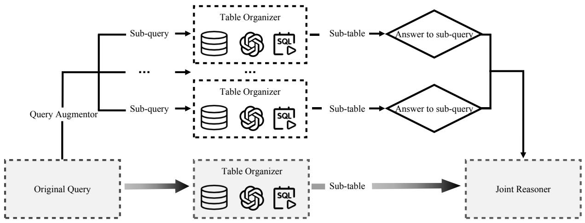
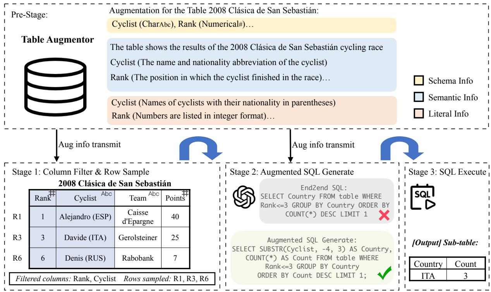
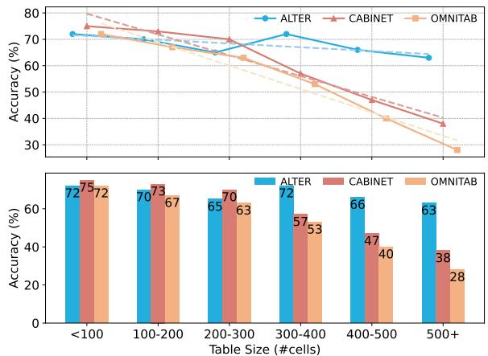
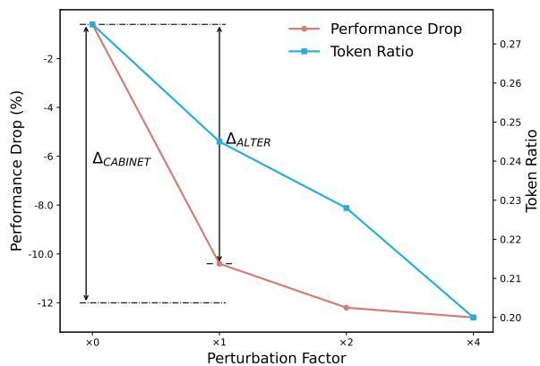

# ALTER: Augmentation for Large-Table-Based Reasoning

Han Zhang12 , Yuheng Ma12, Hanfang Yang12\*

1Center for Applied Statistics, Renmin University of China

2School of Statistics, Renmin University of China

{hanzhang0816,yma,hyang}@ruc.edu.cn

# Abstract

While extensive research has explored the use of large language models (LLMs) for tablebased reasoning, most approaches struggle with scalability when applied to large tables. To maintain the superior comprehension abilities of LLMs in these scenarios, we introduce AL-TER (Augmentation for Large Table-basEd Reasoning)-a framework designed to harness the latent augmentation potential in both freeform natural language (NL) questions, via the query augmentor, and semi-structured tabular data, through the table augmentor. By utilizing only a small subset of relevant data from the table and supplementing it with preaugmented schema, semantic, and literal information, ALTER achieves outstanding performance on table-based reasoning benchmarks. We provide a detailed analysis of our method in large-table scenarios, comparing competitive baselines with various table partitioning principles. Our method outperforms all other approaches and exhibits robustness and efficiency against perturbations in all large-table scenarios. Our code is available at https: //github.com/Hanzhang-lang/ALTER.

# 1 Introduction

Tabular data is one of the fundamental and critical semi-structured data types widely used in relational databases, spreadsheets, analysis reports, etc. Table-based reasoning tasks, such as table-based fact verification (FV) (Aly et al., 2021; Chen et al., 2020a; Ou and Liu, 2022) and table-based question answering (TQA) (Chen et al., 2020b; Pasupat and Liang, 2015; Lu et al., 2023; Cheng et al., 2022) require sophisticated reasoning over textual, numerical, and logical forms. Additionally, inference based on large-scale tables is in substantial practical demand and poses significant challenges for machine intelligence.

Recently, large language models (LLMs) have demonstrated remarkable proficiency in reasoning. The advent of LLMs has spurred a surge in research focusing on their application to tabular data, heralding what can be termed the LLM era (Zhang et al., 2024; Lu et al., 2024). Despite techniques following the pre-LLM era, such as fine-tuning methods, the latest LLM-based approaches have achieved results that are on par with or surpass those obtained through rule-based or pre-trained language model approaches (Liu et al., 2022; Gu et al., 2022; Jin et al., 2022), leveraging the contextual understanding capabilities of LLMs.

Mainstream techniques in the LLM era focus on designing prompts or pipelines that combine instructions with serialized natural language descriptions converted from tables, without additional training. The sequential text data is parsed by LLMs, transformed into executable code (e.g., SQL and Python) using symbolic code generation abilities (Zan et al., 2023; Cheng et al., 2023) or direct output for inference utilizing literal reasoning abilities (Jiang et al., 2023; Gong et al., 2020).

However, most table-based methods encounter three challenges when analyzing complex large tables. Firstly, in the process of converting table cells into natural language descriptions, the entire data is often expected to be included to provide enough comprehensive information (Cheng et al., 2023). This approach can sometimes face data leakage issues involving privacy concerns and may fail due to context length limitations. In addition, the excessive length of all tabular content introduces unnecessary computational resource consumption and potential bias. Secondly, table reasoning tasks often require numerical reasoning, data preparation, or key cell identification. LLMs alone may lack the robustness to address these tasks directly and can sometimes introduce inaccuracies or hallucinations in their outputs. As tables grow in size, reasoning about minor or nuanced details becomes even more difficult (Liu et al., 2024), and LLMs require careful design to enhance their expandability and robustness in such scenarios. Thirdly, relevant parts needed to derive the answer may be scattered in different places for a complex largetable reasoning task. Therefore, intricate queries cannot be answered directly or resolved through a single step of program execution. Although a couple of methods have been optimized for specific issues mentioned above, no approach simultaneously considers all these problems while extending table-based reasoning tasks to large-scale tables.

In consideration of the issues mentioned above, we propose a novel framework named ALTER to facilitate the understanding of tables and to scale effectively to large tables. Instead of utilizing the entire table data as contextual information throughout the process, we maintain the contextual length by fixing the number of rows input into LLMs and selectively filtering the pertinent columns. We enhance table comprehension by leveraging various types of augmented information. The query augmentor generates adaptations about the NL questions and the table augmentor generates interpretations about the table’s inherent structure and content. The token length of these contents exhibits robustness to variations in table size. In conjunction with augmented information, the well-organized filtered data is integrated with SQL executors and ultimately transformed into a more accessible format for joint reasoning, adhering to the proposed augment-filter-execute procedure.

In summary, our main contributions include: (i) We explore new augmentation methods for queries and tables that enhance table reasoning tasks. (ii) We propose a general framework and a novel augment-filter-execute procedure capable of scaling to large tables. (iii) We conduct extensive experiments on table reasoning benchmarks, demonstrating superior performance and exhibiting robustness to perturbations in large-table scenarios.

# 2 Related Work

Large Language Models for Table Reasoning. Primary approaches using LLMs to tackle table reasoning tasks involve fine-tuning a foundational model or directly utilizing in-context learning abilities unique to the LLM era. For fine-tuning methods, task-specific fine-tuning methods are designed. TaPas (Herzig et al., 2020) extends BERT’s (Devlin et al., 2019) architecture and enhances the understanding of tabular data by recovering masked cells. Models relying on logical codes (e.g., SQL) can further enhance the model’s reasoning ability. For example, Tapex (Liu et al., 2022) and OmniTab (Jiang et al., 2022) focus on generating SQL queries that are then executed to fetch relevant information.

Prompting technologies such as few-shot learning (Brown et al., 2020a), chain-of-thought reasoning (COT) (Wei et al., 2022), and agent-based methods (Wang et al., 2024a) can be correspondingly applied in table reasoning tasks. Chen (2023) first explores and demonstrates the feasibility of using LLMs in generic reasoning tasks. Binder (Cheng et al., 2023) shows symbolic languages are also beneficial for complex analysis with prompt methods. Chain-of-Table (Wang et al., 2024b), inspired by CoT prompting methods, uses tabular data in the reasoning chain as a proxy for intermediate thoughts. ReAcTable (Zhang et al., 2023) employs LLMs extending the ReAct framework to reason step-by-step and iteratively generates sub-tables using code executors. Dater (Ye et al., 2023) and DIN-SQL (Pourreza and Rafiei, 2023) break down table reasoning into multi-step inference by handcrafting pipeline.

Query Augmentation. In question-answering tasks, query augmentation or query rewriting is a prevalent method to bridge the gap between queries and facts. Within the framework of LLMs, tasks related to Retrieval-Augmented Generation (RAG) often involve various forms of query modification, including query rewriting, disambiguation, and decomposition (Gao et al., 2023). RQ-RAG (Chan et al., 2024) equips the model with multiple capabilities in multi-hop QA tasks. Ma et al. (2023) proposes Rewrite-Retrieve-Read pipeline which adapts the query itself. Step-Back Prompting (Zheng et al., 2024) presents a simple technique to derive highlevel concepts. Our method further supplements sampled table content to better suit the table question answering scenario.

Table Augmentation and Table sampling. Table augmentation involves the exploration of implicit table content. Mainstream methods include the incorporation of commonsense knowledge from search engines (Sui et al., 2023) or analytical knowledge (He et al., 2023; Jena et al., 2022) into inference processes. Sui et al. (2024) leverages the LLM itself to augment structural information using internal knowledge. Instead, the augmentation in the table augmentor is closely aligned with our ALTER framework, which is utilized throughout the process. For table sampling, Lin et al. (2023) fine-tune DPR (Karpukhin et al., 2020) to retrieve sub-tables and TabSQLify (Nahid and Rafiei, 2024) relies on SQL queries to decompose tables into relevant sub-tables.

```mermaid
graph TD
    A["Query Augmentor"] --> B["Original Query"]
    B --> C["Table Organizer"]
    C --> D["Sub-table"]
    D --> E{Answer to sub-query}
    E --> F["Joint Reasoner"]
    F --> G{Answer to sub-query}
    G --> H["Table Organizer"]
    H --> I["Sub-table"]
    I --> J["Table Organizer"]
    J --> K["Sub-table"]
    K --> L["Table Organizer"]
    L --> M["Table Organizer"]
    M --> N["Sub-table"]
    N --> O["Table Organizer"]
    O --> P["Table Organizer"]
    P --> Q["Sub-table"]
    Q --> R["Table Organizer"]
    R --> S["Table Organizer"]
    S --> T["Sub-table"]
    T --> U["Table Organizer"]
    U --> V["Table Organizer"]
    V --> W["Sub-table"]
    W --> X["Table Organizer"]
    X --> Y["Table Organizer"]
    Y --> Z["Sub-table"]
    Z --> AA["Table Organizer"]
    AA --> AB["Table Organizer"]
    AB --> AC["Sub-table"]
    AC --> AD["Table Organizer"]
    AD --> AE["Table Organizer"]
    AE --> AF["Sub-table"]
    AF --> AG["Table Organizer"]
    AG --> AH["Table Organizer"]
    AH --> AI["Sub-table"]
    AI --> AJ["Table Organizer"]
    AJ --> AK["Table Organizer"]
    AK --> AL["Sub-table"]
    AL --> AM["Table Organizer"]
    AM --> AN["Table Organizer"]
    AN --> AO["Sub-table"]
    AO --> AP["Table Organizer"]
    AP --> AQ["Table Organizer"]
    AQ --> AR["Sub-table"]
    AR --> AS["Table Organizer"]
    AS --> AT["Table Organizer"]
    AT --> AU["Sub-table"]
    AU --> AV["Table Organizer"]
    AV --> AW["Table Organizer"]
    AW --> AX["Sub-table"]
    AX --> AY["Table Organizer"]
    AY --> AZ["Table Organizer"]
    AZ --> BA["Sub-table"]
    BA --> BB["Table Organizer"]
    BB --> BC["Table Organizer"]
    BC --> BD["Sub-table"]
    BD --> BE["Table Organizer"]
    BE --> BF["Table Organizer"]
    BF --> BG["Sub-table"]
    BG --> BH["Table Organizer"]
    BH --> BI["Table Organizer"]
    BI --> BJ["Sub-table"]
    BJ --> BK["Table Organizer"]
    BK --> BL["Table Organizer"]
    BL --> BM["Sub-table"]
    BM --> BN["Table Organizer"]
    BN --> BO["Table Organizer"]
    BO --> BP["Sub-table"]
    BP --> BQ["Table Organizer"]
    BQ --> BR["Table Organizer"]
    BR --> BS["Sub-table"]
    BS --> BT["Table Organizer"]
    BT --> BU["Table Organizer"]
    BU --> BV["Sub-table"]
    BV --> BW["Table Organizer"]
    BW --> BX["Table Organizer"]
    BX --> BY["Sub-table"]
    BY --> BZ["Table Organizer"]
    BZ --> CA["Table Organizer"]
    CA --> CB["Sub-table"]
    CB --> CC["Table Organizer"]
    CC --> CD["Table Organizer"]
    CD --> CE["Sub-table"]
    CE --> CF["Table Organizer"]
    CF --> CG["Table Organizer"]
    CG --> CH["Sub-table"]
    CH --> CI["Table Organizer"]
    CI --> CJ["Table Organizer"]
    CJ --> CK["Sub-table"]
    CK --> CL["Table Organizer"]
    CL --> CM["Table Organizer"]
    CM --> CN["Sub-table"]
    CN --> CO["Table Organizer"]
    CO --> CP["Table Organizer"]
    CP --> CQ["Sub-table"]
    CQ --> CR["Table Organizer"]
    CR --> CS["Table Organizer"]
    CS --> CT["Sub-table"]
    CT --> CU["Table Organizer"]
    CU --> CV["Table Organizer"]
    CV --> CW["Sub-table"]
    CW --> CX["Table Organizer"]
    CX --> CY["Table Organizer"]
    CY --> CZ["Sub-table"]
    CZ --> DA["Table Organizer"]
    DA --> DB["Table Organizer"]
    DB --> DC["Sub-table"]
    DC --> DD["Table Organizer"]
    DD --> DE["Table Organizer"]
    DE --> DF["Sub-table"]
    DF --> DG["Table Organizer"]
    DG --> DH["Table Organizer"]
```



<details>
<summary>flowchart</summary>


</details>

Figure 1: The overview of the ALTER framework for table-based reasoning. The gray background box symbolizes the primary reasoning workflow. Above it, each sub-query generated by the query augmentor is processed in parallel by the table organizer and ultimately transformed into informative demonstrations that aid in understanding the original query. The primary sub-table and relevant information is received by the joint reasoner.

# 3 Preliminary

In this section, we introduce the definition of table reasoning tasks. Table reasoning requires reasoning over both free-form text and inherently structured tables. Given the triplet $( T , Q , A )$ , where table $T = \{ c _ { i } \} _ { i = 1 } ^ { C } , C$ represents the number of column features in the table. Note that we do not represent the table in cell format as we expect the table under investigation to adhere to certain norms inherently. Q signifies a query or claim related to the table, and A denotes the answer.

We specifically focus on the table question answering and fact verification tasks. In the table question answering tasks, Q and A correspond to the query and expected answers in natural language form, respectively. In the table fact verification task, Q represents a claim about the table, and the final answer $A \in \{ 0 , 1 \}$ where 0 indicates falsity and 1 indicates truth regarding the input claim.

# 4 Methodology

# 4.1 Overview

In this work, we assume that semi-structured tabular data is rich in latent information beyond its raw data values. This information suggests that data storage adheres to certain common patterns or field semantics, facilitating the inference of the overall data distribution from a minimal sample of data. Inspired by knowledge-fusion models for metadata inference (He et al., 2023) and the inherent knowledge-retrieving ability of LLMs (Sui et al., 2024), we utilize LLMs to uncover patterns and semantics within tables, which helps to understand and operate data correctly. The entire workflow is illustrated in Figure 1, with detailed steps outlined in Algorithm 1 in the appendix. In our framework, the full content of the table is not included in the prompt; only K sampled rows are observable. Nevertheless, the reasoning effect is ensured through the inclusion of elaborately augmented information. The framework seamlessly accommodates large-scale tables, as the model is preendowed with comprehensive information about the data structure and content prior to inference. As illustrated in Figure 1, our proposed system ALTER, consists of three core components:

Query Augmentor: This component enhances the original query by generating multiple subqueries, each examining the original query from different perspectives. Compared to the partial original query, this component comprehensively provides more information through the subsequent table organizer.

Table Organizer: Given the input query, this component utilizes the augment-filter-execute procedure. It first guides LLMs to perform data mining, enriching the raw data with augmented table content, then filters the data to retain only highly relevant rows and columns, and finally employs an SQL executor to derive an accessible sub-table for



<details>
<summary>flowchart</summary>

```mermaid
graph TD
    A["Pre-Stage: Table Augmentor"] --> B["Augmentation for the Table 2008 Clásica de San Sebastián: Cyclist (CharAbc), Rank (Numerical#)"]
    B --> C["The table shows the results of the 2008 Clásica de San Sebastián cycling race"]
    B --> D["Cyclist (The name and nationality abbreviation of the cyclist)<br>Rank (The position in which the cyclist finished in the race)"]
    B --> E["Cyclist (Names of cyclists with their nationality in parentheses)<br>Rank (Numbers are listed in integer format)"]
    C --> F["Schema Info"]
    C --> G["Semantic Info"]
    C --> H["Literal Info"]
    I["Stage 1: Column Filter & Row Sample 2008 Clásica de San Sebastián"] --> J["Aug info transmit"]
    J --> K["Stage 2: Augmented SQL Generate"]
    K --> L["End2end SQL: SELECT Country FROM table WHERE<br>Rank<=3 GROUP BY Country ORDER BY<br>COUNT(*) DESC LIMIT 1"]
    K --> M["Augmented SQL Generate: SELECT SUBSTR(Cyclist, -4, 3) AS Country,<br>COUNT(*) AS Count FROM table WHERE<br>Rank<=3 GROUP BY Country<br>ORDER BY Count DESC LIMIT 1; ✓"]
    N["Stage 3: SQL Execute"] --> O["[Output"] Sub-table:]
    P["Filtered columns: Rank, Cyclist Rows sampled: R1, R3, R6"] --> Q["Country Count<br>ITA 3"]
```
</details>

Figure 2: Illustration of the table organizer. The augmented information from the table augmentor is utilized in stage 1 and stage 2. In the example depicted in the figure, the model leverages the augmented information to accurately identify relevant columns and correctly parse nationalities within the table, ultimately producing the correct execution sub-table.

final inference.

Joint Reasoner: This component efficiently performs reasoning and aggregation for the query augmentor and the primary workflow.

# 4.2 Query Augmentor

One of the primary challenges in naive Question Answering (QA) lies in its direct reliance on the user’s original query as the basis. In tabular reasoning scenarios, an imprudent query can lead to the model focusing on one partially biased part in the table. We propose a novel improvement method for the query part, which enables the LLMs to utilize the multi-query technique to address the original query from multiple perspectives. Each sub-query undergoes the reasoning process via the table organizer module, with this process being conducted in parallel. The model can utilize each independent reasoning module to attend to different parts within the table and extract information pertinent to answering the original query.

We propose two query augmentation methods: step-back augmentation and sub-query augmentation. The step-back prompting method (Zheng et al., 2024) has been empirically validated as effective in the RAG domain. We equip it with sampled sub-table information, which aims to obtain more abstract-level comprehension within the table through query rewriting. LLMs are shown to be stronger at sequentially solving sub-problems than directly solving a complex problem (Zhou et al., 2022a). The sub-query augmentation method decomposes complex queries into sub-queries, enabling LLMs to more easily locate the relevant information within each sub-query. Specifically, we leverage LLMs to generate distinct sub-queries based on the rewrite or decomposition demand. Detailed prompts for both augmentation methods are provided in Appendix F.

# 4.3 Table Organizer

The table organizer is the core component of the reasoning process. We do not use the entire table data as contextual information; instead, we further filter the column features of the table, as detailed in Section 4.3.2. To maintain model performance without accessing full data, we employ the augment-filter-execute strategy. By pre-analyzing the table’s schema, semantic, and literal information using LLMs, sufficient supplementary information required by the query is provided. Notably, the augmented information does not increase commensurately with the table size. Therefore, our method can exhibit strong robustness to variations in table size.

The table organizer primarily encompasses one preparatory stage and three reasoning stages, as illustrated in Figure 2. During the preparatory stage, the table augmentor augments and stores enhanced information at various levels for subsequent processing. Schema information is utilized for standardizing the table content. In stage 1, semantic information is employed to identify relevant columns. Rows are sampled based on semantic similarity. In stage 2, with the filtered sub-table, the augmented information transmitted can be further simplified. We utilize literal and semantic information and leverage text-to-SQL capabilities of LLMs to generate high-quality SQL. The SQL query is executed, and the final sub-table is retrieved.

# 4.3.1 Table Augmentor

The table augmentor aims to convey extra information hidden inherently in the table and column features, beyond the raw data itself. The augmentation process occurs prior to the official reasoning process, as illustrated in Figure 2.

It’s worth noting that we can link this process to real large database systems or table applications (Xue et al., 2023). In standard database systems, extensive work on data cleaning and normalization must be undertaken. In real-world databases, column names are often represented by uppercase abbreviations or meaningless encrypted codes. The data stored may be formatted with abstract symbols, posing challenges in generating SQL queries accurately. Therefore, the table schemas typically require pre-defined, with the semantics of column features specified in advance. Hierarchical meta information will be synchronized, including information about the database, tables, and data stored. In such cases, we can simplify the steps of our table augmentor by migrating pre-defined augmented information.

In this paper, we leverage LLMs’ inherent knowledge extraction capabilities to augment table information based on the filtered sub-table. Specifically, we design three different augmentation types to suit the needs of downstream stages: schema information, semantic information, and literal representation. The prompt for each category of augmentation is detailed in Appendix F.

Schema information primarily represents the data types of features stored in tables, which facilitates inferring and unifying data formats when reasoning over tables. We extracted three commonly used types in daily analysis: Numerical, Char, and Date types. These types are utilized to standardize and transform table data. Special symbols are preprocessed for Numerical and Char data, and different date representations are uniformly formatted for the Date type. The features ultimately stored in the database for SQL manipulation are transformed into corresponding data types.

Semantic information primarily includes the global semantic information of the table and the semantics about column features. The global table information provide clues for identifying the relevant domain of the table. Utilizing featurespecific semantic information, LLMs can more accurately locate features related to the query. Specifically, when columns are named using acronyms or aliases, the imparted semantics can be pivotal for analysis. The semantic information is transmitted for column filtering in stage 1 and augmented SQL generation in stage 2.

• SQL queries often fail to accurately parse the correct format stored in the table. Chain-of-Table (Wang et al., 2024b) improves this by using multiple chain calls. However, by explicitly informing LLMs about the raw data representation format within the table through literal information, the model performs better in the generation of correctly formatted SQL queries in a single LLM call. Unlike semantic information, literal information focuses on the representation format of the data (e.g., extra parentheses, calculation formulas, special expressions), which is efficient for SQL generation.

# 4.3.2 Column Filter and Row Sample

Irrelevant table content in the prompt can lead to unnecessary computations and quality regression issues (Sui et al., 2023), especially in scenarios involving large tables. We retain a small number of columns and rows from the original table. Unless otherwise specified, we set K = 3 in this paper, meaning the model can only access three rows of data relevant to the question throughout the process. However, through the table augmentor, we can obtain globally enhanced table information. Specifically, we first store the index of the vector representation of each row content, and search for K rows based on embedding-based semantic similarity between each row and the utterance. Subsequently, a powerful LLM is utilized to select columns relevant to the query, excluding irrelevant ones. The prompt for column filtering is detailed in Appendix F. During the column pick, the augmented information is also used for comprehensive understanding. This module ensures that the scale of the sub-table passed to LLMs remains consistent regardless of the size of the original table.

# 4.4 Joint Reasoner

The Joint Reasoner is responsible for integrating upstream information to perform the final reasoning. To avoid interference from entirely irrelevant information, sub-queries that cannot be answered are discarded. Valid sub-queries are transformed into effective descriptions. These demonstrations are combined with the sub-table from the primary workflow to collectively aid in answering the original query. Please refer to Appendix F for further details and more comprehensive prompts. We leverage step-by-step reasoning capabilities of LLMs to arrive at the final answer.

# 5 Experiment

In this section, we first introduce the datasets and evaluation metrics. We compare ALTER with the baseline methods and present the results in Sections 5.2 and 5.3. The ablation study and analysis of large-table scenarios are discussed in Sections 5.4 and 5.5, respectively. Additional implementation details are provided in Appendix A.

# 5.1 Datasets and Evaluation Metrics

We evaluate our proposed method on two widelyused table-based reasoning benchmarks, WikiTQ (Pasupat and Liang, 2015) and TabFact (Chen et al., 2020a). For the table-based fact verification task, we adopt the TabFact dataset, which contains various statements based on Wikipedia tables. We evaluate the dataset using binary classification accuracy on the small-test set containing 1998 statements with 298 different tables.

For the table reasoning task, we adopt WikiTable-Question (WikiTQ), which contains open-domain tables accompanied by complex questions. We use denotation accuracy as our evaluation metric, which evaluates the predicted answers based on the gold ones. We evaluate our method on the test set containing 4344 samples from 421 different tables.

Table 1: Results of different methods on WikiTQ and Tab-Fact.1 (We use underline to denote the second-best performance, bold to denote the best performance for each region: Pre-LLM era, LLM era with result ensemble and without ensemble) 

<table><tr><td rowspan="2">Method</td><td colspan="2">Acc (%)</td></tr><tr><td>WIKITQ</td><td>TABFACT</td></tr><tr><td colspan="3">♥ Pre-LLM era</td></tr><tr><td>TAPEX (Liu et al., 2022)</td><td>57.2</td><td>85.9</td></tr><tr><td>TaCube (Zhou et al., 2022b)</td><td>60.8</td><td>-</td></tr><tr><td>ReasTAP (Zhao et al., 2022)</td><td>58.6</td><td>86.2</td></tr><tr><td>OmniTab (Jiang et al., 2022)</td><td>62.7</td><td>-</td></tr><tr><td>CABINET (Patnaik et al., 2024)</td><td>69.1</td><td>-</td></tr><tr><td>PASTA (Gu et al., 2022)</td><td>-</td><td>90.8</td></tr><tr><td colspan="3">♠ LLM era</td></tr><tr><td>Binder (Cheng et al., 2023)</td><td>55.1</td><td>85.1</td></tr><tr><td>Dater w SC (Ye et al., 2023)</td><td>69.0</td><td>85.4</td></tr><tr><td>ReAcTable w s-vote (Zhang et al., 2023)</td><td>68.0</td><td>86.1</td></tr><tr><td>Mix SC w SC (Liu et al., 2023)</td><td>73.7</td><td>-</td></tr><tr><td>Chain-of-Table (Wang et al., 2024b)</td><td>67.3</td><td>86.6</td></tr><tr><td>ALTER (ours) w SC</td><td>70.7</td><td>87.2</td></tr><tr><td>Dater w/o sc (Ye et al., 2023)</td><td>65.0</td><td>83.5</td></tr><tr><td>ReAcTable (Zhang et al., 2023)</td><td>65.8</td><td>83.1</td></tr><tr><td>Mix SC w/o SC (Liu et al., 2023)</td><td>64.2</td><td>-</td></tr><tr><td>ALTER (ours) w/o SC</td><td>67.4</td><td>84.3</td></tr></table>

# 5.2 Baselines

We compare the proposed ALTER with a range of advanced reasoning frameworks for table-based tasks. The baseline methods for comparison can be categorized into two types: mainstream techniques following the pre-LLM era and techniques unique to the LLM era. For the techniques following the pre-LLM era, we select TAPEX (Liu et al., 2022), ReasTAP (Zhao et al., 2022), TaCube (Zhou et al., 2022b), OmniTab (Jiang et al., 2022), CABINET (Patnaik et al., 2024). For the techniques unique to the LLM era, we select Binder (Cheng et al., 2023), Dater (Ye et al., 2023), ReAcTable (Zhang et al., 2023), Mix SC (Liu et al., 2023), Chain-of-Table (Wang et al., 2024b). Additionally, generating multiple reasoning paths and ultimately choosing the most consistent answer through voting or self-consistency (Wang et al., 2022) can enhance the performance of LLMs. Therefore, for the techniques unique to the LLM era, we report two types of results for those methods employing result ensemble techniques.

# 5.3 Results

We present the results on the WikiTQ and TabFact datasets. The experimental outcomes are summarized in Table 1. From the results, we observe that ALTER method achieves comparatively outstanding outcomes. Specifically, on the WikiTQ dataset, while the Mix SC method do marginally outperforms our method by aggregating multiple reasoning paths (with 10 sampling times), ALTER still managed to exceed the performance of all other methods under comparison. Notably, AL-TER demonstrates the best performance in singleround reasoning among all other methods that utilize result ensemble techniques in the LLM era. This demonstrates the robust performance of our method in reasoning tasks, which can be attributed to the reinforced information provided by the query augmentor and our innovative modular procedure within the table organizer.

Table 2: Ablation results of query augmentor on the test sets of WikiTQ and TabFact. 

<table><tr><td rowspan="2">Methods</td><td colspan="3">TABFACT</td><td colspan="3">WIKITQ</td></tr><tr><td>All</td><td>Simple</td><td>Hard</td><td>All</td><td>Simple</td><td>Hard</td></tr><tr><td>ALTER</td><td>84.3</td><td>90.7</td><td>78.2</td><td>67.4</td><td>71.2</td><td>63.4</td></tr><tr><td>w/o step-back</td><td>82.3 (↓ 2.0)</td><td>89.5 (↓ 0.9)</td><td>75.4 (↓ 2.8)</td><td>64.5 (↓ 2.9)</td><td>68.2 (↓ 3.0)</td><td>60.5 (↓ 2.9)</td></tr><tr><td>w/o sub-query</td><td>82.4 (↓ 1.9)</td><td>90.6 (↓ 0.1)</td><td>74.6 (↓ 3.6)</td><td>65.4 (↓ 2.0)</td><td>69.7 (↓ 1.5)</td><td>60.8 (↓ 2.6)</td></tr></table>

# 5.4 Ablation Study

We carry out an ablation study to assess the impact of various components on the performance of our methods, as well as to explore the relationship between the pure table data and the inherent augmentation information.

Analysis of the Query Augmentor. To analyze the impact of two query augmentation methods in the query augmentor. We conducted experiments on two datasets by discarding the step-back augmentation module (denoted as w/o step-back) and the sub-query augmentation module (denoted as w/o sub-query). For each dataset, we further categorized the questions based on the difficulty level, following Ye et al. (2023). This stratification facilitates a more comprehensive evaluation of each module’s impact across different types of questions. The ablation test results are reported in Table 2. From the results in the table, it is anticipated that employing both augmentation methods simultaneously yields the best performance under all experimental settings. For WikiTQ datasets, the accuracy of ALTER without step-back/sub-query augmentation drops by 2.9%/2.0%, demonstrating the necessity of augmented information from multiqueries. Furthermore, on the TabFact datasets, both augmentation methods have a much larger impact on hard questions than on simple questions. This indicates that the augmented information provided by the query augmentor is particularly effective in dealing with complex questions.

Table 3: Ablation results of different values of rows sampled, i.e., K and with or without augmented information on the WikiTQ and TabFact. (improvement measured against the data relative to the position on the bottom-left.) 

<table><tr><td rowspan="2"></td><td colspan="2">WIKITQ</td><td colspan="2">TABFACT</td></tr><tr><td>w/o aug</td><td>w/ aug</td><td>w/o aug</td><td>w/ aug</td></tr><tr><td>K=0</td><td>45.5</td><td>62.2</td><td>67.1</td><td>77.2</td></tr><tr><td>K=1</td><td>59.2</td><td>65.0 (+1.7)</td><td>80.5</td><td>82.4 (+0.5)</td></tr><tr><td>K=3</td><td>63.3</td><td>67.4</td><td>81.9</td><td>84.3</td></tr></table>

Analysis of Pure Data & Augmentation. In our experiments, we primarily utilized K = 3 rows of data as contextual information. To explore the relationship between pure table data and the augmented information in the table organizer, we conducted ablation experiments varying the value of K and the augmentation process. Results are shown in Table 3. We observe that methods utilizing augmented information exhibit significant performance improvements compared to those without augmented information. We also note that the concurrent absence of augmented information and data provision leads to a catastrophic decline in model performance. Notably, on both datasets, using only one row of data with augmented information achieves comparable performance to using three rows of data. Similar trends can also be observed in other settings. This validates that when the model is limited to a small portion of data, the table augmentor serves as a beneficial auxiliary tool, providing additional insights into the table’s content.

# 5.5 Large Table Analysis

LLMs often struggle to interpret tables within largescale scenarios, leading to hallucinations and errors. To the best of our knowledge, nearly all methods encounter a decline in model performance as the table size increases when handling large tables.

Comparison under Large Table Scenarios. To demonstrate the effectiveness of the ALTER framework in large-scale scenarios, we compare the performance of our framework across different table sizes in this section. We selected various table partitioning principles and different types of methods for a systematic evaluation. For table partitioning, we employed two approaches based on the token count and the number of cells. For the models, representative methods from both the LLM era and the pre-LLM era are chosen.

Table 4: Comparison of methods in the LLM era with tables divided by token count on WikiTQ. (underline denotes the second-best performance; bold denotes the best performance) 

<table><tr><td rowspan="2">Methods</td><td colspan="3">TABLE SIZE</td></tr><tr><td>Small (&lt;2k)</td><td>Medium (2k~4k)</td><td>Large (&gt;4k)</td></tr><tr><td>Binder</td><td>56.5</td><td>26.1</td><td>6.4</td></tr><tr><td>Dater</td><td>62.5</td><td>42.3</td><td>34.6</td></tr><tr><td>Chain-of-Table</td><td>68.1</td><td>52.3</td><td>44.9</td></tr><tr><td>ALTER (ours)</td><td>71.7 (+3.6)</td><td>65.2 (+12.9)</td><td>65.9 (+21.0)</td></tr></table>

  
Figure 3: Comparison of methods following pre-LLM era with tables divided by cell count on WikiTQ. In the subplot above, the regression curves of different models are represented by dashed lines in different colors. The regression curve for ALTER exhibits a significantly slower decline rate.

Figure 3 shows the comparison results of AL-TER and methods following the pre-LLM era, including CABINET and OMNITAB, partitioning tables in the WikiTQ dataset by the number of cells. In Table 4, we present the results based on different table sizes divided by the token count in the WikiTQ dataset, comparing our method with Dater, Chain-of-TABLE, and Binder unique to the LLM era. Table 4 shows that ALTER significantly outperforms all three methods in the LLM era across different table sizes. The performance improvement is particularly noteworthy when dealing with large tables. In Figure 3, our model demonstrates a much slower performance decline as the model size increases compared to the other two methods. As the size of the table increases, both CABINET and OMNITAB exhibit a monotonous decline in performance. However, our method shows a brief reversal with an increase in performance observed in the intermediate range, indicating the robustness and insensitivity of our approach to changes in table size. Our model significantly outperforms the other two methods when the table size exceeds a certain threshold (> 300 cells). Specifically, in the 300 − 400, 400 − 500, and 500+ cell categories, our model exceeds their performance by at least 15%, 19%, and 25%, respectively. From the results, it is evident that our method exhibits exceptional performance in large tables.

Robustness and Efficiency Analysis. We examined ALTER’s robustness to noise perturbations and token efficiency in large-scale scenarios. By adding random rows based on different perturbation factors, we introduced noise to each table in WikiTQ, details of perturbations can be found in Appendix E. From Figure 4, we illustrate that as the degree of perturbation increases, the proportion of tokens utilized of the whole table by ALTER decreases. It can be observed that the initial fluctuation has the most significant effect, yet our model still outperforms the compared method (9.8% AL-TER v.s. 11.4% CABINET). Concurrently, the decline in the framework’s performance degree slows down. This indicates that our method efficiently maintains robust performance in large-table scenarios by narrowing down the scope of larger tables.



<details>
<summary>line</summary>

| Perturbation Factor | Performance Drop (%) | Token Ratio |
| ------------------- | --------------------- | ----------- |
| x0                  | -1.0                  | 0.27        |
| x1                  | -10.0                 | 0.24        |
| x2                  | -11.5                 | 0.23        |
| x4                  | -12.5                 | 0.20        |
</details>

Figure 4: Relative performance drop and the ratio drop of the table tokens utilized by ALTER to the total token count over the table as the number of rows added increases by multiples (i.e., perturbation factor) on WikiTQ. Specifically, the performance drop for CABINET and ALTER is marked at the factor of 1.

# 5.6 Case Study

In Appendix B, we present a case study illustrates how each component of the augmented information in ALTER framework contributes to accurate comprehension or leads to errors. When addressing complex problems, without the assistance of the augmentation process, the model may focus on biased information or experience hallucinations when generating SQL. However, when the augmented information is explicitly provided, the model can identify the region containing the correct information or generate syntactically correct SQL, thereby delivering accurate responses.

# 6 Conclusion

We propose a framework, namely ALTER, which significantly optimizes model performance on large-scale tables. Within this framework, we extract inherent information pertinent to the questions and tables. By leveraging an augment-filterexecute process as the core reasoning workflow, ALTER demonstrates superior performance in handling large tables. We believe ALTER can bridge the gap between table reasoning methodologies and real-world analysis and bring insights into understanding the way LLMs comprehend tables.

# Limitations

ALTER is designed to generalize to large table reasoning tasks, but our method still faces some limitations. Our approach relies partly on the degree of structured and standardized storage of tables, meaning that if the table structure is totally disordered or lacks a certain level of standardization, our model’s performance will degrade, for instance, when headers and data are intermixed. Additionally, the combination methods of different augmented information can be explored further. Due to the page limits, we will leave these explorations for future work.

# Acknowledgment

Hanfang Yang is the corresponding author. The authors would like to thank the reviewers for their constructive comments, which led to a significant improvement in this work. The research is supported by the Special Funds of the National Natural Science Foundation of China (Grant No. 72342010). Yuheng Ma is supported by the Outstanding Innovative Talents Cultivation Funded Programs 2024 of Renmin University of China. This research is also supported by Public Computing Cloud, Renmin University of China.

# References

Rami Aly, Zhijiang Guo, Michael Schlichtkrull, James Thorne, Andreas Vlachos, Christos Christodoulopoulos, Oana Cocarascu, and Arpit Mittal. 2021. Feverous: Fact extraction and verification over unstructured and structured information. arXiv preprint arXiv:2106.05707.   
Tom Brown, Benjamin Mann, Nick Ryder, Melanie Subbiah, Jared D Kaplan, Prafulla Dhariwal, Arvind Neelakantan, Pranav Shyam, Girish Sastry, Amanda Askell, et al. 2020a. Language models are few-shot learners. Advances in neural information processing systems, 33:1877–1901.   
Tom B. Brown, Benjamin Mann, Nick Ryder, Melanie Subbiah, Jared Kaplan, Prafulla Dhariwal, Arvind Neelakantan, Pranav Shyam, Girish Sastry, Amanda Askell, Sandhini Agarwal, Ariel Herbert-Voss, Gretchen Krueger, Tom Henighan, Rewon Child, Aditya Ramesh, Daniel M. Ziegler, Jeffrey Wu, Clemens Winter, Christopher Hesse, Mark Chen, Eric Sigler, Mateusz Litwin, Scott Gray, Benjamin Chess, Jack Clark, Christopher Berner, Sam McCandlish, Alec Radford, Ilya Sutskever, and Dario Amodei. 2020b. Language models are few-shot learners. In Proceedings of the 34th International Conference on Neural Information Processing Systems, NIPS ’20, Red Hook, NY, USA. Curran Associates Inc.   
Chi-Min Chan, Chunpu Xu, Ruibin Yuan, Hongyin Luo, Wei Xue, Yike Guo, and Jie Fu. 2024. RQ-RAG: Learning to refine queries for retrieval augmented generation. arXiv preprint arXiv:2404.00610.   
Wenhu Chen. 2023. Large language models are few(1)- shot table reasoners. In Findings of the Association for Computational Linguistics: EACL 2023, pages 1120–1130, Dubrovnik, Croatia. Association for Computational Linguistics.   
Wenhu Chen, Hongmin Wang, Jianshu Chen, Yunkai Zhang, Hong Wang, Shiyang Li, Xiyou Zhou, and William Yang Wang. 2020a. Tabfact: A large-scale dataset for table-based fact verification. In 8th International Conference on Learning Representations, ICLR 2020, Addis Ababa, Ethiopia, April 26-30, 2020.   
Wenhu Chen, Hanwen Zha, Zhiyu Chen, Wenhan Xiong, Hong Wang, and William Yang Wang. 2020b. HybridQA: A Dataset of Multi-Hop Question Answering over Tabular and Textual Data. In Findings of the Association for Computational Linguistics: EMNLP 2020, pages 1026–1036, Online. Association for Computational Linguistics.   
Zhoujun Cheng, Haoyu Dong, Zhiruo Wang, Ran Jia, Jiaqi Guo, Yan Gao, Shi Han, Jian-Guang Lou, and Dongmei Zhang. 2022. HiTab: A hierarchical table

dataset for question answering and natural language generation. In Proceedings of the 60th Annual Meeting of the Association for Computational Linguistics (Volume 1: Long Papers), pages 1094–1110, Dublin, Ireland. Association for Computational Linguistics.   
Zhoujun Cheng, Tianbao Xie, Peng Shi, Chengzu Li, Rahul Nadkarni, Yushi Hu, Caiming Xiong, Dragomir Radev, Mari Ostendorf, Luke Zettlemoyer, Noah A. Smith, and Tao Yu. 2023. Binding language models in symbolic languages. In The Eleventh International Conference on Learning Representations, ICLR 2023,Kigali, Rwanda, May 1-5, 2023.   
Jacob Devlin, Ming-Wei Chang, Kenton Lee, and Kristina Toutanova. 2019. BERT: Pre-training of deep bidirectional transformers for language understanding. In Proceedings of the 2019 Conference of the North American Chapter of the Association for Computational Linguistics: Human Language Technologies, Volume 1 (Long and Short Papers), pages 4171–4186, Minneapolis, Minnesota. Association for Computational Linguistics.   
Yunfan Gao, Yun Xiong, Xinyu Gao, Kangxiang Jia, Jinliu Pan, Yuxi Bi, Yi Dai, Jiawei Sun, and Haofen Wang. 2023. Retrieval-augmented generation for large language models: A survey. arXiv preprint arXiv:2312.10997.   
Heng Gong, Yawei Sun, Xiaocheng Feng, Bing Qin, Wei Bi, Xiaojiang Liu, and Ting Liu. 2020. Tablegpt: Few-shot table-to-text generation with table structure reconstruction and content matching. In Proceedings of the 28th International Conference on Computational Linguistics, pages 1978–1988, Barcelona, Spain (Online). International Committee on Computational Linguistics.   
Zihui Gu, Ju Fan, Nan Tang, Preslav Nakov, Xiaoman Zhao, and Xiaoyong Du. 2022. PASTA: Tableoperations aware fact verification via sentence-table cloze pre-training. In Proceedings of the 2022 Conference on Empirical Methods in Natural Language Processing, pages 4971–4983, Abu Dhabi, United Arab Emirates. Association for Computational Linguistics.   
Xinyi He, Mengyu Zhou, Mingjie Zhou, Jialiang Xu, Xiao Lv, Tianle Li, Yijia Shao, Shi Han, Zejian Yuan, and Dongmei Zhang. 2023. Anameta: A table understanding dataset of field metadata knowledge shared by multi-dimensional data analysis tasks. In Findings of the Association for Computational Linguistics: ACL 2023, pages 9471–9492.   
Jonathan Herzig, Pawel Krzysztof Nowak, Thomas Müller, Francesco Piccinno, and Julian Martin Eisenschlos. 2020. Tapas: Weakly supervised table parsing via pre-training. In Proceedings of the 58th Annual Meeting of the Association for Computational Linguistics, ACL 2020, Online, July 5-10, 2020, pages 4320–4333.   
Aashna Jena, Vivek Gupta, Manish Shrivastava, and Julian Eisenschlos. 2022. Leveraging data recasting

to enhance tabular reasoning. In Findings of the Association for Computational Linguistics: EMNLP 2022, pages 4483–4496, Abu Dhabi, United Arab Emirates. Association for Computational Linguistics.

Jinhao Jiang, Kun Zhou, Zican Dong, Keming Ye, Xin Zhao, and Ji-Rong Wen. 2023. StructGPT: A general framework for large language model to reason over structured data. In Proceedings of the 2023 Conference on Empirical Methods in Natural Language Processing, pages 9237–9251, Singapore. Association for Computational Linguistics.

Zhengbao Jiang, Yi Mao, Pengcheng He, Graham Neubig, and Weizhu Chen. 2022. OmniTab: Pretraining with natural and synthetic data for few-shot tablebased question answering. In Proceedings of the 2022 Conference of the North American Chapter of the Association for Computational Linguistics: Human Language Technologies, pages 932–942, Seattle, United States. Association for Computational Linguistics.

Nengzheng Jin, Joanna Siebert, Dongfang Li, and Qingcai Chen. 2022. A survey on table question answering: recent advances. In China Conference on Knowledge Graph and Semantic Computing, pages 174– 186. Springer.

Jeff Johnson, Matthijs Douze, and Hervé Jégou. 2019. Billion-scale similarity search with GPUs. IEEE Transactions on Big Data, 7(3):535–547.

Vladimir Karpukhin, Barlas Oguz, Sewon Min, Patrick Lewis, Ledell Wu, Sergey Edunov, Danqi Chen, and Wen-tau Yih. 2020. Dense passage retrieval for opendomain question answering. In Proceedings of the 2020 Conference on Empirical Methods in Natural Language Processing (EMNLP), pages 6769–6781, Online. Association for Computational Linguistics.

Weizhe Lin, Rexhina Blloshmi, Bill Byrne, Adria de Gispert, and Gonzalo Iglesias. 2023. An inner table retriever for robust table question answering. In Proceedings of the 61st Annual Meeting of the Association for Computational Linguistics (Volume 1: Long Papers), pages 9909–9926, Toronto, Canada. Association for Computational Linguistics.

Nelson F Liu, Kevin Lin, John Hewitt, Ashwin Paranjape, Michele Bevilacqua, Fabio Petroni, and Percy Liang. 2024. Lost in the middle: How language models use long contexts. Transactions of the Association for Computational Linguistics, 12:157–173.

Qian Liu, Bei Chen, Jiaqi Guo, Morteza Ziyadi, Zeqi Lin, Weizhu Chen, and Jian-Guang Lou. 2022. TAPEX: table pre-training via learning a neural SQL executor. In The Tenth International Conference on Learning Representations, ICLR 2022, Virtual Event, April 25-29, 2022.

Tianyang Liu, Fei Wang, and Muhao Chen. 2023. Rethinking tabular data understanding with large language models. arXiv preprint arXiv:2312.16702.

Pan Lu, Liang Qiu, Kai-Wei Chang, Ying Nian Wu, Song-Chun Zhu, Tanmay Rajpurohit, Peter Clark, and Ashwin Kalyan. 2023. Dynamic prompt learning via policy gradient for semi-structured mathematical reasoning. In The Eleventh International Conference on Learning Representations, ICLR 2023,Kigali, Rwanda, May 1-5, 2023.   
Weizheng Lu, Jiaming Zhang, Jing Zhang, and Yueguo Chen. 2024. Large language model for table processing: A survey. arXiv preprint arXiv:2402.05121.   
Xinbei Ma, Yeyun Gong, Pengcheng He, Hai Zhao, and Nan Duan. 2023. Query rewriting in retrievalaugmented large language models. In Proceedings of the 2023 Conference on Empirical Methods in Natural Language Processing, pages 5303–5315, Singapore. Association for Computational Linguistics.   
Md Nahid and Davood Rafiei. 2024. TabSQLify: Enhancing reasoning capabilities of LLMs through table decomposition. In Proceedings of the 2024 Conference of the North American Chapter of the Association for Computational Linguistics: Human Language Technologies (Volume 1: Long Papers), pages 5725–5737, Mexico City, Mexico. Association for Computational Linguistics.   
Suixin Ou and Yongmei Liu. 2022. Learning to generate programs for table fact verification via structureaware semantic parsing. In Proceedings of the 60th Annual Meeting of the Association for Computational Linguistics (Volume 1: Long Papers), pages 7624– 7638, Dublin, Ireland. Association for Computational Linguistics.   
Panupong Pasupat and Percy Liang. 2015. Compositional semantic parsing on semi-structured tables. In Proceedings of the 53rd Annual Meeting of the Association for Computational Linguistics and the 7th International Joint Conference on Natural Language Processing of the Asian Federation of Natural Language Processing, ACL 2015, July 26-31, 2015, Beijing, China, Volume 1: Long Papers, pages 1470– 1480.   
Sohan Patnaik, Heril Changwal, Milan Aggarwal, Sumit Bhatia, Yaman Kumar, and Balaji Krishnamurthy. 2024. CABINET: Content relevance-based noise reduction for table question answering. In The Twelfth International Conference on Learning Representations,ICLR 2024, Vienna, Austria, May 7-11, 2024.   
Mohammadreza Pourreza and Davood Rafiei. 2023. DIN-SQL: Decomposed in-context learning of textto-sql with self-correction. In Advances in Neural Information Processing Systems, volume 36, pages 36339–36348. Curran Associates, Inc.   
Yuan Sui, Mengyu Zhou, Mingjie Zhou, Shi Han, and Dongmei Zhang. 2024. Table meets llm: Can large language models understand structured table data? a benchmark and empirical study. In Proceedings of the 17th ACM International Conference on Web Search and Data Mining, WSDM ’24, page 645–654,

New York, NY, USA. Association for Computing Machinery.   
Yuan Sui, Jiaru Zou, Mengyu Zhou, Xinyi He, Lun Du, Shi Han, and Dongmei Zhang. 2023. Tap4llm: Table provider on sampling, augmenting, and packing semistructured data for large language model reasoning. arXiv preprint arXiv:2312.09039.   
Lei Wang, Chen Ma, Xueyang Feng, Zeyu Zhang, Hao Yang, Jingsen Zhang, Zhiyuan Chen, Jiakai Tang, Xu Chen, Yankai Lin, et al. 2024a. A survey on large language model based autonomous agents. Frontiers of Computer Science, 18(6):1–26.   
Xuezhi Wang, Jason Wei, Dale Schuurmans, Quoc Le, Ed Chi, Sharan Narang, Aakanksha Chowdhery, and Denny Zhou. 2022. Self-consistency improves chain of thought reasoning in language models. arXiv preprint arXiv:2203.11171.   
Zilong Wang, Hao Zhang, Chun-Liang Li, Julian Martin Eisenschlos, Vincent Perot, Zifeng Wang, Lesly Miculicich, Yasuhisa Fujii, Jingbo Shang, Chen-Yu Lee, and Tomas Pfister. 2024b. Chain-of-table: Evolving tables in the reasoning chain for table understanding. In The Twelfth International Conference on Learning Representations,ICLR 2024,Vienna, Austria, May 7-11, 2024.   
Jason Wei, Xuezhi Wang, Dale Schuurmans, Maarten Bosma, Fei Xia, Ed Chi, Quoc V Le, Denny Zhou, et al. 2022. Chain-of-thought prompting elicits reasoning in large language models. Advances in neural information processing systems, 35:24824–24837.   
Shitao Xiao, Zheng Liu, Peitian Zhang, and Niklas Muennighoff. 2023. C-pack: Packaged resources to advance general chinese embedding. Preprint, arXiv:2309.07597.   
Siqiao Xue, Caigao Jiang, Wenhui Shi, Fangyin Cheng, Keting Chen, Hongjun Yang, Zhiping Zhang, Jianshan He, Hongyang Zhang, Ganglin Wei, et al. 2023. DB-GPT: Empowering database interactions with private large language models. arXiv preprint arXiv:2312.17449.   
Yunhu Ye, Binyuan Hui, Min Yang, Binhua Li, Fei Huang, and Yongbin Li. 2023. Large language models are versatile decomposers: Decomposing evidence and questions for table-based reasoning. In Proceedings of the 46th International ACM SIGIR Conference on Research and Development in Information Retrieval, SIGIR ’23, page 174–184, New York, NY, USA. Association for Computing Machinery.   
Daoguang Zan, Bei Chen, Fengji Zhang, Dianjie Lu, Bingchao Wu, Bei Guan, Wang Yongji, and Jian-Guang Lou. 2023. Large language models meet NL2Code: A survey. In Proceedings of the 61st Annual Meeting of the Association for Computational Linguistics (Volume 1: Long Papers), pages 7443– 7464, Toronto, Canada. Association for Computational Linguistics.

Xuanliang Zhang, Dingzirui Wang, Longxu Dou, Qingfu Zhu, and Wanxiang Che. 2024. A survey of table reasoning with large language models. arXiv preprint arXiv:2402.08259.   
Yunjia Zhang, Jordan Henkel, Avrilia Floratou, Joyce Cahoon, Shaleen Deep, and Jignesh M Patel. 2023. Reactable: Enhancing react for table question answering. arXiv preprint arXiv:2310.00815.   
Yilun Zhao, Linyong Nan, Zhenting Qi, Rui Zhang, and Dragomir Radev. 2022. Reastap: Injecting table reasoning skills during pre-training via synthetic reasoning examples. In 2022 Conference on Empirical Methods in Natural Language Processing, EMNLP 2022.   
Huaixiu Steven Zheng, Swaroop Mishra, Xinyun Chen, Heng-Tze Cheng, Ed H. Chi, Quoc V Le, and Denny Zhou. 2024. Take a step back: Evoking reasoning via abstraction in large language models. In The Twelfth International Conference on Learning Representations,ICLR 2024, Vienna, Austria, May 7-11, 2024.   
Denny Zhou, Nathanael Schärli, Le Hou, Jason Wei, Nathan Scales, Xuezhi Wang, Dale Schuurmans, Claire Cui, Olivier Bousquet, Quoc Le, et al. 2022a. Least-to-most prompting enables complex reasoning in large language models. arXiv preprint arXiv:2205.10625.   
Fan Zhou, Mengkang Hu, Haoyu Dong, Zhoujun Cheng, Fan Cheng, Shi Han, and Dongmei Zhang. 2022b. Tacube: Pre-computing data cubes for answering numerical-reasoning questions over tabular data. In Proceedings of the 2022 Conference on Empirical Methods in Natural Language Processing, pages 2278–2291.

# A Implementation Details

All experiments in this paper were conducted on GPU clusters with 4 NVIDIA A100 GPUs. We employ GPT-3.5-turbo as our large language model backbone for all experiments. To ensure consistent results, we apply a self-consistency technique with 5 sampling times for each benchmark dataset. For the embedding model for column filter in Section 4.3.2, we utilize bge-large-en model (Xiao et al., 2023) and employ FAISS (Johnson et al., 2019) for efficient similarity search.

# B Case Study

In Figure 5, the input question asks for the vehicle preceding the Jaguar XJS. When filtered table is directly provided, the SQL only attends to the second last row of the table. This indicates that the model has observed biased data, incorrectly assuming that the vehicle Jaguar XJS appears only once. However, through step-back query augmentation, the query is reframed, and the model generates a more general SQL query, acquiring more results and thus arriving at the correct answer.

In Figure 6, the query seeks to determine the tenure of René Heitmann as head coach. This involves operations on two distinct columns. By decomposing the original query into sub-queries, the difficulty is reduced, allowing the model to accurately retrieve the corresponding information and ultimately compute the correct result. In Figure 7, the input query seeks to determine the score differential for the team Detroit. Without relying on the augmented information from the table augmentor, the model fails to correctly capture the name in the Team column and cannot accurately extract the score values in the Score column. After incorporating the augmented information, the model generates syntactically correct SQL and extract the needed data.

We additionally present cases when the table augmentor and query augmentor brings in errors. In Figure 8, an erroneous response generated by the step-back query augmentor adversely affects the final query result. In Figure 9, the failure to generate correctly formatted augmentation information results in the loss of year column features. The incorporation of augmentation information enables the model to generate the correct SQL, underscoring the necessity of augmentation information.

1978 Trans-Am season 

<table><tr><td>row_number</td><td>Date</td><td>Circuit</td><td></td><td>Winning_driver TA1</td><td>Winning_vehicle TA1</td></tr><tr><td>1</td><td>May 21</td><td>Sears Point</td><td rowspan="10">...</td><td>Gene Bothello</td><td>Chevrolet Corvette</td></tr><tr><td>2</td><td>June 4</td><td>Westwood</td><td>Nick Engels</td><td>Chevrolet Corvette</td></tr><tr><td>3</td><td>June 11</td><td>Portland</td><td>Bob Matkowitch</td><td>√ Chevrolet Corvette</td></tr><tr><td>4</td><td>June 25</td><td>Mont-Tremblant</td><td>Bob Tullius</td><td>Jaguar XJS</td></tr><tr><td>5</td><td>July 8</td><td>Watkins Glen</td><td>Brian Fuerstenau Bob Tullius</td><td>Jaguar XJS</td></tr><tr><td>6</td><td>August 13</td><td>Brainerd</td><td>Bob Tullius</td><td>Jaguar XJS</td></tr><tr><td>7</td><td>August 19</td><td>Mosport</td><td>Bob Tullius</td><td>Jaguar XJS</td></tr><tr><td>8</td><td>September 4</td><td>Road America</td><td>Bob Tullius</td><td>Jaguar XJS</td></tr><tr><td>9</td><td>October 8</td><td>Laguna Seca</td><td>Bob Tullius</td><td>✕ Jaguar XJS</td></tr><tr><td>10</td><td>November 5</td><td>Mexico City</td><td>Bob Tullius</td><td>Jaguar XJS</td></tr></table>

Example query: which ta1 vehicle won previous to the jaguar xjs?

ALTER w/o query augmentor

SQL:

SELECT Winning\_vehicle\_TA1 FROM DF WHERE

row\_number = (SELECT MAX(row\_number) FROM DF WHERE

Winning\_vehicle\_TA1 = ‘Jaguar XJS') - 1;

Final Answer: Jaguar XJS


Step-back query augmentation:

which vehicles won in the TA1 category before the Jaguar XJS?

SQL:

SELECT Winning\_vehicle\_TA1 FROM table WHERE row\_number < 7;

Final Answer: Chevrolet Corvette

  
Figure 5: Intuitive example for step-back query augmentation, where ALTER correctly answers the query utilizing broader information compared to directly output SQL based on the original query.

# C Error Analysis

We systematically examine the error patterns of ALTER. We randomly sampled 100 error cases from the WikiTQ dataset and manually analyzed these errors. The errors were subsequently categorized into six distinct types. Table 5 summarizes the predominant error types. According to the error distributions, ALTER may encounter failures due to the limited possessed data. The issue can be effectively mitigated by increasing the value of K. However, expanding the sample size incurs higher costs. In practice, it is essential to balance computational overhead and retrieval quality, achieving trade-off by selecting an optimal K value.

# D Impact Analysis of the Table Augmentor

Within the ALTER framework, the integration of three types of augmentation information in the table augmentor is pivotal. For instance, schema information is employed for the pre-normalization of tables, while both table semantic and literal information are utilized concurrently during the generation of SQL queries. Consequently, isolating the impact of a single type of augmented information is complex. Nonetheless, in this section, we conduct an ablation study evaluating the performance on the WikiTQ and TabFact datasets without the use of either semantic or literal information throuth the reasoning process. The experiments revealed that omitting either type of information leads to a decline in performance. Overall, a practical experience involves enriching the table augmentor module with additional types of information, such as the structural orientation of the table (horizontal or vertical), web knowledge, etc., rather than relying solely on a single type of augmentation.

Table 5: Proportions of different error types on WikiTQ. 

<table><tr><td>Error Types</td><td>Ratio</td><td>Description</td></tr><tr><td>Hallucination</td><td>34%</td><td>LLMs incorrectly interpret the table content with hallucination.</td></tr><tr><td>Coding Errors</td><td>20%</td><td>LLMs produce inaccurate code, mainly due to minor format errors.</td></tr><tr><td>Selection Error</td><td>9%</td><td>Incorrect columns were selected in the column filter; sampling (K) rows resulted in biased data, leading to bias or incompleteness in the augmentation phase</td></tr><tr><td>Jointly Reasoner Error</td><td>16%</td><td>LLMs exhibit failures in jointly reasoner; contradictions or incorrect format, e.g., 1 minute and 46.7 seconds or 1:46.07</td></tr><tr><td>Schema error</td><td>10%</td><td>Errors or biases occur during schema normalization</td></tr><tr><td>Other Errors</td><td>11%</td><td>Other uncategorizable errors</td></tr></table>

Table 6: Ablation results of table augmentor on the test sets of WikiTQ and TabFact. 

<table><tr><td>Methods</td><td>WIKITQ</td><td>TABFACT</td></tr><tr><td>ALTER</td><td>67.4</td><td>84.3</td></tr><tr><td>w/o semantic information</td><td>64.8 (↓ 2.6)</td><td>83.4 (↓ 0.9)</td></tr><tr><td>w/o literal information</td><td>63.9 (↓ 3.5)</td><td>82.2 (↓ 2.1)</td></tr></table>

# E Details of Table Perturbation

We provide details of the perturbations implemented in Section 5.5. We insert noise by adding rows based on the size of the table, following the row adding steps in Patnaik et al. (2024). However, we do not randomly extract values from other tables, as this would compromise the preaugmented schema standardization. Based on the augmented schema information, we randomly generated data for three types of features: Date, Numerical, and Char. We believe the disturbance intensity is quite similar for the model compared to the previous approach. Based on the number of cells $( \# c e l l s \ = \ N )$ in the table, the exact scheme of the n rows inserted is as follows: (i) $n = 1 { \mathrm { ~ i f ~ } } N \leq 1 5 0 , ( { \mathrm { i i } } ) n = 2 { \mathrm { ~ i f ~ } } 1 5 0 < N \leq 3 0 0 $ , (iii) $n = 4 { \mathrm { ~ i f ~ } } 3 0 0 < N \leq 4 5 0 , ( { \mathrm { i v } } ) n = 8 { \mathrm { ~ i f ~ } } N \geq$ 450. Additionally, for each of these categories, we vary the degrees of perturbation by multiplying the number of added rows by 1, 2, and 4 times (i.e., perturbation factor used in Figure 4).

# F Prompts in ALTER

We provide the prompt templates for each module used within the ALTER framework. In these templates, the red text serves as a placeholder for specific input, the blue text stands for a special placeholder for specific serialized table. In our work, the sub-tables are serialized into HTML format throughout the experiments following the practical guide in Sui et al. (2024). For a clear demonstration, we illustrate one demo for serialized table in Figure 10. The in-context few-shot examples are selected from the training or validation set for each task.

Prompts for the Query Augmentor. For each augmentation method in the query augmentor, we use 3 prompting examples. The detailed prompt is illustrated in Figure 11. Low-quality sub-queries are rejected by the joint reasoner module, and duplicate sub-queries are filtered out. This does not introduce excessive consumption, as the sub-table contains sufficiently few contents throughout the process, and each sub-query reasoning is conducted in parallel.

Prompts for the Table Organizer. In the table organizer, we show the prompt for each augmentation type in Figure 12 and the detailed prompt for the remaining module in Figure 13. For the column filter, we primarily use the global semantic information of the table and its feature semantics. In the SQL generation part, we focus on the global table semantics and the semantic and literal information of the filtered columns. In our experiments, We use 3 prompting examples in the column filter. We found that excessive inclusion of manually designed examples can adversely affect the predictive quality of the model, as also shown by Brown et al. (2020b). We deploy the augmented SQL Generation process in a zero-shot manner, which provides versatility in SQL generation and flexibility for adjusting to other text-to-SQL models as well.

Prompts for the Joint Reasoner. Before entering the joint reasoner, sub-queries are transformed into effective auxiliary descriptions. We provide the prompt for the joint reasoner, as well as the prompt for reasoning over sub-queries from the query augmentor to obtain extra information in Figure 14.

Boldklubben Frembben Frem 

<table><tr><td>Name</td><td>Nationali</td><td>c_From</td><td>To</td><td>Comments</td></tr><tr><td>Henrik Jensen</td><td>Denmark</td><td>1 July 2012</td><td>Present</td><td></td></tr><tr><td>John &#x27;Tune&#x27; Kristiansen</td><td>Denmark</td><td>18 June 2012</td><td>23 June 2012</td><td>Caretaker for ...</td></tr><tr><td>Peer F. Hansen</td><td>Denmark</td><td>1 January 2012</td><td>18 June 2012</td><td></td></tr><tr><td>John &#x27;Tune&#x27; Kristiansen</td><td>Denmark</td><td>27 July 2010</td><td>3 December 2011</td><td>Originally had contract ...</td></tr><tr><td>René Heitmann</td><td>Denmark</td><td>17 July 2010</td><td>27 July 2010 √</td><td>Never coached the team ...</td></tr><tr><td>Christian Andersen</td><td>Denmark</td><td>11 July 2009</td><td>19 June 2010</td><td>Club went bankrupt ...</td></tr><tr><td>Anders Theil</td><td>Denmark</td><td>7 November 2009</td><td>7 July 2009</td><td>Originally had contract until summer 2011</td></tr></table>

Example query: how long was rené heitmann the head coach of e query: how long was rené heitmann the head coach of boldklubben frem?

ALTER w/o query augmentor

SQL:

SELECT \* FROM DF WHERE Name = 'René Heitmann' AND Comments LIKE '%head coach%'; \* FROM DF WHERE Name = 'René Heit

Final Answer: No data from database


Sub-query query augmentation:

1. when did René Heitmann start as head coach of boldklubben frem?ry query augmentation:

2. when did René Heitmann stop being head coach of boldklubben frem?n did René Heitmann start as head coach of boldklubben frem?

SELECT c\_From FROM DF WHERE Name = 'René Heitmann’;

SELECT To FROM DF WHERE Name = 'René Heitmann’;c\_From FROM DF WHERE Name = 'René Heitmann’;

Final Answer: 10 days

  
Figure 6: Intuitive example for sub-query query augmentation, where ALTER correctly answers the query utilizing sub-queries compared to directly output SQL based on the original query.

2008-09 Sacramento Kings se2008-09 Sacramento Kings season 

<table><tr><td>Date</td><td>Team</td><td>Score</td><td></td><td>High_points</td><td>Record</td></tr><tr><td>January 2</td><td>@ Detroit</td><td>L 92–98</td><td rowspan="7">√</td><td>Brad Miller (25)</td><td>8–25</td></tr><tr><td>January 3</td><td>@ Indiana</td><td>L 117–122</td><td>Kevin Martin (45)</td><td>8–26</td></tr><tr><td>January 5</td><td>@ New Jersey</td><td>L 90–98</td><td>Kevin Martin (36)</td><td>8–27</td></tr><tr><td>January 6</td><td>@ Chicago</td><td>L 94–99</td><td>Kevin Martin (29)</td><td>8–28</td></tr><tr><td>January 14</td><td>@ Golden State</td><td>W 135–133 (3OT)</td><td>Brad Miller (30)</td><td>10–30</td></tr><tr><td>January 20</td><td>@ Denver</td><td>L 99–118</td><td>Kevin Martin (25)</td><td>10–32</td></tr><tr><td>January 24</td><td>@ Milwaukee</td><td>L 104–106</td><td>Kevin Martin (20)</td><td>10–34</td></tr></table>

Example query: what was the point difference between the sacramExample query: what was the point difference between the sacramento and detroit for gamand detroit for game 33?

ALTER w/o table augmALTER w/o table augmentor

SQL:

SELECT ABS(CAST(SUBSTR(Score, 3) AS INTESELECT ABS(CAST(SUBSTR(Score, 3) AS INTEGER)

\- CAST(SUBSTR(Score, 6) AS INTEGER)) AS Point\_Differ- CAST(SUBSTR(Score, 6) AS INTEGER)) AS Point\_DifferenceFRFROM DF

WHERE Team = 'Detroit' AND Game WHERE Team = 'Detroit' AND Game = 33;

Final Answer: No data from database


Table organizer augmentation:

Team: Team names with @ indicating away games

Score: Scores in the format W/L followed by points in the format of x-y for each team

SQL:

SUBSTR(Score, INSTR(Score, ' ') + 1, 2)) SELECT ABS(SUBSTR(Score, INSTR(Score, '-') + 1, 2) -

AS Point\_Difference FROM DF SUBSTR(Score, INSTR(Score, ' ') + 1, 2))

WHERE Team = '@ DetroiAS Point\_Difference FROM DF

WHERE Team = '@ Detroit' AND Game = 33;

Final Answer: 6

  
Figure 7: Intuitive example for table augmentor, where AL-TER correctly answers the query utilizing information about data format and composition compared to directly output SQL without any augmentation information.

1998 Sydney to Hobart Yacht Race1998 Sydney to Hobart Yacht 

<table><tr><td>Position</td><td>Yacht</td><td>State_Country</td><td></td><td>Skipper</td><td>Elapsed_Time</td></tr><tr><td>1</td><td>Sayonara</td><td>USA</td><td rowspan="8">...</td><td>Larry Ellison</td><td>2:19:03:32</td></tr><tr><td>2</td><td>Brindabella</td><td>NSW</td><td>George Snow</td><td>2:21:55:06</td></tr><tr><td>3</td><td>Ausmaid</td><td>SA</td><td>Kevan Pearce</td><td>3:06:02:29</td></tr><tr><td>4</td><td>Ragamuffin</td><td>NSW</td><td>Syd Fischer</td><td>3:06:11:29</td></tr><tr><td>5</td><td>Nokia</td><td>CI</td><td>David Witt</td><td>3:09:19:00</td></tr><tr><td>6</td><td>Fudge</td><td>VIC</td><td>Peter Hansen</td><td>3:11:00:26</td></tr><tr><td>7</td><td>Quest</td><td>NSW</td><td>Bob Steel</td><td>3:14:41:28</td></tr><tr><td>8</td><td>Industrial Quest</td><td>QLD</td><td>Kevin Miller</td><td>3:14:58:46</td></tr></table>

Example query: what yacht had the next best time (smaller time is Example query: what yacht had the next best time (smaller ti better) than ausmaid?better) than ausm

Step-back query from query augmentor:Step-back query from query augme

which yacht had a better time than Ausmaid?which yacht had a better time than Aus

SQL:

SELECT Yacht FROM DF WHERE Elapsed\_Time\_nd\_hh\_mm\_ss <SELECT Yacht FROM DF WHERE Elapsed\_Time\_nd\_hh\_mm\_

'3:06:02:29' AND Yacht != 'Ausmaid';'3:06:02:29' AND Yacht != 'Ausma

Answer from sub-query: the yacht that had a better timeAnswer from sub-query: the yacht that had a better

than Ausmaid is Sayonarathan Ausmaid is Sayo

SQL in the primary workflow:SQL in the primary workf

SELECT Yacht FROM DF ORDER BY Elapsed\_Time\_nd\_hh\_mm\_ssSELECT Yacht FROM DF ORDER BY Elapsed\_Time\_nd\_hh\_m

LIMIT 1 OFFSET 1;LIMIT 1 OFFSE

SQL result: BrindabellaSQL result: Brinda

Final Answer: SayonaraFinal Answer: Sayo

  
Figure 8: Error case when the query augmentor generates biased demonstrations.

a AutoŠkoda Auto 

<table><tr><td>Model</td><td>c_2000</td><td>c_2001</td><td>c_2002</td><td>c_2003</td><td>c_2004</td><td>c_2005</td><td>c_2006</td></tr><tr><td>Škoda Felicia</td><td>148,028</td><td>44,963</td><td>-</td><td>-</td><td>-</td><td>-</td><td>-</td></tr><tr><td>Škoda Octavia</td><td>158,503</td><td>164,134</td><td>164,017</td><td>165,635</td><td>181,683</td><td>233,322</td><td>270,274</td></tr><tr><td>Škoda Fabia</td><td>128,872</td><td>250,978</td><td>264,641</td><td>260,988</td><td>247,600</td><td>236,698</td><td>243,982</td></tr><tr><td>Škoda Superb</td><td>-</td><td>177</td><td>16,867</td><td>23,135</td><td>22,392</td><td>22,091</td><td>20,989</td></tr><tr><td>Škoda Roomster</td><td>-</td><td>-</td><td>-</td><td>-</td><td>-</td><td>-</td><td>14,422</td></tr><tr><td>Škoda Yeti</td><td>-</td><td>-</td><td>-</td><td>-</td><td>-</td><td>-</td><td>-</td></tr><tr><td>Škoda Rapid</td><td>-</td><td>-</td><td>-</td><td>-</td><td>-</td><td>-</td><td>-</td></tr><tr><td>Škoda Citigo</td><td>-</td><td>-</td><td>-</td><td>-</td><td>-</td><td>-</td><td>-</td></tr></table>

mple query: what is the total number of skoda cars sold in the year Example query: what is the total number of skoda cars sold in the year 5?2005?

mentation information:Augmentation information:

table shows the sales figures for different Škoda models from The table shows the sales figures for different Škoda models from

to 2013. (Lack of column semantic information)1991 to 2013. (Lack of column semantic information)

SOL:

SELECT COUNT(\*) FROM DF WHERE c\_2005 != '-'

wer: 3Answer: 3


augmentation information:Add augmentation information:

\_2005: The sales figure for the year 20051. c\_2005: The sales figure for the year 2005

CT SUM(\*) FROM DF WHERE c\_2005 != ‘-'SELECT SUM(\*) FROM DF WHERE c\_2005 != ‘-'

result: 492,111SQL result: 492,111

l Answer: 492,111Final Answer: 492,111

  
Figure 9: Error case when the table augmentor fails to generate effective augmentation information

```txt
<table>
    <caption>Oklahoma State Regents for Higher Education</caption>
    <thead>
    <tr><th> Name</th><th> Profession</th><th> Hometown</th><th>
    Term_Expires</th><th> Office</th></tr>
    </thead>
    <tbody>
    <tr><td>William Stuart Price</td><td>Businessman</td><td>Tulsa</td><td>2013</td><td></tr>
    <tr><td>Joseph L. Parker Jr.</td><td>Businessman</td><td>Tulsa</td><td>2014</td><td></tr>
    <tr><td>Bill W. Burgess Jr.</td><td>Attorney</td><td>Lawton</td><td>2011</td><td></tr>
    </tbody>
</table> 
```  
Figure 10: Demo for table format encoding used in ALTER, all tables are serialized in HTML format and include only K rows from the original table (where K=3 for the demo).

Algorithm 1 ALTER Workflow   
Input: original table-question pair $(T, Q)$ .
Output: predicted answer to the question $\hat{A}$ .
1: function ALTER(T, Q)
2: # Function table organizer (Taborg) defined
3: function TABORG(T, Q)
4: # Sample row index $\hat{R}$ using embedding-based similarity
5: $\hat{R} = \text{RowSample}(T, Q)$ 6: # Store table augmentation information in advance
7: Aug = TabAug( $T_{\hat{R},:}$ )
8: $(Aug_{c_1}, \ldots, Aug_{c_{|C|}}, Aug_T) \leftarrow Aug$ 9: $\hat{C} = \text{ColFilter}(T_{\hat{R},:}, Q, Aug)$ 10: sql = CallLLM( $T_{\hat{R},\hat{C}}, Q, Aug)$ 11: return Execute(sql)
12: end function
13: # Generate sub-queries with the query augmentor
14: $\hat{R} = \text{RowSample}(T, Q)$ 15: $\{Q_i\}_{i=1}^m = \text{QueryAug}(T_{\hat{R},:}, Q)$ 16: # Run sub-queries in parallel
17: for i in 1, $\cdots$ , m do
18: $T_i^{res} = \text{TabOrg}(T, Q_i)$ 19: # Get effective response for the sub-query
20: $A_i^{res} = \text{CallLLM}(T_i^{res})$ 21: end for
22: # Get accessible sub-table in the primary workflow
23: $T^{res} = \text{TabOrg}(T, Q)$ 24: # Joint reasoner
25: $\hat{A} = \text{CallLLM}(T^{res}, A_{1:m}^{res})$ 26: return $\hat{A}$ 27: end function

```txt
--------** Step-back Augmentor ** ------ Below is a sub-table with rows randomly sampled from the original table. Based on the sub-table, your task is to step back and paraphrase a question to a more generic step-back question, which is easier to answer.

Sub-table: {Sub-table from in-context example}
Query: what is the next most populous district after haridwar?
New query: what districts are more populous than haridwar?

Sub-table: {Sub-table from in-context example}
Query: who was the only judge appointed by mckinley?
New query: which judge was appointed by mckinley?

Sub-table: {Sub-table from in-context example}
Query: was chuck bednarik or frank tripucka the first draft pick?
New query: who was the first draft pick?

Sub-table: {Sub-table from input}
Query: {Query}
New query: ------ Sub-query Augmentor ** ------ You are capable of converting complex queries into sub-queries. Below is a sub-table with rows randomly sampled from the original table. Based on the sub-table, decompose the original query into 2-3 complete sub-queries that can solve the original query.

Sub-table: {Sub-table from in-context example}
Query: what was the time difference between the first place finisher and the eighth place finisher?
New query: what was the time for the first place finisher?; what was the time for the eighth place finisher?

Sub-table: {Sub-table from in-context example}
Query: other than william stuart price, which other businessman was born in tulsa?
New query: where was william stuart price born in?; who was born in tulsa?

Sub-table: {Sub-table from in-context example}
Query: which canadian city had the most passengers traveling from manzanillo international airport in 2013?
New query: how many passengers do each airline from canadian city have?; which canadian city had the most passengers?

Sub-table: {Sub-table from input}
Query: {Query}
New query: 
```  
Figure 11: The prompt template for the query augmentor in WikiTQ

```rst
==================== ** Schema Info ** ====================
Instruction: Given the following table, you will add schema type about the columns in the table.
Schema type includes:
- Numerical: consists of digits and numerical symbols like decimal points or signs.
- Char: whether column content is a phrase or description.
- Date: whether column content represents time or date.

You need to output all the column names with metadata in angle brackets, e.g. name<Char> launched<Date> count<Numerical>

Table: {Sub-table from input}
Output:
==================== ** Semantic Info ** ====================
Instruction: Given the following table, you need to first summarize the contents of the table, then based on the summary, give a concluded description of each of the columns.

The output should use the following format:
table summary: summary for table contents
column description: output all the column names with description in angle brackets, e.g. launched<The launched date for the competition>

Table: {Sub-table from input}
Output:
==================== ** Literal Info ** ====================
Instruction: Below is a sub-table with rows sampled, you are required to infer the data distribution and format from the sample data. Refine commonalities in literal representations within each table column.

You need to output in the following format:
Column_name: Commonalities
e.g. championship: Names of golf tournaments are listed with some additional information (e.g., 's open, classic)

Sub-table: {Sub-table from input}
Output: 
```  
Figure 12: The prompt template for three types of augmentation in the table augmentor in WikiTQ

```txt
Based on the Table below, your task is to accurately output columns related to the query.
Approach this task as follows:
Read the query and extra information thoroughly and list every possible link from query term to column in the Table.
Then based on the column linking, output all useful columns at last. Make sure all columns in the linking step are included and every column is in the Table.

Table: {Sub-table from in-context example}
Extra information: The table contains information about the Hoot Kloot animated series, including the episode number, title, director, and release year.
Column information:
1. Number: The episode number in the series
2. Title: The title of the episode
3. Directed_by_: The director of the episode
4. Released_: The release year of the episode

Query: what was the last title that sid marcus directed?
Column linking: the last title -> Released_, the last title-> Number, title ->
Title, sid marcus -> Directed_by_
Columns: Released_, Number, Title, Directed_by_

Table: {Sub-table from input}
Extra information: {Augmentation}

Query: {Query}
================== ** Augmented SQL Generation(Zero-shot) ** ===================
Our ultimate goal is to answer the query based on the original table. Now we have a sub-table with rows sampled from the original table, you are required to infer the data distribution and format from the sample data of the sub-table. Based on the augmentation information, carefully analyze the query and write an SQLite3 SELECT SQL statement using table DF that completes the query. Directly output SQL, do not add other string.

Sub-table: {Sub-table from column filter}
Augmentation information: {Augmentation}

Query: {Query}
SQL: 
```  
Figure 13: The prompt template for the column filter module and augmented SQL generation module inside the table organizer in WikiTQ

```markdown
-------- ** Reasoning from Query Augmentor ** ------ Below is a sub-table generated by executing the corresponding SQL. You need to understand the logic behind the SQL filtering. Based on the sub-table, answer the query using the final sub-table.

SQL Executed:
```{SQL}```

Sub-table: {Sub-table from executing SQL}
Query: {Sub-query}

Please provide a clear, complete statement in response to the query. If you cannot answer the query based on the sub-table, return 'Cannot get answer from sub-table'.

------- ** Joint Reasoner ** ------ Below is a sub-table generated by executing the corresponding SQL with extra information may be useful. You need to understand the logic behind the SQL filtering. Based on the sub-table and extra information provided, think step by step and answer the query.

You should output in the following format:
Thought: your step by step thought
Answer: Only return the concise string instead of other format information. Do not repeat the question.
Below is an example.

SQL Executed:
```'SELECT DISTINCT Type FROM DF WHERE Type != 'audio';```
Sub-table: <table>
<thead>
<tr><th> Type </th></tr>
</thead>
<tbody>
<tr><td>video    </td></tr>
<tr><td>audio/video    </td></tr>
</tbody>
</table>
Extra information:
The payload types for audio include audio, video, and audio/video.

Query: other than audio, what type of payload types are there?
Thought: Based on the executed SQL query and the extra information provided, the types include audio or video. Therefore, other than audio, the payload type is video.
Answer: video

SQL Executed:
```{SQL}```
Sub-table: {Sub-table from executing SQL}
Extra information:
{Extra information from query augmentor}

Query: {Query} 
```  
Figure 14: The prompt template for joint reasoner in WikiTQ