# Unveiling Internal Reasoning Modes in LLMs: A Deep Dive into Latent Reasoning vs. Factual Shortcuts with Attribute Rate Ratio

Yiran Yang1, Haifeng Sun1\*, Jingyu Wang1\*, Qi Qi1, Zirui Zhuang1, Huazheng Wang1, Pengfei Ren1, Jing Wang1, Jianxin Liao1

1State Key Laboratory of Networking and Switching Technology, Beijing University of Posts and Telecommunications

{yyr2023110885, hfsun, wangjingyu, qiqi8266, zhuangzirui}@bupt.edu.cn {wanghz, rpf, wangjing, liaojx}@bupt.edu.cn

# Abstract

Existing research in multi-hop questions has identified two reasoning modes: latent reasoning and factual shortcuts, but has not deeply investigated how these modes differ during inference. This impacts both model generalization ability and downstream reasoning tasks. In this work, we systematically examine these distinctions and propose a simple and efficient classification metric, Attribute Rate Ratio (ARR). First, we construct specialized datasets corresponding to the two reasoning modes based on our proposed criteria. Then, using reverse engineering methods, including attention knockout and logit lens techniques, we reveal that subject representations differ significantly across modes: latent reasoning encodes bridge-related information for final answer extraction, while factual shortcuts bypass intermediate reasoning and resemble single-hop factual queries. Finally, our proposed ARR achieves around 90% accuracy on our datasets and demonstrates effectiveness in RAG conflict scenarios, showing that model behavior under conflicting prompts is closely tied to its underlying reasoning mode. Our findings and proposed metric have significant potential for advancing LLM development and applications.

# 1 Introduction

Large language models (LLMs) have demonstrated remarkable capabilities in answering multi-hop queries, even without explicit contextual information(Petty et al., 2024a; Wang et al., 2024). Ideally, an LLM would systematically infer each intermediate single-hop answer implicitly and culminate in the correct result. However, LLMs often rely on factual shortcuts learned from pre-training corpora(Dziri et al., 2024; Ju et al., 2024), bypassing intermediate reasoning to directly predict the final answer as shown in Figure 1.

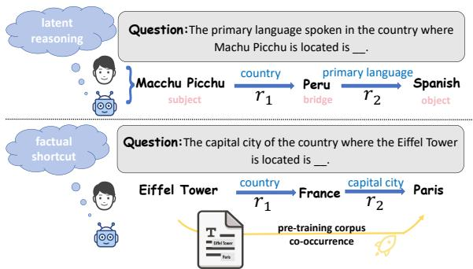

flowchart

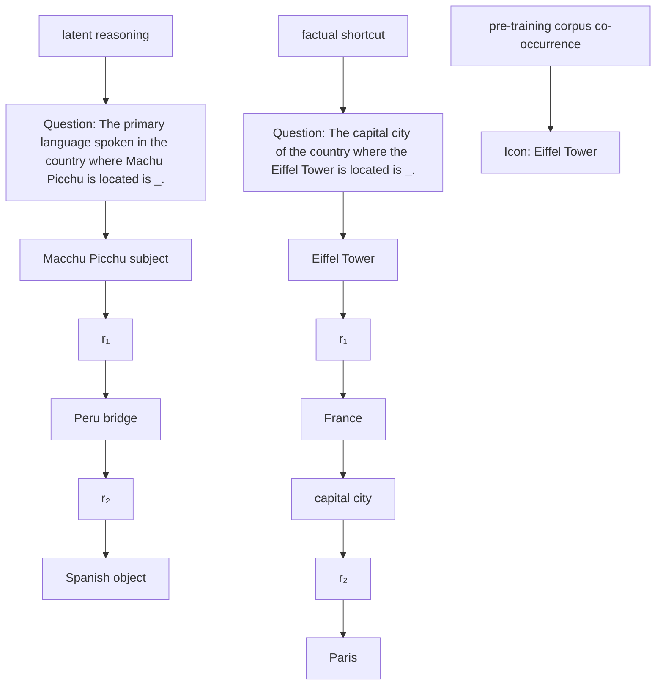

Figure 1: This figure illustrates two reasoning patterns in multi-hop questions: latent reasoning and factual shortcut.

Existing works have identified the two reasoning patterns mentioned above in such inference processes: latent reasoning (Petty et al., 2024b) and factual shortcuts (Lindsey et al., 2025; Ju et al., 2024). However, existing research mainly focuses on evaluating model accuracy for individual steps (Feng et al., 2025; Jiang et al., 2022) or using Chain - of - Thought (CoT) (Turpin et al., 2023; Fei et al., 2023; Lv et al., 2021) to analyze whether the model engages in reasoning. There is a lack of studies on the internal mechanisms of the model. Besides, some studies analyze neuron activations (Lindsey et al., 2025; Geva et al., 2021; Dai et al., 2022; Ju et al., 2024) or layer attention scores (van Aken et al., 2019; Ferrando et al., 2023; Yang et al., 2024) to examine the contributions of different components during inference. However, an efficient and clear distinction between the internal mechanisms of the two modes remains elusive.

Such investigation is important and meaningful. Although LLMs have shown impressive performance on certain multi-hop question-answering datasets, their success may often rely on simple pattern co-occurrence(Elazar et al., 2022) rather than performing latent intermediate reasoning. This reliance significantly impacts the model’s generalization ability(Cohen et al., 2024; Onoe et al.,

2023; Petty et al., 2024b), potentially leading to substantial performance degradation when applied to other tasks, such as retrieval-augmented generation (RAG) (Nakano et al., 2021; Koopman and Zuccon, 2023) or model editing (Wang et al., 2024; Cohen et al., 2024).

In our work, we aim to develop a systematic framework to analyze the information encoding and transformation processes during inference, further distinguishing between the two modes efficiently. To this end, we redefine criteria for the two reasoning patterns and construct corresponding datasets using Wiki-data (Vrandeciˇ c and Krötzsch ´ , 2014) and other human-generated sources (Yang et al., 2024; Sakarvadia et al., 2023) . Our investigation focuses on basic two-hop question queries, and we hypothesize that when the model engages in latent reasoning, it follows two steps: (1) infers a bridge entity (e.g., France) and (2) infers the final object, which is an attribute related to the bridge (e.g., the capital city of France is Paris).

We investigate this question through analyzing critical information flow in the inference as shown in Figure 2. Our first step involves localizing the critical information nodes that propagate key information to the last position for answer prediction. Specifically, we identify that the subject position contains decisive information for the final answer.

Then, we interpret the hidden states at the subject position by mapping them into the vocabulary space. By analyzing the evolution of vocabulary probabilities and semantic relevance, we observe significant differences in the information encoded by the subject across the two reasoning modes. While the subject representation enriches related attribute candidates, latent reasoning uniquely encodes bridge-related information, which is absent in factual shortcuts. To further assess the bridge’s role in second-hop reasoning, we modify the logits distribution of the hidden states to alter their preferences and reverse-map the changes (Nanda et al., 2023). Based on our findings, we propose a simple metric, Attribute Rate Ratio (ARR), which effectively distinguishes between the two reasoning modes and achieves around 90% accuracy on our constructed dataset.

Finally, we apply our proposed ARR metric to real-world RAG knowledge conflict scenarios (Ying et al., 2024; Chen et al., 2022) on the KRE dataset(Ju et al., 2024), which contains conflicting base fact prompts. Our experiments show that the model’s behavior under these conflicting prompts correlates with its internal reasoning mechanisms, offering insights into improving factual robustness in RAG conflicts.

Our contributions are summarized as follows:

1. We construct a novel dataset for latent reasoning and factual shortcuts, enabling a systematic investigation of their differences.   
2. We propose the simple ARR metric, which efficiently distinguishes between latent reasoning and factual shortcuts in multi-hop questions, achieving an accuracy of around 90%.

# 2 Preliminaries

We represent basic facts, such as "The country where the Eiffel Tower is located is France," as single-hop knowledge triplets $t = ( s , r , o )$ , where s is the subject (e.g., the Eiffel Tower), r is the relation (e.g., the country), and o is the object (e.g., France). Using a template τ ( ), we convert facts into cloze-pattern prompts (e.g., "The country where the Eiffel Tower is located $\mathrm { i s ^ { \prime \prime } } )$ and query the LLM about the correctness of the object. These are referred to as single-hop prompts.

For multi-hop knowledge, we extend this to a chain of single-hop facts, represented as a sequence of triplets:

$$
t = \langle (s, r _ {1}, o _ {1}), \dots , (o _ {n - 1}, r _ {n}, o _ {n}) \rangle ,
$$

where $s _ { i } = o _ { i - 1 }$ . Specifically, we focus on twohop knowledge, which connects two facts via a bridge entity b. For example, the sentence "The capital city of the country where the Eiffel Tower is located is Paris" combines two facts: "The country where the Eiffel Tower is located is France" and "The capital city of France is Paris," with "France" as the bridge entity b. This two-hop structure is represented as $t = \langle ( s , r _ { 1 } , b ) , ( b , r _ { 2 } , o ) \rangle$ . We query the LLM using a composed template for both $r _ { 1 }$ and $r _ { 2 }$ to verify if the object is correct.

# 3 Two Phenomena and Dataset Construction

We standardize the criteria for two reasoning patterns in multi-hop questions: factual shortcuts and latent reasoning, and propose a methodology to construct corresponding datasets.

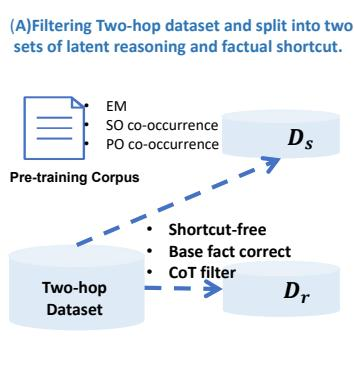

flowchart

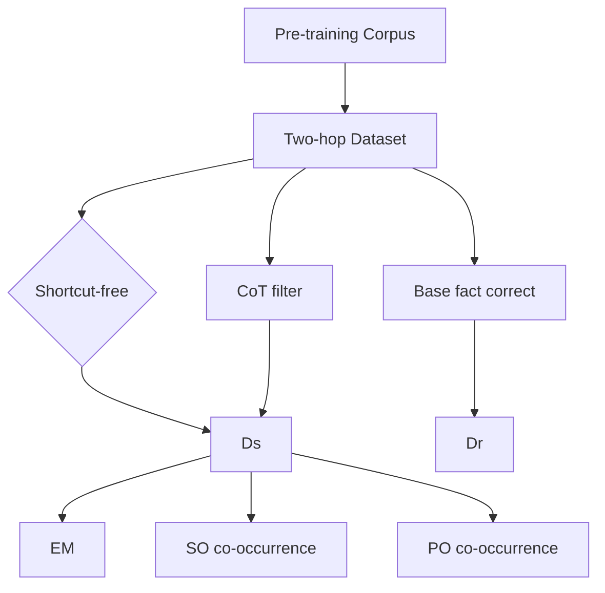

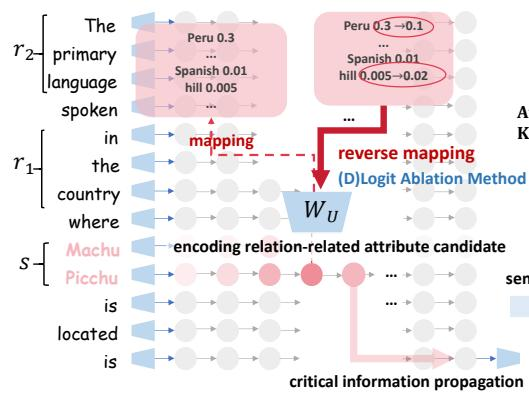

flowchart

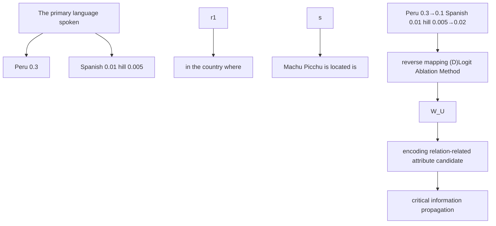

(B)Localize critical information nodes and interpret hidden states of subject.   
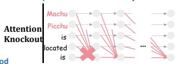

flowchart

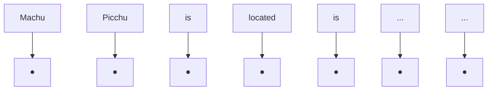

(C)Analyze subject enrichment and relationrelated attribute candidate formulation.   
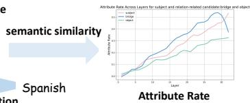

line

| Layer | Subject | Model | Object |
|-------|---------|-------|--------|
| 0     | 0       | 0     | 0      |
| 1     | 1       | 1     | 1      |
| 2     | 2       | 2     | 2      |
| 3     | 3       | 3     | 3      |
| 4     | 4       | 4     | 4      |
| 5     | 5       | 5     | 5      |
| 6     | 6       | 6     | 6      |

Figure 2: Our method for analyzing internal mechanism in the two reasoning modes of a given LLM: (A) we filter two-hop datasets and seperate into two subsets based on our proposed criteria, (B) we use the attention knock to localize critical information nodes: subject position and use the logit lens to interpret specific hidden stats, (C) we analyze the subject enrichment using Attribute Rate to evaluate semantic relatedness and analyze the relation-related attribute candidate formulation, (D) we use the logit ablation method to reverse mapping the changed logits of tokens to the hidden states. We find that the key difference between two reasoning modes lies in the subject enrichment process: Latent reasoning encodes bridge-related information as critical flow for final answer extraction, while shortcuts align with single-hop factual associations characteristic.

# 3.1 Factual Shortcuts

Factual shortcuts occur when an LLM relies on entity co-occurrence or patterns to directly predict the final answer without intermediate reasoning. We consider three types of shortcuts (Elazar et al., 2022): Exact-Match, Pattern-Object Cooccurrence, and Subject-Object Co-occurrence. To detect shortcuts, we semantically transform prompts and mask components (e.g., s, r1, or r2) to observe whether the model can still predict the answer(Biran et al., 2024).

# 3.2 Latent Reasoning

Latent reasoning involves recalling intermediate answers and composing them step-by-step to derive the final answer. In our study, we consider a chain $\langle s \xrightarrow { r _ { 1 } } b , b \xrightarrow { r _ { 2 } } o \rangle$ . To identify latent reasoning, we define the following criteria: (1) Shortcut Filtering, which excludes instances where factual shortcuts occur; (2) Single Answer, ensuring the answer is unique and context-independent; and (3) Bridge Recall via CoT, verifying that intermediate steps in CoT (Chain of Thought) prompts align with the bridge pathway. Following these criteria, we construct two datasets, denoted as $D _ { s }$ and $D _ { r }$ , corresponding to factual shortcuts and latent reasoning respectively, with their statistics and example queries shown in Table 1 and Table 2. Details of experiments are provided in Appendix B.

<table><tr><td>Model</td><td>Two-hop Dataset</td><td> $D_s$ </td><td> $D_r$ </td></tr><tr><td>LLaMa 2-7B</td><td>4,728</td><td>1,878</td><td>328</td></tr><tr><td>LLaMa 2-13B</td><td>5,530</td><td>2,246</td><td>543</td></tr><tr><td>Pythia 6.9B</td><td>1,342</td><td>574</td><td>87</td></tr><tr><td>Pythia 12B</td><td>1,809</td><td>686</td><td>102</td></tr><tr><td>DeepSeek-R1-Distill-1.3B</td><td>2,357</td><td>1,104</td><td>213</td></tr><tr><td>DeepSeek-R1-Distill-7B</td><td>4,311</td><td>1,725</td><td>357</td></tr><tr><td>DeepSeek-R1-Distill-14B</td><td>4,928</td><td>1,758</td><td>462</td></tr><tr><td>DeepSeek-R1-Distill-32B</td><td>5,455</td><td>1,930</td><td>523</td></tr></table>

Table 1: Statistics of the two-hop dataset and its subsets $D _ { s }$ and $D _ { r }$ across different language models.

# 4 Internal Mechanism

To investigate the internal reasoning mechanisms in multi-hop questions, we employ reverse engineering(Meng et al., 2022; Olah, 2022), a technique widely used for model transparency and interpretability.

First, we use the attention knockout (Geva et al., 2023) to identify critical information flow points, showing that the subject position is essential for predicting the final answer, regardless of reasoning patterns in §4.1.

Next, we interpret the hidden states at the subject position using the logit lens (Nostalgebraist, 2020) in §4.2 . By analyzing top-k entities and tracking their evolution across layers, we observe that the subject representations gradually enrich, encoding relation-related attributes, which can be quantitatively measured using AR (Attribute Rate). Combining with the probability distribution at the last position, we propose that the model undergoes two disjointed stages, with the key difference lying in latent reasoning encoding bridgerelated information significantly, while shortcuts align with single-hop factual associations (Geva et al., 2023).

<table><tr><td>Bridge Entity Type</td><td>Relation Composition Type</td><td>Example Multi-Hop Question Query</td></tr><tr><td>City</td><td>person-birthcity-eventyear building-locatecity-eventyear building-locatecity-president</td><td>The FIFA World Cup where Lionel Messi was born, took place in the year of [blank]. The Olympic Games in the city where the Eiffel Tower is located took place in the year of [blank]. The president of the country where the Sydney Opera House is located is [blank].</td></tr><tr><td>Country</td><td>place-country-language person-birthcountry-language building-locatecountry-capital building-locatecountry-language</td><td>The primary language spoken in the country where Machu Picchu is located is [blank]. The official language of the country where Nelson Mandela was born is [blank]. The capital of the country where the Eiffel Tower is located is [blank]. The official language of the country where the Taj Mahal is located is [blank].</td></tr><tr><td>Person</td><td>film-director-birthplace item-composer-birthplace film-director-spouse item-composer-birthplace country-president-birthcity country-president-birthyear</td><td>The birthplace of the director of *Late Night* is [blank]. The birthplace of the director of *Late Night* is [blank]. The spouse of the director of *Titanic* is [blank]. The birthplace of the composer of *Clair de Lune* is [blank]. The birth city of the president of the United States is [blank]. The birth year of the president of France is [blank].</td></tr><tr><td>University</td><td>person-university-founder person-university-year</td><td>The founder of the university where Bill Gates studied is [blank]. The year when Mark Zuckerberg attended the university he studied at is [blank].</td></tr><tr><td>Company</td><td>product-company-country product-company-founder</td><td>The country where the company that produces *Beats* headphones is headquartered is [blank]. The founder of the company that produces *PlayStation* is [blank].</td></tr></table>

Table 2: Example Multi-Hop Question Queries for Various Bridge Entity Types.

Finally, we apply the logit ablation (Nanda et al., 2023; Jacovi and Goldberg, 2020) to manipulate bridge-related logits and reverse-map the changes to adjust the token preferences in subject hidden states in §4.3. This validates that bridge-related information propagated from the subject position plays a decisive role in second-hop reasoning.

# 4.1 Localization of Information Flow and Critical Nodes

For a given two-hop prompt, we apply the attention knockout method (Geva et al., 2023), a fine-grained intervention on MHSA sublayers, to block the last position from attending to other positions. By measuring changes in final prediction probabilities, we identify key information flow nodes contributing to final multi-hop factual predictions.

# Attention Knockout Method

Let i and j be positions in the input sequence, where $i \le j$ . In layer $\ell < L$ , attention weights are set to negative infinity ( ) to block attention from i to j, as shown below:

$$
A _ {i, j} ^ {\ell + 1} = - \infty \tag {1}
$$

Here, $A _ { i , j } ^ { \ell + 1 }$ is the attention weight from $h _ { i } ^ { \ell }$ to $h _ { j } ^ { \ell }$ in layer $\ell + 1$ , and $h _ { i } ^ { \ell }$ is the hidden state at position i in layer ℓ.

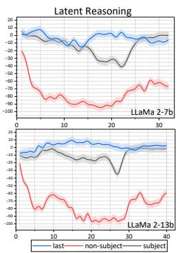

line

| Time | Last | Non-Subject | Subject |
|------|------|-------------|---------|
| 0    | 0    | 0           | 0       |
| 5    | -10  | -80         | -15     |
| 10   | -15  | -90         | -20     |
| 15   | -10  | -100        | -25     |
| 20   | -5   | -110        | -30     |
| 25   | 0    | -120        | -35     |
| 30   | 5    | -130        | -40     |
| 35   | 10   | -140        | -45     |
| 40   | 15   | -150        | -50     |

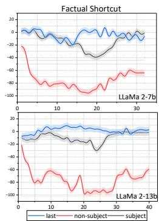

line

| Model        | last  | non-subject | subject |
| ------------ | ----- | ----------- | ------- |
| LLaMa 2-7b   | -5    | -80         | -5      |
| LLaMa 2-13b  | -5    | -90         | -60     |

Figure 3: Results of blocking attention from the last position to S and R in $D _ { s }$ and $D _ { r }$ . The experiments use a k-window $( k = 7$ for LLaMa 2-7B and $k = 1 0$ for LLaMa 2-13B) to measure the impact on final prediction probabilities.

Experiments Based on the template of the twohop prompt, we denote $S , R _ { 1 } , R _ { 2 }$ , and $R$ as $s , r _ { 1 }$ , $r _ { 2 } .$ , and all non-subject positions respectively. We block the attention edges separately from the last position to each of the relevant positions. Throughout the experiments, we set a k-window for the subsequent layers (k = 7 for LLaMa 2-7B and k = 10 for LLaMa 2-13B) on $D _ { s }$ and $D _ { r }$ , respectively.

Main Results Figure 3 shows the results of blocking attention to S and R in $D _ { s }$ and $D _ { r }$ . Knocking out attention on subject and non-subject positions reduces final prediction probabilities by 40-50% at their peaks for both datasets. For $D _ { s }$ , the inflection point appears earlier than in $D _ { r }$ , but both occur primarily in the middle-upper layers. This suggests critical information flows from the subject position to the final position in these layers, with shortcuts emerging slightly earlier than latent reasoning. However, disrupting attention to $R _ { 1 }$ and $R _ { 2 }$ shows minimal or negative effects on predictions, likely due to redundant behaviors of attention heads (Wang et al., 2023; Nanda et al., 2023; Mc-Grath et al., 2023) and their role in hedging errors to reduce cross-entropy loss (Conmy et al., 2023; Sakarvadia et al., 2023).

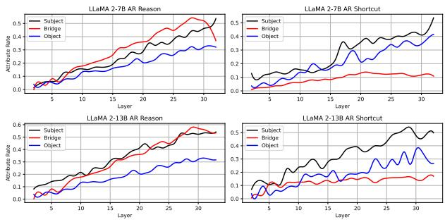

line

| Layer | LLaMA 2-7B Subject | LLaMA 2-7B Bridge | LLaMA 2-7B Object | LLaMA 2-7B Subject Shortcut | LLaMA 2-7B Bridge Shortcut | LLaMA 2-13B Subject | LLaMA 2-13B Bridge | LLaMA 2-13B Object |
|-------|---------------------|--------------------|-------------------|------------------------------|------------------------------|---------------------|--------------------|--------------------|
| 5     | 0.05                | 0.05               | 0.05              | 0.05                         | 0.05                         | 0.05                | 0.05               | 0.05               |
| 10    | 0.15                | 0.15               | 0.15              | 0.15                         | 0.15                         | 0.15                | 0.15               | 0.15               |
| 15    | 0.25                | 0.25               | 0.25              | 0.25                         | 0.25                         | 0.25                | 0.25               | 0.25               |
| 20    | 0.35                | 0.35               | 0.35              | 0.35                         | 0.35                         | 0.35                | 0.35               | 0.35               |
| 25    | 0.45                | 0.45               | 0.45              | 0.45                         | 0.45                         | 0.45                | 0.45               | 0.45               |
| 30    | 0.5                 | 0.5                | 0.5               | 0.5                          | 0.5                          | 0.5                 | 0.5                | 0.5                |

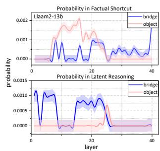

line

| Layer | Probability in factual shortcut - bridge | Probability in factual shortcut - object | Probability in latent reasoning - bridge | Probability in latent reasoning - object |
|-------|------------------------------------------|-------------------------------------------|------------------------------------------|------------------------------------------|
| 0     | ~0.0001                                  | ~0.0001                                   | ~0.0012                                  | ~0.0001                                  |
| 5     | ~0.0008                                  | ~0.0012                                   | ~0.0010                                  | ~0.0001                                  |
| 10    | ~0.0012                                  | ~0.0018                                   | ~0.0015                                  | ~0.0001                                  |
| 15    | ~0.0016                                  | ~0.0022                                   | ~0.0012                                  | ~0.0001                                  |
| 20    | ~0.0014                                  | ~0.0018                                   | ~0.0014                                  | ~0.0001                                  |
| 25    | ~0.0012                                  | ~0.0016                                   | ~0.0016                                  | ~0.0001                                  |
| 30    | ~0.0014                                  | ~0.0018                                   | ~0.0014                                  | ~0.0001                                  |
| 35    | ~0.0016                                  | ~0.0022                                   | ~0.0016                                  | ~0.0001                                  |
| 40    | ~0.022                                   | ~0.022                                    | ~0.022                                   | ~0.022                                   |

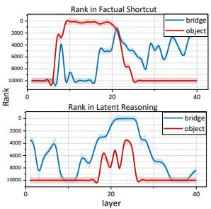

line

| Layer | Rank in Factual Shortcut - bridge | Rank in Factual Shortcut - object | Rank in Latent Reasoning - bridge | Rank in Latent Reasoning - object |
|-------|-----------------------------------|----------------------------------|----------------------------------|----------------------------------|
| 0     | ~1000                             | ~1000                            | ~4000                            | ~1000                            |
| 10    | ~2000                             | ~2000                            | ~6000                            | ~1000                            |
| 20    | ~1500                             | ~1500                            | ~2000                            | ~1000                            |
| 30    | ~2500                             | ~2500                            | ~8000                            | ~1000                            |
| 40    | ~2000                             | ~2000                            | ~1500                            | ~1000                            |

Figure 4: Attribute Rate (AR) (left) and tracking probabilities/ranks (right) across layers for $b , o ,$ and s. $A R ( s )$ increases to nearly 50% in the middle-upper layers, while $A R ( o )$ and its rank stabilize before the information node. In $D _ { r } , A R ( b )$ rises and stabilizes after peaking in the middle layers.

Overall, we identified critical information propagating from the subject position directly to the last position in the middle-upper layers for both reasoning patterns.

# 4.2 Subject Enrichment and Relation-Related Attribute Candidate Formulation

Given the view of the transformer inference pass as a gradual refinement of the output probability distribution(Geva et al., 2021; Conmy et al., 2023), we interpret hidden states by analyzing their probability distributions over the output vocabulary. We employ the logit lens method (Nostalgebraist, 2020) to project the hidden layer representation h into the vocabulary space as shown in Equation 2.

$$
\operatorname{vocab} _ {\ell , i} = \operatorname{softmax} (h _ {\ell , i} W _ {U}) \tag {2}
$$

where ℓ is the layer, i is the token position, and $W _ { U }$ is the vocabulary projection matrix. We analyze the top k = 1000 tokens with the highest probabilities at last-subject position.

Our observations reveal that the subject undergoes continuous enrichment during the inference, encoding rich semantic information, consistent with single-hop factual associations (Geva et al., 2023). Additionally, we also observe that relationrelated attributes are encoded, with top-k tokens sometimes including bridge and object entities (Table 3).

To better evaluate semantic relatedness, we use the quantitative metric AR (Attribute Rate) (Geva et al., 2023), an automatic approximation of entity relatedness. For a given entity t, we construct a candidate attribute set $A _ { t }$ by retrieving paragraphs about t from Wikipedia (Vrandeciˇ c and Krötzsch´ , 2014) using BM25 (Robertson et al., 1995) for retrieval. The retrieved text is tokenized, with common words and sub-word fragments filtered out. The attribute rate AR(t) is defined as the proportion of tokens in a set T that appear in $A _ { t }$ .

Experiments Building on our observations of bridge and object entities in the projection token sets, we track their probabilities and ranks across layers and we measure $A R ( t )$ for the bridge $b ,$ object o and subject s in the top-k sets determined by the subject representation at the last-subject position for the given $D _ { s }$ and $D _ { r }$ .

Results The tracking results and $A R ( t )$ shown in Figure 4 align with our initial observations from the projection token set. For both reasoning patterns, $A R ( s )$ at the last subject position consistently increases, nearing 50% in the middle-upper layers. During subject enrichment, the rank of the object $^ { O , }$ as a subject-related candidate, also rises and stabilizes around a mean of 980 before the information node, with $A R ( o )$ following a similar trend. Specifically, in $D _ { r }$ , the bridge $b ,$ serving as the intermediate first-hop answer and a subject candidate related to $r _ { 1 }$ , sees its rank rise and peak near zero in the middle layers. Correspondingly, $A R ( b )$ increases and stabilizes after reaching an inflection point.

However, in the upper layers, the rank and probability of the bridge drop significantly, with AR(b) showing a slight decline at the same position. This phenomenon suggests that the model begins to shift its focus away from the intermediate bridge entity b and instead prioritizes integrating information from the subject s and the final object o to finalize its prediction (Conmy et al., 2023; Elhage et al., 2021; Wang et al., 2023; Nanda et al., 2023).

<table><tr><td>Machu Picchu</td><td>&#x27;Peru&#x27;, &#x27;cuador&#x27;, &#x27;Jesus&#x27;, &#x27;oo&#x27;, &#x27;Perú&#x27;, &#x27;tree&#x27;, &#x27;cano&#x27;, &#x27;ucci&#x27;, &#x27;temple&#x27;, &#x27;pool&#x27;, &#x27;odge&#x27;, &#x27;rera&#x27;, &#x27;Notice&#x27;, &#x27;quez&#x27;, &#x27;ello&#x27;, &#x27;ailand&#x27;, &#x27;Tower&#x27;</td></tr><tr><td>Eiffel Tower</td><td>&#x27;Tower&#x27;, &#x27;tower&#x27;, &#x27;Bridge&#x27;, &#x27;monument&#x27;, &#x27;Seine&#x27;, &#x27;docker&#x27;, &#x27;devil&#x27;, &#x27;tree&#x27;, &#x27;Lyon&#x27;, &#x27;auer&#x27;, &#x27;Pairs&#x27;, &#x27;Shaw&#x27;, &#x27;airs&#x27;, &#x27;Taylor&#x27;, &#x27;Hitler&#x27;, &#x27;position&#x27;, &#x27;adows&#x27;, &#x27;House&#x27;, &#x27;trees&#x27;, &#x27;ourt&#x27;, &#x27;Coupe&#x27;, &#x27;castle&#x27;, &#x27;Moon&#x27;</td></tr></table>

Table 3: Examples of top-k tokens mapped from subject representations.

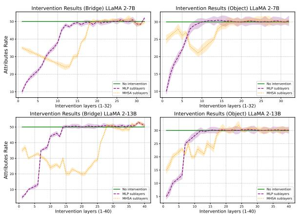  
Figure 5: The results of causal interventions on MHSA and MLP sublayers and their relative impact on the final prediction probability. In the early stages, MLPs have a significant influence, highlighting their role in constructing subject enrichment. However, in the middle layers, MHSA shows a greater impact, indicating its direct role in extracting intermediate relation-related subject candidates.

Combining the tracking results of the final object at the last position, as shown in the Appendix E, we propose a possible explanation for the model’s reasoning pattern in two-hop questions: The model undergoes two disjointed stages: Local shallow reasoning, where relation-related subject attributes are encoded at the subject position; and Deep reasoning, where critical information is integrated to derive the final answer at the last position. The key difference lies in the first stage: Latent reasoning encodes bridge-related information as critical flow for final answer extraction, while shortcuts align with single-hop factual associations characteristic (Geva et al., 2023).

Besides, we evaluate the contributions of different components to consecutive reasoning stages using causal interventions by zeroing out MHSA and MLP sublayers to measure their effects on AR for $s , b ,$ and o. As shown in Figure 5, while MLPs primarily facilitate subject enrichment, MHSA has a more direct role in extracting intermediate relationrelated subject candidates. This aligns with prior findings that attention heads act as "knowledge hubs," encoding factual associations (Sakarvadia et al., 2023; Kobayashi et al., 2023; Meng et al., 2022).

# 4.3 Is Bridge-Related Information Decisive for Final Answer Extraction?

By analyzing the Attribute Rate further, we find that $A R ( o )$ remains consistent across both reasoning patterns. Although b is significantly encoded in the hidden states, this alone does not confirm its decisive role in the final answer extraction, as object-related attributes may still enable correct predictions.

To address this, we adopt the logit ablation method (Nanda et al., 2023; Clark et al., 2020; Jacovi and Goldberg, 2020) by reducing the logits of bridge-related tokens and reverse-mapping the changes to adjust hidden states using Equation 3:

$$
h ^ {\prime} = \text { modified\_logits } \cdot W _ {U} ^ {\dagger}, \tag {3}
$$

where $\boldsymbol { W } _ { \boldsymbol { U } } ^ { \dagger }$ denotes the pseudo-inverse of the vocabulary projection matrix $W _ { U }$ .

Experiments Based on the projection of hidden states at the subject position, we obtain the logits of all tokens in the vocabulary. From previous experiments, we filter the related attribute token sets for bridge, object, and subject, denoted as $A _ { b } , A _ { o } ,$ , and $A _ { s } ,$ , respectively. Furthermore, we calculate the intersections of these sets and define them as $A _ { b s } , A _ { b o } , A _ { o s } ,$ and $A _ { b o s }$ .

Smooth Adjustment of Logits To avoid uncontrollable impacts from directly reducing logits values, we adopt a smoothing adjustment strategy (Elhage et al., 2021; Jacovi and Goldberg, 2020): For tokens in $\left( A _ { b } - A _ { b s } \right)$ , we decrease their logits values. Simultaneously, we redistribute the reduced logits values to tokens in $( A _ { s } - A _ { b } - A _ { o } + A _ { b o s } )$ , slightly enhancing subject-related tokens. This approach reduces the bridge-related information while preserving object-related information and modestly increases subject-related information, effectively maintaining overall semantic consistency. We use the average logits of the top-k (k = 1000) tokens as the perturbation value and apply a layer window of 7 for LLaMa 2-7B and 10 for LLaMa 2-13B to how bridge-related information encoding significantly impacts the final prediction.

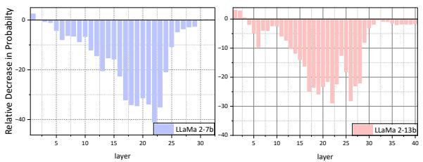

bar

| layer | Relative Decrease in Probability (LLaMa 2-7b) | Relative Decrease in Probability (LLaMa 2-13b) |
|---|---|---|
| 1 | 0 | 0 |
| 2 | -5 | -5 |
| 3 | -10 | -10 |
| 4 | -15 | -15 |
| 5 | -20 | -20 |
| 6 | -25 | -25 |
| 7 | -30 | -30 |
| 8 | -35 | -35 |
| 9 | -40 | -40 |
| 10 | -45 | -45 |
| 11 | -50 | -50 |
| 12 | -55 | -55 |
| 13 | -60 | -60 |
| 14 | -65 | -65 |
| 15 | -70 | -70 |
| 16 | -75 | -75 |
| 17 | -80 | -80 |
| 18 | -85 | -85 |
| 19 | -90 | -90 |
| 20 | -95 | -95 |
| 21 | -100 | -100 |
| 22 | -105 | -105 |
| 23 | -110 | -110 |
| 24 | -115 | -115 |
| 25 | -120 | -120 |
| 26 | -125 | -125 |
| 27 | -130 | -130 |
| 28 | -135 | -135 |
| 29 | -140 | -140 |
| 30 | -145 | -145 |
The chart displays a vertical bar chart comparing the relative decrease in probability between two models, with each bar representing a specific layer's performance. The x-axis labels are 'layer' and the y-axis is labeled 'Relative Decrease in Probability'. The legend indicates the two models: LLaMa 2-7b and LLaMa 2-13b. The bars are colored differently to distinguish between the two models, but they do not have explicit labels or colors on the chart. The title of the chart is 'Relative Decrease in Probability'.

Figure 6: Results of reducing bridge-related token preferences in the logits space for $D _ { r }$ . The experiments apply a k-window layer logit ablation (k = 7 for LLaMa 2-7B and k = 10 for LLaMa 2-13B).

Results As shown in Figure 6, reducing the preference of the subject’s hidden states for bridgerelated tokens significantly impacts the final prediction, consistent with the attention knockout experiment results. We also observe that larger models demonstrate greater robustness to these interventions, as evidenced by LLaMa 2-13B experiencing less impact compared to LLaMa 2-7B. These findings validate that bridge-related information, encoded as critical information propagated from the subject, plays a decisive role in the extraction of the final answer.

# 5 Evaluation Metric ARR

Based on the above experiments, we observe that while the attribution rate of the object entity, $A R ( o )$ , remains relatively consistent across both shortcut and latent reasoning behaviors, the attribution rate of the bridge entity, AR(b), shows significant divergence at the critical reasoning layers. This suggests that the key distinction between reasoning modes is primarily captured at the bridge level. Motivated by this finding, we introduce a ratio-based metric that normalizes against the object attribution and highlights the model’s relative reliance on intermediate reasoning.

Definition We propose the Attribute Rate Ratio (ARR) in Equation 4 to classify the model’s reasoning behaviors:

$$
\operatorname{ARR} (b, o) = \log \left(\frac {\operatorname{AR} (b)}{\operatorname{AR} (o)}\right). \tag {4}
$$

We calculate ARR(b, o) at the inflection point using a sliding window of consecutive layers, K. Intuitively, if the bridge receives stronger attribution than the object $( \mathbf { A R R } ( b , o ) \ > \ 0 )$ , the model is likely following a latent reasoning path, relying on intermediate entities to reach the answer. Conversely, when bridge attribution is comparable to or weaker than that of the object $( \mathbf { A R R } ( b , o ) \leq 0 )$ , the model exhibits shortcut behavior by directly associating the subject with the object, bypassing the intermediate reasoning process.

Model Performance As shown in Table 5, ARRbased classification achieves consistently high accuracy across multiple model families and sizes. Larger models (e.g., DeepSeek-32B) show greater stability and higher classification accuracy, indicating that stronger models may encode more consistent reasoning dynamics. These results demonstrate the robustness of ARR in distinguishing reasoning behaviors across varied architectures.

<table><tr><td>Model</td><td>Subset (s)</td><td>Accuracy</td><td>Overall</td><td>Parallel</td></tr><tr><td rowspan="2">LLaMa 2-7b(K=5)</td><td> $D_s$ (1878)</td><td>90.31%</td><td>7.10s</td><td>0.74s</td></tr><tr><td> $D_r$ (328)</td><td>87.78%</td><td>7.10s</td><td>1.02s</td></tr><tr><td rowspan="2">LLaMa 2-13b(K=7)</td><td> $D_s$ (2246)</td><td>91.23%</td><td>10.50s</td><td>2.37s</td></tr><tr><td> $D_r$ (543)</td><td>88.33%</td><td>10.50s</td><td>2.36s</td></tr><tr><td rowspan="2">Pythia 6.9B(K=5)</td><td> $D_s$ (574)</td><td>89.39%</td><td>6.10s</td><td>2.23s</td></tr><tr><td> $D_r$ (87)</td><td>85.79%</td><td>6.10s</td><td>2.24s</td></tr><tr><td rowspan="2">Pythia 12B(K=6)</td><td> $D_s$ (686)</td><td>90.01%</td><td>9.30s</td><td>2.33s</td></tr><tr><td> $D_r$ (102)</td><td>86.56%</td><td>9.29s</td><td>2.38s</td></tr><tr><td rowspan="2">DeepSeek-1.3B(K=4)</td><td> $D_s$ (1104)</td><td>90.21%</td><td>2.39s</td><td>0.14s</td></tr><tr><td> $D_r$ (213)</td><td>86.71%</td><td>2.72s</td><td>0.17s</td></tr><tr><td rowspan="2">DeepSeek-7B(K=5)</td><td> $D_s$ (1725)</td><td>91.11%</td><td>3.78s</td><td>0.28s</td></tr><tr><td> $D_r$ (357)</td><td>87.92%</td><td>3.89s</td><td>0.29s</td></tr><tr><td rowspan="2">DeepSeek-14B(K=6)</td><td> $D_s$ (1758)</td><td>91.45%</td><td>5.20s</td><td>0.37s</td></tr><tr><td> $D_r$ (462)</td><td>88.33%</td><td>5.17s</td><td>0.37s</td></tr><tr><td rowspan="2">DeepSeek-32B(K=6)</td><td> $D_s$ (1930)</td><td>92.10%</td><td>8.21s</td><td>0.59s</td></tr><tr><td> $D_r$ (523)</td><td>89.02%</td><td>7.04s</td><td>0.55s</td></tr></table>

Table 5: Model performance with processing time per 100 samples. K represents the window size used for ARR calculation.

Indirect Validation We further validate the reliability of ARR through two intervention experiments. The first replaces the subject $( s  s ^ { \prime } )$ , thereby altering the intermediate bridge entity $( \langle s ^ { \prime } \overset { r _ { 1 } } { \longrightarrow } b ^ { \prime } )$ . The second fine-tunes the dataset to increase s–o co-occurrence, explicitly encouraging shortcut learning. Instead of validating the numerical values of ARR directly, we analyze how these interventions shift the underlying attribution distributions.

<table><tr><td>Dataset</td><td>Question without Context</td><td>Base Fact Added</td></tr><tr><td> $D_{1}$ </td><td>In what county is William W. Blair’s birthplace located?√</td><td>William W. Blair’s birthplace was in Beijing.√</td></tr><tr><td> $D_{2}$ </td><td>In which borough was Callum McManaman born?√</td><td>Callum McManaman was born in France.✗</td></tr><tr><td> $D_{3}$ </td><td>Who is the spouse of the Rabbit Hole’s producer?✗</td><td>The Rabbit Hole’s producer is Nicole Kidman.√</td></tr><tr><td> $D_{4}$ </td><td>Who is the child of the Victim of Romance performer?✗</td><td>The performer of  $Victim\ of\ Romance$  is Michelle Phillips.✗</td></tr></table>

Table 4: The check and cross symbols represent whether the model is able to answer the question correctly. For $D _ { 1 }$ and $D _ { 2 } .$ the model answers correctly without context, but when an incorrect base fact is added, $D _ { 1 }$ still provides the correct answer, while $D _ { 2 }$ is affected and answers incorrectly. For $D _ { 3 }$ and $D _ { 4 }$ , the model is unable to answer correctly without context, but when the correct base fact is provided, $D _ { 3 }$ uses the context to correct its answer, whereas $D _ { 4 }$ still fails to answer correctly.

As shown in Table $^ { 6 , }$ subject replacement sharply decreases $A R ( b )$ in reasoning cases $( D _ { r } )$ , confirming that bridge attribution reflects reliance on intermediate entities. By contrast, fine-tuning to enhance shortcut co-occurrence reduces $A R ( b )$ while maintaining or slightly increasing $A R ( o )$ , consistent with shortcut-style behavior. These complementary interventions jointly reinforce the validity of ARR as a diagnostic probe.

<table><tr><td>Model</td><td>Component</td><td>AR(s)</td><td>AR(b)</td><td>AR(o)</td></tr><tr><td rowspan="4">LLaMA2-7B</td><td> $D_s : s \to s'$ </td><td>48→15% (↓33%)</td><td>5→4% (↓1%)</td><td>35→9% (↓26%)</td></tr><tr><td> $D_s : FT$ </td><td>48→46% (↓2%)</td><td>5→5%</td><td>35→38% (↑1%)</td></tr><tr><td> $D_r : s \to s'$ </td><td>53→28% (↓25%)</td><td>58→15% (↓43%)</td><td>38→25% (↓13%)</td></tr><tr><td> $D_r : FT$ </td><td>53→57% (↑4%)</td><td>58→27% (↓31%)</td><td>38→37% (↓1%)</td></tr><tr><td rowspan="4">LLaMA2-13B</td><td> $D_s : s \to s'$ </td><td>52→29% (↓23%)</td><td>8→6% (↓2%)</td><td>38→17% (↓21%)</td></tr><tr><td> $D_s : FT$ </td><td>52→48% (↓4%)</td><td>8→7% (↓1%)</td><td>38→37% (↓1%)</td></tr><tr><td> $D_r : s \to s'$ </td><td>54→35% (↓19%)</td><td>61→18% (↓43%)</td><td>40→16% (↓24%)</td></tr><tr><td> $D_r : FT$ </td><td>54→52% (↓2%)</td><td>61→24% (↓37%)</td><td>40→36% (↓4%)</td></tr></table>

Table 6: Results of two indirect methods validating the proposed metric: subject replacement alters the intermediate bridge entity, while fine-tuning enhances $s { - } o$ co-occurrence to promote shortcut learning. Instead of validating the metric’s absolute values directly, we analyze attribution changes in $A R ( b )$ and $A R ( o )$ to confirm ARR’s validity.

Summary Overall, these experiments validate ARR as a reliable and interpretable metric that captures the distinction between shortcut and latent reasoning. Importantly, ARR bridges empirical attribution signals with theoretical reasoning categories, and provides a foundation for analyzing reasoning robustness in more complex settings. In the next section, we extend its application to retrievalaugmented conflict scenarios (Section 6).

# 6 Knowledge Conflict Application

We investigate whether the proposed ARR can generalize to conflicting scenarios in RAG (Ying et al., 2024; Xie et al., 2023; Chen et al., 2022; Koopman and Zuccon, 2023), where retrieved base fact prompts conflict with the model’s internal memory in multi-hop questions. Our focus is on whether the model’s decision style in multi-hop questions relates to its reasoning mechanisms.

Data We construct the 2FC (Two-hop Fact Conflict) dataset based on MuSiQue (Trivedi et al., 2022) reconstructed in the KRE dataset (Ying et al., 2024). Each sample in 2FC is denoted as $s = ( x , a _ { g o l } , c ^ { + } , a _ { n e g } , c ^ { - } )$ , where x is a two-hop question, $a _ { g o l }$ the golden answer, $c ^ { + }$ the positive context, $\boldsymbol { a } _ { n e g }$ the conflicting answer, and $c ^ { - }$ the misleading context. The dataset is divided into two subsets: $D ^ { + }$ (correct answers) and $D ^ { - }$ (failed answers), based on the model’s ability to answer without external information.

Decision Styles are Highly Correlated with Model Internal Reasoning Patterns Given the 2FC dataset with $D ^ { + }$ and $D ^ { - }$ partitions, we simulate two factual conflict scenarios: 1) For $D ^ { \cdot }$ − , where answers are incorrect, we provide accurate external context. 2) For $D ^ { + }$ , where answers are correct, we introduce misleading prompts. We further classify the datasets into four categories based on answer correctness:

$$
D _ {1} = \{x \in D ^ {+} \mid f (x, c ^ {-}; M) = a ^ {+} \},
$$

$$
D _ {2} = \left\{x \in D ^ {+} \mid f (x, c ^ {-}; M) = a ^ {-} \right\},
$$

$$
D _ {3} = \left\{x \in D ^ {-} \mid f (x, c ^ {+}; M) = a ^ {+} \right\},
$$

$$
D _ {4} = \{x \in D ^ {-} \mid f (x, c ^ {+}; M) = a ^ {-} \}.
$$

Examples of corresponding datasets are shown in Table 11. These categories correspond to four scenarios: (a) Correct answers are disrupted by misleading prompts, (b) Correct answers remain unaffected, (c) Incorrect answers improve with accurate context, and (d) Incorrect answers persist despite accurate context. We calculate the ARR(b, o) at the inflection points for each dataset, with results shown in Table 11.

We find that when the model engages in latent reasoning, it prioritizes external information. Accurate memory increases susceptibility to misleading prompts, as observed in $D _ { 1 }$ , while outdated or incorrect memory enables better utilization of external context to derive correct answers, as seen in $D _ { 3 }$ . In contrast, employing factual shortcuts enhances the model’s robustness against disruptive information, corresponding to $D _ { 2 }$ .

<table><tr><td>Model</td><td></td><td> $D_{1}$ </td><td> $D_{2}$ </td><td> $D_{3}$ </td><td> $D_{4}$ </td></tr><tr><td rowspan="2">LLaMA 2-7B</td><td>ARR &gt;0</td><td>23%</td><td>46%</td><td>74%</td><td>48%</td></tr><tr><td>ARR &lt;0</td><td>77%</td><td>54%</td><td>26%</td><td>52%</td></tr><tr><td rowspan="2">LLaMA 2-13B</td><td>ARR &gt;0</td><td>21%</td><td>58%</td><td>72%</td><td>47%</td></tr><tr><td>ARR &lt;0</td><td>79%</td><td>42%</td><td>38%</td><td>53%</td></tr></table>

Table 7: ARR values for different models in datasets $( D _ { 1 }$ to $D _ { 4 } )$ , reflecting the correlation between the model’s internal mechanisms and decision styles.

Our study highlights the potential of applying the classification method to RAG conflicts, enabling future research to balance external information utilization and robustness against noisy inputs from within the model, while offering new insights into the application of internal reasoning mechanisms.

# 7 Related Work

Recently, there has been growing interest in understanding the inner workings of transformers (Haviv et al., 2023; Roberts et al., 2020). Studies have explored identifying layers and neurons in LLMs to retrieve information (Meng et al., 2022; Geva et al., 2021) and characterized tokens through their output vocabulary distribution (Mickus et al., 2022; Haviv et al., 2023). Research has also examined input token influence and factual association construction, focusing mainly on single-hop reasoning tasks (Geva et al., 2023; Wang et al., 2023).

LLMs have shown remarkable ability to answer multi-hop questions without contextual information (Zhao et al., 2023; Brown et al., 2020). Two reasoning modes: latent reasoning and factual shortcuts, have been identified (Yang et al., 2024; Ju et al., 2024). However, most studies confirm their existence without deeply analyzing their differences, relying on indirect methods like prompt modification or co-occurrence analysis (Elazar et al., 2022; Ju et al., 2024).

Motivated by this gap, we focus on elucidating the distinctions between these reasoning modes in multi-hop questions from an internal perspective.

# 8 Conclusion and Future

This work systematically investigates the distinctions between latent reasoning and factual shortcuts in multi-hop reasoning tasks. By constructing corresponding datasets and using reverse engineering methods, we reveal that the model undergoes two disjointed stages, where the key difference lies in the subject enrichment process. Latent reasoning encodes bridge-related information as critical flow for final answer extraction, while shortcuts align with single-hop factual associations characteristic. Through further logit ablation, we validate the decisive role of bridge-related information for final answer extraction. We propose the Attribute Rate Ratio (ARR) metric to efficiently classify reasoning modes and applying ARR to real-world RAG conflict scenarios. We demonstrate how internal reasoning mechanisms influence model behavior under conflicting prompts. These findings deepen our understanding of model reasoning pathways and provide actionable insights for enhancing robustness and transparency in knowledge-intensive applications.

# Limitations

While our experimental findings and proposed metric provide valuable insights into distinguishing the internal reasoning patterns of the model between latent reasoning and factual shortcuts, it is important to acknowledge certain limitations:

Scope Limited to Two-Hop Reasoning This study focuses on two-hop reasoning tasks, which we justify for the following reasons: (1) Twohop reasoning is the minimal effective unit for mechanism-level analysis; (2) More complex reasoning chains often yield poor accuracy in existing LLMs; and (3) Many real-world multi-hop problems can be decomposed into two-hop structures. Although this approach enhances interpretability and precision, extending our findings to more complex reasoning remains a future direction. Examples of applying our ARR in three-hop reasoning can be found in Appendix I.

Limited Dataset While we proposed a set of criteria to guide dataset construction, we found that the model’s training process has created many shortcut mappings, which reduces the availability of datasets suitable for studying latent reasoning. This limitation may restrict the scope of the research. However, even with limited datasets, we were still able to identify some clear and meaningful characteristics.

Latent Multi-Hop Reasoning Pathway The complexity of the model allows us to identify only the most likely latent pathways that align with human reasoning. In our experiments, we incorporated CoT filtering during preprocessing. While explicit reasoning pathways may not fully correspond to the model’s internal reasoning processes, this approach helps to minimize potential interference from alternative pathways in the experimental results.

Metrics without Rigorous Verification While we proposed a formula to differentiate reasoning patterns based on observed phenomena, the complexity of model behavior and the lack of sufficient datasets limit the rigor of its verification. Our validation relies on indirect methods, which may leave room for further refinement.

Our work focuses on distinguishing the reasoning modes of the model by studying the correlation of encoded information internally, thereby opening up a new thread of research in this area. We leave further investigation of the above gaps for future work.

# Acknowledgments

This work was supported in part by the National Natural Science Foundation of China under Grants (62406039, 62101064, 62321001, 62471055, U23B2001, 62171057, 62201072, 62071067), the High-Quality Development Project of the MIIT (2440STCZB2584), the Ministry of Education and China Mobile Joint Fund (MCM20200202, MCM20180101), the Fundamental Research Funds for the Central Universities (2024PTB-004), and the 2025 Education and Teaching Reform Project Funding at Beijing University of Posts and Telecommunications (2025YZ005).

# References

Eden Biran, Daniela Gottesman, Sohee Yang, Mor Geva, and Amir Globerson. 2024. Hopping too late: Exploring the limitations of large language models on multihop queries. In Proceedings of the 2024 Conference on Empirical Methods in Natural Language Processing, pages 14113–14130, Miami, Florida, USA. Association for Computational Linguistics.   
Tom Brown, Benjamin Mann, Nick Ryder, Melanie Subbiah, Jared D Kaplan, Prafulla Dhariwal, Arvind

Neelakantan, Pranav Shyam, Girish Sastry, Amanda Askell, et al. 2020. Language models are few-shot learners. Advances in neural information processing systems, 33:1877–1901.   
Hung-Ting Chen, Michael Zhang, and Eunsol Choi. 2022. Rich knowledge sources bring complex knowledge conflicts: Recalibrating models to reflect conflicting evidence. In Proceedings of the 2022 Conference on Empirical Methods in Natural Language Processing, pages 2292–2307, Abu Dhabi, United Arab Emirates. Association for Computational Linguistics.   
Peter Clark, Oyvind Tafjord, and Kyle Richardson. 2020. Transformers as soft reasoners over language. In Proceedings of the Twenty-Ninth International Joint Conference on Artificial Intelligence, IJCAI-20, pages 3882–3890. International Joint Conferences on Artificial Intelligence Organization. Main track.   
Roi Cohen, Eden Biran, Ori Yoran, Amir Globerson, and Mor Geva. 2024. Evaluating the ripple effects of knowledge editing in language models. Transactions of the Association for Computational Linguistics, 12:283–298.   
Arthur Conmy, Augustine Mavor-Parker, Aengus Lynch, Stefan Heimersheim, and Adrià Garriga-Alonso. 2023. Towards automated circuit discovery for mechanistic interpretability. Advances in Neural Information Processing Systems, 36:16318–16352.   
Damai Dai, Li Dong, Yaru Hao, Zhifang Sui, Baobao Chang, and Furu Wei. 2022. Knowledge neurons in pretrained transformers. In Proceedings of the 60th Annual Meeting of the Association for Computational Linguistics (Volume 1: Long Papers), pages 8493– 8502, Dublin, Ireland. Association for Computational Linguistics.   
Nouha Dziri, Ximing Lu, Melanie Sclar, Xiang Lorraine Li, Liwei Jiang, Bill Yuchen Lin, Sean Welleck, Peter West, Chandra Bhagavatula, Ronan Le Bras, et al. 2024. Faith and fate: Limits of transformers on compositionality. Advances in Neural Information Processing Systems, 36.   
Yanai Elazar, Nora Kassner, Shauli Ravfogel, Amir Feder, Abhilasha Ravichander, Marius Mosbach, Yonatan Belinkov, Hinrich Schütze, and Yoav Goldberg. 2022. Measuring causal effects of data statistics on language model’s ’factual’ predictions. CoRR, abs/2207.14251.   
Nelson Elhage, Neel Nanda, Catherine Olsson, Tom Henighan, Nicholas Joseph, Ben Mann, Amanda Askell, Yuntao Bai, Anna Chen, Tom Conerly, et al. 2021. A mathematical framework for transformer circuits. Transformer Circuits Thread, 1(1):12.   
Hao Fei, Bobo Li, Qian Liu, Lidong Bing, Fei Li, and Tat-Seng Chua. 2023. Reasoning implicit sentiment with chain-of-thought prompting. In Proceedings of the 61st Annual Meeting of the Association for Computational Linguistics (Volume 2: Short Papers),

pages 1171–1182, Toronto, Canada. Association for Computational Linguistics.   
Jiahai Feng, Stuart Russell, and Jacob Steinhardt. 2025. Extractive structures learned in pretraining enable generalization on finetuned facts. Preprint, arXiv:2412.04614.   
Javier Ferrando, Gerard I. Gállego, Ioannis Tsiamas, and Marta R. Costa-jussà. 2023. Explaining how transformers use context to build predictions. In Proceedings of the 61st Annual Meeting of the Association for Computational Linguistics (Volume 1: Long Papers), pages 5486–5513, Toronto, Canada. Association for Computational Linguistics.   
Mor Geva, Jasmijn Bastings, Katja Filippova, and Amir Globerson. 2023. Dissecting recall of factual associations in auto-regressive language models. In Proceedings of the 2023 Conference on Empirical Methods in Natural Language Processing, pages 12216–12235, Singapore. Association for Computational Linguistics.   
Mor Geva, Roei Schuster, Jonathan Berant, and Omer Levy. 2021. Transformer feed-forward layers are keyvalue memories. In Proceedings of the 2021 Conference on Empirical Methods in Natural Language Processing, pages 5484–5495, Online and Punta Cana, Dominican Republic. Association for Computational Linguistics.   
Adi Haviv, Ido Cohen, Jacob Gidron, Roei Schuster, Yoav Goldberg, and Mor Geva. 2023. Understanding transformer memorization recall through idioms. In Proceedings of the 17th Conference of the European Chapter of the Association for Computational Linguistics, pages 248–264, Dubrovnik, Croatia. Association for Computational Linguistics.   
Alon Jacovi and Yoav Goldberg. 2020. Towards faithfully interpretable NLP systems: How should we define and evaluate faithfulness? In Proceedings of the 58th Annual Meeting of the Association for Computational Linguistics, pages 4198–4205, Online. Association for Computational Linguistics.   
Zhengbao Jiang, Jun Araki, Haibo Ding, and Graham Neubig. 2022. Understanding and improving zero-shot multi-hop reasoning in generative question answering. In Proceedings of the 29th International Conference on Computational Linguistics, pages 1765–1775, Gyeongju, Republic of Korea. International Committee on Computational Linguistics.   
Tianjie Ju, Yijin Chen, Xinwei Yuan, Zhuosheng Zhang, Wei Du, Yubin Zheng, and Gongshen Liu. 2024. Investigating multi-hop factual shortcuts in knowledge editing of large language models. In Proceedings of the 62nd Annual Meeting of the Association for Computational Linguistics (Volume 1: Long Papers), pages 8987–9001, Bangkok, Thailand. Association for Computational Linguistics.   
Goro Kobayashi, Tatsuki Kuribayashi, Sho Yokoi, and Kentaro Inui. 2023. Transformer language models

handle word frequency in prediction head. In Findings of the Association for Computational Linguistics: ACL 2023, pages 4523–4535, Toronto, Canada. Association for Computational Linguistics.   
Bevan Koopman and Guido Zuccon. 2023. Dr ChatGPT tell me what I want to hear: How different prompts impact health answer correctness. In Proceedings of the 2023 Conference on Empirical Methods in Natural Language Processing, pages 15012–15022, Singapore. Association for Computational Linguistics.   
Jack Lindsey, Wes Gurnee, Emmanuel Ameisen, Brian Chen, Adam Pearce, Nicholas L. Turner, Craig Citro, David Abrahams, Shan Carter, Basil Hosmer, Jonathan Marcus, Michael Sklar, Adly Templeton, Trenton Bricken, Callum McDougall, Hoagy Cunningham, Thomas Henighan, Adam Jermyn, Andy Jones, Andrew Persic, Zhenyi Qi, T. Ben Thompson, Sam Zimmerman, Kelley Rivoire, Thomas Conerly, Chris Olah, and Joshua Batson. 2025. On the biology of a large language model. Transformer Circuits Thread.   
Xin Lv, Yixin Cao, Lei Hou, Juanzi Li, Zhiyuan Liu, Yichi Zhang, and Zelin Dai. 2021. Is multi-hop reasoning really explainable? towards benchmarking reasoning interpretability. In Proceedings of the 2021 Conference on Empirical Methods in Natural Language Processing, pages 8899–8911, Online and Punta Cana, Dominican Republic. Association for Computational Linguistics.   
Tom McGrath, Matthew Rahtz, János Kramár, Vladimir Mikulik, and Shane Legg. 2023. The hydra effect: Emergent self-repair in language model computations. ArXiv, abs/2307.15771.   
Kevin Meng, David Bau, Alex Andonian, and Yonatan Belinkov. 2022. Locating and editing factual associations in gpt. Advances in Neural Information Processing Systems, 35:17359–17372.   
Timothee Mickus, Denis Paperno, and Mathieu Constant. 2022. How to dissect a muppet: The structure of transformer embedding spaces. Transactions of the Association for Computational Linguistics, 10:981–996.   
Reiichiro Nakano, Jacob Hilton, Suchir Balaji, Jeff Wu, Ouyang Long, Christina Kim, Christopher Hesse, Shantanu Jain, Vineet Kosaraju, William Saunders, Xu Jiang, Karl Cobbe, Tyna Eloundou, Gretchen Krueger, Kevin Button, Matthew Knight, Benjamin Chess, and John Schulman. 2021. Webgpt: Browserassisted question-answering with human feedback. ArXiv, abs/2112.09332.   
Neel Nanda, Lawrence Chan, Tom Lieberum, Jess Smith, and Jacob Steinhardt. 2023. Progress measures for grokking via mechanistic interpretability. In The Eleventh International Conference on Learning Representations.

Nostalgebraist. 2020. Interpreting gpt: The logit lens. Accessed: 2024-12-16.   
Chris Olah. 2022. Mechanistic interpretability, variables, and the importance of interpretable bases. https://www.transformer-circuits. pub/2022/mech-interp-essay. Accessed: 2022- 09-15.   
Yasumasa Onoe, Michael Zhang, Shankar Padmanabhan, Greg Durrett, and Eunsol Choi. 2023. Can LMs learn new entities from descriptions? challenges in propagating injected knowledge. In Proceedings of the 61st Annual Meeting of the Association for Computational Linguistics (Volume 1: Long Papers), pages 5469–5485, Toronto, Canada. Association for Computational Linguistics.   
Jackson Petty, Sjoerd Steenkiste, Ishita Dasgupta, Fei Sha, Dan Garrette, and Tal Linzen. 2024a. The impact of depth on compositional generalization in transformer language models. In Proceedings of the 2024 Conference of the North American Chapter of the Association for Computational Linguistics: Human Language Technologies (Volume 1: Long Papers), pages 7232–7245.   
Jackson Petty, Sjoerd Steenkiste, Ishita Dasgupta, Fei Sha, Dan Garrette, and Tal Linzen. 2024b. The impact of depth on compositional generalization in transformer language models. In Proceedings of the 2024 Conference of the North American Chapter of the Association for Computational Linguistics: Human Language Technologies (Volume 1: Long Papers), pages 7239–7252, Mexico City, Mexico. Association for Computational Linguistics.   
Adam Roberts, Colin Raffel, and Noam Shazeer. 2020. How much knowledge can you pack into the parameters of a language model? In Proceedings of the 2020 Conference on Empirical Methods in Natural Language Processing (EMNLP), pages 5418–5426, Online. Association for Computational Linguistics.   
Stephen E Robertson, Steve Walker, Susan Jones, Micheline M Hancock-Beaulieu, Mike Gatford, et al. 1995. Okapi at trec-3. Nist Special Publication Sp, 109:109.   
Mansi Sakarvadia, Aswathy Ajith, Arham Khan, Daniel Grzenda, Nathaniel Hudson, André Bauer, Kyle Chard, and Ian Foster. 2023. Memory injections: Correcting multi-hop reasoning failures during inference in transformer-based language models. In Proceedings of the 6th BlackboxNLP Workshop: Analyzing and Interpreting Neural Networks for NLP, pages 342–356, Singapore. Association for Computational Linguistics.   
Harsh Trivedi, Niranjan Balasubramanian, Tushar Khot, and Ashish Sabharwal. 2022. musique: Multihop questions via single-hop question composition. Transactions of the Association for Computational Linguistics, 10:539–554.

Miles Turpin, Julian Michael, Ethan Perez, and Samuel R. Bowman. 2023. Language models don’t always say what they think: unfaithful explanations in chain-of-thought prompting. In Proceedings of the 37th International Conference on Neural Information Processing Systems, NIPS ’23, Red Hook, NY, USA. Curran Associates Inc.

Betty van Aken, Benjamin Winter, Alexander Löser, and Felix A. Gers. 2019. How does bert answer questions? a layer-wise analysis of transformer representations. In Proceedings of the 28th ACM International Conference on Information and Knowledge Management, CIKM ’19, page 1823–1832, New York, NY, USA. Association for Computing Machinery.

Denny Vrandeciˇ c and Markus Krötzsch. 2014. Wiki-´ data: a free collaborative knowledgebase. Communications of the ACM, 57(10):78–85.

Kevin Ro Wang, Alexandre Variengien, Arthur Conmy, Buck Shlegeris, and Jacob Steinhardt. 2023. Interpretability in the wild: a circuit for indirect object identification in GPT-2 small. In The Eleventh International Conference on Learning Representations.

Song Wang, Yaochen Zhu, Haochen Liu, Zaiyi Zheng, Chen Chen, and Jundong Li. 2024. Knowledge editing for large language models: A survey. ACM Computing Surveys, 57(3):1–37.

Jian Xie, Kai Zhang, Jiangjie Chen, Renze Lou, and Yu Su. 2023. Adaptive chameleon or stubborn sloth: Revealing the behavior of large language models in knowledge conflicts. In International Conference on Learning Representations.

Sohee Yang, Elena Gribovskaya, Nora Kassner, Mor Geva, and Sebastian Riedel. 2024. Do large language models latently perform multi-hop reasoning? In Proceedings of the 62nd Annual Meeting of the Association for Computational Linguistics (Volume 1: Long Papers), pages 10210–10229, Bangkok, Thailand. Association for Computational Linguistics.

Jiahao Ying, Yixin Cao, Kai Xiong, Long Cui, Yidong He, and Yongbin Liu. 2024. Intuitive or dependent? investigating llms’ behavior style to conflicting prompts. In Proceedings of the 62nd Annual Meeting of the Association for Computational Linguistics (Volume 1: Long Papers), pages 4221–4246.

Wayne Xin Zhao, Kun Zhou, Junyi Li, Tianyi Tang, Xiaolei Wang, Yupeng Hou, Yingqian Min, Beichen Zhang, Junjie Zhang, Zican Dong, Yifan Du, Chen Yang, Yushuo Chen, Z. Chen, Jinhao Jiang, Ruiyang Ren, Yifan Li, Xinyu Tang, Zikang Liu, Peiyu Liu, Jianyun Nie, and Ji rong Wen. 2023. A survey of large language models. ArXiv, abs/2303.18223.

# A Model Details

We use one 40GB and one 80GB A100 GPUs for the experiments. All experiments run in less than 24 hours. We use the model weights from Hugging-Face Transformers.

# B Dataset

# B.1 Dataset Collection

We employ two-hop datasets collected from the 2WikiMultiHop dataset(Vrandeciˇ c and Krötzsch´ , 2014) and a Human-Generated Dataset(Sakarvadia et al., 2023), both composed of two basic facts. We standardize all datasets using a unified template: The $r _ { 2 }$ of $u ( b )$ is $\mathbf { \nabla } \cdot \mathbf { \cdot } \mathbf { \cdot } \mathbf { s } ,$ where $u ( b )$ is the description of $b .$ For example: The country of citizenship of the director of Lilli’s Marriage is $\cdot \cdot \cdot$ . [Dutch]Dutch,where $s ~ = ~ \mathrm { \ddot { ~ } L i l l i \mathrm { ' } s }$ Marriage”, $r _ { 1 } = \mathrm { \sf { \Phi } } ^ { \ast } \mathrm { d i r e c t o r } ^ { 3 } .$ , b = “Jaap Speyer”, $r _ { 2 }$ = “country of citizenship”, o = “Dutch”. For the Human-Generated Dataset, we supplement fact pairs based on different fact composition types as outlined in LLM refer. By querying the LLM in cloze-pattern and filtering successful examples.

# B.2 Shortcut Filter

We follow the causal definition of Elazar et al. (2022) in to consider three types of factual shortcut in multi-hop questions: Exact-Match, Pattern-Object Co-occurrence, and Subject-Object Cooccurrence.

Exact-Match: Models predict the object based on memory recall of the prompt, denoted as $\langle T , o \rangle$ .

Pattern-Object Co-occurrence(POC): Models predict the object based on high co-occurrence between the pattern and object without subject, denoted as $\langle \tau , o \rangle$ .

Subject-Object Co-occurrence(SOC): Models predict the object that most frequently co-occurs with the subject, denoted as $\langle s , o \rangle$ . For the EM, we modify the prompt by replacing words with their semantically equivalent synonyms and filter cases where the replacement leads to an incorrect or changed answer. For the POC and SOC, we mask the prompt at positions corresponding to $r _ { 1 } .$ , $r _ { 2 } ,$ , and s, resulting in the following format: The $r _ { 2 }$ of [MASK] of s is .. or similar. We then filter prompts that still produce correct answers despite the masking. Through the above methods, we construct the dataset corresponding to shortcuts as follows:

# B.3 Shortcut-Free Based to Filter bridge-based Latent Reasoning

First, we filter the dataset to get the shortcut-free dataset. Then we ask the single-hop question query to LLM and filter the samples with incorrect answers. To ensure the reasoning pathway is consistent with our $\mathbf { \scriptstyle s , r 1 , b , r 2 , o }$ , we use the CoT prompt in Ying et al. (2024) to examine consistency of the explicit output reasoning paths with our defined reasoning steps. We use the CoT prompt as below: Please answer one word Type(e.g. Country) answer, and output your reasoning steps. Here, we first restricted the type of answers, and through experiments, we found that this approach can improve the accuracy of the answers.

<table><tr><td>Model</td><td>EM</td><td>POC</td><td>SOC</td><td>Filtered Shortcut</td></tr><tr><td>LLaMA 2-7B</td><td>132</td><td>728</td><td>1018</td><td>1878</td></tr><tr><td>LLaMA 2-13B</td><td>148</td><td>996</td><td>1102</td><td>2246</td></tr></table>

Table 8: Shortcut-related dataset statistics for EM, POC, SOC, and their total (ALL) for LLaMA 2-7B and LLaMA 2-13B

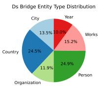

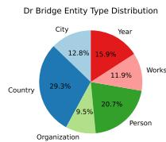

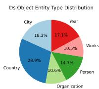

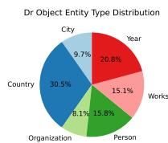  
Figure 7: Pie charts illustrating the statistics of our constructed dataset.

# C Additional Information Node localization Analysis

# C.1 Detailed Sample Block Results

Detailed sample with block results are shown in Figure 8.

# C.2 Window Size

Different Block Results of corresponding window size k for LLaMA 2 are as Figure 19.Finally, we choose the window size $k = 7$ for LLaMA-2 7B and k = 9 for LLaMA-2 13B.

# D Additional Analysis of Subject Enrichment and Relation-related Candidate Formulation

# D.1 Examples for Subject Enrichment

Here are some additional enrichment examples in top-k tokens with relation-related are highlighted

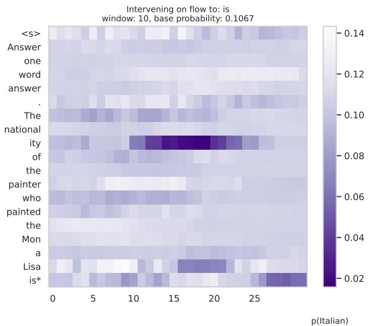

heatmap

| | <s> | Answer | one | word | answer |
|---|---|---|---|---|---|
| . | | | | | |
| The | | | | | |
| national | | | | | |
| ity | | | | | |
| of | | | | | |
| the | | | | | |
| painter | | | | | |
| who | | | | | |
| painted | | | | | |
| the | | | | | |
| Mon | | | | | |
| a | | | | | |
| Lisa | | | | | |
| is* | | | | | |
| (pItalian) p(Italian) : 0.14
Intervening on flow to: is
window: 10, base probability: 0.1067

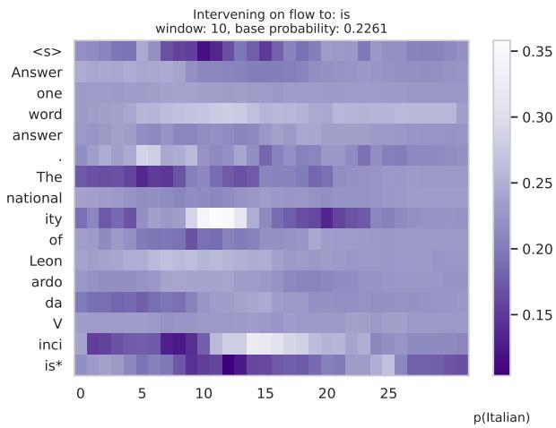  
Figure 8: Examples of knocking out attention results.

in bold.

# E Tracking Results of Final Anwer

The tracking results of final prediction probabilities and ranks are shown in Figure 9

# F Indirect Methods to Validate the Metric

We employ two indirect methods to modify the model’s reasoning path and observe changes in the metric ARR(b, o) to validate its sensitivity and reliability.

# Method 1: Subject Replacement (s  s′)

Description. We replace the subject entity s with a new entity s′, observing changes in the model’s reasoning path. This replacement alters the relationship between the subject and the bridge entity (b), leading to a new bridge entity b′. Original reasoning path:

$$
s \xrightarrow {r _ {1}} b \xrightarrow {r _ {2}} o
$$

Reasoning path after replacement:

$$
s ^ {\prime} \xrightarrow {r _ {1}} b ^ {\prime} \xrightarrow {r _ {2}} o
$$

The metric ARR(b, o) is evaluated before and after replacement to assess its ability to capture changes in the bridge entity.

Experimental Setup. We select multi-hop reasoning tasks with clear reasoning paths, such as those in geography, history, or science domains. The replacement ensures that the new reasoning path remains semantically valid and commonsensical. Example Question: Original: "What is the capital city of the country where [Eiffel Tower] is located?" Replacement: "What is the capital city of the country where [Big Ben] is located?

Results. By comparing activation values at intermediate layers before and after replacement, we evaluate changes in the bridge entity (b  b′). The metric ARR(b, o) demonstrates sensitivity to reasoning path changes. Example: After replacing s s′, the metric decreased from 0.75 to 0.42, indicating its capability to capture the impact of bridge entity changes.

# Method 2: Fine-Tuning the Dataset (Co-occurrence Enhancement)

Description. We fine-tune the dataset to increase the co-occurrence frequency between s and o, encouraging the model to learn shortcuts (s o) instead of the full reasoning path. In the original dataset, s and o have a low co-occurrence frequency, compelling the model to rely on the bridge entity b. Fine-tuning artificially increases the frequency of direct s-o pairs, reducing the model’s dependence on b.

Experimental Setup. Fine-tuned Dataset Examples: Original: "What is the capital city of the country where [Eiffel Tower] is located?" (Reasoning path: Eiffel Tower → France → Paris) Fine-tuned: "What is the capital city of the country where [Eiffel Tower] is located? Paris is the capital city." (Guiding the model to directly learn s  o)

We apply different co-occurrence frequency levels (low, medium, high) and compare the changes in the model’s reasoning path.

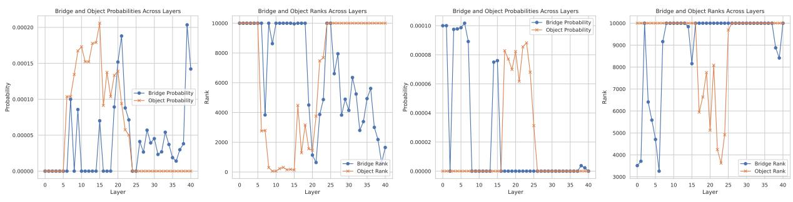  
Figure 9: Tracking results of probabilities and ranks in the last position.

Results. After fine-tuning, the model significantly shifts its reasoning path, increasing the likelihood of directly associating s with o. The metric ARR(b, o) decreases correspondingly, reflecting reduced reliance on b. Example: Under highfrequency conditions, the metric decreased from 0.65 to 0.20, demonstrating its sensitivity to the reasoning path shift.

# Comprehensive Validation and Discussion

Validation Process. We compare the results of both methods, analyzing the trends in ARR(b, o). Both subject replacement and dataset fine-tuning experiments demonstrate that the metric reliably captures reasoning path changes, whether through bridge entity substitution or shortcut learning.

# Discussion

• Metric Sensitivity: The metric ARR(b, o) is highly sensitive to changes in the reasoning path, effectively reflecting shifts from full reasoning to shortcut-based learning.   
• Reasoning Bias: Fine-tuning experiments reveal that the model tends to favor high cooccurrence paths, highlighting the influence of pretraining data on reasoning preferences.   
• Future Work: Further refinement of the metric could enhance its robustness to more complex reasoning path variations.

Through experiments involving subject replacement and dataset fine-tuning, we indirectly validate the reliability and effectiveness of the metric ARR(b, o). The results demonstrate that the metric accurately reflects changes in the reasoning path, providing a robust tool for analyzing reasoning patterns in multi-hop reasoning tasks.

# G More details of Knowledge Conflict Experiment

<table><tr><td>Model</td><td></td><td> $D_1$ </td><td> $D_2$ </td><td> $D_3$ </td><td> $D_4$ </td></tr><tr><td rowspan="2">LLaMA 2-7B</td><td>ARR &gt;0</td><td>23%</td><td>46%</td><td>74%</td><td>48%</td></tr><tr><td>ARR &lt;0</td><td>77%</td><td>54%</td><td>26%</td><td>52%</td></tr><tr><td rowspan="2">LLaMA 2-13B</td><td>ARR &gt;0</td><td>21%</td><td>58%</td><td>72%</td><td>47%</td></tr><tr><td>ARR &lt;0</td><td>79%</td><td>42%</td><td>38%</td><td>53%</td></tr><tr><td rowspan="2">Pythia-6.9B</td><td>ARR &gt;0</td><td>19%</td><td>51%</td><td>75%</td><td>45%</td></tr><tr><td>ARR &lt;0</td><td>81%</td><td>49%</td><td>25%</td><td>55%</td></tr><tr><td rowspan="2">Pythia-12B</td><td>ARR &gt;0</td><td>22%</td><td>54%</td><td>76%</td><td>44%</td></tr><tr><td>ARR &lt;0</td><td>78%</td><td>46%</td><td>24%</td><td>56%</td></tr><tr><td rowspan="2">DeepSeek-1.3B</td><td>ARR &gt;0</td><td>25%</td><td>49%</td><td>68%</td><td>43%</td></tr><tr><td>ARR &lt;0</td><td>75%</td><td>51%</td><td>32%</td><td>57%</td></tr><tr><td rowspan="2">DeepSeek-7B</td><td>ARR &gt;0</td><td>20%</td><td>53%</td><td>77%</td><td>46%</td></tr><tr><td>ARR &lt;0</td><td>80%</td><td>47%</td><td>23%</td><td>54%</td></tr><tr><td rowspan="2">DeepSeek-14B</td><td>ARR &gt;0</td><td>18%</td><td>56%</td><td>79%</td><td>45%</td></tr><tr><td>ARR &lt;0</td><td>82%</td><td>44%</td><td>21%</td><td>55%</td></tr><tr><td rowspan="2">DeepSeek-32B</td><td>ARR &gt;0</td><td>15%</td><td>59%</td><td>83%</td><td>41%</td></tr><tr><td>ARR &lt;0</td><td>85%</td><td>41%</td><td>17%</td><td>59%</td></tr></table>

Table 11: ARR values for different models in datasets $( D _ { 1 }$ to $D _ { 4 } )$ , reflecting the correlation between the model’s internal mechanisms and decision styles.

The overall results of ARR values in different datasets are shown in Table 11.The possible reasons relevant to the reasoning mode in $D _ { 2 }$ are as follows showing and examples are shown in Table 12:

# 1. Latent Reasoning

When the model engages in latent reasoning, it tends to prioritize external information. Even when the model’s memory is accurate, it can be significantly influenced by misleading context.

# 2. Factual Shortcut

Even if the model has already undergone factual shortcuts, the base fact may still trigger another shortcut. The model exhibits reduced robustness when facing disruptive inputs.

For $D _ { 4 }$ , there could be many possible reasons, and it is also related to the model’s generalization and generation capabilities.

# H More Discussions about Our Experiments

# H.1 Influence of Object Popularity on Ranking Experiments

In this section, we further discuss the potential impact of object popularity on the results of our ranking experiments. Object popularity refers to the frequency with which a particular object appears in large corpora or in diverse contexts, which could affect how the model ranks different objects when subjected to multi-hop reasoning tasks.

Our initial ranking experiment provided some insights, but we observed that object popularity could introduce biases that impact the model’s ranking behavior. Specifically, objects with higher popularity may be ranked more highly, even when they do not semantically fit the context of a given question. This phenomenon could distort the model’s decision-making process, particularly in multi-hop queries where the model must navigate through complex relations and intermediate entities.

We hypothesize that the model may rely on object popularity as a shortcut, especially in scenarios where the model is uncertain about the correct answer. The influence of object popularity may be especially pronounced when the model faces noisy or conflicting inputs, as it could prioritize familiar, frequently occurring objects over less common, but semantically relevant, entities.

To evaluate this influence in greater detail, we propose conducting additional ranking experiments, focusing on the following aspects:

• Measuring Object Popularity: To systematically assess the impact of object popularity, we will first measure it by analyzing large text corpora to obtain frequency statistics. Popularity will be assessed based on the frequency with which objects appear in various contexts, such as news articles, encyclopedias, and other publicly available sources.   
• Selecting Object Pairs with Similar Popularity: To isolate the effect of popularity from other factors, we will select object pairs with similar popularity but differing semantic associations. For example, we might compare "Paris" (as a capital city) with "Einstein" (as a famous scientist). Both may have similar popularity, but their semantic contexts are distinct, making them suitable for testing the role of object popularity in ranking.

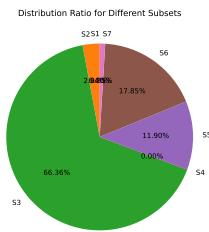

pie

| Subset | Distribution Ratio (%) |
| :--- | :--- |
| S3 | 66.36 |
| S4 | 0.00 |
| S5 | 11.90 |
| S6 | 17.85 |
| S7 | 2.08 |
| S2S1 | 0.00 |

Figure 10: Proportion of the object in each subset.

• Conducting Comparative Experiments: We will replace objects in the ranking experiments and analyze whether the model’s behavior is influenced by the popularity of the object. Specifically, we will examine if the POC/SOC (Popularity of Object/Subject of Change) effect persists when objects are swapped in different scenarios.

The results of these experiments will help us understand how object popularity interacts with the model’s reasoning mechanisms, particularly in the context of multi-hop reasoning tasks. If object popularity proves to have a significant influence, we will explore strategies to mitigate its effects, ensuring more accurate and contextually relevant rankings in future models.

# H.2 Object-related Subset Issue

In this section, we address an important aspect of our experimental design: the Object-related Subset Issue. Our investigation into multi-hop reasoning required us to define subsets based on the presence and relevance of objects, ensuring the analysis remained focused on the model’s reasoning modes rather than unrelated variables. We divided the data into seven subsets to capture different interactions between the objects and bridge entities.

# H.2.1 1. Proportion of the Subset Containing the Object

To study the object-related subset distribution, we created seven subsets, each containing different combinations of the object’s involvement across various relational contexts. These subsets were designed to isolate the role of the object in multi-hop reasoning, focusing on how object relevance influences the overall model behavior. The proportion of the object in each subset was calculated based on the dataset, as shown in the Figure ??: This distribution shows the varying degrees of object influence across subsets, with the majority of the object data residing in subset S3, where objects play a critical role in the reasoning process.

# H.2.2 2. Subset Choice: Why Not

$$
A b - A s - A o + A b o s?
$$

In multi-hop reasoning, we specifically chose subsets that maintain the focus on bridge-related attributes rather than those that complicate the subject’s enrichment process. Our key insight is that the enrichment of the subject position is crucial for reasoning, and we aim to exclude unnecessary interferences, such as unrelated objects, that do not contribute to this process.

Choosing the subsets that isolate the bridgerelated attributes allows us to control for variables that could distract from our main objective, i.e., analyzing how the model encodes bridge information during reasoning. This approach ensures that we focus on the most relevant components in multi-hop tasks.

# H.2.3 3. Adjustments and Testing

To ensure the object’s effect on the reasoning process was appropriately considered, we conducted further testing by adjusting the weight of the object across subsets. This adjustment did not significantly alter the model’s performance or reasoning behavior, confirming that the object’s influence, when controlled, does not overshadow the bridgerelated reasoning mechanisms.

Additionally, we conducted experiments using a smoothing adjustment strategy for the logits associated with the object, which helped to prevent excessive interference from the object’s presence. Our testing results showed that the model’s output was more influenced by the attribute information rather than by the object itself.

# H.2.4 4. Conclusion

The object-related subset issue highlights the importance of careful dataset design when investigating multi-hop reasoning in large language models. By isolating the effects of objects and focusing on bridge-related reasoning, we ensure that the experiments accurately reflect the internal mechanisms at play. The use of subsets where the object plays a controlled role allows us to better understand how the model encodes and utilizes multi-hop information, paving the way for more robust future investigations into reasoning patterns and model interpretability.

# I Extending ARR to Multi-hop Reasoning

The ARR metric is inherently model-agnostic and task-agnostic, relying solely on semantic correlations in hidden states. This makes it naturally extensible to more complex reasoning scenarios beyond two-hop tasks. Here, we demonstrate its application to three-hop reasoning.

# I.1 ARR Application to Three-Hop Reasoning

We analyze a three-hop reasoning example to demonstrate ARR’s extensibility:

Question: "What is the capital city of the country where the scientist who discovered radium was born?"

• First-hop: $s = "$ scientist who discovered ra-$\mathrm { d i u m " }  b _ { 1 } = " .$ Marie Curie"   
• Second-hop: $b _ { 1 } = " { \mathrm { M a r i e } } \ { \mathrm { C u r i e } } " \ \to \ b _ { 2 } =$ "Poland" (country of birth)   
• Third-hop: $b _ { 2 } = { } ^ { \prime \prime } \mathrm { P o l a n d " }  o = { } ^ { \prime \prime } \mathrm { W a r s a w " }$ (capital city)

Table 13 shows the structure of ARR computation across multiple reasoning hops: 

<table><tr><td>Hop</td><td>Bridge (b)</td><td>Object (o)</td><td>ARR Computation</td></tr><tr><td>1-hop</td><td>Marie Curie</td><td>Poland</td><td> $\text{ARR}(b_1, o_1)$ </td></tr><tr><td>2-hop</td><td>Poland</td><td>Warsaw</td><td> $\text{ARR}(b_2, o_2)$ </td></tr><tr><td>Final</td><td>Warsaw</td><td>—</td><td>For final prediction</td></tr></table>

Table 13: Structure of ARR computation for multi-hop reasoning tasks.

Table 14 shows the ARR values measured across different layers: 

<table><tr><td rowspan="2">Layer</td><td colspan="3">First Hop</td><td colspan="3">Second Hop</td></tr><tr><td> $\text{logit}(b_1)$ </td><td> $\text{logit}(o_1)$ </td><td> $\text{ARR}_1$ </td><td> $\text{logit}(b_2)$ </td><td> $\text{logit}(o_2)$ </td><td> $\text{ARR}_2$ </td></tr><tr><td>50</td><td>0.32</td><td>0.41</td><td>-0.09</td><td>0.25</td><td>0.20</td><td>+0.05</td></tr><tr><td>55</td><td>0.45</td><td>0.42</td><td>+0.03</td><td>0.33</td><td>0.29</td><td>+0.04</td></tr><tr><td>65</td><td>0.61</td><td>0.47</td><td>+0.14√</td><td>0.54</td><td>0.36</td><td>+0.18√</td></tr></table>

Table 14: ARR values where $b _ { 1 } { = } \mathbf { M a r i e } \mathrm { C u r i e } .$ o1=Poland, $b _ { \mathrm { 2 } } { = } \mathrm { P o l a n d }$ , and $o _ { 2 } { = } \mathrm { W a r s a w } .$ .

# I.2 Insights from Multi-hop ARR Analysis

Several important patterns emerge from our extended ARR analysis:

1. Hierarchical Processing: The transition from negative to positive ARR values demonstrates that the model gradually shifts from shortcut behavior to structured reasoning as information progresses through layers.

2. Layer Specialization: Even in large models, reasoning steps tend to concentrate in the midto-late layers (beyond layer 50 in our example), suggesting that multi-hop reasoning is not uniformly distributed but emerges prominently in later processing stages.

3. Step-wise Verification: ARR can effectively track each step of a multi-hop reasoning chain $( \mathrm { A R R _ { 1 } , A R R _ { 2 } }$ , etc.), allowing researchers to pinpoint where and how specific reasoning steps occur within the model.

# I.3 Future Directions for ARR in Complex Reasoning Tasks

The ARR methodology can be naturally extended to analyze more complex reasoning patterns:

1. N-hop Generalization: ARR can be computed recursively for each hop in arbitrarily long reasoning chains, providing a consistent measurement framework across reasoning complexity levels.   
2. Reasoning Graph Analysis: For tasks with branching reasoning paths, multiple ARR measurements can track parallel reasoning processes and identify which paths most influence the model’s final decision.   
3. Cross-architectural Comparisons: As a model-agnostic metric, ARR enables standardized comparison of reasoning mechanisms across different model architectures and scales, potentially revealing how architectural choices impact reasoning capabilities.

By applying ARR to more complex reasoning scenarios, we can develop a more comprehensive understanding of how transformer-based language models implement multi-step reasoning.

<table><tr><td>Prompt</td><td>Layer</td><td>Top k tokens</td></tr><tr><td>The country of citizenship of the spouse of Henry Clifford, 2nd Earl of Cumberland is</td><td>5</td><td>&#x27;ord&#x27;, &#x27;ords&#x27;, &#x27;ORD&#x27;, &#x27;lord&#x27;, &#x27;Nord&#x27;, &#x27;Gordon&#x27;, &#x27;Lord&#x27;, &#x27;Bruno&#x27;, &#x27;Jord&#x27;, &#x27;orney&#x27;, &#x27;Borg&#x27;, &#x27;Ford&#x27;, &#x27;orde&#x27;, &#x27;ardon&#x27;, &#x27;Leonard&#x27;, &#x27;ordon&#x27;, &#x27;Jordan&#x27;, &#x27;org&#x27;, &#x27;ardo&#x27;, &#x27;Lincoln&#x27;, &#x27;Cord&#x27;, &#x27;Meyer&#x27;, &#x27;order&#x27;, &#x27;laravel&#x27;, &#x27;orden&#x27;, &#x27;&#x27;, &#x27;afford&#x27;, &#x27;Cleveland&#x27;, &#x27;&#x27;, &#x27;&#x27;, &#x27;Clark&#x27;, &#x27;orm&#x27;, &#x27;odor&#x27;, &#x27;Paul&#x27;, &#x27;dorf&#x27;, &#x27;wd&#x27;, &#x27;Oliver&#x27;, &#x27;üss&#x27;, &#x27;ald&#x27;, &#x27;eras&#x27;, &#x27;org&#x27;, &#x27;ford&#x27;, &#x27;Morris&#x27;, &#x27;Oriental&#x27;, &#x27;&#x27;, &#x27;revision&#x27;, &#x27;örd&#x27;, &#x27;Carter&#x27;, &#x27;uv&#x27;, &#x27;med&#x27;, &#x27;roid&#x27;, &#x27;icy&#x27;, &#x27;longest&#x27;, &#x27;iegel&#x27;, &#x27;Vincent&#x27;, &#x27;cord&#x27;, &#x27;abil&#x27;, &#x27;bord&#x27;, &#x27;afka&#x27;, &#x27;olk&#x27;, &#x27;anda&#x27;, &#x27;thur&#x27;, &#x27;intendo&#x27;, &#x27;igneur&#x27;</td></tr><tr><td></td><td>15</td><td>&#x27;enson&#x27;, &#x27;land&#x27;, &#x27;Stanley&#x27;, &#x27;endorf&#x27;, &#x27;ington&#x27;, &#x27;Mountains&#x27;, &#x27;inton&#x27;, &#x27;cki&#x27;, &#x27;eston&#x27;, &#x27;indeed&#x27;, &#x27;emberg&#x27;, &#x27;department&#x27;, &#x27;industrial&#x27;, &#x27;ardin&#x27;, &#x27;yard&#x27;, &#x27;enty&#x27;, &#x27;ena&#x27;, &#x27;ley&#x27;, &#x27;öv&#x27;, &#x27;ember&#x27;, &#x27;&#x27;, &#x27;andon&#x27;, &#x27;dimensional&#x27;, &#x27;England&#x27;, &#x27;Mountain&#x27;, &#x27;ani&#x27;, &#x27;burgo&#x27;, &#x27;&#x27;, &#x27;Pakistan&#x27;, &#x27;Thompson&#x27;, &#x27;eland&#x27;, &#x27;Holland&#x27;, &#x27;specification&#x27;, &#x27;founder&#x27;, &#x27;&#x27;, &#x27;Williams&#x27;, &#x27;mouth&#x27;, &#x27;ŋ&#x27;, &#x27;ional&#x27;, &#x27;Prince&#x27;, &#x27;inten&#x27;, &#x27;ruck&#x27;, &#x27;numbers&#x27;, &#x27;heid&#x27;, &#x27;javascript&#x27;, &#x27;&#x27;, &#x27;oux&#x27;, &#x27;entic&#x27;, &#x27;Kent&#x27;, &#x27;jal&#x27;, &#x27;highly&#x27;, &#x27;Sher&#x27;, &#x27;burg&#x27;, &#x27;Richmond&#x27;, &#x27;achi&#x27;, &#x27;snow&#x27;, &#x27;ɛd&#x27;, &#x27;bland&#x27;, &#x27;Canada&#x27;, &#x27;fection&#x27;, &#x27;rias&#x27;, &#x27;anson&#x27;, &#x27;abb&#x27;, &#x27;yman&#x27;, &#x27;agar&#x27;, &#x27;burgh&#x27;, &#x27;&#x27;, &#x27;Connecticut&#x27;, &#x27;ham&#x27;, &#x27;Robinson&#x27;, &#x27;stick&#x27;, &#x27;actor&#x27;</td></tr><tr><td></td><td>25</td><td>&#x27;land&#x27;, &#x27;enson&#x27;, &#x27;bury&#x27;, &#x27;ington&#x27;, &#x27;Stanley&#x27;, &#x27;gren&#x27;, &#x27;anton&#x27;, &#x27;eston&#x27;, &#x27;eland&#x27;, &#x27;endorf&#x27;, &#x27;mouth&#x27;, &#x27;chester&#x27;, &#x27;leton&#x27;, &#x27;emberg&#x27;, &#x27;Franklin&#x27;, &#x27;Maryland&#x27;, &#x27;England&#x27;, &#x27;dale&#x27;, &#x27;Duke&#x27;, &#x27;Department&#x27;, &#x27;composition&#x27;, &#x27;fly&#x27;, &#x27;&#x27;, &#x27;borough&#x27;, &#x27;ardin&#x27;, &#x27;Edinburgh&#x27;, &#x27;igny&#x27;, &#x27;irmingham&#x27;, &#x27;Scotland&#x27;, &#x27;orton&#x27;, &#x27;burg&#x27;, &#x27;folk&#x27;, &#x27;&#x27;, &#x27;inden&#x27;, &#x27;ivan&#x27;, &#x27;&#x27;, &#x27;Russell&#x27;, &#x27;cki&#x27;, &#x27;hardt&#x27;, &#x27;York&#x27;, &#x27;hausen&#x27;, &#x27;beck&#x27;, &#x27;Lincoln&#x27;, &#x27;stone&#x27;, &#x27;enberg&#x27;, &#x27;&#x27;, &#x27;lease&#x27;, &#x27;rei&#x27;, &#x27;anson&#x27;, &#x27;inton&#x27;, &#x27;County&#x27;, &#x27;inson&#x27;, &#x27;unt&#x27;, &#x27;ortheast&#x27;, &#x27;insen&#x27;, &#x27;ansen&#x27;, &#x27;olk&#x27;, &#x27;Braun&#x27;, &#x27;mole&#x27;, &#x27;District&#x27;, &#x27;heim&#x27;, &#x27;&#x27;, &#x27;ols&#x27;, &#x27;&#x27;, &#x27;ström&#x27;, &#x27;bol&#x27;, &#x27;lyn&#x27;, &#x27;Leopold&#x27;, &#x27;ford&#x27;, &#x27;&#x27;, &#x27;founder&#x27;, &#x27;aki&#x27;, &#x27;ama&#x27;, &#x27;onian&#x27;, &#x27;personally&#x27;</td></tr></table>

Table 9: Top-k tokens extracted from different layers for the first subject.

<table><tr><td>Prompt</td><td>Layer</td><td>Top k tokens</td></tr><tr><td>The capital of the country with the Pyramids of Giza is</td><td>5</td><td>&#x27;iza&#x27;, &#x27;Egypt&#x27;, &#x27;izar&#x27;, &#x27;iz&#x27;, &#x27;gypt&#x27;, &#x27;izia&#x27;, &#x27;airo&#x27;, &#x27;Peru&#x27;, &#x27;itza&#x27;, &#x27;isa&#x27;, &#x27;tomb&#x27;, &#x27;za&#x27;, &#x27;Elis&#x27;, &#x27;ixa&#x27;, &#x27;isi&#x27;, &#x27;icia&#x27;, &#x27;aza&#x27;, &#x27;ifa&#x27;, &#x27;ja&#x27;, &#x27;Gia&#x27;, &#x27;Jerusalem&#x27;, &#x27;&#x27;, &#x27;Lis&#x27;, &#x27;Gaz&#x27;, &#x27;tick&#x27;, &#x27;Iz&#x27;, &#x27;aris&#x27;, &#x27;izo&#x27;, &#x27;iso&#x27;, &#x27;IZ&#x27;, &#x27;zeta&#x27;, &#x27;hausen&#x27;, &#x27;ya&#x27;, &#x27;amaz&#x27;, &#x27;nitz&#x27;, &#x27;itzer&#x27;, &#x27;cca&#x27;, &#x27;inta&#x27;, &#x27;hoff&#x27;, &#x27;cian&#x27;, &#x27;zyk&#x27;, &#x27;ixon&#x27;, &#x27;biz&#x27;, &#x27;&#x27;, &#x27;izz&#x27;, &#x27;Jung&#x27;, &#x27;ocia&#x27;, &#x27;zza&#x27;, &#x27;pc&#x27;, &#x27;ira&#x27;, &#x27;Roma&#x27;, &#x27;&#x27;, &#x27;&#x27;, &#x27;izations&#x27;, &#x27;ancient&#x27;, &#x27;isie&#x27;, &#x27;arte&#x27;, &#x27;&#x27;, &#x27;observ&#x27;, &#x27;baz&#x27;, &#x27;aka&#x27;, &#x27;ization&#x27;, &#x27;izza&#x27;, &#x27;Paris&#x27;, &#x27;existed&#x27;, &#x27;yard&#x27;, &#x27;ka&#x27;, &#x27;&#x27;, &#x27;ba&#x27;, &#x27;zo&#x27;, &#x27;ysz&#x27;, &#x27;osi&#x27;, &#x27;&#x27;, &#x27;Krak&#x27;, &#x27;lava&#x27;, &#x27;zien&#x27;, &#x27;jar&#x27;, &#x27;aga&#x27;, &#x27;zat&#x27;, &#x27;endl&#x27;</td></tr><tr><td></td><td>15</td><td>&#x27;Egypt&#x27;, &#x27;iza&#x27;, &#x27;gia&#x27;, &#x27;gypt&#x27;, &#x27;ica&#x27;, &#x27;Peru&#x27;, &#x27;airo&#x27;, &#x27;izia&#x27;, &#x27;isie&#x27;, &#x27;Janeiro&#x27;, &#x27;isi&#x27;, &#x27;auff&#x27;, &#x27;igo&#x27;, &#x27;&#x27;, &#x27;Grey&#x27;, &#x27;bia&#x27;, &#x27;Jordan&#x27;, &#x27;&#x27;, &#x27;Houston&#x27;, &#x27;Miami&#x27;, &#x27;uez&#x27;, &#x27;&#x27;, &#x27;fica&#x27;, &#x27;unda&#x27;, &#x27;phrase&#x27;, &#x27;icia&#x27;, &#x27;uga&#x27;, &#x27;ptic&#x27;, &#x27;onian&#x27;, &#x27;Africa&#x27;, &#x27;Brazil&#x27;, &#x27;hoz&#x27;, &#x27;inta&#x27;, &#x27;ids&#x27;, &#x27;Alexand&#x27;, &#x27;eda&#x27;, &#x27;izza&#x27;, &#x27;itzer&#x27;, &#x27;Singapore&#x27;, &#x27;anska&#x27;, &#x27;&#x27;, &#x27;projects&#x27;, &#x27;bi&#x27;, &#x27;raz&#x27;, &#x27;gender&#x27;, &#x27;era&#x27;, &#x27;yrus&#x27;, &#x27;&#x27;, &#x27;fico&#x27;, &#x27;gray&#x27;, &#x27;stones&#x27;, &#x27;na&#x27;, &#x27;indi&#x27;, &#x27;python&#x27;, &#x27;Kent&#x27;, &#x27;effic&#x27;, &#x27;&#x27;, &#x27;shoulder&#x27;, &#x27;antine&#x27;</td></tr><tr><td></td><td>25</td><td>&#x27;icians&#x27;, &#x27;documents&#x27;, &#x27;&lt;s&gt;&#x27;, &#x27;imin&#x27;, &#x27;&#x27;, &#x27;&#x27;, &#x27;vin&#x27;, &#x27;onian&#x27;, &#x27;ification&#x27;, &#x27;Gib&#x27;, &#x27;istan&#x27;, &#x27;Gil&#x27;, &#x27;Metropolitan&#x27;, &#x27;&#x27;, &#x27;mouth&#x27;, &#x27;ford&#x27;, &#x27;inda&#x27;, &#x27;&#x27;, &#x27;allow&#x27;, &#x27;agon&#x27;, &#x27;scribe&#x27;, &#x27;ou&#x27;, &#x27;isher&#x27;, &#x27;ey&#x27;, &#x27;ital&#x27;, &#x27;inclus&#x27;, &#x27;allen&#x27;, &#x27;Hamilton&#x27;, &#x27;Valley&#x27;, &#x27;Wayne&#x27;, &#x27;iza&#x27;, &#x27;ilities&#x27;, &#x27;validate&#x27;, &#x27;ingham&#x27;, &#x27;&#x27;, &#x27;Gia&#x27;, &#x27;assigning&#x27;, &#x27;andra&#x27;, &#x27;Lewis&#x27;, &#x27;aris&#x27;, &#x27;Jordan&#x27;, &#x27;Roberts&#x27;, &#x27;burg&#x27;, &#x27;&#x27;, &#x27;Ryan&#x27;, &#x27;WD&#x27;, &#x27;Gray&#x27;, &#x27;distance&#x27;, &#x27;ette&#x27;, &#x27;ila&#x27;, &#x27;simultaneously&#x27;, &#x27;gress&#x27;, &#x27;hire&#x27;, &#x27;oz&#x27;, &#x27;anti&#x27;, &#x27;angel&#x27;, &#x27;stone&#x27;, &#x27;ara&#x27;, &#x27;connections&#x27;, &#x27;&#x27;, &#x27;generalized&#x27;, &#x27;illa&#x27;, &#x27;Foundation&#x27;, &#x27;Gran&#x27;, &#x27;iche&#x27;, &#x27;Program&#x27;, &#x27;icular&#x27;, &#x27;achi&#x27;, &#x27;general&#x27;, &#x27;regression&#x27;, &#x27;stein&#x27;, &#x27;ayer&#x27;, &#x27;&#x27;, &#x27;ptic&#x27;</td></tr></table>

Table 10: Top-k tokens extracted from different layers for the second subject.

<table><tr><td>Scenario</td><td>Base Fact (c-)</td><td>Base Question (D+--&gt;D-)</td></tr><tr><td>ARR &gt; 0 (latent reasoning)</td><td>Callum McManaman was born in France</td><td>In which borough was Callum McManaman born?</td></tr><tr><td>ARR &lt; 0 (factual shortcut)</td><td>Einstein’s spouse is Elizabeth.</td><td>Where was Einstein’s spouse born?</td></tr></table>

Table 12: Examples in D2 (to be expanded in Appendix).

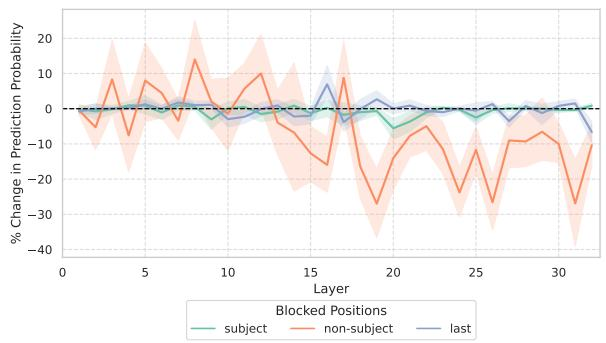

line

| Layer | subject | non-subject | last |
|-------|---------|-------------|------|
| 0     | 0       | 0           | 0    |
| 5     | 0       | 10          | 0    |
| 10    | 0       | 0           | 0    |
| 15    | 0       | -15         | 5    |
| 20    | 0       | -25         | 0    |
| 25    | 0       | -10         | 0    |
| 30    | 0       | -30         | -5   |
| 32    | 0       | -15         | -10  |

Figure 11: 7B Window 1

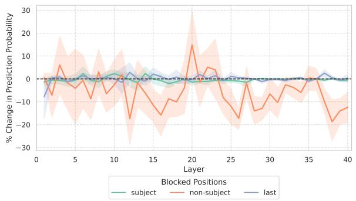

line

| Layer | subject | non-subject | last |
|-------|---------|-------------|------|
| 0     | 0       | 0           | 0    |
| 5     | 0       | -10         | 0    |
| 10    | 0       | 0           | 0    |
| 15    | 0       | -15         | 0    |
| 20    | 0       | 15          | 0    |
| 25    | 0       | -10         | 0    |
| 30    | 0       | -5          | 0    |
| 35    | 0       | 0           | 0    |
| 40    | 0       | -15         | 0    |

Figure 12: 13B Window 1

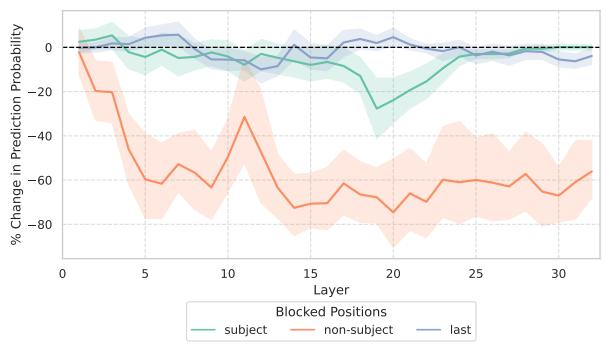

line

| Layer | subject | non-subject | last |
|-------|---------|-------------|------|
| 0     | 0       | 0           | 0    |
| 5     | -10     | -60         | -5   |
| 10    | -15     | -40         | -5   |
| 15    | -20     | -70         | -5   |
| 20    | -30     | -75         | -5   |
| 25    | -20     | -65         | -5   |
| 30    | -10     | -60         | -5   |

Figure 13: 7B Window 5

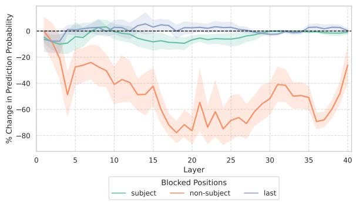

line

| Layer | subject | non-subject | last |
|-------|---------|-------------|------|
| 0     | 0       | 0           | 0    |
| 5     | -10     | -30         | -5   |
| 10    | -5      | -40         | -2   |
| 15    | -8      | -60         | 0    |
| 20    | -10     | -70         | 2    |
| 25    | -5      | -50         | 0    |
| 30    | -2      | -40         | -2   |
| 35    | 0       | -60         | 0    |
| 40    | 0       | -30         | 0    |

Figure 14: 13B Window 5

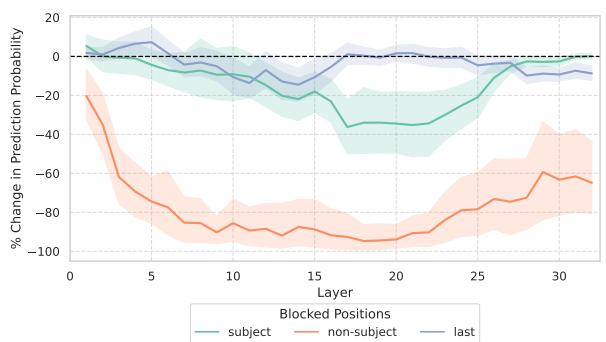

line

| Layer | subject | non-subject | last |
|-------|---------|-------------|------|
| 0     | 0       | -20         | 0    |
| 5     | -10     | -80         | 5    |
| 10    | -20     | -90         | -5   |
| 15    | -30     | -95         | -10  |
| 20    | -40     | -95         | 0    |
| 25    | -20     | -80         | -5   |
| 30    | 0       | -60         | -10  |

Figure 15: 7B Window 10

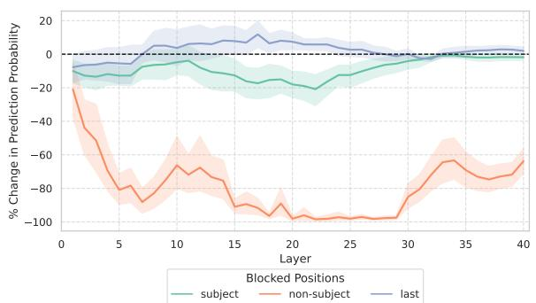

line

| Layer | subject | non-subject | last |
|-------|---------|-------------|------|
| 0     | -5      | -20         | -5   |
| 5     | -10     | -80         | -5   |
| 10    | -15     | -60         | 5    |
| 15    | -20     | -90         | 10   |
| 20    | -25     | -100        | 5    |
| 25    | -30     | -100        | 0    |
| 30    | -25     | -80         | 0    |
| 35    | -10     | -70         | 0    |
| 40    | 0       | -60         | 0    |

Figure 16: 13B Window 10

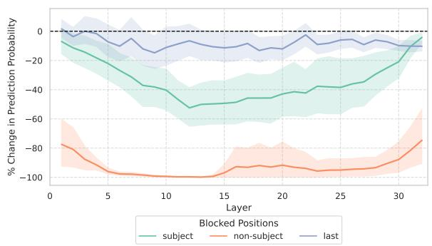

line

| Layer | subject | non-subject | last |
|-------|---------|-------------|------|
| 0     | -10     | -80         | 0    |
| 5     | -20     | -95         | -5   |
| 10    | -40     | -100        | -15  |
| 15    | -50     | -100        | -10  |
| 20    | -45     | -95         | -5   |
| 25    | -40     | -90         | 0    |
| 30    | -20     | -75         | 5    |
| 32    | 0       | -60         | 0    |

Figure 17: 7B Window 20

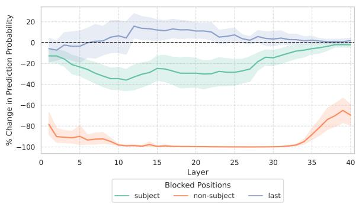

line

| Layer | subject | non-subject | last |
|-------|---------|-------------|------|
| 0     | -10     | -80         | -5   |
| 5     | -20     | -90         | 0    |
| 10    | -30     | -95         | 5    |
| 15    | -25     | -95         | 10   |
| 20    | -20     | -95         | 5    |
| 25    | -15     | -95         | 0    |
| 30    | -10     | -95         | -5   |
| 35    | -5      | -80         | -10  |
| 40    | 0       | -60         | -10  |

Figure 18: 13B Window 20   
Figure 19: Combined results for different windows (7B and 13B).