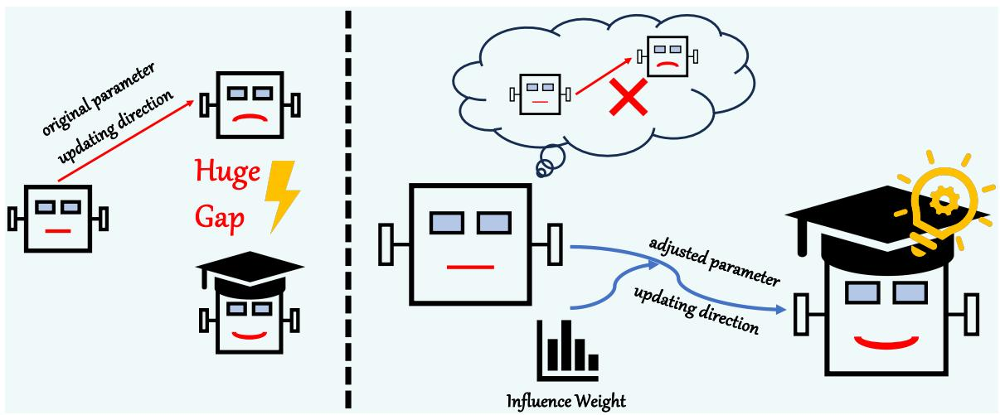
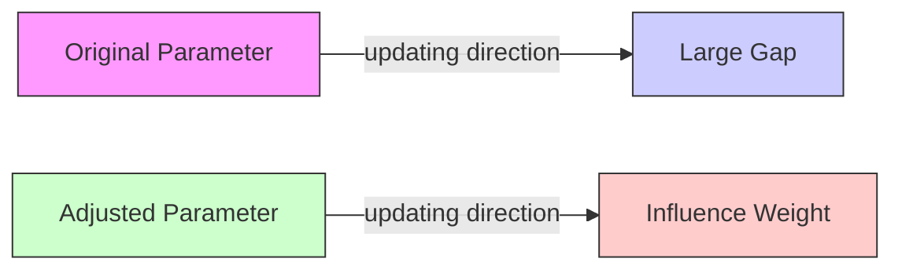
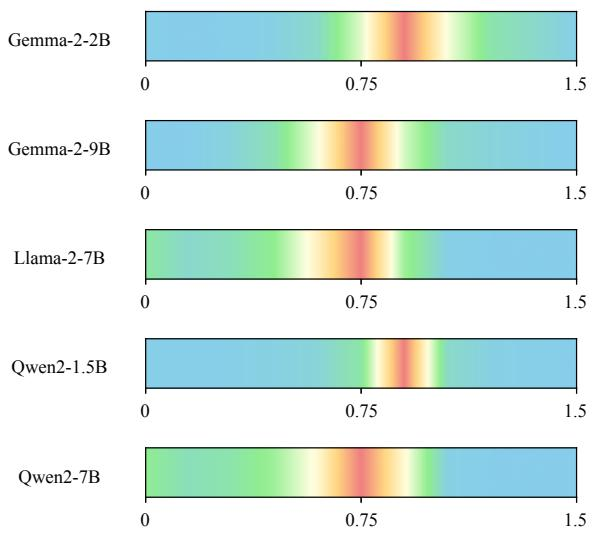
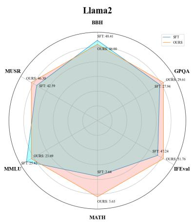
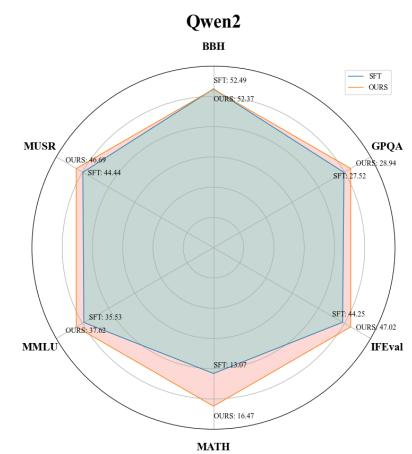
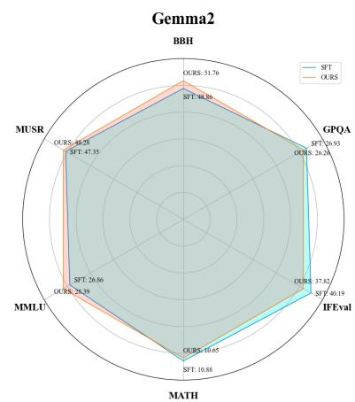
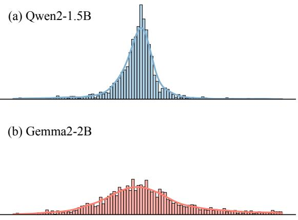

# ATLANTIS: Weak-to-Strong Learning via Importance Sampling

Yi Liu† Guoyin Wang Shicheng Li† Feifan Song† Xu Sun†

†State Key Laboratory of Multimedia Information Processing,

School of Computer Science, Peking University

{imliuyi,lisc99,xusun}@pku.edu.cn

# Abstract

Supervised fine-tuning (SFT) enables large language models to align with training data for better performance in many aspects. Nevertheless, the gap between the distribution of current datasets from human annotations or model generations and the real-world data distribution heavily limits the capacities and potentials of models. As a result, we propose a new SFT technique, ATLANTIS, to bridge the gap. We adopt importance sampling to estimate the optimal data distribution in the real world from existing training datasets because the former is hard to sample from. Furthermore, we introduce an extra small model and reference model to estimate the sampling ratio through the probability gap between them. We evaluate our method with benchmarks in knowledge & understanding and preference aspects. The experiment results prove that ATLANTIS can bring consistent and significant improvements to models’ performance. What’s more, our method can be flexibly transferred among models with different structures. Our analyses demonstrate that our method is well-compatible with other SFT techniques to further enhance models’ capacities and has great potential to be combined with existing training frameworks.

# 1 Introduction

With the proliferation of strong large language models (LLM), supervised fine-tuning (SFT) becomes a more and more important technique to allow base models to follow human instructions (Wei et al., 2021; Ouyang et al., 2022; Chung et al., 2024), align with data in specific domains (Yang et al., 2023; Tu et al., 2024), or alleviate bias existing in themselves (Guo et al., 2022; Zhou et al., 2023a). As a result, LLMs can serve as strong assistants for us to solve problems in different domains (OpenAI, 2022; Achiam et al., 2023).

The performance of the finetuned model heavily relies on the quality of the training dataset (Zhou et al., 2024). In order to train a human-like language model with strong capacities, we hope the training data can contain all the knowledge in the world and completely cover the chatting patterns of all human beings. We call this ideal dataset the optimal dataset and its corresponding distribution is the optimal distribution $p ^ { * }$ . In theory, $p ^ { * }$ can fully reflect the distribution of any natural language in the real world and fit the patterns of talking or writing for everyone, which is impossible for the current training technique because we can never collect all potential training data around the whole world. Alternatively, we choose to construct largescale SFT datasets with high quality to train strong models. The datasets collected from human annotations provide approaches to aligning models with actual human behaviors (Mishra et al., 2021; Conover et al., 2023). Considering the high cost of human annotations, many corpora consisting of real conversations between users and LLMs spring up (Teknium, 2023; Taori et al., 2023). However, neither kind of training dataset can fit the optimal distribution $p ^ { * }$ perfectly, since the training samples are not collected from the real world and are too limited in size to cover all possible cases in life. In other words, the target of fitting the distribution of the training datasets deviates from the optimal $p ^ { * }$ at the very beginning.

As a result, the gaps between training dataset distribution $p _ { d }$ and $p ^ { * }$ will heavily limit the capacities and potentials of LLMs, especially with the rapid increase in model scales and capacities. Continuous increase of training data size is a possible solution but is too costly. Many approaches to selecting training data can alleviate this problem to some extent (Li et al., 2023a, 2024a). Though improving models’ capacities through discarding training data with low quality, these methods fail to pay enough attention to the distribution gap and hardly make any efforts to bridge it.

Inspired by weak-to-strong generalization (Burns et al., 2023), we propose ATLANTIS (WeAk-to-sTrong Learning for sAmpliNg raTIo eStimation) to adjust the optimization direction towards the optimal distribution. The main difficulty in aligning models with the optimal distribution is that it is hard to sample from $p ^ { * }$ . Fortunately, importance sampling provides a solution to this problem. Importance sampling is a sampling strategy aiming to estimate the expectations of a function f under a probability density function p from which is hard to sample through another distribution q. As a result, we can use an existing training dataset, whose distribution corresponds to q, from real conversations or LLM responses to fit the optimal distribution. Importance sampling requires that the probability $p ( x )$ is calculable for a specific x to compute the sampling ratio. However, the target distribution $p *$ is incalculable because we cannot model the data distribution in the real world precisely. To tackle this problem, we introduce an extra small model to estimate the sampling ratio instead of calculating it directly. Specifically, we can redirect the optimization direction of a large base model to be finetuned towards $p ^ { * }$ during training process by calculating the gap between a smaller base model and its corresponding finetuned checkpoint. Figure 1 provides an intuitive illustration of our method.

flowchart

Figure 1: Demonstrations of the difference in naive fine-tuning and ATLANTIS. Naive fine-tuning (left) forces the language model to fit $p _ { d }$ (the sad-faced robot) that deviates from $p ^ { * }$ (the smiling robot wearing a graduation cap). ATLANTIS (right) optimizes the language model along a different direction, which is estimated through the gap between the reference model and the optimal distribution, and finally fits the optimal distribution.

The contributions of this work can be summarized as follows:

• To the best of our knowledge, we take the first step to introduce importance sampling to

SFT to bridge the gap between the optimal data distribution and the actual training data distribution.

• We propose ATLANTIS to estimate the sampling ratio through the probability gap between a small base model and its finetuned version, which is trained with datasets other than $p ^ { * }$ . The evaluation results prove the effectiveness of ATLANTIS in both knowledge & understanding and preference aspects.   
• Our further experiments demonstrate that our method is well-compatible with existing data selection methods and can be easily applied to existing training frameworks.

# 2 Methods

In this section, we will explain our proposed training technique ATLANTIS in detail. Specifically, this section will be structured as follows. In § 2.1, we will introduce relevant preliminaries including SFT and importance sampling. In § 2.2, we will illuminate our method step by step. In § 2.3, we will explore the relationship between our method and existing training techniques.

# 2.1 Preliminaries

Supervised Finetuning Assuming that we hope to align a model with the optimal data distribution $p ^ { * }$ , the training target is to minimize the gap between model output distribution $p _ { \theta }$ and $p ^ { * }$ :

$$
\mathcal {L} (\theta) = - \mathbf {E} _ {x \sim q (\cdot), y \sim p ^ {*} (\cdot | x)} \log p _ {\theta} (y | x) \tag {1}
$$

Actually, it is hard to sample training instances directly from $p ^ { * }$ and another alternative is to construct a high-quality training dataset. Given an SFT dataset $\bar { \mathcal { D } } = \bar { \{ } x _ { i } , y _ { i } \} _ { i = 1 } ^ { N }$ , the loss function of SFT is as follows:

$$
\begin{array}{l} \mathcal {L} (\theta) = - \mathbf {E} _ {x \sim q (\cdot), y \sim p _ {d} (\cdot | x)} \log p _ {\theta} (y | x) \\ = - \sum_ {x, y} p _ {d} (y | x) [ \log p _ {\theta} (y | x) ] \tag {2} \\ \end{array}
$$

where $p _ { d }$ represents the distribution of training data. However, there exists a gap between $p _ { d }$ and the optimal distribution from the real world, which means we will never align models with the optimal distribution $p ^ { * }$ with limited training samples. The gaps between the training target of SFT and the real-world data distribution will limit the capacities and potentials of LLMs.

Importance Sampling Importance sampling is a Monte Carlo method used to estimate the expectation under a probability distribution from which is hard to sample. For a given probability density function $p ( x )$ and a function $f ( x )$ , the expectation of $f ( x )$ under $p ( x )$ is:

$$
\mathbf {E} [ f ] = \int f (x) p (x) d x \tag {3}
$$

In this situation, we can introduce another distribution $q ( x )$ from which we can sample to estimate the expectation as follows:

$$
\mathbf {E} [ f ] = \int \frac {p (x)}{q (x)} f (x) q (x) d x \tag {4}
$$

We call the term $\frac { p ( x ) } { q ( x ) }$ sampling ratio. In the traditional scenario to which importance sampling is applied, $p ( x )$ can usually be computed for a given x. However, it is not calculable anymore in our settings, which is the problem to be solved.

# 2.2 ATLANTIS

When it comes to calculating SFT loss, we can convert Eq. 4 into the corresponding discrete form as follows:

$$
\mathbf {E} [ f ] = \sum_ {x} \frac {p (x)}{q (x)} f (x) q (x) \tag {5}
$$

Supposing a base model $p _ { b } ^ { L }$ which we call the large model, we hope to train $p _ { b } ^ { L }$ to fit the optimal distribution $p ^ { * }$ . To introduce importance sampling to SFT, we should find another appropriate distribution to estimate $p ^ { * }$ . Internet texts, LLM generations, and human annotations are important sources of the training corpora, whose distribution we mark as $p _ { r } . ~ p _ { r }$ is always weaker than the optimal $p ^ { * }$ , but the exact value of it for given x and y is calculable. As a result, we can estimate the expectation of $p ^ { * } ( y | x )$ from $p _ { r } ( y | x )$ through importance sampling though the latter is not the optimal distribution. The loss function can be rewritten as:

$$
\begin{array}{l} \mathcal {L} \left(p _ {b} ^ {L}\right) = - \sum_ {x, y} p ^ {*} (y | x) \left[ \log p _ {b} ^ {L} (y | x) \right] \\ = - \sum_ {x, y} \frac {p ^ {*} (y | x)}{p _ {r} (y | x)} p _ {r} (y | x) [ \log p _ {b} ^ {L} (y | x) ] \tag {6} \\ = - \mathbf {E} _ {x \sim q (\cdot), y \sim p _ {r} (\cdot | x)} [ \frac {p ^ {*} (y | x)}{p _ {r} (y | x)} \log p _ {b} ^ {L} (y | x) ] \\ \end{array}
$$

where the additional term $\frac { p ^ { * } ( y | x ) } { p _ { r } ( y | x ) }$ plays the role of sampling ratio. Different from other scenarios to which importance sampling is applied, the data distribution $p ^ { * }$ is not only hard to sample from but also impossible to calculate as aforementioned. Thus the sampling ratio is incalculable in this loss function. As a result, the main problem to solve in our work is to estimate the importance ratio appropriately without calculating $p ^ { * } ( x )$ .

Given a base model $p _ { b } ^ { S }$ smaller than $p _ { b } ^ { L }$ , which we call the small model, and its corresponding finetuned model, which can serve as the reference model $p _ { r }$ to estimate $p ^ { * }$ in Eq. 6. Note that we do not require $p _ { r }$ to fit $p ^ { * }$ perfectly and the possible distribution gap between them is allowed. According to the assumption in proxy-tuning (Liu et al., 2024), the distribution changes before and after SFT between the small and large model are proportional, which can be presented as:

$$
\frac {p ^ {*} (y | x)}{p _ {b} ^ {L} (y | x)} \propto \frac {p _ {r} (y | x)}{p _ {b} ^ {S} (y | x)}
$$

Thus we get the estimation for the importance ratio:

$$
\frac {p ^ {*} (y | x)}{p _ {r} (y | x)} \propto \frac {p _ {b} ^ {L} (y | x)}{p _ {b} ^ {S} (y | x)}
$$

Replacing the sampling ratio term $\frac { p ^ { * } ( y | x ) } { p _ { r } ( y | x ) }$ in Eq. $^ { 6 , }$ the final loss function can be rewritten as:

$$
\begin{array}{l} \mathcal {L} \left(p _ {b} ^ {L}\right) = - \mathbf {E} _ {x \sim q (\cdot), y \sim p _ {r} (\cdot | x)} \left[ \frac {p ^ {*} (y | x)}{p _ {r} (y | x)} \log p _ {b} ^ {L} (y | x) \right] \tag {7} \\ \propto - \mathbf {E} _ {x \sim q (\cdot), y \sim p _ {r} (\cdot | x)} [ \frac {p _ {b} ^ {L} (y | x)}{p _ {b} ^ {S} (y | x)} \log p _ {b} ^ {L} (y | x) ] \\ \end{array}
$$

heatmap

| Category     | Value |
| ------------ | ----- |
| Gemma-2-2B   | 0.75  |
| Gemma-2-9B   | 0.75  |
| Llama-2-7B   | 0.75  |
| Qwen2-1.5B   | 0.75  |
| Qwen2-7B     | 0.75  |

Figure 2: Similar distributions of influence weights across different models, where red and blue represent the highest and lowest density, respectively.

Compared to the vanilla loss function of SFT, we suppose that the training data is sampled from $p _ { r }$ in Eq. 7 and add an extra term $\frac { p _ { b } ^ { L } } { p _ { b } ^ { S } }$ to measure the distribution gap between the large and small models. The procedures of our method are illustrated in Algorithm 1.

# Algorithm 1 ATLANTIS

Input $p _ { b } ^ { L } , p _ { b } ^ { S } , p _ { r } , \mathcal { D } = \{ x _ { i } , y _ { i } \} _ { i = 1 } ^ { N }$ , max training steps M , learning rate α

# Output $p ^ { * }$

1: W  pLb (yi|xi) p $\begin{array} { r } { W  \{ \frac { p _ { b } ^ { L } ( y _ { i } | x _ { i } ) } { p _ { b } ^ { S } ( y _ { i } | x _ { i } ) } p _ { r } ( y _ { i } | x _ { i } ) \} _ { i = 1 } ^ { N } } \end{array}$   
2: $p _ { \theta _ { 0 } }  p _ { b } ^ { L }$   
3: for m = 1 to M do   
4: B ← next(D)   
5: $W _ { B } \gets n e \dot { x } t ( \dot { W } )$   
6: $\begin{array} { r } { \mathcal { L } ( \theta _ { m - 1 } ) \gets - \sum _ { i \in \mathcal { B } } \frac { W _ { B } ^ { i } } { | \mathcal { B } | } } \end{array}$   
7: $\begin{array} { r } { \theta _ { m }  \theta _ { m - 1 } - \alpha \frac { \partial \mathcal { L } ( \dot { \theta } _ { m - 1 } ) } { \partial \theta _ { m - 1 } } } \end{array}$   
8: end for   
9: p∗ ← pθ $p ^ { * }  p _ { \theta _ { M } }$

# 2.3 Relationship with Proxy-tuning

We can transform Eq. 7 into the following format:

$$
\begin{array}{l} \mathcal {L} \left(p _ {b} ^ {L}\right) \propto - \mathbf {E} _ {x \sim q (\cdot), y \sim p _ {r} (\cdot | x)} \left[ \frac {p _ {b} ^ {L} (y | x)}{p _ {b} ^ {S} (y | x)} \log p _ {b} ^ {L} (y | x) \right] \\ = - \sum_ {x, y} \frac {p _ {b} ^ {L} (y | x)}{p _ {b} ^ {S} (y | x)} p _ {r} (y | x) \log p _ {b} ^ {L} (y | x) \tag {8} \\ = - \mathbf {E} _ {x \sim q (\cdot), y \sim p _ {b} ^ {L} (\cdot | x)} [ \frac {p _ {r} (y | x)}{p _ {b} ^ {S} (y | x)} \log p _ {b} ^ {L} (y | x) ] \\ \end{array}
$$

Compared to Eq. 1, we add an extra item $\frac { p _ { r } ( y | x ) } { p _ { b } ^ { S } ( y | x ) }$

<table><tr><td>Models</td><td> $p_b^L$ </td><td> $p_b^S$ </td><td> $p_r$ </td></tr><tr><td>Llama2</td><td>13B Base</td><td>7B Base</td><td>7B-chat</td></tr><tr><td rowspan="2">Qwen2</td><td>7B Base</td><td>1.5B Base</td><td>1.5B-Instruct</td></tr><tr><td>72B Base</td><td>7B Base</td><td>7B-Instruct</td></tr><tr><td rowspan="2">Gemma2</td><td>9B Base</td><td>2B Base</td><td>2B-it</td></tr><tr><td>27B Base</td><td>9B Base</td><td>9B-it</td></tr></table>

Table 1: The settings of models in our experiments. $p _ { b } ^ { L }$ and $p _ { b } ^ { S }$ are all base models without SFT. $p _ { r }$ are all the official versions of finetuned models.

in our proposed loss function Eq. 8, which also provides another point of view to comprehend our method. In our method, we assume that the distribution moving direction from the base model to the finetuned model can be transferred from the small model to the large model. This core idea is similar to the motivation of proxy-tuning (Liu et al., 2024), whose method can be described as follows:

$$
p ^ {*} (y | x) = \text { softmax } \left(s _ {b} ^ {L} (y | x) + s _ {r} (y | x) - s _ {b} ^ {S} (y | x)\right) \tag {9}
$$

where $s ( y | x )$ represents the logit scores of a model given input x. Proxy-tuning adds the gap between the reference model and the small model to the large model so that the latter can capture the knowledge and abilities in the training data without finetuning. We show the performance comparison of proxy-tuning and ATLANTIS in the Appendix. Instead of directly transferring the distribution change to larger models, we choose to use the distribution gap to measure the importance of samples during training. Thus we call the extra term $\frac { p _ { r } ( y | x ) } { p _ { b } ^ { S } ( y | x ) }$ “influence weight”. In Figure 2, we show the distribution of influence weights for different models. We can regard this extra term as a weight for each training sample. For those samples whose probabilities rise more significantly from the base model to the finetuned model, we will endow them with higher weights. As a result, our methods can be seen as measuring the influence of training samples on optimization direction during SFT.

# 3 Experiments

# 3.1 Training Settings

We adopt three different series of models to conduct our experiments: Llama2 (Touvron et al., 2023), Qwen2 (Yang et al., 2024), and Gemma2 (Team et al., 2024). The specific settings are shown in Table 1. In order to further study the influence of model scales, we prefer model series with at least three different versions in size. We use

<table><tr><td rowspan="2">Model</td><td rowspan="2">Size</td><td rowspan="2">Method</td><td rowspan="2">Open LLM Leaderboard 2</td><td colspan="2">TruthfulQA</td><td colspan="2">MT-Bench</td><td colspan="2">AlpacaEval</td><td rowspan="2">Arena-Hard-Auto</td></tr><tr><td>MC1</td><td>MC2</td><td>Single</td><td>Pairwise</td><td>Easy</td><td>Hard</td></tr><tr><td rowspan="2">Llama2</td><td rowspan="2">13B</td><td>SFT</td><td>32.37</td><td>36.23</td><td>53.36</td><td>6.60</td><td>19.06</td><td>77.58</td><td>6.81</td><td>3.9</td></tr><tr><td>ATLANTIS</td><td>33.50</td><td>36.96</td><td>54.07</td><td>6.90</td><td>21.56</td><td>80.37</td><td>7.80</td><td>5.4</td></tr><tr><td rowspan="2">Qwen2</td><td rowspan="2">7B</td><td>SFT</td><td>36.22</td><td>35.37</td><td>51.45</td><td>7.44</td><td>25.63</td><td>72.57</td><td>6.41</td><td>9.9</td></tr><tr><td>ATLANTIS</td><td>38.19</td><td>35.62</td><td>52.65</td><td>7.53</td><td>26.25</td><td>75.40</td><td>6.51</td><td>9.5</td></tr><tr><td rowspan="2">Gemma2</td><td rowspan="2">9B</td><td>SFT</td><td>33.51</td><td>36.47</td><td>52.85</td><td>6.68</td><td>20.31</td><td>72.67</td><td>6.28</td><td>5.2</td></tr><tr><td>ATLANTIS</td><td>33.86</td><td>39.41</td><td>55.23</td><td>6.98</td><td>27.50</td><td>76.31</td><td>6.92</td><td>5.6</td></tr></table>

Table 2: Evaluation results for vanilla SFT and our ATLANTIS in knowledge & understanding and preference aspects. The better results for each model are highlighted in bold.

radar

| Metric | SFT   | OURS  |
|--------|-------|-------|
| BBH    | 48.41 | 40.00 |
| GPQA   | 27.94 | 29.61 |
| IFEval | 47.24 | 31.76 |
| MATH   | 2.64  | 3.63  |
| MMLU   | 25.43 | 23.69 |
| MUSR   | 46.30 | 42.59 |

radar

|        | SFT    | OURS   |
| ------ | ------ | ------ |
| BBH    | 52.49  | 53.37  |
| GPQA   | 27.52  | 28.94  |
| IFEval | 44.25  | 47.02  |
| MATH   | 13.07  | 16.47  |
| MMLU   | 37.80  | 37.80  |
| MUSR   | 44.44  | 46.89  |

radar

| Metric | SFT   | OURS  |
|--------|-------|-------|
| BBH    | 51.76 | 44.39 |
| GPQA   | 50.93 | 37.82 |
| IFEval | 40.19 | 37.82 |
| MATH   | 50.65 | 37.82 |
| MMLU   | 26.39 | 47.35 |
| MUSR   | 48.28 | 47.35 |

Figure 3: The specific evaluation results of Open LLM Leaderboard 2. We have stretched the scales in different dimensions for better visualization.

OpenHermes-2.5 (Teknium, 2023) as the training dataset. The implementation details are demonstrated in the Appendix.

# 3.2 Evaluation Benchmarks

We evaluate our methods in two aspects for a more comprehensive and promising conclusion:

Knowledge & Understanding We hope to evaluate the knowledge that models capture through SFT and their abilities to follow human instructions. We use Open LLM Leaderboard 2 (Fourrier et al., 2024), and TruthfulQA (Lin et al., 2021) for the evaluation. In specific, Open LLM Leaderboard 2 consists of six tasks including BBH (Suzgun et al., 2022), GPQA (Rein et al., 2023), IFEval (Zhou et al., 2023b), MATH-Hard (Hendrycks et al., 2021), MMLU-Pro (Wang et al., 2024), and MUSR (Sprague et al., 2024). For both benchmarks, we use the evaluation scripts from lmevaluation-harness1. All metrics for the two benchmarks are accuracy (or similar metrics) ranging from 0 to 1, and the higher the better.

Preference The preference of humans for the responses from a model is also an important metric. Thus we adopt MT-Bench (Zheng et al., 2023), AlpacaEval (Li et al., 2023b), and Arena-Hard-Auto (Li et al., 2024b) to evaluate human preference to models’ generations. In MT-Bench (single mode) and Arena-Hard-Auto, the metric is the average score from an LLM on the model’s responses. In MT-Bench (pairwise mode) and AlpacaEval, the metric is the winning rate of the model’s responses to a fixed baseline model’s responses judged by another LLM. All metrics are the higher the better.

# 3.3 Results

Our experiment results are shown in Table 2. In general, ATLANTIS brings steady and significant improvements in most cases. Our method not only enhances models’ capacities in general knowledge but also increases human preference for models’ responses. In the evaluation for knowledge & understanding, the benchmarks contain both multichoice tasks and generation tasks. The exhaustive evaluations fully reflect the comprehensive improvements brought by ATLANTIS in capturing knowledge, logical reasoning, following instructions, and solving problems. In the evaluation for preference, ATLANTIS shows better performance in both response scores and winning rates. Specifically, the improvement in winning rates (MT-Bench pairwise mode and AlpacaEval) is more significant. Since selecting the better one from two given answers is easier and more objective than giving a score to a single response without any comparison, it makes sense that ATLANTIS is more effective in raising winning rates.

<table><tr><td colspan="3">Data Selection Method</td><td colspan="4">IFD Score</td><td colspan="4">Superfiltering</td></tr><tr><td rowspan="2">Model</td><td rowspan="2">Sample rate</td><td rowspan="2">Method</td><td colspan="2">TruthfulQA</td><td colspan="2">MT-Bench</td><td colspan="2">TruthfulQA</td><td colspan="2">MT-Bench</td></tr><tr><td>MC1</td><td>MC2</td><td>Single</td><td>Pairwise</td><td>MC1</td><td>MC2</td><td>Single</td><td>Pairwise</td></tr><tr><td rowspan="7">Qwen2</td><td rowspan="2">0.05</td><td>SFT</td><td>35.01</td><td>52.59</td><td>6.83</td><td>24.06</td><td>35.13</td><td>52.78</td><td>7.42</td><td>26.56</td></tr><tr><td>ATLANTIS</td><td>35.99</td><td>54.15</td><td>7.54</td><td>28.75</td><td>33.90</td><td>52.98</td><td>7.37</td><td>29.69</td></tr><tr><td rowspan="2">0.10</td><td>SFT</td><td>32.68</td><td>51.35</td><td>7.19</td><td>24.53</td><td>34.03</td><td>51.08</td><td>7.64</td><td>32.19</td></tr><tr><td>ATLANTIS</td><td>35.86</td><td>54.89</td><td>7.86</td><td>32.81</td><td>35.99</td><td>54.65</td><td>7.38</td><td>30.00</td></tr><tr><td rowspan="2">0.15</td><td>SFT</td><td>35.37</td><td>53.93</td><td>7.38</td><td>32.50</td><td>34.03</td><td>52.15</td><td>7.42</td><td>30.63</td></tr><tr><td>ATLANTIS</td><td>34.52</td><td>52.40</td><td>7.72</td><td>32.50</td><td>35.50</td><td>54.54</td><td>7.56</td><td>32.19</td></tr><tr><td>No selection</td><td>ATLANTIS</td><td>35.62</td><td>52.65</td><td>7.53</td><td>26.25</td><td>35.62</td><td>52.65</td><td>7.53</td><td>26.25</td></tr><tr><td rowspan="7">Gemma2</td><td rowspan="2">0.05</td><td>SFT</td><td>31.33</td><td>49.79</td><td>3.93</td><td>6.60</td><td>33.41</td><td>50.92</td><td>6.63</td><td>25.00</td></tr><tr><td>ATLANTIS</td><td>28.76</td><td>44.24</td><td>2.73</td><td>6.88</td><td>32.93</td><td>51.68</td><td>6.61</td><td>20.63</td></tr><tr><td rowspan="2">0.10</td><td>SFT</td><td>32.59</td><td>50.32</td><td>5.23</td><td>7.50</td><td>32.31</td><td>51.39</td><td>6.85</td><td>24.06</td></tr><tr><td>ATLANTIS</td><td>35.13</td><td>53.33</td><td>5.32</td><td>11.25</td><td>35.01</td><td>53.47</td><td>7.03</td><td>25.31</td></tr><tr><td rowspan="2">0.15</td><td>SFT</td><td>32.59</td><td>51.72</td><td>5.77</td><td>10.63</td><td>33.17</td><td>52.17</td><td>6.75</td><td>21.88</td></tr><tr><td>ATLANTIS</td><td>34.76</td><td>53.83</td><td>5.69</td><td>11.25</td><td>34.15</td><td>53.74</td><td>6.90</td><td>21.56</td></tr><tr><td>No selection</td><td>ATLANTIS</td><td>39.41</td><td>55.23</td><td>6.98</td><td>27.50</td><td>39.41</td><td>55.23</td><td>6.98</td><td>27.50</td></tr></table>

Table 3: Results of ATLANTIS with data selection methods. The best results for each model are highlighted in bold.

To further analyze the specific advantages brought by ATLANTIS, we demonstrate the detailed results of all six tasks from Open LLM Leaderboard 2 in Figure 3. We use different scales in different dimensions for better visualization effects. Generally, Llama2 and Qwen2 get more benefits from ATLANTIS than Gemma2 on this benchmark. For Llama2 and Qwen2, the improvements in GPQA, IFEval, and MUSR are comparably more obvious and steady. Considering that the metrics in MATH are originally low, the corresponding improvements may be not that meaningful. The metrics change pattern is quite different when it comes to Gemma2. ATLANTIS causes a slight drop in performance in GPQA and IFEval, which are the main sources of improvements for the other two models. Because the distribution of training data used in the SFT and RLHF steps for different reference models may vary a lot, the moving direction from $p _ { b } ^ { S }$ to $p _ { r }$ heavily relies on concrete model structures and parameter distributions, causing the performance change patterns of different models to be distinct from each other.

As a result, ATLANTIS can boost models’ performance in different aspects and is a promising training technique that can be easily adopted nevertheless model structures or application domains.

# 3.4 Comparison with Data Selection Methods

The main advantage of our method is that it can be easily combined with other approaches, such as data selection. We choose two data selection methods, IFD (Li et al., 2023a) and superfiltering (Li et al., 2024a), as the baselines and use the samples selected by them to train models with our ATLANTIS. The experiment results are shown in Table 3.

We are glad to see that ATLANTIS is generally beneficial when combined with data selection methods and almost all the best results are achieved with it. When it comes to specific models, the effect of data selection methods heavily depends on model structures. Both IFD and superfiltering benefit Qwen2 on the evaluation benchmarks and achieve improvements compared to only using ATLANTIS without any data selection. However, Gemma2 fails to improve the evaluation results through data selection. All results with IFD or superfiltering fail to surpass our ATLANTIS with no data selection. Taking a look at specific benchmarks, the improvements brought by ATLANTIS to data selection are comparably more stable and significant on TruthfulQA than on MT-Bench, which means the effect of ATLANTIS is more outstanding in improving models’ knowledge and understanding when using a small number of selected training samples.

<table><tr><td rowspan="2">Model</td><td rowspan="2">Structure of Ref/Small Model</td><td colspan="2">TruthfulQA</td><td colspan="2">MT-Bench</td></tr><tr><td>MC1</td><td>MC2</td><td>Single</td><td>Pairwise</td></tr><tr><td rowspan="3">Qwen2</td><td>N/A</td><td>35.37</td><td>51.45</td><td>7.44</td><td>25.63</td></tr><tr><td>Qwen2</td><td>35.62</td><td>52.65</td><td>7.53</td><td>26.25</td></tr><tr><td>Gemma2</td><td>36.23</td><td>52.76</td><td>6.89</td><td>21.56</td></tr><tr><td rowspan="3">Gemma2</td><td>N/A</td><td>36.47</td><td>52.85</td><td>6.68</td><td>20.31</td></tr><tr><td>Gemma2</td><td>39.41</td><td>55.23</td><td>6.98</td><td>27.50</td></tr><tr><td>Qwen2</td><td>38.07</td><td>55.40</td><td>7.31</td><td>25.00</td></tr></table>

Table 4: Results of ATLANTIS-cross. The best results for each model are highlighted in bold.

Considering the influence of the number of training samples, increasing training data size cannot always benefit models. In general, models perform the best on all benchmarks when the sample rate is set to 0.1. On one hand, insufficient training samples (when the sample rate is set to 0.05) are not enough to train a model that can well follow the instructions and cater to human preferences. On the other hand, models may be influenced by lowquality samples if we further include more training data (when the sample rate is set to 0.15).

In conclusion, our ATLANTIS has great potential to be combined with other training techniques and can play an important role in current SFT frameworks. The combination of ATLANTIS with more and more training techniques can bring steady improvements and deserves further exploration.

# 4 Analyses

# 4.1 Analysis on Model Scale

To prove the effectiveness of ATLANTIS on models of different sizes, we further conduct experiments using Qwen2-72B and Gemma2-27B, of which the corresponding reference models and small models can be referred to Table 1. We use TruthfulQA and MT-Bench as the evaluation benchmarks. The results are shown in Table 5.

As we have expected, the evaluation results prove that ATLANTIS still works for larger models in most cases and we receive appreciable improvements on both benchmarks, especially in the pairwise mode of MT-Bench. The only performance drop happens in Gemma2 on TruthfulQA, but the decrease is acceptable considering the significantly increasing scores in other situations. When we finetune Qwen2-72B and Gemma2-27B, distributions of model parameters may differ more considerably between the large and small models than when we finetune smaller models. In such cases, ATLANTIS still helps models achieve steady improvements, strongly proving its effectiveness and stability.

<table><tr><td rowspan="2">Model</td><td rowspan="2">Size</td><td rowspan="2">Method</td><td colspan="2">TruthfulQA</td><td colspan="2">MT-Bench</td></tr><tr><td>MC1</td><td>MC2</td><td>Single</td><td>Pairwise</td></tr><tr><td rowspan="4">Qwen2</td><td rowspan="2">7B</td><td>SFT</td><td>35.37</td><td>51.45</td><td>7.44</td><td>25.63</td></tr><tr><td>ATLANTIS</td><td>35.62</td><td>52.65</td><td>7.53</td><td>26.25</td></tr><tr><td rowspan="2">72B</td><td>SFT</td><td>41.62</td><td>61.07</td><td>8.14</td><td>31.88</td></tr><tr><td>ATLANTIS</td><td>42.59</td><td>61.73</td><td>8.17</td><td>36.88</td></tr><tr><td rowspan="4">Gemma2</td><td rowspan="2">9B</td><td>SFT</td><td>36.47</td><td>52.85</td><td>6.68</td><td>20.31</td></tr><tr><td>ATLANTIS</td><td>39.41</td><td>55.23</td><td>6.98</td><td>27.50</td></tr><tr><td rowspan="2">27B</td><td>SFT</td><td>43.82</td><td>61.24</td><td>7.71</td><td>26.56</td></tr><tr><td>ATLANTIS</td><td>43.82</td><td>59.30</td><td>7.74</td><td>32.50</td></tr></table>

Table 5: Evaluation results with models in larger scales. The best results for each model are highlighted in bold.

# 4.2 ATLANTIS-cross: Exchanging the Reference and Small Models

In all our previous experiments, the reference model, small model, and large model share the same model structure. Since Li et al. (2024a) finds that models with different sizes or structures have a similar distribution in IFD scores, we can suppose that the influence weights in our ATLANTIS can also be transferred among models with different structures. Specifically, we train Qwen2 and Gemma2 with the influence weights calculated by the reference and small models of each other. We call this method ATLANTIS-cross. The evaluation results are shown in Table 4.

Surprisingly, using models with different structures to calculate influence weights does not result in a disastrous loss in performance. In most cases, ATLANTIS-cross can bring a comparable increase in evaluation results, even surpassing ATLANTIS in some metrics. The results verify that models can benefit from the probability changes in other models with different structures and our method can be transferred among different model structures.

We must notice that ATLANTIS-cross loses effect in Qwen2 on MT-Bench, especially in the pairwise mode. This phenomenon may be relative to the parameter distribution of Gemma2. The change of distribution between the reference model and the small model of Gemma2 is only beneficial in guiding the optimization direction for higher human preference using the same model structure, thus causing a loss in performance when applied to

  
Figure 4: The visualization of different distributions in influence weight of Qwen2-1.5B and Gemma2-2B, according to randomly selected 2000 samples.

other models.

In general, models can benefit from the distribution change of other models with different structures to some extent. Figure 4 illustrates the difference in influence weight distribution between Qwen2 and Gemma2, where they share a close mean but different variance. To be specific, data points from Qwen2 are highly concentrated in a narrow range, with a higher peak at the center, while those from Gemma2 showcase a larger variance. This difference further results in distinctions of positive/negative predictions. For example, if we set 1.0 of influence weights as the border of such predictions, the rate of disagreement in Qwen2 and Gemma2 is 46.78%, providing an insight into the harm brought by Gemma2 to Qwen2 in ATLANTIS-cross.

# 5 Related Work

Supervised Finetuning Supervised finetuning is the follow-up training step after pretraining and allows models to fit on specific datasets for specific capacities, e.g. following human instructions, and learning knowledge from special domains. The successively proposed SFT techniques, e.g. prompt tuning (Brown et al., 2020), prefix tuning (Li and Liang, 2021; Liu et al., 2021), and instruction tuning (Wei et al., 2021; Ouyang et al., 2022; Muennighoff et al., 2022), greatly promote the development of LLMs. In our work, we conduct all experiments with instruction tuning.

Data Selection for Instruction Tuning Training samples can have different impacts on the optimization of language models, encouraging active exploration of data selection strategies. Similar to most data selection work, we endow each training sample with a score to measure its influence or importance. A typical way is to design a modelagnostic (Song et al., 2024) or model-aware (Chen et al., 2023; Bukharin and Zhao, 2023; Du et al., 2023) scoring formulation. Moreover, instead of directly using scores from LLMs to measure data quality, Li et al. (2023a) introduces IDF scores to calculate the fraction between the perplexities of outputs with and without chat templates using a finetuned model. Li et al. (2024a) finds out that IDF scores calculated by small models can be transferred to the data selection for larger models. Focusing on the optimization process, Xia et al. (2024) adopts the reduction in loss function to judge the influence of training samples. In our work, we refer to the ideas in these works and propose to calculate influence weights by the probabilities of outputs from base models and corresponding finetuned models.

# 6 Conclusion

In this work, we propose a new training technique ATLANTIS to deal with the problem of existing gaps between training data distribution and the optimal distribution. Because the ideal optimal distribution is hard to sample from, we introduce importance sampling method to fit it. Furthermore, we adopt an extra reference model and a small model to estimate the sampling ratio since it cannot be computed directly. We evaluate ATLANTIS with benchmarks in two different aspects, knowledge & understanding and human preference, and the results prove the effectiveness of our method in both aspects. We further analyze the potential of our method to be combined with other SFT techniques. The experiments show that ATLANTIS is well compatible with data selection methods. What’s more, ATLANTIS does not require that the large model and small model must share the same model structure. The influence weights calculated by one certain model structure can be easily transferred to other models.

In conclusion, ATLANTIS can serve as a promising SFT technique and be attached to existing training frameworks to adjust the optimization direction to the theoretically optimal target in the real world.

# Limitations

Though our method can be transferred from one model structure to another, the distribution difference in influence weights will affect models’ performances in some cases. To make full use of ATLANTIS, a smaller model from the same model series is required, which may limit the application domains of our method to some extent.

What’s more, the introduction of the reference model will bring extra computation cost compared to vanilla SFT. Since the reference model is much smaller than the base model to be finetuned, the extra cost is acceptable in most cases, especially considering the significant improvements brought by ATLANTIS.

# Acknowledgments

We sincerely thank all reviewers for their insightful suggestions. This research was partially supported by the National Natural Science Foundation of China under Grant No.92470205 and No.62176002. Xu Sun is the corresponding author.

# References

Josh Achiam, Steven Adler, Sandhini Agarwal, Lama Ahmad, Ilge Akkaya, Florencia Leoni Aleman, Diogo Almeida, Janko Altenschmidt, Sam Altman, Shyamal Anadkat, et al. 2023. Gpt-4 technical report. arXiv preprint arXiv:2303.08774.   
Tom Brown, Benjamin Mann, Nick Ryder, Melanie Subbiah, Jared D Kaplan, Prafulla Dhariwal, Arvind Neelakantan, Pranav Shyam, Girish Sastry, Amanda Askell, et al. 2020. Language models are few-shot learners. Advances in neural information processing systems, 33:1877–1901.   
Alexander Bukharin and Tuo Zhao. 2023. Data diversity matters for robust instruction tuning. arXiv preprint arXiv:2311.14736.   
Collin Burns, Pavel Izmailov, Jan Hendrik Kirchner, Bowen Baker, Leo Gao, Leopold Aschenbrenner, Yining Chen, Adrien Ecoffet, Manas Joglekar, Jan Leike, Ilya Sutskever, and Jeff Wu. 2023. Weak-tostrong generalization: Eliciting strong capabilities with weak supervision. Preprint, arXiv:2312.09390.   
Lichang Chen, Shiyang Li, Jun Yan, Hai Wang, Kalpa Gunaratna, Vikas Yadav, Zheng Tang, Vijay Srinivasan, Tianyi Zhou, Heng Huang, et al. 2023. Alpagasus: Training a better alpaca with fewer data. arXiv preprint arXiv:2307.08701.   
Hyung Won Chung, Le Hou, Shayne Longpre, Barret Zoph, Yi Tay, William Fedus, Yunxuan Li, Xuezhi Wang, Mostafa Dehghani, Siddhartha Brahma, et al.

2024. Scaling instruction-finetuned language models. Journal of Machine Learning Research, 25(70):1–53.

Mike Conover, Matt Hayes, Ankit Mathur, Jianwei Xie, Jun Wan, Sam Shah, Ali Ghodsi, Patrick Wendell, Matei Zaharia, and Reynold Xin. 2023. Free dolly: Introducing the world’s first truly open instructiontuned llm. Company Blog of Databricks.

Qianlong Du, Chengqing Zong, and Jiajun Zhang. 2023. Mods: Model-oriented data selection for instruction tuning. arXiv preprint arXiv:2311.15653.

Clémentine Fourrier, Nathan Habib, Alina Lozovskaya, Konrad Szafer, and Thomas Wolf. 2024. Open llm leaderboard v2. https://huggingface. co/spaces/open-llm-leaderboard/open\_llm\_ leaderboard.

Yue Guo, Yi Yang, and Ahmed Abbasi. 2022. Autodebias: Debiasing masked language models with automated biased prompts. In Proceedings of the 60th Annual Meeting of the Association for Computational Linguistics (Volume 1: Long Papers), pages 1012–1023.

Dan Hendrycks, Collin Burns, Saurav Kadavath, Akul Arora, Steven Basart, Eric Tang, Dawn Song, and Jacob Steinhardt. 2021. Measuring mathematical problem solving with the math dataset. Preprint, arXiv:2103.03874.

Ming Li, Yong Zhang, Shwai He, Zhitao Li, Hongyu Zhao, Jianzong Wang, Ning Cheng, and Tianyi Zhou. 2024a. Superfiltering: Weak-to-strong data filtering for fast instruction-tuning. arXiv preprint arXiv:2402.00530.

Ming Li, Yong Zhang, Zhitao Li, Jiuhai Chen, Lichang Chen, Ning Cheng, Jianzong Wang, Tianyi Zhou, and Jing Xiao. 2023a. From quantity to quality: Boosting llm performance with self-guided data selection for instruction tuning. arXiv preprint arXiv:2308.12032.

Tianle Li, Wei-Lin Chiang, Evan Frick, Lisa Dunlap, Tianhao Wu, Banghua Zhu, Joseph E. Gonzalez, and Ion Stoica. 2024b. From crowdsourced data to highquality benchmarks: Arena-hard and benchbuilder pipeline. Preprint, arXiv:2406.11939.

Xiang Lisa Li and Percy Liang. 2021. Prefix-tuning: Optimizing continuous prompts for generation. arXiv preprint arXiv:2101.00190.

Xuechen Li, Tianyi Zhang, Yann Dubois, Rohan Taori, Ishaan Gulrajani, Carlos Guestrin, Percy Liang, and Tatsunori B. Hashimoto. 2023b. Alpacaeval: An automatic evaluator of instruction-following models. https://github.com/tatsu-lab/alpaca\_eval.

Stephanie Lin, Jacob Hilton, and Owain Evans. 2021. Truthfulqa: Measuring how models mimic human falsehoods. arXiv preprint arXiv:2109.07958.

Alisa Liu, Xiaochuang Han, Yizhong Wang, Yulia Tsvetkov, Yejin Choi, and Noah A Smith. 2024. Tuning language models by proxy. arXiv preprint arXiv:2401.08565.   
Xiao Liu, Kaixuan Ji, Yicheng Fu, Weng Lam Tam, Zhengxiao Du, Zhilin Yang, and Jie Tang. 2021. Ptuning v2: Prompt tuning can be comparable to finetuning universally across scales and tasks. arXiv preprint arXiv:2110.07602.   
Swaroop Mishra, Daniel Khashabi, Chitta Baral, and Hannaneh Hajishirzi. 2021. Cross-task generalization via natural language crowdsourcing instructions. arXiv preprint arXiv:2104.08773.   
Niklas Muennighoff, Thomas Wang, Lintang Sutawika, Adam Roberts, Stella Biderman, Teven Le Scao, M Saiful Bari, Sheng Shen, Zheng-Xin Yong, Hailey Schoelkopf, et al. 2022. Crosslingual generalization through multitask finetuning. arXiv preprint arXiv:2211.01786.   
OpenAI. 2022. Introducing chatgpt.   
Long Ouyang, Jeffrey Wu, Xu Jiang, Diogo Almeida, Carroll Wainwright, Pamela Mishkin, Chong Zhang, Sandhini Agarwal, Katarina Slama, Alex Ray, et al. 2022. Training language models to follow instructions with human feedback. Advances in neural information processing systems, 35:27730–27744.   
David Rein, Betty Li Hou, Asa Cooper Stickland, Jackson Petty, Richard Yuanzhe Pang, Julien Dirani, Julian Michael, and Samuel R. Bowman. 2023. Gpqa: A graduate-level google-proof q&a benchmark. Preprint, arXiv:2311.12022.   
Feifan Song, Bowen Yu, Hao Lang, Haiyang Yu, Fei Huang, Houfeng Wang, and Yongbin Li. 2024. Scaling data diversity for fine-tuning language models in human alignment. In Proceedings of the 2024 Joint International Conference on Computational Linguistics, Language Resources and Evaluation (LREC-COLING 2024), pages 14358–14369.   
Zayne Sprague, Xi Ye, Kaj Bostrom, Swarat Chaudhuri, and Greg Durrett. 2024. Musr: Testing the limits of chain-of-thought with multistep soft reasoning. Preprint, arXiv:2310.16049.   
Mirac Suzgun, Nathan Scales, Nathanael Schärli, Sebastian Gehrmann, Yi Tay, Hyung Won Chung, Aakanksha Chowdhery, Quoc V. Le, Ed H. Chi, Denny Zhou, and Jason Wei. 2022. Challenging big-bench tasks and whether chain-of-thought can solve them. Preprint, arXiv:2210.09261.   
Rohan Taori, Ishaan Gulrajani, Tianyi Zhang, Yann Dubois, Xuechen Li, Carlos Guestrin, Percy Liang, and Tatsunori B. Hashimoto. 2023. Stanford alpaca: An instruction-following llama model. https:// github.com/tatsu-lab/stanford\_alpaca.

Gemma Team, Morgane Riviere, Shreya Pathak, Pier Giuseppe Sessa, Cassidy Hardin, Surya Bhupatiraju, Léonard Hussenot, Thomas Mesnard, Bobak Shahriari, Alexandre Ramé, et al. 2024. Gemma 2: Improving open language models at a practical size. arXiv preprint arXiv:2408.00118.   
Teknium. 2023. Openhermes 2.5: An open dataset of synthetic data for generalist llm assistants.   
Hugo Touvron, Louis Martin, Kevin Stone, Peter Albert, Amjad Almahairi, Yasmine Babaei, Nikolay Bashlykov, Soumya Batra, Prajjwal Bhargava, Shruti Bhosale, et al. 2023. Llama 2: Open foundation and fine-tuned chat models. arXiv preprint arXiv:2307.09288.   
Tao Tu, Shekoofeh Azizi, Danny Driess, Mike Schaekermann, Mohamed Amin, Pi-Chuan Chang, Andrew Carroll, Charles Lau, Ryutaro Tanno, Ira Ktena, et al. 2024. Towards generalist biomedical ai. NEJM AI, 1(3):AIoa2300138.   
Yubo Wang, Xueguang Ma, Ge Zhang, Yuansheng Ni, Abhranil Chandra, Shiguang Guo, Weiming Ren, Aaran Arulraj, Xuan He, Ziyan Jiang, Tianle Li, Max Ku, Kai Wang, Alex Zhuang, Rongqi Fan, Xiang Yue, and Wenhu Chen. 2024. Mmlu-pro: A more robust and challenging multi-task language understanding benchmark. Preprint, arXiv:2406.01574.   
Jason Wei, Maarten Bosma, Vincent Y Zhao, Kelvin Guu, Adams Wei Yu, Brian Lester, Nan Du, Andrew M Dai, and Quoc V Le. 2021. Finetuned language models are zero-shot learners. arXiv preprint arXiv:2109.01652.   
Mengzhou Xia, Sadhika Malladi, Suchin Gururangan, Sanjeev Arora, and Danqi Chen. 2024. Less: Selecting influential data for targeted instruction tuning. arXiv preprint arXiv:2402.04333.   
An Yang, Baosong Yang, Binyuan Hui, Bo Zheng, Bowen Yu, Chang Zhou, Chengpeng Li, Chengyuan Li, Dayiheng Liu, Fei Huang, et al. 2024. Qwen2 technical report. arXiv preprint arXiv:2407.10671.   
Hongyang Yang, Xiao-Yang Liu, and Christina Dan Wang. 2023. Fingpt: Open-source financial large language models. FinLLM Symposium at IJCAI 2023.   
Lianmin Zheng, Wei-Lin Chiang, Ying Sheng, Siyuan Zhuang, Zhanghao Wu, Yonghao Zhuang, Zi Lin, Zhuohan Li, Dacheng Li, Eric. P Xing, Hao Zhang, Joseph E. Gonzalez, and Ion Stoica. 2023. Judging llm-as-a-judge with mt-bench and chatbot arena. Preprint, arXiv:2306.05685.   
Chunting Zhou, Pengfei Liu, Puxin Xu, Srinivasan Iyer, Jiao Sun, Yuning Mao, Xuezhe Ma, Avia Efrat, Ping Yu, Lili Yu, et al. 2024. Lima: Less is more for alignment. Advances in Neural Information Processing Systems, 36.

Fan Zhou, Yuzhou Mao, Liu Yu, Yi Yang, and Ting Zhong. 2023a. Causal-debias: Unifying debiasing in pretrained language models and fine-tuning via causal invariant learning. In Proceedings of the 61st Annual Meeting of the Association for Computational Linguistics (Volume 1: Long Papers), pages 4227– 4241.

Jeffrey Zhou, Tianjian Lu, Swaroop Mishra, Siddhartha Brahma, Sujoy Basu, Yi Luan, Denny Zhou, and Le Hou. 2023b. Instruction-following evaluation for large language models. Preprint, arXiv:2311.07911.

<table><tr><td colspan="2">Parameters</td><td>Model</td><td>Value</td></tr><tr><td rowspan="3">Hardwares</td><td rowspan="3">GPUs</td><td>≤ 13B</td><td>16 × A800</td></tr><tr><td>27B</td><td>32 × A800</td></tr><tr><td>72B</td><td>64 × A800</td></tr><tr><td rowspan="13">Hyperparams</td><td rowspan="3">training steps</td><td>≤ 13B</td><td>60K</td></tr><tr><td>27B</td><td>30K</td></tr><tr><td>72B</td><td>15K</td></tr><tr><td rowspan="3">batch size</td><td>≤ 13B</td><td>2</td></tr><tr><td>27B</td><td>1</td></tr><tr><td>72B</td><td>1</td></tr><tr><td rowspan="3">learning rate</td><td>≤ 13B</td><td>2e-5</td></tr><tr><td>27B</td><td>5e-6</td></tr><tr><td>72B</td><td>5e-7</td></tr><tr><td rowspan="3">gradient accu-mulation steps</td><td>≤ 13B</td><td>8</td></tr><tr><td>27B</td><td>8</td></tr><tr><td>72B</td><td>4</td></tr><tr><td>optimizer random seed</td><td>/</td><td>AdamW 0</td></tr><tr><td rowspan="4">scheduler</td><td>warmup type decay type</td><td>/</td><td>linear linear</td></tr><tr><td rowspan="3">warmup steps</td><td>≤ 13B</td><td>6K</td></tr><tr><td>27B</td><td>3K</td></tr><tr><td>72B</td><td>1.5K</td></tr><tr><td>deepspeed</td><td>zero stage optimizer offload parameter offload</td><td>/</td><td>3 True True</td></tr><tr><td rowspan="2">packages</td><td>accelerate deepspeed torch</td><td>/</td><td>0.30.0 0.13.5 2.1.0+cu118</td></tr><tr><td>transformers</td><td>gemma2 others</td><td>4.43.4 4.40.2</td></tr></table>

Table 6: Implementation details of our experiments.

# A Implementation Details

The implementation details of experiments and relevant Python packages are shown in Table 6. All experiments are conducted with one random seed.

# B Comparison with Proxy-tuning

Our method and proxy-tuning share the same assumption that the distribution moving directions

before and after finetuning are proportional for the small and large models. To compare the effect of these two methods, we also evaluate proxy-tuning with the results demonstrated in Table 7.

As we can see, ATLANTIS has obvious advantages to proxy-tuning in both benchmarks, especially in MT-Bench. Though saving the cost of further training, proxy-tuning cannot bring a steady and significant improvement compared to the finetuned model.

<table><tr><td rowspan="2">Model</td><td rowspan="2">Method</td><td colspan="2">TruthfulQA</td><td colspan="2">MT-Bench</td></tr><tr><td>MC1</td><td>MC2</td><td>Single</td><td>Pairwise</td></tr><tr><td rowspan="3">Qwen2-7B</td><td>SFT</td><td>35.37</td><td>51.45</td><td>7.44</td><td>25.63</td></tr><tr><td>proxy-tuning</td><td>33.41</td><td>50.36</td><td>3.76</td><td>7.91</td></tr><tr><td>ATLANTIS</td><td>35.62</td><td>52.65</td><td>7.53</td><td>26.25</td></tr></table>

Table 7: Evaluation results of proxy-tuning. The best results are highlighted in bold.