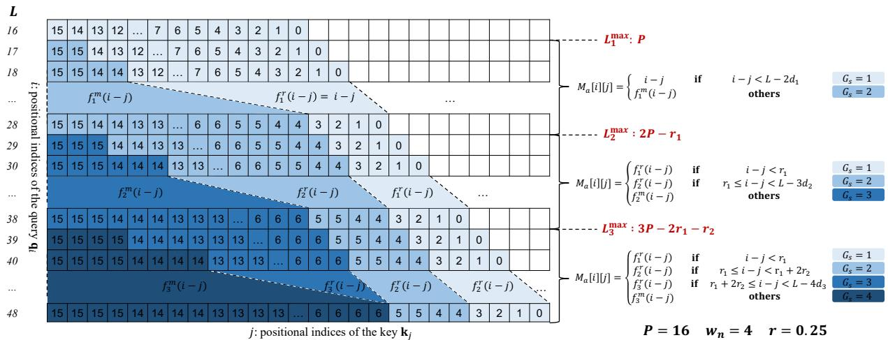
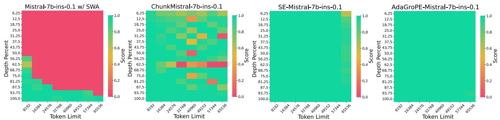
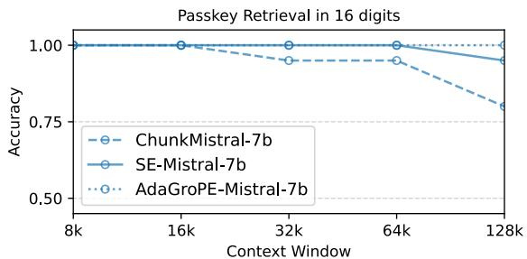
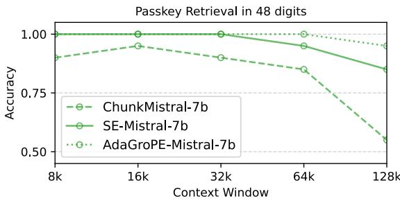
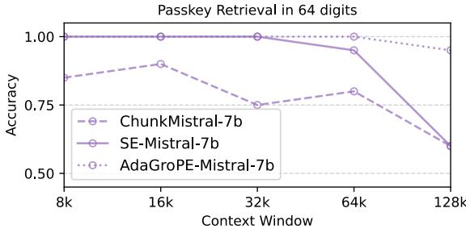
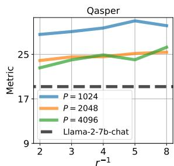
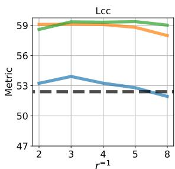
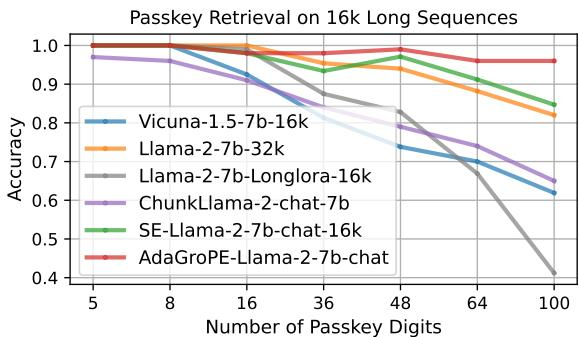
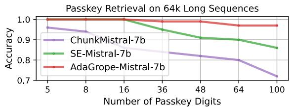
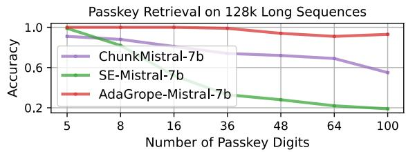

# Extending LLM Context Window with Adaptive Grouped Positional Encoding: A Training-Free Method

Xinhao Xu1,2\* Jiaxin Li1,2∗ Hui Chen2† Zijia Lin1 Jungong Han2,3 Guiguang Ding1,2†

1School of Software, Tsinghua University, Beijing, China

2BNRist, Tsinghua University, Beijing, China

3Department of Automation, Tsinghua University, Beijing, China

xxhthu18@gmail.com, thulijx@gmail.com

jichenhui2012@gmail.com, dinggg@tsinghua.edu.cn

# Abstract

Processing long input remains a significant challenge for large language models (LLMs) due to the scarcity of large-scale long-context training data and the high computational cost of training models for extended context windows. In this paper, we propose Adaptive Grouped Positional Encoding (AdaGroPE), a training-free, plug-and-play method to enhance long-context understanding in existing LLMs. AdaGroPE progressively increases the reuse count of relative positions as the distance grows and dynamically adapts the positional encoding mapping to sequence length, thereby fully exploiting the range of pre-trained position embeddings. Its design is consistent with the principles of rotary position embedding (RoPE) and aligns with human perception of relative distance, enabling robust performance in realworld settings with variable-length inputs. Extensive experiments across various benchmarks demonstrate that our AdaGroPE consistently achieves state-of-the-art performance, surpassing baseline methods and even outperforming LLMs inherently designed for long-context processing on certain tasks.

# 1 Introduction

Processing long input is essential for large language models (LLMs) (OpenAI, 2023b; Touvron et al., 2023a; Huang et al., 2025), enabling them to comprehend complex content such as academic papers, technical reports, and long-form dialogues, thereby expanding their applications in domains like healthcare, finance, and education (Wei et al., 2024; Lee et al., 2023; Xu et al., 2024; Shen et al., 2025). To support long-context processing, several LLMs with extended context windows have been developed (Chen et al., 2024b; Ruoss et al., 2023; Rozière et al., 2023). These models typically require fine-tuning with long sequences. Despite exhibiting promising results, they rely on costly long-context dataset construction and require substantial GPU resources for training. Moreover, the scarcity of high-quality long-context data continues to limit their overall effectiveness (Gao et al., 2025).

To alleviate these constraints, recent trainingfree approaches have revealed that LLMs trained on short contexts can exhibit latent long-context processing capabilities (Xiao et al., 2024; Jin et al., 2024). For example, approaches such as StreamingLLM (Xiao et al., 2024) and LMinfinite (Han et al., 2024) manage the long-context challenge by restricting the number of neighbor tokens during inference to stay within the pre-trained attention window, improving perplexity on longcontext tasks. However, these methods often discard significant context information and show limited effectiveness on real-world long-range dependent tasks. Other methods, such as SelfExtend (Jin et al., 2024) and An et al. (2024b), extend LLMs’ context windows by reusing and remapping the position embedding from pre-training, achieving promising results on both language modeling and real-world long-context tasks without additional training.

In this paper, we propose a novel trainingfree framework, Adaptive Grouped Positional Encoding (AdaGroPE), to extrapolate LLM context windows. Building on the principles of rotary position embedding (RoPE) (Su et al., 2024), our approach dynamically adjusts position embedding according to sequence length and token distance, progressively increasing reuse count when calculating the position embedding of more distant tokens. This method draws inspiration from RoPE’s longterm decay property, which allows the model to prioritize nearby tokens while paying less attention to those farther away. Furthermore, it aligns better with human perception of the long-context text, where the positions of nearby tokens are critical for maintaining coherence and understanding, while distant tokens are processed more for their semantic content rather than their positions (Ivgi et al., 2023). To this end, AdaGroPE preserves fine-grained relative positions within a preset local window and introduces grouped reuse for farther tokens, such that the reuse count increases with distance. This design not only aligns with RoPE’s principle but also better reflects human’s processing of relative positions in long-context understanding, thereby enabling effective training-free extensions of LLM context windows.

AdaGroPE is a plug-and-play, training-free method that can be integrated into various LLMs. As a position embedding extension strategy, it complements and can be combined with other methods that enhance long-context understanding, such as fine-tuning on long-context datasets. Our method also stands out by dynamically adapting the position embedding mapping strategy to the input length, ensuring optimal performance in realworld scenarios with variable input lengths. We evaluate our approach across different LLMs and datasets, including language modeling, synthetic long-context tasks, and real-world long-context tasks. Experimental results show that AdaGroPE effectively extends the long-context understanding of LLMs with short-context windows, achieving state-of-the-art performance and even surpassing models natively designed for long-context processing. This demonstrates the potential of our approach to reduce reliance on expensive longcontext training datasets.

In summary, our contributions are as follows:

1. We introduce a novel positional encoding strategy, AdaGroPE, which extends the range of pre-trained position embedding by gradually increasing the reuse count based on the tokens’ distance.   
2. We implement AdaGroPE in a dynamic, adaptive adjusted manner, maximizing the use of pre-trained position embedding in real-world scenarios with variable input lengths.   
3. We evaluate our method’s effectiveness across various long-context benchmarks and LLMs. Results show that AdaGroPE achieves stateof-the-art performance, even surpassing models with inherent long-context capabilities on certain tasks.

# 2 Method

# 2.1 Preliminary

In this section, we provide a brief overview of RoPE (Su et al., 2024), which serves as the foundation for our AdaGroPE method. RoPE is a crucial positional encoding mechanism designed to capture the relative positional relationships between tokens, which enhances the attention mechanisms in transformers. It extends traditional absolute position embeddings by incorporating positional information directly into the query and key vectors used in the self-attention process, allowing for more flexible handling of long sequences.

Let $\left\{ \mathbf { x } _ { 0 } , \mathbf { x } _ { 1 } , . . . , \mathbf { x } _ { L - 1 } \right\}$ represent the token embeddings, where L is the sequence length, and each $\mathbf { x } _ { i } \in \mathbb { R } ^ { d }$ is a d-dimensional vector. The key idea behind RoPE is to rotate the query ${ \bf q } _ { i }$ and key $\mathbf { k } _ { j }$ vectors based on their positional indices i and $j ,$ , so that the dot product $\mathbf { q } _ { i } ^ { T } \mathbf { k } _ { j }$ inherently captures the relative positional information between tokens. This is achieved by applying a complex rotation to the vectors ${ \bf q } _ { i }$ and $\mathbf { k } _ { j }$ . Specifically, for tokens at positions i and j, their corresponding query and key vectors are transformed as:

$$
\mathbf {q} _ {i} = f _ {q} (\mathbf {x} _ {i}, i), \mathbf {k} _ {j} = f _ {k} (\mathbf {x} _ {j}, j), \tag {1}
$$

where $f _ { q }$ and $f _ { k }$ represent the RoPE functions that apply the positional rotations. The resulting dot product between the query at position i and the key at position j depends solely on their relative positional difference $i - j$ , ensuring that the model focuses on relative distances rather than absolute positions.

Specifically, RoPE constructs a relative position matrix M during self-attention, where each element $M [ i ] [ j ] = i - j$ reflects the relative positional information between the i-th query and the j-th key. This matrix is structured as a Toeplitz matrix, where the same relative positions exhibit consistent values across rows and columns. Consequently, RoPE enables transformers to maintain strong relative position awareness without the need for explicit absolute position embeddings.

# 2.2 Progressive Reuse of Relative Positions with Increasing Count

We assume that the relative position matrix M has the i-th row denoted as $m _ { i }$ , with values ranging as follows for j from 0 to i:

$$
m _ {i} = [ i, i - 1,..., 0 ], \tag {2}
$$

where the maximum relative position is i. Suppose the largest observed context window during pretraining is $w$ . When $i \geq w$ , the inner product between ${ \bf q } _ { i }$ and $\mathbf { k } _ { j }$ is computed using an out-ofdistribution relative position encoding, which leads to performance degradation in LLMs.

To mitigate this, some methods have grouped relative positions by assigning the same relative position to neighboring tokens. These methods introduce a hyperparameter, the group size $G _ { s }$ , which controls the number of tokens in each group. As a result, the modified row $m _ { i } ^ { \prime }$ becomes:

$$
m _ {i} ^ {\prime} = \left[ \left\lfloor \frac {i}{G _ {s}} \right\rfloor , \left\lfloor \frac {i - 1}{G _ {s}} \right\rfloor , \dots , 0 \right]. \tag {3}
$$

By ensuring that $\left\lfloor { \frac { i } { G _ { s } } } \right\rfloor < w ,$ , out-of-distribution issues can be avoided, improving LLM performance on long-context tasks. Notably, the selection of $G _ { s }$ depends on both w and the length of the input.

As noted by SelfExtend (Jin et al., 2024), such a direct approach fails to account for the varying sensitivity between nearby tokens and distant tokens during contextual understanding. Specifically, it applies uniform reuse of relative positions regardless of token distance. To overcome this limitation, we propose a method that progressively increases the reuse count based on the relative distance between tokens.

In particular, given a target extension length $L$ and a maximum relative position limit $P ,$ , where $L > i$ and $P \leq w$ , similar to SelfExtend, our approach defines a neighbor window size $w _ { n }$ . For tokens with relative distances smaller than the neighbor window size, which are more sensitive to positional information during contextual understanding, we retain their original relative positions:

$$
M _ {a} [ i ] [ j ] = i - j \quad \text { if } i - j <   w _ {n}, \tag {4}
$$

where $M _ { a }$ is the relative position matrix modified by our AdaGroPE method.

For tokens with relative distances greater than the neighbor window size, the values in $M _ { a }$ depend on $L , P ,$ and the hyperparameter reuse ratio coefficient $\begin{array} { r } { r = \frac { P } { w _ { n } } } \end{array}$ w , following three guiding principles: minimizing reuse, prioritizing distant relative position reuse, and progressively increasing reuse count from close to distant. These principles will be illustrated in detail based on the progressive increase of $L$ in the following sections. Figure 1 presents an example of the expansion of the relative position matrix $M _ { a } [ i ] [ j ]$ as L increases, with $P = 1 6 , w _ { n } = 4$ , and $r = 0 . 2 5$ .

Minimizing Reuse and Prioritizing Distant Relative Position Reuse First, we define a sequence $\{ L _ { n } ^ { \mathrm { m a x } } \} _ { n \in \mathbb { N } }$ x}n N, representing the maximum allowable length L when the maximum reuse count required $G _ { s } ^ { m } = n$ . Naturally, $L _ { n - 1 } ^ { \mathrm { m a x } } + 1$ denotes the minimum length L required for the maximum count $G _ { s } ^ { m } = n$ . Based on the definitions of $\{ L _ { n } ^ { \mathrm { m a x } } \} _ { n \in \mathbb { N } }$ and $w _ { n }$ , we have:

$$
\begin{array}{l} L _ {1} ^ {\max} = P, \\ L _ {2} ^ {\max} = w _ {n} + (P - w _ {n}) \cdot 2 \tag {5} \\ = 2 P - w _ {n}. \\ \end{array}
$$

This indicates that when $L _ { 1 } ^ { \mathrm { m a x } } < L \leq L _ { 2 } ^ { \mathrm { m a x } }$ , the maximum reuse count required $G _ { s } ^ { m }$ is 2. Eq. (5) satisfies the principle of minimizing reuse, whereby relative position is reused only when L exceeds $P ,$ , while simultaneously ensuring that the original relative position is employed for the nearest tokens, as shown in Eq. (4).

Furthermore, we define a sequence $\{ d _ { n } \} _ { n \in \mathbb { N } } .$ which represents the number of relative positions with a reuse count of $n + 1$ when $G _ { s } ^ { m } = n + 1 \mathrm { : }$ :

$$
d _ {n} = L - L _ {n} ^ {\max}. \tag {6}
$$

It is evident that when $L _ { n } ^ { \mathrm { m a x } } < L \leq L _ { n + 1 } ^ { \mathrm { m a x } }$ , at least $d _ { n }$ relative positions must be reused $n + 1$ times to ensure all relative positions remain within the maximum relative position limit $P$ . In this context, when $L _ { 1 } ^ { \mathrm { m a x } } < L \leq L _ { 2 } ^ { \mathrm { m a x } }$ ,

$$
M _ {a} [ i ] [ j ] = \left\{ \begin{array}{l l} i - j & \text { if   } i - j <   L - 2 d _ {1}, \\ f _ {1} ^ {m} (i - j) & \text { others }, \end{array} \right. \tag {7}
$$

where

$$
f _ {n} ^ {m} (x) = L - (n + 1) d _ {n} + \left\lfloor \frac {x - (L - (n + 1) d _ {n})}{n + 1} \right\rfloor . \tag {8}
$$

$f _ { n } ^ { m } ( x )$ represents the mapping from the original to the AdaGroPE-adjusted relative position corresponding to the maximum relative position reuse count $G _ { s } ^ { m } ~ = ~ n + 1$ . This implies that the AdaGroPE-adjusted relative positions obtained through $f _ { n } ^ { m } ( x )$ all have a reuse count equal to the maximum required reuse count $n + 1$ .

It is important to note that Eq. (8) groups the farthest positions and assigns the same relative position to $G _ { s } ^ { m } = n + 1$ tokens within the group while preserving the relative positions of the $\mathbf { k } _ { j }$ closer to ${ \bf q } _ { i }$ . This prioritization of distant relative position reuse aligns with the notion that distant tokens are less sensitive to positional encoding during attention calculation (Ivgi et al., 2023), and will continue to be reflected in the definition of $M _ { a }$ as L increases.

  
Figure 1: An example of the expansion of the computed relative positions in the AdaGroPE method. As L increases, the maximum reuse count of relative positions $G _ { s } ^ { m }$ increases from 1 to 4. The computed relative positions follow the principle of minimizing reuse, starting the reuse process from the farthest relative positions and progressing to the nearest. The reuse count increases with the distance from the current query.

Progressive Increase in Reuse Count from Close to Distant The neighbor window size $w _ { n }$ preserves the original relative positions for keys kj that are close to the query token qi. As L increases, we progressively increase the reuse count from close to distant tokens.

Specifically, we define a sequence $\{ r _ { n } \} _ { n \in \mathbb { N } }$ as follows:

$$
r _ {n} = \left\{ \begin{array}{l l} \left\lfloor \frac {r}{n} \cdot P \right\rfloor & \text { if   } \log_ {2} n \in \mathbb {N}, \\ 0 & \text { otherwise }, \end{array} \right. \tag {9}
$$

where $r _ { n }$ denotes the minimum number of relative positions retained with reuse count n when the maximum reuse count $G _ { s } ^ { m } > n$ as L increases. The reuse ratio coefficient r is set to 0.25 by default. Eq. (9) ensures the number of relative positions retained for each reuse count $G _ { s }$ as L increases. These values decrease approximately geometrically as $\lfloor r P \rfloor , \lfloor \frac { r P } { 2 } \rfloor , \lfloor \frac { r P } { 4 } \rfloor$ , etc., with only the reuse count corresponding to powers of 2 being retained.

Accordingly, we calculate $L _ { 3 } ^ { \mathrm { m a x } }$

$$
\begin{array}{l} L _ {3} ^ {\max} = r _ {1} + 2 r _ {2} + (P - r _ {1} - r _ {2}) \cdot 3 \tag {10} \\ = 3 P - 2 r _ {1} - r _ {2}. \\ \end{array}
$$

When $L _ { 2 } ^ { \mathrm { m a x } } < L \leq L _ { 3 } ^ { \mathrm { m a x } }$ , the maximum reuse count $G _ { s } ^ { m }$ increases to 3. Consequently, the corresponding relative position matrix $M _ { a }$ is adjusted as follows:

$$
M _ {a} [ i ] [ j ] = \left\{ \begin{array}{l l} f _ {1} ^ {r} (i - j) & \text { if   } i - j <   r _ {1}, \\ f _ {2} ^ {r} (i - j) & \text { if   } r _ {1} \leq i - j <   L - 3 d _ {2}, \\ f _ {2} ^ {m} (i - j) & \text { others }, \end{array} \right. \tag {11}
$$

where

$$
f _ {n} ^ {r} (x) = \sum_ {k = 1} ^ {n - 1} r _ {k} \cdot k + \left\lfloor \frac {x - \sum_ {k = 1} ^ {n - 1} r _ {n} \cdot k}{n} \right\rfloor . \tag {12}
$$

$f _ { n } ^ { r } ( x )$ inductively defines the mapping function from the original relative position to the AdaGroPEadjusted relative position, corresponding to a reuse count less than or equal to n, under the condition that the maximum reuse count $G _ { s } ^ { m } \ > \ n$ . It is evident that $f _ { 1 } ^ { r } ( i - j ) = i - j$ and the calculation formula for $M _ { a } [ i ] [ j ]$ in Eq. (7) when $i - j < L$ $2 d _ { 1 }$ also satisfies this function’s definition.

Eq. (11) ensures that neighbor tokens around $\mathbf { q } _ { i }$ retain their original relative positions, while reuse is progressively introduced for more distant tokens. The reuse count $G _ { s }$ increases in a controlled manner as defined in Eq. (9). Similarly to Eq. (7), Eq. (11) adheres to the principles of minimizing reuse and prioritizing reuse for distant relative positions. Besides, the relative positions retained by $M _ { a }$ follow the principle of progressively increasing reuse count as the distance from the qi grows.

As L increases, AdaGroPE ensures that the adjusted relative positions follow the three guiding principles mentioned above. Similarly, we calculate $L _ { 4 } ^ { \mathrm { m a x } }$ as follows:

$$
L _ {4} ^ {\max} = r _ {1} + 2 r _ {2} + 3 r _ {3} + \left(P - r _ {1} - r _ {2} - r _ {3}\right) \cdot 4 \tag {13}
$$

$$
= 4 P - 3 r _ {1} - 2 r _ {2} - r _ {3}.
$$

To this end, when $L _ { 3 } ^ { \mathrm { m a x } } < L \leq L _ { 4 } ^ { \mathrm { m a x } }$ ,

$$
M _ {a} [ i ] [ j ] = \left\{ \begin{array}{l l} f _ {1} ^ {r} (i - j) & \text { if   } i - j <   r _ {1}, \\ f _ {2} ^ {r} (i - j) & \text { if   } r _ {1} \leq i - j <   r _ {1} + 2 r _ {2}, \\ f _ {3} ^ {r} (i - j) & \text { if   } r _ {1} + 2 r _ {2} \leq i - j <   L - 4 d _ {3}, \\ f _ {3} ^ {m} (i - j) & \text { others. } \end{array} \right. \tag {14}
$$

From Eq. (14), we deduce that when $L = L _ { 4 } ^ { \mathrm { m a x } }$ , reuse count of $G _ { s } = 3$ are eliminated, leaving only $G _ { s } = 1 , 2 , 4$ , consistent with the rule in Eq. (9). Furthermore, when L increases to $L _ { 4 } ^ { \mathrm { m a x } } + 1$ , the maximum required reuse count $G _ { s } ^ { m }$ becomes 5, implying that the farthest relative position $P - 1$ is reused five times. We can iteratively obtain the subsequent adjusted relative positions by following the pattern established in Eq. (7), Eq. (11), and Eq. (14).

# 2.3 Adaptive Relative Position Adjustment Strategy

Based on the explanation above, extending L from values less than P up to $L _ { 4 } ^ { \mathrm { m a x } }$ , we have clarified the three fundamental principles of AdaGroPE’s relative position reuse, along with the intuitive process (illustrated in Figure 1). In this section, we will summarize the observed patterns and derive a direct formula for computing the relative position matrix using predefined values of L and $P ,$ , demonstrating that our method can adaptively scale to longer target lengths L.

From Eq. (7), Eq. (11), and Eq. (14), we can derive the general expression for $L _ { n } ^ { \mathrm { m a x } }$ as follows:

$$
L _ {n} ^ {\max} = n P - \sum_ {k = 1} ^ {n - 1} (n - k - 1) r _ {k}. \tag {15}
$$

Furthermore, based on the definition of $\{ L _ { n } ^ { \mathrm { m a x } } \} _ { n \in \mathbb { N } }$ , we obtain the formula for calculating the maximum reuse count $G _ { s } ^ { m }$ for varying lengths L as follows:

$$
G _ {s} ^ {m} (L) = \left\{ \begin{array}{l l} 1 & \text { if } L \leq L _ {1} ^ {\max}, \\ 2 & \text { if } L _ {1} ^ {\max} <   L \leq L _ {2} ^ {\max}, \\ \vdots & \vdots \\ n + 1 & \text { if } L _ {n} ^ {\max} <   L \leq L _ {n + 1} ^ {\max}. \end{array} \right. \tag {16}
$$

Finally, we derive the formula for calculating relative positions in AdaGroPE for any given target extension length L and a maximum relative position limit $P \colon$

<table><tr><td>Notation</td><td>Explanation</td></tr><tr><td>i,j</td><td>Absolute position indices</td></tr><tr><td> $M_a[\cdot][\cdot]$ </td><td>Relative position in AdaGroPE</td></tr><tr><td>L</td><td>Target context length after extension</td></tr><tr><td>w</td><td>Pre-trained context window length</td></tr><tr><td>P</td><td>Number of relative positions used;  $P \leq w$ </td></tr><tr><td>r</td><td>Coefficient controlling minimum retained positions per usage count</td></tr><tr><td> $w_n$ </td><td>Size of neighbor window preserving original relative positions;  $w_n = rP$ </td></tr><tr><td> $G_s$ </td><td>Usage count of relative positions; increases with position</td></tr><tr><td> $G_s^m(\cdot)$ </td><td>Maximum usage count as a function of L with positions reused up to  $G_s^m(L)$  times</td></tr><tr><td> $L_n^{\max}$ </td><td>Maximum L for which  $G_s^m(L) = n$ , i.e.,  $G_s^m(L) = n$  holds iff  $L \in (L_{n-1}^{\max}, L_n^{\max}]$ </td></tr><tr><td> $d_n$ </td><td>Number of positions used n+1 times when  $G_s^m = n+1$ ;  $L - L_n^{\max}$  for  $L \in (L_n^{\max}, L_{n+1}^{\max}]$ </td></tr><tr><td> $r_n$ </td><td>Minimum retained positions used n times when  $G_s^m > n$ ;  $r_1 = w_n$ </td></tr></table>

Table 1: Summary of notations and their corresponding explanations in AdaGroPE.

$$
M _ {a} [ i ] [ j ] = \left\{ \begin{array}{l l} f _ {1} ^ {r} (i - j) & \text {   if   } i - j <   r _ {1}, \\ f _ {2} ^ {r} (i - j) & \text {   if   } r _ {1} \leq i - j <   r _ {1} + 2 r _ {2}, \\ \vdots & \vdots \\ f _ {n} ^ {r} (i - j) & \text {   if   } \sum_ {k = 1} ^ {n - 1} k r _ {k} \leq i - j <   \sum_ {k = 1} ^ {n} k r _ {k}, \\ \vdots & \vdots \\ f _ {g _ {l} - 1} ^ {r} (i - j) & \text {   if   } \sum_ {k = 1} ^ {g _ {l} - 2} k r _ {k} \leq i - j <   \sum_ {k = 1} ^ {g _ {l} - 1} k r _ {k}, \\ f _ {g _ {l}} ^ {r} (i - j) & \text {   if   } \sum_ {k = 1} ^ {g _ {l} - 1} k r _ {k} \leq i - j <   L - (g _ {l} + 1) d _ {g _ {l}}, \\ f _ {g _ {l}} ^ {m} (i - j) & \text {   if   } L - (g _ {l} + 1) d _ {g _ {l}} \leq i - j, \end{array} \right. \tag {17}
$$

where $g _ { l } = G _ { s } ^ { m } ( L ) - 1$ .

It is straightforward to verify that Eq. (7), Eq. (11), and Eq. (14) all satisfy the above equation. To this end, we finalize the construction of the AdaGroPE relative position matrix $M _ { a } [ i ] [ j ]$ , which adheres to the three fundamental principles and can be directly calculated for any specified target extension length L and maximum relative position limit P . This provides a flexible and adaptive framework for configuring the positional encoding strategy. A detailed summary of the notations and their definitions, along with the pseudocode for computing relative positions during decoding, is provided in

Table 1 and Algorithm 1 in the Appendix, further clarifying the algorithmic process and implementation details of the proposed method.

# 3 Experimental Setup

Models and Baselines We evaluate our Ada-GroPE on various LLMs: Llama-2 (7b and 13b) (Touvron et al., 2023b), Llama-3 (8b) (Dubey et al., 2024), Mistral (7b) (Jiang et al., 2023), SO-LAR (10.7b) (Kim et al., 2024), and Phi-2 (Javaheripi et al., 2023). In addition, we compare Ada-GropE’s performance with the other two state-ofthe-art training-free long-context extension methods, Dual Chunk Attention (DCA) (An et al., 2024b) and SelfExtend (Jin et al., 2024). Furthermore, several models fine-tuned to extend their context windows, i.e., Longlora (Chen et al., 2024b), Together (Together, 2023), CodeLlama (Rozière et al., 2023), and CLEX (Chen et al., 2024a) are included for comparison to demonstrate the superiority of AdaGroPE. All usages of scientific artifacts in this paper obey the corresponding licenses stated in the original papers or websites.

Datasets Following An et al. (2024b) and Jin et al. (2024), we present our main results on language modeling tasks, synthetic long-context tasks, and real-world long-context tasks. For language modeling, we use the PG19 (Rae et al., 2020) dataset, with context lengths ranging from 4k to 32k tokens. In synthetic long-context tasks, we include the passkey retrieval task, as defined in Landmark Attention (Mohtashami and Jaggi, 2023), where a language model must retrieve an n-digit passkey embedded within a long, meaningless text sequence. The passkey is placed at different depths within the document and tested across context lengths from 8k to 64k tokens. For realworld long-context tasks, we evaluate AdaGroPE on the LongBench (Bai et al., 2024) benchmark and four closed-ended tasks from L-Eval (An et al., 2024a): TOFEL, QuALITY (cleaned from Pang et al. (2022)), Coursera, and SFiction, following the setup of An et al. (2024b).

# 4 Main Results

Performance on Language Modeling Tasks We compute perplexity (PPL) for different models on the test data, where a lower PPL indicates better performance of LLMs. Table 2 shows that AdaGroPE achieves state-of-the-art performance across nearly all context lengths. Notably, we compare trainingfree methods with fine-tuned models designed to extend their context windows, marked with an asterisk (\*). The results further demonstrate that the training-free AdaGroPE surpasses these trainingdependent methods, underscoring the effectiveness of the proposed approach.

<table><tr><td rowspan="2">Model</td><td colspan="4">Evaluation Context Window</td></tr><tr><td>4096</td><td>8192</td><td>16384</td><td>32768</td></tr><tr><td>Llama-2-7b</td><td>7.87</td><td>&gt;100</td><td>&gt;100</td><td>&gt;100</td></tr><tr><td>ChunkLlama-2-7b</td><td>7.87</td><td>7.67</td><td>7.64</td><td>7.89</td></tr><tr><td>SE-Llama-2-7b</td><td>7.87</td><td>7.67</td><td>7.58</td><td>7.71</td></tr><tr><td>AdaGroPE-Llama-2-7b</td><td>7.87</td><td>7.65</td><td>7.56</td><td>7.75</td></tr><tr><td>Longlora-7b-32k*</td><td>8.14</td><td>7.85</td><td>7.70</td><td>7.80</td></tr><tr><td>Together-7b-32k*</td><td>8.21</td><td>7.95</td><td>7.76</td><td>7.64</td></tr><tr><td>CodeLlama-7b-16k*</td><td>8.93</td><td>8.64</td><td>8.44</td><td>8.36</td></tr><tr><td>CLEX-7b-16k*</td><td>16.74</td><td>15.08</td><td>14.28</td><td>14.70</td></tr><tr><td>Llama-3-8b</td><td>9.04</td><td>8.71</td><td>78.88</td><td>&gt;100</td></tr><tr><td>Chunk-Llama-3-8b</td><td>9.04</td><td>8.71</td><td>8.61</td><td>8.62</td></tr><tr><td>SE-Llama-3-8b</td><td>9.13</td><td>8.80</td><td>8.59</td><td>8.52</td></tr><tr><td>AdaGroPE-Llama-3-8b</td><td>9.04</td><td>8.71</td><td>8.57</td><td>8.52</td></tr></table>

Table 2: Perplexity (PPL)  evaluation on PG19 (Rae et al., 2020) validation set. We highlight the best results for each model size in bold. Models marked with \* indicate those fine-tuned to extend their context windows.

# Performance on Synthetic Long Context Tasks

Figure 2 displays the evaluation results for various methods on the passkey benchmark (Mohtashami and Jaggi, 2023). In our experiments, the passkey consists of 36 digits, and we conduct multiple retrieval tests for each combination of context length and depth. The passkey is randomly placed within a 400-token span. For example, with a context length of 8k and a depth of 0.1, the passkey appears between tokens 800 and 1600. Each span is evaluated over 10 iterations, yielding 20 iterations in this setting.

As shown in Figure 2, AdaGroPE, without any fine-tuning, achieves nearly 100% passkey retrieval accuracy across all tested depths and context lengths. In comparison, the original Mistral-7binstruct-0.1 with SWA sees a drastic performance drop to 0 at smaller depths, while ChunkMistral-7bins-0.1 displays significant accuracy fluctuations as the token limit increases. Although SelfExtend achieves results similar to AdaGroPE, its performance degrades at larger token limits, such as 65,536, where AdaGroPE consistently maintains superior accuracy.

  
Figure 2: Passkey retrieval accuracy for Mistral-7b-instruct-0.1 with SWA, DCA, SelfExtend, or AdaGroPE. The number of passkey digits is set to 36. Mistral with AdaGroPE obtains nearly 100% passkey retrieval accuracy for all sequence lengths (token limits) and all depths.

<table><tr><td rowspan="2">Model</td><td rowspan="2">Tokens</td><td colspan="3">Single-Document QA</td><td colspan="3">Multi-Document QA</td><td colspan="3">Summarization</td><td colspan="3">Few-shot Learning</td><td colspan="3">Synthetic</td><td colspan="2">Code</td><td rowspan="2">Avg.</td></tr><tr><td>NarrativeQA</td><td>Qasper</td><td>MultiField-en</td><td>HotpotQA</td><td>2WikiMQA</td><td>Msique</td><td>GovReport</td><td>QMSum</td><td>MultiNews</td><td>TREC</td><td>TriviaQA</td><td>SAMSum</td><td>PassageCount</td><td>PassageRe</td><td>Lcc</td><td>RepoBench-P</td><td></td></tr><tr><td>GPT-3.5-Turbo-16k</td><td>16k</td><td>23.6</td><td>43.3</td><td>52.3</td><td>51.6</td><td>37.7</td><td>26.9</td><td>29.5</td><td>23.4</td><td>26.7</td><td>68.0</td><td>91.4</td><td>41.7</td><td>4.5</td><td>71.0</td><td>54.7</td><td>53.6</td><td>43.74</td><td></td></tr><tr><td>ChatGLM2-6B-32k</td><td>32k</td><td>21.1</td><td>31.5</td><td>46.2</td><td>45.1</td><td>34.0</td><td>21.9</td><td>32.4</td><td>24.0</td><td>26.5</td><td>62.5</td><td>78.7</td><td>36.3</td><td>1.5</td><td>77.0</td><td>55.6</td><td>49.9</td><td>40.26</td><td></td></tr><tr><td>Baichuan-13B-4k</td><td>16k</td><td>0.07</td><td>17.55</td><td>17.28</td><td>3.29</td><td>15</td><td>0.1</td><td>6.8</td><td>1.71</td><td>23.1</td><td>20.05</td><td>20.06</td><td>5.77</td><td>0.06</td><td>0.5</td><td>47.98</td><td>16.58</td><td>10.49</td><td></td></tr><tr><td>ALiBi-7B-4k</td><td>16k</td><td>0.04</td><td>8.13</td><td>17.87</td><td>2.73</td><td>8</td><td>1.33</td><td>5.31</td><td>1.64</td><td>25.55</td><td>9.25</td><td>8.83</td><td>4.67</td><td>0</td><td>1.27</td><td>46.69</td><td>18.54</td><td>9.48</td><td></td></tr><tr><td>Llama-2-7b-chat</td><td>4k</td><td>18.7</td><td>19.2</td><td>36.8</td><td>25.4</td><td>32.8</td><td>9.4</td><td>27.3</td><td>20.8</td><td>25.8</td><td>61.5</td><td>77.8</td><td>40.7</td><td>2.1</td><td>9.8</td><td>52.4</td><td>43.8</td><td>31.52</td><td></td></tr><tr><td>ChunkLlama-2-7b-chat</td><td>25k</td><td>20.27</td><td>25.80</td><td>34.87</td><td>23.18</td><td>28.42</td><td>10.15</td><td>27.03</td><td>21.27</td><td>26.47</td><td>68.50</td><td>74.86</td><td>41.51</td><td>1.48</td><td>4.75</td><td>58.05</td><td>50.76</td><td>32.34</td><td></td></tr><tr><td>SE-Llama-2-7b-chat</td><td>25k</td><td>21.37</td><td>26.68</td><td>34.63</td><td>35.47</td><td>30.46</td><td>15.51</td><td>27.51</td><td>21.30</td><td>25.87</td><td>68.50</td><td>78.79</td><td>41.29</td><td>3.90</td><td>3.50</td><td>59.69</td><td>53.83</td><td>34.26</td><td></td></tr><tr><td>AdaGroPE-Llama-2-7b-chat</td><td>25k</td><td>18.72</td><td>29.61</td><td>40.20</td><td>37.33</td><td>30.86</td><td>15.73</td><td>28.39</td><td>21.45</td><td>26.10</td><td>69.50</td><td>83.23</td><td>42.16</td><td>3.48</td><td>6.00</td><td>59.38</td><td>52.24</td><td>35.27</td><td></td></tr><tr><td>Llama-3-8b-ins</td><td>8k</td><td>21.63</td><td>44.11</td><td>44.35</td><td>46.84</td><td>35.84</td><td>21.53</td><td>29.98</td><td>22.66</td><td>27.75</td><td>75.50</td><td>90.58</td><td>42.67</td><td>6.50</td><td>66.50</td><td>56.81</td><td>51.24</td><td>42.78</td><td></td></tr><tr><td>ChunkLlama-3-8b-ins</td><td>25k</td><td>26.54</td><td>42.36</td><td>47.82</td><td>47.54</td><td>35.27</td><td>25.19</td><td>31.86</td><td>23.02</td><td>27.39</td><td>77.00</td><td>90.31</td><td>42.81</td><td>7.00</td><td>75.50</td><td>58.49</td><td>55.15</td><td>44.58</td><td></td></tr><tr><td>SE-Llama-3-8b-ins</td><td>25k</td><td>23.88</td><td>43.82</td><td>50.64</td><td>50.71</td><td>36.58</td><td>30.24</td><td>32.90</td><td>23.90</td><td>27.79</td><td>76.00</td><td>91.68</td><td>42.93</td><td>4.40</td><td>98.00</td><td>56.72</td><td>47.53</td><td>46.11</td><td></td></tr><tr><td>AdaGroPE-Llama-3-8b-ins</td><td>25k</td><td>25.72</td><td>44.09</td><td>51.80</td><td>52.10</td><td>38.80</td><td>31.82</td><td>32.81</td><td>24.11</td><td>27.90</td><td>76.50</td><td>91.13</td><td>42.30</td><td>7.62</td><td>99.00</td><td>56.49</td><td>51.46</td><td>47.10</td><td></td></tr><tr><td>Mistral-7b-ins-0.1 w/o SWA</td><td>8k</td><td>20.46</td><td>35.36</td><td>39.39</td><td>34.81</td><td>29.91</td><td>11.21</td><td>24.70</td><td>21.67</td><td>26.67</td><td>68.00</td><td>86.66</td><td>41.28</td><td>0.18</td><td>24.00</td><td>56.94</td><td>55.85</td><td>36.07</td><td></td></tr><tr><td>Mistral-7b-ins-0.1 w/ SWA</td><td>16k</td><td>19.40</td><td>34.53</td><td>37.06</td><td>42.29</td><td>32.49</td><td>14.87</td><td>27.38</td><td>22.75</td><td>26.82</td><td>65.00</td><td>87.77</td><td>42.34</td><td>1.41</td><td>28.50</td><td>57.28</td><td>53.44</td><td>37.08</td><td></td></tr><tr><td>ChunkMistral-7b-ins-0.1</td><td>16k</td><td>20.86</td><td>36.56</td><td>42.40</td><td>35.89</td><td>31.25</td><td>12.47</td><td>28.08</td><td>22.87</td><td>27.09</td><td>69.50</td><td>86.52</td><td>42.94</td><td>2.14</td><td>21.50</td><td>54.92</td><td>52.70</td><td>36.73</td><td></td></tr><tr><td>SE-Mistral-7b-ins-0.1</td><td>16k</td><td>23.56</td><td>39.33</td><td>49.50</td><td>45.28</td><td>34.92</td><td>23.14</td><td>30.71</td><td>24.87</td><td>26.83</td><td>69.50</td><td>86.47</td><td>44.28</td><td>1.18</td><td>29.50</td><td>55.32</td><td>53.44</td><td>39.86</td><td></td></tr><tr><td>AdaGroPE-Mistral-7b-ins-0.1</td><td>16k</td><td>25.02</td><td>39.00</td><td>53.38</td><td>47.88</td><td>35.26</td><td>25.47</td><td>31.26</td><td>23.84</td><td>26.67</td><td>70.50</td><td>86.66</td><td>43.86</td><td>3.41</td><td>33.50</td><td>55.05</td><td>51.50</td><td>40.77</td><td></td></tr><tr><td>SOLAR-10.7b-ins</td><td>4k</td><td>16.50</td><td>24.06</td><td>46.76</td><td>44.03</td><td>36.05</td><td>22.76</td><td>31.39</td><td>19.81</td><td>26.36</td><td>70.00</td><td>87.91</td><td>42.49</td><td>4.50</td><td>26.50</td><td>41.04</td><td>54.36</td><td>37.16</td><td></td></tr><tr><td>ChunkSOLAR-10.7b-ins</td><td>16k</td><td>22.48</td><td>29.77</td><td>48.84</td><td>51.62</td><td>34.80</td><td>27.35</td><td>31.59</td><td>21.75</td><td>26.22</td><td>74.50</td><td>87.41</td><td>42.69</td><td>7.50</td><td>20.00</td><td>48.98</td><td>54.94</td><td>39.40</td><td></td></tr><tr><td>SE-SOLAR-10.7b-ins</td><td>16k</td><td>22.63</td><td>32.49</td><td>47.88</td><td>46.19</td><td>34.32</td><td>27.88</td><td>30.75</td><td>22.10</td><td>25.62</td><td>74.50</td><td>89.04</td><td>42.79</td><td>4.00</td><td>28.00</td><td>53.73</td><td>56.47</td><td>39.90</td><td></td></tr><tr><td>AdaGroPE-SOLAR-10.7b-ins</td><td>16k</td><td>24.35</td><td>34.42</td><td>48.81</td><td>53.31</td><td>43.30</td><td>33.93</td><td>32.38</td><td>22.29</td><td>26.51</td><td>74.50</td><td>89.62</td><td>43.11</td><td>6.50</td><td>36.00</td><td>54.32</td><td>58.64</td><td>42.62</td><td></td></tr><tr><td>Phi-2</td><td>2k</td><td>4.46</td><td>7.01</td><td>19.98</td><td>9.43</td><td>8.55</td><td>4.62</td><td>25.64</td><td>14.32</td><td>24.03</td><td>50.50</td><td>74.55</td><td>1.71</td><td>2.83</td><td>4.17</td><td>58.96</td><td>54.14</td><td>22.81</td><td></td></tr><tr><td>SE-Phi-2</td><td>8k</td><td>12.04</td><td>12.10</td><td>20.15</td><td>8.22</td><td>9.68</td><td>3.89</td><td>27.90</td><td>14.58</td><td>22.13</td><td>61.00</td><td>82.82</td><td>1.40</td><td>2.37</td><td>2.83</td><td>57.87</td><td>56.42</td><td>24.71</td><td></td></tr><tr><td>AdaGroPE-Phi-2</td><td>8k</td><td>14.14</td><td>11.90</td><td>26.80</td><td>9.96</td><td>11.37</td><td>5.09</td><td>29.68</td><td>20.04</td><td>25.19</td><td>60.00</td><td>82.69</td><td>1.29</td><td>2.37</td><td>4.73</td><td>58.10</td><td>55.07</td><td>26.15</td><td></td></tr></table>

Table 3: Performance comparison of different LLMs on LongBench (Bai et al., 2024). Best and second-best results in each group are highlighted with bold and underline, respectively. The same applies below.

Performance on Real-World Long Context Tasks The evaluation results on LongBench and L-Eval are shown in Table 3 and Table 4, respectively. Following Jin et al. (2024), we present the performance of representative large language models (OpenAI, 2023a; Zeng et al., 2024; Baichuan, 2023) for reference, including those employing the ALiBi position encoding scheme (Press et al., 2022), on the LongBench benchmark. These results are reported by the LongBench (Bai et al., 2024) and CLEX (Chen et al., 2024a). As illustrated in Table 3, AdaGroPE significantly enhances the performance of the original models and outperforms other training-free extension methods, such as SelfExtend (Jin et al., 2024) and DCA (An et al., 2024b), achieving the best overall average performance. Table 4 further highlights AdaGroPE’s superior performance and broad applicability. Notably, it demonstrates that Ada-GroPE enables models with smaller initial context windows to exceed the performance of models with inherently larger context windows, which are pre-trained or fine-tuned for long-text understanding. For instance, AdaGroPE-Llama-2-7b-chat and AdaGroPE-Vicuna-2-1.5-7b, both based on models with 4k context windows, achieve better average performance than Longchat-1.5-7b-32k and Vicuna-1.5-7b-16k, respectively. Without relying on fine-tuning or additional training, AdaGroPE achieves competitive performance during inference, highlighting its potential as a resource-efficient approach for extending the context windows of existing LLMs.

# 5 Analysis

Performance as the Context Length Increases Figure 3 presents the performance of three different training-free methods for extending long texts as the input length varies, specifically for passkey lengths of 16 digits, 48 digits, and 64 digits. Notably, AdaGroPE maintains an accuracy of over 90% as the context window lengthens, in contrast to ChunkMistral and SE-Mistral, whose performance exhibits significant degradation with increasing context window sizes. This degradation is particularly pronounced when the passkey is set to 64 digits, where the accuracy of ChunkMistral and SE-Mistral declines from approximately 100% and 80% at an 8k context window to around 60%. The comparison results suggest that AdaGroPE demonstrates more robust performance when handling longer context windows, especially in more challenging tasks.

<table><tr><td>Model</td><td>TOFEL (3k~5k)</td><td>QUALITY (4k~9k)</td><td>Coursera (5k~17k)</td><td>SFiction (6k~27k)</td><td>Avg.</td></tr><tr><td>Llama-2-7b-chat</td><td>51.67</td><td>37.62</td><td>29.21</td><td>60.15</td><td>44.66</td></tr><tr><td>Longchat-1.5-7b-32k</td><td>39.77</td><td>37.62</td><td>32.99</td><td>57.02</td><td>41.85</td></tr><tr><td>ChunkLlama-2-7b-chat</td><td>57.62</td><td>35.14</td><td>32.12</td><td>61.72</td><td>46.65</td></tr><tr><td>SE-Llama-2-7b-chat</td><td>55.39</td><td>41.09</td><td>35.76</td><td>57.81</td><td>47.51</td></tr><tr><td>AdaGroPE-Llama-2-7b-chat</td><td>61.34</td><td>38.12</td><td>35.47</td><td>64.06</td><td>49.28</td></tr><tr><td>Llama-2-13b-chat</td><td>60.96</td><td>42.57</td><td>35.75</td><td>54.68</td><td>48.49</td></tr><tr><td>ChunkLlama-2-13b-chat</td><td>66.54</td><td>43.06</td><td>41.56</td><td>57.03</td><td>52.05</td></tr><tr><td>SE-Llama-2-13b-chat</td><td>66.17</td><td>41.09</td><td>38.95</td><td>63.28</td><td>52.37</td></tr><tr><td>AdaGroPE-Llama-2-13b-chat</td><td>68.77</td><td>40.59</td><td>46.66</td><td>57.81</td><td>53.46</td></tr><tr><td>Vicuna-1.5-7b-16k</td><td>55.39</td><td>39.60</td><td>38.66</td><td>60.15</td><td>48.45</td></tr><tr><td>SE-Vicuna-1.5-7b</td><td>55.39</td><td>41.58</td><td>37.21</td><td>63.28</td><td>49.37</td></tr><tr><td>AdaGroPE-Vicuna-1.5-7b</td><td>56.51</td><td>41.58</td><td>42.01</td><td>60.94</td><td>50.26</td></tr><tr><td>SOLAR-10.7b-ins</td><td>77.32</td><td>59.90</td><td>48.84</td><td>69.53</td><td>63.90</td></tr><tr><td>SE-SOLAR-10.7b-ins</td><td>79.18</td><td>70.30</td><td>50.44</td><td>73.44</td><td>68.34</td></tr><tr><td>AdaGroPE-SOLAR-10.7b-ins</td><td>81.78</td><td>68.81</td><td>56.83</td><td>71.88</td><td>69.83</td></tr><tr><td>Phi-2</td><td>55.76</td><td>42.08</td><td>38.37</td><td>52.34</td><td>47.14</td></tr><tr><td>SE-Phi-2</td><td>62.83</td><td>41.08</td><td>42.44</td><td>52.34</td><td>49.67</td></tr><tr><td>AdaGroPE-Phi-2</td><td>68.40</td><td>41.58</td><td>41.28</td><td>55.47</td><td>51.68</td></tr></table>

Table 4: Comparison with open-source chat models and proprietary models on 4 closed-ended tasks with various input lengths from L-Eval (An et al., 2024a).

Ablation Studies on the Selection of P and r Figure 4 presents the results of the ablation study on the selection of P and r. Following An et al. (2024b), we conduct experiments on two real-world datasets from Longbench: Qasper and Lcc.

As shown in Figure 4, the selection of P has a more significant impact on the performance of Ada-GroPE, with the optimal P varying across different tasks. This reflects a trade-off between leveraging more comprehensive positional encodings and the degree of pre-training on these encodings. On one hand, larger $P$ values allow for better utilization of the relative positional encodings learned during pre-training, resulting in more accurate relative position representation. On the other hand, as the relative position range extends, the lack of sufficient pre-training for larger positions can lead to degradation in performance. Notably, Lcc, a codebased dataset, is sensitive to the relative positions of nearby tokens and tends to benefit from more precise encodings. This may explain why larger values of P and $w _ { n }$ generally lead to improved performance, as reflected by the green and orange lines outperforming the blue line in the right figure. Additionally, we observe that the optimal r varies across datasets. We find that our default setting $r = 0 . 2 5$ consistently yields strong average performance and provides reliable improvements over the Llama-2-7b-chat baseline.

line

| Context Window | ChunkMistral-7b | SE-Mistral-7b | AdaGroPE-Mistral-7b |
| -------------- | --------------- | ------------- | ------------------- |
| 8k             | 1.00            | 1.00          | 1.00                |
| 16k            | 1.00            | 1.00          | 1.00                |
| 32k            | 0.95            | 1.00          | 1.00                |
| 64k            | 0.95            | 1.00          | 1.00                |
| 128k           | 0.80            | 0.95          | 1.00                |

line

| Context Window | ChunkMistral-7b | SE-Mistral-7b | AdaGroPE-Mistral-7b |
| -------------- | --------------- | ------------- | ------------------- |
| 8k             | 0.90            | 1.00          | 1.00                |
| 16k            | 0.95            | 1.00          | 1.00                |
| 32k            | 0.90            | 1.00          | 1.00                |
| 64k            | 0.85            | 0.95          | 1.00                |
| 128k           | 0.55            | 0.85          | 0.95                |

line

| Context Window | ChunkMistral-7b | SE-Mistral-7b | AdaGroPE-Mistral-7b |
| -------------- | --------------- | ------------- | ------------------- |
| 8k             | 0.85            | 1.00          | 1.00                |
| 16k            | 0.90            | 1.00          | 1.00                |
| 32k            | 0.75            | 1.00          | 1.00                |
| 64k            | 0.80            | 0.95          | 1.00                |
| 128k           | 0.60            | 0.60          | 0.95                |

Figure 3: The performance of different training-free context window extension methods as the context length increases. AdaGroPE demonstrates robust performance in passkey retrieval as the input length increases, particularly when the number of digits in the passkey increases.   

line

| r⁻¹ | P = 1024 | P = 2048 | P = 4096 | Llama-2-7b-chat |
| --- | -------- | -------- | -------- | --------------- |
| 2   | 26       | 24       | 23       | 17              |
| 3   | 27       | 25       | 24       | 17              |
| 4   | 28       | 25       | 25       | 17              |
| 5   | 29       | 25       | 25       | 17              |
| 8   | 28       | 25       | 26       | 17              |

line

| r⁻¹ | Metric (Line 1) | Metric (Line 2) | Metric (Line 3) |
| --- | --------------- | --------------- | --------------- |
| 2   | 59.0            | 53.0            | 53.0            |
| 3   | 59.0            | 53.5            | 53.0            |
| 4   | 59.0            | 53.0            | 53.0            |
| 5   | 59.0            | 52.5            | 52.5            |
| 8   | 59.0            | 52.0            | 52.0            |

Figure 4: Ablation study results on the selection of P and r. The selection of $P$ has a more significant impact on the method’s performance compared to that of r.

line

| Number of Passkey Digits | Vicuna-1.5-7b-16k | Llama-2-7b-32k | Llama-2-7b-Longlora-16k | ChunkLlama-2-chat-7b | SE-Llama-2-7b-chat-16k | AdaGroPE-Llama-2-7b-chat |
| ------------------------ | ---------------- | -------------- | ---------------------- | -------------------- | --------------------- | ----------------------- |
| 5                        | 1.0              | 1.0            | 1.0                    | 0.98                 | 0.98                  | 1.0                     |
| 8                        | 1.0              | 1.0            | 1.0                    | 0.97                 | 0.97                  | 1.0                     |
| 16                       | 0.95             | 0.98           | 0.95                   | 0.95                 | 0.95                  | 0.98                    |
| 36                       | 0.85             | 0.95           | 0.85                   | 0.9                  | 0.9                   | 0.95                    |
| 48                       | 0.75             | 0.9            | 0.8                    | 0.8                  | 0.85                  | 0.95                    |
| 64                       | 0.65             | 0.85           | 0.7                    | 0.7                  | 0.8                   | 0.95                    |
| 100                      | 0.6              | 0.8            | 0.4                    | 0.65                 | 0.85                  | 0.95                    |

Figure 5: Passkey retrieval accuracy for fine-tuned longcontext models and training-free context extension methods on Llama-2-chat-7b.

Varying-Length Passkey Retrieval Task We validate AdaGroPE’s capability to capture information in long contexts by conducting experiments on the passkey retrieval task, with passkey digit lengths set to 5, 8, 16, 36, 48, 64, and 100, respectively. As the number of digits increases, the task complexity also increases accordingly.

As shown in Figure 5, the performance of ChunkLlama, Longlora, and Vicuna declines significantly as the number of passkey digits increases, especially beyond 8 digits. Despite Vicuna and Longlora being fine-tuned for long-context windows, they still struggle with more difficult passkey retrieval tasks that demand higher precision. In contrast, while all methods exhibit some performance degradation, AdaGroPE shows a notably milder decline and maintains relatively robust overall results. These findings suggest the potential of AdaGroPE as an effective training-free alternative for longcontext modeling, while also highlighting the challenges that fine-tuning-based methods may face in accurately capturing information across extended sequences. The performance of the varying-length passkey retrieval task on longer sequences is provided in the Appendix.

# 6 Conclusion

In this paper, we propose a novel long-context window extension method, AdaGroPE, which can be applied to existing LLMs with short-context windows in a training-free, plug-and-play manner. AdaGroPE employs a progressively reused relative position encoding strategy, adhering to three key principles when constructing the relative position matrix: minimizing reuse, prioritizing reuse of distant relative positions, and progressively increasing reuse count from nearby to distant positions. This adaptive approach allows the relative position matrix to be tailored to the target context window length. We demonstrate the effectiveness and superiority of AdaGroPE across language modeling tasks, synthetic long-context tasks, and real-world long-context tasks, and further validate its robustness under increasing context lengths and task complexity.

# Limitations

The proposed AdaGroPE is an empirically validated method for improving long-context processing in large models. While its effectiveness has been demonstrated through extensive experiments, a more thorough theoretical analysis of the underlying principles behind positional encoding in large language model attention mechanisms is not included. We believe future work should delve deeper into the intrinsic mechanisms of transformer positional encodings to develop novel approaches for enhancing long-text understanding in large language models. Additionally, our current exploration focuses solely on extending long-sequence capabilities in single-modal settings. Further investigation and validation are needed for multimodal approaches that integrate modalities such as images, videos, and audio.

# Acknowledgment

This work was supported by the Beijing Natural Science Foundation (No. L247026) and the National Natural Science Foundation of China (Nos. 62021002, 62525103, 62441235, 62271281). It was also sponsored by the CAAI-CANN Open Fund, developed on OpenI Community.

# References

Chenxin An, Shansan Gong, Ming Zhong, Xingjian Zhao, Mukai Li, Jun Zhang, Lingpeng Kong, and

Xipeng Qiu. 2024a. L-eval: Instituting standardized evaluation for long context language models. In Proceedings of the 62nd Annual Meeting of the Association for Computational Linguistics (Volume 1: Long Papers), ACL 2024, Bangkok, Thailand, August 11-16, 2024, pages 14388–14411. Association for Computational Linguistics.   
Chenxin An, Fei Huang, Jun Zhang, Shansan Gong, Xipeng Qiu, Chang Zhou, and Lingpeng Kong. 2024b. Training-free long-context scaling of large language models. In Forty-first International Conference on Machine Learning, ICML 2024, Vienna, Austria, July 21-27, 2024. OpenReview.net.   
Yushi Bai, Xin Lv, Jiajie Zhang, Hongchang Lyu, Jiankai Tang, Zhidian Huang, Zhengxiao Du, Xiao Liu, Aohan Zeng, Lei Hou, Yuxiao Dong, Jie Tang, and Juanzi Li. 2024. Longbench: A bilingual, multitask benchmark for long context understanding. In Proceedings of the 62nd Annual Meeting of the Association for Computational Linguistics (Volume 1: Long Papers), ACL 2024, Bangkok, Thailand, August 11-16, 2024, pages 3119–3137. Association for Computational Linguistics.   
Baichuan. 2023. A 13b large language model developed by baichuan intelligent technology.   
Tom B. Brown, Benjamin Mann, Nick Ryder, Melanie Subbiah, Jared Kaplan, Prafulla Dhariwal, Arvind Neelakantan, Pranav Shyam, Girish Sastry, Amanda Askell, Sandhini Agarwal, Ariel Herbert-Voss, Gretchen Krueger, Tom Henighan, Rewon Child, Aditya Ramesh, Daniel M. Ziegler, Jeffrey Wu, Clemens Winter, Christopher Hesse, Mark Chen, Eric Sigler, Mateusz Litwin, Scott Gray, Benjamin Chess, Jack Clark, Christopher Berner, Sam McCandlish, Alec Radford, Ilya Sutskever, and Dario Amodei. 2020. Language models are few-shot learners. In Advances in Neural Information Processing Systems 33: Annual Conference on Neural Information Processing Systems 2020, NeurIPS 2020, December 6-12, 2020, virtual.   
Guanzheng Chen, Xin Li, Zaiqiao Meng, Shangsong Liang, and Lidong Bing. 2024a. CLEX: continuous length extrapolation for large language models. In The Twelfth International Conference on Learning Representations, ICLR 2024, Vienna, Austria, May 7-11, 2024. OpenReview.net.   
Shouyuan Chen, Sherman Wong, Liangjian Chen, and Yuandong Tian. 2023. Extending context window of large language models via positional interpolation. CoRR, abs/2306.15595.   
Yukang Chen, Shengju Qian, Haotian Tang, Xin Lai, Zhijian Liu, Song Han, and Jiaya Jia. 2024b. Longlora: Efficient fine-tuning of long-context large language models. In The Twelfth International Conference on Learning Representations, ICLR 2024, Vienna, Austria, May 7-11, 2024. OpenReview.net.

Jishnu Ray Chowdhury and Cornelia Caragea. 2023. Monotonic location attention for length generalization. In International Conference on Machine Learning, ICML 2023, 23-29 July 2023, Honolulu, Hawaii, USA, volume 202 of Proceedings of Machine Learning Research, pages 28792–28808. PMLR.

Abhimanyu Dubey, Abhinav Jauhri, Abhinav Pandey, Abhishek Kadian, Ahmad Al-Dahle, Aiesha Letman, Akhil Mathur, Alan Schelten, Amy Yang, Angela Fan, Anirudh Goyal, Anthony Hartshorn, Aobo Yang, Archi Mitra, Archie Sravankumar, Artem Korenev, Arthur Hinsvark, Arun Rao, Aston Zhang, Aurélien Rodriguez, Austen Gregerson, Ava Spataru, Baptiste Rozière, Bethany Biron, Binh Tang, Bobbie Chern, Charlotte Caucheteux, Chaya Nayak, Chloe Bi, Chris Marra, Chris McConnell, Christian Keller, Christophe Touret, Chunyang Wu, Corinne Wong, Cristian Canton Ferrer, Cyrus Nikolaidis, Damien Allonsius, Daniel Song, Danielle Pintz, Danny Livshits, David Esiobu, Dhruv Choudhary, Dhruv Mahajan, Diego Garcia-Olano, Diego Perino, Dieuwke Hupkes, Egor Lakomkin, Ehab AlBadawy, Elina Lobanova, Emily Dinan, Eric Michael Smith, Filip Radenovic, Frank Zhang, Gabriel Synnaeve, Gabrielle Lee, Georgia Lewis Anderson, Graeme Nail, Grégoire Mialon, Guan Pang, Guillem Cucurell, Hailey Nguyen, Hannah Korevaar, Hu Xu, Hugo Touvron, Iliyan Zarov, Imanol Arrieta Ibarra, Isabel M. Kloumann, Ishan Misra, Ivan Evtimov, Jade Copet, Jaewon Lee, Jan Geffert, Jana Vranes, Jason Park, Jay Mahadeokar, Jeet Shah, Jelmer van der Linde, Jennifer Billock, Jenny Hong, Jenya Lee, Jeremy Fu, Jianfeng Chi, Jianyu Huang, Jiawen Liu, Jie Wang, Jiecao Yu, Joanna Bitton, Joe Spisak, Jongsoo Park, Joseph Rocca, Joshua Johnstun, Joshua Saxe, Junteng Jia, Kalyan Vasuden Alwala, Kartikeya Upasani, Kate Plawiak, Ke Li, Kenneth Heafield, Kevin Stone, and et al. 2024. The llama 3 herd of models. CoRR, abs/2407.21783.

Chaochen Gao, Xing Wu, Zijia Lin, Debing Zhang, and Songlin Hu. 2025. Nextlong: Toward effective long-context training without long documents. CoRR, abs/2501.12766.

Chi Han, Qifan Wang, Hao Peng, Wenhan Xiong, Yu Chen, Heng Ji, and Sinong Wang. 2024. Lminfinite: Zero-shot extreme length generalization for large language models. In Proceedings of the 2024 Conference of the North American Chapter of the Association for Computational Linguistics: Human Language Technologies (Volume 1: Long Papers), NAACL 2024, Mexico City, Mexico, June 16-21, 2024, pages 3991–4008. Association for Computational Linguistics.

Wei Huang, Yizhe Xiong, Xin Ye, Zhijie Deng, Hui Chen, Zijia Lin, and Guiguang Ding. 2025. Fast quiet-star: Thinking without thought tokens. CoRR, abs/2505.17746.

Maor Ivgi, Uri Shaham, and Jonathan Berant. 2023. Efficient long-text understanding with short-text models. Trans. Assoc. Comput. Linguistics, 11:284–299.

Mojan Javaheripi, Sébastien Bubeck, Marah Abdin, Jyoti Aneja, Sebastien Bubeck, Caio César Teodoro Mendes, Weizhu Chen, Allie Del Giorno, Ronen Eldan, Sivakanth Gopi, Suriya Gunasekar, Mojan Javaheripi, Piero Kauffmann, Yin Tat Lee, Yuanzhi Li, Anh Nguyen, Gustavo de Rosa, Olli Saarikivi, Adil Salim, Shital Shah, Michael Santacroce, Harkirat Singh Behl, Adam Taumann Kalai, Xin Wang, Rachel Ward, Philipp Witte, Cyril Zhang, and Yi Zhang. 2023. Phi-2: The surprising power of small language models.   
Albert Q. Jiang, Alexandre Sablayrolles, Arthur Mensch, Chris Bamford, Devendra Singh Chaplot, Diego de Las Casas, Florian Bressand, Gianna Lengyel, Guillaume Lample, Lucile Saulnier, Lélio Renard Lavaud, Marie-Anne Lachaux, Pierre Stock, Teven Le Scao, Thibaut Lavril, Thomas Wang, Timothée Lacroix, and William El Sayed. 2023. Mistral 7b. CoRR, abs/2310.06825.   
Hongye Jin, Xiaotian Han, Jingfeng Yang, Zhimeng Jiang, Zirui Liu, Chia-Yuan Chang, Huiyuan Chen, and Xia Hu. 2024. LLM maybe longlm: Selfextend LLM context window without tuning. In Fortyfirst International Conference on Machine Learning, ICML 2024, Vienna, Austria, July 21-27, 2024. Open-Review.net.   
Sanghoon Kim, Dahyun Kim, Chanjun Park, Wonsung Lee, Wonho Song, Yunsu Kim, Hyeonwoo Kim, Yungi Kim, Hyeonju Lee, Jihoo Kim, Changbae Ahn, Seonghoon Yang, Sukyung Lee, Hyunbyung Park, Gyoungjin Gim, Mikyoung Cha, Hwalsuk Lee, and Sunghun Kim. 2024. SOLAR 10.7b: Scaling large language models with simple yet effective depth upscaling. In Proceedings of the 2024 Conference of the North American Chapter of the Association for Computational Linguistics: Human Language Technologies: Industry Track, NAACL 2024, Mexico City, Mexico, June 16-21, 2024, pages 23–35. Association for Computational Linguistics.   
Gibbeum Lee, Volker Hartmann, Jongho Park, Dimitris Papailiopoulos, and Kangwook Lee. 2023. Prompted llms as chatbot modules for long open-domain conversation. In Findings of the Association for Computational Linguistics: ACL 2023, Toronto, Canada, July 9-14, 2023, pages 4536–4554. Association for Computational Linguistics.   
Haoran Lian, Junmin Chen, Wei Huang, Yizhe Xiong, Wenping Hu, Guiguang Ding, Hui Chen, Jianwei Niu, Zijia Lin, Fuzheng Zhang, and Di Zhang. 2025. Breaking the stage barrier: A novel single-stage approach to long context extension for large language models. In Proceedings of the 31st International Conference on Computational Linguistics, COLING 2025, Abu Dhabi, UAE, January 19-24, 2025, pages 4897–4909. Association for Computational Linguistics.   
LocalLLaMA. 2023. Ntk-aware scaled rope allows llama models to have extended (8k+) context size without any fine-tuning and minimal perplexity degradation.

Amirkeivan Mohtashami and Martin Jaggi. 2023. Landmark attention: Random-access infinite context length for transformers. CoRR, abs/2305.16300.   
OpenAI. 2023a. Gpt-3.5-turbo. https://platform. openai.com/docs/models/gpt-3-5. Accessed: 2025-05-31.   
OpenAI. 2023b. GPT-4 technical report. CoRR, abs/2303.08774.   
Richard Yuanzhe Pang, Alicia Parrish, Nitish Joshi, Nikita Nangia, Jason Phang, Angelica Chen, Vishakh Padmakumar, Johnny Ma, Jana Thompson, He He, and Samuel R. Bowman. 2022. Quality: Question answering with long input texts, yes! In Proceedings of the 2022 Conference of the North American Chapter of the Association for Computational Linguistics: Human Language Technologies, NAACL 2022, Seattle, WA, United States, July 10-15, 2022, pages 5336–5358. Association for Computational Linguistics.   
Guilherme Penedo, Quentin Malartic, Daniel Hesslow, Ruxandra Cojocaru, Hamza Alobeidli, Alessandro Cappelli, Baptiste Pannier, Ebtesam Almazrouei, and Julien Launay. 2023. The refinedweb dataset for falcon LLM: outperforming curated corpora with web data only. In Advances in Neural Information Processing Systems 36: Annual Conference on Neural Information Processing Systems 2023, NeurIPS 2023, New Orleans, LA, USA, December 10 - 16, 2023.   
Ofir Press, Noah A. Smith, and Mike Lewis. 2022. Train short, test long: Attention with linear biases enables input length extrapolation. In The Tenth International Conference on Learning Representations, ICLR 2022, Virtual Event, April 25-29, 2022. OpenReview.net.   
Jack W. Rae, Anna Potapenko, Siddhant M. Jayakumar, Chloe Hillier, and Timothy P. Lillicrap. 2020. Compressive transformers for long-range sequence modelling. In 8th International Conference on Learning Representations, ICLR 2020, Addis Ababa, Ethiopia, April 26-30, 2020. OpenReview.net.   
Baptiste Rozière, Jonas Gehring, Fabian Gloeckle, Sten Sootla, Itai Gat, Xiaoqing Ellen Tan, Yossi Adi, Jingyu Liu, Tal Remez, Jérémy Rapin, Artyom Kozhevnikov, Ivan Evtimov, Joanna Bitton, Manish Bhatt, Cristian Canton-Ferrer, Aaron Grattafiori, Wenhan Xiong, Alexandre Défossez, Jade Copet, Faisal Azhar, Hugo Touvron, Louis Martin, Nicolas Usunier, Thomas Scialom, and Gabriel Synnaeve. 2023. Code llama: Open foundation models for code. CoRR, abs/2308.12950.   
Anian Ruoss, Grégoire Delétang, Tim Genewein, Jordi Grau-Moya, Róbert Csordás, Mehdi Bennani, Shane Legg, and Joel Veness. 2023. Randomized positional encodings boost length generalization of transformers. In Proceedings of the 61st Annual Meeting of the Association for Computational Linguistics (Volume 2: Short Papers), ACL 2023, Toronto, Canada, July 9-14, 2023, pages 1889–1903. Association for Computational Linguistics.

Leqi Shen, Tao He, Guoqiang Gong, Fan Yang, Yifeng Zhang, Pengzhang Liu, Sicheng Zhao, and Guiguang Ding. 2025. Llava-mlb: Mitigating and leveraging attention bias for training-free video llms. CoRR, abs/2503.11205.   
Jianlin Su, Murtadha H. M. Ahmed, Yu Lu, Shengfeng Pan, Wen Bo, and Yunfeng Liu. 2024. Roformer: Enhanced transformer with rotary position embedding. Neurocomputing, 568:127063.   
Together. 2023. Llama-2-7b-32k-instruct — and finetuning for llama-2 models with together api.   
Hugo Touvron, Thibaut Lavril, Gautier Izacard, Xavier Martinet, Marie-Anne Lachaux, Timothée Lacroix, Baptiste Rozière, Naman Goyal, Eric Hambro, Faisal Azhar, Aurélien Rodriguez, Armand Joulin, Edouard Grave, and Guillaume Lample. 2023a. Llama: Open and efficient foundation language models. CoRR, abs/2302.13971.   
Hugo Touvron, Louis Martin, Kevin Stone, Peter Albert, Amjad Almahairi, Yasmine Babaei, Nikolay Bashlykov, Soumya Batra, Prajjwal Bhargava, Shruti Bhosale, Dan Bikel, Lukas Blecher, Cristian Canton-Ferrer, Moya Chen, Guillem Cucurull, David Esiobu, Jude Fernandes, Jeremy Fu, Wenyin Fu, Brian Fuller, Cynthia Gao, Vedanuj Goswami, Naman Goyal, Anthony Hartshorn, Saghar Hosseini, Rui Hou, Hakan Inan, Marcin Kardas, Viktor Kerkez, Madian Khabsa, Isabel Kloumann, Artem Korenev, Punit Singh Koura, Marie-Anne Lachaux, Thibaut Lavril, Jenya Lee, Diana Liskovich, Yinghai Lu, Yuning Mao, Xavier Martinet, Todor Mihaylov, Pushkar Mishra, Igor Molybog, Yixin Nie, Andrew Poulton, Jeremy Reizenstein, Rashi Rungta, Kalyan Saladi, Alan Schelten, Ruan Silva, Eric Michael Smith, Ranjan Subramanian, Xiaoqing Ellen Tan, Binh Tang, Ross Taylor, Adina Williams, Jian Xiang Kuan, Puxin Xu, Zheng Yan, Iliyan Zarov, Yuchen Zhang, Angela Fan, Melanie Kambadur, Sharan Narang, Aurélien Rodriguez, Robert Stojnic, Sergey Edunov, and Thomas Scialom. 2023b. Llama 2: Open foundation and fine-tuned chat models. CoRR, abs/2307.09288.   
Ashish Vaswani, Noam Shazeer, Niki Parmar, Jakob Uszkoreit, Llion Jones, Aidan N. Gomez, Lukasz Kaiser, and Illia Polosukhin. 2017. Attention is all you need. In Advances in Neural Information Processing Systems 30: Annual Conference on Neural Information Processing Systems 2017, December 4-9, 2017, Long Beach, CA, USA, pages 5998–6008.   
Ao Wang, Hui Chen, Jianchao Tan, Kefeng Zhang, Xunliang Cai, Zijia Lin, Jungong Han, and Guiguang Ding. 2024. Prefixkv: Adaptive prefix KV cache is what vision instruction-following models need for efficient generation. CoRR, abs/2412.03409.   
Jing Wei, Sungdong Kim, Hyunhoon Jung, and Young-Ho Kim. 2024. Leveraging large language models to power chatbots for collecting user self-reported data. Proc. ACM Hum. Comput. Interact., 8(CSCW1):1– 35.

Guangxuan Xiao, Yuandong Tian, Beidi Chen, Song Han, and Mike Lewis. 2024. Efficient streaming language models with attention sinks. In The Twelfth International Conference on Learning Representations, ICLR 2024, Vienna, Austria, May 7-11, 2024. OpenReview.net.   
Yizhe Xiong, Wei Huang, Xin Ye, Hui Chen, Zijia Lin, Haoran Lian, Zhenpeng Su, Jungong Han, and Guiguang Ding. 2025. Uniattn: Reducing inference costs via softmax unification for post-training llms. CoRR, abs/2502.00439.   
Xinhao Xu, Hui Chen, Zijia Lin, Jungong Han, Lixing Gong, Guoxin Wang, Yongjun Bao, and Guiguang Ding. 2024. Tad: A plug-and-play task-aware decoding method to better adapt llms on downstream tasks. In Proceedings of the Thirty-Third International Joint Conference on Artificial Intelligence, IJ-CAI 2024, Jeju, South Korea, August 3-9, 2024, pages 6587–6596. ijcai.org.   
Xinhao Xu, Hui Chen, Mengyao Lyu, Sicheng Zhao, Yizhe Xiong, Zijia Lin, Jungong Han, and Guiguang Ding. 2025. Mitigating hallucinations in multi-modal large language models via image token attentionguided decoding. In Proceedings of the 2025 Conference of the Nations of the Americas Chapter of the Association for Computational Linguistics: Human Language Technologies, NAACL 2025 - Volume 1: Long Papers, Albuquerque, New Mexico, USA, April 29 - May 4, 2025, pages 1571–1590. Association for Computational Linguistics.   
Aohan Zeng, Bin Xu, Bowen Wang, Chenhui Zhang, Da Yin, Diego Rojas, Guanyu Feng, Hanlin Zhao, Hanyu Lai, Hao Yu, Hongning Wang, Jiadai Sun, Jiajie Zhang, Jiale Cheng, Jiayi Gui, Jie Tang, Jing Zhang, Juanzi Li, Lei Zhao, Lindong Wu, Lucen Zhong, Mingdao Liu, Minlie Huang, Peng Zhang, Qinkai Zheng, Rui Lu, Shuaiqi Duan, Shudan Zhang, Shulin Cao, Shuxun Yang, Weng Lam Tam, Wenyi Zhao, Xiao Liu, Xiao Xia, Xiaohan Zhang, Xiaotao Gu, Xin Lv, Xinghan Liu, Xinyi Liu, Xinyue Yang, Xixuan Song, Xunkai Zhang, Yifan An, Yifan Xu, Yilin Niu, Yuantao Yang, Yueyan Li, Yushi Bai, Yuxiao Dong, Zehan Qi, Zhaoyu Wang, Zhen Yang, Zhengxiao Du, Zhenyu Hou, and Zihan Wang. 2024. Chatglm: A family of large language models from GLM-130B to GLM-4 all tools. CoRR, abs/2406.12793.   
Susan Zhang, Stephen Roller, Naman Goyal, Mikel Artetxe, Moya Chen, Shuohui Chen, Christopher Dewan, Mona T. Diab, Xian Li, Xi Victoria Lin, Todor Mihaylov, Myle Ott, Sam Shleifer, Kurt Shuster, Daniel Simig, Punit Singh Koura, Anjali Sridhar, Tianlu Wang, and Luke Zettlemoyer. 2022. OPT: open pre-trained transformer language models. CoRR, abs/2205.01068.

# A Related Work

# A.1 Positional Encoding

Position information is crucial for transformer models (Vaswani et al., 2017; Xiong et al., 2025; Wang et al., 2024; Xu et al., 2025) and is commonly represented using either absolute or relative embeddings. Absolute position embeddings assign a vector based on a token’s position within the sequence, as seen in both sinusoidal and learned embeddings, such as those used in GPT-3 (Brown et al., 2020) and OPT (Zhang et al., 2022). In contrast, relative positional encodings, which have become widely adopted, capture token distances relative to one another, enhancing contextual understanding, particularly in long-context scenarios. Notable approaches include RoPE (Su et al., 2024) and ALiBi (Press et al., 2022), which have been incorporated into prominent models like Llama (Touvron et al., 2023a) and Falcon (Penedo et al., 2023). Our method builds upon the RoPE framework, aiming to optimize positional encoding for more effective long-context modeling.

# A.2 Extrapolation of RoPE

Research has shown that directly extrapolating RoPE leads to significant performance degradation in long-context tasks (Chen et al., 2023; Chowdhury and Caragea, 2023; Chen et al., 2024a), primarily due to the model encountering unseen relative positions during pre-training (Jin et al., 2024). To address this, recent approaches have focused on training techniques that enhance the long-context understanding of LLMs after extrapolation (Rozière et al., 2023; Together, 2023; Lian et al., 2025). In addition, some studies explore training-free methods that ensure relative positions remain within the scope of the observed context length (An et al., 2024b; Jin et al., 2024; Chen et al., 2023; LocalLLaMA, 2023), thus reusing position embeddings and mitigating extrapolation-related degradation. However, these methods often fail to account for variations in relative positions and struggle to adapt dynamically to changing input lengths. In contrast, AdaGroPE builds on these prior techniques, offering a training-free, plug-andplay solution that distinguishes itself through the progressive reuse of relative positions and its dynamic adaptability to input length variations.

<table><tr><td>Model</td><td>P</td><td>TOFEL (3k~5k)</td><td>QuALITY (4k~9k)</td><td>Coursera (5k~17k)</td><td>SFiction (6k~27k)</td></tr><tr><td colspan="2">Llama-2-7b-chatN/A</td><td>51.67</td><td>37.62</td><td>29.21</td><td>60.15</td></tr><tr><td rowspan="3">+AdaGroPE</td><td>1k</td><td>61.34</td><td>36.63</td><td>37.50</td><td>60.15</td></tr><tr><td>2k</td><td>56.13</td><td>38.12</td><td>35.47</td><td>64.06</td></tr><tr><td>4k</td><td>53.53</td><td>37.62</td><td>36.05</td><td>61.03</td></tr></table>

Table 5: Impact of $P$ on the effectiveness of AdaGroPE across tasks with different context lengths.

# B Implementation Details

All the experiments in the paper are conducted on a single NVIDIA H800 GPU. Unless otherwise specified, all experimental results in the paper are based on the default setting of $r = 0 . 2 5$ . We find that this default setting is generally applicable across different tasks. Furthermore, as noted in Section 2.2, $w _ { n }$ can be parameterized by $P$ and r, with $w _ { n }$ set to $0 . 2 5 P$ in all experiments by default.

For the selection of P , we set $P = w \ \mathrm { o n }$ language modeling tasks, while for the other tasks, we generally set $P = w / 2$ , where w is the pre-training context window size of the model. As highlighted in prior work (Jin et al., 2024), positional encodings with smaller relative distances are more effectively trained. Therefore, extrapolation based on smaller relative positions tends to yield better performance. Besides, for tasks where the input context length is relatively short $( e . g .$ , close to or less than the pre-training window size), we observe that limiting $P$ to a smaller range, such as $w / 4$ , leads to better results. Taking the experiments on L-Eval in Table 4 as an example, we set $P = w / 4$ for the TOEFL (3k–5k) task and $P = w / 2$ for the other three tasks: QuALITY (4k-9k), Coursera (5k-17k), and SFiction (6k-27k). Table 5 illustrates the effects of applying AdaGroPE with different P values on Llama-2-7b-chat (pre-training window size $w = 4 \mathbf { k } )$ .

We observe that the proposed guideline for setting P achieves optimal average performance and we report only the results obtained using the P values selected according to this guideline. Although a more refined selection of P for specific tasks may yield better results in some cases (e.g., in the Coursera task, AdaGroPE performs better when $P = w / 4 = 1 \mathrm { k } )$ , we believe that following the proposed guideline ensures the effectiveness of AdaGroPE.

Algorithm 1 provides the pseudocode for relative position computation in AdaGroPE during decoding. Here, $m _ { a }$ denotes the relative position with respect to the query token, while $l _ { \mathrm { s u m } }$ and $r _ { \mathrm { s u m } }$ denote, respectively, the total number of true relative positions that have been mapped to computed relative positions in AdaGroPE, and the total number of relative positions used that correspond to these mapped true relative positions. Specifically, $r _ { \mathrm { s u m } }$ corresponds to the summation of the terms defined by Eq. (9). The implementation proceeds by first iteratively determining the maximum reuse count $G _ { s } ^ { m }$ , during which relative positions with reuse counts less than $G _ { s } ^ { m }$ are retained according to Eq. (9). Finally, based on the target extension length L, the most distant relative positions reused

Algorithm 1 Pseudocode for relative position computation in AdaGroPE during decoding   
Input: L ▷ Target context length after extension
P ▷ Number of relative positions used
r ▷ Reuse ratio coefficient
Output: $m_{a}$ ▷ Relative position in AdaGroPE
1: function ADAGROPERELPOS(L, P, r)
2: if $L \leq P$ then
3: $m_{a} \leftarrow [L-1, L-2, \ldots, 0]$ 4: return $m_{a}$ 5: end if
6: $G_{s}^{m} \leftarrow 1$ 7: $L_{n}^{\max} \leftarrow P$ 8: $r_{sum}, l_{sum} \leftarrow 0$ 9: $m_{a} \leftarrow []$ 10: while $L_{n}^{\max} < L$ do
11: if isPowerOfTwo( $G_{s}^{m}$ ) then
12: $r_{n} \leftarrow \lfloor r \times P/G_{s}^{m} \rfloor$ 13: for $p = r_{sum}$ to $r_{sum} + r_{n} - 1$ do
14: prepend p to $m_{a}$ for $G_{s}^{m}$ times
15: end for
16: $r_{sum} \leftarrow r_{sum} + r_{n}$ 17: $l_{sum} \leftarrow l_{sum} + r_{n} \times G_{s}^{m}$ 18: end if
19: $G_{s}^{m} \leftarrow G_{s}^{m} + 1$ 20: $L_{n}^{\max} \leftarrow (P - r_{sum}) \times G_{s}^{m} + l_{sum}$ 21: end while
22: $d_{n-1} \leftarrow P - (L_{n}^{\max} - L) - r_{sum}$ 23: for $p = r_{sum}$ to $P - d_{n-1} - 1$ do
24: prepend p to $m_{a}$ for $G_{s}^{m} - 1$ times
25: end for
26: for $p = P - d_{n-1}$ to P - 1 do
27: prepend p to $m_{a}$ for $G_{s}^{m}$ times
28: end for
29: return $m_{a}$ 30: end function

<table><tr><td rowspan="2">Model</td><td colspan="4">Latency (s/token)</td></tr><tr><td>32k</td><td>64k</td><td>96k</td><td>128k</td></tr><tr><td>Llama-2-7b-chat</td><td>1.81</td><td>5.30</td><td>10.62</td><td>17.77</td></tr><tr><td>AdaGroPE-Llama-2-7b-chat</td><td>2.10</td><td>5.80</td><td>11.24</td><td>18.48</td></tr><tr><td rowspan="2">Model</td><td colspan="4">Memory (MB)</td></tr><tr><td>32k</td><td>64k</td><td>96k</td><td>128k</td></tr><tr><td>Llama-2-7b-chat</td><td>28787</td><td>43925</td><td>59063</td><td>74193</td></tr><tr><td>AdaGroPE-Llama-2-7b-chat</td><td>29543</td><td>45433</td><td>61323</td><td>77201</td></tr></table>

Table 6: Comparison of latency and memory consumption across context lengths between the original model and our AdaGroPE.

$G _ { s } ^ { m } - 1$ and $G _ { s } ^ { m }$ times are added to the resulting relative position sequence.

# C Latency and Memory Analysis

We also conduct comparisons on the passkey retrieval task across different context length settings, evaluating the token generation latency (s/token) and GPU memory consumption (MB) for the original model and our proposed method. The results are shown in Table 6.

We observe that AdaGroPE increases inference latency and memory usage by no more than 10% on average compared to the original model. This demonstrates the practical applicability of the proposed method in real-world scenarios.

# D Limitations in Challenging Tasks

Despite the overall effectiveness of our method, we observe certain failure cases that reveal its current limitations. As shown in Table 3, AdaGroPE performs suboptimally on code tasks on average. We believe this is due to the distinct characteristics of code compared to natural language. Specifically, the assumption that distant relative positions can be less precise than closer ones, which generally holds for natural language, does not strictly apply to code. Code understanding requires a higher degree of accuracy in relative distances between tokens, as it is significantly influenced by the structural semantic relationships and hierarchical organization between tokens. These factors cannot be inferred solely from relative distance.

Beyond this, by examining the outputs of QA tasks in the LongBench benchmark, we observe that AdaGroPE’s performance tends to decline on questions requiring reasoning, inference, or complex information integration across long contexts.

<table><tr><td rowspan="2">Model</td><td rowspan="2">Position Emb</td><td rowspan="2">Training context</td><td colspan="4">Context Window</td></tr><tr><td>32k</td><td>64k</td><td>96k</td><td>128k</td></tr><tr><td>CodeLlama 7b</td><td>NTK</td><td>16k</td><td>8.36</td><td>8.65</td><td>9.14</td><td>9.87</td></tr><tr><td>+AdaGroPE</td><td>NTK</td><td>16k</td><td>8.34</td><td>8.32</td><td>8.38</td><td>8.48</td></tr><tr><td>Together 7b</td><td>PI</td><td>32k</td><td>7.64</td><td>&gt;100</td><td>&gt;100</td><td>&gt;100</td></tr><tr><td>+AdaGroPE</td><td>PI</td><td>32k</td><td>7.64</td><td>7.58</td><td>7.58</td><td>7.60</td></tr></table>

Table 7: Integration of AdaGroPE with other long context window extension methods.

line

| Number of Passkey Digits | ChunkMistral-7b | SE-Mistral-7b | AdaGroupe-Mistral-7b |
| ------------------------ | --------------- | ------------- | -------------------- |
| 5                        | 0.98            | 1.00          | 1.00                 |
| 8                        | 0.95            | 1.00          | 1.00                 |
| 16                       | 0.92            | 1.00          | 1.00                 |
| 36                       | 0.88            | 0.98          | 1.00                 |
| 48                       | 0.85            | 0.95          | 1.00                 |
| 64                       | 0.82            | 0.92          | 0.98                 |
| 100                      | 0.75            | 0.85          | 0.98                 |

line

| Number of Passkey Digits | ChunkMistral-7b | SE-Mistral-7b | AdaGrope-Mistral-7b |
| ------------------------ | --------------- | ------------- | ------------------- |
| 5                        | 0.95            | 1.0           | 1.0                 |
| 8                        | 0.9             | 0.95          | 1.0                 |
| 16                       | 0.85            | 0.9           | 1.0                 |
| 36                       | 0.8             | 0.85          | 1.0                 |
| 48                       | 0.75            | 0.8           | 0.95                |
| 64                       | 0.7             | 0.75          | 0.9                 |
| 100                      | 0.6             | 0.7           | 0.95                |

Figure 6: Passkey retrieval accuracy with longer sequence lengths on Mistral-7b.

Specifically, we find that the model’s responses to "Why" questions are often less satisfactory compared to "What" or "Where" questions, which are easier to locate answers directly. Although Ada-GroPE enables the model to handle and understand contexts beyond the pre-training window, it seems to not fully resolve the original model’s limitation in precise reasoning and analysis of long-distance information.

These failure cases reveal opportunities for improving the method, such as enabling finer-grained control over position reuse or integrating auxiliary mechanisms to better handle extremely long contexts. We leave these directions for future investigation.

# E Additional Experimental Results

# E.1 Performance of Integrating AdaGroPE with Other Long-Context Window Extension Methods

Table 7 presents the performance of AdaGroPE applied to Codellama (Rozière et al., 2023) and Together (Together, 2023). Codellama and Together expand their context windows to 16k and 32k, re-

<table><tr><td>Model</td><td>MultiField-en</td><td>2WikiMQA</td><td>GovReport</td></tr><tr><td>SE-Phi-2</td><td>26.33</td><td>11.33</td><td>27.99</td></tr><tr><td>AdaGroPE-Phi-2</td><td>27.79</td><td>12.49</td><td>29.68</td></tr><tr><td>Model</td><td colspan="3">TrivialQA PassageCount RepoBench-P</td></tr><tr><td>SE-Phi-2</td><td>83.14</td><td>2.12</td><td>52.82</td></tr><tr><td>AdaGroPE-Phi-2</td><td>84.71</td><td>3.09</td><td>53.63</td></tr></table>

Table 8: Evaluation results on LongBench (Bai et al., 2024) conducted on Ascend 910 GPUs.

spectively, using NTK (LocalLLaMA, 2023) and PI (Chen et al., 2023) strategies. The table shows the PPL results (Rae et al., 2020), demonstrating that AdaGroPE can effectively integrate with existing long-context expansion methods, further enhancing the language modeling capabilities of models with already large context windows.

# E.2 Performance of AdaGroPE on Varying-Length Passkey Retrieval Task with Longer Sequence Lengths

To further evaluate the performance of AdaGroPE and baseline methods, we extended the input sequence length to 64k and 128k. As shown in Figure 6, AdaGroPE exhibits a noticeably slower degradation with increasing numbers of passkey digits at the longer 64k and 128k input sequence lengths, outperforming baseline methods. This highlights the dual advantages of the proposed method in handling both longer input sequences and larger numbers of passkey digits.

# E.3 Evaluation on Ascend 910 GPUs

We validate the effectiveness of the AdaGroPE on Ascend 910 GPUs, as presented in Table 8. Ada-GroPE outperforms the baseline on datasets spanning diverse sub-tasks.