# ATTENTION AS A COMPASS: EFFICIENT EXPLORATION FOR PROCESS-SUPERVISED RL IN REASONING MOD-ELS

Runze Liu1,2∗, Jiakang Wang2, Yuling Shi3, Zhihui Xie4, Chenxin An4, Kaiyan Zhang1,5, Jian Zhao1, Xiaodong Gu3, Lei Lin2, Wenping Hu2, Xiu Li1†, Fuzheng Zhang2, Guorui Zhou2†, Kun Gai2

1Tsinghua University, 2Kuaishou Technology, 3Shanghai Jiao Tong University,

4The University of Hong Kong, 5Frontis.AI

# ABSTRACT

Reinforcement Learning (RL) has shown remarkable success in enhancing the reasoning capabilities of Large Language Models (LLMs). Process-Supervised RL (PSRL) has emerged as a more effective paradigm compared to outcomebased RL. However, existing PSRL approaches suffer from limited exploration efficiency, both in terms of branching positions and sampling. In this paper, we introduce a novel PSRL framework (AttnRL), which enables efficient exploration for reasoning models. Motivated by preliminary observations that steps exhibiting high attention scores correlate with reasoning behaviors, we propose to branch from positions with high values. Furthermore, we develop an adaptive sampling strategy that accounts for problem difficulty and historical batch size, ensuring that the whole training batch maintains non-zero advantage values. To further improve sampling efficiency, we design a one-step off-policy training pipeline for PSRL. Extensive experiments on multiple challenging mathematical reasoning benchmarks demonstrate that our method consistently outperforms prior approaches in terms of performance and sampling and training efficiency. Our code is available at https://github.com/RyanLiu112/AttnRL.

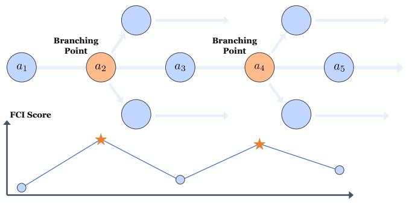

<details>
<summary>flowchart</summary>

```mermaid
graph TD
    A["a1"] --> B["a2"]
    B --> C["a3"]
    C --> D["a4"]
    D --> E["a5"]
    style A fill:#cce5ff,stroke:#333
    style B fill:#ffcccc,stroke:#333
    style C fill:#cce5ff,stroke:#333
    style D fill:#ffcccc,stroke:#333
    style E fill:#cce5ff,stroke:#333
    subgraph Branching Points
        direction TB
        B -->|Branching Point| C
        D -->|Branching Point| E
    end
    subgraph FCI Score
        direction LR
        ★[★] --> ●[●]
        ★ --> □[○]
        ★ --> ◀[○]
    end
```
</details>

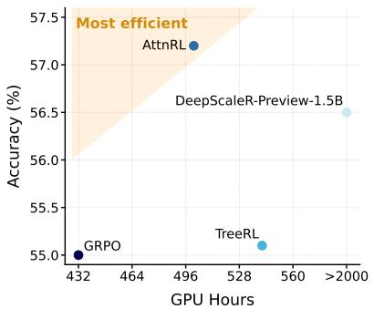

<details>
<summary>scatter</summary>

| Model               | GPU Hours | Accuracy (%) |
| ------------------- | --------- | ------------ |
| GRPO                | 432       | 55.0         |
| TreeRL              | 528       | 55.1         |
| AttnRL              | 496       | 57.2         |
| DeepScaleR-Preview-1.5B | >2000     | 56.5         |
</details>

(b)   
Figure 1: An Illustration of AttnRL. (a) AttnRL branches at steps with high attention scores. (b) AttnRL outperforms the baselines with great efficiency.

# 1 INTRODUCTION

Large Language Models (LLMs) have achieved remarkable progress in recent years (OpenAI, 2023; Hurst et al., 2024; Anthropic, 2023), particularly in their reasoning capabilities (OpenAI, 2024;

Guo et al., 2025a). With the success of DeepSeek-R1 (Guo et al., 2025a), Reinforcement Learning with Verifiable Rewards (RLVR) has emerged as an effective post-training paradigm for further strengthening the reasoning abilities of LLMs (Shao et al., 2024; Zeng et al., 2025; Luo et al., 2025; Yu et al., 2025; Liu et al., 2025c; Hu et al., 2025; He et al., 2025a; An et al., 2025; Zhang et al., 2026; Wang et al., 2025; Zheng et al., 2025a).

Common RLVR approaches, such as Group Relative Policy Optimization (GRPO) (Shao et al., 2024) and its variants (Yu et al., 2025; Liu et al., 2025c; Yue et al., 2025), assign uniform training signals to all tokens within the same response, thereby overlooking fine-grained reasoning quality. In contrast, Process-Supervised RL (PSRL) methods refine credit assignment with Monte Carlo (MC) sampling to estimate step-level advantages (Hou et al., 2025; Guo et al., 2025b; Yang et al., 2025b; Zheng et al., 2025b; Li et al., 2025). However, existing PSRL methods suffer from several limitations: (1) they segment responses by fixed token length or entropy, ignoring the semantic meaning of model outputs; (2) they adopt uniform sampling across prompts and responses, leading to inefficient exploration; (3) they typically rely on two-step sampling per update, which significantly increases computational cost.

To overcome these limitations, we introduce AttnRL, a novel PSRL framework that improves both exploration and training efficiency. Our approach is motivated by the observation that attention scores serve as a meaningful metrics for identifying important reasoning behaviors in the model output. We therefore introduce an attention-based branching strategy for Monte Carlo sampling. To further enhance efficiency, we design an adaptive sampling mechanism that prioritizes difficult problems while filtering easier ones, and an adaptive batch sampling strategy that guarantees non-zero advantage values across batches. The experimental results on mathematical reasoning tasks demonstrate that AttnRL outperforms strong outcome-based and process-based baselines with great efficiency. An overview of AttnRL is shown in Figure 1.

The contributions of this work can be summarized as follows:

• We analyze the relationship between attention scores and reasoning behaviors, and propose attention-based branching method for PSRL.   
• We develop an adaptive sampling mechanism that balances exploration across problems of varying difficulty and ensure valid training batches without zero advantage values.   
• Empirical results on six mathematical benchmarks demonstrate the superiority of our method beyond the baselines in both performance and efficiency.

# 2 PRELIMINARIES

# 2.1 LLM REASONING AS A STEP-LEVEL MARKOV DECISION PROCESS

Following Sutton & Barto (2018); Zhang et al. (2025), we formulate LLM reasoning as a Markov Decision Process (MDP) defined by the tuple $( S , { \mathcal { A } } , { \mathcal { P } } , { \mathcal { R } } , \gamma )$ , where S is the state space, A is the action space, $\mathcal { P } : \mathcal { S } \times \mathcal { A } \mapsto \mathcal { S }$ is the transition dynamics, $\mathcal { R } : \mathcal { S } \times \mathcal { A } \mapsto \mathbb { R }$ is the reward function, and $\gamma \in [ 0 , 1 ]$ ] is the discount factor. In the LLM setting with a prompt dataset D, the initial state is $s _ { 1 } = q \sim \mathcal { D }$ . The state transition is deterministic, since the next state is formed by concatenating the current state with the generated action: $\boldsymbol { s } _ { k + 1 } = \left[ \boldsymbol { s } _ { k } , \boldsymbol { a } _ { k } \right]$ , where [·, ·] denotes string concatenation. For process-level supervision of LLMs (Zhang et al., 2025; Liu et al., 2025b), actions are defined at the step level, where each action $a _ { t }$ corresponds to a semantically coherent segment such as a sentence or a paragraph, rather than a single token. In this paper, we adopt this step-level MDP formulation.

# 2.2 OUTCOME-SUPERVISED AND PROCESS-SUPERVISED RL

Outcome-Supervised RL. Group Relative Policy Optimization (GRPO) (Shao et al., 2024) is an Outcome-Supervised RL (OSRL) method that eliminates the need for an explicit critic model by estimating the advantage using the rewards $\{ R _ { 1 } , \cdots , R _ { G } \}$ of G sampled rollouts $\{ o _ { 1 } , \cdots , o _ { G } \}$ . The normalized advantage is computed as $\begin{array} { r } { \hat { A } _ { i , t } = \frac { R _ { i } - \mathrm { m e a n } ( \{ R _ { i } \} _ { i = 1 } ^ { G } ) } { \mathrm { s t d } ( \{ R _ { i } \} _ { i = 1 } ^ { G } ) } } \end{array}$ . The GRPO objective is then given

by:

$$
\mathcal {J} _ {\mathrm{GRPO}} (\theta) = \mathbb {E} _ {q \sim \mathcal {D}, \{o _ {i} \} _ {i = 1} ^ {G} \sim \pi_ {\theta_ {\mathrm{old}}} (\cdot | q)}
$$

$$
\left. \right.\left[ \frac {1}{G} \sum_ {i = 1} ^ {G} \frac {1}{| o _ {i} |} \sum_ {t = 1} ^ {| o _ {i} |} \left(\min \left(r _ {i, t} (\theta) \hat {A} _ {i, t}, \operatorname{clip} \left(r _ {i, t} (\theta), 1 - \varepsilon , 1 + \varepsilon\right) \hat {A} _ {i, t}\right) - \beta \mathbb {D} _ {\mathrm{KL}} \left(\pi_ {\theta} \| \pi_ {\text {ref}}\right)\right)\right], \tag {1}
$$

where $\begin{array} { r } { r _ { i , t } = \frac { \pi _ { \theta } \left( o _ { i , t } | { q } , { o } _ { i , < t } \right) } { \pi _ { \theta _ { \mathrm { o l d } } } \left( o _ { i , t } | { q } , { o } _ { i , < t } \right) } } \end{array}$ is the importance sampling ratio, and $\beta$ controls the strength of the KL divergence penalty that regularizes the policy towards the reference policy $\pi _ { \mathrm { r e f } }$ .

Process-Supervised RL. For PSRL, the sampling process usually includes two stages: (1) Initial Sampling: Sample multiple responses to the problem; (2) Monte Carlo Sampling: Select several tokens as division points and rollout twice starting from these branching positions (Hou et al., 2025; Guo et al., 2025b; Yang et al., 2025b). In this paper, we follow the setting of TreeRL (Hou et al., 2025), which proposes a tree-based advantage estimation method. For each node, the value is computed as the average accuracy of its all children:

$$
V (s _ {k}) = \frac {1}{| L (s _ {k}) |} \sum_ {l \in L (s _ {k})} \mathbf {1} (l \text {   is   correct }), \tag {2}
$$

where $L ( s _ { k } )$ denotes the children of node $s _ { k }$ . The final advantage is the summation of global advantage $( { \dot { V } } ( s _ { k } ) - V ( s _ { 1 } ) )$ ) and local advantage $( V ( s _ { k } ) - V ( p ( s _ { k } ) ) ;$ :

$$
\hat {A} _ {i, k} = \frac {1}{\sqrt {| L (s _ {k}) |}} \left(\underbrace {V (s _ {k}) - V (s _ {1})} _ {\text { global   advantage }} + \underbrace {V (s _ {k}) - V (p (s _ {k}))} _ {\text { local   advantage }}\right), \tag {3}
$$

where $\sqrt { | { \cal L } ( s _ { k } ) | }$ is used to reduce the optimization strength of the non-leaf steps to prevent overfitting (Hou et al., 2025) and $p ( s _ { k } )$ is the parent node of $s _ { k }$ . Then the policy is optimized using the loss function in equation 1, which is the same as that of OSRL but differs at the advantage granularity.

# 2.3 ATTENTION MECHANISM

Modern LLMs are typically decoder-only Transformer-based architectures (Vaswani et al., 2017; Yang et al., 2024; 2025a), and the core operation inside each Transformer block is the (masked) self-attention mechanism. For a given layer l and head h, the model first computes query $Q ^ { l , h }$ , key $K ^ { l , h }$ and value matrices. Then the attention score α is computed as:

$$
\alpha^ {l, h} = \text { softmax } \left(\frac {Q ^ {l , h} K ^ {l , h ^ {\top}}}{\sqrt {d _ {k}}} + \text { mask }\right), \tag {4}
$$

where $d _ { k }$ is the per-head dimensionality. In vanilla causal attention, attention mask blocks access to all future tokens by assigning them −∞, while past and current tokens remain unmasked with 0.

# 3 METHOD

In this section, we present AttnRL, an exploration-efficient method for process-supervised RL. We begin by examining the role of massive attention values and how they can be leveraged to identify branching points via attention scores to explore at important branches (Section 3.1). To enable more efficient exploration, we propose an adaptive sampling strategy that avoids oversampling easy problems and ensures each training batch contains only samples with non-zero advantage (Section 3.2). Finally, we introduce our efficient training pipeline based on one-step off-policy learning (Section 3.3).

# 3.1 BRANCHING AT MASSIVE ATTENTION VALUES

Prior work has demonstrated that massive attention values in self-attention mechanisms play a critical role in contextual knowledge understanding (Jin et al., 2025), as they highlight tokens most relevant for answering questions. Motivated by this insight, we investigate two key questions: (1) Do massive attention values consistently appear in complex reasoning tasks? (2) What impact do these massive attention values have, and how can they be effectively utilized in RL training?

# 3.1.1 MASSIVE ATTENTION VALUES IN LLMS

Step 1: Segmenting and computing step-level attention scores. Following prior work on process supervision (Wang et al., 2024a; Liu et al., 2025b), we first segment the entire response into multiple steps using two consecutive line breaks $( ^ { 6 6 } \backslash \mathrm { n } \backslash \mathrm { n } ^ { \prime 9 } )$ , yielding $T _ { k }$ steps: $o = \left( o _ { 1 } , o _ { 2 } , \ldots , o _ { T _ { k } } \right)$ . Next, we extract token-to-token attention scores via a single forward pass. By aggregating these scores at the step level, we obtain step-to-step attention matrices $\alpha ^ { l , h } \in \mathbb { R } ^ { T _ { k } \times T _ { k } }$ , where $\alpha _ { j , k } ^ { l , \overline { { h } } }$ denotes the attention weight of step j attending to step k at layer l and head h.

Step 2: Computing the Forward Context Influence (FCI) score. To quantify the influence of a given step on subsequent tokens, we define the Forward Context Influence (FCI) score at layer l and head h by summing the attention scores over the subsequent steps:

$$
y _ {k} ^ {l, h} = \sum_ {j = k + \Delta} ^ {T _ {k}} \alpha_ {j, k} ^ {l, h}, \tag {5}
$$

where $\Delta$ is a hyperparameter that restricts the scope to sufficiently distant parts of the response, set to 4 following Bogdan et al. (2025). We then aggregate across layers and heads by taking the maximum value:

$$
y _ {k} = \max _ {l, h} \{y _ {k} ^ {l, h} \}. \tag {6}
$$

The resulting FCI score $y _ { k }$ captures the degree to which step k influences the downstream context at the attention level. An illustrative visualization of steps with large FCI values is provided in Figure 2. From this figure, we can see that most steps with high FCI scores or peak FCI values are related to reasoning behaviors, such as planning and self-verification (Bogdan et al., 2025). The full response are listed in Table 5 in Appendix C.

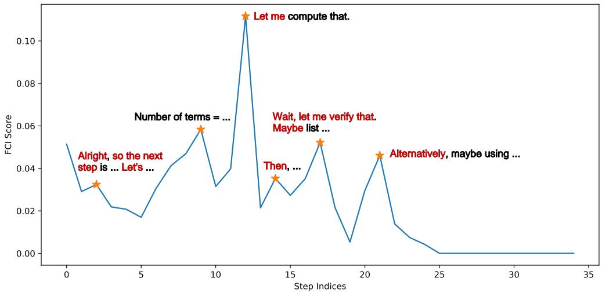

<details>
<summary>line</summary>

| Step Indices | FCI Score |
| ------------ | --------- |
| 0            | 0.05      |
| 2            | 0.03      |
| 4            | 0.02      |
| 6            | 0.03      |
| 8            | 0.05      |
| 10           | 0.03      |
| 12           | 0.11      |
| 14           | 0.02      |
| 16           | 0.03      |
| 18           | 0.05      |
| 20           | 0.01      |
| 22           | 0.04      |
| 24           | 0.01      |
| 26           | 0.00      |
| 28           | 0.00      |
| 30           | 0.00      |
| 32           | 0.00      |
| 34           | 0.00      |
</details>

Figure 2: The visualization of steps with high FCI scores. The words in red denote reasoning behaviors.

# 3.1.2 THE EFFECTS OF STEPS WITH HIGH FCI SCORES

After identifying and qualitatively analyzing steps with high FCI scores, we conduct quantitative experiments to examine the impact of disrupting attention values on performance. Specifically, we select a step either (1) randomly from the top 20% of steps ranked by FCI scores (denoted as “Top 20%”) or (2) randomly from the remaining steps (denoted as “20%–100%”). For the chosen step, we set its corresponding attention values to zero. We hypothesize that disrupting attention at key steps (with high FCI scores) will cause greater performance degradation compared to disrupting other steps. We test this hypothesis on AIME24 (MAA, 2024) using DS-R1-Distill-Qwen-1.5B, with each problem sampled four times. The results shown in Figure 3(a) confirm that disrupting top 20% steps leads to a significant drop in accuracy. Furthermore, we investigate the effect of disruption position. We divide the disruption positions relative to the original response length into five uniform bins. As shown in Figure 3(b), accuracy exhibits an increasing trend as the disruption position moves later in the sequence, indicating that disruptions at earlier positions have a larger negative impact on final performance.

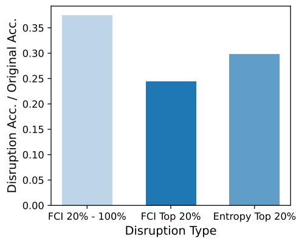

<details>
<summary>bar</summary>

| Disruption Type       | Disruption Acc. / Original Acc. |
| --------------------- | ------------------------------- |
| FCI 20% - 100%        | 0.37                            |
| FCI Top 20%           | 0.24                            |
| Entropy Top 20%       | 0.30                            |
</details>

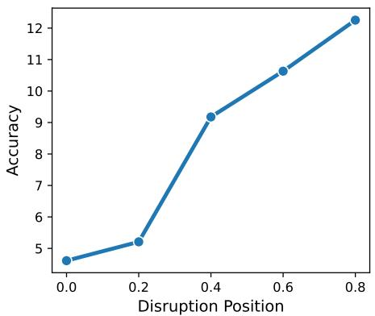

<details>
<summary>line</summary>

| Disruption Position | Accuracy |
| ------------------- | -------- |
| 0.0                 | 4.5      |
| 0.2                 | 5.2      |
| 0.4                 | 9.2      |
| 0.6                 | 10.7     |
| 0.8                 | 12.3     |
</details>

(b)   
Figure 3: Disruption results on AIME24 and AIME25. (a) Normalized average accuracy of different disruption types. (b) Average accuracy of different disruption positions.

# 3.1.3 ATTENTION-BASED TREE BRANCHING

Based on the analysis in Section 3.1.1 and 3.1.2, we have identified that steps with high FCI scores are related to reasoning behaviors and have strong influences on the the reasoning performance. Now we propose Attention-based Tree Branching (ATB), which builds the branches of the tree at steps with high FCI scores.

Specifically, we compute the FCI score for each step using equation 6 after initial sampling to enable effective exploration. We then select the top 20% of the steps with the highest FCI scores for branching:

$$
C = \{k \mid k \geq \text { Quantile } (y _ {1}, \dots , y _ {T _ {k}}, \rho) \}, \tag {7}
$$

where $\rho = 0 . 2$ is the quantile level. However, randomly selecting steps with high FCI scores as branching points can be suboptimal, as misleading initial steps may lead the reasoning process in incorrect directions and we have found that earlier steps have more influence on the final result. Similar phenomenons have also been found in Wen et al. (2025), which identifies these as “Tunnel Vision”. To mitigate this, we select the top N (N = 2 following Hou et al. (2025)) earliest steps from C as branching points, ensuring that diverse reasoning paths are explored through attention-based branching.

# 3.2 ADAPTIVE SAMPLING

# 3.2.1 DIFFICULTY-AWARE EXPLORATION

Attention-based Filtering. Previous PSRL approaches explore all problems uniformly (Hou et al., 2025), which is highly inefficient. In particular, problems that are easy (i.e., achieving an accuracy of 100% at initial sampling) have a high probability (about 70% - 80%, shown in Figure 7(a)) of being correct at both sampling stages, leading to limited learning opportunities.

To address this, we propose an attention-based filtering method to identify problems that are too easy to sample an incorrect response. We compute the average massive attention values for all problems in the DeepScaleR (Luo et al., 2025) dataset. As shown in Figure 4, we empirically find that, for problems whose initial samples are all correct, if they have lower attention values, they will tend to have zero advantage values, indicating that all samples are correct. Therefore, we filter out problems with low attention values and only retain those with attention values above the average attention values:

$$
\mathcal {D} _ {\mathrm{MC}} = \{q \mid \frac {1}{G} \sum_ {i = 1} ^ {G} \frac {1}{T _ {i , k}} \sum_ {k = 1} ^ {T _ {i, k}} y _ {i, k} \geq \text { mean   value } \}, \tag {8}
$$

where $y _ { i , k }$ is the attention score for the k-th step in problem i.

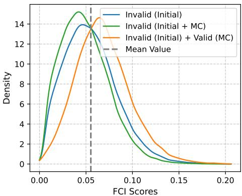

<details>
<summary>line</summary>

| FCI Scores | Invalid (Initial) | Invalid (Initial + MC) | Invalid (Initial) + Valid (MC) |
| ---------- | ----------------- | ----------------------- | ------------------------------- |
| 0.00       | 0.0               | 0.0                     | 0.0                             |
| 0.05       | 14.0              | 15.0                    | 14.5                            |
| 0.10       | 8.0               | 6.0                     | 7.0                             |
| 0.15       | 2.0               | 1.0                     | 1.5                             |
| 0.20       | 0.0               | 0.0                     | 0.0                             |
</details>

Figure 4: Average FCI scores of all problems during the training process of TreeRL on DeepScaleR dataset. “Invalid” means that the advantage is zero for all responses of that problem.

Difficulty-aware Expansion. After attention-based filtering, we expand different number of trees according to problem difficulty since it is more difficult to rollout correct responses for hard problems. Let the difficulty score be $\begin{array} { r } { z _ { n } = \frac { 1 } { G } \sum _ { i } { \bf 1 } ( o _ { i } } \end{array}$ is correct). Then the number of trees expanded for each problem M is determined by the difficulty score:

$$
M = \text { Round } (\exp (- z _ {n}) \times M ^ {\prime}), \tag {9}
$$

where Round(·) denotes rounding to the nearest integer and $M ^ { \prime }$ denotes original tree numbers and is set to 6 following Hou et al. (2025).

# 3.2.2 ADAPTIVE BATCH SAMPLING

After initial sampling and MC sampling, a large proportion of responses contribute nothing to training because their advantages are zero (detailed in Figure 7(b)). To ensure that each training batch remains effective, we introduce an adaptive batch size mechanism.

Let the target training batch size be $B ^ { \prime } .$ , valid training batch size at step m be $B _ { m } ^ { \prime \prime }$ , and the sampled prompt batch size at step m be $B _ { m }$ . The sampling batch size at step m is updated as:

$$
B _ {m + 1} = \text { Round } (\lambda B _ {m} + (1 - \lambda) \frac {B ^ {\prime}}{B _ {m} ^ {\prime \prime}} B _ {m}), \tag {10}
$$

where λ is the weight balancing historical and current batch sizes. After MC sampling, responses with zero advantages are discarded, ensuring that all samples in the final batch have non-zero advantages, which improves training efficiency.

Our adaptive batch sampling differs from the dynamic sampling used in DAPO (Yu et al., 2025) in two key ways: (1) It requires only a single round of prompt sampling and generation per training step. (2) It avoids inefficiency from discarding valid responses when their number exceeds $B ^ { \prime }$ . As a result, the actual batch size naturally fluctuates around the target $B ^ { \prime }$ while maintaining high training efficiency.

# 3.3 EFFICIENT TRAINING WITH ONE-STEP OFF-POLICY

Prior process-supervised RL methods typically require two sampling procedures per training iteration (Hou et al., 2025; Yang et al., 2025b; Guo et al., 2025b; Zheng et al., 2025b). This is highly inefficient, as sampling often dominates the overall training time. To address this, we propose a one-step off-policy learning framework for PSRL, inspired by recent advances in efficient RL training (Noukhovitch et al., 2025; Fu et al., 2025; Meituan-search, 2025).

In our approach, only a single sampling operation is performed at each training step. Concretely, at training step m, we conduct initial sampling for the (m+1)-th problem batch while simultaneously performing MC sampling for the m-th problem batch. This design ensures that the initial sampling for a batch occurs at step $m { - } 1$ , followed by its MC sampling at step m, thereby eliminating redundant sampling. As a result, the overall sampling cost is substantially reduced, leading to improved training efficiency. The full training pipeline of AttnRL is illustrated in Figure 5.

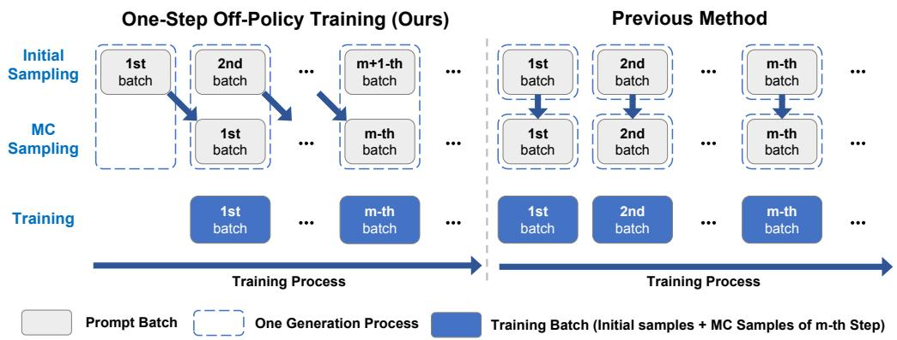

<details>
<summary>flowchart</summary>

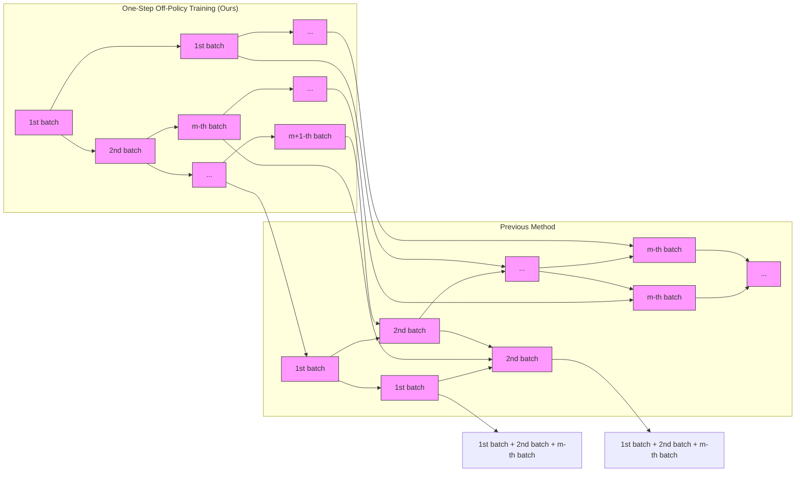
</details>

Figure 5: Training pipeline of AttnRL. Our method (left) only needs one-time generation per training iteration, while previous methods (right) require to sample twice and are inefficient.

# 4 EXPERIMENTS

# 4.1 SETUP

Models and Baselines. Following Hou et al. (2025), we adopt two supervised fine-tuned models, which are also reasoning models, as base models: DS-R1-Distill-Qwen-1.5B and DS-R1-Distill-Qwen-7B (Guo et al., 2025a). We compare against the following baselines: (1) GRPO (Shao et al., 2024): A representative OSRL method without critic model training. (2) TreeRL (Hou et al., 2025): The method is based on GRPO but differs that TreeRL samples with tree-based branching and estimates advantage values at segment-level. (3) DeepScaleR-Preview-1.5B (Luo et al., 2025): A strong RL-trained model with iterative context expansion at 1.5B scale.

Evaluation and Metrics. We evaluate all methods on six widely used mathematical reasoning benchmarks: AIME24 (MAA, 2024), AIME25 (MAA, 2025), AMC23 (MAA, 2023), MATH-500 (Lightman et al., 2024), Minerva Math (Lewkowycz et al., 2022), and OlympiadBench (He et al., 2024). We report both Pass@1 and Pass@K, where K = 32 for AIME24, AIME25, and AMC23, and K = 4 for the remaining benchmarks. Evaluation is performed with a maximum response length of 32,768 tokens. For verification, we use a hybrid of DeepScaleR’s verifier and Math-Verify1 to ensure correctness (He et al., 2025a).

Implementation Details. We train all methods using DeepScaleR-Preview-Dataset following Luo et al. (2025); Liu et al. (2026), which contains 40.3k mathematical reasoning problems. We set the training batch size to 64, the PPO minibatch size to 32, and the learning rate to $1 \times 1 0 ^ { - 6 }$ . For all methods, we adopt token-level policy loss and apply Clip-Higher with $\varepsilon _ { \mathrm { h i g h } } = 0 . 2 8 .$ following Yu et al. (2025). We use KL loss with weight 0.001 following Liu et al. (2025a); Wang et al. (2025). AttnRL is implemented based on TreeRL (Hou et al., 2025) and GRPO is used for policy optimization. We set λ = 0.9 (a standard EMA value (Kingma, 2014)) and ρ = 0.2.

The training is conducted using verl (Sheng et al., 2025), and rollouts are generated using vLLM (Kwon et al., 2023) with a maximum response length of 8,192 tokens, top-p of 1.0, and temperature of 1.0 for both DS-R1-Distill-Qwen-1.5B and DS-R1-Distill-Qwen-7B. Experiments for DS-R1-Distill-Qwen-1.5B are conducted on a single node with 8× NVIDIA H100 GPUs, and experiments for DS-R1-Distill-Qwen-7B are run on three nodes, each with 8× NVIDIA H800 GPUs.

# 4.2 MAIN RESULTS

AttnRL outperforms the base model. As shown in Table 1, AttnRL outperforms the base model across all six benchmarks, achieving an average improvement of 7.5% for DS-R1-Distill-Qwen-1.5B.

Table 1: Evaluation results on mathematical benchmarks. The results of AttnRL are shaded and the highest values are bolded. 

<table><tr><td>Method</td><td>AIME24</td><td>AIME25</td><td>AMC23</td><td>MATH-500</td><td>Minerva</td><td>Olympiad</td><td>Avg.</td></tr><tr><td>DS-R1-Distill-Qwen-1.5B</td><td>28.3</td><td>23.0</td><td>71.8</td><td>84.8</td><td>35.6</td><td>54.9</td><td>49.7</td></tr><tr><td> $\hookrightarrow$  GRPO</td><td>36.9</td><td>27.2</td><td>77.7</td><td>88.4</td><td>39.5</td><td>60.4</td><td>55.0</td></tr><tr><td> $\hookrightarrow$  DeepScaleR-Preview-1.5B</td><td>40.5</td><td>28.3</td><td>81.0</td><td>89.5</td><td>38.1</td><td>61.8</td><td>56.5</td></tr><tr><td> $\hookrightarrow$  TreeRL</td><td>36.7</td><td>27.1</td><td>78.9</td><td>88.5</td><td>38.7</td><td>60.9</td><td>55.1</td></tr><tr><td> $\hookrightarrow$  AttnRL</td><td>39.7</td><td>28.5</td><td>83.2</td><td>90.0</td><td>40.3</td><td>61.4</td><td>57.2</td></tr><tr><td>DS-R1-Distill-Qwen-7B</td><td>54.0</td><td>40.0</td><td>89.8</td><td>94.1</td><td>48.1</td><td>70.0</td><td>66.0</td></tr><tr><td> $\hookrightarrow$  GRPO</td><td>54.9</td><td>39.6</td><td>90.8</td><td>94.3</td><td>48.6</td><td>69.7</td><td>66.3</td></tr><tr><td> $\hookrightarrow$  TreeRL</td><td>55.4</td><td>40.0</td><td>92.2</td><td>94.3</td><td>49.0</td><td>70.7</td><td>66.9</td></tr><tr><td> $\hookrightarrow$  AttnRL</td><td>59.3</td><td>42.5</td><td>92.5</td><td>95.4</td><td>49.3</td><td>73.3</td><td>68.7</td></tr></table>

AttnRL surpasses the base model significantly on AIME24 benchmark, achieving an improvement of 11.4% and 5.3% for 1.5B and 7B models, respectively2.

AttnRL outperforms PSRL and strong RLVR baselines. As reported in Table 1, AttnRL surpasses GRPO and TreeRL by an average of 1.9% and 1.8% across all benchmarks at 1.5B scale, confirming its effectiveness. Moreover, AttnRL outperforms DeepScaleR-Preview-1.5B, which is trained with a three-stage context extension (8K → 16K → 24K) over 1750 steps. In contrast, AttnRL achieves superior results with only 500 steps at an 8K response length, highlighting both its effectiveness and efficiency.

# 4.3 ABLATION STUDY

To evaluate the contribution of each component, we conduct an ablation study on the six mathematical benchmarks using DS-R1-Distill-Qwen-1.5B. As shown in Table 2, incorporating ATB alone improves performance over TreeRL by an average of 1.2%, while combining ATB with adaptive sampling allows AttnRL to achieve the highest performance. Importantly, filtering out problems whose responses are all correct after initial sampling results in a slight performance drop, as even “easy” problems can produce incorrect responses under Monte Carlo sampling, providing valuable training signals that enhance overall model performance.

Table 2: Results of ablation study on mathematical benchmarks. The results of AttnRL are shaded and the highest values are bolded. 

<table><tr><td>Method</td><td>AIME24</td><td>AIME25</td><td>AMC23</td><td>MATH-500</td><td>Minerva</td><td>Olympiad</td><td>Avg.</td></tr><tr><td>TreeRL</td><td>36.7</td><td>27.1</td><td>78.9</td><td>88.5</td><td>38.7</td><td>60.9</td><td>55.1</td></tr><tr><td> $\hookrightarrow$  w/first 2 step branching</td><td>35.6</td><td>28.9</td><td>79.5</td><td>89.4</td><td>38.7</td><td>60.5</td><td>55.4</td></tr><tr><td> $\hookrightarrow$  w/ATB</td><td>39.1</td><td>27.2</td><td>81.4</td><td>89.2</td><td>40.1</td><td>61.0</td><td>56.3</td></tr><tr><td> $\hookrightarrow$  w/ATB + ADS (w/o attention-based filtering)</td><td>38.4</td><td>29.1</td><td>81.0</td><td>89.8</td><td>38.7</td><td>61.2</td><td>56.4</td></tr><tr><td> $\hookrightarrow$  w/ATB + ADS (w/o difficulty-aware expansion)</td><td>39.6</td><td>28.2</td><td>82.0</td><td>90.3</td><td>39.6</td><td>61.0</td><td>56.8</td></tr><tr><td> $\hookrightarrow$  AttnRL</td><td>39.7</td><td>28.5</td><td>83.2</td><td>90.0</td><td>40.3</td><td>61.4</td><td>57.2</td></tr></table>

# 5 ANALYSIS

# 5.1 SAMPLING

How does ATB outperform entropy-based tree branching? The results in Table 2 show that TreeRL w/ATB outperforms TreeRL, which branches at tokens with highest entropy values. To further understand the effects of ATB, we plot four sampling curves during training process in Figure 6. For Figure 6(a) and (b), we visualize the solve all ratio (i.e., the ratio of problems whose outputs are all correct) and solve none ratio (i.e., the ratio of problems whose outputs are all wrong) of MC sampling, respectively. These two subfigures demonstrate that ATB enables more effective sampling at both easy and hard problems. Figure 6(c) and (d) show the valid ratio (i.e., the ratio of problems whose outputs are either not all correct nor all wrong) of MC sampling and both sampling, respectively. The results also demonstrate the effectiveness of ATB.

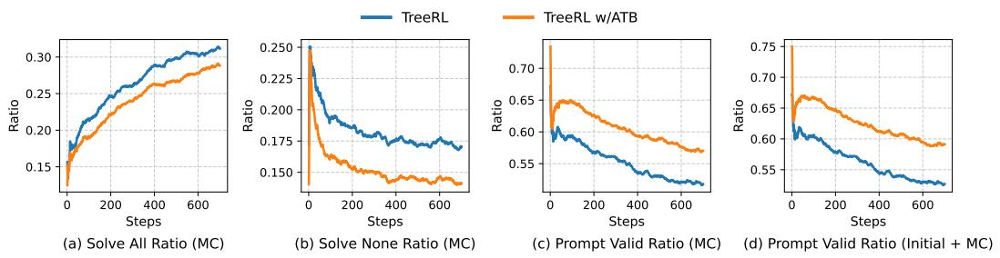  
Figure 6: The sampling statistics of ATB and entropy-based branching. The curves are smoothed using EMA for better visualization.

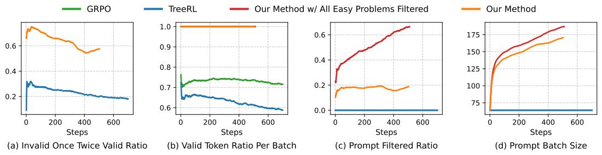  
Figure 7: Curves related to sampling information statistics of all methods. The curves are smoothed using EMA for better visualization.

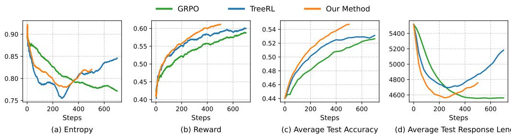  
Figure 8: The training dynamics curves of all methods. The curves are smoothed using EMA for better visualization.

Adaptive Sampling. To better understand the effects of our proposed adaptive sampling method, we visualize the training curves related to the sampling process. The results in Figure 7(a) show that our method significantly reduces the ratio of both samples of two sampling steps are correct given the initial sampling results are correct, by filtering out prompts with low FCI scores (shown in Figure 7(c)). Additionally, AttnRL benefits from maintaining a valid training batch by dynamically adjust the prompt batch size (shown in Figure 7(d)), resulting in a training batch with all tokens having non-zero advantage values (shown in Figure 7(b)).

# 5.2 TRAINING DYNAMICS AND EFFICIENCY

Training Dynamics. The training dynamics of GRPO, TreeRL, and AttnRL are visualized in Figure 8. Figure 8(a) shows that the entropy curve of GRPO decreases along the training process, while PSRL methods first decreases then increases. Compared with TreeRL, AttnRL shows higher entropy, enabling more diverse exploration during training. Figure 8(b)-(c) show AttnRL learns faster with less training steps and Figure 8(d) shows the response length of AttnRL is shorter than that of TreeRL, demonstrating that AttnRL outperforms TreeRL at both final performance and reasoning conciseness.

Training Efficiency. As shown in Table 3, the training efficiency of the introduced one-step offpolicy reduces the training time by 8% compared with original TreeRL implementation. AttnRL outperforms TreeRL with less wall-clock training time, more valid tokens for training (i.e., token with non-zero advantage values), and better overall performance significantly under the same computational resources. These strong efficiency improvements are achieved through especially at our adaptive sampling mechanism, which samples a dynamic batch of problems, filters out some low-value easy problems, and keeping a relatively stable size of batch with all samples useful for training.

Table 3: Comparison of training efficiency among AttnRL and baselines. The results of AttnRL are shaded and the best values are bolded. 

<table><tr><td>Method</td><td>Wall-clock Time</td><td># Valid Training Tokens</td><td>Performance</td></tr><tr><td>GRPO</td><td>54.0</td><td>656.0M</td><td>55.0</td></tr><tr><td>TreeRL</td><td>67.7</td><td>274.6M</td><td>55.1</td></tr><tr><td>TreeRL w/one-step off-policy</td><td>62.2</td><td>269.1M</td><td>55.3</td></tr><tr><td>AttnRL</td><td>62.6</td><td>930.4M</td><td>57.2</td></tr></table>

# 6 RELATED WORK

# 6.1 REINFORCEMENT LEARNING FOR LLM

Reinforcement Learning has shown great success for enhancing the reasoning abilities of LLMs (OpenAI, 2024; Guo et al., 2025a). With the success of OpenAI o1 (OpenAI, 2024) and DeepSeek-R1 (Guo et al., 2025a), RLVR has become an efficient method for improving reasoning abilities of LLMs (Yu et al., 2025; Liu et al., 2025c; Chu et al., 2026; Yue et al., 2025; He et al., 2025a; Luo et al., 2025; Chen et al., 2025b; Liu et al., 2025a; Chen et al., 2025a; An et al., 2025; Wang et al., 2025; Zheng et al., 2025a). These works focus on outcome-based rewards that are inefficient for RL training, while our method focus on RL with process rewards.

# 6.2 PROCESS SUPERVISION FOR LLM

Process supervision has demonstrated superiority than outcome-based feedback in mathematical reasoning, especially Process Reward Models (PRMs) (Uesato et al., 2022; Lightman et al., 2024; Wang et al., 2024b). A line of works focus on token-level process rewards (Yuan et al., 2025; Cui et al., 2025; Fei et al., 2025), using DPO-like rewards (Rafailov et al., 2023; 2024) for policy learning. For PRM-based methods, a line of works (Wang et al., 2024b; Setlur et al., 2025; Cheng et al., 2025; Zha et al., 2025; Ye et al., 2025) use discriminative PRMs for RL training, while another line of works use generative PRMs (Zhao et al., 2026) to provide process rewards for RL training (Zou et al., 2025; He et al., 2025b; Xie et al., 2025). To mitigate reward hacking and avoid training an online PRM, some works use online Monte Carlo sampling to estimate process rewards (Kazemnejad et al., 2025; Hou et al., 2025; Guo et al., 2025b; Yang et al., 2025b; Zheng et al., 2025b; Li et al., 2025; Dong et al., 2026). Our method belong to the category which leveraging MC sampling to estimate process rewards. However, previous methods mainly focus on non-reasoning models and is inefficient from the perspective of both branching points, sampling mechanism, and two-step generation, while our work proposes effective and efficient methods of process supervision for reasoning models.

# 7 CONCLUSION

In this paper, we propose AttnRL for PSRL in reasoning models, which leverages attention information to find reasoning-related steps and branches at these positions for efficient exploration. Additionally, we introduce adaptive sampling based on problem difficulty and maintaining valid training batch size. Experimental results on mathematical reasoning benchmarks demonstrate the effectiveness and efficiency of our method.

# REPRODUCIBILITY STATEMENT

The implementation details of our method are discussed in Section 4 and Appendix A. The link of our code implementation is provided in Abstract.

# ACKNOWLEDGMENTS

This work was supported by the STI 2030-Major Projects under Grant 2021ZD0201404 and Shenzhen Key Laboratory of New Generation Interactive Media Technology Innovation (ZDSYS20210623092001004).

# REFERENCES

Chenxin An, Zhihui Xie, Xiaonan Li, Lei Li, Jun Zhang, Shansan Gong, Ming Zhong, Jingjing Xu, Xipeng Qiu, Mingxuan Wang, and Lingpeng Kong. Polaris: A post-training recipe for scaling reinforcement learning on advanced reasoning models, 2025. URL https://hkunlp.githu b.io/blog/2025/Polaris. Accessed: 2025-09-01.   
Anthropic. Introducing claude, 2023. URL https://www.anthropic.com/index/intr oducing-claude/. Accessed: 2025-09-01.   
Paul C Bogdan, Uzay Macar, Neel Nanda, and Arthur Conmy. Thought anchors: Which llm reasoning steps matter? arXiv preprint arXiv:2506.19143, 2025.   
Aili Chen, Aonian Li, Bangwei Gong, Binyang Jiang, Bo Fei, Bo Yang, Boji Shan, Changqing Yu, Chao Wang, Cheng Zhu, et al. Minimax-m1: Scaling test-time compute efficiently with lightning attention. arXiv preprint arXiv:2506.13585, 2025a.   
Yang Chen, Zhuolin Yang, Zihan Liu, Chankyu Lee, Peng Xu, Mohammad Shoeybi, Bryan Catanzaro, and Wei Ping. Acereason-nemotron: Advancing math and code reasoning through reinforcement learning. In Advances in Neural Information Processing Systems (NeurIPS), 2025b. URL https: //openreview.net/forum?id=EgArbnS0BA.   
Jie Cheng, Gang Xiong, Ruixi Qiao, Lijun Li, Chao Guo, Junle Wang, Yisheng Lv, and Fei-Yue Wang. Stop summation: Min-form credit assignment is all process reward model needs for reasoning. In Advances in Neural Information Processing Systems (NeurIPS), 2025. URL https://openreview.net/forum?id=3Sxby0hH1q.   
Xiangxiang Chu, Hailang Huang, Xiao Zhang, Fei Wei, and Yong Wang. GPG: A simple and strong reinforcement learning baseline for model reasoning. In International Conference on Learning Representations (ICLR), 2026. URL https://openreview.net/forum?id=inccdtfx 8x.   
Ganqu Cui, Lifan Yuan, Zefan Wang, Hanbin Wang, Wendi Li, Bingxiang He, Yuchen Fan, Tianyu Yu, Qixin Xu, Weize Chen, et al. Process reinforcement through implicit rewards. arXiv preprint arXiv:2502.01456, 2025.   
Guanting Dong, Hangyu Mao, Kai Ma, Licheng Bao, Yifei Chen, Zhongyuan Wang, Zhongxia Chen, Jiazhen Du, Huiyang Wang, Fuzheng Zhang, et al. Agentic reinforced policy optimization. In International Conference on Learning Representations (ICLR), 2026. URL https://openre view.net/forum?id=TX4k7BF6aO.   
Wu Fei, Hao Kong, Shuxian Liang, Yang Lin, Yibo Yang, Jing Tang, Lei Chen, and Xiansheng Hua. Self-guided process reward optimization with redefined step-wise advantage for process reinforcement learning. arXiv preprint arXiv:2507.01551, 2025.   
Wei Fu, Jiaxuan Gao, Xujie Shen, Chen Zhu, Zhiyu Mei, Chuyi He, Shusheng Xu, Guo Wei, Jun Mei, Jiashu Wang, et al. Areal: A large-scale asynchronous reinforcement learning system for language reasoning. arXiv preprint arXiv:2505.24298, 2025.   
Daya Guo, Dejian Yang, Haowei Zhang, Junxiao Song, Peiyi Wang, Qihao Zhu, Runxin Xu, Ruoyu Zhang, Shirong Ma, Xiao Bi, et al. Deepseek-r1 incentivizes reasoning in llms through reinforcement learning. Nature, 645(8081):633–638, 2025a.   
Yiran Guo, Lijie Xu, Jie Liu, Ye Dan, and Shuang Qiu. Segment policy optimization: Effective segment-level credit assignment in RL for large language models. In Advances in Neural Information Processing Systems (NeurIPS), 2025b. URL https://openreview.net/forum?id= 9osvTOYbT4.

Chaoqun He, Renjie Luo, Yuzhuo Bai, Shengding Hu, Zhen Thai, Junhao Shen, Jinyi Hu, Xu Han, Yujie Huang, Yuxiang Zhang, Jie Liu, Lei Qi, Zhiyuan Liu, and Maosong Sun. Olympiadbench: A challenging benchmark for promoting agi with olympiad-level bilingual multimodal scientific problems. In Lun-Wei Ku, Andre Martins, and Vivek Srikumar (eds.), Proceedings of the 62nd Annual Meeting of the Association for Computational Linguistics (Volume 1: Long Papers), pp. 3828–3850, Bangkok, Thailand, August 2024. Association for Computational Linguistics. doi: 10.18653/v1/2024.acl-long.211. URL https://aclanthology.org/2024.acl-long. 211/.   
Jujie He, Jiacai Liu, Chris Yuhao Liu, Rui Yan, Chaojie Wang, Peng Cheng, Xiaoyu Zhang, Fuxiang Zhang, Jiacheng Xu, Wei Shen, et al. Skywork open reasoner 1 technical report. arXiv preprint arXiv:2505.22312, 2025a.   
Tao He, Rongchuan Mu, Lizi Liao, Yixin Cao, Ming Liu, and Bing Qin. Good learners think their thinking: Generative prm makes large reasoning model more efficient math learner. arXiv preprint arXiv:2507.23317, 2025b.   
Zhenyu Hou, Ziniu Hu, Yujiang Li, Rui Lu, Jie Tang, and Yuxiao Dong. Treerl: Llm reinforcement learning with on-policy tree search. In Wanxiang Che, Joyce Nabende, Ekaterina Shutova, and Mohammad Taher Pilehvar (eds.), Proceedings of the 63rd Annual Meeting of the Association for Computational Linguistics (Volume 1: Long Papers), pp. 12355–12369, Vienna, Austria, July 2025. Association for Computational Linguistics. ISBN 979-8-89176-251-0. URL https: //aclanthology.org/2025.acl-long.604/.   
Jingcheng Hu, Yinmin Zhang, Qi Han, Daxin Jiang, Xiangyu Zhang, and Heung-Yeung Shum. Open-reasoner-zero: An open source approach to scaling up reinforcement learning on the base model. In Advances in Neural Information Processing Systems (NeurIPS), 2025. URL https: //openreview.net/forum?id=NFM8F5cV0V.   
Aaron Hurst, Adam Lerer, Adam P Goucher, Adam Perelman, Aditya Ramesh, Aidan Clark, AJ Ostrow, Akila Welihinda, Alan Hayes, Alec Radford, et al. Gpt-4o system card. arXiv preprint arXiv:2410.21276, 2024.   
Mingyu Jin, Kai Mei, Wujiang Xu, Mingjie Sun, Ruixiang Tang, Mengnan Du, Zirui Liu, and Yongfeng Zhang. Massive values in self-attention modules are the key to contextual knowledge understanding. In International Conference on Machine Learning (ICML), 2025. URL https: //openreview.net/forum?id=1SMcxxQiSL.   
Amirhossein Kazemnejad, Milad Aghajohari, Eva Portelance, Alessandro Sordoni, Siva Reddy, Aaron Courville, and Nicolas Le Roux. VinePPO: Refining credit assignment in RL training of LLMs. In International Conference on Machine Learning (ICML), 2025. URL https: //openreview.net/forum?id=Myx2kJFzAn.   
Diederik P Kingma. Adam: A method for stochastic optimization. arXiv preprint arXiv:1412.6980, 2014.   
Woosuk Kwon, Zhuohan Li, Siyuan Zhuang, Ying Sheng, Lianmin Zheng, Cody Hao Yu, Joseph Gonzalez, Hao Zhang, and Ion Stoica. Efficient memory management for large language model serving with pagedattention. In Proceedings of the 29th Symposium on Operating Systems Principles, SOSP ’23, pp. 611–626, New York, NY, USA, 2023. Association for Computing Machinery. ISBN 9798400702297. doi: 10.1145/3600006.3613165. URL https://doi.or g/10.1145/3600006.3613165.   
Aitor Lewkowycz, Anders Andreassen, David Dohan, Ethan Dyer, Henryk Michalewski, Vinay Ramasesh, Ambrose Slone, Cem Anil, Imanol Schlag, Theo Gutman-Solo, Yuhuai Wu, Behnam Neyshabur, Guy Gur-Ari, and Vedant Misra. Solving quantitative reasoning problems with language models. In S. Koyejo, S. Mohamed, A. Agarwal, D. Belgrave, K. Cho, and A. Oh (eds.), Advances in Neural Information Processing Systems (NeurIPS), volume 35, pp. 3843–3857. Curran Associates, Inc., 2022. URL https://proceedings.neurips.cc/paper\_files/paper/202 2/file/18abbeef8cfe9203fdf9053c9c4fe191-Paper-Conference.pdf.

Yizhi Li, Qingshui Gu, Zhoufutu Wen, Ziniu Li, Tianshun Xing, Shuyue Guo, Tianyu Zheng, Xin Zhou, Xingwei Qu, Wangchunshu Zhou, Zheng Zhang, Wei Shen, Qian Liu, Chenghua Lin, Jian Yang, Ge Zhang, and Wenhao Huang. Treepo: Bridging the gap of policy optimization and efficacy and inference efficiency with heuristic tree-based modeling. arXiv preprint arXiv:2508.17445, 2025.   
Hunter Lightman, Vineet Kosaraju, Yuri Burda, Harrison Edwards, Bowen Baker, Teddy Lee, Jan Leike, John Schulman, Ilya Sutskever, and Karl Cobbe. Let’s verify step by step. In International Conference on Learning Representations (ICLR), 2024. URL https://openreview.net/f orum?id=v8L0pN6EOi.   
Mingjie Liu, Shizhe Diao, Ximing Lu, Jian Hu, Xin Dong, Yejin Choi, Jan Kautz, and Yi Dong. ProRL: Prolonged reinforcement learning expands reasoning boundaries in large language models. In Advances in Neural Information Processing Systems (NeurIPS), 2025a. URL https://open review.net/forum?id=YPsJha5HXQ.   
Runze Liu, Junqi Gao, Jian Zhao, Kaiyan Zhang, Xiu Li, Biqing Qi, Wanli Ouyang, and Bowen Zhou. Can 1b llm surpass 405b llm? rethinking compute-optimal test-time scaling. arXiv preprint arXiv:2502.06703, 2025b.   
Wei Liu, Ruochen Zhou, Yiyun Deng, Yuzhen Huang, Junteng Liu, Yuntian Deng, Yizhe Zhang, and Junxian He. Learn to reason efficiently with adaptive length-based reward shaping. In International Conference on Learning Representations (ICLR), 2026. URL https://openreview.net/f orum?id=hj9eKpqxQl.   
Zichen Liu, Changyu Chen, Wenjun Li, Penghui Qi, Tianyu Pang, Chao Du, Wee Sun Lee, and Min Lin. Understanding r1-zero-like training: A critical perspective. In Conference on Language Modeling (COLM), 2025c. URL https://openreview.net/forum?id=5PAF7PAY2Y.   
Michael Luo, Sijun Tan, Justin Wong, Xiaoxiang Shi, William Y. Tang, Manan Roongta, Colin Cai, Jeffrey Luo, Li Erran Li, Raluca Ada Popa, and Ion Stoica. Deepscaler: Surpassing o1-preview with a 1.5b model by scaling rl. https://pretty-radio-b75.notion.site/DeepS caleR-Surpassing-O1-Preview-with-a-1-5B-Model-by-Scaling-RL-196 81902c1468005bed8ca303013a4e2, 2025. Accessed: 2025-09-01.   
MAA. American mathematics contest 12 (amc 12), November 2023. URL https://artofp roblemsolving.com/wiki/index.php/AMC\_12\_Problems\_and\_Solutions. Accessed: 2025-09-01.   
MAA. American invitational mathematics examination (aime), February 2024. URL https: //artofproblemsolving.com/wiki/index.php/2024\_AIME\_I. Accessed: 2025- 09-01.   
MAA. American invitational mathematics examination (aime), February 2025. URL https: //artofproblemsolving.com/wiki/index.php/2025\_AIME\_I. Accessed: 2025- 09-01.   
Meituan-search. Recipe: One step off policy async trainer. https://github.com/volcengin e/verl/tree/main/recipe/one\_step\_off\_policy, 2025. Accessed: 2025-09-01.   
Michael Noukhovitch, Shengyi Huang, Sophie Xhonneux, Arian Hosseini, Rishabh Agarwal, and Aaron Courville. Asynchronous RLHF: Faster and more efficient off-policy rl for language models. In International Conference on Learning Representations (ICLR), 2025. URL https: //openreview.net/forum?id=FhTAG591Ve.   
OpenAI. Gpt-4 technical report. arXiv preprint arXiv:2303.08774, 2023.   
OpenAI. Learning to reason with llms, 2024. URL https://openai.com/index/learnin g-to-reason-with-llms. Accessed: 2025-09-01.   
Rafael Rafailov, Archit Sharma, Eric Mitchell, Christopher D Manning, Stefano Ermon, and Chelsea Finn. Direct preference optimization: Your language model is secretly a reward model. Advances in neural information processing systems (NeurIPS), 36:53728–53741, 2023.

Rafael Rafailov, Joey Hejna, Ryan Park, and Chelsea Finn. From r to q star: Your language model is secretly a q-function. In Conference on Language Modeling (COLM), 2024. URL https://openreview.net/forum?id=kEVcNxtqXk.   
Amrith Setlur, Chirag Nagpal, Adam Fisch, Xinyang Geng, Jacob Eisenstein, Rishabh Agarwal, Alekh Agarwal, Jonathan Berant, and Aviral Kumar. Rewarding progress: Scaling automated process verifiers for LLM reasoning. In International Conference on Learning Representations (ICLR), 2025. URL https://openreview.net/forum?id=A6Y7AqlzLW.   
Zhihong Shao, Peiyi Wang, Qihao Zhu, Runxin Xu, Junxiao Song, Xiao Bi, Haowei Zhang, Mingchuan Zhang, YK Li, Y Wu, et al. Deepseekmath: Pushing the limits of mathematical reasoning in open language models. arXiv preprint arXiv:2402.03300, 2024.   
Guangming Sheng, Chi Zhang, Zilingfeng Ye, Xibin Wu, Wang Zhang, Ru Zhang, Yanghua Peng, Haibin Lin, and Chuan Wu. Hybridflow: A flexible and efficient rlhf framework. In Proceedings of the Twentieth European Conference on Computer Systems, EuroSys ’25, pp. 1279–1297, New York, NY, USA, 2025. Association for Computing Machinery. ISBN 9798400711961. doi: 10.1145/3689031.3696075. URL https://doi.org/10.1145/3689031.3696075.   
Richard S Sutton and Andrew G Barto. Reinforcement learning: An introduction. MIT press, 2018.   
Jonathan Uesato, Nate Kushman, Ramana Kumar, Francis Song, Noah Siegel, Lisa Wang, Antonia Creswell, Geoffrey Irving, and Irina Higgins. Solving math word problems with process-and outcome-based feedback. arXiv preprint arXiv:2211.14275, 2022.   
Ashish Vaswani, Noam Shazeer, Niki Parmar, Jakob Uszkoreit, Llion Jones, Aidan N Gomez, Ł ukasz Kaiser, and Illia Polosukhin. Attention is all you need. In I. Guyon, U. Von Luxburg, S. Bengio, H. Wallach, R. Fergus, S. Vishwanathan, and R. Garnett (eds.), Advances in Neural Information Processing Systems (NeurIPS), volume 30. Curran Associates, Inc., 2017. URL https://proceedings.neurips.cc/paper\_files/paper/2017/file/3f5ee 243547dee91fbd053c1c4a845aa-Paper.pdf.   
Jiakang Wang, Runze Liu, Fuzheng Zhang, Xiu Li, and Guorui Zhou. Stabilizing knowledge, promoting reasoning: Dual-token constraints for rlvr. arXiv preprint arXiv:2507.15778, 2025.   
Jun Wang, Meng Fang, Ziyu Wan, Muning Wen, Jiachen Zhu, Anjie Liu, Ziqin Gong, Yan Song, Lei Chen, Lionel M Ni, et al. Openr: An open source framework for advanced reasoning with large language models. arXiv preprint arXiv:2410.09671, 2024a.   
Peiyi Wang, Lei Li, Zhihong Shao, Runxin Xu, Damai Dai, Yifei Li, Deli Chen, Yu Wu, and Zhifang Sui. Math-shepherd: Verify and reinforce LLMs step-by-step without human annotations. In Lun-Wei Ku, Andre Martins, and Vivek Srikumar (eds.), Proceedings of the 62nd Annual Meeting of the Association for Computational Linguistics (Volume 1: Long Papers), pp. 9426–9439, Bangkok, Thailand, August 2024b. Association for Computational Linguistics. doi: 10.18653/v1/2024.acl-l ong.510. URL https://aclanthology.org/2024.acl-long.510/.   
Hao Wen, Yifan Su, Feifei Zhang, Yunxin Liu, Yunhao Liu, Ya-Qin Zhang, and Yuanchun Li. Parathinker: Native parallel thinking as a new paradigm to scale llm test-time compute. arXiv preprint arXiv:2509.04475, 2025.   
Guofu Xie, Yunsheng Shi, Hongtao Tian, Ting Yao, and Xiao Zhang. Capo: Towards enhancing llm reasoning through verifiable generative credit assignment. arXiv preprint arXiv:2508.02298, 2025.   
An Yang, Baosong Yang, Beichen Zhang, Binyuan Hui, Bo Zheng, Bowen Yu, Chengyuan Li, Dayiheng Liu, Fei Huang, Haoran Wei, Huan Lin, Jian Yang, Jianhong Tu, Jianwei Zhang, Jianxin Yang, Jiaxi Yang, Jingren Zhou, Junyang Lin, Kai Dang, Keming Lu, Keqin Bao, Kexin Yang, Le Yu, Mei Li, Mingfeng Xue, Pei Zhang, Qin Zhu, Rui Men, Runji Lin, Tianhao Li, Tingyu Xia, Xingzhang Ren, Xuancheng Ren, Yang Fan, Yang Su, Yichang Zhang, Yu Wan, Yuqiong Liu, Zeyu Cui, Zhenru Zhang, and Zihan Qiu. Qwen2.5 technical report. arXiv preprint arXiv:2412.15115, 2024.

An Yang, Anfeng Li, Baosong Yang, Beichen Zhang, Binyuan Hui, Bo Zheng, Bowen Yu, Chang Gao, Chengen Huang, Chenxu Lv, Chujie Zheng, Dayiheng Liu, Fan Zhou, Fei Huang, Feng Hu, Hao Ge, Haoran Wei, Huan Lin, Jialong Tang, Jian Yang, Jianhong Tu, Jianwei Zhang, Jianxin Yang, Jiaxi Yang, Jing Zhou, Jingren Zhou, Junyang Lin, Kai Dang, Keqin Bao, Kexin Yang, Le Yu, Lianghao Deng, Mei Li, Mingfeng Xue, Mingze Li, Pei Zhang, Peng Wang, Qin Zhu, Rui Men, Ruize Gao, Shixuan Liu, Shuang Luo, Tianhao Li, Tianyi Tang, Wenbiao Yin, Xingzhang Ren, Xinyu Wang, Xinyu Zhang, Xuancheng Ren, Yang Fan, Yang Su, Yichang Zhang, Yinger Zhang, Yu Wan, Yuqiong Liu, Zekun Wang, Zeyu Cui, Zhenru Zhang, Zhipeng Zhou, and Zihan Qiu. Qwen3 technical report. arXiv preprint arXiv:2505.09388, 2025a.   
Zhicheng Yang, Zhijiang Guo, Yinya Huang, Xiaodan Liang, Yiwei Wang, and Jing Tang. Treerpo: Tree relative policy optimization. arXiv preprint arXiv:2506.05183, 2025b.   
Chenlu Ye, Zhou Yu, Ziji Zhang, Hao Chen, Narayanan Sadagopan, Jing Huang, Tong Zhang, and Anurag Beniwal. Beyond correctness: Harmonizing process and outcome rewards through rl training. arXiv preprint arXiv:2509.03403, 2025.   
Qiying Yu, Zheng Zhang, Ruofei Zhu, Yufeng Yuan, Xiaochen Zuo, YuYue, Weinan Dai, Tiantian Fan, Gaohong Liu, Juncai Liu, LingJun Liu, Xin Liu, Haibin Lin, Zhiqi Lin, Bole Ma, Guangming Sheng, Yuxuan Tong, Chi Zhang, Mofan Zhang, Ru Zhang, Wang Zhang, Hang Zhu, Jinhua Zhu, Jiaze Chen, Jiangjie Chen, Chengyi Wang, Hongli Yu, Yuxuan Song, Xiangpeng Wei, Hao Zhou, Jingjing Liu, Wei-Ying Ma, Ya-Qin Zhang, Lin Yan, Yonghui Wu, and Mingxuan Wang. DAPO: An opensource LLM reinforcement learning system at scale. In Advances in Neural Information Processing Systems (NeurIPS), 2025. URL https://openreview.net/forum?id=2a36EMSSTp.   
Lifan Yuan, Wendi Li, Huayu Chen, Ganqu Cui, Ning Ding, Kaiyan Zhang, Bowen Zhou, Zhiyuan Liu, and Hao Peng. Free process rewards without process labels. In International Conference on Machine Learning (ICML), 2025. URL https://openreview.net/forum?id=8ThnPF hGm8.   
Yu Yue, Yufeng Yuan, Qiying Yu, Xiaochen Zuo, Ruofei Zhu, Wenyuan Xu, Jiaze Chen, Chengyi Wang, TianTian Fan, Zhengyin Du, et al. Vapo: Efficient and reliable reinforcement learning for advanced reasoning tasks. arXiv preprint arXiv:2504.05118, 2025.   
Weihao Zeng, Yuzhen Huang, Qian Liu, Wei Liu, Keqing He, Zejun MA, and Junxian He. SimpleRLzoo: Investigating and taming zero reinforcement learning for open base models in the wild. In Conference on Language Modeling (COLM), 2025. URL https://openreview.net/for um?id=vSMCBUgrQj.   
Kaiwen Zha, Zhengqi Gao, Maohao Shen, Zhang-Wei Hong, Duane S Boning, and Dina Katabi. RL tango: Reinforcing generator and verifier together for language reasoning. In Advances in Neural Information Processing Systems (NeurIPS), 2025. URL https://openreview.net/for um?id=JRkFZl0TJ2.   
Kaiyan Zhang, Yuxin Zuo, Bingxiang He, Youbang Sun, Runze Liu, Che Jiang, Yuchen Fan, Kai Tian, Guoli Jia, Pengfei Li, Yu Fu, Xingtai Lv, Yuchen Zhang, Sihang Zeng, Shang Qu, Haozhan Li, Shijie Wang, Yuru Wang, Xinwei Long, Fangfu Liu, Xiang Xu, Jiaze Ma, Xuekai Zhu, Ermo Hua, Yihao Liu, Zonglin Li, Huayu Chen, Xiaoye Qu, Yafu Li, Weize Chen, Zhenzhao Yuan, Junqi Gao, Dong Li, Zhiyuan Ma, Ganqu Cui, Zhiyuan Liu, Biqing Qi, Ning Ding, and Bowen Zhou. A survey of reinforcement learning for large reasoning models. arXiv preprint arXiv:2509.08827, 2025.   
Kaiyan Zhang, Kai Tian, Runze Liu, Sihang Zeng, Xuekai Zhu, Guoli Jia, Yuchen Fan, Xingtai Lv, Yuxin Zuo, Che Jiang, Yuru Wang, Jianyu Wang, Ermo Hua, Xinwei Long, Junqi Gao, Youbang Sun, Zhiyuan Ma, Ganqu Cui, Ning Ding, Biqing Qi, and Bowen Zhou. MARTI: A framework for multi-agent LLM systems reinforced training and inference. In International Conference on Learning Representations (ICLR), 2026. URL https://openreview.net/forum?id=E7 jZqo0A50.   
Jian Zhao, Runze Liu, Kaiyan Zhang, Zhimu Zhou, Junqi Gao, Dong Li, Jiafei Lyu, Zhouyi Qian, Biqing Qi, Xiu Li, and Bowen Zhou. GenPRM: Scaling test-time compute of process reward models via generative reasoning. In AAAI Conference on Artificial Intelligence (AAAI), 2026. URL https://openreview.net/forum?id=9VGbRupgiP.

Chujie Zheng, Shixuan Liu, Mingze Li, Xiong-Hui Chen, Bowen Yu, Chang Gao, Kai Dang, Yuqiong Liu, Rui Men, An Yang, et al. Group sequence policy optimization. arXiv preprint arXiv:2507.18071, 2025a.   
Tianyu Zheng, Tianshun Xing, Qingshui Gu, Taoran Liang, Xingwei Qu, Xin Zhou, Yizhi Li, Zhoufutu Wen, Chenghua Lin, Wenhao Huang, et al. First return, entropy-eliciting explore. arXiv preprint arXiv:2507.07017, 2025b.   
Jiaru Zou, Ling Yang, Jingwen Gu, Jiahao Qiu, Ke Shen, Jingrui He, and Mengdi Wang. Reasonflux-PRM: Trajectory-aware PRMs for long chain-of-thought reasoning in LLMs. In Advances in Neural Information Processing Systems (NeurIPS), 2025. URL https://openreview.net /forum?id=f3sZjkQbv2.

# A EXPERIMENTAL DETAILS

Evaluation. For evaluation, we use the prompt listed in Table 4, following Luo et al. (2025).

Table 4: Prompt Template.

{problem} Let’s think step by step and output the final answer within \boxed{}.

# B ADDITIONAL EXPERIMENTAL RESULTS

# B.1 FULL TEST CURVES

The test curves of six mathematical benchmarks are shown in Figure 9.

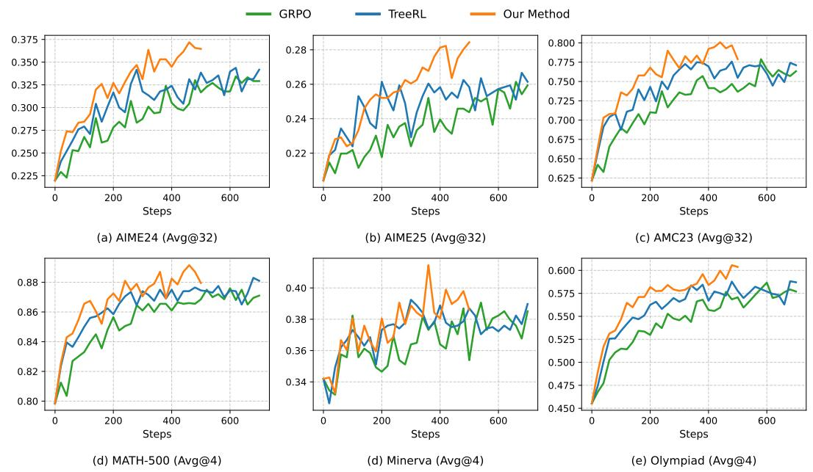  
Figure 9: Test curves of GRPO, TreeRL, and our method on six benchmarks.

# C CASES

The full response of Figure 2 is listed in Table 5 and steps with high FCI scores are shown in red.

Table 5: Full response.

Okay, so I need to figure out how many positive three-digit integers are divisible by both 11 and 5. Hmm, let’s see. I remember that if a number is divisible by both 11 and 5, it must be divisible by their least common multiple, right? But wait, I should double-check that because sometimes numbers share common factors, so maybe I need the least common multiple correctly.

First, let me recall that 11 is a prime number, and 5 is also a prime number. Since they are both prime and different, the least common multiple (LCM) of them should just be their product. So, $\mathrm { L C M } ( 1 1 , 5 ) = 1 1 * 5 = 5 5$ . That means we’re looking for three-digit numbers divisible by 55. Alright, so the next step is to find out how many three-digit numbers are divisible by 55. Let’s figure out the smallest and largest three-digit numbers that are divisible by 55. The smallest three-digit number is 100, and the largest is 999.

I need to find the smallest three-digit number that’s divisible by 55. So, let me divide 100 by 55 to see if it’s a whole number. $5 5 ^ { \circ } { } ^ { \circ } { } ^ { \circ } 1 = 5 5 , 5 5 ^ { \circ } { } ^ { \circ } 2 = 1 1 0 . \mathrm { ~ S o } , 5 5 ^ { \circ } { } ^ { \circ } 2 = 1 1 0$ is the first number above 100 that is divisible by 55. Is that right? Let me divide 100 by 55 to find how many times 55 goes into 100. 100 / 55 is approximately 1.818. So, yes, the first multiple is 55 \* 2 = 110. But 110 is the first three-digit number?

Wait, hold on. What’s 55 \* 1? That would be 55, which is not a three-digit number. So, we have to start at 55 \* 2. So, the first multiple is 110, which is 55 \* 2. But do we need to check if 55 \* 1 is two-digit, which it is, so yes, we have to skip that.

Now, for the upper limit, the largest three-digit number is 999. So, let’s divide 999 by 55 to get how many times 55 goes into 999. So, 999 / 55 is equal to approximately 18.16. So, 55 \* 18 = 990, and 55 \* 19 = 1045. Wait, 1045 is a four-digit number, which is too big. So, the largest multiple within three digits is 990, which is 55 \* 18.

Wait, no—actually, 55 times 18 is 990, which is still less than 999. So, 18 is okay. Wait, but 55 \* 19 is 1045, which is more than 999, so 990 is indeed the largest three-digit multiple.

So, our sequence of three-digit numbers divisible by 55 goes from 110 up to 990, with a common difference of 55 each time. So, to find the number of terms in this sequence, we can use the formula for the number of terms in an arithmetic sequence:

Number of terms = (Last term - First term) / Common difference + 1

So plugging in the numbers:

First term, a1 = 110

Last term, an = 990

Common difference, d = 55

So, (990 - 110) / 55 + 1.

Let me compute that.

First, calculate the difference: 990 - 110 = 880.

Then, divide by 55: 880 / 55 = 16.

Then, add 1: 16 + 1 = 17.

Therefore, there are 17 three-digit numbers divisible by both 11 and 5.

Wait, let me verify that. Maybe list a few and count.

Starting from 110,

110 (1st term) 165 (2nd term) 220 (3rd term) 275 (4th term) 330 (5th term) 385 (6th term) 440

(7th term) 495 (8th term) 550 (9th term) 605 (10th term) 660 (11th term) 715 (12th term) 770 (13th term) 825 (14th term) 880 (15th term) 935 (16th term) 990 (17th term)

Hmm, so that’s 17 terms. Looks correct. So, the number is 17.

Alternatively, maybe using the formula with the general term:

The n-th term of the sequence is given by a\_n = a1 + (n - 1)d.

So, since the last term is 990, let’s set 990 = 110 + (n - 1)\*55.

Subtract 110: 880 = (n -1)\*55.

Divide by 55: 880 /55 = 16.

So, n -1 =16. Therefore, n=17.

Yes, same result. Seems solid.

Therefore, the number of positive three-digit integers divisible by both 11 and 5 is 17.

\*\*Final Answer\*\*

The number of positive three-digit integers divisible by both 11 and 5 is 17 . </think>

To determine how many positive three-digit integers are divisible by both 11 and 5, we first find the least common multiple (LCM) of 11 and 5. Since 11 and 5 are both prime, their LCM is 11 × 5 = 55. Therefore, we need to find the three-digit integers divisible by 55.

The smallest three-digit number divisible by 55 is found by dividing 100 by 55, which gives approximately 1.818. The next whole number is 2, so the smallest term is 55 × 2 = 110.

The largest three-digit number is 999. Dividing this by 55 gives approximately 18.16. The largest whole number is 18, so the largest term is 55 × 18 = 990.

To find the number of terms in this sequence, we use the formula for the number of terms in an arithmetic sequence:

$$
\text { Number   of   terms } = \left(\frac {\text { Last   term } - \text { First   term }}{\text { Common   difference }}\right) + 1
$$

Substituting the values, we get:

$$
\text { Number   of   terms } = \left(\frac {9 9 0 - 1 1 0}{5 5}\right) + 1 = \left(\frac {8 8 0}{5 5}\right) + 1 = 1 6 + 1 = 1 7
$$

Thus, the number of positive three-digit integers divisible by both 11 and 5 is 17 .

# D THE USE OF LARGE LANGUAGE MODELS

In this paper, LLMs are only used to polish the draft of some paragraphs, improving the clarity of the sentences. The key ideas, figures, and experiments are all from the human authors’ contributions without the help of LLMs.

# E ADDITIONAL DETAILS ON PROCESS-SUPERVISED RL

In this section, we provide additional preliminaries about process-supervised RL, especially TreeRL (Hou et al., 2025).

Tree Constuction in TreeRL. TreeRL contains two-step sampling processes, including initial sampling and Monte Carlo sampling. For initial sampling, TreeRL samples 6 responses for each prompt. Starting from the prompt, we now have a tree with depth 1 and 6 leaf nodes. Then, TreeRL branches at the 2 tokens with the highest entropy for each response and sample 2 times at each branching point. After the branching, the tree has a depth of 3 and 30 leaf nodes (6 responses + 6 responses × 2 branching points × 2 samples). The responses at these leaf nodes are used for process reward estimation and policy training.