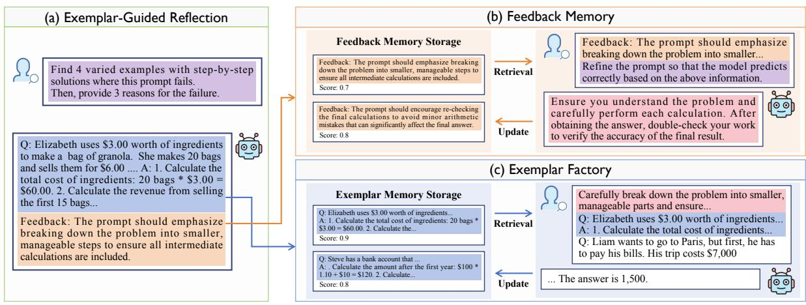
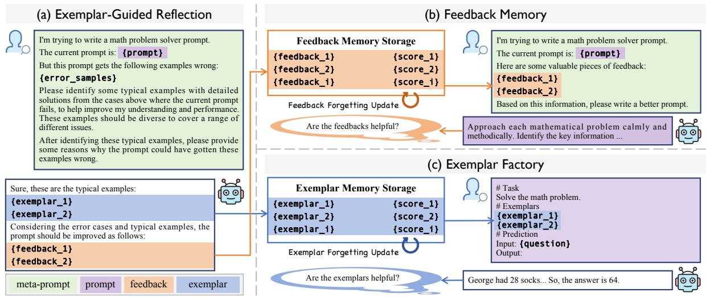
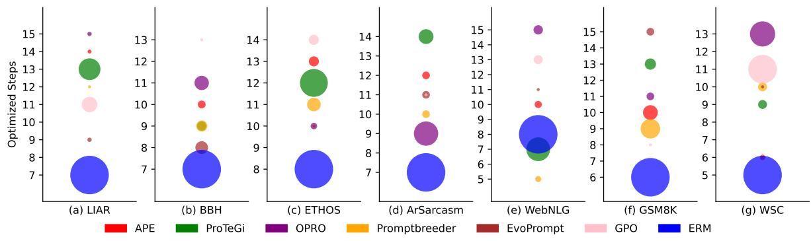

# Efficient and Accurate Prompt Optimization: the Benefit of Memory in Exemplar-Guided Reflection

Cilin Yan1\*†, Jingyun Wang1\*, Lin Zhang2\*, Ruihui Zhao2, Xiaopu Wu2, Kai Xiong2, Qingsong Liu2, Guoliang Kang 1‡, Yangyang Kang3,2‡

1Beihang University, 2ByteDance, 3Zhejiang University

{clyanhh, wangjingyun0730, kgl.prml}@gmail.com, zhanglin.hb@bytedance.com {zhaoruihui, wuxiaopu, xiongkai.kx, liuqingsong, yangyangkang}@bytedance.com

# Abstract

Automatic prompt engineering aims to enhance the generation quality of large language models (LLMs). Recent works utilize feedbacks generated from erroneous cases to guide the prompt optimization. During inference, they may further retrieve several semantically related exemplars and concatenate them to the optimized prompts to improve the performance. However, those works only utilize the feedbacks at the current step, ignoring historical and unseleccted feedbacks which are potentially beneficial. Moreover, the selection of exemplars only considers the general semantic relationship and may not be optimal in terms of task performance and matching with the optimized prompt. In this work, we propose an Exemplar-Guided Reflection with Memory mechanism (ERM) to realize more efficient and accurate prompt optimization. Specifically, we design an exemplar-guided reflection mechanism where the feedback generation is additionally guided by the generated exemplars. We further build two kinds of memory to fully utilize the historical feedback information and support more effective exemplar retrieval. Empirical evaluations show our method surpasses previous state-of-the-arts with less optimization steps, i.e., improving F1 score by 10.1 on LIAR dataset, and reducing half of the optimization steps on ProTeGi.

# 1 Introduction

Prompt optimization is crucial for enhancing the performance of Large Language Models (LLMs). Even a subtle adjustment to the prompt may lead to an obvious improvement or decline in performance, thereby highlighting the critical role of prompt engineering for LLMs. Manual prompt engineering demands significant human effort and expert knowledge, while traditional fine-tuning methods (Lester et al., 2021; Shin et al., 2020) heavily rely on substantial computational resources and powerful GPUs. Therefore, it is necessary to explore automatic prompt engineering, which is compatible with black-box APIs (e.g., GPT-4) and does not require extensive resources.

Recently, feedback-based methods (Ye et al., 2024; Juneja et al., 2024) exhibit promising performance for automatic prompt engineering, which generally leverage feedbacks generated from failure cases to facilitate the prompt optimization process. Previous feedback-based methods (Pryzant et al., 2023; Ye et al., 2024) have two main drawbacks. Firstly, they throw unselected and historical feedbacks which may benefit the prompt optimization, resulting in more optimization steps to achieve satisfactory performance. Secondly, during inference, previous methods (Hu et al., 2023; Juneja et al., 2024) may retrieve several semantically related exemplars and concatenate them to the optimized prompt to improve the performance. However, the retrieved exemplars are not optimal without evaluating their influence on the task performance. Those drawbacks largely constrain both the efficiency and accuracy of the prompt optimization process.

In this work, we introduce an Exemplar-Guided Reflection with Memory mechanism (ERM) to achieve efficient and accurate prompt optimization. Firstly, we propose an exemplar-guided reflection mechanism. As shown in Figure 1(a), we manually design an instructive meta-prompt. Unlike previous meta-prompts which simply guide LLMs to reflect on the current case, our instructive metaprompt further directs LLMs to generate exemplars by selecting typical wrong samples and providing detailed solution processes for them. Thanks to the detailed solution processes within exemplars, LLMs therefore yield more informative feedbacks.



<details>
<summary>flowchart</summary>


</details>

Figure 1: Feedback-based automatic prompt engineering methods commonly employ a meta-prompt , which guides LLMs to evaluate the current case, provide feedbacks , and generate refined prompts . In this work, we design an instructive meta-prompt to select exemplars with detailed solution processes, and generate feedbacks for the current case. These feedbacks are stored in Feedback Memory and periodically retrieved to efficiently guide the optimization of prompts . Additionally, these exemplars are stored and assessed in an Exemplar Factory to enhance prediction accuracy.

We then propose Feedback Memory to store all feedbacks and assign a priority score to each of them, as shown in Figure 1(b). During the optimization process, we retrieve a group of feedbacks with the highest priority scores and instruct LLMs to generate a new prompt for the feedbacks. After evaluating the refined prompts, we update the priority scores of the associated feedbacks accordingly, i.e., we increase the score for improved performance and decrease it if no gain. Consequently, feedbacks with valuable insights will be consistently selected rather than ignored throughout the optimization process. As demonstrated in Figure 1(c), we store all exemplars in Exemplar Factory and assign a prior score to each piece. At the inference stage, we retrieve a set of exemplars with the highest priority scores, and concatenate the exemplars to our refined prompt to further improve the performance.

We conduct an extensive evaluation on seven tasks to compare ERM with the latest prompt optimization approaches. Our results demonstrate substantial improvements over state-of-the-art methods, notably achieving a 10.1 F1 score improvement on the LIAR dataset. Furthermore, the optimization speed of ERM is roughly twice as fast as ProTeGi (Pryzant et al., 2023).

Our contributions are summarized as follows:

1) We design an instructive meta-prompt, which guides LLMs to select exemplars and therefore yield more informative feedbacks.

2) We propose a Feedback Memory to store historical feedbacks by their priority scores, enabling effective retrieval and utilization of feedbacks for prompt optimization.   
3) We propose an Exemplar Factory to store and evaluate exemplars. By retrieving exemplars and concatenating them to our refined prompt at the inference stage, we further enhance the performance of LLMs.   
4) We conduct extensive experiments on various tasks and show superior performance of our method to previous state-of-the-arts. Additionally, our optimization steps can be largely reduced, e.g., the steps of our method are approximately half of that in ProTeGi.

# 2 Related Work

# 2.1 Automatic Prompt Optimization

Prompt engineering (Zhou et al., 2022) aims to identify suitable prompts as inputs for large language models (LLMs) to perform various tasks. To minimize human effort, researchers have explored automatic prompt optimization (Lester et al., 2021; Shin et al., 2020; Li and Liang, 2021). Previous works adopt various strategies for automatic prompt optimization, such as evolutionary-based methods, trajectory-based methods, and feedbackbased methods. Evolutionary-based methods (Guo et al., 2024; Fernando et al., 2024) utilize LLMs to rewrite a set of prompts with evolutionary algorithms (Holland, 1992; Storn and Price, 1997), which select the best prompts on a validation set to simulate the natural selection process for optimizing prompts. Trajectory-based methods (Yang et al., 2024; Tang et al., 2024) employ an LLM prompt optimizer to generate new prompts based on historical prompts, scores, or error examples. Feedbackbased methods (Pryzant et al., 2023; Juneja et al., 2024) use LLMs to summarize feedbacks on erroneous cases, leveraging the feedbacks to optimize and create new prompts. In this work, we primarily focus on feedback-based methods, with the aim of writing stronger feedbacks and efficiently utilizing them for optimization.



<details>
<summary>flowchart</summary>

```mermaid
graph TD
    subgraph (a) Exemplar-Guided Reflection
        A[" I'm trying to write a math problem solver prompt. "]
        B[" The current prompt is: {prompt}"]
        C[" But this prompt gets the following examples wrong: {error_samples}"]
        D[" Please identify some typical examples with detailed solutions from the cases above where the current prompt fails, to help improve my understanding and performance. These examples should be diverse to cover a range of different issues. After identifying these typical examples, please provide some reasons why the prompt could have gotten these examples wrong. "]
        E[" Meta-prompt"]
        F["prompt"]
        G["feedback"]
        H["exemplar"]
    end

    subgraph (b) Feedback Memory
        I[" Feedback Memory Storage <br>    {feedback_1} {score_1}<br>    {feedback_2} {score_2}<br>    {feedback_i} {score_i}<br>        J[ Approach each mathematical problem calmly and methodically. Identify the key information ... "]
        K[" Are the feedbacks helpful? "]
    end

    subgraph (c) Exemplar Factory
        L[" Exemplar Memory Storage <br>    {exemplar_1} {score_1}<br>    {exemplar_2} {score_2}<br>    M[ {exemplar_i} {score_i}"]
        N[" Are the exemplars helpful? "]
        O[" George had 28 socks... So, the answer is 64. "]
    end

    A --> I
    B --> I
    C --> I
    D --> I
    E --> I
    F --> I
    G --> I
    H --> I
    I --> J
    J --> K
    K --> L
    L --> M
    M --> O
```
</details>

Figure 2: Pipeline of ERM. In wrong prediction samples, the instructive reflective meta-prompt is employed to select exemplars with detailed answer processes, which are subsequently followed by feedback generation. The feedbacks are stored in feedback memory storage, and the exemplars are stored in exemplar memory storage. These stored feedbacks are periodically retrieved to efficiently guide prompt optimization, with selective forgetting based on their effectiveness in enhancing optimization. Additionally, these exemplars are assessed to enhance prediction accuracy.

# 2.2 Long-Term Memory Mechanisms

Existing automatic prompt optimization methods (Pryzant et al., 2023; Juneja et al., 2024) face challenges in maintaining a robust long-term memory function, limiting their ability to retain and utilize valuable feedbacks for prompt optimization. MemoryBank (Zhong et al., 2024) solves the challenge of maintaining a robust long-term memory conversation history in previous LLMs (Touvron et al., 2023; Zeng et al., 2022; Taori et al., 2023) by introducing a mechanism that enhances their ability to store and recall relevant information over time. This approach mimics human memory dynamics through a selective retention strategy inspired by the Ebbinghaus Forgetting Curve (Ebbinghaus, 2013). Our work builds on these advancements by using memory storage to implement feedbacks and exemplars in long-term memory. We implement a forgetting strategy for feedbacks and exemplars that are retrieved but deemed unvaluable, thereby enhancing the efficiency and accuracy of long-term memory retention in prompt optimization.

# 3 Method

In this section, we propose ERM, a novel method designed to achieve efficient and accurate prompt optimization. As shown in Figure 2, ERM is composed of three core components: (1) Exemplar-Guided Reflection, employing an instructive metaprompt (Section 3.2), guides prompt optimizer to first generate exemplars by identifying typical wrong samples and providing detailed solution processes, followed by generating feedback. (2) We then propose a Feedback Memory (Section 3.3) to store all feedbacks and assign a priority score to each piece of them. These feedbacks can then be retrieved and utilized during optimization efficiently. After evaluating the refined prompts, we update the priority scores of the associated feedbacks. (3) Finally, we utilize an Exemplar Factory (Section 3.4) to store and evaluate exemplars, which serve as additional resources during prediction. By incorporating the retrieved exemplars into our refined prompt, task model are further guided to achieve improved accuracy.

# 3.1 Preliminary

Given a training set $\mathcal { D } _ { t r a i n } = \{ ( q _ { i } , a _ { i } ) \} _ { i = 1 } ^ { n _ { t } }$ (qi represents the question, $a _ { i }$ is the paired answer, and $n _ { t }$ is the total number of training samples) and a test set $\mathcal { D } _ { t e s t }$ drawn from a specific task, along with a score function $s ( \cdot )$ for this task, we aim to perform the task using a black-box task model $M _ { s } \left( e . g . \right.$ , ChatGPT), which combines the prompt $p$ with questions from $\mathcal { D } _ { t e s t }$ as input to generate responses. These responses are then evaluated by the score function to calculate an average score over $\mathcal { D } _ { t e s t }$ . The goal of prompt optimization is to find an optimal prompt $p ^ { * }$ drawn from the natural language space that maximizes the expectation of the average score over $\mathcal { D } _ { t e s t }$ :

$$
p ^ {*} = \arg \max _ {p} \mathbb {E} _ {\left(q _ {i}, a _ {i}\right) \sim \mathcal {D} _ {\text { test }}} [ s \left(M _ {s} \left(q _ {i}; p\right), a _ {i}\right) ], \tag {1}
$$

where $p = [ p _ { I } , p _ { R } ( q _ { i } ) ]$ ] might be composed of two parts: one includes the invariant content $p _ { I }$ , which remains independent of the question and may include task descriptions and general solution steps, and the other is the variable content $p _ { R } ( q _ { i } )$ , which is question-specific. We leverage a more powerful prompt optimizer $M _ { e } ~ ( e . g . , \mathrm { G P T } \ – 4 )$ compared with the task model $M _ { s }$ to summarize feedbacks and optimize the prompt.

Previous work typically divides prompt optimization into three steps: prompt initialization, new prompt proposal, and prompt search.

1) Prompt initialization. Prompt initialization can be achieved by both manual initialization and induction initialization. Following Pro-TeGi (Pryzant et al., 2023), we initialize the original prompt $p ^ { 0 }$ manually.   
2) New prompt proposal. Commonly, previous methods use task model $M _ { s }$ to evaluate on a subset of $\mathcal { D } _ { t r a i n }$ , and then use prompt optimizer $M _ { e }$ to summarize errors from $n _ { b }$ wrong samples $B ~ = ~ \{ ( q _ { i } , a _ { i } ) \} _ { i = 1 } ^ { n _ { b } }$ , where the response of task model $M _ { s } ( q _ { i } , p ^ { t } )$ is different from $a _ { i }$ . Feedbacks is then generated as $\mathcal { F } ^ { t } = M _ { e } ( p ^ { t } , \boldsymbol { B } ; p _ { r e f } ^ { m e t a } )$ with $p _ { r e f } ^ { m e t a }$ serving as the meta-prompt that guides the prompt optimizer in generating feedback. The prompt optimizer then optimizes and refines the prompt $p ^ { t }$ based on the feedbacks to obtain refined prompts $p ^ { t + 1 } = M _ { e } ( p ^ { t } , \boldsymbol { B } , f ^ { t } ; p _ { o p t } ^ { m e t a } )$ ), where $f ^ { t } \in \mathcal { F } ^ { t }$ , and $p _ { o p t } ^ { m e t a }$ is the meta-prompt guiding the prompt optimizer to propose refined prompt.   
3) Prompt search. Following ProTeGi, we employ a beam search strategy to further select the

refined prompts. Among several candidate prompts $\mathcal { P } ^ { t + 1 }$ , we select k prompts which perform best on the validation set, which is the subset of the training set. These k prompts are then used for the next optimization step.

# 3.2 Exemplar-Guided Reflection

To encourage the prompt optimizer generate more informative feedbacks, we propose an Exemplar-Guided Reflection in Figure 2(a), which utilizes an instructive meta-prompt to select typical wrong samples with detailed solution processes as exemplars and generate feedbacks for them. Detailedly, we first utilize the instructive meta-prompt $p _ { r e f * } ^ { m e t a }$ which guides the prompt optimizer to select $n _ { e }$ diverse and significantly representative wrong samples from the wrong samples $\boldsymbol { B }$ as exemplars $\mathcal { E } ^ { t }$ and provide detailed solution processes for them:

$$
\mathcal {E} ^ {t} = M _ {e} (p ^ {t}, \mathcal {B}; p _ {r e f *} ^ {m e t a}), \tag {2}
$$

where $\mathcal { E } ^ { t } = \{ e _ { i } \} _ { i = 1 } ^ { n _ { e } } = \{ ( q _ { i } , a _ { i } , \mathrm { c o t } _ { i } ) \} _ { i = 1 } ^ { n _ { e } }$ is a set of exemplars $e _ { i }$ with detailed solution processes feedbacks coti. Then, the prompt optimizer generates $\mathcal { F } ^ { t } = \bar { \{ f _ { i } ^ { t } \} } _ { i = 1 } ^ { n _ { f } }$ f , which offer insights on $n _ { f }$ example predictions and suggestions on modification of the prompt:

$$
\mathcal {F} ^ {t} = M _ {e} (p ^ {t}, \mathcal {B}, \mathcal {E} ^ {t}; p _ {r e f *} ^ {m e t a}), \tag {3}
$$

Based on the wrong samples $\boldsymbol { B }$ and each item in the generated feedbacks $f ^ { t } \in \mathcal { F } ^ { t }$ , the model finally produce a refined prompt $p ^ { t + 1 }$ for each feedback:

$$
p ^ {t + 1} = M _ {e} (p ^ {t}, \mathcal {B}, f ^ {t}; p _ {o p t} ^ {m e t a}). \tag {4}
$$

# 3.3 Feedback Memory

Aiming to accelerate the convergence of prompt optimization process, we propose a Feedback Memory in Figure 2(b). We store the feedbacks with priority scores via a long-term memory mechanism and retrieve them efficiently for optimization. By evaluating the generated prompts, we selectively forget the feedbacks to ensure that all stored feedbacks remain beneficial for prompt optimization.

Feedback Memory Storage In Feedback Memory, we store the valuable feedbacks during the optimization process and assign a priority score to each piece of them, which serves as a basic foundation for Feedback Forgetting Updating. To effectively store useful feedbacks and prevent adverse impacts on prompt optimization, we employ a feedback filtering strategy: (1) We evaluate the refined prompts generated based on the feedbacks, and only store the informative feedbacks whose corresponding prompts bring improvements on the validation set. Such strategy ensures that only valuable feedbacks are stored and retrieved. (2) Additionally, we employ the BGE-M3 model (Chen et al., 2024a) to calculate the semantic similarity between newly generated feedbacks and the stored ones. We ignore the feedbacks of high similarity with the previous ones to avoid redundant information.

Feedback Retrieval During the optimization process, we periodically select historical feedbacks from the memory based on their priority scores. Specifically, we calculate the selection probability for each feedback as follows:

$$
P _ {f} = \text { softmax } \left(\left\{e ^ {\frac {s _ {p} (f _ {i})}{\tau_ {f}}} \right\} _ {i = 1} ^ {| \tilde {\mathcal {F}} |}\right), \tag {5}
$$

where $\tau _ { f }$ is the temperature, controlling the tendency to select high-scoring feedbacks, and $\tilde { \mathcal { F } }$ denotes all feedbacks stored in the memory. We then randomly select $n _ { \hat { f } }$ feedbacks according to their selection probabilities:

$$
\hat {\mathcal {F}} = \{f _ {i} \} _ {i = 1} ^ {n _ {\hat {f}}} = \text { sample } (\tilde {\mathcal {F}}, P _ {f}). \tag {6}
$$

Feedback Forgetting Updating The selected feedbacks $\hat { \mathcal { F } }$ guide prompt optimizer generate new prompts $p ^ { t + 1 } = M _ { e } ( p ^ { t } , \mathcal { B } , \hat { \mathcal { F } } ; p _ { o p t * } ^ { m e t a } )$ , where $p _ { o p t * } ^ { m e t a }$ is the meta-prompt that efficiently utilizes the feedback group to generate a refined prompt. We then update their priority scores by evaluating the generated prompt: we increase the priority score if the performance is improved but decrease it if no gain.

$$
s _ {p} ^ {t} (f) = (1 - \beta) s _ {p} (f) ^ {t - 1} + \beta \mathbb {I} (f), \tag {7}
$$

where $\mathbb { I } ( f )$ represents whether sufficient performance gain is achieved and $\beta$ is a hyper-parameter to control the speed of updating. Besides, the feedback will be removed from the storage once its priority score falls below a certain threshold θ:

$$
\tilde {\mathcal {F}} ^ {t} = \{f \mid f \in \tilde {\mathcal {F}} ^ {t - 1}, s _ {p} ^ {t} (f) \geq \theta \}. \tag {8}
$$

With such Forgetting Updating mechanism, we ensure that the most valuable feedbacks are continuously utilized, which efficiently accelerate the convergence of our optimization process.

# 3.4 Exemplar Factory

As shown in Figure 2(c), we store the exemplars along with a priority score to each piece of them, similar to that in Feedback Memory. These exemplars are stored in memory and retrieved for prediction, allowing us to assess their impact on the task. We selectively forget exemplars, ensuring that the valuable ones will be retrieved to enhance the prediction performance.

Exemplar Memory Storage The exemplar memory storage retains valuable exemplars. We introduce an exemplar filtering strategy to ensure stored exemplars benefit prediction: (1) We verify that the detailed solution process of the exemplar generated by prompt optimizer matches to the ground truth label. (2) When a new generated exemplar is identical to the stored ones, we replace the stored exemplars with probability $p$ and reject the new exemplar with probability $1 - p$ to avoid redundant storage.

Exemplar Retrieval Each exemplar $e _ { i }$ is assigned a priority score $s _ { p } ( e _ { i } )$ . During the prompt optimization process for question $q _ { j }$ , we calculate the selection probability for each exemplar as follows:

$$
P _ {e} ^ {r} = \text { softmax } \left(\left\{e ^ {\frac {s _ {p} (e _ {i}) \cdot s _ {s} ^ {j} (e _ {i})}{\tau_ {e}}} \right\} _ {i = 1} ^ {| \tilde {\mathcal {E}} |}\right), \tag {9}
$$

where $s _ { p } ( e _ { i } )$ is the priority score of exemplar $e _ { i }$ and $s _ { s } ^ { j } ( e _ { i } )$ is its semantic similarity to the question $q _ { j } , \tilde { \mathcal { E } }$ represents the stored exemplars, and $\tau _ { e }$ is the temperature. We then randomly sample five exemplars as variable content $p _ { R } ( q _ { j } )$ of prompt. During the inference stage, we select the five exemplars with the highest $s _ { p } ( e _ { i } ) \cdot s _ { s } ^ { j } ( e _ { i } )$ as variable content $p _ { R } ( q _ { j } )$ ) of prompt for more accurate predictions.

Exemplar Forgetting Updating We adjust the priority scores of exemplars based on whether incorporating them as the variable content $p _ { R } ( q _ { j } )$ in the prompt leads to improvements. Exemplars with low priority scores are promptly removed to ensure that only valuable ones are stored.

# 4 Experiments

Datasets. We perform evaluation on 7 standard datasets : WSC (Levesque et al., 2012), Ethos (Mollas et al., 2022), ArSarcasm (Farha and Magdy, 2020), Liar (Wang, 2017), BBH-navigate (Suzgun et al., 2022), GSM8k (Cobbe et al., 2021), WebNLG (Gardent et al., 2017). Among these, Ar-Sarcasm, Ethos, and Liar, and BBH-navigate contain true/false questions, WSC contains multiplechoice questions, GSM8K contains questions with integer answers, and WebNLG contains questions requiring natural language generation.

<table><tr><td rowspan="2">Method</td><td colspan="4">True / False</td><td colspan="2">Generative</td><td>Multiple-choice</td></tr><tr><td>LIAR(F1)</td><td>BBH(F1)</td><td>ETHOS(F1)</td><td>ArSarcasm(F1)</td><td>WebNLG(Rouge-L)</td><td>GSM8K(Acc.)</td><td>WSC(Acc.)</td></tr><tr><td>Empty</td><td>46.4</td><td>69.4</td><td>93.0</td><td>83.7</td><td>49.4</td><td>89.0</td><td>77.3</td></tr><tr><td>CoT (Kojima et al., 2022)</td><td>46.0</td><td>81.9</td><td>84.5</td><td>83.7</td><td>49.3</td><td>89.0</td><td>81.3</td></tr><tr><td>APE (Zhou et al., 2022)</td><td>47.7</td><td>72.9</td><td>94.0</td><td>83.8</td><td>51.3</td><td>91.3</td><td>79.3</td></tr><tr><td>ProTeGi (Pryzant et al., 2023)</td><td>58.5</td><td>73.6</td><td>96.5</td><td>84.1</td><td>55.7</td><td>91.0</td><td>80.0</td></tr><tr><td>OPRO (Yang et al., 2024)</td><td>47.9</td><td>75.7</td><td>93.5</td><td>84.5</td><td>51.9</td><td>90.7</td><td>83.3</td></tr><tr><td>Promptbreeder (Fernando et al., 2024)</td><td>47.1</td><td>74.3</td><td>94.5</td><td>83.8</td><td>51.0</td><td>91.7</td><td>80.0</td></tr><tr><td>EvoPrompt (Guo et al., 2024)</td><td>47.9</td><td>75.0</td><td>93.0</td><td>83.8</td><td>50.2</td><td>90.7</td><td>78.8</td></tr><tr><td>GPO (Tang et al., 2024)</td><td>54.7</td><td>70.8</td><td>94.0</td><td>83.6</td><td>51.8</td><td>90.3</td><td>84.0</td></tr><tr><td>ERM</td><td>68.6</td><td>86.1</td><td>98.0</td><td>85.1</td><td>59.6</td><td>93.3</td><td>86.0</td></tr><tr><td> $\Delta$ </td><td>+10.1</td><td>+4.2</td><td>+1.5</td><td>+0.6</td><td>+3.9</td><td>+1.6</td><td>+2.0</td></tr></table>

Table 1: Comparisons of our method with existing LLM-based prompt optimizers under zero-shot setting.

<table><tr><td>Method</td><td>Prompt</td><td>Rouge-L</td></tr><tr><td>Empty</td><td>Write the following triples as fluent English text.</td><td>49.4</td></tr><tr><td>ProTeGi</td><td>You are given a set of triples that need to be converted into coherent and fluent English sentences. Each triple consists of a subject, predicate, and object. Your task is to accurately convey the information from these triples into well-formed sentences. Ensure the sentences are complete, grammatically correct, and clearly express the relationships provided in the triples.</td><td>55.7</td></tr><tr><td>OPRO</td><td>Convert the following sets of triples into coherent, natural, and fluent English sentences.</td><td>51.9</td></tr><tr><td>PromptBreeder</td><td>Transform these triples into smooth and stylish English sentences, and make them shine!</td><td>50.9</td></tr><tr><td>EvoPrompt</td><td>Turn the provided triples into smooth, flowing English sentences that will impress everyone!</td><td>50.2</td></tr><tr><td>GPO</td><td>Rewrite these triples into fluent and natural English sentences.</td><td>51.8</td></tr><tr><td>ERM</td><td>Convert the following triples into coherent and fluent English sentences. Ensure that all relationships and attributes are accurately conveyed. When multiple associations or attributes are involved, break down the information into smaller, logical sentences to maintain clarity.</td><td>59.6</td></tr></table>

Table 2: Prompts optimized by different methods on the WebNLG dataset.

Baselines. We compare several representative methods, including existing LLM-based prompt optimizers: APE (Zhou et al., 2022), Pro-TeGi (Pryzant et al., 2023), OPRO (Yang et al., 2024), Promptbreeder (Fernando et al., 2024), Evo-Prompt (Guo et al., 2024), and GPO (Tang et al., 2024). In addition, we consider the baseline using manually written simple prompts (“Manual”), which we provide in the appendix, and the instruction “Let’s think step by step.” from chain-ofthought prompting (“CoT”) (Kojima et al., 2022) for performance comparison.

Evaluation Metrics. We report the F1 score on Ethos, ArSarcasm, Liar and BBH-navigate following (Pryzant et al., 2023), accuracy on WSC and GSM8k following (Tang et al., 2024; Juneja et al., 2024) and ROUGE-L on WebNLG following (Tang et al., 2024).

Implementation Details. For the task model, we use Doubao-Pro (ByteDance, 2024). For the prompt optimizer, we use GPT-4o (OpenAI, 2024). We repeat all the experiments three times and report the average of the results. Other details are presented in appendix.

# 4.1 Main Results

Comparison under Zero-shot Setting. Table 1 presents the results of different methods for prompt optimization across true/false questions, generative questions, and multiple-choice questions.

For true/false questions, our method demonstrates a significant improvement over previous works. Specifically, our method outperforms trajectory-based methods (OPRO and GPO) by 13.9. Trajectory-based methods utilize an LLM prompt optimizer to generate new prompts based on historical prompts, scores, or error examples, but may struggle to identify “better prompts”, limiting their performance. Our method also outperforms ProTeGi (feedback-based method) by 10.1, which can be attributed to our exemplar-guided reflection, feedback memory and example factory.



<details>
<summary>bubble</summary>

| Method   | APE  | ProTeGi | OPRO | Promptbreeder | EvoPrompt | GPO  | ERM  |
| -------- | ---- | ------- | ---- | ------------- | --------- | ---- | ---- |
| LIAR     |      |         |      |               |           |      | 7    |
| BBH      |      |         |      |               |           |      | 8    |
| ETHOS    | 13   | 12      | 10   | 11            |           | 14   | 8    |
| ArSarcasm| 12   | 14      | 9    | 10            |           |      | 7    |
| WebNLG   | 10   | 7       | 5    |               |           | 13   | 8    |
| GSM8K    | 10   | 13      | 9    | 9             |           |      | 6    |
| WSC      | 9    | 9       | 13   | 10            |           | 12   | 6    |
</details>

Figure 3: The efficiency of our approach ERM. The size of the circles represents performance, with larger circles indicating better performance. The vertical axis shows the optimization steps needed for different methods to achieve peak performance across datasets.

<table><tr><td rowspan="2">Method</td><td colspan="4">True / False</td><td colspan="2">Generative</td><td>Multiple-choice</td></tr><tr><td>LIAR(F1)</td><td>BBH(F1)</td><td>ETHOS(F1)</td><td>ArSarcasm(F1)</td><td>WebNLG(Rouge-L)</td><td>GSM8K(Acc.)</td><td>WSC(Acc.)</td></tr><tr><td>APE (Zhou et al., 2022)</td><td>51.2</td><td>74.3</td><td>93.2</td><td>84.3</td><td>53.1</td><td>91.8</td><td>80.3</td></tr><tr><td>ProTeGi (Pryzant et al., 2023)</td><td>60.3</td><td>73.6</td><td>97.0</td><td>84.1</td><td>56.3</td><td>91.0</td><td>81.0</td></tr><tr><td>OPRO (Yang et al., 2024)</td><td>52.1</td><td>75.0</td><td>94.8</td><td>84.7</td><td>52.4</td><td>90.8</td><td>85.0</td></tr><tr><td>Promptbreeder (Fernando et al., 2024)</td><td>51.8</td><td>75.7</td><td>95.7</td><td>84.5</td><td>52.7</td><td>91.7</td><td>81.5</td></tr><tr><td>EvoPrompt (Guo et al., 2024)</td><td>52.3</td><td>76.4</td><td>94.3</td><td>83.9</td><td>51.8</td><td>90.9</td><td>80.4</td></tr><tr><td>GPO (Tang et al., 2024)</td><td>56.6</td><td>75.0</td><td>95.5</td><td>83.8</td><td>53.4</td><td>90.5</td><td>84.9</td></tr><tr><td>ERM</td><td>68.6</td><td>86.1</td><td>98.0</td><td>85.1</td><td>59.6</td><td>93.3</td><td>86.0</td></tr></table>

Table 3: Comparisons of our method with existing LLM-based prompt optimizers under few-shot setting.

<table><tr><td>Exemplar-Guided Reflection</td><td>Feedback Memory</td><td>Exemplar Factory</td><td>LIAR (F1)</td><td>BBH (F1)</td><td>ETHOS (F1)</td><td>ArSarcasm (F1)</td><td>WebNLG (Rouge-L)</td><td>GSM8K (Acc.)</td><td>WSC (Acc.)</td></tr><tr><td></td><td></td><td></td><td>58.5</td><td>73.6</td><td>96.5</td><td>84.1</td><td>55.7</td><td>91.0</td><td>80.0</td></tr><tr><td>✓</td><td></td><td></td><td>62.9</td><td>75.7</td><td>97.0</td><td>84.2</td><td>56.9</td><td>92.7</td><td>82.0</td></tr><tr><td>✓</td><td></td><td>✓</td><td>67.2</td><td>84.7</td><td>97.0</td><td>84.9</td><td>58.6</td><td>93.0</td><td>84.0</td></tr><tr><td>✓</td><td>✓</td><td></td><td>66.6</td><td>82.6</td><td>97.5</td><td>84.8</td><td>58.8</td><td>93.0</td><td>85.0</td></tr><tr><td>✓</td><td>✓</td><td>✓</td><td>68.6</td><td>86.1</td><td>98.0</td><td>85.1</td><td>59.6</td><td>93.3</td><td>86.0</td></tr></table>

Table 4: Effect of each component in our method.

For generative questions and multiple-choice questions, our method also significantly outperforms previous methods. Specifically, on the WebNLG dataset, our approach surpasses previous methods by 3.9 in Rouge-L score. Table 2 visualizes the optimized prompts on the WebNLG dataset, demonstrating that our method’s optimized prompts are more effective at capturing the critical information needed to enhance task performance. The exemplar factory boosts the F1 score by 3.7 on the LIAR dataset, while the feedback memory provides an improvement of 2.0.

Efficiency of Our Method. Our approach introduces a memory mechanism to efficiently store and utilize feedbacks. We show the optimization steps needed for different methods to achieve peak performance across datasets in Figure 3, which highlights the superior efficiency of our method. Specifically, according to Figure 3(a), on the LIAR dataset, our method reaches an F1 score of 68.6 by the 7th step, while ProTeGi only achieves 58.5 by the 13th step, demonstrating that our method nearly doubles the optimization speed.

Comparison under Few-shot Setting. Table 3 presents a comparison between our method and others under few-shot settings. For each approach, we dynamically select five relevant examples through k-nearest neighbors (kNN) clustering in the embedding space. According to the results, ERM consistently outperforms the previous methods. Notably, on the LIAR dataset, our approach achieves an 8.3 F1 score improvement over previous methods, demonstrating the effectiveness of selecting valuable wrong examples as exemplars and equipping them with chain-of-thought-like solution processes.

<table><tr><td>Retrieval</td><td>Exemplar Filtering</td><td>Selective Forget.</td><td>LIAR (F1)</td><td>BBH (F1)</td><td>WebNLG (Rouge-L)</td></tr><tr><td></td><td></td><td></td><td>62.9</td><td>75.7</td><td>56.9</td></tr><tr><td>√</td><td></td><td></td><td>62.3</td><td>75.0</td><td>57.0</td></tr><tr><td>√</td><td>√</td><td></td><td>65.7</td><td>81.3</td><td>58.4</td></tr><tr><td>√</td><td>√</td><td>√</td><td>66.6</td><td>82.6</td><td>58.8</td></tr></table>

Table 5: Effect of each component in Exemplar Factory.

<table><tr><td>Retrieval</td><td>Feedback Filtering</td><td>Selective Forget.</td><td>LIAR (F1)</td><td>BBH (F1)</td><td>WebNLG (Rouge-L)</td></tr><tr><td></td><td></td><td></td><td>66.6</td><td>82.6</td><td>58.8</td></tr><tr><td>✓</td><td></td><td></td><td>66.4</td><td>81.9</td><td>58.8</td></tr><tr><td>✓</td><td>✓</td><td></td><td>67.5</td><td>82.6</td><td>59.2</td></tr><tr><td>✓</td><td>✓</td><td>✓</td><td>68.6</td><td>86.1</td><td>59.6</td></tr></table>

Table 6: Effect of each component in Feedback Memory.

# 4.2 Ablation Study

Effect of Each Component. In Table 4, we conduct experiments to verify the effectiveness of each key component in our method.

We adopt a strategy which dentify exemplars, contemplate the corresponding chain of thought and then complete feedbacks, and observe that ERM improves the F1 score by 4.4 on the LIAR dataset compared with the approaches without the instructive meta-prompt, which validates the effectiveness of the instructive meta-prompt. Additionally, the introduction of the memory mechanism for feedback memory and exemplar factory brought a further 5.7 improvement on the LIAR dataset, confirming the effectiveness of the memory mechanism.

Effect of Exemplar Factory. As shown in Table 5, incorporating exemplar filtering when storing exemplars does not enhance performance. This is because the behavior of the prompt optimizer is unpredictable and may generate incorrect or unconventional questions. Retrieving such examples does not enhance prediction performance. However, filtering out erroneously generated exemplars and redundant ones already in storage resulted in a 3.4 improvement, highlighting the importance of exemplar filtering. The introduction of a selective forgetting further improved the F1 score by 0.9 on the LIAR dataset, as it removes exemplars that do not aid in prediction, thereby enhancing performance.

Effect of Feedback Memory. As shown in Table 6, directly storing feedbacks for periodic optimization without the feedback filtering strategy does not improve performance. Introducing the filtering strategy increased the F1 score on the LIAR dataset by 0.9 compared to not using stored feedbacks. Additionally, incorporating selective forgetting, which discards suboptimal feedback promptly, further enhanced the F1 score by an additional 0.9.

# 5 Conclusion

In this paper, we introduce Exemplar-Guided Reflection with Memory mechanism (ERM), a novel approach to achieve efficient and accurate prompt optimization. Using a instructive reflection meta-prompt, ERM instructs LLMs to select exemplars with detailed solution processes and generate stronger feedback. We then propose Feedback Memory mechanism to efficiently exploit potentially valuable feedback. Additionally, Exemplar Factory is introduced to further enhance the accuracy of prediction by pre-assessing the impact on the task. ERM refines prompts authored by human experts and outperforms established automatic prompt engineering baselines across various scenarios, with optimization steps approximately half of that in previous work.

# 6 Limitations

In this work, we effectively utilize feedbacks and exemplars using a long-term memory mechanism. However, in real-world applications, we encounter additional challenges: some questions continue to be incorrectly answered during the optimization process, and prompt optimization doesn’t always align with human expectations. When the model struggles to optimize, introducing human intervention might aid in enhancing prompt optimization. This paper lacks exploration on how humans could assist in the optimization process. For instance, with persistent incorrect answers, human input could offer crafted solutions, helping the expert model generate improved feedback. Additionally, due to computational and budget constraints, our experiments are limited to representative tasks.

# References

Derek Austin and Elliott Chartock. 2024. Gradsum: Leveraging gradient summarization for optimal prompt engineering. arXiv preprint arXiv:2407.12865.

ByteDance. 2024. Doubao.   
Jianlv Chen, Shitao Xiao, Peitian Zhang, Kun Luo, Defu Lian, and Zheng Liu. 2024a. Bge m3-embedding: Multi-lingual, multi-functionality, multi-granularity text embeddings through self-knowledge distillation. arXiv preprint arXiv:2402.03216.   
Yongchao Chen, Jacob Arkin, Yilun Hao, Yang Zhang, Nicholas Roy, and Chuchu Fan. 2024b. Prompt optimization in multi-step tasks (promst): Integrating human feedback and heuristic-based sampling. In Proceedings of the 2024 Conference on Empirical Methods in Natural Language Processing, pages 3859–3920.   
Karl Cobbe, Vineet Kosaraju, Mohammad Bavarian, Mark Chen, Heewoo Jun, Lukasz Kaiser, Matthias Plappert, Jerry Tworek, Jacob Hilton, Reiichiro Nakano, and 1 others. 2021. Training verifiers to solve math word problems. arXiv preprint arXiv:2110.14168.   
Nicholas Crispino, Kyle Montgomery, Fankun Zeng, Dawn Song, and Chenguang Wang. 2023. Agent instructs large language models to be general zeroshot reasoners. arXiv preprint arXiv:2310.03710.   
Mingkai Deng, Jianyu Wang, Cheng-Ping Hsieh, Yihan Wang, Han Guo, Tianmin Shu, Meng Song, Eric P Xing, and Zhiting Hu. 2022. Rlprompt: Optimizing discrete text prompts with reinforcement learning. arXiv preprint arXiv:2205.12548.   
Hermann Ebbinghaus. 2013. Memory: A contribution to experimental psychology. Annals of neurosciences, 20(4):155.   
Ling Fan, Harry Jiannan Wang, Kunpeng Zhang, Zilong Pei, and Anjun Li. 2023. Towards an automatic prompt optimization framework for ai image generation. In International Conference on Human-Computer Interaction, pages 405–410. Springer.   
Ibrahim Abu Farha and Walid Magdy. 2020. From arabic sentiment analysis to sarcasm detection: The arsarcasm dataset. In Proceedings of the 4th Workshop on Open-Source Arabic Corpora and Processing Tools, with a Shared Task on Offensive Language Detection, pages 32–39.   
Chrisantha Fernando, Dylan Sunil Banarse, Henryk Michalewski, Simon Osindero, and Tim Rocktäschel. 2024. Promptbreeder: Self-referential selfimprovement via prompt evolution. In Forty-first International Conference on Machine Learning.   
Claire Gardent, Anastasia Shimorina, Shashi Narayan, and Laura Perez-Beltrachini. 2017. Creating training corpora for nlg micro-planning. In 55th Annual Meeting of the Association for Computational Linguistics, ACL 2017, pages 179–188. Association for Computational Linguistics (ACL).

Qingyan Guo, Rui Wang, Junliang Guo, Bei Li, Kaitao Song, Xu Tan, Guoqing Liu, Jiang Bian, and Yujiu Yang. 2024. Connecting large language models with evolutionary algorithms yields powerful prompt optimizers. In The Twelfth International Conference on Learning Representations.

Yaru Hao, Zewen Chi, Li Dong, and Furu Wei. 2024. Optimizing prompts for text-to-image generation. Advances in Neural Information Processing Systems, 36.

John H Holland. 1992. Genetic algorithms. Scientific american, 267(1):66–73.

Xinyu Hu, Pengfei Tang, Simiao Zuo, Zihan Wang, Bowen Song, Qiang Lou, Jian Jiao, and Denis Charles. 2023. Evoke: Evoking critical thinking abilities in llms via reviewer-author prompt editing. arXiv preprint arXiv:2310.13855.

Gurusha Juneja, Nagarajan Natarajan, Hua Li, Jian Jiao, and Amit Sharma. 2024. Task facet learning: A structured approach to prompt optimization. arXiv preprint arXiv:2406.10504.

Takeshi Kojima, Shixiang Shane Gu, Machel Reid, Yutaka Matsuo, and Yusuke Iwasawa. 2022. Large language models are zero-shot reasoners. Advances in neural information processing systems, 35:22199– 22213.

Brian Lester, Rami Al-Rfou, and Noah Constant. 2021. The power of scale for parameter-efficient prompt tuning. arXiv preprint arXiv:2104.08691.

Hector Levesque, Ernest Davis, and Leora Morgenstern. 2012. The winograd schema challenge. In Thirteenth international conference on the principles of knowledge representation and reasoning.

WeiJie Li, Jin Wang, and Xuejie Zhang. 2024. Promptist: Automated prompt optimization for text-toimage synthesis. In CCF International Conference on Natural Language Processing and Chinese Computing, pages 295–306. Springer.

Xiang Lisa Li and Percy Liang. 2021. Prefix-tuning: Optimizing continuous prompts for generation. arXiv preprint arXiv:2101.00190.

Yujian Betterest Li and Kai Wu. 2023. Spell: Semantic prompt evolution based on a llm. arXiv preprint arXiv:2310.01260.

Shihong Liu, Samuel Yu, Zhiqiu Lin, Deepak Pathak, and Deva Ramanan. 2024. Language models as black-box optimizers for vision-language models. In Proceedings of the IEEE/CVF Conference on Computer Vision and Pattern Recognition, pages 12687– 12697.

Ruotian Ma, Xiaolei Wang, Xin Zhou, Jian Li, Nan Du, Tao Gui, Qi Zhang, and Xuanjing Huang. 2024. Are large language models good prompt optimizers? arXiv preprint arXiv:2402.02101.

Oscar Mañas, Pietro Astolfi, Melissa Hall, Candace Ross, Jack Urbanek, Adina Williams, Aishwarya Agrawal, Adriana Romero-Soriano, and Michal Drozdzal. 2024. Improving text-to-image consistency via automatic prompt optimization. arXiv preprint arXiv:2403.17804.   
Wenyi Mo, Tianyu Zhang, Yalong Bai, Bing Su, Ji-Rong Wen, and Qing Yang. 2024. Dynamic prompt optimizing for text-to-image generation. In Proceedings of the IEEE/CVF Conference on Computer Vision and Pattern Recognition, pages 26627–26636.   
Ioannis Mollas, Zoe Chrysopoulou, Stamatis Karlos, and Grigorios Tsoumakas. 2022. Ethos: a multi-label hate speech detection dataset. Complex & Intelligent Systems, 8(6):4663–4678.   
OpenAI. 2022. Chatgpt.   
OpenAI. 2024. Gpt-4o.   
Reid Pryzant, Dan Iter, Jerry Li, Yin Tat Lee, Chenguang Zhu, and Michael Zeng. 2023. Automatic prompt optimization with" gradient descent" and beam search. In The 2023 Conference on Empirical Methods in Natural Language Processing.   
Taylor Shin, Yasaman Razeghi, Robert L Logan IV, Eric Wallace, and Sameer Singh. 2020. Autoprompt: Eliciting knowledge from language models with automatically generated prompts. arXiv preprint arXiv:2010.15980.   
Aarohi Srivastava, Abhinav Rastogi, Abhishek Rao, Abu Awal Md Shoeb, Abubakar Abid, Adam Fisch, Adam R Brown, Adam Santoro, Aditya Gupta, Adrià Garriga-Alonso, and 1 others. 2022. Beyond the imitation game: Quantifying and extrapolating the capabilities of language models. arXiv preprint arXiv:2206.04615.   
Rainer Storn and Kenneth Price. 1997. Differential evolution–a simple and efficient heuristic for global optimization over continuous spaces. Journal of global optimization, 11:341–359.   
Mirac Suzgun, Nathan Scales, Nathanael Schärli, Sebastian Gehrmann, Yi Tay, Hyung Won Chung, Aakanksha Chowdhery, Quoc V Le, Ed H Chi, Denny Zhou, and 1 others. 2022. Challenging big-bench tasks and whether chain-of-thought can solve them. arXiv preprint arXiv:2210.09261.   
Xinyu Tang, Xiaolei Wang, Wayne Xin Zhao, Siyuan Lu, Yaliang Li, and Ji-Rong Wen. 2024. Unleashing the potential of large language models as prompt optimizers: An analogical analysis with gradient-based model optimizers. arXiv preprint arXiv:2402.17564.   
Rohan Taori, Ishaan Gulrajani, Tianyi Zhang, Yann Dubois, Xuechen Li, Carlos Guestrin, Percy Liang, and Tatsunori B Hashimoto. 2023. Stanford alpaca: An instruction-following llama model.

Hugo Touvron, Thibaut Lavril, Gautier Izacard, Xavier Martinet, Marie-Anne Lachaux, Timothée Lacroix, Baptiste Rozière, Naman Goyal, Eric Hambro, Faisal Azhar, and 1 others. 2023. Llama: Open and efficient foundation language models. arXiv preprint arXiv:2302.13971.   
Soobin Um and Jong Chul Ye. 2024. Minorityprompt: Text to minority image generation via prompt optimization. arXiv preprint arXiv:2410.07838.   
William Yang Wang. 2017. " liar, liar pants on fire": A new benchmark dataset for fake news detection. arXiv preprint arXiv:1705.00648.   
Zongyu Wu, Hongcheng Gao, Yueze Wang, Xiang Zhang, and Suhang Wang. 2024. Universal prompt optimizer for safe text-to-image generation. arXiv preprint arXiv:2402.10882.   
Chengrun Yang, Xuezhi Wang, Yifeng Lu, Hanxiao Liu, Quoc V. Le, Denny Zhou, and Xinyun Chen. 2024. Large language models as optimizers. Preprint, arXiv:2309.03409.   
Qinyuan Ye, Maxamed Axmed, Reid Pryzant, and Fereshte Khani. 2024. Prompt engineering a prompt engineer. In Findings of the Association for Computational Linguistics: ACL 2024.   
Aohan Zeng, Xiao Liu, Zhengxiao Du, Zihan Wang, Hanyu Lai, Ming Ding, Zhuoyi Yang, Yifan Xu, Wendi Zheng, Xiao Xia, and 1 others. 2022. Glm-130b: An open bilingual pre-trained model. arXiv preprint arXiv:2210.02414.   
Tianjun Zhang, Xuezhi Wang, Denny Zhou, Dale Schuurmans, and Joseph E Gonzalez. 2022. Tempera: Test-time prompting via reinforcement learning. arXiv preprint arXiv:2211.11890.   
Wanjun Zhong, Lianghong Guo, Qiqi Gao, He Ye, and Yanlin Wang. 2024. Memorybank: Enhancing large language models with long-term memory. In Proceedings of the AAAI Conference on Artificial Intelligence, volume 38, pages 19724–19731.   
Yongchao Zhou, Andrei Ioan Muresanu, Ziwen Han, Keiran Paster, Silviu Pitis, Harris Chan, and Jimmy Ba. 2022. Large language models are human-level prompt engineers. arXiv preprint arXiv:2211.01910.   
Dongsheng Zhu, Daniel Tang, Weidong Han, Jinghui Lu, Yukun Zhao, Guoliang Xing, Junfeng Wang, and Dawei Yin. 2024. Vislinginstruct: Elevating zeroshot learning in multi-modal language models with autonomous instruction optimization. In Proceedings of the 2024 Conference of the North American Chapter of the Association for Computational Linguistics, pages 2122–2135.

<table><tr><td>Dataset Name</td><td>Task</td><td>Train &amp; Dev</td><td>Test</td></tr><tr><td>LIAR (Wang, 2017)</td><td>True/False</td><td>3681</td><td>461</td></tr><tr><td>BBH-Navigate (Suzgun et al., 2022)</td><td>True/False</td><td>96</td><td>144</td></tr><tr><td>ETHOS (Mollas et al., 2022)</td><td>True/False</td><td>440</td><td>200</td></tr><tr><td>ArSarcasm (Farha and Magdy, 2020)</td><td>True/False</td><td>8437</td><td>2110</td></tr><tr><td>WebNLG (Gardent et al., 2017)</td><td>Language Generation</td><td>200</td><td>300</td></tr><tr><td>GSM8K (Cobbe et al., 2021)</td><td>Integer Generation</td><td>200</td><td>300</td></tr><tr><td>WSC (Levesque et al., 2012)</td><td>Multiple-Choice</td><td>100</td><td>150</td></tr></table>

Table 7: Dataset sizes and data splits.

<table><tr><td>Dataset</td><td>License</td><td>Source</td></tr><tr><td>LIAR (Wang, 2017)</td><td>Unknown</td><td>https://www.cs.ucsb.edu/~cwilliam/data/liar_dataset.zip</td></tr><tr><td>BIG-bench Hard (Suzgun et al., 2022)</td><td>Apache-2.0</td><td>https://github.com/google/BIG-bench (original)https://github.com/suzgunmirac/BIG-Bench-Hard (reformatted)</td></tr><tr><td>ETHOS (Mollas et al., 2022)</td><td>GNU GPLv3</td><td>https://huggingface.co/datasets/iamollas/ethos</td></tr><tr><td>ArSarcasm (Farha and Magdy, 2020)</td><td>MIT</td><td>https://github.com/iabufarha/ArSarcasm</td></tr><tr><td>WebNLG (Gardent et al., 2017)</td><td>CC BY 4.0</td><td>https://github.com/fuzihaofzh/webnlg-dataset</td></tr><tr><td>GSM8K (Cobbe et al., 2021)</td><td>MIT</td><td>https://github.com/openai/grade-school-math</td></tr><tr><td>WSC (Levesque et al., 2012)</td><td>CC BY 4.0</td><td>https://huggingface.co/datasets/ErnestSDavis/winograd_wsc</td></tr></table>

Table 8: License and Source of the datasets used in this study.

# A Additional Details for the Setup

# A.1 Tasks and Data Details

We present a summary of the dataset sizes and data split information in Table 7. Table 8 provides details on the sources and licensing information of the datasets. To the best of our knowledge, our usage of these datasets aligns with their intended purposes, and the data we utilize do not contain any personal or sensitive information.

LIAR (Wang, 2017) is an English fake news detection corpus comprising 4,000 statements, each accompanied by context and lie labels. For our experiments, we adopt the same dataset split as ProTeGi (Pryzant et al., 2023), utilizing 3,681 instances for training and 461 instances for testing.

BIG-bench Hard dataset (Suzgun et al., 2022) is a subset of the BIG Bench dataset (Srivastava et al., 2022), comprising 23 tasks that present significant challenges for current language models. For our experiments, we select the navigation task, which requires determining whether an agent, following a series of navigation steps, returns to its initial starting point. Consistent with the dataset split used by GPO (Tang et al., 2024), we employ 96 instances for training and 144 instances for testing.

ETHOS (Mollas et al., 2022) is an English hate speech detection dataset consisting of 997 online comments, each annotated with hate speech labels. In accordance with previous research, we utilize the same dataset split, employing 440 instances for training and 200 instances for testing.

ArSarcasm dataset (Farha and Magdy, 2020) is an Arabic sarcasm detection corpus containing 10,000 online comments, each labeled for sarcasm. We utilize the original dataset split, with 8,437 instances designated for training and 2,110 instances for testing.

WebNLG corpus consists of sets of triplets that describe facts—entities and the relations between them—paired with their corresponding expressions in natural language text. Following the dataset split used by GPO (Tang et al., 2024), we utilize 200 instances for training and 300 instances for testing. GSM8K (Cobbe et al., 2021) comprises 8.5K highquality linguistically diverse grade school math word problems, crafted by human problem writers. Following the dataset split used by GPO (Tang et al., 2024), we utilize 200 instances for training and 300 instances for testing.

WSC was introduced both as an alternative to the Turing Test and as a measure of a system’s ability to perform commonsense reasoning. Following the approach used by GPO (Tang et al., 2024), we sample 100 examples for the training set and 150 for the test set.

# A.2 Implementation Details

We select Doubao-pro (ByteDance, 2024) as the task model and set its temperature to 0, ensuring deterministic outputs following the GPO (Tang et al., 2024) and AgentInstruct (Crispino et al., 2023). For the prompt optimizer, we utilize gpt-4o-2024- 05-13, the underlying model of GPT-4o (OpenAI,

2024). Its temperature is set to 1.0 to promote diverse generation. The initial prompts for different tasks can be found in Section F. In each step, the optimizer generates 8 candidate task prompts. Following GPO (Tang et al., 2024) and OPRO (Yang et al., 2024), the best-performing one is selected as the task prompt for the next iteration. All experiments are conducted three times, and we report the average results.

# B More Related Work

Prompt engineering aims to identify suitable prompts as inputs for large language models (LLMs) to perform various tasks. To reduce human effort, researchers have explored automatic prompt optimization (Lester et al., 2021; Shin et al., 2020; Li and Liang, 2021).

Continuous approaches (Lester et al., 2021; Shin et al., 2020; Li and Liang, 2021) optimize within the embedding space of LLMs and update based on backpropagating gradients. Prefix tuning (Li and Liang, 2021) introduces new learnable tokens that can be considered as prompts in continuous space, which are learned for specific tasks. However, since these tokens are defined in continuous space, they are not easily interpretable, and these methods require access to model weights, making them unsuitable for use with closed-source LLMs like ChatGPT (OpenAI, 2022).

Discrete methods (Deng et al., 2022; Zhang et al., 2022) directly optimize natural language prompts. Several strategies have been developed for this purpose. Some approaches (Pryzant et al., 2023; Juneja et al., 2024) optimize prompts based on error feedback, while others (Yang et al., 2024; Tang et al., 2024) utilize multiple prompts and their respective scores to enable the model to identify superior prompts. Additionally, certain methods (Guo et al., 2024; Fernando et al., 2024; Li and Wu, 2023) employ genetic algorithms to rewrite prompts through processes of variation and natural selection. Furthermore, some methods (Ye et al., 2024; Ma et al., 2024) enhance the controllability of feedback generation and prompt optimization by modifying meta-prompts. To improve the accuracy of error summaries, some works (Juneja et al., 2024; Austin and Chartock, 2024) cluster similar erroneous samples instead of using randomly selected ones.

Recently, automatic prompt optimization has also been explored in the context of multi-step tasks (Chen et al., 2024b) and multi-modality tasks (Zhu et al., 2024; Fan et al., 2023; Hao et al., 2024; Um and Ye, 2024; Mo et al., 2024; Wu et al., 2024; Li et al., 2024). PROMST (Chen et al., 2024b) optimizes multi-step tasks by introducing human-designed feedbacks and a score prediction model. VisLingInstruct (Zhu et al., 2024) autonomously evaluates and optimizes instructional texts through in-context learning, improving the synergy between visual perception and linguistic expression in multi-modal language models. Liu (Liu et al., 2024) enables the language model to rewrite refined prompts based on the scores of historical prompts on image classification datasets. OPT2I (Mañas et al., 2024) uses a method similar to OPRO, where the language model rewrites better prompts based on the history of prompts and their generated image consistency objective scores.

<table><tr><td>Method</td><td>APE</td><td>OPRO</td><td>GPO</td><td>ProTeGi</td><td>ERM</td></tr><tr><td>Feedback-based</td><td>✕</td><td>✕</td><td>✕</td><td>√</td><td>√</td></tr><tr><td>F1</td><td>47.7</td><td>47.9</td><td>54.7</td><td>58.5</td><td>68.6</td></tr><tr><td>Total. Tokens</td><td>7415</td><td>8652</td><td>7360</td><td>12836</td><td>7503</td></tr></table>

Table 9: Total consumed tokens comparison of our method with existing LLM-based prompt optimizers.

# C More Experiments

Total Consumed Tokens Comparison. As shown in Table 9, we compare the total number of tokens consumed for different methods in the LIAR dataset. Our method belongs to the feedback-based prompt optimization category. Compared with Pro-TeGi, our method can efficiently exploit feedbacks with the Feedback Factory, allowing us to optimize with fewer steps and significantly reducing the total number of consumed tokens. Non-feedbackbased methods do not require feedback, so the average number of tokens per step is about half that in feedback-based methods. However, since the Feedback Factory can efficiently use feedbacks to reduce optimization steps significantly, the total number of consumed tokens of our method is comparable to those non-feedback-based methods.

Effect of Exemplars’ Solutions. As shown in Table 10, we compared direct retrieval for prediction on the training set and found that using exemplars yields better results. This is because (1) the Exemplar Factory pre-assesses exemplars for their effectiveness on the task, filtering useful ones, and (2) the prompt optimizer crafts chain-of-thought answers tailored to the questions, enhancing prediction accuracy.

<table><tr><td>Method</td><td>LIAR</td><td>BBH</td><td>WebNLG</td></tr><tr><td>Zero-shot</td><td>62.9</td><td>75.7</td><td>56.9</td></tr><tr><td>Five relevant examples</td><td>65.7</td><td>78.5</td><td>57.4</td></tr><tr><td>Ours</td><td>66.6</td><td>82.6</td><td>58.8</td></tr></table>

Table 10: Comparison of our method and dynamically selecting five relevant examples using k-nearest neighbors (kNN) clustering in the embedding space.

<table><tr><td rowspan="2">Stage</td><td colspan="2">Prompt optimizing</td><td colspan="2">Inference</td></tr><tr><td>LLM API</td><td>Memory Mechanisms</td><td>LLM API</td><td>Exemplar Retrieval</td></tr><tr><td>time (s)</td><td>28.161</td><td>0.062</td><td>1.201</td><td>0.029</td></tr></table>

Table 11: Computational overhead introduced by the memory mechanisms and exemplar retrieval.

Computational Overhead of Each Component in ERM. (1) During the prompt optimization phase, the optimization time mainly comes from the LLM API calls and the memory mechanisms’ overhead. We measure the average time distribution for each prompt optimization. As shown in Table 11, the average time for each optimization LLM API call is 28.161 seconds, while the execution time for the memory mechanisms is 0.062 seconds (we run BGE-M3 on A800 GPU). Since memory mechanisms primarily involve the extraction and retrieval of BGE-M3 features, the cost is low, and the execution time overhead is less than 1%, which can be considered negligible. (2) During the inference stage, the cost time mainly comes from the LLM API calls and the exemplar retrieval overhead. We measure the average time distribution for each prediction stage. As shown in Table 11, the average time for LLM API calls is 1.201 seconds, and the average time for exemplar retrieval is 0.029 seconds. The time overhead for exemplar retrieval is also negligible.

Case Studies. In Tables 12, 13, and 14, we present examples of prompt optimization with Feedback Memory on the LIAR, BBH, and GSM8K datasets, respectively. Feedback memory effectively combines multiple feedbacks and utilizes them to optimize prompts, preventing the loss of valuable feedbacks during the optimization process. This approach results in a stronger optimized prompt.

# D More Discussion

Potential Benefit of Memory Mechanism. In practical applications, prompt optimization might not always generate a prompt that meets human expectations. Thanks to our proposed memory mechanism, we can easily incorporate human intervention. Specifically, we have explored the following two aspects:

1) When the model struggles with a particular exemplar and fails to resolve it successfully, we can trigger human intervention to verify whether the answer for that exemplar is correct, thereby correcting noisy labels or considering the addition of a chain of thought for that exemplar.   
2) When the prompt fails to achieve the desired effect, we can introduce human feedbacks to improve prompt optimization.

Analysis about Performance Improvements. The performance improvement of our method stems from both indirect feedbacks and direct exemplars.

1) Exemplar-guided Reflection enables the prompt optimizer to generate strong feedbacks. The Feedback Memory collects potentially valuable feedbacks, avoiding the issue of feedback forgetting that may occur with sequential optimization of multiple feedbacks. By considering multiple feedbacks simultaneously, it enhances the language model’s ability to retain information, leading to the generation of better prompts and therefore indirectly boosting performance.   
2) Our proposed Exemplar Factory identifies exemplars that are more targeted to specific questions, therefore directly enhancing the prediction performance.

# E Meta-Prompt

Here are the meta-prompts we used in Section 3.

# F Additional Result

Here, we present the initial prompt, the ProTeGioptimized prompt, and ERM-optimized prompt across different tasks.

# Original Prompt

Evaluate the accuracy of each statement by determining if it is false (label: Yes) or true (label: No). A statement is false if it contains incorrect information, misleading claims.

Evaluation guidelines:

1. Misleading or incorrect statistics.   
2. Incorrect attribution of actions, policies, or quotes.   
3. Inaccurate reporting of geographical, scientific, or historical facts.   
4. Overgeneralizations or oversimplifications.

# Sampled Feedbacks

FEEDBACK 1 - Assessing Verifiable vs. Unverifiable Statements: The prompt should aim to clearly distinguish between statements that can be verified with concrete data and those that are more subjective or political in nature. By doing so, it can improve accuracy in classification and ensure a balanced approach to different types of statements.

FEEDBACK 2 - Contextual Understanding: The prompt should enhance its ability to accurately interpret the context and consider the broader background of statements, such as the specifics of Barack Obama’s upbringing or global tax comparisons. This will improve its effectiveness in identifying and addressing potential misinformation by ensuring a more comprehensive analysis of the information presented.

FEEDBACK 3 - Handling Emotionally Charged Language: The prompt should be designed to effectively address statements with emotionally charged language or hyperbole. By incorporating explicit instructions for recognizing and managing such language, the model can improve its classification accuracy and better discern the intent and veracity of the information presented.

# Optimized Prompt

Assess the truthfulness of each statement by determining whether it is false (label: Yes) or true (label: No). A statement is deemed false if it contains incorrect information, misleading assertions, or unverifiable claims. Provide a brief explanation for your evaluation, focusing on context, historical records, and specific data points.

Evaluation criteria:

1. Incorrect or misrepresented statistics.   
2. Incorrect attribution of actions, policies, or quotes.   
3. False reporting of geographical, scientific, or historical facts.   
4. Ambiguous or unverifiable claims.   
5. Overgeneralizations or oversimplifications.   
6. Misleading or emotionally charged language.   
7. Lack of context affecting the interpretation.

Table 12: Intermediate prompt optimized by Feedback Memory on the LIAR dataset.

# Original Prompt

You are given a set of instructions to follow. Determine if you will return to the starting point after executing all the instructions. Consider the spatial relationships and movements, including turns and steps in various directions. The possible answers are: - Yes - No

# Sampled Feedbacks

FEEDBACK 1 - Add Details: Clearly specify the types of movements and turns, like left, right, forward, and backward.

FEEDBACK 2 - Direction Guidance: Emphasize handling direction changes and ensure the "always face forward" concept is clear.

FEEDBACK 3 - Cumulative Effect: Instruct users to calculate the cumulative effect of all movements and turns to determine the final position.

# Optimized Prompt

You are provided with a sequence of movement instructions. Your objective is to determine if following these instructions will bring you back to the starting point. Consider every movement and turn mentioned, including steps to the left, right, forward, and backward. The directive "Always face forward" implies maintaining your original direction unless specified to turn. Accumulate the total effect of all movements and turns to determine the final position. The possible results are:

\- No

Table 13: Intermediate prompt optimized by Feedback Memory on the BBH dataset.

# Original Prompt

Approach this problem methodically by following these steps: Ensure that you double-check your calculations and verify your results for accuracy. Consider each part of the problem carefully, breaking it down into manageable steps, and pay attention to any special conditions, sequential events, or additional constraints that could impact the accuracy of your solution. Focus on numerical variations and ensure all given numbers are correctly interpreted and used in the calculations.

# Sampled Feedbacks

FEEDBACK 1 - Structured Approach: The original prompt would benefit from a more structured approach, outlining specific steps like interpretation, breaking down the problem, calculation, and verification to enhance clarity and guidance.

FEEDBACK 2 - Emphasize Relationships: Highlight the importance of understanding relationships, conditions, and constraints within the problem to ensure accurate interpretation and solution.

FEEDBACK 3 - Verification Focus: Stress the need for a thorough verification process, ensuring each step logically follows and the final result is contextually sound, encouraging recalculation if needed.

# Optimized Prompt

Approach this problem methodically by following these steps:

1. \*\*Interpretation:\*\* Carefully read and interpret the problem statement. Pay close attention to the relationships, conditions, constraints, and sequence of events described. Identify key quantities and their interrelationships.   
2. \*\*Break Down:\*\* Break the problem into manageable steps. Identify the calculations required for each step and the sequence in which to perform them. Ensure you understand how the different parts of the problem connect.   
3. \*\*Calculation:\*\* Perform the calculations step-by-step. Ensure that each calculation is based on the correct interpretation of the problem’s conditions. Be meticulous with numerical values, units, and any given constraints.   
4. \*\*Verification:\*\* Double-check your calculations. Verify that each step logically follows from the previous one and that the final result makes sense in the context of the problem. Recalculate if necessary to ensure accuracy.

Table 14: Intermediate prompt optimized by Feedback Memory on the GSM8K dataset.   
```txt
I'm trying to write and complete a zero-shot classifier prompt from difficult or erroneous examples, 'text' field means model input, 'label' field means true label.
My current prompt is:
{curr_prompt}
But this prompt gets the following examples wrong:
{error_samples}
To improve my understanding and performance, I would like to identify {num_exemplar} typical examples from the above cases where the current prompt fails.
These examples should be diverse to cover a range of different issues.
For each example, provide the following format in JSON and wrap each example with <key_example> and </key_example>:
<key_example>
{
    "text": "{{text}}",
    "label": "{{label}}",
    "solution": "How to solve this problem step-by-step to get a more accurate answer."
}
</key_example>
After identifying these {num_exemplar} typical examples, please provide {num_feedbacks} reasons why the prompt could have gotten these examples wrong. Wrap each reason with <feedback> and </feedback>. 
```  
Figure 4: Intructive reflection meta-prompt.

```txt
I'm trying to write and complete a zero-shot classifier prompt from difficult or erroneous examples, 'text' field means model input, 'label' field means true label.
My current prompt is:
{prompt}
But this prompt gets the following examples wrong:
{error_samples}
Based on these examples the problem with this prompt is that:
{feedback}
Based on the above information, I refine the prompt to make the model predict correctly.
The refined prompt is wrapped with <prompt> and </prompt>, less that 512 words: 
```  
Figure 5: Optimization meta-prompt.

```txt
I'm trying to write and complete a zero-shot classifier prompt from difficult or erroneous examples, 'text' field means model input, 'label' field means true label.
My current prompt is:
{prompt}
Here are some examples of issues and their labels:
{error_samples}
Here are some suggestions for improving the prompt:
{feedbacks}
Based on the above information, I refine the prompt to make the model predict correctly.
The refined prompt is wrapped with <prompt> and </prompt>, less that 512 words: 
```  
Figure 6: Retrieval optimization meta-prompt.

```txt
Initial Prompt (Empty)
## Task
Determine whether the Statement is a lie (Yes) or not (No) based on the Context and other information.
## Output format
Answer Yes or No as labels.
## Prediction
Text: {input}
Label: 
```  
Figure 7: Initial prompt of the LIAR dataset.

# ProTeGi Optimized Prompt

\## Task

Evaluate the Statement below using the provided Context and ascertain its factual accuracy (Yes, it is false or misleading) or accuracy (No, it is not false or misleading). Follow these steps for your evaluation:

1. Confirm the factual accuracy of the Statement by referencing the given Context and relevant background information.

2. Take into account the job title, state, and political affiliation of the speaker to gauge their perspective and potential bias.

3. Assess the plausibility and logical coherence of the Statement.

4. Verify the Statement against established facts and data as necessary.

5. Evaluate whether the Statement, even if factually accurate, is presented in a misleading or hyperbolic manner.

Statement: A study of private bail bond systems showed that Wisconsin has a higher no-show rate than other states of defendants skipping court appearances.

Job title: Wisconsin Assembly speaker

State: Wisconsin

Party: Republican

Context: an interview

\## Output format

Answer Yes or No as labels.

\## Prediction

Text: {input}

Label:

Figure 8: ProTeGi optimized prompt of the LIAR dataset.

# ERM Optimized Prompt

\## Task

You are tasked with determining the factual accuracy of statements based on their content, context, and widely accepted facts. Your goal is to decide whether the statement is false (“Yes") or true (“No"). For each example, you will be provided with:

1. \*\*Statement\*\*: The statement to be evaluated.

2. \*\*Job title\*\*: The job title of the person who made the statement (if available).   
3. \*\*State\*\*: The state associated with the person who made the statement (if available).   
4. \*\*Party\*\*: The political party of the person who made the statement (if available).   
5. \*\*Context\*\*: The situation in which the statement was made, including any relevant background information.

Instructions:

1. \*\*Evaluate the statement\*\* based on verifiability and supporting evidence from \*\*multiple reliable sources\*\*.   
2. \*\*Cross-reference the statement\*\* with verifiable data and widely accepted facts.   
3. \*\*Consider the context\*\* in which the statement was made, including legislative, historical, and situational nuances.   
4. \*\*Ignore the political affiliation\*\* and focus solely on the factual accuracy of the statement.   
5. \*\*If a statement is vague, lacks concrete details, or cannot be verified with reliable sources, answer “Yes."\*\*   
6. \*\*If a statement is partially true but omits crucial context or presents facts misleadingly, answer “Yes."\*\*   
7. \*\*If a statement is true and well-supported by reliable evidence, answer “No."\*\*   
8. \*\*Pay special attention\*\* to statements with mixed truths; if any part of the statement is misleading, answer “Yes."   
9. \*\*If a statement is statistically accurate but requires nuanced interpretation or context to be fully understood, answer “No."\*\*   
10. \*\*Be mindful of hyperbolic, rhetorical, or satirical elements\*\*. If the core factual content is accurate and verifiable, answer “No." If hyperbole or rhetoric leads to a misleading impression, answer “Yes."   
11. \*\*Prioritize factual accuracy\*\* and ensure your decision is based on concrete evidence and context.   
12. \*\*For statements with mixed or nuanced truths\*\*, focus on whether the core message is accurate. If the core message is misleading or omits critical context, answer “Yes." If the core message is accurate despite requiring nuanced interpretation, answer “No."

Example 1:

- Statement: “Every 28 hours an unarmed black person is shot by a cop."   
- Job title: Activist   
- State: California   
- Party: none   
- Context: a speech at a rally   
- Answer: Yes

Example 2:

- Statement: “Congressman Renacci is under FBI investigation."   
- Job title: Politician   
- State: Ohio   
- Party: republican   
- Context: a news interview   
- Answer: Yes

Example 3:

- Statement: “You can’t build a Christian church in Saudi Arabia."   
- Job title: Radio/TV host   
- State:   
- Party: none   
- Context: a broadcast on the Sean Hannity radio show   
- Answer: No

\## Output format

Answer Yes or No as labels.

\## Prediction

Text: {input}

Figure 9: ERM optimized prompt of the LIAR dataset.

Initial Prompt (Empty)   
```markdown
## Task
If you follow these instructions, do you return to the starting point?
## Output format
Answer Yes or No as labels.
## Prediction
Text: {input}
Label: 
```  
Figure 10: Initial prompt of the BBH dataset.

ProTeGi Optimized Prompt   
```markdown
## Task
If you follow these instructions, do you return to the starting point?
## Output format
Answer Yes or No as labels.
## Prediction
Text: {input}
Label: 
```  
Figure 11: ProTeGi optimized prompt of the BBH dataset.

ERM Optimized Prompt   
```txt
## Task
You are provided with a sequence of movement instructions. Your objective is to determine if following these instructions will bring you back to the starting point. Consider every movement and turn mentioned, including steps to the left, right, forward, and backward. The directive "Always face forward" implies maintaining your original direction unless specified to turn. Accumulate the total effect of all movements and turns to determine the final position. The possible results are:
- Yes
- No
Consider these examples:
1. Instructions: Always face forward. Move 7 steps forward. Move 7 steps backward. Move 10 steps backward. Move 10 steps forward.
Answer: Yes
2. Instructions: Move 8 steps. Move 1 step. Turn left. Turn left. Move 9 steps.
Answer: Yes
3. Instructions: Move 4 steps. Move 2 steps. Turn around. Move 6 steps.
Answer: Yes
4. Instructions: Move 3 steps. Turn left. Turn left. Turn around. Move 5 steps. Turn around. Move 5 steps.
Answer: No
5. Instructions: Move 6 steps. Move 10 steps. Move 10 steps. Move 1 step. Move 7 steps. Move 5 steps. Turn around.
Answer: No
Now, review the following instructions and determine if you will return to the starting point: ## Output format
Answer Yes or No as labels.
## Prediction
Text: {input}
Label: 
```  
Figure 12: ERM optimized prompt of the BBH dataset.

Initial Prompt (Empty)   
```markdown
## Task
Is the following text hate speech?
## Output format
Answer Yes or No as labels.
## Prediction
Text: {input}
Label: 
```  
Figure 13: Initial prompt of the ETHOS dataset.

# ProTeGi Optimized Prompt

\## Task

Input: Please determine whether the provided text constitutes hate speech. Hate speech encompasses any expression that belittles, discriminates against, or dehumanizes individuals or groups based on attributes such as race, religion, ethnic background, sexual orientation, disability, or gender. Analyze if the text contains harmful stereotypes, derogatory language, or promotes violence or discrimination, including subtle, coded, sarcastic, or ironic language. Take into account the context and any potentially harmful intentions behind the words, even if they are not overtly stated. Pay particular attention to implicit forms of hate speech that may not be explicitly offensive but still perpetuate harmful stereotypes or intentions.

Examples:

- “Men race is a subordinate of women": Yes, this is hate speech.   
- “I love deaf people. I can scream on them and I can scold them": Yes, this is hate speech.   
- “Don’t hit Women. Just fuck them and make them pregnant.": Yes, this is hate speech.   
- “Autists is why presidents like trump are getting elected": Yes, this is hate speech.   
Now, please evaluate the following text:   
## Output format   
Answer Yes or No as labels.   
## Prediction   
Text: {input}   
Label:

Figure 14: ProTeGi optimized prompt of the ETHOS dataset.

# ERM Optimized Prompt

\## Task

You are an expert in identifying hate speech. Hate speech includes any expression, gesture, conduct, writing, or display that incites violence or prejudicial action against a particular individual or group or disparages or intimidates a protected individual or group. This includes derogatory comments about race, religion, ethnicity, sexual orientation, disability, gender, nationality, medical conditions (such as autism), and more. Hate speech can target individuals or entire communities and can include threats, slurs, dehumanizing language, and claims of superiority or inferiority of one gender or group over another.

Given the following text, determine whether it qualifies as hate speech or not. Answer “Yes" if it is hate speech and “No" if it is not.

Consider the context, implicit meanings, and any underlying biases or derogatory generalizations in the text. Pay attention to any language that may incite violence, express hate, promote discrimination, or dehumanize specific groups, including nationalities, religions, disabilities, medical conditions, or other protected characteristics. Be sensitive to sarcasm, coded language, indirect expressions of hate, and claims of gender superiority or inferiority. Hate speech can be directed at any group, including white people and women. Remember to include exclusionary practices, ableist language, and derogatory comments about medical conditions as potential hate speech.

\*\*\* Note: \*\* Scientific debates or discussions that do not contain derogatory language or intentions to harm specific groups should not be considered hate speech. Focus on identifying language that explicitly or implicitly promotes hate, violence, or dehumanization.

Examples of hate speech include but are not limited to:

\- Racist slurs or statements promoting racial superiority.

\- Comments that dehumanize or demean individuals based on their religion.

\- Statements advocating violence or harm against a specific group.

\- Derogatory terms or phrases targeting sexual orientation.

\- Ableist language such as “retard," “mentally ill," or any other term that demeans disabilities. Examples:

Text: “Transgenderism is a DISEASE. Transgenders are an abomination. Not only that, but they’re also lying to themselves. You CANNOT change your DNA from male to female, or from female to male. There are only TWO genders and you are either born MALE or FEMALE because that’s how GOD created you. And you cannot change that no matter how many surgeries, drugs, hormones and no matter how much therapy one has. FACT."

Label: “Yes"

Text: “Transgenders have to protect each other, not fight each other."

Label: “No"

Text: “Gayness should be removed from the face of the earth."

Label: “Yes"

\##

Answer Yes or No as labels.

\## Prediction

Text: {input}

Label:

Figure 15: ERM optimized prompt of the ETHOS dataset.

# Initial Prompt (Empty)

\## Task

Is this tweet sarcastic?

\## Output format

Answer Yes or No as labels.

\## Prediction

Text: {input}

Label:

Figure 16: Initial prompt of the ArSarcasm dataset.

# ProTeGi Optimized Prompt

\## Task

Kindly assess the provided tweet to determine if it uses sarcasm. Consider the cultural nuances, linguistic cues, and overall tone in your evaluation. Offer a comprehensive explanation of your findings:

Text: “<arabic sentences not supported for display>"

Conclusion: Yes. The phrase “<arabic sentences not supported for display>" (which translates to “a sheep against the enemy, a lion against the elderly and children") employs sarcasm to critique someone for showing courage only towards those who are vulnerable.

\## Output format

Answer Yes or No as labels.

\## Prediction

Text: {input}

Label:

Figure 17: ProTeGi optimized prompt of the ArSarcasm dataset.

# ERM Optimized Prompt

\## Task

Analyze the following tweet to determine if it is sarcastic. Sarcasm often involves saying the opposite of what one means and may contain elements of irony, exaggeration, mockery, or complex emotional undertones. Carefully consider the context, including cultural, political, and social references, which can carry implicit sarcastic undertones in Arabic tweets. Examine the tweet for subtle clues such as understatement, dry humor, and nuanced emotional tone that could indicate sarcasm.

Key points to consider:

\- \*\*Exaggeration:\*\* Look for statements that sound overly dramatic or extreme.

\- \*\*Irony:\*\* Identify instances where the intended meaning is the opposite of the literal wording.

\- \*\*Contradictory Statements:\*\* Detect inconsistencies within the tweet itself.

\- \*\*Cultural, Political, and Social Nuances:\*\* Recognize idioms, cultural references, and politically or socially charged statements that suggest sarcasm.

\- \*\*Emotional Tone:\*\* Pay attention to signals like bitterness, frustration, mockery, or exaggerated enthusiasm, which are key indicators of sarcasm.

\- \*\*Subtle Clues:\*\* Look for understated comments, dry humor, or nuanced emotional expressions that may indicate sarcasm. This includes seemingly positive statements with a negative context or vice versa, and overly enthusiastic remarks that may carry an underlying negative sentiment. Examples to guide your analysis:

1. “<arabic sentences not supported for display>" – Yes

2. “<arabic sentences not supported for display>" – No

3. “<arabic sentences not supported for display>" – Yes

Now, decide if the given tweet is sarcastic and answer with either “Yes" or “No".

\## Output format

Answer Yes or No as labels.

\## Prediction

Text: {input}

Label:

Figure 18: ERM optimized prompt of the ArSarcasm dataset.

# Initial Prompt (Empty)

\## Task

Write the following triples as fluent English text.

\## Prediction

{input}

Answer:

Figure 19: Initial prompt of the WebNLG dataset.

# ProTeGi Optimized Prompt

\## Task

You are given a set of triples that need to be converted into coherent and fluent English sentences. Each triple consists of a subject, predicate, and object. Your task is to accurately convey the information from these triples into well-formed sentences. Ensure that the sentences are complete, grammatically correct, and clearly express the relationships provided in the triples.

Guidelines:

1. Combine related triples into a single sentence where appropriate.   
2. Use synonyms and variations to avoid repetition, but ensure the meaning remains clear and accurate.   
3. Incorporate all relevant information for each subject within the same sentence or group of sentences.   
4. Maintain the context and coherence of the information while ensuring the sentences flow naturally.   
5. Be mindful of the sequence of information to enhance readability and understanding.   
6. Clearly differentiate between simple and more complex relationships to fully capture the depth of the information provided. Pay particular attention to hierarchical relationships or ownership, clearly distinguishing between entities such as manufacturers, subsidiaries, and divisions.   
## Prediction   
{input}   
Answer:

Figure 20: ProTeGi optimized prompt of the WebNLG dataset.

# ERM Optimized Prompt

\## Task

Convert the following triples into coherent and fluent English sentences. Ensure that all relationships and attributes are accurately conveyed. When multiple associations or attributes are involved, break down the information into smaller, logical sentences to maintain clarity. Example 1:

Triples:

```ruby
Anders_Osborne | associatedBand/associatedMusicalArtist | Billy_Iuso
Anders_Osborne | associatedBand/associatedMusicalArtist | Tab_Benoit
Anders_Osborne | genre | Rock_music
Anders_Osborne | associatedBand/associatedMusicalArtist | Galactic 
```

Output:

Rock musician Anders Osborne has worked with the band Galactic and also with the musical artists Tab Benoit and Billy Iuso.

Example 2:

Twilight\_(band) | genre | Black\_metal

Aaron\_Turner | associatedBand/associatedMusicalArtist | Twilight\_(band)

Aaron\_Turner | associatedBand/associatedMusicalArtist | House\_of\_Low\_Culture Aaron\_Turner | instrument | Electric\_guitar

Black\_metal | musicFusionGenre | Death\_metal

Output:

Aaron Turner plays the electric guitar and performed with Twilight, a black metal band, and House of Low Culture. Black metal is an element of the fusion genre death metal.

Example 3:

Baked\_Alaska | mainIngredient | “Meringue, ice cream, sponge cake or Christmas pudding"

Baked\_Alaska | country | “France, United States or China"

Baked\_Alaska | region | “Paris, New York or Hong Kong"

Baked\_Alaska | ingredient | Meringue

Output:

Baked Alaska has the main ingredients of meringue, ice cream, and sponge cake (or Christmas pudding). It is found in France, the US, China, Hong Kong, New York, and Paris.

\## Prediction

{input}

Answer:

Figure 21: ERM optimized prompt of the WebNLG dataset.

Initial Prompt (Empty)   
```markdown
## Task
Solve the math problem.
## Prediction
Text: {input}
Label: 
```  
Figure 22: Initial prompt of the GSM8K dataset.

ProTeGi Optimized Prompt   
```markdown
## Task
Read the following problem carefully and perform the necessary mathematical calculations to find the correct numerical answer.
## Prediction
Text: {input}
Label: 
```  
Figure 23: ProTeGi optimized prompt of the GSM8K dataset.

# ERM Optimized Prompt

\## Task

Approach this problem methodically by following these steps:

1. \*\*Interpretation:\*\* Carefully read and interpret the problem statement. Pay close attention to the relationships, conditions, constraints, and sequence of events described. Identify key quantities and their interrelationships.   
2. \*\*Break Down:\*\* Break the problem into manageable steps. Identify the calculations required for each step and the sequence in which to perform them. Ensure you understand how the different parts of the problem connect.   
3. \*\*Calculation:\*\* Perform the calculations step-by-step. Ensure that each calculation is based on the correct interpretation of the problem’s conditions. Be meticulous with numerical values, units, and any given constraints.   
4. \*\*Verification:\*\* Double-check your calculations. Verify that each step logically follows from the previous one and that the final result makes sense in the context of the problem. Recalculate if necessary to ensure accuracy.   
Refer to the following examples for guidance:

Example 1:

Text: “At the burger hut, you can buy a burger for \$5, french fries for \$3, and a soft drink for \$3. If you order a special burger meal, you get all 3 of these food items for \$9.50. A kid’s burger is \$3, a kid’s french fries are \$2, and a kid’s juice box is \$2. They also have a kids meal of all 3 kids’ food items for \$5. Mr. Parker buys 2 burger meals for his wife and himself. He also buys 2 burger meals and 2 kid’s meals for his 4 children. How much money does Mr. Parker save by buying the 6 meals versus buying the individual food items?"

Solution Steps:

- Calculate the individual cost of each adult meal: \$5 + \$3 + \$3 = \$11.   
- Total cost for 4 adult meals: 4 \* \$11 = \$44.   
- Calculate the cost of each kid’s meal: \$3 + \$2 + \$2 = \$7.   
- Total cost for 2 kids’ meals: 2 \* \$7 = \$14.   
- Total cost without meal deals: \$44 + \$14 = \$58.   
- Cost with meal deals: 4 \* \$9.50 (adult meals) + 2 \* \$5 (kids’ meals) = \$38 + \$10 = \$48.   
- Total savings: \$58 - \$48 = \$10.

Label: 10.

Example 2:

Text: “Liam wants to go to Paris, but first, he has to pay his bills. His trip costs \$7,000, and his bills cost \$3,500. Knowing that Liam has saved \$500/month for 2 years, how much money will he have left after paying his bills?" Solution Steps:

\- Total savings: \$500 \* 24 months = \$12,000.

\- Total expenses (trip + bills): \$7,000 + \$3,500 = \$10,500.

\- Money left after expenses: \$12,000 - \$10,500 = \$1,500.

Label: 1500.

Example 3:

Text: “Steve has a bank account that earns 10% interest every year. He puts \$100 in it, and then \$10 each year. How much money is in it after two years?"

Solution Steps:

\- First year: \$100 \* 1.10 + \$10 = \$120.

\- Second year: \$120 \* 1.10 + \$10 = \$142.

Label: 142.

Use these examples as a guide to solve your problem. Carefully verify each step, consider any numerical variations, and ensure all calculations align with the problem’s conditions. Once you have your solution, review it to confirm its validity in the context of the problem.

\## Prediction

Text: {input}

Label:

Figure 24: ERM optimized prompt of the GSM8K dataset.

# Initial Prompt (Empty)

\## Task

Solve the problem.

\## Prediction

Text: {input}

Label:

Figure 25: Initial prompt of the WSC dataset.

# ProTeGi Optimized Prompt

\## Task

Carefully read the provided text and identify the entity that the pronoun in the text refers to. Take into account the context, including relationships and actions described. Select the correct option (A or B) that corresponds to the referent of the pronoun.

For instance:

- Examine actions that might indicate which entity is being referred to.   
- Consider the logical flow of events.   
- Notice descriptions and the relative positioning of the entities.   
Text: “The sack of potatoes had been placed below the bag of flour, so it had to be moved first. What does the pronoun “it" refer to?

(A) The sack of potatoes

(B) The bag of flour"

Answer: (B)

Text: “George got free tickets to the play, but he gave them to Eric, because he was particularly eager to see it. What does the pronoun “he" refer to?

(A) George

(B) Eric"

Answer: (B)

Text: “It was a summer afternoon, and the dog was sitting in the middle of the lawn. After a while, it got up and moved to a spot under the tree, because it was cooler. What does the pronoun “it" refer to?

(A) The dog

(B) The spot under the tree"

Answer: (B)

Text: “The sculpture rolled off the shelf because it wasn’t level. What does the pronoun “it" refer to ?

(A) The sculpture

(B) The shelf"

Answer: (B)

\## Prediction

Text: {input}

Figure 26: ProTeGi optimized prompt of the WSC dataset.

# ERM Optimized Prompt

\## Task

You will be given a sentence or a pair of sentences containing one or more pronouns. Your task is to identify the noun or noun phrase that each pronoun most logically refers to, based on context, causality, descriptive details, and common sense reasoning. Carefully analyze the sentences and use your understanding of typical human behavior, relationships, and world knowledge to determine the correct antecedent for each pronoun.

Consider the following guiding principles:

1. \*\*Influence and Causality\*\*: Who or what is causing an action or effect?   
2. \*\*Descriptive Context\*\*: What descriptive details precede or follow the pronoun?   
3. \*\*Actions and Reactions\*\*: Who is performing or receiving an action?   
4. \*\*Contextual Dependencies\*\*: Use background knowledge and the usual roles in interactions to resolve pronouns accurately.

Examples:

1. “Steve follows Fred’s example in everything. He influences him hugely. What does the pronoun ‘He’ refer to?"

(A) Steve

(B) Fred

Answer: (B) Fred

2. “Pete envies Martin because he is very successful. What does the pronoun ‘he’ refer to?"

(A) Pete

(B) Martin

Answer: (B) Martin

3. “Sid explained his theory to Mark but he couldn’t convince him. What does the pronoun ‘he’ refer to?"

(A) Sid

(B) Mark

Answer: (A) Sid

4. “The fish ate the worm. It was tasty. What does the pronoun ‘It’ refer to?"

(A) The fish

(B) The worm

Answer: (B) The worm

Analyze each sentence and select the option that best fits the context and your general knowledge. ## Prediction

Text: {input}

Label:

Figure 27: ERM optimized prompt of the WSC dataset.