# Model Extrapolation Expedites Alignment

Chujie Zheng1,2\* Ziqi Wang3 Heng Ji3 Minlie Huang1† Nanyun Peng2†

1The CoAI Group, DCST, BNRist, Tsinghua University

2University of California, Los Angeles 3University of Illinois Urbana-Champaign chujiezhengchn@gmail.com aihuang@tsinghua.edu.cn violetpeng@cs.ucla.edu

# Abstract

Given the high computational cost of preference alignment training of large language models (LLMs), exploring efficient methods to reduce the training overhead remains an important and compelling research problem. Motivated by the observation that alignment training typically involves only small parameter changes without injecting new knowledge into models, we propose a straightforward method called EXPO (model extrapolation) to expedite LLMs’ alignment with human preferences. Given a partially-trained model and its initial SFT checkpoint, EXPO improves the implicit optimization objective of alignment training by simply amplifying the parameter change based on a first-order approximation, without any additional training overhead. Through controlled experiments, we demonstrate that EXPO boosts a DPO model trained with only 20% steps to outperform the fullytrained one. Moreover, we show that EXPO notably improves existing open-source LLMs (ranging from 1.8B to 70B parameters) on the leading AlpacaEval 2.0 and MT-Bench benchmarks, which highlights EXPO’s broader utility in efficiently enhancing LLM alignment.

# 1 Introduction

After conventional unsupervised pre-training on massive textual corpora and supervised fine-tuning (SFT) on high-quality demonstration data, large language models (LLMs) usually require a dedicated training stage to align with human preferences (OpenAI, 2022, 2023; Bai et al., 2022), as exemplified by the well-known Reinforcement Learning from Human Feedback (RLHF; Ouyang et al. 2022; Schulman et al. 2017) and Direct Preference Optimization (DPO; Rafailov et al. 2023). However, alignment training still requires expensive computational resources (Ji et al., 2024; Meng et al., 2024), particularly for the larger-sized LLMs (e.g., 70B parameters). This underscores the significance of exploring more efficient alignment methods to reduce the training overhead.

Our work is first motivated by the observation that preference alignment training typically does not inject new knowledge into models, thereby likely inducing only small changes of model parameters. We support this hypothesis through three arguments. First, mainstream alignment algorithms like RLHF and DPO incorporate a constraint term (e.g., the KL divergence term) to prevent excessive deviation from the initial SFT checkpoint. Second, in recent open-source LLM alignment projects (Tunstall et al., 2023; Wang et al., 2023; Ivison et al., 2023), preference alignment training usually adopts smaller learning rates (e.g., 5e-7) and fewer training steps (e.g., 400\~500 steps) than SFT. Third, we take the zephyr-7b-dpo model (Tunstall et al., 2023) trained by HuggingFace as a specific instance. For any two among the pretrained, SFT, and DPO checkpoints and for any corresponding parameter tensors $\mathbf { P } _ { 1 }$ and $\mathbf { P } _ { 2 } .$ , we compute the Frobenius norm $\| \mathbf { P } _ { 1 } - \mathbf { P } _ { 2 } \|$ (and a normalized variant)1. In Table 1, we show that the parameter change of alignment training (i.e., from SFT to DPO) is fairly small, whose absolute value of normalized Frobenius distance is merely $6 . 3 4 8 \times 1 0 ^ { - 6 }$ , and is also significantly smaller than that of SFT (i.e., from Pre-trained to SFT). Therefore, in this work we hypothesize that preference alignment training usually involves only small parameter changes.

Based on this hypothesis, we formally apply a first-order approximation to the implicit optimization objective of alignment training. We empirically justify the soundness of this approximation with open-source LLMs, where we show that an interpolated model between the DPO/RLHF model and the initial SFT checkpoint generally exhibits intermediate alignment performance compared to the original models. Building upon the first-order approximation, we propose a straightforward method called EXPO (model extrapolation) to expedite LLMs’ alignment with human preferences. EXPO amplifies the parameter change of alignment training to improve the implicit optimization objective, thus bypassing the additional training overhead to achieve better alignment performance.

Table 1: Parameter changes of zephyr-7b-dpo. 

<table><tr><td>CKPT 1</td><td>CKPT 2</td><td>Frobenius Norm</td><td>Normalized Frob Norm</td></tr><tr><td>Pre-trained</td><td>SFT</td><td>0.9882</td><td> $1.955 \times 10^{-4}$ </td></tr><tr><td>SFT</td><td>DPO</td><td>0.0357</td><td> $6.348 \times 10^{-6}$ </td></tr><tr><td>Pre-trained</td><td>DPO</td><td>0.9889</td><td> $1.965 \times 10^{-4}$ </td></tr></table>

We conduct controlled experiments to validate EXPO’s effectiveness. We show that EXPO notably boosts the DPO models using fewer training steps (e.g., only 20%) to outperform the fullytrained one, with the improvement of up to 8.4% length-controlled win rate on AlpacalEval 2.0 (Li et al., 2023). We then conduct ablation studies to identify several key factors influencing $\mathrm { E x P O ^ { \cdot } s }$ efficacy, including training data quality, training hyperparameters, and optimizer. Furthermore, we extend $\mathrm { E x P O ^ { \cdot } s }$ application to twelve open-source LLMs ranging from 1.8B to 70B parameters, which have undergone varied alignment training such as offline DPO, iterative DPO, or online RLHF. We show that EXPO consistently improves these LLMs by up to 4.5% on AlpacaEval 2.0 and 0.37 on MT-Bench (Zheng et al., 2023b), suggesting that EXPO can also serve as a practical and efficient means to compensate for potential training inadequacy of existing, already-aligned LLMs. In summary, our work demonstrates the efficacy of model extrapolation in enabling efficient LLM alignment, which can inspire follow-up studies and broader applications in future work.

# 2 Methodology

# 2.1 Formulation

We denote the language model’s parameter space as Θ and suppose that the alignment performance can be quantified by a continuous scalar function $\omega : \Theta \to \mathbb { R }$ , where the higher $\omega ( \pmb \theta )$ indicates the better alignment with human preferences. In other words, $\omega ( \pmb \theta )$ is the implicit optimization objective of alignment training. Note that $\omega ( \pmb \theta )$ may not have an analytic form. In practice, we can employ a reward model as a proxy to compare the relative values of $\omega ( \pmb \theta )$ by calculating the expected reward score on a development set of instructions. We suppose that the model $\mathcal { M } _ { 1 }$ (parameterized by $\pmb { \theta } _ { 1 } )$ has undergone moderate alignment training, and denote its SFT checkpoint as $\mathcal { M } _ { 0 }$ (parameterized by $\pmb { \theta } _ { 0 } )$ , which is used for initializing $\mathcal { M } _ { 1 }$ and satisfies $\omega ( \pmb { \theta } _ { 0 } ) < \omega ( \pmb { \theta } _ { 1 } )$ .

# 2.2 First-order Approximation

Based on the aforementioned observation, we suppose that the parameter change from $\mathcal { M } _ { 0 }$ to $\mathcal { M } _ { 1 }$ denoted as $\lVert \pmb { \theta } _ { 1 } - \pmb { \theta } _ { 0 } \rVert = \lVert \Delta \pmb { \theta } \rVert$ , is small. We can formally perform a Taylor Expansion of $\omega$ at $\pmb { \theta } _ { 0 }$ and retain the first-order term:

$$
\omega (\boldsymbol {\theta} _ {0} + \gamma \Delta \boldsymbol {\theta}) \approx \omega (\boldsymbol {\theta} _ {0}) + \gamma \nabla \omega (\boldsymbol {\theta} _ {0}) \cdot \Delta \boldsymbol {\theta}, \tag {1}
$$

where we define $\gamma \in [ 0 , 1 ]$ to ensure that $\lVert \gamma \Delta \theta \rVert$ remains small. In particular, setting $\gamma = 1$ gives:

$$
\omega (\boldsymbol {\theta} _ {1}) \approx \omega (\boldsymbol {\theta} _ {0}) + \nabla \omega (\boldsymbol {\theta} _ {0}) \cdot \Delta \boldsymbol {\theta}, \tag {2}
$$

$$
\implies \nabla \omega (\pmb {\theta} _ {0}) \cdot \Delta \pmb {\theta} \approx \omega (\pmb {\theta} _ {1}) - \omega (\pmb {\theta} _ {0}) > 0. (3)
$$

Thus, the first-order approximation (Equation 1) essentially predicts that $\omega ( \pmb { \theta } _ { 0 } + \gamma \Delta \pmb { \theta } )$ will improve $a s \gamma \in [ 0 , 1 ]$ increases.

To verify this, we conduct experiments using several open-source DPO/RLHF LLMs (Tunstall et al., 2023; Cai et al., 2024; Zhu et al., 2023). We vary $\gamma$ within [0, 1] and construct interpolated models parameterized by $\pmb { \theta } _ { 0 } + \gamma \Delta \pmb { \theta } = ( 1 - \gamma ) \pmb { \theta } _ { 0 } + \gamma \pmb { \theta } _ { 1 }$ . Their alignment performance is evaluated on the Ultra-Feedback (Cui et al., 2023) development set using two open-source reward models: RM-Mistral-7B and FsfairX-LLaMA3-RM-v0.1 (detailed experimental setups are described in Section 3.1). Notably, when $\gamma = 0$ or 1, the constructed models degenerate to the original SFT checkpoint $\mathcal { M } _ { 0 }$ and the DPO/RLHF model $\mathcal { M } _ { 1 }$ , respectively. The results in Figure 1 show that the interpolated models constructed via $\theta _ { 0 } + \gamma \Delta \theta$ can generate fluent and coherent responses. Moreover, their alignment performance always lies between the original SFT model $\mathcal { M } _ { 0 }$ and the DPO/RLHF model $\mathcal { M } _ { 1 }$ , and improves with increasing $\gamma _ { : }$ , which is consistent with the predictions of the first-order approximation. We thereby empirically justify the soundness of the first-order approximation.

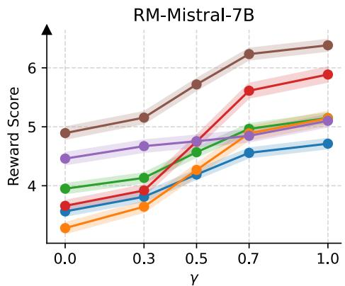

line

| γ    | Brown | Purple | Green | Red  | Blue | Orange |
| ---- | ----- | ------ | ----- | ---- | ---- | ------ |
| 0.0  | 4.9   | 4.5    | 4.0   | 3.8  | 3.6  | 3.2    |
| 0.3  | 5.2   | 4.7    | 4.2   | 3.9  | 3.7  | 3.5    |
| 0.5  | 5.7   | 4.8    | 4.6   | 4.5  | 4.2  | 4.1    |
| 0.7  | 6.3   | 4.9    | 5.0   | 5.6  | 4.6  | 4.5    |
| 1.0  | 6.5   | 5.1    | 5.2   | 5.9  | 4.8  | -      |

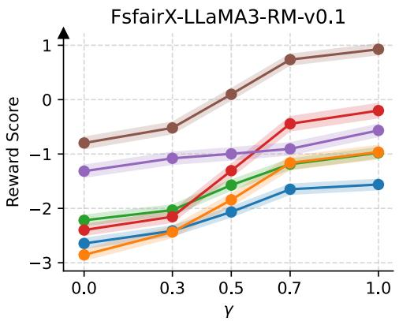

line

| γ    | Brown | Purple | Red  | Green | Orange | Blue |
| ---- | ----- | ------ | ---- | ----- | ------ | ---- |
| 0.0  | -0.8  | -1.2   | -2.4 | -2.2  | -2.8   | -2.6 |
| 0.3  | -0.5  | -1.0   | -2.1 | -2.0  | -2.5   | -2.4 |
| 0.5  | 0.1   | -1.0   | -1.3 | -1.5  | -1.9   | -2.0 |
| 0.7  | 0.8   | -0.8   | -0.5 | -1.2  | -1.3   | -1.7 |
| 1.0  | 1.0   | -0.5   | -0.2 | -1.0  | -1.0   | -1.6 |

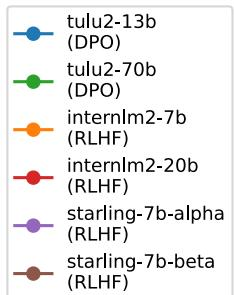

scatter

| Category              | Value |
| --------------------- | ----- |
| tulu2-13b (DPO)       | 1     |
| tulu2-70b (DPO)       | 1     |
| internlm2-7b (RLHF)   | 1     |
| internlm2-20b (RLHF)  | 1     |
| starling-7b-alpha (RLHF)| 1     |
| starling-7b-beta (RLHF)| 1     |

Figure 1: Interpolated models usually exhibit intermediate performance between the original DPO/RLHF models and the SFT checkpoints, while their performance improves with increasing γ in Equation 1.

# 2.3 EXPO: Model Extrapolation

In the above first-order approximation, we constrain $\gamma \in [ 0 , 1 ]$ to maintain the approximation’s validity along the straight-line path between $\pmb { \theta } _ { 0 }$ and $\pmb { \theta } _ { 1 }$ . We now consider extending this approximation to the “extension” of the line connecting $\pmb { \theta } _ { 0 }$ and $\pmb { \theta } _ { 1 }$ beyond $\pmb { \theta } _ { 1 }$ . Let $\gamma > 1$ and define $\alpha = \gamma - 1 > 0$ , denoting $\pmb { \theta } _ { 2 } = \pmb { \theta } _ { 0 } + \gamma \Delta \pmb { \theta } = \pmb { \theta } _ { 0 } + ( 1 + \alpha ) \Delta \pmb { \theta }$ . By choosing appropriate α such that $\| ( 1 + \alpha ) \Delta \theta \|$ remains small, we can reformulate the first-order approximation as:

$$
\omega (\boldsymbol {\theta} _ {2}) \approx \omega (\boldsymbol {\theta} _ {0}) + (1 + \alpha) \nabla \omega (\boldsymbol {\theta} _ {0}) \cdot \Delta \boldsymbol {\theta} \tag {4}
$$

$( \mathbf { B y } \operatorname { E q u a t i o n } 1 )$

$$
\approx \omega (\boldsymbol {\theta} _ {1}) + \alpha \nabla \omega (\boldsymbol {\theta} _ {0}) \cdot \Delta \boldsymbol {\theta}. \tag {5}
$$

$( \mathbf { B y } \operatorname { E q u a t i o n } 2 )$

According to Equation 3, we approximately have $\omega ( \pmb { \theta } _ { 2 } ) > \omega ( \pmb { \theta } _ { 1 } )$ . This suggests that, starting from a partially-aligned model $\mathcal { M } _ { 1 }$ and its SFT checkpoint $\mathcal { M } _ { 0 }$ , by selecting appropriate $\alpha > 0 .$ , we can construct a new model $\mathcal { M } _ { 2 }$ parameterized by $\pmb { \theta } _ { 2 }$ through amplifying the parameter change $\Delta \theta \mathrm { : }$ :

$$
\boldsymbol {\theta} _ {2} = \boldsymbol {\theta} _ {0} + (1 + \alpha) \Delta \boldsymbol {\theta} = \boldsymbol {\theta} _ {1} + \alpha \Delta \boldsymbol {\theta}, \tag {6}
$$

such that $\mathcal { M } _ { 2 }$ achieves better alignment performance than $\mathcal { M } _ { 1 }$ . Consequently, we improve the implicit optimization objective $\omega ( \pmb \theta )$ of alignment training without requiring additional training.

Since the process of Equation 6 essentially $\mathbf { \hat { \mu } } ^ { 6 6 } \mathbf { e x } -$ - trapolates” the parameters of $\mathcal { M } _ { 1 }$ along the line connecting $\pmb { \theta } _ { 0 }$ and $\pmb { \theta } _ { 1 }$ , we refer to the procedure defined by Equation 6 as EXPO (model extrapolation). Figure 2 illustrates the EXPO method, where the orange curve from $\pmb { \theta } _ { 0 }$ to $\pmb { \theta } _ { 1 }$ indicates the actual training trajectory from $\mathcal { M } _ { 0 }$ to $\mathcal { M } _ { 1 }$ , and

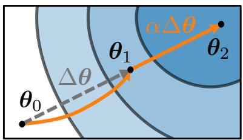

text_image

αΔθ
θ₁
θ₂
θ₀
Δθ

Figure 2: The orange curve indicates the training trajectory from $\pmb { \theta } _ { 0 }$ to $\theta _ { \mathrm { 1 } } ,$ , while the orange line denotes the extrapolation from $\pmb { \theta } _ { 1 }$ along $\Delta \theta$ , thus producing $\pmb { \theta } _ { 2 }$ .

the straight orange line from $\pmb { \theta } _ { 1 }$ to $\pmb { \theta } _ { 2 }$ denotes the extrapolation from $\mathcal { M } _ { 1 }$ to $\mathcal { M } _ { 2 }$ . In practice, the hyperparameter α in Equation 6 (controlling the extrapolation length) can be tuned using inferencelevel computational resources. For example, hyperparameter search for a 7B model requires only a single A10 24GB GPU, while a 70B model needs two A100 80GB GPUs. As high-performance LLM inference frameworks like vLLM (Kwon et al., 2023) and SGLang (Zheng et al., 2023c) continue to rapidly develop, the costs of hyperparameter search will keep decreasing.

Connection to Model Averaging/Interpolation It is worth noting that the idea of “model averaging” has been explored in prior work. Specifically, previous work has discovered that deep neural networks often exhibit mode connectivity (Garipov et al., 2018; Entezari et al., 2022; Zhao et al., 2020; Frankle et al., 2020). This property implies that between two local optima in the parameter space, there typically exists a path where model performance (e.g., validation accuracy or loss) does not degrade significantly during traversal. Empirical studies (Izmailov et al., 2018; Lin et al., 2024; Wortsman et al., 2022) have shown that even with simple linear interpolation paths between two local optima, the loss along the path remains low, and performance often lies between the original models, which is consistent with our observations in Figure 1. Recent LLM research (Lin et al., 2023; Yu et al., 2024; Akiba et al., 2024; Goddard et al., 2024) has further explored interpolation across multiple fine-tuned models (i.e., models initialized from the same pre-trained checkpoint but fine-tuned on different data) to create new models with combined capabilities. Note that Equation 6 can be rewritten as: $\pmb { \theta } _ { 2 } = ( 1 - \gamma ) \pmb { \theta } _ { 0 } + \gamma \pmb { \theta } _ { 1 }$ , which means EXPO can be viewed as a generalized form of model interpolation with weights exceeding 1. Hence, the hypothesis we formulated based on the characteristics of preference alignment (i.e., small parameter changes) and the derived EXPO method essentially extend the weight range of traditional model interpolation (from [0, 1] to (1, + )).

In the following sections, we will conduct extensive experiments to validate the effectiveness of EXPO in reducing the computational costs of preference alignment training.

# 3 Controlled Experiments

# 3.1 Setup and Evaluation Protocol

Models and Training Recipe Our controlled experiments are based on the training recipe of the zephyr-7b-dpo model. Specifically, we use the UltraFeedback (Cui et al., 2023) dataset for model training, which contains diverse instructionresponse pairs with GPT-4-annotated preference labels and is split into 61K and 1K data as the training and development sets, respectively. For DPO training, we use zephyr-7b-dpo’s SFT checkpoint for model initialization and as the reference model. We adopt the global batch size of 128, the learning rate of 5e-7, and the AdamW optimizer (Loshchilov and Hutter, 2019). Note that while zephyr-7b-dpo is trained for 478 steps in total (i.e., one epoch), in § 3.2 we will vary the training steps, or equivalently, the training data size. We train the models on 8 A100 80GB GPUs.

Inference Details We employ the vLLM (Kwon et al., 2023) library for high-throughput model inference. We use top-k (k = 40) and nucleus sampling (Holtzman et al., 2020) (p = 0.9) with a temperature of 0.7. To avoid repetition in generated texts, we set both the factors of presence penalty and frequency penalty to 0.1. We set the sampling random seed to 42. Hyperparameter Search To determine the optimal α value in EXPO, we use a combination of binary search and grid search with manually tuned intervals (see Appendix B for details). We select the α giving the highest expected reward on the UltraFeedback development set (1K instructions), as calculated by the reward model RM-Mistral-7B.

Evaluation Protocol We resort to AlpacaEval 2.0 (Li et al., 2023) for model evaluation, which is a leading benchmark that assesses LLMs’ instructionfollowing ability and their alignment with human preferences. It contains a fixed set of 805 instructions chosen to be representative of real user cases. For each instruction, it calculates the probability that a GPT-4 Turbo evaluator prefers the output of the evaluated model over the GPT-4 baseline, thus providing an affordable and replicable alternative to human annotation. The win rate over the GPT-4 baseline is computed as the expected preference probability, while the length-controlled (LC) win rate (Dubois et al., 2024) alleviates the length bias of the GPT-4 Turbo evaluator (i.e., the prior preference toward longer responses).

In § 3.2, we report both the raw and LC win rates, as well as the expected reward score over the 805 instructions calculated. For subsequent experiments, unless otherwise stated, we report the expected reward score on the UltraFeedback development set (1K instructions) for ease of analysis.

# 3.2 Analysis of Varying Training Steps

We first investigate whether EXPO can enhance LLMs with limited alignment training. Given that the full training of zephyr-7b-dpo consists of 478 steps (one epoch over the UltraFeedback training data), we initialize from the same SFT checkpoint $( \mathcal { M } _ { 0 } )$ and use the aforementioned training configuration to train DPO models $( \mathcal { M } _ { 1 } ^ { \ast } )$ with 10%, 20%, and 40% of the full training steps. We directly use zephyr-7b-dpo as the 100%-step (full-training) model $\mathcal { M } _ { 1 } ^ { 1 0 0 \% }$ . For these DPO models, we apply EXPO to derive extrapolated models $\mathcal { M } _ { 2 } ^ { \ast }$ .

Main Results As shown in Table 2, while fewer training steps generally yield lower alignment performance, EXPO effectively bridges the gap caused by reduced training steps. For example, EXPO boosts $\mathcal { M } _ { 1 } ^ { 1 0 \% , } \mathrm { s L C }$ win rate from 10.4% to $\mathcal { M } _ { 2 } ^ { 1 0 \% } \mathrm { { s } }$ 1 16.3% and $\mathcal { M } _ { 1 } ^ { 2 0 \% }$ from 12.9% to $\mathcal { M } _ { 2 } ^ { 2 0 \% } \mathrm { { s } }$ 21.3%, enabling these extrapolated models to match or even surpass the fully-trained $\mathcal { M } _ { 1 } ^ { 1 0 0 \% }$ .

Table 2: Evaluation results on AlpacaEval 2.0 of applying EXPO to DPO models trained with varying steps (M∗1). 

<table><tr><td></td><td>Reward</td><td>Win Rate</td><td>LC Win Rate</td></tr><tr><td>SFT ( $\mathcal{M}_0$ )</td><td>3.42</td><td>4.7%</td><td>8.7%</td></tr><tr><td>DPO, 10% training steps ( $\mathcal{M}_1^{10\%}$ ) + ExPO ( $\mathcal{M}_2^{10\%}$ )</td><td>3.976.57 (+2.60)</td><td>5.9%17.9% (+12.0%)</td><td>10.4%16.3% (+5.8%)</td></tr><tr><td>DPO, 20% training steps ( $\mathcal{M}_1^{20\%}$ ) + ExPO ( $\mathcal{M}_2^{20\%}$ )</td><td>4.706.95 (+2.25)</td><td>8.6%22.7% (+14.2%)</td><td>12.9%21.3% (+8.4%)</td></tr><tr><td>DPO, 40% training steps ( $\mathcal{M}_1^{40\%}$ ) + ExPO ( $\mathcal{M}_2^{40\%}$ )</td><td>5.776.75 (+0.98)</td><td>12.1%17.7% (+5.6%)</td><td>14.6%16.6% (+2.0%)</td></tr><tr><td>DPO, 100% training steps ( $\mathcal{M}_1^{100\%}$ ) + ExPO ( $\mathcal{M}_2^{100\%}$ )</td><td>6.166.52 (+0.36)</td><td>14.7%18.0% (+3.3%)</td><td>17.3%20.2% (+2.8%)</td></tr></table>

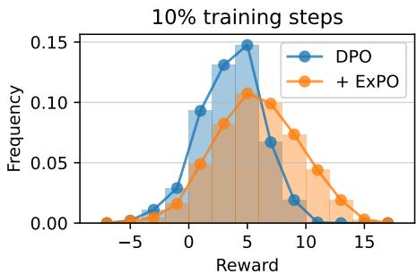

line

| Reward | DPO   | + ExPO |
| ------ | ----- | ------ |
| -5     | 0.000 | 0.000  |
| 0      | 0.090 | 0.050  |
| 5      | 0.150 | 0.110  |
| 10     | 0.020 | 0.070  |
| 15     | 0.000 | 0.020  |

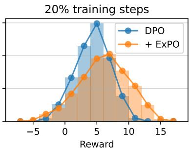

line

| Reward | DPO       | + ExPO    |
| ------ | --------- | --------- |
| -5     | 0.0       | 0.0       |
| 0      | 0.5       | 0.3       |
| 5      | 1.8       | 0.8       |
| 10     | 0.2       | 0.6       |
| 15     | 0.0       | 0.0       |

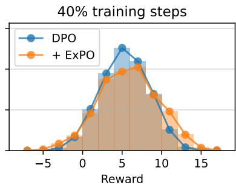

line

| Reward | DPO   | + ExPO |
| ------ | ----- | ------ |
| -5     | 0.0   | 0.0    |
| 0      | 0.5   | 0.3    |
| 5      | 1.2   | 0.8    |
| 10     | 0.6   | 0.4    |
| 15     | 0.1   | 0.0    |

Figure 3: Reward distribution on UltraFeedback (development set) for the extrapolated models in Table 2.

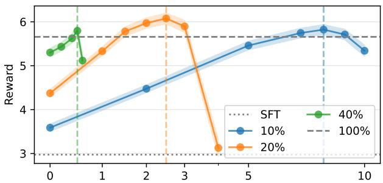

line

| Step | SFT  | 40%  | 10%  | 20%  |
|------|------|------|------|------|
| 0    | 5.3  | 5.4  | 3.6  | 4.4  |
| 1    | 5.5  | 5.7  | 3.9  | 5.3  |
| 2    | 5.7  | 5.9  | 4.4  | 6.0  |
| 3    | 5.9  | 6.0  | 4.8  | 6.1  |
| 4    | 6.0  | 6.1  | 5.2  | 3.1  |
| 5    | 6.1  | 6.2  | 5.5  | -    |
| 6    | 6.2  | 6.3  | 5.7  | -    |
| 7    | 6.3  | 6.4  | 5.8  | -    |
| 8    | 6.4  | 6.5  | 5.9  | -    |
| 9    | 6.5  | 6.6  | 5.8  | -    |
| 10   | 6.6  | 6.7  | 5.7  | -    |

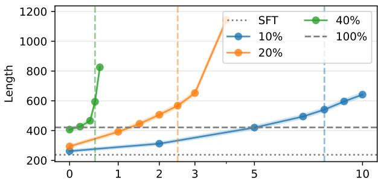

line

| x  | SFT  | 40%  | 10%  | 20%  |
|----|------|------|------|------|
| 0  | 250  | 400  | 250  | 300  |
| 1  | 250  | 850  | 300  | 400  |
| 2  | 250  | 400  | 350  | 500  |
| 3  | 250  | 650  | 400  | 650  |
| 5  | 250  | -    | 450  | -    |
| 10 | 250  | -    | 650  | -    |

Figure 4: $\mathcal { M } _ { 2 } { ' } \mathrm { s }$ reward scores and response lengths on UltraFeedback (development set) varying with α (x-axis) for the partially-trained DPO models in § 3.2. Dashed vertical lines correspond to the optimal α values. $\alpha = 0$ indicates that EXPO is not applied $( \mathrm { i } . \mathbf { e } . , \mathcal { M } _ { 1 } )$ .

Hyperparameter Search Analysis The optimal α values for M10%2 , $\mathcal { M } _ { 2 } ^ { 1 0 \% } , \mathcal { M } _ { 2 } ^ { 2 0 \% } , \dot { \mathcal { M } } _ { 2 } ^ { 4 0 \% }$ , and $\hat { \mathcal { M } } _ { 2 } ^ { 1 0 0 \% }$ are 8.0, 2.5, 0.5, and 0.3, respectively. Figure 3 illustrates the reward distributions of these extrapolated models, showing that their response distributions shift toward higher reward regions compared to the original $\mathcal { M } _ { 1 } ^ { \ast }$ models. In Figure 4, we show that increasing α within a reasonable range consistently improves alignment performance. However, excessively large α causes sharp performance drops and abnormal response length increases (e.g., generating gibberish or failing to terminate). This indicates that overly large α violates the first-order approximation (Equation 4) as $\| ( 1 + \alpha ) \Delta \theta \|$ becomes too large. Additionally, since more training steps lead to larger $\| \Delta \theta \|$ , smaller α values are required for models with more training steps (e.g., $\hat { \mathcal { M } } _ { 1 } ^ { 1 0 0 \% } )$ to maintain the validity of Equation 4, which is consistent with our hyperparameter search results.

Computational Cost Analysis The fully-trained model 100% $\mathcal { M } _ { 1 } ^ { 1 0 0 \% }$ requires about 12 GPU hours M1(A100 80GB). In contrast, $\mathcal { M } _ { 2 } ^ { 2 0 \% } \mathrm { { s } }$ hyperparameter search takes about 0.5 GPU hour, and combined with $\mathcal { M } _ { 1 } ^ { 2 0 \% } \mathrm { { s } }$ about 2.5-hour training, the total cost is about 3 GPU hours, leading to a 75% reduction compared to full training while achieving comparable or better alignment performance.

Table 3: Ablation results on UltraFeedback (development set) of adjusting training data quality. $\mathrm { ^ { 6 6 } N / A } \mathrm { ^ { , 5 } }$ denotes that the reward score does not improve after applying EXPO with the smallest $\alpha = 0 . 1$ . 

<table><tr><td rowspan="2">Training Data</td><td colspan="2">Original ( $\mathcal{M}_1^*$ )</td><td colspan="3">+ EXPO ( $\mathcal{M}_2^*$ )</td></tr><tr><td>Reward</td><td>Length</td><td>Optimal α</td><td>Reward</td><td>Length</td></tr><tr><td>10% training steps, random ( $\mathcal{M}_*^{10\%}$ )</td><td>3.59</td><td>262</td><td>8.0</td><td>5.82</td><td>541</td></tr><tr><td>10% training steps, length-biased ( $\mathcal{M}_*^{10\%,b}$ )</td><td>4.62</td><td>770</td><td>0.2</td><td>4.69</td><td>810</td></tr><tr><td>20% training steps, random ( $\mathcal{M}_*^{20\%}$ )</td><td>4.37</td><td>294</td><td>2.5</td><td>6.08</td><td>567</td></tr><tr><td>20% training steps, length-biased ( $\mathcal{M}_*^{20\%,b}$ )</td><td>5.05</td><td>748</td><td>0.4</td><td>5.11</td><td>875</td></tr><tr><td>40% training steps, random ( $\mathcal{M}_*^{40\%}$ )</td><td>5.30</td><td>407</td><td>0.5</td><td>5.80</td><td>594</td></tr><tr><td>40% training steps, length-biased ( $\mathcal{M}_*^{40\%,b}$ )</td><td>4.90</td><td>671</td><td>N/A</td><td>N/A</td><td>N/A</td></tr></table>

Moreover, EXPO’s hyperparameter search, which only involves model inference, also significantly reduces hardware requirements, e.g., a 7B model requires only a single A10 24GB GPU for search, whereas training typically needs 8 A100 80GB GPUs. The above results reaffirm the soundness of the first-order approximation and demonstrate EXPO’s effectiveness in reducing computational costs for LLM alignment.

Other Observations We also observe two other noteworthy phenomena: (1) Extrapolated alignment performance does not strictly increase with training steps. For example, $\mathcal { M } _ { 2 } ^ { 2 { \bar { 0 } } { \% } }$ outperforms M100%2 , $\mathcal { M } _ { 2 } ^ { 1 0 0 \% }$ suggesting EXPO’s efficacy depends on factors like training data and hyperparameters. We will explore these factors in $\ S \ 3 . 3$ and 3.4. (2) Even fully trained models like $\mathcal { M } _ { 1 } ^ { 1 0 0 \% }$ benefit from EXPO (LC win rate increases by 2.8%), indicating that existing already-aligned models may not be fully optimized, and EXPO can fill this gap. We will apply EXPO to more existing, already-aligned models in $\ S 4 . 1$ .

# 3.3 Analysis of Training Data Quality

In the previous section, we observed that alignment performance after model extrapolation does not strictly improve with increased training steps. We conjecture that this occurs because more training makes the model more prone to learning spurious features from data, such as length $\mathrm { b i a s } ^ { 2 }$ (Park et al., 2024). According to Equation 6, under our controlled experimental setup where all $\mathcal { M } _ { 1 }$ are initialized from the same SFT model $\mathcal { M } _ { 0 }$ and $\pmb { \theta } _ { 0 }$ , the highest achievable performance of the extrapolated model $\mathcal { M } _ { 2 }$ is uniquely determined by $\Delta \theta$ .

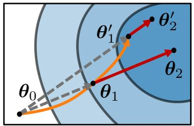

text_image

θ₀
θ₁
θ'₁
θ'₂
θ₂

Figure 5: Increasing training steps (from $\pmb { \theta } _ { 1 }$ to $\pmb { \theta } _ { 1 } ^ { \prime } )$ can make the model more prone to learning spurious features from training data, such as length bias. This consequently impairs the direction of $\Delta \theta$ and the achievable performance of EXPO (e.g., ${ \pmb \theta } _ { 2 } ^ { \prime }$ underperforms $\pmb { \theta } _ { 2 } )$ .

Hence, EXPO’s effectiveness requires $\Delta \theta$ to indicate the direction that genuinely improves alignment performance. Learning spurious features like length bias degrades the “quality” of $\Delta \theta _ { : }$ , thus undermining the extrapolation performance. Figure 5 illustrates this phenomenon: as training steps increase (from $\pmb { \theta } _ { 1 }$ to $\pmb { \theta } _ { 1 } ^ { \prime } )$ , the model can learn spurious features from training data, leading to the degraded alignment performance of extrapolated models (e.g., $\pmb { \theta } _ { 2 } ^ { \prime }$ underperforms $\pmb { \theta } _ { 2 } )$ ).

To analyze how training data quality affects EXPO’s effectiveness in a controlled manner, we take length bias as an example and manually inject length bias into the training data. Unlike the random sampling in § 3.2, we sort the UltraFeedback training data by the length difference between preferred and non-preferred responses in descending order. We then train models on the sorted samples orderly so that models will prioritize learning from samples with larger length differences. From Table 3, while introducing length bias temporarily boosts reward s (M10%,b1 score and $( \bar { \mathcal { M } } _ { 1 } ^ { 1 0 \bar { \% } , \mathrm { b } }$ and trapo $\mathcal { M } _ { 1 } ^ { 2 0 \widehat { \% } , \mathrm { b } }$ out-dels perform 10% $\mathcal { M } _ { 1 } ^ { 1 0 \% }$ $\mathcal { M } _ { 1 } ^ { 2 0 \% } )$ consistently underperform $( \mathcal { M } _ { 2 } ^ { 1 0 \% , \mathrm { b } }$ and $\mathcal { M } _ { 2 } ^ { 2 0 \% , \mathrm { b } }$ are worse than M10%2 $\mathcal { M } _ { 2 } ^ { 1 0 \% }$ and $\mathcal { M } _ { 2 } ^ { 2 0 \% } )$ . Moreover, 2the optimal α values for M10%,b2 a $\mathcal { M } _ { 2 } ^ { 1 0 \% , \bar { 0 } }$ nd M202 $\mathcal { M } _ { 2 } ^ { 2 0 \% , \mathrm { b } }$ are $_ { 0 . 2 }$ and 0.4, which are far smaller than those for $\mathcal { M } _ { 2 } ^ { 1 0 \% }$ (8.0) and $\mathcal { M } _ { 2 } ^ { 2 0 \% } \left( 2 . 5 \right)$ . For $\mathcal { M } _ { 1 } ^ { 4 0 \% , \mathrm { b } }$ , E X P O even fails to yield any improvement. These results demonstrate that training on biased or low-quality data (e.g., with length bias) causes $\Delta \theta$ to fail to indicate the direction that genuinely improves alignment performance, thereby diminishing the benefits of model extrapolation.

Table 4: Ablation results of the training epochs, learning rate, and optimizer on UltraFeedback (development set). 

<table><tr><td rowspan="2" colspan="2"></td><td colspan="2">Original ( $\mathcal{M}_1$ )</td><td colspan="3">+ EXPO ( $\mathcal{M}_2$ )</td></tr><tr><td>Reward</td><td>Length</td><td>Optimal  $\alpha$ </td><td>Reward</td><td>Length</td></tr><tr><td rowspan="3">Training Epochs</td><td>1 (Default)</td><td>4.37</td><td>294</td><td>2.5</td><td>6.08</td><td>567</td></tr><tr><td>2 ( $\times 2$ )</td><td>4.93</td><td>338</td><td>0.3</td><td>5.06</td><td>362</td></tr><tr><td>3 ( $\times 3$ )</td><td>4.47</td><td>323</td><td>N/A</td><td>N/A</td><td>N/A</td></tr><tr><td rowspan="3">Learning Rate</td><td>5e-7 (Default)</td><td>4.37</td><td>294</td><td>2.5</td><td>6.08</td><td>567</td></tr><tr><td>1e-6 ( $\times 2$ )</td><td>5.20</td><td>374</td><td>0.5</td><td>5.54</td><td>495</td></tr><tr><td>2e-6 ( $\times 3$ )</td><td>5.33</td><td>365</td><td>0.4</td><td>5.52</td><td>434</td></tr><tr><td rowspan="3">Optimizer</td><td>AdamW (Default)</td><td>4.37</td><td>294</td><td>2.5</td><td>6.08</td><td>567</td></tr><tr><td>AdaGrad</td><td>3.42</td><td>246</td><td>15.0</td><td>6.25</td><td>603</td></tr><tr><td>RMSprop</td><td>4.88</td><td>344</td><td>0.4</td><td>5.08</td><td>381</td></tr></table>

# 3.4 Analysis of Training Configurations

Next, we analyze how specific training hyperparameters influence EXPO’s effectiveness. Since EXPO amplifies the parameter change $\Delta \theta$ from $\mathcal { M } _ { 0 }$ to $\mathcal { M } _ { 1 }$ , we investigate whether EXPO is equivalent to directly increasing the magnitude of parameter changes, such as by raising the training epochs or learning rate. Additionally, since the training trajectory from $\mathcal { M } _ { 0 }$ to $\mathcal { M } _ { 1 }$ (and the resulting $\Delta \theta )$ is closely tied to the gradient descent algorithm, we also explore the impact of the optimizer on EXPO’s effectiveness. All experiments use the model trained with 20% steps in § 3.2 as the baseline and follow the default training data and configurations.

Training Epochs and Learning Rate We increase the training epochs or learning rate for $\mathcal { M } _ { 1 }$ . Table 4 shows that while both adjustments improve $\mathcal { M } _ { 1 } \mathrm { { ^ { \circ } s } }$ performance, they also reduce the benefits of model extrapolation (lower $\mathcal { M } _ { 2 }$ performance) and yield smaller optimal α values. Meanwhile, the $\mathcal { M } _ { 1 }$ models trained with more epochs or larger learning rates generate significantly longer responses compared to the default setup. This suggest that both adjustments also make models prone to learning the length bias in training data, thereby degrading $\Delta \theta ^ { \prime } \mathrm { s }$ quality and the gains from EXPO. Notably, when training epochs are set to 3, $\mathcal { M } _ { 1 }$ cannot benefit from EXPO, likely because the firstorder approximation (Equation 4) no longer holds as $\| \Delta \theta \|$ becomes too large.

Optimizer We train $\mathcal { M } _ { 1 }$ using three popular optimizers: AdamW (Loshchilov and Hutter, 2019) (default), AdaGrad (Duchi et al., 2011), and RMSprop (Hinton, 2012). Table 4 shows that while AdaGrad converges slowest (lowest $\mathcal { M } _ { 1 }$ performance), it achieves the highest extrapolated alignment performance $\left( \mathcal { M } _ { 2 } \right)$ , slightly surpassing AdamW. Conversely, RMSprop, while yielding the best $\mathcal { M } _ { 1 }$ performance, results in the poorest $\mathcal { M } _ { 2 }$ performance. AdamW, as the dominant optimizer in modern LLM training, strikes a balance between convergence efficiency and extrapolated performance. These results highlight that different optimizers significantly affect $\Delta \theta ^ { \prime } \mathrm { s }$ quality and extrapolation outcomes.

# 4 Extended Applications of EXPO

# 4.1 Applying EXPO to More Existing, Already-aligned LLMs

In § 3.2, we observed that EXPO also brings noticeable performance improvements to the fullytrained zephyr-7b-dpo. This motivates us to ap-$p l y$ EXPO to more existing, already-aligned LLMs. $\mathbf { A } s$ hypothesized in § 1, the normally-trained models should also satisfy the first-order approximation premise, i.e., $\| \Delta \pmb { \theta } \|$ is small. We select twelve open-source models from HuggingFace for experiments (see Appendix C for their model IDs):

• Five models trained via offline DPO, including zephyr-7b-alpha/beta (Tunstall et al., 2023) and tulu2-7/13/70b (Wang et al., 2023);

Table 5: Evaluation results on AlpacaEval 2.0 and MT-Bench of applying EXPO to existing DPO/RLHF LLMs. 

<table><tr><td rowspan="2"></td><td colspan="3">Original ( $\mathcal{M}_1$ )</td><td colspan="3">+ ExPO ( $\mathcal{M}_2$ )</td></tr><tr><td>WR</td><td>LC WR</td><td>MT-Bench</td><td>Win Rate</td><td>LC Win Rate</td><td>MT-Bench</td></tr><tr><td colspan="7"> $\mathcal{M}_1$  is trained via Offline DPO</td></tr><tr><td>zephyr-7b-alpha</td><td>6.7%</td><td>10.0%</td><td>6.85</td><td>10.6% (+3.8%)</td><td>13.6% (+3.6%)</td><td>6.87 (+0.02)</td></tr><tr><td>zephyr-7b-beta</td><td>10.2%</td><td>13.2%</td><td>7.02</td><td>11.1% (+0.9%)</td><td>14.0% (+0.8%)</td><td>7.06 (+0.04)</td></tr><tr><td>tulu2-7b</td><td>8.5%</td><td>10.2%</td><td>6.35</td><td>11.5% (+3.0%)</td><td>11.7% (+1.5%)</td><td>6.38 (+0.03)</td></tr><tr><td>tulu2-13b</td><td>11.2%</td><td>15.5%</td><td>7.00</td><td>15.6% (+4.3%)</td><td>17.6% (+2.1%)</td><td>7.26 (+0.26)</td></tr><tr><td>tulu2-70b</td><td>15.4%</td><td>21.2%</td><td>7.79</td><td>23.0% (+7.6%)</td><td>25.7% (+4.5%)</td><td>8.03 (+0.24)</td></tr><tr><td colspan="7"> $\mathcal{M}_1$  is trained via Iterative DPO</td></tr><tr><td>snorkel-7b-iter</td><td>24.7%</td><td>24.0%</td><td>7.63</td><td>28.8% (+4.1%)</td><td>26.4% (+2.4%)</td><td>7.69 (+0.07)</td></tr><tr><td>llama3-8b-iter</td><td>29.2%</td><td>36.0%</td><td>8.08</td><td>32.7% (+3.5%)</td><td>37.8% (+1.8%)</td><td>8.45 (+0.37)</td></tr><tr><td colspan="7"> $\mathcal{M}_1$  is trained via Online RLHF</td></tr><tr><td>starling-7b-alpha</td><td>15.0%</td><td>18.3%</td><td>7.82</td><td>18.2% (+3.2%)</td><td>19.5% (+1.2%)</td><td>7.91 (+0.09)</td></tr><tr><td>starling-7b-beta</td><td>26.6%</td><td>25.8%</td><td>8.10</td><td>29.6% (+3.0%)</td><td>26.4% (+0.7%)</td><td>8.18 (+0.08)</td></tr><tr><td>internlm2-1.8b</td><td>3.8%</td><td>4.0%</td><td>5.17</td><td>5.2% (+1.5%)</td><td>4.3% (+0.3%)</td><td>5.26 (+0.08)</td></tr><tr><td>internlm2-7b</td><td>20.5%</td><td>18.3%</td><td>7.72</td><td>28.1% (+7.6%)</td><td>22.7% (+4.4%)</td><td>7.80 (+0.08)</td></tr><tr><td>internlm2-20b</td><td>36.1%</td><td>24.9%</td><td>8.13</td><td>46.2% (+10.1%)</td><td>27.2% (+2.4%)</td><td>8.26 (+0.13)</td></tr></table>

• Two models trained via iterative DPO, including snorkel-7b-iter (Tran et al., 2023) and llama3-8b-iter (Dong et al., 2024);   
• Five models trained via online RLHF, including starling-7b-alpha/beta (Zhu et al., 2023) and internlm2-1.8/7/20b (Cai et al., 2024).

These models cover a diverse range of model sizes (from 1.8B to 70B) and span three mainstream alignment algorithms widely used in practice.

Based on our hyperparameter search experience for zephyr-7b-dpo in § 3.2 (Appendix B), for the twelve models above, we conduct a simple grid search for the optimal α, using the interval of 0.1 within [0.1, 0.5]. In addition to AlpacaEval 2.0, we also evaluate these models on MT-Bench (Zheng et al., 2023b), another leading benchmark for assessing instruction-tuned LLMs’ general and multi-turn ability. It contains a set of challenging multi-turn open-ended questions covering topics such as writing, role-playing, math, coding, and more. The model-generated answers are judged by GPT-4 via a scalar score (from 1 to 10).

In Table 5, we show that EXPO consistently improves the evaluated LLMs, with notable improvements of up to 10.1% win rate and 4.5% LC win rate on AlpacaEval 2.0 (for internlm2-20b and tulu2-70b, respectively) and 0.37 on MT-Bench (for llama3-8b-iter). This suggests that existing, already-aligned LLMs may still not have been trained to optimality or “saturation”. EXPO offers a practical and efficient means to compensate for potential inadequate training of existing LLMs (or, squeeze more alignment performance out of these models), as it only requires inference-level hardware resources and bypasses the costly additional training overhead.

# 4.2 Applying EXPO to More Alignment Algorithms

So far, we have primarily applied EXPO to models trained via the dominant DPO or RLHF algorithms (§ 3 and 4.1). Since EXPO does not assume the specific training method for $\mathcal { M } _ { 1 }$ , we expect that EXPO can be applied to models trained via other algorithms than DPO or RLHF. To this end, we use a series of Mistral/LLaMA-3 models released by Meng et al. (2024), which are trained via various alignment algorithms and are all initialized from the same SFT checkpoints. These algorithms include: RRHF (Yuan et al., 2023), SLiC-HF (Zhao et al., 2023a), IPO (Azar et al., 2024), CPO (Xu et al., 2024), KTO (Ethayarajh et al., 2024), R-DPO (Park et al., 2024), and SimPO (Meng et al., 2024). We refer readers to Meng et al. (2024) for elaboration on these algorithms’ optimization objectives as well as the models’ training configurations. Following the previous experience, we search the optimal α value within the range of [0.1, 0.5] with the interval of 0.1.

Table 6: Evaluation results on UntraFeedback of applying EXPO to models trained via different algorithms. 

<table><tr><td rowspan="3"></td><td colspan="3"> $\mathcal{M}_{0}$  is SFTed from Mistral</td><td colspan="3"> $\mathcal{M}_{0}$  is SFTed from LLaMA-3</td></tr><tr><td>Original ( $\mathcal{M}_{1}$ )</td><td colspan="2">+ ExPO ( $\mathcal{M}_{2}$ )</td><td>Original ( $\mathcal{M}_{1}$ )</td><td colspan="2">+ ExPO ( $\mathcal{M}_{2}$ )</td></tr><tr><td>Reward</td><td>Optimal  $\alpha$ </td><td>Reward</td><td>Reward</td><td>Optimal  $\alpha$ </td><td>Reward</td></tr><tr><td>SFT ( $\mathcal{M}_{0}$ )</td><td>2.97</td><td>-</td><td>-</td><td>1.93</td><td>-</td><td>-</td></tr><tr><td>RRHF</td><td>4.71</td><td>0.1</td><td>4.73 (+0.02)</td><td>3.02</td><td>0.5</td><td>3.15 (+0.13)</td></tr><tr><td>SLiC-HF</td><td>4.90</td><td>0.4</td><td>5.16 (+0.26)</td><td>4.06</td><td>0.5</td><td>4.68 (+0.62)</td></tr><tr><td>IPO</td><td>4.97</td><td>0.5</td><td>5.44 (+0.47)</td><td>4.75</td><td>0.3</td><td>4.86 (+0.11)</td></tr><tr><td>CPO</td><td>4.86</td><td>0.3</td><td>5.01 (+0.15)</td><td>4.04</td><td>0.5</td><td>4.75 (+0.71)</td></tr><tr><td>KTO</td><td>3.84</td><td>N/A</td><td>N/A</td><td>4.48</td><td>0.4</td><td>4.67 (+0.19)</td></tr><tr><td>R-DPO</td><td>5.53</td><td>0.3</td><td>5.73 (+0.20)</td><td>4.25</td><td>0.5</td><td>4.64 (+0.39)</td></tr><tr><td>SimPO</td><td>5.88</td><td>0.1</td><td>5.95 (+0.07)</td><td>4.89</td><td>0.4</td><td>5.21 (+0.32)</td></tr></table>

As shown in Table 6, EXPO effectively complements various alignment training algorithms. While these models have been carefully tuned according to Meng et al. (2024), they still benefit from model extrapolation. This indicates that EXPO does not rely on specific alignment algorithms but instead generalizes across diverse methods, showcasing its broad compatibility and practical utility.

# 4.3 Discussion on Failure Cases

Finally, we discuss the failure cases we encountered when applying EXPO to more various models. (1) EXPO supposes $\mathcal { M } _ { 0 }$ is an SFT model and $\mathcal { M } _ { 1 }$ is one that further undergoes alignment training. However, when we attempted with a pretrained model as $\mathcal { M } _ { 0 }$ and an SFT one as $\mathcal { M } _ { 1 }$ , we found that model extrapolation usually cannot improve alignment performance and can even lead to model collapse (e.g., the extrapolated model struggles to generate the EOS token or mistakenly generates special tokens). We speculate that this is because SFT typically adopts a larger learning rate and more training steps, and serves to adapt models to the chat templates (Zheng, 2024), so new knowledge is actually injected into models. (2) Another type of failure cases is also related to model overfitting. For example, the Storm-7B model (Liu et al., 2024a) is trained via iterative DPO for three iterations. When experimenting with this model, we found that applying EXPO with even the very small $\alpha = 0 . 1$ results in severe model collapse, probably because the model overfits to its employed reward model during iterative DPO training.

In both cases, EXPO’s underlying first-order approximation can become invalidated as the resulting $\| \Delta \theta \|$ is too large. Therefore, we suggest that more deliberate strategies are needed when applying EXPO to models with large parameter changes, e.g., by leveraging the intermediate checkpoints. We note that recent work has made promising exploration (Lin et al., 2025) and expect more followup studies in future work.

# 5 Conclusion

This work demonstrates the efficacy of the EXPO (model extrapolation) method in enabling more efficient LLM alignment with human preferences. EXPO builds upon the hypothesis that alignment training typically involves only small changes of model parameters. Given a partially-trained model $\mathcal { M } _ { 1 }$ and its initial SFT checkpoint, EXPO improves the implicit optimization objective of alignment training by simply amplifying the parameter change based on a first-order approximation, thus directly achieving better alignment performance without additional training overhead. We empirically validate $\mathrm { E x P O ^ { \circ } s }$ effectiveness through controlled experiments, where we show that the DPO model trained with 20% steps can be boosted to outperform the fully-trained one. Furthermore, we extend $\mathrm { E x P O ^ { \cdot } s }$ application to twelve existing, already-aligned LLMs, showing that EXPO consistently improves their performance on the mainstream LLM benchmarks AlpacaEval 2.0 and MT-Bench. This suggests that EXPO can also serve as a practical and efficient means to compensate for potential inadequate alignment training of existing LLMs. Overall, our work highlights the utility of model extrapolation in efficient LLM alignment, which can inspire future research in this direction.

# 6 Limitations

Hyperparameter Search The current EXPO adopts the simplest form of uniform extrapolation and requires manual hyperparameter search for α. Future work could explore how to determine the optimal α automatically and adaptively (i.e., using different α values for different model modules). For example, the information from optimizer states and parameter gradients during the later phase of alignment training could be useful for this purpose.

Alignment Tax While EXPO makes substantial improvements in instruction-following ability and alignment with human preferences, this seems not “free” and can instead incur an additional alignment tax, a widely observed issue in human preference optimization algorithms (Ouyang et al., 2022; Dong et al., 2024; Meng et al., 2024), which indicates the possible fluctuations or drops in downstream task performance after alignment training. We evaluate the models in § 3.2 and 4.1 on the six downstream tasks (Clark et al., 2018; Zellers et al., 2019; Hendrycks et al., 2021; Lin et al., 2022; Sakaguchi et al., 2021; Cobbe et al., 2021) from the Open LLM Leaderboard3 (v1; Beeching et al. 2023). We find that in most cases, EXPO amplifies the alignment tax introduced by the alignment training (from $\mathcal { M } _ { 0 }$ to $\mathcal { M } _ { 1 } )$ . For example, for the partially-trained models in § 3.2 (Appendix D, Figure 6), the original DPO models ( ) show improvements over the initial SFT model $( \mathcal { M } _ { 0 } )$ on TruthfulQA and declines on GSM8K, while applying EXPO $\left( \mathcal { M } _ { 2 } \right)$ leads to further improvements or declines, respectively. For the existing, alreadyaligned LLMs in § 4.1, the amplification of the alignment tax by EXPO is usually smaller as shown in Figure 7 in Appendix D, suggesting a trade-off between the alignment training overhead (from $\mathcal { M } _ { 0 }$ to $\mathcal { M } _ { 1 } )$ and the additional alignment tax brought by EXPO (from $\mathcal { M } _ { 1 }$ to $\boldsymbol { \mathcal { M } } _ { 2 } )$ .

# Acknowledgements

We thank Sidi Lu, Yufei Tian, Zi-Yi Dou, and other members of the UCLA PlusLab & NLP group as well as anonymous reviewers for their constructive feedback and discussions.

This work was supported by an Amazon AGI Research Award through UCLA-Amazon Science Hub and a National Science Foundation CAREER award #2339766. This work was also supported by the National Science Foundation for Distinguished Young Scholars (with No. 62125604) and China Scholarship Council (with No. 202306210211).

# References

Takuya Akiba, Makoto Shing, Yujin Tang, Qi Sun, and David Ha. 2024. Evolutionary optimization of model merging recipes. arXiv preprint arXiv:2403.13187.   
Mohammad Gheshlaghi Azar, Zhaohan Daniel Guo, Bilal Piot, Remi Munos, Mark Rowland, Michal Valko, and Daniele Calandriello. 2024. A general theoretical paradigm to understand learning from human preferences. In International Conference on Artificial Intelligence and Statistics, pages 4447–4455. PMLR.   
Yuntao Bai, Andy Jones, Kamal Ndousse, Amanda Askell, Anna Chen, Nova DasSarma, Dawn Drain, Stanislav Fort, Deep Ganguli, Tom Henighan, et al. 2022. Training a helpful and harmless assistant with reinforcement learning from human feedback. arXiv preprint arXiv:2204.05862.   
Edward Beeching, Clémentine Fourrier, Nathan Habib, Sheon Han, Nathan Lambert, Nazneen Rajani, Omar Sanseviero, Lewis Tunstall, and Thomas Wolf. 2023. Open llm leaderboard.   
Tom Brown, Benjamin Mann, Nick Ryder, Melanie Subbiah, Jared D Kaplan, Prafulla Dhariwal, Arvind Neelakantan, Pranav Shyam, Girish Sastry, Amanda Askell, et al. 2020. Language models are few-shot learners. In Advances in Neural Information Processing Systems, volume 33, pages 1877–1901.   
Zheng Cai, Maosong Cao, Haojiong Chen, Kai Chen, Keyu Chen, Xin Chen, Xun Chen, Zehui Chen, Zhi Chen, Pei Chu, et al. 2024. Internlm2 technical report. arXiv preprint arXiv:2403.17297.   
Peter Clark, Isaac Cowhey, Oren Etzioni, Tushar Khot, Ashish Sabharwal, Carissa Schoenick, and Oyvind Tafjord. 2018. Think you have solved question answering? try arc, the ai2 reasoning challenge. arXiv preprint arXiv:1803.05457.   
Karl Cobbe, Vineet Kosaraju, Mohammad Bavarian, Mark Chen, Heewoo Jun, Lukasz Kaiser, Matthias Plappert, Jerry Tworek, Jacob Hilton, Reiichiro Nakano, et al. 2021. Training verifiers to solve math word problems. arXiv preprint arXiv:2110.14168.   
Ganqu Cui, Lifan Yuan, Ning Ding, Guanming Yao, Wei Zhu, Yuan Ni, Guotong Xie, Zhiyuan Liu, and Maosong Sun. 2023. Ultrafeedback: Boosting language models with high-quality feedback. arXiv preprint arXiv:2310.01377.

Hanze Dong, Wei Xiong, Bo Pang, Haoxiang Wang, Han Zhao, Yingbo Zhou, Nan Jiang, Doyen Sahoo, Caiming Xiong, and Tong Zhang. 2024. Rlhf workflow: From reward modeling to online rlhf. arXiv preprint arXiv:2405.07863.   
Abhimanyu Dubey, Abhinav Jauhri, Abhinav Pandey, Abhishek Kadian, Ahmad Al-Dahle, Aiesha Letman, Akhil Mathur, Alan Schelten, Amy Yang, Angela Fan, et al. 2024. The llama 3 herd of models. arXiv preprint arXiv:2407.21783.   
Yann Dubois, Balázs Galambosi, Percy Liang, and Tatsunori B Hashimoto. 2024. Length-controlled alpacaeval: A simple way to debias automatic evaluators. arXiv preprint arXiv:2404.04475.   
John Duchi, Elad Hazan, and Yoram Singer. 2011. Adaptive subgradient methods for online learning and stochastic optimization. Journal of Machine Learning Research, 12(61):2121–2159.   
Rahim Entezari, Hanie Sedghi, Olga Saukh, and Behnam Neyshabur. 2022. The role of permutation invariance in linear mode connectivity of neural networks. In International Conference on Learning Representations.   
Kawin Ethayarajh, Winnie Xu, Niklas Muennighoff, Dan Jurafsky, and Douwe Kiela. 2024. Kto: Model alignment as prospect theoretic optimization. arXiv preprint arXiv:2402.01306.   
Jonathan Frankle, Gintare Karolina Dziugaite, Daniel Roy, and Michael Carbin. 2020. Linear mode connectivity and the lottery ticket hypothesis. In International Conference on Machine Learning, pages 3259–3269. PMLR.   
Timur Garipov, Pavel Izmailov, Dmitrii Podoprikhin, Dmitry P Vetrov, and Andrew G Wilson. 2018. Loss surfaces, mode connectivity, and fast ensembling of dnns. In Advances in Neural Information Processing Systems, volume 31.   
Team Gemma, Morgane Riviere, Shreya Pathak, Pier Giuseppe Sessa, Cassidy Hardin, Surya Bhupatiraju, Léonard Hussenot, Thomas Mesnard, Bobak Shahriari, Alexandre Ramé, et al. 2024. Gemma 2: Improving open language models at a practical size. arXiv preprint arXiv:2408.00118.   
Charles Goddard, Shamane Siriwardhana, Malikeh Ehghaghi, Luke Meyers, Vlad Karpukhin, Brian Benedict, Mark McQuade, and Jacob Solawetz. 2024. Arcee’s mergekit: A toolkit for merging large language models. arXiv preprint arXiv:2403.13257.   
Kaiming He, Xiangyu Zhang, Shaoqing Ren, and Jian Sun. 2016. Deep residual learning for image recognition. In Proceedings of the IEEE conference on computer vision and pattern recognition, pages 770– 778.

Dan Hendrycks, Collin Burns, Steven Basart, Andy Zou, Mantas Mazeika, Dawn Song, and Jacob Steinhardt. 2021. Measuring massive multitask language understanding. In International Conference on Learning Representations.   
Geoffrey Hinton. 2012. Rmsprop: Divide the gradient by a running average of its recent magnitude. https://www.cs.toronto.edu/\~tijmen/ csc321/slides/lecture\_slides\_lec6.pdf. Coursera Lecture 6e of Neural Networks for Machine Learning.   
Ari Holtzman, Jan Buys, Li Du, Maxwell Forbes, and Yejin Choi. 2020. The curious case of neural text degeneration. In International Conference on Learning Representations.   
Hamish Ivison, Yizhong Wang, Valentina Pyatkin, Nathan Lambert, Matthew Peters, Pradeep Dasigi, Joel Jang, David Wadden, Noah A Smith, Iz Beltagy, et al. 2023. Camels in a changing climate: Enhancing lm adaptation with tulu 2. arXiv preprint arXiv:2311.10702.   
P Izmailov, AG Wilson, D Podoprikhin, D Vetrov, and T Garipov. 2018. Averaging weights leads to wider optima and better generalization. In 34th Conference on Uncertainty in Artificial Intelligence 2018, UAI 2018, pages 876–885.   
Jiaming Ji, Boyuan Chen, Hantao Lou, Donghai Hong, Borong Zhang, Xuehai Pan, Juntao Dai, and Yaodong Yang. 2024. Aligner: Achieving efficient alignment through weak-to-strong correction. In Advances in Neural Information Processing Systems.   
Jiaming Ji, Tianyi Qiu, Boyuan Chen, Borong Zhang, Hantao Lou, Kaile Wang, Yawen Duan, Zhonghao He, Jiayi Zhou, Zhaowei Zhang, et al. 2023. Ai alignment: A comprehensive survey. arXiv preprint arXiv:2310.19852.   
Woosuk Kwon, Zhuohan Li, Siyuan Zhuang, Ying Sheng, Lianmin Zheng, Cody Hao Yu, Joseph Gonzalez, Hao Zhang, and Ion Stoica. 2023. Efficient memory management for large language model serving with pagedattention. In Proceedings of the 29th Symposium on Operating Systems Principles, pages 611–626.   
Xuechen Li, Tianyi Zhang, Yann Dubois, Rohan Taori, Ishaan Gulrajani, Carlos Guestrin, Percy Liang, and Tatsunori B. Hashimoto. 2023. Alpacaeval: An automatic evaluator of instruction-following models. https://github.com/tatsu-lab/alpaca\_ eval.   
Stephanie Lin, Jacob Hilton, and Owain Evans. 2022. TruthfulQA: Measuring how models mimic human falsehoods. In Proceedings of the 60th Annual Meeting of the Association for Computational Linguistics (Volume 1: Long Papers), pages 3214–3252, Dublin, Ireland. Association for Computational Linguistics.

Yiguan Lin, Bin Xu, Yinghao Li, and Yang Gao. 2025. Extrapolation merging: Keep improving with extrapolation and merging. arXiv preprint arXiv:2503.04834.   
Yong Lin, Hangyu Lin, Wei Xiong, Shizhe Diao, Jianmeng Liu, Jipeng Zhang, Rui Pan, Haoxiang Wang, Wenbin Hu, Hanning Zhang, Hanze Dong, Renjie Pi, Han Zhao, Nan Jiang, Heng Ji, Yuan Yao, and Tong Zhang. 2023. Mitigating the alignment tax of rlhf.   
Yong Lin, Lu Tan, Yifan Hao, Honam Wong, Hanze Dong, Weizhong Zhang, Yujiu Yang, and Tong Zhang. 2024. Spurious feature diversification improves out-of-distribution generalization. In International Conference on Learning Representations.   
Alisa Liu, Maarten Sap, Ximing Lu, Swabha Swayamdipta, Chandra Bhagavatula, Noah A. Smith, and Yejin Choi. 2021. DExperts: Decoding-time controlled text generation with experts and anti-experts. In Proceedings of the 59th Annual Meeting of the Association for Computational Linguistics and the 11th International Joint Conference on Natural Language Processing (Volume 1: Long Papers), pages 6691–6706, Online. Association for Computational Linguistics.   
Jie Liu, Zhanhui Zhou, Jiaheng Liu, Xingyuan Bu, Chao Yang, Han-Sen Zhong, and Wanli Ouyang. 2024a. Iterative length-regularized direct preference optimization: A case study on improving 7b language models to gpt-4 level. arXiv preprint arXiv:2406.11817.   
Tianlin Liu, Shangmin Guo, Leonardo Bianco, Daniele Calandriello, Quentin Berthet, Felipe Llinares-López, Jessica Hoffmann, Lucas Dixon, Michal Valko, and Mathieu Blondel. 2024b. Decoding-time realignment of language models. In International Conference on Machine Learning.   
Ilya Loshchilov and Frank Hutter. 2019. Decoupled weight decay regularization. In International Conference on Learning Representations.   
Sidi Lu, Hongyi Liu, Asli Celikyilmaz, Tianlu Wang, and Nanyun Peng. 2024. Open-domain text evaluation via contrastive distribution modeling. In International Conference on Machine Learning.   
Yu Meng, Mengzhou Xia, and Danqi Chen. 2024. Simpo: Simple preference optimization with a reference-free reward. In Advances in Neural Information Processing Systems.   
OpenAI. 2022. https://chat.openai.com.chat.   
OpenAI. 2023. Gpt-4 technical report. arXiv preprint arXiv:2303.08774.   
Long Ouyang, Jeffrey Wu, Xu Jiang, Diogo Almeida, Carroll Wainwright, Pamela Mishkin, Chong Zhang, Sandhini Agarwal, Katarina Slama, Alex Ray, et al. 2022. Training language models to follow instructions with human feedback. In Advances in Neural Information Processing Systems, volume 35, pages 27730–27744.

Ryan Park, Rafael Rafailov, Stefano Ermon, and Chelsea Finn. 2024. Disentangling length from quality in direct preference optimization. In Findings of the Association for Computational Linguistics ACL 2024, pages 4998–5017, Bangkok, Thailand and virtual meeting. Association for Computational Linguistics.   
Rafael Rafailov, Archit Sharma, Eric Mitchell, Christopher D Manning, Stefano Ermon, and Chelsea Finn. 2023. Direct preference optimization: Your language model is secretly a reward model. In Thirty-seventh Conference on Neural Information Processing Systems.   
Keisuke Sakaguchi, Ronan Le Bras, Chandra Bhagavatula, and Yejin Choi. 2021. Winogrande: An adversarial winograd schema challenge at scale. Communications of the ACM, 64(9):99–106.   
John Schulman, Filip Wolski, Prafulla Dhariwal, Alec Radford, and Oleg Klimov. 2017. Proximal policy optimization algorithms. arXiv preprint arXiv:1707.06347.   
Hugo Touvron, Thibaut Lavril, Gautier Izacard, Xavier Martinet, Marie-Anne Lachaux, Timothée Lacroix, Baptiste Rozière, Naman Goyal, Eric Hambro, Faisal Azhar, et al. 2023a. Llama: Open and efficient foundation language models. arXiv preprint arXiv:2302.13971.   
Hugo Touvron, Louis Martin, Kevin Stone, Peter Albert, Amjad Almahairi, Yasmine Babaei, Nikolay Bashlykov, Soumya Batra, Prajjwal Bhargava, Shruti Bhosale, et al. 2023b. Llama 2: Open foundation and fine-tuned chat models. arXiv preprint arXiv:2307.09288.   
Hoang Tran, Chris Glaze, and Braden Hancock. 2023. Iterative dpo alignment. Technical report, Snorkel AI.   
Lewis Tunstall, Edward Beeching, Nathan Lambert, Nazneen Rajani, Kashif Rasul, Younes Belkada, Shengyi Huang, Leandro von Werra, Clémentine Fourrier, Nathan Habib, et al. 2023. Zephyr: Direct distillation of lm alignment. arXiv preprint arXiv:2310.16944.   
Yizhong Wang, Hamish Ivison, Pradeep Dasigi, Jack Hessel, Tushar Khot, Khyathi Chandu, David Wadden, Kelsey MacMillan, Noah A. Smith, Iz Beltagy, and Hannaneh Hajishirzi. 2023. How far can camels go? exploring the state of instruction tuning on open resources. In Thirty-seventh Conference on Neural Information Processing Systems Datasets and Benchmarks Track.   
Mitchell Wortsman, Gabriel Ilharco, Samir Ya Gadre, Rebecca Roelofs, Raphael Gontijo-Lopes, Ari S Morcos, Hongseok Namkoong, Ali Farhadi, Yair Carmon, Simon Kornblith, et al. 2022. Model soups: averaging weights of multiple fine-tuned models improves accuracy without increasing inference time. In International Conference on Machine Learning, pages 23965–23998. PMLR.

Haoran Xu, Amr Sharaf, Yunmo Chen, Weiting Tan, Lingfeng Shen, Benjamin Van Durme, Kenton Murray, and Young Jin Kim. 2024. Contrastive preference optimization: Pushing the boundaries of llm performance in machine translation. In International Conference on Machine Learning.   
Le Yu, Bowen Yu, Haiyang Yu, Fei Huang, and Yongbin Li. 2024. Language models are super mario: Absorbing abilities from homologous models as a free lunch. In International Conference on Machine Learning.   
Hongyi Yuan, Zheng Yuan, Chuanqi Tan, Wei Wang, Songfang Huang, and Fei Huang. 2023. Rrhf: Rank responses to align language models with human feedback. In Advances in Neural Information Processing Systems.   
Rowan Zellers, Ari Holtzman, Yonatan Bisk, Ali Farhadi, and Yejin Choi. 2019. HellaSwag: Can a machine really finish your sentence? In Proceedings of the 57th Annual Meeting of the Association for Computational Linguistics, pages 4791–4800, Florence, Italy. Association for Computational Linguistics.   
Pu Zhao, Pin-Yu Chen, Payel Das, Karthikeyan Natesan Ramamurthy, and Xue Lin. 2020. Bridging mode connectivity in loss landscapes and adversarial robustness. In International Conference on Learning Representations.   
Yao Zhao, Rishabh Joshi, Tianqi Liu, Misha Khalman, Mohammad Saleh, and Peter J Liu. 2023a. Slic-hf: Sequence likelihood calibration with human feedback. arXiv preprint arXiv:2305.10425.   
Yao Zhao, Mikhail Khalman, Rishabh Joshi, Shashi Narayan, Mohammad Saleh, and Peter J Liu. 2023b. Calibrating sequence likelihood improves conditional language generation. In International Conference on Learning Representations.   
Chujie Zheng. 2024. Chat templates for huggingface large language models. https://github.com/ chujiezheng/chat\_templates.   
Chujie Zheng, Pei Ke, Zheng Zhang, and Minlie Huang. 2023a. Click: Controllable text generation with sequence likelihood contrastive learning. In Findings of the Association for Computational Linguistics: ACL 2023, pages 1022–1040, Toronto, Canada. Association for Computational Linguistics.   
Lianmin Zheng, Wei-Lin Chiang, Ying Sheng, Siyuan Zhuang, Zhanghao Wu, Yonghao Zhuang, Zi Lin, Zhuohan Li, Dacheng Li, Eric Xing, et al. 2023b. Judging llm-as-a-judge with mt-bench and chatbot arena. In Advances in Neural Information Processing Systems, volume 36, pages 46595–46623.   
Lianmin Zheng, Liangsheng Yin, Zhiqiang Xie, Jeff Huang, Chuyue Sun, Cody Hao Yu, Shiyi Cao, Christos Kozyrakis, Ion Stoica, Joseph E Gonzalez, et al. 2023c. Sglang: Efficient execution of structured language model programs. arXiv preprint arXiv:2312.07104.

Banghua Zhu, Evan Frick, Tianhao Wu, Hanlin Zhu, Karthik Ganesan, Wei-Lin Chiang, Jian Zhang, and Jiantao Jiao. 2023. Starling-7b: Improving llm helpfulness & harmlessness with rlaif.

# A Related Work

LLM Alignment Modern large language models (LLMs) are first pre-trained on massive textual corpora with the unsupervised language modeling objective (Brown et al., 2020; Touvron et al., 2023b; Dubey et al., 2024), and then fine-tuned to learn to follow human instructions (OpenAI, 2022, 2023; Ji et al., 2023). The current fine-tuning paradigm typically contains two steps: supervised fine-tuning (SFT) and human preference optimization. Our work focuses on the later step, which aims to adjust the model’s response distribution to better align with human preferences. In this process, the model is usually trained on preference data (“A is better than B”; Zhao et al. 2023b; Zheng et al. 2023a), thus learning to assign higher probabilities to human-preferred responses over the disfavored ones. Common implementations for human preference optimization include Reinforcement Learning from Human Feedback (RLHF; Ouyang et al. 2022; Schulman et al. 2017), Direct Preference Optimization (DPO; Rafailov et al. 2023), and many other DPO’s variants or competitors (Azar et al., 2024; Xu et al., 2024; Ethayarajh et al., 2024; Park et al., 2024; Meng et al., 2024). Given LLMs’ gigantic parameters, the processes from pre-training to SFT and the alignment training still require expensive computational resources. Therefore, exploring more efficient alignment methods to reduce training overhead has always been an important and compelling research challenge (Ji et al., 2024). To address this challenge, we propose the EXPO method, which has demonstrated promising efficacy in expediting LLM alignment.

There is another line of work that attempts to bypass the expensive alignment training by blending multiple models’ token predictions during the inference time (Liu et al., 2021; Lu et al., 2024; Liu et al., 2024b), usually referred to as inference-time alignment methods. In comparison to EXPO, these inferencetime methods often require more complex and varied implementations of model inference, which are not typically supported by existing high-performance LLM inference infrastructures (e.g., vLLM). This inconvenience not only reduces the practical efficiency of model inference but also significantly increases the cost of their hyperparameter search processes. In contrast, EXPO only involves regular inference of a single model, which can be seamlessly supported by existing infrastructures, thereby inheriting the merit in inference efficiency.

Model Averaging/Interpolation Model averaging/interpolation is a commonly used technique in machine learning. It utilizes multiple models trained with different random initializations or data subsets and interpolates the weights of these models to obtain a new model with stronger out-of-distribution generalization (Izmailov et al., 2018; Lin et al., 2024; Wortsman et al., 2022; Lin et al., 2023). This technique is based on the mode connectivity of neural networks (Garipov et al., 2018; Entezari et al., 2022; Zhao et al., 2020; Frankle et al., 2020). Specifically, prior work found that multiple local optima in the parameter space can often be connected by low-loss (linear) paths, particularly for models with residual connection structures (He et al., 2016). This can explain why model interpolation can produce new, functional models when applied to LLMs (as our observations in Figure 1), as residual connection has become a dominant choice of architecture design in modern LLMs like LLaMA (Touvron et al., 2023a). We notice that recent LLMs have widely adopted model interpolation, as exemplified by Gemma-2 (Gemma et al., 2024) and LLaMA-3 (Dubey et al., 2024), possibly also for further enhancement in out-of-distribution generalization.

# B Hyperparameter Search Details

We use the experiments in Table 2 as an example to illustrate how we conduct hyperparameter search.

Starting with $\mathcal { M } _ { 2 } ^ { 1 0 \% } \{ $ First, with an interval of 5, we tried $\alpha = 5$ and $\alpha = 1 0$ . We found that both significantly outperformed $\mathcal { M } _ { 1 }$ , but $( \alpha = 5 ) > ( \alpha = 1 0 )$ . (2) Then, setting the search range to $[ 5 , 1 0 ]$ with an interval of 1, we applied binary search and tried $\alpha = 7$ and $\alpha = 8$ . We found that $( \alpha = 8 ) > ( \alpha = 7 )$ . We then tried $\alpha = 9$ and found $( \alpha = 8 ) > ( \alpha = 9 )$ . (3) We thus determined $\alpha = 8$ as optimal.

Note that smaller search intervals might yield better results, but we deem this unnecessary in practice.

Then, for $\mathcal { M } _ { 2 } ^ { 2 0 \% }$ : (1) With previous experience, we first tried $\alpha = 2$ and $\alpha = 4$ with an interval of 2. We found that $\alpha = 2$ significantly outperformed $\mathcal { M } _ { 1 } .$ , but $\alpha = 4$ performed worse than $\mathscr { M } _ { 1 } . ~ ( 2 )$ Then, setting search ranges to $[ 1 , 2 ]$ and $[ 2 , 4 ]$ with an interval of 1, we applied binary search and tried $\alpha = 1$ and $\alpha = 3$ . We found that $( \alpha = 2 ) > ( \alpha = 3 ) > ( \alpha = 1 )$ . (3) Next, with an interval of 0.5 in $[ 2 , 3 ]$ , we tried $\alpha = 2 . 5$ and found $( \alpha = 2 . 5 ) > ( \alpha = 2 )$ . (4) We thus determined $\alpha = 2 . 5$ as optimal.

This took 5 searches in total, each taking about 5min (using one A100 80GB, including inference on development set and reward model scoring), totaling about 0.5 GPU hours.

Next, for $M _ { 2 } ^ { 4 0 \% }$ : (1) Based on previous experience, we first tried $\alpha = 0 . 5$ and found it outperformed $\mathcal { M } _ { 0 }$ . (2) Then with an interval of 0.1, we applied grid search and tried $\alpha = 0 . 6$ and $\alpha = 0 . 4$ . We found that $\alpha = 0 . 6$ performed worse than $\mathcal { M } _ { 1 }$ , while $( \alpha = 0 . 5 ) > ( \alpha = 0 . 4 )$ . (3) We thus determined $\alpha = 0 . 5$ as optimal.

Note that the search experience for $\mathcal { M } _ { 2 } ^ { 4 0 \% }$ is a key motivation for us to use [0.1, 0.5] as search range with 0.1 interval for $\mathcal { M } _ { 2 } ^ { 1 0 \bar { 0 } \% }$ and models in $\ S 4 . 1$ .

Summary Overall, we (and in practice) do not search blindly, but flexibly combine binary search, grid search, and dynamically adjusted search intervals. These strategies are simple, practical, and represent consensus in practice. It is also noteworthy that the above search only requires inference-level GPU hardware (e.g., A10 24GB). Therefore, compared to the reduced training overhead (from 12 GPU hours for $\mathcal { M } _ { 1 } ^ { 1 0 0 \% }$ to 2.5 GPU hours for $\mathcal { M } _ { 1 } ^ { 2 0 \% } )$ and training-level GPU hardware (from eight A100 80GB to one $\mathbf { A } 1 0 2 4 \mathbf { G } \mathbf { B } )$ , the α search process in $\mathrm { E x P O }$ is more economical and efficient.

Table 7: Hyperparameter search results for α in § 3.2 and 4.1. 

<table><tr><td colspan="2"></td><td>Search Interval</td><td>Optimal α</td></tr><tr><td rowspan="4">Models in § 3.2 (binary/grid search)</td><td>DPO (10% data)</td><td>1.0</td><td>8.0</td></tr><tr><td>DPO (20% data)</td><td>0.5</td><td>2.5</td></tr><tr><td>DPO (40% data)</td><td>0.1</td><td>0.5</td></tr><tr><td>zephyr-7b-dpo</td><td>0.1</td><td>0.3</td></tr><tr><td rowspan="6">Models in § 4.1 (grid search within [0.1, 0.5])</td><td>zephyr-7b-alpha/beta</td><td>0.1</td><td>0.3/0.1</td></tr><tr><td>tulu2-7/13/70b</td><td>0.1</td><td>0.5</td></tr><tr><td>snorkel-7b-iter</td><td>0.1</td><td>0.3</td></tr><tr><td>llama3-8b-iter</td><td>0.1</td><td>0.3</td></tr><tr><td>starling-7b-alpha/beta</td><td>0.1</td><td>0.2/0.5</td></tr><tr><td>internlm2-1.8/7/20b</td><td>0.1</td><td>0.5</td></tr></table>

# C HuggingFace Models

<table><tr><td colspan="2"></td><td>HuggingFace Model ID</td></tr><tr><td colspan="2">Reward models</td><td>weqweasdas/RM-Mistral-7BsfairXC/FsfairX-LLaMA3-RM-v0.1</td></tr><tr><td rowspan="2">zephyr-7b-dpo</td><td> $\mathcal{M}_{0}$ </td><td>alignment-handbook/zephyr-7b-sft-full</td></tr><tr><td> $\mathcal{M}_{1}$ </td><td>alignment-handbook/zephyr-7b-dpo-full</td></tr><tr><td rowspan="2">zephyr-7b-{alpha/beta}</td><td> $\mathcal{M}_{0}$ </td><td>HuggingFaceH4/mistral-7b-sft-{alpha/beta}</td></tr><tr><td> $\mathcal{M}_{1}$ </td><td>HuggingFaceH4/zephyr-7b-{alpha/beta}</td></tr><tr><td rowspan="2">tulu2-{7/13/70}b</td><td> $\mathcal{M}_{0}$ </td><td>allenai/tulu-2-{7/13/70}b</td></tr><tr><td> $\mathcal{M}_{1}$ </td><td>allenai/tulu-2-dpo-{7/13/70}b</td></tr><tr><td rowspan="2">snorkel-7b-iter</td><td> $\mathcal{M}_{0}$ </td><td>mistralai/Mistral-7B-Instruct-v0.2</td></tr><tr><td> $\mathcal{M}_{1}$ </td><td>snorkelai/Snorkel-Mistral-PairRM-DPO</td></tr><tr><td rowspan="2">llama3-8b-iter</td><td> $\mathcal{M}_{0}$ </td><td>RLHFlow/LLaMA3-SFT</td></tr><tr><td> $\mathcal{M}_{1}$ </td><td>RLHFlow/LLaMA3-iterative-DPO-final</td></tr><tr><td rowspan="2">starling-7b-alpha</td><td> $\mathcal{M}_{0}$ </td><td>openchat/openchat_3.5</td></tr><tr><td> $\mathcal{M}_{1}$ </td><td>berkeley-nest/Starling-LM-7B-alpha</td></tr><tr><td rowspan="2">starling-7b-beta</td><td> $\mathcal{M}_{0}$ </td><td>openchat/openchat-3.5-0106</td></tr><tr><td> $\mathcal{M}_{1}$ </td><td>Nexusflow/Starling-LM-7B-beta</td></tr><tr><td rowspan="2">internlm2-{1.8/7/20}b</td><td> $\mathcal{M}_{0}$ </td><td>internlm/internlm2-chat-{1_8/7/20}b-sft</td></tr><tr><td> $\mathcal{M}_{1}$ </td><td>internlm/internlm2-chat-{1_8/7/20}b</td></tr><tr><td rowspan="2">Mistral-based SFT{RRHF, SLiC-HF, IPO, CPO, KTO, R-DPO, SimPO}</td><td> $\mathcal{M}_{0}$ </td><td>alignment-handbook/zephyr-7b-sft-full</td></tr><tr><td> $\mathcal{M}_{1}$ </td><td>princeton-nlp/Mistral-7B-Base-SFT-{*}</td></tr><tr><td rowspan="2">LLaMA-3-based SFT{RRHF, SLiC-HF, IPO, CPO, KTO, R-DPO, SimPO}</td><td> $\mathcal{M}_{0}$ </td><td>princeton-nlp/Llama-3-Base-8B-SFT</td></tr><tr><td> $\mathcal{M}_{1}$ </td><td>princeton-nlp/Llama-3-Base-8B-SFT-{*}</td></tr></table>

# D Supplementary Experimental Results of Alignment Tax (§ 6)

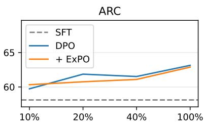

line

| Percentage | SFT  | DPO  | + ExPO |
| ---------- | ---- | ---- | ------ |
| 10%        | 58   | 60   | 60     |
| 20%        | 58   | 62   | 61     |
| 40%        | 58   | 61   | 61     |
| 100%       | 58   | 63   | 63     |

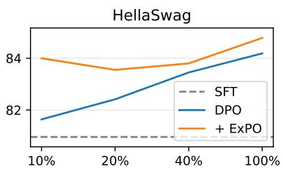

line

| Percentage | SFT   | DPO   | + ExPO |
| ---------- | ----- | ----- | ------ |
| 10%        | 81.0  | 81.5  | 84.0   |
| 20%        | 81.0  | 82.5  | 83.5   |
| 40%        | 81.0  | 83.5  | 83.8   |
| 100%       | 81.0  | 84.5  | 85.0   |

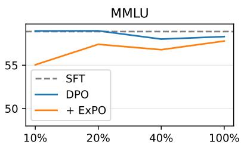

line

| Percentage | SFT   | DPO   | + ExPO |
| ---------- | ----- | ----- | ------ |
| 10%        | 58.0  | 58.0  | 55.0   |
| 20%        | 58.0  | 58.0  | 57.0   |
| 40%        | 58.0  | 57.0  | 56.0   |
| 100%       | 58.0  | 57.0  | 57.0   |

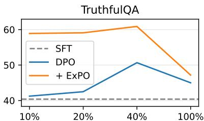

line

| Percentage | SFT  | DPO  | + ExPO |
| ---------- | ---- | ---- | ------ |
| 10%        | 40   | 41   | 59     |
| 20%        | 40   | 43   | 59     |
| 40%        | 40   | 51   | 61     |
| 100%       | 40   | 45   | 47     |

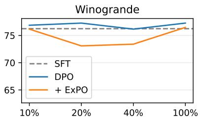

line

| Percentage | SFT   | DPO   | + ExPO |
| ---------- | ----- | ----- | ------ |
| 10%        | 75.0  | 76.0  | 75.0   |
| 20%        | 75.0  | 76.0  | 72.0   |
| 40%        | 75.0  | 75.0  | 73.0   |
| 100%       | 75.0  | 76.0  | 75.0   |

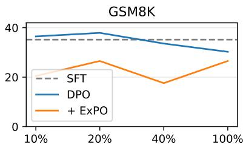

line

| Percentage | SFT  | DPO  | + ExPO |
| ---------- | ---- | ---- | ------ |
| 10%        | 36   | 37   | 20     |
| 20%        | 36   | 39   | 26     |
| 40%        | 36   | 34   | 18     |
| 100%       | 36   | 31   | 26     |

Figure 6: Evaluation results for the models in § 3.2 on downstream tasks. The x-axis denotes the proportions of training steps. As the “cost” of simply improving instruction-following ability and alignment with human preferences, EXPO can also amplify the alignment tax introduced by the alignment training.

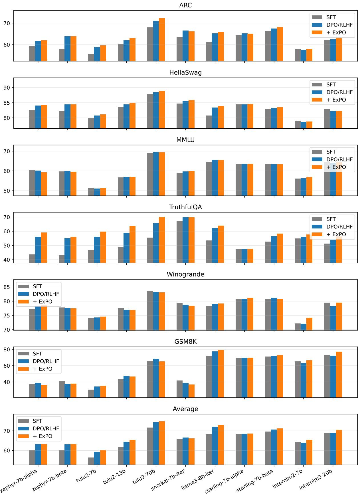  
Figure 7: Evaluation results for the LLMs in § 4.1 on downstream tasks. For these already-alighed models, the additional alignment tax brought by EXPO is usually smaller, suggesting a trade-off between the alignment training overhead (from $\mathcal { M } _ { 0 }$ to $\mathcal { M } _ { 1 } )$ and the additional alignment tax brought by EXPO (from $\mathcal { M } _ { 1 }$ to $\boldsymbol { \mathcal { M } } _ { 2 } )$ .