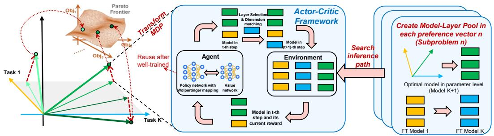
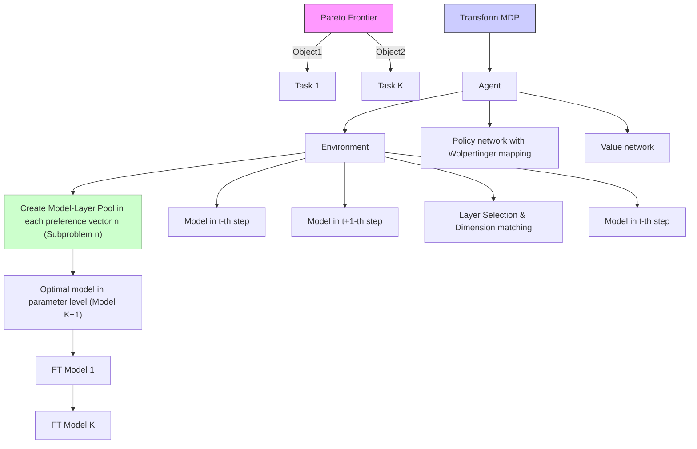
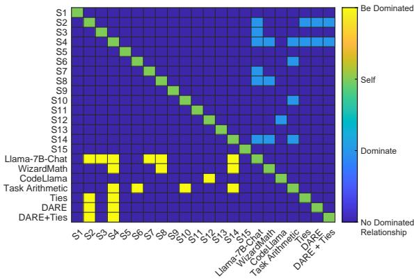
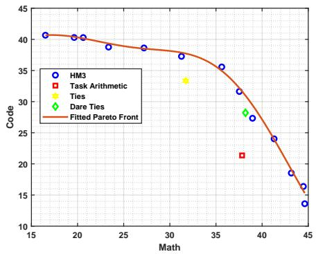
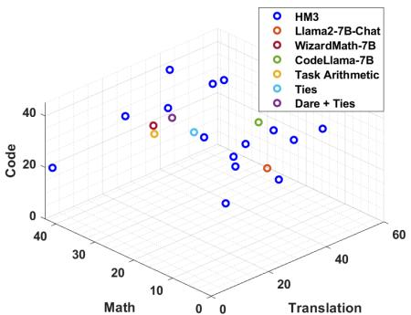
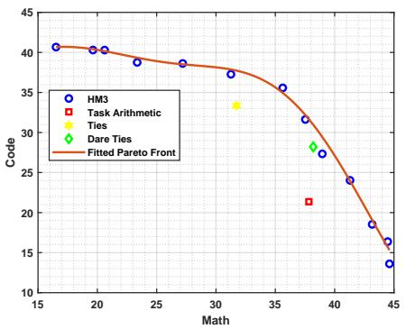
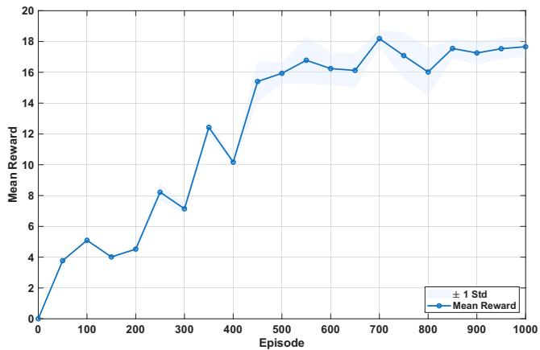

# HM3: Hierarchical Multi-Objective Model Merging for Pretrained Models

Yu Zhou1 Xingyu Wu1∗ Jibin Wu1,2 Liang Feng3 Kay Chen Tan1∗

1Department of Data Science and Artificial Intelligence

The Hong Kong Polytechnic University, Hong Kong SAR

2Department of Computing, The Hong Kong Polytechnic University, Hong Kong SAR

3College of Computer Science, Chongqing University, Chongqing, China

zy-yu.zhou@connect.polyu.hk {xingy.wu, jibin.wu, kctan}@polyu.edu.hk

liangf@cqu.edu.cn

# Abstract

Model merging is a technique that combines multiple large pretrained models into a single model, enhancing performance and broadening task adaptability without original data or additional training. However, most existing model merging methods focus primarily on exploring the parameter space, merging models with identical architectures. Despite its potential, merging in the architecture space remains in its early stages due to the vast search space and challenges related to layer compatibility. This paper designs a hierarchical model merging framework named HM3, formulating a bilevel multi-objective model merging problem across both parameter and architecture spaces. At the parameter level, HM3 integrates existing merging methods to quickly identify optimal parameters. Based on these, an actorcritic strategy with efficient policy discretization is employed at the architecture level to explore inference paths with Markov property in the layer-granularity search space for reconstructing these optimal models. By training reusable policy and value networks, HM3 learns Pareto optimal models to provide customized solutions for various tasks. Experimental results on language and vision tasks demonstrate that HM3 outperforms methods focusing solely on the parameter or architecture space.

# 1 Introduction

Recent advancements in large pretrained models and large language models (LLMs) have demonstrated remarkable performance and strong generalization abilities across various domains, such as natural language processing [8, 84, 68]. Open-source communities have provided many pretrained models for various data types, as well as fine-tuned versions tailored to specific tasks. However, fine-tuning large models is often a complex process that requires vast amounts of high-quality data and computational resources [28, 16]. To address the challenge of building foundational models capable of handling diverse tasks under limited computational resources, model merging has gained increasing attention [35, 77]. Model merging leverages existing pretrained models to flexibly transfer and integrate knowledge without requiring the original training data or additional model training [66, 48, 37]. This approach enables the creation of new models with stronger generalization capabilities, suited to multiple tasks and scenarios [73]. In recent years, model merging has become a simple yet powerful approach for large foundational model development, with merged models showing significant potential on the Open LLM leaderboard [44]. Current model merging methods primarily focus on merging models with the same architecture in the parameter space [58, 57]. They discard most redundant parameters, and only need to design parameter adjustment strategies in the remaining space, which often obtain moderate performance [72, 80, 27]. Thus, research in the parameter space has become quite extensive and mature [24, 39, 20, 19, 18].

However, focusing solely on merging models within the parameter space significantly limits their practical utility [1, 73]. Models with different architectures exhibit broader diversity in representation capabilities and task types [38, 43, 85], potentially expanding the performance boundaries of merged models beyond those of a single architecture. Some approaches [62, 61, 74] attempt to unify different architectures via knowledge distillation before performing parameter merging. However, these methods still operate within the parameter-space paradigm and typically incur substantial training costs in distillation, especially for LLMs. Recent work has explored architecture-level merging, such as Franken merging [22] and SOLAR 10.7B [29], which stitches different layers from LLMs. Nevertheless, merging models across different architectures presents several practical challenges [17, 57], resulting in limited research in this area. Primarily, architecture-level merging alters the computational logic of the model, necessitating the design of coordination strategies to ensure internal compatibility and seamless information flow within the new architecture. Moreover, jointly exploring both the parameter space and architecture space increases the problem’s complexity [82], requiring well-defined search spaces and efficient search strategies to identify the optimal model configuration. Recently, evolutionary algorithm (EA) has been employed to search for optimal architectures [1]. However, they fail to reveal the mapping between architecture sequences and performance, making them unsuitable for handling the complex, high-dimensional problem of merging multiple models. Additionally, evolutionary processes are often one-time fusions, requiring a complete restart when faced with new problems, leading to significant computational consumption [68, 64].

To this end, merging large pretrain models in parameter and architecture spaces appears to be a promising approach, which can enhance the representational ability of the merged models while maintaining performance. However, research in this area is scarce, primarily because merging models in both spaces without careful consideration can undermine their internal compatibility, potentially causing a performance collapse. In addition, the complexity of the architecture space further increases the difficulty of model merging and reduces the efficiency of existing search methods [1]. Additionally, users may have diverse preferences and expectations for the merged model, making it crucial to weight tasks differently based on these varying preferences [34, 33, 36].

To merge models across both parameter and architecture levels and achieve efficient model merging schemes, this paper proposes a hierarchical model merging method (HM3) that builds a bridge for model merging in the parameter and architecture spaces. HM3 first defines a joint optimization problem for model merging that spans both the parameter level and the architecture level. Compared to existing methods, HM3 has also taken extra considerations on conflicts or trade-offs across tasks by extending this problem to a multi-objective optimization perspective. In HM3, we sample diverse preference vectors to decompose the multi-objective problem into multiple subproblems, and simultaneously solve them to identify approximate Pareto-optimal merged models across tasks To relieve the strong coupling between variables and the exponentially large search space of each subproblem, HM3 transforms it into a bilevel optimization problem without compromising theoretical optimality. At the architecture level, an actor-critic reinforcement learning (RL) method is designed to explore inference paths with a Markov property in the layer-granularity search space, enabling the reconstruction of these optimal models. To improve efficiency in the large discrete action space, HM3 incorporates a Wolpertinger strategy for policy discretization. Once training is achieved, the policy and value networks of this actor-critic strategy can be reused to predict optimal merging architectures and parameters for different tasks. The final approximate Pareto merged models meet different preferences based on specific needs and trade-offs. The main contributions of this paper are summarized as follows:

• We propose the hierarchical model merging method (HM3), provide the definition of the joint model merging optimization problem that spans parameter and architect space, and transform it into a bilevel optimization problem without losing theoretical optimality to relieve strong coupling and vast search space.

• The proposed HM3 is the first reusable model merging framework by integrating the current parameter-merging method and designing an actor-critic-based RL method with Wolpertinger policy discretization to guide the search, exploring the optimal model configurations in both the parameter and architecture spaces.

• We propose to incorporate a multi-objective optimization paradigm into model merging processing, which allows users to prioritize the importance of multiple tasks based on task needs by searching for the approximate Pareto front of merging strategy, enabling them to select the most suitable merged model.

# 2 Hierarchical Multi-Objective Model Merging Framework

This paper aims to jointly optimize both the parameters and architecture of pretrained models to obtain a set of approximately Pareto-optimal merged models that accommodate diverse preferences under multi-task settings. Detailed related work is provided in the appendix A. Since there is a lack of definition for architecture-level merging, we propose a unified mathematical formulation for multi-objective model merging at both the parameter and architecture levels for the first time.

Problem Formulation and Challenge Discussion At the parameter level, existing works already define the merging process via optimization over $\mathbf { \boldsymbol { \Theta } } = \{ \pmb { \theta } _ { m _ { t } , l _ { t } } \} _ { t = 1 } ^ { T }$ . At the architecture level, we consider the optimization of model architecture α as an inference path search problem, where a search token traverses layers from multiple fine-tuned or merged models to identify an inference path with total length not exceeding $T _ { \mathrm { m a x } }$ . This inference path is represented by a sequence $\{ ( m _ { t } , l _ { t } ) \} _ { t = 1 } ^ { T } ,$ where $( m _ { t } , l _ { t } )$ denotes the model index and layer index selected at the t-th search step, and T is the total path length. To this end, the unified optimization problem is defined as:

$$
\max _ {\boldsymbol {\Theta} \in \mathcal {P} \subseteq \mathbb {R} ^ {d} \boldsymbol {\Theta}, \alpha = \left\{\left(m _ {t}, l _ {t}\right) \right\} _ {t = 1} ^ {T} \in \mathcal {M}} \quad \mathcal {F} (\boldsymbol {\Theta}, \alpha) = \left(f _ {1} (\boldsymbol {\Theta}, \alpha), f _ {2} (\boldsymbol {\Theta}, \alpha), \dots , f _ {K} (\boldsymbol {\Theta}, \alpha)\right) \tag {1a}
$$

$$
\text { s.t. } \quad \mathcal {C} 1: \quad \boldsymbol {\Theta} = \{\boldsymbol {\theta} _ {m _ {t}, l _ {t}} | \boldsymbol {\theta} _ {m _ {t}, l _ {t}} = \mathcal {G} \Big (\sum_ {k = 1} ^ {K} \varpi_ {k}   \boldsymbol {\theta} _ {k, l _ {t}} \Big) \} _ {t = 1} ^ {T}; \tag {1b}
$$

$$
\mathcal {C} 2: \quad \varpi_ {k} = \left\{ \begin{array}{l l} 1, & \text { if   } \theta_ {k, l _ {t}} \text {   has   the   same   base   model   as   } \theta_ {m _ {t}, l _ {t}}; \\ 0, & \text { otherwise }; \end{array} \right. \tag {1c}
$$

$$
\mathcal {C} 3: \quad | \alpha | = T \leq T _ {\max}; \tag {1d}
$$

$$
\mathcal {C} 4: \quad \sum_ {t = 1} ^ {T - 1} \mathbf {1} \left[ \dim_ {\text { out }} (m _ {t}, l _ {t}; \boldsymbol {\theta} _ {m _ {t}, l _ {t}}) \neq \dim_ {\text { in }} (m _ {t + 1}, l _ {t + 1}; \boldsymbol {\theta} _ {m _ {t + 1}, l _ {t + 1}}) \right] = 0. \tag {1e}
$$

where $f _ { k } ( \cdot )$ for $k \in \{ 1 , 2 , \ldots , K \}$ denotes the performance on the k-th task; $\mathcal { P }$ is the parameter space; Θ is the parameters of the merged model; $\begin{array} { r } { \mathcal { M } = \bigcup _ { T = 1 } ^ { T _ { \operatorname* { m a x } } } \{ \alpha = \{ ( m _ { t } , l _ { t } ) \} _ { t = 1 } ^ { T } \ | \ m _ { t } \in \{ 1 , \dots , K \} , \ l _ { t } \in \dag } \end{array}$ $\{ 1 , \ldots , L \} \}$ is the architecture space; C1 enforces a maximum inference path length of $T _ { \mathrm { m a x } } ;$ and C2 strictly ensures that the output dimension of each selected layer matches the input dimension of the next. Compared to the problem formulations of existing model merging methods, our approach extends the formulation to the architecture level. By jointly considering both space, we elevate model merging from a parameter interpolation problem to a more general structural composition problem.

In (1), P is constructed from multiple pretrained LLMs, which results in a high-dimensional, nonconvex, and piecewise linear geometric structure. Additionally, M is a discrete set of cross-model, cross-layer inference paths, whose size grows exponentially with the number of models K and the number of layers $L .$ . The strong coupling between Θ and α leads to an extremely large and complex joint search space. Furthermore, multi-objective function $\mathcal { F } ( \pmb { \Theta } , \alpha ) = \left( f _ { 1 } , \ldots , \overset { \_ } { f _ { K } } \right)$ exhibits nonsmoothness, non-convexity, and non-differentiability under such coupled variables, making it difficult to solve for traditional convex optimization or multi-objective methods. A final challenge lies in layers from different fine-tuned models must be stitched together while preserving dimensional consistency across the output–input interfaces.

Transform the Problem Formulation into A Bilevel Framework To address the strong coupling between Θ and α, we reformulate (1) as a bilevel optimization problem [51, 13]. In this problem, the upper level searches for the optimal merged parameters $\Theta ^ { * }$ in $\mathcal { P }$ , while the lower level searches for the optimal inference path $\alpha ^ { * }$ under the static environment by the converged upper-level solution $\Theta ^ { * }$ . This decomposition transforms the original joint search space of size $\vert \mathcal { P } \vert \times \vert \dot { \mathcal { M } }$ | into two sequential subproblems with complexity $| \mathcal { P } | + | \bar { \mathcal { M } } |$ , thereby significantly mitigating the combinatorial explosion in the search process. The bilevel optimization problem is given as:

$$
\max _ {\boldsymbol {\Theta} \in \mathcal {P} \subseteq \mathbb {R} ^ {d} \boldsymbol {\Theta}} \quad \mathcal {F} \bigl (\boldsymbol {\Theta},   \alpha^ {*} (\boldsymbol {\Theta}) \bigr) = \bigl (f _ {1} \bigl (\boldsymbol {\Theta},   \alpha^ {*} (\boldsymbol {\Theta}) \bigr), f _ {2} \bigl (\boldsymbol {\Theta},   \alpha^ {*} (\boldsymbol {\Theta}) \bigr), \dots , f _ {K} \bigl (\boldsymbol {\Theta},   \alpha^ {*} (\boldsymbol {\Theta}) \bigr) \bigr) \tag {2a}
$$

$$
\text { s.t. } \quad \boldsymbol {\Theta} = \{\boldsymbol {\theta} _ {m _ {t}, l _ {t}} | \boldsymbol {\theta} _ {m _ {t}, l _ {t}} = \mathcal {G} \Big (\sum_ {k = 1} ^ {K} \varpi_ {k}   \theta_ {k, l _ {t}} \Big) \} _ {t = 1} ^ {T}; \tag {2b}
$$

$$
\varpi_ {k} = \left\{ \begin{array}{l l} 1, & \text { if } \theta_ {k, l _ {t}} \text { has   the   same   base   model   as } \theta_ {m _ {t}, l _ {t}}; \\ 0, & \text { otherwise }; \end{array} \right. \tag {2c}
$$

$$
\alpha^ {*} (\boldsymbol {\Theta}) \in \underset {\alpha = \left\{\left(m _ {t}, l _ {t}\right) \right\} _ {t = 1} ^ {T} \in \mathcal {M}} {\arg \max} \mathcal {F} (\boldsymbol {\Theta}, \alpha) \tag {2d}
$$

$$
\text { s.t. } \quad | \alpha | = T \leq T _ {\max}, \tag {2e}
$$

$$
\sum_ {t = 1} ^ {T - 1} \mathbf {1} [ \dim_ {\text { out }} (m _ {t}, l _ {t}; \boldsymbol {\theta} _ {m _ {t}, l _ {t}}) \neq
$$

$$
\left. \dim_ {\text { in }} (m _ {t + 1}, l _ {t + 1}; \boldsymbol {\theta} _ {m _ {t + 1}, l _ {t + 1}}) \right] = 0. \tag {2f}
$$

Lemma 1 (Stackelberg Equilibrium [31, 4, Thm. 3.1]). Assume the follower feasible mapping $\Omega ( \Theta ) = \{ \alpha \in \mathcal { M } \mid \lvert \alpha \rvert \overset { - } { \leq } \bar { T } _ { \operatorname* { m a x } }$ , $d i m _ { o u t } = d i m _ { i n } \}$ is non-empty for all Θ (since $\alpha _ { b a s e } \in \Omega )$ , and its graph is closed due to (A1). Under Assumption 1, the bilevel optimization problem (2) admits at least one Stackelberg equilibrium $( \Theta ^ { * } , \alpha ^ { * } )$ . The associated leader-follower payoff corresponds to a global optimum of the original problem (1). The proof of Lemma 1 is provided in the appendix B.1.

In the appendix B.1, we further prove that the bilevel optimization problem can be modeled as a Stackelberg game, for which an equilibrium solution exists. This ensures that problem transformation does not incur any loss of optimality. In this bilevel optimization problem, the lower-level optimization searches for the optimal merged model architecture. The resulting architecture determines the length of the inference path (i.e., the number of layers to be merged). The upper-level optimization then operates on the parameter set $\{ \pmb { \theta } _ { m _ { t } , l _ { t } } \} _ { t = 1 } ^ { T }$ 1 corresponding to this architecture. Consequently, the optimal architecture found by the lower level dynamically determines the dimensionality and scale of the parameter search space for the upper level. This naturally forms a hierarchical decision-making structure, i.e., first optimizing the model architecture, then optimizing the corresponding model parameters, which embodies the core hierarchical nature of the proposed HM3.

Model the User Preference into A Multi-Objective Optimization Problem After mitigating the strong coupling between variables, we focus on the multi-objective property of (2). To accommodate diverse user preferences, we adopt a decomposition-based strategy that explicitly guides the solution set to cover the Pareto front boundary under controllable preference vectors. Due to the nonconvexity of the search space, we employ Tchebycheff decomposition strategy, which effectively approximates non-convex Pareto fronts by transforming the original multi-objective problem into N preference-weighted scalar subproblems. By solving these subproblems in parallel, we obtain a set of approximately Pareto-optimal merged models that satisfy varying user preferences.

probability simplex Specifically, we begin by generating N preference weight vectors $\begin{array} { r } { \Delta ^ { K } = \{ \lambda \in \mathbb { R } _ { + } ^ { K } \mid \sum _ { k = 1 } ^ { K } \lambda _ { k } = 1 \} } \end{array}$ i= . In this paper, we sample from the Dirichlet $\{ \lambda ^ { ( i ) } \} _ { i = } ^ { N }$ 1 from K-dimensional distribution: $\lambda ^ { ( i ) } \sim$ Dirichlet(1, . . . , 1), $i = 1 , \ldots , N$ , which ensures uniform coverage over $\Delta ^ { K }$ {zK

with an unbiased mean $\begin{array} { r } { \mathbb { E } [ \lambda _ { k } ] = \frac { 1 } { K } } \end{array}$ .

Then, we estimate the ideal point of each objective by computing the best achievable task performance across all fine-tuned LLMs: $z _ { k } ^ { * } = \mathrm { m a x } _ { ( \boldsymbol { \Theta } , \alpha ) \in \Omega } f _ { k } ( \boldsymbol { \Theta } , \alpha )$ . Finally, for each preference vector $\lambda ^ { ( i ) }$ , t he upper-level subproblem using Tchebycheff scalarization is defined as:

$$
\boldsymbol {\Theta} ^ {(i)} = \arg \min _ {\boldsymbol {\Theta} \in \mathcal {P}} \left\{\max _ {k = 1, \dots , K} \lambda_ {k} ^ {(i)} \cdot \left| F _ {k} ^ {\text { para }} (\boldsymbol {\Theta}) - z _ {k} ^ {*} \right| \right\}, \tag {3}
$$

where $F _ { k } ^ { \mathrm { p a r a } } ( \Theta )$ ) denotes the objective function value of the merged model on the k-th task, obtained after solving the corresponding lower-level inference path problem with fixed Θ.

flowchart

Figure 1: Illustration of architecture-level model merging. For each scalarized subproblem, we construct a model-layer candidate pool consisting of all layers from the parameter-level merged model, and K fine-tuned models. Then, HM3 design an actor-critic algorithm with Wolpertinger discretization to search inference path. The final merged models approximate the Pareto front.

Once $\Theta ^ { ( i ) }$ obtained, the corresponding lower-level subproblem is defined as:

$$
\alpha^ {(i)} = \arg \min _ {\alpha \in \Omega (\boldsymbol {\Theta} ^ {(i)})} \left\{\max _ {k = 1, \dots , K} \lambda_ {k} ^ {(i)} \cdot \left| f _ {k} \left(\boldsymbol {\Theta} ^ {(i)}, \alpha\right) - z _ {k} ^ {*} \right| \right\}, \tag {4}
$$

where $\Omega ( \Theta ^ { ( i ) } )$ denotes the feasible set of inference paths that satisfy C1 and $\mathit { c 2 }$ .

Through this transformation, (1) is reduced to solving N scalarized bilevel subproblems, each corresponding to a distinct preference vector $\lambda ^ { ( i ) }$ . The set of solutions to all subproblems forms an approximate Pareto-optimal set of merged models.

# 3 HM3 Algorithm

Parameter-Level Optimization After generating preference vectors $\{ \pmb { \lambda } ^ { ( i ) } = \{ \lambda _ { 1 } ^ { ( i ) } , \dots , \lambda _ { K } ^ { ( i ) } \} \} _ { i = 1 } ^ { N }$ , we proceed to search for the optimal merged parameters in the parameter space for each preference vector. Thanks to recent advancements, parameter-level merging methods have become relatively mature and efficient. Our framework is designed to be compatible with these existing techniques, such as DARE-Ties merging method. Concretely, for $\lambda ^ { ( i ) }$ , we begin by computing the residual vector: $\delta _ { k } = \Theta _ { k } - \Theta _ { \mathrm { b a s e } }$ . We then apply the Drop-and-Rescale operation to obtain $\delta _ { k } ^ { \mathrm { D R } } = \delta _ { k } / ( 1 - p )$ . Next, we perform the Ties Merging [72] procedure for $\lambda ^ { ( i ) }$ : removing redundant parameters from each $\delta _ { k } ^ { \mathrm { D R } }$ , generating a sign-consistent aggregation mask across tasks, and merging disjoint residual fragments with consistent signs to form $\bar { \delta } _ { k } ^ { \prime }$ . Finally, the optimal parameter for the i-th subproblem is:

$$
\boldsymbol {\Theta} ^ {(i) *} = \boldsymbol {\Theta} _ {\text { base }} + \sum_ {k = 1} ^ {K} \lambda_ {k} ^ {(i)} \cdot M _ {k} ^ {(i)} \odot \delta_ {k}, \tag {5}
$$

where $\boldsymbol { M } _ { k } ^ { ( i ) }$ is a binary mask that controls which elements of $\delta _ { k }$ are preserved and rescaled.

Architecture-Level Optimization As discussed in Section 2, architecture-level optimization is formulated as searching for an optimal inference path across the merged model and its multiple task-specific fine-tuned models. For each $\lambda ^ { ( i ) }$ , we have already obtained the corresponding optimal merged model at the parameter level, denoted as $\Theta ^ { ( i ) * }$ . We assign its model index as $m = K + 1$ . To further expand the search space and leverage external knowledge, we construct a model-layer candidate pool that consists of: (1) the optimal merged model $\Theta ^ { ( i ) * }$ from the parameter level, and (2) all layers from the K task-specific fine-tuned models used in construction of $\Theta ^ { ( i ) * }$ . The corresponding architecture-level search space is then updated as:

$$
\mathcal {M} ^ {(i)} = \left\{\left(m ^ {(i)}, l ^ {(i)}; \boldsymbol {\Theta} ^ {(i)}\right) \mid m \in \{1, \dots , K + 1 \}, l \in \{1, \dots , L \} \right\}. \tag {6}
$$

Although prior research has demonstrated the potential of using search algorithms to optimize layer sequences and enhance model merging performance [1], the scalability of EAs suffers significantly as the number of models and layers increases [20, 18]. Moreover, EA-based approaches require training from scratch for each preference vector and incur considerable computational cost due to population-based evaluations in every generation. These inefficiencies motivate us to revisit the nature of dynamic layer selection across multiple models [69, 67].

This process entails selecting the optimal model-layer pair at each step, considering the long-term impact of current decisions on future layer compositions and final task performance, thereby exhibiting the characteristics of a sequential decision-making problem. Furthermore, the combinatorial nature of the layer-path space, along with its discrete, structured constraints and well-defined state transitions, naturally suggests formulating the inference path search as a trajectory-aware Markov decision process (MDP). The overall process of architecture-merging is illustrated in Fig. 1. Then, we formally define its state, action, transition, and reward components and design an RL strategy to efficiently explore optimal architecture trajectories.

1) State Space Since every decision in the inference path dynamically alters the feasibility of subsequent layer transitions and affects the accumulated representation distribution, we define the state to retain full trajectory history for optimal distinguishability. Formally, the state at the tth step is represented as a trajectory:

$$
S _ {t} = \left\{\left(m _ {j}, l _ {j}, \boldsymbol {\theta} _ {m _ {j}, l _ {j}}\right) \mid m _ {j} \in \{1, \dots , K + 1 \}, l _ {j} \in \{1, \dots , L \}, j = 1, \dots , t \right\} \in \mathcal {S}, \tag {7}
$$

where $m _ { j }$ denotes the model index, $l _ { j }$ denotes the layer index, and $\pmb { \theta } _ { m _ { i } , l _ { i } } \in \mathbb { R } ^ { d _ { \theta } }$ is the corresponding parameter of the selected layer. To enable policy gradient-based learning, we use a set of learnable encoders $\psi _ { m }$ , ψl, and $\varphi$ to encode model identity, layer index, and layer parameters, respectively. The full trajectory is then embedded into a fixed-dimensional vector using a GRU encoder: $h _ { t } =$ GRU $\left( \left[ \psi _ { m } ( m _ { j } ) ; \psi _ { l } ( l _ { j } ) ; \varphi ( \pmb { \theta } _ { m _ { j } , l _ { j } } ) \right] _ { j = 1 } ^ { t } \right) \in \mathbb { R } ^ { d _ { h } }$ . The process on trajectory space $s$ satisfies Markov property.

2) Action Space At the tth step, the action $A _ { t }$ is defined as selecting the next model-layer pair to transition to:

$$
A _ {t} = (m _ {t + 1}, l _ {t + 1}) \in \mathcal {A}, \quad m \in \{1, \dots , K + 1 \}, l \in \{1, \dots , L \}. \tag {8}
$$

3) Reward Function. The reward encourages the construction of efficient inference paths that yield high-quality multi-task performance with minimal complexity:

$$
R = \sum_ {k = 1} ^ {K} \lambda_ {k} ^ {(i)} f _ {k} (\boldsymbol {\Theta}, \boldsymbol {h}) - \beta_ {1} T \tag {9}
$$

where the second term penalizes path length to encourage shorter and more efficient inference paths. The reward is computed only after the entire inference path is generated, and the MLP-based alignment is performed. This reward is uniformly assigned to all time steps in the inference path as $\bar { R _ { t } } = R / T , \bar { \forall t } \in \{ 1 , . . . , T \}$ . This uniform assignment is implemented to facilitate efficient storage of transitions and subsequent updates of the policy and value networks in the actor-critic framework.

Actor-Critic Method To solve the MDP, HM3 employs an actor-critic-based RL strategy. In this framework, a policy network parameterized by µ outputs a probability distribution over the large discrete action space, while a value network parameterized by ϕ serves as a baseline to reduce the variance of gradients under sparse reward conditions. This design facilitates stable convergence of layer sequence search under limited sampling [79, 78].

The policy function $\pi _ { \mu } ( A _ { t } \mid S _ { t } )$ defines a stochastic policy conditioned on the current state $S _ { t }$ , representing the probability distribution over candidate actions. The distribution is modeled using a Gaussian parameterization with mean $\mu$ and variance $\xi ^ { 2 }$ , from which actions are sampled to maximize the expected cumulative reward:

$$
\max _ {\mu} \mathbb {E} _ {\pi_ {\mu}} \left[ \sum_ {t = 0} ^ {T} \gamma^ {t} R _ {t} \right] = \max _ {\mu} \mathbb {E} _ {\pi_ {\mu}} \left[ \sum_ {t = 0} ^ {T} \gamma^ {t} \left(\sum_ {k = 1} ^ {K} \lambda_ {k} ^ {(i)} f _ {k} (\boldsymbol {\Theta}, \boldsymbol {h} _ {t}) - \beta_ {1} t\right) \right], \tag {10}
$$

where $\gamma \in ( 0 , 1 ]$ is the discount factor, and $R _ { t }$ denotes the reward at the tth step as defined earlier.

The policy network generates a continuous proto-action $\bar { A }$ following a Gaussian-distributed stochastic policy: $\dot { \bar { A } } = f _ { \pi ( A | S ; \Theta ) } ( S ) \sim \mathcal N \left( \pmb { \mu } _ { \pi } ( \mathbf { S } _ { t } ) \right.$ , diag $\sigma _ { \pi } ^ { 2 } ( { \bf S } _ { t } ) )$ , where $f _ { \pi ( A | \boldsymbol { S } ; \Theta ) }$ is the state-to-action mapping under policy π.

Since the decision variables of (2) lie in a discrete action space $w ,$ , the proto-action $\bar { A }$ must be mapped to a discrete action $A \in \mathcal W$ . Existing discretization approaches fall into two categories [55, 83]: The simple projection method, which directly selects the nearest discrete action: ${ \bar { \mathbf { \nabla } } } _ { \mathbf { \nabla } } ^ { * } = { }$ arg min $\boldsymbol { \mathcal { A } } \in \mathcal { W } \left\| \boldsymbol { \mathcal { A } } - \boldsymbol { \bar { \mathcal { A } } } \right\|$ . However, this can result in suboptimal exploration and slow convergence. The greedy method, which selects the action with the highest Q-value: $\ b { A } ^ { * }$ = arg $\operatorname* { m a x } _ { \mathcal { A } \in \mathcal { W } } Q ( \mathcal { S } , \mathcal { A } )$ , but this is often computationally expensive and prone to local optima.

To balance exploration and exploitation, we introduce Wolpertinger policy mapping, which improves efficiency by limiting evaluation to a local neighborhood:

$$
A _ {t} = \left\{ \begin{array}{l l} \arg \max _ {\mathcal {A} \in \mathcal {W} ^ {*} (A _ {t})} Q _ {\phi} (S _ {t}, \mathcal {A}), & \text { with   probability } 1 - \epsilon , \\ \mathcal {U} (\mathcal {W} ^ {*} (A _ {t})), & \text { with   probability } \epsilon , \end{array} \right. \tag {11}
$$

where $\mathcal { U } ( \cdot )$ is a uniform distribution, and the neighborhood set $\mathcal { W } ^ { * } ( A _ { t } )$ is defined as: $\mathcal { W } ^ { \ast } ( A _ { t } ) : =$ argmin $\ r _ { A \in \mathcal { W } } \ d ( \ r _ { A } , \ r _ { A _ { t } } )$ , with $\mathcal { W } = \{ A _ { 1 } , \dotsc , A _ { \ell } ^ { - } , \dotsc , A _ { M } \}$ denoting the full discrete action set, $| \cdot | { = } \dot { M } ^ { \prime }$ $d ( \cdot , \cdot )$ representing Euclidean distance, and $M ^ { \prime }$ is the number of nearest neighbors.

The value function is modeled by a state-value network $V _ { \phi } ( S _ { t } )$ , which estimates the expected cumulative reward of $S _ { t } \colon V _ { \phi } ( S _ { t } ) = \mathbb { E } _ { \pi _ { \mu } } \left[ \sum _ { j = 0 } ^ { \infty } \gamma ^ { j } R _ { t + j } \Big | S _ { t } \right]$ , where $\textstyle \sum _ { j = 0 } ^ { \infty } \gamma ^ { j } R _ { t + j }$ is the discounted return starting from the t-th step.

Network Updates To stabilize policy optimization, HM3 constrains the update step size and adopts a policy gradient approach for training. The policy network is updated using the clipped surrogate objective by proximal policy optimization [49]:

$$
L ^ {\mathrm{CLIP}} (\mu) = \mathbb {E} _ {t} \left[ \min \left(\rho_ {t} (\mu) \hat {A} _ {t}, \operatorname{clip} \left(\rho_ {t} (\mu), 1 - \epsilon , 1 + \epsilon\right) \hat {A} _ {t}\right) \right], \tag {12}
$$

where $\begin{array} { r } { \rho _ { t } ( \mu ) = \frac { \pi _ { \mu } \left( A _ { t } \vert S _ { t } \right) } { \pi _ { \mu _ { \mathrm { o l d } } } \left( A _ { t } \vert S _ { t } \right) } } \end{array}$ is the importance sampling ratio between the new and old policies, and $\hat { A } _ { t }$ is the estimated advantage. We compute $\hat { A } _ { t }$ using the generalized advantage estimation method: $\begin{array} { r } { \hat { A } _ { t } \ = \ \sum _ { i = 0 } ^ { \infty } ( \gamma \beta _ { A } ) ^ { i } \zeta _ { t + i } , \quad \zeta _ { t } \ = \ R _ { t } + \gamma V ( S _ { t + 1 } ; \phi _ { \mathrm { i t e r } } ) - V ( S _ { t } ; \phi _ { \mathrm { i t e r } } ) } \end{array}$ , where $\zeta _ { t }$ is the temporal difference residual at the t-th step.

The value network is updated by minimizing the value loss:

$$
L ^ {\mathrm{VF}} (\phi) = \mathbb {E} _ {t} \left[ \left(V _ {\phi} (S _ {t}) - \left(V _ {\phi} (S _ {t}) - \hat {A} _ {t}\right)\right) ^ {2} \right]. \tag {13}
$$

The overall training objective is:

$$
L (\mu , \phi) = L ^ {\mathrm{CLIP}} (\mu) + c _ {1} L ^ {\mathrm{VF}} (\phi) - c _ {2} H \left(\pi_ {\mu}\right), \tag {14}
$$

where $H ( \pi _ { \mu } )$ denotes the entropy of the policy, and $c _ { 1 } , c _ { 2 }$ are weighting coefficients.

Lemma 2 (Advantage of Wolpertinger discretization). Let $\tilde { Q } ( S , { \cal A } ) = r ( S , { \cal A } ) + \gamma V _ { \phi } ( S ^ { \prime } )$ denote the one-step proxy score derived from the value network Vϕ. Consider a candidate set $\mathcal { W } ^ { * } = \{ A _ { 1 } , \ldots , A _ { \ell } , \ldots , A _ { M } \}$ . Assume there exists a constant $\xi > 0$ such that: $\tilde { Q } ( S , A _ { \ell } ) \sim$ $\mathcal { U } \left( \tilde { Q } ( S , A _ { s } ^ { * } ) - \xi , \tilde { Q } ( S , A _ { s } ^ { * } ) + \xi \right) , \forall \ell \neq \ell ^ { \prime }$ , and that the proxy error is bounded as:

$$
\left| \tilde {Q} (\mathcal {S}, \mathcal {A}) - Q (\mathcal {S}, \mathcal {A}) \right| \leq \delta , \quad \forall \mathcal {A} \in \mathcal {W} ^ {*}. \tag {15}
$$

When M > 1 and δ < ξ 1 − 2(2M−1)M·2M  $M > 1$ $\begin{array} { r } { \delta < \xi \left( 1 - \frac { 2 ( 2 M - 1 ) } { M \cdot 2 ^ { M } } \right) } \end{array}$ , we can confirm that Wolpertinger is expected to outperform simple nearest-neighbor projection in terms of the true Q-value. Moreover, by reducing the candidate space from $\vert \mathcal { W } \vert t o \vert \mathcal { W } ^ { * } \vert$ , Wolpertinger achieves greater efficiency than full greedy search over all actions. The proof of Lemma 2 is provided in the appendix B.2.

Dimension Alignment via Statistical Matching To accommodate distributional shifts across layers from different models, we introduce a feed-forward MLP network that generates a scaling matrix $W _ { m , l }$ . The input to the MLP consists of the layer index pair (m, l) and the current time step t, and its output is defined as:

$$
W _ {m, l} = \mathrm{MLP} _ {\mu} (m, l, t), \tag {16}
$$

where M $\mathbf { \nabla } _ { P _ { \mu } }$ is parameterized by $\mu$ and optimized via actor-critic method. This design is motivated by the theory of moment matching [53]. Further theoretical details are provided in the appendix B.4. It is worth that the proposed HM3 is in its early exploratory stage, and we discuss the existing limitations and possible future directions in the appendix D.

# 3.1 Experiment Setup

Baselines We evaluate the proposed parameter-and-architecture hierarchical merging framework HM32 against three types of baselines on both language and vision tasks: fine-tuned models, three classical parameter-level merging methods, including Task Arithmetic [27], Ties-Merging [72], and DARE-Ties Merging [80], two SOTA parameter-level merging methods, including PCB Merging [19] and Consensus Merging [65], and an architecture-level merging method named EA [1].

Benchmarks and Metrics For language tasks, we used LLAMA-2-7B [60], Qwen-2.5-1.5B [75], and LLAMA-2-13B [60] as backbones across four subtasks: generative task, text translation, math reasoning, and code generation. For generative tasks, we used GLUE benchmark [63] to evaluate the general capability of large pretrained models. For translation, we used WMT14, WMT16 [50], and IWSLT2017 [7] (WMT&ISWT), evaluated by the chrf metric as well as Xnli [15] evaluated by the accuracy metric. For math reasoning, we used GSM8K [12] with the flexible match metric, and used MathQA [3] with the accuracy metric. For code generation, HumanEval [9] and MBPP [5] was used with the pass@1 and pass@100 metric. Additionally, Qwen-2.5-1.5B was evaluated on four 3090 GPUs (24GB each), while LLaMA-2-7B and LLaMA-2-13B were evaluated on four A6000 GPUs (48GB each). All models can also be deployed on a single GPU. For vision tasks, we adopted ViT-B/32 and ViT-L/14 from CLIP [46] as backbones, and evaluated on eight datasets: DTD [11], GTSRB [52], RESISC45 [10], SUN397 [70], SVHN [45], MNIST [32], Cars [30], and EuroSAT [23], using classification accuracy. Other settings and details are summarized in the appendix C.1.

# 3.2 Performance of Multi-Task Scenario

Merging LLAMA-2-7B LLMs Table 1 summarizes the performance of various merging methods across three language tasks on LLAMA-7B series LLMs. Among the fine-tuned models, WizardMath-7B [41] excelled at math due to task-specific training, while CodeLlama-7B [47] dominated code generation. Llama-2-7B-Chat [60] showed relatively balanced performance, particularly in translation. Across merging methods, Task Arithmetic provided moderate gains across tasks, whereas Ties Merging and DARE-Ties Merging achieved better trade-offs, especially in translation and code. However, EA underperformed, likely due to its unguided architecture search, which struggles to find optimal layer combinations with limited evaluations. Our proposed HM3 significantly outperformed all baselines, achieving top scores in all tasks. These results highlight the effectiveness of jointly optimizing both parameter fusion and architectural composition.

Merging Qwen-1.5B LLMs To assess the robustness of HM3, we conducted merging experiments using the Qwen-2.5-1.5B series LLMs. As shown in Table 2, each fine-tuned model performed best on its own task but showed clear limitations on others, reflecting the trade-offs of single-task fine-tuning. In contrast, HM3 consistently outperformed all baselines, achieving top results in math and code, and competitive performance in translation. EA performed the worst across all tasks due to its unguided structure search. An interesting observation from Table 1 and Table 2 is that the models by HM3 sometimes outperform fine-tuned models, which are typically considered performance upper bounds for their respective tasks. We discuss this in the appendix C.2. Additionally, we conducted the experiment on LLAMA-13B, and the results and analysis are provided in the appendix C.2.

Table 1: Comparison of merging methods for Llama-7B series LLMs on language tasks 

<table><tr><td rowspan="2">Merging Methods</td><td>General</td><td colspan="2">Translation</td><td colspan="2">Math</td><td colspan="2">Code</td></tr><tr><td>Glue</td><td>WMT&amp;ISWT</td><td>Xnli</td><td>GSM8k</td><td>MathQA</td><td>HumanEval</td><td>MBPP</td></tr><tr><td>Fine-tuned Model - Chat</td><td>55.97</td><td>40.23</td><td>43.21</td><td>15.39</td><td>25.33</td><td>19.51</td><td>24.47</td></tr><tr><td>Fine-tuned Model - Math</td><td>29.32</td><td>34.97</td><td>38.93</td><td>45.79</td><td>27.09</td><td>20.73</td><td>16.96</td></tr><tr><td>Fine-tuned Model - Code</td><td>18.39</td><td>33.86</td><td>40.37</td><td>12.89</td><td>28.76</td><td>43.21</td><td>52.67</td></tr><tr><td>Task Arithmetic</td><td>35.32</td><td>31.30</td><td>32.92</td><td>37.83</td><td>17.30</td><td>21.36</td><td>22.20</td></tr><tr><td>Ties Merging</td><td>38.62</td><td>34.15</td><td>35.72</td><td>29.73</td><td>22.40</td><td>26.35</td><td>31.48</td></tr><tr><td>DARE-Ties Merging</td><td>37.03</td><td>33.93</td><td>37.47</td><td>38.20</td><td>22.70</td><td>28.20</td><td>30.11</td></tr><tr><td>Consensus Merging</td><td>47.52</td><td>37.97</td><td>40.74</td><td>37.95</td><td>27.99</td><td>30.15</td><td>37.93</td></tr><tr><td>PCB Merging</td><td>49.11</td><td>39.29</td><td>33.35</td><td>39.25</td><td>28.14</td><td>32.53</td><td>39.05</td></tr><tr><td>EA</td><td>21.33</td><td>37.51</td><td>27.07</td><td>25.51</td><td>22.64</td><td>25.17</td><td>16.84</td></tr><tr><td>HM3</td><td>51.04</td><td>41.68</td><td>40.24</td><td>45.62</td><td>28.08</td><td>43.62</td><td>44.62</td></tr></table>

Table 2: Comparison of merging methods for Qwen-1.5B series LLMs on language tasks 

<table><tr><td rowspan="2">Merging Methods</td><td>Generative</td><td colspan="2">Translation</td><td colspan="2">Math</td><td colspan="2">Code</td></tr><tr><td>Glue</td><td>WMT&amp;ISWT</td><td>Xnli</td><td>GSM8k</td><td>MathQA</td><td>HumanEval</td><td>MBPP</td></tr><tr><td>Fine-tuned Model - Chat</td><td>57.76</td><td>39.01</td><td>41.39</td><td>14.32</td><td>28.67</td><td>12.11</td><td>40.60</td></tr><tr><td>Fine-tuned Model - Math</td><td>41.95</td><td>23.08</td><td>35.36</td><td>32.61</td><td>43.33</td><td>13.90</td><td>44.05</td></tr><tr><td>Fine-tuned Model - Code</td><td>28.30</td><td>24.71</td><td>41.60</td><td>15.60</td><td>32.67</td><td>34.42</td><td>52.34</td></tr><tr><td>Task Arithmetic</td><td>42.76</td><td>27.40</td><td>30.90</td><td>19.73</td><td>37.71</td><td>17.63</td><td>21.45</td></tr><tr><td>Ties Merging</td><td>42.72</td><td>29.07</td><td>28.46</td><td>22.66</td><td>36.07</td><td>16.32</td><td>19.61</td></tr><tr><td>DARE-Ties Merging</td><td>38.25</td><td>27.91</td><td>30.87</td><td>20.63</td><td>40.33</td><td>19.61</td><td>24.84</td></tr><tr><td>Consensus Merging</td><td>46.42</td><td>29.82</td><td>38.09</td><td>23.98</td><td>37.84</td><td>22.59</td><td>34.08</td></tr><tr><td>PCB Merging</td><td>47.25</td><td>30.05</td><td>38.31</td><td>24.29</td><td>36.90</td><td>21.87</td><td>41.33</td></tr><tr><td>EA</td><td>29.77</td><td>21.36</td><td>23.87</td><td>17.40</td><td>35.68</td><td>15.33</td><td>23.27</td></tr><tr><td>HM3</td><td>48.22</td><td>32.26</td><td>41.73</td><td>28.05</td><td>40.13</td><td>34.31</td><td>51.80</td></tr></table>

Merging ViT-B/32 model As shown in Table 3, HM3 outperforms all baselines with an average accuracy of 66.91%. It achieves 77.21% on EuroSAT, 77.62% on SVHN, and 68.21% on GTSRB. While slightly lower on DTD, HM3 still surpasses Ties Merging and Task Arithmetic.

Merging ViT-L/14 Table 4 shows that HM3 consistently achieves the best results across most datasets, with 90.48% on SVHN and 83.43% on GTSRB. The overall average accuracy reaches 80.30%, significantly exceeding all other methods. The detailed analysis is in the appendix C.2.

# 3.3 Performance of Multi-Objective Model Merging

HM3 generates a diverse set of approximately Pareto-optimal merged models, enabling flexible adaptation to different user preferences. Unlike existing methods that output a single solution, HM3 provides multiple high-quality candidates. To evaluate solution quality, we compute Pareto dominance relations by pooling all solutions. A solution $x _ { a }$ is dominated by $x _ { b }$ if $x _ { b }$ is no worse in all objectives and strictly better in at least one. Figure 2 shows that every baseline is dominated by at least one HM3 solution (S1–S15), demonstrating HM3’s superiority in objective space. We also compare HM3 with a multi-objective evolutionary algorithm (MOEA) baseline using the hypervolume (HV)

Table 3: Performance of different model merging methods for ViT-B/32 series models on vision tasks. 

<table><tr><td>Method</td><td>Average</td><td>SUN397</td><td>RESISC45</td><td>SVHN</td><td>GTSRB</td><td>DTD</td><td>MNIST</td><td>Cars</td><td>EuroSAT</td></tr><tr><td>Task Arithmetic</td><td>69.44</td><td>61.41</td><td>72.42</td><td>73.74</td><td>66.12</td><td>49.82</td><td>93.81</td><td>62.14</td><td>76.09</td></tr><tr><td>Ties Merging</td><td>69.00</td><td>62.34</td><td>71.49</td><td>73.68</td><td>62.69</td><td>48.52</td><td>96.91</td><td>61.06</td><td>75.30</td></tr><tr><td>DARE-Ties Merging</td><td>69.86</td><td>60.22</td><td>71.36</td><td>76.56</td><td>65.94</td><td>50.84</td><td>97.05</td><td>60.84</td><td>76.05</td></tr><tr><td>Consensus Merging</td><td>72.06</td><td>64.73</td><td>73.51</td><td>79.46</td><td>69.03</td><td>52.63</td><td>96.89</td><td>63.06</td><td>77.20</td></tr><tr><td>PCB Merging</td><td>73.80</td><td>63.58</td><td>75.71</td><td>82.31</td><td>72.57</td><td>54.78</td><td>97.42</td><td>64.42</td><td>79.63</td></tr><tr><td>EA</td><td>59.45</td><td>53.27</td><td>62.14</td><td>59.32</td><td>56.16</td><td>32.97</td><td>95.34</td><td>54.03</td><td>62.33</td></tr><tr><td>HM3</td><td>73.83</td><td>63.42</td><td>76.27</td><td>82.11</td><td>73.11</td><td>54.60</td><td>96.85</td><td>64.63</td><td>79.66</td></tr></table>

Table 4: Performance of different model merging methods for ViT-L/14 series models on vision tasks. 

<table><tr><td>Method</td><td>Average</td><td>SUN397</td><td>RESISC45</td><td>SVHN</td><td>GTSRB</td><td>DTD</td><td>MNIST</td><td>Cars</td><td>EuroSAT</td></tr><tr><td>Task Arithmetic</td><td>79.48</td><td>69.56</td><td>83.60</td><td>80.51</td><td>70.58</td><td>65.88</td><td>98.02</td><td>82.13</td><td>85.53</td></tr><tr><td>Ties Merging</td><td>81.28</td><td>68.53</td><td>81.89</td><td>87.42</td><td>81.72</td><td>58.07</td><td>98.89</td><td>84.97</td><td>88.77</td></tr><tr><td>DARE-Ties Merging</td><td>83.72</td><td>72.07</td><td>87.19</td><td>88.03</td><td>84.50</td><td>64.49</td><td>99.01</td><td>85.93</td><td>88.53</td></tr><tr><td>Consensus Merging</td><td>83.75</td><td>73.39</td><td>88.05</td><td>87.43</td><td>81.16</td><td>66.04</td><td>98.88</td><td>84.26</td><td>90.81</td></tr><tr><td>PCB Merging</td><td>85.23</td><td>75.04</td><td>88.75</td><td>86.46</td><td>86.55</td><td>69.13</td><td>98.91</td><td>86.01</td><td>91.01</td></tr><tr><td>EA</td><td>69.48</td><td>61.95</td><td>58.11</td><td>76.32</td><td>66.36</td><td>50.04</td><td>96.77</td><td>75.04</td><td>71.24</td></tr><tr><td>HM3</td><td>85.34</td><td>74.76</td><td>88.43</td><td>90.02</td><td>85.17</td><td>70.21</td><td>98.44</td><td>86.33</td><td>89.32</td></tr></table>

  
Figure 2: Illustration of metrics for different merging methods, where S1 represents solution1 obtained by HM3.

line

| Math | Code | Type             |
|------|------|------------------|
| 16   | 40.5 | HM3              |
| 20   | 40.0 | HM3              |
| 24   | 39.0 | HM3              |
| 28   | 38.5 | HM3              |
| 32   | 37.5 | HM3              |
| 36   | 36.0 | HM3              |
| 40   | 32.0 | HM3              |
| 44   | 14.0 | HM3              |
| 38   | 21.0 | Task Arithmetic  |
| 38   | 28.0 | Dare Ties        |
| 42   | 19.0 | HM3              |
| 44   | 16.0 | HM3              |

Figure 3: The illustration of different model merging methods in the math reasoning and code generation tasks.

metric [25, 56], which reflects both convergence and diversity. HM3 achieves an HV of 1.8120, significantly higher than MOEA’s 1.5111, highlighting the limitations of unguided evolutionary search in complex multi-objective scenarios. Detailed analysis is provided in the appendix C.3. The effectiveness of HM3 on different numbers of objectives is provided in the appendix C.4.

# 3.3.1 Ablation Study

To evaluate the effectiveness of jointly optimizing parameter and architecture spaces, we conduct ablation studies on three variants: (i) HM3, (ii) HM3 w.o. arch (no architecture optimization), and (iii) HM3 w.o. para (no parameter optimization), with results shown in Table 6 in the appendix C.5. In the single-objective setting, HM3 outperforms both ablated versions on all tasks, especially in code generation, highlighting the synergy between parameter and architecture optimization. In the multi-objective setting, HM3 achieves the highest HV score, followed by HM3 w.o. arch, while HM3 w.o. para performs the worst. This demonstrates that parameter optimization is critical for overall performance, and architecture optimization further enhances solution quality. Detailed analysis is provided in the appendix C.5. We also analyze the computational cost of HM3 compared to the conventional pretraining and fine-tuning paradigm in the appendix C.6. Additionally, convergence analysis of RL is provided in the appendix C.7.

# 4 Conclusion

In this paper, we propose HM3, a hierarchical model merging framework that jointly optimizes parameter and architecture spaces. By leveraging an actor-critic strategy and preference-guided multi-objective optimization, HM3 efficiently generates customized, high-performing merged models. Extensive experiments on translation, math reasoning, and code generation tasks demonstrate HM3’s superiority over existing methods. The framework learns Pareto-optimal solutions tailored to diverse user preferences, offering a flexible and scalable approach to model merging. Future work will explore applying HM3 to larger-scale pretrained models for broader generalization and adaptability.

# Acknowledgment

This work was partially supported by National Natural Science Foundation of China under Grant U21A20512 and in part by the Research Grants Council of the Hong Kong SAR under Grant No. C5052-23G, Grant PolyU 15229824, Grant PolyU 15218622, and Grant PolyU 15215623. This work was also partially supported the Research Grants Council of the Hong Kong SAR (Grant No. PolyU15217424, PolyU25216423), and The Hong Kong Polytechnic University (Project IDs: P0043563). This work was also in part by the Natural Science Foundation of Chongqing (Innovation and Development Joint Fund) under Grant CSTB2025NSCO-LZX0014.

# References

[1] Takuya Akiba, Makoto Shing, Yujin Tang, Qi Sun, and David Ha. Evolutionary optimization of model merging recipes. Nature Machine Intelligence, 7(2):195–204, 2025.   
[2] Charalambos D Aliprantis and Kim C Border. Infinite dimensional analysis: a hitchhiker’s guide. Springer Science & Business Media, 2006.   
[3] Aida Amini, Saadia Gabriel, Shanchuan Lin, Rik Koncel-Kedziorski, Yejin Choi, and Hannaneh Hajishirzi. MathQA: Towards interpretable math word problem solving with operation-based formalisms. In Proceedings of the 2019 Conference of the North American Chapter of the Association for Computational Linguistics, pages 2357–2367, 2019.   
[4] Didier Aussel and Anton Svensson. A short state of the art on multi-leader-follower games. Bilevel optimization: Advances and next challenges, pages 53–76, 2020.   
[5] Jacob Austin, Augustus Odena, Maxwell Nye, Maarten Bosma, Henryk Michalewski, David Dohan, Ellen Jiang, Carrie Cai, Michael Terry, Quoc Le, et al. Program synthesis with large language models. arXiv preprint arXiv:2108.07732, 2021.   
[6] Claude Berge. Topological Spaces: Including a Treatment of Multi-valued Functions, Vector Spaces, and Convexity. Courier Corporation, 1997.   
[7] Mauro Cettolo, Marcello Federico, Luisa Bentivogli, Jan Niehues, Sebastian Stüker, Katsuitho Sudoh, Koichiro Yoshino, and Christian Federmann. Overview of the iwslt 2017 evaluation campaign. In Proceedings of the 14th International Workshop on Spoken Language Translation, pages 2–14, 2017.   
[8] Yupeng Chang, Xu Wang, Jindong Wang, Yuan Wu, Linyi Yang, Kaijie Zhu, Hao Chen, Xiaoyuan Yi, Cunxiang Wang, Yidong Wang, et al. A survey on evaluation of large language models. ACM Transactions on Intelligent Systems and Technology, 15(3):1–45, 2024.   
[9] Mark Chen, Jerry Tworek, Heewoo Jun, Qiming Yuan, Henrique Ponde De Oliveira Pinto, Jared Kaplan, Harri Edwards, Yuri Burda, Nicholas Joseph, Greg Brockman, et al. Evaluating large language models trained on code. arXiv preprint arXiv:2107.03374, 2021.   
[10] Gong Cheng, Junwei Han, and Xiaoqiang Lu. Remote sensing image scene classification: Benchmark and state of the art. Proceedings of the IEEE, 105(10):1865–1883, 2017.   
[11] Mircea Cimpoi, Subhransu Maji, Iasonas Kokkinos, Sammy Mohamed, and Andrea Vedaldi. Describing textures in the wild. In Proceedings of the IEEE Conference on Computer Vision and Pattern Recognition, pages 3606–3613, 2014.   
[12] Karl Cobbe, Vineet Kosaraju, Mohammad Bavarian, Mark Chen, Heewoo Jun, Lukasz Kaiser, Matthias Plappert, Jerry Tworek, Jacob Hilton, Reiichiro Nakano, et al. Training verifiers to solve math word problems. arXiv preprint arXiv:2110.14168, 2021.   
[13] Benoît Colson, Patrice Marcotte, and Gilles Savard. An overview of bilevel optimization. Annals of operations research, 153:235–256, 2007.   
[14] Tianshuo Cong, Delong Ran, Zesen Liu, Xinlei He, Jinyuan Liu, Yichen Gong, Qi Li, Anyu Wang, and Xiaoyun Wang. Have you merged my model? on the robustness of large language model ip protection methods against model merging. In Proceedings of the 1st ACM Workshop on Large AI Systems and Models with Privacy and Safety Analysis, page 69–76, 2024.

[15] Alexis Conneau, Ruty Rinott, Guillaume Lample, Adina Williams, Samuel Bowman, Holger Schwenk, and Veselin Stoyanov. Xnli: Evaluating cross-lingual sentence representations. In Proceedings of the 2018 Conference on Empirical Methods in Natural Language Processing, pages 2475–2485, 2018.   
[16] Xiaoyu Dong, Yujie Feng, Zexin Lu, Guangyuan Shi, and Xiao-Ming Wu. Zero-shot crossdomain dialogue state tracking via context-aware auto-prompting and instruction-following contrastive decoding. In Proceedings of the 2024 Conference on Empirical Methods in Natural Language Processing, pages 8527–8540, 2024.   
[17] Xuanyi Dong, Lu Liu, Katarzyna Musial, and Bogdan Gabrys. Nats-bench: Benchmarking nas algorithms for architecture topology and size. IEEE Transactions on Pattern Analysis and Machine Intelligence, 44(7):3634–3646, 2021.   
[18] Guodong Du, Zitao Fang, Jing Li, Junlin Li, Runhua Jiang, Shuyang Yu, Yifei Guo, Yangneng Chen, Sim Kuan Goh, Ho-Kin Tang, et al. Neural parameter search for slimmer fine-tuned models and better transfer. arXiv preprint arXiv:2505.18713, 2025.   
[19] Guodong Du, Junlin Lee, Jing Li, Runhua Jiang, Yifei Guo, Shuyang Yu, Hanting Liu, Sim Kuan Goh, Ho-Kin Tang, Daojing He, et al. Parameter competition balancing for model merging. In Proceedings of the 38th International Conference on Neural Information Processing Systems, pages 84746–84776, 2024.   
[20] Guodong Du, Jing Li, Hanting Liu, Runhua Jiang, Shuyang Yu, Yifei Guo, Sim Kuan Goh, and Ho-Kin Tang. Knowledge fusion by evolving weights of language models. In Findings of the Association for Computational Linguistics ACL 2024, pages 11727–11742, 2024.   
[21] Leo Gao, Jonathan Tow, Baber Abbasi, Stella Biderman, Sid Black, Anthony DiPofi, Charles Foster, Laurence Golding, Jeffrey Hsu, Alain Le Noac’h, Haonan Li, Kyle McDonell, Niklas Muennighoff, Chris Ociepa, Jason Phang, Laria Reynolds, Hailey Schoelkopf, Aviya Skowron, Lintang Sutawika, Eric Tang, Anish Thite, Ben Wang, Kevin Wang, and Andy Zou. A framework for few-shot language model evaluation, 12 2023.   
[22] Charles Goddard, Shamane Siriwardhana, Malikeh Ehghaghi, Luke Meyers, Vlad Karpukhin, Brian Benedict, Mark McQuade, and Jacob Solawetz. Arcee’s mergekit: A toolkit for merging large language models. arXiv preprint arXiv:2403.13257, 2024.   
[23] Patrick Helber, Benjamin Bischke, Andreas Dengel, and Damian Borth. Eurosat: A novel dataset and deep learning benchmark for land use and land cover classification. IEEE Journal of Selected Topics in Applied Earth Observations and Remote Sensing, 12(7):2217–2226, 2019.   
[24] Chenyu Huang, Peng Ye, Tao Chen, Tong He, Xiangyu Yue, and Wanli Ouyang. Emr-merging: Tuning-free high-performance model merging. In Proceedings of the 38th International Conference on Neural Information Processing Systems, 2024.   
[25] Simon Huband, Philip Hingston, Lyndon While, and Luigi Barone. An evolution strategy with probabilistic mutation for multi-objective optimisation. In The 2003 Congress on Evolutionary Computation, volume 4, pages 2284–2291. IEEE, 2003.   
[26] Binyuan Hui, Jian Yang, Zeyu Cui, Jiaxi Yang, Dayiheng Liu, Lei Zhang, Tianyu Liu, Jiajun Zhang, Bowen Yu, Kai Dang, et al. Qwen2. 5-coder technical report. arXiv preprint arXiv:2409.12186, 2024.   
[27] Gabriel Ilharco, Marco Tulio Ribeiro, Mitchell Wortsman, Ludwig Schmidt, Hannaneh Hajishirzi, and Ali Farhadi. Editing models with task arithmetic. In The Eleventh International Conference on Learning Representations, 2023.   
[28] Dong-Hwan Jang, Sangdoo Yun, and Dongyoon Han. Model stock: All we need is just a few fine-tuned models. In European Conference on Computer Vision, pages 207–223. Springer, 2025.

[29] Sanghoon Kim, Dahyun Kim, Chanjun Park, Wonsung Lee, Wonho Song, Yunsu Kim, Hyeonwoo Kim, Yungi Kim, Hyeonju Lee, Jihoo Kim, et al. Solar 10.7 b: Scaling large language models with simple yet effective depth up-scaling. In Proceedings of the 2024 Conference of the North American Chapter of the Association for Computational Linguistics: Human Language Technologies (Volume 6: Industry Track), pages 23–35, 2024.   
[30] Jonathan Krause, Michael Stark, Jia Deng, and Li Fei-Fei. 3d object representations for finegrained categorization. In Proceedings of the IEEE International Conference on Computer Vision Workshops, pages 554–561, 2013.   
[31] Ankur A Kulkarni and Uday V Shanbhag. An existence result for hierarchical stackelberg v/s stackelberg games. IEEE Transactions on Automatic Control, 60(12):3379–3384, 2015.   
[32] Yann LeCun. The mnist database of handwritten digits. http://yann. lecun. com/exdb/mnist/, 1998.   
[33] Bingdong Li, Zixiang Di, Yanting Yang, Hong Qian, Peng Yang, Hao Hao, Ke Tang, and Aimin Zhou. It’s morphing time: Unleashing the potential of multiple llms via multi-objective optimization. IEEE Transactions on Evolutionary Computation, pages 1–1, 2025.   
[34] Lu Li, Tianyu Zhang, Zhiqi Bu, Suyuchen Wang, Huan He, Jie Fu, Yonghui Wu, Jiang Bian, Yong Chen, and Yoshua Bengio. Map: Low-compute model merging with amortized pareto fronts via quadratic approximation. arXiv preprint arXiv:2406.07529, 2024.   
[35] Weishi Li, Yong Peng, Miao Zhang, Liang Ding, Han Hu, and Li Shen. Deep model fusion: A survey. arXiv preprint arXiv:2309.15698, 2023.   
[36] Zhuo Li, Guodong Du, Weiyang Guo, Yigeng Zhou, Xiucheng Li, Wenya Wang, Fangming Liu, Yequan Wang, Deheng Ye, Min Zhang, et al. Multi-objective large language model alignment with hierarchical experts. arXiv preprint arXiv:2505.20925, 2025.   
[37] Jinliang Lu, Ziliang Pang, Min Xiao, Yaochen Zhu, Rui Xia, and Jiajun Zhang. Merge, ensemble, and cooperate! a survey on collaborative strategies in the era of large language models. arXiv preprint arXiv:2407.06089, 2024.   
[38] Wei Lu, Rachel K Luu, and Markus J Buehler. Fine-tuning large language models for domain adaptation: Exploration of training strategies, scaling, model merging and synergistic capabilities. npj Computational Materials, 11(1):84, 2025.   
[39] Zhenyi Lu, Chenghao Fan, Wei Wei, Xiaoye Qu, Dangyang Chen, and Yu Cheng. Twinmerging: Dynamic integration of modular expertise in model merging. In Proceedings of the 38th International Conference on Neural Information Processing Systems, 2024.   
[40] Haipeng Luo, Qingfeng Sun, Can Xu, Pu Zhao, Jian-Guang Lou, Chongyang Tao, Xiubo Geng, Qingwei Lin, Shifeng Chen, Yansong Tang, et al. Wizardmath: Empowering mathematical reasoning for large language models via reinforced evol-instruct. In Proceedings of the Thirteenth International Conference on Learning Representations, 2025.   
[41] Haipeng Luo, Qingfeng Sun, Can Xu, Pu Zhao, Jianguang Lou, Chongyang Tao, Xiubo Geng, Qingwei Lin, Shifeng Chen, and Dongmei Zhang. Wizardmath: Empowering mathematical reasoning for large language models via reinforced evol-instruct. arXiv preprint arXiv:2308.09583, 2023.   
[42] Ziyang Luo, Can Xu, Pu Zhao, Qingfeng Sun, Xiubo Geng, Wenxiang Hu, Chongyang Tao, Jing Ma, Qingwei Lin, and Daxin Jiang. Wizardcoder: Empowering code large language models with evol-instruct. In Proceedings of the Twelfth International Conference on Learning Representations, 2024.   
[43] Joe Mellor, Jack Turner, Amos Storkey, and Elliot J Crowley. Neural architecture search without training. In International Conference on Machine Learning, pages 7588–7598. PMLR, 2021.   
[44] Aidar Myrzakhan, Sondos Mahmoud Bsharat, and Zhiqiang Shen. Open-llm-leaderboard: From multi-choice to open-style questions for llms evaluation, benchmark, and arena. arXiv preprint arXiv:2406.07545, 2024.

[45] Yuval Netzer, Tao Wang, Adam Coates, Alessandro Bissacco, Baolin Wu, Andrew Y Ng, et al. Reading digits in natural images with unsupervised feature learning. In NIPS workshop on deep learning and unsupervised feature learning, volume 2011, page 4. Granada, 2011.   
[46] Alec Radford, Jong Wook Kim, Chris Hallacy, Aditya Ramesh, Gabriel Goh, Sandhini Agarwal, Girish Sastry, Amanda Askell, Pamela Mishkin, Jack Clark, et al. Learning transferable visual models from natural language supervision. In International Conference on Machine Learning, pages 8748–8763. PMLR, 2021.   
[47] Baptiste Roziere, Jonas Gehring, Fabian Gloeckle, Sten Sootla, Itai Gat, Xiaoqing Ellen Tan, Yossi Adi, Jingyu Liu, Tal Remez, Jérémy Rapin, et al. Code llama: Open foundation models for code. arXiv preprint arXiv:2308.12950, 2023.   
[48] Wei Ruan, Tianze Yang, Yifan Zhou, Tianming Liu, and Jin Lu. From task-specific models to unified systems: A review of model merging approaches. arXiv preprint arXiv:2503.08998, 2025.   
[49] John Schulman, Filip Wolski, Prafulla Dhariwal, Alec Radford, and Oleg Klimov. Proximal policy optimization algorithms. arXiv preprint arXiv:1707.06347, 2017.   
[50] Rico Sennrich, Barry Haddow, and Alexandra Birch. Edinburgh neural machine translation systems for wmt 16. arXiv preprint arXiv:1606.02891, 2016.   
[51] Ankur Sinha, Pekka Malo, and Kalyanmoy Deb. A review on bilevel optimization: From classical to evolutionary approaches and applications. IEEE transactions on evolutionary computation, 22(2):276–295, 2017.   
[52] Johannes Stallkamp, Marc Schlipsing, Jan Salmen, and Christian Igel. The german traffic sign recognition benchmark: a multi-class classification competition. In The 2011 International Joint Conference on Neural Networks, pages 1453–1460. IEEE, 2011.   
[53] Baochen Sun and Kate Saenko. Deep coral: Correlation alignment for deep domain adaptation. In Computer Vision – ECCV 2016 Workshops, pages 443–450. Springer, 2016.   
[54] Wenju Sun, Qingyong Li, Yangliao Geng, and Boyang Li. Cat merging: A training-free approach for resolving conflicts in model merging. In Forty-second International Conference on Machine Learning, 2025.   
[55] Richard S Sutton and Andrew G Barto. Reinforcement learning: An introduction. 2018.   
[56] Kay Chen Tan, Eik Fun Khor, and Tong Heng Lee. Multiobjective evolutionary algorithms and applications. Springer Science & Business Media, 2005.   
[57] Anke Tang, Li Shen, Yong Luo, Han Hu, Bo Du, and Dacheng Tao. Fusionbench: A comprehensive benchmark of deep model fusion. arXiv preprint arXiv:2406.03280, 2024.   
[58] Qiaoyu Tang, Le Yu, Bowen Yu, Hongyu Lin, Keming Lu, Yaojie Lu, Xianpei Han, and Le Sun. A unified view of delta parameter editing in post-trained large-scale models. arXiv preprint arXiv:2410.13841, 2024.   
[59] Qwen Team. Qwen2.5: A party of foundation models, September 2024.   
[60] Hugo Touvron, Louis Martin, Kevin Stone, Peter Albert, Amjad Almahairi, Yasmine Babaei, Nikolay Bashlykov, Soumya Batra, Prajjwal Bhargava, Shruti Bhosale, et al. Llama 2: Open foundation and fine-tuned chat models. arXiv preprint arXiv:2307.09288, 2023.   
[61] Fanqi Wan, Xinting Huang, Deng Cai, Xiaojun Quan, Wei Bi, and Shuming Shi. Knowledge fusion of large language models. In The Twelfth International Conference on Learning Representations.   
[62] Fanqi Wan, Longguang Zhong, Ziyi Yang, Ruijun Chen, and Xiaojun Quan. Fusechat: Knowledge fusion of chat models. arXiv preprint arXiv:2408.07990, 2024.

[63] Alex Wang, Amanpreet Singh, Julian Michael, Felix Hill, Omer Levy, and Samuel R Bowman. Glue: A multi-task benchmark and analysis platform for natural language understanding. In Proceedings of the Seventh International Conference on Learning Representations, 2019.   
[64] Chao Wang, Jiaxuan Zhao, Licheng Jiao, Lingling Li, Fang Liu, and Shuyuan Yang. When large language models meet evolutionary algorithms: Potential enhancements and challenges. Research, 8:0646, 2025.   
[65] Ke Wang, Nikolaos Dimitriadis, Guillermo Ortiz-Jiménez, François Fleuret, and Pascal Frossard. Localizing task information for improved model merging and compression. In Proceedings of the 41st International Conference on Machine Learning, pages 50268–50287, 2024.   
[66] Tom White. Sampling generative networks. arXiv preprint arXiv:1609.04468, 2016.   
[67] Xingyu Wu, Jibin Wu, Yu Zhou, Liang Feng, and Kay Chen Tan. Towards robustness and explainability of automatic algorithm selection. In The 42rd International Conference on Machine Learning (ICML’25), 2025.   
[68] Xingyu Wu, Sheng-Hao Wu, Jibin Wu, Liang Feng, and Kay Chen Tan. Evolutionary computation in the era of large language model: Survey and roadmap. IEEE Transactions on Evolutionary Computation, 29(2):534–554, 2025.   
[69] Xingyu Wu, Yan Zhong, Jibin Wu, Bingbing Jiang, and Kay Chen Tan. Large language modelenhanced algorithm selection: towards comprehensive algorithm representation. In Proceedings of the Thirty-Third International Joint Conference on Artificial Intelligence, pages 5235–5244, 2024.   
[70] Jianxiong Xiao, Krista A Ehinger, James Hays, Antonio Torralba, and Aude Oliva. Sun database: Exploring a large collection of scene categories. International Journal of Computer Vision, 119:3–22, 2016.   
[71] Can Xu, Qingfeng Sun, Kai Zheng, Xiubo Geng, Pu Zhao, Jiazhan Feng, Chongyang Tao, Qingwei Lin, and Daxin Jiang. Wizardlm: Empowering large pre-trained language models to follow complex instructions. In Proceedings of the Twelfth International Conference on Learning Representations, 2024.   
[72] Prateek Yadav, Derek Tam, Leshem Choshen, Colin Raffel, and Mohit Bansal. Ties-merging: resolving interference when merging models. In Proceedings of the 37th International Conference on Neural Information Processing Systems, pages 7093–7115, 2023.   
[73] Prateek Yadav, Tu Vu, Jonathan Lai, Alexandra Chronopoulou, Manaal Faruqui, Mohit Bansal, and Tsendsuren Munkhdalai. What matters for model merging at scale? arXiv preprint arXiv:2410.03617, 2024.   
[74] Zhaoyi Yan, Yiming Zhang, Baoyi He, Yuhao Fu, Qi Zhou, Zhijie Sang, Chunlin Ji, Shengyu Zhang, Fei Wu, and Hongxia Yang. Infifusion: A unified framework for enhanced cross-model reasoning via llm fusion. arXiv preprint arXiv:2501.02795, 2025.   
[75] An Yang, Baosong Yang, Beichen Zhang, Binyuan Hui, Bo Zheng, Bowen Yu, Chengyuan Li, Dayiheng Liu, Fei Huang, Haoran Wei, et al. Qwen2. 5 technical report. arXiv preprint arXiv:2412.15115, 2024.   
[76] An Yang, Beichen Zhang, Binyuan Hui, Bofei Gao, Bowen Yu, Chengpeng Li, Dayiheng Liu, Jianhong Tu, Jingren Zhou, Junyang Lin, Keming Lu, Mingfeng Xue, Runji Lin, Tianyu Liu, Xingzhang Ren, and Zhenru Zhang. Qwen2.5-math technical report: Toward mathematical expert model via self-improvement. arXiv preprint arXiv:2409.12122, 2024.   
[77] Enneng Yang, Li Shen, Guibing Guo, Xingwei Wang, Xiaochun Cao, Jie Zhang, and Dacheng Tao. Model merging in llms, mllms, and beyond: Methods, theories, applications and opportunities. arXiv preprint arXiv:2408.07666, 2024.   
[78] Jian Yao, Ran Cheng, Xingyu Wu, Jibin Wu, and Kay Chen Tan. Diversity-aware policy optimization for large language model reasoning. 2025.

[79] Jian Yao, Weiming Liu, Haobo Fu, Yaodong Yang, Stephen McAleer, Qiang Fu, and Wei Yang. Policy space diversity for non-transitive games. In Proceedings of the 37th International Conference on Neural Information Processing Systems, pages 67771–67793, 2023.   
[80] Le Yu, Bowen Yu, Haiyang Yu, Fei Huang, and Yongbin Li. Language models are super mario: Absorbing abilities from homologous models as a free lunch. In Forty-first International Conference on Machine Learning, 2024.   
[81] Yiqun Zhang, Peng Ye, Xiaocui Yang, Shi Feng, Shufei Zhang, Lei Bai, Wanli Ouyang, and Shuyue Hu. Nature-inspired population-based evolution of large language models. arXiv preprint arXiv:2503.01155, 2025.   
[82] Xun Zhou, A. K. Qin, Maoguo Gong, and Kay Chen Tan. A survey on evolutionary construction of deep neural networks. IEEE Transactions on Evolutionary Computation, 25(5):894–912, 2021.   
[83] Yu Zhou, Lei Lei, Xiaohui Zhao, Lei You, Yaohua Sun, and Symeon Chatzinotas. Decomposition and meta-drl based multi-objective optimization for asynchronous federated learning in 6g-satellite systems. IEEE Journal on Selected Areas in Communications, 42(5):1115–1129, 2024.   
[84] Yu Zhou, Xingyu Wu, Beicheng Huang, Jibin Wu, Liang Feng, and Kay Chen Tan. Causalbench: A comprehensive benchmark for causal learning capability of large language models. arXiv preprint arXiv:2404.06349, 2024.   
[85] Barret Zoph, Vijay Vasudevan, Jonathon Shlens, and Quoc V Le. Learning transferable architectures for scalable image recognition. In Proceedings of the IEEE/CVF Conference on Computer Vision and Pattern Recognition, pages 8697–8710, 2018.

# NeurIPS Paper Checklist

The checklist is designed to encourage best practices for responsible machine learning research, addressing issues of reproducibility, transparency, research ethics, and societal impact. Do not remove the checklist: The papers not including the checklist will be desk rejected. The checklist should follow the references and follow the (optional) supplemental material. The checklist does NOT count towards the page limit.

Please read the checklist guidelines carefully for information on how to answer these questions. For each question in the checklist:

• You should answer [Yes] , [No] , or [NA] .   
• [NA] means either that the question is Not Applicable for that particular paper or the relevant information is Not Available.   
• Please provide a short (1–2 sentence) justification right after your answer (even for NA).

The checklist answers are an integral part of your paper submission. They are visible to the reviewers, area chairs, senior area chairs, and ethics reviewers. You will be asked to also include it (after eventual revisions) with the final version of your paper, and its final version will be published with the paper.

The reviewers of your paper will be asked to use the checklist as one of the factors in their evaluation. While "[Yes] " is generally preferable to "[No] ", it is perfectly acceptable to answer "[No] " provided a proper justification is given (e.g., "error bars are not reported because it would be too computationally expensive" or "we were unable to find the license for the dataset we used"). In general, answering "[No] " or "[NA] " is not grounds for rejection. While the questions are phrased in a binary way, we acknowledge that the true answer is often more nuanced, so please just use your best judgment and write a justification to elaborate. All supporting evidence can appear either in the main paper or the supplemental material, provided in appendix. If you answer [Yes] to a question, in the justification please point to the section(s) where related material for the question can be found.

IMPORTANT, please:

• Delete this instruction block, but keep the section heading “NeurIPS Paper Checklist",   
• Keep the checklist subsection headings, questions/answers and guidelines below.   
• Do not modify the questions and only use the provided macros for your answers.

# 1. Claims

Question: Do the main claims made in the abstract and introduction accurately reflect the paper’s contributions and scope?

Answer: [Yes]

Justification: The main claims made in both abstract and Section 1 accurately reflect the paper’s contributions and scope.

Guidelines:

• The answer NA means that the abstract and introduction do not include the claims made in the paper.   
• The abstract and/or introduction should clearly state the claims made, including the contributions made in the paper and important assumptions and limitations. A No or NA answer to this question will not be perceived well by the reviewers.   
• The claims made should match theoretical and experimental results, and reflect how much the results can be expected to generalize to other settings.   
• It is fine to include aspirational goals as motivation as long as it is clear that these goals are not attained by the paper.

# 2. Limitations

Question: Does the paper discuss the limitations of the work performed by the authors?

Answer: [Yes]

Justification: Please check discussion.

# Guidelines:

• The answer NA means that the paper has no limitation while the answer No means that the paper has limitations, but those are not discussed in the paper.   
• The authors are encouraged to create a separate "Limitations" section in their paper.   
• The paper should point out any strong assumptions and how robust the results are to violations of these assumptions (e.g., independence assumptions, noiseless settings, model well-specification, asymptotic approximations only holding locally). The authors should reflect on how these assumptions might be violated in practice and what the implications would be.   
• The authors should reflect on the scope of the claims made, e.g., if the approach was only tested on a few datasets or with a few runs. In general, empirical results often depend on implicit assumptions, which should be articulated.   
• The authors should reflect on the factors that influence the performance of the approach. For example, a facial recognition algorithm may perform poorly when image resolution is low or images are taken in low lighting. Or a speech-to-text system might not be used reliably to provide closed captions for online lectures because it fails to handle technical jargon.   
• The authors should discuss the computational efficiency of the proposed algorithms and how they scale with dataset size.   
• If applicable, the authors should discuss possible limitations of their approach to address problems of privacy and fairness.   
• While the authors might fear that complete honesty about limitations might be used by reviewers as grounds for rejection, a worse outcome might be that reviewers discover limitations that aren’t acknowledged in the paper. The authors should use their best judgment and recognize that individual actions in favor of transparency play an important role in developing norms that preserve the integrity of the community. Reviewers will be specifically instructed to not penalize honesty concerning limitations.

# 3. Theory assumptions and proofs

Question: For each theoretical result, does the paper provide the full set of assumptions and a complete (and correct) proof?

Answer: [Yes]

Justification: The full set of assumptions and a complete (and correct) proof are detailed in Appendix.

Guidelines:

• The answer NA means that the paper does not include theoretical results.   
• All the theorems, formulas, and proofs in the paper should be numbered and crossreferenced.   
• All assumptions should be clearly stated or referenced in the statement of any theorems.   
• The proofs can either appear in the main paper or the supplemental material, but if they appear in the supplemental material, the authors are encouraged to provide a short proof sketch to provide intuition.   
• Inversely, any informal proof provided in the core of the paper should be complemented by formal proofs provided in appendix or supplemental material.   
• Theorems and Lemmas that the proof relies upon should be properly referenced.

# 4. Experimental result reproducibility

Question: Does the paper fully disclose all the information needed to reproduce the main experimental results of the paper to the extent that it affects the main claims and/or conclusions of the paper (regardless of whether the code and data are provided or not)?

Answer: [Yes]

Justification: We provide the code for reproduction.

Guidelines:

• The answer NA means that the paper does not include experiments.

• If the paper includes experiments, a No answer to this question will not be perceived well by the reviewers: Making the paper reproducible is important, regardless of whether the code and data are provided or not.

• If the contribution is a dataset and/or model, the authors should describe the steps taken to make their results reproducible or verifiable.

• Depending on the contribution, reproducibility can be accomplished in various ways. For example, if the contribution is a novel architecture, describing the architecture fully might suffice, or if the contribution is a specific model and empirical evaluation, it may be necessary to either make it possible for others to replicate the model with the same dataset, or provide access to the model. In general. releasing code and data is often one good way to accomplish this, but reproducibility can also be provided via detailed instructions for how to replicate the results, access to a hosted model (e.g., in the case of a large language model), releasing of a model checkpoint, or other means that are appropriate to the research performed.

• While NeurIPS does not require releasing code, the conference does require all submissions to provide some reasonable avenue for reproducibility, which may depend on the nature of the contribution. For example

(a) If the contribution is primarily a new algorithm, the paper should make it clear how to reproduce that algorithm.

(b) If the contribution is primarily a new model architecture, the paper should describe the architecture clearly and fully.

(c) If the contribution is a new model (e.g., a large language model), then there should either be a way to access this model for reproducing the results or a way to reproduce the model (e.g., with an open-source dataset or instructions for how to construct the dataset).

(d) We recognize that reproducibility may be tricky in some cases, in which case authors are welcome to describe the particular way they provide for reproducibility. In the case of closed-source models, it may be that access to the model is limited in some way (e.g., to registered users), but it should be possible for other researchers to have some path to reproducing or verifying the results.

# 5. Open access to data and code

Question: Does the paper provide open access to the data and code, with sufficient instructions to faithfully reproduce the main experimental results, as described in supplemental material?

Answer: [Yes]

Justification: We specify them in our code.

Guidelines:

• The answer NA means that paper does not include experiments requiring code.

• Please see the NeurIPS code and data submission guidelines (https://nips.cc/ public/guides/CodeSubmissionPolicy) for more details.

• While we encourage the release of code and data, we understand that this might not be possible, so “No” is an acceptable answer. Papers cannot be rejected simply for not including code, unless this is central to the contribution (e.g., for a new open-source benchmark).

• The instructions should contain the exact command and environment needed to run to reproduce the results. See the NeurIPS code and data submission guidelines (https: //nips.cc/public/guides/CodeSubmissionPolicy) for more details.

• The authors should provide instructions on data access and preparation, including how to access the raw data, preprocessed data, intermediate data, and generated data, etc.

• The authors should provide scripts to reproduce all experimental results for the new proposed method and baselines. If only a subset of experiments are reproducible, they should state which ones are omitted from the script and why.

• At submission time, to preserve anonymity, the authors should release anonymized versions (if applicable).

• Providing as much information as possible in supplemental material (appended to the paper) is recommended, but including URLs to data and code is permitted.

# 6. Experimental setting/details

Question: Does the paper specify all the training and test details (e.g., data splits, hyperparameters, how they were chosen, type of optimizer, etc.) necessary to understand the results?

Answer: [Yes]

Justification: We take some analysis.

Guidelines:

• The answer NA means that the paper does not include experiments.   
• The experimental setting should be presented in the core of the paper to a level of detail that is necessary to appreciate the results and make sense of them.   
• The full details can be provided either with the code, in appendix, or as supplemental material.

# 7. Experiment statistical significance

Question: Does the paper report error bars suitably and correctly defined or other appropriate information about the statistical significance of the experiments?

Answer: [Yes]

Justification: The required computer resources are decided by the structure of the models to be merged.

Guidelines:

• The answer NA means that the paper does not include experiments.   
• The authors should answer "Yes" if the results are accompanied by error bars, confidence intervals, or statistical significance tests, at least for the experiments that support the main claims of the paper.   
• The factors of variability that the error bars are capturing should be clearly stated (for example, train/test split, initialization, random drawing of some parameter, or overall run with given experimental conditions).   
• The method for calculating the error bars should be explained (closed form formula, call to a library function, bootstrap, etc.)   
• The assumptions made should be given (e.g., Normally distributed errors).   
• It should be clear whether the error bar is the standard deviation or the standard error of the mean.   
• It is OK to report 1-sigma error bars, but one should state it. The authors should preferably report a 2-sigma error bar than state that they have a 96% CI, if the hypothesis of Normality of errors is not verified.   
• For asymmetric distributions, the authors should be careful not to show in tables or figures symmetric error bars that would yield results that are out of range (e.g. negative error rates).   
• If error bars are reported in tables or plots, The authors should explain in the text how they were calculated and reference the corresponding figures or tables in the text.

# 8. Experiments compute resources

Question: For each experiment, does the paper provide sufficient information on the computer resources (type of compute workers, memory, time of execution) needed to reproduce the experiments?

Answer: [Yes]

Justification: The required computer resources are decided by the structure of the models to be merged.

Guidelines:

• The answer NA means that the paper does not include experiments.

• The paper should indicate the type of compute workers CPU or GPU, internal cluster, or cloud provider, including relevant memory and storage.   
• The paper should provide the amount of compute required for each of the individual experimental runs as well as estimate the total compute.   
• The paper should disclose whether the full research project required more compute than the experiments reported in the paper (e.g., preliminary or failed experiments that didn’t make it into the paper).

# 9. Code of ethics

Question: Does the research conducted in the paper conform, in every respect, with the NeurIPS Code of Ethics https://neurips.cc/public/EthicsGuidelines?

Answer: [Yes]

Justification: The research is conducted with the NeurIPS Code of Ethics.

Guidelines:

• The answer NA means that the authors have not reviewed the NeurIPS Code of Ethics.   
• If the authors answer No, they should explain the special circumstances that require a deviation from the Code of Ethics.   
• The authors should make sure to preserve anonymity (e.g., if there is a special consideration due to laws or regulations in their jurisdiction).

# 10. Broader impacts

Question: Does the paper discuss both potential positive societal impacts and negative societal impacts of the work performed?

Answer: [NA]

Justification: Not applicable to societal impacts.

Guidelines:

• The answer NA means that there is no societal impact of the work performed.   
• If the authors answer NA or No, they should explain why their work has no societal impact or why the paper does not address societal impact.   
• Examples of negative societal impacts include potential malicious or unintended uses (e.g., disinformation, generating fake profiles, surveillance), fairness considerations (e.g., deployment of technologies that could make decisions that unfairly impact specific groups), privacy considerations, and security considerations.   
• The conference expects that many papers will be foundational research and not tied to particular applications, let alone deployments. However, if there is a direct path to any negative applications, the authors should point it out. For example, it is legitimate to point out that an improvement in the quality of generative models could be used to generate deepfakes for disinformation. On the other hand, it is not needed to point out that a generic algorithm for optimizing neural networks could enable people to train models that generate Deepfakes faster.   
• The authors should consider possible harms that could arise when the technology is being used as intended and functioning correctly, harms that could arise when the technology is being used as intended but gives incorrect results, and harms following from (intentional or unintentional) misuse of the technology.   
• If there are negative societal impacts, the authors could also discuss possible mitigation strategies (e.g., gated release of models, providing defenses in addition to attacks, mechanisms for monitoring misuse, mechanisms to monitor how a system learns from feedback over time, improving the efficiency and accessibility of ML).

# 11. Safeguards

Question: Does the paper describe safeguards that have been put in place for responsible release of data or models that have a high risk for misuse (e.g., pretrained language models, image generators, or scraped datasets)?

Answer: [NA]

Justification: The paper poses no such risks.

# Guidelines:

• The answer NA means that the paper poses no such risks.   
• Released models that have a high risk for misuse or dual-use should be released with necessary safeguards to allow for controlled use of the model, for example by requiring that users adhere to usage guidelines or restrictions to access the model or implementing safety filters.   
• Datasets that have been scraped from the Internet could pose safety risks. The authors should describe how they avoided releasing unsafe images.   
• We recognize that providing effective safeguards is challenging, and many papers do not require this, but we encourage authors to take this into account and make a best faith effort.

# 12. Licenses for existing assets

Question: Are the creators or original owners of assets (e.g., code, data, models), used in the paper, properly credited and are the license and terms of use explicitly mentioned and properly respected?

Answer: [Yes]

Justification: We cite the original papers or websites that produced the code package or dataset.

# Guidelines:

• The answer NA means that the paper does not use existing assets.   
• The authors should cite the original paper that produced the code package or dataset.   
• The authors should state which version of the asset is used and, if possible, include a URL.   
• The name of the license (e.g., CC-BY 4.0) should be included for each asset.

• For scraped data from a particular source (e.g., website), the copyright and terms of service of that source should be provided.

• If assets are released, the license, copyright information, and terms of use in the package should be provided. For popular datasets, paperswithcode.com/datasets has curated licenses for some datasets. Their licensing guide can help determine the license of a dataset.

• For existing datasets that are re-packaged, both the original license and the license of the derived asset (if it has changed) should be provided.

• If this information is not available online, the authors are encouraged to reach out to the asset’s creators.

# 13. New assets

Question: Are new assets introduced in the paper well documented and is the documentation provided alongside the assets?

Answer: [NA]

Justification: The paper does not release new assets.

# Guidelines:

• The answer NA means that the paper does not release new assets.   
• Researchers should communicate the details of the dataset/code/model as part of their submissions via structured templates. This includes details about training, license, limitations, etc.   
• The paper should discuss whether and how consent was obtained from people whose asset is used.   
• At submission time, remember to anonymize your assets (if applicable). You can either create an anonymized URL or include an anonymized zip file.

# 14. Crowdsourcing and research with human subjects

Question: For crowdsourcing experiments and research with human subjects, does the paper include the full text of instructions given to participants and screenshots, if applicable, as well as details about compensation (if any)?

# Answer: [NA]

Justification: The paper does not involve crowdsourcing nor research with human subjects.

# Guidelines:

• The answer NA means that the paper does not involve crowdsourcing nor research with human subjects.   
• Including this information in the supplemental material is fine, but if the main contribution of the paper involves human subjects, then as much detail as possible should be included in the main paper.   
• According to the NeurIPS Code of Ethics, workers involved in data collection, curation, or other labor should be paid at least the minimum wage in the country of the data collector.

# 15. Institutional review board (IRB) approvals or equivalent for research with human subjects

Question: Does the paper describe potential risks incurred by study participants, whether such risks were disclosed to the subjects, and whether Institutional Review Board (IRB) approvals (or an equivalent approval/review based on the requirements of your country or institution) were obtained?

# Answer: [NA]

Justification: The paper does not involve crowdsourcing nor research with human subjects

# Guidelines:

• The answer NA means that the paper does not involve crowdsourcing nor research with human subjects.   
• Depending on the country in which research is conducted, IRB approval (or equivalent) may be required for any human subjects research. If you obtained IRB approval, you should clearly state this in the paper.   
• We recognize that the procedures for this may vary significantly between institutions and locations, and we expect authors to adhere to the NeurIPS Code of Ethics and the guidelines for their institution.   
• For initial submissions, do not include any information that would break anonymity (if applicable), such as the institution conducting the review.

# 16. Declaration of LLM usage

Question: Does the paper describe the usage of LLMs if it is an important, original, or non-standard component of the core methods in this research? Note that if the LLM is used only for writing, editing, or formatting purposes and does not impact the core methodology, scientific rigorousness, or originality of the research, declaration is not required.

# Answer: [NA] .

Justification: The core method development in this research does not involve LLMs as any important, original, or non-standard components.

# Guidelines:

• The answer NA means that the core method development in this research does not involve LLMs as any important, original, or non-standard components.   
• Please refer to our LLM policy (https://neurips.cc/Conferences/2025/LLM) for what should or should not be described.

# Appendix of HM3

# A Comprehensive Related Work about HM3

# A.1 Model Merging

Model merge refers to combining the parameters and features of multiple large pretrained models to generate a unified model that can perform better across multiple tasks. Existing model merging approaches rely on task vectors constructed from fine-tuned models and their common base model. These approaches typically perform parameter-level interpolation (e.g., Task Arithmetic [27], TIES merging [72], PCB Merging [19], CAT Merging [54], and Consensus Merging [65]) or apply parameter manipulation strategies such as drop and rescale in DARE [80]. Formally, given a base model with parameters $\Theta _ { \mathrm { b a s e } } ,$ and $K$ task-specific models fine-tuned from it with parameters $\{ \pmb { \Theta } _ { 1 } , \pmb { \Theta } _ { 2 } , \dots , \pmb { \Theta } _ { K } \}$ , the model merging process can be expressed as [14]:

$$
\boldsymbol {\Theta} _ {\text { merge }} = \mathcal {G} (\boldsymbol {\Theta} _ {\text { base }}, \boldsymbol {\Theta} _ {1}, \boldsymbol {\Theta} _ {2}, \dots , \boldsymbol {\Theta} _ {K}) \tag {17}
$$

where $\Theta _ { \mathrm { m e r g e } }$ denotes the parameters of the merged model, and $\mathcal { G } ( \cdot )$ represents the merging method.

These methods have demonstrated significant improvements in the performance of merged models. In particular, recent works have introduced evolutionary search algorithms, such as evolutionary algorithms (EAs), to enhance model merging. For example, GENOME [81] employs one of the classical EAS, named differential evolution, to evolve new models within a shared architectural weight space through crossover, mutation, and selection operations, and further performs ensemble inference. Similarly, Evolver [20] directly applies EA to the weight spaces of multiple fine-tuned models, mutating and crossing their parameter vectors to select higher-performing combinations, thereby achieving parameter fusion without gradient-based fine-tuning. Both methods emphasize low-cost and high-efficiency strategies that yield competitive performance across different scenarios. However, they primarily focus on adjusting parameter configurations within a fixed architecture. In practice, models with diverse architectures may exhibit stronger representation capacities and potentially extend performance beyond the limits of a single-structure model under multi-task scenarios. Motivated by this, Akiba et al. [1] recently explored the use of EA to search for optimal architectures in model merging. While promising, this approach faces scalability issues: as model size increases, the architecture search space becomes substantially more complex, often resulting in performance degradation. Furthermore, EA is population-based and requires expensive evaluations in each iteration. They are also typically designed for one-shot merging, which means that the search must be restarted from scratch for every new task. This leads to prohibitively high computational costs. In this work, we unify the strengths of both parameter-level and architecture-level merging by designing an efficient joint framework. Importantly, we train a reusable model that can generalize to new tasks without requiring full re-search from scratch.

Multi-Objective in Model Merging Existing methods typically rely on the model designer’s domain knowledge or intuitive understanding to manually determine these weights, resulting in a single trade-off solution for the merged model. However, task preferences may differ across users, or even for the same user at different times, thereby demanding merged models that reflect diverse preferences. Recent works [34, 33] have begun to explore the flexibility of multi-objective optimization in assigning weights across tasks. Nonetheless, these efforts remain in their early stages and often fail to fully exploit the nature of multi-objective trade-offs, falling short of achieving high-quality Pareto-optimal merged models. In this paper, we design a multi-objective strategy to obtain approximate Pareto-optimal parameters and architectures that meet different preferences.

# A.2 Multi-objective Optimization

# A.2.1 Definition

Generally, a multi-objective optimization problem can be formulated as:

$$
\min f (\boldsymbol {x}) = (f _ {1} (\boldsymbol {x}), f _ {2} (\boldsymbol {x}), \dots , f _ {K} (\boldsymbol {x})) \quad s. t. \quad \boldsymbol {x} \in X, \tag {18}
$$

where $\pmb { x } = ( x _ { 1 } , x _ { 2 } , \dots , x _ { d } )$ is a decision vector, and $f ( \cdot ) : X \to Y$ represents k objective functions. Here, X denotes the decision space, and $Y$ denotes the objective space. To compare the quality of solutions obtained by the multi-objective problem, the concept of Pareto dominance is introduced.

Pareto dominance Given two solutions ${ \pmb x } _ { 1 }$ and $\pmb { x } _ { 2 }$ belonging to $X , \pmb { x } _ { 1 }$ is said to Pareto dominate x2 (denoted as $\pmb { x } _ { 1 } \prec \pmb { x } _ { 2 } )$ if and only if the following two conditions are satisfied:

1. For all objectives $i \in \{ 1 , 2 , \ldots , K \} , f _ { i } ( { \pmb x } _ { 1 } ) \leq f _ { i } ( { \pmb x } _ { 2 } )$ , meaning that $\pmb { x } _ { 1 }$ is not worse than $\pmb { x } _ { 2 }$ in every objective.   
2. There exists at least one objective $j \in \{ 1 , 2 , \dots , m \}$ such that $f _ { j } ( { \pmb x } _ { 1 } ) < f _ { j } ( { \pmb x } _ { 2 } )$ , indicating that $\pmb { x } _ { 1 }$ is strictly better than $\pmb { x } _ { 2 }$ in at least one objective.

A solution $\pmb { x } ^ { * } \in X$ is considered Pareto optimal if no other solution $\pmb { x } \in X$ Pareto dominates $\pmb { x } ^ { * }$ . The set of all Pareto optimal solutions is known as the Pareto set:

$$
P S = \left\{\boldsymbol {x} \in X \mid \nexists \boldsymbol {x} ^ {\prime} \in X, \boldsymbol {x} ^ {\prime} \prec \boldsymbol {x} \right\} \tag {19}
$$

The collection of objective vectors corresponding to the Pareto set is referred to as the Pareto front. Multi-objective optimization aims to approximate the Pareto set by identifying solutions that achieve both strong convergence and a diverse spread within the objective space.

In multi-objective optimization methods, since the true Pareto optimal solution set is unknown, we employ the commonly used metric called hypervolume (HV) [56] to comprehensively assess the diversity and convergence of the generated approximate Pareto optimal solution set. Let a point set $P \subset \mathbb { R } ^ { \breve { d } }$ and a reference point $\mathbf { r } \in \mathbb { R } ^ { d }$ , where $d = 3$ is the number of optimization objectives. The HV of the set $P$ is computed as follows:

$$
\mathrm{HV} (P, \mathbf {r}) = \mathcal {L} _ {e} \left(\bigcup_ {\mathbf {p} \in P} \{\mathbf {q} \mid \mathbf {p} \preceq \mathbf {q} \preceq \mathbf {r} \}\right) \tag {20}
$$

where $\mathcal { L } _ { e } ( \cdot )$ represents the Lebesgue measure of a set: $\begin{array} { r } { \mathcal { L } _ { e } ( \mathcal { S } ) = \int _ { \mathbf { s } \in \mathcal { S } } \mathbf { 1 } _ { \mathcal { S } } ( \mathbf { s } ) } \end{array}$ ds Here, $\mathbf { 1 } _ { \mathcal { S } }$ is the characteristic function of the objective space S. If $\mathbf { s } \in { \mathcal { S } }$ , then $\mathbf { 1 } _ { S } ( \mathbf { s } ) = 1 ;$ ; otherwise, $\mathbf { 1 } _ { \mathcal { S } } ( \mathbf { s } ) = 0$ . In the calculation of HV, the non-dominated solutions obtained by each algorithm are normalized using the same reference set, and the reference point is typically set at (1.1, 1.1). It is important to note that a larger HV indicates a better approximation of the Pareto optimal solution set and, consequently, improved performance of the corresponding multi-objective optimization method.

As for multi-objective optimization in model merging, there are two early explorations. The first paper [34] introduced a novel method called model merging with amortized Pareto fronts, which approximated evaluation metrics using a quadratic surrogate model derived from a set of pre-selected scaling coefficients. However, while this approach primarily focuses on reducing computational complexity, it does not thoroughly explore how to accurately obtain the Pareto-optimal merged model. The second paper [33] employed parallel multi-objective Bayesian optimization to systematically explore the parameter space for optimal merging configurations. However, these works are only in the early stages of exploration. They merely use multi-objective optimization methods to facilitate model merging, but do not fully consider the multi-objective and multi-task characteristics inherent in the models during the merging process.

# B Detail of the proposed HM3

# B.1 The Proof of Problem Transformation

To handle the K-dimensional vector-valued objective ${ \pmb f } = ( f _ { 1 } , \ldots , f _ { K } )$ , we adopt a standard linear scalarization approach. Specifically, for a given task preference vector $\lambda \in \Delta ^ { \mathrm { \Delta K } }$ sampled from a Dirichlet distribution, the scalarized objective is defined as:

$$
F _ {\boldsymbol {\lambda}} (\boldsymbol {\Theta}, \alpha) := \sum_ {k = 1} ^ {K} \lambda_ {k} f _ {k} (\boldsymbol {\Theta}, \alpha). \tag {21}
$$

We write $F : = F _ { \lambda }$ for brevity. Solving the Stackelberg game for each λ produces a set of solutions that approximates the Pareto front.

Assumption 1 (Compactness and Continuity). 1. The parameter space $\mathcal { P } \subset \mathbb { R } ^ { d _ { \theta } }$ is nonempty and compact. The architecture space M is finite and contains at least one feasible base path $\alpha _ { \mathrm { b a s e } }$ .

2. For any $\boldsymbol \Theta \in \mathcal { P }$ , the follower’s feasible set

$$
\Omega (\boldsymbol {\Theta}) := \left\{\alpha \in \mathcal {M} \mid | \alpha | \leq T _ {\max}, \dim_ {o u t} (m _ {t}, l _ {t}; \boldsymbol {\theta} _ {m _ {t}, l _ {t}}) = \dim_ {i n} (m _ {t + 1}, l _ {t + 1}; \boldsymbol {\theta} _ {m _ {t + 1}, l _ {t + 1}}), \forall t \right\} \tag {22}
$$

is nonempty (since $\alpha _ { \mathrm { b a s e } } \in \Omega ( \mathbf { \Theta } \mathbf { \Theta } ) )$ and has a closed graph.

3. The scalarized utility $F ( \Theta , \alpha )$ is jointly continuous in $( \Theta , \alpha )$ .

Proof. (a) Follower-level solution existence. Since $\mathcal { M }$ is finite, the constrained set $\Omega ( \Theta ) \subseteq { \mathcal { M } }$ is finite and nonempty for any fixed $\mathbf { \boldsymbol { \Theta } } \in \mathcal { P }$ . Hence, the follower-level optimization

$$
\alpha^ {*} (\boldsymbol {\Theta}) := \arg \max _ {\alpha \in \Omega (\boldsymbol {\Theta})} F (\boldsymbol {\Theta}, \alpha) \tag {23}
$$

admits at least one solution. Furthermore, by Berge Maximum Theorem [6], the best-response mapping $\alpha ^ { * } ( \Theta )$ is upper hemicontinuous with compact (finite) values due to the closed graph property and continuity of $F .$ .

(ii) Continuity of the leader’s objective. Define the upper-level objective:

$$
\bar {F} (\boldsymbol {\Theta}) := \max _ {\alpha \in \Omega (\boldsymbol {\Theta})} F (\boldsymbol {\Theta}, \alpha). \tag {24}
$$

Because $\alpha ^ { * } ( \Theta )$ is upper hemicontinuous and $F$ is continuous, it follows from [2] that $\bar { F }$ is continuous on the compact domain $\mathcal { P } .$ Therefore, by Weierstrass’ Theorem, there exists a maximizer $\Theta ^ { \ast } \in$ arg $\operatorname* { m a x } _ { \boldsymbol { \Theta } \in \mathcal { P } } \bar { F } ( \boldsymbol { \Theta } )$ .

(iii) Equilibrium construction. Select any $\alpha ^ { * } \in \alpha ^ { * } ( \Theta ^ { * } )$ . Then the pair $( \Theta ^ { * } , \alpha ^ { * } )$ satisfies the definition of a Stackelberg equilibrium [31, Def. 2.2], and achieves the same optimal value as the original joint objective. □

Remark. Assumption (A2) is typically ensured in practice by guaranteeing at least one dimensioncompatible base path (e.g., through 1×1 projections when needed). Each choice of λ induces a scalarized subproblem, and the collection of corresponding equilibria approximates the Pareto front.

# B.2 The Proof of Wolpertinger Policy in Actor-Critic Framework

Let the discrete candidate action set generated by the Wolpertinger policy be denoted as $\begin{array} { r l } { \mathcal { W } ^ { * } } & { { } = } \end{array}$ $\left\{ A _ { 1 } , A _ { 2 } , \dotsc , A _ { M } \right\}$ , which contains the M nearest neighbors in Euclidean distance of the continuous proto-action $\hat { A } \in \mathbb { R } ^ { d }$ . Among them, define $A _ { \ell ^ { * } }$ to be the nearest discrete action to ${ \hat { A } } , \operatorname { i . e . }$ , the one selected by the simple projection method:

$$
A _ {\ell^ {*}} = \arg \min _ {A \in \mathcal {W} ^ {*}} \| A - \hat {A} \| _ {2}. \tag {25}
$$

Assume the action-value function $Q ( S , A )$ under fixed state $s$ satisfies the following statistical assumptions:

• For all $\ell \neq \ell ^ { * }$ , the values $Q ( S , A _ { \ell } )$ are i.i.d. samples from a uniform distribution:

$$
Q (\mathcal {S}, A _ {\ell}) \sim \mathcal {U} (Q (\mathcal {S}, A _ {\ell *}) - \xi , Q (\mathcal {S}, A _ {\ell *}) + \xi), \tag {26}
$$

where $\xi > 0$ is a fixed constant.

• The value of the nearest action $A _ { \ell ^ { * } }$ is set as the reference:

$$
Q (\mathcal {S}, A _ {\ell^ {*}}) = q _ {0}. \tag {27}
$$

Let $A _ { w } ^ { \ast }$ be the action selected by the Wolpertinger strategy, i.e., the one in $\mathcal { W } ^ { \ast }$ with the maximum Q-value:

$$
A _ {w} ^ {*} = \arg \max _ {A \in \mathcal {W} ^ {*}} Q (\mathcal {S}, A). \tag {28}
$$

Then, the expected Q-value of the selected action is:

$$
\mathbb {E} [ Q (\mathcal {S}, A _ {w} ^ {*}) ] = q _ {0} + \xi \left(1 - \frac {2 (2 M - 1)}{M \cdot 2 ^ {M}}\right). \tag {29}
$$

Let $X _ { 1 } , X _ { 2 } , \ldots , X _ { M - 1 }$ denote the i.i.d. uniform random variables representing the Q-values of the other M − 1 candidates:

$$
X _ {i} \sim \mathcal {U} (q _ {0} - \xi , q _ {0} + \xi), \quad i = 1, \dots , M - 1. \tag {30}
$$

Let $X _ { \mathrm { m a x } } = \operatorname* { m a x } \{ X _ { 1 } , \ldots , X _ { M - 1 } \}$ . Then the probability density function (PDF) of $X _ { \mathrm { m a x } }$ is:

$$
f _ {X _ {\max}} (x) = (M - 1) \cdot \frac {1}{2 \xi} \left(\frac {x - (q _ {0} - \xi)}{2 \xi}\right) ^ {M - 2}, \quad x \in [ q _ {0} - \xi , q _ {0} + \xi ]. \tag {31}
$$

The expected maximum is:

$$
\mathbb {E} [ X _ {\max} ] = \int_ {q _ {0} - \xi} ^ {q _ {0} + \xi} x \cdot f _ {X _ {\max}} (x) d x = q _ {0} + \xi \cdot \left(1 - \frac {2 (2 M - 1)}{M \cdot 2 ^ {M}}\right). \tag {32}
$$

Note that if $X _ { \mathrm { m a x } } > q _ { 0 } ,$ , then the maximum selected action $A _ { w } ^ { \ast }$ will not be $A _ { \ell ^ { * } }$ , but one of the other candidates. If all $X _ { i } < q _ { 0 }$ , then $A _ { \ell ^ { * } }$ is still chosen. Therefore, the expected Q-value of the Wolpertinger-selected action is:

$$
\mathbb {E} [ Q (\mathcal {S}, A _ {w} ^ {*}) ] = \mathbb {E} [ \max \{q _ {0}, X _ {1}, \dots , X _ {M - 1} \} ] = \mathbb {E} [ \max \{q _ {0}, X _ {\max} \} ]. \tag {33}
$$

By integrating over the support and using order statistics of uniform distributions, the final result is:

$$
\mathbb {E} [ Q (\mathcal {S}, A _ {w} ^ {*}) ] = q _ {0} + \xi \left(1 - \frac {2 (2 M - 1)}{M \cdot 2 ^ {M}}\right). \tag {34}
$$

The proxy estimation error is bounded by:

$$
\left| \tilde {Q} (\mathcal {S}, A) - Q (\mathcal {S}, A) \right| \leq \delta , \quad \forall A \in \mathcal {W} ^ {*}. \tag {35}
$$

Then the expected Q-value of the Wolpertinger-selected action satisfies:

$$
\mathbb {E} \left[ Q (\mathcal {S}, A _ {w} ^ {*}) \right] \geq Q (\mathcal {S}, A _ {s} ^ {*}) + \xi \left(1 - \frac {2 (2 M - 1)}{M \cdot 2 ^ {M}}\right) - \delta . \tag {36}
$$

When $M > 1$ and $\begin{array} { r } { \delta < \xi \left( 1 - \frac { 2 ( 2 M - 1 ) } { M \cdot 2 ^ { M } } \right) } \end{array}$ , we obtain:

$$
\mathbb {E} \left[ Q (\mathcal {S}, A _ {w} ^ {*}) \right] > Q (\mathcal {S}, A _ {s} ^ {*}), \tag {37}
$$

which confirms the superiority of the Wolpertinger policy even in the presence of bounded proxy approximation error.

# B.3 Algorithm Description

Based on the MDP, the execution of the RL is the following stages: Stage 1: Input and initialization: The algorithm begins by sampling preference vectors, each corresponding to a decomposed subproblem in the multi-objective framework. For each preference vector, an existing parameter-level merging method is applied to obtain an initial merged model parameter. Meanwhile, the parameters of the policy, value, and the MLP network for alignment are initialized. Stage 2: Trajectory collection and MLP alignment: For each preference vector, an inner loop is executed in RL. In each iteration, the parameter-level merged model and the fine-tuned models are evaluated to compute the reward and stored in the trajectory buffer. Then, at each step, the current trajectory-encoded state is used to generate a proto-action, which is discretized via the Wolpertinger policy to select the next action. The new state is converted, and the transition is recorded in the buffer. Once a complete path is collected, the algorithm performs MLP alignment. Stage 3: Reward computation and network update: After the alignment, the reward is computed and then is assigned to all time steps in the trajectory. Once the iteration number exceeds, the algorithm enters the network update phase. In this phase, a mini-batch is sampled from the buffer to compute GAE and target returns. The policy, value network, and MLP alignment network are updated. The entire process continues until $M a x _ { i t e r }$ is reached, yielding the final policy network and the optimal inference paths. The well-trained networks can be reused for new tasks or incorporated into model pools.

Algorithm 1 HM3 in the architecture space   
1: Input: A set of preference vectors $\{\lambda^1, \lambda^2, \ldots, \lambda^N\}$ and their corresponding optimal merged models at the parameter space.
2: for each preference vector $\lambda^n$ in $\{\lambda^1, \lambda^2, \ldots, \lambda^N\}$ do
3:    Input $K$ fine-tuned models and the optimal merged model in the parameter space corresponding to $\lambda_i$ .
4:    Initialize the parameters of policy network as $\mu_0$ , of value network as $\phi_0$ , of MLP network as $\mathrm{MLP}_{\mu_0}$ .
5:    for each iteration iter = 1, 2, ..., Max_iter do
6:    Sample the current policy $\pi_{\mu_{iter}}(A_t|S_t)$ by interacting with the environment to generate a trajectory of length $T$ as $\{S_t, A_t, R_t, S_{t+1}\}_{t=1}^T$ .
7:    Obtain the state $S_t = (m_t, l_t)$ .
8:    Select the action $A_t = (m_{t+1}, l_{t+1})$ .
9:    Calculate the reward $R_t$ based on $A_t$ and the merged model in the $t$ -th step.
10:    Compute the advantage function $\hat{A}_t$ and $\hat{G}_t$ .
11:    Update the policy network by maximizing $L^{CLIP}(\mu) = \mathbb{E}_t[\min(\rho_t(\mu)\hat{A}_t,\text{clip}(\rho_t(\mu), 1 - \epsilon, 1 + \epsilon)\hat{A}_t)]$ .
12:    Update the value network by minimizing $L^{VF}(\phi) = \mathbb{E}_t[\left(V_\phi(S_t) - \hat{G}_t\right)^2]$ .
13:    Compute the scaling matrix $W_{m,l}$ , and update the MLP network parameters $\mathrm{MLP}_{\mu}$ .
14:    end for
15: end for
16: Output: Optimal policy network parameterized $\mu^*$ and the optimal inference path (i.e., the optimal sequence of actions) corresponding to the value network.

The overall algorithm of HM3 is summarized as Algorithm 1. It begins by taking in a collection of preference vectors and the associated best-merged models from the parameter space (Line 1). Each preference vector introduces the fine-tuned models and the corresponding best-merged model (Line 3). The initial parameters for the policy, value network, and MLP network are set up (Line 4). During each loop, the policy network interacts with the environment, creating a trajectory composed of state, action, and reward information (Line 6). The state at the current step and the chosen action are determined next (Lines 7-8). Subsequently, the reward for the current action is calculated based on the state within the merged model (Line 9). These rewards are then utilized to compute the advantage and target values (Line 10). The algorithm adjusts the policy network by enhancing the policy loss and refines the value network by minimizing the value loss (Lines 11-12). The process also involves calculating the scaling matrix and fine-tuning the MLP network through PPO (Line 13). Finally, it outputs the final set of optimized policy parameters and the sequence of actions that represent the optimal inference path tied to the value network (Line 16).

After obtaining the Pareto-optimal models, HM3 assumes users typically do not provide explicit preferences and supports two practical modes: (i) Offline preference sampling: We uniformly sample preference vectors to approximate the Pareto front. Users can later select a model matching their needs (no input required). (ii) Optional user preference injection: If a user specifies a preference (e.g., prioritizing translation), we select the closest model on the front or conduct a targeted search, enabling both automated and interactive use.

# B.4 Detail Analysis of Dimension Alignment via Statistical Matching

To accommodate distributional shifts across layers from different models, we introduce a feed-forward MLP network that generates a scaling matrix $W _ { m , l }$ . The input to the MLP consists of the layer index pair (m, l) and the current time step, and its output is defined as:

$$
W _ {m, l} = \mathrm{MLP} _ {\mu} (m, l, t), \tag {38}
$$

where M $\mathbf { \nabla } _ { P _ { \mu } }$ is parameterized by $\mu$ and optimized via actor-critic method.

This design is motivated by the theory of statistical moment alignment. Suppose the hidden representations from the source and target layers follow Gaussian distributions:

$$
z _ {\mathrm{src}} \sim \mathcal {N} (\mu_ {\mathrm{src}}, \Sigma_ {\mathrm{src}}), \quad z _ {\mathrm{tgt}} \sim \mathcal {N} (\mu_ {\mathrm{tgt}}, \Sigma_ {\mathrm{tgt}}). \tag {39}
$$

The squared 2-Wasserstein distance between them is:

$$
W _ {2} ^ {2} = \left\| \mu_ {\mathrm{src}} - \mu_ {\mathrm{tgt}} \right\| _ {2} ^ {2} + \operatorname{Tr} \left(\Sigma_ {\mathrm{src}} + \Sigma_ {\mathrm{tgt}} - 2 \left(\Sigma_ {\mathrm{tgt}} ^ {1 / 2} \Sigma_ {\mathrm{src}} \Sigma_ {\mathrm{tgt}} ^ {1 / 2}\right) ^ {1 / 2}\right), \tag {40}
$$

and the optimal affine transformation $T ( z ) = A _ { \mathrm { o p t } } z + b$ is given by:

$$
A _ {\text { opt }} = \Sigma_ {\mathrm{tgt}} ^ {1 / 2} \Sigma_ {\mathrm{src}} ^ {- 1 / 2}, \quad b = \mu_ {\mathrm{tgt}} - A _ {\text { opt }} \mu_ {\mathrm{src}}. \tag {41}
$$

This whitening followed by coloring transformation achieves exact alignment of first- and secondorder statistics. To enable end-to-end learning, we approximate this process using the deep CORAL loss [53]:

$$
\mathcal {L} _ {\text { Deep - CORAL }} = \left\| C (H _ {\text { src }} ^ {\prime}) - C (H _ {\text { tgt }}) \right\| _ {F} ^ {2}, \tag {42}
$$

where $H _ { \mathrm { s r c } } ^ { \prime } = W _ { m , l } \left( \left( H _ { \mathrm { s r c } } - \mu _ { \mathrm { s r c } } \right) \oslash \sigma _ { \mathrm { s r c } } \right) + b _ { m , l } .$ , and $C ( \cdot )$ denotes the empirical covariance matrix. If mean alignment is also desired, we add a mean alignment loss:

$$
\mathcal {L} _ {\mu} = \left\| \mu_ {\mathrm{src}} - \mu_ {\mathrm{tgt}} \right\| _ {2} ^ {2}. \tag {43}
$$

The final training objective for the MLP-based alignment layer becomes:

$$
z _ {\mathrm{src}} ^ {\prime} = W _ {m, l} \cdot \frac {z _ {\mathrm{src}} - \mu_ {\mathrm{src}}}{\sqrt {\operatorname{diag} (\Sigma_ {\mathrm{src}})}} + b _ {m, l}, \quad \min _ {W _ {m, l}, b _ {m, l}} \mathcal {L} _ {\text {Deep - CORAL}} + \lambda \mathcal {L} _ {\mu}. \tag {44}
$$

This allows the MLP to approximate the theoretically optimal mapping $( A _ { \mathrm { o p t } } , b )$ via gradient descent, thereby providing robust statistical alignment for seamless composition of heterogeneous transformer layers.

# C Additional Results

# C.1 Detail of Experimental Setup

The core objective of this study is to design and implement an efficient and multitask-adaptive model merging framework. To verify the generality and performance of the proposed merging method, we apply it to three popular series LLMs, namely the fine-tuned models based on Qwen-2.5-1.5B 3 [59], Llama-2-7B 4 [60] and Llama-2-13B 5. Specifically, for Llama-2-7B [60], we include three fine-tuned models: Llama-7B-Chat 6 for text translation [60], WizardMath-7B 7 for mathematical reasoning [40], and CodeLlama-7B 8 for code generation [47]. Similarly, for Qwen-2.5-1.5B [59], we include three fine-tuned models: Qwen-2.5-1.5B-Instruct 9 for text translation [59], Qwen-2.5- Code-1.5B 10 for code generation [26], and Qwen-2.5-Math-1.5B 11 for mathematical reasoning [76]. As for Llama-2-13B, we include three fine-tuned models: WizardLM-13B 12 for text translation [71], WizardMath-13B 13 for mathematical reasoning [40], and WizardCoder-Python-13B 14 for code generation [42].

• Llama-7B-Chat: https://huggingface.co/meta-llama/Llama-2-7b-chat-hf;

• WizardMath-7B: https://huggingface.co/WizardLMTeam/WizardMath-7B;   
• CodeLlama-7B: https://huggingface.co/codellama/CodeLlama-7b-hf;   
• LLama-2-7B: https://huggingface.co/meta-llama/Llama-2-7b-hf.

By leveraging these fine-tuned LLMs, we can utilize our proposed HM3 to merge LLMs across multiple tasks. To evaluate the performance of the merged LLMs by HM3, we perform three tasks, including language translation, mathematical reasoning, and code generation. To achieve these evaluations quickly and efficiently, we employed two popular large model evaluation packages: lmevaluation-harness [21] for text translation and mathematical reasoning tasks and big code-evaluationharness for code generation tasks. These evaluation packages can be found at the following link:

• lm-evaluation-harness: https://github.com/EleutherAI/lm-evaluation-harness;   
• bigcode-evaluation-harness: https://github.com/bigcode-project/bigcode-evaluation-harness.

To further demonstrate the effectiveness and superiority of our method compared to other model merging methods, we utilized the mergekit package [22] to merge models by using several merging methods, including Task Arithmetic, Ties, DARE-Ties and EA [1]. The mergekit package can be found at the following link:

• mergekit: https://github.com/arcee-ai/mergekit

Additionally, for HM3, $M a x _ { i t e r }$ is 1000 and the discount factor γ is configured to 0.990. We split the dataset where 70% is used for RL inference evaluation, while the 30% is reserved for the evaluation of the obtained merged model. Then, we introduce the specific datasets for generative, text translation, math reasoning, and code generation tasks, as well as their metrics.

# C.1.1 Generative Tasks

We use GLUE benchmark [63], a widely used benchmark for natural language understanding comprising nine sentence/sentence-pair classification tasks (i.e., CoLA, SST-2, MRPC, STS-B, QQP, MNLI, QNLI, RTE, WNLI). These tasks, drawn from established datasets, cover a range of sizes, genres, and difficulties, offering a broad and challenging evaluation of language understanding.

# C.1.2 Text Translation Tasks

To evaluate the multilingual translation capabilities of LLMs, we leveraged a set of translation tasks in the lm-evaluation-harness package, including WMT1415, WMT1616 [50], and IWSLT2017 [7], and Xnli [15]. These tasks evaluate the model’s translation accuracy and fluency across diverse language pairs. For the first translation tasks, we use the “chrf" metric, which measures translation quality based on character n-gram precision and recall. For the final task, we use accuracy as the evaluation metric instead.

# C.1.3 Math Reasoning Task

In this paper, we use MathQA [3] and GSM8K [12] for the evaluation of the math reasoning capability of the obtained models. MathQA [3] is a large-scale benchmark of roughly 37K English multiplechoice math word problems covering a broad range of mathematical topics. It also provides operation programs aligned with problems from the AQuA dataset. Model performance on MathQA is reported as accuracy. GSM8K [12] is a dataset meticulously designed for mathematical problem-solving tasks, comprising over 8,000 high-quality problems that span from basic arithmetic to complex algebra. The primary objective of this dataset is to evaluate the model’s reasoning and computational abilities when tackling structured mathematical problems. For evaluating the GSM8K dataset, we employ the "flexible match" metric, which allows for minor variations in the final answer.

Table 5: Comparison of merging methods for Llama-2-13B series LLMs on language tasks 

<table><tr><td rowspan="2">Merging Methods</td><td>General</td><td colspan="2">Translation</td><td colspan="2">Math</td><td colspan="2">Code</td></tr><tr><td>Glue</td><td>WMT&amp;ISWT</td><td>Xnli</td><td>GSM8k</td><td>MathQA</td><td>HumanEval</td><td>MBPP</td></tr><tr><td>Fine-tuned Model - Chat</td><td>67.05</td><td>43.29</td><td>47.11</td><td>33.82</td><td>22.67</td><td>21.32</td><td>22.56</td></tr><tr><td>Fine-tuned Model - Math</td><td>45.08</td><td>27.02</td><td>41.23</td><td>55.74</td><td>31.33</td><td>19.21</td><td>20.83</td></tr><tr><td>Fine-tuned Model - Code</td><td>19.27</td><td>32.49</td><td>42.61</td><td>14.75</td><td>27.09</td><td>51.82</td><td>29.63</td></tr><tr><td>Task Arithmetic</td><td>35.24</td><td>29.16</td><td>37.33</td><td>27.74</td><td>21.47</td><td>28.52</td><td>25.80</td></tr><tr><td>Ties Merging</td><td>37.67</td><td>33.23</td><td>39.11</td><td>28.02</td><td>21.53</td><td>28.74</td><td>31.40</td></tr><tr><td>DARE + Ties Merging</td><td>48.17</td><td>33.56</td><td>40.40</td><td>38.83</td><td>23.81</td><td>30.18</td><td>24.43</td></tr><tr><td>Consensus Merging</td><td>45.15</td><td>32.54</td><td>43.03</td><td>36.24</td><td>24.21</td><td>38.82</td><td>25.03</td></tr><tr><td>PCB Merging</td><td>52.77</td><td>41.96</td><td>40.90</td><td>46.34</td><td>24.56</td><td>40.15</td><td>26.57</td></tr><tr><td>EA</td><td>15.92</td><td>25.06</td><td>28.23</td><td>17.36</td><td>19.29</td><td>13.31</td><td>14.48</td></tr><tr><td>HM3</td><td>53.20</td><td>41.12</td><td>45.92</td><td>46.82</td><td>29.13</td><td>43.93</td><td>33.29</td></tr></table>

# C.1.4 Code Generation Task

In the code generation domain, we evaluate on MBPP and HumanEval. MBPP [5] contains 974 beginner-level tasks targeting short Python program synthesis from natural-language prompts; performance is measured with pass@1. HumanEval [9] is a benchmark dataset proposed by OpenAI, specifically designed to evaluate code generation capabilities. The dataset comprises 164 programming problems, where each problem requires the model to generate a Python function based on a natural language description. The evaluation metric of HumanEval is pass@100. The model is allowed to generate up to 100 code solutions for each problem. This metric assesses whether at least one of these generated solutions passes all test cases.

# C.2 Detail of Main Results

Discussion An interesting observation from Table 1 and Table 2 is that the models produced by HM3 sometimes outperform or closely match task-specific fine-tuned models, which are typically considered performance upper bounds for their respective tasks. We attribute this to a key distinction: while fine-tuned models adapt only at the parameter level, HM3 performs both parameter-level and architecture-level merging. As discussed in the introduction, models with different architectures exhibit diverse representational capacities and task preferences, which can extend the performance boundary beyond that of a single fixed architecture. For example, if the layers of the merged model increase, then according to the scaling law, the merged model is expected to have a higher theoretical performance ceiling.

Merging LLAMA-2-13B model Table 5 presents the performance comparison of various merging methods on the LLaMA-15B series across general, translation, math, and code tasks. The proposed HM3 framework achieves consistent and significant improvements over existing classical and SOTA parameter-level and architecture-level baselines. HM3 attains the highest average performance across all task categories, particularly excelling on GSM8K, Xnli, and HumanEval.

Merging ViT-B/32 model As shown in Table 3, the HM3 method consistently outperforms other approaches on ViT-B/32, achieving an average accuracy of 66.91%, which represents a significant improvement. Specifically, HM3 achieved 77.21% and 77.62% on the EuroSAT and SVHN datasets, respectively, and recorded a 68.21% accuracy on the GTSRB dataset, surpassing other methods. Although its performance on the DTD dataset is slightly lower than that of the other tasks, it still outperforms the Ties and Task Arithmetic methods.

Merging ViT-L/14 model Table 4 summarizes the performance of different merging methods on the ViT-L/14 model across various vision tasks. The results indicate that the HM3 method consistently achieved the best performance across most tasks, with particularly high accuracy on the SVHN and GTSRB datasets, reaching 90.48% and 83.43%, respectively. Notably, HM3 achieved an overall average accuracy of 80.30% across all datasets, significantly outperforming the other merging methods.

scatter

| Category           | Math | Translation | Code |
| ------------------ | ---- | ----------- | ---- |
| HM3                | 10   | 5           | 45   |
| HM3                | 20   | 10          | 40   |
| HM3                | 30   | 15          | 35   |
| HM3                | 40   | 20          | 30   |
| HM3                | 50   | 25          | 25   |
| HM3                | 60   | 30          | 20   |
| Llama2-7B-Chat     | 10   | 15          | 35   |
| Llama2-7B-Chat     | 20   | 20          | 30   |
| Llama2-7B-Chat     | 30   | 25          | 25   |
| Llama2-7B-Chat     | 40   | 30          | 20   |
| Llama2-7B-Chat     | 50   | 35          | 15   |
| Llama2-7B-Chat     | 60   | 40          | 10   |
| WizardMath-7B      | 10   | 10          | 35   |
| WizardMath-7B      | 20   | 15          | 30   |
| WizardMath-7B      | 30   | 20          | 25   |
| WizardMath-7B      | 40   | 25          | 20   |
| WizardMath-7B      | 50   | 30          | 15   |
| WizardMath-7B      | 60   | 35          | 10   |
| CodeLlama-7B       | 10   | 15          | 35   |
| CodeLlama-7B       | 20   | 20          | 30   |
| CodeLlama-7B       | 30   | 25          | 25   |
| CodeLlama-7B       | 40   | 30          | 20   |
| CodeLlama-7B       | 50   | 35          | 15   |
| CodeLlama-7B       | 60   | 40          | 10   |
| Task Arithmetic    | 10   | 10          | 35   |
| Task Arithmetic    | 20   | 15          | 30   |
| Task Arithmetic    | 30   | 20          | 25   |
| Task Arithmetic    | 40   | 25          | 20   |
| Task Arithmetic    | 50   | 30          | 15   |
| Task Arithmetic    | 60   | 35          | 10   |
| Ties               | 10   | 15          | 35   |
| Ties               | 20   | 20          | 30   |
| Ties               | 30   | 25          | 25   |
| Ties               | 40   | 30          | 20   |
| Ties               | 50   | 35          | 15   |
| Ties               | 60   | 40          | 10   |
| Dare + Ties        | 10   | 10          | 35   |
| Dare + Ties        | 20   | 15          | 30   |
| Dare + Ties        | 30   | 20          | 25   |
| Dare + Ties        | 40   | 25          | 20   |
| Dare + Ties        | 50   | 30          | 15   |
| Dare + Ties        | 60   | 35          | 10   |

Figure 4: The illustration of different model merging methods in the text translation, math reasoning, and code generation tasks.

# C.3 Detail Analysis of Multi-Objective Model Merging

HM3 is capable of generating a set of approximately Pareto-optimal merged models, which enables adaptation to different user preferences. Unlike other merging methods that produce only a single solution, HM3 yields a diverse set of candidate models. To compare their quality fairly, we compute the Pareto dominance relations by pooling all solutions from different methods together. A solution $x _ { a }$ is said to be dominated by another solution $x _ { b }$ if $x _ { b }$ is no worse in all objectives and strictly better in at least one. The detailed computation procedure is provided in Appendix A.2. Based on this analysis, we evaluate the dominance relations across all solution sets, as shown in Figure 2. Yellow cells indicate that the solution on the vertical axis is Pareto dominated by the one on the horizontal axis, while blue cells denote no dominance. The results show that every competing method is dominated by at least one solution from the HM3 solution set (i.e., S1–S15). To compare with EA, we extend EA to a multi-objective version (MOEA) as a baseline. Since MOEAs also produce a set of solutions, we employ the hypervolume (HV) metric [25, 56], which measures both convergence and diversity. A higher HV value indicates a better overall solution set. HM3 achieves an HV of 1.6824, significantly outperforming the MOEA baseline, which obtains an HV of only 1.1329. This gap highlights the inefficiency of unguided EA-based methods in complex multi-objective spaces.

# C.4 Effect of Different Number of Tasks

In this subsection, we demonstrate the effectiveness of HM3 across different numbers of tasks. In the main text, we illustrated the effectiveness of HM3 on three tasks, and the illustration of metrics for different merging methods is shown in Figure. 4. From it, our approach was capable of producing a set of Pareto-optimal merged models, along with their corresponding metrics, which provided valuable guidance for users to personalize their selection based on the specific needs of their tasks. In contrast, other methods were limited to generating only a single solution.

We provide evidence of HM3’s effectiveness on two tasks: code generation and mathematical reasoning. The experimental results are presented in Figure 5 (Figure 3 in the main manuscript), which clearly demonstrate the significant advantages of HM3. Specifically, HM3 is capable of generating a Pareto optimal set of solutions that excel not only in parameter optimization but also in architectural configurations. The blue circles in the figure represent HM3, showing that its solutions are well-distributed across the entire performance curve. Based on the available data, we used convex hull software and Gaussian process fitting to approximate the Pareto front. The results indicate that the solutions produced by HM3 closely approximate a comprehensive Pareto front, effectively capturing the optimal trade-offs under varying conditions. In contrast, other methods, such as Task Arithmetic, Ties, and DARE Ties, are restricted to generating a single optimal solution exclusively in the parameter space, as indicated by the red squares, yellow stars, and green diamonds, respectively. It is evident that the solution sets produced by these methods are confined to narrower regions of the performance spectrum, lacking the diversity and flexibility that HM3 provides. Moreover, these single solutions are noticeably farther from the approximated Pareto front.

line

| Math | Code | Type             |
|------|------|------------------|
| 17   | 40.5 | HM3              |
| 20   | 40.0 | HM3              |
| 23   | 39.0 | HM3              |
| 27   | 38.5 | HM3              |
| 31   | 37.5 | HM3              |
| 36   | 35.0 | HM3              |
| 38   | 32.0 | HM3              |
| 40   | 28.0 | HM3              |
| 42   | 24.0 | HM3              |
| 44   | 19.0 | HM3              |
| 45   | 16.0 | HM3              |
| 32   | 34.0 | Ties             |
| 38   | 28.0 | Dare Ties        |
| 40   | 26.0 | Dare Ties        |
| 45   | 14.0 | HM3              |

Figure 5: The illustration of different model merging methods in the math reasoning and code generation tasks.

Table 6: Performance of HM3 in different spaces 

<table><tr><td rowspan="2">Instance</td><td colspan="3">Single Objective</td><td>Multi-Objective</td></tr><tr><td>Translation</td><td>Math</td><td>Code</td><td>HV</td></tr><tr><td>HM3 w.o. para. opt.</td><td>32.21</td><td>18.36</td><td>20.67</td><td>1.3506</td></tr><tr><td>HM3 w.o. archi. opt.</td><td>34.01</td><td>38.51</td><td>28.67</td><td>1.6387</td></tr><tr><td>HM3</td><td>44.68</td><td>45.62</td><td>43.62</td><td>1.8120</td></tr></table>

# C.5 Detailed Analysis of Ablation Study

To assess the effectiveness of HM3 in jointly optimizing both the parameter and architecture spaces, we conduct two ablation experiments comparing the following three variants: (i) HM3, (ii) HM3 w.o. arch (without architecture-level optimization), and (iii) HM3 w.o. para (without parameterlevel optimization). The results are summarized in Table 6. In the first experiment, we evaluate performance under a single-objective setting using a sampled preference vector. HM3 consistently outperforms the two ablated versions across all tasks, with especially notable gains in code generation. This suggests that the joint optimization of both spaces yields significant synergistic benefits and that architecture-level adaptation plays a crucial role in tasks with more structural complexity. The second experiment examines the HV of these methods in a multi-objective setting. HM3 achieves the highest HV score, followed by HM3 w.o. arch, while HM3 w.o. para performs the worst. These results highlight the importance of parameter optimization in ensuring competitive solutions across objectives, while also demonstrating that architecture optimization further enhances the solution performance.

# C.6 Computational Cost Analysis

Compared to the conventional pretraining and fine-tuning paradigm, HM3 requires significantly less computational power and time to achieve a high-performance model with a novel architecture. Moreover, it eliminates the need for high-quality data for pretraining or fine-tuning. Specifically, the network scale of policy and value networks with 200MB parameters in HM3 is much smaller than the LLM with 13.5GB parameters (i.e., Llama-2-7B) in the fine-tuning stage. In this manner, the computational power required for RL training is significantly lower than for fine-tuning. In this paper, we used A6000 or 3090 GPUs for RL training of HM3, whereas full fine-tuning typically requires A100-level GPU clusters. Additionally, the overall computation time of HM3 is significantly lower than that of fine-tuning. During RL training, only inference (i.e., forward propagation) is required, whereas full fine-tuning necessitates both forward and backward propagation of the LLM. According to time complexity analysis, the backward propagation is typically several times more consuming than the forward. Therefore, the time required for the full fine-tuning is several times greater than that for RL on the same dataset. Finally, we compare the performance of HM3 and the full fine-tuning at a similar time cost, and the results are provided in Table. 7. We can observe that HM3 still obtains the best performance compared with traditional fine-tuning methods at a similar time cost. Given a preference vector, we compared HM3 not only against traditional efficiency baselines such as Full

Table 7: Comparison between HM3 and full fine-tuning methods 

<table><tr><td colspan="2">Method</td><td>Translation</td><td>Math</td><td>Code</td></tr><tr><td rowspan="3">Fine-Tuning Method</td><td>LLAMA-2-7B-Chat</td><td>42.23</td><td>24.15</td><td>21.66</td></tr><tr><td>WizardMath-7B</td><td>37.72</td><td>45.60</td><td>22.74</td></tr><tr><td>CodeLLama-7B</td><td>36.12</td><td>18.37</td><td>43.11</td></tr><tr><td colspan="2">Grid Search</td><td>29.31</td><td>21.21</td><td>23.12</td></tr><tr><td colspan="2">Evolutionary Search</td><td>31.92</td><td>23.49</td><td>26.90</td></tr><tr><td colspan="2">HM3</td><td>44.68</td><td>45.62</td><td>43.62</td></tr></table>

line

| Episode | Mean Reward |
| ------- | ----------- |
| 0       | 0           |
| 50      | 4           |
| 100     | 5           |
| 150     | 4           |
| 200     | 4.5         |
| 250     | 8           |
| 300     | 7           |
| 350     | 12.5        |
| 400     | 10          |
| 450     | 15.5        |
| 500     | 16          |
| 550     | 16.5        |
| 600     | 16.2        |
| 650     | 16.1        |
| 700     | 18          |
| 750     | 17          |
| 800     | 16          |
| 850     | 17.5        |
| 900     | 17.2        |
| 950     | 17.5        |
| 1000    | 17.7        |

Figure 6: The convergence of RL in the HM3 at the architecture space.

Fine-tuning, but also introduced two additional search-based architecture merging baselines for a more comprehensive efficiency comparison: (i) Grid Search: Under the same maximum inference path length $T _ { \mathrm { m a x } }$ as HM3, this method exhaustively enumerates all possible path combinations until reaching approximately the same number of evaluations as HM3. Layer-wise composition is performed using the passthrough strategy implemented in Mergekit. (ii) Evolutionary Search: The individual encoding shares the same maximum path length as HM3. The search operators follow the standard Differential Evolution algorithm with default hyperparameters and population size. The number of evaluations is aligned with that of HM3. Layers are composed using Mergekit’s passthrough method. This approach differs from the EA baseline in the original manuscript, which restricts the search space by controlling model sequences via tokens—a design that significantly reduces complexity but at the cost of final merged model performance. The final performance comparison is summarized in the table. These results demonstrate that, under the same computational budget, HM3 achieves superior multi-task performance compared to other architecture merging methods based on search algorithms.

# C.7 Effectiveness of RL

In this subsection, we delve into the convergence of HM3. Specifically, we randomly sample a preference vector and observe the obtained reward when merging models on text translation, mathematical reasoning, and code generation tasks. The experimental results are illustrated in Figure 6. As shown in Figure 6, the overall reward increases progressively as the number of training episodes increases. During the first 200 episodes, the growth in reward was relatively slow, which is attributed to PPO’s exploration phase, where HM3 had not yet accumulated sufficient experience and the policy network had not been trained. However, after episode 200, with the introduction of the experience replay mechanism, the reward begins to rise significantly, indicating that the algorithm is gradually learning from past experiences and improving its policy. As training continues, the reward shows a more stable upward trend and eventually converges to a value close to 18 around the 1000th episode. HM3 can effectively leverage past experiences to optimize its policy and achieve convergence.

# D Discussions and Limitations

In this section, we discuss some concerns about this work from the multi-objective, architecture-level merging, and future work perspectives.

As for the multi-objective perspective, we set the number of objectives to three, namely translation, math, and code. These objectives are intentionally chosen for their conflicts and diversity, which help produce a well-separated and sparse Pareto front in multi-objective optimization. Adding more objectives that do not bring sufficiently greater diversity, such as a general language understanding objective, would shift the setting into the many-objective regime. That shift increases front dimensionality, densifies the set of solutions, and weakens dominance relations, all of which are known to degrade the effectiveness of standard multiobjective methods. For these reasons, we do not expand the objective set here. If expansion is necessary, pair it with objective selection and decorrelation, decomposition, or reference-vector methods, indicator-based selection, and dimensionality reduction. Future work focuses on many-objective algorithms and high-dimensional discrimination, as well as theoretical foundations for cross-architecture merging and computationally efficient evaluation.

From the architecture-level merging perspective, HM3 is search-based and achieves high efficiency, though search itself can be unstable, sometimes falling into local optima or producing large variance. Compared with parameter-level methods, architecture-level merging typically incurs a higher time cost, a common limitation of current techniques. HM3 performs strongly when merging models that share the same base architecture but target different tasks, extending the performance boundary beyond parameter merging restricted to identical structures. This work is an initial step toward architecturelevel merging, focusing on handling post-merge structural differences. This idea parallels SOLAR 10.7B, which concatenates the first twenty and last twenty layers of Mixtral-7B with continued pretraining, while we pursue similar architecture expansion via training-free model merging. When heterogeneous architectures are placed in a single candidate pool, for example, by concatenating layers from Qwen and LLaMA, it becomes nearly impossible to merge them into an effective model. Additionally, existing alignment partially addresses low-order statistics, and deeper semantic shifts remain. Without alignment under cross-architecture settings, the merged model fails on the target tasks. In summary, merging fully heterogeneous architectures is a promising yet unsolved endeavor.

In the future, we plan to focus on several theoretical directions for architecture-level model merging: (i) investigating nonlinear or piecewise mode connectivity under structural variations to reveal the reachability and transition paths in parameter space; (ii) analyzing how mechanisms such as glue layers guarantee intermediate representation consistency, based on representation alignment and information bottleneck theories; and (iii) quantifying the effects of structural merging on generalization error and model expressiveness.