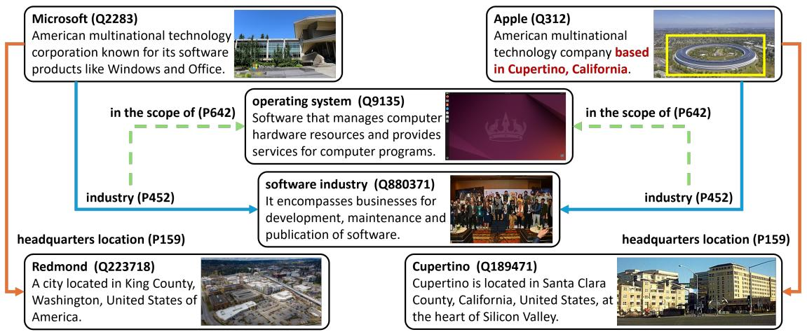
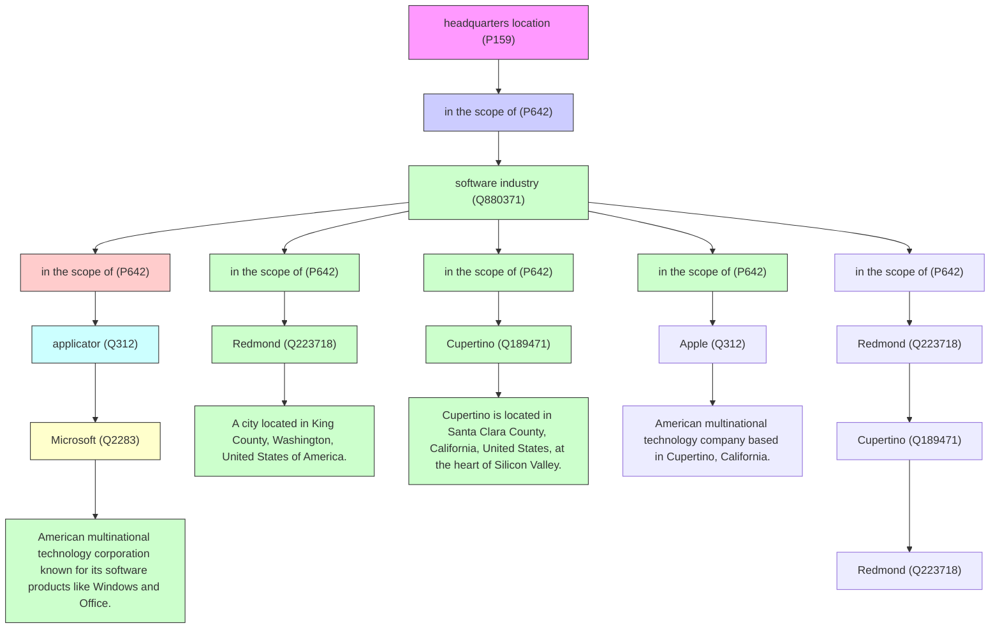
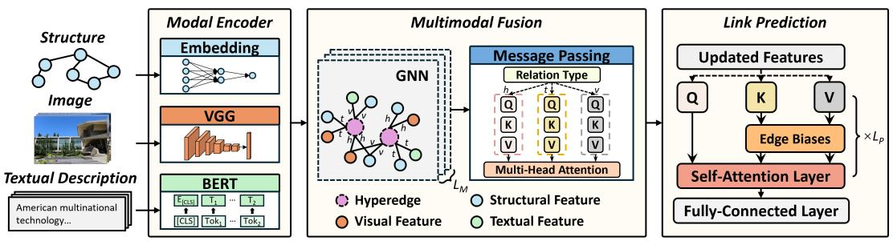
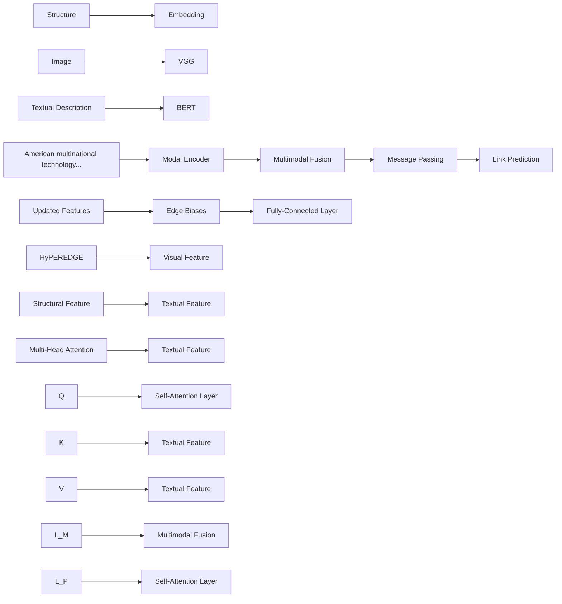
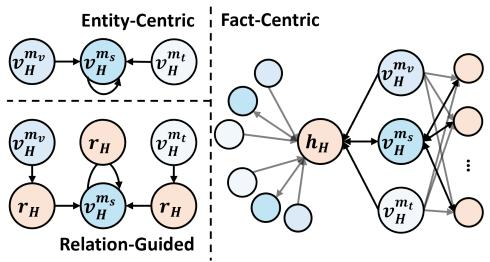
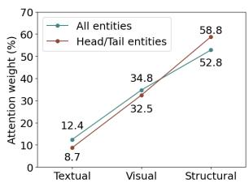
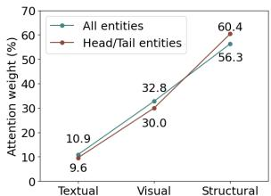
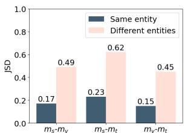
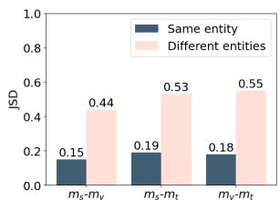

# HyperFM: Fact-Centric Multimodal Fusion for Link Prediction over Hyper-Relational Knowledge Graphs

Yuhuan Lu, Weijian Yu, Xin Jing, Dingqi Yang

State Key Laboratory of Internet of Things for Smart City and

Department of Computer and Information Science, University of Macau, China

{yc17462, yc47946, yc27431, dingqiyang}@um.edu.mo

# Abstract

With the ubiquity of hyper-relational facts in modern Knowledge Graphs (KGs), existing link prediction techniques mostly focus on learning the sophisticated relationships among multiple entities and relations contained in a fact, while ignoring the multimodal information, which often provides additional clues to boost link prediction performance. Nevertheless, traditional multimodal fusion approaches, which are mainly designed for triple facts under either entity-centric or relation-guided fusion schemes, fail to integrate the multimodal information with the rich context of the hyperrelational fact consisting of multiple entities and relations. Against this background, we propose HyperFM, a Hyper-relational Factcentric Multimodal Fusion technique. It effectively captures the intricate interactions between different data modalities while accommodating the hyper-relational structure of the KG in a fact-centric manner via a customized Hypergraph Transformer. We evaluate HyperFM against a sizeable collection of baselines in link prediction tasks on two real-world KG datasets. The results show that HyperFM consistently achieves the best performance, yielding an average improvement of 6.0-6.8% over the best-performing baselines on the two datasets. Moreover, a series of ablation studies systematically validate our fact-centric fusion scheme.

# 1 Introduction

Knowledge Graphs (KGs) are semantic networks that represent relationships between entities. They have underpinned a wide range of real-world applications, including commonsense reasoning (Lin et al., 2019), recommender systems (Wang et al., 2019), and urban computing (Zhao et al., 2022a). While early KGs are usually limited to binary relationships and represent facts as triplets, modern KGs such as Freebase (Bollacker et al., 2008) and Wikidata (Wikidata, 2022) often consist of hyperrelational facts, which comprises a base triplet (h, r, t) along with additional key-value pairs (k, v) further enriching the information about the base triplet, expressed as (h, r, t, k1, v1, ...). For instance, one hyper-relational fact in Figure 1 can be presented as (Microsoft, industry, software industry, in the scope of, operating system). To effectively make use of such KGs, link prediction is widely adopted as a promising solution for KG completion and reasoning, aiming to predict missing entities or relations in a fact (Bordes et al., 2013).

Recent studies have substantiated the efficacy of hyper-relational KG embeddings in link prediction. They strive to capture the structural information of the KG by learning the correlation between entities and relations in each fact with Convolutional Neural Networks (CNNs) (Rosso et al., 2020), Graph Neural Networks (GNNs) (Galkin et al., 2020), or Transformers (Wang et al., 2021). However, existing approaches often overlook the significance of multimodal data in the KG, which can provide crucial information to distinguish the subtle differences between entities beyond the KG structure, thus leading to more accurate link prediction. For instance, suppose that the task is to predict the missing triplet (Apple, headquarters location, ?) as shown in Figure 1. It is easy to make the wrong prediction Redmond based on the structural information only, since the entity Apple presents a similar structural role to the entity Microsoft with the common relation industry, tail software industry, and key-value pair (in the scope of, operating system). Nevertheless, by incorporating the visual and textual modalities, the image and textual description of Apple both prompt the answer Cupertino. The visual modality includes the image of Apple’s headquarters, while the textual description highlights specific information about its location. Therefore, multimodal information can be used to distinguish the subtle differences between entities based on their unique attributes, thereby boosting the link prediction performance.



<details>
<summary>flowchart</summary>


</details>

Figure 1: Real-world facts with multimodal information on Wikidata.

In the current literature, existing works targeting multimodal KGs mainly focus on the representation of triplets and are incapable of learning hyperrelational facts (Chen et al., 2024). Moreover, in their multimodal fusion process, most methods adopt an entity-centric scheme, neglecting the informative fact context (Li et al., 2023; Lee et al., 2023). For example, the missing tail in the triplet (Apple, headquarters location, ?) is inferred to be a location based on the relation headquarters location, suggesting that attention should be put on location-specific information within the visual and textual modalities. Although some further methods (Zhang et al., 2024a) incorporate relational context to adaptively adjust the weights of different modalities, such a relation-guided scheme oversimplifies the rich context of a hyper-relational fact containing multiple entities and relations, where the interactions among modalities should be assumed on the basis of the hyper-relationality of the fact.

Against this background, we propose a novel Hyper-relational Fact-centric Multimodal Fusion (HyperFM) technique. HyperFM follows a factcentric design, where multiple entities of a fact and their multi-modality features are integrated under a hypergraph, capturing the intricate interactions between different modalities while accommodating the hyper-relational structure of the KG. To achieve effective multimodal fusion, we design a customized Hypergraph Transformer to comprehensively learn the interaction across multimodal features under the hypergraph setting. For resolving link prediction tasks, an edge-biased selfattention layer is used to further capture the correlation between elements in a fact while accommodating the heterogeneous connections between them. We summarize our contributions as follows:

• We study the problem of link prediction over multimodal hyper-relational KGs by addressing two key drawbacks of existing approaches: 1) hyper-relational KG models often ignore the multimodal information, and 2) multimodal KG models fail to incorporate the hyper-relationality into the multimodal fusion process.   
• We propose HyperFM, a Hyper-relational Factcentric Multimodal Fusion technique for link prediction tasks over multimodal hyper-relational KGs; it can capture the intricate interactions between different data modalities while accommodating the hyper-relational structure of the KG via a customized Hypergraph Transformer.   
• We thoroughly evaluate the performance of HyperFM against a wide range of state-of-the-art baselines on two multimodal hyper-relational KG datasets. Results show that HyperFM consistently outperforms all baselines, with an average improvement of 6.0-6.8% over the bestperforming baselines on the two datasets. Furthermore, a series of ablation studies systematically validate our fact-centric fusion scheme.

# 2 Related Work

Hyper-relational KG modeling. Traditional KGs are usually represented by a set of triplets, which fail to capture the ubiquitous hyper-relational facts where multiple entities are connected via multiple relations (Rosso et al., 2020). To address this issue, the n-ary representation has been used to model a hyper-relational fact by transforming it into a set of relation-entity pairs (Wen et al., 2016; Zhang et al., 2018; Guan et al., 2019; Fatemi et al., 2021; Liu et al., 2021). However, the nary representation loses essential information encoded by the base triplet, thus showing suboptimal performance in link prediction. In this context, models such as HINGE (Rosso et al., 2020), NeuInfer (Guan et al., 2020), and ShrinkE (Xiong et al., 2023) keep the base triplet of a hyperrelational fact by learning from the base triplet and its associated key-value pairs via different channels. Following this representation, models like GRAN (Wang et al., 2021), HyNT (Chung et al., 2023), and HyperFormer (Hu et al., 2023) employ Transformer to capture the sophisticated correlation between elements in a fact. Recently, the (graph)encoder-(Transformer)decoder architecture has shown promising results in resolving link prediction tasks. In line with this paradigm, models like MSeaHKG (Di and Chen, 2021), StarE (Galkin et al., 2020), Hy-Transformer (Yu and Yang, 2021), QUAD (Shomer et al., 2022), and HAHE (Luo et al., 2023) focus on designing various graph encoders to capture the rich semantics of entities and relations. Different from these existing works that often ignore the multimodal information in hyperrelational KGs, we propose in this paper HyperFM to subtly integrate multimodal information to further boost link prediction performance.

Multimodal KG modeling. Some recent studies have enriched the original KG dataset and attempted to capture multimodal information for link prediction, especially through the incorporation of images and textual descriptions of entities (Xie et al., 2017; Pezeshkpour et al., 2018; Liu et al., 2019). A few early works represent different modalities in a unified space to extract common features; however, they failed to maintain the distinctive characteristics of each modality (Chen et al., 2022; Xu et al., 2022; Wang et al., 2023b). Therefore, models like IMF (Li et al., 2023), VISTA (Lee et al., 2023), NativE (Zhang et al., 2024a), MoSE (Zhao et al., 2022b), and AdaMF (Zhang et al., 2024b) capture complex interactions between modalities while retaining unique information about each modality. However, these multimodal KG embedding methods are mainly designed for triple facts, under either entity-centric or relation-guided fusion schemes, and fail to integrate the multimodal information with the rich context of the hyper-relational fact consisting of multiple entities and relations. In this paper, we propose HyperFM following a factcentric design capturing the intricate interactions between different modalities while accommodating the hyper-relational structure of the KG.

# 3 Preliminaries

In this section, we introduce key concepts about the Multimodal Hyper-relational Knowledge Graph (MHKG), including the definition of MHKGs and the link prediction task over MHKGs.

Definition 3.1. Multimodal Hyper-Relational Knowledge Graph. An MHKG consists of multimodal hyper-relational facts, where a hyper-relational fact is represented as $\{ ( h , r , t ) , \{ ( k _ { i } , v _ { i } ) \} _ { i = 1 } ^ { n } | h , t , v _ { i } \in \mathcal { E } , r , k _ { i } \in \mathcal { R } \}$ , where $( h , r , t )$ denotes the base triplet and (ki, vi) refers to an additional key-value pair. Here, and indicate the entity and relation sets, respectively. In a multimodal hyper-relational fact, each entity contains multiple features of different modalities. We denote the multimodality by $\mathcal { M } = \{ m _ { s } , m _ { v } , m _ { t } \}$ , representing the structural, visual, and textual modalities, respectively. Accordingly, for an entity $e \in { \mathcal { E } } .$ , its multimodal information is represented by $( e _ { m _ { s } } , e _ { m _ { v } } , e _ { m _ { t } } )$ .

Definition 3.2. Link Prediction over MHKGs. The link prediction task aims to predict any missing element in a hyper-relational fact. The missing element could be an entity from $\{ h , t , v _ { 1 } , \ldots , v _ { n } \}$ or a relation from $\{ r , k _ { 1 } , \ldots , k _ { n } \}$ .

# 4 HyperFM

The overall architecture of our Hyper-relational Fact-centric Multimodal Fusion (HyperFM) is shown in Figure 2. Specifically, it consists of three modules: 1) a series of modal encoders that extract the initial features of each modality for subsequent multimodal fusion; 2) a multimodal fusion module that integrates features from diverse modalities and captures their interactions; and 3) a link prediction module that resolves the link prediction tasks.

# 4.1 Modal Encoder

We design modal encoders similar to (Li et al., 2023; Lee et al., 2023), utilizing pre-trained VGG16 and BERT as the visual and textual encoders, respectively. For the structural encoder, we employ learnable embeddings to refine entity and relation representations during the multimodal fusion process. Detailed descriptions of the modal encoders are provided in Appendix A. Note that our HyperFM can flexibly adopt any modal encoders as plug-and-play components. In the following, we focus on the design of the multimodal fusion process, which is our core contribution.



<details>
<summary>flowchart</summary>


</details>

Figure 2: The overall architecture of HyperFM for link prediction over MHKGs.

# 4.2 Multimodal Fusion

The multimodal fusion module captures the interactions between different modalities and learns multimodal representations that enhance link prediction performance. Most current multimodal KG embedding methods fuse multimodal information without considering the rich context of a hyper-relational fact, which consists of multiple entities and relations. To this end, we propose a Hypergraph Transformer that integrates multimodal information on the basis of the hyper-relationality of the KG.

Hypergraph construction for MHKG. To effectively integrate multimodal data in the KG, we consider the inherent hypergraph nature of MHKGs as the basis, and then aggregate multimodal features through message passing on the graph. Specifically, a multimodal hyper-relational fact involves more than two entities, with each containing up to three modalities; the entire MHKG forms a hypergraph. To effectively represent the MHKG, inspired by the incidence graph representation of a hypergraph (Antelmi et al., 2023), we propose a novel hypergraph construction strategy. The hypergraph of the MHKG is represented by $\mathcal { G } _ { H } = \{ \mathcal { E } _ { H } , \mathcal { H } _ { H } , \mathcal { T } _ { H } \}$ . Here, $\mathcal { H } _ { H }$ is the hyperedge set, with each hyperedge corresponding to a multimodal hyper-relational fact and the entities of the fact being an incident of the hyperedge. The node $\mathcal { E } _ { H } = \left\{ \mathcal { E } _ { H } ^ { m _ { s } } , \mathcal { E } _ { H } ^ { m _ { v } } , \mathcal { E } _ { H } ^ { m _ { t } } \right\}$ , where f structu $\mathcal { E } _ { H } ^ { m _ { s } } , \mathcal { E } _ { H } ^ { m _ { v } }$ , and, and $\mathcal { E } _ { H } ^ { m _ { t } }$ EH textual modalities, respectively. H R|EH |×|HH | $\mathcal { T } _ { H } \in \mathbb { R } ^ { | \mathcal { E } _ { H } | \times | \mathcal { H } _ { H } | }$



<details>
<summary>flowchart</summary>

```mermaid
graph TD
    subgraph_Entity_Centric["Entity-Centric"]
        A["v_H^m_t"] --> B["v_H^m_s"]
        C["v_H^m_t"] --> D["v_H^m_s"]
        E["v_H^m_t"] --> F["v_H^m_s"]
        G["v_H^m_t"] --> H["v_H^m_s"]
        I["v_H^m_t"] --> J["v_H^m_s"]
        K["v_H^m_t"] --> L["v_H^m_s"]
        M["v_H^m_t"] --> N["v_H^m_s"]
    end

    subgraph_Fact_Centric["Fact-Centric"]
        O["h_H"] --> P["v_H^m_t"]
        O --> Q["v_H^m_s"]
        O --> R["v_H^m_t"]
        S["v_H^m_t"] --> T["v_H^m_s"]
        U["v_H^m_t"] --> V["v_H^m_s"]
        W["v_H^m_t"] --> X["v_H^m_s"]
        Y["..."] --> Z["..."]
    end

    style Entity_Centric fill:#f9f,stroke:#333
    style Fact_Centric fill:#bbf,stroke:#333
```
</details>

Figure 3: Comparison of the three fusion schemes 1) the entity-centric scheme fuses information of other modalities directly to entities (the structural modality); 2) the relation-guided scheme fuse information of other modalities to entities under the guidance of the relation of the given triplet $r _ { H } ; 3 )$ our fact-centric scheme fuses information of different modality to a hyper-relational fact (hyperedge), which can flexibly accommodate multimodality and hyper-relationality at the same time.

is an incidence matrix defined by:

$$
\begin{array}{l} \mathcal {I} _ {H} \left(v _ {H}, h _ {H}\right) = 1, \text {   if   } v _ {H} \in h _ {H}, \\ \mathcal {I} _ {H} \left(v _ {H}, h _ {H}\right) = 0, \text {   if   } v _ {H} \notin h. \end{array} \tag {1}
$$

$$
\mathcal {I} _ {H} (v _ {H}, h _ {H}) = 0, \text {   if   } v _ {H} \notin h _ {H}.
$$

where $v _ { H } \in \mathcal { E } _ { H }$ and $h _ { H } \in \mathcal { H } _ { H }$ . If $v _ { H }$ belongs to the hyperedge (fact) $h _ { H }$ , then $v _ { H } \in h _ { H }$ ; otherwise, $v _ { H } \notin h _ { H }$ . The constructed hypergraph serves as the basis for achieving fact-centric multimodal fusion. Figure 3 compares our fact-centric scheme against the existing entity-centric (Li et al., 2023; Lee et al., 2023; Zhang et al., 2024b) and relationguided (Zhao et al., 2022b; Zhang et al., 2024a) fusion schemes.

Hypergraph Transformer layer. Based on the built hypergraph, we model the interactions between multimodal features by propagating information between nodes and hyperedges using a GNN. For informative message passing, we incorporate the multi-head attention mechanism into the GNN, where each head corresponds to a relation type, discriminating the different positions of modalities within a fact. The aggregation function and update function in the GNN are designed as follows:

1) Aggregation function: The aggregation process is a bi-directional operation, including node-tohyperedge (N-H) and hyperedge-to-node (H-N) steps. To apply multi-head attention, we first define the relation type between hyperedges and nodes as (here, $v _ { H } \in h _ { H } )$ :

$$
r (h _ {H}, v _ {H}) = \left\{ \begin{array}{l l} r _ {h}, & \text { if } p _ {h _ {H}} (v _ {H}) = \text { head } \\ r _ {t}, & \text { if } p _ {h _ {H}} (v _ {H}) = \text { tail } \\ r _ {v}, & \text { if } p _ {h _ {H}} (v _ {H}) = \text { value } \end{array} \right. \tag {2}
$$

where $p _ { h _ { H } } \left( v _ { H } \right)$ denotes the position of $v _ { H }$ in $h _ { H }$ . There are three possible positions of a node: head, tail, and value. Accordingly, $r _ { h } , \ r _ { t } .$ , and $r _ { v }$ represent the three relation types between hyperedges and nodes. Notably, relation types are independent of relation direction, meaning that $r ( h _ { H } , v _ { H } ) = r ( v _ { H } , h _ { H } )$ . We denote the embeddings of $h _ { H }$ and $v _ { H }$ by $\mathbf { h } _ { H }$ and $\mathbf { v } _ { H }$ , respectively. Notably, the input to the first layer consists of the initialized embeddings of hyperedges and the embeddings of nodes, which are obtained from the output of the modal encoders.

For N-H aggregation, we denote the embeddings of nodes connecting to the hyperedge $h _ { H }$ with relation type $r _ { j }$ by $\mathbf { V } _ { H } ^ { j }$ . Then the attention score of this specific relation type for $h _ { H }$ is computed by:

$$
\mathbf {a} _ {j} = \varphi_ {\text { Softmax }} \left(\frac {\mathbf {q} _ {j} \mathbf {K} _ {j}}{\sqrt {d}}\right) \tag {3}
$$

where $\mathbf { q } _ { j } = \mathbf { h } _ { H } \mathbf { W } _ { Q _ { j } }$ and $\mathbf { K } _ { j } = \mathbf { V } _ { H } ^ { j } \mathbf { W } _ { K _ { j } } . \mathbf { W } _ { Q _ { j } }$ j and $\mathbf { W } _ { K _ { j } }$ are the query and key transformation matrices for relation type $r _ { j }$ , respectively. φSoftmax $( \cdot )$ refers to the Softmax function and d is the dimension of embeddings incorporated for numerical stability. Subsequently, the attention score becomes relation type-aware, accounting for the heterogeneous relationships among elements within a fact. Afterward, the aggregated node embedding of relation type $r _ { j }$ for $h _ { H }$ is obtained by:

$$
\hat {\mathbf {v}} _ {H} ^ {j} = \mathbf {V} _ {H} ^ {j} \mathbf {a} _ {j} \tag {4}
$$

We implement multi-head attention and gain a set of aggregated embeddings $\left\{ \hat { \mathbf { v } } _ { H } ^ { j } \mid j \in [ 1 , n _ { r } ] \right\}$ , where $n _ { r }$ denotes the number of relation types for $h _ { H }$ . These aggregated embeddings can be further integrated by:

$$
\hat {\mathbf {v}} _ {H} = \varphi_ {\mathrm{MLP}} \left(\varphi_ {\text {Concat}} \left(\left\{\hat {\mathbf {v}} _ {H} ^ {j} \mid j \in [ 1, n _ {r} ] \right\}\right)\right) \tag {5}
$$

where $\varphi _ { \mathrm { M L P } } ( \cdot )$ and $\varphi _ { \mathrm { C o n c a t } } \left( \cdot \right)$ denote the MLP and concatenation operations, respectively.

For H-N aggregation, we apply a similar procedure as in N-H aggregation and obtain the refined aggregated embedding for $v _ { H }$ by:

$$
\hat {\mathbf {h}} _ {H} = \varphi_ {\mathrm{MLP}} \left(\varphi_ {\text {Concat}} \left(\left\{\hat {\mathbf {h}} _ {H} ^ {j} \mid j \in [ 1, n _ {r} ] \right\}\right)\right) \tag {6}
$$

where $\left\{ \hat { \mathbf { h } } _ { H } ^ { j } \mid j \in [ 1 , n _ { r } ] \right\}$ denotes the set of aggregated embeddings of hyperedges that connect to vH through different relation types.

2) Update function: We use a Feed-Forward Network (FFN) to update the aggregated embeddings:

$$
\widetilde {\mathbf {h}} _ {H} = \varphi_ {\mathrm{LN}} \left(\varphi_ {\mathrm{FFN}} (\hat {\mathbf {v}} _ {H}) + \mathbf {h} _ {H}\right) \tag {7}
$$

$$
\widetilde {\mathbf {v}} _ {H} = \varphi_ {\mathrm{LN}} \left(\varphi_ {\mathrm{FFN}} \left(\hat {\mathbf {h}} _ {H}\right) + \mathbf {v} _ {H}\right) \tag {8}
$$

Note that we employ Layer Normalization $\varphi _ { \mathrm { L N } } ( \cdot )$ (Ba et al., 2016) for training stability.

By stacking multiple Hypergraph Transformer layers, high-order multimodal interactions with relation type-aware semantics are extracted. The updated features of the structural modality are then read out from the final layer $L _ { M }$ for link prediction:

$$
\mathbf {X} _ {e} = \left\{\mathbf {v} _ {H} ^ {(L _ {M})} | v _ {H} \in \mathcal {E} _ {H} ^ {m _ {s}} \right\} \tag {9}
$$

In summary, our multimodal fusion module first builds a fact-centric hypergraph that flexibly accommodates multimodality and hyper-relationality at the same time, and then designs the Hypergraph Transformer applying multi-head attention to aggregate multimodal information while discriminating the different positions of modalities in a fact.

# 4.3 Link Prediction

The link prediction module aims at predicting the missing element in a hyper-relational fact, where the missing element is represented by a learnable [MASK] token. We use an edge-biased selfattention layer to make predictions.

Edge-biased self-attention layer. Through the previous module, a hyper-relational fact $\{ ( h , r , t ) , \{ ( k _ { i } , v _ { i } ) \} _ { i = 1 } ^ { n } \}$ is encoded into $\left\{ ( \mathbf { x } _ { h } , \mathbf { x } _ { r } , \mathbf { x } _ { t } ) , \{ ( \mathbf { x } _ { k _ { i } } , \bar { \mathbf { x } _ { v _ { i } } } ) \} _ { i = 1 } ^ { n } \right\}$ , where $\{ \mathbf { x } _ { h } , \mathbf { x } _ { t } , \mathbf { x } _ { v _ { i } } \} \ \ \in \ \mathbf { X } _ { \epsilon }$ denote the updated entity features and $\left\{ { \bf x } _ { r } , { \bf x } _ { k _ { i } } \right\}$ denote the initialized relation features. For an element $\mathbf { x } _ { i }$ in the fact, its features can be further updated by the self-attention

<table><tr><td>Dataset</td><td>Entities</td><td>Entities with images</td><td>Entities with text</td><td>Relations</td><td>Training</td><td>Test</td><td>Facts (Hyper%)</td><td>Arity</td></tr><tr><td>WikiPeople</td><td>34,839</td><td>33,265</td><td>34,839</td><td>178</td><td>294,439</td><td>37,712</td><td>332,151 (2.6%)</td><td>2-7</td></tr><tr><td>WD50K</td><td>47,156</td><td>43,823</td><td>47,156</td><td>532</td><td>166,435</td><td>46,159</td><td>212,594 (13.6%)</td><td>2-67</td></tr></table>

Table 1: Dataset statistics. The columns (from left to right) denote the number of entities, entities with images, entities with textual descriptions, relations, training facts, test facts, all facts (the ratio of hyper-relational facts), and the range of arity.

mechanism:

$$
\alpha_ {i j} = \frac {\left(\mathbf {W} _ {Q} ^ {L P} \mathbf {x} _ {i} + \mathbf {b} _ {i j} ^ {Q}\right) ^ {\top} \left(\mathbf {W} _ {K} ^ {L P} \mathbf {x} _ {j} + \mathbf {b} _ {i j} ^ {K}\right)}{\sqrt {d}} \tag {10}
$$

$$
\bar {\mathbf {x}} _ {i} = \sum_ {j = 1} ^ {2 n + 2} \frac {\exp (\alpha_ {i j})}{\sum_ {k = 1} ^ {2 n + 2} \exp (\alpha_ {i k})} \left(\mathbf {W} _ {V} ^ {L P} \mathbf {x} _ {j} + \mathbf {b} _ {i j} ^ {V}\right) + \mathbf {x} _ {i} \tag {11}
$$

where $\mathbf { W } _ { Q } ^ { L P } , \mathbf { W } _ { K } ^ { L P }$ LPK , and WLPV $\mathbf { W } _ { V } ^ { L P }$ are linear transformation matrices of query, key, and value, respectively. 2n + 2 is the total number of input elements excluding $\mathbf { x } _ { i } . ~ \alpha _ { i j }$ refers to the importance of $\mathbf { x } _ { j }$ to xi. bQ, $\mathbf { b } _ { i j } ^ { Q } , \mathbf { b } _ { i j } ^ { K }$ , and $\mathbf { b } _ { i j } ^ { V }$ are edge biases used to accommodate the heterogeneous connections between different elements in the fact. We design five categories of edge biases based on the edge heterogeneity: $( { \bf x } _ { h } , { \bf x } _ { r } ) , \ ( { \bf x } _ { t } , { \bf x } _ { r } ) , \ ( { \bf x } _ { r } , { \bf x } _ { k _ { i } } ) , \ ( { \bf x } _ { k _ { i } } , { \bf x } _ { v _ { i } } )$ , and others not included in the above categories. Note that the edge biases are independent of edge direction; the edge biases of $\left( \mathbf { x } _ { h } , \mathbf { x } _ { r } \right)$ and $\left( \mathbf { x } _ { r } , \mathbf { x } _ { h } \right)$ are thus the same. With an $L _ { P } \mathrm { - l a y e r }$ edge-biased self-attention network, an informative feature of the [MASK] token is generated, providing a rich context for predicting the missing element.

Fully-connected decoder. We denote the final output embedding of the [MASK] token by $\bar { \mathbf { x } } _ { M } . \mathbf { A }$ fully-connected layer with Softmax function is then employed to produce the link prediction results:

$$
\mathbf {p} = \varphi_ {\text { Softmax }} \left(\mathbf {W} _ {M} \bar {\mathbf {x}} _ {M} + \mathbf {b} _ {M}\right) \tag {12}
$$

where $\mathbf { W } _ { M }$ is the weight matrix of the MLP in the structural encoder, and b denotes the learnable entity bias. The prediction outcome p is a probability distribution over the entity set $\mathcal { E } ,$ indicating the likelihood of each entity being the actual missing element. Notably when predicting missing relations, ${ \bf W } _ { M }$ and ${ \bf b } _ { M }$ are the weight matrix of the initial embedding layer and the learnable relation bias, respectively.

Our model training process optimizes the crossentropy loss in the link prediction tasks using Adam optimizer (Kingma, 2014):

$$
\mathcal {L} = \sum_ {i = 1} ^ {| \mathcal {E} |} \mathbf {y} _ {i} \log \mathbf {p} _ {i} \tag {13}
$$

where ${ \bf y } _ { i }$ is the ground-truth label for i-th entry. The code of HyperFM is publicly available online1.

# 5 Experiments

# 5.1 Experimental Setup

Datasets. The experiments are conducted on two widely-used hyper-relational KG datasets, WikiPeople (Guan et al., 2019) and WD50K (Galkin et al., 2020), with pre-defined data splits provided for fair comparison. Since these datasets do not include multimodal information, we crawl images and textual descriptions of entities from their data source Wikidata. Specifically, we extract the image for each entity through the “image” property and obtain the textual description from the “description” label. The detailed statistics of both datasets are presented in Table 1.

Baselines. We compare our HyperFM with a wide range of state-of-the-art baselines, which are divided into two categories. The first category includes hyper-relational KG (HKG) embedding methods: m-TransH (Wen et al., 2016); RAE (Zhang et al., 2018); NaLP (Guan et al., 2019); NeuInfer (Guan et al., 2020); HINGE (Rosso et al., 2020); ShrinkE (Xiong et al., 2023); Hy-ConvE (Wang et al., 2023a); HJE (Li et al., 2024); GRAN (Wang et al., 2021); MSeaHKG (Di and Chen, 2021); HyNT (Chung et al., 2023); Hyper-Former (Hu et al., 2023); StarE (Galkin et al., 2020); Hy-Transformer (Yu and Yang, 2021); QUAD (Shomer et al., 2022); HAHE (Luo et al., 2023). The second category consists of multimodal KG (MKG) embedding methods: IMF (Li et al., 2023); VISTA (Lee et al., 2023); NativE (Zhang et al., 2024a); MoSE (Zhao et al., 2022b); AdaMF (Zhang et al., 2024b). The detailed descriptions of baselines are in Appendix B.

<table><tr><td rowspan="3">Method Type</td><td rowspan="3">Method</td><td colspan="6">WikiPeople</td><td colspan="6">WD50K</td></tr><tr><td colspan="3">All entities</td><td colspan="3">Head/Tail</td><td colspan="3">All entities</td><td colspan="3">Head/Tail</td></tr><tr><td>MRR</td><td>H@1</td><td>H@10</td><td>MRR</td><td>H@1</td><td>H@10</td><td>MRR</td><td>H@1</td><td>H@10</td><td>MRR</td><td>H@1</td><td>H@10</td></tr><tr><td rowspan="16">HKG Embedding</td><td>m-TransH</td><td>0.167</td><td>0.162</td><td>0.354</td><td>0.081</td><td>0.079</td><td>0.321</td><td>0.074</td><td>0.072</td><td>0.198</td><td>0.058</td><td>0.057</td><td>0.298</td></tr><tr><td>RAE</td><td>0.193</td><td>0.175</td><td>0.388</td><td>0.073</td><td>0.073</td><td>0.305</td><td>0.132</td><td>0.118</td><td>0.243</td><td>0.062</td><td>0.061</td><td>0.325</td></tr><tr><td>NaLP</td><td>0.327</td><td>0.265</td><td>0.449</td><td>0.401</td><td>0.327</td><td>0.535</td><td>0.223</td><td>0.162</td><td>0.337</td><td>0.135</td><td>0.134</td><td>0.368</td></tr><tr><td>NeuInfer</td><td>0.349</td><td>0.281</td><td>0.506</td><td>0.483</td><td>0.416</td><td>0.581</td><td>0.235</td><td>0.178</td><td>0.355</td><td>0.257</td><td>0.181</td><td>0.396</td></tr><tr><td>HINGE</td><td>0.367</td><td>0.305</td><td>0.488</td><td>0.447</td><td>0.381</td><td>0.567</td><td>0.245</td><td>0.181</td><td>0.362</td><td>0.243</td><td>0.169</td><td>0.392</td></tr><tr><td>ShrinkE</td><td></td><td>N/A</td><td></td><td>0.489</td><td>0.419</td><td>0.594</td><td></td><td>N/A</td><td></td><td>0.321</td><td>0.237</td><td>0.462</td></tr><tr><td>HyConvE</td><td>0.277</td><td>0.172</td><td>0.467</td><td>0.275</td><td>0.171</td><td>0.465</td><td>0.244</td><td>0.171</td><td>0.382</td><td>0.226</td><td>0.154</td><td>0.365</td></tr><tr><td>HJE</td><td>0.472</td><td>0.387</td><td>0.609</td><td>0.471</td><td>0.387</td><td>0.608</td><td>0.345</td><td>0.274</td><td>0.477</td><td>0.322</td><td>0.252</td><td>0.455</td></tr><tr><td>GRAN</td><td>0.494</td><td> $\underline{0.423}$ </td><td>0.617</td><td> $\underline{0.492}$ </td><td> $\underline{0.420}$ </td><td>0.616</td><td>0.361</td><td>0.287</td><td>0.504</td><td>0.327</td><td>0.252</td><td>0.473</td></tr><tr><td>MSeaHKG</td><td>0.393</td><td>0.301</td><td>0.562</td><td> $\underline{0.456}$ </td><td> $\underline{0.392}$ </td><td>0.607</td><td>0.324</td><td>0.239</td><td>0.481</td><td>0.287</td><td>0.204</td><td>0.416</td></tr><tr><td>HyNT</td><td>0.457</td><td>0.376</td><td>0.597</td><td>0.459</td><td>0.377</td><td>0.597</td><td>0.337</td><td>0.271</td><td>0.464</td><td>0.308</td><td>0.240</td><td>0.439</td></tr><tr><td>HyperFormer</td><td></td><td>N/A</td><td></td><td>0.473</td><td>0.378</td><td> $\underline{0.626}$ </td><td></td><td>N/A</td><td></td><td>0.332</td><td>0.249</td><td>0.479</td></tr><tr><td>StarE</td><td></td><td>N/A</td><td></td><td>0.394</td><td>0.290</td><td>0.593</td><td></td><td>N/A</td><td></td><td>0.315</td><td>0.240</td><td>0.458</td></tr><tr><td>Hy-Transformer</td><td></td><td>N/A</td><td></td><td>0.399</td><td>0.298</td><td>0.588</td><td></td><td>N/A</td><td></td><td>0.314</td><td>0.241</td><td>0.453</td></tr><tr><td>QUAD</td><td></td><td>N/A</td><td></td><td>0.379</td><td>0.272</td><td>0.583</td><td></td><td>N/A</td><td></td><td>0.316</td><td>0.245</td><td>0.451</td></tr><tr><td>HAHE</td><td> $\underline{0.495}$ </td><td>0.421</td><td> $\underline{0.623}$ </td><td>0.492</td><td>0.418</td><td>0.620</td><td> $\underline{0.379}$ </td><td> $\underline{0.305}$ </td><td> $\underline{0.521}$ </td><td>0.345</td><td>0.269</td><td>0.491</td></tr><tr><td rowspan="5">MKG Embedding</td><td>IMF</td><td></td><td>N/A</td><td></td><td>0.462</td><td>0.393</td><td>0.605</td><td></td><td>N/A</td><td></td><td>0.298</td><td>0.212</td><td>0.429</td></tr><tr><td>VISTA</td><td></td><td>N/A</td><td></td><td>0.457</td><td>0.389</td><td>0.593</td><td></td><td>N/A</td><td></td><td>0.251</td><td>0.174</td><td>0.408</td></tr><tr><td>NativE</td><td></td><td>N/A</td><td></td><td>0.458</td><td>0.391</td><td>0.582</td><td></td><td>N/A</td><td></td><td>0.252</td><td>0.173</td><td>0.388</td></tr><tr><td>MoSE</td><td></td><td>N/A</td><td></td><td>0.412</td><td>0.349</td><td>0.557</td><td></td><td>N/A</td><td></td><td>0.227</td><td>0.151</td><td>0.346</td></tr><tr><td>AdaMF</td><td></td><td>N/A</td><td></td><td>0.407</td><td>0.331</td><td>0.559</td><td></td><td>N/A</td><td></td><td>0.214</td><td>0.136</td><td>0.342</td></tr><tr><td>MHKG Embedding</td><td>HyperFM</td><td> $\underline{0.515}$ </td><td> $\underline{0.448}$ </td><td> $\underline{0.645}$ </td><td> $\underline{0.514}$ </td><td> $\underline{0.446}$ </td><td> $\underline{0.643}$ </td><td> $\underline{0.408}$ </td><td> $\underline{0.337}$ </td><td> $\underline{0.546}$ </td><td> $\underline{0.375}$ </td><td> $\underline{0.302}$ </td><td> $\underline{0.523}$ </td></tr></table>

Table 2: Overall link prediction performance (All entities and Head/Tail entities). “N/A” indicates tasks that the method cannot be applied to (specifically, ShrinkE, HyperFormer, StarE, Hy-Transformer, QUAD, IMF, VISTA, NativE, MoSE, and AdaMF can only predict head/tail entities).

Evaluation metrics. In the link prediction task, a ranking list of entities is generated for the missing entity in a test fact. We then apply the filtered setting to remove any potential true entities other than the ground-truth entity. The prediction results are evaluated using Mean Reciprocal Rank (MRR), Hits@1, and Hits@10. We report both results on all entities and on head/tail entities only (because some baselines can only predict head/tail entities).

Hyperparameters and environment. Our HyperFM is trained for 300 epochs using the early stopping strategy on our benchmark hardware (Intel Xeon 6416H@2.20GHz, NVIDIA GeForce RTX4090 24GB, Ubuntu 22.04). Three key hyperparameters for HyperFM are the number of Hypergraph Transformer layers $L _ { M }$ , the number of edge-biased self-attention layers LP , and the embedding dimension d. The optimal hyperparameter settings $( L _ { M } = 2 , L _ { P } = 1 2 , d = 2 5 6 )$ on both datasets are identified by grid search (more details in Appendix C).

Efficiency of Hypergraph Construction. As hyper-relational facts inherently form a hypergraph structure, there is no need to manually design a specific hypergraph for hyper-relational facts. As a result, the cost of constructing the hypergraph in the context of HKG embedding is negligible, because they are ready-to-use. For reference, the whole graph indexing process for HyperFM takes only 46.2 seconds on the WikiPeople dataset and 57.6 seconds on the WD50K dataset. In comparison, the total training time on the WikiPeople and WD50K datasets is 18.6 hours and 14.3 hours, respectively. Thus, the time required for graph indexing is negligible relative to the overall training process.

# 5.2 Overall Performance

Table 2 presents the link prediction performance on both datasets. The best results are highlighted in bold, while the second-best results are underlined. We observe that HyperFM consistently outperforms all baselines, achieving 6.0% and 6.8% improvements on average over the best-performing baselines in predicting all entities and head/tail entities, respectively.

Note that HyperFM performs better on WD50K than on WikiPeople, due to the larger ratio of hyper-relational facts in WD50K, as HyperFM is specifically designed for learning from such facts. We also find that three MKG embedding methods achieve performance comparable to HKG embedding methods in predicting head/tail entities, even without utilizing key-value pair information. This suggests that multimodal information is indeed helpful in link prediction. These observations further support the design principle of our HyperFM, which incorporates features from different modalities and integrates them through a hypergraph structure. We also report the results on relation prediction in Appendix D.

<table><tr><td rowspan="3">Method</td><td colspan="6">WikiPeople</td><td colspan="6">WD50K</td></tr><tr><td colspan="3">All entities</td><td colspan="3">Head/Tail</td><td colspan="3">All entities</td><td colspan="3">Head/Tail</td></tr><tr><td>MRR</td><td>H@1</td><td>H@10</td><td>MRR</td><td>H@1</td><td>H@10</td><td>MRR</td><td>H@1</td><td>H@10</td><td>MRR</td><td>H@1</td><td>H@10</td></tr><tr><td>HyperFM</td><td>0.515</td><td>0.448</td><td>0.645</td><td>0.514</td><td>0.446</td><td>0.643</td><td>0.408</td><td>0.337</td><td>0.546</td><td>0.375</td><td>0.302</td><td>0.523</td></tr><tr><td>w/o multi</td><td>0.496</td><td>0.422</td><td>0.625</td><td>0.493</td><td>0.418</td><td>0.623</td><td>0.379</td><td>0.306</td><td>0.522</td><td>0.346</td><td>0.271</td><td>0.495</td></tr><tr><td>w/o visual</td><td>0.499</td><td>0.424</td><td>0.630</td><td>0.497</td><td>0.420</td><td>0.625</td><td>0.385</td><td>0.312</td><td>0.530</td><td>0.356</td><td>0.273</td><td>0.508</td></tr><tr><td>w/o textual</td><td>0.504</td><td>0.431</td><td>0.637</td><td>0.502</td><td>0.430</td><td>0.633</td><td>0.392</td><td>0.318</td><td>0.538</td><td>0.362</td><td>0.280</td><td>0.513</td></tr><tr><td>w/ EC</td><td>0.497</td><td>0.420</td><td>0.631</td><td>0.495</td><td>0.415</td><td>0.630</td><td>0.382</td><td>0.302</td><td>0.533</td><td>0.358</td><td>0.283</td><td>0.499</td></tr><tr><td>w/ RG</td><td>0.498</td><td>0.420</td><td>0.631</td><td>0.495</td><td>0.417</td><td>0.625</td><td>0.377</td><td>0.295</td><td>0.531</td><td>0.356</td><td>0.282</td><td>0.490</td></tr><tr><td>w/o FC</td><td>0.503</td><td>0.430</td><td>0.629</td><td>0.500</td><td>0.424</td><td>0.631</td><td>0.389</td><td>0.313</td><td>0.534</td><td>0.361</td><td>0.281</td><td>0.505</td></tr><tr><td>w/o biases</td><td>0.509</td><td>0.441</td><td>0.643</td><td>0.510</td><td>0.443</td><td>0.642</td><td>0.402</td><td>0.334</td><td>0.541</td><td>0.369</td><td>0.298</td><td>0.521</td></tr></table>

Table 3: Ablation study of HyperFM with five variants.

# 5.3 Ablation Study

To systematically validate the design choices of our HyperFM, we conduct a series of ablation studies to evaluate the effectiveness of the visual and textual modalities, our fact-centric fusion scheme, and the edge-biased mechanism.

Impact of multimodality. We consider three variants of HyperFM: 1) w/o multi removes both visual and textual modalities, 2) w/o visual removes the visual modality, and 3) w/o textual removes the textual modality. As shown in Table 3, we observe that both modalities contribute to performance improvement. Moreover, removing the visual modality shows a larger performance drop (4.5-4.9%) than removing the textual modality, showing that the visual modality provides more information to distinguish the subtle differences between entities than the textual modality.

Impact of the multimodal fusion scheme. We first design two variants, w/ EC and w/ RG, to evaluate the superiority of our fact-centric fusion over the Entity-Centric (EC) and Relation-Guided (RG) fusion schemes, respectively. Specifically, in the w/ EC variant, bi-directional aggregation is performed between the structural modality and the structural, visual, and textual modalities. The w/ RG variant follows a similar pipeline to w/ EC, with the key difference being that, prior to the N-H aggregation, the representations of the three modalities are transformed by the primary relation-specific matrix. A detailed explanation of both fusion schemes is provided in Figure 3. The results of the two variants are presented in Table 3. We see that both w/ EC and w/ RG variants significantly underperform HyperFM, highlighting the superiority of our factcentric fusion scheme over the entity-centric and relation-guided fusion strategies. In addition, we introduce a variant w/o FC that replaces the factcentric hypergraph with a fully connected graph, to demonstrate the effectiveness of the proposed Hypergraph Transformer. As shown in Table 3, the results of w/o FC demonstrate that the Hypergraph Transformer boosts the link prediction performance with an average improvement of 4.0-4.1% across different datasets. This indicates that capturing interactions between diverse modalities while incorporating the hyper-relational structure of the fact is vital for link prediction tasks.

Impact of the edge biases. We verify the utility of edge biases by designing a variant w/o biases, which removes edge biases from the self-attention network. Results show that edge biases can also improve the link prediction performance and yield consistent improvements across different datasets.

# 5.4 Insights on the Multimodal Fusion Process

To further understand our fact-centric multimodal fusion process, we extract attention weights between hyperedges and nodes from the final layer of the Hypergraph Transformer and conduct in-depth analyses as follows.

Importance of different modalities. We compute the attention weights assigned to each modality averaged over all facts. We analyze the averaged attention weights on 1) all entities and 2) head/tail entities only. Figure 4a-4b shows the results on WikiPeople and WD50K datasets, respectively. We observe that the structural modality maintains the highest importance (weights) across different entity positions in a fact. This implies the primary role of the graph structure in multimodal fusion, aligning with our design of incorporating the hyperrelationality of the KG. Moreover, the Hypergraph Transformer can also learn to adjust the attention weights for different positions, as evidenced by the different attention weights of the structural modality between all entities and head/tail entities.



<details>
<summary>line</summary>

| Category   | All entities | Head/Tail entities |
| ---------- | ------------ | ------------------ |
| Textual    | 12.4         | 8.7                |
| Visual     | 34.8         | 32.5               |
| Structural | 52.8         | 58.8               |
</details>

(a)



<details>
<summary>line</summary>

| Category   | All entities | Head/Tail entities |
| ---------- | ------------ | ------------------ |
| Textual    | 9.6          | 10.9               |
| Visual     | 30.0         | 32.8               |
| Structural | 56.3         | 60.4               |
</details>

(b)



<details>
<summary>bar</summary>

| Category     | Same entity | Different entities |
| ------------ | ----------- | ------------------ |
| m_s-m_v      | 0.17        | 0.49               |
| m_s-m_t      | 0.23        | 0.62               |
| m_v-m_t      | 0.15        | 0.45               |
</details>

(c)



<details>
<summary>bar</summary>

|        | Same entity | Different entities |
| ------ | ----------- | ------------------ |
| ms-mv  | 0.15        | 0.44               |
| ms-mt  | 0.19        | 0.53               |
| mv-mt  | 0.18        | 0.55               |
</details>

(d)   
Figure 4: Insights on the multimodal fusion process. (a)-(b) show the average attention weights of different modalities on WikiPeople and WD50K datasets, respectively. (c)-(d) show the distributional difference of attention weights over facts between different modalities on WikiPeople and WD50K datasets, respectively.

Varying relationship between modalities of different entities. We further analyze the importance of different modalities of entities by measuring their variations across different facts. To this end, we compute the Jensen–Shannon divergence (JSD) between the attention weight distributions (over facts) of two different modalities of two entities, and we compare the cases of the two entities being 1) different entities and 2) the same entity (as a reference). We report the results on each pair of modalities $m _ { s } - m _ { v } , m _ { s } - m _ { t }$ , and $m _ { v } - m _ { t }$ . As shown in Figure 4c-4d, we see that the JSD between the modalities of different entities (>0.45 in most cases) is much larger than that of the same entity (<0.2 in most cases). This implies that the relative importance of different modalities of different entities indeed varies across facts. Our fact-centric fusion scheme can model such variation through the incidence graph representation of MHKG, where multimodal nodes of entities of a fact are directly connected to the fact hyperedge, as shown in Figure 3.

# 6 Conclusion

In this study, we propose HyperFM, a Hyperrelational Fact-centric Multimodal Fusion technique, which can directly learn from multimodal hyper-relational facts by capturing intricate interactions between diverse modalities while at the same time accommodating the hyper-relational structure using our designed Hypergraph Transformer. Experiments on two real-world multimodal KG datasets show the superiority of HyperFM in link prediction tasks, outperforming a sizeable collection of state-of-the-art baselines with an average improvement of 6.0-6.8%. Furthermore, ablation studies systematically validate the fact-centric fusion scheme of our HyperFM.

Our future work will study multimodal link prediction tasks for images/text using large vision/language models. We also identify multi-hop reasoning over HKGs as a promising direction for addressing complex query scenarios. To this end, we will explore the incorporation of multimodal information to enhance the effectiveness and interpretability of multi-hop reasoning on HKGs.

# 7 Limitations

In this study, we focus on the link prediction task for entities and relations, combining multimodal information of images and text for each entity. However, images and text in real-world KGs also face missing data challenges. Therefore, we plan to extend our model beyond traditional link prediction to address image and text prediction using advanced large vision and language models.

# 8 Ethics Statement

This paper investigates the problem of knowledge graph link prediction, aiming at hyper-relational knowledge graph completion with multimodal information to empower a wide range of web applications, such as question answering, recommender systems, and query expansion. The multimodal KG datasets used in this paper are all publicly available. Therefore, we believe it does not raise any ethical issues.

# Acknowledgments

This project has received funding from the Science and Technology Development Fund, Macau SAR (0047/2022/A1, 001/2024/SKL), Jiangyin Hi-tech Industrial Development Zone under the Taihu Innovation Scheme (EF2025-00003-SKL-IOTSC). This work was performed in part at SICC which is supported by SKL-IOTSC, University of Macau.

# References

Alessia Antelmi, Gennaro Cordasco, Mirko Polato, Vittorio Scarano, Carmine Spagnuolo, and Dingqi Yang. 2023. A survey on hypergraph representation learning. ACM Computing Surveys, 56(1):1–38.   
Jimmy Lei Ba, Jamie Ryan Kiros, and Geoffrey E Hinton. 2016. Layer normalization. arXiv preprint arXiv:1607.06450.   
Kurt Bollacker, Colin Evans, Praveen Paritosh, Tim Sturge, and Jamie Taylor. 2008. Freebase: a collaboratively created graph database for structuring human knowledge. In Proceedings of the 2008 ACM SIG-MOD international conference on Management of data, pages 1247–1250.   
Antoine Bordes, Nicolas Usunier, Alberto Garcia-Duran, Jason Weston, and Oksana Yakhnenko. 2013. Translating embeddings for modeling multirelational data. Advances in neural information processing systems, 26.   
Xiang Chen, Ningyu Zhang, Lei Li, Shumin Deng, Chuanqi Tan, Changliang Xu, Fei Huang, Luo Si, and Huajun Chen. 2022. Hybrid transformer with multi-level fusion for multimodal knowledge graph completion. In Proceedings of the 45th international ACM SIGIR conference on research and development in information retrieval, pages 904–915.   
Zhuo Chen, Yichi Zhang, Yin Fang, Yuxia Geng, Lingbing Guo, Xiang Chen, Qian Li, Wen Zhang, Jiaoyan Chen, Yushan Zhu, et al. 2024. Knowledge graphs meet multi-modal learning: A comprehensive survey. arXiv preprint arXiv:2402.05391.   
Chanyoung Chung, Jaejun Lee, and Joyce Jiyoung Whang. 2023. Representation learning on hyperrelational and numeric knowledge graphs with transformers. In Proceedings of the 29th ACM SIGKDD Conference on Knowledge Discovery and Data Mining, pages 310–322.   
Jacob Devlin, Ming-Wei Chang, Kenton Lee, and Kristina Toutanova. 2018. Bert: Pre-training of deep bidirectional transformers for language understanding. arXiv preprint arXiv:1810.04805.   
Shimin Di and Lei Chen. 2021. Message function search for hyper-relational knowledge graph.   
Bahare Fatemi, Perouz Taslakian, David Vazquez, and David Poole. 2021. Knowledge hypergraphs: prediction beyond binary relations. In Proceedings of the Twenty-Ninth International Conference on International Joint Conferences on Artificial Intelligence, pages 2191–2197.

Mikhail Galkin, Priyansh Trivedi, Gaurav Maheshwari, Ricardo Usbeck, and Jens Lehmann. 2020. Message passing for hyper-relational knowledge graphs. In Proceedings of the 2020 Conference on Empirical Methods in Natural Language Processing (EMNLP), pages 7346–7359.   
Saiping Guan, Xiaolong Jin, Jiafeng Guo, Yuanzhuo Wang, and Xueqi Cheng. 2020. Neuinfer: Knowledge inference on n-ary facts. In Proceedings of the 58th annual meeting of the association for computational linguistics, pages 6141–6151.   
Saiping Guan, Xiaolong Jin, Yuanzhuo Wang, and Xueqi Cheng. 2019. Link prediction on n-ary relational data. In The world wide web conference, pages 583–593.   
Zhiwei Hu, Víctor Gutiérrez-Basulto, Zhiliang Xiang, Ru Li, and Jeff Z Pan. 2023. Hyperformer: Enhancing entity and relation interaction for hyper-relational knowledge graph completion. In Proceedings of the 32nd ACM International Conference on Information and Knowledge Management, pages 803–812.   
DP Kingma. 2014. Adam: a method for stochastic optimization. arXiv preprint arXiv:1412.6980.   
Jaejun Lee, Chanyoung Chung, Hochang Lee, Sungho Jo, and Joyce Whang. 2023. Vista: Visual-textual knowledge graph representation learning. In Findings of the Association for Computational Linguistics: EMNLP 2023, pages 7314–7328.   
Xinhang Li, Xiangyu Zhao, Jiaxing Xu, Yong Zhang, and Chunxiao Xing. 2023. Imf: interactive multimodal fusion model for link prediction. In Proceedings of the ACM Web Conference 2023, pages 2572–2580.   
Zhao Li, Chenxu Wang, Xin Wang, Zirui Chen, and Jianxin Li. 2024. Hje: joint convolutional representation learning for knowledge hypergraph completion. IEEE Transactions on Knowledge and Data Engineering.   
Bill Yuchen Lin, Xinyue Chen, Jamin Chen, and Xiang Ren. 2019. Kagnet: Knowledge-aware graph networks for commonsense reasoning. arXiv preprint arXiv:1909.02151.   
Ye Liu, Hui Li, Alberto Garcia-Duran, Mathias Niepert, Daniel Onoro-Rubio, and David S Rosenblum. 2019. Mmkg: multi-modal knowledge graphs. In The Semantic Web: 16th International Conference, ESWC 2019, Portorož, Slovenia, June 2–6, 2019, Proceedings 16, pages 459–474. Springer.   
Yu Liu, Quanming Yao, and Yong Li. 2021. Roleaware modeling for n-ary relational knowledge bases. In Proceedings of the Web Conference 2021, pages 2660–2671.   
Haoran Luo, Yuhao Yang, Yikai Guo, Mingzhi Sun, Tianyu Yao, Zichen Tang, Kaiyang Wan, Meina Song, Wei Lin, et al. 2023. Hahe: Hierarchical attention

for hyper-relational knowledge graphs in global and local level. arXiv preprint arXiv:2305.06588.   
Pouya Pezeshkpour, Liyan Chen, and Sameer Singh. 2018. Embedding multimodal relational data for knowledge base completion. In Proceedings of the 2018 Conference on Empirical Methods in Natural Language Processing, pages 3208–3218.   
Paolo Rosso, Dingqi Yang, and Philippe CM. 2020. Beyond triplets: hyper-relational knowledge graph embedding for link prediction. In Proceedings of the web conference 2020, pages 1885–1896.   
Harry Shomer, Wei Jin, Juanhui Li, Yao Ma, and Jiliang Tang. 2022. Learning representations for hyper-relational knowledge graphs. arXiv preprint arXiv:2208.14322.   
Chenxu Wang, Xin Wang, Zhao Li, Zirui Chen, and Jianxin Li. 2023a. Hyconve: A novel embedding model for knowledge hypergraph link prediction with convolutional neural networks. In Proceedings of the ACM Web Conference 2023, pages 188–198.   
Quan Wang, Haifeng Wang, Yajuan Lyu, and Yong Zhu. 2021. Link prediction on n-ary relational facts: A graph-based approach. arXiv preprint arXiv:2105.08476.   
Xiang Wang, Xiangnan He, Yixin Cao, Meng Liu, and Tat-Seng Chua. 2019. Kgat: Knowledge graph attention network for recommendation. In Proceedings of the 25th ACM SIGKDD international conference on knowledge discovery & data mining, pages 950–958.   
Xin Wang, Benyuan Meng, Hong Chen, Yuan Meng, Ke Lv, and Wenwu Zhu. 2023b. Tiva-kg: A multimodal knowledge graph with text, image, video and audio. In Proceedings of the 31st ACM International Conference on Multimedia, pages 2391–2399.   
Jianfeng Wen, Jianxin Li, Yongyi Mao, Shini Chen, and Richong Zhang. 2016. On the representation and embedding of knowledge bases beyond binary relations. In Proceedings of the Twenty-Fifth International Joint Conference on Artificial Intelligence, pages 1300–1307.   
Wikidata. 2022. http://wikidata.org/.   
Ruobing Xie, Zhiyuan Liu, Huanbo Luan, and Maosong Sun. 2017. Image-embodied knowledge representation learning. In Proceedings of the Twenty-Sixth International Joint Conference on Artificial Intelligence. International Joint Conferences on Artificial Intelligence Organization.   
Bo Xiong, Mojtaba Nayyeri, Shirui Pan, and Steffen Staab. 2023. Shrinking embeddings for hyperrelational knowledge graphs. In Proceedings of the 61st Annual Meeting of the Association for Computational Linguistics (Volume 1: Long Papers), pages 13306–13320.

Derong Xu, Tong Xu, Shiwei Wu, Jingbo Zhou, and Enhong Chen. 2022. Relation-enhanced negative sampling for multimodal knowledge graph completion. In Proceedings of the 30th ACM international conference on multimedia, pages 3857–3866.   
Donghan Yu and Yiming Yang. 2021. Improving hyper-relational knowledge graph completion. arXiv preprint arXiv:2104.08167.   
Richong Zhang, Junpeng Li, Jiajie Mei, and Yongyi Mao. 2018. Scalable instance reconstruction in knowledge bases via relatedness affiliated embedding. In Proceedings of the 2018 world wide web conference, pages 1185–1194.   
Yichi Zhang, Zhuo Chen, Lingbing Guo, Yajing Xu, Binbin Hu, Ziqi Liu, Wen Zhang, and Huajun Chen. 2024a. Native: Multi-modal knowledge graph completion in the wild. In Proceedings of the 47th International ACM SIGIR Conference on Research and Development in Information Retrieval, pages 91–101.   
Yichi Zhang, Zhuo Chen, Lei Liang, Huajun Chen, and Wen Zhang. 2024b. Unleashing the power of imbalanced modality information for multi-modal knowledge graph completion. In Proceedings of the 2024 Joint International Conference on Computational Linguistics, Language Resources and Evaluation (LREC-COLING 2024), pages 17120–17130.   
Xiangyu Zhao, Wenqi Fan, Hui Liu, and Jiliang Tang. 2022a. Multi-type urban crime prediction. In Proceedings of the AAAI Conference on Artificial Intelligence, volume 36, pages 4388–4396.   
Yu Zhao, Xiangrui Cai, Yike Wu, Haiwei Zhang, Ying Zhang, Guoqing Zhao, and Ning Jiang. 2022b. Mose: Modality split and ensemble for multimodal knowledge graph completion. In Proceedings of the 2022 Conference on Empirical Methods in Natural Language Processing, pages 10527–10536.

# Appendix

# A Modal Encoder

This section introduces the three modal encoders used to extract specific modal features.

Structural encoder. Traditionally, the structural features of entities are extracted using pre-trained KG embedding models, and the obtained features are fed in parallel with extracted visual and textual features into the subsequent multimodal fusion module (Li et al., 2023; Lee et al., 2023). However, this design overlooks the fact-level information for link prediction and thus impairs the essential information preserved by the graph structure. Therefore, we propose to directly use randomly initialized learnable embeddings as structural features, thus allowing for the multimodal fusion process to flexibly learn the intricate structural information by fusing information from other modalities (more detail below) in the training process.

<table><tr><td rowspan="2">Method</td><td colspan="3">WikiPeople</td><td colspan="3">WD50K</td></tr><tr><td> $L_M$ </td><td> $L_P$ </td><td>d</td><td> $L_M$ </td><td> $L_P$ </td><td>d</td></tr><tr><td>HyperFM</td><td>2</td><td>12</td><td>256</td><td>2</td><td>12</td><td>256</td></tr><tr><td>w/o multi</td><td>2</td><td>10</td><td>256</td><td>2</td><td>10</td><td>256</td></tr><tr><td>w/o visual</td><td>2</td><td>12</td><td>256</td><td>2</td><td>12</td><td>256</td></tr><tr><td>w/o textual</td><td>2</td><td>12</td><td>256</td><td>2</td><td>12</td><td>256</td></tr><tr><td>w/o FC</td><td>2</td><td>10</td><td>256</td><td>2</td><td>10</td><td>256</td></tr><tr><td>w/o biases</td><td>2</td><td>12</td><td>256</td><td>2</td><td>10</td><td>256</td></tr></table>

Table 4: The optimal hyperparameter settings for HyperFM and its variants.

Visual encoder. Visual information encoded in the entity images characterizes additional information about entities beyond the KG structures. Following (Li et al., 2023; Lee et al., 2023), we utilize pre-trained VGG16 (Liu et al., 2019) as the visual encoder to derive visual embeddings for the corresponding entities. Specifically, for each image fed into VGG16, we get embeddings from the last hidden layer before the Softmax function as the visual features for the corresponding entity.

Textual encoder. Textual descriptions populate and enrich semantic information for entities. To extract textual features, we resort to pre-trained BERT (Devlin et al., 2018), which can comprehensively represent textual descriptions and convert them into semantically enriched embeddings. Specifically, for each textual description fed to BERT, we get the pooled outputs of BERT as the textual features for the corresponding entity.

It should be noted that the pre-trained visual or textual models (VGG16 and BERT respectively) are not fine-tuned during the training stage but are employed as fixed feature extractors. In addition, our HyperFM is designed to be flexible, allowing for any of these pre-trained models to be replaced with other pre-trained visual or textual models if necessary.

# B Baseline Details

The first category includes hyper-relational KG embedding methods: m-TransH (Wen et al., 2016) captures the interactions among entities within an n-ary fact; RAE (Zhang et al., 2018) extends m-TransH by explicitly taking the pairwise correlation features between entities into account; NaLP (Guan et al., 2019) captures the interactions between relation-entity pairs using CNNs; NeuInfer (Guan et al., 2020) separately learns from the base triplet and its affiliated key-value pairs; HINGE (Rosso et al., 2020) repeatedly learns from triplets and affiliated key-value pairs using CNNs; ShrinkE (Xiong et al., 2023) models a base triplet as a spatio-functional transformation from the head entity to a relation-specific box; HyConvE (Wang et al., 2023a) leverages 3D convolution to capture the sophisticated interactions among entities and relations in a fact; HJE (Li et al., 2024) extends HyConvE to further capture the global semantics between facts; GRAN (Wang et al., 2021) incorporates edge biases to discriminate connections between elements in a fact and harnesses the self-attention mechanism to further capture the correlation; MSeaHKG (Di and Chen, 2021) employs neural architecture search to identify the most suitable graph encoder for hyper-relational facts; HyNT (Chung et al., 2023) develops a context Transformer to learn representations of the primary triplets and the qualifiers by exchanging information among them; HyperFormer (Hu et al., 2023) encodes the local-level semantics in hyperrelational facts using Transformers; StarE (Galkin et al., 2020) designs a directed heterogeneous graph encoder to capture the interactions among elements in a fact; Hy-Transformer (Yu and Yang, 2021) replaces the computation-heavy graph neural network module with light-weight entity/relation processing techniques; QUAD (Shomer et al., 2022) is another variant of StarE by designing two paralleled pipelines to learn from the triplets and keyvalue pairs, respectively; HAHE (Luo et al., 2023) employs a hypergraph attention mechanism to encode the global structure of a KG and leverages edge-biased self-attention networks to capture local semantics in a fact.

The second category includes multimodal KG embedding methods: IMF (Li et al., 2023) integrates multimodal information with bilinear functions; VISTA (Lee et al., 2023) models the correlation between structural and visual modalities via a relation-aware Transformer; NativE (Zhang et al., 2024a) balances the information of different modalities using a collaborative adversarial training approach; MoSE (Zhao et al., 2022b) learns modalitysplit relation embeddings for each modality instead of a single modality-shared one; AdaMF (Zhang et al., 2024b) achieves multimodal fusion with adaptive modality weights and generates adversarial samples for imbalanced modality information.

<table><tr><td rowspan="3">Method Type</td><td rowspan="3">Method</td><td colspan="6">WikiPeople</td><td colspan="6">WD50K</td></tr><tr><td colspan="3">All relations</td><td colspan="3">Primary relations</td><td colspan="3">All relations</td><td colspan="3">Primary relations</td></tr><tr><td>MRR</td><td>H@1</td><td>H@10</td><td>MRR</td><td>H@1</td><td>H@10</td><td>MRR</td><td>H@1</td><td>H@10</td><td>MRR</td><td>H@1</td><td>H@10</td></tr><tr><td rowspan="7">HKG Embedding</td><td>NaLP</td><td>0.875</td><td>0.838</td><td>0.929</td><td>0.854</td><td>0.817</td><td>0.929</td><td>0.775</td><td>0.702</td><td>0.896</td><td>0.748</td><td>0.685</td><td>0.853</td></tr><tr><td>NeuInfer</td><td>0.906</td><td>0.852</td><td>0.954</td><td>0.853</td><td>0.824</td><td>0.901</td><td>0.816</td><td>0.759</td><td>0.924</td><td>0.802</td><td>0.738</td><td>0.886</td></tr><tr><td>HINGE</td><td>0.935</td><td>0.895</td><td>0.976</td><td>0.927</td><td>0.875</td><td>0.951</td><td>0.878</td><td>0.812</td><td>0.963</td><td>0.850</td><td>0.796</td><td>0.928</td></tr><tr><td>GRAN</td><td>0.959</td><td>0.944</td><td>0.976</td><td>0.957</td><td>0.937</td><td>0.983</td><td>0.945</td><td>0.917</td><td>0.983</td><td>0.929</td><td>0.891</td><td>0.970</td></tr><tr><td>MSeaHKG</td><td>0.836</td><td>0.792</td><td>0.953</td><td>0.801</td><td>0.783</td><td>0.906</td><td>0.825</td><td>0.778</td><td>0.917</td><td>0.787</td><td>0.759</td><td>0.901</td></tr><tr><td>HyNT</td><td>0.948</td><td>0.928</td><td>0.973</td><td>0.953</td><td>0.935</td><td>0.978</td><td>0.907</td><td>0.881</td><td>0.948</td><td>0.906</td><td>0.875</td><td>0.952</td></tr><tr><td>HAHE</td><td>0.959</td><td>0.944</td><td>0.977</td><td>0.953</td><td>0.939</td><td>0.972</td><td>0.940</td><td>0.914</td><td>0.977</td><td>0.930</td><td>0.900</td><td>0.971</td></tr><tr><td>MKG Embedding</td><td>IMF</td><td colspan="3">N/A</td><td>0.867</td><td>0.839</td><td>0.903</td><td colspan="3">N/A</td><td>0.845</td><td>0.756</td><td>0.929</td></tr><tr><td>MHKG Embedding</td><td>HyperFM</td><td>0.971</td><td>0.955</td><td>0.989</td><td>0.969</td><td>0.952</td><td>0.988</td><td>0.961</td><td>0.934</td><td>0.995</td><td>0.949</td><td>0.928</td><td>0.989</td></tr></table>

Table 5: Overall relation prediction performance (All relations and Primary relations). “N/A” indicates tasks that the method cannot be applied to (specifically, IMF can only predict primary relations). All baselines are implemented in our environment using their original hyperparameter settings. Other baselines, including m-TransH, RAE, ShrinkE, HyConvE, HJE, HyperFormer, StarE, Hy-Transformer, QUAD, VISTA, NativE, MoSE, and AdaMF, cannot predict relations by design, and are thus excluded from the table.

# C Hyperparameter Settings

Three key hyperparameters of HyperFM are the number of Hypergraph Transformer layers $L _ { M }$ , the number of edge-biased self-attention layers $L _ { P } ,$ , and the embedding dimension d. We employ the grid search strategy to identify the optimal hyperparameter setting. The range of candidate values for hyperparameters $L _ { M } , L _ { P } $ , and d are {1, 2, 3, 4}, {6, 8, 10, 12}, and {64, 128, 256, 512}, respectively. Afterward, the optimal hyperparameter setting of a model is identified by comparing the link prediction performance under different hyperparameter combinations. The final hyperparameter settings for all models (HyperFM and its variants) are shown in Table 4.

# D Experiments on Relation Prediction

Table 5 shows the relation prediction performance on the two datasets. We observe that the proposed HyperFM consistently outperforms all baselines, achieving average improvements of 1.4% and 1.7% over the best-performing baselines in predicting all relations and primary relations (namely the relation connecting head and tail entities), respectively. The slight improvements are due to the solution space for relations being much smaller than that for entities, resulting in a high benchmark in relation prediction for all methods.