# KARMA: Leveraging Multi-Agent LLMs for Automated Knowledge Graph Enrichment

Yuxing Lu1,2, Wei Wu1, Xukai Zhao3, Rui Peng1, Jinzhuo Wang1†

1 Department of Big Data and Biomedical AI, Peking University, Beijing, China 2 Wallace H. Coulter Department of Biomedical Engineering, Georgia Institute of Technology, Atlanta, USA 3 School of Architecture, Tsinghua University, Beijing, China

† Corresponding author: wangjinzhuo@pku.edu.cn

# Abstract

Maintaining comprehensive and up-to-date knowledge graphs (KGs) is critical for modern AI systems, but manual curation struggles to scale with the rapid growth of scientific literature. This paper presents KARMA, a novel framework employing multi-agent large language models (LLMs) to automate KG enrichment through structured analysis of unstructured text. Our approach employs nine collaborative agents, spanning entity discovery, relation extraction, schema alignment, and conflict resolution that iteratively parse documents, verify extracted knowledge, and integrate it into existing graph structures while adhering to domain-specific schema. Experiments on 1,200 PubMed articles from three different domains demonstrate the effectiveness of KARMA in knowledge graph enrichment, with the identification of up to 38,230 new entities while achieving 83.1% LLM-verified correctness and reducing conflict edges by 18.6% through multi-layer assessments.

# 1 Introduction

Knowledge graphs (KGs) are essential for structuring and reasoning over complex information across diverse fields [9, 11, 18]. By encoding entities and their relationships in machine-readable formats, widely adopted KGs such as Wikidata [26] and DBpedia [13] have become foundational to both industry and academic research. Yet, the exponential growth of scientific literature, with over 7 million articles published annually [2], exposes a significant bottleneck: the widening gap between unstructured knowledge in texts and its structured representation in KGs.

The challenge of enriching KGs becomes even more apparent in fields with complex and specialized terminology, such as healthcare, finance, or autonomous systems. Traditional approaches to KG enrichment, such as manual curation, are reliable but unsustainable at scale. Automated methods based on conventional natural language processing (NLP) techniques often struggle to handle domainspecific terminology and context-dependent relationships found in scientific and technical texts [22]. Moreover, extracting and integrating knowledge into existing KGs requires robust mechanisms for schema alignment, consistency, and conflict resolution [5]. In high-stakes applications, the costs of inaccuracies in these systems can be severe.

Recent advances in large language models (LLMs) [7, 1, 15] have demonstrated remarkable improvements in contextual understanding and reasoning [28]. Building on these advances, the research community has increasingly explored multi-agent systems, where several specialized agents work in concert to tackle complex tasks [8]. These systems harness the strengths of individual agents, each optimized for a particular subtask, and enable cross-agent verification and iterative refinement of outputs. Such multi-agent frameworks have shown promise in areas ranging from decision-making to structured data extraction [6, 19], offering robustness through redundancy and collaboration. However, directly applying these systems to KG enrichment remains challenging due to issues like domain adaptation, systematic verification requirements [10], and the complexity of integrating outputs into heterogeneous knowledge structures.

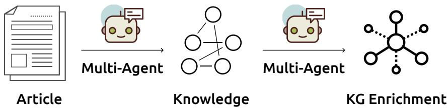  
Figure 1: Multi-agent LLM can parse articles into new knowledge, and integrate to existing knowledge graphs through filtering.

In this paper, we propose KARMA, a novel multi-agent framework that harnesses LLMs through a collaborative system of specialized agents (Figure 1). Each agent focuses on distinct tasks in the KG enrichment pipeline. Our framework offers three key innovations. First, the multi-agent architecture enables cross-agent verification, enhancing the reliability of extracted knowledge. For instance, Relationship Extraction Agents validate candidate entities against Schema Alignment outputs, while Conflict Resolution Agents resolve contradictions through LLM-based debate mechanisms. Second, domain-adaptive prompting strategies allow the system to handle specialized contexts while preserving accuracy. Third, the modular design ensures extensibility and supports dynamic updates as new entities or relationships emerge. Through proof-of-concept experiments on datasets from three distinct domains, we demonstrate that KARMA can efficiently extract high-quality knowledge from unstructured texts, substantially enriching existing knowledge graphs with both precision and scalability.

# 2 Related Work

# 2.1 Knowledge Graph Construction

The quest to transform unstructured text into structured knowledge has evolved through three generations of technical paradigms. First-generation systems (1990s-2010s) like WordNet [21] and ConceptNet [16] relied on hand-crafted rules and shallow linguistic patterns, achieving high precision at the cost of limited recall and domain specificity. The neural revolution (2010s-2022) introduced learned representations through architectures like BioBERT [12] and SapBERT [17], which achieved improvements on biomedical NER through domain-adaptive pretraining. However, these methods require expensive supervised tuning (3-5k labeled examples per relation type [30]) and fail to generalize beyond predefined schema, which is a critical limitation when processing novel scientific discoveries. The current LLM-powered generation (2022-present) attempts to overcome schema rigidity through instruction tuning [24, 31]. This progression reveals an unresolved tension: neural methods scale better than rules but require supervision, while LLMs enable open schema learning at the cost of verification mechanisms. LLMs have shown promise in open-domain KG construction through their inherent reasoning capabilities. However, these approaches exhibit critical limitations: (1) Hallucination during extracting complex relationships [20], (2) Inability to maintain schema consistency across documents [29], and (3) Quadratic computational costs when processing full-text articles [23].

# 2.2 Multi-Agent Systems

Early multi-agent systems focused on distributing subtasks across specialized modules, such as separate agents for named entity recognition and relation extraction [3]. These systems relied on predefined pipelines and handcrafted coordination rules, limiting adaptability to new domains. Recent advances in LLMs have enabled more dynamic architectures and rediscovered multi-agent collaboration as a mechanism for enhancing LLM reliability [25, 19]. Building on classic blackboard architectures, contemporary systems like AutoGen [28] show that task decomposition with specialized agents reduces hallucination compared to monolithic models. For knowledge graph construction, [14] demonstrated that task decomposition across specialized agents (e.g., entity linker, relation validator)

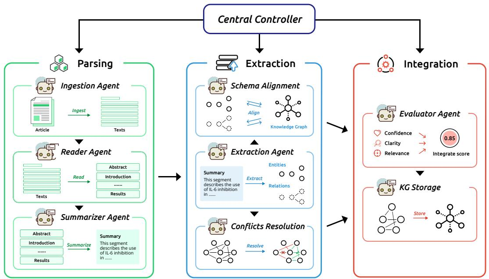

<details>
<summary>flowchart</summary>

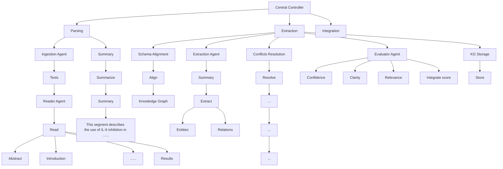
</details>

Figure 2: System overview of the KARMA multi-agent architecture. Each agent is an LLM-driven module tasked with specific roles such as ingestion, summarization, entity recognition, relationship extraction, conflict resolution, and final evaluation.

improves schema alignment on Wikidata benchmarks. maintaining linear time complexity relative to input text length.

KARMA synthesizes insights from these research threads while introducing key innovations: (1) a modular, multi-agent architecture that allows for specialized handling of complex tasks in knowledge graph enrichment, (2) domain-adaptive prompting strategies that enable more accurate extraction across diverse scientific fields, (3) LLM-based verification mechanisms that mitigate issues such as hallucination and schema inconsistency.

# 3 Methodology

In this section, we introduce KARMA, a hierarchical multi-agent system (see Figure 2) that leverages specialized LLMs to perform end-to-end KG enrichment. Our approach decomposes the overall task into modular sub-tasks, ranging from document ingestion to final KG integration, each handled by an independent LLM-based agent. We first present a formal problem formulation and then detail the design and mathematical foundations of each agent within the pipeline.

# 3.1 Problem Formulation

Let $\mathcal { G } = ( V , E )$ denote an existing KG, where V is the set of entities (e.g., genes, diseases, drugs) and E the set of directed edges representing relationships. Each relationship is defined as a triplet $t = ( e _ { h } , r , e _ { t } )$ with $e _ { h } , e _ { t } \in V$ and r specifying the relation type (e.g., treats, causes). We are provided with a corpus of unstructured publications $\mathcal { P } = p _ { 1 } , \ldots , p _ { n }$ . The objective is to automatically extract novel triplets $t \not \in E$ from each document $p _ { i }$ and integrate them into $\overrightharpoon { \mathcal { G } }$ to form an augmented graph $\mathcal { G } _ { \mathrm { n e w } }$ .

$$
\mathcal {G} _ {\text { new }} = \mathcal {G} \cup \bigcup_ {i = 1} ^ {n} \mathcal {K} _ {i}, \text { where } \mathcal {K} _ {i} = \operatorname{Extract} (p _ {i}), \tag {1}
$$

where Extract $( p _ { i } )$ is the set of valid triplets obtained from publication $p _ { i }$ . To maintain consistency and accuracy, each candidate triplet is evaluated by an LLM-based verifier prior to integration.

# 3.2 System Overview

KARMA comprises multiple LLM-based agents operating in parallel under the orchestration of a Central Controller. Each agent uses specialized prompts, hyper-parameters, and domain knowledge to optimize its performance. In KARMA, we define a set of agents (B):

• Ingestion Agents (IA): Retrieve and normalize input documents (B.3).   
• Reader Agents (RA): Parse and segment relevant text sections (B.4).   
• Summarizer Agents (SA): Condense relevant sections into shorter domain-specific summaries (B.5).   
• Entity Extraction Agents (EEA): Identify and normalize topic-related entities (B.6).   
• Relationship Extraction Agents (REA): Infer relationships between entities (B.7).   
• Schema Alignment Agents (SAA): Align entities and relations to KG schemas (B.8).   
• Conflict Resolution Agents (CRA): Detect and resolve logical inconsistencies with existing knowledge (B.9).   
• Evaluator Agents (EA): Aggregate multiple verification signals and decide on final integration (B.10,B.11,B.12).

# 3.3 Ingestion Agents (IA)

The Ingestion Agents are LLM-based modules specialized in document retrieval, format normalization, and metadata extraction. Let $p _ { i }$ be a raw publication. IA includes:

$$
\mathrm{IA} (p _ {i}) = \Big (\text { normalize } (p _ {i}), \text { metadata } (p _ {i}) \Big), \tag {2}
$$

where normalize $( p _ { i } )$ uses an LLM prompt $P _ { \mathrm { i n g e s t } }$ to handle complexities like OCR errors, or structural inconsistencies. The output is a standardized textual representation plus key metadata (journal, date, authors, etc.). This representation is then placed into a data queue for Reader Agents.

# 3.4 Reader Agents (RA)

Reader Agents parse normalized text into coherent segments (abstract, methods, results, ect.) and filter out irrelevant content. Let $p _ { i } ^ { \prime }$ be the normalized document. RA splits $p _ { i } ^ { \prime }$ into $\{ s _ { 1 } , s _ { 2 } , \ldots , s _ { m _ { i } } \}$ . Each segment $s _ { j }$ is assigned a relevance score $R ( s _ { j } )$ by:

$$
R (s _ {j}) = \mathrm{LLM} _ {\text { reader }} (s _ {j}, \mathcal {G}), \tag {3}
$$

where $\mathrm { L L M } _ { \mathrm { r e a d e r } }$ is prompted with domain-specific instructions to assess the segment’s biomedical significance relative to the current KG G. RA discards segments if $R ( s _ { j } ) < \delta$ , where δ is a domaincalibrated threshold. Surviving segments are passed along to Summarizer Agents.

# 3.5 Summarizer Agents (SA)

To reduce computational overhead, each RA segment $s _ { j }$ is condensed by Summarizer Agents into a concise representation $u _ { j }$ . Formally, we define:

$$
u _ {j} = \mathrm{LLM} _ {\text { s   u   m   m }} \left(s _ {j}, P _ {\text { s   u   m   m }}\right), \tag {4}
$$

where $P _ { \mathrm { s u m m } }$ is a prompt for LLM to retain critical entities, relations, and domain-specific terms. This summarization ensures Entity Extraction Agents and Relationship Extraction Agents receive textual inputs that are both high-signal and low-noise.

# 3.6 Entity Extraction Agents (EEA)

LLM-Based NER. Each summary $u _ { j }$ is routed to an LLM-based NER pipeline that identifies mentions of topic-related entities. Define:

$$
E (u _ {j}) = \mathrm{LLM} _ {E} (u _ {j}, P _ {E}) \odot D _ {E}, \tag {5}
$$

where $\mathrm { L L M } _ { E }$ is an specialized entity-extraction LLM with prompt $P _ { E } ,$ , and $\odot D _ { E }$ indicates a dictionary/ontology-based filtering. This step filters out false positives and normalizes entity mentions to canonical forms (e.g., mapping “acetylsalicylic acid” to “Aspirin”).

Entity Normalization. Let e be a raw entity mentioned from $E ( u _ { j } )$ . We map e to a normalized entity $\hat { e } \in V$ by minimizing a distance function in a joint embedding space:

$$
\hat {e} = \underset {v \in V} {\arg \min} d (\phi (e), \psi (v)), \tag {6}
$$

where ϕ maps textual mentions to embeddings (using, e.g., a BERT-based model), and $\psi$ maps known KG entities to the same embedding space. The distance metric $d ( \cdot , \cdot )$ can be cosine distance or a domain-specific measure. Any entity with min $\mathfrak { i } _ { v \in V } d ( \phi ( e ) , \psi ( v ) ) > \rho$ is flagged as new and added to the set of candidate vertices $V ^ { + }$ .

# 3.7 Relationship Extraction Agents (REA)

After entity normalization, each pair $( \hat { e } _ { i } , \hat { e } _ { j } )$ within summary $u _ { j }$ is fed to an LLM-based classifier:

$$
p (r \mid \hat {e} _ {i}, \hat {e} _ {j}, u _ {j}) = \mathrm{LLM} _ {R} (\hat {e} _ {i}, \hat {e} _ {j}, u _ {j}, P _ {R}), \tag {7}
$$

where $p ( r | \cdot )$ is the probability distribution over possible relationships $r \in \{ r _ { 1 } , \ldots , r _ { K } \}$ . The prompt $P _ { R }$ instructs the LLM to focus on domain relationship candidates. We select any relationship r for which $p ( r | \hat { e } _ { i } , \hat { e } _ { j } ) \geq \theta _ { i }$ r and form a triplet $( \hat { e } _ { i } , r , \hat { e } _ { j } )$ . In certain passages, more than one relationship can be implied. We allow multi-label predictions by setting an indicator variable:

$$
I (r) = \mathbb {I} \{p (r \mid \hat {e} _ {i}, \hat {e} _ {j}) \geq \theta_ {r} \}, \tag {8}
$$

Hence, $\mathcal { R } ( u _ { j } )$ is the set of triplets $( \hat { e } _ { i } , r , \hat { e } _ { j } )$ such that $I ( r ) = 1$ .

# 3.8 Schema Alignment Agents (SAA)

If a new entity $v \in V ^ { + }$ or a new relation r does not match existing KG types, the Schema Alignment Agent performs a domain-specific classification. For entities, the SAA solves:

$$
\tau^ {*} = \underset {\tau \in \mathcal {T}} {\arg \max} \mathrm{LLM} _ {\mathrm{SAA}} (v, \tau , P _ {\text { align }}), \tag {9}
$$

where $\tau$ is the set of valid entity types (Disease, Drug, Gene, etc.), and $\mathrm { L L M _ { S A A } }$ estimates the probability that v belongs to type τ . A similar approach is used for mapping new relation r to known KG relation types. If no suitable match exists, the SAA flags v or r as candidate additions for review.

# 3.9 Conflict Resolution Agents (CRA)

New triplets can contradict previously established relationships. Let $\boldsymbol { t } = \left( \boldsymbol { \hat { e } } _ { h } , r , \boldsymbol { \hat { e } } _ { t } \right)$ be a newly extracted triplet, and let $t ^ { \prime } = ( \bar { e } _ { h } , r ^ { \prime } , \bar { { e } } _ { t } )$ be a conflicting triplet in G if r is logically incompatible with $r ^ { \prime }$ . We define:

$$
\operatorname{conflict} (t, \mathcal {G}) = \left\{ \begin{array}{l l} 1, & \text { if } \exists t ^ {\prime} \text { that   contradicts } t, \\ 0, & \text { otherwise. } \end{array} \right. \tag {10}
$$

The CRA uses an LLM-based debate prompt:

$$
\mathrm{LLM} _ {\mathrm{CRA}} \left(t, t ^ {\prime}\right)\rightarrow \{\text { Agree }, \text { Contradict } \}, \tag {11}
$$

$\mathrm { I f \ L L M _ { C R A } }$ yields Contradict, t is then discarded or queued for manual expert review, depending on the system’s confidence.

# 3.10 Evaluator Agents (EA)

Finally, the Evaluator Agents aggregate multiple verification signals and compute global confidence $C ( t )$ , clarity Cl(t), and relevance $\bar { R } ( t )$ for each triplet t.

$$
\text { Confidence: } \quad C (t) = \sigma \Big (\sum \alpha_ {i} v _ {i} (t) \Big), \tag {12}
$$

$$
\text { Clarity: } \quad C l (t) = \sigma \left(\sum \beta_ {j} c _ {j} (t)\right), \tag {13}
$$

$$
\text { Relevance: } \quad R (t) = \sigma \Big (\sum \gamma_ {k} r _ {k} (t) \Big), \tag {14}
$$

where $\begin{array} { r } { \sigma ( x ) = \frac { 1 } { 1 + e ^ { - x } } } \end{array}$ and $\{ \alpha _ { i } , \beta _ { j } , \gamma _ { k } \}$ reflect the trustworthiness of each verification source, and $v _ { i } , c _ { j } , r _ { k }$ are verification signals for confidence, clarity, and relevance respectively. We finalize t for integration using the mean score:

$$
\operatorname{integrate} (t) = \left\{ \begin{array}{l l} 1, & \text { if } \frac {C (t) + C l (t) + R (t)}{3} \geq \Theta \\ 0, & \text { otherwise. } \end{array} \right. \tag {15}
$$

Altogether, this multi-agent pipeline, fully powered by specialized LLMs in each stage, enables robust, scalable, and accurate enrichment of large-scale KG. Future extensions can easily incorporate new domain ontologies, additional specialized agents, or updated LLM prompts as tasks continues to evolve.

# 4 Experimental Setup

This section presents a comprehensive proof-of-concept evaluation settings of the proposed KARMA framework. Unlike conventional NLP tasks that rely on a gold-standard dataset of biomedical entities and relationships, our evaluation adopts a multi-faceted approach. We integrate LLM-based verification with specialized graph-level metrics to assess the quality of the generated knowledge graph. The evaluation spans genomics, proteomics, and metabolomics, showcasing KARMA’s adaptability across diverse biomedical domains.

# 4.1 Data Collection

We curate scientific publications from PubMed [27] across three primary domains: the Genomics Corpus, which includes 720 papers focused on gene variants, regulatory elements, and sequencing studies; the Proteomics Corpus, comprising 360 papers related to protein structures, functions, and protein-interaction networks; and the Metabolomics Corpus, containing 120 papers discussing metabolic pathways, metabolite profiling, and clinical applications. All articles are stored in PDF format and processed by the Ingestion Agent within KARMA.

# 4.2 LLM Backbones

We evaluate three general-purpose LLMs as the backbone for KARMA’s multi-agent knowledge graph enrichment pipeline using their APIs.

GLM-4 [7]: An open-source 9B-parameter model, achieving 72.4 on the MMLU NLP benchmark.

GPT-4o [1]: A proprietary multimodal model optimized through RLHF. It has demonstrated strong adaptability in scientific knowledge extraction and concept grounding [4].

DeepSeek-v3 [15]: An open-source 37-billion-activated-parameter mixture-of-experts (MoE) model with strong focus on STEM domains.

Each KARMA agent (e.g., Reader, Summarizer, Extractor) shares the same LLM backbone per experiment. All LLM-based evaluations employ DeepSeek-v3. Prompting strategies, detailed in Appendix B, are minimally modified to ensure comparability across LLMs and domains. We analyze variations in the final constructed knowledge graph based on different LLM backbones.

# 4.3 Metrics

To evaluate the enriched knowledge graph (KG) in the absence of a gold-standard reference, we employ a multi-faceted evaluation framework that assesses structural integrity, correctness, and practical utility. This framework comprises three categories of metrics: core metrics, graph statistics, and quality indicators. Together, these metrics provide comprehensive insights into the quality and usability of newly added triples and the overall augmented KG.

Core Metrics focus on the properties of newly added triples using structural and LLM-based indicators. The Average Confidence $( M _ { C o n } ^ { \uparrow } )$ measures the mean confidence scores across all new triples, reflecting their reliability. The Average Clarity $( M _ { C l a } ^ { \uparrow } )$ computes the mean clarity scores, indicating how unambiguous or direct each relation is. The Average Relevance $( M _ { R e l } ^ { \uparrow } )$ captures the mean relevance scores, assessing the domain significance of the triples. These metrics collectively evaluate the intrinsic quality of the added knowledge.

Table 1: KARMA evaluation metrics across domains and models. $M _ { C o n } ^ { \uparrow } \mathrm { : }$ : Average confidence score, $M _ { C l a } ^ { \uparrow } \colon$ : Average clarity score, $M _ { R e l } ^ { \uparrow } { : }$ Average relevance score, $\Delta _ { C o v } ^ { \uparrow } \colon$ Coverage gain, $\Delta _ { C o n } ^ { \uparrow } ;$ Connectivity gain, $R _ { C R } ^ { \downarrow } \colon$ Conflict ratio, $R _ { L C } ^ { \uparrow } \colon$ LLM-based correctness score, $C _ { Q A } ^ { \uparrow } { : } \mathrm { Q A }$ coherence score, $R _ { H E } ^ { \uparrow } \colon$ Human evaluation score. Best performance in each domain highlighted. 

<table><tr><td rowspan="2">Domain</td><td rowspan="2">Model</td><td colspan="3">Core Metrics</td><td colspan="2">Graph Stats.</td><td colspan="4">Quality Indicators</td></tr><tr><td> $M_{\text{Con}}^{\uparrow}$ </td><td> $M_{\text{Cla}}^{\uparrow}$ </td><td> $M_{\text{Rel}}^{\uparrow}$ </td><td> $\Delta_{\text{Cov}}^{\uparrow}$ </td><td> $\Delta_{\text{Con}}^{\downarrow}$ </td><td> $R_{\text{CR}}^{\uparrow}$ </td><td> $R_{\text{LC}}^{\uparrow}$ </td><td> $C_{\text{QA}}^{\uparrow}$ </td><td> $R_{\text{HE}}^{\uparrow}$ </td></tr><tr><td rowspan="4">Genomics</td><td>Single-Agent</td><td>NA</td><td>NA</td><td>NA</td><td>4384</td><td>1.083</td><td>NA</td><td>0.493</td><td>0.472</td><td>0.320</td></tr><tr><td>GLM-4</td><td>0.729</td><td>0.804</td><td>0.716</td><td>4969</td><td>1.131</td><td>0.238</td><td>0.623</td><td>0.589</td><td>0.445</td></tr><tr><td>GPT-4o</td><td>0.843</td><td>0.744</td><td>0.640</td><td>9795</td><td>1.265</td><td>0.148</td><td>0.880</td><td>0.569</td><td>0.510</td></tr><tr><td>DeepSeek-v3</td><td>0.846</td><td>0.754</td><td>0.667</td><td>38230</td><td>1.765</td><td>0.186</td><td>0.831</td><td>0.612</td><td>0.625</td></tr><tr><td rowspan="4">Proteomics</td><td>Single-Agent</td><td>NA</td><td>NA</td><td>NA</td><td>5002</td><td>1.150</td><td>NA</td><td>0.638</td><td>0.572</td><td>0.415</td></tr><tr><td>GLM-4</td><td>0.731</td><td>0.752</td><td>0.609</td><td>6832</td><td>1.173</td><td>0.214</td><td>0.720</td><td>0.617</td><td>0.500</td></tr><tr><td>GPT-4o</td><td>0.823</td><td>0.797</td><td>0.613</td><td>7008</td><td>1.191</td><td>0.160</td><td>0.740</td><td>0.612</td><td>0.550</td></tr><tr><td>DeepSeek-v3</td><td>0.845</td><td>0.825</td><td>0.682</td><td>11936</td><td>1.468</td><td>0.151</td><td>0.772</td><td>0.613</td><td>0.575</td></tr><tr><td rowspan="4">Metabolomics</td><td>Single-Agent</td><td>NA</td><td>NA</td><td>NA</td><td>485</td><td>1.077</td><td>NA</td><td>0.527</td><td>0.450</td><td>0.455</td></tr><tr><td>GLM-4</td><td>0.701</td><td>0.790</td><td>0.762</td><td>703</td><td>1.159</td><td>0.188</td><td>0.617</td><td>0.449</td><td>0.485</td></tr><tr><td>GPT-4o</td><td>0.802</td><td>0.730</td><td>0.726</td><td>773</td><td>1.143</td><td>0.147</td><td>0.683</td><td>0.482</td><td>0.535</td></tr><tr><td>DeepSeek-v3</td><td>0.790</td><td>0.746</td><td>0.767</td><td>1752</td><td>1.811</td><td>0.132</td><td>0.668</td><td>0.493</td><td>0.580</td></tr></table>

Graph Statistics quantify the structural properties of the augmented KG. The Coverage Gain $( \Delta _ { C o v } ^ { \uparrow } )$ measures the number of newly introduced entities not previously in the KG, reflecting its expanded scope. The Connectivity Gain $( \Delta _ { C o n } ^ { \uparrow } )$ calculates the net increase in node degrees (summed over existing entities), indicating enhanced interconnectedness.

Quality Indicators assess reliability and usability through multiple lenses. The Conflict Ratio $( R _ { C R } ^ { \downarrow } )$ represents the fraction of newly extracted edges removed by the ConflictResolutionAgent due to internal or external contradictions. The LLM-based Correctness $( R _ { L C } ^ { \uparrow } )$ is determined by a hold-out LLM judging each new triple ((head, r, tail)) as likely correct, uncertain, or likely incorrect, with $\begin{array} { r } { R _ { L C } = \frac { \# ( \mathrm { l i k e l y c o r r e c t } ) } { \# ( \mathrm { a l l n e w t r i p l e s } ) } } \end{array}$ . The Question-Answer Coherence $( C _ { Q A } ^ { \uparrow } )$ evaluates the fraction of plausible KG-derived answers for a curated set of domain-specific questions answerable via KG traversal. Finally, the Human Evaluation Score $( R _ { H E } ^ { \uparrow } )$ scaled from 0 to 1, gauges the quality of triple extractions based on assessments by two human experts, offering a comprehensive measure of the knowledge graph’s accuracy and utility.

These complementary metrics provide insights into the structural integrity, internal consistency, correctness, and practical utility of the enriched knowledge graph.

# 5 Results

# 5.1 Overall Evaluation

Our comprehensive evaluation (Table 1, with examples in Appendix C.1,C.2,C.3) demonstrates that KARMA significantly extends domain-specific knowledge graphs through its multi-agent architecture. Four key findings emerge: (1) The framework demonstrates superior performance compared to the GLM-4-based single-agent approach, which extracts all triples in a single generation, (2) The framework exhibits varying performance across distinct domains; it identifies the most entities in prevalent fields such as genomics (53.1/article), achieving 3.6× higher coverage gain $( \Delta _ { C o v } )$ per article than metabolomics (14.6/article); (3) LLM backbone selection substantially impacts KG quality, with DeepSeek-v3 achieving superior performance on 17/24 (71%) metrics across domains;

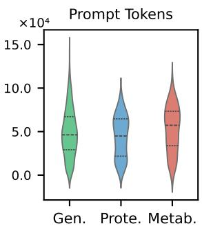

<details>
<summary>violin</summary>

| Category | Value     |
| -------- | --------- |
| Gen.     | 5.0×10⁴   |
| Prote.   | 5.0×10⁴   |
| Metab.   | 5.0×10⁴   |
</details>

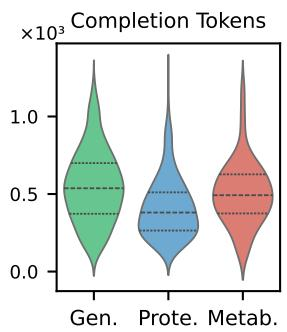

<details>
<summary>violin</summary>

| Category | Value     |
| -------- | --------- |
| Gen.     | 0.5×10³   |
| Prote.   | 0.3×10³   |
| Metab.   | 0.4×10³   |
</details>

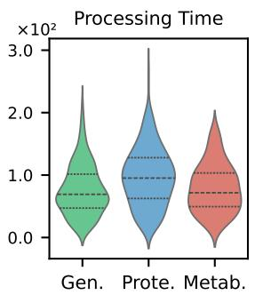

<details>
<summary>violin</summary>

| Category | Value (x10²) |
| -------- | ------------ |
| Gen.     | 0.5          |
| Prote.   | 1.0          |
| Metab.   | 0.8          |
</details>

Figure 3: Comparison of prompt tokens, completion tokens, and processing time across domains.

(4) Evaluating knowledge and resolving conflicts automatically can enhance the quality of the extracted knowledge graph, improving LLM-based accuracy by $4 . 6 \% - 1 4 . 4 \%$ .

# 5.2 Domain-Level Observations.

Genomics: Scale Meets Precision (C.1) The genomics domain (720 papers) exhibits the most pronounced model differentiation. DeepSeek-v3 achieves $\Delta _ { C o v } = 3 8 , 2 3 0$ while maintaining a competitive correctness score $R _ { L C } = 0 . 8 3 1$ , only 5.6% below GPT-4o’s peak. This suggests that MoE architectures can balance recall and precision in large-scale extraction.

Proteomics: Balanced Optimization (C.2) With 360 papers, proteomics reveals balanced gains: DeepSeek-v3 leads in both core metrics $( M _ { C o n } = 0 . 8 4 5$ ) and structural gains $( \Delta _ { C o n } = 1 . 4 6 8 )$ , while GLM-4 achieves peak QA coherence $( C _ { Q A } = 0 . 6 1 7 )$ . The 19.1% higher $\Delta _ { C o v }$ for DeepSeek-v3 versus GPT-4o indicates greater sensitivity to protein interaction nuances.

Metabolomics: Specialization Pays Off (C.3) Despite the smallest corpus (120 papers), GLM-4 delivers superior clarity $( M _ { c l a } = 0 . 7 9 0 )$ and GPT-4o excels in correctness $( R _ { L C } = 0 . 6 8 3 )$ . However, DeepSeek-v3’s $\Delta _ { C o n } = 1$ , 752 is 127% higher than GPT-4o, demonstrates unique capability to extrapolate metabolic pathways from limited data.

# 5.3 Analysis of LLM Backbones

Our comparison reveals strengths of different backbones: DeepSeek-v3 drives unparalleled coverage gains, outpacing GPT-4o by 3.9× in genomics and 2.3× in metabolomics while maintaining competitive correctness $( R _ { L C } = 0 . 8 3 1$ vs GPT-4o’s 0.880 in genomics). This contrasts with GPT-4o’s precision-first profile, where it achieves peak $R _ { L C }$ scores (0.880 genomics, 0.740 proteomics) but yields 41% lower connectivity gains than DeepSeek-v3, reflecting underutilized implicit relationships. GLM-4, though smaller (10B parameters), demonstrates domain-specific prowess: its biomedical tuning delivers best-in-class metabolomics clarity $( M _ { C l a } = 0 . 7 6 2 )$ and proteomics QA coherence $( C _ { Q A } = 0 . 6 1 7 )$ , while its conflict ratio $( R _ { C R } = 0 . 1 8 8 )$ remains competitive despite lower parameter count. The tradeoffs (DeepSeek-v3’s coverage balance for correctness, GPT-4o’s precision sacrifice for completeness, GLM-4’s niche adaptation) underscore why KARMA’s multi-agent framework strategically decouples extraction, validation, and can utilize the strengths of each backbone. Different backbones also lead to variations in the distribution of key evaluation metrics (Figure C.1,C.2,C.3).

# 5.4 Cost Analysis

The evaluation of computational costs (Figure 3) demonstrates distinct trade-offs in token usage and processing time across different domains. The variations in article lengths and information density naturally lead to differences in token consumption and processing times. Notably, genomics shows higher completion token distributions $( \mathrm { m e a n } = 5 5 0 . 6 4 , \mathrm { s t d } = 2 3 2 . 9 2 )$ , explaining KARMA’s higher $\Delta _ { C o v }$ in this domain. Meanwhile, proteomics exhibits broader processing time distributions (mean = 96.58, std = 46.90), which correlates with its stronger performance in knowledge quality metrics $( R _ { L C }$ and $C _ { Q A } ) .$ , suggesting that longer processing times contribute to more thorough relationship analysis and validation.

Table 2: Ablation study results for KARMA, evaluating the impact of different agents (Summarizer, Conflict Resolution, Evaluator). 

<table><tr><td rowspan="2">Domain</td><td rowspan="2">Configuration</td><td colspan="4">Quality Indicators</td></tr><tr><td> $R_{\text{CR}}^{\uparrow}$ </td><td> $R_{\text{LC}}^{\uparrow}$ </td><td> $C_{\text{QA}}^{\uparrow}$ </td><td> $R_{\text{HE}}^{\uparrow}$ </td></tr><tr><td rowspan="4">Genomics</td><td>w/o Summarizer Agent</td><td>0.758</td><td>0.788</td><td>0.472</td><td>0.600</td></tr><tr><td>w/o Conflict Resolution Agent</td><td>0.790</td><td>0.733</td><td>0.554</td><td>0.485</td></tr><tr><td>w/o Evaluator Agent</td><td>0.793</td><td>0.752</td><td>0.561</td><td>0.515</td></tr><tr><td>KARMA-Full</td><td>0.831</td><td>0.831</td><td>0.612</td><td>0.625</td></tr><tr><td rowspan="4">Proteomics</td><td>w/o Summarizer Agent</td><td>0.632</td><td>0.759</td><td>0.547</td><td>0.610</td></tr><tr><td>w/o Conflict Resolution Agent</td><td>0.661</td><td>0.742</td><td>0.583</td><td>0.525</td></tr><tr><td>w/o Evaluator Agent</td><td>0.696</td><td>0.755</td><td>0.605</td><td>0.580</td></tr><tr><td>KARMA-Full</td><td>0.772</td><td>0.772</td><td>0.613</td><td>0.625</td></tr><tr><td rowspan="4">Metabolomics</td><td>w/o Summarizer Agent</td><td>0.577</td><td>0.592</td><td>0.537</td><td>0.555</td></tr><tr><td>w/o Conflict Resolution Agent</td><td>0.629</td><td>0.551</td><td>0.471</td><td>0.545</td></tr><tr><td>w/o Evaluator Agent</td><td>0.603</td><td>0.572</td><td>0.480</td><td>0.550</td></tr><tr><td>KARMA-Full</td><td>0.668</td><td>0.608</td><td>0.493</td><td>0.580</td></tr></table>

# 5.5 Ablation Study

To better quantify the contributions of each specialized agent in KARMA, we conduct an ablation study (Table 2) by systematically removing or replacing selected agents and measure the resulting performance across the three domains. Specifically, we evaluate:

• KARMA-Full: All agents active, including Summarizer, Conflict Resolution, and Evaluator modules.   
• w/o Summarizer: Bypasses the Summarizer Agents, passing all text directly from Reader Agents to Entity and Relationship Extraction.   
• w/o Conflict Resolution: Disables the Conflict Resolution Agent, allowing potentially contradictory edges into the final graph.   
• w/o Evaluator: Omits the final confidence, clarity, and relevance evaluation and aggregation, integrating relationships without filtering.

We conduct these ablations using the same LLM backbone (DeepSeek-v3 in our experiments) for consistency. Table 2 summarizes the impact on evaluation metrics $( R _ { L C } , C _ { Q A } )$ for each domain. The ablation study highlights the importance of each agent in KARMA’s performance. Removing the Summarizer Agent produce much more entities and triples, but reduces accuracy $( C _ { Q A }$ drop 22.9% (0.612 → 0.472) in genomics) and coherence $( R _ { L C }$ drop 18.2% (0.772 → 0.632) in proteomics), as unfiltered text introduces noise. Disabling the Conflict Resolution Agent significantly lowers correctness $( C _ { Q A }$ drop 4.9% (0.831 → 0.790) in genomics), especially in resolving contradictions like conflicting gene-disease associations. Omitting the Evaluator Agents has the most impact on usability, as unfiltered, low-confidence edges degrade answer quality $( R _ { L C }$ drop 9.7% (0.668 → 0.603) in metabolomics). Across all domains, conflict resolution proves critical for maintaining logical consistency, while summarization and evaluation ensure focused extraction and high-quality integration. This demonstrates that KARMA’s multi-agent design is essential for balancing accuracy, consistency, and usability in KG enrichment.

# 6 Conclusion

We introduce KARMA, a multi-agent LLM framework designed to tackle the challenge of scalable knowledge graph enrichment from scientific literature. By decomposing the extraction process into specialized agents for entity discovery, relationship validation, and conflict resolution, KARMA ensures adaptive and accurate knowledge integration. Its modular design reduces the impact of conflicting edges through multi-layered assessments and cross-agent verification. Experimental results across genomics, proteomics, and metabolomics demonstrate that multi-agent collaboration can overcome the limitations of single-agent approaches, particularly in domains that require complex semantic understanding and adherence to structured schemas.

# Acknowledge

This research was supported by National Key Research and Development Program of China (2024YFF0507400) and National Natural Science Foundation of China (6220071694).

# References

[1] Josh Achiam, Steven Adler, Sandhini Agarwal, Lama Ahmad, Ilge Akkaya, Florencia Leoni Aleman, Diogo Almeida, Janko Altenschmidt, Sam Altman, Shyamal Anadkat, et al. Gpt-4 technical report. arXiv preprint arXiv:2303.08774, 2023.   
[2] Lutz Bornmann, Robin Haunschild, and Rüdiger Mutz. Growth rates of modern science: a latent piecewise growth curve approach to model publication numbers from established and new literature databases. Humanities and Social Sciences Communications, 8(1):1–15, 2021.   
[3] AMBR Carvalho, Daniel da Silva de Paiva, JS d Sichman, JLT da Silva, RS Wazlawick, and VLS de Lima. Multi-agent systems for natural language processing. In Proceedings of the Second Iberoamerican Workshop on Distributed Artificial Intelligence and Multi-agent Systems. Citeseer, 1998.   
[4] John Dagdelen, Alexander Dunn, Sanghoon Lee, Nicholas Walker, Andrew S Rosen, Gerbrand Ceder, Kristin A Persson, and Anubhav Jain. Structured information extraction from scientific text with large language models. Nature Communications, 15(1):1418, 2024.   
[5] Jérôme Euzenat, Pavel Shvaiko, et al. Ontology matching, volume 18. Springer, 2007.   
[6] Adam Fourney, Gagan Bansal, Hussein Mozannar, Cheng Tan, Eduardo Salinas, Friederike Niedtner, Grace Proebsting, Griffin Bassman, Jack Gerrits, Jacob Alber, et al. Magentic-one: A generalist multi-agent system for solving complex tasks. arXiv preprint arXiv:2411.04468, 2024.   
[7] Team GLM, Aohan Zeng, Bin Xu, Bowen Wang, Chenhui Zhang, Da Yin, Dan Zhang, Diego Rojas, Guanyu Feng, Hanlin Zhao, et al. Chatglm: A family of large language models from glm-130b to glm-4 all tools. arXiv preprint arXiv:2406.12793, 2024.   
[8] Taicheng Guo, Xiuying Chen, Yaqi Wang, Ruidi Chang, Shichao Pei, Nitesh V Chawla, Olaf Wiest, and Xiangliang Zhang. Large language model based multi-agents: A survey of progress and challenges. arXiv preprint arXiv:2402.01680, 2024.   
[9] Aidan Hogan, Eva Blomqvist, Michael Cochez, Claudia d’Amato, Gerard De Melo, Claudio Gutierrez, Sabrina Kirrane, José Emilio Labra Gayo, Roberto Navigli, Sebastian Neumaier, et al. Knowledge graphs. ACM Computing Surveys (Csur), 54(4):1–37, 2021.   
[10] Geoffrey Irving, Paul Christiano, and Dario Amodei. Ai safety via debate. arXiv preprint arXiv:1805.00899, 2018.   
[11] Shaoxiong Ji, Shirui Pan, Erik Cambria, Pekka Marttinen, and S Yu Philip. A survey on knowledge graphs: Representation, acquisition, and applications. IEEE transactions on neural networks and learning systems, 33(2):494–514, 2021.   
[12] Jinhyuk Lee, Wonjin Yoon, Sungdong Kim, Donghyeon Kim, Sunkyu Kim, Chan Ho So, and Jaewoo Kang. Biobert: a pre-trained biomedical language representation model for biomedical text mining. Bioinformatics, 36(4):1234–1240, 2020.   
[13] Johannes Lehmann and Markus Kleber. The contentious nature of soil organic matter. Nature, 528(7580):60–68, 2015.   
[14] Tian Liang, Zhiwei He, Wenxiang Jiao, Xing Wang, Yan Wang, Rui Wang, Yujiu Yang, Shuming Shi, and Zhaopeng Tu. Encouraging divergent thinking in large language models through multiagent debate. arXiv preprint arXiv:2305.19118, 2023.   
[15] Aixin Liu, Bei Feng, Bing Xue, Bingxuan Wang, Bochao Wu, Chengda Lu, Chenggang Zhao, Chengqi Deng, Chenyu Zhang, Chong Ruan, et al. Deepseek-v3 technical report. arXiv preprint arXiv:2412.19437, 2024.

[16] Hugo Liu and Push Singh. Conceptnet—a practical commonsense reasoning tool-kit. BT technology journal, 22(4):211–226, 2004.   
[17] Xiao Liu, Fanjin Zhang, Zhenyu Hou, Li Mian, Zhaoyu Wang, Jing Zhang, and Jie Tang. Self-supervised learning: Generative or contrastive. IEEE transactions on knowledge and data engineering, 35(1):857–876, 2021.   
[18] Yuxing Lu, Sin Yee Goi, Xukai Zhao, and Jinzhuo Wang. Biomedical knowledge graph: A survey of domains, tasks, and real-world applications. arXiv preprint arXiv:2501.11632, 2025.   
[19] Yuxing Lu, Xukai Zhao, and Jinzhuo Wang. Clinicalrag: Enhancing clinical decision support through heterogeneous knowledge retrieval. In Proceedings of the 1st Workshop on Towards Knowledgeable Language Models (KnowLLM 2024), pages 64–68, 2024.   
[20] Potsawee Manakul, Adian Liusie, and Mark JF Gales. Selfcheckgpt: Zero-resource black-box hallucination detection for generative large language models. arXiv preprint arXiv:2303.08896, 2023.   
[21] George A Miller. Wordnet: a lexical database for english. Communications of the ACM, 38(11):39–41, 1995.   
[22] Zara Nasar, Syed Waqar Jaffry, and Muhammad Kamran Malik. Information extraction from scientific articles: a survey. Scientometrics, 117(3):1931–1990, 2018.   
[23] Long Ouyang, Jeffrey Wu, Xu Jiang, Diogo Almeida, Carroll Wainwright, Pamela Mishkin, Chong Zhang, Sandhini Agarwal, Katarina Slama, Alex Ray, et al. Training language models to follow instructions with human feedback. Advances in neural information processing systems, 35:27730–27744, 2022.   
[24] Shirui Pan, Linhao Luo, Yufei Wang, Chen Chen, Jiapu Wang, and Xindong Wu. Unifying large language models and knowledge graphs: A roadmap. IEEE Transactions on Knowledge and Data Engineering, 2024.   
[25] Yashar Talebirad and Amirhossein Nadiri. Multi-agent collaboration: Harnessing the power of intelligent llm agents. arXiv preprint arXiv:2306.03314, 2023.   
[26] Denny Vrandeciˇ c and Markus Krötzsch. Wikidata: a free collaborative knowledgebase. ´ Communications of the ACM, 57(10):78–85, 2014.   
[27] Jacob White. Pubmed 2.0. Medical reference services quarterly, 39(4):382–387, 2020.   
[28] Qingyun Wu, Gagan Bansal, Jieyu Zhang, Yiran Wu, Shaokun Zhang, Erkang Zhu, Beibin Li, Li Jiang, Xiaoyun Zhang, and Chi Wang. Autogen: Enabling next-gen llm applications via multi-agent conversation framework. arXiv preprint arXiv:2308.08155, 2023.   
[29] Qi Zeng. Consistent and efficient long document understanding. PhD thesis, University of Illinois at Urbana-Champaign, 2023.   
[30] Yuan Zhang, Xin Sui, Feng Pan, Kaixian Yu, Keqiao Li, Shubo Tian, Arslan Erdengasileng, Qing Han, Wanjing Wang, Jianan Wang, et al. Biokg: a comprehensive, large-scale biomedical knowledge graph for ai-powered, data-driven biomedical research. bioRxiv, 2023.   
[31] Yuqi Zhu, Xiaohan Wang, Jing Chen, Shuofei Qiao, Yixin Ou, Yunzhi Yao, Shumin Deng, Huajun Chen, and Ningyu Zhang. Llms for knowledge graph construction and reasoning: Recent capabilities and future opportunities. World Wide Web, 27(5):58, 2024.

# NeurIPS Paper Checklist

# 1. Claims

Question: Do the main claims made in the abstract and introduction accurately reflect the paper’s contributions and scope?

Answer: [Yes]

Justification: The abstract and introduction clearly state the main contributions: the KARMA framework, a multi-agent LLM system for automated KG enrichment, its architecture with nine collaborative agents, and experimental validation on PubMed articles demonstrating entity identification, correctness, and conflict reduction. These claims are consistent with the methods and results presented.

Guidelines:

• The answer NA means that the abstract and introduction do not include the claims made in the paper.   
• The abstract and/or introduction should clearly state the claims made, including the contributions made in the paper and important assumptions and limitations. A No or NA answer to this question will not be perceived well by the reviewers.   
• The claims made should match theoretical and experimental results, and reflect how much the results can be expected to generalize to other settings.   
• It is fine to include aspirational goals as motivation as long as it is clear that these goals are not attained by the paper.

# 2. Limitations

Question: Does the paper discuss the limitations of the work performed by the authors?

Answer: [Yes]

Justification: The paper includes a dedicated "Limitations" section in the Appendix (Section A). This section discusses reliance on LLM-based metrics over direct human expert validation, performance variations across domains, and suggests areas for future improvement.

Guidelines:

• The answer NA means that the paper has no limitation while the answer No means that the paper has limitations, but those are not discussed in the paper.   
• The authors are encouraged to create a separate "Limitations" section in their paper.   
• The paper should point out any strong assumptions and how robust the results are to violations of these assumptions (e.g., independence assumptions, noiseless settings, model well-specification, asymptotic approximations only holding locally). The authors should reflect on how these assumptions might be violated in practice and what the implications would be.   
• The authors should reflect on the scope of the claims made, e.g., if the approach was only tested on a few datasets or with a few runs. In general, empirical results often depend on implicit assumptions, which should be articulated.   
• The authors should reflect on the factors that influence the performance of the approach. For example, a facial recognition algorithm may perform poorly when image resolution is low or images are taken in low lighting. Or a speech-to-text system might not be used reliably to provide closed captions for online lectures because it fails to handle technical jargon.   
• The authors should discuss the computational efficiency of the proposed algorithms and how they scale with dataset size.   
• If applicable, the authors should discuss possible limitations of their approach to address problems of privacy and fairness.   
• While the authors might fear that complete honesty about limitations might be used by reviewers as grounds for rejection, a worse outcome might be that reviewers discover limitations that aren’t acknowledged in the paper. The authors should use their best judgment and recognize that individual actions in favor of transparency play an important role in developing norms that preserve the integrity of the community. Reviewers will be specifically instructed to not penalize honesty concerning limitations.

# 3. Theory assumptions and proofs

Question: For each theoretical result, does the paper provide the full set of assumptions and a complete (and correct) proof?

Answer: [NA]

Justification: The paper proposes a framework (KARMA) and presents experimental results. It does not include new theoretical results, theorems, or formal proofs that would require a dedicated section for assumptions and proofs. The mathematical formulations describe the system’s operations rather than novel theoretical derivations.

Guidelines:

• The answer NA means that the paper does not include theoretical results.   
• All the theorems, formulas, and proofs in the paper should be numbered and crossreferenced.   
• All assumptions should be clearly stated or referenced in the statement of any theorems.   
• The proofs can either appear in the main paper or the supplemental material, but if they appear in the supplemental material, the authors are encouraged to provide a short proof sketch to provide intuition.   
• Inversely, any informal proof provided in the core of the paper should be complemented by formal proofs provided in appendix or supplemental material.   
• Theorems and Lemmas that the proof relies upon should be properly referenced.

# 4. Experimental result reproducibility

Question: Does the paper fully disclose all the information needed to reproduce the main experimental results of the paper to the extent that it affects the main claims and/or conclusions of the paper (regardless of whether the code and data are provided or not)?

Answer: [Yes]

Justification: The paper details the KARMA framework’s architecture (Figures 1 & 2), the roles of each agent (Section 3.2), the LLM backbones used (Section 4.2), data collection from PubMed (Section 4.1), and the metrics for evaluation (Section 4.3). Appendix references for prompts (B) are mentioned.

• The answer NA means that the paper does not include experiments.   
• If the paper includes experiments, a No answer to this question will not be perceived well by the reviewers: Making the paper reproducible is important, regardless of whether the code and data are provided or not.   
• If the contribution is a dataset and/or model, the authors should describe the steps taken to make their results reproducible or verifiable.   
• Depending on the contribution, reproducibility can be accomplished in various ways. For example, if the contribution is a novel architecture, describing the architecture fully might suffice, or if the contribution is a specific model and empirical evaluation, it may be necessary to either make it possible for others to replicate the model with the same dataset, or provide access to the model. In general. releasing code and data is often one good way to accomplish this, but reproducibility can also be provided via detailed instructions for how to replicate the results, access to a hosted model (e.g., in the case of a large language model), releasing of a model checkpoint, or other means that are appropriate to the research performed.

• While NeurIPS does not require releasing code, the conference does require all submissions to provide some reasonable avenue for reproducibility, which may depend on the nature of the contribution. For example

(a) If the contribution is primarily a new algorithm, the paper should make it clear how to reproduce that algorithm.   
(b) If the contribution is primarily a new model architecture, the paper should describe the architecture clearly and fully.   
(c) If the contribution is a new model (e.g., a large language model), then there should either be a way to access this model for reproducing the results or a way to reproduce the model (e.g., with an open-source dataset or instructions for how to construct the dataset).

(d) We recognize that reproducibility may be tricky in some cases, in which case authors are welcome to describe the particular way they provide for reproducibility. In the case of closed-source models, it may be that access to the model is limited in some way (e.g., to registered users), but it should be possible for other researchers to have some path to reproducing or verifying the results.

# 5. Open access to data and code

Question: Does the paper provide open access to the data and code, with sufficient instructions to faithfully reproduce the main experimental results, as described in supplemental material?

Answer: [Yes]

Justification: The paper has deposit the code in Supplementary Materials, and will opensource the code once accepted.

Guidelines:

• The answer NA means that paper does not include experiments requiring code.   
• Please see the NeurIPS code and data submission guidelines (https://nips.cc/ public/guides/CodeSubmissionPolicy) for more details.   
• While we encourage the release of code and data, we understand that this might not be possible, so “No” is an acceptable answer. Papers cannot be rejected simply for not including code, unless this is central to the contribution (e.g., for a new open-source benchmark).   
• The instructions should contain the exact command and environment needed to run to reproduce the results. See the NeurIPS code and data submission guidelines (https: //nips.cc/public/guides/CodeSubmissionPolicy) for more details.   
• The authors should provide instructions on data access and preparation, including how to access the raw data, preprocessed data, intermediate data, and generated data, etc.   
• The authors should provide scripts to reproduce all experimental results for the new proposed method and baselines. If only a subset of experiments are reproducible, they should state which ones are omitted from the script and why.   
• At submission time, to preserve anonymity, the authors should release anonymized versions (if applicable).   
• Providing as much information as possible in supplemental material (appended to the paper) is recommended, but including URLs to data and code is permitted.

# 6. Experimental setting/details

Question: Does the paper specify all the training and test details (e.g., data splits, hyperparameters, how they were chosen, type of optimizer, etc.) necessary to understand the results?

Answer: [Yes]

Justification: The paper specifies the LLM backbones used (Section 4.2), the data collection process and corpora sizes (Section 4.1), and mentions that prompting strategies are detailed in Appendix B. It also mentions that "Each KARMA agent...shares the same LLM backbone per experiment" and "All LLM-based evaluations employ DeepSeek-v3". The method section details the roles and inputs/outputs of each agent.

Guidelines:

• The answer NA means that the paper does not include experiments.   
• The experimental setting should be presented in the core of the paper to a level of detail that is necessary to appreciate the results and make sense of them.   
• The full details can be provided either with the code, in appendix, or as supplemental material.

# 7. Experiment statistical significance

Question: Does the paper report error bars suitably and correctly defined or other appropriate information about the statistical significance of the experiments?

Answer: [NA]

Justification: Table 1 reports various metrics, including average scores. The cost analysis in Figure 3 shows distributions.

# Guidelines:

• The answer NA means that the paper does not include experiments.   
• The authors should answer "Yes" if the results are accompanied by error bars, confidence intervals, or statistical significance tests, at least for the experiments that support the main claims of the paper.   
• The factors of variability that the error bars are capturing should be clearly stated (for example, train/test split, initialization, random drawing of some parameter, or overall run with given experimental conditions).   
• The method for calculating the error bars should be explained (closed form formula, call to a library function, bootstrap, etc.)   
• The assumptions made should be given (e.g., Normally distributed errors).   
• It should be clear whether the error bar is the standard deviation or the standard error of the mean.   
• It is OK to report 1-sigma error bars, but one should state it. The authors should preferably report a 2-sigma error bar than state that they have a 96% CI, if the hypothesis of Normality of errors is not verified.   
• For asymmetric distributions, the authors should be careful not to show in tables or figures symmetric error bars that would yield results that are out of range (e.g. negative error rates).   
• If error bars are reported in tables or plots, The authors should explain in the text how they were calculated and reference the corresponding figures or tables in the text.

# 8. Experiments compute resources

Question: For each experiment, does the paper provide sufficient information on the computer resources (type of compute workers, memory, time of execution) needed to reproduce the experiments?

Answer: [Yes]

Justification: Section 4.4 "Cost Analysis" and Figure 3 discuss prompt tokens, completion tokens, and processing time across domains. It provides information on token usage and processing time, which are key resource indicators for LLM-based experiments. It also mentions using APIs for LLMs, implying cloud-based resources for those.

# Guidelines:

• The answer NA means that the paper does not include experiments.   
• The paper should indicate the type of compute workers CPU or GPU, internal cluster, or cloud provider, including relevant memory and storage.   
• The paper should provide the amount of compute required for each of the individual experimental runs as well as estimate the total compute.   
• The paper should disclose whether the full research project required more compute than the experiments reported in the paper (e.g., preliminary or failed experiments that didn’t make it into the paper).

# 9. Code of ethics

Question: Does the research conducted in the paper conform, in every respect, with the NeurIPS Code of Ethics https://neurips.cc/public/EthicsGuidelines?

Answer: [Yes]

Justification: The research focuses on automating knowledge graph enrichment from scientific literature. The paper includes a discussion on potential ethical impacts concerning bias in LLMs and data privacy, and mentions human oversight.

# Guidelines:

• The answer NA means that the authors have not reviewed the NeurIPS Code of Ethics.   
• If the authors answer No, they should explain the special circumstances that require a deviation from the Code of Ethics.

• The authors should make sure to preserve anonymity (e.g., if there is a special consideration due to laws or regulations in their jurisdiction).

# 10. Broader impacts

Question: Does the paper discuss both potential positive societal impacts and negative societal impacts of the work performed?

Answer: [Yes]

Justification: The paper’s conclusion briefly mentions that KARMA can be a "transformative tool for advancing knowledge". The commented-out "Ethical Impact" section discusses potential negative impacts such as bias in LLMs leading to incorrect associations and data privacy concerns, and also suggests mitigation through human oversight.

Guidelines:

• The answer NA means that there is no societal impact of the work performed.   
• If the authors answer NA or No, they should explain why their work has no societal impact or why the paper does not address societal impact.   
• Examples of negative societal impacts include potential malicious or unintended uses (e.g., disinformation, generating fake profiles, surveillance), fairness considerations (e.g., deployment of technologies that could make decisions that unfairly impact specific groups), privacy considerations, and security considerations.   
• The conference expects that many papers will be foundational research and not tied to particular applications, let alone deployments. However, if there is a direct path to any negative applications, the authors should point it out. For example, it is legitimate to point out that an improvement in the quality of generative models could be used to generate deepfakes for disinformation. On the other hand, it is not needed to point out that a generic algorithm for optimizing neural networks could enable people to train models that generate Deepfakes faster.   
• The authors should consider possible harms that could arise when the technology is being used as intended and functioning correctly, harms that could arise when the technology is being used as intended but gives incorrect results, and harms following from (intentional or unintentional) misuse of the technology.   
• If there are negative societal impacts, the authors could also discuss possible mitigation strategies (e.g., gated release of models, providing defenses in addition to attacks, mechanisms for monitoring misuse, mechanisms to monitor how a system learns from feedback over time, improving the efficiency and accessibility of ML).

# 11. Safeguards

Question: Does the paper describe safeguards that have been put in place for responsible release of data or models that have a high risk for misuse (e.g., pretrained language models, image generators, or scraped datasets)?

Answer: [NA]

Justification: The paper proposes a framework (KARMA) that uses existing LLMs. It does not release new pretrained language models or large, scraped datasets that would pose a high risk for misuse themselves.

Guidelines:

• The answer NA means that the paper poses no such risks.   
• Released models that have a high risk for misuse or dual-use should be released with necessary safeguards to allow for controlled use of the model, for example by requiring that users adhere to usage guidelines or restrictions to access the model or implementing safety filters.   
• Datasets that have been scraped from the Internet could pose safety risks. The authors should describe how they avoided releasing unsafe images.   
• We recognize that providing effective safeguards is challenging, and many papers do not require this, but we encourage authors to take this into account and make a best faith effort.

# 12. Licenses for existing assets

Question: Are the creators or original owners of assets (e.g., code, data, models), used in the paper, properly credited and are the license and terms of use explicitly mentioned and properly respected?

Answer: [Yes]

Justification: The paper credits the creators of the LLMs used (e.g., GLM-4 [7], GPT-4o [1], DeepSeek-v3 [15]) and datasets like PubMed [27] through citations.

# Guidelines:

• The answer NA means that the paper does not use existing assets.   
• The authors should cite the original paper that produced the code package or dataset.   
• The authors should state which version of the asset is used and, if possible, include a URL.

• The name of the license (e.g., CC-BY 4.0) should be included for each asset.

• For scraped data from a particular source (e.g., website), the copyright and terms of service of that source should be provided.

• If assets are released, the license, copyright information, and terms of use in the package should be provided. For popular datasets, paperswithcode.com/datasets has curated licenses for some datasets. Their licensing guide can help determine the license of a dataset.

• For existing datasets that are re-packaged, both the original license and the license of the derived asset (if it has changed) should be provided.

• If this information is not available online, the authors are encouraged to reach out to the asset’s creators.

# 13. New assets

Question: Are new assets introduced in the paper well documented and is the documentation provided alongside the assets?

Answer: [NA]

Justification: The primary new asset is the KARMA framework itself. The paper provides a detailed description of its architecture, components (agents), and workflow in Section 3 and Figures 1 & 2. However, it does not release new datasets.

# Guidelines:

• The answer NA means that the paper does not release new assets.   
• Researchers should communicate the details of the dataset/code/model as part of their submissions via structured templates. This includes details about training, license, limitations, etc.   
• The paper should discuss whether and how consent was obtained from people whose asset is used.   
• At submission time, remember to anonymize your assets (if applicable). You can either create an anonymized URL or include an anonymized zip file.

# 14. Crowdsourcing and research with human subjects

Question: For crowdsourcing experiments and research with human subjects, does the paper include the full text of instructions given to participants and screenshots, if applicable, as well as details about compensation (if any)?

Answer: [Yes]

Justification: The paper includes Human Evaluation Score which involved assessments by two human experts (Section 4.3). But no research with human subjects was performed.

# Guidelines:

• The answer NA means that the paper does not involve crowdsourcing nor research with human subjects.   
• Including this information in the supplemental material is fine, but if the main contribution of the paper involves human subjects, then as much detail as possible should be included in the main paper.

• According to the NeurIPS Code of Ethics, workers involved in data collection, curation, or other labor should be paid at least the minimum wage in the country of the data collector.

# 15. Institutional review board (IRB) approvals or equivalent for research with human subjects

Question: Does the paper describe potential risks incurred by study participants, whether such risks were disclosed to the subjects, and whether Institutional Review Board (IRB) approvals (or an equivalent approval/review based on the requirements of your country or institution) were obtained?

Answer: [NA]

Justification: There is no such research with human subjects in this paper.

# Guidelines:

• The answer NA means that the paper does not involve crowdsourcing nor research with human subjects.   
• Depending on the country in which research is conducted, IRB approval (or equivalent) may be required for any human subjects research. If you obtained IRB approval, you should clearly state this in the paper.   
• We recognize that the procedures for this may vary significantly between institutions and locations, and we expect authors to adhere to the NeurIPS Code of Ethics and the guidelines for their institution.   
• For initial submissions, do not include any information that would break anonymity (if applicable), such as the institution conducting the review.

# 16. Declaration of LLM usage

Question: Does the paper describe the usage of LLMs if it is an important, original, or non-standard component of the core methods in this research? Note that if the LLM is used only for writing, editing, or formatting purposes and does not impact the core methodology, scientific rigorousness, or originality of the research, declaration is not required.

Answer: [Yes]

Justification: LLMs are used only for editing the paper.

# Guidelines:

• The answer NA means that the core method development in this research does not involve LLMs as any important, original, or non-standard components.   
• Please refer to our LLM policy (https://neurips.cc/Conferences/2025/LLM) for what should or should not be described.

# Appendix

# A Limitations

Despite the promising performance of KARMA, several limitations remain. First, our evaluation relies primarily on LLM-based metrics rather than direct human expert validation. While we employ multi-faceted metrics (e.g., QA coherence, conflict resolution) to assess the quality of the extracted knowledge, we recognize that domain experts must ultimately verify critical biomedical claims before applying them in clinical settings. Furthermore, performance varies across domains; for instance, metabolomics shows 12.4% and 11.9% lower QA coherence than proteomics and genomics, respectively, indicating challenges in modeling sparse and rare relationships in this field. These limitations highlight opportunities for future improvements, such as integrating hybrid neuro-symbolic approaches and optimizing agent coordination protocols.

# B Detailed propmts for KARMA agents

This appendix provides example prompts for each agent in the KARMA framework. All agents operate via LLMs with specialized prompt templates. We emphasize confidence, clarity, and domain relevance. Where applicable, we include sample inputs, outputs, and negative examples to illustrate how each agent handles complexities in the context.

# B.1 Function summaries of different agents

The KARMA framework comprises nine specialized LLM-powered agents, each handling distinct stages of the knowledge extraction and integration task. Below are their core functions:

• Ingestion Agents (IA): Retrieve raw documents (PDF/HTML), normalize text (handling OCR errors, tables), and extract metadata (authors, journal, publication date).   
• Reader Agents (RA): Split documents into sections, score segment relevance using KG context, and filter non-revelant content (e.g., acknowledgments).   
• Summarizer Agents (SA): Condense text segments into concise summaries while preserving entity relationships (e.g., "Drug X inhibits Protein Y, reducing Disease Z symptoms" → "X inhibits Y; Y linked to Z").   
• Entity Extraction Agents (EEA): Identify entities via few-shot LLM prompts, then normalize them to KG canonical forms using ontology-guided embedding alignment.   
• Relationship Extraction Agents (REA): Detect relationships (e.g., treats, causes) between entity pairs using multi-label classification, allowing overlapping relations (e.g., "Drug A both inhibits Protein B and triggers Side Effect C").   
• Schema Alignment Agents (SAA): Map novel entities/relations to KG schema types (e.g., classifying "CRISPR-Cas9" as Gene-Editing Tool) or flag them for ontology expansion.   
• Conflict Resolution Agents (CRA): Resolve contradictions (e.g., new triplet "Drug D treats Disease E" vs. existing "Drug D exacerbates Disease E") via LLM debate and evidence aggregation.   
• Evaluator Agents (EA): Compute integration confidence using weighted signals (confidence, relevance, clarity) and apply threshold-based final approval.

# B.2 Additional Notes on Prompt Engineering

# 1. Example-based prompting (few-shot).

In practice, each agent’s prompt can be extended with short examples of input-output pairs to provide the LLM with more context, thereby improving the accuracy and consistency of its responses. For instance, the EEA prompt might include examples of drug-disease pairs, while the CRA prompt might illustrate how to handle partial contradictions vs. direct contradictions.

# 2. Negative Examples and Error Correction.

To increase robustness, each agent can be provided with negative examples or clarifications on error-prone cases. For example, the Summarizer Agent might be shown how not to remove important numerical dosage information; the EEA might have a demonstration of ignoring location references that are not topic-related entities (e.g., “Paris” is not a Disease).

# 3. Incremental Fine-Tuning and Updates.

As knowledge evolves, so do the vocabularies and relationship types. Agents can be periodically re-trained or their prompts updated to handle newly emerging entities (e.g., novel viruses, new drug classes) and complex multi-modal relationships. The modular structure of the prompts eases integration of these updates without redesigning the entire pipeline.

Collectively, these prompts enable KARMA to harness LLMs at every stage of the knowledge extraction and integration process, resulting in a dynamic, scalable, and accurate knowledge enrichment.

# Title: IA\_Prompt

Role Description: You are a clinical expert. Your responsibility is to: 1. Retrieve raw publications from designated sources (e.g., PubMed, internal repositories). 2. Convert various file formats (PDF, HTML, XML) into a consistent normalized text format. 3. Extract metadata such as the title, authors, journal/conference name, publication date, and unique identifiers (DOI, PubMed ID).

# System Instruction:

• Input: Raw document payload or a path/URL to the document, plus minimal metadata (if available).   
• Output: A JSON structure with two main fields:

1. "metadata": {title, authors, journal, pub\_date, doi, pmid, etc.}   
2. "content": A single string or a structured array containing the full text, preserving headings or major sections if possible.

# • Key Requirements:

– Handle OCR artifacts if the PDF is scanned (e.g., correct typical OCR errors where possible).   
– Normalize non-ASCII characters (greek letters, special symbols) to ASCII or minimal LaTeX markup when relevant (e.g., \alpha).   
– If certain fields cannot be extracted, leave them as empty or "N/A" but do not remove the key from the JSON.

# • Error Handling:

– In case of partial or unreadable text, mark the corrupted portions with placeholders (e.g., “[UNREADABLE]”).   
– If the document is locked or inaccessible, set an error flag in the output JSON.

# LLM Prompt Template (Illustrative Example):

```txt
[System Role: IngestionAgent]
You will receive a raw publication in PDF or HTML format.
1. Extract all available metadata: Title, Authors, Date, Journal/Source, PMID, DOI.
2. Convert the text to ASCII or minimal LaTeX.
3. Provide a JSON output with keys: {"metadata": {...}, "content": "..." }.
4. If any portion of the text is unreadable, replace it with "[UNREADABLE]". 
```

# Sample Input:

```txt
pdf_document: "Binary PDF data...", doi: "10.1000/j.jmb.2022.07.123" 
```

# Sample Output:

```json
{
    "metadata": { "title": "Novel Anti-viral Therapy", "authors": ["Jane Doe"],
    "content": "Introduction
    n Recent advances in... Methods
    n We tested..."
} 
```

# B.4 Reader Agent (RA) Prompt

# Title: RA\_Prompt

Role Description: You are the Reader Agent. Your goal is to parse the normalized text from the IA and generate logical segments (e.g., paragraph-level chunks) that are likely to contain relevant knowledge. Each segment must be accompanied by a numeric Relevance Score indicating its importance for downstream extraction tasks.

# System Instruction:

• Input: JSON output from IA with "metadata" and "content" fields.   
• Output: A JSON array "segments", where each element is {"text": "...", "score": 0.xxx}.   
• Scoring Heuristics:   
– Use domain knowledge (e.g., presence of known keywords, synonyms, or known entity patterns) to increase the score.   
– Use structural cues (e.g., headings like “Results”, “Discussion” might have higher relevance for new discoveries).   
– If a segment is purely methodological (e.g., protocols or references to equipme t) with no new knowledge, assign a lower score.

• Edge Cases:

– Very short segments (<30 characters) or references sections might be assigned a minimal score.   
– If certain sections are incomplete or corrupted, still generate a segment but label it with "score": 0.0.

# LLM Prompt Template (Illustrative Example):

```txt
[System Role: ReaderAgent]
Given the JSON with metadata and a large text string under "content", split the text into smaller segments (e.g., paragraphs).
For each segment, estimate a Relevance Score (0 to 1) that indicates the likelihood of containing novel relationships or key findings.
Output a JSON array "segments": [{"text":"...","score": 0.XX}, ...]. 
```

# Sample Input:

```jsonl
{"metadata": {"title": "Antimicrobial Study"...},
"content": "Abstract
n We tested new...
n Methods
n The protocol was...
n"
} 
```

# Sample Output:

```jsonl
{"segments": [
{"text": "Abstract We tested new...", "score": 0.85},
{"text": "Methods The protocol was...", "score": 0.30}]
} 
```

# Title: SA\_Prompt

Role Description: You are the Summarizer Agent. Your task is to convert high-relevance segments into concise summaries while retaining technical detail such as gene symbols, chemical names, or numeric data that may be crucial for entity/relationship extraction.

# System Instruction:

• Input: A set of segments, each with a relevance score (e.g., from the RA).   
• Output: A JSON array "summaries", each entry with:

1. "original\_text": the original segment   
2. "summary": a concise, domain-specific summary (2–4 sentences recommended)   
3. "score": the inherited or slightly adjusted relevance score

• Summarization Rules:

– Avoid discarding domain-specific terms that could indicate potential relationships. For example, retain “IL-6” or “p53” references precisely.   
– If numeric data is relevant (e.g., concentrations, p-values), incorporate them verbatim if possible.   
– Keep the summary length under 100 words to reduce computational overhead for downstream agents.

• Handling Irrelevant Segments:

– If the Relevance Score is below a threshold (e.g., 0.2), you may skip or heavily compress the summary.   
– Mark extremely low relevance segments with "summary": "[OMITTED]" if not summarizable.

# LLM Prompt Template (Illustrative Example):

```txt
[System Role: SummarizerAgent]
For each segment with (text, score), produce a summary capturing key biomedical elements (drugs, diseases, molecular targets).
Preserve numeric data or specific chemical/gene names. Output a JSON list:
{"summaries": [{"original_text": "...", "summary": "...", "score": 0.xx}, ...]}}. 
```

# Sample Input:

```jsonl
{"segments": [
{"text": "In this study, IL-6 blockade ...", "score": 0.90},
{"text": "The control group had p=0.01...", "score": 0.75}]
} 
```

# Sample Output:

```jsonl
{"summaries": [
{"original_text":"In this study, IL-6 blockade...",
"summary":"This segment describes the use of IL-6 inhibition in ..., "score": 0.90},
{"original_text":"The control group had p=0.01...",
"summary":"Researchers observed a statistically significant difference (p=0.01) between ..., "score": 0.75}]
} 
```

Title: EEA\_Prompt

Role Description: You are the Entity Extraction Agent. Based on summarized text, your objective is to: 1. Identify biomedical entities (Disease, Drug, Gene, Protein, Chemical, etc.). 2. Link each mention to a canonical ontology reference (e.g., UMLS, MeSH, SNOMED CT).

# System Instruction:

• Input: A summarized text from the SA outputs.   
• Output: JSON "entities" array, where each element includes:

1. "mention": the exact substring from the text   
2. "type": e.g., "Drug", "Disease", "Gene", etc.   
3. "normalized\_id": references such as "UMLS:C0004238" or "MESH:D001943"

• LLM-driven NER:

– Use domain-specific knowledge to identify synonyms (“acetylsalicylic acid” → Aspirin).   
– Include multi-word expressions (“breast cancer” as a single mention).

• Handling Ambiguity:

– If multiple ontology matches are possible, list the top candidate plus a short reason or partial mention of the second-best match.   
– If no suitable ontology reference is found, set "normalized\_id": "N/A" and keep the raw mention.

LLM Prompt Template (Illustrative Example):   
```txt
[System Role: EntityExtractorAgent]
Identify all biomedical entities from the text snippet. Output array "entities": [{"mention":"...","type":"...","normalized_id":"..."}, ...].
Use domain ontologies (UMLS, MeSH, SNOMED) to map the mention to a canonical identifier if possible. 
```

Sample Input:   
```jsonl
{"summary": "We tested Aspirin for headache relief at a dosage of 100 mg."
} 
```

Sample Output:   
```jsonl
{"entities": [
{"mention": "Aspirin", "type": "Drug", "normalized_id": "MESH:D001241"},
{"mention": "headache", "type": "Disease", "normalized_id": "UMLS:C0018681"}]
} 
```

# Title: REA\_Prompt

Role Description: You are the Relationship Extraction Agent. Given a text snippet plus a set of recognized entities, your mission is to detect possible relationships (e.g., treats, causes, interactsWith, inhibits).

# System Instruction:

• Input: A summary uj and a list of entity with normalized IDs from the EEA.   
• Output: A JSON array "relationships" where each element is:

1. "head": the head entity   
2. "relation": the relationship type (string)   
3. "tail": the tail entity

• LLM-based Relation Classification:

– Consider grammar structures (e.g., “X was observed to inhibit Y”) and domain patterns (“X reduces expression of Y”).   
– Allow multiple relationship candidates if the text is ambiguous or suggests tiple interactions.

• Negative Relation Handling:

– If the text says “Aspirin does not treat migraine,” the relationship (Aspirin, treats, migraine) is negative. Output either no relationship or a negativelabeled relationship (implementation-specific).   
– Recognize negation cues (“no effect”, “absence of association”).

# LLM Prompt Template (Illustrative Example):

[System Role: RelationshipExtractorAgent]

You will receive text along with extracted entities. Determine if any pair of entities has a meaningful relationship. Use domain knowledge to find patterns like "X treats Y", "X inhibits Y", etc. Output each discovered relationship with "head", "relation", "tail", and "confidence".

# Sample Input:

```json
{
    "summary": "Aspirin was shown to reduce headaches by inhibiting prostaglandin...",
    "entities": [{"mention": "Aspirin", "normalized_id": "MESH:D001241"},
    {"mention": "headaches", "normalized_id": "UMLS:C0018681"},
    {"mention": "prostaglandin", "normalized_id": "MESH:D011441"}]} 
```

# Sample Output:

```jsonl
{"relationships": [
{"head": "MESH:D001241", "relation": "treats", "tail": "UMLS:C0018681"},
{"head": "MESH:D001241", "relation": "inhibits", "tail": "MESH:D011441"}]
} 
```

Title: SAA\_Prompt

Role Description: You are the Schema Alignment Agent. Newly extracted entities or relationships may not match existing KG classes or relation types. Your job is to determine how they should map onto the existing ontology or schema.

# System Instruction:

• Input: A list of new entities or relations that appear in the extraction but are not recognized in the current KG schema.   
• Output: An array "alignments" with objects {"id":..., "type":..., "status":...},possibly plus a "new\_types" array for unrecognized patterns.

• Ontology Reference:

– For each unknown entity, propose a parent type from {Drug, Disease, Gene, Chemical, ...} if not in the KG.   
– For each unknown relation, map it to an existing relation if semantically close. Otherwise, propose a new label.

• Confidence Computation:

– Consider lexical similarity, embedding distance, or domain rules (e.g., if an entity ends with “-in” or “-ase”, it might be a protein or enzyme).   
– Provide a final numeric score for how certain you are of the proposed alignment.

LLM Prompt Template (Illustrative Example):   
```jsonl
[System Role: SchemaAlignmentAgent]
You will receive a list of new entities/relations that are not in the KG. Try mapping them to existing node/edge types.
Output JSON: {"alignments":[{"id":"...","proposed_type":"...","status":"mapped"/"new"},...]}.

Sample Input:
{"unknown_entities": ["TNF-alpha", "miR-21"], "unknown_relations": ["overexpresses"]
}

Sample Output:
{"alignments": [
{"id":"TNF-alpha", "proposed_type":"Protein", "status":"mapped"},{"id":"miR-21", "proposed_type":"RNA", "status":"new"}], "new_relations":[{"relation":"overexpresses", "closest_match":"upregulates","status":"new"}]}
} 
```

Title: CRA\_Prompt

Role Description: You are the Conflict Resolution Agent. Sometimes new triplets are detected that contradict existing knowledge (e.g., (DrugX, causes, DiseaseY) vs. (DrugX, treats, DiseaseY)). Your role is to classify these into Contradict, Agree, or Ambiguous, and decide whether the new triplet should be discarded, flagged for expert review, or integrated with caution.

# System Instruction:

• Input: A new candidate triplet t and a potentially conflicting triplet t′ already in the KG.   
• Output: A JSON object with:

1. "decision": "Contradict", "Agree", or "Ambiguous"   
2. "resolution": {"action": "discard"/"review"/"integrate", "ratio-

• LLM-based Debate:

– Use domain knowledge to see if relationships can coexist (e.g., inhibits vs. activates are typically contradictory for the same target).   
– Consider partial contexts, e.g., different dosages or subpopulations.

• Escalation Criteria:

– If the new triplet has high confidence but conflicts with old data that has lower confidence, consider overriding or review.   
– If both are high confidence, label Contradict, prompt manual verification.

# LLM Prompt Template (Illustrative Example):

[System Role: ConflictResolutionAgent]

You have two triplets t\_new and t\_existing that appear to conflict. Determine if they truly contradict or if they could be contextually compatible.

```javascript
Output {"decision":"Contradict" / "Agree" / "Ambiguous", "resolution":{"action":"discard" / "review" / "integrate", "rationale":"..."}}. 
```

# Sample Input:

```jsonl
{"t_new": {"head":"DrugX", "relation":"treats", "tail":"DiseaseY"}, "t_existing": {"head":"DrugX", "relation":"causes", "tail":"DiseaseY"}} 
```

# Sample Output:

```jsonl
{"decision":"Contradict", "resolution": {"action":"review", "rationale":"Both have high confidence; manual verification required."}} 
```

Title: EA\_Prompt\_confidence

Role Description: You are the Evaluator Agent. After the extraction, alignment, and conflict resolution phases, each candidate triplet has multiple verification scores from external databases, additional LLM-based checks, or domain-specific classifiers. Your duty is to aggregate these signals into a final confidence score C(t) and decide whether to integrate each triplet into the KG.

# System Instruction:

• Input: A list of triplets, each with:

1. Partial confidence scores (e.g., v1, v2, ..., vN ).   
2. Conflict resolution status ("Contradict", "Agree", or "Ambiguous").

• Output: A JSON array "final\_triplets" with:

1. "head", "relation", "tail": identifiers for the triplet   
2. "final\_confidence": combined confidence score C(t)

• Aggregation Formula:

– You must also factor in conflict resolution outcomes: if Contradict, C(t) is penalized or forced to 0 unless manual override occurs.

# LLM Prompt Template (Illustrative Example):

```txt
[System Role: EvaluatorAgent]
Given an array of triplets with partial scores [v1, v2, ...], conflict status, etc., compute a final confidence using logistic weighting.
Output as {"final_triplets": [{"head":..., "relation":..., "tail":..., "final_confidence":...}, ...]} 
```

# Sample Input:

```json
{"candidates": [
{"head":"MESH:D001241","relation":"treats", "tail":"UMLS:C0018681",
"scores": [0.90, 0.85], "conflict":"Agree"},
{"head":"DrugX","relation":"causes", "tail":"DiseaseY",
"scores": [0.70, 0.60], "conflict":"Contradict"}
] 
```

# Sample Output:

```json
{"final_triplets": [
{"head":"MESH:D001241","relation":"treats", "tail":"UMLS:C0018681",
"final_confidence":0.87},
{"head":"DrugX","relation":"causes", "tail":"DiseaseY",
"final_confidence":0.65}]
} 
```

Title: EA\_Prompt\_clarity

Role Description: You are the Evaluator Agent responsible for assessing the clarity of each candidate triplet. After the initial extraction, some triplets may contain ambiguous terminology or uncertain references. Your job is to assign a clarity score Cl(t) to each triplet and decide whether it is sufficiently clear to be integrated into the Knowledge Graph (KG).

# System Instruction:

• Input: A list of triplets, each with:   
1. Partial clarity metrics $( \mathbf { e } . \mathbf { g } . , c _ { 1 } , c _ { 2 } , . . . , c _ { N } )$ obtained from lexical or semantic checks.   
2. A note on whether the triplet’s terms or relation are ambiguous, e.g., biguousTerm", "ClearTerm", etc.

• Output: A JSON array "final\_triplets" with:

1. "head", "relation", "tail": identifiers for the triplet.   
2. "final\_clarity": the combined clarity score Cl(t).

• Aggregation Formula:

– You may apply a weighted averaging or logistic function over c1, c2, ..., cN .

– Downweight or penalize triplets tagged as having ambiguous or unclear terms.

# LLM Prompt Template (Illustrative Example):

```txt
[System Role: EvaluatorAgent]
Given an array of triplets with partial clarity metrics [c1, c2, ...] and any notes on ambiguity, compute a final clarity score.
Output as {"final_triplets": [{"head":..., "relation":..., "tail":..., "final_clarity":...}, ...]} 
```

# Sample Input:

```json
{"candidates": [
{"head":"DrugA","relation":"may_treat", "tail":"ConditionB",
"clarity_metrics": [0.80, 0.85], "ambiguous":"False"},
{"head":"EntityX","relation":"unknownRel", "tail":"EntityY",
"clarity_metrics": [0.40], "ambiguous":"True"}]
} 
```

# Sample Output:

```json
{"final_triplets": [
{"head":"DrugA","relation":"may_treat", "tail":"ConditionB",
"final_clarity":0.82},
{"head":"EntityX","relation":"unknownRel", "tail":"EntityY",
"final_clarity":0.40}]
} 
```

Title: EA\_Prompt\_relevance

Role Description: You are the Evaluator Agent focusing on the relevance of each triplet to the target Knowledge Graph (KG). Some triplets may be factually correct but not pertinent to the KG’s domain or scope. Your duty is to compute a relevance score R(t) for each triplet and decide if it should be included in the KG.

# System Instruction:

• Input: A list of triplets, each with:

1. Partial relevance scores (e.g., r1, r2, ..., rN ) based on domain-specific criteria (e.g., "medical relevance" or "chemical relevance").   
2. Metadata or tags indicating alignment with the KG’s domain (e.g., "domainMatch" or "domainMismatch").

• Output: A JSON array "final\_triplets" with:

1. "head", "relation", "tail".   
2. "final\_relevance": the combined relevance score R(t).

• Aggregation Formula:

– Combine the partial relevance scores via an average or logistic function.   
– Penalize triplets flagged as outside of the domain or referencing unknown entities.

# LLM Prompt Template (Illustrative Example):

```txt
[System Role: EvaluatorAgent]
Given an array of triplets with partial relevance scores [r1, r2, ...] and domain tags, compute a final relevance score.
Output as {"final_triplets": [{"head":..., "relation":..., "tail":..., "final_relevance":...}, ...]} 
```

# Sample Input:

```jsonl
{"candidates": [
{"head":"DrugA","relation":"used_for","tail":"DiseaseB",
"relevance_scores": [0.90, 0.88], "domainMatch":true},
{"head":"HistoricalFigure","relation":"lived_in",
"tail":"AncientPlace",
"relevance_scores": [0.50], "domainMatch":false}]
} 
```

# Sample Output:

```json
{"final_triplets": [
{"head":"DrugA","relation":"used_for","tail":"DiseaseB",
"final_relevance":0.89},
{"head":"HistoricalFigure","relation":"lived_in",
"tail":"AncientPlace",
"final_relevance":0.50}]
} 
```

# C Examples of extracted knowledge graphs

# C.1 Knowledge graph from Genomics articles (Generate using GPT-4o, Examples)

# Genomics Knowledge Graph Triples

Key: Conf = Confidence, Rel = Relevance, Clr = Clarity

• EGFR causes −−−→ lung adenocarcinoma (Conf: 0.75, Rel: 0.40, Clr: 0.60)   
• EGFR causes −−−→ non - small cell lung cancer (Conf: 0.85, Rel: 0.30, Clr: 0.70)   
• T790M causes −−−→ lung adenocarcinoma (Conf: 0.98, Rel: 0.20, Clr: 0.70)   
• T790M causes −−−→ non - small cell lung cancer (Conf: 0.95, Rel: 0.20, Clr: 0.80)   
• EGFR activates −−−−→ EG (Conf: 0.75, Rel: 0.20, Clr: 0.99)   
• EGFR causes −−−→ proliferation (Conf: 0.85, Rel: 0.50, Clr: 0.60)   
• MTX - 531 treats −−→ HNSCC (Conf: 0.99, Rel: 0.80, Clr: 0.50)   
• MTX - 531 used\_in −−−→ PDX (Conf: 0.75, Rel: 0.80, Clr: 0.50)   
• PIK3CA mutations associated\_with −−−−−−−→ HNSCC (Conf: 0.85, Rel: 0.70, Clr: 0.99)   
• MTX - 531 treats −−→ PIK3CA mutations (Conf: 0.65, Rel: 0.40, Clr: 0.99)   
• MCLA - 158 targets−−−→ EGFR (Conf: 0.75, Rel: 0.30, Clr: 0.99)   
• EGFR interacts\_with −−−−−−→ MCLA - 158 (Conf: 0.75, Rel: 0.20, Clr: 0.80)   
• PDOs used\_in −−−→ biobank (Conf: 0.75, Rel: 0.50, Clr: 0.50)   
• Retinoic acid disrupts−−−−→ autocrine growth pathway (Conf: 0.75, Rel: 0.80, Clr: 0.60)   
• Retinoic acid interacts\_with −−−−−−→ nuclear retinoic acid receptors (Conf: 0.95, Rel: 0.80, Clr: 0.99)   
• nuclear retinoic acid receptors regulate−−−−→ gene transcription (Conf: 0.95, Rel: 0.70, Clr: 0.50)   
• EGFR interacts\_with −−−−−−→ Cys797 (Conf: 0.95, Rel: 0.80, Clr: 0.99)

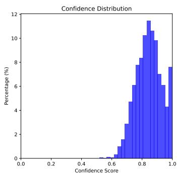

<details>
<summary>bar</summary>

| Confidence Score Range | Percentage (%) |
| ---------------------- | -------------- |
| 0.0 - 0.1              | 0              |
| 0.1 - 0.2              | 0              |
| 0.2 - 0.3              | 0              |
| 0.3 - 0.4              | 0              |
| 0.4 - 0.5              | 0              |
| 0.5 - 0.6              | 0              |
| 0.6 - 0.7              | 1              |
| 0.7 - 0.8              | 3              |
| 0.8 - 0.9              | 6              |
| 0.9 - 1.0              | 11             |
</details>

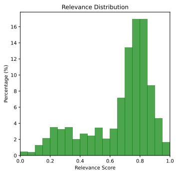

<details>
<summary>bar</summary>

| Relevance Score Range | Percentage (%) |
| --------------------- | -------------- |
| 0.0 - 0.1             | 0.5            |
| 0.1 - 0.2             | 1.5            |
| 0.2 - 0.3             | 3.5            |
| 0.3 - 0.4             | 3.0            |
| 0.4 - 0.5             | 2.5            |
| 0.5 - 0.6             | 3.5            |
| 0.6 - 0.7             | 7.0            |
| 0.7 - 0.8             | 13.5           |
| 0.8 - 0.9             | 16.5           |
| 0.9 - 1.0             | 4.5            |
</details>

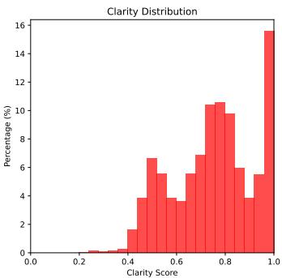

<details>
<summary>bar</summary>

| Clarity Score Range | Percentage (%) |
| ------------------- | -------------- |
| 0.0 - 0.1           | 0              |
| 0.1 - 0.2           | 0              |
| 0.2 - 0.3           | 0              |
| 0.3 - 0.4           | 1              |
| 0.4 - 0.5           | 2              |
| 0.5 - 0.6           | 4              |
| 0.6 - 0.7           | 6              |
| 0.7 - 0.8           | 7              |
| 0.8 - 0.9           | 10             |
| 0.9 - 1.0           | 16             |
</details>

Figure 4: Distribution of confidence, relevance, and clarity scores of extracted genomics knowledge graph triples from KARMA.

# C.2 Knowledge graph from Proteomics articles (Generate using DeepSeek-V3, Examples)

# Proteomics Knowledge Graph Triples

Key: Conf = Confidence, Rel = Relevance, Clr = Clarity

• $\mathbf { p } 5 3 \xrightarrow { \mathrm { i n d u c e s } }$ cell-cycle arrest (Conf: 0.95, Rel: 0.70, Clr: 0.85)   
• $\mathbf { p } 5 3 \xrightarrow { \mathrm { i n d u c e s } }$ apoptosis (Conf: 0.95, Rel: 0.70, Clr: 0.85)   
• mutant p53 causes −−−→ chemotherapy resistance (Conf: 0.85, Rel: 0.85, Clr: 0.85)   
• MDM2 interacts\_with −−−−−−→ p53 (Conf: 0.95, Rel: 0.20, Clr: 0.90)   
$\mathbf { P R I M A - 1 } \xrightarrow { \mathrm { i n d u c e s } }$ apoptosis (Conf: 0.85, Rel: 0.70, Clr: 0.85)   
• NOS2 associated\_with −−−−−−−→ cancers (Conf: 0.85, Rel: 0.70, Clr: 0.60)   
• NOS2 inhibitors inhibits −−−→ NOS2 (Conf: 0.95, Rel: 0.80, Clr: 0.90)   
• NOS2 inhibitors reduces −−−→ tumor growth (Conf: 0.85, Rel: 0.75, Clr: 0.85)   
• NO induces −−−→ VEGF (Conf: 0.78, Rel: 0.70, Clr: 0.70)   
• $\mathbf { N O } \xrightarrow { \mathrm { i n d u c e s } } $ neovascularization (Conf: 0.45, Rel: 0.70, Clr: 0.75)   
• NOS2 inhibitors has\_therapeutic\_potential−−−−−−−−−−−−→ p53-mutant cancers (Conf: 0.78, Rel: 0.75, Clr: 0.85)   
• tumor progression dependent\_on−−−−−−→ p53 (Conf: 0.85, Rel: 0.70, Clr: 0.85)   
• $\mathbf { N O S 2 } \xrightarrow { \mathrm { p r o m o t e s } } $ tumor growth (Conf: 0.85, Rel: 0.85, Clr: 0.75)   
• NOS2 produces−−−−→ nitric oxide (NO) (Conf: 0.95, Rel: 0.90, Clr: 0.90)   
• hypoxia regulates−−−−→ iNOS expression (Conf: 0.85, Rel: 0.70, Clr: 0.85)   
• iNOS expression influences −−−−−→ endothelial integrity (Conf: 0.85, Rel: 0.70, Clr: 0.75)   
• sulindac sulfide treats −−→ cancers (Conf: 0.78, Rel: 0.70, Clr: 0.75)

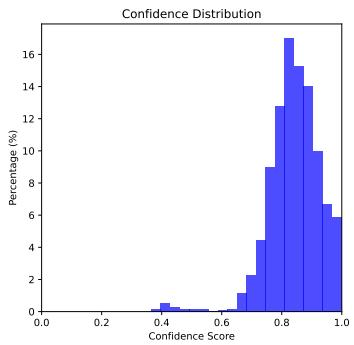

<details>
<summary>bar</summary>

| Confidence Score Range | Percentage (%) |
| ----------------------- | -------------- |
| 0.0 - 0.1               | 0              |
| 0.1 - 0.2               | 0              |
| 0.2 - 0.3               | 0              |
| 0.3 - 0.4               | 0              |
| 0.4 - 0.5               | 0.5            |
| 0.5 - 0.6               | 0.5            |
| 0.6 - 0.7               | 1              |
| 0.7 - 0.8               | 4              |
| 0.8 - 0.9               | 17             |
| 0.9 - 1.0               | 10             |
</details>

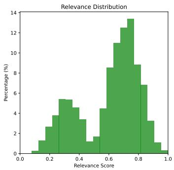

<details>
<summary>histogram</summary>

| Relevance Score Range | Percentage (%) |
| --------------------- | -------------- |
| 0.0 - 0.1             | 0.5            |
| 0.1 - 0.2             | 1.2            |
| 0.2 - 0.3             | 2.8            |
| 0.3 - 0.4             | 5.5            |
| 0.4 - 0.5             | 3.5            |
| 0.5 - 0.6             | 1.8            |
| 0.6 - 0.7             | 8.5            |
| 0.7 - 0.8             | 13.5           |
| 0.8 - 0.9             | 7.0            |
| 0.9 - 1.0             | 1.0            |
</details>

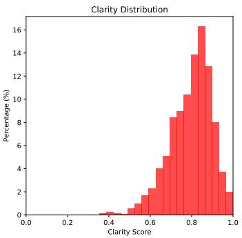

<details>
<summary>bar</summary>

| Clarity Score Range | Percentage (%) |
| ------------------- | -------------- |
| 0.0 - 0.1           | 0              |
| 0.1 - 0.2           | 0              |
| 0.2 - 0.3           | 0              |
| 0.3 - 0.4           | 0              |
| 0.4 - 0.5           | 0              |
| 0.5 - 0.6           | 1              |
| 0.6 - 0.7           | 2              |
| 0.7 - 0.8           | 5              |
| 0.8 - 0.9           | 14             |
| 0.9 - 1.0           | 2              |
</details>

Figure 5: Distribution of confidence, relevance, and clarity scores of extracted proteomics knowledge graph triples from KARMA.

# C.3 Knowledge graph from Metabolomics articles (Generate using GLM-4, Examples)

# Metabolomics Knowledge Graph Triples

Key: Conf = Confidence, Rel = Relevance, Clr = Clarity

• G6PD activates −−−−→ NADPH (Conf: 0.75, Rel: 0.80, Clr: 0.50)   
• $\mathbf { B A G 3 } \ { \xrightarrow { \mathrm { { i n t e r a c t s \_ w i t h } } } }$ phosphorylation (Conf: 0.75, Rel: 0.50, Clr: 0.99)   
• Mitotic NADPH surge $\xrightarrow { \mathrm { p r e v e n t s } }$ chromosome missegregation (Conf: 0.75, Rel: 0.80, Clr: 0.80)   
• High BAG3 phosphorylation $\xrightarrow { \mathrm { a s s o c i a t e d \_ w i t h } } $ poor prognosis (Conf: 0.75, Rel: 0.80, Clr: 0.99)   
$\mathbf { G 6 P D } \xrightarrow { \mathrm { c r u c i a l i n } } $ pentose phosphate pathway (Conf: 0.85, Rel: 0.90, Clr: 0.80)   
• Acetylation at lysine residue $\mathbf { K 8 9 } \xrightarrow [ ] { \mathrm { a c t i v a t e s } } $ G6PD (Conf: 0.75, Rel: 0.80, Clr: 0.99)   
• Acetylation at lysine residue K403 inhibits −−−→ G6PD (Conf: 0.75, Rel: 0.80, Clr: 0.80)   
• astrocyte-to-neuron H2O2 signaling activates −−−−→ long-term memory formation (Conf: 0.75, Rel: 0.80, Clr: 0.80)   
• astrocytes generates $\xrightarrow { \mathrm { g e n e r a t e s } }$ extracellular ROS (Conf: 0.75, Rel: 0.80, Clr: 0.80)   
• extracellular $\mathbf { R O S } { \xrightarrow { \mathrm { i m p o r t e d b y } } }$ neurons (Conf: 0.45, Rel: 0.80, Clr: 0.80)   
• Alzheimer’s disease model ${ \underline { { \operatorname { i m p a i r s } } } } $ astrocyte-to-neuron H2O2 signaling (Conf: 0.75, Rel: 0.80, Clr: 0.80)   
• Alzheimer’s disease model ${ \xrightarrow { \operatorname { i m p a i r s } } }$ memory formation (Conf: 0.85, Rel: 0.80, Clr: 0.80)   
• ROS signaling ${ \xrightarrow { \operatorname { i m p o r t a n t } \mathrm { f o r } } }$ memory (Conf: 0.75, Rel: 0.70, Clr: 0.60)   
• astrocyte function important for−−−−−−→ memory (Conf: 0.75, Rel: 0.80, Clr: 0.60)   
• Alzheimer’s disease $\xrightarrow { \mathrm { i n v o l v e s } }$ astrocyte function (Conf: 0.75, Rel: 0.70, Clr: 0.50)   
• Alzheimer’s disease $\xrightarrow { \mathrm { i n v o l v e s } }$ ROS signaling (Conf: 0.75, Rel: 0.80, Clr: 0.80)

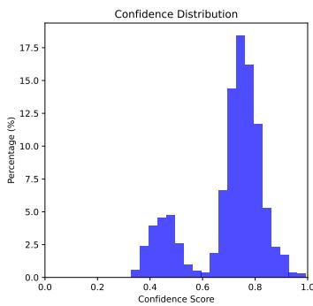

<details>
<summary>histogram</summary>

| Confidence Score Range | Percentage (%) |
| ----------------------- | -------------- |
| 0.0 - 0.1               | 0.0            |
| 0.1 - 0.2               | 0.0            |
| 0.2 - 0.3               | 0.0            |
| 0.3 - 0.4               | 1.0            |
| 0.4 - 0.5               | 3.0            |
| 0.5 - 0.6               | 4.5            |
| 0.6 - 0.7               | 6.5            |
| 0.7 - 0.8               | 18.0           |
| 0.8 - 0.9               | 12.0           |
| 0.9 - 1.0               | 1.0            |
</details>

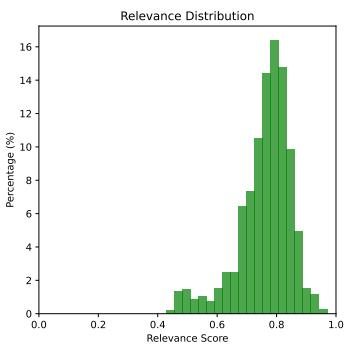

<details>
<summary>bar</summary>

| Relevance Score Range | Percentage (%) |
| --------------------- | -------------- |
| 0.0 - 0.1             | 0              |
| 0.1 - 0.2             | 0              |
| 0.2 - 0.3             | 0              |
| 0.3 - 0.4             | 0              |
| 0.4 - 0.5             | 1              |
| 0.5 - 0.6             | 1              |
| 0.6 - 0.7             | 2              |
| 0.7 - 0.8             | 16             |
| 0.8 - 0.9             | 10             |
| 0.9 - 1.0             | 1              |
</details>

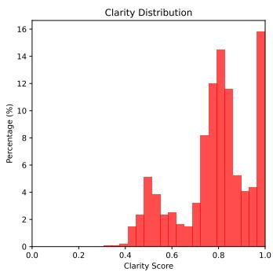

<details>
<summary>bar</summary>

| Clarity Score Range | Percentage (%) |
| ------------------- | -------------- |
| 0.0 - 0.1           | 0              |
| 0.1 - 0.2           | 0              |
| 0.2 - 0.3           | 0              |
| 0.3 - 0.4           | 0              |
| 0.4 - 0.5           | 1              |
| 0.5 - 0.6           | 5              |
| 0.6 - 0.7           | 2              |
| 0.7 - 0.8           | 8              |
| 0.8 - 0.9           | 14             |
| 0.9 - 1.0           | 16             |
</details>

Figure 6: Distribution of confidence, relevance, and clarity scores of extracted metabolomics knowledge graph triples from KARMA.

Key observations: High-clarity relationships $( c l r \ge 0 . 8 )$ typically involve well-characterized biochemical processes, while lower confidence scores often reflect novel or context-dependent findings requiring expert validation.