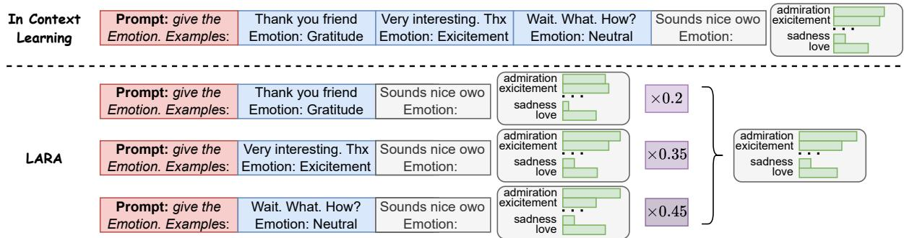
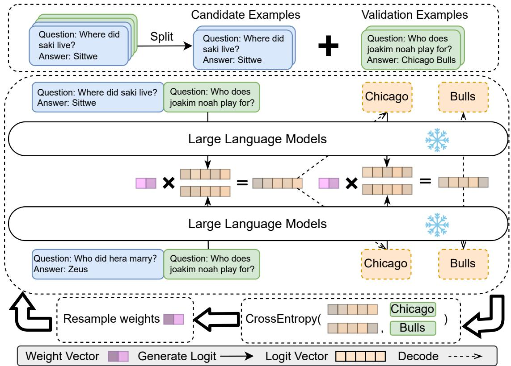
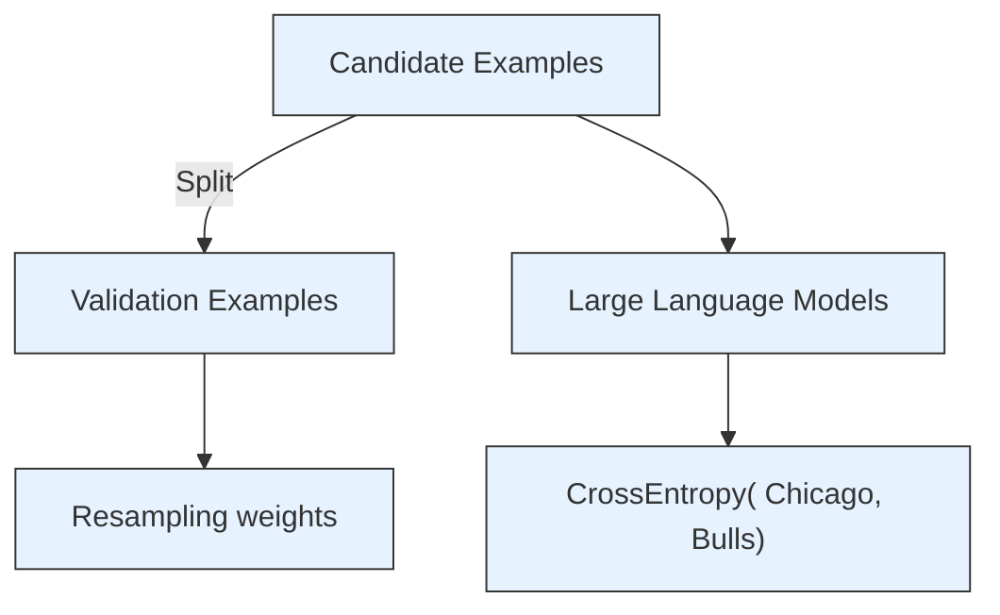
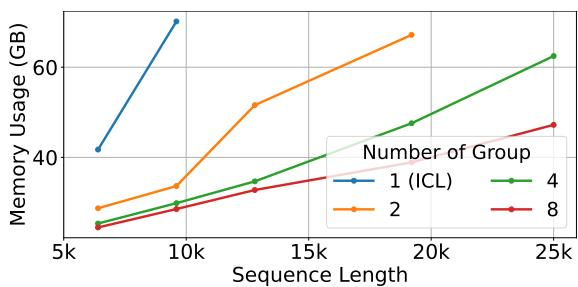
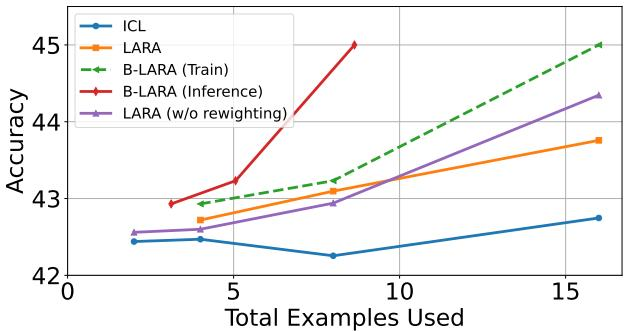

# Divide, Reweight, and Conquer: A Logit Arithmetic Approach for In-Context Learning

Chengsong Huang Langlin Huang Jiaxin Huang

{chengsong,h.langlin,jiaxinh}@wustl.edu

Washington University in St. Louis

# Abstract

In-Context Learning (ICL) emerges as a key feature for Large Language Models (LLMs), allowing them to adapt to new tasks by leveraging task-specific examples without updating model parameters. However, ICL faces challenges with increasing numbers of examples due to performance degradation and quadratic computational costs. In this paper, we propose Logit Arithmetic Reweighting Approach (LARA ), a novel framework that enhances ICL by using logit-based ensembling of multiple demonstrations. Our approach divides long input demonstrations into parallelizable shorter inputs to significantly reduce memory requirements, and then effectively aggregate the information by reweighting logits of each group via a nongradient optimization approach. We further introduce Binary LARA (B-LARA ), a variant that constrains weights to binary values to simplify the search space and reduces memory usage by filtering out less informative demonstration groups. Experiments on BBH and MMLU demonstrate that LARA and B-LARA outperform all baseline methods in both accuracy and memory efficiency. We also conduct extensive analysis to show that LARA generalizes well to scenarios of varying numbers of examples, from limited to many-shot demonstrations. Our codes can be found in https://anonymous. 4open.science/r/LARA-F55B.

# 1 Introduction

In-Context Learning (ICL) (Brown et al., 2020) is one of the emergent abilities of Large Language Models (LLMs) as they are scaled to billions of parameters (Wei et al., 2022). ICL enables LLMs to adapt to new tasks by utilizing task-specific examples within the input context (Dong et al., 2023; Li et al., 2023b), and does not require any updates to or access to model parameters. While ICL has achieved impressive performance across various domains, it encounters significant challenges when dealing with an increasing number of examples. Longer context window size often leads to performance degradation (Xiong et al., 2023). This is due to the low density of useful information within longer prompts, and the reduced sensitivity to positional information, both of which diminish the capability of the model to effectively capture and utilize key content. Additionally, the quadratic growth of computational cost with the input length makes it particularly expensive for large models.

Previous works primarily focus on two directions to address these challenges. The first direction is input compression, which aims to shorten the input length (Jiang et al., 2023b; Pan et al., 2024; Xu et al., 2023a; Wingate et al., 2022) or selectively retrieve relevant portions of demonstrations to be included in the prompt (an Luo et al., 2024). However, these methods risk losing critical information, which may negatively impact model performance. The second direction involves aggregating hidden states within LLMs to simulate the effect of incontext demonstrations (Hao et al., 2022; Li et al., 2023c; Hendel et al., 2023). These methods, however, are not applicable to closed-source models like GPT-4, as they require direct access to the model internal weights. Additionally, they contradict the core advantage of in-context learning, which is the ability to operate without modifications to hidden states or model parameters.

In this study, we propose a novel framework, Logit Arithmetic Reweighting Approach (LARA), which aims to combine the strengths of both input compression and hidden state approaches. Our method first divides demonstrations into subgroups to allow LLMs to focus on shorter inputs and reduce computational requirements. We then design a weighted sum aggregation approach to combine the output logits from the language model given each subgroup of examples. This ensures that the relevant information from each subgroup could potentially be captured by the language model.

One key innovation in LARA is that we use a non-gradient approach to optimize the weights of logits for each subgroup. We employ the Covariance Matrix Adaptive Evolution Strategy (CMA-ES) (Hansen and Ostermeier, 1996) to efficiently explore the weight vector space via resampling based on best-performing candidates. This allows us to optimize the contribution of each subgroup without any gradient updates. We further develop Binary-LARA (B-LARA ) by constraining the weight values to {0, 1}, which can be interpreted as a process of subgroup selection. This not only reduces the computational cost but more importantly, leads to better performance due to the simplified search space for the binary weight vector.

Our experiments on BBH and MMLU benchmarks show that both LARA and B-LARA consistently outperform direct in-context learning and simple retrieval-based demonstration selection across various models, with the additional benefit of lower GPU memory usage. Further analysis reveals that the method excels in both lowresource scenarios with few examples and settings with abundant demonstrations, consistently delivering superior performance. Moreover, our ablation study highlights the critical role of the reweighting steps, although even logit averaging alone outperforms standard in-context learning.

To summarize, our main contributions are as follows:

• To the best of our knowledge, we are the first to propose ensembling information through logit arithmetic from different ICL demonstrations. This approach also enables usage with closed-source models and can be applied to generative tasks as well. We introduce LARA , a non-gradient optimization framework that reweights the information of different demonstration groups to improve ICL performance.

• We conduct extensive experiments on Llama3.1-8B (Dubey et al., 2024), Mistral-7B (Jiang et al., 2023a), and Gemma-7B (Mesnard et al., 2024) on BBH (Srivastava et al., 2022) and MMLU (Hendrycks et al., 2021), and show that LARA outperforms all baseline methods across all three models.

• Our comprehensive analysis reveals the broad applicability and efficiency of LARA and B-LARA . We demonstrate that our methods consistently outperform baselines across a wide

range of example quantities, from fewer than 5 to more than 200. We also demonstrate the applicability of our methods to black-box LLMs.

# 2 Methodology

In this section, we provide an overview of LARA . Figure 2 illustrates the overall framework of our approach. Unlike directly concatenating $\mathcal { D } _ { \mathrm { t r a i n } }$ into a single sequence, we first divide the N examples into subgroups, which are used as inputs to the LLM. The output logits from these subgroups are then aggregated, and we assign weights to each subgroup using a non-gradient search algorithm. During inference, the precomputed weights are used to combine the logits from each group.

In Sec. 2.1, we explain the partition strategy to divide examples into subgroups. Then we introduce how the outputs are aggregated across different subgroups in Sec. 2.2, and the reweighting strategy for optimal combination in Sec. 2.3. Furthermore, we show in Sec. 2.4 that imposing a hard constraint for our reweighting strategy could further reduce memory usage and computational resources. Finally, we discuss in Sec. 2.5 the inference efficiency brought by our proposed approach.

# 2.1 Partition Strategy

Given N-shot in-context examples, we first split $\mathcal { D } _ { \mathrm { t r a i n } }$ into k disjoint subsets each containing L in-context examples, such that $\begin{array} { r l } { \mathcal { D } _ { \mathrm { t r a i n } } } & { { } = } \end{array}$ $S _ { 1 } \cup S _ { 2 } \cup . . . \cup S _ { k }$ with $| S _ { i } | ~ = ~ L$ for all $i \in$ $\{ 1 , \ldots , k \}$ . When inputting a subgroup $S _ { i }$ to an LLM, we concatenate all of its elements to get $\mathcal { C } _ { i } = d _ { ( i - 1 ) L + 1 } \oplus d _ { ( i - 1 ) L + 2 } \oplus \cdots \oplus d _ { i L }$ , and the complete input for the i-th subgroup to LLM is $\mathcal { C } _ { i } \oplus \pmb { x } _ { \mathrm { t e s t } }$ . We assume that N is divisible by k in our experiments, so that $L = N / k$ . In practice, in cases where N is not divisible by k, we could truncate the last subset and only retain L(k  1) examples.

# 2.2 Logit-Arithmetic Decoding

Previous studies (Li et al., 2022; Liu et al., 2024; Dekoninck et al., 2023) have utilized logit offsets to control the outputs of large language models for better generation quality or instruction following. Inspired by these work, we propose a novel method that combines information from multiple in-context demonstrations through logit-arithmetic decoding.

bar

| Learning Method | Prompt: give the Emotion. Examples: | Thank you friend Emotion: Gratitude | Very interesting. Thx Emotion: Excitement | Wait. What. How? Emotion: Neutral | Sounds nice owo Emotion: | admiration excitement sadness love ×0.2 | admiration excitement sadness love ×0.35 | admiration excitement sadness love ×0.45 |
|---|---|---|---|---|---|---|---|---|
| LARA | Prompt: give the Emotion. Examples: | Thank you friend Emotion: Gratitude | Sounds nice owo Emotion: | admiration excitement sadness love | admiration excitement sadness love | admiration excitement sadness love ×0.2 | admiration excitement sadness love ×0.35 | admiration excitement sadness love ×0.45 |
| LARA | Prompt: give the Emotion. Examples: | Very interesting. Thx Emotion: Excitement | Sounds nice owo Emotion: | admiration excitement sadness love | admiration excitement sadness love | admiration excitement sadness love ×0.2 | admiration excitement sadness love ×0.35 | admiration excitement sadness love ×0.45 |
| LARA | Prompt: give the Emotion. Examples: | Wait. What. How? Emotion: Neutral | Sounds nice owo Emotion: | admiration excitement sadness love | admiration excitement sadness love<fcel> admiration excitement sadness love ×0.2 | admiration excitement sadness love ×0.35 | admiration excitement sadness love ×0.45 | admiration excitement sadness love ×0.45 |
In Context Learning

Figure 1: Illustration of the differences between few-shot in-context learning and LARA (ours) during inference. Unlike few-shot in-context learning, which concatenates all demonstrations as a prefix to the input, our method splits the in-context examples into different groups. The next token is then generated based on a weighted average of logits, with weights precomputed using the framework described in Sec. 2.3.

Specifically, our approach focuses on aggregating the logits produced by the language model outputs for various contextual inputs. Compared with ensembling only the final outputs (Khalifa et al., 2023), this approach can be more naturally applied to open-ended generation tasks or tasks requiring detailed reasoning paths.

With the input query ${ \pmb x } _ { \mathrm { t e s t } }$ and the example subset being $S _ { i }$ , we can compute the logit outputs of the language model, denoted as $f _ { \theta } ( S _ { i } , x _ { \mathrm { t e s t } } ) =$ log $p ( \boldsymbol { y } \mid \boldsymbol { S } _ { i } , \boldsymbol { x } _ { \mathrm { t e s t } } )$ . We then combine these logits using a weighted sum to get the generation probability over the output token:

$$
p (y \mid \boldsymbol {x} _ {\text { test }}, \boldsymbol {w}) = \operatorname{softmax} \left(\sum_ {i = 1} ^ {k} w _ {i} \cdot f _ {\theta} (\mathcal {S} _ {i}, \boldsymbol {x} _ {\text { test }})\right) \tag {1}
$$

where k is the number of example subsets, and wi are weights that indicate the importance of the contribution of each subset, with Pk $\textstyle \sum _ { i = 1 } ^ { k } w _ { i } = 1$ i=1 wi = 1. As a baseline approach, we could set uniform weighting, where $w _ { i } = 1 / k$ . However, this may not be optimal for all tasks, as the quality and relevance of different subgroups may vary. In the following section, we introduce a reweighting strategy to optimize these weights to enhance model performance.

# 2.3 Reweighting Logits by Non-Gradient Optimization

To further enhance the model performance, we employ non-gradient optimization methods to optimize the weights $w _ { i }$ based on the loss calculated from $p ( \boldsymbol { y } \mid \boldsymbol { x } _ { \mathrm { v a l } } )$ . Given the combined probability $p ( y \mid x _ { \mathrm { v a l } } )$ , our objective is to minimize a crossentropy loss function $\mathcal { L } ( w )$ over the predicted probabilities and the ground truth. Specifically, we utilize the following cross-entropy loss function for the generation model:

$$
\mathcal {L} (\boldsymbol {w}) = - \sum_ {\left(\boldsymbol {x} _ {\text { val }}, \boldsymbol {y} _ {\text { val }}\right) \in \mathcal {D}} \sum_ {t = 1} ^ {T} \log p (y _ {t} \mid \boldsymbol {x} _ {\text { val }}, \boldsymbol {w})
$$

where D represents the validation dataset, $T$ is the length of the sequence, $y _ { t }$ is the true word at time step t, ${ \bf \mathcal { x } } _ { \mathrm { v a l } }$ is the input sequence, w denotes the weight vector, and $p ( \boldsymbol { y } _ { t } \mid \boldsymbol { x } _ { \mathrm { v a l } } , \boldsymbol { w } )$ represents the predicted probability of the true word $y _ { t }$ at time step t, given the input sequence ${ \bf \mathcal { x } } _ { \mathrm { v a l } }$ and the weight vector w.

To avoid introducing additional labeled data, we employ a cross-validation strategy. We partition the demonstration set into two subsets: ${ \mathcal { S } } _ { A } = { \mathcal { S } } _ { 1 } \cup$ $ { S _ { \mathrm { 2 } } } \cup \dots \cup  { S _ { | k / 2 | } }$ and $\begin{array} { r } { S _ { B } = S _ { \lfloor k / 2 \rfloor + 1 } \cup S _ { \lfloor k / 2 \rfloor + 2 } \cup } \end{array}$ $\ldots \cup S _ { k }$ . When optimizing weights for $\cal { S } _ { i } \in { \cal { S } } _ { A }$ we use $\scriptstyle { S _ { B } }$ as the validation set, and vice versa.

We choose non-gradient optimization methods over gradient-based alternatives due to two key factors: (1) The loss function $\mathcal { L } ( w )$ is nondifferentiable, since updating the weight vector w affects the logits of subsequent tokens, leading to possibly different decoding results of subsequent tokens. (2) The dimensionality of the weight vector w is relatively low, specifically equalled to the number of groups k.

In our empirical experiments, we refer to Liu et al. (2020) and employ the Covariance Matrix Adaptive Evolution Strategy (CMA-ES) (Hansen and Ostermeier, 1996). CMA-ES is a stochastic, derivative-free optimization algorithm. During each iteration, CMA-ES samples a set of candidates in the space of the weight vector w from a multivariate normal distribution, evaluates $\mathcal { L } ( w )$ for each candidate, and then updates the mean and covariance matrix of the distribution based on the best-performing candidates. This allows for an efficient exploration over the weight space.

flowchart

Figure 2: Illustration of the LARA framework. The input demonstration set $\mathcal { D } _ { \mathrm { t r a i n } }$ is divided into subsets $s _ { 1 } , s _ { 2 } , \ldots , s _ { k }$ , which are further split into two groups: one for candidate examples and the other for validation examples. For each token, logits are generated using Logit-Arithmetic Decoding, which aggregates the output logits from all subsets. After generating all tokens, the cross-entropy loss is computed based on the weighted-average logits and the ground truth from the validation subset. The subset weights are then resampled and adjusted to minimize the loss. This process of token generation, loss calculation, and weight resampling is repeated iteratively. After optimizing the weights for the first group of candidate examples, the roles of the candidate and validation examples are swapped.

We also use the loss to decide the hyperparameter L. We compare the minimum validation loss across different settings of L to determine the optimal configuration, including L and corresponding w, for the final inference phase.

# 2.4 Binary Constraints for LARA

We further propose a variant of LARA , named as B-LARA , by imposing a hard constraint on the weight vector w to binary values 0, 1 . This binary constraint offers two key advantages: first, it simplifies the search space and potentially leads to faster convergence; second, it allows for direct elimination of demonstration groups with zero weight, thereby improving inference efficiency. Intuitively, the binary optimization of w can be seen as a form of subset selection to identify the most relevant demonstrations in $\mathcal { D } _ { \mathrm { t r a i n } }$ benefitting model performance on specific tasks.

To solve this binary optimization problem, we employ the simplest evolution strategy (1+1)- ES (Rechenberg, 1973). The overall sampling procedure is shown in Appendix G. The simplicity of this method in repeated mutation and selection makes it particularly suitable for B-LARA.

# 2.5 Computational Complexity

We analyze the computational complexity of LARA and B-LARA compared to standard ICL. During inference, the self-attention mechanism in Transformer models is the primary bottleneck for GPU memory requirement, with the memory complexity being $O ( n ^ { 2 } )$ , where n is the input sequence length. This quadratic scaling is due to the pairwise interactions between tokens in the attention matrix.

Since we focus on scenarios with a large number of in-context demonstrations, we neglect the length of task descriptions and test queries. By splitting the input sequence into k groups, each of length around n, LARA and B-LARA can leverage parallel computing resources more effectively. The complexity for LARA becomes $\scriptstyle O ( { \frac { n } { k } } ^ { 2 } * k ) =$ $O ( \frac { n ^ { 2 } } { k } )$ . B-LARA further reduces computational complexity by selecting only a subset of examples. If m out of k subgroups are assigned non-zero weights, then the complexity of B-LARA becomes $O ( \frac { m n ^ { 2 } } { k ^ { 2 } } )$ . We show the empirical GPU memory usage in Sec. 4.2.

# 3 Experiments

In this section, we provide details of our main experiments. We first give an overview of the experimental setup and implementation details in Appendix F, and then present our findings along with the results in Sec. 3.2.

# 3.1 Compared Methods.

We introduce several primary baseline methods: Direct In-Context Learning (ICL), KNN-Augmented In-ConText Example Selection (Liu et al., 2022) (KATE), Rationale-Augmented Ensembles (RAE) (Wang et al., 2022) and In-context Vector (ICV) (Liu et al., 2023) and StructICL (Hao et al., 2022) as the representative of parameter access methods. We use the same 32 in-context examples as inputs to all baseline methods as our proposed method. For Direct ICL, all 32 examples are concatenated with the prompt. For KATE, we apply the Top-K selection from Liu et al. (2022) that uses a smaller model1 to retrieve the most similar input-output pairs from $\mathcal { D } _ { \mathrm { t r a i n } }$ as in-context demonstrations. We evaluate KATE with 2, 4, and 8 demonstrations as baselines. For RAE, we divide the examples into different groups and use each group as in-context examples to generate separate results. The final output is determined by applying majority voting across these individual groupbased results, which is similar to ensembling (Khalifa et al., 2023). For StructICL, we also present the results with varying numbers of groups: 2, 4, and 8. In ICV, we follow the original paper to set λ = 0.1 and average the ICV given by all 32 examples. We report results with group sizes of 2, 4, and 8 to ensure the same memory usage as our method.

# 3.2 Main Results

Results from Table 1 demonstrate the effectiveness of our proposed methods, LARA , and B-LARA , across BBH and MMLU benchmarks. B-LARA consistently outperforms most of the baseline methods across three model architectures. Notably, B-LARA achieves the highest accuracy and improves over direct ICL by 2.05, 5.67, and 2.12 points on BBH dataset across three models respectively. Moreover, our methods can consistently outperform retrieval or simple ensemble baselines like KATE and RAE, indicating that our method is more effective in combining information from multiple demonstration subgroups. Compared to the ICV and StructICL baseline, which has the advantage of access to model parameters, our methods still achieve better performance without access to the hidden state, which further demonstrates the efficacy of our methods in aggregating information without direct access to model internal parameters.

An interesting finding is that B-LARA performs better than LARA despite a more constrained search space for the weight vector. We believe this is because we only use 20 iterations for weight optimization, and the binary constraint brings more benefits by introducing a simplified optimization landscape and providing a regularization effect to prevent overfitting.

# 4 Analysis

In this section, we present a deep analysis of LARA under various conditions. Due to the space limit, some additional analysis is deferred to Appendix A.

# 4.1 Can LARA Perform Well with More Examples?

We investigate the performance of LARA with an increased number of demonstrations, leveraging the LongICLBench (Li et al., 2024), a benchmark tailored for addressing challenges in long in-context learning. For our experiments, we select two datasets: GoEmotion and TacRED. Following the LongICLBench setup, we employ multiple rounds of examples, where each round includes several examples, each labeled with a distinct class. To align with the input limit constraints of ICL, we sampled 8 rounds (224 examples) of examples for GoEmotions and 4 rounds (164 examples) for TacRED. For LARA and B-LARA , we choose 4, 8, and 16 as the potential candidate number of groups. We report the accuracy of different methods on these datasets in Table 2.

<table><tr><td rowspan="2"></td><td colspan="3">BBH $_{average}$ </td><td colspan="3">MMLU $_{average}$ </td></tr><tr><td>Llama3.1-8B</td><td>Gemma-7B</td><td>Mistral-7B</td><td>Llama3.1-8B</td><td>Gemma-7B</td><td>Mistral-7B</td></tr><tr><td colspan="7">Black-Box Method:</td></tr><tr><td>ICL</td><td>45.64</td><td>37.08</td><td>42.91</td><td>65.63</td><td>61.44</td><td>62.84</td></tr><tr><td>KATE $_2$ </td><td>43.60</td><td>37.07</td><td>43.16</td><td>66.62</td><td>56.28</td><td>63.99</td></tr><tr><td>KATE $_4$ </td><td>44.03</td><td>38.83</td><td>43.16</td><td>66.75</td><td>55.78</td><td>63.48</td></tr><tr><td>KATE $_8$ </td><td>44.47</td><td>37.03</td><td>42.96</td><td>67.19</td><td>54.13</td><td>63.93</td></tr><tr><td>RAE $_2$ </td><td>44.59</td><td>40.24</td><td>43.95</td><td>66.88</td><td>65.18</td><td>62.99</td></tr><tr><td>RAE $_4$ </td><td>45.23</td><td>40.44</td><td>44.49</td><td>66.40</td><td>65.01</td><td>62.99</td></tr><tr><td>RAE $_8$ </td><td>44.06</td><td>39.85</td><td>44.07</td><td>67.09</td><td>64.80</td><td>63.61</td></tr><tr><td>LARA (ours)</td><td>47.46</td><td>41.77</td><td>44.77</td><td>66.54</td><td>64.36</td><td>63.93</td></tr><tr><td>B-LARA (ours)</td><td>47.69</td><td>42.75</td><td>45.03</td><td>67.80</td><td>65.56</td><td>64.12</td></tr><tr><td colspan="7">White-Box Method:</td></tr><tr><td>ICV</td><td>45.93</td><td>42.16</td><td>44.50</td><td>66.97</td><td>64.99</td><td>64.02</td></tr><tr><td>StructICL $_2$ </td><td>46.64</td><td>39.54</td><td>44.68</td><td>66.78</td><td>64.34</td><td>63.52</td></tr><tr><td>StructICL $_4$ </td><td>46.98</td><td>40.53</td><td>44.89</td><td>66.97</td><td>64.46</td><td>63.99</td></tr><tr><td>StructICL $_8$ </td><td>46.57</td><td>41.46</td><td>43.99</td><td>66.56</td><td>65.16</td><td>63.46</td></tr></table>

Table 1: Accuracy of all methods on BBH and MMLU. The results shown are the average performance across datasets within each benchmark. Please refer to Appendix H.2 for breakdown results of each dataset. The subscript indicates the number of selected ICL demonstrations as input to LLMs.

<table><tr><td rowspan="2"></td><td colspan="3">GoEmotion</td><td colspan="3">TacRED</td></tr><tr><td>Llama3.1-8B</td><td>Gemma-7B</td><td>Mistral-7B</td><td>Llama3.1-8B</td><td>Gemma-7B</td><td>Mistral-7B</td></tr><tr><td colspan="7">Black-Box Method:</td></tr><tr><td>ICL</td><td>18.60</td><td>15.60</td><td>17.80</td><td>38.20</td><td>43.80</td><td>55.40</td></tr><tr><td> $RAE_2$ </td><td>22.20</td><td>22.20</td><td>21.60</td><td>43.80</td><td>45.40</td><td>55.40</td></tr><tr><td> $RAE_4$ </td><td>21.00</td><td>22.40</td><td>21.40</td><td>45.60</td><td>45.00</td><td>52.40</td></tr><tr><td> $RAE_8$ </td><td>21.20</td><td>19.00</td><td>20.40</td><td>36.20</td><td>39.00</td><td>49.20</td></tr><tr><td>LARA (ours)</td><td>21.00</td><td>20.80</td><td>19.20</td><td>48.60</td><td>47.40</td><td>54.20</td></tr><tr><td>B-LARA (ours)</td><td>24.00</td><td>22.80</td><td>23.80</td><td>48.60</td><td>49.00</td><td>59.00</td></tr><tr><td colspan="7">White-Box Method:</td></tr><tr><td>ICV</td><td>18.80</td><td>20.80</td><td>18.40</td><td>44.40</td><td>46.80</td><td>54.40</td></tr><tr><td> $StructICL_2$ </td><td>19.00</td><td>21.00</td><td>18.60</td><td>46.60</td><td>47.60</td><td>55.80</td></tr><tr><td> $StructICL_4$ </td><td>19.80</td><td>21.40</td><td>19.00</td><td>47.60</td><td>48.00</td><td>56.40</td></tr><tr><td> $StructICL_8$ </td><td>20.60</td><td>22.00</td><td>19.80</td><td>44.80</td><td>48.60</td><td>56.20</td></tr></table>

Table 2: Accuracy of methods on GoEmotion and TacRED. The subscript indicates the number of selected ICL demonstrations as input to LLMs.

The experimental results clearly highlight the advantages of LARA , which demonstrates consistent improvements over baseline methods across both GoEmotion and TacRED datasets, showcasing its effectiveness in diverse tasks. Notably, the B-LARA variant further amplifies this performance, outperforming all competing approaches on both datasets and across various models. This suggests that B-LARA can work well in many-shot settings.

# 4.2 How Does LARA Enhance Memory Efficiency?

We empirically evaluate the computational efficiency of LARA by measuring GPU memory usage with different input sequence lengths and subgroup configurations. We set the number of groups k with 1,2,4,8. Specifically, when k is set as 1, LARA will degrade to ICL.

line

| Sequence Length | Number of Group 1 (ICL) | Number of Group 2 | Number of Group 4 | Number of Group 8 |
| --------------- | ------------------------ | ----------------- | ----------------- | ----------------- |
| 5k              | 40                       | 30                | 25                | 20                |
| 10k             | 70                       | 35                | 30                | 25                |
| 15k             | -                        | 50                | 35                | 30                |
| 20k             | -                        | 65                | 45                | 35                |
| 25k             | -                        | -                 | 60                | 45                |

Figure 3: GPU Memory usage of LARA in gigabytes on a single A100 80GB GPU with different input sequence lengths and number of subgroups. Note that when the number of subgroups equals to 1, the setting is the same as ICL. The sequence length is denoted in thousands of tokens. We set the batch size equal to 4. Data points indicating Out-Of-Memory (OOM) are omitted.

<table><tr><td>ICL</td><td>LARA</td><td>B-LARA</td></tr><tr><td>53.17</td><td>56.06</td><td>57.41</td></tr></table>

Table 3: Average performance of various methods of GPT-4o-mini on the BBH benchmark.

Results in Figure 3 demonstrate that LARA is more memory-efficient compared to standard ICL, especially when handling long sequences. Standard ICL results in Out-of-Memory (OOM) errors when the input length exceeds 10k tokens on a Mistral-7B model with a batch size of 4 on an A100 80GB GPU. In contrast, our method handles input lengths over 25k tokens with 4 and 8 subgroups, demonstrating that LARA efficiently utilizes larger amounts of training data.

# 4.3 Is LARA Applicable to Black-Box LLMs?

One advantage of our method is that it could also be applied to LLM APIs, since it only uses output logits for example reweighting or selection. In these scenarios, techniques such as in-context vector or task vector, which often rely on internal state visibility, cannot be applied.

We evaluate our method with GPT-4o-mini 2 on BBH dataset. The results in Table 3 demonstrate that LARA and B-LARA outperform ICL. We note that the OpenAI API only provides top 20 logits for each output token, while our methods are still able to achieve competitive results. This indicates that our method generalizes well to blackbox LLMs, and can be applied to situations where internal weights of models are restricted and only output logits are available.

# 4.4 How does the Reweighting Step Affect Model Performance?

We conduct an ablation study to assess the effectiveness of the reweighting step, denoted as “w/o reweight” which simply averages over the output logits of the LLM across different demonstration groups.

In our ablation study, removing the reweighting step used in LARA also demonstrated its value by outperforming traditional baseline methods. For instance, it achieved a notable 67.58 with Llama3.1- 8B in the MMLU benchmark, which is better than

<table><tr><td>Method</td><td>BBH</td><td>MMLU</td></tr><tr><td>LARA</td><td>47.46</td><td>66.54</td></tr><tr><td>B-LARA</td><td>47.69</td><td>67.80</td></tr><tr><td>w/o reweight $_2$ </td><td>43.33</td><td>67.23</td></tr><tr><td>w/o reweight $_4$ </td><td>44.50</td><td>67.58</td></tr><tr><td>w/o reweight $_8$ </td><td>43.02</td><td>67.43</td></tr></table>

Table 4: Average performance of Llama3.1-8B our methods without reweighting. For the ablation “w/o reweight”, the subscript means the size L of each group of demonstrations. The results for other models are shown in Appendix H.1

<table><tr><td></td><td>Llama-3</td><td>LongChat</td><td>Vicuna</td></tr><tr><td>ICL</td><td>66.64</td><td>9.93</td><td>16.30</td></tr><tr><td>EarlyStop</td><td>71.21</td><td>11.14</td><td>17.44</td></tr><tr><td>StructICL</td><td>69.43</td><td>11.25</td><td>17.12</td></tr><tr><td>FocusICL</td><td>71.89</td><td>12.28</td><td>17.74</td></tr><tr><td>B-LARA</td><td>73.86</td><td>12.23</td><td>18.12</td></tr></table>

Table 5: Accuracy across different models on GSM8K. directly ICL (65.63). This performance highlights that logit-arithmetic can successfully combine the information in different groups of demonstrations.

# 4.5 How Does LARA Extend to Generation Tasks?

In previous experiments, we mainly focus on the classification or single token generation tasks. Here we extend our experiments to generation tasks like GSM8K (Cobbe et al., 2021) for math reasoning. We follow the experimental setting used in FocusICL (Yuan et al., 2024) and evaluate our method against Llama-3-8B-Instruct, LongChat-7B-V1.5-32K (Li et al., 2023a) and Vicuna-7B-V1.5-16K (Dong et al., 2023). Following FocusICL, we randomly select 80 examples from the training set and split them into 10 groups for our methods.

The results in Table 5 show B-LARA outperforms FocusICL, which is the previous state-of-theart method, in 2 out of 3 models. Notably, this is achieved without relying on hidden states, highlighting the simplicity and efficiency of our method on generation tasks. Additional experiments on summary and translation tasks are provided in the Appendix D.

# 4.6 Do We Need Trainable Weights with Supervision?

We compare our method with Mixtures of In-Context Learners (MoICL) (Hong et al., 2024), which also enhances in-context learning by aggregating predictions from multiple demonstration groups. While MoICL learns group-specific weights using external training data or a trained hypernetwork, LARA operates in a fully selfcontained manner. LARA also jointly tunes the number of groups, enabling adaptive reweighting without any additional supervision.

<table><tr><td>Method</td><td>Hate</td><td>RTE</td><td>QNLI</td></tr><tr><td>Mixture of ICL (uniform)</td><td>59.12</td><td>77.26</td><td>88.66</td></tr><tr><td>Mixture of ICL (scalar)</td><td>63.45</td><td>79.93</td><td>90.11</td></tr><tr><td>Mixture of ICL (hyper)</td><td>70.02</td><td>-</td><td>-</td></tr><tr><td>LARA</td><td>67.20</td><td>78.30</td><td>89.00</td></tr><tr><td>B-LARA</td><td>65.31</td><td>79.50</td><td>90.66</td></tr></table>

Table 6: Comparison with Mixture of ICL on selected classification tasks. Full results are shown in Appendix E.

As shown in Table 6, LARA and its binary variant B-LARA outperform MoICL across several classification benchmarks. On the Hate and PAWS datasets, LARA achieves 67.20 and 78.20 accuracy respectively, surpassing the best MoICL variant by significant margins.

# 5 Related Work

# 5.1 Long In-Context Learning

Recent studies on long-context learning problems in LLMs can be categorized into two main strategies: enhancing the impact of in-context examples and compressing input sequences. Structured prompting leverages rescaled attention mechanisms to effectively integrate grouped examples (Hao et al., 2022). Methods such as task vectors (Hendel et al., 2023) and function vectors (Todd et al., 2023) further refine this strategy by generating vectors that assess the contribution of each example based on the offset of hidden state, which improves model adaptability. (Liu et al., 2023) generate taskspecific vectors that steer model behavior in latent space based on the in-context examples. For manyshot in-context learning problems, previous studies have proposed group-based methods, such as StructICL (Hao et al., 2022) and FocusICL (Yuan et al., 2024), which refine attention maps by utilizing subgroup structures within the demonstrations. Similar to our parallelized methods, (Zheng et al., 2025) use parallelized decoder to improve the inference speed.

# 5.2 Logit Arithmetic

Several works have employed logit arithmetic across various domains and downstream tasks. Contrastive decoding (Li et al., 2022) improves performance by utilizing the difference in logits from models of different sizes. Proxy tuning (Liu et al., 2024) enhances a larger model’s capabilities by adding the logit differences of a smaller model, recorded before and after training, to simulate training effects. In model arithmetic (Dekoninck et al., 2023), logits adjusted with various prompts steer the generation processes of large language models. (Huang et al., 2024) propose using logit subtraction to facilitate the selective forgetting of knowledge in LLMs. Additionally, logit arithmetic has been leveraged to enhance the safety of generated outputs (Xu et al., 2024).

# 5.3 Non-gradient Optimization of LLMs

Due to the high memory requirements associated with gradient-based optimization methods, recent research has shifted towards non-gradient techniques for neural network optimization. (Zhang et al., 2024; Malladi et al., 2023) propose training large language models (LLMs) using non-gradient methods to mitigate these memory constraints. These approaches have also been applied in federated learning, exploring their effectiveness in distributed settings (Xu et al., 2023b). Additionally, a gradient-free method has been used to optimize manifold neural networks (Zhang et al., 2022). Similarly, LoraHub (Huang et al., 2023) utilizes nongradient techniques to dynamically reweight different LoRA modules, enhancing adaptation to new downstream tasks. (Guo et al., 2023) also introduces non-gradient methods to prompt engineering to search for better prompts.

# 6 Conclusion

We proposed LARA , a novel framework that enhances in-context learning by ensembling logits from multiple demonstrations, improving performance without requiring parameter updates. Our method reduces computational complexity while achieving better accuracy. Additionally, Binary LARA further optimizes efficiency by selectively removing less informative demonstrations. Experiments on BBH and MMLU benchmarks show that both LARA and B-LARA outperform traditional ICL methods in terms of efficiency and performance. Future research directions include extending our study to combine logits from different sources beyond just in-context learning (ICL) examples—such as different models or varying instructions—and building a distributed inference system based on LARA .

# Limitations

In scenarios where only a few inferences are required, the additional overhead introduced by optimizing in-context combinations may outweigh the computational cost of the downstream inference tasks. This limitation restricts the applicability of our method to situations involving many similar downstream tasks. For some closed-source models like Claude that only provide output responses without exposing internal mechanisms, our method remains inapplicable due to the lack of necessary access for optimization.

# Acknowledgments

We thank the anonymous reviewers and the area chair for their time, effort, and constructive suggestions, which have greatly improved the quality of this paper This research was supported in part by the NVIDIA Academic Grant Program and WashU Ignite Interdisciplinary Grants.

# References

an Luo, Xin Xu, Yue Liu, Panupong Pasupat, and Mehran Kazemi. 2024. In-context learning with retrieved demonstrations for language models: A survey. ArXiv preprint, abs/2401.11624.   
Tom B. Brown, Benjamin Mann, Nick Ryder, Melanie Subbiah, Jared Kaplan, Prafulla Dhariwal, Arvind Neelakantan, Pranav Shyam, Girish Sastry, Amanda Askell, Sandhini Agarwal, Ariel Herbert-Voss, Gretchen Krueger, Tom Henighan, Rewon Child, Aditya Ramesh, Daniel M. Ziegler, Jeffrey Wu, Clemens Winter, and 12 others. 2020. Language models are few-shot learners. In Advances in Neural Information Processing Systems 33: Annual Conference on Neural Information Processing Systems 2020, NeurIPS 2020, December 6-12, 2020, virtual.   
Karl Cobbe, Vineet Kosaraju, Mohammad Bavarian, Mark Chen, Heewoo Jun, Lukasz Kaiser, Matthias Plappert, Jerry Tworek, Jacob Hilton, Reiichiro Nakano, Christopher Hesse, and John Schulman. 2021. Training verifiers to solve math word problems. arXiv preprint arXiv:2110.14168.   
Jasper Dekoninck, Marc Fischer, Luca Beurer-Kellner, and Martin T. Vechev. 2023. Controlled text generation via language model arithmetic. ArXiv preprint, abs/2311.14479.

Qingxiu Dong, Lei Li, Damai Dai, Ce Zheng, Zhiyong Wu, Baobao Chang, Xu Sun, Jingjing Xu, Lei Li, and Zhifang Sui. 2023. A survey for in-context learning. ArXiv, abs/2301.00234.

Abhimanyu Dubey, Abhinav Jauhri, Abhinav Pandey, Abhishek Kadian, Ahmad Al-Dahle, Aiesha Letman, Akhil Mathur, Alan Schelten, Amy Yang, Angela Fan, Anirudh Goyal, Anthony Hartshorn, Aobo Yang, Archi Mitra, Archie Sravankumar, Artem Korenev, Arthur Hinsvark, Arun Rao, Aston Zhang, and 8 others. 2024. The llama 3 herd of models. ArXiv, abs/2407.21783.

Qingyan Guo, Rui Wang, Junliang Guo, Bei Li, Kaitao Song, Xu Tan, Guoqing Liu, Jiang Bian, Yujiu Yang, Tsinghua University, and Microsoft Research. 2023. Connecting large language models with evolutionary algorithms yields powerful prompt optimizers. ArXiv preprint, abs/2309.08532.

Nikolaus Hansen and Andreas Ostermeier. 1996. Adapting arbitrary normal mutation distributions in evolution strategies: the covariance matrix adaptation. Proceedings of IEEE International Conference on Evolutionary Computation.

Yaru Hao, Yutao Sun, Li Dong, Zhixiong Han, Yuxian Gu, and Furu Wei. 2022. Structured prompting: Scaling in-context learning to 1, 000 examples. ArXiv, abs/2212.06713.

Roee Hendel, Mor Geva, and Amir Globerson. 2023. Incontext learning creates task vectors. ArXiv preprint, abs/2310.15916.

Dan Hendrycks, Collin Burns, Steven Basart, Andy Zou, Mantas Mazeika, Dawn Song, and Jacob Steinhardt. 2021. Measuring massive multitask language understanding. In Proc. of ICLR. OpenReview.net.

Giwon Hong, Emile van Krieken, Edoardo Ponti, Nikolay Malkin, and Pasquale Minervini. 2024. Mixtures of in-context learners. arXiv preprint arXiv:2411.02830.

Chengsong Huang, Qian Liu, Bill Yuchen Lin, Tianyu Pang, Chao Du, and Min Lin. 2023. Lorahub: Efficient cross-task generalization via dynamic lora composition. ArXiv preprint, abs/2307.13269.

James Y. Huang, Wenxuan Zhou, Fei Wang, Fred Morstatter, Sheng Zhang, Hoifung Poon, and Muhao Chen. 2024. Offset unlearning for large language models. ArXiv preprint, abs/2404.11045.

Albert Qiaochu Jiang, Alexandre Sablayrolles, Arthur Mensch, Chris Bamford, Devendra Singh Chaplot, Diego de Las Casas, Florian Bressand, Gianna Lengyel, Guillaume Lample, Lucile Saulnier, L’elio Renard Lavaud, Marie-Anne Lachaux, Pierre Stock, Teven Le Scao, Thibaut Lavril, Thomas Wang, Timothée Lacroix, and William El Sayed. 2023a. Mistral 7b. ArXiv preprint, abs/2310.06825.

Huiqiang Jiang, Qianhui Wu, Chin-Yew Lin, Yuqing Yang, and Lili Qiu. 2023b. Llmlingua: Compressing prompts for accelerated inference of large language models. In Conference on Empirical Methods in Natural Language Processing.   
Muhammad Khalifa, Lajanugen Logeswaran, Moontae Lee, Honglak Lee, and Lu Wang. 2023. Exploring demonstration ensembling for in-context learning. ArXiv, abs/2308.08780.   
Dacheng Li, Rulin Shao, Anze Xie, Ying Sheng, Lianmin Zheng, Joseph Gonzalez, Ion Stoica, Xuezhe Ma, and Hao Zhang. 2023a. How long can context length of open-source LLMs truly promise? In NeurIPS 2023 Workshop on Instruction Tuning and Instruction Following.   
Jinyuan Li, Han Li, Zhuo Pan, Di Sun, Jiahao Wang, Wenkun Zhang, and Gang Pan. 2023b. Prompting ChatGPT in MNER: Enhanced multimodal named entity recognition with auxiliary refined knowledge. In Findings of the Association for Computational Linguistics: EMNLP 2023, pages 2787–2802, Singapore. Association for Computational Linguistics.   
Mukai Li, Shansan Gong, Jiangtao Feng, Yiheng Xu, Jinchao Zhang, Zhiyong Wu, and Lingpeng Kong. 2023c. In-context learning with many demonstration examples. ArXiv preprint, abs/2302.04931.   
Tianle Li, Ge Zhang, Quy Duc Do, Xiang Yue, and Wenhu Chen. 2024. Long-context llms struggle with long in-context learning. ArXiv preprint, abs/2404.02060.   
Xiang Lisa Li, Ari Holtzman, Daniel Fried, Percy Liang, Jason Eisner, Tatsunori Hashimoto, Luke Zettlemoyer, and Mike Lewis. 2022. Contrastive decoding: Open-ended text generation as optimization. In Annual Meeting of the Association for Computational Linguistics.   
Alisa Liu, Xiaochuang Han, Yizhong Wang, Yulia Tsvetkov, Yejin Choi, and Noah A. Smith. 2024. Tuning language models by proxy. ArXiv preprint, abs/2401.08565.   
Jiachang Liu, Dinghan Shen, Yizhe Zhang, Bill Dolan, Lawrence Carin, and Weizhu Chen. 2022. What makes good in-context examples for GPT-3? In Proceedings of Deep Learning Inside Out (DeeLIO 2022): The 3rd Workshop on Knowledge Extraction and Integration for Deep Learning Architectures, pages 100–114, Dublin, Ireland and Online. Association for Computational Linguistics.   
Jialin Liu, A. Moreau, Mike Preuss, Baptiste Rozière, Jérémy Rapin, Fabien Teytaud, and Olivier Teytaud. 2020. Versatile black-box optimization. Proceedings of the 2020 Genetic and Evolutionary Computation Conference.   
Sheng Liu, Haotian Ye, Lei Xing, and James Y. Zou. 2023. In-context vectors: Making in context learning more effective and controllable through latent space steering. ArXiv preprint, abs/2311.06668.

Sadhika Malladi, Tianyu Gao, Eshaan Nichani, Alexandru Damian, Jason D. Lee, Danqi Chen, and Sanjeev Arora. 2023. Fine-tuning language models with just forward passes. ArXiv preprint, abs/2305.17333.   
Gemma Team Thomas Mesnard, Cassidy Hardin, Robert Dadashi, Surya Bhupatiraju, Shreya Pathak, L. Sifre, Morgane Riviere, Mihir Kale, J Christopher Love, Pouya Dehghani Tafti, L’eonard Hussenot, Aakanksha Chowdhery, Adam Roberts, Aditya Barua, Alex Botev, Alex Castro-Ros, Ambrose Slone, Am’elie H’eliou, and et al. 2024. Gemma: Open models based on gemini research and technology. ArXiv preprint, abs/2403.08295.   
Zhuoshi Pan, Qianhui Wu, Huiqiang Jiang, Menglin Xia, Xufang Luo, Jue Zhang, Qingwei Lin, Victor Rühle, Yuqing Yang, Chin-Yew Lin, H. Vicky Zhao, Lili Qiu, and et al. 2024. Llmlingua-2: Data distillation for efficient and faithful task-agnostic prompt compression. ArXiv preprint, abs/2403.12968.   
Ingo Rechenberg. 1973. Evolutionsstrategie : Optimierung technischer systeme nach prinzipien der biologischen evolution.   
Aarohi Srivastava, Abhinav Rastogi, Abhishek Rao, Abu Awal Md Shoeb, Abubakar Abid, Adam Fisch, Adam R. Brown, Adam Santoro, Aditya Gupta, and et al. 2022. Beyond the imitation game: Quantifying and extrapolating the capabilities of language models. ArXiv preprint, abs/2206.04615.   
Eric Todd, Millicent Li, Arnab Sen Sharma, Aaron Mueller, Byron C. Wallace, and David Bau. 2023. Function vectors in large language models. ArXiv preprint, abs/2310.15213.   
Xuezhi Wang, Jason Wei, Dale Schuurmans, Quoc Le, Ed Huai hsin Chi, and Denny Zhou. 2022. Rationaleaugmented ensembles in language models. ArXiv preprint, abs/2207.00747.   
Jason Wei, Yi Tay, Rishi Bommasani, Colin Raffel, Barret Zoph, Sebastian Borgeaud, Dani Yogatama, Maarten Bosma, Denny Zhou, Donald Metzler, Ed Huai hsin Chi, Tatsunori Hashimoto, Oriol Vinyals, Percy Liang, Jeff Dean, and William Fedus. 2022. Emergent abilities of large language models. ArXiv preprint, abs/2206.07682.   
David Wingate, Mohammad Shoeybi, and Taylor Sorensen. 2022. Prompt compression and contrastive conditioning for controllability and toxicity reduction in language models. In Findings of the Association for Computational Linguistics: EMNLP 2022, pages 5621–5634, Abu Dhabi, United Arab Emirates. Association for Computational Linguistics.   
Wenhan Xiong, Jingyu Liu, Igor Molybog, Hejia Zhang, Prajjwal Bhargava, Rui Hou, Louis Martin, Rashi Rungta, Karthik Abinav Sankararaman, Barlas Oguz,˘ Madian Khabsa, Han Fang, Yashar Mehdad, Sharan Narang, Kshitiz Malik, Angela Fan, Shruti Bhosale, Sergey Edunov, Mike Lewis, and 2 others. 2023. Effective long-context scaling of foundation models. ArXiv preprint, abs/2309.16039.

Fangyuan Xu, Weijia Shi, and Eunsol Choi. 2023a. Recomp: Improving retrieval-augmented lms with compression and selective augmentation. ArXiv preprint, abs/2310.04408.

Mengwei Xu, Dongqi Cai, Yaozong Wu, Xiang Li, and Shangguang Wang. 2023b. Fwdllm: Efficient fedllm using forward gradient. arXiv preprint arXiv:2308.13894.

Zhangchen Xu, Fengqing Jiang, Luyao Niu, Jinyuan Jia, Bill Yuchen Lin, and Radha Poovendran. 2024. Safedecoding: Defending against jailbreak attacks via safety-aware decoding. ArXiv preprint, abs/2402.08983.

Peiwen Yuan, Shaoxiong Feng, Yiwei Li, Xinglin Wang, Yueqi Zhang, Chuyi Tan, Boyuan Pan, Heda Wang, Yao Hu, and Kan Li. 2024. Focused large language models are stable many-shot learners. ArXiv, abs/2408.13987.

Liang Zhang, Bingcong Li, Kiran Koshy Thekumparampil, Sewoong Oh, and Niao He. 2024. Dpzero: Private fine-tuning of language models without backpropagation. In Forty-first International Conference on Machine Learning.

Rui Zhang, Ziheng Jiao, Hongyuan Zhang, and Xuelong Li. 2022. Manifold neural network with non-gradient optimization. IEEE Transactions on Pattern Analysis and Machine Intelligence, PP:1–1.

Tong Zheng, Hongming Zhang, Wenhao Yu, Xiaoyang Wang, Xinyu Yang, Runpeng Dai, Rui Liu, Huiwen Bao, Chengsong Huang, Heng Huang, and 1 others. 2025. Parallel-r1: Towards parallel thinking via reinforcement learning. arXiv preprint arXiv:2509.07980.

# A Additional Analysis

# A.1 Can LARA Perform Well with Limited In-Context Examples?

In previous experiments, we primarily explore the many-shot in-context learning (ICL) setting. In this subsection, we focus on a more constrained scenario, where only a limited number of incontext examples are available. This analysis aims to understand the relationship between the number of demonstrations and the performance of LARA compared to baseline methods with limited examples.

We set the number of examples N within 2, 4, 8, 16 and compare our proposed method with ICL on the BBH dataset with Mistral-7B. Figure 4 demonstrates that both LARA and B-LARA consistently outperform the baseline ICL, and the performance gap increases with the number of examples used. Note that we do not plot the performance of LARA and B-LARA under N = 2. This is because LARA and B-LARA are simplified to our non-reweighting ablation when the size of each subgroup becomes 1 and no reweighting is required. We also show the performance of performance without reweighing here. We set the number of group k as 2 in this experiment. While there is a significant gap between the non-reweight version and B-LARA , the non-reweight version still demonstrates effectiveness compared to ICL.

line

| Total Examples Used | ICL   | LARA  | B-LARA (Train) | B-LARA (Inference) | LARA (w/o rewighting) |
| ------------------- | ----- | ----- | -------------- | ------------------ | --------------------- |
| 0                   | 42.5  | 42.8  | 42.9           | 43.0               | 42.6                  |
| 5                   | 42.4  | 42.9  | 43.0           | 43.2               | 42.7                  |
| 10                  | 42.3  | 43.1  | 43.5           | 45.0               | 43.0                  |
| 15                  | 42.8  | 43.8  | 45.0           | -                  | 44.3                  |

Figure 4: Accuracy of LARA on BBH using different numbers of examples. B-LARA uses different settings due to differences in example usage during training and inference. We use two lines to highlight this difference. The accuracy means the average accuracy on BBH dataset.

Since B-LARA has a weight constraint of {0, 1}, subgroups with zero-weights are pruned during inference for efficiency. As shown in Figure 4, the real number of examples used by B-LARA in inference is substantially lower than other methods. In the 32-shot setting, only about 45% of subgroups of B-LARA are assigned non-zero weights, reducing more than half of the computational load without compromising performance. Additionally, as the total number of examples increases, the proportion of examples used in inference decreases, indicating that B-LARA is particularly suitable for resource-constrained environments.

# B Dataset Details

# B.1 Prompts for Inference

Here we show the prompt we use in the experiments in Table 7.

# B.2 Dataset Statistics

Here we show the stat of the dataset in Table 8.

<table><tr><td>Dataset</td><td>Prompt</td></tr><tr><td>BBH</td><td>Question: {question}Answer: {answer}Question: {question}Answer:</td></tr><tr><td>MMLU</td><td>The following are multiple choice questions (with answers) about {subject}.Question: {question} Answer: {answer}Question: {question} Answer:</td></tr><tr><td>GoEmotion</td><td>Given a comment, please predict the emotion category of this comment. The predict answer must come from the demonstration examples with the exact format.The examples are as follows:comment: {question}emotion category: {answer}comment: {question}emotion category:</td></tr><tr><td>TacRED</td><td>Given a sentence and a pair of subject and object entities within the sentence, please predict the relation between the given entities.You can only select from the following words: {potential relation}sentence: {question}the relation between the two entities is: {answer}sentence: {question}the relation between the two entities is:</td></tr></table>

Table 7: Prompt examples for each dataset in One-shot learning.

# C Comparision to Previous Methods

# D Summary and Translation Results

We include results on two additional generation tasks from different categories: NL2Bash, a language-to-bash task, and CNN/DailyMail summarization. These are evaluated with BLEU and ROUGE-L, respectively. As shown in Table 10, both LARA and B-LARA consistently outperform standard ICL and IRE baselines across all three models.

# E Additional Results: Comparison with MoICL

Table 11 provides the full comparison between our method and Mixtures of In-Context Learners (MoICL) across seven classification datasets. As shown, both LARA and B-LARA achieve competitive or superior results compared to all MoICL variants, without relying on external training data.

Since the official code for MoICL is not publicly available, we report their results as directly stated in their original paper.

# F Experimental Details

# F.1 Datasets and Evaluation.

We evaluate our methods using two wellestablished benchmarks: Big-Bench Hard (BBH) (Srivastava et al., 2022) and Massive Multitask Language Understanding (MMLU) (Hendrycks et al., 2021). BBH tests models on challenging reasoning tasks across domains including arithmetic reasoning, commonsense reasoning, and linguistics. MMLU measures generalization across 57 diverse subjects, covering both humanities and STEM fields, offering a comprehensive evaluation of knowledge and problem-solving abilities of LLMs. For both benchmarks, we use exact match (EM) as our evaluation criterion, which requires model predictions to perfectly match the correct answers. We report the accuracy scores in our experiment results. The details about dataset analysis and prompts can be found in App. B.

<table><tr><td>Dataset</td><td>#Tokens/Shot</td><td>Description</td></tr><tr><td>BBH</td><td>55</td><td>A collection of challenging tasks from the BIG-Bench Hard benchmark.</td></tr><tr><td>MMLU</td><td>65</td><td>Multiple-choice questions across various subjects.</td></tr><tr><td>GoEmotion</td><td>28</td><td>Annotated Reddit comments for emotion classification.</td></tr><tr><td>TacRED</td><td>80</td><td>A dataset for relation extraction tasks.</td></tr></table>

Table 8: Dataset Statistics.

<table><tr><td rowspan="2">Model</td><td colspan="2">Llama-3-8B-Instruct</td><td colspan="2">LongChat-7B-V1.5-32K</td><td colspan="2">Vicuna-7B-V1.5-16K</td></tr><tr><td>ARC</td><td>GSM8K</td><td>ARC</td><td>GSM8K</td><td>ARC</td><td>GSM8K</td></tr><tr><td>ICL</td><td>90.00</td><td>66.64</td><td>62.43</td><td>9.93</td><td>77.11</td><td>16.30</td></tr><tr><td>EarlyStop</td><td>90.47</td><td>71.21</td><td>62.43</td><td>11.14</td><td>78.14</td><td>17.44</td></tr><tr><td>StructICL</td><td>90.70</td><td>69.43</td><td>64.05</td><td>11.25</td><td>78.05</td><td>17.12</td></tr><tr><td>FocusICL</td><td>91.02</td><td>71.89</td><td>64.55</td><td>12.28</td><td>78.51</td><td>17.74</td></tr><tr><td>B-LARA</td><td>90.89</td><td>73.86</td><td>64.27</td><td>12.23</td><td>78.79</td><td>18.12</td></tr></table>

Table 9: Performance Comparison Across Models and Methods

GPU.

# F.2 Models.

Our proposed LARA for in-context learning is applicable to any LLM. To demonstrate its generality, we evaluate it on three open-source, decoder-only models: Llama3.1-8B (Dubey et al., 2024), Mistral-7B (Jiang et al., 2023a), and Gemma-7B (Mesnard et al., 2024). Llama-3.1-8B is known for strong performance across various NLP tasks, Mistral-7B is optimized for efficiency and is balanced between computational cost and accuracy. Gemma-7B focuses on advanced reasoning and language comprehension. These models represent diverse architectures and training strategies, allowing us to test the adaptability of our methods. By using open-source models in evaluation, we ensure the reproducibility of our proposed method and validate its broad applicability across state-of-the-art model architectures.

# F.3 Hyperparameter Setting.

In our main experiment, we use $\mathcal { D } _ { \mathrm { t r a i n } }$ consisting of N = 32 in-context examples for our methods. The baseline methods also use the same $\mathcal { D } _ { \mathrm { t r a i n } }$ as input. For our method and all baselines, we set the temperature to 0 to enforce greedy decoding. Our experiments are conducted on a single A100 80GB

<table><tr><td rowspan="2"></td><td colspan="3">NL2Bash (BLEU ↑)</td><td colspan="3">CNN/DailyMail (ROUGE-L ↑)</td></tr><tr><td>LLaMA3.1-8B</td><td>Gemma-7B</td><td>Mistral-7B</td><td>LLaMA3.1-8B</td><td>Gemma-7B</td><td>Mistral-7B</td></tr><tr><td>ICL</td><td>27.80</td><td>22.00</td><td>26.00</td><td>23.79</td><td>18.76</td><td>21.54</td></tr><tr><td>IRE $_{4}$ </td><td>22.20</td><td>22.20</td><td>21.60</td><td>25.24</td><td>20.23</td><td>22.63</td></tr><tr><td>LARA</td><td>29.20</td><td>26.00</td><td>28.80</td><td>25.45</td><td>20.09</td><td>22.90</td></tr><tr><td>B-LARA</td><td>29.80</td><td>26.60</td><td>29.40</td><td>26.03</td><td>20.97</td><td>22.78</td></tr></table>

Table 10: Performance on two generation tasks: NL2Bash (measured by BLEU) and CNN/DailyMail summarization (measured by ROUGE-L). Both LARA and B-LARA outperform standard baselines across all model backbones.

<table><tr><td>Method</td><td>Offensive</td><td>Hate</td><td>SST2</td><td>RTE</td><td>FEVER</td><td>PAWS</td><td>QNLI</td></tr><tr><td>Mixture of ICL (uniform)</td><td>73.37</td><td>59.12</td><td>94.17</td><td>77.26</td><td>79.46</td><td>65.29</td><td>88.66</td></tr><tr><td>Mixture of ICL (scalar)</td><td>81.3</td><td>63.45</td><td>94.79</td><td>79.93</td><td>82.66</td><td>79.50</td><td>90.11</td></tr><tr><td>Mixture of ICL (hyper)</td><td>76.65</td><td>70.02</td><td>-</td><td>-</td><td>-</td><td>-</td><td>-</td></tr><tr><td>LARA</td><td>79.01</td><td>67.20</td><td>95.35</td><td>78.30</td><td>81.42</td><td>78.20</td><td>89.00</td></tr><tr><td>B-LARA</td><td>80.65</td><td>65.31</td><td>94.75</td><td>79.50</td><td>82.19</td><td>78.95</td><td>90.66</td></tr></table>

Table 11: Full comparison with Mixture of ICL variants on seven classification datasets. “Hyper” results are only reported in their paper for a subset of tasks. Due to the lack of released code, we use reported numbers from the original paper.

# G Algorithm

# H Full Results

# H.1 Full Ablation Study

Here we show the results of the ablation study in Table 12.

# H.2 Full Main Results

Here we will show the full results of our three models in BBH and MMLU benchmark. The methods include LARA , B-LARA , KATE, ICL, LAG(logitaverage-generation which is the ablation study in our paper, together with RAE and ICV.

Algorithm 1 B-LARA Optimization Algorithm with Updated Index

Input: $\mathcal { D } _ { \mathrm { t r a i n } } \colon$ $\{ ( \pmb { x } _ { i } , \pmb { y } _ { i } ) \} _ { i = 1 } ^ { N } .$ In-context examples . $\begin{array} { r l } { \mathcal { D } _ { \mathrm { t r a i n } } } & { { } = } \end{array}$

Parameter: k: Number of subgroups. J: Number of iterations.

Output: $\boldsymbol { w } ^ { * } ;$ Optimized binary weight vector.

Split $\mathcal { D } _ { \mathrm { t r a i n } }$ into k groups: $\{ S _ { 1 } , S _ { 2 } , \ldots , S _ { k } \} \ S _ { A } $ $\{ S _ { 1 } , \dots , S _ { \lfloor k / 2 \rfloor } \} \ S _ { B } \gets \{ S _ { \lfloor k / 2 \rfloor + 1 } , \dots , S _ { k } \}$

for $r \in \{ A , B \}$ do

Initialize $\stackrel { \cdot } { \boldsymbol { w } } ^ { ( 0 ) }$ as a random binary vector of length $\lvert S _ { r } \rvert$

for $j = 1$ to J do

$$
\begin{array}{l} \textbf {f o r} m = 1   t o   d i m (\boldsymbol {w} ^ {(j - 1)})   \mathbf {d o} \\ \left| \begin{array}{c} u _ {m} \leftarrow \text {Uniform} (0, 1) \\ w _ {m} ^ {\prime} \quad \leftarrow \quad w _ {m} ^ {(j - 1)} \oplus \mathbb {I} (u _ {m} \quad <   \\ 1 / \dim (\boldsymbol {w} ^ {(j - 1)})) \end{array} \right. \end{array}
$$

end

Compute $\mathcal { L } ( w ^ { \prime } )$ using $\boldsymbol { S _ { r ^ { \prime } } }$ , where $r ^ { \prime } \neq r$

if $\bar { \mathcal { L } } ( \bar { \mathbf { \Psi } } \mathbf { w } ^ { \prime } ) \leq \bar { \mathcal { L } } ( \bar { \mathbf { \Psi } } \mathbf { w } ^ { ( j - 1 ) } )$ then

$$
\mid \boldsymbol {w} ^ {(j)} \leftarrow \boldsymbol {w} ^ {\prime}
$$

else

$$
\mid \boldsymbol {w} ^ {(j)} \leftarrow \boldsymbol {w} ^ {(j - 1)}
$$

end

end

$$
\boldsymbol {w} _ {r} ^ {*} \leftarrow \boldsymbol {w} ^ {(J)}
$$

end

$$
\boldsymbol {w} ^ {*} \leftarrow [ \boldsymbol {w} _ {A} ^ {*}, \boldsymbol {w} _ {B} ^ {*} ]
$$

return $\ b { w } ^ { * }$

<table><tr><td rowspan="2"></td><td colspan="3">BBHaverage</td><td colspan="3">MMLUaverage</td></tr><tr><td>Llama3.1-8B</td><td>Gemma-7B</td><td>Mistral-7B</td><td>Llama3.1-8B</td><td>Gemma-7B</td><td>Mistral-7B</td></tr><tr><td>ICL</td><td>45.64</td><td>37.08</td><td>42.91</td><td>65.63</td><td>61.44</td><td>62.84</td></tr><tr><td>KATE $_{2}$ </td><td>43.60</td><td>37.07</td><td>43.16</td><td>66.62</td><td>56.28</td><td>63.99</td></tr><tr><td>KATE $_{4}$ </td><td>44.03</td><td>38.83</td><td>43.16</td><td>66.75</td><td>55.78</td><td>63.48</td></tr><tr><td>KATE $_{8}$ </td><td>44.47</td><td>37.03</td><td>42.96</td><td>67.19</td><td>54.13</td><td>63.93</td></tr><tr><td>RAE $_{2}$ </td><td>44.59</td><td>40.24</td><td>43.95</td><td>66.88</td><td>65.18</td><td>62.99</td></tr><tr><td>RAE $_{4}$ </td><td>45.23</td><td>40.44</td><td>44.49</td><td>66.40</td><td>65.01</td><td>62.99</td></tr><tr><td>RAE $_{8}$ </td><td>44.06</td><td>39.85</td><td>44.07</td><td>67.09</td><td>64.80</td><td>63.61</td></tr><tr><td>ICV</td><td>45.93</td><td>42.16</td><td>44.50</td><td>66.97</td><td>64.99</td><td>64.02</td></tr><tr><td>LARA</td><td>47.46</td><td>41.77</td><td>44.77</td><td>66.54</td><td>64.36</td><td>63.93</td></tr><tr><td>B-LARA</td><td>47.69</td><td>42.75</td><td>45.03</td><td>67.80</td><td>65.56</td><td>64.12</td></tr><tr><td>w/o reweight $_{2}$ </td><td>43.33</td><td>43.56</td><td>42.83</td><td>67.23</td><td>65.61</td><td>62.95</td></tr><tr><td>w/o reweight $_{4}$ </td><td>44.50</td><td>41.98</td><td>44.78</td><td>67.58</td><td>65.87</td><td>63.32</td></tr><tr><td>w/o reweight $_{8}$ </td><td>43.02</td><td>39.35</td><td>44.84</td><td>67.43</td><td>65.04</td><td>63.55</td></tr></table>

Table 12: Ablation Study Results.

<table><tr><td>Task Name</td><td>LARA</td><td>B-LARA</td><td> $KATE_2$ </td><td> $KATE_4$ </td><td> $KATE_8$ </td><td>ICL</td><td> $LAG_2$ </td><td> $LAG_4$ </td><td> $LAG_8$ </td><td> $RAE_2$ </td><td> $RAE_4$ </td><td> $RAE_8$ </td><td>ICV</td></tr><tr><td>TempSeq</td><td>40.32</td><td>25.81</td><td>24.19</td><td>19.89</td><td>18.28</td><td>17.74</td><td>30.11</td><td>25.27</td><td>24.73</td><td>26.61</td><td>23.39</td><td>25.23</td><td>24.54</td></tr><tr><td>DisambQA</td><td>71.51</td><td>67.20</td><td>61.83</td><td>63.44</td><td>68.82</td><td>68.28</td><td>59.68</td><td>72.58</td><td>74.73</td><td>64.68</td><td>63.30</td><td>65.14</td><td>65.45</td></tr><tr><td>DateUnd</td><td>58.06</td><td>54.84</td><td>52.15</td><td>54.30</td><td>55.38</td><td>58.60</td><td>53.23</td><td>53.23</td><td>56.99</td><td>55.96</td><td>56.42</td><td>56.42</td><td>58.00</td></tr><tr><td>TrackObj3</td><td>32.26</td><td>38.71</td><td>37.63</td><td>32.26</td><td>34.41</td><td>35.48</td><td>39.25</td><td>40.86</td><td>34.95</td><td>38.99</td><td>37.61</td><td>33.94</td><td>39.45</td></tr><tr><td>PengTable</td><td>34.15</td><td>37.80</td><td>36.59</td><td>39.02</td><td>35.37</td><td>34.15</td><td>34.15</td><td>36.59</td><td>35.37</td><td>36.84</td><td>41.23</td><td>41.23</td><td>38.23</td></tr><tr><td>GeomShapes</td><td>48.39</td><td>52.69</td><td>53.23</td><td>55.91</td><td>49.46</td><td>65.05</td><td>45.16</td><td>48.92</td><td>57.53</td><td>53.21</td><td>54.59</td><td>57.80</td><td>52.35</td></tr><tr><td>Snarks</td><td>66.67</td><td>60.53</td><td>57.89</td><td>54.39</td><td>50.88</td><td>46.49</td><td>57.02</td><td>62.28</td><td>51.75</td><td>58.90</td><td>59.59</td><td>54.79</td><td>60.53</td></tr><tr><td>RuinNames</td><td>67.39</td><td>55.43</td><td>52.72</td><td>54.35</td><td>54.35</td><td>47.83</td><td>56.52</td><td>62.50</td><td>55.98</td><td>54.17</td><td>55.09</td><td>50.93</td><td>66.34</td></tr><tr><td>TrackObj7</td><td>6.99</td><td>8.60</td><td>10.75</td><td>11.29</td><td>11.29</td><td>10.22</td><td>10.75</td><td>10.22</td><td>13.44</td><td>12.39</td><td>11.47</td><td>10.55</td><td>5.23</td></tr><tr><td>TrackObj5</td><td>13.44</td><td>15.05</td><td>17.20</td><td>18.28</td><td>15.05</td><td>14.52</td><td>14.52</td><td>13.98</td><td>15.59</td><td>16.51</td><td>16.06</td><td>16.06</td><td>14.98</td></tr><tr><td>LogDed3</td><td>51.08</td><td>51.08</td><td>44.62</td><td>50.00</td><td>50.00</td><td>51.61</td><td>49.46</td><td>54.30</td><td>57.53</td><td>51.38</td><td>56.42</td><td>53.67</td><td>52.45</td></tr><tr><td>Hyperbaton</td><td>59.68</td><td>74.73</td><td>70.43</td><td>72.04</td><td>67.74</td><td>64.52</td><td>59.14</td><td>63.44</td><td>68.82</td><td>61.47</td><td>57.80</td><td>69.72</td><td>63.44</td></tr><tr><td>LogDed5</td><td>33.33</td><td>38.71</td><td>38.17</td><td>37.63</td><td>38.71</td><td>38.71</td><td>38.17</td><td>39.25</td><td>40.32</td><td>36.24</td><td>40.37</td><td>37.61</td><td>35.53</td></tr><tr><td>LogDed7</td><td>29.03</td><td>32.80</td><td>26.34</td><td>26.88</td><td>29.57</td><td>25.81</td><td>32.26</td><td>27.42</td><td>27.96</td><td>27.52</td><td>31.19</td><td>32.57</td><td>29.57</td></tr><tr><td>MovieRec</td><td>76.76</td><td>87.03</td><td>85.95</td><td>83.78</td><td>85.95</td><td>88.65</td><td>80.54</td><td>87.03</td><td>85.41</td><td>82.03</td><td>86.64</td><td>83.41</td><td>86.34</td></tr><tr><td>SalTransErrDet</td><td>36.56</td><td>30.65</td><td>35.48</td><td>32.26</td><td>31.18</td><td>33.33</td><td>36.02</td><td>31.18</td><td>32.26</td><td>35.78</td><td>33.49</td><td>32.11</td><td>32.45</td></tr><tr><td>ReasColObj</td><td>35.48</td><td>33.87</td><td>28.49</td><td>27.96</td><td>33.87</td><td>28.49</td><td>32.26</td><td>32.26</td><td>29.03</td><td>34.40</td><td>31.65</td><td>27.98</td><td>31.65</td></tr><tr><td>Average</td><td>44.77</td><td>45.03</td><td>43.16</td><td>43.16</td><td>42.96</td><td>42.91</td><td>42.84</td><td>44.78</td><td>44.85</td><td>43.95</td><td>44.49</td><td>44.07</td><td>44.50</td></tr></table>

erformance scores across tasks in BBH (M

<table><tr><td>Task Name</td><td>LARA</td><td>B-LARA</td><td> $KATE_{2}$ </td><td> $KATE_{4}$ </td><td> $KATE_{8}$ </td><td>ICL</td><td> $LAG_{2}$ </td><td> $LAG_{4}$ </td><td> $LAG_{8}$ </td><td> $RAE_{2}$ </td><td> $RAE_{4}$ </td><td> $RAE_{8}$ </td><td>ICV</td></tr><tr><td>abstract_algebra</td><td>27.78</td><td>30.56</td><td>22.22</td><td>33.33</td><td>30.56</td><td>30.56</td><td>27.78</td><td>36.11</td><td>30.56</td><td>33.33</td><td>30.56</td><td>36.11</td><td>30.21</td></tr><tr><td>anatomy</td><td>59.15</td><td>60.56</td><td>61.97</td><td>60.56</td><td>56.34</td><td>57.75</td><td>57.75</td><td>59.15</td><td>57.75</td><td>57.75</td><td>61.97</td><td>60.56</td><td>55.20</td></tr><tr><td>astronomy</td><td>67.05</td><td>67.05</td><td>57.95</td><td>64.77</td><td>65.91</td><td>63.64</td><td>64.77</td><td>65.91</td><td>63.64</td><td>69.32</td><td>65.91</td><td>68.18</td><td>63.52</td></tr><tr><td>business_ethics</td><td>50.00</td><td>50.00</td><td>50.00</td><td>50.00</td><td>50.00</td><td>47.22</td><td>41.67</td><td>41.67</td><td>41.67</td><td>41.67</td><td>44.44</td><td>44.44</td><td>50.00</td></tr><tr><td>clinical_knowledge</td><td>69.00</td><td>70.50</td><td>68.50</td><td>71.50</td><td>73.50</td><td>70.00</td><td>70.50</td><td>72.00</td><td>70.50</td><td>69.00</td><td>70.00</td><td>71.00</td><td>70.50</td></tr><tr><td>college_biology</td><td>76.25</td><td>77.50</td><td>73.75</td><td>75.00</td><td>78.75</td><td>73.75</td><td>73.75</td><td>75.00</td><td>75.00</td><td>71.25</td><td>73.75</td><td>73.75</td><td>77.50</td></tr><tr><td>college_chemistry</td><td>58.33</td><td>61.11</td><td>55.56</td><td>58.33</td><td>61.11</td><td>50.00</td><td>52.78</td><td>55.56</td><td>58.33</td><td>52.78</td><td>52.78</td><td>55.56</td><td>50.00</td></tr><tr><td>college_computer_science</td><td>41.67</td><td>38.89</td><td>52.78</td><td>47.22</td><td>41.67</td><td>36.11</td><td>47.22</td><td>50.00</td><td>50.00</td><td>44.44</td><td>44.44</td><td>55.56</td><td>48.33</td></tr><tr><td>college_mathematics</td><td>22.22</td><td>25.00</td><td>38.89</td><td>33.33</td><td>36.11</td><td>36.11</td><td>22.22</td><td>22.22</td><td>27.78</td><td>27.78</td><td>25.00</td><td>22.22</td><td>27.78</td></tr><tr><td>college_medicine</td><td>65.14</td><td>62.39</td><td>62.39</td><td>63.30</td><td>63.30</td><td>65.14</td><td>63.30</td><td>64.22</td><td>63.30</td><td>64.22</td><td>64.22</td><td>64.22</td><td>63.30</td></tr><tr><td>college_physics</td><td>39.47</td><td>39.47</td><td>36.84</td><td>34.21</td><td>26.32</td><td>28.95</td><td>31.58</td><td>28.95</td><td>42.11</td><td>34.21</td><td>36.84</td><td>31.58</td><td>36.00</td></tr><tr><td>computer_security</td><td>69.44</td><td>75.00</td><td>66.67</td><td>72.22</td><td>69.44</td><td>72.22</td><td>72.22</td><td>69.44</td><td>72.22</td><td>72.22</td><td>75.00</td><td>75.00</td><td>70.20</td></tr><tr><td>conceptual_physics</td><td>57.89</td><td>55.56</td><td>55.56</td><td>55.56</td><td>56.73</td><td>57.89</td><td>54.97</td><td>56.73</td><td>56.14</td><td>54.97</td><td>57.89</td><td>56.73</td><td>58.48</td></tr><tr><td>econometrics</td><td>50.00</td><td>46.00</td><td>58.00</td><td>44.00</td><td>40.00</td><td>40.00</td><td>38.00</td><td>42.00</td><td>44.00</td><td>40.00</td><td>36.00</td><td>46.00</td><td>46.00</td></tr><tr><td>electrical_engineering</td><td>62.96</td><td>64.20</td><td>61.73</td><td>58.02</td><td>62.96</td><td>61.73</td><td>60.49</td><td>59.26</td><td>58.02</td><td>58.02</td><td>58.02</td><td>60.49</td><td>60.43</td></tr><tr><td>elementary_mathematics</td><td>42.00</td><td>41.50</td><td>38.00</td><td>41.50</td><td>40.50</td><td>40.00</td><td>40.50</td><td>41.00</td><td>39.50</td><td>41.00</td><td>40.00</td><td>39.50</td><td>43.50</td></tr><tr><td>formal_logic</td><td>32.26</td><td>32.26</td><td>32.26</td><td>35.48</td><td>35.48</td><td>37.10</td><td>27.42</td><td>27.42</td><td>27.42</td><td>27.42</td><td>29.03</td><td>33.87</td><td>37.10</td></tr><tr><td>global_facts</td><td>36.11</td><td>38.89</td><td>27.78</td><td>33.33</td><td>38.89</td><td>36.11</td><td>44.44</td><td>33.33</td><td>33.33</td><td>41.67</td><td>33.33</td><td>30.56</td><td>30.56</td></tr><tr><td>high_school_biology</td><td>75.00</td><td>74.50</td><td>77.00</td><td>75.00</td><td>76.50</td><td>74.50</td><td>74.00</td><td>75.00</td><td>76.00</td><td>74.00</td><td>67.00</td><td>72.00</td><td>74.00</td></tr></table>

rformance scores across tasks in MMLU (Mistra

<table><tr><td>Task Name</td><td>LARA</td><td>B-LARA</td><td> $KATE_{2}$ </td><td> $KATE_{4}$ </td><td> $KATE_{8}$ </td><td>ICL</td><td> $LAG_{2}$ </td><td> $LAG_{4}$ </td><td> $LAG_{8}$ </td><td> $RAE_{2}$ </td><td> $RAE_{4}$ </td><td> $RAE_{8}$ </td><td>ICV</td></tr><tr><td>high_school_chemistry</td><td>56.83</td><td>56.12</td><td>54.68</td><td>52.52</td><td>55.40</td><td>51.80</td><td>54.68</td><td>55.40</td><td>53.96</td><td>53.96</td><td>41.00</td><td>46.00</td><td>48.27</td></tr><tr><td>high_school_computer_science</td><td>63.89</td><td>63.89</td><td>63.89</td><td>66.67</td><td>63.89</td><td>55.56</td><td>58.33</td><td>58.33</td><td>61.11</td><td>55.56</td><td>58.33</td><td>61.11</td><td>58.33</td></tr><tr><td>high_school_european_history</td><td>77.23</td><td>77.23</td><td>78.22</td><td>79.21</td><td>79.21</td><td>77.23</td><td>80.20</td><td>78.22</td><td>78.22</td><td>77.23</td><td>79.21</td><td>78.22</td><td>77.23</td></tr><tr><td>high_school_geography</td><td>85.82</td><td>86.57</td><td>83.58</td><td>82.84</td><td>86.57</td><td>83.58</td><td>82.09</td><td>83.58</td><td>81.34</td><td>81.34</td><td>82.84</td><td>83.58</td><td>87.31</td></tr><tr><td>high_school_government</td><td>85.27</td><td>86.05</td><td>86.05</td><td>86.82</td><td>84.50</td><td>83.72</td><td>83.72</td><td>83.72</td><td>82.95</td><td>84.50</td><td>83.72</td><td>83.72</td><td>86.05</td></tr><tr><td>high_school_macroeconomics</td><td>62.00</td><td>62.00</td><td>63.50</td><td>62.50</td><td>63.00</td><td>62.50</td><td>60.00</td><td>60.00</td><td>62.50</td><td>59.00</td><td>61.50</td><td>62.00</td><td>65.50</td></tr><tr><td>high_school_mathematics</td><td>32.00</td><td>29.50</td><td>33.50</td><td>33.00</td><td>35.50</td><td>31.50</td><td>41.00</td><td>41.00</td><td>37.50</td><td>43.50</td><td>39.00</td><td>38.50</td><td>39.50</td></tr><tr><td>high_school_microeconomics</td><td>68.39</td><td>67.82</td><td>68.39</td><td>64.94</td><td>64.37</td><td>62.07</td><td>66.09</td><td>67.82</td><td>66.67</td><td>64.37</td><td>66.67</td><td>65.52</td><td>67.41</td></tr><tr><td>high_school_physics</td><td>34.48</td><td>36.78</td><td>36.78</td><td>28.74</td><td>31.03</td><td>34.48</td><td>36.78</td><td>32.18</td><td>32.18</td><td>34.48</td><td>34.48</td><td>33.33</td><td>33.68</td></tr><tr><td>high_school_psychology</td><td>80.50</td><td>80.50</td><td>80.00</td><td>81.50</td><td>81.50</td><td>80.50</td><td>80.50</td><td>81.00</td><td>80.50</td><td>80.50</td><td>80.50</td><td>80.00</td><td>80.50</td></tr><tr><td>high_school_statistics</td><td>55.92</td><td>57.89</td><td>58.55</td><td>54.61</td><td>55.92</td><td>53.29</td><td>54.61</td><td>52.63</td><td>51.32</td><td>51.97</td><td>51.32</td><td>53.95</td><td>53.92</td></tr><tr><td>high_school_us_history</td><td>82.14</td><td>82.14</td><td>81.43</td><td>80.00</td><td>79.29</td><td>80.00</td><td>82.14</td><td>82.14</td><td>80.00</td><td>81.43</td><td>82.86</td><td>80.71</td><td>84.29</td></tr><tr><td>high_school_world_history</td><td>77.46</td><td>78.03</td><td>78.03</td><td>75.72</td><td>77.46</td><td>80.35</td><td>78.03</td><td>78.03</td><td>78.61</td><td>78.61</td><td>78.03</td><td>78.03</td><td>86.13</td></tr><tr><td>human_aging</td><td>67.92</td><td>67.92</td><td>68.55</td><td>67.30</td><td>66.67</td><td>66.67</td><td>67.30</td><td>68.55</td><td>69.81</td><td>67.30</td><td>68.55</td><td>67.30</td><td>67.44</td></tr><tr><td>human_sexuality</td><td>71.64</td><td>70.15</td><td>77.61</td><td>74.63</td><td>71.64</td><td>76.12</td><td>76.12</td><td>74.63</td><td>76.12</td><td>77.61</td><td>76.12</td><td>73.13</td><td>70.15</td></tr><tr><td>international_law</td><td>77.19</td><td>77.19</td><td>71.93</td><td>78.95</td><td>80.70</td><td>80.70</td><td>71.93</td><td>73.68</td><td>77.19</td><td>75.44</td><td>75.44</td><td>77.19</td><td>77.21</td></tr><tr><td>jurisprudence</td><td>79.55</td><td>79.55</td><td>77.27</td><td>75.00</td><td>79.55</td><td>72.73</td><td>77.27</td><td>75.00</td><td>77.27</td><td>75.00</td><td>77.27</td><td>77.27</td><td>72.73</td></tr><tr><td>logical_fallacies</td><td>70.71</td><td>69.70</td><td>80.81</td><td>77.78</td><td>77.78</td><td>77.78</td><td>78.79</td><td>79.80</td><td>80.81</td><td>80.81</td><td>83.84</td><td>77.78</td><td>78.79</td></tr><tr><td>machine_learning</td><td>52.08</td><td>47.92</td><td>58.33</td><td>43.75</td><td>47.92</td><td>45.83</td><td>41.67</td><td>45.83</td><td>47.92</td><td>41.67</td><td>41.67</td><td>45.83</td><td>47.92</td></tr></table>

rformance scores across tasks in MMLU (Mistra

<table><tr><td>Task Name</td><td>LARA</td><td>B-LARA</td><td> $KATE_2$ </td><td> $KATE_4$ </td><td> $KATE_8$ </td><td>ICL</td><td> $LAG_2$ </td><td> $LAG_4$ </td><td> $LAG_8$ </td><td> $RAE_2$ </td><td> $RAE_4$ </td><td> $RAE_8$ </td><td>ICV</td></tr><tr><td>management</td><td>79.49</td><td>79.49</td><td>79.49</td><td>84.62</td><td>82.05</td><td>87.18</td><td>87.18</td><td>87.18</td><td>84.62</td><td>87.18</td><td>87.18</td><td>87.18</td><td>87.18</td></tr><tr><td>marketing</td><td>85.88</td><td>86.47</td><td>84.71</td><td>84.71</td><td>86.47</td><td>88.24</td><td>86.47</td><td>86.47</td><td>86.47</td><td>85.88</td><td>85.29</td><td>86.47</td><td>88.24</td></tr><tr><td>medical_genetics</td><td>72.22</td><td>72.22</td><td>69.44</td><td>72.22</td><td>72.22</td><td>66.67</td><td>66.67</td><td>69.44</td><td>72.22</td><td>66.67</td><td>72.22</td><td>69.44</td><td>86.11</td></tr><tr><td>miscellaneous</td><td>83.00</td><td>83.00</td><td>82.50</td><td>79.00</td><td>83.00</td><td>81.00</td><td>80.50</td><td>80.50</td><td>81.00</td><td>81.00</td><td>81.00</td><td>82.00</td><td>80.50</td></tr><tr><td>moral_disputes</td><td>75.50</td><td>74.50</td><td>72.50</td><td>72.00</td><td>73.50</td><td>73.00</td><td>74.00</td><td>74.00</td><td>74.50</td><td>72.50</td><td>73.00</td><td>73.50</td><td>74.00</td></tr><tr><td>moral_scenarios</td><td>43.00</td><td>45.50</td><td>40.00</td><td>39.50</td><td>40.00</td><td>42.00</td><td>45.00</td><td>47.00</td><td>43.50</td><td>39.50</td><td>39.50</td><td>45.50</td><td>42.50</td></tr><tr><td>nutrition</td><td>72.50</td><td>72.50</td><td>74.00</td><td>71.50</td><td>74.00</td><td>74.00</td><td>74.00</td><td>73.00</td><td>73.00</td><td>76.00</td><td>73.00</td><td>73.50</td><td>76.50</td></tr><tr><td>philosophy</td><td>73.50</td><td>73.00</td><td>71.50</td><td>73.50</td><td>74.50</td><td>69.00</td><td>70.00</td><td>70.50</td><td>73.00</td><td>70.50</td><td>72.00</td><td>74.00</td><td>74.00</td></tr><tr><td>prehistory</td><td>66.50</td><td>67.00</td><td>67.50</td><td>67.00</td><td>68.50</td><td>68.50</td><td>67.50</td><td>68.50</td><td>67.00</td><td>68.50</td><td>69.50</td><td>70.00</td><td>68.50</td></tr><tr><td>professional_accounting</td><td>49.50</td><td>49.50</td><td>50.50</td><td>50.50</td><td>50.00</td><td>49.00</td><td>49.00</td><td>51.50</td><td>48.50</td><td>50.00</td><td>51.50</td><td>50.00</td><td>53.00</td></tr><tr><td>professional_law</td><td>51.50</td><td>51.00</td><td>52.00</td><td>53.00</td><td>51.50</td><td>51.50</td><td>49.00</td><td>49.00</td><td>51.50</td><td>51.00</td><td>50.50</td><td>52.50</td><td>46.50</td></tr><tr><td>professional_medicine</td><td>68.00</td><td>70.00</td><td>69.50</td><td>66.50</td><td>67.50</td><td>68.00</td><td>65.50</td><td>67.50</td><td>68.00</td><td>66.00</td><td>65.00</td><td>66.00</td><td>69.00</td></tr><tr><td>professional_psychology</td><td>72.50</td><td>72.00</td><td>69.50</td><td>72.50</td><td>72.00</td><td>70.00</td><td>69.00</td><td>71.00</td><td>70.50</td><td>69.50</td><td>69.50</td><td>70.00</td><td>69.00</td></tr><tr><td>public_relations</td><td>80.43</td><td>80.43</td><td>73.91</td><td>69.57</td><td>76.09</td><td>73.91</td><td>76.09</td><td>76.09</td><td>73.91</td><td>76.09</td><td>76.09</td><td>73.91</td><td>76.09</td></tr><tr><td>security_studies</td><td>69.61</td><td>71.27</td><td>72.93</td><td>72.38</td><td>70.72</td><td>74.03</td><td>74.59</td><td>72.93</td><td>74.03</td><td>73.48</td><td>74.03</td><td>71.27</td><td>69.69</td></tr><tr><td>sociology</td><td>89.78</td><td>90.51</td><td>89.05</td><td>89.78</td><td>89.05</td><td>88.32</td><td>90.51</td><td>90.51</td><td>90.51</td><td>90.51</td><td>91.24</td><td>90.51</td><td>88.32</td></tr><tr><td>us_foreign_policy</td><td>91.67</td><td>91.67</td><td>91.67</td><td>86.11</td><td>86.11</td><td>86.11</td><td>88.89</td><td>88.89</td><td>88.89</td><td>88.89</td><td>91.67</td><td>88.89</td><td>88.89</td></tr><tr><td>virology</td><td>50.98</td><td>50.98</td><td>53.92</td><td>55.88</td><td>56.86</td><td>50.98</td><td>53.92</td><td>53.92</td><td>53.92</td><td>52.94</td><td>53.92</td><td>53.92</td><td>51.96</td></tr><tr><td>world_religions</td><td>85.98</td><td>85.98</td><td>84.11</td><td>85.05</td><td>84.11</td><td>85.05</td><td>84.11</td><td>85.05</td><td>84.11</td><td>85.05</td><td>85.98</td><td>86.92</td><td>84.11</td></tr><tr><td>average</td><td>63.93</td><td>64.12</td><td>63.99</td><td>63.48</td><td>63.93</td><td>62.84</td><td>62.96</td><td>63.32</td><td>63.55</td><td>62.99</td><td>62.99</td><td>63.61</td><td>64.03</td></tr></table>

rformance scores across tasks in MMLU (Mistra

<table><tr><td>Task Name</td><td>LARA</td><td>B-LARA</td><td> $KATE_2$ </td><td> $KATE_4$ </td><td> $KATE_8$ </td><td>ICL</td><td> $LAG_2$ </td><td> $LAG_4$ </td><td> $LAG_8$ </td><td> $RAE_2$ </td><td> $RAE_4$ </td><td> $RAE_8$ </td><td>ICV</td></tr><tr><td>TempSeq</td><td>25.27</td><td>19.89</td><td>18.82</td><td>25.27</td><td>16.13</td><td>17.20</td><td>19.89</td><td>17.74</td><td>16.67</td><td>20.18</td><td>18.81</td><td>15.14</td><td>14.52</td></tr><tr><td>DisambQA</td><td>65.59</td><td>67.74</td><td>55.38</td><td>61.83</td><td>65.05</td><td>73.66</td><td>67.74</td><td>68.28</td><td>65.59</td><td>61.47</td><td>65.60</td><td>68.35</td><td>67.74</td></tr><tr><td>DateUnd</td><td>48.92</td><td>54.30</td><td>38.17</td><td>43.55</td><td>40.32</td><td>40.32</td><td>54.30</td><td>52.69</td><td>48.39</td><td>49.54</td><td>47.71</td><td>48.62</td><td>54.84</td></tr><tr><td>TrackObj3</td><td>32.26</td><td>32.80</td><td>39.78</td><td>38.71</td><td>29.03</td><td>37.10</td><td>38.71</td><td>34.95</td><td>34.41</td><td>32.57</td><td>30.28</td><td>37.61</td><td>34.95</td></tr><tr><td>PengTable</td><td>42.68</td><td>45.12</td><td>40.24</td><td>50.00</td><td>53.66</td><td>43.90</td><td>42.68</td><td>46.34</td><td>41.46</td><td>38.60</td><td>40.35</td><td>49.12</td><td>43.90</td></tr><tr><td>GeomShapes</td><td>54.30</td><td>47.31</td><td>51.08</td><td>56.99</td><td>48.92</td><td>63.98</td><td>46.77</td><td>48.92</td><td>46.77</td><td>44.04</td><td>53.67</td><td>50.00</td><td>64.52</td></tr><tr><td>Snarks</td><td>55.26</td><td>58.77</td><td>58.77</td><td>53.51</td><td>48.25</td><td>50.88</td><td>57.89</td><td>57.02</td><td>52.63</td><td>56.85</td><td>60.27</td><td>58.90</td><td>59.65</td></tr><tr><td>RuinNames</td><td>36.96</td><td>31.52</td><td>25.00</td><td>27.17</td><td>27.17</td><td>28.26</td><td>38.59</td><td>31.52</td><td>30.43</td><td>31.02</td><td>29.17</td><td>25.93</td><td>36.96</td></tr><tr><td>TrackObj7</td><td>12.90</td><td>11.83</td><td>15.05</td><td>14.52</td><td>13.98</td><td>12.90</td><td>12.37</td><td>15.59</td><td>10.75</td><td>5.96</td><td>11.93</td><td>13.76</td><td>11.29</td></tr><tr><td>TrackObj5</td><td>17.20</td><td>15.05</td><td>17.20</td><td>13.44</td><td>14.52</td><td>20.97</td><td>16.67</td><td>18.82</td><td>20.43</td><td>17.43</td><td>15.14</td><td>18.81</td><td>17.74</td></tr><tr><td>LogDed3</td><td>39.25</td><td>46.77</td><td>37.10</td><td>40.86</td><td>40.32</td><td>43.55</td><td>50.54</td><td>49.46</td><td>43.55</td><td>49.08</td><td>45.87</td><td>43.12</td><td>52.69</td></tr><tr><td>Hyperbaton</td><td>68.82</td><td>66.13</td><td>59.14</td><td>56.99</td><td>55.38</td><td>46.77</td><td>65.05</td><td>65.05</td><td>58.06</td><td>61.93</td><td>55.50</td><td>61.93</td><td>60.75</td></tr><tr><td>LogDed5</td><td>32.80</td><td>34.95</td><td>30.65</td><td>27.96</td><td>20.97</td><td>23.12</td><td>40.86</td><td>33.87</td><td>26.88</td><td>33.03</td><td>33.49</td><td>28.44</td><td>41.40</td></tr><tr><td>LogDed7</td><td>41.94</td><td>46.24</td><td>19.89</td><td>21.51</td><td>17.74</td><td>17.20</td><td>43.01</td><td>30.11</td><td>24.73</td><td>39.45</td><td>33.94</td><td>22.48</td><td>32.26</td></tr><tr><td>MovieRec</td><td>72.43</td><td>75.68</td><td>54.59</td><td>61.62</td><td>69.73</td><td>76.22</td><td>71.35</td><td>70.81</td><td>73.51</td><td>68.20</td><td>66.82</td><td>64.06</td><td>87.03</td></tr><tr><td>SalTransErrDet</td><td>28.49</td><td>30.65</td><td>29.03</td><td>29.03</td><td>30.11</td><td>0.00</td><td>32.26</td><td>34.41</td><td>32.26</td><td>30.73</td><td>38.99</td><td>28.90</td><td>0.00</td></tr><tr><td>ReasColObj</td><td>34.95</td><td>41.94</td><td>40.32</td><td>37.10</td><td>38.17</td><td>34.41</td><td>41.94</td><td>38.17</td><td>42.47</td><td>44.04</td><td>39.91</td><td>42.20</td><td>36.56</td></tr><tr><td>Average</td><td>41.77</td><td>42.75</td><td>37.07</td><td>38.83</td><td>37.03</td><td>37.08</td><td>43.57</td><td>41.99</td><td>39.35</td><td>40.24</td><td>40.44</td><td>39.85</td><td>42.16</td></tr></table>

erformance scores across tasks in BBH (G

<table><tr><td>Task Name</td><td>LARA</td><td>B-LARA</td><td> $KATE_{2}$ </td><td> $KATE_{4}$ </td><td> $KATE_{8}$ </td><td>ICL</td><td> $LAG_{2}$ </td><td> $LAG_{4}$ </td><td> $LAG_{8}$ </td><td> $RAE_{2}$ </td><td> $RAE_{4}$ </td><td> $RAE_{8}$ </td><td>ICV</td></tr><tr><td>abstract_algebra</td><td>27.78</td><td>25.00</td><td>22.22</td><td>33.33</td><td>25.00</td><td>27.78</td><td>25.00</td><td>33.33</td><td>41.67</td><td>30.56</td><td>30.56</td><td>30.56</td><td>25.00</td></tr><tr><td>anatomy</td><td>54.93</td><td>54.93</td><td>60.56</td><td>52.11</td><td>52.11</td><td>50.70</td><td>56.34</td><td>56.34</td><td>56.34</td><td>57.75</td><td>57.75</td><td>59.15</td><td>67.61</td></tr><tr><td>astronomy</td><td>73.86</td><td>71.59</td><td>71.59</td><td>68.18</td><td>64.77</td><td>69.32</td><td>72.73</td><td>75.00</td><td>75.00</td><td>75.00</td><td>72.73</td><td>73.86</td><td>69.32</td></tr><tr><td>business_ethics</td><td>52.78</td><td>55.56</td><td>61.11</td><td>55.56</td><td>58.33</td><td>58.33</td><td>52.78</td><td>55.56</td><td>55.56</td><td>52.78</td><td>50.00</td><td>52.78</td><td>66.67</td></tr><tr><td>clinical_knowledge</td><td>63.50</td><td>71.00</td><td>66.50</td><td>68.50</td><td>69.50</td><td>66.50</td><td>71.00</td><td>71.50</td><td>66.00</td><td>69.00</td><td>70.00</td><td>68.50</td><td>73.50</td></tr><tr><td>college_biology</td><td>75.00</td><td>75.00</td><td>80.00</td><td>73.75</td><td>75.00</td><td>70.00</td><td>76.25</td><td>76.25</td><td>73.75</td><td>72.50</td><td>77.50</td><td>75.00</td><td>81.25</td></tr><tr><td>college_chemistry</td><td>58.33</td><td>55.56</td><td>52.78</td><td>58.33</td><td>50.00</td><td>58.33</td><td>58.33</td><td>55.56</td><td>55.56</td><td>55.56</td><td>61.11</td><td>58.33</td><td>50.00</td></tr><tr><td>college_computer_science</td><td>38.89</td><td>50.00</td><td>50.00</td><td>47.22</td><td>38.89</td><td>36.11</td><td>50.00</td><td>52.78</td><td>52.78</td><td>52.78</td><td>44.44</td><td>33.33</td><td>55.56</td></tr><tr><td>college_mathematics</td><td>44.44</td><td>41.67</td><td>36.11</td><td>41.67</td><td>33.33</td><td>22.22</td><td>36.11</td><td>38.89</td><td>30.56</td><td>41.67</td><td>33.33</td><td>38.89</td><td>38.89</td></tr><tr><td>college_medicine</td><td>62.39</td><td>62.39</td><td>61.47</td><td>64.22</td><td>67.89</td><td>60.55</td><td>63.30</td><td>64.22</td><td>63.30</td><td>62.39</td><td>64.22</td><td>63.30</td><td>62.39</td></tr><tr><td>college_physics</td><td>34.21</td><td>31.58</td><td>34.21</td><td>42.11</td><td>34.21</td><td>42.11</td><td>34.21</td><td>28.95</td><td>28.95</td><td>31.58</td><td>31.58</td><td>36.84</td><td>42.11</td></tr><tr><td>computer_security</td><td>69.44</td><td>72.22</td><td>75.00</td><td>66.67</td><td>75.00</td><td>77.78</td><td>72.22</td><td>75.00</td><td>72.22</td><td>75.00</td><td>75.00</td><td>75.00</td><td>63.89</td></tr><tr><td>conceptual_physics</td><td>60.82</td><td>61.99</td><td>61.40</td><td>59.65</td><td>55.56</td><td>56.73</td><td>61.99</td><td>63.16</td><td>59.65</td><td>61.99</td><td>63.74</td><td>60.23</td><td>57.31</td></tr><tr><td>econometrics</td><td>48.00</td><td>48.00</td><td>52.00</td><td>46.00</td><td>42.00</td><td>50.00</td><td>46.00</td><td>46.00</td><td>44.00</td><td>42.00</td><td>42.00</td><td>46.00</td><td>56.00</td></tr><tr><td>electrical_engineering</td><td>59.26</td><td>65.43</td><td>61.73</td><td>56.79</td><td>56.79</td><td>51.85</td><td>55.56</td><td>59.26</td><td>64.20</td><td>59.26</td><td>58.02</td><td>61.73</td><td>70.37</td></tr><tr><td>elementary_mathematics</td><td>44.50</td><td>43.50</td><td>47.50</td><td>45.50</td><td>46.50</td><td>38.00</td><td>44.50</td><td>46.00</td><td>45.00</td><td>45.00</td><td>46.00</td><td>43.50</td><td>43.00</td></tr><tr><td>formal_logic</td><td>50.00</td><td>53.23</td><td>43.55</td><td>45.16</td><td>48.39</td><td>41.94</td><td>50.00</td><td>46.77</td><td>50.00</td><td>48.39</td><td>48.39</td><td>48.39</td><td>48.39</td></tr><tr><td>global_facts</td><td>36.11</td><td>41.67</td><td>38.89</td><td>44.44</td><td>33.33</td><td>30.56</td><td>41.67</td><td>44.44</td><td>36.11</td><td>36.11</td><td>38.89</td><td>30.56</td><td>25.00</td></tr><tr><td>high_school_biology</td><td>75.00</td><td>78.50</td><td>77.50</td><td>77.00</td><td>76.50</td><td>76.50</td><td>78.50</td><td>79.00</td><td>80.50</td><td>79.00</td><td>78.50</td><td>79.00</td><td>81.00</td></tr></table>

erformance scores across tasks in BBH (Gemma

<table><tr><td>Task Name</td><td>LARA</td><td>B-LARA</td><td> $KATE_{2}$ </td><td> $KATE_{4}$ </td><td> $KATE_{8}$ </td><td>ICL</td><td> $LAG_{2}$ </td><td> $LAG_{4}$ </td><td> $LAG_{8}$ </td><td> $RAE_{2}$ </td><td> $RAE_{4}$ </td><td> $RAE_{8}$ </td><td>ICV</td></tr><tr><td>high_school_chemistry</td><td>56.83</td><td>51.80</td><td>53.96</td><td>56.83</td><td>48.20</td><td>48.92</td><td>56.12</td><td>53.24</td><td>53.96</td><td>53.96</td><td>53.96</td><td>57.55</td><td>57.55</td></tr><tr><td>high_school_computer_science</td><td>52.78</td><td>55.56</td><td>61.11</td><td>55.56</td><td>52.78</td><td>55.56</td><td>55.56</td><td>52.78</td><td>58.33</td><td>58.33</td><td>58.33</td><td>55.56</td><td>52.78</td></tr><tr><td>high_school_european_history</td><td>81.19</td><td>80.20</td><td>78.22</td><td>77.23</td><td>70.30</td><td>78.22</td><td>81.19</td><td>83.17</td><td>80.20</td><td>79.18</td><td>80.20</td><td>79.21</td><td>0.00</td></tr><tr><td>high_school_geography</td><td>84.33</td><td>87.31</td><td>84.33</td><td>85.82</td><td>85.82</td><td>82.84</td><td>85.82</td><td>83.58</td><td>82.09</td><td>86.57</td><td>86.57</td><td>83.58</td><td>88.81</td></tr><tr><td>high_school_government</td><td>86.82</td><td>86.82</td><td>89.92</td><td>86.82</td><td>86.82</td><td>85.27</td><td>86.05</td><td>86.05</td><td>87.60</td><td>87.60</td><td>86.82</td><td>88.37</td><td>89.15</td></tr><tr><td>high_school_macroeconomics</td><td>62.00</td><td>64.00</td><td>60.00</td><td>63.00</td><td>62.00</td><td>59.00</td><td>61.50</td><td>63.00</td><td>64.50</td><td>62.00</td><td>63.50</td><td>66.00</td><td>69.00</td></tr><tr><td>high_school_mathematics</td><td>42.50</td><td>44.00</td><td>35.50</td><td>32.50</td><td>33.50</td><td>26.00</td><td>42.50</td><td>39.00</td><td>39.50</td><td>36.00</td><td>36.00</td><td>38.00</td><td>40.00</td></tr><tr><td>high_school_microeconomics</td><td>67.82</td><td>70.11</td><td>68.39</td><td>68.39</td><td>70.11</td><td>65.52</td><td>70.11</td><td>68.97</td><td>66.67</td><td>68.39</td><td>68.39</td><td>65.52</td><td>71.26</td></tr><tr><td>high_school_physics</td><td>35.63</td><td>36.78</td><td>31.03</td><td>39.08</td><td>33.33</td><td>35.63</td><td>35.63</td><td>35.63</td><td>40.23</td><td>36.78</td><td>40.23</td><td>36.78</td><td>41.38</td></tr><tr><td>high_school_psychology</td><td>84.00</td><td>83.50</td><td>84.00</td><td>84.00</td><td>85.50</td><td>81.00</td><td>83.50</td><td>82.50</td><td>82.00</td><td>83.00</td><td>83.00</td><td>84.00</td><td>82.50</td></tr><tr><td>high_school_statistics</td><td>54.61</td><td>57.89</td><td>54.61</td><td>57.24</td><td>58.55</td><td>48.03</td><td>59.87</td><td>60.53</td><td>56.58</td><td>54.21</td><td>55.92</td><td>57.89</td><td>60.53</td></tr><tr><td>high_school_us_history</td><td>86.43</td><td>85.00</td><td>82.86</td><td>80.00</td><td>82.86</td><td>82.86</td><td>85.00</td><td>84.29</td><td>84.29</td><td>85.00</td><td>82.86</td><td>84.29</td><td>87.14</td></tr><tr><td>high_school_world_history</td><td>82.66</td><td>85.55</td><td>84.39</td><td>81.50</td><td>82.66</td><td>84.39</td><td>84.97</td><td>84.39</td><td>84.97</td><td>84.97</td><td>84.39</td><td>85.55</td><td>86.71</td></tr><tr><td>human_aging</td><td>72.33</td><td>72.33</td><td>67.92</td><td>72.33</td><td>74.84</td><td>69.81</td><td>72.33</td><td>73.58</td><td>74.21</td><td>72.96</td><td>72.96</td><td>72.33</td><td>68.55</td></tr><tr><td>human_sexuality</td><td>71.64</td><td>70.15</td><td>70.15</td><td>65.67</td><td>67.16</td><td>64.18</td><td>67.16</td><td>70.15</td><td>64.18</td><td>70.15</td><td>70.15</td><td>62.69</td><td>71.64</td></tr><tr><td>international_law</td><td>82.46</td><td>78.95</td><td>78.95</td><td>78.95</td><td>77.19</td><td>78.95</td><td>84.21</td><td>80.70</td><td>80.70</td><td>80.70</td><td>80.70</td><td>78.95</td><td>84.21</td></tr><tr><td>jurisprudence</td><td>70.45</td><td>75.00</td><td>72.73</td><td>68.18</td><td>70.45</td><td>63.64</td><td>75.00</td><td>70.45</td><td>68.18</td><td>75.00</td><td>68.18</td><td>79.55</td><td>70.45</td></tr><tr><td>logical_fallacies</td><td>73.74</td><td>73.74</td><td>76.77</td><td>77.78</td><td>77.78</td><td>71.72</td><td>73.74</td><td>74.75</td><td>73.74</td><td>73.74</td><td>72.73</td><td>77.78</td><td>76.77</td></tr><tr><td>machine_learning</td><td>54.17</td><td>50.00</td><td>52.08</td><td>43.75</td><td>47.92</td><td>50.00</td><td>47.92</td><td>60.42</td><td>58.33</td><td>52.17</td><td>50.00</td><td>50.00</td><td>47.92</td></tr></table>

erformance scores across tasks in BBH (Gemma

<table><tr><td>Task Name</td><td>LARA</td><td>B-LARA</td><td> $KATE_2$ </td><td> $KATE_4$ </td><td> $KATE_8$ </td><td>ICL</td><td> $LAG_2$ </td><td> $LAG_4$ </td><td> $LAG_8$ </td><td> $RAE_2$ </td><td> $RAE_4$ </td><td> $RAE_8$ </td><td>ICV</td></tr><tr><td>management</td><td>89.74</td><td>92.31</td><td>92.31</td><td>79.49</td><td>71.79</td><td>84.62</td><td>92.31</td><td>89.74</td><td>84.62</td><td>89.31</td><td>89.74</td><td>89.74</td><td>87.18</td></tr><tr><td>marketing</td><td>86.47</td><td>87.65</td><td>87.65</td><td>88.24</td><td>86.47</td><td>84.71</td><td>88.24</td><td>89.41</td><td>90.00</td><td>87.06</td><td>90.00</td><td>87.06</td><td>88.24</td></tr><tr><td>medical_genetics</td><td>72.22</td><td>69.44</td><td>69.44</td><td>72.22</td><td>77.78</td><td>75.00</td><td>69.44</td><td>72.22</td><td>72.22</td><td>72.22</td><td>72.22</td><td>75.00</td><td>88.89</td></tr><tr><td>miscellaneous</td><td>82.50</td><td>83.50</td><td>83.50</td><td>84.50</td><td>81.00</td><td>82.00</td><td>84.00</td><td>83.00</td><td>82.00</td><td>84.50</td><td>84.00</td><td>84.50</td><td>82.00</td></tr><tr><td>moral_disputes</td><td>71.00</td><td>73.50</td><td>69.00</td><td>69.00</td><td>70.50</td><td>65.50</td><td>73.00</td><td>73.00</td><td>73.00</td><td>72.50</td><td>72.00</td><td>72.00</td><td>78.50</td></tr><tr><td>moral_scenarios</td><td>30.50</td><td>35.50</td><td>25.00</td><td>25.00</td><td>25.00</td><td>39.00</td><td>40.50</td><td>41.00</td><td>42.50</td><td>35.50</td><td>41.00</td><td>39.00</td><td>41.50</td></tr><tr><td>nutrition</td><td>74.00</td><td>75.00</td><td>39.50</td><td>37.00</td><td>33.50</td><td>70.00</td><td>75.00</td><td>77.50</td><td>77.00</td><td>78.50</td><td>76.00</td><td>73.00</td><td>78.00</td></tr><tr><td>philosophy</td><td>72.00</td><td>73.50</td><td>24.50</td><td>20.50</td><td>20.00</td><td>69.00</td><td>74.00</td><td>72.50</td><td>71.50</td><td>73.00</td><td>72.50</td><td>72.50</td><td>75.50</td></tr><tr><td>prehistory</td><td>71.50</td><td>73.00</td><td>35.00</td><td>33.00</td><td>26.50</td><td>70.50</td><td>74.50</td><td>73.50</td><td>73.00</td><td>73.00</td><td>73.50</td><td>74.50</td><td>69.50</td></tr><tr><td>professional_accounting</td><td>52.50</td><td>52.50</td><td>30.50</td><td>35.50</td><td>31.00</td><td>47.50</td><td>54.00</td><td>52.50</td><td>46.50</td><td>50.50</td><td>50.50</td><td>49.00</td><td>48.00</td></tr><tr><td>professional_law</td><td>53.00</td><td>53.00</td><td>22.50</td><td>22.00</td><td>22.00</td><td>24.00</td><td>54.50</td><td>54.50</td><td>48.50</td><td>51.00</td><td>51.00</td><td>46.00</td><td>46.00</td></tr><tr><td>professional_medicine</td><td>68.50</td><td>66.00</td><td>20.50</td><td>20.50</td><td>20.50</td><td>57.00</td><td>68.50</td><td>66.50</td><td>64.00</td><td>65.50</td><td>62.00</td><td>59.50</td><td>69.50</td></tr><tr><td>professional_psychology</td><td>66.00</td><td>69.00</td><td>37.00</td><td>40.50</td><td>35.00</td><td>67.50</td><td>69.00</td><td>70.00</td><td>69.00</td><td>71.00</td><td>70.00</td><td>69.00</td><td>72.50</td></tr><tr><td>public_relations</td><td>69.57</td><td>65.22</td><td>47.83</td><td>45.65</td><td>50.00</td><td>67.39</td><td>69.57</td><td>69.57</td><td>71.74</td><td>67.39</td><td>67.39</td><td>69.57</td><td>73.91</td></tr><tr><td>security_studies</td><td>76.80</td><td>77.35</td><td>23.76</td><td>19.34</td><td>19.34</td><td>75.69</td><td>77.90</td><td>75.69</td><td>74.03</td><td>77.45</td><td>77.35</td><td>75.69</td><td>72.93</td></tr><tr><td>sociology</td><td>85.40</td><td>87.59</td><td>38.69</td><td>34.31</td><td>37.96</td><td>82.48</td><td>86.13</td><td>86.86</td><td>85.40</td><td>86.13</td><td>83.94</td><td>84.67</td><td>88.32</td></tr><tr><td>us_foreign_policy</td><td>88.89</td><td>94.44</td><td>36.11</td><td>38.89</td><td>27.78</td><td>83.33</td><td>91.67</td><td>88.89</td><td>88.89</td><td>88.89</td><td>91.67</td><td>91.67</td><td>80.56</td></tr><tr><td>virology</td><td>40.20</td><td>53.92</td><td>37.25</td><td>44.12</td><td>42.16</td><td>53.92</td><td>53.92</td><td>54.90</td><td>53.92</td><td>54.90</td><td>55.88</td><td>51.96</td><td>52.94</td></tr><tr><td>world_religions</td><td>85.98</td><td>86.92</td><td>46.73</td><td>48.60</td><td>36.45</td><td>85.98</td><td>88.79</td><td>87.85</td><td>87.85</td><td>87.85</td><td>85.98</td><td>90.65</td><td>86.92</td></tr><tr><td>average</td><td>64.36</td><td>65.56</td><td>56.28</td><td>55.78</td><td>54.13</td><td>61.44</td><td>65.61</td><td>65.87</td><td>65.04</td><td>65.18</td><td>65.01</td><td>64.80</td><td>64.99</td></tr></table>

rformance scores across tasks in MMLU (Mistra

<table><tr><td>Task Name</td><td>LARA</td><td>B-LARA</td><td> $KATE_2$ </td><td> $KATE_4$ </td><td> $KATE_8$ </td><td>ICL</td><td> $LAG_2$ </td><td> $LAG_4$ </td><td> $LAG_8$ </td><td> $RAE_2$ </td><td> $RAE_4$ </td><td> $RAE_8$ </td><td>ICV</td></tr><tr><td>TempSeq</td><td>21.10</td><td>30.76</td><td>20.64</td><td>14.22</td><td>15.14</td><td>20.64</td><td>17.52</td><td>16.24</td><td>8.12</td><td>19.72</td><td>19.72</td><td>19.72</td><td>65.59</td></tr><tr><td>DisambQA</td><td>55.05</td><td>72.02</td><td>65.60</td><td>62.84</td><td>61.93</td><td>62.39</td><td>41.45</td><td>35.04</td><td>39.32</td><td>60.09</td><td>58.26</td><td>59.17</td><td>51.08</td></tr><tr><td>DateUnd</td><td>56.42</td><td>57.80</td><td>51.83</td><td>61.47</td><td>56.42</td><td>56.42</td><td>50.85</td><td>57.26</td><td>52.56</td><td>50.92</td><td>55.50</td><td>55.50</td><td>52.69</td></tr><tr><td>TrackObj3</td><td>26.61</td><td>29.36</td><td>31.65</td><td>33.03</td><td>32.57</td><td>33.94</td><td>33.76</td><td>35.47</td><td>33.33</td><td>35.32</td><td>35.32</td><td>30.28</td><td>27.96</td></tr><tr><td>PengTable</td><td>49.12</td><td>50.00</td><td>51.75</td><td>51.75</td><td>56.14</td><td>50.00</td><td>45.38</td><td>40.00</td><td>50.00</td><td>39.47</td><td>37.72</td><td>46.49</td><td>37.80</td></tr><tr><td>GeomShapes</td><td>47.71</td><td>39.91</td><td>47.71</td><td>49.08</td><td>48.17</td><td>64.22</td><td>28.21</td><td>48.72</td><td>40.17</td><td>32.11</td><td>40.37</td><td>38.99</td><td>44.09</td></tr><tr><td>Snarks</td><td>67.81</td><td>64.38</td><td>63.01</td><td>63.01</td><td>62.33</td><td>61.64</td><td>55.56</td><td>62.35</td><td>64.81</td><td>59.59</td><td>63.01</td><td>59.59</td><td>60.53</td></tr><tr><td>RuinNames</td><td>54.63</td><td>53.70</td><td>46.30</td><td>41.67</td><td>47.69</td><td>54.63</td><td>48.28</td><td>46.98</td><td>51.29</td><td>46.76</td><td>47.69</td><td>48.15</td><td>28.80</td></tr><tr><td>TrackObj7</td><td>14.68</td><td>11.01</td><td>11.47</td><td>13.30</td><td>11.93</td><td>11.47</td><td>12.82</td><td>13.25</td><td>13.68</td><td>13.30</td><td>13.30</td><td>12.84</td><td>21.51</td></tr><tr><td>TrackObj5</td><td>16.51</td><td>16.06</td><td>11.47</td><td>14.68</td><td>12.84</td><td>15.14</td><td>17.09</td><td>18.38</td><td>15.81</td><td>17.43</td><td>16.51</td><td>14.68</td><td>23.12</td></tr><tr><td>LogDed3</td><td>59.63</td><td>61.93</td><td>55.50</td><td>52.75</td><td>50.00</td><td>47.25</td><td>60.26</td><td>57.26</td><td>58.55</td><td>56.88</td><td>57.80</td><td>55.96</td><td>41.40</td></tr><tr><td>Hyperbaton</td><td>75.23</td><td>72.02</td><td>72.48</td><td>68.81</td><td>72.94</td><td>62.84</td><td>77.78</td><td>75.64</td><td>75.21</td><td>78.90</td><td>74.77</td><td>72.48</td><td>73.12</td></tr><tr><td>LogDed5</td><td>43.58</td><td>44.95</td><td>39.45</td><td>38.53</td><td>38.99</td><td>43.58</td><td>42.74</td><td>42.31</td><td>42.74</td><td>42.20</td><td>39.45</td><td>40.37</td><td>39.25</td></tr><tr><td>LogDed7</td><td>45.41</td><td>45.41</td><td>40.37</td><td>37.61</td><td>37.16</td><td>37.16</td><td>45.30</td><td>47.01</td><td>46.58</td><td>43.12</td><td>44.50</td><td>43.12</td><td>44.62</td></tr><tr><td>MovieRec</td><td>71.43</td><td>75.58</td><td>63.13</td><td>69.12</td><td>71.43</td><td>79.26</td><td>66.52</td><td>66.52</td><td>58.80</td><td>71.89</td><td>72.81</td><td>66.82</td><td>86.49</td></tr><tr><td>SalTransErrDet</td><td>44.95</td><td>44.95</td><td>28.90</td><td>36.24</td><td>36.70</td><td>38.07</td><td>39.32</td><td>42.31</td><td>38.46</td><td>38.07</td><td>42.20</td><td>41.28</td><td>33.87</td></tr><tr><td>ReasColObj</td><td>56.88</td><td>40.83</td><td>39.91</td><td>40.37</td><td>43.58</td><td>37.16</td><td>53.85</td><td>51.71</td><td>41.88</td><td>52.29</td><td>50.00</td><td>43.58</td><td>48.92</td></tr><tr><td>Average</td><td>47.46</td><td>47.69</td><td>43.60</td><td>44.03</td><td>44.47</td><td>45.64</td><td>43.33</td><td>44.50</td><td>43.02</td><td>44.59</td><td>45.23</td><td>44.06</td><td>45.93</td></tr></table>

erformance scores across tasks in BBH (Lla

<table><tr><td>Task Name</td><td>LARA</td><td>B-LARA</td><td> $KATE_{2}$ </td><td> $KATE_{4}$ </td><td> $KATE_{8}$ </td><td>ICL</td><td> $LAG_{2}$ </td><td> $LAG_{4}$ </td><td> $LAG_{8}$ </td><td> $RAE_{2}$ </td><td> $RAE_{4}$ </td><td> $RAE_{8}$ </td><td>ICV</td></tr><tr><td>abstract_algebra</td><td>33.33</td><td>36.11</td><td>27.78</td><td>25.00</td><td>36.11</td><td>22.22</td><td>41.67</td><td>38.89</td><td>36.11</td><td>38.89</td><td>47.22</td><td>36.11</td><td>25.00</td></tr><tr><td>anatomy</td><td>63.38</td><td>66.20</td><td>64.79</td><td>61.97</td><td>64.79</td><td>66.20</td><td>63.38</td><td>63.38</td><td>66.20</td><td>63.38</td><td>63.38</td><td>63.38</td><td>73.24</td></tr><tr><td>astronomy</td><td>71.59</td><td>72.73</td><td>70.45</td><td>72.73</td><td>71.59</td><td>69.32</td><td>76.14</td><td>75.00</td><td>73.86</td><td>75.00</td><td>72.73</td><td>75.00</td><td>68.18</td></tr><tr><td>business_ethics</td><td>55.56</td><td>63.89</td><td>63.89</td><td>61.11</td><td>69.44</td><td>27.78</td><td>55.56</td><td>63.89</td><td>55.56</td><td>55.56</td><td>61.11</td><td>66.67</td><td>61.11</td></tr><tr><td>clinical_knowledge</td><td>75.50</td><td>77.00</td><td>77.50</td><td>78.50</td><td>76.00</td><td>75.50</td><td>78.50</td><td>78.00</td><td>78.50</td><td>77.50</td><td>79.00</td><td>77.50</td><td>75.50</td></tr><tr><td>college_biology</td><td>76.25</td><td>77.50</td><td>78.75</td><td>78.75</td><td>76.25</td><td>77.50</td><td>78.75</td><td>77.50</td><td>75.00</td><td>77.50</td><td>76.25</td><td>77.50</td><td>78.75</td></tr><tr><td>college_chemistry</td><td>50.00</td><td>47.22</td><td>52.78</td><td>44.44</td><td>44.44</td><td>50.00</td><td>50.00</td><td>47.22</td><td>47.22</td><td>50.00</td><td>50.00</td><td>47.22</td><td>50.00</td></tr><tr><td>college_computer_science</td><td>52.78</td><td>50.00</td><td>52.78</td><td>50.00</td><td>47.22</td><td>58.33</td><td>44.44</td><td>47.22</td><td>44.44</td><td>50.00</td><td>47.22</td><td>52.78</td><td>50.00</td></tr><tr><td>college_mathematics</td><td>41.67</td><td>50.00</td><td>47.22</td><td>41.67</td><td>50.00</td><td>27.78</td><td>44.44</td><td>50.00</td><td>47.22</td><td>38.89</td><td>47.22</td><td>47.22</td><td>30.56</td></tr><tr><td>college_medicine</td><td>56.88</td><td>62.39</td><td>63.30</td><td>59.63</td><td>63.30</td><td>63.30</td><td>61.47</td><td>63.30</td><td>61.47</td><td>63.30</td><td>63.30</td><td>64.22</td><td>64.22</td></tr><tr><td>college_physics</td><td>42.11</td><td>39.47</td><td>44.74</td><td>44.74</td><td>31.58</td><td>50.00</td><td>44.74</td><td>39.47</td><td>44.74</td><td>36.84</td><td>39.47</td><td>44.74</td><td>44.74</td></tr><tr><td>computer_security</td><td>75.00</td><td>75.00</td><td>75.00</td><td>75.00</td><td>72.22</td><td>72.22</td><td>80.56</td><td>77.78</td><td>75.00</td><td>80.56</td><td>77.78</td><td>80.56</td><td>69.44</td></tr><tr><td>conceptual_physics</td><td>60.23</td><td>60.23</td><td>59.06</td><td>58.48</td><td>56.14</td><td>58.48</td><td>59.06</td><td>61.99</td><td>57.89</td><td>59.65</td><td>60.82</td><td>61.40</td><td>58.48</td></tr><tr><td>econometrics</td><td>48.00</td><td>56.00</td><td>46.00</td><td>50.00</td><td>48.00</td><td>54.00</td><td>52.00</td><td>56.00</td><td>52.00</td><td>46.00</td><td>48.00</td><td>54.00</td><td>52.00</td></tr><tr><td>electrical_engineering</td><td>62.96</td><td>74.07</td><td>69.14</td><td>71.60</td><td>66.67</td><td>65.43</td><td>69.14</td><td>69.14</td><td>67.90</td><td>69.14</td><td>69.14</td><td>70.37</td><td>74.07</td></tr><tr><td>elementary_mathematics</td><td>44.00</td><td>46.00</td><td>43.00</td><td>44.00</td><td>43.00</td><td>43.50</td><td>47.00</td><td>46.00</td><td>45.50</td><td>46.50</td><td>47.00</td><td>46.00</td><td>43.50</td></tr><tr><td>formal_logic</td><td>51.61</td><td>54.84</td><td>50.00</td><td>40.32</td><td>51.61</td><td>37.10</td><td>46.77</td><td>43.55</td><td>54.84</td><td>50.00</td><td>40.32</td><td>46.77</td><td>43.55</td></tr><tr><td>global_facts</td><td>30.56</td><td>36.11</td><td>33.33</td><td>41.67</td><td>44.44</td><td>30.56</td><td>38.89</td><td>38.89</td><td>36.11</td><td>36.11</td><td>30.56</td><td>38.89</td><td>33.33</td></tr><tr><td>high_school_biology</td><td>78.50</td><td>80.50</td><td>80.00</td><td>80.00</td><td>79.00</td><td>78.00</td><td>81.00</td><td>80.50</td><td>80.50</td><td>81.50</td><td>81.50</td><td>81.00</td><td>81.50</td></tr></table>

rformance scores across tasks in MMLU (Llama3.

<table><tr><td>Task Name</td><td>LARA</td><td>B-LARA</td><td> $KATE_{2}$ </td><td> $KATE_{4}$ </td><td> $KATE_{8}$ </td><td>ICL</td><td> $LAG_{2}$ </td><td> $LAG_{4}$ </td><td> $LAG_{8}$ </td><td> $RAE_{2}$ </td><td> $RAE_{4}$ </td><td> $RAE_{8}$ </td><td>ICV</td></tr><tr><td>high_school_chemistry</td><td>57.55</td><td>61.87</td><td>60.43</td><td>57.55</td><td>61.87</td><td>58.27</td><td>56.83</td><td>59.71</td><td>56.83</td><td>56.12</td><td>0.00</td><td>0.00</td><td>57.55</td></tr><tr><td>high_school_computer_science</td><td>63.89</td><td>61.11</td><td>63.89</td><td>72.22</td><td>58.33</td><td>58.33</td><td>61.11</td><td>58.33</td><td>63.89</td><td>61.11</td><td>63.89</td><td>61.11</td><td>58.33</td></tr><tr><td>high_school_european_history</td><td>78.22</td><td>77.23</td><td>75.25</td><td>74.26</td><td>75.25</td><td>77.23</td><td>77.23</td><td>77.23</td><td>76.24</td><td>77.23</td><td>78.22</td><td>77.23</td><td>78.22</td></tr><tr><td>high_school_geography</td><td>85.82</td><td>88.81</td><td>83.58</td><td>88.06</td><td>86.57</td><td>87.31</td><td>84.33</td><td>85.82</td><td>85.07</td><td>81.34</td><td>85.82</td><td>86.57</td><td>85.07</td></tr><tr><td>high_school_government</td><td>88.37</td><td>85.27</td><td>90.70</td><td>89.15</td><td>86.05</td><td>86.05</td><td>86.82</td><td>86.82</td><td>88.37</td><td>86.05</td><td>86.05</td><td>86.05</td><td>86.82</td></tr><tr><td>high_school_macroeconomics</td><td>69.00</td><td>69.50</td><td>63.50</td><td>65.50</td><td>67.50</td><td>70.50</td><td>70.00</td><td>70.50</td><td>68.50</td><td>68.00</td><td>68.00</td><td>68.50</td><td>69.00</td></tr><tr><td>high_school_mathematics</td><td>36.50</td><td>43.50</td><td>42.00</td><td>39.00</td><td>42.50</td><td>39.50</td><td>44.50</td><td>45.00</td><td>41.00</td><td>44.50</td><td>42.00</td><td>41.50</td><td>44.00</td></tr><tr><td>high_school_microeconomics</td><td>71.26</td><td>75.29</td><td>70.11</td><td>71.26</td><td>72.99</td><td>72.41</td><td>71.26</td><td>72.99</td><td>74.71</td><td>72.41</td><td>74.14</td><td>75.86</td><td>72.99</td></tr><tr><td>high_school_physics</td><td>48.28</td><td>52.87</td><td>49.43</td><td>45.98</td><td>49.43</td><td>43.68</td><td>50.57</td><td>50.57</td><td>45.98</td><td>48.28</td><td>49.43</td><td>48.28</td><td>49.43</td></tr><tr><td>high_school_psychology</td><td>86.50</td><td>84.50</td><td>86.50</td><td>87.00</td><td>87.00</td><td>84.50</td><td>86.50</td><td>86.50</td><td>86.00</td><td>87.00</td><td>84.50</td><td>87.00</td><td>84.00</td></tr><tr><td>high_school_statistics</td><td>52.63</td><td>54.61</td><td>55.92</td><td>57.89</td><td>54.61</td><td>55.92</td><td>52.63</td><td>53.29</td><td>53.29</td><td>54.61</td><td>52.63</td><td>53.95</td><td>54.61</td></tr><tr><td>high_school_us_history</td><td>85.71</td><td>85.71</td><td>84.29</td><td>87.86</td><td>88.57</td><td>84.29</td><td>85.71</td><td>87.14</td><td>85.71</td><td>85.71</td><td>86.43</td><td>87.86</td><td>87.86</td></tr><tr><td>high_school_world_history</td><td>85.55</td><td>83.82</td><td>84.39</td><td>87.28</td><td>84.39</td><td>86.13</td><td>86.71</td><td>85.55</td><td>85.55</td><td>85.55</td><td>86.13</td><td>83.24</td><td>86.13</td></tr><tr><td>human_aging</td><td>71.70</td><td>71.70</td><td>68.55</td><td>69.18</td><td>71.70</td><td>70.44</td><td>69.18</td><td>69.81</td><td>69.81</td><td>67.30</td><td>70.44</td><td>72.33</td><td>71.07</td></tr><tr><td>human_sexuality</td><td>76.12</td><td>76.12</td><td>76.12</td><td>76.12</td><td>79.10</td><td>70.15</td><td>77.61</td><td>76.12</td><td>76.12</td><td>79.10</td><td>76.12</td><td>74.63</td><td>73.13</td></tr><tr><td>international_law</td><td>78.95</td><td>82.46</td><td>82.46</td><td>85.96</td><td>85.96</td><td>84.21</td><td>80.70</td><td>84.21</td><td>85.96</td><td>78.95</td><td>85.96</td><td>80.70</td><td>84.21</td></tr><tr><td>jurisprudence</td><td>63.64</td><td>65.91</td><td>72.73</td><td>68.18</td><td>68.18</td><td>72.73</td><td>70.45</td><td>65.91</td><td>68.18</td><td>70.45</td><td>68.18</td><td>68.18</td><td>75.00</td></tr><tr><td>logical_fallacies</td><td>77.78</td><td>78.79</td><td>79.80</td><td>78.79</td><td>78.79</td><td>78.79</td><td>78.79</td><td>79.80</td><td>75.76</td><td>78.79</td><td>77.78</td><td>79.80</td><td>80.81</td></tr><tr><td>machine_learning</td><td>43.75</td><td>39.58</td><td>37.50</td><td>45.83</td><td>43.75</td><td>47.92</td><td>37.50</td><td>37.50</td><td>43.75</td><td>43.75</td><td>43.75</td><td>45.83</td><td>47.92</td></tr></table>

rformance scores across tasks in MMLU (Llama3.

<table><tr><td>Task Name</td><td>LARA</td><td>B-LARA</td><td> $KATE_2$ </td><td> $KATE_4$ </td><td> $KATE_8$ </td><td>ICL</td><td> $LAG_2$ </td><td> $LAG_4$ </td><td> $LAG_8$ </td><td> $RAE_2$ </td><td> $RAE_4$ </td><td> $RAE_8$ </td><td>ICV</td></tr><tr><td>management</td><td>89.74</td><td>87.18</td><td>79.49</td><td>82.05</td><td>82.05</td><td>89.74</td><td>84.62</td><td>87.18</td><td>89.74</td><td>84.62</td><td>87.18</td><td>89.74</td><td>89.74</td></tr><tr><td>marketing</td><td>92.94</td><td>90.59</td><td>91.18</td><td>90.59</td><td>91.18</td><td>88.24</td><td>89.41</td><td>90.00</td><td>92.94</td><td>90.00</td><td>90.59</td><td>90.59</td><td>90.59</td></tr><tr><td>medical_genetics</td><td>88.89</td><td>88.89</td><td>88.89</td><td>88.89</td><td>86.11</td><td>86.11</td><td>88.89</td><td>88.89</td><td>88.89</td><td>88.89</td><td>88.89</td><td>88.89</td><td>88.89</td></tr><tr><td>miscellaneous</td><td>81.50</td><td>82.00</td><td>80.50</td><td>80.50</td><td>84.50</td><td>83.50</td><td>82.00</td><td>83.00</td><td>82.50</td><td>82.00</td><td>82.00</td><td>82.50</td><td>83.50</td></tr><tr><td>moral_disputes</td><td>74.50</td><td>76.00</td><td>75.00</td><td>77.00</td><td>77.50</td><td>74.00</td><td>74.50</td><td>75.00</td><td>75.50</td><td>74.00</td><td>75.50</td><td>76.00</td><td>76.50</td></tr><tr><td>moral_scenarios</td><td>46.50</td><td>46.00</td><td>34.00</td><td>38.00</td><td>40.50</td><td>40.50</td><td>37.50</td><td>41.50</td><td>49.00</td><td>40.00</td><td>46.00</td><td>45.50</td><td>41.50</td></tr><tr><td>nutrition</td><td>79.00</td><td>80.50</td><td>77.00</td><td>78.00</td><td>77.50</td><td>76.50</td><td>79.00</td><td>80.50</td><td>79.50</td><td>79.00</td><td>77.00</td><td>79.50</td><td>77.50</td></tr><tr><td>philosophy</td><td>72.50</td><td>71.00</td><td>74.00</td><td>72.50</td><td>73.00</td><td>74.00</td><td>72.50</td><td>72.00</td><td>72.50</td><td>74.00</td><td>75.00</td><td>75.00</td><td>73.00</td></tr><tr><td>prehistory</td><td>70.00</td><td>68.50</td><td>69.00</td><td>70.50</td><td>72.50</td><td>68.50</td><td>69.50</td><td>70.00</td><td>70.00</td><td>68.00</td><td>67.00</td><td>71.00</td><td>69.50</td></tr><tr><td>professional_accounting</td><td>50.00</td><td>48.50</td><td>48.00</td><td>48.50</td><td>51.00</td><td>53.00</td><td>50.00</td><td>50.50</td><td>47.50</td><td>50.50</td><td>50.50</td><td>48.50</td><td>47.50</td></tr><tr><td>professional_law</td><td>53.00</td><td>55.50</td><td>53.50</td><td>54.50</td><td>52.50</td><td>46.50</td><td>52.50</td><td>53.50</td><td>56.00</td><td>54.50</td><td>53.00</td><td>55.50</td><td>52.00</td></tr><tr><td>professional_medicine</td><td>65.00</td><td>65.00</td><td>71.00</td><td>67.00</td><td>67.50</td><td>71.00</td><td>68.50</td><td>67.00</td><td>66.50</td><td>66.50</td><td>67.00</td><td>65.00</td><td>68.50</td></tr><tr><td>professional_psychology</td><td>70.50</td><td>72.50</td><td>72.00</td><td>73.50</td><td>76.00</td><td>69.00</td><td>72.50</td><td>74.00</td><td>74.00</td><td>73.00</td><td>73.50</td><td>73.50</td><td>71.00</td></tr><tr><td>public_relations</td><td>73.91</td><td>76.09</td><td>80.43</td><td>78.26</td><td>78.26</td><td>76.09</td><td>73.91</td><td>76.09</td><td>76.09</td><td>73.91</td><td>76.09</td><td>78.26</td><td>78.26</td></tr><tr><td>security_studies</td><td>74.59</td><td>76.24</td><td>74.59</td><td>75.14</td><td>76.80</td><td>75.69</td><td>77.90</td><td>76.80</td><td>75.14</td><td>76.24</td><td>77.35</td><td>75.69</td><td>74.59</td></tr><tr><td>sociology</td><td>91.97</td><td>91.24</td><td>89.05</td><td>87.59</td><td>88.32</td><td>88.32</td><td>91.24</td><td>91.97</td><td>91.97</td><td>91.24</td><td>91.97</td><td>91.97</td><td>88.32</td></tr><tr><td>us_foreign_policy</td><td>88.89</td><td>88.89</td><td>77.78</td><td>77.78</td><td>83.33</td><td>88.89</td><td>88.89</td><td>86.11</td><td>88.89</td><td>86.11</td><td>88.89</td><td>88.89</td><td>86.11</td></tr><tr><td>virology</td><td>53.92</td><td>51.96</td><td>51.96</td><td>52.94</td><td>52.94</td><td>51.96</td><td>52.94</td><td>53.92</td><td>51.96</td><td>52.94</td><td>52.94</td><td>52.94</td><td>51.96</td></tr><tr><td>world_religions</td><td>84.11</td><td>84.11</td><td>83.18</td><td>85.05</td><td>84.11</td><td>84.11</td><td>84.11</td><td>84.11</td><td>84.11</td><td>84.11</td><td>83.18</td><td>85.05</td><td>85.05</td></tr><tr><td>average</td><td>66.54</td><td>67.80</td><td>66.62</td><td>66.75</td><td>67.19</td><td>65.64</td><td>66.71</td><td>66.88</td><td>66.69</td><td>66.22</td><td>66.91</td><td>67.24</td><td>67.10</td></tr></table>

rformance scores across tasks in MMLU (llama3.1