# Improve Vision Language Model Chain-of-thought Reasoning

Ruohong Zhang♠, Bowen Zhang†, Yanghao Li†, Haotian Zhang†, Zhiqing Sun♠, Zhe Gan†, Yinfei Yang†, Ruoming Pang†, Yiming Yang♠

♠CMU LTI, † Apple

§ github.com/RifleZhang/LLaVA-Reasoner-DPO

# Abstract

Chain-of-thought (CoT) reasoning in vision language models (VLMs) is crucial for improving interpretability and trustworthiness. However, current training recipes often relying on datasets dominated by short annotations with minimal rationales. In this work, we show that training VLM on short answers leads to poor generalization on reasoning tasks that require more detailed explanations. To address this limitation, we propose a two-stage post-training strategy that extends the usage of short answer data for enhanced CoT reasoning. First, we augment short answers with CoT reasoning generated by GPT-4o, enhancing the VLM’s CoT capabilities through fine-tuning. Second, we leverage short answers as outcome rewards for reinforcement learning. Specifically, short answers are used as correctness indicators to construct positive (correct) and negative (incorrect) pairs from model-generated reasoning chains. These pairs are then used to calibrate the model’s reasoning via Direct Preference Optimization. Our experiments show significant improvements in CoT reasoning on benchmark datasets, along with enhanced generalization to direct answer prediction. This work provides a critical data resource for VLM CoT training and demonstrates the effectiveness of outcome rewards for multimodal models post-training.

# 1 Introduction

As VLMs are increasingly applied to more complex tasks, the ability to generate robust CoT reasoning becomes essential for improving interpretability and trustworthiness (Li et al., 2024; Liu et al., 2024; Chen et al., 2023a; Liu et al., 2023b,a; Bai et al., 2023). However, current training recipes often rely on datasets dominated by short answers with limited rationales, potentially hindering the models’ ability to generalize to tasks requiring comprehensive reasoning. In this work, we critically examine the effectiveness of short-answer data for reasoning capabilities and propose augmenting it to enhance CoT reasoning during supervised fine-tuning (SFT) and reinforcement learning (RL).

An example in fig. 1 asks for the number of food items in a bar graph. A human would typically enumerate the bars and then calculate the total. However, writing out this enumeration process is far more cumbersome than simply providing the short answer of “14.” Consequently, the annotated training data is predominantly composed of short answers, with minimal rationale provided. This raises a critical research question: Does training on direct prediction implicitly teach the model to perform chain-of-thought reasoning to derive correct answers? Our findings indicate that after training on 26k direct predictions from ChartQA, the accuracy of direct predictions increased by 2.9 (70.2 to 73.1), while CoT prediction accuracy improved by only 0.6 points (71.2 to 71.8), with CoT underperforming direct prediction as a result. This suggests that current training approaches have limited effectiveness in enhancing CoT reasoning.

We hypothesize that developing CoT reasoning capabilities requires explicit training on data that includes detailed reasoning steps. To address the scarcity of high quality CoT reasoning data, we propose leveraging datasets with short ground truth annotations and employing the GPT-4o model to generate reasoning paths that lead to the correct answer. Our approach encompasses a diverse range of tasks, utilizing 9 datasets that demand different reasoning skills, including common world knowledge (A-OKVQA (Schwenk et al., 2022)), chart interpretation (ChartQA (Schwenk et al., 2022)), document information localization (DocVQA (Mathew et al., 2021), InfoVQA (Mathew et al., 2022)), real-world text extraction (TextVQA (Singh et al., 2019)), scientific reasoning (AI2D (Kembhavi et al., 2016), SQA (Lu et al., 2022)), and mathematical reasoning (MathVision (Wang et al., 2024), G-LLaVA (Gao et al., 2023)). We distilled a total of 193k CoT examples for SFT and the model, LLAVA-REASONER-SFT, demonstrates significant improvements in VLM chain-of-thought reasoning performance.

A. Does VLMs implicitly learn reasoning from direct prediction?   
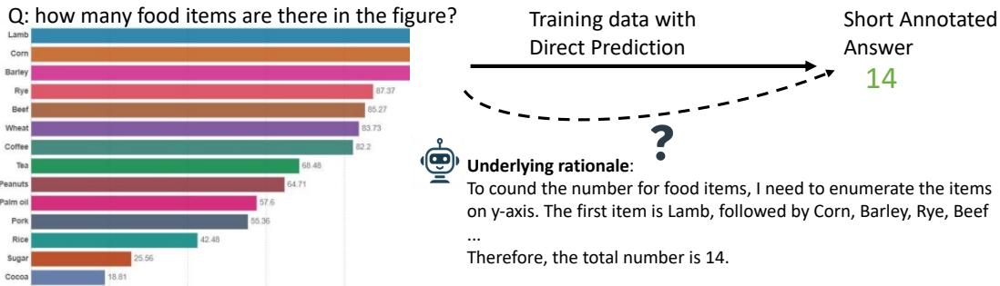

<details>
<summary>bar</summary>

Q: how many food items are there in the figure?
| Food Item | Count |
| :--- | :--- |
| Lamb | 90 |
| Corn | 85 |
| Barley | 85 |
| Rye | 87 |
| Beef | 85 |
| Wheat | 83 |
| Coffee | 82 |
| Tea | 68 |
| Peanuts | 64 |
| Palm oil | 57 |
| Pork | 55 |
| Rice | 42 |
| Sugar | 25 |
| Cocoa | 18 |
Training data with Direct Prediction → Short Annotated Answer 14
Underlying rationale:
To cound the number for food items, I need to enumerate the items on y-axis. The first item is Lamb, followed by Corn, Barley, Rye, Beef ... 
Therefore, the total number is 14.
</details>

B. Leverage short annotation as outcome reward for reasoning alignment   
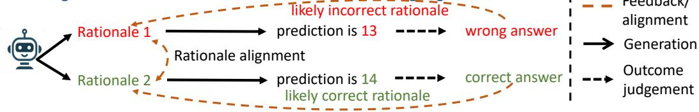

<details>
<summary>flowchart</summary>

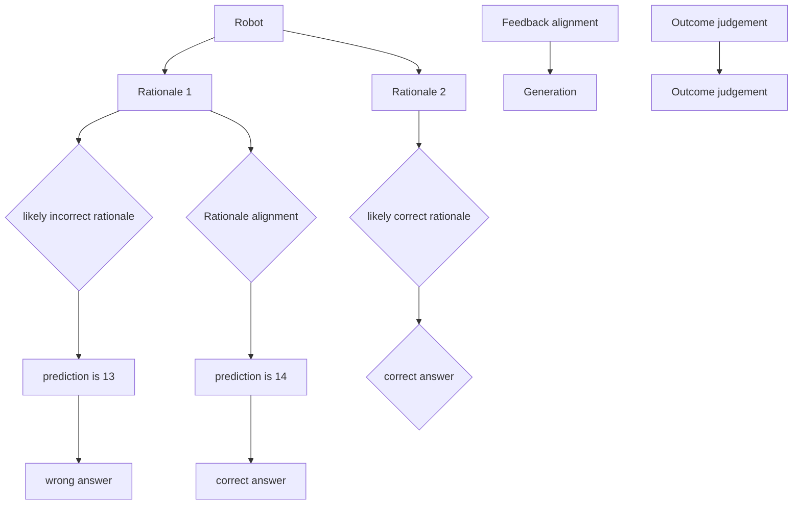
</details>

Figure 1: The upper figure questions whether training exclusively on direct-answer prediction can effectively teach CoT prediction. In the lower figure, we leverage short annotation as outcome reward for reasoning alignment, allowing the model to improve with self-generated data.

In the lower part of fig. 1, we propose further calibrating SFT model reasoning with short answer for outcome rewards (Sun et al., 2024; Setlur et al., 2024). Specifically, the model generates multiple CoT steps to to arrive at a final prediction, which is then compared against a provided short annotation. Rationales leading to correct predictions are more likely to be accurate, while those leading to incorrect predictions are less so. By optimizing positive (likely correct) and negative (likely incorrect) rationale pairs using DPO, we align the VLM towards a more accurate reasoning process. The aligned model, LLAVA-REASONER-DPO, demonstrates consistent performance improvements across all domains compared to its SFT counterpart. Additionally, we find that the DPO model can act as a strong verifier to assign appropriate rewards for CoT reasoning, enabling more effective credit assignment (Rafailov et al., 2024; Lu et al., 2024).

Our key contributions are as follows:

A. We provide a critical data resource, SHAREGPT-4O-REASONING, for VLM CoT reasoning, containing 193k examples spanning various VQA   
B. We demonstrate the effectiveness of using outcome rewards with DPO for VLM, leveraging model-generated signals without requiring additional human-labeled reward data.   
C. We show that the DPO model serves as a strong verifier for reasoning, paving the way for more

effective vision-language reward modeling.

# 2 Related Work

VLM Reasoning Evaluation of the reasoning capabilities of VLMs includes mathematics (Lu et al., 2023; Wang et al., 2024), college-level questions (Yue et al., 2024), and science (Kembhavi et al., 2016; Lu et al., 2022). Training free methods introduce scene decomposition (Mitra et al., 2024) or additional coarse and fine-grained localization (Luan et al., 2024) to improve visual reasoning. Training methods (Zhang et al., 2024c; Chen et al., 2023b; Zhang et al., 2024a; Gao et al., 2023) focus on step-by-step solutions for math problems or chart-based calculations, or highlighting bounding box (Shao et al., 2024) for answering the related questions. In this work, we extend CoT data beyond short-answer formats to cover a wider range of tasks and conduct evaluations on a comprehensive set of benchmark datasets.

VLM/LLM Alignment VLM alignment has utilized preference modeling techniques, such as DPO (Ouali et al., 2024; Deng et al., 2024; Yu et al., 2024; Li et al., 2023; Gunjal et al., 2023; Sun et al., 2023), and PPO (Sun et al., 2023), to enhance factual accuracy and mitigate hallucination. For LLMs, prior work (Sun et al., 2024; Setlur et al., 2024; Lu et al., 2024; Pang et al., 2024; Xie et al., 2024) has employed RL with outcome rewards to improve CoT in mathematical tasks. In this work, we demonstrate the effectiveness of outcome rewards for aligning VLMs across a broad range of reasoning tasks.

<table><tr><td colspan="2">World/Common Sense Knowledge</td><td colspan="2">Chart Understanding</td></tr><tr><td>Question: What are the horses being used for? A. petting B. field work C. stomping D. riding</td><td>Rationale: In the image, there are two horses harnessed together, and they are standing on a field. The horses are equipped with harnesses and are attached to a piece of farming equipment. The ground shows signs of being freshly plowed, indicating that the horses are being used to pull the plow and turn the soil. Additionally, there are tractors in the background, further suggesting an agricultural setting. Answer: B. field work</td><td>Question: Is any of the bar less than 10%?
A
B
C
D
E
F
G
H
I
J
K
L
M
N
O
P
Q
R
S
T
U
V
W
X
Y
Z
A
B
C
D
E
F
G
H
I
J
K
L
M
N
O
P
Q
R
S
T
U
V
W
X
Y
Z
A
B
C
D
E
F
G
H
I
J
K
L
M
N
O
P
Q
R
S
T
U
V
W
X.
Y
Z
A
B
C
D
E
F
G
H
I
J
K
L
M
N
O
P
Q
R
S
T
U
V
W
X.
Y
Z
A
B
C
D
E
F
G
H
I
J
K
L
M
N
O
P
Q
R
S
T
U
V</td><td>Rationale: The bar chart displays the share of respondents&#x27; opinions on a certain topic, divided by gender (Men and Women). ... we look at the smallest percentages in each category. The smallest percentage is 11% for Men in the &quot;They are downplaying the situation&quot; category, and 15% for Women in the same category. Both of these values are above 10%. Answer: No</td></tr><tr><td colspan="2">Information Localization in Industrial Document</td><td colspan="2">Math Reasoning</td></tr><tr><td></td><td>Question: Which university has the third largest student?
Rationale: ... By examining the heights of the bars, we can identify the universities with the largest student bodies:
- The tallest bar represents Arizona State University.
- ...
- The third tallest bar represents Penn State University.
Thus, based on the visual data provided in the bar graph, the university with the third largest student body is:
Answer: Penn State</td><td colspan="2">(A)
(B)
(C)
(D)
(E)
Question: Add up the numbers on the balls. In which bowl is the result biggest?
Rationale:
**Bowl A**: The balls are numbered 8, 7, 4, and 9. Sum: 8 + 7 + 4 + 9 = 28 **Bowl B**: The balls are numbered 4, 6, 7, and 9. Sum: 4 + 6 + 7 + 9 = 26 ... Answer: A</td></tr></table>

Figure 2: Distillation of examples from various VLM task domains, highlighting the specific reasoning capabilities.

# 3 Method

Our pipeline consists of three stages: (A) CoT data distillation from GPT-4o (section 3.1), (B) SFT with CoT (and direct) data to enable VLM CoT reasoning (section 3.2), and (C) Outcome reward RL for CoT reasoning enhancement (section 3.3).

# 3.1 Reasoning Data Distillation

We leverage VQA datasets with short annotations to augment them with rationales generated by the GPT-4o model. We collect 193k visual CoT instances to create the SHAREGPT-4O-REASONING dataset for community usage. We focus on the following reasoning types as demonstrated in fig. 2:

Real-World Knowledge includes A-OKVQA, which covers a broad range of commonsense reasoning and real-world knowledge for answering questions.

Chart Understanding includes ChartQA, which involves tasks like item comparison, counting, and numerical computation.

Textual Reasoning includes DocVQA, InfoVQA, and TextVQA, focusing on information localization and extraction in industrial documents and real-world image comprehension.

Math and Science includes MathVision, G-LLaVA, SQA, and AI2D, focusing on scientific knowledge and mathematical reasoning.

After distillation, we filtered out examples whose answer predicted by GPT-4o is different from ground truth. The data statistics are presented in table 1, and a comparison of answer lengths is shown in fig. 3, highlighting that CoT responses peak around 100 tokens, while direct answers are typically under 5 tokens. The exact distillation prompt is provided in appendix B.

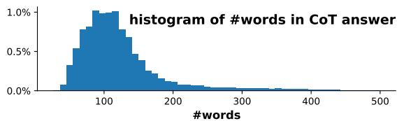

<details>
<summary>histogram</summary>

| #words Range | Frequency |
| ------------ | --------- |
| 0-50         | 0.1%      |
| 50-100       | 0.8%      |
| 100-150      | 1.0%      |
| 150-200      | 0.6%      |
| 200-250      | 0.3%      |
| 250-300      | 0.1%      |
| 300-350      | 0.05%     |
| 350-400      | 0.03%     |
| 400-450      | 0.02%     |
| 450-500      | 0.01%     |
</details>

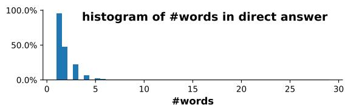

<details>
<summary>histogram</summary>

| #words | Percentage |
| ------ | ---------- |
| 0-1    | 100.0%     |
| 1-2    | 50.0%      |
| 2-3    | 25.0%      |
| 3-4    | 10.0%      |
| 4-5    | 5.0%       |
| 5+     | 0.0%       |
</details>

Figure 3: The distribution of word counts for CoT and direct answer.

# 3.2 SFT for CoT Prediction

We choose LLaMA3-LLaVA-NeXT-8B as our base architecture, whose weight is initialized with the Open-LLaVA-NeXT weights (Chen and Xing, 2024). To ensure the model handles both direct and chain-of-thought (CoT) predictions, we implement two types of prompts during training.

Direct Prediction: For direct prediction tasks, we use the prompt “Answer the question with a short answer” for short-answer questions, and “Answer with the option’s letter from the given choices directly” for multiple-choice questions.

CoT Prediction: For CoT prediction tasks, we use the prompt “Generate a reason first and then output a letter answer” for multiple-choice questions, and “Generate a reason first and then output a short answer” for short-answer questions. In the model’s response, the rationale is followed by the answer, which is formatted as “### Answer: ” to enable answer extraction during evaluation.

# 3.3 RL for Enhanced Reasoning

To further improve the quality of reasoning chains, we apply RL using the DPO algorithm to better align the model’s reasoning process toward more accurate predictions. The DPO algorithm requires both positive and negative responses. To generate these, we use the SFT model as the policy model (i.e., generator), producing 32 candidate predictions per question (temperature 1.0 for short answer and 1.2 for multiple-choice questions). Each prediction is compared with the ground truth to determine its correctness. Following the approach in (Dubey et al., 2024), we select instances with an accuracy between 0.25 and 0.85. From these, we randomly pair positive and negative responses, creating up to three pairs per question.

Formally, the dataset is denoted as $\mathcal { D } _ { D P O } =$ $\{ ( \mathcal { V } , x , y _ { w } , y _ { l } ) \}$ }, where V is the image, x is the question, $y _ { w }$ and $y _ { l }$ are the positive and negative responses. The DPO objective is defined as below:

$$
\begin{array}{l} \mathcal {L} _ {\mathrm{DPO}} \left(\pi_ {\theta}; \pi_ {\text {ref}}\right) = - \mathbb {E} _ {(\nu , x, y _ {w}, y _ {l}) \sim \mathcal {D} _ {D P O}} \Bigg [ \\ \log \sigma \left(\beta \log \frac {\pi_ {\theta} (y _ {w} \mid x , \mathcal {V})}{\pi_ {\text {ref}} (y _ {w} \mid x , \mathcal {V})} - \beta \log \frac {\pi_ {\theta} (y _ {l} \mid x , \mathcal {V})}{\pi_ {\text {ref}} (y _ {l} \mid x , \mathcal {V})}\right) \Bigg ], \\ \end{array}
$$

where $\pi _ { \theta }$ is the policy model to be optimized and $\pi _ { \mathrm { r e f } }$ is the base reference model, both models are initialized with SFT weights. σ is the logistic function and $\beta$ is set to 0.1.

# 4 SFT Experiments for CoT Learning

In this section, we explore how SFT can enhance VLM reasoning by addressing two key research questions: (1) Can CoT reasoning be implicitly learned from short responses? and (2) How effectively can CoT be learned from GPT-4o distilled data?

Due to space constraints, we provide the SFT ablation in appendix F, the data composition ablation in appendix G, and SOTA model comparisons in appendix H. Additionally, we present reject-sampling finetuning experiments in appendix E with nearly no CoT distillation with significant improvements over the baseline models.

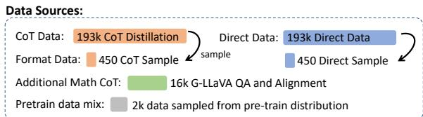

<details>
<summary>bar_stacked</summary>

| Data Source | Count |
| --- | --- |
| CoT Data | 193k CoT Distillation |
| Format Data | 450 CoT Sample |
| Direct Data | 193k Direct Data |
| Additional Math CoT | 16k G-LLaVA QA and Alignment |
| Pretrain data mix | 2k data sampled from pre-train distribution |
</details>

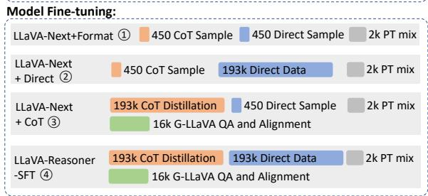  
Figure 4: The upper section displays the data sources used for the SFT experiments, while the lower section illustrates the data composition for model training.

# 4.1 Training Setting

As shown in the upper part of fig. 4, we present the data composition for SFT. The training data includes CoT distillation (193k instances) from table 1 and corresponding short answers (193k). Additionally, for CoT data, we incorporate 16k visual math examples from G-LLaVA. To maintain general instruction-following capability as the base model, we include 2k randomly sampled instruction data from LLaVA pretraining (Liu et al., 2024). To ensure the SFT models can handle both direct and CoT prompts during inference, we sample a small set of format-aligned data—50 examples from each of the 9 datasets—resulting in 450 instances.

In the lower part of fig. 4, we outline the data composition for model training. Specifically, LLAVA-NEXT-FORMAT (fig. 4 ①) serves as the baseline model, trained exclusively on formataligned data to enforce the desired output format without learning any task-specific reasoning skills. In contrast, models in fig. 4 ② and ③ incorporate either direct or CoT datasets, enabling the model to be expert in one type of skill as well as following the both direct and CoT prompt styles. Finally, LLAVA-REASONER-SFT (fig. 4 ④) represents the SFT model trained on both CoT and direct data, making it to be expert in both types of reasoning.

We use the LLaMA3-LLaVA-NeXT-8B architecture, initializing the weights with Open-LLaVA-NeXT. All Supervised Fine-Tuning (SFT) experiments are trained for 1 epoch with a learning rate of 5e-6 and a batch size of 32. The experiments are conducted on 8 H100 GPUs.

Table 2: SFT experiments with data composition in fig. 4: ① format alignment only, ② direct responses only, ③ CoT responses only and ④ both direct and CoT responses. Inference is performed using both direct and CoT templates. The best CoT prediction result is highlighted in orange, while the best direct prediction result is marked in blue. The results demonstrate that combining CoT and direct responses during training leads to the best performance across both types of prompts. Refer to section 4 for detailed analysis. 

<table><tr><td>Methods</td><td>Prompting</td><td>A-OK</td><td>ChartQA</td><td>DocVQA</td><td>InfoVQA</td><td>TextVQA</td><td>AI2D</td><td>SQA</td><td>MathVista</td><td>Avg</td></tr><tr><td>LLaVA-Next</td><td>direct</td><td>85.8</td><td>70.2</td><td>75.7</td><td>37.7</td><td>68.2</td><td>71.5</td><td>75.4</td><td>39.3</td><td>65.5</td></tr><tr><td>+ Format 1</td><td>CoT</td><td>84.3</td><td>71.2</td><td>67</td><td>34.9</td><td>62.2</td><td>67.4</td><td>74.4</td><td>40.3</td><td>62.7</td></tr><tr><td>LLaVA-Next</td><td>direct</td><td>86.4</td><td>73.7</td><td>78</td><td>45.4</td><td>71.9</td><td>78.8</td><td>91.5</td><td>43.2</td><td>71.1</td></tr><tr><td>+ Direct 2</td><td>CoT</td><td>85.7</td><td>71.8</td><td>68.8</td><td>38.6</td><td>63.6</td><td>72.5</td><td>85.4</td><td>38.6</td><td>65.6</td></tr><tr><td>LLaVA-Next</td><td>direct</td><td>84.9</td><td>71.8</td><td>81.2</td><td>45.7</td><td>72.1</td><td>75.3</td><td>85</td><td>41.9</td><td>69.7</td></tr><tr><td>+ Cot 3</td><td>CoT</td><td>85.1</td><td>82.2</td><td>81.2</td><td>49.7</td><td>69.9</td><td>77</td><td>91.3</td><td>49.2</td><td>73.2</td></tr><tr><td>LLaVA-Reasoner</td><td>direct</td><td>85.4</td><td>76.1</td><td>82.9</td><td>50.6</td><td>73.1</td><td>79.4</td><td>90.4</td><td>44.3</td><td>72.8</td></tr><tr><td>-SFT 4</td><td>CoT</td><td>86.2</td><td>83.0</td><td>81.8</td><td>51.6</td><td>71.1</td><td>78.5</td><td>92.7</td><td>50.6</td><td>74.4</td></tr></table>

# 4.2 Evaluation Setting

We evaluate our method using a range of benchmark datasets, including A-OKVQA (Schwenk et al., 2022), ChartQA (Masry et al., 2022), DocVQA (Mathew et al., 2021), InfoVQA (Mathew et al., 2022), TextVQA (Mathew et al., 2021), AI2D (Kembhavi et al., 2016), ScienceQA (Lu et al., 2022), and MathVista (Lu et al., 2023). We also conduct more evaluation on general datasets OCRBench (Liu et al., 2023c), MMStar (Chen et al., 2024a), and MMMU (Yue et al., 2024) in later sections. The evaluation for A-OKVQA was implemented by us, while for the other datasets, we follow the evaluation protocols outlined in VLMEval (Duan et al., 2024).

For CoT evaluation, answers are extracted after the pattern "###Answer: " before sent to evaluation. More comparison with LLaMA3-LLaVA-NeXT-8B model is shown appendix D and evaluation on GPT-4o is shown in appendix C.

# 4.3 Can reasoning be implicitly learnt from direct prediction?

Table 2 presents the performance of the models introduced in fig. 4. Since LLAVA-NEXT-8B training data contains very few CoT reasoning examples, CoT performance of ① lags behind direct prediction across most tasks. The only improvement is observed in ChartQA and MathVista with a modest gain of +1.0 in CoT performance, showing CoT is helpful for calculation related tasks.

When comparing model trained on direct only data (②) to that trained on format-aligned data (①), we observe an average gain of +5.6 in direct prediction accuracy (65.5 71.1) and a +2.9 improvement in CoT performance (62.7 65.6). Surprisingly, closer inspection of CoT performance in calculation-involved tasks, such as ChartQA and MathVista, reveals only marginal gains (+0.6 for ChartQA CoT) or even a performance drop (-1.7 on MathVista), which contrasts with the improvements seen on the two tasks in ①. On text-rich tasks, positive gains (>1) are observed, with the most improvement seen in InfoVQA (+3.7). Significant gains are also evident in science-related tasks like AI2D (+5.1) and SQA (+11.0). Despite these improvements, CoT performance still trails behind direct prediction overall (CoT: 65.6 vs. direct: 71.1). This result suggests that training on direct only prediction may not effectively help with CoT prediction.

# 4.4 How Effective is CoT Reasoning Data?

When comparing the model trained on CoT-only data (③) with the one trained on format-aligned data (①), we observe improvements in both direct and CoT predictions. Direct prediction performance increases by an average of +4.2 (65.5 69.7), while CoT prediction improves significantly by +10.5 (62.7 73.2). Notably, the CoT performance of the model ③ surpasses its direct prediction (73.2 CoT vs. 69.7 direct). Significant gains are observed in calculation-intensive tasks like ChartQA and MathVista, with increases of +11.0 and +8.9 in CoT performance, respectively. Interestingly, for text-rich tasks such as DocVQA, InfoVQA, and TextVQA, the direct performance of model ③ (trained on CoT-only data) outperforms that of model ② (trained on direct-only data). This suggests that even for text-heavy tasks, reasoning processes, such as localizing information in documents or recognizing text in real-world scenarios, may benefit from CoT training. The skills learned from CoT training appear to generalize to direct

Table 3: DPO experiment with LLAVA-REASONER-SFT as the base policy model. We compare two DPO datasets: ⑤ RLAIF-V (Yu et al., 2024) and ⑥ our preference dataset comprising A-OKVQA, ChartQA, and math. The best CoT prediction is highlighted in orange. Our DPO dataset shows the better improvements in chain-of-thought reasoning. 

<table><tr><td>Methods</td><td>Prompting</td><td>A-OK</td><td>ChartQA</td><td>DocVQA</td><td>InfoVQA</td><td>TextVQA</td><td>AI2D</td><td>SQA</td><td>MathVista</td><td>Avg</td></tr><tr><td>LLaVA-Reasoner</td><td>direct</td><td>85.4</td><td>76.1</td><td>82.9</td><td>50.6</td><td>73.1</td><td>79.4</td><td>90.4</td><td>44.3</td><td>72.8</td></tr><tr><td>-SFT 4</td><td>CoT</td><td>86.2</td><td>83.0</td><td>81.8</td><td>51.6</td><td>71.1</td><td>78.5</td><td>92.7</td><td>50.6</td><td>74.4</td></tr><tr><td>LLaVA-Reasoner</td><td>direct</td><td>85.6</td><td>76.1</td><td>83.1</td><td>50.7</td><td>73.3</td><td>79.6</td><td>91.1</td><td>44.1</td><td>73.0</td></tr><tr><td>-RLAIF 5</td><td>CoT</td><td>86.7</td><td>83.0</td><td>82.4</td><td>50.8</td><td>71.4</td><td>79.1</td><td>92.9</td><td>50.8</td><td>74.6</td></tr><tr><td>LLaVA-Reasoner</td><td>direct</td><td>85.4</td><td>76.4</td><td>83.1</td><td>51.2</td><td>73.3</td><td>79.4</td><td>90.8</td><td>44.2</td><td>73.0</td></tr><tr><td>-DPO-ours 6</td><td>CoT</td><td>87.0</td><td>84.2</td><td>82.7</td><td>52.7</td><td>71.5</td><td>79.5</td><td>92.6</td><td>52.1</td><td>75.3</td></tr></table>

prediction as well.

When both CoT and direct data are combined (④), performance is further enhanced for both prediction types, with an average gain of +7.3 in direct prediction (65.5 72.8) and +11.7 in CoT prediction (62.7 74.4). This demonstrates that combining direct and CoT data yields the best overall performance. Interestingly, in model ④, for 3 out of 8 datasets (TextVQA, DocVQA, AI2D), direct prediction outperforms CoT prediction. We hypothesize that these tasks involve a significant proportion of concise fact extraction, where generating long-form CoT responses may not provide additional benefits or even hurts. Further validation of this hypothesis will be explored in future work.

# 5 RL for Enhanced CoT Reasoning

In this section, we demonstrate the effectiveness of RL in further enhancing CoT reasoning. By leveraging short-answer feedback (section 3.3), we construct preference pairs across three domains: A-OKVQA (real-world knowledge reasoning), ChartQA (chart interpretation), and math (MathVision and G-LLaVA). Although additional DPO data from other datasets could be incorporated, data scaling and balancing will be addressed in future work.

For the DPO dataset, we include 24.5k examples from ChartQA, 18.3k from A-OKVQA, and 22.0k from math domain, totaling 64.8k preference data pairs. We train LLAVA-REASONER-SFT on this dataset using a learning rate of 5e-7, a batch size of 32, and for 1 epoch. We found an additional trick to truncate the responses up to 90 tokens to be crucial for DPO training (details in appendix I). To compare the effectiveness of different DPO datasets, we include RLAIF-V (Yu et al., 2024), which contains 80k DPO pairs representing the state-of-the-art dataset for aligning VLMs for reducing hallucinations.

# 5.1 Can DPO Calibrate Reasoning?

In table 3, we present the results of the DPO model optimized on top of LLAVA-REASONER-SFT (④). Model ⑤ uses the SOTA RLAIF-V (Yu et al., 2024) data, while model ⑥ uses our dataset. We observe that Model ⑤ shows a slight improvement in both direct prediction (+0.2) and CoT prediction (+0.2), whereas model ⑥ demonstrates a greater improvement in CoT prediction (+1.1) with equal gains on direct prediction. Interestingly, though only 3 out of 8 datasets are selected to construct DPO pairs, gains are observed across 7 out of 8 datasets except for SQA with a slight decrease (92.9  92.6). These results suggest that DPO dataset constructed from model-generated rationales can effectively enhance reasoning accuracy and show generalization across tasks.

# 5.2 DPO as Verifier for Re-ranking CoT

In fig. 5, we present the re-ranking results using the DPO model as a verifier, following the approach of (Zhang et al., 2024d; Hosseini et al., 2024; Lu et al., 2024). The DPO reward score is calculated as log πdpo(y|x,V)π (y x, ) , where V represents the image, x the $\frac { \pi _ { \mathrm { d p o } } ( y | x , \mathcal { V } ) } { \pi _ { \mathrm { s f t } } ( y | x , \mathcal { V } ) }$ question, and y the candidate answer. We explore two re-ranking strategies: Best-of-N and Weighted Voting. A Majority Voting (or self-consistency) baseline is also included for comparison.

When trained with RLAIF-V data (⑤), the DPO model demonstrates improvements as both a generator and verifier on A-OKVQA, likely due to the dataset’s alignment with real-world images, which matches the nature of A-OKVQA. Interestingly, while model ⑤ does not show improvements as a generator on ChartQA, it still produces positive results in best-of-N re-ranking, indicating that the learned preferences can generalize across domains. However, weighted voting does not lead to any improvements, and no significant gains are observed in re-ranking for MathVision. In contrast, when trained with reasoning data pairs, LLAVA-REASONER-DPO (⑥) shows improvements across both re-ranking metrics, underscoring the effectiveness of DPO on reasoning data pairs.

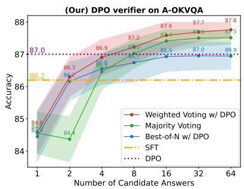

<details>
<summary>line</summary>

| Number of Candidate Answers | Weighted Voting w/ DPO | Majority Voting | Best-of-N w/ DPO | SFT | DPO |
| --------------------------- | ---------------------- | --------------- | ---------------- | --- | --- |
| 1                           | 84.5                   | 84.4            | 84.3             | 86.2 | 87.0 |
| 2                           | 86.3                   | 86.2            | 86.1             | 86.2 | 87.0 |
| 4                           | 86.9                   | 86.8            | 86.7             | 86.2 | 87.0 |
| 8                           | 87.2                   | 87.1            | 87.0             | 86.2 | 87.0 |
| 16                          | 87.6                   | 87.4            | 87.3             | 86.2 | 87.0 |
| 32                          | 87.7                   | 87.5            | 87.4             | 86.2 | 87.0 |
| 64                          | 87.8                   | 87.5            | 87.4             | 86.2 | 87.0 |
</details>

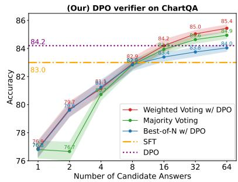

<details>
<summary>line</summary>

| Number of Candidate Answers | Weighted Voting w/ DPO | Majority Voting | Best-of-N w/ DPO | SFT  | DPO  |
| --------------------------- | ---------------------- | --------------- | ---------------- | ---- | ---- |
| 1                           | 76.0                   | 76.0            | 76.0             | 83.0 | 84.2 |
| 2                           | 78.7                   | 76.7            | 78.7             | 83.0 | 84.2 |
| 4                           | 81.1                   | 81.1            | 81.1             | 83.0 | 84.2 |
| 8                           | 82.9                   | 82.9            | 82.9             | 83.0 | 84.2 |
| 16                          | 84.2                   | 84.2            | 84.2             | 83.0 | 84.2 |
| 32                          | 85.0                   | 85.0            | 85.0             | 83.0 | 84.2 |
| 64                          | 85.4                   | 85.4            | 85.4             | 83.0 | 84.2 |
</details>

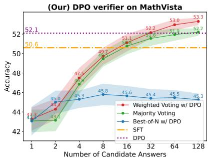

<details>
<summary>line</summary>

| Number of Candidate Answers | Weighted Voting w/ DPO | Majority Voting | Best-of-N w/ DPO | SFT  | DPO  |
| --------------------------- | ---------------------- | --------------- | ---------------- | ---- | ---- |
| 1                           | 43.3                   | 43.1            | 43.3             | 50.6 | 52.1 |
| 2                           | 44.7                   | 45.0            | 45.3             | 50.6 | 52.1 |
| 4                           | 47.5                   | 48.5            | 45.8             | 50.6 | 52.1 |
| 8                           | 49.7                   | 49.7            | 45.8             | 50.6 | 52.1 |
| 16                          | 51.1                   | 51.1            | 45.6             | 50.6 | 52.1 |
| 32                          | 52.2                   | 52.2            | 45.4             | 50.6 | 52.1 |
| 64                          | 53.0                   | 52.2            | 45.3             | 50.6 | 52.1 |
| 128                         | 53.3                   | 52.2            | 45.3             | 50.6 | 52.1 |
</details>

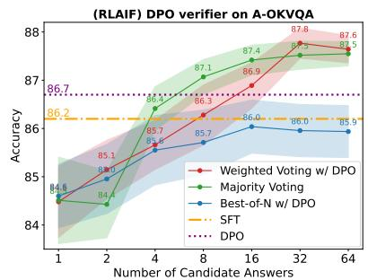

<details>
<summary>line</summary>

| Number of Candidate Answers | Weighted Voting w/ DPO | Majority Voting | Best-of-N w/ DPO | SFT  | DPO  |
| --------------------------- | ---------------------- | --------------- | ---------------- | ---- | ---- |
| 1                           | 84.8                   | 84.4            | 84.5             | 86.2 | 86.7 |
| 2                           | 85.1                   | 85.0            | 84.9             | 86.2 | 86.7 |
| 4                           | 85.7                   | 86.5            | 85.5             | 86.2 | 86.7 |
| 8                           | 86.3                   | 87.1            | 85.7             | 86.2 | 86.7 |
| 16                          | 86.9                   | 87.4            | 85.9             | 86.2 | 86.7 |
| 32                          | 87.8                   | 87.5            | 86.0             | 86.2 | 86.7 |
| 64                          | 87.6                   | 87.5            | 85.9             | 86.2 | 86.7 |
</details>

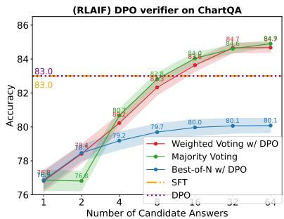

<details>
<summary>line</summary>

| Number of Candidate Answers | Weighted Voting w/ DPO | Majority Voting | Best-of-N w/ DPO | SFT | DPO |
| --------------------------- | ---------------------- | --------------- | ---------------- | --- | --- |
| 1                           | 76.5                   | 76.3            | 76.8             | 83.0 | 83.0 |
| 2                           | 78.4                   | 78.0            | 78.5             | 83.0 | 83.0 |
| 4                           | 80.2                   | 80.0            | 79.2             | 83.0 | 83.0 |
| 6                           | 81.9                   | 81.5            | 79.7             | 83.0 | 83.0 |
| 8                           | 84.7                   | 84.5            | 80.0             | 83.0 | 83.0 |
| 10                          | 84.7                   | 84.5            | 80.1             | 83.0 | 83.0 |
| 12                          | 84.7                   | 84.5            | 80.1             | 83.0 | 83.0 |
| 14                          | 84.7                   | 84.5            | 80.1             | 83.0 | 83.0 |
| 16                          | 84.7                   | 84.5            | 80.1             | 83.0 | 83.0 |
| 18                          | 84.7                   | 84.5            | 80.1             | 83.0 | 83.0 |
| 20                          | 84.7                   | 84.5            | 80.1             | 83.0 | 83.0 |
| 22                          | 84.7                   | 84.5            | 80.1             | 83.0 | 83.0 |
| 24                          | 84.7                   | 84.5            | 80.1             | 83.0 | 83.0 |
| 26                          | 84.7                   | 84.5            | 80.1             | 83.0 | 83.0 |
| 28                          | 84.7                   | 84.5            | 80.1             | 83.0 | 83.0 |
| 30                          | 84.7                   | 84.5            | 80.1             | 83.0 | 83.0 |
| 32                          | 84.7                   | 84.5            | 80.1             | 83.0 | 83.0 |
| 34                          | 84.7                   | 84.5            | 80.1             | 83.0 | 83.0 |
| 36                          | 84.7                   | 84.5            | 80.1             | 83.0 | 83.0 |
| 38                          | 84.7                   | 84.5            | 80.1             | 83.0 | 83.0 |
| 40                          | 84.7                   | 84.5            | 80.1             | 83.0 | 83.0 |
| 42                          | 84.7                   | 84.5            | 80.1             | 83.0 | 83.0 |
| 44                          | 84.7                   | 84.5            | 80.1             | 83.0 | 83.0 |
| 46                          | 84.7                   | 84.5            | 80.1             | 83.0 | 83.0 |
| 48                          | 84.7                   | 84.5            | 80.1             | 83.0 | 83.0 |
| 50                          | 84.7                   | 84.5            | 80.1             | 83.0 | 83.0 |
| 52                          | 84.7                   | 84.5            | 80.1             | 83.0 | 83.0 |
| 54                          | 84.7                   | 84.5            | 80.1             | 83.0 | 83.0 |
| 56                          | 84.7                   | 84.5            | 80.1             | 83.0 | 83.0 |
| 58                          | 84.7                   | 84.5            | 80.1             | 83.0 | 83.0 |
| 60                          | 84.7                   | 84.5            | 80.1             | 83.0 | 83.0 |
| 62                          | 84.7                   | 84.5            | 80.1             | 83.0 | 83.0 |
| 64                          | 84.7                   | 84.5            | 80.1             | 83.0 | 83.0 |
| Note: The actual values are not provided in the code snippet, so they are calculated based on the formula used for the plot.
</details>

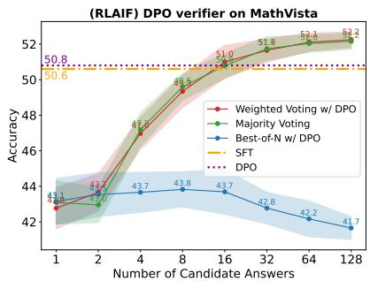

<details>
<summary>line</summary>

| Number of Candidate Answers | Weighted Voting w/ DPO | Majority Voting | Best-of-N w/ DPO | SFT  | DPO  |
| --------------------------- | ---------------------- | --------------- | ---------------- | ---- | ---- |
| 1                           | 43.0                   | 43.0            | 43.0             | 50.6 | 50.8 |
| 2                           | 43.5                   | 43.5            | 43.5             | 50.6 | 50.8 |
| 4                           | 47.0                   | 47.0            | 43.7             | 50.6 | 50.8 |
| 8                           | 49.5                   | 49.5            | 43.8             | 50.6 | 50.8 |
| 16                          | 51.0                   | 51.0            | 43.7             | 50.6 | 50.8 |
| 32                          | 51.8                   | 51.8            | 42.8             | 50.6 | 50.8 |
| 64                          | 52.1                   | 52.1            | 42.2             | 50.6 | 50.8 |
| 128                         | 52.3                   | 52.3            | 41.7             | 50.6 | 50.8 |
</details>

Figure 5: The figures illustrate the performance of the DPO model as a verifier on ChartQA, A-OKVQA, and MathVista. Compared to the model trained with RLAIF-V, the model trained on our reasoning data pairs consistently shows improvement in both best-of-N selection and weighted voting.

<table><tr><td></td><td>SFT 4</td><td>RLAIF 5</td><td>Our-DPO 6</td></tr><tr><td>OCRBench</td><td>62.0</td><td>63.7</td><td>63.7</td></tr><tr><td>MMStar</td><td>54.0</td><td>53.5</td><td>54.1</td></tr><tr><td>MMMU</td><td>40.1</td><td>42.3</td><td>42.6</td></tr><tr><td>Avg</td><td>52.0</td><td>53.2</td><td>53.5</td></tr></table>

Table 4: Generalization of DPO models on OCRBench, MMStar and MMMU.   
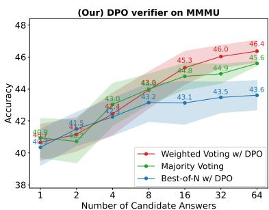

<details>
<summary>line</summary>

| Number of Candidate Answers | Weighted Voting w/ DPO | Majority Voting | Best-of-N w/ DPO |
| --------------------------- | ---------------------- | --------------- | ---------------- |
| 1                           | 40.9                   | 40.8            | 40.5             |
| 2                           | 41.5                   | 41.2            | 40.8             |
| 4                           | 42.4                   | 42.7            | 41.5             |
| 8                           | 43.0                   | 43.2            | 42.0             |
| 16                          | 44.8                   | 44.9            | 43.1             |
| 32                          | 46.0                   | 45.3            | 43.5             |
| 64                          | 46.4                   | 45.6            | 43.6             |
</details>

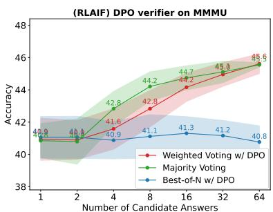

<details>
<summary>line</summary>

| Number of Candidate Answers | Weighted Voting w/ DPO | Majority Voting | Best-of-N w/ DPO |
| --------------------------- | ---------------------- | --------------- | ---------------- |
| 1                           | 42.8                   | 42.8            | 42.8             |
| 2                           | 43.0                   | 43.0            | 42.8             |
| 4                           | 41.6                   | 42.8            | 40.9             |
| 8                           | 42.8                   | 44.2            | 41.1             |
| 16                          | 44.7                   | 45.0            | 41.3             |
| 32                          | 45.0                   | 45.5            | 41.2             |
| 64                          | 45.6                   | 45.6            | 40.8             |
</details>

Figure 6: DPO verifier performance on the MMMU dataset.

# 5.3 DPO CoT Prediction and Re-ranking Performance Generalization

In table 4, we present the DPO CoT performance on OCRBench, MMStar, and MMMU. We observe that DPO models trained on both RLAIF and our datasets outperform the SFT baseline, with our DPO model trained on CoT reasoning pairs achieving slightly better results.

While the CoT prediction performance across DPO models is similar, fig. 6 highlights the pronounced effectiveness of our DPO verifier’s generalization on the MMMU dataset, which contains challenging college-level subject questions. We provide re-ranking results for multiple-choice problems from the Dev+Val split (988/1050). The SFT model with self-consistency shows steady improvements, reaching 45.5% with 64 candidate votes. LLAVA-REASONER-DPO, trained on reasoning data pairs, demonstrates strong generalization on MMMU by excelling in both weighted voting and best-of-N voting during candidate re-ranking.

In contrast, the DPO model trained on RLAIF-V (⑤) improves CoT predictions but fails to achieve gains in re-ranking metrics, indicating its limitations in distinguishing correct from incorrect reasoning on more complex data. We hypothesize that, compared to ChartQA, the reasoning questions in MMMU are more challenging and span a broader range of subjects. The RLAIF-V dataset, being primarily focused on the COCO image domain, may lack sufficient coverage of this diversity, leading to

Long-termpriceindexinfoodcommodities,85o2o15,World,1934   
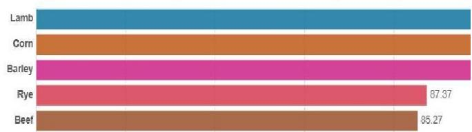

<details>
<summary>bar</summary>

| Category | Value |
|---|---|
| Lamb | 100.00 |
| Corn | 98.57 |
| Barley | 96.23 |
| Rye | 87.37 |
| Beef | 85.27 |
</details>

Q: How many food item is shown in the bar graph?

A1: To determine the number of food items shown in the bar graph, we need to count each distinct food item listed on the y-axis

1.The first bar represents "Beef."   
2.The second bar represents "Corn."   
3. The third bar represents "Barley."

A2:To determine the number of food items shown in the bar graph, we need to count each distinct food item listed on the y-axis

1. The first bar represents "Lamb."   
2.The second bar represents "Rye.   
3.The third bar represents "Barley."

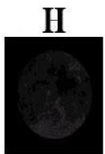

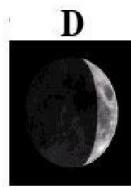  
Q: Which stage is shown at D?

A1: The moon at D shows a small illuminated portion on the left side, which is characteristic of the Waxing Crescent phase. Should be “right” side

A2: The moon at D shows a small illuminated portion on the right side, which is characteristic of the Waxing Gibbous phase. Should be “Crescent”

Figure 7: Credit assignment of the DPO model on a portion of the responses from the ChartQA and AI2D datasets. The DPO token-level reward is computed for each token, with the rewards normalized to have a mean of 0. Negative scores are highlighted in cool colors (blue), while positive scores are highlighted in warm colors (orange). We observe that the DPO model is particularly sensitive to the first mistakes or hallucinations introduced in the response.

weaker performance in re-ranking. These results underscore the potential of our approach for generalizing visual language reward models to reasoning tasks.

# 5.4 DPO Credit Assignment

While the DPO model is trained on pairwise data, prior works (Rafailov et al., 2024; Lu et al., 2024) have shown that DPO policies can learn to predict token-level rewards from binary preference data. These experiments primarily focused on math reasoning with LLMs. In this work, we provide examples of credit assignment learned by the VLM DPO, as shown in fig. 7. The token-level DPO reward can be expressed as log $\frac { \pi _ { \mathrm { d p o } } ( y _ { i } | x , \mathcal { V } ) } { \pi _ { \mathrm { s f t } } ( y _ { i } | x , \mathcal { V } ) }$ , where represents the image, x the question, and y the i-th token in the generated response. This reward reflects the relative confidence of the DPO model compared to the SFT model for a given token in a candidate response.

In fig. 7, negative scores are shown in cool colors, while positive scores are shown in warm colors, with rewards normalized to a mean of 0. On the left, we observe that the DPO model is particularly sensitive to errors during chart interpretation from the ChartQA dataset. For instance, when the response incorrectly lists “Lamb” as “Beef” in a chart reading task, the DPO model assigns a highly negative score to this mistake.

On the right, we present examples from the AI2D dataset. Here, a hallucination in the response, such as incorrectly stating that the left side of the moon is illuminated (the correct answer is the right side), receives a low score. Additionally, when external knowledge is required to correctly identify the moon’s phase as “Crescent” instead of “Gibbous,” the DPO model penalizes the incorrect “Gibbous” answer with a negative score. This indicates that the DPO model is more sensitive to knowledgebased errors than the SFT model, explaining its superior performance on CoT reasoning tasks in datasets such as AI2D.

# 6 Conclusion and Release

In this work, we aim to enhance VLM CoT reasoning by utilizing short-answer data through 1) CoT augmentation and 2) outcome-based rewards for RL. We have released the following contribution resources: 1) SHAREGPT-4O-REASONING, a CoT reasoning dataset with 193k examples spanning a wide range of VQA tasks, 2) SFT and DPO training code, 3) public model checkpoints, and 3) model checkpoints, and 4) Evaluation pipeline for both the released model and GPT-4o.

# 7 Limitation

First, we acknowledge that our work builds on existing techniques, such as data distillation (Zhang et al., 2024d), VLM SFT (Chen and Xing, 2024), outcome-based rewards DPO (Sun et al., 2024; Setlur et al., 2024), with a stronger emphasis on application rather than the invention of new methods. Our contribution is demonstrated through experimental validation rather than the introduction of novel technology.

Second, our approach relies on industrial-scale API usage, which may not be accessible to all researchers. We encourage researchers to leverage our released dataset or create their own using our provided prompts, subject to resource availability.

# References

Jinze Bai, Shuai Bai, Shusheng Yang, Shijie Wang, Sinan Tan, Peng Wang, Junyang Lin, Chang Zhou, and Jingren Zhou. 2023. Qwen-vl: A frontier large vision-language model with versatile abilities. arXiv preprint arXiv:2308.12966.   
Łukasz Borchmann. 2024. Notes on applicability of gpt-4 to document understanding. arXiv preprint arXiv:2405.18433.   
Jun Chen, Deyao Zhu, Xiaoqian Shen, Xiang Li, Zechun Liu, Pengchuan Zhang, Raghuraman Krishnamoorthi, Vikas Chandra, Yunyang Xiong, and Mohamed Elhoseiny. 2023a. Minigpt-v2: large language model as a unified interface for vision-language multi-task learning. arXiv preprint arXiv:2310.09478.   
Lin Chen, Jinsong Li, Xiaoyi Dong, Pan Zhang, Yuhang Zang, Zehui Chen, Haodong Duan, Jiaqi Wang, Yu Qiao, Dahua Lin, et al. 2024a. Are we on the right way for evaluating large vision-language models? arXiv preprint arXiv:2403.20330.   
Lin Chen and Long Xing. 2024. Open-llava-next: An open-source implementation of llava-next series for facilitating the large multi-modal model community. https://github.com/xiaoachen98/ Open-LLaVA-NeXT.   
Yangyi Chen, Karan Sikka, Michael Cogswell, Heng Ji, and Ajay Divakaran. 2023b. Measuring and improving chain-of-thought reasoning in vision-language models. arXiv preprint arXiv:2309.04461.   
Zhe Chen, Jiannan Wu, Wenhai Wang, Weijie Su, Guo Chen, Sen Xing, Muyan Zhong, Qinglong Zhang, Xizhou Zhu, Lewei Lu, et al. 2024b. Internvl: Scaling up vision foundation models and aligning for generic visual-linguistic tasks. In Proceedings of the IEEE/CVF Conference on Computer Vision and Pattern Recognition, pages 24185–24198.

Yihe Deng, Pan Lu, Fan Yin, Ziniu Hu, Sheng Shen, James Zou, Kai-Wei Chang, and Wei Wang. 2024. Enhancing large vision language models with selftraining on image comprehension. arXiv preprint arXiv:2405.19716.   
Haodong Duan, Junming Yang, Yuxuan Qiao, Xinyu Fang, Lin Chen, Yuan Liu, Xiaoyi Dong, Yuhang Zang, Pan Zhang, Jiaqi Wang, Dahua Lin, and Kai Chen. 2024. Vlmevalkit: An open-source toolkit for evaluating large multi-modality models. Preprint, arXiv:2407.11691.   
Abhimanyu Dubey, Abhinav Jauhri, Abhinav Pandey, Abhishek Kadian, Ahmad Al-Dahle, Aiesha Letman, Akhil Mathur, Alan Schelten, Amy Yang, Angela Fan, et al. 2024. The llama 3 herd of models. arXiv preprint arXiv:2407.21783.   
Jiahui Gao, Renjie Pi, Jipeng Zhang, Jiacheng Ye, Wanjun Zhong, Yufei Wang, Lanqing Hong, Jianhua Han, Hang Xu, Zhenguo Li, and Lingpeng Kong. 2023. Gllava: Solving geometric problem with multi-modal large language model. Preprint, arXiv:2312.11370.   
Anisha Gunjal, Jihan Yin, and Erhan Bas. 2023. Detecting and preventing hallucinations in large vision language models. arXiv preprint arXiv:2308.06394.   
Arian Hosseini, Xingdi Yuan, Nikolay Malkin, Aaron Courville, Alessandro Sordoni, and Rishabh Agarwal. 2024. V-star: Training verifiers for self-taught reasoners. arXiv preprint arXiv:2402.06457.   
Aniruddha Kembhavi, Mike Salvato, Eric Kolve, Minjoon Seo, Hannaneh Hajishirzi, and Ali Farhadi. 2016. A diagram is worth a dozen images. In Computer Vision–ECCV 2016: 14th European Conference, Amsterdam, The Netherlands, October 11– 14, 2016, Proceedings, Part IV 14, pages 235–251. Springer.   
Bo Li, Yuanhan Zhang, Dong Guo, Renrui Zhang, Feng Li, Hao Zhang, Kaichen Zhang, Yanwei Li, Ziwei Liu, and Chunyuan Li. 2024. Llavaonevision: Easy visual task transfer. arXiv preprint arXiv:2408.03326.   
Lei Li, Zhihui Xie, Mukai Li, Shunian Chen, Peiyi Wang, Liang Chen, Yazheng Yang, Benyou Wang, and Lingpeng Kong. 2023. Silkie: Preference distillation for large visual language models. arXiv preprint arXiv:2312.10665.   
Haotian Liu, Chunyuan Li, Yuheng Li, and Yong Jae Lee. 2023a. Improved baselines with visual instruction tuning. arXiv preprint arXiv:2310.03744.   
Haotian Liu, Chunyuan Li, Yuheng Li, Bo Li, Yuanhan Zhang, Sheng Shen, and Yong Jae Lee. 2024. Llavanext: Improved reasoning, ocr, and world knowledge.   
Haotian Liu, Chunyuan Li, Qingyang Wu, and Yong Jae Lee. 2023b. Visual instruction tuning. arXiv preprint arXiv:2304.08485.

Yuliang Liu, Zhang Li, Biao Yang, Chunyuan Li, Xucheng Yin, Cheng-lin Liu, Lianwen Jin, and Xiang Bai. 2023c. On the hidden mystery of ocr in large multimodal models. arXiv preprint arXiv:2305.07895.   
Pan Lu, Hritik Bansal, Tony Xia, Jiacheng Liu, Chunyuan Li, Hannaneh Hajishirzi, Hao Cheng, Kai-Wei Chang, Michel Galley, and Jianfeng Gao. 2023. Mathvista: Evaluating mathematical reasoning of foundation models in visual contexts. arXiv preprint arXiv:2310.02255.   
Pan Lu, Swaroop Mishra, Tanglin Xia, Liang Qiu, Kai-Wei Chang, Song-Chun Zhu, Oyvind Tafjord, Peter Clark, and Ashwin Kalyan. 2022. Learn to explain: Multimodal reasoning via thought chains for science question answering. Advances in Neural Information Processing Systems, 35:2507–2521.   
Zimu Lu, Aojun Zhou, Ke Wang, Houxing Ren, Weikang Shi, Junting Pan, and Mingjie Zhan. 2024. Step-controlled dpo: Leveraging stepwise error for enhanced mathematical reasoning. arXiv preprint arXiv:2407.00782.   
Bozhi Luan, Hao Feng, Hong Chen, Yonghui Wang, Wengang Zhou, and Houqiang Li. 2024. Textcot: Zoom in for enhanced multimodal text-rich image understanding. arXiv preprint arXiv:2404.09797.   
Ahmed Masry, Do Xuan Long, Jia Qing Tan, Shafiq Joty, and Enamul Hoque. 2022. Chartqa: A benchmark for question answering about charts with visual and logical reasoning. arXiv preprint arXiv:2203.10244.   
Minesh Mathew, Viraj Bagal, Rubèn Tito, Dimosthenis Karatzas, Ernest Valveny, and CV Jawahar. 2022. Infographicvqa. In Proceedings of the IEEE/CVF Winter Conference on Applications of Computer Vision, pages 1697–1706.   
Minesh Mathew, Dimosthenis Karatzas, and CV Jawahar. 2021. Docvqa: A dataset for vqa on document images. In Proceedings of the IEEE/CVF winter conference on applications of computer vision, pages 2200–2209.   
Chancharik Mitra, Brandon Huang, Trevor Darrell, and Roei Herzig. 2024. Compositional chain-of-thought prompting for large multimodal models. In Proceedings of the IEEE/CVF Conference on Computer Vision and Pattern Recognition, pages 14420–14431.   
Yassine Ouali, Adrian Bulat, Brais Martinez, and Georgios Tzimiropoulos. 2024. Clip-dpo: Visionlanguage models as a source of preference for fixing hallucinations in lvlms. arXiv preprint arXiv:2408.10433.   
Richard Yuanzhe Pang, Weizhe Yuan, Kyunghyun Cho, He He, Sainbayar Sukhbaatar, and Jason Weston. 2024. Iterative reasoning preference optimization. arXiv preprint arXiv:2404.19733.

Rafael Rafailov, Joey Hejna, Ryan Park, and Chelsea Finn. 2024. From r to q\* : Your language model is secretly a q-function. arXiv preprint arXiv:2404.12358.   
Dustin Schwenk, Apoorv Khandelwal, Christopher Clark, Kenneth Marino, and Roozbeh Mottaghi. 2022. A-okvqa: A benchmark for visual question answering using world knowledge. Preprint, arXiv:2206.01718.   
Amrith Setlur, Saurabh Garg, Xinyang Geng, Naman Garg, Virginia Smith, and Aviral Kumar. 2024. Rl on incorrect synthetic data scales the efficiency of llm math reasoning by eight-fold. arXiv preprint arXiv:2406.14532.   
Hao Shao, Shengju Qian, Han Xiao, Guanglu Song, Zhuofan Zong, Letian Wang, Yu Liu, and Hongsheng Li. 2024. Visual cot: Unleashing chain-of-thought reasoning in multi-modal language models. arXiv preprint arXiv:2403.16999.   
Amanpreet Singh, Vivek Natarajan, Meet Shah, Yu Jiang, Xinlei Chen, Dhruv Batra, Devi Parikh, and Marcus Rohrbach. 2019. Towards vqa models that can read. In Proceedings of the IEEE/CVF conference on computer vision and pattern recognition, pages 8317–8326.   
Zhiqing Sun, Sheng Shen, Shengcao Cao, Haotian Liu, Chunyuan Li, Yikang Shen, Chuang Gan, Liang-Yan Gui, Yu-Xiong Wang, Yiming Yang, et al. 2023. Aligning large multimodal models with factually augmented rlhf. arXiv preprint arXiv:2309.14525.   
Zhiqing Sun, Longhui Yu, Yikang Shen, Weiyang Liu, Yiming Yang, Sean Welleck, and Chuang Gan. 2024. Easy-to-hard generalization: Scalable alignment beyond human supervision. arXiv preprint arXiv:2403.09472.   
Shengbang Tong, Ellis Brown, Penghao Wu, Sanghyun Woo, Manoj Middepogu, Sai Charitha Akula, Jihan Yang, Shusheng Yang, Adithya Iyer, Xichen Pan, et al. 2024. Cambrian-1: A fully open, vision-centric exploration of multimodal llms. arXiv preprint arXiv:2406.16860.   
Ke Wang, Junting Pan, Weikang Shi, Zimu Lu, Mingjie Zhan, and Hongsheng Li. 2024. Measuring multimodal mathematical reasoning with math-vision dataset. arXiv preprint arXiv:2402.14804.   
Yuxi Xie, Anirudh Goyal, Wenyue Zheng, Min-Yen Kan, Timothy P Lillicrap, Kenji Kawaguchi, and Michael Shieh. 2024. Monte carlo tree search boosts reasoning via iterative preference learning. arXiv preprint arXiv:2405.00451.   
Yuan Yao, Tianyu Yu, Ao Zhang, Chongyi Wang, Junbo Cui, Hongji Zhu, Tianchi Cai, Haoyu Li, Weilin Zhao, Zhihui He, et al. 2024. Minicpm-v: A gpt-4v level mllm on your phone. arXiv preprint arXiv:2408.01800.

Tianyu Yu, Haoye Zhang, Yuan Yao, Yunkai Dang, Da Chen, Xiaoman Lu, Ganqu Cui, Taiwen He, Zhiyuan Liu, Tat-Seng Chua, et al. 2024. Rlaif-v: Aligning mllms through open-source ai feedback for super gpt-4v trustworthiness. arXiv preprint arXiv:2405.17220.   
Xiang Yue, Yuansheng Ni, Kai Zhang, Tianyu Zheng, Ruoqi Liu, Ge Zhang, Samuel Stevens, Dongfu Jiang, Weiming Ren, Yuxuan Sun, et al. 2024. Mmmu: A massive multi-discipline multimodal understanding and reasoning benchmark for expert agi. In Proceedings of the IEEE/CVF Conference on Computer Vision and Pattern Recognition, pages 9556–9567.   
Liang Zhang, Anwen Hu, Haiyang Xu, Ming Yan, Yichen Xu, Qin Jin, Ji Zhang, and Fei Huang. 2024a. Tinychart: Efficient chart understanding with visual token merging and program-of-thoughts learning. arXiv preprint arXiv:2404.16635.   
Pan Zhang, Xiaoyi Dong, Yuhang Zang, Yuhang Cao, Rui Qian, Lin Chen, Qipeng Guo, Haodong Duan, Bin Wang, Linke Ouyang, et al. 2024b. Internlmxcomposer-2.5: A versatile large vision language model supporting long-contextual input and output. arXiv preprint arXiv:2407.03320.   
Renrui Zhang, Xinyu Wei, Dongzhi Jiang, Yichi Zhang, Ziyu Guo, Chengzhuo Tong, Jiaming Liu, Aojun Zhou, Bin Wei, Shanghang Zhang, et al. 2024c. Mavis: Mathematical visual instruction tuning. arXiv preprint arXiv:2407.08739.   
Ruohong Zhang, Liangke Gui, Zhiqing Sun, Yihao Feng, Keyang Xu, Yuanhan Zhang, Di Fu, Chunyuan Li, Alexander Hauptmann, Yonatan Bisk, et al. 2024d. Direct preference optimization of video large multimodal models from language model reward. arXiv preprint arXiv:2404.01258.

# CONTENT OF APPENDIX

In this paper, we aim to enhance chain-of-thought (CoT) reasoning in visual language models. In the main paper, we have discussed the CoT data distillation, supervised-finetuning (SFT) and reinforcement learning (Rl) with direct preference optimization (DPO) algorithm. In the appendix, we provide additional items that offer further insight into each aspect:

A Workflow and Additional Figure;   
C GPT-4o Evaluation and Prompt Optimization;   
D Baseline Evaluation;   
E Nearly Zero Data Learning for CoT Reasoning;   
F More SFT Ablation Experiments;   
G Ablation Tests on Data Composition;   
H SOTA Model Comparison;

B SHAREGPT-4O-REASONING Data for VLM CoT Reasoning;

I More DPO Experiments;

# A Workflow and additional figure

(A) Rationale Distillation Given Short Annotation   
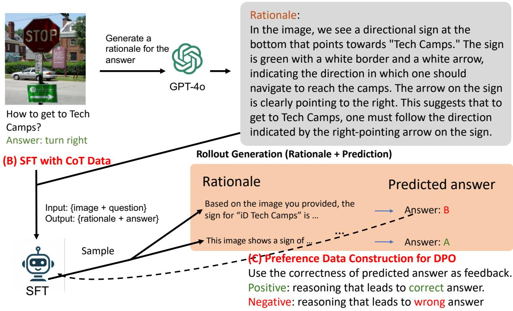

<details>
<summary>flowchart</summary>

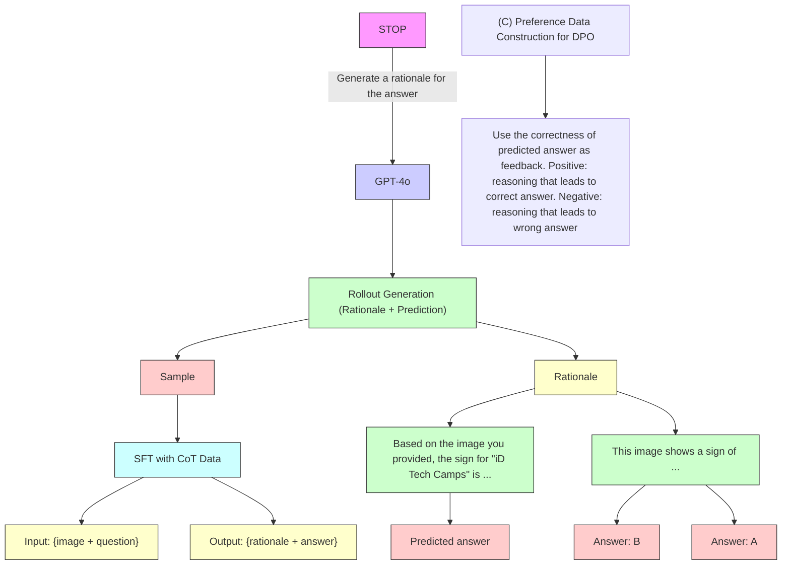
</details>

Figure A.1: Workflow diagram showing: a) the use of GPT-4o to generate rationale given short annotations; b) SFT of open-source VLM for CoT reasoning; c) Build preference dataset for reinforcement learning with DPO to enhance reasoning.

# B SHAREGPT-4O-REASONING Data for VLM CoT Reasoning

# B.1 Prompt for GPT-4o Distillation

Figure B.1 and fig. B.2 illustrate the GPT-4o system (task) prompt and the GPT-4o distillation prompt. We employ the same prompt across all VQA datasets for data distillation. Specifically, the input to the prompt consists of an image, a question, and a short answer. The short answer serves as a reference for GPT-4o to generate a CoT reasoning followed by a final answer after ’### Answer’. We show a few more examples in the next subsections.

When provided with an image, a question, and a reference answer, generate a chain-of-thought step that helps derive your own answer. Your rationale should include detailed visual elements in order to derive the answer.

Figure B.1: GPT-4o system prompt for CoT distillation.   
```txt
# Objective #
You are provided with an image, a question and a reference answer. Your job is to generate a rationale that logically derives the answer from the visual clues.

###
#
# Question #
{question}

###
#
# Reference Answer #
{answer}

###
#
# Rationale Requirement #
1. Do not state an answer at the beginning. Explain the visual clues that help to derive the a
2. Don't state that the reference answer is correct or consistent to your finding. Your are w
your own solution.
3. State your own derivation at the end with new line: ### Answer: <your answer>

###
### 
```  
Figure B.2: GPT-4o prompt for CoT distillation.

# B.2 Filtering Mismatched Annotations in Distillation

In the GPT-4o prompt shown in fig. B.2, we treat the annotation as a reference answer and instruct GPT-4o to generate its own solution based on that reference. In fig. B.3 and fig. B.4, we illustrate cases where the GPT-4o-generated solution differs from the annotated answer. Upon human examination, we identified errors in the annotations. For example, in fig. B.3, there are issues such as incorrect text recognition (e.g., “dentist” misidentified as “heart”) and incorrect object identification (e.g., “beer” as “water”). In fig. B.4, the annotation errors involve incorrect calculations in the left figure and miscounting in the right figure.

To ensure consistency and avoid potential errors, we filtered out examples where the GPT-4o generated answer differs from the annotated answer. In SHAREGPT-4O-REASONING, we release the SFT CoT data along with the original distillation and filtered examples for reference.

# A-OKVQA Filtered Out Example #1

Question: What part of the body does Dr. Eng work on?

Options: A. heart, B. teeth, C. ears, D. lungs

Annotated Answer: A. heart


<details>
<summary>text_image</summary>

207
DR. LIJEN ENO
DENTIST
北京环青轩置业
CAI #8
Café
八事堂
</details>

# GPT-4o Response:

The image shows a street view with several signs on the buildings. One prominent sign reads "DR. EILEEN ENG DENTIST" along with the address "207." The word "DENTIST" is clearly visible and indicates the profession of Dr. Eileen Eng. Dentists are medical professionals who specialize in the care of teeth.

Given this information, it is clear that Dr. Eng works on teeth

\### Answer: B. teeth

# A-OKVQA Filtered Out Example #2

Question: What drink has the owner of this cooler stocked up

Options: A. beer, B. soda, C. water, D. wine

Annotated Answer: C. water

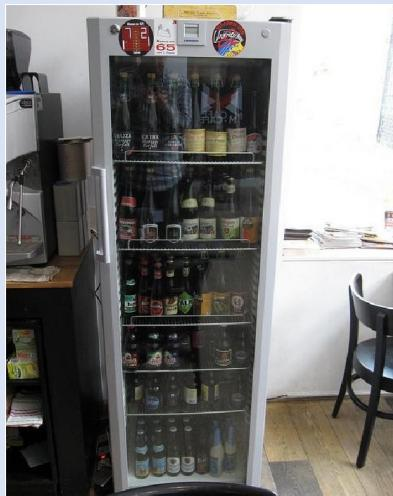

<details>
<summary>natural_image</summary>

Interior view of a modern refrigerator with glass doors and shelves filled with various bottles (no visible text or labels)
</details>

# GPT-4o Response:

The image shows a cooler with a glass door, allowing a clear view of its contents. The cooler is stocked with various bottles and cans. Upon closer inspection, the majority of the items inside the cooler appear to be bottles with labels and shapes that are typically associated with alcoholic beverages, such as beer. The bottles have different colors and designs, which are common for beer brands. There are no visible signs of soda cans, water bottles, or wine bottles. #

\## Answer: A. beer

Figure B.3: An example from the A-OKVQA dataset highlights cases where the annotated answer does not match the GPT-4o-generated answer. In these cases, the GPT-4o answers are correct, while the annotations contain labeling errors. In the left figure, the sign reads “dentist” (correctly identified by GPT-4o), and the answer should relate to ‘teeth,’ not ‘heart’ as in the annotation. In the right figure, the fridge contains beer, but the annotation incorrectly labels it as ‘water.’ Consequently, we filter out instances where the GPT-4o-generated answer does not match the annotated answers.

# ChartQA Filtered Out Example #1

Question: How much money did "1917" and "Sonic The Hedgehog" earn? Annotated Answer: 204.41   
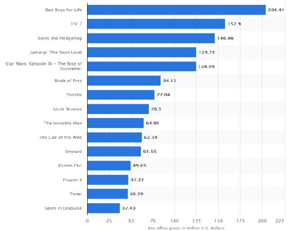

<details>
<summary>bar</summary>

| Movie | Box office gross (in million U.S. dollars) |
| :--- | :--- |
| Bad Boys for Life | 204.41 |
| 1917 | 157.9 |
| Sonic the Hedgehog | 146.06 |
| Jumanji: The Next Level | 124.73 |
| Star Wars: Episode IX – The Rise of Skywalker | 124.49 |
| Birds of Prey | 84.15 |
| Dolittle | 77.04 |
| Little Women | 70.5 |
| The Invisible Man | 61.91 |
| The Call of the Wild | 62.34 |
| Onward | 61.55 |
| Krives Out | 49.65 |
| Fruscan II | 47.22 |
| Tenet | 46.29 |
| Spies in Disquise | 37.43 |
</details>

# GPT-4o Response:

To determine the combined earnings of "1917" and "Sonic The Hedgehog," we need to locate the earnings for each movie on the bar chart.

1. The bar labeled "1917" shows earnings of 157.9 million U.S. dollars.   
2. 2. The bar labeled "Sonic the Hedgehog" shows earnings of 146.06 million U.S. dollars.

To find the total earnings, we add these two amounts together:

157.9 (for "1917") + 146.06 (for "Sonic The Hedgehog") = 303.96

\### Answer: 303.96

# ChartQA Filtered Out Example #2

Question: Which country had the highest number of terrorist attacks in 2020?   
Annotated Answer: Spain   
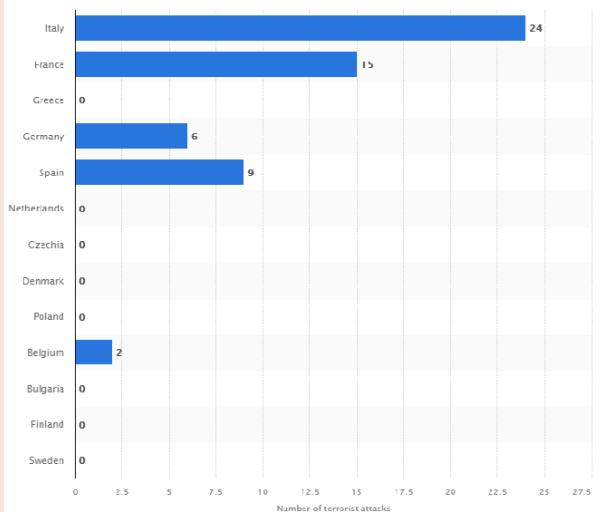

<details>
<summary>bar</summary>

| Country | Number of terrorist attacks |
| :--- | :--- |
| Italy | 24 |
| France | 15 |
| Greece | 0 |
| Germany | 6 |
| Spain | 9 |
| Netherlands | 0 |
| Czechia | 0 |
| Denmark | 0 |
| Poland | 0 |
| Belgium | 2 |
| Bulgaria | 0 |
| Finland | 0 |
| Sweden | 0 |
</details>

# GPT-4o Response:

The bar chart displays the number of terrorist attacks in various countries in 2020. Each country is represented by a horizontal bar, with the length of the bar corresponding to the number of attacks.

- Italy has the longest bar, indicating it had the highest number of terrorist attacks, with a total of 24 attacks.   
- France follows with the second longest bar, showing 15 attacks. - Spain is next with 9 attacks.   
- Germany had 6 attacks. - Belgium had 2 attacks.   
Greece, Netherlands, Czechia, Denmark, Poland, Bulgaria, Finland, and Sweden all had 0 attacks, as indicated by the absence of bars for these countries.

From these visual clues, it is clear that the country with the highest number of terrorist attacks in 2020 is Italy.

\### Answer: Italy

Figure B.4: Filtered examples from the ChartQA dataset are shown. In the left figure, GPT-4o correctly identifies ‘1917’ and ‘Sonic The Hedgehog’ and provides the correct summation, while the annotated answer incorrectly lists ‘204.41’, which is the value for ’Bad Boys for Life’ and is unrelated to the question. In the right figure, GPT-4o accurately ranks the numbers from highest to lowest, but the annotated answer incorrectly identifies ‘Spain’ as having the highest value, when it should be the third largest.

# C GPT-4o Evaluation and Prompt Optimization

In this section, we present the prompts used for GPT-4o on benchmark datasets, including both direct and Chain-of-Thought (CoT) predictions. Similar to the findings in (Borchmann, 2024), we observed that GPT-4o’s performance is highly sensitive to prompt phrasing. We explored several sets of prompts and selected the best-performing ones for reporting results. Specifically, we try to align our results with those reported in (Li et al., 2024; Tong et al., 2024), Claude 3.5 Sonnet for Vision 1, among others.

Prompt Optimization We follow the process outlined in (Borchmann, 2024) to design effective GPT-4o prompts for the benchmark datasets. A random subset of 200 instances is selected as a development set to evaluate manually designed prompts. We manually inspect the predicted results and identify issues such as the model being overly cautious in declining answers, incorrect output formatting, or style mismatches with the ground truth labels. As an illustrative example, we detail the prompt optimization process using ChartQA, and apply similar techniques to the other datasets. Finally, we provide the prompts used for replicating our test results.

Table C.1: Prompt optimization on ChartQA for direct prediction evaluated with relaxed accuracy. 

<table><tr><td>#</td><td>Prompt</td><td>ChartQA(relaxed acc)</td></tr><tr><td>1</td><td>{Question}</td><td>2.7</td></tr><tr><td>2</td><td>{Question}Answer the question directly.</td><td>32.3</td></tr><tr><td>3</td><td>Answer the question. Do not write a full sentence, just provide a value.Question: {Question}</td><td>56.4</td></tr><tr><td>4</td><td>Answer the question with following instruction:1. Do not write a full sentence, just provide a value.2. Don’t include any unit, i.e. 56 instead of 56 metersQuestion: {Question}</td><td>75.2</td></tr><tr><td>5</td><td>Answer the question with following instruction:1. Do not write a full sentence, just provide a value.2. Don’t include any unit, i.e. 56 instead of 56 meters3. Don’t include ’%’ sign, i.e. 56 instead of 56%Question: {Question}</td><td>80.3</td></tr></table>

We apply the prompts described in table C.1 to the development set and compare the predictions with the ground truth to optimize the prompts. Specifically, when using prompts #1 or #2, GPT-4o often generates full sentences instead of short answers. While prompt #3 produces a short answer, it often includes units or special tokens. To address this, we refined the instructions in prompt #4 by specifying that units should not be included in the final answer. This adjustment improved accuracy from 56.4 to 75.2. We also observed that the ground truth does not contain the % symbol, which could mismatch in evaluation, and we explicitly include this rule in prompt #5. Finally, we applied the tuned prompt to the test set, achieving an accuracy of 79.64 reported in table G.3.

Table C.2: Prompt optimization on ChartQA for CoT prediction evaluated with relaxed accuracy. 

<table><tr><td colspan="2">System Prompt</td><td>ChartQA(relaxed acc)</td></tr><tr><td></td><td>When provided with an image and a question, generate a rationale first and then derive an answer.Your rationale should include detailed visual elements in order to derive the answer.</td><td></td></tr><tr><td>#</td><td>Prompt</td><td></td></tr><tr><td>1</td><td>Answer the question with following instruction:1. Generate a rationale first and then derive an answer.2. Don’t include any unit, i.e. 56 instead of 56 meters3. Don’t include ’%’ sign, i.e. 56 instead of 56%Question:{question}# Output Format ##### Answer:</td><td></td></tr><tr><td>2</td><td>Prompt #1, removing system prompt</td><td>84.1</td></tr></table>

In table C.2, we first introduce output format instructions to guide GPT-4o in generating the correct CoT format, which aids in extracting the final answer. We reused the criteria from the direct prediction prompt to evaluate the results. Additionally, we found that including a system prompt typically leads to a 0.5-point increase in score across datasets, although it does not improve direct answer prediction. We hypothesize that the system prompt helps GPT-4o adhere more closely to the CoT output format. Finally, we applied the tuned prompt to the test set, achieving an accuracy of 84.72 reported in table G.3.

Following the prompt optimization steps outlined above, we provide the prompts used to replicate our GPT-4o test results in the next section.

# C.1 GPT-4o Prompts for Evaluation

Table C.3 and table C.4 provide the optimized prompts for benchmark dataset evaluation. The tuning process does not garantee the prompt is optimal, but that roughly matches the reported value from previous papers (Li et al., 2024; Tong et al., 2024), Claude 3.5 Sonnet for Vision 2, among others. We include the prompts for reference to replicate the GPT-4o results on benchmark datatsets.

Table C.3: Prompts for direct prediction with GPT-4o on benchmark datasets. 

<table><tr><td>Dataset</td><td>Prompt</td></tr><tr><td>A-OKVQA</td><td rowspan="2">Answer the question. Do not write a full sentence, just provide a letter choice.</td></tr><tr><td>AI2D</td></tr><tr><td>SQA</td><td>question</td></tr><tr><td>MMStar</td><td>{Question}</td></tr><tr><td>ChartQA</td><td>Answer the question with following instruction:1. Do not write a full sentence, just provide a value.2. Don’t include any unit, i.e. 56 instead of 56 meters3. Don’t include ’%’ sign, i.e. 56 instead of 56%Question: {Question}</td></tr><tr><td>DocVQA</td><td rowspan="3">Answer the question. Do not write a full sentence, just provide a value.</td></tr><tr><td>TextVQA</td></tr><tr><td>InfoVQA</td></tr><tr><td>OCRBench</td><td>Question: {question}</td></tr><tr><td>MathVista</td><td rowspan="2">Answer the question. Do not write a full sentence, just provide a value or letter choice.{question}</td></tr><tr><td>MMMU</td></tr></table>

Table C.4: Prompts for CoT prediction with GPT-4o on benchmark datasets. 

<table><tr><td>Dataset</td><td>CoT Prompt</td></tr><tr><td>system prompt</td><td>When provided with an image and a question, generate a rationale first and then derive an answer.Your rationale should include detailed visual elements in order to derive the answer.</td></tr><tr><td>A-OKVQA</td><td rowspan="3">Answer the question with following instruction:1. Generate a rationale first and then derive an answer.2. For your final answer, provide a letter choice.</td></tr><tr><td>AI2D</td></tr><tr><td>SQA</td></tr><tr><td rowspan="2">MMStar</td><td>Question:{question}# Output Format #</td></tr><tr><td>### Answer:</td></tr><tr><td rowspan="3">ChartQA</td><td>Answer the question with following instruction:1. Generate a rationale first and then derive an answer.2. Don’t include any unit, i.e. 56 instead of 56 meters3. Don’t include ’%’ sign, i.e. 56 instead of 56%</td></tr><tr><td>Question:{question}# Output Format #</td></tr><tr><td>### Answer:</td></tr></table>

Continued on next page

Table C.4 – continued from previous page 

<table><tr><td>Dataset</td><td>Prompt</td></tr><tr><td>DocVQA</td><td># Objective #</td></tr><tr><td>InfoVQA</td><td>You are provided with an image, a question. Your job is to generate a rationale first and then derive an answer.</td></tr><tr><td></td><td>##########</td></tr><tr><td></td><td># Question #{question}</td></tr><tr><td></td><td>##########</td></tr><tr><td></td><td># Rationale Requirement #1. Do not state an answer at the beginning. Explain descriptions of visual clue that help to derive the answer.2. Conclude with ### Answer:3. Your final answer should be a single word or phrase.4. If possible, copy the answer from document. Don’t add or remove symbols, units, or titles.</td></tr><tr><td></td><td>##########</td></tr><tr><td></td><td># Output Style #</td></tr><tr><td></td><td>### Answer:</td></tr><tr><td></td><td>##########</td></tr></table>

Continued on next page

Table C.4 – continued from previous page 

<table><tr><td>Dataset</td><td>Prompt</td></tr><tr><td rowspan="9">TextVQA</td><td># Objective #You are provided with an image, a question. Your job is to generate a rationale first and then derive an answer.</td></tr><tr><td>##########</td></tr><tr><td># Question #{question}</td></tr><tr><td>##########</td></tr><tr><td># Rationale Requirement #1. Do not state an answer at the beginning. Explain descriptions of visual clue that help to derive the answer.2. Conclude with ### Answer:3. Your final answer should be a single word or phrase.4. Output your answer in lower case.</td></tr><tr><td>##########</td></tr><tr><td># Output Style #</td></tr><tr><td>### Answer:</td></tr><tr><td>##########</td></tr><tr><td rowspan="4">OCRBench</td><td>Answer the question with following instruction:1. Generate a rationale first and then derive an answer.2. Your answer should be a single word or phrase.</td></tr><tr><td>Question:{question}</td></tr><tr><td># Output Format #</td></tr><tr><td>### Answer:</td></tr></table>

Continued on next page

Table C.4 – continued from previous page 

<table><tr><td>Dataset</td><td>Prompt</td></tr><tr><td>MathVista</td><td># Objective #</td></tr><tr><td>MMMU</td><td>You are provided with an image, a question. Your job is to generate a rationale that logically derives an answer from the visual clues.</td></tr><tr><td></td><td>##########</td></tr><tr><td></td><td># Question #{question}</td></tr><tr><td></td><td>##########</td></tr><tr><td></td><td># Rationale Requirement #1. Do not state an answer at the beginning. Explain step by step logic to derive the answer.2. Conclude with ### Answer:</td></tr><tr><td></td><td>##########</td></tr><tr><td></td><td>Example output style:</td></tr><tr><td></td><td>### Answer:</td></tr><tr><td></td><td>##########</td></tr></table>

# D Baseline Evaluation

Table D.1: Evaluation of VLM performance on benchmark datasets with direct and CoT inference. 

<table><tr><td rowspan="2">Dataset</td><td colspan="2">LLAVA-NEXT-8B</td><td colspan="2">LLAVA-NEXT-FORMAT</td></tr><tr><td>direct</td><td>CoT</td><td>direct</td><td>CoT</td></tr><tr><td>A-OK</td><td>85.9</td><td>44.5</td><td>85.8</td><td>84.3</td></tr><tr><td>ChartQA</td><td>68.6</td><td>52.8</td><td>70.2</td><td>71.2</td></tr><tr><td>DocVQA</td><td>78.4</td><td>57.1</td><td>75.7</td><td>67.0</td></tr><tr><td>InfoVQA</td><td>36.6</td><td>25.8</td><td>37.7</td><td>34.9</td></tr><tr><td>TextVQA</td><td>67.2</td><td>41.6</td><td>68.2</td><td>62.2</td></tr><tr><td>AI2D</td><td>73.0</td><td>70.0</td><td>71.5</td><td>67.4</td></tr><tr><td>SQA</td><td>77.4</td><td>75.8</td><td>75.4</td><td>74.4</td></tr><tr><td>MathVista</td><td>37.3</td><td>25.3</td><td>39.3</td><td>40.3</td></tr><tr><td>OCRBench</td><td>57.7</td><td>59.7</td><td>59.1</td><td>56.6</td></tr><tr><td>MMStar</td><td>47.8</td><td>45.7</td><td>44.7</td><td>46.7</td></tr><tr><td>MMMU</td><td>42.8</td><td>37.6</td><td>41.8</td><td>37.7</td></tr><tr><td>Avg</td><td>61.2</td><td>48.7</td><td>60.9</td><td>58.4</td></tr></table>

In this section, we provide evaluation details for our base model, which uses the LLAMA3-LLAVA-NEXT-8B architecture with weights initialized from OPEN-LLAVA-NEXT. We selected OPEN-LLAVA-NEXT weights because the data and training pipelines were fully available at the time of model development, allowing us to avoid reliance on the unreleased real user interactions referenced in (Liu et al., 2024). The pretraining data for OPEN-LLAVA-NEXT consists of 1M image-text pairs, sourced from datasets such as ShareGPT4V, ALLaVA-Instruct-VFLAN-4V, DocVQA, SynDog-EN, ChartQA, DVQA, AI2D, and GeoQA+.

When evaluating LLAVA-NEXT-8B, we identified several issues, such as the inability to follow the CoT prompt, refusal to answer questions, and generating irrelevant reasoning. In fig. D.1, we present randomly sampled examples from LLAVA-NEXT-8B with a temperature setting of 1.0 on a ChartQA test case. These examples demonstrate the model’s difficulty in adhering to the CoT prompt. In the first example, the model declines to answer the question. In the second to fourth examples, the model provides an answer first, followed by an explanation, which doesn’t effectively use thought process to answer the question. In the final example, the model generates a descriptive response instead of reasoning through the question, ultimately failing to provide an answer. This illustrates the model’s inconsistent handling of the prompt structure.

Table D.1 presents the evaluation results for LLAVA-NEXT-8B. For CoT predictions, we use ChatGPT to extract a letter choice or short answer from the long-form model output, using the prompts shown in fig. D.2 and fig. D.3. However, due to LLAVA-NEXT-8B ’s inability to accurately follow the CoT format, its performance is significantly worse compared to direct predictions and our format-aligned model. For direct prediction, our LLAVA-NEXT-FORMAT has similar performance as that of LLAVA-NEXT-8B.

In fig. D.4, we present the same example trained with our format-aligned data for CoT using only 450 examples. The model successfully follows the CoT format by verbalizing the thought process and providing a short answer after "### Answer:". This allows us to use a rule-based extractor to retrieve answers, which also improves CoT performance, as shown in table D.1. However, the example also demonstrates that, while our data induces the CoT process, the reasoning remains incorrect. Sampling 32 examples using the format in fig. D.4 resulted in 3 correct answers, yielding an accuracy of 9.4% for that case. As a result, only slight gain is observed on ChartQA for CoT prediction vs. direct prediction.

Based on the above experiments, we report LLAVA-NEXT-8B as the baseline in the paper to avoid the difficulty in CoT evaluation and answer extraction of LLAMA3-LLAVA-NEXT-8B baseline.

# ChartQA LLaVA-Next-8b CoT Example

Question: How many food item is shown in the bar graph?

Generate a reason first and then output a short answer.


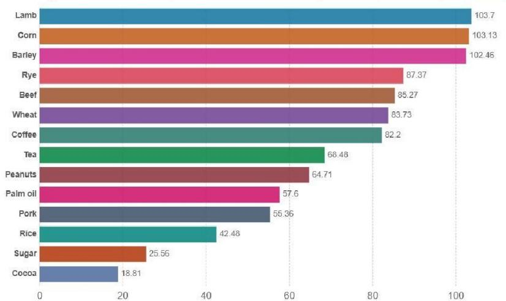

<details>
<summary>bar</summary>

| Item | Value |
|---|---|
| Lamb | 103.7 |
| Corn | 103.13 |
| Barley | 102.46 |
| Rye | 87.37 |
| Beef | 85.27 |
| Wheat | 83.73 |
| Coffee | 82.2 |
| Tea | 68.48 |
| Peanuts | 64.71 |
| Palm oil | 57.6 |
| Pork | 55.36 |
| Rice | 42.48 |
| Sugar | 25.56 |
| Cocoa | 18.81 |
</details>

# Sample #1:

As the bar graph doesn’t contain any numerical data or labels, it's not possible to count the exact number of food items depicted in the illustration. For a precise answer, more information or a closer examination of the specific items in the image would be necessary. In generating an accurate response, attention should be paid to the visual cues and contextual details of the scene, which might hint at the types of food items being presented.

# Sample #2:

The bar graph displays ten different food items. These are arranged from left to right in descending order, with the first item being "Lamb." A reason for the descending order could be to represent the decreasing price index over time for that particular food item, but this is a common placement for descending bar graphs in general, so it's likely for readability of the labels.

# Sample #3:

The bar graph illustrates nine food items, which are Lamb, Corn, Barley, Rye, Beef, Wheat, Coffee, Peanuts, Palm Oil, and Pork. Each row represents one item, and the length of the horizontal bar corresponds to the commodity price index, a measure of food prices relative to their prices in 1900.

# Sample #4:

The bar graph shows eight food items. The reason for generating such a graph is to compare the long-term price trends of these food commodities over a century and a half, from 1850 to 2015. The graph is useful for understanding the pricing dynamics of these agricultural products, which can affect the economy, food security, and consumer affordability. The output reflects the historical price volatility and long-term increase in global food commodities, with the most significant increase in the price of grains like corn and barley, indicating their importance as staples in global food systems.

# Sample #5:

Long-term price indices are a statistical measure of the evolution of the relative cost over time of a basket of goods. This particular bar graph is a comparison of the price indices of various food commodities over a century, representing an economic measure of the food prices in 1915 as a benchmark for relative price changes. The graph illustrates the historical cost of items in the food category, with the largest relative change indicated by the longest bars for items such as Lamb, Coffee, and Rice, and the smallest for Sugar and Cocoa.

Figure D.1: Randomly sampled examples from LLAVA-NEXT-8B with temperature=1.0 for a test case in ChartQA reveal that the model struggles to effectively follow the CoT prompt. In Sample 1, the model refuses to answer the question. In Samples 2-4, the model generates an answer first, followed by an explanation. In the final sample, the model produces a description instead of reasoning through the question, without providing an answer.

```txt
You are an AI assistant who will help me to match an answer with several options of a single-choice question. You are provided with a question, several options, and an answer, and you need to find which option is most similar to the answer. If the meaning of all options are significantly different from the answer, output Z. Your should output a single uppercase character in A, B, C, D (if they are valid options), and Z.
Example 1:
Question: What is the main object in image?
Options: A. teddy bear B. rabbit C. cat D. dog
Answer: a cute teddy bear
Your output: A
Example 2:
Question: What is the main object in image?
Options: A. teddy bear B. rabbit C. cat D. dog
Answer: Spider
Your output: Z
Example 3:
Question: {question}
Options: {options}
Answer: {answer}
Your output: 
```  
Figure D.2: ChatGPT answer extraction prompt for multiple-choices questions.

```txt
Your goal is to extract a short answer from a chain-of-thought prediction. You are given a question and model prediction, the image is omitted.
You need to determine the answer from the prediction. If no answer can be derive, output NA.

####### Example 1 ######
### Question:
How many bars are there in the chart?
### Prediction:
The result shows bar graphs ..., counting the bars, there are a total of 8 bars.
### Your output:
8

####### Example 2 ######
### Question:
Determine the date appeared in the document.
### Prediction:
The figure displays a document on financial income ... the date 2008/01/15 appears at body of text.
### Your output:
2008/01/15

####### Your Task ######
### Question:
{question}
### Prediction:
{prediction}
### Your output: 
```  
Figure D.3: ChatGPT answer extraction prompt for short answer questions.

# ChartQA CoT Example of our LLaVA-NeXT-Format

Question: How many food item is shown in the bar graph?

Generate a reason first and then output a short answer.

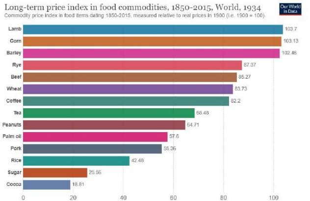

<details>
<summary>bar</summary>

Long-term price index in food commodities, 1850-2015, World, 1934
Commodity price index in food items during 1850-2015, measured relative to real prices in 1900 (i.e. 1900 = 100).
| Commodity | Price Index |
|---|---|
| Lamb | 103.7 |
| Corn | 103.13 |
| Barley | 102.46 |
| Rye | 87.37 |
| Beef | 85.27 |
| Wheat | 83.73 |
| Coffee | 82.2 |
| Tea | 68.48 |
| Peanuts | 64.71 |
| Palm oil | 57.6 |
| Pork | 55.36 |
| Rice | 42.48 |
| Sugar | 25.56 |
| Cocoa | 18.81 |
</details>

# Sample #1:

The bar graph shows the long-term price index in food commodities from 1850 to 2015, measured relative to real prices in 1900. Each bar represents a different food item and the lengths of the bars are proportional to the price index values.

1. The y-axis lists various food commodities, such as Lamb, Corn, Barley, Rye, Beef, Wheat, Coffee, Tea, Peanuts, Palm Oil, Pork, Rice, and Cocoa.   
2. Each bar along the x-axis is associated with a specific food item, and they are ordered from left to right. Counting each distinct category name along the y-axis, there are 12 different food items shown in the bar graph.

\### Answer: 12

# Sample #2:

The bar graph is a visual representation of the long-term price index of various food commodities from 1850 to 2015. Each bar is associated with a different food item, and the length of the bar represents the relative price change in terms of real prices in 1900.

By examining the horizontal axis, we can count the number of food items listed. The categories listed are Lamb, Corn, Barley, Rye, Beef, Wheat, Coffee, Peanuts, Palm Oil, Pork, Rice, Sugar, and Cocoa.

To determine the number of food items, we need to count these categories. It should be noted that even though each bar represents a specific food item, the length of the bar or the dark blue shade at the top may represent different items.

Upon counting the categories, we get the following:

1. 1 - Lamb   
2. 1 - Corn   
[omit]   
13. 1 - Cocoa

Adding these up, we get a total of 13 food categories represented in the bar graph.

\### Answer: 13

Figure D.4: Randomly sampled examples from LLAVA-NEXT-FORMAT with a temperature setting of 1.0, evaluated on the same test case in ChartQA, show that after training on 450 format-aligned data, the model is able to follow the CoT prompt by verbalizing the thought process and providing a short answer.

# E Nearly Zero Data Learning for CoT Reasoning

Table E.1: We study a self-taught reasoner with minimal CoT data (only 450 format-aligned examples). LLAVA-NEXT-DIRECT is used as the baseline, and our LLaVA-Next-STaR is trained with a rejection sampling method. The best CoT predictions are highlighted in orange, and the best direct predictions are highlighted in blue. Our rejection sampling method outperforms both CoT and direct prediction, with the exception of two data points. 

<table><tr><td>Methods</td><td>Prompting</td><td>A-OK</td><td>ChartQA</td><td>DocVQA</td><td>InfoVQA</td><td>TextVQA</td><td>AI2D</td><td>SQA</td><td>MathVista</td></tr><tr><td>LLaVA-Next</td><td>direct</td><td>86.4</td><td>73.7</td><td>78</td><td>45.4</td><td>71.9</td><td>78.8</td><td>91.5</td><td>43.2</td></tr><tr><td>+ Direct 2</td><td>CoT</td><td>85.7</td><td>71.8</td><td>68.8</td><td>38.6</td><td>63.6</td><td>72.5</td><td>85.4</td><td>38.6</td></tr><tr><td>LLaVA-Next</td><td>direct</td><td>85.9</td><td>74.6</td><td>79.2</td><td>47.4</td><td>72.1</td><td>79.5</td><td>92.2</td><td>44.4</td></tr><tr><td>-STaR</td><td>CoT</td><td>85.9</td><td>77.9</td><td>75.8</td><td>44.0</td><td>25.1</td><td>76.6</td><td>86.8</td><td>42.0</td></tr></table>

In this section, we demonstrate how minimal CoT training data can enhance CoT reasoning capabilities. Specifically, we use only 450 CoT format-aligned examples alongside all available direct prediction data, with LLAVA-NEXT-DIRECT as the baseline. We apply rejection sampling fine-tuning (RFT) following (Sun et al., 2024; Setlur et al., 2024) to train a self-taught chain-of-thought reasoner, denoted as LLaVA-Next-STaR. From LLAVA-NEXT-DIRECT, we sample 32 CoT examples for each training instance and select those whose final predictions match the ground truth. Up to three positive examples are selected per question, resulting in a dataset of 260k RFT examples.

As shown in table E.1, RFT training improves both CoT reasoning and direct predictions overall, with the exception of two data points. Notably, TextVQA shows a significant drop in CoT performance, which we will explore further in future work. Notable (>3%) gain is observed on ChartQA, DocVQA, InfoVQA, AI2D and MathVista, and roughly 1% gain is observed on direct prediction on those datasets as well.

DPO Experiments Prior to the RFT experiments, we conducted DPO experiments on the ChartQA dataset under the same conditions as described in section 4. However, the improvements were modest, with a 72.3 (+0.5) gain in CoT prediction and a 74.2 (+0.5) gain in direct prediction. In contrast, RFT yielded a significant improvement, with 77.9 (+6.1) on CoT prediction and 74.6 (+0.9) on direct prediction. We hypothesize that for models with relatively weak CoT reasoning capabilities, RFT may be more effective in enhancing model performance, whereas DPO with preference modeling may be less impactful. We leave further analysis for future work.

# F SFT Ablation Experiments

Table F.1: SFT Ablation Results: For each dataset, ‘-C’ indicates the inclusion of CoT data for training, and ‘-D’ indicates the inclusion of direct prediction data. 

<table><tr><td>Methods</td><td>Prompt</td><td>A-OK</td><td>ChartQA</td><td>DocVQA</td><td>InfoVQA</td><td>TextVQA</td><td>AI2D</td><td>SQA</td><td>MathVista</td></tr><tr><td rowspan="2">LLAVA-NEXT-FORMAT</td><td>direct</td><td>85.8</td><td>70.2</td><td>75.7</td><td>37.7</td><td>68.2</td><td>71.5</td><td>75.4</td><td>39.3</td></tr><tr><td>cot</td><td>84.3</td><td>71.2</td><td>67</td><td>34.9</td><td>62.2</td><td>67.4</td><td>74.4</td><td>40.3</td></tr><tr><td rowspan="2">ChartQA-C+D</td><td>direct</td><td>85</td><td>74.9</td><td>75.8</td><td>36.5</td><td>68.2</td><td>72.2</td><td>77.4</td><td>42.8</td></tr><tr><td>cot</td><td>84.4</td><td>81.7</td><td>69</td><td>32.2</td><td>63.3</td><td>68.6</td><td>74.9</td><td>41.7</td></tr><tr><td rowspan="2">ChartQA-D</td><td>direct</td><td>85.2</td><td>73.1</td><td>74.6</td><td>34.1</td><td>67.1</td><td>71.5</td><td>76.4</td><td>40.3</td></tr><tr><td>cot</td><td>84.3</td><td>71.8</td><td>62.4</td><td>31.8</td><td>58</td><td>66.3</td><td>74</td><td>35.5</td></tr><tr><td rowspan="2">ChartQA-C</td><td>direct</td><td>85.1</td><td>70.8</td><td>74.5</td><td>35</td><td>67.9</td><td>71.6</td><td>76.9</td><td>35.3</td></tr><tr><td>cot</td><td>84.9</td><td>81.4</td><td>67.2</td><td>32.2</td><td>61.5</td><td>68.8</td><td>76.6</td><td>40.1</td></tr><tr><td rowspan="2">A-OK-C+D</td><td>direct</td><td>86.2</td><td>69.2</td><td>75.4</td><td>37.7</td><td>67.3</td><td>70.7</td><td>77.5</td><td>38.8</td></tr><tr><td>cot</td><td>84.6</td><td>70.2</td><td>67.3</td><td>36</td><td>61.6</td><td>67.2</td><td>75.8</td><td>39.8</td></tr><tr><td rowspan="2">A-OK-D</td><td>direct</td><td>85.1</td><td>69</td><td>75.3</td><td>38.5</td><td>66.9</td><td>72.2</td><td>76.1</td><td>39.5</td></tr><tr><td>cot</td><td>84</td><td>67.7</td><td>66.5</td><td>34.8</td><td>61.1</td><td>68.4</td><td>76</td><td>39.9</td></tr><tr><td rowspan="2">A-OK-C</td><td>direct</td><td>84.4</td><td>69.4</td><td>75.8</td><td>37.4</td><td>67.9</td><td>69.2</td><td>77.3</td><td>34.6</td></tr><tr><td>cot</td><td>84.1</td><td>69.2</td><td>67.6</td><td>35.5</td><td>59.4</td><td>67.6</td><td>74.5</td><td>40.6</td></tr><tr><td rowspan="2">DocVQA-C+D</td><td>direct</td><td>85.5</td><td>69.5</td><td>80.7</td><td>40.4</td><td>68.8</td><td>72</td><td>77.5</td><td>41.1</td></tr><tr><td>cot</td><td>83.9</td><td>70.9</td><td>80</td><td>40.2</td><td>64.1</td><td>68.2</td><td>73.4</td><td>39.3</td></tr><tr><td rowspan="2">DocVQA-D</td><td>direct</td><td>85.5</td><td>66.5</td><td>77</td><td>39.1</td><td>68.2</td><td>70.8</td><td>76.3</td><td>41.9</td></tr><tr><td>cot</td><td>83.9</td><td>66</td><td>66.4</td><td>33.7</td><td>59.9</td><td>64.8</td><td>74.5</td><td>39.3</td></tr><tr><td rowspan="2">DocVQA-C</td><td>direct</td><td>85.2</td><td>69.1</td><td>79.1</td><td>37.5</td><td>68.5</td><td>72</td><td>76.7</td><td>33.8</td></tr><tr><td>cot</td><td>84.4</td><td>71.2</td><td>78</td><td>38.5</td><td>63.5</td><td>68.5</td><td>74.1</td><td>38</td></tr><tr><td rowspan="2">InfoVQA-C+D</td><td>direct</td><td>85.8</td><td>63.4</td><td>77.1</td><td>47.7</td><td>67.6</td><td>72.5</td><td>78.1</td><td>43.6</td></tr><tr><td>cot</td><td>85.3</td><td>65.4</td><td>72.6</td><td>47.5</td><td>62.4</td><td>69.4</td><td>74.6</td><td>37.8</td></tr><tr><td rowspan="2">InfoVQA-D</td><td>direct</td><td>85.7</td><td>56.7</td><td>75</td><td>45.4</td><td>67</td><td>72.5</td><td>77.5</td><td>42.8</td></tr><tr><td>cot</td><td>83.7</td><td>53</td><td>63.5</td><td>37.8</td><td>58.2</td><td>67</td><td>75</td><td>37</td></tr><tr><td rowspan="2">InfoVQA-C</td><td>direct</td><td>85.2</td><td>68.3</td><td>76.5</td><td>42.5</td><td>67.8</td><td>72.5</td><td>78.2</td><td>39</td></tr><tr><td>cot</td><td>83.7</td><td>63.4</td><td>71.1</td><td>46.3</td><td>59.9</td><td>67.4</td><td>74.3</td><td>37.6</td></tr><tr><td rowspan="2">TextVQA-C+D</td><td>direct</td><td>85.1</td><td>69.8</td><td>75.5</td><td>38.7</td><td>73</td><td>71.9</td><td>76.9</td><td>42.6</td></tr><tr><td>cot</td><td>84.6</td><td>68.9</td><td>70.5</td><td>36.3</td><td>70.9</td><td>67.6</td><td>76.6</td><td>36.1</td></tr><tr><td rowspan="2">TextVQA-D</td><td>direct</td><td>84.9</td><td>68.6</td><td>74.5</td><td>37.6</td><td>71.8</td><td>70.8</td><td>77</td><td>41.7</td></tr><tr><td>cot</td><td>84.4</td><td>63.3</td><td>64.2</td><td>33.2</td><td>64.2</td><td>66.1</td><td>73.6</td><td>38.2</td></tr><tr><td rowspan="2">TextVQA-C</td><td>direct</td><td>84.6</td><td>69.1</td><td>74.6</td><td>36.9</td><td>71.4</td><td>71.9</td><td>77.1</td><td>36.6</td></tr><tr><td>cot</td><td>84.7</td><td>68.2</td><td>69.5</td><td>36.9</td><td>70.3</td><td>67.8</td><td>75.1</td><td>37.1</td></tr><tr><td rowspan="2">SQA-C+D</td><td>direct</td><td>85.7</td><td>69</td><td>75</td><td>38.4</td><td>67.3</td><td>72.3</td><td>90.2</td><td>38.7</td></tr><tr><td>cot</td><td>83.1</td><td>71.2</td><td>66.5</td><td>35.6</td><td>58.9</td><td>66.9</td><td>90.4</td><td>40.8</td></tr><tr><td rowspan="2">SQA-D</td><td>direct</td><td>84.9</td><td>68.1</td><td>74.3</td><td>37</td><td>66.8</td><td>72.2</td><td>89.2</td><td>41.3</td></tr><tr><td>cot</td><td>83</td><td>68.4</td><td>67.5</td><td>33.8</td><td>62.1</td><td>68.7</td><td>81.9</td><td>39.8</td></tr><tr><td rowspan="2">SQA-C</td><td>direct</td><td>84</td><td>69.3</td><td>76</td><td>38.3</td><td>68.2</td><td>71.7</td><td>85</td><td>39.2</td></tr><tr><td>cot</td><td>82</td><td>69</td><td>65.3</td><td>34.4</td><td>58.3</td><td>66.6</td><td>88.8</td><td>39.4</td></tr><tr><td rowspan="2">AI2D-C+D</td><td>direct</td><td>85.2</td><td>69.6</td><td>75.8</td><td>39</td><td>67.6</td><td>78</td><td>78.4</td><td>40.1</td></tr><tr><td>cot</td><td>83.8</td><td>70.2</td><td>68</td><td>35.9</td><td>60.7</td><td>76.3</td><td>76.6</td><td>42.1</td></tr><tr><td rowspan="2">AI2D-D</td><td>direct</td><td>86.3</td><td>69.2</td><td>75.1</td><td>37.3</td><td>67.2</td><td>76.8</td><td>77.6</td><td>39.7</td></tr><tr><td>cot</td><td>82.7</td><td>67.6</td><td>66</td><td>33.7</td><td>61.4</td><td>71.7</td><td>74.4</td><td>38.3</td></tr><tr><td rowspan="2">AI2D-C</td><td>direct</td><td>84.4</td><td>69.6</td><td>75.9</td><td>37.7</td><td>68.2</td><td>75</td><td>76.3</td><td>39.1</td></tr><tr><td>cot</td><td>83.1</td><td>70.2</td><td>65.9</td><td>35.6</td><td>59.9</td><td>75.1</td><td>74.5</td><td>39.5</td></tr><tr><td rowspan="2">math-C+D</td><td>direct</td><td>85.3</td><td>68.5</td><td>75.5</td><td>37.8</td><td>67.3</td><td>71.7</td><td>77.4</td><td>42.7</td></tr><tr><td>cot</td><td>84.4</td><td>69.7</td><td>64.3</td><td>34.2</td><td>59.3</td><td>68.7</td><td>76.3</td><td>49</td></tr><tr><td rowspan="2">math-C</td><td>direct</td><td>85.2</td><td>68.1</td><td>75.6</td><td>38</td><td>67.4</td><td>72</td><td>77.5</td><td>40.5</td></tr><tr><td>cot</td><td>84.3</td><td>70.6</td><td>66.2</td><td>34.7</td><td>59.8</td><td>68.2</td><td>78.4</td><td>45.4</td></tr><tr><td rowspan="2">math+ChartQA</td><td>direct</td><td>85.3</td><td>70.9</td><td>75.7</td><td>36.8</td><td>67.8</td><td>71.7</td><td>78.3</td><td>41.9</td></tr><tr><td>cot</td><td>84.1</td><td>81.9</td><td>67</td><td>32.6</td><td>60.7</td><td>68.3</td><td>75.5</td><td>49.7</td></tr><tr><td rowspan="2">LLAVA-REASONER-SFT</td><td>direct</td><td>85.4</td><td>76.1</td><td>82.9</td><td>50.6</td><td>73.1</td><td>79.4</td><td>90.4</td><td>44.3</td></tr><tr><td>cot</td><td>86.2</td><td>83.0</td><td>81.8</td><td>51.6</td><td>71.1</td><td>78.5</td><td>92.7</td><td>50.6</td></tr></table>

In table F.1, we present additional ablation experiments on SFT across each dataset, using three settings: direct only, CoT only, and direct + CoT. Additionally, format-aligned data is incorporated during training to enable the model to follow the specific direct or CoT format during inference.

# G Ablation Tests on Data Composition

Table G.1: Effect of data composition on math reasoning. MV: MathVision, GL: G-LLaVA, MI: MathInstruct, MP: MathPlus. 

<table><tr><td>Data Config</td><td>MathVista (direct/CoT)</td></tr><tr><td>format only 1</td><td>39.3/40.3</td></tr><tr><td>MV</td><td>41.0/43.4</td></tr><tr><td>MV+GL</td><td>43.2/44.9</td></tr><tr><td>MV+GL+MP50k</td><td>42.3/45.6</td></tr><tr><td>MV+GL+MP100k</td><td>43.0/44.9</td></tr><tr><td>MV+GL+MI50k</td><td>43.1/45.0</td></tr><tr><td>MV+GL+MI100k</td><td>43.7/46.3</td></tr><tr><td>MV+GL+AI2D</td><td>44.1/46.4</td></tr><tr><td>MV+GL+SQA</td><td>43.1/47.3</td></tr><tr><td>MV+GL+ChartQA</td><td>43.2/50.4</td></tr></table>

Data Composition for Math. In table G.1, we examine the effectiveness of data composition on MathVista performance. We first include two visual math datasets: MathVision (MV) and G-LLaVA (GL). Including MV improves CoT performance by +3.1 over format only baseline (fig. 4 ①), while adding GL yields an additional gain of +1.5. Building on MV+GL, we incorporate several datasets that are potentially relevant to the task, including two math text-only datasets: MathPlus (MP) and MathInstruct (MI), two science datasets: SQA and AI2D, and ChartQA. Notably, ChartQA significantly boosts CoT performance (+5.5), while AI2D and SQA provide positive gains of +0.6 and +1.5, respectively. However, adding the math text datasets results in minimal improvement. Comparing inclusion of 100k MP vs 50k MP, more text data does not necessarily lead to better results. Therefore, we decided not to include them in training LLAVA-REASONER-SFT.

Table G.2: Effect of data composition on science related tasks. 

<table><tr><td>Data Config</td><td>AI2D</td><td>SQA</td></tr><tr><td>format only 1</td><td>67.4</td><td>74.4</td></tr><tr><td>AI2D</td><td>76.3</td><td>76.6</td></tr><tr><td>SQA</td><td>66.9</td><td>90.4</td></tr><tr><td>AI2D +SQA</td><td>76.7</td><td>91.2</td></tr><tr><td>AI2D +SQA +ChartQA</td><td>77.4</td><td>91.4</td></tr></table>

Data Composition for Science Tasks with CoT Prediction. In table G.2, we evaluate the impact of data composition on science datasets, including AI2D and SQA. Our results show that combining SQA and AI2D provides additional gains on both datasets, indicating that they are mutually beneficial. Furthermore, adding ChartQA contributes positively to both datasets, with a notable improvement of +0.7 for AI2D.

<table><tr><td>Dataset</td><td>GPT-4odirect/cot</td><td>Grok-1.5Vreported</td><td>Cambrianofficial prompt</td><td>LLaVA-Reasoner-SFTdirect/cot</td><td>LLaVA-R-DPOdirect/cot</td></tr><tr><td>A-OK</td><td>89.6/90.1</td><td>-</td><td>83.1*</td><td>85.4/86.2</td><td>85.4/87.0</td></tr><tr><td>ChartQA</td><td>79.6/84.7</td><td>76.1</td><td>73.3</td><td>76.1/83.0</td><td>76.4/84.2</td></tr><tr><td>DocVQA</td><td>90.3/90.8</td><td>85.6</td><td>77.8</td><td>82.9/81.8</td><td>83.1/82.7</td></tr><tr><td>InfoVQA</td><td>72.4/72.8</td><td>-</td><td>45.7*</td><td>50.6/51.6</td><td>51.2/52.7</td></tr><tr><td>TextVQA</td><td>78.1/75.4</td><td>78.1</td><td>71.7</td><td>73.1/71.1</td><td>73.3/71.5</td></tr><tr><td>AI2D</td><td>80.7/81.5</td><td>88.3</td><td>73.0</td><td>79.4/78.5</td><td>79.4/79.5</td></tr><tr><td>SQA</td><td>85.9/87.2</td><td>-</td><td>80.4</td><td>90.4/92.7</td><td>90.8/92.6</td></tr><tr><td>MathVista</td><td>54.8/63.4</td><td>52.8</td><td> $49.0^†$ </td><td>44.2/52.1</td><td></td></tr><tr><td>OCRBench</td><td>80.2/79.2</td><td>-</td><td>62.4</td><td>61.6/62.0</td><td>62.9/63.7</td></tr><tr><td>MMStar</td><td>55.1/64.7</td><td>-</td><td>50.3*</td><td>51.6/54.0</td><td>51.5/54.1</td></tr><tr><td>MMMU</td><td>57.8/63.6</td><td>53.6</td><td>42.7</td><td>41.6/40.0</td><td>42.4/42.6</td></tr><tr><td>Avg (of best)</td><td>77.9</td><td>-</td><td>64.5</td><td>68.8</td><td>69.5</td></tr></table>

Table G.3: Performance Comparison of GPT-4o, Grok-1.5V, Cambrian-7b, and our SFT/DPO Model. For Cambrian, \* indicates our replicated results, while others are adapted from (Tong et al., 2024), † indicate CoT prompt used for evaluation. LLAVA-REASONER-SFT is our SFT model and LLAVA-REASONER-DPO is our DPO model.

# H Comparing with SOTA model and GPT-4o

In table G.3, we compare the performance of GPT-4o and a recent state-of-the-art model, Cambrian (Tong et al., 2024). For GPT-4o, we include both direct and CoT predictions, following the prompt optimization steps outlined in (Borchmann, 2024), with the prompts detailed in appendix C. For Cambrian, we report the numbers from (Tong et al., 2024) and replicated the results using the official checkpoint on MMStar, InfoVQA, and A-OKVQA. Specifically for Cambrian, CoT predictions were used for the MathVista dataset, while direct predictions were applied for the remaining datasets.

When compared to open-source models, GPT-4o outperforms on nearly all benchmark datasets, with the exception of SQA. Notably, significant improvements from CoT predictions are observed on tasks involving calculation or complex reasoning, such as ChartQA, MathVista, MMMU, and MMStar.

Cambrian-7B is trained on a dataset of 7 million open-source instruction-following examples. In contrast, our model, fine-tuned on fewer than 400k instruction examples, outperforms Cambrian-7B on most benchmark datasets, underscoring the effectiveness of incorporating CoT data. While we recognize the challenge of comparing against other models, such as One-Vision (Li et al., 2024), MiniCPM-V (Yao et al., 2024), X-Composer (Zhang et al., 2024b), and InternVL (Chen et al., 2024b), due to differences in model architecture, training datasets, and evaluation pipelines, our primary focus is on studying the effectiveness of CoT learning rather than competing for state-of-the-art performance on visual-language tasks.

# I Additional DPO Experiments

Table I.1: Truncating response length affects the final performance of DPO. No truncation leads to a decline in performance, while truncating to 90 tokens empirically yields the best results. 

<table><tr><td>Data/Truncate Len</td><td>prompting</td><td>70</td><td>90</td><td>110</td><td>No Truncate</td><td>SFT baseline</td></tr><tr><td rowspan="2">ChartQA</td><td>direct</td><td>76.5</td><td>76.2</td><td>76.7</td><td>75.9</td><td>76.1</td></tr><tr><td>CoT</td><td>83.9</td><td>84.2</td><td>81.8</td><td>80.6</td><td>83.0</td></tr><tr><td rowspan="2">A-OKVQA</td><td>direct</td><td>85.2</td><td>85.2</td><td>85.3</td><td>85.1</td><td>85.4</td></tr><tr><td>CoT</td><td>86.7</td><td>86.9</td><td>86.3</td><td>85.7</td><td>86.2</td></tr></table>

Truncating Responses for DPO In our initial experiments, we observed that truncating response length impacts the final performance of DPO. As shown in table I.1, no truncation results in a decline in performance, while truncating to 90 tokens empirically produces the best results. Consequently, we applied a 90-token truncation for the DPO experiments.

Table I.2: Comparison of DPO with the RFT method. The upper part of the table presents the SFT baseline and the DPO model, while the lower part shows the ablation results of RFT trained on each of the A-OK, ChartQA, and math training datasets, as well as their combined results. 

<table><tr><td>Methods</td><td>prompting</td><td>A-OK</td><td>ChartQA</td><td>MathVista</td></tr><tr><td rowspan="2">SFT baseline</td><td>direct</td><td>85.4</td><td>76.1</td><td>44.3</td></tr><tr><td>CoT</td><td>86.2</td><td>83.0</td><td>50.6</td></tr><tr><td rowspan="2">LLAVA-REASONER-DPO</td><td>direct</td><td>85.4</td><td>76.4</td><td>44.2</td></tr><tr><td>CoT</td><td>87.0</td><td>84.2</td><td>52.1</td></tr><tr><td>A-OKVQA</td><td>direct</td><td>85.1</td><td>72.7</td><td>37.4</td></tr><tr><td>-RFT</td><td>CoT</td><td>87.7</td><td>0.0</td><td>32.5</td></tr><tr><td>A-OKVQA</td><td>direct</td><td>85.8</td><td>74.9</td><td>41.3</td></tr><tr><td>-RFT+Format</td><td>CoT</td><td>86.3</td><td>80.2</td><td>46.5</td></tr><tr><td>ChartQA</td><td>direct</td><td>85.4</td><td>75.0</td><td>42.6</td></tr><tr><td>-RFT</td><td>CoT</td><td>86.7</td><td>83.9</td><td>52.0</td></tr><tr><td>ChartQA</td><td>direct</td><td>85.9</td><td>75.8</td><td>44.4</td></tr><tr><td>-RFT+Format</td><td>CoT</td><td>85.5</td><td>83.4</td><td>50.6</td></tr><tr><td>Math</td><td>direct</td><td>85.3</td><td>76.0</td><td>32.4</td></tr><tr><td>-RFT</td><td>CoT</td><td>86.7</td><td>67.3</td><td>50.9</td></tr><tr><td>Math</td><td>direct</td><td>85.5</td><td>76.0</td><td>39.6</td></tr><tr><td>-RFT+Format</td><td>CoT</td><td>85.5</td><td>82.0</td><td>50.0</td></tr><tr><td>Combined</td><td>direct</td><td>85.3</td><td>75.4</td><td>37.8</td></tr><tr><td>-RFT</td><td>CoT</td><td>85.4</td><td>84.4</td><td>49.0</td></tr><tr><td>Combined</td><td>direct</td><td>85.0</td><td>75.5</td><td>43.0</td></tr><tr><td>-RFT+Format</td><td>CoT</td><td>86.6</td><td>83.1</td><td>47.1</td></tr></table>

DPO vs. RFT Following appendix E, we examine the impact of RFT and compare it to the DPO method.

In table I.2, for A-OKVQA, we observe that training with A-OKVQA RFT alone yields the best result for A-OKVQA; however, the model’s ability to generate short answers is entirely lost. When format-aligned data is added, there is a trade-off between performance on A-OKVQA and other datasets.

When the datasets are combined for training, we see improvements only on ChartQA, while performance on A-OKVQA and MathVista declines. This indicates that balancing RFT across datasets is challenging, especially when the SFT model already performs relatively well on basic tasks. In contrast, the DPO model demonstrates consistent gains across datasets, showing better generalization.