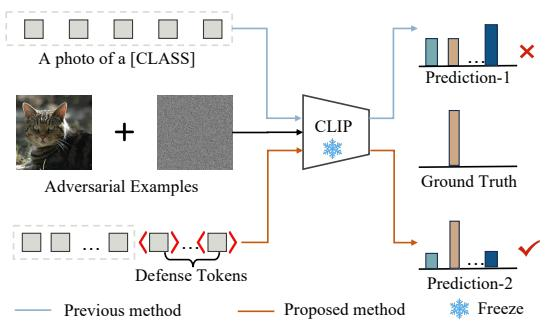
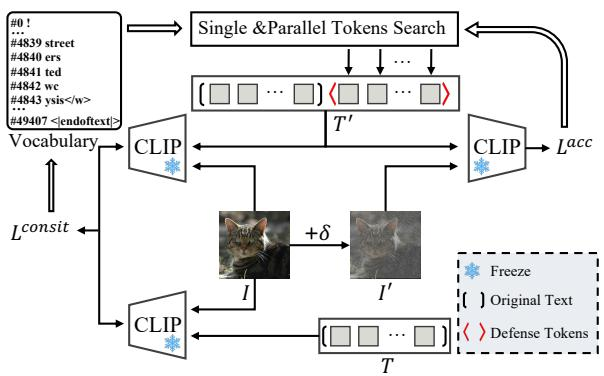
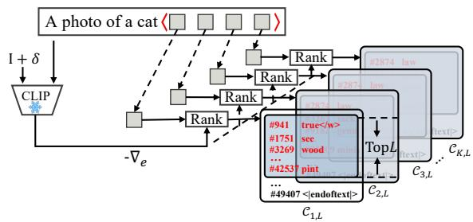
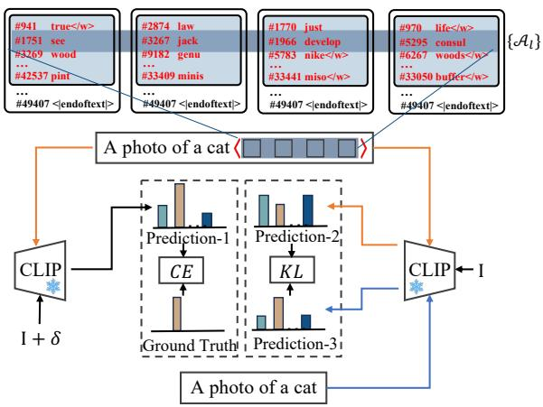
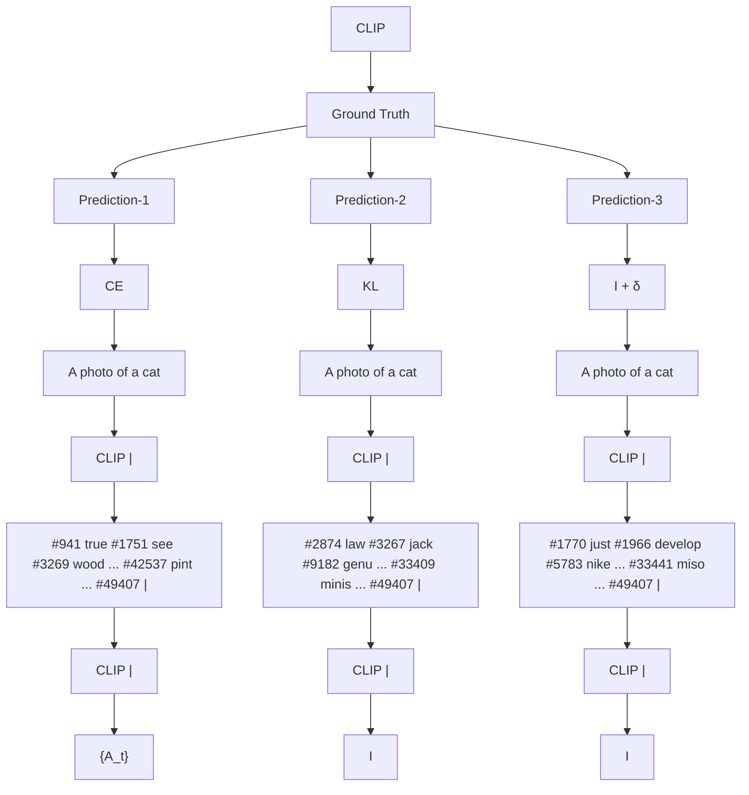
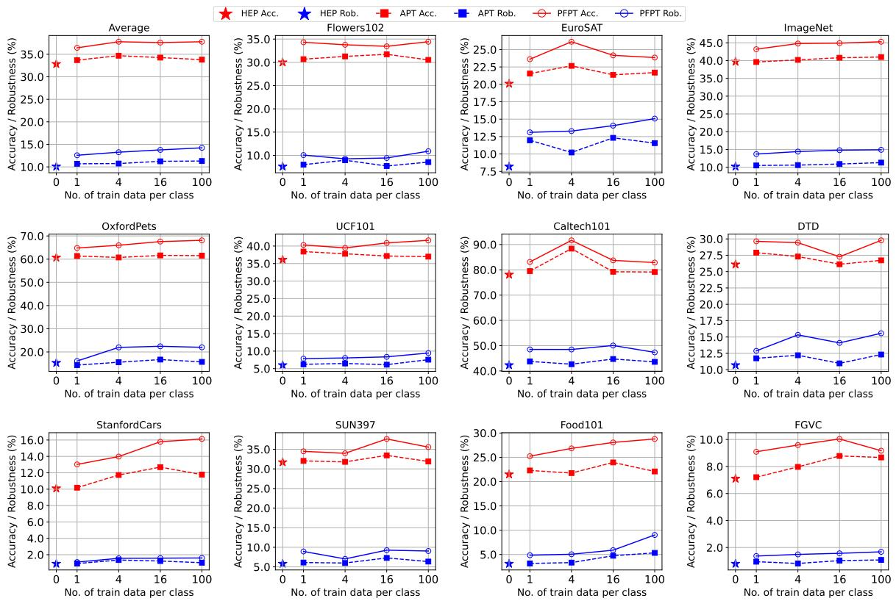
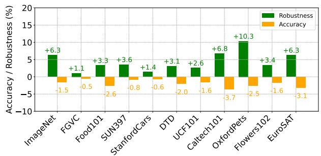

# Parameter-free and Accessible Prompt Learning to Enhance Adversarial Robustness for Pre-trained Vision-Language Models

Xingran Zhou1, Kun Yang1,2, Changtao Miao1,3, Bingyu Hu1,3, Zhuoer Xu1, Shiwen Cui1, Changhua Meng1, Dan Hong1,

1Ant Group, 2Fudan University, 3University of Science and Technology of China,

# Abstract

Large pre-trained Vision-Language Models (VLMs) have revolutionized both computer vision and natural language processing. Despite their success, adversarial examples can still mislead VLMs into producing incorrect results. This work focuses on boosting the adversarial robustness of VLMs by searching for text prompts at the word level, rather than optimizing continuous textual embeddings. We introduce Parameter-Free Prompt Tuning (PFPT) to learn defense words that enhance resilience against adversarial attacks when appended to existing prompts, thereby offering ease of use due to the simplicity of this approach. These defense words are naturally present in the inherent vocabulary of VLMs, providing a humanreadable property. PFPT employs a coarse-tofine strategy with carefully designed optimization objectives to guide the word search. Extensive experiments demonstrate our method’s superiority over hand-engineered prompts and other state-of-the-art methods. PFPT significantly boosts accuracy and robustness, outperforming hand-engineered prompts with average gains of +4.9% and +5.8%, respectively (ϵ = 1/255).

# 1 Introduction

Large pre-trained Vision-Language Models (VLMs), such as CLIP (Radford et al., 2021), ALIGN (Jia et al., 2021), and BLIP (Li et al., 2022), have revolutionized downstream vision-language tasks including classification, object detection, and segmentation. More applications (Qiu et al., 2023; Zhang et al., 2024; Li et al., 2024a) are increasingly being developed based on these foundational general-purpose models.

However, despite the capabilities of VLMs, their vulnerabilities have been exposed. Recent studies (Inkawhich et al., 2023; Zhao et al., 2024) show that VLMs are particularly susceptible to small adversarial noise — these models predict with significant deviation from reality when subjected to deliberately designed, human-imperceptible perturbations to images. These exposed security risks continue to raise concerns within the community.



<details>
<summary>flowchart</summary>

```mermaid
graph TD
    A["A photo of a [CLASS"]] --> B["CLIP"]
    C["Adversarial Examples"] --> B
    D["Defense Tokens"] --> B
    B --> E["Prediction-1"]
    B --> F["Ground Truth"]
    B --> G["Prediction-2"]
    H["Previous method"] --> B
    I["Proposed method"] --> B
    J["Freeze"] --> B
    style A fill:#f9f,stroke:#333
    style C fill:#ccf,stroke:#333
    style D fill:#cfc,stroke:#333
    style E fill:#ffc,stroke:#333
    style F fill:#fcc,stroke:#333
    style G fill:#cff,stroke:#333
    style I fill:#ffc,stroke:#333
    style J fill:#cfc,stroke:#333
```
</details>

Figure 1: An overview of the proposed method: Appending the learned defense prompt (at the word level) to the original prompt significantly enhances resilience against adversarial attacks.

Previous efforts to enhance the adversarial robustness of VLMs primarily can be categorized two types: adversarial training (Madry et al., 2017) and parameter-efficient methods (Li et al., 2024b; Chen et al., 2023; Huang et al., 2023). Adversarial training involves fine-tuning models with adversarial examples and incorporating specifically designed loss functions. Although these methods can enhance adversarial robustness to some extent, the cost of fine-tuning is substantial. Particularly for contemporary Transformer-based models (Li et al., 2022; Radford et al., 2021) with millions of parameters, fine-tuning these parameters requires significant time and computational resources. Moreover, introducing adversarial examples into training may compromise the original generalization ability of VLMs (Kumar et al., 2022), potentially affecting the zero-shot capabilities. Parameter-efficient methods freeze the parameters of the model while training additional textual or visual prompts, often in the form of embeddings. Although these approaches enhance learning efficiency, the costs associated with using additional prompts are significant. For instance, adding adversarial visual prompts (Chen et al., 2023) to the original image may remove essential edge details, resulting in partial information loss. Meanwhile, adversarial text prompts (Li et al., 2024b) learn text embeddings that are challenging to use in practice, as their application requires access to the model’s embedding layer and precise manipulation to integrate the learned embeddings. This reduces accessibility and increases operational costs. Optimization in the continuous embedding space may also introduce randomness, due to the unconstrained nature of the optimization space.

To address these challenges, we propose a parameter-free method for learning appendable text prompts. This strategy focuses on identifying and discovering defense tokens from the pre-trained and fixed vocabulary (Sennrich et al., 2015) of VLMs. These defense tokens are simply added as prefixes or suffixes to the original prompt and then fed into the model. As there are no embedding parameters that need to be saved, this method is inherently parameter-free. This approach constrains the search space to a limited selection space, improving search efficiency. It also enhances accessibility, as the search results are simply included as part of the new input text prompt, without manipulating the intermediate embeddings.

This work studies the problem of parameter-free and accessible text prompt tuning of pre-trained VLMs for adversarial robustness. Previous research on text prompt learning has primarily focused on optimizing text embeddings, with little exploration into word level prompt learning. These approaches reveal a gap between convenient usability and flexibility. Moreover, the learned embeddings do not correspond to natural language words and are not found within the inherited vocabulary’s embeddings. Unlike previous methods, our work is inherently parameter-free as it identifies using natural language words that require no additional parameter storage. We introduces a new paradigm for text prompt learning in boosting adversarial robustness for VLMs. We concentrate on and apply this paradigm to a widely used type of VLMs — CLIP (Radford et al., 2021), as it is representative of vision-language foundation models and is extensively utilized across various downstream tasks (Rombach et al., 2022).

To improve the accessibility of adversarial robustness in text prompting, we introduce Parameter-Free Prompt Tuning (PFPT), a method to learn a robust text prompt at the word level for CLIP, leveraging adversarial examples to enhance the resilience against adversarial attacks. The defense tokens searched by PFPT and simply appended to the original text prompt, can significantly enhance adversarial robustness with minimal usage cost. Moreover, these tokens are naturally present in the native and inherent vocabulary, offering a human-readable property. To search for defense tokens, PFPT takes a coarse-to-fine strategy, divided into two steps: single token search and parallel tokens search. This design prevents the selection from degenerating into mere gradient-based or brute-force searching. Single token search discoveres the best candidate token set for each token position, with a wider coverage of candidates aiding in the search for the optimal token. Parallel tokens search conducts a joint search, measuring tokens based on consistency and accuracy to finally determine the most effective tokens.

Comprehensive experiments are conducted to benchmark PFPT across 14 datasets and with 4 data sampling scenarios which are 1-, 4-, 16- and 100- shot learning. PFPT is compared against the hand-engineered prompts proposed in CLIP and the state-of-the-art text prompt learning methods. PFPT outperforms these approaches in terms of the in-distribution performance and the generalization ability under distribution shift (the same classes with different input distribution) and across datasets (different classes).

Our contributions are summarized as follows:

• We introduce PFPT, a method for searching defense tokens that significantly improves the adversarial robustness for the CLIP model.   
• The defense tokens learned are at the word level and can significantly enhance adversarial robustness simply by being appended to the original text prompt, making this method both parameter-free and accessible.   
• PFPT employs a coarse-to-fine strategy to search for defense tokens, and its two-step design significantly enhances search efficiency.   
• Extensive experiments are conducted across 14 datasets to validate the effectiveness of PFPT.

# 2 Related work

# 2.1 Adversarial examples

Adversarial examples expose vulnerabilities in models, especially visual language models (VLMs)

(Inkawhich et al., 2023; Schlarmann and Hein, 2023; Zhao et al., 2024; Qi et al., 2024; Carlini et al., 2024; Bagdasaryan et al., 2023). Studies show adversarial samples can cause misclassification (Inkawhich et al., 2023), enable malicious exploitation (Schlarmann and Hein, 2023), and exacerbate security risks in multimodal VLMs (Zhao et al., 2024), allowing attackers to evade systems, bypass security (Qi et al., 2024), induce misaligned behavior (Carlini et al., 2024), and enable targeted output contamination (Bagdasaryan et al., 2023). Such attacks can produce harmful or unreliable VLM responses. This paper proposes text prompt adversarial training to defend against adversarial sample attacks on VLMs.

# 2.2 Adversarial training

In machine learning, adversarial training (Goodfellow et al., 2014) is the most potent defense against adversarial examples (Athalye et al., 2018). Most prior methods (Madry et al., 2017; Andriushchenko and Flammarion, 2020; Li and Spratling, 2023) focused on training models from scratch, while exploring pre-trained model robustness received less attention. Recent work enhanced pre-trained model robustness via fine-tuning entire (Hendrycks et al., 2019; Jiang et al., 2020; Kim et al., 2020; Luo et al., 2023) or subset (Chen et al., 2020) parameters, or adversarial visual prompts (Chen et al., 2023; Huang et al., 2023). APT (Li et al., 2024b) adapts robustness by optimizing text prompts in continuous embedding space, with limited practical utility. Our method proposes user-friendly text prompts optimized in discrete text space, without additional adversarial training parameters.

# 2.3 Prompt Learning

Recent years saw growing interest in prompt engineering for pre-trained models, yielding CoOp (Zhou et al., 2022) for automated prompt generation, PGN (Loedeman et al., 2022) for adapting visual models via task prompts, NOAH (Zhang et al., 2022) for optimal prompt configurations, OOHMG (Lin et al., 2023) enabling text-to-motion generation without paired data, Subspace Prompt Tuning (Ma et al., 2023) mitigating VLM prompt overfitting, SgVA (Peng et al., 2023) enhancing fewshot image classification, and GALIP (Tao et al., 2023) employing CLIP (Radford et al., 2021) for controlled image generation via prompts. This paper investigates parameter-free, user-friendly text prompt learning to defend against adversarial attacks in image recognition.

# 3 Method

# 3.1 Preliminaries: CLIP

CLIP comprises image and text encoders, encoding images and text in a unified embedding space. Image encoder options include ResNet (He et al., 2016) or Vision-Transformer (Dosovitskiy et al., 2020), while text encoder is Transformer. For text input, CLIP converts words to d-dimensional word embedding vectors using pre-trained vocabulary, then inputs them to Transformer to generate the final text feature.

Given an input image $I _ { i }$ and text $T _ { j }$ , the respective features $f _ { i } ^ { v }$ and $f _ { j } ^ { t }$ are computed as:

$$
f _ {i} ^ {v} = \mathcal {E} _ {v} (I _ {i}), \quad f _ {j} ^ {t} = \mathcal {E} _ {t} (T _ {j}) \tag {1}
$$

where $\mathcal { E } _ { v }$ and $\mathcal { E } _ { t }$ represent the visual and the text encoder within CLIP respectively.

A cosine similarity score measures alignment between each image-text feature pair. The alignment between image $I _ { i }$ and text $T _ { j }$ is calculated as:

$$
p _ {i, j} = p (I _ {i}, T _ {j}) = \frac {\exp \left(\cos (f _ {i} ^ {v} , f _ {j} ^ {t}) / \tau\right)}{\sum_ {j} \exp \left(\cos (f _ {i} ^ {v} , f _ {j} ^ {t}) / \tau\right)} (2)
$$

where $\tau$ is a temperature parameter learned by CLIP. During pre-training, the two encoders maximize similarity scores of true image-text pairs (i.e., when $i = j )$ and minimize scores for false pairs, aligning the encoders. After pre-training, CLIP achieves zero-shot classification using text descriptions of class labels as prompts. Given class prompts, CLIP predicts most probable class arg maxj $p _ { i , j }$ . Default prompt is "a photo of a [CLASS]" replacing "[CLASS]" with dataset class names. Prompts comprise class, prefix, and suffix components. For N classes, j-th class prompt is:

$$
T _ {j} = (t _ {1}, t _ {2},..., t _ {[ \text { CLASS } ]},..., t _ {\text { max\_len }}) \tag {3}
$$

where max\_len is the tokens’ maximum length.

# 3.2 Parameter-free and Accessible Prompt Learning

We aim to search a optimal token combinations within the pre-trained and fixed vocabulary as defense tokens appended to text prompts. This approach is parameter-free, requiring no additional parameters to be learned, we merely record the identified tokens as the learning result. It also boosts CLIP’s adversarial robustness by appending the learned tokens to the text prompt, making it accessible.



<details>
<summary>flowchart</summary>

```mermaid
graph TD
    A["Vocabulary"] --> B["CLIP"]
    B --> C["Single & Parallel Tokens Search"]
    C --> D{☐ ☐ ... ☐} <☐ ☐ ... ☐ > T'
    D --> E["CLIP"]
    E --> F["L_acc"]
    G["Vocabulary"] --> H["CLIP"]
    H --> I["I"]
    I --> J["+δ"]
    J --> K["I'"]
    K --> L["T"]
    L --> M["CLIP"]
    M --> N["Freeze"]
    N --> O["Original Text"]
    N --> P["Defense Tokens"]
    Q["Lconsit"] --> H
    R["#0! ... #4839 street #4840 ers #4841 ted #4842 wc #4843 ysis</w> ... #49407 <endoftext"]
```
</details>

Figure 2: Framework of the proposed Parameter-Free Prompt Tuning (PFPT) method applied to CLIP-like VLMs. Both image and text encoders are frozen, and defense tokens are sourced from the inherent vocabulary. PFPT employs a coarse-to-fine strategy, divided into two steps: Single Token Search and Parallel Tokens Search.

In section 3.2.1, we discuss adversarial examples for CLIP. Section 3.2.2 presents the parameterization of defense tokens in our method. Sections 3.2.3 and 3.2.4 respectively detail the Single Token Search (STS) and Parallel Tokens Search (PTS).

# 3.2.1 Adversarial examples for CLIP

To search for defense tokens, adversarial example images are generated on-the-fly during the training. We employ a common technique to generate adversarial examples for CLIP, which involves computing gradient-based perturbations δ to the input images. This aims to maximize the cosine divergence between the image feature $f _ { i } ^ { v }$ and the text feature of the corresponding ground-truth prompt, $f _ { y _ { i } } ^ { t }$ :

$$
\arg \max _ {\| \delta_ {i} \| _ {p} \leq \varepsilon} \mathcal {L} (\mathcal {E} _ {v} (I _ {i} + \delta_ {i}), \mathcal {E} _ {t} (T _ {i}), y _ {i}) \tag {4}
$$

where the perturbation $\delta _ { i }$ is constrained within the ε-ball of the p-norm, while the text input consists of the default prompt appended with defense tokens. Algorithm 1 illustrates the pseudo-code we used to generate adversarial examples to attack.

# 3.2.2 Parameterization of learnable tokens

The text input is tokenized into fixed-length tokens (Eq. 3). Therefore, we first determine which positions should be defense tokens, as well as the number of defense tokens. Our goal is to identify and search for specific tokens from the pre-trained vocabulary $\nu$ to serve as these defense tokens. Taking CLIP’s default prompt "a photo of a [CLASS]" as an example, we select K tokens from the suffix to act as defense tokens. Consequently, the text prompt appended with defense tokens of the class $T _ { j } ^ { \prime }$ can be represented as:

Algorithm 1 Adversarial attack on CLIP. S is the perturbation step. η is the step size for perturbing image.

1: function ATTACK(I, T, y)
2: $\delta = \text{uniform}(-\epsilon, \epsilon)$ 3:    for 1 → S do
4: $I' = \min(0, \max(I + \delta, 1))$ 5: $L = \mathcal{L}(\mathcal{E}_v(I'), \mathcal{E}_t(T), y)$ 6: $\delta = \min(-\epsilon, \max(\delta + \eta) \cdot \text{SIGN}(\nabla_I L), \epsilon))$ 7:    end for
8:    return min(0, max(I + \delta, 1))
9: end function

$$
T _ {j} ^ {\prime} = \left(t _ {1}, t _ {2}, \dots , t _ {[ \mathrm{CLASS} _ {\mathrm{j}} ]}, \right.
$$

$$
\left. t _ {\left[ \mathrm{CLASS} _ {\mathrm{j}} \right] + 1}, \dots , t _ {\left[ \mathrm{CLASS} _ {\mathrm{j}} \right] + K}, \dots , t _ {\max \text {len}}\right) \tag {5}
$$

In the sequence, $t _ { 1 }$ is $" \mathrm { a } "$ , $t _ { 2 }$ is "photo", and $t _ { \mathrm { [ C L A S S _ { j } ] } }$ is a specific class name, like $" \mathrm { d o g " }$ . Tokens indexed from $\mathrm { [ C L A S S _ { j } ] + 1 t o [ C L A S S _ { j } ] + } K$ are chosen as defense tokens, randomly initialized from the pre-trained vocabulary .

Theoretically, the K defense tokens can be positioned anywhere and in any number, as long as the arrangement meets $\mathrm { C L I P } ^ { \prime } \mathrm { s }$ input token length constraints. In our experiments, we test on two positions settings: front and end.

Search goal: Upon determining the number and positions of these defense tokens, our search goal aimed at improving adversarial robustness for VLMs can be formulated as:

$$
\arg \min _ {\mathbf {t} ^ {\prime}} E _ {i \in B} \underset {\mathbf {t} ^ {\prime} \in \mathcal {V} ^ {K}} {\mathcal {L}} (\mathcal {E} _ {v} (I _ {i} + \delta_ {i}), \mathcal {E} _ {t} (T _ {i} ^ {\prime} (\mathbf {t} ^ {\prime})), y _ {i}) \tag {6}
$$

where we use Algorithm 1 to generate the pertubation $\delta _ { i } . T _ { i } ^ { \prime } ( \mathbf { t } ^ { \prime } )$ represents the input text containing defense tokens, where only the K defense tokens need to be learned.

# 3.2.3 Single Token Search (STS)

The single token search performs a coarse search for the token at a single position, addressing issues related to exclusive reliance on either gradient descent or brute-force search methods.

Here, we take defense tokens as suffixes appended to the template prompt $\mathbf { t } ^ { ( t e m p l a t e ) }$ (please see Eq. 5) as an example to describe STS. Please note that our defense tokens can be assigned to arbitrary positions, except those class tokens.

The STS considers the adversarial robustness and selects a batch of tokens from the pre-trained vocabulary $\nu$ as candidates for the defense token at the single position. To achieve this, we define a defense objective as the selection goal. For instance, when searching for the k-th position among K defense tokens, the objective is as follows:



<details>
<summary>flowchart</summary>


</details>

Figure 3: Single Token Search selects a batch of tokens from the pre-trained and fixed vocabulary as candidates for a single position. Each position yields a candidate set.

$$
\begin{array}{l} \mathcal {L} ^ {d e f e n s e} (t _ {k}) = \\ - \nabla_ {\mathbf {e} _ {t _ {k}}} \log p (\hat {y} = y | \mathbf {t} ^ {(t e m p l a t e)} \oplus t _ {1} \oplus t _ {2} \oplus \dots \\ \oplus t _ {k} \oplus \dots \oplus t _ {K}, I + \delta) \tag {7} \\ \end{array}
$$

where $\oplus$ means token concatenation, for example, $\ " { \bf a } " \oplus \nobreakspace$ "photo" = "a photo", yˆ is the prediction, and y is the ground-truth class. This objective is the gradient obtained by backpropagating the loglikelihood loss to the one-hot embedding of the token $t _ { k }$ .

We construct the candidate set $\mathcal { C } _ { k , l }$ by selecting the top-L tokens, ordered from high to low based on their objective scores, here, k is the defense token position, and l is the token rposition. Finally, K candidate sets $\{ \mathcal { C } _ { k , l } \} _ { k = 1 l = 1 } ^ { K }$ are constructed for each of the K positions following the coarse search. Algorithm 2 and Figure 3 present the single token search.

Algorithm 2 Single Token Search.   
1: function STS(I, δ, t₁, t₂, ..., tₖ)
2: {Cₖ,ₗ}ₖ₌₁ᴸ= {∅}
3: for k = 1 → K do
4: ℒdefense(tₖ) =
-∇ₑₜₖ log p(ŷ = y|t(template)
⊕t₁ ⊕ · · · ⊕ tₖ ⊕ · · · ⊕ tₖ, I + δ)
5: {Cₖ,ₗ₌₁:L} = top - L(ℒdefense(tₖ))
6: end for
7: return {Cₖ,ₗ}
8: end function

# 3.2.4 Parallel Tokens Search (PTS)

In parallel tokens search step, we perform parallel optimization across all candidate sets $\{ \mathcal { C } _ { k , l } \}$ to search for defense tokens, considering consistency with the distribution predicted by the original prompt and adversarial accuracy. First, we concatenate tokens of the same ranking across all positions to form noted as $\{ \mathcal { A } _ { l } \} _ { l = 1 } ^ { L }$ ndidate set of defense tokens, de-,

$$
\mathcal {A} _ {l} = \left(\mathcal {C} _ {1, l} \oplus \mathcal {C} _ {2, l} \oplus \dots \oplus \mathcal {C} _ {K, l}\right) \in \mathcal {V} ^ {K} \tag {8}
$$

Consistency score. The consistency score aims to ensure that the text with appended defense tokens retains the same semantics as the original text prompt. This helps prevent significant deviations in the predicted distribution due to the defense tokens. To achieve this goal, we follow Azuma et al. (Azuma and Matsui, 2023), leverage the results of classification to ensure a consistent output distribution both with and without defense tokens.

We classify the original image I using text appended with defense tokens $\mathbf { t } ^ { d e f e n s e }$ (w/ DT) and the original text (wo/ DT). First, we obtain the probabilities of predicting the ground-truth class $y ,$ given the both conditions, these are

$$
\begin{array}{l} q ^ {1} = p (\hat {y} = y | \mathbf {t} ^ {(t e m p l a t e)} \oplus \mathbf {t} ^ {(d e f e n s e)}, I) (\mathrm{w/DT}) \\ q ^ {2} = p (\hat {y} = y \mid \mathbf {t} ^ {(t e m p l a t e)}, I) \quad (\mathrm{wo/DT}) \tag {9} \\ \end{array}
$$

We then plug each candidate tokens $\mathbf { t } ^ { \prime } \in \{ \mathcal { A } _ { l } \} _ { l = 1 } ^ { L }$ into the following consistent objective to measure the KL divergence between $q ^ { 1 }$ and $q ^ { 2 } \mathrm { ; }$ :

$$
\mathcal {L} ^ {\text { consist }} (\mathbf {t} ^ {\prime}) = D _ {K L} (q ^ {1} (\mathbf {t} ^ {(d e f e n s e)} = \mathbf {t} ^ {\prime}) | | q ^ {2}) \tag {10}
$$

The consistency score aims to guide the search for defense tokens using the probability distribution of the original prompt.

Accuracy score. The accuracy score assesses the precision of classification results for adversarial examples (e.g. I +δ) when using prompts appended with defense tokens. Similar to the consistency score, we iteratively traverse the candidate defense tokens in $\{ \mathcal { A } _ { l } \} _ { l = 1 } ^ { L }$ , calculating the accuracy corresponding to each candidate tokens $\mathbf { t } ^ { \prime } \in \{ \mathcal { A } _ { l } \} _ { l = 1 } ^ { L }$ .

$$
\begin{array}{l} \mathcal {L} ^ {a c c.} \left(\mathbf {t} ^ {\prime}\right) = \\ \mathbf {1} \{p (\hat {y} = y | \mathbf {t} ^ {(t e m p l a t e)} \oplus (\mathbf {t} ^ {(d e f e n s e)} = \mathbf {t} ^ {\prime}), I + \delta) \} \tag {11} \\ \end{array}
$$

where 1 denotes the indicator function. Finnaly, the total score for the candidate defense tokens $\dot { \mathbf { t } } ^ { \prime }$ is computed as $\begin{array} { r } { \mathcal { L } ^ { t o t a l } ( { \bf t } ^ { \prime } ) = \mathcal { L } ^ { c o n s i s t } ( { \bf t } ^ { \prime } ) + \lambda ( 1 - } \end{array}$ $\mathcal { L } ^ { a c c . } ( \mathbf { t } ^ { \prime } ) )$ . After scoring each candidate defense tokens in set $\{ \mathcal { A } _ { l } \} _ { l = 1 } ^ { L }$ , we select the tokens with the lowest score (low is better) as the result of the parallel tokens search. Algorithm 3 and Figure 4 illustrate the parallel tokens search.



<details>
<summary>flowchart</summary>


</details>

Figure 4: Parallel Tokens Search first concatenates tokens of the same ranking and plugs them into the prompt. Using the designed consistency score and accuracy score, it selects the top-1 token combination as the defense tokens.

Algorithm 3 Parallel Tokens Search.   
1: function PTS(I, δ, {Ck,l})
2: {Al}Ll=1 = {∅}
3: for l = 1 → L do
4: {Al} = CONCAT({Ck=1:K,l})
5: end for
6: {Sl}Ll=1 = {∅}
7: for each (l, t') ∈ {Al} do
8: Sl = Ltotal(t'; I, δ)
9: end for
10: i ← Index(Min({Sl}Ll=1)) ▷ Get index of the minimum score
11: return {Al=i}
12: end function

# 4 Experiments

Datasets. Following (Li et al., 2024b) and (Zhou et al., 2022), our evaluation comprises 11 datasets, including ImageNet (Deng et al., 2009), Caltech101 (Fei-Fei et al., 2004), OxfordPets (Parkhi et al., 2012), StanfordCars (Krause et al., 2013), Flowers102 (Nilsback and Zisserman, 2008), Food101 (Bossard et al., 2014), FGVCAircraft (Maji et al., 2013), SUN397 (Xiao et al., 2010), DTD (Cimpoi et al., 2014), EuroSAT (Helber et al., 2019), and UCF101 (Soomro et al., 2012). We evaluate each dataset using an N-shot strategy, where $" N "$ is the number of examples randomly drawn from the entire training dataset. N can be set to 1, 4, 16, or 100. All settings are validated on the complete test set.

Table 1: Average performance for settings with various ϵ and shots. For convenience, the results of HEP are replicated under different shots for comparison. 

<table><tr><td rowspan="2"> $\epsilon$ </td><td rowspan="2">Method</td><td colspan="2">1 shot</td><td colspan="2">4 shots</td><td colspan="2">16 shots</td><td colspan="2">100 shots</td></tr><tr><td>Acc.</td><td>Rob.</td><td>Acc.</td><td>Rob.</td><td>Acc.</td><td>Rob.</td><td>Acc.</td><td>Rob.</td></tr><tr><td rowspan="3">1/255</td><td>HEP</td><td>44.92</td><td>31.93</td><td>44.92</td><td>31.93</td><td>44.92</td><td>31.93</td><td>44.92</td><td>31.93</td></tr><tr><td>APT</td><td>46.51</td><td>33.09</td><td>45.91</td><td>32.78</td><td>45.73</td><td>33.23</td><td>46.30</td><td>33.75</td></tr><tr><td>PFPT</td><td>49.41</td><td>37.51</td><td>49.31</td><td>36.78</td><td>50.19</td><td>38.01</td><td>50.36</td><td>38.32</td></tr><tr><td rowspan="3">4/255</td><td>HEP</td><td>32.84</td><td>10.08</td><td>32.84</td><td>10.08</td><td>32.84</td><td>10.08</td><td>32.84</td><td>10.08</td></tr><tr><td>APT</td><td>33.70</td><td>10.69</td><td>34.68</td><td>10.74</td><td>34.26</td><td>11.24</td><td>33.81</td><td>11.30</td></tr><tr><td>PFPT</td><td>36.43</td><td>12.58</td><td>37.78</td><td>13.26</td><td>37.59</td><td>13.77</td><td>37.78</td><td>14.23</td></tr></table>

Models. We employ the ViT-B/32 model (Dosovitskiy et al., 2020) as the standard backbone for the image encoder. Following (Li et al., 2024b), the image encoder’s weights are pre-trained using TeCoA (Mao et al., 2022), a state-of-the-art method for zero-shot adversarial robustness. The necessity for using pre-training weights are discussed in (Li et al., 2024b) and (Chen et al., 2023).

Learning details and evaluation. Adversarial examples are generated on-the-fly during training, as outlined in Algorithm 1. Following (Mao et al., 2022) and (Li et al., 2023), we use two different perturbation budgets: $\epsilon = 1 / 2 5 5$ and $\epsilon = 4 / 2 5 5$ We use 3 steps with a step size of $2 \epsilon / 3$ during training. PGD generates attacks using the text prompt appended with defense tokens for evaluatiton, involving 100 steps and a step size of $\epsilon / 4$ .

Competitive approaches. Current work has not explored the text prompt tuning at the word level, limiting our comparisons to similar methods which optimize text embeddings like APT. APT optimizes text embeddings for adversarial robustness, these embeddings lie in an unconstrained continuous space during the learning, potentially resulting in embeddings that do not correspond to any specific word in the inherent vocabulary. For a fair comparison, we followed APT’s method of finding the nearest word based on Euclidean distance, converting continuous embeddings into specific tokens from the vocabulary. Additionally, we compare our method against Hand-Engineered Prompts (HEP), originally proposed in (Radford et al., 2021) and widely used since then.

# 4.1 In-Distribution performance

This section compares the proposed method and its competitors using in-distribution data, meaning the training and test sets come from the (approximately) same distribution. We searched for defense tokens on the training set and evaluated them on the test set of the same dataset. Performance results for the ViT-B/32 model are presented below.

  
Figure 5: The in-distribution performance on 11 datasets and the averaged performance under different shots. ϵ= 4/255 and K = 16

Learned prompts vs. HEP. Table 1 presents a performance comparison of different text prompting methods, averaged across 11 datasets and evaluated against various perturbation budgets (ϵ) and shot counts. Our method significantly outperforms HEP, notably enhancing both accuracy and robustness, even in a 1-shot scenario. The improvement is especially pronounced for the perturbation level ϵ = 1/255, with absolute increases of 4.49% and 5.58% in accuracy and robustness, respectively. Moreover, our method demonstrates consistent performance gains with an increase in the number of shots. Our approach significantly outperforms HEP when trained with the 100 shots.

Moreover, our method yields improvements across each specific dataset, though the extent varies. The comparison results on different datasets are shown in Figure 5 and Figure ?? in the Appendix. Our proposed method PFPT achieves significant performance improvements on the Food101 and FGVC datasets. In summary, by leveraging the learned defense tokens, PFPT demonstrates a significant enhancement on the robustness of VLP models (Radford et al., 2021) in an accessible and user-friendly manner.



<details>
<summary>bar</summary>

| Dataset | Robustness (%) | Accuracy (%) |
| :--- | :--- | :--- |
| ImageNet | 6.3 | -1.5 |
| FGVC | 1.1 | -0.5 |
| Food101 | 3.3 | -2.6 |
| SUN397 | 3.6 | -0.8 |
| StanfordCars | 1.4 | -0.6 |
| DTD | 3.1 | -2.0 |
| UCF101 | 2.6 | -1.6 |
| Caltech101 | 6.8 | -3.7 |
| OxfordPets | 10.3 | -2.5 |
| Flowers102 | 3.4 | -1.6 |
| EuroSAT | 6.3 | -3.1 |
</details>

Figure 6: The performance improvements per dataset of our adversarially-trained prompt compared to the standardly-trained prompt. The results are presented for the setting with 16 shots, K = 16, at ϵ = 4/255.

PFPT vs. APT. Table 1 compares the average performance of diverse adaptation methods across 11 datasets. Under the 1-shot and 4-shot settings, the proposed method PFPT considerably outperforms APT and HEP in both accuracy and robustness, suggesting that PFPT efficiently searches for effective defense tokens with limited training data. In contrast, APT performs worse than the baseline method HEP in the 4-shot setting since APT’s optimization method requires a large amount of training data to converge to specific embeddings. As the amount of training data increases, PFPT shows a more pronounced advantage over APT in both accuracy and robustness. These observations demonstrate that PFPT utilizes training data more effectively to achieve a better trade-off between accuracy and robustness.

Table 2: We evaluate the generalization of prompts learned by our method on ImageNet to (1) datasets with different input distribution and (2) the remaining 10 datasets. Our method are trained with 16 shots and ϵ = 4/255. 

<table><tr><td rowspan="3">Method</td><td colspan="2">Source</td><td colspan="6">Distribution Shifts</td><td colspan="2">Cross Datasets</td></tr><tr><td colspan="2">ImageNet</td><td colspan="2">ImageNet-V2</td><td colspan="2">ImageNet-Sketch</td><td colspan="2">ImageNet-R</td><td colspan="2">10 Datasets Avg.</td></tr><tr><td>Acc.</td><td>Rob.</td><td>Acc.</td><td>Rob.</td><td>Acc.</td><td>Rob.</td><td>Acc.</td><td>Rob.</td><td>Acc.</td><td>Rob.</td></tr><tr><td>HEP</td><td>39.7</td><td>10.2</td><td>32.7</td><td>7.5</td><td>17.4</td><td>7.2</td><td>21.5</td><td>5.8</td><td>32.3</td><td>10.3</td></tr><tr><td>APT</td><td>40.8</td><td>10.9</td><td>32.4</td><td>8.5</td><td>17.6</td><td>7.4</td><td>22.0</td><td>6.2</td><td>31.1</td><td>11.3</td></tr><tr><td>PFPT</td><td>44.9</td><td>14.8</td><td>34.5</td><td>9.6</td><td>18.9</td><td>8.0</td><td>22.3</td><td>6.5</td><td>33.6</td><td>12.0</td></tr></table>

From the results on individual datasets shown in Figure 5 and Figure ?? in the Appendix, we observe that PFPT outperforms the baseline methods in most experimental settings on the Imagenet dataset. When trained with a small amount of data, specifically in the 1-shot and 4-shot settings, PFPT improves both accuracy and robustness using searched defense tokens. With more data, PFPT maintains its performance advantage and achieves substantial improvements in both epsilon settings.

# 4.2 Generalization of learned defense tokens

To evaluate the transferability and generalization of the defense tokens learned by PFPT across different datasets, we consider two generalization settings in this section: distribution shift and cross-dataset. Specifically, the Imagenet dataset is adopted as the source dataset to search for defense tokens under the 16-shots and 4-epsilon settings. For distribution shift tests, we evaluate the accuracy and robustness of the learned defense tokens on datasets with the same categories but completely distinct data distributions. We use three Imagenetvariant datasets for distribution shift tests, including ImageNet-V2 (Recht et al., 2019), ImageNetSketch, and ImageNet-R (Hendrycks et al., 2021). As shown in Table 2, PFPT reveals remarkable performance advantages over baseline methods on datasets with completely different data distributions. This proves that the defense tokens learned by PFPT have better generalization capabilities to varying data distribution.

Moreover, we conduct cross-dataset tests on datasets with distinct categories to further evaluate the generalization ability of PFPT. Table 2 shows the average performance on the other 10 datasets. It is noteworthy that the proposed method, PFPT, demonstrates the best transfer and generalization abilities, achieving the highest accuracy and robustness on both the source and test datasets. Although the baseline method, APT, performs well on the source dataset, it shows poor performance on the 10 test datasets, indicating that the token embeddings learned by APT are specific to the dataset and fail to provide cross-dataset transferability.

# 4.3 Accuracy-robustness trade-off evaluation.

To evaluate the trade-off between accuracy and robustness, we compare PFPT’s adversarially-robust defense tokens with the standard prompt trained in non-attack scenarios in Figure 6. The experimental setup is 16 shots and ϵ = 4/255. As Figure 6 shows, although PFPT reduces the classfication accuracy on clean images compared to the standardly-trained prompts, it significantly improves robustness under attack scenarios. Notably, PFPT achieves a good trade-off between the two metrics, as the increase in robustness outperforms the decrease in accuracy in most datasets. Overall, PFPT exhibits a considerable improvement in the adversarial robustness of VLMs under attack scenarios with a minor accuracy loss, presenting its effectiveness and good accuracy-robustness trade-off.

# 4.4 Readability measurement

As shown in the Appendix ??, we provide a novel readability assessment method to compare the readability of the learned token embeddings.

# 5 Conclusion

In this study, we aim to enhance the performance of VLMs against adversarial samples. To achieve this, we introduce a novel text prompt learning method to boost adversarial robustness. Our approach, Parameter-Free Prompt Tuning, searches for robust defense prompts that are flexible, easy to use, and human-readable. Extensive experiments present the effectiveness of our method in improving indistribution performance and generalization across different distributions and datasets. Our work introduces a new paradigm for text prompt learning that boosts adversarial robustness for VLMs.

# 6 Limitations

PFPT has two main limitations. First, while the learned defense tokens are at the word level, they lack strong interconnections, a continuous, coherent sentence might be more useful for human users. Second, the defense tokens are dataset-specific, since CLIP training spans multiple datasets, identifying a universal set of defense tokens that consistently enhance adversarial robustness across various image sources is a promising direction for future research.

# References

Maksym Andriushchenko and Nicolas Flammarion. 2020. Understanding and improving fast adversarial training. Advances in Neural Information Processing Systems, 33:16048–16059.   
Anish Athalye, Nicholas Carlini, and David Wagner. 2018. Obfuscated gradients give a false sense of security: Circumventing defenses to adversarial examples. In International conference on machine learning, pages 274–283. PMLR.   
Hiroki Azuma and Yusuke Matsui. 2023. Defenseprefix for preventing typographic attacks on clip. In Proceedings of the IEEE/CVF International Conference on Computer Vision, pages 3644–3653.   
Eugene Bagdasaryan, Tsung-Yin Hsieh, Ben Nassi, and Vitaly Shmatikov. 2023. (ab) using images and sounds for indirect instruction injection in multimodal llms. arXiv preprint arXiv:2307.10490.   
Lukas Bossard, Matthieu Guillaumin, and Luc Van Gool. 2014. Food-101–mining discriminative components with random forests. In Computer Vision–ECCV 2014: 13th European Conference, Zurich, Switzerland, September 6-12, 2014, Proceedings, Part VI 13, pages 446–461. Springer.   
Nicholas Carlini, Milad Nasr, Christopher A Choquette-Choo, Matthew Jagielski, Irena Gao, Pang Wei W Koh, Daphne Ippolito, Florian Tramer, and Ludwig Schmidt. 2024. Are aligned neural networks adversarially aligned? Advances in Neural Information Processing Systems, 36.   
Aochuan Chen, Peter Lorenz, Yuguang Yao, Pin-Yu Chen, and Sijia Liu. 2023. Visual prompting for adversarial robustness. In ICASSP 2023-2023 IEEE International Conference on Acoustics, Speech and Signal Processing (ICASSP), pages 1–5. IEEE.   
Tianlong Chen, Sijia Liu, Shiyu Chang, Yu Cheng, Lisa Amini, and Zhangyang Wang. 2020. Adversarial robustness: From self-supervised pre-training to finetuning. In Proceedings of the IEEE/CVF conference on computer vision and pattern recognition, pages 699–708.

Mircea Cimpoi, Subhransu Maji, Iasonas Kokkinos, Sammy Mohamed, and Andrea Vedaldi. 2014. Describing textures in the wild. In Proceedings of the IEEE conference on computer vision and pattern recognition, pages 3606–3613.   
Jia Deng, Wei Dong, Richard Socher, Li-Jia Li, Kai Li, and Li Fei-Fei. 2009. Imagenet: A large-scale hierarchical image database. In 2009 IEEE conference on computer vision and pattern recognition, pages 248–255. Ieee.   
Alexey Dosovitskiy, Lucas Beyer, Alexander Kolesnikov, Dirk Weissenborn, Xiaohua Zhai, Thomas Unterthiner, Mostafa Dehghani, Matthias Minderer, Georg Heigold, Sylvain Gelly, et al. 2020. An image is worth 16x16 words: Transformers for image recognition at scale. arXiv preprint arXiv:2010.11929.   
Li Fei-Fei, Rob Fergus, and Pietro Perona. 2004. Learning generative visual models from few training examples: An incremental bayesian approach tested on 101 object categories. In 2004 conference on computer vision and pattern recognition workshop, pages 178–178. IEEE.   
Ian J Goodfellow, Jonathon Shlens, and Christian Szegedy. 2014. Explaining and harnessing adversarial examples. arXiv preprint arXiv:1412.6572.   
Kaiming He, Xiangyu Zhang, Shaoqing Ren, and Jian Sun. 2016. Deep residual learning for image recognition. In Proceedings of the IEEE conference on computer vision and pattern recognition, pages 770– 778.   
Patrick Helber, Benjamin Bischke, Andreas Dengel, and Damian Borth. 2019. Eurosat: A novel dataset and deep learning benchmark for land use and land cover classification. IEEE Journal of Selected Topics in Applied Earth Observations and Remote Sensing, 12(7):2217–2226.   
Dan Hendrycks, Steven Basart, Norman Mu, Saurav Kadavath, Frank Wang, Evan Dorundo, Rahul Desai, Tyler Zhu, Samyak Parajuli, Mike Guo, et al. 2021. The many faces of robustness: A critical analysis of out-of-distribution generalization. In Proceedings of the IEEE/CVF international conference on computer vision, pages 8340–8349.   
Dan Hendrycks, Kimin Lee, and Mantas Mazeika. 2019. Using pre-training can improve model robustness and uncertainty. In International conference on machine learning, pages 2712–2721. PMLR.   
Qidong Huang, Xiaoyi Dong, Dongdong Chen, Yinpeng Chen, Lu Yuan, Gang Hua, Weiming Zhang, and Nenghai Yu. 2023. Improving adversarial robustness of masked autoencoders via test-time frequencydomain prompting. In Proceedings of the IEEE/CVF International Conference on Computer Vision, pages 1600–1610.

Nathan Inkawhich, Gwendolyn McDonald, and Ryan Luley. 2023. Adversarial attacks on foundational vision models. arXiv preprint arXiv:2308.14597.   
Chao Jia, Yinfei Yang, Ye Xia, Yi-Ting Chen, Zarana Parekh, Hieu Pham, Quoc Le, Yun-Hsuan Sung, Zhen Li, and Tom Duerig. 2021. Scaling up visual and vision-language representation learning with noisy text supervision. In International conference on machine learning, pages 4904–4916. PMLR.   
Ziyu Jiang, Tianlong Chen, Ting Chen, and Zhangyang Wang. 2020. Robust pre-training by adversarial contrastive learning. Advances in neural information processing systems, 33:16199–16210.   
Minseon Kim, Jihoon Tack, and Sung Ju Hwang. 2020. Adversarial self-supervised contrastive learning. Advances in Neural Information Processing Systems, 33:2983–2994.   
Jonathan Krause, Michael Stark, Jia Deng, and Li Fei-Fei. 2013. 3d object representations for fine-grained categorization. In Proceedings of the IEEE international conference on computer vision workshops, pages 554–561.   
Ananya Kumar, Aditi Raghunathan, Robbie Jones, Tengyu Ma, and Percy Liang. 2022. Fine-tuning can distort pretrained features and underperform outof-distribution. arXiv preprint arXiv:2202.10054.   
Chunyuan Li, Zhe Gan, Zhengyuan Yang, Jianwei Yang, Linjie Li, Lijuan Wang, Jianfeng Gao, et al. 2024a. Multimodal foundation models: From specialists to general-purpose assistants. Foundations and Trends® in Computer Graphics and Vision, 16(1- 2):1–214.   
Junnan Li, Dongxu Li, Caiming Xiong, and Steven Hoi. 2022. Blip: Bootstrapping language-image pretraining for unified vision-language understanding and generation. In International conference on machine learning, pages 12888–12900. PMLR.   
Lin Li, Haoyan Guan, Jianing Qiu, and Michael Spratling. 2024b. One prompt word is enough to boost adversarial robustness for pre-trained visionlanguage models. In Proceedings of the IEEE/CVF Conference on Computer Vision and Pattern Recognition, pages 24408–24419.   
Lin Li and Michael Spratling. 2023. Data augmentation alone can improve adversarial training. arXiv preprint arXiv:2301.09879.   
Lin Li, Yifei Wang, Chawin Sitawarin, and Michael Spratling. 2023. Oodrobustbench: benchmarking and analyzing adversarial robustness under distribution shift. arXiv preprint arXiv:2310.12793.   
Junfan Lin, Jianlong Chang, Lingbo Liu, Guanbin Li, Liang Lin, Qi Tian, and Chang-wen Chen. 2023. Being comes from not-being: Open-vocabulary text-tomotion generation with wordless training. In Proceedings of the IEEE/CVF conference on computer vision and pattern recognition, pages 23222–23231.

Jochem Loedeman, Maarten C Stol, Tengda Han, and Yuki M Asano. 2022. Prompt generation networks for input-based adaptation of frozen vision transformers. arXiv preprint arXiv:2210.06466.   
Rundong Luo, Yifei Wang, and Yisen Wang. 2023. Rethinking the effect of data augmentation in adversarial contrastive learning. arXiv preprint arXiv:2303.01289.   
Chengcheng Ma, Yang Liu, Jiankang Deng, Lingxi Xie, Weiming Dong, and Changsheng Xu. 2023. Understanding and mitigating overfitting in prompt tuning for vision-language models. IEEE Transactions on Circuits and Systems for Video Technology.   
Aleksander Madry, Aleksandar Makelov, Ludwig Schmidt, Dimitris Tsipras, and Adrian Vladu. 2017. Towards deep learning models resistant to adversarial attacks. arXiv preprint arXiv:1706.06083.   
Subhransu Maji, Esa Rahtu, Juho Kannala, Matthew Blaschko, and Andrea Vedaldi. 2013. Fine-grained visual classification of aircraft. arXiv preprint arXiv:1306.5151.   
Chengzhi Mao, Scott Geng, Junfeng Yang, Xin Wang, and Carl Vondrick. 2022. Understanding zero-shot adversarial robustness for large-scale models. arXiv preprint arXiv:2212.07016.   
Maria-Elena Nilsback and Andrew Zisserman. 2008. Automated flower classification over a large number of classes. In 2008 Sixth Indian conference on computer vision, graphics & image processing, pages 722–729. IEEE.   
Omkar M Parkhi, Andrea Vedaldi, Andrew Zisserman, and CV Jawahar. 2012. Cats and dogs. In 2012 IEEE conference on computer vision and pattern recognition, pages 3498–3505. IEEE.   
Fang Peng, Xiaoshan Yang, Linhui Xiao, Yaowei Wang, and Changsheng Xu. 2023. Sgva-clip: Semanticguided visual adapting of vision-language models for few-shot image classification. IEEE Transactions on Multimedia.   
Xiangyu Qi, Kaixuan Huang, Ashwinee Panda, Peter Henderson, Mengdi Wang, and Prateek Mittal. 2024. Visual adversarial examples jailbreak aligned large language models. In Proceedings of the AAAI Conference on Artificial Intelligence, volume 38, pages 21527–21536.   
Jianing Qiu, Lin Li, Jiankai Sun, Jiachuan Peng, Peilun Shi, Ruiyang Zhang, Yinzhao Dong, Kyle Lam, Frank P-W Lo, Bo Xiao, et al. 2023. Large ai models in health informatics: Applications, challenges, and the future. IEEE Journal of Biomedical and Health Informatics.   
Alec Radford, Jong Wook Kim, Chris Hallacy, Aditya Ramesh, Gabriel Goh, Sandhini Agarwal, Girish Sastry, Amanda Askell, Pamela Mishkin, Jack Clark, et al. 2021. Learning transferable visual models from

natural language supervision. In International conference on machine learning, pages 8748–8763. PMLR.   
Benjamin Recht, Rebecca Roelofs, Ludwig Schmidt, and Vaishaal Shankar. 2019. Do imagenet classifiers generalize to imagenet? In International conference on machine learning, pages 5389–5400. PMLR.   
Robin Rombach, Andreas Blattmann, Dominik Lorenz, Patrick Esser, and Björn Ommer. 2022. Highresolution image synthesis with latent diffusion models. In Proceedings of the IEEE/CVF conference on computer vision and pattern recognition, pages 10684–10695.   
Christian Schlarmann and Matthias Hein. 2023. On the adversarial robustness of multi-modal foundation models. In Proceedings of the IEEE/CVF International Conference on Computer Vision, pages 3677– 3685.   
Rico Sennrich, Barry Haddow, and Alexandra Birch. 2015. Neural machine translation of rare words with subword units. arXiv preprint arXiv:1508.07909.   
Khurram Soomro, Amir Roshan Zamir, and Mubarak Shah. 2012. Ucf101: A dataset of 101 human actions classes from videos in the wild. arXiv preprint arXiv:1212.0402.   
Ming Tao, Bing-Kun Bao, Hao Tang, and Changsheng Xu. 2023. Galip: Generative adversarial clips for text-to-image synthesis. In Proceedings of the IEEE/CVF Conference on Computer Vision and Pattern Recognition, pages 14214–14223.   
Jianxiong Xiao, James Hays, Krista A Ehinger, Aude Oliva, and Antonio Torralba. 2010. Sun database: Large-scale scene recognition from abbey to zoo. In 2010 IEEE computer society conference on computer vision and pattern recognition, pages 3485–3492. IEEE.   
Jingyi Zhang, Jiaxing Huang, Sheng Jin, and Shijian Lu. 2024. Vision-language models for vision tasks: A survey. IEEE Transactions on Pattern Analysis and Machine Intelligence.   
Yuanhan Zhang, Kaiyang Zhou, and Ziwei Liu. 2022. Neural prompt search. arXiv preprint arXiv:2206.04673.   
Yunqing Zhao, Tianyu Pang, Chao Du, Xiao Yang, Chongxuan Li, Ngai-Man Man Cheung, and Min Lin. 2024. On evaluating adversarial robustness of large vision-language models. Advances in Neural Information Processing Systems, 36.   
Kaiyang Zhou, Jingkang Yang, Chen Change Loy, and Ziwei Liu. 2022. Learning to prompt for visionlanguage models. International Journal of Computer Vision, 130(9):2337–2348.