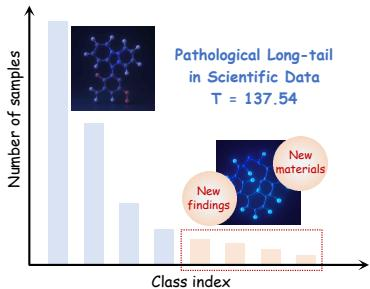
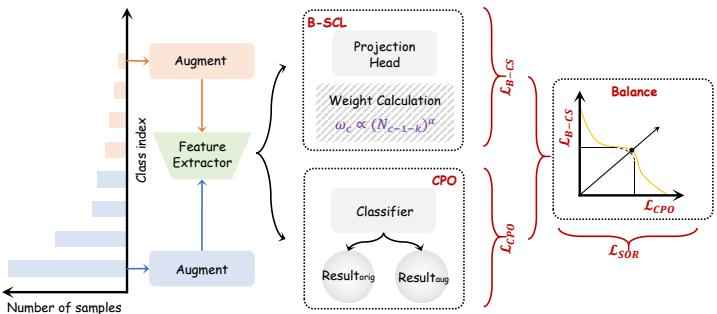
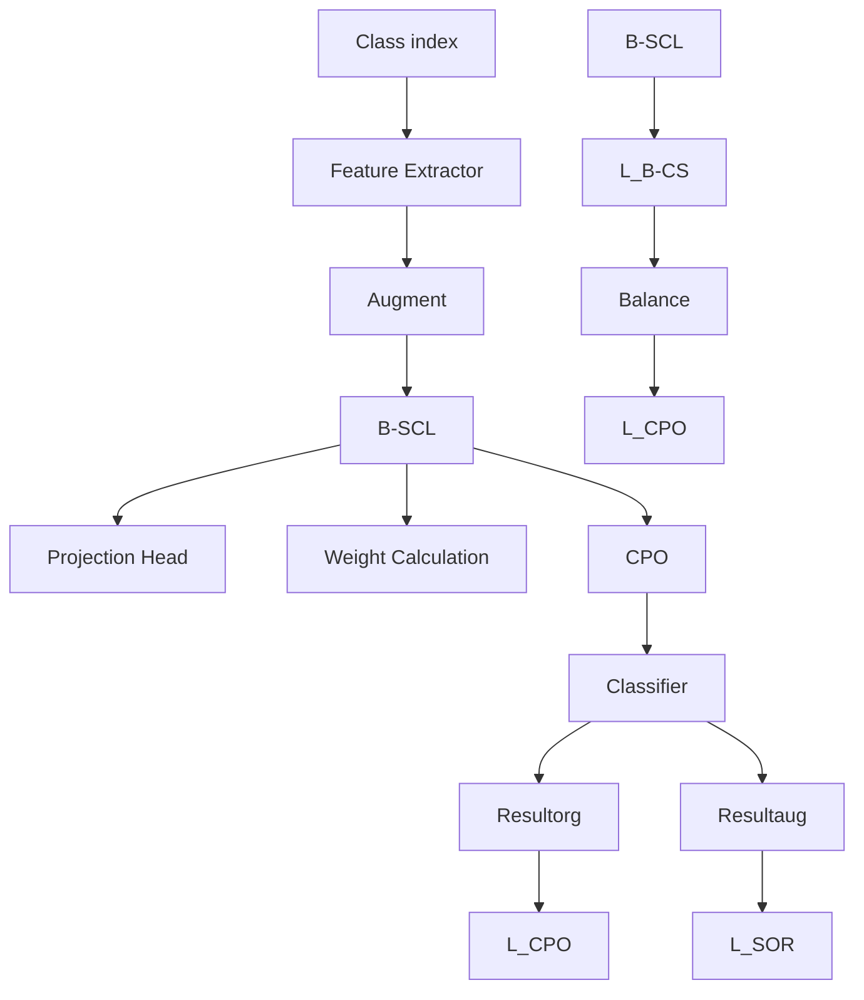
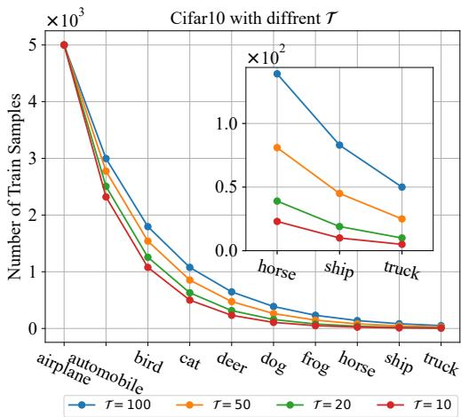
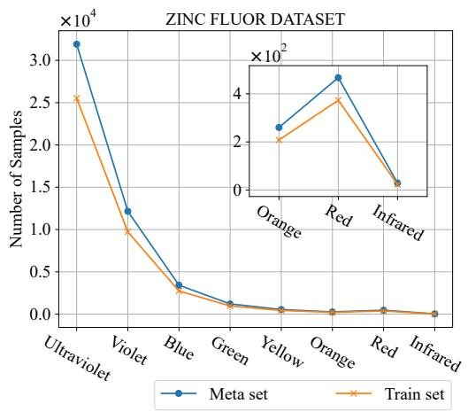
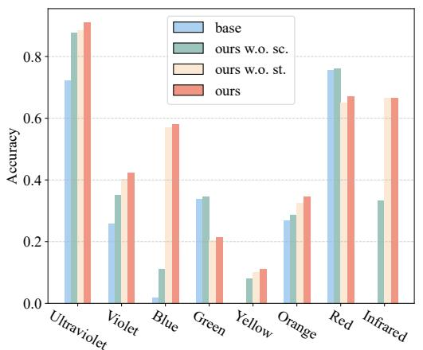
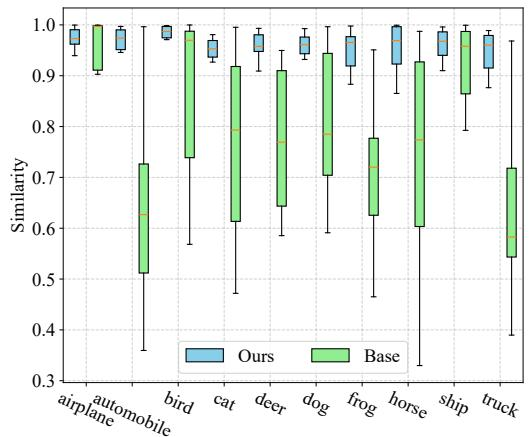
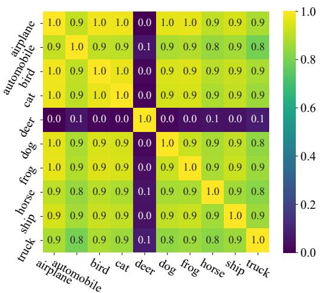
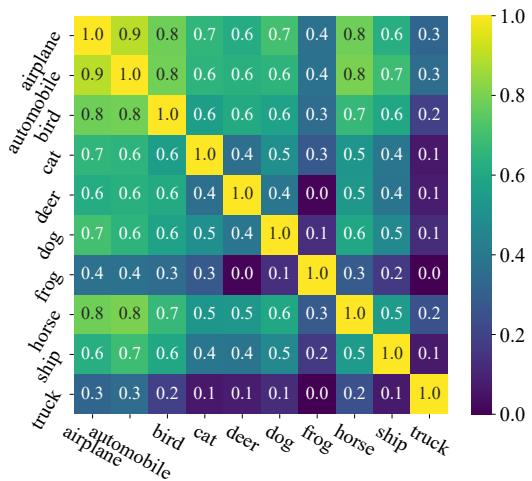
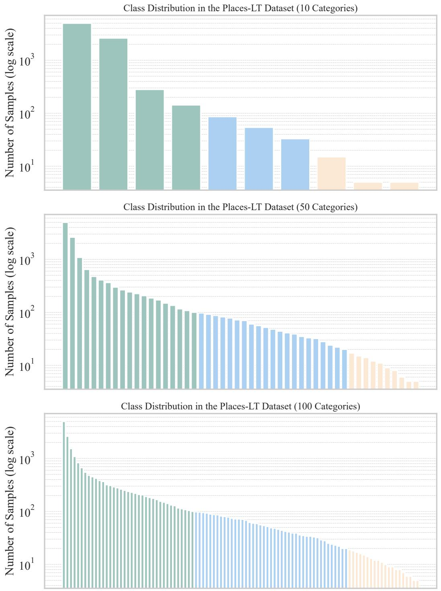

# Deciphering the Extremes: A Novel Approach for Pathological Long-tailed Recognition in Scientific Discovery

Zhe Zhao1,2∗ HaiBin Wen2∗ Xianfu Liu3 Rui Mao1 Pengkun Wang1† Liheng Yu1 Linjiang Chen1 Bo An4 Qingfu Zhang2 Yang Wang1†

1University of Science and Technology of China 2City University of Hong Kong 3China University of Mining and Technology 4Nanyang Technological University

# Abstract

Scientific discovery across diverse fields increasingly grapples with datasets exhibiting pathological long-tailed distributions: a few common phenomena overshadow a multitude of rare yet scientifically critical instances. Unlike standard benchmarks, these scientific datasets often feature extreme imbalance coupled with a modest number of classes and limited overall sample volume, rendering existing long-tailed recognition (LTR) techniques ineffective. Such methods, biased by majority classes or prone to overfitting on scarce tail data, frequently fail to identify the very instances—novel materials, rare disease biomarkers, faint astronomical signals—that drive scientific breakthroughs. This paper introduces a novel, end-to-end framework explicitly designed to address pathological long-tailed recognition in scientific contexts. Our approach synergizes a Balanced Supervised Contrastive Learning (B-SCL) mechanism, which enhances the representation of tail classes by dynamically re-weighting their contributions, with a Smooth Objective Regularization (SOR) strategy that manages the inherent tension between tail-class focus and overall classification performance. We introduce and analyze the real-world ZincFluor chemical dataset (T = 137.54) and synthetic benchmarks with controllable extreme imbalances (CIFAR-LT variants). Extensive evaluations demonstrate our method’s superior ability to decipher these extremes. Notably, on ZincFluor, our approach achieves a Tail Top-2 accuracy of 66.84%, significantly outperforming existing techniques. On CIFAR-10-LT with an imbalance ratio of 1000 (T = 100), our method achieves a tail-class accuracy of 38.99%, substantially leading the next best. These results underscore our framework’s potential to unlock novel insights from complex, imbalanced scientific datasets, thereby accelerating discovery. We provide the detailed code in https://github.com/DataLab-atom/PLTR-SD.

# 1 Introduction

Scientific discovery, spanning disciplines from materials science and drug development to astrophysics and genomics, increasingly relies on harnessing vast datasets. However, a pervasive and often underestimated challenge in these domains is the pathological long-tailed distribution of data. Unlike common benchmark datasets (e.g., ImageNet-LT [19], Places365-LT [32]), scientific datasets often exhibit extreme imbalances: a few well-understood or easily observable phenomena constitute the majority classes, while a multitude of rare, novel, or hard-to-characterize instances form an extensive tail. More critically, while many existing highly imbalanced benchmarks feature a large number of classes and a relatively substantial total sample size, the pathological long-tailed distributions encountered in scientific exploration are frequently characterized by a comparatively smaller number of classes coupled with a limited overall sample volume. This scarcity of available information for each tail class imposes even more stringent demands on a model’s learning capabilities. This is not an artifact but an intrinsic feature of scientific exploration: groundbreaking discoveries often reside in these sparse tail regions, representing new materials with unique properties, biomarkers for rare diseases, or faint astronomical signals indicative of new physical laws. The criticality of accurately identifying and understanding these tail-class instances in scientific domains cannot be overstated.

Standard deep learning models and existing Long-Tailed Recognition (LTR) techniques [31, 29] often falter with such pathological imbalances . Current LTR methods, whether based on re-sampling [4, 8], re-weighting [7, 2], decoupled training [12], or specific loss designs [18, 3], primarily aim to mitigate head-class dominance. However, with extreme scarcity, re-weighting can overfit to noise, re-sampling may lose or redundantly add information, and decoupled training struggles if initial features for tail classes are poorly learned. These shortcomings are drastically amplified at pathological imbalance levels, leading to CATASTROPHIC FAILURES in identifying scientifically paramount tail instances. For example, in our ZincFluor dataset (T = 137.54), rare, valuable fluorescent compounds are often missed, hindering discovery. This paper directly confronts pathological long-tailed recognition in

bar

| Class index | Number of samples |
| ----------- | ----------------- |
| 1           | 137.54            |

(a) Pathological long-tail in scientific data. Critical findings often reside in rare tail classes.

flowchart

(b) Our framework: B-SCL $( \mathcal { L } _ { \mathrm { B - C S } } )$ for tail classes, CPO $( \mathcal { L } _ { \mathrm { C P O } } )$ for overall accuracy, balanced by SOR (LSOR).   
Figure 1: Visualizing (a) the pathological long-tail challenge in scientific discovery (e.g., $T = 1 3 7 . 5 4$ in the ZincFluor dataset), where critical findings are in sparse tails, and (b) our proposed framework leveraging Balanced Supervised Contrastive Learning (B-SCL), Classification Performance Objective (CPO), and Smooth Objective Regularization (SOR) to address it.

scientific data. We argue that extreme imbalance necessitates a paradigm shift from adapting existing LTR methods to designing bespoke solutions. To this end, we propose a novel, end-to-end trainable framework (overviewed in Figure 1b, with key contributions highlighted below:

We profoundly unveil and quantify the unique severity of the “pathological long-tail” problem within scientific discovery contexts. By introducing and analyzing the real-world ZincFluor chemical dataset (T = 137.54), and complementing it with synthetic datasets we constructed featuring controllable extreme imbalance (variants of CIFAR-10-LT and CIFAR-100-LT [15]), we systematically benchmark the performance bottlenecks of existing LTR methods in these extreme scenarios, thereby providing new benchmarks and challenges for research in this domain.   
We introduce an innovative balanced supervised contrastive learning framework, inspired by [14], engineered to fundamentally enhance the model’s capacity to perceive and represent rare yet critical scientific signals. Our approach dynamically adjusts the contribution weights of samples from different classes during contrastive learning and integrates multi-objective optimization strategies. This not only compels the model to focus on and learn fine-grained, discriminative features for tail classes but also, through artful loss function design, ensures stable learning of common head-class phenomena. Consequently, it achieves a balanced cognitive understanding across varying class frequencies, effectively preventing the neglect of scarce signals.   
We demonstrate the remarkable efficacy of our method through extensive evaluations. Critically, on the highly challenging real-world ZincFluor dataset, our approach achieves a breakthrough in identifying rare fluorescent compounds, evidenced by, for instance, a Tail Top-2 accuracy of 66.84%, significantly outperforming existing techniques. Furthermore, on synthetic

long-tailed benchmarks with tunable pathological imbalance, our model consistently surpasses state-of-the-art LTR methods, especially when the imbalance is more extreme. For instance, with an imbalance ratio of 1000 on CIFAR-10-LT (T = 100), our method achieves a tail-class accuracy of 38.99%, substantially leading the next best method at 28.55%. These results underscore the immense potential of our approach to unlock novel insights from complex, imbalanced scientific datasets, offering a potent tool to accelerate scientific discovery.

By developing a robust solution tailored to the pathological long-tailed distributions inherent in scientific research, this work aims to bridge the gap between advanced machine learning capabilities and the pressing need to extract knowledge from the most challenging, yet often most valuable, segments of scientific data.

# 2 Related Work

# 2.1 Long-Tailed Phenomena in Scientific Tasks

Long-tailed distributions, where a few common observations dominate numerous rare ones, are intrinsic to many scientific domains. For instance, in materials science, novel materials with exceptional functionalities are far rarer than common stable compounds [1, 20]. Similarly, drug discovery and genomics face challenges in identifying rare genetic variants or novel drug targets from vast datasets [5, 26]. Astrophysics also encounters this, with rare celestial events or objects being crucial yet sparsely observed compared to common ones [13, 9]. Distinct from typical largescale LTR benchmarks like ImageNet-LT [19] or Places365-LT [32], scientific datasets often exhibit a pathological long-tail: extreme imbalance ratios coupled with a modest number of total classes and often limited overall sample sizes. This unique setting challenges generic LTR methods and motivates our tailored approach.

# 2.2 Long-Tailed Recognition (LTR)

LTR techniques aim to mitigate semantic and structural biases toward majority classes. We categorize prevalent strategies as follows:

• Data and Loss Manipulation: Early methods rely on re-sampling (e.g., SMOTE [4] or undersampling [8]) to balance the training distribution. Re-weighting strategies further refine this by assigning class-specific costs, such as Class-Balanced Loss [7], Focal Loss [18], and LDAM [2]. Notably, recent studies provide a unified theoretical framework for these loss-oriented approaches via localization [28].   
• Decoupled and Manifold Learning: Decoupled training [12] separates feature learning from classifier adjustment. To enhance the robustness of the learned features, recent works delve into semantic scale imbalance [22] and curvature-balanced feature manifolds [24], aiming for fairer DNNs by optimizing the geometry of perceptual manifolds [23].   
• Logit Adjustment and Distillation: Post-hoc adjustments, such as label over-smoothing [25] and logit retargeting [21], calibrate the model’s confidence. Knowledge distillation [10, 11] and hierarchical label distribution strategies [30] have also proven effective for test-agnostic scenarios.

Contrastive learning for LTR has emerged as a potent direction. Building upon Supervised Contrastive Learning (SupCon) [14], methods like Parametric Contrastive Learning (BCL) [6] and Targeted SupCon [17] leverage sample-to-sample relationships to foster discriminative embeddings. Our B-SCL extends this paradigm by integrating class-frequency aware weights specifically tailored for pathological distributions, where standard benchmarks like iNaturalist [27] fail to capture the extreme scarcity and low total volume typical of scientific discovery datasets.

# 3 Methodology: Balanced Contrastive Representation Learning under Dynamic Multi-Objective Constraints for Pathological Long-Tails

Our methodology addresses the critical challenge of pathological long-tailed recognition, prevalent in scientific discovery, by architecting a synergistic learning framework. This framework prioritizes the discriminative representation of tail classes while ensuring overall classification efficacy and robustness. We formalize this as a multi-objective optimization problem and derive a tractable loss function that dynamically balances these, often conflicting, objectives.

# 3.1 Formalizing Pathological Long-Tailed Recognition as a Multi-Objective Optimization Problem

We consider a dataset $\mathcal { D } = \{ ( x _ { i } , y _ { i } ) \} _ { i = 1 } ^ { N }$ 1 characterized by a pathological long-tailed distribution across C classes, where $x _ { i } \in \mathcal X$ and $\bar { y _ { i } } \in \{ 0 , \ldots , C - 1 \}$ . The per-class sample count $N _ { c }$ exhibits extreme imbalance, quantified by $T ^ { \bullet } = ( \dot { \operatorname* { m a x } } _ { c } \dot { N } _ { c } ) / ( ( \operatorname* { m i n } _ { c } { N _ { c } } ) \cdot C )$ . Our goal is to learn model parameters θ for a feature extractor fbackbone, a projection head $\pi _ { \mathrm { p r o j } }$ , and a classifier $g _ { \mathrm { c l s } }$ .

In this setting, we identify three primary, potentially conflicting, learning objectives:

1. Robust Classification Performance $\left( \mathcal { O } _ { 1 } ( \theta ) \right)$ : The model must achieve high classification accuracy across all classes, for both original and augmented data views. This is quantified by the Classification Performance Objective (CPO):

$$
\mathcal {L} _ {\mathrm{CPO}} (\theta) = \mathbb {E} _ {(x, y) \sim \mathcal {D}} \left[ \ell_ {\mathrm{CE}} (g _ {\mathrm{cls}} (f _ {\text { backbone }} (x; \theta)), y) + \ell_ {\mathrm{CE}} (g _ {\mathrm{cls}} (f _ {\text { backbone }} (x ^ {\prime}; \theta)), y) \right] \tag {1}
$$

where $\ell _ { \mathrm { { C E } } } ( \mathbf { o } , y ) = - \log ( \operatorname { s o f t m a x } ( \mathbf { o } ) _ { y } )$ is the standard cross-entropy loss. Let ${ \mathcal { L } } _ { \mathrm { C E , o r i g } } ( \theta ) ~ =$ $\mathbb { E } \left[ \ell _ { \mathrm { C E } } \big ( g _ { \mathrm { c l s } } \big ( f _ { \mathrm { b a c k b o n e } } ( x ; \theta ) \big ) , y \big ) \right]$ and $\begin{array} { r } { \dot { \mathcal { L } } _ { \mathrm { C E , a u g } } ( \theta ) = \mathbb { E } \left[ \ell _ { \mathrm { C E } } ( g _ { \mathrm { c l s } } ( f _ { \mathrm { b a c k b o n e } } ( \bar { x ^ { \prime } } ; \theta ) ) , y ) \right] } \end{array}$ ]. Thus, ${ \dot { \mathcal { L } } } _ { \mathrm { C P O } } ( \theta ) =$ $\mathcal { L } _ { \mathrm { C E , o r i g } } ( \theta ) + \mathcal { L } _ { \mathrm { C E , a u g } } ( \theta )$ .

2. Tail-Centric Discriminative Representation $\operatorname { \rho } _ { 2 } ( \mathcal { O } ) \colon$ : The model must learn highly discriminative features, particularly for information-starved tail classes, to enable their identification. This is addressed by the Balanced Supervised Contrastive Learning (B-SCL) objective:

$$
\mathcal {L} _ {\mathrm{B-SC}} (\theta) = \lambda_ {\mathrm{B-SC}} \cdot \frac {1}{2 B} \sum_ {\mathbf {z} _ {j} \in \mathcal {S} _ {\text { batch }}} w _ {y _ {j}} \ell_ {\mathrm{SC}} (\mathbf {z} _ {j}; \theta) \tag {2}
$$

where $\ell _ { \mathrm { S C } } ( { \bf z } _ { j } ; \theta )$ is the standard per-anchor SupCon loss for anchor $\mathbf { z } _ { j }$ with label $y _ { j } ,$ , computed using embeddings $\mathbf { z } = \pi _ { \mathrm { p r o j } } ( f _ { \mathrm { b a c k b o n e } } ( \cdot ; \theta ) )$ . The weights $w _ { c } = \exp ( s _ { c } ^ { \prime } ) / \sum _ { k } \exp ( s _ { k } ^ { \prime } )$ with $s _ { k } ^ { \prime } =$ $( N _ { C - 1 - k } ) ^ { \alpha }$ up-weight tail-class contributions.

The challenge is that minimizing $\mathcal { L } _ { \mathrm { C P O } }$ (often dominated by head classes) can conflict with minimizing $\mathcal { L } _ { \mathrm { B - S C } }$ (emphasizing tail classes). We seek a solution $\theta ^ { * }$ that is Pareto-optimal with respect to $( \mathcal { L } _ { \mathrm { C E , o r i g } } , \mathcal { L } _ { \mathrm { C E , a u g } } , \mathcal { L } _ { \mathrm { B - S C } } )$ .

Optimization Target 1 (Constrained Multi-Objective Formulation) We aim to find parameters $\theta ^ { * }$ that minimize a primary combined objective while ensuring no individual sub-objective becomes excessively large. This can be conceptualized as:

$$
\min _ {\theta} \quad \mathcal {L} _ {C P O} (\theta) + \mathcal {L} _ {B - S C} (\theta)
$$

$s u b j e c t t o \quad \mathcal { L } _ { C E , o r i g } ( \theta ) \leq \epsilon _ { 1 }$ (3)

$$
\mathcal {L} _ {C E, a u g} (\theta) \leq \epsilon_ {2}
$$

$$
\mathcal {L} _ {B - S C} (\theta) \leq \epsilon_ {3}
$$

where $\epsilon _ { 1 } , \epsilon _ { 2 } , \epsilon _ { 3 }$ are dynamically adjusted upper bounds.

Solving Optimization Target 1 directly is intractable. Instead, we formulate a penalty-based approach.

# 3.2 Derivation of the Training Objective from Multi-Objective Constraints

To find a solution approximating the Pareto front of $( \mathcal { L } _ { \mathrm { C E , o r i g } } , \mathcal { L } _ { \mathrm { C E , a u g } } , \mathcal { L } _ { \mathrm { B - S C } } )$ , we employ a scalarization technique that incorporates a penalty for deviations from a balanced state.

Proposition 1 (LogSumExp as a Smooth Maximum) The LogSumExp (LSE) function, $\mathrm { L S E } ( \mathbf { v } ) =$ $\log { \bar { \sum _ { i } } \exp ( v _ { i } ) }$ , is a differentiable, convex approximation of the maximum function, i.e., maxi vi ≤ $\mathrm { L } \bar { \mathrm { S E } ( \mathbf { v } ) } \leq \operatorname* { m a x } _ { i } v _ { i } + \log M$ for a vector v of M components.

We introduce a Smooth Objective Regularization (SOR) term designed to penalize solutions where any of the fundamental objectives $( \mathcal { L } _ { \mathrm { C E , o r i g } } , \mathcal { L } _ { \mathrm { C E , a u g } } , \mathrm { o r } \mathcal { L } _ { \mathrm { B - S C } } )$ becomes disproportionately large. This aligns with the Tchebycheff (min-max) approach for multi-objective optimization. Let $\mathcal { L } _ { \mathrm { c o n s t i t u e n t } } ( \theta ) =$ $[ \bar { \mathcal { L } } _ { \mathrm { C E , o r i g } } ( \theta ) , \mathcal { L } _ { \mathrm { C E , a u g } } ( \dot { \theta } ) , \mathcal { L } _ { \mathrm { B - S C } } ( \theta ) ] ^ { T }$ . The SOR term is defined as:

$$
\mathcal {L} _ {\mathrm{SOR}} (\theta) = \lambda_ {\mathrm{SOR}} \cdot \operatorname{LSE} \left(\mathcal {L} _ {\text { constituent }} (\theta) / \tau_ {\mathrm{SOR}}\right) \tag {4}
$$

where $\lambda _ { \mathrm { S O R } }$ is a regularization strength and τSOR is a temperature parameter. For simplicity and alignment with the paper’s practical implementation, we set $\tau _ { \mathrm { S O R } } = 1$ . Thus,

$$
\mathcal {L} _ {\mathrm{SOR}} (\theta) = \lambda_ {\mathrm{SOR}} \cdot \log \left(\exp \left(\mathcal {L} _ {\mathrm{CE}, \text { orig }} (\theta)\right) + \exp \left(\mathcal {L} _ {\mathrm{CE}, \text { aug }} (\theta)\right) + \exp \left(\mathcal {L} _ {\mathrm{B-SC}} (\theta)\right)\right). \tag {5}
$$

The final training objective ${ \mathcal { L } } _ { \mathrm { t o t a l } } ( \theta )$ combines the primary objectives with this dynamic regularization:

$$
\mathcal {L} _ {\text { total }} (\theta) = \underbrace {\mathcal {L} _ {\mathrm{CE,orig}} (\theta) + \mathcal {L} _ {\mathrm{CE,aug}} (\theta)} _ {\mathcal {L} _ {\mathrm{CPO}} (\theta)} + \mathcal {L} _ {\mathrm{B-SC}} (\theta) + \mathcal {L} _ {\mathrm{SOR}} (\theta). \tag {6}
$$

Substituting Eq. 5 into Eq. 6:

$$
\begin{array}{l} \mathcal {L} _ {\text { total }} (\theta) = \mathcal {L} _ {\mathrm{CPO}} (\theta) + \mathcal {L} _ {\mathrm{B-SC}} (\theta) \\ + \lambda_ {\mathrm{SOR}} \cdot \log \left(\exp \left(\mathcal {L} _ {\mathrm{CE}, \text {orig}} (\theta)\right) + \exp \left(\mathcal {L} _ {\mathrm{CE}, \text {aug}} (\theta)\right) + \exp \left(\mathcal {L} _ {\mathrm{B-SC}} (\theta)\right)\right). \tag {7} \\ \end{array}
$$

Theoretical Justification. Minimizing ${ \mathcal { L } } _ { \mathrm { t o t a l } } ( \theta )$ aims to achieve a state where: 1. The sum of the primary objectives $( \mathcal { L } _ { \mathrm { C P O } } + \mathcal { L } _ { \mathrm { B - S C } } )$ is low. 2. The SOR term, leveraging Proposition 1, ensures that the maximum of the constituent objectives $( \mathcal { L } _ { \mathrm { C E , o r i g } } , \mathcal { L } _ { \mathrm { C E , a u g } } , \mathcal { L } _ { \mathrm { B - S C } } )$ is also kept low.

This formulation implicitly seeks a solution where no single objective can be significantly improved without degrading another, which is characteristic of Pareto-optimal solutions. The SOR term dynamically adjusts the pressure on each constituent objective. If, for instance, $\mathcal { L } _ { \mathrm { B - S C } }$ becomes very large (e.g., due to difficulty in representing extremely rare tail classes or overfitting), the gradient contribution from the SOR term with respect to $\mathcal { L } _ { \mathrm { B - S C } }$ will increase, effectively pushing the optimizer to reduce it. Similarly, if $\mathcal { L } _ { \mathrm { C E , o r i g } }$ is high (poor classification on original data), SOR will penalize this.

This dynamic balancing is crucial for pathological long-tails:

• ${ \bf B } { \cdot } { \bf S } { \bf C } { \bf L } \left( \mathcal { O } _ { 2 } \right)$ provides the necessary focus on tail classes by up-weighting their contribution to representation learning, fostering discriminative features despite data scarcity.   
• $\mathbf { C P O } \left( \mathcal { O } _ { 1 } \right)$ ensures general classification utility.   
• SOR acts as the arbiter, preventing either the tail-class specific learning or the general classification learning from excessively dominating and destabilizing the other, thus guiding the optimization towards a robust equilibrium suitable for the extreme imbalances encountered in scientific discovery.The Appendix C provides more theory.

# 4 Experiments

In this section, we conduct extensive experiments to evaluate the efficacy of our proposed method, referred to as Ours, in addressing pathological long-tailed recognition. We first detail the datasets and evaluation metrics (Section 4.1). We then outline the experimental setup, including baselines and implementation details (Section 4.2). Subsequently, we present quantitative results on both real-world scientific datasets and synthetic long-tailed benchmarks (Section 4.3), followed by ablation studies (Section 4.4) and qualitative analyses (Section 4.5).

# 4.1 Datasets, Metrics, and Pathological Imbalance

The variable T is used to quantify the degree of pathological imbalance in the dataset. A higher value of T corresponds to a more pronounced imbalance. It is defined as:

$$
\mathcal {T} = \frac {N _ {\text { majority }}}{N _ {\text { minority }} \cdot N _ {\text { classes }}} \tag {8}
$$

where $N _ { \mathrm { m a j o r i t y } }$ represents the number of samples in the majority class, $N _ { \mathrm { m i n o r i t y } }$ represents the number of samples in the minority class, and $N _ { \mathrm { c l a s s e s } }$ denotes the total number of classes.

line

| Category     | T=100  | T=50   | T=20   | T=10   |
| ------------ | ------ | ------ | ------ | ------ |
| airplane     | 5000   | 5000   | 5000   | 5000   |
| automobile   | 3000   | 2800   | 2600   | 2400   |
| bird         | 1800   | 1600   | 1400   | 1200   |
| cat          | 1100   | 900    | 700    | 500    |
| deer         | 600    | 450    | 350    | 250    |
| dog          | 350    | 250    | 200    | 150    |
| frog         | 250    | 180    | 150    | 120    |
| horse        | 180    | 130    | 100    | 80     |
| ship         | 120    | 80     | 60     | 50     |
| truck        | 60     | 40     | 30     | 20     |

(a) Training sample distribution per class in CIFAR-10-LT under different T settings.

line

| Category    | Meta set | Train set |
| ----------- | -------- | --------- |
| Ultraviolet | 32000    | 25000     |
| Violet      | 12000    | 10000     |
| Blue        | 3000     | 2500      |
| Green       | 1000     | 1000      |
| Yellow      | 500      | 500       |
| Orange      | 4500     | 4000      |
| Red         | 500      | 500       |
| Infrared    | 50       | 50        |

(b) Comparison of meta-samples per class with training samples in ZincFluor.

Figure 2: Dataset characteristics: (a) CIFAR-10-LT class distributions. (b) ZincFluor sample counts.   
Table 1: The anonymized ZincFluor dataset examples. 

<table><tr><td>Index</td><td>SMILES</td><td>Pred Fluor Colour</td><td>Intensity</td><td>Fluor Value</td></tr><tr><td>ZINC1</td><td>CC(=O)Nc1c(-c2cccccc2)c(C)nn1-c1ccc(C(=O)Nc2ccc...</td><td>Ultraviolet</td><td>Weak</td><td>1</td></tr><tr><td>ZINC2</td><td>Cc1nc(-c2cccc(NC(=O)c3nccn3)c2)cs1</td><td>Ultraviolet</td><td>Weak</td><td>1</td></tr><tr><td>ZINC3</td><td>CCCclccc(/N=N/C(Sc2nnc(-c3ccncc3)o2)=C(O)c2ccc...</td><td>Ultraviolet</td><td>Weak</td><td>1</td></tr><tr><td>ZINC4</td><td>CCOC(=O)Nc1ccc2c(Sc3cccc[c+]3[O-])cc(=O)oc2c1</td><td>Violet</td><td>Weak</td><td>2</td></tr><tr><td>ZINC5</td><td>O=CNC(=O)c1sc2ncccc3c2c1ncn3-c1cccccc1</td><td>Violet</td><td>Weak</td><td>2</td></tr><tr><td>ZINC6</td><td>Cc1ccn(C(=O)c2cccc(N3CCCS3(=O)=O)c2)c=NC2CCCC...</td><td>Blue</td><td>Weak</td><td>3</td></tr></table>

Real Dataset: ZincFluor. This is a classification dataset from a chemical laboratory. Its general content is exemplified in Table 1. As shown in Figure 2b, the dataset exhibits an extremely pathological class imbalance with an imbalance degree $\tau = 1 3 7 . 5 4$ after an 8:2 train-test split. This severe imbalance poses a significant challenge to existing long-tailed learning methods. The dataset comprises 8 distinct fluorescence levels used as classes.

Synthetic Datasets: CIFAR-LT. To comprehensively evaluate robustness, we use long-tailed variants of CIFAR-10 and CIFAR-100 [15] (i.e., CIFAR-10-LT and CIFAR-100-LT). We control the imbalance ratio $( \mathrm { I R } = N _ { \mathrm { m a j o r i t y } } / N _ { \mathrm { m i n o r i t y } } )$ to construct datasets with varying degrees of pathological imbalance T . Figure 2a visualizes the training sample distribution across classes in CIFAR-10-LT under different T settings.

Evaluation Metrics. We report Top-1 accuracy as the primary metric. For ZincFluor, we show perclass Top-1 accuracy and aggregated tail-class accuracies (Tail Top-6, Top-4, Top-2). For CIFAR-LT, we report overall Top-1 accuracy (“All”), and accuracies on “Head”, “Medium”, and “Tail” class splits based on training sample counts.

# 4.2 Experimental Setup

Baselines. To rigorously evaluate our framework, we compare Ours against a diverse set of representative LTR baselines: (1) CE: Standard Cross-Entropy training. (2) BS [19]: Balanced Softmax for logit adjustment. (3) BCL [6]: Balanced Contrastive Learning. (4) CE-DRW and LDAM-DRW [2]: Re-weighting and margin-based loss combined with Deferred Re-Weighting. (5) KPS [16]: Key Point Sensitive loss focusing on tail-class anchors. (6) LORT [21]: Logits Retargeting approach. For the ablation study on ZincFluor, the “base” refers to the LOS-based method (Logits Over-Smoothing) [25], which serves as our primary classification backbone.

Implementation Details. All models were implemented using PyTorch and PyTorch Geometric. The experiments were conducted on a single NVIDIA Tesla A100 GPU, with results reported accordingly. Specifically, for the ZincFluor dataset, RDKit was utilized to convert SMILES strings into graph data, and a backbone network consisting of six stacked GCN layers was employed. During training, the number of epochs for the ZincFluor dataset was set to 100. For all other experiments, configurations followed those of LOS. Models were trained for 200 epochs using the SGD optimizer (learning rate lr=0.01, momentum=0.9, weight decay=5e-3) in conjunction with the CosineAnnealingLR learning rate scheduler.

# 4.3 Quantitative Results

Table 2: Top-1 accuracy on ZincFluor T = 137.54. The grayed-out section indicates the primary observation indicator. Blod indicates the best performance while underline indicates the second best. 

<table><tr><td rowspan="2">Method</td><td colspan="8">Fluor Leval</td><td colspan="3">Tail Top acc</td></tr><tr><td>1</td><td>2</td><td>3</td><td>4</td><td>5</td><td>6</td><td>7</td><td>8</td><td>Top-6</td><td>Top-4</td><td>Top-2</td></tr><tr><td>CE</td><td>85.19</td><td>70.49</td><td>19.71</td><td>25.62</td><td>0.00</td><td>0.00</td><td>73.40</td><td>0.00</td><td>19.78</td><td>18.35</td><td>36.70</td></tr><tr><td>BS</td><td>82.73</td><td>30.66</td><td>43.21</td><td>28.51</td><td>0.00</td><td>25.00</td><td>72.34</td><td>0.00</td><td>28.17</td><td>24.33</td><td>36.17</td></tr><tr><td>BCL</td><td>86.45</td><td>51.17</td><td>51.82</td><td>22.31</td><td>17.43</td><td>40.38</td><td>69.15</td><td>50.00</td><td>41.84</td><td>44.24</td><td>59.57</td></tr><tr><td>CE-DRW</td><td>94.52</td><td>45.62</td><td>27.59</td><td>26.86</td><td>12.84</td><td>42.31</td><td>67.02</td><td>33.33</td><td>34.99</td><td>38.87</td><td>50.17</td></tr><tr><td>LDAM-DRW</td><td>91.93</td><td>47.27</td><td>28.91</td><td>20.66</td><td>22.94</td><td>28.85</td><td>69.15</td><td>33.33</td><td>33.97</td><td>38.56</td><td>51.24</td></tr><tr><td>KPS</td><td>91.10</td><td>45.70</td><td>51.09</td><td>23.97</td><td>1.83</td><td>19.23</td><td>71.28</td><td>0.00</td><td>27.90</td><td>23.08</td><td>35.64</td></tr><tr><td>LORT</td><td>72.23</td><td>25.81</td><td>1.75</td><td>33.88</td><td>0.00</td><td>26.92</td><td>75.53</td><td>0.00</td><td>23.01</td><td>25.61</td><td>37.76</td></tr><tr><td>Ours</td><td>90.97</td><td>42.21</td><td>58.10</td><td>21.49</td><td>11.01</td><td>34.62</td><td>67.02</td><td>66.67</td><td>43.15</td><td>44.83</td><td>66.84</td></tr></table>

Performance on ZincFluor. Table 2 details the Top-1 accuracy on ZincFluor (T = 137.54). Our method demonstrates highly competitive performance on individual “Fluor Levels” and substantially outperforms all baselines in tail-class focused metrics. Notably, Ours achieves a Tail Top-2 accuracy of 66.84%, a significant improvement over the second-best, BCL (59.57%). This underscores our method’s capability in handling real-world, pathologically imbalanced scientific data.

Table 3: Top-1 accuracy on CIFAR10-LT with different Imbalance ratio. The grayed-out section indicates the primary observation indicator. Blod indicates the best performance while underline indicates the second best. 

<table><tr><td rowspan="2">Method</td><td colspan="4">IR=1000 $\mathcal{T} = 100$ </td><td colspan="4">IR=500 $\mathcal{T} = 50$ </td><td colspan="4">IR=200 $\mathcal{T} = 20$ </td><td colspan="4">IR=100 $\mathcal{T} = 10$ </td></tr><tr><td>Head</td><td>Medium</td><td>Tail</td><td>All</td><td>Head</td><td>Medium</td><td>Tail</td><td>All</td><td>Head</td><td>Medium</td><td>Tail</td><td>All</td><td>Head</td><td>Medium</td><td>Tail</td><td>All</td></tr><tr><td>CE</td><td>79.03</td><td>45.90</td><td>-</td><td>56.6</td><td>81.32</td><td>53.55</td><td>7.8</td><td>61.06</td><td>81.91</td><td>47.8</td><td>-</td><td>71.68</td><td>83.54</td><td>58.5</td><td>-</td><td>78.53</td></tr><tr><td>BS</td><td>76.68</td><td>64.0</td><td>16.85</td><td>62.18</td><td>76.98</td><td>69.10</td><td>30.5</td><td>66.11</td><td>82.21</td><td>61.53</td><td>-</td><td>76.01</td><td>84.81</td><td>64.8</td><td>-</td><td>80.81</td></tr><tr><td>BCL</td><td>79.82</td><td>57.3</td><td>28.55</td><td>65.06</td><td>82.22</td><td>60.05</td><td>41.25</td><td>70.79</td><td>82.47</td><td>71.50</td><td>-</td><td>79.18</td><td>83.25</td><td>81.2</td><td>-</td><td>82.84</td></tr><tr><td>CE-DRW</td><td>77.97</td><td>55.15</td><td>4.15</td><td>58.64</td><td>81.58</td><td>56.15</td><td>31.2</td><td>66.42</td><td>79.34</td><td>65.17</td><td>-</td><td>75.09</td><td>81.94</td><td>68.9</td><td>-</td><td>79.33</td></tr><tr><td>LDAM-DRW</td><td>75.57</td><td>52.0</td><td>15.25</td><td>61.19</td><td>78.27</td><td>59.75</td><td>40.7</td><td>67.05</td><td>78.79</td><td>63.7</td><td>-</td><td>74.29</td><td>81.98</td><td>68.55</td><td>-</td><td>79.29</td></tr><tr><td>KPS</td><td>78.9</td><td>56.85</td><td>6.65</td><td>60.04</td><td>78.95</td><td>45.2</td><td>42.75</td><td>64.96</td><td>82.27</td><td>57.23</td><td>-</td><td>74.76</td><td>82.73</td><td>61.0</td><td>-</td><td>78.38</td></tr><tr><td>LORT</td><td>80.75</td><td>65.30</td><td>0.05</td><td>61.52</td><td>81.0</td><td>60.0</td><td>0.05</td><td>60.61</td><td>83.36</td><td>58.50</td><td>-</td><td>75.9</td><td>83.76</td><td>85.1</td><td>-</td><td>84.03</td></tr><tr><td>Ours</td><td>76.80</td><td>76.60</td><td>38.99</td><td>69.20</td><td>81.68</td><td>79.64</td><td>59.39</td><td>77.94</td><td>84.05</td><td>84.33</td><td>-</td><td>84.14</td><td>87.59</td><td>89.80</td><td>-</td><td>88.04</td></tr></table>

Table 4: Top-1 accuracy on CIFAR100-LT with different Imbalance ratio. The grayed-out section indicates the primary observation indicator. Blod indicates the best performance while underline indicates the second best. 

<table><tr><td rowspan="2">Method</td><td colspan="4">IR=500 $\mathcal{T} = 5$ </td><td colspan="4">IR=200 $\mathcal{T} = 2$ </td><td colspan="4">IR=100 $\mathcal{T} = 1$ </td></tr><tr><td>Head</td><td>Medium</td><td>Tail</td><td>All</td><td>Head</td><td>Medium</td><td>Tail</td><td>All</td><td>Head</td><td>Medium</td><td>Tail</td><td>All</td></tr><tr><td>CE</td><td>80.96</td><td>46.15</td><td>7.37</td><td>36.59</td><td>79.07</td><td>51.55</td><td>6.87</td><td>42.38</td><td>78.09</td><td>48.51</td><td>10.97</td><td>47.6</td></tr><tr><td>BS</td><td>78.81</td><td>50.35</td><td>14.56</td><td>40.57</td><td>74.73</td><td>55.06</td><td>18.92</td><td>46.87</td><td>75.46</td><td>52.06</td><td>27.23</td><td>52.8</td></tr><tr><td>BCL</td><td>78.31</td><td>51.31</td><td>14.96</td><td>40.88</td><td>76.73</td><td>53.48</td><td>20.44</td><td>47.57</td><td>74.57</td><td>52.66</td><td>26.23</td><td>52.4</td></tr><tr><td>CE-DRW</td><td>77.58</td><td>47.08</td><td>13.58</td><td>38.93</td><td>74.87</td><td>52.55</td><td>18.71</td><td>46.05</td><td>75.89</td><td>51.69</td><td>22.07</td><td>51.27</td></tr><tr><td>LDAM-DRW</td><td>74.73</td><td>49.58</td><td>15.83</td><td>39.92</td><td>73.97</td><td>52.29</td><td>18.21</td><td>45.5</td><td>72.74</td><td>51.09</td><td>21.80</td><td>49.88</td></tr><tr><td>KPS</td><td>78.96</td><td>48.35</td><td>12.94</td><td>39.31</td><td>77.27</td><td>52.84</td><td>16.97</td><td>46.18</td><td>76.54</td><td>45.6</td><td>22.6</td><td>50.93</td></tr><tr><td>LORT</td><td>67.69</td><td>39.46</td><td>7.44</td><td>31.43</td><td>71.63</td><td>56.9</td><td>20.21</td><td>47.01</td><td>70.11</td><td>55.37</td><td>33.33</td><td>53.92</td></tr><tr><td>Ours</td><td>68.57</td><td>56.65</td><td>22.52</td><td>43.37</td><td>68.26</td><td>60.38</td><td>30.30</td><td>51.02</td><td>71.57</td><td>62.02</td><td>32.03</td><td>56.37</td></tr></table>

Performance on CIFAR-LT Benchmarks. Across CIFAR-LT benchmarks (Tables 3 4), our method consistently achieves superior overall accuracy and, more critically, demonstrates substantial gains in tail class accuracy across all tested imbalance ratios. For instance, on CIFAR-10-LT with extreme imbalance (IR=1000), our tail accuracy reaches 38.99%, significantly outperforming BCL (28.55%), alongside leading overall accuracy (69.20% vs. 65.06%). This superior tail performance extends to CIFAR-100-LT, where at IR=100, our 32.03% tail accuracy notably exceeds competitors (e.g., BS 27.23%), and at IR=500, we achieve 22.52% against BCL’s 14.96%, while consistently maintaining the highest overall accuracies. These comprehensive results validate our approach’s robustness and effectiveness in enhancing recognition of underrepresented tail classes, particularly under severe imbalance conditions.

bar

| Category | base | ours w.o. sc. | ours w.o. st. | ours |
| :--- | :--- | :--- | :--- | :--- |
| Ultraviolet | 0.72 | 0.88 | 0.91 | 0.93 |
| Violet | 0.26 | 0.35 | 0.41 | 0.42 |
| Blue | 0.02 | 0.11 | 0.57 | 0.58 |
| Green | 0.34 | 0.35 | 0.21 | 0.21 |
| Yellow | 0.08 | 0.08 | 0.10 | 0.11 |
| Orange | 0.27 | 0.29 | 0.33 | 0.35 |
| Red | 0.76 | 0.77 | 0.65 | 0.67 |
| Infrared | 0.00 | 0.33 | 0.66 | 0.66 |

(a) Ablation study on ZincFluor. "sc." denotes B-SCL, "st." denotes SOR. Our full method outperforms ablated versions and the base.

bar

| Category     | Ours  | Base  |
| ------------ | ----- | ----- |
| airplane     | 0.98  | 0.99  |
| automobile   | 0.97  | 0.72  |
| bird         | 0.99  | 0.98  |
| cat          | 0.96  | 0.91  |
| deer         | 0.97  | 0.91  |
| dog          | 0.96  | 0.94  |
| frog         | 0.97  | 0.77  |
| horse        | 0.98  | 0.92  |
| ship         | 0.97  | 0.98  |
| truck        | 0.96  | 0.71  |

(b) Cosine similarity between original and augmented sample features on CIFAR-10-LT (IR=10, trained on IR=1000). Our method shows higher robustness.   
Figure 3: Ablation study and representation robustness: (a) Component analysis of our method. (b) Feature similarity across augmentations.

# 4.4 Ablation Studies

To dissect the contributions of the core components of our method, we conduct ablation studies on the ZincFluor dataset, with results shown in Figure 3a. Removing the Balanced Supervised Contrastive learning loss (“sc.”) from our full model (“ours”) leads to a significant drop in per-class performance, particularly for the tail classes, highlighting the importance of B-SCL for learning discriminative representations under severe imbalance. Similarly, removing the Smooth Objective Regularization term (“st.”) also results in degraded performance compared to the full model, indicating that SOR plays a vital role in balancing the different learning objectives and stabilizing training. The performance of our ablated models still generally surpasses the “base” LOS-based baseline. These studies confirm that both B-SCL and SOR are crucial for achieving the superior performance of our proposed framework.

# 4.5 Qualitative Analysis

Representation Robustness to Augmentation. Figure 3b shows the cosine similarity between the model outputs (features) of original samples and their augmented counterparts on CIFAR-10-LT (IR=10, models trained on IR=1000). Ours generally maintains higher similarity across classes compared to a Base method, suggesting that our approach learns representations that are more invariant and robust to data augmentations.

Class-Level Feature Discriminability. The quality of learned feature representations is further assessed by visualizing class-level cosine similarity matrices on CIFAR-10-LT (IR=1000), as shown in Figure 4. Panel (a) (standard CE loss) exhibits a diffuse similarity matrix with poor separation between classes. In contrast, panel (b) (Ours) displays a much clearer block-diagonal structure, indicating strong intra-class compactness and high inter-class separability. This demonstrates the superior ability of our method to learn discriminative features, which is fundamental for effective long-tailed recognition.

# 4.6 Discussion of Experimental Findings

The comprehensive experimental results consistently validate the efficacy of our proposed method. The substantial gains observed on the pathologically imbalanced ZincFluor dataset, especially in recognizing rare tail classes, highlight its practical utility for scientific discovery tasks. Furthermore, its robust and superior performance across a wide spectrum of imbalance ratios on synthetic CIFAR-LT benchmarks underscores its generalizability and strength in handling varying degrees of data imbalance. The ablation studies confirm the synergistic contributions of the B-SCL and SOR components, and qualitative analyses provide visual evidence of the improved representation quality and feature discriminability achieved by our approach. These findings strongly support our central claim that a tailored framework integrating balanced contrastive representation learning with dynamic multi-objective optimization is pivotal for effectively addressing pathological long-tailed recognition.

heatmap

| | airplane | automobile | bird | cat | deer | dog | frog | horse | ship | truck |
|---|---|---|---|---|---|---|---|---|---|---|
| airplane | 1.0 | 0.9 | 1.0 | 1.0 | 0.0 | 1.0 | 1.0 | 0.9 | 0.9 | 0.9 |
| automobile | 0.9 | 1.0 | 0.9 | 0.9 | 0.1 | 0.9 | 0.9 | 0.8 | 0.9 | 0.8 |
| bird | 1.0 | 0.9 | 1.0 | 1.0 | 0.0 | 0.9 | 0.9 | 0.9 | 0.9 | 0.9 |
| cat | 1.0 | 0.9 | 1.0 | 1.0 | 0.0 | 0.9 | 0.9 | 0.9 | 0.9 | 0.9 |
| deer | 0.0 | 0.1 | 0.0 | 0.0 | 1.0 | 0.0 | 0.0 | 0.1 | 0.0 | 0.1 |
| dog | 1.0 | 0.9 | 0.9 | 0.9 | 0.0 | 1.0 | 0.9 | 0.9 | 0.9 | 0.8 |
| frog | 1.0 | 0.9 | 0.9 | 0.9 | 0.0 | 0.9 | 1.0 | 0.9 | 0.9 | 0.9 |
| horse | 0.9 | 0.8 | 0.9 | 0.9 | 0.1 | 0.9 | 0.9 | 1.0 | 0.9 | 0.8 |
| ship | 0.9 | 0.9 | 0.9 | 0.9 | 0.0 | 0.9 | 0.9 | 0.9 | 1.0 | 0.9 |
| truck | 0.9 | 0.8 | 0.9 | 0.9 | 0.1 | 0.8 | 0.9 | 0.8 | 0.9 | 1.0 |

(a) Standard CE

heatmap

| | airplane | automobile | bird | cat | deer | dog | frog | horse | ship | truck |
|---|---|---|---|---|---|---|---|---|---|---|
| airplane | 1.0 | 0.9 | 0.8 | 0.7 | 0.6 | 0.7 | 0.4 | 0.8 | 0.6 | 0.3 |
| automobile | 0.9 | 1.0 | 0.8 | 0.6 | 0.6 | 0.6 | 0.4 | 0.8 | 0.7 | 0.3 |
| bird | 0.8 | 0.8 | 1.0 | 0.6 | 0.6 | 0.6 | 0.3 | 0.7 | 0.6 | 0.2 |
| cat | 0.7 | 0.6 | 0.6 | 1.0 | 0.4 | 0.5 | 0.3 | 0.5 | 0.4 | 0.1 |
| deer | 0.6 | 0.6 | 0.6 | 0.4 | 1.0 | 0.4 | 0.0 | 0.5 | 0.4 | 0.1 |
| dog | 0.7 | 0.6 | 0.6 | 0.5 | 0.4 | 1.0 | 0.1 | 0.6 | 0.5 | 0.1 |
| frog | 0.4 | 0.4 | 0.3 | 0.3 | 0.0 | 0.1 | 1.0 | 0.3 | 0.2 | 0.0 |
| horse | 0.8 | 0.8 | 0.7 | 0.5 | 0.5 | 0.6 | 0.3 | 1.0 | 0.5 | 0.2 |
| ship | 0.6 | 0.7 | 0.6 | 0.4 | 0.4 | 0.5 | 0.2 | 0.5 | 1.0 | 0.1 |
| truck | 0.3 | 0.3 | 0.2 | 0.1 | 0.1 | 0.1 | 0.0 | 0.2 | 0.1 | 1.0 |

(b) Our Method   
Figure 4: Class-level feature representation cosine similarities on CIFAR-10-LT (IR=1000). (a) Standard cross-entropy loss. (b) Our proposed method, showing improved class separability.

# 5 Conclusion

This paper tackled the critical issue of pathological long-tailed recognition in scientific discovery, where rare instances crucial for breakthroughs are often missed by standard methods. We introduced a novel framework combining Balanced Supervised Contrastive Learning (B-SCL) to enhance tailclass representation and Smooth Objective Regularization (SOR) to dynamically balance competing learning objectives. Our approach ensures focused learning on sparse tail data without compromising overall performance. Extensive experiments on the real-world ZincFluor dataset and synthetic CIFAR-LT benchmarks with extreme imbalances demonstrated significant improvements over state-of-the-art LTR techniques, particularly in identifying critical tail classes. This work provides a robust tool for extracting valuable insights from severely imbalanced scientific datasets, paving the way for accelerated discovery. Future directions include incorporating domain knowledge and extending to other scientific data modalities.

# Acknowledgements

The authors gratefully acknowledge the support from the National Natural Science Foundation of China (NSFC) under Grant Nos. 62402472, and 12227901. This work was also supported by the Natural Science Foundation of Jiangsu Province (No. BK20240461), the Key Basic Research Foundation of Shenzhen (No. JCYJ20220818100005011), the Research Grants Council of the Hong Kong Special Administrative Region (GRF Project No. CityU 11215723), the Project of Stable Support for Youth Team in Basic Research Field, CAS (No. YSBR-005), and the Academic Leaders Cultivation Program at USTC. The AI-driven experiments, simulations and model training were performed on the robotic AI-Scientist platform of Chinese Academy of Sciences.

# References

[1] Keith T Butler, Daniel W Davies, Hugh Cartwright, Olexandr Isayev, and Aron Walsh. Machine learning for molecular and materials science. Nature, 559(7715):547–555, 2018.   
[2] Kaidi Cao, Colin Wei, Adrien Gaidon, Nikos Arechiga, and Tengyu Ma. Learning imbalanced datasets with label-distribution-aware margin loss. Advances in neural information processing systems, 32, 2019.   
[3] Xiaofeng Cao, Weiyang Liu, and Ivor W Tsang. Data-efficient learning via minimizing hyperspherical energy. IEEE Transactions on Pattern Analysis and Machine Intelligence, 45(11):13422–13437, 2023.   
[4] Nitesh V Chawla, Kevin W Bowyer, Lawrence O Hall, and W Philip Kegelmeyer. Smote: synthetic minority over-sampling technique. Journal of artificial intelligence research, 16:321– 357, 2002.   
[5] Travers Ching, Daniel S Himmelstein, Brett K Beaulieu-Jones, Alexandr A Kalinin, Brian T Do, Gregory P Way, Enrico Ferrero, Paul-Michael Agapow, Michael Zietz, Michael M Hoffman, et al. Opportunities and obstacles for deep learning in biology and medicine. Journal of the royal society interface, 15(141):20170387, 2018.   
[6] Jiequan Cui, Zhisheng Zhong, Shu Liu, Bei Yu, and Jiaya Jia. Parametric contrastive learning. In Proceedings of the IEEE/CVF international conference on computer vision, pages 715–724, 2021.   
[7] Yin Cui, Menglin Jia, Tsung-Yi Lin, Yang Song, and Serge Belongie. Class-balanced loss based on effective number of samples. In Proceedings of the IEEE/CVF conference on computer vision and pattern recognition, pages 9268–9277, 2019.   
[8] Chris Drummond, Robert C Holte, et al. C4. 5, class imbalance, and cost sensitivity: why under-sampling beats over-sampling. In Workshop on learning from imbalanced datasets II, volume 11, 2003.   
[9] Christopher J Fluke and Colin Jacobs. Surveying the reach and maturity of machine learning and artificial intelligence in astronomy. Wiley Interdisciplinary Reviews: Data Mining and Knowledge Discovery, 10(2):e1349, 2020.   
[10] Geoffrey Hinton, Oriol Vinyals, and Jeff Dean. Distilling the knowledge in a neural network. arXiv preprint arXiv:1503.02531, 2015.   
[11] Yan Jin, Mengke Li, Yang Lu, Yiu-ming Cheung, and Hanzi Wang. Long-tailed visual recognition via self-heterogeneous integration with knowledge excavation. In Proceedings of the IEEE/CVF conference on computer vision and pattern recognition, pages 23695–23704, 2023.   
[12] Bingyi Kang, Saining Xie, Marcus Rohrbach, Zhicheng Yan, Albert Gordo, Jiashi Feng, and Yannis Kalantidis. Decoupling representation and classifier for long-tailed recognition. arXiv preprint arXiv:1910.09217, 2019.   
[13] Ajit Kembhavi and Rohan Pattnaik. Machine learning in astronomy. Journal of Astrophysics and Astronomy, 43(2):76, 2022.   
[14] Prannay Khosla, Piotr Teterwak, Chen Wang, Aaron Sarna, Yonglong Tian, Phillip Isola, Aaron Maschinot, Ce Liu, and Dilip Krishnan. Supervised contrastive learning. Advances in neural information processing systems, 33:18661–18673, 2020.   
[15] Alex Krizhevsky, Geoffrey Hinton, et al. Learning multiple layers of features from tiny images. 2009.   
[16] Mengke Li, Yiu-Ming Cheung, and Zhikai Hu. Key point sensitive loss for long-tailed visual recognition. IEEE Transactions on Pattern Analysis and Machine Intelligence, 45(4):4812–4825, 2022.

[17] Tianhong Li, Peng Cao, Yuan Yuan, Lijie Fan, Yuzhe Yang, Rogerio S Feris, Piotr Indyk, and Dina Katabi. Targeted supervised contrastive learning for long-tailed recognition. In Proceedings of the IEEE/CVF conference on computer vision and pattern recognition, pages 6918–6928, 2022.   
[18] Tsung-Yi Lin, Priya Goyal, Ross Girshick, Kaiming He, and Piotr Dollár. Focal loss for dense object detection. In Proceedings of the IEEE international conference on computer vision, pages 2980–2988, 2017.   
[19] Ziwei Liu, Zhongqi Miao, Xiaohang Zhan, Jiayun Wang, Boqing Gong, and Stella X Yu. Largescale long-tailed recognition in an open world. In Proceedings of the IEEE/CVF conference on computer vision and pattern recognition, pages 2537–2546, 2019.   
[20] Turab Lookman, Prasanna V Balachandran, Dezhen Xue, and Ruihao Yuan. Active learning in materials science with emphasis on adaptive sampling using uncertainties for targeted design. npj Computational Materials, 5(1):21, 2019.   
[21] Han Lu, Siyu Sun, Yichen Xie, Liqing Zhang, Xiaokang Yang, and Junchi Yan. Rethinking classifier re-training in long-tailed recognition: A simple logits retargeting approach. arXiv preprint arXiv:2403.00250, 2024.   
[22] Yanbiao Ma, Licheng Jiao, Fang Liu, Yuxin Li, Shuyuan Yang, and Xu Liu. Delving into semantic scale imbalance. arXiv preprint arXiv:2212.14613, 2022.   
[23] Yanbiao Ma, Licheng Jiao, Fang Liu, Maoji Wen, Lingling Li, Wenping Ma, Shuyuan Yang, Xu Liu, and Puhua Chen. Predicting and enhancing the fairness of dnns with the curvature of perceptual manifolds. IEEE Transactions on Pattern Analysis and Machine Intelligence, 2025.   
[24] Yanbiao Ma, Licheng Jiao, Fang Liu, Shuyuan Yang, Xu Liu, and Lingling Li. Curvaturebalanced feature manifold learning for long-tailed classification. In Proceedings of the IEEE/CVF conference on computer vision and pattern recognition, pages 15824–15835, 2023.   
[25] Siyu Sun, Han Lu, Jiangtong Li, Yichen Xie, Tianjiao Li, Xiaokang Yang, Liqing Zhang, and Junchi Yan. Rethinking classifier re-training in long-tailed recognition: Label over-smooth can balance. In The Thirteenth International Conference on Learning Representations.   
[26] Jessica Vamathevan, Dominic Clark, Paul Czodrowski, Ian Dunham, Edgardo Ferran, George Lee, Bin Li, Anant Madabhushi, Parantu Shah, Michaela Spitzer, et al. Applications of machine learning in drug discovery and development. Nature reviews Drug discovery, 18(6):463–477, 2019.   
[27] Grant Van Horn, Oisin Mac Aodha, Yang Song, Yin Cui, Chen Sun, Alex Shepard, Hartwig Adam, Pietro Perona, and Serge Belongie. The inaturalist species classification and detection dataset. In Proceedings of the IEEE conference on computer vision and pattern recognition, pages 8769–8778, 2018.   
[28] Zitai Wang, Qianqian Xu, Zhiyong Yang, Zhikang Xu, Linchao Zhang, Xiaochun Cao, and Qingming Huang. A unified perspective for loss-oriented imbalanced learning via localization. IEEE Transactions on Pattern Analysis and Machine Intelligence, 2025.   
[29] Lu Yang, He Jiang, Qing Song, and Jun Guo. A survey on long-tailed visual recognition. International Journal of Computer Vision, 130(7):1837–1872, 2022.   
[30] Zhiyong Yang, Qianqian Xu, Zitai Wang, Sicong Li, Boyu Han, Shilong Bao, Xiaochun Cao, and Qingming Huang. Harnessing hierarchical label distribution variations in test agnostic long-tail recognition. arXiv preprint arXiv:2405.07780, 2024.   
[31] Yifan Zhang, Bingyi Kang, Bryan Hooi, Shuicheng Yan, and Jiashi Feng. Deep long-tailed learning: A survey. IEEE transactions on pattern analysis and machine intelligence, 45(9):10795– 10816, 2023.   
[32] Bolei Zhou, Agata Lapedriza, Aditya Khosla, Aude Oliva, and Antonio Torralba. Places: A 10 million image database for scene recognition. IEEE transactions on pattern analysis and machine intelligence, 40(6):1452–1464, 2017.

# A ZincFluor Dataset: Molecular Fluorescence and Pathological Imbalance

This section provides a more detailed introduction to the ZincFluor dataset used in our experiments (Section 4.2). We describe its origin, the underlying scientific task of molecular fluorescence prediction, and elaborate on why its inherent data distribution constitutes a "pathological long-tail" challenge, distinct from standard long-tailed benchmarks.

# A.1 Molecular Fluorescence and Its Scientific Significance

Molecular fluorescence is a photophysical process where a molecule absorbs light at a specific wavelength and then re-emits light at a longer wavelength. This phenomenon is of immense scientific and technological importance, underpinning applications in diverse fields such as:

• Materials Science: Development of organic light-emitting diodes (OLEDs), fluorescent probes for material characterization, and luminescent sensors.   
• Biology and Medicine: Bioimaging (using fluorescent tags or probes), drug discovery (screening for compounds with desired fluorescence properties or using fluorescent markers), and diagnostic assays.   
• Chemistry: Understanding molecular electronic structure, reaction monitoring, and analytical techniques.

Discovering and synthesizing novel molecules with tailor-made fluorescence properties (e.g., specific emission wavelengths, high quantum yield, photostability, environmental sensitivity) is a core pursuit in chemistry and materials science. Predicting these properties computationally from molecular structure is a valuable tool to accelerate this discovery process, avoiding costly and time-consuming experimental synthesis and screening.

# A.2 The ZincFluor Dataset: Structure and Task

The ZincFluor dataset originates from experimental measurements conducted in a chemical laboratory. It comprises a collection of molecular compounds, each represented by its SMILES (Simplified Molecular Input Line Entry System) string, which provides a concise textual description of the molecule’s structure. For each compound, an associated fluorescence property has been measured and categorized into one of 8 distinct levels. These levels, serving as the classification labels in our task, represent different aspects of the molecule’s fluorescent behavior, such as intensity or emission characteristics (exemplified by the ’Pred Fluor Colour’, ’Intensity’, and ’Fluor Value’ columns in Table 1 in the main paper). The task is to predict the fluorescence level of a molecule given its SMILES string (or its graph representation derived from it, as described in Section ??).

# A.3 Pathological Imbalance in ZincFluor

As highlighted in the main paper (Figure 2b), the ZincFluor dataset exhibits an exceptionally severe class imbalance across its 8 fluorescence levels. Following an 8:2 training-test split, the imbalance factor T (defined as ${ N _ { \mathrm { m a j o r i t y } } } / ( { N _ { \mathrm { m i n o r i t y } } } \cdot { N _ { \mathrm { c l a s s e s } } } ) )$ ) is calculated to be 137.54. This metric quantifies the extreme disparity between the most frequent and least frequent fluorescence levels relative to the total number of classes.

The distribution is not merely skewed; it is pathologically imbalanced in the context of scientific discovery for the following key reasons:

1. Scientific Value Concentrated in the Tail: The rare fluorescence levels (minority classes) often correspond to molecules exhibiting unusual, extreme, or highly specific fluorescent properties. These are precisely the properties that are most sought after for cutting-edge applications (e.g., a molecule with exceptionally high brightness for bioimaging, or a compound emitting light at a very specific wavelength for sensing). In essence, the "rare" instances in this dataset represent the potential scientific breakthroughs or novel materials, not just less common variations of typical compounds.   
2. Limited Sample Volume: Unlike large-scale public benchmarks like ImageNet-LT or Places365-LT which have millions of images and hundreds/thousands of classes, scientific

datasets like ZincFluor often arise from costly and labor-intensive experimental processes. The combination of extreme imbalance and limited total data volume means that the tail classes have critically few samples, sometimes only a handful, making robust learning for these classes incredibly difficult.

3. Fundamental Task Objective: The implicit goal in analyzing such scientific data is often to discover or identify these rare, high-value instances for further investigation. A model that performs well on the frequent (head) classes but fails to identify the rare fluorescent compounds in the tail effectively misses the primary scientific objective.

The ZincFluor dataset represents a "pathological long-tail" problem because the tail instances are not just rare data points, but are scientifically critical signals buried within a sea of common observations. Standard LTR methods, primarily designed to mitigate majority bias in general classification tasks, struggle significantly with this unique combination of extreme imbalance, limited data, and the paramount importance of correctly identifying the scarce tail instances that drive scientific advancement. Our work is specifically motivated to address this particular challenge.

# B Evaluation on Custom Places-LT Datasets with Reduced Class Counts

To further demonstrate the robustness and generalizability of our method across different domains and varying degrees of pathological imbalance complexity, we conducted additional experiments on modified versions of the standard Places-LT dataset [32]. While the original Places-LT features a large number of classes (365), our definition of pathological long-tail in scientific discovery contexts highlights scenarios with extreme imbalance coupled with a modest number of classes and limited overall sample volume(Section 1). To better align with this, we constructed synthetic long-tailed datasets derived from Places-LT that maintain a high imbalance ratio but reduce the total number of classes.

# B.1 Custom Places-LT Dataset Construction

We generated new synthetic datasets based on the original Places-LT dataset (with an imbalance ratio of 996) by performing class-level sampling. Specifically, we followed a procedure to select a subset of classes:

• We identified the class with the maximum number of samples (most frequent) and the class with the minimum number of samples (least frequent) in the original Places-LT dataset. These two classes were always included in our custom datasets.   
• From the remaining classes in the original Places-LT, we uniformly sampled additional classes until the desired total number of categories was reached.

Using this procedure, we constructed three new datasets containing a total of 10, 50, and 100 classes, respectively. These datasets are referred to as "Places-LT (IR 996, 10 Categories)", "Places-LT (IR 996, 50 Categories)", and "Places-LT (IR 996, 100 Categories)".

Importantly, these newly constructed datasets maintain the same imbalance ratio (IR = $N _ { \mathrm { m a j o r i t y } } / \bar { N _ { \mathrm { m i n o r i t y } } } = 9 9 6 )$ as the original Places-LT. However, by significantly reducing the total number of classes while keeping a very high IR, these datasets exhibit an even more pronounced "pathological" nature in terms of the \*relative sparsity of tail classes within a smaller overall class space\*, aligning more closely with the characteristics observed in datasets like ZincFluor compared to the original 365-class Places-LT. Figure 5 shows the sample distribution characteristics for these three custom datasets, illustrating the persistent long-tail across varying numbers of categories.

# B.2 Experimental Setup

# B.3 Results and Analysis

Table 5 presents the quantitative results on the three custom Places-LT datasets.

The results show that our method consistently achieves the best overall Top-1 accuracy across all three variants of the custom Places-LT datasets, ranging from 10 to 100 categories, while maintaining a very high imbalance ratio (996). More critically, our method demonstrates superior performance on the challenging Tail classes in all scenarios. For the 10-category dataset, Ours achieves a Tail accuracy of 62.0%, significantly outperforming the next best method, LDAM-DRW (60.33%). As the number of classes increases to 50 and 100, while maintaining the extreme IR, the Tail task becomes even more challenging, and many baselines exhibit severely degraded performance (e.g., CE, CE-DRW, KPS, LORT showing near zero or very low tail accuracy). In these more complex pathological settings (50 and 100 categories), Ours continues to achieve the highest Tail accuracy (58.50% and 53.55% respectively), substantially leading the second best methods (LDAM-DRW at 43.10% and 44.30%).

  
Figure 5: The Sample Distribution Characteristics of Various Datasets Generated via Places-LT (IR 996) with 10, 50, and 100 Categories.

Table 5: Top-1 accuracy on Custom Places-LT Datasets (IR 996) with 10, 50, and 100 Categories. The grayed-out column indicates the overall accuracy. Bold indicates the best performance while underline indicates the second best. 

<table><tr><td rowspan="2">Method</td><td colspan="4">IR 996 / 10 Categories</td><td colspan="4">IR 996 / 50 Categories</td><td colspan="4">IR 996 / 100 Categories</td></tr><tr><td>Head</td><td>Medium</td><td>Tail</td><td>All</td><td>Head</td><td>Medium</td><td>Tail</td><td>All</td><td>Head</td><td>Medium</td><td>Tail</td><td>All</td></tr><tr><td>CE</td><td>61.50</td><td>0.00</td><td>0.00</td><td>24.60</td><td>40.28</td><td>0.00</td><td>0.00</td><td>14.50</td><td>28.14</td><td>0.00</td><td>0.00</td><td>10.13</td></tr><tr><td>BS</td><td>93.25</td><td>56.00</td><td>39.00</td><td>65.80</td><td>66.17</td><td>51.00</td><td>35.60</td><td>53.38</td><td>53.39</td><td>43.27</td><td>32.95</td><td>44.85</td></tr><tr><td>BCL</td><td>89.00</td><td>82.00</td><td>56.00</td><td>77.00</td><td>77.22</td><td>62.23</td><td>39.10</td><td>63.00</td><td>63.78</td><td>58.52</td><td>50.70</td><td>58.85</td></tr><tr><td>CE-DRW</td><td>94.50</td><td>62.67</td><td>37.67</td><td>67.90</td><td>66.28</td><td>44.36</td><td>15.10</td><td>46.44</td><td>53.97</td><td>39.77</td><td>16.90</td><td>40.31</td></tr><tr><td>LDAM-DRW</td><td>91.00</td><td>77.00</td><td>60.33</td><td>77.60</td><td>76.83</td><td>62.73</td><td>43.10</td><td>63.88</td><td>62.75</td><td>55.75</td><td>44.30</td><td>55.97</td></tr><tr><td>KPS</td><td>91.00</td><td>85.67</td><td>15.67</td><td>66.80</td><td>77.28</td><td>48.77</td><td>3.90</td><td>50.06</td><td>63.56</td><td>45.77</td><td>8.90</td><td>44.80</td></tr><tr><td>LORT</td><td>95.75</td><td>14.00</td><td>0.00</td><td>42.50</td><td>50.61</td><td>0.32</td><td>0.00</td><td>18.36</td><td>36.11</td><td>3.70</td><td>0.05</td><td>14.64</td></tr><tr><td>Ours</td><td>85.00</td><td>77.50</td><td>62.0</td><td>83.60</td><td>60.22</td><td>76.71</td><td>58.50</td><td>67.13</td><td>47.92</td><td>59.81</td><td>53.55</td><td>54.27</td></tr></table>

Furthermore, Ours also shows strong performance on Medium classes (best on 50 and 100 categories) and competitive, albeit not always leading, performance on Head classes (best on 100 categories), demonstrating its ability to balance learning across the entire frequency spectrum. The strong overall performance (83.60%, 67.13%, 54.27%) underscores this capability.

These experiments on custom Places-LT datasets with varied, but modest, class counts further validate the effectiveness of our proposed framework in handling pathological long-tailed distributions beyond the specific domain of ZincFluor. They highlight our method’s unique ability to maintain high accuracy on scarce tail classes while ensuring robust overall performance, a critical requirement for scientific discovery applications.

# C Detailed Theoretical Analysis

This section provides a detailed theoretical analysis of our proposed framework, emphasizing its formulation as an implicitly constrained multi-objective optimization problem and the role of Smooth Objective Regularization (SOR) in achieving a dynamically balanced solution for pathological long-tailed recognition. Our approach deviates from methods solely focused on manipulating classification logits or sample/loss weights based on class frequencies, by instead directly influencing the optimization trajectory to balance competing objectives via a principled penalty mechanism.

We define the model parameters as $\boldsymbol { \theta } \in \mathbb { R } ^ { P }$ . The learning process is driven by three constituent loss functions defined on the dataset $\mathcal { D } \colon$ :

• $\mathcal { L } _ { 1 } ( \theta ) = \mathcal { L } _ { \mathrm { C E , o r i g } } ( \theta )$ : Cross-Entropy loss on original data.   
• $\mathcal { L } _ { 2 } ( \theta ) = \mathcal { L } _ { \mathrm { C E , a u g } } ( \theta )$ : Cross-Entropy loss on augmented data.   
• $\mathcal { L } _ { 3 } ( \theta ) = \mathcal { L } _ { \mathrm { B - S C } } ( \theta )$ : Balanced Supervised Contrastive Learning loss, which incorporates frequency-aware weighting $w _ { y }$ for tail classes (details in Appendix Section ??).

Let $\mathbf { L } ( \theta ) = [ \mathcal { L } _ { 1 } ( \theta ) , \mathcal { L } _ { 2 } ( \theta ) , \mathcal { L } _ { 3 } ( \theta ) ] ^ { T } \in \mathbb { R } ^ { 3 }$ be the vector of constituent losses.

In the context of pathological long-tailed data, minimizing the simple sum $\textstyle \sum _ { k = 1 } ^ { 3 } { \mathcal { L } } _ { k } ( \theta )$ can lead to aims to solve a constrained multi-objective optimization problem: finding $\theta ^ { * }$ that minimizes a primary objective while keeping all constituent losses below certain thresholds $\epsilon _ { k }$ . This is conceptually similar to:

$$
\min _ {\theta} \sum_ {k = 1} ^ {3} \mathcal {L} _ {k} (\theta) \quad \text { s   .   t   . } \quad \mathcal {L} _ {k} (\theta) \leq \epsilon_ {k}, \quad k = 1, 2, 3.
$$

Directly solving this is challenging. We approximate this via a penalty method, augmenting the sum of losses with a term that penalizes the maximum of the constituent losses.

Proposition 2 (LogSumExp as a Smooth Maximum) The LogSumExp (LSE) function, $\mathrm { L S E } ( \mathbf { v } ) =$ log $\textstyle \sum _ { i = 1 } ^ { M } \exp ( v _ { i } )$ , is a differentiable, convex approximation of the maximum function, satisfying maxi $v _ { i } \leq \mathrm { L S E } ( \mathbf { v } ) \leq \mathrm { m a x } _ { i } v _ { i } + \mathrm { l o g }$ M for any vector $\mathbf { v } = [ v _ { 1 } , \ldots , v _ { M } ] ^ { T } \in \mathbb { R } ^ { M }$ .

Let $v _ { \operatorname* { m a x } } = \operatorname* { m a x } _ { i \in \{ 1 , \dots , M \} } v _ { i }$ . For the lower bound:

$$
\sum_ {i = 1} ^ {M} \exp (v _ {i}) \geq \exp (v _ {\max}). \tag {9}
$$

Taking the logarithm (monotonic):

$$
\log \left(\sum_ {i = 1} ^ {M} \exp (v _ {i})\right) \geq \log (\exp (v _ {\max})) = v _ {\max}. \tag {10}
$$

Thus, maxi $v _ { i } \leq \mathrm { L S E } ( \mathbf { v } )$ .

For the upper bound: Since $v _ { i } \leq v _ { \operatorname* { m a x } }$ for all $i , \exp ( v _ { i } ) \leq \exp ( v _ { \operatorname* { m a x } } )$ . Summing:

$$
\sum_ {i = 1} ^ {M} \exp (v _ {i}) \leq \sum_ {i = 1} ^ {M} \exp (v _ {\max}) = M \exp (v _ {\max}). \tag {11}
$$

Taking the logarithm:

$$
\log \left(\sum_ {i = 1} ^ {M} \exp (v _ {i})\right) \leq \log (M \exp (v _ {\max})) = \log M + \log (\exp (v _ {\max})) = \log M + v _ {\max}. \tag {12}
$$

Thus, $\begin{array} { r } { \mathrm { L S E } ( \mathbf { v } ) \leq \operatorname* { m a x } _ { i } v _ { i } + } \end{array}$ log M . Differentiability and convexity are standard properties of LSE.

We define the Smooth Objective Regularization (SOR) term using the LSE function applied to our vector of constituent losses $\mathbf { L } ( \theta )$ :

$$
\mathcal {L} _ {\mathrm{SOR}} (\theta) = \lambda_ {\mathrm{SOR}} \cdot \mathrm{LSE} (\mathbf {L} (\theta) / \tau_ {\mathrm{SOR}}) \tag {13}
$$

where $\lambda _ { \mathrm { S O R } } > 0$ and $\tau _ { \mathrm { S O R } } > 0$ . In our implementation, we set $\tau _ { \mathrm { S O R } } = 1$ and $M = 3$ , yielding:

$$
\mathcal {L} _ {\mathrm{SOR}} (\theta) = \lambda_ {\mathrm{SOR}} \cdot \log \left(\exp (\mathcal {L} _ {1} (\theta)) + \exp (\mathcal {L} _ {2} (\theta)) + \exp (\mathcal {L} _ {3} (\theta))\right). \tag {14}
$$

Minimizing $\mathcal { L } _ { \mathrm { S O R } }$ directly penalizes the largest constituent loss, pushing it down relative to the others.

Our total training objective is defined as the sum of the constituent losses augmented by the SOR term:

$$
\mathcal {L} _ {\text { total }} (\theta) = \sum_ {k = 1} ^ {3} \mathcal {L} _ {k} (\theta) + \mathcal {L} _ {\mathrm{SOR}} (\theta) \tag {15}
$$

Substituting the expression for $\mathcal { L } _ { \mathrm { S O R } }$ :

$$
\mathcal {L} _ {\text { total }} (\theta) = \sum_ {k = 1} ^ {3} \mathcal {L} _ {k} (\theta) + \lambda_ {\mathrm{SOR}} \cdot \log \left(\sum_ {j = 1} ^ {3} \exp (\mathcal {L} _ {j} (\theta))\right). \tag {16}
$$

Minimizing $\mathcal { L } _ { \mathrm { t o t a l } }$ serves as a penalty method approximation to the constrained multi-objective problem. It drives down the sum of losses while simultaneously using $\mathcal { L } _ { \mathrm { S O R } }$ to keep the maximum loss value in check, acting as a soft "tail penalty" (when $\mathcal { L } _ { 3 }$ is high) and a "smooth constraint" promoting balance across all objectives.

The dynamic balancing property is evident from the gradient of ${ \mathcal { L } } _ { \mathrm { t o t a l } } ( \theta )$ :

$$
\nabla_ {\theta} \mathcal {L} _ {\text { total }} (\theta) = \sum_ {k = 1} ^ {3} \nabla_ {\theta} \mathcal {L} _ {k} (\theta) + \nabla_ {\theta} \mathcal {L} _ {\text { SOR }} (\theta). \tag {17}
$$

The gradient of the SOR term is derived using the chain rule. Let $L _ { k } = \mathcal { L } _ { k } ( \theta )$ :

$$
\begin{array}{l} \nabla_ {\theta} \mathcal {L} _ {\mathrm{SOR}} (\theta) = \lambda_ {\mathrm{SOR}} \cdot \nabla_ {\theta} \log \left(\sum_ {j = 1} ^ {3} \exp (L _ {j})\right) \\ = \lambda_ {\mathrm{SOR}} \sum_ {k = 1} ^ {3} \frac {\partial \log (\sum_ {j = 1} ^ {3} \exp (L _ {j}))}{\partial L _ {k}} \nabla_ {\theta} L _ {k} \\ = \lambda_ {\mathrm{SOR}} \sum_ {k = 1} ^ {3} \frac {\exp (L _ {k})}{\sum_ {j = 1} ^ {3} \exp (L _ {j})} \nabla_ {\theta} \mathcal {L} _ {k} (\theta). \\ \end{array}
$$

Let $\begin{array} { r } { p _ { k } ( \theta ) = \frac { \exp ( \mathcal { L } _ { k } ( \theta ) ) } { \sum _ { i = 1 } ^ { 3 } \exp ( \mathcal { L } _ { j } ( \theta ) ) } } \end{array}$ . These $p _ { k }$ values form a probability distribution over the constituent losses, where $p _ { k }$ is high when $\mathcal { L } _ { k }$ is large. The total gradient becomes:

$$
\nabla_ {\theta} \mathcal {L} _ {\text { total }} (\theta) = \sum_ {k = 1} ^ {3} \nabla_ {\theta} \mathcal {L} _ {k} (\theta) + \lambda_ {\mathrm{SOR}} \sum_ {k = 1} ^ {3} p _ {k} (\theta) \nabla_ {\theta} \mathcal {L} _ {k} (\theta). \tag {18}
$$

Rearranging terms:

$$
\nabla_ {\theta} \mathcal {L} _ {\text { total }} (\theta) = \sum_ {k = 1} ^ {3} (1 + \lambda_ {\mathrm{SOR}} p _ {k} (\theta)) \nabla_ {\theta} \mathcal {L} _ {k} (\theta). \tag {19}
$$

Equation 19 reveals the dynamic balancing. The gradient of each constituent loss $\nabla _ { \boldsymbol { \theta } } \mathcal { L } _ { k }$ contributes to the total gradient with a weight $\left( 1 + \lambda _ { \mathrm { S O R } } p _ { k } \right)$ . When a specific loss $\mathcal { L } _ { k }$ becomes significantly larger than others, $p _ { k } \to 1$ , and the weight $( 1 + \lambda _ { \mathsf { S O R } } p _ { k } ) \to 1 + \lambda _ { \mathsf { S O R } }$ , effectively amplifying the gradient $\nabla _ { \boldsymbol { \theta } } \mathcal { L } _ { k }$ . Conversely, for a small loss $\mathcal { L } _ { j } , p _ { j }  0 ,$ and its gradient is weighted by approximately 1. This mechanism ensures that the optimization actively targets the largest loss component, pulling it down.

This adaptive weighting, governed by the relative magnitudes of $\mathcal { L } _ { 1 } , \mathcal { L } _ { 2 } , \mathcal { L } _ { 3 }$ , imposes the "smooth constraint" by discouraging any single loss from dominating. For pathological long-tails, this is crucial: it prevents the model from solely optimizing the easily satisfied CPO on head classes while neglecting the critical $\mathcal { L } _ { 3 }$ for tail classes, and vice-versa. Instead, it promotes a balanced decrease across all objectives, leading to a more robust model capable of deciphering the challenging extremes. This principled approach, rooted in approximating constrained multi-objective optimization via SOR’s gradient dynamics, provides a theoretical basis for our method’s superior performance on pathological long-tailed data.

# NeurIPS Paper Checklist

# 1. Claims

Question: Do the main claims made in the abstract and introduction accurately reflect the paper’s contributions and scope?

Answer: [Yes]

Justification: We list our contributions in detail at the end of the Introduction.

# Guidelines:

• The answer NA means that the abstract and introduction do not include the claims made in the paper.   
• The abstract and/or introduction should clearly state the claims made, including the contributions made in the paper and important assumptions and limitations. A No or NA answer to this question will not be perceived well by the reviewers.   
• The claims made should match theoretical and experimental results, and reflect how much the results can be expected to generalize to other settings.   
• It is fine to include aspirational goals as motivation as long as it is clear that these goals are not attained by the paper.

# 2. Limitations

Question: Does the paper discuss the limitations of the work performed by the authors?

Answer: [Yes]

Justification: We discuss the limitations in Appendix.

# Guidelines:

• The answer NA means that the paper has no limitation while the answer No means that the paper has limitations, but those are not discussed in the paper.   
• The authors are encouraged to create a separate "Limitations" section in their paper.   
• The paper should point out any strong assumptions and how robust the results are to violations of these assumptions $( \mathrm { e . g . }$ , independence assumptions, noiseless settings, model well-specification, asymptotic approximations only holding locally). The authors should reflect on how these assumptions might be violated in practice and what the implications would be.

• The authors should reflect on the scope of the claims made, e.g., if the approach was only tested on a few datasets or with a few runs. In general, empirical results often depend on implicit assumptions, which should be articulated.   
• The authors should reflect on the factors that influence the performance of the approach. For example, a facial recognition algorithm may perform poorly when image resolution is low or images are taken in low lighting. Or a speech-to-text system might not be used reliably to provide closed captions for online lectures because it fails to handle technical jargon.   
• The authors should discuss the computational efficiency of the proposed algorithms and how they scale with dataset size.   
• If applicable, the authors should discuss possible limitations of their approach to address problems of privacy and fairness.   
• While the authors might fear that complete honesty about limitations might be used by reviewers as grounds for rejection, a worse outcome might be that reviewers discover limitations that aren’t acknowledged in the paper. The authors should use their best judgment and recognize that individual actions in favor of transparency play an important role in developing norms that preserve the integrity of the community. Reviewers will be specifically instructed to not penalize honesty concerning limitations.

# 3. Theory assumptions and proofs

Question: For each theoretical result, does the paper provide the full set of assumptions and a complete (and correct) proof?

Answer: [Yes]

Justification: We provide the relevant assumptions and proofs in Appendix.

Guidelines:

• The answer NA means that the paper does not include theoretical results.   
• All the theorems, formulas, and proofs in the paper should be numbered and crossreferenced.   
• All assumptions should be clearly stated or referenced in the statement of any theorems.   
• The proofs can either appear in the main paper or the supplemental material, but if they appear in the supplemental material, the authors are encouraged to provide a short proof sketch to provide intuition.   
• Inversely, any informal proof provided in the core of the paper should be complemented by formal proofs provided in appendix or supplemental material.   
• Theorems and Lemmas that the proof relies upon should be properly referenced.

# 4. Experimental result reproducibility

Question: Does the paper fully disclose all the information needed to reproduce the main experimental results of the paper to the extent that it affects the main claims and/or conclusions of the paper (regardless of whether the code and data are provided or not)?

Answer: [Yes]

Justification: We provide code links in the abstract and implementation details in Appendix.

Guidelines:

• The answer NA means that the paper does not include experiments.   
• If the paper includes experiments, a No answer to this question will not be perceived well by the reviewers: Making the paper reproducible is important, regardless of whether the code and data are provided or not.   
• If the contribution is a dataset and/or model, the authors should describe the steps taken to make their results reproducible or verifiable.   
• Depending on the contribution, reproducibility can be accomplished in various ways. For example, if the contribution is a novel architecture, describing the architecture fully might suffice, or if the contribution is a specific model and empirical evaluation, it may be necessary to either make it possible for others to replicate the model with the same dataset, or provide access to the model. In general. releasing code and data is often one good way to accomplish this, but reproducibility can also be provided via detailed

instructions for how to replicate the results, access to a hosted model (e.g., in the case of a large language model), releasing of a model checkpoint, or other means that are appropriate to the research performed.

• While NeurIPS does not require releasing code, the conference does require all submissions to provide some reasonable avenue for reproducibility, which may depend on the nature of the contribution. For example

(a) If the contribution is primarily a new algorithm, the paper should make it clear how to reproduce that algorithm.   
(b) If the contribution is primarily a new model architecture, the paper should describe the architecture clearly and fully.   
(c) If the contribution is a new model (e.g., a large language model), then there should either be a way to access this model for reproducing the results or a way to reproduce the model (e.g., with an open-source dataset or instructions for how to construct the dataset).   
(d) We recognize that reproducibility may be tricky in some cases, in which case authors are welcome to describe the particular way they provide for reproducibility. In the case of closed-source models, it may be that access to the model is limited in some way (e.g., to registered users), but it should be possible for other researchers to have some path to reproducing or verifying the results.

# 5. Open access to data and code

Question: Does the paper provide open access to the data and code, with sufficient instructions to faithfully reproduce the main experimental results, as described in supplemental material?

Answer: [Yes]

Justification: We provide the source of the dataset and code in Appendix.

# Guidelines:

• The answer NA means that paper does not include experiments requiring code.   
• Please see the NeurIPS code and data submission guidelines (https://nips.cc/ public/guides/CodeSubmissionPolicy) for more details.   
• While we encourage the release of code and data, we understand that this might not be possible, so “No” is an acceptable answer. Papers cannot be rejected simply for not including code, unless this is central to the contribution (e.g., for a new open-source benchmark).   
• The instructions should contain the exact command and environment needed to run to reproduce the results. See the NeurIPS code and data submission guidelines (https: //nips.cc/public/guides/CodeSubmissionPolicy) for more details.   
• The authors should provide instructions on data access and preparation, including how to access the raw data, preprocessed data, intermediate data, and generated data, etc.   
• The authors should provide scripts to reproduce all experimental results for the new proposed method and baselines. If only a subset of experiments are reproducible, they should state which ones are omitted from the script and why.   
• At submission time, to preserve anonymity, the authors should release anonymized versions (if applicable).   
• Providing as much information as possible in supplemental material (appended to the paper) is recommended, but including URLs to data and code is permitted.

# 6. Experimental setting/details

Question: Does the paper specify all the training and test details (e.g., data splits, hyperparameters, how they were chosen, type of optimizer, etc.) necessary to understand the results?

Answer: [Yes]

Justification: We describe the relevant details in Appendix.

Guidelines:

• The answer NA means that the paper does not include experiments.

• The experimental setting should be presented in the core of the paper to a level of detail that is necessary to appreciate the results and make sense of them.   
• The full details can be provided either with the code, in appendix, or as supplemental material.

# 7. Experiment statistical significance

Question: Does the paper report error bars suitably and correctly defined or other appropriate information about the statistical significance of the experiments?

Answer: [Yes]

Justification: We report performance metrics such as average accuracy on multiple datasets.

Guidelines:

• The answer NA means that the paper does not include experiments.   
• The authors should answer "Yes" if the results are accompanied by error bars, confidence intervals, or statistical significance tests, at least for the experiments that support the main claims of the paper.   
• The factors of variability that the error bars are capturing should be clearly stated (for example, train/test split, initialization, random drawing of some parameter, or overall run with given experimental conditions).   
• The method for calculating the error bars should be explained (closed form formula, call to a library function, bootstrap, etc.)   
• The assumptions made should be given (e.g., Normally distributed errors).   
• It should be clear whether the error bar is the standard deviation or the standard error of the mean.   
• It is OK to report 1-sigma error bars, but one should state it. The authors should preferably report a 2-sigma error bar than state that they have a 96% CI, if the hypothesis of Normality of errors is not verified.   
• For asymmetric distributions, the authors should be careful not to show in tables or figures symmetric error bars that would yield results that are out of range (e.g. negative error rates).   
• If error bars are reported in tables or plots, The authors should explain in the text how they were calculated and reference the corresponding figures or tables in the text.

# 8. Experiments compute resources

Question: For each experiment, does the paper provide sufficient information on the computer resources (type of compute workers, memory, time of execution) needed to reproduce the experiments?

Answer: [Yes]

Justification: We mention the computational resources used for the experiments in Appendix.

Guidelines:

• The answer NA means that the paper does not include experiments.   
• The paper should indicate the type of compute workers CPU or GPU, internal cluster, or cloud provider, including relevant memory and storage.   
• The paper should provide the amount of compute required for each of the individual experimental runs as well as estimate the total compute.   
• The paper should disclose whether the full research project required more compute than the experiments reported in the paper (e.g., preliminary or failed experiments that didn’t make it into the paper).

# 9. Code of ethics

Question: Does the research conducted in the paper conform, in every respect, with the NeurIPS Code of Ethics https://neurips.cc/public/EthicsGuidelines?

Answer: [Yes]

Justification: We have read and understood the code of ethics; and have done our best to conform.

# Guidelines:

• The answer NA means that the authors have not reviewed the NeurIPS Code of Ethics.   
• If the authors answer No, they should explain the special circumstances that require a deviation from the Code of Ethics.   
• The authors should make sure to preserve anonymity (e.g., if there is a special consideration due to laws or regulations in their jurisdiction).

# 10. Broader impacts

Question: Does the paper discuss both potential positive societal impacts and negative societal impacts of the work performed?

# Answer: [NA]

Justification: Our experiments are conducted on publicly available data. It does no impact the society at large, beyond improving our understanding of certain aspects of deep learning and crystal struction prediction.

# Guidelines:

• The answer NA means that there is no societal impact of the work performed.   
• If the authors answer NA or No, they should explain why their work has no societal impact or why the paper does not address societal impact.   
• Examples of negative societal impacts include potential malicious or unintended uses (e.g., disinformation, generating fake profiles, surveillance), fairness considerations (e.g., deployment of technologies that could make decisions that unfairly impact specific groups), privacy considerations, and security considerations.   
• The conference expects that many papers will be foundational research and not tied to particular applications, let alone deployments. However, if there is a direct path to any negative applications, the authors should point it out. For example, it is legitimate to point out that an improvement in the quality of generative models could be used to generate deepfakes for disinformation. On the other hand, it is not needed to point out that a generic algorithm for optimizing neural networks could enable people to train models that generate Deepfakes faster.   
• The authors should consider possible harms that could arise when the technology is being used as intended and functioning correctly, harms that could arise when the technology is being used as intended but gives incorrect results, and harms following from (intentional or unintentional) misuse of the technology.   
• If there are negative societal impacts, the authors could also discuss possible mitigation strategies (e.g., gated release of models, providing defenses in addition to attacks, mechanisms for monitoring misuse, mechanisms to monitor how a system learns from feedback over time, improving the efficiency and accessibility of ML).

# 11. Safeguards

Question: Does the paper describe safeguards that have been put in place for responsible release of data or models that have a high risk for misuse (e.g., pretrained language models, image generators, or scraped datasets)?

# Answer: [NA]

Justification: Our work poses no such risks.

# Guidelines:

• The answer NA means that the paper poses no such risks.   
• Released models that have a high risk for misuse or dual-use should be released with necessary safeguards to allow for controlled use of the model, for example by requiring that users adhere to usage guidelines or restrictions to access the model or implementing safety filters.   
• Datasets that have been scraped from the Internet could pose safety risks. The authors should describe how they avoided releasing unsafe images.   
• We recognize that providing effective safeguards is challenging, and many papers do not require this, but we encourage authors to take this into account and make a best faith effort.

# 12. Licenses for existing assets

Question: Are the creators or original owners of assets (e.g., code, data, models), used in the paper, properly credited and are the license and terms of use explicitly mentioned and properly respected?

Answer: [Yes]

Justification: We are not shipping our code with any source code or binary files from any other existing libraries, so there are no concerns over getting permission or including a license. We did cite open-sourced libraries, e.g. PyTorch, in our paper.

Guidelines:

• The answer NA means that the paper does not use existing assets.   
• The authors should cite the original paper that produced the code package or dataset.   
• The authors should state which version of the asset is used and, if possible, include a URL.   
• The name of the license (e.g., CC-BY 4.0) should be included for each asset.   
• For scraped data from a particular source (e.g., website), the copyright and terms of service of that source should be provided.   
• If assets are released, the license, copyright information, and terms of use in the package should be provided. For popular datasets, paperswithcode.com/datasets has curated licenses for some datasets. Their licensing guide can help determine the license of a dataset.   
• For existing datasets that are re-packaged, both the original license and the license of the derived asset (if it has changed) should be provided.   
• If this information is not available online, the authors are encouraged to reach out to the asset’s creators.

# 13. New assets

Question: Are new assets introduced in the paper well documented and is the documentation provided alongside the assets?

Answer: [Yes]

Justification: We will release our code base with included readme files. We do not ship any source code or binary files from any other existing libraries.

Guidelines:

• The answer NA means that the paper does not release new assets.   
• Researchers should communicate the details of the dataset/code/model as part of their submissions via structured templates. This includes details about training, license, limitations, etc.   
• The paper should discuss whether and how consent was obtained from people whose asset is used.   
• At submission time, remember to anonymize your assets (if applicable). You can either create an anonymized URL or include an anonymized zip file.

# 14. Crowdsourcing and research with human subjects

Question: For crowdsourcing experiments and research with human subjects, does the paper include the full text of instructions given to participants and screenshots, if applicable, as well as details about compensation (if any)?

Answer: [NA]

Justification: This work does not involve crowdsourcing nor research with human subjects.

Guidelines:

• The answer NA means that the paper does not involve crowdsourcing nor research with human subjects.   
• Including this information in the supplemental material is fine, but if the main contribution of the paper involves human subjects, then as much detail as possible should be included in the main paper.

• According to the NeurIPS Code of Ethics, workers involved in data collection, curation, or other labor should be paid at least the minimum wage in the country of the data collector.

# 15. Institutional review board (IRB) approvals or equivalent for research with human subjects

Question: Does the paper describe potential risks incurred by study participants, whether such risks were disclosed to the subjects, and whether Institutional Review Board (IRB) approvals (or an equivalent approval/review based on the requirements of your country or institution) were obtained?

Answer: [NA]

Justification: This work does not involve crowdsourcing nor research with human subjects.

Guidelines:

• The answer NA means that the paper does not involve crowdsourcing nor research with human subjects.   
• Depending on the country in which research is conducted, IRB approval (or equivalent) may be required for any human subjects research. If you obtained IRB approval, you should clearly state this in the paper.   
• We recognize that the procedures for this may vary significantly between institutions and locations, and we expect authors to adhere to the NeurIPS Code of Ethics and the guidelines for their institution.   
• For initial submissions, do not include any information that would break anonymity (if applicable), such as the institution conducting the review.

# 16. Declaration of LLM usage

Question: Does the paper describe the usage of LLMs if it is an important, original, or non-standard component of the core methods in this research? Note that if the LLM is used only for writing, editing, or formatting purposes and does not impact the core methodology, scientific rigorousness, or originality of the research, declaration is not required.

Answer: [NA]

Justification: Our work does not involve LLMs as any important, original, or non-standard components.

Guidelines:

• The answer NA means that the core method development in this research does not involve LLMs as any important, original, or non-standard components.   
• Please refer to our LLM policy (https://neurips.cc/Conferences/2025/ LLM) for what should or should not be described.