# Improving LLM Domain Certification with Pretrained Guide Models

# Jiaqian Zhang

University College London jiaqian.zhang.24@ucl.ac.uk

# Zhaozhi Qian

Elm Company zqian@elm.sa

# Faroq Altam

Elm Company faltam@elm.sa

# Ignacio Iacobacci

Elm Company iiacobacci@elm.sa

# Muhammad Alqurishi

Elm Company mualqurishi@elm.sa

# Riad Souissi

Elm Company rsouissi@elm.sa

# Abstract

Large language models (LLMs) often generate off-domain or harmful responses when deployed in specialized, high-stakes domains, motivating the need for rigorous LLM domain certification. While the VALID algorithm (Emde et al., 2025) achieves formal domain certificate guarantee using a guide model G trained from scratch on in-domain data, it suffers from poor generalization due to limited training. In this work, we propose PRISM, a novel approach that overcomes this key limitation by leveraging pretrained language models as guide models, enhanced via contrastive fine-tuning to sharply distinguish acceptable from refused content. We explore and experiment variants of PRISM with different loss functions to ensure that the model exploits the rich world knowledge of pretrained models while aligned to the target domain. We show that two variants of PRISM, PRISM-BC and PRISM-GA, achieve superior OOD rejection and tighter certification bounds across eight diverse data regimes and perturbations, establishing a more reliable approach to domain-adherent LLM deployment.

# 1 Introduction

Large language models (LLMs) have become central to modern NLP, achieving state-of-the-art performance across diverse tasks through scale and broad pretraining. While their generalist knowledge enables strong conversational capability, this very generality introduces significant risks when deploying models in specialized, high-stakes domains. Unrestricted access to their full behavioral range can lead to off-topic, misleading, or harmful outputs-especially when models are exposed to adversarial or unintended inputs.

To ensure safety and reliability, Emde et al. (2025) proposes the notion of domain certification for LLMs: a framework to guarantee that an LLM responds only to inputs within a predefined scope and refuses or rejects out-of-domain (OOD) queries even under adversarial pressure. In practice, adversaries may attempt to re-purpose a model for unintended uses, extract harmful content, or provoke responses that violate regulatory or ethical standards. For practitioners in healthcare, finance, or public services, ensuring domain adherence is not just a technical requirement but a legal and ethical imperative.

While existing approaches seek to constrain LLM behavior through alignment (Bai et al., 2022; Ouyang et al., 2022), safety fine-tuning (Christiano et al., 2017), or content filtering (Inan et al., 2023), they lack the rigor of domain certification. These methods typically employ heuristic or learned refusal strategies that are vulnerable to jailbreaking: adversarial inputs can elicit suppressed or out-ofdomain responses despite intended safeguards. A growing body of work shows such bypasses are not isolated but systematic—achieved via prompt injection (Perez and Ribeiro, 2022; Liu et al., 2024), optimization-based attacks (Wallace et al., 2019; Zou et al., 2023), or data poisoning (Carlini et al., 2024). Defenses like robust fine-tuning (Dong et al., 2021), unlearning (Xu et al., 2023), or response filtering (Inan et al., 2023) offer only partial protection and often fail under adaptive attacks, providing limited behavioral containment.

The VALID algorithm, introduced in (Emde et al., 2025), is the first method designed to achieve rigorous domain certification for large language models. It constructs a certified meta-model M by combining a powerful generalist model L with a smaller guide model G. The generalist model L can be any pre-trained language model, with or without additional safety alignment, and is capable of generating responses to a broad range of in-domain and out-of-domain queries. In contrast, the guide model G is a custom language model trained from scratch exclusively on in-domain data, making it a strict domain specialist with no knowledge of content outside the target domain.

During inference, VALID begins by letting the generalist model L produce a candidate response for the input prompt. To determine whether this response adheres to the desired domain constraints, it evaluates the log likelihood ratio between L and G. If the resulting score falls below a preset threshold, the response is deemed acceptable and delivered to the user; otherwise, it is rejected. Thus, the VALID algorithm depends fundamentally on the guide model G to enforce domain certification by assigning higher likelihoods to in-domain responses and lower scores to out-of-domain ones.

This approach brings in a natural limitation: the certification is only as strong as $G \ ' \mathrm { s }$ ability to accurately model the true semantic structure of the target domain. Since G is pretrained from scratch exclusively on data from the target domain, it is likely to suffer from limited expressiveness and poor generalization. In many practical settings, such as customer support systems or specialized enterprise applications, domain-specific data is by design restricted in volume and diversity. Consequently, G may fail to distinguish between content that shares similar surface features, such as writing style or domain-specific terminology. This weakness is particularly evident when evaluating responses y that are syntactically consistent but factually incorrect or misleading (and thus should be rejected). As a result, the certification guarantee becomes critically dependent on the target domain itself, which determines the quality, quantity, and diversity of the training data for G.

In this work, we propose PRISM (PRetrained In-domain Score for Model certification), a unified framework that addresses a key limitation of the VALID algorithm: the fragility of domain certification when the guide model G is trained from scratch on limited in-domain data. Instead of training G from scratch, PRISM adapts a pretrained language model to serve as the guide, leveraging its strong language understanding while aligning it to the target domain through targeted fine-tuning. Crucially, PRISM overcomes the challenge that domain-agnostic pretrained models may assign high likelihoods to OOD content, by using specialized training objectives. This design enables PRISM to provide a formal domain certification guarantee. We explore and evaluate multiple instantiations of PRISM using different loss functions—Gradient Ascent (GA), Negative Preference Optimization (NPO), Direct Preference Optimization (DPO), and Binary Classification (BC) and demonstrate that PRISM consistently outperforms VALID in both OOD rejection accuracy and certification tightness across diverse settings.

# 2 Domain Certification for LLM

We begin by introducing notation. Tokens are elements of a vocabulary $\mathbb { V } = \{ 1 , \dots , V \}$ , denoted as $x , y \in \mathbb { V } ,$ , while sequences of arbitrary length belong to the sequence space S. The violation set $\mathbb { F } \subset \mathbb { S }$ as the collection of forbidden outputs (e.g., harmful, unsafe, or inappropriate responses) that the model must avoid. We use boldface x, $\pmb { y } \in \mathbb { S }$ to represent input and output sequences of a language model, respectively. A next-token prediction model is written as $l \colon \mathbb { S }  \mathbb { V }$ , and repeated application of l until an end-of-sequence token is generated defines a sequence-to-sequence model $L \colon \mathbb { S } \to \mathbb { S }$ . The likelihood of output y given input x is $\begin{array} { r } { L ( \pmb { y } | \pmb { x } ) = \prod _ { n = 1 } ^ { N _ { y } } l ( y _ { n } | y _ { < n } , \pmb { x } ) } \end{array}$ , where $N _ { y }$ is the length of y, and we write $y \sim L ( \cdot | \pmb { x } )$ to denote sampling from the model’s output distribution.

An atomic certificate provides a probabilistic guarantee against generating a specific output. For a given sequence $\pmb { y } \in \mathbb { S }$ , a language model L is $\epsilon _ { y ^ { - } }$ atomic-certified $( \epsilon _ { y } - \Delta \mathrm { C } )$ if ∀x ∈ S, $L ( \pmb { y } | \pmb { x } ) \le \epsilon _ { y }$ . This means that no matter the input, even under adversarial conditions, the probability of L generating y is at most $\epsilon _ { y }$ . Furthermore, a domain certificate provides a global safety guarantee by aggregating atomic certificates over all forbidden outputs. A model L is said to be ϵ-domain-certified (ϵ-DC) with respect to a set F if, for all $y \in \mathbb { F }$ , we have $\epsilon _ { y } \leq \epsilon$ , meaning L assigns probability at most ϵ to every undesired response in F.

# 2.1 VALID algorithm and theoretical bounds

Verified Adversarial LLM Output via Iterative Dismissal (VALID), is an algorithm to achieve domain certification by constructing a meta-model $M _ { L , G , k , T }$ from a base LLM L and a guide model G (Emde et al., 2025). In essence, VALID performs rejection sampling: given input x, it draws samples $y \sim L ( \cdot | x )$ and accepts y only if the lengthnormalized log-ratio log $\frac { \bar { L ^ { ( } { \pmb y } | { \pmb x } ) } } { G ( { \pmb y } ) } \le \bar { k } N _ { y }$ G(y) (where $N _ { y }$ is the sequence length) for a threshold k. This process repeats up to T times; if no sample is accepted, M outputs “Abstained”. The psudocode is shown in Appendix A.

The resulting model M satisfies a certified upper bound on output probabilities (Emde et al., 2025).

Specifically, for all $\pmb { x } \in \mathbb { S }$ and any response ${ \pmb y } ,$

$$
M _ {L, G, k, T} (\boldsymbol {y} | \boldsymbol {x}) \leq 2 ^ {k N _ {y}} \cdot T \cdot G (\boldsymbol {y}), \tag {1}
$$

which implies M is $[ 2 ^ { k N _ { y } } T G ( \pmb { y } ) ] { \mathrm { - A C } }$ and, consequently, $\left[ \operatorname* { m a x } _ { \pmb { y } \in \mathbb { F } } 2 ^ { k N _ { y } } T G ( \pmb { y } ) \right]$ -DC with respect to any forbidden domain F.

# 2.2 The Crucial Role of the Guide Model G

The effectiveness of the VALID certification critically depends on the guide model $G ,$ as the bound in Eq. (1) is directly proportional to $G ( \pmb { y } )$ . For the certificate to be meaningful, $G$ must assign low probability to forbidden responses $\pmb { y } \in \mathbb { F }$ while preserving high likelihood for valid, in-domain outputs. This ensures that the likelihood ratio criterion effectively filters out undesirable generations while allowing acceptable responses to pass with sufficient probability.

To achieve this, Emde et al. (2025) proposes to train $G$ from scratch exclusively on a clean dataset $\mathcal { D } _ { \mathbb { T } } \subset \mathbb { T }$ of in-domain responses using standard cross-entropy loss. By limiting its exposure to only permitted content, G learns to distinguish between in-domain and out-of-domain patterns implicitly. Empirical results confirm that such training is able to let G assign sharply lower likelihoods to sequences in F, enabling the suppression of adversarial or off-domain behaviors.

# 3 PRISM

In contrast to VALID, PRISM initializes the guide model G using a pre-trained language model. A key challenge arises from the domain-agnostic nature of pre-training, which may result in the model assigning high likelihood scores to both in-domain and out-of-domain responses. To address this limitation, PRISM employs additional fine-tuning using contrastive loss functions, designed to encourage the model to assign higher scores to in-domain data and lower scores to out-of-domain data.

# 3.1 Training data for PRISM

Let $\mathcal { D } _ { \mathbb { T } } ~ \subset ~ \mathbb { S }$ and $\mathcal { D } _ { \mathbb { F } } ~ \subset ~ \mathbb { F }$ denote the training datasets consisting of in-domain and out-of-domain LLM responses, respectively. While VALID requires only $\mathcal { D } _ { \mathbb { T } }$ to train G, PRISM utilizes both $\mathcal { D } _ { \mathbb { T } }$ and $\mathcal { D } _ { \mathbb { F } }$ . Notably, out-of-domain data are generally easier to collect and available in larger quantities compared to in-domain data—particularly in domains that cover a narrow set of topics and serve specialized applications. For example, when the target domain is medical, constructing $\mathcal { D } _ { \mathbb { T } }$ entails collecting high-quality responses to medical questions, a process that often requires domain expertise. In contrast, $\mathcal { D } _ { \mathbb { F } }$ merely requires responses unrelated to medical inquiries. In practice, one can begin with a general-purpose chat dataset and exclude conversations related to medicine; the remaining data provide a rich source of negative examples for inclusion in $\mathcal { D } _ { \mathbb { F } }$ . Furthermore, since the guide model G is intended only to evaluate responses generated by LLMs, it is reasonable to assume that these responses are grammatically correct and semantically coherent. Hence, there is little need to include low-quality or nonsensical text in $\mathcal { D } _ { \mathbb { F } }$ .

# 3.2 Loss Functions

We begin by recalling the standard cross-entropy loss defined over the in-domain data $\mathcal { D } _ { \mathbb { T } }$ , which is commonly employed for domain-specific supervised fine-tuning:

$$
\mathcal {L} _ {\mathrm{CE}} = - \mathbb {E} _ {\mathcal {D} _ {\mathbb {T}}} \left[ \log (G _ {\theta} (y)) \right] \tag {2}
$$

$\mathcal { L } _ { \mathrm { C E } }$ ensures G to assign high likelihood to indomain responses. We can combine it with several other loss functions to train $G ,$ , as discussed below.

PRISM-GA (Gradient Ascent). The PRISM-GA objective incorporates two components: the $\mathcal { L } _ { \mathrm { C E } }$ on in-domain data $\mathcal { D } _ { \mathbb { T } }$ and the negative crossentropy loss on out-of-domain data $\mathcal { D } _ { \mathbb { F } }$ . Formally, the loss is expressed as:

$$
\mathcal {L} _ {\mathrm{GA}} = \mathcal {L} _ {\mathrm{CE}} + \mathbb {E} _ {\mathcal {D} _ {\mathbb {F}}} \big [ \log \big (G _ {\theta} (y) \big) \big ] \tag {3}
$$

This formulation effectively increases the likelihood of in-domain samples while reducing the model’s likelihood on out-of-domain responses, aligning with the desired behavior. Despite its simplicity, gradient ascent-based optimization has been successfully applied in the context of machine unlearning, where the goal is to suppress sensitive information from large language models (Nguyen et al., 2024, 2022; Cao and Yang, 2015).

PRISM-NPO (Negative Preference Optimization). Negative Preference Optimization (NPO) is a loss function originally proposed in the context of machine unlearning. It introduces a reference model $\pi _ { \mathrm { r e f } }$ and a regularization hyperparameter $\beta$ to prevent excessive deviation from the initial policy, thereby mitigating the issue of catastrophic collapse during training (Zhang et al., 2024). In the PRISM framework, NPO is combined with the standard cross-entropy loss $\mathcal { L } _ { \mathrm { C E } }$ to train the generator G. The overall objective is formulated as:

$$
\begin{array}{l} \mathcal {L} _ {\mathrm{NPO}} = \frac {2}{\beta} \mathbb {E} _ {\mathcal {D} _ {\mathbb {F}}} \left[ \log \left(1 + \left(\frac {G _ {\theta} (y)}{\pi_ {\text { ref }} (y)}\right) ^ {\beta}\right) \right] \tag {4} \\ + \mathcal {L} _ {\mathrm{CE}} \\ \end{array}
$$

PRISM-DPO (Direct Preference Optimization). Direct Preference Optimization (DPO) is a preference-based alignment method that operates on pairs of preferred and dispreferred responses, and has gained widespread use in LLM alignment (Rafailov et al., 2023). DPO naturally aligns with our objective, as such preference pairs can be constructed by randomly sampling examples from the in-domain dataset $\mathcal { D } _ { \mathbb { T } }$ (as preferred) and the out-of-domain dataset $\mathcal { D } _ { \mathbb { F } }$ (as dispreferred), respectively (cf. Eq. 5). Like NPO, DPO incorporates a reference model to constrain policy updates and thereby mitigate the risk of catastrophic collapse during training. Notably, because the DPO loss inherently accounts for both in-domain (positive) and out-of-domain (negative) samples through its pairwise formulation, there is no need to explicitly include the standard cross-entropy loss ${ \mathcal { L } } _ { \mathrm { C E } } ( \theta )$ in the overall objective.

$$
\mathcal {L} _ {\mathrm{DPO}} = - \mathbb {E} _ {y _ {w} \sim \mathcal {D} _ {\mathbb {T}}, y _ {l} \sim \mathcal {D} _ {\mathbb {F}}} \left[ \log \right. \tag {5}
$$

$$
\sigma \left(\beta \log \frac {\pi_ {\theta} (y _ {w})}{\pi_ {\mathrm{ref}} (y _ {w})} - \beta \log \frac {\pi_ {\theta} (y _ {l})}{\pi_ {\mathrm{ref}} (y _ {l})}\right) \Bigg ],
$$

where the σ is the sigmoid function 1+e−t . $\frac { 1 } { 1 + e ^ { - t } }$

PRISM-BC (Binary Classification). Instead of treating G as a language model that autoregressively computes token-level likelihoods, we can reformulate it to produce a sequence-level score. A natural approach is to cast G as a binary classifier that assigns high logits to in-domain responses (labeled as $^ { \ \circ } 1 \ ' )$ and low logits to out-ofdomain responses (labeled as $^ { 6 6 } 0 ^ { 9 } )$ . Let z denote a domain indicator variable, where $z = 1$ if $y \in \mathcal { D } _ { \mathbb { T } }$ and $z = 0 { \mathrm { i f } } y \in { \mathcal { D } } _ { \mathbb { F } }$ . We construct a classification dataset $\mathcal { D } _ { \mathbb { C } } = \{ ( y , z ) \}$ consisting of responses and their corresponding domain labels. The model G is instantiated by attaching a classification head to a pre-trained LLM and is subsequently fine-tuned using the binary cross-entropy loss:

$$
\begin{array}{l} \mathcal {L} _ {\mathrm{BC}} (\theta) = - \mathbb {E} _ {z, y \sim \mathcal {D} _ {\mathbb {C}}} [ z \cdot \sigma (G _ {\theta} (y)) + \tag {6} \\ \left. (1 - z) \log \left(1 - \sigma \left(G _ {\theta} (y)\right)\right) \right], \\ \end{array}
$$

where σ denotes the sigmoid function.

# 4 Related Works

PRISM builds directly upon the VALID framework (Emde et al., 2025), advancing its core methodology for domain certification in large language models. In this work, we preserve and extend the key theoretical and practical innovations introduced by VALID, which we briefly review below. We then contextualize these contributions within the broader literature on LLM safety.

Domain Certification with VALID. VALID (Emde et al., 2025) introduces a formal framework for domain certification with two key advantages: (1) provable safety guarantees, ensuring high-probability rejection of out-of-domain inputs, and (2) input-agnostic certification, providing uniform protection across the input space without reliance on local perturbations or heuristic thresholds (Kumar et al., 2024; Casadio et al., 2024). Unlike conventional guardrails, VALID decouples safety logic into a lightweight guide model G, enabling modular, scalable enforcement without modifying the base LLM L. These properties establish a foundation for verifiable deployment and they are directly inherited and extended by PRISM.

LLM Safety Alignment. A significant body of research focuses on aligning large language models (LLMs) with human values and deployment constraints. Early efforts centered on Reinforcement Learning from Human Feedback (RLHF) (Askell et al., 2021), which leverages human preference data to steer model behavior. This paradigm has inspired a range of methods, including Proximal Policy Optimization (PPO) (Bai et al., 2022), Direct Preference Optimization (DPO) (Rafailov et al., 2023). For comprehensive surveys, see Kaufmann et al. (2024) and Dai et al. (2024). While these methods typically fine-tune the target LLM L directly, PRISM-DPO applies such techniques to train the guide model G, decoupling alignment from generation. This enables efficient, modular certification without modifying the core model.

Machine Unlearning. Traditional approaches to removing knowledge from models involve retraining after data deletion—a computationally prohibitive process for large-scale systems, especially under frequent update requests. This challenge has given rise to machine unlearning (Nguyen et al., 2024, 2022; Cao and Yang, 2015), a paradigm aimed at efficiently erasing the influence of specific training samples while preserving overall model performance. Despite its promise, machine unlearning remains underexplored in the context of domain restriction. In this work, PRISM-GA and PRISM-NPO incorporate unlearning-inspired objectives into the training of G, encouraging it to suppress patterns outside the target domain.

# 5 Experiments

We adopt medical question answering as a representative application for evaluating domain certification of LLMs. Our primary model under certification is LLaMA-3-8B (the model L). The objective is to develop a chat system that responds accurately to medical queries while reliably refusing to answer out-of-domain requests. We report the results for $T = 1$ , which corresponds to one-pass certification. Additional results for $T > 1$ are consistent with our findings and they are reported in Appendix G.

# 5.1 Training Setup

In the following, we detail the curation of training data, initialization of the guide model G, and the overall training configuration.

In-Domain Training Data $\mathcal { D } _ { \mathbb { T } }$ . The in-domain dataset consists of medical question-answer (QA) pairs drawn from PubMedQA (Jin et al., 2019), processed using the same methodology as in Emde et al. (2025). While PubMedQA contains approximately 200k QA instances, we restrict our training to a randomly sampled subset of 20k examples. This subsampling simulates realistic constraints on the availability of high-quality, domain-specific annotated data, aligning with practical deployment scenarios where labeled in-domain data is limited.

Out-of-Domain Training Data $\mathcal { D } _ { \mathbb { F } }$ . To train the model to reject non-medical queries, we construct $\mathcal { D } _ { \mathbb { F } }$ using 20k samples aggregated from three diverse sources: SQuAD (Rajpurkar et al., 2016), ShareGPT (RyokoAI, 2023), and Megpie-Llama (Xu et al., 2024b).

1. SQuAD: This dataset comprises context passages, questions, and short answers spanning general knowledge domains. Following the preprocessing protocol in Emde et al. (2025), we extract 5.8k QA pairs for use in our experiments.   
2. ShareGPT: This collection includes real user prompts and corresponding responses generated by OpenAI’s ChatGPT (OpenAI, 2023). Its inclusion enhances the realism of the out-of-domain distribution, reflecting actual user interactions encountered in deployment settings. After cleaning and filtering (see Appendix B), we retain 6.8k entries.

3. Megpie-Llama: A synthetic dataset generated via the Magpie framework (Xu et al., 2024a) using Llama-3-based models. Since our target model L is also based on Llama-3, this subset captures response patterns likely to be produced by L outside the medical domain. After cleaning, we include 6.8k samples from this source.

This multi-source strategy ensures diversity in topic, style, and generation process, thereby improving the robustness of domain rejection.

Validation Data To enable reliable model evaluation and hyperparameter selection, we construct a held-out validation set disjoint from both training and test data. This set consists of 1,000 in-domain samples drawn from PubMedQA (Jin et al., 2019) and 1,000 out-of-domain samples aggregated from the three sources, following the same curation and preprocessing procedures as the training data.

Initialization of the Guide Model G. We initialize the guide model G using LLaMA-3.2-1B, a smaller variant of the Llama architecture. As in the VALID framework (Emde et al., 2025), G is significantly smaller in parameter count than the target model L, enabling efficient inference during certification at deployment time. For PRISM-BC, we extend G with a randomly initialized regression head to transform it into a binary classifier for domain discrimination. For all other variants of PRISM, no architectural modifications are made, and the pretrained weights are used directly.

Threshold Selection We use the validation set to select the decision threshold k on the normalized likelihood ratio ${ \mathcal { L } } _ { \mathrm { { n o r m } } } .$ , which governs whether a response is classified as in-domain or out-ofdomain. Following standard practice (Emde et al., 2025), we choose $k ^ { * }$ to maximize Youden’s J statistic (Youden, 1950), defined as $J = \mathrm { T P R } - \mathrm { F P R }$ thereby optimizing the balance between OOD detection and preservation of valid medical responses. The selected $k ^ { * }$ is then applied consistently during test-time evaluation to ensure fair comparison across models.

Additional Details. We describe the additional details about the training configuration, hyperparameters, and the hardware for experiments in Appendix C.

# 5.2 Baselines

LLaMA (Naive Baseline). As a simple baseline, we employ the pretrained LLaMA-3.2-1B model without any fine-tuning. This configuration assesses the intrinsic capability of a general-purpose language model to distinguish medical queries from non-medical ones, in the absence of taskspecific adaptation. It serves as a lower bound on performance, highlighting the necessity of domainaware training.

VALID Models. We adopt the VALID framework (Emde et al., 2025) as a primary baseline. The original VALID model (VALID-200k) was trained on the full 200k-sample PubMedQA dataset $\mathcal { D } _ { \mathbb { T } } \colon$ ; we use the publicly released checkpoint for evaluation on our test sets.

To simulate realistic settings with limited labeled data, we also re-train VALID on fewer data following the same methodology as (Emde et al., 2025). We train variants on subsets of size 5k, 10k, 15k, and 20k drawn from $\mathcal { D } _ { \mathbb { T } }$ , enabling analysis of performance sensitivity to ID data availability. Also recall that VALID does not use any data from $\mathcal { D } _ { \mathbb { F } }$ for training. These ablations allow us to assess the robustness of VALID-style certification under practical data constraints.

# 5.3 Evaluation Metrics

To evaluate domain certification performance, we adopt a multi-dimensional set of metrics grouped into two categories: classification effectiveness and certification tightness. These provide insight into both detection accuracy and the strength of domain certificates.

We report standard binary classification metrics—True Positive Rate (TPR), False Positive Rate (FPR), F1 score, and Area Under the ROC Curve (AUC)—to assess the model’s ability to distinguish in-domain (medical) from out-of-domain queries. TPR reflects sensitivity to OOD inputs, while FPR measures unintended rejections of valid medical questions. The F1 score summarizes precisionrecall balance, and AUC integrates performance across decision thresholds, offering a thresholdagnostic measure of discriminative power.

For certification analysis, we use the Median Constriction Ratio (Median CR) (Emde et al., 2025), defined as the median value of $\epsilon _ { y } ( L ) / \epsilon _ { y } ( M )$ over OOD samples, where $\epsilon _ { y }$ denotes the response acceptance probability under model L (original) and M (certified). A higher Median CR indicates that M suppresses non-medical outputs more aggressively than $L ,$ reflecting tighter and more reliable certification. This metric captures the practical impact of the guide model G in enforcing domain compliance during generation.

# 5.4 Evaluation on the Known OOD data

We begin our evaluation in the known out-ofdomain (OOD) setting, where the OOD responses in the test set are reasonably well represented in the training data F. This constitutes a relatively favorable scenario: the guide model G has been explicitly trained to recognize and distinguish such OOD examples, making detection more tractable than in fully unseen or adversarial OOD regimes.

To assess model behavior under realistic conditions, we consider two complementary test scenarios. First, Ground Truth Responses: the test set consists of 1,000 examples drawn i.i.d. from the same data distribution as the training and validation sets but held out during training. Second, Generated Responses: the prompts are identical to those in the ground truth setting (and thus i.i.d. with the training data), but the responses are generated by the base language model L rather than sourced from the original datasets. This latter setting better reflects real-world deployment, where the guide model G must evaluate responses produced by the generator it is meant to certify, thereby introducing a subtle but important distributional shift between training and test responses.

The results in Table 1 demonstrate that PRISM consistently outperforms VALID across all evaluation settings, achieving near-perfect detection of out-of-domain responses. This superiority holds not only in terms of standard detection metrics, such as FPR, TPR, F1 score, and AUC, but also in the tightness of the certified risk bounds, as reflected by the median-CR. Among the PRISM variants, PRISM-GA and PRISM-BC emerge as the top performers: PRISM-BC achieves perfect TPR and F1 on ground truth responses with an exceptionally low FPR (0.001), while PRISM-GA yields the largest median CR values, indicating substantially tighter and more informative certification bounds.

We observe a modest but consistent performance drop for all models when evaluated on generated responses, compared to ground truth responses. This degradation is expected and likely stems from the distributional shift between the original and modelgenerated response, which introduces new patterns of in-domain and out-of-domain behavior that are not fully captured during training.

Interestingly, VALID trained on 20k responses slightly outperforms its counterpart trained on 200k samples across most metrics. Additional experiments in the Appendix D (varying training set sizes from 5k to 200k) confirm that VALID’s performance does not scale monotonically with data sizes considered. We hypothesize that this is because VALID requires training a language model from scratch, which demands substantially more data to realize consistent improvements.

<table><tr><td rowspan="2">Model</td><td colspan="5">Ground Truth Responses</td><td colspan="5">Generated Responses</td></tr><tr><td>FPR</td><td>TPR</td><td>F1</td><td>Median CR</td><td>AUC</td><td>FPR</td><td>TPR</td><td>F1</td><td>Median CR</td><td>AUC</td></tr><tr><td>LLaMA</td><td>0.031</td><td>0.196</td><td>0.319</td><td>-364.81</td><td>0.286</td><td>0.074</td><td>0.087</td><td>0.150</td><td>-274.55</td><td>0.264</td></tr><tr><td>VALID(20k)</td><td>0.041</td><td>0.964</td><td>0.962</td><td>182.89</td><td>0.995</td><td>0.087</td><td>0.914</td><td>0.912</td><td>270.06</td><td>0.964</td></tr><tr><td>VALID(200k)</td><td>0.027</td><td>0.924</td><td>0.947</td><td>155.46</td><td>0.990</td><td>0.094</td><td>0.905</td><td>0.904</td><td>264.02</td><td>0.959</td></tr><tr><td>PRISM-GA</td><td>0.016</td><td>0.968</td><td>0.976</td><td>14997.20</td><td>0.997</td><td>0.031</td><td>0.976</td><td>0.972</td><td>8544.93</td><td>0.993</td></tr><tr><td>PRISM-NPO</td><td>0.012</td><td>0.980</td><td>0.984</td><td>94.01</td><td>0.997</td><td>0.033</td><td>0.923</td><td>0.960</td><td>86.96</td><td>0.990</td></tr><tr><td>PRISM-DPO</td><td>0.016</td><td>0.975</td><td>0.979</td><td>47.60</td><td>0.996</td><td>0.058</td><td>0.950</td><td>0.945</td><td>49.84</td><td>0.984</td></tr><tr><td>PRISM-BC</td><td>0.001</td><td>1.0</td><td>1.0</td><td>3217.34</td><td>1.0</td><td>0.086</td><td>0.985</td><td>0.950</td><td>2642.74</td><td>0.983</td></tr></table>

Table 1: Model performance evaluated on ground truth responses and generated responses in the known OOD setting. Best values per column are bolded within each evaluation metric.

# 5.5 Evaluation on the Unseen OOD data

To probe the robustness and generalization capabilities of our models under more realistic and challenging conditions, we evaluate them on two entirely unseen out-of-domain test sets. Unlike the previous experiments which use prompts or responses i.i.d. with training for evaluation, these new datasets introduce substantial domain gaps from training data and can better capture unknown distribution shifts in deployment.

The first dataset, LMSYS-Chat-1M (Zheng et al., 2023), comprises one million real-world dialogues involving 25 distinct large language models, capturing a rich diversity of model behaviors and user intents. The second dataset, WildChat (Zhao et al., 2024), consists of real user conversations with GPT-3.5 and GPT-4 (OpenAI, 2023). It spans a wide range of topics and includes particularly challenging examples such as ambiguous, ill-posed, or multi-faceted user requests that diverge significantly from standard instruction-following data. We filtered out medical related conversations and sampled 1k conversations from each. Together, these test sets provide a demanding and realistic testbed for evaluating domain certification.

Table 2 presents the detection performance of various models on two unseen datasets. The results show that PRISM variants consistently outperform the VALID models. Within the PRISM family, PRISM-BC and PRISM-GA achieve the highest performance, attaining near-perfect F1 and AUC scores on both datasets.

Figure 1 further illustrates the tightness of the certification bounds by depicting the trade-off between the false positive rate (FPR) and the achieved ϵ bound as the cutoff threshold k is varied. As expected, tighter certification bounds (i.e., smaller ϵ) come at the cost of a higher FPR, since more valid in-domain responses are conservatively rejected to maintain coverage guarantees. Consequently, points in the bottom-left region of the plot represent more favorable operating regimes than those in the top-right, where either the bound is loose or the false positive rate is unacceptably high. A bound is considered meaningful only when ϵ 1 (equivalently, log $( \epsilon ) \leq 0 )$ ; beyond this threshold, the certification becomes trivial and offers little

<table><tr><td rowspan="2">Model</td><td colspan="2">LmsysChat</td><td colspan="2">WildChat</td></tr><tr><td>F1</td><td>AUC</td><td>F1</td><td>AUC</td></tr><tr><td>LLaMA</td><td>0.07</td><td>0.187</td><td>0.06</td><td>0.148</td></tr><tr><td>VALID(20k)</td><td>0.918</td><td>0.973</td><td>0.953</td><td>0.990</td></tr><tr><td>VALID(200k)</td><td>0.916</td><td>0.970</td><td>0.968</td><td>0.993</td></tr><tr><td>PRISM-GA</td><td>0.982</td><td>0.996</td><td>0.987</td><td>0.996</td></tr><tr><td>PRISM-NPO</td><td>0.971</td><td>0.990</td><td>0.970</td><td>0.995</td></tr><tr><td>PRISM-DPO</td><td>0.959</td><td>0.989</td><td>0.961</td><td>0.991</td></tr><tr><td>PRISM-BC</td><td>0.994</td><td>0.999</td><td>0.994</td><td>0.998</td></tr></table>

Table 2: F1 and AUC scores for models evaluated on two unseen datasets.

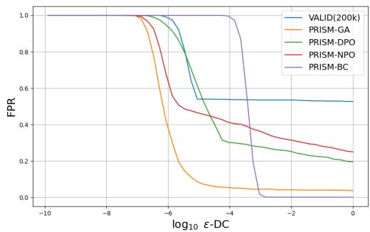

line

| log10 ε-DC | VALID(200k) | PRISM-GA | PRISM-DPO | PRISM-NPO | PRISM-BC |
| ---------- | ----------- | -------- | --------- | --------- | -------- |
| -10        | 1.0         | 1.0      | 1.0       | 1.0       | 1.0      |
| -8         | 1.0         | 1.0      | 1.0       | 1.0       | 1.0      |
| -6         | 0.95        | 0.8      | 0.9       | 0.7       | 1.0      |
| -4         | 0.55        | 0.1      | 0.3       | 0.4       | 1.0      |
| -2         | 0.5         | 0.05     | 0.25      | 0.3       | 0.0      |
| 0          | 0.5         | 0.05     | 0.2       | 0.25      | 0.0      |

Figure 1: The required FPR to reach a given domain certification bound ϵ under different model configurations for LmsysChat dataset.

practical utility.

Two key observations emerge from this analysis. First, only PRISM-GA and PRISM-BC are capable of achieving reasonably low FPRs (below 20%) while maintaining non-trivial certification bounds. In contrast, VALID exhibits FPRs exceeding 50% across the entire meaningful range of ϵ, rendering its guarantees impractical for real-world deployment. Second, the two top-performing PRISM variants excel in complementary regimes: when the allowable FPR is moderate (above 5%), PRISM-GA yields the tightest bounds among all methods; however, under stringent requirements (FPR < 5%), PRISM-BC is the only model that continues to provide non-trivial certification.

# 5.6 Evaluation on Challenging Perturbations

<table><tr><td></td><td>F1</td><td>AUC</td><td>Median CR</td></tr><tr><td>LLaMA</td><td>0.724</td><td>0.841</td><td>2.432</td></tr><tr><td>VALID(20k)</td><td>0.585</td><td>0.737</td><td>0.0517</td></tr><tr><td>VALID(200k)</td><td>0.637</td><td>0.801</td><td>2.10</td></tr><tr><td>PRISM-GA</td><td>0.719</td><td>0.835</td><td>4.34</td></tr><tr><td>PRISM-NPO</td><td>0.703</td><td>0.852</td><td>3.87</td></tr><tr><td>PRISM-DPO</td><td>0.717</td><td>0.860</td><td>5.98</td></tr><tr><td>PRISM-BC</td><td>0.799</td><td>0.924</td><td>6.14</td></tr></table>

Table 3: Results for models evaluated on perturbed medical mis-information dataset.

To assess robustness under challenging conditions, we construct a perturbed test set designed to evaluate models’ ability to reject factually incorrect yet stylistically plausible medical misinformation. Specifically, we invert the correct answers in the PubMedQA dataset and use LLaMA-3-8B-Instruct to generate convincing but false explanations. This setup tests whether models can detect subtle factual errors that mimic authentic medical discourse. We also experiment with two additional challenging setups in Appendix F.

Results in Table 3 reveal several key findings. First, the un-tuned LLaMA baseline outperforms both VALID variants, suggesting that training from scratch on limited data compromises semantic understanding and factual grounding. Among all models, PRISM-BC achieves the strongest performance (F1: 0.799, AUC: 0.924), reaffirming its effectiveness in domain certification. In contrast, PRISM-GA exhibits a slight detection performance drop relative to the LLaMA baseline (AUC: 0.835 vs. 0.841), likely due to its aggressive, reference-free unlearning update that may inadvertently degrade factual reasoning capabilities. However, PRISM-GA still gives rise to a reasonable certification bound, as evidenced by its Median CR score.

# 5.7 Certified Benchmarking on PubMedQA

Following the experimental setup of Emde et al. (2025), we conduct certified benchmarking on the PubMedQA test set. Using various certification methods, we evaluate the model up to a desired certification strength ϵ; a response is deemed correct only if it both passes certification and matches the ground-truth answer. Tighter certification bounds (i.e., smaller ϵ) yield lower accuracy, as more responses are rejected by the guide model G. Results are presented in Table 4. For reference, the unconstrained model achieves 72.5% accuracy. PRISM-BC attains the best performance, maintaining tight certification with only minor performance degradation. In contrast, VALID’s accuracy drops substantially under tighter certification, yielding very low accuracy at small ϵ.

<table><tr><td></td><td> $\epsilon = 10^{-5}$ </td><td> $\epsilon = 10^{-10}$ </td></tr><tr><td>VALID(200k)</td><td>0.318</td><td>0.004</td></tr><tr><td>PRISM-GA</td><td>0.655</td><td>0.451</td></tr><tr><td>PRISM-NPO</td><td>0.323</td><td>0.143</td></tr><tr><td>PRISM-DPO</td><td>0.285</td><td>0.132</td></tr><tr><td>PRISM-BC</td><td>0.724</td><td>0.724</td></tr></table>

Table 4: Accuracy on the certified PubMedQA benchmark with different certification strength ϵ. For reference the unconstrained model scores 72.5%.

# 5.8 Additional Analysis and Robustness.

To further validate the generalizability of our approach, we provide extensive additional experiments in the Appendix. In Appendix H, we demonstrate PRISM’s transferability to non-factual domains (Shakespeare) and code generation tasks. Appendix I presents a sensitivity analysis of the regularization parameter β for alignment algorithms, discussing the trade-off between certification bounds and empirical detection. Finally, in Appendix J, we verify that our results are consistent across different guide model architectures (e.g., Qwen-0.6B).

# 6 Conclusion

In this work, we introduce PRISM, a framework for provable domain certification of large language models that leverages a pretrained guide model

G. We systematically explore four different finetuning strategies for G. Our experiments demonstrate that PRISM-BC and PRISM-GA consistently achieve strong out-of-domain (OOD) detection performance and yield substantially tighter certification bounds across diverse evaluation settings. In contrast, PRISM-DPO and PRISM-NPO underperform, suggesting that the use of a reference policy $\pi _ { \mathrm { r e f } }$ may hinder the guide model’s ability to learn a sharp decision boundary between in-domain and out-of-domain responses. These findings highlight the importance of objective design in training certifiable judges and establish PRISM as a promising approach for reliable, provable domain restriction in LLMs.

# Limitations

Our approach, PRISM, builds upon the VALID framework by improving the guide model G through fine-tuning from a pretrained language model. However, it inherits a key limitation of VALID: certification relies solely on the response y, without access to the input prompt x. Consequently, G evaluates responses in isolation, lacking contextual awareness of the query that generated them. This can lead to incorrect acceptance of outof-domain responses that are individually plausible but inappropriate given the prompt (Emde et al., 2025). For instance, the response “Once a year” is valid for the tax-related prompt “How often is a tax report due?” but would be erroneous—and potentially harmful—if generated in response to “How often should I shower?”. While this issue stems from the context-agnostic design of the certification mechanism rather than the quality of G, it may be partially mitigated by fine-tuning the base model L to produce more explicit, self-contained responses that incorporate key elements of the prompt (e.g., mentioning “shower” in the answer). Nonetheless, a truly context-aware certification framework remains an important direction for future work.

# References

Amanda Askell, Yuntao Bai, Anna Chen, Dawn Drain, Deep Ganguli, Tom Henighan, Andy Jones, Nicholas Joseph, Ben Mann, Nova DasSarma, Nelson Elhage, Zac Hatfield-Dodds, Danny Hernandez, Jackson Kernion, Kamal Ndousse, Catherine Olsson, Dario Amodei, Tom Brown, Jack Clark, and 3 others. 2021. A general language assistant as a laboratory for alignment. arXiv preprint arXiv:2112.00861.

Yuntao Bai, Andy Jones, Kamal Ndousse, Amanda Askell, Anna Chen, Nova DasSarma, Dawn Drain, Stanislav Fort, Deep Ganguli, Tom Henighan, Nicholas Joseph, Saurav Kadavath, Jackson Kernion, Tom Conerly, Sheer El-Showk, Nelson Elhage, Zac Hatfield-Dodds, Danny Hernandez, Tristan Hume, and 12 others. 2022. Training a helpful and harmless assistant with reinforcement learning from human feedback. arXiv preprint arXiv:2204.05862.   
Yinzhi Cao and Junfeng Yang. 2015. Towards making systems forget with machine unlearning. In 2015 IEEE Symposium on Security and Privacy, pages 463–480.   
Nicholas Carlini, Matthew Jagielski, Christopher A. Choquette-Choo, Daniel Paleka, Will Pearce, Hyrum Anderson, Andreas Terzis, Kurt Thomas, and Florian Tramèr. 2024. Poisoning web-scale training datasets is practical. arXiv preprint arXiv:2302.10149.   
Marco Casadio, Tanvi Dinkar, Ekaterina Komendantskaya, Luca Arnaboldi, Matthew L. Daggitt, Omri Isac, Guy Katz, Verena Rieser, and Oliver Lemon. 2024. Nlp verification: Towards a general methodology for certifying robustness. arXiv preprint arXiv:2403.10144.   
Paul F Christiano, Jan Leike, Tom Brown, Miljan Martic, Shane Legg, and Dario Amodei. 2017. Deep reinforcement learning from human preferences. In Advances in Neural Information Processing Systems, volume 30. Curran Associates, Inc.   
Josef Dai, Xuehai Pan, Ruiyang Sun, Jiaming Ji, Xinbo Xu, Mickel Liu, Yizhou Wang, and Yaodong Yang. 2024. Safe rlhf: Safe reinforcement learning from human feedback. In Proceedings of the Twelfth International Conference on Learning Representations.   
Tim Dettmers, Artidoro Pagnoni, Ari Holtzman, and Luke Zettlemoyer. 2023. Qlora: Efficient finetuning of quantized llms. Advances in neural information processing systems, 36:10088–10115.   
Xinshuai Dong, Anh Tuan Luu, Min Lin, Shuicheng Yan, and Hanwang Zhang. 2021. How should pretrained language models be fine-tuned towards adversarial robustness? In Advances in Neural Information Processing Systems, volume 34, pages 4356– 4369. Curran Associates, Inc.   
Cornelius Emde, Alasdair Paren, Preetham Arvind, Maxime Kayser, Tom Rainforth, Thomas Lukasiewicz, Bernard Ghanem, Philip HS Torr, and Adel Bibi. 2025. Shh, don’t say that! domain certification in llms. In Proceedings of the Thirteenth International Conference on Learning Representations.   
Hakan Inan, Kartikeya Upasani, Jianfeng Chi, Rashi Rungta, Krithika Iyer, Yuning Mao, Michael Tontchev, Qing Hu, Brian Fuller, Davide Testuggine, and Madian Khabsa. 2023. Llama guard: Llm-based input-output safeguard for human-ai conversations. arXiv preprint arXiv:2312.06674.

Qiao Jin, Bhuwan Dhingra, Zhengping Liu, William Cohen, and Xinghua Lu. 2019. Pubmedqa: A dataset for biomedical research question answering. In Proceedings of the 2019 Conference on Empirical Methods in Natural Language Processing and the 9th International Joint Conference on Natural Language Processing (EMNLP-IJCNLP), pages 2567–2577.   
Timo Kaufmann, Paul Weng, Viktor Bengs, and Eyke Hüllermeier. 2024. A survey of reinforcement learning from human feedback. arXiv preprint arXiv:2312.14925.   
Aounon Kumar, Chirag Agarwal, Suraj Srinivas, Aaron Jiaxun Li, Soheil Feizi, and Himabindu Lakkaraju. 2024. Certifying llm safety against adversarial prompting. arXiv preprint arXiv:2309.02705.   
Xiaogeng Liu, Nan Xu, Muhao Chen, and Chaowei Xiao. 2024. Autodan: Generating stealthy jailbreak prompts on aligned large language models. In Proceedings of the Twelfth International Conference on Learning Representations.   
Ilya Loshchilov and Frank Hutter. 2017. Decoupled weight decay regularization. arXiv preprint arXiv:1711.05101.   
Meta AI. 2024. The llama 3.1 family of models. https: //ai.meta.com/blog/meta-llama-3-1/. Accessed: 2025-08-28.   
Quoc Phong Nguyen, Ryutaro Oikawa, Dinil Mon Divakaran, Mun Choon Chan, and Bryan Kian Hsiang Low. 2022. Markov chain monte carlo-based machine unlearning: Unlearning what needs to be forgotten. In Proceedings of the 2022 ACM on Asia Conference on Computer and Communications Security, ASIA CCS ’22, page 351–363, New York, NY, USA. Association for Computing Machinery.   
Thanh Tam Nguyen, Thanh Trung Huynh, Zhao Ren, Phi Le Nguyen, Alan Wee-Chung Liew, Hongzhi Yin, and Quoc Viet Hung Nguyen. 2024. A survey of machine unlearning. Preprint, arXiv:2209.02299.   
OpenAI. 2023. Chatgpt. https://chat.openai.com. Accessed: 2025-08-05.   
Long Ouyang, Jeffrey Wu, Xu Jiang, Diogo Almeida, Carroll Wainwright, Pamela Mishkin, Chong Zhang, Sandhini Agarwal, Katarina Slama, Alex Ray, John Schulman, Jacob Hilton, Fraser Kelton, Luke Miller, Maddie Simens, Amanda Askell, Peter Welinder, Paul F Christiano, Jan Leike, and Ryan Lowe. 2022. Training language models to follow instructions with human feedback. In Advances in Neural Information Processing Systems, volume 35, pages 27730–27744. Curran Associates, Inc.   
Fábio Perez and Ian Ribeiro. 2022. Ignore previous prompt: Attack techniques for language models. arXiv preprint arXiv:2211.09527.

Rafael Rafailov, Archit Sharma, Eric Mitchell, Christopher D Manning, Stefano Ermon, and Chelsea Finn. 2023. Direct preference optimization: Your language model is secretly a reward model. Advances in neural information processing systems, 36:53728–53741.   
Pranav Rajpurkar, Jian Zhang, Konstantin Lopyrev, and Percy Liang. 2016. SQuAD: 100,000+ questions for machine comprehension of text. In Proceedings of the 2016 Conference on Empirical Methods in Natural Language Processing, pages 2383–2392, Austin, Texas. Association for Computational Linguistics.   
RyokoAI. 2023. ShareGPT52K dataset. https://huggingface.co/datasets/RyokoAI/ ShareGPT52K.   
Eric Wallace, Shi Feng, Nikhil Kandpal, Matt Gardner, and Sameer Singh. 2019. Universal adversarial triggers for attacking and analyzing nlp. In Proceedings of the 2019 Conference on Empirical Methods in Natural Language Processing and the 9th International Joint Conference on Natural Language Processing (EMNLP-IJCNLP), pages 2153–2162, Hong Kong, China. Association for Computational Linguistics. ArXiv:1908.07125.   
Heng Xu, Tianqing Zhu, Lefeng Zhang, Wanlei Zhou, and Philip S. Yu. 2023. Machine unlearning: A survey. ACM Computing Surveys, 56(1).   
Zhangchen Xu, Fengqing Jiang, Luyao Niu, Yuntian Deng, Radha Poovendran, Yejin Choi, and Bill Yuchen Lin. 2024a. Magpie: Alignment data synthesis from scratch by prompting aligned llms with nothing. Preprint, arXiv:2406.08464.   
Zhangchen Xu, Fengqing Jiang, Luyao Niu, Yuntian Deng, Radha Poovendran, Yejin Choi, and Bill Yuchen Lin. 2024b. Magpie-Llama-3.1-Pro-300K-Filtered dataset. https://huggingface.co/ datasets/Magpie-Align/Magpie-Llama-3. 1-Pro-300K-Filtered.   
W. J. Youden. 1950. Index for rating diagnostic tests. Cancer, 3(1):32–35.   
Ruiqi Zhang, Licong Lin, Yu Bai, and Song Mei. 2024. Negative preference optimization: From catastrophic collapse to effective unlearning. Preprint, arXiv:2404.05868.   
Wenting Zhao, Xiang Ren, Jack Hessel, Claire Cardie, Yejin Choi, and Yuntian Deng. 2024. Wildchat: 1m chatGPT interaction logs in the wild. In The Twelfth International Conference on Learning Representations.   
Lianmin Zheng, Wei-Lin Chiang, Ying Sheng, Tianle Li, Siyuan Zhuang, Zhanghao Wu, Yonghao Zhuang, Zhuohan Li, Zi Lin, Eric. P Xing, Joseph E. Gonzalez, Ion Stoica, and Hao Zhang. 2023. Lmsys-chat-1m: A large-scale real-world llm conversation dataset. Preprint, arXiv:2309.11998.

Andy Zou, Zifan Wang, J. Zico Kolter, and Matt Fredrikson. 2023. Universal and transferable adversarial attacks on aligned language models. arXiv preprint arXiv:2307.15043.

# A VALID Algorithm

The pseudocode for the VALID algorithm at inference time is shown in Algorithm 1.

Algorithm 1 VALID   
Require: LLM L, Guide model G, hyperparameters k and T, prompt x
1: for $t \in \{1, \ldots, T\}$ do
2: Sample $y \sim L(\cdot \mid x)$ 3: $N_y \leftarrow \text{length}(y)$ 4: if $\frac{\log L(y \mid x)}{G(y)} \leq kN_y$ then
5: return y
6: end if
7: end for
8: return “Abstained”

# B Preprocessing for Training Data

The in-domain samples (medical QA pairs) are sourced from PubMedQA (Jin et al., 2019), consistent with (Emde et al., 2025). The dataset contains 200k QA pairs. We use random subset of 20k QA pairs for training.

Therefore, we construct a more comprehensive OOD dataset by selecting subsets from three different datasets, ensuring that our model are exposed to a wider range of topics and question formats. Examples from these datasets are provided in Table 4.1.

• SQuAD (Rajpurkar et al., 2016): The dataset consists of context passages, questions, and short answers covering a wide range of topics. The questions were posed by crowdworkers based on Wikipedia articles. However, the answers to each question is a span of text taken directly from the associated context passages. Following the approach in the VALID paper, we remove topics related to the medical domain to ensure they can serve as the true OOD samples. Additionally, as also suggested by the VALID paper, we filter out responses shorter than 10 tokens to retain only sufficiently informative answers. After these preprocessing steps, the dataset is reduced from 98.2k (training and validation set) samples to 5.8k.

• ShareGPT (RyokoAI, 2023) : The dataset include both real user prompts and response from OpenAI’s ChatGPT (OpenAI, 2023). Since the data is presented in conversational format, we only use the first prompt response pair from each conversation. Unlike SQuAD, which simply require to selecting an answer span from a given context which making the task more deterministic, this dataset requires generating answers from scratch based on open ended prompts, introducing more variability and complexity. Additionally, we remove incomplete conversations during the preprocessing. From the cleaned data, we select a subset of 6.8k entries for training in our experiments.

• Megpie-Llama-3.1(Xu et al., 2024b): This dataset is generated using Magpie framework (Xu et al., 2024a), produced by LLaMA 3.1 70B Instruct (Meta AI, 2024), making the dataset fully synthetic. Each entry includes an instruction and a corresponding response. We could observe that some samples clearly fall within the medical domain, to address this, we applied the model from the VALID paper to filter out medical related entries. However, some may still remain due to limitations in the filtering process.

The final combined OOD training data contains 20k samples. The same preprocessing approach is used to curate the validation and test sets.

# C Details of the Training Settings

We will publicly release all the experiment code in Camera Ready.

Training Configuration. We employ Quantized Low-Rank Adaptation (QLoRA) (Dettmers et al., 2023) to fine-tune G, significantly reducing memory footprint and computational cost. Under this setup, only approximately 5.6 million parameters are trained. Optimization is performed using the AdamW algorithm (Loshchilov and Hutter, 2017) with linear learning rate decay. Batch sizes are selected to maximize GPU utilization without compromising stability. All other hyperparameters follow standard practices for LLM finetuning and are fully specified in Appendix C.

Hardware. The experiments were conducted on Nvidia A100 GPU with 40GB vRAM. All models are trained within 24 hours.

Hyper-parameters. Table 5 shows the relevant hyper-parameters used in our experiments.

<table><tr><td>Hyerparameter</td><td>BC</td><td>GA</td><td>NPO</td><td>DPO</td></tr><tr><td>Learning Rate</td><td>1e-5</td><td>1e-5</td><td>1e-5</td><td>1e-5</td></tr><tr><td>Batch Size</td><td>8</td><td>8</td><td>8</td><td>8</td></tr><tr><td>Gradient Acc.</td><td>4</td><td>4</td><td>4</td><td>4</td></tr><tr><td>Epoch</td><td>2</td><td>1</td><td>5</td><td>5</td></tr><tr><td>Weight Decay</td><td>0.01</td><td>0.01</td><td>0.01</td><td>0.01</td></tr><tr><td>Warmup</td><td>500 (steps)</td><td>0.1 (ratio)</td><td>0.1</td><td>0.1</td></tr><tr><td>LR Scheduler</td><td>linear</td><td>linear</td><td>linear</td><td>linear</td></tr><tr><td>Beta</td><td>/</td><td>/</td><td>0.1</td><td>0.1</td></tr></table>

Table 5: Hyperparameter settings for models

# D Inconsistent Data Scaling of VALID

We observe in Table 6 and 7 that the VALID’s performance does not scale monotonically with the increase of training data sizes from 5k to 200k. We hypothesize that this is because VALID requires training a language model from scratch, which demands substantially more data to realize consistent improvements.

# E Visualization of Log-Likelihoods

Figure 2 visualizes the Log likelihood of in-domain and out-of-domain samples for six models evaluated on ground truth test samples. PRISM models are able to achieve better separation between the two categories of responses.

# F Experiment on Additional OOD Data

# F.1 Math questions

When analyze the false positive samples (i.e., OOD samples classified as ID), We find that the VALID(200k) model frequently misclassifies certain math related OOD samples as ID. To investigate this further, we constructed a new OOD test set of 900 samples consisting entirely of math related questions. The results are shown in Table 8.

The PRISM models successfully classify the math questions as OOD. The lowest F1 score among them is 0.996 from DPO, which is 0.059 higher than the VALID(200k) model. Furthermore, the PRISM-BC model again achieves perfect detection, with 0.0 FPR, 1.0 TPR, and an F1 score of 1. From Figure 3 (b), we see that, except for DPO, all other proposed models achieve near zero FPR (0.0 for binary classification, 0.01 for NPO, and 0.02 for GA) at a bound of 10−20. In fact, the binary classification model could likely to provide a bound much tighter than 10−20 while maintaining an FPR of 0, given its perfect classification performance.

# F.2 Math Questions with Medical Framing

This experiment extends the evaluation on math OOD data by embedding math problems within medical narratives. The goal is to assess whether contextual framing—specifically, presenting arithmetic or quantitative questions as part of a medical scenario—can compromise the model’s ability to recognize and reject out-of-domain content. To construct the test set, we prompted LLaMA-3- 8B-Instruct to generate 100 math questions disguised as medical stories (e.g., dosage calculations framed as clinical vignettes). This setup tests whether stylistic alignment with the medical domain enables otherwise out-of-domain mathematical queries to bypass domain certification.

From Table 9, we can clearly see that the VALID(200k) model and its variants are easily tricked by this dataset, with the VALID(200k) model achieving F1 score of 0.482, the highest among the variants. The VALID(20k) has the lowest F1 score with 0.374. This means they could easily waste resources on solving large amount of math problems.

The PRISM models perform very well on this task, with the binary classification model again achieving perfect detection, followed by GA with a F1 score of 0.971. Figure 4(b) further shows that the VALID(200k) model is not able to give out a valid bound when the FPR is below 0.3, whereas GA and binary classification both achieve a $1 0 ^ { - 2 0 }$ domain bound with near zero FPR.

# G Experiment Results for $T > 1$

he experimental results for settings with $T > 1$ are shown in Figures 5, 6, 7, 8, and 9. The relative performance of the methods remains consistent with the main findings for $T = 1$ . As expected, for a fixed threshold $k ,$ the false positive rate decreases as T increases—this occurs because requests rejected in an earlier iteration may be accepted in subsequent iterations. Empirically, the choice of T has little effect on the tightness of the certification bound ϵ. In practical applications, T should be set as large as possible, subject to latency constraints.

# H Domain Generalization Analysis

To investigate the transferability of our method to domains characterized by subjective content or fuzzy boundaries, we extended our evaluation beyond the factual nature of Medical QA. Specifically, we conducted experiments on the Shakespeare dataset, adhering to the experimental protocols established in VALID (Emde et al., 2025). This dataset represents a significant shift in distribution, moving from objective medical facts to a creative and stylistic domain.

<table><tr><td></td><td>K</td><td>FPR</td><td>TPR</td><td>F1</td><td>Median CR</td><td>AUC</td></tr><tr><td>VALID(5k)</td><td>8.4</td><td>0.024</td><td>0.958</td><td>0.966</td><td>162.02</td><td>0.995</td></tr><tr><td>VALID(10k)</td><td>7.6</td><td>0.028</td><td>0.968</td><td>0.969</td><td>195.56</td><td>0.996</td></tr><tr><td>VALID(15k)</td><td>7.3</td><td>0.024</td><td>0.966</td><td>0.971</td><td>177.44</td><td>0.996</td></tr><tr><td>VALID(20k)</td><td>6.9</td><td>0.041</td><td>0.964</td><td>0.962</td><td>182.89</td><td>0.995</td></tr><tr><td>VALID(200k)</td><td>4.8</td><td>0.027</td><td>0.924</td><td>0.947</td><td>155.46</td><td>0.990</td></tr></table>

Table 6: Results for VALID models evaluated on ground truth responses.

<table><tr><td></td><td>K</td><td>FPR</td><td>TPR</td><td>F1</td><td>Median CR</td><td>AUC</td></tr><tr><td>VALID(5k)</td><td>7.8</td><td>0.077</td><td>0.882</td><td>0.899</td><td>231.87</td><td>0.948</td></tr><tr><td>VALID(10k)</td><td>7.1</td><td>0.074</td><td>0.897</td><td>0.909</td><td>251.18</td><td>0.959</td></tr><tr><td>VALID(15k)</td><td>6.6</td><td>0.070</td><td>0.907</td><td>0.916</td><td>263.54</td><td>0.966</td></tr><tr><td>VALID(20k)</td><td>6.2</td><td>0.087</td><td>0.914</td><td>0.912</td><td>270.06</td><td>0.964</td></tr><tr><td>VALID(200k)</td><td>3.7</td><td>0.094</td><td>0.905</td><td>0.904</td><td>264.02</td><td>0.959</td></tr></table>

Table 7: Results for VALID models evaluated on generated responses from LLaMA 3-8B Instruct.

The results, summarized in Table 10, confirm that our main conclusions hold in this new setting. Both PRISM-BC and PRISM-GA demonstrate superior performance compared to baselines. Notably, PRISM-BC achieves perfect performance with an F1 score of 1.0. Furthermore, PRISM-GA yields a significantly higher Median Constriction Ratio (CR) compared to the VALID baseline (14061.69 vs. 206.33), confirming that PRISM’s robustness transfers effectively to non-factual domains.

# I Sensitivity Analysis of Alignment Algorithms

To better understand the behavior of PRISM-DPO and PRISM-NPO, we performed a sensitivity analysis on the regularization parameter $\beta .$ The results, presented in Table 11, reveal a fundamental tradeoff between detection performance (FPR/TPR) and certified robustness (Median CR).

# Trade-off between Detection and Robustness.

As shown in Table 11, the choice of $\beta$ significantly impacts the certification bounds:

• Low Regularization (β  0): Decreasing $\beta$ (e.g., to 0.001) relaxes the constraint imposed by the reference policy. This allows the model to achieve a significantly tighter certification bound, evidenced by a substantial increase in

Median CR (892.22). However, this comes at the cost of detection stability, resulting in a slightly higher False Positive Rate (FPR).

• High Regularization (Larger β): At β = 0.1 (the setting used in our main experiments), we observe the optimal balance for detection, achieving the highest F1 score of 0.979. However, the Median CR is comparatively lower (47.60).

Interpretation. This analysis clarifies the performance characteristics of DPO/NPO in a certification context. While Direct Preference Optimization excels at general alignment, the reference policy acts as a constraint during certification. Lowering $\beta$ loosens this constraint, improving the theoretical bound (CR) but destabilizing the empirical detection boundary. This suggests that standard alignment success metrics do not strictly correlate with certification success, necessitating careful hyperparameter tuning based on the desired trade-off between strict robustness bounds and empirical detection accuracy.

# J Robustness to Guide Model Architecture

To demonstrate that PRISM is not reliant on a specific model family or parameter size, we evaluated the robustness of our approach using an alternative guide model. We replaced the LLaMA-3.2-1B guide used in our main experiments with Qwen3- 0.6B. This allows us to assess performance on a distinct non-LLaMA architecture with significantly fewer parameters.

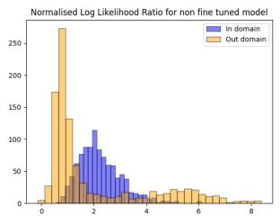  
(a) Naive LLaMA

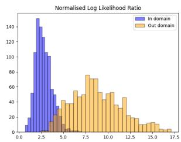

bar

| Log Likelihood Ratio Range | In domain | Out domain |
| -------------------------- | --------- | ---------- |
| 0.0 - 0.5                  | 10        | 0          |
| 0.5 - 1.0                  | 50        | 0          |
| 1.0 - 1.5                  | 140       | 0          |
| 1.5 - 2.0                  | 130       | 0          |
| 2.0 - 2.5                  | 100       | 0          |
| 2.5 - 3.0                  | 60        | 0          |
| 3.0 - 3.5                  | 40        | 0          |
| 3.5 - 4.0                  | 20        | 0          |
| 4.0 - 4.5                  | 10        | 0          |
| 4.5 - 5.0                  | 5         | 0          |
| 5.0 - 5.5                  | 0         | 0          |
| 5.5 - 6.0                  | 0         | 0          |
| 6.0 - 6.5                  | 0         | 0          |
| 6.5 - 7.0                  | 0         | 0          |
| 7.0 - 7.5                  | 0         | 0          |
| 7.5 - 8.0                  | 0         | 70         |
| 8.0 - 8.5                  | 0         | 60         |
| 8.5 - 9.0                  | 0         | 50         |
| 9.0 - 9.5                  | 0         | 40         |
| 9.5 -10.0                 | 0         | 30         |
|10.0 -10.5                 | 0         | 20         |
|10.5 -11.0                 | 0         | 15         |
|11.0 -11.5                 | 0         | 10         |
|11.5 -12.0                 | 0         | 5          |
|12.0 -12.5                 | 0         | 2          |
|12.5 -13.0                 | 0         | 1          |
|13.0 -13.5                 | 0         | 0          |
|13.5 -14.0                 | 0         | 0          |
|14.0 -14.5                 | 0         | 0          |
|14.5 -15.0                 | 0         | 0          |
|15.0 -15.5                 | 0         | 0          |
|15.5 -16.0                 | 0         | 0          |
|16.0 -16.5                 | 0         | 0          |
|16.5 -17.0                 | 0         | 0          |
|17.0 -17.5                 | 0         | 0          |

(b) VALID(200k)

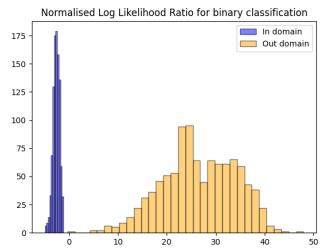

bar

| Bin Range | In domain | Out domain |
|---|---|---|
| -5 to 0 | 175 | 0 |
| 0 to 5 | 130 | 0 |
| 5 to 10 | 65 | 0 |
| 10 to 15 | 25 | 10 |
| 15 to 20 | 10 | 25 |
| 20 to 25 | 5 | 45 |
| 25 to 30 | 0 | 95 |
| 30 to 35 | 0 | 65 |
| 35 to 40 | 0 | 60 |
| 40 to 45 | 0 | 35 |
| 45 to 50 | 0 | 10 |

(c) binary classification

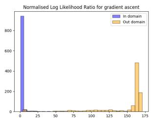

bar

| Gradient ascent | In domain | Out domain |
| ---------------- | --------- | ---------- |
| 0                | 900       | 0          |
| 25               | 0         | 0          |
| 50               | 0         | 0          |
| 75               | 0         | 0          |
| 100              | 0         | 0          |
| 125              | 0         | 0          |
| 150              | 0         | 480        |
| 175              | 0         | 180        |

(d) Gradient ascent

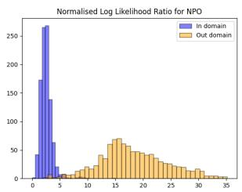

bar

| Log Likelihood Ratio Range | In domain | Out domain |
| --------------------------- | --------- | ---------- |
| 0 - 1                       | 40        | 0          |
| 1 - 2                       | 170       | 0          |
| 2 - 3                       | 260       | 0          |
| 3 - 4                       | 140       | 0          |
| 4 - 5                       | 20        | 0          |
| 5 - 6                       | 10        | 0          |
| 6 - 7                       | 5         | 0          |
| 7 - 8                       | 5         | 0          |
| 8 - 9                       | 5         | 0          |
| 9 - 10                      | 5         | 0          |
| 10 - 11                     | 5         | 0          |
| 11 - 12                     | 5         | 0          |
| 12 - 13                     | 5         | 0          |
| 13 - 14                     | 5         | 0          |
| 14 - 15                     | 5         | 0          |
| 15 - 16                     | 5         | 70         |
| 16 - 17                     | 5         | 60         |
| 17 - 18                     | 5         | 50         |
| 18 - 19                     | 5         | 40         |
| 19 - 20                     | 5         | 30         |
| 20 - 21                     | 5         | 20         |
| 21 - 22                     | 5         | 15         |
| 22 - 23                     | 5         | 10         |
| 23 - 24                     | 5         | 5          |
| 24 - 25                     | 5         | 5          |
| 25 - 26                     | 5         | 5          |
| 26 - 27                     | 5         | 5          |
| 27 - 28                     | 5         | 5          |
| 28 - 29                     | 5         | 5          |
| 29 - 30                     | 5         | 5          |
| 30 - 31                     | 5         | 5          |
| Note: The actual values may vary due to the random nature of the data generation. The provided values are just an example. |           |            |

(e) NPO

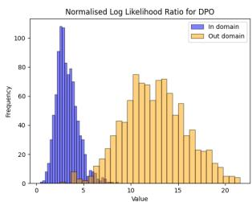

bar

| Value Range | In domain Frequency | Out domain Frequency |
| :--- | :--- | :--- |
| 0-1 | 5 | 0 |
| 1-2 | 30 | 0 |
| 2-3 | 60 | 0 |
| 3-4 | 90 | 0 |
| 4-5 | 70 | 0 |
| 5-6 | 40 | 0 |
| 6-7 | 20 | 10 |
| 7-8 | 10 | 20 |
| 8-9 | 5 | 30 |
| 9-10 | 0 | 40 |
| 10-11 | 0 | 55 |
| 11-12 | 0 | 70 |
| 12-13 | 0 | 65 |
| 13-14 | 0 | 70 |
| 14-15 | 0 | 60 |
| 15-16 | 0 | 45 |
| 16-17 | 0 | 35 |
| 17-18 | 0 | 25 |
| 18-19 | 0 | 20 |
| 19-20 | 0 | 10 |
| 20-21 | 0 | 5 |
The chart is a bar chart comparing the frequency of values in each domain. The x-axis represents the value ranges (Value), and the y-axis represents the frequency. The legend distinguishes between 'In domain' and 'Out domain'. The data is presented in a single column format. The chart is titled 'Normalised Log Likelihood Ratio for DPO'.

(f) DPO

Figure 2: Log likelihood Ratio for six models evaluated on ground truth test samples. 

<table><tr><td></td><td>K</td><td>FPR</td><td>TPR</td><td>F1</td><td>median CR</td><td>AUC</td></tr><tr><td>LLaMA</td><td>0.0</td><td>1.0</td><td>1.0</td><td>0.643</td><td>46.59</td><td>0.063</td></tr><tr><td>VALID(5k)</td><td>8.0</td><td>0.048</td><td>0.956</td><td>0.951</td><td>69.26</td><td>0.987</td></tr><tr><td>VALID(10k)</td><td>7.6</td><td>0.028</td><td>0.955</td><td>0.962</td><td>70.90</td><td>0.993</td></tr><tr><td>VALID(15k)</td><td>7.0</td><td>0.053</td><td>0.969</td><td>0.956</td><td>77.47</td><td>0.992</td></tr><tr><td>VALID(20k)</td><td>6.7</td><td>0.056</td><td>0.957</td><td>0.948</td><td>70.50</td><td>0.988</td></tr><tr><td>VALID(200k)</td><td>4.3</td><td>0.064</td><td>0.943</td><td>0.937</td><td>70.23</td><td>0.982</td></tr><tr><td>NPO</td><td>9.9</td><td>0.001</td><td>1.0</td><td>0.999</td><td>160.53</td><td>0.999</td></tr><tr><td>DPO</td><td>7.4</td><td>0.004</td><td>0.997</td><td>0.996</td><td>55.41</td><td>1.0</td></tr><tr><td>Binary classification</td><td>-1.1</td><td>0.001</td><td>1.0</td><td>0.999</td><td>1326.73</td><td>1.0</td></tr><tr><td>GA</td><td>149.2</td><td>0.0</td><td>0.999</td><td>0.999</td><td>710.10</td><td>1.0</td></tr></table>

Table 8: Results for models evaluated on math OOD dataset. The optimal threshold k is chosen based on the Youden’s J statistic.

We repeated the experiments for PRISM-BC and PRISM-GA using this smaller guide model. The results, summarized in Table 12, show that the Qwenbased guide achieves similarly strong performance to the LLaMA-based guide:

• PRISM-BC maintains near-perfect detection with an F1 score $> ~ 0 . 9 9 9$ and a negligible False Positive Rate $( 1 . 1 0 \times 1 0 ^ { - 5 } )$ .   
• PRISM-GA maintains a very high Median Constriction Ratio (CR) of 25, 830.55.

These findings confirm that PRISM is robust to the choice of guide model and functions effectively even with smaller, highly efficient architectures ( 0.6B parameters).

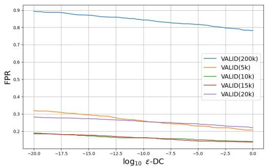

line

| log10 ε-DC | VALID(200k) | VALID(5k) | VALID(10k) | VALID(15k) | VALID(20k) |
| ---------- | ----------- | --------- | ---------- | ---------- | ---------- |
| -20.0      | 0.9         | 0.3       | 0.2        | 0.2        | 0.3        |
| -17.5      | 0.88        | 0.28      | 0.19       | 0.19       | 0.28       |
| -15.0      | 0.86        | 0.26      | 0.18       | 0.18       | 0.26       |
| -12.5      | 0.84        | 0.24      | 0.17       | 0.17       | 0.24       |
| -10.0      | 0.82        | 0.22      | 0.16       | 0.16       | 0.22       |
| -7.5       | 0.8         | 0.2       | 0.15       | 0.15       | 0.2        |
| -5.0       | 0.78        | 0.18      | 0.14       | 0.14       | 0.18       |
| -2.5       | 0.76        | 0.16      | 0.13       | 0.13       | 0.16       |
| 0.0        | 0.74        | 0.14      | 0.12       | 0.12       | 0.14       |

(a)

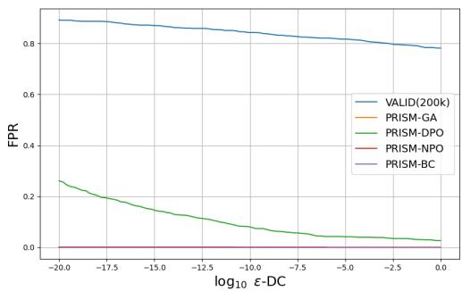

line

| log10 ε-DC | VALID(200k) | PRISM-GA | PRISM-DPO | PRISM-NPO | PRISM-BC |
| ---------- | ----------- | -------- | --------- | --------- | -------- |
| -20.0      | 0.85        | 0.85     | 0.25      | 0.0       | 0.0      |
| -17.5      | 0.84        | 0.84     | 0.20      | 0.0       | 0.0      |
| -15.0      | 0.83        | 0.83     | 0.15      | 0.0       | 0.0      |
| -12.5      | 0.82        | 0.82     | 0.12      | 0.0       | 0.0      |
| -10.0      | 0.81        | 0.81     | 0.10      | 0.0       | 0.0      |
| -7.5       | 0.80        | 0.80     | 0.08      | 0.0       | 0.0      |
| -5.0       | 0.79        | 0.79     | 0.06      | 0.0       | 0.0      |
| -2.5       | 0.78        | 0.78     | 0.04      | 0.0       | 0.0      |
| 0.0        | 0.77        | 0.77     | 0.02      | 0.0       | 0.0      |

(b)

Figure 3: The required FPR to reach a given domain certification bound ϵ under different model configurations for math dataset. (a) the results for the VALID(200k) model alongside variants trained using the same algorithm but on reduced training sets. (b) a comparison between the VALID(200k) model and our four proposed models 

<table><tr><td></td><td>K</td><td>FPR</td><td>TPR</td><td>F1</td><td>median CR</td><td>AUC</td></tr><tr><td>Naive LLaMA</td><td>0.0</td><td>1.0</td><td>1.0</td><td>0.17</td><td>43.46</td><td>0.060</td></tr><tr><td>VALID(5k)</td><td>6.8</td><td>0.316</td><td>0.98</td><td>0.381</td><td>54.18</td><td>0.914</td></tr><tr><td>VALID(10k)</td><td>6.4</td><td>0.228</td><td>0.94</td><td>0.445</td><td>44.17</td><td>0.922</td></tr><tr><td>VALID(15k)</td><td>5.9</td><td>0.236</td><td>0.92</td><td>0.430</td><td>43.63</td><td>0.909</td></tr><tr><td>VALID(20k)</td><td>5.5</td><td>0.283</td><td>0.88</td><td>0.374</td><td>42.36</td><td>0.876</td></tr><tr><td>VALID(200k)</td><td>3.6</td><td>0.171</td><td>0.86</td><td>0.482</td><td>33.60</td><td>0.914</td></tr><tr><td>NPO</td><td>4.8</td><td>0.025</td><td>0.99</td><td>0.884</td><td>152.8</td><td>0.997</td></tr><tr><td>DPO</td><td>5.4</td><td>0.043</td><td>0.99</td><td>0.818</td><td>42.00</td><td>0.996</td></tr><tr><td>Binary classification</td><td>12.8</td><td>0.0</td><td>1.0</td><td>1.0</td><td>444.20</td><td>1.0</td></tr><tr><td>GA</td><td>98.5</td><td>0.06</td><td>1.0</td><td>0.971</td><td>2791.57</td><td>1.0</td></tr></table>

Table 9: Results for models evaluated on Math Medical OOD dataset. The optimal threshold k is chosen based on the Youden’s J statistic.

Table 10: Performance Comparison on the Shakespeare Dataset. Best results are highlighted in bold. 

<table><tr><td>Method</td><td>FPR ↓</td><td>TPR ↑</td><td>F1 ↑</td><td>Median CR ↑</td></tr><tr><td>VALID (Emde et al., 2025)</td><td>0.014</td><td>0.952</td><td>0.968</td><td>206.33</td></tr><tr><td>PRISM-NPO</td><td>0.007</td><td>0.966</td><td>0.979</td><td>42.59</td></tr><tr><td>PRISM-DPO</td><td>0.021</td><td>0.945</td><td>0.961</td><td>37.76</td></tr><tr><td>PRISM-BC</td><td>0.000</td><td>1.000</td><td>1.000</td><td>2078.88</td></tr><tr><td>PRISM-GA</td><td>0.000</td><td>0.993</td><td>0.997</td><td>14061.69</td></tr></table>

Table 11: Impact of the regularization parameter $\beta$ on PRISM-DPO (Medical Scenario). The setting used in the main experiments is $\beta = 0 . 1$ . 

<table><tr><td>β</td><td>FPR ↓</td><td>TPR ↑</td><td>F1 ↑</td><td>Median CR ↑</td></tr><tr><td>0.001</td><td>0.037</td><td>0.992</td><td>0.978</td><td>892.22</td></tr><tr><td>0.01</td><td>0.056</td><td>0.996</td><td>0.971</td><td>805.86</td></tr><tr><td>0.1</td><td>0.016</td><td>0.975</td><td>0.979</td><td>47.60</td></tr><tr><td>0.5</td><td>0.158</td><td>0.785</td><td>0.808</td><td>8.85</td></tr></table>

Table 12: Performance with Qwen3-0.6B Guide Model. 

<table><tr><td>Method</td><td>K</td><td>FPR ↓</td><td>TPR ↑</td><td>F1 ↑</td><td>Median CR ↑</td></tr><tr><td>PRISM-BC</td><td>-1.10</td><td>0.001</td><td>1.000</td><td>0.999</td><td>54,579.89</td></tr><tr><td>PRISM-GA</td><td>5.6</td><td>0.104</td><td>0.984</td><td>0.943</td><td>25,830.55</td></tr></table>

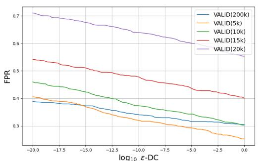

line

| log10 ε-DC | VALID(200k) | VALID(5k) | VALID(10k) | VALID(15k) | VALID(20k) |
| ---------- | ----------- | --------- | ---------- | ---------- | ---------- |
| -20.0      | 0.39        | 0.41      | 0.46       | 0.54       | 0.71       |
| -17.5      | 0.38        | 0.40      | 0.45       | 0.53       | 0.70       |
| -15.0      | 0.37        | 0.39      | 0.44       | 0.52       | 0.69       |
| -12.5      | 0.36        | 0.38      | 0.43       | 0.51       | 0.68       |
| -10.0      | 0.35        | 0.37      | 0.42       | 0.50       | 0.67       |
| -7.5       | 0.34        | 0.36      | 0.41       | 0.49       | 0.66       |
| -5.0       | 0.33        | 0.35      | 0.40       | 0.48       | 0.65       |
| -2.5       | 0.32        | 0.34      | 0.39       | 0.47       | 0.64       |
| 0.0        | 0.31        | 0.33      | 0.38       | 0.46       | 0.63       |

(a)

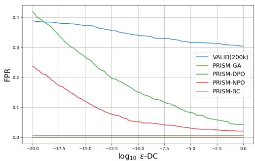

line

| log10 ε-DC | VALID(200k) | PRISM-GA | PRISM-DPO | PRISM-NPO | PRISM-BC |
| ---------- | ----------- | -------- | --------- | --------- | -------- |
| -20.0      | 0.39        | 0.01     | 0.42      | 0.24      | 0.01     |
| -17.5      | 0.38        | 0.01     | 0.35      | 0.18      | 0.01     |
| -15.0      | 0.37        | 0.01     | 0.28      | 0.12      | 0.01     |
| -12.5      | 0.36        | 0.01     | 0.22      | 0.08      | 0.01     |
| -10.0      | 0.35        | 0.01     | 0.18      | 0.06      | 0.01     |
| -7.5       | 0.34        | 0.01     | 0.15      | 0.05      | 0.01     |
| -5.0       | 0.33        | 0.01     | 0.12      | 0.04      | 0.01     |
| -2.5       | 0.32        | 0.01     | 0.08      | 0.03      | 0.01     |
| 0.0        | 0.31        | 0.01     | 0.05      | 0.02      | 0.01     |

(b)   
Figure 4: The required FPR to reach a given domain certification bound ϵ under different model configurations for math in medical story dataset. Figure 4.3(a) shows the results for the VALID(200k) model alongside variants trained using the same algorithm but on reduced training sets. Figure 4.3(b) presents a comparison between the VALID(200k) model and our four proposed models

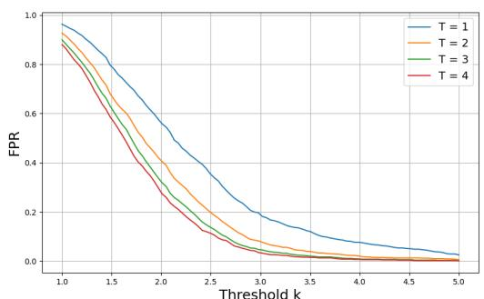

line

| Threshold k | T = 1  | T = 2  | T = 3  | T = 4  |
| ----------- | ------ | ------ | ------ | ------ |
| 1.0         | 0.98   | 0.95   | 0.92   | 0.90   |
| 1.5         | 0.85   | 0.80   | 0.75   | 0.70   |
| 2.0         | 0.65   | 0.60   | 0.55   | 0.50   |
| 2.5         | 0.45   | 0.40   | 0.35   | 0.30   |
| 3.0         | 0.30   | 0.25   | 0.20   | 0.15   |
| 3.5         | 0.20   | 0.15   | 0.10   | 0.08   |
| 4.0         | 0.15   | 0.10   | 0.08   | 0.05   |
| 4.5         | 0.10   | 0.08   | 0.05   | 0.03   |
| 5.0         | 0.05   | 0.03   | 0.02   | 0.01   |

(a)

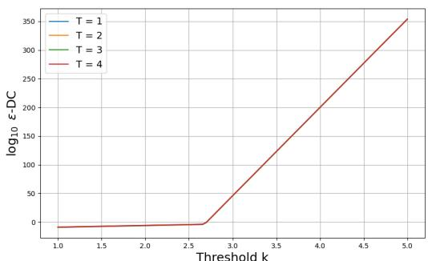

line

| Threshold k | T = 1 | T = 2 | T = 3 | T = 4 |
| ----------- | ----- | ----- | ----- | ----- |
| 1.0         | ~0    | ~0    | ~0    | ~0    |
| 1.5         | ~0    | ~0    | ~0    | ~0    |
| 2.0         | ~0    | ~0    | ~0    | ~0    |
| 2.5         | ~0    | ~0    | ~0    | ~0    |
| 3.0         | ~0    | ~0    | ~0    | ~0    |
| 3.5         | ~0    | ~0    | ~0    | ~0    |
| 4.0         | ~0    | ~0    | ~0    | ~0    |
| 4.5         | ~0    | ~0    | ~0    | ~0    |
| 5.0         | ~0    | ~0    | ~0    | ~350  |

(b)   
Figure 5: VALID(200k)’s performance on various T levels. The FPR and ϵ bounds are plotted against the cutoff level k.

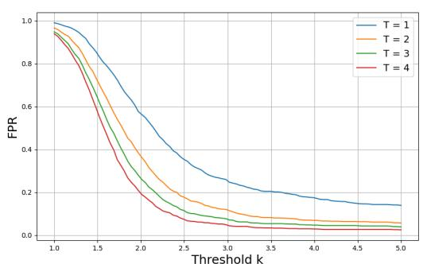

line

| Threshold k | T = 1  | T = 2  | T = 3  | T = 4  |
| ----------- | ------ | ------ | ------ | ------ |
| 1.0         | 1.0    | 1.0    | 1.0    | 1.0    |
| 1.5         | 0.8    | 0.75   | 0.7    | 0.65   |
| 2.0         | 0.6    | 0.5    | 0.4    | 0.3    |
| 2.5         | 0.4    | 0.3    | 0.25   | 0.2    |
| 3.0         | 0.3    | 0.2    | 0.15   | 0.1    |
| 3.5         | 0.25   | 0.15   | 0.1    | 0.05   |
| 4.0         | 0.2    | 0.1    | 0.05   | 0.05   |
| 4.5         | 0.15   | 0.05   | 0.05   | 0.05   |
| 5.0         | 0.1    | 0.05   | 0.05   | 0.05   |

(a)

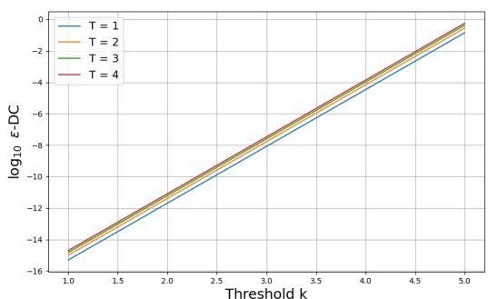

line

| Threshold k | T = 1   | T = 2   | T = 3   | T = 4   |
|-------------|---------|---------|---------|---------|
| 1.0         | -15.0   | -14.8   | -14.6   | -14.4   |
| 1.5         | -12.0   | -11.8   | -11.6   | -11.4   |
| 2.0         | -8.0    | -7.8    | -7.6    | -7.4    |
| 2.5         | -4.0    | -3.8    | -3.6    | -3.4    |
| 3.0         | 0.0     | 0.2     | 0.4     | 0.6     |
| 3.5         | 4.0     | 4.2     | 4.4     | 4.6     |
| 4.0         | 8.0     | 8.2     | 8.4     | 8.6     |
| 4.5         | 12.0    | 12.2    | 12.4    | 12.6    |
| 5.0         | 16.0    | 16.2    | 16.4    | 16.6    |

(b)   
Figure 6: PRISM-GA’s performance on various T levels. The FPR and ϵ bounds are plotted against the cutoff level k.

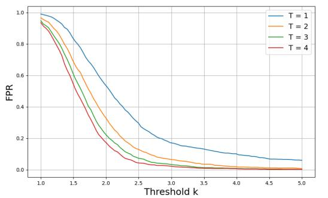

line

| Threshold k | T = 1  | T = 2  | T = 3  | T = 4  |
| ----------- | ------ | ------ | ------ | ------ |
| 1.0         | 1.0    | 0.98   | 0.97   | 0.96   |
| 1.5         | 0.85   | 0.75   | 0.70   | 0.65   |
| 2.0         | 0.60   | 0.45   | 0.40   | 0.35   |
| 2.5         | 0.40   | 0.25   | 0.20   | 0.15   |
| 3.0         | 0.25   | 0.15   | 0.10   | 0.08   |
| 3.5         | 0.15   | 0.08   | 0.06   | 0.05   |
| 4.0         | 0.10   | 0.05   | 0.04   | 0.03   |
| 4.5         | 0.08   | 0.03   | 0.02   | 0.02   |
| 5.0         | 0.05   | 0.02   | 0.01   | 0.01   |

(a)

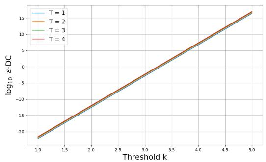

line

| Threshold k | T = 1 | T = 2 | T = 3 | T = 4 |
| ----------- | ----- | ----- | ----- | ----- |
| 1.0         | -22.0 | -22.0 | -22.0 | -22.0 |
| 1.5         | -16.0 | -16.0 | -16.0 | -16.0 |
| 2.0         | -10.0 | -10.0 | -10.0 | -10.0 |
| 2.5         | -6.0  | -6.0  | -6.0  | -6.0  |
| 3.0         | -2.0  | -2.0  | -2.0  | -2.0  |
| 3.5         | 2.0   | 2.0   | 2.0   | 2.0   |
| 4.0         | 6.0   | 6.0   | 6.0   | 6.0   |
| 4.5         | 10.0  | 10.0  | 10.0  | 10.0  |
| 5.0         | 14.0  | 14.0  | 14.0  | 14.0  |

(b)   
Figure 7: PRISM-DPO’s performance on various T levels. The FPR and ϵ bounds are plotted against the cutoff level k.

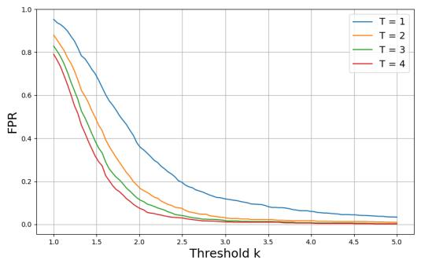

line

| Threshold k | T = 1  | T = 2  | T = 3  | T = 4  |
| ----------- | ------ | ------ | ------ | ------ |
| 1.0         | 0.95   | 0.88   | 0.82   | 0.78   |
| 1.5         | 0.75   | 0.65   | 0.55   | 0.45   |
| 2.0         | 0.50   | 0.35   | 0.25   | 0.15   |
| 2.5         | 0.30   | 0.15   | 0.10   | 0.05   |
| 3.0         | 0.15   | 0.08   | 0.05   | 0.03   |
| 3.5         | 0.10   | 0.05   | 0.03   | 0.02   |
| 4.0         | 0.08   | 0.03   | 0.02   | 0.01   |
| 4.5         | 0.05   | 0.02   | 0.01   | 0.01   |
| 5.0         | 0.03   | 0.01   | 0.01   | 0.01   |

(a)

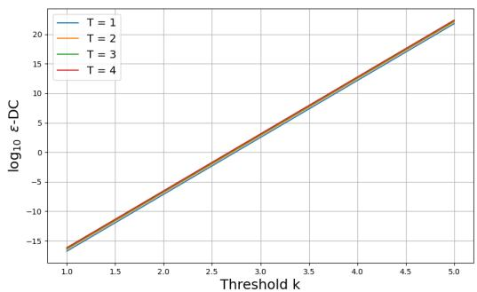

line

| Threshold k | T = 1 | T = 2 | T = 3 | T = 4 |
| ----------- | ----- | ----- | ----- | ----- |
| 1.0         | -15   | -15   | -15   | -15   |
| 1.5         | -10   | -10   | -10   | -10   |
| 2.0         | -5    | -5    | -5    | -5    |
| 2.5         | 0     | 0     | 0     | 0     |
| 3.0         | 5     | 5     | 5     | 5     |
| 3.5         | 10    | 10    | 10    | 10    |
| 4.0         | 15    | 15    | 15    | 15    |
| 4.5         | 20    | 20    | 20    | 20    |
| 5.0         | 25    | 25    | 25    | 25    |

(b)   
Figure 8: PRISM-NPO’s performance on various T levels. The FPR and ϵ bounds are plotted against the cutoff level k.

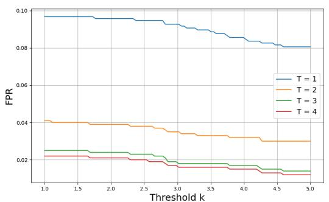

line

| Threshold k | T = 1  | T = 2  | T = 3  | T = 4  |
| ----------- | ------ | ------ | ------ | ------ |
| 1.0         | 0.098  | 0.042  | 0.025  | 0.023  |
| 1.5         | 0.097  | 0.041  | 0.024  | 0.022  |
| 2.0         | 0.096  | 0.040  | 0.023  | 0.021  |
| 2.5         | 0.095  | 0.039  | 0.022  | 0.020  |
| 3.0         | 0.093  | 0.037  | 0.021  | 0.019  |
| 3.5         | 0.091  | 0.035  | 0.020  | 0.018  |
| 4.0         | 0.088  | 0.033  | 0.019  | 0.017  |
| 4.5         | 0.085  | 0.031  | 0.018  | 0.016  |
| 5.0         | 0.082  | 0.030  | 0.017  | 0.015  |

(a)

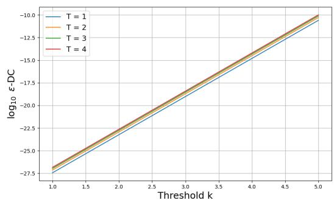

line

| Threshold k | T = 1   | T = 2   | T = 3   | T = 4   |
| ----------- | ------- | ------- | ------- | ------- |
| 1.0         | -27.5   | -27.5   | -27.5   | -27.5   |
| 1.5         | -25.0   | -25.0   | -25.0   | -25.0   |
| 2.0         | -22.5   | -22.5   | -22.5   | -22.5   |
| 2.5         | -20.0   | -20.0   | -20.0   | -20.0   |
| 3.0         | -17.5   | -17.5   | -17.5   | -17.5   |
| 3.5         | -15.0   | -15.0   | -15.0   | -15.0   |
| 4.0         | -12.5   | -12.5   | -12.5   | -12.5   |
| 4.5         | -10.0   | -10.0   | -10.0   | -10.0   |
| 5.0         | -7.5    | -7.5    | -7.5    | -7.5    |

(b)   
Figure 9: PRIMS-BC’s performance on various T levels. The FPR and ϵ bounds are plotted against the cutoff level k .