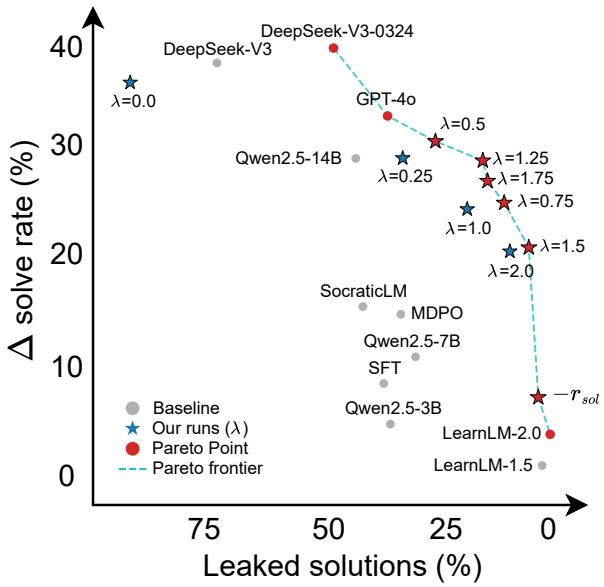
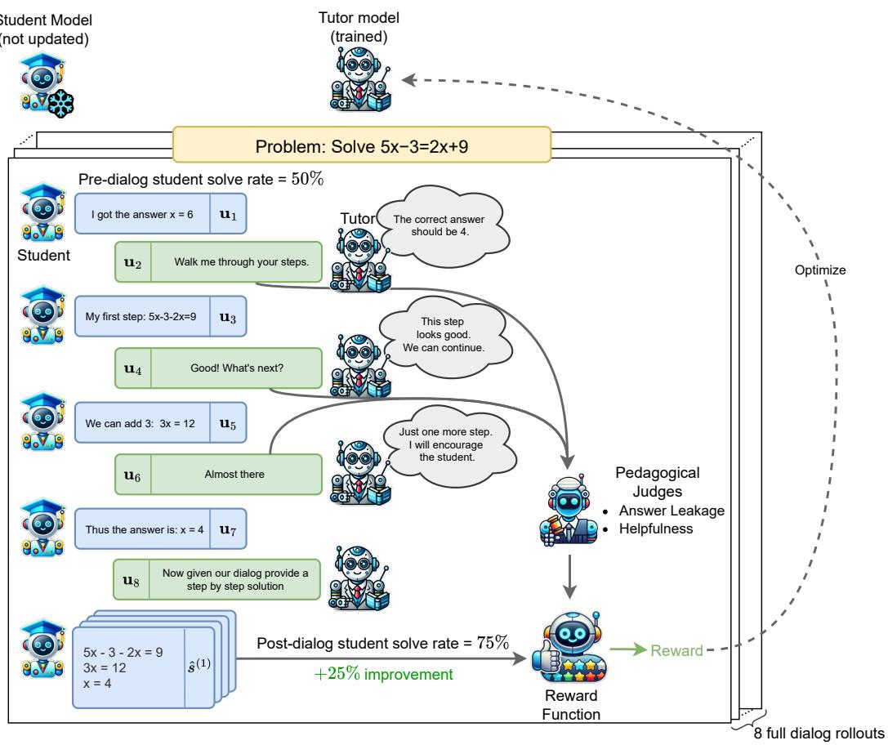
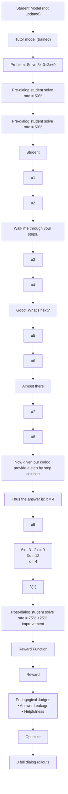
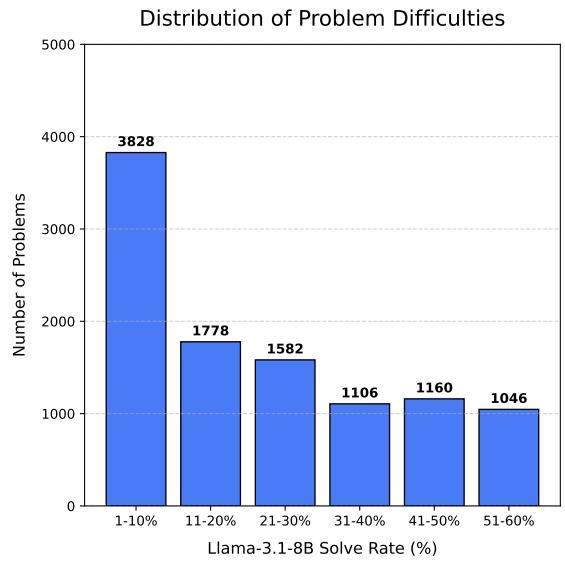
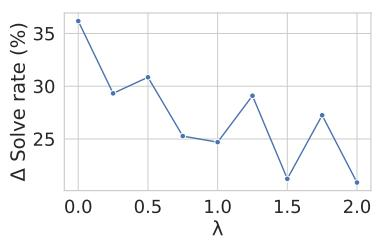
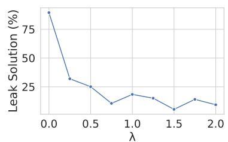
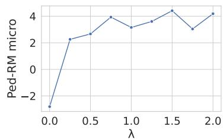

# From Problem-Solving to Teaching Problem-Solving: Aligning LLMs with Pedagogy using Reinforcement Learning

David Dinucu-Jianu∗1 Jakub Macina∗1,2 Nico Daheim1,3 Ido Hakimi1,2 Iryna Gurevych3 Mrinmaya Sachan1

1Department of Computer Science, ETH Zurich 2ETH AI Center 3Ubiquitous Knowledge Processing Lab (UKP Lab), Department of Computer Science, Technical University of Darmstadt and National Research Center for Applied Cybersecurity ATHENE, Germany

# Abstract

Large language models (LLMs) can transform education, but their optimization for direct question-answering often undermines effective pedagogy which requires strategically withholding answers. To mitigate this, we propose an online reinforcement learning (RL)-based alignment framework that can quickly adapt LLMs into effective tutors using simulated student-tutor interactions by emphasizing pedagogical quality and guided problem-solving over simply giving away answers. We use our method to train a 7B parameter tutor model without human annotations which reaches similar performance to larger proprietary models like LearnLM. We introduce a controllable reward weighting to balance pedagogical support and student solving accuracy, allowing us to trace the Pareto frontier between these two objectives. Our models better preserve reasoning capabilities than single-turn SFT baselines and can optionally enhance interpretability through thinking tags that expose the model’s instructional planning.

https://github.com/eth-lre/PedagogicalRL

# 1 Introduction

Large Language Models (LLMs) hold significant promise in education, particularly as personalized tutors capable of guiding students individually through problems. Recent advances have demonstrated remarkable LLM performance in math and science (Chervonyi et al., 2025; Saab et al., 2024). However, deploying LLMs effectively as educational tutors involves more than excelling on benchmarks (Tack and Piech, 2022; Gupta et al., 2025). To be truly effective, a tutor must facilitate learning by guiding students toward independently constructing correct solutions rather than simply revealing the answers. We refer to this shift from assistant to tutor as pedagogical alignment.



<details>
<summary>scatter</summary>

| Model           | Leaked solutions (%) | Δ solve rate (%) |
| --------------- | -------------------- | ---------------- |
| DeepSeek-V3     | 75                   | 38               |
| GPT-4o          | 25                   | 32               |
| Qwen2.5-14B     | 20                   | 28               |
| SocraticLM      | 15                   | 15               |
| MDPO            | 15                   | 14               |
| Qwen2.5-7B      | 15                   | 11               |
| SFT             | 15                   | 9                |
| Qwen2.5-3B      | 10                   | 5                |
| LearnLM-2.0     | 0                    | 7                |
| LearnLM-1.5     | 0                    | 1                |
| λ=0.0           | ~60                  | ~36              |
| λ=0.25          | ~15                  | ~29              |
| λ=0.5           | ~25                  | ~30              |
| λ=1.0           | ~25                  | ~24              |
| λ=1.25          | ~25                  | ~28              |
| λ=1.75          | ~25                  | ~26              |
| λ=0.75          | ~25                  | ~24              |
| λ=1.5           | ~25                  | ~20              |
| λ=2.0           | ~25                  | ~20              |
| -r_sol          | ~25                  | ~7               |
| Δ solve rate (%) | ~50                  | ~40              |
</details>

Figure 1: LLM tutoring forms a multi-objective scenario in which LLM tutors should increase the student’s solve rate (y-axis) while minimizing solution leakage (x-axis). Here, the ∆ solve rate measures how often a student can solve a problem before and after the dialog with a tutor and leaked solutions measures how often the tutor tells the solution to the student. Our RL-trained Qwen-2.5-7B models with varying penalty λ are on the Pareto-front and match the performance of specialized closed-source models when tutoring on Big-Math.

Achieving robust pedagogical alignment remains an open challenge (Macina et al., 2025; Maurya et al., 2025). Approaches that rely on supervised fine-tuning (SFT) (Daheim et al., 2024; Kwon et al., 2024) can suffer from generalization issues while existing RL-based techniques typically depend on costly, and often proprietary, preference annotations (Team et al., 2024) or require a much larger model as a source of training data of tutor responses (Sonkar et al., 2024; Scarlatos et al., 2025). Due to these limitations, these prior works have largely focused on single-turn feedback, which fails to capture the multi-turn dynamics that are essential for effective tutoring.



<details>
<summary>flowchart</summary>


</details>

Figure 2: Workflow of our RL framework. First, we perform multiple complete student-tutor conversation simulations. After each conversation ends, the reward is computed: 1) post-dialog student solve rate (success) conditioned on the dialog, and 2) the pedagogical quality of the tutor guidance throughout the conversation. This setup uses data from the current tutor model (is on-policy) and does not use offline static dialog data (is online).

To address these gaps, we propose a multi-turn reinforcement learning (RL) method that enables the model to learn directly from its own dialogs with a student to find optimal teaching strategies. Grounded in mastery learning and active teaching principles (Chi and Wylie, 2014; Freeman et al., 2014), our system simulates multi-turn interactions on challenging problems from Big-Math (Albalak et al., 2025), with the tutor LLM using Socratic questioning (Shridhar et al., 2022) and targeted hints instead of handing out solutions. We design reward functions that mirror authentic long-term learning outcomes, namely, how often a student can solve a problem after a dialog with the tutor and how much the tutor follows sound pedagogical principles throughout the full conversation. Our key contributions are the following:

• Cost-efficient training via synthetic student–tutor interactions: Our online RL method replaces the need for expensive human-annotated data with a synthetic data

pipeline, enabling a 7B Tutor Model to almost match the performance of LearnLM.

• Controllable pedagogy–accuracy trade-off: Our method enables explicit control over the balance between pedagogical support and student answer correctness by adjusting a penalty weight to navigate a Pareto frontier.   
• Preservation of reasoning capabilities: Our approach maintains performance across standard reasoning benchmarks, unlike prior methods such as SocraticLM (Liu et al., 2024). Evaluations on MMLU, GSM8K, and MATH demonstrate that pedagogical alignment does not come at the cost of reasoning ability.

# 2 Related Work

# 2.1 LLMs for Dialog Tutoring

While effective human tutors not only provide answers but more importantly scaffold the learning of students, LLMs are predominantly trained for providing answers which limits their tutoring capabilities (Tack and Piech, 2022; Macina et al., 2023b). Hence, various approaches have been proposed to improve their pedagogical skills.

Arguably the simplest is prompt engineering, where pedagogical criteria are encoded in the prompt, for example, for asking questions (Sonkar et al., 2023; Puech et al., 2025) or detecting mistakes (Wang et al., 2024b) but it is tedious and sensitive to changes (Jurenka et al., 2024).

A more robust alternative is to use gradientbased updating, for example, SFT on teacherstudent dialogs. However, this is challenging because only a few high-quality tutoring datasets exist publicly, for example, MathDial which is semisynthetically created by pairing LLM students with real teachers for solving math problems (Macina et al., 2023a). Hence, many works resort to synthetic data (Wang et al., 2024a). For example, SocraticLM (Liu et al., 2024) is trained on 35k math tutoring dialogs created using a multi-agent setting and TutorChat (Chevalier et al., 2024) is trained using 80k synthetic teacher–student conversations grounded in textbooks. Larger scale approaches in industry, such as, LearnLM (Jurenka et al., 2024) use a mixture of synthetic and human-collected data but this requires substantial resources.

Finally, recent works use Reinforcement Learning from Human Feedback (RLHF) (Ouyang et al., 2022), for example, to improve next tutor dialog act prediction (Sonkar et al., 2024) or to improve math tutors by turn-level rewards using GPT-4-generated preference data (Scarlatos et al., 2025). However, it is unclear how single-turn synthetic data translates to tutoring more complex multi-turn conversations.

Prior works treat tutoring as an offline off-policy problem by relying on large-scale synthetic or proprietary data which introduces exposure bias (Ross and Bagnell, 2010; Ranzato et al., 2016) as the tutor does not learn from its own interactions during training. In contrast, our work adopts an online on-policy setup where the model is trained on its own interactions throughout training.

# 2.2 Dialog as RL Task & Verifiable Rewards

Previous work has commonly framed educational dialog as a next teacher utterance generation task, where the teacher’s last turn serves as a ground truth response and the dialog history serves as context (Macina et al., 2023a). However, a dialog is inherently a multi-turn interaction towards a goal (e.g. student learns to solve a problem) and single-turn methods limit the model’s ability to plan across multiple turns to achieve longer-term goals. Effective tutoring, however, is a sequential, adaptive and goal-directed process with the aim of helping a student not only solve a current problem, but also learn to solve similar problems. To address this problem, formulating dialog as an RL problem might be helpful which has been explored outside of tutoring recently (Li et al., 2017; Shani et al., 2024; Xiong et al., 2025; Li et al., 2025).

In general, RL learns optimal actions by collecting a numerical reward from the environment which provides a natural framework for aligning LLM behavior with pedagogical goals by assigning rewards to complete conversations rather than to isolated turns. In LLMs, RL has been successfully used to align with human feedback (Ouyang et al., 2022) and to improve reasoning via verifiable rewards (Shao et al., 2024; Lambert et al., 2025; Wang et al., 2025).

Standard on-policy algorithms like Proximal Policy Optimization (PPO) (Schulman et al., 2017) have been crucial for the success of humanpreference alignment in GPT models. Direct Preference Optimization (DPO) (Rafailov et al., 2023) has emerged as a simpler alternative without the requirement of a reward model that allows fine-tuning on offline pairwise preference data. Extensions of DPO to multi-turn settings, such as multi-turn DPO (MDPO), commonly mask user turns to optimize only over assistant responses (Xiong et al., 2025). Recent algorithms such as MTPO (Shani et al., 2024) and REFUEL (Gao et al., 2025) compare pairs of entire conversations rollouts to improve over DPO. Access to verifiable rewards has been crucial for scaling RL training for LLMs, for example, by comparing to a reference solution (Shao et al., 2024; DeepSeek-AI et al., 2025) or executing programs (Lambert et al., 2025). While these methods have been used to improve reasoning, pedagogical criteria have largely been neglected.

Our work builds upon a line of research formulating a dialog as an RL problem in a synthetic tutor-student environment. By integrating verifiable correctness rewards with pedagogical rubrics, we explore the control of the trade-off between instruction support and answer accuracy.

# 3 Pedagogical Principles

Effective teaching is not only about providing answers but rather about fostering student learning through scaffolding guidance. Here, scaffolding means actively engaging students in problem solving (Chi and Wylie, 2014; Freeman et al., 2014) using questions, hints, and nudges.

Avoiding Answer Leakage: A key element is to actively engage students in problem solving instead of letting them passively consume correct answer, which does not lead to learning. Therefore, we discourage the tutor from presenting complete solutions. Instead, they should guide students through Socratic questioning, hints, or targeted feedback. This mirrors constraints from prior related work, such as the role of a dean persona (Liu et al., 2024).

Helpfulness: The tutor should guide the student with constructive and contextual appropriate support in the right teacher tone. The tutor violates this principle if they provide full answers or dominate the conversation and it is similar to targetedness in prior work (Daheim et al., 2024). Moreover, tutors should be responsive and encouraging, reflecting the tone of real teachers (Tack and Piech, 2022).

# 4 Dialog Tutoring as Multi-Turn RL

We consider multi-turn conversations $\big ( \mathbf { u } _ { 1 } , \dots , \mathbf { u } _ { T } \big )$ 号 made up of a sequence of utterances $\mathbf u _ { t } \in \mathcal V ^ { * }$ taken by either the student or a teacher, both simulated by an LLM. In our training runs, it is decided by random choice who starts the conversation, as detailed in Section 5.1. The goal of the student is to solve a problem $\mathbf { P } \in \mathcal { V } ^ { \ast }$ which has a unique known numerical solution $s \in \mathbb { R }$ . The objective of the LLM tutor is to guide the student toward the solution s by generating a new $\mathbf { u } _ { t }$ given the context $\mathbf { u } _ { < t }$ . The conversation ends when the tutor considers it finished or after a fixed number of turns. We use autoregressive LLM-based tutors, parameterized by neural network weights θ, to generate outputs by sampling from the model distribution

$$
p _ {\boldsymbol {\theta}} \left(\mathbf {u} _ {t} \mid \mathbf {u} _ {<   t}\right) = \prod_ {n = 1} ^ {| \mathbf {u} _ {t} |} p _ {\boldsymbol {\theta}} \left(\left[ u _ {t} \right] _ {n} \mid \left[ \mathbf {u} _ {t} \right] _ {<   n}, \mathbf {u} _ {<   t}\right),
$$

where $[ u _ { t } ] _ { n }$ is the n-th token of the output sequence $\mathbf { u } _ { t }$ . In Section 3 we define the pedagogical principles that the generated utterances should fulfill.

Learning $\pmb \theta$ can then also be framed as an RL problem under the lens of Markov Decision Processes (MDP) for which we re-define the previously introduced quantities in common notation. To be precise, for a given position t in the dialog, we define the state to be $\mathbf { s } _ { t } : = \mathbf { u } _ { < t }$ and the action to be $\mathbf { a } _ { t } : = \mathbf { u } _ { t } ,$ i.e. the current state in the conversation is fully captured by the sequence of previous utterances and the action is the next utterance. The transition dynamics are defined by sequentially appending each new utterance (or action) $\mathbf { a } _ { t }$ to the existing conversation history (or state $\mathbf { s } _ { t } )$ to form the new state $\mathbf { s } _ { t + 1 }$ . If $\mathbf { a } _ { t }$ is a tutor utterance, it is sampled from the tutor’s policy; if it is a student utterance, it is sampled from a fixed student LLM conditioned on $\mathbf { s } _ { t }$ . Since the student model is stochastic, the transition dynamics are non-determinsitic from the tutor’s perspective, different from standard RLHF which often assumes deterministic environments.

Then, the goal is to learn the tutor policy $\pi _ { \pmb { \theta } } : =$ $p _ { \pmb { \theta } }$ such that sampled responses

$$
\mathbf {a} _ {t} \sim \pi_ {\boldsymbol {\theta}} (\cdot | \mathbf {s} _ {t}) \tag {1}
$$

fulfill the desiderata in Section 3. We achieve this by defining rewards $r ( \mathbf { a } _ { T } , \mathbf { s } _ { T } )$ that are assigned at the end of a conversation to full sequences aT based on the context ${ \bf s } _ { T }$ . That is, we define rewards at the level of the full conversation rather than assigning them to individual turns. Furthermore, we also sample $\mathbf { a } _ { t }$ directly from the current policy $\pi _ { \pmb { \theta } }$ at the given training iteration. The onpolicy approach means we update the current policy $\pi _ { \pmb { \theta } }$ and subsequent dialogs are generated from the newly updated model. This is different from DPObased approaches, which use static data. There, the model is always conditioned on context from an older checkpoint. Instead, we use online RL and avoid such context drift by conditioning on context generated with the current model checkpoint.

# 4.1 Rewarding LLM Tutor Pedagogy

Our reward design follows the pedagogical principles laid out in Section 3. This means that we aim to fulfill two goals: the student should be able to successfully solve P after the dialog and the actions $\mathbf { a } _ { t }$ generated using the policy $\pi _ { \pmb { \theta } }$ should have high pedagogical quality and, for example, not just solve the problem for a student.

We judge solution correctness by sampling multiple final answers ${ \widehat s } ^ { ( 1 ) } , { \widehat s } ^ { ( 2 ) } , \ldots , { \widehat s } ^ { ( { \cal K } ) }$ from the student model conditioned on aT and sT and compute an empirical expected correctness across these solutions called post-dialog solve rate:

$$
r _ {\mathrm{sol}} (\mathbf {a} _ {T} \mid \mathbf {s} _ {T}) = \frac {1}{K} \sum_ {k = 1} ^ {K} \mathbb {1} [ \widehat {s} ^ {(k)} = s ], \tag {2}
$$

where s is the ground-truth solution, as a verifiable outcome reward (DeepSeek-AI et al., 2025).

We judge pedagogical quality (defined in Section 3) using LLM judges $J _ { 1 } , J _ { 2 } , \dots , J _ { M }$ to prevent overfitting on one specific judge model (Coste et al., 2024). We prompt the judge models independently to evaluate the full conversation and then only consider a conversation accepted if all judges accept it by measuring:

$$
r _ {\text { ped }} (\mathbf {a} _ {T} \mid \mathbf {s} _ {T}) = \prod_ {m = 1} ^ {M} \mathbb {1} [ J _ {m} (\mathbf {a} _ {T}, \mathbf {s} _ {T}) = \text { accept } ]. \tag {3}
$$

Altogether, we combine these rewards as:

$$
\begin{array}{l} r (\mathbf {a} _ {T} \mid \mathbf {s} _ {T}) = r _ {\text { sol }} (\mathbf {a} _ {T} \mid \mathbf {s} _ {T}) \\ + (r _ {\mathrm{ped}} (\mathbf {a} _ {T} \mid \mathbf {s} _ {T}) - 1) \cdot \lambda \tag {4} \\ \end{array}
$$

given a penalty $\lambda \geq 0$ which is a hyperparameter. The penalty gets subtracted only if any of the pedagogical judges $( r _ { p e d } = 0 )$ do not accept the conversation.

Intuitively, this provides a way of trading off solution correctness indicated by $r _ { \mathrm { s o l } }$ against pedagogy measured by $r _ { \mathrm { p e d } }$ . If we only care about solution correctness, we can choose $\lambda = 0$ but would expect low pedagogy and many answers given away by the tutor. On the other hand, if we send $\lambda  \infty ,$ , only pedagogy matters which might mean that the student solves fewer problems but actually learns how to solve them. In between, various trade-offs can be explored. Finally, we also try a version called hard – if the conversation is not accepted by at least one judge $( r _ { \mathrm { p e d } } = 0 )$ , the overall reward is set to a fixed penalty λ to reflect pedagogical acceptance as a hard prerequisite.

# 5 Experiments

# 5.1 Details on the RL Environment

Our simulated environment is designed to mimic multi-turn interactions between a student and a tutor. Each episode is seeded with the problem P that the student is trying to solve. An overview of the environment and an example of a conversation are in Figure 2. The environment supports two types of common educational interactions which differ in who starts the conversation. One option is to let the LLM student provide an attempted solution which may be correct, incorrect, or partially correct. Then, the tutor continues the conversation based on the initial attempted solution. Another scenario is that the tutor initiates the dialog and elicits a solution from the student LLM. We uniformly sample from the two scenarios in our experiments.



<details>
<summary>bar</summary>

| Llama-3.1-8B Solve Rate (%) | Number of Problems |
| --------------------------- | ------------------ |
| 1-10%                       | 3828               |
| 11-20%                      | 1778               |
| 21-30%                      | 1582               |
| 31-40%                      | 1106               |
| 41-50%                      | 1160               |
| 51-60%                      | 1046               |
</details>

Figure 3: Distribution of problem difficulties in our dataset (solve-rate buckets obtained with our student model Llama-3.1-8B-Instruct). The dataset contains mostly hard (1-10% solve rate) problems. This ensures each item requires meaningful guidance from the tutor model rather than being trivial for our student model.

Furthermore, to enable the tutor model to plan and generate more targeted responses, we adopt thinking tags (OpenAI, 2024; DeepSeek-AI et al., 2025) where the tutor can plan the response. This content is hidden to the student LLM.

# 5.2 Dataset

We evaluate our framework on BigMath (Albalak et al., 2025) which contains multi-step math problems. The dataset is annotated with the solve rate of Llama-3.1-8B-Instruct with chain-ofthought prompting (Wei et al., 2022). We only use problems with a single numerical answer and medium-to-high difficulty, i.e., a solve rate by student model between 1% and 60% out of 64 samples. Dataset details are in Table 1 and a distribution over problem difficulties is in Figure 3. We partition this dataset into 10,000 training samples and 500 test samples. On the train dataset, our student model Llama-3.1-8B-Instruct achieves an average pre-dialog solve rate of 25% while Qwen2.5-7B-Instruct achieves 66%.

To evaluate our models, we adopt following test beds:

Held-out BigMath (in-domain): We first report results on the 500 held-out BigMath problems. This mirrors the training setting and verifies whether our RL pipeline optimizes the intended conversational rewards. Our main metrics are the ∆ Solve rate (%) and Leaked Solution (%). ∆ Solve rate (%) measures improvement in the student’s problem-solving success after dialog. It is the difference between pre-dialog solve rate measured using chain-of-thought accuracy and the post-dialog solve rate, with both computed in comparison to the ground truth solution s. Leaked Solution (%) is a portion of conversations where the tutor gives away the solution to the student assessed by an LLM judge (prompt in Figure 14).

<table><tr><td colspan="3">Training Set</td><td colspan="3">Test Set</td></tr><tr><td>Dataset</td><td>Samples</td><td>Solve Rate (%)</td><td>Dataset</td><td>Samples</td><td>Solve Rate (%)</td></tr><tr><td>Big_math</td><td>3360</td><td>23.56</td><td>Big_math</td><td>177</td><td>24.86</td></tr><tr><td>Cn_k12</td><td>3324</td><td>22.11</td><td>Cn_k12</td><td>168</td><td>22.34</td></tr><tr><td>Math</td><td>1264</td><td>27.40</td><td>Math</td><td>57</td><td>23.93</td></tr><tr><td>Aops_forum</td><td>1263</td><td>10.13</td><td>Aops_forum</td><td>56</td><td>10.07</td></tr><tr><td>Omnimath</td><td>374</td><td>12.57</td><td>Omnimath</td><td>22</td><td>15.41</td></tr><tr><td>Openmath</td><td>315</td><td>38.18</td><td>Openmath</td><td>13</td><td>36.30</td></tr><tr><td>Gsm8k</td><td>100</td><td>36.30</td><td>Gsm8k</td><td>7</td><td>32.14</td></tr><tr><td>Total</td><td>10 000</td><td></td><td>Total</td><td>500</td><td></td></tr></table>

Table 1: Composition of training and test datasets with the student model solve rates (pre-dialog).

MathTutorBench (out-of-domain): We additionally evaluate on the independent MathTutor-Bench benchmark (Macina et al., 2025), which provides several automatic metrics for tutor quality. We mainly focus on those metrics that rely on the benchmark’s learned Pedagogical Reward Model (Ped-RM), as they directly reflect the quality of scaffolding and other pedagogical best practices. Note that the Ped-RM score is only used for evaluation across this paper and not as part of the reward.

Reasoning Benchmarks: Finally, to ensure that tutor specialization does not degrade reasoning ability, we also report performance on the general-purpose benchmarks MMLU (Hendrycks et al., 2021), GSM8K (Cobbe et al., 2021), and MATH500 (Lightman et al., 2024).

# 5.3 Implementation Details

We use Group Relative Policy Optimization (GRPO) (Shao et al., 2024) for model optimization. For each problem, we simulate 8 complete student–tutor dialogs (rollouts). A single reward score reflecting student success and pedagogical quality of the entire dialog is assigned at the end of each simulation. We follow the standard GRPO to normalize each dialog reward within each group to obtain dialog-level advantages. The advantages are computed by comparing the reward of a sampled dialog with others in its group. Then dialog-level advantages are propagated to the token-level by adjusting the likelihood of generating each token. We mask the student turns to only optimize over tutor responses. We treat all tutor utterances equally and apply no discounting factor. The maximum number of total turns is set to 16. Moreover, we use a reward for template following based on the success of DeepSeek-AI et al. (2025), see details in Appendix B. To compute $r _ { \mathrm { p e d } }$ , we use two judge prompts: Answer Leakage in Figure 14 and Helpfulness in Figure 15, and sample twice from each.

# 5.4 Models

We use Qwen2.5-7B-Instruct to initialize the tutor model and Llama-3.1-8B-Instruct as the Student model, following the setup in Big-Math (Albalak et al., 2025). As a judge, Qwen2.5-14B-Instruct model is used. To avoid overoptimizing on the judge model used during training, in the held-out test set, a judge from another model family is used, namely, Gemma3-27B.

We compare to several tutor baselines: Qwen2.5-7B-Instruct without any fine-tuning, SocraticLM (Liu et al., 2024) as a specialized open-source tutoring model and LearnLM as a specialized close-source tutoring model, GPT-4o-2024-11-20 prompted to behave like a tutor, an SFT model which uses only accepted conversations by the judges for fine-tuning, similar to Macina et al. (2023a), as well as, MDPO (Xiong et al., 2025) which is a multi-turn extension of DPO and is trained on all pairs of chosen and rejected conversations scored by judges, similar to Sonkar et al. (2023); Scarlatos et al. (2025).

<table><tr><td>Model</td><td>Δ Solve rate (%) ↑</td><td>Leak Solution (%) ↓</td><td>Ped-RM micro/macro ↑</td></tr><tr><td colspan="4">Our Models</td></tr><tr><td>Qwen2.5-7B-RL-λ=0.0</td><td>36.2</td><td>89.5</td><td>-2.8/-3.2</td></tr><tr><td>Qwen2.5-7B-RL-λ=0.25</td><td>29.3</td><td>32.0</td><td>2.3/1.8</td></tr><tr><td>Qwen2.5-7B-RL-λ=0.5</td><td>30.9</td><td>25.1</td><td>2.7/1.5</td></tr><tr><td>Qwen2.5-7B-RL-λ=0.75</td><td>25.3</td><td>10.6</td><td>3.9/3.2</td></tr><tr><td>Qwen2.5-7B-RL-λ=1.0</td><td>24.7</td><td>18.4</td><td>3.2/2.2</td></tr><tr><td>Qwen2.5-7B-RL-λ=1.25</td><td>29.1</td><td>15.1</td><td>3.6/3.1</td></tr><tr><td>Qwen2.5-7B-RL-λ=1.5</td><td>21.2</td><td>5.4</td><td>4.4/4.0</td></tr><tr><td>+ think</td><td>17.0</td><td>7.4</td><td>4.9/4.6</td></tr><tr><td>Qwen2.5-7B-RL-hard-λ=1.0</td><td>12.6</td><td>5.3</td><td>4.2/3.4</td></tr><tr><td>+ think</td><td>20.5</td><td>6.9</td><td>4.3/4.9</td></tr><tr><td>-rsol</td><td>7.6</td><td>3.4</td><td>3.9/3.1</td></tr><tr><td colspan="4">Baselines – Specialized Tutoring Models</td></tr><tr><td>SocraticLM</td><td>15.9</td><td>40.4</td><td>1.7/1.7</td></tr><tr><td>Qwen2.5-7B-SFT</td><td>8.9</td><td>36.0</td><td>-0.3/-0.7</td></tr><tr><td>Qwen2.5-7B-MDPO</td><td>16.4</td><td>35.6</td><td>0.2/-0.3</td></tr><tr><td>LearnLM 1.5 Pro Experimental</td><td>1.5</td><td>2.6</td><td>5.9/5.3</td></tr><tr><td>LearnLM 2.0 Flash Experimental</td><td>4.3</td><td>0.9</td><td>6.8/6.4</td></tr><tr><td colspan="4">Open-Weights Models</td></tr><tr><td>Qwen2.5-3B-Instruct</td><td>5.2</td><td>34.6</td><td>-1.6/-1.7</td></tr><tr><td>Qwen2.5-7B-Instruct</td><td>11.3</td><td>29.3</td><td>-0.2/-0.5</td></tr><tr><td>Qwen2.5-14B-Instruct</td><td>29.3</td><td>41.9</td><td>-0.6/-1.2</td></tr><tr><td>Qwen2.5-72B-Instruct</td><td>38.7</td><td>61.0</td><td>1.8/-0.4</td></tr><tr><td>DeepSeek V3-0324</td><td>39.3</td><td>46.6</td><td>-1.5/-0.8</td></tr><tr><td colspan="4">Closed-Source Models</td></tr><tr><td>GPT-4o-2024-11-20</td><td>33.1</td><td>35.2</td><td>1.5/-0.3</td></tr></table>

Table 2: Main results based on in-domain test set. ∆ Solve rate refers to the difference between pre- and post-dialog student solve rate. An independent model (Gemma3-27B) judges the leakage solution. The Per-RM score is only used for evaluation. Macro refers to averaging per conversation while micro uses averaging of all individual scores.

# 6 Results

# 6.1 In-Domain Comparison

LLMs prioritize answering over teaching Table 2 presents results across model categories on an in-domain test set. Overall, we observe a trade-off between student success measured by ∆ Solve rate, solution leakage and pedagogical quality, measured by Ped-RM. Qwen2.5-72B-Instruct and DeepSeek V3 achieve the highest gains in student solve rate but also exhibit high solution leakage. Qualitative example reveals that models tend to solve the problem directly for the student, see Figure 8. This supports our hypothesis that, even with engineered prompts, standard LLMs are inherently optimized for answering rather than teaching.

Tutoring models show improved pedagogy Specialized tutoring models in Table 2, such as, SocraticLM, SFT, and MDPO demonstrate a more balanced behavior as shown by reduced solution leakage and improved pedagogical scores. However, they often also have lower student success rates, similar to unfinetuned Qwen2.5-7B-Instruct. The specialized, proprietary tutoring model LearnLM2.0 achieves the highest pedagogical scores while maintaining minimal leakage, indicating strong adherence to pedagogical principles. However, its low ∆ solve rate suggests that it might overpenalize leaking which limits its effectiveness when students require more direct guidance.

Student success and pedagogy are a trade-off Our RL framework enables dynamic control over this trade-off. As shown in Figure 4, increasing the penalty λ reduces solution leakage and improves pedagogical reward, at the cost of student success. Figure 1 shows how various settings of our framework trace a Pareto frontier between student learning gains and pedagogy. At λ = 0.75, for instance, our Qwen2.5-7B-RL model achieves a balanced performance across all three metrics. When λ = 0, the model maximizes student success but does so by leaking answers and scoring negatively on pedagogy. Qualitative comparison in Figure 5 and Figure 6 further reveals that low-pedagogical-penalty models often exploit shortcuts, such as directly stating solutions or using answer fragments (e.g., $^ { * } 2 { + } 3 { = } ? ^ { 6 } )$ , even if prompted not to do so. This highlights the importance of our framework when optimizing LLMs as tutors.



<details>
<summary>line</summary>

| λ    | Δ Solve rate (%) |
| ---- | ---------------- |
| 0.0  | 36.0             |
| 0.5  | 31.0             |
| 1.0  | 25.0             |
| 1.5  | 29.0             |
| 2.0  | 22.0             |
</details>

(a) ∆ Solve rate vs. λ



<details>
<summary>line</summary>

| λ    | Leak Solution (%) |
| ---- | ----------------- |
| 0.0  | 80                |
| 0.25 | 30                |
| 0.5  | 25                |
| 0.75 | 15                |
| 1.0  | 20                |
| 1.25 | 18                |
| 1.5  | 12                |
| 1.75 | 18                |
| 2.0  | 15                |
</details>

(b) Leak Solution Rate vs. λ



<details>
<summary>line</summary>

| λ    | Ped-RM micro |
| ---- | ------------ |
| 0.0  | -2.5         |
| 0.5  | 2.5          |
| 1.0  | 3.5          |
| 1.5  | 4.5          |
| 2.0  | 4.0          |
</details>

(c) Pedagogical Reward (micro) vs. λ

Figure 4: Performance of the RL tuned Qwen2.5-7B-Instruct across different λ values: (a) student solve rate improvement, (b) leak solution rate, (c) pedagogical reward (micro). 

<table><tr><td>Model</td><td>MMLU (5-shot) (%)</td><td>GSM8K (4-shot) (%)</td><td>MATH500 (0-shot) (%)</td></tr><tr><td>Qwen2.5-Math-7B-Instruct</td><td>67.2</td><td>89.3</td><td>81.2</td></tr><tr><td>SocraticLM</td><td>65.1 (-2.1)</td><td>84.4 (-4.9)</td><td>80.4 (-0.8)</td></tr><tr><td>Qwen2.5-7B-Instruct</td><td>77.9</td><td>86.8</td><td>75.4</td></tr><tr><td>Qwen2.5-7B-RL-hard- $\lambda=1.0$ </td><td>77.3 (-0.6)</td><td>86.1 (-0.7)</td><td>73.6 (-1.8)</td></tr><tr><td>+ think</td><td>77.1 (-0.8)</td><td>85.3 (-1.5)</td><td>76.8 (+1.4)</td></tr><tr><td>Qwen2.5-7B-SFT</td><td>79.3 (+1.4)</td><td>79.5 (-7.5)</td><td>66.0 (-9.4)</td></tr><tr><td>Qwen2.5-7B-MDPO</td><td>78.0 (+0.1)</td><td>87.0 (+0.2)</td><td>76.4 (+1.0)</td></tr></table>

Table 3: Performance comparison of tutor models on MMLU, GSM8K, and MATH500 benchmarks, showing the impact of different tutor alignment strategies. SocraticLM is finetuned from Qwen2.5-Math-7B-Instruct and exhibits performance degradation relative to the original model. In contrast, our RL models finetuned from Qwen2.5-7B-Instruct demonstrate reduced degradation. Pedagogical-SFT, which applies supervised fine-tuning on data generated by our tutor pipeline, results in noticeable degradation. This highlights the benefits of RL-based alignment.

Large tutoring LLMs can be matched without human annotations Our online RL framing of the multi-turn dialog tutoring task trains tutoring models through interaction with a synthetic student without the need for costly human annotation. It enables scalable, multi-turn optimization with control over pedagogical behaviour via verifiable reward and LLM judge constraints. Table 2 shows that despite using only a 7B model, our RL-tuned models (e.g. with $\lambda = 1 . 5 \mathrm { o r } - r _ { \mathrm { s o l } } )$ outperform specialized closed-source LearnLM models on student solve rates, while nearly matching the solution leakage.

Compared to baselines using fine-tuning via SFT or preference-optimization MDPO (multi-turn extension of DPO), our approach (using λ > 0) achieves lower solution leakage and better tradeoff between tutoring efficacy and student independence. This highlights the value of modeling tutoring as a multi-turn, interactive process rather than using static offline responses.

Thinking tags allow human observability Table 2 shows that the ablation with thinking tags (+think) leads to slightly improved performance as the corresponding model without it. We observe that thinking tags allow the model to solve the problem (Figure 7) or enable the model to plan how to explain mistakes to the student (Figure 9). This is similar to what has been shown to improve model responses in previous work (Daheim et al., 2024), but in our case, the model learns this behaviour during training.

# 6.2 Comparison on the Out-of-Domain Data

No degradation of solving capabilities Unlike prior approaches such as SocraticLM (Liu et al., 2024), which sacrifice base model performance in pursuit of pedagogical alignment, our method preserves reasoning abilities across standard benchmarks. As shown in Table 3, Qwen2.5-7B-RL matches or slightly exceeds the performance of its base model (Qwen2.5-7B-Instruct). In contrast, SocraticLM, which is fine-tuned from the Math version of Qwen, degrades performance. Similarly, supervised fine-tuning (SFT) results in decrease on math-heavy benchmarks (–7.5% on GSM8K, –9.4% on MATH500). These findings demonstrate that RL-based alignment better preserves core reasoning skills, avoiding the trade-off between pedagogical behaviour and task competence.

<table><tr><td rowspan="4"></td><td colspan="2">Math Expertise</td><td colspan="3">Student Understanding</td><td colspan="4">Pedagogy</td></tr><tr><td rowspan="2">Problem solving</td><td rowspan="2">Socratic questioning</td><td rowspan="2">Solution correctness</td><td rowspan="2">Mistake location</td><td rowspan="2">Mistake correction</td><td colspan="4">Teacher response generation</td></tr><tr><td>scaff.</td><td>ped.IF</td><td>scaff. [hard]</td><td>ped.IF [hard]</td></tr><tr><td>accuracy</td><td>bleu</td><td>F1</td><td>micro F1</td><td>accuracy</td><td colspan="4">win rate over human teacher</td></tr><tr><td>Qwen2.5-7B-Instruct</td><td>0.87</td><td>0.23</td><td>0.63</td><td>0.39</td><td>0.04</td><td>0.37</td><td>0.60</td><td>0.45</td><td>0.56</td></tr><tr><td>Qwen2.5-7B-SFT</td><td>0.77</td><td>0.24</td><td>0.27</td><td>0.45</td><td>0.10</td><td>0.64</td><td>0.58</td><td>0.57</td><td>0.59</td></tr><tr><td>Qwen2.5-7B-MDPO</td><td>0.86</td><td>0.23</td><td>0.62</td><td>0.39</td><td>0.03</td><td>0.37</td><td>0.60</td><td>0.47</td><td>0.56</td></tr><tr><td>Qwen2.5-7B-RL-λ=0.0</td><td>0.86</td><td>0.24</td><td>0.65</td><td>0.36</td><td>0.07</td><td>0.39</td><td>0.62</td><td>0.48</td><td>0.60</td></tr><tr><td>Qwen2.5-7B-RL-λ=0.75</td><td>0.79</td><td>0.23</td><td>0.64</td><td>0.36</td><td>0.04</td><td>0.48</td><td>0.70</td><td>0.54</td><td>0.65</td></tr><tr><td>Qwen2.5-7B-RL-λ=1.25</td><td>0.83</td><td>0.23</td><td>0.67</td><td>0.35</td><td>0.05</td><td>0.57</td><td>0.72</td><td>0.61</td><td>0.69</td></tr></table>

Table 4: Results on the independent MathTutorBench benchmark with nine tasks. Scaff. and ped. IF the Scaffolding and Pedagogical Instruction Following tasks. [Hard] refers to the data split of the benchmark.

Out-of-domain tuturing benchmark Table 4 shows evaluation of our models on the out-ofdomain MathTutorBench benchmark (Macina et al., 2025), which assesses tutoring ability on nine tasks and uses the Ped-RM to find win-rate over human teachers. Our RL-aligned 7B models match or exceed the pedagogical quality of baseline models. However, SFT remains a strong baseline for Mistake location and Mistake correction tasks, highlighting the need to carefully combine SFT and RL to build robust tutoring models in the future.

# 7 Conclusion

In this work, we propose methods to align LLMs for pedagogy using reinforcement learning. Our method does not require human annotations beyond initial problem statements and train on the models’ own context which reduces train and test mismatch. Rewards allow balancing student solving accuracy and pedagogy, which requires strategically withholding information while accuracy could trivially be increased by the tutor leaking the solution. We find that smaller models trained with this approach can match large, proprietary models in various tutoring metrics.

# Limitations

Our online RL approach introduces additional complexity compared to simpler SFT or single-turn pairwise preferences such as DPO. In particular, as known from other RL tasks, the use of model rollouts to simulate interactions with a student introduce variance and can make training potentially unstable or sample-inefficient. Careful implementation is required to maintain stability.

Our current reward focuses on conversation-level rewards, for example enabling to focus on longerterm post-dialog student success. However, truly learning a topic is measured with a delayed posttest on student transfer, i.e. the ability to transfer the learned topic over time. Future work could focus on such more precise but very delayed signal.

All experiments focus on math-based tutoring tasks. While math is a valuable testbed with enough existing datasets, it represents only one STEM subject.

Our approach trains tutoring models using interactions with a single student model only, which may not reflect the diversity of real learners. Incorporating additional student models and different student personas in a prompt could lead to more realistic settings better representing a diversity of real learners and their misconceptions.

All student responses and reward signals in our framework is generated synthetically by sampling from LLMs. While this enables scalable and costefficient training, it has not been validated with real students, which future works can explore, for example the impact of a trade-off between student success and pedagogy.

# Ethics Statement

Intended Usage We will release the code under CC-BY-4.0 license. We use the BigMath, GSM8k, and MATH500 datasets released under the MIT license, the MathTutorBench benchmark released under CC-BY-4.0, and the MMLU with the Apache License 2.0. We use all of the datasets within their intended usage.

Potential Misuse The overall goal of this work is to support the community in improving LLMs at tutoring capabilities and align them with good pedagogical practice based on learning sciences. However, there are potential risks related to the reward function and reward hacking. If the reward function is redefined or an inappropriate penalty is used, the model might learn a suboptimal tutoring behaviour. Similarly, if the reward function is underspecified, the risk of model hacking the reward and finding shortcuts is present. We mitigate this by including several datasets and evaluation setups. Moreover, we share the code, hyperparameters, and the setup openly. However, before deploying the model with real students we emphasize caution, adding safeguards and proper user testing.

# Acknowledgements

Jakub Macina acknowledges funding from the ETH AI Center Doctoral Fellowship, Asuera Stiftung, and the ETH Zurich Foundation. This work was supported in part by the Swiss AI Initiative under a project (ID a04) on AI for Education. This work has been funded by the LOEWE Distinguished Chair “Ubiquitous Knowledge Processing”, LOEWE initiative, Hesse, Germany (Grant Number: LOEWE/4a//519/05/00.002(0002)/81) and by the State of Hesse, Germany, as part of the project “LLMentor: Expert-AI Coteaching of ‘Introduction to Scientific Work’” (Connectom Networking and Innovation Fund). We thank Yilmazcan Ozyurt for valuable feedback and discussions.

# References

Alon Albalak, Duy Phung, Nathan Lile, Rafael Rafailov, Kanishk Gandhi, Louis Castricato, Anikait Singh, Chase Blagden, Violet Xiang, Dakota Mahan, and Nick Haber. 2025. Big-math: A large-scale, highquality math dataset for reinforcement learning in language models. Preprint, arXiv:2502.17387.   
Yuri Chervonyi, Trieu H. Trinh, Miroslav Olšák, Xiaomeng Yang, Hoang Nguyen, Marcelo Menegali, Junehyuk Jung, Vikas Verma, Quoc V. Le, and Thang Luong. 2025. Gold-medalist performance in solving olympiad geometry with alphageometry2. Preprint, arXiv:2502.03544.   
Alexis Chevalier, Jiayi Geng, Alexander Wettig, Howard Chen, Sebastian Mizera, Toni Annala, Max

Aragon, Arturo Rodriguez Fanlo, Simon Frieder, Simon Machado, Akshara Prabhakar, Ellie Thieu, Jiachen T. Wang, Zirui Wang, Xindi Wu, Mengzhou Xia, Wenhan Xia, Jiatong Yu, Junjie Zhu, and 3 others. 2024. Language models as science tutors. In Forty-first International Conference on Machine Learning.   
Michelene TH Chi and Ruth Wylie. 2014. The icap framework: Linking cognitive engagement to active learning outcomes. Educational psychologist, 49(4):219–243.   
Karl Cobbe, Vineet Kosaraju, Mohammad Bavarian, Mark Chen, Heewoo Jun, Lukasz Kaiser, Matthias Plappert, Jerry Tworek, Jacob Hilton, Reiichiro Nakano, Christopher Hesse, and John Schulman. 2021. Training verifiers to solve math word problems. arXiv preprint arXiv:2110.14168.   
Thomas Coste, Usman Anwar, Robert Kirk, and David Krueger. 2024. Reward model ensembles help mitigate overoptimization. In The Twelfth International Conference on Learning Representations.   
Nico Daheim, Jakub Macina, Manu Kapur, Iryna Gurevych, and Mrinmaya Sachan. 2024. Stepwise verification and remediation of student reasoning errors with large language model tutors. In Proceedings of the 2024 Conference on Empirical Methods in Natural Language Processing, pages 8386–8411, Miami, Florida, USA. Association for Computational Linguistics.   
DeepSeek-AI, Daya Guo, Dejian Yang, Haowei Zhang, Junxiao Song, Ruoyu Zhang, Runxin Xu, Qihao Zhu, Shirong Ma, Peiyi Wang, Xiao Bi, Xiaokang Zhang, Xingkai Yu, Yu Wu, Z. F. Wu, Zhibin Gou, Zhihong Shao, Zhuoshu Li, Ziyi Gao, and 181 others. 2025. Deepseek-r1: Incentivizing reasoning capability in llms via reinforcement learning. Preprint, arXiv:2501.12948.   
Tim Dettmers, Mike Lewis, Sam Shleifer, and Luke Zettlemoyer. 2022. 8-bit optimizers via block-wise quantization. In International Conference on Learning Representations.   
Scott Freeman, Sarah L Eddy, Miles McDonough, Michelle K Smith, Nnadozie Okoroafor, Hannah Jordt, and Mary Pat Wenderoth. 2014. Active learning increases student performance in science, engineering, and mathematics. Proceedings of the national academy of sciences, 111(23):8410–8415.   
Zhaolin Gao, Wenhao Zhan, Jonathan Daniel Chang, Gokul Swamy, Kianté Brantley, Jason D. Lee, and Wen Sun. 2025. Regressing the relative future: Efficient policy optimization for multi-turn RLHF. In The Thirteenth International Conference on Learning Representations.   
Adit Gupta, Jennifer Reddig, Tommaso Calò, Daniel Weitekamp, and Christopher J. MacLellan. 2025. Beyond final answers: Evaluating large language models for math tutoring. In Artificial Intelligence in

Education, pages 323–337, Cham. Springer Nature Switzerland.   
Dan Hendrycks, Collin Burns, Steven Basart, Andy Zou, Mantas Mazeika, Dawn Song, and Jacob Steinhardt. 2021. Measuring massive multitask language understanding. In International Conference on Learning Representations.   
Irina Jurenka, Markus Kunesch, Kevin R McKee, Daniel Gillick, Shaojian Zhu, Sara Wiltberger, Shubham Milind Phal, Katherine Hermann, Daniel Kasenberg, Avishkar Bhoopchand, and 1 others. 2024. Towards responsible development of generative ai for education: An evaluation-driven approach. arXiv preprint arXiv:2407.12687.   
Soonwoo Kwon, Sojung Kim, Minju Park, Seunghyun Lee, and Kyuseok Kim. 2024. BIPED: Pedagogically informed tutoring system for ESL education. In Proceedings of the 62nd Annual Meeting of the Association for Computational Linguistics (Volume 1: Long Papers), pages 3389–3414, Bangkok, Thailand. Association for Computational Linguistics.   
Woosuk Kwon, Zhuohan Li, Siyuan Zhuang, Ying Sheng, Lianmin Zheng, Cody Hao Yu, Joseph E. Gonzalez, Hao Zhang, and Ion Stoica. 2023. Efficient memory management for large language model serving with pagedattention. In Proceedings of the ACM SIGOPS 29th Symposium on Operating Systems Principles.   
Nathan Lambert, Jacob Morrison, Valentina Pyatkin, Shengyi Huang, Hamish Ivison, Faeze Brahman, Lester James Validad Miranda, Alisa Liu, Nouha Dziri, Xinxi Lyu, Yuling Gu, Saumya Malik, Victoria Graf, Jena D. Hwang, Jiangjiang Yang, Ronan Le Bras, Oyvind Tafjord, Christopher Wilhelm, Luca Soldaini, and 4 others. 2025. Tulu 3: Pushing frontiers in open language model post-training. In Second Conference on Language Modeling.   
Jiwei Li, Alexander H. Miller, Sumit Chopra, Marc’Aurelio Ranzato, and Jason Weston. 2017. Learning through dialogue interactions by asking questions. In International Conference on Learning Representations.   
Yubo Li, Xiaobin Shen, Xinyu Yao, Xueying Ding, Yidi Miao, Ramayya Krishnan, and Rema Padman. 2025. Beyond single-turn: A survey on multi-turn interactions with large language models. arXiv preprint arXiv:2504.04717.   
Hunter Lightman, Vineet Kosaraju, Yuri Burda, Harrison Edwards, Bowen Baker, Teddy Lee, Jan Leike, John Schulman, Ilya Sutskever, and Karl Cobbe. 2024. Let’s verify step by step. In The Twelfth International Conference on Learning Representations.   
Ji Lin, Jiaming Tang, Haotian Tang, Shang Yang, Wei-Ming Chen, Wei-Chen Wang, Guangxuan Xiao, Xingyu Dang, Chuang Gan, and Song Han. 2024. Awq: Activation-aware weight quantization for ondevice llm compression and acceleration. In MLSys.

Jiayu Liu, Zhenya Huang, Tong Xiao, Jing Sha, Jinze Wu, Qi Liu, Shijin Wang, and Enhong Chen. 2024. SocraticLM: Exploring socratic personalized teaching with large language models. In The Thirty-eighth Annual Conference on Neural Information Processing Systems.   
Jakub Macina, Nico Daheim, Sankalan Chowdhury, Tanmay Sinha, Manu Kapur, Iryna Gurevych, and Mrinmaya Sachan. 2023a. MathDial: A dialogue tutoring dataset with rich pedagogical properties grounded in math reasoning problems. In Findings of the Association for Computational Linguistics: EMNLP 2023, pages 5602–5621, Singapore. Association for Computational Linguistics.   
Jakub Macina, Nico Daheim, Ido Hakimi, Manu Kapur, Iryna Gurevych, and Mrinmaya Sachan. 2025. Mathtutorbench: A benchmark for measuring open-ended pedagogical capabilities of llm tutors. Preprint, arXiv:2502.18940.   
Jakub Macina, Nico Daheim, Lingzhi Wang, Tanmay Sinha, Manu Kapur, Iryna Gurevych, and Mrinmaya Sachan. 2023b. Opportunities and challenges in neural dialog tutoring. In Proceedings of the 17th Conference of the European Chapter of the Association for Computational Linguistics, pages 2357–2372, Dubrovnik, Croatia. Association for Computational Linguistics.   
Kaushal Kumar Maurya, Kv Aditya Srivatsa, Kseniia Petukhova, and Ekaterina Kochmar. 2025. Unifying AI tutor evaluation: An evaluation taxonomy for pedagogical ability assessment of LLM-powered AI tutors. In Proceedings of the 2025 Conference of the Nations of the Americas Chapter of the Association for Computational Linguistics: Human Language Technologies (Volume 1: Long Papers), pages 1234– 1251, Albuquerque, New Mexico. Association for Computational Linguistics.   
OpenAI. 2024. Learning to reason with llms. https://openai.com/index/ learning-to-reason-with-llms/. [Accessed 19-09-2024].   
Long Ouyang, Jeffrey Wu, Xu Jiang, Diogo Almeida, Carroll Wainwright, Pamela Mishkin, Chong Zhang, Sandhini Agarwal, Katarina Slama, Alex Ray, and 1 others. 2022. Training language models to follow instructions with human feedback. Advances in neural information processing systems, 35:27730–27744.   
Romain Puech, Jakub Macina, Julia Chatain, Mrinmaya Sachan, and Manu Kapur. 2025. Towards the pedagogical steering of large language models for tutoring: A case study with modeling productive failure. In Findings of the Association for Computational Linguistics: ACL 2025, pages 26291–26311, Vienna, Austria. Association for Computational Linguistics.   
Rafael Rafailov, Archit Sharma, Eric Mitchell, Christopher D Manning, Stefano Ermon, and Chelsea Finn. 2023. Direct preference optimization: Your language model is secretly a reward model. Advances in

Neural Information Processing Systems, 36:53728– 53741.   
Marc’Aurelio Ranzato, Sumit Chopra, Michael Auli, and Wojciech Zaremba. 2016. Sequence level training with recurrent neural networks. In 4th International Conference on Learning Representations, ICLR 2016, San Juan, Puerto Rico, May 2-4, 2016, Conference Track Proceedings.   
Stephane Ross and Drew Bagnell. 2010. Efficient reductions for imitation learning. In Proceedings of the Thirteenth International Conference on Artificial Intelligence and Statistics, volume 9 of Proceedings of Machine Learning Research, pages 661–668, Chia Laguna Resort, Sardinia, Italy. PMLR.   
Khaled Saab, Tao Tu, Wei-Hung Weng, Ryutaro Tanno, David Stutz, Ellery Wulczyn, Fan Zhang, Tim Strother, Chunjong Park, Elahe Vedadi, Juanma Zambrano Chaves, Szu-Yeu Hu, Mike Schaekermann, Aishwarya Kamath, Yong Cheng, David G. T. Barrett, Cathy Cheung, Basil Mustafa, Anil Palepu, and 48 others. 2024. Capabilities of gemini models in medicine. Preprint, arXiv:2404.18416.   
Alexander Scarlatos, Naiming Liu, Jaewook Lee, Richard Baraniuk, and Andrew Lan. 2025. Training llm-based tutors to improve student learning outcomes in dialogues. In Artificial Intelligence in Education, pages 251–266, Cham. Springer Nature Switzerland.   
John Schulman, Filip Wolski, Prafulla Dhariwal, Alec Radford, and Oleg Klimov. 2017. Proximal policy optimization algorithms. arXiv preprint arXiv:1707.06347.   
Lior Shani, Aviv Rosenberg, Asaf Cassel, Oran Lang, Daniele Calandriello, Avital Zipori, Hila Noga, Orgad Keller, Bilal Piot, Idan Szpektor, Avinatan Hassidim, Yossi Matias, and Remi Munos. 2024. Multiturn reinforcement learning with preference human feedback. In The Thirty-eighth Annual Conference on Neural Information Processing Systems.   
Zhihong Shao, Peiyi Wang, Qihao Zhu, Runxin Xu, Junxiao Song, Xiao Bi, Haowei Zhang, Mingchuan Zhang, Y. K. Li, Y. Wu, and Daya Guo. 2024. Deepseekmath: Pushing the limits of mathematical reasoning in open language models. Preprint, arXiv:2402.03300.   
Kumar Shridhar, Jakub Macina, Mennatallah El-Assady, Tanmay Sinha, Manu Kapur, and Mrinmaya Sachan. 2022. Automatic generation of socratic subquestions for teaching math word problems. In Proceedings of the 2022 Conference on Empirical Methods in Natural Language Processing, pages 4136–4149, Abu Dhabi, United Arab Emirates. Association for Computational Linguistics.   
Shashank Sonkar, Naiming Liu, Debshila Mallick, and Richard Baraniuk. 2023. CLASS: A design framework for building intelligent tutoring systems based on learning science principles. In Findings of the

Association for Computational Linguistics: EMNLP 2023, pages 1941–1961, Singapore. Association for Computational Linguistics.   
Shashank Sonkar, Kangqi Ni, Sapana Chaudhary, and Richard Baraniuk. 2024. Pedagogical alignment of large language models. In Findings of the Association for Computational Linguistics: EMNLP 2024, pages 13641–13650, Miami, Florida, USA. Association for Computational Linguistics.   
Anaïs Tack and Chris Piech. 2022. The AI teacher test: Measuring the pedagogical ability of blender and GPT-3 in educational dialogues. In Proceedings of the 15th International Conference on Educational Data Mining, pages 522–529, Durham, United Kingdom. International Educational Data Mining Society.   
LearnLM Team, Abhinit Modi, Aditya Srikanth Veerubhotla, Aliya Rysbek, Andrea Huber, Brett Wiltshire, Brian Veprek, Daniel Gillick, Daniel Kasenberg, Derek Ahmed, Irina Jurenka, James Cohan, Jennifer She, Julia Wilkowski, Kaiz Alarakyia, Kevin R. Mc-Kee, Lisa Wang, Markus Kunesch, Mike Schaekermann, and 27 others. 2024. Learnlm: Improving gemini for learning. Preprint, arXiv:2412.16429.   
Leandro von Werra, Younes Belkada, Lewis Tunstall, Edward Beeching, Tristan Thrush, Nathan Lambert, Shengyi Huang, Kashif Rasul, and Quentin Gallouédec. 2020. Trl: Transformer reinforcement learning. https://github.com/huggingface/trl.   
Junling Wang, Jakub Macina, Nico Daheim, Sankalan Pal Chowdhury, and Mrinmaya Sachan. 2024a. Book2Dial: Generating teacher student interactions from textbooks for cost-effective development of educational chatbots. In Findings of the Association for Computational Linguistics: ACL 2024, pages 9707– 9731, Bangkok, Thailand. Association for Computational Linguistics.   
Rose Wang, Qingyang Zhang, Carly Robinson, Susanna Loeb, and Dorottya Demszky. 2024b. Bridging the novice-expert gap via models of decision-making: A case study on remediating math mistakes. In Proceedings of the 2024 Conference of the North American Chapter of the Association for Computational Linguistics: Human Language Technologies (Volume 1: Long Papers), pages 2174–2199, Mexico City, Mexico. Association for Computational Linguistics.   
Zihan Wang, Kangrui Wang, Qineng Wang, Pingyue Zhang, Linjie Li, Zhengyuan Yang, Kefan Yu, Minh Nhat Nguyen, Licheng Liu, Eli Gottlieb, Monica Lam, Yiping Lu, Kyunghyun Cho, Jiajun Wu, Li Fei-Fei, Lijuan Wang, Yejin Choi, and Manling Li. 2025. Ragen: Understanding self-evolution in llm agents via multi-turn reinforcement learning. Preprint, arXiv:2504.20073.   
Jason Wei, Xuezhi Wang, Dale Schuurmans, Maarten Bosma, brian ichter, Fei Xia, Ed H. Chi, Quoc V Le, and Denny Zhou. 2022. Chain of thought prompting elicits reasoning in large language models. In Advances in Neural Information Processing Systems.

Wei Xiong, Chengshuai Shi, Jiaming Shen, Aviv Rosenberg, Zhen Qin, Daniele Calandriello, Misha Khalman, Rishabh Joshi, Bilal Piot, Mohammad Saleh, Chi Jin, Tong Zhang, and Tianqi Liu. 2025. Building math agents with multi-turn iterative preference learning. In The Thirteenth International Conference on Learning Representations.

# A Implementation Details

# A.1 Compute Resources

All GRPO runs were conducted using 4 A100 80GB GPUs over approximately 48 hours per run. Each run covered roughly 20% of the training data and involved around 300 policy updates. At an estimated cost of \$2 per GPU hour, each full RL training run costs approximately \$400.

# A.2 Configuration

We adapt the standard GRPOTrainer from the TRL library (von Werra et al., 2020) to support our multi-agent tutor-student interaction setting. For each problem instance P , we randomly select one of the two supported tutoring scenarios in our environment—either student-initiated or tutorinitiated—and apply it uniformly across all rollouts in the corresponding batch. To compute the student solve rate, we set $K = 8$ . All dialog rollouts start from an empty dialog history and only problem P as input.

The key hyperparameters are:

• Learning rate: $5 \times 1 0 ^ { - 7 }$   
• KL coefficient: $\beta = 0 . 0 0 1$   
• Gradient steps per batch: $\mu = 2$   
• Batch size: 16 problems per batch, each with 8 rollouts   
• Sampling temperature: T = 1.0

We use the paged\_adamw\_8bit optimizer (Dettmers et al., 2022) to reduce memory usage.

# A.3 Baselines: SFT and MDPO

To generate data for the MDPO and SFT baselines, we sample 30% of the full dataset and generate 8 rollouts (conversations) $D = ( \mathbf { u } _ { 1 } , \ldots , \mathbf { u } _ { T } )$ per problem. For MDPO, we construct within-group preference pairs $( D _ { \mathrm { a c c } } , D _ { \mathrm { r e j } } )$ such that $r ( D _ { \mathrm { a c c } } ) >$ $r ( D _ { \mathrm { r e j } } )$ , resulting in 36k preference pairs. For SFT, we filter the MDPO data to keep only accepted responses, remove duplicates, and obtain approximately 14k accepted samples.

Training hyperparameters for baselines:

• SFT: batch size 16, learning rate $2 \times 1 0 ^ { - 5 }$ , trained for 1 epoch   
• MDPO: batch size 32, learning rate $2 \times 1 0 ^ { - 7 }$ , trained for 1 epoch (all settings follow the original MDPO paper (Xiong et al., 2025))

# A.4 Inference and Quantization

To enable efficient tutor–student–judge simulation at scale, we serve all models through vLLM library (Kwon et al., 2023), which enables fast batched decoding with KV-caching. To reduce memory footprint and inference latency we also employ quantization. The student model is quantized using FP8, enabling fast inference while not noticeably degrading performance. The judge model is quantized using 4-bit Activation-Aware Quantization (AWQ) (Lin et al., 2024), significantly reducing compute cost.

# B Template reward

In addition to the primary pedagogical and correctness rewards, we incorporate several template-based auxiliary rewards inspired by prior work (DeepSeek-AI et al., 2025). These rewards encourage structured and concise tutor interactions and penalize incorrect use of format tags and conversation mechanics.

# B.1 Thinking Tag Usage Reward

To promote transparent and interpretable internal reasoning by the tutor, we reward explicitly formatted thinking tags. Each tutor’s turn can include structured reasoning enclosed within tags of the format:

$$
<   \text { think } >... <   / \text { think } >
$$

We compute the reward as follows:

$$
r _ {\text { think }} (\mathbf {a} _ {T} \mid \mathbf {s} _ {T}) = c \times \frac {| \{\mathbf {u} _ {i} \in D \mid \mathbf {u} _ {i} \text {   correct   tags } \} |}{| \{\mathbf {u} _ {i} \in D \} |},
$$

where $\mathbf { u } _ { i }$ are individual tutor utterances and c is a constant which we set to 0.5. The correct formatting implies that tags are both opened and properly closed without structural errors.

# B.2 Penalty for Incorrect Thinking Tag Formatting

To enforce the correctness of thinking tag formatting and ensure structured output, we penalize the model for each incorrectly formatted or unclosed thinking tag:

$$
p _ {\text { misuse }} (\mathbf {a} _ {T} \mid \mathbf {s} _ {T}) = c \times (\# \text {   of   wrong   tags   in   } D).
$$

This includes scenarios where:

• A thinking tag is opened but not closed.   
• A thinking tag is malformed or incorrectly structured.

# B.3 End-of-Conversation Reward

To encourage the tutor model to efficiently and naturally conclude dialogs, we reward the explicit use of the special termination tag:

$$
\langle \text { end\_of\_conversation } \rangle
$$

Only the tutor is permitted to terminate the conversation by generating this special token. The reward is defined as:

$$
r _ {\text { end }} (\mathbf {a} _ {T} \mid \mathbf {s} _ {T}) = \left\{ \begin{array}{l l} 0. 1, & \text { if   dialog   is   ended   early } \\ 0, & \text { otherwise. } \end{array} \right.
$$

This incentivizes concise, purposeful interactions, discouraging overly long dialogs.

# B.4 Penalty for Exceeding Max Tokens per Turn

We set a maximum number of tokens allowed per tutor turn. If any tutor’s turn exceeds this limit (thus failing to generate the EOS token within the maximum length), we apply a fixed penalty:

$$
p _ {\text { len }} (\mathbf {a} _ {T} \mid \mathbf {s} _ {T}) = \left\{ \begin{array}{l l} 0. 5, & \text { no   EOS   token   generated } \\ 0, & \text { otherwise. } \end{array} \right.
$$

This penalty ensures the tutor generates concise and complete responses without truncation, promoting conversational coherence.

# B.5 Combined Template Reward

The combined auxiliary reward incorporating all these components is:

$$
\begin{array}{l} r _ {\text { templ }} (\mathbf {a} _ {T} \mid \mathbf {s} _ {T}) = r _ {\text { think }} (\mathbf {a} _ {T} \mid \mathbf {s} _ {T}) + r _ {\text { end }} (\mathbf {a} _ {T} \mid \mathbf {s} _ {T}) \\ - p _ {\text { misuse }} \left(\mathbf {a} _ {T} \mid \mathbf {s} _ {T}\right) \\ - p _ {\text {len}} \left(\mathbf {a} _ {T} \mid \mathbf {s} _ {T}\right). \\ \end{array}
$$

# C Prompts

Pre-dialog solution by a student is computed using the prompt in Figure 10 and post-dialog solution by a student using the prompt in Figure 11. Student and tutor system prompts used during a conversation are in Figure 12 and Figure 13. The exact prompt for judging the leakage of the solution by a teacher model is in Figure 14 and Figure 15 shows the prompt for the helpfulness of the tutor response.

# D Example Conversations

Examples of the conversations from our model are in Figure 5, Figure 6, Figure 7, Figure 8, and Figure 9.


# Good Example: Teacher Guides Student (Qwen2.5-7B-RL λ = 0.75)

Problem: A student uses a calculator to find an answer but instead of pressing the $x ^ { 2 }$ key, presses the $\sqrt { x }$ key by mistake. The student’s answer was 9. What should the answer have been if the student had pressed the correct key? Express your answer as a whole number.


# Teacher

Sam, let’s think about this step-by-step. The student pressed the $\sqrt { x }$ key and got 9.

What does this tell us about the number they originally entered?


# Student

So if the student pressed the $\sqrt { x }$ key and got 9, that means that the number they entered must be a perfect square because when you take the square root of a perfect square, you get the original number back.


# Teacher

Very good, Sam! You’re on the right track.

If pressing $\sqrt { x }$ gave them 9, then the original number must be $9 ^ { 2 } .$

Can you calculate what $9 ^ { 2 }$ is?


# Student

$9 ^ { 2 }$ is 81.


# Teacher

Exactly! So if the student had pressed the $x ^ { 2 }$ key instead of ${ \sqrt { x } } ,$ , the correct answer would have been 81.

But remember, we’re not giving the answer away — we want you to figure it out yourself.

So, what should the answer have been if the student had pressed the correct key?


# Student

So the answer should be the original number they entered, which is... 81.


# Teacher

Perfect, Sam! You’ve figured it out on your own.

The answer should have been 81 if the student had pressed the $x ^ { 2 }$ key instead of ${ \sqrt { x } } .$

Great job working through this problem and understanding the concept!

Figure 5: Good Example: Teacher guides the student without directly giving the answer.

# q Bad Example: Teacher Solves the problem fully (Qwen2.5-7B-RL λ = 0.0)

Problem: Calculate the sum of all values of x that satisfy the equation

$$
(x ^ {2} - 5 x + 5) ^ {(x ^ {2} + 4 x - 6 0)} = 1.
$$

Consider the conditions for ab = 1 and provide the exact sum of valid x values.

# ž Teacher

Hello! I’m glad you’re working on this problem. Let’s break it down together.

We have the equation:

$$
(x ^ {2} - 5 x + 5) ^ {x ^ {2} + 4 x - 6 0} = 1.
$$

For ab = 1, there are three main cases to consider:

• a = 1 (for any b)   
• a = 1 and b is even   
• a = 0 and b = 0

Let’s apply these cases to our equation.

Case 1: x2  5x + 5 = 1   
Solve: x2 − 5x + 4 = 0 ⇒ (x − 1)(x − 4) = 0   
So, x = 1 or x = 4

Case 2: [... Many rows omitted]

Sum of valid x values: 1 + 4 + 2 + (−10) + 6 = 3

So, the sum of all valid x values is 3 .

Figure 6: Bad Example: Teacher explains too much and gives the full solution.

#  Guided Reasoning with Thinking (Qwen2.5-7B-RL-hard λ = 1.0 +think)

Problem: Given vectors ⃗a = (x  1, 2) and ⃗b = (4, y), if ⃗a  ⃗b, then the minimum value of 9x + 3y is:

# ž Teacher

Thinking: Given that the vectors are perpendicular, their dot product is zero.

So we can set up the equation:

$$
(x - 1) \cdot 4 + 2 \cdot y = 0.
$$

From there, we can express one variable in terms of the other and then substitute into:

$$
9 ^ {x} + 3 ^ {y}.
$$

This gives a single-variable function we can minimize.

Can you start by finding a relationship between x and y using the fact that the vectors are perpendicular?

Remember, for two vectors to be perpendicular, their dot product must be zero.

[conversation continues]

Figure 7: Example with structured reasoning and no solution leak.

# q Bad Example: Teacher Solves the problem fully (DeepSeek-V3-0324)

# Problem:

A student uses a calculator to find an answer but instead of pressing the x2 key presses the √x key by mistake. The student’s answer was 9. What should the answer have been if the student had pressed the correct key? Express your answer as a whole number.

# ž Teacher

Alright, let’s break this problem down step by step.

First, the student meant to press the (x2) key (which squares a number), but instead pressed the (√x) key (which takes the square root of a number). The incorrect answer they got was 9.

So, the student took the square root of some number and got 9. Let’s call the original number (x). That means:

$$
\sqrt {x} = 9 \Rightarrow x = 8 1
$$

Now, the student was supposed to square this number, so:

$$
x ^ {2} = 8 1 ^ {2} = 6 5 6 1
$$

But wait—that seems like a very large number. Maybe I misunderstood. Let me think differently.

The student intended to square a number, say (y), but instead took its square root and got 9.

$$
\sqrt {y} = 9 \Rightarrow y = 8 1 \Rightarrow y ^ {2} = 6 5 6 1
$$

[... Many lines omitted]

Final answer: 6561

# ª Student

.. so the correct answer is 6561. I think I understand now. If the student pressed the (√x) key by mistake and got 9, it means that the original number was actually 81, and if they had pressed the correct key, they would have gotten 6561.

# ž Teacher

Exactly! You’ve got it. The key steps are:

The student took the square root of some number (x) and got 9:

$$
\sqrt {x} = 9 \Rightarrow x = 8 1
$$

If they had pressed the correct key (x2), they would have squared 81:

$$
8 1 ^ {2} = 6 5 6 1
$$

Great job understanding the problem!

Figure 8: Bad Example: The model solves the entire problem directly instead of prompting the student to think through the steps.

#  Mistake analysis in thinking tags (Qwen2.5-7B-RL λ = 1.5 +think)

# Problem:

Roll two dice, labeled A and B, one after the other. Let a and b represent the numbers rolled on dice A and B, respectively. If the point M (a, b) falls within the region defined by the inequality $x ^ { 2 } + y ^ { 2 } \leq$ m (where m is a constant), and this event is denoted as event C, find the minimum value of m to make the probability of event C, P (C), equal to 1.

# ª Student

Here is my attempt at this problem: To solve this problem, we need to determine the region defined by the inequality $x ^ { 2 } + y ^ { 2 } \leq$ m and find the minimum value of m that makes the probability of event C equal to 1.

≤Since we are rolling two dice, the possible values for a and b are 1 to 6. The point $M ( \bar { a } , b )$ can be any point in a 6 × 6 grid.

The inequality $x ^ { 2 } + y ^ { 2 } \leq$ m represents a circle with radius $\sqrt { m }$ centered at the origin (0, 0).

To make the probability of event C equal to 1, the circle must cover the entire $6 \times 6$ grid. The maximum distance from the origin in the $6 \times 6$ grid is ${ \sqrt { 3 6 } } = 6$ (when $a = 6$ and $b = 6 )$ .

So, to cover the entire grid, the radius of the circle must be at least 6. Therefore, the minimum value of m is the square of the radius, which is:

$$
m = 6 ^ {2} = 3 6
$$

However, this is not the final answer because we need to consider the edge cases where $a = 6$ and b = 1 or a = 1 and b = 6. In these cases, the distance from the origin is ${ \sqrt { 3 7 } } ,$ , which is greater than 6.

To cover these edge cases, we need a circle with a radius of at least ${ \sqrt { 3 7 } } .$

$$
m = (\sqrt {3 7}) ^ {2} = 3 7
$$

Note that the probability of event C is not actually 1, but we’ve made the circle large enough to cover all possible points in the $\dot { 6 } \times 6$ grid.

37

# ž Teacher

Thinking: While the student’s reasoning is on the right track, there’s a misunderstanding about the region and the probability. The student correctly identified the need for the circle to cover the $6 \times 6$ grid but made an incorrect assumption about the edge cases. I should guide them to recheck the maximum distance from the origin to any point (a, b) where a and b are between 1 and 6.

That’s a great start, Riley! You’re on the right track by considering the 6  6 grid and the circle that needs to cover it. However, there’s a small mistake in your reasoning.

Let’s think about the maximum distance from the origin to any point (a, b) where a and b are the numbers rolled on the dice.

Can you recheck the maximum distance and why it’s important for the probability of event C to be 1?

[conversation continues]

Figure 9: Example where the teacher analyses the mistake of the student attempt inside the thinking tags without revealing a large part of the solution.

Please reason step by step, and put your final answer within \boxed{}. {{ problem }}

Figure 10: Prompt for pre-dialog student solution where problem is a placeholder for a math problem.

{{ conversation }}

The conversation with the teacher has ended.

It is time you create a step by step complete solution including everything.

It is essential you include the final answer in the \boxed{} format.

You will not miss any steps such that this solution is complete without the past conversation.

Figure 11: Prompt for post-dialog student solution, where conversation is a placeholder for tutor-student simulated conversation.

You will act as a student in a conversation with a teacher in training. You will need to act as much like a student as possible. If possible do not respond with overly long messages.

The conversation with the teacher will be about this math problem:

{{ problem }}

You may or may not know how to solve it already, let the teacher guide you to the correct understanding. You will be tested at the end and scored thus it is best if you collaborate with the teacher as it has more experience in math than you.

Figure 12: A student system prompt used in a dialog with a teacher.

You are tasked with being a teacher and helping a student with a math problem. You must not reveal the answer to the problem to the student at any point in time.

Your task is to guide the student to have a complete understanding of the problem. Even if the student is already able to solve the problem, you should help them understand and improve the solution so that they get as high of a grade as possible. If possible, do not respond with overly long responses to the student.

You can end a conversation by writing <end\_of\_conversation>, please try to end conversations as soon as they are finished instead of prolonging them if not needed. But do not end them prematurely either.

Here is the math problem:

{{ problem }}

Figure 13: A teacher system prompt used during a simulated conversation.

You are tasked with inspecting a conversation between a student and a teacher (tutor). Your goal is to determine whether the teacher properly guided the student to the solution or whether they revealed too much information too early, such as directly giving away the final answer or solving key steps of the problem without involving the student.

# The teacher should:

- Guide the student interactively, using questions, hints, or feedback.   
- Encourage the student to reason through the problem themselves.   
- Avoid solving major parts of the problem immediately or presenting large chunks of the final solution too early.   
- Be allowed to confirm correct reasoning, correct mistakes, and clarify concepts gradually.   
- Clarify certain parts in more detail if the student does not get it.

It is \*\*not acceptable\*\* for the teacher to:

\- Provide the full answer upfront or within the first message.

\- Reveal all key steps in a single message without student involvement.

\- Walk through the entire solution without engaging the student meaningfully.

\## \*\*Examples of correct and incorrect guidance\*\*:

\### Example 1 – Good Guidance (Integration by parts):

\- Student: How do I integrate x e(2x)?

∗- Teacher: Good question! Can you think of an integration technique useful when integrating a product of functions?

\- Student: Integration by parts?

\- Teacher: Exactly. Can you identify what you’d set as ’u’ and what as ’dv’ here?

\- Student: u = x and $\operatorname { d v } = e ^ { ( 2 x ) }$ dx?

\- Teacher: Nice job. Can you find du and v from here?

{ "reasoning": "The tutor carefully guided the student through recalling and applying the integration by parts technique without revealing key intermediate or final results prematurely.", "decision": "OK" }

[1 more example reject example ]

\### Example 3 – Immediate Final Answer (Limit computation):

\- Student: How can I compute the limit as x → 0 of sin(5x)/x?

\- Teacher: The limit is simply boxed{5}.

{ "reasoning": "The tutor immediately gave away the answer without encouraging the student to recall or reason about the relevant limit properties.", "decision": "REJECT" }

[1 more ok example ]

```markdown
## **Evaluate the following conversation**:  
==BEGIN CONVERSATION==  
[conversation]  
==END CONVERSATION== 
```

Please output a JSON evaluation following exactly this schema:

{ "reasoning": "your explanation here", "decision": "OK or REJECT" }

Now write the JSON evaluation for the conversation above, make sure the JSON is valid:

Figure 14: Prompt for judging whether the tutor leaked the answer.

Your task is to inspect a conversation between a \*\*student\*\* and a \*\*teacher\*\*.

Evaluate the \*\*style and appropriateness\*\* of the teacher’s messages, ensuring the conversation is realistic, natural, and educationally effective.

\### \*\*Acceptable Teacher Style\*\*:

- Messages are concise and easy to understand.   
- Teacher patiently and respectfully engages the student.   
- \*\*Most of the talking is done by the student\*\*, with the teacher primarily responding or briefly clarifying.   
- Conversation feels natural and believable (e.g., conversational tone, realistic student-teacher interaction).

\### \*\*You must REJECT the conversation if any of these occur\*\*:

\- \*\*Overly Long Messages\*\*:

Teacher messages that are excessively long, detailed, or overwhelming with unnecessary information.

\*(Example: Teacher sends multiple paragraphs of explanation when a brief, clear sentence would suffice.)\*

\- \*\*Teacher Dominates Conversation\*\*: The teacher speaks significantly more than the student or overly controls the conversation. \*(Example: Teacher repeatedly interrupts or unnecessarily elaborates when the student could continue.)\*

\- \*\*Language Mixing/Switching\*\*:

The conversation must remain entirely in \*\*English\*\*. Switching or mixing languages—even briefly—is not allowed.

\*(Example: Teacher says something partially or completely in Spanish.)\*

\- \*\*Unrealistic/Unnatural Interaction\*\*:

Conversation doesn’t feel believable between a real teacher and student (awkward phrasing, unnatural dialog, abrupt changes in tone). \*(Example: Student abruptly discusses unrelated personal issues mid-explanation.)\*

\- \*\*Incomplete or Empty\*\*:

Teacher sends incomplete, empty, or abruptly cut-off messages.

\*(Example: Teacher’s message suddenly ends mid-sentence.)\*

##\*\*Examples:\*\*

\### \*\*Good Example (OK)\*\*:

\- Student: I don’t get the second step of this solution.

\- Teacher: Could you tell me exactly which part confuses you?

\- Student: It’s the part where you simplify the fraction.

\- Teacher: Sure! Let’s focus on that simplification. Do you remember how we reduce fractions?

\### \*\*Bad Example (REJECT - Overly Long)\*\*:

\- Student: I’m confused about simplifying fractions.

\- Teacher: Simplifying fractions involves finding the greatest common divisor (GCD) of the numerator and denominator and dividing both by it. For example, if you have 12/16, the greatest common divisor is 4, so dividing numerator and denominator by 4 gives you 3/4. Another example is 10/20; the GCD here is 10, so this reduces to 1/2. You must always look carefully to identify the largest divisor...

\*(Reason: Excessively long and detailed explanation.)\*

\### \*\*Bad Example (REJECT - Language Mixing)\*\*:

\- Student: Should I divide both sides next?

\- Teacher: Yes, exactly! Divide ambos lados por dos.

\*(Reason: Mixing English and Spanish.)\*

Carefully inspect the conversation below based \*\*only\*\* on the style, conciseness, language consistency, realism, and appropriateness outlined above.

```txt
**Conversation to evaluate**:  
==BEGIN CONVERSATION==  
[conversation]  
==END CONVERSATION== 
```

Please output a JSON evaluation following exactly this schema:

{ "reasoning": "your explanation here", "decision": "OK or REJECT" }

Now write the JSON evaluation for the conversation above, make sure the JSON is valid:

Figure 15: Prompt for judging helpfulness which consists of constructive support and teacher tone.