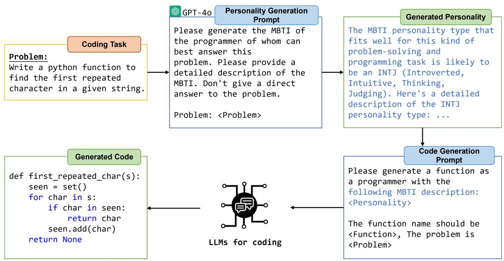
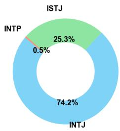
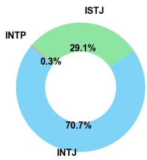
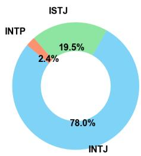
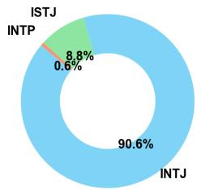
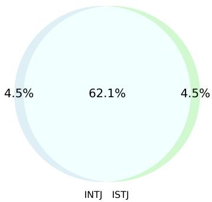

# Personality-Guided Code Generation Using Large Language Models

Yaoqi Guo1, Zhenpeng Chen2†, Jie M. Zhang3, Yang Liu2, Yun Ma1†

1Peking University, China

2Nanyang Technological University, Singapore

3King’s College London, United Kingdom

{ianwalls, mayun}@pku.edu.cn,

{zhenpeng.chen, yangliu}@ntu.edu.sg, jie.zhang@kcl.ac.uk

# Abstract

Code generation, the automatic creation of source code from natural language descriptions, has garnered significant attention due to its potential to streamline software development. Inspired by research that links taskpersonality alignment with improved development outcomes, we conduct an empirical study on personality-guided code generation using large language models (LLMs). Specifically, we investigate how emulating personality traits appropriate to the coding tasks affects LLM performance. We extensively evaluate this approach using seven widely adopted LLMs across four representative datasets. Our results show that personality guidance significantly enhances code generation accuracy, with improved pass rates in 23 out of 28 LLM-dataset combinations. Notably, in 11 cases, the improvement exceeds 5%, and in 5 instances, it surpasses 10%, with the highest gain reaching 12.9%. Additionally, personality guidance can be easily integrated with other prompting strategies to further boost performance. We open-source our code and data at https: //github.com/IanWalls/Persona-Code.

# 1 Introduction

Code generation, which aims to automatically produce source code from natural language descriptions, has attracted significant attention from both academia and industry due to its potential to streamline software development (Jiang et al., 2024). The emergence of large language models (LLMs) has advanced this field by enabling the effective generation of complete, executable code (Chen et al., 2021; Karmakar and Robbes, 2021). Additionally, specialized LLMs, such as CodeLlama (Rozière et al., 2023) and DeepSeek-Coder (DeepSeek-AI et al., 2024), have further refined these capabilities by focusing specifically on programming tasks. Previous research has observed that software development outcomes improve when individuals are assigned tasks that match their personality types (Capretz et al., 2015). Furthermore, personality diversity within teams has been shown to correlate with higher-quality software deliverables (Pieterse et al., 2018; Capretz and Ahmed, 2010).

In the code generation literature, LLMs are frequently tasked with role-playing as programmers to generate code (Jiang et al., 2024). However, it is still unclear whether assigning these “programmers” with appropriate personalities and increasing personality diversity across tasks could further enhance code generation accuracy.

To fill this knowledge gap, we present an empirical study on personality-guided code generation using LLMs. Specifically, we first use GPT-4o, an advanced general-purpose LLM, to generate a programmer personality tailored to each coding task. Next, we assign various LLMs to emulate the roles of programmers with these generated personalities and evaluate whether this enhances their code generation accuracy.

We conduct a comprehensive evaluation of personality-guided code generation using seven widely-used LLMs and four well-recognized datasets. These LLMs, developed by leading vendors such as OpenAI, Meta, Alibaba, and DeepSeek, are extensively employed for code generation in both research and real-world applications (Hou et al., 2024; Fan et al., 2023; OpenAI, 2024b; AI, 2024). For personality characterization, we use the Myers-Briggs Type Indicator (MBTI) framework (Myers, 2003), which is widely applied in project management to align tasks with individual personality types and improve team dynamics (Capretz and Ahmed, 2010).

Our results demonstrate that personality guidance significantly enhances code generation accuracy, with pass rates improving in 23 out of 28 LLMdataset combinations. In 11 cases, the improvement exceeds 5%, and in 5 instances, it surpasses 10%, with the highest gain reaching 12.9%.

Additionally, several factors appear to influence the effectiveness of personality-guided code generation, including LLM performance, dataset difficulty, and personality diversity. Specifically, moderate-performance LLMs benefit more from personality guidance compared to very strong or very weak models. Similarly, larger improvements are observed on datasets of moderate difficulty, as opposed to very easy or very difficult ones. Furthermore, greater personality diversity enhances the effectiveness of this approach, aligning with previous findings that diverse personality profiles in development teams are associated with higherquality software outcomes (Pieterse et al., 2018; Capretz and Ahmed, 2010).

Moreover, personality-guided code generation can be easily integrated with other prompting strategies. For instance, when combined with Chain of Thought (Wei et al., 2022), a widely-used prompting strategy in the code generation literature (Jiang et al., 2024), we observe additional improvements in accuracy, with the highest gain reaching 13.8%.

# 2 Related Work

This section summarizes existing work highly relevant to this paper.

# 2.1 LLM for Code Generation

The emergence of LLMs such as ChatGPT has profoundly transformed the landscape of automated code generation, making LLM-driven code generation a highly active area in both industry and the Natural Language Processing and Software Engineering communities (Jiang et al., 2024). On one hand, researchers have explored the effectiveness of general-purpose LLMs such as ChatGPT (OpenAI, 2022), GPT-4 (Achiam et al., 2023), and Llama (Dubey et al., 2024) for code generation. On the other hand, industry vendors have developed specialized LLMs designed to optimize coderelated tasks, such as DeepSeek-Coder (DeepSeek-AI et al., 2024) and CodeLlama (Rozière et al., 2023). In this paper, to comprehensively evaluate the effectiveness of personality-guided code generation, we include both widely-used general-purpose LLMs and code-specific LLMs in our evaluation.

# 2.2 Prompt Engineering for Code Generation

Prompt engineering is an important strategy for improving the performance of LLM-based code generation (Fan et al., 2023; Huang et al., 2024). It is widely recognized that LLMs can role-play to enhance performance in real-world tasks (Li et al., 2023; Chen et al., 2023; Qian et al., 2024), and in the code generation literature, LLMs are often prompted to act as programmers when generating code (Jiang et al., 2024; Liu et al., 2024b). In addition, common prompting strategies such as fewshot learning (Zheng et al., 2023) and Chain of Thought (Wei et al., 2022) are also widely adopted in code generation. In this paper, we extend the common practice of asking LLMs to act as programmers by equipping them with personalities tailored to the specific coding task. Additionally, we explore the integration of personality-guided code generation with established prompting strategies to further enhance performance.

# 2.3 Personality of LLM

Several studies have investigated the personality traits exhibited by LLMs (Song et al., 2023; Caron and Srivastava, 2022; Serapio-García et al., 2023; Huang et al., 2023). For example, Huang et al. (Huang et al., 2023) used trait theory, a psychological framework, to analyze the behavioral patterns of LLMs, finding that ChatGPT consistently exhibits an ENFJ personality. Building on the insight from prior research that diverse personality profiles within development teams are linked to higher-quality software outcomes (Pieterse et al., 2018; Capretz and Ahmed, 2010), we explore the impact of assigning diverse personalities to LLMs when they tackle different coding tasks, aiming to ensure personality diversity and potentially enhance code generation accuracy.

# 3 Personality-Guided Code Generation

This section presents our LLM-based pipeline for personality-guided code generation. As illustrated in Figure 1, the pipeline consists of two key components: personality generation and code generation. The personality generation component is responsible for creating a programmer’s personality suitable for addressing a given coding task. The code generation component then uses this generated personality to produce the code for the task. In the following, we define the coding task and provide a detailed description of each component.



<details>
<summary>flowchart</summary>

```mermaid
graph TD
    A["Coding Task"] --> B["GPT-4o"]
    B --> C["Personality Generation Prompt"]
    C --> D["Generated Personality"]
    D --> E["Code Generation Prompt"]
    E --> F["LLMs for coding"]
    
    subgraph_A["Problem: Write a python function to find the first repeated character in a given string."]
        B --> G["Please generate the MBTI of the programmer of whom can best answer this problem. Please provide a detailed description of the MBTI. Don't give a direct answer to the problem. Problem: <Problem>"]
    end
    
    subgraph_B["Generated Code"]
        H["def first_repeated_char(s): seen = set( ) for char in s: if char in seen: return char seen.add(char) return None"]
    end
    
    subgraph_C["Generated Personality"]
        I["The MBTI personality type that fits well for this kind of problem-solving and programming task is likely to be an INTJ (Introverted, Intuitive, Thinking, Judging). Here's a detailed description of the INTJ personality type: ..."]
    end
    
    subgraph_E["Code Generation Prompt"]
        J["Please generate a function as a programmer with the following MBTI description: <Personality>"]
        K["The function name should be <Function>, The problem is <Problem>"]
    end
```
</details>

Figure 1: Workflow of personality-guided code generation

Task Definition: We focus on function-level code generation tasks, which are among the most widely studied in the literature (Zheng et al., 2023). These tasks typically provide a task description and require the generation of function code to solve the given problem. For each task, a test suite is provided, containing a collection of test cases. Each test case consists of a test input and its expected output. The generated code is considered to “pass” if it successfully passes the entire test suite, meaning it produces the correct output for all test cases.

Personality Generation: For a given coding task, we prompt GPT-4o, an advanced LLM for general text understanding, to generate an appropriate personality type most suited for solving the task. We adopt the Myers-Briggs Type Indicator (MBTI), a widely recognized personality framework that classifies individuals into 16 distinct types based on four dichotomies: Extraversion/Introversion, Sensing/Intuition, Thinking/Feeling, and Judging/Perceiving (Myers, 2003). MBTI is popular for its accessibility and ease of interpretation, often used in project management to align tasks with individual personality types and enhance team dynamics (Capretz and Ahmed, 2010). In our approach, GPT-4o generates both the MBTI type and a detailed description tailored to the coding task.

Code Generation: Once the corresponding MBTI personality of a given task is generated, we move on to code generation. Our approach is applicable to various LLMs capable of generating coding. We prompt the LLM to take on the role of a programmer with the specified MBTI personality, providing a detailed description of that personality, and then it generates the code to solve the task. As previously mentioned, the generated code is considered a “pass” if it successfully passes all the test cases for the given coding task.

# 4 Experimental Setup

This section outlines the experimental setup used to evaluate personality-guided code generation.

# 4.1 Research Questions (RQs)

We aim to answer the following five RQs to evaluate personality-guided code generation.

RQ1 (Effectiveness): How effective is personalityguided code generation in enhancing generation accuracy?

RQ2 (Influencing factors): What potential factors influence the effectiveness of personality-guided code generation?

RQ3 (Combination with other strategies): Can personality-guided code generation be combined with other prompting strategies to further improve generation accuracy?

RQ4 (Prompt design): How does including the detailed personality description during code generation affect the accuracy of the generated code?

RQ5 (Personality modeling): How do different personality modeling methods impact the effectiveness of our approach?

# 4.2 Datasets

We evaluate personality-guided code generation using four widely recognized datasets: MBPP Sanitized (Austin et al., 2021), MBPP+ (Liu et al., 2024a), HumanEval+ (Liu et al., 2024a), and APPS (Hendrycks et al., 2021). In the following, we provide a brief description of each dataset.

MBPP Sanitized includes 427 crowd-sourced Python problems designed for entry-level programmers, each with a task description, code solution, and several automated test cases.   
• MBPP+ improves upon MBPP by fixing illformed problems and incorrect implementations, while expanding the test suite by 35 times for more robust evaluation.   
HumanEval+ offers 164 manually curated Python problems, each featuring a function signature, docstring, code body, and multiple unit tests to detect errors that LLMs might miss.   
APPS presents a comprehensive benchmark of 10K Python problems across varying difficulty levels. Given the large size of the dataset, we randomly sample 500 problems from the interviewlevel set to balance evaluation depth with computational efficiency.

# 4.3 LLMs Used for Code Generation

We adopt seven LLMs for evaluation, consisting of four general-purpose LLMs and three specifically designed for code-related tasks. The general LLMs include GPT-4o (OpenAI, 2024a), GPT-4o mini (OpenAI, 2024b), Llama3.1 (Dubey et al., 2024), and Qwen-Long (Yang et al., 2024), while the code-specific LLMs include DeepSeek-Coder (DeepSeek-AI et al., 2024), Codestral (AI, 2024), and CodeLlama (Rozière et al., 2023).

Table 1 lists the information of these LLMs. These LLMs are developed by leading vendors such as OpenAI, Meta, Alibaba, and DeepSeek. All of them are widely used for code generation in research and practical applications (Hou et al., 2024; Fan et al., 2023; OpenAI, 2024b; AI, 2024).

# 4.4 Evaluation Metric

We evaluate code generation accuracy by calculating the pass rate across all tasks in the dataset. An LLM is considered to pass a coding task if the code it generates successfully passes all test cases for that task. Considering the non-determinism of LLMs in code generation(Ouyang et al., 2025), to ensure the reliability of our results, we run each LLM on each dataset three times and report the average pass rate as the final outcome. Specifically, the pass rate $P$ of an LLM on a dataset is calculated as:

<table><tr><td>LLM</td><td>Size</td><td>Institution</td><td>Date</td></tr><tr><td>GPT-4o</td><td>-</td><td>OpenAI</td><td>2024-05</td></tr><tr><td>GPT-4o mini</td><td>-</td><td>OpenAI</td><td>2024-07</td></tr><tr><td>Llama3.1</td><td>70B</td><td>Meta</td><td>2024-07</td></tr><tr><td>Qwen-Long</td><td>-</td><td>Alibaba</td><td>2024-05</td></tr><tr><td>DeepSeek-Coder V2</td><td>236B</td><td>DeepSeek</td><td>2024-06</td></tr><tr><td>Codestral</td><td>22B</td><td>Mistral AI</td><td>2024-05</td></tr><tr><td>CodeLlama</td><td>13B</td><td>Meta</td><td>2023-08</td></tr></table>

Table 1: LLMs used for code generation

$$
P = \frac {1}{3} \sum_ {i = 1} ^ {3} \frac {c _ {i}}{c n t},
$$

where cnt represents the total number of tasks in the dataset, and $c _ { i }$ is the number of tasks successfully passed by the LLM in the ith run.

# 5 Results

This section answers our research questions with the experimental results.

# 5.1 RQ1: Effectiveness

Table 2 presents the comparison of pass rate for LLMs with and without personality guidance across different datasets. Specifically, for each LLM on each dataset, we evaluate two approaches: directly prompting the LLM to generate code as a programmer (the “Direct” row) and using the personality-guided method (the “MBTI” row). We report the pass rates for both approaches on each dataset, along with the change in performance introduced by personality guidance.

Overall, the personality-guided approach improves the pass rate of code generation in 23 out of 28 combinations of LLMs and datasets. In 11 combinations, the improvement exceeds 5%, and in 5 combinations, it surpasses 10%. Notably, the pass rate of GPT-4o mini on the MBPP Sanitized dataset increases by 12.9%.

Additionally, we observe that personality-guided code generation enhances the pass rate for all LLMs considered, with average improvements ranging from 0.6% to 6.5% across all datasets. Specifically, the average pass rates of Llama3.1, Qwen-Long, and Codestral improve by 5.3%, 6.5%, and 5.3%, respectively.

<table><tr><td>LLM</td><td></td><td>MBPP Sanitized</td><td>MBPP+</td><td>HumanEval+</td><td>APPS</td><td>Average Change</td></tr><tr><td rowspan="3">GPT-4o</td><td>Direct</td><td>78.2%</td><td>71.2%</td><td>84.8%</td><td>46.2%</td><td rowspan="3">↑ 1.2%</td></tr><tr><td>MBTI</td><td>84.3%</td><td>72.7%</td><td>82.9%</td><td>45.2%</td></tr><tr><td>Change</td><td>↑ 6.1%</td><td>↑ 1.5%</td><td>↓ 1.9%</td><td>↓ 1.0%</td></tr><tr><td rowspan="3">GPT-4o mini</td><td>Direct</td><td>69.3%</td><td>69.4%</td><td>80.5%</td><td>34.6%</td><td rowspan="3">↑ 4.9%</td></tr><tr><td>MBTI</td><td>82.2%</td><td>71.7%</td><td>82.3%</td><td>37.2%</td></tr><tr><td>Change</td><td>↑ 12.9%</td><td>↑ 2.3%</td><td>↑ 1.8%</td><td>↑ 2.6%</td></tr><tr><td rowspan="3">Llama3.1</td><td>Direct</td><td>69.8%</td><td>66.7%</td><td>72.0%</td><td>18.4%</td><td rowspan="3">↑ 5.3%</td></tr><tr><td>MBTI</td><td>81.0%</td><td>69.2%</td><td>72.6%</td><td>25.2%</td></tr><tr><td>Change</td><td>↑ 11.2%</td><td>↑ 2.5%</td><td>↑ 0.6%</td><td>↑ 6.8%</td></tr><tr><td rowspan="3">Qwen-Long</td><td>Direct</td><td>68.4%</td><td>67.7%</td><td>76.8%</td><td>10.2%</td><td rowspan="3">↑ 6.5%</td></tr><tr><td>MBTI</td><td>80.8%</td><td>71.2%</td><td>78.7%</td><td>18.2%</td></tr><tr><td>Change</td><td>↑ 12.4%</td><td>↑ 3.5%</td><td>↑ 1.9%</td><td>↑ 8.0%</td></tr><tr><td rowspan="3">DeepSeek-Coder V2</td><td>Direct</td><td>74.9%</td><td>71.4%</td><td>80.5%</td><td>39.4%</td><td rowspan="3">↑ 0.6%</td></tr><tr><td>MBTI</td><td>85.7%</td><td>72.2%</td><td>76.2%</td><td>34.4%</td></tr><tr><td>Change</td><td>↑ 10.8%</td><td>↑ 0.8%</td><td>↓ 4.3%</td><td>↓ 5.0%</td></tr><tr><td rowspan="3">Codestral</td><td>Direct</td><td>64.2%</td><td>61.2%</td><td>75.6%</td><td>15.8%</td><td rowspan="3">↑ 5.3%</td></tr><tr><td>MBTI</td><td>73.8%</td><td>64.9%</td><td>76.8%</td><td>22.6%</td></tr><tr><td>Change</td><td>↑ 9.6%</td><td>↑ 3.7%</td><td>↑ 1.2%</td><td>↑ 6.8%</td></tr><tr><td rowspan="3">CodeLlama</td><td>Direct</td><td>43.3%</td><td>42.4%</td><td>32.9%</td><td>1.4%</td><td rowspan="3">↑ 3.9%</td></tr><tr><td>MBTI</td><td>46.8%</td><td>52.4%</td><td>29.9%</td><td>6.4%</td></tr><tr><td>Change</td><td>↑ 3.5%</td><td>↑ 10.0%</td><td>↓ 3.0%</td><td>↑ 5.0%</td></tr></table>

Table 2: Comparison of pass rates for LLMs with and without personality guidance across different datasets

Ans. to RQ1: Personality-guided code generation significantly enhances generation accuracy, improving pass rates in 23 out of 28 LLM-dataset combinations. In 11 cases, the improvement exceeds 5%, and in 5 cases, it surpasses 10%, with GPT-4o mini showing a 12.9% gain on the MBPP Sanitized dataset.

# 5.2 RQ2: Influencing Factors

Furthermore, we explore the potential factors influencing the effectiveness of personality-guided code generation, examining them from both the model and dataset perspectives.

# 5.2.1 Model Perspective Analysis

Table 2 shows that only GPT-4o, DeepSeek-Coder V2, and CodeLlama exhibit slight decreases in pass rates in one or two cases. Additionally, in the “Direct” mode, GPT-4o and DeepSeek-Coder consistently achieve the highest pass rates among all the LLMs, while CodeLlama has the lowest.

Based on these observations, we conclude that LLMs with moderate baseline performance may benefit more from personality guidance compared to those with either very strong or very weak baseline performance. This is reasonable, as models with excellent performance may already be near Table 3: Pass rates for Qwen-Long on the MBPP Sanitized dataset when using uniform MBTI personalities, compared to direct code generation (Direct) and our diverse personality-guided approach (Diverse MBTI)

<table><tr><td>Uniform MBTI Pass rate</td><td>ENFJ 67.9%</td><td>ENFP 67.9%</td><td>ENTJ 66.7%</td><td>ENTP 65.7%</td></tr><tr><td>Uniform MBTI Pass rate</td><td>ESFJ 67.9%</td><td>ESFP 67.4%</td><td>ESTJ 67.9%</td><td>ESTP 67.6%</td></tr><tr><td>Uniform MBTI Pass rate</td><td>INFJ 67.4%</td><td>INFP 67.4%</td><td>INTJ 66.6%</td><td>INTP 68.2%</td></tr><tr><td>Uniform MBTI Pass rate</td><td>ISFJ 67.1%</td><td>ISFP 68.4%</td><td>ISTJ 66.6%</td><td>ISTP 67.4%</td></tr></table>

Direct: 68.4% Diverse MBTI: 80.8%

their potential, while those with low performance may require more fundamental improvements beyond personality guidance.

# 5.2.2 Dataset Perspective Analysis

From Table 2, we observe that pass rate decreases occur only in the HumanEval+ and APPS datasets. Notably, HumanEval+ is the easiest dataset, as five LLMs achieve a pass rate higher than 75%. In contrast, APPS is the most challenging, with no LLM achieving a pass rate above 40%.

These observations suggest that the difficulty level of the dataset influences the effectiveness of personality-guided code generation. It is reasonable that on easier tasks, where models already perform well (as seen with HumanEval+), personality guidance may offer limited improvement, or in some cases, a slight decrease. On highly challenging tasks like APPS, where baseline performance is lower, there may be more room for improvement, but the complexity of the task might limit the potential gains. Fortunately, the personality-guided approach achieves more than a 5% improvement in pass rates for four out of seven LLMs.



<details>
<summary>pie</summary>

| Category | Percentage (%) |
| :--- | :--- |
| INTJ | 74.2 |
| INTP | 0.5 |
| ISTJ | 25.3 |
</details>

(a) MBPP Sanitized



<details>
<summary>pie</summary>

| Category | Percentage (%) |
| :--- | :--- |
| INTJ | 70.7 |
| ISTJ | 29.1 |
| INTP | 0.3 |
</details>

(b) MBPP+



<details>
<summary>pie</summary>

| Category | Percentage (%) |
| :--- | :--- |
| INTJ | 78.0 |
| ISTJ | 19.5 |
| INTP | 2.4 |
</details>

(c) HumanEval+



<details>
<summary>pie</summary>

| Category | Percentage (%) |
| :--- | :--- |
| INTJ | 90.6 |
| ISTJ | 8.8 |
| INTP | 0.6 |
</details>

(d) APPS   
Figure 2: Distribution of MBTI types generated by GPT-4o for each dataset

Furthermore, we analyze the diversity of personality distributions across each dataset. Figure 2 presents the MBTI personality types assigned by GPT-4o for each dataset. We observe that HumanEval+ and APPS exhibit the least diversity, with 78.0% and 90.6% of tasks assigned the INTJ personality, respectively. This suggests that personality diversity may be a potential factor influencing the effectiveness of personality-guided code generation. The more diverse the assigned personalities, the more effective this approach tends to be.

To further demonstrate the impact of personality diversity, we set up an additional experiment to investigate the effect of assigning a uniform MBTI personality to all tasks. We select Qwen-Long as the test model because it exhibits the highest average improvement from personality guidance. Additionally, we use the MBPP Sanitized dataset, where Qwen-Long shows the greatest improvement. The significant improvement on this dataset provides a clear baseline, allowing us to better observe the impact of reducing personality diversity.

Since the MBTI framework includes 16 personality types, we consider 16 uniform personality approaches. For each approach, Qwen-Long is prompted to take on the role of a uniform MBTI personality across all coding tasks. Table 3 presents the results. The code generation accuracy varied slightly across the uniform personalities, with the highest pass rate for ISFP (68.4%) and the lowest for ENTP (65.7%), both close to the direct prompting rate (68.4%). In contrast, our diverse personality-guided approach, which assigns suitable MBTI types for each task, achieves a significantly higher pass rate of 80.8%.



<details>
<summary>pie</summary>

| Category | Value (%) |
|---|---|
| INTJ | 4.5 |
| ISTJ | 62.1 |
| Other | 4.5 |
</details>

Figure 3: Venn diagram illustrating the tasks solved by INTJ versus ISTJ types

Moreover, while INTJ dominates in Figure 2, personality diversity remains essential. To assess the impact of different MBTI types on code generation performance, we create a Venn diagram at Figure 3 illustrating the tasks solved by INTJ versus ISTJ types. A closer analysis of the data in Table 3 reveals that 62.1% of tasks can be solved by either INTJ or ISTJ, while 4.5% are uniquely solvable by INTJ and another 4.5% by ISTJ. This highlights the complementary strengths of different personality types and the importance of diversity in addressing a broader range of tasks.

Ans. to RQ2: The LLM’s performance, dataset difficulty, and personality diversity are potential factors influencing the effectiveness of personality-guided code generation. LLMs with moderate performance benefit more than those with either very strong or very weak performance. Similarly, improvements are greater on datasets of moderate difficulty compared to those that are very easy or very difficult. Additionally, greater personality diversity tends to enhance the effectiveness of personality-guided code generation.

# 5.3 RQ3: Combination with Other Strategies

This RQ investigates whether the effectiveness of personality-guided code generation can be further enhanced by combining it with existing prompting strategies. Specifically, we consider two widely used techniques: few-shot learning and Chain of Thought (CoT), both of which are popular methods for code generation (Jiang et al., 2024). Few-shot learning provides examples to guide the model’s response, helping it generalize from limited data, while CoT encourages the model to generate intermediate reasoning steps, improving complex problem-solving accuracy.

For few-shot learning, we use a three-shot approach, a widely adopted setting in the code generation literature (Zheng et al., 2023; Zhang et al., 2023); for CoT, we prompt the LLM to think step by step (Wei et al., 2022). We select the MBPP Sanitized dataset for this experiment, as it shows the most significant improvement with our personalityguided approach, making it an ideal candidate to explore potential further gains.

Table 4 presents the results. First, we find that personality-guided approach (the “Personality” column) consistently outperforms both three-shot learning and CoT strategies across all seven LLMs.

Next, we compare our approach to its combination with existing strategies. Three-shot + Personality outperforms the personality-guided approach in only three of the seven LLMs, while CoT + Personality achieves better results in five of the seven LLMs, with improvements ranging from 3.8% to 12.9%. Thus, combining CoT and personality guidance is a a promising solution, yielding improvements of 6.3% to 13.8% over direct prompting, depending on the LLM used.

Ans. to RQ3: Personality-guided code generation consistently outperforms both three-shot learning and Chain of Thought strategies across all seven LLMs. Additionally, combining Chain

of Thought with personality guidance further enhances code generation accuracy, with improvements ranging from 6.3% to 13.8%, depending on the LLM used.

# 5.4 RQ4: Prompt Design

In Section 3, we describe that during the code generation process, we provide both the MBTI type and its detailed description. This is based on the assumption that a more detailed personality description may help the LLM better role-play, potentially improving performance. However, existing research suggests that longer prompts can negatively affect LLM performance on the same task (Levy et al., 2024).

To address this, in this RQ, we evaluate whether providing a detailed description alongside the MBTI type yields better results than using a shorter prompt that only indicates the MBTI type (e.g., INTJ). As with RQ3, we select the MBPP Sanitized dataset for this experiment.

Table 5 presents the results. We find that using the full MBTI description (the “Full Prompt” column) consistently achieves higher pass rates than using only the MBTI type (the “Short Prompt” column) across all seven LLMs. On average, the full MBTI description improves the pass rate by 3.94%.

Although using only the MBTI type underperforms compared to the full description, it still outperforms the direct prompt in six out of seven LLMs, highlighting the effectiveness of personality guidance.

Furthermore, we experiment with using a template of 16 general MBTI descriptions (generated by GPT-4) in our prompt, instead of having LLMs generate them each time for every coding task. Here, we use the MBPP Sanitized dataset and Qwen-Long, as it shows the highest average improvement from personality guidance. The results indicate that using the general template results in a pass rate of 65.5%, significantly lower than the 80.8% achieved by our default approach.

Ans. to RQ4: Using the full MBTI description (i.e., the default setting in our approach) consistently outperforms using only the MBTI type across all seven LLMs, with an average performance improvement of 3.94%.

# 5.5 RQ5: Personality Modeling

<table><tr><td>LLM</td><td>Personality</td><td>Three-shot</td><td>Three-shot +Personality</td><td>CoT</td><td>CoT+ Personality</td></tr><tr><td>GPT-4o</td><td>84.3%</td><td>77.3%</td><td>86.7%</td><td>77.0%</td><td>85.7%</td></tr><tr><td>GPT-4o mini</td><td>82.2%</td><td>69.6%</td><td>82.2%</td><td>71.9%</td><td>81.5%</td></tr><tr><td>Llama3.1</td><td>74.9%</td><td>67.7%</td><td>78.9%</td><td>67.4%</td><td>79.9%</td></tr><tr><td>Qwen-Long</td><td>80.8%</td><td>66.7%</td><td>76.6%</td><td>69.6%</td><td>82.2%</td></tr><tr><td>DeepSeek-Coder V2</td><td>85.7%</td><td>76.1%</td><td>83.8%</td><td>72.4%</td><td>83.8%</td></tr><tr><td>Coderstral</td><td>73.8%</td><td>65.3%</td><td>72.8%</td><td>66.0%</td><td>74.5%</td></tr><tr><td>CodeLlama</td><td>46.8%</td><td>46.6%</td><td>47.1%</td><td>30.4%</td><td>49.6%</td></tr></table>

Table 4: Comparison of pass rates achieved by our approach, existing prompting strategies, and their combination

<table><tr><td>LLM</td><td>Direct</td><td>Full Prompt</td><td>Short Prompt</td></tr><tr><td>GPT-4o</td><td>78.2%</td><td>84.3%</td><td>82.9%</td></tr><tr><td>GPT-4o mini</td><td>69.3%</td><td>82.2%</td><td>80.1%</td></tr><tr><td>Llama3.1</td><td>69.8%</td><td>81.0%</td><td>72.4%</td></tr><tr><td>Qwen-Long</td><td>68.4%</td><td>80.8%</td><td>73.3%</td></tr><tr><td>DeepSeek-Coder</td><td>74.9%</td><td>85.7%</td><td>83.1%</td></tr><tr><td>Coderstral</td><td>64.2%</td><td>73.8%</td><td>72.1%</td></tr><tr><td>CodeLlama</td><td>43.3%</td><td>46.8%</td><td>43.1%</td></tr></table>

Table 5: Comparison of pass rates between Direct prompting, our approach using the full MBTI description (Full Prompt), and using only the MBTI type (Short Prompt)

<table><tr><td>LLM</td><td>MBTI</td><td>Big Five</td></tr><tr><td>GPT-4o</td><td>84.3%</td><td>82.9%</td></tr><tr><td>GPT-4o mini</td><td>82.2%</td><td>69.0%</td></tr><tr><td>Llama3.1</td><td>81.0%</td><td>72.1%</td></tr><tr><td>Qwen-Long</td><td>80.8%</td><td>71.4%</td></tr><tr><td>DeepSeek-Coder</td><td>85.7%</td><td>72.8%</td></tr><tr><td>Coderstral</td><td>73.8%</td><td>63.4%</td></tr><tr><td>CodeLlama</td><td>46.8%</td><td>42.4%</td></tr></table>

Table 6: Comparison of pass rates between using MBTI and Big Five Personality

This RQ examines how the choice of personality modeling methods influences the effectiveness of our approach. To this end, we compare our default approach (i.e., using MBTI) with the Big Five Personality model (John et al., 1991), another widely used personality modeling framework. The Big Five Personality model includes five dimensions: openness, conscientiousness, extroversion, agreeableness, and neuroticism.

We use the same experimental setup and prompts as those used for MBTI prompting, with the only change being the personality model, which is switched to the Big Five Personality. As in RQ3 and RQ4, we select the MBPP Sanitized dataset for this experiment. The comparison results are shown in Table 6. Our findings indicate that MBTIbased personality prompting outperforms Big Five Personality prompting across all evaluated LLMs. This result suggests that MBTI is more suitable for personality modeling in our framework. This can be attributed to the different perspectives emphasized by the two modeling methods. Among the five dimensions of the Big Five Personality model, only conscientiousness is strongly linked to coding performance. In contrast, the MBTI offers a structured framework for modeling cognitive preferences, making it particularly well-suited for code generation. Each MBTI dimension reflects distinct cognitive approaches: for example, Sensing emphasizes detail-oriented problem-solving for debugging, Intuition fosters abstract thinking for algorithm design, Thinking ensures logical precision, and Feeling takes values into account for usercentric decisions.

Code generation uniquely requires logical precision, abstract reasoning, and context-sensitive problem-solving—traits that align well with MBTI dimensions. Embedding these cognitive traits into LLMs allows for task-specific alignment, much like matching tasks to human cognitive strengths, providing a theoretical basis for the enhanced effectiveness of code generation.

Ans. to RQ5: MBTI is better suited for personality modeling in our framework than the Big Five Personality Model. Across all evaluated LLMs, using MBTI results in higher code generation accuracy compared to the Big Five.

# 6 Discussion

We further discuss the implications based on our findings: (1) Our study demonstrates that introducing personality traits into LLMs significantly enhances code generation accuracy. It offers practical solutions for developers to improve LLMs for better code generation, and suggests that LLM performance is not purely computational but can be improved by mimicking human cognitive processes, transforming LLMs into more nuanced, contextaware problem solvers. (2) Our results emphasize the importance of personality diversity in improving task-specific performance, highlighting its potential to address a broader range of challenges effectively. (3) The observed synergy between personality guidance and strategies like Chain of Thought underscores its modularity, showing that personality guidance can integrate seamlessly with other techniques to enhance LLM reasoning and problem-solving.

# 7 Conclusion

This paper presents a large-scale empirical study on personality-guided code generation using LLMs. While existing research typically involves LLMs role-playing as programmers to generate code, this study investigates whether assigning these “programmers” with appropriate personalities can further improve code generation accuracy. To explore this, we conduct an extensive evaluation using four widely-adopted datasets and seven advanced LLMs developed by leading vendors. Our results show that personality guidance significantly boosts code generation accuracy, with pass rates improving in 23 out of 28 LLM-dataset combinations. Notably, in 11 cases, the improvement exceeds 5%, and in 5 instances, it surpasses 10%, with the highest gain reaching 12.9%.

# 8 Limitations

As an empirical study, this paper has several limitations. First, the personality traits examined are limited to the MBTI framework. While MBTI is widely used, relying solely on it may not capture the full complexity of personality traits and their potential impact on LLM performance. Second, although we evaluated seven LLMs, including both general-purpose and code-task-specific models, the generalizability of our findings to other LLMs requires further investigation. Third, our study focuses on function-level code generation across four datasets, a common area in the literature. In future work, we plan to extend our evaluation to more complex code generation tasks to broaden the scope of our findings. Fourth, since we do not have ground-truth personality labels for each task, we evaluate the predictive accuracy of GPT-4o’s generated personalities indirectly through their impact on code generation accuracy. Thus we cannot explicitly calculate the theoretical upper bound score of personality guided code generation.

# Acknowledgments

Jie M. Zhang is supported by the ITEA Genius and ITEA GreenCode projects, funded by InnovateUK. Zhenpeng Chen and Yang Liu are supported by the National Research Foundation Singapore and DSO National Laboratories under the AI Singapore Programme (AISG Award No. AISG2-RP-2020-019); by the National Research Foundation Singapore and the Cyber Security Agency of Singapore under the National Cybersecurity R&D Programme (NCRP25-P04-TAICeN); and by the National Research Foundation, Prime Minister’s Office, Singapore under the Campus for Research Excellence and Technological Enterprise (CREATE) programme. Any opinions, findings, conclusions, or recommendations expressed in this paper are those of the authors and do not reflect the views of the National Research Foundation Singapore or the Cyber Security Agency of Singapore.

# References

Josh Achiam, Steven Adler, Sandhini Agarwal, Lama Ahmad, Ilge Akkaya, Florencia Leoni Aleman, Diogo Almeida, Janko Altenschmidt, Sam Altman, Shyamal Anadkat, et al. 2023. GPT-4 technical report. arXiv preprint arXiv:2303.08774.

Mistral AI. 2024. Codestral: Hello, world! mistral ai | frontier ai in your hands.

Jacob Austin, Augustus Odena, Maxwell Nye, Maarten Bosma, Henryk Michalewski, David Dohan, Ellen Jiang, Carrie Cai, Michael Terry, Quoc Le, et al. 2021. Program synthesis with large language models. arXiv preprint arXiv:2108.07732.

Luiz Fernando Capretz and Faheem Ahmed. 2010. Why do we need personality diversity in software engineering? ACM SIGSOFT Software Engineering Notes, 35(2):1–11.

Luiz Fernando Capretz, Daniel Varona, and Arif Raza. 2015. Influence of personality types in software tasks choices. Computers in Human behavior, 52:373–378.

Graham Caron and Shashank Srivastava. 2022. Identifying and manipulating the personality traits of language models. arXiv preprint arXiv:2212.10276.

Bei Chen, Fengji Zhang, Anh Nguyen, Daoguang Zan, Zeqi Lin, Jian-Guang Lou, and Weizhu Chen. 2022. Codet: Code generation with generated tests. arXiv preprint arXiv:2207.10397.

Guangyao Chen, Siwei Dong, Yu Shu, Ge Zhang, Jaward Sesay, Börje F Karlsson, Jie Fu, and Yemin

Shi. 2023. Autoagents: A framework for automatic agent generation. arXiv preprint arXiv:2309.17288.   
Mark Chen, Jerry Tworek, Heewoo Jun, Qiming Yuan, Henrique Ponde De Oliveira Pinto, Jared Kaplan, Harri Edwards, Yuri Burda, Nicholas Joseph, Greg Brockman, et al. 2021. Evaluating large language models trained on code. arXiv preprint arXiv:2107.03374.   
DeepSeek-AI, Qihao Zhu, Daya Guo, et al. 2024. DeepSeek-Coder-V2: Breaking the barrier of closedsource models in code intelligence. arXiv preprint arXiv:2406.11931.   
Abhimanyu Dubey, Abhinav Jauhri, Abhinav Pandey, et al. 2024. The Llama 3 herd of models. arXiv preprint arXiv:2407.21783.   
Angela Fan, Beliz Gokkaya, Mark Harman, Mitya Lyubarskiy, Shubho Sengupta, Shin Yoo, and Jie M Zhang. 2023. Large language models for software engineering: Survey and open problems. In Proceedings of 2023 IEEE/ACM International Conference on Software Engineering: Future of Software Engineering (ICSE-FoSE), pages 31–53.   
Dan Hendrycks, Steven Basart, Saurav Kadavath, Mantas Mazeika, Akul Arora, Ethan Guo, Collin Burns, Samir Puranik, Horace He, Dawn Song, and Jacob Steinhardt. 2021. Measuring coding challenge competence with APPS. In Proceedings of the Neural Information Processing Systems (NeurIPS), Datasets and Benchmarks Track.   
Xinyi Hou, Yanjie Zhao, Yue Liu, Zhou Yang, Kailong Wang, Li Li, Xiapu Luo, David Lo, John Grundy, and Haoyu Wang. 2024. Large language models for software engineering: A systematic literature review. ACM Transactions on Software Engineering and Methodology, 33(8):220:1–220:79.   
Dong Huang, Jianbo Dai, Han Weng, Puzhen Wu, Yuhao Qing, Heming Cui, Zhijiang Guo, and Jie Zhang. 2024. Effilearner: Enhancing efficiency of generated code via self-optimization. In Proceedings of Advances in Neural Information Processing Systems (NeurIPS), volume 37, pages 84482–84522.   
Jen-tse Huang, Wenxuan Wang, Man Ho Lam, Eric John Li, Wenxiang Jiao, and Michael R Lyu. 2023. Chat-GPT an ENFJ, Bard an ISTJ: Empirical study on personalities of large language models. arXiv preprint arXiv:2305.19926.   
Juyong Jiang, Fan Wang, Jiasi Shen, Sungju Kim, and Sunghun Kim. 2024. A survey on large language models for code generation. arXiv preprint arXiv:2406.00515.   
Oliver P John, Eileen M Donahue, and Robert L Kentle. 1991. Big five inventory. Journal of personality and social psychology.   
Anjan Karmakar and Romain Robbes. 2021. What do pre-trained code models know about code? In Proceedings of the 36th IEEE/ACM International Conference on Automated Software Engineering (ASE), pages 1332– 1336.

Mosh Levy, Alon Jacoby, and Yoav Goldberg. 2024. Same task, more tokens: The impact of input length on the reasoning performance of large language models. In Proceedings of the 62nd Annual Meeting of the Association for Computational Linguistics (ACL), pages 15339–15353.

Guohao Li, Hasan Hammoud, Hani Itani, Dmitrii Khizbullin, and Bernard Ghanem. 2023. Camel: Communicative agents for mind exploration of large language model society. In Proceedings of Advances in Neural Information Processing Systems (NeurIPS), volume 36, pages 51991–52008.

Jiawei Liu, Chunqiu Steven Xia, Yuyao Wang, and Lingming Zhang. 2024a. Is your code generated by chatgpt really correct? Rigorous evaluation of large language models for code generation. In Proceedings of Advances in Neural Information Processing Systems (NeurIPS), volume 36.

Junwei Liu, Kaixin Wang, Yixuan Chen, Xin Peng, Zhenpeng Chen, Lingming Zhang, and Yiling Lou. 2024b. Large language model-based agents for software engineering: A survey. arXiv preprint arXiv:2409.02977.

Isabel Briggs Myers. 2003. MBTI manual: A guide to the development and use of the Myers-Briggs Type Indicator. CPP.

OpenAI. 2022. ChatGPT: Optimizing language models for dialogue.

OpenAI. 2024a. GPT-4o.

OpenAI. 2024b. GPT-4o mini.

Shuyin Ouyang, Jie M Zhang, Mark Harman, and Meng Wang. 2025. An empirical study of the non-determinism of chatgpt in code generation. ACM Transactions on Software Engineering and Methodology, 34(2):1–28.

Vreda Pieterse, Mpho Leeu, and Marko C. J. D. van Eekelen. 2018. How personality diversity influences team performance in student software engineering teams. In Proceedings of the 2018 Conference on Information Communications Technology and Society (IC-TAS), pages 1–6.

Chen Qian, Wei Liu, Hongzhang Liu, Nuo Chen, Yufan Dang, Jiahao Li, Cheng Yang, Weize Chen, Yusheng Su, Xin Cong, Juyuan Xu, Dahai Li, Zhiyuan Liu, and Maosong Sun. 2024. ChatDev: Communicative agents for software development. In Proceedings of the 62nd Annual Meeting of the Association for Computational Linguistics (ACL), pages 15174–15186.

Baptiste Rozière, Jonas Gehring, Fabian Gloeckle, Sten Sootla, Itai Gat, Xiaoqing Ellen Tan, Yossi Adi, Jingyu Liu, Tal Remez, Jérémy Rapin, Artyom Kozhevnikov, Ivan Evtimov, Joanna Bitton, Manish Bhatt, Cristian Canton-Ferrer, Aaron Grattafiori, Wenhan Xiong, Alexandre Défossez, Jade Copet, Faisal Azhar, Hugo Touvron, Louis Martin, Nicolas Usunier, Thomas Scialom, and Gabriel Synnaeve. 2023. Code Llama: Open foundation models for code. arXiv preprint arXiv:2308.12950.

Greg Serapio-García, Mustafa Safdari, Clément Crepy, Luning Sun, Stephen Fitz, Peter Romero, Marwa Abdulhai, Aleksandra Faust, and Maja Mataric. 2023. Per- ´ sonality traits in large language models. arXiv preprint arXiv:2307.00184.

Xiaoyang Song, Akshat Gupta, Kiyan Mohebbizadeh, Shujie Hu, and Anant Singh. 2023. Have large language models developed a personality?: Applicability of self-assessment tests in measuring personality in LLMs. arXiv preprint arXiv:2305.14693.

Jason Wei, Xuezhi Wang, Dale Schuurmans, Maarten Bosma, Brian Ichter, Fei Xia, Ed H. Chi, Quoc V. Le, and Denny Zhou. 2022. Chain-of-thought prompting elicits reasoning in large language models. In Proceedings of Advances in Neural Information Processing Systems (NeurIPS), pages 24824–24837.

An Yang, Baosong Yang, Binyuan Hui, Bo Zheng, Bowen Yu, Chang Zhou, Chengpeng Li, Chengyuan Li, Dayiheng Liu, Fei Huang, et al. 2024. Qwen2 technical report. arXiv preprint arXiv:2407.10671.

Tianyi Zhang, Tao Yu, Tatsunori Hashimoto, Mike Lewis, Wen-tau Yih, Daniel Fried, and Sida Wang. 2023. Coder reviewer reranking for code generation. In Proceedings of International Conference on Machine Learning (ICML), pages 41832–41846.

Zibin Zheng, Kaiwen Ning, Yanlin Wang, Jingwen Zhang, Dewu Zheng, Mingxi Ye, and Jiachi Chen. 2023. A survey of large language models for code: Evolution, benchmarking, and future trends. arXiv preprint arXiv:2311.10372.

# A Prompt and Personality Example

The prompts used in MBTI prompting are listed in Figure 1. The personality recommendation example is listed in Figure 4. The few-shot prompting and CoT prompting structures are listed in Figure 5.

# B Impact of Personality-Generation LLM

This section tries to answer the question that if we use other LLMs to generate personality, how would this impact the effectiveness of personality-guided code generation?

In Section 3, we describe that GPT-4o is used for personality generation. This RQ evaluates this setting by comparing it to a setting where the codegeneration LLM is also used for personality generation. For example, when Qwen-Long is used for code generation, it also generates its own personality for each task. CodeLlama is excluded from the comparison because it lacks the capability to generate appropriate personality. As with RQ3 and RQ4, we use the MBPP Sanitized dataset for this experiment.

<table><tr><td>LLM</td><td>Direct</td><td>Self</td><td>GPT-4o</td></tr><tr><td>GPT-4o</td><td>78.3%</td><td>84.3%</td><td>-</td></tr><tr><td>GPT-4o mini</td><td>69.3%</td><td>82.7%</td><td>82.2%</td></tr><tr><td>Llama3.1</td><td>69.8%</td><td>74.9%</td><td>81.0%</td></tr><tr><td>Qwen-Long</td><td>68.4%</td><td>74.5%</td><td>80.8%</td></tr><tr><td>DeepSeek-Coder</td><td>74.9%</td><td>84.8%</td><td>85.7%</td></tr><tr><td>Codestral</td><td>64.2%</td><td>70.7%</td><td>73.8%</td></tr><tr><td>CodeLlama</td><td>43.3%</td><td>-</td><td>53.2%</td></tr></table>

Table 7: Comparison of pass rates between using each LLM individually for personality generation (Column “Self”) and using GPT-4o consistently for personality generation

<table><tr><td>LLM</td><td>Direct</td><td>S/N Only</td><td>Personality</td></tr><tr><td>GPT4o</td><td>78.2%</td><td>78.5%</td><td>84.3%</td></tr><tr><td>GPT4o mini</td><td>69.3%</td><td>70.3%</td><td>82.2%</td></tr><tr><td>llama 3.1</td><td>69.8%</td><td>72.2%</td><td>81.0%</td></tr><tr><td>Qwen</td><td>68.4%</td><td>74.2%</td><td>80.8%</td></tr><tr><td>Deepseek</td><td>74.9%</td><td>74.2%</td><td>85.7%</td></tr><tr><td>Codestral</td><td>64.2%</td><td>57.6%</td><td>73.8%</td></tr><tr><td>Codellama</td><td>43.3%</td><td>43.3%</td><td>46.8%</td></tr><tr><td>Avg. Change</td><td>-</td><td>0.3%</td><td>9.5%</td></tr></table>

Table 8: Ablation experiment results of considering only the sensing/intuition dimension

Table 7 shows the comparison results. We find that using GPT-4o consistently for personality generation (the “GPT-4o” column) outperforms using each LLM individually (the “Self” column) in four out of five LLMs. For GPT-4o mini, using it for both personality and code generation results in a slightly higher pass rate (0.5%) than using GPT-4o for personality generation. For the remaining four LLMs, the average improvement of using GPT-4o over the code-generation LLM is 4.1%. Additionally, given that LLMs designed for code-specific tasks, such as CodeLlama, may struggle to generate personalities based on problem descriptions, we recommend using GPT-4o as the default LLM for personality generation, as demonstrated in our methodology.

# C Single Dimension Ablation Experiment

The distribution of MBTI types generated by GPT-4o for each dataset is primarily concentrated around two types: INTJ and ISTJ. Thus we conduct the ablation experiment to investigate whether considering only the sensing/intuition dimension suffice.

Using the representative MBPP Sanitized dataset, we prompted the LLM to adopt the role of a programmer with the specified S/N property for each task. The results, shown in the table below, reveal

To determine the MBTI (Myers-Briggs Type Indicator） personality type of a programmer who can best answer the question of writing a function to get all lucid numbers smaller than or equal to a given integer，we need to consider the traits that would make someone particularly suited for this task.

The MBTI personality type that fits well for this kind of problem-solving and programming task is likely to be an \*\*INTJ (Introverted，Intuitive，Thinking， Judging)\*\*.Here'sa detailed description of the INTJ personality type:

\### INTJ:The Architect

\#### \*\*Introverted (I)\*\*

\*\*Focused and Independent:\*\* INTJs are highly self-sufficient and prefer working alone or in small groups.They are comfortable diving deep into complex problems without needing constant social interaction.

\*\*Reflective:\*\* They spend a lot of time thinking and reflecting on ideas，which helps them come up with innovative solutions.

\#### \*\*Intuitive (N)\*\*

\*\*Big Picture Thinkers:\*\* INTJs are adept at seeing the big picture and understanding abstract concepts.They can easily grasp the underlying principles of a problem，which is crucial for algorithm design and optimization.

\*\*Innovative:\*\* They enjoy exploring new ideas and possibilities，which can lead to creative and efficient solutions to programming challenges.

\#### \*\*Thinking（T)\*\*

\*\*Logical and Analytical:\*\* INTJs rely on logic and objective analysis to make decisions.

They are skilled at breaking down complex problems into manageable parts and finding logical solutions.

\*\*Objective:\*\* They prioritize efficiency and effectiveness，ensuring that their code is not only functional but also optimized.

\#### \*\*Judging （J）\*\*

\*\*0rganized and Planned:\*\* INTJs prefer structure and planning.They are likely to approach the problem methodically，ensuring that their function is well-organized and thoroughly tested.

\*\*Decisive:\*\* They are quick to make decisions and implement solutions,which helps in writing and refining code efficiently.

\### Why an INTJ is Suitable for This Task

An INTJ programmer would excel at writing a function to get all lucid numbers smaller than or equal to a given integer because they possess the following qualities:

\*\*Analytical Skills:\*\* They can analyze the requirements and constraints of the problem effectively.

\*\*Problem-Solving Abilities:\*\* They can devise a clear and efficient algorithm to identify lucid numbers.

\*\*Attention to Detail:\*\* They ensure that the function is accurate and handles edge cases.

\*\*Efficiency:\*\* They strive to write optimized code that performs well even for larger inputs. By leveraging their strengths in logical analysis,innovative thinking，and structured planning，an INTJ programmer would be well-equipped to tackle this programming challenge.

Figure 4: Personality example recommended by GPT-4o

# Few Shot Code Generation

Please generate a function as a programmer with the following MBTI description: <Personality>. Here are some examples:<n \* Examples>

The function name should be <Function> ，The problem is <Problem>.

# CoT Code Generation

Please generate a function as a programmer with the following MBTI description: <Personality>. You should first write a rough problem-solving process，and then output the final code.Don't give usage of the code，just the code.

The function name should be <Function>，The problem is <Problem> + Lets think step by step.

Figure 5: Few-shot and CoT prompt structures

that using only the S/N property improves code generation accuracy for 4 out of 7 LLMs, with an average pass rate increase of 0.3%. By comparison, prompts incorporating the full MBTI properties achieve a higher average pass rate improvement of 9.5%. This result reveals the adequacy of using MBTI modeling in its entirety rather than solely one dimension.

# D Pass@5 and Pass@10 Results

<table><tr><td rowspan="2">LLM</td><td colspan="3">Direct</td><td colspan="3">Personality</td></tr><tr><td>Pass@1</td><td>Pass@5</td><td>Pass@10</td><td>Pass@1</td><td>Pass@5</td><td>Pass@10</td></tr><tr><td>GPT-4o</td><td>78.2%</td><td>80.1%</td><td>82.0%</td><td>84.3%</td><td>91.6%</td><td>93.9%</td></tr><tr><td>GPT-4o mini</td><td>69.3%</td><td>74.7%</td><td>77.8%</td><td>82.2%</td><td>86.4%</td><td>92.0%</td></tr><tr><td>Llama3.1</td><td>69.8%</td><td>74.0%</td><td>76.6%</td><td>81.0%</td><td>85.5%</td><td>92.3%</td></tr><tr><td>Coderstral</td><td>64.2%</td><td>73.8%</td><td>79.2%</td><td>73.8%</td><td>85.0%</td><td>92.7%</td></tr><tr><td>CodeLlama</td><td>43.3%</td><td>46.6%</td><td>47.1%</td><td>46.8%</td><td>49.6%</td><td>51.2%</td></tr></table>

Table 9: Comparison of pass@k achieved by Direct and Personality methods on MBPP Sanitized dataset

<table><tr><td>LLM</td><td>Unit Price</td><td>GPU Time</td><td>Total Cost</td></tr><tr><td>GPT4o</td><td>$5</td><td>-</td><td>$1.75</td></tr><tr><td>GPT4o mini</td><td>$0.3</td><td>-</td><td>$0.105</td></tr><tr><td>llama 3.1</td><td>-</td><td>11.5h</td><td>$13.8</td></tr><tr><td>Qwen</td><td>$0.28</td><td>-</td><td>$0.098</td></tr><tr><td>Deepseek</td><td>$0.28</td><td>-</td><td>$0.098</td></tr><tr><td>Codestral</td><td>$0.5</td><td>-</td><td>$0.175</td></tr><tr><td>Codellama</td><td>-</td><td>1.5h</td><td>$1.8</td></tr></table>

Table 10: Resource consumption of different LLMs on one experiment round, including direct prompting, personality suggestion, and personality-guided code generation. The unit price is for 1 million token outputs, and the GPU time is based on A800, which is \$1.2 for one hour of calculation.

Following former code generation work(Chen et al., 2021, 2022), we add Pass@k as a complement to our evaluation metrics. Specifically, given a task, a LLM generates k programs. The task is solved if any generated programs pass all test cases. We compute the percentage of solved tasks in total requirements as Pass@k. The formula is:

$$
\text { Pass } @ \mathrm{k} = \frac {1}{N} \sum_ {i = 1} ^ {N} 1 * (\text { Correct } _ {i} \in \text { Top- } k (\text { Choices } _ {i}))
$$

We choose $k \in \{ 1 , 5 , 1 0 \}$ , and we select MBPP Sanitized dataset for this experiment. Since the APIs of Qwen-long and Deepseek Coder V2 do not support generating top k options simultaneously, we only measure the Pass@k of the rest five models. The results are listed in Table 9. The results of Pass@5 and Pass@10 are the same as the conclusions about MBPP Sanitized in RQ1, which help strengthen the robustness of the findings.

# E Resource Consumption Report

Regarding computational costs, using the representative MBPP Sanitized dataset (427 tasks), one experiment round, including direct prompting, personality suggestion, and personality-guided code generation, consumes 0.35M tokens, costing about

\$1.75 with GPT-4o (\$0.004 per task). The costs are significantly lower for other LLMs. The resource consumption of different models is listed in Table 10. The results reveals that the overall cost of our method is rather efficient. For llama 3.1 and codellama are deployed on a computing cluster with 4 A800 GPUs, thus the cost is more than API calls.