# ProtoVQA: An Adaptable Prototypical Framework for Explainable Fine-Grained Visual Question Answering

Xingjian Diao⋄♣, Weiyi Wu⋄♣, Keyi Kong⋆, Peijun Qing♣, Xinwen Xu♠, Ming Cheng♣, Soroush Vosoughi♣, Jiang Gui♣

♣Dartmouth College ⋆Shandong University ♠Harvard University {xingjian.diao, weiyi.wu}.gr@dartmouth.edu

# Abstract

Visual Question Answering (VQA) is increasingly used in diverse applications ranging from general visual reasoning to safety-critical domains such as medical imaging and autonomous systems, where models must provide not only accurate answers but also explanations that humans can easily understand and verify. Prototype-based modeling has shown promise for interpretability by grounding predictions in semantically meaningful regions for purely visual reasoning tasks, yet remains underexplored in the context of VQA. We present ProtoVQA, a unified prototypical framework that (i) learns question-aware prototypes that serve as reasoning anchors, connecting answers to discriminative image regions, (ii) applies spatially constrained matching to ensure that the selected evidence is coherent and semantically relevant, and (iii) supports both answering and grounding tasks through a shared prototype backbone. To assess explanation quality, we propose the Visual–Linguistic Alignment Score (VLAS), which measures how well the model’s attended regions align with ground-truth evidence. Experiments on Visual7W show that ProtoVQA yields faithful, fine-grained explanations while maintaining competitive accuracy, advancing the development of transparent and trustworthy VQA systems.

# 1 Introduction

Visual Question Answering (VQA) is a key challenge in AI, requiring systems to understand and reason about both visual content and natural language queries (Zhu et al., 2016; Kafle and Kanan, 2017; Li et al., 2024a). Recent advances in vision transformers (Dosovitskiy et al., 2021; Touvron et al., 2021) have significantly improved performance by enhancing multimodal feature learning, leading to better accuracy on VQA benchmarks. As VQA systems are applied in critical fields such as medical diagnosis (Wang et al., 2022; Donnelly et al., 2024; Yang et al., 2024), autonomous driving (Ramos et al., 2017) and criminal justice (Berk et al., 2019), model transparency is essential. Current state-of-the-art models operate as black boxes, making it difficult to interpret their reasoning or verify reliability. Traditional VQA interpretability approaches, primarily using attention visualization or post-hoc explanation methods, often fail to faithfully represent the internal decisionmaking process of the model (Chen et al., 2019; Ma et al., 2023, 2024).

Prototype-based learning has emerged as a promising approach to improving interpretability (Chen et al., 2019; Barnett et al., 2021; Donnelly et al., 2022; Ma et al., 2023). The latest work like ProtoViT (Ma et al., 2024) shows that Vision Transformers can enable flexible prototype learning while maintaining interpretability. In ProtoViT, each prototype is a learned embedding representing a recurring semantic concept, such as an object part or texture. At inference, the model matches image patches to prototypes and visualizes these regions to expose the reasoning process. For example, a “beak” prototype often activates on bird-head areas, grounding the decision in interpretable visual cues.

While these methods have shown success in purely visual tasks, extending prototype-based reasoning to multimodal settings introduces unique challenges. In particular, VQA requires aligning visual evidence with language queries, which complicates prototype learning and interpretability. Key challenges include: (i) Prototype-based approaches often focus on single modality (visual/textual) interpretability, struggling to bridge the visual-textual semantic gap; (ii) Rigid prototypical features fail to capture geometric variations and dynamic visualquestion relationships; (iii) These methods lack the ability to provide fine-grained explanations at both the component level and system level, making it difficult to understand how individual parts contribute to the final decision.

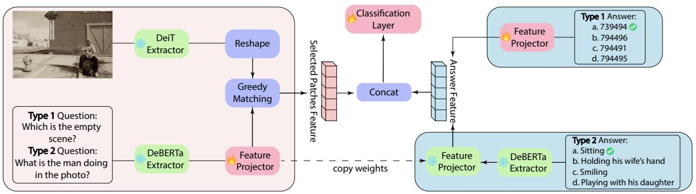

flowchart

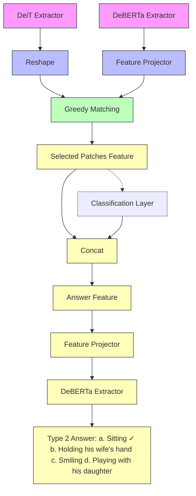

Figure 1: Overview of ProtoVQA. ProtoVQA extracts visual features through DeiT Extractor and encodes questions through DeBERTa Extractor. Image patch features undergo greedy matching with question-aware prototypes generated through a feature projector. For answering, the model processes either coordinate inputs (Type 1) through another projector, or textual answers (Type 2) through DeBERTa and a frozen feature projector sharing weights from the question branch. The matched patch features are concatenated with answer features for final classification.

To address these issues, we propose ProtoVQA. Our contributions are:

• We introduce an adaptable prototypical framework capable of seamlessly handling diverse visual-linguistic downstream tasks, including both visual question answering and grounding, through a shared prototype-based backbone with task-specific answer processing modules.   
• We employ a spatially-constrained greedy matching strategy to model dynamic visual-question relationships and geometric variations.   
• Our model achieves comprehensive explainability through explicit visual evidence and systematic validation of visual-linguistic alignment.

# 2 ProtoVQA

We present ProtoVQA (Figure 1), a prototype-based approach to visual question answering that achieves interpretability through question-aware prototype learning and spatially-constrained patch matching. By explicitly mapping prototypes to discriminative image regions, ProtoVQA can provide transparent reasoning paths from questions to visual evidence.

# 2.1 Feature Extraction Module

The visual feature extraction leverages pre-trained DeiT (Touvron et al., 2021) as a backbone to extract patch-level visual features. Let $I \in \mathbf { \Sigma }$ $\mathbb { R } ^ { H \times W \times \mathbf { \hat { 3 } } }$ denote the input image. The DeiT backbone processes I to produce a feature map $F ~ = ~ [ f _ { \mathrm { C L S } } , f _ { 1 } , \dots , f _ { N } ] ~ \mathbf { \hat { \mu } } \in ~ \mathbb { R } ^ { ( N + 1 ) \times D }$ , where $f _ { \mathrm { C L S } } \in \mathbb { R } ^ { D }$ is the global CLS token feature and $f _ { n } \in \mathbb { R } ^ { D }$ for $n \in \{ 1 , . . . , N \}$ are the image patch features. Patch feature representation is enhanced by forming $F _ { \mathrm { v i s u a l } } = [ f _ { 1 } - f _ { \mathrm { C L S } } , \dots , f _ { N } - f _ { \mathrm { C L S } } ]$

For textual input, ProtoVQA utilizes a pre-trained DeBERTa model (He et al., 2021). The question $Q ,$ , represented as a token sequence $[ q _ { 1 } , q _ { 2 } , . . . , q _ { l _ { q } } ]$ , is encoded by DeBERTa, yielding embeddings $E _ { q } \in \mathbb { R } ^ { l _ { q } \times D _ { \mathrm { t e x t } } }$ , where $D _ { \mathrm { t e x t } }$ is the DeBERTa hidden dimension. These embeddings are then projected into the shared visual-linguistic space $\mathbf { \bar { \mathbb { R } } } ^ { D }$ via a learnable feature projector ${ \mathcal F } .$ For answer processing, there are two pathways: For question answering tasks, answer candidates are encoded by DeBERTa and projected to $\mathbb { R } ^ { D }$ using the same feature projector $\mathcal { F }$ with frozen parameters whose weights are copied from the question encoding. This weight-sharing mechanism ensures consistent representation of question and answer candidates in the shared visual-linguistic space, while the frozen parameter design prevents potential overfitting. For visual grounding tasks, the coordinate inputs $P \in \mathbb { R } ^ { 4 }$ are directly projected to the same feature space through a separate feature projector.

# 2.2 Interpretable Prototypical Part Selection Module

This module constitutes the core novelty and interpretability mechanism of ProtoVQA. It introduces sub-patch prototypes and a greedy matching algorithm with spatial constraints to select salient image parts.

# 2.2.1 Sub-patch Prototypes

To link question semantics with visual evidence, we reshape the first m k projected question tokens

into a 3D tensor:

$$
P = \text { Reshape } (\mathcal {F} (E _ {q} [: m \times k ])) \in \mathbb {R} ^ {m \times k \times D}. \tag {1}
$$

This forms m prototypes, each composed of k subpatches prototypes sharing the same dimensionality as visual features. These prototypes act as semantic anchors, capturing discriminative visual concepts conditioned on the question. A learnable weighting mechanism modulates the relevance of each sub-patch, enabling context-aware patch selection. The resulting prototypes are then used in the matching process (Section 2.2.2), where their alignment with the image regions directly influences the final prediction.

# 2.2.2 Greedy Matching for Patch Selection

The core matching mechanism employs a spatiallyconstrained greedy algorithm (Ma et al., 2024) to establish correspondences between sub-patch prototypes and image regions. For each prototype $P _ { i } \in \mathbb { R } ^ { k \times D }$ from our prototype set $P ,$ the algorithm iteratively constructs a spatially coherent set of matched image patches through k iterations.

At each iteration t, we first calculate the similarity matrix $S ^ { t } \in \mathbb { R } ^ { N \times k }$ between all patch features $F _ { \mathrm { v i s u a l } }$ and prototype sub-patches $P _ { i }$ :

$$
S _ {n, j} ^ {t} = \frac {F _ {\text { visual } , n} \cdot P _ {i , j}}{\| F _ {\text { visual } , n} \| \| P _ {i , j} \|}, \tag {2}
$$

where $n \in \{ 1 , . . . , N \}$ indexes image patches and $j \in \{ 1 , . . . , k \}$ indexes sub-patches.

The algorithm then identifies the optimal patchsubpatch pair $( n ^ { * } , j ^ { * } )$ that maximizes the similarity score:

$$
(n ^ {*}, j ^ {*}) = \underset {n, j} {\operatorname{argmax}} S _ {n, j} ^ {t} \cdot M _ {n} ^ {t} \cdot A _ {n} ^ {t}, \tag {3}
$$

where $M ^ { t } \in \{ 0 , 1 \} ^ { N }$ is a binary mask that indicates available patches in iteration t (1 for available patches, 0 for unavailable), and $A ^ { t } \in \{ 0 , 1 \} ^ { N }$ is an adjacency mask that enforces spatial continuity with previously selected patches. After each selection, the masks are updated: $M ^ { t + 1 }$ marks the selected patch as unavailable by setting $M _ { n ^ { * } } ^ { t + 1 } = 0$ to prevent repeated selection in subsequent iterations, and $A ^ { \hat { t } + 1 }$ is updated to mark as valid only those patches within a spatial constraint radius r from position $n ^ { * }$ , ensuring spatial coherence in the matching process.

The final matching score for prototype $P _ { i }$ is computed as a weighted combination of individual subpatch similarities:

$$
\operatorname{score} (P _ {i}) = \sum_ {t = 1} ^ {k} w _ {t} \cdot S _ {n _ {t} ^ {*}, j _ {t} ^ {*}} ^ {t}, \tag {4}
$$

where $w _ { t }$ are learnable slot weights that modulate the importance of each sub-patch match, and $( n _ { t } ^ { * } , j _ { t } ^ { * } )$ denotes the optimal pair selected at iteration t. This spatially-aware matching strategy ensures the selected patches form coherent visual regions while maintaining semantic relevance to the prototype.

# 2.3 Answer Processing

ProtoVQA supports two types of answer processing: Type 1 (Visual Grounding) for tasks requiring precise coordinate-based answers, where input coordinates $\boldsymbol { P } \in \mathbb { R } ^ { 4 }$ are projected directly into the feature space through a dedicated projector; and Type 2 (Descriptive QA) for tasks requiring textual answers, where candidates are encoded by DeBERTa and projected using a frozen feature projector that shares weights with the question branch, ensuring consistent representation while preventing overfitting. In both cases, the matched patch features are concatenated with the processed answer features and fed directly through a classification layer for final prediction.

# 2.4 Visual–Linguistic Alignment Evaluation

A key requirement for interpretable VQA is that models not only produce the correct answer but also ground their reasoning process in semantically relevant visual evidence. Existing evaluation protocols typically rely on Intersection-over-Union (IoU) or other pixel-level overlap metrics that are primarily designed for detection or segmentation tasks. While effective for measuring localization accuracy, these metrics are poorly aligned with the goal of explanation because they may penalize valid but partially overlapping evidence, are highly sensitive to annotation scale, and fail to capture whether the selected regions are conceptually meaningful in the context of the question.

To address these limitations and systematically evaluate the alignment between visual and linguistic components, we introduce the Visual–Linguistic Alignment Score (VLAS), an interpretability-oriented metric that directly evaluates whether a model’s attended regions are semantically consistent with the ground-truth evidence. For each QA pair i, we compute:

<table><tr><td>Method</td><td>Vision Encoder</td><td>Text Encoder</td><td>Accuracy (%)↑</td></tr><tr><td>SUPER (Han et al., 2023)</td><td>FasterRCNN</td><td>GRU</td><td>64.07</td></tr><tr><td>QOI_Attention (Gao et al., 2018)</td><td>FasterRCNN</td><td>GRU</td><td>65.90</td></tr><tr><td>SDF of VLT (Ding et al., 2022)</td><td>ViT-patch16</td><td>BERT</td><td>65.93</td></tr><tr><td>STL (Wang et al., 2018)</td><td>ResNet200</td><td>n-gram</td><td>68.20</td></tr><tr><td>CFR (Nguyen et al., 2022)</td><td>FasterRCNN</td><td>GRU</td><td>71.90</td></tr><tr><td>BriVL (Fei et al., 2022)</td><td>Custom image patch+CNN</td><td>RoBERTa</td><td>72.06</td></tr><tr><td>CTI (Do et al., 2019)</td><td>FasterRCNN</td><td>LSTM/GRU</td><td>72.30</td></tr><tr><td>Bi-CMA (Upadhyay and Tripathy, 2025)</td><td>ViT-patch16</td><td>BERT</td><td>70.53</td></tr><tr><td>Bi-CMA (Upadhyay and Tripathy, 2025)</td><td>ViT-patch16 (finetune)</td><td>BERT</td><td>73.07</td></tr><tr><td>ProtoVQA (Ours)</td><td>ViT-patch16</td><td>DeBERTa</td><td>70.23</td></tr></table>

Table 1: Accuracy comparison with representative state-of-the-art foundation VQA models on the Visual7W (Zhu et al., 2016) test set. The table lists the vision encoder backbone, the text encoder backbone, and the accuracy of each method, with accuracy reported in percentages (indicated by the % symbol). The evaluated methods span both traditional CNN–RNN pipelines and modern Transformer-based vision–language architectures. The result of ProtoVQA is shown in the final row. The  symbol indicates that higher values represent better performance.

$$
\mathrm{VLAS} = \frac {\sum_ {i = 1} ^ {N} \mathcal {I} (M _ {i} \cap G _ {i} > \theta)}{N _ {Q A}}, \tag {5}
$$

where $M _ { i }$ denotes the model-attended region, represented as the union of matched patch boxes, and $G _ { i }$ is the corresponding ground truth region. The indicator function $\mathcal { T } ( \cdot )$ returns 1 if the intersectionover-union (IoU) between $M _ { i }$ and $G _ { i }$ exceeds the threshold θ, and 0 otherwise. We follow standard practice in object detection and set $\theta = 0 . 5$ .

VLAS offers several advantages compared with traditional IoU-based metrics: (i) it captures the binary nature of human judgments by measuring whether an explanation is acceptable rather than rewarding incremental overlap; (ii) it mitigates biases caused by variable annotation scales; and (iii) it enables robust dataset-level evaluation by aggregating the proportion of QA pairs with satisfactory alignment instead of averaging raw IoU values, which can be skewed by a few large regions.

# 3 Experiments

# 3.1 Setup

Dataset (i) Visual7W (Zhu et al., 2016) is a large-scale grounded VQA benchmark comprising 327,939 question–answer pairs collected over 47,300 COCO images. Each question is paired with four human-curated multiple-choice options, totaling over 1.3M candidate answers, and 561,459 object-level groundings spanning 36,579 unique categories. These rich annotations enable finegrained evaluation of both answer prediction and visual grounding, making Visual7W a widely adopted and challenging benchmark for studying multimodal reasoning.

Baselines Detailed descriptions for all baselines are provided in Appendix Section A.

Configuration The model was trained on an NVIDIA A800 GPU (80GB) for 200 epochs using Adam optimizer (lr=1  10−4, batch size=64). The vision transformer processed 224×224 images with 16  16 patches. The prototype learning used m = 10 prototypes per class (each with k = 3 subpatches prototypes) and a spatial constraint radius of r = 3. Other hyperparameters remained default.

# 3.2 Comparison with Baselines

As shown in Table 1, among the methods using ViT-patch16 as the visual backbone, ProtoVQA (70.23%) achieves performance comparable to Bi-CMA (70.53% without fine-tuning, 73.07% with fine-tuning) and outperforms the SDF of VLT (65.93%). This demonstrates that our framework, while primarily designed to provide transparent and interpretable reasoning, still delivers accuracy that remains within the expected range of strong Transformer-based baselines. In particular, although fine-tuned Bi-CMA achieves slightly higher performance, ProtoVQA offers the additional advantage of prototype-grounded explanations, showing that interpretability can be introduced without incurring a substantial drop in competitiveness.

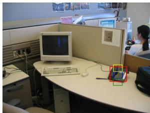

natural_image

Office cubicle with monitor and keyboard, person seated in background (no visible text or symbols)

(a) Which item can be used for communication?

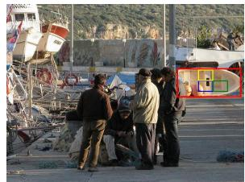

natural_image

Scene of a disaster site with people gathered around damaged structures and aircraft in the background (no visible text or symbols)

(b) Which is framing a white sideways boat?

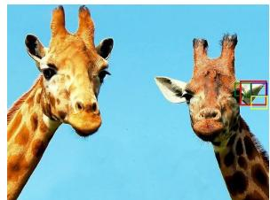

natural_image

Two giraffes facing each other against a clear blue sky (no text or symbols visible)

(c) Which ear is the left ear of the right giraffe?

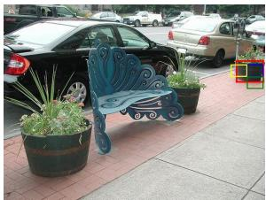

natural_image

Outdoor scene with a blue ornate bench and potted plants on a paved sidewalk, parked cars in background (no visible text or symbols)

(d) Which flower tub, with red flowers in it, is beside a parking meter?   
Figure 2: Visualization of explanation results on Visual7W (Zhu et al., 2016) test set. The red bounding box indicates the ground truth answer box provided by the dataset. The blue, green and yellow bounding boxes show the top-3 best-matched patches projected back to the original image space. More visualization results on diverse visual question answering scenarios can be found in Appendix Section D.

# 3.3 Qualitative Visualization

Figure 2 provides qualitative examples from the Visual7W test set, showing how ProtoVQA grounds its reasoning in semantically relevant image regions. The model-attended regions (blue, green, and yellow boxes) align closely with the datasetprovided ground-truth annotations (red boxes).

For instance, in Figure 2(a), when asked which item can be used for communication, the model correctly highlights the telephone region, focusing on the same area as the ground truth. In Figure 2(b), the model identifies the frame of the sideways boat, with matched patches overlapping the annotated boundary. In Figure 2(c), for the question about the giraffe’s left ear, the model consistently selects patches concentrated on the ear region, demonstrating fine-grained part-level reasoning. In Figure 2(d), the model highlights the flower tub with red flowers near the parking meter, showing its ability to handle relational queries that involve both object attributes and spatial context.

Overall, these qualitative examples demonstrate that ProtoVQA consistently grounds its answers in semantically relevant visual evidence across diverse scenarios, thereby providing explanations that are both human-verifiable and closely aligned with the questions.

# 3.4 Evaluation of Visual–Linguistic Alignment

As shown in Table 2, ProtoVQA significantly outperforms baseline methods on VLAS (0.4103 vs 0.2466 on VLAS@1, 0.2466 vs 0.1123 on VLAS@3), representing a 66.4% and 119.6% improvement over Bi-CMA respectively, thereby clearly and consistently demonstrating superior visual-linguistic alignment capability.

<table><tr><td>Method</td><td>VLAS@1↑</td><td>VLAS@3↑</td></tr><tr><td>SDF of VLT</td><td>0.2013</td><td>0.0847</td></tr><tr><td>Bi-CMA</td><td>0.2466</td><td>0.1123</td></tr><tr><td>ProtoVQA (Ours)</td><td>0.4103</td><td>0.2466</td></tr></table>

Table 2: Visual–Linguistic Alignment Score (VLAS) on Visual7W (Zhu et al., 2016). Values for VLAS@1 and VLAS@3 are reported, with ↑ indicating that higher scores correspond to better alignment.

# 4 Conclusion

We present ProtoVQA, a novel framework for visual question answering that addresses the need for model transparency and cross-modal reasoning. ProtoVQA achieves comprehensive explainability by (i) introducing adaptable prototypes capable of seamlessly handling diverse visual-linguistic downstream tasks through a shared prototype-based backbone; (ii) employing a spatially-constrained greedy matching strategy to model dynamic visualquestion relationships and geometric variations; and (iii) providing explicit visual evidence and systematic validation of visual-linguistic alignment. Our work provides a fundamental step towards VQA systems that achieve strong performance while maintaining comprehensive explainability.

# Ethical Considerations

We examined the study describing the publicly available datasets used in this research and identified no ethical issues regarding the datasets.

# Acknowledgment

This study is supported by the Department of Defense under Grant No. HT9425-23-1-0267 and in part by the National Science Foundation under Grant No. 2452367.

# Limitations

While this study shows promising results, several limitations remain. (1) Although ProtoVQA provides comprehensive interpretability, improving the faithfulness of prototype-based explanations under the constraint of preserving task performance remains an open problem. Future work could explore jointly optimized training objectives, adaptive prototype initialization, or more expressive matching strategies to balance accuracy and transparency. (2) Our evaluation is restricted to generalpurpose VQA benchmarks; transferring the framework to domain-specific or safety-critical settings (e.g., medical imaging, autonomous driving) may require curating specialized prototype vocabularies, domain-adaptive calibration, and additional finetuning to account for distributional shifts. (3) The current architecture is designed for multiple-choice and grounding-style tasks and has not yet been extended to prompt-based or free-form generative VQA supported by large language models. Integrating prototype reasoning with instruction-tuned generative models and multi-step reasoning pipelines is a promising direction for enabling more general and scalable interpretability. We leave these challenges for future work, aiming to advance VQA systems that achieve strong performance while offering faithful and transparent reasoning.

# References

Alina Jade Barnett, Fides Regina Schwartz, Chaofan Tao, Chaofan Chen, Yinhao Ren, Joseph Y Lo, and Cynthia Rudin. 2021. A case-based interpretable deep learning model for classification of mass lesions in digital mammography. Nature Machine Intelligence.   
Richard Berk, Drougas Berk, and D Drougas. 2019. Machine learning risk assessments in criminal justice settings. Springer.   
Xiaojun Bi, Shuo Li, Junyao Xing, Ziyue Wang, Fuwen Luo, Weizheng Qiao, Lu Han, Ziwei Sun, Peng Li, and Yang Liu. 2025. Dongbamie: A multimodal information extraction dataset for evaluating semantic understanding of dongba pictograms. arXiv preprint arXiv:2503.03644.   
Chaofan Chen, Oscar Li, Daniel Tao, Alina Barnett, Cynthia Rudin, and Jonathan K Su. 2019. This Looks Like That: Deep Learning for Interpretable Image Recognition. In Advances in Neural Information Processing Systems.   
Hanning Chen, Wenjun Huang, Yang Ni, Sanggeon Yun, Yezi Liu, Fei Wen, Alvaro Velasquez, Hugo

Latapie, and Mohsen Imani. 2024. Taskclip: Extend large vision-language model for task oriented object detection. In European Conference on Computer Vision.   
Xingjian Diao, Chunhui Zhang, Tingxuan Wu, Ming Cheng, Zhongyu Ouyang, Weiyi Wu, and Jiang Gui. 2025a. Learning musical representations for music performance question answering. arXiv preprint arXiv:2502.06710.   
Xingjian Diao, Chunhui Zhang, Weiyi Wu, Zhongyu Ouyang, Peijun Qing, Ming Cheng, Soroush Vosoughi, and Jiang Gui. 2025b. Temporal working memory: Query-guided segment refinement for enhanced multimodal understanding. arXiv preprint arXiv:2502.06020.   
Henghui Ding, Chang Liu, Suchen Wang, and Xudong Jiang. 2022. Vlt: Vision-language transformer and query generation for referring segmentation. Transactions on Pattern Analysis and Machine Intelligence.   
Tuong Do, Thanh-Toan Do, Huy Tran, Erman Tjiputra, and Quang D Tran. 2019. Compact trilinear interaction for visual question answering. In International Conference on Computer Vision.   
Jon Donnelly, Alina Jade Barnett, and Chaofan Chen. 2022. Deformable ProtoPNet: An Interpretable Image Classifier Using Deformable Prototypes. In Conference on Computer Vision and Pattern Recognition.   
Jon Donnelly, Luke Moffett, Alina Jade Barnett, Hari Trivedi, Fides Schwartz, Joseph Lo, and Cynthia Rudin. 2024. AsymMirai: Interpretable Mammography-based Deep Learning Model for 1–5- year Breast Cancer Risk Prediction. Radiology.   
Alexey Dosovitskiy, Lucas Beyer, Alexander Kolesnikov, Dirk Weissenborn, Xiaohua Zhai, Thomas Unterthiner, Mostafa Dehghani, Matthias Minderer, Georg Heigold, Sylvain Gelly, Jakob Uszkoreit, and Neil Houlsby. 2021. An image is worth 16x16 words: Transformers for image recognition at scale. In International Conference on Learning Representations.   
Nanyi Fei, Zhiwu Lu, Yizhao Gao, Guoxing Yang, Yuqi Huo, Jingyuan Wen, Haoyu Lu, Ruihua Song, Xin Gao, Tao Xiang, et al. 2022. Towards artificial general intelligence via a multimodal foundation model. Nature Communications.   
Chongyang Gao, Yiren Jian, Natalia Denisenko, Soroush Vosoughi, and VS Subrahmanian. 2024. Gem: generating engaging multimodal content. In International Joint Conference on Artificial Intelligence.   
Lianli Gao, Pengpeng Zeng, Jingkuan Song, Xianglong Liu, and Heng Tao Shen. 2018. Examine before you answer: Multi-task learning with adaptive-attentions for multiple-choice vqa. In International Conference on Multimedia.

Jiawei Guo, Feifei Zhai, Pu Jian, Qianrun Wei, and Yu Zhou. 2025. Crop: Contextual regionoriented visual token pruning. arXiv preprint arXiv:2505.21233.   
Yudong Han, Jianhua Yin, Jianlong Wu, Yinwei Wei, and Liqiang Nie. 2023. Semantic-aware modular capsule routing for visual question answering. Transactions on Image Processing.   
Pengcheng He, Xiaodong Liu, Jianfeng Gao, and Weizhu Chen. 2021. Deberta: Decoding-enhanced bert with disentangled attention. In International Conference on Learning Representations.   
Yiren Jian, Chongyang Gao, and Soroush Vosoughi. 2023. Bootstrapping vision-language learning with decoupled language pre-training. Advances in Neural Information Processing Systems.   
Kushal Kafle and Christopher Kanan. 2017. An analysis of visual question answering algorithms. In International Conference on Computer Vision.   
Li Li, Jiawei Peng, Huiyi Chen, Chongyang Gao, and Xu Yang. 2024a. How to configure good in-context sequence for visual question answering. In Conference on Computer Vision and Pattern Recognition.   
Shutao Li, Bin Li, Bin Sun, and Yixuan Weng. 2024b. Towards visual-prompt temporal answer grounding in instructional video. Transactions on Pattern Analysis and Machine Intelligence.   
Yanqing Liu, Xianhang Li, Zeyu Wang, Bingchen Zhao, and Cihang Xie. 2024. Clips: An enhanced clip framework for learning with synthetic captions. arXiv preprint arXiv:2411.16828.   
Yanqing Liu, Kai Wang, Wenqi Shao, Ping Luo, Yu Qiao, Mike Zheng Shou, Kaipeng Zhang, and Yang You. 2023. Mllms-augmented visuallanguage representation learning. arXiv preprint arXiv:2311.18765.   
Zheyuan Liu, Guangyao Dou, Xiangchi Yuan, Chunhui Zhang, Zhaoxuan Tan, and Meng Jiang. 2025. Modality-aware neuron pruning for unlearning in multimodal large language models. arXiv preprint arXiv:2502.15910.   
Bingjie Lu, Han-Cheng Dan, Yichen Zhang, and Zhetao Huang. 2025a. Journey into automation: Imagederived pavement texture extraction and evaluation. arXiv preprint arXiv:2501.02414.   
Bingjie Lu, Zhengyang Lu, Yijiashun Qi, Hanzhe Guo, Tianyao Sun, and Zunduo Zhao. 2025b. Predicting asphalt pavement friction by using a texture-based image indicator. Lubricants.   
Chiyu Ma, Jon Donnelly, Wenjun Liu, Soroush Vosoughi, Cynthia Rudin, and Chaofan Chen. 2024. Interpretable image classification with adaptive prototype-based vision transformers. In Advances in Neural Information Processing Systems.

Chiyu Ma, Brandon Zhao, Chaofan Chen, and Cynthia Rudin. 2023. This Looks Like Those: Illuminating Prototypical Concepts Using Multiple Visualizations. In Advances in Neural Information Processing Systems.   
Binh X Nguyen, Tuong Do, Huy Tran, Erman Tjiputra, Quang D Tran, and Anh Nguyen. 2022. Coarseto-fine reasoning for visual question answering. In Conference on Computer Vision and Pattern Recognition.   
Sebastian Ramos, Stefan Gehrig, Peter Pinggera, Uwe Franke, and Carsten Rother. 2017. Detecting Unexpected Obstacles for Self-Driving Cars: Fusing Deep Learning and Geometric Modeling. In IEEE Intelligent Vehicles Symposium.   
Hugo Touvron, Matthieu Cord, Matthijs Douze, Francisco Massa, Alexandre Sablayrolles, and Hervé Jé- gou. 2021. Training data-efficient image transformers & distillation through attention. In International Conference on Machine Learning.   
Sushmita Upadhyay and Sanjaya Shankar Tripathy. 2025. Bidirectional cascaded multimodal attention for multiple choice visual question answering. Machine Vision and Applications.   
Chong Wang, Yuanhong Chen, Yuyuan Liu, Yu Tian, Fengbei Liu, Davis J McCarthy, Michael Elliott, Helen Frazer, and Gustavo Carneiro. 2022. Knowledge distillation to ensemble global and interpretable prototype-based mammogram classification models. In International Conference on Medical Image Computing and Computer-Assisted Intervention.   
Junxi Wang, Jize Liu, Na Zhang, and Yaxiong Wang. 2025a. Consistency-aware fake videos detection on short video platforms. In International Conference on Intelligent Computing.   
Junxi Wang, Yaxiong Wang, Lechao Cheng, and Zhun Zhong. 2025b. Fakesv-vlm: Taming vlm for detecting fake short-video news via progressive mixture-ofexperts adapter. arXiv preprint arXiv:2508.19639.   
Zhe Wang, Xiaoyi Liu, Limin Wang, Yu Qiao, Xiaohui Xie, and Charless Fowlkes. 2018. Structured triplet learning with pos-tag guided attention for visual question answering. In Winter Conference on Applications of Computer Vision.   
Yifan Xiang, Zhenxi Zhang, Bin Li, Yixuan Weng, Shoujun Zhou, Yangfan He, and Keqin Li. 2025. Regrap-llava: Reasoning enabled graph-based personalized large language and vision assistant. arXiv preprint arXiv:2505.03654.   
Wulin Xie, Xiaohuan Lu, Yadong Liu, Jiang Long, Bob Zhang, Shuping Zhao, and Jie Wen. 2024. Uncertainty-aware pseudo-labeling and dual graph driven network for incomplete multi-view multi-label classification. In International Conference on Multimedia.

Wulin Xie, Lian Zhao, Jiang Long, Xiaohuan Lu, and Bingyan Nie. 2025. Multi-view factorizing and disentangling: A novel framework for incomplete multiview multi-label classification. In Winter Conference on Applications of Computer Vision.

Haoming Yang, Pramod KC, Panyu Chen, Hong Lei, Simon Sponberg, Vahid Tarokh, and Jeffrey Riffell. 2024. Neuron synchronization analyzed through spatial-temporal attention. bioRxiv.

Wenhao You, Xingjian Diao, Chunhui Zhang, Keyi Kong, Weiyi Wu, Zhongyu Ouyang, Chiyu Ma, Tingxuan Wu, Noah Wei, Zong Ke, et al. 2025. Music’s multimodal complexity in avqa: Why we need more than general multimodal llms. arXiv preprint arXiv:2505.20638.

Chunhui Zhang, Yiren Jian, Zhongyu Ouyang, and Soroush Vosoughi. 2025a. Pretrained image-text models are secretly video captioners. arXiv preprint arXiv:2502.13363.

Chunhui Zhang, Zhongyu Ouyang, Kwonjoon Lee, Nakul Agarwal, Sean Dae Houlihan, Soroush Vosoughi, and Shao-Yuan Lo. 2025b. Overcoming multi-step complexity in multimodal theory-ofmind reasoning: A scalable bayesian planner. arXiv preprint arXiv:2506.01301.

Changshi Zhou, Haichuan Xu, Ningquan Gu, Zhipeng Wang, Bin Cheng, Pengpeng Zhang, Yanchao Dong, Mitsuhiro Hayashibe, Yanmin Zhou, and Bin He. 2025a. Language-guided long horizon manipulation with llm-based planning and visual perception. arXiv preprint arXiv:2509.02324.

Yiyang Zhou, Linjie Li, Shi Qiu, Zhengyuan Yang, Yuyang Zhao, Siwei Han, Yangfan He, Kangqi Li, Haonian Ji, Zihao Zhao, et al. 2025b. Glimpse: Do large vision-language models truly think with videos or just glimpse at them? arXiv preprint arXiv:2507.09491.

Yuke Zhu, Oliver Groth, Michael Bernstein, and Li Fei-Fei. 2016. Visual7w: Grounded question answering in images. In Conference on Computer Vision and Pattern Recognition.

# A Baselines

• SUPER (Han et al., 2023): Introduces a semantic-aware modular capsule routing framework for Visual Question Answering (VQA) to enhance adaptability to semantically complex inputs. It features five specialized modules and dynamic routers that refine vision-semantic representations, offering a novel approach to architecture learning and representation calibration for VQA tasks.

• QOI\_Attention (Gao et al., 2018): Proposes a Multi-task Learning with Adaptive-attention

(MTA) model for multiple-choice (MC) VQA. It mimics human reasoning by integrating answer options and adapting attention to visual features, achieving remarkable performance on MC VQA benchmarks.

• SDF of VLT (Ding et al., 2022): Presents a Vision-Language Transformer (VLT) framework for referring segmentation, introducing a Query Generation Module to dynamically produce input-specific queries. It improves handling diverse language expressions with a Query Balance Module and masked contrastive learning, setting new benchmarks on five datasets.

• STL (Wang et al., 2018): Proposes a VQA model focused on the multiple-choice task, incorporating part-of-speech (POS) tag-guided attention, convolutional n-grams, and triplet attention interactions between the image, question, and candidate answer. The model also employs structured learning for triplets based on image-question pairs.

• CFR (Nguyen et al., 2022): Introduces a reasoning framework for Visual Question Answering (VQA) that bridges the semantic gap between image and question by jointly learning features and predicates in a coarse-to-fine manner. The model achieves superior VQA accuracy and provides an explainable decision-making process.

• BriVL (Fei et al., 2022): Develops a foundation model pre-trained on multimodal data for artificial general intelligence (AGI), focusing on self-supervised learning with weak semantic correlation data. The model demonstrates strong imagination ability, achieving promising results across various downstream tasks including VQA.

• CTI (Do et al., 2019): Introduces a trilinear interaction model for Visual Question Answering (VQA) to learn associations between image, question, and answer modalities, using PAR-ALIND tensor decomposition for efficiency. For free-form VQA, knowledge distillation transfers learnings to a bilinear student model, achieving state-of-the-art results on TDIUC and Visual7W datasets.

• Bi-CMA (Upadhyay and Tripathy, 2025): Proposes a Bidirectional Cascaded Multimodal Attention network for VQA, utilizing bidirectional

attention and sparsity to enhance feature integration between image and text. The model performs competitively on multiple-choice VQA tasks, providing insightful attention maps that reveal the model’s decision-making focus.

# B Greedy Matching

We adopted greedy matching as a simple yet efficient baseline to demonstrate how our framework functions in practice. The strategy selects the region with the highest similarity to a prototype at each step, making it computationally inexpensive, easy to implement, and naturally interpretable since every decision can be visualized as part of the reasoning trail. Its low complexity also makes it suitable for large-scale experiments and real-time inference, where maintaining both speed and transparency is crucial. This balance of efficiency, scalability, and interpretability highlights why greedy matching serves as a strong and practical choice for validating the effectiveness of our prototypebased framework. In addition, it establishes a clear benchmark that future improvements can be directly compared against. This makes greedy matching an integral component in demonstrating the overall practicality of our approach.

# C Potential Applications

Interpretable VQA has broad potential across domains where both accurate answers and transparent reasoning are essential. In media forensics, explanation-aware VQA can help detect and verify manipulated or misleading short videos by aligning visual evidence with textual claims (Wang et al., 2025a,b; Gao et al., 2024). In transportation and civil engineering, interpretable models can support safety-critical decisions, such as predicting pavement conditions from visual cues while providing human-verifiable justifications (Lu et al., 2025a,b). For general machine learning tasks, interpretable VQA can benefit incomplete or multiview multi-label classification (Xie et al., 2024, 2025) as well as multimodal representation learning, where pruning, efficient adaptation, and alignment with language supervision remain active directions (Guo et al., 2025; Liu et al., 2024; Jian et al., 2023; Liu et al., 2023; Chen et al., 2024; Liu et al., 2025; Zhang et al., 2025a). In video understanding, explanation-guided alignment can improve temporal grounding, multimodal reasoning, and working memory in instructional or complex video scenarios (Li et al., 2024b; Diao et al., 2025b; Zhou et al., 2025b). In human–AI interaction and robotics, transparent reasoning is crucial for building trustworthy assistants that combine long-horizon planning and personalized interaction with multimodal evidence (Zhang et al., 2025b; Zhou et al., 2025a; Xiang et al., 2025). Finally, in creative and cultural applications, interpretable VQA can support tasks such as music performance understanding and question answering, or semantic analysis of non-standard scripts and pictograms, where human-verifiable explanations are indispensable for reliability and adoption (You et al., 2025; Diao et al., 2025a; Bi et al., 2025).

# D Additional Visualization Results

In addition to the results shown in Figure 2 in Section 3, we further provide 10 representative samples from the Visual7W (Zhu et al., 2016) test set to illustrate the breadth of interpretability achieved by ProtoVQA. These additional cases cover a wide spectrum of question types and visual reasoning demands, offering a more complete view of how the model grounds its predictions in semantically meaningful evidence.

Specifically, the examples span multiple categories of visual–linguistic reasoning. For questions involving human and animal anatomy (Figures 3, 4), the model is able to precisely highlight finegrained parts, such as arms or ears, showing that prototype matching is sensitive to localized semantic cues. For object identification tasks (Figures 5, 6, 7), the model consistently selects patches that coincide with the relevant object boundaries, even when distractors are present in the scene. For interaction-related questions (Figures 8, 9, 10), the highlighted regions demonstrate the model’s ability to capture contextual relationships, such as a person holding an item or an object being actively manipulated. Finally, in spatial relationship queries (Figures 11, 12), the attended patches illustrate how the model disambiguates relative positions, grounding its answer in spatially coherent regions.

Overall, these qualitative examples highlight that ProtoVQA is not limited to generic visual cues but adapts its evidence selection to the specific semantics of each question. The consistency between the model-attended patches and the dataset-provided ground truth shows that the framework provides reliable, human-verifiable explanations across a diverse set of VQA scenarios, further validating the interpretability and robustness of our approach.

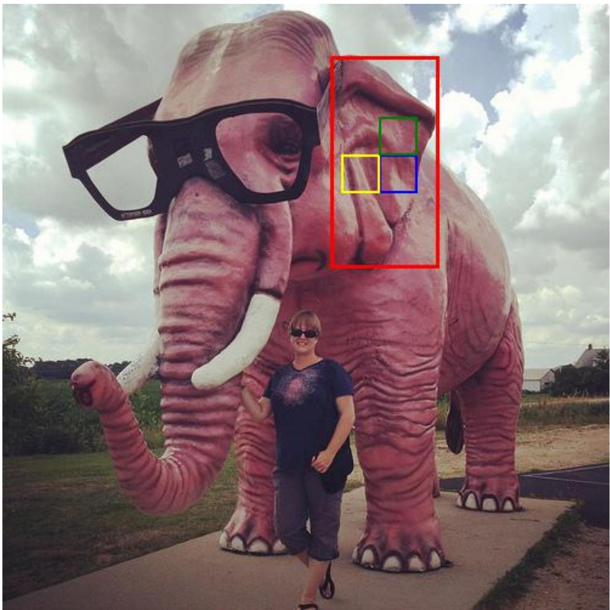

natural_image

Exterior view of a large pink elephant statue with a person posing beside it, featuring a red bounding box highlighting the elephant's face (no text or symbols on the main subject)

Figure 3: Question: Which part helps the elephant hear?

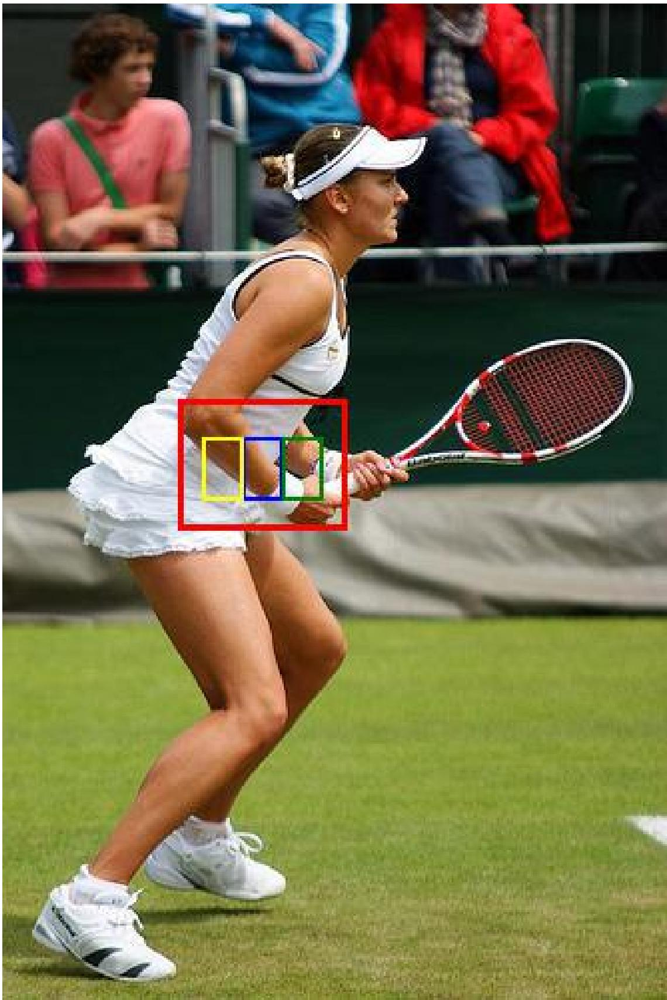

natural_image

Tennis player in action on a grass field, holding racket and ball (no visible text or symbols)

Figure 4: Question: Which is the players arms?

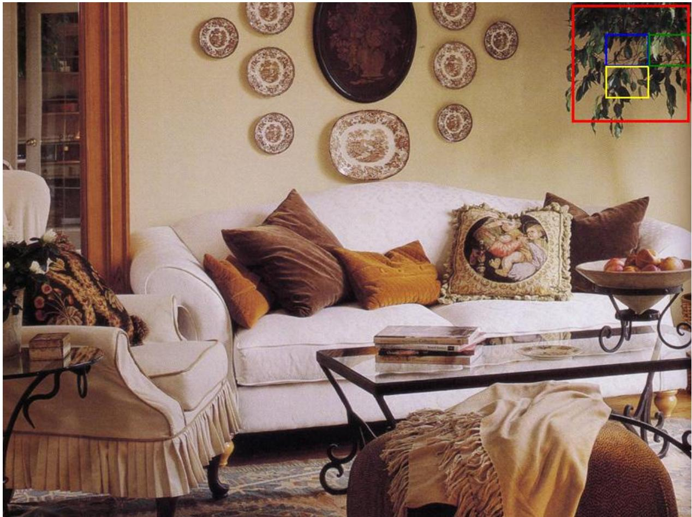

natural_image

Interior living room scene with white sofa, decorative plates, and ornate furniture (no visible text or symbols)

Figure 5: Question: Which plant is hanging in the room?

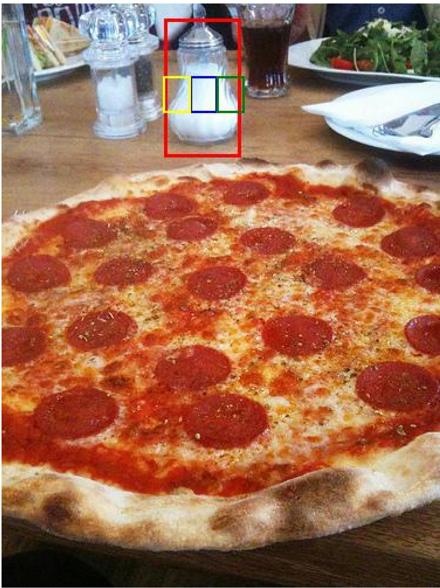

natural_image

Close-up of a large red and white pizza with glossy sauce, placed on a wooden table with blurred background items (no visible text or symbols)

Figure 6: Question: Which is the glass containing?

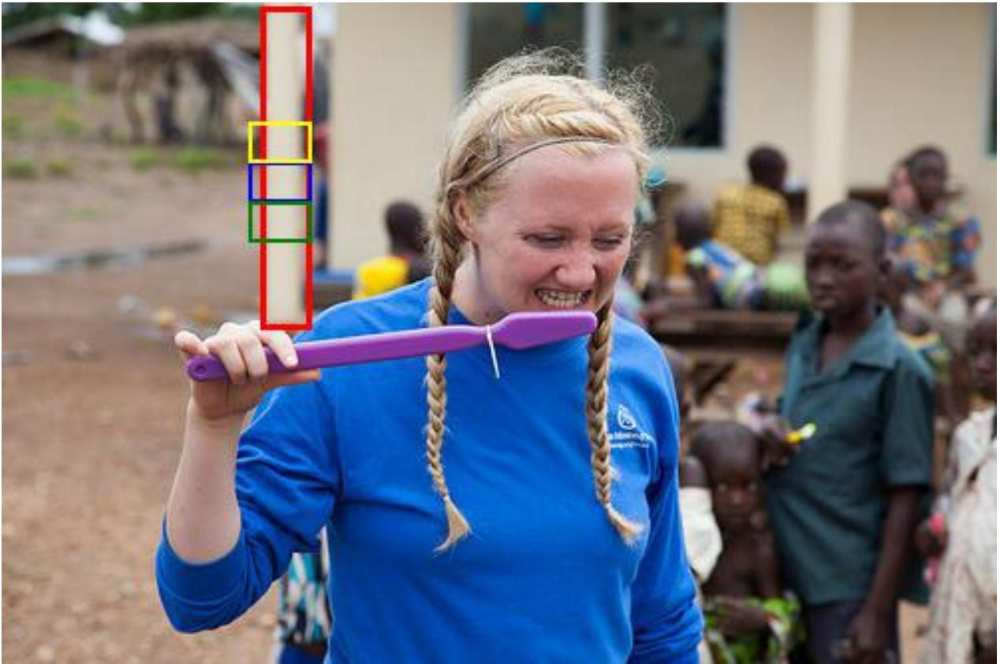

natural_image

Woman in blue shirt holding a purple toothbrush outdoors, with other children and buildings in the background (no visible text or symbols)

Figure 7: Question: Which object is a large beige cylinder next to the dirt?

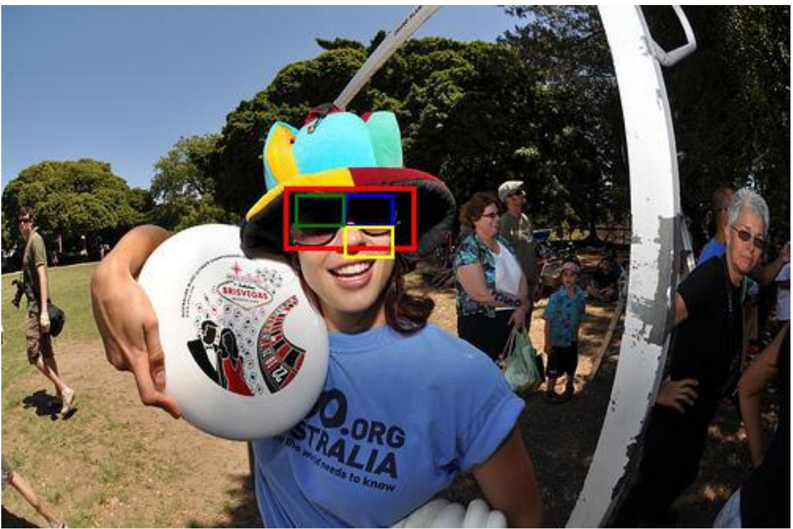

text_image

BRISTIGAS
O.ORG
AUSTRALIA
I think what needs to know

Figure 8: Question: Which object is she wearing on her face?

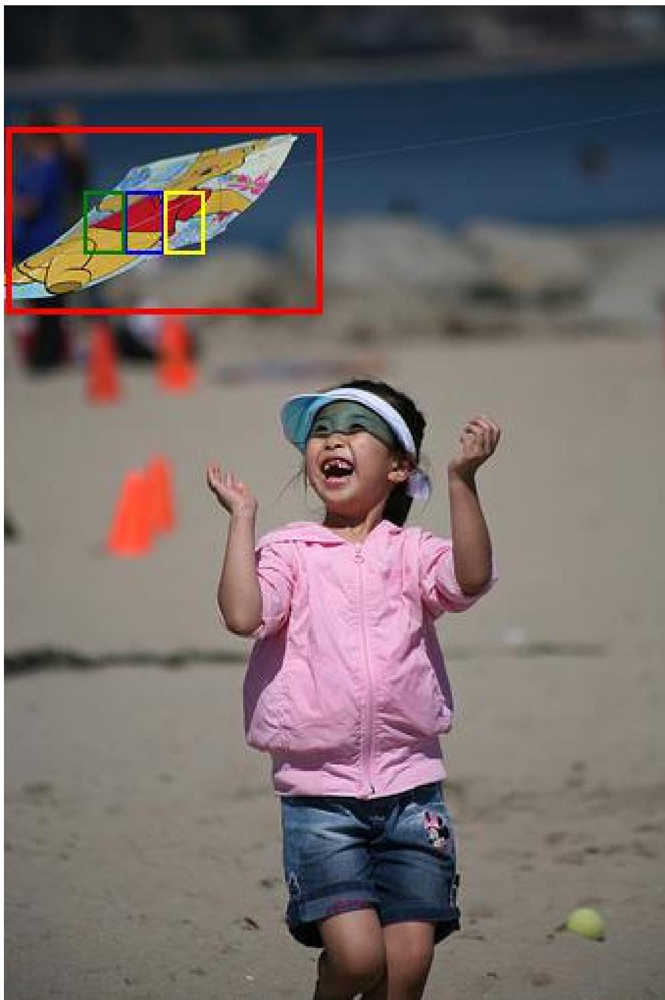

natural_image

A smiling child in a pink jacket and visor on a sandy beach, waving with raised hands (no text or symbols visible)

Figure 9: Question: Which object is being flown?

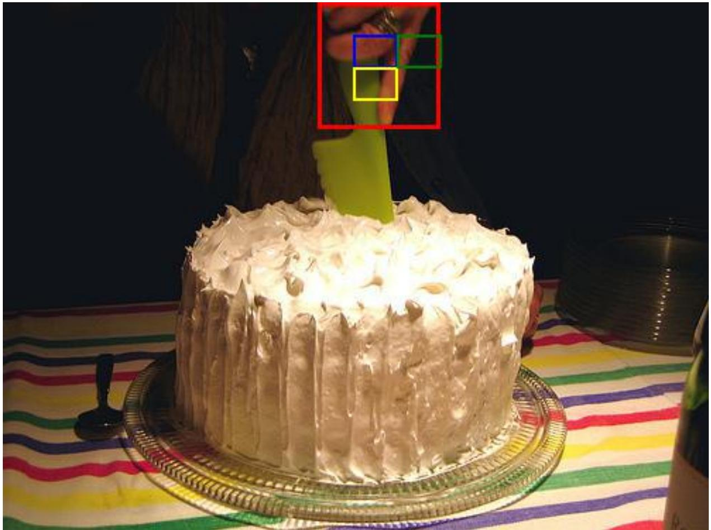

natural_image

A decorated cake with white frosting and chocolate chips, served on a patterned plate with a person holding a spatula (no visible text or symbols)

Figure 10: Question: Which hand is holding a knife?

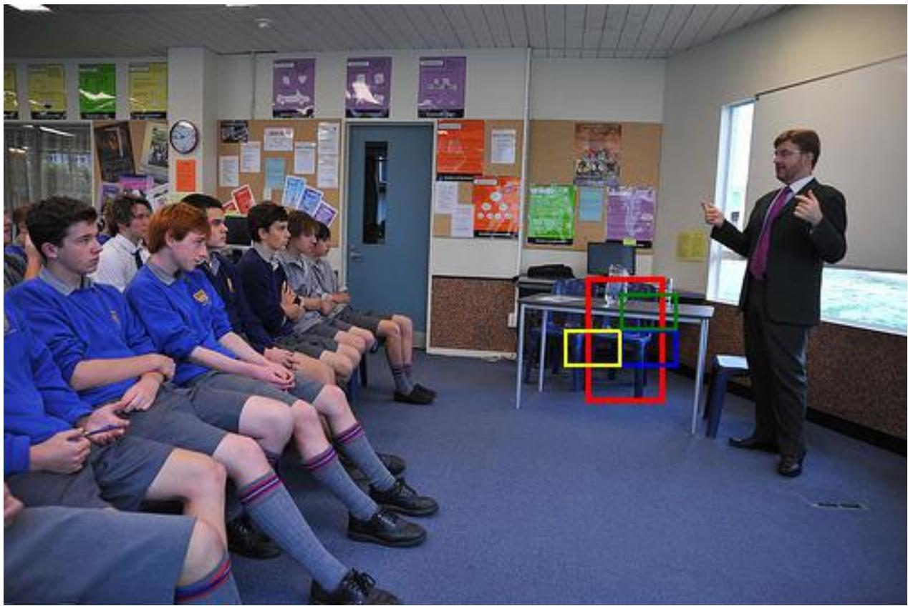

natural_image

Classroom scene with students seated facing a presenter, colorful posters on walls and a red highlighted square overlay (no readable text or symbols)

Figure 11: Question: Which blue chair behind the table?

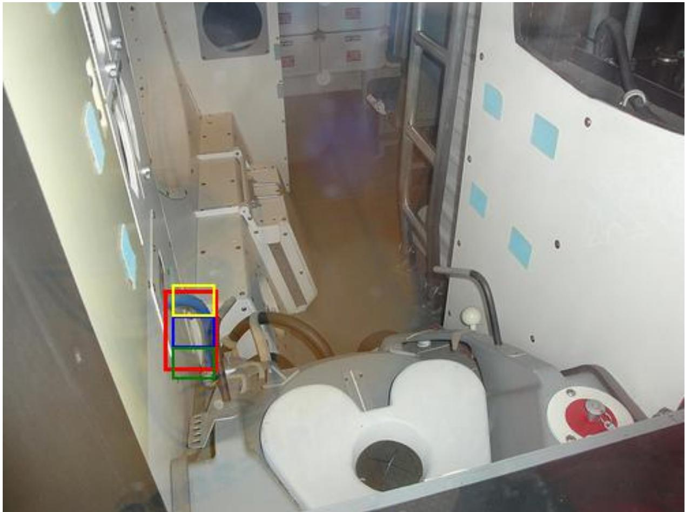

natural_image

Interior view of a spacecraft or spacecraft module with visible structural components and no readable text or symbols.

Figure 12: Question: Which hose is sticking out of the wall?