# RAVEN: Query-Guided Representation Alignment for Question ring over Audio, Video, Embedded Sensors, and Natural Language

Subrata Biswas\*, Mohammad Nur Hossain Khan\*, Bashima Islam

Department of Electrical & Computer Engineering

Worcester Polytechnic Institute

Worcester, MA 01609

{sbiswas, mkhan, bislam}@wpi.edu

# Abstract

Multimodal question answering (QA) often requires identifying which video, audio, or sensor tokens are relevant to the question. Yet modality disagreements are common: off-camera speech, background noise, or motion outside the field of view often mislead fusion models that weight all streams equally. We present RAVEN, a unified QA architecture whose core is QuART, a query-conditioned cross-modal gating module that assigns scalar relevance scores to each token across modalities, enabling the model to amplify informative signals and suppress distractors before fusion. RAVEN is trained through a three-stage pipeline comprising unimodal pretraining, query-aligned fusion, and disagreement-oriented fine-tuning – each stage targeting a distinct challenge in multimodal reasoning: representation quality, crossmodal relevance, and robustness to modality mismatch. To support training and evaluation, we release AVS-QA, a dataset of 300K synchronized Audio–Video-Sensor streams paired with automatically generated question-answer pairs. Experimental results on seven multi-modal QA benchmarks – including egocentric and exocentric tasks – show that RAVEN achieves up to 14.5% and 8.0% gains in accuracy compared to state-of-the-art multi-modal large language models, respectively. Incorporating sensor data provides an additional 16.4% boost, and the model remains robust under modality corruption, outperforming SOTA baselines by 50.23%. Our code and dataset are available at https://github.com/BASHLab/RAVEN.

# 1 Introduction

Answering natural language questions in multimodal settings often requires reasoning over visual, auditory, and sensor inputs to extract the most relevant evidence (Wanniarachchi and Misra, 2025). Yet real-world signals are rarely clean or aligned: off-camera speech, background noise, and unobserved motion can introduce conflicts across modalities. Without identifying which inputs are relevant to the question, fusion models may attend to irrelevant signals and overlook critical evidence.

We introduce RAVEN, a unified architecture for question answering over video, audio, and sensor inputs. It resolves cross-modal conflicts by reasoning about modality relevance. At its core is QuART, a query-conditioned cross-modal gating module that assigns scalar relevance scores to each token. These scores suppress distractors and amplify informative signals before fusion, enabling the model to produce context-sensitive representations grounded in the question.

This challenge intensifies with sensor data integration. Unlike visual and auditory streams, sensor inputs capture latent physical dynamics, such as acceleration, orientation, and velocity, but often arrive asynchronously, are noisy, and lack semantic anchors. Their relevance also varies by question. For instance, when asked “Did the user place the object gently?”, only audio (e.g., impact sound) and motion traces (e.g., deceleration) are informative, while visual frames may mislead. QuART’s query-conditioned filtering allows the model to focus on such signals while ignoring irrelevant tokens. Figure 1 illustrates this behavior and highlights the resulting performance gains.

Recent advances in multimodal large language models (MLLMs) have enabled perceptionlanguage reasoning by combining pretrained LLMs with modality-specific encoders and fusion strategies (Liu et al., 2023a; Lin et al., 2023a; Chu et al., 2023). Models such as Flamingo (Awadalla et al., 2023), Video-LLaMA (Zhang et al., 2023a), and AVicuna (Tang et al., 2024) have achieved strong results on video captioning, video QA, and audiolanguage tasks (Li et al., 2023a; Yu et al., 2023; Liu et al., 2024b). However, these systems typically focus on vision and audio, ignoring embedded sensor modalities that are critical in domains like AR/VR, robotics, and mobile health. Moreover, they often assume clean, synchronized inputs and rely on projection, cross-attention (Ye et al., 2024; Wu et al., 2024; Chowdhury et al., 2025), or contrastive alignment (Radford et al., 2021; Elizalde et al., 2023) —approaches that break down under modality misalignment. In contrast, RAVEN uses queryconditioned token-level filtering via QuART to dynamically attend to the most informative modality stream at each timestep.

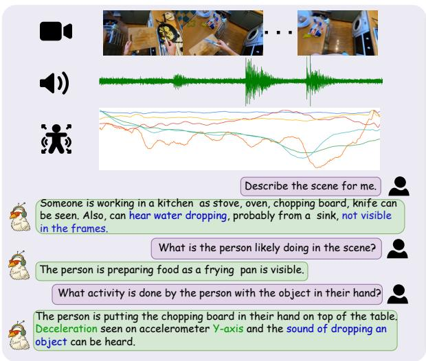

<details>
<summary>text_image</summary>

Describe the scene for me.
Someone is working in a kitchen as stove, oven, chopping board, knife can be seen. Also, can hear water dropping, probably from a sink, not visible in the frames.
What is the person likely doing in the scene?
The person is preparing food as a frying pan is visible.
What activity is done by the person with the object in their hand?
The person is putting the chopping board in their hand on top of the table. Deceleration seen on accelerometer Y-axis and the sound of dropping an object can be heard.
</details>

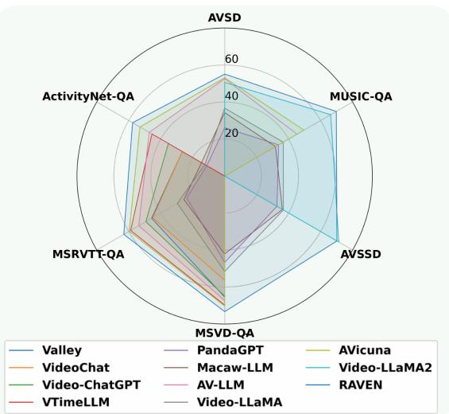

<details>
<summary>radar</summary>

| Model          | AVSD  | MUSIC-QA | AVSSD | MSVD-QA | MSRVTT-QA | ActivityNet-QA |
| -------------- | ----- | -------- | ----- | ------- | --------- | -------------- |
| Valley         | 50    | 60       | 70    | 65      | 55        | 50             |
| PandaGPT       | 45    | 55       | 60    | 50      | 45        | 40             |
| AVicuna        | 40    | 50       | 55    | 45      | 40        | 35             |
| Video-LLaMA2   | 35    | 45       | 50    | 40      | 35        | 30             |
| Video-ChatGPT  | 30    | 40       | 45    | 35      | 30        | 25             |
| AV-LLM         | 25    | 35       | 40    | 30      | 25        | 20             |
| RAVEN          | 20    | 30       | 35    | 25      | 20        | 15             |
| VTimeLLM       | 15    | 25       | 30    | 20      | 15        | 10             |
| Video-LLaMA    | 10    | 20       | 25    | 15      | 10        | 5              |
</details>

Figure 1: RAVEN jointly interprets video, audio, and sensor signals (e.g., inertial measurement unit or IMU) to answer fine-grained, context-aware questions. It outperforms existing MLLMs across six QA benchmarks, demonstrating robust generalization through multi-modal alignment.

We train RAVEN using a three-stage pipeline: (1) unimodal pretraining to improve encoder specialization, (2) query-aligned fusion to teach relevance modeling, and (3) disagreement-oriented fine-tuning to increase robustness under modality mismatch. Each stage addresses a distinct challenge in multimodal reasoning, yielding an average 26.87% improvement over training without disagreement-oriented fine-tuning.

To support training and evaluation, we release AVS-QA, a dataset of 300K automatically generated {Audio, Video, Sensor, QA} quadruples from egocentric scenarios. To our knowledge, it is the first large-scale QA benchmark with synchronized input streams and question–answer supervision across all three modalities (See Table 1).

RAVEN, powered by QuART, achieves stateof-the-art performance on seven QA benchmarks, with gains of up to 14.5% over VideoLLaVA (Lin et al., 2023a) and 8.0% over AVicuna (Tang et al., 2024) on egocentric and exocentric tasks, respectively. Incorporating sensor data yields an additional 16.4% boost, and under modality corruption, RAVEN retains a 50.23% improvement over prior systems-demonstrating robust, query-aware reasoning across diverse multimodal inputs. We summarize our contributions below:

Table 1: Comparison of egocentric QA benchmarks. AVS-QA is the only dataset with all three modalities, four QA types, and large-scale automated supervision. 

<table><tr><td>Benchmark</td><td>A</td><td>V</td><td>S</td><td>Data Source</td><td>Answer Type</td><td>Evaluator</td><td>Size</td></tr><tr><td>EgoTaskQA</td><td>√</td><td>√</td><td>✗</td><td>Crowd-sourcing</td><td>OE</td><td>Crowd-sourcing</td><td>40K</td></tr><tr><td>EgoVQA</td><td>√</td><td>√</td><td>✗</td><td>Handcraft</td><td>MC</td><td>Accuracy</td><td>520</td></tr><tr><td>EgoThink</td><td>√</td><td>√</td><td>✗</td><td>Handcraft</td><td>OE</td><td>LLMs</td><td>700</td></tr><tr><td>VidEgoThink</td><td>√</td><td>√</td><td>✗</td><td>Egocentric video</td><td>OE</td><td>LLMs</td><td>1.2K</td></tr><tr><td>MM-Ego</td><td>√</td><td>√</td><td>✗</td><td>Multimodal (AV)</td><td>OE / MC</td><td>Accuracy, LLMs /CE</td><td>10K</td></tr><tr><td>AVS-QA</td><td>√</td><td>√</td><td>√</td><td>Egocentric video</td><td>MC / OETF /CE</td><td>LLMs</td><td>300K</td></tr></table>

We propose RAVEN, a unified QA model that integrates video, audio, and sensor inputs using QuART, a query-conditioned gating module to filter distractors before fusion   
Introduction of query-aligned fusion and disagreement-oriented fine-tuning after unimodal pre-training enhances representation, relevance, and robustness to cross-modal disagreement.   
We release AVS-QA, a 300K-sample dataset with synchronized audio, video, sensor streams, and auto-generated QA pairs.   
We achieve state-of-the-art results on seven benchmarks, with strong performance across egocentric, exocentric, and corrupted-input settings.

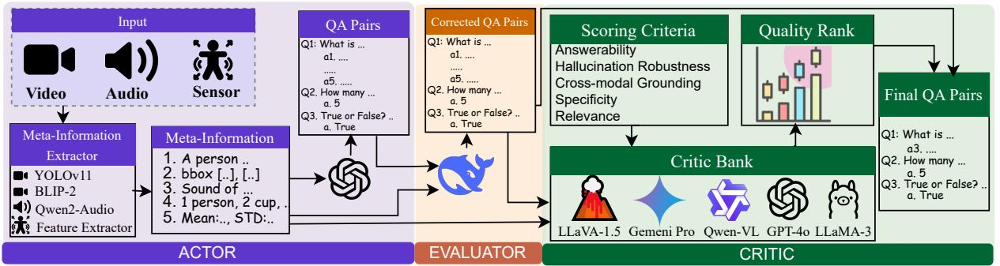

<details>
<summary>flowchart</summary>

```mermaid
graph TD
    A["Input"] --> B["Video"]
    A --> C["Audio"]
    A --> D["Sensor"]
    B --> E["Meta-Information Extractor"]
    C --> E
    D --> E
    E --> F["Meta-Information"]
    F --> G["1. A person .."]
    F --> H["2. bbox [.."], [..]]
    F --> I["3. Sound of .."]
    F --> J["4. 1 person, 2 cup, ."]
    F --> K["5. Mean:., STD:.."]
    G --> L["QA Pairs"]
    H --> L
    I --> L
    J --> L
    K --> L
    L --> M["QA Pairs"]
    M --> N["Q1: What is ..."]
    M --> O["a1, ...."]
    M --> P["a5, ...."]
    M --> Q["Q2. How many ..."]
    M --> R["a. 5"]
    M --> S["Q3. True or False? .."]
    M --> T["a. True"]
    N --> U["Corrected QA Pairs"]
    O --> U
    P --> U
    Q --> U
    R --> U
    S --> U
    T --> U
    U --> V["Scoring Criteria"]
    U --> W["Answerability"]
    U --> X["Hallcination Robustness"]
    U --> Y["Cross-modal Grounding"]
    U --> Z["Specificity"]
    U --> AA["Relevance"]
    V --> AB["Critic Bank"]
    W --> AB
    X --> AB
    Y --> AB
    Z --> AB
    AA --> AB
    AB --> AC["Quality Rank"]
    AC --> AD["Final QA Pairs"]
    AD --> AE["Q1: What is ..."]
    AD --> AF["a3, ...."]
    AD --> AG["Q2. How many ..."]
    AD --> AH["a. 5"]
    AD --> AI["Q3. True or False? .."]
    AD --> AJ["a. True"]
```
</details>

Figure 2: Overview of the AVS-QA dataset pipeline. Given synchronized audio–video–sensor input, the Actor generates metadata and QA pairs, the Evaluator filters weakly grounded examples, and the Critic ranks quality across five axes. The process is fully automated and yields 300K high-quality QA examples across four types.

# 2 Related Work

Large and Multi-modal Language Models. Large language models (LLMs) such as LLaMA (Touvron et al., 2023) and GPT-4 (Achiam et al., 2023) have demonstrated strong reasoning abilities. Multi-modal language models (MLLMs) extend LLMs with modality-specific encoders and fusion modules for visual or auditory inputs (Li et al., 2023b; Liu et al., 2023a; Bai et al., 2023; Luo et al., 2023; Chu et al., 2024; Kong et al., 2024). Representative models such as Flamingo (Alayrac et al., 2022), LLaVA (Liu et al., 2023a), and Video-LLaMA (Zhang et al., 2023a) achieve impressive results on vision-language and audiovideo QA through instruction tuning. However, these systems typically ignore embedded sensor modalities and assume synchronized, clean inputs. Sensor-aware models–such as LLMSense (Ouyang and Srivastava, 2024), IMUGPT (Leng et al., 2024), and OpenSQA/LLASA (Imran et al., 2024)–process inertial signals in isolation, without visual or auditory grounding. ImageBind (Girdhar et al., 2023) supports multiple modalities but lacks QA supervision or cross-modal reasoning. In contrast, our framework performs query-guided alignment across video, audio, and sensor inputs with direct QA grounding. See Appendix A for full citations.

Multi-modal Feature Alignment. Token-level fusion across modalities is central to MLLM performance. Dual encoders like CLIP (Radford et al., 2021) and fusion-based models such as LLaVA (Liu et al., 2023a) and Q-Former (Li et al., 2023b) align vision and language. Extensions like Hierarchical Q-Former (Azad et al., 2025), Smaug (Lin et al., 2023b), and MACAW (Lyu et al., 2023) adapt this to temporal signals but are optimized for audio-visual tasks. These approaches struggle under sensor-specific noise, asynchrony, or modality mismatch. Our proposed QuART assigns query-conditioned scalar weights to crossmodal tokens, enabling selective fusion and robust reasoning under disagreement.

Multi-modal Datasets. Existing corpora support audio-visual (e.g., HowTo100M (Chen et al., 2024b), AudioCaps (Kim et al., 2019)) and imagelanguage learning (e.g., CC3M (Changpinyo et al., 2021)). QA-focused datasets such as AVQA (Yang et al., 2022), MusicAVQA (Li et al., 2022), and MSRVTT-QA (Xu et al., 2016) do not include sensor data. Egocentric QA datasets like Ego4D (Grauman et al., 2022) and EgoTaskQA (Jia et al., 2022) lack synchronized video-audio-sensor input. To address this, we introduce AVS-QA, a 300K-example dataset of audio, video, sensor, QA quadruples with synchronized streams, four question types, and frame-level alignment. Table 1 summarizes its scope.

# 3 AVS-QA: Multi-Modal Dataset Curation Pipeline

Despite rapid progress in multi-modal QA, no existing benchmark provides aligned supervision across video, audio, and sensor inputs. Prior QA datasets are either limited to vision-language pairs or omit sensor signals entirely (see Table 1). To bridge this gap, we introduce AVS-QA, a dataset of 300K automatically generated {video, audio, sensor, QA} quadruples. This scale exceeds the combined size of existing egocentric QA datasets by a factor of four. Unlike prior work, AVS-QA includes four question types–open-ended (OE), closed-ended (CE), multiple-choice (MC), and true/false (TF)– supporting both generative and retrieval-style evaluation.

AVS-QA is constructed via a fully automated, three-stage Actor–Evaluator–Critic pipeline, illustrated in Figure 2. The pipeline takes as input a multi-modal triplet $\mathcal { D } = ( v , a , s )$ , where v, a, and s denote temporally aligned video, audio, and sensor streams, and produces question-answer pairs $( q , A ) \in \mathcal { Q }$ . Formally, the dataset generation process is defined as a mapping function $F : \mathcal { D }  \mathcal { Q }$ , yielding synchronized $\{ v , a , s , q , A \}$ tuples.

Actor: Multi-modal Prompt Generation. The Actor constructs an enriched scene description from each triplet . We extract visual features using BLIP-2 (Li et al., 2023b) (frame captioning) and YOLOv11 (Khanam and Hussain, 2024) (object detection, and localization); audio features using Qwen2-Audio-7B (Chu et al., 2024) (transcription and event labels); and sensor features using a 200 Hz statistical extractor (Imran et al., 2024) over 15-second IMU windows (e.g., mean, RMS, skewness). These cues are concatenated into a natural language prompt, from which the Actor generates four QA types: open-ended, closed-ended, multiple-choice, and true/false. For open-ended questions, five candidate answers are produced for filtering, and one final answer is retained.

Evaluator: Modality-Consistency Filtering. Given a candidate QA pair (q, A) generated from meta-information , the Evaluator verifies that the referenced modality or modalities are supported by the corresponding input triplet $( v , a , s ) \in { \mathcal { D } }$ . For instance, motion-related questions require significant activity in the sensor stream (e.g., variance spike), while visual or auditory references must align with detected objects or acoustic summaries. Pairs lacking sufficient grounding are discarded. To ensure diversity, the Evaluator enforces a balanced mix of single- and cross-modality QA types.

Critic: Quality Ranking via LLM Scoring. For each candidate pair, the Critic applies an ensemble of instruction-tuned LLMs to assess QA quality. Inspired by LLM-as-judge paradigms (Fu et al., 2023; Zheng et al., 2023a), we define a quality vector $\mathcal { C } ( q , A ) = [ s _ { 1 } , s _ { 2 } , s _ { 3 } , s _ { 4 } , s _ { 5 } ] \in \mathbb { R } ^ { 5 }$ , where each score corresponds to one of five axes: answerabil-$i t y .$ , hallucination robustness, modality grounding, specificity, and semantic relevance. A QA pair is discarded if any component score falls below a taskspecific threshold (See Appendix B). This stage ensures that all retained examples are interpretable, grounded, and semantically meaningful. The final dataset contains short-form answers across four formats (open-ended, closed-ended, multiple-choice, and true/false), supporting both retrieval and generation in most formats.

Output. AVS-QA is built from egocentric clips in Ego4D (Grauman et al., 2022) and EPIC-Kitchens-100 (Damen et al., 2018), with each example containing synchronized video, audio, sensor data, and a verified answer. The dataset spans 300K QA pairs across three modalities, four QA types, and dual perspectives–offering diverse, fine-grained supervision for multi-modal reasoning. We randomly selected 300 samples from the dataset and conducted a human evaluation following the criteria described in Appendix B.3. Additional statistics and details are provided in Appendix B. For privacy and ethical considerations, see Section 9. The AVS-QA dataset has been publicly released under CC 4.0 license to support reproducibility.

# 4 RAVEN Framework: Query-Token Alignment for Multi-Modal Fusion

RAVEN performs query-conditioned fusion of video, audio, and sensor inputs via token-level alignment. As shown in Figure 3, inputs from each modalities are processed through individual pretrained encoders and projected to a shared space. Our core module, QuART (Query-Aligned Representation of Tokens), computes query-aware relevance scores across all modalities, enabling robust reasoning under noisy or misaligned inputs. We describe each component below and architecture, training, and implementation details available in Appendix C and E.

Modality-Specific Feature Encoders. Given a triplet $\boldsymbol { \mathcal { D } } = \{ v , a , s \}$ , each modality is encoded and projected to $\mathbb { R } ^ { \bar { L } _ { m } \times E }$ . Video frames $v =$ $\{ I _ { t } \} _ { t = 1 } ^ { T }$ are sampled uniformly and encoded using SigLIP-so-400m (Zhai et al., 2023), yielding $\mathbf { z } _ { v } = \Phi ^ { v } ( v ) \in \mathbb { R } ^ { L _ { v } \times E }$ . Audio is transformed into a Kaldi-fbank spectrogram (Povey et al., 2011) and encoded via BEATs (Chen et al., 2022) to obtain $\mathbf { z } _ { a } = \Phi ^ { a } ( a ) \in \mathbb { R } ^ { L _ { a } \times E }$ . Sensor data–multi-axis IMU streams–are encoded using LIMU-BERT (Xu et al., 2021), producing $\mathbf { z } _ { s } = \Phi ^ { s } ( s ) \in \mathbb { R } ^ { L _ { s } \times E }$ (See Appendix G for ablation).

Language Decoder and Query Embedding. We use Qwen2-7B-Instruct (Yang et al., 2024) as the decoder-only language model Π. Its tokenizer maps the query $Q$ to token embeddings $\mathbf { z } _ { q } ~ \in ~ \mathbb { R } ^ { L _ { q } \times E }$ . Each modality encoder–Φv(v), $\Phi ^ { a } ( a ) , \ \Phi ^ { s } ( s ) { \mathrm { - i } } { \mathrm { s } }$ followed by a projection layer that projects extracted feature into the shared space $\mathbb { R } ^ { L _ { m } \times E }$ . For simplicity, $\Phi ^ { m } ( \cdot )$ refers to the combined encoder and projection for modality $m \in$ $\{ v , a , s \}$ (See Appendix C.3).

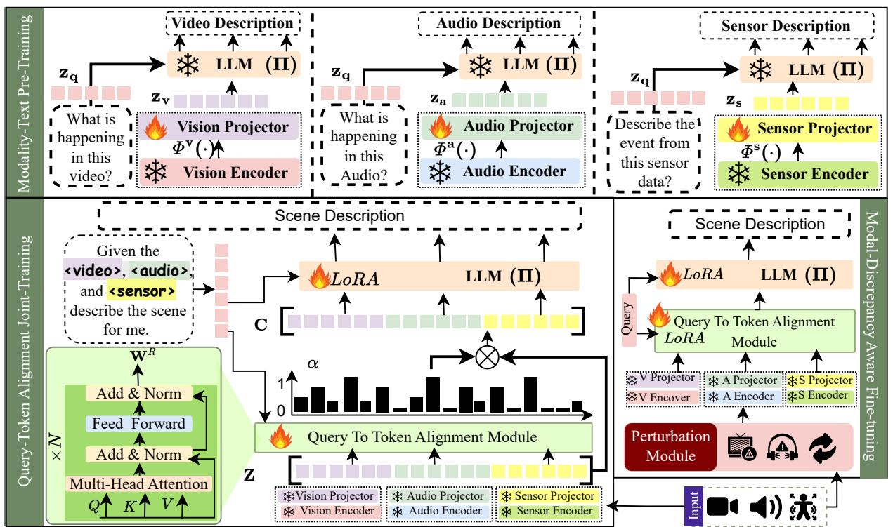

<details>
<summary>flowchart</summary>

Modality-text pre-training architecture diagram showing video, audio, and sensor components with LLM (II) and VLA modules for alignment and discrepancy detection.
</details>

Figure 3: Overview of RAVEN. Each modality (video, audio, sensor) is encoded using pretrained encoders and projected into a shared space. The QuART module performs query-conditioned token relevance scoring to align informative tokens across modalities. The figure also highlights the three-stage training pipeline for alignment-aware multi-modal reasoning. Here, and represent trainable and frozen components, respectively.

QuART: Query-Aligned Representation of Tokens. The QuART module performs queryconditioned token selection over multi-modal inputs. Given visual, audio, and sensor token sequences $\mathbf { z } _ { v } , \mathbf { z } _ { a } , \mathbf { z } _ { s } \in \mathbb { R } ^ { L _ { m } \times E }$ , we concatenate them into a unified token matrix $\mathbf { Z } \in \mathbb { R } ^ { L \times E }$ , where ${ \cal L } = { \cal L } _ { v } + { \cal L } _ { a } + { \cal L } _ { s }$ . We apply multi-head attention between the query embedding $\mathbf { z } _ { q }$ and Z as: wh $\mathbf { Q } = \mathbf { z } _ { q } \mathbf { W } ^ { Q }$ ,  ar $\mathbf { V } = \mathbf { Z } \mathbf { W } ^ { V }$ ,- $\mathbf { W } ^ { Q } , \mathbf { W } ^ { K } , \mathbf { W } ^ { V } \in \mathbb { R } ^ { E \times d _ { k } }$ jections. Temporal order is preserved via sinusoidal positional embeddings, as in standard Transformer encoders. The aggregated attention output is M = softmax $\left( { \frac { \mathbf { Q } \mathbf { K } ^ { \top } } { \sqrt { d _ { k } } } } \right) \mathbf { V }$ .

Unlike standard multi-head attention–which uses similarity-based weights across modalities– QuART introduces a relevance projection head, $\mathbf { W } ^ { R } \in \mathbb { R } ^ { E \times L }$ , that learns to score tokens conditioned on the query. This separation enables the model to prioritize semantically relevant tokens even when distractors receive high attention weights–a key advantage under modality mismatch. QuART uses learned relevance scores to prioritize tokens based on the question. For instance, when asked about gentle placement, it emphasizes sensor deceleration and impact sounds while downweighting static visual frames. If the camera is occluded and the user trips, only IMU spikes and audio thuds are informative–QuART gates out blank video. This behavior generalizes, suppressing offscreen audio when questions target visual actions. This token-level relevance scores are computed as: $\pmb { \alpha } = \mathsf { s o f t m a x } ( \mathbf { M } \mathbf { W } ^ { R } )$ . The fused context vector, $\begin{array} { r } { \mathbf { C } = \sum _ { j = 1 } ^ { L } \alpha _ { j } \mathbf { Z } _ { j } } \end{array}$ aggregates query-weighted tokens across all modalities and conditions the LLM decoder. This learned relevance outperforms raw attention (Section 6.2).

Training Objective. The decoder Π predicts the output sequence $\{ y _ { t } \} _ { t = 1 } ^ { T }$ conditioned on C, trained via autoregressive cross-entropy: $\begin{array} { r l } { \mathcal { L } _ { \mathbf { Q u A R T } } } & { { } = } \end{array}$ $\begin{array} { r l } { - \frac { 1 } { T } \sum _ { t = 1 } ^ { T } \log p _ { \theta } ( y _ { t } } & { { } | \quad y _ { < t } , \mathbf { C } ) } \end{array}$ . To promote sparse selection of relevant tokens, we introduce an entropy-based regularizer: $\begin{array} { r l } { \mathcal { L } _ { \mathrm { r e g } } } & { { } = } \end{array}$ $\Sigma _ { j = 1 } ^ { L } \alpha _ { j } \log \alpha _ { j }$ .The total loss is

$$
\mathcal {L} _ {\text { RAVEN }} = \mathcal {L} _ {\text { QuART }} + \lambda \mathcal {L} _ {\text { reg }} \tag {1}
$$

We encourage sparsity via entropy regularization scaled by λ. Relevance is disabled in early stages $( { \bf C } = { \bf Z } , \lambda = 0 )$ and enabled in the final stage with $\lambda = 0 . 0 0 1$ . See Appendix E for implementation & hyperparameters and Appendix H for cost analysis. Table 7 and Appendix G demonstrate QuART’s advantage over SOTA alignment methods.

# 5 Alignment-Aware Multi-Stage Training for Multi-Modal Reasoning

We adopt a three-stage training procedure to optimize RAVEN and its query-conditioned alignment module. Each stage targets a distinct component– projection alignment, query-token fusion, and robustness to input degradation–stabilizing learning and reducing cross-modal interference (Figure 3).

Stage I: Modality-Text Pre-Training. In this pretraining stage, we use a large-scale, weakly labeled dataset of modality-text pairs: {video, text}, {image, text}, {audio, text}, and {sensor, text}, collected from caption-rich sources, e.g., WavCaps (Mei et al., 2024), and InternVid-10M (Wang et al., 2023). We adopt a sequential, modality-specific training strategy to avoid inter-modal interference and stabilize projection learning. Supervision is provided via natural language captions or transcriptions paired with raw modality inputs, such as video subtitles, audio narrations, and wearable sensor logs. For each modality $m \in \{ v , a , s \}$ , we freeze the pretrained encoder $\Phi ^ { m } ( \cdot )$ and language model Π, and update only the corresponding projection head $P ^ { m }$ to align with textual supervision. All three branches are trained in succession using the same LLM decoder, promoting consistent language grounding across modalities.

Stage II: Query-Token Alignment Joint-Training. After modality-specific alignment, we train the QuART module to perform token-level fusion conditioned on natural language queries. We use the AVS-QA dataset for this stage, which provides synchronized video, audio, sensor, and query-answer supervision (Equation 1). All modality encoders Φv, Φa, Φs and their projection heads are frozen to preserve previously learned alignments. We initialize QuART from scratch and train it to compute relevance-weighted token representations that bridge cross-modal information and the query context. In parallel, we fine-tune the LLM decoder Π using Low-Rank Adaptation (LoRA) (Hu et al., 2022) with rank 256, offering efficient adaptation to fused multi-modal inputs without catastrophic forgetting. This stage enables query-aware modality fusion, teaching RAVEN to prioritize informative tokens for reasoning and generation.

Stage III: Modal-Discrepancy Aware Finetuning. To improve robustness under real-world conditions, we fine-tune RAVEN using perturbed multi-modal inputs that simulate modality mismatch–such as dropped sensor packets or offscreen audio. We apply stochastic transformations independently to each modality: video undergoes frame jitter, dropout, or temporal inversion; audio is corrupted with Gaussian noise, reversed, or replaced with unrelated samples; sensor signals are perturbed with zero-centered Gaussian noise based on empirical variance (see Appendix D). Perturbed inputs $\tilde { \mathcal { D } } = \{ \tilde { v } , \tilde { a } , \tilde { s } \}$ are encoded by frozen encoders $\Phi ^ { m }$ and passed through the trained QuART module and LoRA-adapted decoder Π. During this stage, we activate entropy regularization to sharpen token relevance and encourage sparse, discriminative alignment. We set $\lambda = 0 . 0 0 1$ in the final stage, as it yields the best trade-off between sparsity and accuracy (see Section 6.2); earlier stages use $\lambda = 0$ . See Appendix E for full training details.

# 6 Experimental Evaluation of RAVEN

Training Datasets. RAVEN is pretrained (Stage I) on 13.1M weakly aligned modality–text pairs (e.g., InternVid-10M, WavCaps, SensorCaps), and finetuned (Stages II–III) on 510K high-quality QA pairs from AVS-QA. See Appendix E.1 for details.

Validation Datasets. We evaluate on seven audiovisual QA benchmarks spanning exocentric and egocentric domains: AVSD (Alamri et al., 2019), MUSIC-QA (Li et al., 2022), AVSSD (Chen et al., 2020), MSVD-QA (Alamri et al., 2019), MSRVTT-QA (Xu et al., 2016), ActivityNet-QA (Yu et al., 2019), and EgoThink (Cheng et al., 2024a), plus the 58K held-out test set from AVS-QA (Appendix F.2). Evaluation metrics (GPT based) follow prior work (Maaz et al., 2023) as detailed in Appendix F.3.

Baseline Models. We compare against SOTA models across both domains. For egocentric QA: Valley (Luo et al., 2023), VideoChat (Li et al., 2023c), VTimeLLM (Huang et al., 2024), PandaGPT (Su et al., 2023), MacawLLM (Lyu et al., 2023), AV-LLM (Shu et al., 2023), Video-LLaMA (Zhang et al., 2023a), AVicuna (Tang et al., 2024), and Video-LLaMA2 (Cheng et al., 2024b); for exocentric QA: OpenFlamingo (Awadalla et al., 2023), BLIP-2.6 (Li et al., 2023b), VideoChat-7B (Li et al., 2023c), LLaVA-1.5 (Liu et al., 2024a), MiniGPT4 (Zhu et al., 2023b), InstructBLIP (Liu et al., 2023b), LLaMA-Adapter (Zhang et al., 2023b), VideoLLaVA (Lin et al., 2023a), and ShareGPT4V (Chen et al., 2024a). All baselines use official checkpoints (See Appendix F.1).

Table 2: Comparison of RAVEN and prior MLLMs on exocentric open-ended video QA (MSVD-QA, MSRVTT-QA, ActivityNet-QA) and audio-visual QA (AVSD, MUSIC-QA) benchmarks. Best and second-best scores are in bold and underline. ∗ indicates scores reproduced by us. 

<table><tr><td rowspan="2">Method</td><td colspan="2">Modality</td><td rowspan="2">#Pairs (M)</td><td rowspan="2">LLM size</td><td rowspan="2">AVSD</td><td rowspan="2">MUSIC-QA</td><td rowspan="2">AVSSD</td><td rowspan="2">MSVD-QA</td><td rowspan="2">MSRVTT-QA</td><td rowspan="2">ActivityNet-QA</td></tr><tr><td>Video</td><td>Audio</td></tr><tr><td>Valley</td><td>✓</td><td>✘</td><td>1.5</td><td>13B</td><td>-</td><td>-</td><td>-</td><td>65.4</td><td>45.7</td><td>26.5</td></tr><tr><td>VideoChat</td><td>✓</td><td>✘</td><td>25.0</td><td>7B</td><td>-</td><td>-</td><td>-</td><td>56.3</td><td>45.0</td><td>26.5</td></tr><tr><td>Video-ChatGPT</td><td>✓</td><td>✘</td><td>0.9</td><td>7B</td><td>-</td><td>-</td><td>-</td><td>64.9</td><td>49.3</td><td>35.2</td></tr><tr><td>VTimeLLM</td><td>✓</td><td>✘</td><td>0.7</td><td>7B</td><td>-</td><td>-</td><td>-</td><td>69.8</td><td>58.8</td><td>45.5</td></tr><tr><td>PandaGPT</td><td>✓</td><td>✓</td><td>128.0</td><td>13B</td><td>26.1</td><td>33.7</td><td>32.7</td><td>46.7</td><td>23.7</td><td>11.2</td></tr><tr><td>Macaw–LLM</td><td>✓</td><td>✓</td><td>0.3</td><td>13B</td><td>34.3</td><td>31.8</td><td>36.1</td><td>42.1</td><td>25.5</td><td>14.5</td></tr><tr><td>AV–LLM</td><td>✓</td><td>✓</td><td>1.6</td><td>7B</td><td>52.6</td><td>45.2</td><td>-</td><td>67.3</td><td>53.7</td><td>47.2</td></tr><tr><td>Video–LLaMA</td><td>✓</td><td>✓</td><td>2.8</td><td>13B</td><td>36.7</td><td>36.6</td><td>36.7</td><td>51.6</td><td>29.6</td><td>12.4</td></tr><tr><td>AVicuna</td><td>✓</td><td>✓</td><td>1.1</td><td>7B</td><td>53.1</td><td>49.6</td><td>-</td><td>70.2</td><td>59.7</td><td>53.0</td></tr><tr><td>Video-LLaMA2</td><td>✓</td><td>✓</td><td>2.0</td><td>7B</td><td>50.6*</td><td>66.3*</td><td>71.4</td><td>-</td><td>-</td><td>-</td></tr><tr><td>RAVEN</td><td>✓</td><td>✓</td><td>0.8</td><td>7B</td><td>55.1+3.6%</td><td>69.8+5.0%</td><td>70.2-1.7%</td><td>73.3+4.2%</td><td>63.1+5.4%</td><td>57.6+8.0%</td></tr></table>

# 6.1 Quantitative Results

Exocentric Audio-Visual. Table 2 shows that RAVEN outperforms SOTA models on video QA (by up to 8.0%) and AVQA (by 5.0%), surpassing QA-specific fusion models (e.g., AV-LLM, Macaw–LLM). These gains stem from QuART’s fine-grained, query-conditioned relevance scores, which enhance alignment and suppress irrelevant inputs. Performance is competitive but not superior on curated benchmarks like AVSSD, where modality-based relevance scoring may be less impactful due to limited cross-modal variability.

Egocentric Audio-Visual Results. Table 3 reports results on EgoThink and AVS-QA. RAVEN achieves the highest overall performance–53.5 average on EgoThink (+14.6%) and 0.67 on AVS-QA (+7.5%)–with strong gains in Completeness (0.71, +9.8%) and Correctness (0.69, +8.7%). While baselines like OpenFlamingo-7B and BLIP-2.6-7B perform moderately (e.g., 21.0 on Count, 0.31 on Completeness), and VideoLLaVA-7B excels in specific categories (e.g., 66.0 in Situated), RAVEN delivers the best overall scores.

Sensor-Aware Evaluation on AVS-QA. Table 4 reports results on AVS-QA across modalities (V/A/S) and metrics (Completeness, Coherence, Accuracy, Avg). RAVEN performs better than baselines like VideoLLaMA2 with A+V fusion (+21.8% avg). However, RAVEN with A+V+S achieves an additional performance gain of 16.4% – highlighting the benefit of sensor modality and sensor-aware reasoning. These results validate the importance of query-guided sensor integration for context-rich QA.

Cross-modal mismatch. Table 5 shows RAVEN effectively handles cross-modal mismatch. Trained with Stages I and II, it outperforms prior SOTA on AVQA by 30–79%. On AVS-QA, Stage III finetuning boosts performance to 0.71–0.79, surpassing Video-LLaMA2 (0.51–0.54). These gains stem from QuART ’s query-to-token alignment, which emphasizes semantically relevant tokens even under modality misalignment.

# 6.2 Ablation Study

Training Stages and Loss Conditioning. We ablate training stages, loss formulation, and regularization strength across six QA benchmarks (Table 6). Conditioning ${ \mathcal { L } } _ { \mathbf { Q u A R T } }$ on contextual embeddings C (vs. raw Z) in Stage II improves performance (e.g., AVS-QA Avg: 0.49 vs. 0.44), confirming the value of context in alignment. Adding regularization in Stage III boosts robustness but is sensitive to λ: a high value (1.0) hurts performance (AVS-QA Avg: 0.30), while λ = 0.001 yields the best results–raising AVS-QA Avg to 0.78 (+43%), Coherence to 0.82 (+15.9%), and Accuracy to 0.73 (+16.4%). Similar gains appear on ActivityNet-QA (+18.4%) and MUSIC-QA (+24.5%). Overall, best performance is achieved with Stage III, contextaware ${ \mathcal { L } } _ { \mathbf { Q u A R T } }$ , and λ = 0.001–highlighting the synergy between structured alignment and calibrated regularization.

Effect of Learnable Relevance Projection $( \mathbf { W } ^ { R } )$ . Table 7 compares QuART ’s learnable projection head $\mathbf { W } ^ { R }$ against raw attention and two state-ofthe-art token relevance methods: Q-Former (Li et al., 2023b) and HierarQ (Azad et al., 2025). QuART achieves the highest accuracy across all benchmarks while using fewer parameters (45M vs. 188M/390M). By transforming attention scores into query-conditioned relevance weights, $\mathbf { W } ^ { R }$ enables efficient and interpretable cross-modal alignment. Additional ablations – including encoder choices, LoRA rank, token selection – are provided in Appendix G, along with qualitative examples in Appendix I.

Table 3: Comparison of RAVEN with MLLMs on the EgoThink (Reasoning) and AVS-QA benchmarks. RAVEN outperforms across metrics and excels in reasoning. Bold and underline indicate the best and second-best scores. 

<table><tr><td rowspan="2">Method</td><td colspan="4">EgoThink (Reasoning)</td><td colspan="4">AVS-QA</td></tr><tr><td>Count</td><td>Compar</td><td>Situated</td><td>Avg</td><td>Comp.</td><td>Coher.</td><td>Acc.</td><td>Avg</td></tr><tr><td>OpenFlamingo</td><td>0.21</td><td>0.40</td><td>0.21</td><td>0.27</td><td>0.31</td><td>0.34</td><td>0.27</td><td>0.31</td></tr><tr><td>BLIP-2.6</td><td>0.03</td><td>0.21</td><td>0.33</td><td>0.19</td><td>0.22</td><td>0.26</td><td>0.21</td><td>0.23</td></tr><tr><td>VideoChat</td><td>0.36</td><td>0.39</td><td>0.32</td><td>0.36</td><td>0.29</td><td>0.33</td><td>0.37</td><td>0.33</td></tr><tr><td>LLaVA-1.5</td><td>0.20</td><td>0.47</td><td>0.37</td><td>34.7</td><td>0.46</td><td>0.47</td><td>0.52</td><td>0.48</td></tr><tr><td>MiniGPT-4</td><td>0.14</td><td>0.48</td><td>0.31</td><td>0.31</td><td>0.19</td><td>0.29</td><td>0.34</td><td>0.27</td></tr><tr><td>InstructBLIP</td><td>0.18</td><td>0.43</td><td>0.67</td><td>0.42</td><td>0.33</td><td>0.37</td><td>0.35</td><td>0.35</td></tr><tr><td>LLaMA-Adapter</td><td>0.29</td><td>0.39</td><td>0.25</td><td>0.31</td><td>0.25</td><td>0.31</td><td>0.29</td><td>0.28</td></tr><tr><td>PandaGPT</td><td>0.19</td><td>0.52</td><td>0.53</td><td>0.41</td><td>0.38</td><td>0.42</td><td>0.41</td><td>0.40</td></tr><tr><td>VideoLLaVA</td><td>0.39</td><td>0.38</td><td>0.60</td><td>0.46</td><td>0.42</td><td>0.46</td><td>0.45</td><td>0.44</td></tr><tr><td>ShareGPT4V</td><td>0.30</td><td>0.38</td><td>0.66</td><td>0.45</td><td>0.64</td><td>0.63</td><td>0.59</td><td>0.62</td></tr><tr><td>RAVEN</td><td> $0.40_{+2.7\%}$ </td><td> $0.54_{+3.4\%}$ </td><td> $0.66_{-1.5\%}$ </td><td> $0.54_{+14.8\%}$ </td><td> $0.71_{+9.8\%}$ </td><td> $0.69_{+8.7\%}$ </td><td> $0.61_{+3.28\%}$ </td><td> $0.67_{+7.5\%}$ </td></tr></table>

Table 4: AVS-QA results comparing RAVEN with SOTA models using different modality combinations. 

<table><tr><td>Method</td><td>V</td><td>A</td><td>S</td><td>Comp.</td><td>Coher.</td><td>Acc.</td><td>Avg</td></tr><tr><td rowspan="2">Macaw-LLM</td><td>√</td><td>✗</td><td>✗</td><td>0.27</td><td>0.32</td><td>0.23</td><td>0.27</td></tr><tr><td>√</td><td>√</td><td>✗</td><td>0.38</td><td>0.46</td><td>0.34</td><td>0.39</td></tr><tr><td rowspan="2">Panda-GPT</td><td>√</td><td>✗</td><td>✗</td><td>0.36</td><td>0.42</td><td>0.33</td><td>0.37</td></tr><tr><td>√</td><td>√</td><td>✗</td><td>0.43</td><td>0.49</td><td>0.38</td><td>0.43</td></tr><tr><td rowspan="2">VideoLLaMA</td><td>√</td><td>✗</td><td>✗</td><td>0.37</td><td>0.33</td><td>0.28</td><td>0.33</td></tr><tr><td>√</td><td>√</td><td>✗</td><td>0.48</td><td>0.51</td><td>0.41</td><td>0.47</td></tr><tr><td rowspan="2">VideoLLaMA2</td><td>√</td><td>✗</td><td>✗</td><td>0.51</td><td>0.54</td><td>0.43</td><td>0.49</td></tr><tr><td>√</td><td>√</td><td>✗</td><td>0.56</td><td>0.59</td><td>0.51</td><td>0.55</td></tr><tr><td rowspan="3">RAVEN</td><td>√</td><td>✗</td><td>✗</td><td>0.61</td><td>0.62</td><td>0.46</td><td>0.56</td></tr><tr><td>√</td><td>√</td><td>✗</td><td>0.71</td><td>0.69</td><td>0.61</td><td>0.67</td></tr><tr><td>√</td><td>√</td><td>√</td><td>0.78</td><td>0.82</td><td>0.73</td><td>0.78</td></tr></table>

Table 5: Comparison under cross-modal mismatch scenarios. RAVEN with Stage III fine-tuning consistently outperforms baseline methods across all evaluation metrics and benchmarks, demonstrating superior robustness to modality perturbations.

<table><tr><td rowspan="2">Method</td><td rowspan="2">AVSD</td><td rowspan="2">MUSIC QA</td><td rowspan="2">MSVD QA</td><td rowspan="2">Activity Net-QA</td><td colspan="4">AVS-QA</td></tr><tr><td>Comp.</td><td>Cohr.</td><td>Acc.</td><td>Avg.</td></tr><tr><td>PandaGPT</td><td>12.2</td><td>13.8</td><td>21.8</td><td>7.9</td><td>0.23</td><td>0.29</td><td>0.26</td><td>0.26</td></tr><tr><td>Macaw-LLM</td><td>18.1</td><td>14.5</td><td>22.2</td><td>10.6</td><td>0.11</td><td>0.21</td><td>0.19</td><td>0.17</td></tr><tr><td>AV-LLM</td><td>24.7</td><td>22.1</td><td>49.8</td><td>26.8</td><td>-</td><td>-</td><td>-</td><td>-</td></tr><tr><td>Video-LLaMA</td><td>17.9</td><td>24.6</td><td>31.5</td><td>25.3</td><td>0.28</td><td>0.39</td><td>0.33</td><td>0.33</td></tr><tr><td>AVicuna</td><td>34.1</td><td>31.3</td><td>51.7</td><td>31.9</td><td>-</td><td>-</td><td>-</td><td>-</td></tr><tr><td>Video-LLaMA2</td><td>43.2</td><td>44.7</td><td>52.1</td><td>29.7</td><td>0.51</td><td>0.54</td><td>0.48</td><td>0.51</td></tr><tr><td>RAVEN $_{I,II}$ </td><td>51.9</td><td>63.7</td><td>66.4</td><td>52.6</td><td>0.69</td><td>0.71</td><td>0.64</td><td>0.68</td></tr><tr><td>RAVEN $_{I-III}$ </td><td>54.9</td><td>69.2</td><td>72.8</td><td>57.2</td><td>0.76</td><td>0.79</td><td>0.71</td><td>0.75</td></tr></table>

Table 6: Ablation on training stages (II & III), conditioning $\mathcal { L } _ { \mathbf { Q u A R T } }$ on Z Table 7: Effect of $\mathbf { W } ^ { R }$ . QuART out-$( \mathcal { L } _ { \bf Q u A R T } | \bf Z )$ vs. C $( \mathcal { L } _ { \bf Q u A R T } | \bf C )$ , and regularization strength λ. performs with fewer parameters.

<table><tr><td rowspan="2">Training Stage</td><td rowspan="2">Loss</td><td rowspan="2"> $\lambda$ </td><td rowspan="2">AVSD</td><td rowspan="2">MUSIC QA</td><td rowspan="2">AVSSD</td><td rowspan="2">MSVD QA</td><td rowspan="2">Activity Net-QA</td><td colspan="4">AVS-QA</td></tr><tr><td>Comp.</td><td>Cohr.</td><td>Acc.</td><td>Avg.</td></tr><tr><td rowspan="2">Up to Stage II</td><td> $\mathcal{L}_{\text{QuART}}|\text{Z}$ </td><td>-</td><td>45.2</td><td>53.2</td><td>58.8</td><td>60.3</td><td>45.1</td><td>0.38</td><td>0.52</td><td>0.42</td><td>0.44</td></tr><tr><td> $\mathcal{L}_{\text{QuART}}|\text{C}$ </td><td>-</td><td>48.7</td><td>57.7</td><td>61.5</td><td>63.9</td><td>51.2</td><td>0.42</td><td>0.57</td><td>0.47</td><td>0.49</td></tr><tr><td rowspan="5">Up to Stage III</td><td>w/o  $\mathcal{L}_{reg}$ </td><td>-</td><td>40.7</td><td>48.5</td><td>59.3</td><td>61.5</td><td>43.2</td><td>0.29</td><td>0.41</td><td>0.34</td><td>0.35</td></tr><tr><td rowspan="4">with $\mathcal{L}_{reg}$ </td><td>1</td><td>41.5</td><td>45.3</td><td>53.2</td><td>57.9</td><td>39.7</td><td>0.23</td><td>0.37</td><td>0.29</td><td>0.30</td></tr><tr><td>0.1</td><td>48.3</td><td>56.2</td><td>54.7</td><td>64.2</td><td>45.8</td><td>0.62</td><td>0.69</td><td>0.59</td><td>0.63</td></tr><tr><td>0.01</td><td>52.2</td><td>61.8</td><td>61.2</td><td>68.1</td><td>51.6</td><td>0.71</td><td>0.78</td><td>0.68</td><td>0.72</td></tr><tr><td>0.001</td><td>55.1</td><td>69.8</td><td>70.2</td><td>73.3</td><td>57.6</td><td>0.78</td><td>0.82</td><td>0.73</td><td>0.78</td></tr></table>

<table><tr><td>Method</td><td>Raw attention</td><td>Q - Former</td><td>HierarQ</td><td>QuART</td></tr><tr><td>#Params ↓</td><td>41M</td><td>188M</td><td>390M</td><td>45M</td></tr><tr><td>AVSD</td><td>29.1</td><td>36.7</td><td>-</td><td>55.1</td></tr><tr><td>MUSIC-QA</td><td>23.6</td><td>36.6</td><td>-</td><td>69.8</td></tr><tr><td>MSVD-QA</td><td>42.2</td><td>51.6</td><td>66.2</td><td>73.3</td></tr><tr><td>ActivityNet -QA</td><td>12.1</td><td>12.4</td><td>57.2</td><td>57.6</td></tr><tr><td>MSRVTT -QA</td><td>23.1</td><td>29.6</td><td>54.1</td><td>63.1</td></tr></table>

# 7 Conclusion

In this paper, we present RAVEN, a unified framework for multimodal question answering that integrates video, audio, and sensor inputs via query-aware alignment, enabling robust reasoning under modality disagreement. To support this, we release AVS-QA–the first large-scale dataset of synchronized {Audio, Video, Sensor,

QA} quadruples–curated via an automated actorevaluator-critic pipeline. Spanning egocentric settings and four QA types, AVS-QA enables comprehensive benchmarking. Our three-stage training– modality pretraining, query-conditioned alignment, and perturbation-aware fine-tuning–drives consistent gains across diverse multimodal QA benchmarks. These results underscore the importance of structured, query-aware reasoning in handling real-world modality mismatch.

# 8 Limitations

While RAVEN provides a strong foundation for multimodal question answering over audio, video, and sensor inputs, our current experiments are limited to a single backbone model, Qwen-Instruct-7B, due to computational constraints. We do not explore larger LLM variants (e.g., 13B or 70B), which could further improve performance but require significantly more resources. Additionally, we leave the investigation of alternative language backbones and more advanced fusion strategies (e.g., retrieval-augmented alignment, memory-based conditioning) as future work.

We also note that for longer recordings (exceeding ∼5 minutes), particularly those involving visually dense scenes, RAVEN occasionally underperforms on vision-heavy queries. This is likely caused by our uniform frame selection strategy, which may miss critical visual cues in longer videos because of sparse temporal sampling. Incorporating adaptive or query-guided frame selection could mitigate this issue and improve temporal grounding.

Finally, training RAVEN is computationally expensive. Our current setup required approximately 120 hours on 4 NVIDIA A100 GPUs (each with 80 GB of memory). While the design is efficient at inference time due to early token filtering, future work could further reduce training cost through distillation or parameter sharing across modalities. Future Directions. Future work on RAVEN includes exploring joint training strategies across modalities to enable deeper cross-modal interactions and more robust representation learning. Incorporating a saliency-aware frame selection mechanism may further improve performance on longform, visually complex inputs. Additionally, reducing or eliminating the need to fine-tune the LLM backbone when introducing new modalities remains an open challenge. Addressing this could significantly improve the scalability, adaptability, and deployment efficiency of multimodal language models.

# 9 Ethical Considerations

The AVS-QA dataset is derived entirely from publicly released egocentric datasets (Ego4D (Grauman et al., 2022) and EPIC-Kitchens (Damen et al., 2018)) that include usage licenses permitting research redistribution. Our processing pipeline does not introduce new identity annotations, and we do not extract or distribute personally identifiable metadata. AVS-QA contains synthetic question–answer pairs generated from visual, auditory, and sensor summaries, and no raw video, audio, or IMU recordings are included in the release. We follow best practices for anonymization and respect the original datasets’ ethical use guidelines.

# 10 Risk Statement

Our multimodal language model integrates audio, visual, and sensor inputs to enhance reasoning, but it raises several concerns. First, misuse of MLLMs in surveillance, biometric inference, or manipulation of multi-sensory content raises ethical concerns regarding user privacy and consent, especially when applied to egocentric or sensor-rich environments. Additionally, the interpretability of cross-modal reasoning remains limited, making it difficult to identify failure cases or mitigate hallucinations across modalities. We recommend careful deployment of such systems with human oversight, ongoing auditing of training data sources, and future work on explainability and robust alignment to reduce these risks.

# Acknowledgment

This research was supported by funding from the NSF CNS-2347692. Results in this paper were obtained in part using a high-performance computing system acquired through NSF MRI grant DMS-1337943 to WPI. We gratefully acknowledge their support in enabling this work.

# References

Marah Abdin, Jyoti Aneja, Hany Awadalla, Ahmed Awadallah, Ammar Ahmad Awan, Nguyen Bach, Amit Bahree, Arash Bakhtiari, Jianmin Bao, Harkirat Behl, and 1 others. 2024. Phi-3 technical report: A highly capable language model locally on your phone. arXiv preprint arXiv:2404.14219.   
Josh Achiam, Steven Adler, Sandhini Agarwal, Lama Ahmad, Ilge Akkaya, Florencia Leoni Aleman, Diogo Almeida, Janko Altenschmidt, Sam Altman, Shyamal Anadkat, and 1 others. 2023. Gpt-4 technical report. arXiv preprint arXiv:2303.08774.   
Huda Alamri, Vincent Cartillier, Abhishek Das, Jue Wang, Anoop Cherian, Irfan Essa, Dhruv Batra, Tim K. Marks, Chiori Hori, Peter Anderson, Stefan Lee, and Devi Parikh. 2019. Audio visual sceneaware dialog. In Proceedings of the IEEE/CVF Conference on Computer Vision and Pattern Recognition, pages 7558–7567.

Jean-Baptiste Alayrac, Jeff Donahue, Pauline Luc, Antoine Miech, Iain Barr, Yana Hasson, Karel Lenc, Arthur Mensch, Katie Millican, Malcolm Reynolds, Roman Ring, Eliza Rutherford, Serkan Cabi, Tengda Han, Zhitao Gong, Sina Samangooei, Marianne Monteiro, Jacob Menick, Sebastian Borgeaud, and 8 others. 2022. Flamingo: a visual language model for few-shot learning. Advances in neural information processing systems, 35:23716–23736.   
Anas Awadalla, Irena Gao, Josh Gardner, Jack Hessel, Yusuf Hanafy, Wanrong Zhu, Kalyani Marathe, Yonatan Bitton, Samir Gadre, Shiori Sagawa, and 1 others. 2023. Openflamingo: An open-source framework for training large autoregressive visionlanguage models. arXiv preprint arXiv:2308.01390.   
Shehreen Azad, Vibhav Vineet, and Yogesh Singh Rawat. 2025. Hierarq: Task-aware hierarchical qformer for enhanced video understanding. arXiv preprint arXiv:2503.08585.   
Jinze Bai, Shuai Bai, Yunfei Chu, Zeyu Cui, Kai Dang, Xiaodong Deng, Yang Fan, Wenbin Ge, Yu Han, Fei Huang, and 1 others. 2023. Qwen technical report. arXiv preprint arXiv:2309.16609.   
Max Bain, Arsha Nagrani, Gül Varol, and Andrew Zisserman. 2021. Frozen in time: A joint video and image encoder for end-to-end retrieval. In Proceedings of the IEEE/CVF international conference on computer vision, pages 1728–1738.   
Hangbo Bao, Wenhui Wang, Li Dong, Qiang Liu, Owais Khan Mohammed, Kriti Aggarwal, Subhojit Som, Songhao Piao, and Furu Wei. 2022. Vlmo: Unified vision-language pre-training with mixture-ofmodality-experts. Advances in Neural Information Processing Systems, 35:32897–32912.   
Subrata Biswas, Mohammad Nur Hossain Khan, Alex Colwell, Jack Adiletta, and Bashima Islam. 2023. Locus: Localization with channel uncertainty and sporadic energy. arXiv preprint arXiv:2302.09409.   
Soravit Changpinyo, Piyush Sharma, Nan Ding, and Radu Soricut. 2021. Conceptual 12m: Pushing webscale image-text pre-training to recognize long-tail visual concepts. In Proceedings of the IEEE/CVF conference on computer vision and pattern recognition, pages 3558–3568.   
Honglie Chen, Weidi Xie, Andrea Vedaldi, and Andrew Zisserman. 2020. Vggsound: A large-scale audio-visual dataset. In ICASSP 2020-2020 IEEE International Conference on Acoustics, Speech and Signal Processing (ICASSP), pages 721–725. IEEE.   
Lin Chen, Jinsong Li, Xiaoyi Dong, Pan Zhang, Conghui He, Jiaqi Wang, Feng Zhao, and Dahua Lin. 2024a. Sharegpt4v: Improving large multi-modal models with better captions. In European Conference on Computer Vision, pages 370–387. Springer.   
Sanyuan Chen, Yu Wu, Chengyi Wang, Shujie Liu, Daniel Tompkins, Zhuo Chen, and Furu Wei. 2022.

Beats: Audio pre-training with acoustic tokenizers. arXiv preprint arXiv:2212.09058.   
Tsai-Shien Chen, Aliaksandr Siarohin, Willi Menapace, Ekaterina Deyneka, Hsiang-wei Chao, Byung Eun Jeon, Yuwei Fang, Hsin-Ying Lee, Jian Ren, Ming-Hsuan Yang, and 1 others. 2024b. Panda-70m: Captioning 70m videos with multiple cross-modality teachers. In Proceedings of the IEEE/CVF Conference on Computer Vision and Pattern Recognition, pages 13320–13331.   
Wenqiang Chen, Jiaxuan Cheng, Leyao Wang, Wei Zhao, and Wojciech Matusik. 2024c. Sensor2text: Enabling natural language interactions for daily activity tracking using wearable sensors. Proc. ACM Interact. Mob. Wearable Ubiquitous Technol., 8(4).   
Sijie Cheng, Zhicheng Guo, Jingwen Wu, Kechen Fang, Peng Li, Huaping Liu, and Yang Liu. 2024a. Egothink: Evaluating first-person perspective thinking capability of vision-language models. In Proceedings of the IEEE/CVF Conference on Computer Vision and Pattern Recognition, pages 14291–14302.   
Zesen Cheng, Sicong Leng, Hang Zhang, Yifei Xin, Xin Li, Guanzheng Chen, Yongxin Zhu, Wenqi Zhang, Ziyang Luo, Deli Zhao, and Lidong Bing. 2024b. Videollama 2: Advancing spatial-temporal modeling and audio understanding in video-llms. arXiv preprint arXiv:2406.07476.   
Aakanksha Chowdhery, Sharan Narang, Jacob Devlin, Maarten Bosma, Gaurav Mishra, Adam Roberts, Paul Barham, Hyung Won Chung, Charles Sutton, Sebastian Gehrmann, and 1 others. 2023. Palm: Scaling language modeling with pathways. Journal of Machine Learning Research, 24(240):1–113.   
Sanjoy Chowdhury, Subrata Biswas, Sayan Nag, Tushar Nagarajan, Calvin Murdock, Ishwarya Ananthabhotla, Yijun Qian, Vamsi Krishna Ithapu, Dinesh Manocha, and Ruohan Gao. 2025. Egoadapt: Adaptive multisensory distillation and policy learning for efficient egocentric perception. arXiv preprint arXiv:2506.21080.   
Yunfei Chu, Jin Xu, Qian Yang, Haojie Wei, Xipin Wei, Zhifang Guo, Yichong Leng, Yuanjun Lv, Jinzheng He, Junyang Lin, Chang Zhou, and Jingren Zhou. 2024. Qwen2-audio technical report. arXiv preprint arXiv:2407.10759.   
Yunfei Chu, Jin Xu, Xiaohuan Zhou, Qian Yang, Shiliang Zhang, Zhijie Yan, Chang Zhou, and Jingren Zhou. 2023. Qwen-audio: Advancing universal audio understanding via unified large-scale audiolanguage models. arXiv preprint arXiv:2311.07919.   
Justin Cosentino, Anastasiya Belyaeva, Xin Liu, Nicholas A Furlotte, Zhun Yang, Chace Lee, Erik Schenck, Yojan Patel, Jian Cui, Logan Douglas Schneider, and 1 others. 2024. Towards a personal health large language model. arXiv preprint arXiv:2406.06474.

Dima Damen, Hazel Doughty, Giovanni Maria Farinella, Sanja Fidler, Antonino Furnari, Evangelos Kazakos, Davide Moltisanti, Jonathan Munro, Toby Perrett, Will Price, and Michael Wray. 2018. Scaling egocentric vision: The epic-kitchens dataset. In European Conference on Computer Vision (ECCV).   
Benjamin Elizalde, Soham Deshmukh, Mahmoud Al Ismail, and Huaming Wang. 2023. Clap learning audio concepts from natural language supervision. In ICASSP 2023-2023 IEEE International Conference on Acoustics, Speech and Signal Processing (ICASSP), pages 1–5. IEEE.   
Jinlan Fu, See-Kiong Ng, Zhengbao Jiang, and Pengfei Liu. 2023. Gptscore: Evaluate as you desire. arXiv preprint arXiv:2302.04166.   
Rohit Girdhar, Alaaeldin El-Nouby, Zhuang Liu, Mannat Singh, Kalyan Vasudev Alwala, Armand Joulin, and Ishan Misra. 2023. Imagebind: One embedding space to bind them all. In Proceedings of the IEEE/CVF conference on computer vision and pattern recognition, pages 15180–15190.   
Aaron Grattafiori, Abhimanyu Dubey, Abhinav Jauhri, Abhinav Pandey, Abhishek Kadian, Ahmad Al-Dahle, Aiesha Letman, Akhil Mathur, Alan Schelten, Alex Vaughan, and 1 others. 2024. The llama 3 herd of models. arXiv preprint arXiv:2407.21783.   
Kristen Grauman, Andrew Westbury, Eugene Byrne, Zachary Chavis, Antonino Furnari, Rohit Girdhar, Jackson Hamburger, Hao Jiang, Miao Liu, Xingyu Liu, Miguel Martin, Tushar Nagarajan, Ilija Radosavovic, Santhosh Kumar Ramakrishnan, Fiona Ryan, Jayant Sharma, Michael Wray, Mengmeng Xu, Eric Zhongcong Xu, and 66 others. 2022. Ego4d: Around the world in 3,000 hours of egocentric video. In Proceedings of the IEEE/CVF conference on computer vision and pattern recognition, pages 18995– 19012.   
Edward J Hu, Yelong Shen, Phillip Wallis, Zeyuan Allen-Zhu, Yuanzhi Li, Shean Wang, Lu Wang, Weizhu Chen, and 1 others. 2022. Lora: Low-rank adaptation of large language models. ICLR, 1(2):3.   
Bin Huang, Xin Wang, Hong Chen, Zihan Song, and Wenwu Zhu. 2024. Vtimellm: Empower llm to grasp video moments. In Proceedings of the IEEE/CVF Conference on Computer Vision and Pattern Recognition, pages 14271–14280.   
Sheikh Asif Imran, Mohammad Nur Hossain Khan, Subrata Biswas, and Bashima Islam. 2024. Llasa: A multimodal llm for human activity analysis through wearable and smartphone sensors. arXiv preprint arXiv:2406.14498.   
Baoxiong Jia, Ting Lei, Song-Chun Zhu, and Siyuan Huang. 2022. Egotaskqa: Understanding human tasks in egocentric videos. Advances in Neural Information Processing Systems, 35:3343–3360.

Albert Q Jiang, Alexandre Sablayrolles, Antoine Roux, Arthur Mensch, Blanche Savary, Chris Bamford, Devendra Singh Chaplot, Diego de las Casas, Emma Bou Hanna, Florian Bressand, and 1 others. 2024. Mixtral of experts. arXiv preprint arXiv:2401.04088.   
Rahima Khanam and Muhammad Hussain. 2024. Yolov11: An overview of the key architectural enhancements. arXiv preprint arXiv:2410.17725.   
Chris Dongjoo Kim, Byeongchang Kim, Hyunmin Lee, and Gunhee Kim. 2019. Audiocaps: Generating captions for audios in the wild. In NAACL-HLT.   
Zhifeng Kong, Arushi Goel, Rohan Badlani, Wei Ping, Rafael Valle, and Bryan Catanzaro. 2024. Audio flamingo: A novel audio language model with fewshot learning and dialogue abilities. arXiv preprint arXiv:2402.01831.   
Alexandre Lacoste, Sasha Luccioni, Victor Schmidt, and Thomas Dandres. 2019. Quantifying the carbon emissions of machine learning. arXiv preprint arXiv:1910.09700.   
Zikang Leng, Amitrajit Bhattacharjee, Hrudhai Rajasekhar, Lizhe Zhang, Elizabeth Bruda, Hyeokhyen Kwon, and Thomas Plötz. 2024. Imugpt 2.0: Language-based cross modality transfer for sensorbased human activity recognition. Proceedings of the ACM on Interactive, Mobile, Wearable and Ubiquitous Technologies, 8(3):1–32.   
Bohao Li, Rui Wang, Guangzhi Wang, Yuying Ge, Yixiao Ge, and Ying Shan. 2023a. Seed-bench: Benchmarking multimodal llms with generative comprehension. arXiv preprint arXiv:2307.16125.   
Guangyao Li, Yake Wei, Yapeng Tian, Chenliang Xu, Ji-Rong Wen, and Di Hu. 2022. Learning to answer questions in dynamic audio-visual scenarios. In Proceedings of the IEEE/CVF Conference on Computer Vision and Pattern Recognition, pages 19108–19118.   
Junnan Li, Dongxu Li, Silvio Savarese, and Steven Hoi. 2023b. Blip-2: Bootstrapping language-image pretraining with frozen image encoders and large language models. In International conference on machine learning, pages 19730–19742. PMLR.   
Junnan Li, Ramprasaath Selvaraju, Akhilesh Gotmare, Shafiq Joty, Caiming Xiong, and Steven Chu Hong Hoi. 2021. Align before fuse: Vision and language representation learning with momentum distillation. Advances in neural information processing systems, 34:9694–9705.   
KunChang Li, Yinan He, Yi Wang, Yizhuo Li, Wenhai Wang, Ping Luo, Yali Wang, Limin Wang, and Yu Qiao. 2023c. Videochat: Chat-centric video understanding. arXiv preprint arXiv:2305.06355.   
Bin Lin, Yang Ye, Bin Zhu, Jiaxi Cui, Munan Ning, Peng Jin, and Li Yuan. 2023a. Video-llava: Learning united visual representation by alignment before projection. arXiv preprint arXiv:2311.10122.

Yuanze Lin, Chen Wei, Huiyu Wang, Alan Yuille, and Cihang Xie. 2023b. Smaug: Sparse masked autoencoder for efficient video-language pre-training. In Proceedings of the IEEE/CVF International Conference on Computer Vision, pages 2459–2469.   
Haotian Liu, Chunyuan Li, Yuheng Li, and Yong Jae Lee. 2024a. Improved baselines with visual instruction tuning. In Proceedings of the IEEE/CVF Conference on Computer Vision and Pattern Recognition, pages 26296–26306.   
Haotian Liu, Chunyuan Li, Qingyang Wu, and Yong Jae Lee. 2023a. Visual instruction tuning. Advances in neural information processing systems, 36:34892– 34916.   
Haotian Liu, Chunyuan Li, Qingyang Wu, and Yong Jae Lee. 2023b. Visual instruction tuning. Advances in neural information processing systems, 36:34892– 34916.   
Yuan Liu, Haodong Duan, Yuanhan Zhang, Bo Li, Songyang Zhang, Wangbo Zhao, Yike Yuan, Jiaqi Wang, Conghui He, Ziwei Liu, and 1 others. 2024b. Mmbench: Is your multi-modal model an all-around player? In European conference on computer vision, pages 216–233. Springer.   
Ruipu Luo, Ziwang Zhao, Min Yang, Junwei Dong, Da Li, Pengcheng Lu, Tao Wang, Linmei Hu, Minghui Qiu, and Zhongyu Wei. 2023. Valley: Video assistant with large language model enhanced ability. arXiv preprint arXiv:2306.07207.   
Chenyang Lyu, Minghao Wu, Longyue Wang, Xinting Huang, Bingshuai Liu, Zefeng Du, Shuming Shi, and Zhaopeng Tu. 2023. Macaw-llm: Multi-modal language modeling with image, audio, video, and text integration. arXiv preprint arXiv:2306.09093.   
Muhammad Maaz, Hanoona Rasheed, Salman Khan, and Fahad Shahbaz Khan. 2023. Video-chatgpt: Towards detailed video understanding via large vision and language models. arXiv preprint arXiv:2306.05424.   
Mohammad Malekzadeh, Richard G Clegg, Andrea Cavallaro, and Hamed Haddadi. 2019. Mobile sensor data anonymization. In Proceedings of the international conference on internet of things design and implementation, pages 49–58.   
Xinhao Mei, Chutong Meng, Haohe Liu, Qiuqiang Kong, Tom Ko, Chengqi Zhao, Mark D Plumbley, Yuexian Zou, and Wenwu Wang. 2024. Wavcaps: A chatgpt-assisted weakly-labelled audio captioning dataset for audio-language multimodal research. IEEE/ACM Transactions on Audio, Speech, and Language Processing.   
Mike A Merrill, Akshay Paruchuri, Naghmeh Rezaei, Geza Kovacs, Javier Perez, Yun Liu, Erik Schenck, Nova Hammerquist, Jake Sunshine, Shyam Tailor, and 1 others. 2024. Transforming wearable data into health insights using large language model agents. arXiv preprint arXiv:2406.06464.

Payal Mohapatra, Shamika Likhite, Subrata Biswas, Bashima Islam, and Qi Zhu. 2024. Missingnessresilient video-enhanced multimodal disfluency detection. In Interspeech 2024, pages 5093–5097.   
Arsha Nagrani, Paul Hongsuck Seo, Bryan Seybold, Anja Hauth, Santiago Manen, Chen Sun, and Cordelia Schmid. 2022. Learning audio-video modalities from image captions. In European Conference on Computer Vision, pages 407–426. Springer.   
Arsha Nagrani, Shan Yang, Anurag Arnab, Aren Jansen, Cordelia Schmid, and Chen Sun. 2021. Attention bottlenecks for multimodal fusion. Advances in neural information processing systems, 34:14200–14213.   
Xiaomin Ouyang and Mani Srivastava. 2024. Llmsense: Harnessing llms for high-level reasoning over spatiotemporal sensor traces. In 2024 IEEE 3rd Workshop on Machine Learning on Edge in Sensor Systems (SenSys-ML), pages 9–14. IEEE.   
Daniel Povey, Arnab Ghoshal, Gilles Boulianne, Lukas Burget, Ondrej Glembek, Nagendra Goel, Mirko Hannemann, Petr Motlicek, Yanmin Qian, Petr Schwarz, and 1 others. 2011. The kaldi speech recognition toolkit. In IEEE 2011 workshop on automatic speech recognition and understanding. IEEE Signal Processing Society.   
Shraman Pramanick, Yale Song, Sayan Nag, Kevin Qinghong Lin, Hardik Shah, Mike Zheng Shou, Rama Chellappa, and Pengchuan Zhang. 2023. Egovlpv2: Egocentric video-language pre-training with fusion in the backbone. In Proceedings of the IEEE/CVF International Conference on Computer Vision, pages 5285–5297.   
Alec Radford, Jong Wook Kim, Chris Hallacy, Aditya Ramesh, Gabriel Goh, Sandhini Agarwal, Girish Sastry, Amanda Askell, Pamela Mishkin, Jack Clark, Gretchen Krueger, and Ilya Sutskever. 2021. Learning transferable visual models from natural language supervision. In International conference on machine learning, pages 8748–8763. PmLR.   
Ilija Radosavovic, Raj Prateek Kosaraju, Ross Girshick, Kaiming He, and Piotr Dollár. 2020. Designing network design spaces. In Proceedings of the IEEE/CVF conference on computer vision and pattern recognition, pages 10428–10436.   
Jorge-L Reyes-Ortiz, Luca Oneto, Albert Samà, Xavier Parra, and Davide Anguita. 2016. Transition-aware human activity recognition using smartphones. Neurocomputing, 171:754–767.   
Daniel Roggen, Alberto Calatroni, Mirco Rossi, Thomas Holleczek, Kilian Förster, Gerhard Tröster, Paul Lukowicz, David Bannach, Gerald Pirkl, Alois Ferscha, and 1 others. 2010. Collecting complex activity datasets in highly rich networked sensor environments. In 2010 Seventh international conference on networked sensing systems (INSS), pages 233–240. IEEE.

Muhammad Shoaib, Stephan Bosch, Ozlem Durmaz Incel, Hans Scholten, and Paul JM Havinga. 2014. Fusion of smartphone motion sensors for physical activity recognition. Sensors, 14(6):10146–10176.   
Fangxun Shu, Lei Zhang, Hao Jiang, and Cihang Xie. 2023. Audio-visual llm for video understanding. arXiv preprint arXiv:2312.06720.   
Allan Stisen, Henrik Blunck, Sourav Bhattacharya, Thor Siiger Prentow, Mikkel Baun Kjærgaard, Anind Dey, Tobias Sonne, and Mads Møller Jensen. 2015. Smart devices are different: Assessing and mitigatingmobile sensing heterogeneities for activity recognition. In Proceedings of the 13th ACM conference on embedded networked sensor systems, pages 127– 140.   
Yixuan Su, Tian Lan, Huayang Li, Jialu Xu, Yan Wang, and Deng Cai. 2023. Pandagpt: One model to instruction-follow them all. arXiv preprint arXiv:2305.16355.   
Yunlong Tang, Daiki Shimada, Jing Bi, Mingqian Feng, Hang Hua, and Chenliang Xu. 2024. Empowering llms with pseudo-untrimmed videos for audio-visual temporal understanding. arXiv preprint arXiv:2403.16276.   
Gemini Team, Rohan Anil, Sebastian Borgeaud, Jean-Baptiste Alayrac, Jiahui Yu, Radu Soricut, Johan Schalkwyk, Andrew M Dai, Anja Hauth, Katie Millican, and 1 others. 2023. Gemini: a family of highly capable multimodal models. arXiv preprint arXiv:2312.11805.   
Hugo Touvron, Thibaut Lavril, Gautier Izacard, Xavier Martinet, Marie-Anne Lachaux, Timothée Lacroix, Baptiste Rozière, Naman Goyal, Eric Hambro, Faisal Azhar, Aurelien Rodriguez, Armand Joulin, Edouard Grave, and Guillaume Lample. 2023. Llama: Open and efficient foundation language models. arXiv preprint arXiv:2302.13971.   
Jack Urbanek, Florian Bordes, Pietro Astolfi, Mary Williamson, Vasu Sharma, and Adriana Romero-Soriano. 2024. A picture is worth more than 77 text tokens: Evaluating clip-style models on dense captions. In Proceedings of the IEEE/CVF Conference on Computer Vision and Pattern Recognition, pages 26700–26709.   
Junke Wang, Dongdong Chen, Chong Luo, Bo He, Lu Yuan, Zuxuan Wu, and Yu-Gang Jiang. 2024. Omnivid: A generative framework for universal video understanding. In Proceedings of the IEEE/CVF Conference on Computer Vision and Pattern Recognition, pages 18209–18220.   
Yi Wang, Yinan He, Yizhuo Li, Kunchang Li, Jiashuo Yu, Xin Ma, Xinhao Li, Guo Chen, Xinyuan Chen, Yaohui Wang, and 1 others. 2023. Internvid: A largescale video-text dataset for multimodal understanding and generation. arXiv preprint arXiv:2307.06942.

Dhanuja Wanniarachchi and Archan Misra. 2025. Mimic: Ai and ar-enhanced multi-modal, immersive, relative instruction comprehension. Proceedings of the ACM on Interactive, Mobile, Wearable and Ubiquitous Technologies, 9(1):1–34.   
Shengqiong Wu, Hao Fei, Leigang Qu, Wei Ji, and Tat-Seng Chua. 2024. Next-gpt: Any-to-any multimodal llm. In Forty-first International Conference on Machine Learning.   
Huatao Xu, Liying Han, Qirui Yang, Mo Li, and Mani Srivastava. 2024a. Penetrative ai: Making llms comprehend the physical world. In Proceedings of the 25th International Workshop on Mobile Computing Systems and Applications, pages 1–7.   
Huatao Xu, Pengfei Zhou, Rui Tan, Mo Li, and Guobin Shen. 2021. Limu-bert: Unleashing the potential of unlabeled data for imu sensing applications. In Proceedings of the 19th ACM Conference on Embedded Networked Sensor Systems, pages 220–233.   
Jun Xu, Tao Mei, Ting Yao, and Yong Rui. 2016. Msrvtt: A large video description dataset for bridging video and language. In Proceedings of the IEEE conference on computer vision and pattern recognition, pages 5288–5296.   
Xuhai Xu, Bingsheng Yao, Yuanzhe Dong, Saadia Gabriel, Hong Yu, James Hendler, Marzyeh Ghassemi, Anind K Dey, and Dakuo Wang. 2024b. Mental-llm: Leveraging large language models for mental health prediction via online text data. Proceedings of the ACM on Interactive, Mobile, Wearable and Ubiquitous Technologies, 8(1):1–32.   
An Yang, Baosong Yang, Beichen Zhang, Binyuan Hui, Bo Zheng, Bowen Yu, Chengyuan Li, Dayiheng Liu, Fei Huang, Haoran Wei, Huan Lin, Jian Yang, Jianhong Tu, Jianwei Zhang, Jianxin Yang, Jiaxi Yang, Jingren Zhou, Junyang Lin, Kai Dang, and 23 others. 2024. Qwen2. 5 technical report. arXiv preprint arXiv:2412.15115.   
Pinci Yang, Xin Wang, Xuguang Duan, Hong Chen, Runze Hou, Cong Jin, and Wenwu Zhu. 2022. Avqa: A dataset for audio-visual question answering on videos. In Proceedings of the 30th ACM international conference on multimedia, pages 3480–3491.   
Lewei Yao, Runhui Huang, Lu Hou, Guansong Lu, Minzhe Niu, Hang Xu, Xiaodan Liang, Zhenguo Li, Xin Jiang, and Chunjing Xu. 2021. Filip: Fine-grained interactive language-image pre-training. arXiv preprint arXiv:2111.07783.   
Hanrong Ye, De-An Huang, Yao Lu, Zhiding Yu, Wei Ping, Andrew Tao, Jan Kautz, Song Han, Dan Xu, Pavlo Molchanov, and 1 others. 2024. X-vila: Crossmodality alignment for large language model. arXiv preprint arXiv:2405.19335.   
Qinghao Ye, Guohai Xu, Ming Yan, Haiyang Xu, Qi Qian, Ji Zhang, and Fei Huang. 2023. Hitea: Hierarchical temporal-aware video-language pre-training.

In Proceedings of the IEEE/CVF International Conference on Computer Vision, pages 15405–15416.   
Jiahui Yu, Zirui Wang, Vijay Vasudevan, Legg Yeung, Mojtaba Seyedhosseini, and Yonghui Wu. 2022. Coca: Contrastive captioners are image-text foundation models. arXiv preprint arXiv:2205.01917.   
Weihao Yu, Zhengyuan Yang, Linjie Li, Jianfeng Wang, Kevin Lin, Zicheng Liu, Xinchao Wang, and Lijuan Wang. 2023. Mm-vet: Evaluating large multimodal models for integrated capabilities. arXiv preprint arXiv:2308.02490.   
Zhou Yu, Dejing Xu, Jun Yu, Ting Yu, Zhou Zhao, Yueting Zhuang, and Dacheng Tao. 2019. Activitynet-qa: A dataset for understanding complex web videos via question answering. In Proceedings of the AAAI Conference on Artificial Intelligence, volume 33, pages 9127–9134.   
Xiaohua Zhai, Basil Mustafa, Alexander Kolesnikov, and Lucas Beyer. 2023. Sigmoid loss for language image pre-training. In Proceedings of the IEEE/CVF international conference on computer vision, pages 11975–11986.   
Hang Zhang, Xin Li, and Lidong Bing. 2023a. Videollama: An instruction-tuned audio-visual language model for video understanding. arXiv preprint arXiv:2306.02858.   
Renrui Zhang, Jiaming Han, Chris Liu, Peng Gao, Aojun Zhou, Xiangfei Hu, Shilin Yan, Pan Lu, Hongsheng Li, and Yu Qiao. 2023b. Llama-adapter: Efficient fine-tuning of language models with zero-init attention. arXiv preprint arXiv:2303.16199.   
Susan Zhang, Stephen Roller, Naman Goyal, Mikel Artetxe, Moya Chen, Shuohui Chen, Christopher Dewan, Mona Diab, Xian Li, Xi Victoria Lin, and 1 others. 2022. Opt: Open pre-trained transformer language models. arXiv preprint arXiv:2205.01068.   
Lianmin Zheng, Wei-Lin Chiang, Ying Sheng, Siyuan Zhuang, Zhanghao Wu, Yonghao Zhuang, Zi Lin, Zhuohan Li, Dacheng Li, Eric Xing, and 1 others. 2023a. Judging llm-as-a-judge with mt-bench and chatbot arena. Advances in Neural Information Processing Systems, 36:46595–46623.   
Lianmin Zheng, Wei-Lin Chiang, Ying Sheng, Siyuan Zhuang, Zhanghao Wu, Yonghao Zhuang, Zi Lin, Zhuohan Li, Dacheng Li, Eric Xing, and 1 others. 2023b. Judging llm-as-a-judge with mt-bench and chatbot arena. Advances in Neural Information Processing Systems, 36:46595–46623.   
Bin Zhu, Bin Lin, Munan Ning, Yang Yan, Jiaxi Cui, HongFa Wang, Yatian Pang, Wenhao Jiang, Junwu Zhang, Zongwei Li, and 1 others. 2023a. Languagebind: Extending video-language pretraining to n-modality by language-based semantic alignment. arXiv preprint arXiv:2310.01852.

Deyao Zhu, Jun Chen, Xiaoqian Shen, Xiang Li, and Mohamed Elhoseiny. 2023b. Minigpt-4: Enhancing vision-language understanding with advanced large language models. arXiv preprint arXiv:2304.10592.

# A More Related Works

This section includes additional models, datasets, and encoder variants relevant to our work that were not cited in the related work of the main paper due to space constraints. We list them here for completeness and to acknowledge recent progress in MLLMs and sensor-grounded QA.

Large Language Models. Mixtral (Jiang et al., 2024), Vicuna (Zheng et al., 2023b), Phi (Abdin et al., 2024), OPT (Zhang et al., 2022), PaLM (Chowdhery et al., 2023)

Sensor MLLMs. MentalLLM (Xu et al., 2024b), IMUGPT2.0 (Leng et al., 2024), Sensor2Text (Chen et al., 2024c), Penetrative AI (Xu et al., 2024a), PH-LLM (Cosentino et al., 2024), PHIA (Merrill et al., 2024)

Feature Alignment. VLMo (Bao et al., 2022), FILIP (Yao et al., 2021), ALIGN (Li et al., 2021), ImageBind (Girdhar et al., 2023), CoCa (Yu et al., 2022), EgoVLPv2 (Pramanick et al., 2023), HiTeA (Ye et al., 2023), Mixed Q-Former (Wang et al., 2024), Missingness resilient (Mohapatra et al., 2024; Biswas et al., 2023)

# B AVS-QA Dataset Details

# B.1 Curation and Statistical Summary

Dataset Curation Stages. In the Actor phase, we generated 387K question–answer pairs. The Evaluator filtered out 12.14% based on predefined constraints. In the Critic phase, an additional 40K QA pairs were discarded based on aggregate scores from multiple critics. This results in a final dataset of 300K high-quality QA pairs used for training and evaluation.

Distribution of Question Types. AVS-QA includes four primary question types to support diverse reasoning tasks: open-ended, close-ended, true/false, and multiple choice. Figure 4 shows the distribution of these four categories. “Others” category include instructional or dialoguestyle prompts that do not fit traditional QA formats. This variety enables comprehensive benchmarking across free-form generation and structured prediction settings.

Length Distribution of Questions and Answers. We analyze the word-length distributions of questions and answers in AVS-QA to better understand their linguistic diversity. As shown in Figure 5, most questions are concise, with a mode around 9– 10 words and a long-tail distribution extending up to 40 words. This variation arises from the presence of both short, structured formats (e.g., true/false, multiple choice) and more descriptive open-ended queries.

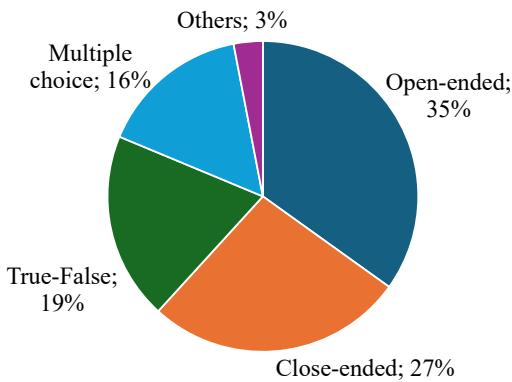

<details>
<summary>pie</summary>

| Category | Percentage (%) |
| :--- | :--- |
| Open-ended | 35 |
| Close-ended | 27 |
| True-False | 19 |
| Multiple choice | 16 |
| Others | 3 |
</details>

Figure 4: Distribution of question types in AVS-QA. The dataset includes a diverse mix of open-ended, closeended, true/false, multiple choice, and other formats, supporting comprehensive evaluation settings.

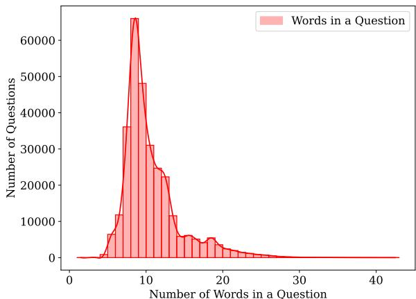

<details>
<summary>histogram</summary>

| Number of Words in a Question | Number of Questions |
| ----------------------------- | ------------------- |
| 0                             | 0                   |
| 1                             | 0                   |
| 2                             | 0                   |
| 3                             | 0                   |
| 4                             | 0                   |
| 5                             | 0                   |
| 6                             | 0                   |
| 7                             | 0                   |
| 8                             | 0                   |
| 9                             | 0                   |
| 10                            | 0                   |
| 11                            | 0                   |
| 12                            | 0                   |
| 13                            | 0                   |
| 14                            | 0                   |
| 15                            | 0                   |
| 16                            | 0                   |
| 17                            | 0                   |
| 18                            | 0                   |
| 19                            | 0                   |
| 20                            | 0                   |
| 21                            | 0                   |
| 22                            | 0                   |
| 23                            | 0                   |
| 24                            | 0                   |
| 25                            | 0                   |
| 26                            | 0                   |
| 27                            | 0                   |
| 28                            | 0                   |
| 29                            | 0                   |
| 30                            | 0                   |
| 31                            | 0                   |
| 32                            | 0                   |
| 33                            | 0                   |
| 34                            | 0                   |
| 35                            | 0                   |
| 36                            | 0                   |
| 37                            | 0                   |
| 38                            | 0                   |
| 39                            | 0                   |
| 40                            | 0                   |
| 41                            | 0                   |
| 42                            | 0                   |
| 43                            | 0                   |
| 44                            | 0                   |
| 45                            | 0                   |
| 46                            | 0                   |
| 47                            | 0                   |
| 48                            | 0                   |
| 49                            | 0                   |
| 50                            | 0                   |
| Note: The actual values may vary due to the random nature of the data generation. The provided values are just an example. |
</details>

Figure 5: Length of questions has some variation due to different types of questions.

Figure 6 shows that a large number of answers consist of a single word, primarily due to true/false and multiple choice formats. In contrast, closeended and open-ended questions yield longer and more varied responses, contributing to a broad distribution that peaks between 3–10 words and extends beyond 25 words. These distributions highlight the reasoning and generation challenges posed by AVS-QA.

License. AVS-QA is released under a CC-BY 4.0 license, along with the full generation pipeline, including prompts, templates, and filtering scripts.

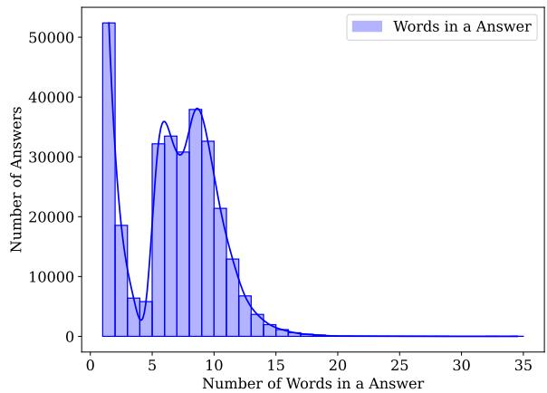

<details>
<summary>histogram</summary>

| Number of Words in a Answer | Number of Answers |
| --------------------------- | ----------------- |
| 0                           | 52000             |
| 1                           | 19000             |
| 2                           | 6000              |
| 3                           | 3000              |
| 4                           | 32000             |
| 5                           | 36000             |
| 6                           | 31000             |
| 7                           | 38000             |
| 8                           | 32000             |
| 9                           | 21000             |
| 10                          | 13000             |
| 11                          | 7000              |
| 12                          | 4000              |
| 13                          | 2000              |
| 14                          | 1000              |
| 15                          | 500               |
| 16                          | 200               |
| 17                          | 100               |
| 18                          | 50                |
| 19                          | 20                |
| 20                          | 10                |
| 21                          | 5                 |
| 22                          | 2                 |
| 23                          | 1                 |
| 24                          | 1                 |
| 25                          | 1                 |
| 26                          | 1                 |
| 27                          | 1                 |
| 28                          | 1                 |
| 29                          | 1                 |
| 30                          | 1                 |
| 31                          | 1                 |
| 32                          | 1                 |
| 33                          | 1                 |
| 34                          | 1                 |
| 35                          | 1                 |
</details>

Figure 6: True/false and multiple choice questions often lead to one-word answers, while open-ended and closeended formats yield a broader distribution of answer lengths.

# B.2 Quality Ranking via LLM Scoring

To evaluate the quality of multi-modal (audio, video, sensor) question-answer pairs, we design a set of five quality assessment axes. Each axis is rated on a 5-point Likert scale (1 = poor, 5 = excellent) by large language models (LLMs) using structured prompts:

Answerability. Evaluates whether the question is answerable based on the provided multi-modal context. A high score indicates that the combined modalities contain sufficient and coherent information to support a correct and complete answer.

Hallucination Robustness. Measures the extent to which the answer avoids introducing information not grounded in the provided modalities. Higher scores indicate reliable adherence to the multimodal context, while lower scores reflect a greater risk of hallucination.

Cross-Modal Grounding. Assesses the degree to which the answer integrates information across modalities (e.g., referencing audio to explain visual content). Higher scores reflect strong cross-modal coherence and accurate alignment with modalityspecific cues relevant to the question.

Specificity. Measures the level of detail and precision in the answer relative to the question. Higher scores indicate clear, specific, and well-defined responses that avoid vague or generic statements, offering informative and actionable insights.

Relevance. Measures how directly the answer addresses the intent and scope of the question. Higher scores indicate focused, contextually appropriate responses that are clearly aligned with the queried scenario and available modalities. Each QA pair is scored across the five axes by LLaVA-1.5(Liu et al., 2024a), Gemeni Pro (Team et al., 2023), Qwen-VL (Bai et al., 2023), GPT-4o (Achiam et al., 2023), LLaMA-3 (Grattafiori et al., 2024) in a zero-shot setting. We compute the final quality score by averaging the axis-level ratings. We discard QA pairs where 2 axes receive a score <3 from at least 3 of 5 LLMs. This threshold was chosen based on alignment with human judgment (see Appendix B.3).

# B.3 Human Evaluation

We conducted a human evaluation on a randomly selected subset of 300 question-answer pairs from AVS-QA. Two expert annotators independently reviewed each sample and assigned quality ratings based on the accompanying video, audio, and sensor data. Ratings follow the same 5-point Likert format as the LLM scorer.

We categorized the pairs based on human agreement: Satisfied (both annotators rate ≥4), Okay (mixed rating: one ≥4, one <4), and Not Satisfied (both <4). We observe 81% Satisfied, 7% Okay, and 12% Not Satisfied.

This aligns closely with the filtering performed by our LLM critic, which rejected 40K of the initial 340K QA pairs (11.76%), indicating strong agreement between human and automatic judgments. This suggests that our LLMbased scoring framework is a reliable proxy for human evaluation at scale.

We recruited two annotators through internal advertisements at the host institution. Both male annotators were between 25–35 years old and had a basic understanding of large language models. Participation was voluntary, and no financial incentives were provided.

# B.4 Prompt for Dataset Curation

We use a structured Actor–Evaluator–Critic pipeline for automatic generation and refinement of question–answer pairs. Figures 7–12 show the system and user prompts used at each stage of this pipeline.

In the Actor phase, a language model is provided with multimodal scene descriptions—including audio, video, IMU data summaries, and human narration—and is prompted to generate diverse questions spanning open-ended, close-ended, multiple choice, and true/false formats. The prompt encourages context-aware and modality-specific reasoning (see Figures 7–8).

<table><tr><td>I will provide you with 5 different pieces of information from different modalities (visual, audio, IMU) about a scene where someone performs some type of activity. The information contains: 
1. A narration for the entire scene 
2. Objects present in the scene, and their normalized bounding box as a list of tuples. 
3. A summary of the scene from the audio describing the scene only hearing the audio. 
4. Statistical features from the IMU data for the accelerometer and gyroscope in the x, y, and z-axis. 
5. A human describing the activity.</td></tr><tr><td>I want you to be a smart agent, imagine yourself present in the scene, and consider all the modalities to understand the entire scene. Now you have to generate question-answer pairs of different types (e.g., open-ended, close-ended, multiple choice True-False, etc.). The question-answers should require multi-step and complex reasoning to answer. Use one or multiple modality information to generate the questions and answers. Ensure that the knowledge and reasoning chains in the question are precise and sufficiently challenging, to the extent that only experts in the respective field can provide adequate responses.</td></tr><tr><td>Here are some examples of different question-answer types: 
What is the person likely doing in the scene? 
Answer: The person is likely eating at the table, as there is a plate of &lt;food_name&gt;, and a &lt;some_utencils&gt;present.</td></tr><tr><td>The person is actively cutting &lt;object_name_1&gt;, and a &lt;object_name_2&gt; is present. True or False? 
Answer: Cutting &lt;object_name_1&gt; True, but &lt;object_name_2&gt; is not present.</td></tr></table>

Figure 7: System prompt used for generating questions and answers in Actor phase.

<table><tr><td>Please generate two question answers of each type of open-ended, close-ended, multiple choice and True-False. Generate five answers for each open-ended question and single answer for other type of questions. Give the output in a list of JSON format e.g., [{{&quot;question&quot;: &quot;Generated Question&quot;, &quot;answer_1&quot;: &quot;Generated Answer 1&quot;, &quot;answer_2&quot;: &quot;Generated Answer 2&quot;, &quot;question_type&quot;: &quot;question_type&quot;}}, ...]. The &quot;question_type&quot; would be of one of these four types (open-ended, close-ended, multiple choice, True-False).</td></tr><tr><td>Entire Scene Narration: {}</td></tr><tr><td>Objects Present: {}</td></tr><tr><td>Audio Description: {}</td></tr><tr><td>IMU features: {}</td></tr><tr><td>Human description: {}</td></tr></table>

Figure 8: User prompt used for generating questions and answers in Actor phase.

In the Evaluator phase, a second model verifies the answerability, modality grounding, and factual correctness of each QA pair. The system prompt (Figure 9) outlines constraints regarding modality coverage, object grounding, and language consistency. The human prompt (Figure 10) ensures no hallucinated corrections are introduced—only local improvements to existing QA pairs.

In the Critic phase, large language models are prompted to rate the quality of each generated question–answer pair using four dimensions: relevance, correctness, clarity, and depth. As shown in Figures 11–12, the system prompt instructs the model to consider all five available modalityspecific inputs (narration, object list, audio summary, IMU features, and human description) before assigning a score.

<table><tr><td>I will provide you multiple questions and corresponding answers which were generated using 5 different pieces of information from different modalities (visual, audio, IMU) about a scene where someone performs some type of activity. The information contains</td></tr><tr><td>1. A narration for the entire scene</td></tr><tr><td>2. Objects present in the scene, and their normalized bounding box as a list of tuples.</td></tr><tr><td>3. A summary of the scene from the audio describing the scene only hearing the audio.</td></tr><tr><td>4. Statistical features from the IMU data for the accelerometer and gyroscope in the x, y, and z-axis.</td></tr><tr><td>5. A human describing the activity.</td></tr><tr><td>I will also provide you the five different information that were used.</td></tr><tr><td>I want you to be a smart evaluator who can analyze the quality of generated questions and answer using the provided information from all modalities. You have to make sure that the following constrains have been followed strictly.</td></tr><tr><td>The question-answer pairs must meet the following constraints:</td></tr><tr><td>1. MUST exclude terms like &quot;according to the narration&quot;, &quot;according to the audio description.&quot;, &quot;Human narration&quot;, &quot;based on scene description&quot;, &quot;audio description&quot;, etc from both Questions and Answers. You should generate questions and answer them as if you are present in the scene and reason from one or more modalities.</td></tr><tr><td>2. Question-answer pairs should be as diverse as possible.</td></tr><tr><td>3. Only ask the questions that can be answered. If a question can not be answered from one modality try other modalities to answer that. For example, if something is not visible (obscure in visual modality) use audio or IMU to find the answer.</td></tr><tr><td>4. The answers should be less than 30 words.</td></tr><tr><td>5. When generating questions about any object, first make sure that the object is present in the &quot;objects present&quot; list or match with the entire scene narration.</td></tr><tr><td>6. Use both human description and entire scene narration when describing the scene. if there is inconsistency between these two, prioritize human description.</td></tr><tr><td>if the constraints are not met for any given question answer pair, update them accordingly and save them in a similar form in a json file. DO NOT CHANGE QUESTIONS ENTIRELY, ONLY IMPROVE THEM. Additionally, do not add any co-ordinates.</td></tr></table>

Figure 9: System prompt used for generating questions and answers in Evaluator phase. The constraints ensure avoiding some phrases or groups of words to enhance the quality of question-answer pairs.

<table><tr><td>Please determine if the question-answer pair strictly follow the constraints based on the following five information: 
Entire Scene Narration: {} 
Objects Present: {} 
Audio Description: {} 
IMU features: {} 
Human description: {}</td></tr><tr><td>Only output the updated question and answers. 
DO NOT MENTION ANY KEY IMPROVEMENTS IN THE OUTPUT OR ANY OTHER TEXT EXCEPT QUESTIONS AND ANSWERS.</td></tr></table>

Figure 10: User prompt used for generating questions and answers in Evaluator phase.

The user prompt standardizes the response format and explicitly prohibits speculative reasoning or textual justification—ensuring consistent, numerical evaluations across samples. Each QA pair receives two scores (one for the question, one for the answer), which are then aggregated across multiple critics to determine inclusion in the final dataset. QA pairs with low aggregate scores are discarded during the final curation step.

This prompt engineering strategy supports diverse and high-quality QA generation without human-in-the-loop authoring.

```txt
I will provide you multiple questions and corresponding answers which were generated using 5 different pieces of information from different modalities (visual, audio, IMU) about a scene where someone performs some type of activity. The information contains
1. A narration for the entire scene
2. Objects present in the scene, and their normalized bounding box as a list of tuples.
3. A summary of the scene from the audio describing the scene only hearing the audio.
4. Statistical features from the IMU data for the accelerometer and gyroscope in the x, y, and z-axis.
5. A human describing the activity.
I will also provide you the five different information that were used.
I want you to be a critic who can analyze the quality of generated questions and answer using the provided information from all modalities.
You have to analyze their relevance, clarity, depth and correctness. Based on these four criteria rate the quality of each questions and answers on a scale of 1-5. 
```  
Figure 11: System prompt used for generating questions and answers in Critic phase.

```txt
Please rate the quality of questions and answers considering the relevance, correctness, clarity, and depth based on the following five information:
Entire Scene Narration: {}
Objects Present: {}
Audio Description: {}
IMU features: {}
Human description: {}

DO NOT OUTPUT THE ORIGINAL QUESTIONS AND ANSWER. OUTPUT ONLY THE QUALITY SCORE. DO NOT OUTPUT ANY REASONING OR THOUGHT.

Please generate the response in the form of a Python dictionary string with keys, 'Question', 'Answer'. For example, your response should look like this:
{Question: 3.1, Answer: 4.8} 
```  
Figure 12: User prompt used for generating questions and answers in Critic phase.

# C Additional Model Architecture Details

# C.1 LIMU-BERT Pre-Training

As our sensor encoder, we employ LIMU-BERT (Xu et al., 2021), a multi-head attentionbased encoder-decoder architecture. LIMU-BERT is a lightweight, BERT-inspired self-supervised representation learning model designed for mobile IMU (Inertial Measurement Unit) sensing applications. It processes unlabeled IMU data—accelerometer, gyroscope, and magnetometer readings—to learn generalizable features. The architecture incorporates a normalization and sensor fusion layer, followed by a transformer encoder with cross-layer parameter sharing to reduce model size. It adopts a span-masking version of the Masked Language Modeling (MLM) task to learn both distributional and temporal patterns from the IMU sequences. We adopt the official LIMU-BERT implementation under the MIT license for research use.

# C.2 Unimodal Encoder Pre-Training

We use the VideoLLaMA2 (Cheng et al., 2024b) codebase for pre-training the vision encoder. The encoder is initialized from a SigLIP checkpoint and fine-tuned with instructional video datasets included in the VideoLLaMA2 training suite. This setup enables the model to learn temporal and spatial reasoning over egocentric and exocentric scenes. The code is released under the Apache 2.0 license and used strictly for research purposes.

# C.3 Projection Layer

Each modality-specific encoder output is projected to the LLM input dimension using a tailored strategy. The output of the audio encoder is projected through a two-layer multi-layer perceptron (MLP) to align with the LLM dimension. For the video encoder output, we use a spatio-temporal convolutional (STC) connector for spatio-temporal learning of the video. STC connector uses RegStage (Radosavovic et al., 2020) with 3D convolution for downsampling the video output. We use a publicly available adaptation of the STC-connector in our implementation (Cheng et al., 2024b) under the license of Apache 2.0 for research purposes only.

# D Cross-Modal Mismatch Generation and Robustness Evaluation

Cross-modal mismatch refers to the condition in which the semantic alignment between different input modalities—such as audio, video, and sensor streams—is disrupted. In real-world multi-modal systems, such mismatches frequently arise due to noise, missing data, or temporal desynchronization between modalities. Understanding and addressing cross-modal mismatch is crucial for building robust models capable of effective reasoning across modalities.

To systematically evaluate model robustness under such conditions, we introduce a synthetic crossmodal mismatch generation process. Given a clean multi-modal datapoint $D = \{ a , v , s \}$ , where a, v, and s denote the synchronized audio, video, and sensor streams respectively, we construct a perturbed version $D ^ { \prime } = \{ a ^ { \prime } , v ^ { \prime } , s ^ { \prime } \}$ by applying one or more of the following perturbations:

Modality-Specific Noise Injection.: Gaussian or environmental noise is added to the audio a and/or video v streams, degrading signal fidelity while preserving temporal structure.

Temporal Reversal.: The temporal sequence of audio or video is reversed independently, altering the causal and sequential semantics of events.

Algorithm 1 Algorithm for generating Cross-Modal Mismatch   
1: function GENERATECROSSMODALMISMATCH(D = {a, v, s})
2: Initialize D' = {a', v', s'} ← {a, v, s}
3: Define P $_{audio}$ ← {ADDNOISE, REVERSE, REPLACEWITHIRRELEVANT, NOPERTURBATION}
4: Define P $_{video}$ ← {ADDNOISE, REVERSE, REPLACEWITHIRRELEVANT, NOPERTURBATION}
5: Define P $_{sensor}$ ← {ADDJITTER, REPLACEWITHIRRELEVANT, NOPERTURBATION}
6: if RandomChoice([True, False]) then
7:    a' ← RandomChoice(P $_{audio}$ )(a)
8: else
9:    a' ← a
10: end if
11: if RandomChoice([True, False]) then
12:    v' ← RandomChoice(P $_{video}$ )(v)
13: else
14:    v' ← v
15: end if
16: if RandomChoice([True, False]) then
17:    s' ← RandomChoice(P $_{sensor}$ )(s)
18: else
19:    s' ← s
20: end if
21: return D' = {a', v', s'}
22: end function

Sensor Perturbation.: Random noise or jitter is added to sensor streams (e.g., IMU data), simulating faulty or low-resolution sensor readings.

Modal Replacement.: One or more modalities (e.g., audio) are replaced with semantically irrelevant counterparts sampled from other unrelated datapoints in the dataset, creating intentional crossmodal conflict.

These perturbations simulate realistic mismatches commonly encountered in egocentric and exocentric environments, such as microphone occlusion, corrupted video frames, or misaligned sensor logging. This synthetic mismatch generation enables controlled stress testing of multi-modal models, revealing their capacity to handle noisy, misaligned, or contradictory inputs across modalities. Algorithm 1 explains the process used for generating cross-modal mismatch.

# E Training and Implementation Details

# E.1 Dataset for Multistage Training

Along with our in-house data (AVS-QA), we use publicly available datasets to train the video, audio, and sensor encoders. To pre-train the sensor encoder, we use epic kitchen (Damen et al., 2018), ego4D (Grauman et al., 2022),HHAR (Stisen et al., 2015), UCI-HAR (Reyes-Ortiz et al., 2016), Shoaib (Shoaib et al., 2014), Motion-Sense (Malekzadeh et al., 2019), PAMAP2 (Roggen et al., 2010) data. We use pre-trained SigLIP as our video encoder and then fine-tune it with datasets from videoLLama2 (Cheng et al., 2024b). Similarly, we use a pre-trained audio encoder, Beats, and fine-tune it with WavCaps (Mei et al., 2024) datasets (Chen et al., 2022). We leverage SensoCaps and OpenSQA (Imran et al., 2024) for the sensor pretraining part. Table 8 summarizes the dataset used at different stages of training.

# E.2 Hyperparameters for Training

RAVEN has 8.5B parameters, including all the encoders, projection layers, QuART, and LLM backbone. Table 9 summarizes the key hyperparameters used during training.

# E.3 Train-Test split

For all publicly available datasets used during pretraining and fine-tuning, we adopt the official train– test splits provided by their respective authors. For our curated dataset, AVS-QA, we create a standardized train–test split to ensure consistent evaluation and reproducibility. To prevent data leakage and overfitting, we ensure the input sessions for curating AVS-QA train and test split remain completely separated. The split files are publicly available in our GitHub repository https://github.com/ BASHLab/RAVEN/tree/main/avs-qa-dataset.

Table 8: Datasets used at each training stage of RAVEN. AVS-QA contributes to all three stages, enabling both sensor-text alignment and robust fine-tuning under cross-modal mismatch. 

<table><tr><td colspan="2">Training stage</td><td>Dataset</td><td>#Pairs</td></tr><tr><td rowspan="3">Modality-Text Pre-Training</td><td>Vision-Text</td><td>InternVid-10M (Wang et al., 2023), WebVid-10M (Bain et al., 2021), Panda-70M (Chen et al., 2024b), VIDAL-10M (Zhu et al., 2023a), CC-3M (Changpinyo et al., 2021), DCI (Urbanek et al., 2024)</td><td>12.2 M</td></tr><tr><td>Audio-Text</td><td>WavCaps (Mei et al., 2024)</td><td>400K</td></tr><tr><td>Sensor-Text</td><td>OpenSQA (Imran et al., 2024), SensorCaps (Imran et al., 2024)</td><td>205K</td></tr><tr><td colspan="2">Query-Token Alignment Joint-Training</td><td>AVQA(Yang et al., 2022), AVSSD (Chen et al., 2020), MUSIC-AVQA (Li et al., 2022), AVSD (Alamri et al., 2019), AVS-QA</td><td>403K</td></tr><tr><td colspan="2">Modal-Discrepency Aware Fine-Tuning</td><td>AVQA (Yang et al., 2022), AVSSD (Chen et al., 2020), MUSIC-AVQA (Li et al., 2022), AVSD (Alamri et al., 2019), AVS-QA</td><td>510K</td></tr></table>

Table 9: Key hyperparameters used in training RAVEN. Token counts reflect the number of input tokens per modality. We adopt a 6-layer transformer with 8 attention heads, a LoRA rank of 4256, and use AdamW for optimization. 

<table><tr><td>Description</td><td>Notation</td><td>Value</td></tr><tr><td>Number of audio tokens</td><td> $\mathbf{L}_{a}$ </td><td>1496</td></tr><tr><td>Number of video tokens</td><td> $\mathbf{L}_{v}$ </td><td>1352</td></tr><tr><td>Number of sensor tokens</td><td> $\mathbf{L}_{s}$ </td><td>120</td></tr><tr><td>Embedding dimension</td><td> $\mathbf{E}$ </td><td>3584</td></tr><tr><td>Number of total token</td><td> $\mathbf{L}$ </td><td>2968</td></tr><tr><td>Numer of heads</td><td> $\mathbf{h}$ </td><td>8</td></tr><tr><td>Number of encoder layer</td><td> $\mathbf{N}$ </td><td>6</td></tr><tr><td>Each head dimension</td><td> $\mathbf{d}_{k}$ </td><td>448</td></tr><tr><td>Batch size (local/global)</td><td>-</td><td>1/4</td></tr><tr><td>LoRA rank</td><td> $\mathbf{r}$ </td><td>4256</td></tr><tr><td>Optimizer</td><td>-</td><td>AdamW</td></tr><tr><td>Weight decay</td><td>-</td><td>0.03</td></tr></table>

# F Evaluation Details

# F.1 Evaluation Baselines

Video-LLaMA. Video-LLaMA extends LLaMA by incorporating frozen video encoders (TimeSformer, X-CLIP) to extract spatio-temporal features, which are linearly projected into the LLM input space. It is trained via instruction tuning and multi-modal supervised learning, enabling video captioning, question answering, and reasoning with generalization from few-shot examples.

Video-LLaMA2. Video-LLaMA-2 builds upon its predecessor by introducing spatio-temporal connectors, which better align video representations with the LLM input through a more structured fusion mechanism. Additionally, Video-LLaMA-2 leverages more powerful video encoders and larger training corpora, making it more robust for realworld multimodal applications.

PandaGPT. PandaGPT integrates CLIP for visual features and BEATs for audio features, followed by a Q-Former to project them into the token space of a language model (Vicuna). PandaGPT supports multi-turn dialogue grounded in both visual and auditory content, enabling it to reason over videoaudio-text contexts.

Macaw-LLM. Macaw-LLM adopts a modular design where a dedicated encoder process each modality, and the features are fused into a shared embedding space for the language model. Inspired by BERT-style pretraining, Macaw-LLM supports tasks such as cross-modal retrieval, multimodal classification, and audio-visual QA.

VideoChat. VideoChat introduces a videogrounded dialogue system that enables interactive conversations about dynamic visual content. It uses a pre-trained video encoder (like X-CLIP or Swin-BERT) to extract frame-wise representations and then aligns these with LLaMA through lightweight adapters. VideoChat supports both single-turn and multi-turn video QA, offering real-time conversational abilities over video inputs. It was among the first open-source models to demonstrate effective temporal video grounding in LLM-based dialogue.

VideoChatGPT. VideoChatGPT extends

VideoChat by incorporating end-to-end video-LM alignment with improved temporal reasoning and multi-frame understanding. It utilizes a stronger video encoder and enhanced fusion modules (e.g., spatio-temporal attention layers) to feed richer video context into the LLM.

VALLEY. VALLEY (VisuAL Langauge Learner with Large memorY) is designed for multi-modal memory-augmented video reasoning. It focuses on long-term memory alignment across video segments and text, allowing the model to retain and reference past frames effectively during reasoning. VALLEY combines a hierarchical visual encoder with a memory-enhanced transformer decoder that interacts with a language model, enabling it to handle long videos and multi-step reasoning tasks such as procedural understanding, storytelling, and temporal localization.

VTimeLLM. VTimeLLM (Video-Time Language Model) focuses on temporal video understanding by aligning spatio-temporal features with natural language in a query-aware manner. It introduces a temporal reasoning module that captures the order, duration, and causality of events in video segments. Using a dual-stream architecture with temporal attention and frame-level token sampling, VTimeLLM fuses visual and language information for downstream tasks such as video QA, moment retrieval, and video narration.

AV-LLM. AV-LLM integrates auditory and visual modalities using CLIP for images/videos and Whisper or BEATs for audio with a frozen LLaMA. It employs a cross-modal projection layer and lightweight adapters to fuse the modalities, enabling zero-shot and instruction-tuned tasks like audio-visual QA, event description, and soundsource reasoning.

AVicuna. AViCuna is a chat-centric audio-visual instruction-following model that combines audio and video features into a unified token stream for a conversational LLM based on Vicuna. It uses Q-Former modules to encode BEATs for audio and CLIP for video features, and feeds these to the LLM via a learned query-token bridge.

OpenFlamingo. OpenFlamingo fuses a frozen CLIP-ViT with a pre-trained language model via a perceiver-style cross-attention module. The key innovation lies in its interleaved visual-text token interface, which allows the model to reason over multimodal sequences without further fine-tuning. OpenFlamingo supports tasks such as image captioning, VQA, and multi-image reasoning in an efficient and instruction-following setting.

SahreGPT4V. ShareGPT4V emphasizes the importance of caption quality in multimodal learning, showing that even a modest amount of rich, semantically dense image-text pairs can significantly improve LMM performance. It uses GPT-4V to generate 100k captions and further extend the dataset to a 1.2m sample by using a caption model. ShareGPT4V is then fine-tuned with this caption dataset as a foundational MMLLM.

MiniGPT-4. MiniGPT-4 mimics GPT-4V’s capabilities using open components. It pairs a frozen CLIP-ViT with a Vicuna-based LLM via a linear projection layer, trained with a two-stage instruction tuning pipeline. MiniGPT-4 achieves strong performance with low computational cost.

BLIP-2.6. BLIP-2.6 is an evolution of BLIP-2, further improving the alignment between vision encoders and LLMs using a multistage pretraining and fine-tuning strategy. It enhances the Q-Former mechanism and supports longer and denser visionlanguage interactions with better grounding fidelity. BLIP-2.6 shows improvements in instruction following, fine-grained captioning, and long-context multimodal tasks while maintaining the zero-shot generalization strength of BLIP-2.

InstructBLIP. InstructBLIP is an instructiontuned extension of the BLIP-2 family, designed to align vision-language pretraining with task-specific prompts. It introduces a flexible prompting mechanism and uses a frozen vision encoder with a trainable Q-Former to bridge the modality gap to an LLM.

# F.2 Evaluation Datasets

InternVid-10M. InternVid-10M is a large-scale video-text dataset comprising approximately 10 million video-caption pairs, designed to support pretraining of multimodal large language models. The videos are sourced from diverse domains, and the captions are refined to improve visual-textual alignment.

WebVid-10M. WebVid-10M consists of 10 million video-text pairs harvested from web sources, particularly short-form videos with associated metadata or alt-text. Although noisier than manually curated datasets, its sheer scale makes it valuable for videolanguage pretraining.

Panda-70M. Panda-70M is a massive multimodal dataset containing over 70 million aligned video, audio, and text triplets. It is curated from opendomain videos, including instructional content, to cover a wide variety of real-world scenarios. The dataset is designed for training models that require joint understanding of video, audio, and language, enabling tasks such as multimodal reasoning, audio-visual captioning, and cross-modal retrieval at scale.

Vidal-10M. VIDAL-10M is a curated dataset comprising 10 million high-quality video-caption pairs aimed at enhancing temporal and contextual understanding in multimodal models. It includes dense and descriptive captions aligned with diverse video domains, enabling robust pretraining for videolanguage models. VIDAL-10M emphasizes temporal consistency and semantic diversity, supporting tasks like video QA, moment retrieval, and event understanding.

CC-3M. CC-3M is a widely-used image-text dataset containing approximately 3 million imagecaption pairs sourced from the web. The captions are filtered and cleaned alt-text annotations that loosely describe the visual content. While the descriptions can be noisy and lack fine-grained detail, it is valuable for large-scale vision-language pretraining, especially for image-text retrieval, captioning, and contrastive representation learning.

DCI. DCI is a dataset developed to improve instruction-following in vision-language models by pairing images with rich, instruction-style descriptions. The captions are generated using large language models guided by carefully designed prompts to increase informativeness and task relevance. DCI serves as a bridge between standard image-caption datasets and instructiontuned models, supporting applications like visual instruction-following, grounded question answering, and image-based reasoning.

WavCaps. WavCaps is a large-scale audio-text dataset designed to enhance audio-language pretraining. It includes over 400,000 audio clips paired with captions, either collected from metadata or generated via model-based annotation pipelines. Covering a wide range of sound events—from speech and music to environmental and mechanical sounds—WavCaps supports tasks such as audio captioning, sound event detection, and cross-modal audio-text retrieval.

SensorCaps. SensorCaps is a pioneering sensorlanguage dataset that pairs time-series data from inertial measurement units (IMUs) and other bodyworn sensors with detailed natural language descriptions. Designed to support tasks like sensor captioning and multimodal grounding, SensorCaps bridges wearable sensing data with large language models. It enables multimodal LLMs to reason about human actions, physical context, and temporal dynamics from sensor inputs.

OpenSQA. OpenSQA is a benchmark dataset for sensor-based question answering, aiming to bring structured reasoning capabilities to models processing sensor time-series data. It includes labeled QA pairs grounded in sensor streams from IMU collected in real-world contexts. OpenSQA supports open-ended and multiple-choice questions, making it a valuable testbed for evaluating sensorto-text alignment and semantic understanding in multimodal models.

AVSD. AVQA is a benchmark dataset specifically designed for evaluating audio-visual reasoning capabilities in multimodal models. It includes videos paired with open-ended and multiple-choice questions that require joint analysis of both visual content and audio cues. AVQA challenges models to perform fine-grained audio-visual fusion for answering questions about actions, events, or contextual elements that span both modalities.

AVSSD. AVSSD is a large-scale dataset containing over 200,000 audio-video clips spanning 310 sound classes. Each clip is approximately 10 seconds long and is sourced from YouTube, covering a wide range of natural and human-made sounds. AVSSD supports weakly-supervised learning and cross-modal modeling, especially for tasks like sound classification, audio-visual event detection, and audio grounding in video.

MUSIC-AVQA. MUSIC-AVQA is a specialized dataset designed for audio-visual question answering in musical contexts, where questions require understanding of both the visual performance and the auditory output of musical instruments. It is built upon the MUSIC dataset, which includes isolated instrument performances. MUSIC-AVQA extends MUSIC with over 7,000 QA pairs involving tasks such as instrument identification, sound localization, source counting, and event timing. The questions are crafted to assess fine-grained audiovisual reasoning, where answers depend on spatial, temporal, and semantic alignment of what is seen and heard.

AVQA. AVQA is a benchmark dataset specifically designed for evaluating audio-visual reasoning capabilities in multimodal models. It includes videos paired with open-ended and multiple-choice questions that require joint analysis of both visual content and audio cues. AVQA challenges models to perform fine-grained audio-visual fusion for answering questions about actions, events, or contextual elements that span both modalities.

```jsonl
{"role": "system",
"content": "You are an intelligent chatbot designed for evaluating the correctness of generative outputs for question-answer pairs. "
"Your task is to compare the predicted answer with the correct answer and determine if they match meaningfully. Here's how you can accomplish the task:"
"-----"
"##INSTRUCTIONS: "
"- Focus on the meaningful match between the predicted answer and the correct answer.\n"
"- Consider synonyms or paraphrases as valid matches.\n"
"- Evaluate the correctness of the prediction compared to the answer."
},
{"role": "user",
"content":
"Please evaluate the following video-based question-answer pair:\n\n"
f"Question: {question}\n"
f"Correct Answer: {answer}\n"
f"Predicted Answer: {pred}\n\n"
"Provide your evaluation only as a yes/no, coherence where coherence is a float value between 0 and 1 with 1 indicating the highest meaningful soundness of the predicted answer with given question, and score where the score is an integer value between 0 and 1, with 1 indicating the highest meaningful match. "
"Please generate the response in the form of a Python dictionary string with keys 'binary_pred' 'coherence', and 'score', where value of 'binary_pred' is a string of 'yes' or 'no', value of 'coherence' is in FLOAT not STRING and value of 'score' is in FLOAT, not STRING."
"DO NOT PROVIDE ANY OTHER OUTPUT TEXT OR EXPLANATION. Only provide the Python dictionary string. "
"For example, your response should look like this:
{'binary_pred': 'yes', 'coherence': 0.79, 'score': 0.7}"
} 
```  
Figure 13: System and user prompt used to evaluate the generated answer quality.

EgoThink. EgoThink is a benchmark designed to evaluate the first-person perspective reasoning capabilities of vision-language models (VLMs). It comprises question-answer pairs derived from egocentric video clips, focusing on six core capabilities across twelve detailed dimensions. The dataset emphasizes tasks that require models to understand and reason from a first-person viewpoint, such as anticipating future actions or interpreting personal experiences. Evaluations of eighteen popular VLMs on EgoThink reveal that, while models like GPT-4V perform well in certain areas, there remains significant room for improvement in firstperson perspective tasks. EgoThink serves as a valuable resource for advancing research in embodied artificial intelligence and robotics.

# F.3 Evaluation Metric

Following previous work (Maaz et al., 2023), we leverage GPT-3.5-turbo to evaluate the generated answer quality. Figure 13 depicts the evaluation prompt.

Table 10: Comparison of video encoders across three QA benchmarks. SigLIP consistently outperforms all ViT variants, demonstrating stronger temporal and visual grounding for video-based question answering.

<table><tr><td rowspan="2">Video Encoder</td><td colspan="3">Datasets</td></tr><tr><td>MSVD-QA</td><td>MSRVTT-QA</td><td>ActivityNet-QA</td></tr><tr><td>ViT-B/16</td><td>65.7</td><td>51.4</td><td>45.9</td></tr><tr><td>ViT-L/14</td><td>67.3</td><td>53.7</td><td>47.2</td></tr><tr><td>ViT-H/14</td><td>67.5</td><td>54.2</td><td>47.5</td></tr><tr><td>SigLip</td><td>73.3</td><td>63.1</td><td>57.6</td></tr></table>

Table 11: Performance of audio encoders across QA datasets. BEATs achieves the highest accuracy on all benchmarks, surpassing Whisper variants in multimodal reasoning tasks. 

<table><tr><td rowspan="2">Audio Encoder</td><td colspan="3">Datasets</td></tr><tr><td>MSVD-QA</td><td>MSRVTT-QA</td><td>ActivityNet-QA</td></tr><tr><td>Whisper-T</td><td>66.5</td><td>51.6</td><td>46.2</td></tr><tr><td>Whisper-B</td><td>67.7</td><td>53.1</td><td>47.4</td></tr><tr><td>Whisper-S</td><td>68.1</td><td>53.9</td><td>47.6</td></tr><tr><td>BEATs</td><td>73.3</td><td>63.1</td><td>57.6</td></tr></table>

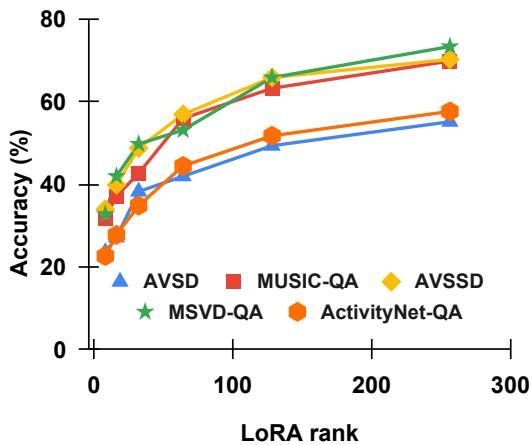

<details>
<summary>line</summary>

| LoRA rank | AVSD  | MUSIC-QA | AVSSD | MSVD-QA | ActivityNet-QA |
| --------- | ----- | -------- | ----- | ------- | -------------- |
| 0         | 35    | 38       | 36    | 42      | 22             |
| 50        | 40    | 45       | 50    | 55      | 35             |
| 100       | 45    | 55       | 60    | 65      | 45             |
| 150       | 50    | 60       | 65    | 70      | 50             |
| 250       | 55    | 65       | 70    | 75      | 58             |
</details>

Figure 14: Impact of LoRA rank on QA accuracy across five benchmarks. Accuracy improves steadily with higher ranks, saturating near 256, indicating that moderate-rank adapters suffice for effective multimodal alignment and reasoning.

# G Ablation Study

Effect of Modality Encoder. We investigate the influence of visual and audio encoder choices on model performance across three video QA benchmarks (Tables 10, 11). For vision, scaling standard ViT architectures from B/16 to H/14 yields only marginal improvements (e.g., +1.8% on MSVD-

Table 12: Effect of Frame selection strategy on QuART. 

<table><tr><td>Sampling Method</td><td>AVSD</td><td>MUSIC-QA</td><td>AVSSD</td><td>MSVD-QA</td><td>MSRVTT-QA</td><td>ActivityNet-QA</td></tr><tr><td>Random</td><td>45.2</td><td>55.6</td><td>49.3</td><td>50.7</td><td>43.1</td><td>47.2</td></tr><tr><td>Fixed Stride</td><td>54.9</td><td>69.3</td><td>70.1</td><td>72.9</td><td>62.8</td><td>57.4</td></tr><tr><td>Uniform</td><td>55.1</td><td>69.8</td><td>70.2</td><td>73.3</td><td>63.1</td><td>57.6</td></tr><tr><td>Oracle</td><td>55.2</td><td>70.1</td><td>70.2</td><td>73.4</td><td>63.5</td><td>57.6</td></tr></table>

QA), suggesting limited benefits from increasing model capacity alone. In contrast, substituting ViT with SigLip, a vision-language pretrained model leads to substantial performance gains (73.3 vs. 67.5 on MSVD-QA), demonstrating the importance of cross-modal alignment during pretraining. On the audio side, scaling Whisper encoders from Tiny to Small results in modest improvements (e.g., +1.6% on MSVD-QA), but all Whisper variants are outperformed by BEATs, a model pretrained on diverse acoustic signals. Notably, BEATs achieves a +5.2% gain over Whisper-Small on MSVD-QA, highlighting the efficacy of domain-specific audio pertaining.

LoRA Rank Selection. Figure 14 shows an ablation on LoRA rank. Lower ranks improve efficiency but may limit representational capacity, while higher ranks offer greater adaptability at a higher cost. Performance peaks at r = 256, indicating it provides the best trade-off between computational overhead and task effectiveness.

Table 13: Comparison of QuART with General Fusion Approaches. QuART performs better due to its tokenlevel reasoning capabilities. 

<table><tr><td rowspan="2">Fusion Model</td><td colspan="2">Datasets</td></tr><tr><td>AVSSD</td><td>MSRVTT-QA</td></tr><tr><td>Imagebind</td><td>27.8</td><td>27.8</td></tr><tr><td>MBT</td><td>64.1</td><td>-</td></tr><tr><td>AVFIC</td><td>-</td><td>19.4</td></tr><tr><td>QuART</td><td>70.2</td><td>63.1</td></tr></table>

Comparison of QuART with General Fusion Approaches. We compare QuART with stateof-the-art general-purpose fusion models (Image-Bind (Girdhar et al., 2023), MBT (Nagrani et al., 2021), and AVFIC (Nagrani et al., 2022)), which are not optimized for QA tasks. As shown in Table 13, QuART outperforms these models, highlighting the benefit of QA-specific supervision and token-level fusion for effective reasoning.

Effect of Frame Selection Strategy. We adopted a uniform frame sampling strategy, consistent with prior video QA and egocentric video research (Cheng et al., 2024b; Tang et al., 2024), to ensure fair comparison and reproducibility.

However, we evaluated RAVEN leveraging several alternative frame selection methods, including fixed stride, random, and oracle-based selection. Notably, performance (Table 12) remained mostly consistent across all methods, except for random sampling, which caused increased variability and occasional performance drops. For oraclebased selection, we used salient frame annotations and metadata from EpicKitchen-100 and Ego4D to choose visually informative frames. While this led to small improvements in some vision-intensive queries, the overall trends of RAVEN ’s performance remained unchanged. These findings suggest that QuART is resilient to the choice of frame selection, although future work could investigate learned or adaptive methods to further enhance performance on long video reasoning.

# H Compute Cost and Environmental Impact

We train our model using four NVIDIA A100 GPUs (80GB each) with a total CPU memory of 256GB. Evaluation is performed on four NVIDIA L40S GPUs (46GB each). Training runs for 120 hours with a local batch size of 1 and a global batch size of 4. We use a learning rate of $1 \times 1 0 ^ { - 3 }$ for the projection layers and $1 \times 1 0 ^ { - 5 }$ for fine-tuning the encoder layers.

We estimate the total energy consumption to be approximately 1,200 kWh, based on the average power draw of an A100 system under mixed precision load. Following the ML $\mathrm { { C O } _ { 2 } }$ emissions calculator (Lacoste et al., 2019), this corresponds to an estimated carbon footprint of 420 kgCO2e when using the U.S. average energy mix.

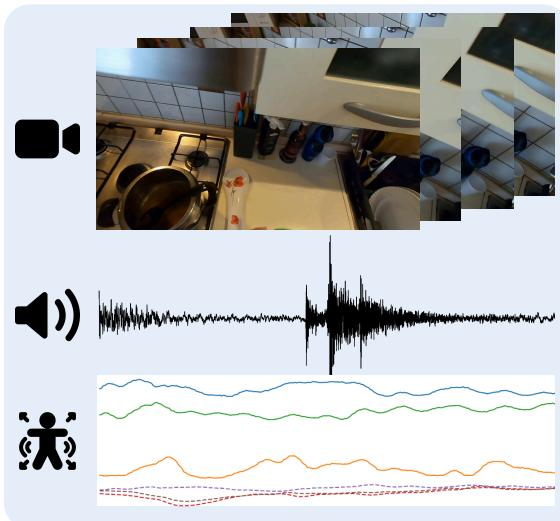

<details>
<summary>text_image</summary>

Composite image showing a kitchen scene with sound waveforms and audio recording, alongside three line graphs of audio waveform data.
</details>


Was the user actively cooking or stirring something in the pot on the stove?


# Audio+Video

A pot on the stove with a spoon or spatula inside, indicating food preparation. However, without motion cues, it’s uncertain if the user is actively stirring or simply placed the utensil there earlier. There’s no indication of speaking or precise  movement.


# Audio+Video+ Sensor

We observe a cooking setup with a spatula in the pot. Audio suggests no sound of stirring. IMU data confirms no hand or body movement, consistent with no  stirring or shifting stance. Together, these cues verify that the user is not actively cooking, moving, and speaking during the activity.

Figure 15: Example illustrating the value of sensor input for activity disambiguation. Given the question “Was the user actively cooking or stirring something in the pot on the stove?”, the Audio+Video model observes a cooking scene but cannot confirm active engagement due to the absence of motion cues. In contrast, the Audio+Video+Sensor model leverages IMU data to detect a lack of body movement and integrates audio signals to confirm no stirring, allowing it to infer that the user is not actively cooking.   
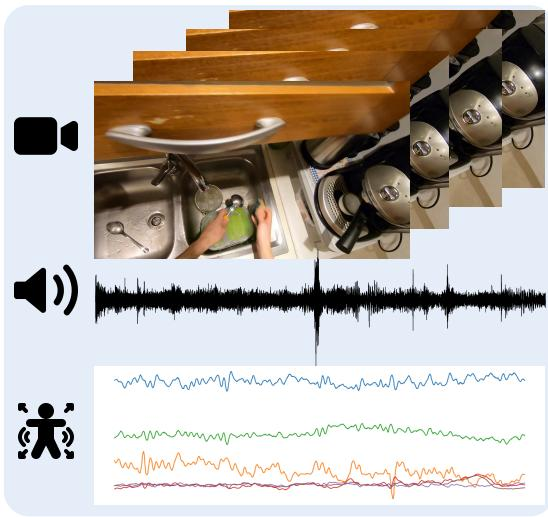

<details>
<summary>text_image</summary>

Composite image showing kitchen interior with sound wave, audio recording, and overlaid line graphs for audio waveform analysis.
</details>


What activity is the person likely engaged in?


# Audio+Video

The person is likely washing dishes especially lathering a ladle in the kitchen sink. The sound of water running and dishes being washed with the presence of sink and bowl, and hand likely explain the activity.


# Audio+Video+ Sensor

The person is lathering a ladle with hands in the kitchen sink. The IMU data confirms very small variance due to the person's less movement. Water running sound and low IMU movement suggest small washing activity.

Figure 16: Example illustrating subtle activity disambiguation using multimodal reasoning. Given the question “What activity is the person likely engaged in?”, the Audio+Video model identifies dishwashing activity based on sink visibility and audio cues such as water flow. The Audio+Video+Sensor model enhances this understanding by incorporating IMU data, which reveals low hand and body movement. This confirms a controlled, repetitive action consistent with small-scale washing (e.g., lathering a ladle), demonstrating the added value of sensor input for refining temporal and motion-level interpretations.

# I Qualitative Results

Figures 15 – 19 illustrate the performance of RAVEN across diverse real-world scenarios. While RAVEN demonstrates strong performance using only audio and visual inputs, the inclusion of sensor data consistently improves robustness and interpretability.

In particular, 17 and 18 highlight how sensor in-

formation enhances the correctness and relevance of both the predicted answer and its supporting explanation. Conversely, Figure 19 presents a failure case where the model, even with full audio-videosensor input, fails to infer the correct task due to subtle contextual clues across modalities that might not clearly differentiate similar tasks, hindering accurate inference.

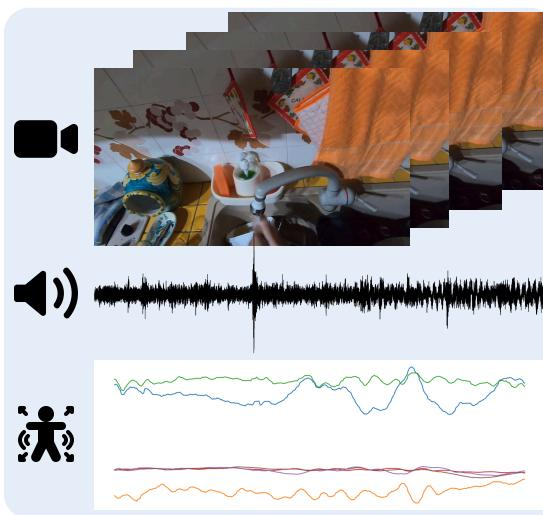

<details>
<summary>text_image</summary>

Audio recording interface with video and audio waveform overlays, showing a person recording on screen and a human icon.
</details>


Is the person involved in any other activities other than washing hands?


Audio+Video

The person is not likely doing any other activities other than washing hands. The presence of hand and water sound confirm washing hands. No other information is available to suggest other activities.


Audio+Video+ Sensor

The person is reaching for soap besides washing hands. While presence of hands and water running sound establish washing hands activities, sudden changes in IMU data suggest movement of the arm to reach for the soap.

Figure 17: Example demonstrating the added value of sensor data in identifying subtle concurrent actions. Given the question “Is the person engaged in any other activities other than washing hands?”, the Audio+Video model detects only hand presence and water sounds, concluding that no other activities are evident. In contrast, the Audio+Video+Sensor model identifies a sudden IMU spike, indicating arm movement associated with reaching for soap–capturing a secondary action that is visually and acoustically ambiguous.   
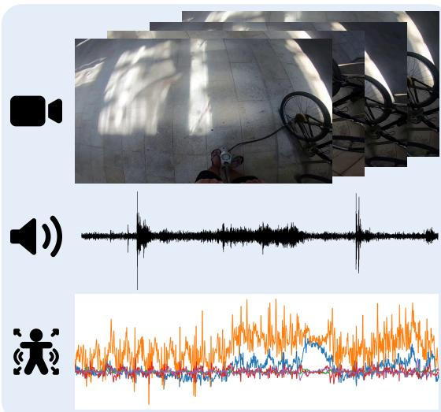

<details>
<summary>text_image</summary>

Composite image showing audio recording with video and audio waveforms, alongside a line chart of audio waveform data.
</details>


What is the person doing with his bicycle?


Audio+Video

The person is likely talking with someone while standing near the bicycle. The person is not riding the bicycle as evident from the sound made by the person and as it is parked near the wall.


Audio+Video+ Sensor

The person might be adjusting the bike's tire pressure while conversing. The bicycle is parked in a sidewalk and constant changes in IMU data confirms a continuous movement happening in the scene.

Figure 18: Example showcasing multimodal reasoning for fine-grained activity understanding. Given the question “What is the person doing with his bicycle?”, the Audio+Video model identifies that the person is not riding the bicycle and is likely talking nearby. In contrast, the Audio+Video+Sensor model captures continuous IMU fluctuations, suggesting active engagement, such as adjusting the bike’s tire pressure, demonstrating the added interpretive power of sensor input.

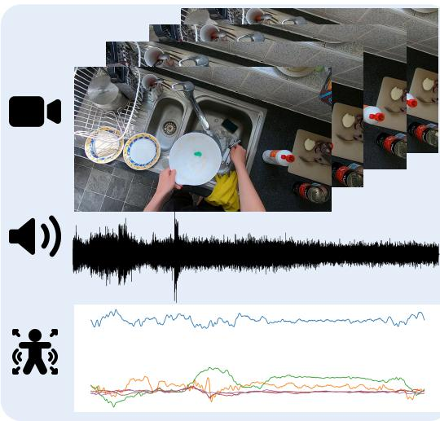

<details>
<summary>text_image</summary>

Composite image showing kitchen cleaning, sound wave analysis, and ECG waveform graphs with labeled axes
</details>


Was the person washing dishes or putting the bowl in the sink?


# Audio+Video

The person was washing dishes as evident from the bowl, sink, towel, and bottle. Audio also confirms water running sound in the background. Thus the person is most likely washing dishes.


# Audio+Video+ Sensor

The person might be washing dishes as sink, bowl, and bottle are present. Imu data confirms some movement likely due to washing dishes. Water running sound also could be heard in the background.

Figure 19: Example illustrating confirmatory reasoning across modalities. Given the question “Was the person washing dishes or putting the bowl in the sink?”, the Audio+Video model infers dishwashing based on visible objects (bowl, sink, towel) and background water sounds. The Audio+Video+Sensor model tries to strengthen this conclusion with IMU evidence from the wrong source, inconsistent with washing actions, reinforcing the activity label through motion-based verification.