# ROBUST FINE-TUNING FROM NON-ROBUST PRE-TRAINED MODELS: MITIGATING SUBOPTIMAL TRANSFER WITH EPSILON-SCHEDULING

Jonas Ngnawe´1,2∗ Maxime Heuillet1,2 Sabyasachi Sahoo1,2 Yann Pequignot1,2

Ola Ahmad3 Audrey Durand1,2,5 Fred´ eric Precioso ´ 4 Christian Gagne´1,2,5

1Universite Laval (IID) ´ 2Mila 3CortAIx Labs, Thales Digital Solutions

4Universite C´ ote d’Azur, CNRS, INRIA, I3S, Maasai ˆ 5Canada CIFAR AI Chair

# ABSTRACT

Fine-tuning pretrained models is a standard and effective workflow in modern machine learning. However, robust fine-tuning (RFT), which aims to simultaneously achieve adaptation to a downstream task and robustness to adversarial examples, remains challenging. Despite the abundance of non-robust pretrained models in open-source repositories, their potential for RFT is less understood. We address this knowledge gap by systematically examining RFT from such nonrobust models. Our experiments reveal that fine-tuning non-robust models with a robust objective, even under small perturbations, can lead to poor performance, a phenomenon that we dub suboptimal transfer. In challenging scenarios (eg, difficult tasks, high perturbation), the resulting performance can be so low that it may be considered a transfer failure. We find that fine-tuning using a robust objective impedes task adaptation at the beginning of training and eventually prevents optimal transfer. However, we propose a novel heuristic, Epsilon-Scheduling, a schedule over perturbation strength used during training that promotes optimal transfer. Additionally, we introduce expected robustness, a metric that captures performance across a range of perturbations, providing a more comprehensive evaluation of the accuracy-robustness trade-off for diverse models at test time. Extensive experiments on a wide range of configurations (six pretrained models and five datasets) show that Epsilon-Scheduling successfully prevents suboptimal transfer and consistently improves expected robustness.

# 1 INTRODUCTION

Fine-tuning pretrained models (backbones) on a downstream task is the standard workflow in machine learning, spanning natural language processing (Koroteev, 2021) and computer vision (Goldblum et al., 2023). This workflow offers clear benefits: (i) reusing a single foundation model across tasks (Devlin et al., 2019), (ii) faster convergence, (iii) better generalization than training from scratch (Yosinski et al., 2014), and (iv) reduced computation (Weiss et al., 2016), especially when labelled data is scarce (Pan & Yang, 2010).

However, in high-stakes applications, adversarial vulnerability remains a major concern (Biggio et al., 2013; Goodfellow et al., 2015). Adversarial Training (AT) (Madry et al., 2018) and its variants (Zhang et al., 2019; Wang et al., 2020; Ding et al., 2020; Shafahi et al., 2019a; Wong et al., 2020) are the most successful empirical defenses (Croce et al., 2021). Robust fine-tuning (RFT) is the integration of these methods in fine-tuning on downstream tasks (Shafahi et al., 2019b; Liu et al., 2023; Xu et al., 2024; Hua et al., 2024). Unlike standard fine-tuning, RFT must balance task adaptation with robustness – a trade-off that makes it considerably harder (Xu et al., 2024).

Most prior works assume access to robust backbones (Hua et al., 2024; Liu et al., 2023; Xu et al., 2024); however, in practice, nearly all widely used pretrained models from public repositories are non-robust (Wolf et al., 2020). Robust pretraining is costly and less common, and because pretraining pipelines typically prioritize broad general-purpose features, robustness is often treated as a property to be acquired downstream (Heuillet et al., 2025). This makes the development of RFT strategies for non-robust backbones not only consistent with current practice but also necessary to close the gap between research and deployment.

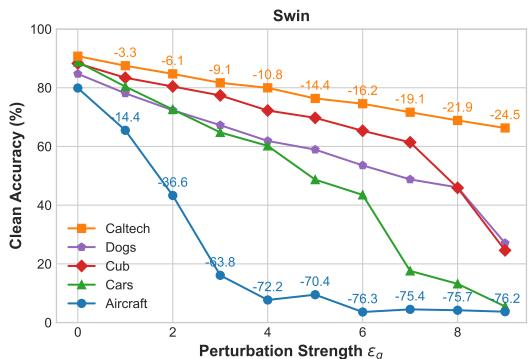

line

| Perturbation Strength εg | Caltech | Dogs  | Cub   | Cars  | Aircraft |
| ------------------------ | ------- | ----- | ----- | ----- | -------- |
| 0                        | 90.0    | 85.0  | 88.0  | 87.0  | 80.0     |
| 2                        | 88.0    | 82.0  | 85.0  | 80.0  | 66.0     |
| 4                        | 85.0    | 78.0  | 80.0  | 65.0  | 15.0     |
| 6                        | 82.0    | 75.0  | 75.0  | 55.0  | 7.0      |
| 8                        | 78.0    | 70.0  | 65.0  | 45.0  | 5.0      |
| 10                       | 75.0    | 65.0  | 55.0  | 35.0  | 5.0      |

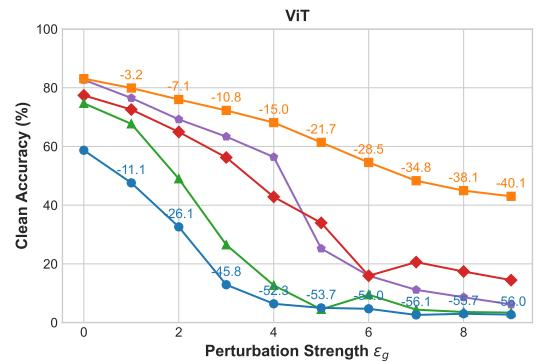

line

| Perturbation Strength εg | Clean Accuracy (%) |
| ------------------------ | ------------------ |
| 0                        | 85                 |
| 1                        | 80                 |
| 2                        | 75                 |
| 3                        | 70                 |
| 4                        | 65                 |
| 5                        | 60                 |
| 6                        | 55                 |
| 7                        | 50                 |
| 8                        | 45                 |
| 9                        | 40                 |

Figure 1: RFT can lead to suboptimal transfer even when optimizing for small perturbation strenghts $( \varepsilon _ { g } ) .$ . The severity is highly model- and dataset-dependent.

We adopt the standard RFT approach based on classical adversarial training (Madry et al., 2018), which optimizes a robust objective using adversarial examples generated at a target perturbation strength (commonly 4/255 or 8/255 in the $\ell _ { \infty } { \tt - n o r m } )$ ). We apply this procedure to robustly fine-tune various backbones across multiple datasets and perturbation levels. Our experiments reveal that, even for small perturbation strengths, standard RFT often leads to suboptimal transfer: performance (clean accuracy) falls short of that achieved by standard fine-tuning (without perturbation) and is often too low to qualify it as a successful transfer. The severity of this effect depends on both the backbone and the downstream task (Figure 1).

When fine-tuning on a downstream task with a robust objective results in near-random performance, the benefits of using a pretrained model are diminished. This raises the question: do standard pretrained models fail to offer a beneficial initialization for training a robust model? In this study, we explore the challenges associated with robust fine-tuning using standard pretrained models and propose a novel approach to address these obstacles. In contrast to standard fine-tuning, where model adaptation to the downstream task occurs immediately, our study reveals that in robust fine-tuning, task adaptation is delayed until later epochs. This delay seems to eventually lead to suboptimal transfer, and we observe that the duration of the delay correlates negatively with transfer performance.

Based on our findings, we propose Epsilon-Scheduling, a schedule over the perturbation strength during RFT to encourage optimal transfer. This novel heuristic is a two-hinge linear schedule that begins with standard fine-tuning (zero perturbation) for early epochs and linearly increases to the target perturbation at final epochs (see Figure 2). This strategy effectively prevents suboptimal transfer and improves both accuracy and robustness.

To better evaluate the fine-tuned models, we introduce a complementary evaluation metric, dubbed expected robustness. This proposed metric evaluates the expectation of the model accuracy across the full perturbation range from zero (clean accuracy) to the target robustness threshold. The expected robustness provides a concise, yet comprehensive measure of the accuracy–robustness trade-off, grounded in a practical threat model. We demonstrate that it offers valuable insights for model selection. Under this metric, Epsilon-Scheduling1 consistently outperforms the standard robust-finetuning, even when worst-case robustness at the target threshold is similar or lower.

Summary of Contributions Our main contributions are: (i) We show that robust fine-tuning from non-robust backbones often leads to suboptimal transfer, even at small perturbation strengths, where performance can fall significantly below standard fine-tuning. (ii) We find that robust finetuning results in task adaptation delay compared to standard finetuning and that this delay strongly correlates with suboptimal transfer. (iii)We propose Epsilon-Scheduling, a two-hinge linear schedule to adjust the training perturbation strength, which effectively mitigates the challenges associated with optimizing adversarial loss. (iv) We introduce expected robustness, a new evaluation metric capturing the full accuracy–robustness trade-off, and report performance using this metric for the first time. (v) Through extensive experiments, we show that Epsilon-Scheduling consistently prevents suboptimal transfer and improves expected robustness across both moderate (4/255) and high (8/255) perturbation regimes.

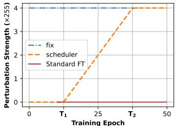

line

| Training Epoch | fix  | scheduler | Standard FT |
| -------------- | ---- | --------- | ----------- |
| 0              | 4.0  | 0.0       | 0.0         |
| T₁             | 4.0  | 0.0       | 0.0         |
| T₂             | 4.0  | 4.0       | 0.0         |
| 50             | 4.0  | 4.0       | 0.0         |

Figure 2: Epsilon-Scheduling

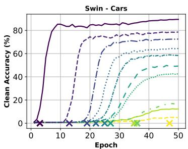

line

| Epoch | Clean Accuracy (%) |
|-------|---------------------|
| 0     | 0                   |
| 10    | 85                  |
| 20    | 75                  |
| 30    | 65                  |
| 40    | 60                  |
| 50    | 55                  |

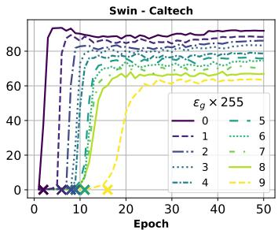

line

| Epoch | εg = 0 | εg = 1 | εg = 2 | εg = 3 | εg = 4 | εg = 5 | εg = 6 | εg = 7 | εg = 8 | εg = 9 |
|-------|--------|--------|--------|--------|--------|--------|--------|--------|--------|--------|
| 0     | 0      | 0      | 0      | 0      | 0      | 0      | 0      | 0      | 0      | 0      |
| 10    | ~85    | ~80    | ~75    | ~70    | ~65    | ~60    | ~55    | ~50    | ~45    | ~40    |
| 20    | ~85    | ~80    | ~75    | ~70    | ~65    | ~60    | ~55    | ~50    | ~45    | ~40    |
| 30    | ~85    | ~80    | ~75    | ~70    | ~65    | ~60    | ~55    | ~50    | ~45    | ~40    |
| 40    | ~85    | ~80    | ~75    | ~70    | ~65    | ~60    | ~55    | ~50    | ~45    | ~40    |
| 50    | ~85    | ~80    | ~75    | ~70    | ~65    | ~60    | ~55    | ~50    | ~45    | ~40    |

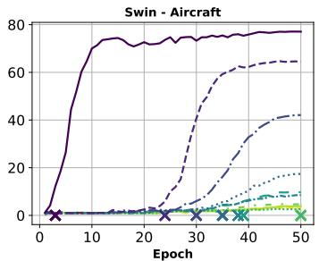

line

| Epoch | Line 1 | Line 2 | Line 3 | Line 4 | Line 5 |
|-------|--------|--------|--------|--------|--------|
| 0     | 0      | 0      | 0      | 0      | 0      |
| 10    | 70     | 0      | 0      | 0      | 0      |
| 20    | 75     | 0      | 0      | 0      | 0      |
| 30    | 75     | 60     | 0      | 0      | 0      |
| 40    | 75     | 65     | 10     | 5      | 0      |
| 50    | 75     | 65     | 15     | 10     | 0      |

Figure 3: RFT delays task adaptation. Validation clean accuracy under standard fine-tuning $( \varepsilon _ { g } = 0 )$ and RFT-fix with $\varepsilon _ { g } ~ \in ~ [ 1 / 2 5 5 , 9 / 2 5 5 ]$ ] on three datasets.The crosses indicate the onset of task adaptation (when validation accuracy exceeds 5%). Stronger perturbations cause longer delays and more severe suboptimal transfer. See Section 4 for analysis.

# 2 RELATED WORK

Adversarial Robustness in Transfer Learning with Robust-FineTuning There are two main ways to achieve adversarial robustness in Transfer Learning: Robust Distillation (Goldblum et al., 2020; Dong et al., 2024) and Robust Fine-Tuning. Prior works on RFT focus on robust backbones (Liu et al., 2023; Xu et al., 2024; Hua et al., 2024). TWINS (Liu et al., 2023) employs two networks with shared parameters to separately track pretraining and downstream batch statistics. However, Liu et al. (2023) do not apply it to non-robust backbones claiming that ”robust pre-training is indispensable to downstream robustness”. AutoLoRA (Xu et al., 2024) disentangles natural and adversarial objectives using a LoRA branch for the former and a robust pretrained extractor for the latter, though it relies on TRADES loss (Zhang et al., 2019), which is harder to scale than standard adversarial training (Madry et al., 2018). Xu et al. (2024) show that robust pretrainning is necessary for AutoLoRA and register the worst performance for the non-robust pretraining. RoLi (Hua et al., 2024) preserves robustness by initializing the classifier head via adversarial linear probing before performing RFT. (Hua et al., 2024) explicitly argue that robust pretraining is a prerequisite for RoLi by showing that linear probing with a robust objective on a non-robust backbone fails dramatically and therefore does not provide a good initialization. In summary, all these approaches assume robust pretrained features. In contrast, we are the first to propose an RFT method targeting non-robust backbones.

Tuning Perturbation Strength in Adversarial Training Adapting the perturbation strength during training has been explored in various forms. Early work used a linear ramp-up in Interval Bound Propagation (Gowal et al., 2018). Ding et al. (2020) connected margin maximization to minimal adversarial loss, motivating adaptive, sample-specific perturbation strengths, though such instancewise selection (Balaji et al., 2019) is computationally costly. They also proposed PGDLS (PGD with Linear Scaling), which linearly increases perturbation strength but shows gains only at large perturbations (24/255). Other strategies include sampling the perturbation strength from a Beta distribution (Chamon & Ribeiro, 2020) and curriculum schemes that gradually increase the number of attack steps (Cai et al., 2018). Pang et al. (2021) reports that linear warmup provides limited gains in ResNets, whereas Debenedetti et al. (2023) finds that it improves both clean and robust accuracy in vision transformers. Unlike prior works, which apply to adversarial training from scratch, our study is on transfer learning. Our formulation generalizes linear warmup, and we show that the benefits consistently hold across tasks and architectures, including ResNets, using the new expected robustness metric.

Adversarial Defense Evaluation Standard evaluation (Croce et al., 2021) compares clean and robust accuracy at a target perturbation strength under strong attacks or ensembles (Carlini & Wagner, 2017; Madry et al., 2018; Croce & Hein, 2020b; Cina et al., 2025), yet it obfuscates what happens at \` intermediate perturbation strengths. A related recommendation is to check that accuracy decreases with stronger perturbations (Carlini et al., 2019), but this test is unquantified and serves only as an informal validation (Debenedetti et al., 2023). In contrast, our notion of expected robustness formalizes this decrease and interpolates between clean and worst-case performance at a specific target perturbation strength. Another class of metrics interpolates between worst-case and average-case robustness (Rice et al., 2021; Li et al., 2021), the latter defined against random or natural perturbations (Hendrycks & Dietterich, 2019; Han et al., 2024). However, this approach does not capture the trade-off between clean and worst-case performance.

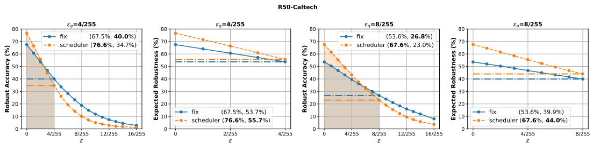  
Figure 4: The expected robustness metric offers a valuable perspective for model selection. The larger the area under the curve (shaded area), the higher the expected robustness. The values in the legend indicate the clean accuracy and the evaluation at $\varepsilon _ { g }$ .

# 3 BACKGROUND

Supervised Fine-Tuning Consider a classification task to map instances x of a d-dimensional input space $\mathcal { X } \subset \mathbb { R } ^ { d }$ to corresponding labels y in the set $\mathcal { V } = \{ \bar { 1 } , 2 , . . . , K \}$ . Unlike training from scratch to learn a classifier $f _ { \theta } : \mathcal { X } \mapsto \bar { \mathcal { Y } }$ from randomly initialized parameters θ on a training dataset drawn iid from a data distribution D on $\mathcal { X } \times \mathcal { V } .$ , supervised fine-tuning uses a pretrained feature extractor (backbone) $h _ { \theta _ { 1 } } : \mathcal { X } \mapsto \mathcal { Z }$ that maps inputs to a representation space $\dot { z }$ and a randomly initialized classifier head $c _ { \theta _ { 2 } } : \mathcal { Z } \mapsto \mathcal { V }$ such that $f _ { \{ \theta _ { 1 } , \theta _ { 2 } \} } = c _ { \theta _ { 2 } } \circ h _ { \theta _ { 1 } }$ . This work focuses on full fine-tuning where both $\theta _ { 1 }$ and $\theta _ { 2 }$ are trainable parameters. The performance of the fine-tuned model is measured by its accuracy, i.e., the probability that a prediction is correct for an instance drawn from D. We will refer to this as clean accuracy (or transfer accuracy).

Adversarial Training (AT) Given a target evaluation threshold for perturbation strength $\varepsilon _ { g o a l }$ $( \varepsilon _ { g }$ for convenience) in ℓp-norm $\begin{array} { r } { ( \| \boldsymbol { x } \| _ { p } = \left( \sum _ { i } x _ { i } \right) ^ { 1 / p } , p > 0 ) } \end{array}$ , adversarial training aims to train a classifier $f$ such that it maximizes the robust accuracy $\operatorname { A c c } _ { \varepsilon _ { g } } ( f )$ . The robust accuracy is the probability that a prediction remains correct for any input x under a perturbation δ of maximum norm $\varepsilon _ { g }$ . Classical adversarial training (Madry et al., 2018) minimizes the adversarial risk at a perturbation threshold $\varepsilon _ { g }$ as a surrogate objective for $\operatorname { A c c } _ { \varepsilon _ { g } } ( f )$ :

$$
R _ {\varepsilon_ {g}} (f) = \mathbb {E} _ {(x, y) \sim \mathcal {D}} \left(\max _ {\| \delta \| _ {p} <   \varepsilon_ {g}} L _ {\mathrm{CE}} (f (x + \delta), y)\right) \tag {1}
$$

where $L _ { \mathrm { C E } }$ is the cross-entropy loss. In practice, the empirical counterpart of the risk $R _ { \varepsilon } ( f )$ is minimized, and adversarial perturbations δ are generated using a few iterations of Projected Gradient Descent (PGD) under an $\ell _ { p }$ -norm constraint.

In this work, we refer to robust fine-tuning (RFT) as supervised fine-tuning with classical adversarial training. The standard practice in RFT for achieving robustness at a target evaluation threshold $\varepsilon _ { g }$ is to directly minimize the empirical risk at $\varepsilon _ { g }$ throughout the fine-tuning process (Madry et al., 2018; Hua et al., 2024). In this setup, the perturbation strength used to generate adversarial examples remains fixed at $\varepsilon _ { g }$ across all fine-tuning epochs. We refer to this baseline strategy as RFT-fix (or fix).

# 4 CHARACTERIZING SUBOPTIMAL TRANSFERS IN ROBUST FINE-TUNING

When we perform robust fine-tuning with excessively strong perturbations $\varepsilon _ { g }$ that severely corrupt the inputs, clean accuracy is expected to reach chance level, as the training samples will become unrecognisable, drifting away from the task data distribution D (Carlini et al., 2019). Yet, a question remains: how much clean accuracy degrades as $\varepsilon _ { g }$ increases given a pretrained model and a dataset? To investigate this question, we conduct an experiment with two non-robust backbones: SWIN (Liu et al., 2021) and ViT (Dosovitskiy et al., 2021), across five datasets: Cub (Wah et al., 2011), Dogs (Khosla et al., 2011), Caltech (Griffin et al., 2007)), Cars (Krause et al., 2013)), and Aircraft (Maji et al., 2013)). See Appendix A for details on backbones and their pretraining.

<table><tr><td rowspan="2">Model</td><td rowspan="2">Dataset Setting</td><td colspan="3">Aircraft</td><td colspan="3">Caltech</td><td colspan="3">Cars</td><td colspan="3">Cub</td><td colspan="3">Dogs</td></tr><tr><td>Clean</td><td>Adv.</td><td>E. adv.</td><td>Clean</td><td>Adv.</td><td>E. adv.</td><td>Clean</td><td>Adv.</td><td>E. adv.</td><td>Clean</td><td>Adv.</td><td>E. adv.</td><td>Clean</td><td>Adv.</td><td>E. adv.</td></tr><tr><td rowspan="2">ViT</td><td>fix</td><td>6.40</td><td>2.80</td><td>4.48</td><td>68.14</td><td>41.64</td><td>55.07</td><td>12.70</td><td>4.90</td><td>8.20</td><td>42.82</td><td>15.12</td><td>27.79</td><td>56.40</td><td>19.97</td><td>36.93</td></tr><tr><td>sched</td><td>58.60</td><td>13.20</td><td>34.95</td><td>78.73</td><td>41.69</td><td>60.71</td><td>73.40</td><td>19.10</td><td>46.71</td><td>73.40</td><td>23.63</td><td>48.09</td><td>70.69</td><td>15.69</td><td>41.62</td></tr><tr><td rowspan="2">SWIN</td><td>fix</td><td>7.70</td><td>4.80</td><td>6.11</td><td>79.97</td><td>57.16</td><td>69.19</td><td>60.20</td><td>29.70</td><td>44.74</td><td>72.25</td><td>41.87</td><td>57.55</td><td>61.89</td><td>26.89</td><td>44.17</td></tr><tr><td>sched</td><td>73.80</td><td>32.00</td><td>53.75</td><td>85.43</td><td>56.39</td><td>72.04</td><td>84.70</td><td>43.20</td><td>66.41</td><td>82.29</td><td>41.61</td><td>63.82</td><td>72.70</td><td>24.32</td><td>48.50</td></tr><tr><td colspan="17"></td></tr><tr><td rowspan="2">CNX</td><td>fix</td><td>7.60</td><td>4.50</td><td>5.86</td><td>83.27</td><td>61.54</td><td>73.08</td><td>69.60</td><td>43.20</td><td>57.52</td><td>76.34</td><td>47.08</td><td>62.59</td><td>68.90</td><td>31.61</td><td>50.61</td></tr><tr><td>sched</td><td>78.40</td><td>38.00</td><td>59.40</td><td>89.41</td><td>61.45</td><td>77.23</td><td>88.90</td><td>57.70</td><td>75.85</td><td>85.17</td><td>44.99</td><td>67.30</td><td>78.39</td><td>26.31</td><td>53.19</td></tr><tr><td rowspan="2">R50</td><td>fix</td><td>8.40</td><td>2.90</td><td>4.56</td><td>67.47</td><td>40.02</td><td>53.74</td><td>4.20</td><td>2.90</td><td>3.49</td><td>49.19</td><td>19.35</td><td>33.58</td><td>57.05</td><td>19.80</td><td>37.73</td></tr><tr><td>sched</td><td>53.10</td><td>11.10</td><td>29.40</td><td>76.55</td><td>34.74</td><td>55.67</td><td>70.00</td><td>19.30</td><td>43.44</td><td>70.06</td><td>19.59</td><td>43.62</td><td>69.11</td><td>15.94</td><td>41.11</td></tr><tr><td colspan="17"></td></tr><tr><td rowspan="2">ClipViT</td><td>fix</td><td>5.00</td><td>3.30</td><td>4.16</td><td>31.91</td><td>15.49</td><td>23.00</td><td>4.90</td><td>3.00</td><td>3.74</td><td>13.95</td><td>3.64</td><td>7.97</td><td>7.89</td><td>3.29</td><td>5.39</td></tr><tr><td>sched</td><td>69.80</td><td>33.90</td><td>52.79</td><td>74.83</td><td>46.64</td><td>60.99</td><td>86.70</td><td>58.60</td><td>75.01</td><td>74.35</td><td>35.67</td><td>55.54</td><td>63.17</td><td>20.87</td><td>41.05</td></tr><tr><td rowspan="2">ClipCNX</td><td>fix</td><td>3.10</td><td>2.50</td><td>2.82</td><td>61.76</td><td>42.13</td><td>51.54</td><td>2.80</td><td>1.60</td><td>2.23</td><td>28.89</td><td>14.33</td><td>20.92</td><td>23.90</td><td>11.33</td><td>17.14</td></tr><tr><td>sched</td><td>81.70</td><td>50.70</td><td>67.88</td><td>81.19</td><td>52.68</td><td>67.71</td><td>90.90</td><td>74.10</td><td>84.33</td><td>79.06</td><td>42.11</td><td>61.45</td><td>70.85</td><td>25.85</td><td>48.19</td></tr></table>

Table 1: At moderate perturbation regime $( { } ^ { 4 } / { } _ { 2 5 5 } ) ,$ , Epsilon-Scheduling, mitigates suboptimal transfers and consistently improves expected robustness. See Table 2 for $\varepsilon _ { g } = 8 / 2 5 5$

Suboptimal Transfer We apply RFT-fix with target perturbation strengths $\varepsilon _ { g }$ in $[ 1 / 2 5 5 , 9 / 2 5 5 ]$ and compare performance (clean accuracy) to standard fine-tuning $( \varepsilon _ { g } = 0 )$ . While low clean accuracies for RFT-fix from non-robust backbones have been reported on Caltech at $\varepsilon _ { g } ~ = ~ 8 / 2 5 5$ (Liu et al., 2023; Hua et al., 2024), our experiments reveal a broader picture. Figure 1 shows distinct trends in clean accuracy degradation as $\varepsilon _ { g }$ increases. Even for tiny perturbations $( \varepsilon _ { g } \ = \ ^ { 1 } / 2 5 5 )$ , accuracy can drop by up to 14% compared to the standard finetuning with $\epsilon _ { g } = 0$ . At the commonly used threshold $\varepsilon _ { g } = { ^ { 4 } } / { 2 5 } 5$ , the minimum drop is 10%. In extreme cases, RFT-fix fails to adapt effectively, with clean accuracy falling below 5%, making it practically unusable. We refer to this phenomenon as suboptimal transfer, where RFT-fix yields a clean accuracy substantially lower than standard fine-tuning, at times to the point of ineffectiveness or failure.

Insights on Task Difficulty and Backbone Selection The severity of suboptimal transfer depends on both the backbone and the task, with the task being the more differentiating factor (see Figure Figure 1). Easier tasks (e.g., Caltech, wide variety of objects) exhibit smaller performance drops than more challenging ones (e.g., Aircraft, highly similar categories). As expected, the choice of SWIN as backbone is better than ViT (Hua et al., 2024). However, the notion of “task difficulty” is also model-dependent: (Dogs < Cub for SWIN but Dogs > Cub for ViT). This demonstrates that task difficulty is a property that emerges from the interaction between model and dataset (Zilly et al., 2019; Jankowski et al., 2025), rather than by data features alone (Cao et al., 2024). Our experiments further suggest that with respect to adversarial robustness, the perturbation strength may also play a role: Dogs is easier than Cub for perturbations below $\varepsilon _ { g } = { \sqrt [ 4 ] { 2 5 5 } }$ , but becomes comparable or more difficult at higher strengths.

Robust Fine-Tuning Delays Task Adaptation Figure 3 shows that in standard fine-tuning $( \varepsilon _ { g } =$ 0), the model adapts to the downstream task almost immediately – validation accuracy rises from the first epoch – since there is no robustness constraint that competes with task adaptation. With $\varepsilon _ { g } > 0$ , RFT-fix distorts task-relevant features, which prevents early adaptation and delays the onset of task adaptation. For example, at $\varepsilon _ { g } = { ^ { 4 } } / { ^ { 2 5 5 } }$ , adaptation begins around epoch 10 for Caltech, epoch 25 for $\mathtt { C a r s }$ , and after epoch 30 for Aircraft. If we precisely measure the delay time as the epoch from which the validation accuracy starts being above 5%, the correlation between the delay times and the severity of the suboptimal transfer is very high (above 90%, see Appendix B.1 for details). The delay shortens the effective adaptation period, likely leading to suboptimal transfer with increased severity at higher perturbation thresholds. To the best of our knowledge, the delayed onset of task adaptation in robust fine-tuning has not been previously reported, which is an interesting insight that could open up new opportunities for improvement.

# 5 EPSILON-SCHEDULING AND EXPECTED ROBUSTNESS

The analysis in section 4 demonstrates that a robust objective at high perturbation strengths is detrimental in RFT from a non-robust pretrained model, eventually leading to suboptimal transfer, with performance subpar of what is expected from the pretraining advantage. Based on this finding, we propose Epsilon-Scheduling, a simple schedule over the perturbation strength to mitigate this effect.

<table><tr><td rowspan="2">Model</td><td rowspan="2">Dataset Setting</td><td colspan="3">Aircraft</td><td colspan="3">Caltech</td><td colspan="3">Cars</td><td colspan="3">Cub</td><td colspan="3">Dogs</td></tr><tr><td>Clean</td><td>Adv.</td><td>E. adv.</td><td>Clean</td><td>Adv.</td><td>E. adv.</td><td>Clean</td><td>Adv.</td><td>E. adv.</td><td>Clean</td><td>Adv.</td><td>E. adv.</td><td>Clean</td><td>Adv.</td><td>E. adv.</td></tr><tr><td rowspan="2">ViT</td><td>fix</td><td>3.00</td><td>2.00</td><td>2.50</td><td>44.95</td><td>19.52</td><td>31.43</td><td>3.60</td><td>2.00</td><td>2.74</td><td>17.40</td><td>2.80</td><td>8.56</td><td>8.64</td><td>2.88</td><td>5.35</td></tr><tr><td>sched</td><td>57.00</td><td>6.70</td><td>27.72</td><td>72.86</td><td>26.89</td><td>49.28</td><td>68.10</td><td>9.00</td><td>35.18</td><td>64.74</td><td>9.79</td><td>33.93</td><td>56.86</td><td>5.79</td><td>25.81</td></tr><tr><td rowspan="2">SWIN</td><td>fix</td><td>4.20</td><td>2.70</td><td>3.47</td><td>68.87</td><td>38.10</td><td>53.40</td><td>13.20</td><td>5.60</td><td>8.66</td><td>45.89</td><td>13.60</td><td>28.56</td><td>46.05</td><td>11.08</td><td>26.69</td></tr><tr><td>sched</td><td>69.20</td><td>22.40</td><td>45.12</td><td>80.27</td><td>38.67</td><td>60.26</td><td>78.00</td><td>23.50</td><td>53.57</td><td>74.80</td><td>21.07</td><td>47.34</td><td>60.49</td><td>8.73</td><td>31.14</td></tr><tr><td colspan="17"></td></tr><tr><td rowspan="2">CNX</td><td>fix</td><td>1.60</td><td>1.50</td><td>1.48</td><td>59.85</td><td>33.95</td><td>46.34</td><td>5.30</td><td>2.60</td><td>3.98</td><td>5.02</td><td>2.28</td><td>3.56</td><td>27.33</td><td>7.73</td><td>16.28</td></tr><tr><td>sched</td><td>75.00</td><td>28.80</td><td>50.90</td><td>84.99</td><td>41.82</td><td>64.92</td><td>85.60</td><td>35.90</td><td>65.04</td><td>80.69</td><td>24.28</td><td>53.07</td><td>68.94</td><td>9.78</td><td>36.51</td></tr><tr><td rowspan="2">R50</td><td>fix</td><td>1.30</td><td>0.90</td><td>0.74</td><td>53.59</td><td>26.78</td><td>39.93</td><td>1.50</td><td>1.20</td><td>1.34</td><td>30.89</td><td>8.27</td><td>17.84</td><td>27.14</td><td>6.95</td><td>15.61</td></tr><tr><td>sched</td><td>42.80</td><td>5.30</td><td>20.38</td><td>67.56</td><td>23.01</td><td>44.03</td><td>57.10</td><td>8.50</td><td>29.56</td><td>59.49</td><td>8.68</td><td>29.95</td><td>50.89</td><td>6.92</td><td>25.26</td></tr><tr><td colspan="17"></td></tr><tr><td rowspan="2">ClipViT</td><td>fix</td><td>3.60</td><td>2.20</td><td>3.05</td><td>23.02</td><td>7.29</td><td>14.52</td><td>3.00</td><td>2.50</td><td>2.73</td><td>11.11</td><td>2.30</td><td>5.73</td><td>2.20</td><td>1.38</td><td>1.77</td></tr><tr><td>sched</td><td>65.80</td><td>25.40</td><td>44.84</td><td>70.68</td><td>33.70</td><td>51.67</td><td>84.70</td><td>38.60</td><td>64.47</td><td>67.64</td><td>18.05</td><td>41.79</td><td>54.28</td><td>8.94</td><td>27.78</td></tr><tr><td rowspan="2">ClipCNX</td><td>fix</td><td>1.80</td><td>1.30</td><td>1.62</td><td>51.94</td><td>28.37</td><td>39.44</td><td>1.30</td><td>1.10</td><td>1.25</td><td>6.37</td><td>2.30</td><td>4.05</td><td>8.36</td><td>3.97</td><td>5.98</td></tr><tr><td>sched</td><td>79.20</td><td>34.50</td><td>59.09</td><td>76.53</td><td>37.20</td><td>56.83</td><td>90.00</td><td>55.20</td><td>77.14</td><td>73.58</td><td>22.75</td><td>47.77</td><td>62.67</td><td>11.36</td><td>33.85</td></tr></table>

Table 2: At high perturbation regime $( 8 / 2 5 5 )$ , RFT-fix mostly fails and Epsilon-Scheduling preserves performance. See Table 1 for $\varepsilon _ { g } = { ^ 4 } / { _ { 2 5 5 } }$ .

Epsilon-Scheduling In contrast with RFT-fix, we perform RFT for target perturbation strength $\varepsilon _ { g }$ by minimizing an empirical counterpart of $R _ { \varepsilon } ( f )$ where ε follows a schedule during the finetuning, given for each epoch t as a proportion $\alpha ( t ) \geq 0$ of $\varepsilon _ { g } \colon \varepsilon ( t ) = \alpha ( t ) \varepsilon _ { g }$ . We propose a two-hinge linear scheduler illustrated in Figure 2 and defined by:

$$
\alpha (t) = \left\{ \begin{array}{c l} 0 & : t <   T _ {1} \\ \frac {t - T _ {1}}{T _ {2} - T _ {1}} & : T _ {1} \leq t <   T _ {2} \\ 1 & : t \geq T _ {2}. \end{array} \right.
$$

This strategy begins by training over $T _ { 1 }$ epochs without robustness $( \varepsilon = 0 )$ , then linearly increases from $\varepsilon = 0 \mathrm { t } \mathbf { 0 } \varepsilon = \varepsilon _ { g }$ over $T _ { 2 } - T _ { 1 }$ epochs, to finally remain constant $( \varepsilon = \varepsilon _ { g } )$ from epoch $T _ { 2 }$ . Note that this generalizes the linear warmups mentioned in prior work (Pang et al., 2021; Debenedetti et al., 2023) for $T _ { 1 } = 0 , T _ { 2 } \neq T _ { 1 }$ , while falling back to RFT-fix for $T _ { 1 } = T _ { 2 } = 0$ .

From a transfer learning perspective, this strategy can be viewed as follows: begin with task adaptation, then gradually shift to the robust objective, and conclude by minimizing the target robust objective. Here, $T _ { 1 }$ denotes the adaptation phase, i.e., the time for the model to reach good clean accuracy, while $T _ { 2 }$ controls the steepness of the transition from 0 to $\varepsilon _ { g }$ . In the following, we refer to this strategy as RFT-scheduler (or simply scheduler). Considering that stronger perturbations make task adaptation harder (i.e., cause adaptation delays), RFT-scheduler can be viewed as a curriculum learning strategy that first exposes the model to easier examples before gradually introducing harder ones (Cai et al., 2018; Pang et al., 2021; Debenedetti et al., 2023).

Expected Robustness Evaluation While RFT targets low adversarial risk $R _ { \varepsilon _ { a } } ( f )$ , models are usually evaluated both for clean accuracy $\operatorname { A c c } _ { 0 } ( f )$ and robust accuracy $\operatorname { A c c } _ { \varepsilon _ { g } } ( f ) ^ { s }$ . We propose to extend this classical evaluation to take into account intermediary perturbation strengths within the range $[ 0 , \varepsilon _ { g } ]$ and define the expected robustness metric as the expectation under uniform distribution U of the accuracy over $[ 0 , \varepsilon _ { g } ] ^ { \mathit { \Pi } }$ :

$$
\operatorname{Acc} _ {[ 0, \varepsilon_ {g} ]} (f) := \mathbb {E} _ {\varepsilon \sim U [ 0, \varepsilon_ {g} ]} \left[ \operatorname{Acc} _ {\varepsilon} (f) \right] = \frac {1}{\varepsilon_ {g}} \int_ {0} ^ {\varepsilon_ {g}} \operatorname{Acc} _ {\varepsilon} (f) d \varepsilon = \frac {1}{\varepsilon_ {g}} \mathrm{AUC} _ {\varepsilon_ {g}} (f),
$$

where $\operatorname { A U C } _ { \varepsilon _ { g } } ( f )$ represents the area under the accuracy curve from 0 to $\varepsilon _ { g }$ (Figure 4, panels 2 and 4). This can be estimated using the trapezoidal rule to numerically approximate the integral. See $\mathsf { A p - }$ pendix A for additional details. When comparing two models with similar accuracies, particularly in the presence of a clean–robust trade-off, the distinct patterns observed at intermediate perturbation strengths (Figure 4, panels 1 and 3) can inform model selection, which expected robustness summarizes quantitatively.

The expected robustness metric also evaluates performance under a more realistic threat model where inputs may or may not be altered. Clean accuracy corresponds to the idealized case where inputs are never perturbed, while robust accuracy at $\varepsilon _ { g }$ assumes that all inputs are perturbed with a budget of $\varepsilon _ { g } .$ In contrast, expected robustness estimates the accuracy when perturbations of size up to $\varepsilon _ { g }$ are applied at random (here, uniformly). While our choice of a uniform distribution serves as a good option from a use-case-agnostic perspective, the distribution of perturbations can be tailored to align with the relevant threat model for a specific application. With the uniform distribution, each adversarial strength is weighted equally, however, for example, with a Dirac distribution centered at $0 ( \epsilon _ { g } ) _ { \cdot }$ , it falls back to clean accuracy (worst case robust accuracy).

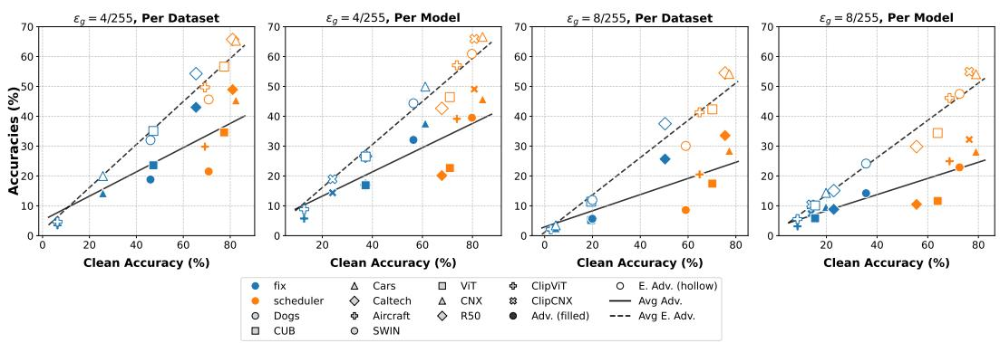  
Figure 5: Epsilon-Scheduling mitigates suboptimal transfers and consistently improves expected robustness even when robust accuracy is equivalent. Aggregated results from Table 1 and Table 2.

# 6 EXPERIMENTAL EVALUATION

We provide an overview of the experimental setup–including backbones, datasets, parameters $T _ { 1 }$ and T2 for Epsilon-Scheduling, and training and evaluation procedures. Additional details for reference and reproducibility are provided in Appendix A.

Backbones: We perform experiments using six non-robust backbones, selected to cover two prominent architecture families (attention-based and convolutional-based) and two pretraining paradigms (supervised and multi-modal). Transformers: Swin-Base (CNX, (Liu et al., 2021) and ViT-Base (Dosovitskiy et al., 2021); convolutional architectures: ConvNext-Base (Liu et al., 2022) and ResNet-50 (He et al., 2016); CLIP models (Radford et al., 2021): CLIP-ViT and CLIP-ConvNext.

Downstream Datasets: We evaluate fine-tuning performance on five low-data downstream tasks: bird species classification on CUB-200-2011 (Wah et al. (2011), 200 classes), dog breed classification on Stanford Dogs (Khosla et al. (2011), 120 classes), object recognition on Caltech256 (Griffin et al. (2007), 257 classes), car model classification on Stanford Cars (Krause et al. (2013), 196 classes), and aircraft variant classification on FGVC-Aircraft (Maji et al. (2013), 100 classes).

Choice of $\mathbf { T _ { 1 } }$ and $\mathbf { T _ { 2 } }$ for Epsilon-Scheduling: To obtain values of $T _ { 1 }$ and $T _ { 2 }$ that are general enough for most cases, we use measurements from the most severe instance of suboptimal transfer in Section 4 (SWIN-Aircraft). We define the adaptation phase as the epoch when validation accuracy reaches 90% of its final value, which occurs at epoch 11. Accordingly, we set $T _ { 1 } = 1 2 $ , corresponding to about 25% of the total training epochs, sufficient for the model to reach high clean accuracy. Since the average task-adaptation delay in RFT-fix is observed around epoch 37, we set $T _ { 2 } = 3 7$ , i.e., roughly 75% of the total epochs, so that the model is trained with perturbation strengths smaller than $\varepsilon _ { g }$ during the delay period.

Training and Evaluation We follow a similar setup described in Hua et al. (2024). We train for 50 epochs and generate adversarial examples using APGD (Croce & Hein, 2020b) (instead of PGD) with cross-entropy loss as in prior work (Singh et al., 2023; Heuillet et al., 2025), which removes the need for manual tuning. The number of APGD steps is 7 for training and 10 for evaluation (Hua et al., 2024). Results are reported for the models at the end of training because overfitting of the adversarial accuracy is negligible (Figure 6). The evaluation is conducted in the $\ell _ { \infty }$ -norm, which is the most widely studied norm in the literature (Croce et al., 2021; Ngnawe et al., 2024), using two standard evaluation thresholds: $\varepsilon _ { g } = { ^ { 4 } } / { ^ { 2 5 5 } }$ (moderate perturbation) and $\varepsilon _ { g } = 8 / 2 5 5$ (high perturbation). For each model, we report the clean accuracy (clean), APGD accuracy (adv.), and the expected APGD accuracy (E. adv.) over the interval $[ 0 , \dot { \varepsilon } _ { g } ]$ . We provide in Appendix B.2 a few additional results for SWIN, with the more expensive evaluation AutoAttack (Croce & Hein, 2020b), a diverse ensemble of four attacks containing untargeted APGD-CE, targeted APGD-DLR, targeted FAB (Croce & Hein, 2020a), and black-box Square Attack (Andriushchenko et al., 2020).

# 6.1 EPSILON-SCHEDULING PERFORMANCE IN RFT

Results are reported in Table 1 for the moderate perturbation regime $( \varepsilon _ { g } = 4 / 2 5 5 )$ , in Table 2 for the high perturbation regime $( \varepsilon _ { g } = 8 / 2 5 5 )$ , and in Figure 5 for the aggregated analysis.

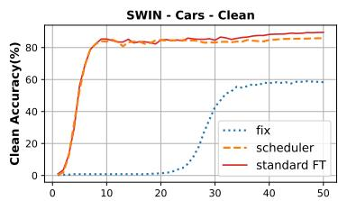

line

| x  | fix  | scheduler | standard FT |
|----|------|-----------|-------------|
| 0  | 0    | 0         | 0           |
| 10 | 0    | 80        | 80          |
| 20 | 0    | 80        | 80          |
| 30 | 40   | 80        | 80          |
| 40 | 60   | 80        | 80          |
| 50 | 60   | 80        | 80          |

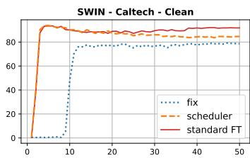

line

| Step | fix  | scheduler | standard FT |
|------|------|-----------|-------------|
| 0    | 0    | 0         | 0           |
| 5    | 0    | 85        | 85          |
| 10   | 75   | 85        | 85          |
| 15   | 75   | 85        | 85          |
| 20   | 75   | 85        | 85          |
| 25   | 75   | 85        | 85          |
| 30   | 75   | 85        | 85          |
| 35   | 75   | 85        | 85          |
| 40   | 75   | 85        | 85          |
| 45   | 75   | 85        | 85          |
| 50   | 75   | 85        | 85          |

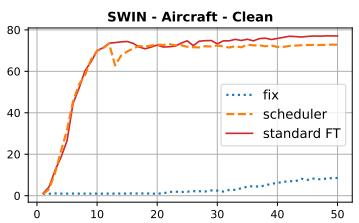

line

| Step | fix  | scheduler | standard FT |
| ---- | ---- | --------- | ----------- |
| 0    | 0    | 0         | 0           |
| 10   | 0    | 70        | 75          |
| 20   | 0    | 70        | 75          |
| 30   | 0    | 70        | 75          |
| 40   | 5    | 70        | 75          |
| 50   | 10   | 70        | 75          |

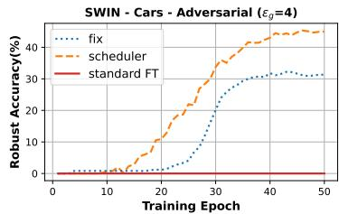

line

| Training Epoch | fix   | scheduler | standard FT |
| -------------- | ----- | --------- | ----------- |
| 0              | 0     | 0         | 0           |
| 10             | 0     | 0         | 0           |
| 20             | 5     | 15        | 0           |
| 30             | 15    | 30        | 0           |
| 40             | 25    | 40        | 0           |
| 50             | 30    | 45        | 0           |

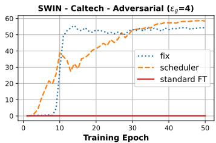

line

| Training Epoch | fix  | scheduler | standard FT |
| -------------- | ---- | --------- | ----------- |
| 0              | 0    | 0         | 0           |
| 10             | 55   | 30        | 0           |
| 20             | 52   | 45        | 0           |
| 30             | 54   | 52        | 0           |
| 40             | 53   | 56        | 0           |
| 50             | 54   | 57        | 0           |

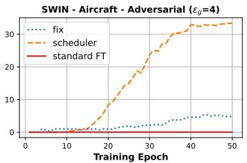

line

| Training Epoch | fix  | scheduler | standard FT |
| -------------- | ---- | --------- | ----------- |
| 0              | 0    | 0         | 0           |
| 10             | 0    | 0         | 0           |
| 20             | 0    | 5         | 0           |
| 30             | 0    | 15        | 0           |
| 40             | 5    | 30        | 0           |
| 50             | 5    | 32        | 0           |

Figure 6: Epsilon-Scheduling preserves task adaptation while improving robustness (4/255).

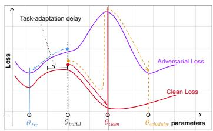

line

| parameters | Adversarial Loss | Clean Loss |
| ---------- | ---------------- | ---------- |
| θ_fix      | Low              | Medium     |
| θ_initial  | Medium           | High       |
| θ_chim     | High             | Low        |
| θ_scheduler  | Medium           | Medium     |

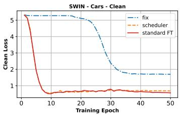

line

| Training Epoch | fix  | scheduler | standard FT |
| -------------- | ---- | --------- | ----------- |
| 0              | 5.0  | 5.0       | 5.0         |
| 10             | 4.8  | 0.8       | 0.8         |
| 20             | 4.5  | 0.7       | 0.7         |
| 30             | 2.0  | 0.6       | 0.6         |
| 40             | 1.8  | 0.6       | 0.6         |
| 50             | 1.7  | 0.6       | 0.6         |

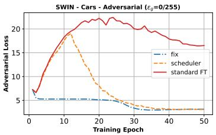

line

| Training Epoch | fix  | scheduler | standard FT |
| -------------- | ---- | --------- | ----------- |
| 0              | 5.0  | 5.0       | 5.0         |
| 10             | 5.0  | 18.0      | 18.0        |
| 20             | 5.0  | 7.0       | 21.0        |
| 30             | 4.0  | 4.0       | 19.0        |
| 40             | 3.0  | 3.0       | 17.0        |
| 50             | 3.0  | 3.0       | 16.0        |

Figure 7: Epsilon-Scheduling discovers a different local optimum. Left: Illustrative example of the difference between RFT-fix and RFT-scheduler. Center and right: Evolution of validation loss (Clean and Adversarial) for the SWIN backbone on the Cars dataset with $\varepsilon _ { g } = { ^ { 4 } } / { ^ { 2 5 5 } }$ .

Moderate Perturbation Regime $( \varepsilon _ { g } = 4 / 2 5 5 )$ Table 1 shows that while RFT-fix often fails to transfer with low clean accuracy, RFT-scheduler achieves high clean accuracy for most models and maintains a decent adversarial accuracy. While RFT-fix sometimes achieves better adversarial accuracy (in 9 out of 30 configurations), our scheduling strategy consistently yields higher clean and expected accuracy. These results show that even at moderate perturbations (4/255), Epsilon-Scheduling prevents the steep degradation incurred by RFT-fix, allowing models to retain strong clean performance while achieving improved or similar adversarial accuracy at non-trivial levels.

High Perturbation Regime $( \varepsilon _ { q } \ = \ ^ { 8 / 2 5 5 ) }$ At stronger perturbations, performance naturally declines, as shown in Table 2. RFT-fix almost always fails to transfer, yielding very low accuracies. In contrast, RFT-scheduler consistently improves clean accuracy and achieves higher expected robustness in all 30 configurations. For adversarial accuracy alone, the scheduler outperforms in 28 out of 30 cases.

Overall, as shown in the aggregated results (Figure 5), Epsilon-Scheduling consistently improves expected robustness through significant gains in clean accuracy, even when a robustness–accuracy trade-off exists or when robustness is similar across datasets and backbones. This contrasts with linear warmups in adversarial training from scratch, which benefit vision transformers but not residual networks (Pang et al., 2021; Debenedetti et al., 2023).

# 6.2 RESULTS ANALYSIS

In order to further analyze Epsilon-Scheduling, we consider three datasets representing different levels of task difficulty, as determined by the severity of suboptimal transfer in Section 4: Aircraft (high), Cars (medium), and Caltech (low).

Epsilon-Scheduling promotes task adaptation while improving robustness Figure 6 shows the validation accuracy during training. Standard fine-tuning quickly reaches high clean accuracy without robustness, whereas RFT-fix improves robustness but degrades clean accuracy. In contrast, RFT-scheduler, achieves a high clean accuracy during the first stage and once perturbation strengths start passing above zero, robust accuracy rises while clean accuracy remains surprisingly high and stable.

<table><tr><td rowspan="3">Model</td><td rowspan="3">Setting</td><td colspan="8"> $\varepsilon_g = 4/255$ </td><td colspan="8"> $\varepsilon_g = 8/255$ </td></tr><tr><td colspan="3">Aircraft</td><td colspan="3">Caltech</td><td colspan="2">Cars</td><td colspan="3">Aircraft</td><td colspan="3">Caltech</td><td colspan="2">Cars</td></tr><tr><td>Clean</td><td>Adv.</td><td>E. Adv.</td><td>Clean</td><td>Adv.</td><td>E. Adv.</td><td>Clean</td><td>Adv.</td><td>E. Adv.</td><td>Clean</td><td>Adv.</td><td>E. Adv.</td><td>Clean</td><td>Adv.</td><td>E. Adv.</td><td>Clean</td></tr><tr><td rowspan="2">RobViT</td><td>fix</td><td>63.00</td><td>43.30</td><td>53.29</td><td>78.67</td><td>57.73</td><td>68.59</td><td>72.90</td><td>49.30</td><td>62.23</td><td>51.60</td><td>25.10</td><td>37.91</td><td>73.16</td><td>41.89</td><td>57.48</td><td>62.10</td></tr><tr><td>sched</td><td>63.50</td><td>34.80</td><td>49.14</td><td>82.22</td><td>57.93</td><td>70.86</td><td>78.00</td><td>43.40</td><td>62.05</td><td>65.10</td><td>23.00</td><td>42.88</td><td>79.57</td><td>41.12</td><td>60.97</td><td>78.60</td></tr><tr><td rowspan="2">RobSWIN</td><td>fix</td><td>74.00</td><td>56.50</td><td>66.19</td><td>82.64</td><td>61.12</td><td>72.59</td><td>83.10</td><td>60.10</td><td>72.42</td><td>71.60</td><td>43.30</td><td>57.84</td><td>77.39</td><td>45.87</td><td>61.95</td><td>67.00</td></tr><tr><td>sched</td><td>77.20</td><td>49.90</td><td>64.99</td><td>84.88</td><td>58.71</td><td>73.11</td><td>86.60</td><td>54.20</td><td>73.15</td><td>74.90</td><td>38.00</td><td>57.44</td><td>81.86</td><td>43.43</td><td>63.88</td><td>84.20</td></tr><tr><td rowspan="2">RobCNX</td><td>fix</td><td>78.30</td><td>62.00</td><td>70.74</td><td>85.20</td><td>67.11</td><td>77.03</td><td>86.10</td><td>68.40</td><td>78.69</td><td>74.70</td><td>48.00</td><td>62.22</td><td>79.77</td><td>49.87</td><td>65.50</td><td>80.30</td></tr><tr><td>sched</td><td>80.20</td><td>49.70</td><td>65.59</td><td>87.92</td><td>66.89</td><td>78.53</td><td>88.40</td><td>63.90</td><td>77.99</td><td>78.00</td><td>36.50</td><td>57.07</td><td>85.74</td><td>48.93</td><td>69.35</td><td>87.60</td></tr><tr><td rowspan="2">RobR50</td><td>fix</td><td>63.10</td><td>41.80</td><td>52.14</td><td>71.25</td><td>48.83</td><td>60.29</td><td>72.10</td><td>45.80</td><td>59.61</td><td>60.30</td><td>32.50</td><td>45.62</td><td>65.25</td><td>36.60</td><td>50.19</td><td>59.60</td></tr><tr><td>sched</td><td>66.50</td><td>36.20</td><td>51.14</td><td>75.49</td><td>47.60</td><td>61.79</td><td>78.10</td><td>44.20</td><td>62.29</td><td>66.90</td><td>24.70</td><td>44.26</td><td>71.90</td><td>34.08</td><td>52.35</td><td>76.80</td></tr></table>

Table 3: Epsilon-Scheduling on robust backbones. The scheduler (sched) improves clean accuracy at the cost of a decrease in robustness achieved in fix, but overall, the expected robustness is still improved.

Insight on the optimization process with Epsilon-Scheduling From an optimization standpoint, RFT-scheduler seems to converge to a distinct local minimum of the adversarial loss compared to the one achieved by RFT-fix, as illustrated in Figure 7 (left). The local minimum attained by RFT-scheduler is notably characterized by a lower value of the clean loss, whilst reaching a comparable value of the adversarial loss around epoch $T _ { 2 } = 3 7$ . Xu et al. (2024) found that the gradient of clean loss and the adversarial loss can point in opposite directions. Our experiments appear to confirm that this indeed happens when initializing at a non-robust pretrained model. We observe that standard fine-tuning effectively minimizes the clean loss (Figure 7, center), but this comes at the expense of increasing the adversarial loss (Figure 7, right). In contrast, during the first 20 epochs, RFT-fix appears to struggle to reduce the adversarial loss while the clean loss remains nearly equal to the adversarial loss. However, the optimization trajectory of RFT-scheduler initially aligns with that of standard fine-tuning, resulting in a low clean loss value. Subsequently, RFT-scheduler effectively reduces the adversarial loss while maintaining a minimal degradation in clean loss. This allows RFT-scheduler to achieve a balance that appears difficult for RFT-fix.

Effect Epsilon-scheduling on robust backbones Table 3 shows that robust backbones are indeed more resilient to large perturbations under RFT-fix than their non-robust counterparts, reducing the need for Epsilon-Scheduling. Nevertheless, RFT-scheduler still consistently boosts clean accuracy relative to RFT-fix, although at the cost of reduced robustness. On the easy task (Caltech), the trade-off is in favour of the scheduler. A key takeaway is that Epsilon-Scheduling substantially reduces the large clean-accuracy gap previously observed between RFT from non-robust backbones and their robust equivalents (Liu et al., 2023; Hua et al., 2024), even if robustness at target $\epsilon _ { g }$ is not fully matched.

# 6.3 ABLATION AND SENSITIVITY ANALYSIS

We summarize the effect of the hyperparameters $T _ { 1 }$ and $T _ { 2 }$ of Epsilon-Scheduling in $\mathsf { A p - }$ pendix C.1 as follows. (i) $T _ { 2 }$ have the most significant influence with the control of steepness $\left( 1 / ( T _ { 2 } { - } T _ { 1 } ) , T _ { 1 } \ne T _ { 2 } \right)$ ). When $T _ { 2 }$ is close to $T _ { 1 }$ , clean accuracy decreases, whereas robust accuracy increases; this eventually leads to suboptimal transfer. This is in line with the motivation for linear warmup in Debenedetti et al. (2023), although they do not study this effect. (ii) Increasing $T _ { 1 }$ increases clean accuracy, up to a threshold beyond which further increasing $T _ { 1 }$ has no apparent effect.

Special cases Only delaying the robust objective without follwing with gradual linear increase, i.e., a schedule that switches directly from 0 to $\varepsilon _ { g } ~ ( T _ { 1 } ~ > ~ 0 , T _ { 1 } ~ = ~ T _ { 2 } )$ , is unstable: validation accuracy drops sharply to its initial value and does not recover during training unless $T _ { 1 }$ is small enough. Linear warmups $( T _ { 1 } = 0 , T _ { 2 } > 0 )$ without the delay still improve over fix, provided $T _ { 2 }$ is sufficiently large to ensure low steepness, thus having only very small perturbations early in training to avoid distorting features. The end-to-end linear schedule $( T _ { 1 } = 0 , T _ { 2 } = 5 0 )$ comes close to the performance of the scheduler, though the latter remains superior.

Targeting directly the expected robustness A possible strategy to directly minimize the expected robustness risk $\left( \mathbb { E } _ { \varepsilon \sim U [ 0 , \varepsilon _ { g } ] } R _ { \varepsilon } ( f ) \right)$ is via Monte Carlo estimation with a single sample, which is equivalent to training with an ε randomly drawn from $U [ 0 , \varepsilon _ { g } ]$ at each epoch. Results in Appendix C.2 show that the random uniform strategy (uniform) often results in suboptimal transfer, except on relatively easy datasets such as Caltech. This behaviour is normal: the expected perturbation strength is $\varepsilon _ { g } / 2$ , making it likely that high perturbation levels appear early in training, thereby impeding effective transfer.

<table><tr><td rowspan="3">Model</td><td rowspan="3">Setting</td><td colspan="8"> $\epsilon = 4/255$ </td><td colspan="9"> $\epsilon = 8/255$ </td></tr><tr><td colspan="3">Aircraft</td><td colspan="3">Caltech</td><td colspan="3">Cars</td><td colspan="3">Aircraft</td><td colspan="3">Caltech</td><td colspan="2">Cars</td></tr><tr><td>Clean</td><td>Adv.</td><td>E.Adv.</td><td>Clean</td><td>Adv.</td><td>E.Adv.</td><td>Clean</td><td>Adv.</td><td>E.Adv.</td><td>Clean</td><td>Adv.</td><td>E.Adv.</td><td>Clean</td><td>Adv.</td><td>E.Adv.</td><td>Clean</td><td>E.Adv.</td></tr><tr><td rowspan="3">SWIN</td><td>fix</td><td>7.70</td><td>4.80</td><td>6.11</td><td>79.97</td><td>57.16</td><td>69.19</td><td>60.20</td><td>29.70</td><td>44.74</td><td>4.20</td><td>2.70</td><td>3.47</td><td>68.87</td><td>38.10</td><td>53.40</td><td>13.20</td><td>5.60</td></tr><tr><td>sched</td><td>73.80</td><td>32.00</td><td>53.75</td><td>85.43</td><td>56.39</td><td>72.04</td><td>84.70</td><td>43.20</td><td>66.41</td><td>69.20</td><td>22.40</td><td>45.12</td><td>80.27</td><td>38.67</td><td>60.26</td><td>78.00</td><td>23.50</td></tr><tr><td>auto</td><td>73.30</td><td>29.40</td><td>52.96</td><td>85.63</td><td>54.18</td><td>71.29</td><td>84.20</td><td>38.40</td><td>64.30</td><td>68.40</td><td>18.60</td><td>42.69</td><td>81.71</td><td>35.82</td><td>59.92</td><td>79.20</td><td>18.70</td></tr><tr><td rowspan="3">CNX</td><td>fix</td><td>7.60</td><td>4.50</td><td>5.86</td><td>83.27</td><td>61.54</td><td>73.08</td><td>69.60</td><td>43.20</td><td>57.52</td><td>1.60</td><td>1.50</td><td>1.48</td><td>59.85</td><td>33.95</td><td>46.34</td><td>5.30</td><td>2.60</td></tr><tr><td>sched</td><td>78.40</td><td>38.00</td><td>59.40</td><td>89.41</td><td>61.45</td><td>77.23</td><td>88.90</td><td>57.70</td><td>75.85</td><td>75.00</td><td>28.80</td><td>50.90</td><td>84.99</td><td>41.82</td><td>64.92</td><td>85.60</td><td>35.90</td></tr><tr><td>auto</td><td>79.10</td><td>31.60</td><td>56.61</td><td>90.14</td><td>58.30</td><td>76.26</td><td>89.00</td><td>50.30</td><td>72.56</td><td>76.20</td><td>23.60</td><td>49.65</td><td>86.48</td><td>38.39</td><td>64.35</td><td>86.20</td><td>29.90</td></tr></table>

Table 4: Results on an automated scheduler derived from our analysis for SWIN and ConvNext (CNX) on Aircraft, Caltech, and Cars, at ϵ = 4/255 (left block) and ϵ = 8/255 (right block).

Automated Scheduler Based on our analysis, we can derive a simple automatic epsilon-scheduler (auto) driven by the validation accuracy. The procedure starts with ϵ = 0 and then initiates a linear increase from $\dot { T } _ { 1 }$ to the end of training, where $T _ { 1 }$ is automatically selected as the point at which the validation accuracy converges. Convergence is detected by monitoring the change in validation accuracy with patience of 5 epochs and a tolerance of 2%. Table 4 presents the results obtained with this automatic scheduler, which show that although it has less expected robustness compared to RFT-scheduler, it effectively mitigates suboptimal transfer and provides strong performance across tasks.

# 7 CONCLUSION

We present the phenomenon of suboptimal transfer in robust fine-tuning from non-robust backbones and its connection with delayed task adaptation. To address this, we propose Epsilon-Scheduling, a heuristic perturbation schedule over perturbation strength, and demonstrate that it effectively mitigates this phenomenon, using commonly used metrics as well as the introduced expected robustness. Our findings underscore the practical potential of scheduling in robust transfer learning and motivate further exploration of fine-tuning strategies from non-robust pretrained backbones.

Limitations and Future Work. Although Epsilon-Scheduling yields significant improvements, robustness can still be limited even when clean accuracy is high, highlighting the potential for future research to further enhance performance. This work opens doors to exploring other scheduling strategies, either heuristic, theoretically motivated, or learning-based. Extending the analysis to other vision tasks, such as detection or segmentation, applying the framework to parameter-efficient methods like LoRA, and investigating whether similar dynamics occur in other modalities, such as natural language processing, remain open questions. Studying these cases may require special considerations such as task-specific losses or hyperparameters.

From a theoretical perspective, although we offer an explanation based on the discrepancy between the clean and robust loss landscapes in the vicinity of the pretrained model, a deeper understanding of robust fine-tuning in this setting remains an open challenge. Our findings point to several important open problems: (i) What mechanisms underlie suboptimal transfer: is delayed task adaptation the only cause of suboptimal transfer or are there other factors? (ii) Can we find other approaches to mitigate delayed task adaptation different from Epsilon-Scheduling? (iii) What mathematical theory can account for suboptimal transfer or delayed task adaptation? (iv) If robust pretraining is not indispensable, what specific properties (if any) in pretraining really matter for downstream robustness and allow effective robust fine-tuning?

Pursuing these directions promises to unlock more effective strategies for robust fine-tuning and yield more substantial progress towards achieving robustness in downstream tasks.

# ACKNOWLEDGEMENTS

This work is supported by the DEEL Project CRDPJ 537462-18 funded by the Natural Sciences and Engineering Research Council of Canada (NSERC) and the Consortium for Research and Innovation in Aerospace in Quebec (CRIAQ), together with its industrial partners Thales Canada inc, Bell ´ Textron Canada Limited, CAE inc and Bombardier inc.2

# REPRODUCIBILITY STATEMENT

Our study is designed to be fully reproducible. All backbones and datasets are publicly available, with details and references provided in Section 6 and Appendix A, where we also cite the prior work underlying our design choices. Details on the estimation of expected robustness are given in Appendix A.

We provide an anonymized GitHub repository containing the implementation, the results of the hyperparameter optimization, all the data used to generate the paper’s figures and tables, and a script to reproduce them. The repository also includes step-by-step instructions for downloading datasets and pretrained models, creating Python environments, and launching experiments.

Finally, details on compute resources and expected run times are reported in Appendix A.

Link to public github repository: https://github.com/ngnawejonas/EpsilonScheduling

# REFERENCES

Maksym Andriushchenko, Francesco Croce, Nicolas Flammarion, and Matthias Hein. Square attack: a query-efficient black-box adversarial attack via random search. In European conference on computer vision, 2020.   
Yogesh Balaji, Tom Goldstein, and Judy Hoffman. Instance adaptive adversarial training: Improved accuracy tradeoffs in neural nets. arXiv preprint arXiv:1910.08051, 2019.   
Battista Biggio, Igino Corona, Davide Maiorca, Blaine Nelson, Nedim Srndi ˇ c, Pavel Laskov, Gior- ´ gio Giacinto, and Fabio Roli. Evasion attacks against machine learning at test time. In Joint European conference on machine learning and knowledge discovery in databases, 2013.   
Qi-Zhi Cai, Chang Liu, and Dawn Song. Curriculum adversarial training. In Proceedings of the Twenty-Seventh International Joint Conference on Artificial Intelligence, 2018.   
Bryan Bo Cao, Abhinav Sharma, Lawrence O’Gorman, Michael Coss, and Shubham Jain. A lightweight measure of classification difficulty from application dataset characteristics. In International Conference on Pattern Recognition, pp. 439–455. Springer, 2024.   
Nicholas Carlini and David Wagner. Towards evaluating the robustness of neural networks. In 2017 ieee symposium on security and privacy, 2017.   
Nicholas Carlini, Anish Athalye, Nicolas Papernot, Wieland Brendel, Jonas Rauber, Dimitris Tsipras, Ian Goodfellow, Aleksander Madry, and Alexey Kurakin. On evaluating adversarial robustness. arXiv preprint arXiv:1902.06705, 2019.   
Luiz Chamon and Alejandro Ribeiro. Probably approximately correct constrained learning. Advances in Neural Information Processing Systems, 2020.   
Antonio Emanuele Cina, J \` er´ ome Rony, Maura Pintor, Luca Demetrio, Ambra Demontis, Battista ˆ Biggio, Ismail Ben Ayed, and Fabio Roli. Attackbench: Evaluating gradient-based attacks for adversarial examples. In Proceedings of the AAAI Conference on Artificial Intelligence, 2025.   
Francesco Croce and Matthias Hein. Minimally distorted adversarial examples with a fast adaptive boundary attack. In International Conference on Machine Learning, 2020a.   
Francesco Croce and Matthias Hein. Reliable evaluation of adversarial robustness with an ensemble of diverse parameter-free attacks. In International conference on machine learning, 2020b.   
Francesco Croce, Maksym Andriushchenko, Vikash Sehwag, Edoardo Debenedetti, Nicolas Flammarion, Mung Chiang, Prateek Mittal, and Matthias Hein. Robustbench: a standardized adversarial robustness benchmark. In Thirty-fifth Conference on Neural Information Processing Systems Datasets and Benchmarks Track, 2021.   
Edoardo Debenedetti, Vikash Sehwag, and Prateek Mittal. A light recipe to train robust vision transformers. In 2023 IEEE Conference on Secure and Trustworthy Machine Learning, 2023.

Jacob Devlin, Ming-Wei Chang, Kenton Lee, and Kristina Toutanova. Bert: Pre-training of deep bidirectional transformers for language understanding. In Proceedings of the 2019 Conference of the North American Chapter of the Association for Computational Linguistics: Human Language Technologies, 2019.   
Gavin Weiguang Ding, Yash Sharma, Kry Yik Chau Lui, and Ruitong Huang. Mma training: Direct input space margin maximization through adversarial training. In International Conference on Learning Representations, 2020.   
Junhao Dong, Piotr Koniusz, Junxi Chen, Z Jane Wang, and Yew-Soon Ong. Robust distillation via untargeted and targeted intermediate adversarial samples. In Proceedings of the IEEE/CVF Conference on Computer Vision and Pattern Recognition, 2024.   
Alexey Dosovitskiy, Lucas Beyer, Alexander Kolesnikov, Dirk Weissenborn, Xiaohua Zhai, Thomas Unterthiner, Mostafa Dehghani, Matthias Minderer, Georg Heigold, Sylvain Gelly, Jakob Uszkoreit, and Neil Houlsby. An image is worth 16x16 words: Transformers for image recognition at scale. In International Conference on Learning Representations, 2021.   
Micah Goldblum, Liam Fowl, Soheil Feizi, and Tom Goldstein. Adversarially robust distillation. In Proceedings of the AAAI conference on artificial intelligence, 2020.   
Micah Goldblum, Hossein Souri, Renkun Ni, Manli Shu, Viraj Prabhu, Gowthami Somepalli, Prithvijit Chattopadhyay, Mark Ibrahim, Adrien Bardes, Judy Hoffman, et al. Battle of the backbones: A large-scale comparison of pretrained models across computer vision tasks. Advances in Neural Information Processing Systems, 2023.   
Ian J. Goodfellow, Jonathon Shlens, and Christian Szegedy. Explaining and harnessing adversarial examples. In Yoshua Bengio and Yann LeCun (eds.), 3rd International Conference on Learning Representations, 2015.   
Sven Gowal, Krishnamurthy Dvijotham, Robert Stanforth, Rudy Bunel, Chongli Qin, Jonathan Uesato, Relja Arandjelovic, Timothy Mann, and Pushmeet Kohli. On the effectiveness of interval bound propagation for training verifiably robust models. arXiv preprint arXiv:1810.12715, 2018.   
Gregory Griffin, Alex Holub, and Pietro Perona. Caltech-256 object category dataset. Technical report, California Institute of Technology, 2007.   
Tessa Han, Suraj Srinivas, and Himabindu Lakkaraju. Characterizing data point vulnerability as average-case robustness. In Proceedings of the Fortieth Conference on Uncertainty in Artificial Intelligence, 2024.   
Kaiming He, Xiangyu Zhang, Shaoqing Ren, and Jian Sun. Deep residual learning for image recognition. In Proceedings of the IEEE/CVF Conference on Computer Vision and Pattern Recognition, 2016.   
Dan Hendrycks and Thomas Dietterich. Benchmarking neural network robustness to common corruptions and perturbations. In International Conference on Learning Representations, 2019.   
Maxime Heuillet, Rishika Bhagwatkar, Jonas Ngnawe, Yann Pequignot, Alexandre Larouche, Chris-´ tian Gagne, Irina Rish, Ola Ahmad, and Audrey Durand. A guide to robust generalization: The ´ impact of architecture, pre-training, and optimization strategy. arXiv preprint arXiv:2508.14079, 2025.   
Andong Hua, Jindong Gu, Zhiyu Xue, Nicholas Carlini, Eric Wong, and Yao Qin. Initialization matters for adversarial transfer learning. In Proceedings of the IEEE/CVF Conference on Computer Vision and Pattern Recognition, 2024.   
Gabriel Ilharco, Mitchell Wortsman, Ross Wightman, Cade Gordon, Nicholas Carlini, Rohan Taori, Achal Dave, Vaishaal Shankar, Hongseok Namkoong, John Miller, Hannaneh Hajishirzi, Ali Farhadi, and Ludwig Schmidt. Openclip, 2021.   
Robert Jankowski, Filippo Radicchi, M Serrano, Marian Bogu ´ n˜a, and Santo Fortunato. Task ´ complexity shapes internal representations and robustness in neural networks. arXiv preprint arXiv:2508.05463, 2025.

Aditya Khosla, Nityananda Jayadevaprakash, Bangpeng Yao, and Li Fei-Fei. Novel dataset for fine-grained image categorization: Stanford dogs. In Proceedings of the IEEE/CVF Conference on Computer Vision and Pattern Recognition Workshop on Fine-Grained Visual Categorization, 2011.   
Mikhail V Koroteev. Bert: a review of applications in natural language processing and understanding. arXiv preprint arXiv:2103.11943, 2021.   
Jonathan Krause, Michael Stark, Jia Deng, and Li Fei-Fei. 3d object representations for fine-grained categorization. In Proceedings of the IEEE/CVF International Conference on Computer Vision Workshop on Fine-Grained Visual Categorization, 2013.   
Lisha Li, Kevin Jamieson, Giulia DeSalvo, Afshin Rostamizadeh, and Ameet Talwalkar. Hyperband: A novel bandit-based approach to hyperparameter optimization. Journal of Machine Learning Research, 2018.   
Tian Li, Ahmad Beirami, Maziar Sanjabi, and Virginia Smith. Tilted empirical risk minimization. In International Conference on Learning Representations, 2021.   
Chang Liu, Yinpeng Dong, Wenzhao Xiang, Xiao Yang, Hang Su, Jun Zhu, Yuefeng Chen, Yuan He, Hui Xue, and Shibao Zheng. A comprehensive study on robustness of image classification models: Benchmarking and rethinking. International Journal of Computer Vision, 2025.   
Ze Liu, Yutong Lin, Yue Cao, Han Hu, Yixuan Wei, Zheng Zhang, Stephen Lin, and Baining Guo. Swin transformer: Hierarchical vision transformer using shifted windows. In Proceedings of the IEEE/CVF International Conference on Computer Vision, 2021.   
Zhuang Liu, Hanzi Mao, Chao-Yuan Wu, Christoph Feichtenhofer, Trevor Darrell, and Saining Xie. A convnet for the 2020s. In Proceedings of the IEEE/CVF Conference on Computer Vision and Pattern Recognition, 2022.   
Ziquan Liu, Yi Xu, Xiangyang Ji, and Antoni B Chan. Twins: A fine-tuning framework for improved transferability of adversarial robustness and generalization. In Proceedings of the IEEE/CVF conference on computer vision and pattern recognition, 2023.   
Aleksander Madry, Aleksandar Makelov, Ludwig Schmidt, Dimitris Tsipras, and Adrian Vladu. Towards deep learning models resistant to adversarial attacks. In International Conference on Learning Representations, 2018.   
Subhransu Maji, Esa Rahtu, Juho Kannala, Matthew Blaschko, and Andrea Vedaldi. Fine-grained visual classification of aircraft. In Proceedings of the IEEE/CVF Conference on Computer Vision and Pattern Recognition Workshop on Fine-Grained Visual Categorization, 2013.   
S. Marcel and R. Rodriguez. Torchvision image transformations, 2016.   
Jonas Ngnawe, Sabyasachi Sahoo, Yann Batiste Pequignot, Frederic Precioso, and Christian Gagne.´ Detecting brittle decisions for free: Leveraging margin consistency in deep robust classifiers. In The Thirty-eighth Annual Conference on Neural Information Processing Systems, 2024.   
Sinno Jialin Pan and Qiang Yang. A survey on transfer learning. IEEE Transactions on knowledge and data engineering, 2010.   
Tianyu Pang, Xiao Yang, Yinpeng Dong, Hang Su, and Jun Zhu. Bag of tricks for adversarial training. In International Conference on Learning Representations, 2021.   
Alec Radford, Jong Wook Kim, Tao Xu, Greg Brockman, Christine McLeavey, and Ilya Sutskever. Learning transferable visual models from natural language supervision. In International Conference on Machine Learning, 2021.   
Leslie Rice, Anna Bair, Huan Zhang, and J Zico Kolter. Robustness between the worst and average case. Advances in Neural Information Processing Systems, 2021.   
Christoph et al. Schuhmann. Laion-5b: An open large-scale dataset for training next generation image–text models. Advances in Neural Information Processing Systems, Datasets and Benchmarks Track, 2022. arXiv:2210.08402.

Ali Shafahi, Mahyar Najibi, Mohammad Amin Ghiasi, Zheng Xu, John Dickerson, Christoph Studer, Larry S Davis, Gavin Taylor, and Tom Goldstein. Adversarial training for free! Advances in neural information processing systems, 2019a.   
Ali Shafahi, Parsa Saadatpanah, Chen Zhu, Amin Ghiasi, Christoph Studer, David Jacobs, and Tom Goldstein. Adversarially robust transfer learning. arXiv preprint arXiv:1905.08232, 2019b.   
Naman Deep Singh, Francesco Croce, and Matthias Hein. Revisiting adversarial training for imagenet: Architectures, training and generalization across threat models. Advances in Neural Information Processing Systems, 2023.   
Andreas Peter Steiner, Alexander Kolesnikov, Xiaohua Zhai, Ross Wightman, Jakob Uszkoreit, and Lucas Beyer. How to train your vit? data, augmentation, and regularization in vision transformers. Transactions on Machine Learning Research, 2022.   
Ole Tange. Gnu parallel 20230522 (’charles’), May 2023. URL https://doi.org/10.5281/ zenodo.7958356. GNU Parallel is a general parallelizer to run multiple serial command line programs in parallel without changing them.   
Catherine Wah, Steve Branson, Peter Welinder, Pietro Perona, and Serge Belongie. The caltech-ucsd birds-200-2011 dataset. Technical report, California Institute of Technology, 2011.   
Yisen Wang, Difan Zou, Jinfeng Yi, James Bailey, Xingjun Ma, and Quanquan Gu. Improving adversarial robustness requires revisiting misclassified examples. In International Conference on Learning Representations, 2020.   
Karl Weiss, Taghi M Khoshgoftaar, and DingDing Wang. A survey of transfer learning. Journal of Big Data, 2016.   
Ross Wightman, Hugo Touvron, and Herve Jegou. Resnet strikes back: An improved training procedure in timm. In NeurIPS 2021 Workshop on ImageNet: Past, Present, and Future, 2021.   
Thomas Wolf, Lysandre Debut, Victor Sanh, Julien Chaumond, Clement Delangue, Anthony Moi, Pierric Cistac, Tim Rault, Remi Louf, Morgan Funtowicz, Joe Davison, Sam Shleifer, Patrick ´ von Platen, Clara Ma, Yacine Jernite, Julien Plu, Canwen Xu, Teven Le Scao, Sylvain Gugger, Mariama Drame, Quentin Lhoest, and Alexander M. Rush. Transformers: State-of-the-art natural language processing. In Proceedings of the 2020 Conference on Empirical Methods in Natural Language Processing: System Demonstrations, 2020.   
Eric Wong, Leslie Rice, and J. Zico Kolter. Fast is better than free: Revisiting adversarial training. In International Conference on Learning Representations, 2020.   
Xilie Xu, Jingfeng Zhang, and Mohan Kankanhalli. Autolora: an automated robust fine-tuning framework. In The Twelfth International Conference on Learning Representations, 2024.   
Jason Yosinski, Jeff Clune, Yoshua Bengio, and Hod Lipson. How transferable are features in deep neural networks? Advances in neural information processing systems, 2014.   
Hongyang Zhang, Yaodong Yu, Jiantao Jiao, Eric Xing, Laurent El Ghaoui, and Michael Jordan. Theoretically principled trade-off between robustness and accuracy. In International conference on machine learning, 2019.   
Julian Zilly, Lorenz Hetzel, Andrea Censi, and Emilio Frazzoli. Quantifying the effect of representations on task complexity. arXiv preprint arXiv:1912.09399, 2019.

<table><tr><td>Shorthand (Configuration Name)</td><td>HuggingFace ID</td><td>References</td></tr><tr><td>ViT (vit_b,sup,in1k)</td><td>timm/vit_base_patch16_224.augreg_in1k</td><td>Steiner et al. (2022)</td></tr><tr><td>SWIN (swin_b,sup,in22k-in1k)</td><td>timm/swin_base_patch4_window7_224.ms_in22k_ft_in1k</td><td>Liu et al. (2021)</td></tr><tr><td>CNX (convnext_b,sup,in22k-in1k)</td><td>timm/convnext_base.fb_in22k_ft_in1k</td><td>Liu et al. (2022)</td></tr><tr><td>ClipViT (vit_b,clip,laion2b)</td><td>timm/vit_base_patch16_clip_224.laion2b</td><td>Ilharco et al. (2021)</td></tr><tr><td>ClipCNX (convnext_b,clip,laion2b)</td><td>laion/CLIP-convnext_base_w-laion2B-s13B-b82K</td><td>Schuhmann (2022)</td></tr><tr><td>R50 (resnet50,sup,in1k)</td><td>timm/resnet50.a1_in1k</td><td>Wightman et al. (2021)</td></tr><tr><td>RobCNX (robust_convnext_b,sup,in1k)</td><td></td><td>Liu et al. (2025)</td></tr><tr><td>RobSWIN (robust_swin_b,sup,in22k-in1k)</td><td></td><td>Liu et al. (2025)</td></tr><tr><td>RobR50 (robust_resnet50,sup,in1k)</td><td></td><td>Liu et al. (2025)</td></tr><tr><td>RobViT (robust_vit_b,sup,in1k)</td><td></td><td>Liu et al. (2025)</td></tr></table>

Table 5: Pretrained non-robust and robust models used with HuggingFace IDs and references. The model name indicates the architecture ({vit, swin, convnext, resnet50}), the training type (sup: supervised, clip: multimodal), and the dataset: in1k = ImageNet-1k, in22k = ImageNet-22k, in22kin1k = pretrained on ImageNet-22k then fine-tuned on ImageNet-1k, laion2b = LAION-2B.

# APPENDIX

# A EXPERIMENTAL SETUP DETAILS

Pretrained Models The non-robust backbones come from timm (PyTorch Image Models) and are publicly available on HuggingFace. The robust models are publicly released by ARES and can be accessed at github.com/thu-ml/ares/. A summary of all models used in this work is provided in Table 5.

Training Splits and Data Augmentations We use train-val-test split from Hua et al. (2024) for Caltech, Cub, Stanford Dogs; and from Heuillet et al. (2025) for Aircraft and Stanford Cars. Training augmentations consist of standard preprocessing methods commonly used for ImageNet and high-resolution images (Marcel & Rodriguez, 2016): random horizontal flips (p = 0.5), color jitter (brightness, contrast, and saturation set to 0.25), and random rotations. As done in Robustbench (Croce et al., 2021), images are resized to 224x224 with pixel values in the range [0, 1], and data normalization and standardization are directly integrated into the model.

Hyperparameters Optimization We use the AdamW optimizer with a cosine learning rate scheduler that includes a warmup period. We select the learning rate and weight decay via hyperparameter optimization (HPO) based on clean accuracy. HPO is performed only for the fix setting, and the resulting hyperparameters are reused for the scheduler setting to ensure a fair comparison. We search learning rate and weight decay values in the range $1 0 ^ { - 5 }$ to 10−1, using the ASHAS scheduler, a variant of Hyperband Li et al. (2018).. The exploration budget is 30 minutes for all configurations. HPO results are available in the code repository.

Additional Evaluation Details The expected robustness is estimated by using the trapezoidal rule with evaluations made with steps 1/255, so for example with $\varepsilon _ { g } = { ^ { 4 } } / { ^ { 2 5 5 } } \mathrm { : }$

$$
\mathrm{AUC} _ {4 / 2 5 5} (f) = \frac {1}{4} \sum_ {i = 0} ^ {3} \frac {\operatorname{Acc} _ {\frac {i}{2 5 5}} (f) + \operatorname{Acc} _ {\frac {i + 1}{2 5 5}} (f)}{2}.
$$

Compute Resources Experiments were conducted using a 4xNVIDIA H100 GPU with 80GB of Memory. The duration for a single case of robust fine-tuning ranges from approximately 15 minutes to one hour in distributed mode. An evaluation of robust accuracy for $\varepsilon _ { g }$ from 0 to 16 can run in 5 minutes or less with APGD. The same evaluations with AutoAttack require a minimum of 4 hours; the most expensive models can go up to 24 hours or more.

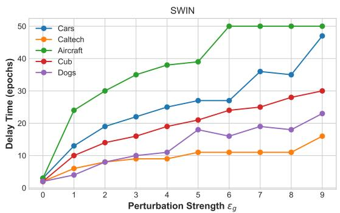

line

| Perturbation Strength εg | Cars | Caltech | Aircraft | Cub | Dogs |
| ------------------------ | ---- | ------- | -------- | --- | ---- |
| 0                        | 2    | 2       | 2        | 2   | 2    |
| 1                        | 12   | 6       | 24       | 10  | 4    |
| 2                        | 19   | 8       | 30       | 14  | 8    |
| 3                        | 22   | 9       | 35       | 16  | 10   |
| 4                        | 25   | 9       | 38       | 19  | 11   |
| 5                        | 27   | 11      | 39       | 21  | 18   |
| 6                        | 27   | 11      | 50       | 24  | 16   |
| 7                        | 36   | 11      | 50       | 25  | 19   |
| 8                        | 35   | 11      | 50       | 28  | 18   |
| 9                        | 47   | 16      | 50       | 30  | 23   |

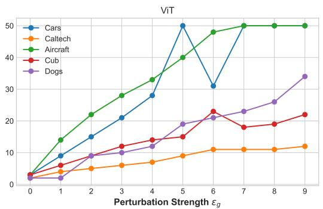

line

| Perturbation Strength εg | Cars | Caltech | Aircraft | Cub | Dogs |
| ------------------------ | ---- | ------- | -------- | --- | ---- |
| 0                        | 2    | 2       | 2        | 2   | 2    |
| 1                        | 9    | 4       | 14       | 6   | 2    |
| 2                        | 15   | 5       | 22       | 8   | 9    |
| 3                        | 21   | 6       | 28       | 11  | 10   |
| 4                        | 28   | 7       | 33       | 14  | 13   |
| 5                        | 50   | 9       | 40       | 15  | 19   |
| 6                        | 31   | 11      | 48       | 23  | 21   |
| 7                        | 50   | 11      | 50       | 18  | 23   |
| 8                        | 50   | 11      | 50       | 19  | 26   |
| 9                        | 50   | 12      | 50       | 22  | 34   |

Figure 8: Delay times increases with perturbation strength. We take the delay time here as the epoch from which the validation accuracy starts being above 5%. In some cases, the model never goes beyond this threshold until the end of training at 50 epochs. See Section 4

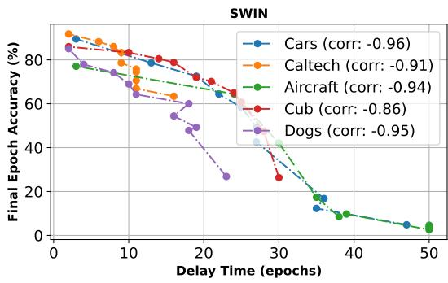

line

| Delay Time (epochs) | Cars (corr: -0.96) | Caltech (corr: -0.91) | Aircraft (corr: -0.94) | Cub (corr: -0.86) | Dogs (corr: -0.95) |
| ------------------- | ------------------ | --------------------- | ---------------------- | ----------------- | ------------------ |
| 0                   | 85                 | 90                    | 75                     | 85                | 85                 |
| 10                  | 75                 | 75                    | 70                     | 80                | 70                 |
| 20                  | 65                 | 65                    | 60                     | 70                | 55                 |
| 30                  | 40                 | 40                    | 40                     | 25                | 25                 |
| 40                  | 15                 | 15                    | 10                     | 10                | 10                 |
| 50                  | 5                  | 5                     | 5                      | 5                 | 5                  |

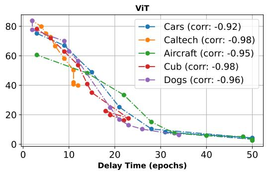

line

| Delay Time (epochs) | Cars (corr: -0.92) | Caltech (corr: -0.98) | Aircraft (corr: -0.95) | Cub (corr: -0.98) | Dogs (corr: -0.96) |
| ------------------- | ------------------ | --------------------- | ---------------------- | ----------------- | ------------------ |
| 0                   | 80                 | 80                    | 60                     | 80                | 80                 |
| 10                  | 60                 | 60                    | 40                     | 60                | 60                 |
| 20                  | 20                 | 20                    | 10                     | 20                | 20                 |
| 30                  | 10                 | 10                    | 5                      | 10                | 10                 |
| 40                  | 5                  | 5                     | 2                      | 5                 | 5                  |
| 50                  | 2                  | 2                     | 1                      | 2                 | 2                  |

Figure 9: Delay times strongly correlates with suboptimal transfer performance. The final validation accuracy is lower because task adaptation starts at later epochs. See Section 4

# B ADDITIONAL RESULTS

# B.1 TASK ADAPTATION DELAYS

We report detailed results on the increase in task adaptation delay time with growing perturbation strength (Figure 8), as well as the correlation between delay times and the severity of suboptimal transfer (Figure 9).

# B.2 AUTOATTACK RESULTS

AutoAttack (Croce & Hein, 2020b) is a stronger and more diverse attack on the models, but is more expensive. We evaluate a few cases (SWIN on $\{ \mathbb { C } \mathsf { a r s } , \mathbb { A } \mathsf { i } \mathtt { r c r a f t } \} \mathtt { x } \{ 4 / 2 5 5 , \mathrm { ~ } ^ { 8 } / 2 5 5 \} )$ . Results can be found in Table 6 and Figure 10. Although it takes substantially more time, the results are close to evaluations with APGD.

# C ABLATION AND SENSITIVITY ANALYSIS

# C.1 ABLATION AND SENSITIVITY ANALYSIS

To evaluate the influence of $T _ { 1 }$ and $T _ { 2 }$ on the performance of Epsilon-Scheduling, we consider multiple configurations, illustrated in Figure 11 (moderate perturbation, 4/255) and Figure 12 (high perturbation, 8/255). These figures illustrate the evolution of validation losses and accuracies during training, along with test set evaluations, showcasing the distinct trends. The corresponding numerical results on the test set are reported in Table 7.

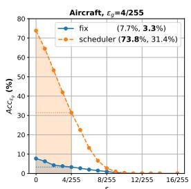

line

| Time | fix   | scheduler |
|------|-------|-----------|
| 0    | 7.7%  | 73.8%     |
| 4/255| 3.3%  | 31.4%     |

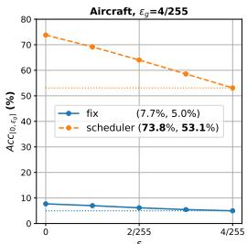

line

Aircraft, εg=4/255
| x | fix (%) | scheduler (%) |
|---|---|---|
| 0 | 7.7 | 73.8 |
| 2/255 | 5.0 | 53.1 |
| 4/255 | 5.0 | 53.1 |

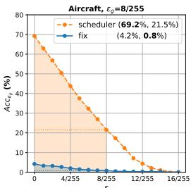

line

| Time     | scheduler | fix   |
| -------- | --------- | ----- |
| 0        | 70.0      | 5.0   |
| 4/255    | 50.0      | 3.0   |
| 8/255    | 30.0      | 2.0   |
| 12/255   | 10.0      | 1.0   |
| 16/255   | 0.0       | 0.0   |

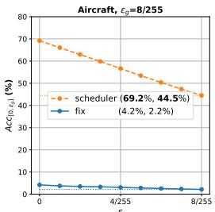

line

| ε    | scheduler | fix   |
| ---- | --------- | ----- |
| 0    | 69.2%     | 4.2%  |
| 4/255| 55.0%     | 2.2%  |
| 8/255| 43.0%     | 2.2%  |

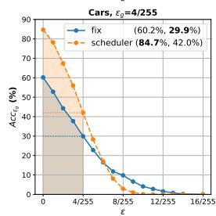

line

| ε      | fix   | scheduler |
| ------ | ----- | --------- |
| 0      | 60.2% | 84.7%     |
| 4/255  | 29.9% | 42.0%     |

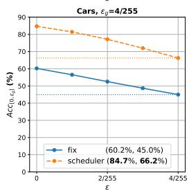

line

| ε    | fix   | scheduler |
| ---- | ----- | --------- |
| 0    | 60.2% | 84.7%     |
| 2/255| 50.0% | 75.0%     |
| 4/255| 45.0% | 66.2%     |

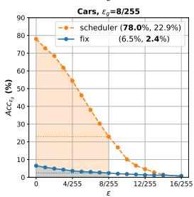

line

| ε       | scheduler | fix   |
| ------- | --------- | ----- |
| 0       | 78.0%     | 6.5%  |
| 4/255   | 60.0%     | 2.4%  |
| 8/255   | 30.0%     | 2.4%  |
| 12/255  | 10.0%     | 2.4%  |
| 16/255  | 0.0%      | 2.4%  |

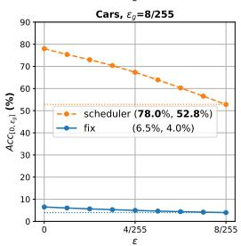

line

| ε    | scheduler | fix   |
| ---- | --------- | ----- |
| 0    | 78.0%     | 6.5%  |
| 4/255| 72.8%     | 4.0%  |
| 8/255| 52.8%     | 4.0%  |

Figure 10: Evaluation with AutoAttack. Numerical values are in Table 6.

<table><tr><td rowspan="2"> $\epsilon$ </td><td rowspan="2">Attack</td><td rowspan="2">Setting</td><td colspan="3">Aircraft</td><td colspan="3">Cars</td></tr><tr><td>Clean Acc</td><td>Adv.</td><td>E. Adv.</td><td>Clean Acc</td><td>Adv.</td><td>E. Adv.</td></tr><tr><td rowspan="4">4/255</td><td rowspan="2">APGD</td><td>fix</td><td>7.70</td><td>4.80</td><td>6.11</td><td>60.20</td><td>31.9</td><td>45.89</td></tr><tr><td>sched</td><td>73.80</td><td>32.00</td><td>53.75</td><td>84.70</td><td>43.20</td><td>66.41</td></tr><tr><td rowspan="2">AutoAttack</td><td>fix</td><td>7.70</td><td>3.30</td><td>4.97</td><td>60.20</td><td>29.90</td><td>44.96</td></tr><tr><td>sched</td><td>73.80</td><td>31.40</td><td>53.10</td><td>84.70</td><td>42.00</td><td>66.24</td></tr><tr><td rowspan="4">8/255</td><td rowspan="2">APGD</td><td>fix</td><td>4.20</td><td>2.70</td><td>3.47</td><td>6.50</td><td>3.2</td><td>4.49</td></tr><tr><td>sched</td><td>69.20</td><td>22.40</td><td>45.12</td><td>78.00</td><td>23.50</td><td>53.57</td></tr><tr><td rowspan="2">AutoAttack</td><td>fix</td><td>4.20</td><td>0.80</td><td>2.16</td><td>6.50</td><td>2.40</td><td>3.97</td></tr><tr><td>sched</td><td>69.20</td><td>21.50</td><td>44.51</td><td>78.00</td><td>22.90</td><td>52.81</td></tr></table>

Table 6: AutoAttack results

# C.2 DIRECT MINIMIZATION FOR EXPECTED ROBUSTNESS

Since Epsilon-Scheduling consistently improves expected robustness, we compare with a direct minimization of the expected robustness risk. The results in Table 8 show Epsilon-Scheduling is still superior, and the uniform strategy often leads to suboptimal transfer due to early sampling of high perturbations.

# D STATISTICAL SIGNIFICANCE

We report paired t-test statistics comparing RFT-Fix and RFT-Scheduler at ϵ = 4/255 and ϵ = 8/255 in Table 9. These tests assess whether performance differences between the two strategies are statistically significant across downstream tasks. A paired t-test measures whether the mean performance difference between two methods is reliably non-zero; small p-values indicate that the observed differences are unlikely to occur by chance.

We also report the averages for each metric per model (Table 10) and per dataset (Table 11).

# E ADDITIONAL RESULTS ON IMAGENETTE

We provide additional results for ImageNette in Table 12

<table><tr><td rowspan="2">T1</td><td rowspan="2">T2</td><td colspan="3"> $\varepsilon_g = ^4/255$ </td><td colspan="3"> $\varepsilon_g = ^8/255$ </td></tr><tr><td>Clean</td><td>Adv.</td><td>E. Adv.</td><td>Clean</td><td>Adv.</td><td>E. Adv.</td></tr><tr><td rowspan="4">0</td><td>0</td><td>60.20</td><td>31.90</td><td>45.89</td><td>6.50</td><td>3.20</td><td>4.49</td></tr><tr><td>12</td><td>67.70</td><td>40.20</td><td>54.19</td><td>36.20</td><td>10.50</td><td>21.47</td></tr><tr><td>30</td><td>78.40</td><td>44.70</td><td>63.41</td><td>63.30</td><td>21.80</td><td>43.34</td></tr><tr><td>50</td><td>82.30</td><td>40.30</td><td>63.95</td><td>75.40</td><td>19.90</td><td>49.33</td></tr><tr><td rowspan="4">5</td><td>5</td><td>64.20</td><td>29.50</td><td>47.26</td><td>4.20</td><td>2.40</td><td>3.26</td></tr><tr><td>12</td><td>78.40</td><td>48.20</td><td>64.95</td><td>68.00</td><td>24.20</td><td>47.06</td></tr><tr><td>25</td><td>81.10</td><td>48.60</td><td>66.64</td><td>74.80</td><td>26.00</td><td>52.54</td></tr><tr><td>50</td><td>84.50</td><td>35.90</td><td>63.32</td><td>80.30</td><td>18.00</td><td>51.58</td></tr><tr><td rowspan="4">12</td><td>12</td><td>1.90</td><td>1.40</td><td>1.74</td><td>1.30</td><td>1.30</td><td>1.28</td></tr><tr><td>30</td><td>83.00</td><td>47.30</td><td>67.09</td><td>78.10</td><td>26.60</td><td>55.06</td></tr><tr><td>37 (*)</td><td>84.70</td><td>43.20</td><td>66.41</td><td>78.00</td><td>23.50</td><td>53.57</td></tr><tr><td>50</td><td>84.80</td><td>35.80</td><td>63.25</td><td>81.10</td><td>16.60</td><td>51.79</td></tr><tr><td rowspan="3">25</td><td>25</td><td>0.80</td><td>0.80</td><td>0.80</td><td>0.80</td><td>0.80</td><td>0.80</td></tr><tr><td>37</td><td>84.00</td><td>39.50</td><td>64.61</td><td>78.40</td><td>21.00</td><td>51.51</td></tr><tr><td>50</td><td>84.30</td><td>24.80</td><td>57.46</td><td>81.00</td><td>12.10</td><td>46.94</td></tr></table>

Table 7: Effect of hyperparameters $T _ { 1 }$ and $T _ { 2 }$ . The training dynamics can be found in Figure 11 for $\varepsilon _ { g } ~ = ~ { ^ { 4 } } / { 2 5 } 5$ and Figure 12 for $\varepsilon _ { g } ~ = ~ 8 / 2 5 5$ . (\*) RFT-scheduler reported in main text $( T _ { 1 } = 1 \bar { 2 } , T _ { 2 } = 3 7 )$ .

<table><tr><td rowspan="3">Model</td><td rowspan="3">Setting</td><td colspan="8"> $\varepsilon_g = ^4/255$ </td><td colspan="9"> $\varepsilon_g = ^8/255$ </td></tr><tr><td colspan="3">Aircraft</td><td colspan="3">Caltech</td><td colspan="2">Cars</td><td colspan="3">Aircraft</td><td colspan="3">Caltech</td><td colspan="3">Cars</td></tr><tr><td>Clean</td><td>Adv.</td><td>E. Adv.</td><td>Clean</td><td>Adv.</td><td>E. Adv.</td><td>Clean</td><td>Adv.</td><td>E. Adv.</td><td>Clean</td><td>Adv.</td><td>E. Adv.</td><td>Clean</td><td>Adv.</td><td>E. Adv.</td><td>Clean</td><td>Adv.</td></tr><tr><td rowspan="3">SWIN</td><td>fix</td><td>7.70</td><td>4.80</td><td>6.11</td><td>79.97</td><td>57.16</td><td>69.19</td><td>60.20</td><td>29.70</td><td>44.74</td><td>4.20</td><td>2.70</td><td>3.47</td><td>68.87</td><td>38.10</td><td>53.40</td><td>13.20</td><td>5.60</td></tr><tr><td>uniform</td><td>30.10</td><td>7.90</td><td>18.57</td><td>83.45</td><td>55.49</td><td>70.27</td><td>70.90</td><td>35.30</td><td>54.68</td><td>7.80</td><td>2.00</td><td>4.85</td><td>76.74</td><td>37.31</td><td>57.34</td><td>53.70</td><td>11.30</td></tr><tr><td>sched</td><td>73.80</td><td>32.00</td><td>53.75</td><td>85.43</td><td>56.39</td><td>72.04</td><td>84.70</td><td>43.20</td><td>66.41</td><td>69.20</td><td>22.40</td><td>45.12</td><td>80.27</td><td>38.67</td><td>60.26</td><td>78.00</td><td>23.50</td></tr><tr><td rowspan="3">R50</td><td>fix</td><td>8.40</td><td>2.90</td><td>4.56</td><td>67.47</td><td>40.02</td><td>53.74</td><td>4.20</td><td>2.90</td><td>3.49</td><td>1.30</td><td>0.90</td><td>0.74</td><td>53.59</td><td>26.78</td><td>39.93</td><td>1.50</td><td>1.20</td></tr><tr><td>uniform</td><td>41.50</td><td>8.80</td><td>22.04</td><td>74.95</td><td>34.68</td><td>54.49</td><td>43.10</td><td>8.90</td><td>23.28</td><td>27.40</td><td>3.70</td><td>12.26</td><td>67.55</td><td>22.03</td><td>43.44</td><td>6.20</td><td>2.10</td></tr><tr><td>sched</td><td>53.10</td><td>11.10</td><td>29.40</td><td>76.55</td><td>34.74</td><td>55.67</td><td>70.00</td><td>19.30</td><td>43.44</td><td>42.80</td><td>5.30</td><td>20.38</td><td>67.56</td><td>23.01</td><td>44.03</td><td>57.10</td><td>8.50</td></tr><tr><td rowspan="3">ClipCNX</td><td>fix</td><td>3.10</td><td>2.50</td><td>2.82</td><td>61.76</td><td>42.13</td><td>51.54</td><td>2.80</td><td>1.60</td><td>2.23</td><td>1.80</td><td>1.30</td><td>1.62</td><td>51.94</td><td>28.37</td><td>39.44</td><td>1.30</td><td>1.10</td></tr><tr><td>uniform</td><td>7.10</td><td>4.30</td><td>5.78</td><td>72.25</td><td>47.07</td><td>59.66</td><td>8.10</td><td>3.90</td><td>5.92</td><td>3.10</td><td>2.20</td><td>2.68</td><td>61.78</td><td>30.35</td><td>45.09</td><td>3.50</td><td>1.30</td></tr><tr><td>sched</td><td>81.70</td><td>50.70</td><td>67.88</td><td>81.19</td><td>52.68</td><td>67.71</td><td>90.90</td><td>74.10</td><td>84.33</td><td>79.20</td><td>34.50</td><td>59.09</td><td>76.53</td><td>37.20</td><td>56.83</td><td>90.00</td><td>55.20</td></tr></table>

Table 8: Epsilon-Scheduling still has better expected robustness than a direct optimization for the expected robustness risk. In fact the approximation with uniform can still lead to suboptimal transfer.

<table><tr><td rowspan="2">Metric</td><td rowspan="2">n_pairs</td><td colspan="2"> $\epsilon = ^{4}/_{255}$ </td><td colspan="2"> $\epsilon = ^{8}/_{255}$ </td></tr><tr><td>t-stat</td><td>p-value</td><td>t-stat</td><td>p-value</td></tr><tr><td>Clean Acc</td><td>30</td><td>7.823294</td><td> $1.255470 \times 10^{-8}$ </td><td>12.387491</td><td> $4.170254 \times 10^{-13}$ </td></tr><tr><td>Adv.</td><td>30</td><td>4.348780</td><td> $1.540867 \times 10^{-4}$ </td><td>5.447550</td><td> $7.317049 \times 10^{-6}$ </td></tr><tr><td>E. Adv.</td><td>30</td><td>6.595568</td><td> $3.153155 \times 10^{-7}$ </td><td>9.270810</td><td> $3.572919 \times 10^{-10}$ </td></tr></table>

Table 9: t-test statistics between RFT-fix and RFT-scheduler for two perturbation magnitudes.

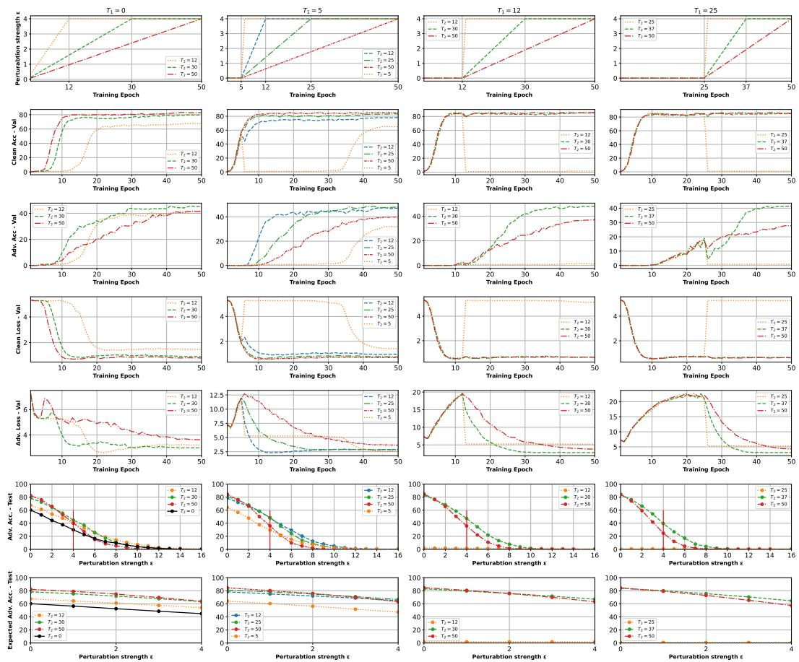  
Figure 11: Effect of hyperparameters on SWIN-Cars for target $\varepsilon _ { g } = 4 / 2 5 5$ . The numerical results are presented in Table 7. Same plot at $\epsilon _ { g } = 8 /$ 255 are in Figure 12

<table><tr><td rowspan="2">Model</td><td rowspan="2">Setting</td><td colspan="3"> $\epsilon = 4/255$ </td><td colspan="3"> $\epsilon = 8/255$ </td></tr><tr><td>Clean</td><td>Adv.</td><td>E. Adv.</td><td>Clean</td><td>Adv.</td><td>E. Adv.</td></tr><tr><td rowspan="2">ViT</td><td>fix</td><td>37.29</td><td>16.89</td><td>26.49</td><td>15.59</td><td>5.84</td><td>10.12</td></tr><tr><td>scheduler</td><td>70.96</td><td>22.66</td><td>46.42</td><td>63.91</td><td>11.63</td><td>34.38</td></tr><tr><td rowspan="2">SWIN</td><td>fix</td><td>56.40</td><td>32.08</td><td>44.35</td><td>35.64</td><td>14.21</td><td>24.16</td></tr><tr><td>scheduler</td><td>79.78</td><td>39.50</td><td>60.90</td><td>72.55</td><td>22.87</td><td>47.49</td></tr><tr><td rowspan="2">CNX</td><td>fix</td><td>61.14</td><td>37.59</td><td>49.93</td><td>19.82</td><td>9.61</td><td>14.33</td></tr><tr><td>scheduler</td><td>84.05</td><td>45.69</td><td>66.59</td><td>79.04</td><td>28.12</td><td>54.09</td></tr><tr><td rowspan="2">R50</td><td>fix</td><td>37.26</td><td>16.99</td><td>26.62</td><td>22.88</td><td>8.82</td><td>15.09</td></tr><tr><td>scheduler</td><td>67.76</td><td>20.13</td><td>42.65</td><td>55.57</td><td>10.48</td><td>29.84</td></tr><tr><td rowspan="2">ClipViT</td><td>fix</td><td>12.73</td><td>5.74</td><td>8.85</td><td>8.59</td><td>3.13</td><td>5.56</td></tr><tr><td>scheduler</td><td>73.77</td><td>39.14</td><td>57.08</td><td>68.62</td><td>24.94</td><td>46.11</td></tr><tr><td rowspan="2">ClipCNX</td><td>fix</td><td>24.09</td><td>14.38</td><td>18.93</td><td>13.95</td><td>7.41</td><td>10.47</td></tr><tr><td>scheduler</td><td>80.74</td><td>49.09</td><td>65.91</td><td>76.40</td><td>32.20</td><td>54.93</td></tr></table>

Table 10: Average per model of the clean accuracy, adversarial accuracy, and expected adversarial accuracy for $\epsilon = 4 / 2 5 5$ and $\epsilon = 8 / 2 5 5$ .

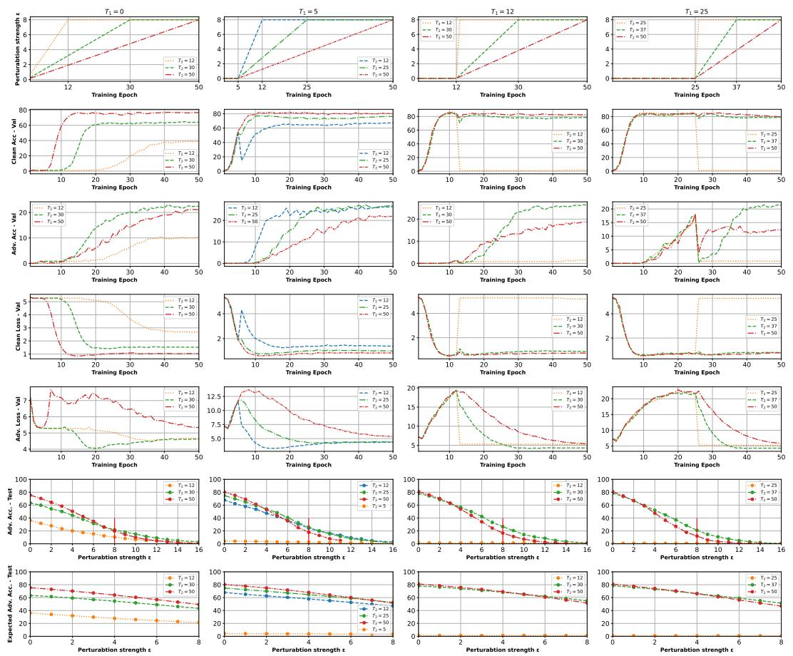  
Figure 12: Effect of hyperparameters on SWIN-Cars for target $\varepsilon _ { g } = 8 / 2 5 5$ . The numerical results can be found in Table 7.

<table><tr><td rowspan="2">Dataset</td><td rowspan="2">Setting</td><td colspan="3"> $\epsilon = 4$ </td><td colspan="3"> $\epsilon = 8$ </td></tr><tr><td>Clean</td><td>Adv.</td><td>E. Adv.</td><td>Clean</td><td>Adv.</td><td>E. Adv.</td></tr><tr><td rowspan="2">Aircraft</td><td>fix</td><td>6.37</td><td>3.47</td><td>4.66</td><td>2.58</td><td>1.77</td><td>2.14</td></tr><tr><td>scheduler</td><td>69.23</td><td>29.82</td><td>49.69</td><td>64.83</td><td>20.52</td><td>41.34</td></tr><tr><td rowspan="2">Caltech</td><td>fix</td><td>65.42</td><td>43.00</td><td>54.27</td><td>50.37</td><td>25.67</td><td>37.51</td></tr><tr><td>scheduler</td><td>81.02</td><td>48.93</td><td>65.73</td><td>75.48</td><td>33.55</td><td>54.50</td></tr><tr><td rowspan="2">Cars</td><td>fix</td><td>25.73</td><td>14.22</td><td>19.99</td><td>4.65</td><td>2.50</td><td>3.45</td></tr><tr><td>scheduler</td><td>82.43</td><td>45.33</td><td>65.29</td><td>77.25</td><td>28.45</td><td>54.16</td></tr><tr><td rowspan="2">Cub</td><td>fix</td><td>47.24</td><td>23.56</td><td>35.07</td><td>19.45</td><td>5.26</td><td>11.38</td></tr><tr><td>scheduler</td><td>77.39</td><td>34.60</td><td>56.64</td><td>70.16</td><td>17.44</td><td>42.31</td></tr><tr><td rowspan="2">Dogs</td><td>fix</td><td>46.00</td><td>18.82</td><td>31.99</td><td>19.95</td><td>5.66</td><td>11.95</td></tr><tr><td>scheduler</td><td>70.82</td><td>21.50</td><td>45.61</td><td>59.02</td><td>8.59</td><td>30.06</td></tr></table>

Table 11: Average per dataset of the clean accuracy, adversarial accuracy, and expected adversarial accuracy for $\epsilon = { ^ 4 } / { 2 5 } 5$ and $\epsilon = { ^ 8 } / { 2 5 } 5$ .

<table><tr><td rowspan="2">Model</td><td rowspan="2">Setting</td><td colspan="3"> $\epsilon = 4/255$ </td><td colspan="3"> $\epsilon = 8/255$ </td></tr><tr><td>Clean</td><td>Adv.</td><td>E. Adv.</td><td>Clean</td><td>Adv.</td><td>E. Adv.</td></tr><tr><td rowspan="2">SWIN</td><td>fix</td><td>97.15</td><td>85.07</td><td>92.22</td><td>94.19</td><td>66.17</td><td>82.43</td></tr><tr><td>scheduler</td><td>98.62</td><td>85.48</td><td>93.67</td><td>97.50</td><td>69.08</td><td>86.93</td></tr><tr><td rowspan="2">CNX</td><td>fix</td><td>97.81</td><td>88.44</td><td>94.09</td><td>94.80</td><td>68.87</td><td>84.08</td></tr><tr><td>scheduler</td><td>99.29</td><td>88.23</td><td>95.36</td><td>98.27</td><td>71.32</td><td>89.03</td></tr></table>

Table 12: Imagenette results for $\epsilon = { ^ 4 } / { _ { 2 5 5 } }$ and $\epsilon = { } ^ { 8 } / 2 5 5 .$