# Reversed Attention: On The Gradient Descent Of Attention Layers In GPT

Shahar Katz Lior Wolf

Blavatnik School of Computer Science, Tel Aviv University

{shaharkatz3@mail,wolf@cs}.tau.ac.il

# Abstract

The success of Transformer-based Language Models (LMs) stems from their attention mechanism. While this mechanism has been extensively studied in explainability research, particularly through the attention values obtained during the forward pass of LMs, the backward pass of attention has been largely overlooked. In this work, we study the mathematics of the backward pass of attention, revealing that it implicitly calculates an attention matrix we refer to as “Reversed Attention”. We visualized Reversed Attention and examine its properties, demonstrating its ability to elucidate the models’ behavior and edit dynamics. In an experimental setup, we showcase the ability of Reversed Attention to directly alter the forward pass of attention, without modifying the model’s weights, using a novel method called “attention patching”. In addition to enhancing the comprehension of how LMs configure attention layers during backpropagation, Reversed Attention maps contribute to a more interpretable backward pass. Our code is available at: https://github.com/ shacharKZ/Reversed-Attention .

# 1 Introduction

The widespread use of automatic gradient technologies such as AutoGrad (Maclaurin, 2016; Paszke et al., 2019) to obtain the gradients may cause the explicit derivations of these gradients to be overlooked. In this work we explore the equations that govern the backpropagation of the popular Transformer-based (Vaswani et al., 2017) GPT (Radford et al., 2018) architecture.

This explicit analysis leads to several surprising discoveries. First, while during the forward pass the attention mechanism explicitly creates triangular attention matrices, from multiplying the query and key vectors, during the backward pass it implicitly creates triangular matrices that determine the gradients of the queries and keys. Due the similarity of these triangular matrices to the forward attention, we refer to them as the Reversed Attention (RA) matrices, Figure 1. Secondly, we study the effect induced by GD and how it tries to increase or decrease attention scores between the queries and keys of each attention head.

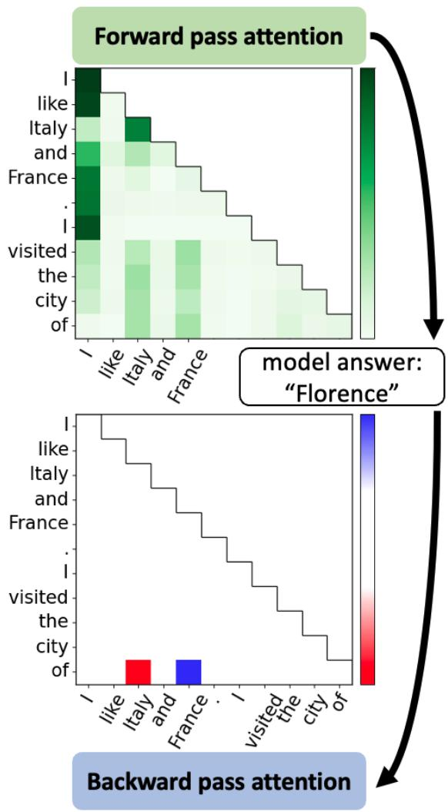

heatmap

|        | I    | like  | Italy | and  | France |
| ------ | ---- | ----- | ----- | ---- | ------ |
| I      | Green| Green | Green | Green| Green  |
| like   | Green| Green | Green | Green| Green  |
| Italy  | Green| Green | Green | Green| Green  |
| and   | Green| Green | Green | Green| Green  |
| France | Green| Green | Green | Green| Green  |
| .      | Green| Green | Green | Green| Green  |
| I      | Green| Green | Green | Green| Green  |
| visited| Green| Green | Green | Green| Green  |
| the    | Green| Green | Green | Green| Green  |
| city   | Green| Green | Green | Green| Green  |
| of     | Green| Green | Green | Green| Green  |

Figure 1: In this paper we examine the attention maps obtained from the backward pass, which we named “Reversed Attention” (RA). This example present the forward and backward pass of a single attention head of GPT2-xl when prompt with “I like Italy and France, I visited the city of”. After the model answer “Florence”, a city in Italy, we apply a backward pass with “Florence” as the target for the loss and produce the RA maps. Between all the 1200 attention heads this model has, the presented head has the highest RA map’s norm. Compared to the forward attention map, the RA map is more sparse and interpretable. This RA demonstrates how the backpropagation attempts to amplify the information from the token “Italy” (red) while reducing the influence of “France” (blue).

Based on these discoveries, we explore the use of RA in LM explainability. While the forward pass attention, which fails in providing a clear explanation of the model’s behavior (Jain and Wallace, 2019), we demonstrate RA’s ability to achieve competitive results in concert with methods such as causal mediation (Vig et al., 2020; Meng et al., 2022) in perturbation analysis. Furthermore, one can view the RA as a correction term to the attention, given the loss of the backward pass. As an application, we inject the RA scores directly into the forward pass of attention, in order to modify the model’s predictions. This novel method, which we call “attention patching”, does not involve any parameter updates and offers a new perspective on how interventions can be performed on LMs.

Our main contributions are as follows: (i) We provide a mathematical walk-through and interpretation of the gradients and Vector-Jacobian Products (VJPs) governing the backpropagation of GPT. (ii) We identify the attention-softmax derivative as an implicit attention map, which we term Reversed Attention (RA). (iii) We visualize and qualitatively explore the interpretability of RA. (iv) We conduct a perturbation test to quantify the explainability of RA. (v) We demonstrate a novel patching method that uses RA to edit LM’s predictions.

# 2 Related Work

All leading deep learning models are trained using variants of Gradient Descent (GD), an implementation of the backpropagation algorithm. While much research examines the impact of GD on GPTs’ performance, the internal computations of this process often remain a black box (Radford et al., 2018, 2019; Gururangan et al., 2020). Some studies simplify the Transformer architecture to understand GD, for instance, reducing multi-head attention to a single head or linear attention in toy models (Tian et al., 2023; Tarzanagh et al., 2023; Mahankali et al., 2023; Dai et al., 2023). Notably, the literature on the backward pass of full multi-head attention is limited. Our work addresses this gap by examining assumption-free full GPT models, with a specific emphasis on detailing the mathematical computation of gradients.

Previous investigations into weight updates via GD have focused primarily on the MLP layers or the data it was trained on (Gueta et al., 2023). Recently, Katz et al. (2024) has revealed that gradients can be interpreted as tokens’ embeddings. Specifically, the Vector Jacobian Products (VJPs) that are passed by the residual from the last layer’s loss to earlier layers can be seen as an intermediate state toward the model as it adjusts its weights.

Gradients have been leveraged to localize the source of specific model behavior for a given input (Simonyan et al., 2014; Ancona et al., 2018) or specific components of the models (Barkan et al., 2021; Ma et al., 2023). In our study, we explore the use of RA as a means to quantify the relative influence of the various components of a model. We compare our method with the current leading technique for such localization, Causal Mediation (CM) (Vig et al., 2020; Meng et al., 2022). CM involves probing the effect of altering components during the forward pass, which necessitates significantly more computation compared to the RA approach.

Recent works explore the patching technique, where one model’s intermediate state is integrated into the forward pass of another (Zhang and Nanda, 2023; Elhage et al., 2021; Wang et al., 2023; Todd et al., 2023). While they focus on activation patching, we propose a novel approach: directly injecting attention scoring maps of each attention head, without parameter updates.

As far as we can ascertain, we are the first to identify, visualize, and explore the dynamics of the backward pass using RA maps.

# 3 Background

This section provides the necessary background and establishes the notation used.

Generative Pre-trained Transformer (GPT) is an auto-regressive architecture of multiple transformer blocks connected via a residual stream. As input, a GPT model receives a sequence of n tokens (a prompt) and predicts a single token. An embedding matrix at the start of the model embeds the token into vectors $X = [ x ^ { 1 } , \cdot \cdot \cdot , x ^ { n } ] \in \mathbb { R } ^ { n \times d }$ where d is an embedding dimension. At the end of the model, the embedded predictions are projected back into tokens using a decoding matrix. Each transformer block consists of two sub-blocks: multi-head attention (Attn) and a Multi-Layer Perceptron (MLP), interconnected by a residual stream.

The attention mechanism is executed using matrices $W _ { q } , W _ { k } , W _ { v } , W _ { o } \in \mathbb R ^ { d \times d }$ , named query, key, value, and output, respectively. This calculation is performed after splitting the matrices vertically into h non-overlapping parts, called heads. We denote the attention matrices for the l head in $\hat { W } ^ { l }$ , hence $\hat { W } _ { q } ^ { l } , \hat { W } _ { v } ^ { l } , \hat { W } _ { o } ^ { l , \top } \in \mathbb R ^ { d \times \frac { d } { h } }$ , and for example Wq = [Wˆ 1q , $W _ { q } = [ \hat { W } _ { q } ^ { 1 } , \cdots , \hat { W } _ { q } ^ { h } ]$ g， . The first three matrices are used to project the input into queries, keys, and values:

$$
Q ^ {l} = X \hat {W} _ {q} ^ {l}, K ^ {l} = X \hat {W} _ {k} ^ {l}, V ^ {l} = X \hat {W} _ {v} ^ {l} \in \mathbb {R} ^ {d \times \frac {d}{h}} \tag {1}
$$

Together, the queries and keys are used to calculate the forward attention scores:

$$
A ^ {l} = \text { softmax } \left(\frac {Q ^ {l} K ^ {l \top}}{\sqrt {d / h}} + M\right) \in \mathbb {R} ^ {n \times n} \tag {2}
$$

$$
M _ {i j} = \left\{ \begin{array}{l l} 0 & \text { if   } i \geq j \\ - \infty & \text { otherwise } \end{array} \right. \tag {3}
$$

Where $M \in \mathbb { R } ^ { n \times n }$ is a masking matrix that zeroes all scores but the one representing the connection of an earlier token to further ones: . The output of each head is calculated by multiplying the attention scores with the values and projecting the result back using the output matrix. The attention block output is the sum of the output of all heads: $\ A { \mathrm { t t n } } ( X ) =$ $\textstyle \sum _ { l = 1 } ^ { h }$ headl, where head ${ } ^ { l } = A ^ { l } V ^ { l } \hat { W } _ { o } ^ { l }$ .

The MLP block is a pair of fully connected matrices $F F _ { 1 } , F F _ { 2 } ^ { \top } \in \mathbb { R } ^ { d \times d _ { m } }$ and an activation function $f .$ . The output of this block is: $\mathbf { M L P } ( X ) =$ $f ( X F F _ { 1 } ) F F _ { 2 } ^ { T }$ . Lastly, the forward pass of the i-th transformer block on its input hidden state, $X ^ { i }$ , is: $X ^ { i + 1 } = X ^ { i } + \mathrm { A t t n } ( X ^ { i } ) + \mathrm { M L P } ( \mathrm { A t t n } ( X ^ { i } )$ + $X ^ { i } )$ .

Note that GPT models also include Layer Norms. For simplicity and due to the relatively low contribution to the gradients and inconsistency when they are placed within different architectures, we omit them from this explanation.

Gradient decent, backward pass and VJPs GD’s backward pass is the execution of Backpropagation (Le Cun, 1988), the process of applying the chain rule to compute a model’s gradients. A backward pass is initiated after the model executes a forward pass; it computes a loss score L, comparing the model’s output with a desired target. This loss score is propagated back through the model’s layers as an error signal, in the reverse order of the forward pass. The error signal can be represented as a vector that is used as an intermediate state of the backward pass, similar to the hidden state in the forward pass. Given a model’s parameter W , which is used to compute $z = x W$ , where $x \in \mathbb { R } ^ { d _ { 1 } } , z \in \mathbb { R } ^ { d _ { 2 } }$ , the error signal is the loss with respect to the layer’s output, $\begin{array} { r } { \dot { \delta } = \frac { \partial L } { \partial z } \in \mathbb { R } ^ { d _ { 2 } } } \end{array}$ . This vector is known as the Vector-Jacobian Product (VJP) of z. At the last layer of the model, the VJP is calculated directly by the loss function. For earlier layers, the VJP is calculated using the backward step, where the VJP of the next layer is used to compute the VJP of those that precede it. For instance, the output of a sequential layer l is the input of $l + 1$ , meaning $z ^ { l } = x ^ { l + 1 }$ . Given those layers are weight matrices, the VJP of the l layer is computed by the following step:

$$
\delta^ {l} = \frac {\partial L}{\partial z ^ {l}} = \frac {\partial L}{\partial x ^ {l + 1}} = \delta^ {l + 1} (W ^ {l + 1}) ^ {\top} \tag {4}
$$

Finally, the gradient of each weight matrix W is the outer product of the layer’s input x and the VJP δ, which updates the weights using a learning rate $\eta \in \mathbb { R }$ :

$$
\frac {\partial L}{\partial W} = \frac {\partial z}{\partial W} \frac {\partial L}{\partial z} = x ^ {\top} \times \delta \in \mathbb {R} ^ {d _ {2} \times d _ {1}} \tag {5}
$$

$$
W \leftarrow W - \eta \frac {\partial L}{\partial W} ^ {\top} \in \mathbb {R} ^ {d _ {1} \times d _ {2}} \tag {6}
$$

In models such as GPTs, each forward pass includes a sequence of inputs $X = x ^ { 1 } , \cdot \cdot \cdot , x ^ { n } \in$ $\mathbb { R } ^ { n \times d _ { 1 } }$ . In this case, each input has its own VJP, $\delta ^ { i } \in \mathbb { R } ^ { d _ { 2 } }$ , and the full matrix’s gradient is the sum of the outer products of each input and its VJP:

$$
\frac {\partial L}{\partial W} = \sum_ {i = 1} ^ {n} x ^ {i \top} \times \delta^ {i} \in \mathbb {R} ^ {d _ {2} \times d _ {1}} \tag {7}
$$

# 4 Attention Layers Gradients

In this section, we examine the VJPs and gradient matrices for each of the attention layer matrices. The purpose of this examination is to reveal properties of the gradient matrices, as well as to fill a missing gap in the literature. In this mathematical walk-through, we examine the submatrices of each attention head, $\hat { W } _ { q } ^ { l } , \hat { W } _ { k } ^ { l } , \hat { W } _ { v } ^ { l } , \hat { W } _ { o } ^ { l }$ , dropping the head index l for brevity. The gradients of the full matrices are the concatenation of the heads’ gradients (same as the concatenation of weight matrices).

Throughout this section, we denote the forward pass input and output vectors of each submatrix $\hat { W } \in \mathbb { R } ^ { d \times \frac { d } { h } }$ by $\boldsymbol { x } \in \mathbb { R } ^ { d }$ and $z \in \mathbb { R } ^ { \frac { d } { h } } , \mathrm { i . e . , } z = x W$ . The only exception is $W _ { o }$ , where the dimensions are swapped, $\hat { W } _ { o } \in \mathbb { R } ^ { \frac { d } { h } \times d } . \ A _ { i , j }$ denotes the forward pass attention score from the i-th token to the j-th token. Lastly, considering the model’s input as a sequence of n tokens, instead of explicitly writing the gradient of every matrix and token, we will focus on determining the VJP for a single token $j \in \{ 1 , \cdots , n \}$ , annotating its input and VJP with $x ^ { j } , \delta ^ { j }$ . Given the inputs and VJPs, the gradients are the outer product of the two Equation 7.

The output projection matrix $\hat { W } _ { o }$ The VJPs of $\hat { W } _ { o } .$ , denoted as $\delta _ { o } ^ { j }$ , are obtained directly from the residual stream at the end of the attention block of $\hat { W } _ { o } ,$ , denoted by Attn(x) in section 3. Viewing GD as an application of the chain rule, we consider $\delta _ { o } ^ { j }$ as the layer’s intermediate editing target.

Only for this matrix, we will demonstrate that when we are given its VJPs, we can infer its gradient and the effect of GD updating. This explanation holds for all further matrices, too. The gradient updates introduced by only the j-th token (left equation) or by all n tokens (right equation) are:

$$
\hat {W} _ {o} \leftarrow \hat {W} _ {o} - \eta \delta_ {o} ^ {j} \times x _ {o} ^ {j ^ {\top}} \tag {8}
$$

$$
\hat {W} _ {o} \leftarrow \hat {W} _ {o} - \eta \sum_ {i = 1} ^ {n} \delta_ {o} ^ {i} \times x _ {o} ^ {i \top}, \tag {9}
$$

where η is the update’s learning rate. In general, if we simplify the full update and consider only the change introduced by a single token (left equation) to examine a future forward pass with the same input $x _ { o } ^ { j } .$ , then the original layer’s output $z _ { o } ^ { j } = x _ { o } ^ { j } \hat { W } _ { o } .$ , is shifted by the direction of $\delta _ { o } ^ { j }$ with the magnitude of $\eta \| x _ { o } ^ { j } \| _ { 2 } ^ { 2 } \in \mathbb { R } \colon$ :

$$
x _ {o} ^ {j} \hat {W} _ {o G D} = x _ {o} ^ {j} (\hat {W} _ {o} - \eta \delta_ {o} ^ {j} \times x _ {o} ^ {j ^ {\top}}) = \tag {10}
$$

$$
z _ {o} ^ {j} - \eta \| x _ {o} ^ {j} \| _ {2} ^ {2} \delta_ {o} ^ {j} \tag {11}
$$

The value projection matrix $\hat { W } _ { v }$ In the forward pass, the value vector associated with the j-th token is given by $v ^ { j } = x _ { v } ^ { j } \hat { W } _ { v } \in \mathbb R ^ { \frac { d } { h } }$ . To calculate the VJP for the $j$ token, we consider, due to causality, the subsequent tokens $l \geq j$ . For every such token, the backward pass propagates its own VJP from $\hat { W } _ { o }$ by computing the error signal from the l-th token to token j:

$$
e ^ {l} = \delta_ {o} ^ {l} \hat {W} _ {o} ^ {\top} \in \mathbb {R} ^ {\frac {d}{h}}, \tag {12}
$$

where $\delta _ { o } ^ { l }$ is the VJP of $\hat { W } _ { o }$ computed for the l-th forward pass (the l-th token) of the autoregressive process. The VJP of $\delta _ { v } ^ { j }$ is a weighted sum of the error signal and the forward attention scores A:

$$
\delta_ {v} ^ {j} = \sum_ {l = j} ^ {n} A _ {l, j} e ^ {l} \in \mathbb {R} ^ {\frac {d}{h}} \tag {13}
$$

Softmax derivative Although the softmax function is not a weight parameter of the model, comprehending its role in the backward pass is crucial for understanding the editing dynamics. In the forward pass, the attention scores for the j-th forward pass, $A _ { j } \in \mathbb { R } ^ { 1 \times n }$ (the $j \cdot$ -th row of the forward attention) are generated by applying the softmax function to the product of the query and key vectors, with a scaling factor of ${ \sqrt { \frac { d } { h } } } .$ . These scores are then multiplied by the attention values, $V \in \mathbb { R } ^ { n \times \frac { d } { h } }$ . The backward pass performs a reverse operation: each token’s error signal from $\hat { W } _ { o }$ is multiplied by the attention values and scaled as follows:

$$
\tilde {e} ^ {j} = \delta_ {o} ^ {j} \hat {W} _ {o} ^ {\top} V ^ {\top} = e ^ {j} V \in \mathbb {R} ^ {n} \tag {14}
$$

$$
r ^ {j} = A _ {j} \odot (\tilde {e} ^ {j} - \tilde {e} ^ {j} A _ {j} \cdot \mathbf {1} ^ {n}) \sqrt {\frac {h}{d}} \in \mathbb {R} ^ {n}, \tag {15}
$$

where is the element-wise product of two vectors (Hadamard product) and $\tilde { e } ^ { j } A _ { j } { \bf \cdot } { \bf 1 } ^ { n }$ is the scalar $\tilde { e } ^ { j } A _ { j }$ assigned to an $\mathbb { R } ^ { n }$ vector.

Rewriting as a batch of all tokens: If we rewrite Equation 14 for all tokens together, by concatenating their VJP into a matrix $\Delta$ = $[ \delta _ { o } ^ { 1 } , \cdot \cdot \cdot , \delta _ { o } ^ { n } ] \in \mathbb { R } ^ { n \times d }$ we get:

$$
\tilde {E} = \Delta \hat {W} _ {o} ^ {\top} V ^ {\top} \in \mathbb {R} ^ {n \times n} \tag {16}
$$

$$
R = A \odot \left(\tilde {E} ^ {\top} - \operatorname{diag} \left(A \tilde {E} ^ {\top}\right)\right) ^ {\top} \sqrt {\frac {h}{d}} \in \mathbb {R} ^ {n \times n}, \tag {17}
$$

hence $R _ { j } = r ^ { j } , \tilde { E } _ { j } = \tilde { e } ^ { j }$ , where $j$ is the $j \cdot$ -th row of each matrix. We further use the derivative R to compute the subsequent gradients of $\hat { W } _ { q } , \hat { W } _ { k }$ . In section 5 we investigate what R represents.

The query projection matrix $\hat { W } _ { q }$ During the j-th forward pass, the j-th query is generated by computing $q ^ { j } = x _ { q } ^ { j } \hat { W } _ { q } \in \mathbb { R } ^ { \frac { d } { h } }$ . The query is then multiplied by all key vectors, $K = [ k ^ { 1 } , \cdots , k ^ { n } ] \in$ $\mathbb { R } ^ { n \times \frac { d } { h } }$ (and masking the ones that followed it), to obtain the raw attention scores (logits). Therefore, the backward pass calculates the VJP of the query by calculating:

$$
\delta_ {q} ^ {j} = r ^ {j} K = R _ {j} K \in \mathbb {R} ^ {\frac {d}{h}} \tag {18}
$$

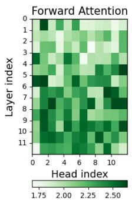

heatmap

| Layer index | 0    | 2    | 4    | 6    | 8    | 10   |
| ----------- | ---- | ---- | ---- | ---- | ---- | ---- |
| 1           | 1.75 | 2.00 | 2.25 | 2.50 |      |      |
| 2           |      |      |      |      |      |      |
| 3           |      |      |      |      |      |      |
| 4           |      |      |      |      |      |      |
| 5           |      |      |      |      |      |      |
| 6           |      |      |      |      |      |      |
| 7           |      |      |      |      |      |      |
| 8           |      |      |      |      |      |      |
| 9           |      |      |      |      |      |      |
| 10          |      |      |      |      |      |      |
| 11          |      |      |      |      |      |      |

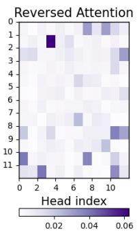

heatmap

| \ Head index | 0 | 2 | 4 | 6 | 8 | 10 |
|---|---|---|---|---|---|---|
| 0 | 0.02 | 0.02 | 0.02 | 0.02 | 0.02 | 0.02 |
| 1 | 0.02 | 0.02 | 0.06 | 0.02 | 0.02 | 0.02 |
| 2 | 0.02 | 0.02 | 0.02 | 0.02 | 0.02 | 0.02 |
| 3 | 0.02 | 0.02 | 0.02 | 0.02 | 0.02 | 0.02 |
| 4 | 0.02 | 0.02 | 0.02 | 0.02 | 0.02 | 0.02 |
| 5 | 0.02 | 0.02 | 0.02 | 0.02 | 0.02 | 0.02 |
| 6 | 0.02 | 0.02 | 0.02 | 0.02 | 0.02 | 0.02 |
| 7 | 0.02 | 0.02 | 0.02 | 0.02 | 0.02 | 0.02 |
| 8 | 0.02 | 0.02 | 0.02 | 0.02 | 0.02 | 0.02 |
| 9 | 0.02 | 0.02 | 0.02 | 0.02 | 0.02 | 0.02 |
| 10 | 0.02 | 0.02 | 0.02 | 0.02 | 0.02 | 0.02 |
| 11 | 0.02 | 0.11 | 1.11 | 1.11 | 1.11 | 1.11 |
The heatmap visualizes the intensity of reversed attention across different head indices and positions, with darker shades indicating higher intensity values. The color scale ranges from light blue (low) to dark purple (high).

(a)

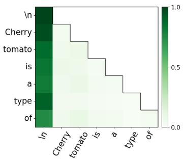

heatmap

| | In | Cherry | tomato | is | a | type | of |
|---|---|---|---|---|---|---|---|
| \n | 1.0 | 0.0 | 0.0 | 0.0 | 0.0 | 0.0 | 0.0 |
| Cherry | 0.5 | 0.5 | 0.5 | 0.5 | 0.5 | 0.5 | 0.5 |
| tomato | 0.5 | 0.5 | 0.5 | 0.5 | 0.5 | 0.5 | 0.5 |
| is | 0.5 | 0.5 | 0.5 | 0.5 | 0.5 | 0.5 | 0.5 |
| a | 0.5 | 0.5 | 0.5 | 0.5 | 0.5 | 0.5 | 0.5 |
| type | 0.5 | 0.5 | 0.5 | 0.5 | 0.5 | 0.5 | 0.5 |
| of | 0.5 | 0.5 | 0.5 | 0.5 | 0.5 | 0.5 | 0.5 |

(b)

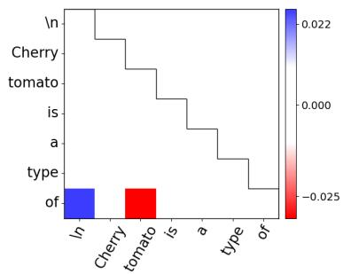

bar

| Word | Value |
|---|---|
| \n | 0.022 |
| Cherry tomato | -0.025 |
| is | 0.000 |
| a | 0.010 |
| type | 0.005 |
| of | 0.015 |

(c)

Figure 2: (a) The norms of the attention maps per head and per layer. (b) Forward and (c) Reversed Attention of the same head from GPT2-small (layer 11, head index 2). This is the attention head with the second highest Reversed Attention norm and we can see it focused on editing the query of “of” (row) and the key of “tomato” (column).   
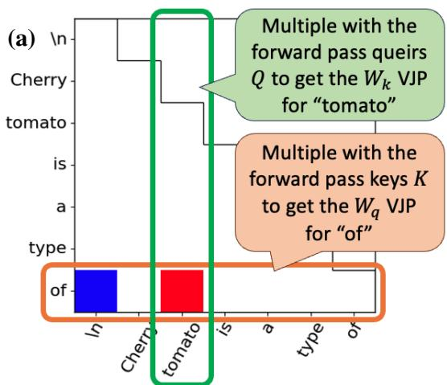

bar

| Type | Value |
| :--- | :--- |
| In | 1 |
| Cherry | 0 |
| tomato | 2 |
| is | 0 |
| a | 0 |
| type | 0 |
| of | Multiple with the forward pass keys K to get the Wq VJP for "of" (green box), Multiple with the forward pass queirs Q to get the Wk VJP for "tomato" (orange box).

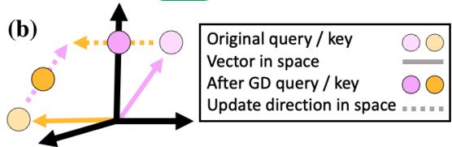

text_image

(b)
Original query / key
Vector in space
After GD query / key
Update direction in space

Figure 3: RA model editing dynamics. (a) The query matrix $\hat { W } _ { q }$ will be updated with a VJP directed towards the forward pass key of “tomato”, while the key matrix $\hat { W } _ { k }$ will be updated with a VJP directed towards the query from the token $\mathbf { \omega } ^ { 6 6 } \mathrm { o f } ^ { 9 }$ . (b) The latent space of the queries and keys. The circles represent a forward pass query and a key. If their Reversed Attention score is a relatively low negative number, the directions they are moving towards after GD are actually towards one another.

The key projection matrix $\hat { W } _ { k }$ The gradients of $\hat { W } _ { k }$ are computed similarly to those of $\hat { W } _ { q } .$ , except that for the j-th forward pass, we utilize the queries $Q = [ q ^ { 1 } , \cdots , q ^ { n } ] \in \mathbb { R } ^ { n \times \frac { d } { h } }$ from each subsequent forward pass after j. The VJP and gradients of $\hat { W } _ { k }$ are then given by:

$$
\delta_ {k} ^ {j} = \sum_ {l = j} ^ {n} r _ {j} ^ {l} x _ {q} ^ {l} \hat {W} _ {q} = \sum_ {l = j} ^ {n} r _ {j} ^ {l} q ^ {l} = R _ {j} ^ {\top} Q \in \mathbb {R} ^ {\frac {d}{h}}, \tag {19}
$$

where $R _ { j } ^ { \top }$ is the j-th column in R, which is the error signal from the l-forward pass to the j-th one.

# 5 Reversed Attention

In Equation 16 we defined R as the softmax derivative. R shares many properties with A, the forward attention (FA):

• R is computed from the multiplication of the forward pass values V and the error signal $\Delta \hat { W } _ { o }$ . We denote this intermediate result as E˜. The i, j entry in $\tilde { E }$ is a score between the i-th error signal and the j-th forward pass value. This resembles the calculation of raw attention scores (logits, before softmax) where we multiply queries and keys to obtain scores between every pair of tokens.   
• After computing $\tilde { E } ,$ , we derive R from it by row-wise normalization, which involves scaling with the FA A, see Equation 14. In the forward pass, row-wise normalization is accomplished by applying the softmax function.   
• Since the normalization from $\tilde { E }$ to R includes element-wise multiplication with the FA A, which is a lower triangular matrix, R is also a lower triangular matrix.   
• Just as the FA is used to multiply the attention values V , we use R to multiply the forward pass’ queries $Q$ and keys K to obtain the VJPs of one another.

These shared properties between the FA and the softmax derivative suggest that the softmax derivative serves as an implicit attention matrix. We called R the “Reversed Attention” (RA). In the following sections, we delve into some properties of the RA and explore its potential uses in explaining and controlling GPTs.

# 5.1 A qualitative examination of Reversed Attention

We observe the behavior of RA through a single example, using GPT2-small (Radford et al., 2019). We prompt the model with the sentence “\Cherry tomato is a type of’, and using “tomato” as an editing target. Since this prompt already contains the token answer, the behavior of the model can be readily understood.

Figure 2(a) depicts, for each attention head and each layer, the norm of the FA and the RA. While RA displays a very sparse pattern, FA (which is normalized by the softmax) displays a larger number of heads with high values. There does not seem to be a correlation between the two maps, and this is further supported by the perturbation experiments in subsection 5.2.

Our mathematical analysis in Equation 5, section 4 implies that close to zero scores in the RA will produce close to zero VJP vectors and gradients, hence focusing on the attention heads with the highest RA norm is informative enough to update the GD steps.

Next, we consider one of the FA maps with the highest RA norm, which is provided in Figure 2(b). The key of the first token, “\n”, receives the highest attention scores, which is a well-known phenomenon (Xiao et al., 2023).

On the other hand, the RA in Figure 2(c) is sparse and shows that the row corresponding to the last token “of” stands out as much more dominant than the others. We recall that the VJPs of the query matrix $\hat { W } _ { q }$ are the multiplication of the RA with the forward pass keys K. Similarly, the VJPs of the keys matrix $\hat { W } _ { k }$ are the multiplication of the RA with the forward pass queries Q. Since GD updates are performed with a negative learning rate, positive scores in the RA shift the model’s weights towards the queries/keys that produced them (and vice versa). Hence, the VJP of the query for “of” is mostly directed towards the key of “tomato” while directed away from the key that belongs to “\n”. Similarly, the main update is to the key of “tomato”, which attempts to shift the model’s weights towards the query for “of”. This dynamic is illustrated in Figure 3. This example does not necessarily elucidate the function served by this attention head, but it demonstrates how GD attempts to repurpose this head to recall information from the token “tomato”.

This example demonstrates the potential of Reversed Attention to provide insights into the model’s behavior and editing dynamics. Additional examples are provided in Appendix A.

# 5.2 Reversed Attention and the importance of each attention head

In subsection 5.1, we demonstrate how we can interpret the effect of RA on the editing dynamics of the model’s parameters. This explanation is based on the assumption that high RA scores correspond to important components (model parameters) in the forward computation graphs. Identifying these key parameters is one of the objectives of mechanistic interpretability research (Sharkey et al., 2025), which seeks to uncover meaningful sub-networks by selectively pruning model parameters. This approach differs from methods that prune models” inputs to assess the effect of individual tokens while leaving the internal mechanisms intact.

To verify RA’s ability to identify the importance of parameters in attention layers, we conduct a perturbation test. This test compares different orders (rankings) of the attention heads, each produced by a method that aims to determine the relative importance between heads. This experiment begins by zeroing out (masking) all heads, resulting in poor performance. Gradually we unmask the heads according to a given order. The performances can be quantified by the Area Under the Curve (AUC) of the graph that displays the model’s accuracy as a function of the percentage of unmasked heads.

For RA, we rank the heads according to the RA norms (from highest to lowest). Additionally, we use a training set (omitted examples) to perform separate backward passes and average the norms of each head. The main method we compare to is Causal Mediation (CM), due to its extensive usage in interpreting LM (Meng et al., 2022; Mueller et al., 2024). This method examines causal indirect effects by patches the forward pass attention heads’ outputs and examines the disparity between the altered and the original model’s outputs. In addition, we include the forward pass attention (FA).

<table><tr><td rowspan="2">Task</td><td rowspan="2">Example</td><td colspan="4">1-shots ICL</td><td colspan="4">5-shots ICL</td></tr><tr><td>Random</td><td>CM</td><td>FA</td><td>RA</td><td>Random</td><td>CM</td><td>FA</td><td>RA</td></tr><tr><td>antonym</td><td>Q: output\nA: [input]</td><td>0.02</td><td>0.15</td><td>0.02</td><td>0.07</td><td>0.09</td><td>0.27</td><td>0.05</td><td>0.32</td></tr><tr><td>alphabetically-first</td><td>Q: finch, tender, peacock\nA: [finch]</td><td>0.12</td><td>0.22</td><td>0.08</td><td>0.2</td><td>0.15</td><td>0.19</td><td>0.08</td><td>0.23</td></tr><tr><td>choose-middle-of-3</td><td>Q: dress, paintbrush, vase\nA: [paintbrush]</td><td>0.1</td><td>0.35</td><td>0.08</td><td>0.19</td><td>0.17</td><td>0.21</td><td>0.1</td><td>0.3</td></tr><tr><td>country-capital</td><td>Q: Sierra Leone\nA: [Freetown]</td><td>0.07</td><td>0.22</td><td>0.09</td><td>0.29</td><td>0.19</td><td>0.4</td><td>0.07</td><td>0.42</td></tr><tr><td>next-item</td><td>Q: XV\nA: [XVI]</td><td>0.06</td><td>0.25</td><td>0.04</td><td>0.14</td><td>0.17</td><td>0.31</td><td>0.07</td><td>0.34</td></tr><tr><td>person-sport</td><td>Q: Scottie Pippen\nA: [basketball]</td><td>0.22</td><td>0.35</td><td>0.1</td><td>0.37</td><td>0.21</td><td>0.34</td><td>0.09</td><td>0.44</td></tr></table>

Table 1: GPT2-xl perturbation testing on ICL tasks, measuring the AUC for Reversed Attention (RA), Forward Attention (FA), Causal Mediation (CM) as well as random ordering of the attention heads. For each example, “[]” is the token we expect the model to return. 

<table><tr><td rowspan="2">Task</td><td rowspan="2">Example</td><td colspan="4">GPT2-xl</td><td colspan="4">Llama2-7B</td></tr><tr><td>Rand</td><td>CM</td><td>FA</td><td>RA</td><td>Rand</td><td>CM</td><td>FA</td><td>RA</td></tr><tr><td>country-capital</td><td>The capital city of Sierra Leone is [Freetown]</td><td>0.02</td><td>0.61</td><td>0.06</td><td>0.07</td><td>0.31</td><td>0.05</td><td>0.07</td><td>0.43</td></tr><tr><td>person-plays-pro-sport</td><td>Scottie Pippen plays the sport of [basketball]</td><td>0.32</td><td>0.59</td><td>0.09</td><td>0.57</td><td>0.21</td><td>0.39</td><td>0.04</td><td>0.48</td></tr><tr><td>product-by-company</td><td>Blogger was created by [Google]</td><td>0.19</td><td>0.46</td><td>0.08</td><td>0.31</td><td>0.15</td><td>0.51</td><td>0.06</td><td>0.31</td></tr></table>

Table 2: GPT2-xl and Llama2-7B perturbation tests on natural questions, measuring the AUC for Reversed Attention (RA), Forward Attention (FA), Causal Mediation (CM) and random ordering.

Similar to RA, FA ranks attention heads according to the the norm of the attention maps. While previous works already established that FA is not sufficient in providing similar models’ explanation (Serrano and Smith, 2019; Jain and Wallace, 2019), we include FA for completeness.

Our tests are conducted on 21 tasks by Hernandez et al. (2024); Todd et al. (2023), each consisting of pairs of sentences that follow some relation. For instance, one task involves pairs of countries and their capital cities. In 6 of these tasks, the model is prompted with natural language templates such as “The capital city of <country name> is”. In the other 15 tasks, in-context-learning (ICL) templates are employed. In this scenario, instead of explicitly stating the relation between the pair (e.g., “the capital city is”), the model must infer it from n-shots of labeled pairs, such as “\n Q: Spain A: Madrid \n Q: Italy A: Rome \n <country name> A:”.

The results are shown for the ICL tasks and the natural questions, respectively, in Table 1 for GPT2- xl and Table 2 for both GPT2-xl and Llama2-7B (Touvron et al., 2023). To illustrate how the AUC scores are calculated, Figure 4 displays graphs for a single task that measures GPT2-xl’s accuracy as a function of the percentage of pruned attention heads. The full implementation details and results, including ones for GPT-j (Wang and Komatsuzaki, 2021) and OPT (Zhang et al., 2022), can be found in Appendix B.

As can be seen, RA is competitive with CM when the examined LM can successfully address the task. In the natural language tasks, we observed that RA outperforms CM with larger models that originally had high accuracy. In the ICL tasks, we found that CM achieves good results with a very low number of shots when the LM fails to provide the correct answer. However, when we prompt these failed tasks with a few shots, we see that RA achieves better results. Overally, even when RA falls behind CM, it still achieves non-trivial results. Hence, we find RA to reflect the importance of each attention head in producing a given prediction. We note that RA is much faster, as it only requires a forward and a backward pass for each example, while CM requires a forward pass for each head.

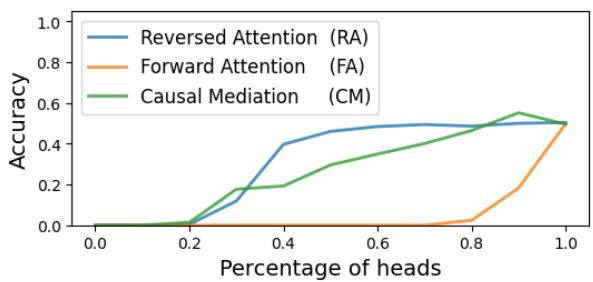

line

| Percentage of heads | Reversed Attention (RA) | Forward Attention (FA) | Causal Mediation (CM) |
| ------------------- | ------------------------ | ---------------------- | --------------------- |
| 0.0                 | 0.0                      | 0.0                    | 0.0                   |
| 0.2                 | 0.0                      | 0.0                    | 0.0                   |
| 0.4                 | 0.4                      | 0.0                    | 0.2                   |
| 0.6                 | 0.5                      | 0.0                    | 0.3                   |
| 0.8                 | 0.5                      | 0.0                    | 0.5                   |
| 1.0                 | 0.5                      | 0.5                    | 0.5                   |

Figure 4: The accuracy results of GPT2-xl, as a function of the amount of pruned attention heads, on the antonym task with 5-shot ICL.

In conclusion, these results demonstrate that RA produces more interpretable attention maps compared to FA. The comparison with CM shows that RA can achieve comparable results on specific tasks and models while serving as a complementary method to CM, given RA’s ease of visualization and lower computational requirements.

# 5.3 Attention patching using Reversed Attention

Modifying the forward attention maps of LM to improve them, while doing so in an explainable manner, is one of the goals of interpretability research. After demonstrating that RA produces more interpretable attention maps compared to the forward attention subsection 5.2, this section shows how RA can be used to modify attention maps and alter the predictions of the models.

Table 3: GPT2-xl and OPT-1.3B accuracy on ICL tasks of the original models and with forward attention (FA) and Reversed Attention (RA) patching. N = the number of ICL samples. 

<table><tr><td rowspan="2">Task</td><td rowspan="2">N</td><td colspan="3">GPT2-xl</td><td colspan="3">OPT-1.3B</td></tr><tr><td>original</td><td>FA</td><td>RA</td><td>original</td><td>FA</td><td>RA</td></tr><tr><td rowspan="4">antonym</td><td>0</td><td>0.00</td><td>0.01</td><td>0.08</td><td>0.02</td><td>0.01</td><td>0.24</td></tr><tr><td>1</td><td>0.18</td><td>0.43</td><td>0.56</td><td>0.20</td><td>0.26</td><td>0.57</td></tr><tr><td>5</td><td>0.53</td><td>0.57</td><td>0.62</td><td>0.42</td><td>0.44</td><td>0.59</td></tr><tr><td>10</td><td>0.57</td><td>0.57</td><td>0.62</td><td>0.42</td><td>0.43</td><td>0.54</td></tr><tr><td rowspan="4">capitalize</td><td>0</td><td>0.00</td><td>0.00</td><td>0.94</td><td>0.01</td><td>0.00</td><td>0.78</td></tr><tr><td>1</td><td>0.44</td><td>0.50</td><td>1.00</td><td>0.01</td><td>0.01</td><td>0.90</td></tr><tr><td>5</td><td>0.98</td><td>1.00</td><td>1.00</td><td>1.00</td><td>0.99</td><td>1.00</td></tr><tr><td>10</td><td>0.99</td><td>1.00</td><td>1.00</td><td>1.00</td><td>0.99</td><td>1.00</td></tr><tr><td rowspan="4">choose-middle-of-3</td><td>0</td><td>0.46</td><td>0.30</td><td>1.00</td><td>0.11</td><td>0.03</td><td>1.00</td></tr><tr><td>1</td><td>0.81</td><td>0.76</td><td>1.00</td><td>0.57</td><td>0.54</td><td>0.76</td></tr><tr><td>5</td><td>0.92</td><td>0.68</td><td>1.00</td><td>0.95</td><td>0.84</td><td>1.00</td></tr><tr><td>10</td><td>0.97</td><td>0.00</td><td>1.00</td><td>0.86</td><td>0.65</td><td>1.00</td></tr><tr><td rowspan="4">next-item</td><td>0</td><td>0.03</td><td>0.00</td><td>0.16</td><td>0.09</td><td>0.00</td><td>0.53</td></tr><tr><td>1</td><td>0.28</td><td>0.66</td><td>0.72</td><td>0.50</td><td>0.47</td><td>0.84</td></tr><tr><td>5</td><td>0.69</td><td>0.84</td><td>0.88</td><td>0.69</td><td>0.66</td><td>0.88</td></tr><tr><td>10</td><td>0.88</td><td>0.88</td><td>0.91</td><td>0.75</td><td>0.81</td><td>0.84</td></tr></table>

Since LMs can have thousands of attention heads, each depicting different relationships, a solution that directly edits the attention maps has not been studied extensively. Recent efforts in interpretability research have explored activation patching, demonstrating how injecting different hidden states from one model into another affects its performance. In this section, we explore both the idea of directly modifying attention maps and activation patching through a novel method termed “attention patching”. This approach is based on the observation that RA produces attention maps that can be seen as the desired relationships the model attempts to maintain in order to perform a given task.

Given a GPT model and a predefined set of training and test examples, all with the same length and format, attention patching performs the following steps: (i) calculate the RA of each training example (applying forward and backward passes with each example but without modifying the model’s parameters). (ii) average the RA scores for each attention head. (iii) For each test example and for each attention head, we add (inject) the RA map to the forward pass attention map, using a learning rate as a scaling factor, Figure 5 illustrates this process. Additionally, to establish a baseline, we applied the same process with the forward attention, averaging and injecting the attention maps collected from forward passes.

The requirement for examples to have the same length and format simplifies the injection process, ensuring that all attention score matrices are of consistent size. This makes tasks such as ICL and short trivia-like questions ideal candidates for this method, as they are templated and easily framed by their length. Additionally, the ability of LMs to answer ICL tasks is usually associated with the attention layer (Dong et al., 2022), which serves as another reason to examine attention patching in this context.

We evaluate attention patching on the datasets of (Todd et al., 2023; Hernandez et al., 2024), comparing its performance to ICL prompting. The results are displayed in Table 3, with additional details provided in Appendix C. Our findings indicate that attention patching achieves similar results to ICL prompting and outperforms the average of the forward pass attention scores, which does not consistently improve the original model performances. Note that similarly to other patching methods, this test is not meant to demonstrate the robustness of the approach, as the current implementation is frame-specific and full GD outperforms it. Instead, it serves to validate that Reversed Attention indeed reflects the model’s desired attention.

# 6 Conclusions

The self-attention component of transformers is perhaps the most distinctive part of this architecture. Its role when performing inference has been extensively studied and shown to provide insights into the inner workings of transformers. Here, we explore a dual entity we call Reversed Attention (RA), which plays a role when transformers learn. We present qualitative samples of the way learning occurs and show that RA can help identify the most influential heads at inference time. Finally, we show how plugging an average RA value can direct the model toward performing a specific task.

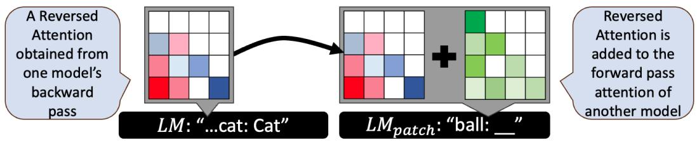

flowchart

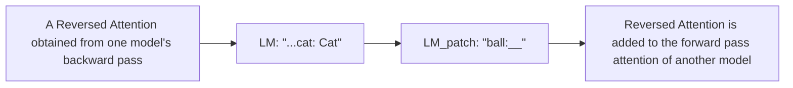

Figure 5: Attention patching using Reversed Attention (RA): first we collect the RA maps of the model without applying any model editing (without changing its weights). Later, for each attention head, we add its corresponding RA map to the forward pass attention.

The focus of this work was to introduce RA and prove that it is interpretable rather than merely an artifact of the backward pass. Beyond enriching our understanding of how LMs work, we hope our conclusions will serve future research on dynamically editing attention layers as well as explaining how information is stored in them.

# 7 Limitations

In this work, we provide a detailed mathematical exposition of the derivative of the attention mechanism in GPTs. To keep this explanation clear, we focus on decoder-only models with Multi-Head Attention mechanisms and without additional components such as RoPE (Su et al., 2024) or sparse attention (Brown et al., 2020). LLMs come in various sizes and configurations, and a general mathematical explanation that fits all is not feasible. Our choice to demonstrate RA using GPT2 and OPT aligns with previous work that examines the interpretability of Transformers through the lens of these models (Geva et al., 2022; Meng et al., 2022; Voita et al., 2023; Katz and Belinkov, 2023). Our use of Llama2 and GPT-j, although they use RoPE, comes to show how our use of RA can be applied to a wide variety of LM.

The 21 tasks we sourced from Todd et al. (2023); Hernandez et al. (2024) consist of relatively simple and limited tasks. Therefore, our results in subsection 5.2 and subsection 5.3 serve as a proof of concept rather than as a definitive assessment of RA’s robustness in its ability to identify critical components of models or to be used for editing using patching.

Causal Mediation (CM) can come in variety of implementations, each patch the activation differently. In 5.2 we examined a basic implementation of CM. In Appendix B we include additional implementation provided by Todd et al. (2023) to make our comparison to RA comprehensive.

The perturbation experiments compare RA with a small number of alternative methods. We acknowledge that other methods might achieve similar or even better results, particularly those based on gradients. The purpose of these experiments is not to discover a new component-localization method but rather to provide a proof that RA maps correspond to existing LM explainability methods. Therefore, we focused on comparing RA to CM, a widely used method in similar works.

# Ethics Statement

This paper aims to advance our understanding of how language models learn and the dynamics behind the backward pass. Future work might leverage our findings to edit or train language models effectively. However, we are concerned about the potential dangers associated with manipulating these systems. For instance, editing LMs could amplify existing biases or be exploited for unethical purposes. Our primary commitment is to advance research that prioritizes safety and fairness. We hope that future studies will use our findings to further contribute to the creation of better and more aligned models, rather than facilitating the production of harmful content or exploiting the knowledge stored within these models.

# Acknowledgements

This work was supported by the Tel Aviv University Center for AI and Data Science (TAD). The contribution of the first author is part of a Ph.D. thesis research conducted at Tel Aviv University.

# References

Marco Ancona, Enea Ceolini, Cengiz Öztireli, and Markus Gross. 2018. Towards better understanding of gradient-based attribution methods for deep neural networks. In 6th International Conference

on Learning Representations, ICLR 2018, Vancouver, BC, Canada, April 30-May 3, 2018, Conference Track Proceedings. OpenReview. net.   
Oren Barkan, Edan Hauon, Avi Caciularu, Ori Katz, Itzik Malkiel, Omri Armstrong, and Noam Koenigstein. 2021. Grad-sam: Explaining transformers via gradient self-attention maps. In Proceedings of the 30th ACM International Conference on Information & Knowledge Management, pages 2882–2887.   
Tom Brown, Benjamin Mann, Nick Ryder, Melanie Subbiah, Jared D Kaplan, Prafulla Dhariwal, Arvind Neelakantan, Pranav Shyam, Girish Sastry, Amanda Askell, et al. 2020. Language models are few-shot learners. Advances in neural information processing systems, 33:1877–1901.   
Damai Dai, Yutao Sun, Li Dong, Yaru Hao, Shuming Ma, Zhifang Sui, and Furu Wei. 2023. Why can gpt learn in-context? language models implicitly perform gradient descent as meta-optimizers. In ICLR 2023 Workshop on Mathematical and Empirical Understanding of Foundation Models.   
Qingxiu Dong, Lei Li, Damai Dai, Ce Zheng, Zhiyong Wu, Baobao Chang, Xu Sun, Jingjing Xu, and Zhifang Sui. 2022. A survey on in-context learning. arXiv preprint arXiv:2301.00234.   
N Elhage, N Nanda, C Olsson, T Henighan, N Joseph, B Mann, A Askell, Y Bai, A Chen, T Conerly, et al. 2021. A mathematical framework for transformer circuits.   
Mor Geva, Avi Caciularu, Kevin Wang, and Yoav Goldberg. 2022. Transformer feed-forward layers build predictions by promoting concepts in the vocabulary space. In Proceedings of the 2022 Conference on Empirical Methods in Natural Language Processing, pages 30–45.   
Almog Gueta, Elad Venezian, Colin Raffel, Noam Slonim, Yoav Katz, and Leshem Choshen. 2023. Knowledge is a region in weight space for fine-tuned language models. In Findings of the Association for Computational Linguistics: EMNLP 2023, pages 1350–1370, Singapore. Association for Computational Linguistics.   
Suchin Gururangan, Ana Marasovic, Swabha´ Swayamdipta, Kyle Lo, Iz Beltagy, Doug Downey, and Noah A Smith. 2020. Don’t stop pretraining: Adapt language models to domains and tasks. In Proceedings of the 58th Annual Meeting of the Association for Computational Linguistics, pages 8342–8360.   
Dan Hendrycks, Collin Burns, Steven Basart, Andy Zou, Mantas Mazeika, Dawn Song, and Jacob Steinhardt. 2021. Measuring massive multitask language understanding. In International Conference on Learning Representations.

Evan Hernandez, Arnab Sen Sharma, Tal Haklay, Kevin Meng, Martin Wattenberg, Jacob Andreas, Yonatan Belinkov, and David Bau. 2024. Linearity of relation decoding in transformer language models. In Proceedings of the 2024 International Conference on Learning Representations.   
Sarthak Jain and Byron C Wallace. 2019. Attention is not explanation. In Proceedings of the 2019 Conference of the North American Chapter of the Association for Computational Linguistics: Human Language Technologies, pages 3543–3556.   
Shahar Katz and Yonatan Belinkov. 2023. Visit: Visualizing and interpreting the semantic information flow of transformers. In Findings of the Association for Computational Linguistics: EMNLP 2023, pages 14094–14113.   
Shahar Katz, Yonatan Belinkov, Mor Geva, and Lior Wolf. 2024. Backward lens: Projecting language model gradients into the vocabulary space. In Proceedings of the 2024 Conference on Empirical Methods in Natural Language Processing, pages 2390– 2422, Miami, Florida, USA. Association for Computational Linguistics.   
Najoung Kim and Sebastian Schuster. 2023. Entity tracking in language models. In Proceedings of the 61st Annual Meeting of the Association for Computational Linguistics (Volume 1: Long Papers), pages 3835–3855.   
Guillaume Lample, Alexis Conneau, Marc’Aurelio Ranzato, Ludovic Denoyer, and Hervé Jégou. 2018. Word translation without parallel data. In International Conference on Learning Representations.   
Y Le Cun. 1988. A theoretical framework for backpropagation. In Proceedings of the 1988 Connectionist Models Summer School.   
Xinyin Ma, Gongfan Fang, and Xinchao Wang. 2023. Llm-pruner: On the structural pruning of large language models. Advances in neural information processing systems, 36:21702–21720.   
Dougal Maclaurin. 2016. Modeling, inference and optimization with composable differentiable procedures. Ph.D. thesis.   
Arvind Mahankali, Tatsunori B Hashimoto, and Tengyu Ma. 2023. One step of gradient descent is provably the optimal in-context learner with one layer of linear self-attention. arXiv preprint arXiv:2307.03576.   
Kevin Meng, David Bau, Alex Andonian, and Yonatan Belinkov. 2022. Locating and editing factual associations in GPT. Advances in Neural Information Processing Systems, 36.   
Aaron Mueller, Jannik Brinkmann, Millicent Li, Samuel Marks, Koyena Pal, Nikhil Prakash, Can Rager, Aruna Sankaranarayanan, Arnab Sen Sharma, Jiuding Sun, et al. 2024. The quest for the right mediator: A history, survey, and theoretical grounding of causal interpretability. arXiv preprint arXiv:2408.01416.

Kim Anh Nguyen, Sabine Schulte im Walde, and Ngoc Thang Vu. 2017. Distinguishing antonyms and synonyms in a pattern-based neural network. In Proceedings of the 15th Conference of the European Chapter of the Association for Computational Linguistics: Volume 1, Long Papers. Association for Computational Linguistics.   
Adam Paszke, Sam Gross, Francisco Massa, Adam Lerer, James Bradbury, Gregory Chanan, Trevor Killeen, Zeming Lin, Natalia Gimelshein, Luca Antiga, et al. 2019. Pytorch: An imperative style, high-performance deep learning library. Advances in neural information processing systems, 32.   
Nikhil Prakash, Tamar Rott Shaham, Tal Haklay, Yonatan Belinkov, and David Bau. 2024. Fine-tuning enhances existing mechanisms: A case study on entity tracking. In The Twelfth International Conference on Learning Representations.   
Alec Radford, Karthik Narasimhan, Tim Salimans, and Ilya Sutskever. 2018. Improving language understanding by generative pre-training.   
Alec Radford, Jeff Wu, Rewon Child, David Luan, Dario Amodei, and Ilya Sutskever. 2019. Language models are unsupervised multitask learners. OpenAI blog.   
Sofia Serrano and Noah A Smith. 2019. Is attention interpretable? In Proceedings of the 57th Annual Meeting of the Association for Computational Linguistics, pages 2931–2951.   
Lee Sharkey, Bilal Chughtai, Joshua Batson, Jack Lindsey, Jeff Wu, Lucius Bushnaq, Nicholas Goldowsky-Dill, Stefan Heimersheim, Alejandro Ortega, Joseph Bloom, et al. 2025. Open problems in mechanistic interpretability. arXiv preprint arXiv:2501.16496.   
K Simonyan, A Vedaldi, and A Zisserman. 2014. Deep inside convolutional networks: visualising image classification models and saliency maps. In Proceedings of the International Conference on Learning Representations (ICLR). ICLR.   
Jianlin Su, Murtadha Ahmed, Yu Lu, Shengfeng Pan, Wen Bo, and Yunfeng Liu. 2024. Roformer: Enhanced transformer with rotary position embedding. Neurocomputing, 568:127063.   
Davoud Ataee Tarzanagh, Yingcong Li, Christos Thrampoulidis, and Samet Oymak. 2023. Transformers as support vector machines. arXiv preprint arXiv:2308.16898.   
Yuandong Tian, Yiping Wang, Beidi Chen, and Simon Du. 2023. Scan and snap: Understanding training dynamics and token composition in 1-layer transformer. arXiv preprint arXiv:2305.16380.   
Eric Todd, Millicent L Li, Arnab Sen Sharma, Aaron Mueller, Byron C Wallace, and David Bau. 2023. Function vectors in large language models. arXiv preprint arXiv:2310.15213.

Hugo Touvron, Louis Martin, Kevin Stone, Peter Albert, Amjad Almahairi, Yasmine Babaei, Nikolay Bashlykov, Soumya Batra, Prajjwal Bhargava, Shruti Bhosale, et al. 2023. Llama 2: Open foundation and fine-tuned chat models. arXiv preprint arXiv:2307.09288.   
Ashish Vaswani, Noam Shazeer, Niki Parmar, Jakob Uszkoreit, Llion Jones, Aidan N Gomez, Łukasz Kaiser, and Illia Polosukhin. 2017. Attention is all you need. Advances in neural information processing systems, 30.   
Jesse Vig, Sebastian Gehrmann, Yonatan Belinkov, Sharon Qian, Daniel Nevo, Yaron Singer, and Stuart Shieber. 2020. Investigating gender bias in language models using causal mediation analysis. Advances in Neural Information Processing Systems, 33:12388– 12401.   
Elena Voita, Javier Ferrando, and Christoforos Nalmpantis. 2023. Neurons in large language models: Dead, ngram, positional. arXiv preprint arXiv:2309.04827.   
Ben Wang and Aran Komatsuzaki. 2021. GPT-J-6B: A 6 Billion Parameter Autoregressive Language Model. https://github.com/kingoflolz/ mesh-transformer-jax.   
Kevin Ro Wang, Alexandre Variengien, Arthur Conmy, Buck Shlegeris, and Jacob Steinhardt. 2023. Interpretability in the wild: a circuit for indirect object identification in gpt-2 small. In The Eleventh International Conference on Learning Representations.   
Thomas Wolf, Lysandre Debut, Victor Sanh, Julien Chaumond, Clement Delangue, Anthony Moi, Pierric Cistac, Tim Rault, Rémi Louf, Morgan Funtowicz, et al. 2019. Huggingface’s transformers: State-ofthe-art natural language processing. arXiv preprint arXiv:1910.03771.   
Guangxuan Xiao, Yuandong Tian, Beidi Chen, Song Han, and Mike Lewis. 2023. Efficient streaming language models with attention sinks. In The Twelfth International Conference on Learning Representations.   
Rowan Zellers, Ari Holtzman, Yonatan Bisk, Ali Farhadi, and Yejin Choi. 2019. Hellaswag: Can a machine really finish your sentence? In Proceedings of the 57th Annual Meeting of the Association for Computational Linguistics, pages 4791–4800.   
Fred Zhang and Neel Nanda. 2023. Towards best practices of activation patching in language models: Metrics and methods. arXiv preprint arXiv:2309.16042.   
Susan Zhang, Stephen Roller, Naman Goyal, Mikel Artetxe, Moya Chen, Shuohui Chen, Christopher Dewan, Mona Diab, Xian Li, Xi Victoria Lin, et al. 2022. Opt: Open pre-trained transformer language models. arXiv preprint arXiv:2205.01068.

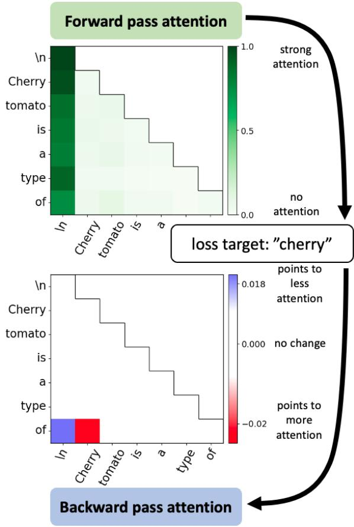

heatmap

|        | In   | Cherry | tomato | is   | a     | type  | of   |
| ------ | ---- | ------ | ------ | ---- | ----- | ----- | ---- |
| In     | 1.0  | 0.0    | 0.0    | 0.0  | 0.0   | 0.0   | 0.0  |
| Cherry | 0.5  | 0.0    | 0.0    | 0.0  | 0.0   | 0.0   | 0.0  |
| tomato | 0.5  | 0.0    | 0.0    | 0.0  | 0.0   | 0.0   | 0.0  |
| is     | 0.5  | 0.0    | 0.0    | 0.0  | 0.0   | 0.0   | 0.0  |
| a      | 0.5  | 0.0    | 0.0    | 0.0  | 0.0   | 0.0   | 0.0  |
| type   | 0.5  | 0.0    | 0.0    | 0.0  | 0.0   | 0.0   | 0.0  |
| of     | 0.5  | 0.0    | 0.0    | 0.0  | 0.0   | 0.0   | 0.0  |

Figure 6: The forward and Reversed Attention (RA) maps of an attention head from GPT2-small (layer 11, head index 2), given the editing target “cherry” with the prompt “Cherry tomato is a type of”. The pattern presented by the RA map attempts to increase the forward pass attention between the query belonging to “of” and the key of “Cherry”, encouraging the model to answer “cherry”.

# A Additional Reversed Attention Examples

In this section, we extend the qualitative examination of the Reversed Attention (RA) discussed in subsection 5.1. We provide examples for GPT2- small, GPT2-xl and OPT-350m. RA offers simpleto-read insights into how the attention matrices are modified by GD, revealing which attention queries Q and keys K are adjusted to bring specific tokens closer in the embedding space. However, while this explanation sheds light on the changes made by GD, it does not necessarily elucidate the function served by each attention head. In this section, we aim to establish how we interpret (read) the patterns observed in RA maps. Further investigation into the functional roles of individual attention heads is left for future work.

GPT2-small The qualitative example in subsection 5.1 presents GPT2-small RA while using the prompt “The cherry tomato is a type of” with the editing target “tomato”. The pattern given by one of the highest RA norms shows that GD focuses on editing the query belonging to the token “of” and the key of the token “tomato”. The following example examines what happens if we change the editing target to “cherry”, which, like “tomato”, could refer to the prompt itself. Similarly to the previous example, this head is still one of the heads with highest RA norms, but unlike the previous example, GD focuses on editing the key of the token “cherry”, as presented in Figure 6. This pattern, identifies the token most similar to the editing target and comes to illustrate RA’s ability to localize relevant information in the input tokens regarding the editing target (“tomato” or “cherry”), through the attention heads.

GPT2-xl We prompt the model with the following sentence: “I like Italy and France. I visited the city of”, expecting the model to complete it with a city from either Italy or France. In the case of GPT2-xl, it returns “Florence”. We extract RA when given “Paris” as the editing target and examine the top by norm RA heads, head 8 at layer 30. The forward attention of this head assigns relatively high attention to “Italy” and “France”.

Note that this is the same example from Figure 1. Thus, these examples also examined how different targets affect the produced RA maps.

Looking at the RA, the last row, corresponding to the last (“of”) token’s Wq VJP, we see it assigns a positive score to “Italy” and a negative score to “France”. According to section 4, subsection 5.1, this pattern suggests that GD tries to bridge the query of the last token with the key of “France”, while doing the opposite with “Italy”. Hence, if we isolate the possible outcomes of editing other heads and only editing this one, its output would be more correlated with the attention value from the token “Paris”. We assume this behavior arises from GD’s attempt to enhance connection to information that is more relevant to the editing target, “Paris”.

We repeat the same experiment with the editing target “Rome”. This time, the RA of the same head assigns a negative score to the token that follows “Paris” and a positive score to the token “Rome”. Using the same analogy, given the target that is more related to Italy, the model tries to amplify the connection between the last token’s query and the key of “Italy”. This suggests that the RA method dynamically adjusts attention scores to strengthen the associations relevant to the given editing target.

OPT We use OPT-350m with the prompt “I like Italy and France. I visited the city of”. This model responds with “Rome”. We keep the target token “Paris” and compute the loss to obtain the RA maps, presented in Figure 9.

This model has 384 attention heads. We sort the heads according to their RA maps’ norms and present the one with the highest norm in Figure 10, revealing a pattern similar to that of GPT2-xl in Figure 8. To emphasize that heads with low RA norm are barely updated, we maintain the same coloring scale from the head with the highest norm and present the 11-th highest by norm head. This head’s RA map appears empty, indicating all scores are close to zero. It is also evident that the forward pass attention map of this head only attends to the first token of the sentence, a phenomenon known as “attention sink” (Xiao et al., 2023). This seems to be a default pattern when the function that the head describes is not activated.

# A.1 Additional Prompts

We present selected examples in which we used RA to better understand the editing dynamics of prompts from previous works in the area of mechanistic interpretability. The following two examples offer qualitative hypotheses on how backpropagation attempts to correct specific attention heads.

Indirect Object Identification Wang et al. (2023) identify circuits, subgraphs of a model’s parameters, in GPT2-small by examining its response to the prompt “When Mary and John went to the store, John gave a drink to”, which the model is expected to complete with “Mary”. They pinpoint key attention heads that contribute to the correct response and classify the roles of each head in that process. For instance, they distinguish between heads that support the correct prediction and those that decrease the final probability of predicting “Mary”.

We use the same prompt with GPT2-small, using “Mary” as the target token to create RA maps. The top three attention heads, ranked by the norm of their RA, are presented in Figure Figure 11. The first head, head 2 in layer 11, has the highest RA norm and produces a negative RA score for “Mary”, suggesting that backpropagation is working to adjust this head to allocate more attention to that token, as its forward pass barely attends to “Mary”.

In contrast, the other two heads, head 7 in layer 10 and head 10 in layer 11, exhibit a positive RA score for “Mary”, meaning they tend to reduce the attention given to this token. According toWang et al. (2023), these two heads negatively impact the final prediction, and ablating them increases the probability of “Mary”. Consequently, it may be possible that when editing the model using backpropagation, these attention layers could be modified to neutralize their effect on this particular prompt. In this context, RA offers complementary insights and provides simple visualizations that can contribute to further research.

Entity Tracking Kim and Schuster (2023) study the ability of LMs to track the states of entities. In their work, they examine whether language models can correctly answer prompts such as “The orange is in Box X, the book is in Box A, the apple is in Box S ,the game is in Box E, the bill is in Box M, the cross is in Box K, the map is in Box D. Box A contains the” (with the correct answer “book”). The work of Prakash et al. (2024) examine how such task can be used to study the roles of different attention heads of LMs before and after fine-tuning.

We used GPT2-xl with selected prompts in the format of items in boxes and produced their RA. Figure 12 illustrate two examples: one is the prompt from the previous example, and the second is “The magnet is in Box B, the pot is in Box K, the document is in Box M, the apple is in Box H, the bill is in Box C, the cross is in Box S, the orange is in Box A. Box C contains the”. In both examples, we found that one of the top 10 heads according to RA norm is head 14 from layer 26. Examining its forward pass attention does not reveal a clear pattern to explain why this head ranks so highly by RA. However, both of the RA maps show highly sparse patterns, with only the target token of each prompt, “book” and “bill”, are given attention. This pattern suggests that, in order to improve the model’s probability to answer these prompts, the model need to suppress its forward attention to those tokens.

In the context of Prakash et al. (2024), RA helps visualize attention patterns and demonstrates how backpropagation tries to alter such patterns. Future research can leverage RA to investigate editing methods for specific attention layers that exhibit different RA patterns.

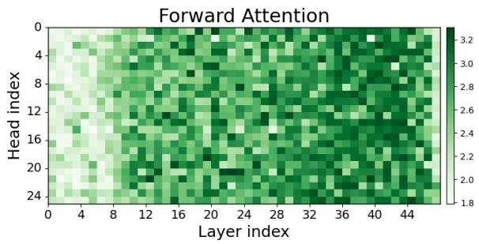

heatmap

| Head index | Layer index | Forward Attention |
| ---------- | ----------- | ----------------- |
| 0          | 0           | 3.2               |
| 0          | 4           | 3.0               |
| 0          | 8           | 2.8               |
| 0          | 12          | 2.6               |
| 0          | 16          | 2.4               |
| 0          | 20          | 2.2               |
| 0          | 24          | 2.0               |
| 4          | 0           | 3.2               |
| 4          | 4           | 3.0               |
| 4          | 8           | 2.8               |
| 4          | 12          | 2.6               |
| 4          | 16          | 2.4               |
| 4          | 20          | 2.2               |
| 4          | 24          | 2.0               |
| 8          | 0           | 3.2               |
| 8          | 4           | 3.0               |
| 8          | 8           | 2.8               |
| 8          | 12          | 2.6               |
| 8          | 16          | 2.4               |
| 8          | 20          | 2.2               |
| 8          | 24          | 2.0               |
| 12         | 0           | 3.2               |
| 12         | 4           | 3.0               |
| 12         | 8           | 2.8               |
| 12         | 12          | 2.6               |
| 12         | 16          | 2.4               |
| 12         | 20          | 2.2               |
| 12         | 24          | 2.0               |
| 16         | 0           | 3.2               |
| 16         | 4           | 3.0               |
| 16         | 8           | 2.8               |
| 16         | 12          | 2.6               |
| 16         | 16          | 2.4               |
| 16         | 20          | 2.2               |
| 16         | 24          | 2.0               |
| 20         | 0           | 3.2               |
| 20         | 4           | 3.0               |
| 20         | 8           | 2.8               |
| 20         | 12          | 2.6               |
| 20         | 16          | 2.4               |
| 20         | 20          | 2.2               |
| 20         | 24          | 2.0               |
| 24         | 0           | 3.2               |
| 24         | 4           | 3.0               |
| 24         | 8           | 2.8               |
| 24         | 12          | 2.6               |
| 24         | 16          | 2.4               |
| 24         | 20          | 2.2               |
| 24         | 24          | 2.0               |

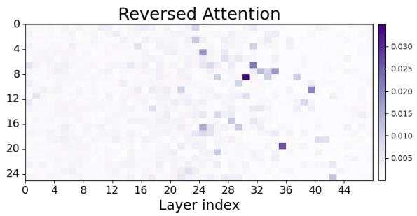

heatmap

| Layer index | 0    | 4    | 8    | 12   | 16   | 20   | 24   |
| ----------- | ---- | ---- | ---- | ---- | ---- | ---- | ---- |
| 0           |      |      |      |      |      |      |      |
| 4           |      |      |      |      |      |      |      |
| 8           |      |      |      |      |      |      |      |
| 12          |      |      |      |      |      |      |      |
| 16          |      |      |      |      |      |      |      |
| 20          |      |      |      |      |      |      |      |
| 24          |      |      |      |      |      |      |      |
| 28          |      |      |      |      |      |      |      |
| 32          |      |      |      |      |      |      |      |
| 36          |      |      |      |      |      |      |      |
| 40          |      |      |      |      |      |      |      |
| 44          |      |      |      |      |      |      |      |
The image contains a heatmap of the 'Reversed Attention' data points. The 'Layer index' is the x-axis and the 'Layer index' is the y-axis. There are no labels or additional data series in this code. The values in the heatmap are estimated based on the 'Reversed Attention' values. There is only one data point labeled 'Reversed Attention'.

Figure 7: The forward and Reversed Attention maps of GPT2-xl, given the editing target “Paris” and the prompt “I like Italy and France. I visited the city of”.

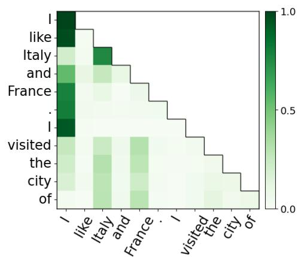

heatmap

| | I | like | Italy | and | France | . | I | visited the | city | of |
|---|---|---|---|---|---|---|---|-------------|------|----|
| I | 1.0 | 0.95 | 0.85 | 0.75 | 0.65 | 0.55 | 0.45 | 0.35 | 0.25 | 0.15 |
| like | 0.95 | 0.90 | 0.80 | 0.70 | 0.60 | 0.50 | 0.40 | 0.30 | 0.20 | 0.10 |
| Italy | 0.85 | 0.80 | 0.70 | 0.60 | 0.50 | 0.40 | 0.30 | 0.20 | 0.10 | 0.05 |
| and | 0.75 | 0.70 | 0.60 | 0.50 | 0.40 | 0.30 | 0.20 | 0.10 | 0.05 | 0.02 |
| France | 0.65 | 0.60 | 0.50 | 0.40 | 0.30 | 0.20 | 0.10 | 0.05 | 0.02 | 0.01 |
| . | 0.55 | 0.50 | 0.40 | 0.30 | 0.20 | 0.10 | 0.05 | 0.02 | 0.01 | 0.01 |
| I | 0.45 | 0.40 | 0.30 | 0.20 | 0.10 | 0.05 | 0.02 | 0.01 | 0.01 | 0.01 |
| visited | 0.35 | 0.30 | 0.20 | 0.10 | 0.05 | 0.02 | 0.01 | 0.01 | 0.01 | 0.01 |
| the | 0.25 | 0.20 | 0.10 | 0.05 | 0.02 | 0.01 | 0.01 | 0.01 | 0.01 | 0.01 |
| city | 0.15 | 0.10 | 0.05 | 0.02 | 0.01 | 0.01 | 0.15 | 1.5         | 1.5   | 1.5 |
| of | 0.15 | 0.15 | 0.15 | 0.15 | 1.5   | 1.5   | 1.5   | 1.5         | 1.5   | 1.5 |
The chart is a heatmap showing the intensity of ratings for each language (e.g., 'like', 'Italy', 'France') in a list format.

(a) Forward - Florence, Paris and Rome   
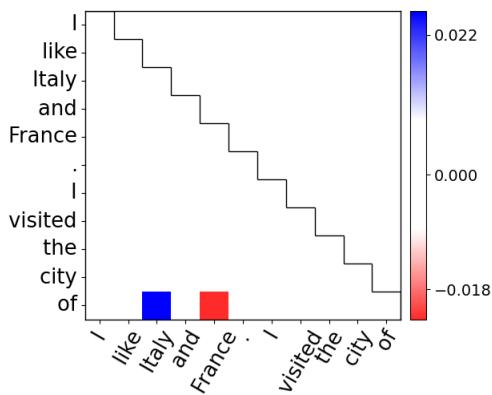

heatmap

|          | like   | Italy  | and   | France |
|----------|--------|--------|--------|--------|
| I        |        |        |        |        |
| like     |        |        |        |        |
| Italy    |        |        |        |        |
| and      |        |        |        |        |
| France   |        |        |        |        |
| visited  |        |        |        |        |
| the      |        |        |        |        |
| city     |        |        |        |        |
| of       |        |        |        |        |

(b) Reversed - Paris

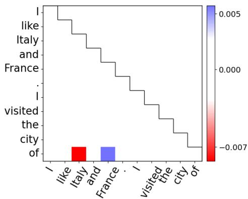

bar

| Word | Value |
|---|---|
| like | -0.007 |
| Italy and France | 0.005 |
| visited the city of | -0.007 |
| I like | -0.007 |
| I like | -0.007 |
| I like | -0.007 |
| I like | -0.007 |
| I like | -0.007 |
| I like | -0.007 |
| I like | -0.007 |
| I like | -0.007 |
| I like | -0.007 |
| I like, Italy and France | -0.007 |
| I like, Italy and France | -0.007 |
| I like, Italy and France | -0.007 |
| I like, Italy and France | -0.007 |
| I like, Italy and France | -0.007 |
| I like, Italy and France | -0.007 |
| I like, Italy and France | -0.007 |
| i like, Italy and France | -0.007 |
| i like, Italy and France | -0.007 |
| i like, Italy and France | -0.007 |
| i like, Italy and France | -0.007 |
| i like, Italy and France | -0.007 |
| i like, Italy and France | -0.007 |
| i like, Italy and France | -0.125 |
| i like, Italy and France | -0.125 |
| i like, Italy and France | -0.125 |
| i like, Italy and France | -0.125 |
| i like, Italy and France | -0.125 |
| i like, Italy and France | -0.125 |
| i like, Italy and France | -0.125 |
| i like, Italy and France | 1.466 |
| i like, Italy and France | 1.466 |
| i like, Italy and France | 1.466 |
| i like, Italy and France | 1.466 |
| i like, Italy and France | 1.466 |
| i like, Italy and France | 1.466 |
| i like, Italy and France | 1.466 |
| i like, Italy and France | -1.389 |
| i like, Italy and France | -1.389 |
| i like, Italy and France | -1.389 |
| i like, Italy and France | -1.389 |
| i like, Italy and France | -1.389 |
| i like, Italy and France | -1.389 |
| i like, Italy and France | 1.466 |
| i like, Italy and France | 1.466 |
| i like, Italy and France | 1.466 |
| i like, Italy and France | 1.466 |
| i like, Italy and France | 1.466 |
| i like, Italy and France | 1.466 |
| i like, Italy and France | +1.466 |
| i like, Italy and France | +1.466 |
| i like, Italy and France | +1.466 |
| i like, Italy and France | +1.466 |
| i like, Italy and France | +1.466 |
| i like, Italy and France | +1.466 |
| i like, Italy and France | +1.466 |
| i like (the city of) | 1.466 |
| i like (the city of) | 1.466 |
| i like (the city of) | 1.466 |
| i like (the city of) | 1.466 |
| i like (the city of) | 1.466 |
| i like (the city of) | 1.466 |
| i like (the city of) | 1.455 |
| i like (the city of) | 1.455 |
| i like (the city of) | 1.455 |
| i like (the city of) | 1.455 |
| i like (the city of) | 1.455 |
| i like (the city of) | 1.455 |
| i like (the city of) | 1.455 |
| i live (the city of) | 1.455 |
| i live (the city of) | 1.455 |
| i live (the city of) | 1.455 |
| i live (the city of) | 1.455 |
| i live (the city of) | 1.455 |
| i live (the city of) | 1.455 |
| i live (the city ofo) | 1.455 |
| i live (the city ofo) | 1.455 |
| i live (the city ofo) | 1.455 |
| i live (the city ofo) | 1.455 |
| i live (the city ofo) | 1.455 |
| i live (the city ofo) | 1.455 |
| i live (the urban ofo) | 1.455 |
| i live (the urban ofo) | 1.455 |
| i live (the urban ofo) | 1.455 |
| i live (the urban ofo) | 1.455 |
| i live (the urban ofo) | 1.455 |
| i live (the urban ofo) | 1.455 |
| i live ((the city ofo)) | 1.455 |
| i live ((the city ofo)) | 1.455 |
| i live ((the city ofo)) | 1.455 |
| i live ((the city ofo)) | 1.455 |
| i live ((the city ofo)) | 1.455 |
| i live ((the city ofo)) | 1.455 |
| i live ((the city of) | 1.455 |
| i live ((the city of) | 1.455 |
| i live ((the city of) | 1.455 |
| i live ((the city of) | 1.455 |
| i live ((the city of) | 1.455 |
| i live ((the city of) | 1.455 |
| i live ((the city of) | 1-2-2-2-2-2-2-2-2-2-2-2-2-2-2-2-2-2-2-2-2-2-2-2-2-2-2-2-2-2-2-2-2-2-2-2-2-2-2-2-2-2-2-2-2-2-2-2-2-2-2-3+/-3/3/3/3/3/3/3/3/3/3/3/3/3/3/3/3/3/3/3/3/3/3/3/3/3/3/3/3/3/3/3/3/3/3/3/3/3/3/3/3/3/3/3/3/3/3/3/3/3/3/3

(c) Reversed - Rome   
Figure 8: Attention maps for the prompt “I like Italy and France. I visited the city $\mathrm { o f } ^ { \mathrm { , } }$ (head 8, layer 30). While the forward attention is the same for both cases (a), the changes of the editing target produce two different Reversed Attention maps. Each reversed map shows that GD tries to change the attention block’s matrices in order to amplify the attention scores of the tokens that are more correlated to the editing target: by amplifying “France” for the target “Paris” (b), or by enhancing “Italy” when the target is “Rome” (c).

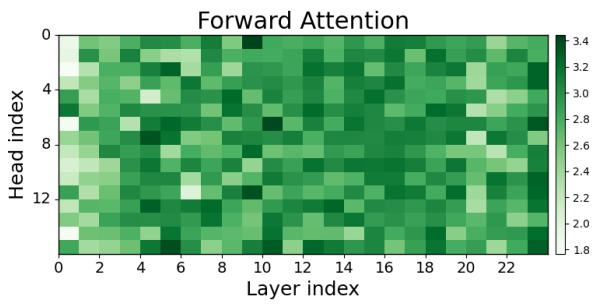

heatmap

| Layer index | Head index | Value |
| ----------- | ---------- | ----- |
| 0           | 0          | 3.4   |
| 0           | 4          | 3.2   |
| 0           | 8          | 3.0   |
| 0           | 12         | 2.8   |
| 2           | 0          | 2.6   |
| 2           | 4          | 2.4   |
| 2           | 8          | 2.2   |
| 2           | 12         | 2.0   |
| 4           | 0          | 1.8   |
| 4           | 4          | 2.0   |
| 4           | 8          | 2.2   |
| 4           | 12         | 2.4   |
| 6           | 0          | 2.6   |
| 6           | 4          | 2.8   |
| 6           | 8          | 3.0   |
| 6           | 12         | 3.2   |
| 8           | 0          | 2.8   |
| 8           | 4          | 3.0   |
| 8           | 8          | 3.2   |
| 8           | 12         | 3.4   |
| 10          | 0          | 3.0   |
| 10          | 4          | 3.2   |
| 10          | 8          | 3.4   |
| 10          | 12         | 3.6   |
| 12          | 0          | 3.2   |
| 12          | 4          | 3.4   |
| 12          | 8          | 3.6   |
| 12          | 12         | 3.8   |
| 14          | 0          | 3.4   |
| 14          | 4          | 3.6   |
| 14          | 8          | 3.8   |
| 14          | 12         | 4.0   |
| 16          | 0          | 3.6   |
| 16          | 4          | 3.8   |
| 16          | 8          | 4.0   |
| 16          | 12         | 4.2   |
| 18          | 0          | 3.8   |
| 18          | 4          | 4.0   |
| 18          | 8          | 4.2   |
| 18          | 12         | 4.4   |
| 20          | 0          | 3.6   |
| 20          | 4          | 3.8   |
| 20          | 8          | 4.0   |
| 20          | 12         | 4.2   |
| 22          | 0          | 3.4   |
| 22          | 4          | 3.6   |
| 22          | 8          | 3.8   |
| 22          | 12         | 4.0   |

(a) Attention heads by norm

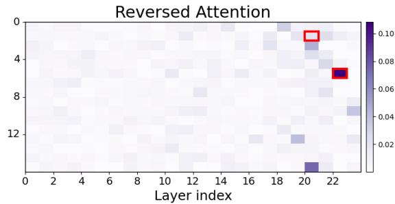

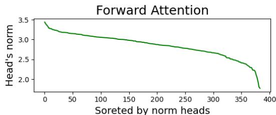

line

| Soreted by norm heads | Head's norm |
| --------------------- | ----------- |
| 0                     | 3.5         |
| 50                    | 3.2         |
| 100                   | 3.1         |
| 150                   | 3.0         |
| 200                   | 2.9         |
| 250                   | 2.8         |
| 300                   | 2.7         |
| 350                   | 2.4         |
| 380                   | 1.8         |
| 400                   | 1.5         |

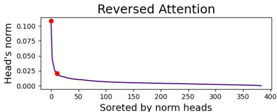

line

| Soreted by norm heads | Head's norm |
| --------------------- | ----------- |
| 0                     | 0.100       |
| 25                    | 0.025       |
| 400                   | 0.000       |

(b) Sorted by attention heads norm values

Figure 9: The forward and Reversed Attention (RA) of OPT-350m, given the editing target “Paris” and the prompt “I like Italy and France. I visited the city $\mathrm { o f } ^ { \prime \prime }$ . The head with the highest RA norm is highlighted in red as well as the 11-th highest.   
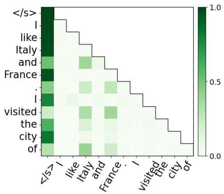

heatmap

| | <Is> | I | like | Italy | and | France | visited | the | city | of |
|---|---|---|---|---|---|---|---|---|---|---|
| </s> | 1.0 | 0.8 | 0.6 | 0.4 | 0.2 | 0.1 | 0.05 | 0.03 | 0.02 | 0.01 |
| I | 0.9 | 0.7 | 0.5 | 0.3 | 0.15 | 0.08 | 0.04 | 0.02 | 0.01 | 0.005 |
| like | 0.85 | 0.65 | 0.45 | 0.25 | 0.12 | 0.06 | 0.03 | 0.015 | 0.008 | 0.003 |
| Italy | 0.8 | 0.6 | 0.4 | 0.25 | 0.12 | 0.06 | 0.03 | 0.015 | 0.008 | 0.003 |
| and | 0.75 | 0.55 | 0.35 | 0.2 | 0.12 | 0.06 | 0.03 | 0.015 | 0.008 | 0.003 |
| France | 0.7 | 0.5 | 0.35 | 0.15 | 0.12 | 0.06 | 0.03 | 0.015 | 0.008 | 0.003 |
| . | 0.65 | 0.45 | 0.3 | 0.15 | 0.12 | 0.06 | 0.03 | 0.015 | 0.008 | 0.003 |
| I | 0.6 | 0.4 | 0.25 | 0.12 | 0.12 | 0.06 | 0.03 | 0.015 | 0.008 | 0.003 |
| visited | 0.55 | 0.35 | 0.25 | 0.12 | 0.12 | 0.06 | 0.03 | 0.015 | 0.008 | 0.003 |
| the | 0.5 | 0.3 | 0.25 | 0.12 | 0.12 | 0.06 | 0.03 | 0.015 | 0.008 | 0.003 |
| city | 0.45 | 0.25 | 0.2 | 0.12 | 0.12 | 0.06 | 0.03 | 0.015 | 0.008 | 0.003 |
| of | 0.4 | 0.2 | 0.15 | 0.12 | 0.12 | 0.06 | 0.03 | 0.015 | 0.008 | 0.003 |
The data is presented in a grid format with rows and columns labeled as 'i' and 'e'. The values for the rows are estimated based on the y-axis label 'if' (e.g., 'if' or 'if' should be present). The y-axis labels are 'i' and 'e'. The color scale ranges from light green (low) to dark green (high), indicating the magnitude of the value at each point, with darker shades representing higher values.

(a) L22H5 - Forward

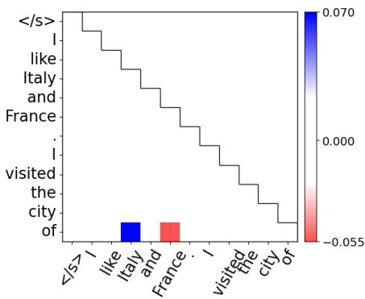

bar

| Category | Value |
|---|---|
| </s> | 0.070 |
| like | 0.000 |
| Italy and France | -0.055 |
| visited | 0.000 |
| the city of | 0.000 |
| of | 0.000 |

(b) L22H5 - Reversed

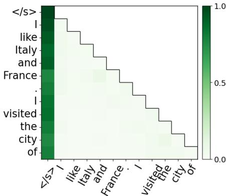

heatmap

| | /s> | <s> | like | Italy | and | France | visited | the | city | of |
|---|---|---|---|---|---|---|---|---|---|---|
| | I | 1 | 0.8 | 0.7 | 0.6 | 0.5 | 0.4 | 0.3 | 0.2 | 0.1 |
| | like | 1 | 0.75 | 0.65 | 0.55 | 0.45 | 0.35 | 0.25 | 0.15 | 0.05 |
| | Italy | 1 | 0.7 | 0.6 | 0.5 | 0.4 | 0.3 | 0.2 | 0.15 | 0.05 |
| and | France | 1 | 0.65 | 0.55 | 0.45 | 0.35 | 0.25 | 0.15 | 0.05 | 0.0 |
| i | . | 1 | 0.6 | 0.5 | 0.4 | 0.3 | 0.2 | 0.1 | 0.05 | 0.0 |
| visited | visited | 1 | 0.55 | 0.45 | 0.35 | 0.25 | 0.15 | 0.05 | 0.0 | 0.0 |
| the | the | 1 | 0.5 | 0.4 | 0.3 | 0.2 | 0.1 | 0.05 | 0.0 | 0.0 |
| city | city | 1 | 0.45 | 0.35 | 0.25 | 0.15 | 0.05 | 0.0 | 0.0 | 0.0 |
| of | of | 1 | 0.4 | 0.3 | 0.2 | 0.1 | 0.05 | 0.0 | 0.0 | 0.0 |

(c) L20H1 - Forward

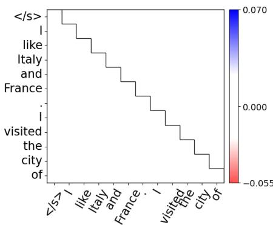

bar

| Word | Value |
|---|---|
| </s> | 0.070 |
| I like Italy and France | 0.000 |
| I visited the city of | -0.055 |
| like Italy and France | 0.070 |
| i visited the city of | 0.000 |
| the city of | -0.055 |
| of | 0.070 |

(d) L20H1 - Reversed   
Figure 10: Attention maps of OPT-350m for the prompt “I like Italy and France. I visited the city $\mathrm { o f } ^ { \prime \prime }$ . The head with the highest Reversed Attention (RA) norm is head 5 at layer 22 (L22H5). Its RA map (b) shows how it amplifies the attention score for “France” while reducing that $\mathrm { \ o f \ ^ { 6 } \bar { \ r } t a l y ^ { \prime 3 } }$ . Head 1 at layer 20 is the 11-th highest head by RA norm. We present its RA map (d) using the same color bar scale as that of L22H5, which highlights that this head barely undergoes any update.

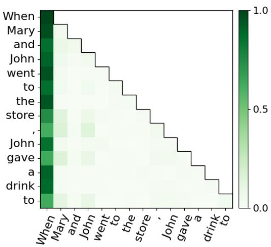

heatmap

| | When | Mary | and | John | went | to | the | store | ' | John | gave | a | drink | to |
|---|---|---|---|---|---|---|---|---|---|---|---|---|---|---|
| When | 1.0 | 0.95 | 0.85 | 0.75 | 0.65 | 0.55 | 0.45 | 0.35 | 0.25 | 0.15 | 0.05 | 0.02 | 0.01 | 0.01 |
| Mary | 0.95 | 0.85 | 0.75 | 0.65 | 0.55 | 0.45 | 0.35 | 0.25 | 0.15 | 0.05 | 0.02 | 0.01 | 0.01 | 0.01 |
| and | 0.85 | 0.75 | 0.65 | 0.55 | 0.45 | 0.35 | 0.25 | 0.15 | 0.05 | 0.02 | 0.01 | 0.01 | 0.01 | 0.01 |
| John | 0.75 | 0.65 | 0.55 | 0.45 | 0.35 | 0.25 | 0.15 | 0.05 | 0.02 | 0.01 | 0.01 | 0.01 | 0.01 | 0.01 |
| went | 0.65 | 0.55 | 0.45 | 0.35 | 0.25 | 0.15 | 0.05 | 0.02 | 0.01 | 0.01 | 0.01 | 0.01 | 0.01 | 0.01 |
| to | 0.55 | 0.45 | 0.35 | 0.25 | 0.15 | 0.05 | 0.02 | 0.01 | 0.01 | 0.01 | 0.01 | 0.01 | 0.01 | 0.01 |
| the | 0.45 | 0.35 | 0.25 | 0.15 | 0.05 | 0.02 | 0.01 | 0.01 | 0.01 | 0.01 | 0.01 | 0.01 | 0.01 | 0.01 |
| store | 0.35 | 0.25 | 0.15 | 0.05 | 0.02 | 0.01 | 0.01 | 0.01 | 0.01 | 0.01 | 0.01 | 0.01 | 0.01 | 0.01 |
| , | 0.25 | 0.15 | 0.05 | 0.02 | 0.01 | 0.01 | 0.01 | 0.01 | 0.01 | 0.01 | 0.01 | 0.01 | 0.01 | 0.01 |
| John | 0.15 | 0.05 | 0.95 | -   | -   | -   | -   | -   | -   | -   | -   | -   | -   | -   |
| gave | -   | -     | -     | -   | -   | -   | -   | -   | -   | -   | -   | -   | -   | -   |
| a   | -   | -     | -     | -   | -   | -   | -   | -   | -   | -   | -   | -   | -   | -   |
| drink| -   | -     | -     | -   | -   | -   | -   | -   | -   | -   | -   | -   | -   | -   |
| to  | -   | -     | -     | -   | -   | -   | -   | -   | -   | -   | -   | -   | -   | -   |
The chart displays a heatmap with color intensity corresponding to each cell's value on the vertical axis (Y-axis). The X-axis labels are: when, when, and when respectively; when, when, and when respectively; the Y-axis labels are: "Mary," "and," "went," "to," "the," "store," "a," "drink," "to." The color scale ranges from ~-1 (dark green) to ~+1 (light green), indicating the magnitude of the rating scale at each cell.

(a) L11H2 - Forward

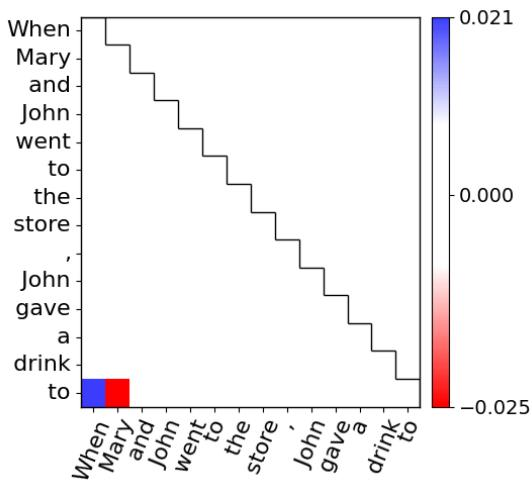

bar

| Action | Value  |
|--------|--------|
| When   | 0.021  |
| Mary   | -0.025 |
| and    | 0.000  |
| John   | 0.000  |
| went   | 0.000  |
| to     | 0.000  |
| the    | 0.000  |
| store  | 0.000  |
| John   | 0.000  |
| gave   | 0.000  |
| a      | 0.000  |
| drink  | -0.025 |
| to     | -0.025 |

(b) L11H2 - Reversed

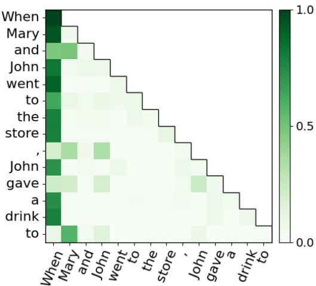

heatmap

| | When | Mary | and | John | went | to | the | store | ' | John | gave | a | drink | to |
|---|---|---|---|---|---|---|---|---|---|---|---|---|---|---|
| When | 1.0 | 0.8 | 0.6 | 0.4 | 0.2 | 0.1 | 0.05 | 0.03 | 0.02 | 0.01 | 0.005 | 0.003 | 0.002 | 0.001 |
| Mary | 0.9 | 0.7 | 0.5 | 0.3 | 0.15 | 0.08 | 0.04 | 0.02 | 0.01 | 0.005 | 0.003 | 0.002 | 0.001 | 0.0005 |
| and | 0.85 | 0.65 | 0.45 | 0.25 | 0.12 | 0.06 | 0.03 | 0.015 | 0.01 | 0.005 | 0.003 | 0.002 | 0.001 | 0.0005 |
| John | 0.8 | 0.6 | 0.4 | 0.25 | 0.12 | 0.06 | 0.03 | 0.02 | 0.01 | 0.005 | 0.003 | 0.002 | 0.001 | 0.0005 |
| went | 0.75 | 0.55 | 0.35 | 0.2 | 0.125 | 0.065 | 0.035 | 0.025 | 0.015 | 0.01 | 0.005 | 0.003 | 0.002 | 0.001 |
| to | 0.7 | 0.5 | 0.35 | 0.15 | 0.125 | 0.065 | 0.04 | 0.03 | 0.125 | 0.125 | 0.125 | 0.125 | 0.125 | 0.125 |
| the store | 0.65 | 0.45 | 0.3 | 0.125 | 0.125 | 0.125 | 0.125 | 0.125 | 1.125 | 1.125 | 1.125 | 1.125 | 1.125 | 1.125 |
| , John gave a drink to | 1.125 | 1.125 | 1.125 | 1.125 | 1.125 | 1.125 | 1.125 | 1.125 | 1.125 | 1.125 | 1.125 | 1.125 | 1.125 | 1.125 |
| , a drink to (with 'a' and 'a' have two additional values) to (with 'a' and 'a' have two additional values) to (with 'a' and 'a' have two additional values) to (with 'a' and 'a' have two additional values) to (with 'a' and 'a' have two additional values) to (with 'a' and 'a' have two additional values) to (with 'a' and 'a' have two additional values) to (with 'a' and 'a') to (with 'a' and 'a' have two additional values) to (with 'a' and 'a' have two additional values) to (with 'a' and 'a' have two additional values) to (with 'a' and 'a' have two additional values) to (with 'a' and 'a' have two additional values) to (with 'a' and 'a' have two additional values) to (with 'a' and 'a', 'a' have two additional values) to (with 'a' and 'a' have two additional values) to (with 'a' and 'a' have two additional values) to (with 'a' and 'a' have two additional values) to (with 'a' and 'a' have two additional values) to (with 'a' and 'a' have two additional values) to (with 'a' and 'a' have two additional values) to the end of the matrix.

(c) L10H7 - Forward

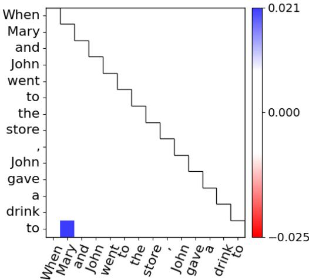  
(d) L10H7 - Reversed

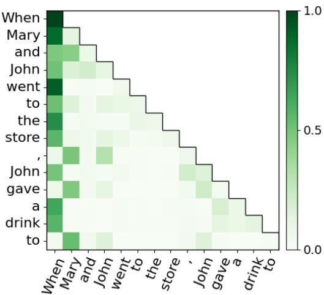  
(e) L11H10 - Forward

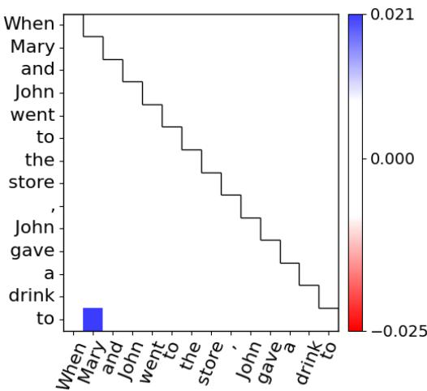

heatmap

| When | Mary | and | John | went to | the store | John gave | a drink to |
|------|------|-----|------|---------|-----------|-----------|------------|
| to   | 0.021| 0.021| 0.021| 0.021   | 0.021     | 0.021     | 0.021      |

(f) L11H10 - Reversed   
Figure 11: The GPT2-small attention maps for the prompt “When Mary and John went to the store, John gave a drink $\mathrm { t o } ^ { \prime \prime }$ with the target token $\mathbf { \dot { \Psi } } ^ { \mathrm { t 6 } } \mathbf { M } \mathbf { a r y } ^ { \mathbf { \mathfrak { p } } }$ . The displayed heads are the top three ranked by the norm of their Reversed Attention (RA). The first by its RA norm, head 2 at layer 11, exhibits an RA pattern (b) that directs the editing process to increase the attention given to the input token “Mary”. In contrast, the other two heads, (d) and (f), show patterns that decrease the attention score for $\mathbf { \ddot { \tau } } \mathbf { M a r y } ^ { \mathbf { \vec { \tau } } }$ , suggesting that these heads have a negative direct effect on predicting the token “Mary”.

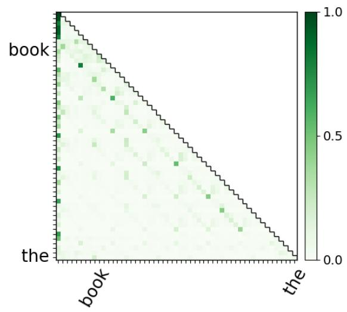

heatmap

|        | book  | the   |
| ------ | ----- | ----- |
| top    | 1.0   | 0.0   |
| bottom | 0.5   | 0.5   |
| middle | 0.25  | 0.75  |
| top-right | 0.0   | 1.0   |

(a) “the book is in Box A” - Forward

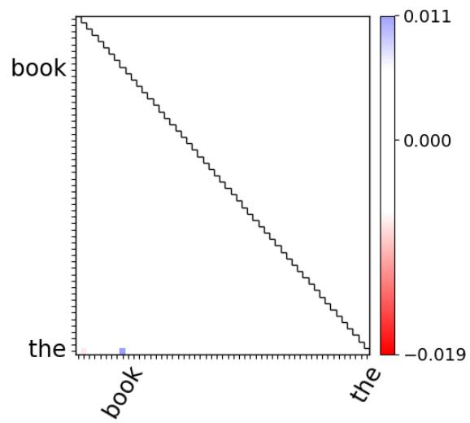

heatmap

|        | book   | the    |
| ------ | ------ | ------ |
| the    | -0.019 | 0.011  |

(b) “the book is in Box A” - Reversed

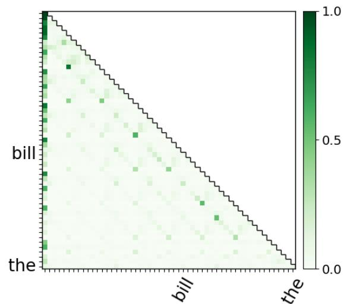

heatmap

| bill \ the | 0.0 | 0.5 | 1.0 |
| ----------- | --- | --- | --- |
| the         |     |     |     |
| bill        |     |     |     |

(c) “the bill is in Box C” - Forward

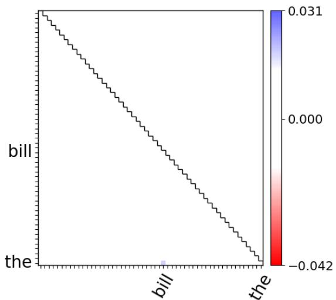

heatmap

| bill \ the | value   |
| ---------- | ------- |
| the        | 0.031   |
| the        | 0.000   |
| the        | -0.042  |

(d) “the bill is in Box C” - Reversed   
Figure 12: Attention maps of GPT2-xl are shown for two entity tracking prompts. The first prompt in (a) and (b) is “The orange is in Box X, the book is in Box A... Box A contains the”. The second prompt in (c) and (d) is “The magnet is in Box B... the bill is in Box C... Box C contains the”. The editing targets are “book” for the first prompt and “bill” for the second. In both cases, attention head 14 in layer 26 was among the heads with the highest Reversed Attention norm. The patterns presented in (b) and (d) suggest that this head should pay less attention to the target tokens.

# B Perturbation Test

In this section, we present the full results of the perturbation analysis outlined in subsection 5.2. This analysis can be viewed as a sparsity test, wherein we mask (zero-out) all attention heads and gradually unmask them according to different methods.

Throughout this section, we examine the ordering provided by Reversed Attention (RA) norms and by Causal Mediation (CM). As a baseline, we also consider the ordering provided by the norm of the average forward pass attention scores (“Forward”), random order (“Random”), and the order of the attention heads in the model (“Index”). Additionally, we evaluate each method by the order it provides and by the reverse order, denoted by the suffix “[ ]”. For example, RA orders the heads from ones with the largest norm to the one with the smallest, while “RA[ ]” orders them from the smallest to the largest. This reversal in orders represents a negative perturbation test, whereas the original order represents a positive test. A successful order in such a case should yield high Area Under the Curve (AUC) in the positive test and low AUC in the negative test, for the graph that measures the model’s accuracy as we unmask the heads in the order of the method.

Causal Mediation implementation CM is applied separately for each task, returning the average indirect effect (AIE) for each attention head. For all tasks, we exclude the AIE when applying CM on the prompts’ last tokens (the target token), as it is the token that the model should edit. One implementation we use (CM1) zeros out each head separately.

Another implementation we examined (CM2) is the implementation provided by Todd et al. (2023). This implementation instead of zeroing-out the heads, uses the average activation of each head, as collected from a few left-out examples. An example for the CM2 we produced, compare to the RA norms, is shown in Figure 13.

Datasets The ICL tasks we used are sourced from (Todd et al., 2023). Each task consists of a set of pairs with a common relation in the format “<question>,<answer>”, where the model is tasked with completing the answer given the question. For constructing the prompt for each task and pair, we used the following format: “Q: <question> \A: <answer> \\”. For example, a 2-shot prompt is in the form of: “Q: <question1> \A: <answer1> \\Q: <question2> \A: <answer2> \\Q: <question> \A:”.

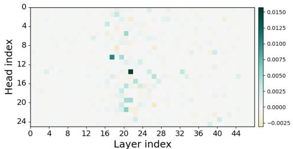

(a) Causal mediation (AIE) implementation by Todd et al. (2023)   
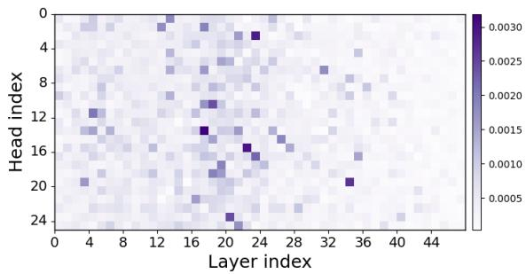

heatmap

| Layer index | Head index | Value    |
| ----------- | ---------- | -------- |
| 0           | 0          | 0.0030   |
| 4           | 4          | 0.0025   |
| 8           | 8          | 0.0020   |
| 12          | 12         | 0.0015   |
| 16          | 16         | 0.0010   |
| 20          | 20         | 0.0005   |
| 24          | 24         | 0.0015   |
| 28          | 28         | 0.0020   |
| 32          | 32         | 0.0025   |
| 36          | 36         | 0.0030   |
| 40          | 40         | 0.0025   |
| 44          | 44         | 0.0020   |

(b) Reversed Attention (norm)   
Figure 13: GPT2-xl causal mediation and Reversed Attention maps for the ICL capitalize task with 5-shots.

The natural language questions we utilized are from (Hernandez et al., 2024). This dataset comprises tasks, each with a set of pairs in the format “<question>,<answer>”, along with a natural language format for constructing the prompt. For instance, in the task concerning the relationship between persons that plays pro sports, the format is “<question> plays the sport of <answer>”. We observed that two tasks, country-capital and presentpast, had too few examples but shared the same relation as tasks in the ICL dataset by (Todd et al., 2023).1 We employed the format from (Hernandez et al., 2024) along with the pairs from (Todd et al., 2023).

In practice, we additionally examined the natural language tasks by prompting the tasks’ question with few-shots labeled example. Hence, the 0- shots represent the original tasks, while the n-shots results are provided for comprehensive examination. We adopt this practice from NLP benchmark like HuggingFace leaderborad.2 For example, a common practice is to evaluate HellaSwag (Zellers et al., 2019) with 10-shots and MMLU (Hendrycks et al., 2021) with 5-shots.

The full list of tasks is provided in Table 4. To summarize, we have ICL tasks with a uniform format of prompt, where the model is required to infer the relation between the question and the answer from given examples. Additionally, we have natural language questions (with and without given examples) where the relation between the question and the answer is explicitly stated in the prompt. In all experiments, and for each task separately, we used a split of 1/3 from all available examples to extract the test set. This set of examples is used to report our results and is not included in the creation of any method (i.e. RA, CM).

# B.1 Perturbation results

We conducted the perturbation test on GPT2-xl (Radford et al., 2019), OPT-1.3B (Zhang et al., 2022), GPT-j (Wang and Komatsuzaki, 2021) and Llama2-7B (Touvron et al., 2023) models. For each task and method, we provided 25 examples to extract the order of the attention heads. We quantified the performance of each method by the AUC of the graph that measures the model’s accuracy as we unmask the heads. Figure 14 provides an example of such a graph and the AUC results extracted from it.

The full ICL results are displayed in Table 5 6 7 and 8. We notice that for all models, RA achieves the best results in the majority of the tasks when prompted with 5 or 10 shots, only falling behind CM without any shots. It is also evident that RA shows more dominance across tasks with relatively larger models, like LLaMA2-7B.

The natural language task results are provided in Table 9 10 11 and 12. When considering the 0-shot setting, which is equivalent to examining the perturbation task on the original natural language tasks, we find that when the models’ original ability to answer the asked question is high, RA achieves better results compare to CM. In all other cases CM is better only under the 0-shot setup. With few-shot prompting, RA is the preferred method.

In summary, the perturbation test reveals that RA has the potential to localize the model’s behavior similar to existing methods and in particular in ICL tasks.

Table 4: List of tasks 

<table><tr><td>Task</td><td>Task source and type</td><td>Examples</td></tr><tr><td>adjective-v-verb-3 alphabetically-first-3 animal-v-object-3 antonym capitalize capitalize-first-letter choose-middle-of-3 country-capital english-french next-item person-sport present-past prev-item singular-plural synonym</td><td>ICL (Todd et al., 2023)</td><td>Q: uplifting, approve, decide A: [uplifting] Q: blissful, rat, dingo A: [blissful] Q: bicycle, skunk, egg A: [skunk] Q: expire A: [renew] Q: cow A: [Cow] Q: bunny A: [B] Q: white, house, wallet A: [house] Q: Cabo Verde A: [Praia] Q: careful A: [prudent] Q: 12 A: [13] Q: Lou Gehrig A: [baseball] Q: justify A: [justified] Q: 13 A: [12] Q: glue A: [glues] Q: missing A: [lost]</td></tr><tr><td>company-hq landmark-in-country person-plays-pro-sport product-by-company</td><td>Natural question (Hernandez et al., 2024)</td><td>EMI is headquartered in the city of [London] route 75 is in the country of [Australia] Lou Gehrig plays the sport of [baseball] Digital Negative was created by [Adobe]</td></tr><tr><td>country-capital present-past</td><td>Natural questoin (Hernandez et al., 2024), (Todd et al., 2023)</td><td>The capital city of Cabo Verde is [Praia] The past tense of justify is [justified]</td></tr></table>

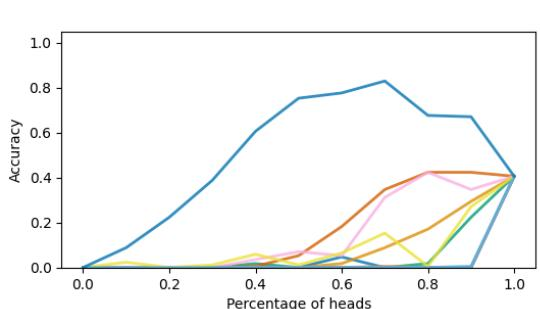

line

| Percentage of heads | Accuracy (Line 1) | Accuracy (Line 2) | Accuracy (Line 3) | Accuracy (Line 4) | Accuracy (Line 5) |
| ------------------- | ----------------- | ----------------- | ----------------- | ----------------- | ----------------- |
| 0.0                 | 0.0               | 0.0               | 0.0               | 0.0               | 0.0               |
| 0.2                 | 0.2               | 0.0               | 0.0               | 0.0               | 0.0               |
| 0.4                 | 0.6               | 0.1               | 0.1               | 0.1               | 0.0               |
| 0.6                 | 0.8               | 0.3               | 0.2               | 0.1               | 0.0               |
| 0.8                 | 0.7               | 0.4               | 0.4               | 0.3               | 0.1               |
| 1.0                 | 0.4               | 0.4               | 0.4               | 0.4               | 0.4               |

(a) 0-shots

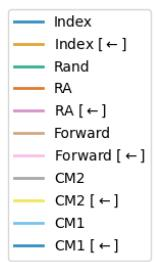

text_image

Index
Index [←]
Rand
RA
RA [←]
Forward
Forward [←]
CM2
CM2 [←]
CM1
CM1 [←]

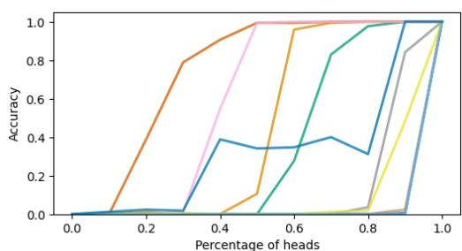

line

| Percentage of heads | Accuracy (Line 1) | Accuracy (Line 2) | Accuracy (Line 3) | Accuracy (Line 4) | Accuracy (Line 5) | Accuracy (Line 6) | Accuracy (Line 7) |
| ------------------- | ----------------- | ----------------- | ----------------- | ----------------- | ----------------- | ----------------- | ----------------- |
| 0.0                 | 0.0               | 0.0               | 0.0               | 0.0               | 0.0               | 0.0               | 0.0               |
| 0.2                 | 0.0               | 0.0               | 0.0               | 0.0               | 0.0               | 0.0               | 0.0               |
| 0.4                 | 0.4               | 0.8               | 1.0               | 1.0               | 1.0               | 1.0               | 1.0               |
| 0.6                 | 0.3               | 1.0               | 1.0               | 1.0               | 1.0               | 1.0               | 1.0               |
| 0.8                 | 0.3               | 1.0               | 1.0               | 1.0               | 1.0               | 1.0               | 1.0               |
| 1.0                 | 1.0               | 1.0               | 1.0               | 1.0               | 1.0               | 1.0               | 1.0               |

(b) 10-shots   
Figure 14: Perturbation test results visualized for Llama2-7B on the capitalize ICL task. With no shots, when the original model achieves only 0.4 accuracy, causal mediation (CM) achieve the highest AUC score. With few-shots prompting, Reversed Attention (RA) outperforms all other methods.

<table><tr><td>Task</td><td>n-shots</td><td>Random</td><td>Index [←]</td><td>Index</td><td>CM2 [←]</td><td>CM2</td><td>CM1 [←]</td><td>CM1</td><td>FA [←]</td><td>FA</td><td>RA [←]</td><td>RA</td></tr><tr><td rowspan="4">adjective-v-verb-3</td><td>0</td><td>0.03</td><td>0.04</td><td>0.05</td><td>0.09</td><td>0.01</td><td>0.44</td><td>0.01</td><td>0.03</td><td>0.03</td><td>0.01</td><td>0.05</td></tr><tr><td>1</td><td>0.21</td><td>0.18</td><td>0.09</td><td>0.27</td><td>0.03</td><td>0.63</td><td>0.02</td><td>0.1</td><td>0.12</td><td>0.03</td><td>0.3</td></tr><tr><td>5</td><td>0.23</td><td>0.22</td><td>0.08</td><td>0.21</td><td>0.05</td><td>0.15</td><td>0.03</td><td>0.18</td><td>0.14</td><td>0.03</td><td>0.35</td></tr><tr><td>10</td><td>0.25</td><td>0.24</td><td>0.09</td><td>0.12</td><td>0.1</td><td>0.4</td><td>0.04</td><td>0.2</td><td>0.11</td><td>0.03</td><td>0.36</td></tr><tr><td rowspan="4">alphabetically-first-3</td><td>0</td><td>0.02</td><td>0.03</td><td>0.05</td><td>0.15</td><td>0.01</td><td>0.28</td><td>0.01</td><td>0.02</td><td>0.04</td><td>0.02</td><td>0.04</td></tr><tr><td>1</td><td>0.12</td><td>0.13</td><td>0.06</td><td>0.07</td><td>0.11</td><td>0.22</td><td>0.02</td><td>0.07</td><td>0.08</td><td>0.02</td><td>0.2</td></tr><tr><td>5</td><td>0.15</td><td>0.15</td><td>0.05</td><td>0.08</td><td>0.11</td><td>0.19</td><td>0.05</td><td>0.1</td><td>0.08</td><td>0.02</td><td>0.23</td></tr><tr><td>10</td><td>0.14</td><td>0.13</td><td>0.05</td><td>0.11</td><td>0.13</td><td>0.23</td><td>0.05</td><td>0.1</td><td>0.06</td><td>0.02</td><td>0.22</td></tr><tr><td rowspan="4">animal-v-object-3</td><td>0</td><td>0.09</td><td>0.03</td><td>0.06</td><td>0.11</td><td>0.01</td><td>0.28</td><td>0.01</td><td>0.03</td><td>0.04</td><td>0.02</td><td>0.08</td></tr><tr><td>1</td><td>0.2</td><td>0.16</td><td>0.08</td><td>0.3</td><td>0.04</td><td>0.39</td><td>0.03</td><td>0.13</td><td>0.11</td><td>0.02</td><td>0.29</td></tr><tr><td>5</td><td>0.28</td><td>0.27</td><td>0.1</td><td>0.18</td><td>0.13</td><td>0.44</td><td>0.04</td><td>0.24</td><td>0.16</td><td>0.04</td><td>0.42</td></tr><tr><td>10</td><td>0.3</td><td>0.29</td><td>0.1</td><td>0.23</td><td>0.1</td><td>0.3</td><td>0.05</td><td>0.27</td><td>0.15</td><td>0.05</td><td>0.49</td></tr><tr><td rowspan="4">antonym</td><td>0</td><td>0.0</td><td>0.0</td><td>0.0</td><td>0.0</td><td>0.0</td><td>0.01</td><td>0.0</td><td>0.0</td><td>0.0</td><td>0.0</td><td>0.0</td></tr><tr><td>1</td><td>0.02</td><td>0.07</td><td>0.02</td><td>0.01</td><td>0.01</td><td>0.15</td><td>0.01</td><td>0.02</td><td>0.02</td><td>0.01</td><td>0.07</td></tr><tr><td>5</td><td>0.09</td><td>0.24</td><td>0.06</td><td>0.03</td><td>0.03</td><td>0.27</td><td>0.03</td><td>0.15</td><td>0.05</td><td>0.02</td><td>0.32</td></tr><tr><td>10</td><td>0.11</td><td>0.26</td><td>0.07</td><td>0.03</td><td>0.03</td><td>0.3</td><td>0.03</td><td>0.17</td><td>0.05</td><td>0.03</td><td>0.34</td></tr><tr><td rowspan="4">capitalize</td><td>0</td><td>0.01</td><td>0.0</td><td>0.0</td><td>0.08</td><td>0.0</td><td>0.23</td><td>0.0</td><td>0.0</td><td>0.0</td><td>0.03</td><td>0.0</td></tr><tr><td>1</td><td>0.08</td><td>0.19</td><td>0.05</td><td>0.12</td><td>0.05</td><td>0.64</td><td>0.01</td><td>0.03</td><td>0.07</td><td>0.03</td><td>0.1</td></tr><tr><td>5</td><td>0.31</td><td>0.43</td><td>0.14</td><td>0.1</td><td>0.27</td><td>0.52</td><td>0.05</td><td>0.26</td><td>0.17</td><td>0.05</td><td>0.5</td></tr><tr><td>10</td><td>0.36</td><td>0.45</td><td>0.14</td><td>0.08</td><td>0.27</td><td>0.59</td><td>0.05</td><td>0.32</td><td>0.16</td><td>0.05</td><td>0.59</td></tr><tr><td rowspan="4">choose-middle-of-3</td><td>0</td><td>0.02</td><td>0.02</td><td>0.02</td><td>0.05</td><td>0.01</td><td>0.24</td><td>0.01</td><td>0.01</td><td>0.02</td><td>0.01</td><td>0.02</td></tr><tr><td>1</td><td>0.1</td><td>0.16</td><td>0.06</td><td>0.1</td><td>0.05</td><td>0.35</td><td>0.03</td><td>0.05</td><td>0.08</td><td>0.02</td><td>0.19</td></tr><tr><td>5</td><td>0.17</td><td>0.23</td><td>0.07</td><td>0.04</td><td>0.11</td><td>0.21</td><td>0.05</td><td>0.13</td><td>0.1</td><td>0.03</td><td>0.3</td></tr><tr><td>10</td><td>0.2</td><td>0.25</td><td>0.07</td><td>0.05</td><td>0.25</td><td>0.2</td><td>0.05</td><td>0.14</td><td>0.08</td><td>0.04</td><td>0.35</td></tr><tr><td rowspan="4">country-capital</td><td>0</td><td>0.0</td><td>0.0</td><td>0.01</td><td>0.02</td><td>0.0</td><td>0.04</td><td>0.0</td><td>0.0</td><td>0.02</td><td>0.0</td><td>0.0</td></tr><tr><td>1</td><td>0.07</td><td>0.18</td><td>0.08</td><td>0.08</td><td>0.02</td><td>0.22</td><td>0.02</td><td>0.08</td><td>0.09</td><td>0.03</td><td>0.29</td></tr><tr><td>5</td><td>0.19</td><td>0.3</td><td>0.1</td><td>0.05</td><td>0.05</td><td>0.4</td><td>0.04</td><td>0.24</td><td>0.07</td><td>0.04</td><td>0.42</td></tr><tr><td>10</td><td>0.19</td><td>0.29</td><td>0.1</td><td>0.07</td><td>0.08</td><td>0.55</td><td>0.03</td><td>0.24</td><td>0.07</td><td>0.04</td><td>0.4</td></tr><tr><td rowspan="4">english-french</td><td>0</td><td>0.0</td><td>0.0</td><td>0.0</td><td>0.0</td><td>0.0</td><td>0.01</td><td>0.0</td><td>0.0</td><td>0.0</td><td>0.0</td><td>0.0</td></tr><tr><td>1</td><td>0.01</td><td>0.03</td><td>0.01</td><td>0.01</td><td>0.01</td><td>0.02</td><td>0.0</td><td>0.02</td><td>0.01</td><td>0.01</td><td>0.04</td></tr><tr><td>5</td><td>0.06</td><td>0.08</td><td>0.02</td><td>0.02</td><td>0.03</td><td>0.08</td><td>0.01</td><td>0.06</td><td>0.03</td><td>0.01</td><td>0.12</td></tr><tr><td>10</td><td>0.07</td><td>0.09</td><td>0.03</td><td>0.02</td><td>0.04</td><td>0.06</td><td>0.02</td><td>0.07</td><td>0.03</td><td>0.01</td><td>0.13</td></tr><tr><td rowspan="4">lowercase-last-letter</td><td>0</td><td>0.0</td><td>0.0</td><td>0.0</td><td>0.0</td><td>0.0</td><td>0.0</td><td>0.0</td><td>0.0</td><td>0.0</td><td>0.0</td><td>0.0</td></tr><tr><td>1</td><td>0.02</td><td>0.03</td><td>0.01</td><td>0.03</td><td>0.02</td><td>0.08</td><td>0.0</td><td>0.01</td><td>0.02</td><td>0.01</td><td>0.06</td></tr><tr><td>5</td><td>0.05</td><td>0.06</td><td>0.02</td><td>0.06</td><td>0.04</td><td>0.14</td><td>0.01</td><td>0.04</td><td>0.02</td><td>0.01</td><td>0.1</td></tr><tr><td>10</td><td>0.06</td><td>0.08</td><td>0.02</td><td>0.07</td><td>0.04</td><td>0.11</td><td>0.03</td><td>0.05</td><td>0.03</td><td>0.01</td><td>0.1</td></tr><tr><td rowspan="4">next-item</td><td>0</td><td>0.02</td><td>0.01</td><td>0.03</td><td>0.06</td><td>0.0</td><td>0.22</td><td>0.0</td><td>0.02</td><td>0.01</td><td>0.01</td><td>0.03</td></tr><tr><td>1</td><td>0.06</td><td>0.1</td><td>0.04</td><td>0.07</td><td>0.02</td><td>0.25</td><td>0.01</td><td>0.05</td><td>0.04</td><td>0.03</td><td>0.14</td></tr><tr><td>5</td><td>0.17</td><td>0.26</td><td>0.08</td><td>0.1</td><td>0.05</td><td>0.31</td><td>0.03</td><td>0.2</td><td>0.07</td><td>0.03</td><td>0.34</td></tr><tr><td>10</td><td>0.22</td><td>0.27</td><td>0.09</td><td>0.12</td><td>0.09</td><td>0.3</td><td>0.04</td><td>0.21</td><td>0.08</td><td>0.04</td><td>0.4</td></tr><tr><td rowspan="4">person-sport</td><td>0</td><td>0.0</td><td>0.0</td><td>0.0</td><td>0.0</td><td>0.0</td><td>0.0</td><td>0.0</td><td>0.0</td><td>0.0</td><td>0.0</td><td>0.0</td></tr><tr><td>1</td><td>0.22</td><td>0.33</td><td>0.09</td><td>0.18</td><td>0.13</td><td>0.35</td><td>0.03</td><td>0.11</td><td>0.1</td><td>0.06</td><td>0.37</td></tr><tr><td>5</td><td>0.21</td><td>0.34</td><td>0.09</td><td>0.18</td><td>0.16</td><td>0.34</td><td>0.07</td><td>0.24</td><td>0.09</td><td>0.09</td><td>0.44</td></tr><tr><td>10</td><td>0.22</td><td>0.33</td><td>0.09</td><td>0.23</td><td>0.19</td><td>0.31</td><td>0.11</td><td>0.31</td><td>0.11</td><td>0.09</td><td>0.45</td></tr><tr><td rowspan="4">present-past</td><td>0</td><td>0.0</td><td>0.0</td><td>0.0</td><td>0.0</td><td>0.0</td><td>0.02</td><td>0.0</td><td>0.0</td><td>0.0</td><td>0.0</td><td>0.0</td></tr><tr><td>1</td><td>0.05</td><td>0.19</td><td>0.05</td><td>0.1</td><td>0.05</td><td>0.45</td><td>0.02</td><td>0.07</td><td>0.05</td><td>0.02</td><td>0.13</td></tr><tr><td>5</td><td>0.34</td><td>0.49</td><td>0.15</td><td>0.07</td><td>0.27</td><td>0.68</td><td>0.06</td><td>0.34</td><td>0.19</td><td>0.05</td><td>0.65</td></tr><tr><td>10</td><td>0.36</td><td>0.49</td><td>0.15</td><td>0.06</td><td>0.27</td><td>0.77</td><td>0.05</td><td>0.41</td><td>0.19</td><td>0.05</td><td>0.69</td></tr><tr><td rowspan="4">prev-item</td><td>0</td><td>0.01</td><td>0.01</td><td>0.03</td><td>0.06</td><td>0.0</td><td>0.12</td><td>0.0</td><td>0.01</td><td>0.02</td><td>0.01</td><td>0.03</td></tr><tr><td>1</td><td>0.04</td><td>0.07</td><td>0.02</td><td>0.06</td><td>0.02</td><td>0.26</td><td>0.01</td><td>0.03</td><td>0.02</td><td>0.02</td><td>0.09</td></tr><tr><td>5</td><td>0.08</td><td>0.17</td><td>0.05</td><td>0.08</td><td>0.04</td><td>0.24</td><td>0.02</td><td>0.12</td><td>0.05</td><td>0.02</td><td>0.25</td></tr><tr><td>10</td><td>0.1</td><td>0.17</td><td>0.07</td><td>0.07</td><td>0.03</td><td>0.23</td><td>0.02</td><td>0.14</td><td>0.05</td><td>0.03</td><td>0.25</td></tr><tr><td rowspan="4">singular-plural</td><td>0</td><td>0.01</td><td>0.02</td><td>0.02</td><td>0.02</td><td>0.01</td><td>0.2</td><td>0.0</td><td>0.0</td><td>0.02</td><td>0.03</td><td>0.01</td></tr><tr><td>1</td><td>0.17</td><td>0.21</td><td>0.07</td><td>0.13</td><td>0.07</td><td>0.48</td><td>0.02</td><td>0.1</td><td>0.09</td><td>0.06</td><td>0.24</td></tr><tr><td>5</td><td>0.38</td><td>0.43</td><td>0.14</td><td>0.14</td><td>0.38</td><td>0.51</td><td>0.09</td><td>0.35</td><td>0.2</td><td>0.06</td><td>0.64</td></tr><tr><td>10</td><td>0.4</td><td>0.45</td><td>0.13</td><td>0.13</td><td>0.36</td><td>0.44</td><td>0.11</td><td>0.41</td><td>0.18</td><td>0.06</td><td>0.58</td></tr><tr><td rowspan="4">synonym</td><td>0</td><td>0.0</td><td>0.0</td><td>0.0</td><td>0.0</td><td>0.0</td><td>0.01</td><td>0.0</td><td>0.0</td><td>0.0</td><td>0.0</td><td>0.0</td></tr><tr><td>1</td><td>0.01</td><td>0.01</td><td>0.0</td><td>0.0</td><td>0.0</td><td>0.04</td><td>0.0</td><td>0.01</td><td>0.0</td><td>0.0</td><td>0.02</td></tr><tr><td>5</td><td>0.01</td><td>0.01</td><td>0.0</td><td>0.01</td><td>0.0</td><td>0.04</td><td>0.0</td><td>0.01</td><td>0.0</td><td>0.0</td><td>0.03</td></tr><tr><td>10</td><td>0.01</td><td>0.01</td><td>0.0</td><td>0.0</td><td>0.0</td><td>0.03</td><td>0.0</td><td>0.01</td><td>0.0</td><td>0.0</td><td>0.03</td></tr></table>

Table 5: GPT2-xl perturbation test on ICL tasks. Each score represents the AUC with respect to n-shot and a method that orders all the attention heads. The methods include random ordering, Index (from the first layer to the last), Causal Mediation (CM, two variations of implementation), forward attention norm (FA), and Reversed Attention norm (RA). For each ordering method, we also examine the reversed order, annotated by [ ].

<table><tr><td>Task</td><td>n-shots</td><td>Random</td><td>Index [←]</td><td>Index</td><td>CM2 [←]</td><td>CM2</td><td>CM1 [←]</td><td>CM1</td><td>FA [←]</td><td>FA</td><td>RA [←]</td><td>RA</td></tr><tr><td rowspan="4">adjective-v-verb-3</td><td>0</td><td>0.01</td><td>0.01</td><td>0.03</td><td>0.03</td><td>0.0</td><td>0.29</td><td>0.0</td><td>0.01</td><td>0.06</td><td>0.01</td><td>0.02</td></tr><tr><td>1</td><td>0.18</td><td>0.1</td><td>0.04</td><td>0.24</td><td>0.02</td><td>0.42</td><td>0.02</td><td>0.12</td><td>0.15</td><td>0.02</td><td>0.39</td></tr><tr><td>5</td><td>0.24</td><td>0.11</td><td>0.05</td><td>0.08</td><td>0.08</td><td>0.11</td><td>0.03</td><td>0.2</td><td>0.13</td><td>0.02</td><td>0.45</td></tr><tr><td>10</td><td>0.24</td><td>0.11</td><td>0.03</td><td>0.02</td><td>0.11</td><td>0.03</td><td>0.06</td><td>0.17</td><td>0.11</td><td>0.02</td><td>0.34</td></tr><tr><td rowspan="4">alphabetic-ally-first-3</td><td>0</td><td>0.01</td><td>0.01</td><td>0.03</td><td>0.1</td><td>0.01</td><td>0.23</td><td>0.01</td><td>0.02</td><td>0.06</td><td>0.01</td><td>0.05</td></tr><tr><td>1</td><td>0.09</td><td>0.08</td><td>0.03</td><td>0.04</td><td>0.07</td><td>0.16</td><td>0.02</td><td>0.09</td><td>0.1</td><td>0.02</td><td>0.24</td></tr><tr><td>5</td><td>0.12</td><td>0.08</td><td>0.03</td><td>0.05</td><td>0.12</td><td>0.06</td><td>0.07</td><td>0.13</td><td>0.08</td><td>0.02</td><td>0.25</td></tr><tr><td>10</td><td>0.12</td><td>0.08</td><td>0.02</td><td>0.03</td><td>0.09</td><td>0.22</td><td>0.01</td><td>0.11</td><td>0.06</td><td>0.02</td><td>0.2</td></tr><tr><td rowspan="4">animal-v-object-3</td><td>0</td><td>0.02</td><td>0.01</td><td>0.03</td><td>0.01</td><td>0.01</td><td>0.31</td><td>0.01</td><td>0.03</td><td>0.06</td><td>0.01</td><td>0.06</td></tr><tr><td>1</td><td>0.16</td><td>0.06</td><td>0.04</td><td>0.1</td><td>0.06</td><td>0.55</td><td>0.02</td><td>0.11</td><td>0.11</td><td>0.02</td><td>0.29</td></tr><tr><td>5</td><td>0.21</td><td>0.1</td><td>0.04</td><td>0.06</td><td>0.07</td><td>0.39</td><td>0.03</td><td>0.18</td><td>0.14</td><td>0.03</td><td>0.36</td></tr><tr><td>10</td><td>0.19</td><td>0.1</td><td>0.02</td><td>0.06</td><td>0.1</td><td>0.09</td><td>0.07</td><td>0.18</td><td>0.12</td><td>0.03</td><td>0.31</td></tr><tr><td rowspan="4">antonym</td><td>0</td><td>0.0</td><td>0.0</td><td>0.0</td><td>0.0</td><td>0.0</td><td>0.16</td><td>0.0</td><td>0.0</td><td>0.0</td><td>0.0</td><td>0.01</td></tr><tr><td>1</td><td>0.03</td><td>0.04</td><td>0.01</td><td>0.02</td><td>0.01</td><td>0.19</td><td>0.01</td><td>0.05</td><td>0.02</td><td>0.01</td><td>0.09</td></tr><tr><td>5</td><td>0.07</td><td>0.09</td><td>0.02</td><td>0.03</td><td>0.02</td><td>0.1</td><td>0.02</td><td>0.12</td><td>0.07</td><td>0.02</td><td>0.21</td></tr><tr><td>10</td><td>0.08</td><td>0.1</td><td>0.02</td><td>0.02</td><td>0.02</td><td>0.05</td><td>0.02</td><td>0.12</td><td>0.06</td><td>0.02</td><td>0.2</td></tr><tr><td rowspan="4">capitalize</td><td>0</td><td>0.02</td><td>0.0</td><td>0.0</td><td>0.04</td><td>0.0</td><td>0.29</td><td>0.0</td><td>0.02</td><td>0.01</td><td>0.01</td><td>0.02</td></tr><tr><td>1</td><td>0.03</td><td>0.02</td><td>0.01</td><td>0.01</td><td>0.0</td><td>0.19</td><td>0.0</td><td>0.01</td><td>0.01</td><td>0.0</td><td>0.05</td></tr><tr><td>5</td><td>0.35</td><td>0.24</td><td>0.09</td><td>0.08</td><td>0.23</td><td>0.52</td><td>0.05</td><td>0.38</td><td>0.19</td><td>0.05</td><td>0.67</td></tr><tr><td>10</td><td>0.36</td><td>0.24</td><td>0.06</td><td>0.07</td><td>0.23</td><td>0.47</td><td>0.05</td><td>0.39</td><td>0.18</td><td>0.05</td><td>0.6</td></tr><tr><td rowspan="4">choose-middle-of-3</td><td>0</td><td>0.01</td><td>0.0</td><td>0.0</td><td>0.02</td><td>0.0</td><td>0.14</td><td>0.0</td><td>0.01</td><td>0.02</td><td>0.0</td><td>0.01</td></tr><tr><td>1</td><td>0.05</td><td>0.05</td><td>0.02</td><td>0.02</td><td>0.04</td><td>0.14</td><td>0.01</td><td>0.07</td><td>0.07</td><td>0.01</td><td>0.18</td></tr><tr><td>5</td><td>0.13</td><td>0.12</td><td>0.04</td><td>0.04</td><td>0.13</td><td>0.08</td><td>0.04</td><td>0.19</td><td>0.11</td><td>0.03</td><td>0.31</td></tr><tr><td>10</td><td>0.14</td><td>0.11</td><td>0.03</td><td>0.03</td><td>0.1</td><td>0.11</td><td>0.04</td><td>0.16</td><td>0.07</td><td>0.03</td><td>0.25</td></tr><tr><td rowspan="4">country-capital</td><td>0</td><td>0.0</td><td>0.0</td><td>0.0</td><td>0.0</td><td>0.0</td><td>0.04</td><td>0.0</td><td>0.01</td><td>0.0</td><td>0.0</td><td>0.02</td></tr><tr><td>1</td><td>0.15</td><td>0.14</td><td>0.05</td><td>0.04</td><td>0.12</td><td>0.52</td><td>0.04</td><td>0.22</td><td>0.11</td><td>0.03</td><td>0.43</td></tr><tr><td>5</td><td>0.22</td><td>0.19</td><td>0.07</td><td>0.06</td><td>0.05</td><td>0.55</td><td>0.05</td><td>0.28</td><td>0.19</td><td>0.04</td><td>0.56</td></tr><tr><td>10</td><td>0.2</td><td>0.17</td><td>0.04</td><td>0.06</td><td>0.08</td><td>0.38</td><td>0.05</td><td>0.28</td><td>0.13</td><td>0.04</td><td>0.46</td></tr><tr><td rowspan="4">english-french</td><td>0</td><td>0.0</td><td>0.0</td><td>0.0</td><td>0.0</td><td>0.0</td><td>0.02</td><td>0.0</td><td>0.0</td><td>0.0</td><td>0.0</td><td>0.0</td></tr><tr><td>1</td><td>0.02</td><td>0.03</td><td>0.01</td><td>0.01</td><td>0.01</td><td>0.03</td><td>0.01</td><td>0.03</td><td>0.01</td><td>0.0</td><td>0.07</td></tr><tr><td>5</td><td>0.1</td><td>0.08</td><td>0.02</td><td>0.02</td><td>0.04</td><td>0.16</td><td>0.02</td><td>0.1</td><td>0.05</td><td>0.02</td><td>0.19</td></tr><tr><td>10</td><td>0.11</td><td>0.08</td><td>0.02</td><td>0.02</td><td>0.05</td><td>0.08</td><td>0.02</td><td>0.11</td><td>0.05</td><td>0.02</td><td>0.18</td></tr><tr><td rowspan="4">lowercase-last-letter</td><td>0</td><td>0.0</td><td>0.0</td><td>0.0</td><td>0.0</td><td>0.0</td><td>0.0</td><td>0.0</td><td>0.0</td><td>0.0</td><td>0.0</td><td>0.0</td></tr><tr><td>1</td><td>0.02</td><td>0.02</td><td>0.01</td><td>0.01</td><td>0.01</td><td>0.07</td><td>0.01</td><td>0.01</td><td>0.01</td><td>0.0</td><td>0.07</td></tr><tr><td>5</td><td>0.04</td><td>0.03</td><td>0.01</td><td>0.06</td><td>0.04</td><td>0.02</td><td>0.02</td><td>0.04</td><td>0.02</td><td>0.01</td><td>0.08</td></tr><tr><td>10</td><td>0.04</td><td>0.03</td><td>0.01</td><td>0.08</td><td>0.03</td><td>0.02</td><td>0.04</td><td>0.05</td><td>0.03</td><td>0.01</td><td>0.08</td></tr><tr><td rowspan="4">next-item</td><td>0</td><td>0.01</td><td>0.02</td><td>0.01</td><td>0.1</td><td>0.01</td><td>0.27</td><td>0.01</td><td>0.04</td><td>0.04</td><td>0.01</td><td>0.07</td></tr><tr><td>1</td><td>0.08</td><td>0.08</td><td>0.02</td><td>0.09</td><td>0.02</td><td>0.35</td><td>0.02</td><td>0.09</td><td>0.08</td><td>0.02</td><td>0.25</td></tr><tr><td>5</td><td>0.15</td><td>0.12</td><td>0.03</td><td>0.05</td><td>0.03</td><td>0.34</td><td>0.03</td><td>0.18</td><td>0.11</td><td>0.03</td><td>0.41</td></tr><tr><td>10</td><td>0.14</td><td>0.14</td><td>0.03</td><td>0.06</td><td>0.04</td><td>0.2</td><td>0.03</td><td>0.2</td><td>0.1</td><td>0.03</td><td>0.39</td></tr><tr><td rowspan="4">person-sport</td><td>0</td><td>0.0</td><td>0.0</td><td>0.0</td><td>0.0</td><td>0.0</td><td>0.0</td><td>0.0</td><td>0.0</td><td>0.0</td><td>0.0</td><td>0.0</td></tr><tr><td>1</td><td>0.18</td><td>0.17</td><td>0.05</td><td>0.07</td><td>0.12</td><td>0.46</td><td>0.03</td><td>0.17</td><td>0.11</td><td>0.04</td><td>0.46</td></tr><tr><td>5</td><td>0.27</td><td>0.2</td><td>0.06</td><td>0.09</td><td>0.2</td><td>0.5</td><td>0.06</td><td>0.34</td><td>0.16</td><td>0.04</td><td>0.49</td></tr><tr><td>10</td><td>0.23</td><td>0.22</td><td>0.04</td><td>0.21</td><td>0.18</td><td>0.25</td><td>0.09</td><td>0.36</td><td>0.12</td><td>0.06</td><td>0.38</td></tr><tr><td rowspan="4">present-past</td><td>0</td><td>0.0</td><td>0.0</td><td>0.0</td><td>0.01</td><td>0.0</td><td>0.01</td><td>0.0</td><td>0.01</td><td>0.01</td><td>0.0</td><td>0.01</td></tr><tr><td>1</td><td>0.07</td><td>0.04</td><td>0.01</td><td>0.03</td><td>0.02</td><td>0.07</td><td>0.0</td><td>0.05</td><td>0.04</td><td>0.01</td><td>0.09</td></tr><tr><td>5</td><td>0.25</td><td>0.23</td><td>0.06</td><td>0.05</td><td>0.25</td><td>0.27</td><td>0.04</td><td>0.37</td><td>0.19</td><td>0.04</td><td>0.48</td></tr><tr><td>10</td><td>0.3</td><td>0.27</td><td>0.07</td><td>0.13</td><td>0.24</td><td>0.44</td><td>0.05</td><td>0.41</td><td>0.2</td><td>0.05</td><td>0.61</td></tr><tr><td rowspan="4">prev-item</td><td>0</td><td>0.01</td><td>0.01</td><td>0.01</td><td>0.02</td><td>0.0</td><td>0.16</td><td>0.0</td><td>0.02</td><td>0.03</td><td>0.0</td><td>0.05</td></tr><tr><td>1</td><td>0.04</td><td>0.04</td><td>0.01</td><td>0.07</td><td>0.01</td><td>0.17</td><td>0.01</td><td>0.04</td><td>0.03</td><td>0.01</td><td>0.1</td></tr><tr><td>5</td><td>0.09</td><td>0.07</td><td>0.02</td><td>0.07</td><td>0.03</td><td>0.17</td><td>0.01</td><td>0.1</td><td>0.07</td><td>0.02</td><td>0.2</td></tr><tr><td>10</td><td>0.11</td><td>0.1</td><td>0.02</td><td>0.02</td><td>0.03</td><td>0.09</td><td>0.02</td><td>0.13</td><td>0.07</td><td>0.02</td><td>0.24</td></tr><tr><td rowspan="4">singular-plural</td><td>0</td><td>0.03</td><td>0.02</td><td>0.02</td><td>0.02</td><td>0.01</td><td>0.2</td><td>0.01</td><td>0.04</td><td>0.06</td><td>0.01</td><td>0.06</td></tr><tr><td>1</td><td>0.23</td><td>0.13</td><td>0.04</td><td>0.11</td><td>0.07</td><td>0.19</td><td>0.02</td><td>0.18</td><td>0.16</td><td>0.04</td><td>0.34</td></tr><tr><td>5</td><td>0.36</td><td>0.24</td><td>0.07</td><td>0.16</td><td>0.16</td><td>0.35</td><td>0.05</td><td>0.38</td><td>0.23</td><td>0.05</td><td>0.67</td></tr><tr><td>10</td><td>0.37</td><td>0.25</td><td>0.06</td><td>0.09</td><td>0.28</td><td>0.36</td><td>0.06</td><td>0.39</td><td>0.17</td><td>0.05</td><td>0.56</td></tr><tr><td rowspan="4">synonym</td><td>0</td><td>0.0</td><td>0.0</td><td>0.0</td><td>0.0</td><td>0.0</td><td>0.02</td><td>0.0</td><td>0.0</td><td>0.0</td><td>0.0</td><td>0.0</td></tr><tr><td>1</td><td>0.01</td><td>0.01</td><td>0.0</td><td>0.0</td><td>0.0</td><td>0.07</td><td>0.0</td><td>0.01</td><td>0.01</td><td>0.0</td><td>0.03</td></tr><tr><td>5</td><td>0.01</td><td>0.02</td><td>0.0</td><td>0.01</td><td>0.0</td><td>0.05</td><td>0.0</td><td>0.03</td><td>0.01</td><td>0.0</td><td>0.06</td></tr><tr><td>10</td><td>0.01</td><td>0.02</td><td>0.0</td><td>0.01</td><td>0.01</td><td>0.09</td><td>0.0</td><td>0.03</td><td>0.01</td><td>0.0</td><td>0.06</td></tr></table>

Table 6: OPT-1.3B perturbation test on ICL tasks

<table><tr><td>Task</td><td>n-shots</td><td>Random</td><td>Index [←]</td><td>Index</td><td>CM2 [←]</td><td>CM2</td><td>CM1 [←]</td><td>CM1</td><td>FA [←]</td><td>FA</td><td>RA [←]</td><td>RA</td></tr><tr><td rowspan="4">adjective-v-verb-3</td><td>0</td><td>0.06</td><td>0.03</td><td>0.03</td><td>0.15</td><td>0.01</td><td>0.32</td><td>0.01</td><td>0.03</td><td>0.05</td><td>0.01</td><td>0.17</td></tr><tr><td>1</td><td>0.07</td><td>0.13</td><td>0.03</td><td>0.2</td><td>0.02</td><td>0.47</td><td>0.02</td><td>0.06</td><td>0.09</td><td>0.02</td><td>0.31</td></tr><tr><td>5</td><td>0.11</td><td>0.2</td><td>0.03</td><td>0.07</td><td>0.07</td><td>0.48</td><td>0.04</td><td>0.22</td><td>0.12</td><td>0.03</td><td>0.45</td></tr><tr><td>10</td><td>0.12</td><td>0.24</td><td>0.03</td><td>0.06</td><td>0.08</td><td>0.24</td><td>0.03</td><td>0.27</td><td>0.14</td><td>0.03</td><td>0.51</td></tr><tr><td rowspan="4">alphabetic-ally-first-3</td><td>0</td><td>0.2</td><td>0.04</td><td>0.04</td><td>0.25</td><td>0.01</td><td>0.32</td><td>0.01</td><td>0.04</td><td>0.05</td><td>0.02</td><td>0.18</td></tr><tr><td>1</td><td>0.11</td><td>0.12</td><td>0.02</td><td>0.09</td><td>0.08</td><td>0.24</td><td>0.02</td><td>0.07</td><td>0.07</td><td>0.02</td><td>0.23</td></tr><tr><td>5</td><td>0.17</td><td>0.14</td><td>0.02</td><td>0.05</td><td>0.07</td><td>0.1</td><td>0.04</td><td>0.14</td><td>0.1</td><td>0.03</td><td>0.25</td></tr><tr><td>10</td><td>0.16</td><td>0.14</td><td>0.02</td><td>0.05</td><td>0.08</td><td>0.22</td><td>0.02</td><td>0.16</td><td>0.08</td><td>0.03</td><td>0.25</td></tr><tr><td rowspan="4">animal-v-object-3</td><td>0</td><td>0.1</td><td>0.04</td><td>0.04</td><td>0.26</td><td>0.01</td><td>0.32</td><td>0.01</td><td>0.04</td><td>0.05</td><td>0.01</td><td>0.24</td></tr><tr><td>1</td><td>0.23</td><td>0.12</td><td>0.03</td><td>0.27</td><td>0.02</td><td>0.46</td><td>0.02</td><td>0.09</td><td>0.07</td><td>0.03</td><td>0.3</td></tr><tr><td>5</td><td>0.27</td><td>0.15</td><td>0.02</td><td>0.14</td><td>0.07</td><td>0.28</td><td>0.03</td><td>0.21</td><td>0.13</td><td>0.03</td><td>0.41</td></tr><tr><td>10</td><td>0.27</td><td>0.19</td><td>0.03</td><td>0.1</td><td>0.08</td><td>0.36</td><td>0.04</td><td>0.27</td><td>0.13</td><td>0.04</td><td>0.46</td></tr><tr><td rowspan="4">antonym</td><td>0</td><td>0.01</td><td>0.0</td><td>0.0</td><td>0.03</td><td>0.0</td><td>0.07</td><td>0.0</td><td>0.0</td><td>0.0</td><td>0.0</td><td>0.02</td></tr><tr><td>1</td><td>0.08</td><td>0.1</td><td>0.04</td><td>0.03</td><td>0.02</td><td>0.25</td><td>0.01</td><td>0.06</td><td>0.05</td><td>0.01</td><td>0.19</td></tr><tr><td>5</td><td>0.14</td><td>0.26</td><td>0.03</td><td>0.04</td><td>0.04</td><td>0.21</td><td>0.03</td><td>0.26</td><td>0.1</td><td>0.03</td><td>0.43</td></tr><tr><td>10</td><td>0.15</td><td>0.28</td><td>0.03</td><td>0.04</td><td>0.04</td><td>0.41</td><td>0.03</td><td>0.26</td><td>0.1</td><td>0.03</td><td>0.46</td></tr><tr><td rowspan="4">capitalize</td><td>0</td><td>0.0</td><td>0.0</td><td>0.0</td><td>0.13</td><td>0.0</td><td>0.17</td><td>0.0</td><td>0.0</td><td>0.0</td><td>0.0</td><td>0.0</td></tr><tr><td>1</td><td>0.07</td><td>0.23</td><td>0.04</td><td>0.03</td><td>0.02</td><td>0.34</td><td>0.02</td><td>0.08</td><td>0.07</td><td>0.02</td><td>0.28</td></tr><tr><td>5</td><td>0.2</td><td>0.46</td><td>0.06</td><td>0.08</td><td>0.3</td><td>0.77</td><td>0.05</td><td>0.45</td><td>0.19</td><td>0.05</td><td>0.68</td></tr><tr><td>10</td><td>0.21</td><td>0.46</td><td>0.05</td><td>0.07</td><td>0.29</td><td>0.74</td><td>0.05</td><td>0.47</td><td>0.18</td><td>0.05</td><td>0.7</td></tr><tr><td rowspan="4">choose-middle-of-3</td><td>0</td><td>0.01</td><td>0.01</td><td>0.0</td><td>0.14</td><td>0.0</td><td>0.12</td><td>0.0</td><td>0.01</td><td>0.0</td><td>0.0</td><td>0.02</td></tr><tr><td>1</td><td>0.09</td><td>0.16</td><td>0.02</td><td>0.03</td><td>0.07</td><td>0.53</td><td>0.02</td><td>0.05</td><td>0.06</td><td>0.02</td><td>0.29</td></tr><tr><td>5</td><td>0.13</td><td>0.25</td><td>0.03</td><td>0.04</td><td>0.12</td><td>0.38</td><td>0.03</td><td>0.21</td><td>0.12</td><td>0.04</td><td>0.36</td></tr><tr><td>10</td><td>0.15</td><td>0.31</td><td>0.04</td><td>0.05</td><td>0.11</td><td>0.51</td><td>0.04</td><td>0.32</td><td>0.13</td><td>0.06</td><td>0.47</td></tr><tr><td rowspan="4">country-capital</td><td>0</td><td>0.01</td><td>0.01</td><td>0.01</td><td>0.05</td><td>0.0</td><td>0.05</td><td>0.0</td><td>0.01</td><td>0.01</td><td>0.0</td><td>0.03</td></tr><tr><td>1</td><td>0.2</td><td>0.3</td><td>0.06</td><td>0.05</td><td>0.1</td><td>0.19</td><td>0.04</td><td>0.27</td><td>0.1</td><td>0.04</td><td>0.48</td></tr><tr><td>5</td><td>0.28</td><td>0.42</td><td>0.07</td><td>0.05</td><td>0.15</td><td>0.33</td><td>0.05</td><td>0.4</td><td>0.13</td><td>0.06</td><td>0.68</td></tr><tr><td>10</td><td>0.27</td><td>0.44</td><td>0.06</td><td>0.06</td><td>0.11</td><td>0.1</td><td>0.05</td><td>0.44</td><td>0.14</td><td>0.07</td><td>0.68</td></tr><tr><td rowspan="4">english-french</td><td>0</td><td>0.0</td><td>0.0</td><td>0.0</td><td>0.01</td><td>0.0</td><td>0.02</td><td>0.0</td><td>0.0</td><td>0.0</td><td>0.0</td><td>0.0</td></tr><tr><td>1</td><td>0.11</td><td>0.23</td><td>0.03</td><td>0.03</td><td>0.06</td><td>0.13</td><td>0.03</td><td>0.13</td><td>0.05</td><td>0.03</td><td>0.27</td></tr><tr><td>5</td><td>0.19</td><td>0.37</td><td>0.04</td><td>0.06</td><td>0.11</td><td>0.44</td><td>0.04</td><td>0.33</td><td>0.09</td><td>0.04</td><td>0.52</td></tr><tr><td>10</td><td>0.2</td><td>0.38</td><td>0.04</td><td>0.08</td><td>0.11</td><td>0.28</td><td>0.04</td><td>0.37</td><td>0.09</td><td>0.04</td><td>0.55</td></tr><tr><td rowspan="4">lowercase-last-letter</td><td>0</td><td>0.0</td><td>0.0</td><td>0.0</td><td>0.0</td><td>0.0</td><td>0.0</td><td>0.0</td><td>0.0</td><td>0.0</td><td>0.0</td><td>0.0</td></tr><tr><td>1</td><td>0.03</td><td>0.05</td><td>0.01</td><td>0.04</td><td>0.01</td><td>0.11</td><td>0.01</td><td>0.04</td><td>0.03</td><td>0.01</td><td>0.1</td></tr><tr><td>5</td><td>0.05</td><td>0.1</td><td>0.01</td><td>0.02</td><td>0.09</td><td>0.13</td><td>0.02</td><td>0.08</td><td>0.04</td><td>0.01</td><td>0.16</td></tr><tr><td>10</td><td>0.05</td><td>0.09</td><td>0.01</td><td>0.12</td><td>0.04</td><td>0.04</td><td>0.08</td><td>0.13</td><td>0.04</td><td>0.01</td><td>0.15</td></tr><tr><td rowspan="4">next-item</td><td>0</td><td>0.05</td><td>0.06</td><td>0.02</td><td>0.12</td><td>0.01</td><td>0.17</td><td>0.01</td><td>0.06</td><td>0.01</td><td>0.02</td><td>0.13</td></tr><tr><td>1</td><td>0.09</td><td>0.25</td><td>0.03</td><td>0.08</td><td>0.03</td><td>0.42</td><td>0.02</td><td>0.16</td><td>0.07</td><td>0.02</td><td>0.38</td></tr><tr><td>5</td><td>0.19</td><td>0.38</td><td>0.04</td><td>0.09</td><td>0.05</td><td>0.42</td><td>0.03</td><td>0.33</td><td>0.13</td><td>0.04</td><td>0.58</td></tr><tr><td>10</td><td>0.24</td><td>0.41</td><td>0.04</td><td>0.05</td><td>0.09</td><td>0.32</td><td>0.04</td><td>0.34</td><td>0.13</td><td>0.04</td><td>0.62</td></tr><tr><td rowspan="4">person-sport</td><td>0</td><td>0.0</td><td>0.0</td><td>0.0</td><td>0.0</td><td>0.0</td><td>0.0</td><td>0.0</td><td>0.0</td><td>0.0</td><td>0.0</td><td>0.0</td></tr><tr><td>1</td><td>0.18</td><td>0.38</td><td>0.05</td><td>0.11</td><td>0.19</td><td>0.34</td><td>0.04</td><td>0.21</td><td>0.11</td><td>0.05</td><td>0.59</td></tr><tr><td>5</td><td>0.27</td><td>0.47</td><td>0.07</td><td>0.08</td><td>0.2</td><td>0.39</td><td>0.05</td><td>0.46</td><td>0.13</td><td>0.07</td><td>0.66</td></tr><tr><td>10</td><td>0.28</td><td>0.5</td><td>0.08</td><td>0.16</td><td>0.2</td><td>0.37</td><td>0.08</td><td>0.53</td><td>0.12</td><td>0.07</td><td>0.62</td></tr><tr><td rowspan="4">present-past</td><td>0</td><td>0.01</td><td>0.0</td><td>0.0</td><td>0.01</td><td>0.0</td><td>0.01</td><td>0.0</td><td>0.0</td><td>0.0</td><td>0.0</td><td>0.01</td></tr><tr><td>1</td><td>0.04</td><td>0.16</td><td>0.06</td><td>0.04</td><td>0.03</td><td>0.55</td><td>0.02</td><td>0.13</td><td>0.09</td><td>0.02</td><td>0.29</td></tr><tr><td>5</td><td>0.17</td><td>0.48</td><td>0.08</td><td>0.06</td><td>0.3</td><td>0.8</td><td>0.05</td><td>0.42</td><td>0.22</td><td>0.05</td><td>0.76</td></tr><tr><td>10</td><td>0.26</td><td>0.5</td><td>0.06</td><td>0.06</td><td>0.34</td><td>0.82</td><td>0.05</td><td>0.51</td><td>0.22</td><td>0.05</td><td>0.69</td></tr><tr><td rowspan="4">prev-item</td><td>0</td><td>0.03</td><td>0.04</td><td>0.01</td><td>0.08</td><td>0.01</td><td>0.11</td><td>0.01</td><td>0.04</td><td>0.01</td><td>0.01</td><td>0.07</td></tr><tr><td>1</td><td>0.04</td><td>0.14</td><td>0.02</td><td>0.05</td><td>0.02</td><td>0.1</td><td>0.01</td><td>0.09</td><td>0.04</td><td>0.01</td><td>0.21</td></tr><tr><td>5</td><td>0.06</td><td>0.25</td><td>0.03</td><td>0.06</td><td>0.04</td><td>0.2</td><td>0.02</td><td>0.22</td><td>0.08</td><td>0.03</td><td>0.41</td></tr><tr><td>10</td><td>0.07</td><td>0.3</td><td>0.03</td><td>0.04</td><td>0.08</td><td>0.14</td><td>0.04</td><td>0.29</td><td>0.08</td><td>0.03</td><td>0.45</td></tr><tr><td rowspan="4">singular-plural</td><td>0</td><td>0.11</td><td>0.05</td><td>0.02</td><td>0.17</td><td>0.01</td><td>0.23</td><td>0.01</td><td>0.05</td><td>0.03</td><td>0.04</td><td>0.12</td></tr><tr><td>1</td><td>0.2</td><td>0.31</td><td>0.07</td><td>0.12</td><td>0.08</td><td>0.48</td><td>0.04</td><td>0.23</td><td>0.15</td><td>0.04</td><td>0.52</td></tr><tr><td>5</td><td>0.33</td><td>0.45</td><td>0.07</td><td>0.1</td><td>0.31</td><td>0.76</td><td>0.06</td><td>0.48</td><td>0.21</td><td>0.05</td><td>0.76</td></tr><tr><td>10</td><td>0.37</td><td>0.49</td><td>0.06</td><td>0.09</td><td>0.27</td><td>0.72</td><td>0.05</td><td>0.49</td><td>0.19</td><td>0.05</td><td>0.78</td></tr><tr><td rowspan="4">synonym</td><td>0</td><td>0.0</td><td>0.0</td><td>0.0</td><td>0.0</td><td>0.0</td><td>0.0</td><td>0.0</td><td>0.0</td><td>0.0</td><td>0.0</td><td>0.0</td></tr><tr><td>1</td><td>0.01</td><td>0.03</td><td>0.01</td><td>0.01</td><td>0.0</td><td>0.04</td><td>0.0</td><td>0.02</td><td>0.01</td><td>0.0</td><td>0.05</td></tr><tr><td>5</td><td>0.02</td><td>0.06</td><td>0.01</td><td>0.01</td><td>0.02</td><td>0.06</td><td>0.01</td><td>0.08</td><td>0.02</td><td>0.01</td><td>0.11</td></tr><tr><td>10</td><td>0.02</td><td>0.06</td><td>0.01</td><td>0.01</td><td>0.03</td><td>0.02</td><td>0.01</td><td>0.07</td><td>0.03</td><td>0.01</td><td>0.11</td></tr></table>

Table 7: GPT-j perturbation test on ICL tasks

<table><tr><td>Task</td><td>n-shots</td><td>Random</td><td>Index [←]</td><td>Index</td><td>CM2 [←]</td><td>CM2</td><td>CM1 [←]</td><td>CM1</td><td>FA [←]</td><td>FA</td><td>RA [←]</td><td>RA</td></tr><tr><td rowspan="4">adjective-v-verb-3</td><td>0</td><td>0.1</td><td>0.04</td><td>0.03</td><td>0.17</td><td>0.01</td><td>0.35</td><td>0.01</td><td>0.14</td><td>0.04</td><td>0.01</td><td>0.15</td></tr><tr><td>1</td><td>0.16</td><td>0.2</td><td>0.04</td><td>0.17</td><td>0.03</td><td>0.4</td><td>0.03</td><td>0.28</td><td>0.05</td><td>0.03</td><td>0.37</td></tr><tr><td>5</td><td>0.25</td><td>0.21</td><td>0.04</td><td>0.08</td><td>0.06</td><td>0.11</td><td>0.03</td><td>0.35</td><td>0.07</td><td>0.03</td><td>0.45</td></tr><tr><td>10</td><td>0.29</td><td>0.26</td><td>0.04</td><td>0.09</td><td>0.09</td><td>0.12</td><td>0.04</td><td>0.36</td><td>0.05</td><td>0.04</td><td>0.48</td></tr><tr><td rowspan="4">alphabetic-ally-first-3</td><td>0</td><td>0.03</td><td>0.04</td><td>0.03</td><td>0.14</td><td>0.01</td><td>0.17</td><td>0.01</td><td>0.12</td><td>0.04</td><td>0.01</td><td>0.11</td></tr><tr><td>1</td><td>0.08</td><td>0.14</td><td>0.03</td><td>0.1</td><td>0.06</td><td>0.13</td><td>0.02</td><td>0.19</td><td>0.04</td><td>0.02</td><td>0.22</td></tr><tr><td>5</td><td>0.08</td><td>0.14</td><td>0.03</td><td>0.08</td><td>0.04</td><td>0.08</td><td>0.02</td><td>0.19</td><td>0.04</td><td>0.02</td><td>0.24</td></tr><tr><td>10</td><td>0.07</td><td>0.13</td><td>0.02</td><td>0.06</td><td>0.06</td><td>0.07</td><td>0.02</td><td>0.19</td><td>0.02</td><td>0.02</td><td>0.26</td></tr><tr><td rowspan="4">animal-v-object-3</td><td>0</td><td>0.08</td><td>0.07</td><td>0.03</td><td>0.12</td><td>0.02</td><td>0.09</td><td>0.01</td><td>0.15</td><td>0.04</td><td>0.02</td><td>0.15</td></tr><tr><td>1</td><td>0.12</td><td>0.13</td><td>0.03</td><td>0.16</td><td>0.05</td><td>0.17</td><td>0.03</td><td>0.22</td><td>0.05</td><td>0.02</td><td>0.27</td></tr><tr><td>5</td><td>0.22</td><td>0.18</td><td>0.03</td><td>0.09</td><td>0.04</td><td>0.11</td><td>0.03</td><td>0.28</td><td>0.06</td><td>0.03</td><td>0.39</td></tr><tr><td>10</td><td>0.27</td><td>0.22</td><td>0.04</td><td>0.08</td><td>0.06</td><td>0.04</td><td>0.06</td><td>0.34</td><td>0.05</td><td>0.03</td><td>0.43</td></tr><tr><td rowspan="4">antonym</td><td>0</td><td>0.0</td><td>0.0</td><td>0.0</td><td>0.0</td><td>0.0</td><td>0.0</td><td>0.0</td><td>0.0</td><td>0.0</td><td>0.0</td><td>0.01</td></tr><tr><td>1</td><td>0.07</td><td>0.1</td><td>0.02</td><td>0.06</td><td>0.02</td><td>0.12</td><td>0.02</td><td>0.15</td><td>0.02</td><td>0.02</td><td>0.21</td></tr><tr><td>5</td><td>0.17</td><td>0.25</td><td>0.04</td><td>0.07</td><td>0.05</td><td>0.08</td><td>0.03</td><td>0.29</td><td>0.04</td><td>0.03</td><td>0.34</td></tr><tr><td>10</td><td>0.19</td><td>0.28</td><td>0.04</td><td>0.05</td><td>0.07</td><td>0.1</td><td>0.03</td><td>0.19</td><td>0.04</td><td>0.03</td><td>0.33</td></tr><tr><td rowspan="4">capitalize</td><td>0</td><td>0.05</td><td>0.08</td><td>0.02</td><td>0.08</td><td>0.02</td><td>0.52</td><td>0.02</td><td>0.14</td><td>0.02</td><td>0.02</td><td>0.16</td></tr><tr><td>1</td><td>0.19</td><td>0.36</td><td>0.04</td><td>0.07</td><td>0.03</td><td>0.07</td><td>0.03</td><td>0.41</td><td>0.05</td><td>0.03</td><td>0.58</td></tr><tr><td>5</td><td>0.35</td><td>0.45</td><td>0.05</td><td>0.07</td><td>0.15</td><td>0.14</td><td>0.05</td><td>0.65</td><td>0.06</td><td>0.05</td><td>0.76</td></tr><tr><td>10</td><td>0.36</td><td>0.46</td><td>0.05</td><td>0.1</td><td>0.14</td><td>0.33</td><td>0.05</td><td>0.61</td><td>0.05</td><td>0.05</td><td>0.76</td></tr><tr><td rowspan="4">choose-middle-of-3</td><td>0</td><td>0.01</td><td>0.01</td><td>0.0</td><td>0.05</td><td>0.0</td><td>0.16</td><td>0.0</td><td>0.02</td><td>0.0</td><td>0.01</td><td>0.02</td></tr><tr><td>1</td><td>0.09</td><td>0.19</td><td>0.03</td><td>0.05</td><td>0.1</td><td>0.38</td><td>0.03</td><td>0.22</td><td>0.04</td><td>0.03</td><td>0.3</td></tr><tr><td>5</td><td>0.16</td><td>0.17</td><td>0.03</td><td>0.04</td><td>0.03</td><td>0.22</td><td>0.02</td><td>0.21</td><td>0.05</td><td>0.03</td><td>0.36</td></tr><tr><td>10</td><td>0.14</td><td>0.2</td><td>0.03</td><td>0.07</td><td>0.05</td><td>0.06</td><td>0.03</td><td>0.24</td><td>0.04</td><td>0.03</td><td>0.43</td></tr><tr><td rowspan="4">country-capital</td><td>0</td><td>0.02</td><td>0.0</td><td>0.0</td><td>0.0</td><td>0.02</td><td>0.0</td><td>0.0</td><td>0.04</td><td>0.01</td><td>0.0</td><td>0.02</td></tr><tr><td>1</td><td>0.17</td><td>0.39</td><td>0.04</td><td>0.21</td><td>0.09</td><td>0.17</td><td>0.04</td><td>0.5</td><td>0.05</td><td>0.05</td><td>0.52</td></tr><tr><td>5</td><td>0.22</td><td>0.43</td><td>0.05</td><td>0.15</td><td>0.08</td><td>0.15</td><td>0.05</td><td>0.58</td><td>0.07</td><td>0.05</td><td>0.56</td></tr><tr><td>10</td><td>0.24</td><td>0.42</td><td>0.05</td><td>0.12</td><td>0.22</td><td>0.14</td><td>0.05</td><td>0.48</td><td>0.05</td><td>0.05</td><td>0.57</td></tr><tr><td rowspan="4">english-french</td><td>0</td><td>0.02</td><td>0.0</td><td>0.0</td><td>0.02</td><td>0.0</td><td>0.02</td><td>0.0</td><td>0.01</td><td>0.0</td><td>0.0</td><td>0.01</td></tr><tr><td>1</td><td>0.08</td><td>0.24</td><td>0.03</td><td>0.05</td><td>0.07</td><td>0.06</td><td>0.03</td><td>0.31</td><td>0.03</td><td>0.03</td><td>0.31</td></tr><tr><td>5</td><td>0.13</td><td>0.36</td><td>0.04</td><td>0.07</td><td>0.1</td><td>0.14</td><td>0.04</td><td>0.44</td><td>0.04</td><td>0.04</td><td>0.47</td></tr><tr><td>10</td><td>0.14</td><td>0.37</td><td>0.04</td><td>0.07</td><td>0.06</td><td>0.17</td><td>0.04</td><td>0.38</td><td>0.04</td><td>0.04</td><td>0.45</td></tr><tr><td rowspan="4">lowercase-last-letter</td><td>0</td><td>0.0</td><td>0.0</td><td>0.0</td><td>0.0</td><td>0.0</td><td>0.0</td><td>0.0</td><td>0.0</td><td>0.0</td><td>0.0</td><td>0.0</td></tr><tr><td>1</td><td>0.02</td><td>0.06</td><td>0.01</td><td>0.01</td><td>0.01</td><td>0.03</td><td>0.01</td><td>0.09</td><td>0.01</td><td>0.01</td><td>0.09</td></tr><tr><td>5</td><td>0.05</td><td>0.11</td><td>0.02</td><td>0.02</td><td>0.06</td><td>0.02</td><td>0.02</td><td>0.15</td><td>0.02</td><td>0.01</td><td>0.16</td></tr><tr><td>10</td><td>0.05</td><td>0.11</td><td>0.02</td><td>0.07</td><td>0.03</td><td>0.09</td><td>0.02</td><td>0.12</td><td>0.02</td><td>0.01</td><td>0.16</td></tr><tr><td rowspan="4">next-item</td><td>0</td><td>0.11</td><td>0.08</td><td>0.06</td><td>0.11</td><td>0.05</td><td>0.14</td><td>0.01</td><td>0.1</td><td>0.07</td><td>0.04</td><td>0.15</td></tr><tr><td>1</td><td>0.1</td><td>0.19</td><td>0.06</td><td>0.12</td><td>0.07</td><td>0.12</td><td>0.07</td><td>0.26</td><td>0.07</td><td>0.05</td><td>0.35</td></tr><tr><td>5</td><td>0.19</td><td>0.39</td><td>0.08</td><td>0.13</td><td>0.1</td><td>0.18</td><td>0.05</td><td>0.47</td><td>0.09</td><td>0.09</td><td>0.66</td></tr><tr><td>10</td><td>0.2</td><td>0.44</td><td>0.07</td><td>0.09</td><td>0.07</td><td>0.23</td><td>0.07</td><td>0.39</td><td>0.06</td><td>0.08</td><td>0.62</td></tr><tr><td rowspan="4">person-sport</td><td>0</td><td>0.0</td><td>0.0</td><td>0.0</td><td>0.0</td><td>0.0</td><td>0.0</td><td>0.0</td><td>0.0</td><td>0.0</td><td>0.0</td><td>0.0</td></tr><tr><td>1</td><td>0.18</td><td>0.48</td><td>0.05</td><td>0.13</td><td>0.07</td><td>0.14</td><td>0.04</td><td>0.48</td><td>0.06</td><td>0.05</td><td>0.58</td></tr><tr><td>5</td><td>0.25</td><td>0.52</td><td>0.07</td><td>0.06</td><td>0.16</td><td>0.55</td><td>0.06</td><td>0.55</td><td>0.08</td><td>0.05</td><td>0.64</td></tr><tr><td>10</td><td>0.28</td><td>0.53</td><td>0.07</td><td>0.07</td><td>0.12</td><td>0.19</td><td>0.05</td><td>0.53</td><td>0.07</td><td>0.05</td><td>0.63</td></tr><tr><td rowspan="4">present-past</td><td>0</td><td>0.02</td><td>0.02</td><td>0.01</td><td>0.06</td><td>0.0</td><td>0.0</td><td>0.0</td><td>0.05</td><td>0.01</td><td>0.01</td><td>0.04</td></tr><tr><td>1</td><td>0.14</td><td>0.36</td><td>0.05</td><td>0.06</td><td>0.11</td><td>0.18</td><td>0.04</td><td>0.46</td><td>0.05</td><td>0.04</td><td>0.56</td></tr><tr><td>5</td><td>0.26</td><td>0.44</td><td>0.05</td><td>0.06</td><td>0.14</td><td>0.34</td><td>0.05</td><td>0.55</td><td>0.06</td><td>0.05</td><td>0.7</td></tr><tr><td>10</td><td>0.19</td><td>0.44</td><td>0.05</td><td>0.07</td><td>0.14</td><td>0.36</td><td>0.05</td><td>0.6</td><td>0.05</td><td>0.05</td><td>0.75</td></tr><tr><td rowspan="4">prev-item</td><td>0</td><td>0.08</td><td>0.08</td><td>0.05</td><td>0.12</td><td>0.05</td><td>0.12</td><td>0.01</td><td>0.1</td><td>0.04</td><td>0.04</td><td>0.11</td></tr><tr><td>1</td><td>0.07</td><td>0.16</td><td>0.06</td><td>0.07</td><td>0.07</td><td>0.05</td><td>0.06</td><td>0.16</td><td>0.05</td><td>0.06</td><td>0.18</td></tr><tr><td>5</td><td>0.08</td><td>0.29</td><td>0.04</td><td>0.06</td><td>0.07</td><td>0.19</td><td>0.05</td><td>0.29</td><td>0.06</td><td>0.07</td><td>0.44</td></tr><tr><td>10</td><td>0.1</td><td>0.35</td><td>0.06</td><td>0.12</td><td>0.07</td><td>0.25</td><td>0.06</td><td>0.32</td><td>0.06</td><td>0.08</td><td>0.53</td></tr><tr><td rowspan="4">singular-plural</td><td>0</td><td>0.09</td><td>0.0</td><td>0.01</td><td>0.06</td><td>0.01</td><td>0.0</td><td>0.0</td><td>0.08</td><td>0.05</td><td>0.01</td><td>0.05</td></tr><tr><td>1</td><td>0.19</td><td>0.43</td><td>0.06</td><td>0.29</td><td>0.06</td><td>0.19</td><td>0.05</td><td>0.53</td><td>0.09</td><td>0.05</td><td>0.68</td></tr><tr><td>5</td><td>0.24</td><td>0.45</td><td>0.05</td><td>0.12</td><td>0.14</td><td>0.37</td><td>0.05</td><td>0.64</td><td>0.09</td><td>0.05</td><td>0.76</td></tr><tr><td>10</td><td>0.23</td><td>0.45</td><td>0.05</td><td>0.12</td><td>0.11</td><td>0.44</td><td>0.05</td><td>0.61</td><td>0.05</td><td>0.05</td><td>0.75</td></tr><tr><td rowspan="4">synonym</td><td>0</td><td>0.0</td><td>0.0</td><td>0.0</td><td>0.01</td><td>0.0</td><td>0.0</td><td>0.0</td><td>0.01</td><td>0.0</td><td>0.0</td><td>0.0</td></tr><tr><td>1</td><td>0.03</td><td>0.06</td><td>0.02</td><td>0.03</td><td>0.02</td><td>0.04</td><td>0.01</td><td>0.12</td><td>0.02</td><td>0.01</td><td>0.13</td></tr><tr><td>5</td><td>0.08</td><td>0.12</td><td>0.02</td><td>0.03</td><td>0.04</td><td>0.03</td><td>0.02</td><td>0.19</td><td>0.03</td><td>0.02</td><td>0.25</td></tr><tr><td>10</td><td>0.09</td><td>0.12</td><td>0.02</td><td>0.03</td><td>0.04</td><td>0.04</td><td>0.02</td><td>0.17</td><td>0.02</td><td>0.02</td><td>0.25</td></tr></table>

Table 8: Llama2-7B perturbation test on ICL tasks

<table><tr><td>Task</td><td>n-shots</td><td>Random</td><td>Index [←]</td><td>Index</td><td>CM2 [←]</td><td>CM2</td><td>CM1 [←]</td><td>CM1</td><td>FA [←]</td><td>FA</td><td>RA [←]</td><td>RA</td></tr><tr><td rowspan="4">company-hq</td><td>0</td><td>0.15</td><td>0.09</td><td>0.05</td><td>0.13</td><td>0.09</td><td>0.19</td><td>0.05</td><td>0.15</td><td>0.06</td><td>0.04</td><td>0.18</td></tr><tr><td>1</td><td>0.07</td><td>0.09</td><td>0.04</td><td>0.12</td><td>0.04</td><td>0.19</td><td>0.03</td><td>0.12</td><td>0.05</td><td>0.02</td><td>0.16</td></tr><tr><td>5</td><td>0.14</td><td>0.14</td><td>0.05</td><td>0.11</td><td>0.04</td><td>0.21</td><td>0.03</td><td>0.14</td><td>0.07</td><td>0.03</td><td>0.2</td></tr><tr><td>10</td><td>0.14</td><td>0.13</td><td>0.05</td><td>0.12</td><td>0.03</td><td>0.19</td><td>0.05</td><td>0.13</td><td>0.08</td><td>0.04</td><td>0.2</td></tr><tr><td rowspan="4">country-capital</td><td>0</td><td>0.02</td><td>0.03</td><td>0.05</td><td>0.36</td><td>0.01</td><td>0.61</td><td>0.01</td><td>0.08</td><td>0.06</td><td>0.01</td><td>0.07</td></tr><tr><td>1</td><td>0.27</td><td>0.31</td><td>0.13</td><td>0.21</td><td>0.13</td><td>0.58</td><td>0.04</td><td>0.32</td><td>0.14</td><td>0.04</td><td>0.57</td></tr><tr><td>5</td><td>0.43</td><td>0.34</td><td>0.12</td><td>0.19</td><td>0.15</td><td>0.52</td><td>0.1</td><td>0.32</td><td>0.13</td><td>0.07</td><td>0.57</td></tr><tr><td>10</td><td>0.41</td><td>0.33</td><td>0.12</td><td>0.24</td><td>0.1</td><td>0.36</td><td>0.07</td><td>0.28</td><td>0.17</td><td>0.07</td><td>0.51</td></tr><tr><td rowspan="4">landmark-in-country</td><td>0</td><td>0.06</td><td>0.05</td><td>0.03</td><td>0.08</td><td>0.01</td><td>0.35</td><td>0.01</td><td>0.12</td><td>0.05</td><td>0.01</td><td>0.18</td></tr><tr><td>1</td><td>0.14</td><td>0.14</td><td>0.06</td><td>0.11</td><td>0.04</td><td>0.29</td><td>0.04</td><td>0.11</td><td>0.08</td><td>0.03</td><td>0.28</td></tr><tr><td>5</td><td>0.18</td><td>0.17</td><td>0.07</td><td>0.07</td><td>0.07</td><td>0.23</td><td>0.02</td><td>0.2</td><td>0.09</td><td>0.04</td><td>0.33</td></tr><tr><td>10</td><td>0.2</td><td>0.18</td><td>0.07</td><td>0.1</td><td>0.08</td><td>0.2</td><td>0.02</td><td>0.2</td><td>0.1</td><td>0.03</td><td>0.33</td></tr><tr><td rowspan="4">person-plays-pro-sport</td><td>0</td><td>0.32</td><td>0.24</td><td>0.08</td><td>0.36</td><td>0.05</td><td>0.59</td><td>0.03</td><td>0.48</td><td>0.09</td><td>0.07</td><td>0.57</td></tr><tr><td>1</td><td>0.32</td><td>0.27</td><td>0.1</td><td>0.24</td><td>0.25</td><td>0.42</td><td>0.07</td><td>0.32</td><td>0.12</td><td>0.1</td><td>0.49</td></tr><tr><td>5</td><td>0.3</td><td>0.25</td><td>0.1</td><td>0.3</td><td>0.15</td><td>0.41</td><td>0.13</td><td>0.33</td><td>0.12</td><td>0.1</td><td>0.46</td></tr><tr><td>10</td><td>0.28</td><td>0.31</td><td>0.12</td><td>0.27</td><td>0.16</td><td>0.36</td><td>0.04</td><td>0.33</td><td>0.13</td><td>0.09</td><td>0.49</td></tr><tr><td rowspan="4">present-past</td><td>0</td><td>0.0</td><td>0.0</td><td>0.0</td><td>0.01</td><td>0.0</td><td>0.04</td><td>0.0</td><td>0.0</td><td>0.01</td><td>0.0</td><td>0.0</td></tr><tr><td>1</td><td>0.18</td><td>0.38</td><td>0.13</td><td>0.06</td><td>0.08</td><td>0.58</td><td>0.04</td><td>0.1</td><td>0.15</td><td>0.04</td><td>0.35</td></tr><tr><td>5</td><td>0.38</td><td>0.46</td><td>0.15</td><td>0.12</td><td>0.23</td><td>0.56</td><td>0.05</td><td>0.34</td><td>0.23</td><td>0.05</td><td>0.61</td></tr><tr><td>10</td><td>0.42</td><td>0.46</td><td>0.14</td><td>0.1</td><td>0.27</td><td>0.67</td><td>0.08</td><td>0.41</td><td>0.22</td><td>0.08</td><td>0.63</td></tr><tr><td rowspan="4">product-by-company</td><td>0</td><td>0.19</td><td>0.14</td><td>0.06</td><td>0.2</td><td>0.08</td><td>0.46</td><td>0.02</td><td>0.24</td><td>0.08</td><td>0.02</td><td>0.31</td></tr><tr><td>1</td><td>0.25</td><td>0.25</td><td>0.12</td><td>0.33</td><td>0.09</td><td>0.34</td><td>0.03</td><td>0.24</td><td>0.18</td><td>0.07</td><td>0.44</td></tr><tr><td>5</td><td>0.33</td><td>0.29</td><td>0.17</td><td>0.32</td><td>0.18</td><td>0.49</td><td>0.07</td><td>0.33</td><td>0.21</td><td>0.1</td><td>0.55</td></tr><tr><td>10</td><td>0.32</td><td>0.29</td><td>0.15</td><td>0.36</td><td>0.15</td><td>0.46</td><td>0.08</td><td>0.35</td><td>0.2</td><td>0.08</td><td>0.53</td></tr></table>

Table 9: GPT2-xl perturbation test on tasks of natural questions. We also provide results where we prompt the models with ICL-like prompting, where a few labeled example proceed the actual prompt the model answer. Hence, the 0-shot is the basic natural question task, and the other n-shots are provided for comprehensive examination.

<table><tr><td>Task</td><td>n-shots</td><td>Random</td><td>Index [←]</td><td>Index</td><td>CM2 [←]</td><td>CM2</td><td>CM1 [←]</td><td>CM1</td><td>FA [←]</td><td>FA</td><td>RA [←]</td><td>RA</td></tr><tr><td rowspan="4">company-hq</td><td>0</td><td>0.16</td><td>0.05</td><td>0.04</td><td>0.18</td><td>0.02</td><td>0.27</td><td>0.02</td><td>0.2</td><td>0.05</td><td>0.03</td><td>0.23</td></tr><tr><td>1</td><td>0.11</td><td>0.08</td><td>0.04</td><td>0.19</td><td>0.04</td><td>0.27</td><td>0.02</td><td>0.17</td><td>0.07</td><td>0.02</td><td>0.23</td></tr><tr><td>5</td><td>0.15</td><td>0.12</td><td>0.04</td><td>0.16</td><td>0.02</td><td>0.21</td><td>0.04</td><td>0.2</td><td>0.07</td><td>0.03</td><td>0.25</td></tr><tr><td>10</td><td>0.16</td><td>0.14</td><td>0.03</td><td>0.08</td><td>0.06</td><td>0.21</td><td>0.04</td><td>0.2</td><td>0.08</td><td>0.04</td><td>0.25</td></tr><tr><td rowspan="4">country-capital</td><td>0</td><td>0.04</td><td>0.01</td><td>0.03</td><td>0.03</td><td>0.01</td><td>0.56</td><td>0.01</td><td>0.15</td><td>0.04</td><td>0.01</td><td>0.2</td></tr><tr><td>1</td><td>0.33</td><td>0.16</td><td>0.12</td><td>0.1</td><td>0.34</td><td>0.67</td><td>0.05</td><td>0.34</td><td>0.22</td><td>0.05</td><td>0.62</td></tr><tr><td>5</td><td>0.34</td><td>0.17</td><td>0.12</td><td>0.15</td><td>0.3</td><td>0.44</td><td>0.12</td><td>0.31</td><td>0.22</td><td>0.05</td><td>0.56</td></tr><tr><td>10</td><td>0.31</td><td>0.17</td><td>0.11</td><td>0.11</td><td>0.28</td><td>0.26</td><td>0.17</td><td>0.29</td><td>0.19</td><td>0.05</td><td>0.5</td></tr><tr><td rowspan="4">landmark-in-country</td><td>0</td><td>0.2</td><td>0.07</td><td>0.04</td><td>0.22</td><td>0.02</td><td>0.32</td><td>0.02</td><td>0.26</td><td>0.05</td><td>0.02</td><td>0.29</td></tr><tr><td>1</td><td>0.2</td><td>0.11</td><td>0.06</td><td>0.17</td><td>0.06</td><td>0.21</td><td>0.05</td><td>0.21</td><td>0.1</td><td>0.04</td><td>0.37</td></tr><tr><td>5</td><td>0.21</td><td>0.11</td><td>0.06</td><td>0.17</td><td>0.06</td><td>0.26</td><td>0.04</td><td>0.28</td><td>0.11</td><td>0.04</td><td>0.37</td></tr><tr><td>10</td><td>0.21</td><td>0.11</td><td>0.04</td><td>0.1</td><td>0.07</td><td>0.19</td><td>0.05</td><td>0.26</td><td>0.1</td><td>0.03</td><td>0.35</td></tr><tr><td rowspan="4">person-plays-pro-sport</td><td>0</td><td>0.33</td><td>0.22</td><td>0.08</td><td>0.32</td><td>0.04</td><td>0.47</td><td>0.04</td><td>0.44</td><td>0.1</td><td>0.07</td><td>0.51</td></tr><tr><td>1</td><td>0.3</td><td>0.23</td><td>0.11</td><td>0.22</td><td>0.24</td><td>0.42</td><td>0.15</td><td>0.34</td><td>0.17</td><td>0.11</td><td>0.45</td></tr><tr><td>5</td><td>0.34</td><td>0.26</td><td>0.08</td><td>0.32</td><td>0.13</td><td>0.39</td><td>0.09</td><td>0.39</td><td>0.13</td><td>0.08</td><td>0.44</td></tr><tr><td>10</td><td>0.35</td><td>0.25</td><td>0.07</td><td>0.29</td><td>0.15</td><td>0.47</td><td>0.12</td><td>0.38</td><td>0.13</td><td>0.09</td><td>0.46</td></tr><tr><td rowspan="4">present-past</td><td>0</td><td>0.0</td><td>0.0</td><td>0.0</td><td>0.0</td><td>0.0</td><td>0.02</td><td>0.0</td><td>0.0</td><td>0.0</td><td>0.0</td><td>0.0</td></tr><tr><td>1</td><td>0.1</td><td>0.15</td><td>0.06</td><td>0.02</td><td>0.05</td><td>0.64</td><td>0.02</td><td>0.1</td><td>0.1</td><td>0.02</td><td>0.27</td></tr><tr><td>5</td><td>0.28</td><td>0.23</td><td>0.12</td><td>0.06</td><td>0.19</td><td>0.62</td><td>0.04</td><td>0.4</td><td>0.26</td><td>0.04</td><td>0.57</td></tr><tr><td>10</td><td>0.3</td><td>0.24</td><td>0.13</td><td>0.06</td><td>0.23</td><td>0.44</td><td>0.05</td><td>0.4</td><td>0.22</td><td>0.05</td><td>0.61</td></tr><tr><td rowspan="4">product-by-company</td><td>0</td><td>0.26</td><td>0.1</td><td>0.09</td><td>0.09</td><td>0.3</td><td>0.46</td><td>0.02</td><td>0.3</td><td>0.1</td><td>0.03</td><td>0.41</td></tr><tr><td>1</td><td>0.32</td><td>0.17</td><td>0.08</td><td>0.22</td><td>0.11</td><td>0.52</td><td>0.06</td><td>0.32</td><td>0.16</td><td>0.1</td><td>0.46</td></tr><tr><td>5</td><td>0.31</td><td>0.19</td><td>0.08</td><td>0.21</td><td>0.18</td><td>0.48</td><td>0.08</td><td>0.41</td><td>0.16</td><td>0.08</td><td>0.53</td></tr><tr><td>10</td><td>0.29</td><td>0.2</td><td>0.08</td><td>0.23</td><td>0.16</td><td>0.29</td><td>0.11</td><td>0.38</td><td>0.14</td><td>0.07</td><td>0.48</td></tr></table>

Table 10: OPT-1.3B perturbation test on tasks of natural questions.

<table><tr><td>Task</td><td>n-shots</td><td>Random</td><td>Index [←]</td><td>Index</td><td>CM2 [←]</td><td>CM2</td><td>CM1 [←]</td><td>CM1</td><td>FA [←]</td><td>FA</td><td>RA [←]</td><td>RA</td></tr><tr><td rowspan="4">company-hq</td><td>0</td><td>0.15</td><td>0.13</td><td>0.05</td><td>0.12</td><td>0.02</td><td>0.25</td><td>0.02</td><td>0.24</td><td>0.04</td><td>0.03</td><td>0.3</td></tr><tr><td>1</td><td>0.11</td><td>0.13</td><td>0.04</td><td>0.16</td><td>0.02</td><td>0.26</td><td>0.02</td><td>0.2</td><td>0.03</td><td>0.02</td><td>0.2</td></tr><tr><td>5</td><td>0.18</td><td>0.23</td><td>0.05</td><td>0.15</td><td>0.05</td><td>0.23</td><td>0.03</td><td>0.32</td><td>0.06</td><td>0.04</td><td>0.38</td></tr><tr><td>10</td><td>0.21</td><td>0.25</td><td>0.05</td><td>0.13</td><td>0.05</td><td>0.23</td><td>0.03</td><td>0.33</td><td>0.06</td><td>0.04</td><td>0.36</td></tr><tr><td rowspan="4">country-capital</td><td>0</td><td>0.31</td><td>0.28</td><td>0.07</td><td>0.48</td><td>0.04</td><td>0.72</td><td>0.04</td><td>0.48</td><td>0.13</td><td>0.05</td><td>0.53</td></tr><tr><td>1</td><td>0.44</td><td>0.44</td><td>0.1</td><td>0.35</td><td>0.19</td><td>0.67</td><td>0.05</td><td>0.53</td><td>0.16</td><td>0.12</td><td>0.67</td></tr><tr><td>5</td><td>0.43</td><td>0.43</td><td>0.09</td><td>0.13</td><td>0.23</td><td>0.31</td><td>0.06</td><td>0.51</td><td>0.18</td><td>0.14</td><td>0.67</td></tr><tr><td>10</td><td>0.43</td><td>0.44</td><td>0.09</td><td>0.13</td><td>0.25</td><td>0.47</td><td>0.07</td><td>0.47</td><td>0.16</td><td>0.14</td><td>0.68</td></tr><tr><td rowspan="4">landmark-in-country</td><td>0</td><td>0.21</td><td>0.19</td><td>0.02</td><td>0.28</td><td>0.02</td><td>0.43</td><td>0.02</td><td>0.26</td><td>0.02</td><td>0.02</td><td>0.35</td></tr><tr><td>1</td><td>0.23</td><td>0.33</td><td>0.04</td><td>0.19</td><td>0.06</td><td>0.51</td><td>0.03</td><td>0.42</td><td>0.06</td><td>0.04</td><td>0.45</td></tr><tr><td>5</td><td>0.26</td><td>0.35</td><td>0.05</td><td>0.12</td><td>0.06</td><td>0.5</td><td>0.04</td><td>0.45</td><td>0.09</td><td>0.04</td><td>0.51</td></tr><tr><td>10</td><td>0.26</td><td>0.37</td><td>0.05</td><td>0.21</td><td>0.06</td><td>0.5</td><td>0.04</td><td>0.49</td><td>0.09</td><td>0.04</td><td>0.53</td></tr><tr><td rowspan="4">person-plays-pro-sport</td><td>0</td><td>0.22</td><td>0.25</td><td>0.03</td><td>0.27</td><td>0.03</td><td>0.54</td><td>0.03</td><td>0.39</td><td>0.03</td><td>0.03</td><td>0.43</td></tr><tr><td>1</td><td>0.31</td><td>0.36</td><td>0.08</td><td>0.39</td><td>0.09</td><td>0.37</td><td>0.07</td><td>0.49</td><td>0.09</td><td>0.08</td><td>0.49</td></tr><tr><td>5</td><td>0.32</td><td>0.41</td><td>0.09</td><td>0.25</td><td>0.18</td><td>0.63</td><td>0.05</td><td>0.52</td><td>0.12</td><td>0.1</td><td>0.57</td></tr><tr><td>10</td><td>0.34</td><td>0.45</td><td>0.08</td><td>0.35</td><td>0.22</td><td>0.56</td><td>0.07</td><td>0.62</td><td>0.14</td><td>0.1</td><td>0.61</td></tr><tr><td rowspan="4">present-past</td><td>0</td><td>0.06</td><td>0.23</td><td>0.03</td><td>0.12</td><td>0.04</td><td>0.61</td><td>0.03</td><td>0.3</td><td>0.03</td><td>0.03</td><td>0.35</td></tr><tr><td>1</td><td>0.27</td><td>0.41</td><td>0.05</td><td>0.1</td><td>0.15</td><td>0.74</td><td>0.05</td><td>0.34</td><td>0.18</td><td>0.05</td><td>0.56</td></tr><tr><td>5</td><td>0.41</td><td>0.46</td><td>0.05</td><td>0.1</td><td>0.39</td><td>0.69</td><td>0.05</td><td>0.48</td><td>0.23</td><td>0.05</td><td>0.61</td></tr><tr><td>10</td><td>0.42</td><td>0.47</td><td>0.05</td><td>0.07</td><td>0.39</td><td>0.65</td><td>0.05</td><td>0.51</td><td>0.15</td><td>0.05</td><td>0.67</td></tr><tr><td rowspan="4">product-by-company</td><td>0</td><td>0.29</td><td>0.23</td><td>0.1</td><td>0.43</td><td>0.02</td><td>0.42</td><td>0.02</td><td>0.37</td><td>0.1</td><td>0.05</td><td>0.42</td></tr><tr><td>1</td><td>0.3</td><td>0.33</td><td>0.12</td><td>0.35</td><td>0.13</td><td>0.46</td><td>0.04</td><td>0.44</td><td>0.1</td><td>0.09</td><td>0.5</td></tr><tr><td>5</td><td>0.34</td><td>0.36</td><td>0.15</td><td>0.38</td><td>0.12</td><td>0.47</td><td>0.08</td><td>0.49</td><td>0.15</td><td>0.1</td><td>0.56</td></tr><tr><td>10</td><td>0.35</td><td>0.38</td><td>0.15</td><td>0.41</td><td>0.12</td><td>0.55</td><td>0.08</td><td>0.49</td><td>0.17</td><td>0.08</td><td>0.54</td></tr></table>

Table 11: $\mathrm { G P T _ { \mathrm { - } } j }$ perturbation test on tasks of natural questions.

<table><tr><td>Task</td><td>n-shots</td><td>Random</td><td>Index [←]</td><td>Index</td><td>CM2 [←]</td><td>CM2</td><td>CM1 [←]</td><td>CM1</td><td>FA [←]</td><td>FA</td><td>RA [←]</td><td>RA</td></tr><tr><td rowspan="4">company-hq</td><td>0</td><td>0.17</td><td>0.23</td><td>0.04</td><td>0.2</td><td>0.08</td><td>0.03</td><td>0.03</td><td>0.3</td><td>0.05</td><td>0.03</td><td>0.32</td></tr><tr><td>1</td><td>0.11</td><td>0.26</td><td>0.04</td><td>0.19</td><td>0.05</td><td>0.24</td><td>0.03</td><td>0.28</td><td>0.04</td><td>0.03</td><td>0.3</td></tr><tr><td>5</td><td>0.2</td><td>0.3</td><td>0.05</td><td>0.24</td><td>0.04</td><td>0.12</td><td>0.03</td><td>0.31</td><td>0.04</td><td>0.04</td><td>0.37</td></tr><tr><td>10</td><td>0.19</td><td>0.32</td><td>0.05</td><td>0.26</td><td>0.05</td><td>0.11</td><td>0.04</td><td>0.3</td><td>0.04</td><td>0.04</td><td>0.39</td></tr><tr><td rowspan="4">country-capital</td><td>0</td><td>0.31</td><td>0.23</td><td>0.05</td><td>0.22</td><td>0.05</td><td>0.05</td><td>0.05</td><td>0.58</td><td>0.07</td><td>0.08</td><td>0.43</td></tr><tr><td>1</td><td>0.39</td><td>0.42</td><td>0.08</td><td>0.34</td><td>0.1</td><td>0.71</td><td>0.05</td><td>0.62</td><td>0.11</td><td>0.08</td><td>0.52</td></tr><tr><td>5</td><td>0.41</td><td>0.43</td><td>0.07</td><td>0.32</td><td>0.1</td><td>0.33</td><td>0.06</td><td>0.61</td><td>0.11</td><td>0.07</td><td>0.57</td></tr><tr><td>10</td><td>0.41</td><td>0.43</td><td>0.06</td><td>0.28</td><td>0.23</td><td>0.34</td><td>0.05</td><td>0.53</td><td>0.09</td><td>0.07</td><td>0.57</td></tr><tr><td rowspan="4">landmark-in-country</td><td>0</td><td>0.12</td><td>0.33</td><td>0.04</td><td>0.19</td><td>0.05</td><td>0.44</td><td>0.04</td><td>0.48</td><td>0.06</td><td>0.05</td><td>0.51</td></tr><tr><td>1</td><td>0.13</td><td>0.38</td><td>0.05</td><td>0.19</td><td>0.06</td><td>0.33</td><td>0.04</td><td>0.48</td><td>0.07</td><td>0.04</td><td>0.54</td></tr><tr><td>5</td><td>0.15</td><td>0.42</td><td>0.06</td><td>0.24</td><td>0.06</td><td>0.12</td><td>0.05</td><td>0.5</td><td>0.08</td><td>0.05</td><td>0.6</td></tr><tr><td>10</td><td>0.16</td><td>0.44</td><td>0.06</td><td>0.22</td><td>0.09</td><td>0.34</td><td>0.05</td><td>0.43</td><td>0.06</td><td>0.05</td><td>0.57</td></tr><tr><td rowspan="5">person-plays-pro-sport</td><td>0</td><td>0.21</td><td>0.33</td><td>0.04</td><td>0.27</td><td>0.04</td><td>0.39</td><td>0.04</td><td>0.43</td><td>0.04</td><td>0.04</td><td>0.48</td></tr><tr><td>1</td><td>0.28</td><td>0.37</td><td>0.09</td><td>0.24</td><td>0.1</td><td>0.25</td><td>0.04</td><td>0.43</td><td>0.09</td><td>0.08</td><td>0.57</td></tr><tr><td>5</td><td>0.28</td><td>0.44</td><td>0.1</td><td>0.32</td><td>0.16</td><td>0.21</td><td>0.09</td><td>0.54</td><td>0.08</td><td>0.06</td><td>0.6</td></tr><tr><td>10</td><td>0.31</td><td>0.49</td><td>0.09</td><td>0.4</td><td>0.17</td><td>0.28</td><td>0.05</td><td>0.54</td><td>0.09</td><td>0.06</td><td>0.64</td></tr><tr><td>0</td><td>0.15</td><td>0.31</td><td>0.04</td><td>0.11</td><td>0.04</td><td>0.1</td><td>0.04</td><td>0.42</td><td>0.04</td><td>0.04</td><td>0.39</td></tr><tr><td rowspan="3">present-past</td><td>1</td><td>0.22</td><td>0.4</td><td>0.05</td><td>0.16</td><td>0.21</td><td>0.22</td><td>0.05</td><td>0.52</td><td>0.05</td><td>0.05</td><td>0.6</td></tr><tr><td>5</td><td>0.23</td><td>0.41</td><td>0.05</td><td>0.13</td><td>0.15</td><td>0.25</td><td>0.05</td><td>0.59</td><td>0.14</td><td>0.05</td><td>0.62</td></tr><tr><td>10</td><td>0.23</td><td>0.41</td><td>0.05</td><td>0.15</td><td>0.2</td><td>0.49</td><td>0.05</td><td>0.52</td><td>0.14</td><td>0.05</td><td>0.66</td></tr><tr><td rowspan="4">product-by-company</td><td>0</td><td>0.15</td><td>0.23</td><td>0.07</td><td>0.21</td><td>0.03</td><td>0.51</td><td>0.03</td><td>0.32</td><td>0.06</td><td>0.07</td><td>0.31</td></tr><tr><td>1</td><td>0.22</td><td>0.35</td><td>0.07</td><td>0.15</td><td>0.09</td><td>0.16</td><td>0.05</td><td>0.43</td><td>0.08</td><td>0.08</td><td>0.41</td></tr><tr><td>5</td><td>0.27</td><td>0.41</td><td>0.1</td><td>0.33</td><td>0.1</td><td>0.16</td><td>0.05</td><td>0.48</td><td>0.1</td><td>0.1</td><td>0.49</td></tr><tr><td>10</td><td>0.28</td><td>0.42</td><td>0.1</td><td>0.29</td><td>0.12</td><td>0.19</td><td>0.05</td><td>0.43</td><td>0.1</td><td>0.1</td><td>0.51</td></tr></table>

Table 12: Llama2-7B perturbation test on tasks of natural questions.

# C Attention Patching

In this section, we provide additional information about the implementation of attention patching.

Learning rate Attention patching involves adding (injecting) attention maps into the forward pass of a given model. The attention maps that are injected can be taken from the forward pass or from the RA, each time after being multiplied by a learning rate. Figure 15 demonstrates the effect of different learning rates on the success of attention patching. If we inject forward pass maps, a successful learning rate is a positive number. For reversed attention, a negative learning rate would improve the model. In our experiments, we used a learning rate of 1 for the forward pass attention, and for the reversed attention, we used a learning rate of 30 for all models. Although we found that different learning rates might affect the models’ performances, we decided not to tune the learning rate per task or model since our goal is to show proof of concept rather than optimizing the model accuracy in our experiments.

Tasks The bottleneck of attention patching is the need to have the same length and format of examples. We use the ICL tasks from section B to construct sets of examples with the same length. For each task, we randomly pick one of those sets and use it in our experiments. Following the perturbation test Appendix B, we used 25 examples to average the forward or reversed attention maps for each attention head.

Additional results and discussion The full patching results are presented in Table 13 .

The results show that RA patching can achieve similar results to ICL prompting, without the need to provide examples for the model to learn from. Surprisingly, forward attention also shows improvement over the model’s original accuracy, but not a consistent one across all tasks. One possible reason for this is the ICL setup, in which the model does not identify the task it needs to perform, and hence returns irrelevant answers. When averaging the forward pass attention scores, it might aggregate multiple different forward passes, amplifying common patterns and reducing noise attribute to the lack of context in the model’s prompt. In this sense, forward attention patching can be seen as a form of regularization or a compression of multiple examples’ attention scores into one.

To the best of our knowledge, intervention on the attention maps has yet to be explored directly as our implementation. We used RA as a method to inject the attention maps we suspect would improve the model’s performance. The injection of the forward pass, despite its surprisingly partial success, was added as a baseline to the RA patching. Future work might explore more complex methods of injecting attention maps, potentially overcoming the need for a constant size of attention maps during the patching process.

# D Additional Implementation Details

Compute: All experiments were conducted on standard Nvidia-A40 series GPU.

Models: All LM models were accessed via HuggingFace transformers stack (Wolf et al., 2019).

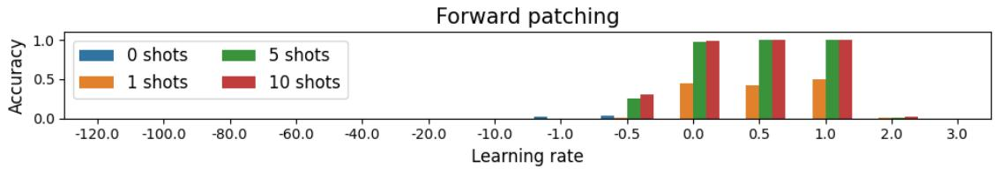

bar

| Learning rate | 0 shots | 1 shots | 5 shots | 10 shots |
| ------------- | ------- | ------- | ------- | -------- |
| -120.0        | 0.0     | 0.0     | 0.0     | 0.0      |
| -100.0        | 0.0     | 0.0     | 0.0     | 0.0      |
| -80.0         | 0.0     | 0.0     | 0.0     | 0.0      |
| -60.0         | 0.0     | 0.0     | 0.0     | 0.0      |
| -40.0         | 0.0     | 0.0     | 0.0     | 0.0      |
| -20.0         | 0.0     | 0.0     | 0.0     | 0.0      |
| -10.0         | 0.0     | 0.0     | 0.0     | 0.0      |
| -1.0          | 0.0     | 0.0     | 0.0     | 0.0      |
| -0.5          | 0.1     | 0.1     | 0.3     | 0.3      |
| 0.0           | 0.1     | 0.5     | 1.0     | 1.0      |
| 0.5           | 0.1     | 0.5     | 1.0     | 1.0      |
| 1.0           | 0.1     | 0.5     | 1.0     | 1.0      |
| 2.0           | 0.1     | 0.1     | 0.1     | 0.1      |
| 3.0           | 0.1     | 0.1     | 0.1     | 0.1      |

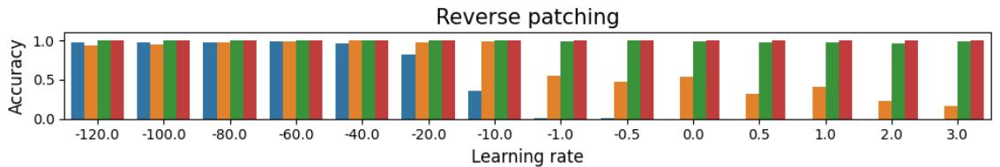

bar

| Learning rate | Blue | Orange | Green | Red |
| ------------- | ---- | ------ | ----- | --- |
| -120.0        | 1.0  | 0.9    | 1.0   | 1.0 |
| -100.0        | 1.0  | 0.9    | 1.0   | 1.0 |
| -80.0         | 1.0  | 1.0    | 1.0   | 1.0 |
| -60.0         | 1.0  | 1.0    | 1.0   | 1.0 |
| -40.0         | 1.0  | 1.0    | 1.0   | 1.0 |
| -20.0         | 0.8  | 1.0    | 1.0   | 1.0 |
| -10.0         | 0.3  | 1.0    | 1.0   | 1.0 |
| -1.0          | 0.0  | 0.5    | 1.0   | 1.0 |
| -0.5          | 0.0  | 0.4    | 1.0   | 1.0 |
| 0.0           | 0.0  | 0.5    | 1.0   | 1.0 |
| 0.5           | 0.0  | 0.3    | 1.0   | 1.0 |
| 1.0           | 0.0  | 0.4    | 1.0   | 1.0 |
| 2.0           | 0.0  | 0.2    | 1.0   | 1.0 |
| 3.0           | 0.0  | 0.1    | 1.0   | 1.0 |

Figure 15: Forward and Reversed attention patching results are presented as a function of the learning rate, a scalar used in the injection of attention maps. The provided results are for GPT2-xl and the capitalized ICL task, demonstrating that Reversed patching can achieve the same results as prompting the model with 10-shots, even with a 0-shot prompt.

<table><tr><td rowspan="2">Task</td><td rowspan="2">N</td><td colspan="3">GPT2-xl</td><td colspan="3">OPT-1.3B</td><td rowspan="2">Task</td><td rowspan="2">N</td><td colspan="3">GPT2-xl</td><td colspan="3">OPT-1.3B</td></tr><tr><td>original</td><td>FA</td><td>RA</td><td>original</td><td>FA</td><td>RA</td><td>original</td><td>FA</td><td>RA</td><td>original</td><td>FA</td><td>RA</td></tr><tr><td rowspan="4">adjective-v-verb-3</td><td>0</td><td>0.47</td><td>0.51</td><td>1.00</td><td>0.22</td><td>0.61</td><td>0.96</td><td rowspan="4">animal-v-object-3</td><td>0</td><td>0.36</td><td>0.39</td><td>1.00</td><td>0.18</td><td>0.21</td><td>1.00</td></tr><tr><td>1</td><td>0.94</td><td>1.00</td><td>1.00</td><td>0.94</td><td>0.80</td><td>1.00</td><td>1</td><td>0.96</td><td>1.00</td><td>1.00</td><td>0.82</td><td>0.96</td><td>1.00</td></tr><tr><td>5</td><td>1.00</td><td>0.90</td><td>1.00</td><td>1.00</td><td>1.00</td><td>1.00</td><td>5</td><td>1.00</td><td>0.21</td><td>1.00</td><td>1.00</td><td>1.00</td><td>1.00</td></tr><tr><td>10</td><td>1.00</td><td>0.00</td><td>1.00</td><td>1.00</td><td>1.00</td><td>1.00</td><td>10</td><td>0.96</td><td>0.00</td><td>1.00</td><td>1.00</td><td>1.00</td><td>1.00</td></tr><tr><td rowspan="4">antonym</td><td>0</td><td>0.00</td><td>0.01</td><td>0.08</td><td>0.02</td><td>0.01</td><td>0.24</td><td rowspan="4">capitalize</td><td>0</td><td>0.00</td><td>0.00</td><td>0.94</td><td>0.01</td><td>0.00</td><td>0.78</td></tr><tr><td>1</td><td>0.18</td><td>0.43</td><td>0.56</td><td>0.20</td><td>0.26</td><td>0.57</td><td>1</td><td>0.44</td><td>0.50</td><td>1.00</td><td>0.01</td><td>0.01</td><td>0.90</td></tr><tr><td>5</td><td>0.53</td><td>0.57</td><td>0.62</td><td>0.42</td><td>0.44</td><td>0.59</td><td>5</td><td>0.98</td><td>1.00</td><td>1.00</td><td>1.00</td><td>0.99</td><td>1.00</td></tr><tr><td>10</td><td>0.57</td><td>0.57</td><td>0.62</td><td>0.42</td><td>0.43</td><td>0.54</td><td>10</td><td>0.99</td><td>1.00</td><td>1.00</td><td>1.00</td><td>0.99</td><td>1.00</td></tr><tr><td rowspan="4">choose-middle-of-3</td><td>0</td><td>0.46</td><td>0.30</td><td>1.00</td><td>0.11</td><td>0.03</td><td>1.00</td><td rowspan="4">english-french</td><td>0</td><td>0.00</td><td>0.00</td><td>0.00</td><td>0.00</td><td>0.00</td><td>0.00</td></tr><tr><td>1</td><td>0.81</td><td>0.76</td><td>1.00</td><td>0.57</td><td>0.54</td><td>0.76</td><td>1</td><td>0.00</td><td>0.00</td><td>0.00</td><td>0.00</td><td>0.00</td><td>0.01</td></tr><tr><td>5</td><td>0.92</td><td>0.68</td><td>1.00</td><td>0.95</td><td>0.84</td><td>1.00</td><td>5</td><td>0.01</td><td>0.01</td><td>0.03</td><td>0.00</td><td>0.00</td><td>0.04</td></tr><tr><td>10</td><td>0.97</td><td>0.00</td><td>1.00</td><td>0.86</td><td>0.65</td><td>1.00</td><td>10</td><td>0.01</td><td>0.01</td><td>0.03</td><td>0.03</td><td>0.00</td><td>0.03</td></tr><tr><td rowspan="4">landmark-country</td><td>0</td><td>0.00</td><td>0.00</td><td>0.00</td><td>0.00</td><td>0.00</td><td>0.00</td><td rowspan="4">next-capital-letter</td><td>0</td><td>0.01</td><td>0.01</td><td>0.01</td><td>0.01</td><td>0.00</td><td>0.01</td></tr><tr><td>1</td><td>0.31</td><td>0.22</td><td>0.39</td><td>0.25</td><td>0.33</td><td>0.47</td><td>1</td><td>0.03</td><td>0.03</td><td>0.05</td><td>0.05</td><td>0.02</td><td>0.02</td></tr><tr><td>5</td><td>0.47</td><td>0.39</td><td>0.44</td><td>0.53</td><td>0.42</td><td>0.47</td><td>5</td><td>0.05</td><td>0.02</td><td>0.06</td><td>0.03</td><td>0.03</td><td>0.01</td></tr><tr><td>10</td><td>0.44</td><td>0.47</td><td>0.44</td><td>0.50</td><td>0.33</td><td>0.42</td><td>10</td><td>0.04</td><td>0.06</td><td>0.06</td><td>0.04</td><td>0.03</td><td>0.08</td></tr><tr><td rowspan="4">next-item</td><td>0</td><td>0.03</td><td>0.00</td><td>0.16</td><td>0.09</td><td>0.00</td><td>0.53</td><td rowspan="4">present-past</td><td>0</td><td>0.03</td><td>0.05</td><td>0.05</td><td>0.05</td><td>0.05</td><td>0.07</td></tr><tr><td>1</td><td>0.28</td><td>0.66</td><td>0.72</td><td>0.50</td><td>0.47</td><td>0.84</td><td>1</td><td>0.37</td><td>0.72</td><td>0.88</td><td>0.13</td><td>0.13</td><td>0.13</td></tr><tr><td>5</td><td>0.69</td><td>0.84</td><td>0.88</td><td>0.69</td><td>0.66</td><td>0.88</td><td>5</td><td>0.95</td><td>0.97</td><td>0.98</td><td>0.80</td><td>0.58</td><td>0.97</td></tr><tr><td>10</td><td>0.88</td><td>0.88</td><td>0.91</td><td>0.75</td><td>0.81</td><td>0.84</td><td>10</td><td>0.92</td><td>0.97</td><td>0.93</td><td>0.98</td><td>0.67</td><td>0.95</td></tr><tr><td rowspan="4">prev-item</td><td>0</td><td>0.03</td><td>0.06</td><td>0.19</td><td>0.03</td><td>0.03</td><td>0.06</td><td rowspan="4">singular-plural</td><td>0</td><td>0.00</td><td>0.09</td><td>0.09</td><td>0.09</td><td>0.09</td><td>0.09</td></tr><tr><td>1</td><td>0.25</td><td>0.34</td><td>0.25</td><td>0.09</td><td>0.06</td><td>0.09</td><td>1</td><td>0.52</td><td>0.70</td><td>0.91</td><td>0.43</td><td>0.78</td><td>0.96</td></tr><tr><td>5</td><td>0.50</td><td>0.41</td><td>0.47</td><td>0.44</td><td>0.31</td><td>0.53</td><td>5</td><td>1.00</td><td>1.00</td><td>0.91</td><td>0.87</td><td>1.00</td><td>0.96</td></tr><tr><td>10</td><td>0.50</td><td>0.59</td><td>0.50</td><td>0.47</td><td>0.38</td><td>0.66</td><td>10</td><td>1.00</td><td>1.00</td><td>1.00</td><td>0.96</td><td>1.00</td><td>0.96</td></tr><tr><td rowspan="4">synonym</td><td>0</td><td>0.01</td><td>0.01</td><td>0.02</td><td>0.01</td><td>0.01</td><td>0.02</td><td rowspan="4"></td><td></td><td></td><td></td><td></td><td></td><td></td><td></td></tr><tr><td>1</td><td>0.03</td><td>0.04</td><td>0.05</td><td>0.04</td><td>0.05</td><td>0.13</td><td></td><td></td><td></td><td></td><td></td><td></td><td></td></tr><tr><td>5</td><td>0.04</td><td>0.06</td><td>0.10</td><td>0.06</td><td>0.02</td><td>0.18</td><td></td><td></td><td></td><td></td><td></td><td></td><td></td></tr><tr><td>10</td><td>0.03</td><td>0.06</td><td>0.10</td><td>0.06</td><td>0.02</td><td>0.23</td><td></td><td></td><td></td><td></td><td></td><td></td><td></td></tr></table>

Table 13: GPT2-xl and OPT-1.3B accuracy on ICL tasks with forward attention (FA) and Reversed Attention (RA) patching.