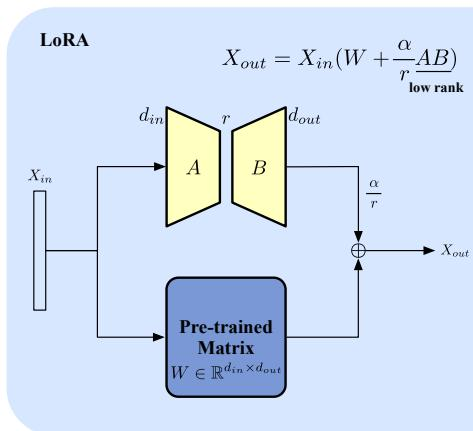
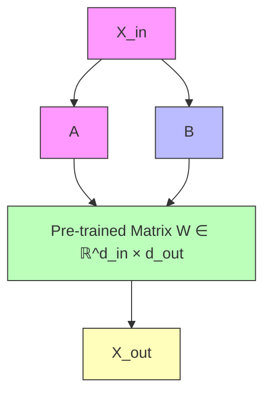
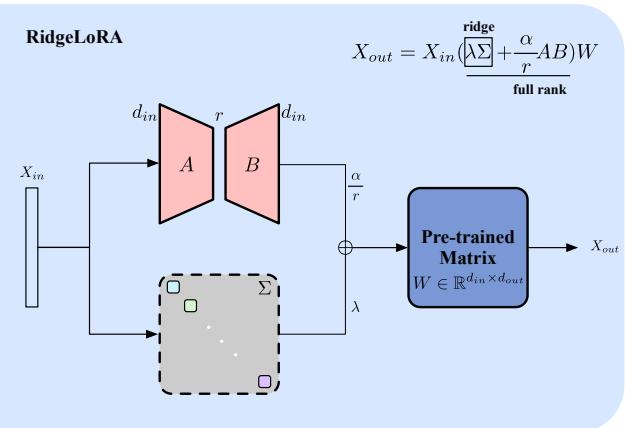
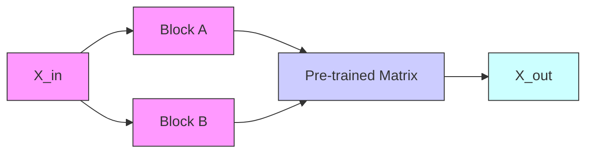
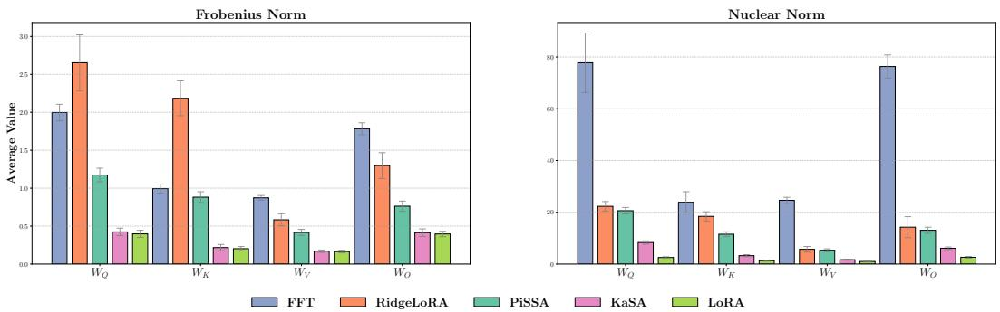
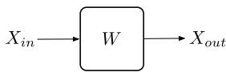

# RidgeLoRA: Matrix Ridge Enhanced Low-Rank Adaptation of Large Language Models

Junda Zhu1 Jun Ai1 Yujun Li2∗ Yichun Yin2

Yasheng Wang2 Lifeng Shang2 Qun Liu2

1Beihang University 2Huawei Noah’s Ark Lab

junda\_zhu@outlook.com liyujun145@gmail.com

https://github.com/chuhac/RidgeLoRA

# Abstract

As one of the state-of-the-art parameter-efficient fine-tuning (PEFT) methods, Low-Rank Adaptation (LoRA) enables model optimization with reduced computational cost through trainable low-rank matrix. However, the low-rank nature makes it prone to produce a decrease in the representation ability, leading to suboptimal performance. In order to break this limitation, we propose RidgeLoRA, a lightweight architecture like LoRA that incorporates novel architecture and matrix ridge enhanced full-rank approximation, to match the performance of full-rank training, while eliminating the need for high memory and a large number of parameters to restore the rank of matrices. We provide a rigorous mathematical derivation to prove that RidgeLoRA has a better upper bound on the representations than vanilla LoRA. Furthermore, extensive experiments across multiple domains demonstrate that RidgeLoRA achieves better performance than other LoRA variants, and can even match or surpass full-rank training.

# 1 Introduction

Large Language Models (LLMs) with large number of parameters [1–8] have demonstrated exceptional performance in natural language generation tasks. These models acquire their primary knowledge during the pre-training phase, through training on massive high-quality datasets from both real-world corpora or model-generated synthetic data. To align with real-world scenarios [9], LLMs also require supervised fine-tuning (SFT). Traditionally, this fine-tuning process employs full-parameter (also full-rank) training (FFT) to achieve optimal performance. However, this approach demands substantial computational resources.

When adapting LLMs for downstream tasks, training is often constrained by limited computational resources, calling for efficient and lightweight solutions. Parameter-Efficient Fine-Tuning (10, 11, PEFT) methods achieve comparable performance to full-parameter fine-tuning with minimal cost. Low-rank adaptation (LoRA, 12), as a representative PEFT method, is widely adopted due to the fact that downstream tasks largely rely on the generic capabilities developed in pre-training. To maintain model performance, LoRA’s initial state should also align with the original model’s output, which we refer to as “the transform-calibrating restriction”.

However, vanilla LoRA, while significantly reducing the number of trainable parameters, is often criticized for its lower performance ceiling [13–15]. Its low-rank nature results in significantly lower representation capability compared to full-parameter fine-tuning, making it prone to underfitting in downstream tasks [14]. Existing LoRA variants [16–21] primarily focus on matrix decomposition or numerical stability, proposing better parameter initialization methods or updating strategies. However, these methods lack theoretical investigation on full-rank matrix approximation and the fundamental challenges of representation ability in low-rank settings. Additionally, exploring architectural alternatives beyond the vanilla LoRA framework could potentially unlock new opportunities for improvement.

flowchart

flowchart

Figure 1: Differences between LoRA (left) and RidgeLoRA (right): As is depicted, though LoRA reduces the number of parameters to be trained, the matrix rank severely shrinks. In order to be comparable with full rank training, the proposed RidgeLoRA introduces a matrix ridge (formalized as λΣ) to complement the rank of the trainable parameters.

Unlike existing works, RidgeLoRA incorporates a full-rank module to achieve performance comparable to full-parameter training. We redesign the architecture by replacing the parallel connection in vanilla LoRA with a series connection module. Inspired by the Matrix Ridge algorithm [22], we enhance vanilla LoRA by incorporating a ridge term, thus introducing RidgeLoRA. The architectural differences between RidgeLoRA and vanilla LoRA are illustrated in Figure 1. Based on observations from previous works [17, 18] and our experiments, appropriate initialization methods can significantly improve low-rank training performance. As RidgeLoRA adopts a series connection architecture, it enables different parameter initialization approaches even under “the transform-calibrating restriction". RidgeLoRA achieves comparable performance to full-parameter training at minimal cost without introducing additional computation and parameters. Our main contributions are summarized as three-fold:

• We propose RidgeLoRA, a novel LoRA variant that replaces parallel connection with series connection, enabling better parameter initialization and enhanced representation capability.   
• We introduce a diagonal ridge term alongside the low-rank matrices, inspired by the matrix ridge algorithm [22], which improves approximation flexibility while maintaining computational efficiency, to better represent the high-rank updates of LLM training.   
• We provide theoretical analysis of RidgeLoRA’s representation capability and demonstrate its superior performance through extensive experiments across multiple datasets.

# 2 Related Works

# 2.1 Matrix Low-Rank Decomposition and LLMs

Matrix decomposition aims at optimizing the following objective:

$$
\min \left\| W - W _ {r} \right\| _ {F} ^ {2},
$$

where $W \in \mathbb { R } ^ { d _ { i n } \times d _ { o u t } }$ is the target matrix, $W _ { r }$ represents its low-rank approximation with rank $r < \operatorname* { m i n } ( d _ { i n } , d _ { o u t } )$ and $\| \cdot \| _ { F }$ denotes the Frobenius norm. Given a restricted rank r, Singular value decomposition $( \mathrm { S V D } , 2 3 )$ has a bounded (also the minimum) error, which justifies its wide application, whose details can be found in Appendix A.3. In order to accelerate the inference speed, SVD-LLM [24] utilizes SVD compression method together with data whitening [25] to minimize $\| X W - X W _ { r } \| _ { F } ^ { 2 }$ to compress LLMs. MoDeGPT [26] conducts detailed analysis of each matrix calculation operation inside an LLM and selects the corresponding decomposition method accordingly, namely SVD, Nyström approximation [27] and CR decomposition [28]. As an inspiration of this paper, Matrix Ridge [22] proposes an algorithm that approximates a positive semi-definite matrix using a combination of an incomplete matrix decomposition and a ridge term. This achieves tighter approximation than both incomplete Cholesky decomposition [29] and incomplete spectral decomposition, while ensuring that the condition number of the approximated matrix does not exceed that of the original matrix.

<table><tr><td>LoRA Method</td><td>Number of Parameters</td><td>Weight Initialization Complexity</td><td>Forward Formalization</td><td>Computation Complexity</td></tr><tr><td>FFT</td><td> $d_{in} \times d_{out}$ </td><td> $\mathcal{O}(1)$ </td><td> $X_{in}W'$ </td><td> $\mathcal{O}(d_{in}^{2}d_{out})$ </td></tr><tr><td>LoRA [12]</td><td> $r \times (d_{in} + d_{out})$ </td><td> $\mathcal{O}(rd_{in})$ </td><td> $X_{in}(W + \frac{\alpha}{r} AB)$ </td><td> $\mathcal{O}(d_{in}^{2}d_{out})$ </td></tr><tr><td>DoRA [16]</td><td> $r \times (d_{in} + d_{out}) + d_{out}$ </td><td> $\mathcal{O}(rd_{in}d_{out})$ </td><td> $(\frac{\|W\|_{2}}{\|W+\frac{\alpha}{r} AB\|_{2}} - 1)XW + \frac{\|W\|_{2}}{\|W+\frac{\alpha}{r} AB\|_{2}} \cdot XAB \cdot \frac{\alpha}{r}$ </td><td> $\mathcal{O}(d_{in}^{2}d_{out})$ </td></tr><tr><td>PiSSA [17]</td><td> $r \times (d_{in} + d_{out})$ </td><td> $\mathcal{O}[\max(d_{in},d_{out}) \cdot \min(d_{in}^{2},d_{out}^{2})]$ </td><td> $X_{in}(W_{res}^{\mathbf{P}} + \frac{\alpha}{r} AB)$ </td><td> $\mathcal{O}(d_{in}^{2}d_{out})$ </td></tr><tr><td>KaSA [18]</td><td> $r \times (d_{in} + d_{out} + 1)$ </td><td> $\mathcal{O}[\max(d_{in},d_{out}) \cdot \min(d_{in}^{2},d_{out}^{2})]$ </td><td> $X_{in}(W_{res}^{\mathbf{K}} + \frac{\alpha}{r} A\Sigma_{r}B)$ </td><td> $\mathcal{O}(d_{in}^{2}d_{out})$ </td></tr><tr><td>RidgeLoRA</td><td> $r \times 2d_{in} + (d_{in} + 1)$ </td><td> $\mathcal{O}(r^{2}d_{in})$ </td><td> $X_{in}(\lambda\Sigma + \frac{\alpha}{r} AB)W$ </td><td> $\mathcal{O}(d_{in}^{2}d_{out})$ </td></tr></table>

Table 1: Comparisons between FFT and other LoRA methods, here we focus on analyzing the number of parameters from the perspective of a single matrix. The comparison here also considers the complexity of weight initialization, where some methods may conduct SVD or matrix multiplications. $W _ { r e s } ^ { \mathbf { P } ^ { \ast } }$ and ${ \bf \ddot { \it W } } _ { r e s } ^ { \bf K }$ denote different ways to initialize $W _ { r e s }$ in their works. RidgeLoRA is showcased with simple initialization method, small number of parameters, and will not increase the computation and memory requirements during training.

# 2.2 Parameter-Efficient Fine-Tuning

LoRA and its Variants LoRA and its variants [12, 16–21, 30–35] train extra low-rank weights on top of the model, which makes low-rank matrix decomposition naturally suitable for the improvement of it. Considering “the transform-calibrating restriction”, advanced LoRA variants like PiSSA [17], LoRA-GA [30], MiLoRA[31], LoRA-XS [32] and KaSA [18] conduct SVD on the original matrices to endow the low-rank matrices with better initializations, thus achieving better performance. Furthermore, some works focus more on the numerical stability of matrices, rsLoRA [34] and proposes a better setup of the scaling factor from a statistical point of view. To achieve training stability, DoRA [16] decomposes the updates of matrices to magnitude factor and direction factor, hereby adding a scaling factor during training. VeRA [35] adds learnable scaling vectors which can be updated and tune frozen random matrices across layers, which changes a bit of the architecture.

Apart from parameter-based methods, LoRA+ [20] assigns the matrix B initialized with all zeros with larger learning rate, LoRA-Pro [19] updates the matrices from the perspective of transformation invariance. These works all focus on how to deal with the gradients in the optimization stage.

Other PEFT Methods LoRA-based methods and variants can be attributed to one type of PEFT [36] method, which also includes (1) Selective training: BitFit [37]; (2) Soft prompt: Prefix Tuning [38] and P-Tuning [39, 40]; (3) Adapter-based method: Serial Adapter 2 [41] and Parallel Adapter [42]. The latter two types also insert extra trainable modules while keeping the pre-trained matrices frozen like LoRA does.

# 3 RidgeLoRA: Matrix Ridge Enhanced LoRA

# 3.1 Architecture of RidgeLoRA

RidgeLoRA switches the computation graph to the following formalization:

$$
X _ {o u t} = X _ {i n} (\lambda \Sigma + \frac {\alpha}{r} A B) W, \tag {1}
$$

where Σ is a diagonal matrix (referred to as the Ridge) that requires gradient descent. It has $d _ { i n }$ learnable parameters on the matrix diagonal, with its matrix rank $d _ { i n } . ~ \lambda$ denotes the “Ridge Intensity” which can be updated. Specifically, RidgeLoRA inserts additional trainable ridge beside the matrix and novelly converts the extra modules into series connections, as opposed to the parallel connections used in LoRA variants. Moreover, the newly trained part can also be absorbed back to the original weight as described in the following formalization:

$$
W ^ {\prime} = (\lambda \Sigma + \frac {\alpha}{r} A B) W, \tag {2}
$$

where the trained matrix $W ^ { \prime }$ is the product of two full-rank matrices. This absorption recovers the original architecture while endowing the model with brand new optimized weights during inference, which provides the same advantage as LoRA and its variants. Moreover, in order to provide a clear comparison to main-stream tuning methods, we further list the properties of them in Table 1.

# 3.2 Theoretical Analysis of RidgeLoRA

According to the setups of RidgeLoRA, λΣ is initialized from a part of a diagonal matrix, thus enabling it to dominate the spectrum of $\textstyle \lambda \Sigma + { \frac { \alpha } { r } } A B$ and achieve a high rank of $d _ { i n }$ . Here we conduct derivations on how closely the enhanced RidgeLoRA architecture can approximate the full-rank weight update $\Delta W$ . By introducing this ridge term, we effectively increase the model’s rank expressiveness and improve the overall performance.

Theorem 3.1. Let $K \in \mathbb { R } ^ { d \times d }$ be a rank-k matrix $( k \leq d ) , D \in \mathbb { R } ^ { d \times d }$ be a diagonal matrix, $M \in \mathbb { R } ^ { d \times d }$ be an arbitrary matrix. Given that M has a Singular Value Decomposition (SVD) $M = U \Sigma V ^ { \top }$ . Let $A \in \mathbb { R } ^ { \breve { n } ( n - 1 ) \times k }$ be a matrix whose rows are indexed by ordered pairs $( p , q )$ where $p , q \in \{ 1 , 2 , . . . , n \}$ and $p \neq q .$ Each row $a _ { ( p q ) } \in \mathbb { R } ^ { 1 \times k }$ of A has entries given by $U _ { p j } V _ { q j } f o r$ $j \in \{ 1 , 2 , . . . , k \}$ . Let $c \in \mathbb { R } ^ { n ( n - 1 ) \times 1 }$ be a vector whose entries are $\begin{array} { r } { c _ { p q } = \sum _ { j = k + 1 } ^ { n } U _ { p j } s _ { j } V _ { q j } , } \end{array}$ , where $s _ { j }$ denotes the corresponding entries in Σ. We have that

$$
\min _ {K, D} \| K + D - M \| _ {F} ^ {2} \leq \| (I - A (A ^ {\top} A) ^ {\dagger} A ^ {\top}) c \| _ {F} ^ {2}, \tag {3}
$$

where $( \cdot ) ^ { \dagger }$ denotes the pseudo inverse of matrix.

This demonstrates the advantages of adding Ridge. Specifically, the right side of the above expression is less than or equal to the LoRA case. For the detailed proof, please refer to Appendix A.1. Next, we will elaborate on this point.

In the case of LoRA, D is a zero matrix, and the minimization objective becomes

$$
\min _ {K} | | K - M | | _ {F} ^ {2},
$$

Let K be a rank-k matrix. According to the Eckart–Young–Mirsky theorem [43], the optimal choice $K = U \Sigma _ { k } V ^ { \top }$ minimizes the Frobenius norm $\| K - M \| _ { F } ^ { \breve { 2 } }$ . Substituting this optimal K , we obtain

$$
\| K - M \| _ {F} ^ {2} = \| U (\Sigma - \Sigma_ {k}) V ^ {\top} \| _ {F} ^ {2},
$$

where $\Sigma _ { k }$ denotes the best rank-k approximation of Σ, obtained by retaining the top-k largest singular values (ordered in descending magnitude) and zeroing out the rest.

In the proof of Theorem 3.1, after introducing the diagonal matrix $D ,$ if keeping K fixed as $K =$ $U \Sigma _ { k } V ^ { \top }$ , the problem reduces to a least squares optimization with respect to the entries of D. Clearly, $D = 0$ is not the optimal solution. The bound we established demonstrates that our method is more effective, detailed analysis can be found in Appendix A.1 to illustrate a theoretical measure.

# 3.3 Detailed Designs of RidgeLoRA

On top of the theoretical analysis of how RidgeLoRA facilitates full-rank training, additional mechanisms are introduced to optimize performance. Specifically, it incorporates a novel weight initialization strategy and an auxiliary loss function for the efficient updates of parameters.

# Algorithm 1 Weight Initialization of RidgeLoRA

Input: Input dimension $d _ { i n }$ , Target low rank r, Scaling factor α

Output: ${ \bar { \lambda } } , \Sigma , A , B$

1: Initialize $\lambda  1 .$ .

▷ Initialize the intensity of ridge term.

2: Sample noise vector $\mathbf { N } \in \mathbb { R } ^ { r }$ using

$$
\mathbf {N} = \boldsymbol {\sigma} [ \mathcal {N} (\mu_ {\mathbf {N}}, \sigma_ {\mathbf {N}} ^ {2}) ],
$$

where $\sigma ( \cdot )$ is the sigmoid function.

▷ Split a small portion to initialize low-rank matrices.

3: Construct matrix $\bar { \Sigma } \doteq \mathbb { R } ^ { d _ { i n } \times d _ { i n } }$ as

$$
\Sigma = \left[ \begin{array}{c c} \mathrm{diag} (\mathbf {N}) & 0 \\ 0 & I _ {d _ {i n} - r} \end{array} \right],
$$

where diag(N) is an $r \times r$ diagonal matrix, and $I _ { d _ { i n } - r }$ is an identity matrix.

4: Initialize low-rank matrix $A \in \overline { { \mathbb { R } ^ { d _ { i n } \times r } } }$ with Gaussian Noise $\mathcal { N } ( 0 , 1 / r )$

5: Conduct SVD on matrix A: $U _ { A } \Sigma _ { A } V _ { A } ^ { \top } = A .$

6: To ensure the condition ▷ This ensures the “transform-calibrating restriction”.

$$
\lambda \Sigma + \frac {\alpha}{r} A B = I,
$$

B is initialized with

$$
B = \frac {r}{\alpha} V _ {A} \Sigma_ {A} ^ {- 1} U _ {A} ^ {\top} \left(I _ {d _ {i n}} - \lambda \Sigma\right).
$$

$\triangleright N o t e \ t h a t \ U _ { A } ^ { \top } U _ { A } = V _ { A } ^ { \top } V _ { A } = I _ { r } .$

Weight Initialization In the field of deep learning, matrices are usually initialized with welldesigned methods [44–46] for a better starting point. However, vanilla LoRA is constrained by the “transform-calibrating restriction” [12], which allows only the initialization of matrix A with such methods, while B is initialized as an all-zero matrix. This limitation hinders the ability of LoRA to fully explore the parameter space. With the novel series connection, this restriction can be fulfilled with $\begin{array} { r } { \lambda \dot { \Sigma } + \frac { \alpha } { r } A \dot { B } = I , } \end{array}$ , eliminating the strong constraint that requires $B = 0 .$ . This ensures good initializations can be adopted on all matrices, endowing them with the possibility to get efficiently updated. In practice, given $A B ^ { \prime } { \bf s }$ target low rank r, a small portion $( r \times r )$ of the identity matrix is initialized with a diagonal matrix diag(N). This leads to be both part (the Ridge and the low-rank matrices) to be non-zero, allowing for good initialization of AB while ensuring λΣ dominates the spectrum. Subsequently, RidgeLoRA initializes the matrix A (with a Gaussian distribution, by default), and then compute matrix B to ensure the sum of these modules equal to the identity matrix. The whole procedure is also demonstrated in Alg. 1 for a clear presentation.

It is noteworthy that this process also differs from SVD-based methods [17, 18] that initialize matrices with the eigenvalues and eigenvectors of the pre-trained matrix. They require massive computation to conduct SVD on the full-rank original matrices and split corresponding portion to initialize the low-rank matrices, while RidgeLoRA only requires SVD on the low-rank matrix A, quantitative comparisons can also be found at Table 1.

Ridge Squashing Loss The initialization of the low-rank modules ensures that their sum equals an identity matrix I, hereby adhering to the “transform-calibrating restriction”. Furthermore, to encourage the matrix to explore a broader space, RidgeLoRA adds a loss term LRS, pushing the weight update towards higher rank:

$$
\mathcal {L} _ {\mathbf {R S}} = \frac {1}{L B} \sum_ {l = 1} ^ {L} \sum_ {b = 1} ^ {B} \left\| \lambda_ {l, b} \Sigma_ {l, b} + \frac {\alpha}{r} A _ {l, b} B _ {l, b} - I \right\| _ {*}, \tag {4}
$$

where L is the total number of layers in the model, B denotes the number of matrix blocks in each layer, and ∥ · ∥∗ is the nuclear norm [47], which measures the rank of the weight updates. Notably, $\beta _ { \mathbf { R S } }$ is set to a negative value, which encourages rank updates in the non-diagonal portions, hereby increasing the effectiveness of training the matrices A and B. We further incorporate this loss into the original objective:

$$
\mathcal {L} = \mathcal {L} _ {\text { m   o   d   e   l }} + \beta_ {\mathbf {R S}} \mathcal {L} _ {\mathbf {R S}}, \tag {5}
$$

<table><tr><td>Method</td><td>↓ Trainable Parameters (%)</td><td>BoolQ (Acc.)</td><td>PIQA (Acc.)</td><td>SIQA (Acc.)</td><td>HellaSwag (Acc.)</td><td>WinoGrande (Acc.)</td><td>ARC-e (Acc.)</td><td>ARC-c (Acc.)</td><td>OBQA (Acc.)</td><td>Avg. (Acc.)</td></tr><tr><td colspan="11">Llama-2-7B</td></tr><tr><td>FFT</td><td>100% (6.74B)</td><td>71.76</td><td>83.84</td><td>80.81</td><td>92.45</td><td>83.66</td><td>82.87</td><td>72.35</td><td>84.40</td><td>81.52</td></tr><tr><td>LoRA</td><td>0.30% (20.02M)</td><td>66.92</td><td>81.66</td><td>77.43</td><td>90.68</td><td>75.53</td><td>84.01</td><td>66.55</td><td>74.40</td><td>77.15</td></tr><tr><td>DoRA</td><td>0.32% (21.37M)</td><td>67.50</td><td>81.23</td><td>77.48</td><td>90.78</td><td>76.16</td><td>84.34</td><td>67.06</td><td>74.20</td><td>77.35</td></tr><tr><td>PiSSA</td><td>0.30% (20.02M)</td><td>69.81</td><td>83.68</td><td>79.94</td><td>93.60</td><td>80.51</td><td>85.94</td><td>71.42</td><td>79.20</td><td>80.51</td></tr><tr><td>KaSA</td><td>0.30% (20.05M)</td><td>66.52</td><td>80.85</td><td>76.77</td><td>90.28</td><td>75.37</td><td>83.54</td><td>65.87</td><td>73.60</td><td>76.60</td></tr><tr><td>RidgeLoRA</td><td>0.29% (19.42M)</td><td>71.43</td><td>83.08</td><td>81.27</td><td>93.24</td><td>81.53</td><td>86.66</td><td>71.76</td><td>82.00</td><td>81.37</td></tr><tr><td colspan="11">Llama-3.1-8B</td></tr><tr><td>FFT</td><td>100% (8.03B)</td><td>70.88</td><td>83.62</td><td>79.02</td><td>90.93</td><td>83.11</td><td>85.10</td><td>75.34</td><td>83.20</td><td>81.40</td></tr><tr><td>LoRA</td><td>0.26% (21.00M)</td><td>71.67</td><td>88.08</td><td>79.94</td><td>94.87</td><td>83.82</td><td>92.89</td><td>80.20</td><td>84.80</td><td>84.53</td></tr><tr><td>DoRA</td><td>0.28% (22.37M)</td><td>71.43</td><td>88.63</td><td>80.45</td><td>94.92</td><td>83.66</td><td>93.27</td><td>80.80</td><td>85.20</td><td>84.80</td></tr><tr><td>PiSSA</td><td>0.26% (21.00M)</td><td>73.56</td><td>89.39</td><td>82.65</td><td>95.16</td><td>87.61</td><td>93.73</td><td>83.36</td><td>88.00</td><td>86.68</td></tr><tr><td>KaSA</td><td>0.26% (21.03M)</td><td>71.79</td><td>88.57</td><td>79.99</td><td>94.63</td><td>83.19</td><td>92.89</td><td>80.89</td><td>84.00</td><td>84.49</td></tr><tr><td>RidgeLoRA</td><td>0.26% (21.23M)</td><td>73.90</td><td>89.34</td><td>83.67</td><td>95.79</td><td>86.98</td><td>93.52</td><td>83.87</td><td>87.00</td><td>86.76</td></tr><tr><td colspan="11">Mistral-v0.3-7B</td></tr><tr><td>FFT</td><td>100% (7.25B)</td><td>71.92</td><td>85.64</td><td>79.73</td><td>92.19</td><td>85.08</td><td>83.46</td><td>73.63</td><td>84.00</td><td>81.96</td></tr><tr><td>LoRA</td><td>0.29% (21.00M)</td><td>74.47</td><td>90.26</td><td>82.50</td><td>96.18</td><td>87.45</td><td>92.72</td><td>82.00</td><td>88.89</td><td>86.81</td></tr><tr><td>DoRA</td><td>0.31% (22.37M)</td><td>74.96</td><td>90.32</td><td>81.93</td><td>96.43</td><td>88.56</td><td>92.72</td><td>82.25</td><td>89.60</td><td>87.10</td></tr><tr><td>PiSSA</td><td>0.29% (21.00M)</td><td>75.18</td><td>90.48</td><td>82.86</td><td>96.61</td><td>87.77</td><td>93.10</td><td>82.34</td><td>91.00</td><td>87.42</td></tr><tr><td>KaSA</td><td>0.29% (21.03M)</td><td>73.74</td><td>89.61</td><td>81.53</td><td>96.21</td><td>87.61</td><td>92.47</td><td>81.66</td><td>89.20</td><td>86.50</td></tr><tr><td>RidgeLoRA</td><td>0.29% (21.23M)</td><td>74.63</td><td>91.35</td><td>81.88</td><td>96.38</td><td>88.63</td><td>93.18</td><td>82.59</td><td>90.80</td><td>87.43</td></tr></table>

Table 2: Accuracy comparison of Llama-2-7B (MHA), Llama-3.1-8B (GQA) and Mistral-v0.3-7B (GQA) with various tuning methods on eight commonsense reasoning datasets. The numbers of trainable parameters of different methods are also included for a clear comparison. The highest accuracy scores achieved by low-rank methods are marked as Bold.

where $\mathcal { L } _ { m o d e l }$ is the task-related loss for the PEFT-enhanced base model, and $\beta _ { \mathbf { R S } }$ is a hyperparameter controlling the influence of the rank-decreasing penalty. Our experimental results and ablation study also indicate that selecting a negative value further improves performance.

# 4 Experiments

# 4.1 Experimental Setup

Datasets In order to showcase the validity of RidgeLoRA and demonstrate its good performance. In comparisons with state-of-the-art low rank methods, we conduct comprehensive experiments across different tasks, which are widely utilized for evaluation in previous works: namely, (i) Commonsense Reasoning, (ii) Math & Code Problems and (iii) Multi-modal Understanding tasks. We adopted all of its training split for fine-tuning for fixed number of steps to ensure fair comparisons. Reported metrics are evaluated on the official test splits.

Baselines Across all of our experiments, we mainly compare RidgeLoRA with low-rank based tuning methods, namely vanilla LoRA [12], DoRA [16] and SVD-based PiSSA [17] and KaSA [18]. To further demonstrate the comparable performance of RidgeLoRA on par with FFT, we also include FFT in our main results. Details of the experiments can be found at Appendix B.4.

Detailed Setups Throughout our experiments, we adopt a cosine learning rate schedule and use AdamW [48] as the optimizer. Unless otherwise specified, all LoRA variants share the same maximum learning rate for a given task. Concretely, we use a learning rate of $2 \times 1 0 ^ { - 5 }$ for Math & Code tasks, and $3 \times 1 0 ^ { - 5 }$ for Commonsense tasks. The rank of the low-rank matrices is set to 64 for Math & Code tasks, and 8 for Commonsense tasks. For multi-modal understanding, we follow the configuration proposed in DoRA [16] for a fair comparison.

# 4.2 Main Experimental Results

Commonsense Reasoning As is showcased in Table 2, across eight commonsense reasoning datasets, the average scores achieved by our proposed RidgeLoRA outperforms most of LoRA variants. When choosing Llama-2-7B as the base model, RidgeLoRA outperforms state-of-the-art baseline, i.e., PiSSA, by an improvement of 0.86% in the average accuracy. When analyzing each single dataset, we observe that RidgeLoRA surpasses most of the tuning methods including FFT by large margins. For example, RidgeLoRA outperforms LoRA by a 6.0% accuracy improvement on WinoGrande with

Llama-2-7B as the base model, and is generally better on every dataset than KaSA across different base models. From the results we can observe that only in few datasets that RidgeLoRA may not surpass baselines, with the performance drops usually do not exceed 1%.

As for low-rank methods’ performance in calibrating FFT, our proposed RidgeLoRA is the closest to the performance of FFT when selecting Llama-2-7B as the base model, which demonstrates the advantages of full-rank training of RidgeLoRA, with a performance drop of only 0.15%. We also observe that when selecting Llama-3.1-8B and Mistral-v0.3-7B as the base model, the performances of FFT are commonly exceeded by low-rank based methods, which are also observed by many previous works [17, 18, 15], that base model may find it harder to converge given limited data in some tasks comparing to low-rank methods.

Math & Code Problems We also evaluate RidgeLoRA together with its baselines on math and code problem solving datasets, where models are usually required to generate long-form arithmetic reasoning trace (math) and complete executable program (code), to further test the performance. As is demonstrated in Table 3, RidgeLoRA surpasses almost all of its baselines with different LLMs as base models. Taking the math benchmarks with Llama-2-7B as the base model as an example, except for FFT, RidgeLoRA outperforms all of its low-rank baselines, even outperforms KaSA by 7.26% on GSM8K. Similar results hold for Llama-3.1- 8B and Mistral-0.3-7B models, where RidgeLoRA outperforms its baselines by 0.56% in average and even surpasses FFT by an improvement of 2.42% in the result accuracy. In few datasets, RidgeLoRA may get surpassed by SVD-based PiSSA or KaSA, but with an average margin of only 0.30%.

<table><tr><td>Method</td><td>↓ Trainable Parameters (%)</td><td>GSM8K (Acc.)</td><td>MATH (Acc.)</td><td>HumanEval (+) (Pass@1)</td><td>MBPP (+) (Pass@1)</td></tr><tr><td colspan="6">Llama-2-7B</td></tr><tr><td>FFT</td><td>100% (6.74B)</td><td>66.32</td><td>17.72</td><td>37.8 (35.4)</td><td>45.2 (36.8)</td></tr><tr><td>LoRA</td><td>2.32% (159.9M)</td><td>53.44</td><td>8.94</td><td>22.6 (18.3)</td><td>37.0 (31.0)</td></tr><tr><td>DoRA</td><td>2.34% (161.3M)</td><td>52.25</td><td>8.08</td><td>24.4 (20.1)</td><td>36.2 (31.0)</td></tr><tr><td>PiSSA</td><td>2.32% (159.9M)</td><td>56.29</td><td>9.28</td><td>25.0 (20.1)</td><td>36.8 (29.4)</td></tr><tr><td>KaSA</td><td>2.33% (160.8M)</td><td>49.18</td><td>7.20</td><td>22.0 (19.5)</td><td>35.4 (29.4)</td></tr><tr><td>RidgeLoRA</td><td>2.13% (147.0M)</td><td>56.44</td><td>9.76</td><td>26.2 (23.8)</td><td>37.3 (29.9)</td></tr><tr><td colspan="6">Llama-3.1-8B</td></tr><tr><td>FFT</td><td>100% (8.03B)</td><td>77.77</td><td>28.84</td><td>58.5 (55.5)</td><td>64.0 (55.6)</td></tr><tr><td>LoRA</td><td>2.05% (167.8M)</td><td>75.97</td><td>28.30</td><td>51.2 (47.0)</td><td>67.5 (56.6)</td></tr><tr><td>DoRA</td><td>2.06% (169.2M)</td><td>76.05</td><td>27.82</td><td>51.2 (48.2)</td><td>67.7 (56.6)</td></tr><tr><td>PiSSA</td><td>2.05% (167.8M)</td><td>77.92</td><td>30.26</td><td>53.7 (50.0)</td><td>65.1 (56.1)</td></tr><tr><td>KaSA</td><td>2.06% (168.7M)</td><td>75.82</td><td>27.52</td><td>53.0 (50.6)</td><td>68.5 (58.2)</td></tr><tr><td>RidgeLoRA</td><td>1.96% (160.7M)</td><td>78.07</td><td>30.12</td><td>53.7 (51.8)</td><td>69.8 (59.8)</td></tr><tr><td colspan="6">Mistral-v0.3-7B</td></tr><tr><td>FFT</td><td>100% (7.25B)</td><td>68.11</td><td>21.68</td><td>49.4 (47.0)</td><td>51.3 (43.1)</td></tr><tr><td>LoRA</td><td>2.26% (167.8M)</td><td>71.56</td><td>21.56</td><td>45.7 (39.0)</td><td>62.2 (51.1)</td></tr><tr><td>DoRA</td><td>2.28% (169.2M)</td><td>72.83</td><td>22.08</td><td>45.1 (39.0)</td><td>60.8 (51.3)</td></tr><tr><td>PiSSA</td><td>2.26% (167.8M)</td><td>72.53</td><td>22.96</td><td>47.6 (40.9)</td><td>62.7 (51.3)</td></tr><tr><td>KaSA</td><td>2.28% (168.7M)</td><td>74.33</td><td>23.06</td><td>47.6 (40.2)</td><td>62.2 (50.5)</td></tr><tr><td>RidgeLoRA</td><td>2.17% (160.7M)</td><td>73.88</td><td>24.02</td><td>48.2 (41.5)</td><td>63.2 (53.7)</td></tr></table>

Table 3: Performances of different models on math & code problem benchmarks. For the code benchmarks, (+) denotes the enhanced datasets with more difficult test cases, whose metrics are in the parentheses, best performances of low-rank methods are marked as Bold.

Similar results hold for the code benchmarks. On the datasets with original test cases, RidgeLoRA surpasses every low-rank method and outperforms the best of its baseline performances with a 0.65% improvement. As for datasets with enhanced test cases, i.e., the ones with (+), RidgeLoRA outperforms the low-rank methods by a 1.4% improvement, showcasing its good performance and generalizability on hard cases. Like Commonsense Reasoning, we also observe several low-rank methods even achieve better performance than FFT, the reason is that the base models already possess enough capabilities, thus possible to achieve good results by tuning fewer parameters on the training set with less data.

Multi-modal Understanding In order to expand the applicable domain of RidgeLoRA, we further evaluate RidgeLoRA’s performance in aligning a pre-trained a language model with a multi-modal projector. The evaluation results can be found at Table 4. As is showcased, it is showcased that language model tuned with RidgeLoRA achieves better performances than DoRA, with an improvement of at most 1.4% comparing to

<table><tr><td>Method</td><td> $\downarrow$  Trainable Parameters (%)</td><td>GQA</td><td>SQA</td><td>VQA $^{\text{T}}$ </td><td>POPE</td><td>Avg.</td></tr><tr><td>FFT</td><td>100%</td><td>61.9</td><td>66.8</td><td>58.2</td><td>85.9</td><td>68.20</td></tr><tr><td>LoRA</td><td>4.61%</td><td>62.9</td><td>68.4</td><td>58.2</td><td>86.4</td><td>68.98</td></tr><tr><td>DoRA</td><td>4.63%</td><td>62.9</td><td>69.9</td><td>57.0</td><td>87.2</td><td>69.25</td></tr><tr><td>RidgeLoRA</td><td>4.26%</td><td>61.9</td><td>69.2</td><td>58.4</td><td>87.6</td><td>69.28</td></tr></table>

Table 4: Multi-modal understanding evaluation results of different tuning methods on 4 vision-language tasks following the setups of DoRA [16], best performances are marked Bold.

<table><tr><td>Method</td><td>BoolQ (Acc.)</td><td>PIQA (Acc.)</td><td>SIQA (Acc.)</td><td>HellaSwag (Acc.)</td><td>WinoGrande (Acc.)</td><td>ARC-e (Acc.)</td><td>ARC-c (Acc.)</td><td>OBQA (Acc.)</td><td>Avg.(C) (Acc.)</td></tr><tr><td colspan="10">Ridge Enhanced Parallel Connections</td></tr><tr><td>LoRA+Ridge</td><td>67.53(↑0.61)</td><td>82.37(↑0.71)</td><td>78.25(↑0.82)</td><td>91.77(↑1.09)</td><td>76.40(↑0.87)</td><td>84.97(↑0.96)</td><td>68.00(↑1.45)</td><td>74.40(↑0.00)</td><td>77.96(↑0.81)</td></tr><tr><td>DoRA+Ridge</td><td>67.23(↓0.27)</td><td>82.43(↑1.20)</td><td>78.71(↑1.23)</td><td>92.03(↑0.25)</td><td>76.80(↑0.64)</td><td>85.23(↑0.89)</td><td>68.09(↑1.03)</td><td>76.20(↑2.00)</td><td>78.34(↑0.99)</td></tr><tr><td>PiSSA+Ridge</td><td>70.64(↑0.83)</td><td>83.57(↓0.11)</td><td>80.55(↑0.61)</td><td>93.43(↓0.17)</td><td>80.66(↑0.15)</td><td>86.24(↑0.30)</td><td>71.33(↓0.09)</td><td>80.60(↑1.40)</td><td>80.88(↑0.37)</td></tr><tr><td>KaSA+Ridge</td><td>68.41(↑1.89)</td><td>83.13(↑2.28)</td><td>79.84(↑3.07)</td><td>92.57(↑2.29)</td><td>77.74(↑2.37)</td><td>85.14(↑1.60)</td><td>68.52(↑2.65)</td><td>79.20(↑5.60)</td><td>79.32(↑2.72)</td></tr><tr><td colspan="10">Weight Initialization</td></tr><tr><td>Diagonal</td><td>66.59</td><td>80.30</td><td>76.61</td><td>91.03</td><td>75.14</td><td>83.96</td><td>64.33</td><td>73.40</td><td>76.42</td></tr><tr><td>Gaussian(default)</td><td>71.43</td><td>83.08</td><td>81.27</td><td>93.24</td><td>81.53</td><td>86.66</td><td>71.76</td><td>82.00</td><td>81.37</td></tr><tr><td>Kaiming (N)</td><td>70.88</td><td>83.08</td><td>80.50</td><td>93.77</td><td>82.00</td><td>85.48</td><td>72.10</td><td>83.80</td><td>81.45</td></tr><tr><td>Kaiming (U)</td><td>70.02</td><td>82.48</td><td>79.48</td><td>93.67</td><td>82.40</td><td>85.65</td><td>71.59</td><td>81.60</td><td>80.86</td></tr><tr><td>Xavier (N)</td><td>68.63</td><td>82.04</td><td>78.35</td><td>91.98</td><td>78.22</td><td>85.10</td><td>68.09</td><td>76.00</td><td>78.55</td></tr><tr><td>Xavier (U)</td><td>67.99</td><td>82.21</td><td>78.45</td><td>91.86</td><td>77.74</td><td>85.44</td><td>68.43</td><td>75.20</td><td>78.42</td></tr></table>

Table 5: Experimental results of Commonsense Dataset from two ablation studies, namely: (1) Parallel Connection; (2) Weight Initialization. N denotes the normal distribution while U is the uniform distribution of corresponding method. Avg.(C) denotes the average accuracy score of Commonsense datasets. The subscripts represent the performance change of adding the Ridge enhancement compared to itself. Best scores of initialization methods are marked Bold.

DoRA on $\mathbf { V Q A } ^ { \mathrm { T } } .$ . Consistent with the

training of language-only models, the ratio of trainable parameters remains lower than low-rank baselines, demonstrating the lightweight advantages of RidgeLoRA.

# 4.3 Ablation Study

Apart from comprehensive evaluation with various types of model and different tasks comparing with baselines, which provides solid evidences that the RidgeLoRA surpasses vanilla LoRA together with its state-of-the-art variants, we also conduct ablation study to demonstrate the validity of different parts of RidgeLoRA at a fine-grained level.

Ridge Enhanced Parallel Connections Since we modify the connection between the newly trained modules and the original matrix, in order to provide in-depth analysis about the necessity of series connection, we also conduct ablation study with different LoRA variants enhanced with a Ridge alongside. The experimental results can be found in the first group of Table 5 and Table 6, where performance improvements can be observed on each method comparing to itself without the Ridge. On the average score of Commonsense Dataset, KaSA is observed to get enhanced with Ridge by a 2.72% improvement. PiSSA is also enhanced, with an average improvement of 0.37% on Commonsense and a 0.18% improvement on math datasets. These results

<table><tr><td>Method</td><td>GSM8K (Acc.)</td><td>MATH (Acc.)</td></tr><tr><td>LoRA+Ridge</td><td>55.39 $_{(\uparrow 1.95)}$ </td><td>9.14 $_{(\uparrow 0.20)}$ </td></tr><tr><td>DoRA+Ridge</td><td>54.12 $_{(\uparrow 1.87)}$ </td><td>8.72 $_{(\uparrow 0.64)}$ </td></tr><tr><td>PiSSA+Ridge</td><td>56.36 $_{(\uparrow 0.07)}$ </td><td>9.56 $_{(\uparrow 0.28)}$ </td></tr><tr><td>KaSA+Ridge</td><td>51.42 $_{(\uparrow 2.24)}$ </td><td>7.98 $_{(\uparrow 0.78)}$ </td></tr></table>

Table 6: Performances on math datasets existing LoRA variants enhanced with parallel Ridge.

prove that RidgeLoRA can better approximate a full-rank weight update, thus leading to better performances. It is noteworthy that here we prove that the series connection RidgeLoRA not only surpasses the parallel connection, but also outperforms the other LoRA variants enhanced by Ridge, validating the effectiveness of series connection.

Weight Initialization Methods Here we remain the series connection setup and further compare the performances of different initialization methods of matrix A, namely Gaussian [44], Xavier [45], and Kaiming [46] initialization, the results can be found at the second group in Table 5 and Table 7. We also include an initialization where matrix A only has diagonal values before training, termed as Diagonal. From the results we can observe that randomized matrix initialization always leads to better performances, which is demonstrated by the fact that Diagonal gets surpassed by others by a margin of at least 0.78%. As for the normal distribution initialized methods, we can observe that Gaussian, with a higher variance $\textstyle { \frac { 1 } { r } }$ in our default setup, has better performances than Kaiming and Xavier, with a 0.64% improvement on GSM8K. Moreover, ini-

<table><tr><td>Method</td><td>GSM8K (Acc.)</td><td>MATH (Acc.)</td></tr><tr><td>Diagonal</td><td>54.04</td><td>8.98</td></tr><tr><td> $Gaussian_{(default)}$ </td><td>56.44</td><td>9.76</td></tr><tr><td>Kaiming ( $\mathcal{N}$ )</td><td>56.14</td><td>9.62</td></tr><tr><td>Kaiming ( $\mathcal{U}$ )</td><td>55.84</td><td>9.46</td></tr><tr><td>Xavier ( $\mathcal{N}$ )</td><td>55.46</td><td>9.08</td></tr><tr><td>Xavier ( $\mathcal{U}$ )</td><td>55.09</td><td>8.92</td></tr></table>

Table 7: Performances on math datasets of RidgeLoRA with different initializations.

  
Figure 2: Analysis on the weight update patterns of the Self-Attention module of Llama-3.1- 8B (GQA). Norm here denotes the norm of weight updates, error lines come from variances between different layers.

tializing with uniform distributions won’t lead to good performances when compared to normal distributions, their performance drop can achieve up to 2.20% on OBQA if taking Kaiming (U) as an example.

Pattern Analysis of Weight Updates As an auxiliary analysis, we also performed a visualization of the equivalent parameter updates of different methods. As is illustrated in Figure 2, constrained with the low-rank nature, the update norms of other LoRA variants are always lower than those of FFT, especially the vanilla LoRA. Benefit from the full-rank nature of RidgeLoRA, its updates are comparable or sometimes larger than that of FFT, showcasing its good representation capability.

Ridge Squashing Loss Fusion As we fuse Ridge Squashing Loss with the original loss to facilitate the training process, in order to prove its validity, we conduct ablation study with different hyperparameter setups. From the evaluation results from Table 8, we can observe that on all eight datasets, a negative value of βRS tends to lead to better model performances, with a gap of at most 1.21% in average score across two groups. Comparing to the baseline group (w/o $\mathcal { L } _ { \bf R S } )$ , selecting a negative values always bring about better performance, with its scores all above baseline accuracy. Furthermore, we conduct Student’s t-test [49] to showcase that selecting a negative value for $\beta _ { \mathbf { R S } }$ significantly improves the performance, which means increasing the rank of weight updates is favorable for good performances. Details can be found at Appendix B.1.

# 5 Conclusion

In this paper, we propose RidgeLoRA, a novel PEFT approach that enhances the vanilla LoRA architecture through two key innovations: replacing the conventional parallel structure with series connection and incorporating a diagonal ridge term. Combined with the well designed initialization strategy and ridge squashing loss, RidgeLoRA achieves superior capability while maintaining computational efficiency. Through rigorous theoretical analysis and comprehensive experimental evaluations, we demonstrated that RidgeLoRA consistently outperforms existing approaches. Our work opens up new possibilities for PEFT and provides valuable insights into PEFT methods.

# 6 Limitations

While RidgeLoRA is supported by comprehensive experiments and rigorous mathematical derivations. However, several limitations remain: 1) Its potential in scenarios such as continual learning [50, 51] and model editing [52] where vanilla LoRA is commonly applied has not yet been explored. Future work could investigate how RidgeLoRA extends to these settings and whether it offers advantages in such contexts. 2) Due to computational constraints, we do not include experiments on very large models (e.g., those with more than 70B parameters). Nonetheless, the reported results, along with detailed ablations, provide a compelling demonstration of the method’s effectiveness on a range of models.

# References

[1] Josh Achiam, Steven Adler, Sandhini Agarwal, Lama Ahmad, Ilge Akkaya, Florencia Leoni Aleman, Diogo Almeida, Janko Altenschmidt, Sam Altman, Shyamal Anadkat, et al. Gpt-4 technical report. arXiv preprint arXiv:2303.08774, 2023.   
[2] Rohan Anil, Sebastian Borgeaud, Jean-Baptiste Alayrac, Jiahui Yu, Radu Soricut, Johan Schalkwyk, Andrew M Dai, Anja Hauth, Katie Millican, et al. Gemini: a family of highly capable multimodal models. arXiv preprint arXiv:2312.11805, 2023.   
[3] Hugo Touvron, Thibaut Lavril, Gautier Izacard, Xavier Martinet, Marie-Anne Lachaux, Timothée Lacroix, Baptiste Rozière, Naman Goyal, Eric Hambro, Faisal Azhar, et al. Llama: Open and efficient foundation language models. arXiv preprint arXiv:2302.13971, 2023.   
[4] Hugo Touvron, Louis Martin, Kevin Stone, Peter Albert, Amjad Almahairi, Yasmine Babaei, Nikolay Bashlykov, Soumya Batra, Prajjwal Bhargava, Shruti Bhosale, et al. Llama 2: Open foundation and fine-tuned chat models. arXiv preprint arXiv:2307.09288, 2023.   
[5] Albert Q Jiang, Alexandre Sablayrolles, Arthur Mensch, Chris Bamford, Devendra Singh Chaplot, Diego de las Casas, Florian Bressand, Gianna Lengyel, Guillaume Lample, Lucile Saulnier, et al. Mistral 7b. arXiv preprint arXiv:2310.06825, 2023.   
[6] Abhimanyu Dubey, Abhinav Jauhri, Abhinav Pandey, Abhishek Kadian, Ahmad Al-Dahle, Aiesha Letman, Akhil Mathur, Alan Schelten, Amy Yang, Angela Fan, et al. The llama 3 herd of models. arXiv preprint arXiv:2407.21783, 2024.   
[7] Aixin Liu, Bei Feng, Bing Xue, Bingxuan Wang, Bochao Wu, Chengda Lu, Chenggang Zhao, Chengqi Deng, Chenyu Zhang, Chong Ruan, et al. Deepseek-v3 technical report. arXiv preprint arXiv:2412.19437, 2024.   
[8] An Yang, Baosong Yang, Beichen Zhang, Binyuan Hui, Bo Zheng, Bowen Yu, Chengyuan Li, Dayiheng Liu, Fei Huang, Haoran Wei, et al. Qwen2. 5 technical report. arXiv preprint arXiv:2412.15115, 2024.   
[9] Long Ouyang, Jeffrey Wu, Xu Jiang, Diogo Almeida, Carroll Wainwright, Pamela Mishkin, Chong Zhang, Sandhini Agarwal, Katarina Slama, Alex Gray, John Schulman, Jacob Hilton, Fraser Kelton, Luke Miller, Maddie Simens, Amanda Askell, Peter Welinder, Paul Christiano, Jan Leike, and Ryan Lowe. Training language models to follow instructions with human feedback. In Alice H. Oh, Alekh Agarwal, Danielle Belgrave, and Kyunghyun Cho, editors, Advances in Neural Information Processing Systems, 2022. URL https://openreview.net/ forum?id=TG8KACxEON.   
[10] Ning Ding, Yujia Qin, Guang Yang, Fuchao Wei, Zonghan Yang, Yusheng Su, Shengding Hu, Yulin Chen, Chi-Min Chan, Weize Chen, et al. Parameter-efficient fine-tuning of large-scale pre-trained language models. Nature Machine Intelligence, 5(3):220–235, 2023. doi: 10.1038/s42256-023-00626-4. URL https://www.nature.com/articles/ s42256-023-00626-4.   
[11] Zeyu Han, Chao Gao, Jinyang Liu, Jeff Zhang, and Sai Qian Zhang. Parameter-efficient finetuning for large models: A comprehensive survey. Transactions on Machine Learning Research, 2024. ISSN 2835-8856. URL https://openreview.net/forum?id=lIsCS8b6zj.   
[12] Edward J Hu, yelong shen, Phillip Wallis, Zeyuan Allen-Zhu, Yuanzhi Li, Shean Wang, Lu Wang, and Weizhu Chen. LoRA: Low-rank adaptation of large language models. In International Conference on Learning Representations, 2022. URL https://openreview. net/forum?id=nZeVKeeFYf9.   
[13] Lingling Xu, Haoran Xie, Si-Zhao Joe Qin, Xiaohui Tao, and Fu Lee Wang. Parameter-efficient fine-tuning methods for pretrained language models: A critical review and assessment. arXiv preprint arXiv:2312.12148, 2023.

[14] Dan Biderman, Jacob Portes, Jose Javier Gonzalez Ortiz, Mansheej Paul, Philip Greengard, Connor Jennings, Daniel King, Sam Havens, Vitaliy Chiley, Jonathan Frankle, Cody Blakeney, and John Patrick Cunningham. LoRA learns less and forgets less. Transactions on Machine Learning Research, 2024. ISSN 2835-8856. URL https://openreview.net/forum?id= aloEru2qCG. Featured Certification.   
[15] Reece Shuttleworth, Jacob Andreas, Antonio Torralba, and Pratyusha Sharma. Lora vs full fine-tuning: An illusion of equivalence. arXiv preprint arXiv:2410.21228, 2024.   
[16] Shih-Yang Liu, Chien-Yi Wang, Hongxu Yin, Pavlo Molchanov, Yu-Chiang Frank Wang, Kwang-Ting Cheng, and Min-Hung Chen. DoRA: Weight-decomposed low-rank adaptation. In Ruslan Salakhutdinov, Zico Kolter, Katherine Heller, Adrian Weller, Nuria Oliver, Jonathan Scarlett, and Felix Berkenkamp, editors, Proceedings of the 41st International Conference on Machine Learning, volume 235 of Proceedings of Machine Learning Research, pages 32100– 32121. PMLR, 21–27 Jul 2024. URL https://proceedings.mlr.press/v235/liu24bn. html.   
[17] Fanxu Meng, Zhaohui Wang, and Muhan Zhang. PiSSA: Principal singular values and singular vectors adaptation of large language models. In The Thirty-eighth Annual Conference on Neural Information Processing Systems, 2024. URL https://openreview.net/forum?id= 6ZBHIEtdP4.   
[18] Fan Wang, Juyong Jiang, Chansung Park, Sunghun Kim, and Jing Tang. KaSA: Knowledgeaware singular-value adaptation of large language models. In The Thirteenth International Conference on Learning Representations, 2025. URL https://openreview.net/forum? id=OQqNieeivq.   
[19] Zhengbo Wang, Jian Liang, Ran He, Zilei Wang, and Tieniu Tan. Lora-pro: Are low-rank adapters properly optimized? arXiv preprint arXiv:2407.18242, 2024.   
[20] Soufiane Hayou, Nikhil Ghosh, and Bin Yu. LoRA+: Efficient low rank adaptation of large models. In Forty-first International Conference on Machine Learning, 2024. URL https: //openreview.net/forum?id=NEv8YqBROO.   
[21] Tao Li, Zhengbao He, Yujun Li, Yasheng Wang, Lifeng Shang, and Xiaolin Huang. Flat-loRA: Low-rank adaptation over a flat loss landscape. In Forty-second International Conference on Machine Learning, 2025. URL https://openreview.net/forum?id=3Qj3xSwN2I.   
[22] Zhihua Zhang. The matrix ridge approximation: algorithms and applications. Machine Learning, 97(3):227–258, 2014. doi: 10.1007/s10994-013-5431-y. URL https://doi.org/10.1007/ s10994-013-5431-y.   
[23] Gene H Golub and Christian Reinsch. Singular value decomposition and least squares solutions. In Handbook for Automatic Computation: Volume II: Linear Algebra, pages 134–151. Springer, 1971.   
[24] Xin Wang, Yu Zheng, Zhongwei Wan, and Mi Zhang. Svd-llm: Truncation-aware singular value decomposition for large language model compression. arXiv preprint arXiv:2403.07378, 2024.   
[25] Patrick CHen, Hsiang-Fu Yu, Inderjit S Dhillon, and Cho-Jui Hsieh. DRONE: Data-aware low-rank compression for large NLP models. In A. Beygelzimer, Y. Dauphin, P. Liang, and J. Wortman Vaughan, editors, Advances in Neural Information Processing Systems, 2021. URL https://openreview.net/forum?id=sthiz9zeXGG.   
[26] Chi-Heng Lin, Shangqian Gao, James Seale Smith, Abhishek Patel, Shikhar Tuli, Yilin Shen, Hongxia Jin, and Yen-Chang Hsu. Modegpt: Modular decomposition for large language model compression. arXiv preprint arXiv:2408.09632, 2024.   
[27] Alex Gittens and Michael Mahoney. Revisiting the nystrom method for improved large-scale machine learning. In Sanjoy Dasgupta and David McAllester, editors, Proceedings of the 30th International Conference on Machine Learning, volume 28 of Proceedings of Machine Learning Research, pages 567–575, Atlanta, Georgia, USA, 17–19 Jun 2013. PMLR. URL https://proceedings.mlr.press/v28/gittens13.html.

[28] Petros Drineas, Ravi Kannan, and Michael W Mahoney. Fast monte carlo algorithms for matrices i: Approximating matrix multiplication. SIAM Journal on Computing, 36(1):132–157, 2006. doi: 10.1137/S0097539704442684.   
[29] Commandant Benoit. Note sur une méthode de résolution des équations normales provenant de l’application de la méthode des moindres carrés à un système d’équations linéaires en nombre inférieur à celui des inconnues (procédé du commandant cholesky). Bulletin géodésique, 2(1): 67–77, 1924. URL https://doi.org/10.1007/BF03031308.   
[30] Shaowen Wang, Linxi Yu, and Jian Li. LoRA-GA: Low-rank adaptation with gradient approximation. In The Thirty-eighth Annual Conference on Neural Information Processing Systems, 2024. URL https://openreview.net/forum?id=VaLAWrLHJv.   
[31] Hanqing Wang, Yixia Li, Shuo Wang, Guanhua Chen, and Yun Chen. Milora: Harnessing minor singular components for parameter-efficient llm finetuning. arXiv preprint arXiv:2406.09044, 2024.   
[32] Klaudia Bałazy, Mohammadreza Banaei, Karl Aberer, and Jacek Tabor. Lora-xs: Low-rank adaptation with extremely small number of parameters. arXiv preprint arXiv:2405.17604, 2024.   
[33] Qiushi Huang, Tom Ko, Zhan Zhuang, Lilian Tang, and Yu Zhang. HiRA: Parameter-efficient hadamard high-rank adaptation for large language models. In The Thirteenth International Conference on Learning Representations, 2025. URL https://openreview.net/forum? id=TwJrTz9cRS.   
[34] Damjan Kalajdzievski. A rank stabilization scaling factor for fine-tuning with lora. arXiv preprint arXiv:2312.03732, 2023.   
[35] Dawid Jan Kopiczko, Tijmen Blankevoort, and Yuki M Asano. VeRA: Vector-based random matrix adaptation. In The Twelfth International Conference on Learning Representations, 2024. URL https://openreview.net/forum?id=NjNfLdxr3A.   
[36] Zeyu Han, Chao Gao, Jinyang Liu, Jeff Zhang, and Sai Qian Zhang. Parameter-efficient fine-tuning for large models: A comprehensive survey. arXiv preprint arXiv:2403.14608, 2024.   
[37] Elad Ben Zaken, Yoav Goldberg, and Shauli Ravfogel. BitFit: Simple parameter-efficient finetuning for transformer-based masked language-models. In Smaranda Muresan, Preslav Nakov, and Aline Villavicencio, editors, Proceedings of the 60th Annual Meeting of the Association for Computational Linguistics (Volume 2: Short Papers), pages 1–9, Dublin, Ireland, May 2022. Association for Computational Linguistics. doi: 10.18653/v1/2022.acl-short.1. URL https://aclanthology.org/2022.acl-short.1/.   
[38] Xiang Lisa Li and Percy Liang. Prefix-tuning: Optimizing continuous prompts for generation. In Chengqing Zong, Fei Xia, Wenjie Li, and Roberto Navigli, editors, Proceedings of the 59th Annual Meeting of the Association for Computational Linguistics and the 11th International Joint Conference on Natural Language Processing (Volume 1: Long Papers), pages 4582–4597, Online, August 2021. Association for Computational Linguistics. doi: 10.18653/v1/2021. acl-long.353. URL https://aclanthology.org/2021.acl-long.353/.   
[39] Xiao Liu, Kaixuan Ji, Yicheng Fu, Weng Lam Tam, Zhengxiao Du, Zhilin Yang, and Jie Tang. P-tuning v2: Prompt tuning can be comparable to fine-tuning universally across scales and tasks. arXiv preprint arXiv:2110.07602, 2021.   
[40] Xiao Liu, Yanan Zheng, Zhengxiao Du, Ming Ding, Yujie Qian, Zhilin Yang, and Jie Tang. Gpt understands, too. AI Open, 5:208–215, 2024.   
[41] Neil Houlsby, Andrei Giurgiu, Stanislaw Jastrzebski, Bruna Morrone, Quentin De Laroussilhe, Andrea Gesmundo, Mona Attariyan, and Sylvain Gelly. Parameter-efficient transfer learning for nlp. In International conference on machine learning, pages 2790–2799. PMLR, 2019.   
[42] Junxian He, Chunting Zhou, Xuezhe Ma, Taylor Berg-Kirkpatrick, and Graham Neubig. Towards a unified view of parameter-efficient transfer learning. In International Conference on Learning Representations, 2022. URL https://openreview.net/forum?id=0RDcd5Axok.

[43] Carl Eckart and Gale Young. The approximation of one matrix by another of lower rank. Psychometrika, 1(3):211–218, 1936.   
[44] Yann LeCun, Léon Bottou, Genevieve B Orr, and Klaus-Robert Müller. Efficient backprop. In Neural networks: Tricks of the trade, pages 9–50. Springer, 2002.   
[45] Xavier Glorot and Yoshua Bengio. Understanding the difficulty of training deep feedforward neural networks. In Yee Whye Teh and Mike Titterington, editors, Proceedings of the Thirteenth International Conference on Artificial Intelligence and Statistics, volume 9 of Proceedings of Machine Learning Research, pages 249–256, Chia Laguna Resort, Sardinia, Italy, 13–15 May 2010. PMLR. URL https://proceedings.mlr.press/v9/glorot10a.html.   
[46] Kaiming He, Xiangyu Zhang, Shaoqing Ren, and Jian Sun. Delving deep into rectifiers: Surpassing human-level performance on imagenet classification. In Proceedings of the IEEE international conference on computer vision, pages 1026–1034, 2015.   
[47] Ky Fan. Maximum properties and inequalities for the eigenvalues of completely continuous operators. Proceedings of the National Academy of Sciences, 37(11):760–766, 1951.   
[48] Ilya Loshchilov and Frank Hutter. Decoupled weight decay regularization. In International Conference on Learning Representations, 2019. URL https://openreview.net/forum? id=Bkg6RiCqY7.   
[49] Student. The probable error of a mean. Biometrika, 6(1):1–25, 1908. ISSN 00063444, 14643510. URL http://www.jstor.org/stable/2331554.   
[50] Hongming Piao, Yichen Wu, Dapeng Wu, and Ying Wei. Federated continual learning via prompt-based dual knowledge transfer. In Forty-first International Conference on Machine Learning, 2024.   
[51] Yichen Wu, Hongming Piao, Long-Kai Huang, Renzhen Wang, Wanhua Li, Hanspeter Pfister, Deyu Meng, Kede Ma, and Ying Wei. Sd-lora: Scalable decoupled low-rank adaptation for class incremental learning. arXiv preprint arXiv:2501.13198, 2025.   
[52] Hongming Piao, Hao Wang, Dapeng Wu, and Ying Wei. A3e: Towards compositional model editing. In The Thirty-Ninth Annual Conference on Neural Information Processing Systems, 2025.   
[53] Gene H Golub and Charles F Van Loan. Matrix computations. JHU press, 2013.   
[54] David E Rumelhart, Geoffrey E Hinton, and Ronald J Williams. Learning representations by back-propagating errors. nature, 323(6088):533–536, 1986. URL https://www.nature. com/articles/323533a0.   
[55] Bernard L Welch. The generalization of ‘student’s’problem when several different population varlances are involved. Biometrika, 34(1-2):28–35, 1947. doi: 10.1093/biomet/34.1-2.28. URL https://doi.org/10.1093/biomet/34.1-2.28.   
[56] Franklin E Satterthwaite. An approximate distribution of estimates of variance components. Biometrics bulletin, 2(6):110–114, 1946. URL http://www.jstor.org/stable/3002019.   
[57] Jacob Devlin, Ming-Wei Chang, Kenton Lee, and Kristina Toutanova. BERT: Pre-training of deep bidirectional transformers for language understanding. In Jill Burstein, Christy Doran, and Thamar Solorio, editors, Proceedings of the 2019 Conference of the North American Chapter of the Association for Computational Linguistics: Human Language Technologies, Volume 1 (Long and Short Papers), pages 4171–4186, Minneapolis, Minnesota, June 2019. Association for Computational Linguistics. doi: 10.18653/v1/N19-1423. URL https://aclanthology. org/N19-1423/.   
[58] Alex Wang, Amanpreet Singh, Julian Michael, Felix Hill, Omer Levy, and Samuel R. Bowman. GLUE: A multi-task benchmark and analysis platform for natural language understanding. In International Conference on Learning Representations, 2019. URL https://openreview. net/forum?id=rJ4km2R5t7.

[59] Yinhan Liu. Roberta: A robustly optimized bert pretraining approach. arXiv preprint arXiv:1907.11692, 364, 2019.   
[60] Pengcheng He, Xiaodong Liu, Jianfeng Gao, and Weizhu Chen. Deberta: Decoding-enhanced bert with disentangled attention. In International Conference on Learning Representations, 2021. URL https://openreview.net/forum?id=XPZIaotutsD.   
[61] Ashish Vaswani, Noam Shazeer, Niki Parmar, Jakob Uszkoreit, Llion Jones, Aidan N Gomez, Ł ukasz Kaiser, and Illia Polosukhin. Attention is all you need. In I. Guyon, U. Von Luxburg, S. Bengio, H. Wallach, R. Fergus, S. Vishwanathan, and R. Garnett, editors, Advances in Neural Information Processing Systems, volume 30. Curran Associates, Inc., 2017. URL https://proceedings.neurips.cc/paper\_files/paper/2017/file/ 3f5ee243547dee91fbd053c1c4a845aa-Paper.pdf.   
[62] Joshua Ainslie, James Lee-Thorp, Michiel de Jong, Yury Zemlyanskiy, Federico Lebron, and Sumit Sanghai. GQA: Training generalized multi-query transformer models from multi-head checkpoints. In Houda Bouamor, Juan Pino, and Kalika Bali, editors, Proceedings of the 2023 Conference on Empirical Methods in Natural Language Processing, pages 4895–4901, Singapore, December 2023. Association for Computational Linguistics. doi: 10.18653/v1/2023. emnlp-main.298. URL https://aclanthology.org/2023.emnlp-main.298/.   
[63] Lianmin Zheng, Wei-Lin Chiang, Ying Sheng, Siyuan Zhuang, Zhanghao Wu, Yonghao Zhuang, Zi Lin, Zhuohan Li, Dacheng Li, Eric Xing, Hao Zhang, Joseph E. Gonzalez, and Ion Stoica. Judging LLM-as-a-judge with MT-bench and chatbot arena. In Thirty-seventh Conference on Neural Information Processing Systems Datasets and Benchmarks Track, 2023. URL https://openreview.net/forum?id=uccHPGDlao.   
[64] Alec Radford, Jong Wook Kim, Chris Hallacy, Aditya Ramesh, Gabriel Goh, Sandhini Agarwal, Girish Sastry, Amanda Askell, Pamela Mishkin, Jack Clark, Gretchen Krueger, and Ilya Sutskever. Learning transferable visual models from natural language supervision. In Marina Meila and Tong Zhang, editors, Proceedings of the 38th International Conference on Machine Learning, volume 139 of Proceedings of Machine Learning Research, pages 8748–8763. PMLR, 18–24 Jul 2021. URL https://proceedings.mlr.press/v139/radford21a.html.   
[65] Haotian Liu, Chunyuan Li, Qingyang Wu, and Yong Jae Lee. Visual instruction tuning. In Thirty-seventh Conference on Neural Information Processing Systems, 2023. URL https: //openreview.net/forum?id=w0H2xGHlkw.   
[66] Christopher Clark, Kenton Lee, Ming-Wei Chang, Tom Kwiatkowski, Michael Collins, and Kristina Toutanova. BoolQ: Exploring the surprising difficulty of natural yes/no questions. In Jill Burstein, Christy Doran, and Thamar Solorio, editors, Proceedings of the 2019 Conference of the North American Chapter of the Association for Computational Linguistics: Human Language Technologies, Volume 1 (Long and Short Papers), pages 2924–2936, Minneapolis, Minnesota, June 2019. Association for Computational Linguistics. doi: 10.18653/v1/N19-1300. URL https://aclanthology.org/N19-1300/.   
[67] Yonatan Bisk, Rowan Zellers, Jianfeng Gao, Yejin Choi, et al. Piqa: Reasoning about physical commonsense in natural language. In Proceedings of the AAAI conference on artificial intelligence, volume 34, pages 7432–7439, 2020.   
[68] Maarten Sap, Hannah Rashkin, Derek Chen, Ronan Le Bras, and Yejin Choi. Social IQa: Commonsense reasoning about social interactions. In Kentaro Inui, Jing Jiang, Vincent Ng, and Xiaojun Wan, editors, Proceedings of the 2019 Conference on Empirical Methods in Natural Language Processing and the 9th International Joint Conference on Natural Language Processing (EMNLP-IJCNLP), pages 4463–4473, Hong Kong, China, November 2019. Association for Computational Linguistics. doi: 10.18653/v1/D19-1454. URL https://aclanthology.org/D19-1454/.   
[69] Rowan Zellers, Ari Holtzman, Yonatan Bisk, Ali Farhadi, and Yejin Choi. HellaSwag: Can a machine really finish your sentence? In Anna Korhonen, David Traum, and Lluís Màrquez, editors, Proceedings of the 57th Annual Meeting of the Association for Computational Linguistics, pages 4791–4800, Florence, Italy, July 2019. Association for Computational Linguistics. doi: 10.18653/v1/P19-1472. URL https://aclanthology.org/P19-1472/.

[70] Keisuke Sakaguchi, Ronan Le Bras, Chandra Bhagavatula, and Yejin Choi. Winogrande: an adversarial winograd schema challenge at scale. Commun. ACM, 64(9):99–106, August 2021. ISSN 0001-0782. doi: 10.1145/3474381. URL https://doi.org/10.1145/3474381.   
[71] Peter Clark, Isaac Cowhey, Oren Etzioni, Tushar Khot, Ashish Sabharwal, Carissa Schoenick, and Oyvind Tafjord. Think you have solved question answering? try arc, the ai2 reasoning challenge. arXiv preprint arXiv:1803.05457, 2018.   
[72] Todor Mihaylov, Peter Clark, Tushar Khot, and Ashish Sabharwal. Can a suit of armor conduct electricity? a new dataset for open book question answering. In Ellen Riloff, David Chiang, Julia Hockenmaier, and Jun’ichi Tsujii, editors, Proceedings of the 2018 Conference on Empirical Methods in Natural Language Processing, pages 2381–2391, Brussels, Belgium, October-November 2018. Association for Computational Linguistics. doi: 10.18653/v1/D18-1260. URL https://aclanthology.org/D18-1260/.   
[73] Karl Cobbe, Vineet Kosaraju, Mohammad Bavarian, Mark Chen, Heewoo Jun, Lukasz Kaiser, Matthias Plappert, Jerry Tworek, Jacob Hilton, Reiichiro Nakano, et al. Training verifiers to solve math word problems. arXiv preprint arXiv:2110.14168, 2021.   
[74] Dan Hendrycks, Collin Burns, Saurav Kadavath, Akul Arora, Steven Basart, Eric Tang, Dawn Song, and Jacob Steinhardt. Measuring mathematical problem solving with the MATH dataset. In Thirty-fifth Conference on Neural Information Processing Systems Datasets and Benchmarks Track (Round 2), 2021. URL https://openreview.net/forum?id=7Bywt2mQsCe.   
[75] Mark Chen, Jerry Tworek, Heewoo Jun, Qiming Yuan, Henrique Ponde De Oliveira Pinto, Jared Kaplan, Harri Edwards, Yuri Burda, Nicholas Joseph, Greg Brockman, et al. Evaluating large language models trained on code. arXiv preprint arXiv:2107.03374, 2021.   
[76] Jacob Austin, Augustus Odena, Maxwell Nye, Maarten Bosma, Henryk Michalewski, David Dohan, Ellen Jiang, Carrie Cai, Michael Terry, Quoc Le, et al. Program synthesis with large language models. arXiv preprint arXiv:2108.07732, 2021.   
[77] Longhui Yu, Weisen Jiang, Han Shi, Jincheng YU, Zhengying Liu, Yu Zhang, James Kwok, Zhenguo Li, Adrian Weller, and Weiyang Liu. Metamath: Bootstrap your own mathematical questions for large language models. In The Twelfth International Conference on Learning Representations, 2024. URL https://openreview.net/forum?id=N8N0hgNDRt.   
[78] Drew A Hudson and Christopher D Manning. Gqa: A new dataset for real-world visual reasoning and compositional question answering. In Proceedings of the IEEE/CVF conference on computer vision and pattern recognition, pages 6700–6709, 2019.   
[79] Pan Lu, Swaroop Mishra, Tony Xia, Liang Qiu, Kai-Wei Chang, Song-Chun Zhu, Oyvind Tafjord, Peter Clark, and Ashwin Kalyan. Learn to explain: Multimodal reasoning via thought chains for science question answering. In Alice H. Oh, Alekh Agarwal, Danielle Belgrave, and Kyunghyun Cho, editors, Advances in Neural Information Processing Systems, 2022. URL https://openreview.net/forum?id=HjwK-Tc\_Bc.   
[80] Amanpreet Singh, Vivek Natarajan, Meet Shah, Yu Jiang, Xinlei Chen, Dhruv Batra, Devi Parikh, and Marcus Rohrbach. Towards vqa models that can read. In Proceedings of the IEEE/CVF conference on computer vision and pattern recognition, pages 8317–8326, 2019.   
[81] Yifan Li, Yifan Du, Kun Zhou, Jinpeng Wang, Xin Zhao, and Ji-Rong Wen. Evaluating object hallucination in large vision-language models. In Houda Bouamor, Juan Pino, and Kalika Bali, editors, Proceedings of the 2023 Conference on Empirical Methods in Natural Language Processing, pages 292–305, Singapore, December 2023. Association for Computational Linguistics. doi: 10.18653/v1/2023.emnlp-main.20. URL https://aclanthology.org/2023. emnlp-main.20/.   
[82] Richard Socher, Alex Perelygin, Jean Wu, Jason Chuang, Christopher D. Manning, Andrew Ng, and Christopher Potts. Recursive deep models for semantic compositionality over a sentiment treebank. In David Yarowsky, Timothy Baldwin, Anna Korhonen, Karen Livescu, and Steven Bethard, editors, Proceedings of the 2013 Conference on Empirical Methods in Natural Language Processing, pages 1631–1642, Seattle, Washington, USA, October 2013. Association for Computational Linguistics. URL https://aclanthology.org/D13-1170/.

[83] Alex Warstadt, Amanpreet Singh, and Samuel R. Bowman. Neural network acceptability judgments. Transactions of the Association for Computational Linguistics, 7:625–641, 2019. doi: 10.1162/tacl\_a\_00290. URL https://aclanthology.org/Q19-1040/.   
[84] William B. Dolan and Chris Brockett. Automatically constructing a corpus of sentential paraphrases. In Proceedings of the Third International Workshop on Paraphrasing (IWP2005), 2005. URL https://aclanthology.org/I05-5002/.   
[85] Daniel Cer, Mona Diab, Eneko Agirre, Iñigo Lopez-Gazpio, and Lucia Specia. SemEval-2017 task 1: Semantic textual similarity multilingual and crosslingual focused evaluation. In Steven Bethard, Marine Carpuat, Marianna Apidianaki, Saif M. Mohammad, Daniel Cer, and David Jurgens, editors, Proceedings of the 11th International Workshop on Semantic Evaluation (SemEval-2017), pages 1–14, Vancouver, Canada, August 2017. Association for Computational Linguistics. doi: 10.18653/v1/S17-2001. URL https://aclanthology.org/S17-2001/.   
[86] Adina Williams, Nikita Nangia, and Samuel Bowman. A broad-coverage challenge corpus for sentence understanding through inference. In Marilyn Walker, Heng Ji, and Amanda Stent, editors, Proceedings of the 2018 Conference of the North American Chapter of the Association for Computational Linguistics: Human Language Technologies, Volume 1 (Long Papers), pages 1112–1122, New Orleans, Louisiana, June 2018. Association for Computational Linguistics. doi: 10.18653/v1/N18-1101. URL https://aclanthology.org/N18-1101/.   
[87] Pranav Rajpurkar, Jian Zhang, Konstantin Lopyrev, and Percy Liang. SQuAD: 100,000+ questions for machine comprehension of text. In Jian Su, Kevin Duh, and Xavier Carreras, editors, Proceedings of the 2016 Conference on Empirical Methods in Natural Language Processing, pages 2383–2392, Austin, Texas, November 2016. Association for Computational Linguistics. doi: 10.18653/v1/D16-1264. URL https://aclanthology.org/D16-1264/.   
[88] Ido Dagan, Oren Glickman, and Bernardo Magnini. The pascal recognising textual entailment challenge. In Joaquin Quiñonero-Candela, Ido Dagan, Bernardo Magnini, and Florence d’Alché Buc, editors, Machine Learning Challenges. Evaluating Predictive Uncertainty, Visual Object Classification, and Recognising Tectual Entailment, pages 177–190, Berlin, Heidelberg, 2006. Springer Berlin Heidelberg. ISBN 978-3-540-33428-6.   
[89] Roy Bar-Haim, Ido Dagan, Bill Dolan, Lisa Ferro, Danilo Giampiccolo, Bernardo Magnini, and Idan Szpektor. The second pascal recognising textual entailment challenge. In Proceedings of the second PASCAL challenges workshop on recognising textual entailment, volume 1. Citeseer, 2006.   
[90] Danilo Giampiccolo, Bernardo Magnini, Ido Dagan, and Bill Dolan. The third PASCAL recognizing textual entailment challenge. In Satoshi Sekine, Kentaro Inui, Ido Dagan, Bill Dolan, Danilo Giampiccolo, and Bernardo Magnini, editors, Proceedings of the ACL-PASCAL Workshop on Textual Entailment and Paraphrasing, pages 1–9, Prague, June 2007. Association for Computational Linguistics. URL https://aclanthology.org/W07-1401/.   
[91] Luisa Bentivogli, Peter Clark, Ido Dagan, and Danilo Giampiccolo. The fifth pascal recognizing textual entailment challenge. TAC, 7(8):1, 2009.

# A Theorems and Math Derivations

# A.1 Proof of Theorem 3.1

Theorem A.1. Let $K \in \mathbb { R } ^ { d \times d }$ be a rank-k matrix $( k \leq d ) , D \in \mathbb { R } ^ { d \times d }$ be a diagonal matrix, $M \in \mathbb { R } ^ { d \times d }$ be an arbitrary matrix. Given that M has a Singular Value Decomposition (SVD) $M = U \Sigma V ^ { \top }$ . Let $A \in \mathbb { R } ^ { \check { n } ( n - 1 ) \times k }$ be a matrix whose rows are indexed by ordered pairs $( p , q )$ where $p , q \in \{ 1 , 2 , . . . , n \} \ a n d \ p \neq q .$ Each row $a _ { ( p q ) } \in \mathbb { R } ^ { 1 \times k }$ has entries given by $U _ { p j } V _ { q j } f o r$ $j \in \{ 1 , 2 , . . . , k \}$ . Let $c \in \mathbb { R } ^ { n ( n - 1 ) \times 1 }$ be a vector whose entries are $\begin{array} { r } { c _ { p q } = \sum _ { j = k + 1 } ^ { n } U _ { p j } s _ { j } V _ { q j } } \end{array}$ , where sj denotes the corresponding entries in Σ. We have that

$$
\min _ {K, D} \| K + D - M \| _ {F} ^ {2} \leq \| (I - A (A ^ {\top} A) ^ {\dagger} A ^ {\top}) c \| _ {F} ^ {2} \tag {6}
$$

Proof. We construct an upper-bound objective function via a relaxation of the original problem. Perform the singular value decomposition (SVD) of M as $M = U \Sigma V ^ { \top }$ . Define $K = U \widetilde { \Sigma } _ { k } V ^ { \top }$ , where $\widetilde { \Sigma } _ { k }$ is a rank-k diagonal matrix which is left for optimization. Then we have

$$
\min _ {K, D} \| K + D - M \| _ {F} ^ {2} \leq \min _ {\widetilde {\Sigma} _ {k}, D} \| U \widetilde {\Sigma} _ {k} V ^ {\top} + D - U \Sigma V ^ {\top} \| _ {F} ^ {2}
$$

$$
= \min _ {\widetilde {\Sigma} _ {k}, D} \| D - U (\Sigma - \widetilde {\Sigma} _ {k}) V ^ {\top} \| _ {F} ^ {2}, \tag {7}
$$

which serves as a tractable upper bound of the original objective.

Subsequently, we conduct two steps to find the upper bound of (7). The first step is to get the analystic value of D to minimize (7) while fixing $\widetilde { \Sigma } _ { k }$ . Then D can be represented in terms of $\widetilde { \Sigma } _ { k }$ . In the second step, we substitute D with its expression in terms of $\widetilde { \Sigma } _ { k }$ , and then minimize (7) with respect to $\widetilde { \Sigma } _ { k }$ .

Derivation of the optimal D. Fix $\widetilde { \Sigma } _ { k }$ , here we denote $A = U ( \Sigma - \widetilde { \Sigma } _ { k } ) V ^ { \top }$ . We need to minimize $\| D - A \| _ { F } ^ { 2 }$ with respect to D. Since D is diagonal, i.e., $D _ { i j } = 0$ where $i \neq j$ . We have that

$$
\| D - A \| _ {F} ^ {2} = \sum_ {i, j} (D _ {i, j} - A _ {i, j}) ^ {2}
$$

$$
= \sum_ {i} (D _ {i, i} - A _ {i, i}) ^ {2} + \sum_ {i \neq j} A _ {i, j} ^ {2}.
$$

The objective above is minimized when $D _ { i , i } = A _ { i , i }$ . Therefore, problem (7) reduces to minimizing

$$
\sum_ {i \neq j} \left(U (\Sigma - \widetilde {\Sigma} _ {k}) V ^ {\top}\right) _ {i, j} ^ {2},
$$

with respect to the rank-k diagonal matrix $\widetilde { \Sigma } _ { k }$ .

Derivation of the optimal $\widetilde { \Sigma } _ { k } .$ . Let $\boldsymbol { Y } = \boldsymbol { \Sigma } - \boldsymbol { \widetilde { \Sigma } } _ { k }$ . Since Σ and $\widetilde { \Sigma } _ { k }$ are diagonal matrices, Y is also a diagonal matrix. Let $\Sigma = \operatorname { d i a g } ( s _ { 1 } , s _ { 2 } , . . . , s _ { n } )$ and $\widetilde { \Sigma } _ { k } = \mathrm { d i a g } ( t _ { 1 } , t _ { 2 } , . . . , t _ { n } )$ . Note that there are exactly k non-zero diagonal entries in $\widetilde { \Sigma } _ { k }$ . Let $J _ { 0 } \subset \{ 1 , . . . , n \}$ be the set of $n - k$ indices where $t _ { j } = 0$ . Let $J _ { k } \subset \{ 1 , \overline { { 2 } } , . . . , n \}$ be the set of k indices where $\dot { t } _ { j } \neq 0$ . The target objective can be rewritten as follows

$$
\min _ {J _ {K}, \{t _ {j} \} _ {j \in J _ {k}}} \sum_ {p \neq q} \left([ U Y V ^ {\top} ] _ {p q}\right) ^ {2} = \min _ {J _ {K}, \{t _ {j} \} _ {j \in J _ {k}}} \sum_ {p \neq q} \left(\sum_ {j = 1} ^ {n} U _ {p j} y _ {j} V _ {q j}\right) ^ {2}. \tag {8}
$$

For a fixed choice of the index set $J _ { k }$ , this is a linear least square problems with respect to k variables $\{ t _ { j } \} _ { j \in J _ { k } }$ .

Let x denote the $k \times 1$ vector whose elements are $s _ { j } - t _ { j }$ for $j \in J _ { k }$ .There are $n ( n - 1 )$ ) pairs of $( p , q )$ with $p \neq q$ . For each pair $( p , q )$ , let $a _ { ( p q ) , J _ { k } }$ be a $\mathrm { i } \times k$ row vector with entries $U _ { p j } V _ { q j }$ for $\begin{array} { r } { j \in J _ { k } , c _ { p q , J _ { 0 } } = \sum _ { j \in J _ { 0 } } U _ { p j } s _ { j } V _ { q j } } \end{array}$ . Let $A _ { J _ { k } }$ be an $n ( n - 1 ) \times$ k matrix whose rows are $a _ { ( p q ) , J _ { k } }$ , and let $c _ { J _ { k } }$ be an $n ( n - 1 ) \times 1$ vector with entries $c _ { p q , J _ { 0 } } .$ .

For a fixed index set $J _ { k }$ , the minimization objective (8) can be rewritten as

$$
\min _ {J _ {k}, x} \| A _ {J _ {k}} x + c _ {J _ {k}} \| _ {F} ^ {2}.
$$

The solution to this least squares problem is given by $x ^ { * } = - ( A _ { J _ { k } } ^ { \top } A _ { J _ { k } } ) ^ { \dagger } A _ { J _ { k } } ^ { \top } c _ { J _ { k } }$ . The minimum value for a fixed $J _ { k }$ is

$$
G (J _ {k}) = \| \left(I - A _ {J _ {k}} \left(A _ {J _ {k}} ^ {\top} A _ {J _ {k}}\right) ^ {\dagger} A _ {J _ {k}} ^ {\top}\right) c _ {J _ {k}} \| _ {F} ^ {2}.
$$

Each choice of $J _ { k }$ is an upper bound of the target objective. The final step is to find the optimal set of k indices $J _ { k }$ that minimize $G ( J _ { k } )$ . There are $\scriptstyle { \binom { n } { k } }$ possible choices for the set $J _ { k }$ . The overall minimum value of the above objective function is

$$
\min _ {J _ {k} \subset \{1, 2 \dots , n \}, | J _ {k} | = k} \| (I - A _ {J _ {k}} (A _ {J _ {k}} ^ {\top} A _ {J _ {k}}) ^ {\dagger} A _ {J _ {k}} ^ {\top}) c _ {J _ {k}} \| _ {F} ^ {2}. \tag {9}
$$

The upper bound in the theorem can be obtained by setting $J _ { k } = \{ 1 , 2 , . . . , k \}$ .

# A.2 Weight Updates of FFT

Here we present two perspectives on the weight updates during FFT. While low-rank matrices are usually used to approximate full-rank matrices, we propose enhancing this approximation with a ridge term, which provides better calibration to the original full-rank update scheme. There are two equivalent ways to view the weight updates of the original matrix W :

• Additive update (Parallel connection): $W + \Delta W ;$   
• Multiplicative update (series connection): $W \cdot \Delta W ^ { \prime }$ .

The full equivalence of additive update and full-rank training is derived further at Appendix A.5. If freezing the original matrix $W .$ , these two representations are equivalent, as we can establish a bi-directional mapping between them:

• Given any additive update $\Delta W$ , we can find its multiplicative counterpart as $\Delta W ^ { \prime } =$ $W ^ { - 1 } ( W \dot { + } \Delta W )$ ;   
• Given any multiplicative update $\Delta W ^ { \prime }$ , we can find its additive counterpart as $\Delta W =$ $W \cdot \Delta W ^ { \dot { \prime } } - W$ .

In both cases, theoretically $W + \Delta W = W \cdot \Delta W ^ { \prime }$ . It is noteworthy that vanilla LoRA can be viewed as a low-rank approximation to the parallel connection, where $\Delta \dot { W }$ is constrained to be the product of two low-rank matrices. We will also demonstrate the experimental results of series and parallel connections with the setup of RidgeLoRA.

# A.3 Singular Value Decomposition with Math Bounded Error

According to Eckart-Young-Mirsky Theorem [43], when conducting low-rank decomposition with SVD on a matrix W to obtain a low-rank matrix $W _ { k }$ with rank k. The decomposition error, calculated with Frobenius Norm [53], is equal to the sum of the squares of the singular values of the compressed part of the matrix, which can be formalized as

$$
\| W - W _ {k} \| _ {F} ^ {2} = \sum_ {i = k + 1} ^ {\min (d _ {i n}, d _ {o u t})} \sigma_ {i} ^ {2},
$$

where $W = U \Sigma V ^ { T }$ and $\boldsymbol { W _ { k } } = \boldsymbol { U } \boldsymbol { \Sigma _ { k } } \boldsymbol { V } ^ { \top } , \boldsymbol { \sigma _ { i } }$ is the singular value calculated with SVD, rearranged by descending order. This theorem also gives a math bound to the error of a low-rank decomposition approximating the original full-rank matrix, any matrix $W _ { k }$ with rank k won’t better approximate the matrix $W$ . However, if breaking the low-rank restrictions with a full-ranked ridge, though with limited parameters, the approximation error gets way lower compared to SVD-based methods. This justifies the necessity of restoring the rank of low-parameter modules to gain better performances.

# A.4 Weight Updates of Vanilla LoRA

LoRA achieves efficient fine-tuning with the low-rank matrices, which is particularly effective when the target task requires capabilities that are closely related to those acquired during pre-training, necessitating only minimal weight adjustments. In the implementation of vanilla LoRA [12], an input signal $X _ { i n }$ is computed in the following way:

$$
X _ {o u t} = X _ {i n} (W + \frac {\alpha}{r} A B), \tag {10}
$$

where $A \in \mathbb { R } ^ { d _ { i n } \times r } , B \in \mathbb { R } ^ { r \times d _ { o u t } }$ , r denotes the preset low rank of the two matrices and α acts as the scaling hyper-parameter. The low-rank setup freezes the original matrix W , making the weights to be updated lightweight. The architecture enables the extra matrices: A and B to be absorbed by the pre-trained weights, thus feasible to reorganized into a model with exactly the same structure as the original one. The weights can be reorganized as follows:

$$
W ^ {\prime} = W + \frac {\alpha}{r} A B. \tag {11}
$$

Here we take a look at the weight update ∆W , it is an item-wise weight difference between fine-tuned weight $W ^ { \prime }$ and the original weight W :

$$
\Delta W = W ^ {\prime} - W = \frac {\alpha}{r} A B, \tag {12}
$$

where A and B are low-rank matrices, making this module short of representation capabilities. According to Biderman et al. [14], Shuttleworth et al. [15], LoRA can not fully calibrate full-rank training and may entail intruder dimensions for the existence of low-rank matrices.

# A.5 Gradient Analysis of Full-Rank Training

  
Figure 3: Schematic of matrix computation with input matrix $X _ { i n }$ and output $X _ { o u t }$

Here we analyze the matrix computation in detail and the difference between the weight updates of FFT and LoRA training. Specifically, as is depicted in Figure 3, $X _ { o u t }$ is obtained by matrix computation from $X _ { i n } .$ , which results in the following computation path:

$$
\left\{ \begin{array}{l} X _ {o u t} = X _ {i n} W \\ \frac {\partial X _ {o u t}}{\partial W} = X _ {i n} ^ {\top} \end{array} \right. \tag {13}
$$

Theorem A.2. FFT is equivalent to adding a full-rank matrix through parallel connection while freezing the original matrix.

▷ Gradient of FFT: Suppose that the gradient ∂Xout $\frac { \partial \mathcal { L } } { \partial X _ { o u t } }$ has been backpropagated [54] from subsequent modules. Our goal is to compute the corresponding gradient w.r.t. the input, ∂L∂Xin , $\frac { \partial \mathcal { L } } { \partial X _ { i n } }$ through applying the chain rule. Specifically, given the transformation $X _ { o u t } = X _ { i n } W _ { : }$ , the gradient can be calculated as:

$$
g _ {W} = \frac {\partial \mathcal {L}}{\partial W} = \frac {\partial \mathcal {L}}{\partial X _ {o u t}} \cdot \frac {\partial X _ {o u t}}{\partial W} = \frac {\partial \mathcal {L}}{\partial X _ {o u t}} X _ {i n} ^ {\top}, \tag {14}
$$

from which we can observe that the gradient is calculated by the product of input activation and gradients from subsequent modules, which can be further utilized by optimizers like AdamW [48] to compute the weight updates.

▷ Gradient of an Additive (Parallel) Matrix: Here we derive how parameters of an extra inserted parallel matrix $W ^ { \prime }$ update during training, where the computation is transformed to the formalization below:

$$
X _ {o u t} = X _ {i n} (W + \Delta W), \tag {15}
$$

where $\Delta W$ is full-rank while W is kept frozen during training. The gradient of the inserted matrix can be calculated from:

$$
\begin{array}{l} g _ {\Delta W} = \frac {\partial \mathcal {L}}{\partial \Delta W} = \frac {\partial \mathcal {L}}{\partial X _ {o u t}} \cdot \frac {\partial X _ {o u t}}{\partial (W + \Delta W)} \cdot \frac {\partial (W + \Delta W)}{\partial \Delta W} \tag {16} \\ = \frac {\partial \mathcal {L}}{\partial X _ {o u t}} \cdot \frac {\partial X _ {o u t}}{\partial (W + \Delta W)} \cdot I = \frac {\partial \mathcal {L}}{\partial X _ {o u t}} X _ {i n} ^ {\top}, \\ \end{array}
$$

where the gradient is exactly the same as conducting full-rank training. If the original matrix W is frozen during training while the inserted matrix is initialized as $( \mathbf { 0 } ) ^ { d _ { i n } \times d _ { o u t } }$ to ensure the output at starting point calibrate the original outputs, every optimization step of parallel added matrix is exactly the same as FFT, hereby leading to the same results.

# B Details and Analysis of Experiments

# B.1 Hypothesis Test of $\beta _ { \mathbf { R S } }$ Selection

In order to complement the analysis of our ablation study in Section 4.3, we conduct t-test [49] on the accuracy scores to analyze the impact of $\beta _ { \mathbf { R S } }$ and compare the statistical significance to prove the validity of the proposed ridge squashing loss. Data points across different datasets and $\beta _ { \mathbf { R S } }$ values are from Table 8. In the hypothesis test, we refer to $\mu _ { 1 }$ and $\mu _ { 2 }$ as the means of the two experimental groups, negative value group and positive value group, respectively, while $\mu _ { 0 }$ represents a reference data point in which ridge squashing loss is not in effect for comparison in our t-test. The results of the hypothesis tests, including the t-statistics and p-values for each dataset, are summarized in Table 9.

<table><tr><td> $\beta_{RS}$ </td><td>BoolQ (Acc.)</td><td>PIQA (Acc.)</td><td>SIQA (Acc.)</td><td>HellaSwag (Acc.)</td><td>WinoGrande (Acc.)</td><td>ARC-e (Acc.)</td><td>ARC-c (Acc.)</td><td>OBQA (Acc.)</td><td>Avg. (Acc.)</td></tr><tr><td colspan="10">Negative Values</td></tr><tr><td>-1.0</td><td>71.12</td><td>83.68</td><td>80.81</td><td>93.22</td><td>79.87</td><td>85.82</td><td>73.21</td><td>81.40</td><td>81.14</td></tr><tr><td> $-5 \times 10^{-1}$ </td><td>71.43</td><td>83.08</td><td>81.27</td><td>93.24</td><td>81.53</td><td>86.66</td><td>71.76</td><td>82.00</td><td>81.37</td></tr><tr><td> $-2 \times 10^{-1}$ </td><td>70.55</td><td>82.70</td><td>80.50</td><td>93.59</td><td>81.22</td><td>86.28</td><td>70.90</td><td>81.80</td><td>80.94</td></tr><tr><td> $-1 \times 10^{-1}$ </td><td>71.40</td><td>83.41</td><td>80.81</td><td>93.54</td><td>81.45</td><td>86.28</td><td>72.01</td><td>81.60</td><td>81.31</td></tr><tr><td> $-5 \times 10^{-2}$ </td><td>71.00</td><td>83.62</td><td>80.66</td><td>93.59</td><td>82.16</td><td>85.98</td><td>70.82</td><td>80.80</td><td>81.08</td></tr><tr><td> $-2 \times 10^{-2}$ </td><td>70.94</td><td>83.68</td><td>80.30</td><td>93.43</td><td>80.51</td><td>87.04</td><td>72.44</td><td>81.60</td><td>81.24</td></tr><tr><td> $-1 \times 10^{-2}$ </td><td>71.73</td><td>83.03</td><td>82.29</td><td>93.37</td><td>80.03</td><td>86.36</td><td>72.18</td><td>81.40</td><td>81.30</td></tr><tr><td> $-5 \times 10^{-3}$ </td><td>71.43</td><td>82.81</td><td>80.55</td><td>93.52</td><td>80.19</td><td>86.20</td><td>72.35</td><td>81.80</td><td>81.11</td></tr><tr><td> $-1 \times 10^{-3}$ </td><td>70.82</td><td>83.19</td><td>80.55</td><td>93.26</td><td>79.87</td><td>85.82</td><td>71.08</td><td>79.20</td><td>80.47</td></tr><tr><td>0 (w/o  $\mathcal{L}_{\text{RS}}$ )</td><td>70.61</td><td>82.21</td><td>80.25</td><td>93.49</td><td>80.35</td><td>85.77</td><td>71.33</td><td>82.20</td><td>80.78</td></tr><tr><td colspan="10">Positive Values</td></tr><tr><td> $1 \times 10^{-3}$ </td><td>70.61</td><td>82.21</td><td>80.04</td><td>92.71</td><td>80.03</td><td>85.48</td><td>72.01</td><td>79.60</td><td>80.34</td></tr><tr><td> $5 \times 10^{-3}$ </td><td>70.58</td><td>82.64</td><td>80.25</td><td>92.60</td><td>80.82</td><td>86.28</td><td>71.84</td><td>79.80</td><td>80.60</td></tr><tr><td> $1 \times 10^{-2}$ </td><td>71.12</td><td>82.54</td><td>80.04</td><td>92.83</td><td>80.74</td><td>85.56</td><td>71.33</td><td>80.8</td><td>80.62</td></tr><tr><td> $2 \times 10^{-2}$ </td><td>70.64</td><td>82.75</td><td>80.19</td><td>92.99</td><td>80.82</td><td>85.35</td><td>72.53</td><td>80.40</td><td>80.71</td></tr><tr><td> $5 \times 10^{-2}$ </td><td>70.42</td><td>81.66</td><td>80.45</td><td>92.73</td><td>80.82</td><td>85.56</td><td>71.84</td><td>80.80</td><td>80.54</td></tr><tr><td> $1 \times 10^{-1}$ </td><td>70.51</td><td>82.10</td><td>79.94</td><td>92.84</td><td>80.03</td><td>85.77</td><td>71.59</td><td>81.00</td><td>80.47</td></tr><tr><td> $2 \times 10^{-1}$ </td><td>71.15</td><td>81.77</td><td>80.14</td><td>92.91</td><td>79.87</td><td>85.56</td><td>71.25</td><td>80.20</td><td>80.36</td></tr><tr><td> $5 \times 10^{-1}$ </td><td>70.30</td><td>81.72</td><td>79.68</td><td>92.73</td><td>80.19</td><td>85.19</td><td>70.82</td><td>80.60</td><td>80.15</td></tr><tr><td>1.0</td><td>69.81</td><td>82.21</td><td>80.40</td><td>92.79</td><td>80.27</td><td>84.93</td><td>71.67</td><td>79.80</td><td>80.24</td></tr></table>

Table 8: Ablation study with different $\beta _ { \mathbf { R S } }$ values with Llama-2-7B as base model on Commonsense Datasets. Hyper-parameters, except for $\beta _ { \mathbf { R S } }$ , are set to align with the main experiment. We evaluate across positive and negative in comparison with the $\beta _ { \mathbf { R S } } = 0$ test, i.e., the one without $\beta _ { \mathbf { R S } }$ , to obtain conclusions about how the loss takes effect. Observations from metrics above can be used for hypothesis test.

# Test 1: Will fusing losses by a negative $\beta _ { \mathbf { R S } }$ lead to better performance?

Here we conduct t-test with accuracy scores from negative value group and $\mu _ { 0 }$ to prove the validity of fusing losses by a negative $\beta _ { \mathbf { R S } }$ . This is a right-tailed mean test, the null hypothesis and the alternative hypothesis can be expressed as

$$
\begin{array}{l} H _ {0}: \mu_ {1} \leq \mu_ {0} \quad (\text { Null   Hypothesis }) \\ H _ {a}: \mu_ {1} > \mu_ {0} \quad (\text { Alternative   Hypothesis }) \\ \end{array}
$$

where the test statistic is given by t1 = x¯1−µ0S1/√n1 $\begin{array} { r } { t _ { 1 } = \frac { \hat { x _ { 1 } } - \mu _ { 0 } } { S _ { 1 } / \sqrt { n _ { 1 } } } } \end{array}$ where n denotes the number of data points and $S ^ { 2 }$ is the variance, x¯ is the mean of all data points from the same group. The null hypothesis is rejected if $t _ { 1 } > t _ { \alpha , n _ { 1 } - 1 } , \mathrm { i . e . , } p < \alpha$ , where the degree of freedom $d f _ { 1 } \mathrm { i s } n _ { 1 } - 1$ . We set the significance level at $p < 0 . 1 0$ . From the left of Table 9, the differences are significant across five of eight datasets, which proves the validity of $\mathcal { L } _ { \bf R S }$ and indicates that setting $\bar { \beta } _ { \mathbf { R S } }$ a negative value will improve the performance.

<table><tr><td>Dataset</td><td> $t_1$  ( $\mu_1 > \mu_0$ )</td><td> $p_1$ -value</td><td>Significant</td></tr><tr><td>BoolQ</td><td>4.4488</td><td>0.0021</td><td>√</td></tr><tr><td>PIQA</td><td>8.3350</td><td>0.0000</td><td>√</td></tr><tr><td>SIQA</td><td>3.0429</td><td>0.0160</td><td>√</td></tr><tr><td>HellaSwag</td><td>-1.4335</td><td>0.8104</td><td>✗</td></tr><tr><td>Winogrande</td><td>1.4475</td><td>0.0912</td><td>√</td></tr><tr><td>ARC-Easy</td><td>3.8073</td><td>0.0052</td><td>√</td></tr><tr><td>ARC-Challenge</td><td>1.9867</td><td>0.0822</td><td>√</td></tr><tr><td>OpenBookQA</td><td>-3.1967</td><td>0.9937</td><td>✗</td></tr></table>

<table><tr><td>Dataset</td><td> $t_2$  ( $\mu_2 < \mu_1$ )</td><td> $p_2$ -value</td><td>Significant</td></tr><tr><td>BoolQ</td><td>-3.2042</td><td>0.0056</td><td>√</td></tr><tr><td>PIQA</td><td>-5.8022</td><td>0.0000</td><td>√</td></tr><tr><td>SIQA</td><td>-3.4093</td><td>0.0063</td><td>√</td></tr><tr><td>HellaSwag</td><td>-9.8413</td><td>0.0000</td><td>√</td></tr><tr><td>Winogrande</td><td>-1.1541</td><td>0.2722</td><td>✗</td></tr><tr><td>ARC-Easy</td><td>-4.1315</td><td>0.0008</td><td>√</td></tr><tr><td>ARC-Challenge</td><td>-0.6627</td><td>0.5188</td><td>✗</td></tr><tr><td>OpenBookQA</td><td>-2.8795</td><td>0.0129</td><td>√</td></tr></table>

Table 9: Hypothesis test results for $\mu _ { 1 } > \mu _ { 0 }$ (left) and $\mu _ { 2 } < \mu _ { 1 }$ (right). Across six out of eight datasets, the average accuracy scores from the negative group $\mu _ { 1 }$ is significantly greater than $\mu _ { 0 }$ . Meanwhile, $\mu _ { 1 }$ is significantly higher than $\mu _ { 2 }$ in six out of eight datasets, showcasing the necessity of selecting a negative $\beta _ { \mathbf { R S } }$ .

# Test 2: Will fusing losses by a positive $\beta _ { \mathbf { R S } }$ worsen the performance compared to the negative group?

In order to fully perform ablation study to facilitate hyper-parameter selection, we also conduct Welch’s t-test [55] to make a comparison between the positive and negative group for the uncertainty in the variance of the two groups. This is a left-tailed mean test, where the hypotheses can be expressed as

$$
H _ {0}: \mu_ {2} \geq \mu_ {1} \quad (\text { Null   Hypothesis })
$$

$$
H _ {a}: \mu_ {2} <   \mu_ {1} \quad (\text { Alternative   Hypothesis })
$$

In this case, using the Welch-Satterthwaite formula [56, 55], the t value and the degree of freedom df are calculated as follows:

$$
\begin{array}{l} t _ {2} = \frac {\bar {x} _ {2} - \bar {x} _ {1}}{\sqrt {\frac {S _ {2} ^ {2}}{n _ {2}} + \frac {S _ {1} ^ {2}}{n _ {1}}}}, \\ d f _ {2} = \frac {\left(\frac {S _ {1} ^ {2}}{n _ {1}} + \frac {S _ {2} ^ {2}}{n _ {2}}\right) ^ {2}}{\frac {(S _ {1} ^ {2} / n _ {1}) ^ {2}}{n _ {1} - 1} + \frac {(S _ {2} ^ {2} / n _ {2}) ^ {2}}{n _ {2} - 1}}. \tag {17} \\ \end{array}
$$

The null hypothesis is rejected if $t _ { 2 } < - t _ { \alpha , d f } , \mathrm { i . e . , } p < \alpha$ . From the right table of Table 9, six out of eight datasets are witnessed with a high significance, which illustrates selecting a negative βRS can be much better than picking a positive value for it. Furthermore, this proves that increasing the rank of the non-diagonal part of the weight update is more beneficial to obtain better performances.

# B.2 Results of Natural Language Understanding Benchmark

We also evaluate RidgeLoRA with BERT [57]-like encoder models on Natural Language Understanding datasets from the GLUE [58] benchmark. We selected encoder-based discriminative models, RoBERTa [59] and DeBERTaV3 [60], to evaluate RidgeLoRA on NLU tasks on the GLUE benchmarks. Here we present the results from the NLU datasets in Table 10.

From the results in the table, we can observe that the performance improvements hold for small encoder models whose model sizes are usually less than 1B. The Ridge-enhanced model achieved the best results in almost all of the datasets, with its average scores also the highest amongst its baselines. On datasets where Ridge doesn’t perform that well, the accuracy drop compared to other well-performed LoRA variants is usually less than 1%, showcasing the scalability and good performance of RidgeLoRA.

<table><tr><td>Method</td><td>MNLI (Acc.)</td><td>SST-2 (Acc.)</td><td>MRPC (Acc.)</td><td>CoLA (Mcc.)</td><td>QNLI (Acc.)</td><td>RTE (Acc.)</td><td>STS-B (Pcc.)</td><td>QQP (Acc.)</td><td>Avg.</td></tr><tr><td colspan="10">RoBERTa-base</td></tr><tr><td>FFT</td><td>87.6</td><td>94.8</td><td>90.2</td><td>63.6</td><td>92.8</td><td>78.7</td><td>91.2</td><td>91.5</td><td>86.3</td></tr><tr><td>LoRA</td><td>87.2</td><td>94.4</td><td>87.3</td><td>61.8</td><td>92.9</td><td>78.0</td><td>90.8</td><td>90.7</td><td>85.4</td></tr><tr><td>DoRA</td><td>87.4</td><td>94.4</td><td>87.5</td><td>61.6</td><td>93.1</td><td>78.3</td><td>90.6</td><td>87.9</td><td>85.1</td></tr><tr><td>PiSSA</td><td>87.1</td><td>94.0</td><td>88.0</td><td>62.8</td><td>92.2</td><td>74.4</td><td>90.3</td><td>89.3</td><td>84.8</td></tr><tr><td>KaSA</td><td>87.0</td><td>94.4</td><td>88.7</td><td>61.9</td><td>92.4</td><td>77.3</td><td>90.9</td><td>90.6</td><td>85.4</td></tr><tr><td> $Ridge^†$ </td><td>87.3</td><td>94.4</td><td>88.1</td><td>62.2</td><td>92.8</td><td>77.9</td><td>90.8</td><td>90.7</td><td>85.5</td></tr><tr><td colspan="10">RoBERTa-large</td></tr><tr><td>FFT</td><td>90.2</td><td>96.4</td><td>90.9</td><td>68.0</td><td>94.7</td><td>86.6</td><td>92.4</td><td>92.2</td><td>88.9</td></tr><tr><td>LoRA</td><td>90.8</td><td>96.2</td><td>89.8</td><td>65.1</td><td>94.7</td><td>85.2</td><td>91.6</td><td>91.8</td><td>88.2</td></tr><tr><td>DoRA</td><td>90.8</td><td>96.2</td><td>90.0</td><td>64.6</td><td>94.7</td><td>83.8</td><td>91.7</td><td>91.7</td><td>87.9</td></tr><tr><td>PiSSA</td><td>90.8</td><td>96.0</td><td>90.1</td><td>66.3</td><td>94.7</td><td>85.9</td><td>91.4</td><td>91.5</td><td>88.3</td></tr><tr><td>KaSA</td><td>89.7</td><td>96.1</td><td>90.7</td><td>67.3</td><td>94.9</td><td>84.8</td><td>91.2</td><td>91.8</td><td>88.3</td></tr><tr><td> $Ridge^†$ </td><td>90.9</td><td>96.3</td><td>91.1</td><td>68.3</td><td>94.8</td><td>86.2</td><td>91.4</td><td>92.0</td><td>88.9</td></tr><tr><td colspan="10">DeBERTa-v3-base</td></tr><tr><td>FFT</td><td>90.7</td><td>96.0</td><td>88.7</td><td>69.0</td><td>93.7</td><td>86.2</td><td>90.8</td><td>92.5</td><td>88.5</td></tr><tr><td>LoRA</td><td>89.5</td><td>95.5</td><td>89.0</td><td>68.2</td><td>94.0</td><td>84.5</td><td>90.1</td><td>91.2</td><td>87.8</td></tr><tr><td>DoRA</td><td>89.6</td><td>95.4</td><td>89.0</td><td>68.2</td><td>94.0</td><td>84.5</td><td>90.3</td><td>87.2</td><td>87.3</td></tr><tr><td>PiSSA</td><td>89.7</td><td>95.5</td><td>88.5</td><td>71.6</td><td>93.8</td><td>83.4</td><td>90.6</td><td>91.5</td><td>88.1</td></tr><tr><td>KaSA</td><td>89.6</td><td>95.3</td><td>89.5</td><td>68.7</td><td>94.1</td><td>84.8</td><td>90.5</td><td>91.0</td><td>87.9</td></tr><tr><td> $Ridge^†$ </td><td>89.7</td><td>96.1</td><td>88.5</td><td>70.2</td><td>94.3</td><td>85.0</td><td>90.7</td><td>91.4</td><td>88.2</td></tr><tr><td colspan="10">DeBERTa-v3-large</td></tr><tr><td>FFT</td><td>91.8</td><td>96.9</td><td>92.2</td><td>75.3</td><td>96.0</td><td>92.7</td><td>93.0</td><td>93.0</td><td>91.4</td></tr><tr><td>LoRA</td><td>91.8</td><td>95.8</td><td>89.7</td><td>71.9</td><td>95.7</td><td>90.5</td><td>92.1</td><td>91.6</td><td>89.9</td></tr><tr><td>DoRA</td><td>91.7</td><td>95.8</td><td>89.5</td><td>71.7</td><td>95.7</td><td>91.2</td><td>92.0</td><td>91.8</td><td>89.9</td></tr><tr><td>PiSSA</td><td>91.6</td><td>95.9</td><td>88.5</td><td>71.3</td><td>95.8</td><td>91.5</td><td>92.2</td><td>91.9</td><td>89.8</td></tr><tr><td>KaSA</td><td>91.7</td><td>95.7</td><td>88.6</td><td>71.7</td><td>95.7</td><td>92.1</td><td>91.8</td><td>92.4</td><td>90.0</td></tr><tr><td> $Ridge^†$ </td><td>91.7</td><td>96.0</td><td>90.2</td><td>72.2</td><td>96.0</td><td>92.5</td><td>92.3</td><td>92.0</td><td>90.4</td></tr></table>

Table 10: Performance of NLU tasks with BERT-like models. The best results for each model on each dataset are highlighted with a Gray background, and the highest scores achieved by low-rank methods are marked as Bold. † denotes a parallel connected module with Ridge.

# B.3 Resource Consumption of LoRA Variants

In addition to the theoretical analysis as presented in Table 1, we also conduct real-world test of different LoRA variants on its memory cost and time consumed for initialization. The results are as reported in Table 11. As is depicted, the proposed RidgeLoRA hardly increases the computation and memory requirements during training. Consistent with the theoretical results, conducting SVD on original weights in order to initialize LoRA weights (like PiSSA or KaSA) takes way more time than LoRA, DoRA and RidgeLoRA. DoRA always consumes more FLOPs and memory for its decoupling the updates of magnitude and direction.

# B.4 Details Descriptions of Experiments

Base Models As we select language generation tasks for evaluation, we choose our base models from state-of-the-art LLMs and select Llama-2-7B [4], Llama-3.1-8B [6] and Mistral-v0.3-7B [5] models. The reason for this selection is that we want to confirm the validity of RidgeLoRA on more models. Also, since the Llama-2 model follows the Multi-Head Attention (61, MHA) architecture, unlike the Grouped-Query Attention (62, GQA) that is adopted by the latter two models, it is beneficial to further prove the generalizability of our effects considering this variation in the architecture. 3 For multi-modal understanding, following DoRA’s [16] setup, we adopt vicuna-7b-1.5 [63] as the language model and adopt the CLIP [64]-based vision projector in LLaVA [65] to obtain the representations of images.

<table><tr><td>Method</td><td>Rank</td><td>Total Parameters</td><td>Trainable Parameters</td><td>Weight Memory/MB</td><td>Computation/FLOPs</td><td>Initialization Time/s</td></tr><tr><td colspan="7">Llama-2-7B</td></tr><tr><td>LoRA</td><td>8</td><td>6,758,404,096</td><td>19,988,480</td><td>13556.79</td><td>14,121,986,818,048</td><td>0.7296</td></tr><tr><td>DoRA</td><td>8</td><td>6,759,763,968</td><td>21,348,352</td><td>13562.22</td><td>14,339,184,656,384</td><td>0.9264</td></tr><tr><td>PiSSA</td><td>8</td><td>6,758,404,096</td><td>19,988,480</td><td>13556.79</td><td>14,121,986,818,048</td><td>269.7828</td></tr><tr><td>KaSA</td><td>8</td><td>6,758,418,432</td><td>20,002,816</td><td>13556.79</td><td>14,122,016,178,176</td><td>269.4534</td></tr><tr><td>RidgeLoRA</td><td>8</td><td>6,757,773,536</td><td>19,357,920</td><td>13554.26</td><td>14,118,362,939,392</td><td>1.4136</td></tr><tr><td>LoRA</td><td>64</td><td>6,898,323,456</td><td>159,907,840</td><td>14116.46</td><td>14,408,541,667,328</td><td>3.0530</td></tr><tr><td>DoRA</td><td>64</td><td>6,899,683,328</td><td>161,267,712</td><td>14121.90</td><td>16,146,124,374,016</td><td>3.2561</td></tr><tr><td>PiSSA</td><td>64</td><td>6,898,323,456</td><td>159,907,840</td><td>14116.46</td><td>14,408,541,667,328</td><td>270.2638</td></tr><tr><td>KaSA</td><td>64</td><td>6,899,240,960</td><td>160,825,344</td><td>14116.46</td><td>14,410,420,715,520</td><td>269.9754</td></tr><tr><td>RidgeLoRA</td><td>64</td><td>6,885,306,592</td><td>146,890,976</td><td>14064.40</td><td>14,379,550,638,080</td><td>7.5198</td></tr><tr><td colspan="7">Llama-3.1-8B</td></tr><tr><td>LoRA</td><td>8</td><td>8,051,232,768</td><td>20,971,520</td><td>16144.41</td><td>15,962,246,086,656</td><td>1.0216</td></tr><tr><td>DoRA</td><td>8</td><td>8,052,609,024</td><td>22,347,776</td><td>16149.91</td><td>16,230,681,542,656</td><td>0.9259</td></tr><tr><td>PiSSA</td><td>8</td><td>8,051,232,768</td><td>20,971,520</td><td>16144.41</td><td>15,962,246,086,656</td><td>200.8085</td></tr><tr><td>KaSA</td><td>8</td><td>8,051,247,104</td><td>20,985,856</td><td>16144.41</td><td>15,962,275,446,784</td><td>200.6371</td></tr><tr><td>RidgeLoRA</td><td>8</td><td>8,051,429,600</td><td>21,168,352</td><td>16145.20</td><td>15,960,098,603,008</td><td>1.6557</td></tr><tr><td>LoRA</td><td>64</td><td>8,198,033,408</td><td>167,772,160</td><td>16731.61</td><td>16,262,893,797,376</td><td>3.0531</td></tr><tr><td>DoRA</td><td>64</td><td>8,199,409,664</td><td>169,148,416</td><td>16737.12</td><td>18,410,377,445,376</td><td>3.3537</td></tr><tr><td>PiSSA</td><td>64</td><td>8,198,033,408</td><td>167,772,160</td><td>16731.61</td><td>16,262,893,797,376</td><td>202.0986</td></tr><tr><td>KaSA</td><td>64</td><td>8,198,950,912</td><td>168,689,664</td><td>16731.61</td><td>16,264,772,845,568</td><td>202.9946</td></tr><tr><td>RidgeLoRA</td><td>64</td><td>8,190,890,208</td><td>160,628,960</td><td>16703.04</td><td>16,245,713,928,192</td><td>7.5247</td></tr><tr><td colspan="7">Mistral-v0.3-7B</td></tr><tr><td>LoRA</td><td>8</td><td>7,268,995,072</td><td>20,971,520</td><td>14579.93</td><td>15,161,234,685,952</td><td>0.8190</td></tr><tr><td>DoRA</td><td>8</td><td>7,270,371,328</td><td>22,347,776</td><td>14585.44</td><td>15,429,670,141,952</td><td>1.0500</td></tr><tr><td>PiSSA</td><td>8</td><td>7,268,995,072</td><td>20,971,520</td><td>14579.93</td><td>15,161,234,685,952</td><td>201.1598</td></tr><tr><td>KaSA</td><td>8</td><td>7,269,009,408</td><td>20,985,856</td><td>14579.93</td><td>15,161,264,046,080</td><td>202.1278</td></tr><tr><td>RidgeLoRA</td><td>8</td><td>7,269,191,904</td><td>21,168,352</td><td>14580.72</td><td>15,159,087,202,304</td><td>1.6571</td></tr><tr><td>LoRA</td><td>64</td><td>7,415,795,712</td><td>167,772,160</td><td>15167.14</td><td>15,461,882,396,672</td><td>3.0997</td></tr><tr><td>DoRA</td><td>64</td><td>7,417,171,968</td><td>169,148,416</td><td>15172.64</td><td>17,609,366,044,672</td><td>3.2655</td></tr><tr><td>PiSSA</td><td>64</td><td>7,415,795,712</td><td>167,772,160</td><td>15167.14</td><td>15,461,882,396,672</td><td>202.0486</td></tr><tr><td>KaSA</td><td>64</td><td>7,416,713,216</td><td>168,689,664</td><td>15167.14</td><td>15,463,761,444,864</td><td>204.0085</td></tr><tr><td>RidgeLoRA</td><td>64</td><td>7,408,652,512</td><td>160,628,960</td><td>15138.56</td><td>15,444,702,527,488</td><td>8.2065</td></tr></table>

Table 11: Test results of the resources (time, computation and memory) consumed of different LoRA variants. This corroborates the theoretical results from Table 1.

Datasets We used comprehensive datasets to evaluate the performance of RidgeLoRA in adapting the language models to different down-stream tasks. Starting from where LoRA is most widely used, we perform supervised fine-tuning (SFT, 9) on the Commonsense Reasoning datasets and evaluate it on eight corresponding datasets. In order to further evaluate the performances of RidgeLoRA on long-form generation tasks, we also include Math & Code Problems, which require the model to have a strong reasoning and generation ability; Furthermore, besides language-only evaluation, we extend our experiments to Natural Language Understanding datasets, where language models are aligned to visual projectors to understand images.

i. For the Commonsense Reasoning datasets, following previous works, we conduct multi-task training with the training split of eight related datasets, namely BoolQ [66], PIQA [67], SocialIQA [68], HellaSwag [69], WinoGrande [70], ARC-Easy, ARC-Challenge [71] and OpenbookQA [72]. These datasets require the large models to fully utilize the real-world commonsense knowledge to answer a question.

ii. As for Math&Code problems, we evaluate LLMs with GSM8K [73] and MATH [74] for math, HumanEval [75] and MBPP [76] for code capability. We conduct supervised fine-tuning with MetaMath [77] and Code-Feedback 4 for math and code, respectively, to ensure there is no data leakage.

iii. For the multi-modal understanding datasets, we include GQA [78], ScienceQA (79, SQA in Table 4), TextVQA (80, $\mathbf { V O A } ^ { \mathrm { T } }$ in Table 4) and POPE [81] to test how well the trained model fits with the vision projector and understands the images.

iv. We also adopt the GLUE benchmark 5 for the NLU tasks, which consists of the following datasets:

a) Single Sentence Classification Tasks: SST-2 [82] or the Stanford Sentiment Treebank’s goal is to predict the sentiment (positive/negative) of reviews on different movies, which is a binary classification task. CoLA [83] or the Corpus of Linguistic Acceptability consists of sentences each annotated with whether it is a grammatical English sentence.   
b) Similarity or Paraphrase Tasks: MRPC [84] or the Microsoft Research Paraphrase Corpus is to identify if a sentence pair consists of sentences paraphrases of each other. QQP or Quora Question Pairs 6 is to determine whether two questions are semantically equivalent, question pairs are collected from the website Quora. STS-B [85] or the Semantic Textual Similarity Benchmark is a collection of sentence pairs drawn from news headlines, video and image captions, and natural language inference data. The task is to evaluate how similar two chunks of texts are with a score from 1 to 5.   
c) Language Entailment Tasks: MNLI [86] or the Multi-Genre Natural Language Inference is a crowdsourced dataset of sentence pairs with entailment annotations, sourced from diverse materials like speech, fiction, and reports, evaluated on both in-domain and cross-domain sections using private labels. QNLI or the Question Natural Language Inference consists of question-paragraph pairs from Wikipedia, originally from the SQuAD [87] and post processed when building GLUE. RTE or the Recognizing Textual Entailment is a binary entailment task with a small training dataset, which consists of sentence pairs from four annual textual entailment challenges [88–91].

# NeurIPS Paper Checklist

# 1. Claims

Question: Do the main claims made in the abstract and introduction accurately reflect the paper’s contributions and scope?

Answer: [Yes]

Justification: Our claims are mainly presented in the Abstract, which are also summarized as three-fold contributions in Sec. 1.

Guidelines:

• The answer NA means that the abstract and introduction do not include the claims made in the paper.   
• The abstract and/or introduction should clearly state the claims made, including the contributions made in the paper and important assumptions and limitations. A No or NA answer to this question will not be perceived well by the reviewers.   
• The claims made should match theoretical and experimental results, and reflect how much the results can be expected to generalize to other settings.   
• It is fine to include aspirational goals as motivation as long as it is clear that these goals are not attained by the paper.

# 2. Limitations

Question: Does the paper discuss the limitations of the work performed by the authors?

Answer: [Yes]

Justification: We discuss the limitations in Section 6.

Guidelines:

• The answer NA means that the paper has no limitation while the answer No means that the paper has limitations, but those are not discussed in the paper.   
• The authors are encouraged to create a separate "Limitations" section in their paper.   
• The paper should point out any strong assumptions and how robust the results are to violations of these assumptions (e.g., independence assumptions, noiseless settings, model well-specification, asymptotic approximations only holding locally). The authors should reflect on how these assumptions might be violated in practice and what the implications would be.   
• The authors should reflect on the scope of the claims made, e.g., if the approach was only tested on a few datasets or with a few runs. In general, empirical results often depend on implicit assumptions, which should be articulated.   
• The authors should reflect on the factors that influence the performance of the approach. For example, a facial recognition algorithm may perform poorly when image resolution is low or images are taken in low lighting. Or a speech-to-text system might not be used reliably to provide closed captions for online lectures because it fails to handle technical jargon.   
• The authors should discuss the computational efficiency of the proposed algorithms and how they scale with dataset size.   
• If applicable, the authors should discuss possible limitations of their approach to address problems of privacy and fairness.   
• While the authors might fear that complete honesty about limitations might be used by reviewers as grounds for rejection, a worse outcome might be that reviewers discover limitations that aren’t acknowledged in the paper. The authors should use their best judgment and recognize that individual actions in favor of transparency play an important role in developing norms that preserve the integrity of the community. Reviewers will be specifically instructed to not penalize honesty concerning limitations.

# 3. Theory assumptions and proofs

Question: For each theoretical result, does the paper provide the full set of assumptions and a complete (and correct) proof?

Answer: [Yes]

Justification: Details of RidgeLoRA are proposed in Sec. 3, followed by theoretical analysis (extensive proof and theories can also be found in Appendix A).

# Guidelines:

• The answer NA means that the paper does not include theoretical results.   
• All the theorems, formulas, and proofs in the paper should be numbered and crossreferenced.   
• All assumptions should be clearly stated or referenced in the statement of any theorems.   
• The proofs can either appear in the main paper or the supplemental material, but if they appear in the supplemental material, the authors are encouraged to provide a short proof sketch to provide intuition.   
• Inversely, any informal proof provided in the core of the paper should be complemented by formal proofs provided in appendix or supplemental material.   
• Theorems and Lemmas that the proof relies upon should be properly referenced.

# 4. Experimental result reproducibility

Question: Does the paper fully disclose all the information needed to reproduce the main experimental results of the paper to the extent that it affects the main claims and/or conclusions of the paper (regardless of whether the code and data are provided or not)?

Answer: [Yes]

Justification: The hyper parameter setups are as disclosed in Section 4.1.

# Guidelines:

• The answer NA means that the paper does not include experiments.   
• If the paper includes experiments, a No answer to this question will not be perceived well by the reviewers: Making the paper reproducible is important, regardless of whether the code and data are provided or not.   
• If the contribution is a dataset and/or model, the authors should describe the steps taken to make their results reproducible or verifiable.   
• Depending on the contribution, reproducibility can be accomplished in various ways. For example, if the contribution is a novel architecture, describing the architecture fully might suffice, or if the contribution is a specific model and empirical evaluation, it may be necessary to either make it possible for others to replicate the model with the same dataset, or provide access to the model. In general. releasing code and data is often one good way to accomplish this, but reproducibility can also be provided via detailed instructions for how to replicate the results, access to a hosted model (e.g., in the case of a large language model), releasing of a model checkpoint, or other means that are appropriate to the research performed.   
• While NeurIPS does not require releasing code, the conference does require all submissions to provide some reasonable avenue for reproducibility, which may depend on the nature of the contribution. For example   
(a) If the contribution is primarily a new algorithm, the paper should make it clear how to reproduce that algorithm.   
(b) If the contribution is primarily a new model architecture, the paper should describe the architecture clearly and fully.   
(c) If the contribution is a new model (e.g., a large language model), then there should either be a way to access this model for reproducing the results or a way to reproduce the model (e.g., with an open-source dataset or instructions for how to construct the dataset).   
(d) We recognize that reproducibility may be tricky in some cases, in which case authors are welcome to describe the particular way they provide for reproducibility. In the case of closed-source models, it may be that access to the model is limited in some way (e.g., to registered users), but it should be possible for other researchers to have some path to reproducing or verifying the results.

# 5. Open access to data and code

Question: Does the paper provide open access to the data and code, with sufficient instructions to faithfully reproduce the main experimental results, as described in supplemental material?

# Answer: [Yes]

Justification: We use open-source datasets for evaluation and provide links to them in the appendix. Code is attached with the supplementary materials.

# Guidelines:

• The answer NA means that paper does not include experiments requiring code.   
• Please see the NeurIPS code and data submission guidelines (https://nips.cc/ public/guides/CodeSubmissionPolicy) for more details.   
• While we encourage the release of code and data, we understand that this might not be possible, so “No” is an acceptable answer. Papers cannot be rejected simply for not including code, unless this is central to the contribution (e.g., for a new open-source benchmark).   
• The instructions should contain the exact command and environment needed to run to reproduce the results. See the NeurIPS code and data submission guidelines (https: //nips.cc/public/guides/CodeSubmissionPolicy) for more details.   
• The authors should provide instructions on data access and preparation, including how to access the raw data, preprocessed data, intermediate data, and generated data, etc.   
• The authors should provide scripts to reproduce all experimental results for the new proposed method and baselines. If only a subset of experiments are reproducible, they should state which ones are omitted from the script and why.   
• At submission time, to preserve anonymity, the authors should release anonymized versions (if applicable).   
• Providing as much information as possible in supplemental material (appended to the paper) is recommended, but including URLs to data and code is permitted.

# 6. Experimental setting/details

Question: Does the paper specify all the training and test details (e.g., data splits, hyperparameters, how they were chosen, type of optimizer, etc.) necessary to understand the results?

# Answer: [Yes]

Justification: The hyper parameter setups are as disclosed in Section 4.1, which are consistent with the Code affiliated as supplementary materials.

# Guidelines:

• The answer NA means that the paper does not include experiments.   
• The experimental setting should be presented in the core of the paper to a level of detail that is necessary to appreciate the results and make sense of them.   
• The full details can be provided either with the code, in appendix, or as supplemental material.

# 7. Experiment statistical significance

Question: Does the paper report error bars suitably and correctly defined or other appropriate information about the statistical significance of the experiments?

# Answer: [Yes]

Justification: We include error bars in Figure 2 when conducting pattern analysis. We also include a hypothesis testing in Appendix B.1, which serves as a strong indication of the significance of adding squashing loss. Following multiple previous LoRA variants, we report accuracies in our main experiments.

# Guidelines:

• The answer NA means that the paper does not include experiments.   
• The authors should answer "Yes" if the results are accompanied by error bars, confidence intervals, or statistical significance tests, at least for the experiments that support the main claims of the paper.   
• The factors of variability that the error bars are capturing should be clearly stated (for example, train/test split, initialization, random drawing of some parameter, or overall run with given experimental conditions).

• The method for calculating the error bars should be explained (closed form formula, call to a library function, bootstrap, etc.)   
• The assumptions made should be given (e.g., Normally distributed errors).   
• It should be clear whether the error bar is the standard deviation or the standard error of the mean.   
• It is OK to report 1-sigma error bars, but one should state it. The authors should preferably report a 2-sigma error bar than state that they have a 96% CI, if the hypothesis of Normality of errors is not verified.   
• For asymmetric distributions, the authors should be careful not to show in tables or figures symmetric error bars that would yield results that are out of range (e.g. negative error rates).   
• If error bars are reported in tables or plots, The authors should explain in the text how they were calculated and reference the corresponding figures or tables in the text.

# 8. Experiments compute resources

Question: For each experiment, does the paper provide sufficient information on the computer resources (type of compute workers, memory, time of execution) needed to reproduce the experiments?

Answer: [Yes]

Justification: The resources consumed by different variants are included in Appendix B.3.

Guidelines:

• The answer NA means that the paper does not include experiments.   
• The paper should indicate the type of compute workers CPU or GPU, internal cluster, or cloud provider, including relevant memory and storage.   
• The paper should provide the amount of compute required for each of the individual experimental runs as well as estimate the total compute.   
• The paper should disclose whether the full research project required more compute than the experiments reported in the paper (e.g., preliminary or failed experiments that didn’t make it into the paper).

# 9. Code of ethics

Question: Does the research conducted in the paper conform, in every respect, with the NeurIPS Code of Ethics https://neurips.cc/public/EthicsGuidelines?

Answer: [Yes]

Justification: This research is in compliance with the NeurIPS Code of Ethics.

Guidelines:

• The answer NA means that the authors have not reviewed the NeurIPS Code of Ethics.   
• If the authors answer No, they should explain the special circumstances that require a deviation from the Code of Ethics.   
• The authors should make sure to preserve anonymity (e.g., if there is a special consideration due to laws or regulations in their jurisdiction).

# 10. Broader impacts

Question: Does the paper discuss both potential positive societal impacts and negative societal impacts of the work performed?

Answer: [NA]

Justification: This research adopts only publicly available datasets and LLMs.

Guidelines:

• The answer NA means that there is no societal impact of the work performed.   
• If the authors answer NA or No, they should explain why their work has no societal impact or why the paper does not address societal impact.   
• Examples of negative societal impacts include potential malicious or unintended uses (e.g., disinformation, generating fake profiles, surveillance), fairness considerations (e.g., deployment of technologies that could make decisions that unfairly impact specific groups), privacy considerations, and security considerations.

• The conference expects that many papers will be foundational research and not tied to particular applications, let alone deployments. However, if there is a direct path to any negative applications, the authors should point it out. For example, it is legitimate to point out that an improvement in the quality of generative models could be used to generate deepfakes for disinformation. On the other hand, it is not needed to point out that a generic algorithm for optimizing neural networks could enable people to train models that generate Deepfakes faster.   
• The authors should consider possible harms that could arise when the technology is being used as intended and functioning correctly, harms that could arise when the technology is being used as intended but gives incorrect results, and harms following from (intentional or unintentional) misuse of the technology.   
• If there are negative societal impacts, the authors could also discuss possible mitigation strategies (e.g., gated release of models, providing defenses in addition to attacks, mechanisms for monitoring misuse, mechanisms to monitor how a system learns from feedback over time, improving the efficiency and accessibility of ML).

# 11. Safeguards

Question: Does the paper describe safeguards that have been put in place for responsible release of data or models that have a high risk for misuse (e.g., pretrained language models, image generators, or scraped datasets)?

Answer: [NA]

Justification: This research poses no such risks.

Guidelines:

• The answer NA means that the paper poses no such risks.   
• Released models that have a high risk for misuse or dual-use should be released with necessary safeguards to allow for controlled use of the model, for example by requiring that users adhere to usage guidelines or restrictions to access the model or implementing safety filters.   
• Datasets that have been scraped from the Internet could pose safety risks. The authors should describe how they avoided releasing unsafe images.   
• We recognize that providing effective safeguards is challenging, and many papers do not require this, but we encourage authors to take this into account and make a best faith effort.

# 12. Licenses for existing assets

Question: Are the creators or original owners of assets (e.g., code, data, models), used in the paper, properly credited and are the license and terms of use explicitly mentioned and properly respected?

Answer: [Yes]

Justification: Following major previous works, all open-source datasets and LLMs included in this research are properly cited and discussed.

Guidelines:

• The answer NA means that the paper does not use existing assets.   
• The authors should cite the original paper that produced the code package or dataset.   
• The authors should state which version of the asset is used and, if possible, include a URL.   
• The name of the license (e.g., CC-BY 4.0) should be included for each asset.   
• For scraped data from a particular source (e.g., website), the copyright and terms of service of that source should be provided.   
• If assets are released, the license, copyright information, and terms of use in the package should be provided. For popular datasets, paperswithcode.com/datasets has curated licenses for some datasets. Their licensing guide can help determine the license of a dataset.   
• For existing datasets that are re-packaged, both the original license and the license of the derived asset (if it has changed) should be provided.

• If this information is not available online, the authors are encouraged to reach out to the asset’s creators.

# 13. New assets

Question: Are new assets introduced in the paper well documented and is the documentation provided alongside the assets?

Answer: [Yes]

Justification: Code is attached to supplementary materials. Guidance is also included in the repository.

Guidelines:

• The answer NA means that the paper does not release new assets.   
• Researchers should communicate the details of the dataset/code/model as part of their submissions via structured templates. This includes details about training, license, limitations, etc.   
• The paper should discuss whether and how consent was obtained from people whose asset is used.   
• At submission time, remember to anonymize your assets (if applicable). You can either create an anonymized URL or include an anonymized zip file.

# 14. Crowdsourcing and research with human subjects

Question: For crowdsourcing experiments and research with human subjects, does the paper include the full text of instructions given to participants and screenshots, if applicable, as well as details about compensation (if any)?

Answer: [NA]

Justification: This research does not involve crowdsourcing nor research with human subjects.

Guidelines:

• The answer NA means that the paper does not involve crowdsourcing nor research with human subjects.   
• Including this information in the supplemental material is fine, but if the main contribution of the paper involves human subjects, then as much detail as possible should be included in the main paper.   
• According to the NeurIPS Code of Ethics, workers involved in data collection, curation, or other labor should be paid at least the minimum wage in the country of the data collector.

# 15. Institutional review board (IRB) approvals or equivalent for research with human subjects

Question: Does the paper describe potential risks incurred by study participants, whether such risks were disclosed to the subjects, and whether Institutional Review Board (IRB) approvals (or an equivalent approval/review based on the requirements of your country or institution) were obtained?

Answer: [NA]

Justification: This research does not involve crowdsourcing nor research with human subjects.

Guidelines:

• The answer NA means that the paper does not involve crowdsourcing nor research with human subjects.   
• Depending on the country in which research is conducted, IRB approval (or equivalent) may be required for any human subjects research. If you obtained IRB approval, you should clearly state this in the paper.   
• We recognize that the procedures for this may vary significantly between institutions and locations, and we expect authors to adhere to the NeurIPS Code of Ethics and the guidelines for their institution.

• For initial submissions, do not include any information that would break anonymity (if applicable), such as the institution conducting the review.

# 16. Declaration of LLM usage

Question: Does the paper describe the usage of LLMs if it is an important, original, or non-standard component of the core methods in this research? Note that if the LLM is used only for writing, editing, or formatting purposes and does not impact the core methodology, scientific rigorousness, or originality of the research, declaration is not required.

Answer: [NA]

Justification: LLMs are only adopted for grammar checking at sentence level.

Guidelines:

• The answer NA means that the core method development in this research does not involve LLMs as any important, original, or non-standard components.

• Please refer to our LLM policy (https://neurips.cc/Conferences/2025/LLM) for what should or should not be described.