# ROT: Enhancing Table Reasoning with Iterative Row-Wise Traversals

# Xuanliang Zhang, Dingzirui Wang, Keyan Xu, Qingfu Zhu, Wanxiang Che1\*

{xuanliangzhang, dzrwang, kyxu, qfzhu, car}@ir.hit.edu.cn Harbin Institute of Technology

# Abstract

The table reasoning task, crucial for efficient data acquisition, aims to answer questions based on the given table. Recently, reasoning large language models (RLLMs) with Long Chain-of-Thought (Long CoT) significantly enhance reasoning capabilities, leading to brilliant performance on table reasoning. However, Long CoT suffers from high cost for training and exhibits low reliability due to table content hallucinations. Therefore, we propose Rowof-Thought (ROT), which performs iteratively row-wise table traversal, allowing for reasoning extension and reflection-based refinement at each traversal. Scaling reasoning length by rowwise traversal and leveraging reflection capabilities of LLMs, ROT is training-free. The sequential traversal encourages greater attention to the table, thus reducing hallucinations. Experiments show that ROT, using non-reasoning models, outperforms RLLMs by an average of 4.3%, and achieves state-of-the-art results on WikiTableQuestions and TableBench with comparable models, proving its effectiveness. Also, ROT outperforms Long CoT with fewer reasoning tokens, indicating higher efficiency.

# 1 Introduction

Table reasoning is an important task where the input consists of a question and the table, and the output is the answer based on the table (Jin et al., 2022; Zhang et al., 2025d). Tables typically comprise multiple rows, with each row containing several information-dense cells (Ruan et al., 2024). Automated table reasoning attracts considerable research interest due to its potential to extract valuable information from tables, thus accelerating data acquisition (Badaro et al., 2023; Lu et al., 2025).

Recent advancements in reasoning large language models (RLLMs) have significantly enhanced reasoning capabilities utilizing Long Chainof-Thought (Long CoT), including table reasoning

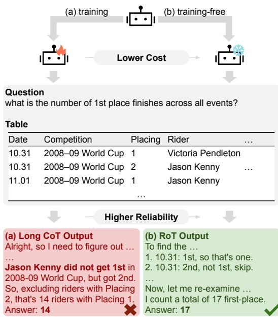

flowchart

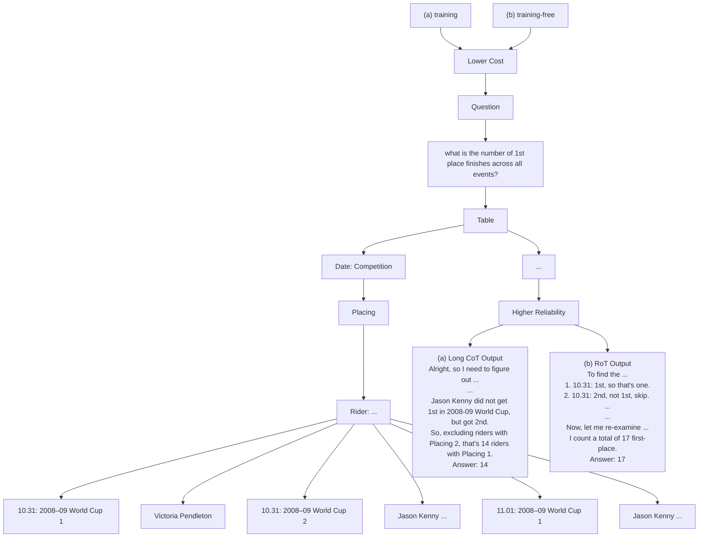

Figure 1: Compared with (a) Long CoT, (b) ROT necessitates no training, exhibits lower costs, and enhances reliability by mitigating hallucination via sequentially row-wise table traversal.

capabilities (Li et al., 2025b; Qian et al., 2025). This improvement stems from Long CoT, which sequentially scales the length of CoT, engages in selfreflection, and explores diverse reasoning paths, in contrast to the shallow and direct reasoning of Short CoT (Chen et al., 2025; Yeo et al., 2025). However, Long CoT exhibits two limitations in table reasoning, as illustrated in Figure 1 (a): (i) High Cost: Achieving Long CoT capabilities for improved table reasoning capabilities necessitates high-quality data, leading to substantial training expenses (Qian et al., 2025; Jiang et al., 2024a). (ii) Low Reliability: As the output reasoning chains lengthen, models are prone to losing relevant tabular information from the input, resulting in hallucinations of the tabular content (Zhang et al., 2023; Liu et al., 2025a,b; Kumar et al., 2025).

Therefore, we propose Row-of-Thought (ROT),

# Input

Your task is to think step by step by traversing the given table to solve the question.

# Note that:

1. You must traverse the table row by row iteratively. 2. Represent your answer with: Answer: <Your Answer>. Here is an example:

Based on the above example, you need to traverse the table below and answer the question.

<table><tr><td>Date</td><td>Competition</td><td>Placing</td><td>Rider</td><td>...</td></tr><tr><td>10.31</td><td>2008–09 World Cup</td><td>1</td><td>Victoria Pendleton</td><td>...</td></tr><tr><td>10.31</td><td>2008–09 World Cup</td><td>2</td><td>Jason Kenny</td><td>...</td></tr><tr><td>11.01</td><td>2008–09 World Cup</td><td>1</td><td>Jason Kenny</td><td>...</td></tr><tr><td>11.02</td><td>2008–09 World Cup</td><td>1</td><td>Ross Edgar</td><td>...</td></tr><tr><td colspan="5">...</td></tr><tr><td colspan="5">Question:what is the number of 1st place finishes across all events?</td></tr></table>

# Output

To answer the question, I need to count the number of 1st place finishes across all events.

Let me go through each row one by one.

1. 10.31, Victoria Pendleton: 1st place, so that's one.

2. 10.31, Jason Kenny: 2nd place, not 1st, so skip.

3. 11.01, Jason Kenny: 1st place, so that's two.

4. 11.02, Ross Edgar: 1st place, so that's three.

After going through all the rows, I counted a total of 17 first-place finishes.

Now, let me re-examine the rows to see if I missed any events.

\* 10.31, Victoria Pendleton got 1st place, so that's one.

\* 10.31, Jason Kenny got 2nd place not 1st, so so I'll skip this.

\* 11.01, Jason Kenny got 1st place, so that's two.

\* 11.02, Ross Edgar got 1st place, so that's three.

Answer: 17

Figure 2: The overview of ROT with the input and output of the example. The instruction is highlighted with blue and the iterative row-wise table traversal process is highlighted with green.

a novel method that enhances table reasoning by guiding the model to perform iteratively row-wise traversal reasoning, as illustrated in Figure 1 (b). Row-wise traversal refers to the reasoning process where it considers information from a single row at each step to update intermediate results. In the iterative process, after each traversal, the model can either extend its reasoning or reflect on prior steps and initiate a new traversal accordingly. ROT alleviates two limitations of Long CoT: (i) Low Cost: Since ROT sequentially scales the reasoning length by row-wise traversals and the self-reflection capabilities are equipped in LLMs (Gu et al., 2025; AI et al., 2025), ROT is training-free and can be implemented with non-reasoning large language models (non-RLLMs) through prompting. (ii) High Reliability: By prompting the sequential traversal of all rows, ROT directs greater attention to tabular information thoroughly, thereby mitigating hallucination (Shi et al., 2024a; Chuang et al., 2024).

To demonstrate the effectiveness of ROT, we conduct experiments on WikiTableQuestions (Pasupat and Liang, 2015), HiTab (Cheng et al., 2022), and TableBench (Wu et al., 2024). Compared to Long CoT on RLLMs, ROT achieves an average improvement of 4.3% with non-RLLMs without training, validating its effectiveness. Furthermore, ROT can also enhance the performance of RLLMs with an average improvement of 2.4%, mitigating their table content hallucination. Additionally, ROT achieves state-of-the-art (SOTA) results on WikiTableQuestions and TableBench with comparable models, and yields competitive results on HiTab. Analysis experiments reveal that ROT with

# non-RLLMs outperforms Long CoT with fewer reasoning tokens, showing higher efficiency.

Our contributions are as follows:

1. We propose ROT, which achieves lower cost without training and higher reliability compared to Long CoT.   
2. ROT on non-RLLMs outperforms Long CoT on RLLMs by an average of 4.3% and achieves SOTA results among comparable models on WikiTableQuestions and TableBench, proving its effectiveness.   
3. ROT with non-RLLMs outperforms Long CoT using fewer reasoning tokens, highlighting its higher efficiency.

# 2 ROT

To mitigate the limitations of High Cost and Low Reliability in Long CoT, we propose ROT. As illustrated in Figure 2, ROT enhances table reasoning capabilities by iterative row-wise traversals. The complete prompts are available in Appendix A.1.

# 2.1 Overview

Given an instruction I, a question Q, a table U composed of M rows and N columns, and in-context demonstrations D, the model outputs a step-by-step reasoning process that iteratively traverses the table in the sequential row order until the final answer is derived. Formally, $R ; A = \mathcal { F } ( I , Q , U , D )$ , where is the LLM, and R; A denotes the concatenation of the reasoning process R and the answer A. We represent the table in Markdown format, following previous works (Wang et al., 2024; Zhang et al., 2024b; Yu et al., 2025). We now introduce the two key factors in the reasoning process R in ROT.

# 2.2 Traversal

We first detail the traversal reasoning adopting the row as the traversal unit in ROT. Specifically, the model assesses the relevance of information within the current row and infers intermediate results according to the question and prior inference. Formally, $R _ { i } ; A _ { i } ~ =$ $R _ { i , 1 } ; A _ { i , 1 } , R _ { i , 2 } ; A _ { i , 2 } , . . . , R _ { i , M } ; A _ { i , M }$ . $R _ { i }$ represents the reasoning process of the i-th traversal, and $A _ { i }$ is the result obtained in the i-th traversal. $R _ { i , j }$ denotes the reasoning over the j-th row of the table during the i-th traversal, and $A _ { i , j }$ is the corresponding intermediate result. ROT leverages the inherent structural features of tables by decomposing the problem-solving into fine-grained, step-by-step reasoning, with each step corresponding to a row. By accumulating the intermediate results $A _ { i , j }$ from each row, we obtain the result $A _ { i }$ after one traversal. The row-wise traversal not only brings the reasoning length scaling but also mitigates hallucination by forcing the model to attend to the entire table content. We also discuss comparisons with adopting other traversal units and ROT in §3.4.5.

# 2.3 Iteration

The iteration process allows the model to continue reasoning after a traversal, which is necessary for multi-hop questions that cannot be answered in a single traversal. Also, the model can choose to reflect on the previous reasoning after a traversal and subsequently revisit the table based on the reflection until the final answer is obtained. Formally, the iterative reasoning process can be represented as $R ; A = R _ { 1 } ; A _ { 1 } , R _ { 2 } ; A _ { 2 } , . . . , R _ { T } ; A _ { T }$ , where T is the total number of traversals. Rather than predefining T in the prompt, the model dynamically decides to terminate inference when the final answer has been obtained. We provide a detailed analysis of the iterative table traversals in §3.4.2. We also provide case study for iterative traversals in Appendix C.2.

# 3 Experiments

# 3.1 Experimental Setup

Dataset ROT is evaluated on three widely used table reasoning datasets: WikiTableQuestions (Pasupat and Liang, 2015), HiTab (Cheng et al., 2022), and TableBench (Wu et al., 2024), following previous works (Jiang et al., 2024b; Cao, 2025; Li et al., 2025a). WikiTableQuestions is a mainstream table-based question answering dataset. HiTab focuses on hierarchical tables, challenging models to comprehend complex structural relationships. TableBench presents a challenging benchmark covering diverse question types and topics.

Models (i) For non-RLLMs, we utilize Llama3.1-8B-Instruct (Llama3.1-8B), Llama3.3- 70B-Instruct (Llama3.3-70B) (Dubey et al., 2024), Qwen2.5-7B-Instruct (Qwen2.5-7B), and Qwen2.5- 32B-Instruct (Qwen2.5-32B) (Yang et al., 2024a). (ii) For RLLMs, we employ the correspondingsized DeepSeek-R1-Distill-Llama-8B (R1- Llama-8B), DeepSeek-R1-Distill-Llama-70B (R1-Llama-70B), DeepSeek-R1-Distill-Qwen-7B (R1-Qwen-7B), and DeepSeek-R1-Distill-Qwen-32B (R1-Qwen-32B) (Guo et al., 2025). We exclude Qwen2.5-Math-7B, which is the base model of R1-Qwen-7B, due to its primary focus on solving mathematical tasks, resulting in suboptimal performance on the table reasoning task (Yang et al., 2024b).

Metric For WikiTableQuestions and HiTab, we adopt accuracy as the evaluation metric, following prior works (Pasupat and Liang, 2015; Cheng et al., 2022). Accuracy measures the ability of models to generate answers that exactly match the gold answers. For TableBench, we use Rouge-L (Lin, 2004), consistent with the previous research (Wu et al., 2024). Rouge-L evaluates the quality of generated answers based on the longest common subsequence, considering both precision and recall.

Baselines ROT employs the one-shot and zeroshot prompts to enable non-RLLMs and RLLMs to perform iterative row-wise traversals, respectively (prompts in Appendix A.1). We do not use demonstrations for RLLMs due to the performance degradation using the few-shot prompt observed in Appendix B.1 (Guo et al., 2025; Zheng et al., 2025). We compare ROT with the following methods:

• Short CoT: We prompt non-RLLMs to engage in step-by-step reasoning with the one-shot prompt, which uses the same demonstration as ROT.   
• Long CoT: We utilize the zero-shot prompt for RLLMs.   
• Previous table reasoning works: We compare ROT with existing table reasoning methods with comparable models.

<table><tr><td>Model</td><td>Method</td><td>WikiTQ</td><td>HiTab</td><td>TableBench</td></tr><tr><td rowspan="2">Llama3.1-8B (Dubey et al., 2024)</td><td>Short CoT</td><td>57.9</td><td>46.5</td><td>31.5</td></tr><tr><td>RoT</td><td>63.6 (+2.7)</td><td>56.6 (+10.1)</td><td>35.7 (+4.2)</td></tr><tr><td rowspan="2">R1-Llama-8B (Guo et al., 2025)</td><td>Long CoT</td><td>62.7</td><td>49.7</td><td>34.9</td></tr><tr><td>RoT</td><td>63.7 (+1.0)</td><td>50.9 (+1.2)</td><td>35.4 (+0.5)</td></tr><tr><td rowspan="2">Llama3.3-70B (Dubey et al., 2024)</td><td>Short CoT</td><td>72.7</td><td>66.9</td><td>38.2</td></tr><tr><td>RoT</td><td>78.7 (+6.0)</td><td>72.4 (+5.5)</td><td>44.8 (+6.6)</td></tr><tr><td rowspan="2">R1-Llama-70B (Guo et al., 2025)</td><td>Long CoT</td><td>76.2</td><td>67.4</td><td>40.4</td></tr><tr><td>RoT</td><td>78.3 (+2.1)</td><td>68.6 (+1.2)</td><td>42.8 (+2.4)</td></tr><tr><td rowspan="2">Qwen2.5-7B (Yang et al., 2024a)</td><td>Short CoT</td><td>52.2</td><td>54.7</td><td>30.9</td></tr><tr><td>RoT</td><td>61.7 (+9.5)</td><td>58.9 (+4.2)</td><td>34.9 (+4.0)</td></tr><tr><td rowspan="2">R1-Qwen-7B (Guo et al., 2025)</td><td>Long CoT</td><td>53.3</td><td>50.2</td><td>34.2</td></tr><tr><td>RoT</td><td>57.1 (+3.8)</td><td>51.2 (+1.0)</td><td>35.6 (+1.4)</td></tr><tr><td rowspan="2">Qwen2.5-32B (Yang et al., 2024a)</td><td>Short CoT</td><td>69.2</td><td>70.3</td><td>35.9</td></tr><tr><td>RoT</td><td>75.6 (+6.4)</td><td>76.6 (+6.3)</td><td>40.4 (+4.5)</td></tr><tr><td rowspan="2">R1-Qwen-32B (Guo et al., 2025)</td><td>Long CoT</td><td>69.6</td><td>70.8</td><td>38.0</td></tr><tr><td>RoT</td><td>76.9 (+7.3)</td><td>73.5 (+2.7)</td><td>42.0 (+4.0)</td></tr></table>

Table 1: Performance comparison between ROT and baselines, where WikiTQ and HiTab use accuracy as the evaluation metric and TableBench uses Rouge-L. WikiTQ refers to WikiTableQuestions. For each dataset, the highest performing result among models of the same scale is bolded. Performance gain compared to baselines is highlighted with (green).

<table><tr><td>Dataset</td><td>Previous SOTA</td><td>RoT</td></tr><tr><td>WikiTQ</td><td>78.0 (Cao, 2025)</td><td>78.7</td></tr><tr><td>HiTab</td><td>79.1 (Jiang et al., 2024b)</td><td>76.7</td></tr><tr><td>TableBench</td><td>43.9 (Wu et al., 2024)</td><td>44.8</td></tr></table>

Table 2: Performance comparison between ROT and SOTA methods with similar scale models.

# 3.2 Main Results

Table 1 presents a comparison between ROT and baselines using different models across datasets. ROT, using non-RLLMs consistently and significantly outperforms Long CoT with RLLMs, achieving an average improvement of 4.3%, demonstrating its effectiveness. Furthermore, ROT yields an average increase of 2.4% in the performance of RLLMs, indicating its effectiveness in mitigating the limitations of Long CoT. We also observe that:

ROT outperforms baselines consistently. ROT surpasses Long CoT primarily because it enforces the row-wise traversals, alleviating hallucinations in Long CoT (Zhang et al., 2023; Shi et al., 2024a; Liu et al., 2025b). Compared to Short CoT, ROT achieves superior performance through fine-grained, row-wise reasoning, thereby reducing the complexity of individual reasoning steps and minimizing the risk of overlooking relevant details (Snell et al., 2024; Wang et al., 2024).

We also compare ROT with SOTA methods on three datasets, as shown in Table 2. Due to space constraints, detailed comparisons with prior works are provided in Appendix B.2. ROT gets SOTA results on WikiTQ and TableBench and is comparable with the SOTA method on HiTab, highlighting its effectiveness. The comparable performance on HiTab can be attributed to the fact that ROT does not incorporate specific enhancements for hierarchical tables, unlike previous methods (Zhao et al., 2023; Jiang et al., 2024b; Li et al., 2025a).

ROT improves performance across varying models. ROT significantly enhances the table reasoning capabilities of various non-RLLMs and RLLMs without training. ROT with RLLMs does not outperform ROT with non-RLLMs consistently because, while we mitigate hallucination in Long CoT, they exhibit problems such as overthinking, which are less pronounced in non-RLLMs (Yin et al., 2025; Zeng et al., 2025). Additionally, R1- Qwen-7B does not outperform Qwen2.5-7B on HiTab, as its base model, Qwen2.5-Math-7B, is optimized for mathematical reasoning, unlike the general base models of others (Yang et al., 2024b).

# 3.3 Ablation Experiments

To demonstrate the effectiveness of ROT, we conduct ablation experiments on three datasets, as shown in Table 3. The prompts used in the ablation experiments are provided in Appendix A.2.

<table><tr><td>Scale</td><td>Model</td><td>Method</td><td>WikiTQ</td><td>HiTab</td><td>TableBench</td></tr><tr><td rowspan="6">8B</td><td rowspan="3">Llama3.1</td><td>RoT</td><td>63.6</td><td>56.6</td><td>35.7</td></tr><tr><td>w/o Iteration</td><td>60.7</td><td>55.5</td><td>32.7</td></tr><tr><td>w/o Traversal</td><td>55.2</td><td>42.2</td><td>31.2</td></tr><tr><td rowspan="3">R1-Llama</td><td>RoT</td><td>63.7</td><td>50.9</td><td>35.4</td></tr><tr><td>w/o Iteration</td><td>56.6</td><td>48.9</td><td>31.5</td></tr><tr><td>w/o Traversal</td><td>46.8</td><td>36.8</td><td>25.7</td></tr></table>

Table 3: The ablation results of ROT compared with reasoning with one single table traversal (denoted as w/o Iteration) and reasoning without table traversal (denoted as w/o Traversal). For each dataset, the highest performing result with the same model is bolded.

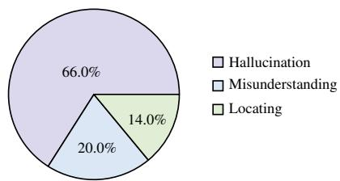

pie

| Category | Percentage (%) |
| :--- | :--- |
| Hallucination | 66.0 |
| Misunderstanding | 14.0 |
| Locating | 20.0 |

Figure 3: Long CoT underperforms ROT due to the error types, with their distribution.

Effectiveness of Iteration To validate the effectiveness of iterative reasoning in ROT, we prompt the model to perform only a single table traversal. The results indicate a consistent performance decrease compared to ROT when iteration is removed, demonstrating that iterative traversal effectively aids the model in exploration and reflection. Also, a single traversal is insufficient to adequately address all table reasoning questions.

Effectiveness of Traversal To demonstrate the importance of traversal in ROT, we prompt LLMs to iteratively reflect instead of iteratively traversing the table. The significant performance decline observed underscores that traversing the table, through scaling reasoning length and mitigating hallucinations of tabular content, effectively enhances table reasoning.

# 3.4 Analysis Experiments

We primarily select Llama3.1-8B and R1-Llama-8B for subsequent analysis experiments due to their high reasoning efficiency and space limitations.

# 3.4.1 Why ROT Outperforms Long CoT?

To explore the superior performance of ROT over Long CoT, we conduct an error analysis on WikiTQ instances where ROT with Llama3.1-8B succeeds while Long CoT with R1-Llama-8B fails. We also explore why ROT with RLLMs outperforms Long CoT in Appendix B.6. Figure 3 illustrates the

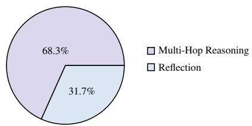

pie

| Category | Percentage (%) |
| :--- | :--- |
| Multi-Hop Reasoning | 68.3 |
| Reflection | 31.7 |

Figure 4: The distribution of reasons for iterative traversals in ROT on sampled 60 instances from three datasets.

identified error categories on sampled 50 instances, which are detailed below. We provide the cases of each error category in Appendix C.1.

(i) Hallucination refers to the model incorrectly recalling tabular information, leading to inconsistencies between the table input and the generated reasoning, such as cross-row confusion and relevant information omission. Long CoT suffers from severe hallucinations, primarily due to the increasing loss of tabular content as the reasoning chain lengthens (Liu et al., 2025b). Conversely, ROT performs row-wise traversals sequentially, guides greater attention to the table content, which mitigates this issue (Yin et al., 2020; Badaro et al., 2023). (ii) Misunderstanding denotes the misinterpretation of the question, which is a common challenge for distilled models (Banerjee et al., 2024; Yin et al., 2025). (iii) Locating refers to incorrectly identifying the relevant table location for the given question. Therefore, ROT demonstrates a higher reliability compared to Long CoT.

# 3.4.2 How does the number of traversals affect ROT?

To examine when ROT requires iterative traversals, we randomly select 20 instances from each dataset on Llama3.1-8B where ROT traverses the table more than once and investigate the reasons, as shown in Figure 4. We provide a detailed explanation of the reasons below, with examples provided in Appendix C.2. (i) Multi-Hop Reasoning: The inherent complexity of certain questions demands iterative table traversals to derive the solution, particularly when addressing cross-row dependencies. (ii) Reflection: The model reflects on its prior reasoning upon completing a traversal and initiates new reasoning passes accordingly. This demonstrates that ROT with non-RLLMs equips the capacities of extending reasoning and self-reflection on table reasoning.

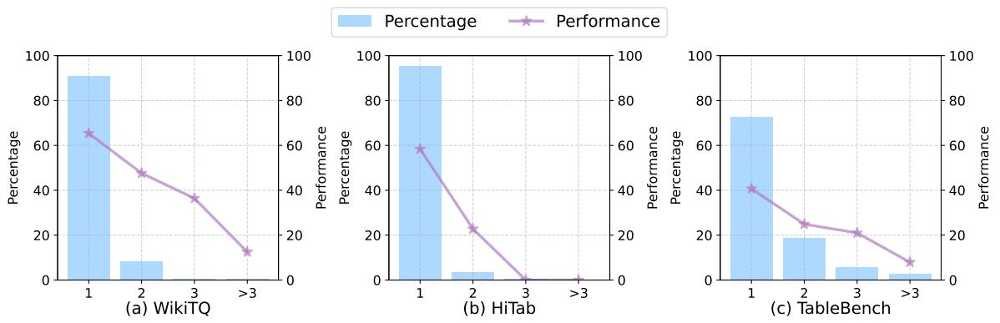  
Figure 5: The distribution of table traversal counts and the corresponding performance of ROT on three datasets with Llama3.1-8B.

Additionally, to assess the impact of traversal count on performance, we report the distribution of table traversal counts and the corresponding performance when using Llama3.1-8B, as depicted in Figure 5. We observe that: (i) On the more challenging TableBench dataset, ROT tends to perform more traversals as required. (ii) Increasing traversal counts correlate with a decrease in the performance of ROT, due to the inherent difficulty of questions necessitating iterative traversals and the potential for exceeding token limits during such processes.

# 3.4.3 How does reasoning length affect table reasoning capabilities?

To investigate the impact of reasoning length on table reasoning performance, we calculate the average number of tokens used in correct and incorrect reasoning on WikiTQ, as shown in Figure 6. The results reveal that:

(i) ROT with non-RLLM achieves improved table reasoning with fewer tokens compared to Long CoT, demonstrating its efficiency. ROT allows the model to dynamically determine the number of iterations and non-RLLMs are not specifically trained on Long CoT data, therefore, ROT mitigates overthinking prevalent in Long CoT (Yin et al., 2025). Additionally, when using the same RLLM, ROT exhibits shorter incorrect reasoning compared to Long CoT, since ROT, by focusing

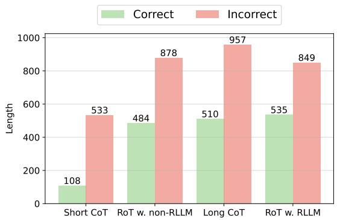

bar

| Category | Correct | Incorrect |
| :--- | :--- | :--- |
| Short CoT | 108 | 533 |
| RoT w. non-RLLM | 484 | 878 |
| Long CoT | 510 | 957 |
| RoT w. RLLM | 535 | 849 |

Figure 6: Comparison of average reasoning lengths for correct and incorrect inferences across three datasets on WikiTQ with Llama3.1-8B (denoted as w. non-RLLM) and R1-Llama-8B (denoted as w. RLLM).

more intently on the table, reduces model hallucinations regarding table content, thereby decreasing the frequency of ineffective reflections, as discussed in Appendix B.6 (Shi et al., 2024a; Qin et al., 2025). (ii) Using the same model, ROT produces longer correct reasoning compared to its corresponding CoT baseline. This is because the row-wise table traversal enables more fine-grained reasoning, leading to increased reasoning length and improved performance (Qian et al., 2025).

# 3.4.4 How does ROT change with table size?

To evaluate the performance of ROT relative to baselines across varying table sizes, we analyze the performance of Llama3.1-8B and R1-Llama-8B on tables of different sizes in WikiTQ, defined as the product of the number of rows and columns (Figure 7). The key observations are as follows: (i) Overall, ROT outperforms the baselines across table sizes. (ii) While exhibiting a general downward trend, the performance of ROT demonstrates relative stability with increasing table size. The row-wise traversals could lead to exceeding the token limit when the number of rows becomes excessively large before a response is generated. Long CoT suffers from an increased number of reasoning steps with larger tables, elevating the risk of hallucinating relevant information and surpassing token limits more significantly (Zeng et al., 2025; Sui et al., 2025). Short CoT, while less susceptible to token limit issues, could overlook relevant table information due to its coarser reasoning granularity and miss self-reflection reasoning (Snell et al., 2024; Zhang et al., 2025b).

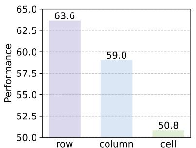

bar

| Category | Performance |
| :--- | :--- |
| row | 63.6 |
| column | 59.0 |
| cell | 50.8 |

(a) WikiTQ

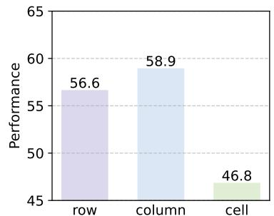

bar

| Category | Performance |
| :--- | :--- |
| row | 56.6 |
| column | 58.9 |
| cell | 46.8 |

(b) HiTab

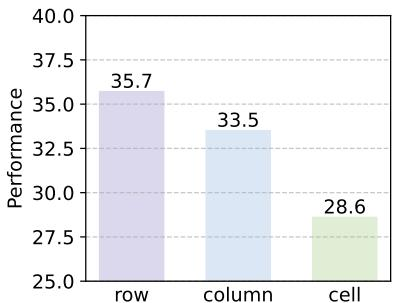

bar

| Category | Performance |
| :--- | :--- |
| row | 35.7 |
| column | 33.5 |
| cell | 28.6 |

(c) TableBench   
Figure 8: Comparison of ROT traversing the table with different units across three datasets.

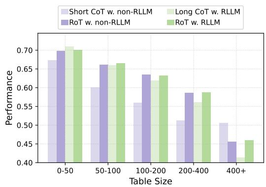

bar

| Table Size | Short CoT w. non-RLLM | RoT w. non-RLLM | Long CoT w. RLLM | RoT w. RLLM |
| ---------- | ---------------------- | ---------------- | ---------------- | ----------- |
| 0-50       | 0.67                   | 0.70             | 0.71             | 0.70        |
| 50-100     | 0.60                   | 0.66             | 0.67             | 0.67        |
| 100-200    | 0.56                   | 0.64             | 0.63             | 0.63        |
| 200-400    | 0.51                   | 0.59             | 0.57             | 0.59        |
| 400+       | 0.51                   | 0.46             | 0.41             | 0.46        |

Figure 7: The comparison of the average performance of ROT and baselines on different table sizes in WikiTQ with Llama3.1-8B and R1-Llama-8B.

# 3.4.5 How does the traversal unit affect ROT?

To investigate the effect of traversal units on ROT, we conduct experiments using rows, columns, and individual cells as traversal units across three datasets with Llama3.1-8B. Row-wise traversal is adopted as the default setting in the main experiments. The results indicate the following:

(i) On WikiTQ and TableBench, row-wise traversal achieves the best performance. Compared to column-wise traversal, row-wise traversal better aligns with the attention mechanism, enabling more effective focus on all cells within the same row (Yin

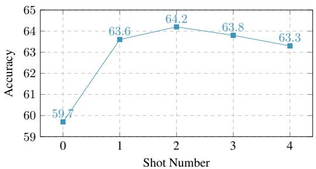

line

| Shot Number | Accuracy |
| ----------- | -------- |
| 0           | 59.7     |
| 1           | 63.6     |
| 2           | 64.2     |
| 3           | 63.8     |
| 4           | 63.3     |

Figure 9: Performance of ROT on WikiTQ with varying numbers of demonstrations.

et al., 2020; Liu et al., 2024a). Cell-wise traversal resulted in a significant performance decrease, due to its overly fine-grained reasoning granularity and the presence of numerous irrelevant cells, which introduce redundant reasoning steps and increase the risk of error accumulation (Jin et al., 2024; Chen et al., 2024; Patnaik et al., 2024). (ii) Column-wise traversal yields superior performance on HiTab. In HiTab, all tables include hierarchical row headers, while hierarchical column headers are present in 93.1% of the tables, a relatively less frequent occurrence (Cheng et al., 2022). Consequently, each cell in a row corresponds to hierarchical row headers. During row-wise traversals, each cell should be mapped to multiple row headers, whereas columnwise traversals inherently incorporate header information into each column, facilitating more effective reasoning (Zhao et al., 2023).

# 3.4.6 How does the number of demonstrations affect ROT?

To investigate the effect of the number of demonstrations on ROT, we conduct experiments on WikiTQ using Llama3.1-8B, as illustrated in Figure 9. All demonstrations were sampled from the WikiTQ training set. We observe that: (i) A substantial performance gain is observed when transitioning from zero-shot to one-shot prompting. This suggests that a single demonstration significantly aids the model in comprehending the instruction and replicating the reasoning process for iterative row-wise table traversals, thus improving table reasoning capabilities. (ii) With a further increase in the number of demonstrations, performance initially improves but subsequently declines. A limited number of demonstrations is sufficient for the model to understand the instructions and learn the reasoning patterns. Additional demonstrations contribute little new information and may constrain the reasoning paths (Lin et al., 2024; Wan et al., 2025; Zheng et al., 2025). The one-shot prompt is chosen for our main experiments, balancing competitive performance with excellent inference efficiency.

# 4 Related Works

# 4.1 Table Reasoning

The table reasoning task, which aims to answer user queries through inference over tabular data, is extensively applied in data-intensive domains such as finance and research (Jin et al., 2022; Zhang et al., 2025d). Leveraging large language models (LLMs) has emerged as a prevalent method for table reasoning (Chen, 2023; Lu et al., 2025). To enhance the table reasoning capability, researchers propose to collect or augment tabular data for fine-tuning (Zhang et al., 2024a, 2025c; Su et al., 2024). However, the resource demands and potential reduction in generalization (Deng and Mihalcea, 2025) motivate training-free methods. Some methods focus on question decomposition to mitigate reasoning complexity (Ye et al., 2023; Wu and Feng, 2024; Jiang et al., 2024c). For instance, TID (Yang et al., 2025) extracts triples from the question and transforms them into sub-questions for comprehensive decomposition. Another direction involves the integration of programs or tools to facilitate reasoning (Jiang et al., 2023; Shi et al., 2024b; Zhang et al., 2024c), exemplified by MACT (Zhou et al., 2025), which employs a planning agent and a coding agent to select appropriate actions and tools for reasoning.

Recent advancements in RLLMs demonstrate that the integration of Long CoT significantly improves their reasoning abilities, including table reasoning (Chen et al., 2025; Qian et al., 2025). However, Long Long CoT suffers from significant tabular content hallucination (Zeng et al., 2025). To address this, we propose an iteratively row-wise traversal method, which mitigates hallucination by forcing the model to focus on tabular content.

# 4.2 Long CoT

RLLMs, such as OpenAI O1 (OpenAI et al., 2024a) and DeepSeek R1 (Guo et al., 2025), significantly improve reasoning capabilities by incorporating Long CoT with scaling reasoning length and iterative exploration and reflection, leading to consistent performance gains across diverse tasks (Snell et al., 2024; Aggarwal and Welleck, 2025). RLLMs are typically derived from base LLMs through supervised fine-tuning (SFT) or reinforcement learning (RL) (Chen et al., 2025; Chu et al., 2025). SFT aims to replicate sophisticated reasoning patterns from human-annotated or distilled data (Trung et al., 2024; Wen et al., 2025). For instance, s1 (Muennighoff et al., 2025) and LIMO (Ye et al., 2025) enhance their reasoning abilities through SFT by collecting 1, 000 and 817 high-quality training instances with meticulously labeled rationales, respectively. RL further refines reasoning abilities through self-learning and preference optimization (Liu et al., 2024b; Xu et al., 2025). For example, Zhang et al. (2025a) proposes a Process-based Self-Rewarding paradigm, which fine-tunes models using synthesized step-wise preference data.

However, previous works require high-quality data and exhibit significantly high cost (Jiang et al., 2024a; Qin et al., 2024). Given that table reasoning tasks involve structured evidence, we propose ROT that enhances the table reasoning capabilities of non-reasoning LLMs without training.

# 5 Conclusion

Considering the limitations of Long CoT on the table reasoning task, we focus on enhancing table reasoning capabilities with low cost and high reliability. Specifically, we propose a training-free method, ROT, which prompts the model to perform iterative row-wise traversal reasoning until the final answer is obtained. Experiments show that ROT, using non-RLLMs, outperforms Long CoT with RLLMs, achieving an average improvement of 4.3%, demonstrating the effectiveness of ROT. Additionally, ROT with RLLMs brings an average improvement of 2.4% compared with Long CoT, leading to higher reliability. Furthermore, ROT attains SOTA performance on WikiTableQuestions and TableBench among comparable models, validating its effectiveness. Analysis experiments indicate that ROT with non-RLLMs achieves better performance than Long CoT with fewer reasoning tokens, showing its higher efficiency.

# Limitations

(i) We do not conduct experiments on multi-turn table question answering datasets. We will explore the effectiveness of ROT on such datasets in future work. (ii) Our experiments are exclusively performed on English datasets. We leave experimentation with ROT on different languages for future research.

# Ethics Statement

All models used in this paper are publicly available, and our utilization of them strictly complies with their respective licenses and terms of use.

# Acknowledge

We gratefully acknowledge the support of the National Natural Science Foundation of China (NSFC) via grant 62236004, 62206078, 62441603 and 62476073.

# References

Pranjal Aggarwal and Sean Welleck. 2025. L1: Controlling how long a reasoning model thinks with reinforcement learning. Preprint, arXiv:2503.04697.   
Essential AI, :, Darsh J Shah, Peter Rushton, Somanshu Singla, Mohit Parmar, Kurt Smith, Yash Vanjani, Ashish Vaswani, Adarsh Chaluvaraju, Andrew Hojel, Andrew Ma, Anil Thomas, Anthony Polloreno, Ashish Tanwer, Burhan Drak Sibai, Divya S Mansingka, Divya Shivaprasad, Ishaan Shah, Karl Stratos, Khoi Nguyen, Michael Callahan, Michael Pust, Mrinal Iyer, Philip Monk, Platon Mazarakis, Ritvik Kapila, Saurabh Srivastava, and Tim Romanski. 2025. Rethinking reflection in pre-training. Preprint, arXiv:2504.04022.   
Gilbert Badaro, Mohammed Saeed, and Paolo Papotti. 2023. Transformers for tabular data representation: A survey of models and applications. Transactions of the Association for Computational Linguistics, 11:227–249.   
Sourav Banerjee, Ayushi Agarwal, and Saloni Singla. 2024. Llms will always hallucinate, and we need to live with this. Preprint, arXiv:2409.05746.   
Lang Cao. 2025. Tablemaster: A recipe to advance table understanding with language models. Preprint, arXiv:2501.19378.   
Yihan Cao, Shuyi Chen, Ryan Liu, Zhiruo Wang, and Daniel Fried. 2023. API-assisted code generation for question answering on varied table structures. In Proceedings of the 2023 Conference on Empirical Methods in Natural Language Processing, pages 14536–14548, Singapore. Association for Computational Linguistics.

Qiguang Chen, Libo Qin, Jinhao Liu, Dengyun Peng, Jiannan Guan, Peng Wang, Mengkang Hu, Yuhang Zhou, Te Gao, and Wanxiang Che. 2025. Towards reasoning era: A survey of long chain-of-thought for reasoning large language models. Preprint, arXiv:2503.09567.

Qiguang Chen, Libo Qin, Jiaqi WANG, Jingxuan Zhou, and Wanxiang Che. 2024. Unlocking the capabilities of thought: A reasoning boundary framework to quantify and optimize chain-of-thought. In The Thirty-eighth Annual Conference on Neural Information Processing Systems.

Wenhu Chen. 2023. Large language models are few(1)- shot table reasoners. In Findings of the Association for Computational Linguistics: EACL 2023, pages 1120–1130, Dubrovnik, Croatia. Association for Computational Linguistics.

Zhoujun Cheng, Haoyu Dong, Zhiruo Wang, Ran Jia, Jiaqi Guo, Yan Gao, Shi Han, Jian-Guang Lou, and Dongmei Zhang. 2022. HiTab: A hierarchical table dataset for question answering and natural language generation. In Proceedings of the 60th Annual Meeting of the Association for Computational Linguistics (Volume 1: Long Papers), pages 1094–1110, Dublin, Ireland. Association for Computational Linguistics.

Zhoujun Cheng, Tianbao Xie, Peng Shi, Chengzu Li, Rahul Nadkarni, Yushi Hu, Caiming Xiong, Dragomir Radev, Mari Ostendorf, Luke Zettlemoyer, Noah A. Smith, and Tao Yu. 2023. Binding language models in symbolic languages. In The Eleventh International Conference on Learning Representations.

Tianzhe Chu, Yuexiang Zhai, Jihan Yang, Shengbang Tong, Saining Xie, Dale Schuurmans, Quoc V. Le, Sergey Levine, and Yi Ma. 2025. Sft memorizes, rl generalizes: A comparative study of foundation model post-training. Preprint, arXiv:2501.17161.

Yung-Sung Chuang, Yujia Xie, Hongyin Luo, Yoon Kim, James R. Glass, and Pengcheng He. 2024. Dola: Decoding by contrasting layers improves factuality in large language models. In The Twelfth International Conference on Learning Representations.

Naihao Deng and Rada Mihalcea. 2025. Rethinking table instruction tuning. Preprint, arXiv:2501.14693.

Abhimanyu Dubey, Abhinav Jauhri, Abhinav Pandey, Abhishek Kadian, Ahmad Al-Dahle, Aiesha Letman, Akhil Mathur, Alan Schelten, Amy Yang, Angela Fan, et al. 2024. The llama 3 herd of models. Preprint, arXiv:2407.21783.

Jiawei Gu, Xuhui Jiang, Zhichao Shi, Hexiang Tan, Xuehao Zhai, Chengjin Xu, Wei Li, Yinghan Shen, Shengjie Ma, Honghao Liu, Saizhuo Wang, Kun Zhang, Yuanzhuo Wang, Wen Gao, Lionel Ni, and Jian Guo. 2025. A survey on llm-as-a-judge. Preprint, arXiv:2411.15594.

Daya Guo, Dejian Yang, Haowei Zhang, Junxiao Song, Ruoyu Zhang, Runxin Xu, Qihao Zhu, Shirong Ma,

Peiyi Wang, Xiao Bi, et al. 2025. Deepseek-r1: Incentivizing reasoning capability in llms via reinforcement learning. arXiv preprint arXiv:2501.12948.   
Jinhao Jiang, Zhipeng Chen, Yingqian Min, Jie Chen, Xiaoxue Cheng, Jiapeng Wang, Yiru Tang, Haoxiang Sun, Jia Deng, Wayne Xin Zhao, Zheng Liu, Dong Yan, Jian Xie, Zhongyuan Wang, and Ji-Rong Wen. 2024a. Enhancing llm reasoning with reward-guided tree search. Preprint, arXiv:2411.11694.   
Jinhao Jiang, Kun Zhou, Zican Dong, Keming Ye, Xin Zhao, and Ji-Rong Wen. 2023. StructGPT: A general framework for large language model to reason over structured data. In Proceedings of the 2023 Conference on Empirical Methods in Natural Language Processing, pages 9237–9251, Singapore. Association for Computational Linguistics.   
Ruya Jiang, Chun Wang, and Weihong Deng. 2024b. Seek and solve reasoning for table question answering. Preprint, arXiv:2409.05286.   
Ruya Jiang, Chun Wang, and Weihong Deng. 2024c. Seek and solve reasoning for table question answering. Preprint, arXiv:2409.05286.   
Mingyu Jin, Qinkai Yu, Dong Shu, Haiyan Zhao, Wenyue Hua, Yanda Meng, Yongfeng Zhang, and Mengnan Du. 2024. The impact of reasoning step length on large language models. In Findings of the Association for Computational Linguistics: ACL 2024, pages 1830–1842, Bangkok, Thailand. Association for Computational Linguistics.   
Nengzheng Jin, Joanna Siebert, Dongfang Li, and Qingcai Chen. 2022. A survey on table question answering: recent advances. In China Conference on Knowledge Graph and Semantic Computing, pages 174– 186. Springer.   
Adarsh Kumar, Hwiyoon Kim, Jawahar Sai Nathani, and Neil Roy. 2025. Improving the reliability of llms: Combining cot, rag, self-consistency, and selfverification. Preprint, arXiv:2505.09031.   
Qianlong Li, Chen Huang, Shuai Li, Yuanxin Xiang, Deng Xiong, and Wenqiang Lei. 2025a. GraphOT-TER: Evolving LLM-based graph reasoning for complex table question answering. In Proceedings of the 31st International Conference on Computational Linguistics, pages 5486–5506, Abu Dhabi, UAE. Association for Computational Linguistics.   
Zhong-Zhi Li, Duzhen Zhang, Ming-Liang Zhang, Jiaxin Zhang, Zengyan Liu, Yuxuan Yao, Haotian Xu, Junhao Zheng, Pei-Jie Wang, Xiuyi Chen, Yingying Zhang, Fei Yin, Jiahua Dong, Zhijiang Guo, Le Song, and Cheng-Lin Liu. 2025b. From system 1 to system 2: A survey of reasoning large language models. Preprint, arXiv:2502.17419.   
Bill Yuchen Lin, Abhilasha Ravichander, Ximing Lu, Nouha Dziri, Melanie Sclar, Khyathi Chandu, Chandra Bhagavatula, and Yejin Choi. 2024. The unlocking spell on base LLMs: Rethinking alignment via

in-context learning. In The Twelfth International Conference on Learning Representations.   
Chin-Yew Lin. 2004. ROUGE: A package for automatic evaluation of summaries. In Text Summarization Branches Out, pages 74–81, Barcelona, Spain. Association for Computational Linguistics.   
MingShan Liu, Shi Bo, and Jialing Fang. 2025a. Enhancing mathematical reasoning in large language models with self-consistency-based hallucination detection. Preprint, arXiv:2504.09440.   
Siyi Liu, Kishaloy Halder, Zheng Qi, Wei Xiao, Nikolaos Pappas, Phu Mon Htut, Neha Anna John, Yassine Benajiba, and Dan Roth. 2025b. Towards long context hallucination detection.   
Tianyang Liu, Fei Wang, and Muhao Chen. 2024a. Rethinking tabular data understanding with large language models. In Proceedings of the 2024 Conference of the North American Chapter of the Association for Computational Linguistics: Human Language Technologies (Volume 1: Long Papers), pages 450–482, Mexico City, Mexico. Association for Computational Linguistics.   
Wenhao Liu, Xiaohua Wang, Muling Wu, Tianlong Li, Changze Lv, Zixuan Ling, Zhu JianHao, Cenyuan Zhang, Xiaoqing Zheng, and Xuanjing Huang. 2024b. Aligning large language models with human preferences through representation engineering. In Proceedings of the 62nd Annual Meeting of the Association for Computational Linguistics (Volume 1: Long Papers), pages 10619–10638, Bangkok, Thailand. Association for Computational Linguistics.   
Weizheng Lu, Jing Zhang, Ju Fan, Zihao Fu, Yueguo Chen, and Xiaoyong Du. 2025. Large language model for table processing: A survey. Frontiers of Computer Science, 19(2):192350.   
Qingyang Mao, Qi Liu, Zhi Li, Mingyue Cheng, Zheng Zhang, and Rui Li. 2025. Potable: Programming standardly on table-based reasoning like a human analyst.   
Niklas Muennighoff, Zitong Yang, Weijia Shi, Xiang Lisa Li, Li Fei-Fei, Hannaneh Hajishirzi, Luke Zettlemoyer, Percy Liang, Emmanuel Candès, and Tatsunori Hashimoto. 2025. s1: Simple test-time scaling. Preprint, arXiv:2501.19393.   
OpenAI, :, Aaron Jaech, Adam Kalai, Adam Lerer, Adam Richardson, Ahmed El-Kishky, Aiden Low, Alec Helyar, Aleksander Madry, Alex Beutel, Alex Carney, et al. 2024a. Openai o1 system card. Preprint, arXiv:2412.16720.   
OpenAI, Josh Achiam, Steven Adler, Sandhini Agarwal, Lama Ahmad, Ilge Akkaya, Florencia Leoni Aleman, Diogo Almeida, Janko Altenschmidt, Sam Altman, Shyamal Anadkat, et al. 2024b. Gpt-4 technical report. Preprint, arXiv:2303.08774.

Panupong Pasupat and Percy Liang. 2015. Compositional semantic parsing on semi-structured tables. In Proceedings of the 53rd Annual Meeting of the Association for Computational Linguistics and the 7th International Joint Conference on Natural Language Processing (Volume 1: Long Papers), pages 1470– 1480, Beijing, China. Association for Computational Linguistics.   
Sohan Patnaik, Heril Changwal, Milan Aggarwal, Sumit Bhatia, Yaman Kumar, and Balaji Krishnamurthy. 2024. CABINET: Content relevance-based noise reduction for table question answering. In The Twelfth International Conference on Learning Representations.   
Lingfei Qian, Weipeng Zhou, Yan Wang, Xueqing Peng, Han Yi, Jimin Huang, Qianqian Xie, and Jianyun Nie. 2025. Fino1: On the transferability of reasoning enhanced llms to finance. Preprint, arXiv:2502.08127.   
Tian Qin, David Alvarez-Melis, Samy Jelassi, and Eran Malach. 2025. To backtrack or not to backtrack: When sequential search limits model reasoning. Preprint, arXiv:2504.07052.   
Yiwei Qin, Xuefeng Li, Haoyang Zou, Yixiu Liu, Shijie Xia, Zhen Huang, Yixin Ye, Weizhe Yuan, Hector Liu, Yuanzhi Li, and Pengfei Liu. 2024. O1 replication journey: A strategic progress report – part 1. Preprint, arXiv:2410.18982.   
Yucheng Ruan, Xiang Lan, Jingying Ma, Yizhi Dong, Kai He, and Mengling Feng. 2024. Language modeling on tabular data: A survey of foundations, techniques and evolution. Preprint, arXiv:2408.10548.   
Weijia Shi, Xiaochuang Han, Mike Lewis, Yulia Tsvetkov, Luke Zettlemoyer, and Wen-tau Yih. 2024a. Trusting your evidence: Hallucinate less with contextaware decoding. In Proceedings of the 2024 Conference of the North American Chapter of the Association for Computational Linguistics: Human Language Technologies (Volume 2: Short Papers), pages 783–791, Mexico City, Mexico. Association for Computational Linguistics.   
Wenqi Shi, Ran Xu, Yuchen Zhuang, Yue Yu, Jieyu Zhang, Hang Wu, Yuanda Zhu, Joyce C. Ho, Carl Yang, and May Dongmei Wang. 2024b. EHRAgent: Code empowers large language models for fewshot complex tabular reasoning on electronic health records. In Proceedings of the 2024 Conference on Empirical Methods in Natural Language Processing, pages 22315–22339, Miami, Florida, USA. Association for Computational Linguistics.   
Charlie Snell, Jaehoon Lee, Kelvin Xu, and Aviral Kumar. 2024. Scaling llm test-time compute optimally can be more effective than scaling model parameters. Preprint, arXiv:2408.03314.   
Aofeng Su, Aowen Wang, Chao Ye, Chen Zhou, Ga Zhang, Gang Chen, Guangcheng Zhu, Haobo Wang, Haokai Xu, Hao Chen, Haoze Li, Haoxuan

Lan, Jiaming Tian, Jing Yuan, Junbo Zhao, Junlin Zhou, Kaizhe Shou, Liangyu Zha, Lin Long, Liyao Li, Pengzuo Wu, Qi Zhang, Qingyi Huang, Saisai Yang, Tao Zhang, Wentao Ye, Wufang Zhu, Xiaomeng Hu, Xijun Gu, Xinjie Sun, Xiang Li, Yuhang Yang, and Zhiqing Xiao. 2024. Tablegpt2: A large multimodal model with tabular data integration. Preprint, arXiv:2411.02059.   
Yang Sui, Yu-Neng Chuang, Guanchu Wang, Jiamu Zhang, Tianyi Zhang, Jiayi Yuan, Hongyi Liu, Andrew Wen, Shaochen Zhong, Hanjie Chen, and Xia Hu. 2025. Stop overthinking: A survey on efficient reasoning for large language models. Preprint, arXiv:2503.16419.   
Luong Trung, Xinbo Zhang, Zhanming Jie, Peng Sun, Xiaoran Jin, and Hang Li. 2024. ReFT: Reasoning with reinforced fine-tuning. In Proceedings of the 62nd Annual Meeting of the Association for Computational Linguistics (Volume 1: Long Papers), pages 7601–7614, Bangkok, Thailand. Association for Computational Linguistics.   
Xingchen Wan, Han Zhou, Ruoxi Sun, and Sercan O Arik. 2025. From few to many: Self-improving many-shot reasoners through iterative optimization and generation. In The Thirteenth International Conference on Learning Representations.   
Zilong Wang, Hao Zhang, Chun-Liang Li, Julian Martin Eisenschlos, Vincent Perot, Zifeng Wang, Lesly Miculicich, Yasuhisa Fujii, Jingbo Shang, Chen-Yu Lee, and Tomas Pfister. 2024. Chain-of-table: Evolving tables in the reasoning chain for table understanding. In The Twelfth International Conference on Learning Representations.   
Liang Wen, Yunke Cai, Fenrui Xiao, Xin He, Qi An, Zhenyu Duan, Yimin Du, Junchen Liu, Lifu Tang, Xiaowei Lv, Haosheng Zou, Yongchao Deng, Shousheng Jia, and Xiangzheng Zhang. 2025. Lightr1: Curriculum sft, dpo and rl for long cot from scratch and beyond. Preprint, arXiv:2503.10460.   
Xianjie Wu, Jian Yang, Linzheng Chai, Ge Zhang, Jiaheng Liu, Xinrun Du, Di Liang, Daixin Shu, Xianfu Cheng, Tianzhen Sun, et al. 2024. Tablebench: A comprehensive and complex benchmark for table question answering. arXiv preprint arXiv:2408.09174.   
Zirui Wu and Yansong Feng. 2024. ProTrix: Building models for planning and reasoning over tables with sentence context. In Findings of the Association for Computational Linguistics: EMNLP 2024, pages 4378–4406, Miami, Florida, USA. Association for Computational Linguistics.   
Fengli Xu, Qianyue Hao, Zefang Zong, Jingwei Wang, Yunke Zhang, Jingyi Wang, Xiaochong Lan, Jiahui Gong, Tianjian Ouyang, Fanjin Meng, Chenyang Shao, Yuwei Yan, Qinglong Yang, Yiwen Song, Sijian Ren, Xinyuan Hu, Yu Li, Jie Feng, Chen Gao, and Yong Li. 2025. Towards large reasoning models:

A survey of reinforced reasoning with large language models. Preprint, arXiv:2501.09686.   
An Yang, Baosong Yang, Beichen Zhang, Binyuan Hui, Bo Zheng, Bowen Yu, Chengyuan Li, Dayiheng Liu, Fei Huang, Haoran Wei, et al. 2024a. Qwen2. 5 technical report. arXiv preprint arXiv:2412.15115.   
An Yang, Beichen Zhang, Binyuan Hui, Bofei Gao, Bowen Yu, Chengpeng Li, Dayiheng Liu, Jianhong Tu, Jingren Zhou, Junyang Lin, et al. 2024b. Qwen2. 5-math technical report: Toward mathematical expert model via self-improvement. arXiv preprint arXiv:2409.12122.   
Zhen Yang, Ziwei Du, Minghan Zhang, Wei Du, Jie Chen, Zhen Duan, and Shu Zhao. 2025. Triples as the key: Structuring makes decomposition and verification easier in LLM-based tableQA. In The Thirteenth International Conference on Learning Representations.   
Yixin Ye, Zhen Huang, Yang Xiao, Ethan Chern, Shijie Xia, and Pengfei Liu. 2025. Limo: Less is more for reasoning. Preprint, arXiv:2502.03387.   
Yunhu Ye, Binyuan Hui, Min Yang, Binhua Li, Fei Huang, and Yongbin Li. 2023. Large language models are versatile decomposers: Decomposing evidence and questions for table-based reasoning. In Proceedings of the 46th international ACM SIGIR conference on research and development in information retrieval, pages 174–184.   
Edward Yeo, Yuxuan Tong, Xinyao Niu, Graham Neubig, and Xiang Yue. 2025. Demystifying long cot reasoning in LLMs. In ICLR 2025 Workshop on Navigating and Addressing Data Problems for Foundation Models.   
Huifeng Yin, Yu Zhao, Minghao Wu, Xuanfan Ni, Bo Zeng, Hao Wang, Tianqi Shi, Liangying Shao, Chenyang Lyu, Longyue Wang, Weihua Luo, and Kaifu Zhang. 2025. Towards widening the distillation bottleneck for reasoning models. Preprint, arXiv:2503.01461.   
Pengcheng Yin, Graham Neubig, Wen-tau Yih, and Sebastian Riedel. 2020. TaBERT: Pretraining for joint understanding of textual and tabular data. In Proceedings of the 58th Annual Meeting of the Association for Computational Linguistics, pages 8413–8426, Online. Association for Computational Linguistics.   
Peiying Yu, Guoxin Chen, and Jingjing Wang. 2025. Table-critic: A multi-agent framework for collaborative criticism and refinement in table reasoning. arXiv preprint arXiv:2502.11799.   
Zhiyuan Zeng, Qinyuan Cheng, Zhangyue Yin, Yunhua Zhou, and Xipeng Qiu. 2025. Revisiting the test-time scaling of o1-like models: Do they truly possess test-time scaling capabilities? Preprint, arXiv:2502.12215.

Shimao Zhang, Xiao Liu, Xin Zhang, Junxiao Liu, Zheheng Luo, Shujian Huang, and Yeyun Gong. 2025a. Process-based self-rewarding language models. Preprint, arXiv:2503.03746.   
Tianshu Zhang, Xiang Yue, Yifei Li, and Huan Sun. 2024a. TableLlama: Towards open large generalist models for tables. In Proceedings of the 2024 Conference of the North American Chapter of the Association for Computational Linguistics: Human Language Technologies (Volume 1: Long Papers), pages 6024–6044, Mexico City, Mexico. Association for Computational Linguistics.   
Xiang Zhang, Juntai Cao, Jiaqi Wei, Chenyu You, and Dujian Ding. 2025b. Why does your cot prompt (not) work? theoretical analysis of prompt space complexity, its interaction with answer space during cot reasoning with llms: A recurrent perspective. Preprint, arXiv:2503.10084.   
Xiaokang Zhang, Sijia Luo, Bohan Zhang, Zeyao Ma, Jing Zhang, Yang Li, Guanlin Li, Zijun Yao, Kangli Xu, Jinchang Zhou, Daniel Zhang-Li, Jifan Yu, Shu Zhao, Juanzi Li, and Jie Tang. 2025c. Tablellm: Enabling tabular data manipulation by llms in real office usage scenarios. Preprint, arXiv:2403.19318.   
Xuanliang Zhang, Dingzirui Wang, Longxu Dou, Baoxin Wang, Dayong Wu, Qingfu Zhu, and Wanxiang Che. 2024b. Flextaf: Enhancing table reasoning with flexible tabular formats. arXiv preprint arXiv:2408.08841.   
Xuanliang Zhang, Dingzirui Wang, Longxu Dou, Qingfu Zhu, and Wanxiang Che. 2025d. A survey of table reasoning with large language models. Frontiers of Computer Science, 19(9):199348.   
Yue Zhang, Yafu Li, Leyang Cui, Deng Cai, Lemao Liu, Tingchen Fu, Xinting Huang, Enbo Zhao, Yu Zhang, Yulong Chen, Longyue Wang, Anh Tuan Luu, Wei Bi, Freda Shi, and Shuming Shi. 2023. Siren’s song in the ai ocean: A survey on hallucination in large language models. Preprint, arXiv:2309.01219.   
Zhehao Zhang, Yan Gao, and Jian-Guang Lou. 2024c. e5: Zero-shot hierarchical table analysis using augmented LLMs via explain, extract, execute, exhibit and extrapolate. In Proceedings of the 2024 Conference of the North American Chapter of the Association for Computational Linguistics: Human Language Technologies (Volume 1: Long Papers), pages 1244–1258, Mexico City, Mexico. Association for Computational Linguistics.   
Bowen Zhao, Changkai Ji, Yuejie Zhang, Wen He, Yingwen Wang, Qing Wang, Rui Feng, and Xiaobo Zhang. 2023. Large language models are complex table parsers. In Proceedings of the 2023 Conference on Empirical Methods in Natural Language Processing, pages 14786–14802, Singapore. Association for Computational Linguistics.   
Tianshi Zheng, Yixiang Chen, Chengxi Li, Chunyang Li, Qing Zong, Haochen Shi, Baixuan Xu, Yangqiu

Song, Ginny Y. Wong, and Simon See. 2025. The curse of cot: On the limitations of chain-of-thought in in-context learning. Preprint, arXiv:2504.05081.

Wei Zhou, Mohsen Mesgar, Annemarie Friedrich, and Heike Adel. 2025. Efficient multi-agent collaboration with tool use for online planning in complex table question answering. Preprint, arXiv:2412.20145.

# A Prompts

# A.1 Demonstrations of ROT

The instructions for ROT are shown in Figure 2, so in this section, we present demonstrations used across three datasets in Table 4. We select the same demonstration from the WikiTQ training set for both WikiTQ and TableBench, as the tables in these two datasets are flat. Our primary goal is to help the model understand the process of row-wise table traversals through the demonstration. In contrast, the tables in HiTab are hierarchical. Due to this distinct structure, we select the demonstration from the HiTab training set to better facilitate the understanding of the table structure.

# A.2 Prompts for ablation experiments

We show the prompts used in ablation experiments in Table 5. In the ablation study, the demonstrations used are consistent with those in the main experiments, with the corresponding iterative and traversal processes removed from the reasoning process.

# B Additional Experiments

# B.1 Long CoT with few-shot prompt

In this subsection, we present the performance of Long CoT using few-shot prompts with R1-Llama-8B, as shown in Table 6. It can be observed that, across three datasets, the performance of Long CoT significantly declines compared to the zero-shot setting. Therefore, in the main experiments, we employ zero-shot prompts.

# B.2 Comparison with previous methods

In this subsection, we present a comparison of ROT with previous works, as shown in Table 7, Table 8, and Table 9. ROT achieves state-of-the-art performance on WikiTQ and TableBench, and performs comparably to prior methods on HiTab, demonstrating its effectiveness. ROT surpasses prior methods by optimizing the table reasoning process through detailed, iterative exploration and reflection.

Notably, Table-Critic (Yu et al., 2025) introduces a multi-agent system for table reasoning, comprising a Judge to identify errors, a Critic to analyze these identified errors, a Refiner to rectify them, and a Curator to aggregate critic knowledge for enhanced critique quality. ROT surpasses Table-Critic using the same LLM, demonstrating not only effective reflection on previous reasoning but also sequential scaling through row-wise traversal, leading to improved table reasoning capabilities.

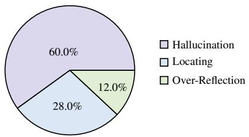

pie

| Category | Percentage (%) |
| :--- | :--- |
| Hallucination | 60.0 |
| Locating | 28.0 |
| Over-Reflection | 12.0 |

Figure 10: Long CoT underperforms ROT with RLLMs due to the error types, with their distribution.

# B.3 Comparison with table-specific LLMs

We compare the performance of ROT, using Llama3.1-8B, against the table-specific LLMs. The results are shown in Table 10. As we can see, ROT demonstrates superior or comparable performance compared with LLMs finetuned on tabular data.

# B.4 Robustness of ROT

To assess the robustness of ROT, including the sensibility of our termination strategy and the prompt design, we employ GPT-4o (OpenAI et al., 2024b) to paraphrase the original prompt in three different ways, while preserving the core termination logic. We then examine whether the traversal count and the performance remain consistent across these rephrased prompts. The results in Table 11 indicate that the average number of traversals across the four variants remains consistently around 1.1. This suggests that the termination behavior under ROT is robust. Also, the original prompt consistently yields the best performance. Moreover, the performance variations across different rephrasings are within 1 percentage point and remain significantly higher than the Short CoT baseline (57.9). This demonstrates the overall stability and effectiveness of our prompt.

# B.5 Efficiency of ROT

Table 12 compares the number of output tokens of ROT with Long CoT across various datasets. As shown, ROT consistently outperforms Long CoT while reducing the number of reasoning tokens by 7% to 50%, demonstrating its high efficiency.

# B.6 Why ROT with RLLMs outperforms Long CoT?

To analyze specifically why ROT with RLLMs outperforms Long CoT, we randomly select instances from WikiTQ where ROT using R1-Llama-8B provided the correct answer, but Long CoT using R1- Llama-8B failed. We manually analyze the reasons for these discrepancies, with the distribution shown in Figure 10. Among them, Hallucination and Locating are as described in §3.4.1. Over-Reflection refers to cases where the reflection process led to an originally correct answer being changed to incorrect, or where excessive reflections exceeding the token limits prevented a final answer from being generated. The results indicate that: (i) ROT significantly mitigates the hallucination issue prevalent in Long CoT. (ii) The sequential row-wise traversal enhances the ability to locate all relevant information. (iii) ROT can alleviate Over-Reflection to some extent by guiding the reflection process through structured table traversal, thus reducing ineffective or erroneous reflections.

# B.7 Why does ROT not fix the number of iterations?

<table><tr><td>Method</td><td>Performance</td></tr><tr><td>RoT</td><td>63.6</td></tr><tr><td>Traversal count = 1</td><td>60.7</td></tr><tr><td>Traversal count = 2</td><td>61.9</td></tr><tr><td>Traversal count = 3</td><td>59.7</td></tr></table>

Table 13: Comparison of ROT with fixing the traversal count on WikiTQ using LLaMA3.1-8B.

We conduct experiments on WikiTQ using LLaMA3.1-8B with a fixed number of traversal count. The results are summarized in Table 13. Overall, ROT achieves the best performance. In contrast, fixing the number of reasoning steps leads to a noticeable performance drop. Specifically, limiting the model to a single traversal results in a substantial degradation in accuracy, which highlights the importance of iterative reasoning in ROT. Moreover, performance with three traversals is lower than that with two, suggesting that excessive iterations may introduce unproductive reflections and consequently impair model performance.

# C Case Study

# C.1 Case study of ROT compared with Long CoT

We present examples where ROT outperforms Long CoT for distinct reasons, as illustrated in Figure 11, Figure 12, and Figure 13.

# C.2 Case study of ROT with iterative traversals

We present examples of the three reasons for ROT performing iterative row-wise table traversals in Figure 14 and Figure 15.

<table><tr><td colspan="5">Question who was the guest judge after kelly brook?</td></tr><tr><td colspan="5">Table</td></tr><tr><td>Series</td><td>Premiere</td><td>Finale</td><td>...</td><td>Guest judge(s)</td></tr><tr><td>One</td><td>9 June 2007</td><td>17 June 2007</td><td></td><td>N/A</td></tr><tr><td>Two</td><td>12 April 2008</td><td>31 May 2008</td><td></td><td>N/A</td></tr><tr><td>Three</td><td>11 April 2009</td><td>30 May 2009</td><td>...</td><td>Kelly Brook</td></tr><tr><td>Four</td><td>17 April 2010</td><td>5 June 2010</td><td></td><td>Louis Walsh</td></tr><tr><td>Five</td><td>16 April 2011</td><td>4 June 2011</td><td></td><td>Louis Walsh</td></tr><tr><td></td><td></td><td>...</td><td></td><td></td></tr></table>

# Output of RoT

To answer the question, I need to figure out who the guest judge was after Kelly Brook based on the given table.

Let me go through each row one by one.

1. One: The guest judge(s) column is blank. Hmm, maybe it's not applicable or the data isn't provided. I'll skip this one for now.

2. Two: The guest judge(s) column is blank. Same as the first, I'll skip this.

3. Three: The guest judge(s) is Kelly Brook. That's the one I'm looking for, but I need to find the next one.

4. Four: The guest judge(s) is Louis Walsh. That's the next one after Kelly Brook.

So the answer is Louis Walsh.

Answer: Louis Walsh

# Output of Long CoT

<think>

Okay, so I need to figure out who the guest judge was after Kelly Brook on the show. … Looking at the "Guest judge(s)" column, I see that for Series One, the guest judge is listed as N/A. Series Two also has N/A. Series Three has Kelly Brook as the guest judge. Series Four onwards, the guest judges are listed as N/A again.

Wait, so Kelly Brook was the guest judge in Series Three. The question is asking who was the guest judge after Kelly Brook. So, after Series Three, the next series is Series Four, but the guest judge there is N/A. Then Series Five also has N/A … </think>

Answer: There was no guest judge after Kelly Brook in the subsequent series.

Figure 11: ROT outperforms Long CoT due to the hallucination issue of Long CoT. The row-wise table traversal process is highlighted in green, and the hallucinated reasoning steps are highlighted in red.

# Question

what city is at the top of the list?

Table 

<table><tr><td>Team</td><td>City</td><td>Venue</td><td>...</td><td>Past Season</td></tr><tr><td>Aboomoslem</td><td>Mashhad</td><td>Samen</td><td></td><td>4th</td></tr><tr><td>Bargh Shiraz</td><td>Shiraz</td><td>Hafezieh</td><td></td><td>7th</td></tr><tr><td>Damash Gilan</td><td>Rasht</td><td>Sardar</td><td></td><td>15th</td></tr><tr><td>Est. Ahvaz</td><td>Ahvaz</td><td>Takhti</td><td></td><td>8th</td></tr><tr><td></td><td></td><td>...</td><td></td><td></td></tr><tr><td>Persepolis</td><td>Tehran</td><td>Azadi</td><td></td><td>Champion</td></tr><tr><td></td><td></td><td>...</td><td></td><td></td></tr></table>

# Output of RoT

To answer the question, I need to look at the table and find the city that is at the top of the list. Let me go through each row one by one.

The table is sorted alphabetically by team name. I'll start from the top:

1. Aboomoslem, Mashhad: Mashhad is the city.

2. Bargh Shiraz, Shiraz: Shiraz is the city.

3. Damash Gilan, Rasht: Rasht is the city.

4. Est. Ahvaz, Ahvaz: Ahvaz is the city.

The first city in the list is Mashhad, which is the city of the team Aboomoslem. Answer: Mashhad

# Output of Long CoT

<think>

Okay, so I need to figure out which city is at the top of the list based on table First, I should understand what the question is asking. …it's likely referring to the ranking from the past season, as that's a common way to list teams in a league table.

Looking at the "Past Season" column, each team has a ranking. The rankings go from 1st place as the highest to lower ranks. So, the team with 1st place is at the top.

Now, I need to find which team is in 1st place. Scanning through the list, I see that Persepolis is ranked Champion, which I assume is 1st place. Their city is Tehran. So, the city at the top of the list would be Tehran.

…Yes, Persepolis is the only team with Champion status, so they are 1st. </think>

Answer: Tehran

Figure 12: ROT outperforms Long CoT due to the misunderstanding issue of Long CoT. The row-wise table traversal process is highlighted in green, and the misunderstanding reasoning steps are highlighted in red.

The demonstration of ROT used on WikiTQ and TableBench 

<table><tr><td>| Parish | Locality | Parish Priest | Founded | Closed |</td></tr><tr><td>| :—| :—| :—| :—| :—|</td></tr><tr><td>| St Mary | Bacup | Fr Frank Thorpe | 1852 | —— |</td></tr><tr><td>| Our Immaculate Mother &amp; St Anselm | Whitworth | Fr Frank Thorpe | 1860 | —— |</td></tr><tr><td>| St Joseph | Stacksteads | —— | 1947 | 2005 |</td></tr><tr><td>| St Joseph &amp; St Peter | Newchurch-In-Rossendale | Fr Philip Boast | 1915 | —— |</td></tr><tr><td>| The Immaculate Conception | Haslingden | Fr Canon John Mackie | 1854 | —— |</td></tr><tr><td>| St Veronica (Chapel of Ease) | Helmshore | Served from The Immaculate Conception | 1959 | —— |</td></tr><tr><td>| St James the Less | Rawtenstall | Fr David Lupton, Rural Dean | 1828 | —— |</td></tr><tr><td>Question:what&#x27;s the number of parishes founded in the 1800s?</td></tr><tr><td>Solution:To answer the question, I need to figure out how many parishes were founded in the 1800s based on the given table. Let me look at the table again. The table has several columns: Parish, Locality, Parish Priest, Founded, and Closed. My task is to count how many parishes were established in the 1800s.</td></tr></table>

First, I should understand what the "Founded" column represents. It likely indicates the year the parish was established. So, I need to look at each row and check the year under the "Founded" column. If the year is in the 1800s, I’ll count that parish.

Let me go through each row one by one.

1. St Mary, Bacup: Founded in 1852. That’s in the 1800s, so that’s one.   
2. Our Immaculate Mother & St Anselm, Whitworth: Founded in 1860. Also in the 1800s, so that’s two.   
3. St Joseph, Stacksteads: The "Founded" column is blank. Hmm, maybe it’s not applicable or the data isn’t provided. I’ll skip this one for now.   
4. St Joseph & St Peter, Newchurch-In-Rossendale: Founded in 1915. That’s in the early 1900s, so not in the 1800s.   
5. The Immaculate Conception, Haslingden: Founded in 1854. That’s another one, so three.   
6. St Veronica (Chapel of Ease), Helmshore: Founded in 1959. That’s in the 1900s, so not relevant.   
7. St James the Less, Rawtenstall: Founded in 1828. That’s in the 1800s, so four.

So the answer is four.

Answer: 4

The demonstration of ROT used on HiTab 

<table><tr><td>admissions to adult custody, by sex and by indigenous identity and jurisdiction, 2018/2019| jurisdiction | male | male | male | male | male | female | female | female | female | female | :—|:—|:—|:—|:—|:—|:—|:—|:—|:—|:—|:—|</td></tr><tr><td>| jurisdiction | indigenous | indigenous | non-indigenous | non-indigenous | unknown indigenous identity | unknown indigenous identity | indigenous | indigenous | non-indigenous | non-indigenous | unknown indigenous identity | unknown indigenous identity |</td></tr><tr><td>| jurisdiction | number | percent change in number from 2017/2018 | number | percent change in number from 2017/2018 | number | percent change in number from 2017/2018 | number | percent change in number from 2017/2018 | number | percent change in number from 2017/2018 | number | percent change in number from 2017/2018 |</td></tr><tr><td>| newfoundland and labrador | 333 | -7 | 1,214 | -9 | 0 | .. | 39 | -11 | 187 | -4 | 0 | .. |</td></tr><tr><td>| prince edward island | 25 | 9 | 606 | 11 | 4 | -33 | 4 | -56 | 129 | 39 | 1 | 0 |</td></tr><tr><td>| nova scotia | 337 | 6 | 3,676 | 3 | 18 | 200 | 108 | 21 | 512 | -8 | 8 | 14 |</td></tr><tr><td>| new brunswick | 362 | -10 | 4,319 | 4 | 3 | 0 | 148 | -3 | 916 | 17 | 0 | -100 |</td></tr><tr><td>...Question:what is the percentage of admissions of non-indigenous males decreased in the provinces and territories compared with the previous year?Solution:Okay, so I need to figure out the percentage decrease in admissions of non-indigenous males across the provinces and territories compared to the previous year. Let me look at the table provided.I need to find the percentage change for non-indigenous males in each province and territory. Let me go through each row:1. Newfoundland and Labrador: Non-indigenous males have a percent change of -9%.2. Prince Edward Island: Non-indigenous males have a percent change of 11%.3. Nova Scotia: Non-indigenous males have a percent change of 3%...It shows a -7% change for non-indigenous males. I think that’s the answer because the total row aggregates all the data, so it’s the most accurate representation of the overall percentage change.</td></tr></table>

Answer: 7

Table 4: The demonstrations of ROT used on three datasets.

<table><tr><td>The prompt of RoT without Iteration</td></tr><tr><td>Your task is to think step by step by traversing the given table to solve the question. Note that: 1. You must traverse the table row by row once and only once. 2. Represent your answer with: Answer:. Here is an example: ... Based on the above example, you need to traverse the table below and answer the question. {Table} Question: {Question} Solution:</td></tr><tr><td>The prompt of RoT without Traversal</td></tr><tr><td>Your task is to think step by step to solve the question. Note that: 1. You must reflect your reasoning iteratively until you get a correct answer. 2. Represent your answer with: Answer:. Here is an example: ... Based on the above example, you need to answer the question below. {Table} Question: {Question} Solution:</td></tr></table>

Table 5: The prompts used in the ablation experiments.

<table><tr><td colspan="5">Questionwhich episode came next after &quot;candy sale&quot;?</td></tr><tr><td colspan="5">Table</td></tr><tr><td>Series</td><td>Season</td><td>Title</td><td>...</td><td>Original air date</td></tr><tr><td>1</td><td>1</td><td>The Charity</td><td></td><td>October 15, 1994</td></tr><tr><td>2</td><td>1</td><td>The Practical Joke War</td><td></td><td>-</td></tr><tr><td></td><td></td><td>...</td><td></td><td></td></tr><tr><td>12</td><td>1</td><td>Candy Sale</td><td></td><td>January 26, 1995</td></tr><tr><td>13</td><td>1</td><td>The Big Bully</td><td></td><td>February 2, 1995</td></tr></table>

Figure 13: ROT outperforms Long CoT due to the locating error of Long CoT. The row-wise table traversal process is highlighted in green, and the incorrect linking reasoning steps are highlighted in red.

# Question

In the context of the NFL draft, the "pick efficiency" of a college is calculated as the total number of players drafted from that college divided by the total number of players drafted in the round. Based on this definition, which college has the highest pick efficiency in the first 10 rounds of the draft?

Table 

<table><tr><td>round</td><td>pick</td><td>overall</td><td>name</td><td>position</td><td>college</td></tr><tr><td>1</td><td>10</td><td>10</td><td>forest evashevski</td><td>rb</td><td>michigan</td></tr><tr><td>3</td><td>10</td><td>25</td><td>fred davis</td><td>ot</td><td>alabama</td></tr><tr><td>5</td><td>10</td><td>40</td><td>jim stuart</td><td>ot</td><td>oregon</td></tr><tr><td>6</td><td>10</td><td>50</td><td>ed cifers</td><td>e</td><td>tennessee</td></tr><tr><td>7</td><td>10</td><td>60</td><td>al krueger</td><td>e</td><td>southern california</td></tr><tr><td>8</td><td>10</td><td>70</td><td>henry wilder</td><td>rb</td><td>iowa state</td></tr><tr><td></td><td></td><td></td><td>...</td><td></td><td></td></tr></table>

# Output

To determine the college with the highest pick efficiency in the first 10 rounds of the draft, we need to calculate the pick efficiency for each college. …

First, let's identify the colleges with players drafted in the first 10 rounds and the number of players drafted from each:

1. Michigan - 1 player (round 1)   
2. Alabama - 2 players (rounds 3, 10)   
3. Oregon - 1 player (round 5)   
4. Tennessee - 1 player (round 6)

Now, let's calculate the pick efficiency for each college in the first 10 rounds:   
1. Michigan - 1 player / 8 players = 1/8   
2. Alabama - 2 players / 8 players (rounds 3 and 10) = 2/8 = 1/4   
3. Oregon - 1 player / 8 players = 1/8   
4. Tennessee - 1 player / 8 players = 1/8

Alabama’s two players in the first 10 rounds give it the highest pick efficiency. Answer: alabama

Figure 14: ROT performs iterative row-wise table traversals due to Multi-Hop Reasoning. The row-wise table traversal process is highlighted in green.

# Question

how many episodes in series 10 did fran carroll write?

Table 

<table><tr><td>#</td><td>Directed By</td><td>Written By</td><td>Original Air Date</td></tr><tr><td>1</td><td>Frank W. Smith</td><td>Simon J. Sharkey</td><td>September 14, 1997</td></tr><tr><td>2</td><td>Frank W. Smith</td><td>Simon J. Sharkey</td><td>September 28, 1997</td></tr><tr><td>3</td><td>Gerry Poulson</td><td>David Humphries</td><td>October 5, 1997</td></tr><tr><td>4</td><td>Gerry Poulson</td><td>David Humphries</td><td>October 12, 1997</td></tr><tr><td>5</td><td>John Reardon</td><td>Neil McKay</td><td>October 26, 1997</td></tr><tr><td>6</td><td>John Reardon</td><td>Neil McKay</td><td>November 2, 1997</td></tr><tr><td colspan="2"></td><td>...</td><td></td></tr></table>

# Output

To answer the question, I need to find out how many episodes in series 10 …

Let me go through each row one by one.

1. #1: Aired on September 14, 1997. Not in series 10.

2. #2: Aired on September 28, 1997. Not in series 10.

18. #18: Aired on February 22, 1998. Not in series 10.

Wait, I made a mistake! I need to look for the episodes written by Fran Carroll, not the episodes in series 10.

Let me go through each row one by one.

1. #1: Written By Simon J. Sharkey. Not Fran Carroll.

2. #2: Written By Simon J. Sharkey. Not Fran Carroll.

18. #18: Written By Simon J. Sharkey. Not Fran Carroll.

So, Fran Carroll wrote only one episode.

Answer: 1

Figure 15: ROT performs iterative row-wise table traversals due to Reflection. The row-wise table traversal process is highlighted in green.

<table><tr><td>Dataset</td><td>Method</td><td>Perfromance</td></tr><tr><td rowspan="2">WikiTQ</td><td>Long CoT (zero-shot)</td><td>62.7</td></tr><tr><td>Long CoT (one-shot)</td><td>45.1</td></tr><tr><td rowspan="2">HiTab</td><td>Long CoT (zero-shot)</td><td>49.7</td></tr><tr><td>Long CoT (one-shot)</td><td>35.4</td></tr><tr><td rowspan="2">TableBench</td><td>Long CoT (zero-shot)</td><td>34.9</td></tr><tr><td>Long CoT (one-shot)</td><td>25.3</td></tr></table>

Table 6: Performance of Long CoT using R1-Llama-8B with zero-shot and few-shot.

<table><tr><td>Method</td><td>Accuracy</td></tr><tr><td>Llama3-70B</td><td></td></tr><tr><td>FlexTaF (Zhang et al., 2024b)</td><td>69.9</td></tr><tr><td>Llama3.1-70B</td><td></td></tr><tr><td>PoTable (Mao et al., 2025)</td><td>65.6</td></tr><tr><td>SS-CoT (Jiang et al., 2024b)</td><td>76.8</td></tr><tr><td>TableMaster (Cao, 2025)</td><td>78.0</td></tr><tr><td>Qwen2-72B</td><td></td></tr><tr><td>MACT (Zhou et al., 2025)</td><td>72.6</td></tr><tr><td>Llama3.3-70B</td><td></td></tr><tr><td>Binder (Cheng et al., 2023)</td><td>52.2</td></tr><tr><td>Dater (Ye et al., 2023)</td><td>59.5</td></tr><tr><td>Chain-of-Table (Wang et al., 2024)</td><td>62.1</td></tr><tr><td>Table-Critic (Yu et al., 2025)</td><td>70.1</td></tr><tr><td>RoT</td><td>78.7</td></tr></table>

Table 7: Performance comparison between ROT and previous methods with comparable scale models on WikiTQ.

<table><tr><td>Method</td><td>Accuracy</td></tr><tr><td>GPT-3.5Zhao et al. (2023)</td><td>50.0</td></tr><tr><td>code-davinci-002Cao et al. (2023)</td><td>69.3</td></tr><tr><td>Qwen2-72BGraphOTTER (Li et al., 2025a)</td><td>72.7</td></tr><tr><td>Llama3.1-70BSS-CoT (Jiang et al., 2024b)</td><td>79.1</td></tr><tr><td>Qwen2.5-32B RoT</td><td>76.6</td></tr></table>

Table 8: Performance comparison between ROT and previous methods with comparable scale models on HiTab.

<table><tr><td>Method</td><td>Accuracy</td></tr><tr><td>Llama3.1-70BWu et al. (2024)</td><td>43.9</td></tr><tr><td>Llama3.3-70BRoT</td><td>44.8</td></tr></table>

Table 9: Performance comparison between ROT and previous methods with comparable scale models on TableBench.

<table><tr><td>Method/Model</td><td>WikiTQ</td><td>HiTab</td><td>TableBench</td></tr><tr><td>RoT</td><td>63.6</td><td>56.6</td><td>35.7</td></tr><tr><td>TableLLM-7B (Zhang et al., 2025c)</td><td>58.8*</td><td>-</td><td>-</td></tr><tr><td>TableLlama-7B (Zhang et al., 2024a)</td><td>35.0</td><td>64.7*</td><td>-</td></tr><tr><td>TableBench LLM-8B (Wu et al., 2024)</td><td>-</td><td>-</td><td>35.3*</td></tr></table>

Table 10: Comparison of performance between ROT and table-specific LLMs. An asterisk (\*) indicates performance on the training set of the corresponding dataset.

<table><tr><td>Method</td><td>Average Traversal Count</td><td>Performance</td></tr><tr><td>Original prompt</td><td>1.10382</td><td>63.6</td></tr><tr><td>Prompt variant 1</td><td>1.11096</td><td>63.1</td></tr><tr><td>Prompt variant 2</td><td>1.11786</td><td>62.8</td></tr><tr><td>Prompt variant 3</td><td>1.11098</td><td>63.2</td></tr></table>

Table 11: The average number of traversals for ROT using the original prompt and three paraphrased prompts.

<table><tr><td>Method</td><td>Model</td><td>WikiTQ</td><td>HiTab</td><td>TableBench</td></tr><tr><td>RoT</td><td>Llama3.1-8B</td><td>628</td><td>292</td><td>756</td></tr><tr><td>RoT</td><td>R1-Llama-8B</td><td>649</td><td>471</td><td>867</td></tr><tr><td>Long CoT</td><td>R1-Llama-8B</td><td>677</td><td>602</td><td>1225</td></tr></table>

Table 12: Comparison of ROT with fixing the traversal count on WikiTQ using LLaMA3.1-8B.