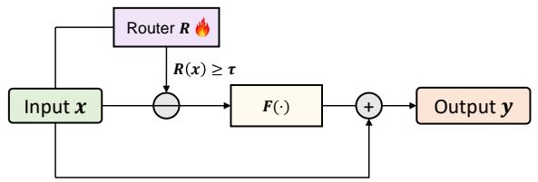
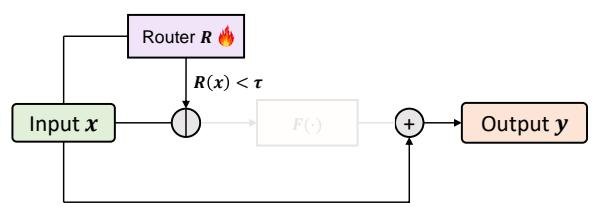
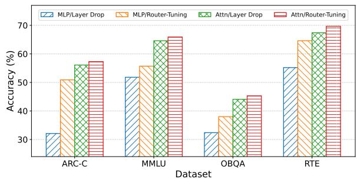
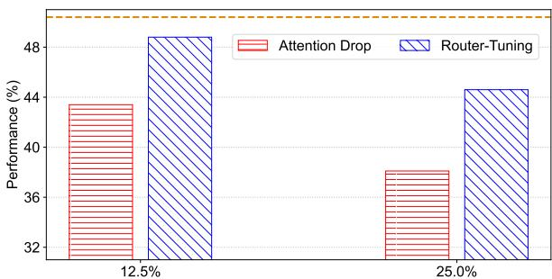
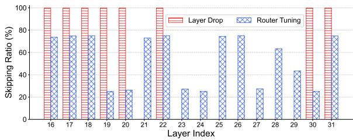
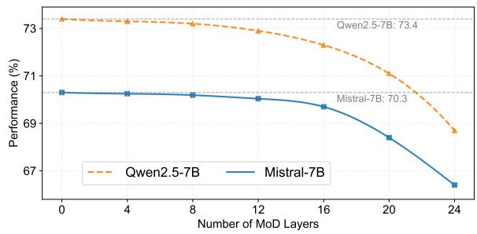
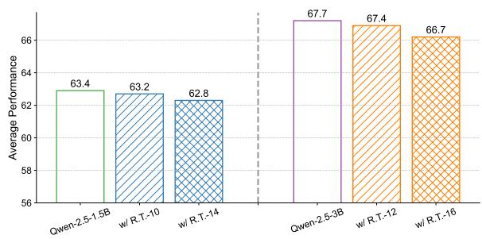
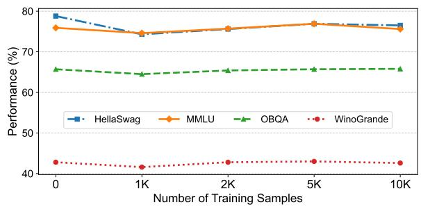
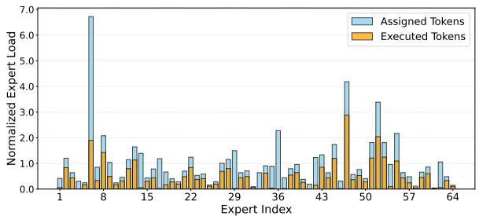

# Router-Tuning: A Simple and Effective Approach for Dynamic Depth

Shwai He1 Tao Ge2 Guoheng Sun1 Bowei Tian1

Xiaoyang Wang2 Dong Yu2

1University of Maryland, College Park 2Tencent AI Lab, Bellevue, WA

shwaihe@umd.edu

# Abstract

The Mixture of Depths (MoD) was introduced to improve computational efficiency by dynamically skipping less important layers, reducing redundant computation while maintaining model capacity. Despite its promise, existing MoD approaches remain under-explored and face two main challenges: (1) high training costs due to the need to train the entire model along with the routers that determine which layers to skip, and (2) performance degradation when important layers are bypassed. In response to the first issue, we propose Router-Tuning, which fine-tunes only the routers on a small dataset, drastically reducing the computational overhead associated with full model training. For the second challenge, we investigate Router-Tuning across different architectures and granularities, demonstrating its effectiveness on Attention layers and MoE layers. This method preserves the model’s performance while significantly enhancing computational and memory efficiency. Extensive experiments demonstrate that our approach delivers competitive results while dramatically improving the computation efficiency, e.g., 21% speedup and only a 0.2% performance drop. The code is released at https://github.com/ CASE-Lab-UMD/Router-Tuning.

# 1 Introduction

Large Language Models (LLMs) have shown promising performance across various domains (OpenAI et al., 2024; Team, 2024; DeepSeek-AI et al., 2024). However, the continuous increase in model size leads to substantial computational costs in real-world applications, making computation reduction a critical research focus for improving LLM efficiency (Sun et al., 2024; Lin et al., 2024). A promising approach to this challenge is the Mixture of Depths (MoD) (Raposo et al., 2024), which dynamically allocates computational resources for specific inputs. Instead of uniformly applying all layers to every input, MoD selectively activates only a subset of the model’s layers, skipping those deemed less important. This targeted activation significantly reduces computational overhead while maintaining performance.

Despite its potential, current MoD methods are still underexplored and face several critical challenges. On the one hand, the involvement of additional router networks, which decide which layers to skip, often requires extra extensive training: Raposo et al. (2024) train the entire model from scratch while Tan et al. (2024) performs costly continual training. This creates a significant barrier to efficiently integrating MoD with existing LLMs. Furthermore, most prior MoD implementations (Raposo et al., 2024; Tan et al., 2024) have been applied to transformer blocks and MLP layers, which are sensitive to skipping. As a result, omitting important components often leads to significant performance degradation (He et al., 2024b).

These challenges prompt us to reflect on the two key questions: (1) How can we implement dynamic depth to improve efficiency without incurring excessive training costs? (2) How can we preserve model performance in the presence of dynamic depth?

To tackle the first challenge, we introduce Router-Tuning, a novel method that fine-tunes only the router network without updating the backbone model’s parameters. As each router network is a lightweight, single-layer projector that accounts for less than 0.01% of the total parameters, the training overhead is minimal and even significantly lower than that of parameter-efficient finetuning methods (Houlsby et al., 2019a; He et al., 2021) like LoRA (Hu et al., 2022). Router-tuning requires only a small-scale dataset and fewer training steps, eliminating the need for large-scale pretraining or extensive continual training. Meanwhile, by freezing the backbone, Router-Tuning contributes to mitigating catastrophic forgetting and better retaining the original model performance (Houlsby et al., 2019b;

Liu et al., 2024; Qiao and Mahdavi, 2024). These properties make Router-Tuning a highly efficient and scalable solution for dynamic adaptation.

To address the second challenge, we conduct a comprehensive investigation of target modules (e.g., Block, MLP, Attention, MoE), and various granularities (e.g., token and sequence). For dense transformer architectures, we propose Attention with Dynamic Depths, which selectively applies dynamic depth to attention layers. By focusing on attention layers known to exhibit high redundancy (He et al., 2024b), Router-Tuning not only preserves model accuracy but also alleviates computational and memory bottlenecks. In the case of Mixture-of-Experts (MoE) layers (Shazeer et al., 2017; Fedus et al., 2022), where efficiency is often hindered by the computational cost of activating multiple expert networks, we apply Router-Tuning at the expert level to enhance overall efficiency.

Through extensive experiments, we demonstrate the effectiveness of our approach across multiple open-source language models, including Llama (Touvron et al., 2023), Mistral (Jiang et al., 2023), Qwen (Bai et al., 2023), Deepseek-MoE (Dai et al., 2024), and OLMoE (Muennighoff et al., 2024). Router-Tuning requires less than half an hour on an Nvidia RTX A6000, making it 1000 times faster than DLO (Tan et al., 2024). Router-Tuning maintains a high percentage of the original model’s performance while significantly reducing memory usage and accelerating inference, achieving, for example, a 21% inference speedup with only a 0.2% performance degradation. Furthermore, Router-Tuning can be seamlessly integrated with LoRA fine-tuning, further enhancing both efficiency and performance.

In short, our contributions are as follows:

• We introduce Router-Tuning, a lightweight method that fine-tunes only the router using a small dataset, effectively addressing the high computational cost of training the entire model with routers.   
• We systematically investigate routing scopes, deployment granularities, and model architectures, demonstrating the effectiveness of Router-Tuning on Attention and MoE layers.   
• Through comprehensive experiments, Router-Tuning achieves competitive performance while delivering substantial improvements in training and inference efficiency.

# 2 Related Work

Layer Redundancy While increasing the depth of large language models has demonstrated promising performance across a wide range of tasks (OpenAI et al., 2024; Team, 2024), it also introduces layer redundancy (Gromov et al., 2024; He et al., 2024b), posing efficiency challenges. To address this issue, several approaches have been proposed to reduce model depth (Men et al., 2024) while maintaining comparable performance. Surprisingly, removing redundant layers has been shown to preserve performance while significantly reducing memory and computational costs (Gromov et al., 2024; He et al., 2024a,b). Specifically, Gromov et al. (2024) suggest dropping continuous Transformer blocks, and He et al. (2024b) propose finegrained layer dropping to further improve the effectiveness of layer reduction. However, these static techniques fail to account for the varying complexity of different input sequences, where excessive layer removal can significantly degrade performance on more complex tasks. Instead of statically removing unimportant layers, our approach focuses on dynamically skipping these layers based on the specific inputs.

Dynamic Depth Dynamic Depth, which allocates different layers based on the specific input, is an effective technique for accelerating inference while preserving performance (Han et al., 2021, 2022). Recent works primarily implement dynamic depth through two key methods: Early-Exit (Bae et al., 2023; Elhoushi et al., 2024) and Mixture of Depths (MoD) (Raposo et al., 2024). Earlyexit strategies terminate computation in later layers once sufficient confidence is achieved, effectively reducing redundant computations. In contrast, MoD offers greater flexibility by dynamically skipping less critical layers, enhancing adaptability and representational capacity. Despite their advantages, both Early-Exit and MoD often involve significant training overhead. For instance, LayerSkip (Elhoushi et al., 2024) and MoD (Raposo et al., 2024) require training models from scratch or extensive continual training, while Tan et al. (Tan et al., 2024) extends pre-trained model training over long schedules to achieve optimal performance. To overcome these limitations, we propose Router-Tuning, an efficient approach to dynamic layer skipping that requires minimal additional offline training, providing a more cost-effective solution.

# 3 Methodology

In this section, we first review the challenges associated with deploying Mixture of Depths and then introduce Router-Tuning, addressing the implementation of Mixture of Depths from both design and training perspectives.

# 3.1 Motivation

The Mixture of Depths (MoD) framework (Raposo et al., 2024), which dynamically adjusts layer depth based on input complexity to enhance computational efficiency, was originally designed for integration during the pretraining phase, where transformer models are trained from scratch with MoDenabled layers. More recently, Tan et al. (2024) applied MoD to pretrained Llama models (Touvron et al., 2023) through continual training. While these approaches have demonstrated promising results, training with MoD remains computationally expensive and time-consuming, posing challenges for scalability and real-world deployment. A more efficient alternative is to apply MoD directly to existing pretrained models, followed by lightweight fine-tuning of a subset of parameters (Houlsby et al., 2019b; Hu et al., 2022), significantly reducing both computational costs and training time.

On the other hand, MoD has typically been implemented at the transformer block level. However, skipping entire transformer blocks has shown to be suboptimal to maintain the performance. Inspired by He et al. (2024b), we recognize that each transformer block contains layers of varying importance. Aggressively skipping entire blocks risks omitting critical layers, potentially degrading performance. Instead, skipping fine-grained layers offers a more effective strategy for preserving model accuracy. Moreover, unlike blocks that generally share the same architecture, individual layers impose different computational costs. For instance, in dense transformer models, attention layers are particularly expensive, with computational complexity scaling quadratically with sequence length and additional memory needed for KV cache storage. In contrast, in MoE models, MLP layers hold the majority of the parameters, leading to substantial communication and computation overhead.

Building on these insights, we propose Router-Tuning, a cost-effective formulation of MoD that achieves a favorable trade-off between performance and computational costs.

# 3.2 Router-Tuning for Dynamic Depth

In this part, we propose Router-Tuning to address the challenges outlined in Section 3.1. As illustrated in Figure 1, Router-Tuning incorporates an additional trainable router that determines whether to skip the layer. Specifically, Router-Tuning can be deployed in two levels: (1) token-level, where layers are dynamically skipped for individual tokens, and (2) sequence-level, where layers are dynamically skipped for the entire sequence. Given an input $\pmb { x } \in \overset { - } { \mathbb { R } } ^ { L \times d }$ , the router first computes an importance score for the input:

$$
\boldsymbol {R} (\boldsymbol {x}) _ {i} = \left\{ \begin{array}{l l} \operatorname{GATE} \left(\boldsymbol {x} _ {i}\right), & \text { Token - level } \\ \operatorname{GATE} \left(\frac {1}{L} \sum_ {i = 1} ^ {L} \boldsymbol {x} _ {i}\right), & \text { Sequence - level } \end{array} , \right. \tag {1}
$$

where R is a scoring router that assesses the importance score of the input, GATE is the gating function GATE(x) = Sigmoid(W x). Based on the computed importance scores, we further apply a binarized mask M to determine whether to skip a token or an entire sequence:

$$
\boldsymbol {M} = \left\{ \begin{array}{l l} 1, & \text { if } \boldsymbol {R} (\boldsymbol {x}) \geq \tau \\ 0, & \text { otherwise } \end{array} , \right. \tag {2}
$$

where τ is the threshold. The score is set to zero for skipped inputs and one for retained inputs, ensuring stable outputs (Tan et al., 2024).

To enable a differentiable and trainable binary decision process, we utilize the straight-through estimator (STE) (Bengio et al., 2013), which allows gradients to propagate through the binary selection mechanism via $\begin{array} { r } { \bar { \frac { \partial \bar { M } } { \partial R } } = 1 } \end{array}$ . The final output of MoD is then computed as follows:

$$
\boldsymbol {y} = \boldsymbol {M} \odot \boldsymbol {F} (\boldsymbol {x}) + \boldsymbol {x}, \tag {3}
$$

where F denotes a given layer and y is the output. This formulation ensures that the router is fully trainable through the gradient calculations:

$$
\frac {\partial \boldsymbol {y}}{\partial \boldsymbol {W}} = \frac {\partial \boldsymbol {y}}{\partial \boldsymbol {M}} \frac {\partial \boldsymbol {M}}{\partial \boldsymbol {R}} \frac {\partial \boldsymbol {R}}{\partial \boldsymbol {W}}. \tag {4}
$$

During inference, without the need for gradient calculations, we further enhance computational efficiency by completely bypassing computations for skipped inputs:

$$
\boldsymbol {y} = \left\{ \begin{array}{l l} \boldsymbol {F} (\boldsymbol {x}) + \boldsymbol {x}, & \text { if   } \boldsymbol {R} (\boldsymbol {x}) \geq \tau \\ \boldsymbol {x}, & \text { otherwise } \end{array} \right.. \tag {5}
$$

This dynamic routing mechanism ensures that computation is performed only when necessary, thereby enhancing the computational efficiency.



<details>
<summary>flowchart</summary>

```mermaid
graph TD
    A["Input x"] --> B((+))
    C["Router R"] -->|R(x) ≥ τ| B
    B --> D["F(·)"]
    D --> E["+"]
    E --> F["Output y"]
    F --> A
```
</details>



<details>
<summary>flowchart</summary>

```mermaid
graph TD
    A["Input x"] --> B((+))
    C["Router R"] -->|R(x) < τ| B
    B --> D["F(·)"]
    D --> E["+"]
    E --> F["Output y"]
    F --> A
```
</details>

Figure 1: Overview of Router-Tuning. Router-Tuning involves a trainable router to determine whether a given layer F (·) (e.g., Attention and MLP) would be skipped. Inputs with routing scores lower $\pmb { R } ( \pmb { x } )$ than the threshold τ are skipped, and only the router R is trainable in the whole model.

# 3.3 Extension to Mixture of Experts

Mixture of Experts (MoE) employs sparse activation, dynamically selecting expert networks for each input, which delivers promising performance in various tasks (Jiang et al., 2024; Dai et al., 2024; Muennighoff et al., 2024). However, MoE also exhibits significant redundancy, allowing certain experts or layers to be skipped with minimal impact on performance (Lu et al., 2024; He et al., 2024a). Building on this, we extend Router-Tuning to MoE layers by implementing dynamic skipping within each expert:

$$
\hat {\boldsymbol {E}} _ {i} (\boldsymbol {x}) = \left\{ \begin{array}{l l} \boldsymbol {E} _ {i} (\boldsymbol {x}), & \text { if } \boldsymbol {R} (\boldsymbol {x}) \geq \tau \\ 0, & \text { otherwise } \end{array} , \right. \tag {6}
$$

where $\mathbf { \mathcal { E } } _ { i }$ denotes the i-th expert and $\hat { E } _ { i } ( { \pmb x } )$ is the corresponding output denotes the corresponding output, bypassing the skipped tokens. Given a collection of n experts, $\{ E _ { 1 } , E _ { 2 } , \ldots , E _ { n } \}$ , the overall output of the MoE layer is as follows:

$$
\mathcal {K} = \operatorname{TopK} (\operatorname{Softmax} (\boldsymbol {G} (\boldsymbol {x})), k), \tag {7}
$$

$$
\boldsymbol {y} = \sum_ {i \in \mathcal {K}} \boldsymbol {G} (\boldsymbol {x}) _ {i} \cdot \hat {\boldsymbol {E}} _ {i} (\boldsymbol {x}), \tag {8}
$$

where denotes the indices of the top-k selected experts, and $G ( { \pmb x } )$ represents the selection score for the i-th expert. By dynamically skipping experts within each layer, Router-Tuning significantly reduces computation costs.

# 3.4 Training Objectives

Given the computationally intensive nature of training entire LLMs and the constraints of real-world computational resources, our goal is to implement dynamic depth while minimizing both computational costs and time overhead. To achieve this, we focus exclusively on fine-tuning the routers, as illustrated in Figure 1, thereby eliminating the need for costly full-model training.

Specifically, we optimize two training objectives: improving task-specific performance and lowering MoD capacity (the proportion of non-skipped inputs). On the one hand, Router-Tuning is designed to maintain the performance of the original model, which we enforce using the loss term $\mathcal { L } _ { \mathrm { t a s k } }$ during fine-tuning. On the other hand, the model is encouraged to skip more tokens or sequences (i.e., reduce MoD capacity) to enhance efficiency. To achieve this, we introduce another loss term $\mathcal { L } _ { \mathrm { M o D } }$ , which drives the model to reduce MoD capacity to a desired target sparsity level $s ,$ thereby lowering computational costs and accelerating inference. The overall training objective is as follows:

$$
\mathcal {L} = \mathcal {L} _ {\text { task }} + \lambda \cdot \mathcal {L} _ {\mathrm{MoD}}, \tag {9}
$$

$$
\mathcal {L} _ {\mathrm{MoD}} = \operatorname{ReLU} (\| M \| _ {0} - s), \tag {10}
$$

where $\mathcal { L }$ represents the standard loss function (e.g., cross-entropy), while $\mathcal { L } _ { \mathrm { M o D } }$ is an l0-norm regularization term that reduces MoD capacity. The coefficient λ acts as a scaling factor to balance the trade-off between task performance and efficiency.

# 4 Experiment Setup

Models We conduct experiments on Llama (Touvron et al., 2023; Grattafiori et al., 2024), Qwen (Bai et al., 2023), and Mistral (Jiang et al., 2023) due to their competitive performance and widespread adoption. Additionally, we leverage OLMoE (Muennighoff et al., 2024) and Deepseek-MoE (Dai et al., 2024) as the backbone to deploy Router-Tuning on the Mixture of Experts.

Datasets For the training dataset, we used Llama-Pro (Wu et al., 2024), given it spanning general instruction, math, and code for the SFT process and offering a wealth of instruction data with varying complexity levels. To evaluate model performance, we report normalized zero-shot or few-shot accuracy on the LM-Harness benchmark. The number of shots for each task is detailed in Table 1, which includes multiple tasks: ARC-C (Clark et al., 2018), BoolQ (Clark et al., 2019), HellaSwag (Zellers et al., 2019), MMLU (Hendrycks et al., 2021), OBQA (Mihaylov et al., 2018), PIQA (Bisk et al., 2019), RTE (Wang et al., 2019), WinoGrande (ai2, 2019) and GSM8K (Cobbe et al., 2021). The evaluation code is based on EleutherAI’s LM Harness framework (Gao et al., 2023).

Table 1: Experimental settings for evaluation tasks. “Norm” refers to the normalization performed with respect to the length of the input. 

<table><tr><td>Task</td><td>Number of few-shot</td><td>Metric</td></tr><tr><td>BoolQ</td><td>0</td><td>Accuracy</td></tr><tr><td>RTE</td><td>0</td><td>Accuracy</td></tr><tr><td>OBQA</td><td>0</td><td>Accuracy (Norm)</td></tr><tr><td>PIQA</td><td>0</td><td>Accuracy (Norm)</td></tr><tr><td>MMLU</td><td>5</td><td>Accuracy</td></tr><tr><td>WinoGrande</td><td>5</td><td>Accuracy</td></tr><tr><td>GSM8K</td><td>5</td><td>Exact Match</td></tr><tr><td>HellaSwag</td><td>10</td><td>Accuracy (Norm)</td></tr><tr><td>ARC-C</td><td>25</td><td>Accuracy (Norm)</td></tr></table>

Hyperparameters We set τ as 0.5, which corresponds to the midpoint of the sigmoid function. To ensure that training starts from dense models, we initialize W to zero, ensuring that $\pmb { R } ( \pmb { x } ) \ge \tau$ initially, i.e., training from dense models. To achieve the desired MoD capacity, we perform a grid search over the learning rate from {1e-5, 2e-5, 5e-5, 1e-4, 2e-4} and the scale factor λ from {0, 0.1, 0.01, 0.001}, respectively.

# 5 Main Results

In this section, we evaluate the effectiveness of Router-Tuning on transformer architectures with the deployment details in Appendix 4.

# 5.1 Performance of Router-Tuning

Router-Tuning achieves superior performance on Attention layers We first compare deploying Router-Tuning to different modules, e.g., Block, MLP, and Attention, as shown in Table 2. Based on the observation that deeper layers are more redundant than shallow layers (Gromov et al., 2024; He et al., 2024b), we focus on deploying Router-Tuning to the deepest layers except the last one, leaving other layers unchanged.

While previous studies have primarily explored layer dropping or skipping to Block and MLP layers (Bae et al., 2023; Gromov et al., 2024), skipping these modules significantly degrades performance when applied at either token or sequence level. In contrast, applying dynamic depth to Attention layers maintains the performance of original models, e.g., 69.4 v.s. 69.7 in Llama-3-8B. These findings reinforce our motivation to target Attention layers, and we utilize Router-Tuning on Attention layers by default unless stated otherwise.



<details>
<summary>bar</summary>

| Dataset | MLP/Layer Drop (%) | MLP/Router-Tuning (%) | Attn/Layer Drop (%) | Attn/Router-Tuning (%) |
| :--- | :--- | :--- | :--- | :--- |
| ARC-C | 32 | 51 | 56 | 57 |
| MMLU | 52 | 56 | 64 | 66 |
| OBQA | 32 | 38 | 44 | 45 |
| RTE | 55 | 64 | 67 | 69 |
</details>

Figure 2: Comparison between Router-Tuning and Layer Drop on MLP and Attention layers under a fixed 25% overall skipping ratio.

Router-Tuning improves over static layer dropping While statically dropping attention layers (He et al., 2024b) has demonstrated promising performance, its static nature lacks flexibility and limits representational power. Here, we further investigate the improvements offered by the dynamic mechanism. Figure 2 compares Router-Tuning with static Layer Drop (He et al., 2024b), where Router-Tuning consistently achieves superior performance. For more complex tasks that are more sensitive to layer skipping, as shown in Figure 3, we compare Router-Tuning with Layer Drop on attention layers (i.e., “Attention Drop”) under the same computation budget, e.g., dropping 4 layers versus deploying MoD to 8 layers with 50% capacity. Under the same skipping ratios, Router-Tuning significantly outperforms Attention Drop on the GSM8K benchmark (Cobbe et al., 2021), e.g., 6.5% when the skipping ratio is 25.0%. In Figure 4, we further visualize the layer-wise skipping ratios of MoD versus Attention Drop. Unlike static approaches that permanently remove certain layers, Router-Tuning maintains the utilization of all layers by adaptively distributing skipping ratios across them. This flexible allocation strategy contributes to improved performance.

Router-Tuning outperforms dynamic skipping methods Table 3 compares Router-Tuning with dynamic skipping baselines, including DLO (Tan et al., 2024) and Skip Transformer (Peroni and

Table 2: Router-Tuning at different granularities. We compare deployments on Attention, Block, and MLP layers. The number of skippable layers is capped at 16, with 50% MoD capacity. SpeedUp denotes inference-time speedup. 

<table><tr><td colspan="12">Llama-3-8B</td></tr><tr><td>Method</td><td>Granularity</td><td>Speedup</td><td>ARC-C</td><td>BoolQ</td><td>HellaSwag</td><td>MMLU</td><td>OBQA</td><td>PIQA</td><td>RTE</td><td>WinoGrande</td><td>Avg.</td></tr><tr><td>Baseline</td><td>-</td><td>1.00×</td><td>58.1</td><td>81.3</td><td>82.1</td><td>65.3</td><td>45.0</td><td>80.5</td><td>67.2</td><td>77.7</td><td>69.7</td></tr><tr><td rowspan="6">Router-Tuning</td><td> $Block_{token}$ </td><td>1.24×</td><td>44.2</td><td>77.9</td><td>63.1</td><td>64.4</td><td>34.0</td><td>70.4</td><td>65.4</td><td>71.6</td><td>61.4</td></tr><tr><td> $Block_{seq}$ </td><td>1.26×</td><td>44.5</td><td>78.0</td><td>62.6</td><td>64.6</td><td>34.2</td><td>70.3</td><td>65.3</td><td>71.2</td><td>61.3</td></tr><tr><td> $MLP_{token}$ </td><td>1.05×</td><td>45.3</td><td>77.8</td><td>65.1</td><td>62.8</td><td>33.7</td><td>71.9</td><td>66.8</td><td>72.4</td><td>62.0</td></tr><tr><td> $MLP_{seq}$ </td><td>1.06×</td><td>45.1</td><td>77.7</td><td>65.4</td><td>62.4</td><td>33.4</td><td>71.6</td><td>66.4</td><td>72.1</td><td>61.8</td></tr><tr><td> $Attn_{token}$ </td><td>1.18×</td><td>56.4</td><td>79.8</td><td>81.0</td><td>65.3</td><td>45.2</td><td>79.9</td><td>64.6</td><td>77.3</td><td>68.7</td></tr><tr><td> $Attn_{seq}$ </td><td>1.21×</td><td>56.6</td><td>80.5</td><td>80.7</td><td>65.1</td><td>44.6</td><td>80.5</td><td>69.7</td><td>77.7</td><td>69.4</td></tr><tr><td colspan="12">Llama-3-8B-Instruct</td></tr><tr><td>Method</td><td>Granularity</td><td>Speedup</td><td>ARC-C</td><td>BoolQ</td><td>HellaSwag</td><td>MMLU</td><td>OBQA</td><td>PIQA</td><td>RTE</td><td>WinoGrande</td><td>Avg.</td></tr><tr><td>Baseline</td><td>-</td><td>1.00×</td><td>62.1</td><td>83.2</td><td>78.8</td><td>65.7</td><td>42.8</td><td>78.7</td><td>67.5</td><td>75.9</td><td>69.3</td></tr><tr><td rowspan="6">Router-Tuning</td><td> $Block_{token}$ </td><td>1.24×</td><td>44.6</td><td>80.9</td><td>54.1</td><td>60.2</td><td>31.2</td><td>64.8</td><td>67.7</td><td>65.1</td><td>58.6</td></tr><tr><td> $Block_{seq}$ </td><td>1.26×</td><td>44.7</td><td>81.2</td><td>54.5</td><td>60.6</td><td>32.4</td><td>64.6</td><td>67.1</td><td>64.8</td><td>58.7</td></tr><tr><td> $MLP_{token}$ </td><td>1.05×</td><td>41.4</td><td>74.9</td><td>59.3</td><td>64.8</td><td>31.6</td><td>67.8</td><td>66.4</td><td>68.4</td><td>59.3</td></tr><tr><td> $MLP_{seq}$ </td><td>1.06×</td><td>41.8</td><td>75.1</td><td>59.3</td><td>64.5</td><td>31.2</td><td>68.2</td><td>66.7</td><td>68.8</td><td>59.5</td></tr><tr><td> $Attn_{token}$ </td><td>1.18×</td><td>60.2</td><td>82.9</td><td>76.8</td><td>65.8</td><td>42.6</td><td>78.6</td><td>67.7</td><td>76.6</td><td>68.9</td></tr><tr><td> $Attn_{seq}$ </td><td>1.21×</td><td>60.4</td><td>83.3</td><td>76.9</td><td>65.7</td><td>43.0</td><td>78.2</td><td>68.2</td><td>76.9</td><td>69.1</td></tr></table>



<details>
<summary>bar</summary>

| Category | Attention Drop (%) | Router-Tuning (%) |
| :--- | :--- | :--- |
| 12.5% | 43.8 | 48.5 |
| 25.0% | 39.2 | 44.3 |
The chart displays a horizontal reference line at 49%. The bars represent performance percentages for each condition: red striped bars indicate Attention Drop, blue striped bars indicate Router-Tuning. The dashed line at 49% serves as a visual reference.
</details>

Figure 3: Comparison with Attention Drop on GSM8K tasks under identical skipping ratios.   


<details>
<summary>bar</summary>

| Layer Index | Layer Drop (%) | Router Tuning (%) |
| :--- | :--- | :--- |
| 16 | 100 | 74 |
| 17 | 100 | 75 |
| 18 | 100 | 75 |
| 19 | 100 | 25 |
| 20 | 100 | 26 |
| 21 | 100 | 73 |
| 22 | 100 | 76 |
| 23 | 0 | 28 |
| 24 | 0 | 25 |
| 25 | 0 | 74 |
| 26 | 0 | 75 |
| 27 | 0 | 28 |
| 28 | 0 | 64 |
| 29 | 0 | 43 |
| 30 | 100 | 25 |
| 31 | 100 | 75 |
</details>

Figure 4: Layer-wise Skipping Ratios for Attention layers after Layer Drop and Router-Tuning.

Bertsimas, 2024). Following the setup of baselines, we conduct the comparison on the token level for MLP layers. Router-Tuning consistently outperforms these methods across most tasks, despite operating under the router-only training constraint. On the one hand, Router-Tuning freezes the model backbones, which contributes to avoiding the risks of catastrophic forgetting (Houlsby et al., 2019b; Liu et al., 2024; Qiao and Mahdavi, 2024). Additionally, Router-Tuning is trained end-to-end without being constrained by precomputed labels (e.g., token-level similarity scores in DLO) or stochastic gating mechanisms. This design enables more flexible and stable learning, while preserving the pretrained capabilities of the backbone.

Table 3: Performance comparison against dynamic dropping baselines, including DLO (Tan et al., 2024) and Skip Transformer (Peroni and Bertsimas, 2024). 

<table><tr><td>Method</td><td>ARC-C</td><td>HellaSwag</td><td>MMLU</td><td>WinoG</td><td>Avg.</td></tr><tr><td>DLO</td><td>44.5</td><td>64.2</td><td>62.1</td><td>71.3</td><td>60.5</td></tr><tr><td>Skip Transformer</td><td>44.7</td><td>64.4</td><td>62.4</td><td>71.5</td><td>60.8</td></tr><tr><td>Router-Tuning</td><td>45.3</td><td>65.1</td><td>62.8</td><td>72.4</td><td>61.4</td></tr></table>

# 5.2 Efficiency Improvements

In this part, we measure the efficiency in both training and inference, focusing on computational and memory usage.

Table 4: Comparison of training strategies of achieving dynamic layer skipping. The training time for MoD is left blank as it was not conducted on LLaMA-3-8B. 

<table><tr><td>Method</td><td>Target Modules</td><td>Granularity</td><td>Training Stage</td><td>Trainable</td><td>Training Time</td></tr><tr><td>MoD (Raposo et al., 2024)</td><td>Block</td><td>Token</td><td>Pretraining</td><td>Full Model</td><td>-</td></tr><tr><td>DLO (Tan et al., 2024)</td><td>MLP</td><td>Token</td><td>Continual Pretraining</td><td>Full Model</td><td>36h on NVIDIA A100</td></tr><tr><td>Router-Tuning</td><td>Block / MLP / Attn</td><td>Token / Sequence</td><td>Finetuning</td><td>Router</td><td>15m on NVIDIA A6000</td></tr></table>

Training Efficiency The training efficiency of our method lies in two perspectives: trainable parameters and training steps. Since the router projects the input from dimension d to 1, the number of trainable parameters is d 1 per layer, and the total number of trainable parameters is fewer than 0.01% of the whole model. Additionally, Router-Tuning only requires a few steps, which is verified in Section 6. Consequently, as shown in Table 4, Router-Tuning can be completed in under 15 minutes on a single NVIDIA A6000 GPU—over 1000 times faster than DLO (Tan et al., 2024), which performs large-scale training on full models and takes 36 hours on NVIDIA RTX A100 GPUs.

Inference Speedup We also evaluate the runtime speed improvements achieved with Router-Tuning. The inference speed is measured throughout the entire generation process, including prefilling and generation. To ensure that our results accurately reflect the performance gains, we adhere to two key principles: (1) all operations are performed on a single Nvidia RTX A6000 Ada GPU, eliminating any communication overhead from multi-GPU setups; and (2) we set the maximal sequence length as 2048 and increase batch sizes to fully utilize the GPU for each model.

As shown in Table 2, skipping attention layers yields a more substantial speedup than skipping MLP layers, which is primarily due to the quadratic complexity of the attention mechanism and the memory overhead associated with KVcache (Zhang et al., 2023; Singhania et al., 2024; He et al., 2024b). On the other hand, different granularities contribute to different levels of speedup. This variation is primarily due to attention layers, where fine-grained token-level MoD introduces differing token lengths within a batch, necessitating padding operations to standardize sequence lengths. Instead, the speedups at the sequence level surpass those at the token level, with Router-Tuning achieving a 21% improvement in inference speed. Therefore, we set Router-Tuning on the sequence level for attention layers as the default setting.

KV Cache The KV cache stores intermediate representations of attention layers, accelerating inference by eliminating redundant computations but incurring substantial memory overhead. Our approach, which selectively skips attention layers, significantly reduces KV cache size—for instance, achieving an 8GB reduction when processing an input sequence of length 2048 with a batch size of 64 on Llama-3-8B. In contrast, DLO (Tan et al., 2024) operates exclusively on MLP layers and retains the full KV cache, providing no memory savings.

# 6 Ablation Studies

Compatibility across different models Since Router-Tuning can be seamlessly integrated into pretrained language models, we extend our evaluation to diverse architectures, including Llama-2 (Touvron et al., 2023), Mistral (Jiang et al., 2023), and Qwen2.5 (Bai et al., 2023), covering a wide range of model sizes. As shown in Table 5, we deploy Router-Tuning in half of the attention layers while maintaining the total MoD capacity at 50%. Across all models, Router-Tuning preserves performance compared to their original counterparts, demonstrating its effectiveness and adaptability across different architectures.



<details>
<summary>line</summary>

| Number of MoD Layers | Qwen2.5-7B | Mistral-7B |
| -------------------- | ---------- | ---------- |
| 0                    | 73.4       | 70.3       |
| 4                    | 73.3       | 70.3       |
| 8                    | 73.2       | 70.3       |
| 12                   | 73.0       | 70.3       |
| 16                   | 72.5       | 69.8       |
| 20                   | 71.5       | 68.5       |
| 24                   | 69.0       | 66.5       |
</details>

Figure 5: Ablation study on the impact of varying the number of MoD layers on overall model performance.

Impact of number of MoD layers In the main experiments, we deployed half of the layers with MoD. In Figure 5, we further explore the effect of the number of MoD layers. Our results indicate that applying MoD to up to half of the attention layers still maintains comparable performance. A similar trend is observed in Figure 6 for smaller models. However, when further increasing the number of MoD layers, performance starts to degrade. We attribute this decline to the transformation of important shallow layers, which negatively impacts overall performance (Men et al., 2024; He et al., 2024a,b). Therefore, preserving the density of shallow layers while applying MoD to deeper layers ensures its effectiveness.



<details>
<summary>bar</summary>

| Model | Average Performance |
| :--- | :--- |
| Qwen-2.5-1.5B | 63.4 |
| w/ R.T.-10 | 63.2 |
| w/ R.T.-14 | 62.8 |
| Qwen-2.5-3B | 67.7 |
| w/ R.T.-12 | 67.4 |
| w/ R.T.-16 | 66.7 |
</details>

Figure 6: Performance of Router-Tuning on small models, where “R.T.” denotes Router-Tuning and the postfix “-n” indicates that MoD is applied to n layers.

Influence of Training Dataset In Table 6, we next examine the impact of using different training datasets for Router-Tuning. We consider a variety of datasets, including Alpaca (Taori et al., 2023), Evol-Instruct (Xu et al., 2023), ShareGPT (Zheng et al., 2023), and Llama-Pro (Wu et al., 2024). Since Router-Tuning only fine-tunes the routers while keeping the backbone of the language models intact, changes in the training dataset do not significantly impact performance. However, Llama-Pro, which incorporates diverse training data from various domains, provides slightly better performance due to its broader data coverage.

Table 5: Ablation study of Router-Tuning across multiple model architectures and scales, highlighting its robustness and consistent improvements. 

<table><tr><td>Models</td><td>Speedup</td><td>OBQA</td><td>PIQA</td><td>RTE</td><td>WinoGrande</td><td>BoolQ</td><td>ARC-C</td><td>HellaSwag</td><td>MMLU</td><td>Avg.</td></tr><tr><td>Llama-2-13B</td><td>1.00×</td><td>45.2</td><td>80.5</td><td>65.0</td><td>76.2</td><td>80.7</td><td>59.4</td><td>82.2</td><td>54.6</td><td>68.0</td></tr><tr><td>w/Router-Tuning</td><td>1.22×</td><td>45.4</td><td>80.6</td><td>64.6</td><td>76.2</td><td>80.5</td><td>59.3</td><td>82.2</td><td>54.7</td><td>67.9</td></tr><tr><td>Qwen-2.5-14B</td><td>1.00×</td><td>45.6</td><td>82.2</td><td>79.1</td><td>80.4</td><td>85.3</td><td>67.2</td><td>84.3</td><td>79.7</td><td>75.5</td></tr><tr><td>w/Router-Tuning</td><td>1.18×</td><td>45.4</td><td>82.4</td><td>77.9</td><td>78.5</td><td>85.0</td><td>66.2</td><td>83.8</td><td>78.0</td><td>74.7</td></tr><tr><td>Qwen-2.5-7B</td><td>1.00×</td><td>47.2</td><td>79.6</td><td>81.2</td><td>76.6</td><td>84.6</td><td>63.7</td><td>80.2</td><td>74.1</td><td>73.4</td></tr><tr><td>w/Router-Tuning</td><td>1.19×</td><td>47.0</td><td>80.1</td><td>76.9</td><td>76.1</td><td>83.2</td><td>62.3</td><td>79.8</td><td>73.3</td><td>72.3</td></tr><tr><td>Mistral-7B</td><td>1.00×</td><td>44.4</td><td>82.2</td><td>68.2</td><td>79.0</td><td>82.2</td><td>60.6</td><td>83.2</td><td>62.4</td><td>70.3</td></tr><tr><td>w/Router-Tuning</td><td>1.24×</td><td>44.0</td><td>81.8</td><td>67.6</td><td>78.2</td><td>81.7</td><td>59.9</td><td>82.6</td><td>61.8</td><td>69.7</td></tr></table>



<details>
<summary>line</summary>

| Number of Training Samples | HellaSwag | MMLU | OBQA | WinoGrande |
| -------------------------- | --------- | ---- | ---- | ---------- |
| 0                          | 79        | 76   | 66   | 43         |
| 1K                         | 74        | 74   | 64   | 42         |
| 2K                         | 75        | 75   | 65   | 43         |
| 5K                         | 77        | 77   | 65   | 43         |
| 10K                        | 76        | 76   | 66   | 43         |
</details>

Figure 7: Effect of varying the number of training samples on performance.

On the other hand, due to the small number of trainable parameters, Router-Tuning does not require a large amount of training samples. As shown in Figure 7, MoD layers are initially denseactivated and then sparsified. Although the initial sparsification steps lead to a drop in performance, subsequent Router-Tuning facilitates performance recovery. Notably, just 5K training samples are sufficient to effectively train the routers.

# 7 MoE and LoRA Integration

In this section, we further explore the integration of Router-Tuning with other architectures and training techniques. First, we implement Router-Tuning on mainstream MoE architectures. Then, we combine Router-Tuning with LoRA fine-tuning to enhance both efficiency and performance. Router-Tuning on MoE The Expert’s redundancy in MoE has been widely demonstrated in recent works (Lu et al., 2024; He et al., 2024a), e.g., the model still maintains comparable performance after removing certain layers. Therefore, we further extend Router-Tuning to MoE, where we take OLMoE (Muennighoff et al., 2024) and DeepSeek-MoE (Dai et al., 2024) as the backbones and equip each Expert network with Router-Tuning. Since these models deploy MoE at the token level, we directly apply the token-level Router-Tuning to these models. Here, we compare Router-Tuning with Expert Drop (He et al., 2024a) that statically drops less important experts. To ensure a fair comparison, we fix the overall skipping ratio of Router-Tuning to 25%, and drop the bottom 25% of experts globally by importance score in the Expert Drop baseline.

Table 6: Effectiveness across different training datasets, where Router Tuning demonstrates robustness to the varying datasets. 

<table><tr><td>Dataset</td><td>HellaSwag</td><td>MMLU</td><td>OBQA</td><td>WinoGrande</td><td>Avg.</td></tr><tr><td>Baseline</td><td>82.1</td><td>65.3</td><td>45.0</td><td>77.7</td><td>67.5</td></tr><tr><td>Alpaca</td><td>79.8</td><td>62.2</td><td>43.8</td><td>77.4</td><td>65.8</td></tr><tr><td>Evol-Instruct</td><td>80.4</td><td>64.0</td><td>44.4</td><td>77.6</td><td>66.6</td></tr><tr><td>ShareGPT</td><td>80.6</td><td>63.3</td><td>45.4</td><td>76.7</td><td>66.5</td></tr><tr><td>Llama-Pro</td><td>80.7</td><td>65.1</td><td>44.6</td><td>77.7</td><td>67.0</td></tr></table>

In Table 7, instead of removing a subset of experts like Expert Drop, Router-Tuning maintains the potential of all experts, which contributes to a superior performance. In Figure 8, we further investigate how Router-Tuning affects the inference behavior of expert networks by visualizing the expert load within a specific layer from two perspectives: the number of tokens initially assigned to each expert (“Assigned Tokens”) and the number of tokens that pass the router and are actually executed (“Executed Tokens”). Router-tuning prompts the experts to skip less important tokens and significantly lower the load of overloaded experts, which alleviates the imbalanced distribution of token assignments. Consequently, this approach fosters a more balanced utilization across the entire set of experts (Fedus et al., 2022; He et al., 2025) and thus enhances the efficiency.

Table 7: Performance of Router-Tuning on Mixture of Experts, where we take Expert Drop (He et al., 2024a) as the baseline of static dropping for comparison. 

<table><tr><td>Models</td><td>SpeedUp</td><td>OBQA</td><td>PIQA</td><td>RTE</td><td>WinoGrande</td><td>BoolQ</td><td>ARC-C</td><td>HellaSwag</td><td>MMLU</td><td>Avg.</td></tr><tr><td>DeepSeek-MoE</td><td>1.00×</td><td>43.6</td><td>80.5</td><td>62.8</td><td>73.4</td><td>72.4</td><td>52.7</td><td>79.9</td><td>44.5</td><td>63.7</td></tr><tr><td>w/Expert Drop</td><td>1.11×</td><td>42.2</td><td>80.2</td><td>59.9</td><td>70.0</td><td>74.0</td><td>48.1</td><td>75.6</td><td>38.9</td><td>61.1</td></tr><tr><td>w/Router-Tuning</td><td>1.10×</td><td>43.2</td><td>80.4</td><td>61.2</td><td>71.4</td><td>72.1</td><td>50.8</td><td>77.3</td><td>42.8</td><td>62.4</td></tr><tr><td>OLMoE</td><td>1.00×</td><td>45.6</td><td>80.1</td><td>53.7</td><td>71.2</td><td>74.7</td><td>54.5</td><td>79.4</td><td>52.5</td><td>64.0</td></tr><tr><td>w/Expert Drop</td><td>1.13×</td><td>34.0</td><td>66.6</td><td>51.6</td><td>59.3</td><td>67.6</td><td>39.0</td><td>40.5</td><td>42.7</td><td>50.2</td></tr><tr><td>w/Router-Tuning</td><td>1.12×</td><td>40.4</td><td>76.2</td><td>53.2</td><td>70.2</td><td>71.3</td><td>52.0</td><td>77.9</td><td>50.1</td><td>61.4</td></tr></table>

Table 8: Effectiveness of Router-Tuning integrated with LoRA finetuning, compared to deploying Router-Tuning and LoRA separately. 

<table><tr><td>Model</td><td>Method</td><td>SpeedUp</td><td>OBQA</td><td>PIQA</td><td>RTE</td><td>WinoGrande</td><td>BoolQ</td><td>ARC-C</td><td>HellaSwag</td><td>MMLU</td><td>Avg.</td></tr><tr><td rowspan="4">Llama-3-8B</td><td>Baseline</td><td>1.00×</td><td>45.0</td><td>80.5</td><td>67.2</td><td>77.7</td><td>81.3</td><td>58.1</td><td>82.1</td><td>65.3</td><td>69.6</td></tr><tr><td>R.T.</td><td>1.21×</td><td>44.6</td><td>80.5</td><td>69.7</td><td>77.7</td><td>80.7</td><td>56.6</td><td>80.7</td><td>65.1</td><td>69.5</td></tr><tr><td>LoRA</td><td>1.00×</td><td>46.6</td><td>82.0</td><td>68.0</td><td>77.9</td><td>83.9</td><td>61.8</td><td>81.6</td><td>65.9</td><td>71.0</td></tr><tr><td>LoRA + R.T.</td><td>1.21×</td><td>47.2</td><td>82.2</td><td>67.4</td><td>77.8</td><td>83.9</td><td>61.5</td><td>81.7</td><td>65.8</td><td>70.9</td></tr><tr><td rowspan="4">Mistral-7B</td><td>Baseline</td><td>1.00×</td><td>44.4</td><td>82.2</td><td>68.2</td><td>79.1</td><td>82.2</td><td>60.6</td><td>83.2</td><td>62.4</td><td>70.3</td></tr><tr><td>R.T.</td><td>1.24×</td><td>44.2</td><td>81.9</td><td>68.5</td><td>78.6</td><td>81.7</td><td>60.4</td><td>82.5</td><td>61.8</td><td>70.0</td></tr><tr><td>LoRA</td><td>1.00×</td><td>45.2</td><td>83.0</td><td>68.9</td><td>79.4</td><td>84.7</td><td>60.7</td><td>83.7</td><td>62.8</td><td>71.1</td></tr><tr><td>LoRA + R.T.</td><td>1.24×</td><td>45.7</td><td>83.1</td><td>68.7</td><td>79.3</td><td>84.3</td><td>60.9</td><td>83.4</td><td>62.9</td><td>71.2</td></tr></table>



<details>
<summary>bar</summary>

| Expert Index | Assigned Tokens | Executed Tokens |
| ------------ | --------------- | --------------- |
| 1            | 0.5             | 0.3             |
| 8            | 6.8             | 2.0             |
| 15           | 1.5             | 0.8             |
| 22           | 1.2             | 0.6             |
| 29           | 1.4             | 0.7             |
| 36           | 2.3             | 0.9             |
| 43           | 1.3             | 1.2             |
| 50           | 3.4             | 2.8             |
| 57           | 2.2             | 1.1             |
| 64           | 1.0             | 0.2             |
</details>

Figure 8: Normalized expert load before and after applying router-based filtering, denoted as “Assigned Tokens” and “Executed Tokens”, respectively. Expert load values are normalized by the mean number of assigned tokens.

Integration with LoRA Router-Tuning enables dynamic depth to improve computational efficiency, whereas parameter-efficient fine-tuning (PEFT) methods aim to update a small subset of parameters to enhance downstream task performance. To examine whether Router-Tuning is complementary to PEFT, we propose jointly conducting Router-Tuning with LoRA fine-tuning (Hu et al., 2021), targeting improvements in both efficiency and task performance. As shown in Table 8, this joint training strategy preserves the efficiency benefits of Router-Tuning while maintaining the performance gains achieved by LoRA. Together, the integration of Router-Tuning and LoRA offers a more advanced fine-tuning paradigm that further enhances overall model capability.

# 8 Conclusion

In this work, we investigate the dynamic depth mechanism from both design and training perspectives. We propose Router-Tuning, which effectively implements dynamic depth by fine-tuning only a minimal number of parameters in just a few steps. Additionally, we explore Router-Tuning across a variety of modules and granularities to evaluate its effectiveness across a wide range of models and tasks. These advancements provide valuable insights and practical solutions for deploying dynamic depth and enhancing the efficiency of large language models.

# Limitations

Despite the progress achieved in this work, several limitations remain. First, while we have advanced MoD through Router-Tuning, other, potentially more sophisticated training strategies may further improve performance and merit future investigation. Second, due to computational resource constraints, our experiments were limited to a small set of models and tasks. Extending this approach to a broader range of architectures and applications would provide deeper insight into its generalizability and full potential.

# References

2019. Winogrande: An adversarial winograd schema challenge at scale.   
Sangmin Bae, Jongwoo Ko, Hwanjun Song, and Se-Young Yun. 2023. Fast and robust early-exiting framework for autoregressive language models with synchronized parallel decoding. In Proceedings of the 2023 Conference on Empirical Methods in Natural Language Processing, pages 5910–5924.   
Jinze Bai, Shuai Bai, Yunfei Chu, Zeyu Cui, Kai Dang, Xiaodong Deng, Yang Fan, Wenbin Ge, Yu Han, Fei Huang, Binyuan Hui, Luo Ji, Mei Li, Junyang Lin, Runji Lin, Dayiheng Liu, Gao Liu, Chengqiang Lu, Keming Lu, Jianxin Ma, Rui Men, Xingzhang Ren, Xuancheng Ren, Chuanqi Tan, Sinan Tan, Jianhong Tu, Peng Wang, Shijie Wang, Wei Wang, Shengguang Wu, Benfeng Xu, Jin Xu, An Yang, Hao Yang, Jian Yang, Shusheng Yang, Yang Yao, Bowen Yu, Hongyi Yuan, Zheng Yuan, Jianwei Zhang, Xingxuan Zhang, Yichang Zhang, Zhenru Zhang, Chang Zhou, Jingren Zhou, Xiaohuan Zhou, and Tianhang Zhu. 2023. Qwen technical report. Preprint, arXiv:2309.16609.   
Yoshua Bengio, Nicholas Léonard, and Aaron Courville. 2013. Estimating or propagating gradients through stochastic neurons for conditional computation. Preprint, arXiv:1308.3432.   
Yonatan Bisk, Rowan Zellers, Ronan Le Bras, Jianfeng Gao, and Yejin Choi. 2019. Piqa: Reasoning about physical commonsense in natural language. Preprint, arXiv:1911.11641.   
Christopher Clark, Kenton Lee, Ming-Wei Chang, Tom Kwiatkowski, Michael Collins, and Kristina Toutanova. 2019. Boolq: Exploring the surprising difficulty of natural yes/no questions. Preprint, arXiv:1905.10044.   
Peter Clark, Isaac Cowhey, Oren Etzioni, Tushar Khot, Ashish Sabharwal, Carissa Schoenick, and Oyvind Tafjord. 2018. Think you have solved question answering? try arc, the ai2 reasoning challenge. Preprint, arXiv:1803.05457.   
Karl Cobbe, Vineet Kosaraju, Mohammad Bavarian, Mark Chen, Heewoo Jun, Lukasz Kaiser, Matthias Plappert, Jerry Tworek, Jacob Hilton, Reiichiro Nakano, Christopher Hesse, and John Schulman. 2021. Training verifiers to solve math word problems. arXiv preprint arXiv:2110.14168.   
Damai Dai, Chengqi Deng, Chenggang Zhao, R. X. Xu, Huazuo Gao, Deli Chen, Jiashi Li, Wangding Zeng, Xingkai Yu, Y. Wu, Zhenda Xie, Y. K. Li, Panpan Huang, Fuli Luo, Chong Ruan, Zhifang Sui, and Wenfeng Liang. 2024. Deepseekmoe: Towards ultimate expert specialization in mixture-of-experts language models. CoRR, abs/2401.06066.   
DeepSeek-AI, Aixin Liu, Bei Feng, Bing Xue, Bingxuan Wang, Bochao Wu, Chengda Lu, Chenggang Zhao, Chengqi Deng, Chenyu Zhang, Chong Ruan,

Damai Dai, Daya Guo, Dejian Yang, Deli Chen, Dongjie Ji, Erhang Li, Fangyun Lin, Fucong Dai, Fuli Luo, Guangbo Hao, Guanting Chen, Guowei Li, H. Zhang, Han Bao, Hanwei Xu, Haocheng Wang, Haowei Zhang, Honghui Ding, Huajian Xin, Huazuo Gao, Hui Li, Hui Qu, J. L. Cai, Jian Liang, Jianzhong Guo, Jiaqi Ni, Jiashi Li, Jiawei Wang, Jin Chen, Jingchang Chen, Jingyang Yuan, Junjie Qiu, Junlong Li, Junxiao Song, Kai Dong, Kai Hu, Kaige Gao, Kang Guan, Kexin Huang, Kuai Yu, Lean Wang, Lecong Zhang, Lei Xu, Leyi Xia, Liang Zhao, Litong Wang, Liyue Zhang, Meng Li, Miaojun Wang, Mingchuan Zhang, Minghua Zhang, Minghui Tang, Mingming Li, Ning Tian, Panpan Huang, Peiyi Wang, Peng Zhang, Qiancheng Wang, Qihao Zhu, Qinyu Chen, Qiushi Du, R. J. Chen, R. L. Jin, Ruiqi Ge, Ruisong Zhang, Ruizhe Pan, Runji Wang, Runxin Xu, Ruoyu Zhang, Ruyi Chen, S. S. Li, Shanghao Lu, Shangyan Zhou, Shanhuang Chen, Shaoqing Wu, Shengfeng Ye, Shengfeng Ye, Shirong Ma, Shiyu Wang, Shuang Zhou, Shuiping Yu, Shunfeng Zhou, Shuting Pan, T. Wang, Tao Yun, Tian Pei, Tianyu Sun, W. L. Xiao, Wangding Zeng, Wanjia Zhao, Wei An, Wen Liu, Wenfeng Liang, Wenjun Gao, Wenqin Yu, Wentao Zhang, X. Q. Li, Xiangyue Jin, Xianzu Wang, Xiao Bi, Xiaodong Liu, Xiaohan Wang, Xiaojin Shen, Xiaokang Chen, Xiaokang Zhang, Xiaosha Chen, Xiaotao Nie, Xiaowen Sun, Xiaoxiang Wang, Xin Cheng, Xin Liu, Xin Xie, Xingchao Liu, Xingkai Yu, Xinnan Song, Xinxia Shan, Xinyi Zhou, Xinyu Yang, Xinyuan Li, Xuecheng Su, Xuheng Lin, Y. K. Li, Y. Q. Wang, Y. X. Wei, Y. X. Zhu, Yang Zhang, Yanhong Xu, Yanhong Xu, Yanping Huang, Yao Li, Yao Zhao, Yaofeng Sun, Yaohui Li, Yaohui Wang, Yi Yu, Yi Zheng, Yichao Zhang, Yifan Shi, Yiliang Xiong, Ying He, Ying Tang, Yishi Piao, Yisong Wang, Yixuan Tan, Yiyang Ma, Yiyuan Liu, Yongqiang Guo, Yu Wu, Yuan Ou, Yuchen Zhu, Yuduan Wang, Yue Gong, Yuheng Zou, Yujia He, Yukun Zha, Yunfan Xiong, Yunxian Ma, Yuting Yan, Yuxiang Luo, Yuxiang You, Yuxuan Liu, Yuyang Zhou, Z. F. Wu, Z. Z. Ren, Zehui Ren, Zhangli Sha, Zhe Fu, Zhean Xu, Zhen Huang, Zhen Zhang, Zhenda Xie, Zhengyan Zhang, Zhewen Hao, Zhibin Gou, Zhicheng Ma, Zhigang Yan, Zhihong Shao, Zhipeng Xu, Zhiyu Wu, Zhongyu Zhang, Zhuoshu Li, Zihui Gu, Zijia Zhu, Zijun Liu, Zilin Li, Ziwei Xie, Ziyang Song, Ziyi Gao, and Zizheng Pan. 2024. Deepseek-v3 technical report. Preprint, arXiv:2412.19437.

Mostafa Elhoushi, Akshat Shrivastava, Diana Liskovich, Basil Hosmer, Bram Wasti, Liangzhen Lai, Anas Mahmoud, Bilge Acun, Saurabh Agarwal, Ahmed Roman, Ahmed A Aly, Beidi Chen, and Carole-Jean Wu. 2024. Layerskip: Enabling early exit inference and self-speculative decoding.

William Fedus, Barret Zoph, and Noam Shazeer. 2022. Switch transformers: Scaling to trillion parameter models with simple and efficient sparsity. Preprint, arXiv:2101.03961.

Leo Gao, Jonathan Tow, Baber Abbasi, Stella Biderman, Sid Black, Anthony DiPofi, Charles Foster, Laurence

Golding, Jeffrey Hsu, Alain Le Noac’h, Haonan Li, Kyle McDonell, Niklas Muennighoff, Chris Ociepa, Jason Phang, Laria Reynolds, Hailey Schoelkopf, Aviya Skowron, Lintang Sutawika, Eric Tang, Anish Thite, Ben Wang, Kevin Wang, and Andy Zou. 2023. A framework for few-shot language model evaluation.

Aaron Grattafiori, Abhimanyu Dubey, Abhinav Jauhri, Abhinav Pandey, Abhishek Kadian, Ahmad Al-Dahle, Aiesha Letman, Akhil Mathur, Alan Schelten, Alex Vaughan, Amy Yang, Angela Fan, Anirudh Goyal, Anthony Hartshorn, Aobo Yang, Archi Mitra, Archie Sravankumar, Artem Korenev, Arthur Hinsvark, Arun Rao, Aston Zhang, Aurelien Rodriguez, Austen Gregerson, Ava Spataru, Baptiste Roziere, Bethany Biron, Binh Tang, Bobbie Chern, Charlotte Caucheteux, Chaya Nayak, Chloe Bi, Chris Marra, Chris McConnell, Christian Keller, Christophe Touret, Chunyang Wu, Corinne Wong, Cristian Canton Ferrer, Cyrus Nikolaidis, Damien Allonsius, Daniel Song, Danielle Pintz, Danny Livshits, Danny Wyatt, David Esiobu, Dhruv Choudhary, Dhruv Mahajan, Diego Garcia-Olano, Diego Perino, Dieuwke Hupkes, Egor Lakomkin, Ehab AlBadawy, Elina Lobanova, Emily Dinan, Eric Michael Smith, Filip Radenovic, Francisco Guzmán, Frank Zhang, Gabriel Synnaeve, Gabrielle Lee, Georgia Lewis Anderson, Govind Thattai, Graeme Nail, Gregoire Mialon, Guan Pang, Guillem Cucurell, Hailey Nguyen, Hannah Korevaar, Hu Xu, Hugo Touvron, Iliyan Zarov, Imanol Arrieta Ibarra, Isabel Kloumann, Ishan Misra, Ivan Evtimov, Jack Zhang, Jade Copet, Jaewon Lee, Jan Geffert, Jana Vranes, Jason Park, Jay Mahadeokar, Jeet Shah, Jelmer van der Linde, Jennifer Billock, Jenny Hong, Jenya Lee, Jeremy Fu, Jianfeng Chi, Jianyu Huang, Jiawen Liu, Jie Wang, Jiecao Yu, Joanna Bitton, Joe Spisak, Jongsoo Park, Joseph Rocca, Joshua Johnstun, Joshua Saxe, Junteng Jia, Kalyan Vasuden Alwala, Karthik Prasad, Kartikeya Upasani, Kate Plawiak, Ke Li, Kenneth Heafield, Kevin Stone, Khalid El-Arini, Krithika Iyer, Kshitiz Malik, Kuenley Chiu, Kunal Bhalla, Kushal Lakhotia, Lauren Rantala-Yeary, Laurens van der Maaten, Lawrence Chen, Liang Tan, Liz Jenkins, Louis Martin, Lovish Madaan, Lubo Malo, Lukas Blecher, Lukas Landzaat, Luke de Oliveira, Madeline Muzzi, Mahesh Pasupuleti, Mannat Singh, Manohar Paluri, Marcin Kardas, Maria Tsimpoukelli, Mathew Oldham, Mathieu Rita, Maya Pavlova, Melanie Kambadur, Mike Lewis, Min Si, Mitesh Kumar Singh, Mona Hassan, Naman Goyal, Narjes Torabi, Nikolay Bashlykov, Nikolay Bogoychev, Niladri Chatterji, Ning Zhang, Olivier Duchenne, Onur Çelebi, Patrick Alrassy, Pengchuan Zhang, Pengwei Li, Petar Vasic, Peter Weng, Prajjwal Bhargava, Pratik Dubal, Praveen Krishnan, Punit Singh Koura, Puxin Xu, Qing He, Qingxiao Dong, Ragavan Srinivasan, Raj Ganapathy, Ramon Calderer, Ricardo Silveira Cabral, Robert Stojnic, Roberta Raileanu, Rohan Maheswari, Rohit Girdhar, Rohit Patel, Romain Sauvestre, Ronnie Polidoro, Roshan Sumbaly, Ross Taylor, Ruan Silva, Rui Hou, Rui Wang, Saghar Hosseini, Sahana Chennabasappa, Sanjay Singh, Sean Bell, Seo-

hyun Sonia Kim, Sergey Edunov, Shaoliang Nie, Sharan Narang, Sharath Raparthy, Sheng Shen, Shengye Wan, Shruti Bhosale, Shun Zhang, Simon Vandenhende, Soumya Batra, Spencer Whitman, Sten Sootla, Stephane Collot, Suchin Gururangan, Sydney Borodinsky, Tamar Herman, Tara Fowler, Tarek Sheasha, Thomas Georgiou, Thomas Scialom, Tobias Speckbacher, Todor Mihaylov, Tong Xiao, Ujjwal Karn, Vedanuj Goswami, Vibhor Gupta, Vignesh Ramanathan, Viktor Kerkez, Vincent Gonguet, Virginie Do, Vish Vogeti, Vítor Albiero, Vladan Petrovic, Weiwei Chu, Wenhan Xiong, Wenyin Fu, Whitney Meers, Xavier Martinet, Xiaodong Wang, Xiaofang Wang, Xiaoqing Ellen Tan, Xide Xia, Xinfeng Xie, Xuchao Jia, Xuewei Wang, Yaelle Goldschlag, Yashesh Gaur, Yasmine Babaei, Yi Wen, Yiwen Song, Yuchen Zhang, Yue Li, Yuning Mao, Zacharie Delpierre Coudert, Zheng Yan, Zhengxing Chen, Zoe Papakipos, Aaditya Singh, Aayushi Srivastava, Abha Jain, Adam Kelsey, Adam Shajnfeld, Adithya Gangidi, Adolfo Victoria, Ahuva Goldstand, Ajay Menon, Ajay Sharma, Alex Boesenberg, Alexei Baevski, Allie Feinstein, Amanda Kallet, Amit Sangani, Amos Teo, Anam Yunus, Andrei Lupu, Andres Alvarado, Andrew Caples, Andrew Gu, Andrew Ho, Andrew Poulton, Andrew Ryan, Ankit Ramchandani, Annie Dong, Annie Franco, Anuj Goyal, Aparajita Saraf, Arkabandhu Chowdhury, Ashley Gabriel, Ashwin Bharambe, Assaf Eisenman, Azadeh Yazdan, Beau James, Ben Maurer, Benjamin Leonhardi, Bernie Huang, Beth Loyd, Beto De Paola, Bhargavi Paranjape, Bing Liu, Bo Wu, Boyu Ni, Braden Hancock, Bram Wasti, Brandon Spence, Brani Stojkovic, Brian Gamido, Britt Montalvo, Carl Parker, Carly Burton, Catalina Mejia, Ce Liu, Changhan Wang, Changkyu Kim, Chao Zhou, Chester Hu, Ching-Hsiang Chu, Chris Cai, Chris Tindal, Christoph Feichtenhofer, Cynthia Gao, Damon Civin, Dana Beaty, Daniel Kreymer, Daniel Li, David Adkins, David Xu, Davide Testuggine, Delia David, Devi Parikh, Diana Liskovich, Didem Foss, Dingkang Wang, Duc Le, Dustin Holland, Edward Dowling, Eissa Jamil, Elaine Montgomery, Eleonora Presani, Emily Hahn, Emily Wood, Eric-Tuan Le, Erik Brinkman, Esteban Arcaute, Evan Dunbar, Evan Smothers, Fei Sun, Felix Kreuk, Feng Tian, Filippos Kokkinos, Firat Ozgenel, Francesco Caggioni, Frank Kanayet, Frank Seide, Gabriela Medina Florez, Gabriella Schwarz, Gada Badeer, Georgia Swee, Gil Halpern, Grant Herman, Grigory Sizov, Guangyi, Zhang, Guna Lakshminarayanan, Hakan Inan, Hamid Shojanazeri, Han Zou, Hannah Wang, Hanwen Zha, Haroun Habeeb, Harrison Rudolph, Helen Suk, Henry Aspegren, Hunter Goldman, Hongyuan Zhan, Ibrahim Damlaj, Igor Molybog, Igor Tufanov, Ilias Leontiadis, Irina-Elena Veliche, Itai Gat, Jake Weissman, James Geboski, James Kohli, Janice Lam, Japhet Asher, Jean-Baptiste Gaya, Jeff Marcus, Jeff Tang, Jennifer Chan, Jenny Zhen, Jeremy Reizenstein, Jeremy Teboul, Jessica Zhong, Jian Jin, Jingyi Yang, Joe Cummings, Jon Carvill, Jon Shepard, Jonathan Mc-Phie, Jonathan Torres, Josh Ginsburg, Junjie Wang, Kai Wu, Kam Hou U, Karan Saxena, Kartikay Khandelwal, Katayoun Zand, Kathy Matosich, Kaushik

Veeraraghavan, Kelly Michelena, Keqian Li, Kiran Jagadeesh, Kun Huang, Kunal Chawla, Kyle Huang, Lailin Chen, Lakshya Garg, Lavender A, Leandro Silva, Lee Bell, Lei Zhang, Liangpeng Guo, Licheng Yu, Liron Moshkovich, Luca Wehrstedt, Madian Khabsa, Manav Avalani, Manish Bhatt, Martynas Mankus, Matan Hasson, Matthew Lennie, Matthias Reso, Maxim Groshev, Maxim Naumov, Maya Lathi, Meghan Keneally, Miao Liu, Michael L. Seltzer, Michal Valko, Michelle Restrepo, Mihir Patel, Mik Vyatskov, Mikayel Samvelyan, Mike Clark, Mike Macey, Mike Wang, Miquel Jubert Hermoso, Mo Metanat, Mohammad Rastegari, Munish Bansal, Nandhini Santhanam, Natascha Parks, Natasha White, Navyata Bawa, Nayan Singhal, Nick Egebo, Nicolas Usunier, Nikhil Mehta, Nikolay Pavlovich Laptev, Ning Dong, Norman Cheng, Oleg Chernoguz, Olivia Hart, Omkar Salpekar, Ozlem Kalinli, Parkin Kent, Parth Parekh, Paul Saab, Pavan Balaji, Pedro Rittner, Philip Bontrager, Pierre Roux, Piotr Dollar, Polina Zvyagina, Prashant Ratanchandani, Pritish Yuvraj, Qian Liang, Rachad Alao, Rachel Rodriguez, Rafi Ayub, Raghotham Murthy, Raghu Nayani, Rahul Mitra, Rangaprabhu Parthasarathy, Raymond Li, Rebekkah Hogan, Robin Battey, Rocky Wang, Russ Howes, Ruty Rinott, Sachin Mehta, Sachin Siby, Sai Jayesh Bondu, Samyak Datta, Sara Chugh, Sara Hunt, Sargun Dhillon, Sasha Sidorov, Satadru Pan, Saurabh Mahajan, Saurabh Verma, Seiji Yamamoto, Sharadh Ramaswamy, Shaun Lindsay, Shaun Lindsay, Sheng Feng, Shenghao Lin, Shengxin Cindy Zha, Shishir Patil, Shiva Shankar, Shuqiang Zhang, Shuqiang Zhang, Sinong Wang, Sneha Agarwal, Soji Sajuyigbe, Soumith Chintala, Stephanie Max, Stephen Chen, Steve Kehoe, Steve Satterfield, Sudarshan Govindaprasad, Sumit Gupta, Summer Deng, Sungmin Cho, Sunny Virk, Suraj Subramanian, Sy Choudhury, Sydney Goldman, Tal Remez, Tamar Glaser, Tamara Best, Thilo Koehler, Thomas Robinson, Tianhe Li, Tianjun Zhang, Tim Matthews, Timothy Chou, Tzook Shaked, Varun Vontimitta, Victoria Ajayi, Victoria Montanez, Vijai Mohan, Vinay Satish Kumar, Vishal Mangla, Vlad Ionescu, Vlad Poenaru, Vlad Tiberiu Mihailescu, Vladimir Ivanov, Wei Li, Wenchen Wang, Wenwen Jiang, Wes Bouaziz, Will Constable, Xiaocheng Tang, Xiaojian Wu, Xiaolan Wang, Xilun Wu, Xinbo Gao, Yaniv Kleinman, Yanjun Chen, Ye Hu, Ye Jia, Ye Qi, Yenda Li, Yilin Zhang, Ying Zhang, Yossi Adi, Youngjin Nam, Yu, Wang, Yu Zhao, Yuchen Hao, Yundi Qian, Yunlu Li, Yuzi He, Zach Rait, Zachary DeVito, Zef Rosnbrick, Zhaoduo Wen, Zhenyu Yang, Zhiwei Zhao, and Zhiyu Ma. 2024. The llama 3 herd of models. Preprint, arXiv:2407.21783.

Andrey Gromov, Kushal Tirumala, Hassan Shapourian, Paolo Glorioso, and Daniel A. Roberts. 2024. The unreasonable ineffectiveness of the deeper layers. Preprint, arXiv:2403.17887.

Qi Han, Zejia Fan, Qi Dai, Lei Sun, Ming-Ming Cheng, Jiaying Liu, and Jingdong Wang. 2022. On the connection between local attention and dynamic depth-

wise convolution. In International Conference on Learning Representations.   
Yizeng Han, Gao Huang, Shiji Song, Le Yang, Honghui Wang, and Yulin Wang. 2021. Dynamic neural networks: A survey. IEEE Transactions on Pattern Analysis and Machine Intelligence, 44(11):7436–7456.   
Junxian He, Chunting Zhou, Xuezhe Ma, Taylor Berg-Kirkpatrick, and Graham Neubig. 2021. Towards a unified view of parameter-efficient transfer learning. arXiv preprint arXiv:2110.04366.   
Shwai He, Weilin Cai, Jiayi Huang, and Ang Li. 2025. Capacity-aware inference: Mitigating the straggler effect in mixture of experts. Preprint, arXiv:2503.05066.   
Shwai He, Daize Dong, Liang Ding, and Ang Li. 2024a. Demystifying the compression of mixtureof-experts through a unified framework. Preprint, arXiv:2406.02500.   
Shwai He, Guoheng Sun, Zheyu Shen, and Ang Li. 2024b. What matters in transformers? not all attention is needed. Preprint, arXiv:2406.15786.   
Dan Hendrycks, Collin Burns, Steven Basart, Andy Zou, Mantas Mazeika, Dawn Song, and Jacob Steinhardt. 2021. Measuring massive multitask language understanding. Preprint, arXiv:2009.03300.   
Neil Houlsby, Andrei Giurgiu, Stanislaw Jastrzebski, Bruna Morrone, Quentin de Laroussilhe, Andrea Gesmundo, Mona Attariyan, and Sylvain Gelly. 2019a. Parameter-efficient transfer learning for nlp. Preprint, arXiv:1902.00751.   
Neil Houlsby, Andrei Giurgiu, Stanislaw Jastrzebski, Bruna Morrone, Quentin de Laroussilhe, Andrea Gesmundo, Mona Attariyan, and Sylvain Gelly. 2019b. Parameter-efficient transfer learning for nlp. ArXiv, abs/1902.00751.   
Edward J. Hu, Yelong Shen, Phillip Wallis, Zeyuan Allen-Zhu, Yuanzhi Li, Shean Wang, Lu Wang, and Weizhu Chen. 2021. Lora: Low-rank adaptation of large language models. Preprint, arXiv:2106.09685.   
Edward J Hu, Yelong Shen, Phillip Wallis, Zeyuan Allen-Zhu, Yuanzhi Li, Shean Wang, Lu Wang, and Weizhu Chen. 2022. LoRA: Low-rank adaptation of large language models. In International Conference on Learning Representations.   
Albert Q. Jiang, Alexandre Sablayrolles, Arthur Mensch, Chris Bamford, Devendra Singh Chaplot, Diego de las Casas, Florian Bressand, Gianna Lengyel, Guillaume Lample, Lucile Saulnier, Lélio Renard Lavaud, Marie-Anne Lachaux, Pierre Stock, Teven Le Scao, Thibaut Lavril, Thomas Wang, Timothée Lacroix, and William El Sayed. 2023. Mistral 7b. Preprint, arXiv:2310.06825.

Albert Q. Jiang, Alexandre Sablayrolles, Antoine Roux, Arthur Mensch, Blanche Savary, Chris Bamford, Devendra Singh Chaplot, Diego de las Casas, Emma Bou Hanna, Florian Bressand, Gianna Lengyel, Guillaume Bour, Guillaume Lample, Lélio Renard Lavaud, Lucile Saulnier, Marie-Anne Lachaux, Pierre Stock, Sandeep Subramanian, Sophia Yang, Szymon Antoniak, Teven Le Scao, Théophile Gervet, Thibaut Lavril, Thomas Wang, Timothée Lacroix, and William El Sayed. 2024. Mixtral of experts. Preprint, arXiv:2401.04088.   
Ji Lin, Jiaming Tang, Haotian Tang, Shang Yang, Wei-Ming Chen, Wei-Chen Wang, Guangxuan Xiao, Xingyu Dang, Chuang Gan, and Song Han. 2024. Awq: Activation-aware weight quantization for llm compression and acceleration. Preprint, arXiv:2306.00978.   
Shuo Liu, Jacky Keung, Zhen Yang, Fang Liu, Qilin Zhou, and Yihan Liao. 2024. Delving into parameterefficient fine-tuning in code change learning: An empirical study. Preprint, arXiv:2402.06247.   
Xudong Lu, Qi Liu, Yuhui Xu, Aojun Zhou, Siyuan Huang, Bo Zhang, Junchi Yan, and Hongsheng Li. 2024. Not all experts are equal: Efficient expert pruning and skipping for mixture-of-experts large language models. In Proceedings of the 62nd Annual Meeting of the Association for Computational Linguistics (Volume 1: Long Papers), pages 6159–6172, Bangkok, Thailand. Association for Computational Linguistics.   
Xin Men, Mingyu Xu, Qingyu Zhang, Bingning Wang, Hongyu Lin, Yaojie Lu, Xianpei Han, and Weipeng Chen. 2024. Shortgpt: Layers in large language models are more redundant than you expect. Preprint, arXiv:2403.03853.   
Todor Mihaylov, Peter Clark, Tushar Khot, and Ashish Sabharwal. 2018. Can a suit of armor conduct electricity? a new dataset for open book question answering. Preprint, arXiv:1809.02789.   
Niklas Muennighoff, Luca Soldaini, Dirk Groeneveld, Kyle Lo, Jacob Morrison, Sewon Min, Weijia Shi, Pete Walsh, Oyvind Tafjord, Nathan Lambert, Yuling Gu, Shane Arora, Akshita Bhagia, Dustin Schwenk, David Wadden, Alexander Wettig, Binyuan Hui, Tim Dettmers, Douwe Kiela, Ali Farhadi, Noah A. Smith, Pang Wei Koh, Amanpreet Singh, and Hannaneh Hajishirzi. 2024. Olmoe: Open mixture-of-experts language models. Preprint, arXiv:2409.02060.   
OpenAI, Josh Achiam, Steven Adler, Sandhini Agarwal, Lama Ahmad, Ilge Akkaya, Florencia Leoni Aleman, Diogo Almeida, Janko Altenschmidt, Sam Altman, Shyamal Anadkat, Red Avila, Igor Babuschkin, Suchir Balaji, Valerie Balcom, Paul Baltescu, Haiming Bao, Mohammad Bavarian, Jeff Belgum, Irwan Bello, Jake Berdine, Gabriel Bernadett-Shapiro, Christopher Berner, Lenny Bogdonoff, Oleg Boiko, Madelaine Boyd, Anna-Luisa Brakman, Greg Brockman, Tim Brooks, Miles Brundage, Kevin Button,

Trevor Cai, Rosie Campbell, Andrew Cann, Brittany Carey, Chelsea Carlson, Rory Carmichael, Brooke Chan, Che Chang, Fotis Chantzis, Derek Chen, Sully Chen, Ruby Chen, Jason Chen, Mark Chen, Ben Chess, Chester Cho, Casey Chu, Hyung Won Chung, Dave Cummings, Jeremiah Currier, Yunxing Dai, Cory Decareaux, Thomas Degry, Noah Deutsch, Damien Deville, Arka Dhar, David Dohan, Steve Dowling, Sheila Dunning, Adrien Ecoffet, Atty Eleti, Tyna Eloundou, David Farhi, Liam Fedus, Niko Felix, Simón Posada Fishman, Juston Forte, Isabella Fulford, Leo Gao, Elie Georges, Christian Gibson, Vik Goel, Tarun Gogineni, Gabriel Goh, Rapha Gontijo-Lopes, Jonathan Gordon, Morgan Grafstein, Scott Gray, Ryan Greene, Joshua Gross, Shixiang Shane Gu, Yufei Guo, Chris Hallacy, Jesse Han, Jeff Harris, Yuchen He, Mike Heaton, Johannes Heidecke, Chris Hesse, Alan Hickey, Wade Hickey, Peter Hoeschele, Brandon Houghton, Kenny Hsu, Shengli Hu, Xin Hu, Joost Huizinga, Shantanu Jain, Shawn Jain, Joanne Jang, Angela Jiang, Roger Jiang, Haozhun Jin, Denny Jin, Shino Jomoto, Billie Jonn, Heewoo Jun, Tomer Kaftan, Łukasz Kaiser, Ali Kamali, Ingmar Kanitscheider, Nitish Shirish Keskar, Tabarak Khan, Logan Kilpatrick, Jong Wook Kim, Christina Kim, Yongjik Kim, Jan Hendrik Kirchner, Jamie Kiros, Matt Knight, Daniel Kokotajlo, Łukasz Kondraciuk, Andrew Kondrich, Aris Konstantinidis, Kyle Kosic, Gretchen Krueger, Vishal Kuo, Michael Lampe, Ikai Lan, Teddy Lee, Jan Leike, Jade Leung, Daniel Levy, Chak Ming Li, Rachel Lim, Molly Lin, Stephanie Lin, Mateusz Litwin, Theresa Lopez, Ryan Lowe, Patricia Lue, Anna Makanju, Kim Malfacini, Sam Manning, Todor Markov, Yaniv Markovski, Bianca Martin, Katie Mayer, Andrew Mayne, Bob McGrew, Scott Mayer McKinney, Christine McLeavey, Paul McMillan, Jake McNeil, David Medina, Aalok Mehta, Jacob Menick, Luke Metz, Andrey Mishchenko, Pamela Mishkin, Vinnie Monaco, Evan Morikawa, Daniel Mossing, Tong Mu, Mira Murati, Oleg Murk, David Mély, Ashvin Nair, Reiichiro Nakano, Rajeev Nayak, Arvind Neelakantan, Richard Ngo, Hyeonwoo Noh, Long Ouyang, Cullen O’Keefe, Jakub Pachocki, Alex Paino, Joe Palermo, Ashley Pantuliano, Giambattista Parascandolo, Joel Parish, Emy Parparita, Alex Passos, Mikhail Pavlov, Andrew Peng, Adam Perelman, Filipe de Avila Belbute Peres, Michael Petrov, Henrique Ponde de Oliveira Pinto, Michael, Pokorny, Michelle Pokrass, Vitchyr H. Pong, Tolly Powell, Alethea Power, Boris Power, Elizabeth Proehl, Raul Puri, Alec Radford, Jack Rae, Aditya Ramesh, Cameron Raymond, Francis Real, Kendra Rimbach, Carl Ross, Bob Rotsted, Henri Roussez, Nick Ryder, Mario Saltarelli, Ted Sanders, Shibani Santurkar, Girish Sastry, Heather Schmidt, David Schnurr, John Schulman, Daniel Selsam, Kyla Sheppard, Toki Sherbakov, Jessica Shieh, Sarah Shoker, Pranav Shyam, Szymon Sidor, Eric Sigler, Maddie Simens, Jordan Sitkin, Katarina Slama, Ian Sohl, Benjamin Sokolowsky, Yang Song, Natalie Staudacher, Felipe Petroski Such, Natalie Summers, Ilya Sutskever, Jie Tang, Nikolas Tezak, Madeleine B. Thompson, Phil Tillet, Amin Tootoonchian, Elizabeth Tseng,

Preston Tuggle, Nick Turley, Jerry Tworek, Juan Felipe Cerón Uribe, Andrea Vallone, Arun Vijayvergiya, Chelsea Voss, Carroll Wainwright, Justin Jay Wang, Alvin Wang, Ben Wang, Jonathan Ward, Jason Wei, CJ Weinmann, Akila Welihinda, Peter Welinder, Jiayi Weng, Lilian Weng, Matt Wiethoff, Dave Willner, Clemens Winter, Samuel Wolrich, Hannah Wong, Lauren Workman, Sherwin Wu, Jeff Wu, Michael Wu, Kai Xiao, Tao Xu, Sarah Yoo, Kevin Yu, Qiming Yuan, Wojciech Zaremba, Rowan Zellers, Chong Zhang, Marvin Zhang, Shengjia Zhao, Tianhao Zheng, Juntang Zhuang, William Zhuk, and Barret Zoph. 2024. Gpt-4 technical report. Preprint, arXiv:2303.08774.   
Matthew Peroni and Dimitris Bertsimas. 2024. Skip transformers: Efficient inference through skiprouting. In NeurIPS 2024 Workshop on Fine-Tuning in Modern Machine Learning: Principles and Scalability.   
Fuli Qiao and Mehrdad Mahdavi. 2024. Learn more, but bother less: parameter efficient continual learning. In The Thirty-eighth Annual Conference on Neural Information Processing Systems.   
David Raposo, Sam Ritter, Blake Richards, Timothy Lillicrap, Peter Conway Humphreys, and Adam Santoro. 2024. Mixture-of-depths: Dynamically allocating compute in transformer-based language models. Preprint, arXiv:2404.02258.   
Noam Shazeer, Azalia Mirhoseini, Krzysztof Maziarz, Andy Davis, Quoc Le, Geoffrey Hinton, and Jeff Dean. 2017. Outrageously large neural networks: The sparsely-gated mixture-of-experts layer. Preprint, arXiv:1701.06538.   
Prajwal Singhania, Siddharth Singh, Shwai He, Soheil Feizi, and Abhinav Bhatele. 2024. Loki: Lowrank keys for efficient sparse attention. ArXiv, abs/2406.02542.   
Mingjie Sun, Zhuang Liu, Anna Bair, and J. Zico Kolter. 2024. A simple and effective pruning approach for large language models. Preprint, arXiv:2306.11695.   
Zhen Tan, Daize Dong, Xinyu Zhao, Jie Peng, Yu Cheng, and Tianlong Chen. 2024. Dlo: Dynamic layer operation for efficient vertical scaling of llms. Preprint, arXiv:2407.11030.   
Rohan Taori, Ishaan Gulrajani, Tianyi Zhang, Yann Dubois, Xuechen Li, Carlos Guestrin, Percy Liang, and Tatsunori B. Hashimoto. 2023. Stanford alpaca: An instruction-following llama model. https:// github.com/tatsu-lab/stanford\_alpaca.   
Gemini Team. 2024. Gemini 1.5: Unlocking multimodal understanding across millions of tokens of context. Preprint, arXiv:2403.05530.   
Hugo Touvron, Louis Martin, Kevin Stone, Peter Albert, Amjad Almahairi, Yasmine Babaei, Nikolay Bashlykov, Soumya Batra, Prajjwal Bhargava, Shruti Bhosale, Dan Bikel, Lukas Blecher, Cristian Canton

Ferrer, Moya Chen, Guillem Cucurull, David Esiobu, Jude Fernandes, Jeremy Fu, Wenyin Fu, Brian Fuller, Cynthia Gao, Vedanuj Goswami, Naman Goyal, Anthony Hartshorn, Saghar Hosseini, Rui Hou, Hakan Inan, Marcin Kardas, Viktor Kerkez, Madian Khabsa, Isabel Kloumann, Artem Korenev, Punit Singh Koura, Marie-Anne Lachaux, Thibaut Lavril, Jenya Lee, Diana Liskovich, Yinghai Lu, Yuning Mao, Xavier Martinet, Todor Mihaylov, Pushkar Mishra, Igor Molybog, Yixin Nie, Andrew Poulton, Jeremy Reizenstein, Rashi Rungta, Kalyan Saladi, Alan Schelten, Ruan Silva, Eric Michael Smith, Ranjan Subramanian, Xiaoqing Ellen Tan, Binh Tang, Ross Taylor, Adina Williams, Jian Xiang Kuan, Puxin Xu, Zheng Yan, Iliyan Zarov, Yuchen Zhang, Angela Fan, Melanie Kambadur, Sharan Narang, Aurelien Rodriguez, Robert Stojnic, Sergey Edunov, and Thomas Scialom. 2023. Llama 2: Open foundation and finetuned chat models. Preprint, arXiv:2307.09288.

Alex Wang, Amanpreet Singh, Julian Michael, Felix Hill, Omer Levy, and Samuel R. Bowman. 2019. GLUE: A multi-task benchmark and analysis platform for natural language understanding. In the Proceedings of ICLR.

Chengyue Wu, Yukang Gan, Yixiao Ge, Zeyu Lu, Jiahao Wang, Ye Feng, Ying Shan, and Ping Luo. 2024. Llama pro: Progressive llama with block expansion. Preprint, arXiv:2401.02415.

Can Xu, Qingfeng Sun, Kai Zheng, Xiubo Geng, Pu Zhao, Jiazhan Feng, Chongyang Tao, and Daxin Jiang. 2023. Wizardlm: Empowering large language models to follow complex instructions. Preprint, arXiv:2304.12244.

Rowan Zellers, Ari Holtzman, Yonatan Bisk, Ali Farhadi, and Yejin Choi. 2019. Hellaswag: Can a machine really finish your sentence? Preprint, arXiv:1905.07830.

Zhenyu Zhang, Ying Sheng, Tianyi Zhou, Tianlong Chen, Lianmin Zheng, Ruisi Cai, Zhao Song, Yuandong Tian, Christopher Re, Clark Barrett, Zhangyang Wang, and Beidi Chen. 2023. H2o: Heavy-hitter oracle for efficient generative inference of large language models. In Thirty-seventh Conference on Neural Information Processing Systems.

Lianmin Zheng, Wei-Lin Chiang, Ying Sheng, Siyuan Zhuang, Zhanghao Wu, Yonghao Zhuang, Zi Lin, Zhuohan Li, Dacheng Li, Eric. P Xing, Hao Zhang, Joseph E. Gonzalez, and Ion Stoica. 2023. Judging llm-as-a-judge with mt-bench and chatbot arena. Preprint, arXiv:2306.05685.