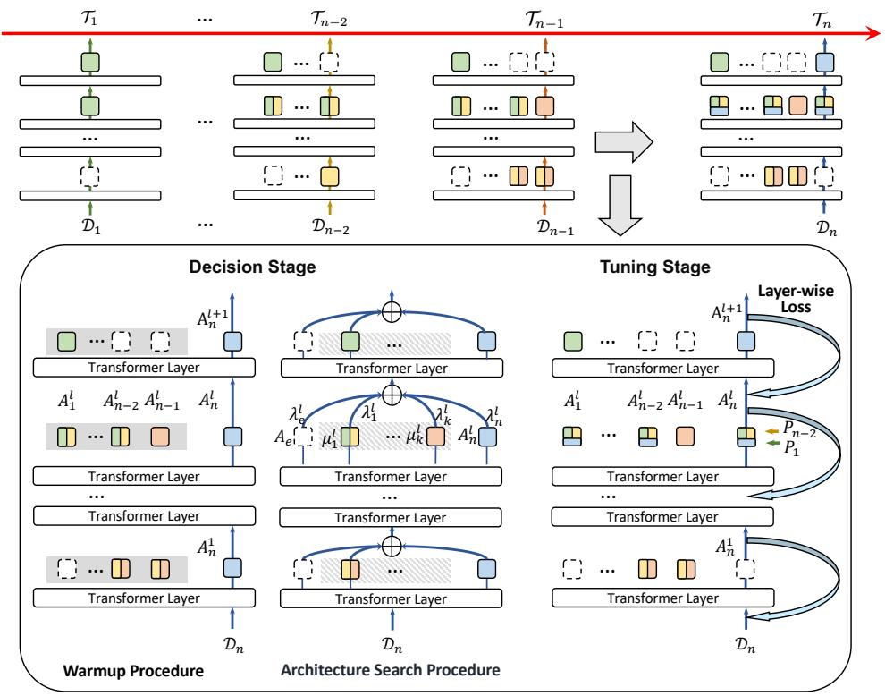
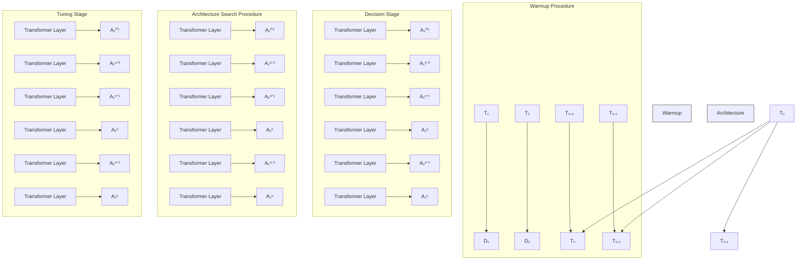
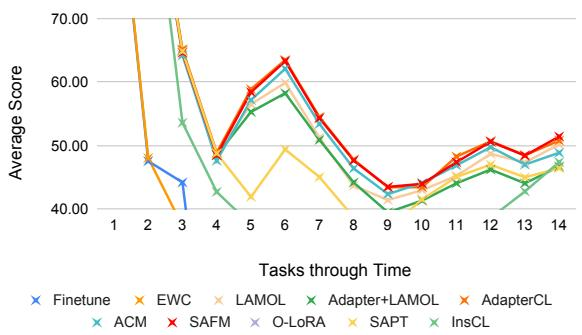

# Sparse Adapter Fusion for Continual Learning in NLP

Min Zeng1∗, Xi Chen1∗, Haiqin Yang2†, Yike Guo1†

1Hong Kong University of Science and Technology

2Shenzhen Technology University

min.zeng.u@gmail.com, yanghaiqin@sztu.edu.cn, yikeguo@ust.hk

# Abstract

Continual learning in natural language processing plays a crucial role in adapting to evolving data and preventing catastrophic forgetting. Despite significant progress, existing methods still face challenges, such as inefficient parameter reuse across tasks, risking catastrophic forgetting when tasks are dissimilar, and the unnecessary introduction of new parameters for each task, which hampers knowledge sharing among similar tasks. To tackle these issues, we propose a Sparse Adapter Fusion Method (SAFM), which dynamically fuses old and new adapters to address these challenges. SAFM operates in two stages: the decision stage and the tuning stage. In the decision stage, SAFM determines whether to incorporate a new adapter, reuse an existing one, or add an empty adapter. The architecture search procedure, designed to prioritize reusing or adding empty adapters, minimizes parameter consumption and maximizes reuse. In the tuning stage, SAFM especially facilitates a layer-wise loss to encourage differentiation between adapters, effectively capturing knowledge within the same task. Experimental results consistently show that SAFM outperforms state-of-the-art (SOTA) methods, achieving comparable performance while utilizing less than 60% of the parameters1.

# 1 Introduction

Continual learning (CL) is a paradigm that emulates the human ability to learn and acquire knowledge (Mendez and Eaton, 2023; Wang et al., 2024a) continuously. It focuses on retaining previously learned information and transferring it effectively to master new tasks. Learning continually is essential for models to adapt rapidly to evolving tasks. As a result, continual learning methodologies have emerged, enabling models to seamlessly assimilate new information over time. However, CL faces a significant challenge: catastrophic forgetting (CF), where a model’s performance on earlier tasks deteriorates due to shifts in data distribution introduced by new tasks, potentially erasing previously acquired knowledge.

Recent approaches to mitigating CF can be categorized into three main types: regularizationbased, rehearsal-based, and architectural-based methods (Kirkpatrick et al., 2017; Biesialska et al., 2020). Regularization-based methods (Zenke et al., 2017; Kirkpatrick et al., 2017; Schwarz et al., 2018; Aljundi et al., 2018) maintain performance on previous tasks by constraining updates to critical parameters. However, excessive reliance on regularizers can overly restrict network parameters, limiting the model’s ability to learn new knowledge. Rehearsalbased methods (Lopez-Paz and Ranzato, 2017; Rebuffi et al., 2017; Sun et al., 2019; Mi et al., 2020) rely on storing past samples or generating pseudosamples from earlier tasks, facing limitations due to memory constraints or the lack of authenticity in the generated pseudo-samples. Architectural-based methods (Madotto et al., 2021; Zhang et al., 2022) mitigate CF by adding task-specific adapters to approximate each task (Houlsby et al., 2019). Notable publications, such as AdapterCL (Madotto et al., 2021), CPT4DST (Zhu et al., 2022) and ACM (Zhang et al., 2022), have addressed CF through architectural modifications. However, as the number of tasks grows, the model parameters increase linearly, highlighting the importance of learning shared information to reduce parameter redundancy. While ACM aims to reduce parameters by reusing adapters from previous tasks, it still incurs high training costs as it does not reduce the adapters across tasks.

To tackle these challenges, we propose a Sparse Adapter Fusion Method (SAFM) to reduce redundancy by eliminating unnecessary task-specific adapters while reusing those learned from earlier tasks. This strategy enables the model to learn both local and global information simultaneously, improving performance and parameter efficiency. In this context, local information refers to the unique data captured by adapters within the same task, while global information refers to task similarities that guide the reuse of adapters from previous tasks. SAFM operates in two stages: the decision stage and the tuning stage. In the decision stage, SAFM determines whether to add a new adapter, reuse an existing one, or add an empty adapter. The architecture search procedure prioritizes reusing or adding empty adapters, thereby minimizing parameter consumption and optimizing reuse. Once the adapter for the current task is determined, SAFM proceeds to the tuning stage, where it fine-tunes the model parameters using pseudo-replay and a layer-wise loss. Concretely, this layer-wise loss, defined as the cosine similarity between adapters in adjacent layers, maximizes information conveyance by enhancing the distinction between adapters within the same task, further improving performance.

We highlight our key contributions as follows:

• We propose the Sparse Adapter Fusion Method (SAFM), a parameter-efficient continual learning method that mitigates CF by tending to reuse previously learned adapters or deploy empty adapters for new tasks.   
• SAFM introduces a layer-wise loss to promote the distinction adapters in adjacent layers within the same task, facilitating effective knowledge transfer and maximizing information conveyance with limited parameters.   
• Experimental results demonstrate the superior performance of our SAFM over SOTA methods, achieving comparable performance while utilizing less than 60% of the parameters employed by the SOTA models.

# 2 Related Work

Continual learning aims to acquire knowledge from new tasks while maintaining proficiency in previously learned tasks (Mendez and Eaton, 2023; Wang et al., 2024a). Various approaches have been proposed to mitigate the issue of catastrophic forgetting, including regularization-based, rehearsalbased, and architectural-based methods. These techniques have also been extended to apply in natural language processing, driving advancements in the field (Biesialska et al., 2020).

Regularization-based methods add constraints to the important parameters of previous tasks. For example, EWC (Kirkpatrick et al., 2017) identifies crucial parameters and prevents substantial updates on them, thereby preserving performance on earlier tasks. ARPER (Mi et al., 2020) mitigates forgetting by combining prioritized exemplar replay with adaptive regularization inspired by EWC. Rehearsal-based methods mitigate forgetting by replaying real or pseudo-samples of previous tasks. For instance, LAMOL (Sun et al., 2019) utilizes a language model to generate pseudo-samples, thereby eliminating the need for additional memory storage to retain previous samples. DCL (Zeng et al., 2024) introduces a novel generative-based rehearsal method in CL, assuming a Dirichlet distribution on the latent variables instead of the original Gaussian one applied in Conditional Variational Autoencoders. InsCL (Wang et al., 2024b) dynamically replays previous data by leveraging task similarity measured via the Wasserstein Distance. It further prioritizes high-quality data using the Instruction Information metric (InsInfo), which evaluates instruction complexity and diversity. PCGR (Chen and Zeng, 2025) proposes a Prototype Conditioned Generative Replay (PCGR) method, which enhances generative reply by incorporating task-level statistics through a Prototype Conditioned Variational Autoencoder (PCVAE). Architectural-based approaches reduce forgetting by modifying the network architecture. For example, AdapterCL (Madotto et al., 2021) places a residual adapter layer (Houlsby et al., 2019) atop each transformer layer to approximate different tasks. More recently, CPT4DST (Zhu et al., 2022) introduces prompt tuning to reduce forgetting in dialogue state tracking (DST), while ACM (Zhang et al., 2022) reduces parameters by reusing modules from previous tasks. However, ACM does not reduce the number of adapter layers per task, which can lead to parameter redundancy and result in the same high training cost. SAPT (Zhao et al., 2024), on the other hand, employs a separate adapter for each new task and uses a shared attention framework to facilitate knowledge transfer between tasks. TCL (Zeng et al., 2025) reduces parameters by employing Task-wrapped Adapters (TWAs) to jointly learn both global and task-specific local information across tasks.

Overall, existing CL methods still face challenges related to parameter redundancy, resulting in high memory and computational costs. Therefore, it is essential to develop approaches that reduce model parameters while preserving performance across tasks.

flowchart

Figure 1: SAFM consists of two stages: the decision stage and the tuning stage. The color indicates a module is updated with data from a specific task: green for task $\mathcal { T } _ { 1 }$ , yellow for task $\mathcal { T } _ { n - 2 }$ , and blue for task $\mathcal { T } _ { n }$ . In the decision stage, a new module (blue) is initialized for task $\mathcal { T } _ { n } .$ and the corresponding architecture search procedure is determined by Eq. (2), which yields $A _ { n } ^ { l } = A _ { 1 } ^ { l } = A _ { n - 2 } ^ { l }$ . Hence, at the tuning stage, $A _ { n } ^ { l }$ has to be fine-tuned with data from task $\mathcal { T } _ { 1 }$ (green), $\mathcal { T } _ { n - 2 }$ (yellow), and $\mathcal { T } _ { n }$ (blue). We then generate pseudo-samples from $\mathcal { T } _ { 1 } \left( P _ { 1 } \right)$ and $\mathcal { T } _ { n - 2 }$ $\left( P _ { n - 2 } \right)$ with the incoming data in $\mathcal { D } _ { n }$ to update the module $A _ { n } ^ { l }$ . For further details, please refer to Sec. 3.2.

# 3 Methodology

# 3.1 Task Definition

The goal of continual learning is to sequentially learn a set of tasks without catastrophically forgetting previously learned ones. Formally, given a sequence of N tasks $\mathcal { T } _ { 1 } , \ldots , \mathcal { T } _ { N }$ arriving in a streaming fashion, where each task $\mathcal { T } _ { n }$ consists of $N _ { n }$ samples in $\mathcal { D } _ { n } = \{ ( x _ { n } ^ { i } , y _ { n } ^ { i } ) \} _ { i = 1 } ^ { N _ { n } }$ , CL aims to learn a function $f _ { \theta } ^ { n }$ such that the model must not only adapt to the current task $\mathcal { T } _ { n }$ but also maintain its performance on all previously learned tasks without forgetting.

# 3.2 Overview

Figure 1 illustrates the procedure of our proposed Sparse Adapter Fusion Method (SAFM), which consists of two stages: the decision stage and the tuning stage. In the decision stage, when the task $\mathcal { T } _ { n }$ arrives, the SAFM works on top of each transformer layer. Unlike ACM, which only decides whether to reuse an old adapter or add a new one for $\mathcal { T } _ { n }$ , SAFM also considers the option of adding an empty adapter at each layer. In other words, SAFM may choose not to insert any adapter or reuse the previous ones, which reduces the model’s parameter size. Once the architecture for task $\mathcal { T } _ { n }$ is determined, SAFM proceeds to the tuning stage, where it fine-tunes the model by using pseudoreplay to absorb the knowledge in previous tasks and a layer-wise loss to increase the distinction between adapters in adjacent layers within task $\mathcal { T } _ { n }$ , which yields further performance improvement.

# 3.3 Decision Stage

The decision stage consists of two critical procedures: the warmup procedure and the architecture search procedure. When given task $\mathcal { T } _ { n } .$ , SAFM first enters the warmup procedure by initializing a task-specific adapter in each transformer layer, $A _ { n } \ = \ \{ A _ { n } ^ { 1 } , \ldots , A _ { n } ^ { l } , \ldots , A _ { n } ^ { L } \}$ , where $A _ { n } ^ { l }$ represents the adapter at layer l for task $\mathcal { T } _ { n } .$ , and $L$ is the total number of transformer layers (e.g., for

GPT-2, L = 12).

Next, SAFM proceeds to the architecture search procedure layer-by-layer by the following steps:

1. Renaming Prior Adapters: The unique adapters from previous tasks $A _ { 1 } ^ { l } , \ldots , A _ { n - 1 } ^ { l }$ at layer l are relabeled as $\boldsymbol { \mu } ^ { l } = \{ \mu _ { 1 } ^ { l } , \dots , \mu _ { k } ^ { l } \}$ , where k is the number of distinct adapters, constrained by $k \leq t - 1$ due to the potential reuse of adapter layers.   
2. Constructing Candidate Adapters: Combine $\mu ^ { l }$ with the empty adapter $A _ { e }$ and the newly initialized adapter $A _ { n } ^ { l }$ to form $k { + 2 }$ candidate adapters: $\boldsymbol { c } ^ { l } = \{ A _ { e } , \ddot { \mu } _ { 1 } ^ { l } , \ldots , \mu _ { k } ^ { l } , A _ { n } ^ { l } \}$ .   
3. Determining the final $A _ { n } ^ { l } \mathbf { : }$ : The adapter from $c ^ { l }$ with the highest weight, computed by Eq. (2), is selected as the final $A _ { n } ^ { l }$ .

Let $h _ { n } ^ { l } \in \mathbb { R } ^ { d }$ be the hidden state of the adapter at layer l for task $\mathcal { T } _ { n }$ , where d is the dimensionality of the embeddings and hidden states (For GPT-2, d is 768). $h _ { n } ^ { l }$ can be expressed as a weighted average of the output hidden states of the candidate adapters:

$$
\begin{array}{l} h _ {n} ^ {l} = \lambda_ {e} ^ {l} \times A _ {e} (f _ {n} ^ {l} (h _ {n} ^ {l - 1})) + \sum_ {i = 1} ^ {k} \lambda_ {i} ^ {l} \times \mu_ {i} ^ {l} (f _ {n} ^ {l} (h _ {n} ^ {l - 1})) \\ + \lambda_ {n} ^ {l} \times A _ {n} ^ {l} (f _ {n} ^ {l} (h _ {n} ^ {l - 1})). \tag {1} \\ \end{array}
$$

Here, we slightly abuse the notation by using $A _ { e } , \ \{ \mu \} _ { i = 1 } ^ { l }$ , and $A _ { n } ^ { l }$ to denote the parameters of the adapters. Their weights are defined as $\lambda ^ { l } = \{ \lambda _ { e } ^ { l } , \hat { \lambda } _ { 1 } ^ { l } , \dots , \lambda _ { k } ^ { l } , \lambda _ { n } ^ { l } \}$ accordingly, where $\lambda _ { e } ^ { l }$ is the weight of the empty adapter, $\lambda _ { n } ^ { l }$ is the weight of the newly initialized task-specific adapter for task $\mathcal { T } _ { n }$ , and $\{ \lambda _ { 1 } ^ { l } , \ldots , \lambda _ { k } ^ { l } \}$ represent the weights of the unique adapter modules from previous tasks. $f _ { n } ^ { l }$ denotes the l-th transformer layer of the language model for Task $\mathcal { T } _ { n }$ .

After the decision stage, we attain the parameters of Task ${ \mathcal { T } } _ { n } \colon A _ { n } = \{ A _ { n } ^ { 1 } , \ldots , A _ { n } ^ { l } , \ldots , A _ { n } ^ { L } \}$ . For example, as shown in Fig. 1, $A _ { n } ^ { 1 } = A _ { e } , A _ { n } ^ { l } =$ $A _ { n - 2 } ^ { l } = A _ { 1 } ^ { l }$ . That is, the adapter at layer 1 for task $\mathcal { T } _ { n }$ is empty, $A _ { e }$ . The adapter at layer l for task $\mathcal { T } _ { n }$ is the same as that for task $\mathcal { T } _ { n - 2 }$ and task $\mathcal { T } _ { 1 }$ . So $A _ { n }$ contains at least an empty adapter and a reused adapter, which results in fewer model parameters.

To learn the weight vector $\lambda ^ { l } \in \mathbb { R } ^ { k + \bar { 2 } }$ , we define $\alpha \in \mathbb { R } ^ { + }$ and $\beta \in \mathbb { R } ^ { + }$ as the sparse factor and the reuse factor to determine the selection probabilities of $c ^ { l }$ . Then, $\lambda ^ { l }$ is initialized as a softmax function over $\{ \alpha , \beta , \dots , \beta , - \beta \}$ , i.e.,

$$
\lambda_ {e} ^ {l} = \frac {e ^ {\alpha}}{\varphi}, \lambda_ {j} ^ {l} = \frac {e ^ {\beta}}{\varphi}, (j \in [ 1, k ]), \lambda_ {n} ^ {l} = \frac {e ^ {- \beta}}{\varphi} (2)
$$

where $\varphi = e ^ { \alpha } + k \times e ^ { \beta } + e ^ { - \beta }$ . It is important to note that usually, we set $\alpha > \beta > 0$ and yield a higher probability of selecting an empty adapter or reusing an existing adapter than creating a new one, as $\lambda _ { e } ^ { l } \stackrel {  } { = } \lambda _ { j } ^ { l } e ^ { \alpha - \beta } \stackrel {  } { > } \lambda _ { j } ^ { l } \stackrel {  } { = } \lambda _ { n } ^ { l } e ^ { 2 \beta } > \lambda _ { n } ^ { l }$ .

# 3.4 Tuning Stage

After the decision stage, SAFM determines the adapter architecture for task $\mathcal { T } _ { n }$ and processes to the tuning stage, where the adapter parameters are fine-tuned to better align with the training data distribution by applying the pseudo-replay mechanism and a layer-wise loss.

For example, as illustrated in Fig. 1, suppose $A _ { n } ^ { l } = A _ { n - 2 } ^ { l } = A _ { 1 } ^ { l }$ , where $A _ { 1 } ^ { l }$ is updated with data from task T1 (green) and $\mathcal { T } _ { n - 2 } \ : ( \mathrm { y e l l o w } )$ . We then apply the pseudo-replay generation mechanism as ACM (Zhang et al., 2022) to generate pseudosamples from tasks $\mathcal { T } _ { 1 }$ and $\mathcal { T } _ { n - 2 }$ , denoted as $P _ { 1 }$ and $P _ { n - 2 }$ , respectively, and update the module $A _ { n } ^ { l }$ with $P _ { 1 } , P _ { n - 2 }$ , and incoming data ${ \mathcal { D } } _ { n }$ .

After that, we place a layer-wise loss to enlarge the distance between adapters for each task, distinguishing the modules at each layer. Specifically, the layer-wise loss between layer l and layer $l - 1$ of task $\mathcal { T } _ { n }$ is measured by the cosine similarity between the hidden state of two adjacent adapters:

$$
\mathcal {L} _ {n} ^ {l} = \left\{ \begin{array}{l l} 0 & \text {   If   } A _ {n} ^ {l} = A _ {e} \\ \cos (h _ {n} ^ {l}, h _ {n} ^ {l - 1}) & \text {   Otherwise   } \end{array} \right., \tag {3}
$$

where $h _ { n } ^ { l }$ is computed by Eq. (1) from $h _ { n } ^ { l - 1 }$

The parameters for $A _ { n } \mathrm { { ' } s }$ are fine-tuned by minimizing the following total layer-wise losses for task $\mathcal { T } _ { n }$ :

$$
\mathcal {L} _ {n} = \sum_ {l = 1} ^ {L} \mathcal {L} _ {n} ^ {l}. \tag {4}
$$

# 4 Experiments

# 4.1 Datasets

Following the experimental setup of ACM (Zhang et al., 2022), we conduct experiments on two scenarios to demonstrate the merits of SAFM: the similar scenario and the dissimilar scenario. Each scenario contains four task orders as detailed in Appendix C. In the similar scenario, tasks share the same task pattern but originate from different domains. Specifically, we utilize five datasets spanning fourteen domains: E2ENLG (Novikova et al., 2017), RNNLG (Wen et al., 2015), Schema Guided Dialogue (SGD) (Rastogi et al., 2020),

Task-Master 2019 (TM19) (Byrne et al., 2019), and Task-Master 2020 (TM20) (Byrne et al., 2019). In the dissimilar scenario, tasks have different task patterns, and the data distribution shifts are substantial. We apply seven datasets, covering fourteen domains: E2ENLG (Novikova et al., 2017), RNNLG (Wen et al., 2015), WikiSQL (Zhong et al., 2017), CNN/DailyMail (See et al., 2017), SGD (Rastogi et al., 2020), TM19 (Byrne et al., 2019), and TM20 (Byrne et al., 2019). The task description and the dataset statistics are reported in Appendix A and Appendix B, respectively.

# 4.2 Baselines

We evaluate SAFM against strong baselines:

1. Finetune (Yogatama et al., 2019) directly finetunes the language model on new tasks sequentially.

2. EWC (Kirkpatrick et al., 2017) introduces regulation constraints on the loss to prevent updates to crucial parameters from previous tasks.

3. LAMOL (Sun et al., 2019) is a generative replay method that applies a language model as a generator to produce pseudo-samples, training the new task alongside these pseudosamples to mitigate CF.

4. InsCL (Wang et al., 2024b) is a strong rehearsal method that dynamically replays previous data based on task similarity using Wasserstein Distance and prioritizes high-quality data through the Instruction Information metric (InsInfo) to assess the instruction complexity and diversity.

5. AdapterCL (Madotto et al., 2021), a robust architectural-based approach, isolates taskspecific parameters by creating a dedicated adapter for each task.

6. Adapter+LAMOL (Zhang et al., 2022) combines adapters with pseudo-replay generated by a language model via adding a new adapter to each task to learn all tasks sequentially.

7. ACM (Zhang et al., 2022) modifies AdapterCL by adaptively reusing previous adapter modules for new tasks, striking a balance between avoiding CF and promoting knowledge sharing.

8. O-LoRA (Wang et al., 2023) is a parameterefficient architectural method that learns tasks in different low-rank vector subspaces, which are kept orthogonal to each other to reduce

CF.

9. SAPT (Zhao et al., 2024) introduces an adapter for each new task and employs a shared attention framework to enhance knowledge transfer across tasks.

10. (Multi) performs multi-task learning across all tasks and serves as the upper bound for continual learning performance.

# 4.3 Implementation Details

The experiments are conducted on an NVIDIA H800-80G GPU. The training time for SAFM is approximately 8 hours in the similar scenario and 14 hours in the dissimilar scenario. GPT-2 (Radford et al., 2019) serves as the backbone language model. The AdamW optimizer (Loshchilov and Hutter, 2017) is utilized with a learning rate of 1.75e-4. The batch size is 8. During the decision stage, the training epoch is 6, with the initial 3 epochs dedicated to the warmup procedure and the subsequent 3 epochs for the architecture search procedure. The sparse factor α is 0.11, and the reuse factor β is 0.08. To prevent the model from getting stuck in a local optimum, such as yielding all empty adapters, we apply no architecture search procedure at layers 5 and 6 for the similar and dissimilar scenarios, respectively. In the tuning stage, the number of epochs is set to 12. The weight of layer-wise loss is 0.4 for the similar scenario and 0.1 for the dissimilar scenario. Following the setup in (Sun et al., 2019), pseudo-replay is implemented with a rate of 0.2.

# 4.4 Evaluation Metrics

The evaluation metric for each task is as follows: INTENT uses Accuracy (ACC), evaluating the accuracy between the predicted intent and the real intent. DST utilizes Joint Goal Accuracy (JGA) (Wu et al., 2019), where both the intent keyword and its corresponding value must match exactly with the golden truth. NLG and summarization employ the BLEU score (Papineni et al., 2002), which measures the similarity between the generated text and the real text. SQL Query Generation uses Exact Match (EM), where the generated SQL query should match exactly with the gold.

Additionally, to obtain the overall comparison, we follow (Madotto et al., 2021; Lopez-Paz and Ranzato, 2017; Zhang et al., 2022) to employ the following two average evaluation metrics: (1) Average Score (Score) (Madotto et al., 2021; Lopez-Paz and Ranzato, 2017; Zhang et al., 2022) defines the average accuracy across all tasks after all the tasks finished learning: Score $\textstyle { \frac { 1 } { t } } \sum _ { i = 1 } ^ { t } R _ { N , i }$ , where $R _ { i , j }$ defines the testing result on task Tj using the model trained after task i. (2) Backward Transfer (BWT) (Lopez-Paz and Ranzato, 2017; Zhu et al., 2022) quantifies the effects on model performance after training on new tasks, defined by $\begin{array} { r } { { \bf B W T } = \frac { 1 } { t - 1 } \sum _ { i = 1 } ^ { t - 1 } ( R _ { N , i } - R _ { i , i } ) } \end{array}$ . Both metrics with high values indicate better performance.

<table><tr><td rowspan="2">Methods</td><td colspan="3">Similar</td><td colspan="3">Dissimilar</td></tr><tr><td>Learn. Param. ↓</td><td>Score (%) ↑</td><td>BWT (%) ↑</td><td>Learn. Param. ↓</td><td>Score (%) ↑</td><td>BWT (%) ↑</td></tr><tr><td>Finetune (Yogatama et al., 2019)</td><td>1742.30M</td><td>15.71 ± 3.84</td><td>-33.35 ± 4.24</td><td>1742.30M</td><td>7.35 ± 4.14</td><td>-47.84 ± 4.61</td></tr><tr><td>EWC (Kirkpatrick et al., 2017)</td><td>1742.30M</td><td>18.23 ± 4.20</td><td>-30.04 ± 4.74</td><td>1742.30M</td><td>11.35 ± 5.59</td><td>-43.63 ± 5.98</td></tr><tr><td>LAMOL (Sun et al., 2019)</td><td>1742.30M</td><td>38.40 ± 2.40</td><td>-8.09 ± 3.24</td><td>1742.30M</td><td>45.81 ± 3.74</td><td>-6.70 ± 4.04</td></tr><tr><td>InsCL (Wang et al., 2024b)</td><td>10780.00M</td><td>41.99 ± 1.46</td><td>-2.38 ± 1.73</td><td>10780.00M</td><td>47.52 ± 1.01</td><td>-4.83 ± 1.01</td></tr><tr><td>AdapterCL (Madotto et al., 2021)</td><td>25.06M</td><td>44.03 ± 0.00</td><td>N/A</td><td>25.06M</td><td>50.82 ± 0.00</td><td>N/A</td></tr><tr><td>Adapter+LAMOL (Zhang et al., 2022)</td><td>25.06M</td><td>34.39 ± 1.23</td><td>-11.36 ± 1.35</td><td>25.06M</td><td>44.12 ± 3.56</td><td>-6.69 ± 3.99</td></tr><tr><td>ACM (Zhang et al., 2022)</td><td>25.06M</td><td>41.84 ± 1.23</td><td>-3.37 ± 2.09</td><td>25.06M</td><td>49.07 ± 1.53</td><td>-2.29 ± 1.46</td></tr><tr><td>O-LoRA (Wang et al., 2023)</td><td>33.03M</td><td>25.93 ± 1.40</td><td>-17.00 ± 1.37</td><td>33.03M</td><td>10.51 ± 8.47</td><td>-32.71 ± 7.64</td></tr><tr><td>SAPT (Zhao et al., 2024)</td><td>55.36M</td><td>42.52 ± 0.51</td><td>-0.52± 0.37</td><td>55.36M</td><td>40.09±1.35</td><td>-3.73±1.31</td></tr><tr><td>SAFM</td><td>14.88M</td><td>44.55 ± 0.30</td><td>0.60 ± 0.84</td><td>15.21M</td><td>51.38 ± 0.12</td><td>0.57 ± 0.14</td></tr><tr><td>Multi (Upper Bound) (Caruana, 1997)</td><td>-</td><td>47.69</td><td>N/A</td><td>-</td><td>54.19</td><td>N/A</td></tr></table>

Table 1: Comparison results of SAFM and strong baselines. The best results are highlighted in bold. Learn. Param. denotes the number of learnable parameters. The vertical arrow indicates the direction of a superior model.

# 5 Results and Analysis

# 5.1 Main Results

Table 1 shows the overall performance of SAFM compared to all strong baselines, showcasing improvement in both performance and parameter efficiency across both scenarios:

• Superior Performance: AdapterCL achieves the best performance among all baselines. SAFM enhances AdapterCL across all metrics. In the similar scenario, SAFM realizes a 0.52-point increase in the average score while in the dissimilar scenario, it sees a 0.56-point increase. Significant improvements are also observed in SAPT, the latest competitive architecture-based approach. These gains are attributed to the effective use of adapter fusion and the layer-wise loss mechanism. The fusion technique improves the learning of global information across tasks, while the layer-wise loss mechanism enhances local information by optimizing parameters, making each adapter more task-specific and increasing the distance between modules within each task.

• Positive BWT: SAFM is the sole method to achieve positive BWT, with values of 0.60 and 0.57 in the similar and dissimilar scenarios, respectively. A higher BWT indicates better knowledge transfer from new tasks to the previous ones.

  
Figure 2: Learning curve of compared methods. SAFM’s position above the other lines indicates its superior performance.

The positive BWT reflects SAFM’s ability to share knowledge across tasks effectively, thereby alleviating forgetting.

• Parameter Efficiency: SAFM shows significant parameter reduction compared to baselines such as AdapterCL, and Adapter+LAMOL, and ACM. This reduction becomes particularly important as the number of tasks grows. SAFM achieves superior performance using only less than 60% of the learnable parameters, demonstrating its ability to eliminate redundant adapter layers and optimize model performance with fewer parameters.

# 5.2 Ablation Study

We conduct ablation studies to evaluate the impact of SAFM. ACM is chosen as the baseline because SAFM is an improved version built upon it. Additionally, we tested different sizes of GPT-2 as a new backbone to assess the generalization of SAFM.

Learning Curves of Compared Methods Figure 2 presents the learning curve across tasks in Order 5 from Table 8 for all compared methods. To enhance visibility, the figure only includes average scores between 40.0 and 70.0. Finetune and EWC are omitted after task 3 due to their pronounced susceptibility to CF, highlighting the importance of mitigating forgetting. Notably, SAFM consistently outperforms other methods, as indicated by its position above all other lines.

<table><tr><td rowspan="2" colspan="2"></td><td colspan="5">Similar</td><td colspan="5">Dissimilar</td></tr><tr><td>Order 1</td><td>Order 2</td><td>Order 3</td><td>Order 4</td><td>Avg.</td><td>Order 5</td><td>Order 6</td><td>Order 7</td><td>Order 8</td><td>Avg.</td></tr><tr><td rowspan="3">ACM</td><td>Score</td><td>41.51</td><td>40.58</td><td>43.52</td><td>41.75</td><td>41.84</td><td>48.90</td><td>50.10</td><td>50.67</td><td>47.63</td><td>49.07</td></tr><tr><td>BWT</td><td>-4.17</td><td>-5.31</td><td>-0.43</td><td>-3.58</td><td>-3.37</td><td>-2.71</td><td>-1.53</td><td>-0.80</td><td>-4.13</td><td>-2.29</td></tr><tr><td>Learn. Param.</td><td>25.06M</td><td>25.06M</td><td>25.06M</td><td>25.06M</td><td>25.06M</td><td>25.06M</td><td>25.06M</td><td>25.06M</td><td>25.06M</td><td>25.06M</td></tr><tr><td rowspan="3">SAFM (w/o layer-wise)</td><td>Score</td><td>43.44</td><td>43.16</td><td>44.32</td><td>42.92</td><td>43.49</td><td>51.14</td><td>50.95</td><td>50.86</td><td>50.46</td><td>50.85</td></tr><tr><td>BWT</td><td>-0.69</td><td>-0.94</td><td>1.12</td><td>-1.69</td><td>-0.55</td><td>0.12</td><td>0.00</td><td>-0.01</td><td>-0.03</td><td>0.02</td></tr><tr><td>Learn. Param.</td><td>15.96M</td><td>16.56M</td><td>14.91M</td><td>16.70M</td><td>16.06M</td><td>15.22M</td><td>14.46M</td><td>17.00M</td><td>17.60M</td><td>16.07M</td></tr><tr><td rowspan="3">SAFM</td><td>Score</td><td>44.22</td><td>44.56</td><td>44.95</td><td>44.45</td><td>44.55</td><td>51.45</td><td>51.5</td><td>51.45</td><td>51.24</td><td>51.38</td></tr><tr><td>BWT</td><td>0.19</td><td>0.47</td><td>1.82</td><td>-0.07</td><td>0.60</td><td>0.70</td><td>0.69</td><td>0.46</td><td>0.44</td><td>0.57</td></tr><tr><td>Learn. Param.</td><td>15.07M</td><td>15.96M</td><td>13.87M</td><td>14.61M</td><td>14.88M</td><td>14.91M</td><td>13.13M</td><td>15.81M</td><td>17.00M</td><td>15.21M</td></tr></table>

Table 2: Ablation study on the impact of architecture search procedure and the layer-wise loss mechanism. The metrics of ‘Score’, ‘BWT’, and ‘Learn. Param.’ are consistent in Table 1.

<table><tr><td rowspan="2">Ratio</td><td rowspan="2">Method</td><td>Order 1</td><td>Order 5</td></tr><tr><td>Score</td><td>Score</td></tr><tr><td>0.2</td><td>ACM</td><td>41.51</td><td>48.90</td></tr><tr><td>0.1</td><td>SAFM</td><td>42.71</td><td>51.43</td></tr><tr><td>0.2</td><td>SAFM</td><td>44.22</td><td>51.45</td></tr><tr><td>0.5</td><td>SAFM</td><td>44.96</td><td>51.55</td></tr><tr><td>0.8</td><td>SAFM</td><td>45.34</td><td>51.63</td></tr></table>

Table 3: Comparison results of ACM with the 0.2 pseudo-sample ratio and SAFM with varying pseudosample ratios on both scenarios.

Effect of Key Components in SAFM. Table 2 reports the effect of key components in SAFM, specifically the architecture search procedure and the layer-wise Loss mechanism. The results demonstrate that: (1) Comparing ACM with SAFM without the layer-wise loss, i.e., SAFM (w/o layer-wise), SAFM consistently outperforms ACM across all task orders with a 99% confidence level in the paired t-test, while using only 57.7%-70.2% of ACM’s learnable parameters. This suggests that the architecture search procedure indeed reduces parameter redundancy and computational costs by selectively introducing empty or reused adapters, while still absorbing task-specific knowledge more effectively. (2) After including the layer-wise loss, SAFM further outperforms SAFM (w/o layer-wise) across all task orders, again with a 99% confidence level on the paired t-test, while using fewer parameters. The improvement underscores the positive impact of the layer-wise loss in enhancing knowledge transfer within the constrained parameter space.

Effect of the Number of Pseudo-Samples. To evaluate the impact of the number of pseudosample, we conduct experiments using different pseudo-sample ratios in SAFM. Table 3 compares the effect of the number of pseudo-samples tested in Order 1 and Order 5 from Table 8, representing typical cases of the similar and dissimilar scenarios, respectively. For ACM, the ratio of pseudo-samples is fixed at 0.2, meaning that the number of generated pseudo-samples equals 20% of the training data in the current task. For SAFM, the ratio varies from {0.1, 0.2, 0.5, 0.8}. The results show that: (1) SAFM with only a 0.1 pseudo-sample ratio outperforms ACM with a 0.2 ratio, which demonstrates SAFM’s parameter efficiency and memory saving, absorbing more knowledge with fewer pseudosamples. (2) As the pseudo-sample ratio increases, SAFM consistently improves across both test cases, although the improvement in the assimilate scenario is gradual. This trend is expected, as SAFM requires more memory to assimilate knowledge from previous tasks.

<table><tr><td rowspan="2">Layer Index</td><td colspan="2">Order 1</td><td rowspan="2">Layer Index</td><td colspan="2">Order 5</td></tr><tr><td>ACM</td><td>SAFM</td><td>ACM</td><td>SAFM</td></tr><tr><td>Null</td><td>41.51</td><td>42.58</td><td>Null</td><td>48.90</td><td>50.95</td></tr><tr><td>3</td><td>42.27</td><td>43.44</td><td>2</td><td>50.62</td><td>51.02</td></tr><tr><td>5</td><td>42.98</td><td>44.22</td><td>4</td><td>50.76</td><td>51.35</td></tr><tr><td>7</td><td>43.64</td><td>44.26</td><td>6</td><td>50.94</td><td>51.45</td></tr><tr><td>9</td><td>44.12</td><td>44.31</td><td>8</td><td>51.27</td><td>51.56</td></tr></table>

Table 4: Score of no AS adapter layer in Order 1 and Order 5. ‘Null’ indicates no AS applied in all layers.

Effect of No Architecture Search (AS) in Adapter Layers. We evaluate the effect of conducting no AS in an adapter layer of SAFM, i.e., specifically assigning a layer without performing the AS procedure. The selected layer varies from {3, 5, 7, 9} in Order 1 for the similar scenario and {2, 4, 6, 8} in Order 5 for the dissimilar scenario, respectively, where ‘Null’ denotes no AS applied in all layers. Table 4 shows that: (1) Integrating a no AS adapter layer enables the exclusive retention of task-specific knowledge, enhancing performance. This approach preserves more highlevel task-specific information, leading to improved outcomes. Note that, via the setting detailed in Sec. 4.3, the results of applying no AS to layer 5 in Order 1 and layer 6 in Order 5 match the corresponding performance in Table 2. (2) Both ACM and SAFM demonstrate improved performance as the layer index increases in both cases. This enhancement is likely due to higher layers containing more meaningful, complex, and high-level information, as noted in (Erhan et al., 2009).

<table><tr><td>E2ENLG</td><td>name[Green Man], eatType[pub], customer rating[3 out of 5], near[All Bar One]</td></tr><tr><td>Reference</td><td>Located close to All Bar One, Green Man pub has a 3 out of 5 rating.</td></tr><tr><td>ACM</td><td>Near All Bar One it has a customer rating of 3 out of 5.</td></tr><tr><td>SAFM</td><td>Green Man is a pub near All Bar One with a customer rating of 3 out of 5.</td></tr><tr><td>WikiSQL</td><td>The table has columns of [&quot;Rank Each wrestlers total number of days as champion are ranked highest to lowest; wrestlers with the same number mean that they are tied for that certain rank.&quot;, &quot;Wrestler&quot;, &quot;# of reigns&quot;, &quot;Combined defenses&quot;, &quot;Combined days&quot;],Question: &quot;In terms of reigns, what is the lowest number listed?&quot;</td></tr><tr><td>Reference</td><td>SELECT MIN # of reigns FROM table</td></tr><tr><td>ACM</td><td>SELECT MIN number of days as champion FROM table WHERE rank = highest to lowest</td></tr><tr><td>SAFM</td><td>SELECT MIN # of reigns FROM table</td></tr></table>

Table 5: Comparison of the Ground Truth (Reference) with the generated outputs from ACM and SAFM.

Scale-up of different backbones. To evaluate the scalability of SAFM, we conducted experiments using GPT-2 of different sizes and Llama3- 8B (Touvron et al., 2023). Table 6 reports the average performance of SAFM and ACM after training on task 8 and task 10 in Order 1. The results show that SAFM consistently outperforms ACM on GPT-2 of different sizes and Llama3-8B. This aligns with the scaling law (Kaplan et al., 2020; Hoffmann et al., 2022), which highlights the consistency of pre-trained decoder-only models. SAFM is proven to significantly improve performance over ACM, proving its scalability and generalizability in different backbone language models (LMs). However, the performance of Llama3-8B is significantly lower compared to fine-tuning with GPT-2, primarily due to the limited availability of training data. The conclusion is aligned with DCL (Zeng et al., 2024).

# 5.3 Case Study

Table 5 presents a comparison of the generated samples of SAFM, ACM, and the ground truth (Reference). We selected the E2ENLG dataset used in Order 1 and the WikiSQL dataset used in Order 8 as two representative samples to illustrate the output generated by different methods. In the E2ENLG dataset, the example “name[Green Man], eatType[pub], customer rating[3 out of 5], near[All Bar One]” illustrates that ACM overlooks two essential pieces of information in the provided structured data: “name[Green Man]” and “eatType[pub]”. In contrast, SAFM successfully captures all critical information, showing its superior capability in enhancing model performance.

<table><tr><td>Backbone</td><td>ACM</td><td>Learn. Param.</td><td>SAFM</td><td>Learn. Param.</td></tr><tr><td></td><td colspan="4">Task 8</td></tr><tr><td>GPT-2 (124M)</td><td>56.11</td><td>14.3M</td><td>56.55</td><td>6.7M</td></tr><tr><td>GPT-2-medium (355M)</td><td>48.36</td><td>50.7M</td><td>50.08</td><td>34.0M</td></tr><tr><td>GPT-2-large (774M)</td><td>48.05</td><td>118.7M</td><td>49.53</td><td>83.6M</td></tr><tr><td>Llama3-8B</td><td>20.95</td><td>5279.3M</td><td>42.78</td><td>1031.1M</td></tr><tr><td></td><td colspan="4">Task 10</td></tr><tr><td>GPT-2 (124M)</td><td>49.35</td><td>17.9M</td><td>49.39</td><td>8.7M</td></tr><tr><td>GPT-2-medium (355M)</td><td>40.77</td><td>63.4M</td><td>43.36</td><td>38.8M</td></tr><tr><td>GPT-2-large (774M)</td><td>39.33</td><td>148.4M</td><td>42.94</td><td>130.6M</td></tr><tr><td>Llama3-8B</td><td>16.23</td><td>6599.1M</td><td>36.44</td><td>1299.1M</td></tr></table>

Table 6: Scores of SAFM and ACM with different backbones in Order 1.

In the WikiSQL dataset examples, ACM faces challenges in understanding the structured data, distinguishing between natural language and SQL, and interpreting the question intent. As illustrated in Table 5, ACM misinterprets the column “# of reigns” as the natural language phrase “number of days as champion”. Additionally, ACM generates SQL content related to “rank”, even though there is no connection to “rank” in the provided question. Consequently, ACM fails to generate the desired SQL statement accurately. In contrast, SAFM’s generation aligns precisely with the ground truth, showcasing its superior performance.

# 6 Conclusion

This paper presents SAFM, a novel approach that efficiently leverages both global and local information to address catastrophic forgetting in continual learning. SAFM operates through a two-stage process in which adapter layers are strategically abandoned, reused, or added during the decision stage to facilitate knowledge sharing and reduce parameter usage. Additionally, a layer-wise loss mechanism is introduced in the tuning stage to optimize knowledge representation within the limited parameter budget. Our extensive analysis of SAFM examines the impact of the architecture search procedure, the layer-wise loss, the percentage of pseudo-replay, and the effects of various fixed adapter layers. Experimental results consistently demonstrate that SAFM outperforms SOTA methods by utilizing only less than 60% of the parameters employed by the SOTA models.

# 7 Limitations

SAFM primarily focuses on task-level incremental information and does not explicitly address samplelevel incremental information, which may result in reduced performance on outlier samples.

# References

Rahaf Aljundi, Francesca Babiloni, Mohamed Elhoseiny, Marcus Rohrbach, and Tinne Tuytelaars. 2018. Memory aware synapses: Learning what (not) to forget. In Proceedings of the European conference on computer vision (ECCV), pages 139–154.   
Magdalena Biesialska, Katarzyna Biesialska, and Marta R. Costa-jussà. 2020. Continual lifelong learning in natural language processing: A survey. In Proceedings of the 28th International Conference on Computational Linguistics, COLING 2020, Barcelona, Spain (Online), December 8-13, 2020, pages 6523–6541. International Committee on Computational Linguistics.   
Bill Byrne, Karthik Krishnamoorthi, Chinnadhurai Sankar, Arvind Neelakantan, Daniel Duckworth, Semih Yavuz, Ben Goodrich, Amit Dubey, Andy Cedilnik, and Kyu-Young Kim. 2019. Taskmaster-1: Toward a realistic and diverse dialog dataset. arXiv preprint arXiv:1909.05358.   
Rich Caruana. 1997. Multitask learning. Machine learning, 28:41–75.   
Xi Chen and Min Zeng. 2025. Prototype conditioned generative replay for continual learning in nlp. In Proceedings of the 2025 Conference of the Nations of

the Americas Chapter of the Association for Computational Linguistics: Human Language Technologies (Volume 1: Long Papers), pages 12754–12770.

Dumitru Erhan, Yoshua Bengio, Aaron Courville, and Pascal Vincent. 2009. Visualizing higher-layer features of a deep network. University of Montreal, 1341(3):1.

Jordan Hoffmann, Sebastian Borgeaud, Arthur Mensch, Elena Buchatskaya, Trevor Cai, Eliza Rutherford, Diego de Las Casas, Lisa Anne Hendricks, Johannes Welbl, Aidan Clark, et al. 2022. Training computeoptimal large language models. arxiv. arXiv preprint arXiv:2203.15556.

Neil Houlsby, Andrei Giurgiu, Stanislaw Jastrzebski, Bruna Morrone, Quentin De Laroussilhe, Andrea Gesmundo, Mona Attariyan, and Sylvain Gelly. 2019. Parameter-efficient transfer learning for nlp. In ICML, pages 2790–2799.

Jared Kaplan, Sam McCandlish, Tom Henighan, Tom B Brown, Benjamin Chess, Rewon Child, Scott Gray, Alec Radford, Jeffrey Wu, and Dario Amodei. 2020. Scaling laws for neural language models. arXiv preprint arXiv:2001.08361.

James Kirkpatrick, Razvan Pascanu, Neil Rabinowitz, Joel Veness, Guillaume Desjardins, Andrei A Rusu, Kieran Milan, John Quan, Tiago Ramalho, Agnieszka Grabska-Barwinska, et al. 2017. Overcoming catastrophic forgetting in neural networks. Proceedings of the national academy of sciences, 114(13):3521–3526.

David Lopez-Paz and Marc’Aurelio Ranzato. 2017. Gradient episodic memory for continual learning. In NIPS, volume 30.

Ilya Loshchilov and Frank Hutter. 2017. Decoupled weight decay regularization. arXiv preprint arXiv:1711.05101.

Andrea Madotto, Zhaojiang Lin, Zhenpeng Zhou, Seungwhan Moon, Paul Crook, Bing Liu, Zhou Yu, Eunjoon Cho, Pascale Fung, and Zhiguang Wang. 2021. Continual learning in task-oriented dialogue systems. In EMNLP.

Jorge A. Mendez and Eric Eaton. 2023. How to reuse and compose knowledge for a lifetime of tasks: A survey on continual learning and functional composition. Trans. Mach. Learn. Res., 2023.

Fei Mi, Liangwei Chen, Mengjie Zhao, Minlie Huang, and Boi Faltings. 2020. Continual learning for natural language generation in task-oriented dialog systems. In EMNLP, pages 3461–3474.

Jekaterina Novikova, Ondˇrej Dušek, and Verena Rieser. 2017. The e2e dataset: New challenges for end-toend generation. arXiv preprint arXiv:1706.09254.

Kishore Papineni, Salim Roukos, Todd Ward, and Wei-Jing Zhu. 2002. Bleu: a method for automatic evaluation of machine translation. In Proceedings of the 40th annual meeting of the Association for Computational Linguistics, pages 311–318.   
Alec Radford, Jeffrey Wu, Rewon Child, David Luan, Dario Amodei, Ilya Sutskever, et al. 2019. Language models are unsupervised multitask learners. OpenAI blog, 1(8):9.   
Abhinav Rastogi, Xiaoxue Zang, Srinivas Sunkara, Raghav Gupta, and Pranav Khaitan. 2020. Towards scalable multi-domain conversational agents: The schema-guided dialogue dataset. In Proceedings of the AAAI conference on artificial intelligence, 05, pages 8689–8696.   
Sylvestre-Alvise Rebuffi, Alexander Kolesnikov, Georg Sperl, and Christoph H Lampert. 2017. icarl: Incremental classifier and representation learning. In Proceedings of the IEEE conference on Computer Vision and Pattern Recognition, pages 2001–2010.   
Jonathan Schwarz, Wojciech Czarnecki, Jelena Luketina, Agnieszka Grabska-Barwinska, Yee Whye Teh, Razvan Pascanu, and Raia Hadsell. 2018. Progress & compress: A scalable framework for continual learning. In ICML, pages 4528–4537.   
Abigail See, Peter J Liu, and Christopher D Manning. 2017. Get to the point: Summarization with pointer-generator networks. arXiv preprint arXiv:1704.04368.   
Fan-Keng Sun, Cheng-Hao Ho, and Hung-Yi Lee. 2019. Lamol: Language modeling for lifelong language learning. arXiv preprint arXiv:1909.03329.   
Hugo Touvron, Thibaut Lavril, Gautier Izacard, Xavier Martinet, Marie-Anne Lachaux, Timothée Lacroix, Baptiste Rozière, Naman Goyal, Eric Hambro, Faisal Azhar, et al. 2023. Llama: Open and efficient foundation language models. arXiv preprint arXiv:2302.13971.   
Liyuan Wang, Xingxing Zhang, Hang Su, and Jun Zhu. 2024a. A comprehensive survey of continual learning: Theory, method and application. IEEE Trans. Pattern Anal. Mach. Intell., 46(8):5362–5383.   
Xiao Wang, Tianze Chen, Qiming Ge, Han Xia, Rong Bao, Rui Zheng, Qi Zhang, Tao Gui, and Xuanjing Huang. 2023. Orthogonal subspace learning for language model continual learning. In Findings of the Association for Computational Linguistics: EMNLP 2023, pages 10658–10671, Singapore. Association for Computational Linguistics.   
Yifan Wang, Yafei Liu, Chufan Shi, Haoling Li, Chen Chen, Haonan Lu, and Yujiu Yang. 2024b. InsCL: A data-efficient continual learning paradigm for finetuning large language models with instructions. In Proceedings of the 2024 Conference of the North American Chapter of the Association for Computational Linguistics: Human Language Technologies

(Volume 1: Long Papers), pages 663–677, Mexico City, Mexico. Association for Computational Linguistics.   
Tsung-Hsien Wen, Milica Gasic, Nikola Mrksic, Pei-Hao Su, David Vandyke, and Steve Young. 2015. Semantically conditioned lstm-based natural language generation for spoken dialogue systems. arXiv preprint arXiv:1508.01745.   
Chien-Sheng Wu, Andrea Madotto, Ehsan Hosseini-Asl, Caiming Xiong, Richard Socher, and Pascale Fung. 2019. Transferable multi-domain state generator for task-oriented dialogue systems. arXiv preprint arXiv:1905.08743.   
Dani Yogatama, Cyprien de Masson d’Autume, Jerome Connor, Tomas Kocisky, Mike Chrzanowski, Lingpeng Kong, Angeliki Lazaridou, Wang Ling, Lei Yu, Chris Dyer, et al. 2019. Learning and evaluating general linguistic intelligence. arXiv preprint arXiv:1901.11373.   
Min Zeng, Haiqin Yang, Xi Chen, and Yike Guo. 2025. Task-wrapped continual learning in task-oriented dialogue systems. In Findings of the Association for Computational Linguistics: NAACL 2025, pages 3173–3183.   
Min Zeng, Haiqin Yang, Wei Xue, Qifeng Liu, and Yike Guo. 2024. Dirichlet continual learning: Tackling catastrophic forgetting in nlp. In The 40th Conference on Uncertainty in Artificial Intelligence.   
Friedemann Zenke, Ben Poole, and Surya Ganguli. 2017. Continual learning through synaptic intelligence. In ICML, pages 3987–3995.   
Yanzhe Zhang, Xuezhi Wang, and Diyi Yang. 2022. Continual sequence generation with adaptive compositional modules. In ACL.   
Weixiang Zhao, Shilong Wang, Yulin Hu, Yanyan Zhao, Bing Qin, Xuanyu Zhang, Qing Yang, Dongliang Xu, and Wanxiang Che. 2024. SAPT: A shared attention framework for parameter-efficient continual learning of large language models. In Proceedings of the 62nd Annual Meeting of the Association for Computational Linguistics (Volume 1: Long Papers), pages 11641– 11661.   
Victor Zhong, Caiming Xiong, and Richard Socher. 2017. Seq2sql: Generating structured queries from natural language using reinforcement learning. arXiv preprint arXiv:1709.00103.   
Qi Zhu, Bing Li, Fei Mi, Xiaoyan Zhu, and Minlie Huang. 2022. Continual prompt tuning for dialog state tracking. In ACL, pages 1124–1137.

# A Task Description

INTENT aims to categorize user queries into specific intents. For example, intent for “USER: I want to book two tickets for Star Wars.” is “movie\_booking.”, while intent for “USER: I need to check my balance.” is “CheckBalance”.

DST involves tracking the state of dialogue, such as the topic discussed, the emotion expressed, or any other relevant data points. For example, in a flight booking conversation, “USER: I want to fly to Seattle this evening.”. The user’s intent “Destination” can be identified from “fly to”, and the corresponding value is “Seattle”.

NLG generates human-like text from structured data. For example, given output from DST “Destination: Seattle, Price: 200 dollars, Departure Time: 7.50 PM”, the generation of the system might be “Dear sir, the ticket price for the flight to Seattle on 7.50 PM is 200 dollars”.

Summarization aims at condensing a long text into a shorter one without missing important information and overall meaning.

SQL Query Generation refers to automatically generating SQL queries, which are used to retrieve or manipulate data from relational databases. It involves transforming high-level user requirements and structured data into executable SQL statements. For example, the user requirement is “select the max price on date ’2024-06-04’ in given sheet”, and the SQL query should be “SELECT MAX price FROM sheet WHERE date = ’2024-06-04’;”.

# B Dataset Statistics

We describe the details of the datasets as follows:

• E2ENLG (Novikova et al., 2017) is a dataset that focuses on NLG data in the restaurant domain.   
• RNNLG (Wen et al., 2015) is a dataset that includes NLG data for spoken dialogue systems. It covers four domains: restaurant, TV, laptop, and hotel.   
• SGD (Rastogi et al., 2020) is a dataset that contains multi-domain, task-oriented conversations between a user and a virtual assistant. It reflects real-world scenarios by including different APIs with overlapping functionalities but different interfaces.   
• TM19 (Byrne et al., 2019) is a task-based dataset

comprising spoken and written dialogues created through two distinct procedures. It covers six domains: ordering pizza, creating auto repair appointments, setting up ride service, ordering movie tickets, ordering coffee drinks, and making restaurant reservations.

• TM20 (Byrne et al., 2019) is a dataset that includes dialogues in seven domains: restaurants, food ordering, movies, hotels, flights, music, and sports. It consists entirely of spoken two-person dialogues and contains many search-oriented and recommendation-oriented conversations.   
• CNN/DailyMail (See et al., 2017) is a dataset that contains news stories from CNN and Daily Mail, along with human-generated abstractive summaries.   
• WikiSQL (Zhong et al., 2017) comprises handannotated examples of questions and SQL queries.

Table 7 provides a detailed summary of the dataset statistics.

# C Task Orders

Table 8 describes the details of the task orders.

<table><tr><td>Name</td><td>Domain</td><td>Dataset</td><td>Task Pattern</td><td>Train</td><td>Valid</td><td>Test</td></tr><tr><td>CNN/DailyMail</td><td>news</td><td>CNN/DailyMail</td><td>Summarization</td><td>6604</td><td>2250</td><td>2250</td></tr><tr><td>WikiSQL</td><td>programming language</td><td>WikiSQL</td><td>SQL Query Generation</td><td>6525</td><td>8421</td><td>15878</td></tr><tr><td>E2ENLG</td><td>restaurant</td><td>E2ENLG</td><td>NLG</td><td>6000</td><td>2000</td><td>2000</td></tr><tr><td>RNNLG_hotel</td><td>hotel</td><td>RNNLG</td><td>NLG</td><td>6446</td><td>1075</td><td>1075</td></tr><tr><td>RNNLG_rest</td><td>restaurant</td><td>RNNLG</td><td>NLG</td><td>6228</td><td>1039</td><td>1039</td></tr><tr><td>RNNLG_tv</td><td>tv</td><td>RNNLG</td><td>NLG</td><td>8442</td><td>1407</td><td>1407</td></tr><tr><td>RNNLG_laptop</td><td>laptop</td><td>RNNLG</td><td>NLG</td><td>7944</td><td>2649</td><td>2649</td></tr><tr><td>SGD_hotel_nlg</td><td>hotel</td><td>SGD</td><td>NLG</td><td>1997</td><td>243</td><td>597</td></tr><tr><td>SGD_restaurant_nlg</td><td>restaurant</td><td>SGD</td><td>NLG</td><td>1720</td><td>166</td><td>386</td></tr><tr><td>SGD_restaurant_intent</td><td>restaurant</td><td>SGD</td><td>INTENT</td><td>2686</td><td>278</td><td>616</td></tr><tr><td>SGD_restaurant_dst</td><td>restaurant</td><td>SGD</td><td>DST</td><td>2686</td><td>278</td><td>616</td></tr><tr><td>SGD_flight_nlg</td><td>flight</td><td>SGD</td><td>NLG</td><td>2571</td><td>627</td><td>982</td></tr><tr><td>SGD_flight_intent</td><td>flight</td><td>SGD</td><td>INTENT</td><td>4766</td><td>1041</td><td>1756</td></tr><tr><td>SGD_flight_dst</td><td>flight</td><td>SGD</td><td>DST</td><td>4766</td><td>1041</td><td>1756</td></tr><tr><td>TM19_restaurant_nlg</td><td>restaurant</td><td>TM19</td><td>NLG</td><td>2582</td><td>330</td><td>333</td></tr><tr><td>TM19_movie_nlg</td><td>movie</td><td>TM19</td><td>NLG</td><td>3010</td><td>366</td><td>341</td></tr><tr><td>TM20_hotel_nlg</td><td>hotel</td><td>TM20</td><td>NLG</td><td>6590</td><td>842</td><td>869</td></tr><tr><td>TM20_restaurant_nlg</td><td>restaurant</td><td>TM20</td><td>NLG</td><td>8356</td><td>1063</td><td>994</td></tr><tr><td>TM20_restaurant_intent</td><td>restaurant</td><td>TM20</td><td>INTENT</td><td>13738</td><td>1761</td><td>1791</td></tr><tr><td>TM20_restaurant_dst</td><td>restaurant</td><td>TM20</td><td>DST</td><td>13738</td><td>1761</td><td>1791</td></tr><tr><td>TM20_flight_nlg</td><td>flight</td><td>TM20</td><td>NLG</td><td>10148</td><td>1272</td><td>1245</td></tr><tr><td>TM20_flight_intent</td><td>flight</td><td>TM20</td><td>INTENT</td><td>15868</td><td>1974</td><td>1940</td></tr><tr><td>TM20_flight_dst</td><td>flight</td><td>TM20</td><td>DST</td><td>15868</td><td>1974</td><td>1940</td></tr><tr><td>TM20_movie_nlg</td><td>movie</td><td>TM20</td><td>NLG</td><td>9406</td><td>1203</td><td>1093</td></tr></table>

Table 7: Dataset Statistics.

<table><tr><td>Order</td><td>Scenario</td><td>Task Sequence</td></tr><tr><td>1</td><td>Similar</td><td>E2ENLG → RNNLG_rest → RNNLG_hotel → SGD_hotel_nlg → RNNLG_laptop →RNNLG_tv → SGD_restaurant_nlg → SGD_flight_nlg → TM19_movie_nlg → TM20_hotel_nlg →TM20_restaurant_nlg → TM20_flight_nlg → TM20_movie_nlg → TM19_restaurant_nlg</td></tr><tr><td>2</td><td>Similar</td><td>RNNLG_hotel → SGD_hotel_nlg → E2ENLG → RNNLG_rest → RNNLG_laptop →SGD_flight_nlg → SGD_restaurant_nlg → RNNLG_tv → TM19_movie_nlg → TM20_hotel_nlg →TM20_flight_nlg →TM20_movie_nlg →TM20_restaurant_nlg → TM19_restaurant_nlg</td></tr><tr><td>3</td><td>Similar</td><td>SGD_flight_nlg → SGD_restaurant_nlg → E2ENLG → RNNLG_rest → RNNLG_tv →RNNLG_laptop → TM19_movie_nlg → RNNLG_hotel → SGD_hotel_nlg → TM19_restaurant_nlg →TM20_flight_nlg → TM20_hotel_nlg → TM20_restaurant_nlg → TM20_movie_nlg</td></tr><tr><td>4</td><td>Similar</td><td>E2ENLG → RNNLG_rest → RNNLG_hotel → RNNLG_tv → RNNLG_laptop →SGD_hotel_nlg → SGDFlight_nlg → SGD_restaurant_nlg → TM19_movie_nlg → TM19_restaurant_nlg →TM20_hotel_nlg → TM20_movie_nlg → TM20Flight_nlg → TM20_restaurant_nlg</td></tr><tr><td>5</td><td>Dissimilar</td><td>SGD_restaurantIntent → SGDFlightIntent → SGD_restaurantDst → SGDFlightDst → TM20_restaurantIntent →TM20FlightIntent → TM20_restaurantDst → TM20FlightDst → CNN/DailyMail → WikiSQL →RNNLG_laptop → RNNLG_tv → E2ENLG → RNNLG_hotel</td></tr><tr><td>6</td><td>Dissimilar</td><td>SGD_restaurantIntent → SGDFlightIntent → TM20_restaurantIntent → TM20FlightIntent → E2ENLG →RNNLG_hotel → RNNLG_laptop → RNNLG_tv → SGD_restaurantDst → SGDFlightDst →TM20_restaurantDst → TM20FlightDst → CNN/DailyMail → WikiSQL</td></tr><tr><td>7</td><td>Dissimilar</td><td>TM20_restaurantIntent → TM20FlightIntent → SGD_restaurantIntent → SGDFlightIntent → E2ENLG →RNNLG_hotel → CNN/DailyMail → WikiSQL → RNNLG_laptop → RNNLG_tv →SGD_restaurantDst → SGDFlightDst → TM20FlightDst</td></tr><tr><td>8</td><td>Dissimilar</td><td>WikiSQL → CNN/DailyMail → TM20_restaurantIntent → SGD_restaurantIntent → SGDFlightIntent →TM20FlightIntent → SGD_restaurantDst → SGDFlightDst → RNNLG_hotel → RNNLG_laptop →E2ENLG → TM20_restaurantDst → RNNLG_tv → TM20FlightDst</td></tr></table>

Table 8: Eight random task orders for evaluating SAFM.