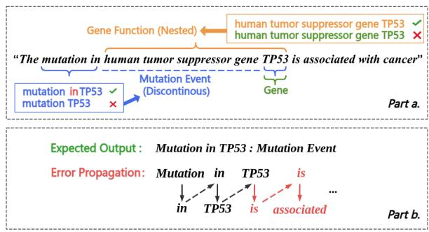
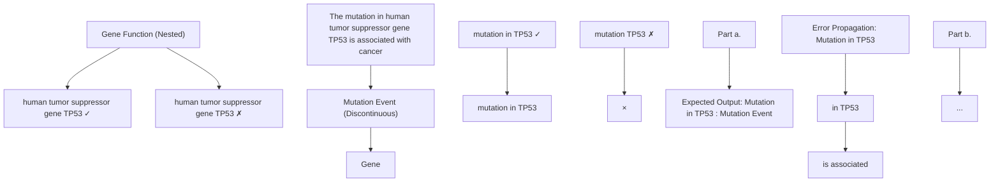
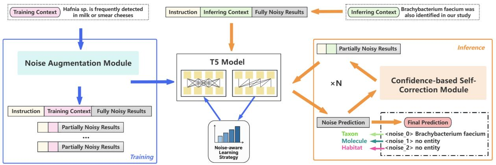
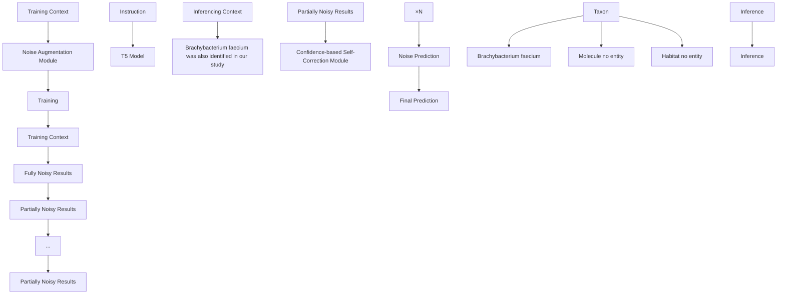
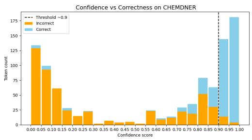
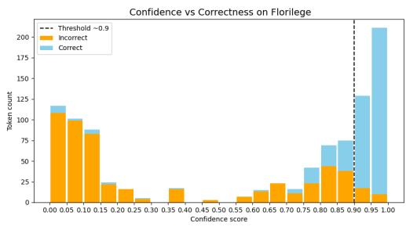

# SCoNE: a Self-Correcting and Noise-Augmented Method for Complex Biological and Chemical Named Entity Recognition

Xingyu Zhu1,2, \* Claire Nédellec1, Balazs Nagy2, Laszlo Vidacs2, Robert Bossy1

1INRAE, Université Paris-Saclay, Paris, France

2Department of Software Engineering, University of Szeged, Szeged, Hungary

xingyu.zhu@inrae.fr robert.bossy@inrae.fr

# Abstract

Generative methods have recently gained traction in biological and chemical named entity recognition for their ability to overcome tagging limitations and better capture entity-rich contexts. However, under a few-shot environment, they struggle with the scarcity of annotated data and the structural complexity of biological and chemical entities—particularly nested and discontinuous ones—leading to incorrect recognition and error propagation during generation. To address these challenges, we propose SCoNE, a Self-Correcting and Noise-Augmented Method for Complex Biological and Chemical Named Entity Recognition. Specifically, we introduce a Noise Augmentation Module to enhance training diversity and guide the model to better learn complex entity structures. Besides, we design a Confidence-based Self-Correction Module that identifies low-confidence outputs and revises them to improve generation robustness. Benefiting from them, our method outperforms the baselines by 1.80 and 2.73 F1-score on the CHEMDNER and microbial ecology dataset Florilege, highlighting its effectiveness in biological and chemical named entity recognition.

# 1 Introduction

Named Entity Recognition (NER) is a fundamental and essential task aimed at identifying entities such as names, locations, and organizations. Biological and chemical NER is a specialized branch of NER focused on recognizing entities in the domains of biology and chemistry. It targets terms such as genes, proteins, metabolites (Perera et al., 2020), and plays a critical role in constructing knowledge graphs and databases for biological and chemical research. Given its importance, how to effectively perform entity recognition in the biological and chemical domain has attracted significant attention (Song et al., 2021; Jehangir et al., 2023).

Nowadays, methods for biological and chemical NER can be roughly divided into two main categories based on their output representation forms: sequence labeling methods and generative methods. Recent sequence labeling methods learn token and span level features using neural networks (Li et al., 2021b; Wu et al., 2024) or encoder architectures (Sun et al., 2021; Naseem et al., 2021; Liu et al., 2021), and then classify each token with specific labels to identify entity types. While efficient and easy to deploy, they are inherently limited by the expressiveness of label schemes, especially when a single token is associated with more than one entity. To address these challenges, generative methods have emerged that leverage attention mechanisms to capture entity features and decode high-correlation tokens to produce recognition results. Encoder-decoder models such as BART and T5 (Cui et al., 2021; Colak and Karadeniz, 2023), as well as decoder-only models like GPT and LLaMA (Wang et al., 2023; Bousselham et al., 2024; Keloth et al., 2024), have shown promising results. Benefiting from stronger model capacity and more flexible result representation, generative methods are being increasingly explored.

However, despite their success, generative models still face notable limitations, which can be attributed to two key challenges in biological and chemical NER: the scarcity of annotated training data and the structural complexity of target entities, especially nested and discontinuous ones. These two challenges jointly make it difficult for the model to learn entity features, leading to inaccurate entity recognition and type classification (Jehangir et al., 2023). For example, as shown in Fig. 1 part a, when recognizing the nested entity “Human tumor suppressor gene TP53” (where “TP53” is embedded inside a longer entity span) and discontinuous entity “mutation in TP53” (where “in” and “TP53”

flowchart

Figure 1: Example illustrating the difficulties of generative NER models on CHEMDNER data. (Krallinger et al., 2015), where part b shows how an early decoding error $( \mathrm { e . g . , \tilde { \Omega } \tilde { \Omega } ^ { \ast }  \tilde { \Omega } ^ { \ast } \tilde { S } ^ { \ast } } )$ triggers error propagation and leads to structurally inconsistent outputs.

form a non-contiguous span), the model may be confused by the internal entity spans “TP53” and its type “gene”, resulting in incorrect predictions. Moreover, the lack of sufficient training data also weakens the model’s ability to learn stable generation patterns, which, combined with the inherently unconstrained decoding process of generative models, results in severe error propagation during generation (Welleck et al., 2019; Wu et al., 2018). For instance, in Fig.1 part b, the model incorrectly decodes “:” as “is”, triggering a chain of errors, which leads to outputs that deviate from the expected format. These issues not only degrade recognition accuracy but also reduce the usability of the outputs in downstream applications. Therefore, developing strategies to mitigate error propagation and ensure output consistency is essential for improving the robustness and practical applicability of generative methods in biological and chemical NER.

To solve these issues, we introduce SCoNE (Self-Correcting and Noise Augmented Method for complex biological and chemical NER), a generative method based on two key principles. The first is a prompt-formatted noise augmentation approach, which aims to improve the model’s ability to recognize complex entities under supervised few-shot tuning conditions. We hypothesize that introducing controlled noise into training inputs enhances data diversity while encouraging the model to attend more effectively to entity boundaries and contextual dependencies. This, in turn, enhances recognition accuracy for nested and discontinuous entities. The second is a confidence-guided generation refinement approach, which focuses on improving generation robustness after decoding. We base our approach on preliminary experimental observations that token-level confidence, estimated by prediction probabilities, is strongly correlated with generation errors and entity omissions. Our method identifies low-confidence outputs and revises them through rule-based masking and re-generation, thereby improving output quality from mitigating error propagation and recovering omitted entities. Together, these two approaches form the basis of SCoNE, enhancing both biological and chemical entity recognition and output consistency in few-shot settings.

The contributions of our work are summarized as follows:

1. We propose a prompt-formatted noise augmentation approach to improve complex biological and chemical NER under few-shot tuning conditions. By progressively injecting noise into training inputs, it enriches the training data and encourages the model to focus on entity boundaries and types, thereby enhancing recognition performance.   
2. We develop a confidence-guided generation refinement approach to mitigate error propagation during generation. By re-predicting lowconfidence outputs, it not only improves the consistency of predictions, but also reduce entity omission.   
3. We conduct experiments on the CHEMD-NER (Krallinger et al., 2015) and Florilege datasets (Falentin et al., 2017). Our method achieves up to 2.73 F1 improvement, demonstrating its effectiveness in complex entity recognition and robustness.

# 2 Related works

Early work mainly adopted sequence labeling methods, in which neural encoders extract token- or span-level features followed by token-wise classification. Representative studies enhanced BiLSTM-CRF or BERT-CRF frameworks with characterlevel modeling and attention mechanisms to improve biomedical NER (Cho et al., 2020; Sun et al., 2021). More recently, span-based approaches have been explored to strengthen entity representation, such as incorporating information bottlenecks with joint span reconstruction and synonym generation (Nguyen et al., 2023). In addition, Wu et al. (2024) employed a BiGRU-based model with a softmax layer to capture contextual semantics without feature engineering, improving recognition of rice gene and phenotype entities.

However, these methods face limitations in tag expressiveness and contextual modeling. To address these limitations, generative methods have been proposed, where entity features are learned via attention mechanisms and related tokens are selected as results through decoding strategies. For instance, Li et al. (2021a) proposed a span-based model that generates entities by composing span fragments through relation-aware graph linking, enabling flexible extraction of overlapping entities. Cui et al. (2021) avoid span enumeration and use a BART-based template generation framework to generate structured entity outputs. Yan et al. (2021) extended this by generating position indices for entity tokens, achieving promising results on the GENIA dataset (Kim et al., 2003). In recent years, with the rise of large language models (LLMs), LLM-based generative methods have been increasingly applied to biological and chemical NER. GPT-NER (Wang et al., 2023) leveraged the GPT series with prompt guidance to directly infer linearized entity spans. Keloth et al. (2024) fine-tuned LLaMA with prompt-based supervision for few-shot settings. Despite better performance, generative methods still face difficulties in data-scarce settings. Insufficient data and complex entity structures impair representation learning and cause boundary and type errors. Unidirectional decoding then amplifies these mistakes, leading to error propagation. While LLMs partially improve recognition performance, their high computational demands during fine-tuning (e.g., a 7B model requires over 48GB of GPU memory) limit their practicality in biological and chemical applications.

flowchart

Figure 2: The architecture of SCoNE, where the blue arrows represent the training process, while the orange arrows represent the inference process. During inference, the input is initialized in a fully noisy form, where each noise\_i corresponds to a fixed entity category. Therefore, the final entity recognition results can be obtained by parsing the generated output according to the predefined format

Beyond standard autoregressive generation, recent work has explored new generative paradigms

for NER. DiffusionNER (Shen et al., 2023) adopts a boundary denoising diffusion framework, using BERT+BiLSTM for span representation and a boundary-pointer decoder for iterative reconstruction, achieving strong performance on nested NER tasks. Building on this, DVDNER (Wang, 2024) incorporated entity and sentence level features, and further improved recognition by integrating external knowledge. However, these methods rely on a continuous noise model, which is difficult to fully denoise and may impair decoding accuracy. What’s more, they suffer from high computational cost and remain ineffective in few-shot settings. While traditional diffusion-based generation is not fully suitable for biological and chemical NER, these approaches highlight the potential of noise-guided modeling for complex entity structures.

Building on these insights, we propose a T5- based generative method that incorporates noise augmentation and self-correction mechanisms, aiming to improve recognition accuracy and robustness in few-shot settings. Details of the model architecture and training strategies are presented in the following sections.

# 3 Methods

As shown in Fig. 2, SCoNE consists of two modules that implement the noise augmentation and generation refinement strategies: a Noise Augmentation (NA) module, which introduces structured noise during training, and a Confidence-Based Self-Correction (CS) module, which refines uncertain predictions at inference time. We describe each module in detail below.

# 3.1 Noise Augmentation Module

The Noise Augmentation Module (NA) aims to enhance the model’s capacity to learn structural patterns of complex entities under few-shot conditions. To this end, we introduce controlled perturbations into the training data during preprocessing, enabling the model to better generalize to nested and discontinuous entities with few samples.

As illustrated in Fig. 2 frame 1, the module constructs a modified prompt-formatted training input for each input sentence by surrounding the original Context with two auxiliary components: a task-definition Instruction and its corresponding gold entity Results. To clearly specify the recognition objective, the instruction is prepended to the context and takes the form: "Extract $l _ { 1 } , l _ { 2 } ,$ , ..., $l _ { m }$ entities from the context", where $l _ { 1 } , l _ { 2 } , . . . , l _ { m }$ are the full names of entity types. By injecting label names directly into the input, the model is encouraged—via the attention mechanism—to learn meaningful associations between entity categories and relevant spans in the text, thereby enhancing the quality of entity representations.

The Results segment is appended to the end of the Context during training for the purpose of introducing structured noise for data augmentation. It provides gold entity mentions by type in the format: $l _ { 1 } \colon { a _ { 1 } } \ l _ { 2 } \colon { a _ { 2 } } \ . . . \ l _ { m } \colon { a _ { m } }$ where each $a _ { i }$ represents the mentions under label $l _ { i } ,$ separated by @@ if multiple exist, or marked as no entity when absent. This setup enables the generation of diverse training instances by masking different subsets of entities with noise tokens—thus expanding the training space through noise-injected variants.

In addition to augmentation, the presence of gold-standard entities in the Results provides rich supervision signals that help the model better capture structural patterns during training. However, such annotated results are only available during training. At inference time, the model must generate complete recognition results based solely on the Instruction and Context, without access to any gold entities.

This discrepancy between training and inference may introduce both structural and predictive uncertainty. To bridge this gap, we propose a stepwise entity masking procedure, formalized in Algorithm 1, which progressively replaces gold entities with noise tokens to simulate inference-time uncertainty. This procedure produces a set of training examples with increasing levels of corruption, encouraging the model to rely on contextual and structural cues to recover masked entities—thereby improving its robustness and generalization.

Algorithm 1 Step-wise Entity Masking for Noise-Augmented Training.   
Require: Input X, gold results Results
Ensure: Augmented sample set S
1: Extract all entity mentions and "no entity" marks from Results, flatten into list E
2: Shuffle E to define masking order
3: Initialize R_partial ← Results, S ← ∅
4: for i = 1 to |E| do
5:    In R_partial, replace E[i] with ⟨noise_i⟩
6:    Construct Xi: instruction + context + R_partial
7:    Construct Yi: concat of ⟨noise_j⟩ gold_entityj, j ≤ i
8:    Add (Xi, Yi) to S
9: end for
10: For each k ∈ {1, ..., |L|}, replace ak in Results with ⟨noise_k⟩
11: Construct Yfull: ⟨noise_1⟩ a1 ⟨noise_2⟩ a2
... ⟨noise_|L|⟩ a|L|
12: Add (Xfull, Yfull) to S
13: return S

We define the following notations:

• X: the full input sequence, consisting of the instruction, context, and recognition results.   
• $Y \colon$ the target noise predictions.   
• E: a flattened list of all gold entities across all types.   
• L: the set of entity labels.   
• S: the set of augmented (input, target) training samples.   
• <noise\_j>: the j-th token used as noise.

Training Modes As described in Algorithm 1 and explained in Fig. 3, we define two modes of noise addition:

• Partially Noisy Mode: The algorithm randomly masks entity names or no entity from ak, progressively increasing the masking scope across examples while sequentially assigning <noise\_j> tokens. This results in staged augmentation, enabling the model to infer entity spans with increasing difficulty.

• Fully Noisy Mode: All answers $a _ { k }$ are entirely masked, including @@, emulating inference-time noise levels. <noise\_j> tokens are assigned in the label order to maintain alignment between predicted and ground-truth spans.

After applying the masking procedure, each training instance is transformed into a set of prompt-guided, noise-injected input sequences. These sequences are then used to train a generative model under varying noise levels, enabling robust learning of complex entity structures.

<table><tr><td>Input Output</td><td>Taxon: &lt;noise_0&gt; Molecule: no entity Habitat: milk @@ smear cheeses &lt;noise_0&gt; Mut cheese</td></tr><tr><td>Input Output</td><td>Taxon: &lt;noise_0&gt; Molecule: no entity Habitat: milk @@ &lt;noise_1&gt; &lt;noise_0&gt; Mut cheese &lt;noise_1&gt; smear cheeses ...</td></tr><tr><td>Input Output</td><td>Taxon: &lt;noise_0&gt; Molecule: &lt;noise_2&gt; Habitat: &lt;noise_3&gt;@@&lt;noise_1&gt; &lt;noise_0&gt; Mut cheese &lt;noise_1&gt; smear cheeses &lt;noise_2&gt; no entity &lt;noise_3&gt; milk Partially Noisy</td></tr><tr><td>Input Output</td><td>Taxon: &lt;noise_0&gt; Molecule: &lt;noise_1&gt; Habitat: &lt;noise_2&gt; &lt;noise_0&gt; Mut cheese &lt;noise_1&gt; no entity &lt;noise_2&gt; milk @@ smear cheeses Fully Noisy</td></tr></table>

Figure 3: An example to explain partially noisy and fully noisy Results during training and inference, where output is the content that the model supposed to produce

# 3.2 Noise-Aware Learning

As introduced in Section 3.1, the preprocessed input sequence is passed into a model, which is trained to reconstruct the masked entity spans in a generative manner. In SCoNE, we adopt T5 as the backbone model because of its stable and controllable generation behavior.

The encoder takes as input a token sequence $X ~ = ~ \{ x _ { 1 } , x _ { 2 } , \ldots , x _ { m } \}$ , where each $x _ { j }$ denotes the embedding of a token, and produces contextualized hidden states $H = \{ h _ { 1 } , h _ { 2 } , . . . , h _ { m } \}$ via self-attention:

$$
h _ {i} = \sum_ {j} \alpha_ {i j} \cdot v _ {j}, \quad \text { where } \quad v _ {j} = W _ {v} \cdot x _ {j} \tag {1}
$$

Here, $\alpha _ { i j }$ denotes the attention weight from token i to token $j ,$ and $W _ { v }$ is the value projection matrix. The decoder generates output tokens $y _ { t }$ autoregressively, using masked self-attention and cross-attention over encoder outputs. The token distribution at each decoding step is given by:

$$
P (y _ {t}) = \text { softmax } (W _ {o} \cdot s _ {t}) \tag {2}
$$

where $s _ { t }$ is the decoder hidden state at time step $t ,$ and $W _ { o }$ is the output projection matrix. This architecture enables the model to learn associations among label types, entity spans, and contextual signals, and to recover structured entity information from partially noisy inputs during training.

To align training with inference and help the model develop a stronger awareness of noisemasked entity characteristics, we introduce a noiseaware learning strategy based on dynamic sampling. Specifically, the learning strategy adjusts the balance between partially and fully noisy examples in a progressive manner, guiding the model from easy to challenging cases as training proceeds. This progressive adjustment is structured into three distinct training phases:

• Warmup Phase: Partially noisy examples are sampled with high probability (e.g., 90%) to ensure stable early-stage learning and help the model build basic structural awareness.   
• Main Training Phase: The sampling ratio between partially and fully noisy examples is adaptively adjusted based on their respective average losses. At the end of each epoch, the model computes:

– $L _ { 0 } { \mathrm { : } }$ average loss for partially noisy examples   
– $L _ { \mathrm { 1 } } \mathrm { : }$ average loss for fully noisy examples

Sampling probabilities for the next epoch are then calculated as:

$$
p _ {0} = \frac {L _ {0}}{L _ {0} + L _ {1}}, \quad p _ {1} = 1 - p _ {0} \tag {3}
$$

where $p _ { 0 }$ and $p _ { 1 }$ denote the sampling probabilities for partially and fully noisy examples, respectively.

• Fine-tuning Phase: The proportion of fullynoisy examples gradually increases to 100% and is maintained for several epochs to ensure full alignment with inference-time conditions.

Building on this schedule, the model progressively adapts to noisy supervision and learns to recover structured entity predictions from corrupted input, which enhances generalization in few-shot, complex-entity scenarios.

# 3.3 Confidence-Based Self-Correction Module

The Confidence-Based Self-Correction (CS) module is designed to refine model predictions during inference, helping to prevent error propagation and recover omitted entities.

Specifically, at each decoding step $t ,$ the T5 model produces a logit vector computed as:

$$
\operatorname{logits} _ {t} = W _ {o} \cdot s _ {t} \tag {4}
$$

where $s _ { t }$ is the hidden state of the decoder at step t, and $W _ { o }$ is the projection matrix of the output. Since the logits reflect the relevance between each token and the decoding output, we follow Equation 2 to transform the logits into probabilities, which serve as token-level confidence scores:

$$
c o n f i d e n c e \_ s c o r e s = S o f t m a x (l o g i t s) \tag {5}
$$

We observe that the confidence scores exhibit a clear bimodal distribution, and their relationship to token correctness suggests a threshold-driven clustering pattern.We empirically find that for the T5 model, a threshold around 0.9 generally separates reliable predictions from uncertain ones. Accordingly, we define tokens with confidence scores 0.9 as reliable, and mark the rest as uncertain, triggering a re-masking operation on the corresponding word.

Since uncertain words may serve different structural roles in the generated sequence—such as noise tokens (placeholders), entity mentions, or separators like @@—we implement a rule-based remasking strategy tailored to each case:

• Entity tokens with low confidence: The first token of a mispredicted entity often has low confidence, indicating generation errors or incomplete decoding. In such cases, the entire entity is replaced with: <noise\_i> @@ <noise\_i+1>   
• Low-confidence separator (@@): This typically signals that the prior entity was not fully generated. To restore the sequence structure, a new <noise\_i> is inserted before the separator, yielding <noise\_i> @@, and existing noise indices are reordered.   
• Low-confidence <noise\_i> token: This often implies that the current entity type may include additional, ungenerated mentions. We address this by appending a new <noise\_i> token after the last reliable entity span under that label and reordering the existing noise indices.

As shown in Fig. 2 frame 2, this re-masking procedure is applied iteratively: the model regenerates the sequence after each round of remasking until all tokens exceed the confidence threshold or a maximum number of iterations is reached. Although this process may introduce new noise tokens, the model benefits from the contextual information provided by high-confidence spans. Moreover, due to its exposure to partially masked examples during training (see Section 3.1), the model is well prepared to revise incomplete predictions. As a result, the CS module mitigates error propagation through self-correction and improves recall by recovering missed entities, thus enhancing both output consistency and completeness.

# 4 Experiment

In this section, we present a comprehensive experimental evaluation of the proposed method across multiple biological and chemical NER benchmarks. Due to space limitations, additional experimental details, extended results, ablation studies, strategy analyses, case studies, and runtime evaluations are provided in Appendix A– F

# 4.1 Datasets and Metrics

Datasets and Metrics We evaluate our method on three biological and chemical datasets: CHEMDNER CEM, CHEMDNER Fine-Grained, and Florilege (Falentin et al., 2017). The first two are derived from the CHEMDNER corpus (Krallinger et al., 2015), which comprises approximately 10,000 annotated PubMed abstracts with around 84,000 chemical mentions, 16% of which are nested. Among them, CHEMDNER-CEM focuses on recognizing chemical mentions, whereas the CHEMDNER Fine-Grained variant further categorizes mentions into seven entity types.

Florilege is a dataset comprising five types of entities related to microbial ecology in food science. It includes 392 documents and approximately 7,000 entities, 26% of which are nested or discontinuous, making it an ideal benchmark for complex entity recognition.

Across all our evaluations, there are 272 complex entities in Florilege, 5,446 in CHEMDNER-CEM, and 5,901 in CHEMDNER Fine-grained. For each dataset, we adopt an 8.1: 0.9: 1 split for training, validation, and test sets. Both K-shot (K datapoints, K 10, 20, 50, 100 ) and full-data training experiments are conducted to simulate different training set conditions. K-shot samples are randomly selected without class balancing to better reflect real-world distributions. Model performance is evaluated using the average F1 score, the harmonic mean of precision and recall. Implementation details are provided in Appendix A.

Baseline We evaluate two categories of methods, selected for their popularity or recent relevance. Sequence labeling models include BioBERT+CRF, BBMC (Sun et al., 2021), and BiGRU (Wu et al., 2024). Generative methods include Diffusion-NER (Shen et al., 2023) and DVDNER (Wang, 2024). To isolate the backbone model’s effect, we also include a T5 model with the instruction design from Section 3.1 (T5+Instruction) to directly generate entity predictions (see Appendix A). We also considered LLM-based approaches with parameter scales much larger than T5, such as GPT-NER (Wang et al., 2023) and InsLLM (Keloth et al., 2024), for comparison (see Appendix B.2). All baselines are reproduced on our datasets with minimal adjustments for compatibility.

<table><tr><td rowspan="2">Methods</td><td colspan="5">Florilege</td></tr><tr><td>10-shot</td><td>20-shot</td><td>50-shot</td><td>100-shot</td><td>Full</td></tr><tr><td>BioBERT+CRF</td><td>32.19</td><td>38.72</td><td>55.33</td><td>56.70</td><td>69.24</td></tr><tr><td>BBMC</td><td>33.26</td><td>39.76</td><td>56.60</td><td>60.03</td><td>69.45</td></tr><tr><td>BiGRU</td><td>15.43</td><td>25.44</td><td>34.41</td><td>37.22</td><td>67.29</td></tr><tr><td>T5+Instruction</td><td>35.61</td><td>45.41</td><td>56.68</td><td>65.50</td><td>76.30</td></tr><tr><td>DiffusionNER</td><td>27.70</td><td>29.21</td><td>38.94</td><td>51.47</td><td>68.59</td></tr><tr><td>DVDNER</td><td>29.25</td><td>33.36</td><td>38.07</td><td>53.10</td><td>69.83</td></tr><tr><td>SCoNE</td><td>36.63</td><td>46.43</td><td>57.54</td><td>65.81</td><td>79.06</td></tr></table>

Table 1: Performance on the Florilege dataset under varying few-shot settings.

# 4.2 Recognition in Standard NER Settings

Tables 1, 2 and 3 present the main results comparing SCONE with all baselines. We observe that SCONE achieves the best overall performance, outperforming all baseline models across most training settings on the three datasets. The advantage is particularly evident under few-shot scenarios, clearly demonstrating the effectiveness of our method.

Compared to the best-performing sequence labeling method in each training setting, SCONE achieves an average improvement of 7.33 F1 points, with the most significant gain reaching approximately 20 F1 points under the 10-shot scenario. One plausible explanation for this improvement is the Noise Augmentation Module, which increases both the amount and diversity of training data via noise injection, expanding usable samples by an average factor of four. This likely enables the model to receive more effective supervision with limited training data, contributing to its performance gains.

When compared to the best-performing generative method in each setting, SCoNE shows an average improvement of 0.58 F1 points, with the most notable gains reaching 2.73 F1 points on the Florilege dataset. While DiffusionNER achieves slightly higher scores on CHEMDNER after full training, this advantage largely stems from its strong dependence on data scale—its diffusionbased noise-learning process benefits from abundant and relatively regular entities. In contrast, its performance deteriorates markedly on Florilege, which is smaller and features more structurally complex entities, highlighting the superior robustness and adaptability of SCoNE across different data regimes..

<table><tr><td rowspan="2">Methods</td><td colspan="5">CHEMDNER-CEM</td></tr><tr><td>10-shot</td><td>20-shot</td><td>50-shot</td><td>100-shot</td><td>Full</td></tr><tr><td>BioBERT+CRF</td><td>10.23</td><td>27.22</td><td>31.59</td><td>39.15</td><td>77.56</td></tr><tr><td>BBMC</td><td>12.66</td><td>15.47</td><td>20.06</td><td>27.92</td><td>80.05</td></tr><tr><td>BiGRU</td><td>9.41</td><td>10.05</td><td>15.12</td><td>19.01</td><td>70.24</td></tr><tr><td>T5+Instruction</td><td>31.19</td><td>36.33</td><td>40.28</td><td>48.87</td><td>82.01</td></tr><tr><td>DiffusionNER</td><td>29.85</td><td>34.91</td><td>41.46</td><td>48.49</td><td>86.94</td></tr><tr><td>DVDNER</td><td>27.15</td><td>32.62</td><td>40.95</td><td>45.43</td><td>82.30</td></tr><tr><td>SCoNE</td><td>32.75</td><td>37.65</td><td>43.24</td><td>49.69</td><td>85.82</td></tr></table>

Table 2: Performance on the CHEMDNER-CEM dataset under varying few-shot settings. 

<table><tr><td rowspan="2">Methods</td><td colspan="5">CHEMDNER Fine-grained</td></tr><tr><td>10-shot</td><td>20-shot</td><td>50-shot</td><td>100-shot</td><td>Full</td></tr><tr><td>BioBERT+CRF</td><td>5.56</td><td>18.24</td><td>26.71</td><td>31.67</td><td>74.09</td></tr><tr><td>BBMC</td><td>3.90</td><td>5.28</td><td>11.19</td><td>24.93</td><td>75.31</td></tr><tr><td>BiGRU</td><td>3.11</td><td>7.02</td><td>7.98</td><td>10.46</td><td>74.20</td></tr><tr><td>T5+Instruction</td><td>10.66</td><td>21.18</td><td>27.54</td><td>34.25</td><td>76.35</td></tr><tr><td>DiffusionNER</td><td>8.42</td><td>16.96</td><td>26.05</td><td>33.81</td><td>83.81</td></tr><tr><td>DVDNER</td><td>9.29</td><td>18.44</td><td>24.80</td><td>30.35</td><td>80.85</td></tr><tr><td>SCoNE</td><td>10.95</td><td>22.62</td><td>31.54</td><td>35.11</td><td>81.45</td></tr></table>

Table 3: Performance on the CHEMDNER FINE-GRAINED dataset under varying few-shot settings. 

<table><tr><td>Methods</td><td>10-shot</td><td>20-shot</td><td>50-shot</td><td>100-shot</td><td>Full</td></tr><tr><td colspan="6">Florilege</td></tr><tr><td>T5+Instruction</td><td>16.18</td><td>19.85</td><td>26.47</td><td>36.76</td><td>69.48</td></tr><tr><td>DiffusionNER</td><td>11.40</td><td>11.40</td><td>14.71</td><td>27.57</td><td>53.67</td></tr><tr><td>SCoNE</td><td>18.38</td><td>19.85</td><td>29.78</td><td>44.49</td><td>77.21</td></tr><tr><td colspan="6">CHEMDNER-CEM</td></tr><tr><td>T5+Instruction</td><td>6.17</td><td>14.91</td><td>17.18</td><td>18.49</td><td>67.39</td></tr><tr><td>DiffusionNER</td><td>3.84</td><td>12.34</td><td>15.24</td><td>17.24</td><td>64.98</td></tr><tr><td>SCoNE</td><td>6.92</td><td>15.39</td><td>18.22</td><td>19.92</td><td>70.95</td></tr><tr><td colspan="6">CHEMDNER Fine-grained</td></tr><tr><td>T5+Instruction</td><td>3.67</td><td>12.37</td><td>13.59</td><td>15.51</td><td>64.03</td></tr><tr><td>DiffusionNER</td><td>2.97</td><td>7.68</td><td>10.15</td><td>11.98</td><td>64.99</td></tr><tr><td>SCoNE</td><td>3.71</td><td>13.66</td><td>15.59</td><td>16.20</td><td>66.12</td></tr></table>

Table 4: Complex entity recognition recall across datasets.

<table><tr><td rowspan="2">Few-shot</td><td colspan="5">Florilege</td></tr><tr><td>10-shot</td><td>20-shot</td><td>50-shot</td><td>100-shot</td><td>Full</td></tr><tr><td>Full</td><td>36.63</td><td>46.43</td><td>57.54</td><td>65.81</td><td>79.06</td></tr><tr><td>w/o CS</td><td>36.19 (-0.44)</td><td>47.12 (+0.69)</td><td>57.22 (-0.32)</td><td>65.26 (-0.55)</td><td>76.75 (-2.31)</td></tr><tr><td>w/o NA</td><td>22.84 (-13.69)</td><td>37.60 (-8.83)</td><td>44.83 (-12.61)</td><td>54.50 (-10.76)</td><td>69.38 (-9.68)</td></tr></table>

Table 5: Ablation study for SCoNE on Florilege. Both NA and CS modules are shown to be necessary for optimal performance.

# 4.3 Recognition of Complex Entities

To better evaluate the effectiveness of SCoNE in recognizing complex entities, we selected the two strongest baselines from the main results—T5 with Instruction and DiffusionNER—for focused comparison. We conducted a detailed analysis on the recognition of nested and discontinuous entities in the test sets.

Since it is difficult to determine whether false positives are associated with complex entity structures, we use recall as the primary evaluation metric. As shown in Table 4, SCoNE steadily achieves the best performance across various training settings on all three datasets, with improvements of up to 4.42 points and an average gain of 2.69 points.

These results highlight SCoNE’s strength in recognizing complex entities and empirically validate our initial hypothesis that controlled noise injection improves the model’s ability to learn structural patterns. By progressively injecting noise into reference recognition results, the Noise Augmentation Module reinforces structural reasoning, leading to more accurate recognition of complex biological and chemical entities.

# 4.4 Ablation Study

Table 5 reports the ablation results for SCoNE on the Florilege dataset, where w/o CS and w/o NA denote the removal of the Confidence-based Self-Correction and Noise Augmentation modules, respectively. When the NA module is removed, the input format is modified by masking each answer span similarly to the full-noisy setting. Full ablation results across all datasets and input formats are provided in Appendix C.

From the results, it is evident that the NA module contributes most significantly to performance, with F1 score drops of up to 13.69. In addition to enriching the training data and enhancing the model’s ability to capture complex entity structures, NA also facilitates task adaptation. Since our method reformulates the traditional sequence generation task into a masked language modeling (MLM) format—which T5 supports but is not inherently optimized for—the progressive introduction of noise plays a key role in helping the model adapt to this new paradigm.

The CS module also proves effective. Although its impact is somewhat sensitive to how thoroughly the model is trained and may fluctuate under extremely few-shot settings, its benefits become more pronounced as training stabilizes. Under full-data training, CS yields an F1 improvement of up to 2.31, demonstrating its capability to refine outputs and self-correct errors. By automatically identifying and rectifying low-confidence predictions, the CS module mitigates both error propagation and entity omissions, thereby enhancing the overall accuracy and reliability of entity recognition.

These results showcase the complementary contributions of the NA and CS modules, which together enable SCoNE to achieve robust and accurate recognition of biological and chemical entities across varying training conditions.

# 5 Conclusion

In this paper, we propose a self-correcting and noise-augmented method for complex biological and chemical named entity recognition (SCoNE), which effectively improves the recognition of nested and discontinuous biological and chemical entities in few-shot training scenarios. By progressively introducing noise during training, the noise augmentation module not only significantly enriches the training data but also helps the model better capture entity boundaries and type-specific features. With the support of the confidence-based self-correction module, our approach can revise its own predictions during inference, thereby reducing error propagation and recovering missed entities. We evaluate SCoNE under various resource settings on three representative datasets, and the results show that it consistently outperforms all baseline models in overall performance.

# Limitations

While our approach achieves strong performance on complex entity recognition tasks, there are several limitations worth noting. First, the current framework does not incorporate external knowledge sources, such as ontologies or knowledge graphs, which may further enhance recognition accuracy in specialized domains. Second, certain hyperparameters such as the confidence threshold and re-masking rules are manually defined and may benefit from future data-driven or adaptive tuning strategies. Finally, our method tends to achieve more stable and substantial improvements on models that have been pre-trained with masked language modeling (MLM).

# Acknowledgments

This work was supported by the FAIROmics project, which has received funding from the European Union’s Horizon Europe research and innovation programme under the Marie Skłodowska-Curie grant agreement No. 101120449.

# References

Hamza Bousselham, Asmaa Mourhir, and 1 others. 2024. Fine-tuning gpt on biomedical nlp tasks: an empirical evaluation. In 2024 International Conference on Computer, Electrical & Communication Engineering (ICCECE), pages 1–6. IEEE.   
Minsoo Cho, Jihwan Ha, Chihyun Park, and Sanghyun Park. 2020. Combinatorial feature embedding based on cnn and lstm for biomedical named entity recognition. Journal of biomedical informatics, 103:103381.   
Cagla Colak and Lknur Karadeniz. 2023. Isiksumm at biolaysumm task 1: Bart-based summarization system enhanced with bio-entity labels. In The 22nd Workshop on Biomedical Natural Language Processing and BioNLP Shared Tasks, pages 636–640.   
Leyang Cui, Yu Wu, Jian Liu, Sen Yang, and Yue Zhang. 2021. Template-based named entity recognition using bart. arXiv preprint arXiv:2106.01760.   
Hélène Falentin, Estelle Chaix, Bedis Dridi, Philippe Bessieres, Solange Buchin, Stéphanie-Marie Deutsch, Magalie Weber, Robert Bossy, Sandra Derozier, Bruno Perret, and 1 others. 2017. Florilege: a database gathering microbial phenotypes of food interest. In 4th International Conference on Microbial Diversity 2017, page np.   
Basra Jehangir, Saravanan Radhakrishnan, and Rahul Agarwal. 2023. A survey on named entity recognition—datasets, tools, and methodologies. Natural Language Processing Journal, 3:100017.

Vipina K Keloth, Yan Hu, Qianqian Xie, Xueqing Peng, Yan Wang, Andrew Zheng, Melih Selek, Kalpana Raja, Chih Hsuan Wei, Qiao Jin, and 1 others. 2024. Advancing entity recognition in biomedicine via instruction tuning of large language models. Bioinformatics, 40(4):btae163.   
J-D Kim, Tomoko Ohta, Yuka Tateisi, and Jun’ichi Tsujii. 2003. Genia corpus—a semantically annotated corpus for bio-textmining. Bioinformatics, 19(suppl\_1):i180–i182.   
Martin Krallinger, Florian Leitner, Obdulia Rabal, Miguel Vazquez, Julen Oyarzabal, and Alfonso Valencia. 2015. Chemdner: The drugs and chemical names extraction challenge. Journal of cheminformatics, 7(Suppl 1):S1.   
Fei Li, ZhiChao Lin, Meishan Zhang, and Donghong Ji. 2021a. A span-based model for joint overlapped and discontinuous named entity recognition. In Proceedings of the 59th Annual Meeting of the Association for Computational Linguistics and the 11th International Joint Conference on Natural Language Processing (Volume 1: Long Papers), pages 4814–4828.   
Lizhou Li, Shuang Zheng, and Quanmin Wang. 2021b. Roberta and stacked bidirectional gru for fine-grained chinese named entity recognition. In Proceedings of the 2021 6th International Conference on Mathematics and Artificial Intelligence, pages 95–100.   
Jian Liu, Lei Gao, Sujie Guo, Rui Ding, Xin Huang, Long Ye, Qinghua Meng, Asef Nazari, and Dhananjay Thiruvady. 2021. A hybrid deep-learning approach for complex biochemical named entity recognition. Knowledge-Based Systems, 221:106958.   
Usman Naseem, Matloob Khushi, Vinay Reddy, Sakthivel Rajendran, Imran Razzak, and Jinman Kim. 2021. Bioalbert: A simple and effective pre-trained language model for biomedical named entity recognition. In 2021 International Joint Conference on Neural Networks (IJCNN), pages 1–7. IEEE.   
Nhung TH Nguyen, Makoto Miwa, and Sophia Ananiadou. 2023. Span-based named entity recognition by generating and compressing information. In Proceedings of the 17th Conference of the European Chapter of the Association for Computational Linguistics, pages 1984–1996.   
Nadeesha Perera, Matthias Dehmer, and Frank Emmert-Streib. 2020. Named entity recognition and relation detection for biomedical information extraction. Frontiers in cell and developmental biology, 8:673.   
Yongliang Shen, Kaitao Song, Xu Tan, Dongsheng Li, Weiming Lu, and Yueting Zhuang. 2023. Diffusionner: Boundary diffusion for named entity recognition. In Proceedings of the 61st Annual Meeting of the Association for Computational Linguistics (Volume 1: Long Papers), pages 3875–3890.

Bosheng Song, Fen Li, Yuansheng Liu, and Xiangxiang Zeng. 2021. Deep learning methods for biomedical named entity recognition: a survey and qualitative comparison. Briefings in Bioinformatics, 22(6):bbab282.   
Cong Sun, Zhihao Yang, Lei Wang, Yin Zhang, Hongfei Lin, and Jian Wang. 2021. Biomedical named entity recognition using bert in the machine reading comprehension framework. Journal of Biomedical Informatics, 118:103799.   
Shuhe Wang, Xiaofei Sun, Xiaoya Li, Rongbin Ouyang, Fei Wu, Tianwei Zhang, Jiwei Li, and Guoyin Wang. 2023. Gpt-ner: Named entity recognition via large language models. arXiv preprint arXiv:2304.10428.   
Tianchi Wang. 2024. Dvdner: Dual-view learning named entity recognition via diffusion. In International Conference on Knowledge Science, Engineering and Management, pages 144–163. Springer.   
Sean Welleck, Ilia Kulikov, Stephen Roller, Emily Dinan, Kyunghyun Cho, and Jason Weston. 2019. Neural text generation with unlikelihood training. In International Conference on Learning Representations.   
Kangjie Wu, Liqian Xu, Xinxiang Li, Youhua Zhang, Zhenyu Yue, Yujia Gao, and Yiqiong Chen. 2024. Named entity recognition of rice genes and phenotypes based on bigru neural networks. Computational biology and chemistry, 108:107977.   
Lijun Wu, Xu Tan, Di He, Fei Tian, Tao Qin, Jianhuang Lai, and Tie-Yan Liu. 2018. Beyond error propagation in neural machine translation: Characteristics of language also matter. In Proceedings of the 2018 Conference on Empirical Methods in Natural Language Processing, pages 3602–3611, Brussels, Belgium. Association for Computational Linguistics.   
Hang Yan, Tao Gui, Junqi Dai, Qipeng Guo, Zheng Zhang, and Xipeng Qiu. 2021. A unified generative framework for various ner subtasks. In Proceedings of the 59th Annual Meeting of the Association for Computational Linguistics and the 11th International Joint Conference on Natural Language Processing (Volume 1: Long Papers), pages 5808–5822.

# A Additional Details for Experimental Settings

# A.1 Format Details in Baselines

Figure 4 illustrates the training input format and output format used by the T5 with instruction method (T5 + Instruction), as introduced in Section 4.1. This method adopts the commonly used causal language modeling formulation in existing generative approaches for entity recognition. It does not incorporate any data augmentation mechanism, making it suitable for isolating the effect of the T5 backbone itself from that of our proposed components.

Input:Extract taxon,use,phenotype,molecule and habitat entities from the givencontext.Context:Moreover,anew Vibrio species,Vibrio casei,has even beenisolated fromtherindofred-smearcheeses(Bleicheretal.,2010).

Output:Taxon: Vibrio @@ Vibrio casei Phenotype: no entity Molecule: no entity Habitat: red-smear cheeses @@ rind of red-smear cheeses

Figure 4: A sample to explain training pairs of baseline T5 with instruction.

# A.2 Implementation Details

All experiments are conducted using the T5-large model, with the custom token <extra\_id\_i> serving as the series of noise tokens, where i $\{ 0 , 1 , 2 , \ldots , 9 9 \}$ . Training is performed on two NVIDIA A6000 GPUs (48 GB each), with a maximum batch size of 8 per GPU. Under K-shot settings, models are trained for 100 epochs, whereas in full-data settings, training is limited to 20 epochs for efficiency. During inference, the confidence threshold is fixed at 0.9 to filter low-confidence predictions. The Confidence-based Self-Correction module is configured to run with a single iteration during both training and inference. We report average performance from 10-fold validation, along with standard deviation.

To justify the choice of a fixed confidence threshold of 0.9, we analyze the relationship between confidence scores and prediction correctness on both the Florilege and CHEMDNER series datasets. As shown in Figures 6 and 5, the distributions exhibit a strong separation between reliable and unreliable predictions: confidence values below 0.9 are predominantly associated with incorrect tokens, while scores above 0.9 correspond overwhelmingly to correct predictions. In both datasets, incorrect predictions sharply decline once the confidence surpasses 0.9, whereas a substantial proportion of correct high-confidence tokens remains. This leads to a favorable precision–recall trade-off: applying a 0.9 cutoff effectively filters the majority of unreliable outputs while discarding only a small fraction of correct predictions. Based on this empirical separation, we adopt 0.9 as a stable and datasetagnostic threshold for suppressing low-confidence predictions during both training and inference.

bar

| Confidence score | Incorrect | Correct |
| ---------------- | --------- | ------- |
| 0.00             | 130       | 5       |
| 0.05             | 95        | 5       |
| 0.10             | 60        | 5       |
| 0.15             | 25        | 5       |
| 0.20             | 15        | 5       |
| 0.25             | 25        | 5       |
| 0.30             | 5         | 5       |
| 0.35             | 5         | 5       |
| 0.40             | 5         | 5       |
| 0.45             | 5         | 5       |
| 0.50             | 5         | 5       |
| 0.55             | 25        | 5       |
| 0.60             | 10        | 5       |
| 0.65             | 10        | 5       |
| 0.70             | 25        | 10      |
| 0.75             | 25        | 10      |
| 0.80             | 50        | 25      |
| 0.85             | 30        | 25      |
| 0.90             | 15        | 25      |
| 0.95             | 10        | 75      |
| 1.00             | 5         | 175     |

Figure 5: Confidence–Correctness Distribution on CHEMDNER

bar

| Confidence score | Incorrect | Correct |
| ---------------- | --------- | ------- |
| 0.00             | 110       | 12      |
| 0.05             | 100       | 8       |
| 0.10             | 90        | 3       |
| 0.15             | 25        | 0       |
| 0.20             | 15        | 0       |
| 0.25             | 10        | 0       |
| 0.30             | 5         | 0       |
| 0.35             | 2         | 0       |
| 0.40             | 1         | 0       |
| 0.45             | 0         | 0       |
| 0.50             | 0         | 0       |
| 0.55             | 5         | 0       |
| 0.60             | 15        | 0       |
| 0.65             | 25        | 0       |
| 0.70             | 25        | 15      |
| 0.75             | 25        | 45      |
| 0.80             | 25        | 65      |
| 0.85             | 25        | 75      |
| 0.90             | 25        | 135     |
| 0.95             | 25        | 210     |
| 1.00             | 25        | 210     |

Figure 6: Confidence–Correctness Distribution on Florilege

# B Additional Results for NER Experiments

# B.1 Standard Deviations

To further analyze the robustness of our method, we report the standard deviations of SCoNE under both standard and complex NER settings in Sections 4.2 and 4.3, as summarized in Table 6. The relatively low variance across different few-shot settings and datasets indicates that SCoNE yields stable and consistent performance under varying data conditions. Combined with its strong average results, these observations suggest that SCoNE is both effective and robust.

# B.2 Compared with LLM-based Methods in Standard NER Settings

We compare SCoNE with representative state-ofthe-art LLM-based NER approaches, including

<table><tr><td>Settings</td><td>10-shot</td><td>20-shot</td><td>50-shot</td><td>100-shot</td><td>Full</td></tr><tr><td colspan="6">Florilege</td></tr><tr><td>Standard</td><td>±0.32</td><td>±0.14</td><td>±0.35</td><td>±0.29</td><td>±0.72</td></tr><tr><td>Complex</td><td>±0.44</td><td>±0.22</td><td>±0.45</td><td>±0.57</td><td>±0.90</td></tr><tr><td colspan="6">CHEMDNER-CEM</td></tr><tr><td>Standard</td><td>±0.47</td><td>±0.65</td><td>±0.51</td><td>±0.70</td><td>±0.91</td></tr><tr><td>Complex</td><td>±0.54</td><td>±0.36</td><td>±0.77</td><td>±0.93</td><td>±1.20</td></tr><tr><td colspan="6">CHEMDNER Fine-grained</td></tr><tr><td>Standard</td><td>±0.18</td><td>±0.40</td><td>±0.59</td><td>±0.52</td><td>±1.17</td></tr><tr><td>Complex</td><td>±0.29</td><td>±0.35</td><td>±0.24</td><td>±0.45</td><td>±0.89</td></tr></table>

Table 6: Standard deviations of SCoNE across datasets under standard and complex NER settings.

<table><tr><td>Methods</td><td>10-shot</td><td>20-shot</td><td>50-shot</td><td>100-shot</td><td>Full</td></tr><tr><td colspan="6">Florilege</td></tr><tr><td>GPT-NER</td><td>36.24</td><td>36.56</td><td>38.45</td><td>-</td><td>-</td></tr><tr><td>InsLLM</td><td>28.58</td><td>44.71</td><td>51.26</td><td>56.20</td><td>72.84</td></tr><tr><td>SCoNE</td><td>36.63</td><td>46.43</td><td>57.54</td><td>65.81</td><td>79.06</td></tr><tr><td colspan="6">CHEMDNER-CEM</td></tr><tr><td>GPT-NER</td><td>29.96</td><td>30.20</td><td>-</td><td>-</td><td>-</td></tr><tr><td>InsLLM</td><td>34.02</td><td>35.35</td><td>42.05</td><td>44.56</td><td>80.48</td></tr><tr><td>SCoNE</td><td>32.75</td><td>37.65</td><td>43.24</td><td>49.69</td><td>85.82</td></tr><tr><td colspan="6">CHEMDNER Fine-grained</td></tr><tr><td>GPT-NER</td><td>11.26</td><td>13.28</td><td>-</td><td>-</td><td>-</td></tr><tr><td>InsLLM</td><td>12.43</td><td>17.40</td><td>29.69</td><td>33.66</td><td>75.74</td></tr><tr><td>SCoNE</td><td>10.95</td><td>22.62</td><td>31.54</td><td>35.11</td><td>81.45</td></tr></table>

Table 7: Complex entity recognition recall across datasets.

GPT-NER and InsLLM. GPT-NER performs direct inference by prompting the ChatGPT-3.5 API with K-shot training examples, while InsLLM fine-tunes a LLaMA model using the same K-shot training data. The detailed results are reported in Table 6.

Overall, SCoNE remains competitive against large-scale models such as GPT and LLaMA, whose parameter sizes are approximately an order of magnitude larger than our T5 backbone, achieving an average improvement of 3.21 F1 points across all three datasets. Although InsLLM (7B) outperforms SCoNE in the 10-shot setting, this advantage comes at the cost of substantially larger model capacity, as LLaMA-7B contains roughly ten times more parameters than our T5- large backbone (770M parameters). Moreover, it is well known that under extremely low-data regimes, model performance is strongly correlated with model size. This further highlights the effectiveness and practical value of our approach.

# C Supplementary Ablation Results

# C.1 Format Details for SCoNE w/o NA

Figure 7 shows the training input and output format used in the ablation setting where the Noise Augmentation (NA) module is removed. This format is identical to the output structure used in the fully noisy phase of NA, but without any data augmentation from partially noisy stages. Additionally, no sampling strategy is applied during training, making this setup a faithful simulation of the model behavior when NA is entirely excluded.

Input:Extract taxon,use,phenotype, molecule and habitat entities from the given context.Context:Moreover,a new Vibrio species,Vibrio casei, has even been isolated fromtherind of red-smear cheeses(Bleicher etal.,2010). Recognition results:Taxon:<extra\_id\_0> Phenotype:<extra\_id\_1> Molecule: <extra\_id\_2>Habitat:<extra\_id\_3>

Output:<extra\_id\_0>Vibrio @@Vibrio casei <extra\_id\_1>no entity <extra id 2>no entity <extra id 3> red-smear cheeses @@ rind of redsmear cheeses

Figure 7: A sample to explain training pairs of SCoNE w/o Noise Augmentation module.

# C.2 Ablation Results on CHEMDNER series Datasets

Tables 8 and 9 report the performance of SCoNE on the CHEMDNER series datasets. Consistent with the conclusions drawn in Section 4.4, both the CS and NA modules are essential components of the model.

# D Study on Sampling Strategy

In this work, we introduce a novel dynamic sample scheduler, which plays a key role in the proposed noise-aware learning framework. To validate its effectiveness, we compare it against two widely used approaches—linear curriculum sampling and loss-based sampling—and examine their impact on model training and inference performance.

As shown in Table 10, for each dataset and training condition, at least one sampling strategy consistently surpasses the no-sampling baseline, revealing the importance of employing effective sampling mechanisms. Among them, the dynamic sample scheduler exhibits clear advantages in most scenarios. Its benefits become increasingly stable and significant as the number of training samples increases, with a maximum improvement of 1.86 F1 points observed in the best case.

<table><tr><td rowspan="2">Few-shot</td><td colspan="5">CHEMDNER CEM</td></tr><tr><td>10-shot</td><td>20-shot</td><td>50-shot</td><td>100-shot</td><td>Full</td></tr><tr><td>Full</td><td>32.75</td><td>37.65</td><td>43.24</td><td>49.69</td><td>85.82</td></tr><tr><td>w/o CS</td><td>32.59 (-0.16)</td><td>37.72 (+0.07)</td><td>43.10 (-0.14)</td><td>49.37 (-0.32)</td><td>83.18 (-2.64)</td></tr><tr><td>w/o NA</td><td>26.18 (-6.57)</td><td>32.39 (-5.24)</td><td>36.46 (-6.78)</td><td>41.44 (-8.25)</td><td>81.32 (-4.50)</td></tr></table>

Table 8: Ablation Study for SCoNE on CHEMDNER-CEM.

<table><tr><td rowspan="2">Few-shot</td><td colspan="5">CHEMDNER Fine-grained</td></tr><tr><td>10-shot</td><td>20-shot</td><td>50-shot</td><td>100-shot</td><td>Full</td></tr><tr><td>Full</td><td>10.95</td><td>22.62</td><td>31.54</td><td>35.11</td><td>81.45</td></tr><tr><td>w/o CS</td><td>10.22(-0.73)</td><td>21.90 (-0.72)</td><td>29.39 (-2.15)</td><td>34.06 (-1.05)</td><td>81.00 (-0.45)</td></tr><tr><td>w/o NA</td><td>6.23 (-3.63)</td><td>14.62 (-8.00)</td><td>24.20 (-7.24)</td><td>29.40 (-5.71)</td><td>74.36 (-7.09)</td></tr></table>

Table 9: Ablation Study for SCoNE on CHEMDNER Fine-grained.

This performance gain can be attributed to the scheduler’s ability to better match model learning progress with sample difficulty. When more training data is available, using loss values to estimate the model’s familiarity with each sample becomes more accurate. In contrast, linear curriculum sampling lacks adaptability and may lead to insufficient attention to difficult examples during later stages of training. On the other hand, in few-shot settings, pure loss-based sampling may introduce too many challenging instances early in training, slowing convergence and reducing efficiency.

Sampling Strategy 10-shot 20-shot 50-shot 100-shot Full 

<table><tr><td colspan="6">Florilege</td></tr><tr><td>w/o Sampling</td><td>32.53</td><td>45.99</td><td>57.15</td><td>64.42</td><td>75.50</td></tr><tr><td>Linear</td><td>36.63</td><td>46.09</td><td>54.13</td><td>62.33</td><td>74.10</td></tr><tr><td>Loss-based</td><td>30.15</td><td>43.98</td><td>56.07</td><td>64.99</td><td>77.12</td></tr><tr><td>Dynamic (Ours)</td><td>34.29</td><td>46.43</td><td>57.54</td><td>65.81</td><td>79.06</td></tr><tr><td colspan="6">CHEMDNER-CEM</td></tr><tr><td>w/o Sampling</td><td>30.82</td><td>35.55</td><td>42.92</td><td>46.70</td><td>85.18</td></tr><tr><td>Linear</td><td>32.03</td><td>37.65</td><td>41.76</td><td>46.49</td><td>84.07</td></tr><tr><td>Loss-based</td><td>31.10</td><td>35.21</td><td>40.45</td><td>48.63</td><td>85.53</td></tr><tr><td>Dynamic (Ours)</td><td>32.75</td><td>36.99</td><td>43.24</td><td>49.69</td><td>85.82</td></tr><tr><td colspan="6">CHEMDNER Fine-grained</td></tr><tr><td>w/o Sampling</td><td>9.13</td><td>21.73</td><td>30.02</td><td>34.05</td><td>81.00</td></tr><tr><td>Linear</td><td>9.42</td><td>21.35</td><td>28.14</td><td>34.17</td><td>80.04</td></tr><tr><td>Loss-based</td><td>7.01</td><td>20.40</td><td>30.59</td><td>34.66</td><td>81.29</td></tr><tr><td>Dynamic (Ours)</td><td>10.95</td><td>22.62</td><td>31.54</td><td>35.11</td><td>81.45</td></tr></table>

Table 10: Performance of different sampling strategies across datasets.

The proposed dynamic sample scheduler addresses these issues by integrating the strengths of both curriculum-based and loss-based strategies. In the early training stage, it uses a fixed sampling ratio to prioritize simpler examples, allowing the model to converge quickly. As training progresses, sampling becomes increasingly adaptive to model loss, enhancing the model’s focus on harder examples. In the final stage, curriculumbased scheduling is reintroduced to maintain alignment with inference-time data structure.

# E Study on Confidence-Based Re-Masking Strategy

In this section, we investigated the impact of different re-masking strategies within the CS module on recognition performance.

<table><tr><td>Methods</td><td>10-shot</td><td>20-shot</td><td>50-shot</td><td>100-shot</td><td>Full</td></tr><tr><td colspan="6">Florilege</td></tr><tr><td>w/o CS</td><td>36.19</td><td>47.12</td><td>57.22</td><td>65.26</td><td>76.75</td></tr><tr><td>CS-single</td><td>30.88</td><td>42.36</td><td>55.21</td><td>65.56</td><td>78.95</td></tr><tr><td>CS-multi</td><td>36.63</td><td>46.43</td><td>57.54</td><td>65.81</td><td>79.06</td></tr><tr><td colspan="6">CHEMDNER-CEM</td></tr><tr><td>w/o CS</td><td>32.59</td><td>37.72</td><td>43.10</td><td>49.37</td><td>83.18</td></tr><tr><td>CS-single</td><td>32.75</td><td>37.65</td><td>43.24</td><td>49.69</td><td>85.82</td></tr><tr><td>CS-multi</td><td>7.90</td><td>29.00</td><td>31.51</td><td>38.60</td><td>85.07</td></tr><tr><td colspan="6">CHEMDNER Fine-grained</td></tr><tr><td>w/o CS</td><td>10.22</td><td>21.90</td><td>29.39</td><td>34.06</td><td>81.00</td></tr><tr><td>CS-single</td><td>9.90</td><td>22.16</td><td>31.05</td><td>34.38</td><td>79.73</td></tr><tr><td>CS-multi</td><td>10.95</td><td>22.62</td><td>31.54</td><td>35.11</td><td>81.45</td></tr></table>

Table 11: Performance comparison of different remasking strategies across datasets.

As presented in Tables 11, we used the results from the "w/o CS module" setting as our baseline and compared it against two re-masking strategies: CS-single, a single rule that re-masks only the uncertain tokens, and CS-multi, which re-masks tokens based on their position and role according to specific rules (see Section 3.3). The results indicate that in the vast majority of training configurations, applying re-masking yields better recognition performance compared to the baseline. This advantage becomes more stable and significant particularly when the training data size exceeds 50 samples.

We attribute this trend to the model’s increasing stability with more training data. When the training set contains only 10 or 20 samples, the model is undertrained, and its generalization ability is limited. As a result, the confidence scores derived from the model’s predicted logits are not entirely reliable, leading to fluctuations in performance when compared to the baseline. However, as the training data increases, the model becomes better trained, the predicted confidence scores become more stable, and its ability to identify and handle uncertain entities improves accordingly.

When comparing the two re-masking strategies, CS-single and CS-multi, we observed that CSmulti, which employs position-sensitive rules, consistently outperforms CS-single across most tasks, except in the CHMEDNER-CEM dataset, where CS-single achieves better performance. Since CHEMDNER-CEM focuses on mention recognition with only a single entity type, the rules in CS-multi are not applicable and may even introduce noise. Therefore, for experiments on CHEMDNER-CEM, we degrade the CS-multi remasking strategy to CS-single. In contrast, for multi-class tasks, applying position-aware masking strategies to different token positions significantly improves the optimization of generation outputs. In conjunction with the results in Section 4.3 on complex entity recognition and the analysis in the case studies, we argue that the additional <noise\_i+1> introduced during each re-masking operation plays a crucial role. It offers the model an opportunity to recover previously omitted entities. In most cases, due to richer context and more complete partial outputs, the re-masked model either successfully predicts the previously missed entity or redundantly re-generates an already identified one. This behavior demonstrates why the CS module based on CS-multi rules effectively enhances recognition performance.

We also conducted an analysis based on the proportion of different types of tokens being remasked during inference, in order to understand their relative contributions. The results show that entity tokens account for 84%, separator tokens for about 12%, and noise tokens for 4%, indicating that re-masking entity tokens plays the most important role

<table><tr><td>Method</td><td>Avg Time (s)</td></tr><tr><td>SCoNE</td><td>1.90</td></tr><tr><td>SCoNE (w/o CS)</td><td>1.46</td></tr><tr><td>T5+instruction</td><td>1.79</td></tr><tr><td>InsLLM (7B)</td><td>5.66</td></tr><tr><td>InsLLM (3B)</td><td>3.82</td></tr></table>

Table 12: Average inference time per sentence on the CHEMDNER Fine-Grained test set.

# F Runtime Analysis

We evaluate the inference efficiency of SCONE by comparing it with representative generative baselines under the same runtime environment. The evaluation is conducted on the CHEMDNER Fine-Grained dataset, which contains the largest test set among the three benchmarks.

As shown in Table 12, although the introduction of the CS module incurs additional inference time, the overhead remains within an acceptable range. Compared to the T5 with instruction method, the average inference time per sentence increases by only 0.11 seconds. In contrast to LLM-based methods, our approach demonstrates a clear advantage in inference efficiency.

# G Case Study

In this section, we present several real examples to illustrate the inference process of SCONE, with a particular focus on the effectiveness of the CS module. Correctly predicted entities and answers are highlighted in green, incorrect ones in red, and omitted entities in gray.

Figure 8 presents a representative case from CHEMDNER Fine-Grained, illustrating how SCONE corrects generation errors to prevent error propagation. In the initial prediction, the model uncontrollably generates the token n. and reaches the maximum generation length limit. As a result, subsequent entities (e.g., of type Formula) fail to be produced, and the overall output format is severely disrupted. The CS module accurately identifies the erroneous segment based on confidence scores and applies rule-based re-masking. For the ungenerated placeholders (from <extra\_id\_2> to <extra\_id\_6>), the system fills them with no entity as a default. With the re-masked input and additional information introduced, the model is able to re-predict the problematic parts. This correction mechanism prevents error propagation and helps recover the intended output, improving both precision and recall.

Figure 9 presents a case from the Florilege dataset, demonstrating how SCONE mitigates entity omission. In the initial prediction, the model fails to identify the entity Vibrio and the nested entity Rind of red-smear cheese. Although the prediction for the Taxon entity type appeared unproblematic, the CS module successfully detected low confidence scores associated with red-smear cheeses, suggesting a potential prediction error or omission. Based on this signal, the corresponding segment was re-masked according to predefined rules. Upon re-prediction, the model correctly recovered Rind of red-smear cheese, thereby improving recall.

Extract chemical entities,including Abbreviation,Family,Formula,ldentifier,Multiple,SystematicandTriviafrom the givencontext. Context: The honey from B.pilosa also had significantly greater scavengingactivities for 1,1- diphenyl-2-picryhydrazyl (DPPH)andhydroxylradical,andsubstantialymorereducingpower.Inaddition..hse findingssuggestthatthe levelsofantioxidantandantibacterialactivitiesareatributabletothetotalphenolicand flavonoidcontentsof honeys,whiletheIL-8inhibitionisattibutable tocomponentsother thanphenols.Recognition Results:Abbreviation: <extra\_id\_0>Family:<extra\_id\_1>Formula:<extra\_id\_2> Identifier:<extra\_id\_3> Multiple: <extra\_id\_4> Systematic: <extra\_id\_5> Trivial: <extra\_id\_6>

# Before CS

Pred text: <extra\_id\_o> n.n.n.n.n.n.<extra\_id\_1>n.n.n.n.n.n.n.n.n.n.n.n.n.n.n.n.n.n.n.n.n.n.n.n.n. n. n. n. n. n. n. (Generation stopped due to length limit.)

Low confidence: - <extra\_id\_O>: n.n. n. n. n. n.

Re-mask: Recognition Results: Abbreviation: <extra\_id\_10> @@ <extra\_id\_11> Family: <extra\_id\_12> @@ <extra\_id\_13>Formula: no entity ldentifier: noentity Multiple: no entitySystematic: no entityTrivial: no entity

# After CS

Pred text: <extra\_id\_10> DPPH-<extra\_id\_11> DPPH·<extra\_id\_12> phenols <extra\_id\_13> flavonoid

Final answer: Abbreviation: DPPH-

Family: phenols， flavonoid, phenolic

Formular: (None)

Identifier: (None)

Multiple: (None)

Systematic:hydroxyl,11-diphenyl-2-picryydal

Trivial: (None)

Figure 8: An example illustrating how SCoNE (100-shot training on CHEMDNER Fine-grained) mitigates error propagation during inference.

Extract taxon,use,phenotype, molecule and habitat entities from the given context. Context: Moreover,a new Vibrio species,Vibriocasei,hasevenbeenisolatedfromtherindofred-smearcheeses(Bleicheretal.2010). Recognition Results:Taxon:<extra\_id\_0> Phenotype:<extra\_id\_1> Molecule:<extra\_id\_2> Habitat:<extra\_id\_3> Use: <extra\_id\_4>

# Before CS

Pred text: <extra\_id\_O> Vibrio casei<extra\_id\_1> no entity<extra\_id\_2> no entity<extra\_id\_3> red-smear cheeses<extra\_id\_4> no entity (Entity omission) Low confidence: Re-mask: Results: Taxon: Vibrio casei Phenotype: no entity Molecule: no entity Habitat: <extra\_id\_10> @@ <extra\_id\_11> Use: no entity

# After CS

Pred text: <extra\_id\_10> red-smear cheeses <extra\_id\_11> rind of red-smear Final answer: Taxon: Vibrio casei, Vibrio Phenotype: (None) Molecule: (None) Habitat: red-smear cheeses, rind of red-smear cheeses Use: (None)

Figure 9: An example illustrating how SCoNE (50-shot training on Florilege) recovers omitted entities.