# TOKENSWAP: A Lightweight Method to Disrupt Memorized Sequences in LLMs

Parjanya Prajakta Prashant ∗ UC San Diego

Kaustubh Ponkshe ∗ EPFL

Babak Salimi UC San Diego

# Abstract

As language models scale, their performance improves dramatically across a wide range of tasks, but so does their tendency to memorize and regurgitate parts of their training data verbatim. This tradeoff poses serious legal, ethical, and safety concerns, especially in real-world deployments. Existing mitigation techniques, such as differential privacy or model unlearning, often require retraining or access to internal weights making them impractical for most users. In this work, we introduce TOKENSWAP, a lightweight, post-hoc defense designed for realistic settings where the user can only access token-level outputs. Our key insight is that while large models are necessary for high task performance, small models (e.g., DistilGPT-2) are often sufficient to assign fluent, grammatically plausible probabilities to common function words - and crucially, they memorize far less. By selectively swapping token probabilities between models, TOKENSWAP preserves the capabilities of large models while reducing their propensity for verbatim reproduction. Evaluations on Pythia-6.9B and Llama-3-8B show up to a 10× drop in exact memorization with negligible task degradation. Our method offers a practical, accessible solution for mitigating memorized generation in deployed LLMs. Code is available at https://github.com/parjanya20/verbatim-llm.

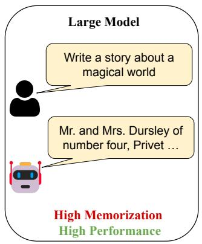

flowchart

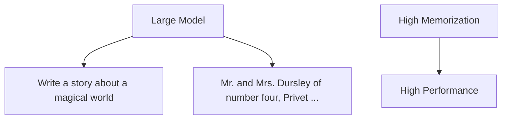

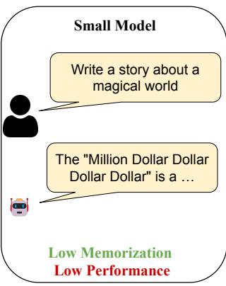

text_image

Small Model
Write a story about a magical world
The "Million Dollar Dollar Dollar" is a ...
Low Memorization
Low Performance

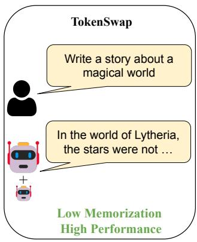

flowchart

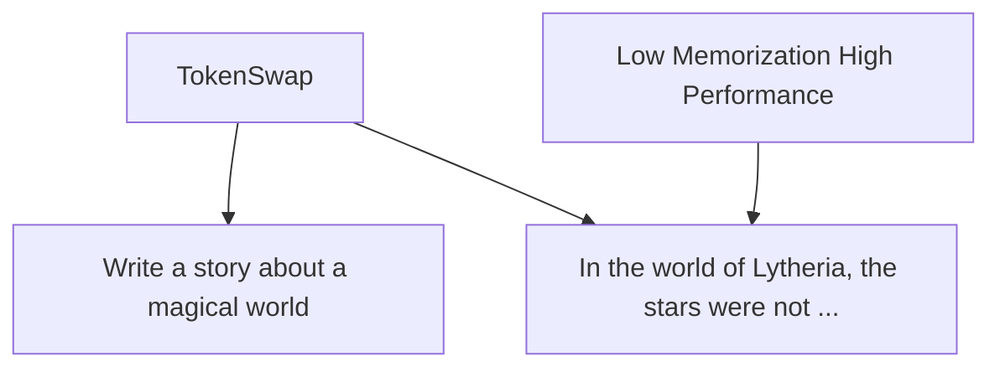

Figure 1: TOKENSWAP combines the strengths of large and small language models. Large models achieve high performance but exhibit high memorization. Small models have low memorization but poor performance (generating incoherent text). TOKENSWAP achieves both low memorization and high performance by selectively swapping token probabilities, generating novel, fluent text.

# 1 Introduction

Large language models (LLMs) such as GPT–4, GEMINI, and LLAMA have demonstrated strong performance across a wide range of tasks, from natural language understanding to complex reasoning [3, 65, 24]. These capabilities are driven by their massive parameter counts and extensive training corpora, enabling human-level fluency and impressive reasoning across domains. Often referred to as emergent properties, such abilities arise directly from scale, with well-established scaling laws predicting performance gains. However, increased scale also introduces a critical drawback: the tendency of LLMs to memorize and reproduce parts of their training data [15, 14, 11, 48].

One of the most pressing consequences of memorization is the verbatim or near-verbatim generation of training data [38, 66, 6]. Although memorization is an inherent property and not necessarily harmful, its consequence of verbatim generation leads to plagiarism and copyright violation. This behavior poses serious risks to both model providers and end-users. Providers may face legal challenges, including copyright infringement lawsuits [38, 29, 51], while users unknowingly risk legal liability by reproducing protected content. Crucially, the threat is not limited to exact substring matches: even approximate or near-verbatim outputs can constitute infringement, as evidenced by lawsuits like the New York Times case against OpenAI for near-verbatim content generation [28]. Moreover, verbatim generation can occur even in benign scenarios where users have no adversarial intent to extract training data [4, 21]. Users may unknowingly generate copyrighted content during routine interactions, exposing themselves to unintended legal risks [22].

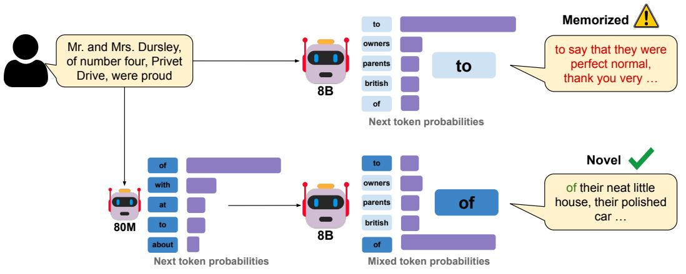

flowchart

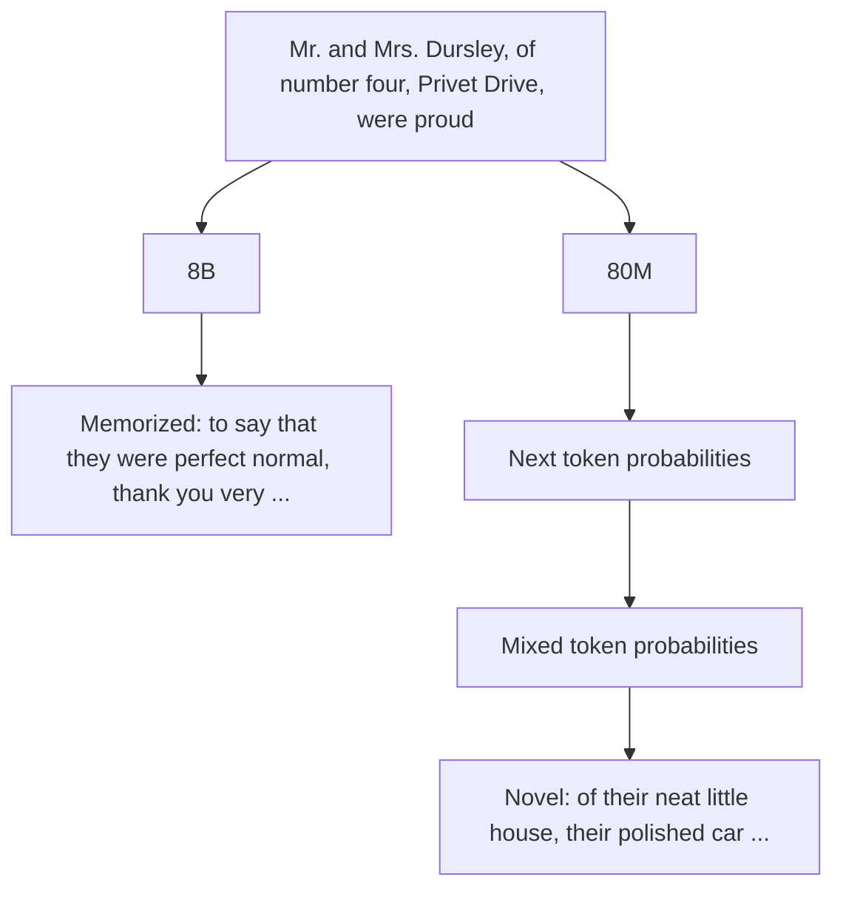

Figure 2: Overview of TOKENSWAP. Our approach replaces token probabilities of high-frequency "grammar-based" tokens with those from a small auxiliary language model. This mitigates memorized generation while maintaining fluency and model performance. The top path shows standard LLM generation, while the bottom path demonstrates how TOKENSWAP alters token selection to disrupt memorization and produce novel text.

We consider the perspective of a typical user of commerical LLMs such as GPT-4 [3], GEMINI [65], LLAMA [24], and DEEPSEEK [42]. These models do not share their training data and many do not make their weights publicly available. Even in cases where weights are openly shared, hosting a production-grade LLM requires substantial memory resources, rendering it impractical for the average user. Consequently, it is reasonable to assume that most users can only interact with these models through APIs hosted on external servers, with access limited to model outputs such as token-level logits. Despite these practical constraints, to our knowledge, none of the existing methods, whether designed to prevent memorization or mitigate verbatim output, can effectively operate under such limited access conditions.

Existing methods require access to training data and/or model weights Approaches to address memorization are broadly categorized into pre-training and post-training interventions. Pre-training methods include deduplication [37], differential privacy (DP) [2], and selective token exclusion during training [31]. While these approaches can reduce memorization, they often incur substantial computational costs and degrade model performance [7]. Post-training interventions focus on unlearning techniques that attempt to modify specific neurons and weights or utilize finetuning methods to prevent models from generating memorized content [44, 56, 18, 54]. However, these methods remain susceptible to training data extraction [60], often impair general model capabilities [34], and can lead to unintended forgetting of critical aspects such as safety guardrails [67]. This challenge is further complicated by theoretical findings suggesting that some degree of memorization may be inherent to achieving generalization in learning algorithms [8].

In contrast, another line of work focuses on preventing the generation of memorized content at inference time without modifying model weights. These approaches include blocking exact matches to training data [35] or combining logits from multiple models trained on disjoint datasets [1]. However, these methods too require access to training data or multiple LLMs trained on strictly disjoint datasets. Table 1 summarizes the various approaches and assumptions under which they operate (see Appendix A for a comprehensive review).

Memorization scales with size The propensity to reproduce training data consistently increases with the size of the language model [14, 11]. Since model performance generally scales positively with size, users are forced into a trade-off between obtaining high performance and mitigating memorized generations. Figure 3 demonstrates this relationship using a series of Pythia models, showing the trade-off between memorization and cross-entropy loss.

In this work, we present TOKENSWAP, an inference-time method that significantly alleviates this tradeoff by combining large model performance with small model memorization (Figure 3). TO-KENSWAP selectively replaces the probabilities of a subset of common grammar tokens $( \mathrm { e . g . , \tilde { \Omega } ^ { \mathrm { t h e } ^ { \mathrm { 3 } } } }$ , “of”, “and”) of the large main model with those from a small auxiliary model. This technique disrupts the verbatim generation by breaking the high-probability paths that lead to verbatim reproduction. This disruption has a cascading effect: once one token deviates from the memorized sequence, all subsequent predictions are conditioned on this altered context, further preventing reproduction. Importantly, since small models reliably approximate probabilities for common grammatical tokens, TOKENSWAP preserves the large model’s performance. For auxiliary models of size much smaller than the main model, this provides a verbatim memorization mitigation method which requires access neither to the training data nor the model weights. Since we treat the effect of memorization, and not the cause itself, our method is able to reduce verbatim generation at inference time.

We extensively evaluate TOKENSWAP through both controlled experiments and real-world deployments. In controlled fine-tuning experiments (Section 4.1), TOKENSWAP achieves a 50-800× reduction in verbatim generation compared to undefended models. Evaluations on commercial-grade models such as Pythia-6.9b and Llama-3-8b (Section 4.2) demonstrate reductions in verbatim generation by upto 10×, without compromising downstream task performance. Furthermore, comparisons with Goldfish [31] show that TOKENSWAP matches or surpasses the effectiveness of state-of-the-art pre-training methods (Section 4.3).

# 2 Preliminaries

# 2.1 Language Models: Notation and Setup

We consider auto-regressive language models that model the log-probability of a token conditioned on all previous tokens in a sequence. They operate over a vocabulary ${ \mathcal { V } } = \{ \dot { v } _ { 1 } , \dots , v _ { | \nu | } \}$ of typically $| \mathcal { V } | \approx 1 0 ^ { 5 } - 1 0 ^ { 6 }$ tokens. Given an input prompt $( x _ { - l _ { p } } , \dots , x _ { - 1 } ) \in \mathcal { V } ^ { l _ { p } }$ of length $l _ { p }$ followed by a response sequence $( x _ { 0 } , \dots , x _ { l - 1 } ) \in \mathcal { V } ^ { l }$ of length l, an auto-regressive language model parametrizes the joint probability by factorizing over conditional probabilities:

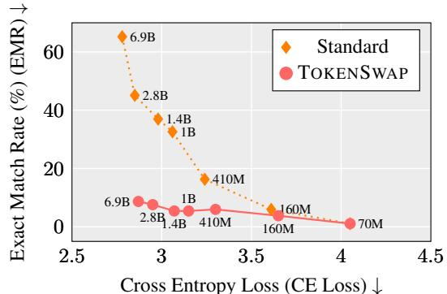

scatter

| Cross Entropy Loss (CE Loss) | Exact Match Rate (%) (EMR) | Model     |
| ---------------------------- | -------------------------- | --------- |
| 2.8                          | 6.9                        | Standard  |
| 2.9                          | 4.5                        | Standard  |
| 3.0                          | 3.8                        | Standard  |
| 3.1                          | 3.3                        | Standard  |
| 3.2                          | 2.0                        | Standard  |
| 3.3                          | 1.5                        | Standard  |
| 3.6                          | 0.5                        | Standard  |
| 3.7                          | 0.3                        | Standard  |
| 3.8                          | 0.2                        | Standard  |
| 3.9                          | 0.1                        | Standard  |
| 4.0                          | 0.0                        | Standard  |
| 2.8                          | 6.9                        | TOKENSWAP |
| 2.9                          | 4.5                        | TOKENSWAP |
| 3.0                          | 3.8                        | TOKENSWAP |
| 3.1                          | 3.3                        | TOKENSWAP |
| 3.2                          | 2.0                        | TOKENSWAP |
| 3.3                          | 1.5                        | TOKENSWAP |
| 3.4                          | 1.0                        | TOKENSWAP |
| 3.5                          | 0.5                        | TOKENSWAP |
| 3.6                          | 0.3                        | TOKENSWAP |
| 3.7                          | 0.2                        | TOKENSWAP |
| 3.8                          | 0.1                        | TOKENSWAP |
| 3.9                          | 0.0                        | TOKENSWAP |
| 4.0                          | 0.0                        | TOKENSWAP |

Figure 3: Memorization (EMR) vs Performance (CE Loss) across different model sizes. Larger, more capable models exhibit higher memorization. TOKENSWAP, with Pythia-70M as the auxiliary model, achieves low memorization rates while maintaining competitive performance. Details in Section 4.2 and Section 5.

Table 1: Comparison of TOKENSWAP with existing methods based on their assumptions. TO-KENSWAP uniquely avoids requiring access to model weights or the copyrighted training corpus. While it employs an auxiliary model, the memory overhead is small ≈ $1 \%$ due to the small size of the auxiliary model. PT: pre-training, UL: unlearning, FT: fine-tuning, Inf: inference-time. 

<table><tr><td></td><td>Model Access</td><td>Copyrighted Corpus Access</td><td>Inference Overhead</td></tr><tr><td>Deduplication [37] PT</td><td>weights</td><td>√</td><td>✕</td></tr><tr><td>Goldfish [31] PT</td><td>weights</td><td>√</td><td>✕</td></tr><tr><td>Balanced subnet [56] UL</td><td>weights</td><td>√</td><td>✕</td></tr><tr><td>Oblivate [54] FT</td><td>weights</td><td>√</td><td>✕</td></tr><tr><td>MemFree [35] Inf</td><td>logits</td><td>√</td><td>efficient querying</td></tr><tr><td>CP-Fuse [1] Inf</td><td>logits</td><td>√</td><td>twice of standard generation</td></tr><tr><td>TOKENSWAP Inf</td><td>logits</td><td>✕</td><td>small auxiliary model</td></tr></table>

$$
p (x _ {0}, \dots , x _ {l} | x _ {- l _ {p}}, \dots , x _ {- 1}) = \prod_ {i = 0} ^ {l} p (x _ {i} \mid x _ {<   i}), \tag {1}
$$

For each position i, the model outputs a distribution ${ \bf p } _ { i } [ v ]$ over V, where $\mathbf { p } _ { i } [ v ] = p ( x _ { i } = v | x _ { < i } )$ .

Since language models are trained to maximize the likelihood of observed sequences, they tend to assign high probabilities to tokens that frequently follow specific prefixes during training. This increases the risk of memorization and verbatim reproduction of training data.

# 2.2 Extractable Memorization

Memorization in language models can manifest in various ways, but a practically relevant and widely adopted framework is extractable memorization [15, 14]. Carlini et al. [15] demonstrate that models can be induced to regurgitate training sequences when prompted with prefixes from their training data. The following definition formalizes this concept:

Definition 1 (Extractable Memorization). A sequence $x = ( x _ { 0 } , \ldots , x _ { l - 1 } ) $ of length l is considered extractable with $l _ { p }$ tokens of context from a language model p if there exists a prefix $x _ { - } ~ = ~ ( x _ { - l _ { p } } , \ldots , x _ { - 1 } )$ of length $l _ { p }$ such that $[ x _ { - } \parallel x ]$ appears in the training data of $p ,$ and $p$ reproduces x via greedy decoding.

Formally, for each $i \in \mathbf { \bar { \{ 0 , \ldots , } }  l - 1 \}$ :

$$
x _ {i} = \arg \max _ {x ^ {\prime} \in \mathcal {V}} p \big (x ^ {\prime} | x _ {<   i}, x _ {-} \big).
$$

This definition is practically useful because: (1) it aligns with real-world risks of copyright and memorized generation [47, 38], (2) it provides a concrete, testable condition that can be evaluated on real models, and (3) it extends to models of different sizes, capturing the well-documented trend that larger models memorize more data [14, 11]. This scaling behavior is important in motivating our methodology in Section 3.

# 3 Methodology

As discussed earlier, small language models $( \mathrm { e . g . }$ , DistilGPT-2, Pythia-70M) have lower propensity to reproduce training data compared to large models $( \mathrm { e . g . }$ , Llama3, GPT-4). We introduce TOKENSWAP, a lightweight, post-hoc method that combines the strengths of both model scales: large-model performance with small-model memorization. During inference, TOKENSWAP replaces the probabilities for selected tokens of a large model with those a small model.

Algorithm Let $\mathbf { p } ^ { \mathrm { m a i n } }$ and $\mathbf { p } ^ { \mathrm { a u x } }$ denote the probability distributions of the main and auxiliary models respectively, where $\mathbf { p } ^ { \operatorname* { m a i n } } ( x _ { t } \mid x _ { < t } )$ and $\mathbf { p } ^ { \mathrm { a u } \dot { \mathbf { x } } } ( x _ { t } \mid x _ { < t } )$ represent their token probabilities conditioned on previous tokens. We assume the parameter count of the main model significantly exceeds that of the auxiliary model. Given these models, TOKENSWAP selectively replaces probabilities for a fixed subset of tokens $\mathcal G \subset \mathcal V$ . The complete procedure is formalized in Algorithm 1.

At each position i, TOKENSWAP queries both $\mathbf { p } ^ { \mathrm { m a i n } }$ and $\mathbf { p } ^ { \mathrm { a u x } }$ to obtain probability distributions conditioned on the current context $x _ { < i }$ . For tokens in subset $\mathcal { G } \subset \mathcal { V } ,$ probabilities from the main model are replaced with scaled probabilities from the auxiliary model, with scaling factor α ensuring the final distribution $\mathbf { p } ^ { \mathrm { f i n a l } }$ remains a valid distribution. This prevents reproduction of memorized sequences: if any token $x _ { i }$ in a memorized sequence belongs to ${ \mathcal { G } } ,$ its probability under $\mathbf { p } ^ { \mathrm { f i n a l } }$ is determined by the auxiliary model. Since the auxiliary model memorizes less, this disrupts the chain of conditional probabilities required for verbatim generation of most sequences. Importantly, for tokens $v \not \in { \mathcal { G } } ,$ their probabilities remain unchanged, i.e., ${ \bf p } _ { i } ^ { \mathrm { f u a l } } [ v ] = { \bf p } _ { i } ^ { \mathrm { m a i n } } [ \stackrel { \bullet } { v } ]$ .

Algorithm 1 TOKENSWAP   
Require: Main model $p^{main}$ , auxiliary model $p^{aux}$ , token subset G, prompt $x_{<0}$ 1: for $i = 0, 1, \ldots$ do

2: $\mathbf{p}_{i}^{\text{main}} \leftarrow \mathbf{p}^{\text{main}}(\cdot | x_{<i})$ {Get main model probabilities}

3: $\mathbf{p}_{i}^{\text{aux}} \leftarrow \mathbf{p}^{\text{aux}}(\cdot | x_{<i})$ {Get auxiliary model probabilities}

4: $\alpha \leftarrow \frac{\sum_{v \in G} \mathbf{p}_{i}^{\text{main}}[v]}{\sum_{v \in G} \mathbf{p}_{i}^{\text{aux}}[v]}$ {Compute normalization}

5: for $v \in V$ do

6: $\mathbf{p}_{i}^{\text{final}}[v] \leftarrow \begin{cases} \mathbf{p}_{i}^{\text{main}}[v], & \text{if } v \notin \mathcal{G} \\ \alpha \cdot \mathbf{p}_{i}^{\text{aux}}[v], & \text{if } v \in \mathcal{G} \end{cases}$ 7: end for

8: $x_{i} \sim p_{i}^{\text{final}}$ {Sample next token}

9: end for

Selecting G for Effective Memorization Disruption The choice of G affects both memorization and model performance. By modifying token probabilities, TOKENSWAP disrupts memorized sequences while preserving fluency. However, not all tokens are equally effective for this purpose. G should consist of tokens that frequently appear in memorized text, as replacing their probabilities reduces the likelihood of exact reproduction. At the same time, modifying inappropriate tokens can degrade model performance, especially for specialized tasks. For instance, if G includes numeric tokens, mathematical reasoning may degrade. Therefore, G should satisfy two key criteria. First, it must contain frequently occurring tokens. Second, it should avoid tokens where probability replacement impacts the model’s capabilities.

Empirical studies suggest that small models correctly approximate the probabilities of high-frequency function words while diverging more on rare or domain-specific terms [52]. Additionally, small language models (≈ 100M) can generate coherent and grammatically correct text [25]. Based on these insights, we construct G from grammar-based high-frequency tokens $( \mathrm { e . g . ~ \mathrm { ~ - ~ } ^ { \prime } t h e ^ { \prime } , \Delta ^ { \prime } i n ^ { \prime } } )$ Further, since G consists of high-frequency words, there exists a natural one-to-one mapping between tokens even when $\mathbf { p } ^ { \mathrm { m a i n } }$ and $\bar { \mathbf { p } } ^ { \mathrm { a u x } }$ use different tokenizers and vocabularies. While this approach is well-suited for natural language, structured domains such as code may require domain-specific adaptations. Additional details on the construction of G are provided in Appendix C.2 and C.3.

# 4 Experiments

In this section, we demonstrate the effectiveness of TOKENSWAP, in both controlled and real-world settings. Our experiments evaluate TOKENSWAP along two dimensions:

• The method’s efficacy in preventing exact and approximate reproduction of training data.   
• The impact on model performance across common-sense reasoning, language and fluency.

We evaluate TOKENSWAP across three settings to demonstrate its effectiveness. In Section 4.1, we deliberately induce memorization through extensive fine-tuning on small datasets to stress-test our defense. Section 4.2 evaluates TOKENSWAP on production-grade models including Pythia-6.9B and Llama-3-8B. Finally, in Section 4.3, we compare against Goldfish [31], a pre-training method specifically designed to reduce memorization, showing that our post-hoc approach achieves comparable results without requiring model retraining.

# 4.1 Extreme Memorization

In order to rigorously evaluate TOKENSWAP, we create an extreme test case by deliberately inducing memorization through extensive fine-tuning. While TOKENSWAP can be applied to real-world models directly, our baselines require specific experimental conditions for comparison. Similar extreme test cases have been generated to evaluate memorization in prior work [31, 1]. Following Abad et al. [1], we fine-tune a Llama-3.2-3B model [24] on 2,000-sequence subsets from two datasets: MathAbstracts [69] and WritingStories [27]. We train for 50 epochs to deliberately amplify memorization beyond typical levels.

Memorization Metrics Our analysis employs both exact and approximate memorization and performance metrics to ensure a comprehensive assessment. Exact memorization is measured through Matching Length (ML), which the number of verbatim characters or tokens generated before first deviation, and Exact Matching Rate (EMR), which computes the fraction of sequences reproduced verbatim. To capture partial memorization, we use the ROUGE-L score, which identifies the longest common non-contiguous subsequence and gives a score between 0 and 1, and the Normalized Levenshtein Distance, which quantifies the minimum number of edits needed to transform generated text into the original sequence. Lower scores indicate reduced memorization for Matching Length, Exact Matching Rate, and ROUGE-L. Higher scores are better for Normalized Levenshtein Distance. These metrics are widely used to evaluate verbatim and approximately verbatim generation [38, 31, 1].

Performance Metrics Since our setup intentionally induces extreme memorization, standard performance metrics are not meaningful. Nonetheless, we report cross-entropy loss on a held-out validation set in Appendix B.2.

Setup and Inference-time Baselines We compare against the two inference-time baselines: CP-Fuse [1], which samples from weighted combinations of models trained on disjoint datasets, and MemFree [35], which blocks exact n-gram matches to the training data. Standard refers to greedy decoding without any memorization mitigation. Both baselines rely on unrealistic assumptions-MemFree requires access to the training data, while CP-Fuse assumes access to two separately trained models on disjoint corpora. To assess CP-Fuse under more realistic conditions, we evaluate two variants: CP-FUSE HALF, with perfectly disjoint sets of 1,000 sequences each, and CP-FUSE MIXTURE, with 1,500 sequences per model and 500 overlapping. For TOKENSWAP, we employ DistilGPT-2 (80M) [57] as paux. We construct G with |G| = 110 tokens using high-frequency ’grammar-based’ words. Additional details on G are provided in Appendix C.2. For all experiments and methods, a prefix of 20 tokens is used and the next 128 tokens are greedily sampled.

Table 2: Comparison of memorization mitigation methods for WritingPrompts and MathAbstracts datasets. Memorization metrics: Matching Length (ML), Exact Match Rate (EMR), Normalized Levenshtein Distance (Levenshtein), ROUGE-L. Models used: Finetuned Llama-3.2-3B. 

<table><tr><td rowspan="2">Method</td><td colspan="4">WritingPrompts</td><td colspan="4">MathAbstracts</td></tr><tr><td>ML↓</td><td>EMR↓</td><td>ROUGE-L↓</td><td>Lev.↑</td><td>ML↓</td><td>EMR↓</td><td>ROUGE-L↓</td><td>Lev.↑</td></tr><tr><td>Standard</td><td>464.0</td><td>83.4</td><td>0.89</td><td>0.10</td><td>450.4</td><td>93.6</td><td>0.98</td><td>0.03</td></tr><tr><td>MemFree</td><td>17.4</td><td>0.0</td><td>0.29</td><td>0.63</td><td>6.7</td><td>0.0</td><td>0.44</td><td>0.55</td></tr><tr><td>CP-Fuse-mix</td><td>280.3</td><td>49.2</td><td>0.58</td><td>0.37</td><td>233.7</td><td>47.1</td><td>0.62</td><td>0.36</td></tr><tr><td>CP-Fuse-half</td><td>12.5</td><td>0.0</td><td>0.17</td><td>0.73</td><td>15.3</td><td>0.1</td><td>0.26</td><td>0.71</td></tr><tr><td>TOKENSWAP</td><td>19.7</td><td>0.1</td><td>0.19</td><td>0.71</td><td>53.0</td><td>1.8</td><td>0.38</td><td>0.60</td></tr></table>

Results Table 2 demonstrates TOKENSWAP’s effectiveness in reducing memorization across both datasets. For WritingPrompts, TOKENSWAP reduces EMR by 800x (from 83.4% to 0.1%) and ROUGE-L by 4.6x (from 0.89 to 0.19) compared to standard generation. On MathAbstracts, EMR decreases by 50x (from 93.6% to 1.8%) and ROUGE-L by 2.6x (from 0.98 to 0.38). CP-Fuse-half achieves slightly better results but requires disjoint training sets, while CP-Fuse-mix performs significantly worse due to dataset overlap. MemFree achieves the lowest scores on the exact memorization metrics (Exact Matching Rate and Matching Length) but performs poorly on approximate memorization metrics (ROUGE-L and Levenshtein). This shows that, while MemFree prevents verbatim generation, it still allows high levels of near-verbatim generation. The performance gap between

# Original Suffix

grew from millions to billions the shared mana per person is now negligible. A group of astronauts helplessly watching the Earth perish experience...

# Standard Generation

grew from millions to billions the shared mana per person is now negligible. A group of astronauts helplessly watching the Earth perish experience...

# TOKENSWAP Generation

grew and the number of wizards and witches declined, the world began to suffer. Now the world suffers from a lack of magic, and the government is tasked with...

Figure 4: Comparison of text generation methods. Red text indicates memorized content. Standard generation reproduces the entire suffix verbatim, while TOKENSWAP generates novel content.

WritingPrompts (EMR: 0.1%) and MathAbstracts (EMR: 1.8%) aligns with our intuition - G was designed focusing on natural language tasks. Nevertheless, TOKENSWAP achieves substantial memorization reduction for both domains. To complement our quantitative results, we provide qualitative examples of generations from the WritingPrompts dataset in Figure 4 and Appendix E.

# 4.2 Memorization in the wild

In this section, we demonstrate the efficacy of our approach on production-grade models. We assess the effectiveness of TOKENSWAP on two pre-trained models: Pythia-6.9B [12] and Llama-3-8B [24].

Pile-Memorized Dataset For Pythia-6.9B, we evaluate on memorized sequences identified by Chang et al. [16] from the Pile dataset, consisting of 32-token prefixes and 48-token suffixes. After filtering to retain only natural language content (excluding code, URLs, etc.), we obtain 184 evaluation examples.

LeetCode Dataset For Llama-3-8B, following previous work demonstrating LeetCode problem memorization [38], we evaluate on 1,825 LeetCode problem statements [30]. These problem statements are written in natural language. Since the exact format of LeetCode problems in Llama’s training data is unknown, we remove punctuation while calculating the memorization metrics. Additionally, instead of exact match rate, we use ROUGE-L > 0.8 as our threshold for identifying memorized content. Prefix length of 20 tokens is used and the next 100 tokens are sampled.

Evaluation Setup We face two key limitations when comparing TOKENSWAP with existing baselines. CP-Fuse requires models trained on disjoint datasets, but verifying this is difficult since most LLMs do not release training data. Even when available, disjoint datasets are unlikely given that most models train on overlapping web corpora like Common Crawl. Additionally, CP-Fuse requires identical tokenizers, limiting comparisons to models within the same family. Similarly, we cannot evaluate against MemFree due to unavailable training data (LLaMA) or prohibitively large datasets (Pythia uses the 800GB Pile [12]). To ensure fair evaluation for CP-Fuse, we paired each model with a smaller counterpart: Pythia-2.8B with Pythia-6.9B, and Llama-3.2-3B with Llama-3-8B. Using smaller models actually favors CP-Fuse since they memorize less. We avoid very small models (<100M) as CP-Fuse needs roughly equally capable models (see Appendix C.1.4). The setup for TOKENSWAP follows Section 4.1. For LeetCode evaluation, we use both DistilGPT-2 and SmolLM-135M [5] as auxiliary models. SmolLM is an instruction-tuned model, which enables evaluation on instruction-following tasks like MT-Bench where an instruct-capable auxiliary model is required. For memorization, we use the same metrics as Section 4.1.

Performance Metrics We evaluate two key aspects: task performance and generation quality. For task performance, we assess five-shot learning on multiple commonsense reasoning benchmarks: BoolQ [19], SIQA [58], PIQA [13], ARC-Challenge [20], ARC-Easy [20], OBQA [45], and Wino-Grande [55]. For generation quality, we report cross-entropy loss on samples from Slimpajama [61], which correlates with fluency [10] and has been used to evaluate prior memorization mitigation work [31, 1]. We also evaluate on MT-Bench [70], which tests multi-turn conversation, instructionfollowing, and generation quality through realistic conversational scenarios. Note that MT-Bench and commonsense reasoning results are only reported for Llama-3-8B (LeetCode Dataset) since these require instruction-following capabilities not available in the base Pythia models.

Table 3: Comparison of mitigation methods for LeetCode and Pile-Memorized datasets. Memorization metrics: Matching Length (ML), Exact Match Rate (EMR), Normalized Levenshtein Distance (Levenshtein), ROUGE-L & Performance metrics: Cross Entropy Loss (CE Loss) on SlimPajama, MT-Bench with GPT-4 as a judge, Mean of scores on Commonsense Reasoning benchmarks. Models used: Llama-3-8B and Pythia-6.9B. 

<table><tr><td colspan="8">LeetCode Dataset (Llama)</td></tr><tr><td>Method</td><td colspan="7">ML ↓ ROUGE-L &gt; 0.8 ↓ ROUGE-L ↓ Lev. ↑|CE Loss ↓|MT-Bench ↑|Commonsense ↑</td></tr><tr><td>Standard</td><td>24.57</td><td>9.65</td><td>0.39</td><td>0.60</td><td>2.38</td><td>7.75</td><td>71.87</td></tr><tr><td>CP-Fuse</td><td>19.44</td><td>7.01</td><td>0.37</td><td>0.61</td><td>2.45</td><td>8.53</td><td>70.18</td></tr><tr><td> $TOKENSWAP ^{1}$ </td><td>6.04</td><td>0.96</td><td>0.27</td><td>0.71</td><td>2.52</td><td>-</td><td>71.87</td></tr><tr><td> $TOKENSWAP ^{2}$ </td><td>8.58</td><td>1.92</td><td>0.30</td><td>0.69</td><td>2.43</td><td>7.78</td><td>-</td></tr></table>

Pile-Memorized Dataset (Pythia) 

<table><tr><td>Method</td><td>ML ↓</td><td>EMR ↓</td><td>ROUGE-L ↓</td><td>Lev. ↑</td><td>CE Loss ↓</td></tr><tr><td>Standard</td><td>151.6</td><td>65.22</td><td>0.80</td><td>0.18</td><td>2.80</td></tr><tr><td>CP-Fuse</td><td>97.05</td><td>29.35</td><td>0.62</td><td>0.35</td><td>2.81</td></tr><tr><td> $TOKENSWAP^1$ </td><td>35.10</td><td>5.98</td><td>0.38</td><td>0.56</td><td>2.88</td></tr></table>

1DistilGPT-2 as auxiliary model. 2SmolLM-135M as auxiliary model.

Results Table 3 demonstrates that TOKENSWAP substantially reduces memorization across both datasets compared to standard generation and CP-Fuse. Exact match rate decreases by over 10x compared to standard generation and 5-7x compared to CP-Fuse on both datasets. The average matching length shows similar improvements, reducing by 4-5x versus standard and 3-4x versus CP-Fuse. The consistent improvements in approximate memorization metrics (ROUGE-L and Levenshtein distance) demonstrate that TOKENSWAP robustly prevents verbatim generation rather than simply introducing small perturbations. CP-Fuse shows limited effectiveness in these real-world scenarios primarily because its core assumption of disjoint training datasets does not hold. Even when using different models, the inherent overlap in web-scale training corpora prevents CP-Fuse from effectively disrupting memorized sequences.

TOKENSWAP maintains task performance by selectively targeting only grammar-based tokens, leaving reasoning-critical content words unchanged. This preserves commonsense reasoning abilities, as shown by identical accuracy scores (71.87%) compared to standard generation. The method also maintains fluency, evidenced by minimal cross-entropy increases and nearly equal MT-Bench scores. While CP-Fuse achieves better conversational performance (8.53 vs 7.78), it fails to verbatim generation, making it unsuitable for the desired goal.

Evaluation on OLMo-2-13B. To further validate TOKENSWAP on a fully open model with known training data, we evaluate TOKENSWAP on OLMo-2-13B [49]. The full training corpus contains 3T tokens, making exhaustive memorization search infeasible. We therefore focus on the Wikipedia subset of the training data. Results in Appendix B.1 show that TOKENSWAP eliminates exact verbatim generation (EMR=0) and substantially reduces approximate memorization.

# 4.3 Comparison with Pre-training Methods

While previous sections demonstrate that TOKENSWAP outperforms post-hoc baselines, we also compare with Goldfish [31], a pre-training approach that reduces memorization by excluding a fraction $1 / k$ of tokens from loss computation during training. Since pre-training large models using this loss is expensive, we evaluate on pre-trained goldfish models from Hans et al. [31]. These models were trained on a subset of RedPajama [68] combined with 2000 Wikipedia sequences. To induce memorization, the Wikipedia sequences were duplicated 50 times during training. We compare against models trained with $k \in \{ 3 , 4 , 3 2 \}$ . For TOKENSWAP, we maintain the same experimental setup from Section 4.1. Following Hans et al. [31], we use identical prefix and suffix lengths for extraction of memorized sequences.

Table 4: Comparison of TOKENSWAP with Goldfish [31] for $\mathbf { k } \in \{ 3 , 4 , 3 2 \}$ . Memorization metrics: Matching Length (ML), Exact Match Rate (EMR), Normalized Levenshtein Distance (Levenshtein), ROUGE-L & Performance metrics: Cross Entropy Loss (CE Loss) on SlimPajama. 

<table><tr><td>Method</td><td>ML↓</td><td>EMR↓</td><td>ROUGE-L↓</td><td>Levenshtein↑</td><td>CE Loss↓</td></tr><tr><td>Standard</td><td>73.9</td><td>7.8</td><td>0.38</td><td>0.58</td><td>3.44</td></tr><tr><td>Goldfish (k=3)</td><td>12.7</td><td>0.0</td><td>0.23</td><td>0.72</td><td>3.54</td></tr><tr><td>Goldfish (k=4)</td><td>14.7</td><td>0.0</td><td>0.23</td><td>0.71</td><td>3.50</td></tr><tr><td>Goldfish (k=32)</td><td>58.1</td><td>2.5</td><td>0.35</td><td>0.60</td><td>3.44</td></tr><tr><td>TOKENSWAP</td><td>12.4</td><td>0.1</td><td>0.22</td><td>0.72</td><td>3.44</td></tr><tr><td>TOKENSWAP + Goldfish (k=3)</td><td>7.9</td><td>0.0</td><td>0.21</td><td>0.73</td><td>3.57</td></tr></table>

Results Table 4 shows TOKENSWAP achieves comparable or superior performance to Goldfish across all memorization metrics. Notably, TOKENSWAP obtains the best Matching Length, Rouge-L and Normalized Levenshtein distance scores while maintaining better cross-entropy than the Goldfish variants for $k = 3 , 4$ . The effectiveness of Goldfish varies with parameter k - smaller values (more aggressive token exclusion) yield stronger memorization reduction but worse performance, as evidenced by higher cross-entropy. This illustrates a key advantage of TOKENSWAP: we achieve similar memorization reduction without requiring modified training or reduced training data tokens. Figure 5 (Appendix B.7) further supports this finding, showing nearly identical ROUGE-L score distributions between TOKENSWAP and Goldfish (k=3), indicating that our post-hoc approach matches the most aggressive pre-training variant. Furthermore, applying TOKENSWAP to Goldfish $\left( k = 3 \right)$ as the main model reduces memorization more than either method alone, demonstrating that our approach is orthogonal to pre-training methods and can enhance existing techniques.

# 5 Discussion and Limitations

In this section, we analyze TOKENSWAP’s behavior across different settings. We first perform ablations on the auxiliary model choice and the size of G. We then analyze TOKENSWAP across the Pythia model family to demonstrate significant improvements in the performance-memorization tradeoff. Finally, we discuss limitations and potential extensions of our method.

Choice of the Auxiliary Model In Section 4 we test TOKENSWAP with DistilGPT-2 as the auxiliary model. A natural question arises: What auxiliary model should one choose and how does the size of the auxiliary model affect memorized generation? To answer this, we use the SmolLM family [5] with three sizes (135M, 360M, 1.7B) and evaluate on both Pythia-6.9B (Pile-memorized dataset) and Llama-3-8B (LeetCode dataset). Detailed results are in Table 10 (Appendix B.6).

We observe a clear trend: smaller auxiliary models lead to less verbatim generation, confirming our hypothesis that TOKENSWAP’s effectiveness stems from low memorization in auxiliary models. Importantly, auxiliary model size has minimal impact on performance. MT-Bench scores show negligible variation across auxiliary models—this is particularly significant since MT-Bench evaluates overall sequence generation quality, unlike cross-entropy loss which measures token-level accuracy. Therefore, any small model (≈ 100M) which can generate fluent text and predict grammar-based tokens well, such as DistilGPT-2 or SmolLM-135M, can be used effectively as an auxiliary model.

Ablations on G The subset of tokens G is constructed by selecting grammar-based words from the top 500 most frequent English words, resulting in $| \mathcal { G } | = 1 \mathrm { i } 0$ (details in Appendix C.2). To understand the impact of G size on memorization reduction, we ablate by constructing G from the top k most frequent words for $k \in \{ 1 0 , 5 0 , 1 0 0 , 5 0 0 , 2 5 0 0 \}$ , yielding $| \mathcal { G } | \in \{ 9 , 4 3 , 6 6 , \bar { 1 } 1 0 , 1 3 6 \}$ . We evaluate on the Pile-memorized task using Pythia-6.9B as the main model and Pythia-70M as auxiliary (see Appendix B.5 for complete results). We observe a clear trend: as |G| increases, memorization decreases significantly. For example, EMR drops from 22.28% $( | \mathcal { G } | = 9 )$ to 8.15% $( | \mathcal { G } | = 1 3 6 )$ . This makes intuitive sense—larger G enables the auxiliary model to disrupt memorized sequences more frequently. The cross-entropy loss remains largely stable, indicating minimal performance degradation with increase in |G|.

Performance-Memorization Tradeoff We analyze how TOKENSWAP affects the tradeoff between model performance and memorization across seven Pythia models (70M to 6.9B parameters), using Pythia-70M as the auxiliary model. Figure 3 shows exact match rate (EMR) versus cross-entropy loss—lower values are better for both metrics. Standard generation faces a severe tradeoff: reducing memorization from 45% to 6% EMR costs 0.7 points in cross-entropy (2.85 → 3.55). TOKENSWAP considerably improves this tradeoff. At similar performance levels (cross-entropy ≈ 2.87), TO-KENSWAP achieves 8.7% EMR versus 45% for standard models—an 8× memorization reduction. Even when targeting very low memorization (6% EMR), TOKENSWAP maintains cross-entropy at 3.07, significantly outperforming standard models at equivalent memorization levels.

Limitations and Future work One limitation of our work is that in the rare cases where the small auxiliary model memorizes a sequence, our approach will preserve that memorization. However, in practice, small auxiliary models (≈ 100M parameters) memorize very little, and we empirically match or outperform existing baselines without requiring access to training data or restrictive assumptions like disjoint datasets. Additionally, while pre-training or unlearning mitigation methods are impractical for large models, they can be applied to small models since these are often open-source with accessible training data. Therefore, we expect future development in small models with low memorization. This makes our work even more significant: any advance in pre-training or unlearning methods to reduce memorization in small models can be immediately extended to large models using TOKENSWAP. Second, our current implementation focuses on natural language tasks. A promising direction for future work is extending TOKENSWAP to other domains such as code generation.

# 6 Conclusion

TOKENSWAP offers several key advantages for mitigating memorized generation in language models: it operates without requiring access to model weights or training data, and makes no assumptions about the underlying training distribution. Our experiments demonstrate 10-800× reductions in verbatim generation, matching or exceeding baselines that assume access to training data, disjoint models, or require pre-training their own models. Importantly, this comes at minimal cost to model performance. TOKENSWAP maintains performance on commonsense reasoning tasks, and our MT-Bench evaluation shows that it preserves fluency, instruction-following, and conversational abilities. This makes TOKENSWAP a practical solution for both providers and users of LLMs.

# Acknowledgments and Disclosure of Funding

The authors would like to thank the anonymous reviewers and A. Feder Cooper for their valuable feedback and comments. We would also like to acknowledge the support from NSF awards IIS-2340124, IIS-2420691, and IIS-2420577, and NIH grant U54HG012510.

# References

[1] Javier Abad, Konstantin Donhauser, Francesco Pinto, and Fanny Yang. Copyright-protected language generation via adaptive model fusion. arXiv preprint arXiv:2412.06619, 2024.   
[2] Martin Abadi, Andy Chu, Ian Goodfellow, H Brendan McMahan, Ilya Mironov, Kunal Talwar, and Li Zhang. Deep learning with differential privacy. In Proceedings of the 2016 ACM SIGSAC conference on computer and communications security, pages 308–318, 2016.   
[3] Josh Achiam, Steven Adler, Sandhini Agarwal, Lama Ahmad, Ilge Akkaya, Florencia Leoni Aleman, Diogo Almeida, Janko Altenschmidt, Sam Altman, Shyamal Anadkat, et al. Gpt-4 technical report. arXiv preprint arXiv:2303.08774, 2023.   
[4] Michael Aerni, Javier Rando, Edoardo Debenedetti, Nicholas Carlini, Daphne Ippolito, and Florian Tramèr. Measuring non-adversarial reproduction of training data in large language models. arXiv preprint arXiv:2411.10242, 2024.   
[5] Loubna Ben Allal, Anton Lozhkov, Elie Bakouch, Gabriel Martín Blázquez, Guilherme Penedo, Lewis Tunstall, Andrés Marafioti, Hynek Kydlícek, Agustín Piqueres Lajarín, Vaibhav Srivastav, ˇ et al. Smollm2: When smol goes big–data-centric training of a small language model. arXiv preprint arXiv:2502.02737, 2025.   
[6] Zeyuan Allen-Zhu and Yuanzhi Li. Physics of language models: Part 3.3, knowledge capacity scaling laws. arXiv preprint arXiv:2404.05405, 2024.   
[7] Rohan Anil, Badih Ghazi, Vineet Gupta, Ravi Kumar, and Pasin Manurangsi. Large-scale differentially private bert. arXiv preprint arXiv:2108.01624, 2021.   
[8] Idan Attias, Gintare Karolina Dziugaite, Mahdi Haghifam, Roi Livni, and Daniel M Roy. Information complexity of stochastic convex optimization: Applications to generalization and memorization. arXiv preprint arXiv:2402.09327, 2024.   
[9] George-Octavian Barbulescu and Peter Triantafillou. To each (textual sequence) its own: Improving memorized-data unlearning in large language models. arXiv preprint arXiv:2405.03097, 2024.   
[10] Sourya Basu, Govardana Sachitanandam Ramachandran, Nitish Shirish Keskar, and Lav R Varshney. Mirostat: A neural text decoding algorithm that directly controls perplexity. arXiv preprint arXiv:2007.14966, 2020.   
[11] Stella Biderman, Usvsn Prashanth, Lintang Sutawika, Hailey Schoelkopf, Quentin Anthony, Shivanshu Purohit, and Edward Raff. Emergent and predictable memorization in large language models. Advances in Neural Information Processing Systems, 36:28072–28090, 2023.   
[12] Stella Biderman, Hailey Schoelkopf, Quentin Gregory Anthony, Herbie Bradley, Kyle O’Brien, Eric Hallahan, Mohammad Aflah Khan, Shivanshu Purohit, USVSN Sai Prashanth, Edward Raff, et al. Pythia: A suite for analyzing large language models across training and scaling. In International Conference on Machine Learning, pages 2397–2430. PMLR, 2023.   
[13] Yonatan Bisk, Rowan Zellers, Jianfeng Gao, Yejin Choi, et al. Piqa: Reasoning about physical commonsense in natural language. In Proceedings of the AAAI conference on artificial intelligence, volume 34, pages 7432–7439, 2020.   
[14] Nicholas Carlini, Daphne Ippolito, Matthew Jagielski, Katherine Lee, Florian Tramer, and Chiyuan Zhang. Quantifying memorization across neural language models. In The Eleventh International Conference on Learning Representations, 2022.   
[15] Nicholas Carlini, Florian Tramer, Eric Wallace, Matthew Jagielski, Ariel Herbert-Voss, Katherine Lee, Adam Roberts, Tom Brown, Dawn Song, Ulfar Erlingsson, et al. Extracting training data from large language models. In 30th USENIX security symposium (USENIX Security 21), pages 2633–2650, 2021.

[16] Ting-Yun Chang, Jesse Thomason, and Robin Jia. Do localization methods actually localize memorized data in llms? a tale of two benchmarks. In Proceedings of the 2024 Conference of the North American Chapter of the Association for Computational Linguistics: Human Language Technologies (Volume 1: Long Papers), pages 3190–3211, 2024.   
[17] Charlie Chen, Sebastian Borgeaud, Geoffrey Irving, Jean-Baptiste Lespiau, Laurent Sifre, and John Jumper. Accelerating large language model decoding with speculative sampling. arXiv preprint arXiv:2302.01318, 2023.   
[18] Tong Chen, Faeze Brahman, Jiacheng Liu, Niloofar Mireshghallah, Weijia Shi, Pang Wei Koh, Luke Zettlemoyer, and Hannaneh Hajishirzi. Parapo: Aligning language models to reduce verbatim reproduction of pre-training data. arXiv preprint arXiv:2504.14452, 2025.   
[19] Christopher Clark, Kenton Lee, Ming-Wei Chang, Tom Kwiatkowski, Michael Collins, and Kristina Toutanova. Boolq: Exploring the surprising difficulty of natural yes/no questions. arXiv preprint arXiv:1905.10044, 2019.   
[20] Peter Clark, Isaac Cowhey, Oren Etzioni, Tushar Khot, Ashish Sabharwal, Carissa Schoenick, and Oyvind Tafjord. Think you have solved question answering? try arc, the ai2 reasoning challenge. arXiv preprint arXiv:1803.05457, 2018.   
[21] A Feder Cooper and James Grimmelmann. The files are in the computer: on copyright, memorization, and generative ai. Chi.-Kent L. Rev., 100:141, 2025.   
[22] Amy B Cyphert. Generative ai, plagiarism, and copyright infringement in legal documents. Minn. JL Sci. & Tech., 25:49, 2023.   
[23] Mark Davies. The corpus of contemporary american english as the first reliable monitor corpus of english. Literary and linguistic computing, 25(4):447–464, 2010.   
[24] Abhimanyu Dubey, Abhinav Jauhri, Abhinav Pandey, Abhishek Kadian, Ahmad Al-Dahle, Aiesha Letman, Akhil Mathur, Alan Schelten, Amy Yang, Angela Fan, et al. The llama 3 herd of models. arXiv e-prints, pages arXiv–2407, 2024.   
[25] Ronen Eldan and Mark Russinovich. Who’s harry potter? approximate unlearning in llms. arXiv preprint arXiv:2310.02238, 2023.   
[26] Niva Elkin-Koren, Uri Hacohen, Roi Livni, and Shay Moran. Can copyright be reduced to privacy? arXiv preprint arXiv:2305.14822, 2023.   
[27] Angela Fan, Mike Lewis, and Yann Dauphin. Hierarchical neural story generation. arXiv preprint arXiv:1805.04833, 2018.   
[28] Joshua Freeman, Chloe Rippe, Edoardo Debenedetti, and Maksym Andriushchenko. Exploring memorization and copyright violation in frontier llms: A study of the new york times v. openai 2023 lawsuit. arXiv preprint arXiv:2412.06370, 2024.   
[29] Michael M Grynbaum and Ryan Mac. The times sues openai and microsoft over ai use of copyrighted work. The New York Times, 27(1), 2023.   
[30] gzipChrist. Leetcode problem dataset, 2021.   
[31] Abhimanyu Hans, John Kirchenbauer, Yuxin Wen, Neel Jain, Hamid Kazemi, Prajwal Singhania, Siddharth Singh, Gowthami Somepalli, Jonas Geiping, Abhinav Bhatele, et al. Be like a goldfish, don’t memorize! mitigating memorization in generative llms. Advances in Neural Information Processing Systems, 37:24022–24045, 2024.   
[32] Valentin Hartmann, Anshuman Suri, Vincent Bindschaedler, David Evans, Shruti Tople, and Robert West. Sok: Memorization in general-purpose large language models, 2023.   
[33] Zhiqiang Hu, Lei Wang, Yihuai Lan, Wanyu Xu, Ee-Peng Lim, Lidong Bing, Xing Xu, Soujanya Poria, and Roy Lee. Llm-adapters: An adapter family for parameter-efficient fine-tuning of large language models. In Proceedings of the 2023 conference on empirical methods in natural language processing, pages 5254–5276, 2023.

[34] Jing Huang, Diyi Yang, and Christopher Potts. Demystifying verbatim memorization in large language models, 2024.   
[35] Daphne Ippolito, Florian Tramèr, Milad Nasr, Chiyuan Zhang, Matthew Jagielski, Katherine Lee, Christopher A Choquette-Choo, and Nicholas Carlini. Preventing verbatim memorization in language models gives a false sense of privacy. arXiv preprint arXiv:2210.17546, 2022.   
[36] Joel Jang, Dongkeun Yoon, Sohee Yang, Sungmin Cha, Moontae Lee, Lajanugen Logeswaran, and Minjoon Seo. Knowledge unlearning for mitigating privacy risks in language models. arXiv preprint arXiv:2210.01504, 2022.   
[37] Nikhil Kandpal, Eric Wallace, and Colin Raffel. Deduplicating training data mitigates privacy risks in language models. In International Conference on Machine Learning, pages 10697– 10707. PMLR, 2022.   
[38] Antonia Karamolegkou, Jiaang Li, Li Zhou, and Anders Søgaard. Copyright violations and large language models. arXiv preprint arXiv:2310.13771, 2023.   
[39] Sehoon Kim, Karttikeya Mangalam, Suhong Moon, Jitendra Malik, Michael W Mahoney, Amir Gholami, and Kurt Keutzer. Speculative decoding with big little decoder. Advances in Neural Information Processing Systems, 36:39236–39256, 2023.   
[40] Yaniv Leviathan, Matan Kalman, and Yossi Matias. Fast inference from transformers via speculative decoding. In International Conference on Machine Learning, pages 19274–19286. PMLR, 2023.   
[41] Xiang Lisa Li, Ari Holtzman, Daniel Fried, Percy Liang, Jason Eisner, Tatsunori B Hashimoto, Luke Zettlemoyer, and Mike Lewis. Contrastive decoding: Open-ended text generation as optimization. In Proceedings of the 61st annual meeting of the association for computational linguistics (volume 1: Long papers), pages 12286–12312, 2023.   
[42] Aixin Liu, Bei Feng, Bing Xue, Bingxuan Wang, Bochao Wu, Chengda Lu, Chenggang Zhao, Chengqi Deng, Chenyu Zhang, Chong Ruan, et al. Deepseek-v3 technical report. arXiv preprint arXiv:2412.19437, 2024.   
[43] Edward Loper and Steven Bird. Nltk: The natural language toolkit. arXiv preprint cs/0205028, 2002.   
[44] Pratyush Maini, Michael C Mozer, Hanie Sedghi, Zachary C Lipton, J Zico Kolter, and Chiyuan Zhang. Can neural network memorization be localized? arXiv preprint arXiv:2307.09542, 2023.   
[45] Todor Mihaylov, Peter Clark, Tushar Khot, and Ashish Sabharwal. Can a suit of armor conduct electricity? a new dataset for open book question answering. arXiv preprint arXiv:1809.02789, 2018.   
[46] Fatemehsadat Mireshghallah, Archit Uniyal, Tianhao Wang, David Evans, and Taylor Berg-Kirkpatrick. Memorization in nlp fine-tuning methods. arXiv preprint arXiv:2205.12506, 2022.   
[47] Milad Nasr, Nicholas Carlini, Jonathan Hayase, Matthew Jagielski, A Feder Cooper, Daphne Ippolito, Christopher A Choquette-Choo, Eric Wallace, Florian Tramèr, and Katherine Lee. Scalable extraction of training data from (production) language models. arXiv preprint arXiv:2311.17035, 2023.   
[48] Milad Nasr, Javier Rando, Nicholas Carlini, Jonathan Hayase, Matthew Jagielski, A Feder Cooper, Daphne Ippolito, Christopher A Choquette-Choo, Florian Tramèr, and Katherine Lee. Scalable extraction of training data from aligned, production language models. In The Thirteenth International Conference on Learning Representations, 2025.   
[49] Team OLMo, Pete Walsh, Luca Soldaini, Dirk Groeneveld, Kyle Lo, Shane Arora, Akshita Bhagia, Yuling Gu, Shengyi Huang, Matt Jordan, Nathan Lambert, Dustin Schwenk, Oyvind Tafjord, Taira Anderson, David Atkinson, Faeze Brahman, Christopher Clark, Pradeep Dasigi, Nouha

Dziri, Allyson Ettinger, Michal Guerquin, David Heineman, Hamish Ivison, Pang Wei Koh, Jiacheng Liu, Saumya Malik, William Merrill, Lester James V. Miranda, Jacob Morrison, Tyler Murray, Crystal Nam, Jake Poznanski, Valentina Pyatkin, Aman Rangapur, Michael Schmitz, Sam Skjonsberg, David Wadden, Christopher Wilhelm, Michael Wilson, Luke Zettlemoyer, Ali Farhadi, Noah A. Smith, and Hannaneh Hajishirzi. 2 olmo 2 furious, 2025.   
[50] Mustafa Ozdayi, Charith Peris, Jack FitzGerald, Christophe Dupuy, Jimit Majmudar, Haidar Khan, Rahil Parikh, and Rahul Gupta. Controlling the extraction of memorized data from large language models via prompt-tuning. In Proceedings of the 61st Annual Meeting of the Association for Computational Linguistics (Volume 2: Short Papers), pages 1512–1521, 2023.   
[51] Aklovya Panwar. Generative ai and copyright issues globally: Ani media v openai. Tech Policy Press. Noudettu, pages 27–03, 2025.   
[52] Andrea Pinto, Tomer Galanti, and Randall Balestriero. The fair language model paradox. arXiv preprint arXiv:2410.11985, 2024.   
[53] Francesco Pinto, Nathalie Rauschmayr, Florian Tramèr, Philip Torr, and Federico Tombari. Extracting training data from document-based vqa models. arXiv preprint arXiv:2407.08707, 2024.   
[54] Mark Russinovich and Ahmed Salem. Obliviate: Efficient unmemorization for protecting intellectual property in large language models. arXiv preprint arXiv:2502.15010, 2025.   
[55] Keisuke Sakaguchi, Ronan Le Bras, Chandra Bhagavatula, and Yejin Choi. Winogrande: An adversarial winograd schema challenge at scale. Communications of the ACM, 64(9):99–106, 2021.   
[56] Mansi Sakarvadia, Aswathy Ajith, Arham Khan, Nathaniel Hudson, Caleb Geniesse, Kyle Chard, Yaoqing Yang, Ian Foster, and Michael W Mahoney. Mitigating memorization in language models. arXiv preprint arXiv:2410.02159, 2024.   
[57] Victor Sanh, Lysandre Debut, Julien Chaumond, and Thomas Wolf. Distilbert, a distilled version of bert: smaller, faster, cheaper and lighter. arXiv preprint arXiv:1910.01108, 2019.   
[58] Maarten Sap, Hannah Rashkin, Derek Chen, Ronan LeBras, and Yejin Choi. Socialiqa: Commonsense reasoning about social interactions. arXiv preprint arXiv:1904.09728, 2019.   
[59] Avi Schwarzschild, Zhili Feng, Pratyush Maini, Zachary Lipton, and J Zico Kolter. Rethinking llm memorization through the lens of adversarial compression. Advances in Neural Information Processing Systems, 37:56244–56267, 2024.   
[60] Ilia Shumailov, Jamie Hayes, Eleni Triantafillou, Guillermo Ortiz-Jimenez, Nicolas Papernot, Matthew Jagielski, Itay Yona, Heidi Howard, and Eugene Bagdasaryan. Ununlearning: Unlearning is not sufficient for content regulation in advanced generative ai. arXiv preprint arXiv:2407.00106, 2024.   
[61] Daria Soboleva, Faisal Al-Khateeb, Robert Myers, Jacob R Steeves, Joel Hestness, and Nolan Dey. Slimpajama: A 627b token cleaned and deduplicated version of redpajama. Blog post, 2023.   
[62] Luca Soldaini, Rodney Kinney, Akshita Bhagia, Dustin Schwenk, David Atkinson, Russell Authur, Ben Bogin, Khyathi Chandu, Jennifer Dumas, Yanai Elazar, et al. Dolma: An open corpus of three trillion tokens for language model pretraining research. In Proceedings of the 62nd annual meeting of the association for computational linguistics (volume 1: long papers), pages 15725–15788, 2024.   
[63] Mitchell Stern, Noam Shazeer, and Jakob Uszkoreit. Blockwise parallel decoding for deep autoregressive models. Advances in Neural Information Processing Systems, 31, 2018.   
[64] Manan Suri, Nishit Anand, and Amisha Bhaskar. Mitigating memorization in llms using activation steering. arXiv preprint arXiv:2503.06040, 2025.

[65] Gemini Team, Rohan Anil, Sebastian Borgeaud, Jean-Baptiste Alayrac, Jiahui Yu, Radu Soricut, Johan Schalkwyk, Andrew M Dai, Anja Hauth, Katie Millican, et al. Gemini: a family of highly capable multimodal models. arXiv preprint arXiv:2312.11805, 2023.   
[66] Kushal Tirumala, Aram Markosyan, Luke Zettlemoyer, and Armen Aghajanyan. Memorization without overfitting: Analyzing the training dynamics of large language models. Advances in Neural Information Processing Systems, 35:38274–38290, 2022.   
[67] Yifan Wang, Runjin Chen, Bolian Li, David Cho, Yihe Deng, Ruqi Zhang, Tianlong Chen, Zhangyang Wang, Ananth Grama, and Junyuan Hong. More is less: The pitfalls of multi-model synthetic preference data in dpo safety alignment. arXiv preprint arXiv:2504.02193, 2025.   
[68] Maurice Weber, Dan Fu, Quentin Anthony, Yonatan Oren, Shane Adams, Anton Alexandrov, Xiaozhong Lyu, Huu Nguyen, Xiaozhe Yao, Virginia Adams, et al. Redpajama: an open dataset for training large language models. Advances in neural information processing systems, 37:116462–116492, 2024.   
[69] Yifan Zhang, Yifan Luo, Yang Yuan, and Andrew C Yao. Autonomous data selection with language models for mathematical texts. In ICLR 2024 Workshop on Navigating and Addressing Data Problems for Foundation Models, 2024.   
[70] Lianmin Zheng, Wei-Lin Chiang, Ying Sheng, Siyuan Zhuang, Zhanghao Wu, Yonghao Zhuang, Zi Lin, Zhuohan Li, Dacheng Li, Eric Xing, et al. Judging llm-as-a-judge with mt-bench and chatbot arena. Advances in neural information processing systems, 36:46595–46623, 2023.   
[71] Zhenhong Zhou, Jiuyang Xiang, Chaomeng Chen, and Sen Su. Quantifying and analyzing entity-level memorization in large language models. In Proceedings of the AAAI Conference on Artificial Intelligence, volume 38, pages 19741–19749, 2024.

# A Related Work

Memorization in LLMs LLMs have been shown to memorize and potentially reproduce copyrighted information from their training data [15, 14, 38, 32]. This is demonstrated through prefix attacks, where models prompted with training data prefixes generate their memorized completions. Shwarzschild et al. [59] formalize this notion based on adversarial compression, requiring that any memorized sequence must be longer than the prefix used to elicit it. Zhou et al. [71] and Nasr et al. [47] demonstrate that large-scale training data can be extracted without access to training prefixes. Aerni et al. [4] show that models may regurgitate training data even under benign or non-adverserial prompting. Studies further indicate a correlation between model scale and memorization, with larger models regurgitating higher proportions of their training data [14, 71, 11].

Pre-training Several training-time strategies reduce memorization and verbatim generation, but often at the cost of accessibility or performance. De-duplication [37] is limited by pervasive nearduplicates in large-scale corpora. Differential Privacy (DP) [2] offers formal guarantees, but degrades performance and is computationally costly [7, 26]. Other methods such as token masking [31] and early stopping [46, 53] show some promise but remain expensive, degrade model performance and are unavailable to end users.

Unlearning and Finetuning Post-training approaches offer alternative strategies to reduce memorization. Unlearning methods [44, 36, 56] modify internal weights linked to memorized content. Others remove sequences via gradient ascent [9], steer activations away from memorization-correlated directions [64], or fine-tune with losses discouraging verbatim recall [54, 18]. However, these methods require access to model internals and often degrade utility [34, 64, 18].

Inference time The two methods most relevant to our work are MemFree [35] and CP-Fuse [1]. These methods operate during generation and do not assume access to model internals. MemFree filters next-token outputs to block n-gram matches from the training set. It requires access to the full training corpus, often unavailable or prohibitively large for end users. Further, MemFree often degrades fluency by introducing unnatural punctuation [1]. CP-Fuse combines logits from two LLMs trained on disjoint corpora. This is rarely practical since most production-grade LLMs are trained on internet-scale data. Also, CP-Fuse requires the tokenizers of the two models to be the same. In contrast, our method can mitigate memorization in real-world models trained on internet-scale data.

Speculative decoding Speculative decoding approaches accelerate inference by generating candidate tokens from a small draft model, which are selectively accepted by the large model [41, 17, 63, 39, 40]. These methods preserve the model distribution and do not aim to mitigate verbatim generation. Further, if all candidates are rejected, the tokens are generated by the large model. In contrast, TOKENSWAP modifies the large model’s distribution to reduce verbatim generation. In Appendix B.9, we show that speculative decoding fails to mitigate verbatim generation.

# B Additional Experiments

# B.1 OLMo-2-13B Evaluation

We evaluate TOKENSWAP on OLMo-2-13B [49], which is trained on the open Dolma dataset [62]. Since Dolma contains 3 trillion tokens making exhaustive memorization search impractical, we focus on Wikipedia as a known subset. We sample 5000 random Wikipedia sequences and prompt OLMo-2-13B with 50 token prefixes to generate the next 50 tokens. We select those with ROUGE-L > 0.9 with the ground-truth to identify sequences memorized verbatim or near-verbatim. For CP-Fuse, we use OLMo-2-7B as the second model.

Table 5 reports the results. TOKENSWAP completely eliminates exact verbatim generation and reduces approximate-verbatim generation significantly (ROUGE-L: 0.38 vs 0.95, Levenstein 0.60 vs 0.07).

Table 5: Memorization on the Wikipedia subset of the Dolma corpus for OLMo-2-13B. Memorization metrics: Matching Length (ML), Exact Match Rate (EMR), Normalized Levenshtein Distance (Levenshtein), ROUGE-L. 

<table><tr><td>Method</td><td>ML↓</td><td>EMR↓</td><td>ROUGE-L↓</td><td>Lev.↑</td></tr><tr><td>Standard</td><td>111.0</td><td>27.3</td><td>0.95</td><td>0.07</td></tr><tr><td>CP-Fuse</td><td>65.6</td><td>10.9</td><td>0.66</td><td>0.34</td></tr><tr><td>TOKENSWAP (DistilGPT-2)</td><td>22.9</td><td>0.0</td><td>0.38</td><td>0.60</td></tr></table>

Table 6: Validation Cross-entropy loss on WritingPrompts and MathAbstracts. Lower values ↓ indicate better performance. 

<table><tr><td>Method</td><td>WritingPrompts</td><td>MathAbstracts</td></tr><tr><td>Standard</td><td>6.68</td><td>4.94</td></tr><tr><td>MemFree</td><td>6.68</td><td>4.94</td></tr><tr><td>CP-Fuse-mixture</td><td>9.38</td><td>6.89</td></tr><tr><td>CP-Fuse-half</td><td>9.43</td><td>6.67</td></tr><tr><td>TOKENSWAP</td><td>5.98</td><td>4.65</td></tr></table>

# B.2 Cross-Entropy for Extreme Memorization

Table 6 reports the cross-entropy on a held-out validation set. TOKENSWAP achieves the lowest crossentropy loss across both datasets (5.98 and 4.65 for WritingPrompts and MathAbstracts respectively). The superior performance, even compared to standard generation, suggests our method effectively disrupts memorization pathways while preserving model capabilities. For sequences not in the training set, MemFree and Standard produce identical generations. Therefore, their cross-entropy values on a held-out validation set are the same.

# B.3 Commonsense Reasoning Results

Table 7 reports performance across various commonsense reasoning benchmarks. TOKENSWAP matches the performance of standard generation because our method does not affect token prediction for non-grammar tokens. This demonstrates that TOKENSWAP achieves substantial memorization reduction without affecting task performance and reasoning.

Table 7: Performance comparison on commonsense reasoning and general alignment benchmarks. All values are accuracy percentages or MT-Bench scores; higher is better (↑). 

<table><tr><td>Method</td><td>WinoGrande ↑</td><td>PIQA ↑</td><td>OpenBookQA ↑</td><td>BoolQ ↑</td><td>ARC-E ↑</td><td>ARC-C ↑</td></tr><tr><td>Standard</td><td>54.69</td><td>64.84</td><td>76.56</td><td>70.31</td><td>82.03</td><td>82.81</td></tr><tr><td>CP-Fuse</td><td>54.69</td><td>64.84</td><td>77.34</td><td>58.59</td><td>83.59</td><td>82.03</td></tr><tr><td>TOKENSWAP</td><td>54.69</td><td>64.84</td><td>76.56</td><td>70.31</td><td>82.03</td><td>82.81</td></tr></table>

# B.4 Fractional Exact Rate

Fractional Exact Rate (FER) measures approximate verbatim generation by computing the fraction of tokens that are identical at the same position between generated and reference text [50]. While more robust than exact verbatim metrics, FER can be gamed by simple insertions or deletions, whereas ROUGE-L and Levenshtein distance are robust to such manipulations.

For example, consider:

• Reference: "The American musician and satirist Tom Lehrer has died at the age of $9 7 "$   
• Generated: "American musician and satirist Tom Lehrer has died at the age of $9 7 "$

Treating each word as a token, FER = 0 due to position shift, but ROUGE-L = 0.93 (13/14 tokens matched). Despite this limitation, we include FER for completeness. Table 8 shows FER results across the real-world tasks. TOKENSWAP achieves the lowest FER across all datasets.

Table 8: Fractional Exact Rate (FER) results. LeetCode (Llama-3-8B), Pile-Memorized (Pythia-6.9B), and Wikipedia (OLMo-2-13B). 

<table><tr><td>Method</td><td>LeetCode</td><td>Pile-Memorized</td><td>Wikipedia</td></tr><tr><td>Standard</td><td>0.20</td><td>0.75</td><td>0.56</td></tr><tr><td>CP-Fuse</td><td>0.18</td><td>0.52</td><td>0.35</td></tr><tr><td>TOKENSWAP (DistilGPT-2)</td><td>0.11</td><td>0.26</td><td>0.17</td></tr></table>

# B.5 Ablation on size of G

In this paper, G is constructed by selecting grammar-based words from the top 500 most frequent English words, yielding 110 words in total (see Appendix C.2 for further details).

In this section, we ablate the size of G by constructing it from the top k most frequent English words for $k \in \{ 1 0 , 5 0 , 1 0 0 , 5 0 0$ , 2500}. We evaluate on the Pile-memorized dataset using Pythia-6.9B as the main model and Pythia-70M as the auxiliary model.

Table 9: Memorization metrics for different G sizes. Top-k words refers to the number of most frequent English words considered for $\mathcal { G }$ construction. For all experiments in the main paper, $k \stackrel {  } { = } 5 0 0 ( | \mathcal { G } | = 1 1 0 )$ is used. 

<table><tr><td>Top-k words</td><td>|G|</td><td>ML ↓</td><td>ROUGE-L ↑</td><td>Levenshtein ↑</td><td>EMR ↓</td><td>CE ↓</td></tr><tr><td>10</td><td>9</td><td>87.92</td><td>0.562</td><td>0.389</td><td>22.28</td><td>2.86</td></tr><tr><td>50</td><td>43</td><td>53.24</td><td>0.442</td><td>0.498</td><td>11.41</td><td>2.87</td></tr><tr><td>100</td><td>66</td><td>47.86</td><td>0.415</td><td>0.523</td><td>10.33</td><td>2.87</td></tr><tr><td>500</td><td>110</td><td>42.65</td><td>0.399</td><td>0.536</td><td>8.70</td><td>2.87</td></tr><tr><td>2500</td><td>136</td><td>41.79</td><td>0.393</td><td>0.540</td><td>8.15</td><td>2.87</td></tr></table>

Table 9 shows the results. We observe a clear trend: as the size of G increases, memorization decreases. This makes intuitive sense since for larger |G|, the sequences would be disrupted more frequently.

# B.6 Ablations with Auxiliary Model Variants

We repeat the real-world experiments using models from the SmolLM family as auxiliary models. These models are available in multiple sizes—135M, 360M, and 1.7B parameters—and include both instruct and non-instruct variants trained on the same dataset. This allows us to evaluate the robustness of TokenSwap across a range of auxiliary model capacities.

Results in Table 10 demonstrate that using smaller auxiliary models reduces memorization even further, while the performance does not get affected a lot. The sensitivity of auxiliary model with memorization is much higher than it is with performance, while the opposite is true for main model. Table 11 shows the scores for MT-bench. The scores for TOKENSWAP slightly outperform standard generation. This shows TOKENSWAP continues to maintain conversational abilities, instruction following and fluency.

Table 10: Memorization metrics on LeetCode and Pile-Memorized datasets: ML: Matching Length, EMR: Exact Match Rate, Lev.: Normalized Levenshtein Distance & Performance metric on SlimPajama Dataset: CE Loss 

<table><tr><td></td><td colspan="4">LeetCode Dataset</td><td>SlimPajama Dataset</td></tr><tr><td>Method</td><td>ML ↓</td><td>ROUGE-L ↑</td><td>Lev. ↓</td><td>R@0.8 ↓</td><td>CE ↓</td></tr><tr><td>Standard</td><td>24.57</td><td>0.39</td><td>0.60</td><td>9.65</td><td>2.38</td></tr><tr><td>TokenSwap (DistilGPT2)</td><td>6.04</td><td>0.27</td><td>0.71</td><td>0.96</td><td>2.52</td></tr><tr><td>TokenSwap (SmolLM-135M)</td><td>8.58</td><td>0.30</td><td>0.69</td><td>1.92</td><td>2.43</td></tr><tr><td>TokenSwap (SmolLM-360M)</td><td>10.97</td><td>0.31</td><td>0.67</td><td>3.06</td><td>2.40</td></tr><tr><td>TokenSwap (SmolLM-1.7B)</td><td>13.40</td><td>0.33</td><td>0.66</td><td>3.95</td><td>2.37</td></tr><tr><td></td><td colspan="4">Pile-Memorized Dataset</td><td>SlimPajama Dataset</td></tr><tr><td>Method</td><td>ML ↓</td><td>ROUGE-L ↑</td><td>Lev. ↓</td><td>EMR ↓</td><td>CE ↓</td></tr><tr><td>Standard</td><td>151.6</td><td>0.80</td><td>0.18</td><td>65.22</td><td>2.80</td></tr><tr><td>TokenSwap (DistilGPT2)</td><td>35.10</td><td>0.38</td><td>0.56</td><td>5.98</td><td>2.88</td></tr><tr><td>TokenSwap (SmolLM-135M)</td><td>25.39</td><td>0.32</td><td>0.61</td><td>4.89</td><td>2.82</td></tr><tr><td>TokenSwap (SmolLM-360M)</td><td>34.09</td><td>0.35</td><td>0.58</td><td>7.07</td><td>2.80</td></tr><tr><td>TokenSwap (SmolLM-1.7B)</td><td>35.43</td><td>0.36</td><td>0.57</td><td>7.61</td><td>2.77</td></tr></table>

Table 11: MT-Bench 

<table><tr><td>Method</td><td>Score</td></tr><tr><td>Standard</td><td>7.75</td></tr><tr><td>TOKENSWAP (SmolLM-135M)</td><td>7.78</td></tr><tr><td>TOKENSWAP (SmolLM-360M)</td><td>7.90</td></tr><tr><td>TOKENSWAP (SmolLM-1.7B)</td><td>7.91</td></tr></table>

# B.7 Plots for comparison with Goldfish [31]

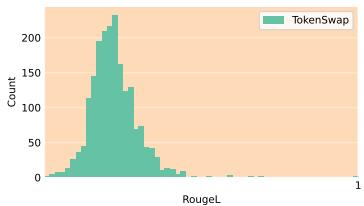

histogram

| RougeL Range | Count |
| ------------ | ----- |
| 0.0 - 0.1    | 5     |
| 0.1 - 0.2    | 20    |
| 0.2 - 0.3    | 40    |
| 0.3 - 0.4    | 80    |
| 0.4 - 0.5    | 120   |
| 0.5 - 0.6    | 160   |
| 0.6 - 0.7    | 200   |
| 0.7 - 0.8    | 220   |
| 0.8 - 0.9    | 180   |
| 0.9 - 1.0    | 100   |

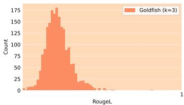

histogram

| RougeL Range | Count |
| ------------ | ----- |
| 0.0 - 0.1    | 5     |
| 0.1 - 0.2    | 25    |
| 0.2 - 0.3    | 75    |
| 0.3 - 0.4    | 125   |
| 0.4 - 0.5    | 175   |
| 0.5 - 0.6    | 150   |
| 0.6 - 0.7    | 100   |
| 0.7 - 0.8    | 60    |
| 0.8 - 0.9    | 30    |
| 0.9 - 1.0    | 10    |

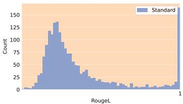

histogram

| RougeL Range | Count |
| ------------ | ----- |
| 0.0 - 0.1    | 5     |
| 0.1 - 0.2    | 25    |
| 0.2 - 0.3    | 75    |
| 0.3 - 0.4    | 125   |
| 0.4 - 0.5    | 135   |
| 0.5 - 0.6    | 120   |
| 0.6 - 0.7    | 90    |
| 0.7 - 0.8    | 60    |
| 0.8 - 0.9    | 30    |
| 0.9 - 1.0    | 10    |

Figure 5: We compare TOKENSWAP with Goldfish [31] on RougeL score distributions for Wikipedia generations. The similar distributions of TOKENSWAP and Goldfish (k=3) demonstrate that our inference-time approach is comparable to expensive pre-training methods in reducing memorization.

# B.8 Performance vs Memorization

Table 12 provides the memorization and cross-entropy scores for the family of Pythia models. TOKENSWAP significantly reduces verbatim and near-verbatim generation with a negligible increase in CE loss.

# B.9 Comparison with Speculative Decoding

A common inference method that uses an auxiliary model is Speculative Decoding [40], which we evaluate for memorization mitigation. We test on the Pile-Memorized dataset using Pythia-6.9B as the main model and Pythia-70M as the auxiliary model. For speculative decoding, we set $\gamma = 5$ (number of tokens proposed by the draft model) and use temperature $T = 1 . 0$ for the main model to introduce randomness, since greedy decoding would be identical to standard generation.

Table 13 shows that while speculative decoding with $T = 1$ improves over standard generation (as expected due to temperature sampling), it still exhibits 4× higher exact match rate than TOKENSWAP with greedy decoding, along with higher memorization on approximate metrics. We hypothesize this occurs because: (1) the large model selects tokens from the small model based on its own likelihood, preserving memorization potential, and (2) the large model frequently generates tokens directly, especially when the small model produces low-likelihood candidates.

Table 12: Memorization and CE Loss across different Pythia model sizes. Values for TOKENSWAP are shown in bold. 

<table><tr><td>Model Size</td><td>Method</td><td>ML ↓</td><td>ROUGE-L ↑</td><td>Levenshtein ↑</td><td>EMR ↓</td><td>CE Loss↓</td></tr><tr><td rowspan="2">70M</td><td>Standard</td><td>6.57</td><td>0.180</td><td>0.709</td><td>1.09</td><td>3.95</td></tr><tr><td>TOKENSWAP</td><td>5.77</td><td>0.173</td><td>0.714</td><td>1.09</td><td>4.05</td></tr><tr><td rowspan="2">160M</td><td>Standard</td><td>19.89</td><td>0.239</td><td>0.669</td><td>5.98</td><td>3.55</td></tr><tr><td>TOKENSWAP</td><td>15.05</td><td>0.224</td><td>0.680</td><td>3.80</td><td>3.65</td></tr><tr><td rowspan="2">410M</td><td>Standard</td><td>48.92</td><td>0.382</td><td>0.556</td><td>16.30</td><td>3.20</td></tr><tr><td>TOKENSWAP</td><td>25.02</td><td>0.279</td><td>0.642</td><td>5.98</td><td>3.30</td></tr><tr><td rowspan="2">1B</td><td>Standard</td><td>84.85</td><td>0.528</td><td>0.428</td><td>32.61</td><td>3.05</td></tr><tr><td>TOKENSWAP</td><td>27.36</td><td>0.309</td><td>0.614</td><td>5.43</td><td>3.15</td></tr><tr><td rowspan="2">1.4B</td><td>Standard</td><td>100.37</td><td>0.595</td><td>0.369</td><td>36.96</td><td>2.97</td></tr><tr><td>TOKENSWAP</td><td>30.33</td><td>0.348</td><td>0.589</td><td>5.43</td><td>3.07</td></tr><tr><td rowspan="2">2.8B</td><td>Standard</td><td>114.82</td><td>0.684</td><td>0.292</td><td>45.11</td><td>2.85</td></tr><tr><td>TOKENSWAP</td><td>38.61</td><td>0.372</td><td>0.563</td><td>7.61</td><td>2.95</td></tr><tr><td rowspan="2">6.9B</td><td>Standard</td><td>151.55</td><td>0.797</td><td>0.182</td><td>65.22</td><td>2.77</td></tr><tr><td>TOKENSWAP</td><td>42.65</td><td>0.399</td><td>0.536</td><td>8.70</td><td>2.87</td></tr></table>

Table 13: Comparison with speculative decoding on Pile-Memorized dataset. Both methods use Pythia-6.9B as main model and Pythia-70M as auxiliary model. ML: Matching Length, EMR: Exact Match Rate, Lev.: Normalized Levenshtein Distance. 

<table><tr><td>Method</td><td>ML ↓</td><td>EMR ↓</td><td>ROUGE-L ↓</td><td>Lev. ↑</td></tr><tr><td>Standard</td><td>151.60</td><td>65.22</td><td>0.80</td><td>0.18</td></tr><tr><td>CP-Fuse</td><td>97.05</td><td>29.35</td><td>0.62</td><td>0.35</td></tr><tr><td>Speculative Decoding ( $\gamma = 5, T = 1$ )</td><td>86.80</td><td>23.91</td><td>0.56</td><td>0.40</td></tr><tr><td>TOKENSWAP (Pythia-70M)</td><td>35.10</td><td>5.98</td><td>0.38</td><td>0.56</td></tr></table>

# C Experimental Details

# C.1 Implementation and Baselines

We implement our method in PyTorch and HuggingFace. We take the CP-Fuse implementation available publicly at https://github.com/jaabmar/cp\_fuse. We conducted our experiments using a combination of large and small language models to assess the effectiveness of our approach. Below, we detail the models, hyperparameters, computational resources, and training procedures.

# C.1.1 Models Used

• Primary Models: The experiments utilized large-scale pre-trained models, including Llama-3-8B [24] and Pythia-6.9B [12]. All the fine-tuning experiments in the extreme memorization section were done using Llama-3.2-3B [24].   
• Auxiliary Model: A lightweight auxiliary model, DistilGPT-2, was employed to adjust token probabilities selectively, leveraging its reduced memorization properties.   
• Goldfish Models: We used models pre-trained using standard and goldfish loss on the RedPajama Dataset from the Goldfish Loss paper [31]. The implementation and the models are publicly available at their GitHub repository https://github.com/ahans30/ goldfish-loss.

# C.1.2 Hyperparameters

The training and evaluation phases were configured with the following hyperparameters. The hyperparameters were taken from previous work, used as a baseline [1]:

• Sequence Length: 2048 tokens   
• Batch Size: 1   
• Learning Rate: $5 \times 1 0 ^ { - 5 }$   
• Optimizer: AdamW with default parameters   
• Gradient Accumulation Steps: 1   
• Warmup Steps: 50

# C.1.3 Computational Resources

Experiments were conducted using a single NVIDIA A6000 GPU, ensuring efficiency in training and inference without excessive computational overhead.

# C.1.4 CP-Fuse in Section 4.2

In Section 4.2, we face limitations in comparing with CP-Fuse. CP-Fuse requires at least two models with disjoint datasets, a constraint impossible to satisfy for production-level model. Moreover, CP-Fuse requires both models to have the same vocabulary size and tokenizer, which constrains the choice of the second model to those within the same model family. To ensure a fair comparison, we avoided se- lecting larger models as the second model, as larger models are known to memorize more. Instead, we selected smaller counterparts: Pythia-2.8B for Pythia-6.9B and LLaMA-3.2- 3B for LLaMA-3-8B. However, we do not select a very small model for CP-Fuse (< 100M). This is because CP-Fuse requires two equally-capable models with large number of parameters to maintain performance. To empirically verify this, we compute the cross-entropy loss of CP-Fuse on SlimPajama [61] with Pythia-70M and Pythia-6.9b. The cross-entropy loss increases to 3.41 from 2.81 for Pythia-2.8b and Pythia-6.9b (Standard has 2.80, TOKENSWAP has 2.88).

# C.2 Construction of G

We construct G with |G| = 110 tokens using high-frequency ’grammar-based’ words. Starting with the 500 most frequent tokens from COCA [23], we apply NLTK [43] part-of-speech filtering to retain:

• Core grammatical elements: determiners (DT), prepositions (IN), conjunctions (CC)   
• Pronouns (PRP, PRP\$) and modal verbs (MD)   
• Question-related tokens: wh-words (WDT, WP, WRB)   
• Auxiliary verbs: be, do, have

This construction prioritizes tokens with high frequency but low semantic content, ensuring syntactic fluency while minimizing impact on model capabilities. To estimate the frequency of tokens (γ) in G empirically, we analyzed 2000 samples from the SlimPajama dataset [61], finding γ = 0.233. Appendix C.3 provides the full list of words in G.

Ablations on the effect of G on memorization and performance are provided in Appendix B.5.

# C.3 List of words in G

The list of words in the G used for the experiments are: the, to, and, of, a, in, that, you, it, for, on, he, with, this, as, we, but, at, they, what, his, from, by, or, she, my, all, an, her, about, me, if, your, can, who, out, their, like, would, when, him, them, some, how, which, than, our, into, because, these, over, us, its, where, after, any, those, should, may, through, why, before, off, while, around, another, both, between, every, each, might, since, against, without, must, during, under, though, until, whether, among, along, within, across, behind, either, himself, although, outside, themselves, is, was, be, have, are, do, had, has, were, will, did, been, could, does, need, being, am, used, doing, having

Tokenizer consistency. We verified that all 110 grammar-based tokens in G (e.g., the, of, and, to) appear as single tokens across GPT-2/Pythia (BPE), LLaMA-3 (WordPiece), OLMo-2 (Unigram), and SmolLM (Byte-BPE), confirming that TokenSwap can be applied without any vocabulary alignment.

# C.4 Fine-tuning Datasets

For our experiments, we use the AutoMathText dataset , referred to as MathAbstracts in the tables, which aggregates mathematical content from diverse sources including arXiv, OpenWebMath, RedPajama, and Algebraic Stack. The titles in this corpus were generated using the Qwen-72B language model. Additionally, we use the WritingPrompts dataset (Fan et al., 2018), which contains user-generated stories based on provided premises from a Reddit community. For both datasets, we randomly sample 2,000 training examples with a fixed seed to ensure consistent training across all models. We further sample 500 distinct points for evaluation, during which we generate sequences of 128 tokens.Both the datasets are downloaded from HuggingFace.

# C.5 Evaluation Datasets

We use The Pile dataset to evaluate memorization of Pythia models. For our experiments, we use a targeted subset of The Pile—a comprehensive 825 GiB English corpus spanning 22 high-quality sources. Specifically, we analyze 500 sequences previously identified as memorized by the Pythia model to investigate memorization dynamics and mitigation approaches.To check memorization in Llama, we use the LeetCode problems dataset from Kaggle. We perform some pre-processing. This is because recent works have shown that Llama memorizes sequences from this dataset. For all the memorization evaluation, we set the prefix to be 20 tokens and then generate either 100 or 128 tokens.

CommonSense170k combines eight distinct datasets focused on commonsense reasoning tasks [33]. The dataset presents problems in multiple-choice format, requiring models to generate answers without explanatory content. Following [33], we implement their prompt structure. The component datasets comprise:

1. ARC Easy (ARC-e) [20] contains elementary-level science questions designed to evaluate basic logical reasoning capabilities.   
2. PIQA [13] focuses on physical reasoning, presenting scenarios where models must determine appropriate actions based on physical constraints.   
3. WinoGrande [55] evaluates commonsense understanding through binary choice completion tasks in ambiguous sentences.   
4. ARC Challenge (ARC-c) [20] presents advanced science questions requiring deep reasoning skills beyond pattern recognition.   
5. OBQA [45] presents questions requiring synthesis of information from multiple sources, testing complex reasoning abilities.   
6. BoolQ [19] consists of binary questions derived from authentic user queries, testing realworld reasoning capabilities.

We downloaded the dataset from HuggingFace. For evaluation, we sample a subset of each dataset (128 datapoints) and evaluate 5-shot performance. We then generate the next 10 tokens, since all the datasets are classification datasets.

# D Evaluation Metrics

# D.1 Memorization Metrics

To evaluate memorization, we use both exact and approximate measures. The exact memorization metrics include:

• Matching Length (ML): Measures the longest contiguous sequence in generated text that matches the training data, before the first deviation. A higher value indicates longer verbatim memorization, suggesting higher risk of overfitting.

• Exact Match Rate (EMR) evaluates how long of an uninterrupted sequence exists between a model’s generated text and the reference text it’s being compared against. The metric calculates the longest common substring and normalizes the result to produce a score between 0 and 1, with a score of 1 representing a complete match. This measurement helps quantify how well the model preserves continuous portions of the original text.   
ROUGE-L Score (Recall-Oriented Understudy for Gisting Evaluation) analyzes text similarity by examining shared patterns between generated and reference texts. It looks at matching sequences of words, whether consecutive (n-grams) or paired, with particular emphasis on how comprehensively the generated text captures elements from the reference text. Scores fall between 0 and 1, with 1 indicating that all reference text elements were successfully captured. The widely-used ROUGE-L variant specifically focuses on finding the longest sequence of words that appears in both texts, even if not consecutive. ROUGE-L is computed as:

$$
R O U G E - L = \frac {L C S}{\text { len(reference   text) }} \tag {2}
$$

where LCS(G, R) represents the longest common subsequence length. A higher score suggests stronger memorization.

• Normalized Levenshtein Distance calculates how many character-level changes are needed at minimum to transform one text into another, as a ratio of total characters. Each change can be adding a character, removing one, or replacing one. When comparing generated and reference texts, a smaller Levenshtein score suggests the texts are more similar, while a larger score indicates they are more different. The metric is normalized to produce values between 0 and 1, where 0 means the texts match perfectly.

# D.2 Performance Metrics

To evaluate model performance beyond memorization, we assess:

• Cross-Entropy (CE) Loss: This metric quantifies how well the model predicts tokens in a sequence. For a sequence $X = \{ x _ { 1 } , x _ { 2 } , . . . , x _ { n } \}$ with ground truth probabilities $P ( X )$ , the cross-entropy loss is computed as:

$$
C E = - \sum_ {i = 1} ^ {n} P (x _ {i}) \log Q (x _ {i}) \tag {3}
$$

where $Q ( x _ { i } )$ is the predicted probability distribution. Lower values indicate better generalization.

• Commonsense Reasoning Benchmark Accuracy: The model’s ability to reason about everyday knowledge is tested across multiple established datasets, including WinoGrande, PIQA, OpenBookQA, BoolQ, ARC-Easy, and ARC-Challenge. We report the accuracy of the model.   
• Fluency and Instruction-following: This is evaluated on MT-Bench [70]. MT-Bench evaluates a model’s fluency, conversational and instruction following ability.

# E Examples

We provide examples of text generated by standard greedy decoding and TOKENSWAP on four random examples from the WritingPrompts dataset. Memorized text is in red.

# Example 1

# Prefix

\### Prompt: [ WP ] Magic - once a real and potent force but as the world population

# Suffix

grew from millions to billions the shared mana per person is now negligible. A group of astronauts helplessly watching the Earth perish experience something... unexpected.

\### Story: Lauren sobbed. She was engaged to be married as soon as we got back home. We all lost loved ones. Hell, we all lost everything we ever knew.

First the atmosphere started turning black. We got word that the Koreans had started a nuclear war. But within minutes of receiving news, all radio contact was lost. We didn’t even have a chance to tell anyone goodbye. Now, there’s only 4 of us left.

Lauren hasn’t

# Standard Generation

grew from millions to billions the shared mana per person is now negligible. A group of astronauts helplessly watching the Earth perish experience something... unexpected.

text### Story: Lauren sobbed. She was engaged to be married as soon as we got back home. We all lost loved ones. Hell, we all lost everything we ever knew.

First the atmosphere started turning black. We got word that the Koreans had started a nuclear war. But within minutes of receiving news, all radio contact was lost. We didn’t even have a chance to tell anyone goodbye. Now, there’s only 4 of us left.

Lauren hasn’t

# TOKENSWAP Generation

grew and the number of wizards and witches declined, the world began to suffer. Now the world suffers from a lack of magic, and the government is tasked with maintaining the only magic university in the world.

\### Story: “ Welcome to Magic University.”

The spell is cast, and the portal opens. Through the portal, the world is revealed to be a beautiful place. The grass is a deep emerald, and the trees sky blue. It is a place of incredible beauty, and the students here are lucky enough to have grown up in such a place. The university is built on the side of the volcano, and the students live

# Example 2

# Prefix

\### Prompt: [ WP ] The year is 2040, and you are the last smoker

# Suffix

alive. The “ Quit Smoking ” ads get personal.

\### Story: “ Quit now Dan!” said the man on the talking billboard. A finger pointing at the lone figure walking down the empty street. Empty due to everyone crossing to the other side to avoid him and his smog. Dan paused by a waste bin, small cardboard box in hand. He looked from the box to the bin and back again. Those across the street stopped and stared, ready to witness history being made. There was absolute silence as Dan lifted his hand, as if to throw the packet towards the bin, all eyes now on him, even the

# Standard Generation

alive. The “ Quit Smoking ” ads get personal.

\### Story: Quit now Dan!” said the man on the talking billboard. A finger pointing at the lone figure walking down the empty street. Empty due to everyone crossing to the other side to avoid him and his smog. Dan paused by a waste bin, small cardboard box in hand. He looked from the box to the bin and back again. Those across the street stopped and stared, ready to witness history being made. There was absolute silence as Dan lifted his hand, as if to throw the packet towards the bin, all eyes now on him, even the

# TOKENSWAP Generation

alive. The “ Quit Smoking ” ads get personal.

\### Story: Quit now Dan!” said the man who was once John, who now went to work as a telephone scammer. “ You’re killing yourself, and you know what? I know you’re lying. I know you’re lying and you’re sucking your parents pockets dry. They worked hard for you know what? And you’re not grateful. You never thank me know what? I never see you thanking me. I never see you thanking anyone. You just keep on doing it, killing yourself, and I’m not going to stand by you. I’m not

# Example 3

# Prefix

\### Prompt: [ WP ] A young man killed his abusive father. The court has exoner

# Suffix

ated him, but society hasn’t.

\### Story: I can see disapproving stares from my classmates and teachers all the time. Nobody wants to stay near me anymore. All my friends avoid me or ignore me. Every classmate stays far away from me.

Eventually, my smile turns cracked. In the mirror, I see haunting eyes looking back at me. Memories and visions of my father lying there with the side of his head completely covered in blood. So this is what true loneliness feels like.

I remember my father. He tortured me, hit me, locked me out of the house. I oftened stayed at

# Standard Generation

ated him, but society hasn’t.

\### Story: I can see disapproving stares from my classmates and teachers all the time. Nobody wants to stay near me anymore. All my friends avoid me or ignore me. Every classmate stays far away from me.

Eventually, my smile turns cracked. In the mirror, I see haunting eyes looking back at me. Memories and visions of my father lying there with the side of his head completely covered in blood. So this is what true loneliness feels like.

I remember my father. He tortured me, hit me, locked me out of the house. I oftened stayed at

# TOKENSWAP Generation

ated him, but society hasn’t.

\### Story: I was abused. I was taken advantage of. I was exploited.

Who is the real villain here? The one who committed the act, the one who pushed me past the point where I was comfortable, was the villain. Or the one who stood idly by and was complicit in the crime, the one who provided the weapon, the one who pushed me past the point where I was comfortable.

You see, I was comfortable. I was happy. I was loved. I was cared for.

But then I grew up. I learned to think about it

# Example 4

# Prefix

\### Prompt: [ WP ] A demon and an angel meet up weekly in a coffee shop to

# Suffix

complain about their jobs.

\### Story: “ Is this a long story?”

Felix gritted his teeth; his jaw jutted out. “ Dude, I’ve only just started it.”

“ I’ve got news, is all.”

He leaned back and held out both hands in an exaggerated show of compliance. Please, by all means, take the floor.”

Hope cracked his knuckles and stared, embarrased, at the floor. “ No, I’m sorry.”

“ Go ahead! Please! I was just trying to -”

“ OK. Tell me your story in thirty words or less

# Standard Generation

complain about their jobs.

\### Story: “ Is this a long story?”

Felix gritted his teeth; his jaw jutted out. “ Dude, I’ve only just started it.”

“ I’ve got news, is all.”

He leaned back and held out both hands in an exaggerated show of compliance. L Please, by all means, take the floor.”

Hope cracked his knuckles and stared, embarrased, at the floor. “ No, I’m sorry.”

“ Go ahead! Please! I was just trying to -”

“ OK. Tell me your story in thirty words or less

# TOKENSWAP Generation

complain about the job.

\### Story: “ Is this a long story?”

Felix gritted his teeth; he usually doesn’t show emotion, but he feels annoyed. “ Dude, I’ve only just started to tell you.”

“ I’ve got news, but I’ll save you a table. Sit down.”

He sat down and crossed his arms. “ So, what’s the issue?”

“ I’ve got a client who’s totally fucked up. No motivation, no direction. Just a bunch of negative traits. I haven’t got much time, and I’m a busy man.”

“ So

# NeurIPS Paper Checklist

# 1. Claims

Question: Do the main claims made in the abstract and introduction accurately reflect the paper’s contributions and scope?

Answer: [Yes]

Justification: The main claims reflect the paper’s scope and contributions.

Guidelines:

• The answer NA means that the abstract and introduction do not include the claims made in the paper.   
• The abstract and/or introduction should clearly state the claims made, including the contributions made in the paper and important assumptions and limitations. A No or NA answer to this question will not be perceived well by the reviewers.   
• The claims made should match theoretical and experimental results, and reflect how much the results can be expected to generalize to other settings.   
• It is fine to include aspirational goals as motivation as long as it is clear that these goals are not attained by the paper.

# 2. Limitations

Question: Does the paper discuss the limitations of the work performed by the authors?

Answer: [Yes]

Justification: See Section 5 for discussion on limitations.

Guidelines:

• The answer NA means that the paper has no limitation while the answer No means that the paper has limitations, but those are not discussed in the paper.   
• The authors are encouraged to create a separate "Limitations" section in their paper.   
• The paper should point out any strong assumptions and how robust the results are to violations of these assumptions (e.g., independence assumptions, noiseless settings, model well-specification, asymptotic approximations only holding locally). The authors should reflect on how these assumptions might be violated in practice and what the implications would be.   
• The authors should reflect on the scope of the claims made, e.g., if the approach was only tested on a few datasets or with a few runs. In general, empirical results often depend on implicit assumptions, which should be articulated.   
• The authors should reflect on the factors that influence the performance of the approach. For example, a facial recognition algorithm may perform poorly when image resolution is low or images are taken in low lighting. Or a speech-to-text system might not be used reliably to provide closed captions for online lectures because it fails to handle technical jargon.   
• The authors should discuss the computational efficiency of the proposed algorithms and how they scale with dataset size.   
• If applicable, the authors should discuss possible limitations of their approach to address problems of privacy and fairness.   
• While the authors might fear that complete honesty about limitations might be used by reviewers as grounds for rejection, a worse outcome might be that reviewers discover limitations that aren’t acknowledged in the paper. The authors should use their best judgment and recognize that individual actions in favor of transparency play an important role in developing norms that preserve the integrity of the community. Reviewers will be specifically instructed to not penalize honesty concerning limitations.

# 3. Theory assumptions and proofs

Question: For each theoretical result, does the paper provide the full set of assumptions and a complete (and correct) proof?

Answer: [NA]

Justification: The paper does not include theoretical results.

# Guidelines:

• The answer NA means that the paper does not include theoretical results.   
• All the theorems, formulas, and proofs in the paper should be numbered and crossreferenced.   
• All assumptions should be clearly stated or referenced in the statement of any theorems.   
• The proofs can either appear in the main paper or the supplemental material, but if they appear in the supplemental material, the authors are encouraged to provide a short proof sketch to provide intuition.   
• Inversely, any informal proof provided in the core of the paper should be complemented by formal proofs provided in appendix or supplemental material.   
• Theorems and Lemmas that the proof relies upon should be properly referenced.

# 4. Experimental result reproducibility

Question: Does the paper fully disclose all the information needed to reproduce the main experimental results of the paper to the extent that it affects the main claims and/or conclusions of the paper (regardless of whether the code and data are provided or not)?

Answer: [Yes]

Justification: We provide details of experiments in Appendix C.1 and we provide the link to our code in the abstract.

# Guidelines:

• The answer NA means that the paper does not include experiments.   
• If the paper includes experiments, a No answer to this question will not be perceived well by the reviewers: Making the paper reproducible is important, regardless of whether the code and data are provided or not.   
• If the contribution is a dataset and/or model, the authors should describe the steps taken to make their results reproducible or verifiable.   
• Depending on the contribution, reproducibility can be accomplished in various ways. For example, if the contribution is a novel architecture, describing the architecture fully might suffice, or if the contribution is a specific model and empirical evaluation, it may be necessary to either make it possible for others to replicate the model with the same dataset, or provide access to the model. In general. releasing code and data is often one good way to accomplish this, but reproducibility can also be provided via detailed instructions for how to replicate the results, access to a hosted model (e.g., in the case of a large language model), releasing of a model checkpoint, or other means that are appropriate to the research performed.   
• While NeurIPS does not require releasing code, the conference does require all submissions to provide some reasonable avenue for reproducibility, which may depend on the nature of the contribution. For example   
(a) If the contribution is primarily a new algorithm, the paper should make it clear how to reproduce that algorithm.   
(b) If the contribution is primarily a new model architecture, the paper should describe the architecture clearly and fully.   
(c) If the contribution is a new model (e.g., a large language model), then there should either be a way to access this model for reproducing the results or a way to reproduce the model (e.g., with an open-source dataset or instructions for how to construct the dataset).   
(d) We recognize that reproducibility may be tricky in some cases, in which case authors are welcome to describe the particular way they provide for reproducibility. In the case of closed-source models, it may be that access to the model is limited in some way (e.g., to registered users), but it should be possible for other researchers to have some path to reproducing or verifying the results.

# 5. Open access to data and code

Question: Does the paper provide open access to the data and code, with sufficient instructions to faithfully reproduce the main experimental results, as described in supplemental material?

# Answer: [Yes]

Justification: All the datasets used in the experiments are publicly available and we provide the link to our code in the abstract.

# Guidelines:

• The answer NA means that paper does not include experiments requiring code.   
• Please see the NeurIPS code and data submission guidelines (https://nips.cc/ public/guides/CodeSubmissionPolicy) for more details.   
• While we encourage the release of code and data, we understand that this might not be possible, so “No” is an acceptable answer. Papers cannot be rejected simply for not including code, unless this is central to the contribution (e.g., for a new open-source benchmark).   
• The instructions should contain the exact command and environment needed to run to reproduce the results. See the NeurIPS code and data submission guidelines (https: //nips.cc/public/guides/CodeSubmissionPolicy) for more details.   
• The authors should provide instructions on data access and preparation, including how to access the raw data, preprocessed data, intermediate data, and generated data, etc.   
• The authors should provide scripts to reproduce all experimental results for the new proposed method and baselines. If only a subset of experiments are reproducible, they should state which ones are omitted from the script and why.   
• At submission time, to preserve anonymity, the authors should release anonymized versions (if applicable).   
• Providing as much information as possible in supplemental material (appended to the paper) is recommended, but including URLs to data and code is permitted.

# 6. Experimental setting/details

Question: Does the paper specify all the training and test details (e.g., data splits, hyperparameters, how they were chosen, type of optimizer, etc.) necessary to understand the results?

# Answer: [Yes]

Justification: We provide details of experiments in Appendix C.1 and we provide the link to our code in the abstract.

# Guidelines:

• The answer NA means that the paper does not include experiments.   
• The experimental setting should be presented in the core of the paper to a level of detail that is necessary to appreciate the results and make sense of them.   
• The full details can be provided either with the code, in appendix, or as supplemental material.

# 7. Experiment statistical significance

Question: Does the paper report error bars suitably and correctly defined or other appropriate information about the statistical significance of the experiments?

# Answer: [No]

Justification: Our evaluation methodology aligns with standard practice in the memorization mitigation literature [1, 31, 18]. The main experiments in Sections 4.2 and 4.3 use deterministic greedy decoding, which produces consistent results across runs. Additionally, the scale of our evaluation (testing on 1,825 LeetCode problems and 184 Pile sequences) provides sufficient data points for robust assessment without requiring multiple experimental runs.

# Guidelines:

• The answer NA means that the paper does not include experiments.   
• The authors should answer "Yes" if the results are accompanied by error bars, confidence intervals, or statistical significance tests, at least for the experiments that support the main claims of the paper.   
• The factors of variability that the error bars are capturing should be clearly stated (for example, train/test split, initialization, random drawing of some parameter, or overall run with given experimental conditions).

• The method for calculating the error bars should be explained (closed form formula, call to a library function, bootstrap, etc.)   
• The assumptions made should be given (e.g., Normally distributed errors).   
• It should be clear whether the error bar is the standard deviation or the standard error of the mean.   
• It is OK to report 1-sigma error bars, but one should state it. The authors should preferably report a 2-sigma error bar than state that they have a 96% CI, if the hypothesis of Normality of errors is not verified.   
• For asymmetric distributions, the authors should be careful not to show in tables or figures symmetric error bars that would yield results that are out of range (e.g. negative error rates).   
• If error bars are reported in tables or plots, The authors should explain in the text how they were calculated and reference the corresponding figures or tables in the text.

# 8. Experiments compute resources

Question: For each experiment, does the paper provide sufficient information on the computer resources (type of compute workers, memory, time of execution) needed to reproduce the experiments?

Answer: [Yes]

Justification: We provide the compute required in Appendix C.1.

Guidelines:

• The answer NA means that the paper does not include experiments.   
• The paper should indicate the type of compute workers CPU or GPU, internal cluster, or cloud provider, including relevant memory and storage.   
• The paper should provide the amount of compute required for each of the individual experimental runs as well as estimate the total compute.   
• The paper should disclose whether the full research project required more compute than the experiments reported in the paper (e.g., preliminary or failed experiments that didn’t make it into the paper).

# 9. Code of ethics

Question: Does the research conducted in the paper conform, in every respect, with the NeurIPS Code of Ethics https://neurips.cc/public/EthicsGuidelines?

Answer: [Yes]

Justification: Yes, the research in the manuscript is compliant with the NeurIPS Code of Ethics.

Guidelines:

• The answer NA means that the authors have not reviewed the NeurIPS Code of Ethics.   
• If the authors answer No, they should explain the special circumstances that require a deviation from the Code of Ethics.   
• The authors should make sure to preserve anonymity (e.g., if there is a special consideration due to laws or regulations in their jurisdiction).

# 10. Broader impacts

Question: Does the paper discuss both potential positive societal impacts and negative societal impacts of the work performed?

Answer: [Yes]

Justification: We discuss the societal impacts of our work in Section 1

Guidelines:

• The answer NA means that there is no societal impact of the work performed.   
• If the authors answer NA or No, they should explain why their work has no societal impact or why the paper does not address societal impact.

• Examples of negative societal impacts include potential malicious or unintended uses (e.g., disinformation, generating fake profiles, surveillance), fairness considerations (e.g., deployment of technologies that could make decisions that unfairly impact specific groups), privacy considerations, and security considerations.   
• The conference expects that many papers will be foundational research and not tied to particular applications, let alone deployments. However, if there is a direct path to any negative applications, the authors should point it out. For example, it is legitimate to point out that an improvement in the quality of generative models could be used to generate deepfakes for disinformation. On the other hand, it is not needed to point out that a generic algorithm for optimizing neural networks could enable people to train models that generate Deepfakes faster.   
• The authors should consider possible harms that could arise when the technology is being used as intended and functioning correctly, harms that could arise when the technology is being used as intended but gives incorrect results, and harms following from (intentional or unintentional) misuse of the technology.   
• If there are negative societal impacts, the authors could also discuss possible mitigation strategies (e.g., gated release of models, providing defenses in addition to attacks, mechanisms for monitoring misuse, mechanisms to monitor how a system learns from feedback over time, improving the efficiency and accessibility of ML).

# 11. Safeguards

Question: Does the paper describe safeguards that have been put in place for responsible release of data or models that have a high risk for misuse (e.g., pretrained language models, image generators, or scraped datasets)?

Answer: [NA]

Justification: Our research poses no risk of misuse.

# Guidelines:

• The answer NA means that the paper poses no such risks.   
• Released models that have a high risk for misuse or dual-use should be released with necessary safeguards to allow for controlled use of the model, for example by requiring that users adhere to usage guidelines or restrictions to access the model or implementing safety filters.   
• Datasets that have been scraped from the Internet could pose safety risks. The authors should describe how they avoided releasing unsafe images.   
• We recognize that providing effective safeguards is challenging, and many papers do not require this, but we encourage authors to take this into account and make a best faith effort.

# 12. Licenses for existing assets

Question: Are the creators or original owners of assets (e.g., code, data, models), used in the paper, properly credited and are the license and terms of use explicitly mentioned and properly respected?

Answer: [Yes]

Justification: Yes, the creators/original owners of assets used in the paper are properly credited.

# Guidelines:

• The answer NA means that the paper does not use existing assets.   
• The authors should cite the original paper that produced the code package or dataset.   
• The authors should state which version of the asset is used and, if possible, include a URL.   
• The name of the license (e.g., CC-BY 4.0) should be included for each asset.   
• For scraped data from a particular source (e.g., website), the copyright and terms of service of that source should be provided.

• If assets are released, the license, copyright information, and terms of use in the package should be provided. For popular datasets, paperswithcode.com/datasets has curated licenses for some datasets. Their licensing guide can help determine the license of a dataset.   
• For existing datasets that are re-packaged, both the original license and the license of the derived asset (if it has changed) should be provided.   
• If this information is not available online, the authors are encouraged to reach out to the asset’s creators.

# 13. New assets

Question: Are new assets introduced in the paper well documented and is the documentation provided alongside the assets?

Answer: [NA]

Justification: The paper does not release new assets.

Guidelines:

• The answer NA means that the paper does not release new assets.   
• Researchers should communicate the details of the dataset/code/model as part of their submissions via structured templates. This includes details about training, license, limitations, etc.   
• The paper should discuss whether and how consent was obtained from people whose asset is used.   
• At submission time, remember to anonymize your assets (if applicable). You can either create an anonymized URL or include an anonymized zip file.

# 14. Crowdsourcing and research with human subjects

Question: For crowdsourcing experiments and research with human subjects, does the paper include the full text of instructions given to participants and screenshots, if applicable, as well as details about compensation (if any)?

Answer: [NA]

Justification: The paper does not involve crowdsourcing nor research with human subjects.

Guidelines:

• The answer NA means that the paper does not involve crowdsourcing nor research with human subjects.   
• Including this information in the supplemental material is fine, but if the main contribution of the paper involves human subjects, then as much detail as possible should be included in the main paper.   
• According to the NeurIPS Code of Ethics, workers involved in data collection, curation, or other labor should be paid at least the minimum wage in the country of the data collector.

# 15. Institutional review board (IRB) approvals or equivalent for research with human subjects

Question: Does the paper describe potential risks incurred by study participants, whether such risks were disclosed to the subjects, and whether Institutional Review Board (IRB) approvals (or an equivalent approval/review based on the requirements of your country or institution) were obtained?

Answer: [NA]

Justification: The paper does not involve crowdsourcing nor research with human subjects.

Guidelines:

• The answer NA means that the paper does not involve crowdsourcing nor research with human subjects.   
• Depending on the country in which research is conducted, IRB approval (or equivalent) may be required for any human subjects research. If you obtained IRB approval, you should clearly state this in the paper.

• We recognize that the procedures for this may vary significantly between institutions and locations, and we expect authors to adhere to the NeurIPS Code of Ethics and the guidelines for their institution.   
• For initial submissions, do not include any information that would break anonymity (if applicable), such as the institution conducting the review.

# 16. Declaration of LLM usage

Question: Does the paper describe the usage of LLMs if it is an important, original, or non-standard component of the core methods in this research? Note that if the LLM is used only for writing, editing, or formatting purposes and does not impact the core methodology, scientific rigorousness, or originality of the research, declaration is not required.

Answer: [NA]

Justification: LLMs were not used for any core methodology in this research.

# Guidelines:

• The answer NA means that the core method development in this research does not involve LLMs as any important, original, or non-standard components.   
• Please refer to our LLM policy (https://neurips.cc/Conferences/2025/LLM) for what should or should not be described.