# Large Language Models as Realistic Microservice Trace Generators

Donghyun Kim1, Sriram Ravula1, Taemin Ha1, Alexandros G. Dimakis2,3, Daehyeok Kim1, Aditya Akella1

{donghyun, sriram.ravula, taemin.ha}@utexas.edu, alexdimakis@berkeley.edu, {daehyeok,akella}@cs.utexas.edu

1 University of Texas at Austin 2 University of California, Berkeley 3 BespokeLabs.ai

# Abstract

Workload traces are essential to understand complex computer systems’ behavior and manage processing and memory resources. Since real-world traces are hard to obtain, synthetic trace generation is a promising alternative. This paper proposes a first-of-a-kind approach that relies on training a large language model (LLM) to generate synthetic workload traces, specifically microservice call graphs. To capture complex and arbitrary hierarchical structures and implicit constraints in such traces, we propose to train LLMs to generate recursively, making call graph generation a sequence of more manageable steps. To further enforce learning constraints on the traces and generate uncommon situations, we apply additional instruction tuning steps to align our model with the desired trace features. With this method, we train TraceLLM, an LLM for microservice trace generation, and demonstrate that it produces diverse, realistic traces under varied conditions, outperforming existing approaches in both accuracy and validity. The synthetically generated traces can effectively replace real data to optimize important microservice management tasks. Additionally, TraceLLM adapts to downstream trace-related tasks, such as predicting key trace features and infilling missing data.

# 1 Introduction

Computer system workload traces document hardware or software events that occur as applications execute on computing machines, receive requests, process them, and serve responses. Such traces are vital for analyzing complex computer systems and optimizing their CPU, memory, networking resource allocation, and management. However, obtaining access to real-world traces is often challenging due to limited public data availability and the difficulty of collecting them at large scale from diverse environments, especially in complex cloud computing settings. As an alternative, synthetic traces provide limitless size and variety, offering significant advantages for testing and analysis, including the ability to simulate challenging conditions like stress-testing environments. While recent advances in generative machine learning, including LSTMs (Sherstinsky, 2020), GANs (Goodfellow et al., 2014), and diffusion models (Ho et al., 2020), have improved synthetic trace generation, these methods typically only generate specific fields, such as the number of requests or resource types (Bergsma et al., 2021), or are confined to fixedstructure traces, like network packets (Jiang et al., 2023; Yin et al., 2022).

In this paper, we propose TraceLLM that adapts pre-trained large language models (LLMs) (Brown et al., 2020; Touvron et al., 2023) to generate synthetic workload traces. LLMs have been successfully adapted beyond natural language to domains like protein sequences (Shen et al., 2024), code (Roziere et al., 2023), and tabular data (Borisov et al., 2023). In addition, LLMs can produce outputs well-aligned with user inputs through fine-tuning (Ouyang et al., 2022; Wei et al., 2021) and generalize to new prompts at inference (Chung et al., 2022; Sanh et al., 2021). Thus, we posit that LLMs have the potential to generate synthetic traces that accurately capture real-world systems trace structures while adhering to user specifications.

Despite their potential, using LLMs for synthetic systems trace generation presents significant challenges. Traces are often logged in tabular format and structured as graphs, which can vary in depth and width. Representing these traces as text sequences, optimal for modern autoregressive LLMs, is non-trivial. Moreover, trace data often contain complex implicit constraints that rely on relationships between multiple trace features. For example, an application process’s start time must precede that of all its child processes, while the parent process’s end time must be later than the end time of its children; such constraints need to hold across all nodes in the application’s graphical representation.

In this paper, we design TraceLLM to address these challenges, with a particular focus on generating microservice call graphs. Microservices are the de facto approach to designing modern cloud-based applications and power many popular services today (Uber; Netflix; Amazon). Microservice call graphs trace the execution of user requests through such applications. These call graphs form a type of trace with a rich directed acyclic graph (DAG) structure. TraceLLM represents these graphs in a text-based format suitable for LLMs, enabling their use in trace generation. Crucially, one of our key innovations is to generate call graphs with structural constraints by recursively generating subgraphs, or layers. This approach allows the model to break down the complex task of reasoning about hierarchical graph structures and complex constraints into multiple simpler tasks. To further enhance the model’s ability to follow structural constraints and to meet user-requested attributes, we employ instruction tuning. During this phase, the model learns to explicitly generate a series of intermediate instructions between recursive layer generation steps, performing arithmetic and logical checks to ensure strict adherence to the desired structure.

We implement TraceLLM by training Llama-2 7B (Touvron et al., 2023) on microservice trace data and evaluate it through extensive evaluations. Results show that recursive generation with intermediate instructions significantly improves the model’s ability to generate valid outputs for complex call graphs. Compared to generative and probabilistic models, our synthetic traces better align with real trace distributions. Furthermore, we demonstrate that synthetic traces effectively replace real data for training microservice management tasks and that our fine-tuned model excels Llama-3.1 405B (Dubey et al., 2024) in trace feature prediction. We release our codes in https://github.com/ldos-project/TraceLLM.

# 2 Background

Microservice Call Graphs. In modern software architecture, an application is typically constructed as a constellation of multiple microservices (Gan et al., 2019; Luo et al., 2022; Huye et al., 2023), each with specific functionalities and dependencies on one another. When a user interacts with an application, such as sending an HTTP request, a complex sequence of communications among these microservices is triggered. Thus, a user request induces a microservice call graph, which maps the control/data flow and dependencies among the microservices involved in fulfilling the user’s request.

Figure 1 illustrates a social network application with eight microservices. Red arrows indicate communications between microservices involved in processing the user’s request. The request first reaches a microservice (e.g., “Front end” in Figure 1) and waits for the communication to terminate. If the microservice requires additional communication to handle the request, then it triggers another microservice call (e.g., from “Front end” to “Authentication” in Figure 1). The communications triggered by a user’s request form a microservice call graph with four microservices. The vertices of the graph correspond to microservices (or the client), while the edges correspond to API calls invoking the microservices. Note that not all edges appear in the graph, as some services may not be invoked for a given request.

A call graph can be represented as a tabular trace capturing API call features (i.e., edges) such as request source/destination, request type (e.g., HTTP and RPC), and start/finish times. Given their hierarchical structure, the tabular trace should preserve the parent-child relationships by ensuring that the child’s source matches the parent’s destination. Also, the start/end times of each call should be consistent with each other: (1) a microservice’s start time must precede its finish time, and (2) the parent-child relationships must be honored, i.e., the parent’s start (finish) time must precede (follow) the child’s. Finally, the IDs within a call graph (dot-decimal numbers provided for each call) must also be hierarchically connected to form a DAG.

Synthetic Trace Generation using Machine Learning. Microservice traces play a pivotal role in designing and evaluating techniques for improving the performance and reliability of microservice applications and optimizing the use of underlying resources. Representative use cases include techniques for critical path analysis (Zhang et al., 2022), anomaly detection (Xie et al., 2023), root cause analysis (Ikram et al., 2022), cluster management (Qiu et al., 2020), and cluster scheduling (Singhvi et al., 2021). Unfortunately, obtaining diverse real-world traces to study such techniques thoroughly remains challenging as publicly available traces are typically limited in size and only cover specific narrow settings far from the diversity expected when operating in the cloud.

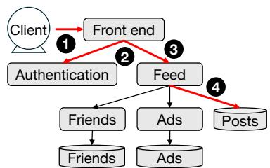

<details>
<summary>flowchart</summary>

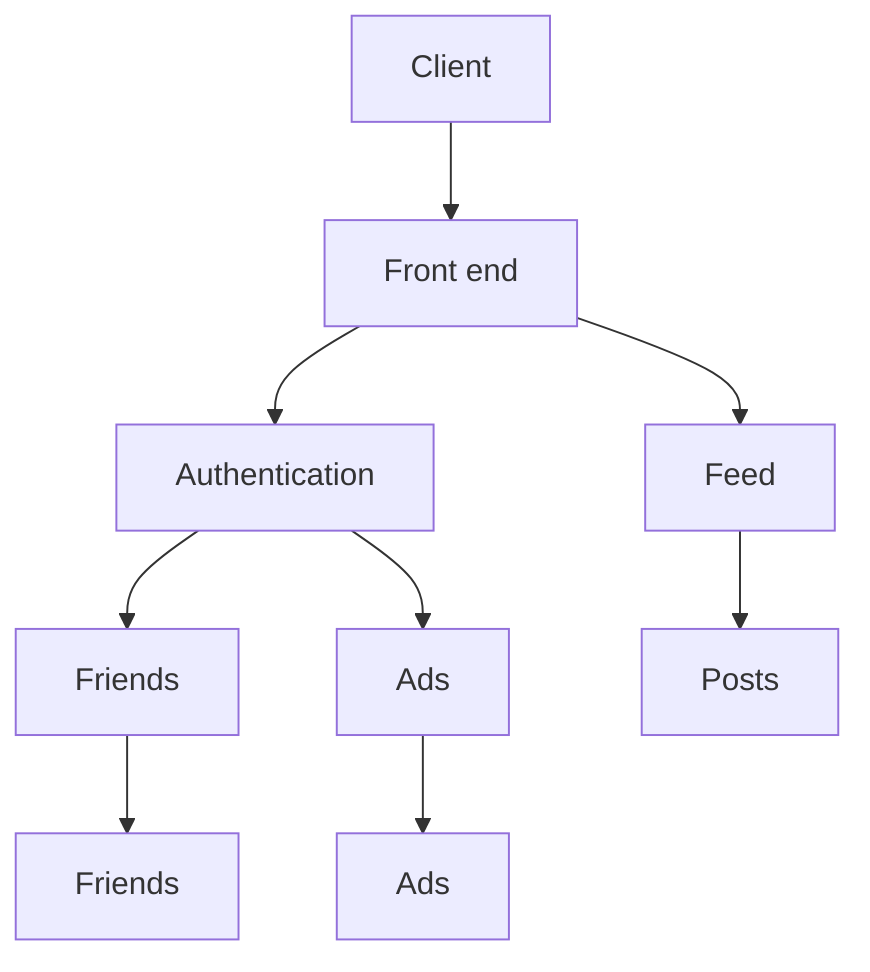
</details>

<table><tr><td></td><td>EDGE ID</td><td>Src.</td><td>Dest.</td><td>Type</td><td>Start (ms)</td><td>Finish (ms)</td></tr><tr><td>1</td><td>0</td><td>Client</td><td>Front end</td><td>HTTP</td><td>0</td><td>24</td></tr><tr><td>2</td><td>0.1</td><td>Front end</td><td>Authentication</td><td>RPC</td><td>0</td><td>1</td></tr><tr><td>3</td><td>0.2</td><td>Front end</td><td>Feed</td><td>RPC</td><td>1</td><td>23</td></tr><tr><td>4</td><td>0.2.1</td><td>Feed</td><td>Posts</td><td>DB</td><td>6</td><td>15</td></tr></table>

Figure 1: A simple social network application consists of eight microservices (Huye et al., 2023). Each user request triggers a sequence of microservice calls, forming a microservice call graph. The red lines represent the microservice call graph for a user request. Microservice call graphs are commonly logged in a tabular format, as shown in the figure on the right. Each row in the table represents a communication between two microservices with features in columns.

Given the importance and scarcity of public computer system traces, including microservice traces, recent studies have explored generative models for synthetic trace generation. Existing works (Lin et al., 2020; Jiang et al., 2023) leverage GAN (Goodfellow et al., 2014) and diffusion (Ho et al., 2020) models to generate network packet traces, while other work (Bergsma et al., 2021) uses LSTMs (Sherstinsky, 2020) to generate virtual machine workload traces. While these generative models are effective in their domains, the methods are limited to predicting specific fields or following training data distributions without conforming to structural constraints. These methods do not apply to microservice call graphs which requires handling hierarchical structures.

Since traces are structured and can be represented in tabular form, machine learning methods for synthetic tabular data generation could be applied to synthetic trace generation. Recent approaches, such as TVAE (Xu et al., 2019) and GReaT (Borisov et al., 2023), leverage VAE (Kingma and Welling, 2013) and language models to advance synthetic tabular data generation techniques. However, these methods do not account for the hierarchical structure of call graphs within tabular representations. We provide a detailed comparison in §4.

# 3 Training LLMs for Microservice Traces

Our goal is to train TraceLLM, an LLM for microservice call graph traces, enabling end-users to simulate diverse scenarios, such as rare microservice invocations that exhibit high response times. To achieve this, we condition the model’s output on user-specified attributes, including the invoked application, the number of microservice communications (i.e., graph edges), and overall application latency. Given the limitations of existing trace generation methods, we leverage LLMs. We initialize our model from LLMs trained on large text datasets, as these models have proven effective when adapted to specialized domains such as proteins (Shen et al., 2024) and code (Roziere et al., 2023). Moreover, LLMs support flexible conditioning mechanisms, including natural language prompts (Ouyang et al., 2022) and structured input sequences (Borisov et al., 2023).

This section presents our two-stage approach for training TraceLLM to generate microservice call graphs. First, we extend LLMs with additional pre-training on a large corpus of microservice call graph traces, allowing the model to capture interaction patterns in real-world call graphs. We also introduce recursive subgraph generation to improve its ability to produce large, structured graphs. Second, we instruction fine-tune the model, enabling it to generate call graphs with user-specified attributes and ensuring constraint adherence through natural language reasoning.

# 3.1 Pre-training

We pre-train our model on call graphs using an autoregressive language modeling objective. This stage adapts the general-purpose LLM, which was previously trained to model natural language text sequences, to the more specialized domain of microservice call graphs.

# 3.1.1 Encoding Call Graphs as Text

LLMs expect sequences of text as input, so we must encode our dataset of call graphs into textbased representations before training our model. As detailed in §2 and shown in Figure 1, microservice call graphs are initially stored as tables. Rows represent edges (i.e., communications between microservices), while columns describe features for each edge. We follow the method proposed by GReaT (Borisov et al., 2023) and encode features in a natural language format. Our encoding procedure preserves all necessary information to recover the unique graph that produced the tabular data.

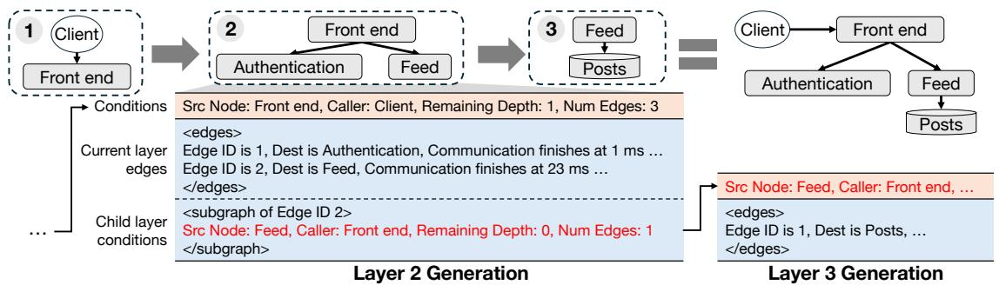

<details>
<summary>flowchart</summary>

```mermaid
graph TD
    A["1 Client"] --> B["Front end"]
    B --> C["2 Front end"]
    C --> D["Authentication"]
    C --> E["Feed"]
    D --> F["3 Feed"]
    E --> F
    F --> G["Posts"]
    G --> H["Client"]
    H --> I["Front end"]
    I --> J["Authentication"]
    I --> K["Feed"]
    K --> L["Posts"]
    
    M["Conditions"] --> N["Current layer edges"]
    M --> O["Child layer conditions"]
    
    P["Src Node: Front end, Caller: Client, Remaining Depth: 1, Num Edges: 3"]
    Q["<edges>"]
    R["Edge ID is 1, Dest is Authentication, Communication finishes at 1 ms ..."]
    S["Edge ID is 2, Dest is Feed, Communication finishes at 23 ms ..."]
    T["<edges>"]
    
    U["<subgraph of Edge ID 2>"]
    V["Src Node: Feed, Caller: Front end, Remaining Depth: 0, Num Edges: 1"]
    W["<subgraph>subgraph of Edge ID 2>"]
    X["<sub>subgraph of Edge ID 2>"]
    Y["<sub>subgraph of Edge ID 2>"]
    Z["<sub>subgraph of Edge ID 2>"]
    AA["<sub>subgraph of Edge ID 2>"]
    AB["<sub>subgraph of Edge ID 2>"]
    AC["<sub>subgraph of Edge ID 2>"]
    AD["<sub>subgraph of Edge ID 2>"]
    AE["<sub>subgraph of Edge ID 2>"]
    AF["<sub>subgraph of Edge ID 2>"]
    AG["<sub>subgraph of Edge ID 2>"]
    AH["<sub>subgraph of Edge ID 2>"]
    AI["<sub>subgraph of Edge ID 2>"]
    AJ["<sub>subgraph of Edge ID 2>"]
    AK["<sub>subgraph of Edge ID 2>"]
    AL["<sub>subgraph of Edge ID 2>"]
    AM["<sub>subgraph of Edge ID 2>"]
    AN["<sub>subgraph of Edge ID 2>"]
    AO["<sub>subgraph of Edge ID 2>"]
    AP["<sub>subgraph of Edge ID 2>"]
    AQ["<sub>subgraph of Edge ID 2>"]
    AR["<sub>subgraph of Edge ID 2>"]
    AS["<sub>subgraph of Edge ID 2>"]
    AT["<sub>subgraph of Edge ID 2>"]
    AU["<sub>subgraph of Edge ID 2>"]
    AV["<sub>subgraph of Edge ID 2>"]
    AW["<sub>subgraph of Edge ID 2>"]
    AX["<sub>subgraph of Edge ID 2>"]
    AY["Edge ID is 1, Dest is Posts, ..."]
    AZ["Edge ID is 1, Dest is Posts, ..."]
```
</details>

Figure 2: Overview of the recursive generation method with a simplified example. The model uses conditions generated in Layer 1 (e.g., source node, caller, number of edges) to generate two edges in Layer 2, one leading to Authentication and the other to Feed. The model also generates starting conditions for the next layer, beginning from the Feed microservice. This recursion continues until all edges in Layer 3 are generated.

Besides edge features, we also encode global attributes of the call graph to serve as conditioning information for the model.

A tabular call graph X has m feature columns $\{ f _ { 1 } , \ldots , f _ { m } \}$ and n edge rows $\left\{ \mathbf { x } _ { 1 } , \ldots , \mathbf { x } _ { n } \right\}$ , where the value of feature j for edge i is $v _ { i j }$ . Each edge $\mathbf { x } _ { i }$ is encoded as a text sequence $\mathbf { t } _ { i } =$ $[ t _ { i 1 } , \ldots , t _ { i m } ]$ , where $t _ { i j } = [ \phi ( f _ { j } ) , v _ { i j } ]$ . Here, $\phi ( f )$ converts feature name $f$ into a natural language template describing $v _ { i j }$ . For example, the encoding for edge 1 in Figure 1 would be: [Edge ID is 0, Source is Client, Destination is Front end, Type is HTTP, Communication starts at 0 ms, Communication finishes at 24 ms]. The full graph is represented as $\mathbf { t } = [ \mathbf { t } _ { 1 } , \ldots , \mathbf { t } _ { n } ]$ , a sequence of text-encoded edges. Since call graph structure depends on feature values and not column order, we randomly shuffle feature order within each edge during training (Borisov et al., 2023) to eliminate spurious position-based associations.

The overall call graph can be described by attributes such as maximum depth, total edges, and total communication latency. These attributes summarize complex interactions and serve as prompts for call graph generation. Let call graph X have r attributes with names $\{ a _ { 1 } , \ldots , a _ { r } \}$ and values $\{ w _ { 1 } , \ldots , w _ { r } \}$ . We encode them as a text sequence $\mathbf { c } = [ c _ { 1 } , \ldots , c _ { r } ]$ , where $c _ { j } = [ a _ { j } , \cdots ; \mathbf { \mathscr { v } } , w _ { j } ]$ . See the Conditions in red in Figure 2 for an example. Attributes are prepended to each text-encoded call graph and predicted alongside edges during pretraining. Like edge features, attributes are randomly shuffled, and each is independently dropped with probability $p _ { d r o p }$ to enable flexible prompting.

# 3.1.2 Recursive Generation

We propose to break down the task of generating a call graph into a series of recursive layer generation tasks to handle complex structures. Starting from the initial attributes, or prompt $\mathbf { c } ,$ the task for the model at each layer is to generate the edges originating from the Start Node specified in the prompt. The model also generates a new prompt for the next layer based on the previous layer prompt and the edges generated in the current layer. This new prompt is then re-used to condition the model’s output for the next layer. The recursive process continues until the requested attributes c are met.

Formally, for an encoded call graph ${ \bf t } \quad = \quad$ $[ \mathbf { t } _ { 1 } , \mathbf { t } _ { 2 } , \ldots , \mathbf { t } _ { n } ]$ , we partition the edges $\mathbf { t } _ { i }$ into a sequence of layers $[ \mathbf { t } ^ { 1 } , \mathbf { t } ^ { 2 } , \ldots , \mathbf { t } ^ { l } ]$ , where $l \ \leq \ n$ Each layer consists of a sequence of edges that share the same parent (i.e., source) node, ensuring that no edge appears in multiple layers. For call graph conditions c that describe t, we introduce layer conditions $\mathbf { c } ^ { j } , \ j \ \in \ \{ 1 , 2 , \dotsc , l + 1 \}$ . Layer condition $\mathbf { c } ^ { j }$ encodes the attributes of the remaining portion of the call graph after the sequence of layers $[ \mathbf { t } ^ { 1 } , \mathbf { t } ^ { 2 } , \dots , \mathbf { t } ^ { j - 1 } ]$ has been generated, and we define $\mathbf { c } ^ { 1 } : = { \mathbf { c } }$ and $\mathbf { c } ^ { l + 1 } : = \varnothing$ . We decompose the conditional call graph distribution as a chain of conditional layer distributions: $\begin{array} { r } { p ( \mathbf { t } | \mathbf { c } ) = \prod _ { k = 1 } ^ { l } p ( \mathbf { c } ^ { k + 1 } , \mathbf { t } ^ { k } | \mathbf { c } ^ { k } ) } \end{array}$ . In other words, the model predicts call graphs from user prompts iteratively layer-by-layer. For layer k the model takes $\mathbf { c } ^ { k }$ as input and produces the sequence of edges $\mathbf { t } ^ { k }$ followed by the conditions $\mathbf { c } ^ { k + 1 }$ of the next layer. The process continues recursively, using $\mathbf { c } ^ { k + 1 }$ to predict the next layer, k + 1. Figure 2 illustrates an example of this recursive generation.

# 3.2 Instruction Tuning

After pre-training, we perform supervised finetuning to enhance the model’s ability to generate call graphs based on user instructions. Unlike pre-training, we exclude the initial call graph attributes c (equivalent to the first-layer conditions $\mathbf { c } ^ { 1 } )$ from the loss computation, treating them as a fixed prompt. Users can provide additional instructions, and §4.4 presents results for two instruction types. To further aid reasoning, we supplement instructions with programmatically generated prompts that convert numerical and non-linguistic attributes (e.g., application IDs) into natural language, as detailed in §B.3.

# 3.2.1 Intermediate Instructions

The model often struggles to generate consistent next-layer conditions $\mathbf { c } ^ { k + 1 }$ based on the current layer’s edges $\mathbf { t } ^ { k }$ and conditions $\mathbf { c } ^ { k }$ , sometimes violating physical constraints (e.g., assigning a layer higher latency than the overall call graph). Inspired by work showing that LLMs improve with explicit step-by-step reasoning (Wei et al., 2022; Nye et al., 2021), we introduce natural language reasoning steps to reinforce constraint adherence. For example, we (1) compute remaining edges from the Num Edges attribute in $\mathbf { c } ^ { k }$ and edges in $\mathbf { t } ^ { k }$ , and (2) derive the Remaining Depth in $\mathbf { c } ^ { k + 1 }$ as Child’s remaining depth = current remaining depth $- \quad 1 \ = \ \hdots$ . These intermediate instructions are inserted before $\mathbf { c } ^ { k + 1 }$ during instruction fine-tuning. We give an example of these steps in §B.3.

# 4 Evaluation

We thoroughly demonstrate the effectiveness of TraceLLM in two major aspects: (1) synthetic trace quality in terms of structural validity (§4.1), distribution similarity (§4.2), and usefulness to train and evaluate machine learning-driven microservice management tasks (§4.3), and (2) benefits from our use of LLMs in terms of instruction-following capabilities (§4.4) and trace-related downstream task performance (§4.5).

We initialize our model from Llama-2 7B (Touvron et al., 2023) and train with LoRA (Hu et al., 2022) on 1.36 million microservice call graph samples from the Alibaba v2022 dataset (Luo et al., 2022), corresponding to 1.1B tokens. Further details on data preprocessing and training hyperparameters are provided in Appendix B. We compare synthetic trace quality with various structured data generation methods such as GReaT (Borisov et al., 2023) and TVAE (Xu et al., 2019), and downstream task performance with one of the state-of-the-art LLMs, Llama-3.1 405B (Dubey et al., 2024).

# 4.1 Structured Reasoning Accuracy

This experiment demonstrates how recursive generation and instruction tuning with intermediate instructions enhance LLMs’ ability to accurately construct microservice call graphs. We evaluate our model by generating traces with specified num\_edges and depth. A trace is deemed accurate if it correctly matches the specified num\_edges and depth and adheres to all structural constraints, such as valid DAG formations and appropriate start/finish times for communications, detailed in Appendix C. We generate 50 samples for each (num\_edges, depth) pair across ranges of $1 \ \leq$ num\_edges  30 and $1 \leq \mathsf { d e p t h } \leq 6$ .

Baselines. We compare our model (recursive + instruction) to Llama-2 7B models trained on text-encoded call graphs (1) without recursive generation and tuning with intermediate instructions (baseline) and (2) with recursive generation but no instruction tuning (recursive). Both baseline models are given num\_edges and depth as inputs during training (see Figure 9 for a training data example of the baseline model). Baselines are trained using the same hyperparameters and number of tokens as our model. The baseline model follows GReaT (Borisov et al., 2023), representing call graph traces as the tabular data format.

Results. Figure 3a and Figure 3b present the accuracy of generated call graphs across varying numbers of edges and depths. Generally, as complexity increases (i.e., more edges or greater depth), the baseline model’s accuracy decreases significantly—dropping below 25% for edges > 15 and nearing zero for depths $> 4$ . In contrast, the recursive generation model maintains higher accuracies, by approximately 30% and 35%, respectively. This improved performance is attributed to the model breaking down complex generation tasks into simpler, more manageable sub-tasks.

Figure 3c illustrates how decoding temperature affects accuracy. Both models show decreased performance as the temperature increases, but the recursive model consistently outperforms the baseline, maintaining about 10% higher accuracy even at a temperature of 1. Further, instruction tuning enhances model accuracy by 23% to 36% by directing the model to adhere to specific generation instructions, such as the number of edges per layer, which are outlined in §B.3.

More results on accuracy with varying model sizes and memorization are in §D.2 and §D.3.

# 4.2 Similarity of Real and Synthetic Traces

To assess the quality of synthetic traces, we compare them to real traces from the validation dataset. We generate 50K call graphs using prompts derived from the validation set and measure their similarity to the original traces.

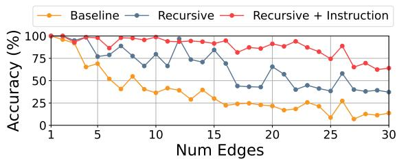

<details>
<summary>line</summary>

| Num Edges | Baseline | Recursive | Recursive + Instruction |
| --------- | -------- | --------- | ------------------------ |
| 1         | 100      | 100       | 100                      |
| 5         | 75       | 90        | 95                       |
| 10        | 40       | 80        | 95                       |
| 15        | 30       | 70        | 95                       |
| 20        | 25       | 65        | 95                       |
| 25        | 10       | 40        | 85                       |
| 30        | 10       | 40        | 65                       |
</details>

(a) accuracy vs. number of edges

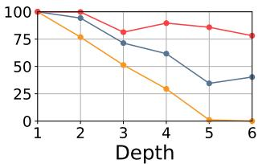

<details>
<summary>line</summary>

| Depth | Series 1 | Series 2 | Series 3 |
|-------|----------|----------|----------|
| 1     | 100      | 100      | 100      |
| 2     | 95       | 98       | 75       |
| 3     | 85       | 75       | 50       |
| 4     | 90       | 60       | 25       |
| 5     | 88       | 35       | 0        |
| 6     | 80       | 40       | 0        |
</details>

(b) accuracy vs. depth

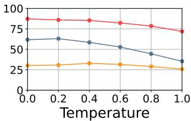

<details>
<summary>line</summary>

| Temperature | Series 1 | Series 2 | Series 3 |
| ----------- | -------- | -------- | -------- |
| 0.0         | 90       | 60       | 25       |
| 0.2         | 88       | 62       | 26       |
| 0.4         | 87       | 58       | 27       |
| 0.6         | 85       | 52       | 28       |
| 0.8         | 82       | 45       | 27       |
| 1.0         | 75       | 35       | 25       |
</details>

(c) accuracy vs. temperature   
Figure 3: Call graph generation accuracy with varying (a) edges and (b) depth in prompt using greedy sampling. (c) shows the accuracy with varying sampling temperature. Accuracy measures the fraction of generated traces that are valid and follow the initial instructions. As shown, both recursive generation and instruction tuning improve the accuracy of the synthetic traces.

Baselines. We compare the following synthetic trace generation methods:

GReaT (Borisov et al., 2023) (Llama-2 7B + tabular format): A Llama-2 7B model finetuned on the tabular data format of call graph traces (Same as baseline in §4.1).   
Probabilistic model: A call graph generator from Alibaba (Luo et al., 2021) that samples graph structures based on statistical distributions, such as communication types and the number of child nodes per depth.   
TVAE (Xu et al., 2019): A VAE-based tabular data generator (Goodfellow et al., 2014). Since it cannot directly generate traces, we use it to compare edge distributions. Training is limited to 100K randomly selected samples.

Distribution of Popular Calls. Realistic synthetic traces should mirror real-world communication patterns. To assess this, we analyze the distribution of calls, defined by (Source, Destination, Communication type). Figure 4a compares the 100 most popular calls generated by our method and the baselines, displaying the top 30 for clarity.

The KL divergence for traces generated by LLMbased approaches (ours and GReaT) is 0.16 and 0.11 respectively, indicating close similarity to the training data, whereas the probabilistic model’s divergence is significantly higher at 3.84, due to its random selection processes. TVAE shows an intermediate divergence of 0.74, which is better than the probabilistic model but still less accurate than our method in capturing popular call distributions.

Heavy-hitter Prediction. Generating top-K heavy-hitter microservices—those most frequently triggered in a sequence of call graphs—is crucial for resource optimization and anomaly detection in microservice management. In this experiment, we select 1K validation traces and create instructions with a service ID and call graph attributes like depth and #edges to guide trace generation for both our model and the baseline. Similarity is evaluated by comparing the top-K microservices between synthetic and validation traces over 20 runs.

Figure 4b illustrates the similarity for varying K values, from 10 to 500. Our method achieves over 90% accuracy for $K \leq 5 0$ and 65% at K=500, demonstrating robust performance. The model trained with the GReaT method also shows robust performance, but slightly worse performance with larger K values. We believe that the performance gap results from the lack of capability to generate complex structures (§4.1), which impacts trace distribution. In contrast, the probabilistic model starts at 59% accuracy for K=10 and declines to 23% at K=500, showcasing our method’s capability to capture and replicate heavy-hitter dynamics.

Additional evaluation on branching (in/outdegree) and latency distributions is in §D.4.

# 4.3 Synthetic Data as Training data for ML-Driven Microservice Management

Synthetic datasets can be used as a substitute for scarce real data in the training process for MLdriven microservice management tasks. Thus, we assess how well microservice management tasks using ML models for critical component extraction in FIRM (Qiu et al., 2020) and anomaly detection in TraceVAE (Xie et al., 2023) perform when the models are trained on the synthetic datasets. The ML models are evaluated using real test data, and their results are compared to their original performance when trained on the real training dataset.

When choosing training data, we select a subset of traces from real data and label them with corresponding conditions (e.g., critical microservices). Then, we extract instructions from real data and use them to generate synthetic traces. We exclude invalid call graphs using the same accuracy metrics in §4.1 before training. We train the models on 5K synthetic call graphs and test on 2K real call graphs, using the same test dataset across all experiments. For baselines, we use synthetic traces generated by GReaT and the Alibaba probabilistic model. Each experiment is run 5 times, varying random seeds, and results are averaged.

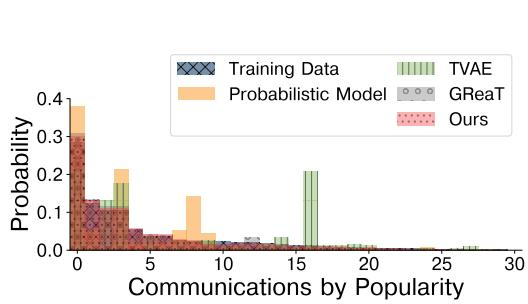

<details>
<summary>bar</summary>

| Communications by Popularity | Training Data | Probabilistic Model | TVAE | GReaT | Ours |
| ---------------------------- | ------------- | ------------------- | ---- | ----- | ---- |
| 0                            | 0.0           | 0.3                 | 0.0  | 0.0   | 0.3  |
| 5                            | 0.0           | 0.0                 | 0.1  | 0.0   | 0.1  |
| 10                           | 0.0           | 0.0                 | 0.0  | 0.0   | 0.0  |
| 15                           | 0.0           | 0.0                 | 0.2  | 0.0   | 0.0  |
| 20                           | 0.0           | 0.0                 | 0.0  | 0.0   | 0.0  |
| 25                           | 0.0           | 0.0                 | 0.0  | 0.0   | 0.0  |
| 30                           | 0.0           | 0.0                 | 0.0  | 0.0   | 0.0  |
</details>

(a) Distribution of popular edges.

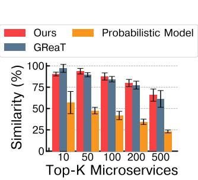

<details>
<summary>bar</summary>

| Top-K Microservices | Ours | Probabilistic Model | GReaT |
| ------------------- | ---- | ------------------- | ----- |
| 10                  | 90   | 55                  | 95    |
| 50                  | 95   | 45                  | 90    |
| 100                 | 85   | 35                  | 80    |
| 200                 | 75   | 30                  | 70    |
| 500                 | 65   | 20                  | 55    |
</details>

(b) Heavy-hitter prediction.   
Figure 4: Distribution similarity between real and synthetic traces.

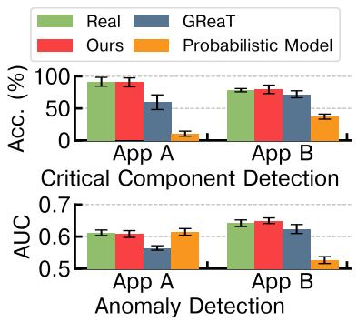

<details>
<summary>bar</summary>

| Method | App A Acc. (%) | App A AUC | App B Acc. (%) | App B AUC |
|--------|----------------|-----------|----------------|-----------|
| Real   | 90             | 0.6       | 80             | 0.65      |
| GReaT  | 60             | 0.55      | 70             | 0.62      |
| Ours   | 90             | 0.6       | 80             | 0.65      |
| Probabilistic Model | 10         | 0.5       | 40             | 0.5       |
</details>

Figure 5: ML Model Performance (real vs. synthetic traces).

Critical Component Extraction. FIRM (Qiu et al., 2020) predicts critical components (microservices likely to violate service level objectives (SLO)) using support vector machines (SVMs) trained on latency-related features from call graphs. For our evaluation, we train SVMs to detect critical components using two popular applications (apps A and B) from our trace dataset. For each application, we randomly sample call graphs and train two SVMs: one with real data and one with synthetic data generated by our fine-tuned model. As shown in Figure 5, SVMs trained on synthetic data achieve near-identical accuracy to those trained on real data, with a difference of less than 1.5 percentage points. In contrast, SVMs trained on synthetic traces from baselines show a performance gap of 6 to 81 percentage points.

Anomaly Detection. For operators to efficiently diagnose system failures, anomaly detection models predict whether microservice call graphs include anomalous characteristics like irregular graph structure or time. We assess our synthetic data quality using TraceVAE (Xie et al., 2023), a variational autoencoder (VAE) model that detects anomalous microservices in terms of time consumption. We train TraceVAE models using real and synthetic trace data, similar to our previous experiment. Figure 5 shows that models trained on synthetic traces from our method yield results comparable to those trained on real data, as measured by ROC AUC.

We obtained similar results with two other classification tasks using fine-tuned Llama-2 7B models, as detailed in §D.5.

# 4.4 Instruction-following Capability

Enabling users to specify desired characteristics of synthetic data is crucial for trace generation. Such "custom" traces are useful to study corner cases and debug microservice management techniques. We assess our instruction-tuned model’s capacity to accurately generate call graphs with specified attributes, such as high latency and rare communication types. We also explore the model’s performance when prompted with combinations of these attributes that were not included in the training data.

When constructing the instruction tuning training datasets, we embed specific instructions to guide the generation of call graphs:

High Latency: Instructions specify that call graphs should exhibit latencies above the 90th percentile (p90) of the training dataset’s distribution, varying by service. For example: Build a call graph with high latency.   
Uncommon Communications: Instructions indicate that the call graph layer should include a communication occurring in less than 10% of the training data. For example: Include an edge from (SRC) to (DEST) with (TYPE) communication type.

We avoid combining these specific instructions in training samples to test the model’s response to novel instruction combinations during inference.

Results. Figure 6 presents the instructionfollowing accuracy for high latency and uncommon communication. We assessed this by filtering 1K validation instructions to see how many generated call graphs met the defined criteria (e.g., exceeding p90 latency). We also compared these results against outputs generated without specific instructions to assess the impact of tailored prompts.

Additionally, we evaluate the model’s performance when both instructions were combined, a scenario not covered during training. The model’s ability to satisfy both conditions simultaneously, despite not being explicitly trained to do so, is detailed in the right of Figure 6. Higher accuracy in the absence of instructions may arise from inherent biases, such as those related to service ID or edge count, which align with the desired outcomes.

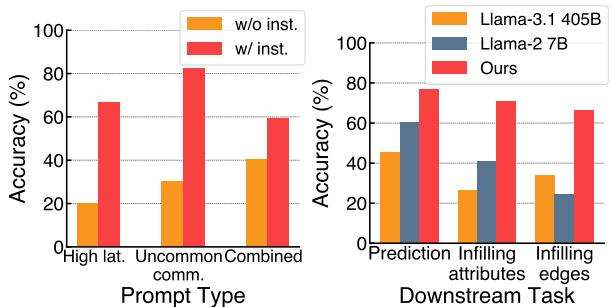  
Figure 6: Instruction follow- Figure 7: Downstream task ing accuracy (%). accuracy (%).

# 4.5 Adapting Models for Trace-Related Downstream Tasks

We extend our evaluation beyond generating synthetic traces, demonstrating the utility of our pretrained model in performing downstream tasks related to microservice traces. The trace pre-trained model is adapted to each downstream task through additional fine-tuning. We focus on scenarios where partial information from distributed environment traces is available, emphasizing the challenges posed by incomplete data. This section compares our fine-tuned model with the standard Llama-2 7B, which lacks specific training on call graph data, and with Llama-3.1 405B by providing task descriptions and up to 16 examples in prompts (i.e., in-context learning (Brown et al., 2020)), to highlight the need for domain-specific training.

Predicting Uncommon Communications. The task is to predict uncommon communication patterns (as in §4.4) based on the first 10 lines of a trace. For fine-tuning, we adapt both the original Llama-2 7B and our trace pretrained model to this binary classification task using 15K samples. Each sample’s prompt comprised the first 10 edges of a real trace, with binary labels indicating the presence of uncommon communication patterns in the subsequent trace sections.

As shown on the left side of Figure 7, the original Llama-2 model achieves only 60.6% accuracy, indicating insufficient training for recognizing uncommon patterns. Additionally, in-context learning with Llama-3.1 405B shows lower accuracy (45.6%), suggesting that larger models trained on general internet data struggle with domain-specific tasks. In contrast, our model achieves 76.8% accuracy, demonstrating its enhanced capability to interpret and predict based on partial trace data.

Infilling Missing Data. Missing data is common in large-scale trace logging, such as in Alibaba’s microservice call graphs, where 67% of traces contain missing values (Huye et al., 2024). This task focuses on fine-tuning our model to accurately infill missing data in microservice call graphs, considering partial information. Specifically, we conduct two experiments on infilling (1) a missing attribute and (2) a missing call connecting two layers.

In the first experiment, we construct a training dataset with 1.2K questions, each containing a sequence of edges with one attribute marked as [MISSING]. The missing value is the unknown ground truth for prediction, so these are multi-class classification problems. Attributes targeted include communication type (e.g., HTTP, RPC) or destination microservice. We evaluate the model on a 6K-sample test dataset, where our model demonstrated over 70% accuracy in predicting the correct attributes, significantly outperforming the accuracy of baselines by about 30% to 40% as reported in the middle of Figure 7.

The second experiment’s dataset comprises 1K samples, each representing a pair of parent and child layers with a missing connecting edge tagged as [MISSING]. After training, we evaluate both models on 5K test cases to generate the correct edge, ensuring the finish time matched or exceeded the start time. The right part of Figure 7 shows that while the original Llama-2 model scored only 24% accuracy and Llama-3.1 405B reached 34%, our model maintained a high accuracy of 66%, underscoring its robustness in more complex tasks.

These experiments demonstrate the capabilities of our trace pre-trained model to effectively adapt to handle infilling tasks that even large foundation models like Llama-3.1 405B cannot achieve.

# 5 Conclusion

This paper introduces TraceLLM, a training method for adapting LLMs to generate microservice trace graphs using recursive call graph generation and instruction tuning. Our approach outperforms baselines in producing accurate, valid call graphs with improved distributional similarity to real traces. We demonstrate that synthetic traces can effectively replace real data for training microservice management tasks, such as critical component extraction and anomaly detection. Additionally, instruction tuning enhances graph generation based on userspecified features, enabling applications in prediction and data infilling. While we focus on microservice call graphs, our method broadly applies to other system traces with similar structures.

Limitations. The recursive method improves the accuracy of call graph generation compared to generating the entire trace at once, but a key drawback is that previously generated edges are discarded, as only the conditioning information from the prior layer is passed to the next layer generation steps. Although dropping previously generated edges has little impact on the output in microservice call graph generation, where direct neighbors exert the most influence (Zhang et al., 2024), incorporating past information, such as prior layers or a time series of call graph traces, could enhance the capture of longer-range dependencies and temporal patterns. However, efficiently compressing historical trace information while preserving critical details remains an open challenge. In future work, we will consider this direction to compress long-range traces and generate synthetic traces conditioned on the compressed traces.

Furthermore, our method uses manually constructed instruction templates, which may lead to suboptimal generation quality, as we are not using the full potential of language models pre-trained with trillions of tokens (Touvron et al., 2023). Following the methods of prior work (Liu et al., 2024; Gunasekar et al., 2023; Li et al., 2024), we believe that diversifying instructions using LLM-generated output is a potential method to improve the ability of LLMs to follow user intentions. However, naively guiding LLMs to generate instructions for trace generation may result in instructions that lack useful characteristics for downstream tasks. In future work, we plan to integrate domain-specific knowledge of traces to improve the usefulness and diversity of instructions generated by LLMs.

Lastly, we focused on generating microservice call graphs in this paper, but other system traces, such as operating system (OS) call graphs, share a similar hierarchical structure. The primary differences in OS call graphs lie in their greater depth and the increased diversity of node and edge types. We present relevant experimental results in §D.7, using cluster batch job traces. We believe that extending TraceLLM’s capabilities to diverse types of system traces is important, since TraceLLM can function not only as a synthetic trace generator but also as a world model (Team et al., 2025) that offers realistic feedback for developing more sophisticated agents capable of reasoning over various computer system traces.

Ethics Statement. There are no ethical concerns raised by our work as the data used in this study is public with sensitive information redacted.

Acknowledgments. This material is based upon work supported by the U.S. National Science Foundation (NSF) under Grant Number 2326576. We acknowledge the use of AI assistants to enhance writing clarity.

# References

Amazon. Aws whitepaper: Implementing microservices on aws. https://docs.aws.amazon.com/ whitepapers/latest/microservices-on-aws/ microservices-on-aws.html. Accessed: 2025- 02-15.   
Shane Bergsma, Timothy Zeyl, Arik Senderovich, and J. Christopher Beck. 2021. Generating complex, realistic cloud workloads using recurrent neural networks. In Proceedings of the ACM SIGOPS 28th Symposium on Operating Systems Principles, SOSP ’21, page 376–391, New York, NY, USA. Association for Computing Machinery.   
Vadim Borisov, Kathrin Sessler, Tobias Leemann, Martin Pawelczyk, and Gjergji Kasneci. 2023. Language models are realistic tabular data generators. In The Eleventh International Conference on Learning Representations.   
Tom Brown, Benjamin Mann, Nick Ryder, Melanie Subbiah, Jared D Kaplan, Prafulla Dhariwal, Arvind Neelakantan, Pranav Shyam, Girish Sastry, Amanda Askell, Sandhini Agarwal, Ariel Herbert-Voss, Gretchen Krueger, Tom Henighan, Rewon Child, Aditya Ramesh, Daniel Ziegler, Jeffrey Wu, Clemens Winter, Chris Hesse, Mark Chen, Eric Sigler, Mateusz Litwin, Scott Gray, Benjamin Chess, Jack Clark, Christopher Berner, Sam McCandlish, Alec Radford, Ilya Sutskever, and Dario Amodei. 2020. Language models are few-shot learners. In Advances in Neural Information Processing Systems, volume 33, pages 1877–1901. Curran Associates, Inc.   
Hyung Won Chung, Le Hou, Shayne Longpre, Barret Zoph, Yi Tay, William Fedus, Eric Li, Xuezhi Wang, Mostafa Dehghani, Siddhartha Brahma, et al. 2022. Scaling instruction-finetuned language models. arXiv preprint arXiv:2210.11416.   
Abhimanyu Dubey, Abhinav Jauhri, Abhinav Pandey, Abhishek Kadian, Ahmad Al-Dahle, Aiesha Letman, Akhil Mathur, Alan Schelten, Amy Yang, Angela Fan, et al. 2024. The llama 3 herd of models. arXiv preprint arXiv:2407.21783.

Yu Gan, Yanqi Zhang, Dailun Cheng, Ankitha Shetty, Priyal Rathi, Nayan Katarki, Ariana Bruno, Justin Hu, Brian Ritchken, Brendon Jackson, Kelvin Hu, Meghna Pancholi, Yuan He, Brett Clancy, Chris Colen, Fukang Wen, Catherine Leung, Siyuan Wang, Leon Zaruvinsky, Mateo Espinosa, Rick Lin, Zhongling Liu, Jake Padilla, and Christina Delimitrou. 2019. An open-source benchmark suite for microservices and their hardware-software implications for cloud & edge systems. In Proceedings of the Twenty-Fourth International Conference on Architectural Support for Programming Languages and Operating Systems, ASPLOS ’19, page 3–18, New York, NY, USA. Association for Computing Machinery.   
Ian Goodfellow, Jean Pouget-Abadie, Mehdi Mirza, Bing Xu, David Warde-Farley, Sherjil Ozair, Aaron Courville, and Yoshua Bengio. 2014. Generative adversarial nets. Advances in neural information processing systems, 27.   
Suriya Gunasekar, Yi Zhang, Jyoti Aneja, Caio César Teodoro Mendes, Allie Del Giorno, Sivakanth Gopi, Mojan Javaheripi, Piero Kauffmann, Gustavo de Rosa, Olli Saarikivi, et al. 2023. Textbooks are all you need. arXiv preprint arXiv:2306.11644.   
Jing Guo, Zihao Chang, Sa Wang, Haiyang Ding, Yihui Feng, Liang Mao, and Yungang Bao. 2019. Who limits the resource efficiency of my datacenter: an analysis of alibaba datacenter traces. In Proceedings of the International Symposium on Quality of Service, IWQoS ’19, New York, NY, USA. Association for Computing Machinery.   
Jonathan Ho, Ajay Jain, and Pieter Abbeel. 2020. Denoising diffusion probabilistic models. Advances in neural information processing systems, 33:6840– 6851.   
Edward J Hu, Yelong Shen, Phillip Wallis, Zeyuan Allen-Zhu, Yuanzhi Li, Shean Wang, Lu Wang, and Weizhu Chen. 2022. LoRA: Low-rank adaptation of large language models. In International Conference on Learning Representations.   
Darby Huye, Lan Liu, and Raja R. Sambasivan. 2024. Systemizing and mitigating topological inconsistencies in alibaba’s microservice call-graph datasets. In Proceedings of the 15th ACM/SPEC International Conference on Performance Engineering, ICPE ’24, page 276–285, New York, NY, USA. Association for Computing Machinery.   
Darby Huye, Yuri Shkuro, and Raja R. Sambasivan. 2023. Lifting the veil on Meta’s microservice architecture: Analyses of topology and request workflows. In 2023 USENIX Annual Technical Conference (USENIX ATC 23), pages 419–432, Boston, MA. USENIX Association.   
Azam Ikram, Sarthak Chakraborty, Subrata Mitra, Shiv Saini, Saurabh Bagchi, and Murat Kocaoglu. 2022. Root cause analysis of failures in microservices

through causal discovery. In Advances in Neural Information Processing Systems, volume 35, pages 31158–31170. Curran Associates, Inc.   
Xi Jiang, Shinan Liu, Aaron Gember-Jacobson, Paul Schmitt, Francesco Bronzino, and Nick Feamster. 2023. Generative, high-fidelity network traces. In Proceedings of the 22nd ACM Workshop on Hot Topics in Networks, HotNets ’23, page 131–138, New York, NY, USA. Association for Computing Machinery.   
Diederik P Kingma and Max Welling. 2013. Autoencoding variational bayes. arXiv preprint arXiv:1312.6114.   
Soochan Lee and Gunhee Kim. 2023. Recursion of thought: A divide-and-conquer approach to multicontext reasoning with language models. arXiv preprint arXiv:2306.06891.   
Aitor Lewkowycz, Anders Andreassen, David Dohan, Ethan Dyer, Henryk Michalewski, Vinay Ramasesh, Ambrose Slone, Cem Anil, Imanol Schlag, Theo Gutman-Solo, et al. 2022. Solving quantitative reasoning problems with language models. Advances in Neural Information Processing Systems, 35:3843– 3857.   
Ming Li, Lichang Chen, Jiuhai Chen, Shwai He, Jiuxiang Gu, and Tianyi Zhou. 2024. Selective reflectiontuning: Student-selected data recycling for llm instruction-tuning. arXiv preprint arXiv:2402.10110.   
Xiang Lisa Li and Percy Liang. 2021. Prefix-tuning: Optimizing continuous prompts for generation. In Proceedings of the 59th Annual Meeting of the Association for Computational Linguistics and the 11th International Joint Conference on Natural Language Processing (Volume 1: Long Papers), pages 4582– 4597, Online. Association for Computational Linguistics.   
Zinan Lin, Alankar Jain, Chen Wang, Giulia Fanti, and Vyas Sekar. 2020. Using gans for sharing networked time series data: Challenges, initial promise, and open questions. In Proceedings of the ACM Internet Measurement Conference, pages 464–483.   
Haotian Liu, Chunyuan Li, Qingyang Wu, and Yong Jae Lee. 2024. Visual instruction tuning. Advances in neural information processing systems, 36.   
Mingjie Liu, Teodor-Dumitru Ene, Robert Kirby, Chris Cheng, Nathaniel Pinckney, Rongjian Liang, Jonah Alben, Himyanshu Anand, Sanmitra Banerjee, Ismet Bayraktaroglu, et al. 2023. Chipnemo: Domainadapted llms for chip design. arXiv preprint arXiv:2311.00176.   
Ilya Loshchilov and Frank Hutter. 2017. Decoupled weight decay regularization. arXiv preprint arXiv:1711.05101.

Shutian Luo, Huanle Xu, Chengzhi Lu, Kejiang Ye, Guoyao Xu, Liping Zhang, Yu Ding, Jian He, and Chengzhong Xu. 2021. Characterizing microservice dependency and performance: Alibaba trace analysis. In Proceedings of the ACM Symposium on Cloud Computing, SoCC ’21, page 412–426, New York, NY, USA. Association for Computing Machinery.   
Shutian Luo, Huanle Xu, Kejiang Ye, Guoyao Xu, Liping Zhang, Guodong Yang, and Chengzhong Xu. 2022. The power of prediction: microservice auto scaling via workload learning. In Proceedings of the 13th Symposium on Cloud Computing, SoCC ’22, page 355–369, New York, NY, USA. Association for Computing Machinery.   
Netflix. Netflix tech blog: Microservices. https:// netflixtechblog.com/tagged/microservices. Accessed: 2025-02-15.   
Maxwell Nye, Anders Andreassen, Guy Gur-Ari, Henryk Witold Michalewski, Jacob Austin, David Bieber, David Martin Dohan, Aitor Lewkowycz, Maarten Paul Bosma, David Luan, Charles Sutton, and Augustus Odena. 2021. Show your work: Scratchpads for intermediate computation with language models. Https://arxiv.org/abs/2112.00114.   
Long Ouyang, Jeff Wu, Xu Jiang, Diogo Almeida, Carroll L. Wainwright, Pamela Mishkin, Chong Zhang, Sandhini Agarwal, Katarina Slama, Alex Ray, John Schulman, Jacob Hilton, Fraser Kelton, Luke E. Miller, Maddie Simens, Amanda Askell, Peter Welinder, Paul Francis Christiano, Jan Leike, and Ryan J. Lowe. 2022. Training language models to follow instructions with human feedback. ArXiv, abs/2203.02155.   
Haoran Qiu, Subho S. Banerjee, Saurabh Jha, Zbigniew T. Kalbarczyk, and Ravishankar K. Iyer. 2020. FIRM: An intelligent fine-grained resource management framework for SLO-Oriented microservices. In 14th USENIX Symposium on Operating Systems Design and Implementation (OSDI 20), pages 805–825. USENIX Association.   
Baptiste Roziere, Jonas Gehring, Fabian Gloeckle, Sten Sootla, Itai Gat, Xiaoqing Ellen Tan, Yossi Adi, Jingyu Liu, Tal Remez, Jérémy Rapin, et al. 2023. Code llama: Open foundation models for code. arXiv preprint arXiv:2308.12950.   
Victor Sanh, Albert Webson, Colin Raffel, Stephen H Bach, Lintang Sutawika, Zaid Alyafeai, Antoine Chaffin, Arnaud Stiegler, Teven Le Scao, Arun Raja, et al. 2021. Multitask prompted training enables zero-shot task generalization. arXiv preprint arXiv:2110.08207.   
Junhong Shen, Neil Tenenholtz, James Brian Hall, David Alvarez-Melis, and Nicolo Fusi. 2024. Tagllm: Repurposing general-purpose llms for specialized domains. Preprint, arXiv:2402.05140.   
Alex Sherstinsky. 2020. Fundamentals of recurrent neural network (rnn) and long short-term memory

(lstm) network. Physica D: Nonlinear Phenomena, 404:132306.   
Taylor Shin, Yasaman Razeghi, Robert L Logan IV, Eric Wallace, and Sameer Singh. 2020. Autoprompt: Eliciting knowledge from language models with automatically generated prompts. arXiv preprint arXiv:2010.15980.   
Arjun Singhvi, Arjun Balasubramanian, Kevin Houck, Mohammed Danish Shaikh, Shivaram Venkataraman, and Aditya Akella. 2021. Atoll: A scalable lowlatency serverless platform. In Proceedings of the ACM Symposium on Cloud Computing, pages 138– 152.   
Kimi Team, Yifan Bai, Yiping Bao, Guanduo Chen, Jiahao Chen, Ningxin Chen, Ruijue Chen, Yanru Chen, Yuankun Chen, Yutian Chen, et al. 2025. Kimi k2: Open agentic intelligence. arXiv preprint arXiv:2507.20534.   
Qwen Team. 2025. Qwq-32b: Embracing the power of reinforcement learning.   
Hugo Touvron, Thibaut Lavril, Gautier Izacard, Xavier Martinet, Marie-Anne Lachaux, Timothée Lacroix, Baptiste Rozière, Naman Goyal, Eric Hambro, Faisal Azhar, et al. 2023. Llama: Open and efficient foundation language models. arXiv preprint arXiv:2302.13971.   
Uber. Introducing domain-oriented microservice architecture. https://www.uber.com/blog/ microservice-architecture/. Accessed: 2025-02-15.   
Qingyue Wang, Liang Ding, Yanan Cao, Zhiliang Tian, Shi Wang, Dacheng Tao, and Li Guo. 2023. Recursively summarizing enables long-term dialogue memory in large language models. arXiv preprint arXiv:2308.15022.   
Jason Wei, Maarten Bosma, Vincent Y Zhao, Kelvin Guu, Adams Wei Yu, Brian Lester, Nan Du, Andrew M Dai, and Quoc V Le. 2021. Finetuned language models are zero-shot learners. arXiv preprint arXiv:2109.01652.   
Jason Wei, Xuezhi Wang, Dale Schuurmans, Maarten Bosma, Fei Xia, Ed Chi, Quoc V Le, Denny Zhou, et al. 2022. Chain-of-thought prompting elicits reasoning in large language models. Advances in Neural Information Processing Systems, 35:24824–24837.   
Zhe Xie, Haowen Xu, Wenxiao Chen, Wanxue Li, Huai Jiang, Liangfei Su, Hanzhang Wang, and Dan Pei. 2023. Unsupervised anomaly detection on microservice traces through graph vae. In Proceedings of the ACM Web Conference 2023, WWW ’23, page 2874–2884, New York, NY, USA. Association for Computing Machinery.   
Lei Xu, Maria Skoularidou, Alfredo Cuesta-Infante, and Kalyan Veeramachaneni. 2019. Modeling tabular data using conditional gan. Advances in neural information processing systems, 32.

Shunyu Yao, Dian Yu, Jeffrey Zhao, Izhak Shafran, Tom Griffiths, Yuan Cao, and Karthik Narasimhan. 2024. Tree of thoughts: Deliberate problem solving with large language models. Advances in Neural Information Processing Systems, 36.   
Yucheng Yin, Zinan Lin, Minhao Jin, Giulia Fanti, and Vyas Sekar. 2022. Practical GAN-based synthetic IP header trace generation using NetShare. In Proceedings of the ACM SIGCOMM 2022 Conference, SIGCOMM ’22, page 458–472, New York, NY, USA. Association for Computing Machinery.   
Y. Zhang, Z. Zhou, S. Elnikety, and C. Delimitrou. 2024. Ursa: Lightweight Resource Management for Cloud-Native Microservices. In 2024 IEEE International Symposium on High-Performance Computer Architecture (HPCA), pages 954–969, Los Alamitos, CA, USA. IEEE Computer Society.   
Zhizhou Zhang, Murali Krishna Ramanathan, Prithvi Raj, Abhishek Parwal, Timothy Sherwood, and Milind Chabbi. 2022. CRISP: Critical path analysis of Large-Scale microservice architectures. In 2022 USENIX Annual Technical Conference (USENIX ATC 22), pages 655–672, Carlsbad, CA. USENIX Association.

# A Other Related Work

Adapting LLMs for Specific Domains. Pretrained LLMs are increasingly adapted for specialized domains due to their vast, diverse training datasets, which enable broad generalization capabilities. Examples include fine-tuning LLMs for programming (Roziere et al., 2023), quantitative reasoning (Lewkowycz et al., 2022), and semiconductor manufacturing (Liu et al., 2023). Our work is the first to apply this approach to computer system traces involving data with specific structures and constraints. Our focus is on generating synthetic trace data by fine-tuning these models to handle the specific requirements of this domain.

Making Language Models Follow Instructions. Recent advancements have focused on enhancing LLMs’ ability to follow instructions through prompting (Li and Liang, 2021; Shin et al., 2020; Wei et al., 2022) and instruction tuning (Ouyang et al., 2022; Wei et al., 2021; Chung et al., 2022). These two sets of methods are relevant to our setting since they augment powerful pre-trained LLMs to improve their performance on new tasks. Our approach seeks to refine output expressiveness within set prompts, aiming for greater fidelity in synthetic data production.

Multi-step Reasoning with LLMs. Iterating with LLMs over multiple steps is an effective strategy to solve complex problems. For instance, Tree-of-thoughts (Yao et al., 2024) solves problems by decomposing into smaller thoughts and exploring diverse reasoning paths over different thoughts. Multi-step reasoning is also useful to handle long-context scenarios by summarizing iteratively (Wang et al., 2023) and diving into subproblems (Lee and Kim, 2023). In contrast to the above approaches, our approach learns to generate traces with specific structures and instructions for subsequent layers.

# B Training Details

# B.1 Training Setup

We train all models with 4 A100 80GB GPUs in our cluster with the hyperparameters described in Table 1. We apply LoRA (Hu et al., 2022) adapters to query and key projection matrices of attention layers with rank = 8, alpha = 16, and dropout = 0.1. For the downstream task training in §4.5, we freeze the backbone model and only train the last classification layer for the prediction task. For the infilling downstream task, we use LoRA adapters with the same configuration as mentioned earlier. During inference, we use a temperature of 0.8 and top-K of 50 for trace generation, unless otherwise specified. We use models (Llama 2 and 3.1) under appropriate community license.

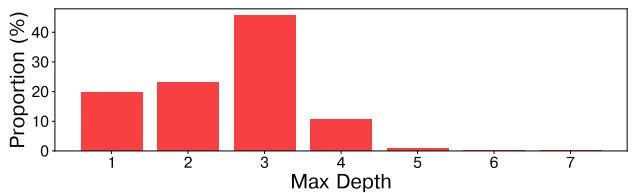

<details>
<summary>bar</summary>

| Max Depth | Proportion (%) |
| --------- | -------------- |
| 1         | 20             |
| 2         | 23             |
| 3         | 45             |
| 4         | 11             |
| 5         | 1              |
| 6         | 0              |
| 7         | 0              |
</details>

(a) Distribution by call graph depth.   
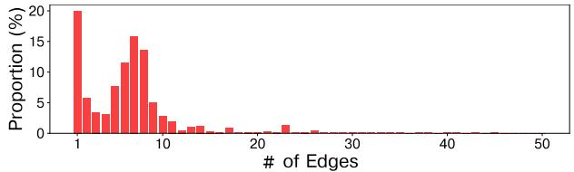

<details>
<summary>bar</summary>

| # of Edges | Proportion (%) |
| ---------- | -------------- |
| 1          | 20             |
| 2          | 6              |
| 3          | 4              |
| 4          | 8              |
| 5          | 12             |
| 6          | 16             |
| 7          | 14             |
| 8          | 5              |
| 9          | 3              |
| 10         | 2              |
| 11         | 1              |
| 12         | 1              |
| 13         | 1              |
| 14         | 1              |
| 15         | 1              |
| 16         | 1              |
| 17         | 1              |
| 18         | 1              |
| 19         | 1              |
| 20         | 1              |
| 21         | 1              |
| 22         | 1              |
| 23         | 1              |
| 24         | 1              |
| 25         | 1              |
| 26         | 1              |
| 27         | 1              |
| 28         | 1              |
| 29         | 1              |
| 30         | 1              |
| 31         | 1              |
| 32         | 1              |
| 33         | 1              |
| 34         | 1              |
| 35         | 1              |
| 36         | 1              |
| 37         | 1              |
| 38         | 1              |
| 39         | 1              |
| 40         | 1              |
| 41         | 1              |
| 42         | 1              |
| 43         | 1              |
| 44         | 1              |
| 45         | 1              |
| 46         | 1              |
| 47         | 1              |
| 48         | 1              |
| 49         | 1              |
| 50         | 1              |
</details>

(b) Distribution by the number of edges.   
Figure 8: Training data distribution after preprocessing.

# B.2 Training Data Preprocessing

From the Alibaba microservice v2022 traces (Luo et al., 2022), we use the first-hour call graph traces as our training data, which consist of 6434 unique microservices collected from more than 10 clusters. We reserve 10% of these samples for validation. The traces are collections of API calls, where each API call includes communication information between the two microservices. Service ID is a ninedigit number starting with the prefix "S\_" instead of using a real service name (e.g., social network), and microservice is a five-digit number starting with the prefix "MS\_". We construct call graphs using the trace ID field (i.e., API calls with the same trace ID belong to one call graph). When constructing call graphs, we remove calls with missing information (e.g., destination microservice IDs are unknown) and remove call graphs that are not connected (e.g., missing edges). To remove redundancy, we filter out call graphs that have the same structure and fields (e.g., service ID, latency) for all API calls. The distributions of training data after removing redundancy are shown in Figure 8.

Note that the dataset anonymizes service and microservice names, ensuring our model does not disclose sensitive information. However, if the training dataset contains sensitive data, models trained with our method may still risk exposing privacyrelated information.

The instruction-tuning datasets were created by

<table><tr><td>Model</td><td>Hyperparameter</td><td>Value</td></tr><tr><td rowspan="4">Pre-Training &amp; Instruction Tuning</td><td>Optimizer</td><td>AdamW (Loshchilov and Hutter, 2017)</td></tr><tr><td>Learning rate</td><td>3e-4 with cosine scheduler</td></tr><tr><td>Batch size</td><td>64</td></tr><tr><td>Gradient clipping</td><td>1.0</td></tr><tr><td rowspan="4">Downstream Task Fine-tuning</td><td>Optimizer</td><td>AdamW</td></tr><tr><td>Learning rate</td><td>1e-4 with cosine scheduler</td></tr><tr><td>Batch size</td><td>2</td></tr><tr><td>Gradient clipping</td><td>1.0</td></tr></table>

Table 1: Training setup and hyperparameters.

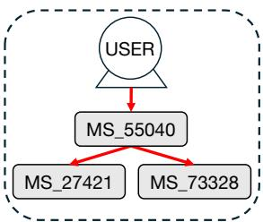

<details>
<summary>flowchart</summary>

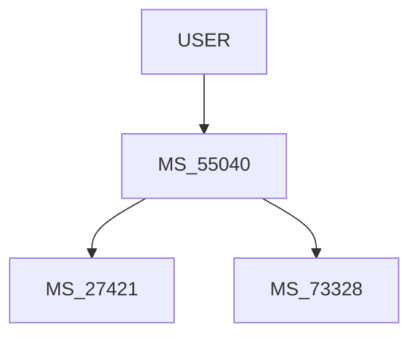
</details>

[GENERATE GRAPH]

num\_edges:3/id:S\_058367691/max\_depth:2

<edges>

(source is USER,communication finishes at 2 milliseconds,communication starts at 0 milliseconds,type is rpc,destination is MS\_55040,edge\_id is 0)

(communication starts at 1 milliseconds, source is MS\_55040,communication finishes at 1 milliseconds,destination is MS\_27421,edge\_id is 0.1,type is db)

(communication finishes at 2 milliseconds,type is db,communication starts at 1 milliseconds,destination is MS\_73328, source is MS\_55040 ,edge\_id is 0.2)

</edges>

Figure 9: A training data sample of a call graph with 3 edges represented in tabular format.   
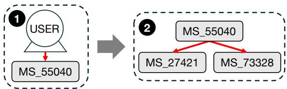

<details>
<summary>flowchart</summary>

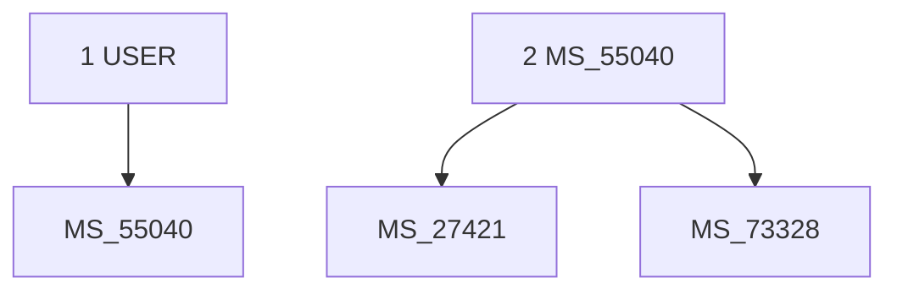
</details>


[GENERATE GRAPH]

num\_current\_edges:1/num\_subgraphs:1/num\_edges:3/start\_communication\_at:0/id:S\_058367691/remaining\_depth:1/

start\_edge\_id:0/start\_node:USER

<layer>

(communication finishes at 2 milliseconds,communication starts at 0 milliseconds,type is rpc,destination is MS\_55040,edge\_id is 0)

</edges>

<subgraph of edge\_id 0>

latency:2/start\_node:MS\_55040/start\_edge\_id:1/num\_subgraphs:0/num\_current\_edges:2/id:S\_058367691/num\_edges:2/

remaining\_depth:0/start\_communication\_at:1/caller:USER

</subgraph>

</layer>


start\_edge\_id:1/id:S\_058367691/latency:2/num\_subgraphs:0/num\_edges:2/remaining\_depth:0/start\_communication\_at:1/

num\_current\_edges:2/start\_node:MS\_55040/caller:USER

<layer>

<edges>

(communication starts at 1 milliseconds,communication finishes at 1 milliseconds,destination is MS\_27421,edge\_id is 1,type is db)

(communication finishes at 2 milliseconds,type is db,communication starts at 1 milliseconds,destination is MS\_73328,edge\_id is 2)

</edges>

</layer>

Figure 10: A training data sample of a call graph with 3 edges for recursive generation.

# Instruction

```txt
You are a trace generator that creates traces based on given requirements.
Requirements:
start_communication_at:0/start_node:USER/remaining_depth:2/num_current_edges:1/num_edges:4/latency:12/id:S_032647104
Conditions:
In each edge, communication start time should NOT be greater than latency 12 milliseconds
Generate subgraph instructions if necessary
the first start_communication_at should be requirement's start_communication_at 0
Also, communication should finish before latency 12 milliseconds
copy caller from requirement's start_node:USER
generate 1 edges following num_current_edges 
```

# Output

```txt
<layer>
<edges>
(edge_id is 0, type is http, communication starts at 0 milliseconds, destination is MS_57649, communication finishes at 12 milliseconds)
</edges>
num generated edges = the last edge id - the first edge id + 1 = 0 - 0 + 1 = 1
1 edges generated out of num_edges:4
num_remaining_edges = num_edges:4 - generated:1 = 3

generate subgraphs of edge:0
Subgraph constraints:
remaining_depth should be the requirement's remaining_depth:2 - 1 = 1
num_edges <= num_remaining_edges:3
copy start_node from edge 0 destination: MS_57649
<subgraph of edge_id 0>
remaining_depth:1/start_edge_id:1/num_edges:3/id:S_032647104/latency:12/num_subgraphs:1/num_current_edges:2/
start_node:MS_57649/start_communication_at:1/caller:USER
</subgraph>
now, num_remaining_edges is 3 - 3 = 0
finish generation
</layer> 
```  
Figure 11: A training data sample of a call graph layer for instruction-tuning.

randomly selecting 5% of the training graphs and reformatting them for instruction tuning. The instruction-tuning lasted four epochs.

# B.3 Training Data Examples

From the call graph traces, we create text-based representations of call graphs as described in Section 3.1.1. First of all, Figure 9 is a training data example of converting a call graph into a tabular data format, which is the baseline in §4.1. At the beginning, we provide high-level information about the call graph, including the service ID, number of edges, and graph depth. Each line inside the <edges> block corresponds to a call in a call graph. 6 fields exist for each call including the edge ID, source/destination microservices, communication type, and communication start/finish time.

Figure 10 shows an example training data sample for recursive generation as described in Section 3.1.2. Each sample consists of a sequence of layers, where each layer includes the edges and the conditions for the next layers. At the beginning of each layer, we provide high-level information to explain connections with the previous layers (e.g., start\_node, caller), structure in the call graph (e.g., remaining\_depth, num\_edges, start\_edge\_id), and time-related information (e.g., latency, start\_communication\_at). Note that the number of fields in each edge is reduced from 6 to 5 since the edges share the same start node. Also, the edge ID field is an integer, not a dot-decimal number. For each next layer, the condition is described in each <subgraph> block starting with the edge ID to be extended.

Figure 11 is an example of instruction-tuning data. The instruction starts with a system prompt followed by conditions as in Figure 10. We further explain the condition in natural language along with user-requested features, as studied in §4.4. In the output section, we include Chain-of-Thought scratchpads at the end of <edges> block and at the beginning of <subgraph> blocks, which elaborate on the number of edges to generate and constraints of subgraph conditions. For example, the scratchpad includes descriptions of the depth requirement to help LLMs understand that the depth field should be reduced by 1 from the current layer’s depth.

As described in Section 3.1.1, we drop each call graph attribute randomly with probability pdrop. We set $p _ { d r o p }$ to 0.9 for all attributes except for the service ID field, which is always kept $( p _ { d r o p } = 1 )$ , to ensure minimal conditioning.

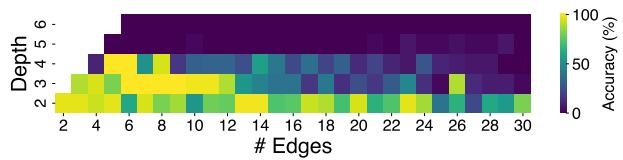

(a) Baseline accuracy heatmap.   
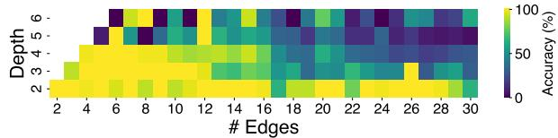

<details>
<summary>heatmap</summary>

| Depth | 2 | 4 | 6 | 8 | 10 | 12 | 14 | 16 | 18 | 20 | 22 | 24 | 26 | 28 | 30 |
|-------|---|---|---|---|---|---|---|---|---|---|---|---|---|---|---|
| 2     | 50 | 50 | 50 | 50 | 50 | 50 | 50 | 50 | 50 | 50 | 50 | 50 | 50 | 50 | 50 |
| 3     | 50 | 50 | 50 | 50 | 50 | 50 | 50 | 50 | 50 | 50 | 50 | 50 | 50 | 50 | 50 |
| 4     | 50 | 50 | 50 | 50 | 50 | 50 | 50 | 50 | 50 | 50 | 50 | 50 | 50 | 50 | 50 |
| 5     | 50 | 50 | 50 | 50 | 50 | 50 | 50 | 50 | 50 | 50 | 50 | 50 | 50 | 50 | 50 |
| 6     | 50 | 50 | 50 | 50 | 50 | 50 | 50 | 50 | 50 | 50 | 50 | 50 | 50 | 50 | 50 |
Color scale: ~1 to ~100, per color bar: ~1 to ~10.79
</details>

(b) Accuracy heatmap with recursive generation.   
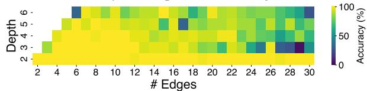  
(c) Accuracy heatmap with recursive generation and instruction-tuning.   
Figure 12: Accuracy heatmap.

# C Constraints in Call Graph Layers

In this section, we describe constraints to be met for each generated call graph layer to be correct. First of all, the generation results are considered invalid if the output does not have the valid format with <edges> and <subgraph> tags.

Edges. For each edge, we check the following conditions. First of all, each edge should include the 5 fields: edge ID, destination, communication type, and communication start/finish time. Secondly, we check whether the right number of edges are generated as described in the condition. Third, the communication start time should be equal to or greater than the communication start time described in the condition, and should not be greater than the communication finish time of the edge. Lastly, the communication finish time must not exceed the latency specified in the condition.

Next Layer Conditions. For the next layer conditions, we first check whether the next layer conditions should be generated or not. If the remaining depth field in the instruction is 0 or the number of edges that need to be generated is 0, no <subgraph> blocks should be generated.

Then, we check the validity of each field in the next layer conditions. First of all, the edge ID inside the <subgraph> block should be found in the edges generated in the current layer. For the depth, the remaining depth field should be less than the remaining depth of the instruction. Additionally, at least one of the resulting subgraphs must have a depth that is reduced by one compared to the original graph. For the start node and caller fields, they should be copied from the destination from the parent edge and the start node from the instructions, respectively. Lastly, we check the latency and communication start time by comparing the values to those of the parent edge. The latency of a child layer should not be greater than the communication finish time of the parent edge. Also, the communication start time of a child layer must not be earlier than that of the parent edge.

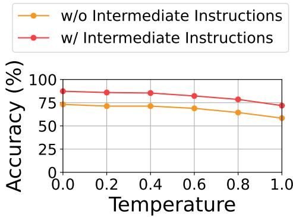

<details>
<summary>line</summary>

| Temperature | w/o Intermediate Instructions | w/ Intermediate Instructions |
| ----------- | ----------------------------- | ---------------------------- |
| 0.0         | 75                            | 90                           |
| 0.2         | 73                            | 88                           |
| 0.4         | 72                            | 86                           |
| 0.6         | 70                            | 84                           |
| 0.8         | 68                            | 80                           |
| 1.0         | 60                            | 75                           |
</details>

Figure 13: Accuracy to generate correct call graph structures with and without intermediate instructions during instruction tuning.

After generating both edges and the next conditions, we check if the sum of the number of edges matches the number of edges in the instruction.

# D Additional Evaluation Results

# D.1 Structured Reasoning Results in Detail

This section provides a more detailed analysis of the results from §4.1, accuracy to generate call graphs adhering to all structural constraints while matching the specified attributes in prompts (i.e., num\_edges and depth). Figure 12 offers a closer look at Figure 3a and Figure 3b, where each grid point (X, Y ) represents accuracy for prompts with X edges and a maximum depth of Y . Figure 12a, Figure 12b, and Figure 12c correspond to the same settings as (baseline), (recursive), and (recursive + instruction) from §4.1, respectively. The results in Figure 12 show that the recursive generation and instruction tuning improves accuracy across most combinations of (# Edges, Depth). However, some configurations in Figure 12b and Figure 12c exhibit lower accuracy, likely due to the distribution of training data in terms of edge count and depth.

In addition, we conduct an ablation study, where we remove intermediate instructions during instruction tuning to see the impact of intermediate instructions in generating correct call graphs. For instance, we remove equations and sentences that help to reason the properties to be generated (e.g., a sentence "num generated edges = the last edge id - the first edge id $+ \ 1 "$ in Figure 11). Figure 13 reports the call graph generation accuracy varying the sampling temperature. Notably, removing the intermediate instructions during instruction tuning results in an approximate 13% decrease in accuracy across all temperatures, demonstrating the effectiveness of having intermediate reasoning steps during instruction tuning.

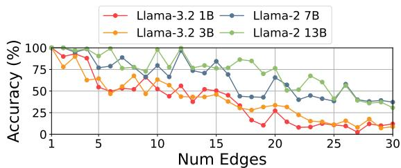

<details>
<summary>line</summary>

| Num Edges | Llama-3.2 1B | Llama-3.2 3B | Llama-2 7B | Llama-2 13B |
| --------- | ------------ | ------------ | ---------- | ----------- |
| 1         | 100          | 100          | 100        | 100         |
| 5         | 80           | 60           | 90         | 95          |
| 10        | 50           | 40           | 75         | 100         |
| 15        | 55           | 45           | 85         | 90          |
| 20        | 25           | 30           | 65         | 75          |
| 25        | 10           | 15           | 40         | 60          |
| 30        | 5            | 10           | 35         | 40          |
</details>

(a) accuracy vs. number of edges

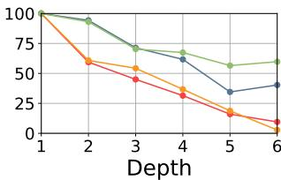

<details>
<summary>line</summary>

| Depth | Series 1 | Series 2 | Series 3 | Series 4 |
|-------|----------|----------|----------|----------|
| 1     | 100      | 100      | 100      | 100      |
| 2     | 95       | 60       | 90       | 85       |
| 3     | 75       | 55       | 70       | 65       |
| 4     | 65       | 35       | 60       | 55       |
| 5     | 55       | 20       | 40       | 45       |
| 6     | 60       | 10       | 35       | 40       |
</details>

(b) accuracy vs. depth

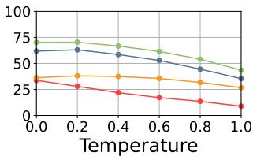

<details>
<summary>line</summary>

| Temperature | Series 1 | Series 2 | Series 3 | Series 4 |
| ----------- | -------- | -------- | -------- | -------- |
| 0.0         | 75       | 65       | 35       | 30       |
| 0.2         | 75       | 65       | 35       | 30       |
| 0.4         | 70       | 60       | 35       | 25       |
| 0.6         | 65       | 55       | 35       | 20       |
| 0.8         | 60       | 50       | 35       | 15       |
| 1.0         | 50       | 45       | 30       | 10       |
</details>

(c) accuracy vs. temperature   
Figure 14: Call graph generation accuracy with varying model sizes. The plots in (a) and (b) show the accuracy varying edges and depth using greedy sampling, and (c) shows the accuracy varying sampling temperature.

# D.2 Structured Reasoning Results varying Model Sizes

To evaluate the impact of model size on trace generation performance, we report the generation accuracy of models with varying numbers of parameters. Specifically, we compare four models: Llama-3.2 1B, Llama-3.2 3B, Llama-2 7B, and Llama-2 13B. Each model undergoes pre-training (§3.1) using the same training dataset (same as the Recursive setup described in §4.1).

Figure 14 presents the microservice call graph generation accuracy across different model sizes. Overall, models with a larger number of parameters demonstrate higher accuracy, with this trend being particularly evident in Figure 14c. Notably, models with more parameters perform better as the depth of prompts increases. For instance, the 13B model achieves a 20 percentage point improvement over the 7B model for inputs with a depth greater than 4 as shown in Figure 14b.

# D.3 Memorization

We assess whether synthetic traces are generated by memorizing training data by measuring the percentage of traces that exactly match the structures and call graph attributes found in the training data. Specifically, for the synthetic traces generated in §4.1, we compute the proportion that exhibit identical call graph structures and edge attributes as those in the training data.

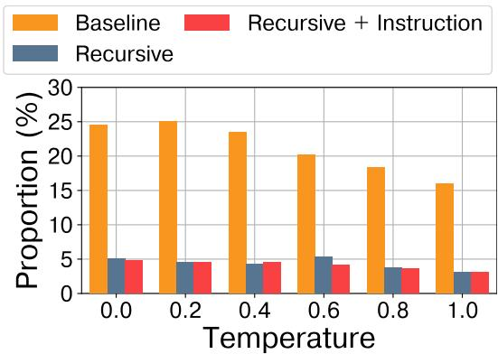

<details>
<summary>bar</summary>

| Temperature | Baseline | Recursive + Instruction | Recursive |
| ----------- | -------- | ------------------------ | --------- |
| 0.0         | 24.5     | 5.0                      | 5.0       |
| 0.2         | 25.0     | 4.5                      | 4.5       |
| 0.4         | 23.5     | 4.5                      | 4.5       |
| 0.6         | 20.0     | 4.5                      | 5.0       |
| 0.8         | 18.5     | 3.5                      | 3.5       |
| 1.0         | 16.0     | 3.0                      | 3.0       |
</details>

Figure 15: Proportion (%) of synthetic call graphs found in training data varying temperature parameters.

Figure 15 presents the proportion of memorized synthetic traces. Notably, traces generated using the Baseline method exhibit a relatively high level of memorization, with proportions ranging from 16% to 24%. In contrast, our methods (Recursive and Recursive+Instruction) demonstrate significantly lower memorization, with proportions ranging from 3% to 5%.

These results suggest that our recursive generation method is effective not only in producing more structured traces, as shown in §4.1, but also in minimizing the memorization of training data. This helps generate more diverse synthetic traces.

# D.4 More Experiments on Similarity Between Real and Synthetic Traces

To further evaluate the effectiveness of our method in capturing the complexity of microservice interactions, we analyze the distribution similarities of microservice branching and response times using 10K synthetic traces. For consistency, we include only correct call graphs in the evaluation, following the accuracy criteria outlined in §4.1. The same baselines as in §4.2 are used, including GReaT and

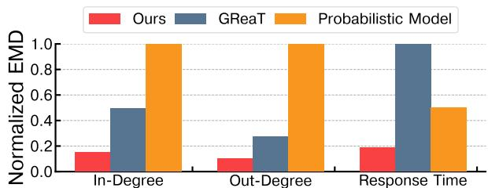

<details>
<summary>bar</summary>

| Category | Ours | GReaT | Probabilistic Model |
| :--- | :--- | :--- | :--- |
| In-Degree | 0.15 | 0.5 | 1.0 |
| Out-Degree | 0.1 | 0.28 | 1.0 |
| Response Time | 0.18 | 1.0 | 0.5 |
</details>

Figure 16: Distribution similarities in microservice branching (in-degree and out-degree) and response times between real and synthetic traces.

<table><tr><td>Accuracy (%)</td><td>High Latency</td><td>Uncommon Communications</td></tr><tr><td>Real</td><td>68.3 %</td><td>65.3 %</td></tr><tr><td>Synthetic</td><td>67.1 %</td><td>62.5 %</td></tr></table>

Table 2: Accuracy of prediction tasks by fine-tuning Llama-2 7B with real and synthetic traces.

Alibaba probabilistic model. To extend the probabilistic model to include time-related fields, we augment it to generate response times by sampling from the training data statistics.

Figure 16 presents the distribution similarities for microservice branching and response times. We use normalized Earth Mover’s Distance (EMD) as the similarity metric, ensuring comparability across fields with varying scales. In-Degree represents the distribution of the number of communications received by each microservice, while Out-Degree reflects the number of communications initiated by each microservice. Response Time measures the distribution similarity of the duration required to complete each communication. Across all three metrics, our method consistently achieves the closest results to the training data, achieving a 2.6x to 10x reduction in EMD compared to GReaT and the probabilistic model. We attribute its higher EMD values to an inability to generate complex call graph structures effectively.

# D.5 More Experiments on Using Synthetic Traces in ML Use Cases

Building on the two evaluation tasks in §4.3, we conducted similar experiments using two classification tasks, fine-tuning the original Llama-2 7B models. We predict high latency in call graphs, defined as latency equal to or above the 90th percentile for each service, without providing latencyrelated information in the input data. Secondly, we predict uncommon communications in direct neighbors within a call graph, as defined in §4.4.

We fine-tune the original Llama-2 7B as a classifier by replacing the last layer with a classification layer and training only the last layer for one epoch. As in the experiments in §4.3, we train one model using real and one using synthetic data. Table 2 reports the test accuracy on real test data. Although synthetic traces have a slight accuracy drop compared to real traces, they still exhibit similar characteristics and can be effectively used in real-world tasks. For Llama-2 7B fine-tuning, We use a few thousand call graphs as training, validation, and test data (ratio 8:1:1) for each classification task and conduct a grid search over learning rates and batch size.

<table><tr><td>Depth</td><td>2</td><td>3</td><td>4</td><td>5</td></tr><tr><td>QwQ-32B</td><td>11.11 %</td><td>32.5 %</td><td>37.14 %</td><td>33.33 %</td></tr></table>

Table 3: Trace generation accuracy using a reasoning model (QwQ-32B).

# D.6 Trace generation with reasoning models

Recent reasoning models have demonstrated strong capabilities in solving complex tasks through structured thinking and reasoning. However, our preliminary experiments with reasoning models using few-shot settings did not improve trace generation accuracy.

Table 3 shows the structured reasoning accuracy (Section 4.1) using a QwQ-32B (Team, 2025) model, where we provide descriptions on call graph structures and constraints along with two randomly chosen trace examples in prompts. We generate 10 samples for each (num\_edges, depth) pair across ranges of 2  num\_edges  10 and 2  depth $\leq 5 .$ , and the following table reports the average accuracy varying depth.

Considering the accuracy of TraceLLMin Figure 3b is higher than 75% for all depth parameters, the reasoning model with few-shot settings does not show comparable results even with easier settings (e.g., num\_edges  10). The results suggest that their reasoning mechanisms may not effectively capture the nuances of trace synthesis (e.g., counting depth and the number of edges), highlighting the need for approaches tailored to the specific task to generate traces.

# D.7 TraceLLM for Batch Job Traces

While we study microservice call graphs in our paper, our method is not limited to microservice traces as stated in the limitations section. Our approach is designed to model structural dependencies within service interactions, which are fundamental properties not exclusive to microservices. The hierarchical nature of our method allows it to adapt to different levels of abstraction in distributed systems, making it applicable to other service architectures, such as batch job requests and serverless workflows.

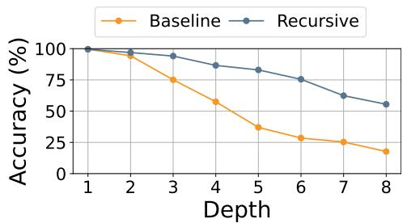

<details>
<summary>line</summary>

| Depth | Baseline | Recursive |
|-------|----------|-----------|
| 1     | 100      | 100       |
| 2     | 95       | 98        |
| 3     | 75       | 95        |
| 4     | 55       | 88        |
| 5     | 35       | 82        |
| 6     | 28       | 75        |
| 7     | 25       | 62        |
| 8     | 18       | 55        |
</details>

Figure 17: Accuracy to generate valid batch job traces.

We conduct additional experiments on generating batch job traces, a type of trace with hierarchical structures. A batch job is represented as a Directed Acyclic Graph (DAG) of tasks, where each task has attributes such as required CPU/memory resources, response time, and the number of instances. Tasks within a DAG have dependencies on one another. We measure accuracy by verifying that the synthetic traces form connected DAGs and satisfy constraints similar to those described in Appendix C, such as the relationships between start and finish times.

Using batch job traces from the Alibaba 2018 cluster dataset (Guo et al., 2019), we train a Llama 3.2 3B model on 0.5B tokens and evaluate structured reasoning accuracy (Section 4.1) for both GReaT and our recursive method. In Figure 17, we report accuracy across different depths and task counts in prompts, with 1000 cases per depth configuration. As shown in the table below, the baseline model’s accuracy declines rapidly as depth increases. In contrast, our recursive method maintains significantly higher accuracy, with up to a 47-percentage-point gap over the baseline, demonstrating its superior ability to handle complex hierarchical structures. We anticipate further improvements with instruction-tuning.