# Twilight: Adaptive Attention Sparsity with Hierarchical Top-p Pruning

Chaofan Lin Jiaming Tang Shuo Yang Hanshuo Wang Tian Tang Boyu Tian Ion Stoica Song Han Mingyu Gao

Tsinghua University Massachusetts Institute of Technology University of California, Berkeley lcf24@mails.tsinghua.edu.cn gaomy@tsinghua.edu.cn

https://github.com/tsinghua-ideal/Twilight

# Abstract

Leveraging attention sparsity to accelerate long-context large language models (LLMs) has been of great importance recently. However, most existing sparse attention algorithms use a fixed budget of how many tokens to use in their computations. This simple static decision raises critical issues in real-world deployment because it fails to account for the dynamic nature of real-world scenarios, where the optimal balance between accuracy and efficiency can vary greatly. In this paper, we reveal a key insight that leveraging the idea of top-p sampling (a.k.a., nucleus sampling) in sparse attention could enable efficient and adaptive budget decisions. Based on this, we propose Twilight, a framework that enhances any existing sparse attention algorithm with adaptive budget decision capabilities without sacrificing accuracy. Empirical results show that Twilight can adaptively prune up to 98% tokens with nearly no accuracy loss in both long- and medium-context scenarios, leading to a 1.4× speedup over state-of-the-art sparse attention mechanisms.

# 1 Introduction

Large language models (LLMs) with long-context capabilities have revolutionized a wide array of natural language processing applications, such as retrieval-based tasks, document summarization [1], and code generation [16]. The increasing availability of models supporting context windows up to 1M to 10M tokens [47, 37] highlights the growing potential of these advancements. For instance, video language models (VLMs) [41] often require tens of thousands of tokens for video processing. Similarly, large reasoning models [8, 38], which are rapidly growing in popularity, frequently demand substantial token lengths to enable chain-of-thought (CoT) reasoning. Consequently, the importance of long-context LLMs is increasing rapidly to meet the needs of these sophisticated applications.

Despite the substantial potential of long-context LLMs, they come with excessive computational and memory costs [58, 36, 45], primarily from the attention mechanism. Particularly, in the decoding stage of LLMs, the key-value (KV) cache size grows rapidly as the token sequence becomes longer. These data need to be repeatedly loaded from the memory, leading to significant latency overheads. Furthermore, the substantial size of the KV cache significantly increases the GPU memory consumption, compounding the challenges of continuously scaling long-context LLMs.

Previous research has extensively investigated the use of attention sparsity (a.k.a., KV cache sparsity) to accelerate long-context inference, both during the prefilling and decoding stages. The core idea is to compute an approximate attention on a subset of tokens, often referred to as “critical tokens” or “heavy hitters” [58]. The number of selected tokens, denoted as B, is commonly referred to as the KV cache budget. A top-k operation is required to identify the indices of the critical tokens that correspond to the B highest estimated scores. However, a key tradeoff exists for the selection of the budget. A smaller B value significantly reduces the memory accesses and computations, while a larger B value retains more contextual information and thereby minimizes the accuracy loss.

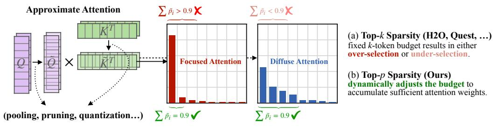

flowchart

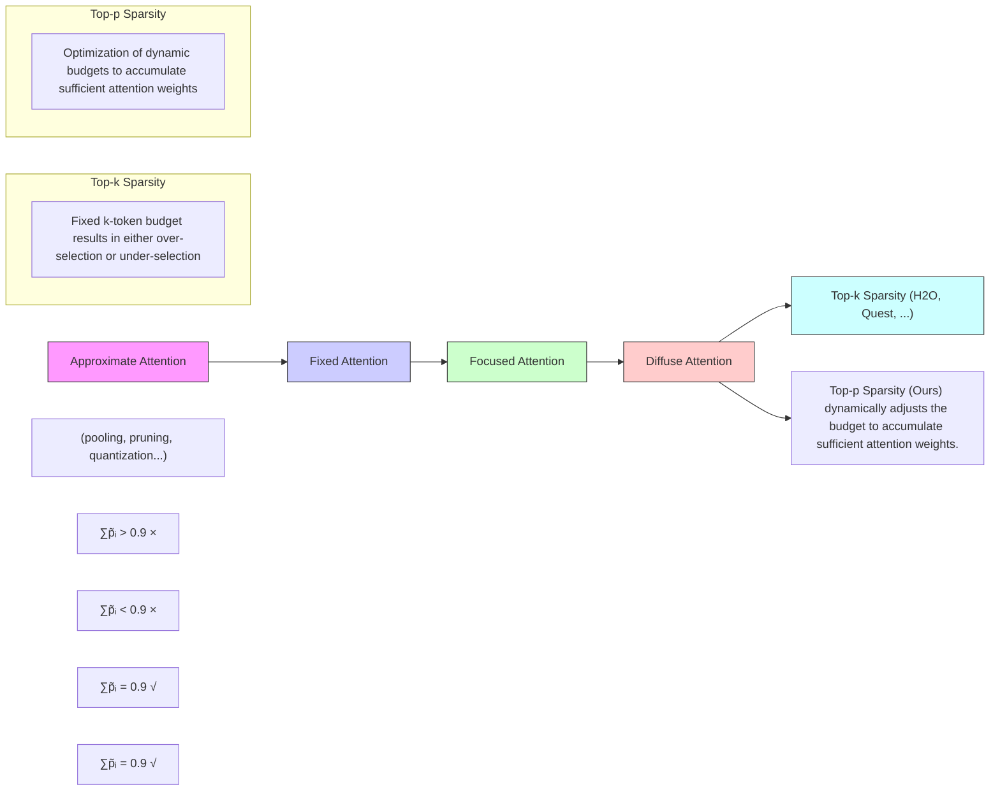

Figure 1: Comparison of top-k and top-p for attention sparsity. Approximate attention typically employs techniques such as pooling, channel pruning, and quantization to approximate the query (Q˜) and key (K˜ ) and estimate the attention weights. These weights are then used to select important tokens for sparse attention. (a) Top-k sparsity, utilized by most existing designs, relies on a fixed k-token budget and often results in over-selection $( \sum \tilde { p _ { i } } > 0 . 9 )$ or under-selection $( \sum { \tilde { p _ { i } } } < 0 . 9 ) .$ . (b) Our proposed top-p sparsity dynamically adjusts the budget to accumulate just sufficient attention weights $( \sum \tilde { p _ { i } } = 0 . 9 )$ , enabling more efficient and adaptive sparse attention.

Identifying the optimal value of B to balance both accuracy and efficiency is inherently challenging due to two major reasons: (a) The best budget choices vary dynamically at runtime. Previous works [44, 45] have demonstrated that some heads, referred to as “retrieval heads”, are trained to extract important information from long contexts, while others focus only on local information. From Figure 1 we see that the distribution of attention weights may vary across different attention heads. Some attention distributions concentrate on a small subset of tokens, which we refer to as focused attention. Other attention distributions may be flatter, where many tokens have similar attention weights; we call this diffuse attention. For focused attention, using a

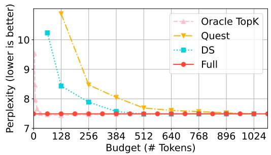

line

| Budget (# Tokens) | Oracle TopK | Quest | DS   | Full |
| ----------------- | ----------- | ----- | ---- | ---- |
| 0                 | 9.5         | 10.5  | 10.2 | 7.5  |
| 128               | 8.0         | 10.0  | 8.5  | 7.5  |
| 256               | 7.8         | 8.5   | 7.8  | 7.5  |
| 384               | 7.6         | 8.0   | 7.5  | 7.5  |
| 512               | 7.5         | 7.8   | 7.4  | 7.5  |
| 640               | 7.5         | 7.6   | 7.4  | 7.5  |
| 768               | 7.5         | 7.5   | 7.4  | 7.5  |
| 896               | 7.5         | 7.5   | 7.4  | 7.5  |
| 1024              | 7.5         | 7.5   | 7.4  | 7.5  |

Figure 2: Relationship between the KV cache budget and the perplexity on the PG-19 dataset in different top-k sparse attention methods.

fixed token budget for top-k attention often leads to over-selection, as only a few tokens are needed to accumulate sufficient attention weights. In contrast, for diffuse attention, a fixed budget can result in under-selection, as a larger number of tokens are necessary to ensure accurate attention modeling. (b) Existing algorithms need different degrees of over-selection to compensate the estimation inaccuracy. As shown in Figure 2, the optimized budgets highly depend on the specific algorithms, necessitating offline calibration to determine the appropriate budget for each algorithm individually. Certain methods, like Quest [36] or DS [50], have to over-select some tokens to compensate for the inevitable inaccuracy in estimating the importance of tokens compared to the oracle.

In this work, we reveal that the top-k methods exhibit issues similar to those previously encountered in LLM sampling. Drawing on this analogy, we introduce top-p sampling into sparse attention to address the budget selection dilemma. Our study demonstrates that top-p can determine the KV cache budget in a more intrinsic and dynamic way compared to top-k. Based on these observations, we build Twilight, a hierarchical KV cache pruning framework that enhances existing sparse attention algorithms with adaptive budget selection capabilities. Specifically, Twilight first lets the base algorithm select a relatively large subset of tokens using a conservative budget, and then further refines this subset by retaining only the top-p tokens.

Our evaluations for Twilight are conducted in two aspects: accuracy and efficiency. First, we demonstrate that Twilight optimizes the base algorithms with nearly no accuracy loss on both medium-context benchmarks (GSM8K [4], COQA [33], PG-19 [32]) and long-context benchmarks (Longbench [1], RULER [14]). Next, we show that Twilight achieves up to 15.8× performance improvement over the full attention operation. Compared to prior sparse attention methods, Twilight enables a 1.4× speedup for the self-attention operator itself, and a 1.35× speedup for the end-to-end decoding. Our contributions are summarized as follows:

• We conduct an in-depth investigation into a critical challenge in top-k sparse attention: the difficulty in identifying the optimal budget (i.e., the number of selected tokens). We propose to use top-p sampling instead to dynamically determine this budget at runtime.   
• We introduce Twilight, a framework that can endow any existing sparse attention method with adaptive budget selection capabilities, thereby further improving their efficiency.   
• We evaluate Twilight in terms of both accuracy and efficiency, demonstrating a speedup of 1.4× over existing sparse attention methods with nearly no accuracy loss.

# 2 Related Work

Top-k Sparse Attention. H2O [58], StreamingLLM [46], and SnapKV [23] evict non-critical tokens in static, query-agnostic manners, which are often referred to as KV cache compression. In contrast, SparQ [34], Quest [36], Double Sparsity (DS) [50], and HShare [43] retain all tokens in the GPU memory but select critical tokens to save data accesses. Recent works like RetrievalAttention [26] and PQCache [55] adopt advanced algorithms to better estimate the token criticality. NSA [54] and MoBA [29] explore opportunities in trainable sparse attention. However, these methods are all based on top-k which requires proper budget selection and configuration beforehand, and thus suffer from the over/under-selection issues.

Dynamic Budget. More recent studies have extensively demonstrated that the optimal budgets vary significantly across different layers [2, 48], attention heads [9, 45, 35], and prompts (tasks) [61]. Please see Appendix A for details. These works tend to focus on only one aspect of the dynamism. In this paper, we point out that it is the different distributions of attention weights that are the root cause of such dynamism.

Non-top-k Sparse Attention. Some recently emerged designs also go beyond top-k methods. MagicPIG [3] uses locality-sensitive hash (LSH) sampling instead of dropping tokens to estimate attention weights, but requires complicated algorithm-system co-design. SampleAttention [64] also features adaptive sparsity but focuses on the prefill stage. A concurrent work with ours, Tactic [62], also dives into top-p sparsity but it uses function fitting to estimate the weight distributions. Although it potentially has lower estimation cost, it usually overestimates the budget.

Other KV Cache Optimizations. Several alternative approaches focus on optimizing the KV cache beyond sparsification, including quantization [13, 27, 17, 30], linear attention [42, 18], and memoryefficient attention mechanisms such as FlashAttention [5] and SageAttention [57, 56]. Our approach is orthogonal to these methods, and can be combined with them for enhanced performance.

# 3 Bringing Top-p Sampling to Sparse Attention

In this section, we formulate the current sparse attention methods and re-examine the root cause of their inefficiencies. We argue that to mathematically approximate the attention, the goal is to select a minimum set of indices such that the sum of their attention scores meets a certain threshold. Therefore, we propose to use top-p sampling instead of top-k to efficiently identify the critical tokens.

# 3.1 Problem Formulation

We start by formulating the sparse attention mechanism. Consider the attention computation during the decoding phase, where we have the query vector $\mathbf { q } \in \mathbb { R } ^ { 1 \times d }$ , and the KV cache K, $\mathbf { V } \in \mathbb { R } ^ { n \times d }$ . Here, d denotes the head dimension, and n represents the context length.

Definition 3.1 (Sparse Attention). Let I be the set of selected indices. Sparse attention calculates

$$
\hat {\mathbf {o}} = \operatorname{softmax} \left(\frac {\mathbf {q} \cdot \mathbf {K} ^ {T}}{\sqrt {d}}\right) \boldsymbol {\Lambda} _ {\mathcal {I}} \mathbf {V} = \mathbf {W} \boldsymbol {\Lambda} _ {\mathcal {I}} \mathbf {V} \in \mathbb {R} ^ {1 \times d} \tag {1}
$$

where $\mathbf { \Delta } \mathbf { \Lambda } \mathbf { \Lambda } \mathbf { \Lambda } \mathbf { \Lambda } \mathbf { \Lambda } \mathbf { \Lambda } \mathbf { \Lambda } \mathbf { \Lambda } \mathbf { \Lambda } \mathbf { \Lambda } \mathbf { \Lambda } \mathbf { \Lambda } \mathbf { \Lambda } \mathbf { \Lambda } \mathbf { \Lambda } \mathbf { \Lambda } \mathbf { \Lambda } \mathbf { \Lambda } \mathbf { \Lambda } \mathbf { \Lambda } \mathbf { \Lambda } \mathbf { \Lambda } \mathbf { \Lambda } \mathbf { \Lambda } \mathbf { \Lambda } \mathbf { \Lambda } \mathbf { \Lambda } \mathbf { \Lambda } \mathbf { \Lambda } \mathbf { \Lambda } \mathbf { \Lambda } \mathbf { \Lambda } \mathbf { \Lambda } \mathbf { \Lambda } \mathbf { \Lambda } \mathbf { \Lambda } \mathbf { \Lambda } \mathbf { \Lambda } \mathbf { \Lambda } \mathbf { \Lambda } \mathbf { \Lambda } \mathbf { \Lambda } \mathbf { \Lambda } \mathbf { \Lambda } \mathbf { \Lambda } \mathbf { \Lambda } \mathbf { \Lambda } \mathbf { \Lambda } \mathbf { \Lambda } \mathbf { \Lambda } \mathbf { \Lambda } \mathbf { \Lambda } \mathbf { \Lambda } \mathbf { \Lambda } \mathbf { \Lambda } \mathbf { \Lambda } \mathbf { \Lambda } \mathbf { \Lambda } \mathbf { \Lambda } \mathbf { \Lambda } \mathbf { \Lambda } \mathbf { \Lambda } \mathbf { \Lambda } \mathbf { \Lambda } \mathbf { \Lambda } \mathbf { \Lambda } \mathbf { \Lambda } \mathbf { \Lambda } \mathbf { \Lambda } \mathbf { \Lambda } \mathbf { \Lambda } \mathbf { \Lambda } \mathbf { \Lambda } \mathbf { \Lambda } \mathbf { \Lambda } \mathbf { \Lambda } \mathbf { \Lambda } \mathbf { \Lambda } \mathbf { \Lambda } \mathbf { \Lambda } \mathbf { \Lambda } \mathbf { \Lambda } \mathbf { \Lambda } \mathbf { \Lambda } \mathbf { \Lambda } \mathbf { \Lambda } \mathbf { \Lambda } \mathbf { \Lambda } \mathbf { \Lambda } \mathbf { \Lambda } \mathbf { \Lambda } \mathbf { \Lambda } \mathbf { \Lambda } \mathbf { \Lambda } \mathbf { \Lambda } \mathbf { \Lambda } \mathbf { \Lambda } \mathbf { \Lambda } \mathbf { \Lambda } \mathbf { \Lambda } \mathbf { \Lambda } \mathbf { \Lambda } \mathbf { \Lambda } \mathbf { \Lambda } \mathbf { \Lambda } \mathbf { \Lambda } \mathbf { \Lambda \Lambda } \mathbf { \Lambda } \mathbf { \Lambda } \mathbf { \Lambda \Lambda } \mathbf { \Lambda } \mathbf { \Lambda \Lambda } \mathbf { \Lambda \Lambda }$

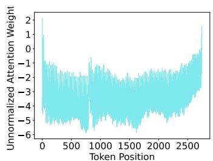

line

| Token Position | Unnormalized Attention Weight |
| -------------- | ----------------------------- |
| 0              | 2.0                           |
| 500            | -3.0                          |
| 1000           | -4.0                          |
| 1500           | -3.5                          |
| 2000           | -4.5                          |
| 2500           | -3.0                          |
| 2800           | 1.5                           |

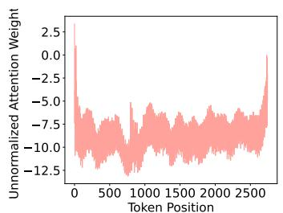

line

| Token Position | Unnormalized Attention Weight |
| -------------- | ------------------------------ |
| 0              | 2.5                            |
| 500            | -7.5                           |
| 1000           | -10.0                          |
| 1500           | -7.5                           |
| 2000           | -10.0                          |
| 2500           | -7.5                           |
| 3000           | 0.0                            |

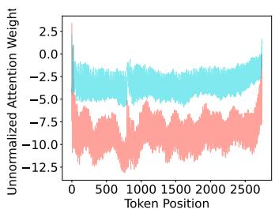

line

| Token Position | Unnormalized Attention Weight |
| -------------- | ----------------------------- |
| 0              | 2.5                           |
| 500            | -5.0                          |
| 1000           | -7.5                          |
| 1500           | -10.0                         |
| 2000           | -7.5                          |
| 2500           | -5.0                          |

Figure 3: Diverse distributions observed in attention weights. The leftmost image illustrates a $\mathbf { \ddot { \Omega } } ^ { 6 } \mathbf { \hat { H } } \mathbf { a } \mathbf { t } ^ { \prime } \mathbf { \dot { \Omega } }$ distribution (diffuse attention), where the weights are close to uniformly distributed. The middle image depicts a “peaked” distribution (focused attention), where the weights are concentrated on the tokens at the two sides. When overlaid as in the rightmost image, the differences between these distributions become readily apparent.

Let the accurate attention output be o = softmax( q·KT√d ) $\begin{array} { r } { \mathbf { o } = \mathrm { s o f t m a x } \big ( \frac { \mathbf { q } \cdot \mathbf { K } ^ { T } } { \sqrt { d } } \big ) \mathbf { V } \in \mathbb { R } ^ { 1 \times d } } \end{array}$ . To minimize the error $\lVert \mathbf o - \hat { \mathbf o } \rVert$ , we need to carefully select the subset of tokens used in $\mathcal { Z } .$ . However, directly optimizing this objective function without loading the full KV cache is challenging. According to the sub-multiplicative property of the Frobenius norm, we can bound the error as in Equation 2. Earlier research has shown that the distribution of V is relatively smooth [59], which implies $\| \mathbf { V } \| _ { F }$ can be viewed as a constant.

$$
\mathcal {L} = \left\| \mathbf {o} - \hat {\mathbf {o}} \right\| = \left\| \mathbf {W} \left(\boldsymbol {\Lambda} _ {\mathcal {I}} - \mathbf {1} ^ {n \times n}\right) \mathbf {V} \right\| + \left\| \mathbf {W} \left(\boldsymbol {\Lambda} _ {\mathcal {I}} - \mathbf {1} ^ {n \times n}\right) \right\| = \left\| \mathbf {I} \right\| \tag {2}
$$

$$
\leq \left\| \mathbf {W} \left(\boldsymbol {\Lambda} _ {\mathcal {I}} - \mathbf {1} ^ {n \times n}\right) \right\| \cdot \left\| \mathbf {V} \right\| _ {F}
$$

Therefore, the objective becomes minimizing $\begin{array} { r } { \| { \bf W } ( \Lambda _ { \mathcal { T } } - { \bf 1 } _ { n \times n } ) \| = 1 - \sum _ { i \in \mathcal { T } } { \bf W } [ i ] } \end{array}$ , which means selecting a subset of tokens that maximize the sum of their attention weights. If we fix the size of this subset, i.e. |I|, then we have the oracle top-k attention:

Definition 3.2 (Oracle Top-k Sparse Attention). Given the budget $B ,$

$$
\mathcal {I} = \arg \max _ {\mathcal {I}} \sum_ {i \in \mathcal {I}} \mathbf {W} [ i ] \text {   s.t.   } | \mathcal {I} | = B \tag {3}
$$

This serves as a theoretical upper bound of the current top-k sparse attention methods.

# 3.2 Rethinking the Problem of Top-k

The Achilles’ heel of top-k sparse attention, as described earlier, is the dilemma in determining a universally applicable budget B to all scenarios. We find that this predicament is quite similar to a previous problem encountered in the sampling phase of LLMs, during which the model samples the final output token from the predicted probability distribution. Nucleus sampling [12], a.k.a., top-p sampling, was proposed to address the problem that top-k sampling cannot adapt to different next-word distributions.

Motivated by this insight, we examine the distributions of attention weights more closely. As indicated by Equation 2, the output error is bounded by the sum of the selected attention weights. Therefore, the objective should become selecting the minimum number of tokens B to satisfy a given requirement for the output error. Figure 3 displays two different types of attention weight distributions in several real-world LLMs mentioned in Figure 1. It is easy to observe that, compared to the peaked distribution, a greater number of tokens must be selected in the flat distribution to reach the same cumulative threshold.

Therefore, we argue that the core reason for budget dynamism is the dynamic nature of attention weight distributions at runtime. We thus introduce top-p sparse attention by directly applying a threshold to the sum of attention weights.

Definition 3.3 (Oracle Top-p Sparse Attention). Given the threshold $p ,$

$$
\mathcal {I} = \arg \min _ {\mathcal {I}} | \mathcal {I} | \quad \text { s.t. } \sum_ {i \in \mathcal {I}} \mathbf {W} [ i ] \geq p \tag {4}
$$

Compared to top-k, top-p is more advantageous because it provides a theoretical upper bound of error as ${ \bf \zeta } ( 1 - p ) \cdot \| { \bf V } \| _ { F }$ from Equation 2. Under this circumstance, top-p reduces the budget as low as possible, making it both efficient and adaptive to different distributions. To demonstrate how top-p reduces the budget, we investigate a real distribution of attention scores as shown in Figure 4. Compared to two fixed budget strategies B = 16 and B = 1024 that respectively result in under-selection and over-selection, the p = 0.8 point selects a very small budget B = 97 to reach a similar error requirement to that of $B = 1 0 2 4$ .

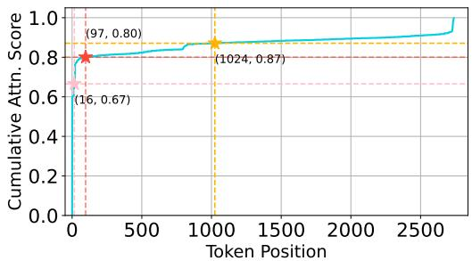

line

| Token Position | Cumulative Attn. Score |
| -------------- | --------------------- |
| 0              | 0.80                  |
| 1024           | 0.87                  |
| 16             | 0.67                  |

Figure 4: Cumulative attention scores of different budget selections in one example attention head.

# 4 Twilight

With the efficient and adaptive top-p sparse attention, our primary goal is to use it to endow existing algorithms with adaptive budget selection capabilities, rather than simply inventing yet another sparse attention design. We are mainly motivated by two reasons. On one hand, despite the challenge of budget selection, existing sparse attention algorithms have achieved significant success in LLM serving systems [20, 60], thanks to their effective token selection strategies. These strategies can be readily reused and enhanced with our adaptive sparsity. On the other hand, we anticipate that future sparse attention methods may still employ top-k selection. By developing a general solution, we aim to automatically equip these future methods with adaptive attention sparsity, while avoiding extensive redesign. Consequently, we position our system, Twilight, as an optimizer for existing algorithms.

Nevertheless, applying top-p to various existing sparse attention algorithms faces three key challenges on both the algorithm and system perspectives. (C1) Not all algorithms are suitable for top-p. Top-p imposes strict constraints on the layout of attention weights. For example, simply replacing top-k with top-p in

Table 1: Comparison of different pruning methods on attention weights. “Normalization” means softmax. 

<table><tr><td>Method</td><td>Efficiency</td><td>Precision Requirement</td><td>Output Accuracy</td><td>Need Normalization?</td></tr><tr><td>Top-k</td><td>High</td><td>Low</td><td>Median</td><td> $\times$ </td></tr><tr><td>Top-p</td><td>High</td><td>Median</td><td>High</td><td> $\surd$ </td></tr><tr><td>Full Attn.</td><td>Low</td><td>High</td><td>High</td><td> $\surd$ </td></tr></table>

Quest [36] would not work, as Quest performs max pooling on weights with a per-page layout (16 tokens per page). Additionally, some other methods [49, 26] do not use attention weights to select critical tokens at all. (C2) It is harder to estimate weights for top-p than top-k. In order to find critical tokens without loading full K data, low-precision representation of the K cache is usually used [50, 55]. However, the precision requirement of top-p is higher than that of top-k, because the former requires a certain degree of numerical accuracy while the latter only demands ordinality. Table 1 compares top-k, top-p, and full attention. The precision requirement of top-p attention lies in between the other two, necessitating reconsideration of appropriate precision choices for the K cache. (C3) System-level optimizations are needed. Since our work is the first to introduce top-p to attention weights, the relevant algorithms need to be efficiently implemented on the GPU, including efforts on both parallel algorithm designs and kernel optimizations.

In Section 4.1, we address C1 by proposing a unified hierarchical pruning framework for top-p sparse attention. In Section 4.2, we mitigate the runtime overheads with efficient kernel implementations (Top-p, SpGEMV, Attention) and 4-bit quantization of the K cache, addressing C2 and C3. Lastly, in Section 4.3, we analyze the overheads of Twilight and discuss some additional issues.

# 4.1 Hierarchical Pruning with a Select-then-Prune Architecture

To uniformly support various sparse attention mechanisms, we propose a two-step, hierarchical pruning process. We first capture the base algorithm into a black-box Token Selector as long as it has the common semantics of selecting a subset of critical tokens, while the exact algorithm details of how to select do not matter. We let the Token Selector use a conservative, relatively large budget,

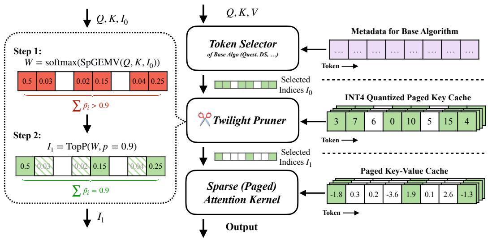

flowchart

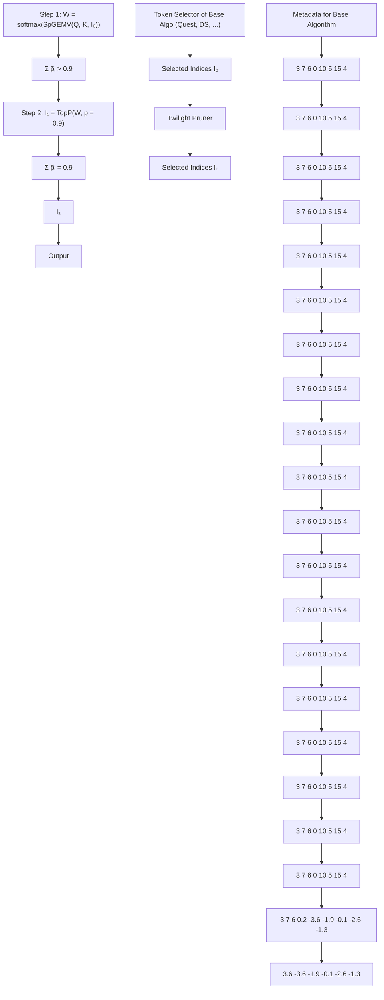

Figure 5: Twilight architecture. Twilight incorporates a certain existing base sparse attention algorithm and further optimizes it. It computes self-attention in three steps. First, the Token Selector selects critical tokens using the base algorithm under a conservative budget. Then, the Twilight Pruner prunes the selected token subset via top-p thresholding. Finally, the pruned token indices are passed to the Sparse Attention Kernel to perform the attention computation.

3 1 411e.g. 1/4 sparsity. Then, we have a Twilight Pruner after it to further optimize the selected indices by only retaining the top-p tokens, i.e., the minimum subset whose attention weight sum exceeds the threshold p. We call this design as the Select-then-Prune architecture, as illustrated in the middle of Figure 5. The final sparse attention kernel thus only computes on the top-p tokens, achieving the benefits of efficiency and adaptivity as proved in Section 3.

# 4.2 Efficient Kernel Implementations

Now we briefly describe the details of the Twilight architecture, particularly for the Pruner step. For more details of the kernel implementations, please refer to Appendix B.

Efficient SpGEMV with 4-bit Quantization of Key Cache. The beginning part of the Pruner is similar to other sparse attention algorithms, which is to estimate the importance of tokens. As we formulated in Section 3.1, this can be done by estimating the similarity between q and K, i.e., q · K. Since loading K is known to be memory bound, we reduce the memory access cost by quantizing K into lower precision. But what precision shall we choose? Table 1 shows the precision requirement of top-p lies in between top-k and full attention. Some existing top-k designs [50, 55] have pushed the compression of the K cache to extremely low precisions of 1 to 2 bits. For full attention, SageAttention [57] has demonstrated 8-bit precision

with smoothing K and per-block quantization. In this work, we empirically find that 4-bit precision strikes a balance between accuracy and efficiency for top-p, as illustrated in Figure 6. Here the sum of attention weights with 2-bit quantization drops significantly, while 4-bit and 8-bit methods both maintain enough stability.

Hence we implement an efficient sparse GEMV (SpGEMV) kernel based on FlashInfer [52], a high-performance kernel library for LLM serving. Here “sparse” means the quantized K cache data are stored/loaded in a paged manner [20] to align with the original KV cache layout. We maintain this extra INT4 asymmetrically quantized K cache on the GPU as shown at the right of Figure 5. The INT4 K vectors are unpacked and dequantized in the shared memory, reducing data accesses from the global memory to at most 1/4, resulting in considerable end-to-end speedup.

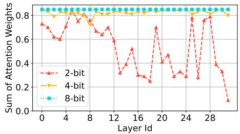

line

| Layer Id | 2-bit | 4-bit | 8-bit |
| -------- | ----- | ----- | ----- |
| 0        | 0.75  | 0.80  | 0.85  |
| 4        | 0.60  | 0.80  | 0.85  |
| 8        | 0.75  | 0.80  | 0.85  |
| 12       | 0.30  | 0.80  | 0.85  |
| 16       | 0.25  | 0.80  | 0.85  |
| 20       | 0.45  | 0.80  | 0.85  |
| 24       | 0.30  | 0.80  | 0.85  |
| 28       | 0.80  | 0.80  | 0.85  |
| 29       | 0.10  | 0.80  | 0.85  |

Figure 6: Sums of normalized attention weights for the selected tokens under different quantization precisions, with p = 0.85.

Efficient Top-p via Binary Search. A brute-force way to do top-p sampling is to sort the elements by descending order and accumulate them until the sum meets the threshold. This is quite inefficient in parallel hardware like modern GPUs. As our top-p method is motivated by the top-p sampling, we also implement this kernel by modifying the top-p sampling kernel from FlashInfer [52]. Specifically, our kernel adopts a parallel-friendly binary search method as in Algorithm 1. Note that element-wise operations like max, where, and sum can be fused into a single loop, which is tensorized on the GPU. Thus we do not need to materialize the intermediate variables like $W _ { 0 }$ .

# Load Balancing with Awareness of Head

Dynamism. The top-p Pruner enables head-wise dynamic budgets, but also raises load imbalance issues in the attention kernel. Traditional implementations allocate uniform computation resources to all heads. FlashInfer [52] deeply investigates this load imbalance problem, but only for requests with dynamic lengths. Twilight further reuses the load balancing algorithm in FlashInfer to address head-wise dynamism, by flattening the head dimension.

# 4.3 Overhead Analysis and Discussion

Execution Time. The execution time of Twilight consists of three parts according to the pipeline in Figure 5: $T _ { \mathrm { T o k e n S e l } } + T _ { \mathrm { P r u n e r } } + T _ { \mathrm { S p a r s e A t t n } }$ . Compared to the baseline sparse attention without Twilight, our method introduces an extra latency term $T _ { \mathrm { P r u n e r } }$ but reduces $T _ { \mathrm { { S p a r s e A t t n } } }$ . Our hierarchical architecture naturally matches the hierarchical sparsity, where the number of tokens gradually decreases as the precision increases. Suppose the base algorithm in the Token Selector estimates token importance with a $1 / 1 6$ sparsity and/or precision reduction. Then the theoretical speedup can be formulated as $\frac { N / 1 6 + B _ { 0 } } { N / 1 6 + B _ { 0 } / 4 + B _ { 1 } }$ , where $B _ { 0 } = | \mathcal { T } _ { 0 } |$ | is the budget of the base Token Selector, and $B _ { 1 } = | { \cal T } _ { 1 } |$ is the budget after pruned by Twilight with INT4. Assuming $B _ { 0 } = N / 4$ and $B _ { 1 } = N / 6 4$ , the speedup would be approximately $2 \times$ . Here we omit the overheads of the top-p kernel since SpGEMV dominates the latency when $B _ { 0 }$ is around N/8 to $N / 4$ .

Memory Overheads. Twilight introduces an extra INT4 quantized K cache, which brings a $1 / 2 \times$ $1 / 4 = 1 / 8$ extra KV cache memory overhead. However, this additional cost does not appear in all cases. First, some base algorithms, like DS [50], already maintain an INT4 K cache. Second, some recent efforts have explored INT4 full attention [56]. This allows us to directly reuse the estimated attention weights calculated by the INT4 K cache in the attention computation, without maintaining the original FP16 K cache. Moreover, offloading and selective quantization (e.g., keeping the extra INT4 K cache only for hot tokens) can be leveraged if the GPU memory becomes a bottleneck, which we leave as future work.

Integration with LLM Serving Systems. Our system design naturally aligns with PagedAttention [20], so Twilight can be seamlessly integrated into popular serving systems like vLLM [20] and SGLang [60]. Other common techniques, such as prefix sharing and multi-phase attention [24, 60, 63, 51, 53], are also compatible with Twilight since we use page-level or token-level sparse operations, and can achieve a flexible computation flow.

# 5 Evaluation

In this section, we perform quantitative experiments to demonstrate that equipping state-of-the-art (SOTA) sparse attention algorithms with Twilight could improve efficiency while preserving accuracy. We present the accuracy and efficiency results in Section 5.1 and Section 5.2, respectively. At last, we perform ablation studies in Section 5.3.

Algorithm 1 Top-p via Binary Search.   
Input: normalized attention weights $W \in R^{BS \times H \times N}$ , top-p threshold p, hyper-parameter $\epsilon$ .
Output: indices I, mask $M \in \{0, 1\}^{BS \times H \times N}$ . $l = 0, r = \max(W), m = (l + r)/2;$ repeat $W_{0} = \text{where}(W < m, 0.0, W);$ $W_{1} = \text{where}(W \leq l, \text{INF}, W);$ $W_{2} = \text{where}(W > r, -\text{INF}, W);$ if $\text{sum}(W_{0}) \geq p$ then $l = m;$ else $r = m;$ end if
until $\max(W_{2}) - \min(W_{1}) \geq \epsilon$ Select indices I and set mask M where $W \geq l;$ return I, M;

# 5.1 Accuracy Evaluation

Benchmarks and Models. We evaluate Twilight on two types of benchmarks: long-context, which includes Longbench [1] and RULER [14], and medium-context (500 to 2k tokens), which includes GSM8K [4], COQA [33], and the perplexity on the PG-19 dataset [32]. We select three widely used models, Longchat-7B-v1.5-32k [22], LLaMA2-7B-Chat [40], and LLaMA-3.1-8B-Instruct [28] (128k context length), with two of them having long context ability ≥ 32k. They cover two mainstream attention implementations of multi-head attention (MHA) and group query attention (GQA) [28].

Baselines. We use two SOTA top-k sparse attention methods, Quest [36] and DS [50], and one SOTA non-top-k method, MagicPIG [3], as our baselines. Following the baselines, we do not apply any sparse methods to the first two layers to ensure fair comparison. For DS, we use the optimized configurations tuned for each model provided by its official repository. The hyperparameter p of Twilight is set to 0.95 for LLaMA-2/3 and 0.85 for Longchat, which will be explored in Section 5.3. Note that MagicPIG does not employ the budget mechanism but instead relies on two configurable parameters, K and L, which directly influence its accuracy. In our experiments, we adopt two standard configurations from the original MagicPIG paper. Due to the lack of official MagicPIG support for LLaMA-2, we exclude these experiments from our evaluation.

Results on Longbench. We comprehensively evaluate Twilight’s long context ability on 12 different tasks chosen from Longbench, covering all task types, using two long-context models. For each top-k baseline, we vary the budget from 256 to 8192, and then apply Twilight to dynamically determine the budget. We also equip “Full” with Twilight, in which the Token Selector is a trivial one that keeps all tokens.

The results are shown in Table 2. In Longchat, the Twilight framework is able to outperform its original version by up to 5.7% in the score, while successfully pruning up to 98% of the redundant tokens overselected by the base algorithm. In LLaMA-3.1-8B-Instruct, Twilight achieves nearly zero accuracy loss (<1%) with a slight increase in budget usage. We hypothesize that this slight increase is due to the knowledge being more compressed in LLaMA-3.1.

Table 2: Average scores on 12 different tasks from Longbench. We report relative error changes (improvement or degradation) when integrating Twilight with each base algorithm. Detailed results are in Table 5 in Appendix C. 

<table><tr><td></td><td>Budget</td><td>Longchat-7B-v1.5-32k</td><td>LLaMA-3.1-8B-Instruct</td></tr><tr><td rowspan="2">Full</td><td>32k</td><td>36.78</td><td>52.01</td></tr><tr><td>Twilight</td><td>38.52 (+4.7%)</td><td>51.64 (-0.7%)</td></tr><tr><td rowspan="2">MagicPIG</td><td>K=8, L=75</td><td>-</td><td>51.70</td></tr><tr><td>K=10, L=150</td><td>-</td><td>51.32</td></tr><tr><td rowspan="5">Quest</td><td>256</td><td>31.26</td><td>38.20</td></tr><tr><td>1024</td><td>36.85</td><td>47.79</td></tr><tr><td>4096</td><td>37.33</td><td>50.79</td></tr><tr><td>8192</td><td>37.10</td><td>51.44</td></tr><tr><td>Twilight</td><td>38.04 (+2.5%)</td><td>51.57 (+0.3%)</td></tr><tr><td rowspan="5">DS</td><td>256</td><td>35.32</td><td>45.74</td></tr><tr><td>1024</td><td>35.96</td><td>49.43</td></tr><tr><td>4096</td><td>36.31</td><td>50.98</td></tr><tr><td>8192</td><td>36.62</td><td>51.14</td></tr><tr><td>Twilight</td><td>38.71 (+5.7%)</td><td>51.73 (+1.2%)</td></tr></table>

Results on RULER. We further evaluate Twilight on the RULER benchmark using the LLaMA-3.1- 8B-Instruct model, which incorporates specialized tests including CWE/FWE for comprehensive non-retrieval accuracy evaluation. As presented in Table 3, while the standard Quest implementation underperforms the non-top-k approaches, DS demonstrates surprisingly competitive results. When enhanced with Twilight, both variants show significant improvements: Quest-Twi achieves performance comparable to the SOTA non-top-k method MagicPIG, while DS-Twi establishes new record-breaking performance, surpassing all existing methods.

Results on Medium-Context Tasks. We then demonstrate that the Twilight Pruner itself does not negatively impact performance on two zero-shot generation tasks, GSM8K and COQA using the lm-harness framework [10], as well as one perplexity test on the PG-19 dataset. Since we are specifically evaluating the Pruner, we do not integrate Twilight into the baseline models. All the baselines use a budget of 128, which is comparable to the budget after Twilight’s pruning. The results in Table 4 show that Twilight outperforms Quest and DS by significant margins, with nearly zero loss compared to full attention.

# 5.2 Efficiency Evaluation

Datasets. We evaluate the efficiency of Twilight on both the self-attention operator and the end-to-end decoding stage on a single A100 GPU. We use Longbench, from which we select three different types of tasks: Qasper [6] for QA, GovReport [15] for summarization, and LCC [11] for coding. We use prompts ranging from 10k to 30k tokens for evaluation. Given that Twilight is designed for deploying sparse attention in LLM serving systems, we use batch inference in our experiments.

Table 3: Average scores on RULER. 

<table><tr><td></td><td>Budget</td><td>16k</td><td>32k</td><td>64k</td><td>96k</td><td>Avg.</td></tr><tr><td rowspan="2">Full</td><td>100%</td><td>92.88</td><td>89.42</td><td>85.17</td><td>85.23</td><td>88.18</td></tr><tr><td>Twilight</td><td>93.13</td><td>89.10</td><td>84.64</td><td>83.10</td><td>87.49</td></tr><tr><td rowspan="2">MagicPIG</td><td>K=8, L=75</td><td>92.22</td><td>89.37</td><td>84.07</td><td>82.58</td><td>87.06</td></tr><tr><td>K=10, L=150</td><td>91.38</td><td>88.20</td><td>83.34</td><td>82.02</td><td>86.23</td></tr><tr><td rowspan="3">Quest</td><td>4%</td><td>79.35</td><td>79.8</td><td>78.64</td><td>73.22</td><td>77.75</td></tr><tr><td>8%</td><td>87.31</td><td>83.06</td><td>80.82</td><td>75.28</td><td>81.62</td></tr><tr><td>Twilight</td><td>91.53</td><td>87.97</td><td>84.12</td><td>82.96</td><td>86.65</td></tr><tr><td rowspan="3">DS</td><td>4%</td><td>92.04</td><td>88.11</td><td>84.43</td><td>82.56</td><td>86.79</td></tr><tr><td>8%</td><td>92.89</td><td>88.70</td><td>84.39</td><td>82.72</td><td>87.18</td></tr><tr><td>Twilight</td><td>93.54</td><td>89.24</td><td>85.91</td><td>82.81</td><td>87.88</td></tr></table>

Table 4: Results on 3 medium-context benchmarks. 

<table><tr><td colspan="4">GSM8K(flexible/strict)↑ COQA(em/f1)↑ PG-19 Perplexity↓</td></tr><tr><td colspan="4">LLaMA-2-7B-Chat</td></tr><tr><td>Full</td><td>0.2290/0.2282</td><td>0.5935/0.7511</td><td>7.503</td></tr><tr><td>Quest</td><td>0.0523/0.0508</td><td>0.5710/0.7425</td><td>14.15</td></tr><tr><td>DS</td><td>0.2191/0.2190</td><td>0.5855/0.7401</td><td>7.622</td></tr><tr><td>Twilight</td><td>0.2153/0.2115</td><td>0.6088/0.7642</td><td>7.600</td></tr><tr><td>(Twilight Avg. Budget)</td><td>90.82</td><td>91.86</td><td>102.58</td></tr><tr><td colspan="4">LLaMA-3.1-8B-Instruct</td></tr><tr><td>Full</td><td>0.7726/0.7475</td><td>0.6363/0.7882</td><td>7.490</td></tr><tr><td>Quest</td><td>0.3639/0.3533</td><td>0.6007/0.7554</td><td>19.00</td></tr><tr><td>DS</td><td>0.6194/0.6027</td><td>0.6455/0.7964</td><td>7.967</td></tr><tr><td>Twilight</td><td>0.7771/0.7604</td><td>0.6325/0.7869</td><td>7.529</td></tr><tr><td>(Twilight Avg. Budget)</td><td>112.40</td><td>86.85</td><td>110.98</td></tr></table>

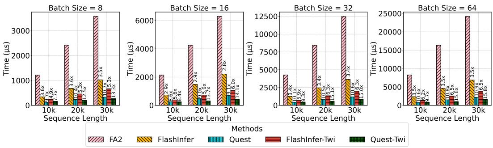  
Figure 7: Latencies and speedups of self-attention at different sequence lengths and batch sizes.

Baselines and Implementation Details. We compare our methods with the following baselines: PyTorch’s scaled-dot-product-attention (SDPA), with FlashAttention2 (FA2) [5] and Memory-Efficient Attention [21] as the backends; FlashInfer [52], a high-performance kernel library for LLM serving; Quest, which achieves SOTA runtime performance among sparse attention methods. We integrate Twilight with both FlashInfer and Quest, resulting in FlashInfer-Twi and Quest-Twi. We modify the Quest kernels to support batch inference. We implement Twilight using both CUDA and OpenAI Triton [39], following the technical details described in Section 4.2.

Self-Attention Speedup. We first evaluate the speedups on the self-attention operator across different batch sizes and sequence lengths. As Figure 7 shows, FlashInfer-Twi and Quest-Twi achieve speedups up to 6.5× and 15.8× compared with FlashAttention2. Moreoever, they accelerate the respective base algorithms FlashInfer and Quest by 2.4× and 1.4×.

End-to-End Decoding Speedup. We evaluate end-to-end decoding with batch sizes ranging from 32 to 256 for various serving scenarios. Figure 8 illustrates that Quest-Twi achieves up to a 3.9× speedup compared with FlashInfer, and a 1.35× speedup compared to Quest without Twilight.

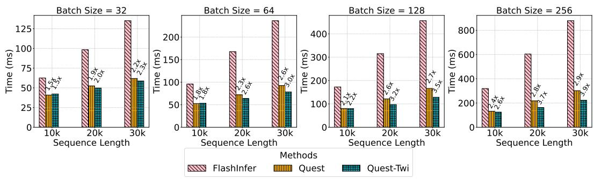  
Figure 8: Time-Per-Output-Token (TPOT) improvements in end-to-end serving scenarios.

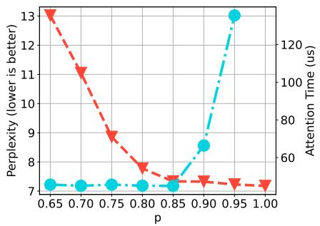

line

| p    | Perplexity (lower is better) | Attention Time (us) |
| ---- | ---------------------------- | ------------------- |
| 0.65 | 13                           | 7                   |
| 0.70 | 11                           | 7                   |
| 0.75 | 9                            | 7                   |
| 0.80 | 8                            | 7                   |
| 0.85 | 7                            | 7                   |
| 0.90 | 7                            | 7                   |
| 0.95 | 7                            | 120                 |
| 1.00 | 7                            | 120                 |

Figure 9: PG-19 perplexity (accuracy) and sparse attention latency (efficiency) under different threshold p values.

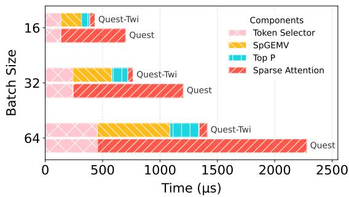

bar_stacked

| Batch Size | Token Selector | SpGEMV | Top P | Sparse Attention |
| ---------- | -------------- | ------ | ----- | ---------------- |
| 16         | ~100           | ~200   | ~50   | ~400             |
| 32         | ~150           | ~300   | ~100  | ~800             |
| 64         | ~400           | ~500   | ~150  | ~2200            |

Figure 10: Time breakdown of self-attention. At batch size 64, Quest-Twi outperforms Quest by about 2×.

# 5.3 Ablation Study

Sensitivity to Threshold $p _ { \bullet }$ Notably, although we introduce the threshold $p$ in order to get rid of the budget k, we argue that p is a more reasonable and tunable hyperparameter. This is because p represents the accumulated probability, which is less influenced by the different distributions that may occur for different heads/layers/queries. In contrast, k is highly sensitive to different distributions, as illustrated in Figure 1. This allows us to simply tune $p$ for a fixed model, in a way such as calibrating with a small dataset.

For the impact of $p$ on model accuracy, we test the perplexity on the PG-19 dataset when using different thresholds p. For the impact on runtime efficiency, the p value directly controls the pruning aggressiveness and affects the attention time via the pruned token number. We evaluate the sparse attention kernel speed after pruned on the TrivialQA dataset. As Figure 9 shows, the accuracy and efficiency strike a balance at $p \approx 0 . 8 5$ , making us choose $p = 0 . 8 5$ for Longchat-7B-v1.5-32k.

Time Breakdown for Twilight. Given Twilight’s hierarchical architecture, which comprises three distinct components, it is insightful to analyze the execution time breakdown to further understand the benefit and cost. Figure 10 illustrates the time breakdown for different batch sizes in a 32k retrieval task. In this scenario, Quest employs a budget of 8192 (1/4 sparsity), while Twilight further prunes this budget down to 256. The breakdown aligns closely with the theoretical cost model presented in Section 4.3, demonstrating that Twilight significantly reduces the time required for the sparse attention kernel while introducing minor overheads.

# 6 Conclusion

In this paper, we first highlight that existing top-k sparse attention methods struggle to find optimal budgets due to the dynamic nature of attention weight distributions. We then introduce Twilight, a framework with a hierarchical select-then-prune architecture that leverages top-p sampling to address this issue. Twilight can adaptively prune up to 98% tokens, resulting in a 15.4× speedup for the self-attention operator and a 3.9× reduction in the end-to-end per-token latency. Comparing to the base sparse attention algorithm it is applied to, Twilight offers an additional 1.4× speedup. Our work underscores the importance of adaptive attention sparsity, and paves a promising way for future research on sparse attention mechanisms.

# Acknowledgment

The authors thank the anonymous reviewers for their valuable suggestions, Yilong Zhao for helping us on kernel optimization, and the Tsinghua IDEAL group members for constructive discussion. Mingyu Gao is the corresponding author.

# References

[1] Y. Bai, X. Lv, J. Zhang, H. Lyu, J. Tang, Z. Huang, Z. Du, X. Liu, A. Zeng, L. Hou, Y. Dong, J. Tang, and J. Li. LongBench: A bilingual, multitask benchmark for long context understanding. In Proceedings of the 62nd Annual Meeting of the Association for Computational Linguistics (Volume 1: Long Papers), pages 3119–3137, Bangkok, Thailand, Aug. 2024. Association for Computational Linguistics.   
[2] Z. Cai, Y. Zhang, B. Gao, Y. Liu, T. Liu, K. Lu, W. Xiong, Y. Dong, B. Chang, J. Hu, and X. Wen. PyramidKV: Dynamic KV cache compression based on pyramidal information funneling. arXiv preprint arXiv:2406.02069, 2024.   
[3] Z. Chen, R. Sadhukhan, Z. Ye, Y. Zhou, J. Zhang, N. Nolte, Y. Tian, M. Douze, L. Bottou, Z. Jia, and B. Chen. MagicPIG: LSH sampling for efficient LLM generation. arXiv preprint arXiv:2410.16179, 2024.   
[4] K. Cobbe, V. Kosaraju, M. Bavarian, M. Chen, H. Jun, L. Kaiser, M. Plappert, J. Tworek, J. Hilton, R. Nakano, C. Hesse, and J. Schulman. Training verifiers to solve math word problems. arXiv preprint arXiv:2110.14168, 2021.   
[5] T. Dao. FlashAttention-2: Faster attention with better parallelism and work partitioning. In The Twelfth International Conference on Learning Representations (ICLR), 2024.   
[6] P. Dasigi, K. Lo, I. Beltagy, A. Cohan, N. A. Smith, and M. Gardner. A dataset of informationseeking questions and answers anchored in research papers. arXiv preprint arXiv:2105.03011, 2021.   
[7] DeepSeek-AI. Deepseek-v2: A strong, economical, and efficient mixture-of-experts language model. arXiv preprint arXiv:2405.04434, 2024.   
[8] DeepSeek-AI, D. Guo, D. Yang, H. Zhang, J. Song, R. Zhang, R. Xu, Q. Zhu, S. Ma, P. Wang, X. Bi, X. Zhang, X. Yu, Y. Wu, Z. F. Wu, Z. Gou, Z. Shao, Z. Li, Z. Gao, A. Liu, B. Xue, B. Wang, B. Wu, B. Feng, C. Lu, C. Zhao, C. Deng, C. Zhang, C. Ruan, D. Dai, D. Chen, D. Ji, E. Li, F. Lin, F. Dai, F. Luo, G. Hao, G. Chen, G. Li, H. Zhang, H. Bao, H. Xu, H. Wang, H. Ding, H. Xin, H. Gao, H. Qu, H. Li, J. Guo, J. Li, J. Wang, J. Chen, J. Yuan, J. Qiu, J. Li, J. L. Cai, J. Ni, J. Liang, J. Chen, K. Dong, K. Hu, K. Gao, K. Guan, K. Huang, K. Yu, L. Wang, L. Zhang, L. Zhao, L. Wang, L. Zhang, L. Xu, L. Xia, M. Zhang, M. Zhang, M. Tang, M. Li, M. Wang, M. Li, N. Tian, P. Huang, P. Zhang, Q. Wang, Q. Chen, Q. Du, R. Ge, R. Zhang, R. Pan, R. Wang, R. J. Chen, R. L. Jin, R. Chen, S. Lu, S. Zhou, S. Chen, S. Ye, S. Wang, S. Yu, S. Zhou, S. Pan, S. S. Li, S. Zhou, S. Wu, S. Ye, T. Yun, T. Pei, T. Sun, T. Wang, W. Zeng, W. Zhao, W. Liu, W. Liang, W. Gao, W. Yu, W. Zhang, W. L. Xiao, W. An, X. Liu, X. Wang, X. Chen, X. Nie, X. Cheng, X. Liu, X. Xie, X. Liu, X. Yang, X. Li, X. Su, X. Lin, X. Q. Li, X. Jin, X. Shen, X. Chen, X. Sun, X. Wang, X. Song, X. Zhou, X. Wang, X. Shan, Y. K. Li, Y. Q. Wang, Y. X. Wei, Y. Zhang, Y. Xu, Y. Li, Y. Zhao, Y. Sun, Y. Wang, Y. Yu, Y. Zhang, Y. Shi, Y. Xiong, Y. He, Y. Piao, Y. Wang, Y. Tan, Y. Ma, Y. Liu, Y. Guo, Y. Ou, Y. Wang, Y. Gong, Y. Zou, Y. He, Y. Xiong, Y. Luo, Y. You, Y. Liu, Y. Zhou, Y. X. Zhu, Y. Xu, Y. Huang, Y. Li, Y. Zheng, Y. Zhu, Y. Ma, Y. Tang, Y. Zha, Y. Yan, Z. Z. Ren, Z. Ren, Z. Sha, Z. Fu, Z. Xu, Z. Xie, Z. Zhang, Z. Hao, Z. Ma, Z. Yan, Z. Wu, Z. Gu, Z. Zhu, Z. Liu, Z. Li, Z. Xie, Z. Song, Z. Pan, Z. Huang, Z. Xu, Z. Zhang, and Z. Zhang. DeepSeek-R1: Incentivizing reasoning capability in LLMs via reinforcement learning. arXiv preprint 2501.12948, 2025.   
[9] Y. Feng, J. Lv, Y. Cao, X. Xie, and S. K. Zhou. Ada-KV: Optimizing KV cache eviction by adaptive budget allocation for efficient LLM inference. arXiv preprint 2407.11550, 2025.   
[10] L. Gao, J. Tow, S. Biderman, S. Black, A. DiPofi, C. Foster, L. Golding, J. Hsu, K. McDonell, N. Muennighoff, J. Phang, L. Reynolds, E. Tang, A. Thite, B. Wang, K. Wang, and A. Zou. A framework for few-shot language model evaluation. Version v0. 0.1. Sept, 10:8–9, 2021.   
[11] D. Guo, C. Xu, N. Duan, J. Yin, and J. McAuley. Longcoder: A long-range pre-trained language model for code completion. In International Conference on Machine Learning (ICML), pages 12098–12107. PMLR, 2023.   
[12] A. Holtzman, J. Buys, L. Du, M. Forbes, and Y. Choi. The curious case of neural text degeneration. arXiv preprint arXiv:1904.09751, 2019.   
[13] C. Hooper, S. Kim, H. Mohammadzadeh, M. W. Mahoney, Y. S. Shao, K. Keutzer, and A. Gholami. KVQuant: Towards 10 million context length LLM inference with KV cache quantization. arXiv preprint 2401.18079, 2024.   
[14] C.-P. Hsieh, S. Sun, S. Kriman, S. Acharya, D. Rekesh, F. Jia, Y. Zhang, and B. Ginsburg. RULER: What’s the real context size of your long-context language models? arXiv preprint arXiv:2404.06654, 2024.

[15] L. Huang, S. Cao, N. Parulian, H. Ji, and L. Wang. Efficient attentions for long document summarization. arXiv preprint arXiv:2104.02112, 2021.   
[16] N. Jain, K. Han, A. Gu, W.-D. Li, F. Yan, T. Zhang, S. Wang, A. Solar-Lezama, K. Sen, and I. Stoica. LiveCodeBench: Holistic and contamination free evaluation of large language models for code. arXiv preprint 2403.07974, 2024.   
[17] H. Kang, Q. Zhang, S. Kundu, G. Jeong, Z. Liu, T. Krishna, and T. Zhao. GEAR: An efficient KV cache compression recipe for near-lossless generative inference of LLM. arXiv preprint 2403.05527, 2024.   
[18] A. Katharopoulos, A. Vyas, N. Pappas, and F. Fleuret. Transformers are RNNs: Fast autoregressive transformers with linear attention. arXiv preprint 2006.16236, 2020.   
[19] Y. J. Kim, R. Henry, R. Fahim, and H. H. Awadalla. Who says elephants can’t run: Bringing large scale moe models into cloud scale production. arXiv preprint arXiv:2211.10017, 2022.   
[20] W. Kwon, Z. Li, S. Zhuang, Y. Sheng, L. Zheng, C. H. Yu, J. Gonzalez, H. Zhang, and I. Stoica. Efficient memory management for large language model serving with PagedAttention. In Proceedings of the 29th Symposium on Operating Systems Principles, SOSP ’23, page 611–626, New York, NY, USA, 2023. Association for Computing Machinery.   
[21] B. Lefaudeux, F. Massa, D. Liskovich, W. Xiong, V. Caggiano, S. Naren, M. Xu, J. Hu, M. Tintore, S. Zhang, P. Labatut, D. Haziza, L. Wehrstedt, J. Reizenstein, and G. Sizov. xFormers: A modular and hackable transformer modelling library. https://github.com/ facebookresearch/xformers, 2022.   
[22] D. Li, R. Shao, A. Xie, Y. Sheng, L. Zheng, J. E. Gonzalez, I. Stoica, X. Ma, and H. Zhang. How long can open-source LLMs truly promise on context length?, June 2023.   
[23] Y. Li, Y. Huang, B. Yang, B. Venkitesh, A. Locatelli, H. Ye, T. Cai, P. Lewis, and D. Chen. SnapKV: LLM knows what you are looking for before generation. arXiv preprint arXiv:2404.14469, 2024.   
[24] C. Lin, Z. Han, C. Zhang, Y. Yang, F. Yang, C. Chen, and L. Qiu. Parrot: Efficient serving of LLM-based applications with semantic variable. In 18th USENIX Symposium on Operating Systems Design and Implementation (OSDI 24), Santa Clara, CA, July 2024. USENIX Association.   
[25] Y. Lin, H. Tang, S. Yang, Z. Zhang, G. Xiao, C. Gan, and S. Han. QServe: W4A8KV4 quantization and system co-design for efficient LLM serving. arXiv preprint arXiv:2405.04532, 2024.   
[26] D. Liu, M. Chen, B. Lu, H. Jiang, Z. Han, Q. Zhang, Q. Chen, C. Zhang, B. Ding, K. Zhang, C. Chen, F. Yang, Y. Yang, and L. Qiu. RetrievalAttention: Accelerating long-context LLM inference via vector retrieval. arXiv preprint arXiv:2409.10516, 2024.   
[27] Z. Liu, J. Yuan, H. Jin, S. Zhong, Z. Xu, V. Braverman, B. Chen, and X. Hu. KIVI: A tuning-free asymmetric 2bit quantization for KV cache. arXiv preprint arXiv:2402.02750, 2024.   
[28] Llama Team, AI @ Meta. The Llama 3 herd of models. arXiv preprint arXiv:2407.21783, 2024.   
[29] E. Lu, Z. Jiang, J. Liu, Y. Du, T. Jiang, C. Hong, S. Liu, W. He, E. Yuan, Y. Wang, Z. Huang, H. Yuan, S. Xu, X. Xu, G. Lai, Y. Chen, H. Zheng, J. Yan, J. Su, Y. Wu, N. Y. Zhang, Z. Yang, X. Zhou, M. Zhang, and J. Qiu. MoBA: Mixture of block attention for long-context LLMs. arXiv preprint arXiv:2502.13189, 2025.   
[30] P. Nawrot, A. Łancucki, M. Chochowski, D. Tarjan, and E. M. Ponti. Dynamic memory ´ compression: Retrofitting LLMs for accelerated inference. arXiv preprint 2403.09636, 2024.   
[31] NVIDIA. FasterTransformer: Providing a script and recipe to run the highly optimized transformer-based encoder and decoder component. https://github.com/NVIDIA/ FasterTransformer, 2023.   
[32] J. W. Rae, A. Potapenko, S. M. Jayakumar, and T. P. Lillicrap. Compressive transformers for long-range sequence modelling. arXiv preprint arXiv:1911.05507, 2019.   
[33] S. Reddy, D. Chen, and C. D. Manning. CoQA: A conversational question answering challenge. Transactions of the Association for Computational Linguistics, 7:249–266, 2019.   
[34] L. Ribar, I. Chelombiev, L. Hudlass-Galley, C. Blake, C. Luschi, and D. Orr. SparQ attention: Bandwidth-efficient LLM inference. arXiv preprint arXiv:2312.04985, 2023.   
[35] H. Tang, Y. Lin, J. Lin, Q. Han, S. Hong, Y. Yao, and G. Wang. RazorAttention: Efficient KV cache compression through retrieval heads. arXiv preprint arXiv:2407.15891, 2024.   
[36] J. Tang, Y. Zhao, K. Zhu, G. Xiao, B. Kasikci, and S. Han. Quest: Query-aware sparsity for efficient long-context LLM inference. arXiv preprint 2406.10774, 2024.

[37] G. Team, P. Georgiev, V. I. Lei, R. Burnell, L. Bai, A. Gulati, G. Tanzer, D. Vincent, Z. Pan, S. Wang, S. Mariooryad, Y. Ding, X. Geng, F. Alcober, R. Frostig, M. Omernick, L. Walker, C. Paduraru, C. Sorokin, A. Tacchetti, C. Gaffney, S. Daruki, O. Sercinoglu, Z. Gleicher, J. Love, P. Voigtlaender, R. Jain, G. Surita, K. Mohamed, R. Blevins, J. Ahn, T. Zhu, K. Kawintiranon, O. Firat, Y. Gu, Y. Zhang, M. Rahtz, M. Faruqui, N. Clay, J. Gilmer, J. Co-Reyes, I. Penchev, R. Zhu, N. Morioka, K. Hui, K. Haridasan, V. Campos, M. Mahdieh, M. Guo, S. Hassan, K. Kilgour, A. Vezer, H.-T. Cheng, R. de Liedekerke, S. Goyal, P. Barham, D. Strouse, S. Noury, J. Adler, M. Sundararajan, S. Vikram, D. Lepikhin, M. Paganini, X. Garcia, F. Yang, D. Valter, M. Trebacz, K. Vodrahalli, C. Asawaroengchai, R. Ring, N. Kalb, L. B. Soares, S. Brahma, D. Steiner, T. Yu, F. Mentzer, A. He, L. Gonzalez, B. Xu, R. L. Kaufman, L. E. Shafey, J. Oh, T. Hennigan, G. van den Driessche, S. Odoom, M. Lucic, B. Roelofs, S. Lall, A. Marathe, B. Chan, S. Ontanon, L. He, D. Teplyashin, J. Lai, P. Crone, B. Damoc, L. Ho, S. Riedel, K. Lenc, C.-K. Yeh, A. Chowdhery, Y. Xu, M. Kazemi, E. Amid, A. Petrushkina, K. Swersky, A. Khodaei, G. Chen, C. Larkin, M. Pinto, G. Yan, A. P. Badia, P. Patil, S. Hansen, D. Orr, S. M. R. Arnold, J. Grimstad, A. Dai, S. Douglas, R. Sinha, V. Yadav, X. Chen, E. Gribovskaya, J. Austin, J. Zhao, K. Patel, P. Komarek, S. Austin, S. Borgeaud, L. Friso, A. Goyal, B. Caine, K. Cao, D.-W. Chung, M. Lamm, G. Barth-Maron, T. Kagohara, K. Olszewska, M. Chen, K. Shivakumar, R. Agarwal, H. Godhia, R. Rajwar, J. Snaider, X. Dotiwalla, Y. Liu, A. Barua, V. Ungureanu, Y. Zhang, B.-O. Batsaikhan, M. Wirth, J. Qin, I. Danihelka, T. Doshi, M. Chadwick, J. Chen, S. Jain, Q. Le, A. Kar, M. Gurumurthy, C. Li, R. Sang, F. Liu, L. Lamprou, R. Munoz, N. Lintz, H. Mehta, H. Howard, M. Reynolds, L. Aroyo, Q. Wang, L. Blanco, A. Cassirer, J. Griffith, D. Das, S. Lee, J. Sygnowski, Z. Fisher, J. Besley, R. Powell, Z. Ahmed, D. Paulus, D. Reitter, Z. Borsos, R. Joshi, A. Pope, S. Hand, V. Selo, V. Jain, N. Sethi, M. Goel, T. Makino, R. May, Z. Yang, J. Schalkwyk, C. Butterfield, A. Hauth, A. Goldin, W. Hawkins, E. Senter, S. Brin, O. Woodman, M. Ritter, E. Noland, M. Giang, V. Bolina, L. Lee, T. Blyth, I. Mackinnon, M. Reid, O. Sarvana, D. Silver, A. Chen, L. Wang, L. Maggiore, O. Chang, N. Attaluri, G. Thornton, C.-C. Chiu, O. Bunyan, N. Levine, T. Chung, E. Eltyshev, X. Si, T. Lillicrap, D. Brady, V. Aggarwal, B. Wu, Y. Xu, R. McIlroy, K. Badola, P. Sandhu, E. Moreira, W. Stokowiec, R. Hemsley, D. Li, A. Tudor, P. Shyam, E. Rahimtoroghi, S. Haykal, P. Sprechmann, X. Zhou, D. Mincu, Y. Li, R. Addanki, K. Krishna, X. Wu, A. Frechette, M. Eyal, A. Dafoe, D. Lacey, J. Whang, T. Avrahami, Y. Zhang, E. Taropa, H. Lin, D. Toyama, E. Rutherford, M. Sano, H. Choe, A. Tomala, C. Safranek-Shrader, N. Kassner, M. Pajarskas, M. Harvey, S. Sechrist, M. Fortunato, C. Lyu, G. Elsayed, C. Kuang, J. Lottes, E. Chu, C. Jia, C.-W. Chen, P. Humphreys, K. Baumli, C. Tao, R. Samuel, C. N. dos Santos, A. Andreassen, N. Rakicevi ´ c,´ D. Grewe, A. Kumar, S. Winkler, J. Caton, A. Brock, S. Dalmia, H. Sheahan, I. Barr, Y. Miao, P. Natsev, J. Devlin, F. Behbahani, F. Prost, Y. Sun, A. Myaskovsky, T. S. Pillai, D. Hurt, A. Lazaridou, X. Xiong, C. Zheng, F. Pardo, X. Li, D. Horgan, J. Stanton, M. Ambar, F. Xia, A. Lince, M. Wang, B. Mustafa, A. Webson, H. Lee, R. Anil, M. Wicke, T. Dozat, A. Sinha, E. Piqueras, E. Dabir, S. Upadhyay, A. Boral, L. A. Hendricks, C. Fry, J. Djolonga, Y. Su, J. Walker, J. Labanowski, R. Huang, V. Misra, J. Chen, R. Skerry-Ryan, A. Singh, S. Rijhwani, D. Yu, A. Castro-Ros, B. Changpinyo, R. Datta, S. Bagri, A. M. Hrafnkelsson, M. Maggioni, D. Zheng, Y. Sulsky, S. Hou, T. L. Paine, A. Yang, J. Riesa, D. Rogozinska, D. Marcus, D. E. Badawy, Q. Zhang, L. Wang, H. Miller, J. Greer, L. L. Sjos, A. Nova, H. Zen, R. Chaabouni, M. Rosca, J. Jiang, C. Chen, R. Liu, T. Sainath, M. Krikun, A. Polozov, J.-B. Lespiau, J. Newlan, Z. Cankara, S. Kwak, Y. Xu, P. Chen, A. Coenen, C. Meyer, K. Tsihlas, A. Ma, J. Gottweis, J. Xing, C. Gu, J. Miao, C. Frank, Z. Cankara, S. Ganapathy, I. Dasgupta, S. Hughes-Fitt, H. Chen, D. Reid, K. Rong, H. Fan, J. van Amersfoort, V. Zhuang, A. Cohen, S. S. Gu, A. Mohananey, A. Ilic, T. Tobin, J. Wieting, A. Bortsova, P. Thacker, E. Wang, E. Caveness, J. Chiu, E. Sezener, A. Kaskasoli, S. Baker, K. Millican, M. Elhawaty, K. Aisopos, C. Lebsack, N. Byrd, H. Dai, W. Jia, M. Wiethoff, E. Davoodi, A. Weston, L. Yagati, A. Ahuja, I. Gao, G. Pundak, S. Zhang, M. Azzam, K. C. Sim, S. Caelles, J. Keeling, A. Sharma, A. Swing, Y. Li, C. Liu, C. G. Bostock, Y. Bansal, Z. Nado, A. Anand, J. Lipschultz, A. Karmarkar, L. Proleev, A. Ittycheriah, S. H. Yeganeh, G. Polovets, A. Faust, J. Sun, A. Rrustemi, P. Li, R. Shivanna, J. Liu, C. Welty, F. Lebron, A. Baddepudi, S. Krause, E. Parisotto, R. Soricut, Z. Xu, D. Bloxwich, M. Johnson, B. Neyshabur, J. Mao-Jones, R. Wang, V. Ramasesh, Z. Abbas, A. Guez, C. Segal, D. D. Nguyen, J. Svensson, L. Hou, S. York, K. Milan, S. Bridgers, W. Gworek, M. Tagliasacchi, J. Lee-Thorp, M. Chang, A. Guseynov, A. J. Hartman, M. Kwong, R. Zhao, S. Kashem, E. Cole, A. Miech, R. Tanburn, M. Phuong, F. Pavetic, S. Cevey, R. Comanescu, R. Ives, S. Yang, C. Du, B. Li, Z. Zhang, M. Iinuma, C. H. Hu, A. Roy, S. Bijwadia, Z. Zhu, D. Martins,

R. Saputro, A. Gergely, S. Zheng, D. Jia, I. Antonoglou, A. Sadovsky, S. Gu, Y. Bi, A. Andreev, S. Samangooei, M. Khan, T. Kocisky, A. Filos, C. Kumar, C. Bishop, A. Yu, S. Hodkinson, S. Mittal, P. Shah, A. Moufarek, Y. Cheng, A. Bloniarz, J. Lee, P. Pejman, P. Michel, S. Spencer, V. Feinberg, X. Xiong, N. Savinov, C. Smith, S. Shakeri, D. Tran, M. Chesus, B. Bohnet, G. Tucker, T. von Glehn, C. Muir, Y. Mao, H. Kazawa, A. Slone, K. Soparkar, D. Shrivastava, J. Cobon-Kerr, M. Sharman, J. Pavagadhi, C. Araya, K. Misiunas, N. Ghelani, M. Laskin, D. Barker, Q. Li, A. Briukhov, N. Houlsby, M. Glaese, B. Lakshminarayanan, N. Schucher, Y. Tang, E. Collins, H. Lim, F. Feng, A. Recasens, G. Lai, A. Magni, N. D. Cao, A. Siddhant, Z. Ashwood, J. Orbay, M. Dehghani, J. Brennan, Y. He, K. Xu, Y. Gao, C. Saroufim, J. Molloy, X. Wu, S. Arnold, S. Chang, J. Schrittwieser, E. Buchatskaya, S. Radpour, M. Polacek, S. Giordano, A. Bapna, S. Tokumine, V. Hellendoorn, T. Sottiaux, S. Cogan, A. Severyn, M. Saleh, S. Thakoor, L. Shefey, S. Qiao, M. Gaba, S. yiin Chang, C. Swanson, B. Zhang, B. Lee, P. K. Rubenstein, G. Song, T. Kwiatkowski, A. Koop, A. Kannan, D. Kao, P. Schuh, A. Stjerngren, G. Ghiasi, G. Gibson, L. Vilnis, Y. Yuan, F. T. Ferreira, A. Kamath, T. Klimenko, K. Franko, K. Xiao, I. Bhattacharya, M. Patel, R. Wang, A. Morris, R. Strudel, V. Sharma, P. Choy, S. H. Hashemi, J. Landon, M. Finkelstein, P. Jhakra, J. Frye, M. Barnes, M. Mauger, D. Daun, K. Baatarsukh, M. Tung, W. Farhan, H. Michalewski, F. Viola, F. de Chaumont Quitry, C. L. Lan, T. Hudson, Q. Wang, F. Fischer, I. Zheng, E. White, A. Dragan, J. baptiste Alayrac, E. Ni, A. Pritzel, A. Iwanicki, M. Isard, A. Bulanova, L. Zilka, E. Dyer, D. Sachan, S. Srinivasan, H. Muckenhirn, H. Cai, A. Mandhane, M. Tariq, J. W. Rae, G. Wang, K. Ayoub, N. FitzGerald, Y. Zhao, W. Han, C. Alberti, D. Garrette, K. Krishnakumar, M. Gimenez, A. Levskaya, D. Sohn, J. Matak, I. Iturrate, M. B. Chang, J. Xiang, Y. Cao, N. Ranka, G. Brown, A. Hutter, V. Mirrokni, N. Chen, K. Yao, Z. Egyed, F. Galilee, T. Liechty, P. Kallakuri, E. Palmer, S. Ghemawat, J. Liu, D. Tao, C. Thornton, T. Green, M. Jasarevic, S. Lin, V. Cotruta, Y.-X. Tan, N. Fiedel, H. Yu, E. Chi, A. Neitz, J. Heitkaemper, A. Sinha, D. Zhou, Y. Sun, C. Kaed, B. Hulse, S. Mishra, M. Georgaki, S. Kudugunta, C. Farabet, I. Shafran, D. Vlasic, A. Tsitsulin, R. Ananthanarayanan, A. Carin, G. Su, P. Sun, S. V, G. Carvajal, J. Broder, I. Comsa, A. Repina, W. Wong, W. W. Chen, P. Hawkins, E. Filonov, L. Loher, C. Hirnschall, W. Wang, J. Ye, A. Burns, H. Cate, D. G. Wright, F. Piccinini, L. Zhang, C.-C. Lin, I. Gog, Y. Kulizhskaya, A. Sreevatsa, S. Song, L. C. Cobo, A. Iyer, C. Tekur, G. Garrido, Z. Xiao, R. Kemp, H. S. Zheng, H. Li, A. Agarwal, C. Ngani, K. Goshvadi, R. Santamaria-Fernandez, W. Fica, X. Chen, C. Gorgolewski, S. Sun, R. Garg, X. Ye, S. M. A. Eslami, N. Hua, J. Simon, P. Joshi, Y. Kim, I. Tenney, S. Potluri, L. N. Thiet, Q. Yuan, F. Luisier, A. Chronopoulou, S. Scellato, P. Srinivasan, M. Chen, V. Koverkathu, V. Dalibard, Y. Xu, B. Saeta, K. Anderson, T. Sellam, N. Fernando, F. Huot, J. Jung, M. Varadarajan, M. Quinn, A. Raul, M. Le, R. Habalov, J. Clark, K. Jalan, K. Bullard, A. Singhal, T. Luong, B. Wang, S. Rajayogam, J. Eisenschlos, J. Jia, D. Finchelstein, A. Yakubovich, D. Balle, M. Fink, S. Agarwal, J. Li, D. Dvijotham, S. Pal, K. Kang, J. Konzelmann, J. Beattie, O. Dousse, D. Wu, R. Crocker, C. Elkind, S. R. Jonnalagadda, J. Lee, D. Holtmann-Rice, K. Kallarackal, R. Liu, D. Vnukov, N. Vats, L. Invernizzi, M. Jafari, H. Zhou, L. Taylor, J. Prendki, M. Wu, T. Eccles, T. Liu, K. Kopparapu, F. Beaufays, C. Angermueller, A. Marzoca, S. Sarcar, H. Dib, J. Stanway, F. Perbet, N. Trdin, R. Sterneck, A. Khorlin, D. Li, X. Wu, S. Goenka, D. Madras, S. Goldshtein, W. Gierke, T. Zhou, Y. Liu, Y. Liang, A. White, Y. Li, S. Singh, S. Bahargam, M. Epstein, S. Basu, L. Lao, A. Ozturel, C. Crous, A. Zhai, H. Lu, Z. Tung, N. Gaur, A. Walton, L. Dixon, M. Zhang, A. Globerson, G. Uy, A. Bolt, O. Wiles, M. Nasr, I. Shumailov, M. Selvi, F. Piccinno, R. Aguilar, S. McCarthy, M. Khalman, M. Shukla, V. Galic, J. Carpenter, K. Villela, H. Zhang, H. Richardson, J. Martens, M. Bosnjak, S. R. Belle, J. Seibert, M. Alnahlawi, B. McWilliams, S. Singh, A. Louis, W. Ding, D. Popovici, L. Simicich, L. Knight, P. Mehta, N. Gupta, C. Shi, S. Fatehi, J. Mitrovic, A. Grills, J. Pagadora, T. Munkhdalai, D. Petrova, D. Eisenbud, Z. Zhang, D. Yates, B. Mittal, N. Tripuraneni, Y. Assael, T. Brovelli, P. Jain, M. Velimirovic, C. Akbulut, J. Mu, W. Macherey, R. Kumar, J. Xu, H. Qureshi, G. Comanici, J. Wiesner, Z. Gong, A. Ruddock, M. Bauer, N. Felt, A. GP, A. Arnab, D. Zelle, J. Rothfuss, B. Rosgen, A. Shenoy, B. Seybold, X. Li, J. Mudigonda, G. Erdogan, J. Xia, J. Simsa, A. Michi, Y. Yao, C. Yew, S. Kan, I. Caswell, C. Radebaugh, A. Elisseeff, P. Valenzuela, K. McKinney, K. Paterson, A. Cui, E. Latorre-Chimoto, S. Kim, W. Zeng, K. Durden, P. Ponnapalli, T. Sosea, C. A. Choquette-Choo, J. Manyika, B. Robenek, H. Vashisht, S. Pereira, H. Lam, M. Velic, D. Owusu-Afriyie, K. Lee, T. Bolukbasi, A. Parrish, S. Lu, J. Park, B. Venkatraman, A. Talbert, L. Rosique, Y. Cheng, A. Sozanschi, A. Paszke, P. Kumar, J. Austin, L. Li, K. Salama, B. Perz, W. Kim, N. Dukkipati, A. Baryshnikov, C. Kaplanis, X. Sheng, Y. Chervonyi, C. Unlu, D. de Las Casas, H. Askham, K. Tunyasuvunakool,

F. Gimeno, S. Poder, C. Kwak, M. Miecnikowski, V. Mirrokni, A. Dimitriev, A. Parisi, D. Liu, T. Tsai, T. Shevlane, C. Kouridi, D. Garmon, A. Goedeckemeyer, A. R. Brown, A. Vijayakumar, A. Elqursh, S. Jazayeri, J. Huang, S. M. Carthy, J. Hoover, L. Kim, S. Kumar, W. Chen, C. Biles, G. Bingham, E. Rosen, L. Wang, Q. Tan, D. Engel, F. Pongetti, D. de Cesare, D. Hwang, L. Yu, J. Pullman, S. Narayanan, K. Levin, S. Gopal, M. Li, A. Aharoni, T. Trinh, J. Lo, N. Casagrande, R. Vij, L. Matthey, B. Ramadhana, A. Matthews, C. Carey, M. Johnson, K. Goranova, R. Shah, S. Ashraf, K. Dasgupta, R. Larsen, Y. Wang, M. R. Vuyyuru, C. Jiang, J. Ijazi, K. Osawa, C. Smith, R. S. Boppana, T. Bilal, Y. Koizumi, Y. Xu, Y. Altun, N. Shabat, B. Bariach, A. Korchemniy, K. Choo, O. Ronneberger, C. Iwuanyanwu, S. Zhao, D. Soergel, C.-J. Hsieh, I. Cai, S. Iqbal, M. Sundermeyer, Z. Chen, E. Bursztein, C. Malaviya, F. Biadsy, P. Shroff, I. Dhillon, T. Latkar, C. Dyer, H. Forbes, M. Nicosia, V. Nikolaev, S. Greene, M. Georgiev, P. Wang, N. Martin, H. Sedghi, J. Zhang, P. Banzal, D. Fritz, V. Rao, X. Wang, J. Zhang, V. Patraucean, D. Du, I. Mordatch, I. Jurin, L. Liu, A. Dubey, A. Mohan, J. Nowakowski, V.-D. Ion, N. Wei, R. Tojo, M. A. Raad, D. A. Hudson, V. Keshava, S. Agrawal, K. Ramirez, Z. Wu, H. Nguyen, J. Liu, M. Sewak, B. Petrini, D. Choi, I. Philips, Z. Wang, I. Bica, A. Garg, J. Wilkiewicz, P. Agrawal, X. Li, D. Guo, E. Xue, N. Shaik, A. Leach, S. M. Khan, J. Wiesinger, S. Jerome, A. Chakladar, A. W. Wang, T. Ornduff, F. Abu, A. Ghaffarkhah, M. Wainwright, M. Cortes, F. Liu, J. Maynez, A. Terzis, P. Samangouei, R. Mansour, T. K˛epa, F.-X. Aubet, A. Algymr, D. Banica, A. Weisz, A. Orban, A. Senges, E. Andrejczuk, M. Geller, N. D. Santo, V. Anklin, M. A. Merey, M. Baeuml, T. Strohman, J. Bai, S. Petrov, Y. Wu, D. Hassabis, K. Kavukcuoglu, J. Dean, and O. Vinyals. Gemini 1.5: Unlocking multimodal understanding across millions of tokens of context. arXiv preprint 2403.05530, 2024.   
[38] K. Team, A. Du, B. Gao, B. Xing, C. Jiang, C. Chen, C. Li, C. Xiao, C. Du, C. Liao, C. Tang, C. Wang, D. Zhang, E. Yuan, E. Lu, F. Tang, F. Sung, G. Wei, G. Lai, H. Guo, H. Zhu, H. Ding, H. Hu, H. Yang, H. Zhang, H. Yao, H. Zhao, H. Lu, H. Li, H. Yu, H. Gao, H. Zheng, H. Yuan, J. Chen, J. Guo, J. Su, J. Wang, J. Zhao, J. Zhang, J. Liu, J. Yan, J. Wu, L. Shi, L. Ye, L. Yu, M. Dong, N. Zhang, N. Ma, Q. Pan, Q. Gong, S. Liu, S. Ma, S. Wei, S. Cao, S. Huang, T. Jiang, W. Gao, W. Xiong, W. He, W. Huang, W. Wu, W. He, X. Wei, X. Jia, X. Wu, X. Xu, X. Zu, X. Zhou, X. Pan, Y. Charles, Y. Li, Y. Hu, Y. Liu, Y. Chen, Y. Wang, Y. Liu, Y. Qin, Y. Liu, Y. Yang, Y. Bao, Y. Du, Y. Wu, Y. Wang, Z. Zhou, Z. Wang, Z. Li, Z. Zhu, Z. Zhang, Z. Wang, Z. Yang, Z. Huang, Z. Huang, Z. Xu, and Z. Yang. Kimi k1.5: Scaling reinforcement learning with LLMs. arXiv preprint 2501.12599, 2025.   
[39] P. Tillet, H.-T. Kung, and D. Cox. Triton: an intermediate language and compiler for tiled neural network computations. In Proceedings of the 3rd ACM SIGPLAN International Workshop on Machine Learning and Programming Languages, pages 10–19, 2019.   
[40] H. Touvron, T. Lavril, G. Izacard, X. Martinet, M.-A. Lachaux, T. Lacroix, B. Rozière, N. Goyal, E. Hambro, F. Azhar, A. Rodriguez, A. Joulin, E. Grave, and G. Lample. Llama: Open and efficient foundation language models. arXiv preprint arXiv:2302.13971, 2023.   
[41] P. Wang, S. Bai, S. Tan, S. Wang, Z. Fan, J. Bai, K. Chen, X. Liu, J. Wang, W. Ge, Y. Fan, K. Dang, M. Du, X. Ren, R. Men, D. Liu, C. Zhou, J. Zhou, and J. Lin. Qwen2-VL: Enhancing vision-language model’s perception of the world at any resolution. arXiv preprint 2409.12191, 2024.   
[42] S. Wang, B. Z. Li, M. Khabsa, H. Fang, and H. Ma. Linformer: Self-attention with linear complexity. arXiv preprint 2006.04768, 2020.   
[43] H. Wu, L. Li, H. Huang, Y. Tu, J. Zhang, M. Yu, and J. Yan. HShare: Fast LLM decoding by hierarchical key-value sharing. In The Thirteenth International Conference on Learning Representations (ICLR), 2025.   
[44] W. Wu, Y. Wang, G. Xiao, H. Peng, and Y. Fu. Retrieval head mechanistically explains long-context factuality. arXiv preprint 2404.15574, 2024.   
[45] G. Xiao, J. Tang, J. Zuo, J. Guo, S. Yang, H. Tang, Y. Fu, and S. Han. DuoAttention: Efficient long-context LLM inference with retrieval and streaming heads. arXiv preprint arXiv:2410.10819, 2024.   
[46] G. Xiao, Y. Tian, B. Chen, S. Han, and M. Lewis. Efficient streaming language models with attention sinks. arXiv preprint arXiv:2309.17453, 2023.   
[47] A. Yang, B. Yu, C. Li, D. Liu, F. Huang, H. Huang, J. Jiang, J. Tu, J. Zhang, J. Zhou, J. Lin, K. Dang, K. Yang, L. Yu, M. Li, M. Sun, Q. Zhu, R. Men, T. He, W. Xu, W. Yin, W. Yu, X. Qiu, X. Ren, X. Yang, Y. Li, Z. Xu, and Z. Zhang. Qwen2.5-1M technical report. arXiv preprint 2501.15383, 2025.

[48] D. Yang, X. Han, Y. Gao, Y. Hu, S. Zhang, and H. Zhao. PyramidInfer: Pyramid KV cache compression for high-throughput LLM inference. arXiv preprint arXiv:2405.12532, 2024.   
[49] L. Yang, Z. Zhang, Z. Chen, Z. Li, and Z. Jia. TidalDecode: Fast and accurate LLM decoding with position persistent sparse attention. arXiv preprint arXiv:2410.05076, 2024.   
[50] S. Yang, Y. Sheng, J. E. Gonzalez, I. Stoica, and L. Zheng. Post-training sparse attention with double sparsity. arXiv preprint arXiv:2408.07092, 2024.   
[51] L. Ye, Z. Tao, Y. Huang, and Y. Li. ChunkAttention: Efficient self-attention with prefix-aware KV cache and two-phase partition. arXiv preprint arXiv:2402.15220, 2024.   
[52] Z. Ye, L. Chen, R. Lai, W. Lin, Y. Zhang, S. Wang, T. Chen, B. Kasikci, V. Grover, A. Krishnamurthy, and L. Ceze. FlashInfer: Efficient and customizable attention engine for LLM inference serving. arXiv preprint arXiv:2501.01005, 2025.   
[53] Z. Ye, R. Lai, B.-R. Lu, C.-Y. Lin, S. Zheng, L. Chen, T. Chen, and L. Ceze. Cascade inference: Memory bandwidth efficient shared prefix batch decoding, February 2024.   
[54] J. Yuan, H. Gao, D. Dai, J. Luo, L. Zhao, Z. Zhang, Z. Xie, Y. Wei, L. Wang, Z. Xiao, Y. Wang, C. Ruan, M. Zhang, W. Liang, and W. Zeng. Native sparse attention: Hardware-aligned and natively trainable sparse attention. arXiv preprint arXiv:2502.11089, 2025.   
[55] H. Zhang, X. Ji, Y. Chen, F. Fu, X. Miao, X. Nie, W. Chen, and B. Cui. PQCache: Product quantization-based KVcache for long context LLM inference. Proceedings of the ACM on Management of Data, 3(3):1–30, 2025.   
[56] J. Zhang, H. Huang, P. Zhang, J. Wei, J. Zhu, and J. Chen. SageAttention2: Efficient attention with thorough outlier smoothing and per-thread INT4 quantization. arXiv preprint 2411.10958, 2024.   
[57] J. Zhang, J. Wei, P. Zhang, J. Chen, and J. Zhu. SageAttention: Accurate 8-bit attention for plug-and-play inference acceleration. In The Thirteenth International Conference on Learning Representations (ICLR), 2025.   
[58] Z. Zhang, Y. Sheng, T. Zhou, T. Chen, L. Zheng, R. Cai, Z. Song, Y. Tian, C. Re, C. Barrett, Z. Wang, and B. Chen. H2O: Heavy-hitter oracle for efficient generative inference of large language models. Advances in Neural Information Processing Systems (NeurIPS), 36:34661– 34710, 2023.   
[59] Y. Zhao, C.-Y. Lin, K. Zhu, Z. Ye, L. Chen, S. Zheng, L. Ceze, A. Krishnamurthy, T. Chen, and B. Kasikci. Atom: Low-bit quantization for efficient and accurate LLM serving. In Proceedings of Machine Learning and Systems (MLSys), volume 6, pages 196–209, 2024.   
[60] L. Zheng, L. Yin, Z. Xie, J. Huang, C. Sun, C. H. Yu, S. Cao, C. Kozyrakis, I. Stoica, J. E. Gonzalez, C. Barrett, and Y. Sheng. Efficiently programming large language models using SGLang. arXiv preprint 2312.07104, 2023.   
[61] X. Zhou, W. Wang, M. Zeng, J. Guo, X. Liu, L. Shen, M. Zhang, and L. Ding. DynamicKV: Taskaware adaptive KV cache compression for long context LLMs. arXiv preprint arXiv:2412.14838, 2024.   
[62] K. Zhu, T. Tang, Q. Xu, Y. Gu, Z. Zeng, R. Kadekodi, L. Zhao, A. Li, A. Krishnamurthy, and B. Kasikci. Tactic: Adaptive sparse attention with clustering and distribution fitting for long-context LLMs. arXiv preprint arXiv:2502.12216, 2025.   
[63] L. Zhu, X. Wang, W. Zhang, and R. W. H. Lau. RelayAttention for efficient large language model serving with long system prompts. arXiv preprint 2402.14808, 2024.   
[64] Q. Zhu, J. Duan, C. Chen, S. Liu, G. Feng, X. Lv, X. Chuanfu, D. Lin, and C. Yang. SampleAttention: Near-lossless acceleration of long context LLM inference with adaptive structured sparse attention. arXiv preprint arXiv:2406.15486, 2024.

# A Budget Dynamism at Different Levels

As introduced in Section 1, various levels of budget dynamism exist. We propose and analyze four distinct levels of KV cache budget dynamism, as illustrated in Figure 11. They are prompt-wise, query-wise, layer-wise, and head-wise dynamism.

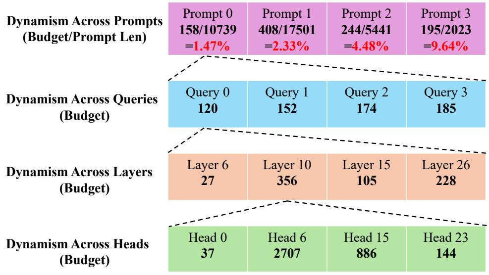  
Figure 11: Budget dynamism observed in oracle top-p attention. We observe the dynamism across four dimensions: different prompts (tasks), different queries within the same prompt, different layers in the same query, and different heads in the same layer.

Table 5: Full results on Longbench. The highest score in each task (except for “Full”) is marked in bold. The average budget after Twilight’s pruning is shown following the method name. We also report the relative error changes (improvement or degradation) when integrating Twilight with each base algorithm. 

<table><tr><td rowspan="2">Method</td><td rowspan="2">Budget</td><td colspan="2">Single-Doc. QA</td><td colspan="3">Multi-Doc. QA</td><td colspan="3">Summarization</td><td>Few-shot</td><td>Synthetic</td><td colspan="2">Code</td><td rowspan="2">Avg. Score</td></tr><tr><td>Qasper</td><td>MF-en</td><td>HotpotQA</td><td>2WikiMQA</td><td>Musique</td><td>GovReport</td><td>QMSum</td><td>MultiNews</td><td>TriviaQA</td><td>PR-en</td><td>LCC</td><td>Repobench-P</td></tr><tr><td colspan="15">Longchat-7B-v1.5-32k</td></tr><tr><td rowspan="2">Full</td><td>32k</td><td>29.48</td><td>42.11</td><td>30.97</td><td>23.74</td><td>13.11</td><td>31.03</td><td>22.77</td><td>26.09</td><td>83.25</td><td>30.50</td><td>52.70</td><td>55.62</td><td>36.78</td></tr><tr><td>Twilight (Avg. 146)</td><td>31.74</td><td>43.91</td><td>33.59</td><td>25.65</td><td>13.93</td><td>32.19</td><td>23.15</td><td>26.30</td><td>85.14</td><td>34.50</td><td>54.98</td><td>57.12</td><td>38.52 (+4.7%)</td></tr><tr><td rowspan="5">Quest</td><td>256</td><td>26.00</td><td>32.83</td><td>23.23</td><td>22.14</td><td>7.45</td><td>22.64</td><td>20.98</td><td>25.05</td><td>67.40</td><td>33.60</td><td>48.70</td><td>45.07</td><td>31.26</td></tr><tr><td>1024</td><td>31.63</td><td>42.36</td><td>30.47</td><td>24.42</td><td>10.11</td><td>29.94</td><td>22.70</td><td>26.39</td><td>84.21</td><td>34.5</td><td>51.52</td><td>53.95</td><td>36.85</td></tr><tr><td>4096</td><td>29.77</td><td>42.71</td><td>32.94</td><td>23.94</td><td>13.24</td><td>31.54</td><td>22.86</td><td>26.45</td><td>84.37</td><td>31.50</td><td>53.17</td><td>55.52</td><td>37.33</td></tr><tr><td>8192</td><td>29.34</td><td>41.70</td><td>33.27</td><td>23.46</td><td>13.51</td><td>31.18</td><td>23.02</td><td>26.48</td><td>84.70</td><td>30.00</td><td>53.02</td><td>55.57</td><td>37.10</td></tr><tr><td>Twilight (Avg. 131)</td><td>31.95</td><td>43.28</td><td>31.62</td><td>24.87</td><td>13.48</td><td>32.21</td><td>22.79</td><td>26.33</td><td>84.93</td><td>33.50</td><td>54.86</td><td>56.70</td><td>38.04 (+2.5%)</td></tr><tr><td rowspan="5">DS</td><td>256</td><td>28.28</td><td>39.78</td><td>27.10</td><td>20.75</td><td>9.34</td><td>29.68</td><td>21.79</td><td>25.69</td><td>83.97</td><td>32.00</td><td>52.01</td><td>53.44</td><td>35.32</td></tr><tr><td>1024</td><td>30.55</td><td>41.27</td><td>30.85</td><td>21.87</td><td>7.27</td><td>26.82</td><td>22.95</td><td>26.51</td><td>83.22</td><td>31.50</td><td>53.23</td><td>55.50</td><td>35.96</td></tr><tr><td>4096</td><td>28.95</td><td>41.90</td><td>32.52</td><td>23.65</td><td>8.07</td><td>29.68</td><td>22.75</td><td>26.55</td><td>83.34</td><td>30.00</td><td>52.77</td><td>55.48</td><td>36.31</td></tr><tr><td>8192</td><td>29.05</td><td>41.42</td><td>31.79</td><td>22.95</td><td>12.50</td><td>30.44</td><td>22.50</td><td>26.43</td><td>83.63</td><td>30.50</td><td>52.87</td><td>55.33</td><td>36.62</td></tr><tr><td>Twilight (Avg. 126)</td><td>32.34</td><td>43.89</td><td>34.67</td><td>25.43</td><td>13.84</td><td>31.88</td><td>23.01</td><td>26.32</td><td>85.29</td><td>35.50</td><td>55.03</td><td>57.27</td><td>38.71 (+5.7%)</td></tr><tr><td colspan="15">LLaMA-3.1-8B-Instruct</td></tr><tr><td rowspan="2">Full</td><td>128k</td><td>46.17</td><td>53.33</td><td>55.36</td><td>43.95</td><td>27.08</td><td>35.01</td><td>25.24</td><td>27.37</td><td>91.18</td><td>99.50</td><td>62.17</td><td>57.76</td><td>52.01</td></tr><tr><td>Twilight (Avg. 478)</td><td>43.08</td><td>52.99</td><td>52.22</td><td>44.83</td><td>25.79</td><td>34.21</td><td>25.47</td><td>26.98</td><td>91.85</td><td>100.00</td><td>64.06</td><td>58.22</td><td>51.64 (-0.7%)</td></tr><tr><td rowspan="2">MagicPIG</td><td>K=8, L=75</td><td>45.03</td><td>54.24</td><td>56.46</td><td>47.34</td><td>26.58</td><td>33.63</td><td>24.98</td><td>26.70</td><td>92.13</td><td>100.00</td><td>61.94</td><td>51.40</td><td>51.70</td></tr><tr><td>K=10, L=150</td><td>44.68</td><td>53.63</td><td>56.19</td><td>47.18</td><td>26.79</td><td>33.31</td><td>25.13</td><td>26.22</td><td>91.89</td><td>99.50</td><td>60.07</td><td>51.15</td><td>51.32</td></tr><tr><td rowspan="5">Quest</td><td>256</td><td>24.65</td><td>37.50</td><td>30.12</td><td>23.60</td><td>12.93</td><td>27.53</td><td>20.11</td><td>26.59</td><td>65.34</td><td>95.00</td><td>49.70</td><td>45.27</td><td>38.20</td></tr><tr><td>1024</td><td>38.47</td><td>49.32</td><td>47.43</td><td>38.48</td><td>20.59</td><td>33.71</td><td>23.67</td><td>26.60</td><td>81.94</td><td>99.50</td><td>60.78</td><td>52.96</td><td>47.79</td></tr><tr><td>4096</td><td>43.97</td><td>53.64</td><td>51.94</td><td>42.54</td><td>24.00</td><td>34.34</td><td>24.36</td><td>26.75</td><td>90.96</td><td>99.50</td><td>62.03</td><td>55.49</td><td>50.79</td></tr><tr><td>8192</td><td>44.34</td><td>53.25</td><td>54.72</td><td>44.84</td><td>25.98</td><td>34.62</td><td>24.98</td><td>26.70</td><td>91.61</td><td>100.00</td><td>62.02</td><td>54.20</td><td>51.44</td></tr><tr><td>Twilight (Avg. 427)</td><td>43.44</td><td>53.2</td><td>53.77</td><td>43.56</td><td>25.42</td><td>34.39</td><td>25.23</td><td>26.99</td><td>91.25</td><td>100.0</td><td>63.55</td><td>58.06</td><td>51.57 (+0.3%)</td></tr><tr><td rowspan="5">DS</td><td>256</td><td>38.24</td><td>49.58</td><td>43.38</td><td>31.98</td><td>15.52</td><td>33.40</td><td>24.06</td><td>26.86</td><td>84.41</td><td>99.50</td><td>53.28</td><td>48.64</td><td>45.74</td></tr><tr><td>1024</td><td>42.97</td><td>54.65</td><td>51.75</td><td>33.92</td><td>20.39</td><td>34.50</td><td>24.92</td><td>26.71</td><td>92.81</td><td>99.50</td><td>62.66</td><td>48.37</td><td>49.43</td></tr><tr><td>4096</td><td>43.50</td><td>53.17</td><td>54.21</td><td>44.70</td><td>23.14</td><td>34.73</td><td>25.40</td><td>26.71</td><td>92.78</td><td>99.50</td><td>62.59</td><td>51.31</td><td>50.98</td></tr><tr><td>8192</td><td>43.82</td><td>53.71</td><td>54.19</td><td>45.13</td><td>23.72</td><td>34.27</td><td>24.98</td><td>26.69</td><td>91.61</td><td>100.00</td><td>62.40</td><td>52.87</td><td>51.14</td></tr><tr><td>Twilight (Avg. 446)</td><td>43.08</td><td>52.89</td><td>54.68</td><td>44.86</td><td>24.88</td><td>34.09</td><td>25.20</td><td>27.00</td><td>91.20</td><td>100.00</td><td>63.95</td><td>58.93</td><td>51.73 (+1.2%)</td></tr></table>

# B Kernel Implementation Details

# B.1 Implementation of Mixed-Precision SpGEMV

Calculation Process. As outlined in Section 4.2, our implementation requires a GEMV kernel that computes the product of an FP16 query vector and an INT4 quantized key matrix (qfp16·Kint4) with paged indexing. We adapt the attention decoding kernel from FlashInfer [52] for this purpose. The kernel execution follows two main steps: (1) asynchronously loading and dequantizing the quantized K cache from the global memory into the shared memory using cp.async; and (2) computing the dot product. To mitigate long memory latency, we employ a two-stage pipeline that overlaps the data loading of a subsequent block with the computation of the current block. We use FP16 to store the dequantized K cache instead of FP32 to optimize the computation given that such accuracy tradeoff is tolerable as a score estimator.

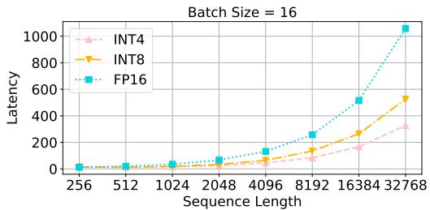

line

| Sequence Length | INT4  | INT8  | FP16  |
| --------------- | ----- | ----- | ----- |
| 256             | 0     | 0     | 0     |
| 512             | 0     | 0     | 0     |
| 1024            | 0     | 0     | 0     |
| 2048            | 0     | 0     | 0     |
| 4096            | 0     | 0     | 0     |
| 8192            | 0     | 0     | 0     |
| 16384           | 0     | 0     | 0     |
| 32768           | 0     | 0     | 0     |

Figure 12: SpGEMV operator latency with different quantization bits.

Dequantization. Following the design of QServe [25], we employ per-head, dynamic KV quantization and store the FP16 scale and zero for each head using the same paged memory layout as the K cache. The K matrix is dequantized on-the-fly using per-head quantization parameters (scale and zero). Our dequantization routine builds upon the fast algorithm from [19] (as implemented in NVIDIA’s FasterTransformer [31]), which utilizes custom PTX assembly instructions for efficient type conversion between INT4 and FP16.

Bit-packing. INT4 K elements are packed into an uint8\_t buffer, with two 4-bit elements stored within each 8-bit byte — this aligns with the byte-addressable nature of C++. To simplify the dequantization logic, we first add an offset of +128 to each INT4 element, converting it to an unsigned value, before packing them in an interleaved manner. Address calculation for this packed buffer is remapped to stride at a 4-bit granularity; this is achieved by halving the effective byte offset [59].

We conduct an ablation study on the impact of quantization bits on the efficiency as Figure 12 shows. Our optimizations on the dequantization and dot product make the operator memory-bound and thus benefit from quantization.

# B.2 Tackling Group Query Attention

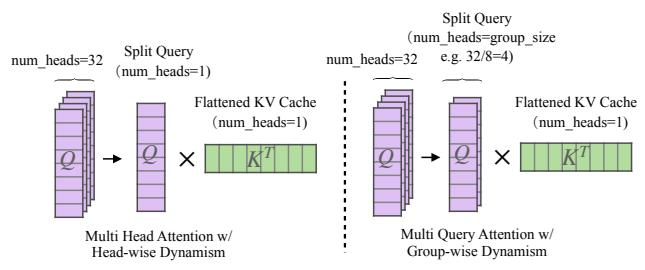

flowchart

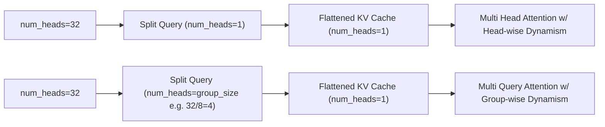

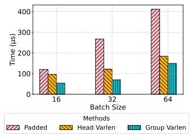

bar

| Batch Size | Padded (μs) | Head Varlen (μs) | Group Varlen (μs) |
| :--- | :--- | :--- | :--- |
| 16 | 120 | 95 | 55 |
| 32 | 270 | 125 | 75 |
| 64 | 410 | 185 | 155 |

Figure 13: Left: Head-wise/group-wise varlen attention with flattend paged KV cache in Twilight. Right: Comparison among the three attention methods on a real budget distribution of a LLaMA-3.1- 7B layer on a 16k retrieval task. Here “Padded” means padding all heads to the maximum budget length; “Head Varlen” loads KV at the head granularity which causes repeated loading; and “Group Varlen” strikes a balance between the two methods.

Group Query Attention (GQA) [28], a technique widely adopted in recent model architectures like LLaMA 3, maps a group of query heads to a single key-value head. This structure, however, is inherently incompatible with query-aware sparse attention. The incompatibility arises because query-aware sparse attention relies on individual query vectors to identify important tokens, but

GQA creates a mismatch at the granularity of attention heads. A brute-force solution would be to load tokens independently for each query head, but this leads to inefficient, repeated memory reads. Twilight addresses this issue by operating at the granularity of query groups. Specifically, the set of tokens selected for a given query group is the union of tokens identified by all query heads within that group [54].

As discussed in Section 4.2, our top-p attention mechanism natively supports head-wise dynamism. However, when integrated with GQA, this head-wise dynamism inherently transitions to group-wise dynamism, meaning that all heads within the same group share a common token budget. Figure 13 shows our attention design with flattened paged KV cache, which supports head-wise varlen attention for MHA and group-wise varlen attention for GQA. This design represents a deliberate trade-off, balancing implementation efficiency with compatibility for modern attention algorithms. We also compare the efficiency of the three different attention implementations in Figure 13.

# C Full Results on Longbench

Please refer to Table 5.

# D Accuracy Comparison with Token Dropping Methods

As discussed in Section 2, top-k sparse attention methods can be broadly categorized into two types: token dropping and token selecting. Prior research [36] has established that token selecting generally outperforms token dropping, as the latter inevitably incurs irreversible information loss. To further validate this observation, we conduct comparative experiments between Twilight and two representative token-dropping methods: StreamingLLM [46] and SnapKV [23]. As demonstrated in Table 6, DS-Twilight achieves notably better performance over both baseline methods.

Table 6: Comparison of StreamingLLM, SnapKV, and Twilight on the Longbench benchmark with the Longchat-7B-v1.5-32k model. 

<table><tr><td>Dataset</td><td>StreamingLLM (Budget=4096)</td><td>SnapKV (Budget=4096)</td><td>DS-Twilight</td></tr><tr><td>Qasper</td><td>26.39</td><td>29.44</td><td>32.34</td></tr><tr><td>MulQA-en</td><td>33.2</td><td>40.03</td><td>43.89</td></tr><tr><td>HotpotQA</td><td>24.29</td><td>33.67</td><td>34.67</td></tr><tr><td>2WikiMQA</td><td>20.1</td><td>24.13</td><td>25.43</td></tr><tr><td>Musique</td><td>10.87</td><td>13.45</td><td>13.84</td></tr><tr><td>GovReport</td><td>26.92</td><td>26.09</td><td>31.88</td></tr><tr><td>QMSum</td><td>20.8</td><td>22.53</td><td>23.01</td></tr><tr><td>MultiNews</td><td>26.46</td><td>25.61</td><td>26.32</td></tr><tr><td>TrivialQA</td><td>75.6</td><td>80.82</td><td>85.29</td></tr><tr><td>PR-en</td><td>24.17</td><td>30.25</td><td>35.50</td></tr><tr><td>LCC</td><td>52.47</td><td>52.62</td><td>55.03</td></tr><tr><td>Repobench-P</td><td>51.02</td><td>55.99</td><td>57.27</td></tr><tr><td>Avg.</td><td>32.69</td><td>36.22</td><td>38.71</td></tr></table>

# E Efficiency Evaluation in Offloading Scenarios

Notably, in memory-offloading scenarios where the per-token loading cost dominates, Twilight could achieve more significant gains. This is because Twilight reduces the number of loaded tokens with a fixed estimation cost. Table 7 shows Twilight could achieve up to 16× speedups compared to Quest.

Table 7: Latency (in microseconds) of a single attention operator in offloading scenarios, where corresponding tokens in the KV cache are loaded from the CPU memory. 

<table><tr><td></td><td>10k</td><td>20k</td><td>30k</td></tr><tr><td>Quest</td><td>3038.98</td><td>5990.75</td><td>8490.95</td></tr><tr><td>Quest-Twi</td><td>415.89</td><td>480.61</td><td>527.77</td></tr></table>

# F Limitations and Future Work

While Twilight effectively accelerates existing top-k sparse attention methods, our analysis in Figure 10 reveals non-negligible estimation overheads. This makes Twilight particularly advantageous in scenarios like serving with large batch sizes or offloading, where the cost of loading tokens from the KV cache dominates. Section B.2 shows head-wise dynamism is unfriendly with GQA, which leads to some challenges to integrate Twilight with new model architectures. Future research could focus on optimizing the estimation method to further improve the end-to-end latency and throughput, and how to integrate Twilight with other model architectures like multi-head latent attention (MLA) [7].

# NeurIPS Paper Checklist

# 1. Claims

Question: Do the main claims made in the abstract and introduction accurately reflect the paper’s contributions and scope?

Answer: [Yes]

Justification: The claims we made in the abstraction and introduction are empirically verified by Section 5.

Guidelines:

• The answer NA means that the abstract and introduction do not include the claims made in the paper.   
• The abstract and/or introduction should clearly state the claims made, including the contributions made in the paper and important assumptions and limitations. A No or NA answer to this question will not be perceived well by the reviewers.   
• The claims made should match theoretical and experimental results, and reflect how much the results can be expected to generalize to other settings.   
• It is fine to include aspirational goals as motivation as long as it is clear that these goals are not attained by the paper.

# 2. Limitations

Question: Does the paper discuss the limitations of the work performed by the authors?

Answer: [Yes]

Justification: See Appendix F. We also discuss the extra overhead (both time overhead and memory overhead) introduced by our method in Section 4.3.

Guidelines:

• The answer NA means that the paper has no limitation while the answer No means that the paper has limitations, but those are not discussed in the paper.   
• The authors are encouraged to create a separate "Limitations" section in their paper.   
• The paper should point out any strong assumptions and how robust the results are to violations of these assumptions (e.g., independence assumptions, noiseless settings, model well-specification, asymptotic approximations only holding locally). The authors should reflect on how these assumptions might be violated in practice and what the implications would be.   
• The authors should reflect on the scope of the claims made, e.g., if the approach was only tested on a few datasets or with a few runs. In general, empirical results often depend on implicit assumptions, which should be articulated.   
• The authors should reflect on the factors that influence the performance of the approach. For example, a facial recognition algorithm may perform poorly when image resolution is low or images are taken in low lighting. Or a speech-to-text system might not be used reliably to provide closed captions for online lectures because it fails to handle technical jargon.   
• The authors should discuss the computational efficiency of the proposed algorithms and how they scale with dataset size.   
• If applicable, the authors should discuss possible limitations of their approach to address problems of privacy and fairness.   
• While the authors might fear that complete honesty about limitations might be used by reviewers as grounds for rejection, a worse outcome might be that reviewers discover limitations that aren’t acknowledged in the paper. The authors should use their best judgment and recognize that individual actions in favor of transparency play an important role in developing norms that preserve the integrity of the community. Reviewers will be specifically instructed to not penalize honesty concerning limitations.

# 3. Theory Assumptions and Proofs

Question: For each theoretical result, does the paper provide the full set of assumptions and a complete (and correct) proof?

# Answer: [Yes]

Justification: The only theoretical result in this paper is Equation 2, which is proven by a textbook conclusion (the sub-multiplicative property of the Frobenius norm). This part can be found in Section 3.1.

# Guidelines:

• The answer NA means that the paper does not include theoretical results.   
• All the theorems, formulas, and proofs in the paper should be numbered and crossreferenced.   
• All assumptions should be clearly stated or referenced in the statement of any theorems.   
• The proofs can either appear in the main paper or the supplemental material, but if they appear in the supplemental material, the authors are encouraged to provide a short proof sketch to provide intuition.   
• Inversely, any informal proof provided in the core of the paper should be complemented by formal proofs provided in appendix or supplemental material.   
• Theorems and Lemmas that the proof relies upon should be properly referenced.

# 4. Experimental Result Reproducibility

Question: Does the paper fully disclose all the information needed to reproduce the main experimental results of the paper to the extent that it affects the main claims and/or conclusions of the paper (regardless of whether the code and data are provided or not)?

# Answer: [Yes]

Justification: Section 5 includes all experiments setup and configurations.

# Guidelines:

• The answer NA means that the paper does not include experiments.   
• If the paper includes experiments, a No answer to this question will not be perceived well by the reviewers: Making the paper reproducible is important, regardless of whether the code and data are provided or not.   
• If the contribution is a dataset and/or model, the authors should describe the steps taken to make their results reproducible or verifiable.   
• Depending on the contribution, reproducibility can be accomplished in various ways. For example, if the contribution is a novel architecture, describing the architecture fully might suffice, or if the contribution is a specific model and empirical evaluation, it may be necessary to either make it possible for others to replicate the model with the same dataset, or provide access to the model. In general. releasing code and data is often one good way to accomplish this, but reproducibility can also be provided via detailed instructions for how to replicate the results, access to a hosted model (e.g., in the case of a large language model), releasing of a model checkpoint, or other means that are appropriate to the research performed.   
• While NeurIPS does not require releasing code, the conference does require all submissions to provide some reasonable avenue for reproducibility, which may depend on the nature of the contribution. For example   
(a) If the contribution is primarily a new algorithm, the paper should make it clear how to reproduce that algorithm.   
(b) If the contribution is primarily a new model architecture, the paper should describe the architecture clearly and fully.   
(c) If the contribution is a new model (e.g., a large language model), then there should either be a way to access this model for reproducing the results or a way to reproduce the model (e.g., with an open-source dataset or instructions for how to construct the dataset).   
(d) We recognize that reproducibility may be tricky in some cases, in which case authors are welcome to describe the particular way they provide for reproducibility. In the case of closed-source models, it may be that access to the model is limited in some way (e.g., to registered users), but it should be possible for other researchers to have some path to reproducing or verifying the results.

# 5. Open access to data and code

Question: Does the paper provide open access to the data and code, with sufficient instructions to faithfully reproduce the main experimental results, as described in supplemental material?

Answer: [Yes]

Justification: All the algorithms and methods are introduced in Section 4. The experiment setup is described in Section 5. Our code and scripts are released at https://github. com/tsinghua-ideal/Twilight.

Guidelines:

• The answer NA means that paper does not include experiments requiring code.   
• Please see the NeurIPS code and data submission guidelines (https://nips.cc/ public/guides/CodeSubmissionPolicy) for more details.   
• While we encourage the release of code and data, we understand that this might not be possible, so “No” is an acceptable answer. Papers cannot be rejected simply for not including code, unless this is central to the contribution (e.g., for a new open-source benchmark).   
• The instructions should contain the exact command and environment needed to run to reproduce the results. See the NeurIPS code and data submission guidelines (https: //nips.cc/public/guides/CodeSubmissionPolicy) for more details.   
• The authors should provide instructions on data access and preparation, including how to access the raw data, preprocessed data, intermediate data, and generated data, etc.   
• The authors should provide scripts to reproduce all experimental results for the new proposed method and baselines. If only a subset of experiments are reproducible, they should state which ones are omitted from the script and why.   
• At submission time, to preserve anonymity, the authors should release anonymized versions (if applicable).   
• Providing as much information as possible in supplemental material (appended to the paper) is recommended, but including URLs to data and code is permitted.

# 6. Experimental Setting/Details

Question: Does the paper specify all the training and test details (e.g., data splits, hyperparameters, how they were chosen, type of optimizer, etc.) necessary to understand the results?

Answer: [Yes]

Justification: See Section 5.

Guidelines:

• The answer NA means that the paper does not include experiments.   
• The experimental setting should be presented in the core of the paper to a level of detail that is necessary to appreciate the results and make sense of them.   
• The full details can be provided either with the code, in appendix, or as supplemental material.

# 7. Experiment Statistical Significance

Question: Does the paper report error bars suitably and correctly defined or other appropriate information about the statistical significance of the experiments?

Answer: [Yes]

Justification: Our experiments measure the benchmark scores and execution latencies, which are all highly deterministic and reproducible. Thus we do not include error bars in the figures. We report the improvements in the figures (both accuracy improvements and speedups), which are statistically significant in our problems. See Section 5.

Guidelines:

• The answer NA means that the paper does not include experiments.   
• The authors should answer "Yes" if the results are accompanied by error bars, confidence intervals, or statistical significance tests, at least for the experiments that support the main claims of the paper.

• The factors of variability that the error bars are capturing should be clearly stated (for example, train/test split, initialization, random drawing of some parameter, or overall run with given experimental conditions).   
• The method for calculating the error bars should be explained (closed form formula, call to a library function, bootstrap, etc.)   
• The assumptions made should be given (e.g., Normally distributed errors).   
• It should be clear whether the error bar is the standard deviation or the standard error of the mean.   
• It is OK to report 1-sigma error bars, but one should state it. The authors should preferably report a 2-sigma error bar than state that they have a 96% CI, if the hypothesis of Normality of errors is not verified.   
• For asymmetric distributions, the authors should be careful not to show in tables or figures symmetric error bars that would yield results that are out of range (e.g. negative error rates).   
• If error bars are reported in tables or plots, The authors should explain in the text how they were calculated and reference the corresponding figures or tables in the text.

# 8. Experiments Compute Resources

Question: For each experiment, does the paper provide sufficient information on the computer resources (type of compute workers, memory, time of execution) needed to reproduce the experiments?

Answer: [Yes]

Justification: The experiments are conducted on common NVIDIA GPUs, which are described in Section 5.

Guidelines:

• The answer NA means that the paper does not include experiments.   
• The paper should indicate the type of compute workers CPU or GPU, internal cluster, or cloud provider, including relevant memory and storage.   
• The paper should provide the amount of compute required for each of the individual experimental runs as well as estimate the total compute.   
• The paper should disclose whether the full research project required more compute than the experiments reported in the paper (e.g., preliminary or failed experiments that didn’t make it into the paper).

# 9. Code Of Ethics

Question: Does the research conducted in the paper conform, in every respect, with the NeurIPS Code of Ethics https://neurips.cc/public/EthicsGuidelines?

Answer: [Yes]

Justification: The research conducted in the paper conforms with the NeurIPS Code of Ethics.

Guidelines:

• The answer NA means that the authors have not reviewed the NeurIPS Code of Ethics.   
• If the authors answer No, they should explain the special circumstances that require a deviation from the Code of Ethics.   
• The authors should make sure to preserve anonymity (e.g., if there is a special consideration due to laws or regulations in their jurisdiction).

# 10. Broader Impacts

Question: Does the paper discuss both potential positive societal impacts and negative societal impacts of the work performed?

Answer: [NA]

Justification: This paper introduces a method to accelerate LLMs, so it does not have direct societal impacts. However, the use of LLMs may have some social impacts, which can be amplified by this technique whether it is positive or negative.

# Guidelines:

• The answer NA means that there is no societal impact of the work performed.   
• If the authors answer NA or No, they should explain why their work has no societal impact or why the paper does not address societal impact.   
• Examples of negative societal impacts include potential malicious or unintended uses (e.g., disinformation, generating fake profiles, surveillance), fairness considerations (e.g., deployment of technologies that could make decisions that unfairly impact specific groups), privacy considerations, and security considerations.   
• The conference expects that many papers will be foundational research and not tied to particular applications, let alone deployments. However, if there is a direct path to any negative applications, the authors should point it out. For example, it is legitimate to point out that an improvement in the quality of generative models could be used to generate deepfakes for disinformation. On the other hand, it is not needed to point out that a generic algorithm for optimizing neural networks could enable people to train models that generate Deepfakes faster.   
• The authors should consider possible harms that could arise when the technology is being used as intended and functioning correctly, harms that could arise when the technology is being used as intended but gives incorrect results, and harms following from (intentional or unintentional) misuse of the technology.   
• If there are negative societal impacts, the authors could also discuss possible mitigation strategies (e.g., gated release of models, providing defenses in addition to attacks, mechanisms for monitoring misuse, mechanisms to monitor how a system learns from feedback over time, improving the efficiency and accessibility of ML).

# 11. Safeguards

Question: Does the paper describe safeguards that have been put in place for responsible release of data or models that have a high risk for misuse (e.g., pretrained language models, image generators, or scraped datasets)?

Answer: [NA]

Justification: This paper does not release new models, datasets, or applications.

# Guidelines:

• The answer NA means that the paper poses no such risks.   
• Released models that have a high risk for misuse or dual-use should be released with necessary safeguards to allow for controlled use of the model, for example by requiring that users adhere to usage guidelines or restrictions to access the model or implementing safety filters.   
• Datasets that have been scraped from the Internet could pose safety risks. The authors should describe how they avoided releasing unsafe images.   
• We recognize that providing effective safeguards is challenging, and many papers do not require this, but we encourage authors to take this into account and make a best faith effort.

# 12. Licenses for existing assets

Question: Are the creators or original owners of assets (e.g., code, data, models), used in the paper, properly credited and are the license and terms of use explicitly mentioned and properly respected?

Answer: [Yes]

Justification: This paper uses open-source datasets and models in its evaluation (Section 5). The usage respects all the original licenses.

# Guidelines:

• The answer NA means that the paper does not use existing assets.   
• The authors should cite the original paper that produced the code package or dataset.   
• The authors should state which version of the asset is used and, if possible, include a URL.   
• The name of the license (e.g., CC-BY 4.0) should be included for each asset.

• For scraped data from a particular source (e.g., website), the copyright and terms of service of that source should be provided.   
• If assets are released, the license, copyright information, and terms of use in the package should be provided. For popular datasets, paperswithcode.com/datasets has curated licenses for some datasets. Their licensing guide can help determine the license of a dataset.   
• For existing datasets that are re-packaged, both the original license and the license of the derived asset (if it has changed) should be provided.   
• If this information is not available online, the authors are encouraged to reach out to the asset’s creators.

# 13. New Assets

Question: Are new assets introduced in the paper well documented and is the documentation provided alongside the assets?

Answer: [NA]

Justification: This paper does not release new assets.

Guidelines:

• The answer NA means that the paper does not release new assets.   
• Researchers should communicate the details of the dataset/code/model as part of their submissions via structured templates. This includes details about training, license, limitations, etc.   
• The paper should discuss whether and how consent was obtained from people whose asset is used.   
• At submission time, remember to anonymize your assets (if applicable). You can either create an anonymized URL or include an anonymized zip file.

# 14. Crowdsourcing and Research with Human Subjects

Question: For crowdsourcing experiments and research with human subjects, does the paper include the full text of instructions given to participants and screenshots, if applicable, as well as details about compensation (if any)?

Answer: [NA]

Justification: This paper does not involve crowdsourcing nor research with human subjects.

Guidelines:

• The answer NA means that the paper does not involve crowdsourcing nor research with human subjects.   
• Including this information in the supplemental material is fine, but if the main contribution of the paper involves human subjects, then as much detail as possible should be included in the main paper.   
• According to the NeurIPS Code of Ethics, workers involved in data collection, curation, or other labor should be paid at least the minimum wage in the country of the data collector.

# 15. Institutional Review Board (IRB) Approvals or Equivalent for Research with Human Subjects

Question: Does the paper describe potential risks incurred by study participants, whether such risks were disclosed to the subjects, and whether Institutional Review Board (IRB) approvals (or an equivalent approval/review based on the requirements of your country or institution) were obtained?

Answer: [NA] .

Justification: This paper does not involve crowdsourcing nor research with human subjects.

Guidelines:

• The answer NA means that the paper does not involve crowdsourcing nor research with human subjects.

• Depending on the country in which research is conducted, IRB approval (or equivalent) may be required for any human subjects research. If you obtained IRB approval, you should clearly state this in the paper.   
• We recognize that the procedures for this may vary significantly between institutions and locations, and we expect authors to adhere to the NeurIPS Code of Ethics and the guidelines for their institution.   
• For initial submissions, do not include any information that would break anonymity (if applicable), such as the institution conducting the review.

# 16. Declaration of LLM usage

Question: Does the paper describe the usage of LLMs if it is an important, original, or non-standard component of the core methods in this research? Note that if the LLM is used only for writing, editing, or formatting purposes and does not impact the core methodology, scientific rigorousness, or originality of the research, declaration is not required.

Answer: [NA]

Justification: The core part (method, algorithm) of this paper does not involve LLM usage.

Guidelines:

• The answer NA means that the core method development in this research does not involve LLMs as any important, original, or non-standard components.   
• Please refer to our LLM policy (https://neurips.cc/Conferences/2025/LLM) for what should or should not be described.