# Ultra-Low-Dimensional Prompt Tuning via Random Projection

Zijun Wu, Yongchang Hao, Lili Mou∗

Dept. Computing Science & Alberta Machine Intelligence Institute (Amii), University of Alberta ∗Canada CIFAR AI Chair

{zijun4,yongcha1}@ualberta.ca, doublepower.mou@gmail.com

# Abstract

Large language models achieve state-of-theart performance but are increasingly costly to fine-tune. Prompt tuning is a parameterefficient fine-tuning method that addresses parameter-efficiency by learning prompt embeddings, but these embeddings are typically tied to the model’s hidden dimensionality, limiting parameter saving. In this paper, we propose Ultra-Low-dimensional Prompt Tuning (ULPT), a simple yet effective method that optimizes prompts in a low-dimensional space (e.g., 2D) and uses a frozen random matrix for up-projection. ULPT can achieve 98% reduction in the training parameters compared to vanilla prompt tuning while preserving performance. Our extensive experiments across over 20 NLP tasks demonstrate that ULPT consistently outperforms recent parameter-efficient tuning methods using significantly fewer parameters, making it well-suited as a storageefficient framework for massive LLM customization.1

# 1 Introduction

Fine-tuning large language models (LLMs) is essential for adapting them to specific tasks and controlling their outputs (Raffel et al., 2020; Wei et al., 2022a). However, the enormous size of LLMs makes full fine-tuning prohibitively resource intensive, as it involves updating millions or even billions of parameters. To address this challenge, parameter-efficient fine-tuning methods have emerged as practical solutions, such as low-rank adaptation (LoRA; Hu et al., 2022) and prompt tuning (Lester et al., 2021; Li and Liang, 2021). These methods drastically reduce the number of tunable parameters, offering an efficient alternative while achieving performance comparable to full fine-tuning.

Prompt tuning introduces learnable prompt embeddings exclusively in the input layer of the model (Lester et al., 2021; Liu et al., 2024a), automating prompt engineering by gradient descent to guide the frozen LLM in producing task-specific outputs (Petrov et al., 2024b,a). By contrast, LoRA modifies the model by injecting low-rank weight matrices into its layers, causing the number of trainable parameters to scale with model’s depth (Hu et al., 2022). Given that LLMs have encoded substantial knowledge during pretraining (Brown et al., 2020; Kojima et al., 2022) and that both in-context learning and expertly crafted prompts can achieve remarkable results (Wei et al., 2022b; Dong et al., 2024), prompt tuning offers a more efficient and effective alternative to LoRA in many scenarios (Shi and Lipani, 2024).

Despite these advantages, a key limitation remains: prompt embeddings are typically constrained to match the model’s hidden dimensionality (Lester et al., 2021; Li and Liang, 2021; Liu et al., 2022b; Choi et al., 2023; Razdaibiedina et al., 2023). As the size of the model increases, the dimensionality of the prompt embedding space also increases (Raffel et al., 2020; Meta, 2023). This scaling leads to unnecessary complexity, as full dimensionality is often not required for task adaptation (Aghajanyan et al., 2021; Qin et al., 2021). Consequently, optimizing in this expanded space becomes inefficient in parameter’s usage and may also increase the risk of overfitting, especially for less complex tasks or with limited training data.

In this paper, we propose Ultra-Low-Dimensional Prompt Tuning (ULPT), a novel approach that decouples the prompt and model dimensions, which enables to learn prompt embeddings in an ultra-low-dimensional space. A naïve attempt is to jointly optimize the ultra-lowdimensional embeddings with an up-projection matrix (Xiao et al., 2023; Guo et al., 2024), but the learnable up-projection matrix may result in more trainable parameters than vanilla prompt tuning. We avoid this overhead by employing a random but frozen matrix for the up-projection, as shown in Figure 1a. We further introduce lightweight, learnable shift and scale embedding vectors to better align the randomly projected embeddings with the model’s prompt space (Wu et al., 2024c).

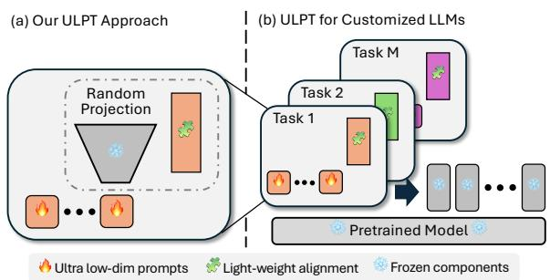

flowchart

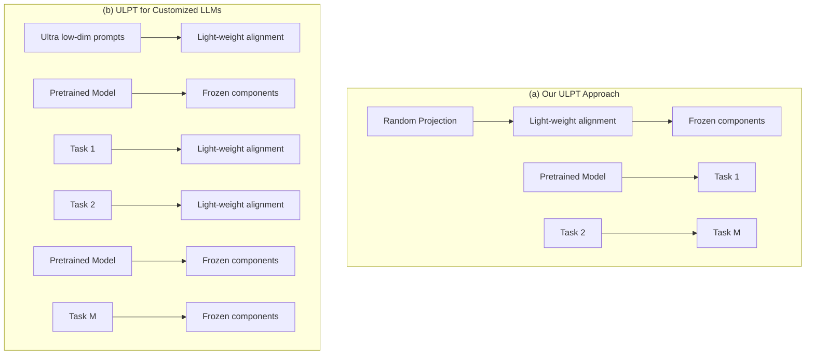

Figure 1: Overview of our approach. (a) ULPT upprojects ultra-low-dimensional embeddings with a random but fixed matrix. (b) ULPT can significantly reduce parameters storage for LLMs customization.

We provide a convergence analysis for ULPT, and further show that a low-dimensional space with random projection can effectively approximate high-rank information that preserve the relational structure of embeddings, which is crucial for attention mechanisms in LLMs that depend on pairwise dot products between embeddings (Vaswani et al., 2017).

In addition, the random projection into ultralow dimensions introduces a controllable tradeoff between prompt dimension and length under a fixed parameter budget. We empirically demonstrate that allocating more tokens with lower-dimensional embeddings yields greater expressivity than using fewer high-dimensional tokens. This makes ULPT well-suited for massive LLM customization, such as per-user tuning while keeping storage footprints minimal, as shown in Figure 1b.

We evaluated ULPT across over 20 NLP tasks, including GLUE (Wang et al., 2018) and Super-GLUE (Wang et al., 2019) for language understanding, MRQA (Fisch et al., 2019) for question answering, GSM8K (Cobbe et al., 2021) and MBPP (Austin et al., 2021) for complex reasoning, as well as four additional tasks covering commonsense reasoning. The results demonstrate that prompt tuning via ultra-low-dimensional optimization matches or surpasses the performance of fully parameterized prompt tuning while saving up to 98% of trainable parameters. With an appropriate dimension, ULPT outperforms recent parameterefficient fine-tuning methods, while requiring much fewer trainable parameters.

In summary, our main contributions include:

• We introduce ULPT, which optimizes prompts in a low-dimensional space with a random up-projection, drastically reducing trainable parameters while maintaining performance.   
• Theoretically, we show that ULPT effectively approximates high-rank structures, which preserves embedding relational structures that are essential for attention mechanisms in LLMs.   
• Empirically, we demonstrate that ULPT matches or surpasses vanilla prompt tuning across over 20 NLP tasks while saving trainable parameters by up to 98%. Scaling to higher dimensions for optimization, it outperforms recent efficient tuning methods with much fewer trainable parameters.

# 2 Related Work

Parameter-efficient fine-tuning. With the rapid growth of pretrained neural networks, researchers have investigated parameter-efficient fine-tuning methods that update only a small set of parameters while maintaining high performance. One straightforward way is to tune specific components of the model. For example, BitFit updates only the bias terms (Ben Zaken et al., 2022), and LayerNorm tuning only trains the layer-norm parameters (Zhao et al., 2024). Another line of work involves introducing and training small, task-specific non-linear modules, such as Adapters (Houlsby et al., 2019) and AdapterDrop (Rücklé et al., 2021). Other methods steer the activation representations either globally (Wu et al., 2024b; Pan et al., 2024) or locally (Yin et al., 2024).

Two prominent paradigms are low-rank adaptation (LoRA; Hu et al., 2022) and prompt tuning methods (Lester et al., 2021), which are more related to our work. They will be further elaborated below.

Low-rank adaptation. Hu et al. (2022) assume that weight updates can be approximated by lowrank matrices and propose a low-rank adaptation (LoRA) method for fine-tuning a model. Building upon this foundational work, many extensions have been developed to enhance LoRA’s performance. For example, ReLoRA (Lialin et al., 2024) iteratively trains and merges low-rank adapters to achieve high-rank updates. Hayou et al. (2024) propose learning low-rank matrices with different learning rates. Wu et al. (2024a) explore training a mixture of LoRA modules and leverage dynamic routing mechanisms for different task distributions or domains.

However, for large models, LoRA still requires a considerable number of trainable parameters, hindering efficient storage of task adaptations. To address this limitation, several studies have explored ways to further improve parameter efficiency. For example, VeRA (Kopiczko et al., 2024) approximates LoRA weight update by using random matrices combined with two trainable scaling vectors. FourierFT (Gao et al., 2024) learns a sparse set of spectral coefficients in the frequency domain and reconstructing weight updates via inverse Fourier transform. While these methods fine-tune in the weight space, our ULPT operates in the input embedding space and achieves better performance with lower training memory.

Prompt tuning. Shin et al. (2020) introduce the concept of learning prompt tokens to elicit knowledge from LLMs. Subsequently, Lester et al. (2021) extend this idea to continuous prompt tuning, where prompt embeddings are optimized through gradient descent. Building on this, Shi and Lipani (2024) observe that redistributing parameters to learn offsets for input token embeddings can enhance performance. Lan et al. (2025) decompose prompt embeddings using SVD for more meaningful initialization. In parallel, multi-task prompt tuning has been explored, where the learned prompt parameters are reused across different tasks (Wang et al., 2023). Closely related to our work, Xiao et al. (2023) decompose the prompt embedding matrix into two low-rank components: a low-dimensional prompt matrix and a learnable up-projection matrix. By contrast, our ULPT pushes parameter reduction further by using frozen and random up-projection matrix, which drastically lowers the number of trainable parameters while preserving performance. Our method is supported by random-projection theory (Bingham and Mannila, 2001) and its recent applications in gradient compression (Hao et al., 2024).

# 3 Methodology

# 3.1 Problem Formulation

Prompt tuning introduces learnable token embeddings in the input layer of a language model (Lester et al., 2021). These embeddings are optimized via gradient descent based on the task-specific loss signals. During optimization, the model weights remain frozen, while the gradient is backpropagated to the input layer to update the learnable embeddings. Typically, learnable prompt embeddings $e _ { 1 } , \ldots , e _ { n } \in \mathbb { R } ^ { d }$ serve as a prefix (Li and Liang, 2021), followed by the text prompt, which is tokenized and represented by token embeddings $\pmb { x } _ { 1 } , \pmb { \cdot } \cdot \cdot , \pmb { x } _ { l } \in \mathbb { R } ^ { d }$ . Overall, the LLM has an input in the form of

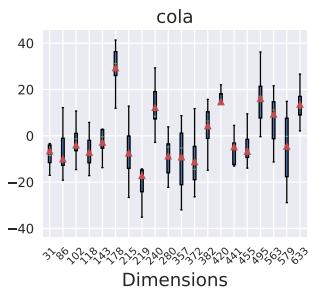

boxplot

| Dimensions | Value |
| ---------- | ----- |
| 31         | -10   |
| 36         | -5    |
| 40         | 0     |
| 45         | 5     |
| 50         | 10    |
| 55         | 15    |
| 60         | 20    |
| 65         | 25    |
| 70         | 30    |
| 75         | 35    |
| 80         | 40    |
| 85         | 35    |
| 90         | 30    |
| 95         | 25    |
| 100        | 20    |
| 105        | 15    |
| 110        | 10    |
| 115        | 5     |
| 120        | 0     |
| 125        | -5    |
| 130        | -10   |
| 135        | -15   |
| 140        | -20   |
| 145        | -25   |
| 150        | -30   |
| 155        | -35   |
| 160        | -40   |
| 165        | -35   |
| 170        | -30   |
| 175        | -25   |
| 180        | -20   |
| 185        | -15   |
| 190        | -10   |
| 195        | -5    |
| 200        | 0     |
| 205        | 5     |
| 210        | 10    |
| 215        | 15    |
| 220        | 20    |
| 225        | 25    |
| 230        | 30    |
| 235        | 35    |
| 240        | 40    |
| 245        | 35    |
| 250        | 30    |
| 255        | 25    |
| 260        | 20    |
| 265        | 15    |
| 270        | 10    |
| 275        | 5     |
| 280        | 0     |
| 285        | -5    |
| 290        | -10   |
| 295        | -15   |
| 300        | -20   |
| 305        | -25   |
| 310        | -30   |
| 315        | -35   |
| 320        | -40   |
| 325        | -35   |
| 330        | -30   |
| 335        | -25   |
| 340        | -20   |
| 345        | -15   |
| 350        | -10   |
| 355        | -5    |
| 360        | 0     |
| 365        | 5     |
| 370        | 10    |
| 375        | 15    |
| 380        | 20    |
| 385        | 25    |
| 390        | 30    |
| 395        | 35    |
| 400        | 40    |
| 405        | 35    |
| 410        | 30    |
| 415        | 25    |
| 420        | 20    |
| 425        | 15    |
| 430        | 10    |
| 435        | 5     |
| 440        | 0     |
| 445        | -5    |
| 450        | -10   |
| 455        | -15   |
| 460        | -20   |
| 465        | -25   |
| 470        | -30   |
| 475        | -35   |
| 480        | -40   |
| 485        | -35   |
| 490        | -30   |
| 495        | -25   |
| 500        | -20   |
| 505        | -15   |
| 510        | -10   |
| 515        | -5    |
| 520        | 0     |
| 525        | 5     |
| 530        | 10    |
| 535        | 15    |
| 540        | 20    |
| 545        | 25    |
| 550        | 30    |
| 555        | 35    |
| 560        | 40    |
| 565        | 35    |
| 570        | 30    |
| 575        | 25    |
| 580        | 20    |
| 585        | 15    |
| 590        | 10    |
| 595        | 5     |
| 600        | 0     |
| Note: The actual values are not provided in the code. The box plot visualizes the distribution of data points across dimensions. Values are estimated based on the y-axis label 'Value'.

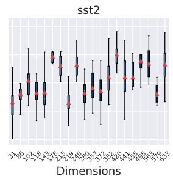  
Figure 2: Distribution of prompt embedding values over 100 prompt tokens. We randomly selected 20 dimensions from the original prompt embeddings, which have 768 dimensions as in the T5-base model.

$$
\left(\boldsymbol {e} _ {1}, \boldsymbol {e} _ {2}, \dots , \boldsymbol {e} _ {n}, \boldsymbol {x} _ {1}, \boldsymbol {x} _ {2}, \dots , \boldsymbol {x} _ {l}\right) \tag {1}
$$

where n is a predefined prompt length and l represents the length of the tokenized text. The objective is to optimize the prompt embedding matrix $\pmb { { \cal E } } \in \mathbb { R } ^ { n \times d }$ over a given dataset D based on the conditional log-likelihood:

$$
\underset {\boldsymbol {E}} {\arg \max} \sum_ {(x, y) \in \mathcal {D}} \log P (y \mid \boldsymbol {E}, x) \tag {2}
$$

where $( x , y ) \in \mathcal { D }$ represents input–output pairs in a dataset.

# 3.2 Ultra-Low-Dimensional Prompt Tuning

The learnable prompt embeddings do not inherently need to match the model dimension $\mathbb { R } ^ { d }$ due to the low intrinsic dimensionality of downstream tasks (Aghajanyan et al., 2021; Qin et al., 2021). Inspired by low-rank adaptation (Hu et al., 2022), the prompt embedding matrix E can be decomposed into the product of two matrices: $E = Z P$ , where $\ b { Z } \in \mathbb { R } ^ { n \times r }$ represents the prompt embeddings in an ultra-low r-dimensional space, and $\pmb { P } \in \mathbb { R } ^ { r \times d }$ is a projection matrix that maps the low-dimensional embeddings back to the model’s embedding space.

A naïve implementation of this decomposition, as in DPT (Xiao et al., 2023), treats both Z and P as learnable parameters. This reduces the number of trainable parameters to $n r + r d .$ However, the rd term quickly becomes dominant as the model dimension d grows or when separate $r \times d$ matrices must be maintained for multiple tasks, making DPT scale poorly in both parameter count and storage cost.

To address this limitation, we propose an ultralow-dimensional prompt tuning (ULPT) method that only learns r-dimensional prompt embeddings $\boldsymbol { z }$ , while keeping the projection P randomly initialized and frozen during training, denoted by $\tilde { P } \in \mathbb { R } ^ { r \times d }$ . In implementation, we only need to store one single number—the random seed of a random number generator—to reconstruct $\tilde { P }$ when an LLM is loaded.

In this way, we eliminate the need for storing the up-project matrix entirely, reducing the learnable parameters from $n r + r d$ to nr (plus one extra random seed). Empirically, we find that freezing $\tilde { P }$ mitigates overfitting, particularly when fine-tuning on small datasets.

In our pilot study, we observe that typical prompt embeddings E, even without low-rank treatment, exhibit significant variation across different dimensions, as shown in Figure 2. For comparison, we report the distribution of pretrained embeddings in Appendix B.1, showing that they exhibit much smaller variation than the learned task-specific prompt embeddings. These variations may hinder effective training, therefore, we further introduce a learnable shift embedding $\pmb { s } \in \mathbb { R } ^ { d }$ and a learnable scale embedding $\pmb { b } \in \mathbb { R } ^ { d }$ to adjust the projected embeddings to ensure better alignment with the varying distributions across dimensions. Notice that the shift and scale embeddings are shared across different prompt token positions, but may vary for different tasks.

Specifically, an entry $\hat { e } _ { i j }$ in the up-projected embedding matrix $\hat { \pmb { { \cal E } } }$ has the following form:

$$
\hat {e} _ {i j} = \left(\sum_ {k = 1} ^ {r} z _ {i k} \tilde {p} _ {k j}\right) s _ {j} + b _ {j}, \tag {3}
$$

where $z _ { i k }$ and $\tilde { p } _ { k j }$ are an entry in $z$ and $\tilde { P }$ matrices, respectively; $s _ { j }$ and $b _ { j }$ are an entry in s and b vectors, respectively.

Such a treatment introduces two d-dimensional vectors, resulting in the total number of trainable parameters being $n r \ + \ 2 d .$ This is significantly more parameter-efficient than fulldimension prompt tuning with nd-many parameters (Lester et al., 2021) and vanilla low-rank prompt tuning with $( n r \mathrm { ~ + ~ } r d )$ -many parameters (Xiao et al., 2023).

# 3.3 Theoretical Analyses

We first show that an ultra low-dimensional space can capture the structure of the original embeddings (i.e., expressiveness). We then show the convergence of gradient descent with our random projection (i.e., optimization).

Expressiveness. Our low-dimensional parameterization approximately captures high-dimensional structure with high confidence. To show this, we first state the following lemma.

Lemma 1. Sample a random matrix $\pmb { A } \in \mathbb { R } ^ { r \times m }$ such that each element follows the standard Gaussian distribution. Let $\epsilon \in ( 0 , 1 / 2 ]$ and $r \in \mathbb { N } _ { + }$ . There exists a constant c such that

$$
\operatorname * {P r} \left(\left| \frac {(1 / \sqrt {r}) \| \boldsymbol {A} \boldsymbol {x} \| - \| \boldsymbol {x} \|}{\| \boldsymbol {x} \|} \right| \geq \epsilon\right) \leq \frac {2}{\exp (\epsilon^ {2} r / c)} \tag {4}
$$

for any $\pmb { x } \in \mathbb { R } ^ { d }$ .

This result is adapted from Indyk and Motwani (1998). Essentially, the lemma characterizes the high-probability bound of the well known Johnson–Lindenstrauss lemma (Dasgupta and Gupta, 2003; Matoušek, 2008). Based on this, we formally show the expressiveness of our ultra lowdimensional embeddings in the following theorem.

Theorem 2. Let $e _ { 1 } , \ldots , e _ { n } \in \mathbb { R } ^ { d }$ be the embedding vectors in a high-dimensional space. Let $\pmb { P } \in$ $\mathbb { R } ^ { r \times d }$ be a random projection matrix where each element $p _ { i , j } \sim \mathcal { N } ( 0 , 1 / r )$ , and let $z _ { i } = P e _ { i } \in \mathbb { R } ^ { r }$ be the projected low-dimensional vectors.

Then, with confidence at least $1 - \delta ,$ , we have

$$
(1 - \epsilon) \| \boldsymbol {e} _ {i} - \boldsymbol {e} _ {j} \| \leq \| \boldsymbol {z} _ {i} - \boldsymbol {z} _ {j} \| \leq (1 + \epsilon) \| \boldsymbol {e} _ {i} - \boldsymbol {e} _ {j} \| \tag {5}
$$

for all $i , j \in [ n ]$ , given that $r \ge C \epsilon ^ { - 2 } \log ( 2 n / \delta )$ for a sufficiently large constant $C$ .

Proof. See Appendix C.1.

In essence, our theorem asserts that by projecting data using a random matrix P , the pairwise $L ^ { 2 }$ distances of the original high-dimensional vectors are preserved for all $( i , j )$ pairs with high probability. Crucially, the projected dimension r scales logarithmically with the number of embeddings $n ,$ rather than the original dimension d, demonstrating a favorable property of scaling.

It should be noted that, although our theorem uses $L ^ { 2 }$ as the metric, it can be extended to the dot-product metric by $\| { \pmb x } - { \pmb y } \| ^ { 2 } = \| { \pmb x } \| ^ { 2 } + \| { \pmb y } \| ^ { 2 }$ $ 2 x \cdot y .$ . Practically, since LLMs compute attention using pairwise dot products between embeddings (Vaswani et al., 2017), Theorem 2 implies that our up-projected low-dimensional prompts preserve the relational structure of full-dimensional embeddings.

Optimization. The above theorem shows the expressiveness of the low-dimensional space. We assert in the following theorem that, given a random up-projection matrix, the optimal low-dimensional embeddings can be learned by gradient descent under mild assumptions.

Theorem 3. Assume the original loss function is Polyak–Lojasiewic and element-wise Lipschitz on the original d-dimensional embeddings. Let $\pmb { P } \in \mathbb { R } ^ { r \times d }$ be a given full-rank random Gaussian matrix $( i . e .$ , rank r), and our parametrization be ${ \hat { e } } _ { i } = \mathrm { d i a g } ( s ) P ^ { \top } z _ { i } + b .$ . With a proper learning rate schedule $\eta _ { 1 } , \eta _ { 2 } , \ldots ,$ , our parameters $\pmb { x } = [ b , s , z _ { 1 } , . . . , z _ { n } ]$ converge to the global optimum with gradient descent if s is always non zero.

Proof. See Appendix C.2.

Theorem 3 shows that, even with the naïve gradient descent, the fixed random matrix P does not hinder the optimization procedure. By combining Theorem 2, we theoretically justify our overall practice of ULPT.

# 4 Experiments

# 4.1 Experiments on Language Understanding Tasks

Datasets. We evaluate ULPT across 21 NLP tasks in our main experiment, following prior work (Asai et al., 2022; Wang et al., 2023; Shi and Lipani, 2024). Those tasks are grouped into 4 categories: (1) GLUE is a benchmark suite consisting of various language understanding tasks, such as MNLI (Williams et al., 2018), QQP (Wang et al., 2018), QNLI (Demszky et al., 2018), SST-2 (Socher et al., 2013), STS-B (Cer et al., 2017), MRPC (Dolan and Brockett, 2005), RTE (Giampiccolo et al., 2007) and CoLA (Warstadt et al., 2019). (2) SuperGLUE extends GLUE by considering more challenging tasks with limited training data, consisting of MultiRC (Khashabi et al., 2018), BoolQ (Clark et al., 2019), WiC (Pilehvar and Camacho-Collados, 2019), WSC (Levesque et al., 2012), and CB (De Marneffe et al., 2019). (3) The MRQA 2019 Shared Tasks are a set of QA tasks to test LLM generation capabilities, consisting of Natural Questions (Kwiatkowski et al., 2019), HotpotQA (Yang et al., 2018), SearchQA (Dunn et al., 2017), and NewsQA (Trischler et al., 2017). (4) Other classification tasks beyond the above test suites are also considered, including Wino-Grande (Sakaguchi et al., 2021), Yelp-2 (Zhang et al., 2015), SciTail (Khot et al., 2018), and PAWS-Wiki (Zhang et al., 2019). Further details on these datasets are provided in Table 4 in Appendix A.1.

Baselines. We evaluate ULPT against fullmodel fine-tuning, serving as a strong but parameter-intensive baseline. Second, we include state-of-the-art parameter-efficient methods such as Adapter (Houlsby et al., 2019), Adapter-Drop (Rücklé et al., 2021), BitFit (Ben Zaken et al., 2022), HyperFormer (Karimi Mahabadi et al., 2021), HyperDecoder (Ivison and Peters, 2022), LoRA (Hu et al., 2022), and Ladder Side-Tuning (LST; Sung et al., 2022). Third, we compare ULPT with vanilla prompt tuning (PT) and its variants: DePT learns offsets to the input token embeddings while using a separate learning rate for the prompt embeddings (Shi and Lipani, 2024), and DPT is closely related to ULPT as it decomposes prompt embeddings into low-rank matrices (Xiao et al., 2023), but it differs from ours by learning the up-projection. Finally, we compare ULPT with transfer or multi-task learning methods, including SPoT (Vu et al., 2022), ATTEMPT (Asai et al., 2022), and MPT (Wang et al., 2023).

Implementation details. We use the T5-base model with $\begin{array} { l l l } { d } & { = } & { 7 6 8 . } \end{array}$ . Consistent with prior work (Shi and Lipani, 2024; Xiao et al., 2023), we set the number of prompt tokens $n = 1 0 0$ for the prompt embeddings $\ b { Z } \in \mathbb { R } ^ { n \times r }$ . For the rank r, we evaluate three ultra-low configurations $r = 2$ , 16, 64 that achieve over 90% dimensionality compression, and a more expressive configuration of $r \ : = \ : 2 5 6$ . We initialize the frozen up-projection matrix P˜ with a standard normal distribution and find that ULPT is robust to alternative random initializations such as uniform. In our analysis (Section 4.3), T5-small (d = 512) and T5-large model (d = 1024) are considered to evaluate the generality of ULPT across different model sizes and input space dimensions. Further training details are provided in Appendix A.2.

<table><tr><td rowspan="2">Method</td><td rowspan="2">#Param/Task</td><td colspan="9">GLUE</td><td colspan="6">SuperGLUE</td></tr><tr><td>MNLI</td><td>QQP</td><td>QNLI</td><td>SST-2</td><td>STS-B</td><td>MRPC</td><td>RTE</td><td>CoLA</td><td>Avg.</td><td>MultiRC</td><td>Bool</td><td>WiC</td><td>WSC</td><td>CB</td><td>Avg.</td></tr><tr><td colspan="17">Single-Task Learning</td></tr><tr><td>Fine-tuning</td><td>220M</td><td>86.8</td><td>91.6</td><td>93.0</td><td>94.6</td><td>89.7</td><td>90.2</td><td>71.9</td><td>61.8</td><td>84.9</td><td>72.8</td><td>81.1</td><td>70.2</td><td>59.6</td><td>85.7</td><td>73.9</td></tr><tr><td>Adapter</td><td>1.9M</td><td>86.5</td><td>90.2</td><td>93.2</td><td>93.8</td><td>90.7</td><td>85.3</td><td>71.9</td><td>64.0</td><td>84.5</td><td>75.9</td><td>82.5</td><td>67.1</td><td>67.3</td><td>85.7</td><td>75.7</td></tr><tr><td>AdapterDrop</td><td>1.1M</td><td>86.3</td><td>90.2</td><td>93.2</td><td>93.6</td><td>91.4</td><td>86.3</td><td>71.2</td><td>62.7</td><td>84.4</td><td>72.9</td><td>82.3</td><td>68.3</td><td>67.3</td><td>85.7</td><td>75.3</td></tr><tr><td>BitFit</td><td>280K</td><td>85.3</td><td>90.1</td><td>93.0</td><td>94.2</td><td>90.9</td><td>86.8</td><td>67.6</td><td>58.2</td><td>83.3</td><td>74.5</td><td>79.6</td><td>70.0</td><td>59.6</td><td>78.6</td><td>72.5</td></tr><tr><td>LoRA</td><td>3.8M</td><td>86.3</td><td>89.0</td><td>93.2</td><td>94.3</td><td>90.0</td><td>90.1</td><td>75.5</td><td>63.3</td><td>85.3</td><td>72.6</td><td>81.3</td><td>68.3</td><td>67.3</td><td>92.9</td><td>76.5</td></tr><tr><td>LST</td><td>3.8M</td><td>85.6</td><td>88.8</td><td>93.3</td><td>94.0</td><td>90.7</td><td>90.4</td><td>71.9</td><td>58.1</td><td>84.1</td><td>-</td><td>-</td><td>-</td><td>-</td><td>-</td><td>-</td></tr><tr><td> $PT^†$ </td><td>76.8K</td><td>84.6</td><td>90.2</td><td>93.3</td><td>94.4</td><td>90.5</td><td>88.7</td><td>77.7</td><td>59.5</td><td>84.9</td><td>72.3</td><td>80.4</td><td>67.7</td><td>67.3</td><td>78.6</td><td>73.3</td></tr><tr><td>DePT</td><td>76.8K</td><td>85.0</td><td>90.4</td><td>93.2</td><td>94.2</td><td>90.8</td><td>90.7</td><td>79.1</td><td>63.8</td><td>85.9</td><td>74.3</td><td>79.3</td><td>68.7</td><td>67.3</td><td>92.9</td><td>76.5</td></tr><tr><td> $DPT^†(r=10)$ </td><td>9.0K</td><td>84.4</td><td>90.2</td><td>93.3</td><td>94.6</td><td>91.2</td><td>87.7</td><td>77.7</td><td>57.8</td><td>84.6</td><td>74.5</td><td>78.7</td><td>66.8</td><td>67.3</td><td>71.4</td><td>71.7</td></tr><tr><td> $DPT^‡(r=64)$ </td><td>55.6K</td><td>85.2</td><td>90.3</td><td>92.9</td><td>93.6</td><td>90.4</td><td>88.2</td><td>79.1</td><td>63.5</td><td>85.4</td><td>73.2</td><td>80.1</td><td>63.0</td><td>67.3</td><td>85.7</td><td>73.9</td></tr><tr><td>ULPT (r=2)</td><td>1.7K</td><td>81.9</td><td>90.3</td><td>92.3</td><td>92.9</td><td>89.8</td><td>89.2</td><td>76.3</td><td>59.5</td><td>84.0</td><td>73.4</td><td>76.7</td><td>67.4</td><td>67.3</td><td>71.4</td><td>71.2</td></tr><tr><td>ULPT (r=16)</td><td>3.1K</td><td>82.9</td><td>90.0</td><td>93.1</td><td>93.8</td><td>90.5</td><td>89.2</td><td>80.6</td><td>54.3</td><td>84.3</td><td>72.6</td><td>77.7</td><td>66.1</td><td>67.3</td><td>89.3</td><td>74.6</td></tr><tr><td>ULPT (r=64)</td><td>7.9K</td><td>84.9</td><td>90.3</td><td>93.1</td><td>93.5</td><td>90.7</td><td>90.2</td><td>81.3</td><td>63.7</td><td>86.0</td><td>73.1</td><td>78.2</td><td>69.0</td><td>67.3</td><td>96.4</td><td>76.8</td></tr><tr><td>ULPT (r=256)</td><td>27.1K</td><td>85.5</td><td>90.3</td><td>92.8</td><td>94.3</td><td>90.6</td><td>90.7</td><td>76.3</td><td>63.7</td><td>85.5</td><td>74.3</td><td>79.9</td><td>63.3</td><td>67.3</td><td>89.3</td><td>74.8</td></tr><tr><td colspan="17">Multi-Task Learning &amp; Transfer Learning</td></tr><tr><td>Fine-tuning $^m$ </td><td>28M</td><td>85.7</td><td>91.1</td><td>92.0</td><td>92.5</td><td>88.8</td><td>90.2</td><td>75.4</td><td>54.9</td><td>83.8</td><td>74.4</td><td>81.1</td><td>70.0</td><td>71.2</td><td>85.7</td><td>76.1</td></tr><tr><td>Adapter $^m$ </td><td>1.8M</td><td>86.3</td><td>90.5</td><td>93.2</td><td>93.0</td><td>89.9</td><td>90.2</td><td>70.3</td><td>61.5</td><td>84.4</td><td>72.6</td><td>82.3</td><td>66.5</td><td>67.3</td><td>89.3</td><td>75.6</td></tr><tr><td>HyperFormer $^m$ </td><td>638K</td><td>85.7</td><td>90.0</td><td>93.0</td><td>93.0</td><td>89.7</td><td>87.2</td><td>75.4</td><td>63.7</td><td>84.8</td><td>72.9</td><td>82.5</td><td>69.0</td><td>67.3</td><td>85.7</td><td>75.4</td></tr><tr><td>HyperDecoder $^m$ </td><td>1.8M</td><td>86.0</td><td>90.5</td><td>93.4</td><td>94.0</td><td>90.5</td><td>87.7</td><td>71.7</td><td>55.9</td><td>83.7</td><td>70.4</td><td>78.8</td><td>67.1</td><td>61.5</td><td>82.1</td><td>72.0</td></tr><tr><td> $SPoT^t$ </td><td>76.8K</td><td>85.4</td><td>90.1</td><td>93.0</td><td>93.4</td><td>90.0</td><td>79.7</td><td>69.8</td><td>57.1</td><td>82.3</td><td>74.0</td><td>77.2</td><td>67.0</td><td>50.0</td><td>46.4</td><td>62.9</td></tr><tr><td> $ATTEMPT^t$ </td><td>232K</td><td>84.3</td><td>90.3</td><td>93.0</td><td>93.0</td><td>89.7</td><td>85.7</td><td>74.3</td><td>57.4</td><td>83.4</td><td>74.4</td><td>78.8</td><td>66.8</td><td>53.8</td><td>78.6</td><td>70.5</td></tr><tr><td> $MPT^t$ </td><td>77.6K</td><td>85.9</td><td>90.3</td><td>93.1</td><td>93.8</td><td>90.4</td><td>89.1</td><td>79.4</td><td>62.4</td><td>85.6</td><td>74.8</td><td>79.6</td><td>69.0</td><td>67.3</td><td>79.8</td><td>74.1</td></tr><tr><td> $ATTEMPT^{t+m}$ </td><td>96K</td><td>83.8</td><td>90.0</td><td>93.1</td><td>93.7</td><td>90.8</td><td>86.1</td><td>79.9</td><td>64.3</td><td>85.2</td><td>74.4</td><td>78.5</td><td>66.5</td><td>69.2</td><td>82.1</td><td>74.1</td></tr><tr><td> $MPT^{t+m}$ </td><td>10.5K</td><td>84.3</td><td>90.0</td><td>93.0</td><td>93.0</td><td>90.4</td><td>89.2</td><td>82.7</td><td>63.5</td><td>85.8</td><td>74.8</td><td>79.6</td><td>70.2</td><td>67.3</td><td>89.3</td><td>76.1</td></tr></table>

Table 1: Performance on GLUE and SuperGLUE benchmarks based on the T5-base model. We report standard evaluation metrics, namely, Pearson correlation for STS-B, F1 for MultiRC, and accuracy for other classification tasks. †We replicate prompt tuning (PT; Lester et al., 2021) and DPT (Xiao et al., 2023) using their default configurations. Our replicated PT results slightly exceed those reported in previous studies. All other baseline results are directly sourced from Shi and Lipani (2024). ‡The suggested rank for DPT is r=10 based on Xiao et al. (2023); we replicate DPT with r=64 for controlled comparison with our ULPT. tTransfer learning methods. mMulti-task learning methods, whose “#param/task” scores are calculated based on the GLUE benchmark.

Performance on GLUE and SuperGLUE. As shown in Table 1, ULPT achieves similar or higher performance on GLUE and SuperGLUE benchmark datasets compared with previous methods, while maintaining remarkable parameter efficiency.

Profoundly, the extreme configuration of r = 2 retains at least 97% performance of vanilla prompt tuning (PT) while saving 98% of the parameters. This highlights the capability of ULPT and its advantage in large-scale LLM customization. To the best of our knowledge, we are the first to demonstrate effective prompt tuning in a two-dimensional parameter space.

When increasing the rank to r = 64, ULPT outperforms that with r = 256 and other state-of-theart models. This suggests that ULPT effectively mitigates overfitting while remaining highly expressive. Specifically, the DPT model (Xiao et al., 2023) learns an up-projection matrix, underperforms ULPT despite using 7x more parameters at the same rank; even with the best setting r = 10 suggested by the original paper (Xiao et al., 2023), DPT is inferior to ULPT with r = 64 in both performance and efficiency.

ULPT also exhibits clear advantages in multitask setups. A transfer learning method initializes a model by task mixtures and then adapts it to a specific task; therefore, it cannot save parameters. Previous studies of transfer learning include SPoT (Vu et al., 2022) and ATTEMPT (Asai et al., 2022). Our ULPT approach outperforms them in terms of accuracy and parameter efficiency, while offering a simpler training pipeline. Multi-task learning, on the other hand, shares certain parameters across different tasks (Karimi Mahabadi et al., 2021; Ivison and Peters, 2022; Wang et al., 2023), and the parameter efficiency is measured on a pertask basis. Despite this, our ULPT still outperforms multi-task prompt tuning methods in both accuracy and per-task parameter efficiency.

Performance on MRQA and other classification tasks. Following prior work on prompt tuning (Lester et al., 2021; Wang et al., 2023; Shi and Lipani, 2024), we evaluate ULPT on MRQA

<table><tr><td rowspan="2">Method</td><td colspan="6">Llama 1B</td><td colspan="6">Llama 3B</td></tr><tr><td>#Param</td><td>VRAM</td><td>Runtime</td><td>GSM8K</td><td>MBPP</td><td>Avg.</td><td>#Param</td><td>VRAM</td><td>Runtime</td><td>GSM8K</td><td>MBPP</td><td>Avg.</td></tr><tr><td>ICL (4-shot)</td><td>-</td><td>-</td><td>-</td><td>34.3</td><td>21.1</td><td>27.7</td><td>-</td><td>-</td><td>-</td><td>62.5</td><td>23.9</td><td>43.2</td></tr><tr><td>LoRA (r=1)</td><td>106.5K</td><td>10.22</td><td>215.1</td><td>38.5</td><td>26.7</td><td>32.6</td><td>286.7K</td><td>18.44</td><td>615.8</td><td>62.9</td><td>32.1</td><td>47.5</td></tr><tr><td>LoRA (r=4)</td><td>426.0K</td><td>10.22</td><td>215.7</td><td>40.1</td><td>27.2</td><td>33.7</td><td>1.15M</td><td>18.45</td><td>618.5</td><td>63.4</td><td>34.3</td><td>48.9</td></tr><tr><td>LoRA (r=8)</td><td>852.0K</td><td>10.23</td><td>216.5</td><td>40.2</td><td>24.7</td><td>32.5</td><td>2.29M</td><td>18.46</td><td>621.1</td><td>62.2</td><td>37.8</td><td>50.0</td></tr><tr><td>VeRA (r=1)</td><td>41.0K</td><td>10.02</td><td>216.0</td><td>39.3</td><td>24.4</td><td>31.9</td><td>114.7K</td><td>17.97</td><td>620.9</td><td>65.5</td><td>35.5</td><td>50.5</td></tr><tr><td>VeRA (r=4)</td><td>41.1K</td><td>10.02</td><td>216.6</td><td>39.6</td><td>27.8</td><td>33.7</td><td>114.9K</td><td>17.97</td><td>621.5</td><td>65.0</td><td>34.4</td><td>49.7</td></tr><tr><td>VeRA (r=8)</td><td>41.2K</td><td>10.02</td><td>217.0</td><td>40.9</td><td>29.5</td><td>35.2</td><td>115.1K</td><td>17.97</td><td>621.6</td><td>65.7</td><td>33.9</td><td>49.8</td></tr><tr><td>FourierFT (n=128)</td><td>4.1K</td><td>10.53</td><td>278.1</td><td>35.8</td><td>21.5</td><td>28.7</td><td>7.2K</td><td>19.80</td><td>880.9</td><td>63.1</td><td>21.9</td><td>42.5</td></tr><tr><td>FourierFT (n=512)</td><td>16.4K</td><td>10.53</td><td>278.5</td><td>34.9</td><td>27.3</td><td>31.1</td><td>28.7K</td><td>19.80</td><td>881.5</td><td>66.6</td><td>35.3</td><td>51.0</td></tr><tr><td>FourierFT (n=1024)</td><td>32.8K</td><td>10.54</td><td>278.5</td><td>36.6</td><td>25.9</td><td>31.3</td><td>57.3K</td><td>19.80</td><td>882.6</td><td>65.5</td><td>35.4</td><td>50.5</td></tr><tr><td>IA3</td><td>147.5K</td><td>10.83</td><td>229.2</td><td>39.7</td><td>26.4</td><td>33.1</td><td>286.7K</td><td>19.15</td><td>636.1</td><td>63.7</td><td>36.7</td><td>50.2</td></tr><tr><td>PT</td><td>20.5K</td><td>9.79</td><td>203.6</td><td>40.2</td><td>24.7</td><td>32.5</td><td>30.7K</td><td>17.18</td><td>589.5</td><td>65.3</td><td>33.1</td><td>49.2</td></tr><tr><td>ULPT (r=2)</td><td>4.1K</td><td>9.78</td><td>203.8</td><td>39.7</td><td>26.1</td><td>32.9</td><td>6.2K</td><td>17.17</td><td>589.2</td><td>65.6</td><td>35.9</td><td>50.8</td></tr><tr><td>ULPT (r=64)</td><td>4.7K</td><td>9.78</td><td>204.2</td><td>42.4</td><td>28.7</td><td>35.6</td><td>6.8K</td><td>17.17</td><td>589.6</td><td>65.4</td><td>36.5</td><td>51.0</td></tr><tr><td>ULPT (r=256)</td><td>6.7K</td><td>9.78</td><td>204.6</td><td>41.4</td><td>26.3</td><td>33.9</td><td>8.7K</td><td>17.17</td><td>589.6</td><td>66.4</td><td>34.6</td><td>50.5</td></tr></table>

Table 2: Efficiency and performance of the Llama 3.2 models on GSM8K and MBPP. We report training parameters, VRAM usages (GB), runtime (seconds/1K steps), GSM8K accuracy, and MBPP pass@1; In-context learning (ICL) serves as the lower-bound baseline.

2019 shared tasks as well as other language understanding tasks. Detailed results are provided in Appendix B.2. Consistent with our findings on GLUE and SuperGLUE, these results confirm that ULPT maintains competitive performance across diverse tasks while utilizing significantly fewer training parameters.

# 4.2 Experiments on Reasoning Tasks

Datasets and Baselines. Our previous experiments (Section 4.1) evaluate ULPT on four diverse task suites using the encoder–decoder T5 model, following prior prompt-tuning work (Lester et al., 2021; Wang et al., 2023; Shi and Lipani, 2024).

We further extend our experiments to two reasoning tasks, GSM8K (Cobbe et al., 2021) and MBPP (Austin et al., 2021), using decoder-only Llama 3.2 models (Meta, 2024) at 1B and 3B scales, which have dimensionalities of 2048, 3072.

We compare ULPT against in-context learning (Brown et al., 2020), vanilla prompt tuning, IA3 (Liu et al., 2022a), LoRA and its recent ultra parameter-efficient variants: VeRA (Kopiczko et al., 2024), which approximates the LoRA update matrices via random projections, and FourierFT (Gao et al., 2024), which compresses weight updates by leveraging random spectral entries in the frequency domain. Implementation and training details are provided in Appendix A.3.

Performance on GSM8K and MBPP. As shown in Table 2, ULPT achieves the best trade-off between efficiency and performance. With only a few thousand trainable parameters, ULPT uses the least VRAM, achieves faster training runtime, and consistently delivers higher accuracy across both tasks and model scales. $\mathbf { A } \mathbf { t } \ r = 6 4$ , ULPT outperforms all baselines, including LoRA, VeRA, FourierFT, and vanilla prompt tuning.

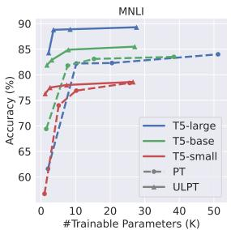

line

| #Trainable Parameters (K) | T5-large | T5-base | T5-small | PT   | ULPT |
| ------------------------- | -------- | ------- | -------- | ---- | ---- |
| 0                         | 60       | 60      | 60       | 60   | 60   |
| 10                        | 85       | 82      | 78       | 78   | 78   |
| 20                        | 88       | 84      | 79       | 79   | 79   |
| 30                        | 89       | 85      | 79       | 79   | 79   |
| 40                        | 89       | 85      | 79       | 79   | 79   |
| 50                        | 89       | 85      | 79       | 79   | 79   |

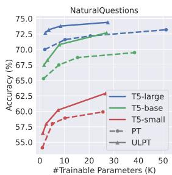

line

| #Trainable Parameters (K) | T5-large | T5-base | T5-small | PT   | ULPT |
| ------------------------- | -------- | ------- | -------- | ---- | ---- |
| 0                         | 72.5     | 68.0    | 55.0     | 70.0 | 65.0 |
| 10                        | 74.0     | 70.0    | 60.0     | 72.0 | 68.0 |
| 20                        | 74.5     | 71.0    | 62.0     | 73.0 | 70.0 |
| 30                        | 75.0     | 72.0    | 63.0     | 74.0 | 72.0 |
| 40                        | 75.5     | 72.5    | 64.0     | 75.0 | 73.0 |
| 50                        | 76.0     | 73.0    | 65.0     | 76.0 | 74.0 |

Figure 3: Results with controlled numbers of trainable parameters, suggesting that ULPT’s longer prompt with lower dimensions offers more expressivity.

By contrast, IA3, LoRA and its variants require orders of magnitude more parameters to match or even underperform ULPT. Although FourierFT can match ULPT’s parameter scale at $n = 1 2 8 .$ , it suffers from significantly lower accuracy, slower training speed, and higher memory usage.

Finally, ULPT incurs no additional inference overhead. Since the learned prompt tokens are prepended once and cached during autoregressive generation, the decoding throughput remains virtually unchanged, detailed analysis can be found in Appendix B.4.

# 4.3 In-Depth Analyses

Dimension–length trade-off drives expressivity. ULPT enables a trade-off between prompt length and dimension under a fixed parameter budget. To investigate this, we compare ULPT with vanilla prompt tuning when the learnable parameters are controlled. For ULPT, we fix the prompt token number at 100 and vary the rank from 2 to 256; for vanilla full-dimensional prompt tuning, we vary the token number from 2 to 50. This analysis is conducted with two large datasets MNLI and Natural Questions across three model sizes: T5-small, T5-base, and T5-large.

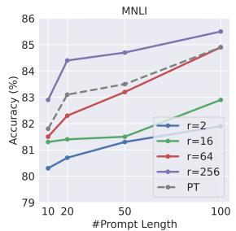

line

| #Prompt Length | r=2   | r=16  | r=64  | r=256 | PT    |
| -------------- | ----- | ----- | ----- | ----- | ----- |
| 10             | 80.5  | 81.2  | 81.8  | 83.0  | 82.0  |
| 20             | 81.0  | 81.5  | 82.5  | 84.5  | 83.5  |
| 50             | 81.5  | 81.8  | 83.5  | 84.8  | 84.0  |
| 100            | 82.0  | 82.5  | 84.5  | 85.5  | 84.5  |

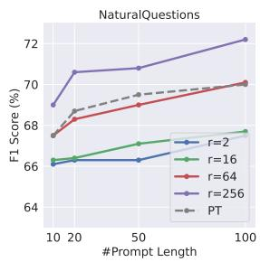

line

| #Prompt Length | r=2   | r=16  | r=64  | r=256 | PT    |
| -------------- | ----- | ----- | ----- | ----- | ----- |
| 10             | 66.0  | 66.0  | 68.0  | 69.0  | 67.0  |
| 20             | 66.0  | 67.0  | 69.0  | 70.5  | 68.5  |
| 50             | 66.0  | 67.5  | 70.0  | 71.0  | 69.5  |
| 100            | 66.0  | 68.0  | 70.5  | 72.0  | 70.0  |

Figure 4: Performance when the number of prompt tokens for both ULPT and naïve PT varies from 10 to 100.

Figure 3 illustrates the results, showing that our low-dimensional ULPT with more tokens (solid lines) always outperforms vanilla full-dimensional prompt tuning with fewer tokens (dashed lines). The analysis suggests that, when the number of learnable parameters is controlled, a longer prompt with a lower dimension offers more expressivity due to the additional Transformer steps. We provide additional results in Appendix B.3, which confirms that this also holds for decoder-only models.

Longer prompts improve performance. Recall that Table 1 has analyzed our ULPT performance with different ranks. We now vary the number of prompt tokens from 10 to 100 and plot the trend in Figure 4. We see that our ULPT exhibits a similar trend as vanilla prompting: performance increases with a longer prompt. With an appropriate rank configuration, our ULPT consistently outperforms vanilla prompt tuning under different lengths.

Ablation on shift and scale embeddings. We conduct an ablation study on the learnable $s h i f t$ embedding $\pmb { b } \in \mathbb { R } ^ { d }$ and scale embedding $\pmb { s } \in \mathbb { R } ^ { d }$ , using the SST-2 dataset with the T5-base model as the testbed, where we set the token number to be $n = 1 0 0$ . The results are shown in Figure 5. As seen, the dotted lines correspond to removing both shift and scale embeddings; their training loss remains high, suggesting that naïvely freezing the projection matrix $\tilde { P }$ hinders the optimization process and consequently lowers the model performance. Introducing a learnable shift embedding b provides a substantial improvement (dashed lines), particularly in the low-dimensional configuration of $r \ = 2$ . A learnable scale embedding scale s further improves the training process and performance (solid lines). The ablation study shows that, although shift and scale embeddings are additional 2d-many parameters, they play an important role in ultra-low-dimensional prompt tuning.

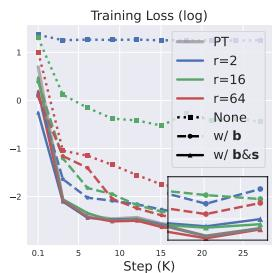

line

| Step (K) | PT    | r=2   | r=16  | r=64  | None  | w/ b  | w/ b&s |
| -------- | ----- | ----- | ----- | ----- | ----- | ----- | ------ |
| 0.1      | 1.0   | 1.0   | 1.0   | 1.0   | 1.0   | 1.0   | 1.0    |
| 5        | -0.5  | -0.8  | -0.7  | -0.6  | -0.9  | -0.8  | -0.7   |
| 10       | -1.5  | -1.8  | -1.7  | -1.6  | -1.9  | -1.8  | -1.7   |
| 15       | -2.0  | -2.2  | -2.1  | -2.0  | -2.3  | -2.2  | -2.1   |
| 20       | -2.2  | -2.4  | -2.3  | -2.2  | -2.5  | -2.4  | -2.3   |
| 25       | -2.3  | -2.5  | -2.4  | -2.3  | -2.6  | -2.5  | -2.4   |

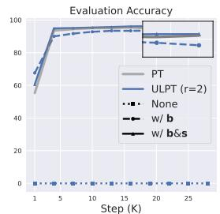

line

| Step (K) | PT   | ULPT (r=2) | None | w/ b | w/ b&s |
| -------- | ---- | ---------- | ---- | ---- | ------ |
| 1        | 60   | 65         | 0    | 0    | 0      |
| 5        | 95   | 95         | 0    | 0    | 0      |
| 10       | 95   | 95         | 0    | 0    | 0      |
| 15       | 95   | 95         | 0    | 0    | 0      |
| 20       | 95   | 95         | 0    | 0    | 0      |
| 25       | 95   | 95         | 0    | 0    | 0      |

Figure 5: Left: Training loss curves comparing ULPT with no alignment (dotted), with learnable shift only (dashed), and with both shift and scale (solid). Right: Evaluation accuracy curves for ULPT at $r = 2$ . Adding shift significantly improves optimization and accuracy, while adding scale yields further gains. Trends are consistent across ranks.

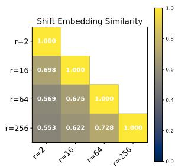

heatmap

| r    | r=2   | r=16  | r=64  | r=256 |
|------|-------|-------|-------|-------|
| r=2  | 1.000 | 0.698 | 0.569 | 0.553 |
| r=16 | 1.000 | 0.675 | 0.622 | 0.728 |
| r=64 | 1.000 | 0.728 | 1.000 | 1.000 |
| r=256| 1.000 | 1.000 | 1.000 | 1.000 |

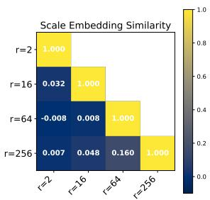

heatmap

Scale Embedding Similarity
| r | r=2 | r=16 | r=64 | r=256 |
|---|---|---|---|---|
| r=2 | 1.000 | 0.032 | 1.000 | 0.007 |
| r=16 | 0.032 | 0.008 | 0.008 | 0.048 |
| r=64 | -0.008 | 0.008 | 1.000 | 0.160 |
| r=256 | 0.007 | 0.048 | 1.000 | 1.000 |

Figure 6: Left: Shift embeddings learned with different ranks are highly similar, suggesting a general alignment role. Right: Scale embeddings vary significantly, indicating their dependence on frozen random projections.

To further investigate the behavior of these embeddings, we analyze the pairwise cosine similarities of the shift s and scale b vectors under different rank configurations, visualized in Figure 6. Interestingly, the learned shift embeddings show consistently high similarity scores with different rank configurations, indicating their primary role as a stable alignment mechanism after up-projection. By contrast, the scale embeddings show near-zero similarity, as they depend on the sampled (and frozen) random projection matrix $\tilde { P }$ .

<table><tr><td rowspan="2">Dataset</td><td colspan="2">Train?</td><td colspan="4">#Parameters</td></tr><tr><td>Z</td><td>P</td><td>1.7K</td><td>3.1K</td><td>7.9K</td><td>27.1K</td></tr><tr><td rowspan="2">MNLI</td><td></td><td>√</td><td>NF</td><td>82.9 (2)</td><td>84.5 (8)</td><td>85.3 (33)</td></tr><tr><td>√</td><td></td><td> $\mathbf{81.9}_{0.1} (2)$ </td><td> $\mathbf{83.0}_{0.2} (16)$ </td><td> $\mathbf{84.9}_{0.1} (64)$ </td><td> $\mathbf{85.4}_{0.1} (256)$ </td></tr><tr><td rowspan="2">NQ</td><td></td><td>√</td><td>NF</td><td>66.9 (2)</td><td>70.0 (8)</td><td>72.0 (33)</td></tr><tr><td>√</td><td></td><td> $\mathbf{67.2}_{0.2} (2)$ </td><td> $\mathbf{68.0}_{0.4} (16)$ </td><td> $\mathbf{70.7}_{0.3} (64)$ </td><td> $\mathbf{72.6}_{0.2} (256)$ </td></tr></table>

Table 3: Training either low-dimensional embeddings Z (ours) or the up-projection P with T5-base. Numbers in the brackets refer to the rank r given the controlled number of parameters. “NF” refers to non-feasible.

Comparison with an alternative method of tuning projection matrix. We follow the setup in Section 4.3 to ablate which component to tune in the low-rank decomposition. The low-rank decomposition E = ZP allows an alternative approach that freezes Z and tunes P , which contrasts with our approach that freezes P and tunes Z. The comparison is shown in Table 3. The alternative setup (tuning P ) can be viewed as learning an upprojection from a set of random but frozen lowdimensional vectors. However, a key drawback of making P trainable is the rapid growth in the number of parameters when the rank r increases, since d n in most practical scenarios. To ensure a fair comparison, we control the number of parameters by varying the rank r for both methods.

As seen, tuning P fails to be feasible in the 1.7Kparameter setup. Even if we set r = 2, tuning P results in 3.1K parameters, equivalent to our r = 16 setup. With a larger budget, tuning P achieves slightly worse performance than our ULPT which tunes Z. This analysis verifies the expressiveness of random projections; it also shows that our ULPT is superior to the alternative approach.

# 5 Conclusion

We introduce ULPT, a novel parameter-efficient method that learns task-specific prompts in a lowdimensional space and projects them into the model space using a frozen random matrix with learned shift and scale vectors. ULPT achieves competitive or superior performance compared with stateof-the-art parameter-efficient fine-tuning methods while using dramatically fewer trainable parameters.

# 6 Limitations

We have comprehensively evaluated ULPT on both encoder–decoder T5 models and decoder-only Bloomz and Llama models on various NLP and reasoning datasets, demonstrating its parameter efficiency and competitive performance. However, due to the limitation in computational resource, we have not explored its effectiveness on very large language models (ranging from tens to hundreds of billions of parameters). We anticipate that, for such large LLMs, parameter-efficient methods like ULPT are particularly suitable for lightweight customization, such as adapting generation style or output formatting (Liu et al., 2024b), rather than unlocking new capabilities which are better addressed in pre-training. This highlights the advantage of ULPT in scenarios that require ultra-low parameter usage without compromising effectiveness.

# Acknowledgments

We thank the reviewers and area chairs for their efforts. The research is supported in part by the Natural Sciences and Engineering Research Council of Canada (NSERC), the Amii Fellow Program, the Canada CIFAR AI Chair Program, a donation from DeepMind, and the Digital Research Alliance of Canada (alliancecan.ca).

# References

Armen Aghajanyan, Sonal Gupta, and Luke Zettlemoyer. 2021. Intrinsic dimensionality explains the effectiveness of language model fine-tuning. In Proceedings of the 59th Annual Meeting of the Association for Computational Linguistics and the 11th International Joint Conference on Natural Language Processing, pages 7319–7328.   
Akari Asai, Mohammadreza Salehi, Matthew Peters, and Hannaneh Hajishirzi. 2022. ATTEMPT: Parameter-efficient multi-task tuning via attentional mixtures of soft prompts. In Proceedings of the 2022 Conference on Empirical Methods in Natural Language Processing, pages 6655–6672.   
Jacob Austin, Augustus Odena, Maxwell Nye, Maarten Bosma, Henryk Michalewski, David Dohan, Ellen Jiang, Carrie Cai, Michael Terry, Quoc Le, and Charles Sutton. 2021. Program synthesis with large language models. arXiv preprint arXiv:2108.07732.   
Elad Ben Zaken, Yoav Goldberg, and Shauli Ravfogel. 2022. BitFit: Simple parameter-efficient fine-tuning for transformer-based masked language-models. In Proceedings of the 60th Annual Meeting of the Association for Computational Linguistics, pages 1–9.   
Ella Bingham and Heikki Mannila. 2001. Random projection in dimensionality reduction: applications to image and text data. In Proceedings of the Seventh ACM SIGKDD International Conference on Knowledge Discovery and Data Mining, page 245–250.

Tom Brown, Benjamin Mann, Nick Ryder, Melanie Subbiah, Jared D Kaplan, Prafulla Dhariwal, Arvind Neelakantan, Pranav Shyam, Girish Sastry, Amanda Askell, Sandhini Agarwal, Ariel Herbert-Voss, Gretchen Krueger, Tom Henighan, Rewon Child, Aditya Ramesh, Daniel Ziegler, Jeffrey Wu, Clemens Winter, and 12 others. 2020. Language models are few-shot learners. In Advances in Neural Information Processing Systems, pages 1877–1901.   
Daniel Cer, Mona Diab, Eneko Agirre, Iñigo Lopez-Gazpio, and Lucia Specia. 2017. SemEval-2017 task 1: Semantic textual similarity multilingual and crosslingual focused evaluation. In Proceedings of the 11th International Workshop on Semantic Evaluation, pages 1–14.   
Joon-Young Choi, Junho Kim, Jun-Hyung Park, Wing-Lam Mok, and SangKeun Lee. 2023. SMoP: Towards efficient and effective prompt tuning with sparse mixture-of-prompts. In Proceedings of the 2023 Conference on Empirical Methods in Natural Language Processing, pages 14306–14316.   
Christopher Clark, Kenton Lee, Ming-Wei Chang, Tom Kwiatkowski, Michael Collins, and Kristina Toutanova. 2019. BoolQ: Exploring the surprising difficulty of natural yes/no questions. In Proceedings of the 2019 Conference of the North American Chapter of the Association for Computational Linguistics: Human Language Technologies, pages 2924–2936.   
Karl Cobbe, Vineet Kosaraju, Mohammad Bavarian, Mark Chen, Heewoo Jun, Lukasz Kaiser, Matthias Plappert, Jerry Tworek, Jacob Hilton, Reiichiro Nakano, Christopher Hesse, and John Schulman. 2021. Training verifiers to solve math word problems. arXiv preprint arXiv:2110.14168.   
Sanjoy Dasgupta and Anupam Gupta. 2003. An elementary proof of a theorem of Johnson and Lindenstrauss. Random Structures & Algorithms, 22(1):60–65.   
Marie-Catherine De Marneffe, Mandy Simons, and Judith Tonhauser. 2019. The CommitmentBank: Investigating projection in naturally occurring discourse. In Proceedings of Sinn und Bedeutung, pages 107– 124.   
Dorottya Demszky, Kelvin Guu, and Percy Liang. 2018. Transforming question answering datasets into natural language inference datasets. arXiv preprint arXiv:1809.02922.   
William B. Dolan and Chris Brockett. 2005. Automatically constructing a corpus of sentential paraphrases. In Proceedings of the Third International Workshop on Paraphrasing.   
Qingxiu Dong, Lei Li, Damai Dai, Ce Zheng, Jingyuan Ma, Rui Li, Heming Xia, Jingjing Xu, Zhiyong Wu, Baobao Chang, Xu Sun, Lei Li, and Zhifang Sui. 2024. A survey on in-context learning. In Proceedings of the 2024 Conference on Empirical Methods in Natural Language Processing, pages 1107–1128.

Matthew Dunn, Levent Sagun, Mike Higgins, V Ugur Guney, Volkan Cirik, and Kyunghyun Cho. 2017. SearchQA: A new Q&A dataset augmented with context from a search engine. arXiv preprint arXiv:1704.05179.   
Adam Fisch, Alon Talmor, Robin Jia, Minjoon Seo, Eunsol Choi, and Danqi Chen. 2019. MRQA 2019 shared task: Evaluating generalization in reading comprehension. In Proceedings of the 2nd Workshop on Machine Reading for Question Answering, pages 1–13.   
Ziqi Gao, Qichao Wang, Aochuan Chen, Zijing Liu, Bingzhe Wu, Liang Chen, and Jia Li. 2024. Parameter-efficient fine-tuning with discrete Fourier transform. In Proceedings of the 41st International Conference on Machine Learning, pages 14884– 14901.   
Danilo Giampiccolo, Bernardo Magnini, Ido Dagan, and Bill Dolan. 2007. The third PASCAL recognizing textual entailment challenge. In Proceedings of the ACL-PASCAL Workshop on Textual Entailment and Paraphrasing, pages 1–9.   
Shouchang Guo, Sonam Damani, and Keng-hao Chang. 2024. LoPT: Low-rank prompt tuning for parameter efficient language models. arXiv preprint arXiv:2406.19486.   
Yongchang Hao, Yanshuai Cao, and Lili Mou. 2024. Flora: Low-rank adapters are secretly gradient compressors. In Proceedings of the 41st International Conference on Machine Learning, pages 17554– 17571.   
Soufiane Hayou, Nikhil Ghosh, and Bin Yu. 2024. LoRA+: Efficient low rank adaptation of large models. In Proceedings of the 41st International Conference on Machine Learning, pages 17783–17806.   
Neil Houlsby, Andrei Giurgiu, Stanislaw Jastrzebski, Bruna Morrone, Quentin De Laroussilhe, Andrea Gesmundo, Mona Attariyan, and Sylvain Gelly. 2019. Parameter-efficient transfer learning for NLP. In Proceedings of the 36th International Conference on Machine Learning, pages 2790–2799.   
Edward J Hu, yelong shen, Phillip Wallis, Zeyuan Allen-Zhu, Yuanzhi Li, Shean Wang, Lu Wang, and Weizhu Chen. 2022. LoRA: Low-rank adaptation of large language models. In International Conference on Learning Representations.   
Piotr Indyk and Rajeev Motwani. 1998. Approximate nearest neighbors: Towards removing the curse of dimensionality. In Proceedings of the Thirtieth Annual ACM Symposium on Theory of Computing, pages 604–613.   
Hamish Ivison and Matthew Peters. 2022. Hyperdecoders: Instance-specific decoders for multi-task NLP. In Findings of the Association for Computational Linguistics: EMNLP, pages 1715–1730.

Hamed Karimi, Julie Nutini, and Mark Schmidt. 2016. Linear convergence of gradient and proximalgradient methods under the Polyak-Lojasiewicz condition. In Machine Learning and Knowledge Discovery in Databases, pages 795–811.   
Rabeeh Karimi Mahabadi, Sebastian Ruder, Mostafa Dehghani, and James Henderson. 2021. Parameterefficient multi-task fine-tuning for transformers via shared hypernetworks. In Proceedings of the 59th Annual Meeting of the Association for Computational Linguistics and the 11th International Joint Conference on Natural Language Processing, pages 565– 576.   
Daniel Khashabi, Snigdha Chaturvedi, Michael Roth, Shyam Upadhyay, and Dan Roth. 2018. Looking beyond the surface: A challenge set for reading comprehension over multiple sentences. In Proceedings of the 2018 Conference of the North American Chapter of the Association for Computational Linguistics: Human Language Technologies, pages 252–262.   
Tushar Khot, Ashish Sabharwal, and Peter Clark. 2018. Scitail: A textual entailment dataset from science question answering. Proceedings of the AAAI Conference on Artificial Intelligence, 32(1).   
Takeshi Kojima, Shixiang (Shane) Gu, Machel Reid, Yutaka Matsuo, and Yusuke Iwasawa. 2022. Large language models are zero-shot reasoners. In Advances in Neural Information Processing Systems, pages 22199–22213.   
Dawid Jan Kopiczko, Tijmen Blankevoort, and Yuki M Asano. 2024. VeRA: Vector-based random matrix adaptation. In International Conference on Learning Representations.   
Tom Kwiatkowski, Jennimaria Palomaki, Olivia Redfield, Michael Collins, Ankur Parikh, Chris Alberti, Danielle Epstein, Illia Polosukhin, Jacob Devlin, Kenton Lee, Kristina Toutanova, Llion Jones, Matthew Kelcey, Ming-Wei Chang, Andrew M. Dai, Jakob Uszkoreit, Quoc Le, and Slav Petrov. 2019. Natural questions: A benchmark for question answering research. Transactions of the Association for Computational Linguistics, pages 452–466.   
Pengxiang Lan, Haoyu Xu, Enneng Yang, Yuliang Liang, Guibing Guo, Jianzhe Zhao, and Xingwei Wang. 2025. Efficient and effective prompt tuning via prompt decomposition and compressed outer product. In Proceedings of the 2025 Conference of the Nations of the Americas Chapter of the Association for Computational Linguistics, pages 4406– 4421.   
Brian Lester, Rami Al-Rfou, and Noah Constant. 2021. The power of scale for parameter-efficient prompt tuning. In Proceedings of the 2021 Conference on Empirical Methods in Natural Language Processing, pages 3045–3059.

Hector Levesque, Ernest Davis, and Leora Morgenstern. 2012. The Winograd schema challenge. In Preceddings of the 13th International Conference on the Principles of Knowledge Representation and Reasoning.   
Xiang Lisa Li and Percy Liang. 2021. Prefix-Tuning: Optimizing continuous prompts for generation. In Proceedings of the 59th Annual Meeting of the Association for Computational Linguistics and the 11th International Joint Conference on Natural Language Processing, pages 4582–4597.   
Vladislav Lialin, Sherin Muckatira, Namrata Shivagunde, and Anna Rumshisky. 2024. ReLoRA: Highrank training through low-rank updates. In International Conference on Learning Representations.   
Haokun Liu, Derek Tam, Muqeeth Mohammed, Jay Mohta, Tenghao Huang, Mohit Bansal, and Colin Raffel. 2022a. Few-shot parameter-efficient fine-tuning is better and cheaper than in-context learning. In Advances in Neural Information Processing Systems.   
Xiao Liu, Kaixuan Ji, Yicheng Fu, Weng Tam, Zhengxiao Du, Zhilin Yang, and Jie Tang. 2022b. P-Tuning: Prompt tuning can be comparable to fine-tuning across scales and tasks. In Proceedings of the 60th Annual Meeting of the Association for Computational Linguistics, pages 61–68.   
Xiao Liu, Yanan Zheng, Zhengxiao Du, Ming Ding, Yujie Qian, Zhilin Yang, and Jie Tang. 2024a. GPT understands, too. AI Open, pages 208–215.   
Xinyue Liu, Harshita Diddee, and Daphne Ippolito. 2024b. Customizing large language model generation style using parameter-efficient finetuning. In Proceedings of the 17th International Natural Language Generation Conference, pages 412–426.   
Jiˇrí Matoušek. 2008. On variants of the Johnson– Lindenstrauss lemma. Random Structures & Algorithms, 33(2):142–156.   
Jincheng Mei, Chenjun Xiao, Csaba Szepesvari, and Dale Schuurmans. 2020. On the global convergence rates of Softmax policy gradient methods. In Proceedings of the 37th International Conference on Machine Learning, pages 6820–6829.   
AI @ Meta. 2023. Llama: Open and efficient foundation language models. arXiv preprint arXiv:2302.13971.   
AI @ Meta. 2024. The llama 3 herd of models. arXiv preprint arXiv:2407.21783.   
Niklas Muennighoff, Thomas Wang, Lintang Sutawika, Adam Roberts, Stella Biderman, Teven Le Scao, M Saiful Bari, Sheng Shen, Zheng Xin Yong, Hailey Schoelkopf, Xiangru Tang, Dragomir Radev, Alham Fikri Aji, Khalid Almubarak, Samuel Albanie, Zaid Alyafeai, Albert Webson, Edward Raff, and Colin Raffel. 2023. Crosslingual generalization through multitask finetuning. In Proceedings of the

61st Annual Meeting of the Association for Computational Linguistics, pages 15991–16111.   
Rui Pan, Xiang Liu, Shizhe Diao, Renjie Pi, Jipeng Zhang, Chi Han, and Tong Zhang. 2024. LISA: Layerwise importance sampling for memory-efficient large language model fine-tuning. In Advances in Neural Information Processing Systems, pages 57018–57049.   
Aleksandar Petrov, Philip Torr, and Adel Bibi. 2024a. Prompting a pretrained transformer can be a universal approximator. In Proceedings of the 41st International Conference on Machine Learning, pages 40523–40550.   
Aleksandar Petrov, Philip Torr, and Adel Bibi. 2024b. When do prompting and prefix-tuning work? A theory of capabilities and limitations. In International Conference on Learning Representations.   
Mohammad Taher Pilehvar and Jose Camacho-Collados. 2019. WiC: The word-in-context dataset for evaluating context-sensitive meaning representations. In Proceedings of the 2019 Conference of the North American Chapter of the Association for Computational Linguistics: Human Language Technologies, pages 1267–1273.   
Yujia Qin, Xiaozhi Wang, Yusheng Su, Yankai Lin, Ning Ding, Jing Yi, Weize Chen, Zhiyuan Liu, Juanzi Li, Lei Hou, Peng Li, Maosong Sun, and Jie Zhou. 2021. Exploring universal intrinsic task subspace via prompt tuning. arXiv preprint arXiv:2110.07867.   
Colin Raffel, Noam Shazeer, Adam Roberts, Katherine Lee, Sharan Narang, Michael Matena, Yanqi Zhou, Wei Li, and Peter J Liu. 2020. Exploring the limits of transfer learning with a unified text-to-text transformer. Journal of Machine Learning Research, pages 1–67.   
Anastasiia Razdaibiedina, Yuning Mao, Madian Khabsa, Mike Lewis, Rui Hou, Jimmy Ba, and Amjad Almahairi. 2023. Residual Prompt Tuning: Improving prompt tuning with residual reparameterization. In Findings of the Association for Computational Linguistics: ACL, pages 6740–6757.   
Andreas Rücklé, Gregor Geigle, Max Glockner, Tilman Beck, Jonas Pfeiffer, Nils Reimers, and Iryna Gurevych. 2021. AdapterDrop: On the efficiency of adapters in transformers. In Proceedings of the 2021 Conference on Empirical Methods in Natural Language Processing, pages 7930–7946.   
Keisuke Sakaguchi, Ronan Le Bras, Chandra Bhagavatula, and Yejin Choi. 2021. WinoGrande: An adversarial winograd schema challenge at scale. Communications of the ACM, page 99–106.   
Zhengxiang Shi and Aldo Lipani. 2024. DePT: Decomposed prompt tuning for parameter-efficient finetuning. In International Conference on Learning Representations.

Taylor Shin, Yasaman Razeghi, Robert L. Logan IV, Eric Wallace, and Sameer Singh. 2020. AutoPrompt: Eliciting knowledge from language models with automatically generated prompts. In Proceedings of the 2020 Conference on Empirical Methods in Natural Language Processing, pages 4222–4235.   
Richard Socher, Alex Perelygin, Jean Wu, Jason Chuang, Christopher D. Manning, Andrew Ng, and Christopher Potts. 2013. Recursive deep models for semantic compositionality over a sentiment treebank. In Proceedings of the 2013 Conference on Empirical Methods in Natural Language Processing, pages 1631–1642.   
Yi-Lin Sung, Jaemin Cho, and Mohit Bansal. 2022. LST: Ladder side-tuning for parameter and memory efficient transfer learning. In Advances in Neural Information Processing Systems.   
Adam Trischler, Tong Wang, Xingdi Yuan, Justin Harris, Alessandro Sordoni, Philip Bachman, and Kaheer Suleman. 2017. NewsQA: A machine comprehension dataset. In Proceedings of the 2nd Workshop on Representation Learning for NLP, pages 191–200.   
Ashish Vaswani, Noam Shazeer, Niki Parmar, Jakob Uszkoreit, Llion Jones, Aidan N Gomez, Lukasz Kaiser, and Illia Polosukhin. 2017. Attention is all you need. In Advances in Neural Information Processing Systems.   
Tu Vu, Brian Lester, Noah Constant, Rami Al-Rfou’, and Daniel Cer. 2022. SPoT: Better frozen model adaptation through soft prompt transfer. In Proceedings of the 60th Annual Meeting of the Association for Computational Linguistics, pages 5039–5059.   
Alex Wang, Yada Pruksachatkun, Nikita Nangia, Amanpreet Singh, Julian Michael, Felix Hill, Omer Levy, and Samuel Bowman. 2019. SuperGlue: A stickier benchmark for general-purpose language understanding systems. In Advances in Neural Information Processing Systems.   
Alex Wang, Amanpreet Singh, Julian Michael, Felix Hill, Omer Levy, and Samuel Bowman. 2018. GLUE: A multi-task benchmark and analysis platform for natural language understanding. In Proceedings of the 2018 EMNLP Workshop BlackboxNLP: Analyzing and Interpreting Neural Networks for NLP, pages 353–355.   
Zhen Wang, Rameswar Panda, Leonid Karlinsky, Rogerio Feris, Huan Sun, and Yoon Kim. 2023. Multitask prompt tuning enables parameter-efficient transfer learning. In The Eleventh International Conference on Learning Representations.   
Alex Warstadt, Amanpreet Singh, and Samuel R. Bowman. 2019. Neural network acceptability judgments. Transactions of the Association for Computational Linguistics, pages 625–641.   
Jason Wei, Maarten Bosma, Vincent Zhao, Kelvin Guu, Adams Wei Yu, Brian Lester, Nan Du, Andrew M.

Dai, and Quoc V Le. 2022a. Finetuned language models are zero-shot learners. In International Conference on Learning Representations.   
Jason Wei, Xuezhi Wang, Dale Schuurmans, Maarten Bosma, brian ichter, Fei Xia, Ed Chi, Quoc V Le, and Denny Zhou. 2022b. Chain-of-thought prompting elicits reasoning in large language models. In Advances in Neural Information Processing Systems, pages 24824–24837.   
Adina Williams, Nikita Nangia, and Samuel Bowman. 2018. A broad-coverage challenge corpus for sentence understanding through inference. In Proceedings of the 2018 Conference of the North American Chapter of the Association for Computational Linguistics: Human Language Technologies, pages 1112–1122.   
Xun Wu, Shaohan Huang, and Furu Wei. 2024a. Mixture of LoRA experts. In International Conference on Learning Representations.   
Zhengxuan Wu, Aryaman Arora, Zheng Wang, Atticus Geiger, Dan Jurafsky, Christopher D Manning, and Christopher Potts. 2024b. ReFT: Representation finetuning for language models. In Advances in Neural Information Processing Systems.   
Zijun Wu, Yongkang Wu, and Lili Mou. 2024c. Zeroshot continuous prompt transfer: Generalizing task semantics across language models. In International Conference on Learning Representations.   
Yao Xiao, Lu Xu, Jiaxi Li, Wei Lu, and Xiaoli Li. 2023. Decomposed prompt tuning via low-rank reparameterization. In Findings of the Association for Computational Linguistics: EMNLP, pages 13335–13347.   
Zhilin Yang, Peng Qi, Saizheng Zhang, Yoshua Bengio, William Cohen, Ruslan Salakhutdinov, and Christopher D. Manning. 2018. HotpotQA: A dataset for diverse, explainable multi-hop question answering. In Proceedings of the 2018 Conference on Empirical Methods in Natural Language Processing, pages 2369–2380.   
Fangcong Yin, Xi Ye, and Greg Durrett. 2024. LoFiT: Localized fine-tuning on LLM representations. In Advances in Neural Information Processing Systems.   
Xiang Zhang, Junbo Zhao, and Yann LeCun. 2015. Character-level convolutional networks for text classification. In Advances in Neural Information Processing Systems, page 649–657.   
Yuan Zhang, Jason Baldridge, and Luheng He. 2019. PAWS: Paraphrase adversaries from word scrambling. In Proceedings of the 2019 Conference of the North American Chapter of the Association for Computational Linguistics: Human Language Technologies, pages 1298–1308.   
Bingchen Zhao, Haoqin Tu, Chen Wei, Jieru Mei, and Cihang Xie. 2024. Tuning layernorm in attention: Towards efficient multi-modal LLM finetuning. In

International Conference on Learning Representations.

# A Experimental Details

# A.1 Datasets Statistics for Language Understanding Tasks

We present detailed information for the 21 natural language understanding tasks in Table 4. Following previous work (Wang et al., 2023; Shi and Lipani, 2024), we preprocess the labels for classification and multiple-choice tasks into a single-token label $( \mathrm { e . g . , 0 , 1 , 2 , . . . } )$ to simplify evaluation. For MRQA, the model generates an answer containing a sequence of tokens.

Based on the training set size, the tasks can be roughly categorized into three scales: small (<10K samples), medium (10–100K samples), and large (>100K samples). Notably, SuperGLUE contains small training sets, and is generally considered more challenging than GLUE, making it more susceptible to overfitting due to its limited samples. By contrast, MRQA and the tasks in the “Others” category consist of more complex tasks, likely requiring more parameters to capture their difficulty.

# A.2 Training Details for Language Understanding Tasks

In our experiment for 21 language understanding tasks (Section 4.1), we use a batch size of 16 and a default learning rate of 6e 1 with AdamW. The learning rate follows a linear schedule, warming up for 500 steps and then decaying linearly to 0. We set a maximum sequence length of 256 for most tasks, except for SuperGLUE-MultiRC being 348 and MRQA being 512. ULPT is trained on all tasks for up to 100, 000 steps. Performance is evaluated every 1, 000 steps, with the best checkpoint selected based on the validation set.

# A.3 Implementation and Training Details for Reasoning Tasks

In Section 4.2, we evaluate ULPT on Llama 3.2 (Meta, 2024), a decoder-only model in 1B $( d = 2 0 4 8 )$ and 3B $( d = 3 0 7 2 )$ scales. We consider two reasoning tasks, GSM8K (Cobbe et al., 2021) for math reasoning and MBPP (Austin et al., 2021) for code generation.

As baselines, we include in-context learning (4-shot demostrations sampled from each training set), LoRA and VeRA adapters with ranks $r \in \{ 1 , 4 , 8 \}$ , FourierFT with three frequency configurations $n \in \{ 1 2 8 , 5 1 2 , 1 0 2 4 \}$ . Vanilla prompt tuning and ULPT both run with 10 learnable tokens, since extending the length yields no additional benefit on Llama. We evaluate ULPT on three rank configurations of 2, 64 and 256. All methods share a batch size of 4, with training for 3 epochs on GSM8K and 10 epochs on MBPP. We set learning rates to 1e-3 for LoRA and VeRA, and 1e-2 for ULPT, prompt tuning and FourierFT. At inference, we apply greedy decoding with the maximum generation length of 1024 tokens.

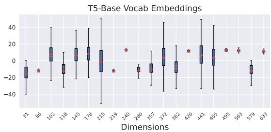

boxplot

| Dimensions | Min  | Q1   | Median | Q3   | Max  |
| ---------- | ---- | ---- | ------ | ---- | ---- |
| 31         | -40  | -20  | -10    | 0    | 10   |
| 86         | -20  | -10  | -5     | 5    | 20   |
| 102        | -20  | 10   | 5      | 15   | 30   |
| 118        | -20  | -5   | -10    | 5    | 15   |
| 143        | -20  | 5    | 10     | 15   | 30   |
| 176        | -20  | 10   | 15     | 20   | 35   |
| 215        | -40  | -20  | -10    | 5    | 40   |
| 219        | -20  | -10  | -5     | 5    | 15   |
| 240        | -20  | -5   | -10    | 5    | 15   |
| 280        | -20  | -10  | -5     | 5    | 20   |
| 357        | -20  | -5   | -10    | 5    | 30   |
| 372        | -20  | 10   | 5      | 15   | 35   |
| 382        | -20  | -5   | -10    | 5    | 40   |
| 420        | -20  | -10  | -5     | 5    | 45   |
| 441        | -20  | 10   | 5      | 15   | 40   |
| 455        | -20  | -5   | -10    | 5    | 35   |
| 495        | -20  | -10  | -5     | 5    | 40   |
| 563        | -20  | -5   | -10    | 5    | 45   |
| 579        | -20  | -10  | -5     | 5    | 50   |
| 633        | -20  | -5   | -10    | 5    | 60   |

Figure 7: Distribution of randomly selected dimensions from the pretrained token embeddings of T5-base.

# B Additional Results

# B.1 Distribution of Pretrained Embeddings

Following our pilot study in Section 3.2, we present the distribution of the same randomly selected dimensions from the pretrained token embeddings of the T5-base model. We observe that the variation in these pretrained embeddings is smaller compared with the learned soft embeddings from the CoLA and SST-2 tasks.

# B.2 Additional Results on T5 Model

We evaluate ULPT on the MRQA dataset and four additional tasks in the “Others” category. Following the standard practice on these benchmarks (Wang et al., 2023; Shi and Lipani, 2024), we run ULPT three times with different seeds and report the mean and standard deviation. This setup also allows us to assess ULPT’s sensitivity to the random initialization of the up-projection matrix.

The results are shown in Table 5. Unlike GLUE and SuperGLUE performance, ULPT exhibits consistent improvement when the rank is higher. This is probably because these tasks are more challenging for the T5-base model, which aligns with the observation that full-model fine-tuning outperforms parameter-efficient methods on these tasks. Nevertheless, ULPT achieves competitive performance (slightly worse than the best-performing DePT approach), while saving parameters by multiple folds.

<table><tr><td>Dataset</td><td>Source Length</td><td>Target Length</td><td>#Train</td><td>#Valid</td><td>#Test</td><td>Type</td><td>Size</td></tr><tr><td colspan="8">GLUE Benchmark</td></tr><tr><td>MNLI</td><td>31.8</td><td>1.0</td><td>392,702</td><td>9,832</td><td>9,815</td><td>Natural language inference</td><td>Large</td></tr><tr><td>QQP</td><td>24.1</td><td>1.0</td><td>362,846</td><td>1,000</td><td>40,431</td><td>Paraphrasing</td><td>Large</td></tr><tr><td>QNLI</td><td>38.4</td><td>1.0</td><td>103,743</td><td>1,000</td><td>5,463</td><td>Natural language inference</td><td>Large</td></tr><tr><td>SST-2</td><td>10.4</td><td>1.0</td><td>66,349</td><td>1,000</td><td>872</td><td>Sentiment analysis</td><td>Medium</td></tr><tr><td>STS-B</td><td>21.9</td><td>1.0</td><td>5,749</td><td>750</td><td>750</td><td>Sentence similarity</td><td>Small</td></tr><tr><td>MRPC</td><td>45.9</td><td>1.0</td><td>3,668</td><td>204</td><td>204</td><td>Paraphrasing</td><td>Small</td></tr><tr><td>RTE</td><td>54.4</td><td>1.0</td><td>2,490</td><td>138</td><td>139</td><td>Natural language inference</td><td>Small</td></tr><tr><td>CoLA</td><td>8.7</td><td>1.0</td><td>8,551</td><td>521</td><td>522</td><td>Acceptability</td><td>Small</td></tr><tr><td colspan="8">SuperGLUE Benchmark</td></tr><tr><td>MultiRC</td><td>286.1</td><td>1.0</td><td>27,243</td><td>2,424</td><td>2,424</td><td>Question answering</td><td>Medium</td></tr><tr><td>BoolQ</td><td>108.3</td><td>1.0</td><td>9,427</td><td>1,635</td><td>1,635</td><td>Question answering</td><td>Small</td></tr><tr><td>WiC</td><td>18.4</td><td>1.0</td><td>5,428</td><td>319</td><td>319</td><td>Word sense disambiguation</td><td>Small</td></tr><tr><td>WSC</td><td>28.1</td><td>1.0</td><td>554</td><td>52</td><td>52</td><td>Commonsense reasoning</td><td>Small</td></tr><tr><td>CB</td><td>64.6</td><td>1.0</td><td>250</td><td>28</td><td>28</td><td>Natural language inference</td><td>Small</td></tr><tr><td colspan="8">MRQA 2019 Shared Task</td></tr><tr><td>NaturalQuestions</td><td>242.7</td><td>4.5</td><td>103,071</td><td>1,000</td><td>12,836</td><td>Question answering</td><td>Large</td></tr><tr><td>HotpotQA</td><td>225.7</td><td>2.6</td><td>71,928</td><td>1,000</td><td>5,901</td><td>Question answering</td><td>Medium</td></tr><tr><td>SearchQA</td><td>942.8</td><td>2.0</td><td>116,384</td><td>1,000</td><td>16,980</td><td>Question answering</td><td>Large</td></tr><tr><td>NewsQA</td><td>615.5</td><td>5.1</td><td>73,160</td><td>1,000</td><td>4,212</td><td>Question answering</td><td>Medium</td></tr><tr><td colspan="8">Other Datasets</td></tr><tr><td>WinoGrande</td><td>23.8</td><td>1.0</td><td>39,398</td><td>1,000</td><td>1,267</td><td>Commonsense reasoning</td><td>Medium</td></tr><tr><td>YelpPolarity</td><td>134.0</td><td>1.0</td><td>100,000</td><td>1,000</td><td>38,000</td><td>Sentiment analysis</td><td>Large</td></tr><tr><td>SciTail</td><td>30.8</td><td>1.0</td><td>23,596</td><td>652</td><td>652</td><td>Natural language inference</td><td>Medium</td></tr><tr><td>PAWS</td><td>44.7</td><td>1.0</td><td>49,401</td><td>8,000</td><td>8,000</td><td>Sentence Similarity</td><td>Medium</td></tr></table>

Table 4: Dataset information and statistics for the main experiments in Section 4.1.

<table><tr><td rowspan="2">Method</td><td rowspan="2">#Param</td><td colspan="5">MRQA</td><td colspan="5">Others</td></tr><tr><td>NQ</td><td>HQA</td><td>SQA</td><td>NewsQA</td><td>Avg.</td><td>WG</td><td>Yelp</td><td>SciTail</td><td>PAWS</td><td>Avg.</td></tr><tr><td>Fine-tuning</td><td>220M</td><td>75.1</td><td>77.5</td><td>81.1</td><td>65.2</td><td>74.7</td><td>61.9</td><td>96.7</td><td>95.8</td><td>94.1</td><td>87.1</td></tr><tr><td>Adapter</td><td>1.9M</td><td>74.2</td><td>77.6</td><td>81.4</td><td>65.6</td><td>74.7</td><td>59.2</td><td>96.9</td><td>94.5</td><td>94.3</td><td>86.2</td></tr><tr><td>BitFit</td><td>280K</td><td>70.7</td><td>75.5</td><td>77.7</td><td>64.1</td><td>72.0</td><td>57.2</td><td>94.7</td><td>94.7</td><td>92.0</td><td>84.7</td></tr><tr><td>LoRA</td><td>3.8M</td><td>72.4</td><td>62.3</td><td>72.5</td><td>56.9</td><td>66.0</td><td>58.2</td><td>97.1</td><td>94.7</td><td>94.0</td><td>86.0</td></tr><tr><td>SPoT</td><td>76.8K</td><td>68.2</td><td>74.8</td><td>75.3</td><td>58.2</td><td>69.1</td><td>50.4</td><td>95.4</td><td>91.2</td><td>91.1</td><td>82.0</td></tr><tr><td>ATTEMPT</td><td>232K</td><td>70.4</td><td>75.2</td><td>78.5</td><td>62.8</td><td>71.4</td><td>57.6</td><td>96.7</td><td>93.1</td><td>92.1</td><td>84.9</td></tr><tr><td> $PT^†$ </td><td>76.8K</td><td>70.0</td><td>74.7</td><td>75.3</td><td>63.0</td><td>70.8</td><td>49.6</td><td>95.6</td><td>92.0</td><td>57.9</td><td>73.8</td></tr><tr><td> $DPT^†(r=10)$ </td><td>9.0K</td><td>71.3</td><td>75.5</td><td>76.3</td><td>63.5</td><td>71.7</td><td>49.6</td><td>96.1</td><td>95.6</td><td>92.2</td><td>83.4</td></tr><tr><td>DPT (r=256)</td><td>222K</td><td>71.4</td><td>76.0</td><td>77.6</td><td>64.2</td><td>72.3</td><td>49.6</td><td>96.3</td><td>95.2</td><td>55.8</td><td>74.2</td></tr><tr><td>DePT</td><td>76.8K</td><td> $73.2_{0.3}$ </td><td> $76.0_{0.2}$ </td><td> $77.6_{0.2}$ </td><td> $64.4_{0.1}$ </td><td>73.0</td><td> $59.0_{0.2}$ </td><td> $96.8_{0.1}$ </td><td> $95.6_{0.2}$ </td><td> $93.7_{0.1}$ </td><td>86.3</td></tr><tr><td>MPT</td><td>77.6K</td><td> $72.0_{0.1}$ </td><td> $75.8_{0.1}$ </td><td> $77.2_{0.1}$ </td><td> $63.7_{0.1}$ </td><td>72.2</td><td> $56.5_{0.9}$ </td><td> $96.4_{0.0}$ </td><td> $95.5_{0.3}$ </td><td> $93.5_{0.1}$ </td><td>85.5</td></tr><tr><td>ULPT (r=2)</td><td>1.7K</td><td> $67.2_{0.2}$ </td><td> $74.0_{0.1}$ </td><td> $71.7_{0.2}$ </td><td> $61.4_{0.1}$ </td><td>68.6</td><td> $49.5_{0.2}$ </td><td> $95.6_{0.1}$ </td><td> $93.0_{0.9}$ </td><td> $90.4_{0.2}$ </td><td>82.1</td></tr><tr><td>ULPT (r=16)</td><td>3.1K</td><td> $68.0_{0.3}$ </td><td> $74.3_{0.0}$ </td><td> $72.9_{0.1}$ </td><td> $61.3_{0.5}$ </td><td>69.1</td><td> $52.3_{0.9}$ </td><td> $95.6_{0.2}$ </td><td> $93.1_{0.7}$ </td><td> $90.5_{0.3}$ </td><td>82.9</td></tr><tr><td>ULPT (r=64)</td><td>7.9K</td><td> $70.7_{0.3}$ </td><td> $75.3_{0.1}$ </td><td> $75.3_{0.1}$ </td><td> $62.9_{0.5}$ </td><td>71.1</td><td> $56.6_{0.9}$ </td><td> $96.2_{0.1}$ </td><td> $94.4_{0.9}$ </td><td> $91.7_{0.4}$ </td><td>84.7</td></tr><tr><td>ULPT (r=256)</td><td>27.1K</td><td> $72.6_{0.2}$ </td><td> $76.5_{0.1}$ </td><td> $77.9_{0.1}$ </td><td> $64.2_{0.2}$ </td><td>72.8</td><td> $57.6_{0.8}$ </td><td> $96.6_{0.2}$ </td><td> $96.2_{0.1}$ </td><td> $93.0_{0.1}$ </td><td>85.9</td></tr></table>

Table 5: Performance on MRQA and other benchmarks using the T5-base model. The standard metrics reported are the F1 score for MRQA tasks and accuracy for other datasets. †Results are obtained based on our replication using default configurations. Other baseline results are sourced from Shi and Lipani (2024).

# B.3 Additional Analysis on Bloomz Family

We further test our hypothesis from Section 4.3: under a fixed parameter budget, longer lowdimensional prompts offer greater expressivity. To this end, we extend ULPT evaluation to Bloomz (Muennighoff et al., 2023), a decoder-only model available in 560M, 1.7B, and 3B sizes, having hidden dimensions of 1024, 2048, and 2560 respectively.

For evaluation diversity, we select three midsized tasks from each task group: SST-2, HotpotQA, and Winogrande, providing assessment across classification, multi-hop reasoning, and commonsense reasoning. Given that Bloomz models are larger than the T5 series, we train up to 30K steps with a batch size of 4, while keeping other hyperparamters the same as our main experiment.

<table><tr><td>Model</td><td>Method</td><td>SST-2</td><td>HQA</td><td>WG</td><td>Avg.</td><td>SST-2</td><td>HQA</td><td>WG</td><td>Avg.</td><td>SST-2</td><td>HQA</td><td>WG</td><td>Avg.</td><td>SST-2</td><td>HQA</td><td>WG</td><td>Avg.</td></tr><tr><td></td><td></td><td colspan="4">#Param=2K, ULPT (r=2)</td><td colspan="4">#Param=4K, ULPT (r=16)</td><td colspan="4">#Param=8K, ULPT (r=64)</td><td colspan="4">#Param=28K, ULPT (r=256)</td></tr><tr><td rowspan="2">Bloomz-560M</td><td>PT</td><td>89.8</td><td>42.9</td><td>48.6</td><td>60.4</td><td>91.1</td><td>53.0</td><td>52.0</td><td>65.4</td><td>91.9</td><td>57.2</td><td>50.0</td><td>66.4</td><td>92.2</td><td>60.6</td><td>52.2</td><td>68.3</td></tr><tr><td>ULPT</td><td>90.2</td><td>52.4</td><td>51.7</td><td>64.8</td><td>92.2</td><td>55.7</td><td>53.1</td><td>67.0</td><td>91.8</td><td>59.3</td><td>53.1</td><td>68.1</td><td>92.6</td><td>62.5</td><td>52.2</td><td>69.1</td></tr><tr><td></td><td></td><td colspan="4">#Param=4K, ULPT (r=2)</td><td colspan="4">#Param=6K, ULPT (r=16)</td><td colspan="4">#Param=10K, ULPT (r=64)</td><td colspan="4">#Param=30K, ULPT (r=256)</td></tr><tr><td rowspan="2">Bloomz-1.7B</td><td>PT</td><td>93.2</td><td>64.6</td><td>50.1</td><td>69.3</td><td>93.5</td><td>66.1</td><td>51.5</td><td>70.4</td><td>94.0</td><td>67.3</td><td>55.3</td><td>72.2</td><td>94.7</td><td>69.1</td><td>55.4</td><td>73.1</td></tr><tr><td>ULPT</td><td>94.4</td><td>65.6</td><td>54.6</td><td>71.5</td><td>93.9</td><td>66.3</td><td>55.6</td><td>71.9</td><td>94.3</td><td>68.0</td><td>55.2</td><td>72.5</td><td>95.1</td><td>69.3</td><td>57.4</td><td>73.9</td></tr><tr><td></td><td></td><td colspan="4">#Param=5K, ULPT (r=2)</td><td colspan="4">#Param=8K, ULPT (r=16)</td><td colspan="4">#Param=13K, ULPT (r=64)</td><td colspan="4">#Param=31K, ULPT (r=256)</td></tr><tr><td rowspan="2">Bloomz-3B</td><td>PT</td><td>93.2</td><td>66.1</td><td>50.5</td><td>69.9</td><td>94.5</td><td>69.0</td><td>56.0</td><td>73.2</td><td>94.9</td><td>69.1</td><td>58.9</td><td>74.3</td><td>94.9</td><td>71.5</td><td>60.0</td><td>75.5</td></tr><tr><td>ULPT</td><td>94.0</td><td>68.1</td><td>53.5</td><td>71.9</td><td>94.4</td><td>68.9</td><td>57.1</td><td>73.5</td><td>94.7</td><td>70.9</td><td>58.5</td><td>74.7</td><td>95.0</td><td>71.8</td><td>60.7</td><td>75.8</td></tr></table>

Table 6: Results on Bloomz, a decoder model with varying sizes (560M, 1.7B, and 3B) and hidden dimensions (1024, 2048, and 2560). We compare ULPT with prompt tuning by conditioning on the same number of trainable parameters.

<table><tr><td>Runtime Setting</td><td>Llama 1B</td><td>Llama 3B</td></tr><tr><td>Vanilla PT embeddings loading</td><td>0.64 ± 0.04</td><td>0.91 ± 0.04</td></tr><tr><td>ULPT up-projection (r = 2)</td><td>0.56 ± 0.06</td><td>0.59 ± 0.04</td></tr><tr><td>ULPT up-projection (r = 64)</td><td>1.43 ± 0.09</td><td>1.87 ± 0.06</td></tr><tr><td>ULPT up-projection (r = 256)</td><td>4.09 ± 0.10</td><td>5.80 ± 0.16</td></tr><tr><td>Decoding</td><td>1481.15 ± 64.26</td><td>2536.67 ± 42.14</td></tr></table>

Table 7: Runtime (ms) for ULPT prompt reconstruction.

<table><tr><td>Model</td><td>No adaptation</td><td>ULPT</td></tr><tr><td>Llama 1B</td><td>82.76 ± 0.33</td><td>82.71 ± 0.33</td></tr><tr><td>Llama 3B</td><td>48.74 ± 0.25</td><td>48.70 ± 0.22</td></tr></table>

Table 8: Decoding speed (tokens/second)

We consider comparing ULPT with prompt tuning under different parameter budgets for text generation. Specifically, we vary the rank of ULPT from 2 to 256 while fixing the length n = 100. For full-dimensional prompt tuning, the token number is adjusted to match the parameter count, resulting in fewer virtual tokens than ULPT.

The results in Table 6 show that ULPT consistently outperforms full-dimensional prompt tuning across all model sizes and tasks given a fixed parameter budget. These results support our earlier analysis (Section 4.3) that allocating the parameter budget toward longer sequence lengths rather than higher embedding dimensions yields greater expressivity.

# B.4 Inference Overhead Analysis

ULPT’s ideal use case is for massive LLM customization, where adapters are frequently loaded

to a model. Unlike vanilla prompt tuning, ULPT reconstructs prompt embeddings from a lowdimensional space at inference time. We empirically compare its up-projection runtime against vanilla PT over 100 runs, shown in Table 7. We find the overhead is negligible relative to the decoding time on GSM8K .

ULPT follows the paradigm of prompt tuning to prepend tokens. We also measure end-to-end decoding speed using ULPT (rank 2 and 100 prompt tokens) on a single NVIDIA A6000 48G GPU with the Huggingface generation API. As seen in Table 8, the decoding speed is similar with or without the additional prompt tokens.

# C Theoretical Analysis

# C.1 Proof of Theorem 2

Theorem 2. Let $\boldsymbol { e } _ { 1 } , \ldots , \boldsymbol { e } _ { n } \in \mathbb { R } ^ { d }$ be the embedding vectors in a high-dimensional space. Let $\pmb { P } \in \mathbb { R } ^ { r \times d }$ be a random projection matrix where each element $p _ { i , j } \sim \mathcal { N } ( 0 , 1 / r )$ , and let $z _ { i } = P e _ { i } \in \mathbb { R } ^ { r }$ be the projected low-dimensional vectors.

Then, with confidence at least $1 - \delta$ , we have

$$
(1 - \epsilon) \| \boldsymbol {e} _ {i} - \boldsymbol {e} _ {j} \| \leq \| \boldsymbol {z} _ {i} - \boldsymbol {z} _ {j} \| \leq (1 + \epsilon) \| \boldsymbol {e} _ {i} - \boldsymbol {e} _ {j} \| \tag {5}
$$

for all $i , j \in [ n ]$ , given that $r \ge C \epsilon ^ { - 2 } \log ( 2 n / \delta )$ for a sufficiently large constant C.

Proof. Setting $z _ { i } = P e _ { i }$ , we have

$$
\begin{array}{l} \operatorname * {P r} \left(\left| \frac {\| \boldsymbol {z} _ {i} - \boldsymbol {z} _ {j} \| - \| \boldsymbol {e} _ {i} - \boldsymbol {e} _ {j} \|}{\| \boldsymbol {e} _ {i} - \boldsymbol {e} _ {j} \|} \right| \geq \epsilon\right) = \operatorname * {P r} \left(\left| \frac {\| \boldsymbol {P} (\boldsymbol {e} _ {i} - \boldsymbol {e} _ {j}) \| - \| \boldsymbol {e} _ {i} - \boldsymbol {e} _ {j} \|}{\| \boldsymbol {e} _ {i} - \boldsymbol {e} _ {j} \|} \right| \geq \epsilon\right) (6) \\ \leq \frac {2}{\exp (\epsilon^ {2} r / c)}, (7) \\ \end{array}
$$

for any $i , j \in [ n ]$ ]. The last inequality is a direction application of Lemma 1. Further, Boole’s inequality suggests

$$
\operatorname * {P r} \left(\text { any   } i, j \in [ n ]: \left| \frac {\| \boldsymbol {z} _ {i} - \boldsymbol {z} _ {j} \| - \| \boldsymbol {e} _ {i} - \boldsymbol {e} _ {j} \|}{\| \boldsymbol {e} _ {i} - \boldsymbol {e} _ {j} \|} \right| \geq \epsilon\right) \leq n ^ {2} \frac {2}{\exp (\epsilon^ {2} r / c)}, \tag {8}
$$

where $n ^ { 2 }$ comes from counting all $( i , j )$ pairs. By setting $\delta > 0$ to any value smaller than $\frac { 2 n ^ { 2 } } { \exp ( { \epsilon ^ { 2 } r / c } ) }$ 2n2 , we have $r \geq 2 c \epsilon ^ { - 2 } \cdot \log ( 2 n / \delta )$ . Therefore, Eqn. (8) can be rewritten as follows: with confidence at least $1 - \delta .$ , we have

$$
(1 - \epsilon) \| \boldsymbol {e} _ {i} - \boldsymbol {e} _ {j} \| \leq \| \boldsymbol {z} _ {i} - \boldsymbol {z} _ {j} \| \leq (1 + \epsilon) \| \boldsymbol {e} _ {i} - \boldsymbol {e} _ {j} \| \tag {9}
$$

for all $i , j \in [ n ]$ , as long as $r \ge 2 c \epsilon ^ { - 2 } \log ( 2 n / \delta )$ .

# C.2 Proof of Theorem 3

We first formally explain our assumptions.

Assumption 4. The loss function $\mathcal { L }$ is $\beta$ element-wise Lipschitz w.r.t. embeddings. Specifically, we have

$$
\left| \nabla \mathcal {L} \left(x _ {i}\right) - \nabla \mathcal {L} \left(y _ {i}\right) \right| \leq \beta \left| x _ {i} - y _ {i} \right| \tag {10}
$$

for any $\boldsymbol { x } , \boldsymbol { y } \in \mathbb { R } ^ { n d }$ being unrolled from $n \times d$ embedding matrices. $x _ { i }$ and $y _ { i }$ are elements in the vectors.

Assumption 5. The loss function $\mathcal { L }$ is $\mu { \mathrm { - P L } }$ (Polyak–Lojasiewic) w.r.t. embeddings, meaning that

$$
\frac {1}{2} \| \nabla \mathcal {L} (\boldsymbol {x}) \| _ {2} ^ {2} \geq \mu \left(\mathcal {L} (\boldsymbol {x}) - \mathcal {L} (\boldsymbol {x} ^ {*})\right) \tag {11}
$$

for any $\pmb { x } \in \mathbb { R } ^ { n d }$ , where x is embedding parameters and $\scriptstyle { \pmb { x } } ^ { * }$ is any finite minimizer of $\mathcal { L } .$ .

These are the common assumptions used to show the optimization process in deep learning (Karimi et al., 2016; Mei et al., 2020). In addition, we also impose an assumptions on the projection matrix and the scaling vector s.

Assumption 6. The projection matrices $\pmb { P } \in \mathbb { R } ^ { r \times d }$ has a rank of r. In addition, we assume s is not a zero vector during optimization.

Based on these assumptions, we first provide the essential lemmas for our proof.

Lemma 7. $I f \mathcal { L } : \mathbb { R } ^ { d }  \mathbb { R }$ is β-Lipschitz in each element, then $\mathcal { L }$ is $\beta { - } L i p s c h i t z$ .

Proof. Let $\nabla \mathcal { L } ( x _ { i } )$ be the partial derivative of L w.r.t. $x _ { i }$ . We have

$$
\left| \nabla \mathcal {L} (x _ {i}) - \nabla \mathcal {L} (y _ {i}) \right| \leq \beta \left| x _ {i} - y _ {i} \right| \tag {12}
$$

for every $x _ { i } , y _ { i } \in \mathbb { R }$ . Therefore,

$$
\left\| \nabla \mathcal {L} (\boldsymbol {x}) - \nabla \mathcal {L} (\boldsymbol {y}) \right\| ^ {2} = \sum_ {i = 1} ^ {d} \left| \nabla \mathcal {L} \left(x _ {i}\right) - \nabla \mathcal {L} \left(y _ {i}\right) \right| ^ {2} \tag {13}
$$

$$
\leq \sum_ {i = 1} ^ {d} \beta^ {2} | x _ {i} - y _ {i} | ^ {2} \tag {14}
$$

$$
= \beta^ {2} \| \boldsymbol {x} - \boldsymbol {y} \| ^ {2}. \tag {15}
$$

We complete the proof by taking the square root on both sides.

Lemma 8. Let $\hat { \mathcal { L } } ( \hat { \pmb x } )$ be the loss function with our ULPT approach, where $\hat { \pmb x } \in \mathbb { R } ^ { n r + 2 d }$ is the concatenation of shift/scale embeddings and the ultra-low-dimensional prompt embeddings. $\hat { \mathcal { L } } ( \hat { \pmb x } )$ is β′-Lipschitz w.r.t. xˆ for some $\beta ^ { \prime } > 0$ .

Proof. We prove the Lipschitz condition of  w.r.t. the ultra-low-dimensional prompt embeddings, scale embedding, and shift embedding separately. Then, Lemma 7 suggests the Lipschitz condition of $\mathcal { L }$ w.r.t to xˆ. Without loss of generality, we assume the layout of parameters is $\pmb { \hat { x } } = [ b , s , z _ { 1 } , z _ { 2 } , \ldots , z _ { n } ]$ , where n is the number of prompt tokens.

We first calculate partial derivatives as follows

$$
\frac {\partial \mathcal {L}}{\partial \boldsymbol {b}} = \sum_ {i = 1} ^ {n} \left(\frac {\partial \hat {\boldsymbol {e}} _ {i}}{\partial \boldsymbol {b}}\right) ^ {\top} \frac {\partial \mathcal {L}}{\partial \hat {\boldsymbol {e}} _ {i}} = \sum_ {i = 1} ^ {n} \frac {\partial \mathcal {L}}{\partial \hat {\boldsymbol {e}} _ {i}}, \tag {16}
$$

$$
\frac {\partial \mathcal {L}}{\partial \boldsymbol {s}} = \left(\frac {\partial \hat {\boldsymbol {e}} _ {i}}{\partial \boldsymbol {s}}\right) ^ {\top} \frac {\partial \mathcal {L}}{\partial \hat {\boldsymbol {e}} _ {i}} = \sum_ {i = 1} ^ {n} \operatorname{diag} (\boldsymbol {P} ^ {\top} \boldsymbol {z} _ {i}) \frac {\partial \mathcal {L}}{\partial \hat {\boldsymbol {e}} _ {i}}, \text { and } \tag {17}
$$

$$
\frac {\partial \mathcal {L}}{\partial \boldsymbol {z} _ {i}} = \left(\frac {\partial \hat {\boldsymbol {e}} _ {i}}{\partial \boldsymbol {z} _ {i}}\right) ^ {\top} \frac {\partial \mathcal {L}}{\partial \hat {\boldsymbol {e}} _ {i}} = \boldsymbol {P} \operatorname{diag} (\boldsymbol {s}) \frac {\partial \mathcal {L}}{\partial \hat {\boldsymbol {e}} _ {i}}. \tag {18}
$$

Our proof of the Lipschitz condition starts with checking b. For any element $b _ { k }$ , where $k = 1 , \cdots , d ,$ we have

$$
\left| \nabla \hat {\mathcal {L}} (b _ {k} ^ {(1)}) - \nabla \hat {\mathcal {L}} (b _ {k} ^ {(2)}) \right| = \left| \sum_ {i = 1} ^ {n} \left(\nabla \mathcal {L} (\hat {e} _ {i, k} ^ {(1)}) - \nabla \mathcal {L} (\hat {e} _ {i, k} ^ {(2)})\right) \right| \tag {19}
$$

$$
\leq \sum_ {i = 1} ^ {n} \left| \nabla \mathcal {L} (\hat {e} _ {i, k} ^ {(1)}) - \nabla \mathcal {L} (\hat {e} _ {i, k} ^ {(2)}) \right| \tag {20}
$$

$$
\leq L \sum_ {i = 1} ^ {n} | \hat {e} _ {i, k} ^ {(1)} - \hat {e} _ {i, k} ^ {(2)} | \tag {21}
$$

$$
= n L \left| b _ {k} ^ {(1)} - b _ {k} ^ {(2)} \right| \tag {22}
$$

where superscripts (1) and (2) indicate two values in the Lipschitz condition. $\boldsymbol { \hat { e } } _ { i , k }$ refers to the ith prompt token and its kth dimension. Here, the first equation is due to Eqn. (16).

For the scale embedding s, we also consider the kth dimension for $k = 1 , \cdots , d \colon$

$$
\left| \nabla \hat {\mathcal {L}} (s _ {k} ^ {(1)}) - \nabla \hat {\mathcal {L}} (s _ {k} ^ {(2)}) \right| = \left| \sum_ {i} \left(\boldsymbol {z} _ {i} ^ {\top} \boldsymbol {P} _ {:, k} \nabla \mathcal {L} (\hat {e} _ {i, k} ^ {(1)}) - \boldsymbol {z} _ {i} ^ {\top} \boldsymbol {P} _ {:, k} \nabla \mathcal {L} (\hat {e} _ {i, k} ^ {(2)})\right) \right| \tag {23}
$$

$$
= \left| \sum_ {i} \left(\boldsymbol {z} _ {i} ^ {\top} \boldsymbol {P} _ {:, k}\right) \left(\nabla \mathcal {L} \left(\hat {e} _ {i, k} ^ {(1)}\right) - \nabla \mathcal {L} \left(\hat {e} _ {i, k} ^ {(2)}\right)\right) \right| \tag {24}
$$

$$
\leq \sqrt {\sum_ {i} \left(\boldsymbol {z} _ {i} ^ {\top} \boldsymbol {P} _ {: , k}\right) ^ {2}} \sqrt {\sum_ {i} \left(\nabla \mathcal {L} (\hat {e} _ {i , k} ^ {(1)}) - \nabla \mathcal {L} (\hat {e} _ {i , k} ^ {(2)})\right) ^ {2}} \tag {25}
$$

$$
\leq \sum_ {i} \| \boldsymbol {z} _ {i} \| \| \boldsymbol {P} _ {:, k} \| L \sqrt {\sum_ {i} \left(\hat {e} _ {i , k} ^ {(1)} - \hat {e} _ {i , k} ^ {(2)}\right) ^ {2}} \tag {26}
$$

$$
\leq L n \sigma_ {\max} (\boldsymbol {Z}) \sigma_ {\max} (\boldsymbol {P}) \sqrt {\sum_ {i} \left(\boldsymbol {z} _ {i} ^ {\top} \boldsymbol {P} _ {: , k}\right) ^ {2} \left(\hat {s} _ {k} ^ {(1)} - \hat {s} _ {k} ^ {(2)}\right) ^ {2}} \tag {27}
$$

$$
\leq L n \sigma_ {\max} (\boldsymbol {Z}) \sigma_ {\max} (\boldsymbol {P}) \sqrt {\sum_ {i} \left(\boldsymbol {z} _ {i} ^ {\top} \boldsymbol {P} _ {: , k}\right) ^ {2}} \left| \hat {s} _ {k} ^ {(1)} - \hat {s} _ {k} ^ {(2)} \right| \tag {28}
$$

$$
\leq L n \sigma_ {\max} ^ {2} (\boldsymbol {Z}) \sigma_ {\max} ^ {2} (\boldsymbol {P}) \left| \hat {s} _ {k} ^ {(1)} - \hat {s} _ {k} ^ {(2)} \right|, \tag {29}
$$

where $P _ { : , k }$ is the kth column of the P matrix (as a column vector), and $\sigma _ { \mathrm { m a x } } ( \cdot )$ is the maximum singular value of a matrix. Here, Line (25) is obtained by applying the Cauchy–Schwartz inequality. Line (27) is based on matrix norm inequalities.

Finally, we examine $z _ { i , k }$ , which is the kth dimension $( k = 1 , \cdots , r )$ of the ith token of our ultra-lowdimensional embeddings:

$$
\left| \nabla \hat {\mathcal {L}} (z _ {i, k} ^ {(1)}) - \nabla \hat {\mathcal {L}} (z _ {i, k} ^ {(2)}) \right| = \left| \boldsymbol {P} _ {k,:} \operatorname{diag} (\boldsymbol {s}) \frac {\partial \mathcal {L}}{\partial \hat {\boldsymbol {e}} _ {i} ^ {(1)}} - \boldsymbol {P} _ {k,:} \operatorname{diag} (\boldsymbol {s}) \frac {\partial \mathcal {L}}{\partial \hat {\boldsymbol {e}} _ {i} ^ {(2)}} \right| \tag {30}
$$

$$
= \left| \sum_ {j} p _ {k, j} s _ {j} \left(\nabla \mathcal {L} (\hat {e} _ {i j} ^ {(1)}) - \nabla \mathcal {L} (\hat {e} _ {i j} ^ {(2)})\right) \right| \tag {31}
$$

$$
\leq \left\| \boldsymbol {P} _ {k,:} \operatorname{diag} (\boldsymbol {s}) \right\| \left\| \frac {\partial \mathcal {L}}{\partial \hat {\boldsymbol {e}} _ {i} ^ {(1)}} - \frac {\partial \mathcal {L}}{\partial \hat {\boldsymbol {e}} _ {i} ^ {(2)}} \right\| \tag {32}
$$

$$
\leq \sigma_ {\max} (\boldsymbol {P}) \sigma_ {\max} (\boldsymbol {s}) L \| \hat {\boldsymbol {e}} _ {i} ^ {(1)} - \hat {\boldsymbol {e}} _ {i} ^ {(2)} \| \tag {33}
$$

$$
\leq \sigma_ {\max} (\boldsymbol {P}) \sigma_ {\max} (\boldsymbol {s}) L \left\| \operatorname{diag} (\boldsymbol {s}) \boldsymbol {P} ^ {\top} \left(\boldsymbol {z} _ {i} ^ {(1)} - \boldsymbol {z} _ {i} ^ {(2)}\right) \right\| \tag {34}
$$

$$
\leq L \sigma_ {\max} ^ {2} (\boldsymbol {P}) \sigma_ {\max} ^ {2} (\boldsymbol {s}) \| \boldsymbol {z} _ {i} ^ {(1)} - \boldsymbol {z} _ {i} ^ {(2)} \| \tag {35}
$$

$$
= L \sigma_ {\max} ^ {2} (\boldsymbol {P}) \sigma_ {\max} ^ {2} (\boldsymbol {s}) \left| z _ {i, k} ^ {(1)} - z _ {i, k} ^ {(2)} \right|. \tag {36}
$$

where Eqn. (36) holds because we examine one element zi,k at a time, so z(1)i,k′ $z _ { i , k }$ $z _ { i , k ^ { \prime } } ^ { ( 1 ) } = z _ { i , k ^ { \prime } } ^ { ( 2 ) }$ f or $k ^ { \prime } \neq k$

With these element-wise properties, we can have the full-parameter Lipschitz condition by using Lemma 7.

Lemma 9. The loss function $\hat { \mathcal { L } }$ is $\mu ^ { \prime } – P L$ (Polyak–Lojasiewic) w.r.t. $\hat { \pmb x } \in \mathbb { R } ^ { n r + d }$ for some $\mu ^ { \prime } .$

Proof.

$$
\frac {1}{2} \| \nabla \hat {\mathcal {L}} (\hat {\boldsymbol {x}}) \| ^ {2} = \frac {1}{2} \left\| \frac {\partial \mathcal {L}}{\partial \boldsymbol {b}} \right\| ^ {2} + \frac {1}{2} \left\| \frac {\partial \mathcal {L}}{\partial s} \right\| ^ {2} + \frac {1}{2} \sum_ {i = 1} ^ {n} \left\| \frac {\partial \mathcal {L}}{\partial z _ {i}} \right\| ^ {2} \tag {37}
$$

$$
= \frac {1}{2} \left\| \sum_ {i = 1} ^ {n} \frac {\partial \mathcal {L}}{\partial \hat {\boldsymbol {e}} _ {i}} \right\| ^ {2} + \frac {1}{2} \left\| \sum_ {i = 1} ^ {n} \operatorname{diag} \left(\boldsymbol {P} ^ {\top} \boldsymbol {z} _ {i}\right) \frac {\partial \mathcal {L}}{\partial \hat {\boldsymbol {e}} _ {i}} \right\| ^ {2} + \frac {1}{2} \sum_ {i = 1} ^ {n} \left\| \boldsymbol {P} \operatorname{diag} (\boldsymbol {s}) \frac {\partial \mathcal {L}}{\partial \hat {\boldsymbol {e}} _ {i}} \right\| ^ {2} \tag {38}
$$

$$
\geq \frac {1}{2} \sum_ {i = 1} ^ {n} \left\| \boldsymbol {P} \operatorname{diag} (\boldsymbol {s}) \frac {\partial \mathcal {L}}{\partial \hat {\boldsymbol {e}} _ {i}} \right\| ^ {2} \tag {39}
$$

$$
\geq \frac {1}{2} \sigma_ {\min} ^ {2} (\boldsymbol {P}) \sigma_ {\min} ^ {2} (\boldsymbol {s}) \sum_ {i = 1} ^ {n} \left\| \frac {\partial \mathcal {L}}{\partial \hat {\boldsymbol {e}} _ {i}} \right\| ^ {2} \tag {40}
$$

$$
= \frac {1}{2} \sigma_ {\min} ^ {2} (\boldsymbol {P}) \sigma_ {\min} ^ {2} (\boldsymbol {s}) \| \nabla \mathcal {L} (\hat {\boldsymbol {x}}) \| ^ {2} \tag {41}
$$

$$
\geq \sigma_ {\min} ^ {2} (\boldsymbol {P}) \sigma_ {\min} ^ {2} (\boldsymbol {s}) \mu \left(\mathcal {L} (\hat {\boldsymbol {x}}) - \mathcal {L} (\boldsymbol {x} ^ {*})\right) \tag {42}
$$

$$
\geq \sigma_ {\min} ^ {2} (\boldsymbol {P}) \sigma_ {\min} ^ {2} (\boldsymbol {s}) \mu \left(\mathcal {L} (\hat {\boldsymbol {x}}) - \mathcal {L} (\hat {\boldsymbol {x}} ^ {*})\right), \tag {43}
$$

where $\hat { \pmb x } ^ { * }$ is the minimizer under our parameterization. This suggests that L is $\mu ^ { \prime } { \cdot } \mathrm { P L }$ for some $\mu ^ { \prime }$ .

Theorem 3. Assume the original loss function L is Polyak–Lojasiewic and element-wise Lipschitz on the original d-dimensional embeddings. Let $\pmb { P } \in \mathbb { R } ^ { r \times d }$ be a given full-rank random Gaussian matrix $( i . e . , r a n k r )$ , and our parametrization be $\hat { e } _ { i } = \mathrm { d i a g } ( s ) P ^ { \top } z _ { i } + b .$ . With a proper learning rate schedule $\eta _ { 1 } , \eta _ { 2 } , \ldots$ , our parameters $\pmb { x } = [ b , s , z _ { 1 } , . . . , z _ { n } ]$ converge to the global optimum with gradient descent $i f s$ is always non zero.

Proof. At each iteration t, gradient descent produces

$$
\boldsymbol {x} _ {t + 1} \leftarrow \boldsymbol {x} _ {t} - \eta_ {t} \nabla \mathcal {L} (\boldsymbol {x} _ {t}), \tag {44}
$$

where $\mathcal { L }$ is the loss function under our parametrization. For each iteration, we choose $\eta _ { t } = 1 / \beta ^ { \prime } ( \pmb { x } _ { t } )$ , where $\beta ^ { \prime } ( { \pmb x } _ { t } )$ is the Lipschitz coefficient in Lemma 8 depending on $\mathbf { \nabla } _ { \mathbf { x } _ { t } : \mathbf { \nabla } }$

$$
\mathcal {L} \left(\boldsymbol {x} _ {t + 1}\right) \leq \mathcal {L} \left(\boldsymbol {x} _ {t}\right) + \left(\nabla \mathcal {L} \left(\boldsymbol {x} _ {t}\right)\right) ^ {\top} \left(\boldsymbol {x} _ {t + 1} - \boldsymbol {x} _ {t}\right) + \frac {\beta^ {\prime} \left(\boldsymbol {x} _ {t}\right)}{2} \| \boldsymbol {x} _ {t + 1} - \boldsymbol {x} _ {t} \| ^ {2} \tag {45}
$$

$$
= \mathcal {L} (\boldsymbol {x} _ {t}) - \frac {1}{2 \beta^ {\prime} (\boldsymbol {x} _ {t})} \| \nabla \mathcal {L} (\boldsymbol {x} _ {t}) \| ^ {2} \tag {46}
$$

$$
\leq \mathcal {L} (\boldsymbol {x} _ {t}) - \frac {\mu^ {\prime} (\boldsymbol {x} _ {t})}{\beta^ {\prime} (\boldsymbol {x} _ {t})} (\mathcal {L} (\boldsymbol {x} _ {t}) - \mathcal {L} (\boldsymbol {x} ^ {*})). \tag {47}
$$

where $\mu ^ { \prime } ( \pmb { x } _ { t } )$ is the PL coefficient in Lemma 9, which also depends on $\mathbf { \Delta } \mathbf { x } _ { t }$ . By rearranging the terms, we obtain

$$
\mathcal {L} (\boldsymbol {x} _ {t + 1}) - \mathcal {L} (\boldsymbol {x} ^ {*}) \leq \left(1 - \frac {\mu^ {\prime} (\boldsymbol {x} _ {t})}{\beta^ {\prime} (\boldsymbol {x} _ {t})}\right) (\mathcal {L} (\boldsymbol {x} _ {t}) - \mathcal {L} (\boldsymbol {x} ^ {*})), \tag {48}
$$

suggesting that the excessive loss $\mathcal { L } ( \pmb { x } ) - \mathcal { L } ( \pmb { x } ^ { \ast } )$ converges to $0 .$ .

Note that our Lipschitz and PL conditions are non-uniform (i.e., depending on the parameters according to the lemmas above). Therefore, a proper learning schedule $\eta _ { t } = 1 / \beta ( \pmb { x } _ { t } )$ is needed in the theoretical analysis.