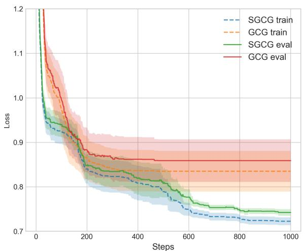
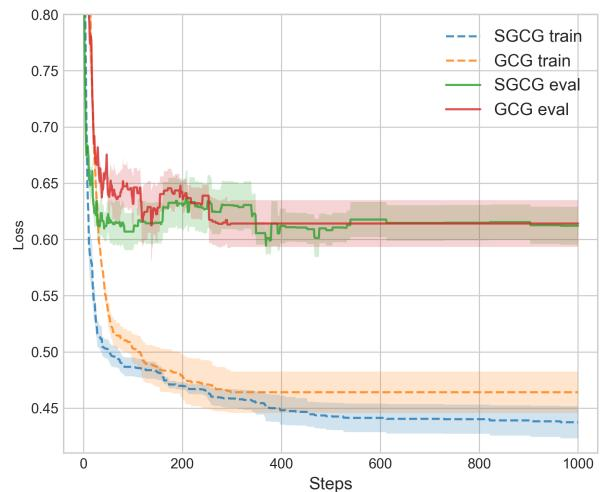

# Direct Prompt Optimization with Continuous Representations

Yangkun Wang

UC San Diego

yaw048@ucsd.edu

Zihan Wang

UC San Diego

ziw224@ucsd.edu

Jingbo Shang

UC San Diego

jshang@ucsd.edu

# Abstract

Prompt optimization for language models faces challenges due to the large discrete search space, the reliance on continuous gradient updates, and the need to round continuous representations into discrete prompts, which causes inflexibility and instability. Existing methods attempt to address these by constraining the search space and adopting greedy, incremental improvements, but they often fail to fully leverage historical gradient information. In this paper, we model the prompt optimization problem by the probability distribution of the prompt and present a novel approach that integrates greedy strategies into optimization with continuous representations. This approach can exploit historical gradient information to address the instability caused by rounding in existing methods. Our study indicates that using continuous representations can improve prompt optimization performance on both text classification and attack tasks, as well as models, including GPT-2, OPT, Vicuna, and LLaMA-2, and also be adaptable to models of different sizes.

# 1 Introduction

As the state-of-the-art large language models (LLMs) (Achiam et al., 2023; Meta, 2024; Anthropic, 2024) are all instruction-tuned and aligned, prompting (Brown et al., 2020; Chung et al., 2024; Wei et al., 2022) is arguably the most popular way to leverage LLMs for downstream applications. Specifically, LLMs can be efficiently applied to a variety of tasks (Chen et al., 2021; Chung et al., 2024) by inserting well-crafted text sequences (i.e., prompts) into the model’s input. How to find the most effective prompt according to a (small) training set of the specific problem, a.k.a., prompt optimization, has been studied extensively in recent literature. Note that this is a discrete optimization problem with a huge search space, where classic gradient-based optimization methods are not directly applicable.

Traditional prompt optimization requires extensive human effort in manually crafting the prompt with trial-and-error attempts (Kojima et al., 2022). This approach is not only labor-intensive, but also lacks extensibility. As the growing demand for more complicated applications, developing machine-operated techniques to simplify in addition to enhance prompt optimization process has become a key research field.

Recent advancements in prompt optimization can be categorized into (1) discrete representationbased greedy methods and (2) soft representationbased gradient methods. These approaches aim to leverage gradient information to accelerate prompt optimization. In addition to these, reinforcement learning (RL)-based methods (Deng et al., 2022) and evolutionary algorithms (Agarwal et al., 2024; Guo et al., 2023) have also been explored. However they are beyond the scope of the discussion as they do not leverage gradient information. Instead, these methods operate like white-box approaches where the lack of gradient information significantly reduce their efficiency when using random initialization.

The first category employs discrete representations, using techniques such as token substitution and projected gradient descent methods. For example, AutoPrompt (Shin et al., 2020) adopts a gradient-based token search strategy to efficiently identify influential prompts. Greedy Coordinate Gradient (GCG) (Zou et al., 2023) uses a more effective greedy strategy to accelerate the optimization. Projected gradient descent methods (Shi et al., 2022) map the soft prompt to the nearest token in the vocabulary at each step of regular gradient descent. However, during optimization, all these methods have to round the continuous representations to discrete ones, so they lack flexibility and are unable to utilize historical gradient information.

Methods using continuous intermediate representations provide a richer insight and greater flexibility into the optimization process. Specifically, Gradient-Based Distributed Attack (GBDA) (Guo et al., 2021) leverages the Gumbel-Softmax trick to enable differentiable optimization, which allows for a more nuanced prompt adjustments. However, its non-greedy nature can often lead to a catastrophic increase in the loss during optimization, thus requiring a more accurate approximation of the objective function.

To take advantages of both types of methods, we present Soft Greedy Coordinate Gradient (SGCG) framework in Section 3. We begin by defining a direct optimization objective that operates on a single sample from a distribution, which is reparameterized using the Gumbel-Max trick for sampling from a parameter-free distribution. The optimization process then proceeds through a two-step procedure: we first update the probability distribution that governs the sampling process, and then update the Gumbel variables through sampling. To improve the efficiency and effectiveness of our method, we employ a sliding window technique, which selects only the most promising candidate at each evaluation step. In contrast to candidate set, this approach eliminates the need to store a large number of intermediate representations.

We conduct extensive experiments on six popular datasets, covering two distinct tasks: text classification and text attacks. Text classification focuses on training a classifier to predict labels for given inputs, while text attack is a more challenging task that aims to manipulate the model into generating specific outputs that are against its intended behavior. Experiments on various datasets demonstrated SGCG’s superior performance on both classification and text attack tasks, and an ablation study validated the importance of greedy strategies. We further conduct an ablation study to validate each component of our approach, including greedy strategy and choices of the surrogate gradient function. Our contributions are summarized as follows.

• We analyze the two mainstream types of prompt optimization methods and identify their respective advantages and weakness, finding they are complementary to each other.   
• We propose a direct prompt optimization method with continuous representations. This method is enhanced by incorporating a greedy strategy and a sliding window technique to improve performance.   
• Extensive experiments demonstrated our method outperforms various baselines on both classifica-

tion and text attack tasks.

Reproducibility. We will release the code before the conference.

# 2 Related Work

In the domain of prompt optimization, various gradient-based and blackbox approaches have been explored. This section reviews significant works and positions our method in the context of existing literature.

# 2.1 Whitebox Methods

# 2.1.1 Hard Representations Methods

Hard representation methods directly use discrete optimization by using hard tokens as intermediate as representations. However, these methods often lose significant information during optimization. Two notable approaches in this category include AutoPrompt (Shin et al., 2020), Greedy Coordinate Gradient (GCG) (Wallace et al., 2019), and methods based on projected gradient descent such as FluentPrompt (Shi et al., 2022) and PEZ (Wen et al., 2024). AutoPrompt and GCG aim to find replacements for the current tokens using first-order Taylor expansion of the objective function as the approximation. GCG employs a more effective greedy strategy, consistently outperforming Auto-Prompt. On the other hand, projected gradient descent methods optimize in the embedding space directly. In each step, the soft representation is projected onto hard tokens. However, these projections introduce significant approximations due to the limited connection between soft prompt and projected ones (Khashabi et al., 2021).

# 2.1.2 Soft Representation Methods

Soft representation methods allow for smoother transitions and more nuanced optimizations. GBDA (Guo et al., 2021), a method for text attack tasks, use Gumbel Softmax to optimize hard tokens through soft representations. We find that using the Straight-Through (ST) estimator (Hinton, 2012a; Bengio et al., 2013) can significantly enhance the performance of GBDA during the optimization process. However, this approach is not greedy, thus often making irrevocable bad decisions, which damage the performance significantly.

# 2.2 Blackbox Methods

Blackbox methods fall into a different category and are less relevant to our specific comparison. These methods generally do not rely on gradient information from the model and instead use strategies like Bayesian optimization (Chen et al., 2023), and reinforcement learning (Deng et al., 2022), Monte-Carlo search (Zhou et al., 2022), self-evolving techniques (Guo et al., 2023; Agarwal et al., 2024) to generate adversarial examples. These methods typically require more computational resources and may lack the efficiency and precision offered by gradient-based approaches. Therefore, we focus our comparison primarily on whitebox methods.

# 3 Methodology

Unlike the soft prompt optimization problem that comes with abundant gradient information to ensure the decrease of the loss function, the hard prompt optimization problem is much more challenging. Due to the discrete nature of the tokens, it is not possible to modify the outcome of the language model by making small changes in the token, therefore, optimizing this problem requires some compromises, such as using a first-order Taylor expansion as an approximation of the loss function or adopting a more generalized optimization objective.

There are two common optimization objectives. The first approach attempts a straightforward, parameter-free optimization across the entire space of tokens. To address efficiency issues, they use pruning methods to filter out tokens that are less likely to be effective; however, this method sacrifices historical optimization information due to the absence of parameters. The second approach follows an optimization objective used in reinforcement learning, which optimizes the expectation of the objective function in terms of the distribution of parameters, but this is not the desired optimization target as our focus is on optimizing a single, specific prompt. To address these issues, we introduce a new optimization objective that makes the problem parameterizable focuses solely on optimizing a single prompt. In this section, we provide a detailed description of different optimization objectives and then propose a new algorithm to tackle the new optimization objective.

# 3.1 Preliminaries and Notations

Let x represent a sequence of tokens, where each token $x _ { i }$ originates from a discrete vocabulary . The function $f ( \cdot )$ denotes the loss function for the target task. The probability distribution of the prompt is expressed as $P ( \pmb { x } ; \pmb { \theta } )$ , which describes the probability of the token sequence parameterized by θ. With this distribution $\pi _ { i }$ indicates the probability associated with the i-th token. We use U[0, 1] to denote the uniform distribution over the interval from 0 to 1.

# 3.2 Formulation of Hard Prompt Tuning

# 3.2.1 Discrete Optimization

The most straightforward optimization objective essentially aims to search for the optimal prompt of combination of tokens, with the constraint that each token lie within the vocabulary set , and the optimization objective

$$
\min f (\boldsymbol {x}) \tag {1}
$$

$$
\text { subject   to } x _ {i} \in \mathcal {V},
$$

where $\pmb { x } \in \mathcal { V } ^ { n }$ represents a sequence of tokens and $f ( \cdot )$ denotes the cost function to minimize, typically the loss function for the target task. Due to the discrete nature of x and the lack of continuous search space, optimizing this objective requires traversing the entire search space, which is apparently infeasible. Some methods address this problem by employing the hot-flip technique (Ebrahimi et al., 2017; Wallace et al., 2019; Shin et al., 2020), which uses the first-order Taylor expansion to approximate the loss function to narrow down the search space, and updating the prompt by evaluating the gradient of the loss function with respect with each token and selecting the token that most reduces the loss. These methods can be enhanced by beam search, i.e., evaluating top-k candidates at a time instead of a single one.

# 3.2.2 Expectation Minimization

To introduce a continuous parameterization, another line of research considers minimizing the expected value of the loss function under a probability distribution over prompts:

$$
\min _ {\boldsymbol {\theta}} \underset {\boldsymbol {x} \sim P (\boldsymbol {x}; \boldsymbol {\theta})} {\mathbb {E}} [ f (\boldsymbol {x}) ]. \tag {2}
$$

This objective is commonly used in reinforcement learning and is difficult to optimize due to the complexity of its gradient. GBDA attempts to apply the Gumbel-softmax trick to make it differentiable.

However, this objective still remains suboptimal as it targets all solutions over the entire distribution $P ( x ; \theta )$ , rather than focusing on specific instances of interest. Consequently, this broad target leads to considerable inefficiencies when our focus is on a particular sample in the solution space.

Algorithm 1 SGCG   
1: Input: P parameterized by $\theta$ , prompt length n, surrogate gradient $\gamma$ , window size k, learning rate $\alpha$ , temperature $\tau$ 2: Initialize Q as an empty queue
3: Sample $\epsilon_{i} \sim U[0,1]$ for each $\epsilon_{i}$ 4: $x \leftarrow \gamma[(\log \pi - \log(-\log \epsilon))/\tau]$ 5: while not converged do
6: $i \leftarrow \text{Uniform}(1, n)$ 7:    Sample $\tilde{\epsilon}_{i} \sim U[0,1]$ 8: $\tilde{x}, \tilde{\theta} \leftarrow x, \theta$ 9: $\tilde{\theta}_{i} \leftarrow \theta_{i} - \alpha \frac{\partial f(x)}{\partial \theta_{i}}$ 10: $\tilde{x}_{i} \leftarrow \gamma[(\log \tilde{\pi}_{i} - \log(-\log(\tilde{\epsilon}_{i})))/\tau]$ 11:    Append $f(\tilde{x})$ to Q
12:    if size of Q > k then
13:    Remove the oldest element from Q
14:    end if
15:    if $f(\tilde{x}) < \min Q$ then
16: $\theta_{i}, \epsilon_{i} \leftarrow \tilde{\theta}_{i}, \tilde{\epsilon}_{i}$ 17: $x_{i} \leftarrow \tilde{x}_{i}$ 18:    end if
19: end while
20: Output: Optimized parameters $\theta, g$

# 3.2.3 Sample Selection from the Distribution

After obtaining optimized distribution parameters $\pmb { \theta } ^ { * }$ from the expectation minimization, we can extract specific samples that minimize the loss function. This can be formulated as:

$$
\boldsymbol {x} ^ {*} = \arg \min _ {\boldsymbol {x} \sim P (\boldsymbol {x}; \boldsymbol {\theta} ^ {*})} f (\boldsymbol {x}). \tag {3}
$$

Rather than solely relying on optimizing the expectation and then selecting a sample by maximizing likelihood—an approach prone to instability due to the discrete nature of the objective function—this method samples directly from the optimized distribution $P ( { \pmb x } ; { \pmb \theta } ^ { * } )$ and selects the bestperforming instance. It addresses the inefficiencies of expectation minimization and avoids the instabilities of discrete optimization.

# 3.3 Direct Prompt Optimization

Instead of adopting a two-stage training process, we propose to jointly train the distribution parameters and identifies the optimal sample. Following the optimization techniques of (2), we adopt a relaxation technique to handle the problem, which facilitates the handling of non-differentiability (Jang et al., 2016; Maddison et al., 2016). This approach ultimately leads to formulate a distinct algorithm.

Algorithm 2 Greedy Coordinate Gradient   
1: Input: Initial prompt x, candidate size K
2: while not converged do
3:    for $i \leftarrow 1, \cdots, n$ do
4: $\mathcal{X}_{i} \leftarrow \text{Top-k}(-\nabla_{e_{x_{i}}}\mathcal{L}(\boldsymbol{x}))$ 5:    end for
6:    for $k \leftarrow 1, \cdots, K$ do
7: $i \leftarrow \text{Uniform}(1, n)$ 8: $\tilde{\boldsymbol{x}}^{(k)} \leftarrow \boldsymbol{x}$ 9: $\tilde{x}_{i}^{(k)} \leftarrow \text{Uniform}(\mathcal{X}_{k})$ 10:    end for
11: $\boldsymbol{x} \leftarrow \tilde{\boldsymbol{x}}^{(k^{*})}$ where $k^{*} = \arg \min_{k} f(\boldsymbol{x}^{(k)})$ 12: end while
13: Output: Optimized prompt x

Reparameterization with Gumbel-Max. To efficiently sample the categorical variables from the parameter-free distribution, we first use the Gumbel-Max trick to parameterize the sampling of x as

$$
\min _ {\boldsymbol {\theta}, \epsilon} f (\boldsymbol {x}), \tag {4}
$$

$$
\boldsymbol {x} = \arg \max [ \log \boldsymbol {\pi} - \log (- \log \epsilon) ],
$$

where $\epsilon _ { i }$ is drawn from U[0, 1].

Smooth estimator for relaxation. Because argmax is still a non-differentiable function, we use a smooth estimator γ to approximate argmax and optimize (4). An example of $\gamma$ could be softmax, a smooth approximation of argmax, which converges to the argmax function as the temperature parameter τ of softmax tends to zero. As (4) jointly minimize the function $f ( x )$ with respect to both the parameters $\theta$ and $\epsilon ,$ it can be minimized iteratively with the update rules in k-th iteration as

1. Update θ via gradient descent with

$$
\boldsymbol {\theta} ^ {(k + 1)} \leftarrow \boldsymbol {\theta} ^ {(k)} - \alpha \frac {\partial f}{\partial \boldsymbol {\theta} ^ {(k)}}, \tag {5}
$$

where α denotes the learning rate.

2. The update of $\epsilon$ is performed via stochastic sampling by sampling from the uniform distribution. Specifically, ϵ is updated by solving the optimization problem:

Table 1: Text classification accuracy results comparing GPT-2 large and OPT-350M. The overall performance of SGCG is the best compared with other methods. DBPedia and AGNews datasets are more challenging than those sentiment analysis datasets. 

<table><tr><td rowspan="2">Dataset</td><td colspan="4">GPT-2 Large</td><td colspan="4">OPT-350M</td></tr><tr><td>FluentPrompt*</td><td>GS</td><td>GCG</td><td>SGCG</td><td>FluentPrompt*</td><td>GS</td><td>GCG</td><td>SGCG</td></tr><tr><td>SST-2</td><td>84.98</td><td>83.92</td><td>87.59</td><td>87.39</td><td>80.09</td><td>78.00</td><td>87.02</td><td>88.00</td></tr><tr><td>IMDB</td><td>79.93</td><td>77.67</td><td>81.57</td><td>81.85</td><td>74.75</td><td>75.30</td><td>73.03</td><td>71.85</td></tr><tr><td>Amazon</td><td>83.30</td><td>79.39</td><td>84.31</td><td>86.12</td><td>72.20</td><td>76.65</td><td>84.62</td><td>83.99</td></tr><tr><td>Yelp</td><td>87.08</td><td>85.02</td><td>87.88</td><td>88.29</td><td>83.35</td><td>82.76</td><td>82.97</td><td>84.68</td></tr><tr><td>DBPedia</td><td>46.93</td><td>50.11</td><td>66.99</td><td>70.79</td><td>53.35</td><td>76.80</td><td>70.69</td><td>69.30</td></tr><tr><td>AGNews</td><td>54.34</td><td>56.21</td><td>75.87</td><td>76.39</td><td>73.10</td><td>75.21</td><td>78.38</td><td>78.48</td></tr></table>

Table 2: Dataset statistics. The "|C|" column denotes the number of classes for classification. Colomns "|Train|=|Dev|" show the combined size of the training and development sets, and "|Test|" denotes the sizes of the test set. 

<table><tr><td>Dataset</td><td>|C|</td><td>|Train|=|Dev|</td><td>|Test|</td></tr><tr><td>SST-2</td><td>2</td><td>16 × |C|</td><td>1.8k</td></tr><tr><td>IMDB</td><td>2</td><td>16 × |C|</td><td>38k</td></tr><tr><td>Amazon</td><td>2</td><td>16 × |C|</td><td>50k</td></tr><tr><td>Yelp</td><td>2</td><td>16 × |C|</td><td>50k</td></tr><tr><td>DBPedia</td><td>14</td><td>16 × |C|</td><td>70k</td></tr><tr><td>AGNews</td><td>10</td><td>16 × |C|</td><td>60k</td></tr></table>

$$
\begin{array}{l} \epsilon^ {(k + 1)} \\ \leftarrow \underset {\boldsymbol {\epsilon} \in \mathcal {E}} {\arg \min} f (\gamma (\log \boldsymbol {\pi} - \log (- \log \boldsymbol {\epsilon}))), \\ \text { where } \mathcal {E} \subset \{\epsilon | \epsilon \in U [ 0, 1 ] ^ {n} \} \tag {6} \\ \end{array}
$$

It is worth noting that (6) is greedy if we let $\boldsymbol { \epsilon } ^ { ( k ) } \in \boldsymbol { \mathcal { E } }$ while (5) is not. Since the gradient is merely an approximation with the smooth estimator, relying exclusively on the gradient can make the optimization unstable. (This will also be verified in later sections.) Therefore, we use a greedy approach skin to that used in AutoPrompt. In each updating step in (5), we only perform the update if f decreases. It is crucial to elucidate that this algorithm does not merely search for a single sample from the optimization process defined in (2). Instead, the update step in (6) also informs and guides the subsequent update in (5).

As we are only interested in smoothing the backward pass while preserving straightforward computation in the forward pass, the straight-through estimator can also be used. Specifically, during the forward pass, the non-differentiable function γ = arg max is used for discrete decisions. Conversely, for the backward pass where differentiation is necessary, we use a differentiable function γˆ as the surrogate gradient. While common choices for γˆ often include the softmax function, we find the identity function $( \mathrm { i } . \mathrm { e } . , \gamma ( x ) = x )$ serves a better surrogate function. This idea is ubiquitous in training forward with discrete training networks and allows for the practice of gradient-based optimization in backward passe, such as those described by Hinton (2012b) and in BinaryConnect (Courbariaux et al., 2015). Therefore, in this paper follows these ideas and use the straight-through identity function as the surrogate gradient.

Sliding window for candidate selection. Unlike AutoPrompt, which selects the best candidate from a set, our approach uses a sliding window during optimization. Specifically, in each step, we compute the loss improvement for each candidate and determine if it is the best over the history of the last K replacements. This method allows us to avoid storing all the gradient information for K candidates, making the process more efficient and less likely to miss a good candidate.

# 4 Experiments

We conducted extensive experiments on text classification and attack tasks and compared them with several baseline methods to evaluate the effectiveness of our proposed method.

# 4.1 Experimental Setup

We evaluated the performance of our method on a range of datasets specific to sentiment analysis and topic classification. The datasets include:

• SST-2 (Stanford Sentiment Treebank): This dataset is a corpus with fully labeled parse trees that allows for a complete analysis of the compositional effects of sentiment in language (Socher

line

| Steps | SGCG train | GCG train | SGCG eval | GCG eval |
|-------|------------|-----------|-----------|----------|
| 0     | 1.2        | 1.2       | 1.2       | 1.2      |
| 200   | 0.85       | 0.9       | 0.85      | 0.88     |
| 400   | 0.8        | 0.85      | 0.8       | 0.85     |
| 600   | 0.75       | 0.8       | 0.75      | 0.85     |
| 800   | 0.73       | 0.8       | 0.73      | 0.85     |
| 1000  | 0.72       | 0.8       | 0.72      | 0.85     |

(a) DBPedia

line

| Steps | SGCG train | GCG train | SGCG eval | GCG eval |
|-------|------------|-----------|-----------|----------|
| 0     | 0.80       | 0.80      | 0.80      | 0.80     |
| 100   | 0.50       | 0.55      | 0.65      | 0.68     |
| 200   | 0.48       | 0.49      | 0.63      | 0.64     |
| 300   | 0.46       | 0.47      | 0.62      | 0.63     |
| 400   | 0.45       | 0.46      | 0.61      | 0.62     |
| 500   | 0.44       | 0.46      | 0.61      | 0.62     |
| 600   | 0.44       | 0.46      | 0.61      | 0.62     |
| 700   | 0.44       | 0.46      | 0.61      | 0.62     |
| 800   | 0.44       | 0.46      | 0.61      | 0.62     |
| 900   | 0.44       | 0.46      | 0.61      | 0.62     |
| 1000  | 0.44       | 0.46      | 0.61      | 0.62     |

(b) AGNews   
Figure 1: Evaluation loss vs. training steps for GCG and SGCG on two relatively challenging datasets. On DBPedia, SGCG achieves lower training and evaluation losses than GCG, indicating not only better performance but also faster convergence. On AGNews, both SGCG and GCG end up with similar evaluation losses, but SGCG shows a more consistent and steady decline in training loss over steps. Results are based on GPT-2 Large.

et al., 2013).

• IMDB: A large movie review dataset for binary classification (Maas et al., 2011).   
• Amazon: Comprises product reviews across various categories, utilized for sentiment analysis (Ni et al., 2019).   
• Yelp: This dataset is composed of reviews from the Yelp review platform, categorized into different sentiment classes, and is used to analyze user opinions on restaurants and services (Zhang et al., 2015).   
• DBPedia: A large-scale, multilingual knowledge base extracted from Wikipedia, used for topic classification. It helps in categorizing text into predefined categories based on content (Zhang et al., 2015).   
• AGNews: Consists of news articles from the AG’s corpus. With multiple categories, it serves as a benchmark for evaluating the performance of topic classification models (Zhang et al., 2015).

The detailed statistics of the datasets in shown in Table 2. We adopted few-shot settings, specifically using 16 training examples for each dataset. The models used for these experiments were GPT-2- large (Radford et al., 2019), OPT-350M (Zhang et al., 2022), Vicuna-7B (Chiang et al., 2023), and LLaMA-2 (Touvron et al., 2023). We chose these models to explore the impact of varying model sizes and architectures on the task performance, ensuring a diverse range of computational capabilities are tested. Each method was tested for its ability to optimize prompts to achieve better classification accuracy. Each experiment was conducted five times, and the results were averaged to ensure reliability and to mitigate the effects of any outliers or random variance in the performance measurements.

Our hyperparameters closely follow those of GCG, with the exception of several components unique to our method. Specifically, we apply a weight decay of $1 0 ^ { - 3 }$ to the optimizer. The temperature parameter τ is initialized at 1 and decays exponentially to 0.1 over the course of training. Additionally, the window size for historical gradient aggregation is set equal to the prompt length.

# 4.2 Compared Methods

Our baselines contain the following models.

• FluentPrompt (Shi et al., 2022) is an approach that uses project gradient descent to directly optimize the soft prompt in the embedding space, projecting the soft embeddings into discrete tokens at each step. Since FluentPrompt also aims to optimize the fluency of the prompts, here we remove the fluency loss to serve as a baseline, referred to as FluentPrompt\*. This modification aligns with our specific objectives-to solely optimize the target function rather than enhancing the fluency of the prompt.

• Gumbel-Softmax (GS) (Jang et al., 2016) is a reparameterization method used by GBDA (Wen et al., 2024) that converts relax the discrete choices into continuous approximations.   
• Greedy Coordinate Gradient (GCG) (Zou et al.,

Table 3: Ablation study results. We main explore the effect of the Greedy part in SGCG. The results show this part contribute very significantly to the final accuracy. 

<table><tr><td>Dataset</td><td>SGCG</td><td>SGCG nongreedy</td></tr><tr><td>SST-2</td><td>88.00</td><td>75.29</td></tr><tr><td>IMDB</td><td>71.85</td><td>74.39</td></tr><tr><td>Amazon</td><td>83.99</td><td>68.06</td></tr><tr><td>Yelp</td><td>84.68</td><td>81.72</td></tr></table>

2023) is an approach that selects the best candidate from a set using a improved strategy than AutoPrompt. In our experiments we found it to be a strictly stronger baseline compared to Auto-Prompt both in terms of efficiency and effectiveness. In light of this, we choose not to include AutoPrompt’s results in our reporting.

We denote our method as SGCG. In addition, for the purposes of this study, we define an ablation version of our method, referred to as SGCG nongreedy, where we no longer ensure that (5) always results in a reduction of the loss.

# 4.3 Text Classification

We focus on two types of text classification tasks: (1) sentiment analysis and (2) topic classification. Table 1 presents the text classification accuracy results of our proposed method, SGCG, compared to GCG, GS, and FluentPrompt\* on GPT-2 large and OPT-350M.

The results demonstrate that SGCG achieves competitive or superior performance compared to other methods on both models and most datasets. Notably, in the GPT-2 large configuration, SGCG performs best on datasets such as IMDB, Amazon, and Yelp, demonstrating its effectiveness in sentiment analysis tasks. It also performs well on the challenging DBPedia and AGNews datasets, highlighting its robustness in topic classification.

Interestingly, for the OPT-350M model on the IMDB dataset, we observe a tendency towards overfitting, where simpler models appear to perform better. This could be due to the fact that movie reviews tend to have a more straightforward structure and less technical jargon compared to other types of text, making it easier to learn. This can be confirmed in our later experiments by varying the number of tokens to learn, where IMDB is also an outlier dataset. Therefore, we would like to argue that the result on the IMDB dataset shall be viewed less important than the results on the other datasets.

# 4.4 Loss Analysis

Figures 1(a) and 1(b) illustrate the evaluation loss versus steps for GCG and SGCG on the two relatively challenging datasets of DBPedia and AG-News, respectively. On the DBPedia dataset, SGCG achieves lower training and evaluation losses than GCG. This indicates not only better performance but also faster convergence. On the AGNews dataset, both SGCG and GCG end up with similar evaluation losses, but SGCG shows a more consistent and steady decline in training loss over steps.

Notably, GCG has difficulty identifying beneficial token substitutions and almost stops optimizing after about 400 steps. This suggests a plateau in GCG’s performance, where further steps do not significantly reduce loss, indicating a slower convergence rate. In contrast, SGCG shows the ability to consistently search for good substitutions, suggesting a more efficient convergence. This continuous improvement in search efficacy likely contributes to SGCG’s ability to maintain a steady rate of optimization and avoid early plateaus common in methods like GCG.

# 4.4.1 Ablation Studies

In our ablation studies, we compared the performance of our greedy model against a non-greedy model on the text classification task. In the nongreedy version, we remove the greedy constraint of (5) as discussed before, allows for updates that may not immediately minimize the loss.

The results presented in Table 3 highlight the varying performance of greedy and non-greedy models across different datasets. Specifically, the greedy model demonstrates superior performance on datasets such as SST-2, Amazon, and Yelp, suggesting that these datasets may contain some patterns that the greedy model can effectively exploit. In contrast, the non-greedy model shows a distinct advantage on the IMDB dataset, where the greedy approach appears to overfit to the training data. The non-greedy model, by introducing an element of randomness into its decision-making process, can explore a wider range of potential solutions rather than committing to the most immediate lossreducing path. This randomness helps the model avoid overfitting and better generalize to new data, particularly beneficial for the IMDB dataset.

Table 4: Text classification accuracy results on OPT-350M with different token lengths. 

<table><tr><td rowspan="2">Dataset</td><td colspan="3">5 Tokens</td><td colspan="3">10 Tokens</td><td colspan="3">20 Tokens</td></tr><tr><td>GS</td><td>GCG</td><td>SGCG</td><td>GS</td><td>GCG</td><td>SGCG</td><td>GS</td><td>GCG</td><td>SGCG</td></tr><tr><td>SST-2</td><td>73.60</td><td>82.00</td><td>83.76</td><td>79.11</td><td>85.39</td><td>86.47</td><td>80.14</td><td>87.02</td><td>88.00</td></tr><tr><td>IMDB</td><td>72.66</td><td>74.55</td><td>73.70</td><td>75.47</td><td>72.76</td><td>71.21</td><td>73.99</td><td>73.03</td><td>71.85</td></tr><tr><td>Amazon</td><td>73.06</td><td>78.02</td><td>79.79</td><td>75.16</td><td>80.62</td><td>82.66</td><td>76.36</td><td>84.62</td><td>83.99</td></tr><tr><td>Yelp</td><td>77.77</td><td>81.40</td><td>82.48</td><td>79.72</td><td>83.55</td><td>84.47</td><td>81.67</td><td>82.97</td><td>84.68</td></tr><tr><td>DBPedia</td><td>44.58</td><td>50.67</td><td>50.69</td><td>52.08</td><td>65.16</td><td>69.23</td><td>54.58</td><td>70.69</td><td>69.30</td></tr><tr><td>AGNews</td><td>58.44</td><td>75.07</td><td>74.04</td><td>67.76</td><td>75.59</td><td>76.85</td><td>71.99</td><td>78.38</td><td>78.48</td></tr></table>

Table 5: Comparison of loss (with accuracy in brackets) for FluentPrompt\*, GCG, and SGCG on attack scenarios using Vicuna and Llama-2. 

<table><tr><td rowspan="2">Setting</td><td colspan="3">Vicuna</td><td colspan="3">Llama-2</td></tr><tr><td>FluentPrompt*</td><td>GCG</td><td>SGCG</td><td>FluentPrompt*</td><td>GCG</td><td>SGCG</td></tr><tr><td>Single</td><td>0.9870 (80)</td><td>0.3096 (100)</td><td>0.0220 (100)</td><td>4.0849 (0)</td><td>0.0405 (100)</td><td>0.0428 (100)</td></tr><tr><td>Multiple</td><td>6.8223 (15.28)</td><td>3.1140 (45.83)</td><td>2.6582 (52.22)</td><td>6.3373 (19.44)</td><td>3.3311 (45.83)</td><td>2.8590 (47.22)</td></tr><tr><td>Fluent</td><td>1.9088 (63.07)</td><td>0.8966 (76.92)</td><td>0.7179 (80.77)</td><td>2.1582 (50.77)</td><td>1.1307 (72.31)</td><td>0.7456 (80.77)</td></tr></table>

# 4.5 Experiments Varying the Number of Tokens

We evaluated the performance of different models on the OPT-350M architecture across various datasets using configurations with 5, 10, and 20 tokens. The results shown in Table 4 illustrate how increasing the number of tokens impacts model accuracy. A clear trend observed across all datasets is that the accuracy generally increases with the number of tokens used in the classification task. This suggests that a larger token set provides more contextual information, which helps the model understand the nuances and subtleties of the text. This is particularly beneficial in complex classification tasks where context plays a crucial role in determining the correct label.

However, the IMDB dataset presents an interesting anomaly. The nature of movie reviews, which often contain subjective opinions and varied expressions, might mean that a smaller token set is sufficient to capture the core sentiment without being bogged down by extraneous details. Additionally, using fewer tokens can help prevent overfitting, where the model becomes too tailored to the training data and performs poorly on unseen data.

Overall, while a larger token set generally enhances model performance by providing more context, the specific characteristics of the dataset and the nature of the text should be considered to determine the optimal number of tokens for a given classification task.

# 4.6 Text Attack

Text attack is a more challenging task that manipulates the language model’s output through prompt. This attack forces the model to generate specific tokens with the same prompt as the classification task, varying only the label to predict and the loss function which takes all tokens in the vocabulary into account. We structured the task into three settings: (1) Single: introducing one random token, (2) Multiple: introducing three random tokens, and (3) Fluent: using a syntactically fluent but contextually irrelevant sentence.

Since labels are not required for this task, we select the SST-2 dataset to focus solely on the models’ ability to adapt to manipulated prompts without being influenced by label accuracy. The results are shown in Table 5. It can be seen that SGCG outperforms GCG in most cases. FluentPrompt\* performs poorly due to the task’s complexity and the non-greedy algorithm’s limitations.

# 4.7 Qualitative Analysis of Final Prompts

We present representative final prompts generated by FluentPrompt, GCG, and SGCG from a single run to highlight the qualitative behavior of each optimization method. Although the outputs consist of discrete tokens and are not easily interpretable, they exhibit consistent structural patterns and token selection behaviors. These observations shed light on the convergence dynamics and the nature of the solutions identified in the discrete prompt space.

FluentPrompt: 7547 \_redirects dorf \_failing Args 尔 begin cni \_nationale \_ast webkit \_mare IM \_Sarah \_deutsche User » \_An \_dialog where

GCG: \_a Details \_Torre raction Policy \_determine ? apple \_define ID \_apple \_Rück inds gabe \_beim \_equilibrium \_site \_Nacional \_Außerdem

SGCG: Har \_Mediabestanden \_me : {} \_apple :\_A ö \_Grace \_behave \_Pi LIN AC \_AND \_As <0x20> B

# 5 Conclusion and Future Work

In this paper, we introduced the Soft Greedy Coordinate Gradient (SGCG) framework, a novel approach to prompt optimization using continuous intermediate representations from a direct optimization objective. Our two-step process—updating the probability distribution and sampling the Gumbel variables—allows effective optimization. Experiments on various popular datasets demonstrated SGCG’s superior performance, and an ablation study validated each component’s contributions. SGCG successfully integrates the strengths of existing methods and offers a powerful tool for prompt optimization tasks.

Future work could extend SGCG to other domains and explore the transferability of the representations. One can also focus on addressing some limitations of the SGCG framework to enhance its practical applicability. For example, further investigation is needed on mitigating instability that might be caused by the introduction of Gumbel variables. A more comprehensive evaluation across diverse applications will also help the community better understand the direct prompt optimization.

# Limitation

While the Soft Greedy Coordinate Gradient (SGCG) framework has shown promising results, several limitations must be acknowledged. The integration of Gumbel variables introduces stochasticity that may introduce variance, and sensitivity to hyperparameter settings requires careful tuning. Furthermore, SGCG’s adaptability to other domains or tasks outside our experiments remains uncertain. Addressing these limitations through evaluations is crucial for enhancing the practical applicability of the SGCG framework. It is worth noting that gradient-based prompt optimization, including SGCG, requires white-box access to LMs. However, this is not a major limitation. Our method is easily applicable to open-source LLMs, and companies with proprietary models can also implement it using their internal access. A key open question is the cross-model transferability of prompts optimized on open-source LMs to closedsource, commercial models, which merits further studies.

# References

Josh Achiam, Steven Adler, Sandhini Agarwal, Lama Ahmad, Ilge Akkaya, Florencia Leoni Aleman, Diogo Almeida, Janko Altenschmidt, Sam Altman, Shyamal Anadkat, et al. 2023. Gpt-4 technical report. arXiv preprint arXiv:2303.08774.   
Eshaan Agarwal, Vivek Dani, Tanuja Ganu, and Akshay Nambi. 2024. Promptwizard: Task-aware agent-driven prompt optimization framework. arXiv preprint arXiv:2405.18369.   
Anthropic. 2024. Claude 3 haiku: our fastest model yet. https://www.anthropic.com/news/ claude-3-haiku/.   
Yoshua Bengio, Nicholas Léonard, and Aaron Courville. 2013. Estimating or propagating gradients through stochastic neurons for conditional computation. arXiv preprint arXiv:1308.3432.   
Tom Brown, Benjamin Mann, Nick Ryder, Melanie Subbiah, Jared D Kaplan, Prafulla Dhariwal, Arvind Neelakantan, Pranav Shyam, Girish Sastry, Amanda Askell, et al. 2020. Language models are few-shot learners. Advances in neural information processing systems, 33:1877–1901.   
Lichang Chen, Jiuhai Chen, Tom Goldstein, Heng Huang, and Tianyi Zhou. 2023. Instructzero: Efficient instruction optimization for black-box large language models. arXiv preprint arXiv:2306.03082.   
Mark Chen, Jerry Tworek, Heewoo Jun, Qiming Yuan, Henrique Ponde de Oliveira Pinto, Jared Kaplan, Harri Edwards, Yuri Burda, Nicholas Joseph, Greg Brockman, et al. 2021. Evaluating large language models trained on code. arXiv preprint arXiv:2107.03374.   
Wei-Lin Chiang, Zhuohan Li, Zi Lin, Ying Sheng, Zhanghao Wu, Hao Zhang, Lianmin Zheng, Siyuan Zhuang, Yonghao Zhuang, Joseph E. Gonzalez, Ion Stoica, and Eric P. Xing. 2023. Vicuna: An opensource chatbot impressing gpt-4 with 90%\* chatgpt quality.   
Hyung Won Chung, Le Hou, Shayne Longpre, Barret Zoph, Yi Tay, William Fedus, Yunxuan Li, Xuezhi Wang, Mostafa Dehghani, Siddhartha Brahma, et al.

2024. Scaling instruction-finetuned language models. Journal of Machine Learning Research, 25(70):1–53.   
Matthieu Courbariaux, Yoshua Bengio, and Jean-Pierre David. 2015. Binaryconnect: Training deep neural networks with binary weights during propagations. Advances in neural information processing systems, 28.   
Mingkai Deng, Jianyu Wang, Cheng-Ping Hsieh, Yihan Wang, Han Guo, Tianmin Shu, Meng Song, Eric P Xing, and Zhiting Hu. 2022. Rlprompt: Optimizing discrete text prompts with reinforcement learning. arXiv preprint arXiv:2205.12548.   
Javid Ebrahimi, Anyi Rao, Daniel Lowd, and Dejing Dou. 2017. Hotflip: White-box adversarial examples for text classification. arXiv preprint arXiv:1712.06751.   
Chuan Guo, Alexandre Sablayrolles, Hervé Jégou, and Douwe Kiela. 2021. Gradient-based adversarial attacks against text transformers. arXiv preprint arXiv:2104.13733.   
Qingyan Guo, Rui Wang, Junliang Guo, Bei Li, Kaitao Song, Xu Tan, Guoqing Liu, Jiang Bian, and Yujiu Yang. 2023. Connecting large language models with evolutionary algorithms yields powerful prompt optimizers. arXiv preprint arXiv:2309.08532.   
GE Hinton. 2012a. Neural networks for machine learning, video lectures.   
Geoffrey Hinton. 2012b. Neural networks for machine learning. Coursera video lectures.   
Eric Jang, Shixiang Gu, and Ben Poole. 2016. Categorical reparameterization with gumbel-softmax. arXiv preprint arXiv:1611.01144.   
Daniel Khashabi, Shane Lyu, Sewon Min, Lianhui Qin, Kyle Richardson, Sean Welleck, Hannaneh Hajishirzi, Tushar Khot, Ashish Sabharwal, Sameer Singh, et al. 2021. Prompt waywardness: The curious case of discretized interpretation of continuous prompts. arXiv preprint arXiv:2112.08348.   
Takeshi Kojima, Shixiang Shane Gu, Machel Reid, Yutaka Matsuo, and Yusuke Iwasawa. 2022. Large language models are zero-shot reasoners. Advances in neural information processing systems, 35:22199– 22213.   
Andrew Maas, Raymond E Daly, Peter T Pham, Dan Huang, Andrew Y Ng, and Christopher Potts. 2011. Learning word vectors for sentiment analysis. In Proceedings of the 49th annual meeting of the association for computational linguistics: Human language technologies, pages 142–150.   
Chris J Maddison, Andriy Mnih, and Yee Whye Teh. 2016. The concrete distribution: A continuous relaxation of discrete random variables. arXiv preprint arXiv:1611.00712.

Meta. 2024. Introducing meta llama 3: The most capable openly available llm to date. https://ai.meta. com/blog/meta-llama-3/.   
Jianmo Ni, Jiacheng Li, and Julian McAuley. 2019. Justifying recommendations using distantly-labeled reviews and fine-grained aspects. In Proceedings of the 2019 conference on empirical methods in natural language processing and the 9th international joint conference on natural language processing (EMNLP-IJCNLP), pages 188–197.   
Alec Radford, Jeffrey Wu, Rewon Child, David Luan, Dario Amodei, Ilya Sutskever, et al. 2019. Language models are unsupervised multitask learners. OpenAI blog, 1(8):9.   
Weijia Shi, Xiaochuang Han, Hila Gonen, Ari Holtzman, Yulia Tsvetkov, and Luke Zettlemoyer. 2022. Toward human readable prompt tuning: Kubrick’s the shining is a good movie, and a good prompt too? arXiv preprint arXiv:2212.10539.   
Taylor Shin, Yasaman Razeghi, Robert L Logan IV, Eric Wallace, and Sameer Singh. 2020. Autoprompt: Eliciting knowledge from language models with automatically generated prompts. arXiv preprint arXiv:2010.15980.   
Richard Socher, Alex Perelygin, Jean Wu, Jason Chuang, Christopher D Manning, Andrew Y Ng, and Christopher Potts. 2013. Recursive deep models for semantic compositionality over a sentiment treebank. In Proceedings of the 2013 conference on empirical methods in natural language processing, pages 1631–1642.   
Hugo Touvron, Louis Martin, Kevin Stone, Peter Albert, Amjad Almahairi, Yasmine Babaei, Nikolay Bashlykov, Soumya Batra, Prajjwal Bhargava, Shruti Bhosale, et al. 2023. Llama 2: Open foundation and fine-tuned chat models. arXiv preprint arXiv:2307.09288.   
Eric Wallace, Shi Feng, Nikhil Kandpal, Matt Gardner, and Sameer Singh. 2019. Universal adversarial triggers for attacking and analyzing nlp. arXiv preprint arXiv:1908.07125.   
Jason Wei, Xuezhi Wang, Dale Schuurmans, Maarten Bosma, Fei Xia, Ed Chi, Quoc V Le, Denny Zhou, et al. 2022. Chain-of-thought prompting elicits reasoning in large language models. Advances in neural information processing systems, 35:24824–24837.   
Yuxin Wen, Neel Jain, John Kirchenbauer, Micah Goldblum, Jonas Geiping, and Tom Goldstein. 2024. Hard prompts made easy: Gradient-based discrete optimization for prompt tuning and discovery. Advances in Neural Information Processing Systems, 36.   
Susan Zhang, Stephen Roller, Naman Goyal, Mikel Artetxe, Moya Chen, Shuohui Chen, Christopher Dewan, Mona Diab, Xian Li, Xi Victoria Lin, et al. 2022. Opt: Open pre-trained transformer language models. arXiv preprint arXiv:2205.01068.

Xiang Zhang, Junbo Zhao, and Yann LeCun. 2015. Character-level convolutional networks for text classification. Advances in neural information processing systems, 28.   
Yongchao Zhou, Andrei Ioan Muresanu, Ziwen Han, Keiran Paster, Silviu Pitis, Harris Chan, and Jimmy Ba. 2022. Large language models are human-level prompt engineers. arXiv preprint arXiv:2211.01910.   
Andy Zou, Zifan Wang, J Zico Kolter, and Matt Fredrikson. 2023. Universal and transferable adversarial attacks on aligned language models. arXiv preprint arXiv:2307.15043.