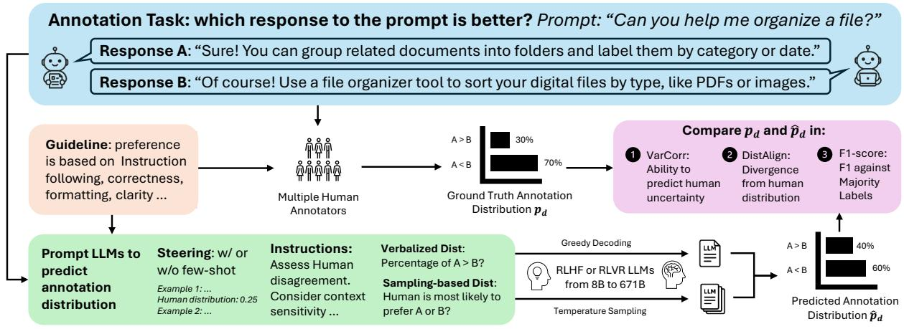
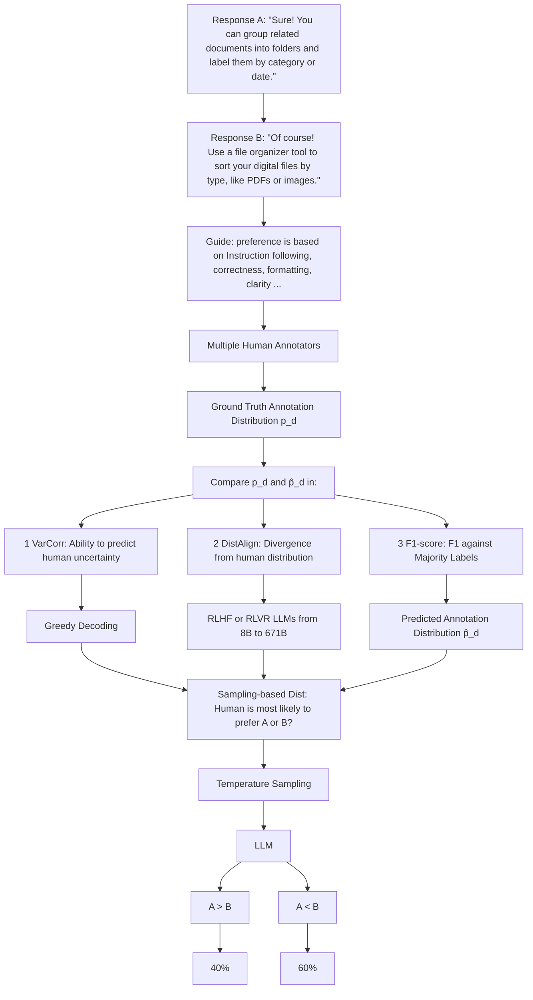
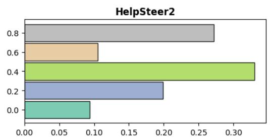
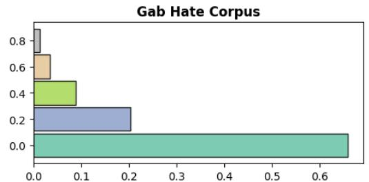
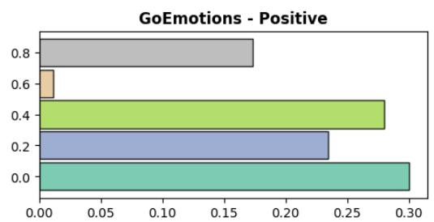
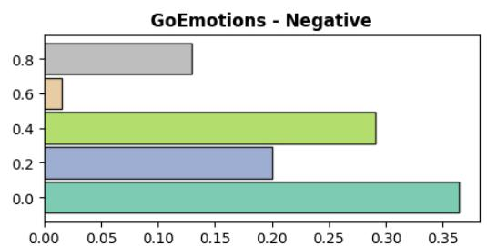
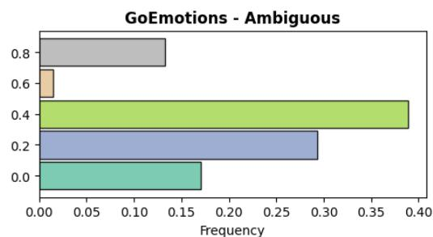

# Can Reasoning Help Large Language Models Capture Human Annotator Disagreement?

Jingwei NiE Z\* Yu FanE\* Vilém ZouharE Donya RooeinB E Alexander HoyleE Mrinmaya SachanE Markus LeippoldZ Dirk HovyB Elliott AshE

EETH Zürich ZUniversity of Zürich BBocconi University

{jingni, yufan, ashe}@ethz.ch

# Abstract

Variation in human annotation (i.e., disagreements) is common in NLP, often reflecting important information like task subjectivity and sample ambiguity. Modeling this variation is important for applications that are sensitive to such information. Although RLVR-style reasoning (Reinforcement Learning with Verifiable Rewards) has improved Large Language Model (LLM) performance on many tasks, it remains unclear whether such reasoning enables LLMs to capture informative variation in human annotation. In this work, we evaluate the influence of different reasoning settings on LLM disagreement modeling. We systematically evaluate each reasoning setting across model sizes, distribution expression methods, and steering methods, resulting in 60 experimental setups across 3 tasks. Surprisingly, our results show that RLVR-style reasoning degrades performance in disagreement modeling, while naive Chain-of-Thought (CoT) reasoning improves the performance of RLHF LLMs (RL from human feedback). These findings underscore the potential risk of replacing human annotators with reasoning LLMs, especially when disagreements are important.1

# 1 Introduction

Inter-annotator disagreement is common in NLP annotations (Snow et al., 2008) and often treated as noise to be removed by majority voting (Sabou et al., 2014) or expert aggregation (Hovy et al., 2013). However, these solutions may be misguided, as annotation disagreement can signal a diversity of views and often contains valuable information that enables downstream applications to capture a diversity of human values and interpretations (Plank, 2022). Human annotators have access to different information sets and are guided by different value systems (Fornaciari et al., 2021; Fuchs et al., 2021). It is therefore not surprising that different annotators give different answers, in particular for subjective tasks such as hate speech detection (e.g. Kennedy et al., 2018) where disagreement often arises from varying sociodemographic and cultural backgrounds (Fleisig et al., 2023). Even seemingly “objective” labeling tasks, such as part-ofspeech (POS) tagging, show disagreement due to ambiguous language (Plank et al., 2014; Jiang and de Marneffe, 2022). Generally speaking, disagreement is natural, contains valuable information, and should not be ignored or erased, but actively modeled (Uma et al., 2021; Leonardelli et al., 2023).

With the rapid growth of LLMs’ capability, evaluating LLMs’ ability to capture annotation disagreement is becoming increasingly important. On one hand, more “capable” LLMs achieve better performance in predicting the majority-voted label, and are thus widely adopted to replace human decision-making in applications such as text classification (Pangakis et al., 2023a; Törnberg, 2024; He et al., 2024), chatbot preference annotation (Lee et al., 2024), and LLM-as-a-judge (Calderon et al., 2025; Fan et al., 2025). On the other hand, many of these applications also require understanding the full spectrum of annotator disagreement. However, evaluations typically focus on majority-label prediction, overlooking the modeling of underlying disagreement distributions. As a result, it remains unclear whether the LLMs can reliably automate these applications, by effectively flagging cases with potential annotator disagreement for human oversight.

Prior work evaluates early LLMs and identifies their limitations in modeling annotation disagreement under specific settings (Lee et al., 2023), but have largely overlooked several key factors influencing distribution modeling, such as (1) incontext steering methods (e.g., few-shot learning); and (2) distribution expression methods (Meister et al., 2024b). More importantly, the role of reasoning—which significantly enhances LLM performance in various tasks (Wei et al., 2023; DeepSeek-AI, 2025)—is underexplored in prior work (Lee et al., 2023; Chen et al., 2024). Presumably, reasoning can benefit disagreement modeling by enabling LLMs to explore and compare different opinions through CoT. However, reasoning may harm decision making when the problem has hard-to-articulate criteria (Nordgren and Dijksterhuis, 2009; Liu et al., 2024). This may be particularly relevant to RLVR LLMs, which are optimized on tasks with single-deterministic answers— contrasting with the reality that many tasks involve multiple valid perspectives.

To address these gaps, we conduct a comprehensive evaluation of LLMs under different reasoning settings: RLHF LLM with and without CoT, as well as RLVR LLM. Given that the impact of reasoning may be further influenced by other factors such as LLM size, distribution expression, and steering method (Meister et al., 2024b), our evaluation systematically explores the full combinations of (1) 3 reasoning settings; (2) 5 LLM sizes (from 8B to 671B); (3) with or without few-shot steering; and (4) 2 distribution expression methods (Tian et al., 2023; Wei et al., 2024), resulting in 60 prompting settings. We evaluate all settings on 5 datasets of 3 widely studied tasks, following the metrics in prior work: (1) variance correlation (VarCorr, Mostafazadeh Davani et al., 2022), measuring how well the LLM-predicted variance correlates to human annotation variance; and (2) distributional alignment (DistAlign, Meister et al., 2024a), directly comparing the distributional divergence of LLM and human labels.

Surprisingly, we find that RLVR-style reasoning significantly harms disagreement modeling when human annotation variance is high. Moreover, forcing additional reasoning effort (Muennighoff et al., 2025) does not improve the performance of RLVR LLMs. In contrast, for RLHF LLMs, CoT prompting significantly improves disagreement modeling. Furthermore, RLVR LLMs are better with a deterministic goal (e.g., predicting the majority annotation) than with a probabilistic goal (e.g., predicting the proportion of human disagreements). Our findings suggest that using RLVR-optimized LLMs in disagreement-matter tasks requires extra caution, as these models may overlook critical human disagreements. In summary, our contributions are:

1. We systematically evaluate RLVR and RLHF LLMs in disagreement modeling across 3 tasks, 5 LLM sizes, and 12 prompting settings.   
2. We quantitatively reveal the limitations of RLVR-style reasoning in modeling disagreement (§ 6.2), and provide qualitative insights to explain these findings (§ 6.7).   
3. Our evaluation further examines the impact offers other relevant factors on disagreement modeling, including distribution expression methods (§ 6.1), the importance of human annotations (§ 6.3), few-shot steering (§ 6.4), and model scale (§ 6.5).

# 2 Background and Related Work

RLHF and RLVR are two dominant paradigms for LLM alignment. RLHF fine-tunes models using reward models trained on human preference data, optimized via reinforcement learning algorithms like PPO (Ouyang et al., 2022). RLVR instead derives rewards from automatically verifiable properties—such as code execution correctness, passing unit tests, or satisfying mathematical constraints (DeepSeek-AI, 2025). Intuitively, RLHF prioritizes subjective human preference, while RLVR emphasizes objective problem-solving verification.

Annotation Disagreement in NLP. Annotation disagreement has been an important area of study with long history (Wiebe et al., 2004; Ovesdotter Alm, 2011; Basile et al., 2021; Uma et al., 2021; Leonardelli et al., 2023). Various qualitative and quantitative analyses show that the majority of disagreement is caused by other systematic reasons (e.g., ambiguity, context sensitivity etc.) rather than random annotation noise (e.g., carelessness) (Plank et al., 2014; Popovic´, 2021; Jiang and de Marneffe, 2022; Santy et al., 2023; Zhang et al., 2024).

Prior work in modeling disagreement has fruitfully leveraged datasets with annotator metadata (e.g., annotator ID, explanations, and sociodemographic features), enabling annotator modeling and deeper insights into sources of variation (Mostafazadeh Davani et al., 2022; Hu and Collier, 2024; Giorgi et al., 2024; Chen et al., 2024; Chochlakis et al., 2025; Orlikowski et al., 2025). Our evaluation is complementary: we focus on settings where annotator metadata are absent – an increasingly common scenario in large-scale or emergent tasks (e.g., LLMs as judges or annotators, Cui et al., 2024), and assess how well models can capture disagreement in such constrained but realistic contexts.

flowchart

Figure 1: An illustration of our evaluation: We start with a task with guidelines for both human and LLM annotators. The LLM predictions of the annotation distributions are then compared with true human label distribution.

Distribution Prediction with LLM. The extensive training corpus of LLMs may enable them to simulate different opinions and predict distribution in real-world (Grossmann et al., 2023; Ziems et al., 2024), and numerous previous studies use LLMs to predict the distribution of political opinions (Argyle et al., 2023; Durmus et al., 2024; Meister et al., 2024b; Karanjai et al., 2025). The closest prior work to ours is Lee et al. (2023), which reveals LLMs’ limited performance on disagreement modeling for Natural Language Inference (NLI). Specifically, they prompt LLMs to predict NLI labels and probe the annotation distribution with the log probabilities of LLM outputs and Monti-Carlo Sampling outcome. However, their evaluation does not fully address several key aspects: (1) Distribution expression methods based on token-level probability and sampling are shown to be ineffective by Meister et al. (2024b) (and our results in § 6.1); (2) Lee et al. (2023) prompt LLMs answer without explicitly instructing LLMs to consider potential disagreement or controversy. Such taskinstruction mismatch may hinder LLMs’ ability in disagreement modeling; and (3) their study does not investigate the role of reasoning, which can be crucial for LLMs to explore various aspects of disagreements. It also does not consider other factors such as few-shot steering. To address these gaps, we investigate the impact of reasoning with detailed instruction for disagreement modeling, while also examine the influence of distribution expression methods, few-shot steering, and LLM size.

# 3 Problem Formalization

In this section, we formalize the problem of predicting human annotation disagreement and visualize it in Fig. 1. Let $d \in D$ be a datapoint from a dataset $D ,$ for which we have a set of n annotations $\mathbf { A _ { d } } = \{ a _ { d , i } | a _ { d , i } \in \{ 0 , 1 \} , i \in \{ 1 , 2 , . . . , n \} \}$ from different human annotators, indicating if d is a positive (1) or negative (0) sample.2 We assume that the n annotators are representative of the annotator population, so human annotation on d follows a Bernoulli distribution $H _ { d }$ parameterized by:

$$
p _ {d} = \frac {\left| \left\{a _ {d , i} = 1 \mid a _ {d , i} \in \mathbf {A} _ {\mathbf {d}} \right\} \right|}{n} \tag {1}
$$

where $p _ { d }$ denotes the probability that a human annotator labels d positive. The variance of human annotation is $\sigma _ { d } ^ { 2 } = p _ { d } ( 1 - p _ { d } )$ .

Given human disagreement as the gold label, a machine learning algorithm is tasked with simulating and predicting it. Specifically, through techniques such as fine-tuning, prompting, or sampling, a model can predict a Bernoulli distribution $\hat { H _ { d } }$ regarding how likely a human will annotate d positive, parameterized by $\hat { p } _ { d }$ . Then, the variance of the machine-predicted annotation is $\hat { \sigma } _ { d } ^ { 2 } = \hat { p } _ { d } ( 1 - \hat { p } _ { d } )$ .

To evaluate the model’s annotation distribution against humans’, we employ two dimensions of evaluation from prior work:

Variance Correlation. In automatic annotation, it is crucial for LLMs to identify samples that are likely to elicit disagreements between human annotators. To evaluate this ability, we adopt the variance correlation metric from Mostafazadeh Davani et al. (2022), which quantifies to what extent higher model uncertainty indicates higher human uncertainty. The formula is:

$$
\text { VarCorr } = \text { Corr } \left(\langle \sigma_ {d} ^ {2} \rangle_ {d \in D}, \langle \hat {\sigma} _ {d} ^ {2} \rangle_ {d \in D}\right) \tag {2}
$$

where Corr denotes the Pearson’s Correlation (Pearson, 1895).

Distributional Alignment. Although VarCorr captures the alignment of uncertainty, it fails to capture the exact gap between the annotation distributions. For example, if $\langle p _ { d } \rangle _ { d \in D } = \langle 0 . 4 , 0 . 5 \rangle$ and $\langle \hat { p } _ { d } \rangle _ { d \in D } = \langle 0 . 1 , 0 . 2 \rangle$ , the model achieves perfect VarCorr but underestimates the human disagreement. Similarly, $\langle p _ { d } , \hat { p } _ { d } \rangle = \langle 0 . 2 , 0 . 8 \rangle$ shares the same variance, but has contradictory distribution. Therefore, we adopt Distributional Alignment from Meister et al. (2024b), formalized by:

$$
\text { DistAlign } = \frac {1}{| D |} \sum_ {d \in D} \| p _ {d} - \hat {p} _ {d} \| _ {1} \tag {3}
$$

which measures the exact difference between two distributions. Importantly, DistAlign cannot fully substitute VarCorr in evaluating uncertainty. For example, given the gold labels of samples $\langle p _ { 1 } , p _ { 2 } \rangle = \langle 0 . 3 3 , 0 . 4 \rangle$ , model prediction (A) $\langle \hat { p } _ { 1 } , \hat { p } _ { 2 } \rangle = \langle 0 . 4 , 0 . 3 3 \rangle$ is better than (B) $\langle \hat { p } _ { 1 } , \hat { p } _ { 2 } \rangle =$ $\langle 0 . 1 5 , 0 . 4 \rangle$ in DistAlign. However, (B) has better VarCorr than (A) and correlates better with human uncertainty.

Therefore, both VarCorr and DistAlign are important dimensions to evaluate the prediction of disagreement.

F1 on Majority Label. LLMs (especially with RLVR) are optimized to predict the majority labels. Therefore, we adopt F1-score to study the difference between disagreement modeling and majority label prediction. Specifically, we compute $\mathrm { F } 1 \big ( \langle \mathbb { 1 } \{ p _ { d } > 0 . 5 \} \rangle _ { d \in D } , \langle \mathbb { 1 } \{ \hat { p } _ { d } > 0 . 5 \} \rangle _ { d \in D } \big )$ where 1 is the indicator function. We drop data points with $p _ { d }$ or $\hat { p } _ { d }$ equal to 0.5 to avoid biased tie-break.

# 4 Datasets

Hate speech detection (Warner and Hirschberg, 2012; Waseem, 2016) and emotion classification (Hirschberg et al., 2003; Mihalcea and Liu, 2006) are two broadly studied tasks in annotation disagreement. We follow Mostafazadeh Davani et al. (2022) and include Gab Hate Corpus (hereafter GHC; Kennedy et al., 2018) and GoEmotions (Demszky et al., 2020) for our evaluation. GoEmotion is a multi-label classification dataset. We divide it into three binary classification problems— annotating whether a post contains (1) positive / negative / ambiguous emotions, or not (0). GoEmotion Subtasks hereafter referred to as Pos, Neg, and Amb. Furthermore, we include HelpSteer2 (hereafter HS2; Wang et al., 2025b), which consists of multiple annotators’ preferences for the helpfulness of chatbot responses. Therefore, our evaluation includes five datasets: hate speech detection, chatbot preference classification, and classifications of positive, negative, and ambiguous emotions.

We further derive two subsets of interest from the dataset of each task: (1) Random subset: a randomly sampled subset with 1k data points; and (2) HighVar subset: a subset of $2 0 0 ^ { 3 }$ data points where at least two annotators disagree with the majority label, and where the overall proportion of the minority label $( 1 - p _ { d } )$ falls between $\textstyle { \frac { 1 } { 3 } }$ 1 and $\frac { 1 } { 2 }$ to ensure high annotation variance. Random keeps the original data distribution, containing a lot of samples where human achieves agreement and certain samples where human disagrees. It is useful for evaluating VarCorr—how a model is helpful in predicting human annotation variance. HighVar contains samples with potential systematic disagreement (e.g., two annotators disagree with the other three). Therefore, it is useful in evaluating DistAlign—when there exist separate opinions, can a model detect that and predict an aligned distribution? Dataset preparation details can be found in § A.

Notably, we do not evaluate F1 and VarCorr on HighVar, as predicting majority labels or annotation variance is ill-defined when human annotators already exhibit high annotation variance.

Low Annotation Noise. Annotators’ carelessness may lead to divergent labels, instead of systematic disagreements. To reduce such noise, we keep data points with more than 3 annotations for evaluated subsets. For the HighVar subsets, there should be at least two annotators disagree with the majority, where the disagreement is less likely due to annotation noise (Sandri et al., 2023). Results in § 6.3 also suggest that our evaluation datasets contain predictable systematic disagreement.

# 5 Methodology

We first motivate our evaluation design in § 5.1. Then we describe the implementation and prompt details in § 5.2.

# 5.1 Evaluation Motivations and Design

Worth Exploring Factors in Distribution Prediction. We start by identifying factors that may affect disagreement modeling, but was not addressed in prior work (Lee et al., 2023; Chen et al., 2024). (1) Distribution Expression Methods: we can probe prediction distribution from LLMs by either directly asking for a verbalized probability, or by sampling multiple LLM responses and using the answer frequency as the probability (see math formulas for verbalized and sampling-based distribution in § B). Some previous work find the former more effective (Tian et al., 2023; Meister et al., 2024b) while others have contradictory observations (Wei et al., 2024). (2) In-Context Steering: In-context steering methods provide LLMs with specific target group information to enhance distribution prediction. Meister et al. (2024b) find few-shot steering enhances opinion simulation, but its role in disagreement modeling remains underexplored.

Evaluate Combinations of Different Factors. Factors like distribution expression, steering, and LLM size can impact both reasoning and disagreement modeling. To estimate the causal effect of reasoning on disagreement modeling, it is necessary to evaluate all combinations of these factors (i.e., potential confounders) with different reasoning settings. Otherwise, for example, an observed effect of reasoning under a sampling-based distribution method (e.g., Lee et al., 2023) may not generalize to verbalized distribution methods. See § D for detailed causality theories that motivate our design.

# 5.2 Implementation Details

Prompt-Based Methods. We evaluate three reasoning settings (RLHF LLMs w/ or w/o CoT, or using RLVR LLMs instead) across the combinations of promising settings discussed in the previous section—namely, (1) with or without few-shot steering; (2) verbalized or sampling-based distribution. Hence, there are $3 \times 2 \times 2 =$ 12 settings to be evaluated in total.

To make RLHF and RLVR LLMs comparable, we use DeepSeek-R1 series LLMs (DeepSeek-AI, 2025) (e.g., DeepSeek-R1-Distill-Llama-70B) and corresponding RLHF LLMs sharing the same base LLM (e.g., Llama-3.3-70B-Instruct). To investigate the effect of scaling in LLM size, we experiment LLMs of 8B, 14B, 32B, 70B, and 671B parameters4.

The prompt structure is illustrated in Fig. 1. For few-shot illustration, we carefully balance the 5 examples—2 of human-agreed positives and negatives correspondingly, and 1 human-disagreed—to avoid introducing spurious bias (Turpin et al., 2023) to distribution prediction. For verbalized probability, we follow Meister et al. (2024b) to directly ask for the proportion of human annotators that may annotate the sample positive. For sampling-based distributions, we ask for the most likely human label and sampling 10 times with a temperature of 0.7 for conventional LLMs, and 0.6 for reasoning LLMs, following the official recommendation.

Furthermore, all prompts present LLMs with the same annotation guidelines as in the original dataset papers, which are likely the guidelines presented to human annotators. This may increase LLMs’ chance to capture human disagreement caused by the context or natural ambiguity of annotation guidelines. We also explicitly prompt LLMs to assess potential disagreement and consider context sensitivity (e.g., cultural, social, linguistic ambiguity) that may influence the interpretation. Full prompts and inference hyperparameter / budget are detailed in § C and § E respectively.

Fine-tuning Methods. Fine-tuning encoder-only LMs for disagreement modeling is a straightforward way to use human labels (Mostafazadeh Davani et al., 2022; Fleisig et al., 2023). Therefore, we fine-tune ModernBERT-large (Warner et al., 2024) and DeBERTa-V3-large (He et al., 2023) to regress onto the positive annotation probability of human $p _ { d } .$ . The loss function is:

$$
\mathcal {L} _ {\mathrm{MSE}} = \frac {1}{| D _ {\mathrm{train}} |} \sum_ {d \in D _ {\mathrm{train}}} (\hat {p} _ {d} - p _ {d}) ^ {2} \tag {4}
$$

where $\hat { p } _ { d } = \mathbf { L M } ( d )$ is the prediction of the encoderonly LM; and $D _ { \mathrm { t r a i n } }$ denotes a randomly sampled training set. Fine-tuning baselines require thousands of data points and repeated human labels to capture the target distribution. This is not applicable for most automatic annotation tasks with limited human labels without majority voting aggregation. Fine-tuning details are in § F.

<table><tr><td></td><td>Random VarCorr</td><td>Random DistAlign</td><td>Random F1</td><td>HighVar DistAlign</td></tr><tr><td colspan="5">Verbalized &gt; Sampling:</td></tr><tr><td></td><td>95.0**</td><td>92.5**</td><td>28.3**</td><td>98.3**</td></tr><tr><td colspan="5">RLVR &gt; RLHF:</td></tr><tr><td></td><td>40.0</td><td>62.0*</td><td>36.0**</td><td>18.0**</td></tr><tr><td colspan="5">RLHF CoT &gt; RLHF w/o CoT :</td></tr><tr><td></td><td>64.0**</td><td>72.0**</td><td>66.0**</td><td>70.0**</td></tr><tr><td colspan="5">Extend Reasoning Once &gt; Natural Ending :</td></tr><tr><td></td><td>62.5</td><td>65.0*</td><td>47.5</td><td>60.0</td></tr><tr><td colspan="5">Extend Reasoning Twice &gt; Natural Ending :</td></tr><tr><td></td><td>60.0</td><td>72.5</td><td>50.0</td><td>57.5</td></tr><tr><td colspan="5">w/ &gt; w/o Few-Shot:</td></tr><tr><td></td><td>45.3</td><td>41.3**</td><td>30.7**</td><td>37.3*</td></tr><tr><td colspan="5">HS2 w/ &gt; w/o Few-Shot:</td></tr><tr><td></td><td>26.7**</td><td>0.0**</td><td>6.7**</td><td>0.0**</td></tr><tr><td colspan="5">GHC w/ &gt; w/o Few-Shot:</td></tr><tr><td></td><td>80.0**</td><td>80.0**</td><td>66.7**</td><td>53.3</td></tr><tr><td colspan="5">GE-Pos w/ &gt; w/o Few-Shot:</td></tr><tr><td></td><td>53.3</td><td>60.0</td><td>33.3**</td><td>66.7**</td></tr><tr><td colspan="5">GE-Neg w/ &gt; w/o Few-Shot:</td></tr><tr><td></td><td>53.3</td><td>53.3</td><td>26.7**</td><td>53.3</td></tr><tr><td colspan="5">GE-Amb w/ &gt; w/o Few-Shot:</td></tr><tr><td></td><td>13.3**</td><td>13.3**</td><td>20.0</td><td>13.3**</td></tr><tr><td colspan="5">Positive &gt; Negative Scaling:</td></tr><tr><td></td><td>73.3**</td><td>70.0**</td><td>86.7**</td><td>56.7*</td></tr></table>

Table 1: Win rates (in %) of the left settings with Wilcoxon signed-rank tests. We evaluate on the Random and HighVar subsets. The intensity of green and red indicates how strongly the left setting wins over or loses to the right one. Statistically significant wins or losses are marked with $^ { * * } \left( p < 0 . 0 1 \right)$ ) and ∗ $( p < 0 . 0 5 )$ .

# 6 Results

This section presents the evaluation results and takeaways. We start from comparing distribution expression methods—verbalized vs. samplingbased distribution. Then, we investigate the role of reasoning settings and other factors. Due to the large number of experiments, we present aggregated results to convey core messages and present the full model-level performance in § G.

# 6.1 Verbalizing or Sampling?

We compare verbalized and sampling-based distributions across 120 controlled experimental settings, varying only the distribution expression method. These settings span 4 LLM sizes (8B, 14B, 32B, and 70B5), 3 reasoning paradigms (RLVR, RLHF with and without CoT), 5 datasets, and 2 steering strategies (few-shot or no steering).

The winning rates of the verbalized distribution in different metrics are shown in the first row of Table 1, combined with the results of the Wilcoxon test (Wilcoxon, 1992) to show statistical significance. We observe that the verbalized method significantly outperforms in predicting annotation distribution (VarCorr and DistAlign). However, the sampling-based method is better in predicting the majority label (F1). This indicates that predicting the majority label and disagreement are different tasks that require separate evaluations.

Takeaway: we recommend evaluating LLM disagreement modeling with verbalized distribution, instead of sampling-based approach in prior work (Lee et al., 2023). LLM annotators relying on sampling-based self-consistency to improve majority label prediction may need extra caution, as the sampling-based approach may overlook disagreements (e.g. Pangakis et al., 2023b; Ni et al., 2024; Zhou et al., 2025; Wang et al., 2025a).

Given the significantly better performance of verbalized distribution, we focus the analyses in the following sections on results obtained with this method. Sampling-based methods yield better majority label prediction, which lies outside the scope of disagreement modeling. We therefore analyze those results separately in § H.

# 6.2 Reasoning for Disagreement Modeling

We compare reasoning methods—(1) RLHF LLMs without reasoning; (2) RLHF LLMs with CoT reasoning; and (3) lengthy reasoning with RLVR LLMs—across 50 controlled settings, varying only the reasoning methods. Controlled settings span 5 LLM sizes (8B, 14B, 32B, 70B, 671B), 5 datasets, and 2 steering strategies (few-shot or no steering).

Results on Random and HighVar are presented in Table 2 and Table 3 respectively. We aggregate the results of 5 LLM sizes by the average and best scores to enable straightforward comparisons between reasoning methods. Rows 2 and 3 of Table 1 present the comparisons of (1) RLVR vs. RLHF (w/ or w/o CoT); and (2) RLHF w/ vs. w/o CoT across 50 controlled settings.

When comparing RLVR LLMs with their RLHF counterparts, we observe that (1) on HighVar where humans strongly disagree with each other, RLVR LLMs achieve significantly worse performance in both aggregated scores in Table 3 and setting-level comparisons summarized in Table 1. (2) On Random, results are more mixed but RLVR model does not significantly outperform their RLHF counterparts, as Table 1 row 2 shows. However, the Table 1 row 3 shows that CoT reasoning in RLHF LLMs improves the performance on both

<table><tr><td rowspan="2" colspan="2"></td><td colspan="3">HelpSteer2</td><td colspan="3">Gab Hate Corpus</td><td colspan="3">GE-Positive</td><td colspan="3">GE-Negative</td><td colspan="3">GE-Ambiguous</td></tr><tr><td>VarCorr↑</td><td>DistAlign↓</td><td>F1↑</td><td>VarCorr↑</td><td>DistAlign↓</td><td>F1↑</td><td>VarCorr↑</td><td>DistAlign↓</td><td>F1↑</td><td>VarCorr↑</td><td>DistAlign↓</td><td>F1↑</td><td>VarCorr↑</td><td>DistAlign↓</td><td>F1↑</td></tr><tr><td colspan="17">Fine-Tuning-Based Methods</td></tr><tr><td colspan="2">ModernBERT</td><td>0.003</td><td>0.269</td><td>0.559</td><td>0.426</td><td>0.141</td><td>0.368</td><td>0.277</td><td>0.187</td><td>0.681</td><td>0.487</td><td>0.180</td><td>0.584</td><td>0.249</td><td>0.198</td><td>0.528</td></tr><tr><td colspan="2">DeBERTa-V3</td><td>0.020</td><td>0.272</td><td>0.578</td><td>0.554</td><td>0.115</td><td>0.495</td><td>0.336</td><td>0.178</td><td>0.745</td><td>0.530</td><td>0.168</td><td>0.670</td><td>0.289</td><td>0.186</td><td>0.631</td></tr><tr><td colspan="17">Verbalized Distribution &amp; w/o Few-shot Steering</td></tr><tr><td rowspan="3">Avg</td><td>No-CoT</td><td>0.143</td><td>0.254</td><td>0.718</td><td>0.362</td><td>0.229</td><td>0.294</td><td>0.183</td><td>0.249</td><td>0.607</td><td>0.337</td><td>0.265</td><td>0.561</td><td>0.096</td><td>0.273</td><td>0.440</td></tr><tr><td>CoT</td><td>0.177</td><td>0.250</td><td>0.677</td><td>0.363</td><td>0.203</td><td>0.373</td><td>0.192</td><td>0.226</td><td>0.638</td><td>0.329</td><td>0.246</td><td>0.570</td><td>0.116</td><td>0.252</td><td>0.431</td></tr><tr><td>R1</td><td>0.136</td><td>0.247</td><td>0.705</td><td>0.374</td><td>0.177</td><td>0.394</td><td>0.236</td><td>0.215</td><td>0.633</td><td>0.331</td><td>0.242</td><td>0.556</td><td>0.121</td><td>0.257</td><td>0.395</td></tr><tr><td rowspan="3">Best</td><td>No-CoT</td><td>0.183</td><td>0.236</td><td>0.741</td><td>0.461</td><td>0.158</td><td>0.376</td><td>0.241</td><td>0.220</td><td>0.721</td><td>0.444</td><td>0.265</td><td>0.583</td><td>0.126</td><td>0.256</td><td>0.547</td></tr><tr><td>CoT</td><td>0.230</td><td>0.231</td><td>0.715</td><td>0.399</td><td>0.164</td><td>0.434</td><td>0.233</td><td>0.209</td><td>0.675</td><td>0.389</td><td>0.246</td><td>0.581</td><td>0.183</td><td>0.230</td><td>0.534</td></tr><tr><td>R1</td><td>0.188</td><td>0.230</td><td>0.722</td><td>0.426</td><td>0.148</td><td>0.463</td><td>0.274</td><td>0.201</td><td>0.674</td><td>0.419</td><td>0.241</td><td>0.596</td><td>0.147</td><td>0.233</td><td>0.463</td></tr><tr><td colspan="17">Verbalized Distribution + Few-shot Steering</td></tr><tr><td rowspan="3">Avg</td><td>No-CoT</td><td>0.098</td><td>0.291</td><td>0.683</td><td>0.355</td><td>0.205</td><td>0.372</td><td>0.197</td><td>0.240</td><td>0.573</td><td>0.241</td><td>0.275</td><td>0.526</td><td>0.055</td><td>0.306</td><td>0.450</td></tr><tr><td>CoT</td><td>0.139</td><td>0.279</td><td>0.686</td><td>0.380</td><td>0.182</td><td>0.405</td><td>0.200</td><td>0.226</td><td>0.619</td><td>0.321</td><td>0.250</td><td>0.566</td><td>0.098</td><td>0.276</td><td>0.450</td></tr><tr><td>R1</td><td>0.100</td><td>0.281</td><td>0.608</td><td>0.416</td><td>0.159</td><td>0.393</td><td>0.236</td><td>0.212</td><td>0.589</td><td>0.359</td><td>0.233</td><td>0.538</td><td>0.107</td><td>0.279</td><td>0.333</td></tr><tr><td rowspan="3">Best</td><td>No-CoT</td><td>0.163</td><td>0.258</td><td>0.710</td><td>0.459</td><td>0.142</td><td>0.553</td><td>0.249</td><td>0.210</td><td>0.658</td><td>0.411</td><td>0.226</td><td>0.576</td><td>0.088</td><td>0.268</td><td>0.534</td></tr><tr><td>CoT</td><td>0.182</td><td>0.266</td><td>0.692</td><td>0.436</td><td>0.147</td><td>0.467</td><td>0.243</td><td>0.211</td><td>0.680</td><td>0.409</td><td>0.219</td><td>0.580</td><td>0.135</td><td>0.248</td><td>0.512</td></tr><tr><td>R1</td><td>0.128</td><td>0.255</td><td>0.678</td><td>0.449</td><td>0.135</td><td>0.447</td><td>0.252</td><td>0.205</td><td>0.675</td><td>0.402</td><td>0.214</td><td>0.593</td><td>0.118</td><td>0.267</td><td>0.437</td></tr></table>

Table 2: Performance on Random (randomly sampled) subsets of all datasets, aggregating 8B–671B results by Average or Best. Color intensity reflects relative performance within each column. RLVR LLMs shows no significant advantage over RLHF LLMs.

<table><tr><td colspan="2"></td><td>HS2↓</td><td>GHC↓</td><td>Pos↓</td><td>Neg↓</td><td>Amb↓</td></tr><tr><td colspan="7">Fine-Tuning-Based Methods</td></tr><tr><td colspan="2">ModernBERT</td><td>0.094</td><td>0.246</td><td>0.148</td><td>0.153</td><td>0.138</td></tr><tr><td colspan="2">DeBERTa-V3</td><td>0.109</td><td>0.256</td><td>0.166</td><td>0.191</td><td>0.153</td></tr><tr><td colspan="7">Verbalized Distribution &amp; w/o Few-shot Steering</td></tr><tr><td rowspan="3">Avg</td><td>No-CoT</td><td>0.272</td><td>0.233</td><td>0.294</td><td>0.279</td><td>0.223</td></tr><tr><td>CoT</td><td>0.202</td><td>0.207</td><td>0.237</td><td>0.217</td><td>0.193</td></tr><tr><td>R1</td><td>0.240</td><td>0.222</td><td>0.260</td><td>0.261</td><td>0.246</td></tr><tr><td rowspan="3">Best</td><td>No-CoT</td><td>0.240</td><td>0.182</td><td>0.249</td><td>0.222</td><td>0.165</td></tr><tr><td>CoT</td><td>0.180</td><td>0.170</td><td>0.205</td><td>0.173</td><td>0.156</td></tr><tr><td>R1</td><td>0.206</td><td>0.204</td><td>0.217</td><td>0.239</td><td>0.195</td></tr><tr><td colspan="7">Verbalized Distribution + Few-shot Steering</td></tr><tr><td rowspan="3">Avg</td><td>No-CoT</td><td>0.284</td><td>0.236</td><td>0.233</td><td>0.227</td><td>0.233</td></tr><tr><td>CoT</td><td>0.279</td><td>0.211</td><td>0.237</td><td>0.234</td><td>0.231</td></tr><tr><td>R1</td><td>0.286</td><td>0.232</td><td>0.260</td><td>0.260</td><td>0.283</td></tr><tr><td rowspan="3">Best</td><td>No-CoT</td><td>0.216</td><td>0.188</td><td>0.178</td><td>0.159</td><td>0.204</td></tr><tr><td>CoT</td><td>0.254</td><td>0.193</td><td>0.202</td><td>0.193</td><td>0.159</td></tr><tr><td>R1</td><td>0.251</td><td>0.204</td><td>0.218</td><td>0.228</td><td>0.231</td></tr></table>

Table 3: DistAlign Performance on HighVar (high annotation variance) subset of all datasets. RLVR LLMs constantly underperforms RLHF LLMs on both Avg and Best.

Random and HighVar, compared to without CoT.

To better understand the effect of long reasoning with RLVR LLMs, we force these models to think longer by replacing the end of thinking token “</think>” with “Wait”, which effectively boosts performance for math reasoning (Muennighoff et al., 2025). We force longer reasoning twice, and compare to the results to natural ending. The controlled comparisons span 40 settings—4 LLM sizes6, 2 steering methods, and 5 datasets.

The row 4 and 5 of Table 1 show the results, where forcing longer reasoning rarely leads to statistically significant improvements.

Moreover, RLVR underperforms RLHF on majority label prediction (F1) with verbalized distribution as shown by Table 1. However, when applying sampling-based method, RLVR significantly outperforms RLHF on F1 (win rate 62.5%∗∗ ). This may be because, in sampling, LLMs are prompted to predict the most likely human label (i.e., majority label), while considering disagreement. This deterministic goal is more suitable for RLVR LLMs than the probabilistic goal of predicting the proportion of disagreement. However, the sampling-based method still leads to worse distributional prediction as discussed in § 6.1.

Takeaway: CoT reasoning with RLHF LLMs may benefit the prediction of disagreement. However, people should be more cautious about lengthy reasoning with RLVR LLMs, which can significantly harm the performance in probabilistic disagreement modeling.

# 6.3 Human Labels are Important

To study whether it is necessary to gather repeated human labels for disagreement modeling, we compare small LMs – ModernBERT and DeBERTa-V3 – fine-tuned on large-scale human annotations, to the best LLM results. From Table 2 and Table 3, we observe that fine-tuned small encoderonly LMs outperforms LLMs on GHC Random, HS2 HighVar, and all GoEmotions subsets, indicating the value of real human annotations in predicting disagreement. However, LLM-based methods are also promising, achieving better performance on HS2 Random and GHC HighVar without human annotations.

<table><tr><td rowspan="2"></td><td colspan="3">HS2 Random</td><td>HighVar</td><td colspan="3">GHC Random</td><td>HighVar</td><td colspan="3">Pos Random</td><td>HighVar</td><td colspan="3">Neg Random</td><td>HighVar</td><td colspan="3">Amb Random</td><td>HighVar</td></tr><tr><td>VarCorr</td><td>DistAlign</td><td>F1</td><td>DistAlgin</td><td>VarCorr</td><td>DistAlign</td><td>F1</td><td>DistAlgin</td><td>VarCorr</td><td>DistAlign</td><td>F1</td><td>DistAlgin</td><td>VarCorr</td><td>DistAlign</td><td>F1</td><td>DistAlgin</td><td>VarCorr</td><td>DistAlign</td><td>F1</td><td>DistAlgin</td></tr><tr><td colspan="21">Verbalized Distribution but w/o Few-shot Steering</td></tr><tr><td>No-CoT</td><td>0.702</td><td>0.703</td><td>0.945</td><td>-0.037</td><td>-0.345</td><td>-0.049</td><td>0.277</td><td>0.722</td><td>0.568</td><td>0.586</td><td>0.825</td><td>0.690</td><td>-0.402</td><td>-0.197</td><td>0.539</td><td>0.196</td><td>0.818</td><td>0.224</td><td>0.428</td><td>-0.046</td></tr><tr><td>CoT</td><td>0.913</td><td>0.738</td><td>0.447</td><td>-0.097</td><td>0.441</td><td>0.485</td><td>0.799</td><td>0.261</td><td>0.786</td><td>0.593</td><td>0.582</td><td>0.260</td><td>-0.303</td><td>-0.280</td><td>0.686</td><td>-0.096</td><td>0.899</td><td>0.854</td><td>0.329</td><td>0.138</td></tr><tr><td>R1</td><td>0.852</td><td>0.790</td><td>0.726</td><td>-0.668</td><td>0.083</td><td>-0.400</td><td>0.628</td><td>0.862</td><td>-0.059</td><td>0.598</td><td>0.470</td><td>0.853</td><td>-0.700</td><td>-0.333</td><td>0.306</td><td>0.873</td><td>0.518</td><td>0.934</td><td>0.657</td><td>0.667</td></tr><tr><td colspan="21">Verbalized Distribution + Few-shot Steering</td></tr><tr><td>No-CoT</td><td>0.906</td><td>0.804</td><td>0.507</td><td>0.399</td><td>0.275</td><td>0.298</td><td>0.240</td><td>0.175</td><td>0.578</td><td>0.593</td><td>0.778</td><td>-0.289</td><td>-0.167</td><td>-0.235</td><td>0.030</td><td>-0.819</td><td>0.014</td><td>0.023</td><td>0.584</td><td>0.172</td></tr><tr><td>CoT</td><td>0.692</td><td>0.252</td><td>-0.209</td><td>-0.230</td><td>0.457</td><td>0.463</td><td>0.587</td><td>-0.379</td><td>0.503</td><td>0.428</td><td>0.777</td><td>-0.047</td><td>-0.170</td><td>-0.455</td><td>0.299</td><td>-0.604</td><td>0.504</td><td>0.327</td><td>0.457</td><td>-0.105</td></tr><tr><td>R1</td><td>0.653</td><td>-0.104</td><td>-0.811</td><td>-0.488</td><td>0.151</td><td>0.056</td><td>0.539</td><td>0.671</td><td>0.639</td><td>0.700</td><td>-0.299</td><td>0.789</td><td>-0.714</td><td>-0.570</td><td>-0.152</td><td>0.792</td><td>0.449</td><td>0.204</td><td>0.862</td><td>0.504</td></tr></table>

Table 4: Correlation of performance and log-number of LLM parameters (log(8) to log(671)). Green and red intensity reflects the degree of positive / negative scaling.

Takeaway: incorporating human labels is highly beneficial for accurate disagreement modeling, while LLM-based methods also demonstrate strong potential due to their cost efficiency and solid performance on certain tasks.

# 6.4 Few-Shot Steering

Meister et al. (2024b) show that LLMs exhibit strong few-shot steerability in distribution prediction. Therefore, we investigate whether few-shot illustrations can steer LLMs for better disagreement modeling. Few-shot is compared to zero-shot prompting across 75 controlled settings—spanning 5 LLM sizes (8B to 671B), 3 reasoning settings, and 5 datasets. Comparisons are summarized in the sixth row of Table 1. Few-shot steering decreases the performance on 4 metrics, with statistically significant drop in 3 of them.

Observing Table 2 and Table 3, we notice that few-shot steering seems to help certain tasks (e.g., GHC Random) but harm others (e.g., HS2). Therefore, we separately evaluate the effect of few-shot steering on each dataset (see the lower half of Table 1 before the last row). The results show that few-shot steering significantly harms disagreement modeling on HS2 and GE-Pos, but improves performance on GHC Random and GE-Neg HighVar.

Takeaway: few-shot steering can be helpful, but its effectiveness varies across tasks and datasets.

We also perform similar per-dataset analyses in earlier sections (e.g., comparing reasoning settings), which mostly yield consistent trends with the aggregated results. We thus only include the aggregated results in Table 1 and briefly discuss the per-dataset results in § I.

# 6.5 Scaling Effect of LLM Size

Our coverage of LLMs from 8B to 671B allows exploring the scaling effect of LLM size in disagreement modeling. Specifically, we compute the correlation between performance improvement and the increase of log-number of parameters. Table 4 reports the Pearson’s coefficients spanning 30 settings—5 datasets, 2 steering methods, and 3 reasoning settings. The comparison across 30 settings are summarized in the last row of Table 1. Scaling LLM size can improve disagreement modeling with statistical significance. However, the improvement is less significant on HighVar while more significant for majority label prediction (F1). Table 4 also shows that different datasets seem to have different scaling effect. Conducting Wilcoxon Test for each dataset, we find that there is statistical significant negative scaling on the disagreement modeling of Neg Random. Other trends are consistent with the results observed across all datasets.

Takeaway: Scaling LLM size may more effectively boost majority label prediction than disagreement modeling. Negative scaling occurs especially in cases of strong disagreement (HighVar subsets) or on specific datasets (e.g., Neg Random).

# 6.6 Impact of LLM Size and Steering Method on Reasoning

Will reasoning’s effect on disagreement modeling change with different LLM sizes or steering methods? To investigate this, we compare reasoning settings within subsets of conditions where either the steering method or the LLM size is held fixed. Specifically, we evaluate reasoning effects in: (1) all settings with few-shot steering, (2) all settings without few-shot steering, and (3) all settings using specific LLM sizes (e.g., all settings with 8B LLM). Across these subsets, there are no statistically significant observations that contradict those in § 6.2. Thus, the effect of reasoning remains consistent regardless of the steering method or LLM size.

# 6.7 Qualitative Analysis

To understand why RLVR LLMs perform worse than their RLHF counterparts, we conduct a qualitative analysis on GHC and GoEmotions. Specifically, we sample 20 data points from the HighVar subset, and other 20 from Random with low disagreement, focusing on cases where DeepSeek-R1 and V3 have divergent predictions. We find that RLVR and RLHF LLMs have different focus of instruction following although they are prompted exactly the same—In 85% of cases, RLVR LLMs focus on the annotation guideline, assuming humans would objectively follow the guideline in the same way; while RLHF LLMs focus on considering people with diversified background. One potential reason is that RLVR LLMs are optimized on objective math and coding tasks, thus focusing more on the objective / less controversial parts of prompts. More details and examples in § J.

# 7 Conclusion and Discussion

We evaluate the impact of reasoning on LLM disagreement modeling, with systematic controls of distribution expression, steering, and LLM size. Results show that it requires extra caution to apply RLVR-style reasoning to tasks where annotator disagreements are prevalent and important.

RLHF LLMs exhibit greater potential than RLVR LLMs in predicting disagreements (§ 6.2). This may be because RLVR optimization on verifiable and deterministic answers harms the ability to capture multiple debatable answers. In contrast, reasoning (CoT) with RLHF LLMs improves disagreement modeling, suggesting that the reduced performance of RLVR is not necessarily due to reasoning itself. This may also be related to recent observations that RLVR models can hallucinate more than RLHF models in some tasks (Metz and Weise, 2025).

Interestingly, Yoon et al. (2025) find that RLVRstyle reasoning benefits LLMs in calibrating the confidence of their own answers, which seems to contradict our findings at first glance. However, our evaluation suite focuses on predicting human disagreement instead of the models’ confidence / uncertainty based on its internal knowledge. The seemingly contradictory results from our work and Yoon et al. (2025) reflect that calibration and disagreement modeling are orthogonal abilities, while both are essential for responsible decision making. For example, there is one data point where 40% of human disagree with the majority label (60%). If a model predicts the majority label with 100% confidence, it achieves zero calibration error. However, if the confidence score is directly interpreted as a disagreement modeling, it fails to capture any critical disagreement.

Moreover, we find that although scaling LLM size and few-shot steering improve disagreement modeling, these methods are not more effective than a data-centric approach—fine-tuning small LLMs with thousands of human data (§ 6.3). Given the scarcity of repeated human labels, future work may explore how to leverage human data more efficiently.

# Limitations

This work evaluates the impact of LLM reasoning on disagreement modeling and draws observations with statistical significance tests. Through qualitative analyses, we find that RLVR LLMs tend to assume that all annotators would process the annotation guideline in the same objective way, while RLHF LLM tend to consider annotators’ diverse background, although they are prompted with both instructions. However, we fail to draw significant qualitative observations to explain other observations in the paper. For example, why does few-shot steering work for some tasks but not others? Why does scaling in LLM size increase some tasks but not others? These questions are critical to providing concrete guidelines for real-world practice of disagreement modeling. Given our focus on reasoning and the complexity of these question, we leave them for future exploration.

# Ethics Statement

Data Privacy or Bias. We use publically available datasets (GHC, GoEmotions, and HelpSteer2) which have no data privacy issues or bias against certain demographics. All artifacts we use are under licenses allowing research usage. We also notice no ethical risks associated with this work.

Reproducibility. We fully open source our code, prompts, processed datasets, LLM generations, and instructions to reproduce results in https://github.com/EdisonNi-hku/ Disagreement\_Prediction.

# References

Lisa P. Argyle, Ethan C. Busby, Nancy Fulda, Joshua R. Gubler, Christopher Rytting, and David Wingate. 2023. Out of one, many: Using language models to simulate human samples. Political Analysis, 31(3):337–351.   
Valerio Basile, Michael Fell, Tommaso Fornaciari, Dirk Hovy, Silviu Paun, Barbara Plank, Massimo Poesio,

and Alexandra Uma. 2021. We need to consider disagreement in evaluation. In Proceedings of the 1st Workshop on Benchmarking: Past, Present and Future, pages 15–21, Online. Association for Computational Linguistics.   
Nitay Calderon, Roi Reichart, and Rotem Dror. 2025. The alternative annotator test for llm-as-a-judge: How to statistically justify replacing human annotators with llms. Preprint, arXiv:2501.10970.   
Beiduo Chen, Xinpeng Wang, Siyao Peng, Robert Litschko, Anna Korhonen, and Barbara Plank. 2024. “seeing the big through the small”: Can LLMs approximate human judgment distributions on NLI from a few explanations? In Findings of the Association for Computational Linguistics: EMNLP 2024, pages 14396–14419, Miami, Florida, USA. Association for Computational Linguistics.   
Georgios Chochlakis, Alexandros Potamianos, Kristina Lerman, and Shrikanth Narayanan. 2025. Aggregation artifacts in subjective tasks collapse large language models’ posteriors. In Proceedings of the 2025 Conference of the Nations of the Americas Chapter of the Association for Computational Linguistics: Human Language Technologies (Volume 1: Long Papers), pages 5513–5528, Albuquerque, New Mexico. Association for Computational Linguistics.   
Ganqu Cui, Lifan Yuan, Ning Ding, Guanming Yao, Bingxiang He, Wei Zhu, Yuan Ni, Guotong Xie, Ruobing Xie, Yankai Lin, Zhiyuan Liu, and Maosong Sun. 2024. Ultrafeedback: Boosting language models with scaled ai feedback. Preprint, arXiv:2310.01377.   
DeepSeek-AI. 2025. Deepseek-r1: Incentivizing reasoning capability in llms via reinforcement learning. Preprint, arXiv:2501.12948.   
Dorottya Demszky, Dana Movshovitz-Attias, Jeongwoo Ko, Alan Cowen, Gaurav Nemade, and Sujith Ravi. 2020. GoEmotions: A dataset of fine-grained emotions. In Proceedings of the 58th Annual Meeting of the Association for Computational Linguistics, pages 4040–4054, Online. Association for Computational Linguistics.   
Esin Durmus, Karina Nguyen, Thomas I. Liao, Nicholas Schiefer, Amanda Askell, Anton Bakhtin, Carol Chen, Zac Hatfield-Dodds, Danny Hernandez, Nicholas Joseph, Liane Lovitt, Sam McCandlish, Orowa Sikder, Alex Tamkin, Janel Thamkul, Jared Kaplan, Jack Clark, and Deep Ganguli. 2024. Towards measuring the representation of subjective global opinions in language models. Preprint, arXiv:2306.16388.   
Yu Fan, Jingwei Ni, Jakob Merane, Etienne Salimbeni, Yang Tian, Yoan Hermstrüwer, Yinya Huang, Mubashara Akhtar, Florian Geering, Oliver Dreyer, and 1 others. 2025. Lexam: Benchmarking legal reasoning on 340 law exams. arXiv preprint arXiv:2505.12864.

Eve Fleisig, Rediet Abebe, and Dan Klein. 2023. When the majority is wrong: Modeling annotator disagreement for subjective tasks. In Proceedings of the 2023 Conference on Empirical Methods in Natural Language Processing, pages 6715–6726, Singapore. Association for Computational Linguistics.   
Tommaso Fornaciari, Alexandra Uma, Silviu Paun, Barbara Plank, Dirk Hovy, and Massimo Poesio. 2021. Beyond black & white: Leveraging annotator disagreement via soft-label multi-task learning. In Proceedings of the 2021 Conference of the North American Chapter of the Association for Computational Linguistics: Human Language Technologies, pages 2591–2597, Online. Association for Computational Linguistics.   
Lukas M Fuchs, Yu Fan, and Christian von Scheve. 2021. Value differences between refugees and german citizens: insights from a representative survey. International Migration, 59(5):59–81.   
Salvatore Giorgi, Tingting Liu, Ankit Aich, Kelsey Jane Isman, Garrick Sherman, Zachary Fried, João Sedoc, Lyle Ungar, and Brenda Curtis. 2024. Modeling human subjectivity in LLMs using explicit and implicit human factors in personas. In Findings of the Association for Computational Linguistics: EMNLP 2024, pages 7174–7188, Miami, Florida, USA. Association for Computational Linguistics.   
Igor Grossmann, Matthew Feinberg, Dawn C Parker, Nicholas A Christakis, Philip E Tetlock, and William A Cunningham. 2023. Ai and the transformation of social science research. Science, 380(6650):1108–1109.   
Pengcheng He, Jianfeng Gao, and Weizhu Chen. 2023. Debertav3: Improving deberta using electra-style pretraining with gradient-disentangled embedding sharing. Preprint, arXiv:2111.09543.   
Zeyu He, Chieh-Yang Huang, Chien-Kuang Cornelia Ding, Shaurya Rohatgi, and Ting-Hao Kenneth Huang. 2024. If in a crowdsourced data annotation pipeline, a gpt-4. In Proceedings of the 2024 CHI Conference on Human Factors in Computing Systems, CHI ’24, New York, NY, USA. Association for Computing Machinery.   
Julia Hirschberg, Jackson Liscombe, and Jennifer Venditti. 2003. Experiments in emotional speech. In ISCA & IEEE Workshop on Spontaneous Speech Processing and Recognition, pages 1–7.   
Dirk Hovy, Taylor Berg-Kirkpatrick, Ashish Vaswani, and Eduard Hovy. 2013. Learning whom to trust with MACE. In Proceedings of the 2013 Conference of the North American Chapter of the Association for Computational Linguistics: Human Language Technologies, pages 1120–1130, Atlanta, Georgia. Association for Computational Linguistics.   
Tiancheng Hu and Nigel Collier. 2024. Quantifying the persona effect in LLM simulations. In Proceedings of the 62nd Annual Meeting of the Association for

Computational Linguistics (Volume 1: Long Papers), pages 10289–10307, Bangkok, Thailand. Association for Computational Linguistics.   
Nan-Jiang Jiang and Marie-Catherine de Marneffe. 2022. Investigating reasons for disagreement in natural language inference. Transactions of the Association for Computational Linguistics, 10:1357–1374.   
Rabimba Karanjai, Boris Shor, Amanda Austin, Ryan Kennedy, Yang Lu, Lei Xu, and Weidong Shi. 2025. Synthesizing public opinions with llms: Role creation, impacts, and the future to edemorcacy. Preprint, arXiv:2504.00241.   
Brendan Kennedy, Mohammad Atari, Aida Mostafazadeh Davani, Leigh Yeh, Ali Omrani, Yehsong Kim, Kris Coombs, Shreya Havaldar, Gwenyth Portillo-Wightman, Elaine Gonzalez, and 1 others. 2018. The gab hate corpus: A collection of 27k posts annotated for hate speech. PsyArXiv. July, 18.   
Harrison Lee, Samrat Phatale, Hassan Mansoor, Thomas Mesnard, Johan Ferret, Kellie Lu, Colton Bishop, Ethan Hall, Victor Carbune, Abhinav Rastogi, and Sushant Prakash. 2024. Rlaif vs. rlhf: Scaling reinforcement learning from human feedback with ai feedback. Preprint, arXiv:2309.00267.   
Noah Lee, Na Min An, and James Thorne. 2023. Can large language models capture dissenting human voices? In Proceedings of the 2023 Conference on Empirical Methods in Natural Language Processing, pages 4569–4585, Singapore. Association for Computational Linguistics.   
Elisa Leonardelli, Gavin Abercrombie, Dina Almanea, Valerio Basile, Tommaso Fornaciari, Barbara Plank, Verena Rieser, Alexandra Uma, and Massimo Poesio. 2023. SemEval-2023 task 11: Learning with disagreements (LeWiDi). In Proceedings of the 17th International Workshop on Semantic Evaluation (SemEval-2023), pages 2304–2318, Toronto, Canada. Association for Computational Linguistics.   
Ryan Liu, Jiayi Geng, Addison J. Wu, Ilia Sucholutsky, Tania Lombrozo, and Thomas L. Griffiths. 2024. Mind your step (by step): Chain-of-thought can reduce performance on tasks where thinking makes humans worse. Preprint, arXiv:2410.21333.   
Clara Meister, Mario Giulianelli, and Tiago Pimentel. 2024a. Towards a similarity-adjusted surprisal theory. In Proceedings of the 2024 Conference on Empirical Methods in Natural Language Processing, pages 16485–16498, Miami, Florida, USA. Association for Computational Linguistics.   
Nicole Meister, Carlos Guestrin, and Tatsunori Hashimoto. 2024b. Benchmarking distributional alignment of large language models. Preprint, arXiv:2411.05403.   
Cade Metz and Karen Weise. 2025. A.i. is getting more powerful, but its hallucinations are getting worse. The New York Times. Accessed: 2025-05-10.

Rada Mihalcea and Hugo Liu. 2006. A corpus-based approach to finding happiness. In AAAI Spring Symposium: Computational Approaches to Analyzing Weblogs, pages 139–144.   
Aida Mostafazadeh Davani, Mark Díaz, and Vinodkumar Prabhakaran. 2022. Dealing with disagreements: Looking beyond the majority vote in subjective annotations. Transactions of the Association for Computational Linguistics, 10:92–110.   
Niklas Muennighoff, Zitong Yang, Weijia Shi, Xiang Lisa Li, Li Fei-Fei, Hannaneh Hajishirzi, Luke Zettlemoyer, Percy Liang, Emmanuel Candès, and Tatsunori Hashimoto. 2025. s1: Simple test-time scaling. Preprint, arXiv:2501.19393.   
Jingwei Ni, Minjing Shi, Dominik Stammbach, Mrinmaya Sachan, Elliott Ash, and Markus Leippold. 2024. AFaCTA: Assisting the annotation of factual claim detection with reliable LLM annotators. In Proceedings of the 62nd Annual Meeting of the Association for Computational Linguistics (Volume 1: Long Papers), pages 1890–1912, Bangkok, Thailand. Association for Computational Linguistics.   
Loran F. Nordgren and Ap Dijksterhuis. 2009. The devil is in the deliberation: Thinking too much reduces preference consistency. Journal of Consumer Research, 36(1):39–46.   
Matthias Orlikowski, Jiaxin Pei, Paul Röttger, Philipp Cimiano, David Jurgens, and Dirk Hovy. 2025. Beyond demographics: Fine-tuning large language models to predict individuals’ subjective text perceptions. Preprint, arXiv:2502.20897.   
Long Ouyang, Jeff Wu, Xu Jiang, Diogo Almeida, Carroll L. Wainwright, Pamela Mishkin, Chong Zhang, Sandhini Agarwal, Katarina Slama, Alex Ray, John Schulman, Jacob Hilton, Fraser Kelton, Luke Miller, Maddie Simens, Amanda Askell, Peter Welinder, Paul Christiano, Jan Leike, and Ryan Lowe. 2022. Training language models to follow instructions with human feedback. Preprint, arXiv:2203.02155.   
Cecilia Ovesdotter Alm. 2011. Subjective natural language problems: Motivations, applications, characterizations, and implications. In Proceedings of the 49th Annual Meeting of the Association for Computational Linguistics: Human Language Technologies, pages 107–112, Portland, Oregon, USA. Association for Computational Linguistics.   
Nicholas Pangakis, Samuel Wolken, and Neil Fasching. 2023a. Automated annotation with generative ai requires validation. ArXiv, abs/2306.00176.   
Nicholas Pangakis, Samuel Wolken, and Neil Fasching. 2023b. Automated annotation with generative ai requires validation. Preprint, arXiv:2306.00176.   
Judea Pearl. 2009. Causality: Models, Reasoning and Inference, 2nd edition. Cambridge University Press.

Karl Pearson. 1895. Note on regression and inheritance in the case of two parents. Proceedings of the Royal Society of London, 58:240–242.   
Barbara Plank. 2022. The “problem” of human label variation: On ground truth in data, modeling and evaluation. In Proceedings of the 2022 Conference on Empirical Methods in Natural Language Processing, pages 10671–10682, Abu Dhabi, United Arab Emirates. Association for Computational Linguistics.   
Barbara Plank, Dirk Hovy, and Anders Søgaard. 2014. Linguistically debatable or just plain wrong? In Proceedings of the 52nd Annual Meeting of the Association for Computational Linguistics (Volume 2: Short Papers), pages 507–511, Baltimore, Maryland. Association for Computational Linguistics.   
Maja Popovic. 2021. ´ Agree to disagree: Analysis of inter-annotator disagreements in human evaluation of machine translation output. In Proceedings of the 25th Conference on Computational Natural Language Learning, pages 234–243, Online. Association for Computational Linguistics.   
Marta Sabou, Kalina Bontcheva, Leon Derczynski, and Arno Scharl. 2014. Corpus annotation through crowdsourcing: Towards best practice guidelines. In Proceedings of the Ninth International Conference on Language Resources and Evaluation (LREC’14), Reykjavik, Iceland. European Language Resources Association (ELRA).   
Marta Sandri, Elisa Leonardelli, Sara Tonelli, and Elisabetta Jezek. 2023. Why don‘t you do it right? analysing annotators’ disagreement in subjective tasks. In Proceedings of the 17th Conference of the European Chapter of the Association for Computational Linguistics, pages 2428–2441, Dubrovnik, Croatia. Association for Computational Linguistics.   
Sebastin Santy, Jenny Liang, Ronan Le Bras, Katharina Reinecke, and Maarten Sap. 2023. NLPositionality: Characterizing design biases of datasets and models. In Proceedings of the 61st Annual Meeting of the Association for Computational Linguistics (Volume 1: Long Papers), pages 9080–9102, Toronto, Canada. Association for Computational Linguistics.   
Rion Snow, Brendan O’Connor, Daniel Jurafsky, and Andrew Ng. 2008. Cheap and fast – but is it good? evaluating non-expert annotations for natural language tasks. In Proceedings of the 2008 Conference on Empirical Methods in Natural Language Processing, pages 254–263, Honolulu, Hawaii. Association for Computational Linguistics.   
Katherine Tian, Eric Mitchell, Allan Zhou, Archit Sharma, Rafael Rafailov, Huaxiu Yao, Chelsea Finn, and Christopher D. Manning. 2023. Just ask for calibration: Strategies for eliciting calibrated confidence scores from language models fine-tuned with human feedback. Preprint, arXiv:2305.14975.   
Petter Törnberg. 2024. Best practices for text annotation with large language models. ArXiv, abs/2402.05129.

Miles Turpin, Julian Michael, Ethan Perez, and Samuel R. Bowman. 2023. Language models don’t always say what they think: Unfaithful explanations in chain-of-thought prompting. Preprint, arXiv:2305.04388.   
Alexandra Uma, Tommaso Fornaciari, Dirk Hovy, Silviu Paun, Barbara Plank, and Massimo Poesio. 2021. Learning from disagreement: A survey. J. Artif. Intell. Res., 72:1385–1470.   
Zhaoyang Wang, Weilei He, Zhiyuan Liang, Xuchao Zhang, Chetan Bansal, Ying Wei, Weitong Zhang, and Huaxiu Yao. 2025a. Cream: Consistency regularized self-rewarding language models. Preprint, arXiv:2410.12735.   
Zhilin Wang, Alexander Bukharin, Olivier Delalleau, Daniel Egert, Gerald Shen, Jiaqi Zeng, Oleksii Kuchaiev, and Yi Dong. 2025b. Helpsteer2- preference: Complementing ratings with preferences. Preprint, arXiv:2410.01257.   
Benjamin Warner, Antoine Chaffin, Benjamin Clavié, Orion Weller, Oskar Hallström, Said Taghadouini, Alexis Gallagher, Raja Biswas, Faisal Ladhak, Tom Aarsen, Nathan Cooper, Griffin Adams, Jeremy Howard, and Iacopo Poli. 2024. Smarter, better, faster, longer: A modern bidirectional encoder for fast, memory efficient, and long context finetuning and inference. Preprint, arXiv:2412.13663.   
William Warner and Julia Hirschberg. 2012. Detecting hate speech on the world wide web. In Proceedings of the Second Workshop on Language in Social Media, pages 19–26, Montréal, Canada. Association for Computational Linguistics.   
Zeerak Waseem. 2016. Are you a racist or am I seeing things? annotator influence on hate speech detection on Twitter. In Proceedings of the First Workshop on NLP and Computational Social Science, pages 138– 142, Austin, Texas. Association for Computational Linguistics.   
Jason Wei, Nguyen Karina, Hyung Won Chung, Yunxin Joy Jiao, Spencer Papay, Amelia Glaese, John Schulman, and William Fedus. 2024. Measuring short-form factuality in large language models. Preprint, arXiv:2411.04368.   
Jason Wei, Xuezhi Wang, Dale Schuurmans, Maarten Bosma, Brian Ichter, Fei Xia, Ed Chi, Quoc Le, and Denny Zhou. 2023. Chain-of-thought prompting elicits reasoning in large language models. Preprint, arXiv:2201.11903.   
Janyce Wiebe, Theresa Wilson, Rebecca Bruce, Matthew Bell, and Melanie Martin. 2004. Learning subjective language. Computational Linguistics, 30(3):277–308.   
Frank Wilcoxon. 1992. Individual Comparisons by Ranking Methods, pages 196–202. Springer New York, New York, NY.

Dongkeun Yoon, Seungone Kim, Sohee Yang, Sunkyoung Kim, Soyeon Kim, Yongil Kim, Eunbi Choi, Yireun Kim, and Minjoon Seo. 2025. Reasoning models better express their confidence. Preprint, arXiv:2505.14489.

Michael JQ Zhang, Zhilin Wang, Jena D. Hwang, Yi Dong, Olivier Delalleau, Yejin Choi, Eunsol Choi, Xiang Ren, and Valentina Pyatkin. 2024. Diverging preferences: When do annotators disagree and do models know? Preprint, arXiv:2410.14632.

Xin Zhou, Yiwen Guo, Ruotian Ma, Tao Gui, Qi Zhang, and Xuanjing Huang. 2025. Self-consistency of the internal reward models improves self-rewarding language models. Preprint, arXiv:2502.08922.

Caleb Ziems, William Held, Omar Shaikh, Jiaao Chen, Zhehao Zhang, and Diyi Yang. 2024. Can large language models transform computational social science? Computational Linguistics, 50(1):237–291.

# A Dataset Preparation

For all datasets, we only use the data points with at least 4 annotators for both training and evaluation to ensure annotation quality. Data points with 3 annotations may have one annotator disagree with the others, and the disagreement might be caused by random annotation error (e.g., a wrong click). As shown by (Sandri et al., 2023), 2 annotators making random mistake might be 100 times less likely than 1 annotator doing that.

After this filtering, we randomly select 2,000 data points from the 3,330 Gab Hate Corpus samples, 2,000 data points from the 20,014 GoEmotions samples, and 1,250 data points from the 2,467 HelpSteer2 samples as training data; and 1K datapoints for Random subsets for testing. The size of training set is strategically picked so that there are enough annotations with high human annotation variance to form the HighVar subsets. HelpSteer2 has a smaller training set because it has less datapoints with at least 4 annotations. Therefore, we shrink its training sets’ size to ensure the size of evaluation sets.

The distributions of human annotation $p _ { d }$ of each dataset are presented in Fig. 2.

# B Distribution Formulas

We probe prediction distributions from large language models (LLMs) using two approaches.

Sampling-based Distribution. We draw N responses $\{ y ^ { ( 1 ) } , \ldots , y ^ { ( N ) } \}$ for the same prompt $p _ { s }$ and estimate the predictive distribution as

$$
\hat {p} _ {\text { sample }} (y \mid p _ {s}) = \frac {1}{N} \sum_ {i = 1} ^ {N} \mathbf {1} [ y ^ {(i)} = y ]. \tag {5}
$$

This estimator approximates the model’s implicit predictive distribution via empirical answer frequencies. The sampling prompt $p _ { s }$ asks the model to produce the most likely human annotation.

Verbalized Distribution. Alternatively, we directly prompt the LLM to report probabilities over the label space Y, yielding

$$
\hat {p} _ {\text { verbal }} (y \mid p _ {v}) \in \Delta^ {| \mathcal {Y} | - 1}, \tag {6}
$$

where $\Delta ^ { | \mathcal { N } | - 1 }$ denotes the ( 1)-dimensional probability simplex. This formulation reflects the model’s self-reported uncertainty. The verbalization prompt $p _ { v }$ asks the model to estimate the proportion of humans who would predict label y.

# C Prompts

Here we use Gab Hate Corpus prompts to showcase our prompt design. Tasks for other datasets can be found in our Github repository.

One example prompt for Gab Hate Corpus is illustrated bellow, with verbalized distribution and w/o few-shot steering. It is used for RLVR LLMs and for RLHF w/o reasoning, since no reasoning is required in output format. In the instruction part, the model is guided to consider potential disagreement.

# GHC Prompt Example

You are a helpful research assistant with expertise in detecting hate speech from social media posts.

# Objective:

You are tasked with evaluating social media posts to assess the distribution of labels assigned by annotators regarding whether a post constitutes hate speech. The goal is to predict the percentage of annotators who classify the post as hate speech and those who classify it as not hate speech, based on the specific aspects of hate speech it may exhibit.

A post contains hate speech if it contains any of the following aspects:

- Assaults on Human Dignity: Does the post demean or degrade individuals or groups based on race, ethnicity, gender, religion, sexual orientation, or other protected characteristics?   
- Calls for Violence: Does the post incite or encourage physical harm or violence against individuals or groups?   
- Vulgarity and/or Offensive Language: Does the post contain profanity, slurs, or other offensive language that may or may not be directed at individuals or groups?

# Instruction:

- Review the Post: Carefully read the social media post and consider its content in relation to the three aspects of hate speech listed above.   
- Assess Agreement: Human annotators may have high disagreement if the post contains ambiguous language or context, or if it is likely to be interpreted differently

based on subjective views about the severity or nature of hate speech. They may have low disagreement if the post clearly falls into one or more of the hate speech categories or is obviously not hate speech.

\- Context Sensitivity: Consider the cultural, social, and linguistic context that may influence the interpretation of the post.

Output Format:

[Percentage]: a floating-point number indicating the percentages of annotators who classify the post as hate speech, in a squared bracket, e.g., [0.3]. Omit explanations and only give the percentage. Here is the post: post

For sampling-based distribution, the objective and output format changes to follows, where the LLM is asked to predict the “most likely” annotation from human.

# Sampling-Based Distribution

Objective:

You are tasked with evaluating social media posts to determine whether they contain hate speech or not. The goal is to predict the label most likely assigned by human annotators, classifying each post as either containing hate speech or not, based on the specific aspects of hate speech it expresses.

...task\_description...

Output Format:

[Prediction]: your prediction of how the majority of human annotators will label the post (0 or 1 in squared brackets). [1] if it contains hate speech; [0] if it contains no hate speech. Omit explanations and only give the percentage.

When using RLHF LLMs with CoT, we change the output format requirements to:

# RLHF CoT

Output Format:

[Reasoning]: your careful reasoning about the content of the post, focusing on the clarity or ambiguity of the post’s content concerning aspects of hate speech.

[Prediction]: your prediction of how the majority of human annotators will label the post (0 or 1 in squared brackets). [1] if it contains hate speech; [0] if it contains no hate speech.

For few-shot steering, we add the following incontext examples. The few-shot illustrations are carefully picked to avoid biasing the output distribution (Turpin et al., 2023).

# GHC Few-Shot Steering

Here are some sample posts:

Post: Lots of references to an oligarchy in the shadows who wants to depopulate the planet and sees common folk as insects to be crushed; but who are they? https://www.zerohedge.com/news/2018-08-26/retired-... #Geopolitics #Ebola #Africa #China | Percetage of postive human labels: 0.25

Post: The minority that will outbreed you and make you the minority | Percetage of postive human labels: 0.50

Post: GOTTA REMEMBER...THE LEFT IS IN-SANELY DESPERATE CAUSE THEY KNOW THEY’RE ON THE PRECIPICE OF GOING TO GITMO FOR TREASON...IT’S ALREADY IN MOTION...SO LET EM SCRAMBLE AND TALK SHIT...THEIR TIME IS LIMITED...LIKE THE DEVIL’S... | Percetage of postive human labels: 1.00

Post: Dozens at Facebook Unite to Challenge Its 2018Intolerant ˘ 2019 Liberal Culture ˘ https://nyti.ms/2NsJ2rJ It would be nice if it was hundreds, but it’s a start. | Percetage of postive human labels: 0.00

Post: I am officially done trying to have peaceful conversation with liberals. They are animals. They deserve to be removed from our republic. Either your believe in America or you are a fucking traitor. Get out of America. You are not welcomed by those of us who love our country. | Percetage of postive human labels: 0.75

# D Causal Motivation of Our Evaluation Design

To estimate the causal effect of reasoning (R) on disagreement modeling (Y ), it is crucial to account for other experimental factors—such as distribution expression (X1), steering method (X2), and LLM size (X3)—that may influence both R and Y . These act as potential confounders.

Causal Structure. The underlying causal graph can be represented as:

$$
X _ {1}, X _ {2}, X _ {3} \rightarrow R \rightarrow Y, \quad X _ {1}, X _ {2}, X _ {3} \rightarrow Y
$$

where arrows from $X _ { i }$ to R and Y indicate confounding.

Backdoor Adjustment. To identify the causal effect of R on $Y .$ , we must block backdoor paths via all X . This motivates evaluating all combinations so that comparisons between reasoning settings are not confounded by $X _ { i }$ .

Estimand. The average causal effect (ACE) of reasoning setting R (vs. another reasoning setting R′ ):

$$
\begin{array}{l} \mathrm{ACE} = \mathbb {E} _ {x _ {1}, x _ {2}, x _ {3}} \left[ Y (r, x _ {1}, x _ {2}, x _ {3}) \right. \\ - \left. Y (r ^ {\prime}, x _ {1}, x _ {2}, x _ {3}) \right] \\ \end{array}
$$

which requires averaging over all settings of $X _ { 1 } , X _ { 2 } , X _ { 3 }$ .

Conclusion. By systematically evaluating all factor combinations, we obtain unbiased estimates of the causal effect of reasoning, as detailed by standard causal inference theory (Pearl, 2009).

# E Inference Details

LLMs. We use the following LLMs— RLHF LLMs: Llama-3.1-Tulu-3.1-8B7; Qwen2.5-14B-Instruct; Qwen2.5-32B-Instruct; Llama-3.3-70B-Instruct, and DeepSeek-V3. RLVR LLMs: DeepSeek-R1-Distill-Llama-8B; DeepSeek-R1-Distill-Qwen-14B; DeepSeek-R1-Distill-Qwen-32B; DeepSeek-R1-Distill-Llama-70B; and DeepSeek-R1.

Framework and Hyperparameters. For 8B to 70B LLMs, we rely on a cluster with 4 GH200 GPUs for local inference. We use vLLM for fast inference. For R1-series RLVR LLMs, we use all official recommended settings, including a temperature of 0.6, and always add <think> at the beginning of assistant message. For RLHF LLMs, we use temperature 0 for verbalized distribution and 0.7 for sampling-based distribution. All other hyperparameters are set to default without restriction on generation length. For the 671B LLMs, we use DeepSeek API with recommended settings.

Computational Cost. The majority of inference cost goes to RLVR LLMs. For the RLVR LLMs of 70B, 32B, 14B, and 8B, the inference costs 100, 40, 20, and 10 GPU hours correspondingly, where the majority is spent on sampling-based distribution which requires sampling 10 times. For RLHF LLMs, especially without CoT, the cost is much less. The RLHF LLMs of 70B, 32B, 14B, and 8B cost 40, 20, 10, 10 GPU hours correspondingly with the cost of CoT and no-CoT settings combined. Note that model loading times are not counted into GPU cost. The API cost of DeepSeek-R1 and DeepSeek-V3 costs roughly 40 USD in total.

Packages for Evaluation. Scipy is used to calculate Pearson’s Correlations and Wilcoxon Tests.

# F Fine-Tuning Details

We use Huggingface to fine-tune and evaluate finetuned ModernBERT-large and DeBERTa-V3-large. We use a learning rate of 5e-5, a weight decay of 0.01, a batch size of 128, and a epoch number of 5. All other hyperparameters are set to default.

# G Results w/o Aggregation

Here we present the performance of all LLMs with different settings regarding distribution expression, steering, and reasoning, which can be used to calculate all the aggregated results in § 6. Results on Random and HighVar subsets are presented in Table 5 and Table 6, respectively.

# H Majority Label Prediction

In § 6.1, we observe that sampling-based method achieves better majority label prediction (F1) than verbalized distribution. The prediction of majority labels lies outside the scope of this project, so we analyze those observations in this appendix section to fully reveal the potential of sampling-based methods. We draw the following observations with statistical significance.

1. RLVR LLMs outperform RLHF LLMs, with a win rate 62.50∗∗% .   
2. RLHF w/ CoT outperforms w/o CoT, with a win rate 62.50∗∗% .   
3. Few-shot steering improves the F1 of GHC with a rate of 66.67∗∗% , but decrease the HS2, Pos, and Neg where the win rates are 6.67∗∗% , 33.33∗∗% , and 26.67∗∗% correspondingly.

All other trends on F1 do not have statistical significance.

# I Per-Dataset Results

When comparing RLVR with RLHF LLMs on each dataset, the trends are mostly consistent with Table 1 row 2 on Random F1 and HighVar DistAlign. For Random VarCorr and DistAlgin, we further find that following observations with statistical significance: (1) RLVR underperforms RLHF on HS2 Random; and (2) RLVR outperforms RLHF on Pos Random. The trends in Table 1 summarizes this observation, as RLVR vs. RLHF has more mixed results on distribution prediction of Random subsets, compared to HighVar subsets.

For CoT vs. w/o CoT on RLHF LLMs, perdataset comparison shows that on all datasets, CoT either significantly outperforms w/o CoT, or CoT slightly underperforms w/o CoT but without statistical significance.

Furthermore, extending reasoning with RLVR LLMs does not lead to significant change to the performance on all datasets; while verbalized distribution constantly performs significantly better than sampling-based distribution on all datasets.

# J Qualitative Analysis Details

We provide here qualitative analyses of our major quantitative findings on RLVR vs. RLHF models with CoT reasoning.

We sampled 40 datapoints from the GHC dataset—20 with high human disagreement (High-Var) and 20 with low disagreement (distribution of 0 or 1)—focusing on cases where DeepSeek-R1 and V3 made the most divergent predictions. The RLVR LLM tends to adhere more closely to the annotation guidelines. For example, if there is no explicit use of slurs, profanity, or offensive language, it typically assumes that all annotators would agree on a score of 0. Here is one example data point: Is it not a glorious sight to see the left freak out over the supreme justice retirement announcement? I ask you Morton Kondracke!

By contrast, the RLHF LLM extrapolates beyond the guidelines and is more likely to consider perspectives from individuals with diverse backgrounds. For instance, R1 does not consider references to “the left” as targeting a protected group, whereas V3 argues that people identifying with this group may find such language offensive. This is notable, given that both models are explicitly prompted to consider diversity of opinion and background. Here is one example data point: BREAK-ING! TECH COMPANIES MEET IN SECRET TO STEAL 2018 ELECTION Left desperate to win midterms.

When V3 and R1 disagree, it is more likely (87.5% of analyzed cases) that V3’s prediction exhibits higher variance than R1’s. This helps explain why RLHF outperforms on HighVar cases, while RLVR performs better on the Random samples, which contains more items with low annotation variance.

In addition, when posts include exclamation marks or words in all capital letters, RLHF models are more likely to assign higher hate speech scores. RLVR models also assign higher scores than human annotators in these cases, but their scores remain lower than those of RLHF models. For instance, a post with the text “DEFEND EU-ROPA” is assigned hate speech score of 0.3 by an R1 model and 0.6 by the its RLHF counterpart with CoT, where human label is 0. Moreover, hate speech that does not explicitly use vulgar language is less likely to receive high scores from RLHF models (e.g. “So I get accused of being an Islamophobe by a Muzlime on Twitter, I agree with him that I am an Islamofauxb and tell him why and I’m the one who gets suspended?” human label: 0.75; RLVR model: 0.7; RLHF model w/ CoT: 0.3). These findings suggest that RLHF models often rely on superficial features when assigning scores.

Furthermore, RLVR models are more likely than RLHF models to assign high hate speech scores to posts related to political issues. Specifically, when posts endorse anti-environmentalism, antiabortion, patriotism, or general conservative views, RLVR models tend to assign high hate speech scores, whereas human annotators generally agree that such posts are not hate speech.

We conducted similar analyses on the GoEmotions Positive dataset and observed comparable patterns—R1 adheres more strictly to the annotation guidelines, while V3 accounts for a broader range of possible opinions.

bar

| Category | Value |
| -------- | ----- |
| 0.8      | 0.27  |
| 0.6      | 0.10  |
| 0.4      | 0.32  |
| 0.2      | 0.20  |
| 0.0      | 0.09  |

bar

| Gab Hate Corpus | Value |
| --------------- | ----- |
| 1               | 0.0   |
| 2               | 0.2   |
| 3               | 0.4   |
| 4               | 0.6   |
| 5               | 0.8   |

bar

| Category | Value |
| -------- | ----- |
| 0.8      | 0.17  |
| 0.6      | 0.02  |
| 0.4      | 0.28  |
| 0.2      | 0.23  |
| 0.0      | 0.30  |

bar

| Category | Value |
| -------- | ----- |
| 0.8      | 0.13  |
| 0.6      | 0.02  |
| 0.4      | 0.29  |
| 0.2      | 0.20  |
| 0.0      | 0.36  |

bar

| Category | Frequency |
| -------- | --------- |
| 0.8      | 0.14      |
| 0.6      | 0.02      |
| 0.4      | 0.39      |
| 0.2      | 0.29      |
| 0.0      | 0.17      |

Figure 2: Density bars of the Five Random Sets

<table><tr><td rowspan="2" colspan="2"></td><td colspan="3">HelpSteer2</td><td colspan="3">Gab Hate Corpus</td><td colspan="3">GE-Positive</td><td colspan="3">GE-Negative</td><td colspan="3">GE-Ambiguous</td></tr><tr><td>VarCorr↑</td><td>DistAlign↓</td><td>F1↑</td><td>VarCorr↑</td><td>DistAlign↓</td><td>F1↑</td><td>VarCorr↑</td><td>DistAlign↓</td><td>F1↑</td><td>VarCorr↑</td><td>DistAlign↓</td><td>F1↑</td><td>VarCorr↑</td><td>DistAlign↓</td><td>F1↑</td></tr><tr><td colspan="17">Verbalized Distribution &amp; w/o Few-shot Steering</td></tr><tr><td rowspan="3">Llama-8B</td><td>No-CoT</td><td>0.043</td><td>0.277</td><td>0.699</td><td>0.283</td><td>0.290</td><td>0.225</td><td>0.109</td><td>0.357</td><td>0.504</td><td>0.282</td><td>0.294</td><td>0.517</td><td>0.045</td><td>0.309</td><td>0.499</td></tr><tr><td>CoT</td><td>0.127</td><td>0.273</td><td>0.699</td><td>0.262</td><td>0.265</td><td>0.270</td><td>0.121</td><td>0.269</td><td>0.631</td><td>0.256</td><td>0.269</td><td>0.566</td><td>0.089</td><td>0.273</td><td>0.514</td></tr><tr><td>R1</td><td>0.053</td><td>0.281</td><td>0.695</td><td>0.298</td><td>0.194</td><td>0.230</td><td>0.186</td><td>0.240</td><td>0.547</td><td>0.301</td><td>0.273</td><td>0.456</td><td>0.136</td><td>0.268</td><td>0.408</td></tr><tr><td rowspan="3">Qwen-14B</td><td>No-CoT</td><td>0.147</td><td>0.251</td><td>0.713</td><td>0.442</td><td>0.206</td><td>0.294</td><td>0.175</td><td>0.228</td><td>0.637</td><td>0.344</td><td>0.280</td><td>0.558</td><td>0.083</td><td>0.265</td><td>0.392</td></tr><tr><td>CoT</td><td>0.132</td><td>0.256</td><td>0.566</td><td>0.399</td><td>0.194</td><td>0.372</td><td>0.194</td><td>0.222</td><td>0.647</td><td>0.374</td><td>0.239</td><td>0.573</td><td>0.068</td><td>0.266</td><td>0.392</td></tr><tr><td>R1</td><td>0.109</td><td>0.252</td><td>0.675</td><td>0.426</td><td>0.153</td><td>0.400</td><td>0.256</td><td>0.214</td><td>0.670</td><td>0.419</td><td>0.215</td><td>0.596</td><td>0.076</td><td>0.268</td><td>0.339</td></tr><tr><td rowspan="3">Qwen-32B</td><td>No-CoT</td><td>0.172</td><td>0.245</td><td>0.721</td><td>0.461</td><td>0.158</td><td>0.376</td><td>0.195</td><td>0.220</td><td>0.552</td><td>0.444</td><td>0.198</td><td>0.583</td><td>0.102</td><td>0.256</td><td>0.273</td></tr><tr><td>CoT</td><td>0.193</td><td>0.234</td><td>0.706</td><td>0.398</td><td>0.164</td><td>0.400</td><td>0.210</td><td>0.214</td><td>0.594</td><td>0.389</td><td>0.216</td><td>0.562</td><td>0.084</td><td>0.257</td><td>0.270</td></tr><tr><td>R1</td><td>0.151</td><td>0.243</td><td>0.713</td><td>0.425</td><td>0.148</td><td>0.463</td><td>0.262</td><td>0.209</td><td>0.625</td><td>0.398</td><td>0.212</td><td>0.581</td><td>0.123</td><td>0.269</td><td>0.330</td></tr><tr><td rowspan="3">Llama-70B</td><td>No-CoT</td><td>0.171</td><td>0.263</td><td>0.717</td><td>0.337</td><td>0.238</td><td>0.274</td><td>0.241</td><td>0.221</td><td>0.620</td><td>0.409</td><td>0.245</td><td>0.579</td><td>0.126</td><td>0.258</td><td>0.487</td></tr><tr><td>CoT</td><td>0.205</td><td>0.257</td><td>0.697</td><td>0.376</td><td>0.208</td><td>0.389</td><td>0.202</td><td>0.209</td><td>0.644</td><td>0.379</td><td>0.234</td><td>0.567</td><td>0.155</td><td>0.230</td><td>0.448</td></tr><tr><td>R1</td><td>0.180</td><td>0.230</td><td>0.722</td><td>0.351</td><td>0.193</td><td>0.428</td><td>0.274</td><td>0.201</td><td>0.674</td><td>0.332</td><td>0.234</td><td>0.595</td><td>0.125</td><td>0.247</td><td>0.436</td></tr><tr><td rowspan="3">Deepseek</td><td>V3-no-CoT</td><td>0.183</td><td>0.236</td><td>0.741</td><td>0.288</td><td>0.254</td><td>0.302</td><td>0.194</td><td>0.220</td><td>0.721</td><td>0.208</td><td>0.307</td><td>0.568</td><td>0.123</td><td>0.280</td><td>0.547</td></tr><tr><td>V3-CoT</td><td>0.230</td><td>0.231</td><td>0.715</td><td>0.381</td><td>0.186</td><td>0.434</td><td>0.233</td><td>0.216</td><td>0.675</td><td>0.246</td><td>0.273</td><td>0.581</td><td>0.183</td><td>0.234</td><td>0.534</td></tr><tr><td>R1</td><td>0.188</td><td>0.231</td><td>0.721</td><td>0.370</td><td>0.196</td><td>0.447</td><td>0.204</td><td>0.209</td><td>0.649</td><td>0.206</td><td>0.274</td><td>0.552</td><td>0.147</td><td>0.233</td><td>0.463</td></tr><tr><td colspan="17">Verbalized Distribution + Few-shot Steering</td></tr><tr><td rowspan="3">Llama-8B</td><td>No-CoT</td><td>0.049</td><td>0.293</td><td>0.658</td><td>0.111</td><td>0.365</td><td>0.147</td><td>0.070</td><td>0.325</td><td>0.409</td><td>0.052</td><td>0.340</td><td>0.450</td><td>0.005</td><td>0.347</td><td>0.489</td></tr><tr><td>CoT</td><td>0.067</td><td>0.297</td><td>0.692</td><td>0.215</td><td>0.282</td><td>0.230</td><td>0.142</td><td>0.255</td><td>0.526</td><td>0.197</td><td>0.276</td><td>0.540</td><td>0.123</td><td>0.267</td><td>0.494</td></tr><tr><td>R1</td><td>0.065</td><td>0.297</td><td>0.676</td><td>0.353</td><td>0.186</td><td>0.258</td><td>0.234</td><td>0.224</td><td>0.546</td><td>0.352</td><td>0.245</td><td>0.456</td><td>0.086</td><td>0.279</td><td>0.290</td></tr><tr><td rowspan="3">Qwen-14B</td><td>No-CoT</td><td>0.086</td><td>0.317</td><td>0.710</td><td>0.459</td><td>0.142</td><td>0.553</td><td>0.207</td><td>0.224</td><td>0.584</td><td>0.371</td><td>0.226</td><td>0.557</td><td>0.079</td><td>0.289</td><td>0.375</td></tr><tr><td>CoT</td><td>0.139</td><td>0.267</td><td>0.685</td><td>0.428</td><td>0.147</td><td>0.467</td><td>0.205</td><td>0.226</td><td>0.639</td><td>0.387</td><td>0.224</td><td>0.580</td><td>0.029</td><td>0.296</td><td>0.386</td></tr><tr><td>R1</td><td>0.114</td><td>0.255</td><td>0.674</td><td>0.442</td><td>0.135</td><td>0.444</td><td>0.216</td><td>0.214</td><td>0.608</td><td>0.402</td><td>0.214</td><td>0.593</td><td>0.105</td><td>0.267</td><td>0.234</td></tr><tr><td rowspan="3">Qwen-32B</td><td>No-CoT</td><td>0.108</td><td>0.290</td><td>0.655</td><td>0.434</td><td>0.145</td><td>0.387</td><td>0.249</td><td>0.210</td><td>0.582</td><td>0.288</td><td>0.241</td><td>0.555</td><td>0.088</td><td>0.268</td><td>0.383</td></tr><tr><td>CoT</td><td>0.144</td><td>0.266</td><td>0.680</td><td>0.436</td><td>0.154</td><td>0.397</td><td>0.205</td><td>0.213</td><td>0.591</td><td>0.394</td><td>0.230</td><td>0.567</td><td>0.072</td><td>0.302</td><td>0.368</td></tr><tr><td>R1</td><td>0.066</td><td>0.298</td><td>0.558</td><td>0.449</td><td>0.149</td><td>0.386</td><td>0.247</td><td>0.205</td><td>0.610</td><td>0.365</td><td>0.223</td><td>0.570</td><td>0.118</td><td>0.306</td><td>0.291</td></tr><tr><td rowspan="3">Llama-70B</td><td>No-CoT</td><td>0.083</td><td>0.299</td><td>0.684</td><td>0.431</td><td>0.166</td><td>0.378</td><td>0.229</td><td>0.227</td><td>0.633</td><td>0.411</td><td>0.236</td><td>0.576</td><td>0.083</td><td>0.310</td><td>0.471</td></tr><tr><td>CoT</td><td>0.182</td><td>0.297</td><td>0.687</td><td>0.413</td><td>0.164</td><td>0.467</td><td>0.243</td><td>0.211</td><td>0.656</td><td>0.409</td><td>0.219</td><td>0.576</td><td>0.132</td><td>0.248</td><td>0.490</td></tr><tr><td>R1</td><td>0.127</td><td>0.261</td><td>0.678</td><td>0.433</td><td>0.161</td><td>0.447</td><td>0.231</td><td>0.211</td><td>0.675</td><td>0.352</td><td>0.229</td><td>0.592</td><td>0.118</td><td>0.274</td><td>0.411</td></tr><tr><td rowspan="3">Deepseek</td><td>V3-no-CoT</td><td>0.163</td><td>0.258</td><td>0.710</td><td>0.343</td><td>0.208</td><td>0.396</td><td>0.229</td><td>0.212</td><td>0.658</td><td>0.085</td><td>0.331</td><td>0.490</td><td>0.028</td><td>0.317</td><td>0.534</td></tr><tr><td>V3-CoT</td><td>0.164</td><td>0.271</td><td>0.686</td><td>0.406</td><td>0.164</td><td>0.462</td><td>0.206</td><td>0.226</td><td>0.680</td><td>0.220</td><td>0.300</td><td>0.566</td><td>0.135</td><td>0.268</td><td>0.512</td></tr><tr><td>R1</td><td>0.128</td><td>0.291</td><td>0.455</td><td>0.403</td><td>0.162</td><td>0.429</td><td>0.252</td><td>0.206</td><td>0.509</td><td>0.322</td><td>0.257</td><td>0.479</td><td>0.107</td><td>0.270</td><td>0.437</td></tr><tr><td colspan="17">Sampling-Based Distribution &amp; w/o Few-shot Steering</td></tr><tr><td rowspan="3">Llama-8B</td><td>No-CoT</td><td>0.021</td><td>0.423</td><td>0.695</td><td>0.357</td><td>0.158</td><td>0.398</td><td>0.002</td><td>0.286</td><td>0.631</td><td>0.097</td><td>0.273</td><td>0.564</td><td>0.027</td><td>0.358</td><td>0.521</td></tr><tr><td>CoT</td><td>0.063</td><td>0.440</td><td>0.699</td><td>0.215</td><td>0.207</td><td>0.355</td><td>0.061</td><td>0.289</td><td>0.631</td><td>0.143</td><td>0.308</td><td>0.566</td><td>0.004</td><td>0.374</td><td>0.496</td></tr><tr><td>R1</td><td>0.121</td><td>0.447</td><td>0.697</td><td>0.149</td><td>0.233</td><td>0.330</td><td>0.169</td><td>0.232</td><td>0.690</td><td>0.089</td><td>0.312</td><td>0.586</td><td>0.099</td><td>0.292</td><td>0.494</td></tr><tr><td rowspan="3">Qwen-14B</td><td>No-CoT</td><td>0.090</td><td>0.361</td><td>0.669</td><td>0.135</td><td>0.203</td><td>0.354</td><td>0.080</td><td>0.271</td><td>0.629</td><td>0.047</td><td>0.332</td><td>0.567</td><td>0.031</td><td>0.382</td><td>0.426</td></tr><tr><td>CoT</td><td>0.070</td><td>0.318</td><td>0.688</td><td>0.202</td><td>0.210</td><td>0.350</td><td>0.098</td><td>0.267</td><td>0.649</td><td>0.083</td><td>0.324</td><td>0.593</td><td>0.043</td><td>0.361</td><td>0.495</td></tr><tr><td>R1</td><td>0.124</td><td>0.282</td><td>0.705</td><td>0.287</td><td>0.165</td><td>0.406</td><td>0.145</td><td>0.250</td><td>0.686</td><td>0.234</td><td>0.281</td><td>0.595</td><td>0.050</td><td>0.306</td><td>0.469</td></tr><tr><td rowspan="3">Qwen-32B</td><td>No-CoT</td><td>0.091</td><td>0.348</td><td>0.702</td><td>0.142</td><td>0.187</td><td>0.376</td><td>0.092</td><td>0.264</td><td>0.623</td><td>0.124</td><td>0.297</td><td>0.590</td><td>0.042</td><td>0.366</td><td>0.402</td></tr><tr><td>CoT</td><td>0.118</td><td>0.287</td><td>0.702</td><td>0.280</td><td>0.165</td><td>0.430</td><td>0.157</td><td>0.251</td><td>0.627</td><td>0.208</td><td>0.290</td><td>0.589</td><td>0.025</td><td>0.349</td><td>0.458</td></tr><tr><td>R1</td><td>0.073</td><td>0.294</td><td>0.759</td><td>0.244</td><td>0.169</td><td>0.414</td><td>0.184</td><td>0.233</td><td>0.685</td><td>0.192</td><td>0.285</td><td>0.607</td><td>0.071</td><td>0.301</td><td>0.442</td></tr><tr><td rowspan="3">Llama-70B</td><td>No-CoT</td><td>0.024</td><td>0.412</td><td>0.673</td><td>0.074</td><td>0.263</td><td>0.298</td><td>0.006</td><td>0.291</td><td>0.644</td><td>0.043</td><td>0.367</td><td>0.565</td><td>0.014</td><td>0.393</td><td>0.513</td></tr><tr><td>CoT</td><td>0.124</td><td>0.357</td><td>0.693</td><td>0.146</td><td>0.216</td><td>0.337</td><td>0.046</td><td>0.289</td><td>0.649</td><td>0.053</td><td>0.361</td><td>0.560</td><td>0.030</td><td>0.355</td><td>0.516</td></tr><tr><td>R1</td><td>0.091</td><td>0.278</td><td>0.751</td><td>0.175</td><td>0.208</td><td>0.344</td><td>0.158</td><td>0.240</td><td>0.699</td><td>0.112</td><td>0.313</td><td>0.591</td><td>0.063</td><td>0.315</td><td>0.484</td></tr><tr><td colspan="17">Sampling-Based Distribution + Few-shot Steering</td></tr><tr><td rowspan="3">Llama-8B</td><td>No-CoT</td><td>0.003</td><td>0.414</td><td>0.698</td><td>0.004</td><td>0.313</td><td>0.257</td><td>0.064</td><td>0.373</td><td>0.563</td><td>0.097</td><td>0.386</td><td>0.522</td><td>0.067</td><td>0.476</td><td>0.504</td></tr><tr><td>CoT</td><td>0.006</td><td>0.440</td><td>0.697</td><td>0.150</td><td>0.237</td><td>0.332</td><td>0.070</td><td>0.275</td><td>0.646</td><td>0.098</td><td>0.326</td><td>0.565</td><td>0.088</td><td>0.299</td><td>0.313</td></tr><tr><td>R1</td><td>0.022</td><td>0.445</td><td>0.699</td><td>0.114</td><td>0.236</td><td>0.339</td><td>0.182</td><td>0.227</td><td>0.689</td><td>0.181</td><td>0.275</td><td>0.607</td><td>0.060</td><td>0.290</td><td>0.483</td></tr><tr><td rowspan="3">Qwen-14B</td><td>No-CoT</td><td>0.084</td><td>0.357</td><td>0.685</td><td>0.151</td><td>0.208</td><td>0.348</td><td>0.087</td><td>0.298</td><td>0.634</td><td>0.087</td><td>0.320</td><td>0.570</td><td>0.084</td><td>0.417</td><td>0.504</td></tr><tr><td>CoT</td><td>0.062</td><td>0.316</td><td>0.697</td><td>0.266</td><td>0.175</td><td>0.394</td><td>0.121</td><td>0.282</td><td>0.646</td><td>0.139</td><td>0.324</td><td>0.579</td><td>0.037</td><td>0.333</td><td>0.222</td></tr><tr><td>R1</td><td>0.121</td><td>0.290</td><td>0.692</td><td>0.322</td><td>0.158</td><td>0.389</td><td>0.137</td><td>0.257</td><td>0.673</td><td>0.209</td><td>0.281</td><td>0.601</td><td>0.068</td><td>0.310</td><td>0.488</td></tr><tr><td rowspan="3">Qwen-32B</td><td>No-CoT</td><td>0.101</td><td>0.381</td><td>0.687</td><td>0.142</td><td>0.183</td><td>0.375</td><td>0.111</td><td>0.263</td><td>0.646</td><td>0.111</td><td>0.301</td><td>0.585</td><td>0.034</td><td>0.372</td><td>0.493</td></tr><tr><td>CoT</td><td>0.130</td><td>0.281</td><td>0.709</td><td>0.272</td><td>0.166</td><td>0.416</td><td>0.120</td><td>0.253</td><td>0.661</td><td>0.111</td><td>0.320</td><td>0.564</td><td>0.051</td><td>0.330</td><td>0.358</td></tr><tr><td>R1</td><td>0.019</td><td>0.308</td><td>0.743</td><td>0.246</td><td>0.164</td><td>0.419</td><td>0.174</td><td>0.237</td><td>0.701</td><td>0.161</td><td>0.290</td><td>0.604</td><td>0.084</td><td>0.299</td><td>0.473</td></tr><tr><td rowspan="3">Llama-70B</td><td>No-CoT</td><td>0.025</td><td>0.433</td><td>0.703</td><td>0.018</td><td>0.231</td><td>0.335</td><td>0.090</td><td>0.300</td><td>0.646</td><td>0.120</td><td>0.326</td><td>0.593</td><td>0.023</td><td>0.438</td><td>0.505</td></tr><tr><td>CoT</td><td>0.077</td><td>0.322</td><td>0.715</td><td>0.158</td><td>0.192</td><td>0.391</td><td>0.022</td><td>0.303</td><td>0.644</td><td>0.098</td><td>0.323</td><td>0.590</td><td>0.100</td><td>0.329</td><td>0.389</td></tr><tr><td>R1</td><td>0.063</td><td>0.288</td><td>0.749</td><td>0.234</td><td>0.184</td><td>0.388</td><td>0.148</td><td>0.247</td><td>0.687</td><td>0.197</td><td>0.299</td><td>0.592</td><td>0.069</td><td>0.320</td><td>0.475</td></tr></table>

Table 5: Performance on Random (randomly sampled) subsets of all datasets.

<table><tr><td colspan="2"></td><td>HS2↓</td><td>GHC↓</td><td>Pos↓</td><td>Neg↓</td><td>Amb↓</td></tr><tr><td colspan="7">Verbalized Distribution &amp; w/o Few-shot Steering</td></tr><tr><td rowspan="3">Llama-8B</td><td>No-CoT</td><td>0.182</td><td>0.317</td><td>0.284</td><td>0.296</td><td>0.165</td></tr><tr><td>CoT</td><td>0.178</td><td>0.222</td><td>0.205</td><td>0.229</td><td>0.156</td></tr><tr><td>R1</td><td>0.204</td><td>0.280</td><td>0.263</td><td>0.291</td><td>0.232</td></tr><tr><td rowspan="3">Qwen-14B</td><td>No-CoT</td><td>0.236</td><td>0.293</td><td>0.328</td><td>0.318</td><td>0.258</td></tr><tr><td>CoT</td><td>0.230</td><td>0.200</td><td>0.295</td><td>0.239</td><td>0.235</td></tr><tr><td>R1</td><td>0.216</td><td>0.235</td><td>0.284</td><td>0.262</td><td>0.283</td></tr><tr><td rowspan="3">Qwen-32B</td><td>No-CoT</td><td>0.253</td><td>0.240</td><td>0.303</td><td>0.222</td><td>0.261</td></tr><tr><td>CoT</td><td>0.242</td><td>0.199</td><td>0.252</td><td>0.173</td><td>0.226</td></tr><tr><td>R1</td><td>0.227</td><td>0.242</td><td>0.281</td><td>0.257</td><td>0.284</td></tr><tr><td rowspan="3">Llama-70B</td><td>No-CoT</td><td>0.294</td><td>0.262</td><td>0.307</td><td>0.277</td><td>0.225</td></tr><tr><td>CoT</td><td>0.170</td><td>0.180</td><td>0.210</td><td>0.207</td><td>0.165</td></tr><tr><td>R1</td><td>0.235</td><td>0.236</td><td>0.257</td><td>0.255</td><td>0.235</td></tr><tr><td rowspan="3">Deepseek</td><td>V3-no-CoT</td><td>0.199</td><td>0.248</td><td>0.249</td><td>0.282</td><td>0.210</td></tr><tr><td>V3-CoT</td><td>0.217</td><td>0.207</td><td>0.223</td><td>0.237</td><td>0.184</td></tr><tr><td>R1</td><td>0.227</td><td>0.206</td><td>0.217</td><td>0.239</td><td>0.195</td></tr><tr><td colspan="7">Verbalized Distribution + Few-shot Steering</td></tr><tr><td rowspan="3">Llama-8B</td><td>No-CoT</td><td>0.225</td><td>0.274</td><td>0.178</td><td>0.188</td><td>0.204</td></tr><tr><td>CoT</td><td>0.254</td><td>0.226</td><td>0.222</td><td>0.232</td><td>0.159</td></tr><tr><td>R1</td><td>0.255</td><td>0.234</td><td>0.263</td><td>0.276</td><td>0.276</td></tr><tr><td rowspan="3">Qwen-14B</td><td>No-CoT</td><td>0.357</td><td>0.188</td><td>0.231</td><td>0.213</td><td>0.245</td></tr><tr><td>CoT</td><td>0.289</td><td>0.193</td><td>0.271</td><td>0.240</td><td>0.278</td></tr><tr><td>R1</td><td>0.251</td><td>0.236</td><td>0.270</td><td>0.255</td><td>0.286</td></tr><tr><td rowspan="3">Qwen-32B</td><td>No-CoT</td><td>0.317</td><td>0.232</td><td>0.240</td><td>0.159</td><td>0.259</td></tr><tr><td>CoT</td><td>0.307</td><td>0.203</td><td>0.239</td><td>0.193</td><td>0.305</td></tr><tr><td>R1</td><td>0.341</td><td>0.239</td><td>0.278</td><td>0.270</td><td>0.360</td></tr><tr><td rowspan="3">Llama-70B</td><td>No-CoT</td><td>0.306</td><td>0.266</td><td>0.296</td><td>0.269</td><td>0.246</td></tr><tr><td>CoT</td><td>0.256</td><td>0.209</td><td>0.202</td><td>0.196</td><td>0.173</td></tr><tr><td>R1</td><td>0.273</td><td>0.249</td><td>0.272</td><td>0.271</td><td>0.262</td></tr><tr><td rowspan="3">Deepseek</td><td>V3-no-CoT</td><td>0.216</td><td>0.218</td><td>0.219</td><td>0.305</td><td>0.210</td></tr><tr><td>V3-CoT</td><td>0.288</td><td>0.226</td><td>0.251</td><td>0.309</td><td>0.241</td></tr><tr><td>R1</td><td>0.308</td><td>0.204</td><td>0.218</td><td>0.228</td><td>0.231</td></tr><tr><td colspan="7">Sampling-Based Distribution &amp; w/o Few-shot Steering</td></tr><tr><td rowspan="3">Llama-8B</td><td>No-CoT</td><td>0.408</td><td>0.333</td><td>0.274</td><td>0.339</td><td>0.240</td></tr><tr><td>CoT</td><td>0.440</td><td>0.365</td><td>0.341</td><td>0.381</td><td>0.315</td></tr><tr><td>R1</td><td>0.461</td><td>0.386</td><td>0.334</td><td>0.405</td><td>0.274</td></tr><tr><td rowspan="3">Qwen-14B</td><td>No-CoT</td><td>0.433</td><td>0.476</td><td>0.451</td><td>0.492</td><td>0.447</td></tr><tr><td>CoT</td><td>0.298</td><td>0.402</td><td>0.397</td><td>0.437</td><td>0.354</td></tr><tr><td>R1</td><td>0.293</td><td>0.389</td><td>0.381</td><td>0.415</td><td>0.338</td></tr><tr><td rowspan="3">Qwen-32B</td><td>No-CoT</td><td>0.429</td><td>0.469</td><td>0.449</td><td>0.474</td><td>0.442</td></tr><tr><td>CoT</td><td>0.327</td><td>0.417</td><td>0.400</td><td>0.427</td><td>0.372</td></tr><tr><td>R1</td><td>0.349</td><td>0.398</td><td>0.375</td><td>0.422</td><td>0.336</td></tr><tr><td rowspan="3">Llama-70B</td><td>No-CoT</td><td>0.467</td><td>0.478</td><td>0.446</td><td>0.495</td><td>0.451</td></tr><tr><td>CoT</td><td>0.338</td><td>0.430</td><td>0.400</td><td>0.469</td><td>0.379</td></tr><tr><td>R1</td><td>0.316</td><td>0.434</td><td>0.379</td><td>0.443</td><td>0.353</td></tr><tr><td colspan="7">Sampling-Based Distribution + Few-shot Steering</td></tr><tr><td rowspan="3">Llama-8B</td><td>No-CoT</td><td>0.380</td><td>0.393</td><td>0.353</td><td>0.389</td><td>0.384</td></tr><tr><td>CoT</td><td>0.435</td><td>0.383</td><td>0.342</td><td>0.392</td><td>0.259</td></tr><tr><td>R1</td><td>0.448</td><td>0.391</td><td>0.349</td><td>0.381</td><td>0.286</td></tr><tr><td rowspan="3">Qwen-14B</td><td>No-CoT</td><td>0.415</td><td>0.456</td><td>0.447</td><td>0.483</td><td>0.453</td></tr><tr><td>CoT</td><td>0.297</td><td>0.403</td><td>0.403</td><td>0.436</td><td>0.398</td></tr><tr><td>R1</td><td>0.321</td><td>0.381</td><td>0.384</td><td>0.415</td><td>0.327</td></tr><tr><td rowspan="3">Qwen-32B</td><td>No-CoT</td><td>0.430</td><td>0.465</td><td>0.443</td><td>0.469</td><td>0.451</td></tr><tr><td>CoT</td><td>0.330</td><td>0.419</td><td>0.389</td><td>0.420</td><td>0.379</td></tr><tr><td>R1</td><td>0.356</td><td>0.400</td><td>0.370</td><td>0.421</td><td>0.332</td></tr><tr><td rowspan="3">Llama-70B</td><td>No-CoT</td><td>0.457</td><td>0.481</td><td>0.461</td><td>0.482</td><td>0.481</td></tr><tr><td>CoT</td><td>0.333</td><td>0.434</td><td>0.427</td><td>0.449</td><td>0.385</td></tr><tr><td>R1</td><td>0.323</td><td>0.425</td><td>0.385</td><td>0.422</td><td>0.363</td></tr></table>

Table 6: DistAlign Performance on HighVar (high annotation variance) subset of all datasets.