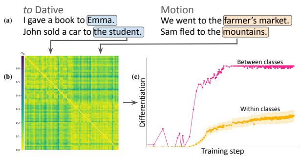
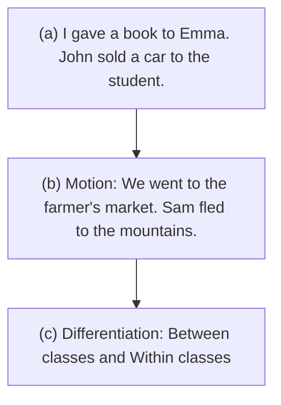
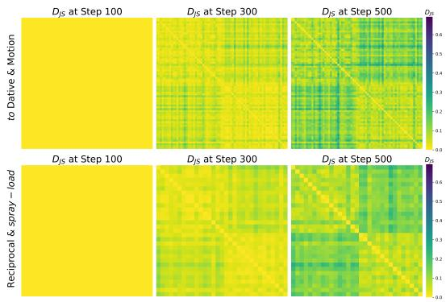
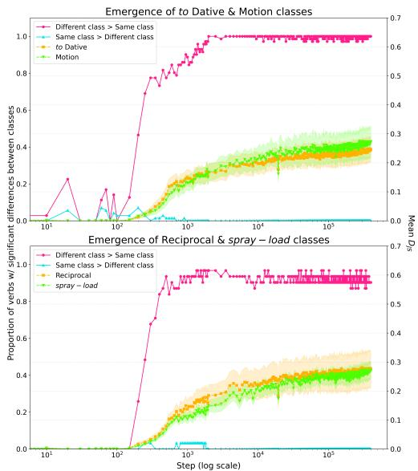
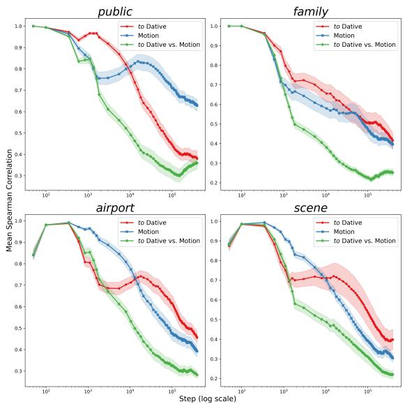
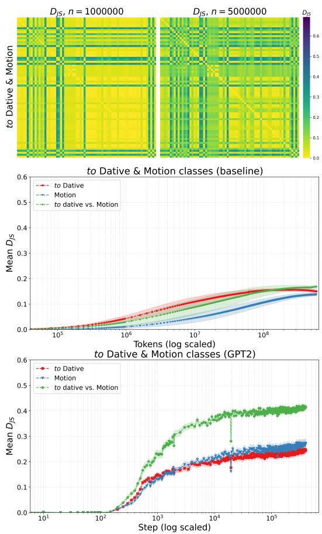
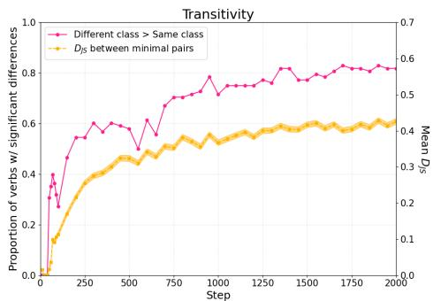
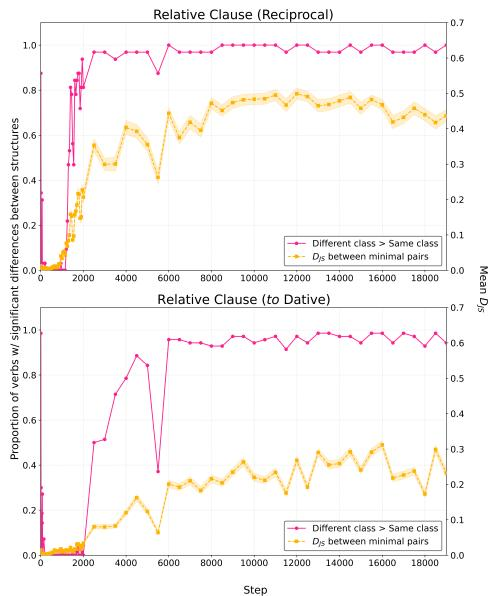
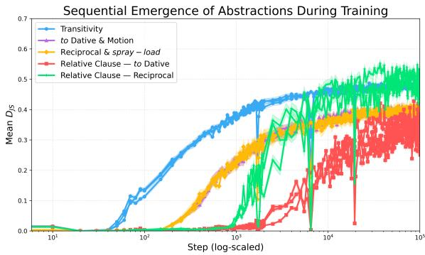
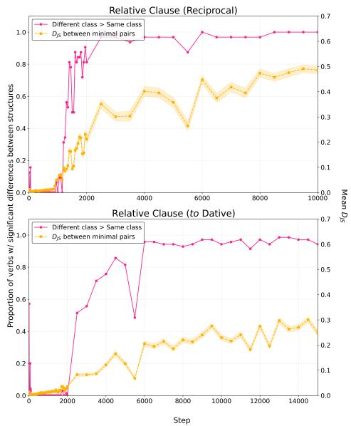

# Humans and transformer LMs: Abstraction drives language learning

# Jasper Jian and Christopher D. Manning

Stanford University

jjian@stanford.edu, manning@cs.stanford.edu

# Abstract

Categorization is a core component of human linguistic competence. We investigate how a transformer-based language model (LM) learns linguistic categories by comparing its behaviour over the course of training to behaviours which characterize abstract feature– based and concrete exemplar–based accounts of human language acquisition. We investigate how lexical semantic and syntactic categories emerge using novel divergence-based metrics that track learning trajectories using next-token distributions. In experiments with GPT-2 small, we find that (i) when a construction is learned, abstract class-level behaviour is evident at earlier steps than lexical item– specific behaviour, and (ii) that different linguistic behaviours emerge abruptly in sequence at different points in training, revealing that abstraction plays a key role in how LMs learn. This result informs the models of human language acquisition that LMs may serve as an existence proof for.

# 1 Introduction

Linguistic constructions involve generalizations over classes of words, such as ditransitive or sentential complement-taking verbs, rather than idiosyncratic patterns applying to individual lexical items. Language models (LMs) must learn these categories in order to systematically understand and generate text (Lake and Baroni, 2018; Kim and Linzen, 2020). Indeed, work has shown that LMs by the end of training do learn to adeptly categorize. For example, subject-verb agreement (Marvin and Linzen, 2018; Goldberg, 2019; Hao and Linzen, 2023) requires categorizing singular vs. plural nouns. This raises the question: what are the processes LMs use to learn these generalizations?

While interpretability work has begun to decode how trained transformers work, less work has examined their acquisition of knowledge during training (Liu et al., 2021; Choshen et al., 2022) and even less has compared transformer LM learning with human language learning (Chang and Bergen, 2022; Evanson et al., 2023). We draw on theories of human language acquisition to tackle the latter question, investigating what hypothesized processes of category formation LM learning corresponds to. We contrast the abstraction-first account and the exemplar-first account which hypothesize that learning privileges (a) linking the input data to abstract featural representations (e.g., Pinker, 1989; Gleitman, 1990; Fisher et al., 2020), and (b) storing linguistic examples observed in the input (e.g., Tomasello, 1992, 2003; Ambridge and Lieven, 2015), respectively.

flowchart

Figure 1: (a) Categories, like verb classes determined by argument structure, are pervasive in language: to Dative verbs take recipient arguments, whereas Motion verbs take goal locations. (b) Divergence metrics compare LM prediction distributions conditioned on different categories. (c) Tracking divergences over training reveals that categories like verb classes are differentiated early by LMs, before gradual item-level learning.

We compare the behaviour of GPT-2 over the course of autoregressive pretraining to predictions made by these two accounts, targeting phenomena LMs have been shown to learn. Experiment 1 studies how arguments predicted for individual verbs and verb classes change over training (Figure 1; Thrush et al., 2020; Wilson et al., 2023) and Experiment 2 investigates syntactic subcategorization and non-local dependencies (Wilcox et al.,

2019, 2024; Warstadt et al., 2020). We find that the abstraction-first account better corresponds to GPT-2 learning across all phenomena tested: linguistic constructions are learned for classes of words at once and individual phenomena are learned sequentially. Furthermore, the ordering of learning onsets corresponds to expected linguistic development in children.

While our experiments involve a single model and do not impose humanlike constraints on training data, our investigation contributes to growing debates around what theories of human linguistic cognition standardly trained autoregressive LMs provide support for (Portelance and Jasbi, 2024). These findings suggest that LMs have a bias towards forming abstractions. Nevertheless, LMs differ from influential abstraction-first accounts of human learning proposing that linguistic categories are innate: LMs learn categories distributionally.

# 2 Background

# 2.1 Abstraction-first and exemplar-first learning in children

How argument structure is learned has motivated two views on the processes underlying human language acquisition: the abstraction-first account, claiming that children learn structured representations early, and the exemplar-first account, claiming that children first memorize linguistic input.

The abstraction-first account is supported by findings like young children’s ability to comprehend sentences containing novel verbs by relying on the syntactic structure of the sentence alone (e.g., Naigles, 1990) and their incorrect, but meaningful, overextension of syntactic constructions to verbs (e.g., ‘you can’t happy me’; Bowerman, 1982). Abstraction-first accounts explain this as a product of an inductive bias for learning general, abstract properties of language that extend beyond individual words, such as how the syntactic positions of arguments correspond to meanings (Landau and Gleitman, 1985; Pinker, 1989; Gleitman, 1990). Children then use abstract knowledge like this to aid in learning new verbs and to continue refining their representations of previously seen verbs.

The exemplar-first account is supported by findings that young children often only use verbs with nouns (Tomasello, 1992, 2003) and structures (Lieven et al., 1997) they have they have observed occurring together, as well as evidence that even basic linguistic properties like word order are learned slowly over time (Abbot-Smith et al., 2001). Exemplar-first accounts propose that these effects arise because children learn by memorizing observed instances of language (‘exemplars’) resulting in lexical item–specific knowledge. Abstractions emerge gradually via repeated exposure and retention, or analogy over stored exemplars (Abbot-Smith and Tomasello, 2006; Bybee, 2006; Ambridge, 2020).

What occurs over the course of learning differentiates the two accounts, in particular, when classbased behaviour vs. lexical-item specific behaviour emerge. Our experiments exploit this difference to probe whether the learning biases of standard transformer LMs can be characterized as being abstraction-first or exemplar-first.

# 2.2 Related work on language models

Work in NLP and ML focused on downstream task performance or privacy and copyright concerns has discussed the extent to which LMs (and DNNs) implement generalization and memorization mechanisms (Arpit et al., 2017; Carlini et al., 2019, 2023; Tirumala et al., 2022; Huang et al., 2024, a.o.). We investigate these mechanisms further in the context of how LMs learn linguistic phenomena motivated by hypotheses about human language acquisition.

Previous linguistic work has shown that LMs learn phenomena that abstract over specific lexical items, looking at fully-trained LMs (Gulordava et al., 2018; Newman et al., 2021; Lasri et al., 2022; Papadimitriou et al., 2022; Jian and Reddy, 2023) or finetuning fully-trained LMs (Kim and Smolensky, 2021; Wilson et al., 2023; Misra and Kim, 2023). We suggest that learning trajectories can better disambiguate the mechanisms and biases active in LMs (e.g., Kallini et al., 2024; Chen et al., 2024; Chang et al., 2024; Dankers and Titov, 2024; Antonello and Cheng, 2024) that may explain the stability of linguistic learning across models and datasets (Liu et al., 2021; Choshen et al., 2022; Evanson et al., 2023) and their ability to generalize even to structures absent in their training data (Potts, 2024; Misra and Mahowald, 2024; Patil et al., 2024). Closest to our work, Misra and Kim (2023) compare exemplar and abstraction theories in a nonce word learning setting and Yang et al. (2025) in a transformer-based speech model, both settling on a middle ground conclusion of ‘abstractions encoded by exemplars.’ However, they only evaluate fully-trained models – Huang et al. (2024) show that memorization (i.e., exemplar-storage)

<table><tr><td>CLASS</td><td>EXAMPLE VERBS</td><td>EXAMPLE SENTENCES</td><td>TOTAL</td></tr><tr><td>(i) to Dative</td><td>give, sell, grant (n=35)</td><td>Chipotle gave away free burritos to the _</td><td>1841</td></tr><tr><td>(ii) Motion</td><td>go, walk, flee (n=36)</td><td>Toby accordingly goes to the _</td><td>1942</td></tr><tr><td>(iii) Reciprocal</td><td>speak, meet, talk (n=16)</td><td>Cherry recalled Orr had refused to speak with the _</td><td>465</td></tr><tr><td>(iv) spray-load</td><td>spray, load, smear (n=16)</td><td>Ray and Devon then sprayed the table with the _</td><td>404</td></tr></table>

Table 1: Example verbs and sentence prefixes from the four verb classes used in the experiments.

abilities change over the course of LM training, emphasizing the need to evaluate behaviours during training to provide a fuller picture of LM mechanisms, as we do here.

# 3 Experiment 1: What drives argument structure learning in LMs?

# 3.1 Data and Models

Empirical domain Argument structure classes allow us to compare item-specific and class-general effects during learning. We measure the arguments predicted for each verb as a proxy for verb categorization. Four argument structure classes were used which each have arguments introduced by prepositions: (i) to-dative verbs, (ii) verbs of motion, (iii) reciprocal verbs, and (iv) spray-load verbs (see Table 1). Classes (i) and (ii) use the preposition to, and (iii) and (iv) use with. The arguments in the post-preposition slot form semantic classes (Pinker, 1989; Dowty, 2003): (i) recipients, (ii) goal locations, (iii) reciprocal objects, and (iv) substances. LMs must abstract over the specific nouns that they observe with each verb to learn the broad class of nouns that can occur in a given the argument slot.

Trajectories Early changes to predictions involving learning broad categories of nouns for the argument slots across a group of verbs would provide evidence of an abstraction-first mechanism. Early changes involving idiosyncratic learning for individual verbs, with class-like behaviour emerging later, would evidence an exemplar-first mechanism.

Dataset We track the arguments that are predicted by LMs in the target position by taking nexttoken predictions at the underlined position in sentences containing the structure in (1). Using these distributions, we can track when predictions begin to change when comparing any two verbs (evidence of item-specific learning), and when predictions are more similar for verbs that belong to the same class than for verbs that belong to a separate comparison class (evidence of class-general learning). We compare between pairs of verb classes that share a preposition – (i) & (ii), (iii) & (iv) – ensuring that differences in argument preferences are the result of verb identity, rather than the identity of the preposition itself.

heatmap

| Condition | DJS at Step 100 | DJS at Step 300 | DJS at Step 500 | DJS at Step 100 | DJS at Step 300 | DJS at Step 500 |
| :--- | :--- | :--- | :--- | :--- | :--- | :--- |
| to Dative & Motion | 0.6 | 0.4 | 0.2 | 0.1 | 0.05 | 0.0 |
| Reciprocal & spray – load | 0.6 | 0.4 | 0.2 | 0.1 | 0.05 | 0.0 |

Figure 2: Pairwise $D _ { J S }$ between verbs in two classes at three early steps in training. Each row and column represents a single verb. Differentiation into verb classes is evident when any change has occurred – betweenclass quadrants have higher $D _ { J S }$ (top-right, bottom-left) than in-class quadrants (top-left, bottom-right).

# $( 1 ) \quad \dots \mathrm { ~ V E R B ~ } \dots \mathrm { ~ P R E P O S I T I O N ~ } t h e \_$

Our dataset contains natural sentences that feature the target verbs in the desired syntactic frame filtered from the WikiText-103 dataset (Merity et al., 2016). To find target structures, sentences were filtered with regular expressions and Stanza dependency parses (Qi et al., 2020), before being manually annotated by the authors to account for parser errors and non-target senses of the chosen verbs.

Models We test for these effects over the course of standard pretraining using training checkpoints of GPT-2 models (Radford et al., 2019) released by Karamcheti et al. (2021). Each model was autoregressively trained on the OpenWebText corpus (Gokaslan et al., 2019). We track behaviour over 450 checkpoints (400K steps). Models are trained with a batch size of 32. We choose to use GPT-2 small models (decoder-only transformers; 12 layers and 12 attention heads per layer) given that smaller models have been shown to better predict human linguistic behaviour (Oh and Schuler, 2023). These models have been shown to perform well on standard linguistic benchmarks (e.g., Warstadt et al., 2020) and have previously been used to evaluate inductive biases of transformer LMs (Kallini et al., 2024). We report results for a single random seed for clarity, though all described behaviour was confirmed across three runs with different seeds.

# 3.2 Paradigm and Metrics

Paradigm For any verb, we collect next-token distributions across different prefixes. Since we are interested in comparing argument structure predictions at the verb level, we derive a single estimate associated with each verb from the individual distributions obtained from each prefix. For each verb v this is defined as the arithmetic mean of the conditional next token distributions over the set $S _ { v }$ of N prefixes containing verb $\nu ! ^ { 1 }$

$$
P _ {v} (x) = \frac {1}{N} \sum_ {i = 1} ^ {N} P (x | s _ {i}), s _ {i} \in S _ {v}.
$$

We assume that different inflections of a single verb (tense, aspect, and agreement) do not make a significant contribution to argument predictions.

We compute pairwise similarity scores between verbs by taking the Jensen–Shannon divergence, $D _ { J S }$ , between the distributions defined above (Lin, 1991). This allows us to compute similarity without predefining a set of relevant nouns. Divergence metrics like $D _ { J S }$ provide natural interpretations of learning onsets, as opposed to metrics like accuracy. Consider two linguistic variables a and $^ { b , }$ each contained within prefixes $s _ { a }$ and $s _ { b } .$ , which should license different continuations, e.g., a is a to Dative verb and b is a Motion verb. We obtain two nexttoken distributions from the LM

$$
A = P (x | s _ {a}), B = P (x | s _ {b}).
$$

If $D _ { J S } ( A | | B ) = 0$ , then we know that the LM must not have learned to distinguish between variables a and b because the prediction distributions are maximally similar. Non-zero $D _ { J S } ( A | | B )$ is the necessary condition for a LM to have begun to distinguish variables correctly during training.2

Previous work has used accuracy scores derived from comparing log-probabilities of sequences, e.g., targeted syntactic evaluation (Marvin and Linzen, 2018; Warstadt et al., 2020), on linguistic benchmarks to measure onsets of learning (Choshen et al., 2022; Evanson et al., 2023; Chen et al., 2024). However, accuracy metrics may be artificially steep (Schaeffer et al., 2023) and it is unclear how to determine the onset of learning if, e.g., baseline accuracy decreases before increasing. The divergence metrics we use are smooth, i.e., no concerns with artificial steepness, and lower-bounded by zero, so increases can be directly interpreted as onsets of behavioural change.

line

| Step (log scale) | Different class > Same class | Same class > Different class | to Dative | Motion | Proportion of verbs w/ significant differences between classes | Mean % |
| ---------------- | ---------------------------- | ----------------------------- | --------- | ------ | -------------------------------------------------------- | ------ |
| 10^1             | 0.0                          | 0.0                           | 0.0       | 0.0    | 0.0                                                    | 0.0    |
| 10^2             | 0.2                          | 0.0                           | 0.0       | 0.0    | 0.0                                                    | 0.0    |
| 10^3             | 0.8                          | 0.0                           | 0.2       | 0.2    | 0.2                                                    | 0.2    |
| 10^4             | 1.0                          | 0.0                           | 0.3       | 0.3    | 0.3                                                    | 0.3    |
| 10^5             | 1.0                          | 0.0                           | 0.4       | 0.4    | 0.4                                                    | 0.4    |
| 10^6             | 1.0                          | 0.0                           | 0.4       | 0.4    | 0.4                                                    | 0.4    |
| 10^7             | 1.0                          | 0.0                           | 0.4       | 0.4    | 0.4                                                    | 0.4    |
| 10^8             | 1.0                          | 0.0                           | 0.4       | 0.4    | 0.4                                                    | 0.4    |
| 10^9             | 1.0                          | 0.0                           | 0.4       | 0.4    | 0.4                                                    | 0.4    |
| 10^10            | 1.0                          | 0.0                           | 0.4       | 0.4    | 0.4                                                    | 0.4    |
| 10^11            | 1.0                          | 0.0                           | 0.4       | 0.4    | 0.4                                                    | 0.4    |
| 10^12            | 1.0                          | 0.0                           | 0.4       | 0.4    | 0.4                                                    | 0.4    |
| 10^13            | 1.0                          | 0.0                           | 0.4       | 0.4    | 0.4                                                    | 0.4    |
| 10^14            | 1.0                          | 0.0                           | 0.4       | 0.4    | 0.4                                                    | 0.4    |
| 10^15            | 1.0                          | 0.0                           | 0.4       | 0.4    | 0.4                                                    | 0.4    |
| 10^16            | 1.0                          | 0.0                           | 0.4       | 0.4    | 0.4                                                    | 0.4    |
| 10^17            | 1.0                          | 0.0                           | 0.4       | 0.4    | 0.4                                                    | 0.4    |
| 10^18            | 1.0                          | 0.0                           | 0.4       | 0.4    | 0.4                                                    | 0.4    |
| 10^19            | 1.0                          | 0.0                           | 0.4       | 0.4    | 0.4                                                    | 0.4    |
| 10^2             | 1.0                          | 0.0                           | 0.4       | 0.4    | 0.4                                                    | 0.4    |
| 10^2+            | 1.0                          | 0.0                           | 0.4       | 0.4    | 0.4                                                    | 0.4    |
| Note: The proportions are normalized relative to the mean percentage of verbs in the first few steps, but they are calculated based on the number of verbs in each step and the percentage of verbs in each step, respectively, and the percentage of verbs in each step and the percentage of verbs in each step and the percentage of verbs in each step and the percentage of verbs in each step and the percentage of verbs in each step and the percentage of verbs in each step and the percentage of verbs in each step and the percentage of verbs in each step and the percentage of verbs in each step and the percentage of verbs in each step and the percentage of verbs in each step and the percentage of verbs in each step and the percentage of verbs in each step and the percentage in each step and the percentage of verbs in each step and the percentage of verbs in each step and the percentage of verbs in each step and the percentage of verbs in each step and the percentage of verbs in each step and the percentage of verbs in each step and the percentage of verbs in each step and the percentage of verbs in each step and the percentage of verbs in each step and the percentage of verbs in each step and the percentage of verbs in each step and the percentage of verbs in each step, respectively, respectively, respectively, respectively, respectively, respectively, respectively, respectively, respectively, respectively, respectively, respectively, respectively, respectively, respectively, respectively, respectively, respectively, respectively, respectively, respectively, respectively, respectively, respectively, respectively, respectively, respectively, respectively, respectively, respectively, respectively, respectively, respectively, respectively, respectively, respectively, respectively, respectively, respectively, respectively, respectively, respectively, respectively, respectively, respectively, respectively, respectively, respectively, respectively, respectively, otherwise, respectively, respectively, respectively, respectively, respectively, respectively, respectively, respectively, respectively, respectively, respectively, respectively, respectively, respectively, respectively, respectively, respectively, respectively, respectively, respectively, respectively, respectively, respectively, respectively, respectively, respectively, respectively, respectively, respectively, respectively, respectively, respectively, respectively, respectively, respectively, respectively, respectively, respectively, respectively, respectively, respectively, respectively, respectively, respectively, respectively, respectively, respectively, respectively, respectively, whereas it is not plotted as a line chart.

Figure 3: Mann-Whitney U-test between $\begin{array} { r l } { U _ { A } } & { { } = } \end{array}$ $\{ D _ { J S } ( P _ { v _ { t } } ( x ) | | P _ { v } ( x ) ) ~ : ~ v , v _ { t } ~ \in ~ C _ { 1 } \}$ (same class), $U _ { B } = \{ D _ { J S } ( P _ { v _ { t } } ( x ) | | P _ { v } ( x ) ) : v _ { t } \in C _ { 1 } , v \in C _ { 2 } \}$ (different class), for verb classes $C _ { 1 } , C _ { 2 }$ . Mean of $D _ { J S }$ across verbs in the same class. Shading is standard deviation.

Item learning metric Given pairwise $D _ { J S }$ between all verbs across two classes, we measure the emergence of item-specific learning independent of effects of verb class as the mean $D _ { J S }$ between verb v and verbs within the same class. If in-class $D _ { J S }$ increases, then idiosyncratic properties of verb v that are not general to the class have been learned.

Class learning metric Given $D _ { J S }$ between verb v with verbs from the same class $U _ { A }$ , and with verbs from the other class $U _ { B }$ we use a one-tailed Mann-Whitney U-test to determine statistically significance (Mann and Whitney, 1947). If mean $U _ { B }$ is greater than $U _ { A }$ and statistically significant under our test, then we can conclude that the model has learned some systematic property across verbs belonging to a class that separates them from verbs belonging to the other class.

line

| Category | Step (log scale) | to Dative | Motion | to Dative vs. Motion |
| -------- | ---------------- | --------- | ------ | -------------------- |
| public   | 10^2             | 1.0       | 1.0    | 1.0                  |
| public   | 10^3             | 0.95      | 0.85   | 0.8                  |
| public   | 10^4             | 0.8       | 0.7    | 0.6                  |
| public   | 10^5             | 0.6       | 0.5    | 0.4                  |
| family   | 10^2             | 1.0       | 1.0    | 1.0                  |
| family   | 10^3             | 0.9       | 0.7    | 0.6                  |
| family   | 10^4             | 0.7       | 0.5    | 0.4                  |
| family   | 10^5             | 0.5       | 0.4    | 0.3                  |
| airport  | 10^2             | 1.0       | 1.0    | 1.0                  |
| airport  | 10^3             | 0.9       | 0.8    | 0.7                  |
| airport  | 10^4             | 0.7       | 0.6    | 0.5                  |
| airport  | 10^5             | 0.5       | 0.4    | 0.3                  |
| scene    | 10^2             | 1.0       | 1.0    | 1.0                  |
| scene    | 10^3             | 0.9       | 0.8    | 0.7                  |
| scene    | 10^4             | 0.7       | 0.6    | 0.5                  |
| scene    | 10^5             | 0.5       | 0.4    | 0.3                  |
| scene    | 10^6             | 0.4       | 0.3    | 0.2                  |

Figure 4: Mean pairwise Spearman correlations between prototype noun trajectories for each verb across training. Within-class and between-class means are reported with 95% CI.

# 3.3 Results: Distributional metrics

In Figure 3, we report the percentage of verbs for which the mean $D _ { J S }$ with verbs from the opposite class are greater than the mean $D _ { J S }$ with verb from the same class $( p < 0 . 0 0 1$ as a threshold). For the (i) to Datives and (ii) Motion classes, class-based distinctions (pink) emerge 50 steps before in-class differences begin (green, orange), whereas for the (iii) Reciprocal and (iv) spray – load classes, the onset of change is concurrent. Verbs in neither class diverge from one another before there are statistically significant differences between the classes. Divergence between the two classes reaches its peak at different points in training – step 3000 for the (i) to Datives and (ii) Motion, step 1000 for (iii) Reciprocal and (iv) spray – load – while verbs within the same class continue to diverge from one another until the end of the training. We note that there are a small number of verbs that are not significantly more similar to verbs in their canonical class (pink line does not always reach 1.0) than verbs in the comparison class, but that they are also not significantly more similar to verbs in the comparison class (blue line tends to 0).

Figure 2 shows three early training steps before and after $D _ { J S }$ begins to change. At Step 300, there is already clear separation of within-class (top-left, bottom-right) and out-of-class (top-right, bottomleft) quadrants when $D _ { J S }$ starts increasing. This confirms that as soon as $D _ { J S }$ increases, i.e., any change in verbal argument structure occurs, classbased distinctions are already evident.

# 3.4 Results: Targeted behavioural evaluation

We perform targeted evaluations with the larger to Dative-Motion dataset. Four nouns assigned high probability by the fully trained model for the to Dative and Motion classes are tracked: public and family, and airport and scene, respectively.

For each noun and verb pair, we can derive a probability trajectory, i.e., what is the probability assigned to noun n in contexts with verb v at step t. Computing Spearman correlations across these trajectories reveals how similar the relative change in probability assigned to n is across verbs, within and across classes.

Trajectories for nouns which are prototypical arguments of a verb class remain highly correlated between verbs of that class earlier in training (public and family for to Dative, airport and scene for Motion). Correlations of noun trajectories for verbs in different classes begin to decrease earlier in training, as well as correlations of noun trajectories for verbs in classes with which they are not prototypically found (airport and scene for to Dative, public and family for Motion). Correlations between verbs in different classes are lowest.

The sustained higher correlation across verbs for which a noun is prototypically an argument is consistent with the claim that general coarse-grained features, e.g., the semantic features associated with a broad verb class, are what is being learned early on in training (see Figure 4). Lower correlations can be interpreted as verb-specific learning, since this means that the relative change in probability mass even differs across verbs in the same class. This does not occur until later in training for a noun’s prototypical verb class. Lastly, correlations do not greatly increase over the course of training suggesting that verb-specific learning does not precede class-general learning. These results further show that LMs have an abstraction-first bias.

# 3.5 Exemplar-first baseline

We confirm that the observed effects are not the result of an exemplar-first mechanism paired with properties of the training data by implementing a baseline for the exemplar-first mechanism. We use count-based vectors as a baseline since they obtain representations for a target verb as a function of the tokens it is observed with and their frequency.

  
Figure 5: Top: Pairwise $D _ { J S }$ across two classes in exemplar-first baseline show verb-specific patterns emerge without clear class distinctions. Middle and bottom: Exemplar-first baseline (middle) shows increasing divergence between verbs driven by verbspecific learning, before decrease, while GPT-2 is monotonic (bottom); baseline between-class mean divergences are not consistently greater than in-class means, unlike GPT-2. Shading is 95% CI.

We compute co-occurrence statistics for each verb in the correct prepositional structure, using the OpenWebText corpus tokenized with the GPT-2 tokenizer and a unidirectional 10 token context window. Stop word tokens like determiners were removed. Increasing the number of tokens observed is a proxy for training step. Add-k smoothing $( k = 0 . 5 )$ is applied to each vector and pairwise $D _ { J S }$ is reported, as above.

Results in Figure 5 are computed for $6 . 0 \times 1 0 ^ { 7 }$ ( 90%) of the tokens containing the target verbs and structures. In the exemplar-first baseline, as hypothesized, verbs in the to Dative class diverge from one another as a result of idiosyncratic patterns when less data is observed, before converging when more overlapping data is observed. Betweenclass distances are not greater than in-class distances until the to Dative class converges, unlike with GPT-2 where these classes are differentiated early and consistently throughout training. This baseline confirms that observed LM learning trajectories do not match exemplar-first accounts.

<table><tr><td>STRUCTURE</td><td>EXAMPLE SENTENCES</td></tr><tr><td>TRANSITIVITY(n=1000)</td><td>The truck hadn’t astounded __The truck hadn’t fallen __</td></tr><tr><td>RELATIVE CLAUSE(to Dative; n=824)</td><td>The person that they sold the land to __The person thinks that they sold the land to __</td></tr><tr><td>RELATIVE CLAUSE(Reciprocal; n=288)</td><td>The person that Optimus spoke with __The person thinks that Optimus spoke with __</td></tr></table>

Table 2: Example structures for Experiment 2. TRANSI-TIVITY is from BLiMP (Warstadt et al., 2020).

# 4 Experiment 2: Is learning generally abstraction-driven?

GPT-2 learns argument structure classes using abstraction-first mechanisms. We investigate if this mechanism is broadly responsible for language learning using the two syntactic phenomena in Table 2: syntactic subcategorization (TRANSITIVITY) and filler-gap dependencies (RELATIVE CLAUSE). The same models are used.

Trajectories If constructions are learned in tandem for classes of lexical items, then we can say that LMs are corresponding with an abstractionfirst account. If they learn constructions idiosyncratically for individual instances, before gradually generalizing across classes, then LM learning better corresponds with an exemplar-first account.

# 4.1 Data

TRANSITIVITY Verbs differ in whether or not they require an object: transitive-intransitive categorization. Transitive verbs require an object and intransitive verbs do not. Prediction distributions in a single frame across different verbs are used to track LMs learning of the category.

$\begin{array} { r l } { ( 2 ) } & { { } \dots \lor \mathrm { E R B } \ \dots \_ { } } \end{array}$

RELATIVE CLAUSE Relative clauses are an example filler-gap dependency. In these structures, a noun that appears elsewhere in the sentence (the ‘filler’) blocks a noun from surfacing locally to a verb which otherwise requires an object (the ‘gap’). These are structurally-conditioned categories (e.g., VERB vs. $\operatorname { V E R B } _ { \mathrm { N O \ G A P } } ;$ Gazdar, 1987; Pollard and Sag, 1994; Steedman and Baldridge, 2011). We compare prediction distributions across two syntactic frames containing the same verb to track whether LMs have learned relative clause structures. We refer to (3) as the relative clause environment and (4) as the matrix environment.

line

| Step | Proportion of verbs w/ significant differences | Mean D's |
|------|-----------------------------------------------|----------|
| 0    | 0.0                                           | 0.0      |
| 250  | 0.6                                           | 0.3      |
| 500  | 0.7                                           | 0.4      |
| 750  | 0.8                                           | 0.5      |
| 1000 | 0.8                                           | 0.5      |
| 1250 | 0.8                                           | 0.5      |
| 1500 | 0.8                                           | 0.5      |
| 1750 | 0.8                                           | 0.5      |
| 2000 | 0.8                                           | 0.6      |

Figure 6: Comparing class-level and item-based behaviour for TRANSITIVITY dataset.

(3) The person that $\ldots \mathrm { \ V E R B _ { G A P } }$ ... \_\_   
(4) The person thinks that ... VERBNO GAP ... \_\_

Dataset We track learning here by comparing distributions between minimal pairs. For TRAN-SITIVITY we use minimal pairs from the BLiMP transitive test set (Warstadt et al., 2020). For REL-ATIVE CLAUSE, we templatically build minimal pairs using naturalistic data collected for Experiment 1. We use the to Dative and Reciprocal classes since both permit human animate objects in the post-preposition position allowing us to create minimal pairs following the syntactic frames in (3) & (4). Example data is provided in Table 2.

# 4.2 Setup

The same paradigm discussed in Section 3.2 is used here, taking $D _ { J S }$ over next-token prediction distributions at the target position given two prefixes containing the structures being compared.

Item learning metric Given pairwise $D _ { J S }$ between distributions predicted for a single minimal pair, we measure the emergence of item-specific learning independent of effects of abstractions, e.g., an abstract transitive class or a gap class, as the mean $D _ { J S }$ across all minimal pairs in a single condition. If in-class $D _ { J S }$ increases, then learning has occurred for single examples that are not tied to learning a generalized construction.

Class learning metric We define class learning here again by taking a mean across the distributions conditioned on prefixes containing the same verb. We take pairwise $D _ { J S }$ between all the distributions for each verb and perform a one-tailed Mann-Whitney U-test to determine the proportion of verbs that are significantly more similar to verbs in the same category than to verbs from the opposite category. For TRANSITIVITY categorization, the verbs in the two categories are non-overlapping. For the RELATIVE CLAUSE categorization, the two categories contain the same verbs in different syntactic contexts, $\mathrm { e . g . , \ } \{ g i \nu e _ { n o g a p } , s e l l _ { n o g a p } ,$ $g r a n t _ { n o g a p } \}$ and $\{ g i \nu e _ { g a p } , s e l l _ { g a p } , g r a n t _ { g a p } \}$ . As before, this measure only increases if LMs treat verbs in the same syntactic category similarly.

line

| Step | Relative Clause (Reciprocal) - Different class > Same class | Relative Clause (Reciprocal) - DJS between minimal pairs | Relative Clause (to Dative) - Different class > Same class | Relative Clause (to Dative) - DJS between minimal pairs |
|------|----------------------------------------------------------|--------------------------------------------------------|-------------------------------------------------------------|--------------------------------------------------------|
| 0    | 0.0                                                      | 0.0                                                    | 0.0                                                         | 0.0                                                    |
| 2000 | 0.95                                                     | 0.6                                                    | 0.5                                                         | 0.1                                                    |
| 4000 | 0.98                                                     | 0.7                                                    | 0.9                                                         | 0.2                                                    |
| 6000 | 0.95                                                     | 0.6                                                    | 0.35                                                        | 0.1                                                    |
| 8000 | 0.98                                                     | 0.7                                                    | 0.95                                                        | 0.2                                                    |
| 10000| 0.98                                                     | 0.75                                                   | 0.98                                                        | 0.25                                                   |
| 12000| 0.98                                                     | 0.7                                                    | 0.95                                                        | 0.2                                                    |
| 14000| 0.98                                                     | 0.75                                                   | 0.98                                                        | 0.25                                                   |
| 16000| 0.98                                                     | 0.7                                                    | 0.98                                                        | 0.2                                                    |
| 18000| 0.98                                                     | 0.7                                                    | 0.98                                                        | 0.25                                                   |

Figure 7: Comparing class-level and item-based behaviour for RELATIVE CLAUSE datasets.

# 4.3 Results

GPT-2 consistently learns via abstraction. Across all structures tested, class-general behaviour emerges as soon as any item-based behaviour is evident. Figures 6 and 7 show that an increase in pairwise $D _ { J S }$ between minimal pairs (orange), always occurs with increases in verbs which are systematically more similar to those belonging to the same category, than those which do not (pink). Classlike behaviour does not emerge slowly – learning a construction always corresponds with generalizing that construction across a class of items. This matches our findings for the learning of semantic verb argument structure classes.

An unexpected separation into categories at the beginning of training is observed in the relative clause conditions. We confirm that this is due to the token thinks appearing in all non-relative clause sentences by varying between nine embedding verbs for each target verb. This reduces the effect (see Appendix B.1, Figure 9).

Structures are not learned globally. Relative clause filler-gap categories are not learned for all verbs at once. Rather, they are learned separately for verb classes: pairwise $D _ { J S }$ increases for relative clauses containing Reciprocal verbs earlier than for relative clauses containing to Dative verbs. This is confirmed by comparing breakpoints for each verb: the median across verbs for the Reciprocal class and the to Dative class are 950 and 1900, respectively, matching the onsets observed in Figure 7. An unpaired t-test confirms that the differences in breakpoints for the two classes are statistically significant $( p < 1 0 ^ { - 8 } )$ . Breakpoints are heuristically computed as the step after which the average $D _ { J S }$ for a verb across minimal pairs is consistently at least 0.01 greater than the average of the first 30 steps of training.

line

| Step (log-scaled) | Transitivity | to Dative & Motion | Reciprocal & spray – load | Relative Clause – to Dative | Relative Clause – Reciprocal |
| ----------------- | ------------ | ------------------ | ------------------------- | --------------------------- | ----------------------------- |
| 10^1              | 0.0          | 0.0                | 0.0                       | 0.0                         | 0.0                           |
| 10^2              | 0.1          | 0.0                | 0.0                       | 0.0                         | 0.0                           |
| 10^3              | 0.4          | 0.3                | 0.3                       | 0.1                         | 0.4                           |
| 10^4              | 0.5          | 0.4                | 0.4                       | 0.3                         | 0.5                           |
| 10^5              | 0.5          | 0.4                | 0.4                       | 0.3                         | 0.5                           |

Figure 8: Learning curves for each abstraction plotted for three models trained with different random seeds.

Abstractions are learned sequentially. Across three runs, we see that each of the abstractions emerges with distinct onsets in the same sequence over the course of training (see Figure 8). Before the onset of learning for a given construction, mean $D _ { J S }$ in each condition does not increase and is around 0. This confirms further that gradual memorization does not drive syntactic learning.

# 5 Discussion

Sequential emergence of linguistic behaviour cannot be due to shifts in the training data or objective, as this is uniform over standard LM pretraining (see discussion in Chang et al., 2024). It must be the case that behavioural change is due to shifts in model representations or mechanisms. We have shown here that these shifts are best viewed as resulting from learning abstractions, rather than storage of exemplars. Converging evidence comes from Arora et al. (2024), who show that even individual phenomena involve discrete learning stages. Our results are also consistent with findings from Wilson et al. (2023), who show that LMs can learn abstractions which hold over classes of lexical items by the end of training, the types of abstractions we test here. Wilson et al. further discuss abstractions that are difficult for LMs to learn – future work into the learning trajectories of these phenomena may provide further insight into why LMs are unable to learn them.

The order that abstractions emerge in is consistent across training runs: syntactic subcategorization (TRANSITIVITY, $t < 1 0 0 )$ , semantic argument structure properties (VERB CLASSES, t > 100), lastly, non-local dependencies (RELATIVE CLAUSE, t > 1000). Our results differ from Evanson et al. (2023), who find a similar ordering, but report gradual parallel learning, while we find clear evidence of sequential emergence, though our experimental setup differs as it directly measures argument predictions, rather than using subject-verb agreement as a proxy. Discrete learning stages provide direct support for abstraction-first views of acquisition – the gradual emergence expected under exemplar-first acquisition is not empirically observed. Abstraction-first theories include those which propose that learning complex structures requires simpler abstractions to be in place (Lebeaux, 2000; Friedmann et al., 2021; Diercks et al., 2023); the acquisition order we observe is consistent with the predictions of these theories, as well. This being said, acquisition order may in principle also arise from differences in construction frequency, and, as such, cannot be itself an argument for complexity-based theories. The role of frequency effects and abstraction–driven learning biases in determining acquisition order must be teased apart in future work.

Despite apparent parallels, a gap between many theories of child language acquisition and the theory of LM learning we have presented here is that all abstract linguistic categories learned by LMs are a product of the data observed during training and their inductive biases. The abstraction-first behaviour observed is not the result of predetermined linguistic features encoded in the model before training, unlike what has been proposed to be the case for humans with, e.g., the mapping between argument positions and semantic roles (Pinker, 1989). Indeed, earlier work has shown that abstractions like argument structure classes are learnable from distributional patterns, albeit with some supervision, (e.g., Lapata, 1999; Schulte im Walde, 2000).

# 6 Conclusion

A leading view on how LMs can contribute to our knowledge of human linguistic cognition is as existence proofs: the mechanisms LMs employ to acquire the constructions that they do are in principle possible ways that human learners may arrive at knowledge of those same constructions (Portelance and Jasbi, 2024). As such, what we understand to be the inductive biases of LMs changes the conclusions we can draw on the basis of their success.

Some have recently discussed that LMs may indeed be an existence proof for exemplar-based models (Ambridge, 2020; Ambridge and Blything, 2024; Goldberg, 2024). For example, Ambridge suggests modern LMs are compatible with a view where linguistic abilities arise via exemplar-storage because the high parameter count of these models in principle allows them to memorize. Following a body of literature that has cautioned against taking connectionist models as inherently undermining symbolic views like the abstraction-first account of learning discussed here (Fodor and Pylyshyn, 1988; Newmeyer, 2003; Mahowald et al., 2020), we consider this to be a testable empirical question. Indeed, our results show that the abstraction-first account is a viable explanation of LM learning. An open question for future work is characterizing the sorts of abstractions that LMs can learn – are LM abstractions best understood at the word-level or a more dynamic construction-level? Evaluating LM behaviour over the course of training may be a fruitful direction for answering questions like these and uncovering more mechanisms underlying their success.

# Limitations

Our study is limited by its focus on a single model architecture trained and evaluated on a single language. This choice was motivated by previous uses of these models in similar studies (see Section 3.1), and constrained by the resource requirements associated with training and storing model checkpoints. Our dataset can be applied to a wider-range of English models and the paradigm across languages. These studies will help us understand how general the effects we report here are. Further testing on different models may help localise whether this is an effect of the model architecture and training procedure and teesting on models of different sizes can answer whether parameter count has an effect as well.

The other limitation that we identify here is the breadth of the linguistic phenomena studied. While we have focused on abstraction within the verbal domain, abstraction occurs at different levels of linguistic representation, including below the word level. Derivational suffixes like English -ness which can combine with a range of adjectives to derive nouns is another example of abstraction – here, over syntactic categories. Whether LMs can productively combine and use such suffixes and whether this displays the same abstraction-first learning that we observe here would be an interesting avenue for future work.

Lastly, while we have provided converging behavioural evidence in favour of abstractionfirst learning, understanding how representations change to produce these behaviours is a core desideratum. We hope that our datasets may be helpful for future studies along these lines.

# Acknowledgements

The authors would like to thank the three anonymous reviewers for constructive feedback, as well as Dan Jurafsky, Alex Warstadt, Beth Levin, Boris Harizanov, and members of the Stanford NLP group for much discussion. JJ is supported in part by funding from the Social Sciences and Humanities Research Council of Canada.

# References

Kirsten Abbot-Smith, Elena Lieven, and Michael Tomasello. 2001. What preschool children do and do not do with ungrammatical word orders. Cognitive Development, 16(2):679–692.   
Kirsten Abbot-Smith and Michael Tomasello. 2006. Exemplar-learning and schematization in a usagebased account of syntactic acquisition. The Linguistic Review, 23(3):275–290.   
Ben Ambridge. 2020. Against stored abstractions: A radical exemplar model of language acquisition. First Language, 40(5-6):509–559.   
Ben Ambridge and Liam Blything. 2024. Large language models are better than theoretical linguists at theoretical linguistics. Theoretical Linguistics, 50(1- 2):33–48.   
Ben Ambridge and Elena Lieven. 2015. A Constructivist Account of Child Language Acquisition, chapter 22. John Wiley & Sons, Ltd.   
Richard Antonello and Emily Cheng. 2024. Evidence from fmri supports a two-phase abstraction process in language models. In UniReps: 2nd Edition of

the Workshop on Unifying Representations in Neural Models.   
Aryaman Arora, Dan Jurafsky, and Christopher Potts. 2024. CausalGym: Benchmarking causal interpretability methods on linguistic tasks. In Proceedings of the 62nd Annual Meeting of the Association for Computational Linguistics (Volume 1: Long Papers), pages 14638–14663, Bangkok, Thailand. Association for Computational Linguistics.   
Devansh Arpit, Stanisław Jastrz˛ebski, Nicolas Ballas, David Krueger, Emmanuel Bengio, Maxinder S Kanwal, Tegan Maharaj, Asja Fischer, Aaron Courville, Yoshua Bengio, and 1 others. 2017. A closer look at memorization in deep networks. In International conference on machine learning, pages 233–242. PMLR.   
Melissa Bowerman. 1982. Evaluating competing linguistic models with language acquisition data: Implications of developmental errors with causative verbs. Quaderni di semantica, 3:5–66.   
Joan Bybee. 2006. From usage to grammar: The mind’s response to repetition. Language, 82(4):711–733.   
Nicholas Carlini, Daphne Ippolito, Matthew Jagielski, Katherine Lee, Florian Tramer, and Chiyuan Zhang. 2023. Quantifying memorization across neural language models. In The Eleventh International Conference on Learning Representations.   
Nicholas Carlini, Chang Liu, Úlfar Erlingsson, Jernej Kos, and Dawn Song. 2019. The secret sharer: Evaluating and testing unintended memorization in neural networks. In 28th USENIX security symposium (USENIX security 19), pages 267–284.   
Tyler A. Chang and Benjamin K. Bergen. 2022. Word acquisition in neural language models. Transactions of the Association for Computational Linguistics, 10:1–16.   
Tyler A. Chang, Zhuowen Tu, and Benjamin K. Bergen. 2024. Characterizing learning curves during language model pre-training: Learning, forgetting, and stability. Transactions of the Association for Computational Linguistics, 12:1346–1362.   
Angelica Chen, Ravid Shwartz-Ziv, Kyunghyun Cho, Matthew L Leavitt, and Naomi Saphra. 2024. Sudden drops in the loss: Syntax acquisition, phase transitions, and simplicity bias in MLMs. In The Twelfth International Conference on Learning Representations.   
Leshem Choshen, Guy Hacohen, Daphna Weinshall, and Omri Abend. 2022. The grammar-learning trajectories of neural language models. In Proceedings of the 60th Annual Meeting of the Association for Computational Linguistics (Volume 1: Long Papers), pages 8281–8297, Dublin, Ireland. Association for Computational Linguistics.

Verna Dankers and Ivan Titov. 2024. Generalisation first, memorisation second? memorisation localisation for natural language classification tasks. In Findings of the Association for Computational Linguistics: ACL 2024, pages 14348–14366, Bangkok, Thailand. Association for Computational Linguistics.   
Michael Diercks, Katherine Johnson, Galia Bar-Sever, and Madeline Bossi. 2023. Developmental minimalist syntax. Lingbuzz/007134.   
David Dowty. 2003. The dual analysis of adjuncts/complements in categorial grammar. In Ewald Lang, Claudia Maienborn, and Cathry Fabricius-Hansen, editors, Modifying Adjuncts, pages 33–66. Mouton de Gruyter, Berlin.   
Linnea Evanson, Yair Lakretz, and Jean Rémi King. 2023. Language acquisition: do children and language models follow similar learning stages? In Findings of the Association for Computational Linguistics: ACL 2023, pages 12205–12218, Toronto, Canada. Association for Computational Linguistics.   
Cynthia Fisher, Kyong-sun Jin, and Rose M. Scott. 2020. The developmental origins of syntactic bootstrapping. Topics in Cognitive Science, 12(1):48–77.   
Jerry A. Fodor and Zenon W. Pylyshyn. 1988. Connectionism and cognitive architecture: A critical analysis. Cognition, 28(1):3–71.   
Naama Friedmann, Adriana Belletti, and Luigi Rizzi. 2021. Growing trees: The acquisition of the left periphery. Glossa: a journal of general linguistics, 6(1).   
Gerald Gazdar. 1987. Unbounded dependencies and coordinate structure. In Walter J. Savitch, Emmon Bach, William Marsh, and Gila Safran-Naveh, editors, The Formal Complexity of Natural Language, pages 183–226. Springer Netherlands, Dordrecht.   
Lila Gleitman. 1990. The structural sources of verb meanings. Language Acquisition: A Journal of Developmental Linguistics, 1(1):3–55.   
Aaron Gokaslan, Vanya Cohen, Ellie Pavlick, and Stefanie Tellex. 2019. Openwebtext corpus. http: //Skylion007.github.io/OpenWebTextCorpus.   
Adele E Goldberg. 2024. Usage-based constructionist approaches and large language models. Constructions and Frames.   
Yoav Goldberg. 2019. Assessing BERT’s syntactic abilities. arXiv preprint arXiv:1901.05287.   
Kristina Gulordava, Piotr Bojanowski, Edouard Grave, Tal Linzen, and Marco Baroni. 2018. Colorless green recurrent networks dream hierarchically. In Proceedings of the 2018 Conference of the North American Chapter of the Association for Computational Linguistics: Human Language Technologies, Volume 1 (Long Papers), pages 1195–1205, New Orleans, Louisiana. Association for Computational Linguistics.

Sophie Hao and Tal Linzen. 2023. Verb conjugation in transformers is determined by linear encodings of subject number. In Findings of the Association for Computational Linguistics: EMNLP 2023, pages 4531–4539, Singapore. Association for Computational Linguistics.   
Jing Huang, Diyi Yang, and Christopher Potts. 2024. Demystifying verbatim memorization in large language models. In Proceedings of the 2024 Conference on Empirical Methods in Natural Language Processing, pages 10711–10732, Miami, Florida, USA. Association for Computational Linguistics.   
Jasper Jian and Siva Reddy. 2023. Syntactic substitutability as unsupervised dependency syntax. In Proceedings of the 2023 Conference on Empirical Methods in Natural Language Processing, pages 2341– 2360, Singapore. Association for Computational Linguistics.   
Julie Kallini, Isabel Papadimitriou, Richard Futrell, Kyle Mahowald, and Christopher Potts. 2024. Mission: Impossible language models. In Proceedings of the 62nd Annual Meeting of the Association for Computational Linguistics (Volume 1: Long Papers), pages 14691–14714, Bangkok, Thailand. Association for Computational Linguistics.   
Siddharth Karamcheti, Laurel Orr, Jason Bolton, Tianyi Zhang, Karan Goel, Avanika Narayan, Rishi Bommasani, Deepak Narayanan, Tatsunori Hashimoto, Dan Jurafsky, Christopher D. Manning, Christopher Potts, Christopher Ré, and Percy Liang. 2021. Mistral - a journey towards reproducible language model training.   
Najoung Kim and Tal Linzen. 2020. COGS: A compositional generalization challenge based on semantic interpretation. In Proceedings of the 2020 Conference on Empirical Methods in Natural Language Processing (EMNLP), pages 9087–9105, Online. Association for Computational Linguistics.   
Najoung Kim and Paul Smolensky. 2021. Testing for grammatical category abstraction in neural language models. In Proceedings of the Society for Computation in Linguistics 2021, pages 467–470, Online. Association for Computational Linguistics.   
Brenden Lake and Marco Baroni. 2018. Generalization without systematicity: On the compositional skills of sequence-to-sequence recurrent networks. In Proceedings of the 35th International Conference on Machine Learning, volume 80 of Proceedings of Machine Learning Research, pages 2873–2882. PMLR.   
Barbara Landau and Lila R. Gleitman. 1985. Language and Experience: Evidence from the Blind Child. Harvard University Press, Cambridge, MA.   
Maria Lapata. 1999. Acquiring lexical generalizations from corpora: A case study for diathesis alternations. In Proceedings of the 37th Annual Meeting of the Association for Computational Linguistics, pages 397– 404, College Park, Maryland, USA. Association for Computational Linguistics.

Karim Lasri, Alessandro Lenci, and Thierry Poibeau. 2022. Does BERT really agree ? fine-grained analysis of lexical dependence on a syntactic task. In Findings of the Association for Computational Linguistics: ACL 2022, pages 2309–2315, Dublin, Ireland. Association for Computational Linguistics.   
David Lebeaux. 2000. Language acquisition and the form of the grammar. John Benjamins Publishing Company.   
Beth Levin. 1993. English verb classes and alternations: A preliminary investigation. University of Chicago press.   
Elena VM Lieven, Julian M Pine, and Gillian Baldwin. 1997. Lexically-based learning and early grammatical development. Journal of child language, 24(1):187–219.   
J. Lin. 1991. Divergence measures based on the Shannon entropy. IEEE Transactions on Information Theory, 37(1):145–151.   
Zeyu Liu, Yizhong Wang, Jungo Kasai, Hannaneh Hajishirzi, and Noah A. Smith. 2021. Probing across time: What does RoBERTa know and when? In Findings of the Association for Computational Linguistics: EMNLP 2021, pages 820–842, Punta Cana, Dominican Republic. Association for Computational Linguistics.   
Kyle Mahowald, George Kachergis, and Michael C Frank. 2020. What counts as an exemplar model, anyway? A commentary on Ambridge (2020). First Language, 40(5-6):608–611.   
Henry B Mann and Donald R Whitney. 1947. On a test of whether one of two random variables is stochastically larger than the other. The annals of mathematical statistics, pages 50–60.   
Rebecca Marvin and Tal Linzen. 2018. Targeted syntactic evaluation of language models. In Proceedings of the 2018 Conference on Empirical Methods in Natural Language Processing, pages 1192–1202, Brussels, Belgium. Association for Computational Linguistics.   
Stephen Merity, Caiming Xiong, James Bradbury, and Richard Socher. 2016. Pointer sentinel mixture models. arXiv preprint arXiv:1609.07843.   
Kanishka Misra and Najoung Kim. 2023. Abstraction via exemplars? A representational case study on lexical category inference in BERT. In BUCLD 48: Proceedings of the 48th annual Boston University Conference on Language Development, Boston, USA.   
Kanishka Misra and Kyle Mahowald. 2024. Language models learn rare phenomena from less rare phenomena: The case of the missing AANNs. In Proceedings of the 2024 Conference on Empirical Methods in Natural Language Processing, pages 913–929, Miami, Florida, USA. Association for Computational Linguistics.

Letitia Naigles. 1990. Children use syntax to learn verb meanings. Journal of child language, 17(2):357– 374.   
Benjamin Newman, Kai-Siang Ang, Julia Gong, and John Hewitt. 2021. Refining targeted syntactic evaluation of language models. In Proceedings of the 2021 Conference of the North American Chapter of the Association for Computational Linguistics: Human Language Technologies, pages 3710–3723, Online. Association for Computational Linguistics.   
Frederick J Newmeyer. 2003. Grammar is grammar and usage is usage. Language, 79(4):682–707.   
Byung-Doh Oh and William Schuler. 2023. Why does surprisal from larger transformer-based language models provide a poorer fit to human reading times? Transactions of the Association for Computational Linguistics, 11:336–350.   
Isabel Papadimitriou, Richard Futrell, and Kyle Mahowald. 2022. When classifying grammatical role, BERT doesn’t care about word order... except when it matters. In Proceedings of the 60th Annual Meeting of the Association for Computational Linguistics (Volume 2: Short Papers), pages 636–643, Dublin, Ireland. Association for Computational Linguistics.   
Abhinav Patil, Jaap Jumelet, Yu Ying Chiu, Andy Lapastora, Peter Shen, Lexie Wang, Clevis Willrich, and Shane Steinert-Threlkeld. 2024. Filtered corpus training (FiCT) shows that language models can generalize from indirect evidence. Transactions of the Association for Computational Linguistics, 12:1597– 1615.   
Steven Pinker. 1989. Learnability and Cognition: The Acquisition of Argument Structure. MIT Press, Cambridge, MA.   
Carl Pollard and Ivan A. Sag. 1994. Head-Driven Phrase Structure Grammar. CSLI Publications, Stanford, CA.   
Eva Portelance and Masoud Jasbi. 2024. The roles of neural networks in language acquisition. Language and Linguistics Compass, 18(6):e70001.   
Christopher Potts. 2024. Characterizing English Preposing in PP constructions. Journal of Linguistics, pages 1–39.   
Peng Qi, Yuhao Zhang, Yuhui Zhang, Jason Bolton, and Christopher D Manning. 2020. Stanza: A Python natural language processing toolkit for many human languages. arXiv preprint arXiv:2003.07082.   
Alec Radford, Jeffrey Wu, Rewon Child, David Luan, Dario Amodei, and Ilya Sutskever. 2019. Language models are unsupervised multitask learners. Technical report, OpenAI.   
Rylan Schaeffer, Brando Miranda, and Sanmi Koyejo. 2023. Are emergent abilities of large language models a mirage? In Thirty-seventh Conference on Neural Information Processing Systems.

Sabine Schulte im Walde. 2000. Clustering verbs semantically according to their alternation behaviour. In COLING 2000 Volume 2: The 18th International Conference on Computational Linguistics.   
Mark Steedman and Jason Baldridge. 2011. Combinatory categorial grammar. In Non-Transformational Syntax, chapter 5, pages 181–224. John Wiley & Sons, Ltd.   
Tristan Thrush, Ethan Wilcox, and Roger Levy. 2020. Investigating novel verb learning in BERT: Selectional preference classes and alternation-based syntactic generalization. In Proceedings of the Third BlackboxNLP Workshop on Analyzing and Interpreting Neural Networks for NLP, pages 265–275, Online. Association for Computational Linguistics.   
Kushal Tirumala, Aram Markosyan, Luke Zettlemoyer, and Armen Aghajanyan. 2022. Memorization without overfitting: Analyzing the training dynamics of large language models. Advances in Neural Information Processing Systems, 35:38274–38290.   
Michael Tomasello. 1992. First verbs: A case study of early grammatical development. Cambridge University Press.   
Michael Tomasello. 2003. Constructing a Language: A Usage-Based Theory of Language Acquisition. Harvard University Press.   
Alex Warstadt, Alicia Parrish, Haokun Liu, Anhad Mohananey, Wei Peng, Sheng-Fu Wang, and Samuel R. Bowman. 2020. BLiMP: The benchmark of linguistic minimal pairs for English. Transactions of the Association for Computational Linguistics, 8:377– 392.   
Ethan Wilcox, Roger Levy, and Richard Futrell. 2019. Hierarchical representation in neural language models: Suppression and recovery of expectations. In Proceedings of the 2019 ACL Workshop BlackboxNLP: Analyzing and Interpreting Neural Networks for NLP, pages 181–190, Florence, Italy. Association for Computational Linguistics.   
Ethan Gotlieb Wilcox, Richard Futrell, and Roger Levy. 2024. Using Computational Models to Test Syntactic Learnability. Linguistic Inquiry, 55(4):805–848.   
Michael Wilson, Jackson Petty, and Robert Frank. 2023. How abstract is linguistic generalization in large language models? experiments with argument structure. Transactions of the Association for Computational Linguistics, 11:1377–1395.   
Yi Yang, Yiming Wang, and Jiahong Yuan. 2025. Transformer-based speech model learns well as infants and encodes abstractions through exemplars in the poverty of the stimulus environment. In Proceedings of the 31st International Conference on Computational Linguistics, pages 7881–7890, Abu Dhabi, UAE. Association for Computational Linguistics.

# A Datasets: ARGUMENT STRUCTURE CLASSES

Verbs used for each argument structure class:

to Dative sell (85), grant (85), issue (84), explain (81), lease (79), award (79), deny (79), teach (75), present (75), offer (75), allocate (74), give (66), assign (65), pass (65), read (63), relay (62), show (62), cede (62), pay (56), trade (52), deliver (51), feed (49), rent (48), transfer (43), forward (33), promise (30), mail (28), allot (27), tell (26), guarantee (24), yield (18), dictate (16), ask (12), bequeath (7), refund (5). (Levin, 1993; p.45-46)

Motion go (130), travel (124), walk (119), fly (116), flee (114), sail (111), rush (108), descend (95), cross (94), run (93), march (93), climb (83), swim (77), ascend (76), drift (70), ride (65), arrive (56), hurry (49), race (36), float (32), journey (29), depart (19), crawl (16), row (15), taxi (14), hasten (12), limp (11), chase (11), glide (11), hike (10), dash (10), wander (10), scramble (9), cycle (8), tumble (8), meander (8). (Levin, 1993; p.263-269)

Reciprocal collaborate (48), team (47), talk (46), mate (44), communicate (41), compete (39), clash (35), join (35), meet (30), cooperate (28), speak (19), correspond (16), fight (15), connect (10), agree (8), play (4). (Levin, 1993; p.59)

spray-load inject (93), load (66), stock (63), plant (31), spray (31), stuff (22), pack (20), hang (15), smear (12), rub (11), plaster (10), shower (10), scatter (7), sprinkle (7), drape (6). (Levin, 1993; p.50)

Each class is uniform with respect to a broad categorization of argument preferences structure. Future work may investigate how finer-grained distinctions that we do not assess here, e.g., participation in argument structure alternations, are learned over the course of training.

# B Datasets: RELATIVE CLAUSE

The RELATIVE CLAUSE datasets were automatically generated using the sentences collected for each verb class for Experiment 1. Experiment 1 does not restrict sentences collected to being a full finite clause with a subject and active voice verb, so Stanza parses are used to extract the subject (and the direct object of the verb for to Dative class). Sentences for which the sequence of words extracted for the subject and object were not contiguous, or for which one of the required arguments could not be extracted on the basis of the parse tree, were discarded, accounting for the decrease in the number of sentences between the full dataset and the derived relative clause dataset.

line

| Step | Relative Clause (Reciprocal) - Different class > Same class | Relative Clause (Reciprocal) - D₂₅ between minimal pairs | Relative Clause (to Dative) - Different class > Same class | Relative Clause (to Dative) - D₂₅ between minimal pairs |
|------|---------------------------------------------------------------|----------------------------------------------------------|-------------------------------------------------------------|------------------------------------------------------------|
| 0    | 0.0                                                           | 0.0                                                      | 0.0                                                         | 0.0                                                        |
| 2000 | 0.8                                                           | 0.3                                                      | 0.5                                                         | 0.1                                                        |
| 4000 | 1.0                                                           | 0.6                                                      | 0.9                                                         | 0.3                                                        |
| 6000 | 1.0                                                           | 0.7                                                      | 1.0                                                         | 0.4                                                        |
| 8000 | 1.0                                                           | 0.8                                                      | 1.0                                                         | 0.5                                                        |
| 10000| 1.0                                                           | 0.9                                                      | 1.0                                                         | 0.6                                                        |
| 12000| 1.0                                                           | 1.0                                                      | 1.0                                                         | 0.7                                                        |
| 14000| 1.0                                                           | 1.0                                                      | 1.0                                                         | 0.8                                                        |

Figure 9: Comparing class-level and item-based behaviour on RELATIVE CLAUSE datasets with varied embedding verbs.

Verbs were converted to a simple past form and placed in two different syntactic templates with its extracted subject and object, corresponding to the relative clause (5)-(6) and non-relative clause (7)-(8) structures being compared in this condition.

(5) The person that SUBJECT V-ED OBJ to \_\_.   
(6) The person that SUBJECT V-ED with \_\_.   
(7) The person thinks that SUBJECT V-ED OBJ to \_\_.   
(8) The person thinks that SUBJECT V-ED with

# B.1 Alternating embedding verbs

In order to construct minimal pairs with the relative clause condition that should not license a filler-gap dependency that contain the relativized noun the person and the complementizer that, we embed target sentences under the verb think, as shown above. However, this introduces an additional word not present in the relative clause condition, the embedding verb think itself. This can cause an unexpected differentiation between conditions early on in training (see Figure 7). We confirm that this is the effect of the presence of the word think itself and not early syntactic learning by varying the embedding verbs: thinks, believes, knows, says, claims, announces, states, reports, reveals. They occupy the position of thinks in (7) & (8). Figure 9 shows that the spike observed in Figure 7 at early steps is no longer present.

# C Compute, Packages, and Licenses

Experiments reported used NLTK (3.6.4), lemminflect (0.2.3), and Stanza (1.8.2) for preprocessing and parsing during the creation of the dataset; transformers (4.40.1), scipy (1.3.1), numpy (1.18.2) and SpaCy (2.1.8) were used for computational experiments. All experiments were run on NVIDIA RTX or NVIDIA RTX A6000 GPUs depending on cluster availability.

All data (WikiText-103, Merity et al., 2016; BLiMP, Warstadt et al., 2020) and pretrained models (GPT-2 checkpoints, Karamcheti et al., 2021) are freely available for download and were used standardly. Our dataset and code can be found at https://github.com/jasperjjian/abstraction.