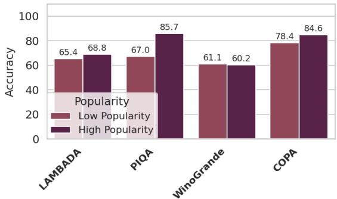
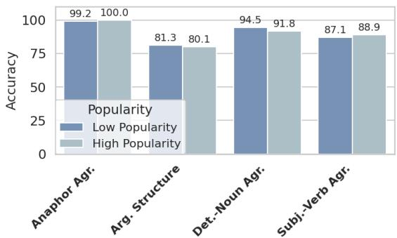
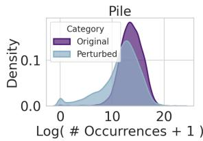
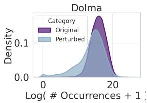
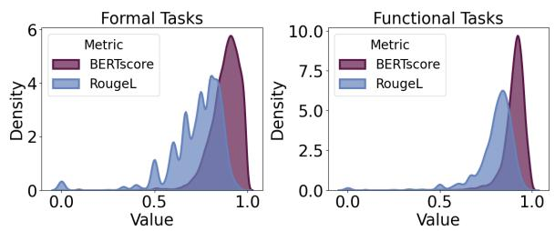
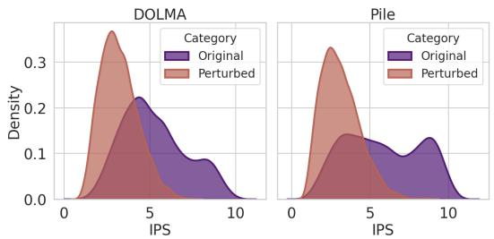
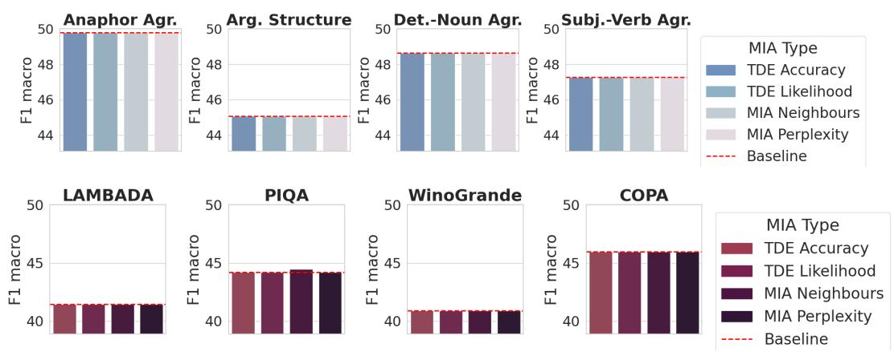
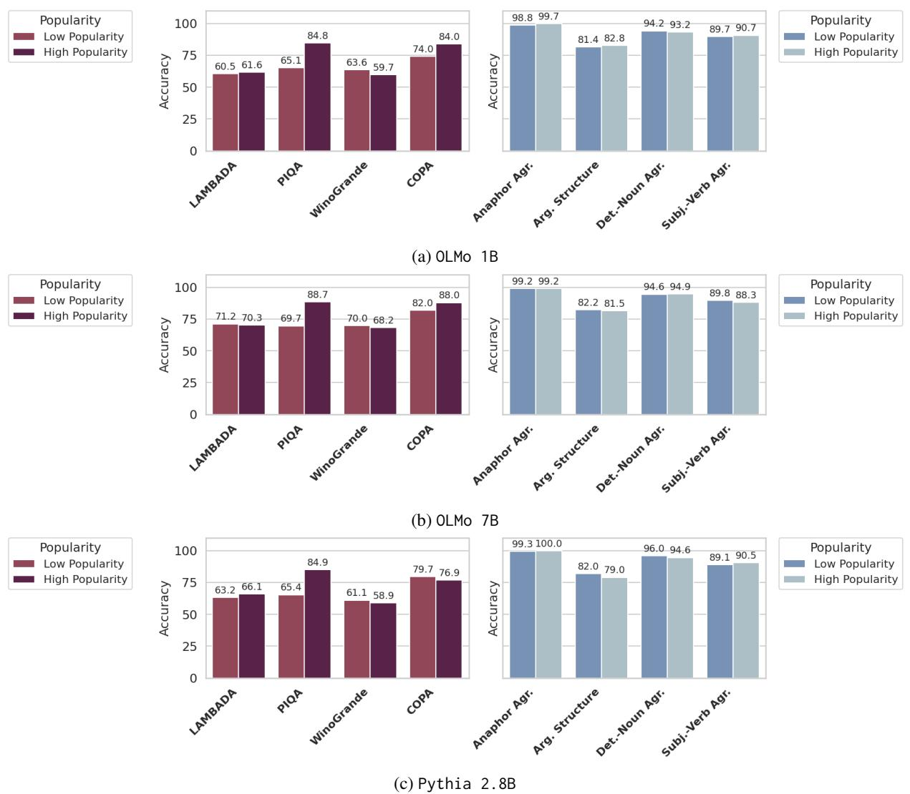

# Lexical Popularity: Quantifying the Impact of Pre-training for LLM Performance

Elena Sofia Ruzzetti1, Fabio Massimo Zanzotto1,2, Tommaso Caselli3

1Human Centric ART, University of Rome Tor Vergata, Italy

2Almawave S.p.A., Rome, Italy

3CLCG, University of Groningen, The Netherlands

elena.sofia.ruzzetti@uniroma2.it

fabio.massimo.zanzotto@uniroma2.it

t.caselli@rug.nl

# Abstract

Large Language Models (LLMs) excel in numerous and varied tasks. Yet, the mechanisms that underlie this success remain insufficiently understood. In particular, the size and the limited transparency of their pre-training materials make it difficult to state what the properties of the pre-training material are when compared to the test data. In this paper, we investigate whether LLMs learned generalized linguistic abstraction or rely on surface-level features, like lexical patterns, that match their pre-training data. We explore this by examining the relationship between lexical overlap of test data and task performance. We observe that lexical overlap with the pre-training material is mostly beneficial to model performance on tasks requiring functional linguistic knowledge. To further explore the impact of lexical features, we also demonstrate that LLMs are fragile with respect to lexical perturbations that preserve semantics. While we expected models to rely on lexical overlap between test instances and pre-training data for tasks requiring functional knowledge, lexical perturbations reveal that models also exhibit, to a lesser extent, this dependence for tasks requiring formal linguistic knowledge.

# 1 Introduction

Large Language Models (LLMs) have achieved impressive results across a wide range of linguistic and reasoning tasks. Kaplan et al. (2020) have postulated Scaling Laws of LLMs showing that their performance is a direct effect of scaling up the model’s size, the pre-training material, and the compute power. As a direct consequence, we have witnessed the development of increasingly large models in terms of parameters (Deepseek-3.1 is the largest open-weight LLMs with 670B parameters) and use of pre-training materials which now is in the range of trillions of tokens. A well-known behavior of machine learning models is their dependence on the (pre-)training material: the more this is varied and consistent with the task at hand, the more likely the learning algorithm will be able to generalize on unseen (test) data. For this to be observable, a strict separation between the material seen during the learning phase and that seen during test or deployment is essential. Current LLMs’ development has put this assumption in jeopardy. On the one hand, the increasingly larger size of data used to develop these models makes it very difficult to properly document its content and determine the statistical properties of the training data. On the other hand, the vast majority of model developers do not release, nor properly document, the pre-training materials. This opacity undermines our ability to assess whether model performance reflects genuine generalization, or even to define generalization as the capability to perform well on unseen test instances.

While previous work has primarily focused on the issue of data contamination (Ranaldi et al., 2023; Sainz et al., 2023; Golchin and Surdeanu, 2023; Deng et al., 2024; Ranaldi et al., 2024), it remains unclear how the data distribution in the pre-training material informs LLM behavior. Clarifying this relationship is essential for a deeper understanding of LLM functionalities, especially for disentangling surface-level pattern matching of pre-training data from genuine generalization. For some languages, for example, syntactic perturbations that preserve semantics are demonstrated to impact performance negatively (Ruzzetti et al., 2024). In this paper, we estimate the impact of the pre-training material by assessing LLM performance on a battery of benchmarks requiring either formal or functional linguistic knowledge (Mahowald et al., 2024). In particular, our analysis investigates the extent to which lexical distributions in pre-training data influence model performance across these types of tasks. To assess the impact of the lexical distribution of the pre-training material, we introduce a lexical invariance test (Ribeiro et al., 2020), which compares model performance on original test instances and semantically equivalent, lexically perturbed counterparts. Our working hypothesis is that if LLMs have learned linguistic generalization functionalities during their pretraining, they should exhibit minimal, if not null, performance degradation under lexical perturbation. We demonstrate that LLMs are fragile to these perturbations and that the lexical mismatch between pre-training data and test instances is influencing performance. We also show that current measures of memorization of surface-level lexical patterns like Training Data Extraction (Carlini et al., 2021, 2023; Nasr et al., 2023) and Membership Inference Attacks (Mireshghallah et al., 2022; Mattern et al., 2023), while being effective in quantifying privacy risks and copyright infringement, cannot be used to capture model reliance on lexical features.

Our contributions can be summarized as follows:

• We test LLMs performance against a notion of n-gram popularity using models’ pre-training data (Section 4).   
• We show through an invariance test that LLMs over-rely on surface-level, lexical features observed during the pre-training phase, especially when solving tasks that require functional linguistic knowledge (Section 5).   
• We show that current definitions and measures of memorization fail to account for LLM performance across tasks requiring both formal and functional linguistic knowledge (Section 6).

# 2 Related Work

A large number of works have focused on understanding which capabilities LLMs acquire from their pre-training data (Bender et al., 2021; Mitchell and Krakauer, 2023; van Dijk et al., 2023) and how this data influences their learning.

Mahowald et al. (2024) have shown that LLM capabilities are not uniformly distributed across types of linguistic knowledge. Specifically, LLMs excel on benchmarks targeting knowledge of linguistic rules and patterns, i.e., formal competence, but continue to struggle on tasks requiring semantic and pragmatic reasoning, i.e., functional competence, where satisfactory performance typically demands fine-tuning. Circuit-level analyses further suggest that these two forms of knowledge are localized in distinct regions of LLMs (Hanna et al., 2025). Building on this distinction, we aim to investigate how the pre-training data impact formal and functional competence.

Understanding how training data influences the predictions of LLMs remains an open question. A prevailing hypothesis posits that LLMs rely heavily on memorization of pre-training data, with some studies suggesting that such memorization is fundamental to model performance (Feldman, 2020). There are initial studies proposing architectures for building LLMs based on memorizing before performing backpropagation (Zanzotto et al., 2025). However, the definition and scope of memorization in LLMs are still debated within the NLP community. In privacy and copyright contexts, memorization is often operationalized as the verbatim reproduction of training examples, typically measured through Training Data Extraction (TDE) methods (Carlini et al., 2021, 2023; Satvaty et al., 2025; Lasy et al., 2025). Complementary approaches, such as Membership Inference Attacks (MIA), attempt to determine whether a given document was included in the training corpus (Shi et al., 2024; Mireshghallah et al., 2022; Mattern et al., 2023; Duan et al., 2023). Although high extraction success rates raise significant privacy concerns (Nasr et al., 2023), they do not fully account for the breadth of LLMgenerated outputs (Duan et al., 2024). In this paper, we further investigate whether the current definitions of memorization explain model performance.

The tension between memorization and generalization has gained increasing attention (Hupkes et al., 2023; Chang and Bergen, 2024; Wei et al., 2025). The influence of pre-training data has been explored during the generation of suffixes given a prefix (McCoy et al., 2023; Merrill et al., 2024), and recent findings suggest that texts generated by LLMs are less novel than those written by humans. To understand how LLMs solve tasks, a positive impact of hight similarity of in-context demonstrations to the pre-training has been discussed by previous work (Chan et al., 2022; Razeghi et al., 2023; Chen et al., 2024). Moreover, recent work demonstrates that knowledge-intensive tasks depend on high similarity of test and pre-training distribution (Hartmann et al., 2023; Wang et al., 2025). In this paper, we will focus on lexical distribution of test and pre-training data for testing LLMs’ generalization ability on functional and formal tasks: in particular, we will focus on understanding how models generalize when a shift in the test data can be found with respect to their pre-training material (Liang et al., 2023; Srivastava et al., 2023).

# 3 Task and Models

Our goal is to assess whether and to what extent there is a relationship between LLM performance (on selected benchmarks) and lexical overlap with their pre-training material. We also assume that, if such a relationship is observable, it may be influenced by the linguistic knowledge required to solve the task, and, potentially, by the model architecture and training regime.

Concerning the types of linguistic knowledge, it is known that LLMs show more robust performances on benchmarks designed to test formal linguistic knowledge when compared to those requiring functional one (Mahowald et al., 2024). While the factors controlling this separation remain to be understood, we aim to understand the effects of pretraining lexical distributions on tasks of both types. For this reason, we have selected benchmarks that can, separately, measure formal and functional linguistic knowledge of an LLM. We have hence selected eight tasks, equally divided for the two types of linguistic knowledge, from six benchmarks. For each task, we have also controlled that: (a.) the task can be run in a zero-shot setting since we aim to investigate the effect of pre-training only; and (b.) it has a suitable number of instances to investigate the presence of lexical overlap in the pre-training material of the LLMs.

We also want to test whether the size and pretraining regime of an LLM influence the relationship between model performance and lexical overlap with the pre-training. To control for these variables, we have explicitly selected full opensource LLMs where both their weights and their pre-training data are publicly available and accessible. Considering the constraints in terms of availability of benchmarks, access to pre-training materials, and LLMs of different sizes, we selected English as our test language.

Formal Benchmarks To test LLMs’ formal linguistic competence, we rely on BLiMP (Warstadt et al., 2020), a benchmark composed of minimal pairs that contrast for their acceptability. Among the 12 tasks in the benchmark, we selected three that require purely syntactic and morphological linguistic knowledge (Determiner-Noun agreement, Anaphor Agreement, and Subject-Verb agreement), and one at the syntactic-semantic interface (Argument Structure). In all the tasks, a model should assign a higher probability to the grammatical option. In Determiner-Noun agreement, determiners need to agree in number with their associated noun; for the Anaphor Agreement the requirement is that reflexive pronouns agree with their antecedents. For the Subject-Verb agreement the subject and a present-tense verb agree in number In the Argument Structure tasks, different argument configurations are checked with the verb in the sentence (e.g. whether a verb can take a direct object, undergo alternations, or take inanimate arguments).

Functional Benchmarks For the evaluation of the functional competences of LLMs, we selected four benchmarks: LAMBADA, PIQA, COPA and WinoGrande. LAMBADA (Paperno et al., 2016) is used to test how accurately language models (LMs) can generate text through a word prediction challenge. It is composed of narrative passages, and the model is tested to generate the final word: to properly solve the task, an LM must rely on the entire context rather than on potential shortcuts (e.g., use only the last sentence). PIQA (Bisk et al., 2020) is a question answering task that requires world knowledge to correctly answer a question: given a goal, a model must choose the correct completion based on the physical properties of the objects in the sentence. COPA (Roemmele et al., 2011) is intended to test commonsense reasoning: given a premise and two alternatives, the model should choose between the two alternatives the one that is more plausible to have a causal relation with the premise. WinoGrande (Sakaguchi et al., 2020) requires a model to perform pronoun resolution and common sense reasoning. When compared to the Anaphora Resolution benchmark in BLiMP, WinoGrande emphasises access to world knowledge and discourse regularities to correctly resolve the anaphors.

Models and Pre-Training Data We selected four foundational open-source models comparable in size from two different families: OLMo 1B and OLMo 7B (Groeneveld et al., 2024); Pythia 2.8B and Pythia 6.9B (Biderman et al., 2023).

The OLMo models are trained on Dolma (Soldaini et al., 2024) and the Pythia family on the Pile (Gao et al., 2020). Both Dolma and the Pile are large-scale datasets (11 TB and 825GB of data, respectively) characterized by a diverse mixture of web-crawled data. The scale of those datasets make them challenging to explore: for this reason, in our experiments, we employed the inverse indexes – and the corresponding API – made available by Liu et al. (2024). The usage of those indexes allows for the computation of the number of documents containing a given sequence of tokens, and enables a precise quantification of the presence of the target sequence in the pre-training data of the LLMs.

# 4 The Role of Training Data Distribution in LLM Behavior

Generalization capabilities of a machine learning model is traditionally discussed as the ability of a model to learn from a set of training data and to obtain good performance on unseen test data (from the same distribution as the training data). However, this definition does not take into account how strong the similarity between training data and test instances has to be (Ramponi and Plank, 2020).

We are interested in understanding how typical a test instance is compared to the pre-training distribution, and whether this similarity can influence performance. To clarify this relationship, we study the effects of lexical similarity of a test instance with respect to the pre-training data, expressed as the overlap of its n-grams with the pre-training material. In particular, we hypothesize that the more often an LLM is exposed to a sequence of tokens, the more likely it is to recall and reuse it when solving downstream tasks. Thus, estimating n-gram frequency in pre-training data can offer insights and potentially predict model performance on a given benchmark.

Instance Popularity Score To operationalize this, we introduce the Instance Popularity Score (IPS), a metric to assess how popular (i.e, common) a test instance is, based on the cumulative frequency of its constituent n-grams in the pretraining data of a given LLM.

To quantify the popularity of a test instance $\boldsymbol { x } ~ = ~ [ x _ { 1 } , . . . , x _ { L } ]$ of $L$ tokens, we extract its set of n-grams $G _ { x } ^ { n }$ , and, for each $g \in G _ { x } ^ { n }$ , we record its number of occurrences in the pre-training corpus, denoted $c o u n t ( g )$ . We used the available index over the Pile and Dolma and associated API from Liu et al. (2024) to retrieve this information.

We then estimate the popularity of each g in the pre-training data by situating $c o u n t ( g )$ within the overall distribution of occurrence counts. Specifically, we compute the deciles of the count distribution across the test set and assign g a popularity score popularity $( g ) \in [ 1 , 1 0 ]$ , corresponding to the decile (bin) in which its count falls. Finally, we define the IPS of the test instance x as the average popularity of its constituent n-grams:

bar

| Method | Low Popularity | High Popularity |
| :--- | :--- | :--- |
| LAMBADA | 65.4 | 68.8 |
| PIQA | 67.0 | 85.7 |
| WinoGrande | 61.1 | 60.2 |
| COPA | 78.4 | 84.6 |

(a) Functional tasks   

bar

| Category | Low Popularity | High Popularity |
| :--- | :--- | :--- |
| Anaphor Agr. | 99.2 | 100.0 |
| Arg. Structure | 81.3 | 80.1 |
| Det.-Noun Agr. | 94.5 | 91.8 |
| Subj.-Verb Agr. | 87.1 | 88.9 |

(b) Formal tasks   
Figure 1: Accuracy of Pythia 6.9B for functional and formal tasks, computed in bins based on popularity of test instances.

$$
I P S (x) = \frac {1}{| G _ {x} ^ {n} |} \sum_ {g \in G _ {x} ^ {n}} p o p u l a r i t y (g)
$$

In all tasks that require an LLM to choose between two options, we compare the IP S of the correct option with the $I P S$ of the wrong option: in particular, we measure:

$$
\frac {I P S (x _ {c o r r e c t}) - I P S (x _ {w r o n g})}{I P S (x _ {c o r r e c t})}
$$

that quantifies how much the correct option is more popular than the wrong one. For LAMBADA, instead, since it requires an LLM to generate a specific word, we considered only the IP S of the entire test instance. Following previous work (Brown et al., 2020; Merrill et al., 2024; Wang et al., 2025), we experimented with n-grams of 7 tokens.

Popularity mostly impacts functional tasks Grouping the test instances into two macrocategories, i.e., those with low IPS and those with high IPS (based on the median popularity), we observe that on the high IPS test instances, all LLMs tend to obtain higher results, with a prominence for the functional tasks. Figure 1 illustrates the impact of the popularity of test instances over model performance for Pythia-6.9B. The remaining LLMs are reported in Figure A in Appendix A.1.

This behavior suggests that lexical overlap between the pre-training materials and test sets is indeed beneficial to model performance, with differences in performance of up to 20% between the two groups on the PIQA dataset. However, the marginal performance gains of the highly popular test instances in the formal tasks highlight an asymmetry which confirms that LLMs rely on different features to solve these tasks. In particular, it appears that the structural interpretation of a sentence, necessary for formal tasks, is less affected by frequent exposure to certain lexical patterns.

As for WinoGrande, we do not observe this trend, with performance remaining similar between the two groups in line with the formal benchmarks. This behavior can be explained by considering the role of the pronoun anaphora resolution subtask, which expresses formal linguistic knowledge.

# 5 Shifting Lexical Distribution Affects LLMs’ Performance

To further validate the role that lexical similarity between pre-training and test instances has on model performance, we have designed an invariance test inspired by CHECKLIST approach (Ribeiro et al., 2020). In particular, we have applied labelpreserving perturbations with the expectation that the model’s predictions must be the same.

We focused on lexical perturbations that do not alter the semantics of a sentence, but rather the statistical properties of the test instance. Indeed, a model that does not rely on surface-level pattern matching with its pre-training data and has learned to generalize should be marginally affected by this kind of perturbation.

Perturbation Strategy Perturbations are obtained by substituting the nouns and verbs in a selected benchmark test instance with corresponding synonyms. To do this extensively, eligible synonyms have been retrieved from WordNet (Miller, 1995), a lexical database where nouns, verbs (and adjectives) with the same meaning are grouped into synsets. Every synset identifies a concept, and every lexical item belonging to the same synset shares the same meaning. Lexical items belonging to the same synset can substitute for one another without altering the overall meaning of a sentence, as they express the same underlying concept (Lyons, 1968). Although synonyms maintain the syntactic and semantic structure of benchmark sentences, their usage frequencies may vary (Palmer, 1981). This variability is what allows us to evaluate the influence of the lexical distribution of the test instance with respect to pre-training material. If a model has truly learned semantic representations, rather than relying on surface-level lexical features, it should produce consistent predictions when synonyms are used, even in the case of less frequent ones. Details of the perturbation pipeline are in Appendix A.2.

area

| Log( # Occurrences + 1 ) | Original Density | Perturbed Density |
| ------------------------ | ---------------- | ----------------- |
| 0                        | 0.0              | 0.0               |
| 5                        | 0.0              | 0.0               |
| 10                       | 0.1              | 0.1               |
| 15                       | 0.1              | 0.1               |
| 20                       | 0.0              | 0.0               |

area

| Log( # Occurrences + 1 ) | Original Density | Perturbed Density |
| ------------------------ | ---------------- | ----------------- |
| 0                        | 0.0              | 0.0               |
| 5                        | 0.0              | 0.0               |
| 10                       | 0.0              | 0.0               |
| 15                       | 0.1              | 0.1               |
| 20                       | 0.1              | 0.1               |
| 25                       | 0.0              | 0.0               |

Figure 2: Distribution of the occurrences of original words and their synonyms (with a logarithmic scale) on Pile and Dolma.

Figure 2 shows the frequencies of the original words and their synonyms for the Pile and Dolma. As expected, the distribution of the synonyms presents a larger variance, and it is more skewed towards zero: overall, the synonyms are less frequent in the pre-training datasets than the original words.

Since the perturbations should influence only the lexical properties of the sentences without modifying their semantics, we also measure the semantic similarity of the original input with respect to the perturbed input. We quantify the similarity with BERTscore (Zhang et al., 2020) and ROUGE-L: high BERT scores testify that there is a high semantic similarity, while lower ROUGE-L scores are expected, due to the lexical perturbations. As illustrated in Figure 3, the proposed approach to generate semantically equivalent perturbed instances is valid: a high semantic similarity is kept in both formal and functional datasets allowing us to test LLMs both the original and the perturbed input for their generalization abilities. We also further validate our perturbation strategy and we implemented an LLM-as-judge annotation of a subset of the dataset. We prompted Llama 3.1 8B on 50 examples from each subtask to judge whether the original and the perturbed sentence convey the same meaning. Details of the evaluation are provided in Appendix A.3. Across the different tasks, the model evaluates the original and perturbed sentences positively in 94.67%, i.e., they convey the same meaning. This further confirms the validity of our implementation of exclusively lexical perturbation.

area

| Task Type | Metric | Value Range | Density Peak |
| :--- | :--- | :--- | :--- |
| Formal Tasks | BERTscore | 0.0 - 1.0 | ~6.0 |
| Formal Tasks | RougeL | 0.0 - 1.0 | ~4.5 |
| Functional Tasks | BERTscore | 0.0 - 1.0 | ~9.5 |
| Functional Tasks | RougeL | 0.0 - 1.0 | ~7.0 |

Figure 3: Similarity scores distributions of the perturbed sentences and the original ones, in functional and formal tasks. The high BERT scores testify that there is a high semantic similarity, while lower ROUGE-L scores are expected due to the lexical perturbations.

LLMs over-rely on lexical features especially for functional tasks Results in Table 1 and 2 compare the Original to the Lexically Perturbed versions of the datasets. We discuss performance in terms of accuracy on all tasks. We also report the perplexity for LAMBADA, which is frequently used as a task-specific performance metric. To quantify the effect of the perturbation, we also report the $\Delta$ between the Original results and the Lexically Perturbed ones, rescaled on the Original to obtain a percentage change. In Appendix A.4, we also discuss noun-only and verb-only perturbations.

The results indicate that LLMs have a drop in performance across all tasks, notably for the functional tasks. Indeed, on the LAMBADA, PIQA and COPA tasks (Table 1) models tend to lose between the 16.25% and the 27.5% of accuracy on Lexically Perturbed data, and the perplexity on LAMBADA even quadruples. OLMo 1B exhibits substantial accuracy degradation under perturbation, with drops of up to 26.17% on LAMBADA, accompanied by a correspondingly high perplexity on the same benchmark. While OLMo 7B consistently outperforms OLMo 1B across all Original benchmark versions, it follows a comparable trend in relative performance decline. Nonetheless, under perturbation, OLMo 7B demonstrates greater robustness, sustaining higher overall scores. Pythia 2.8B exhibits moderate performance relative to the other models: its accuracy and robustness are generally lower than those of OLMo 7B, yet higher than OLMo 1B. Although Pythia 6.9B achieves higher absolute accuracy than Pythia 2.8B, it experiences a more pronounced degradation in robustness across all tasks. Notably, the increased model size does not translate into improved stability, as the accuracy drops observed on LAMBADA, PIQA, and COPA are larger than those recorded for Pythia 2.8B on the corresponding benchmarks.

The performance drops on functional tasks does not equally affect WinoGrande: this is in line with the observed behavior in Section 4, and can be explained by the additional formal linguistic knowledge necessary to solve it.

As for the formal tasks the degradation of performance is less severe (Table 2), ranging between 6.95% and 15.64%. The magnitude of the loss in performance is smaller than on functional tasks, but not minimal (drops are statistically significant with $p < 0 . 0 5 )$ ). OLMo 1B performs reasonably well on Original tasks, and demonstrates limited vulnerability to perturbations. The larger model in the same family, OLMo 7B, has a similar performance across all tasks. For Pythia 2.8B, the accuracy peaks in the Anaphor Agreement, and despite its small size, it is slightly more robust than OLMo 7B on all tasks. Pythia 6.9B also obtains high scores on the Original, and has a comparable drop in performance across all tasks.

area

| Category | IPS  | Density |
| -------- | ---- | ------- |
| Original | 0    | 0.22    |
| Original | 5    | 0.18    |
| Original | 10   | 0.10    |
| Perturbed | 0    | 0.35    |
| Perturbed | 5    | 0.25    |
| Perturbed | 10   | 0.15    |

Figure 4: Distribution of the popularity scores of the test instances of LAMBADA on Dolma and Pile.

The lexical perturbation hurt the popularity of the test instance Lexical perturbations not only lead to systematic performance degradation on functional and formal benchmarks, but they also substantially decrease the popularity of the corresponding test instances. Figure 4 visualizes these differences for the LAMBADA benchmark.

We further analyze the subset of instances that models answer incorrectly after perturbation. Table 3 reports their mean IPS values across all functional and formal benchmarks. On average, the popularity of these instances is significantly lower in the perturbed set than in the original (Wilcoxon signed-rank test, $p < 0 . 0 1 )$ . These results indicate that lexical popularity strongly influences model performance, revealing that surface-level lexical similarity, as captured by the IPS metric, plays a major role in shaping LLM behavior. However, this effect is again asymmetric: performance on functional tasks, those relying on lexical and semantic associations, drops sharply under perturbations, whereas formal tasks, requiring structural or grammatical competence, exhibit much smaller declines (see lower part of Table 3). This asymmetry suggests that current LLMs tend to over-rely on memorized lexical patterns rather than abstract functional understanding.

<table><tr><td rowspan="2">Model</td><td rowspan="2">Conf.</td><td colspan="2">LAMBADA</td><td rowspan="2">PIQA Accuracy</td><td rowspan="2">COPA Accuracy</td><td rowspan="2">WinoGrande Accuracy</td></tr><tr><td>Perplexity</td><td>Accuracy</td></tr><tr><td rowspan="3">OLMo 1B</td><td>Original</td><td>609.93</td><td>61.03</td><td>74.92</td><td>79.00</td><td>61.64</td></tr><tr><td>Lex. Perturb.</td><td>3133.93</td><td>45.06</td><td>61.64</td><td>59.00</td><td>56.83</td></tr><tr><td>Δ (%)</td><td>413.82</td><td>-26.17</td><td>-17.72</td><td>-25.32</td><td>-7.81</td></tr><tr><td rowspan="3">OLMo 7B</td><td>Original</td><td>386.00</td><td>70.75</td><td>79.22</td><td>85.00</td><td>69.14</td></tr><tr><td>Lex. Perturb.</td><td>1780.47</td><td>54.03</td><td>64.58</td><td>65.00</td><td>62.27</td></tr><tr><td>Δ (%)</td><td>361.26</td><td>-23.64</td><td>-18.48</td><td>-23.53</td><td>-9.93</td></tr><tr><td rowspan="3">Pythia 2.8B</td><td>Original</td><td>503.41</td><td>64.66</td><td>73.99</td><td>79.00</td><td>60.06</td></tr><tr><td>Lex. Perturb.</td><td>2701.76</td><td>47.84</td><td>61.97</td><td>63.00</td><td>54.46</td></tr><tr><td>Δ (%)</td><td>436.69</td><td>-26.02</td><td>-16.25</td><td>-20.25</td><td>-9.33</td></tr><tr><td rowspan="3">Pythia 6.9B</td><td>Original</td><td>444.00</td><td>67.13</td><td>75.19</td><td>80.00</td><td>60.69</td></tr><tr><td>Lex. Perturb.</td><td>2405.66</td><td>48.92</td><td>62.57</td><td>58.00</td><td>56.35</td></tr><tr><td>Δ (%)</td><td>441.81</td><td>-27.12</td><td>-16.79</td><td>-27.50</td><td>-7.15</td></tr></table>

Table 1: Performance of selected models on functional Original datasets and Lexically Perturbed ones.

<table><tr><td>Model</td><td>Conf.</td><td>Det.-Noun Agr. Accuracy</td><td>Subj-Verb Agr. Accuracy</td><td>Anaphor Agr. Accuracy</td><td>Arg. Structure Accuracy</td></tr><tr><td rowspan="3">OLMo 1B</td><td>Original</td><td>94.20</td><td>89.82</td><td>75.85</td><td>81.65</td></tr><tr><td>Lex. Perturb.</td><td>82.50</td><td>75.77</td><td>66.50</td><td>69.58</td></tr><tr><td>Δ (%)</td><td>-12.42</td><td>-15.64</td><td>-8.52</td><td>-14.79</td></tr><tr><td rowspan="3">OLMo 7B</td><td>Original</td><td>94.65</td><td>89.65</td><td>75.75</td><td>82.08</td></tr><tr><td>Lex. Perturb.</td><td>83.06</td><td>75.98</td><td>65.15</td><td>70.08</td></tr><tr><td>Δ (%)</td><td>-12.24</td><td>-15.24</td><td>-7.51</td><td>-14.62</td></tr><tr><td rowspan="3">Pythia 2.8B</td><td>Original</td><td>95.98</td><td>89.17</td><td>75.00</td><td>81.75</td></tr><tr><td>Lex. Perturb.</td><td>83.49</td><td>75.23</td><td>66.60</td><td>70.70</td></tr><tr><td>Δ (%)</td><td>-13.01</td><td>-15.63</td><td>-7.60</td><td>-13.52</td></tr><tr><td rowspan="3">Pythia 6.9B</td><td>Original</td><td>94.46</td><td>87.20</td><td>74.25</td><td>81.20</td></tr><tr><td>Lex. Perturb.</td><td>82.22</td><td>74.67</td><td>66.05</td><td>70.77</td></tr><tr><td>Δ (%)</td><td>-12.95</td><td>-14.37</td><td>-6.95</td><td>-12.84</td></tr></table>

Table 2: Performance of selected models on formal Original datasets and Lexically Perturbed ones.

# 6 Popularity is not Memorization

Our experiments testify that LLMs are not able to generalize to lexical perturbations, when those perturbation causes a shift in the distribution of the n-grams fed to the model in the pre-training phase.

We aim to understand whether this lack of generalization can have a simpler explanation, that is that LLMs have already entirely memorized the test examples. To do that, we apply two different definitions of memorization in LLMs, namely, Training Data Extraction (TDE) attacks and Membership Inference Attacks (MIA).

TDE attacks assume memorization as the model’s ability to reproduce verbatim sequences from its pre-training data when prompted with a partial prefix of that sequence (Carlini et al., 2021, 2023). Following this approach, we fed each LLM with the first half of each test instance in our benchmarks and measured whether the LLM exactly completes it. Memorization is quantified using the accuracy of verbatim reconstruction, TDE Accuracy, and the log-likelihood that the model assigns to the second half of the example when prompted with the first half, TDE Likelihood. MIA can instead be framed as a classification problem: a data point is classified as memorized if a change in the target model is identified when comparing members of the training to non-members (Shokri et al., 2017). Following previous work, we used the loss of the model computed over the test instance (MIA Loss) as a measure of memorization. We also adopt a perturbation-based method (Mattern et al., 2023): in this case, memorization is quantified as the difference between the loss of the original test instance and the average loss computed over lexically perturbed sentences obtained using the RoBERTa model (Zhuang et al., 2021). We call this measure MIA Neighbors.

<table><tr><td rowspan="2" colspan="2"></td><td colspan="2">OLMo 1B</td><td colspan="2">OLMo 7B</td><td colspan="2">Pythia 2.8B</td><td colspan="2">Pythia 6.9B</td></tr><tr><td>Original</td><td>Lex. Perurb.</td><td>Original</td><td>Lex. Perurb.</td><td>Original</td><td>Lex. Perurb.</td><td>Original</td><td>Lex. Perurb.</td></tr><tr><td rowspan="4">Functional</td><td>LAMBADA</td><td>5.37(±1.92)</td><td>3.18(±1.07)</td><td>5.27(±1.88)</td><td>3.16(±1.07)</td><td>5.93± (2.37)</td><td>3.07(±1.16)</td><td>5.86(±2.43)</td><td>3.03(±1.15)</td></tr><tr><td>PIQA</td><td>5.27(±2.73)</td><td>2.56(±1.65)</td><td>5.28(±2.73)</td><td>2.53(±1.71)</td><td>3.39± (2.34)</td><td>1.80(±1.19)</td><td>3.51(±2.42)</td><td>1.82(±1.22)</td></tr><tr><td>WinoGrande</td><td>2.69(±1.66)</td><td>1.75(±0.93)</td><td>2.69(±1.74)</td><td>1.80(±1.03)</td><td>1.72± (0.88)</td><td>1.35(±0.62)</td><td>1.84(±1.07)</td><td>1.38(±0.63)</td></tr><tr><td>COPA</td><td>8.34(±1.5)</td><td>2.85(±2.46)</td><td>8.46(±1.37)</td><td>2.87(±2.36)</td><td>5.41± (3.56)</td><td>1.90(±1.71)</td><td>4.82(±3.56)</td><td>1.70(±1.57)</td></tr><tr><td rowspan="4">Formal</td><td>Anaphor Agr.</td><td>2.52(±2.86)</td><td>1.49(±1.47)</td><td>2.65(±2.9)</td><td>1.51(±1.49)</td><td>1.61± (1.7)</td><td>1.21(±0.81)</td><td>1.76(±2.03)</td><td>1.17(±0.78)</td></tr><tr><td>Arg. Structure</td><td>2.09(±1.98)</td><td>1.85(±1.74)</td><td>2.08(±1.99)</td><td>1.84(±1.76)</td><td>1.47± (1.15)</td><td>1.28(±0.79)</td><td>1.44(±1.14)</td><td>1.33(±0.88)</td></tr><tr><td>Det.-Noun Agr.</td><td>1.42(±1.44)</td><td>1.23(±0.97)</td><td>1.42(±1.4)</td><td>1.21(±0.88)</td><td>1.14± (0.60)</td><td>1.07(±0.43)</td><td>1.12(±0.58)</td><td>1.07(±0.39)</td></tr><tr><td>Subj.-Verb Agr.</td><td>1.55(±1.25)</td><td>1.36(±0.97)</td><td>1.52(±1.22)</td><td>1.34(±0.94)</td><td>1.20± (0.57)</td><td>1.15(±0.49)</td><td>1.20(±0.58)</td><td>1.14(±0.47)</td></tr></table>

Table 3: Change in average popularity for test instances where the LLM flips from a correct to an incorrect prediction under perturbation.

  
Figure 5: Logistic Regression macro-F1 for Pythia-6.9B predicting output correctness from memorization scores on Formal (top) and Functional (bottom) tasks, using TDE and MIA memorization definitions.

We examine whether these memorization metrics correlate with task performance in our target LLMs. Since all tasks, except LAMBADA, require the model to prefer a correct alternative over an incorrect one, we compute the memorization score for both options. Using these scores as features, we apply Logistic Regression to predict whether the model’s choice is correct. We opted for a Logistic Regression as we it can predict models’ accuracy given multiple variables, without additional processing of those data (for example, for MIA, both the loss of the correct option and the loss of the incorrect one). High classifier performance indicates that memorization metrics are predictive of task accuracy.

The results clearly show that these metrics (and these definitions of memorization) do not correlate with model performance. Figure 5 summarizes the experiments for Pythia-6.9B, while Tables E - H in Appendix A.5 report the results for the remaining models. In general, across all tasks and model sizes the Logistic Regression performs comparably to a dummy classifier (the dashed red line in Figure 5) that always predicts the majority class corresponding to the class of test instances on which the model is correct. Results remain the same also when testing with an SVM classifier (details in Appendix A.5).

Finally, we demonstrate that TDE attacks and MIA cannot be used—unlike our popularity metric—to distinguish harder examples from simpler ones, as discussed in Section 4. We perform binning with respect to MIA attacks based on neighbours and TDE attack scores, but we do not compare with MIA based on likelihood: in fact, perplexity is used, for tasks requiring the model to guess the correct option, to make the decision between the two options, and we cannot fairly compare this attack type in this experimental context. The score for binning, also in this case, as we discussed for IPS in Section 4, is the difference between the score assigned to the correct option and the score assigned to the incorrect one, rescaled by the score assigned to the correct option. We measure then then average accuracy for each bin. The results for Pythia 6.9B are reported in Table 4, while the remaining models are reported in the Appendix Table K. We find that TDE Likelihood score is not predictive for either functional or formal tasks, while MIA Neighbours appears to be more predictive for formal tasks. However, the raw number of errors in these tasks is limited, and the scores are generally higher and closer to each other. Unlike our popularity score IP S, memorization scores do not give clues about the models’ performance.

<table><tr><td rowspan="2">Task Type</td><td rowspan="2">Task</td><td colspan="2">TDE Likelihood</td><td colspan="2">MIA Neighbours</td></tr><tr><td>Low</td><td>High</td><td>Low</td><td>High</td></tr><tr><td rowspan="4">Functional</td><td>LAMBADA</td><td>70.20</td><td>71.31</td><td>69.69</td><td>71.82</td></tr><tr><td>PIQA</td><td>82.92</td><td>75.52</td><td>83.03</td><td>75.41</td></tr><tr><td>COPA</td><td>86.00</td><td>84.00</td><td>84.00</td><td>86.00</td></tr><tr><td>WinoGrande</td><td>69.09</td><td>69.19</td><td>71.77</td><td>66.51</td></tr><tr><td rowspan="4">Formal</td><td>Anaphor Agr.</td><td>99.10</td><td>99.30</td><td>98.60</td><td>99.80</td></tr><tr><td>Arg. Structure</td><td>80.35</td><td>83.80</td><td>78.20</td><td>85.95</td></tr><tr><td>Det.-Noun Agr.</td><td>92.58</td><td>96.72</td><td>93.20</td><td>96.10</td></tr><tr><td>Subj.-Verb Agr.</td><td>90.43</td><td>88.87</td><td>87.93</td><td>91.37</td></tr></table>

Table 4: Accuracy of Pythia 6.9B for functional and formal tasks, computed in bins based on TDE Likelihood and MIA Neighbours scores of test instances.

# 7 Conclusions

In this paper, we investigated how lexical overlap between pre-training and test data shapes the behavior of LLMs. By analyzing tasks requiring formal and functional linguistic competences separately. We demonstrated that lexical similarity, quantified through the proposed Instance Popularity Score (IP S) metric, strongly influences model performance, particularly on tasks that demand functional language knowledge.

Through a lexical invariance test based on semantically preserving perturbations, we showed that LLMs are highly sensitive to changes in lexical distribution, indicating an over-reliance on surfacelevel features. This phenomenon is more evident in tasks requiring functional knowledge than in formal ones.

Our findings also indicate that verbatim memorization metrics (TDE, MIA) fail to capture the more subtle lexical sensitivity we observe, pointing to the need for intermediate definitions between pure memorization and pure generalization.

Overall, our results suggest that the success of current LLMs is influenced by the lexical characteristics of their pre-training data. This highlights the need for future work to (a.) develop metrics that better capture distributional dependence beyond verbatim memorization; and (b.) design training strategies that promote genuine linguistic generalization rather than reliance on lexical patterns.

# 8 Limitations

As open models become less and less popular, verifying our findings on a broader number of models could be challenging. In fact, despite model parameters being often shared by model owners, there is still a limited number of models that are completely open, both in terms of model weights and training data. Moreover, the exploration conducted requires counting the occurrences of an n-gram in the huge pre-training data. However, this exploration is computationally expensive for two main reasons: on the one hand, the total number of ngrams grows quadratically in the sentence length; on the other hand, the search of the n-gram occurrences in a large corpus is efficient only if that corpus is indexed, and the indexing operation is expensive both in time and space resources (we refer to Elazar et al. (2024) and Liu et al. (2024) for an analysis of the computational costs). Future work should address this limitation to make fairer evaluations of LLMs also more efficient.

# References

Pierpaolo Basile, Lucia Siciliani, Elio Musacchio, and Giovanni Semeraro. 2025. Exploring the word sense disambiguation capabilities of large language models. Preprint, arXiv:2503.08662.   
Emily M. Bender, Timnit Gebru, Angelina McMillan-Major, and Shmargaret Shmitchell. 2021. On the dangers of stochastic parrots: Can language models be too big? In Proceedings of the 2021 ACM Conference on Fairness, Accountability, and Transparency, FAccT ’21, page 610–623, New York, NY, USA. Association for Computing Machinery.   
Stella Biderman, Hailey Schoelkopf, Quentin Anthony, Herbie Bradley, Kyle O’Brien, Eric Hallahan, Mohammad Aflah Khan, Shivanshu Purohit, USVSN Sai Prashanth, Edward Raff, Aviya Skowron, Lintang Sutawika, and Oskar van der Wal. 2023. Pythia: A suite for analyzing large language models across training and scaling. Preprint, arXiv:2304.01373.   
Yonatan Bisk, Rowan Zellers, Jianfeng Gao, Yejin Choi, and 1 others. 2020. Piqa: Reasoning about physical commonsense in natural language. In Proceedings of the AAAI conference on artificial intelligence, volume 34, pages 7432–7439.   
Tom B. Brown, Benjamin Mann, Nick Ryder, Melanie Subbiah, Jared Kaplan, Prafulla Dhariwal, Arvind Neelakantan, Pranav Shyam, Girish Sastry, Amanda Askell, Sandhini Agarwal, Ariel Herbert-Voss, Gretchen Krueger, Tom Henighan, Rewon Child, Aditya Ramesh, Daniel M. Ziegler, Jeffrey Wu, Clemens Winter, and 12 others. 2020. Language models are few-shot learners. Preprint, arXiv:2005.14165.   
Nicholas Carlini, Daphne Ippolito, Matthew Jagielski, Katherine Lee, Florian Tramer, and Chiyuan Zhang. 2023. Quantifying memorization across neural language models. In The Eleventh International Conference on Learning Representations.   
Nicholas Carlini, Florian Tramer, Eric Wallace, Matthew Jagielski, Ariel Herbert-Voss, Katherine Lee, Adam Roberts, Tom Brown, Dawn Song, Ulfar Erlingsson, and 1 others. 2021. Extracting training data from large language models. In 30th USENIX Security Symposium (USENIX Security 21), pages 2633–2650.   
Stephanie Chan, Adam Santoro, Andrew Lampinen, Jane Wang, Aaditya Singh, Pierre Richemond, James McClelland, and Felix Hill. 2022. Data distributional properties drive emergent in-context learning in transformers. Advances in neural information processing systems, 35:18878–18891.   
Tyler A. Chang and Benjamin K. Bergen. 2024. Language model behavior: A comprehensive survey. Computational Linguistics, 50(1):293–350.

Yanda Chen, Chen Zhao, Zhou Yu, Kathleen McKeown, and He He. 2024. Parallel structures in pretraining data yield in-context learning. In Proceedings of the 62nd Annual Meeting of the Association for Computational Linguistics (Volume 1: Long Papers), pages 8582–8592, Bangkok, Thailand. Association for Computational Linguistics.

Chunyuan Deng, Yilun Zhao, Xiangru Tang, Mark Gerstein, and Arman Cohan. 2024. Investigating data contamination in modern benchmarks for large language models. In Proceedings of the 2024 Conference of the North American Chapter of the Association for Computational Linguistics: Human Language Technologies (Volume 1: Long Papers), pages 8706–8719, Mexico City, Mexico. Association for Computational Linguistics.

Haonan Duan, Adam Dziedzic, Mohammad Yaghini, Nicolas Papernot, and Franziska Boenisch. 2023. On the privacy risk of in-context learning. In The 61st Annual Meeting Of The Association For Computational Linguistics.

Michael Duan, Anshuman Suri, Niloofar Mireshghallah, Sewon Min, Weijia Shi, Luke Zettlemoyer, Yulia Tsvetkov, Yejin Choi, David Evans, and Hannaneh Hajishirzi. 2024. Do membership inference attacks work on large language models? arXiv preprint arXiv:2402.07841.

Yanai Elazar, Akshita Bhagia, Ian Helgi Magnusson, Abhilasha Ravichander, Dustin Schwenk, Alane Suhr, Evan Pete Walsh, Dirk Groeneveld, Luca Soldaini, Sameer Singh, Hannaneh Hajishirzi, Noah A. Smith, and Jesse Dodge. 2024. What’s in my big data? In The Twelfth International Conference on Learning Representations.

Vitaly Feldman. 2020. Does learning require memorization? a short tale about a long tail. In Proceedings of the 52nd Annual ACM SIGACT Symposium on Theory of Computing, STOC 2020, page 954–959, New York, NY, USA. Association for Computing Machinery.

Leo Gao, Stella Biderman, Sid Black, Laurence Golding, Travis Hoppe, Charles Foster, Jason Phang, Horace He, Anish Thite, Noa Nabeshima, Shawn Presser, and Connor Leahy. 2020. The pile: An 800gb dataset of diverse text for language modeling. Preprint, arXiv:2101.00027.

Shahriar Golchin and Mihai Surdeanu. 2023. Time travel in llms: Tracing data contamination in large language models. ArXiv, abs/2308.08493.

Dirk Groeneveld, Iz Beltagy, Pete Walsh, Akshita Bhagia, Rodney Kinney, Oyvind Tafjord, Ananya Harsh Jha, Hamish Ivison, Ian Magnusson, Yizhong Wang, Shane Arora, David Atkinson, Russell Authur, Khyathi Raghavi Chandu, Arman Cohan, Jennifer Dumas, Yanai Elazar, Yuling Gu, Jack Hessel, and 24 others. 2024. Olmo: Accelerating the science of language models. Preprint, arXiv:2402.00838.

Michael Hanna, Yonatan Belinkov, and Sandro Pezzelle. 2025. Are formal and functional linguistic mechanisms dissociated in language models? Computational Linguistics, pages 1–40.   
Valentin Hartmann, Anshuman Suri, Vincent Bindschaedler, David Evans, Shruti Tople, and Robert West. 2023. Sok: Memorization in general-purpose large language models. Preprint, arXiv:2310.18362.   
Dieuwke Hupkes, Mario Giulianelli, Verna Dankers, Mikel Artetxe, Yanai Elazar, Tiago Pimentel, Christos Christodoulopoulos, Karim Lasri, Naomi Saphra, Arabella Sinclair, and 1 others. 2023. A taxonomy and review of generalization research in nlp. Nature Machine Intelligence, 5(10):1161–1174.   
Jared Kaplan, Sam McCandlish, Tom Henighan, Tom B Brown, Benjamin Chess, Rewon Child, Scott Gray, Alec Radford, Jeffrey Wu, and Dario Amodei. 2020. Scaling laws for neural language models. arXiv preprint arXiv:2001.08361.   
Ilya Lasy, Peter Knees, and Stefan Woltran. 2025. Understanding verbatim memorization in LLMs through circuit discovery. In Proceedings of the First Workshop on Large Language Model Memorization (L2M2), pages 83–94, Vienna, Austria. Association for Computational Linguistics.   
Percy Liang, Rishi Bommasani, Tony Lee, Dimitris Tsipras, Dilara Soylu, Michihiro Yasunaga, Yian Zhang, Deepak Narayanan, Yuhuai Wu, Ananya Kumar, Benjamin Newman, Binhang Yuan, Bobby Yan, Ce Zhang, Christian Cosgrove, Christopher D Manning, Christopher Re, Diana Acosta-Navas, Drew A. Hudson, and 31 others. 2023. Holistic evaluation of language models. Transactions on Machine Learning Research. Featured Certification, Expert Certification, Outstanding Certification.   
Jiacheng Liu, Sewon Min, Luke Zettlemoyer, Yejin Choi, and Hannaneh Hajishirzi. 2024. Infini-gram: Scaling unbounded n-gram language models to a trillion tokens. In First Conference on Language Modeling.   
John Lyons. 1968. Introduction to Theoretical Linguistics. Cambridge University Press.   
Kyle Mahowald, Anna A. Ivanova, Idan A. Blank, Nancy Kanwisher, Joshua B. Tenenbaum, and Evelina Fedorenko. 2024. Dissociating language and thought in large language models. Trends in Cognitive Sciences, 28(6):517–540.   
Justus Mattern, Fatemehsadat Mireshghallah, Zhijing Jin, Bernhard Schoelkopf, Mrinmaya Sachan, and Taylor Berg-Kirkpatrick. 2023. Membership inference attacks against language models via neighbourhood comparison. In Findings of the Association for Computational Linguistics: ACL 2023, pages 11330– 11343, Toronto, Canada. Association for Computational Linguistics.

R. Thomas McCoy, Paul Smolensky, Tal Linzen, Jianfeng Gao, and Asli Celikyilmaz. 2023. How much do language models copy from their training data? evaluating linguistic novelty in text generation using RAVEN. Transactions of the Association for Computational Linguistics, 11:652–670.   
William Merrill, Noah A. Smith, and Yanai Elazar. 2024. Evaluating n-gram novelty of language models using rusty-DAWG. In Proceedings of the 2024 Conference on Empirical Methods in Natural Language Processing, pages 14459–14473, Miami, Florida, USA. Association for Computational Linguistics.   
George A Miller. 1995. Wordnet: a lexical database for english. Communications of the ACM, 38(11):39–41.   
Fatemehsadat Mireshghallah, Kartik Goyal, Archit Uniyal, Taylor Berg-Kirkpatrick, and Reza Shokri. 2022. Quantifying privacy risks of masked language models using membership inference attacks. In Proceedings of the 2022 Conference on Empirical Methods in Natural Language Processing, pages 8332– 8347, Abu Dhabi, United Arab Emirates. Association for Computational Linguistics.   
Melanie Mitchell and David C. Krakauer. 2023. The debate over understanding in ai’s large language models. Proceedings of the National Academy of Sciences, 120(13):e2215907120.   
Milad Nasr, Nicholas Carlini, Jonathan Hayase, Matthew Jagielski, A Feder Cooper, Daphne Ippolito, Christopher A Choquette-Choo, Eric Wallace, Florian Tramèr, and Katherine Lee. 2023. Scalable extraction of training data from (production) language models. arXiv preprint arXiv:2311.17035.   
Frank Robert Palmer. 1981. Semantics. Cambridge university press.   
Denis Paperno, Germán Kruszewski, Angeliki Lazaridou, Ngoc Quan Pham, Raffaella Bernardi, Sandro Pezzelle, Marco Baroni, Gemma Boleda, and Raquel Fernández. 2016. The LAMBADA dataset: Word prediction requiring a broad discourse context. In Proceedings of the 54th Annual Meeting of the Association for Computational Linguistics (Volume 1: Long Papers), pages 1525–1534, Berlin, Germany. Association for Computational Linguistics.   
Alan Ramponi and Barbara Plank. 2020. Neural unsupervised domain adaptation in NLP—A survey. In Proceedings of the 28th International Conference on Computational Linguistics, pages 6838–6855, Barcelona, Spain (Online). International Committee on Computational Linguistics.   
Federico Ranaldi, Elena Sofia Ruzzetti, Dario Onorati, Leonardo Ranaldi, Cristina Giannone, Andrea Favalli, Raniero Romagnoli, and Fabio Massimo Zanzotto. 2024. Investigating the impact of data contamination of large language models in text-to-SQL translation. In Findings of the Association for Computational Linguistics: ACL 2024, pages 13909–13920, Bangkok, Thailand. Association for Computational Linguistics.

Leonardo Ranaldi, Aria Nourbakhsh, Elena Sofia Ruzzetti, Arianna Patrizi, Dario Onorati, Michele Mastromattei, Francesca Fallucchi, and Fabio Massimo Zanzotto. 2023. The dark side of the language: Pre-trained transformers in the DarkNet. In Proceedings of the 14th International Conference on Recent Advances in Natural Language Processing, pages 949–960, Varna, Bulgaria. INCOMA Ltd., Shoumen, Bulgaria.   
Yasaman Razeghi, Hamish Ivison, Sameer Singh, and Yanai Elazar. 2023. Backtracking mathematical reasoning of language models to the pretraining data. In NeurIPS Workshop on Attributing Model Behavior at Scale.   
Marco Tulio Ribeiro, Tongshuang Wu, Carlos Guestrin, and Sameer Singh. 2020. Beyond accuracy: Behavioral testing of NLP models with CheckList. In Proceedings of the 58th Annual Meeting of the Association for Computational Linguistics, pages 4902– 4912, Online. Association for Computational Linguistics.   
Melissa Roemmele, Cosmin Adrian Bejan, and Andrew S Gordon. 2011. Choice of plausible alternatives: An evaluation of commonsense causal reasoning. In AAAI spring symposium: logical formalizations of commonsense reasoning, pages 90–95.   
Elena Sofia Ruzzetti, Federico Ranaldi, Dario Onorati, Davide Venditti, Leonardo Ranaldi, Tommaso Caselli, and Fabio Massimo Zanzotto. 2024. Assessing the asymmetric behaviour of Italian large language models across different syntactic structures. In Proceedings of the Tenth Italian Conference on Computational Linguistics (CLiC-it 2024), pages 854– 863, Pisa, Italy. CEUR Workshop Proceedings.   
Oscar Sainz, Jon Ander Campos, Iker García-Ferrero, Julen Etxaniz, and Eneko Agirre. 2023. Did chatgpt cheat on your test? https://hitzâĂŚzentroa. github.io/lmâĂŚcontamination/blog/.   
Keisuke Sakaguchi, Ronan Le Bras, Chandra Bhagavatula, and Yejin Choi. 2020. Winogrande: An adversarial winograd schema challenge at scale. In Proceedings of the AAAI Conference on Artificial Intelligence, volume 34, pages 8732–8740.   
Ali Satvaty, Anna Visman, Dan Seidel, Suzan Verberne, and Fatih Turkmen. 2025. Memorization is languagesensitive: Analyzing memorization and inference risks of LLMs in a multilingual setting. In Proceedings of the First Workshop on Large Language Model Memorization (L2M2), pages 106–126, Vienna, Austria. Association for Computational Linguistics.   
Weijia Shi, Anirudh Ajith, Mengzhou Xia, Yangsibo Huang, Daogao Liu, Terra Blevins, Danqi Chen, and Luke Zettlemoyer. 2024. Detecting pretraining data from large language models. In The Twelfth International Conference on Learning Representations.   
Reza Shokri, Marco Stronati, Congzheng Song, and Vitaly Shmatikov. 2017. Membership inference attacks

against machine learning models. In 2017 IEEE symposium on security and privacy (SP), pages 3–18. IEEE.   
Luca Soldaini, Rodney Kinney, Akshita Bhagia, Dustin Schwenk, David Atkinson, Russell Authur, Ben Bogin, Khyathi Chandu, Jennifer Dumas, Yanai Elazar, Valentin Hofmann, Ananya Harsh Jha, Sachin Kumar, Li Lucy, Xinxi Lyu, Nathan Lambert, Ian Magnusson, Jacob Morrison, Niklas Muennighoff, and 17 others. 2024. Dolma: an open corpus of three trillion tokens for language model pretraining research. Preprint, arXiv:2402.00159.   
Aarohi Srivastava, Abhinav Rastogi, Abhishek Rao, Abu Awal Md Shoeb, Abubakar Abid, Adam Fisch, Adam R. Brown, Adam Santoro, Aditya Gupta, Adrià Garriga-Alonso, Agnieszka Kluska, Aitor Lewkowycz, Akshat Agarwal, Alethea Power, Alex Ray, Alex Warstadt, Alexander W. Kocurek, Ali Safaya, Ali Tazarv, and 431 others. 2023. Beyond the imitation game: Quantifying and extrapolating the capabilities of language models. Transactions on Machine Learning Research. Featured Certification.   
Bram van Dijk, Tom Kouwenhoven, Marco Spruit, and Max Johannes van Duijn. 2023. Large language models: The need for nuance in current debates and a pragmatic perspective on understanding. In Proceedings of the 2023 Conference on Empirical Methods in Natural Language Processing, pages 12641–12654, Singapore. Association for Computational Linguistics.   
Xinyi Wang, Antonis Antoniades, Yanai Elazar, Alfonso Amayuelas, Alon Albalak, Kexun Zhang, and William Yang Wang. 2025. Generalization v.s. memorization: Tracing language models’ capabilities back to pretraining data. In The Thirteenth International Conference on Learning Representations.   
Alex Warstadt, Alicia Parrish, Haokun Liu, Anhad Mohananey, Wei Peng, Sheng-Fu Wang, and Samuel R. Bowman. 2020. BLiMP: The benchmark of linguistic minimal pairs for English. Transactions of the Association for Computational Linguistics, 8:377– 392.   
Jiaheng Wei, Yanjun Zhang, Leo Zhang, Ming Ding, Chao Chen, Kok-Leong Ong, Jun Zhang, and Yang Xiang. 2025. Memorization in deep learning: A survey. ACM Comput. Surv. Just Accepted.   
Fabio Massimo Zanzotto, Elena Sofia Ruzzetti, Giancarlo A. Xompero, Leonardo Ranaldi, Davide Venditti, Federico Ranaldi, Cristina Giannone, Andrea Favalli, and Raniero Romagnoli. 2025. Position paper: MeMo: Towards language models with associative memory mechanisms. In Findings of the Association for Computational Linguistics: ACL 2025, pages 15169–15180, Vienna, Austria. Association for Computational Linguistics.   
Tianyi Zhang, Varsha Kishore, Felix Wu, Kilian Q. Weinberger, and Yoav Artzi. 2020. Bertscore: Eval-

uating text generation with bert. In International Conference on Learning Representations.

Liu Zhuang, Lin Wayne, Shi Ya, and Zhao Jun. 2021. A robustly optimized BERT pre-training approach with post-training. In Proceedings of the 20th Chinese National Conference on Computational Linguistics, pages 1218–1227, Huhhot, China. Chinese Information Processing Society of China.

A Appendix 

<table><tr><td>Type</td><td>Task</td><td>Original and Perturbed Input</td></tr><tr><td rowspan="4">Functional</td><td>LAMBADA</td><td>[...] the same lady as yesterday was sitting at the table for the senior registration. [...] the same lady as yesterday was sitting at the table for the senior enrollment.</td></tr><tr><td>PIQA</td><td>To store old beer bottle tops to use for crafts later. [...] To store old beer bottle tops to utilise for crafts later.</td></tr><tr><td>COPA</td><td rowspan="2">The woman was arrested. She committed assault. The woman was collared. She perpetrated assault. Benjamin was chosen instead of Brett to be the makeup artist Benjamin was selected instead of Brett to be the make-up artist</td></tr><tr><td>WinoGrande</td></tr><tr><td rowspan="4">Formal</td><td>Det.-Noun agr.</td><td>Vanessa did explore that museum.</td></tr><tr><td>Subj.-verb agr</td><td>Vanessa did search that museum. The reports about Spain don’t astound Richard. The stories about Spain don’t amaze Richard.</td></tr><tr><td>Anaphor agr.</td><td>Raymond hasn’t referenced himself.</td></tr><tr><td>Arg. Structure</td><td>Raymond hasn’t cited himself. Sonia spins around Regina’s podiatrist. Sonia spins around Regina’s chi-ropodist.</td></tr></table>

Table A: Selected Functional and Formal Tasks and examples of lexical perturbations

# A.1 On the effects of popularity on test data

As discussed in Section 4, we observe that lexical overlap between test instances and pre-training data lead to better performance. In particular, in Figure A, we report the accuracy on the smaller models under analysis and we observe similar patterns as the on discussed for the larger models in the same family.

# A.2 Perturbation Pipeline

The first step in the perturbation is to identify the correct synset for each word we aim to substitute. We hence initially POS tag the sentence, and for each noun and verb – except for auxiliaries, model verbs, and proper nouns – choose the correct synset to match the context. The correct synset in Wordnet for the given word is chosen leveraging an 8B LLaMa-3.1 model finetuned on the Word Sense Disambiguation task from Basile et al. (2025). The model is fed with the original input sentence and a list of definitions from WordNet, for the target word and predicts which is the most fitting definition in the given context. In particular, we adopt the multiple choice format that is proposed by Basile et al. (2025) to select the correct definition. Based on the model answer, we then assign the correct synset. Given the lexical items in the selected synset, we select one of them uniformly at random, and substitute the original word with the selected synonym, restoring also the correct inflection given the part of speech. Examples for each of the perturbed dataset can be found in Table A.

<table><tr><td>Task</td><td>Accuracy</td></tr><tr><td>LAMBADA</td><td>92.00</td></tr><tr><td>PIQA</td><td>94.00</td></tr><tr><td>WinoGrande</td><td>94.00</td></tr><tr><td>COPA</td><td>96.00</td></tr><tr><td>Anaphor Agreement</td><td>96.00</td></tr><tr><td>Argument Structure</td><td>95.00</td></tr><tr><td>Determiner-Noun Agr.</td><td>94.75</td></tr><tr><td>Subject-Verb Agr.</td><td>95.67</td></tr></table>

Table B: LLM-as-judge evaluation using LLaMA 3.1 8B.

# A.3 LLMs as a Judge to Validate the Perturbation Strategy

As discussed in Section 5, we implemented an LLM-as-judge annotation of a subset of the dataset. We prompted Llama 3.1 8B on 50 examples from each subtask. The model is instructed with the following system prompt:

You are a strict semantic evaluator. Your only task is to determine whether two sentences express the same meaning. Consider only their meaning, not style. If they convey the same meaning, output exactly: same. If they do not, output exactly: different. There might be some unusual words, but this will not affect your judgement negatively, and in this case you should output same. Synonyms are ok. Do not output anything else.

  
Figure A: Accuracy for functional and formal tasks of the two smaller models under analysis, computed in bins based on popularity of test instances.

A user prompt is constructed as follows, given the two sentences (original and perturbed) as sentence\_A and sentence\_B:

Compare the following two sentences: Sentence A: "sentence\_A" Sentence B: "sentence\_B" Do they convey the same meaning? Respond with only one word: same or different.

We obtained the results reported in Table B. Across all tasks, the model consistently judges the original and perturbed sentences as semantically equivalent, indicating that they preserve the same meaning. This provides further evidence for the validity of our strictly lexical perturbation strategy.

# A.4 Ablation of Perturbations on Nouns and Verbs

We present in Tables C and D an extension to the results discussed in Section 5, that analyze the contribution of lexical substitutions when only nouns and only verbs are substituted. Perturbations of only some of the words still led to a significant drop in performance on the perturbed settings, across all models and scales. Overall, the perturbation involves a smaller number of words and hence the scores are closer to the original scores. However, in those configurations can also be observed that the larger drop affects functional tasks, with generally smaller perturbations on the formal tasks.

# A.5 Memorization Correlation with Model Performance

As discussed in Section 6, if the current definitions of memorization could also provide us with information about model performance, we should be able to observe a correlation between the statistics calculated to determine whether the test instance was memorized and the model’s performance.

<table><tr><td>Model</td><td>Conf.</td><td>WinoGrande Accuracy</td><td>LAMBADA Accuracy</td><td>COPA Accuracy</td><td>PIQA Accuracy</td></tr><tr><td rowspan="5">OLMo 1B</td><td>Original</td><td>61.64</td><td>61.03</td><td>79.00</td><td>74.92</td></tr><tr><td>Lex. Perturb.-N</td><td>59.51</td><td>50.18</td><td>69.00</td><td>64.69</td></tr><tr><td>Δ-N (%)</td><td>-3.46</td><td>-17.77</td><td>-12.66</td><td>-13.65</td></tr><tr><td>Lex. Perturb.-V</td><td>59.27</td><td>55.15</td><td>64.00</td><td>69.26</td></tr><tr><td>Δ-V (%)</td><td>-3.84</td><td>-9.63</td><td>-18.99</td><td>-7.55</td></tr><tr><td rowspan="5">OLMo 7B</td><td>Original</td><td>69.14</td><td>70.75</td><td>85.00</td><td>79.22</td></tr><tr><td>Lex. Perturb.-N</td><td>64.72</td><td>59.44</td><td>77.00</td><td>67.41</td></tr><tr><td>Δ-N (%)</td><td>-6.39</td><td>-15.99</td><td>-9.41</td><td>-14.90</td></tr><tr><td>Lex. Perturb.-V</td><td>65.98</td><td>64.64</td><td>72.00</td><td>73.34</td></tr><tr><td>Δ-V (%)</td><td>-4.57</td><td>-8.64</td><td>-15.29</td><td>-7.42</td></tr><tr><td rowspan="5">Pythia 2.8B</td><td>Original</td><td>60.06</td><td>64.66</td><td>79.00</td><td>73.99</td></tr><tr><td>Lex. Perturb.-N</td><td>57.70</td><td>53.31</td><td>74.00</td><td>63.06</td></tr><tr><td>Δ-N (%)</td><td>-3.94</td><td>-17.56</td><td>-6.33</td><td>-14.78</td></tr><tr><td>Lex. Perturb.-V</td><td>57.46</td><td>57.60</td><td>65.00</td><td>66.87</td></tr><tr><td>Δ-V (%)</td><td>-4.34</td><td>-10.92</td><td>-17.72</td><td>-9.63</td></tr><tr><td rowspan="5">Pythia 6.9B</td><td>Original</td><td>60.69</td><td>67.13</td><td>80.00</td><td>75.19</td></tr><tr><td>Lex. Perturb.-N</td><td>58.17</td><td>55.07</td><td>69.00</td><td>64.91</td></tr><tr><td>Δ-N (%)</td><td>-4.16</td><td>-17.95</td><td>-13.75</td><td>-13.68</td></tr><tr><td>Lex. Perturb.-V</td><td>59.59</td><td>60.12</td><td>64.00</td><td>69.21</td></tr><tr><td>Δ-V (%)</td><td>-1.82</td><td>-10.44</td><td>-20.00</td><td>-7.96</td></tr></table>

Table C: Performance of selected models on functional tasks under Original and Lexically Perturbed settings, with perturbations only of nouns N and verbs V .

Tables E and F summarize the results for the Logistic Regression trained on functional tasks, while formal tasks are reported in Table G and H.

Overall, the Logistic Regression performance are the same as the dummy classifier that always predicts the majority class, which is the class of test instances on which the model is correct. The coefficients of the classifier are statistically significant (with a p-value smaller than 0.1 marked as \*, smaller than 0.05 marked with \*\*, and smaller than 0.01 marked as \*\*\*), but are always close to 0, meaning that the memorization metric do not correlate with the output of the classifier, that is whether the model was correct or not on that test instance.

We also tested an SVM classifier on formal tasks, with polynmial kernel of degree 3: results in F1 macro and AUC are reported in Table I and J: despite the classifier being more complex, no meaningful correlation can be observed also in this case.

We hence conclude that the memorization statistics drawn from the classical definition of memorization cannot explain model performance, neither in functional or in formal tasks.

<table><tr><td>Model</td><td>Conf.</td><td>Arg. Struct. Accuracy</td><td>Anaphor Agr. Accuracy</td><td>Det.-Noun Agr. Accuracy</td><td>Subj.-Verb Agr. Accuracy</td></tr><tr><td rowspan="5">OLMo 1B</td><td>Original</td><td>81.65</td><td>99.20</td><td>94.20</td><td>89.82</td></tr><tr><td>Lex. Perturb.-N</td><td>75.92</td><td>96.60</td><td>85.81</td><td>80.65</td></tr><tr><td>Δ-N (%)</td><td>-7.01</td><td>-2.62</td><td>-8.90</td><td>-10.21</td></tr><tr><td>Lex. Perturb.-V</td><td>74.40</td><td>92.80</td><td>89.50</td><td>82.35</td></tr><tr><td>Δ-V (%)</td><td>-8.88</td><td>-6.45</td><td>-4.99</td><td>-8.31</td></tr><tr><td rowspan="5">OLMo 7B</td><td>Original</td><td>82.08</td><td>99.20</td><td>94.65</td><td>89.65</td></tr><tr><td>Lex. Perturb.-N</td><td>76.35</td><td>96.60</td><td>86.44</td><td>80.38</td></tr><tr><td>Δ-N (%)</td><td>-6.98</td><td>-2.62</td><td>-8.68</td><td>-10.34</td></tr><tr><td>Lex. Perturb.-V</td><td>74.68</td><td>94.35</td><td>90.02</td><td>81.85</td></tr><tr><td>Δ-V (%)</td><td>-9.02</td><td>-4.89</td><td>-4.89</td><td>-8.70</td></tr><tr><td rowspan="5">Pythia 2.8B</td><td>Original</td><td>81.75</td><td>99.30</td><td>95.98</td><td>89.17</td></tr><tr><td>Lex. Perturb.-N</td><td>75.03</td><td>96.75</td><td>87.10</td><td>80.05</td></tr><tr><td>Δ-N (%)</td><td>-8.23</td><td>-2.57</td><td>-9.25</td><td>-10.22</td></tr><tr><td>Lex. Perturb.-V</td><td>75.35</td><td>95.10</td><td>90.68</td><td>80.38</td></tr><tr><td>Δ-V (%)</td><td>-7.83</td><td>-4.23</td><td>-5.52</td><td>-9.85</td></tr><tr><td rowspan="5">Pythia 6.9B</td><td>Original</td><td>81.20</td><td>99.25</td><td>94.46</td><td>87.20</td></tr><tr><td>Lex. Perturb.-N</td><td>75.98</td><td>96.60</td><td>86.01</td><td>79.18</td></tr><tr><td>Δ-N (%)</td><td>-6.43</td><td>-2.67</td><td>-8.95</td><td>-9.19</td></tr><tr><td>Lex. Perturb.-V</td><td>74.52</td><td>94.90</td><td>89.27</td><td>80.17</td></tr><tr><td>Δ-V (%)</td><td>-8.22</td><td>-4.38</td><td>-5.49</td><td>-8.07</td></tr></table>

Table D: Performance of selected models on formal linguistic tasks under Original and Lexically Perturbed settings, with perturbations only of nouns N and verbs V .

<table><tr><td>Model</td><td>Task</td><td>Attack</td><td>F1 macro</td><td>AUC</td><td>Logisitc coefficients</td></tr><tr><td rowspan="20">Pythia 2.8B</td><td rowspan="5">LAMBADA</td><td>TDE Accuracy</td><td>41.44</td><td>50.00</td><td>0.000e+00</td></tr><tr><td>TDE Likelihood</td><td>41.44</td><td>51.57</td><td>-5.626e-03***</td></tr><tr><td>MIA Neighbours</td><td>41.44</td><td>50.29</td><td>3.131e+00***</td></tr><tr><td>MIA Perplexity</td><td>41.44</td><td>52.92</td><td>-3.463e-03***</td></tr><tr><td>baseline</td><td>41.44</td><td>50.00</td><td>0.000e+00</td></tr><tr><td rowspan="5">PIQA</td><td>TDE Accuracy</td><td>44.20</td><td>50.00</td><td>0.000e+00, 0.000e+00</td></tr><tr><td>TDE Likelihood</td><td>44.20</td><td>58.50</td><td>-1.456e-02***, -1.737e-03</td></tr><tr><td>MIA Neighbours</td><td>44.20</td><td>52.98</td><td>1.939e+00***, -1.154e-01</td></tr><tr><td>MIA Perplexity</td><td>44.20</td><td>58.22</td><td>-9.794e-03**, -1.622e-03</td></tr><tr><td>baseline</td><td>44.20</td><td>50.00</td><td>0.000e+00</td></tr><tr><td rowspan="5">WinoGrande</td><td>TDE Accuracy</td><td>40.88</td><td>50.00</td><td>0.000e+00, 0.000e+00</td></tr><tr><td>TDE Likelihood</td><td>40.88</td><td>53.11</td><td>1.167e-02, -2.355e-02**</td></tr><tr><td>MIA Neighbours</td><td>40.88</td><td>53.92</td><td>2.788e-01, 1.658e+00***</td></tr><tr><td>MIA Perplexity</td><td>40.88</td><td>53.85</td><td>-1.663e-02, 8.148e-03</td></tr><tr><td>baseline</td><td>40.88</td><td>50.00</td><td>0.000e+00</td></tr><tr><td rowspan="5">COPA</td><td>TDE Accuracy</td><td>45.95</td><td>50.00</td><td>0.000e+00, 0.000e+00</td></tr><tr><td>TDE Likelihood</td><td>45.95</td><td>61.25</td><td>8.627e-04, -3.101e-02</td></tr><tr><td>MIA Neighbours</td><td>45.95</td><td>61.65</td><td>6.048e-01, 1.901e+00**</td></tr><tr><td>MIA Perplexity</td><td>45.95</td><td>59.06</td><td>4.453e-03, -2.901e-02</td></tr><tr><td>baseline</td><td>45.95</td><td>50.00</td><td>0.000e+00</td></tr><tr><td rowspan="20">Pythia 6.9B</td><td rowspan="5">LAMBADA</td><td>TDE Accuracy</td><td>41.44</td><td>50.00</td><td>0.000e+00</td></tr><tr><td>TDE Likelihood</td><td>41.44</td><td>51.63</td><td>-5.705e-03***</td></tr><tr><td>MIA Neighbours</td><td>41.44</td><td>51.94</td><td>3.186e+00***</td></tr><tr><td>MIA Perplexity</td><td>41.44</td><td>52.74</td><td>-3.539e-03***</td></tr><tr><td>baseline</td><td>41.44</td><td>50.00</td><td>0.000e+00</td></tr><tr><td rowspan="5">PIQA</td><td>TDE Accuracy</td><td>44.20</td><td>50.00</td><td>0.000e+00, 0.000e+00</td></tr><tr><td>TDE Likelihood</td><td>44.20</td><td>58.23</td><td>-1.481e-02***, -1.654e-03</td></tr><tr><td>MIA Neighbours</td><td>44.46</td><td>52.43</td><td>2.143e+00***, -4.300e-01</td></tr><tr><td>MIA Perplexity</td><td>44.20</td><td>58.31</td><td>-7.617e-03, -3.985e-03</td></tr><tr><td>baseline</td><td>44.20</td><td>50.00</td><td>0.000e+00</td></tr><tr><td rowspan="5">WinoGrande</td><td>TDE Accuracy</td><td>40.88</td><td>50.00</td><td>0.000e+00, 0.000e+00</td></tr><tr><td>TDE Likelihood</td><td>40.88</td><td>52.02</td><td>3.425e-03, -1.518e-02</td></tr><tr><td>MIA Neighbours</td><td>40.88</td><td>52.84</td><td>-5.190e-01, 2.474e+00***</td></tr><tr><td>MIA Perplexity</td><td>40.88</td><td>53.92</td><td>-3.151e-02, 2.299e-02</td></tr><tr><td>baseline</td><td>40.88</td><td>50.00</td><td>0.000e+00</td></tr><tr><td rowspan="5">COPA</td><td>TDE Accuracy</td><td>45.95</td><td>50.00</td><td>0.000e+00, 0.000e+00</td></tr><tr><td>TDE Likelihood</td><td>45.95</td><td>60.08</td><td>1.369e-03, -3.198e-02</td></tr><tr><td>MIA Neighbours</td><td>45.95</td><td>53.57</td><td>3.567e-01, 1.966e+00**</td></tr><tr><td>MIA Perplexity</td><td>45.95</td><td>61.02</td><td>-1.996e-02, -4.344e-03</td></tr><tr><td>baseline</td><td>45.95</td><td>50.00</td><td>0.000e+00</td></tr></table>

Table E: Results of the Logistic Regression on Functional tasks for Pythia models

<table><tr><td>Model</td><td>Task</td><td>Attack</td><td>F1 macro</td><td>AUC</td><td>Logisitc coefficients</td></tr><tr><td rowspan="20">OLMo 1B</td><td rowspan="5">LAMBADA</td><td>TDE Accuracy</td><td>41.44</td><td>50.00</td><td>0.000e+00</td></tr><tr><td>TDE Likelihood</td><td>41.44</td><td>52.14</td><td>-5.581e-03***</td></tr><tr><td>MIA Neighbours</td><td>41.44</td><td>52.07</td><td>3.187e+00***</td></tr><tr><td>MIA Perplexity</td><td>41.44</td><td>53.42</td><td>-3.392e-03***</td></tr><tr><td>baseline</td><td>41.44</td><td>50.00</td><td>0.000e+00</td></tr><tr><td rowspan="5">PIQA</td><td>TDE Accuracy</td><td>44.20</td><td>50.00</td><td>0.000e+00, 0.000e+00</td></tr><tr><td>TDE Likelihood</td><td>44.20</td><td>58.63</td><td>-1.890e-02***, 1.986e-03</td></tr><tr><td>MIA Neighbours</td><td>45.15</td><td>58.50</td><td>7.500e-01***, -3.812e-01</td></tr><tr><td>MIA Perplexity</td><td>44.20</td><td>57.65</td><td>-9.257e-03**, -2.674e-03</td></tr><tr><td>baseline</td><td>44.20</td><td>50.00</td><td>0.000e+00</td></tr><tr><td rowspan="5">WinoGrande</td><td>TDE Accuracy</td><td>40.88</td><td>50.00</td><td>0.000e+00, 0.000e+00</td></tr><tr><td>TDE Likelihood</td><td>40.88</td><td>52.09</td><td>1.282e-03, -1.325e-02</td></tr><tr><td>MIA Neighbours</td><td>40.88</td><td>52.05</td><td>-2.247e+00***, 2.932e+00***</td></tr><tr><td>MIA Perplexity</td><td>40.88</td><td>54.00</td><td>-3.452e-02, 2.566e-02</td></tr><tr><td>baseline</td><td>40.88</td><td>50.00</td><td>0.000e+00</td></tr><tr><td rowspan="5">COPA</td><td>TDE Accuracy</td><td>45.95</td><td>50.00</td><td>0.000e+00, 0.000e+00</td></tr><tr><td>TDE Likelihood</td><td>45.95</td><td>54.43</td><td>-9.354e-03, -2.365e-02</td></tr><tr><td>MIA Neighbours</td><td>45.95</td><td>55.53</td><td>-2.014e+00**, 3.981e-01</td></tr><tr><td>MIA Perplexity</td><td>45.95</td><td>65.88</td><td>9.668e-03, -3.629e-02</td></tr><tr><td>baseline</td><td>45.95</td><td>50.00</td><td>0.000e+00</td></tr><tr><td rowspan="20">OLMo 7B</td><td rowspan="5">LAMBADA</td><td>TDE Accuracy</td><td>41.44</td><td>50.00</td><td>0.000e+00</td></tr><tr><td>TDE Likelihood</td><td>41.44</td><td>52.50</td><td>-5.762e-03***</td></tr><tr><td>MIA Neighbours</td><td>41.44</td><td>51.66</td><td>3.022e+00***</td></tr><tr><td>MIA Perplexity</td><td>41.51</td><td>53.80</td><td>-3.539e-03***</td></tr><tr><td>baseline</td><td>41.44</td><td>50.00</td><td>0.000e+00</td></tr><tr><td rowspan="5">PIQA</td><td>TDE Accuracy</td><td>44.20</td><td>50.00</td><td>0.000e+00, 0.000e+00</td></tr><tr><td>TDE Likelihood</td><td>44.20</td><td>58.07</td><td>-1.426e-02***, -3.079e-03</td></tr><tr><td>MIA Neighbours</td><td>45.50</td><td>56.99</td><td>8.663e-01***, -7.187e-01***</td></tr><tr><td>MIA Perplexity</td><td>44.20</td><td>57.32</td><td>-8.273e-03*, -3.789e-03</td></tr><tr><td>baseline</td><td>44.20</td><td>50.00</td><td>0.000e+00</td></tr><tr><td rowspan="5">WinoGrande</td><td>TDE Accuracy</td><td>40.88</td><td>50.00</td><td>0.000e+00, 0.000e+00</td></tr><tr><td>TDE Likelihood</td><td>40.88</td><td>52.64</td><td>7.614e-03, -1.978e-02*</td></tr><tr><td>MIA Neighbours</td><td>40.88</td><td>52.04</td><td>-2.034e+00***, 1.737e+00***</td></tr><tr><td>MIA Perplexity</td><td>40.88</td><td>53.72</td><td>-7.128e-03, -1.850e-03</td></tr><tr><td>baseline</td><td>40.88</td><td>50.00</td><td>0.000e+00</td></tr><tr><td rowspan="5">COPA</td><td>TDE Accuracy</td><td>45.95</td><td>50.00</td><td>0.000e+00, 0.000e+00</td></tr><tr><td>TDE Likelihood</td><td>45.95</td><td>58.20</td><td>-9.615e-03, -2.337e-02</td></tr><tr><td>MIA Neighbours</td><td>45.95</td><td>51.84</td><td>-1.729e+00*, -1.016e+00</td></tr><tr><td>MIA Perplexity</td><td>45.95</td><td>63.69</td><td>-1.169e-02, -1.588e-02</td></tr><tr><td>baseline</td><td>45.95</td><td>50.00</td><td>0.000e+00</td></tr></table>

Table F: Results of the Logistic Regression on Functional tasks for OLMo models

<table><tr><td>Model</td><td>Task</td><td>Attack</td><td>F1 macro</td><td>AUC</td><td>Logisitc coefficients</td></tr><tr><td rowspan="20">Pythia 2.8B</td><td rowspan="5">Anaphor Agr.</td><td>TDE Accuracy</td><td>49.80</td><td>50.00</td><td>0.000e+00, 0.000e+00</td></tr><tr><td>TDE Likelihood</td><td>49.80</td><td>58.73</td><td>-8.979e-02, -6.078e-02</td></tr><tr><td>MIA Neighbours</td><td>49.80</td><td>63.48</td><td>-1.128e+00, -1.128e+00</td></tr><tr><td>MIA Perplexity</td><td>49.80</td><td>57.65</td><td>-4.478e-02, -5.828e-02</td></tr><tr><td>baseline</td><td>49.80</td><td>50.00</td><td>0.000e+00</td></tr><tr><td rowspan="5">Arg. Structure</td><td>TDE Accuracy</td><td>45.08</td><td>50.00</td><td>0.000e+00, 0.000e+00</td></tr><tr><td>TDE Likelihood</td><td>45.08</td><td>53.10</td><td>-1.802e-02**, -2.164e-02***</td></tr><tr><td>MIA Neighbours</td><td>45.08</td><td>50.54</td><td>2.071e-02, 2.071e-02</td></tr><tr><td>MIA Perplexity</td><td>45.08</td><td>55.02</td><td>-1.106e-02*, -1.559e-02**</td></tr><tr><td>baseline</td><td>45.08</td><td>50.00</td><td>0.000e+00</td></tr><tr><td rowspan="5">Det.-Noun Agr.</td><td>TDE Accuracy</td><td>48.63</td><td>50.00</td><td>0.000e+00, 0.000e+00</td></tr><tr><td>TDE Likelihood</td><td>48.63</td><td>61.35</td><td>-4.432e-02***, -2.556e-02**</td></tr><tr><td>MIA Neighbours</td><td>48.63</td><td>52.87</td><td>-6.904e-02, -6.904e-02</td></tr><tr><td>MIA Perplexity</td><td>48.63</td><td>63.06</td><td>-2.228e-02**, -2.332e-02**</td></tr><tr><td>baseline</td><td>48.63</td><td>50.00</td><td>0.000e+00</td></tr><tr><td rowspan="5">Subj.-Verb Agr.</td><td>TDE Accuracy</td><td>47.27</td><td>50.00</td><td>0.000e+00, 0.000e+00</td></tr><tr><td>TDE Likelihood</td><td>47.27</td><td>59.23</td><td>-2.258e-02**, -2.537e-02**</td></tr><tr><td>MIA Neighbours</td><td>47.27</td><td>55.37</td><td>1.111e-01, 1.111e-01</td></tr><tr><td>MIA Perplexity</td><td>47.27</td><td>61.79</td><td>-1.319e-02, -1.834e-02**</td></tr><tr><td>baseline</td><td>47.27</td><td>50.00</td><td>0.000e+00</td></tr><tr><td rowspan="20">Pythia 6.9B</td><td rowspan="5">Anaphor Agr.</td><td>TDE Accuracy</td><td>49.80</td><td>50.00</td><td>0.000e+00, 0.000e+00</td></tr><tr><td>TDE Likelihood</td><td>49.80</td><td>61.03</td><td>-7.579e-02, -7.861e-02</td></tr><tr><td>MIA Neighbours</td><td>49.80</td><td>57.25</td><td>-1.245e+00, -1.245e+00</td></tr><tr><td>MIA Perplexity</td><td>49.80</td><td>61.38</td><td>-4.257e-02, -6.208e-02</td></tr><tr><td>baseline</td><td>49.80</td><td>50.00</td><td>0.000e+00</td></tr><tr><td rowspan="5">Arg. Structure</td><td>TDE Accuracy</td><td>45.08</td><td>50.00</td><td>0.000e+00, 0.000e+00</td></tr><tr><td>TDE Likelihood</td><td>45.08</td><td>53.05</td><td>-1.967e-02***, -2.002e-02***</td></tr><tr><td>MIA Neighbours</td><td>45.08</td><td>50.16</td><td>1.685e-02, 1.685e-02</td></tr><tr><td>MIA Perplexity</td><td>45.08</td><td>54.66</td><td>-1.115e-02*, -1.581e-02**</td></tr><tr><td>baseline</td><td>45.08</td><td>50.00</td><td>0.000e+00</td></tr><tr><td rowspan="5">Det.-Noun Agr.</td><td>TDE Accuracy</td><td>48.63</td><td>50.00</td><td>0.000e+00, 0.000e+00</td></tr><tr><td>TDE Likelihood</td><td>48.63</td><td>63.64</td><td>-3.748e-02***, -3.140e-02***</td></tr><tr><td>MIA Neighbours</td><td>48.63</td><td>51.97</td><td>-1.141e+00, -1.141e+00</td></tr><tr><td>MIA Perplexity</td><td>48.63</td><td>64.54</td><td>-2.099e-02**, -2.494e-02**</td></tr><tr><td>baseline</td><td>48.63</td><td>50.00</td><td>0.000e+00</td></tr><tr><td rowspan="5">Subj.-Verb Agr.</td><td>TDE Accuracy</td><td>47.27</td><td>50.00</td><td>0.000e+00, 0.000e+00</td></tr><tr><td>TDE Likelihood</td><td>47.27</td><td>59.46</td><td>-2.251e-02**, -2.549e-02***</td></tr><tr><td>MIA Neighbours</td><td>47.27</td><td>55.12</td><td>-7.569e-01, -7.569e-01</td></tr><tr><td>MIA Perplexity</td><td>47.27</td><td>61.96</td><td>-1.453e-02*, -1.699e-02**</td></tr><tr><td>baseline</td><td>47.27</td><td>50.00</td><td>0.000e+00</td></tr></table>

Table G: Results of the Logistic Regression on formal tasks for Pythia models

<table><tr><td>Model</td><td>Task</td><td>Attack</td><td>F1 macro</td><td>AUC</td><td>Logisitc coefficients</td></tr><tr><td rowspan="20">OLMo 1B</td><td rowspan="5">Anaphor Agr.</td><td>TDE Accuracy</td><td>49.80</td><td>50.00</td><td>0.000e+00, 0.000e+00</td></tr><tr><td>TDE Likelihood</td><td>49.80</td><td>56.58</td><td>-6.410e-02, -9.486e-02*</td></tr><tr><td>MIA Neighbours</td><td>49.80</td><td>58.81</td><td>-2.158e+00, -2.158e+00</td></tr><tr><td>MIA Perplexity</td><td>49.80</td><td>69.85</td><td>-2.567e-02, -8.231e-02</td></tr><tr><td>baseline</td><td>49.80</td><td>50.00</td><td>0.000e+00</td></tr><tr><td rowspan="5">Arg. Structure</td><td>TDE Accuracy</td><td>45.08</td><td>50.00</td><td>0.000e+00, 0.000e+00</td></tr><tr><td>TDE Likelihood</td><td>45.08</td><td>52.83</td><td>-1.923e-02***, -2.162e-02***</td></tr><tr><td>MIA Neighbours</td><td>45.08</td><td>49.76</td><td>7.413e-03, 7.413e-03</td></tr><tr><td>MIA Perplexity</td><td>45.08</td><td>55.10</td><td>-9.824e-03, -1.779e-02***</td></tr><tr><td>baseline</td><td>45.08</td><td>50.00</td><td>0.000e+00</td></tr><tr><td rowspan="5">Det.-Noun Agr.</td><td>TDE Accuracy</td><td>48.63</td><td>50.00</td><td>0.000e+00, 0.000e+00</td></tr><tr><td>TDE Likelihood</td><td>48.63</td><td>61.67</td><td>-4.445e-02***, -2.634e-02***</td></tr><tr><td>MIA Neighbours</td><td>48.63</td><td>54.83</td><td>-1.182e-01, -1.182e-01</td></tr><tr><td>MIA Perplexity</td><td>48.63</td><td>64.42</td><td>-2.301e-02**, -2.379e-02**</td></tr><tr><td>baseline</td><td>48.63</td><td>50.00</td><td>0.000e+00</td></tr><tr><td rowspan="5">Subj.-Verb Agr.</td><td>TDE Accuracy</td><td>47.27</td><td>50.00</td><td>0.000e+00, 0.000e+00</td></tr><tr><td>TDE Likelihood</td><td>47.27</td><td>60.10</td><td>-2.298e-02**, -2.612e-02***</td></tr><tr><td>MIA Neighbours</td><td>47.27</td><td>53.53</td><td>8.779e-02, 8.779e-02</td></tr><tr><td>MIA Perplexity</td><td>47.27</td><td>62.20</td><td>-1.098e-02, -2.119e-02**</td></tr><tr><td>baseline</td><td>47.27</td><td>50.00</td><td>0.000e+00</td></tr><tr><td rowspan="20">OLMo 7B</td><td rowspan="5">Anaphor Agr.</td><td>TDE Accuracy</td><td>49.80</td><td>50.00</td><td>0.000e+00, 0.000e+00</td></tr><tr><td>TDE Likelihood</td><td>49.80</td><td>56.27</td><td>-6.967e-02, -8.784e-02</td></tr><tr><td>MIA Neighbours</td><td>49.80</td><td>59.74</td><td>2.120e-01, 2.120e-01</td></tr><tr><td>MIA Perplexity</td><td>49.80</td><td>65.42</td><td>-5.826e-02, -4.689e-02</td></tr><tr><td>baseline</td><td>49.80</td><td>50.00</td><td>0.000e+00</td></tr><tr><td rowspan="5">Arg. Structure</td><td>TDE Accuracy</td><td>45.08</td><td>50.00</td><td>0.000e+00, 0.000e+00</td></tr><tr><td>TDE Likelihood</td><td>45.08</td><td>53.31</td><td>-1.712e-02**, -2.356e-02***</td></tr><tr><td>MIA Neighbours</td><td>45.08</td><td>49.77</td><td>1.219e-02, 1.219e-02</td></tr><tr><td>MIA Perplexity</td><td>45.08</td><td>55.30</td><td>-1.048e-02*, -1.666e-02***</td></tr><tr><td>baseline</td><td>45.08</td><td>50.00</td><td>0.000e+00</td></tr><tr><td rowspan="5">Det.-Noun Agr.</td><td>TDE Accuracy</td><td>48.63</td><td>50.00</td><td>0.000e+00, 0.000e+00</td></tr><tr><td>TDE Likelihood</td><td>48.63</td><td>61.92</td><td>-3.927e-02***, -3.144e-02***</td></tr><tr><td>MIA Neighbours</td><td>48.63</td><td>53.94</td><td>-1.011e-01, -1.011e-01</td></tr><tr><td>MIA Perplexity</td><td>48.63</td><td>64.52</td><td>-1.603e-02, -3.006e-02***</td></tr><tr><td>baseline</td><td>48.63</td><td>50.00</td><td>0.000e+00</td></tr><tr><td rowspan="5">Subj.-Verb Agr.</td><td>TDE Accuracy</td><td>47.27</td><td>50.00</td><td>0.000e+00, 0.000e+00</td></tr><tr><td>TDE Likelihood</td><td>47.27</td><td>59.73</td><td>-2.680e-02**, -2.212e-02**</td></tr><tr><td>MIA Neighbours</td><td>47.27</td><td>52.18</td><td>-6.013e-01, -6.013e-01</td></tr><tr><td>MIA Perplexity</td><td>47.27</td><td>62.42</td><td>-1.227e-02, -1.945e-02**</td></tr><tr><td>baseline</td><td>47.27</td><td>50.00</td><td>0.000e+00</td></tr></table>

Table H: Results of the Logistic Regression on formal tasks for OLMo models

<table><tr><td colspan="101">Pythia 6.9B</td><td></td><td></td><td></td><td></td><td></td><td></td><td></td><td></td><td></td><td></td><td></td><td></td><td></td><td></td><td></td><td></td><td></td><td></td><td></td><td></td><td></td><td></td><td></td><td></td><td></td><td></td><td></td><td></td><td></td><td></td><td></td><td></td><td></td><td></td><td></td><td></td><td></td><td></td><td></td><td></td><td></td><td></td><td></td><td></td><td></td><td></td><td></td><td></td><td></td><td></td><td></td><td></td><td></td><td></td><td></td><td></td><td></td><td></td><td></td><td></td><td></td><td></td><td></td><td></td><td></td><td></td><td></td><td></td><td></td><td></td><td></td><td></td><td></td><td></td><td></td><td></td><td></td><td></td><td></td><td></td><td></td><td></td><td></td><td></td><td></td><td></td><td></td><td></td><td></td><td></td><td></td><td></td><td></td><td></td><td></td><td></td><td></td><td></td><td></td><td></td><td></td><td></td><td></td><td></td><td></td><td></td><td></td><td></td><td></td><td></td><td></td><td></td><td></td><td></td><td></td><td></td><td></td><td></td><td></td><td></td><td></td><td></td><td></td><td></td><td></td><td></td><td></td><td></td><td></td><td></td><td></td><td></td><td></td><td></td><td></td><td></td><td></td><td></td><td></td><td></td><td></td><td></td><td></td><td></td><td></td><td></td><td></td><td></td><td></td><td></td><td></td><td></td><td></td><td></td><td></td><td></td><td></td><td></td><td></td><td></td><td></td><td></td><td></td><td></td><td></td><td></td><td></td><td></td><td></td><td></td><td></td><td></td><td></td><td></td><td></td><td></td><td></td><td></td><td></td><td></td><td></td><td></td><td></td><td></td><td></td><td></td><td></td><td></td><td></td><td></td><td></td><td></td><td></td><td></td><td></td><td></td><td></td><td></td><td></td><td></td></tr><tr><td rowspan="30">Model</td><td rowspan="4">Task</td><td colspan="100">Attack</td><td>F1 macro AUC</td><td></td><td></td><td></td><td></td><td></td><td></td><td></td><td></td><td></td><td></td><td></td><td></td><td></td><td></td><td></td><td></td><td></td><td></td><td></td><td></td><td></td><td></td><td></td><td></td><td></td><td></td><td></td><td></td><td></td><td></td><td></td><td></td><td></td><td></td><td></td><td></td><td></td><td></td><td></td><td></td><td></td><td></td><td></td><td></td><td></td><td></td><td></td><td></td><td></td><td></td><td></td><td></td><td></td><td></td><td></td><td></td><td></td><td></td><td></td><td></td><td></td><td></td><td></td><td></td><td></td><td></td><td></td><td></td><td></td><td></td><td></td><td></td><td></td><td></td><td></td><td></td><td></td><td></td><td></td><td></td><td></td><td></td><td></td><td></td><td></td><td></td><td></td><td></td><td></td><td></td><td></td><td></td><td></td><td></td><td></td><td></td><td></td><td></td><td></td><td></td><td></td><td></td><td></td><td></td><td></td><td></td><td></td><td></td><td></td><td></td><td></td><td></td><td></td><td></td><td></td><td></td><td></td><td></td><td></td><td></td><td></td><td></td><td></td><td></td><td></td><td></td><td></td><td></td><td></td><td></td><td></td><td></td><td></td><td></td><td></td><td></td><td></td><td></td><td></td><td></td><td></td><td></td><td></td><td></td><td></td><td></td><td></td><td></td><td></td><td></td><td></td><td></td><td></td><td></td><td></td><td></td><td></td><td></td><td></td><td></td><td></td><td></td><td></td><td></td><td></td><td></td><td></td><td></td><td></td><td></td><td></td><td></td><td></td><td></td><td></td><td></td><td></td><td></td><td></td><td></td><td></td><td></td><td></td><td></td><td></td><td></td><td></td><td></td><td></td><td></td><td></td><td></td><td></td><td></td><td></td><td></td><td></td><td></td></tr><tr><td colspan="100">TDE Accuracy</td><td rowspan="2"></td><td></td><td></td><td></td><td></td><td></td><td></td><td></td><td></td><td></td><td></td><td></td><td></td><td></td><td></td><td></td><td></td><td></td><td></td><td></td><td></td><td></td><td></td><td></td><td></td><td></td><td></td><td></td><td></td><td></td><td></td><td></td><td></td><td></td><td></td><td></td><td></td><td></td><td></td><td></td><td></td><td></td><td></td><td></td><td></td><td></td><td></td><td></td><td></td><td></td><td></td><td></td><td></td><td></td><td></td><td></td><td></td><td></td><td></td><td></td><td></td><td></td><td></td><td></td><td></td><td></td><td></td><td></td><td></td><td></td><td></td><td></td><td></td><td></td><td></td><td></td><td></td><td></td><td></td><td></td><td></td><td></td><td></td><td></td><td></td><td></td><td></td><td></td><td></td><td></td><td></td><td></td><td></td><td></td><td></td><td></td><td></td><td></td><td></td><td></td><td></td><td></td><td></td><td></td><td></td><td></td><td></td><td></td><td></td><td></td><td></td><td></td><td></td><td></td><td></td><td></td><td></td><td></td><td></td><td></td><td></td><td></td><td></td><td></td><td></td><td></td><td></td><td></td><td></td><td></td><td></td><td></td><td></td><td></td><td></td><td></td><td></td><td></td><td></td><td></td><td></td><td></td><td></td><td></td><td></td><td></td><td></td><td></td><td></td><td></td><td></td><td></td><td></td><td></td><td></td><td></td><td></td><td></td><td></td><td></td><td></td><td></td><td></td><td></td><td></td><td></td><td></td><td></td><td></td><td></td><td></td><td></td><td></td><td></td><td></td><td></td><td></td><td></td><td></td><td></td><td></td><td></td><td></td><td></td><td></td><td></td><td></td><td></td><td></td><td></td><td></td><td></td><td></td><td></td><td></td><td></td><td></td><td></td><td></td></tr><tr><td colspan="100">TDE Likelihood</td><td></td><td></td><td></td><td></td><td></td><td></td><td></td><td></td><td></td><td></td><td></td><td></td><td></td><td></td><td></td><td></td><td></td><td></td><td></td><td></td><td></td><td></td><td></td><td></td><td></td><td></td><td></td><td></td><td></td><td></td><td></td><td></td><td></td><td></td><td></td><td></td><td></td><td></td><td></td><td></td><td></td><td></td><td></td><td></td><td></td><td></td><td></td><td></td><td></td><td></td><td></td><td></td><td></td><td></td><td></td><td></td><td></td><td></td><td></td><td></td><td></td><td></td><td></td><td></td><td></td><td></td><td></td><td></td><td></td><td></td><td></td><td></td><td></td><td></td><td></td><td></td><td></td><td></td><td></td><td></td><td></td><td></td><td></td><td></td><td></td><td></td><td></td><td></td><td></td><td></td><td></td><td></td><td></td><td></td><td></td><td></td><td></td><td></td><td></td><td></td><td></td><td></td><td></td><td></td><td></td><td></td><td></td><td></td><td></td><td></td><td></td><td></td><td></td><td></td><td></td><td></td><td></td><td></td><td></td><td></td><td></td><td></td><td></td><td></td><td></td><td></td><td></td><td></td><td></td><td></td><td></td><td></td><td></td><td></td><td></td><td></td><td></td><td></td><td></td><td></td><td></td><td></td><td></td><td></td><td></td><td></td><td></td><td></td><td></td><td></td><td></td><td></td><td></td><td></td><td></td><td></td><td></td><td></td><td></td><td></td><td></td><td></td><td></td><td></td><td></td><td></td><td></td><td></td><td></td><td></td><td></td><td></td><td></td><td></td><td></td><td></td><td></td><td></td><td></td><td></td><td></td><td></td><td></td><td></td><td></td><td></td><td></td><td></td><td></td><td></td><td></td><td></td><td></td><td></td><td></td><td></td><td></td><td></td></tr><tr><td colspan="96">LAMBADA</td><td></td><td></td><td></td><td></td><td></td><td></td><td></td><td></td><td></td><td></td><td></td><td></td><td></td><td></td><td></td><td></td><td></td><td></td><td></td><td></td><td></td><td></td><td></td><td></td><td></td><td></td><td></td><td></td><td></td><td></td><td></td><td></td><td></td><td></td><td></td><td></td><td></td><td></td><td></td><td></td><td></td><td></td><td></td><td></td><td></td><td></td><td></td><td></td><td></td><td></td><td></td><td></td><td></td><td></td><td></td><td></td><td></td><td></td><td></td><td></td><td></td><td></td><td></td><td></td><td></td><td></td><td></td><td></td><td></td><td></td><td></td><td></td><td></td><td></td><td></td><td></td><td></td><td></td><td></td><td></td><td></td><td></td><td></td><td></td><td></td><td></td><td></td><td></td><td></td><td></td><td></td><td></td><td></td><td></td><td></td><td></td><td></td><td></td><td></td><td></td><td></td><td></td><td></td><td></td><td></td><td></td><td></td><td></td><td></td><td></td><td></td><td></td><td></td><td></td><td></td><td></td><td></td><td></td><td></td><td></td><td></td><td></td><td></td><td></td><td></td><td></td><td></td><td></td><td></td><td></td><td></td><td></td><td></td><td></td><td></td><td></td><td></td><td></td><td></td><td></td><td></td><td></td><td></td><td></td><td></td><td></td><td></td><td></td><td></td><td></td><td></td><td></td><td></td><td></td><td></td><td></td><td></td><td></td><td></td><td></td><td></td><td></td><td></td><td></td><td></td><td></td><td></td><td></td><td></td><td></td><td></td><td></td><td></td><td></td><td></td><td></td><td></td><td></td><td></td><td></td><td></td><td></td><td></td><td></td><td></td><td></td><td></td><td></td><td></td><td></td><td></td><td></td><td></td><td></td><td></td><td></td><td></td><td></td><td></td><td></td><td></td><td></td><td></td></tr><tr><td>PIQA</td><td colspan="96">MIA Neighbours</td><td></td><td></td><td></td><td></td><td></td><td></td><td></td><td></td><td></td><td></td><td></td><td></td><td></td><td></td><td></td><td></td><td></td><td></td><td></td><td></td><td></td><td></td><td></td><td></td><td></td><td></td><td></td><td></td><td></td><td></td><td></td><td></td><td></td><td></td><td></td><td></td><td></td><td></td><td></td><td></td><td></td><td></td><td></td><td></td><td></td><td></td><td></td><td></td><td></td><td></td><td></td><td></td><td></td><td></td><td></td><td></td><td></td><td></td><td></td><td></td><td></td><td></td><td></td><td></td><td></td><td></td><td></td><td></td><td></td><td></td><td></td><td></td><td></td><td></td><td></td><td></td><td></td><td></td><td></td><td></td><td></td><td></td><td></td><td></td><td></td><td></td><td></td><td></td><td></td><td></td><td></td><td></td><td></td><td></td><td></td><td></td><td></td><td></td><td></td><td></td><td></td><td></td><td></td><td></td><td></td><td></td><td></td><td></td><td></td><td></td><td></td><td></td><td></td><td></td><td></td><td></td><td></td><td></td><td></td><td></td><td></td><td></td><td></td><td></td><td></td><td></td><td></td><td></td><td></td><td></td><td></td><td></td><td></td><td></td><td></td><td></td><td></td><td></td><td></td><td></td><td></td><td></td><td></td><td></td><td></td><td></td><td></td><td></td><td></td><td></td><td></td><td></td><td></td><td></td><td></td><td></td><td></td><td></td><td></td><td></td><td></td><td></td><td></td><td></td><td></td><td></td><td></td><td></td><td></td><td></td><td></td><td></td><td></td><td></td><td></td><td></td><td></td><td></td><td></td><td></td><td></td><td></td><td></td><td></td><td></td><td></td><td></td><td></td><td></td><td></td><td></td><td></td><td></td><td></td><td></td><td></td><td></td><td></td><td></td><td></td><td></td><td></td><td></td></tr><tr><td></td><td colspan="90">MIA Perplexity</td><td></td><td></td><td></td><td></td><td></td><td></td><td></td><td></td><td></td><td></td><td></td><td></td><td></td><td></td><td></td><td></td><td></td><td></td><td></td><td></td><td></td><td></td><td></td><td></td><td></td><td></td><td></td><td></td><td></td><td></td><td></td><td></td><td></td><td></td><td></td><td></td><td></td><td></td><td></td><td></td><td></td><td></td><td></td><td></td><td></td><td></td><td></td><td></td><td></td><td></td><td></td><td></td><td></td><td></td><td></td><td></td><td></td><td></td><td></td><td></td><td></td><td></td><td></td><td></td><td></td><td></td><td></td><td></td><td></td><td></td><td></td><td></td><td></td><td></td><td></td><td></td><td></td><td></td><td></td><td></td><td></td><td></td><td></td><td></td><td></td><td></td><td></td><td></td><td></td><td></td><td></td><td></td><td></td><td></td><td></td><td></td><td></td><td></td><td></td><td></td><td></td><td></td><td></td><td></td><td></td><td></td><td></td><td></td><td></td><td></td><td></td><td></td><td></td><td></td><td></td><td></td><td></td><td></td><td></td><td></td><td></td><td></td><td></td><td></td><td></td><td></td><td></td><td></td><td></td><td></td><td></td><td></td><td></td><td></td><td></td><td></td><td></td><td></td><td></td><td></td><td></td><td></td><td></td><td></td><td></td><td></td><td></td><td></td><td></td><td></td><td></td><td></td><td></td><td></td><td></td><td></td><td></td><td></td><td></td><td></td><td></td><td></td><td></td><td></td><td></td><td></td><td></td><td></td><td></td><td></td><td></td><td></td><td></td><td></td><td></td><td></td><td></td><td></td><td></td><td></td><td></td><td></td><td></td><td></td><td></td><td></td><td></td><td></td><td></td><td></td><td></td><td></td><td></td><td></td><td></td><td></td><td></td><td></td><td></td><td></td><td></td><td></td><td></td><td></td><td></td><td></td><td></td><td></td><td></td></tr><tr><td rowspan="6"></td><td colspan="86">baseline</td><td></td><td></td><td></td><td></td><td></td><td></td><td></td><td></td><td></td><td></td><td></td><td></td><td></td><td></td><td></td><td></td><td></td><td></td><td></td><td></td><td></td><td></td><td></td><td></td><td></td><td></td><td></td><td></td><td></td><td></td><td></td><td></td><td></td><td></td><td></td><td></td><td></td><td></td><td></td><td></td><td></td><td></td><td></td><td></td><td></td><td></td><td></td><td></td><td></td><td></td><td></td><td></td><td></td><td></td><td></td><td></td><td></td><td></td><td></td><td></td><td></td><td></td><td></td><td></td><td></td><td></td><td></td><td></td><td></td><td></td><td></td><td></td><td></td><td></td><td></td><td></td><td></td><td></td><td></td><td></td><td></td><td></td><td></td><td></td><td></td><td></td><td></td><td></td><td></td><td></td><td></td><td></td><td></td><td></td><td></td><td></td><td></td><td></td><td></td><td></td><td></td><td></td><td></td><td></td><td></td><td></td><td></td><td></td><td></td><td></td><td></td><td></td><td></td><td></td><td></td><td></td><td></td><td></td><td></td><td></td><td></td><td></td><td></td><td></td><td></td><td></td><td></td><td></td><td></td><td></td><td></td><td></td><td></td><td></td><td></td><td></td><td></td><td></td><td></td><td></td><td></td><td></td><td></td><td></td><td></td><td></td><td></td><td></td><td></td><td></td><td></td><td></td><td></td><td></td><td></td><td></td><td></td><td></td><td></td><td></td><td></td><td></td><td></td><td></td><td></td><td></td><td></td><td></td><td></td><td></td><td></td><td></td><td></td><td></td><td></td><td></td><td></td><td></td><td></td><td></td><td></td><td></td><td></td><td></td><td></td><td></td><td></td><td></td><td></td><td></td><td></td><td></td><td></td><td></td><td></td><td></td><td></td><td></td><td></td><td></td><td></td><td></td><td></td><td></td><td></td><td></td><td></td><td></td><td></td><td></td><td></td><td></td><td></td></tr><tr><td colspan="84">TDE Accuracy</td><td></td><td></td><td></td><td></td><td></td><td></td><td></td><td></td><td></td><td></td><td></td><td></td><td></td><td></td><td></td><td></td><td></td><td></td><td></td><td></td><td></td><td></td><td></td><td></td><td></td><td></td><td></td><td></td><td></td><td></td><td></td><td></td><td></td><td></td><td></td><td></td><td></td><td></td><td></td><td></td><td></td><td></td><td></td><td></td><td></td><td></td><td></td><td></td><td></td><td></td><td></td><td></td><td></td><td></td><td></td><td></td><td></td><td></td><td></td><td></td><td></td><td></td><td></td><td></td><td></td><td></td><td></td><td></td><td></td><td></td><td></td><td></td><td></td><td></td><td></td><td></td><td></td><td></td><td></td><td></td><td></td><td></td><td></td><td></td><td></td><td></td><td></td><td></td><td></td><td></td><td></td><td></td><td></td><td></td><td></td><td></td><td></td><td></td><td></td><td></td><td></td><td></td><td></td><td></td><td></td><td></td><td></td><td></td><td></td><td></td><td></td><td></td><td></td><td></td><td></td><td></td><td></td><td></td><td></td><td></td><td></td><td></td><td></td><td></td><td></td><td></td><td></td><td></td><td></td><td></td><td></td><td></td><td></td><td></td><td></td><td></td><td></td><td></td><td></td><td></td><td></td><td></td><td></td><td></td><td></td><td></td><td></td><td></td><td></td><td></td><td></td><td></td><td></td><td></td><td></td><td></td><td></td><td></td><td></td><td></td><td></td><td></td><td></td><td></td><td></td><td></td><td></td><td></td><td></td><td></td><td></td><td></td><td></td><td></td><td></td><td></td><td></td><td></td><td></td><td></td><td></td><td></td><td></td><td></td><td></td><td></td><td></td><td></td><td></td><td></td><td></td><td></td><td></td><td></td><td></td><td></td><td></td><td></td><td></td><td></td><td></td><td></td><td></td><td></td><td></td><td></td><td></td><td></td><td></td><td></td><td></td><td></td><td></td><td></td><td></td></tr><tr><td colspan="82">TDE Likelihood</td><td></td><td></td><td></td><td></td><td></td><td></td><td></td><td></td><td></td><td></td><td></td><td></td><td></td><td></td><td></td><td></td><td></td><td></td><td></td><td></td><td></td><td></td><td></td><td></td><td></td><td></td><td></td><td></td><td></td><td></td><td></td><td></td><td></td><td></td><td></td><td></td><td></td><td></td><td></td><td></td><td></td><td></td><td></td><td></td><td></td><td></td><td></td><td></td><td></td><td></td><td></td><td></td><td></td><td></td><td></td><td></td><td></td><td></td><td></td><td></td><td></td><td></td><td></td><td></td><td></td><td></td><td></td><td></td><td></td><td></td><td></td><td></td><td></td><td></td><td></td><td></td><td></td><td></td><td></td><td></td><td></td><td></td><td></td><td></td><td></td><td></td><td></td><td></td><td></td><td></td><td></td><td></td><td></td><td></td><td></td><td></td><td></td><td></td><td></td><td></td><td></td><td></td><td></td><td></td><td></td><td></td><td></td><td></td><td></td><td></td><td></td><td></td><td></td><td></td><td></td><td></td><td></td><td></td><td></td><td></td><td></td><td></td><td></td><td></td><td></td><td></td><td></td><td></td><td></td><td></td><td></td><td></td><td></td><td></td><td></td><td></td><td></td><td></td><td></td><td></td><td></td><td></td><td></td><td></td><td></td><td></td><td></td><td></td><td></td><td></td><td></td><td></td><td></td><td></td><td></td><td></td><td></td><td></td><td></td><td></td><td></td><td></td><td></td><td></td><td></td><td></td><td></td><td></td><td></td><td></td><td></td><td></td><td></td><td></td><td></td><td></td><td></td><td></td><td></td><td></td><td></td><td></td><td></td><td></td><td></td><td></td><td></td><td></td><td></td><td></td><td></td><td></td><td></td><td></td><td></td><td></td><td></td><td></td><td></td><td></td><td></td><td></td><td></td><td></td><td></td><td></td><td></td><td></td><td></td><td></td><td></td><td></td><td></td><td></td><td></td><td></td><td></td></tr><tr><td colspan="79">MIA Neighbours</td><td></td><td></td><td></td><td></td><td></td><td></td><td></td><td></td><td></td><td></td><td></td><td></td><td></td><td></td><td></td><td></td><td></td><td></td><td></td><td></td><td></td><td></td><td></td><td></td><td></td><td></td><td></td><td></td><td></td><td></td><td></td><td></td><td></td><td></td><td></td><td></td><td></td><td></td><td></td><td></td><td></td><td></td><td></td><td></td><td></td><td></td><td></td><td></td><td></td><td></td><td></td><td></td><td></td><td></td><td></td><td></td><td></td><td></td><td></td><td></td><td></td><td></td><td></td><td></td><td></td><td></td><td></td><td></td><td></td><td></td><td></td><td></td><td></td><td></td><td></td><td></td><td></td><td></td><td></td><td></td><td></td><td></td><td></td><td></td><td></td><td></td><td></td><td></td><td></td><td></td><td></td><td></td><td></td><td></td><td></td><td></td><td></td><td></td><td></td><td></td><td></td><td></td><td></td><td></td><td></td><td></td><td></td><td></td><td></td><td></td><td></td><td></td><td></td><td></td><td></td><td></td><td></td><td></td><td></td><td></td><td></td><td></td><td></td><td></td><td></td><td></td><td></td><td></td><td></td><td></td><td></td><td></td><td></td><td></td><td></td><td></td><td></td><td></td><td></td><td></td><td></td><td></td><td></td><td></td><td></td><td></td><td></td><td></td><td></td><td></td><td></td><td></td><td></td><td></td><td></td><td></td><td></td><td></td><td></td><td></td><td></td><td></td><td></td><td></td><td></td><td></td><td></td><td></td><td></td><td></td><td></td><td></td><td></td><td></td><td></td><td></td><td></td><td></td><td></td><td></td><td></td><td></td><td></td><td></td><td></td><td></td><td></td><td></td><td></td><td></td><td></td><td></td><td></td><td></td><td></td><td></td><td></td><td></td><td></td><td></td><td></td><td></td><td></td><td></td><td></td><td></td><td></td><td></td><td></td><td></td><td></td><td></td><td></td><td></td><td></td><td></td><td></td><td></td><td></td><td></td></tr><tr><td>WinoGrande</td><td colspan="76">MIA Neighbours</td><td></td><td></td><td></td><td></td><td></td><td></td><td></td><td></td><td></td><td></td><td></td><td></td><td></td><td></td><td></td><td></td><td></td><td></td><td></td><td></td><td></td><td></td><td></td><td></td><td></td><td></td><td></td><td></td><td></td><td></td><td></td><td></td><td></td><td></td><td></td><td></td><td></td><td></td><td></td><td></td><td></td><td></td><td></td><td></td><td></td><td></td><td></td><td></td><td></td><td></td><td></td><td></td><td></td><td></td><td></td><td></td><td></td><td></td><td></td><td></td><td></td><td></td><td></td><td></td><td></td><td></td><td></td><td></td><td></td><td></td><td></td><td></td><td></td><td></td><td></td><td></td><td></td><td></td><td></td><td></td><td></td><td></td><td></td><td></td><td></td><td></td><td></td><td></td><td></td><td></td><td></td><td></td><td></td><td></td><td></td><td></td><td></td><td></td><td></td><td></td><td></td><td></td><td></td><td></td><td></td><td></td><td></td><td></td><td></td><td></td><td></td><td></td><td></td><td></td><td></td><td></td><td></td><td></td><td></td><td></td><td></td><td></td><td></td><td></td><td></td><td></td><td></td><td></td><td></td><td></td><td></td><td></td><td></td><td></td><td></td><td></td><td></td><td></td><td></td><td></td><td></td><td></td><td></td><td></td><td></td><td></td><td></td><td></td><td></td><td></td><td></td><td></td><td></td><td></td><td></td><td></td><td></td><td></td><td></td><td></td><td></td><td></td><td></td><td></td><td></td><td></td><td></td><td></td><td></td><td></td><td></td><td></td><td></td><td></td><td></td><td></td><td></td><td></td><td></td><td></td><td></td><td></td><td></td><td></td><td></td><td></td><td></td><td></td><td></td><td></td><td></td><td></td><td></td><td></td><td></td><td></td><td></td><td></td><td></td><td></td><td></td><td></td><td></td><td></td><td></td><td></td><td></td><td></td><td></td><td></td><td></td><td></td><td></td><td></td><td></td><td></td><td></td><td></td><td></td><td></td><td></td><td></td></tr><tr><td></td><td colspan="74">MIA Perplexity</td><td></td><td></td><td></td><td></td><td></td><td></td><td></td><td></td><td></td><td></td><td></td><td></td><td></td><td></td><td></td><td></td><td></td><td></td><td></td><td></td><td></td><td></td><td></td><td></td><td></td><td></td><td></td><td></td><td></td><td></td><td></td><td></td><td></td><td></td><td></td><td></td><td></td><td></td><td></td><td></td><td></td><td></td><td></td><td></td><td></td><td></td><td></td><td></td><td></td><td></td><td></td><td></td><td></td><td></td><td></td><td></td><td></td><td></td><td></td><td></td><td></td><td></td><td></td><td></td><td></td><td></td><td></td><td></td><td></td><td></td><td></td><td></td><td></td><td></td><td></td><td></td><td></td><td></td><td></td><td></td><td></td><td></td><td></td><td></td><td></td><td></td><td></td><td></td><td></td><td></td><td></td><td></td><td></td><td></td><td></td><td></td><td></td><td></td><td></td><td></td><td></td><td></td><td></td><td></td><td></td><td></td><td></td><td></td><td></td><td></td><td></td><td></td><td></td><td></td><td></td><td></td><td></td><td></td><td></td><td></td><td></td><td></td><td></td><td></td><td></td><td></td><td></td><td></td><td></td><td></td><td></td><td></td><td></td><td></td><td></td><td></td><td></td><td></td><td></td><td></td><td></td><td></td><td></td><td></td><td></td><td></td><td></td><td></td><td></td><td></td><td></td><td></td><td></td><td></td><td></td><td></td><td></td><td></td><td></td><td></td><td></td><td></td><td></td><td></td><td></td><td></td><td></td><td></td><td></td><td></td><td></td><td></td><td></td><td></td><td></td><td></td><td></td><td></td><td></td><td></td><td></td><td></td><td></td><td></td><td></td><td></td><td></td><td></td><td></td><td></td><td></td><td></td><td></td><td></td><td></td><td></td><td></td><td></td><td></td><td></td><td></td><td></td><td></td><td></td><td></td><td></td><td></td><td></td><td></td><td></td><td></td><td></td><td></td><td></td><td></td><td></td><td></td><td></td><td></td><td></td><td></td><td></td><td></td><td></td></tr><tr><td rowspan="18"></td><td colspan="20">baseline</td><td></td><td></td><td></td><td></td><td></td><td></td><td></td><td></td><td></td><td></td><td></td><td></td><td></td><td></td><td></td><td></td><td></td><td></td><td></td><td></td><td></td><td></td><td></td><td></td><td></td><td></td><td></td><td></td><td></td><td></td><td></td><td></td><td></td><td></td><td></td><td></td><td></td><td></td><td></td><td></td><td></td><td></td><td></td><td></td><td></td><td></td><td></td><td></td><td></td><td></td><td></td><td></td><td></td><td></td><td></td><td></td><td></td><td></td><td></td><td></td><td></td><td></td><td></td><td></td><td></td><td></td><td></td><td></td><td></td><td></td><td></td><td></td><td></td><td></td><td></td><td></td><td></td><td></td><td></td><td></td><td></td><td></td><td></td><td></td><td></td><td></td><td></td><td></td><td></td><td></td><td></td><td></td><td></td><td></td><td></td><td></td><td></td><td></td><td></td><td></td><td></td><td></td><td></td><td></td><td></td><td></td><td></td><td></td><td></td><td></td><td></td><td></td><td></td><td></td><td></td><td></td><td></td><td></td><td></td><td></td><td></td><td></td><td></td><td></td><td></td><td></td><td></td><td></td><td></td><td></td><td></td><td></td><td></td><td></td><td></td><td></td><td></td><td></td><td></td><td></td><td></td><td></td><td></td><td></td><td></td><td></td><td></td><td></td><td></td><td></td><td></td><td></td><td></td><td></td><td></td><td></td><td></td><td></td><td></td><td></td><td></td><td></td><td></td><td></td><td></td><td></td><td></td><td></td><td></td><td></td><td></td><td></td><td></td><td></td><td></td><td></td><td></td><td></td><td></td><td></td><td></td><td></td><td></td><td></td><td></td><td></td><td></td><td></td><td></td><td></td><td></td><td></td><td></td><td></td><td></td><td></td><td></td><td></td><td></td><td></td><td></td><td></td><td></td><td></td><td></td><td></td><td></td><td></td><td></td><td></td><td></td><td></td><td></td><td></td><td></td><td></td><td></td><td></td><td></td><td></td><td></td><td></td><td></td><td></td><td></td><td></td><td></td><td></td><td></td><td></td><td></td><td></td><td></td><td></td><td></td><td></td><td></td><td></td><td></td><td></td><td></td><td></td><td></td><td></td><td></td><td></td><td></td><td></td><td></td><td></td><td></td><td></td><td></td><td></td><td></td><td></td><td></td><td></td><td></td><td></td><td></td><td></td><td></td><td></td><td></td><td></td><td></td><td></td><td></td><td></td><td></td><td></td><td></td><td></td><td></td><td></td><td></td><td></td><td></td></tr><tr><td colspan="20">TDE Accuracy</td><td>40.88</td><td>50.00</td><td></td><td></td><td></td><td></td><td></td><td></td><td></td><td></td><td></td><td></td><td></td><td></td><td></td><td></td><td></td><td></td><td></td><td></td><td></td><td></td><td></td><td></td><td></td><td></td><td></td><td></td><td></td><td></td><td></td><td></td><td></td><td></td><td></td><td></td><td></td><td></td><td></td><td></td><td></td><td></td><td></td><td></td><td></td><td></td><td></td><td></td><td></td><td></td><td></td><td></td><td></td><td></td><td></td><td></td><td></td><td></td><td></td><td></td><td></td><td></td><td></td><td></td><td></td><td></td><td></td><td></td><td></td><td></td><td></td><td></td><td></td><td></td><td></td><td></td><td></td><td></td><td></td><td></td><td></td><td></td><td></td><td></td><td></td><td></td><td></td><td></td><td></td><td></td><td></td><td></td><td></td><td></td><td></td><td></td><td></td><td></td><td></td><td></td><td></td><td></td><td></td><td></td><td></td><td></td><td></td><td></td><td></td><td></td><td></td><td></td><td></td><td></td><td></td><td></td><td></td><td></td><td></td><td></td><td></td><td></td><td></td><td></td><td></td><td></td><td></td><td></td><td></td><td></td><td></td><td></td><td></td><td></td><td></td><td></td><td></td><td></td><td></td><td></td><td></td><td></td><td></td><td></td><td></td><td></td><td></td><td></td><td></td><td></td><td></td><td></td><td></td><td></td><td></td><td></td><td></td><td></td><td></td><td></td><td></td><td></td><td></td><td></td><td></td><td></td><td></td><td></td><td></td><td></td><td></td><td></td><td></td><td></td><td></td><td></td><td></td><td></td><td></td><td></td><td></td><td></td><td></td><td></td><td></td><td></td><td></td><td></td><td></td><td></td><td></td><td></td><td></td><td></td><td></td><td></td><td></td><td></td><td></td><td></td><td></td><td></td><td></td><td></td><td></td><td></td><td></td><td></td><td></td><td></td><td></td><td></td><td></td><td></td><td></td><td></td><td></td><td></td><td></td><td></td><td></td><td></td><td></td><td></td><td></td><td></td><td></td><td></td><td></td><td></td><td></td><td></td><td></td><td></td><td></td><td></td><td></td><td></td><td></td><td></td><td></td><td></td><td></td><td></td><td></td><td></td><td></td><td></td><td></td><td></td><td></td><td></td><td></td><td></td><td></td><td></td><td></td><td></td><td></td><td></td><td></td><td></td><td></td><td></td><td></td><td></td><td></td><td></td><td></td><td></td><td></td><td></td><td></td><td></td><td></td><td></td><td></td><td></td><td></td></tr><tr><td colspan="13">TDE Likelihood</td><td>40.88</td><td>55.66</td><td></td><td></td><td></td><td></td><td></td><td></td><td></td><td></td><td></td><td></td><td></td><td></td><td></td><td></td><td></td><td></td><td></td><td></td><td></td><td></td><td></td><td></td><td></td><td></td><td></td><td></td><td></td><td></td><td></td><td></td><td></td><td></td><td></td><td></td><td></td><td></td><td></td><td></td><td></td><td></td><td></td><td></td><td></td><td></td><td></td><td></td><td></td><td></td><td></td><td></td><td></td><td></td><td></td><td></td><td></td><td></td><td></td><td></td><td></td><td></td><td></td><td></td><td></td><td></td><td></td><td></td><td></td><td></td><td></td><td></td><td></td><td></td><td></td><td></td><td></td><td></td><td></td><td></td><td></td><td></td><td></td><td></td><td></td><td></td><td></td><td></td><td></td><td></td><td></td><td></td><td></td><td></td><td></td><td></td><td></td><td></td><td></td><td></td><td></td><td></td><td></td><td></td><td></td><td></td><td></td><td></td><td></td><td></td><td></td><td></td><td></td><td></td><td></td><td></td><td></td><td></td><td></td><td></td><td></td><td></td><td></td><td></td><td></td><td></td><td></td><td></td><td></td><td></td><td></td><td></td><td></td><td></td><td></td><td></td><td></td><td></td><td></td><td></td><td></td><td></td><td></td><td></td><td></td><td></td><td></td><td></td><td></td><td></td><td></td><td></td><td></td><td></td><td></td><td></td><td></td><td></td><td></td><td></td><td></td><td></td><td></td><td></td><td></td><td></td><td></td><td></td><td></td><td></td><td></td><td></td><td></td><td></td><td></td><td></td><td></td><td></td><td></td><td></td><td></td><td></td><td></td><td></td><td></td><td></td><td></td><td></td><td></td><td></td><td></td><td></td><td></td><td></td><td></td><td></td><td></td><td></td><td></td><td></td><td></td><td></td><td></td><td></td><td></td><td></td><td></td><td></td><td></td><td></td><td></td><td></td><td></td><td></td><td></td><td></td><td></td><td></td><td></td><td></td><td></td><td></td><td></td><td></td><td></td><td></td><td></td><td></td><td></td><td></td><td></td><td></td><td></td><td></td><td></td><td></td><td></td><td></td><td></td><td></td><td></td><td></td><td></td><td></td><td></td><td></td><td></td><td></td><td></td><td></td><td></td><td></td><td></td><td></td><td></td><td></td><td></td><td></td><td></td><td></td><td></td><td></td><td></td><td></td><td></td><td></td><td></td><td></td><td></td><td></td><td></td><td></td><td></td><td></td><td></td><td></td><td></td><td></td><td></td><td></td><td></td><td></td><td></td><td></td><td></td><td></td></tr><tr><td>MIA Neighbours</td><td>MIA Neighbours</td><td>40.88</td><td>48.37</td><td></td><td></td><td></td><td></td><td></td><td></td><td></td><td></td><td></td><td></td><td></td><td></td><td></td><td></td><td></td><td></td><td></td><td></td><td></td><td></td><td></td><td></td><td></td><td></td><td></td><td></td><td></td><td></td><td></td><td></td><td></td><td></td><td></td><td></td><td></td><td></td><td></td><td></td><td></td><td></td><td></td><td></td><td></td><td></td><td></td><td></td><td></td><td></td><td></td><td></td><td></td><td></td><td></td><td></td><td></td><td></td><td></td><td></td><td></td><td></td><td></td><td></td><td></td><td></td><td></td><td></td><td></td><td></td><td></td><td></td><td></td><td></td><td></td><td></td><td></td><td></td><td></td><td></td><td></td><td></td><td></td><td></td><td></td><td></td><td></td><td></td><td></td><td></td><td></td><td></td><td></td><td></td><td></td><td></td><td></td><td></td><td></td><td></td><td></td><td></td><td></td><td></td><td></td><td></td><td></td><td></td><td></td><td></td><td></td><td></td><td></td><td></td><td></td><td></td><td></td><td></td><td></td><td></td><td></td><td></td><td></td><td></td><td></td><td></td><td></td><td></td><td></td><td></td><td></td><td></td><td></td><td></td><td></td><td></td><td></td><td></td><td></td><td></td><td></td><td></td><td></td><td></td><td></td><td></td><td></td><td></td><td></td><td></td><td></td><td></td><td></td><td></td><td></td><td></td><td></td><td></td><td></td><td></td><td></td><td></td><td></td><td></td><td></td><td></td><td></td><td></td><td></td><td></td><td></td><td></td><td></td><td></td><td></td><td></td><td></td><td></td><td></td><td></td><td></td><td></td><td></td><td></td><td></td><td></td><td></td><td></td><td></td><td></td><td></td><td></td><td></td><td></td><td></td><td></td><td></td><td></td><td></td><td></td><td></td><td></td><td></td><td></td><td></td><td></td><td></td><td></td><td></td><td></td><td></td><td></td><td></td><td></td><td></td><td></td><td></td><td></td><td></td><td></td><td></td><td></td><td></td><td></td><td></td><td></td><td></td><td></td><td></td><td></td><td></td><td></td><td></td><td></td><td></td><td></td><td></td><td></td><td></td><td></td><td></td><td></td><td></td><td></td><td></td><td></td><td></td><td></td><td></td><td></td><td></td><td></td><td></td><td></td><td></td><td></td><td></td><td></td><td></td><td></td><td></td><td></td><td></td><td></td><td></td><td></td><td></td><td></td><td></td><td></td><td></td><td></td><td></td><td></td><td></td><td></td><td></td><td></td><td></td><td></td><td></td><td></td><td></td><td></td><td></td><td></td><td></td><td></td><td></td><td></td><td></td><td></td><td></td><td></td><td></td><td></td><td></td></tr><tr><td>WinoGrande</td><td>MIA Neighbours</td><td>40.88</td><td>48.94</td><td></td><td></td><td></td><td></td><td></td><td></td><td></td><td></td><td></td><td></td><td></td><td></td><td></td><td></td><td></td><td></td><td></td><td></td><td></td><td></td><td></td><td></td><td></td><td></td><td></td><td></td><td></td><td></td><td></td><td></td><td></td><td></td><td></td><td></td><td></td><td></td><td></td><td></td><td></td><td></td><td></td><td></td><td></td><td></td><td></td><td></td><td></td><td></td><td></td><td></td><td></td><td></td><td></td><td></td><td></td><td></td><td></td><td></td><td></td><td></td><td></td><td></td><td></td><td></td><td></td><td></td><td></td><td></td><td></td><td></td><td></td><td></td><td></td><td></td><td></td><td></td><td></td><td></td><td></td><td></td><td></td><td></td><td></td><td></td><td></td><td></td><td></td><td></td><td></td><td></td><td></td><td></td><td></td><td></td><td></td><td></td><td></td><td></td><td></td><td></td><td></td><td></td><td></td><td></td><td></td><td></td><td></td><td></td><td></td><td></td><td></td><td></td><td></td><td></td><td></td><td></td><td></td><td></td><td></td><td></td><td></td><td></td><td></td><td></td><td></td><td></td><td></td><td></td><td></td><td></td><td></td><td></td><td></td><td></td><td></td><td></td><td></td><td></td><td></td><td></td><td></td><td></td><td></td><td></td><td></td><td></td><td></td><td></td><td></td><td></td><td></td><td></td><td></td><td></td><td></td><td></td><td></td><td></td><td></td><td></td><td></td><td></td><td></td><td></td><td></td><td></td><td></td><td></td><td></td><td></td><td></td><td></td><td></td><td></td><td></td><td></td><td></td><td></td><td></td><td></td><td></td><td></td><td></td><td></td><td></td><td></td><td></td><td></td><td></td><td></td><td></td><td></td><td></td><td></td><td></td><td></td><td></td><td></td><td></td><td></td><td></td><td></td><td></td><td></td><td></td><td></td><td></td><td></td><td></td><td></td><td></td><td></td><td></td><td></td><td></td><td></td><td></td><td></td><td></td><td></td><td></td><td></td><td></td><td></td><td></td><td></td><td></td><td></td><td></td><td></td><td></td><td></td><td></td><td></td><td></td><td></td><td></td><td></td><td></td><td></td><td></td><td></td><td></td><td></td><td></td><td></td><td></td><td></td><td></td><td></td><td></td><td></td><td></td><td></td><td></td><td></td><td></td><td></td><td></td><td></td><td></td><td></td><td></td><td></td><td></td><td></td><td></td><td></td><td></td><td></td><td></td><td></td><td></td><td></td><td></td><td></td><td></td><td></td><td></td><td></td><td></td><td></td><td></td><td></td><td></td><td></td><td></td><td></td><td></td><td></td><td></td><td></td><td></td><td></td><td></td></tr><tr><td>baseline</td><td>baseline</td><td>40.88</td><td>50.00</td><td></td><td></td><td></td><td></td><td></td><td></td><td></td><td></td><td></td><td></td><td></td><td></td><td></td><td></td><td></td><td></td><td></td><td></td><td></td><td></td><td></td><td></td><td></td><td></td><td></td><td></td><td></td><td></td><td></td><td></td><td></td><td></td><td></td><td></td><td></td><td></td><td></td><td></td><td></td><td></td><td></td><td></td><td></td><td></td><td></td><td></td><td></td><td></td><td></td><td></td><td></td><td></td><td></td><td></td><td></td><td></td><td></td><td></td><td></td><td></td><td></td><td></td><td></td><td></td><td></td><td></td><td></td><td></td><td></td><td></td><td></td><td></td><td></td><td></td><td></td><td></td><td></td><td></td><td></td><td></td><td></td><td></td><td></td><td></td><td></td><td></td><td></td><td></td><td></td><td></td><td></td><td></td><td></td><td></td><td></td><td></td><td></td><td></td><td></td><td></td><td></td><td></td><td></td><td></td><td></td><td></td><td></td><td></td><td></td><td></td><td></td><td></td><td></td><td></td><td></td><td></td><td></td><td></td><td></td><td></td><td></td><td></td><td></td><td></td><td></td><td></td><td></td><td></td><td></td><td></td><td></td><td></td><td></td><td></td><td></td><td></td><td></td><td></td><td></td><td></td><td></td><td></td><td></td><td></td><td></td><td></td><td></td><td></td><td></td><td></td><td></td><td></td><td></td><td></td><td></td><td></td><td></td><td></td><td></td><td></td><td></td><td></td><td></td><td></td><td></td><td></td><td></td><td></td><td></td><td></td><td></td><td></td><td></td><td></td><td></td><td></td><td></td><td></td><td></td><td></td><td></td><td></td><td></td><td></td><td></td><td></td><td></td><td></td><td></td><td></td><td></td><td></td><td></td><td></td><td></td><td></td><td></td><td></td><td></td><td></td><td></td><td></td><td></td><td></td><td></td><td></td><td></td><td></td><td></td><td></td><td></td><td></td><td></td><td></td><td></td><td></td><td></td><td></td><td></td><td></td><td></td><td></td><td></td><td></td><td></td><td></td><td></td><td></td><td></td><td></td><td></td><td></td><td></td><td></td><td></td><td></td><td></td><td></td><td></td><td></td><td></td><td></td><td></td><td></td><td></td><td></td><td></td><td></td><td></td><td></td><td></td><td></td><td></td><td></td><td></td><td></td><td></td><td></td><td></td><td></td><td></td><td></td><td></td><td></td><td></td><td></td><td></td><td></td><td></td><td></td><td></td><td></td><td></td><td></td><td></td><td></td><td></td><td></td><td></td><td></td><td></td><td></td><td></td><td></td><td></td><td></td><td></td><td></td><td></td><td></td><td></td><td></td><td></td><td></td><td></td></tr><tr><td colspan="12">TDE Accuracy</td><td>45.95</td><td>50.00</td><td></td><td></td><td></td><td></td><td></td><td></td><td></td><td></td><td></td><td></td><td></td><td></td><td></td><td></td><td></td><td></td><td></td><td></td><td></td><td></td><td></td><td></td><td></td><td></td><td></td><td></td><td></td><td></td><td></td><td></td><td></td><td></td><td></td><td></td><td></td><td></td><td></td><td></td><td></td><td></td><td></td><td></td><td></td><td></td><td></td><td></td><td></td><td></td><td></td><td></td><td></td><td></td><td></td><td></td><td></td><td></td><td></td><td></td><td></td><td></td><td></td><td></td><td></td><td></td><td></td><td></td><td></td><td></td><td></td><td></td><td></td><td></td><td></td><td></td><td></td><td></td><td></td><td></td><td></td><td></td><td></td><td></td><td></td><td></td><td></td><td></td><td></td><td></td><td></td><td></td><td></td><td></td><td></td><td></td><td></td><td></td><td></td><td></td><td></td><td></td><td></td><td></td><td></td><td></td><td></td><td></td><td></td><td></td><td></td><td></td><td></td><td></td><td></td><td></td><td></td><td></td><td></td><td></td><td></td><td></td><td></td><td></td><td></td><td></td><td></td><td></td><td></td><td></td><td></td><td></td><td></td><td></td><td></td><td></td><td></td><td></td><td></td><td></td><td></td><td></td><td></td><td></td><td></td><td></td><td></td><td></td><td></td><td></td><td></td><td></td><td></td><td></td><td></td><td></td><td></td><td></td><td></td><td></td><td></td><td></td><td></td><td></td><td></td><td></td><td></td><td></td><td></td><td></td><td></td><td></td><td></td><td></td><td></td><td></td><td></td><td></td><td></td><td></td><td></td><td></td><td></td><td></td><td></td><td></td><td></td><td></td><td></td><td></td><td></td><td></td><td></td><td></td><td></td><td></td><td></td><td></td><td></td><td></td><td></td><td></td><td></td><td></td><td></td><td></td><td></td><td></td><td></td><td></td><td></td><td></td><td></td><td></td><td></td><td></td><td></td><td></td><td></td><td></td><td></td><td></td><td></td><td></td><td></td><td></td><td></td><td></td><td></td><td></td><td></td><td></td><td></td><td></td><td></td><td></td><td></td><td></td><td></td><td></td><td></td><td></td><td></td><td></td><td></td><td></td><td></td><td></td><td></td><td></td><td></td><td></td><td></td><td></td><td></td><td></td><td></td><td></td><td></td><td></td><td></td><td></td><td></td><td></td><td></td><td></td><td></td><td></td><td></td><td></td><td></td><td></td><td></td><td></td><td></td><td></td><td></td><td></td><td></td><td></td><td></td><td></td><td></td><td></td><td></td><td></td><td></td></tr><tr><td>TDE Likelihood</td><td>45.95</td><td>12.71</td><td></td><td></td><td></td><td></td><td></td><td></td><td></td><td></td><td></td><td></td><td></td><td></td><td></td><td></td><td></td><td></td><td></td><td></td><td></td><td></td><td></td><td></td><td></td><td></td><td></td><td></td><td></td><td></td><td></td><td></td><td></td><td></td><td></td><td></td><td></td><td></td><td></td><td></td><td></td><td></td><td></td><td></td><td></td><td></td><td></td><td></td><td></td><td></td><td></td><td></td><td></td><td></td><td></td><td></td><td></td><td></td><td></td><td></td><td></td><td></td><td></td><td></td><td></td><td></td><td></td><td></td><td></td><td></td><td></td><td></td><td></td><td></td><td></td><td></td><td></td><td></td><td></td><td></td><td></td><td></td><td></td><td></td><td></td><td></td><td></td><td></td><td></td><td></td><td></td><td></td><td></td><td></td><td></td><td></td><td></td><td></td><td></td><td></td><td></td><td></td><td></td><td></td><td></td><td></td><td></td><td></td><td></td><td></td><td></td><td></td><td></td><td></td><td></td><td></td><td></td><td></td><td></td><td></td><td></td><td></td><td></td><td></td><td></td><td></td><td></td><td></td><td></td><td></td><td></td><td></td><td></td><td></td><td></td><td></td><td></td><td></td><td></td><td></td><td></td><td></td><td></td><td></td><td></td><td></td><td></td><td></td><td></td><td></td><td></td><td></td><td></td><td></td><td></td><td></td><td></td><td></td><td></td><td></td><td></td><td></td><td></td><td></td><td></td><td></td><td></td><td></td><td></td><td></td><td></td><td></td><td></td><td></td><td></td><td></td><td></td><td></td><td></td><td></td><td></td><td></td><td></td><td></td><td></td><td></td><td></td><td></td><td></td><td></td><td></td><td></td><td></td><td></td><td></td><td></td><td></td><td></td><td></td><td></td><td></td><td></td><td></td><td></td><td></td><td></td><td></td><td></td><td></td><td></td><td></td><td></td><td></td><td></td><td></td><td></td><td></td><td></td><td></td><td></td><td></td><td></td><td></td><td></td><td></td><td></td><td></td><td></td><td></td><td></td><td></td><td></td><td></td><td></td><td></td><td></td><td></td><td></td><td></td><td></td><td></td><td></td><td></td><td></td><td></td><td></td><td></td><td></td><td></td><td></td><td></td><td></td><td></td><td></td><td></td><td></td><td></td><td></td><td></td><td></td><td></td><td></td><td></td><td></td><td></td><td></td><td></td><td></td><td></td><td></td><td></td><td></td><td></td><td></td><td></td><td></td><td></td><td></td><td></td><td></td><td></td><td></td><td></td><td></td><td></td><td></td><td></td><td></td><td></td><td></td><td></td><td></td><td></td><td></td><td></td><td></td><td></td><td></td></tr><tr><td>MIA Neighbours</td><td>45.95</td><td>25.33</td><td></td><td></td><td></td><td></td><td></td><td></td><td></td><td></td><td></td><td></td><td></td><td></td><td></td><td></td><td></td><td></td><td></td><td></td><td></td><td></td><td></td><td></td><td></td><td></td><td></td><td></td><td></td><td></td><td></td><td></td><td></td><td></td><td></td><td></td><td></td><td></td><td></td><td></td><td></td><td></td><td></td><td></td><td></td><td></td><td></td><td></td><td></td><td></td><td></td><td></td><td></td><td></td><td></td><td></td><td></td><td></td><td></td><td></td><td></td><td></td><td></td><td></td><td></td><td></td><td></td><td></td><td></td><td></td><td></td><td></td><td></td><td></td><td></td><td></td><td></td><td></td><td></td><td></td><td></td><td></td><td></td><td></td><td></td><td></td><td></td><td></td><td></td><td></td><td></td><td></td><td></td><td></td><td></td><td></td><td></td><td></td><td></td><td></td><td></td><td></td><td></td><td></td><td></td><td></td><td></td><td></td><td></td><td></td><td></td><td></td><td></td><td></td><td></td><td></td><td></td><td></td><td></td><td></td><td></td><td></td><td></td><td></td><td></td><td></td><td></td><td></td><td></td><td></td><td></td><td></td><td></td><td></td><td></td><td></td><td></td><td></td><td></td><td></td><td></td><td></td><td></td><td></td><td></td><td></td><td></td><td></td><td></td><td></td><td></td><td></td><td></td><td></td><td></td><td></td><td></td><td></td><td></td><td></td><td></td><td></td><td></td><td></td><td></td><td></td><td></td><td></td><td></td><td></td><td></td><td></td><td></td><td></td><td></td><td></td><td></td><td></td><td></td><td></td><td></td><td></td><td></td><td></td><td></td><td></td><td></td><td></td><td></td><td></td><td></td><td></td><td></td><td></td><td></td><td></td><td></td><td></td><td></td><td></td><td></td><td></td><td></td><td></td><td></td><td></td><td></td><td></td><td></td><td></td><td></td><td></td><td></td><td></td><td></td><td></td><td></td><td></td><td></td><td></td><td></td><td></td><td></td><td></td><td></td><td></td><td></td><td></td><td></td><td></td><td></td><td></td><td></td><td></td><td></td><td></td><td></td><td></td><td></td><td></td><td></td><td></td><td></td><td></td><td></td><td></td><td></td><td></td><td></td><td></td><td></td><td></td><td></td><td></td><td></td><td></td><td></td><td></td><td></td><td></td><td></td><td></td><td></td><td></td><td></td><td></td><td></td><td></td><td></td><td></td><td></td><td></td><td></td><td></td><td></td><td></td><td></td><td></td><td></td><td></td><td></td><td></td><td></td><td></td><td></td><td></td><td></td><td></td><td></td><td></td><td></td><td></td><td></td><td></td><td></td><td></td><td></td><td></td></tr><tr><td>MIA Perplexity</td><td>45.95</td><td>85.80</td><td></td><td></td><td></td><td></td><td></td><td></td><td></td><td></td><td></td><td></td><td></td><td></td><td></td><td></td><td></td><td></td><td></td><td></td><td></td><td></td><td></td><td></td><td></td><td></td><td></td><td></td><td></td><td></td><td></td><td></td><td></td><td></td><td></td><td></td><td></td><td></td><td></td><td></td><td></td><td></td><td></td><td></td><td></td><td></td><td></td><td></td><td></td><td></td><td></td><td></td><td></td><td></td><td></td><td></td><td></td><td></td><td></td><td></td><td></td><td></td><td></td><td></td><td></td><td></td><td></td><td></td><td></td><td></td><td></td><td></td><td></td><td></td><td></td><td></td><td></td><td></td><td></td><td></td><td></td><td></td><td></td><td></td><td></td><td></td><td></td><td></td><td></td><td></td><td></td><td></td><td></td><td></td><td></td><td></td><td></td><td></td><td></td><td></td><td></td><td></td><td></td><td></td><td></td><td></td><td></td><td></td><td></td><td></td><td></td><td></td><td></td><td></td><td></td><td></td><td></td><td></td><td></td><td></td><td></td><td></td><td></td><td></td><td></td><td></td><td></td><td></td><td></td><td></td><td></td><td></td><td></td><td></td><td></td><td></td><td></td><td></td><td></td><td></td><td></td><td></td><td></td><td></td><td></td><td></td><td></td><td></td><td></td><td></td><td></td><td></td><td></td><td></td><td></td><td></td><td></td><td></td><td></td><td></td><td></td><td></td><td></td><td></td><td></td><td></td><td></td><td></td><td></td><td></td><td></td><td></td><td></td><td></td><td></td><td></td><td></td><td></td><td></td><td></td><td></td><td></td><td></td><td></td><td></td><td></td><td></td><td></td><td></td><td></td><td></td><td></td><td></td><td></td><td></td><td></td><td></td><td></td><td></td><td></td><td></td><td></td><td></td><td></td><td></td><td></td><td></td><td></td><td></td><td></td><td></td><td></td><td></td><td></td><td></td><td></td><td></td><td></td><td></td><td></td><td></td><td></td><td></td><td></td><td></td><td></td><td></td><td></td><td></td><td></td><td></td><td></td><td></td><td></td><td></td><td></td><td></td><td></td><td></td><td></td><td></td><td></td><td></td><td></td><td></td><td></td><td></td><td></td><td></td><td></td><td></td><td></td><td></td><td></td><td></td><td></td><td></td><td></td><td></td><td></td><td></td><td></td><td></td><td></td><td></td><td></td><td></td><td></td><td></td><td></td><td></td><td></td><td></td><td></td><td></td><td></td><td></td><td></td><td></td><td></td><td></td><td></td><td></td><td></td><td></td><td></td><td></td><td></td><td></td><td></td><td></td><td></td><td></td><td></td><td></td><td></td><td></td><td></td></tr><tr><td>baseline</td><td>baseline</td><td>45.95</td><td>50.00</td><td></td><td></td><td></td><td></td><td></td><td></td><td></td><td></td><td></td><td></td><td></td><td></td><td></td><td></td><td></td><td></td><td></td><td></td><td></td><td></td><td></td><td></td><td></td><td></td><td></td><td></td><td></td><td></td><td></td><td></td><td></td><td></td><td></td><td></td><td></td><td></td><td></td><td></td><td></td><td></td><td></td><td></td><td></td><td></td><td></td><td></td><td></td><td></td><td></td><td></td><td></td><td></td><td></td><td></td><td></td><td></td><td></td><td></td><td></td><td></td><td></td><td></td><td></td><td></td><td></td><td></td><td></td><td></td><td></td><td></td><td></td><td></td><td></td><td></td><td></td><td></td><td></td><td></td><td></td><td></td><td></td><td></td><td></td><td></td><td></td><td></td><td></td><td></td><td></td><td></td><td></td><td></td><td></td><td></td><td></td><td></td><td></td><td></td><td></td><td></td><td></td><td></td><td></td><td></td><td></td><td></td><td></td><td></td><td></td><td></td><td></td><td></td><td></td><td></td><td></td><td></td><td></td><td></td><td></td><td></td><td></td><td></td><td></td><td></td><td></td><td></td><td></td><td></td><td></td><td></td><td></td><td></td><td></td><td></td><td></td><td></td><td></td><td></td><td></td><td></td><td></td><td></td><td></td><td></td><td></td><td></td><td></td><td></td><td></td><td></td><td></td><td></td><td></td><td></td><td></td><td></td><td></td><td></td><td></td><td></td><td></td><td></td><td></td><td></td><td></td><td></td><td></td><td></td><td></td><td></td><td></td><td></td><td></td><td></td><td></td><td></td><td></td><td></td><td></td><td></td><td></td><td></td><td></td><td></td><td></td><td></td><td></td><td></td><td></td><td></td><td></td><td></td><td></td><td></td><td></td><td></td><td></td><td></td><td></td><td></td><td></td><td></td><td></td><td></td><td></td><td></td><td></td><td></td><td></td><td></td><td></td><td></td><td></td><td></td><td></td><td></td><td></td><td></td><td></td><td></td><td></td><td></td><td></td><td></td><td></td><td></td><td></td><td></td><td></td><td></td><td></td><td></td><td></td><td></td><td></td><td></td><td></td><td></td><td></td><td></td><td></td><td></td><td></td><td></td><td></td><td></td><td></td><td></td><td></td><td></td><td></td><td></td><td></td><td></td><td></td><td></td><td></td><td></td><td></td><td></td><td></td><td></td><td></td><td></td><td></td><td></td><td></td><td></td><td></td><td></td><td></td><td></td><td></td><td></td><td></td><td></td><td></td><td></td><td></td><td></td><td></td><td></td><td></td><td></td><td></td><td></td><td></td><td></td><td></td><td></td><td></td><td></td><td></td><td></td><td></td></tr><tr><td colspan="3">TDEAccuracy</td><td>41.44</td><td>50.00</td><td></td><td></td><td></td><td></td><td></td><td></td><td></td><td></td><td></td><td></td><td></td><td></td><td></td><td></td><td></td><td></td><td></td><td></td><td></td><td></td><td></td><td></td><td></td><td></td><td></td><td></td><td></td><td></td><td></td><td></td><td></td><td></td><td></td><td></td><td></td><td></td><td></td><td></td><td></td><td></td><td></td><td></td><td></td><td></td><td></td><td></td><td></td><td></td><td></td><td></td><td></td><td></td><td></td><td></td><td></td><td></td><td></td><td></td><td></td><td></td><td></td><td></td><td></td><td></td><td></td><td></td><td></td><td></td><td></td><td></td><td></td><td></td><td></td><td></td><td></td><td></td><td></td><td></td><td></td><td></td><td></td><td></td><td></td><td></td><td></td><td></td><td></td><td></td><td></td><td></td><td></td><td></td><td></td><td></td><td></td><td></td><td></td><td></td><td></td><td></td><td></td><td></td><td></td><td></td><td></td><td></td><td></td><td></td><td></td><td></td><td></td><td></td><td></td><td></td><td></td><td></td><td></td><td></td><td></td><td></td><td></td><td></td><td></td><td></td><td></td><td></td><td></td><td></td><td></td><td></td><td></td><td></td><td></td><td></td><td></td><td></td><td></td><td></td><td></td><td></td><td></td><td></td><td></td><td></td><td></td><td></td><td></td><td></td><td></td><td></td><td></td><td></td><td></td><td></td><td></td><td></td><td></td><td></td><td></td><td></td><td></td><td></td><td></td><td></td><td></td><td></td><td></td><td></td><td></td><td></td><td></td><td></td><td></td><td></td><td></td><td></td><td></td><td></td><td></td><td></td><td></td><td></td><td></td><td></td><td></td><td></td><td></td><td></td><td></td><td></td><td></td><td></td><td></td><td></td><td></td><td></td><td></td><td></td><td></td><td></td><td></td><td></td><td></td><td></td><td></td><td></td><td></td><td></td><td></td><td></td><td></td><td></td><td></td><td></td><td></td><td></td><td></td><td></td><td></td><td></td><td></td><td></td><td></td><td></td><td></td><td></td><td></td><td></td><td></td><td></td><td></td><td></td><td></td><td></td><td></td><td></td><td></td><td></td><td></td><td></td><td></td><td></td><td></td><td></td><td></td><td></td><td></td><td></td><td></td><td></td><td></td><td></td><td></td><td></td><td></td><td></td><td></td><td></td><td></td><td></td><td></td><td></td><td></td><td></td><td></td><td></td><td></td><td></td><td></td><td></td><td></td><td></td><td></td><td></td><td></td><td></td><td></td><td></td><td></td><td></td><td></td><td></td><td></td><td></td><td></td><td></td><td></td><td></td><td></td><td></td><td></td><td></td><td></td><td></td></tr><tr><td>TDE Likelihood</td><td>41.51</td><td>48.77</td><td></td><td></td><td></td><td></td><td></td><td></td><td></td><td></td><td></td><td></td><td></td><td></td><td></td><td></td><td></td><td></td><td></td><td></td><td></td><td></td><td></td><td></td><td></td><td></td><td></td><td></td><td></td><td></td><td></td><td></td><td></td><td></td><td></td><td></td><td></td><td></td><td></td><td></td><td></td><td></td><td></td><td></td><td></td><td></td><td></td><td></td><td></td><td></td><td></td><td></td><td></td><td></td><td></td><td></td><td></td><td></td><td></td><td></td><td></td><td></td><td></td><td></td><td></td><td></td><td></td><td></td><td></td><td></td><td></td><td></td><td></td><td></td><td></td><td></td><td></td><td></td><td></td><td></td><td></td><td></td><td></td><td></td><td></td><td></td><td></td><td></td><td></td><td></td><td></td><td></td><td></td><td></td><td></td><td></td><td></td><td></td><td></td><td></td><td></td><td></td><td></td><td></td><td></td><td></td><td></td><td></td><td></td><td></td><td></td><td></td><td></td><td></td><td></td><td></td><td></td><td></td><td></td><td></td><td></td><td></td><td></td><td></td><td></td><td></td><td></td><td></td><td></td><td></td><td></td><td></td><td></td><td></td><td></td><td></td><td></td><td></td><td></td><td></td><td></td><td></td><td></td><td></td><td></td><td></td><td></td><td></td><td></td><td></td><td></td><td></td><td></td><td></td><td></td><td></td><td></td><td></td><td></td><td></td><td></td><td></td><td></td><td></td><td></td><td></td><td></td><td></td><td></td><td></td><td></td><td></td><td></td><td></td><td></td><td></td><td></td><td></td><td></td><td></td><td></td><td></td><td></td><td></td><td></td><td></td><td></td><td></td><td></td><td></td><td></td><td></td><td></td><td></td><td></td><td></td><td></td><td></td><td></td><td></td><td></td><td></td><td></td><td></td><td></td><td></td><td></td><td></td><td></td><td></td><td></td><td></td><td></td><td></td><td></td><td></td><td></td><td></td><td></td><td></td><td></td><td></td><td></td><td></td><td></td><td></td><td></td><td></td><td></td><td></td><td></td><td></td><td></td><td></td><td></td><td></td><td></td><td></td><td></td><td></td><td></td><td></td><td></td><td></td><td></td><td></td><td></td><td></td><td></td><td></td><td></td><td></td><td></td><td></td><td></td><td></td><td></td><td></td><td></td><td></td><td></td><td></td><td></td><td></td><td></td><td></td><td></td><td></td><td></td><td></td><td></td><td></td><td></td><td></td><td></td><td></td><td></td><td></td><td></td><td></td><td></td><td></td><td></td><td></td><td></td><td></td><td></td><td></td><td></td><td></td><td></td><td></td><td></td><td></td><td></td><td></td><td></td><td></td></tr><tr><td>MIA Neighbours</td><td>41.51</td><td>50.28</td><td></td><td></td><td></td><td></td><td></td><td></td><td></td><td></td><td></td><td></td><td></td><td></td><td></td><td></td><td></td><td></td><td></td><td></td><td></td><td></td><td></td><td></td><td></td><td></td><td></td><td></td><td></td><td></td><td></td><td></td><td></td><td></td><td></td><td></td><td></td><td></td><td></td><td></td><td></td><td></td><td></td><td></td><td></td><td></td><td></td><td></td><td></td><td></td><td></td><td></td><td></td><td></td><td></td><td></td><td></td><td></td><td></td><td></td><td></td><td></td><td></td><td></td><td></td><td></td><td></td><td></td><td></td><td></td><td></td><td></td><td></td><td></td><td></td><td></td><td></td><td></td><td></td><td></td><td></td><td></td><td></td><td></td><td></td><td></td><td></td><td></td><td></td><td></td><td></td><td></td><td></td><td></td><td></td><td></td><td></td><td></td><td></td><td></td><td></td><td></td><td></td><td></td><td></td><td></td><td></td><td></td><td></td><td></td><td></td><td></td><td></td><td></td><td></td><td></td><td></td><td></td><td></td><td></td><td></td><td></td><td></td><td></td><td></td><td></td><td></td><td></td><td></td><td></td><td></td><td></td><td></td><td></td><td></td><td></td><td></td><td></td><td></td><td></td><td></td><td></td><td></td><td></td><td></td><td></td><td></td><td></td><td></td><td></td><td></td><td></td><td></td><td></td><td></td><td></td><td></td><td></td><td></td><td></td><td></td><td></td><td></td><td></td><td></td><td></td><td></td><td></td><td></td><td></td><td></td><td></td><td></td><td></td><td></td><td></td><td></td><td></td><td></td><td></td><td></td><td></td><td></td><td></td><td></td><td></td><td></td><td></td><td></td><td></td><td></td><td></td><td></td><td></td><td></td><td></td><td></td><td></td><td></td><td></td><td></td><td></td><td></td><td></td><td></td><td></td><td></td><td></td><td></td><td></td><td></td><td></td><td></td><td></td><td></td><td></td><td></td><td></td><td></td><td></td><td></td><td></td><td></td><td></td><td></td><td></td><td></td><td></td><td></td><td></td><td></td><td></td><td></td><td></td><td></td><td></td><td></td><td></td><td></td><td></td><td></td><td></td><td></td><td></td><td></td><td></td><td></td><td></td><td></td><td></td><td></td><td></td><td></td><td></td><td></td><td></td><td></td><td></td><td></td><td></td><td></td><td></td><td></td><td></td><td></td><td></td><td></td><td></td><td></td><td></td><td></td><td></td><td></td><td></td><td></td><td></td><td></td><td></td><td></td><td></td><td></td><td></td><td></td><td></td><td></td><td></td><td></td><td></td><td></td><td></td><td></td><td></td><td></td><td></td><td></td><td></td><td></td><td></td></tr><tr><td>MIA Perplexity</td><td>41.44</td><td>48.69</td><td></td><td></td><td></td><td></td><td></td><td></td><td></td><td></td><td></td><td></td><td></td><td></td><td></td><td></td><td></td><td></td><td></td><td></td><td></td><td></td><td></td><td></td><td></td><td></td><td></td><td></td><td></td><td></td><td></td><td></td><td></td><td></td><td></td><td></td><td></td><td></td><td></td><td></td><td></td><td></td><td></td><td></td><td></td><td></td><td></td><td></td><td></td><td></td><td></td><td></td><td></td><td></td><td></td><td></td><td></td><td></td><td></td><td></td><td></td><td></td><td></td><td></td><td></td><td></td><td></td><td></td><td></td><td></td><td></td><td></td><td></td><td></td><td></td><td></td><td></td><td></td><td></td><td></td><td></td><td></td><td></td><td></td><td></td><td></td><td></td><td></td><td></td><td></td><td></td><td></td><td></td><td></td><td></td><td></td><td></td><td></td><td></td><td></td><td></td><td></td><td></td><td></td><td></td><td></td><td></td><td></td><td></td><td></td><td></td><td></td><td></td><td></td><td></td><td></td><td></td><td></td><td></td><td></td><td></td><td></td><td></td><td></td><td></td><td></td><td></td><td></td><td></td><td></td><td></td><td></td><td></td><td></td><td></td><td></td><td></td><td></td><td></td><td></td><td></td><td></td><td></td><td></td><td></td><td></td><td></td><td></td><td></td><td></td><td></td><td></td><td></td><td></td><td></td><td></td><td></td><td></td><td></td><td></td><td></td><td></td><td></td><td></td><td></td><td></td><td></td><td></td><td></td><td></td><td></td><td></td><td></td><td></td><td></td><td></td><td></td><td></td><td></td><td></td><td></td><td></td><td></td><td></td><td></td><td></td><td></td><td></td><td></td><td></td><td></td><td></td><td></td><td></td><td></td><td></td><td></td><td></td><td></td><td></td><td></td><td></td><td></td><td></td><td></td><td></td><td></td><td></td><td></td><td></td><td></td><td></td><td></td><td></td><td></td><td></td><td></td><td></td><td></td><td></td><td></td><td></td><td></td><td></td><td></td><td></td><td></td><td></td><td></td><td></td><td></td><td></td><td></td><td></td><td></td><td></td><td></td><td></td><td></td><td></td><td></td><td></td><td></td><td></td><td></td><td></td><td></td><td></td><td></td><td></td><td></td><td></td><td></td><td></td><td></td><td></td><td></td><td></td><td></td><td></td><td></td><td></td><td></td><td></td><td></td><td></td><td></td><td></td><td></td><td></td><td></td><td></td><td></td><td></td><td></td><td></td><td></td><td></td><td></td><td></td><td></td><td></td><td></td><td></td><td></td><td></td><td></td><td></td><td></td><td></td><td></td><td></td><td></td><td></td><td></td><td></td><td></td><td></td></tr><tr><td>baseline</td><td>baseline</td><td>41.44</td><td>50.00</td><td></td><td></td><td></td><td></td><td></td><td></td><td></td><td></td><td></td><td></td><td></td><td></td><td></td><td></td><td></td><td></td><td></td><td></td><td></td><td></td><td></td><td></td><td></td><td></td><td></td><td></td><td></td><td></td><td></td><td></td><td></td><td></td><td></td><td></td><td></td><td></td><td></td><td></td><td></td><td></td><td></td><td></td><td></td><td></td><td></td><td></td><td></td><td></td><td></td><td></td><td></td><td></td><td></td><td></td><td></td><td></td><td></td><td></td><td></td><td></td><td></td><td></td><td></td><td></td><td></td><td></td><td></td><td></td><td></td><td></td><td></td><td></td><td></td><td></td><td></td><td></td><td></td><td></td><td></td><td></td><td></td><td></td><td></td><td></td><td></td><td></td><td></td><td></td><td></td><td></td><td></td><td></td><td></td><td></td><td></td><td></td><td></td><td></td><td></td><td></td><td></td><td></td><td></td><td></td><td></td><td></td><td></td><td></td><td></td><td></td><td></td><td></td><td></td><td></td><td></td><td></td><td></td><td></td><td></td><td></td><td></td><td></td><td></td><td></td><td></td><td></td><td></td><td></td><td></td><td></td><td></td><td></td><td></td><td></td><td></td><td></td><td></td><td></td><td></td><td></td><td></td><td></td><td></td><td></td><td></td><td></td><td></td><td></td><td></td><td></td><td></td><td></td><td></td><td></td><td></td><td></td><td></td><td></td><td></td><td></td><td></td><td></td><td></td><td></td><td></td><td></td><td></td><td></td><td></td><td></td><td></td><td></td><td></td><td></td><td></td><td></td><td></td><td></td><td></td><td></td><td></td><td></td><td></td><td></td><td></td><td></td><td></td><td></td><td></td><td></td><td></td><td></td><td></td><td></td><td></td><td></td><td></td><td></td><td></td><td></td><td></td><td></td><td></td><td></td><td></td><td></td><td></td><td></td><td></td><td></td><td></td><td></td><td></td><td></td><td></td><td></td><td></td><td></td><td></td><td></td><td></td><td></td><td></td><td></td><td></td><td></td><td></td><td></td><td></td><td></td><td></td><td></td><td></td><td></td><td></td><td></td><td></td><td></td><td></td><td></td><td></td><td></td><td></td><td></td><td></td><td></td><td></td><td></td><td></td><td></td><td></td><td></td><td></td><td></td><td></td><td></td><td></td><td></td><td></td><td></td><td></td><td></td><td></td><td></td><td></td><td></td><td></td><td></td><td></td><td></td><td></td><td></td><td></td><td></td><td></td><td></td><td></td><td></td><td></td><td></td><td></td><td></td><td></td><td></td><td></td><td></td><td></td><td></td><td></td><td></td><td></td><td></td><td></td><td></td><td></td></tr><tr><td>TDE Accuracy</td><td>44.20</td><td>50.00</td><td>44.20</td><td>57.21</td><td>44.20</td><td>57.21</td><td>44.20</td><td>57.21</td><td>44.20</td><td>57.21</td><td>44.20</td><td>57.21</td><td>44.20</td><td>57.21</td><td>44.20</td><td>57.21</td><td>44.20</td><td>57.21</td><td>44.20</td><td>57.21</td><td>44,20</td><td>57.21</td><td>44,20</td><td>57.21</td><td>44,20</td><td>57.21</td><td>44,20</td><td>57.21</td><td>44,20</td><td>57.21</td><td>44,20</td><td>57.21</td><td>44,20</td><td>57.21</td><td>44,20</td><td>57.21</td><td>44,20</td><td>47.21</td><td>44,20</td><td>57.21</td><td>44,20</td><td>57.21</td><td>44,20</td><td>57.21</td><td>44,20</td><td>57.21</td><td>44,20</td><td>57.21</td><td>44,20</td><td>57.21</td><td>44,20</td><td>57.21</td><td>44,20</td><td>57.22</td><td>44,20</td><td>57.22</td><td>44,20</td><td>57.22</td><td>44,20</td><td>57.22</td><td>44,20</td><td>57.22</td><td>44,20</td><td>57.22</td><td>44,20</td><td>57.22</td><td>44,20</td><td>57.22</td><td>44,20</td><td>57.22</td><td>44.20</td><td>57.22</td><td>44,20</td><td>57.22</td><td>44,20</td><td>57.22</td><td>44,20</td><td>57.22</td><td>44,20</td><td>57.22</td><td>44,20</td><td>57.22</td><td>44,20</td><td>57.22</td><td>44,20</td><td>57.22</td><td>44,20</td><td>47.21</td><td>44,20</td><td>57.22</td><td>44,20</td><td>57.22</td><td>44,20</td><td>57.22</td><td>44,20</td><td>57.22</td><td>44,20</td><td>57.22</td><td>44,20</td><td>57.22</td><td>44,20</td><td>57.22</td><td>44,20</td><td>57.21</td><td>44,20</td><td>57.21</td><td>44,20</td><td>57.21</td><td>44,20</td><td>57.21</td><td>44,20</td><td>57.21</td><td>44,20</td><td>57.21</td><td>44,20</td><td>57.21</td><td>44,20</td><td>57.21</td><td>44.20</td><td>57.21</td><td>44,20</td><td>57.21</td><td>44,20</td><td>57.21</td><td>44,20</td><td>57.21</td><td>44,20</td><td>57.21</td><td>44,20</td><td>57.21</td><td>44,20</td><td>57.21</td><td>44,20</td><td>47.21</td><td>44,20</td><td>47.21</td><td>44,20</td><td>57.21</td><td>44,20</td><td>57.21</td><td>44,20</td><td>57.21</td><td>44,20</td><td>57.21</td><td>44,20</td><td>57.21</td><td>44,20</td><td>57.21</td><td>44,20</td><td>57.22</td><td>44,20</td><td>57.21</td><td>44,20</td><td>57.21</td><td>44,20</td><td>57.21</td><td>44,20</td><td>57.21</td><td>44,20</td><td>57.21</td><td>44,20</td><td>57.21</td><td>44,20</td><td>57.21</td><td>44.20</td><td>57.21</td><td>44.20</td><td>57.21</td><td>44,20</td><td>57.21</td><td>44,20</td><td>57.21</td><td>44,20</td><td>57.21</td><td>44,20</td><td>57.21</td><td>44,20</td><td>57.21</td><td>44,20</td><td>47.21</td><td>44,20</td><td>57.21</td><td>44,20</td><td>47.21</td><td>44,20</td><td>57.21</td><td>44,20</td><td>57.21</td><td>44,20</td><td>57.21</td><td>44,20</td><td>57.21</td><td>44,20</td><td>57.21</td><td>44,20</td><td>57.22</td><td>44,20</td><td>57.21</td><td>44,20</td><td>57.22</td><td>44,20</td><td>57.21</td><td>44,20</td><td>57.21</td><td>44,20</td><td>57.21</td><td>44,20</td><td>57.21</td><td>44,20</td><td>57.21</td><td>44,20</td><td>57.21</td><td>44.20</td><td>57.21</td><td>44,20</td><td>57.21</td><td>44.20</td><td>57.21</td><td>44,20</td><td>57.21</td><td>44,20</td><td>57.21</td><td>44,20</td><td>57.21</td><td>44,20</td><td>57.21</td><td>44,20</td><td>57.21</td><td>44,20</td><td>47.21</td><td>44,20</td><td>47.21</td><td>44,20</td><td>47.21</td><td>44,20</td><td>57.21</td><td>44,20</td><td>57.21</td><td>44,20</td><td>57.21</td><td>44,20</td><td>57.21</td><td>44,20</td><td>57.21</td><td>44,20</td><td>57.22</td><td>44,20</td><td>57.22</td><td>44,20</td><td>57.21</td><td>44,20</td><td>57.21</td><td>44,20</td><td>57.21</td><td>44,20</td><td>57.21</td><td>44,20</td><td>57.21</td><td>44,20</td><td>57.21</td><td>44.20</td><td>57.21</td><td>44.20</td><td>57.21</td><td>44.20</td><td>57.21</td><td>44,20</td><td>57.21</td><td>44,20</td><td>57.21</td><td>44,20</td><td>57.21</td><td>44,20</td><td>57.21</td><td>44,20</td><td>47.21</td><td>44,20</td><td>57.21</td><td>44,20</td><td>57.21</td><td>44,20</td><td>61.21</td><td>44,20</td><td>57.21</td><td>44,20</td><td>57.21</td><td>44,20</td><td>57.21</td><td>44,20</td><td>57.21</td><td>44,20</td><td>57.21</td><td>44,20</td><td>57.21</td><td>44,20</td><td>57.21</td><td>44,20</td><td>57.21</td></tr><tr><td>TDE Accuracy</td><td>40.88</td><td>50.00</td><td>40.88</td><td>46.02</td><td>40.88</td><td>46.02</td><td>40.88</td><td>46.02</td><td>40.88</td><td>46.02</td><td>40.88</td><td>46.02</td><td>40.88</td><td>46.02</td><td>40.88</td><td>46.02</td><td>40.88</td><td>46.02</td><td>40.88</td><td>46.02</td><td>40,88</td><td>46.02</td><td>40.88</td><td>46.02</td><td>40.88</td><td>46.02</td><td>40.88</td><td>46.02</td><td>40.88</td><td>46.02</td><td>40.88</td><td>46.02</td><td>40.88</td><td>46.02</td><td>40.88</td><td>46.02</td><td>40.88</td><td>50.00</td><td>40.88</td><td>50.00</td><td>40.88</td><td>50.00</td><td>40.88</td><td>50.00</td><td>40.88</td><td>50.00</td><td>40.88</td><td>50.00</td><td>40.88</td><td>50.00</td><td>40.88</td><td>50.00</td><td>40.88</td><td>50.00</td><td>40,88</td><td>50.00</td><td>40.88</td><td>50.00</td><td>40.88</td><td>50.00</td><td>40.88</td><td>50.00</td><td>40.88</td><td>50.00</td><td>40.88</td><td>50.00</td><td>40.88</td><td>50.00</td><td>40.88</td><td>50.00</td><td>40.88</td><td>61.21</td><td>44,95</td><td>50.00</td><td>45,95</td><td>16.16</td><td>45,95</td><td>14.51</td><td>45,95</td><td>88.16</td><td>45,95</td><td>50.00</td><td>45,95</td><td>50.00</td><td>45,95</td><td>50.00</td><td>45,95</td><td>50.00</td><td>45,95</td><td>50.00</td><td>45,95</td><td>50.00</td><td>45,95</td><td>50.00</td><td>45,95</td><td>50.00</td><td>45,95</td><td>50.00</td><td>45.95</td><td>50.00</td><td>45,95</td><td>50.00</td><td>45,95</td><td>50.00</td><td>45,95</td><td>50.00</td><td>45,95</td><td>50.00</td><td>45,95</td><td>50.00</td><td>45,95</td><td>50.00</td><td>45,95</td><td>50.00</td><td>45,95</td><td>61.21</td><td>44,95</td><td>50.00</td><td>45,95</td><td>16.16</td><td>45,95</td><td>14.51</td><td>45,95</td><td>88.16</td><td>45,95</td><td>50.00</td><td>45,95</td><td>50.00</td><td>45,95</td><td>50.00</td><td>45,95</td><td>50,00</td><td>45,95</td><td>50.00</td><td>45,95</td><td>50.00</td><td>45,95</td><td>50.00</td><td>45,95</td><td>50.00</td><td>45,95</td><td>50.00</td><td>45,95</td><td>50.00</td><td>45,95</td><td>50.00</td><td>45,95</td><td>50.00</td><td>&lt;|content_end|&gt;</td><td></td><td></td><td></td><td></td><td></td><td></td><td></td><td></td><td></td><td></td><td></td><td></td><td></td><td></td><td></td><td></td><td></td><td></td><td></td><td></td><td></td><td></td><td></td><td></td><td></td><td></td><td></td><td></td><td></td><td></td><td></td><td></td><td></td><td></td><td></td><td></td><td></td><td></td><td></td><td></td><td></td><td></td><td></td><td></td><td></td><td></td><td></td><td></td><td></td><td></td><td></td><td></td><td></td><td></td><td></td><td></td><td></td><td></td><td></td><td></td><td></td><td></td><td></td><td></td><td></td><td></td><td></td><td></td><td></td><td></td><td></td><td></td><td></td><td></td><td></td><td></td><td></td><td></td><td></td><td></td><td></td><td></td><td></td><td></td><td></td><td></td><td></td><td></td><td></td><td></td><td></td><td></td><td></td><td></td><td></td><td></td><td></td><td></td><td></td><td></td><td></td><td></td><td></td><td></td><td></td><td></td><td></td><td></td><td></td><td></td><td></td><td></td><td></td><td></td><td></td><td></td><td></td><td></td><td></td><td></td><td></td><td></td><td></td><td></td><td></td><td></td><td></td><td></td><td></td><td></td><td></td><td></td><td></td><td></td><td></td><td></td><td></td><td></td><td></td><td></td><td></td><td></td><td></td><td></td><td></td><td></td><td></td><td></td><td></td></tr></table>

Table I: Results of the SVM on functional tasks for Pythia models

<table><tr><td colspan="2">Model Task</td><td colspan="2">Attack</td><td colspan="2">F1 macro AUC</td></tr><tr><td rowspan="40" colspan="2">OLMo 7B</td><td>TDE Accuracy</td><td>41.44</td><td>50.00</td><td></td></tr><tr><td>TDE Likelihood</td><td>41.51</td><td>50.35</td><td></td></tr><tr><td>MIA Neighbours</td><td>41.44</td><td>50.12</td><td></td></tr><tr><td>MIA Perplexity</td><td>41.44</td><td>50.15</td><td></td></tr><tr><td>baseline</td><td>41.44</td><td>50.00</td><td></td></tr><tr><td rowspan="4">PIQA</td><td>TDE Accuracy</td><td>44.20</td><td>50.00</td></tr><tr><td>TDE Likelihood</td><td>44.20</td><td>54.58</td></tr><tr><td>MIA Neighbours</td><td>44.75</td><td>50.12</td></tr><tr><td>MIA Perplexity</td><td>44.20</td><td>58.41</td></tr><tr><td>baseline</td><td>44.20</td><td>50.00</td><td></td></tr><tr><td rowspan="4">WinoGrande</td><td>TDE Accuracy</td><td>40.88</td><td>50.00</td></tr><tr><td>TDE Likelihood</td><td>40.88</td><td>46.59</td></tr><tr><td>MIA Neighbours</td><td>40.88</td><td>46.30</td></tr><tr><td>MIA Perplexity</td><td>40.88</td><td>49.12</td></tr><tr><td>baseline</td><td>40.88</td><td>50.00</td><td></td></tr><tr><td rowspan="4">COPA</td><td>TDE Accuracy</td><td>45.95</td><td>50.00</td></tr><tr><td>TDE Likelihood</td><td>45.95</td><td>21.02</td></tr><tr><td>MIA Neighbours</td><td>45.95</td><td>17.57</td></tr><tr><td>MIA Perplexity</td><td>45.95</td><td>88.24</td></tr><tr><td>baseline</td><td>45.95</td><td>50.00</td><td></td></tr><tr><td rowspan="4">LAMBADA</td><td>TDE Accuracy</td><td>41.44</td><td>50.00</td></tr><tr><td>TDE Likelihood</td><td>41.51</td><td>48.39</td></tr><tr><td>MIA Neighbours</td><td>41.92</td><td>51.06</td></tr><tr><td>MIA Perplexity</td><td>41.51</td><td>47.74</td></tr><tr><td>baseline</td><td>41.44</td><td>50.00</td><td></td></tr><tr><td rowspan="4">PIQA</td><td>TDE Accuracy</td><td>44.20</td><td>50.00</td></tr><tr><td>TDE Likelihood</td><td>44.20</td><td>53.01</td></tr><tr><td>MIA Neighbours</td><td>44.20</td><td>53.12</td></tr><tr><td>MIA Perplexity</td><td>44.20</td><td>54.80</td></tr><tr><td>baseline</td><td>44.20</td><td>50.00</td><td></td></tr><tr><td rowspan="4">WinoGrande</td><td>TDE Accuracy</td><td>40.88</td><td>50.00</td></tr><tr><td>TDE Likelihood</td><td>40.88</td><td>45.06</td></tr><tr><td>MIA Neighbours</td><td>40.88</td><td>49.20</td></tr><tr><td>MIA Perplexity</td><td>40.88</td><td>44.99</td></tr><tr><td>baseline</td><td>40.88</td><td>50.00</td><td></td></tr><tr><td rowspan="4">COPA</td><td>TDE Accuracy</td><td>45.95</td><td>50.00</td></tr><tr><td>TDE Likelihood</td><td>45.95</td><td>13.25</td></tr><tr><td>MIA Neighbours</td><td>45.95</td><td>78.04</td></tr><tr><td>MIA Perplexity</td><td>45.95</td><td>90.98</td></tr><tr><td>baseline</td><td>45.95</td><td>50.00</td><td></td></tr></table>

Table J: Results of the SVM on functional tasks for OLMo models

<table><tr><td rowspan="2">Model</td><td rowspan="2">Task Type</td><td rowspan="2">Task</td><td colspan="2">TDE Likelihood</td><td colspan="2">MIA / Neighbours</td></tr><tr><td>Low</td><td>High</td><td>Low</td><td>High</td></tr><tr><td rowspan="9">pythia-2.8b</td><td rowspan="5">Functional</td><td>LAMBADA</td><td>70.20</td><td>71.31</td><td>70.43</td><td>71.08</td></tr><tr><td>PIQA</td><td>82.26</td><td>76.17</td><td>82.92</td><td>75.52</td></tr><tr><td>COPA</td><td>88.00</td><td>82.00</td><td>88.00</td><td>82.00</td></tr><tr><td>WinoGrande</td><td>69.09</td><td>69.19</td><td>70.82</td><td>67.46</td></tr><tr><td>Anaphor Agr.</td><td>99.40</td><td>99.00</td><td>98.60</td><td>99.80</td></tr><tr><td rowspan="4">Formal</td><td>Arg. Structure</td><td>81.20</td><td>82.95</td><td>78.80</td><td>85.35</td></tr><tr><td>Det.-Noun Agr.</td><td>92.42</td><td>96.88</td><td>93.05</td><td>96.25</td></tr><tr><td>Subj.-Verb Agr.</td><td>90.20</td><td>89.10</td><td>87.03</td><td>92.27</td></tr><tr><td>LAMBADA</td><td>70.00</td><td>71.51</td><td>69.42</td><td>72.09</td></tr><tr><td rowspan="8">OLMo-1B</td><td rowspan="4">Functional</td><td>PIQA</td><td>83.13</td><td>75.30</td><td>82.26</td><td>76.17</td></tr><tr><td>COPA</td><td>82.00</td><td>88.00</td><td>76.00</td><td>94.00</td></tr><tr><td>WinoGrande</td><td>67.82</td><td>70.46</td><td>70.50</td><td>67.77</td></tr><tr><td>Anaphor Agr.</td><td>99.00</td><td>99.40</td><td>98.80</td><td>99.60</td></tr><tr><td rowspan="4">Formal</td><td>Arg. Structure</td><td>81.15</td><td>83.00</td><td>79.95</td><td>84.20</td></tr><tr><td>Det.-Noun Agr.</td><td>92.12</td><td>97.18</td><td>92.62</td><td>96.68</td></tr><tr><td>Subj.-Verb Agr.</td><td>90.57</td><td>88.73</td><td>87.70</td><td>91.60</td></tr><tr><td>LAMBADA</td><td>69.69</td><td>71.82</td><td>69.85</td><td>71.66</td></tr><tr><td rowspan="7">OLMo-7B</td><td rowspan="4">Functional</td><td>PIQA</td><td>81.07</td><td>77.37</td><td>79.76</td><td>78.67</td></tr><tr><td>COPA</td><td>82.00</td><td>88.00</td><td>82.00</td><td>88.00</td></tr><tr><td>WinoGrande</td><td>69.09</td><td>69.19</td><td>67.19</td><td>71.09</td></tr><tr><td>Anaphor Agr.</td><td>99.10</td><td>99.30</td><td>98.50</td><td>99.90</td></tr><tr><td rowspan="3">Formal</td><td>Arg. Structure</td><td>81.05</td><td>83.10</td><td>79.45</td><td>84.70</td></tr><tr><td>Det.-Noun Agr.</td><td>92.05</td><td>97.25</td><td>92.42</td><td>96.88</td></tr><tr><td>Subj.-Verb Agr.</td><td>90.93</td><td>88.37</td><td>89.00</td><td>90.30</td></tr></table>

Table K: Models accuracy for functional and formal tasks, computed in bins based on TDE Likelihood and MIA Neighbours of test instances.