# Multitask Learning with Stochastic Interpolants

Hugo Negrel

Capital Fund Management 23 Rue de l’Université, 75007 Paris hugonegrel13@gmail.fr

Michael S Albergo

Society of Fellows, Harvard University malbergo@fas.harvard.edu

Florentin Coeurdoux

Capital Fund Management 23 Rue de l’Université, 75007 Paris florentin.coeurdoux@cfm.com

Eric Vanden-Eijnden

Machine Learning Lab Capital Fund Management 23 Rue de l’Université, 75007 Paris eric.vanden-eijnden@cfm.com ∗

# Abstract

We propose a framework for learning maps between probability distributions that broadly generalizes the time dynamics of flow and diffusion models. To enable this, we generalize stochastic interpolants by replacing the scalar time variable with vectors, matrices, or linear operators, allowing us to bridge probability distributions across multiple dimensional spaces. This approach enables the construction of versatile generative models capable of fulfilling multiple tasks without task-specific training. Our operator-based interpolants not only provide a unifying theoretical perspective for existing generative models but also extend their capabilities. Through numerical experiments, we demonstrate the zero-shot efficacy of our method on conditional generation and inpainting, fine-tuning and posterior sampling, and multiscale modeling, suggesting its potential as a generic task-agnostic alternative to specialized models.

# 1 Introduction

Recent years have witnessed remarkable advances in generative modeling, with transport-based approaches such as normalizing flows (Lipman et al., 2022; Albergo and Vanden-Eijnden, 2022; Liu et al., 2022) and diffusion models (Ho et al., 2020; Song and Ermon, 2020; De Bortoli et al., 2021; Albergo et al., 2023a) emerging as state-of-the-art techniques across various application domains (Rombach et al., 2022; Mazé and Ahmed, 2023; Alverson et al., 2024). These methods have revolutionized our ability to generate high-quality images, text, and other complex data types by viewing these data as samples from an unknown target distribution and learning to transform simple (e.g., noise) distributions into this target. This transformation is effectively achieved via transport of the samples by a flow or diffusion process with a drift (or score) parameterized by neural networks and estimated via simulation-free quadratic regression, enabling highly efficient training.

Despite their impressive performance, these generative frameworks face a fundamental limitation: they are typically designed and trained for specific, predetermined tasks, with the generative objective specified before training. For example, a diffusion model trained to generate images cannot easily be repurposed to perform inpainting or other editing tasks without substantial modification or retraining.

While some flexibility can be achieved through conditioning variables or prompting, these approaches remain constrained within narrowly defined operational boundaries established beforehand. Recent attempts at multitask generation using approximated guidance strategies (Chung et al., 2023; Song et al., 2022; Wang et al., 2024) have shown promise, but rely on uncontrolled approximations that limit their theoretical guarantees and can lead to unpredictable results. These methods typically operate within a predefined space of capabilities and lack the flexibility to adapt to novel tasks without retraining, often requiring domain-specific architectural modifications or specialized training procedures that further limit their versatility.

In this paper, we introduce a novel framework for training truly multi-task generative models based on a generalized formulation of stochastic interpolants. Our key insight is to replace the scalar time variable traditionally used in transport-based models with a linear operator. These operator-based interpolants enable interpolation between random variables across multiple dimensional planes or setups, providing a unified mathematical formulation that treats various generative tasks as different ways of traversing the same underlying space, rather than as separate problems requiring distinct models. This dramatically expands the space of possible tasks that a single model can perform.

Our main contributions include theoretical advances that establish a framework for multiple generative applications:

• We extend traditional scalar interpolation in dynamical generative models to higher-dimensional structures, developing a unified mathematical formulation of operator-based interpolants that treats various generative tasks as different ways of traversing the same underlying space. This opens up fundamentally new ways of seeing how generative models can be structured to handle multiple objectives simultaneously.   
• We show how this framework enables generative models with continual self-supervision over a wide purview of generative tasks, making possible: universal inpainting models that work with arbitrary masks, multichannel data denoisers with operators in the Fourier domain, posterior sampling with quadratic rewards, and test-time dynamical optimization with rewards and interactive user feedback, all with one pretrained model.   
• We demonstrate these various tools on image-infilling, data de-corruption, statistical physics simulation, and dynamical robotic planning tasks across a number of datasets, showing that our method matches or surpasses existing approaches without being specifically tied to any single generative objective.

All common augmentations like text-conditioning and guidance can still be used just as before in our setup. While our approach increases the complexity of the initial learning problem, we provide arguments that this additional complexity can be addressed through scale. In essence, the “pretraining” phase becomes more challenging, but the resulting model gains substantial flexibility and versatility that compensates for the pretraining costs. That is, our approach can be seen as a way of amortizing learning over a variety of tasks. This points toward a more general paradigm of universal generative models that can be trained once and then applied to a variety of objectives, potentially reducing computational and environmental costs associated with training separate models for each task.

# 1.1 Related works

Flow matching and diffusion models. Our approach extends the theoretical groundwork established in flow matching with stochastic interpolant and rectified flows (Lipman et al., 2022; Albergo and Vanden-Eijnden, 2022; Albergo et al., 2023a; Liu et al., 2022) as well as the probability flow formulations in diffusion models (Ho et al., 2020; Song et al., 2020). which established techniques for handling multiple target distributions simultaneously. Unlike data-dependent coupling approaches (Albergo et al., 2023b) that require constructing specific couplings for tasks like inpainting, our method learns a general operator space that naturally accommodates such tasks without additional coupling design. By introducing operator-valued interpolants, we enable a richer space of transformations between distributions, unlocking a flexible framework for multiple generative tasks.

Inverse problems and inpainting Our framework offers a unified approach to inverse problems, contrasting with traditional methods that require problem-specific variational optimization procedures Pereyra et al. (2015). Recent diffusion-based approaches Chung et al. (2023); Song et al. (2022); Kawar et al. (2022); Martin et al. (2025) typically need guided sampling trajectories tailored to each task. Similarly, methods using MCMC/SMC sampling Coeurdoux et al. (2024); Sun et al. (2024), variational approximations Mardani et al. (2023); Alkan et al. (2023), or optimization-driven techniques Wang et al. (2024); Daras et al. (2022) remain fundamentally task-specific. Our approach encodes solution paths within the interpolant operator structure itself, enabling multiple inverse problems to be addressed through appropriate operator path selection during inference—without additional training. Our work can also be seen as a way to formalize methods that seek to clean data corrupted in various ways Bansal et al. (2022)

Multiscale and any-order generation Recent approaches to generative modeling have explored hierarchical strategies through progressive refinement. Visual Autoregressive Modeling (Tian et al., 2024) employs next-scale prediction, while Fractal Generative Models (Li et al., 2025) utilize selfsimilar structures for multiscale representations. These methods typically constrain generation to fixed paths established during training. In contrast, our framework decouples the training process from generation trajectories, allowing flexible path selection at inference time. This is conceptually related to optimizing generation order in discrete diffusion (Shi et al., 2025) and token ordering studies (Kim et al., 2025), but provides greater flexibility by enabling post-training optimization and dynamic, self-guided generation strategies that adapt based on intermediate results.

# 2 Theoretical framework

Imagine we want to create a single generative model capable of multiple tasks - sampling new data, inpainting, denoising, and more. To achieve this, we need to expand beyond the traditional “single path" between noise and data. In this section, we develop the theoretical foundations of operator-based interpolants, which allow flexible navigation through a richer multidimensional space and will enable multitask generative capabilities discussed in Section 3.

# 2.1 Operator-based interpolants

Suppose that we are given a couple of random variables $( x _ { 0 } , x _ { 1 } )$ both taking values in a Hilbert space H (for example $\mathbb { R } ^ { d } )$ and drawn from a joint distribution $\mu ( d x _ { 0 } , d x _ { 1 } )$ ). Our aim is to design a transport between a broad class of distributions supported on H involving mixtures of x0 and $x _ { 1 }$ . We will do so by generalizing the framework of stochastic interpolant.

Definition 2.1 (Operator-based interpolants). Let $B ( \mathcal { H } )$ be a connected set of bounded linear operators on H and let $S \subseteq B ( \mathcal { H } ) \times \mathbf { \bar { \mathit { B } } } ( \mathcal { H } )$ , also connected. Given any pair of linear operators $( \alpha , \beta ) \in S$ , the operator-based interpolant $I ( \alpha , \beta )$ is the stochastic process given by

$$
I (\alpha , \beta) = \alpha x _ {0} + \beta x _ {1}, \quad (\alpha , \beta) \in S, \tag {1}
$$

where $( x _ { 0 } , x _ { 1 } ) \sim \mu .$ . We will denote by $\mu _ { \alpha , \beta }$ the probability distribution of $I ( \alpha , \beta )$

If we picked e.g. $\alpha = ( 1 - t )$ Id and $\beta = t$ Id with $t \in [ 0 , 1 ]$ , respectively, we would go back to a standard stochastic interpolant, but we stress that the operator-based interpolants from Definition 2.1 are much more general objects. For example, if $\mathcal { H } = \mathbb { R } ^ { d }$ , we could take $B ( \mathcal { H } )$ to be a set of $d \times d$ matrices with real entries – choices of $\alpha , \beta$ tailored to several multitask generation will be discussed in Section 3. The main objective of this paper is to show how to exploit this flexibility of design. Specifically we will show that we can learn a model that can be used to transport samples of $I ( \alpha , \beta )$ along any paths of $( \alpha , \beta )$ in S without having to choose any such path during training. This will mean that transport problems in a broad class associated to a variety of tasks, including inpainting and block generation of any order, fine-tuning, etc. will be pretrained into this model.

# 2.2 Multipurpose drifts and score

To proceed, we introduce two drifts, which are functions of $S \times \mathcal { H }$ taking value in $\varkappa \colon$

Definition 2.2 (Multipurpose drift). The drifts $\eta _ { 0 } , \eta _ { 1 } : S \times \mathcal { H } \to \mathcal { H }$ are given by

$$
\eta_ {0} (\alpha , \beta , x) = \mathbb {E} [ x _ {0} | I (\alpha , \beta) = x ], \quad \eta_ {1} (\alpha , \beta , x) = \mathbb {E} [ x _ {1} | I (\alpha , \beta) = x ], \tag {2}
$$

where $\mathbb { E } [ { \mathbf { \alpha } } \cdot { | } I ( \alpha , \beta ) = x ]$ denotes expectation over the coupling $( x _ { 0 } , x _ { 1 } ) \sim \mu$ conditioned on the event $I ( \alpha , \beta ) = x .$ .

Using the $L ^ { 2 }$ characterization of the conditional expectation, these drifts can be estimated via solution of a tractable optimization problem with an objective function involving an expectation:

Lemma 2.3 (Drift objective). Let $\nu ( d \alpha , d \beta )$ be a probability distribution whose support is S. Then the drifts $\eta _ { 0 , 1 } ( \alpha , \beta , x )$ in Definition $2 . 2$ can be characterized globally for all $( \alpha , \beta ) \in S$ and all $x \in \mathrm { s u p p } ( \mu _ { \alpha , \beta } )$ via solution of the optimization problems

$$
\eta_ {0} = \underset {\hat {\eta} _ {0}} {\operatorname{argmin}} \mathbb {E} _ {\substack {(\alpha , \beta) \sim \nu \\ (x _ {0}, x _ {1}) \sim \mu}} \left[ \| \hat {\eta} _ {0} (\alpha , \beta , I (\alpha , \beta)) - x _ {0} \| ^ {2} \right], \tag{3}
$$

$$
\eta_ {1} = \underset {\hat {\eta} _ {1}} {\operatorname{argmin}} \mathbb {E} _ {\substack {(\alpha , \beta) \sim \nu \\ (x _ {0}, x _ {1}) \sim \mu}} \left[ \| \hat {\eta} _ {1} (\alpha , \beta , I (\alpha , \beta)) - x _ {1} \| ^ {2} \right], \tag{4}
$$

where ∥ · ∥ denotes the norm in H.

This lemma is proven in Appendix A. Below we will use (3) and (4) to learn $\eta _ { 0 , \cdot }$ 1 over a rich parametric class made of deep neural networks. Note that the drifts $\eta _ { 0 }$ and $\eta _ { 1 }$ are not linearly independent since the definition of $I ( \alpha , \beta )$ in (9) together with the equality $x = E \bar { [ } I ( \alpha , \beta ) | I ( \alpha , \beta ) = x ]$ imply that

$$
x = \alpha \eta_ {0} (\alpha , \beta , x) + \beta \eta_ {1} (\alpha , \beta , x). \tag {5}
$$

Therefore we can obtain $\eta _ { 0 }$ from $\eta _ { 1 }$ if α is invertible and $\eta _ { 1 }$ from $\eta _ { 0 }$ if β is invertible. Note also that, when $x _ { 0 }$ is Gaussian and $x _ { 0 } \perp x _ { 1 } , \eta _ { 0 }$ is related to the score of the distribution of the stochastic interpolant:

Lemma 2.4 (Score). Assume that $\mathcal { H } = \mathbb { R } ^ { d }$ and that the probability distribution $\mu _ { \alpha , \beta }$ of the stochastic interpolant $I ( \alpha , \beta )$ is absolutely continuous with respect to the Lebesgue measure with density $\rho _ { \alpha , \beta } ( x )$ . Assume also that $x _ { 0 } \sim N ( 0 , H )$ and $x _ { 0 } ~ \perp ~ x _ { 1 }$ . Then the score $s _ { \alpha , \beta } ( x ) =$ $\nabla \log \rho _ { \alpha , \beta } ( x )$ is related to the drift $\eta _ { 0 } ( \alpha , \beta , x )$ via

$$
\eta_ {0} (\alpha , \beta , x) = - \alpha s _ {\alpha , \beta} (x). \tag {6}
$$

This lemma is proven in Appendix A.

# 2.3 Transport with flows and diffusions

We can now state the main theoretical results of this paper: if we are able to sample the stochastic interpolant $I ( \alpha _ { 0 } , \beta _ { 0 } )$ at a specific value $( \alpha _ { 0 } , \beta _ { 0 } ) \in S$ , then we can produce sample of $I ( \alpha _ { t } , \beta _ { t } )$ along any curve $( \alpha _ { t } , \beta _ { t } ) \in S$ by solving either a probability flow ODE or an SDE, assuming we have estimated the drifts $\eta _ { 0 , 1 } ( \alpha , \beta , x )$ from Definition 2.2 along this curve:

Proposition 2.5 (Probability flow). Let $( \alpha _ { t } , \beta _ { t } ) _ { t \in [ 0 , 1 ] }$ be any one-parameter family of operators $( \alpha _ { t } , \beta _ { t } ) \in S$ . Assume that $\alpha _ { t } , \beta _ { t }$ are differentiable for all $t \in [ 0 , 1 ]$ ]. Then, for all $t \in [ 0 , 1 ] ,$ , the law $o f I ( \alpha _ { t } , \beta _ { t } )$ is the same as the law of the solution $X _ { t }$ to

$$
\dot {X} _ {t} = \dot {\alpha} _ {t} \eta_ {0} (\alpha_ {t}, \beta_ {t}, X _ {t}) + \dot {\beta} _ {t} \eta_ {1} (\alpha_ {t}, \beta_ {t}, X _ {t}), \quad X _ {0} \stackrel {{d}} {{=}} I (\alpha_ {0}, \beta_ {0}). \tag {7}
$$

This proposition is proven in Appendix A. Similarly, for generation with an SDE, we have:

Proposition 2.6 (Diffusion). Assume that $\mathcal { H } = \mathbb { R } ^ { d }$ and the probability distribution $\mu _ { \alpha , \beta }$ of the stochastic interpolant $I ( \alpha , \beta )$ is absolutely continuous with respect to the Lebesgue measure. Assume also that, in $I ( \alpha , \beta ) , \dot { x } _ { 0 }$ is Gaussian and $x _ { 0 } \perp x _ { 1 }$ . Then, under the same conditions as in Proposition $2 . 5 , i f \alpha _ { t }$ is invertible, for all $t \in [ 0 , 1 ]$ and any $\epsilon _ { t } \geqslant 0 ,$ , the law of $I ( \alpha _ { t } , \beta _ { t } )$ is the same as the law of the solution $X _ { t } ^ { \epsilon }$ to

$$
d X _ {t} ^ {\epsilon} = \left(\dot {\alpha} _ {t} - \epsilon_ {t} \alpha_ {t} ^ {- 1}\right) \eta_ {0} (\alpha_ {t}, \beta_ {t}, X _ {t} ^ {\epsilon}) d t + \dot {\beta} _ {t} \eta_ {1} (\alpha_ {t}, \beta_ {t}, X _ {t} ^ {\epsilon}) d t + \sqrt {2 \epsilon_ {t}} d W _ {t}, \quad X _ {0} ^ {\epsilon} \stackrel {{d}} {{=}} I (\alpha_ {0}, \beta_ {0}). \tag {8}
$$

where $W _ { t }$ is a Wiener process in $\mathbb { R } ^ { d } .$

This proposition is also proven in Appendix A. Note that the SDE (8) reduces to the ODE (7) if we set $\epsilon _ { t } = 0$ . Note that if $\alpha _ { t }$ is positive-definite we can use $\bar { \epsilon } _ { t } = \epsilon _ { t } \alpha _ { t } ^ { - 1 }$ as new diffusion coefficient, which set the noise term in (8) to $\sqrt { 2 \epsilon _ { t } } \alpha _ { t } ^ { 1 / 2 } d W _ { t } ;$ this allows to extend this SDE to paths along which we can have $\alpha _ { t } = 0$ .

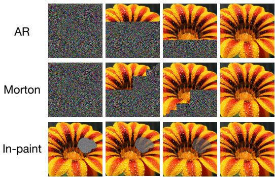

text_image

AR
Morton
In-paint

Figure 1: Multi-task, self-supervised sampling: Schematic representation of various sub-tasks that are captured by the minimizer of our learning objective using the Hadamard-product interpolant in (9). A generative task is chosen in a zero-shot manner by specifying α as a function of time after training. This $\alpha _ { t }$ serves as a continual self-supervision of what has been unmasked vs. what remains. Top: $\alpha _ { t }$ is chosen to generate pixels in an autoregressive fashion. Middle: $\alpha _ { t }$ is chosen to sample along a fractal morton order. Bottom: $\alpha _ { t }$ can be chosen to do zero-shot inpainting.

# 3 Multitask generation

In this section we discuss how to use the theoretical framework introduced in Section 2 to perform multiple generative tasks without having to doing any retraining.

# 3.1 Self-supervised generation and inpainting

Inpainting—the task of filling in missing parts of an image—traditionally requires specialized training for each possible mask configuration. Our operator-based framework enables a fundamentally different approach: a single model that can perform inpainting with any arbitrary mask, chosen at inference time, or can generate samples from scratch in an arbitrary ordering of the generation. May 15, 2025 1This includes standard generation of all dimensions at once, autoregressive generation dimension by dimension, blockwise fractal generation, and so forth. In particular, we may want to construct a generative model that fills in missing entries from a sample $\bar { x _ { 1 } } \in \mathbb { R } ^ { d }$ drawn from a data distribution $\mu _ { 1 }$ . We would like this model to be universal, in the sense that it can be used regardless of which entries are missing; their number and position can be arbitrary and changed post-training, allowing for flexible inpainting and editing (see Figure 1 for an illustration). This approach creates a natural self-supervision mechanism, as the model continuously tracks which parts have been generated and which remain to be filled.

To perform this task, assume that $x _ { 1 }$ is drawn from the data distribution $\mu _ { 1 }$ of interest and $x _ { 0 }$ drawn independently from $N ( 0 , \mathrm { { I d } ) }$ , so that $\mu = N ( 0 , \mathrm { I d } ) \times \mu _ { 1 }$ , set $\beta = 1 - \alpha$ in the operator interpolant (1), and assume that α is a diagonal matrix. With a slight abuse of notations we can then identify the diagonal elements of the matrix α with a vector $\boldsymbol { \alpha } \in \mathbb { R } ^ { d }$ and write (1) as

$$
I (\alpha) = \alpha \odot x _ {0} + (1 - \alpha) \odot x _ {1}, \tag {9}
$$

where ⊙ denotes the Hadamard (i.e. entrywise) product. The drift to learn in this case is

$$
\eta (\alpha , x) = \mathbb {E} \left[ x _ {0} - x _ {1} \mid \alpha \odot x _ {0} + (1 - \alpha) \odot x _ {1} = x \right] \tag {10}
$$

for $\alpha \in [ 0 , 1 ] ^ { d }$ , and this learning can be done via solution of

$$
\min_ {\hat {\eta}} \mathbb {E} _ {\substack {\alpha \sim U ([ 0, 1 ] ^ {d}) \\ x _ {0} \sim N (0, \mathrm{Id}) \\ x _ {1} \sim \mu_ {1}}} \left[ \| \hat {\eta} (\alpha , I (\alpha \odot x _ {0} + (1 - \alpha) \odot x _ {1}) + x _ {1} - x _ {0}) \| ^ {2} \right], \tag{11}
$$

Denoting $x _ { 1 } = ( x _ { 1 } ^ { 1 } , x _ { 1 } ^ { 2 } , \ldots , x _ { 1 } ^ { d } )$ , suppose that we observe $x _ { 1 } ^ { i }$ for the entries with $i \in \sigma \subset \{ 1 , \ldots , d \}$ and would like to infer the missing entries with $i \in \sigma ^ { c } = \{ \bar { 1 } , \dots , d \} \setminus \sigma$ . To perform this inpainting we can use the probability flow ODE (7) with a path $\alpha _ { t }$ such that $\dot { \alpha } _ { t } ^ { i } = 0 \mathrm { i f } i \in \sigma$ and $\alpha _ { t } ^ { i } = \bar { 1 } - t$ if $i \in \sigma ^ { c }$ . Note that this can be done for any choice of σ without retraining.

# 3.2 Multichannel denoising

Suppose that $B _ { 1 } , B _ { 2 } , \ldots B _ { n }$ are deterministic corruption operators that can be applied to the data. For example $B _ { 1 }$ could be a high-pass filter, $B _ { 2 }$ a motion blur, etc. and they could be defined primarily in the Fourier representation of the data. Similarly, if $x _ { 0 } \sim N ( 0 , \mathrm { I d } )$ , let $A _ { 1 } , A _ { 2 } , \ldots A _ { m }$ be operators that give some structure to this noise (e.g. some spatial correlation over the domain of the data). Set $A _ { 0 } \stackrel { \cdot } { = } B _ { 0 } = \operatorname { I d }$ and take

Gaussian   
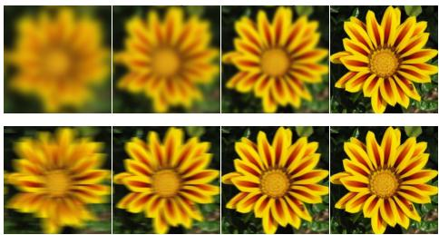

natural_image

Grid of eight close-up photos of yellow daisies with black outlines, no text or symbols present

Figure 2: Multichannel denoising: Possible interpolations fulfilled by various choices of operators in (12). We present two such examples in the form of Gaussian and motion blurring, realized by interpolations defined in the Fourier domain.   
Motion

$$
\alpha = \sum_ {i = 0} ^ {m} a _ {i} A _ {i}, \quad \beta = \sum_ {i = 0} ^ {n} b _ {i} B _ {i} \tag {12}
$$

where $a _ { i } , b _ { i }$ are nonegative scalars each taking values in some range that includes 0 and $b _ { 0 } = 1$ . With this choice we can find path $( \alpha _ { t } , \beta _ { t } ) _ { t \in [ 0 , 1 ] }$ that bridges data $x _ { 1 } \sim \mu$ corrupted in any possible channel as $\textstyle \sum _ { i = 1 } ^ { m } a _ { i } A _ { i } x _ { 0 } + \sum _ { i = 1 } ^ { n } b _ { i } B _ { i } x _ { 1 }$ for some choice of $( a _ { 1 } , a _ { 2 } , \dotsc , b _ { 1 } , b _ { 2 } , \dotsc )$ back to the clean data via a path that bridges this choice of parameters to $b _ { 0 } = 1$ and $a _ { 0 } = a _ { 1 } \dots = b _ { 1 } = \dots = 0$ . See Figure 2 for an illustration of two possible corruption schemes.

# 3.3 Fine-tuning and posterior sampling

Suppose that we are given data from a distribution $\mu _ { 1 } ( d x )$ , and that we would like to generate samples from $\mu _ { 1 } ^ { r } ( d x ) = Z ^ { - 1 } e ^ { r ( x ) } \mu _ { 1 } ( d x )$ where $r : \mathcal H \to$ R is a reward function and $\begin{array} { r } { Z = \int _ { \mathcal { H } } e ^ { r ( x ) } \mu _ { 1 } ( d x ) } \end{array}$ is 25 2 a normalization function, which is unknown to us but we assume finite – in the context of Bayesian inference, $\mu _ { 1 }$ plays the role of prior distribution, r is the likelihood, and $\mu _ { 1 } ^ { r }$ is the posterior distribution. We will assume that the reward r is a quadratic function, i.e.

$$
r (x) = \frac {1}{2} \langle x, A x \rangle + \langle b, x \rangle \tag {13}
$$

where A is a definite negative bilinear operator on H, $b \in { \mathcal { H } } ,$ and $\langle \cdot , \cdot \rangle$ denotes the inner product on H. For simplicity we also assume that $\mathcal { H } = \mathbb { R } ^ { d } \colon$ the general case can be treated similarly.

In this context, assume that we have learned the drifts $\eta _ { 0 , 1 }$ associated with the interpolant

$$
I (\alpha , \beta) = \alpha x _ {0} + \beta x _ {1}, \quad x _ {0} \sim N (0, \mathrm{Id}), \quad x _ {1} \sim \mu_ {1}, \quad x _ {0} \perp x _ {1} \tag {14}
$$

so that we can generate samples from the prior distribution. Our next result shows that this gives us access to the drifts $\eta _ { 0 , 1 } ^ { r }$ associated with the interpolant

$$
I _ {r} (\alpha , \beta) = \alpha x _ {0} + \beta x _ {1} ^ {r}, \quad x _ {0} \sim N (0, \mathrm{Id}), \quad x _ {1} ^ {r} \sim \mu_ {1} ^ {r}, \quad x _ {0} \perp x _ {1} ^ {r} \tag {15}
$$

involving data xr from the posterior distribution.

# Proposition 3.1. Let

$$
\eta_ {0} (\alpha , \beta , x) = \mathbb {E} \big [ x _ {0} | I (\alpha , \beta) = x \big ], \qquad \eta_ {1} (\alpha , \beta , x) = \mathbb {E} \big [ x _ {1} | I (\alpha , \beta) = x \big ], \tag {16}
$$

be the drifts associated with the interpolant (14) and

$$
\eta_ {0} ^ {r} (\alpha , \beta , x) = \mathbb {E} \big [ x _ {0} | I _ {r} (\alpha , \beta) = x \big ], \qquad \eta_ {1} ^ {r} (\alpha , \beta , x) = \mathbb {E} \big [ x _ {1} ^ {r} | I _ {r} (\alpha , \beta) = x \big ], \tag {17}
$$

be the drifts associated with the interpolant (15). If α and β are invertible, then

$$
\eta_ {0} ^ {r} (\alpha , \beta , x) = \alpha^ {- 1} \beta \beta_ {r} ^ {- 1} \alpha_ {r} \eta_ {0} \left(\alpha_ {r}, \beta_ {r}, x _ {r}\right) + \alpha^ {- 1} \left(x - \beta \beta_ {r} ^ {- 1} x _ {r}\right) \tag {18}
$$

$$
\eta_ {1} ^ {r} (\alpha , \beta , x) = \eta_ {1} \left(\alpha_ {r}, \beta_ {r}, x _ {r}\right) \tag {19}
$$

as long as we can find a pair $( \alpha _ { r } , \beta _ { r } )$ that satisfies

$$
\beta_ {r} ^ {T} \alpha_ {r} ^ {- T} \alpha_ {r} ^ {- 1} \beta_ {r} = \beta^ {T} \alpha^ {- T} \alpha^ {- 1} \beta - A \tag {20}
$$

and $x _ { r }$ is given by

$$
x _ {r} = \alpha_ {r} \alpha_ {r} ^ {T} \beta_ {r} ^ {- T} \left(\beta^ {T} \alpha^ {- T} \alpha^ {- 1} x + b\right). \tag {21}
$$

This proposition is proven in Appendix A as a corollary of Proposition A.1 that relates the probability distribution of $I _ { r }$ to that of I. Proposition 3.1 offers a way to sample the posterior distribution without retraining, by using the drifts (18) and (19) in the ODE (7) or the SDE (8).

# 3.4 Inference adaption

Suppose that we have learned the drifts $\eta _ { 0 , 1 }$ in Definition 2.2 and wish to transport samples along a path $\left( \alpha _ { t } , \beta _ { t } \right)$ with fixed end points. We can leverage the flexibility of our formulation to perform inference adaptation, that is, optimize the path $\left( \alpha _ { t } , \beta _ { t } \right)$ used during generation to achieve specific objectives, such as minimizing computational cost, maximizing sample quality, or satisfying user constraints. This can be done in two ways: (1) offline optimization, where we pre-compute optimal paths for different scenarios using objectives like Wasserstein length minimization, and (2) online adaptation, where paths are dynamically adjusted during generation based on intermediate results or user feedback.

In the case of offline optimization, we could for example optimize the Wasserstein length of the path. That is, if we want to bridge the distributions $\mu _ { \alpha _ { 0 } , \beta _ { 0 } }$ of $I ( \alpha _ { 0 } , \beta _ { 0 } )$ and $\mu _ { \alpha _ { 1 } , \beta _ { 1 } }$ of $I ( \alpha _ { 1 } , \beta _ { 1 } )$ via $\mu _ { \alpha _ { t } , \beta _ { t } }$ with $( \alpha _ { t } , \beta _ { t } ) \in S$ for all $t \in [ 0 , 1 ]$ then the path that minimizes the Wasserstein length of the bridge distribution $\mu _ { \alpha _ { t } , \beta _ { t } }$ solves

$$
\min _ {(\alpha_ {t}, \beta_ {t}) _ {t}} \int_ {0} ^ {1} \mathbb {E} \left[ \| \dot {\alpha} _ {t} \eta_ {0} (\alpha_ {t}, \beta_ {t}, I (\alpha_ {t}, \beta_ {t})) + \dot {\beta} _ {t} \eta_ {1} (\alpha_ {t}, \beta_ {t}, I (\alpha_ {t}, \beta_ {t})) \| ^ {2} \right] d t \tag {22}
$$

where the minimization is performed over paths $( \alpha _ { t } , \beta _ { t } ) _ { t } \equiv ( \alpha _ { t } , \beta _ { t } ) _ { t \in [ 0 , 1 ] }$ such that $( \alpha _ { t } , \beta _ { t } ) \in S$ for all $t \in [ 0 , 1 ]$ with their end points $( \alpha _ { 0 } , \beta _ { 0 } )$ and $( \alpha _ { 1 } , \beta _ { 1 } )$ prescribed and fixed.

Algorithm 1: Multitask learner   
input: Samples $(x_{0}, x_{1}) \sim \mu$ ; choice of distribution $\nu(d\alpha, d\beta)$ and associated sampler.
repeat
Draw batch $(x_{0}^{i}, x_{i}^{1}, \alpha_{i}, \beta_{i})_{i=1}^{M} \sim \mu \times \nu.$ Compute $I_{i} = \alpha_{i} x_{0}^{i} + \beta_{i} x_{1}^{i}.$ Compute $\hat{L} = \frac{1}{M} \sum_{i=1}^{M} \| \hat{\eta}_{0}(\alpha_{i}, \beta_{i}, I_{i}) - x_{0}^{i} \|^{2} + \| \hat{\eta}_{1}(\alpha_{i}, \beta_{i}, I_{i}) - x_{1}^{i} \|^{2}.$ Take a gradient step on $\hat{L}$ to update $\hat{\eta}_{0}$ and $\hat{\eta}_{1}$ .
until converged;
output: Drifts $\hat{\eta}_{0}$ and $\hat{\eta}_{1}$ .

Algorithm 2: Multitask generator   
input: Drifts $\hat{\eta}_0, \hat{\eta}_1$ ; choice of path $(\alpha_t \beta_t)_{t \in [0,1]}$ tailored to the generation task; data $I(\alpha_0, \beta_0) = \alpha_0 x_0 + \beta_0 x_1$ ; diffusion coefficient $\epsilon_t \geqslant 0$ ; time step $h = 1 / K$ with $K \in \mathbb{N}$ .  
initialize: $\hat{X}_0^\epsilon = I(\alpha_0, \beta_0)$ ;  
for $k = 0, \ldots, K - 1$ do  
    set $\hat{\eta}_0^k = \hat{\eta}_0 (\alpha_{kh}, \beta_{kh}, \hat{X}_{kh}^\epsilon)$ , $\hat{\eta}_1^k = \hat{\eta}_1 (\alpha_{kk}, \beta_{kh}, \hat{X}_{kh}^\epsilon)$ , and $z_k \sim N(0, \mathrm{Id})$ update $\hat{X}_{k+1k}^\epsilon = \hat{X}_{kh}^\epsilon + h (\dot{\alpha}_{kk} - \epsilon_{kh} \alpha_{kk}^{-1}) \hat{\eta}_0^k + h \dot{\beta}_{kh} \hat{\eta}_1^k + \sqrt{2\epsilon_{kh} h} z_k$ ,  
end  
output: $\hat{X}_1^\epsilon \stackrel{d}{=} I(\alpha_1, \beta_1)$ (approximately)

# 4 Algorithmic aspects

The algorithmic aspects of our framework can be summarized in a few key steps. First, we define a connected set S of $\bar { ( } \alpha , \beta )$ such that the ensemble of different tasks we will want to perform correspond to getting samples of $I ( \alpha , \beta )$ ) at some value of $( \alpha _ { 0 } , \beta _ { 0 } ) \in S$ and generating from them new data at another value of $( \alpha _ { 1 } , \beta _ { 1 } ) \in S$ . Second, we specify a measure ν on S for the learning of the drifts η0 and η1 defined in (2). Third, we learn these drifts via minimization of the objectives in (3) and (4), using the procedure outlined in Algorithm 1. Note that we can possibly simplify this algorithm, learning only one of the two drifts and obtaining the other through the relation (5). Finally, given any pairs $( \dot { \alpha _ { 0 } } , \beta _ { 0 } ) , ( \alpha _ { 1 } , \beta _ { 1 } ) \in S$ , we use a path $( \alpha _ { t } , \beta _ { t } ) _ { t \in [ 0 , 1 ] }$ with $\alpha _ { t } , \beta _ { t } \in S$ for all $t \in [ 0 , 1 \bar { ] }$ and integrate the SDE (8) (or possibly the ODE (7) if we set $\epsilon _ { t } \bar { = } 0 \bar { ) }$ ) to perform the generation, as outlined in Algorithm 2. Note that this path could also be adapted on-the-fly during inference, using some feedback about the solution of the SDE.

# 5 Numerical experiments

Below we provide numerical realization of some of the various objectives that can be fulfilled with the multitask objective. Details of the experimental setup can be found in Appendix B.

# 5.1 Multitask inpainting and sequential generation

We evaluate our method on three datasets: MNIST, with images of size $2 8 \times 2 8$ , CelebA, resized to $1 2 8 \times 1 2 8$ , and of Animal FacesHQ focused on cat class, with images resized to $2 5 6 \times 2 5 6$ . Details of the experimental setup are standard and can be found in Appendix B. In these experiments, we use the Hadamard interpolant (9).

MNIST. We demonstrate the versatility of our operator-based interpolant framework through inpainting and sequential generation tasks on MNIST. The results are shown Figure 3 where all the generated images come from the same model without any retraining.

For inpainting (left panels), we replace masked regions with Gaussian noise (shown as pink for clarity), then generate only these regions while preserving unmasked pixels. This is achieved by setting the entries of α to 1 − t for masked pixels and 0 for unmasked ones. To preserve unmasked pixels, we apply a secondary mask setting $\eta ( \alpha , x )$ to zero at these positions.

Sequential generation (right panels) reformulates image creation as progressive inpainting. Starting with pure Gaussian noise, we generate the image block-by-block by successively updating the operator masks. Unlike single-pass inpainting, this requires multiple forward passes—one per block. For each pass, we apply $\alpha = 1 - t$ only to pixels in the current generation block, maintaining appropriate values for previously generated and remaining noise regions.

CelebA and AFHQ-Cat. We present benchmark results for all methods across various image restoration tasks, evaluating the average peak signal-to-noise ratio (PSNR) and structural similarity index (SSIM) on 100 test images from each dataset: AFHQ-Cat $( 2 5 6 \times 2 5 6 )$ and CelebA $( 1 2 8 \times 1 2 8 )$ . To assess the performance of our methodology, we employed two types of masking: square masks of sizes $4 0 \times 4 0$ and $8 0 \times 8 0$ with added Gaussian noise of standard deviation 0.05, and random masks covering 70% of image pixels with Gaussian noise of standard deviation 0.01. We benchmark our method against four state-of-the-art interpolant-based restoration methods: PnP-Flow Martin et al. (2025), Flow-Priors Zhang et al. (2024), D-Flow Ben-Hamu et al. (2024), OT-ODE Pokle et al. (2024).

As shown in Table 1, our method consistently ranks either first or second in both reconstruction metrics across all tasks and datasets (with all values except the last row taken from Martin et al. (2025)). Regarding visual quality (Fig. 4), our method generates realistic, artifact-free images, albeit with slight over-smoothing at times.

# 5.2 Posterior sampling in the $\phi ^ { 4 } { \bf - m o d e l }$

We apply our approach in the context of the $\phi ^ { 4 }$ model in $d = 2$ spacetime dimensions, a statistical lattice field theory where field configurations $\phi \in \mathbb { R } ^ { L \times L }$ represent the lattice state (L denotes spatiotemporal extent)—for details see Appendix B.2. This model poses sampling challenges due to its phase transition from disorder to full order, during which neighboring sites develop strong correlations in sign and magnitude Vierhaus (2010); Albergo et al. (2019).

Table 1: PSNR and SSIM metrics for image inpainting methods on CelebA and AFHQ-Cat datasets. 

<table><tr><td rowspan="3">Method</td><td colspan="4">CelebA</td><td colspan="4">AFHQ-Cat</td></tr><tr><td colspan="2">Random</td><td colspan="2">Block</td><td colspan="2">Random</td><td colspan="2">Block</td></tr><tr><td>PSNR</td><td>SSIM</td><td>PSNR</td><td>SSIM</td><td>PSNR</td><td>SSIM</td><td>PSNR</td><td>SSIM</td></tr><tr><td>Degraded</td><td>11.82</td><td>0.197</td><td>22.12</td><td>0.742</td><td>13.35</td><td>0.234</td><td>21.50</td><td>0.744</td></tr><tr><td>Pokle et al. (2024)</td><td>28.36</td><td>0.865</td><td>28.84</td><td>0.914</td><td>28.84</td><td>0.838</td><td>23.88</td><td>0.874</td></tr><tr><td>Ben-Hamu et al. (2024)</td><td>33.07</td><td>0.938</td><td>29.70</td><td>0.893</td><td>31.37</td><td>0.888</td><td>26.69</td><td>0.833</td></tr><tr><td>Zhang et al. (2024)</td><td>32.33</td><td>0.945</td><td>29.40</td><td>0.858</td><td>31.76</td><td>0.909</td><td>25.85</td><td>0.822</td></tr><tr><td>Martin et al. (2025)</td><td>33.54</td><td>0.953</td><td>30.59</td><td>0.943</td><td>32.98</td><td>0.930</td><td>26.87</td><td>0.904</td></tr><tr><td>Ours</td><td>33.76</td><td>0.967</td><td>29.98</td><td>0.938</td><td>33.11</td><td>0.945</td><td>26.96</td><td>0.914</td></tr></table>

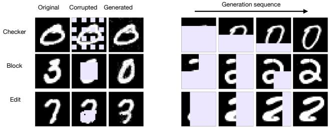

text_image

Original
Corrupted
Generated
Checker
Block
Edit
Generation sequence
0
0
0
3
0
1
2
2
2

Figure 3: Left: In-painting on MNIST using various corruptions. Right: Image generation in arbitrary orders, starting from the same initial noise, with examples showing autoregressive, block-wise, and column-wise.

The $\phi ^ { 4 }$ 1model is specified by the following probability distribution

$$
\mu (d \phi) = Z ^ {- 1} e ^ {- E (\phi)} d \phi \tag {23}
$$

where $\begin{array} { r } { Z = \int _ { \mathbb { R } ^ { L \times L } } e ^ { - E ( \phi ) } d \phi } \end{array}$ is a normalization constant and $E ( \phi )$ is an energy function defined as

$$
E (\phi) = \frac {1}{2} \chi \sum_ {a \sim b} | \phi (a) - \phi (b) | ^ {2} + \frac {1}{2} \kappa \sum_ {a} | \phi (a) | ^ {2} + \frac {1}{4} \gamma \sum_ {a} | \phi (a) | ^ {4}, \tag {24}
$$

where $a , b \in [ 0 , \ldots , L - 1 ] ^ { 2 }$ denote the discrete positions on a 2-dimensional lattice of size $L \times L$ , $a \sim b$ denotes neighboring sites on the lattice, and we assume periodic boundary conditions; $\chi > 0$ , $\kappa \in \mathbb { R }$ and $\gamma > 0$ are parameters. We perform MCMC simulations to generate configuration in a parameter range close to the phase transition. We use these data to learn a stochastic interpolant of the form (9) which allows us to perform unconditional generation of new field configurations as well arbitrary inpainting (conditional generation given partially observed configurations), as reported in Appendix B.2. It also allows us to test the formalism of Section 3.3 and perform sampling of the posterior distribution defined by adding a applied field $h \in \mathbb { R }$ to the energy, i.e. using

$$
E _ {r} (\phi) = E (\phi) - h \sum_ {a} \phi (a). \tag {25}
$$

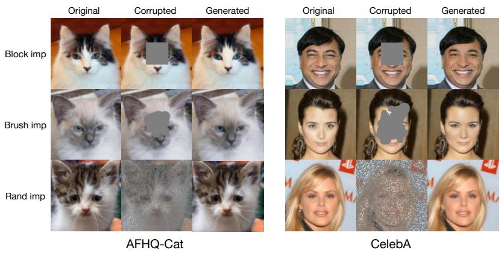

text_image

Original
Corrupted
Generated
Block imp
Brush imp
Rand imp
AFHQ-Cat
Original
Corrupted
Generated
CelebA

Figure 4: Inpainting using various masks left panels: AFHQ-Cat $( 2 5 6 \times 2 5 6 )$ . Right panels: CelebA $( 1 2 8 \times 1 2 8 )$ . Fixing block and random corruptions are scored against related works in Table 1, showing competitive or superior performance in all metrics.

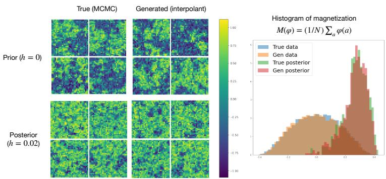

histogram

| Prior (h = 0) | Posterior (h = 0.02) | True (MCMC) | Generated (interpolant) | Histogram of magnetization |
| ------------- | -------------------- | ----------- | ----------------------- | -------------------------- |
| -34           | -                  | -           | -                       | 0.00                       |
| -32           | -                  | -           | -                       | 0.25                       |
| -30           | -                  | -           | -                       | 0.50                       |
| -28           | -                  | -           | -                       | 0.75                       |
| -26           | -                  | -           | -                       | 1.00                       |
| -24           | -                  | -           | -                       | 0.75                       |
| -22           | -                  | -           | -                       | 0.50                       |
| -20           | -                  | -           | -                       | 0.25                       |
| -18           | -                  | -           | -                       | 0.00                       |
| -16           | -                  | -           | -                       | -                          |
| -14           | -                  | -           | -                       | -                          |
| -12           | -                  | -           | -                       | -                          |
| -10           | -                  | -           | -                       | -                          |
| -8            | -                  | -           | -                       | -                          |
| -6            | -                  | -           | -                       | -                          |
| -4            | -                  | -           | -                       | -                          |
| -2            | -                  | -           | -                       | -                          |
| 0             | -                  | -           | -                       | -                          |
| 2             | -                  | -           | -                       | -                          |
| 4             | -                  | -           | -                       | -                          |
| 6             | -                  | -           | -                       | -                          |
| 8             | -                  | -           | -                       | -                          |
| 10            | -                  | -           | -                       | -                          |
| 12            | -                  | -           | -                       | -                          |
| 14            | -                  | -           | -                       | -                          |
| 16            | -                  | -           | -                       | -                          |
| 18            | -                  | -           | -                       | -                          |
| 20            | -                  | -           | -                       | -                          |
| 22            | -                  | -           | -                       | -                          |
| 24            | -                  | -           | -                       | -                          |
| 26            | -                  | -           | -                       | -                          |
| 28            | -                  | -           | -                       | -                          |
| 30            | -                  | -           | -                       | -                          |
| 32            | -                  | -           | -                       | 0.00                       |
| 34            | -                  | -           | -                       | 0.25                       |
| 36            | -                  | -           | -                       | 0.50                       |
| 38            | -                  | -           | -                       | 0.75                       |
| 40            | -                  | -           | -                       | 1.00                       |
The image displays a heatmap of magnetization histogram with four categories: True data, Gen data, True posterior, and Gen posterior. The x-axis represents the magnitude of magnetization at each bin. The y-axis represents the same bin label. The color scale indicates the magnitude of magnetization. The chart is divided into four sections based on the legend categories. The title of the chart is 'Histogram of magnetization' with mathematical notation 'M(φ) = (1/N) Σ_a φ(a)'.

Figure 5: Simulating a lattice $\phi ^ { 4 }$ theory. Top left: $L = 3 2 \times L = 3 2$ lattice configurations at the phase transition. Bottom left: lattice examples with drift parameter $h = 0 . 0 2$ . Top middle: Generated lattice examples at phase transition. Bottom middle: generated lattice examples with field $h = 0 . 0 2$ . Right: magnetization of 2000 lattice configurations.

The additional term plays the role of a reward. The results of the generation based on Proposition 3.1 are shown on Figure 5, which indicate that our approach permits to valid sample configurations (as verified by their magnetization) of the posterior without retraining.

# 5.3 Planning and decision making in a maze

This section applies our framework to shortest path planning in maze environments, drawing from Janner et al. (2022) and Chen et al. (2024). Using the Hadamard product interpolant (9), we can impose that the paths pass through arbitrary locations in the maze (by setting $\alpha _ { i } = 0$ at these locations), reformulating planning as a zero-shot inpainting problem. Unlike traditional reinforcement learning approaches that generate paths sequentially through Markov decision processes, our method therefore produces entire trajectories simultaneously. It also avoid additional guiding terms like Monte Carlo guidance used in Diffusion Forcing Chen et al. (2024).

For training, we use paths of length 300 randomly extracted from the trajectory of length 2,000,000 from Chen et al. (2024). For simplicity, we subsample these paths every six points, creating sparse paths of length 50, from which we can recover paths of length 300 through linear interpolation between consecutive points. At inference, we perform zero-shot generation between any two points in the maze by enforcing that the trajectory passes through these points: the length of the path between these locations can be varied by pinning the first point by setting $\alpha _ { 1 } = 0 _ { : }$ , and the second point by setting $\alpha _ { i } = 0$ with a value of $i \in [ \bar { 2 } , 5 0 ]$ that can be adjusted (see Appendix B.3 for details). Typical results are shown in Fig. 6. In terms of quality assessment, we check that the generated trajectories remain within allowed maze regions: all the 10,000 paths we generated between randomly chosen point pairs avoided the forbidden areas, demonstrating robust performance. More numerical experiments in Appendix B.3 demonstrate that with a similar strategy, one can impose the pathway to take detour at will, even if it implies generating a longer path.

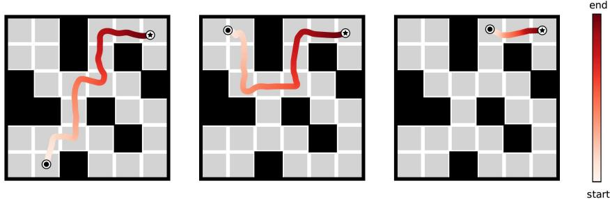  
Figure 6: One-shot generation of pathways between two arbitrary points in the maze. The path length is automatically tuned via a simple heuristic, see discussion in Appendix B.3.

# Acknowledgements

We would like to thank Yilun Du for many helpful discussions on the maze planning problem. MSA is supported by a Junior Fellowship at the Harvard Society of Fellows as well as the National Science Foundation under Cooperative Agreement PHY-2019786 (The NSF AI Institute for Artificial Intelligence and Fundamental Interactions, http://iaifi.org).

# References

Yaron Lipman, Ricky TQ Chen, Heli Ben-Hamu, Maximilian Nickel, and Matthew Le. Flow matching for generative modeling. In The Eleventh International Conference on Learning Representations, 2022.   
Michael S Albergo and Eric Vanden-Eijnden. Building normalizing flows with stochastic interpolants. In The Eleventh International Conference on Learning Representations, 2022.   
Xingchao Liu, Chengyue Gong, and Qiang Liu. Flow straight and fast: Learning to generate and transfer data with rectified flow. In The Eleventh International Conference on Learning Representations, 2022.   
Jonathan Ho, Ajay Jain, and Pieter Abbeel. Denoising diffusion probabilistic models. In Advances in neural information processing systems, volume 33, pages 6840–6851, 2020.   
Yang Song and Stefano Ermon. Generative Modeling by Estimating Gradients of the Data Distribution. arXiv:1907.05600, 2020.   
Valentin De Bortoli, James Thornton, Jeremy Heng, and Arnaud Doucet. Diffusion schrödinger bridge with applications to score-based generative modeling. In Advances in Neural Information Processing Systems, volume 34, pages 17695–17709, 2021.   
Michael S Albergo, Nicholas M Boffi, and Eric Vanden-Eijnden. Stochastic interpolants: A unifying framework for flows and diffusions. arXiv preprint arXiv:2303.08797, 2023a.   
Robin Rombach, Andreas Blattmann, Dominik Lorenz, Patrick Esser, and Björn Ommer. Highresolution image synthesis with latent diffusion models. In Proceedings of the IEEE/CVF conference on computer vision and pattern recognition, pages 10684–10695, 2022.   
François Mazé and Faez Ahmed. Diffusion models beat gans on topology optimization. In Proceedings of the AAAI conference on artificial intelligence, volume 37, pages 9108–9116, 2023.   
Michael Alverson, Sterling G Baird, Ryan Murdock, Jeremy Johnson, Taylor D Sparks, et al. Generative adversarial networks and diffusion models in material discovery. Digital Discovery, 3 (1):62–80, 2024.   
Hyungjin Chung, Jeongsol Kim, Michael Thompson Mccann, Marc Louis Klasky, and Jong Chul Ye. Diffusion posterior sampling for general noisy inverse problems. In International Conference on Learning Representations, 2023. URL https://openreview.net/forum?id=OnD9zGAGT0k.   
Yang Song, Liyue Shen, Lei Xing, and Stefano Ermon. Solving inverse problems in medical imaging with score-based generative models. In International Conference on Learning Representations, 2022. URL https://openreview.net/forum?id=vaRCHVj0uGI.   
Hengkang Wang, Xu Zhang, Taihui Li, Yuxiang Wan, Tiancong Chen, and Ju Sun. DMPlug: A plug-in method for solving inverse problems with diffusion models. In The Thirty-eighth Annual Conference on Neural Information Processing Systems, 2024.   
Yang Song, Jascha Sohl-Dickstein, Diederik P Kingma, Abhishek Kumar, Stefano Ermon, and Ben Poole. Score-based generative modeling through stochastic differential equations. arXiv:2011.13456, 2020.   
Michael S. Albergo, Mark Goldstein, Nicholas M. Boffi, Rajesh Ranganath, and Eric Vanden-Eijnden. Stochastic interpolants with data-dependent couplings. arXiv:2310.03725, 2023b.   
Marcelo Pereyra, Philip Schniter, Emilie Chouzenoux, Jean-Christophe Pesquet, Jean-Yves Tourneret, Alfred O Hero, and Steve McLaughlin. A survey of stochastic simulation and optimization methods in signal processing. IEEE Journal of Selected Topics in Signal Processing, 10(2):224–241, 2015.   
Bahjat Kawar, Michael Elad, Stefano Ermon, and Jiaming Song. Denoising diffusion restoration models. Advances in Neural Information Processing Systems, 35:23593–23606, 2022.

Ségolène Martin, Anne Gagneux, Paul Hagemann, and Gabriele Steidl. Pnp-flow: Plug-and-play image restoration with flow matching. In International Conference on Learning Representations, 2025.   
Florentin Coeurdoux, Nicolas Dobigeon, and Pierre Chainais. Plug-and-play split gibbs sampler: embedding deep generative priors in bayesian inference. IEEE Transactions on Image Processing, 2024.   
Yu Sun, Zihui Wu, Yifan Chen, Berthy T Feng, and Katherine L Bouman. Provable probabilistic imaging using score-based generative priors. IEEE Transactions on Computational Imaging, 2024.   
Morteza Mardani, Jiaming Song, Jan Kautz, and Arash Vahdat. A variational perspective on solving inverse problems with diffusion models. arXiv preprint arXiv:2305.04391, 2023.   
Cagan Alkan, Julio Oscanoa, Daniel Abraham, Mengze Gao, Aizada Nurdinova, Kawin Setsompop, John M Pauly, Morteza Mardani, and Shreyas Vasanawala. Variational diffusion models for blind mri inverse problems. In NeurIPS 2023 workshop on deep learning and inverse problems, 2023.   
Giannis Daras, Yuval Dagan, Alexandros G Dimakis, and Constantinos Daskalakis. Score-guided intermediate layer optimization: Fast langevin mixing for inverse problems. arXiv preprint arXiv:2206.09104, 2022.   
Arpit Bansal, Eitan Borgnia, Hong-Min Chu, Jie S. Li, Hamid Kazemi, Furong Huang, Micah Goldblum, Jonas Geiping, and Tom Goldstein. Cold diffusion: Inverting arbitrary image transforms without noise, 2022. URL https://arxiv.org/abs/2208.09392.   
Keyu Tian, Yi Jiang, Zehuan Yuan, Bingyue Peng, and Liwei Wang. Visual autoregressive modeling: Scalable image generation via next-scale prediction, 2024. URL https://arxiv.org/abs/ 2404.02905.   
Tianhong Li, Qinyi Sun, Lijie Fan, and Kaiming He. Fractal generative models, 2025. URL https://arxiv.org/abs/2502.17437.   
Jiaxin Shi, Kehang Han, Zhe Wang, Arnaud Doucet, and Michalis K. Titsias. Simplified and generalized masked diffusion for discrete data, 2025. URL https://arxiv.org/abs/2406. 04329.   
Jaeyeon Kim, Kulin Shah, Vasilis Kontonis, Sham Kakade, and Sitan Chen. Train for the worst, plan for the best: Understanding token ordering in masked diffusions, 2025. URL https: //arxiv.org/abs/2502.06768.   
Yasi Zhang, Peiyu Yu, Yaxuan Zhu, Yingshan Chang, Feng Gao, Ying Nian Wu, and Oscar Leong. Flow priors for linear inverse problems via iterative corrupted trajectory matching. Advances in Neural Information Processing Systems, 37:57389–57417, 2024.   
Heli Ben-Hamu, Omri Puny, Itai Gat, Brian Karrer, Uriel Singer, and Yaron Lipman. D-flow: Differentiating through flows for controlled generation. In Proceedings of the 41st International Conference on Machine Learning, volume 235 of Proceedings of Machine Learning Research, pages 3462–3483. PMLR, 2024.   
Ashwini Pokle, Matthew J. Muckley, Ricky T. Q. Chen, and Brian Karrer. Training-free linear image inverses via flows. Transactions on Machine Learning Research, 2024. ISSN 2835-8856.   
Ingmar Vierhaus. Simulation of ϕ4 theory in the strong coupling expansion beyond the Ising Limit. PhD thesis, Humboldt University of Berlin, 07 2010.   
M. S. Albergo, G. Kanwar, and P. E. Shanahan. Flow-based generative models for markov chain monte carlo in lattice field theory. Phys. Rev. D, 100:034515, Aug 2019. doi: 10.1103/PhysRevD. 100.034515. URL https://link.aps.org/doi/10.1103/PhysRevD.100.034515.   
Michael Janner, Yilun Du, Joshua B. Tenenbaum, and Sergey Levine. Planning with diffusion for flexible behavior synthesis, 2022. URL https://arxiv.org/abs/2205.09991.

Boyuan Chen, Diego Marti Monso, Yilun Du, Max Simchowitz, Russ Tedrake, and Vincent Sitzmann. Diffusion forcing: Next-token prediction meets full-sequence diffusion, 2024. URL https: //arxiv.org/abs/2407.01392.   
David Williams. Probability with Martingales. Cambridge Mathematical Textbooks. Cambridge University Press, Cambridge, 1991. ISBN 9780521406055. doi: 10.1017/CBO9780511813658.   
Diederik P. Kingma and Jimmy Ba. Adam: A method for stochastic optimization, 2017. URL https://arxiv.org/abs/1412.6980.   
Olaf Ronneberger, Philipp Fischer, and Thomas Brox. U-net: Convolutional networks for biomedical image segmentation. CoRR, abs/1505.04597, 2015. URL http://arxiv.org/abs/1505. 04597.

# A Proofs

Definition 2.2 (Multipurpose drift). The drifts $\eta _ { 0 } , \eta _ { 1 } : S \times \mathcal { H } \to \mathcal { H }$ are given by

$$
\eta_ {0} (\alpha , \beta , x) = \mathbb {E} [ x _ {0} | I (\alpha , \beta) = x ], \quad \eta_ {1} (\alpha , \beta , x) = \mathbb {E} [ x _ {1} | I (\alpha , \beta) = x ], \tag {2}
$$

where $\mathbb { E } [ { \mathbf \alpha } \cdot { \mathbf \Pi } ] ( \alpha , \beta ) = x ]$ denotes expectation over the coupling $( x _ { 0 } , x _ { 1 } ) \sim \mu$ conditioned on the event $I ( \dot { \alpha } , \beta ) \stackrel { . } { = } x$ .

Lemma 2.3 (Drift objective). Let $\nu ( d \alpha , d \beta )$ be a probability distribution whose support is S. Then the drifts $\eta _ { 0 , 1 } ( \alpha , \beta , x )$ in Definition 2.2 can be characterized globally for all $( \alpha , \beta ) \in S$ and all $x \in \operatorname { s u p p } ( \mu _ { \alpha , \beta } )$ via solution of the optimization problems

$$
\eta_ {0} = \underset {\hat {\eta} _ {0}} {\operatorname{argmin}} \mathbb {E} _ {\substack {(\alpha , \beta) \sim \nu \\ (x _ {0}, x _ {1}) \sim \mu}} \left[ \| \hat {\eta} _ {0} (\alpha , \beta , I (\alpha , \beta)) - x _ {0} \| ^ {2} \right], \tag{3}
$$

$$
\eta_ {1} = \underset {\hat {\eta} _ {1}} {\operatorname{argmin}} \mathbb {E} _ {\substack {(\alpha , \beta) \sim \nu \\ (x _ {0}, x _ {1}) \sim \mu}} \left[ \| \hat {\eta} _ {1} (\alpha , \beta , I (\alpha , \beta)) - x _ {1} \| ^ {2} \right], \tag{4}
$$

where $\| \cdot \|$ denotes the norm in H.

Proof. The lemma is a simple consequence of the $L ^ { 2 }$ characterization of the conditional expectation as least-squares-best predictor, see e.g. Section 9.3 in Williams (1991). □

Lemma 2.4 (Score). Assume that $\mathcal { H } = \mathbb { R } ^ { d }$ and that the probability distribution $\mu _ { \alpha , \beta }$ of the stochastic interpolant $I ( \alpha , \beta )$ is absolutely continuous with respect to the Lebesgue measure with density $\rho _ { \alpha , \beta } ( x )$ . Assume also that $x _ { 0 } \sim N ( 0 , H d )$ and $x _ { 0 } \perp x _ { 1 }$ . Then the score $s _ { \alpha , \beta } ( x ) = \nabla \log \rho _ { \alpha , \beta } ( x )$ is related to the drift $\eta _ { 0 } ( \alpha , \beta , x )$ via

$$
\eta_ {0} (\alpha , \beta , x) = - \alpha s _ {\alpha , \beta} (x). \tag {6}
$$

Proof. The lemma follows from Stein’s lemma (aka Gaussian integration by parts formula) that asserts that

$$
\mathbb {E} [ x _ {0} | I (\alpha , \beta , x) = x ] = - \alpha s _ {\alpha , \beta} (x) \tag {26}
$$

as well as the definition of $\eta _ { 0 } ( \alpha , \beta , x )$ in (16).

Proposition 2.5 (Probability flow). Let $( \alpha _ { t } , \beta _ { t } ) _ { t \in [ 0 , 1 ] }$ be any one-parameter family of operators $( \alpha _ { t } , \beta _ { t } ) \in S$ . Assume that $\alpha _ { t } , \beta _ { t }$ are differentiable for all $t \in [ 0 , 1 ]$ . Then, for all $t \in [ 0 , 1 ]$ , the law $o f I ( \alpha _ { t } , \beta _ { t } )$ is the same as the law of the solution Xt to

$$
\dot {X} _ {t} = \dot {\alpha} _ {t} \eta_ {0} (\alpha_ {t}, \beta_ {t}, X _ {t}) + \dot {\beta} _ {t} \eta_ {1} (\alpha_ {t}, \beta_ {t}, X _ {t}), \quad X _ {0} \stackrel {{d}} {{=}} I (\alpha_ {0}, \beta_ {0}). \tag {7}
$$

Proof. From the framework of standard stochastic interpolants Albergo and Vanden-Eijnden (2022); Albergo et al. (2023a), we know that the law of $I _ { t } = I ( \alpha _ { t } , \beta _ { t } )$ is the same for all $t \in [ 0 , 1 ]$ as the law of $X _ { t } ,$ i.e. the solution to the probability flow ODE

$$
\dot {X} _ {t} = b _ {t} (X _ {t}), \quad X _ {t = 0} \stackrel {{d}} {{=}} I _ {t = 0}, \tag {27}
$$

where

$$
b _ {t} (x) = \mathbb {E} [ \dot {I} _ {t} | I _ {t} = x ]. \tag {28}
$$

By the chain rule $\dot { I } _ { t } = \dot { \alpha } _ { t } x _ { 0 } + \dot { \beta } _ { t } x _ { 1 }$ so that

$$
b _ {t} (x) = \dot {\alpha} _ {t} \mathbb {E} [ x _ {0} | I _ {t} = x ] + \dot {\alpha} _ {t} \mathbb {E} [ x _ {1} | I _ {t} = x ] \equiv \dot {\alpha} _ {t} \eta_ {0} (\alpha_ {t}, \beta_ {t}, x) + \dot {\beta} _ {t} \eta_ {1} (\alpha_ {t}, \beta_ {t}, x). \tag {29}
$$

where $\eta _ { 0 , 1 }$ are the drifts defined in (16). This means that (27) is (7).

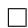

Proposition 2.6 (Diffusion). Assume that $\mathcal { H } = \mathbb { R } ^ { d }$ and the probability distribution $\mu _ { \alpha , \beta }$ of the stochastic interpolant $I ( \alpha , \beta )$ is absolutely continuous with respect to the Lebesgue measure. Assume also that, in $I ( \alpha , \beta )$ , x0 is Gaussian and $x _ { 0 } \perp x _ { 1 }$ . Then, under the same conditions as in Proposition 2.5, if αt is invertible, for all $t \in [ 0 , 1 ]$ and any $\epsilon _ { t } \geqslant 0 ,$ , the law of $I ( \alpha _ { t } , \beta _ { t } )$ is the same as the law of the solution $X _ { t } ^ { \epsilon }$ to

$$
d X _ {t} ^ {\epsilon} = \left(\dot {\alpha} _ {t} - \epsilon_ {t} \alpha_ {t} ^ {- 1}\right) \eta_ {0} \left(\alpha_ {t}, \beta_ {t}, X _ {t} ^ {\epsilon}\right) d t + \dot {\beta} _ {t} \eta_ {1} \left(\alpha_ {t}, \beta_ {t}, X _ {t} ^ {\epsilon}\right) d t + \sqrt {2 \epsilon_ {t}} d W _ {t}, \quad X _ {0} ^ {\epsilon} \stackrel {{d}} {{=}} I \left(\alpha_ {0}, \beta_ {0}\right). \tag {8}
$$

where $W _ { t }$ is a Wiener process in $\mathbb { R } ^ { d } .$ .

Proof. From the framework of standard stochastic interpolants Albergo and Vanden-Eijnden (2022); Albergo et al. (2023a), we know that the law of the solution $X _ { t }$ to the probability flow ODE (27) is the same for all $t \in [ 0 , 1 ]$ as the law of $X _ { t } ^ { \epsilon }$ solution to to SDE

$$
d X _ {t} ^ {\epsilon} = b _ {t} (X _ {t}) d t + \epsilon_ {t} s _ {t} (X _ {t} ^ {\epsilon}) d t + \sqrt {2 \epsilon_ {t}} d W _ {t}, \quad X _ {t = 0} ^ {\epsilon}, \stackrel {{d}} {{=}} I _ {t = 0}, \tag {30}
$$

where $s _ { t } ( x )$ is the score of the probability density function of ${ \cal I } _ { t } = I ( \alpha _ { t } , \beta _ { t } )$ . Since $s _ { t } ( x ) \ =$ $s _ { \alpha _ { t } , \beta _ { t } } ( x )$ , from Lemma 2.4, we have

$$
s _ {t} (x) = - \alpha_ {t} ^ {- 1} \eta_ {0} (\alpha_ {t}, \beta_ {t}, x). \tag {31}
$$

If we insert this expression in (30) and use (29), we see that this SDE reduces to (8).

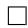

# Proposition 3.1. Let

$$
\eta_ {0} (\alpha , \beta , x) = \mathbb {E} \big [ x _ {0} | I (\alpha , \beta) = x \big ], \qquad \eta_ {1} (\alpha , \beta , x) = \mathbb {E} \big [ x _ {1} | I (\alpha , \beta) = x \big ], \tag {16}
$$

be the drifts associated with the interpolant (14) and

$$
\eta_ {0} ^ {r} (\alpha , \beta , x) = \mathbb {E} \big [ x _ {0} | I _ {r} (\alpha , \beta) = x \big ], \qquad \eta_ {1} ^ {r} (\alpha , \beta , x) = \mathbb {E} \big [ x _ {1} ^ {r} | I _ {r} (\alpha , \beta) = x \big ], \tag {17}
$$

be the drifts associated with the interpolant (15). If α and $\beta$ are invertible, then

$$
\eta_ {0} ^ {r} (\alpha , \beta , x) = \alpha^ {- 1} \beta \beta_ {r} ^ {- 1} \alpha_ {r} \eta_ {0} \left(\alpha_ {r}, \beta_ {r}, x _ {r}\right) + \alpha^ {- 1} \left(x - \beta \beta_ {r} ^ {- 1} x _ {r}\right) \tag {18}
$$

$$
\eta_ {1} ^ {r} (\alpha , \beta , x) = \eta_ {1} \left(\alpha_ {r}, \beta_ {r}, x _ {r}\right) \tag {19}
$$

as long as we can find a pair $( \alpha _ { r } , \beta _ { r } )$ that satisfies

$$
\beta_ {r} ^ {T} \alpha_ {r} ^ {- T} \alpha_ {r} ^ {- 1} \beta_ {r} = \beta^ {T} \alpha^ {- T} \alpha^ {- 1} \beta - A \tag {20}
$$

and $x _ { r }$ is given by

$$
x _ {r} = \alpha_ {r} \alpha_ {r} ^ {T} \beta_ {r} ^ {- T} \left(\beta^ {T} \alpha^ {- T} \alpha^ {- 1} x + b\right). \tag {21}
$$

We will prove this proposition as a corollary of:

Proposition A.1 (Posterior distributions). Let $\mu _ { \alpha , \beta }$ and $\mu _ { \alpha , \beta } ^ { r }$ be the probability distributions of the stochastic interpolants defined in (14) and (15), respectively. Assume that α and β are invertible, that the equations (20) for αr, βr in Proposition 3.1 have a solution, and that $x _ { r }$ is given by (21). Then these distributions are related, up to a constant independent of x and $x _ { r } ,$ , as

$$
\mu_ {\alpha , \beta} ^ {r} (d x) = | \alpha_ {r} | | \alpha | ^ {- 1} e ^ {R (\alpha , \beta , x)} \mu_ {\alpha_ {r}, \beta_ {r}} (d x _ {r}), \tag {32}
$$

where

$$
R (\alpha , \beta , x) = \frac {1}{2} | \alpha_ {r} ^ {- 1} x _ {r} | ^ {2} - \frac {1}{2} | \alpha^ {- 1} x | ^ {2}. \tag {33}
$$

Proof. By definition of the probability distribution $\mu _ { \alpha , \beta } ^ { r } ( d x )$ of $I _ { r } ( \alpha , \beta )$ , given any integrable and bounded test function $\phi : \mathbb { R } ^ { d }  \mathbb { R }$ we have

$$
\begin{array}{l} \int_ {\mathbb {R} ^ {d}} \phi (x) \mu_ {\alpha , \beta} ^ {r} (d x) = \mathbb {E} [ \phi (I _ {r} (\alpha , \beta)) ] \tag {34} \\ = \int_ {\mathbb {R} ^ {d} \times \mathbb {R} ^ {d}} \phi (\alpha x _ {0} + \beta x _ {1}) (2 \pi) ^ {- d / 2} e ^ {- \frac {1}{2} | x _ {0} | ^ {2}} d x _ {0} e ^ {r (x _ {1})} \mu_ {1} (d x _ {1}) \\ \end{array}
$$

If instead of $x _ { 0 }$ we use as new integration variable $x = \alpha x _ { 0 } + \beta x _ { 1 }$ , this becomes

$$
\int_ {\mathbb {R} ^ {d}} \phi (x) \mu_ {\alpha , \beta} ^ {r} (d x) = | \alpha | ^ {- 1} \int_ {\mathbb {R} ^ {d} \times \mathbb {R} ^ {d}} \phi (x) (2 \pi) ^ {- d / 2} e ^ {- \frac {1}{2} | \alpha^ {- 1} (x - \beta x _ {1}) | ^ {2}} d x e ^ {r \left(x _ {1}\right)} \mu_ {1} \left(d x _ {1}\right). \tag {35}
$$

Similarly, for the probability distribution $\mu _ { \alpha , \beta } ( d x )$ of $I ( \alpha , \beta )$ , we have

$$
\int_ {\mathbb {R} ^ {d}} \phi (x) \mu_ {\alpha , \beta} (d x) = | \alpha | ^ {- 1} \int_ {\mathbb {R} ^ {d} \times \mathbb {R} ^ {d}} \phi (x) (2 \pi) ^ {- d / 2} e ^ {- \frac {1}{2} | \alpha^ {- 1} (x - \beta x _ {1}) | ^ {2}} d x \mu_ {1} (d x _ {1}) \tag {36}
$$

If in this equation we replace α by $\alpha _ { r } , \beta$ by $\beta _ { r }$ , x by $x _ { r } ,$ , and $\phi ( x )$ by $\phi ( \boldsymbol { x } ) e ^ { R ( \alpha , \beta , \boldsymbol { x } ) }$ , and multiply both side by $\left| \alpha _ { r } \right| / \left| \alpha \right|$ it becomes:

$$
\left| \alpha_ {r} \right| \left| \alpha \right| ^ {- 1} \int_ {\mathbb {R} ^ {d}} \phi (x) e ^ {R (\alpha , \beta , x)} \mu_ {\alpha_ {r}, \beta_ {r}} \left(d x _ {r}\right) \tag {37}
$$

$$
= | \alpha | ^ {- 1} \int_ {\mathbb {R} ^ {d} \times \mathbb {R} ^ {d}} \phi (x) e ^ {R (\alpha , \beta , x)} (2 \pi) ^ {- d / 2} e ^ {- \frac {1}{2} | \alpha_ {r} ^ {- 1} (x - \beta_ {r} x _ {1}) | ^ {2}} d x _ {r} \mu_ {1} (d x _ {1}).
$$

We can now require that the right hand side of (37) be the same as at the right hand-side of (35) (so that, $\mu _ { \alpha , \beta } ^ { r } ( d \boldsymbol { x } ) = | \alpha _ { r } | | \alpha | ^ { - 1 } e ^ { R ( \alpha , \beta , \boldsymbol { x } ) } \mu _ { \alpha _ { r } , \beta _ { r } } ( d \boldsymbol { x } _ { r } ) )$ , we arrive at the requirement that

$$
- \frac {1}{2} \left| \alpha_ {r} ^ {- 1} \left(x _ {r} - \beta_ {r} x _ {1}\right) \right| ^ {2} + R (\alpha , \beta , x) = - \frac {1}{2} \left| \alpha^ {- 1} \left(x - \beta x _ {1}\right) \right| ^ {2} + \frac {1}{2} \langle x _ {1}, A x _ {1} \rangle + \langle b, x _ {1} \rangle , \tag {38}
$$

where we used $\begin{array} { r } { r ( x ) = \frac { 1 } { 2 } \langle x , A x \rangle + \langle b , x \rangle } \end{array}$ . Since (38) must hold for all $x _ { 1 }$ , we can expand both sides of this equation, and equate the coefficient of order 2, 1 and 0 in $x _ { 1 }$ . They are completely equivalent to (20), (21), and (33), respectively. So as long as we can find solutions to (20), (32) holds. □

Proof of Proposition 3.1. By definition of the conditional expectation, we have

$$
\eta_ {1} (\alpha , \beta , x) = \frac {\int_ {\mathbb {R} ^ {d}} x _ {1} e ^ {- \frac {1}{2} | \alpha^ {- 1} (x - \beta x _ {1}) | ^ {2}} \mu_ {1} (d x _ {1})}{\int_ {\mathbb {R} ^ {d}} e ^ {- \frac {1}{2} | \alpha^ {- 1} (x - \beta x _ {1}) | ^ {2}} \mu_ {1} (d x _ {1})}, \tag {39}
$$

$$
\eta_ {1} ^ {r} (\alpha , \beta , x) = \frac {\int_ {\mathbb {R} ^ {d}} x _ {1} e ^ {- \frac {1}{2} | \alpha^ {- 1} (x - \beta x _ {1}) | ^ {2}} e ^ {r (x _ {1})} \mu_ {1} (d x _ {1})}{\int_ {\mathbb {R} ^ {d}} e ^ {- \frac {1}{2} | \alpha^ {- 1} (x - \beta x _ {1}) | ^ {2}} e ^ {r (x _ {1})} \mu_ {1} (d x _ {1})}. \tag {40}
$$

If in the first equality we replace α by $\alpha _ { r } , \beta$ by $\beta _ { r } .$ and x by $x _ { r } ,$ and assume that $\alpha _ { r } , \beta _ { r }$ , and $x _ { r }$ satisfy (38), by construction we obtain that (19) holds. To get (18), use (19) as well as relation (5) twice to deduce

$$
\begin{array}{l} \eta_ {0} ^ {r} (\alpha , \beta , x) = \alpha^ {- 1} \big (x - \beta \eta_ {1} ^ {r} (x, \alpha , \beta) \big) \\ = \alpha^ {- 1} \left(x - \beta \eta_ {1} \left(x _ {r}, \alpha_ {r}, \beta_ {r}\right)\right) (41) \\ = \alpha^ {- 1} \left(x - \beta \beta_ {r} ^ {- 1} (x _ {r} - \alpha_ {r} \eta_ {0} (x _ {r}, \alpha_ {r}, \beta_ {r})\right) (41) \\ = \alpha^ {- 1} \beta \beta_ {r} ^ {- 1} \alpha_ {r} \eta_ {0} (x _ {r}, \alpha_ {r}, \beta_ {r}) + \alpha^ {- 1} \bigl (x - \beta \beta_ {r} ^ {- 1} x _ {r} \bigr). \\ \end{array}
$$

□

# B Experimental details

Details for the experiments in Section 5 are provided here.

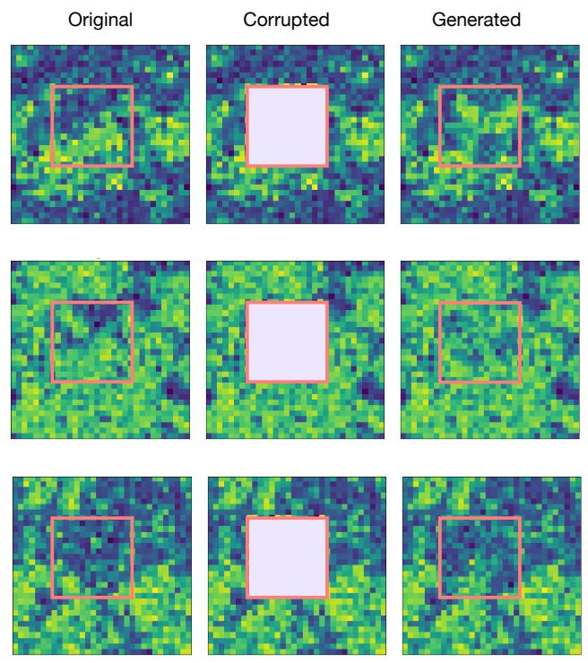  
Figure 7: $\phi ^ { 4 }$ 1-model: Inpainting of three different configurations.

# B.1 Multitask inpainting and sequential generation

For all image generation experiments, the U-Net architecture originally proposed in Ho et al. (2020) is used. The specification of architecture hyperparameters as well as training hyperparameters are given in Table 2. Training was done for 200 epochs on batches comprised of 30 draws from the target, and 50 time slices. The objectives given in 3 and 4 were optimized using the Adam optimizer. The learning rate was set to .0001 and was dropped by a factor of 2 every 1500 iterations of training. To integrate the ODE/SDE when drawing samples, we used a simple Euler integrator.

In order to progressively explore the space of the hypercube of α and $\beta ,$ we first learn a model in the diagonal of the hypercube, i.e where all entries of α are all the same value. We then fine-tune the first model for matrices $\alpha _ { t }$ uniformly distributed in $[ 0 , 1 ] ^ { d }$ . We also fine-tune the first model for matrices $\alpha _ { t }$ decomposed by blocks of $4 \times 4$ where entries of each blocks contains the same values in $[ 0 , 1 ] ^ { d }$ .

<table><tr><td></td><td>MNIST</td><td> $\phi^4$ </td><td>CelebA</td><td>AFHQ-Cat</td></tr><tr><td>Dimension</td><td>28×28</td><td>32×32</td><td>128×128</td><td>256×256</td></tr><tr><td># Training point</td><td>60,000</td><td>100,000</td><td>190,000</td><td>5,000</td></tr><tr><td>Batch Size</td><td>50</td><td>100</td><td>128</td><td>64</td></tr><tr><td>Training Steps</td><td> $4×10^5$ </td><td> $2×10^5$ </td><td> $4×10^5$ </td><td> $4×10^5$ </td></tr><tr><td>Attention Resolution</td><td>64</td><td>64</td><td>64</td><td>64</td></tr><tr><td>Learning Rate (LR)</td><td>0.0002</td><td>0.0002</td><td>0.0001</td><td>0.0001</td></tr><tr><td>LR decay (1k epochs)</td><td>0.995</td><td>0.995</td><td>0.995</td><td>0.995</td></tr><tr><td>U-Net dim mult</td><td>[1,2,2,2]</td><td>[1,2,2,2]</td><td>[1,2,4,8]</td><td>[1,2,4,8]</td></tr><tr><td>Learned t embedding</td><td>Yes</td><td>Yes</td><td>Yes</td><td>Yes</td></tr><tr><td># GPUs</td><td>1</td><td>1</td><td>4</td><td>4</td></tr></table>

Table 2: Hyperparameters and architecture for MNIST, $\overline { { { \phi } ^ { 4 } } }$ and maze datasets.

# B.2 Details about the $\phi ^ { 4 }$ Model

We define the discrete Fourier transform as

$$
\hat {\phi} (k) = L ^ {- d / 2} \sum_ {a} e ^ {2 i \pi k \cdot a / L} \phi (a) \quad \Leftrightarrow \quad \phi (a) = L ^ {- d / 2} \sum_ {k} e ^ {- 2 i \pi k \cdot a / L} \hat {\phi} (k), \tag {42}
$$

where $a , k \in [ 0 , \ldots , L - 1 ] ^ { d }$ , we can write the energy (24) as $E ( \phi ) = E _ { 0 } ( \phi ) + U ( \phi )$ with

$$
E _ {0} (\phi) = \hat {E} _ {0} (\hat {\phi}) \equiv \frac {1}{2} \sum_ {k} \hat {M} (k) | \hat {\phi} (k) | ^ {2}, \quad \hat {M} (k) = 2 \alpha \left(d - \sum_ {\hat {e}} \cos (2 \pi k \cdot \hat {e} / L)\right) + \beta_ {0}, \tag {43}
$$

where eˆ denotes the d basis vectors on the lattice and $\beta _ { 0 } > 0$ is an adjustable parameter; and

$$
\begin{array}{l} U (\phi) = \frac {1}{2} \left(\kappa - \kappa_ {0}\right) \sum_ {a} | \phi (a) | ^ {2} + \frac {1}{4} \gamma \sum_ {a} | \phi (a) | ^ {4} \\ \Longrightarrow \hat {U} (\hat {\phi}) = \frac {1}{2} \left(\kappa - \kappa_ {0}\right) \sum_ {k} | \hat {\phi} (k) | ^ {2} + \frac {1}{4} \gamma \sum_ {a} \left| L ^ {- d / 2} \sum_ {k} e ^ {- 2 i \pi k \cdot a / L} \hat {\phi} (k) \right| ^ {4}. \tag {44} \\ \end{array}
$$

where $\phi$ and $\hat { \phi }$ are Fourier transform pairs as defined in (42): the last term can be implemented via $\textstyle \sum _ { a } ( \mathrm { i f f t } ( { \hat { \phi } } ) ) ^ { 4 } ( a )$ .

Sampling using the Langevin SDE: To obtain the ground-truth samples from the $\phi ^ { 4 }$ model, one option is to use the SDE

$$
d \hat {\phi} _ {t} (k) = - \hat {M} (k) \hat {\phi} _ {t} (k) d t - (\kappa - \kappa_ {0}) \hat {\phi} _ {t} (k) d t - \widehat {\gamma \phi_ {t} ^ {3}} (k) d t + \sqrt {2} d \hat {W} _ {t} (k). \tag {45}
$$

where we denote

$$
\widehat {\phi_ {t} ^ {3}} (k) = L ^ {- d / 2} \sum_ {a} e ^ {2 i \pi k \cdot a / L} \left(L ^ {- d / 2} \sum_ {k} e ^ {- 2 i \pi k \cdot a / L} \hat {\phi} _ {t} (k)\right) ^ {3} \tag {46}
$$

which can be implemented via $\mathrm { f f t } ( ( \mathrm { i f f t } ( \hat { \phi } _ { t } ) ) ^ { 3 } )$ . This SDE may be quite stiff, however, a problem that can be alleviated by changing the mobility and using instead

$$
d \hat {\phi} _ {t} (k) = - \hat {\phi} _ {t} (k) d t - (\kappa - \kappa_ {0}) \hat {M} ^ {- 1} (k) \hat {\phi} _ {t} (k) d t - \gamma \hat {M} ^ {- 1} (k) \widehat {\phi_ {t} ^ {3}} (k) d t + \sqrt {2} \hat {M} ^ {- 1 / 2} (k) d \hat {W} _ {t} (k). \tag {47}
$$

The discretized version of this equation reads

$$
\begin{array}{l} \hat {\phi} _ {t _ {n + 1}} (k) = \hat {\phi} _ {t _ {n}} (k) - \Delta t _ {n} \left(\hat {\phi} _ {t _ {n}} (k) + (\kappa - \kappa_ {0}) \hat {M} ^ {- 1} (k) \hat {\phi} _ {t _ {n}} (k) + \gamma \hat {M} ^ {- 1} (k) \widehat {\phi_ {t _ {n}} ^ {3}} (k)\right) \tag {48} \\ + \sqrt {2 \varDelta t _ {n}} \hat {M} ^ {- 1 / 2} (k) \hat {\eta} _ {n} (k), \\ \end{array}
$$

where $\hat { \eta } _ { n }$ is the Fourier transform of $\eta _ { n } \sim N ( 0 , \mathrm { I d } )$ .

Computing the generator of the posterior distribution As illustrated with (25), one would like to sample a slightly different $\phi ^ { 4 }$ model with energy function, noted $E _ { r } , E$ and $E _ { r }$ define respectively the prior and posterior distribution, via the Boltzmann’s law (23). In this work, only relations of the form $E _ { r } = \dot { E ^ { \prime } } - \langle \phi , A \varphi \rangle - \langle h , \varphi \rangle$ are studied, combining a linear and quadratic term. A is assumed to be definite negative.

Lemma B.1. Assume that $\beta = 1 - \alpha$ and let

$$
\eta (\alpha , x) = \mathbb {E} [ x _ {0} - x _ {1} | \alpha x _ {0} + (1 - \alpha) x _ {1} = x ] = \eta_ {0} (\alpha , 1 - \alpha , x) - \eta_ {1} (\alpha , 1 - \alpha , x) \tag {49}
$$

Then

$$
\eta_ {0} (\alpha , 1 - \alpha , x) = x + (1 - \alpha) \eta (\alpha , x), \tag {50}
$$

$$
\eta_ {1} (\alpha , 1 - \alpha , x) = x - \alpha \eta (\alpha , x). \tag {51}
$$

Proof of lemma B.1. Solving (5) and (49) in $( \eta _ { 0 } , \eta _ { 1 } )$ gives (50) and (51).

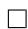

The idea is to use the drift of the prior to sample from the posterior. The following proposition makes it possible.

Proposition B.2 (Posterior drift). Assume β = 1 − α with α diagonal and invertible, and let

$$
\eta^ {r} (\alpha , x) = \mathbb {E} \big [ x _ {0} - x _ {1} | \alpha x _ {0} + (1 - \alpha) x _ {1} ^ {r} = x \big ] = \eta_ {0} ^ {r} (\alpha , 1 - \alpha , x) - \eta_ {1} ^ {r} (\alpha , 1 - \alpha , x) \tag {52}
$$

where the drifts ηr0 and ηr1 are defined in (18) and (19), respectively. Assume also that A is diagonal, non-positive definite, and invertible. Then, $\beta _ { r } = 1 - \alpha _ { r }$ and ηr can be expressed as:

$$
\eta^ {r} (\alpha , x) = \alpha^ {- 1} \alpha_ {r} \eta (\alpha_ {r}, x _ {r}) + \alpha^ {- 1} (x - x ^ {r}), \tag {53}
$$

where η(α, x) is the drift of the prior defined in (49), and αr and xr are given by

$$
\alpha_ {r} = \alpha \frac {\sqrt {1 - 2 \alpha + \alpha^ {2} (1 - A)} - \alpha}{1 - 2 \alpha - \alpha^ {2} A}, \tag {54}
$$

$$
x _ {r} = \frac {\alpha_ {r} ^ {2} (1 - \alpha)}{\alpha^ {2} (1 - \alpha_ {r})} x + \frac {\alpha_ {r} ^ {2}}{(1 - \alpha)} b, \tag {55}
$$

Proof of the Proposition B.2. Using (50), (51) in (18) and (19), one obtains:

$$
\eta_ {0} ^ {r} (\alpha , \beta , x) = \alpha^ {- 1} \beta \beta_ {r} ^ {- 1} \alpha_ {r} ((1 - \alpha_ {r}) \eta (\alpha_ {r}, \beta_ {r}, x _ {r}) + x _ {r}) + \alpha^ {- 1} (x - \beta \beta_ {r} ^ {- 1} x _ {r}),
$$

$$
\eta_ {1} ^ {r} (\alpha , \beta , x) = x _ {r} - \alpha_ {r} \eta (\alpha_ {r}, \beta_ {r}, x _ {r}).
$$

Then, take the difference, and regrouping terms together eventually yields:

$$
\begin{array}{l} \eta_ {0} ^ {r} (\alpha , \beta , x) - \eta_ {1} ^ {r} (\alpha , \beta , x) = \underbrace {(\alpha^ {- 1} \beta x _ {r} + x _ {r})} _ {= \alpha^ {- 1} \alpha_ {r}} \eta (\alpha_ {r}, \beta_ {r}, x _ {r}) + \underbrace {\alpha^ {- 1} \beta \beta_ {r} ^ {- 1} (\alpha_ {r} - 1) x _ {r}} _ {= - \alpha^ {- 1} \beta x _ {r}} - x _ {r} + \alpha^ {- 1} x \\ = \alpha^ {- 1} \alpha_ {r} \eta (\alpha_ {r}, \beta_ {r}, x _ {r}) + \alpha^ {- 1} (x - x _ {r}). \\ \end{array}
$$

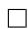

The linear case Assume for now that A = 0 and b = h. Note that one recovers the same case that in (25), that is, one applies a uniform magnetic field of magnitude h over the whole lattice. What follows is simply a corollary of B.2.

Proposition B.3. Assume $E _ { r } = E - ( \phi , h )$ . Then, $\alpha _ { r } = \alpha , \beta _ { r } = \beta ,$ and

$$
\phi_ {r} = \phi + \alpha \alpha^ {T} \beta^ {- T} h. \tag {56}
$$

Also, the posterior drift $\eta ^ { r }$ writes:

$$
\eta^ {r} (\alpha , \beta , \phi) = \eta (\alpha , \beta , \phi_ {r}) - \alpha^ {T} \beta^ {- T} h. \tag {57}
$$

Proof of Proposition B.3. Since A = 0, (20) directly implies $\alpha _ { r } = \alpha$ and $\beta _ { r } = \beta$ . Consequently, (56) follow from (21) and (57) from (53). □

In summary, a simple shift proportional to h appears in the posterior field $\phi _ { r }$ . It clearly tends to favor the alignment with the magnetic field, which obeys common sense.

# The quadratic case

• Assume that b = 0 and $A = - k ^ { 2 } \mathrm { I d } .$ .

In a similar fashion to the linear case, one derives analytical expressions for the quantities of interest.

Proposition B.4. Assume $E _ { r } = E - ( \phi , A \phi ) = E + k ^ { 2 } \sum _ { a } \phi ( a ) ^ { 2 } , \beta _ { r } = 1 - \alpha _ { r } a n d \beta = 1 - \alpha .$ a

Then

$$
\alpha_ {r} = \alpha \frac {- \alpha + \sqrt {1 - 2 \alpha + \alpha^ {2} (1 + k ^ {2})}}{1 - 2 \alpha + \alpha^ {2} k ^ {2}}, \tag {58}
$$

$$
\phi_ {r} = \frac {(- \alpha + \sqrt {1 - 2 \alpha + \alpha^ {2} (1 + k ^ {2})}) (1 - \alpha)}{\sqrt {1 - 2 \alpha + \alpha^ {2} (1 + k ^ {2})} (1 - 2 \alpha + \alpha^ {2} k ^ {2})} \phi , \tag {59}
$$

and

$$
\eta^ {r} (\alpha , \beta , \phi) = \frac {- \alpha + \sqrt {1 - 2 \alpha + \alpha^ {2} (1 + k ^ {2})}}{1 - 2 \alpha + \alpha^ {2} k ^ {2}} \eta (\alpha_ {r}, \beta_ {r}, \phi_ {r}) \tag {60}
$$

$$
+ \alpha^ {- 1} \phi \left(1 - \frac {(- \alpha + \sqrt {1 - 2 \alpha + \alpha^ {2} (1 + k ^ {2})}) (1 - \alpha)}{\sqrt {1 - 2 \alpha + \alpha^ {2} (1 + k ^ {2})} (1 - 2 \alpha + \alpha^ {2} k ^ {2})}\right). \tag {61}
$$

Proof of the Proposition B.4. Given the assumptions, (20) yields:

$$
(\mathrm{Id} - \alpha_ {r}) ^ {T} \alpha_ {r} ^ {- T} \alpha_ {r} ^ {- 1} (\mathrm{Id} - \alpha_ {r}) = (\mathrm{Id} - \alpha) ^ {T} \alpha^ {- T} \alpha^ {- 1} (\mathrm{Id} - \alpha) - k ^ {2} \mathrm{Id}.
$$

Observing that α and A are diagonals, $\alpha _ { r }$ is also diagonal. Furthermore, assuming that $\alpha _ { r }$ is proportional to the identity, the above reduces to the scalar equation (keeping the same notation for conciseness):

$$
\frac {(1 - \alpha_ {r}) ^ {2}}{\alpha_ {r} ^ {2}} = \frac {(1 - \alpha) ^ {2}}{\alpha^ {2}} + k ^ {2}
$$

After a few elementary manipulations, one arrives at:

$$
(1 - \alpha_ {r}) ^ {2} \alpha^ {2} = \alpha_ {r} ^ {2} (1 - \alpha) ^ {2} + k ^ {2} \alpha_ {r} ^ {2} \alpha^ {2}.
$$

This is a quadratic equation that admits two solutions. Only one is positive, and writes as:

$$
\alpha_ {r} = \frac {- \alpha^ {2} + \alpha \sqrt {1 - 2 \alpha + \alpha^ {2} (1 + k ^ {2})}}{1 - 2 \alpha + \alpha^ {2} k ^ {2}} = \alpha \frac {- \alpha + \sqrt {1 - 2 \alpha + \alpha^ {2} (1 + k ^ {2})}}{1 - 2 \alpha + \alpha^ {2} k ^ {2}}. \tag {62}
$$

It is quite easy to check that the discriminant is always positive, so it does not pose any problem. Also, i $\mathrm { ~ f ~ } k \geqslant \bar { 0 }$ and $\alpha \in [ 0 , 1 ]$ , then $\alpha _ { r } \in [ 0 , 1 ]$ ]. This property is necessary, since $\alpha \mapsto \eta ( \cdot , \alpha )$ has been trained in the hypercube $[ 0 , 1 ] ^ { d }$ .

After elementary simplifications and recalling that $\beta _ { r } = 1 - \alpha _ { r }$ and (21), one has:

$$
\phi_ {r} = \frac {\alpha_ {r} ^ {2}}{\alpha^ {2}} \frac {1 - \alpha}{1 - \alpha_ {r}} = \left(\frac {- \alpha + \sqrt {1 - 2 \alpha + \alpha^ {2} (1 + k ^ {2})}}{1 - 2 \alpha + \alpha^ {2} k ^ {2}}\right) ^ {2} \frac {1 - \alpha}{1 - \alpha_ {r}}.
$$

$\begin{array} { r } { \mathrm { S i n c e ~ } 1 - \alpha _ { r } = \frac { 1 - 2 \alpha + \alpha ^ { 2 } k ^ { 2 } + \alpha ^ { 2 } - \alpha \sqrt { 1 - 2 \alpha + \alpha ^ { 2 } ( 1 + k ^ { 2 } ) } } { 1 - 2 \alpha + \alpha ^ { 2 } k ^ { 2 } } = \frac { 1 - 2 \alpha + \alpha ^ { 2 } ( 1 + k ^ { 2 } ) - \alpha \sqrt { 1 - 2 \alpha + \alpha ^ { 2 } ( 1 + k ^ { 2 } ) } } { 1 - 2 \alpha + \alpha ^ { 2 } k ^ { 2 } } , \mathrm { i t ~ y i e l d s } . } \end{array}$

$$
\phi_ {r} = \frac {(- \alpha + \sqrt {1 - 2 \alpha + \alpha^ {2} (1 + k ^ {2})}) ^ {2}}{1 - 2 \alpha + \alpha^ {2} k ^ {2}} \frac {1 - \alpha}{1 - 2 \alpha + \alpha^ {2} (1 + k ^ {2}) - \alpha \sqrt {1 - 2 \alpha + \alpha^ {2} (1 + k ^ {2})}}, \tag {63}
$$

then factorizing by $\sqrt { 1 - 2 \alpha + \alpha ^ { 2 } ( 1 + k ^ { 2 } ) }$ eventually gives (59).

Eventually, after replacing (62) and (59) into (53), (60) holds.

• Assume that b = 0 and $A = k ^ { 2 } \mathrm { I d } .$ .

In this case, the quadratic equation is:

$$
\frac {(1 - \alpha_ {r}) ^ {2}}{\alpha_ {r} ^ {2}} = \frac {(1 - \alpha) ^ {2}}{\alpha^ {2}} - k ^ {2},
$$

or otherwise stated:

$$
(1 - \alpha_ {r}) ^ {2} \alpha^ {2} - (1 - \alpha) ^ {2} \alpha_ {r} ^ {2} + \alpha_ {r} ^ {2} \alpha^ {2} k ^ {2} = 0.
$$

The discriminant of this polynomial is $\Delta = \alpha ^ { 2 } ( 1 - k ^ { 2 } ) - 2 \alpha + 1$ . Assuming it strictly positive, among the two solutions, only one is positive:

$$
\alpha_ {r} = \alpha \frac {\sqrt {1 - 2 \alpha + \alpha^ {2} (1 - k ^ {2})} - \alpha}{1 - 2 \alpha - (\alpha k) ^ {2}}.
$$

The polynomial inside the square root is positive if and only if α $\notin [ \frac { 1 } { 1 + k } , \frac { 1 } { 1 - k } ]$ . To see that, see there exists always two real roots, since the discriminants is $4 k ^ { 2 } > 0$ . Those roots are $\textstyle { \frac { 1 } { 1 + k } } < 1$ and $\textstyle { \frac { 1 } { 1 - k } } > 1$ . Since $\alpha _ { r } \in [ 0 , 1 ]$ must be respected for all $\alpha \in [ 0 , 1 ]$ , only $k < 1$ can be considered with our method. Consequently, sampling using stochastic interpolants from $\alpha = 1$ to $\alpha = 0$ appears impossible with this method.

# B.3 Details about the maze experiment

We use the Hadamard interpolant (9) and estimate the drift $\eta ( \alpha , x )$ defined in (10) by approximating it with a U-Net neural network Ho et al. (2020), trained with an Adam optimizer Kingma and Ba (2017). The U-Net comprises 4 stages with 48, 80, 160, and 256 channels respectively for the encoding flow. The decoder has the same architecture as the encoder but in reverse order, with added residual connections Ronneberger et al. (2015). Each stage consists of 2 residual blocks, with the first concatenated with a self-attention block. The input vector has shape $d \times 2$ , where row i contains the x and y coordinates of the i-th point in the trajectory.

In contrast to conventional U-Net architectures, we perform interpolation and max pooling operations independently on each coordinate column to increase and reduce dimensions only along the trajectory length axis. The convolution kernel size is $5 \times 2 ,$ , processing each point’s coordinates together with those of its two temporal predecessors and successors in the sequence. We add the necessary padding to maintain identical input and output dimensions, which amounts to padding by two rows at the top and bottom of the input vector.

Given a pair of randomly chosen points in the maze, we must determine where to constrain these points along the generated trajectory. If the constraint points are placed too far apart in the sequence (large index difference), the resulting path will likely not be the shortest route; conversely, if placed too close together (small index difference), the generated path has an increased chance of cutting through forbidden regions, making it inadmissible. To address this trade-off, we adopt the following heuristic. We fix the starting point at the beginning of the path (index i = 1) and employ a progressive search for the target point placement using the candidate indices [5, 10, 20, 30, 40, 45, 50]. We first generate a path with the target point constrained at index 5 (creating a short trajectory). If this path intersects forbidden regions, we increase the target index to 10 (allowing a longer path), and continue this process until we generate a valid path that successfully avoids all obstacles.

On Figure 8, we impose paths to go by the bottom-right corner, the constraint is visible as a small white dot. The path length adapts accordingly.

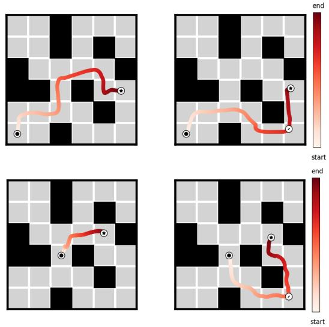  
Figure 8: Two generated pathways, one per row. Left: No constraint is imposed on the path, other than joining the two endpoints. Right: An additional constraint is imposed: the path must pass through the bottom-right corner, represented by a white dot.

# C Additional experimental results

Here we provide additional infilling image results, given in Figure 9.

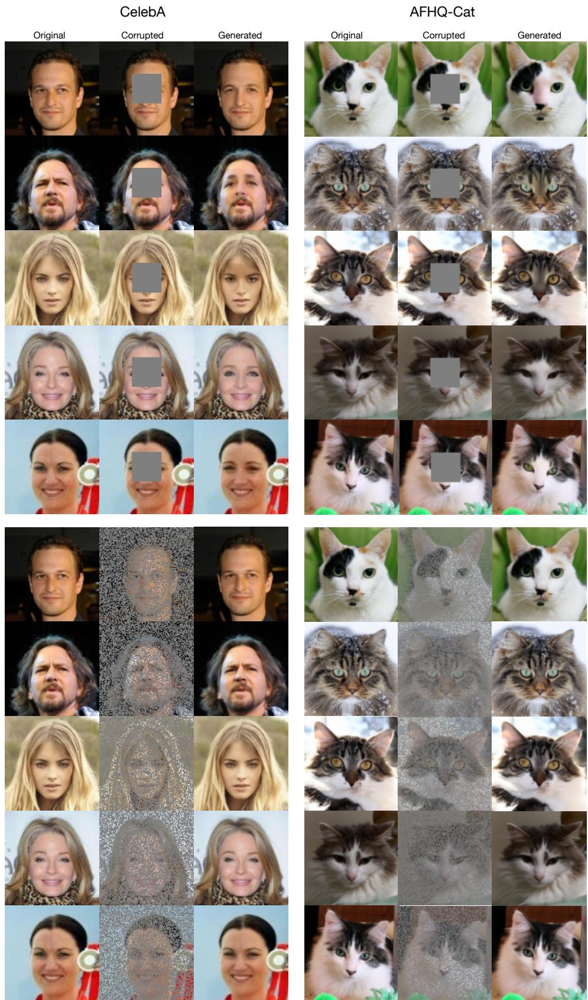  
Figure 9: Additional images demonstrating the inpainting task: Block inpainting is shown in the top panels, while random inpainting is displayed in the bottom panels. The left panels depict images from the AFHQ dataset, and the right panels show images from the CelebA dataset.

# NeurIPS Paper Checklist

The checklist is designed to encourage best practices for responsible machine learning research, addressing issues of reproducibility, transparency, research ethics, and societal impact. Do not remove the checklist: The papers not including the checklist will be desk rejected. The checklist should follow the references and follow the (optional) supplemental material. The checklist does NOT count towards the page limit.

Please read the checklist guidelines carefully for information on how to answer these questions. For each question in the checklist:

• You should answer [Yes] , [No] , or [NA] .   
• [NA] means either that the question is Not Applicable for that particular paper or the relevant information is Not Available.   
• Please provide a short (1–2 sentence) justification right after your answer (even for NA).

The checklist answers are an integral part of your paper submission. They are visible to the reviewers, area chairs, senior area chairs, and ethics reviewers. You will be asked to also include it (after eventual revisions) with the final version of your paper, and its final version will be published with the paper.

The reviewers of your paper will be asked to use the checklist as one of the factors in their evaluation. While "[Yes] " is generally preferable to "[No] ", it is perfectly acceptable to answer "[No] " provided a proper justification is given (e.g., "error bars are not reported because it would be too computationally expensive" or "we were unable to find the license for the dataset we used"). In general, answering "[No] " or "[NA] " is not grounds for rejection. While the questions are phrased in a binary way, we acknowledge that the true answer is often more nuanced, so please just use your best judgment and write a justification to elaborate. All supporting evidence can appear either in the main paper or the supplemental material, provided in appendix. If you answer [Yes] to a question, in the justification please point to the section(s) where related material for the question can be found.

IMPORTANT, please:

• Delete this instruction block, but keep the section heading “NeurIPS Paper Checklist",   
• Keep the checklist subsection headings, questions/answers and guidelines below.   
• Do not modify the questions and only use the provided macros for your answers.

# 1. Claims

Question: Do the main claims made in the abstract and introduction accurately reflect the paper’s contributions and scope?

Answer: [Yes]

Justification: The abstract claims that the formalism of stochastic interpolants have been adapted for zero-shot conditional generation, in-painting, and posterior sampling. The corresponding numerical experiments are explicitly displayed in their associated sections. Posterior sampling has been theoretically explored and numerically investigated in the ϕ4 model with stochastic interpolants. We show that our model can learn to generate images at multiple scales: pixel-wise, blockwise, and in all dimensions simultaneously.

# Guidelines:

• The answer NA means that the abstract and introduction do not include the claims made in the paper.   
• The abstract and/or introduction should clearly state the claims made, including the contributions made in the paper and important assumptions and limitations. A No or NA answer to this question will not be perceived well by the reviewers.   
• The claims made should match theoretical and experimental results, and reflect how much the results can be expected to generalize to other settings.   
• It is fine to include aspirational goals as motivation as long as it is clear that these goals are not attained by the paper.

# 2. Limitations

Question: Does the paper discuss the limitations of the work performed by the authors?

Answer: [Yes]

Justification: A discussion on this matter is present in the conclusion.

Guidelines:

• The answer NA means that the paper has no limitation while the answer No means that the paper has limitations, but those are not discussed in the paper.   
• The authors are encouraged to create a separate "Limitations" section in their paper.   
• The paper should point out any strong assumptions and how robust the results are to violations of these assumptions (e.g., independence assumptions, noiseless settings, model well-specification, asymptotic approximations only holding locally). The authors should reflect on how these assumptions might be violated in practice and what the implications would be.   
• The authors should reflect on the scope of the claims made, e.g., if the approach was only tested on a few datasets or with a few runs. In general, empirical results often depend on implicit assumptions, which should be articulated.   
• The authors should reflect on the factors that influence the performance of the approach. For example, a facial recognition algorithm may perform poorly when image resolution is low or images are taken in low lighting. Or a speech-to-text system might not be used reliably to provide closed captions for online lectures because it fails to handle technical jargon.   
• The authors should discuss the computational efficiency of the proposed algorithms and how they scale with dataset size.   
• If applicable, the authors should discuss possible limitations of their approach to address problems of privacy and fairness.   
• While the authors might fear that complete honesty about limitations might be used by reviewers as grounds for rejection, a worse outcome might be that reviewers discover limitations that aren’t acknowledged in the paper. The authors should use their best judgment and recognize that individual actions in favor of transparency play an important role in developing norms that preserve the integrity of the community. Reviewers will be specifically instructed to not penalize honesty concerning limitations.

# 3. Theory assumptions and proofs

Question: For each theoretical result, does the paper provide the full set of assumptions and a complete (and correct) proof?

Answer: [Yes]

Justification: All proofs, with their set of assumptions, are provided in the Appendix.

Guidelines:

• The answer NA means that the paper does not include theoretical results.   
• All the theorems, formulas, and proofs in the paper should be numbered and crossreferenced.   
• All assumptions should be clearly stated or referenced in the statement of any theorems.   
• The proofs can either appear in the main paper or the supplemental material, but if they appear in the supplemental material, the authors are encouraged to provide a short proof sketch to provide intuition.   
• Inversely, any informal proof provided in the core of the paper should be complemented by formal proofs provided in appendix or supplemental material.   
• Theorems and Lemmas that the proof relies upon should be properly referenced.

# 4. Experimental result reproducibility

Question: Does the paper fully disclose all the information needed to reproduce the main experimental results of the paper to the extent that it affects the main claims and/or conclusions of the paper (regardless of whether the code and data are provided or not)?

Answer: [Yes]

Justification: The details of all the numerical experiments are discussed either in the main text of the paper or in the Appendix, especially concerning the one-shot conditional generation and inpainting.

# Guidelines:

• The answer NA means that the paper does not include experiments.

• If the paper includes experiments, a No answer to this question will not be perceived well by the reviewers: Making the paper reproducible is important, regardless of whether the code and data are provided or not.

• If the contribution is a dataset and/or model, the authors should describe the steps taken to make their results reproducible or verifiable.

• Depending on the contribution, reproducibility can be accomplished in various ways. For example, if the contribution is a novel architecture, describing the architecture fully might suffice, or if the contribution is a specific model and empirical evaluation, it may be necessary to either make it possible for others to replicate the model with the same dataset, or provide access to the model. In general. releasing code and data is often one good way to accomplish this, but reproducibility can also be provided via detailed instructions for how to replicate the results, access to a hosted model (e.g., in the case of a large language model), releasing of a model checkpoint, or other means that are appropriate to the research performed.

• While NeurIPS does not require releasing code, the conference does require all submissions to provide some reasonable avenue for reproducibility, which may depend on the nature of the contribution. For example

(a) If the contribution is primarily a new algorithm, the paper should make it clear how to reproduce that algorithm.

(b) If the contribution is primarily a new model architecture, the paper should describe the architecture clearly and fully.

(c) If the contribution is a new model (e.g., a large language model), then there should either be a way to access this model for reproducing the results or a way to reproduce the model (e.g., with an open-source dataset or instructions for how to construct the dataset).

(d) We recognize that reproducibility may be tricky in some cases, in which case authors are welcome to describe the particular way they provide for reproducibility. In the case of closed-source models, it may be that access to the model is limited in some way (e.g., to registered users), but it should be possible for other researchers to have some path to reproducing or verifying the results.

# 5. Open access to data and code

Question: Does the paper provide open access to the data and code, with sufficient instructions to faithfully reproduce the main experimental results, as described in supplemental material?

# Answer: [Yes]

Justification: All the code and data used for the numerical experiments will be exposed in a Github repository. A set of instructions to fully reproduce the results will be provided in a README file.

# Guidelines:

• The answer NA means that paper does not include experiments requiring code.

• Please see the NeurIPS code and data submission guidelines (https://nips.cc/ public/guides/CodeSubmissionPolicy) for more details.

• While we encourage the release of code and data, we understand that this might not be possible, so “No” is an acceptable answer. Papers cannot be rejected simply for not including code, unless this is central to the contribution (e.g., for a new open-source benchmark).

• The instructions should contain the exact command and environment needed to run to reproduce the results. See the NeurIPS code and data submission guidelines (https: //nips.cc/public/guides/CodeSubmissionPolicy) for more details.

• The authors should provide instructions on data access and preparation, including how to access the raw data, preprocessed data, intermediate data, and generated data, etc.   
• The authors should provide scripts to reproduce all experimental results for the new proposed method and baselines. If only a subset of experiments are reproducible, they should state which ones are omitted from the script and why.   
• At submission time, to preserve anonymity, the authors should release anonymized versions (if applicable).   
• Providing as much information as possible in supplemental material (appended to the paper) is recommended, but including URLs to data and code is permitted.

# 6. Experimental setting/details

Question: Does the paper specify all the training and test details (e.g., data splits, hyperparameters, how they were chosen, type of optimizer, etc.) necessary to understand the results?

Answer: [Yes]

Justification: All test details are provided in Appendix (e.g. Table 2).

Guidelines:

• The answer NA means that the paper does not include experiments.   
• The experimental setting should be presented in the core of the paper to a level of detail that is necessary to appreciate the results and make sense of them.   
• The full details can be provided either with the code, in appendix, or as supplemental material.

# 7. Experiment statistical significance

Question: Does the paper report error bars suitably and correctly defined or other appropriate information about the statistical significance of the experiments?

Answer: [Yes]

Justification: The full distribution of the average magnetization has been studied for our ϕ4 model in Figure 5.

Guidelines:

• The answer NA means that the paper does not include experiments.   
• The authors should answer "Yes" if the results are accompanied by error bars, confidence intervals, or statistical significance tests, at least for the experiments that support the main claims of the paper.   
• The factors of variability that the error bars are capturing should be clearly stated (for example, train/test split, initialization, random drawing of some parameter, or overall run with given experimental conditions).   
• The method for calculating the error bars should be explained (closed form formula, call to a library function, bootstrap, etc.)   
• The assumptions made should be given (e.g., Normally distributed errors).   
• It should be clear whether the error bar is the standard deviation or the standard error of the mean.   
• It is OK to report 1-sigma error bars, but one should state it. The authors should preferably report a 2-sigma error bar than state that they have a 96% CI, if the hypothesis of Normality of errors is not verified.   
• For asymmetric distributions, the authors should be careful not to show in tables or figures symmetric error bars that would yield results that are out of range (e.g. negative error rates).   
• If error bars are reported in tables or plots, The authors should explain in the text how they were calculated and reference the corresponding figures or tables in the text.

# 8. Experiments compute resources

Question: For each experiment, does the paper provide sufficient information on the computer resources (type of compute workers, memory, time of execution) needed to reproduce the experiments?

# Answer: [Yes]

Justification: A Table containing all relevant information will be provided in the Appendix.

# Guidelines:

• The answer NA means that the paper does not include experiments.   
• The paper should indicate the type of compute workers CPU or GPU, internal cluster, or cloud provider, including relevant memory and storage.   
• The paper should provide the amount of compute required for each of the individual experimental runs as well as estimate the total compute.   
• The paper should disclose whether the full research project required more compute than the experiments reported in the paper (e.g., preliminary or failed experiments that didn’t make it into the paper).

# 9. Code of ethics

Question: Does the research conducted in the paper conform, in every respect, with the NeurIPS Code of Ethics https://neurips.cc/public/EthicsGuidelines?

# Answer: [Yes]

Justification: Our paper presents theoretical and mathematical foundations for multitask generative modeling using operator-based interpolants. The research primarily consists of mathematical formulations and theoretical derivations. Our experiments are limited to publicly available benchmark datasets (MNIST digits) and physical simulation data, neither of which contain sensitive information or raise ethical concerns. We do not collect or use personal data, conduct experimentation on humans or animals, or develop technologies with potential for harm or misuse. All sources and prior work are properly cited, and our mathematical derivations, proofs, and experimental procedures are presented transparently. The research was conducted with scientific integrity, honesty, and transparency throughout the process, fully adhering to all aspects of the NeurIPS Code of Ethics.

# Guidelines:

• The answer NA means that the authors have not reviewed the NeurIPS Code of Ethics.   
• If the authors answer No, they should explain the special circumstances that require a deviation from the Code of Ethics.   
• The authors should make sure to preserve anonymity (e.g., if there is a special consideration due to laws or regulations in their jurisdiction).

# 10. Broader impacts

Question: Does the paper discuss both potential positive societal impacts and negative societal impacts of the work performed?

# Answer: [NA]

Justification: Our paper presents a theoretical framework for operator-based interpolants in generative modeling, which primarily advances fundamental research in this area. The work is largely theoretical and mathematical in nature, focusing on developing a universal approach to multitask learning rather than specific applications with direct societal implications. While we discuss potential technical benefits in the paper’s conclusion, the theoretical nature and early stage of this research makes specific societal impacts, whether positive or negative, difficult to assess meaningfully at this time.

# Guidelines:

• The answer NA means that there is no societal impact of the work performed.   
• If the authors answer NA or No, they should explain why their work has no societal impact or why the paper does not address societal impact.   
• Examples of negative societal impacts include potential malicious or unintended uses (e.g., disinformation, generating fake profiles, surveillance), fairness considerations (e.g., deployment of technologies that could make decisions that unfairly impact specific groups), privacy considerations, and security considerations.   
• The conference expects that many papers will be foundational research and not tied to particular applications, let alone deployments. However, if there is a direct path to

any negative applications, the authors should point it out. For example, it is legitimate to point out that an improvement in the quality of generative models could be used to generate deepfakes for disinformation. On the other hand, it is not needed to point out that a generic algorithm for optimizing neural networks could enable people to train models that generate Deepfakes faster.

• The authors should consider possible harms that could arise when the technology is being used as intended and functioning correctly, harms that could arise when the technology is being used as intended but gives incorrect results, and harms following from (intentional or unintentional) misuse of the technology.   
• If there are negative societal impacts, the authors could also discuss possible mitigation strategies (e.g., gated release of models, providing defenses in addition to attacks, mechanisms for monitoring misuse, mechanisms to monitor how a system learns from feedback over time, improving the efficiency and accessibility of ML).

# 11. Safeguards

Question: Does the paper describe safeguards that have been put in place for responsible release of data or models that have a high risk for misuse (e.g., pretrained language models, image generators, or scraped datasets)?

Answer: [NA]

Justification: This question is not applicable to our paper as we do not release any models or datasets that present a high risk for misuse.

# Guidelines:

• The answer NA means that the paper poses no such risks.   
• Released models that have a high risk for misuse or dual-use should be released with necessary safeguards to allow for controlled use of the model, for example by requiring that users adhere to usage guidelines or restrictions to access the model or implementing safety filters.   
• Datasets that have been scraped from the Internet could pose safety risks. The authors should describe how they avoided releasing unsafe images.   
• We recognize that providing effective safeguards is challenging, and many papers do not require this, but we encourage authors to take this into account and make a best faith effort.

# 12. Licenses for existing assets

Question: Are the creators or original owners of assets (e.g., code, data, models), used in the paper, properly credited and are the license and terms of use explicitly mentioned and properly respected?

Answer: [Yes]

Justification: In our paper, we properly credit the creators and original owners of all assets used, including the MNIST dataset and any referenced algorithms or methodologies. For the MNIST dataset, which is in the public domain, we acknowledge its source and cite the original publication. All assets are used in accordance with their intended research purposes and we have carefully respected all applicable terms of use and licensing requirements throughout our research process.

# Guidelines:

• The answer NA means that the paper does not use existing assets.   
• The authors should cite the original paper that produced the code package or dataset.   
• The authors should state which version of the asset is used and, if possible, include a URL.   
• The name of the license (e.g., CC-BY 4.0) should be included for each asset.   
• For scraped data from a particular source (e.g., website), the copyright and terms of service of that source should be provided.   
• If assets are released, the license, copyright information, and terms of use in the package should be provided. For popular datasets, paperswithcode.com/datasets has curated licenses for some datasets. Their licensing guide can help determine the license of a dataset.

• For existing datasets that are re-packaged, both the original license and the license of the derived asset (if it has changed) should be provided.   
• If this information is not available online, the authors are encouraged to reach out to the asset’s creators.

# 13. New assets

Question: Are new assets introduced in the paper well documented and is the documentation provided alongside the assets?

Answer: [Yes]

Justification: Our paper introduces new theoretical formulations and algorithms for operatorbased interpolants, which are thoroughly documented within the paper itself. The mathematical framework, definitions, lemmas, and propositions are rigorously presented with complete derivations and proofs (in the appendix). For our experimental implementations, we provide detailed descriptions of the model architectures, training procedures, and inference methods in the paper and will release accompanying code with comprehensive documentation that explains the implementation of our operator-based interpolant framework. This documentation includes clear instructions for reproducing our experiments, explanations of key parameters, and examples demonstrating how to apply our methods to various tasks. All assets are carefully documented to ensure transparency and reproducibility of our research.

# Guidelines:

• The answer NA means that the paper does not release new assets.   
• Researchers should communicate the details of the dataset/code/model as part of their submissions via structured templates. This includes details about training, license, limitations, etc.   
• The paper should discuss whether and how consent was obtained from people whose asset is used.   
• At submission time, remember to anonymize your assets (if applicable). You can either create an anonymized URL or include an anonymized zip file.

# 14. Crowdsourcing and research with human subjects

Question: For crowdsourcing experiments and research with human subjects, does the paper include the full text of instructions given to participants and screenshots, if applicable, as well as details about compensation (if any)?

Answer: [NA]

Justification: This question is not applicable to our research as our paper does not involve any human subjects or study participants. Our experiments are conducted exclusively on standard benchmark datasets (MNIST) and physics simulation data, with no human participation involved at any stage. Since no human subjects were part of this research, no IRB approvals or equivalent reviews were necessary, and there were no study-related risks to disclose or manage.

# Guidelines:

• The answer NA means that the paper does not involve crowdsourcing nor research with human subjects.   
• Depending on the country in which research is conducted, IRB approval (or equivalent) may be required for any human subjects research. If you obtained IRB approval, you should clearly state this in the paper.   
• We recognize that the procedures for this may vary significantly between institutions and locations, and we expect authors to adhere to the NeurIPS Code of Ethics and the guidelines for their institution.   
• For initial submissions, do not include any information that would break anonymity (if applicable), such as the institution conducting the review.

# 15. Declaration of LLM usage

Question: Does the paper describe the usage of LLMs if it is an important, original, or non-standard component of the core methods in this research? Note that if the LLM is used only for writing, editing, or formatting purposes and does not impact the core methodology, scientific rigorousness, or originality of the research, declaration is not required.

# Answer: [No]

Justification: No LLM or any kind of transformer architecture is involved in the numerical experiments displayed.

# Guidelines:

• The answer NA means that the core method development in this research does not involve LLMs as any important, original, or non-standard components.   
• Please refer to our LLM policy (https://neurips.cc/Conferences/2025/LLM) for what should or should not be described.