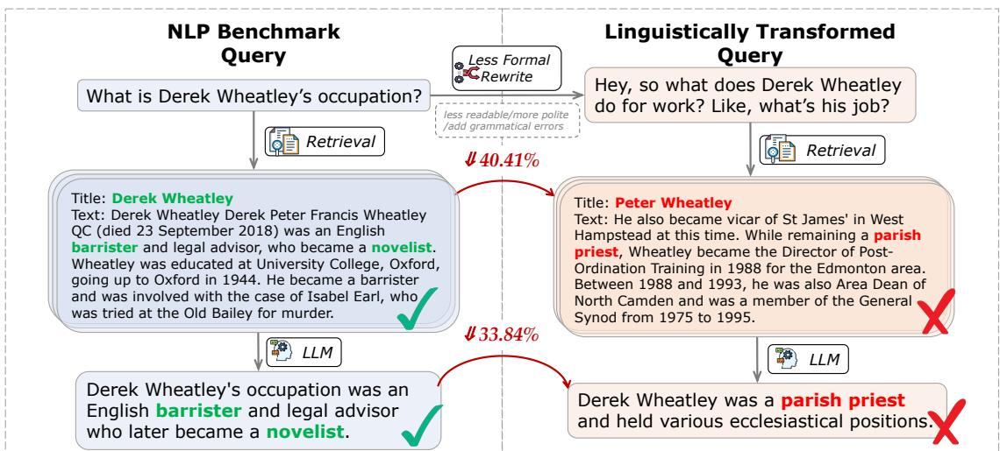
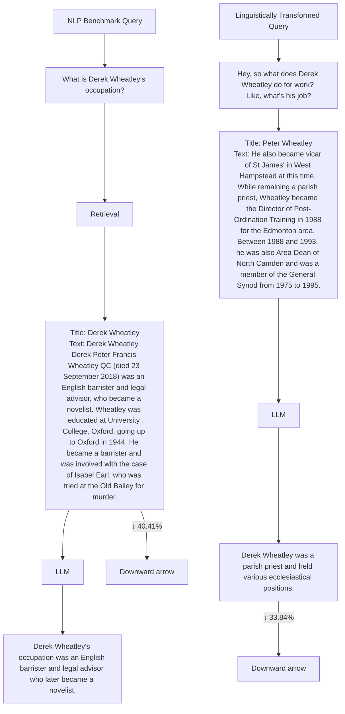
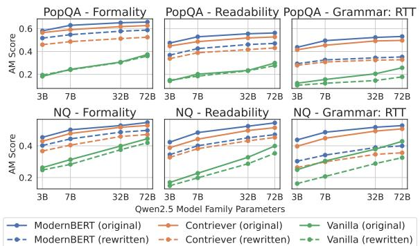
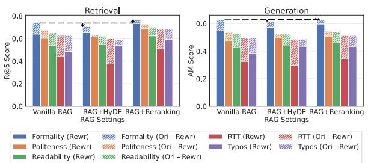
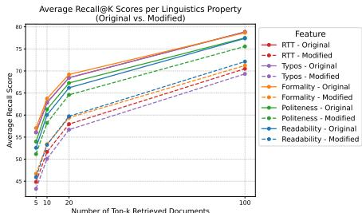
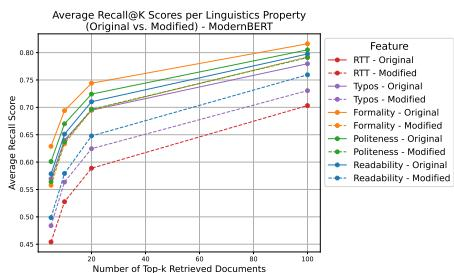

# Out of Style: RAG’s Fragility to Linguistic Variation

Tianyu Cao1\* Neel Bhandari1∗ Akhila Yerukola1 Akari Asai12 Maarten Sap1

1 Language Technologies Institute, Carnegie Mellon University

2 Allen Institute for AI

{tianyuca, neelbhan, ayerukol, aasai, msap2}@cs.cmu.edu

# Abstract

Despite the impressive performance of Retrieval-augmented Generation (RAG) systems across various NLP benchmarks, their robustness in handling real-world user-LLM interaction queries remains largely underexplored. This presents a critical gap for practical deployment, where user queries exhibit greater linguistic variations and can trigger cascading errors across interdependent RAG components. In this work, we systematically analyze how varying four linguistic dimensions (formality, readability, politeness, and grammatical correctness) impact RAG performance. We evaluate two retrieval models and nine LLMs, ranging from 3 to 72 billion parameters, across four information-seeking Question Answering (QA) datasets. Our results reveal that linguistic reformulations significantly impact both retrieval and generation stages, leading to a relative performance drop of up to 40.41% in Recall@5 scores for less formal queries and 38.86% in answer match scores for queries containing grammatical errors. Notably, RAG systems exhibit greater sensitivity to such variations compared to LLM-only generations, highlighting their vulnerability to error propagation due to linguistic shifts. These findings highlight the need for improved robustness techniques to enhance reliability in diverse user interactions.

# 1 Introduction

Retrieval-augmented Generation (RAG) systems enhance Large Language Models (LLMs) by integrating external knowledge retrieval, grounding their output in factual context to improve accuracy and reliability (Lewis et al., 2021; Gao et al., 2024). However, their widespread integration into real-world applications (K2view, 2024) introduces potential challenges regarding robustness to linguistic variations. Users bring varied backgrounds, domains, and cultural contexts that naturally produce linguistic differences in their queries (Park et al., 2024; Li et al., 2020; Lorenzo-Dus and Bou-Franch, 2013). As Figure 1 illustrates, different from the carefully curated queries from traditional NLP benchmarks, real-world user-LLM queries tend to be less formal and frequently contain grammatical inconsistencies (Ouyang et al., 2023).

Failing to account for these linguistic variations risks excluding a broad segment of users from effective interaction, especially for users whose linguistic expressions fall outside the narrow patterns these systems are tuned on (Liang et al., 2023). Moreover, unlike standalone LLMs, RAG systems incorporate multiple interdependent components, making them susceptible to cascading errors arising at both the retrieval and generation stages (Asai et al., 2023; Yoran et al., 2024a; Kim et al., 2025). A truly robust RAG system should maintain consistent retrieval effectiveness and generation quality across the full spectrum of user linguistic variations.

We present a large-scale systematic investigation of how variations in linguistic characteristics affect the robustness of RAG systems. We target diverse and prevalent variations commonly found in real-world user inputs that meaningfully challenge RAG systems (Park et al., 2024; Ouyang et al., 2023), namely, formality, readability, politeness, and grammatical correctness. These choices ensure our analysis covers stylistic, pragmatic, and structural aspects aligned with practical usage. By automatically rewriting queries across these dimensions, we analyze how linguistic variations impact each RAG system component, as well as potential cascading errors throughout the pipeline. Our evaluation encompasses two retrieval models, namely Contriever (Izacard et al., 2021) and ModernBERT (Nussbaum et al., 2024), and nine LLMs from three families (Llama 3.1, Qwen 2.5, Gemma 2) of varying scales across four open-domain Question Answering (QA) datasets: PopQA (Mallen et al., 2023), EntityQuestions (Sciavolino et al., 2022), MS MARCO (Bajaj et al., 2018), and Natural Questions (Kwiatkowski et al., 2019).

flowchart

Figure 1: RAG systems demonstrate overall performance degradation when queries are rewritten to be less formal, more polite, less readable, and with grammatical errors. For the traditional NLP query (left), the RAG systems successfully retrieve related information and generate the correct answer, while the less formal queries (right) retrieve incorrect information. The linguistic variation on formality causes significant performance drops: 40.41% decrease in Recall@5 and 33.38% decrease in answer match (AM) score on the MS MARCO dataset.

Our experiments reveal significant vulnerabilities in RAG systems to linguistic variations. Retrieval analysis shows an average 15% relative performance degradation across all datasets and linguistic dimensions, with grammatical modifications most severely impacting recall while politeness variations show minimal effect. Generation analysis demonstrates average decreases of 16.52% (AM), 41.15% (EM), and 19.60% (F1) across all experimental settings. Notably, increasing the LLM scales doesn’t always help mitigate these performance gaps.

Furthermore, RAG systems exhibit greater vulnerability to linguistic variations than LLM-only generations, suggesting cascading errors across components. The PopQA dataset shows a 22.53% average performance drop in RAG systems versus only 10.78% in LLM-only generations. These findings highlight the urgent need to improve the robustness of retrieval components when handling linguistically varied queries. We also find that while advanced RAG techniques, e.g., query expansion with HyDE (Gao et al., 2022) and documents reranking, tend to improve overall performance, they remain similarly vulnerable to linguistic variations.

In summary, we present the first systematic analysis of the robustness of RAG systems to linguistic query reformulation. Our results demonstrate that despite strong performance on standard benchmarks, they remain fragile to inevitable real-world linguistic variations. These findings highlight the need for enhanced robustness techniques to improve reliability across diverse user interactions and inform design principles for next-generation RAG systems.

# 2 Related Work

Robustness of retrieval systems to linguistic variations. Prior research investigated retrieval system robustness to noisy queries (Campos et al., 2023; Chen et al., 2022, 2023b) and specific linguistic variations including word substitutions (Wu et al., 2022), aspect changes and paraphrasing (Penha et al., 2022), typographical errors (Zhuang and Zuccon, 2021), and grammatical variations (Long et al., 2024). Our work provides the first holistic evaluation of RAG systems’ robustness to diverse linguistic variations and uncovers cascading failures across the entire RAG pipeline.

Robustness of language models to linguistic variations. Prior research has examined impacts of syntactic perturbations (Moradi and Samwald, 2021; Singh et al., 2024), round-trip translation (Bhandari and Chen, 2023), politeness variations (Yin et al., 2024), equivalent queries (Cao et al., 2024) and scale of model size on robustness to grammatical errors (Yin et al., 2020; Hagen et al., 2024). Rawte et al. (2023) examined how formality and readability affect LLM performance in isolation. In contrast, our research investigates a broader spectrum of linguistic variations, generates data for each variation using LLM-based rewrites, and studies their compounding effects throughout the end-to-end RAG pipeline comprehensively.

Robustness of RAG systems. While RAG systems demonstrate impressive performance (Lewis et al., 2021; Gao et al., 2024) and reduced hallucinations (Mallen et al., 2023), vulnerabilities exist with increasing retrieval context noise (Chen et al., 2023a), irrelevant contexts (Yoran et al., 2024b), and noise impacts (Fang et al., 2024). Yang et al. (2025) analyzed how spurious features affect RAG perform. Cho et al. (2024) introduced documentlevel perturbations and evaluated RAG’s vulnerability to noisy documents. RbFT (Tu et al., 2025) introduce specialized training objectives to improve consistency under corrupted or adversarial retrieval contexts. These studies focus primarily on retrieved content noise rather than initial query; our work uniquely demonstrates how diverse linguistic variations in user queries compound throughout the RAG pipeline, exposing critical vulnerabilities in systems serving diverse users.

# 3 Robustness Evaluation Approach

In our work, we explore the impact of the following linguistic aspects: Formality, Readability, Politeness and Grammatical Correctness - Round-Trip Translation and Typos. We explore these linguistic queries as they are essential dimensions of language variation that are prevalent and significant in real-world RAG interactions. We extend Rawte et al. (2023)’s findings on linguistic variations and LLM hallucinations by synthetically generating queries across four linguistic dimensions and four datasets to analyze each RAG pipeline component comprehensively. We first formulate our task, followed by defining each of our linguistic characteristics (Section 3.1), and elaborating on our query rewriting design (Section 3.2).

Task formulation. Given a seed dataset $\mathcal { D } =$ $\{ ( x _ { 1 } , y _ { 1 } ) , ( x _ { 2 } , y _ { 2 } ) , . . . \}$ , where $x _ { i }$ and $y _ { i }$ indicate i-th input and output, respectively, we reformulate each query $x _ { i } \to x _ { i } ^ { \prime }$ based on four linguistic aspects. A robust RAG system, composed of a retriever R and a generator $\mathcal { G }$ operating on corpus ${ \mathcal { C } } ,$ should maintain performance when processing linguistically varied inputs that are semantically equivalent, i.e., where the gold output remains unchanged semantically. For the retrieval component, we expect retrieved documents $\mathbf { D } _ { i } = \mathcal { R } ( x _ { i } , \mathcal { C } )$ and ${ \bf D } _ { i } ^ { \prime } = \mathcal { R } ( x _ { i } ^ { \prime } , \mathcal { C } )$ to both contain the answer $y _ { i }$ . For generation, given retrieved documents $\mathbf { D } _ { i } , \mathbf { D } _ { i } ^ { \prime } ,$ , a robust system should produce: $\mathcal { G } ( x _ { i } , \mathbf { D } _ { i } ) \approx \mathcal { G } ( x _ { i } ^ { \prime } , \mathbf { D } _ { i } ^ { \prime } ) \approx y _ { i }$ .

# 3.1 Linguistic Variations

Formality. Formality in language lacks universal definition (Pavlick and Tetreault, 2016; Mosquera and Moreda, 2011; Fang and Cao, 2009), but encompasses situational factors (Hovy, 1987; Lahiri et al., 2011), grammar quality (Peterson et al., 2011), and specific linguistic elements like contractions (Heylighen and Dewaele, 1999). We quantify formality using the RoBERTa-based formality classifier from (Babakov et al., 2023).

Readability. Readability quantifies text comprehensibility through linguistic complexity. We employ the widely-used Flesch Reading Ease Score (FRES; Flesch 1948) to assess readability (Rawte et al., 2023; Han et al., 2024), defined in A.1.

Politeness. Politeness is a sociocultural phenomenon defined as showing consideration of others (Wang, 2014). We calculate politeness scores using Polite Guard (Intel, 2024), an open-source NLP model from Intel that’s fine-tuned from BERT to classify text into four levels: polite, somewhat polite, neutral, and impolite.

Grammatical correctness. In our work, we define grammatical correctness as the preservation of both grammaticality (Chomsky, 2002) and semantic fidelity. We alter the grammatical correctness through two approaches, inspired by Yin et al. (2020); Zhuang and Zuccon (2021); Lichtarge et al. (2019): (1) Typos, where random addition, deletion, or substitution operations are applied at a 20% probability per word, requiring an edit distance of at least 1; and (2) Round-trip translation (RTT) via English-Afrikaans-English using EasyNMT with opus-mt model, requiring the output to not be the exact same as the original query.

# 3.2 Query Rewriting

We systematically reformulate queries $x _ { i } \  \ x _ { i } ^ { \prime }$ across targeted linguistic dimensions while ensuring all rewrites satisfy dimension-specific thresholds and preserve semantic consistency (Appendix A.1).

<table><tr><td>Linguistic Dimension (Dataset)</td><td>Example Rewrites</td></tr><tr><td>Politeness ↑(MS MARCO)</td><td>Original: complex carbohydrates are stored in animals in the form ofRewritten: Would you be so kind as to share how complex carbohydrates are stored in animals?</td></tr><tr><td>Readability ↓(Natural Questions)</td><td>Original: who stars in the new movie the postRewritten: In the upcoming cinematic production titled “The Post,” which individuals have been cast in leading roles?</td></tr><tr><td>Formality ↓(PopQA)</td><td>Original: Who is the author of Dolores Claiborne?Rewritten: Hey, do you happen to know who wrote Dolores Claiborne? I’m kinda curious!</td></tr><tr><td>Grammar: RTT ↓(EntityQuestions)</td><td>Original: Which company is HMS Blankney produced by?Rewritten: What company is producing HMS Blankey?</td></tr><tr><td>Grammar: Typos ↓(Natural Questions)</td><td>Original: when did the japanese river otterbecomeextinctRewritten: when did the japanese river otterecomeextinct</td></tr></table>

Table 1: Examples of query rewrites across different linguistic dimensions and datasets. Each pair shows the original query and its rewritten form.

Linguistic reformulation. For each distinct dimension (formality, readability, and politeness), we sample 5, 000 original queries and use GPT-4omini (OpenAI et al., 2024) to generate rewrites using three different prompts (detailed in Appendix I).2 We design distinct query sets across all datasets to be less formal, less readable, or more polite—directions chosen because the well-curated original datasets contained predominantly formal, readable, and neutral language, allowing our modifications to explore more realistic linguistic variations. This creates 15, 000 rewritten samples per dimension for each dataset, over which we average results to account for prompt stochasticity. For grammatical correctness, we similarly use 5, 000 original queries but apply deterministic transformations through typo introduction and round-trip translation as described in Section 3.1, creating 5, 000 modified samples for each approach. Example rewrites are shown in Table 1.

Semantic consistency. We define a rewritten query $x _ { i } ^ { \prime }$ as semantically consistent with the original query $x _ { i }$ if it preserves the original pragmatic intent, i.e., a human annotator would assign the same gold answer $y _ { i }$ to both queries. This operational definition reflects the requirements that linguistic variation should not alter the underlying information need. To strictly enforce this, we apply a two-stage verification procedure. First, we automatically filter rewrites using a sentence-level semantic similarity threshold (> 0.7) computed with MPNet-v2 (Song et al., 2020). Second, we conduct qualitative evaluation through manual annotation on 250 queries across all linguistic variations, finding that 94.67% of the rewritten queries preserve the original answer. Further details of the annotation are provided in Appendix A.2.

For each linguistic dimension and dataset, we construct controlled comparative datasets $\mathcal { D } ^ { \prime } =$ $\{ ( x _ { 1 } ^ { \prime } , y _ { 1 } ) , ( x _ { 2 } ^ { \prime } , y _ { 2 } ) , . . . \}$ , enabling direct measurement of performance changes attributable solely to linguistic variation.

# 4 Experimental Setups

# 4.1 Benchmarks

In this work, we use four open-domain QA datasets as seed datasets  and evaluate the effects how linguistic variations of the original queries affect RAG systems. PopQA (Mallen et al., 2023) is a large-scale entity-centric open-domain QA dataset about entities with a wide variety of popularity. EntityQuestions (Sciavolino et al., 2022) is a set of simple, entity-rich questions based on facts of Wikidata. MS MARCO (Bajaj et al., 2018) contains questions derived from real user search queries from Bing’s search logs. Natural Questions (Kwiatkowski et al., 2019) contains questions consisting of real, anonymized, aggregated queries to the Google search engine. Both PopQA and EntityQuestions consist of well-structured, standardized, and simple queries, while queries from MS MARCO and Natural Questions exhibit freeform and arbitrary. We evaluate using PopQA’s test split, EntityQuestions’ dev split, and both dev and test splits from MS MARCO and Natural Questions. The retrieval is performed on the Wikipedia passage set used in DPR3 for the PopQA, EntityQuestions, and Natural Questions datasets, while the MS MARCO dataset uses its corresponding passage dataset (Bajaj et al., 2018).

# 4.2 Models

Retrieval. We use two neural retrieval systems, namely Contriever (facebook/contriever; Izacard et al. 2022) and ModernBERT Embed (nomic-ai/modernbert-embed-base; Warner et al. 2024; Nussbaum et al. 2024). Contriever is an unsupervised dense retriever built from BERT base architecture and is pre-trained using a contrastive learning framework. ModernBERT Embed is an embedding model trained from ModernBERT-base (Warner et al., 2024), bringing the new advances of ModernBERT to embeddings. We use the retrieval system implementation by Izacard et al. (2022) for both retrieval models.4

Generation. We evaluate the nine most advanced open-source instruction-tuned LLMs from three model families with various scales: Llama 3.1 (Grattafiori et al. 2024; 8 and 70 billion), Qwen 2.5 ( Yang et al. 2024; Team 2024; 3, 7, 32, and 72 billion), and Gemma 2 ( Team et al. 2024; 2, 9, and 27 billion). Detailed hyperparameter settings are included in the Appendix B.1.

We use few-shot prompting to ensure that the model outputs are in the correct format. For each dataset and linguistic characteristic, we include two question-answer pairs in the context: one random original query with its answer, and its corresponding linguistically rewritten version with the same answer. This balanced approach exposes the model to both original and rewritten query formats to ensure fairness. We also include the top five retrieved passages in the context. Detailed prompts are provided in Appendix J.

# 4.3 Metrics

Retrieval. We employ Recall@k (R@k) (Karpukhin et al., 2020), which calculates the fraction of the retrieved documents containing gold answers. We use k = 5 as our primary setup, and evaluate the effect of varying k in our analysis.

Generation. The generation stage is assessed using a comprehensive set of metrics: Answer Match (AM) measures the percentage of the predictions that any substring of the prediction is an exact match of any of the ground truth answers, Exact Match (EM) measures the percentage of predictions that exactly match any of the ground truth answers, and F1 Score (F1) captures the harmonic mean of precision and recall in generated responses. We mainly report AM scores in the main paper because it better reflects answer correctness under linguistic and stylistic variaion. The full results could be found in Appendix F. As a complement to standard metrics, we also use LLM-as-a-Judge with GPT-5-mini (OpenAI, 2025).

# 5 RAG Robustness Experimental Results

In this section, we progress from component-level to end-to-end RAG system analysis, followed by an assessment of advanced techniques (query expansion and re-ranking) and their ability to mitigate performance drops when faced with linguistic variations.

# 5.1 Retrieval Analysis

We conduct a comprehensive analysis of retrieval systems performance across two candidate retrievers: Contriever and ModernBERT Embed. The results are shown in Table 2.

<table><tr><td>Linguistics</td><td>Retriever</td><td>PopQA</td><td>Entity</td><td>MARCO</td><td>NQ</td><td> $\Delta$  Q-len</td></tr><tr><td>Readability</td><td>ContrieverModernBERT</td><td>18.45(0.61)17.73(0.65)</td><td>8.61(0.64)13.17(0.61)</td><td>21.10(0.25)14.58(0.40)</td><td>7.69(0.60)10.08(0.65)</td><td>5.23</td></tr><tr><td>Gram. (RTT)</td><td>ContrieverModernBERT</td><td>29.00(0.59)29.68(0.62)</td><td>14.57(0.68)14.85(0.66)</td><td>9.14(0.34)17.54(0.32)</td><td>23.50(0.62)18.24(0.67)</td><td>-0.26</td></tr><tr><td>Gram. (Typos)</td><td>ContrieverModernBERT</td><td>27.79(0.59)22.48(0.62)</td><td>14.80(0.68)11.01(0.66)</td><td>15.53(0.34)12.30(0.32)</td><td>30.83(0.62)13.45(0.67)</td><td>0.02</td></tr><tr><td>Formality</td><td>ContrieverModernBERT</td><td>19.96(0.70)13.67(0.74)</td><td>10.71(0.68)8.05(0.68)</td><td>40.41(0.25)15.55(0.40)</td><td>15.35(0.65)9.51(0.69)</td><td>13.65</td></tr><tr><td>Politeness</td><td>ContrieverModernBERT</td><td>8.30(0.62)10.70(0.67)</td><td>1.70(0.67)3.39(0.67)</td><td>16.44(0.26)5.18(0.40)</td><td>1.16(0.60)4.97(0.65)</td><td>7.29</td></tr></table>

Table 2: Relative retrieval performance drop (%) in R@5 on rewritten queries across datasets. (Original scores) shown in gray parentheses. Bold indicates the largest degradation value per retriever. ∆ Q-len represents average query token-length change. Query linguistic variations degrades retrieval performance consistently across all linguistic characteristics.

Query variations based on linguistic dimensions degrade retrieval performance. Our analysis (Table 2) reveals significant linguistic fragility in retrieval systems, with performance degradation averaging 16.7% for Contriever and 13.3% for ModernBERT across all modifications. We hypothesize that ModernBERT’s increased robustness could largely be attributed to its diverse pre-training data, which forces the model to learn to process non-standard sequences and enhances its resilience to linguistic noise. Additionally, the masked language modeling objective utilized by ModernBERT could effectively train the model to denoise and reconstruct context from corrupted inputs. Results show highest sensitivity on PopQA (19.78% average impact), particularly to grammatical transformations (29.34% from RTT). MS MARCO exhibits the second-highest impact (16.78%), with striking sensitivity to formality changes (40.41% with Contriever), suggesting retrieval systems may be implicitly optimized for specific linguistic patterns, limiting effectiveness when handling diverse query variations.

Grammatical variations have the highest impact on retrieval performance. On average, grammaticality rewrites emerge as the most impactful linguistic variation on recall performance. Roundtrip translation degrades recall by an average of 19.56% across all datasets. Interestingly, Modern-BERT shows greater vulnerability to these structural transformations (20.12% drop) compared to Contriever (19% drop). Typographical errors present another significant challenge, causing an average recall reduction of 18.51%. However, the retrievers display opposite behavior patterns with typos: Contriever exhibits substantially lower robustness (22.22% drop) than ModernBERT (14.81% drop). This suggests that ModernBERT’s diverse training data mixture likely enables it to develop greater robustness to character-level grammatical perturbations compared to Contriever.

Politeness variations have minimal impact on retrieval performance. Politeness variations have the least impact on retrieval performance, with an average recall drop of only 6.48% across all datasets and retrievers. This stands in stark contrast to grammatical variations (19.56%) and typos (18.51%). The minimal effect is most evident in Natural Questions with Contriever (1.16%) and EntityQuestions with Contriever (1.70%). This suggests that retrieval models effectively filter out social courtesy markers while preserving their focus on the query’s core semantic content and keywords, maintaining robust performance despite changes in query politeness level.

Retrieval performance drops independent of query length. Our analysis, as shown in Table 2 demonstrates that query length changes do not directly correlate with retrieval performance. Queries with increased formality showed substantial length increases (+13.65 tokens) yet produced inconsistent performance impacts across datasets. Conversely, round-trip translated queries were marginally shorter (-0.26 tokens) but consistently caused significant performance degradation. This indicates retrieval models respond more to linguistic quality (grammatical correctness, readability) than to query length itself, highlighting the need for systems robust to linguistic variations rather than optimized for specific query lengths. We confirm this by analyzing semantic preservation using LLM-as-a-judge in Table 4 and a human evaluation of results in Table 5.

Scaling up number of documents improves performance. Table 2 shows performance degradation (∆R@K) decreasing as K increases, indicating linguistic perturbations cause relevant documents to slide down rather than disappear from the ranked list. As an example, for rewrites with typos, ∆ R@K for Contriever decreases from 22.2 at R@5 to 12.0 at R@100, and for ModernBERT from 20.1 to 9.8. This is detailed further in Appendix E.1. This ranking deterioration forces downstream language models to operate with suboptimal information, potentially compromising response quality. We further investigate this hypothesis in Section 5.4.2 by examining if rerankers can improve recall scores for Top-5 retrieved documents.

# 5.2 Generation Analysis

The RAG experiment results on ModernBERT retriever and nine LLMs are presented in Table 3 with answer match (AM) scores. Table 4 shows the results with LLM-as-a-Judge evaluation. Overall, RAG systems show performance degradation on all linguistic variations.

RAG systems are sensitive to linguistic variations. As illustrated in Table 3, across all datasets, we observe a noticeable overall degradation in performance when queries are rewritten to become less formal, more polite, less readable, or have grammatical errors. Across all datasets, linguistic dimensions, and experimental settings, we found average drops of 16.52% (AM), 41.15% (EM), and 19.60% (F1). The PopQA dataset shows the highest sensitivity to all linguistic variations, with an average performance drop of 18.64% on AM scores. Particularly notable were the effects of reduced readability (18.22% degradation) and round-trip translation (33.86% degradation). These findings suggest that while the RAG systems perform well on standard NLP benchmarks with structured queries, they remain vulnerable to common linguistic variations. The full experiment results are shown in Appendix F.

<table><tr><td rowspan="3">Model\Rew. %↓ (Ori.)</td><td colspan="4">Readability</td><td colspan="8">Grammatical Correctness</td></tr><tr><td rowspan="2">PopQA</td><td rowspan="2">NQ</td><td rowspan="2">MARCO</td><td rowspan="2">Entity</td><td colspan="2">PopQA</td><td colspan="2">NQ</td><td colspan="2">MARCO</td><td colspan="2">Entity</td></tr><tr><td>RTT</td><td>Typos</td><td>RTT</td><td>Typos</td><td>RTT</td><td>Typos</td><td>RTT</td><td>Typos</td></tr><tr><td>gemma-2-2b-it</td><td>20.71(0.52)</td><td>16.82(0.45)</td><td>17.44(0.20)</td><td>16.43(0.51)</td><td>32.73</td><td>20.26(0.49)</td><td>28.09</td><td>10.44(0.43)</td><td>29.81</td><td>10.19(0.16)</td><td>22.47</td><td>10.36(0.54)</td></tr><tr><td>gemma-2-9b-it</td><td>17.12(0.54)</td><td>13.95(0.49)</td><td>11.13(0.20)</td><td>15.25(0.54)</td><td>33.90</td><td>19.60(0.51)</td><td>24.50</td><td>8.19(0.48)</td><td>25.69</td><td>6.98(0.16)</td><td>22.92</td><td>10.39(0.56)</td></tr><tr><td>gemma-2-27b-it</td><td>16.15(0.56)</td><td>11.33(0.52)</td><td>8.33(0.20)</td><td>12.68(0.55)</td><td>32.81</td><td>18.21(0.53)</td><td>24.03</td><td>6.81(0.51)</td><td>27.71</td><td>3.79(0.15)</td><td>20.73</td><td>10.69(0.58)</td></tr><tr><td>Llama-3.1-8B-Instruct</td><td>17.27(0.55)</td><td>15.07(0.52)</td><td>15.23(0.22)</td><td>13.30(0.52)</td><td>35.27</td><td>21.95(0.50)</td><td>27.45</td><td>10.54(0.50)</td><td>32.37</td><td>12.37(0.19)</td><td>25.06</td><td>12.53(0.56)</td></tr><tr><td>Llama-3.1-70B-Instruct</td><td>17.66(0.58)</td><td>15.77(0.54)</td><td>13.30(0.22)</td><td>16.09(0.55)</td><td>35.30</td><td>19.49(0.54)</td><td>25.43</td><td>8.80(0.52)</td><td>24.83</td><td>5.38(0.17)</td><td>21.61</td><td>12.71(0.57)</td></tr><tr><td>Qwen2.5-3B-Instruct</td><td>22.35(0.47)</td><td>18.65(0.42)</td><td>13.27(0.21)</td><td>24.14(0.46)</td><td>32.89</td><td>23.77(0.44)</td><td>30.74</td><td>15.65(0.44)</td><td>32.14</td><td>12.31(0.17)</td><td>24.53</td><td>13.20(0.49)</td></tr><tr><td>Qwen2.5-7B-Instruct</td><td>19.50(0.53)</td><td>17.15(0.48)</td><td>11.55(0.21)</td><td>20.35(0.51)</td><td>34.06</td><td>22.67(0.49)</td><td>29.67</td><td>13.19(0.49)</td><td>24.28</td><td>6.64(0.17)</td><td>21.77</td><td>11.99(0.55)</td></tr><tr><td>Qwen2.5-32B-Instruct</td><td>17.00(0.56)</td><td>14.01(0.52)</td><td>32.10(0.28)</td><td>18.41(0.53)</td><td>34.11</td><td>19.69(0.52)</td><td>24.80</td><td>9.28(0.52)</td><td>26.67</td><td>7.31(0.16)</td><td>20.96</td><td>11.62(0.57)</td></tr><tr><td>Qwen2.5-72B-Instruct</td><td>16.25(0.56)</td><td>13.62(0.54)</td><td>8.36(0.20)</td><td>17.03(0.54)</td><td>33.68</td><td>19.27(0.53)</td><td>24.28</td><td>7.74(0.53)</td><td>27.47</td><td>8.22(0.16)</td><td>19.56</td><td>10.35(0.58)</td></tr><tr><td>Avg</td><td>18.22(0.54)</td><td>15.15(0.50)</td><td>14.52(0.22)</td><td>17.07(0.52)</td><td>33.86</td><td>20.55(0.51)</td><td>26.55</td><td>10.07(0.49)</td><td>27.88</td><td>8.13(0.17)</td><td>22.18</td><td>11.54(0.56)</td></tr></table>

<table><tr><td rowspan="2">Model\Rew. %↓ (Ori.)</td><td colspan="4">Formality</td><td colspan="4">Politeness</td></tr><tr><td>PopQA</td><td>NQ</td><td>MARCO</td><td>Entity</td><td>PopQA</td><td>NQ</td><td>MARCO</td><td>Entity</td></tr><tr><td>gemma-2-2b-it</td><td>13.64(0.61)</td><td>12.44(0.46)</td><td>23.31(0.17)</td><td>7.66(0.60)</td><td>8.37(0.52)</td><td>4.42(0.44)</td><td>11.16(0.20)</td><td>2.96(0.59)</td></tr><tr><td>gemma-2-9b-it</td><td>11.67(0.64)</td><td>9.95(0.50)</td><td>19.68(0.17)</td><td>8.85(0.62)</td><td>8.54(0.54)</td><td>3.60(0.48)</td><td>8.19(0.20)</td><td>3.01(0.61)</td></tr><tr><td>gemma-2-27b-it</td><td>12.21(0.65)</td><td>9.92(0.52)</td><td>19.13(0.17)</td><td>7.19(0.63)</td><td>7.93(0.56)</td><td>3.38(0.51)</td><td>6.13(0.20)</td><td>1.97(0.61)</td></tr><tr><td>Llama-3.1-8B-Instruct</td><td>12.23(0.65)</td><td>10.51(0.52)</td><td>17.59(0.20)</td><td>7.16(0.62)</td><td>7.59(0.55)</td><td>3.46(0.51)</td><td>9.90(0.23)</td><td>3.50(0.59)</td></tr><tr><td>Llama-3.1-70B-Instruct</td><td>11.48(0.67)</td><td>12.09(0.54)</td><td>19.00(0.20)</td><td>7.19(0.64)</td><td>7.00(0.57)</td><td>6.29(0.53)</td><td>9.89(0.23)</td><td>3.61(0.61)</td></tr><tr><td>Qwen2.5-3B-Instruct</td><td>10.97(0.58)</td><td>11.38(0.45)</td><td>20.87(0.18)</td><td>7.51(0.56)</td><td>11.54(0.47)</td><td>5.91(0.42)</td><td>12.30(0.21)</td><td>7.74(0.55)</td></tr><tr><td>Qwen2.5-7B-Instruct</td><td>12.99(0.63)</td><td>11.46(0.50)</td><td>19.84(0.18)</td><td>8.08(0.61)</td><td>10.76(0.54)</td><td>5.05(0.48)</td><td>7.08(0.21)</td><td>4.69(0.60)</td></tr><tr><td>Qwen2.5-32B-Instruct</td><td>11.34(0.65)</td><td>7.85(0.53)</td><td>14.80(0.18)</td><td>6.24(0.62)</td><td>8.65(0.56)</td><td>4.76(0.52)</td><td>6.66(0.21)</td><td>5.64(0.60)</td></tr><tr><td>Qwen2.5-72B-Instruct</td><td>10.68(0.66)</td><td>9.11(0.55)</td><td>20.72(0.18)</td><td>5.75(0.63)</td><td>7.36(0.56)</td><td>5.45(0.54)</td><td>16.62(0.20)</td><td>3.86(0.62)</td></tr><tr><td>Avg</td><td>11.91(0.64)</td><td>10.52(0.51)</td><td>19.44(0.18)</td><td>7.29(0.61)</td><td>8.64(0.54)</td><td>4.70(0.49)</td><td>9.77(0.21)</td><td>4.11(0.60)</td></tr></table>

Table 3: RAG performance on answer match (AM) scores using ModernBERT retriever with the Gemma 2, Llama 3.1, and Qwen 2.5 model families across four datasets. Results show relative percentage performance degradation on rewritten queries (Rew. % ↓) and the original query performance (Ori.) within parentheses in gray. For RTT, it has the same original scores as Typos. The largest degradation value among four datasets is in bold. All systems exhibit performance drops across all linguistic variations and datasets. 

<table><tr><td>Dataset</td><td>Readability</td><td>Formality</td><td>Politeness</td><td>Gram-RTT</td><td>Gram-Typos</td></tr><tr><td>PopQA</td><td>19.41%</td><td>11.79%</td><td>6.75%</td><td>35.60%</td><td>21.20%</td></tr><tr><td>NQ</td><td>13.12%</td><td>4.27%</td><td>4.38%</td><td>22.74%</td><td>5.63%</td></tr><tr><td>MARCO</td><td>10.56%</td><td>4.05%</td><td>1.75%</td><td>15.21%</td><td>5.32%</td></tr><tr><td>Entity</td><td>13.20%</td><td>5.06%</td><td>2.86%</td><td>22.18%</td><td>10.49%</td></tr></table>

Table 4: RAG performance in LLM-as-a-Judge evaluation (ModernBERT + Qwen2.5-72B-Instruct), with relative percentage performance degradation. LLM-as-A-Judge evaluation shows a consistent degradation pattern.

Politeness reformulations yield different impacts on AM and EM scores. When queries are rephrased to be more polite, we find that the AM scores remain relatively similar to those of the original, with less than 10% change for all datasets. However, there are significant drops in exact match (EM) scores. Specifically, we observe 44.57% and 18.32% drops in EM scores for queries from the Natural Questions and PopQA datasets, respectively. Although the rewritten queries preserve the original pragmatic intent, they introduce longer phrasing and auxiliary words that shift embeddings and sometimes nudge generators toward more verbose outputs. As a result, they still cause slight regressions in the RAG.

The round-trip translation errors and typos highlight different sensitivities. Round-trip translation, which introduces structural sentence transformations, generally causes notable decreases across all datasets, showing 33.86%, 26.55%, 27.88%, and 22.18% drops in AM scores in the PopQA, Natural Questions, MS MARCO, and EntityQuestions, respectively. In contrast, typos, mainly introducing surface-level grammatical errors, produce moderate but less drastic performance degradation. This finding is consistent with the retrieval experiment results, suggesting that RAG systems are more vulnerable to structural transformations than superficial grammatical mistakes.

# 5.3 Retrieval Method and LLM Scale Influence

In this section, we are going to investigate the influence of different retrieval methods and LLM scales on the robustness of the RAG systems. The main results are shown in Figure 2.

  
Figure 2: PopQA and Natural Questions (NQ) LLMs scaling results, augmented with ModernBERT, Contriever, and LLM-only generation (Vanilla). Retrievalaugmented generation is more sensitive to linguistic variations than the LLM-only generation.

RAG systems with ModernBERT retrieval show greater robustness to linguistic variations. As shown in Figure 2, generation results based on ModernBERT retrieval consistently outperform those with Contriever retrieval across both original and rewritten queries. Notably, RAG systems with ModernBERT demonstrate superior robustness to linguistic variations, exhibiting an average performance drop of only 19.52% on rewritten queries compared to 24.38% for Contriever. This suggests ModernBERT retrieval maintains better semantic understanding when handling linguistically varied inputs.

RAG systems show higher sensitivity to linguistic variations than LLM-only generations. For PopQA, we observe an average performance drop of 22.53% across all linguistic variations and both retrieval models, while LLM-only generations experience only a 10.78% reduction. Even more striking, Figure 2 shows that there is barely any performance difference in LLM-only generation on formality rewrites, which suggests that errors are cascaded from the retrieval component to the generation component in the RAG system. These findings further indicate that retrieval components represent the primary vulnerability in RAG systems when handling linguistic variations.

LLM scaling doesn’t always help with mitigating performance gaps in RAG systems. Notably, the performance gap between original and rewritten queries narrows for formality and readability variations as LLMs scale up (see Figure 2). Specifically, PopQA shows reduced degradation on less readable queries from 22.35% at 3B to 16.25% at 72B parameter. This suggests that larger models can extract relevant information better from retrieved contexts. However, this scaling benefit remains selective and limited; for round-trip translation variations, the performance gap actually widens with increased model size. This counterintuitive finding may be attributed to the structural transformations introduced during translation that become more problematic for larger models attempting more precise reasoning.

Human annotator evaluation aligns with our automated evaluation metrics To validate our automated metrics and control for potential confounds such as length or verbosity, two independent annotators evaluated 250 samples across EntityQuestions (100 samples) and NaturalQuestions (150 samples). For typos and RTT variations, rewrites with more than 2 character edits to any entity were marked as not preserving semantic meaning. As shown in Table 5, semantic preservation rates ranged from 86.7% to 100% with high interannotator agreement (96.7%-100%), confirming that observed performance differences stem from linguistic variation rather than semantic drift. Full annotation protocols are provided in Section A.2.

# 5.4 Exploring the Robustness of Advanced RAG Systems

Many modern RAG systems include more components than simply retrieval and generation, which aim to make them more useful for users (Gao et al., 2022). In this section, we explore the possibility of using a simple query-expansion step to fix the vulnerability on linguistic variations and whether the addition of reranking improves RAG robustness. Detailed results of the experiment can be found in Appendices G and H.

# 5.4.1 Query Expansion

We evaluate Hypothetical Document Embeddings (HyDE; Gao et al. 2022) for query expansion. Figure 3 reveals that HyDE improves ModernBERT’s retrieval on linguistically varied queries (readability, typos, formality, politeness) by 2.61% on average, but severely impairs performance on roundtrip translated queries (11% decrease). For original queries, HyDE consistently reduces Modern-BERT’s retrieval effectiveness by 5.43%. Similarly, generation quality increases for rewritten queries across PopQA (3.77%) but decreases for original queries (1.92%). These findings suggest HyDE provides insufficient benefits for ModernBERT, underscoring the need for more effective query expansion methods.

bar

| Method | R@5 Score (Formality Rewr) | R@5 Score (Formality Ori - Rewr) | AM Score (RTT Rewr) | AM Score (RTT Ori - Rewr) | AM Score (Readability Rewr) | AM Score (Readability Ori - Rewr) | AM Score (Typos Rewr) | AM Score (Typos Ori - Rewr) |
| :--- | :--- | :--- | :--- | :--- | :--- | :--- | :--- | :--- |
| Vanilla RAG | 0.72 | 0.73 | 0.60 | 0.58 | 0.55 | 0.54 | 0.58 | 0.56 |
| RAG+HyDE RAG Settings | 0.71 | 0.72 | 0.62 | 0.60 | 0.58 | 0.57 | 0.60 | 0.58 |
| RAG+Reranking | 0.73 | 0.74 | 0.68 | 0.66 | 0.64 | 0.63 | 0.67 | 0.65 |
| Vanilla RAG (Generation) | 0.62 | 0.63 | 0.34 | 0.32 | 0.42 | 0.41 | 0.48 | 0.46 |
| RAG+HyDE RAG Settings (Generation) | 0.61 | 0.62 | 0.31 | 0.29 | 0.48 | 0.47 | 0.49 | 0.47 |
| RAG+Reranking (Generation) | 0.63 | 0.64 | 0.35 | 0.33 | 0.52 | 0.51 | 0.54 | 0.52 |
The chart is divided into two sections: “Retrieval” and “Generation”. The Y-axis represents the score for each metric, while the X-axis groups results by method and generation type. The data is presented in a single column with values labeled above each row.

Figure 3: Retrieval (ModernBERT, R@5 Score) and generation (Qwen2.5-7B-Instruct, AM Score) performance across different RAG settings on PopQA. We find that (1) adding HyDE and Rerank to the RAG pipeline improves the robustness to linguistic variations, but still lags behind original queries in performance. (2) HyDE improves robustness but slightly reduces performance on original queries. (3) Reranking improves performance on both original and rewritten queries.

# 5.4.2 Reranker

The retriever must be efficient for large document collections containing millions of entries, although it may sometimes retrieve irrelevant candidates. To address this, we incorporate a Cross-Encoder-based re-ranker to significantly enhance the quality of final answers. Specifically, we employ the MS MARCO Cross-Encoders developed by Reimers and Gurevych (2019) to re-rank passages retrieved by ModernBERT and Contriever. As illustrated in Figure 3, re-ranking substantially improves retrieval performance, particularly for rewritten queries, achieving an average improvement of 16.56% compared to only 7.40% for original queries. In contrast, generation results show a modest improvement of 1.83% for original queries and a more substantial improvement of 8.50% for rewritten queries. These findings suggest that the effectiveness of re-ranking is especially pronounced when handling rewritten queries and highlight the importance of improving the robustness of retrieval systems.

# 6 Conclusion

We conduct the first large-scale, systematic investigation into how linguistic variations—specifically formality, readability, politeness, and grammatical correctness—impact the robustness of RAG systems. Our analysis reveals that both the retrieval and generation components suffer performance degradation when faced with linguistic variations. Notably, RAG systems exhibit greater vulnerability to linguistic variations compared to LLM-only generations, indicating potential cascading errors within the retrieval-generation pipeline. Crucially, increasing the scale of LLMs does not consistently mitigate these robustness issues, and even advanced retrieval techniques like HyDE and reranking show similar susceptibility. These findings highlight the need to develop strategies that ensure reliable performance across linguistically varied queries, guiding future improvements of real-world RAG systems.

# Limitations

While our choice of linguistic dimensions cover a broad spectrum of stylistic, pragmatic, and structural variations, other relevant factors such as dialect, idiomatic expressions, or domain-specific terminology could be explored in future work. Our grammatical variations (typos and round-trip translation) represent a subset of potential errors; other categories such as verb form or agreement errors (Dahlmeier et al., 2013) may present greater challenges and warrant future investigation. We conducted query rewriting using two LLMs (GPT-4o-mini and Llama-3.1-70B-Instruct) and observed similar vulnerabilities; future studies may verify the generalizability of these findings using a broader range of rewriting methods. Additionally, while we explored widely used methods such as query expansion and reranking to test for mitigation strategies, more comprehensive approaches, including training models explicitly on diverse, linguistically varied data, remain important avenues for future research.

# Acknowledgments

This research was supported in part by the National Science Foundation under grant 2230466 and in part by DSO National Laboratories.

# References

Akari Asai, Zeqiu Wu, Yizhong Wang, Avirup Sil, and Hannaneh Hajishirzi. 2023. Self-rag: Learning to retrieve, generate, and critique through self-reflection. Preprint, arXiv:2310.11511.   
Nikolay Babakov, David Dale, Ilya Gusev, Irina Krotova, and Alexander Panchenko. 2023. Don’t lose the message while paraphrasing: A study on content preserving style transfer. In Natural Language Processing and Information Systems, pages 47–61, Cham. Springer Nature Switzerland.   
Payal Bajaj, Daniel Campos, Nick Craswell, Li Deng, Jianfeng Gao, Xiaodong Liu, Rangan Majumder, Andrew McNamara, Bhaskar Mitra, Tri Nguyen, Mir Rosenberg, Xia Song, Alina Stoica, Saurabh Tiwary, and Tong Wang. 2018. Ms marco: A human generated machine reading comprehension dataset. Preprint, arXiv:1611.09268.   
Neel Bhandari and Pin-Yu Chen. 2023. Lost in translation: Generating adversarial examples robust to round-trip translation. In ICASSP 2023 - 2023 IEEE International Conference on Acoustics, Speech and Signal Processing (ICASSP), page 1–5. IEEE.   
Daniel Campos, ChengXiang Zhai, and Alessandro Magnani. 2023. Noise-robust dense retrieval via contrastive alignment post training. Preprint, arXiv:2304.03401.   
Bowen Cao, Deng Cai, Zhisong Zhang, Yuexian Zou, and Wai Lam. 2024. On the worst prompt performance of large language models. Preprint, arXiv:2406.10248.   
Jiawei Chen, Hongyu Lin, Xianpei Han, and Le Sun. 2023a. Benchmarking large language models in retrieval-augmented generation. Preprint, arXiv:2309.01431.   
Xuanang Chen, Ben He, Kai Hui, Le Sun, and Yingfei Sun. 2023b. Dealing with textual noise for robust and effective bert re-ranking. Information Processing & Management, 60(1):103135.   
Xuanang Chen, Jian Luo, Ben He, Le Sun 0001, and Yingfei Sun. 2022. Towards robust dense retrieval via local ranking alignment. In IJCAI, pages 1980–1986.   
Sukmin Cho, Soyeong Jeong, Jeongyeon Seo, Taeho Hwang, and Jong C. Park. 2024. Typos that broke the rag’s back: Genetic attack on rag pipeline by simulating documents in the wild via low-level perturbations. Preprint, arXiv:2404.13948.   
Noam Chomsky. 2002. Syntactic structures. Mouton de Gruyter.   
Daniel Dahlmeier, Hwee Tou Ng, and Siew Mei Wu. 2013. Building a large annotated corpus of learner english: The nus corpus of learner english. In Proceedings of the eighth workshop on innovative use of NLP for building educational applications, pages 22–31.

Alex Chengyu Fang and Jing Cao. 2009. Adjective density as a text formality characteristic for automatic text classification: A study based on the British National Corpus. In Proceedings of the 23rd Pacific Asia Conference on Language, Information and Computation, Volume 1, pages 130–139, Hong Kong. City University of Hong Kong.   
Feiteng Fang, Yuelin Bai, Shiwen Ni, Min Yang, Xiaojun Chen, and Ruifeng Xu. 2024. Enhancing noise robustness of retrieval-augmented language models with adaptive adversarial training. Preprint, arXiv:2405.20978.   
Rudolf Franz Flesch. 1948. A new readability yardstick. The Journal of applied psychology, 32 3:221–33.   
Luyu Gao, Xueguang Ma, Jimmy Lin, and Jamie Callan. 2022. Precise zero-shot dense retrieval without relevance labels. Preprint, arXiv:2212.10496.   
Yunfan Gao, Yun Xiong, Xinyu Gao, Kangxiang Jia, Jinliu Pan, Yuxi Bi, Yi Dai, Jiawei Sun, Meng Wang, and Haofen Wang. 2024. Retrieval-augmented generation for large language models: A survey. Preprint, arXiv:2312.10997.   
Aaron Grattafiori, Abhimanyu Dubey, Abhinav Jauhri, Abhinav Pandey, Abhishek Kadian, Ahmad Al-Dahle, Aiesha Letman, Akhil Mathur, Alan Schelten, Alex Vaughan, Amy Yang, Angela Fan, Anirudh Goyal, Anthony Hartshorn, Aobo Yang, Archi Mitra, Archie Sravankumar, Artem Korenev, Arthur Hinsvark, and 542 others. 2024. The llama 3 herd of models. Preprint, arXiv:2407.21783.   
Tim Hagen, Harrisen Scells, and Martin Potthast. 2024. Revisiting query variation robustness of transformer models. In Findings of the Association for Computational Linguistics: EMNLP 2024, pages 4283–4296, Miami, Florida, USA. Association for Computational Linguistics.   
Yu Han, Aaron Ceross, and Jeroen H. M. Bergmann. 2024. The use of readability metrics in legal text: A systematic literature review. Preprint, arXiv:2411.09497.   
Francis Heylighen and Jean-Marc Dewaele. 1999. Formality of language: definition, measurement and behavioral determinants. Interner Bericht, Center “Leo Apostel”, Vrije Universiteit Brüssel, 4(1).   
Eduard Hovy. 1987. Generating natural language under pragmatic constraints. Journal of Pragmatics, 11(6):689–719.   
Intel. 2024. Intel/polite-guard.   
Gautier Izacard, Mathilde Caron, Lucas Hosseini, Sebastian Riedel, Piotr Bojanowski, Armand Joulin, and Edouard Grave. 2021. Unsupervised dense information retrieval with contrastive learning.

Gautier Izacard, Mathilde Caron, Lucas Hosseini, Sebastian Riedel, Piotr Bojanowski, Armand Joulin, and Edouard Grave. 2022. Unsupervised dense information retrieval with contrastive learning. Preprint, arXiv:2112.09118.   
K2view. 2024. 2024 genai adoption survey.   
Vladimir Karpukhin, Barlas Oguz, Sewon Min, Patrick˘ Lewis, Ledell Wu, Sergey Edunov, Danqi Chen, and Wen tau Yih. 2020. Dense passage retrieval for open-domain question answering. Preprint, arXiv:2004.04906.   
Taeyoun Kim, Jacob Springer, Aditi Raghunathan, and Maarten Sap. 2025. Mitigating bias in rag: Controlling the embedder. arXiv.   
Tom Kwiatkowski, Jennimaria Palomaki, Olivia Redfield, Michael Collins, Ankur Parikh, Chris Alberti, Danielle Epstein, Illia Polosukhin, Jacob Devlin, Kenton Lee, Kristina Toutanova, Llion Jones, Matthew Kelcey, Ming-Wei Chang, Andrew M. Dai, Jakob Uszkoreit, Quoc Le, and Slav Petrov. 2019. Natural questions: A benchmark for question answering research. Transactions of the Association for Computational Linguistics, 7:452–466.   
Shibamouli Lahiri, Prasenjit Mitra, and Xiaofei Lu. 2011. Informality judgment at sentence level and experiments with formality score. In Conference on Intelligent Text Processing and Computational Linguistics.   
Patrick Lewis, Ethan Perez, Aleksandra Piktus, Fabio Petroni, Vladimir Karpukhin, Naman Goyal, Heinrich Küttler, Mike Lewis, Wen tau Yih, Tim Rocktäschel, Sebastian Riedel, and Douwe Kiela. 2021. Retrieval-augmented generation for knowledgeintensive nlp tasks. Preprint, arXiv:2005.11401.   
Mingyang Li, Louis Hickman, Louis Tay, Lyle Ungar, and Sharath Chandra Guntuku. 2020. Studying politeness across cultures using english twitter and mandarin weibo. Proceedings of the ACM on humancomputer interaction, 4(CSCW2):1–15.   
Weixin Liang, Mert Yuksekgonul, Yining Mao, Eric Wu, and James Zou. 2023. Gpt detectors are biased against non-native english writers. Preprint, arXiv:2304.02819.   
Jared Lichtarge, Chris Alberti, Shankar Kumar, Noam Shazeer, Niki Parmar, and Simon Tong. 2019. Corpora generation for grammatical error correction. In Proceedings of the 2019 Conference of the North American Chapter of the Association for Computational Linguistics: Human Language Technologies, Volume 1 (Long and Short Papers), pages 3291–3301, Minneapolis, Minnesota. Association for Computational Linguistics.   
Quanyu Long, Yue Deng, LeiLei Gan, Wenya Wang, and Sinno Jialin Pan. 2024. Whispers in grammars: Injecting covert backdoors to compromise dense retrieval systems. Preprint, arXiv:2402.13532.

Nuria Lorenzo-Dus and Patricia Bou-Franch. 2013. A cross-cultural investigation of email communication in peninsular spanish and british english: The role of (in) formality and (in) directness. Pragmatics and Society, 4(1):1–25.   
Alex Mallen, Akari Asai, Victor Zhong, Rajarshi Das, Daniel Khashabi, and Hannaneh Hajishirzi. 2023. When not to trust language models: Investigating effectiveness of parametric and non-parametric memories. Preprint, arXiv:2212.10511.   
Milad Moradi and Matthias Samwald. 2021. Evaluating the robustness of neural language models to input perturbations. In Proceedings of the 2021 Conference on Empirical Methods in Natural Language Processing, pages 1558–1570, Online and Punta Cana, Dominican Republic. Association for Computational Linguistics.   
Alejandro Mosquera and Paloma Moreda. 2011. The use of metrics for measuring informality levels in web 2.0 texts. In Brazilian Symposium in Information and Human Language Technology.   
Zach Nussbaum, John X. Morris, Brandon Duderstadt, and Andriy Mulyar. 2024. Nomic embed: Training a reproducible long context text embedder. Preprint, arXiv:2402.01613.   
OpenAI. 2025. GPT-5 System Card. https:// openai.com/index/gpt-5-system-card/. Accessed: 2025-XX-XX.   
OpenAI, Josh Achiam, Steven Adler, Sandhini Agarwal, Lama Ahmad, Ilge Akkaya, Florencia Leoni Aleman, Diogo Almeida, Janko Altenschmidt, Sam Altman, Shyamal Anadkat, Red Avila, Igor Babuschkin, Suchir Balaji, Valerie Balcom, Paul Baltescu, Haiming Bao, Mohammad Bavarian, Jeff Belgum, and 262 others. 2024. Gpt-4 technical report. Preprint, arXiv:2303.08774.   
Siru Ouyang, Shuohang Wang, Yang Liu, Ming Zhong, Yizhu Jiao, Dan Iter, Reid Pryzant, Chenguang Zhu, Heng Ji, and Jiawei Han. 2023. The shifted and the overlooked: A task-oriented investigation of user-gpt interactions. Preprint, arXiv:2310.12418.   
Chan Young Park, Shuyue Stella Li, Hayoung Jung, Svitlana Volkova, Tanushree Mitra, David Jurgens, and Yulia Tsvetkov. 2024. Valuescope: Unveiling implicit norms and values via return potential model of social interactions. Preprint, arXiv:2407.02472.   
Ellie Pavlick and Joel Tetreault. 2016. An empirical analysis of formality in online communication. Transactions of the Association for Computational Linguistics, 4:61–74.   
Gustavo Penha, Arthur Câmara, and Claudia Hauff. 2022. Evaluating the robustness of retrieval pipelines with query variation generators. Preprint, arXiv:2111.13057.

Kelly Peterson, Matt Hohensee, and Fei Xia. 2011. Email formality in the workplace: A case study on the Enron corpus. In Proceedings of the Workshop on Language in Social Media (LSM 2011), pages 86– 95, Portland, Oregon. Association for Computational Linguistics.   
Vipula Rawte, Prachi Priya, S. M Towhidul Islam Tonmoy, S M Mehedi Zaman, Amit Sheth, and Amitava Das. 2023. Exploring the relationship between llm hallucinations and prompt linguistic nuances: Readability, formality, and concreteness. Preprint, arXiv:2309.11064.   
Nils Reimers and Iryna Gurevych. 2019. Sentence-bert: Sentence embeddings using siamese bert-networks. In Proceedings of the 2019 Conference on Empirical Methods in Natural Language Processing. Association for Computational Linguistics.   
Christopher Sciavolino, Zexuan Zhong, Jinhyuk Lee, and Danqi Chen. 2022. Simple entity-centric questions challenge dense retrievers. Preprint, arXiv:2109.08535.   
Ayush Singh, Navpreet Singh, and Shubham Vatsal. 2024. Robustness of llms to perturbations in text. Preprint, arXiv:2407.08989.   
Kaitao Song, Xu Tan, Tao Qin, Jianfeng Lu, and Tie-Yan Liu. 2020. Mpnet: Masked and permuted pre-training for language understanding. Preprint, arXiv:2004.09297.   
Gemma Team, Morgane Riviere, Shreya Pathak, Pier Giuseppe Sessa, Cassidy Hardin, Surya Bhupatiraju, Léonard Hussenot, Thomas Mesnard, Bobak Shahriari, Alexandre Ramé, Johan Ferret, Peter Liu, Pouya Tafti, Abe Friesen, Michelle Casbon, Sabela Ramos, Ravin Kumar, Charline Le Lan, Sammy Jerome, and 179 others. 2024. Gemma 2: Improving open language models at a practical size. Preprint, arXiv:2408.00118.   
Qwen Team. 2024. Qwen2.5: A party of foundation models.   
Yiteng Tu, Weihang Su, Yujia Zhou, Yiqun Liu, and Qingyao Ai. 2025. Robust fine-tuning for retrieval augmented generation against retrieval defects. In Proceedings of the 48th International ACM SIGIR Conference on Research and Development in Information Retrieval, SIGIR ’25, page 1272–1282, New York, NY, USA. Association for Computing Machinery.   
Fang Wang. 2014. A model of translation of politeness based on relevance theory. Open Journal of social sciences, 2(9):270–277.   
Benjamin Warner, Antoine Chaffin, Benjamin Clavié, Orion Weller, Oskar Hallström, Said Taghadouini, Alexis Gallagher, Raja Biswas, Faisal Ladhak, Tom Aarsen, Nathan Cooper, Griffin Adams, Jeremy Howard, and Iacopo Poli. 2024. Smarter, better, faster, longer: A modern bidirectional encoder for

fast, memory efficient, and long context finetuning and inference. Preprint, arXiv:2412.13663.   
Chen Wu, Ruqing Zhang, Jiafeng Guo, Wei Chen, Yixing Fan, Maarten de Rijke, and Xueqi Cheng. 2022. Certified robustness to word substitution ranking attack for neural ranking models. In Proceedings of the 31st ACM International Conference on Information &amp; Knowledge Management, CIKM ’22, page 2128–2137. ACM.   
An Yang, Baosong Yang, Binyuan Hui, Bo Zheng, Bowen Yu, Chang Zhou, Chengpeng Li, Chengyuan Li, Dayiheng Liu, Fei Huang, Guanting Dong, Haoran Wei, Huan Lin, Jialong Tang, Jialin Wang, Jian Yang, Jianhong Tu, Jianwei Zhang, Jianxin Ma, and 40 others. 2024. Qwen2 technical report. arXiv preprint arXiv:2407.10671.   
Shiping Yang, Jie Wu, Wenbiao Ding, Ning Wu, Shining Liang, Ming Gong, Hengyuan Zhang, and Dongmei Zhang. 2025. Quantifying the robustness of retrievalaugmented language models against spurious features in grounding data. Preprint, arXiv:2503.05587.   
Fan Yin, Quanyu Long, Tao Meng, and Kai-Wei Chang. 2020. On the robustness of language encoders against grammatical errors. In Proceedings of the 58th Annual Meeting of the Association for Computational Linguistics, pages 3386–3403, Online. Association for Computational Linguistics.   
Ziqi Yin, Hao Wang, Kaito Horio, Daisuke Kawahara, and Satoshi Sekine. 2024. Should we respect llms? a cross-lingual study on the influence of prompt politeness on llm performance. Preprint, arXiv:2402.14531.   
Ori Yoran, Tomer Wolfson, Ori Ram, and Jonathan Berant. 2024a. Making retrieval-augmented language models robust to irrelevant context. In The Twelfth International Conference on Learning Representations.   
Ori Yoran, Tomer Wolfson, Ori Ram, and Jonathan Berant. 2024b. Making retrieval-augmented language models robust to irrelevant context. Preprint, arXiv:2310.01558.   
Shengyao Zhuang and Guido Zuccon. 2021. Dealing with typos for bert-based passage retrieval and ranking. Preprint, arXiv:2108.12139.

# A Linguistic Rewriting Settings

# A.1 Linguistic Variations

In this section, we detail our design of linguistic variations as well as our qualitative analysis of the queries we generated.

Query rewrite design : For each linguistic dimension, we establish quantitative thresholds to ensure meaningful rewrites from original query $x _ { i }$ to the rewritten query $x _ { i } ^ { \prime } { \mathrm { : } }$

• Formality: $x _ { i } ^ { \prime }$ must score below 0.5 probability using our formality classifier   
• Readability: $x _ { i } ^ { \prime }$ must score below 60 on the Flesch Reading Ease Score   
• Politeness: The sum of somewhat polite and polite score on $x _ { i } ^ { \prime }$ must above 0.5 using Polite Guard classification model.   
• Grammatical correctness (Typos): $x _ { i } ^ { \prime }$ must have edit distance  1 from $x _ { i }$ and must not have the same GLEU score. Edit distance between two strings is the minimum number of operations required to transform one string into the other.   
• Grammatical correctness (Round-trip translation): $x _ { i } ^ { \prime }$ must differ from $x _ { i }$ after English-Afrikaans-English translation, constrained by ensuring that both queries do not have the same GLEU score and an edit distance of 0.

Each rewrite for each prompt must adhere to these thresholds in order to develop the final dataset we use. In addition to this, we want to ensure that the rewritten queries are semantically similar to the original query. Therefore, in the query-rewriting process, we add an additional constraint where the sentence similarity between the original and rewritten queries must be greater than 0.7, as assessed by the MPNet-v2 model (Song et al., 2020) in the SentenceBert Library (Reimers and Gurevych, 2019).

Evaluation : Flesch Reading score is defined as follows:

$$
\begin{array}{l} \text {FRES} = 2 0 6. 8 3 5 - 1. 0 1 5 \frac {\text {total words}}{\text {total sentences}} \tag {1} \\ - 8 4. 6 \frac {\text { total   syllables }}{\text { total   words }} \\ \end{array}
$$

(a) EntityQuestions 

<table><tr><td>Linguistic Variation</td><td>Semantic Preservation (%)</td><td>Inter-annotator Agreement (%)</td></tr><tr><td>Politeness</td><td>100.0</td><td>100.0</td></tr><tr><td>Formality</td><td>98.6</td><td>100.0</td></tr><tr><td>Readability</td><td>96.7</td><td>96.7</td></tr><tr><td>Typos</td><td>95.0</td><td>100.0</td></tr><tr><td>RTT</td><td>95.0</td><td>100.0</td></tr></table>

<table><tr><td>Linguistic Variation</td><td>Semantic Preservation (%)</td><td>Inter-annotator Agreement (%)</td></tr><tr><td>Politeness</td><td>100.0</td><td>100.0</td></tr><tr><td>Formality</td><td>90.0</td><td>96.7</td></tr><tr><td>Readability</td><td>100.0</td><td>100.0</td></tr><tr><td>Typos</td><td>86.7</td><td>96.7</td></tr><tr><td>RTT</td><td>96.7</td><td>96.7</td></tr></table>

(b) Natural Questions   
Table 5: Percentage of queries that preserve semantic meaning after linguistic rewrites, along with interannotator agreement rates across 250 annotated samples.

# A.2 Semantic Preservation of Linguistic Variations

To ensure our linguistic rewrites preserve semantic meaning, we conducted a qualitative evaluation where two independent researchers annotated randomly sampled query rewrites per linguistic property from EntityQuestions (100 examples) and Natural Questions (150 examples) datasets, totaling 250 queries.

# A.2.1 Annotation Guidelines

Annotators were provided with the following protocol to assess whether each rewritten query preserved the semantic meaning of the original:

• Mark as semantically preserved if both queries would elicit identical factual answers   
• Mark as not preserved if the rewrite changes entities, relationships, or temporal/spatial constraints   
• Rule for Typos and RTT: If more than 2 characters are edited in any entity mention, mark as not preserved. This threshold helps maintain a balance between introducing realistic linguistic variations and preserving essential meaning.   
• Ignore stylistic differences that do not affect the core information need

Annotators worked independently and their judgments were compared to compute inter-annotator agreement.

# A.2.2 Results and Analysis

Table 5 shows high semantic preservation rates across all linguistic dimensions, ranging from 86.7% to 100%. The high inter-annotator agreement (96.7%-100%) further validates the reliability of our assessment approach. These results demonstrate the robustness of our rewriting methodology in preserving semantic content while introducing natural linguistic variations. Notably, even with our strict 2-character edit threshold for typos and RTT, we achieve high preservation rates (86.7%-96.7%), indicating that our generation process successfully balances realism with semantic fidelity. This semantic preservation is critical for our experimental design, as it ensures that performance differences observed in RAG systems can be attributed to linguistic variations rather than semantic drift.

# B Detailed RAG Experimental Settings

# B.1 LLMs Generation Hyperparameter Setting

We set temperature as 0.5 and top\_q 0.90 to strike a balance between creativity and accuracy. The max\_tokens is set to 128 considering the gold answers length.

# C Experiment Results on Llama 3.1 Rewriting Queries

We conducted supplementary experiments by sampling 500 queries from the PopQA dataset. We generated rewritten queries using Llama-3.1-70B-Instruct, employing the same rewriting criteria as previously described. Then, we performed RAG experiments using ModernBERT as the retriever and Qwen2.5-7B-Instruct as the generator. The results are summarized below:

<table><tr><td>Dimension</td><td>Original</td><td>Rewritten</td><td> $\Delta$ </td></tr><tr><td>Readability</td><td>0.624</td><td>0.490</td><td>21.5%</td></tr><tr><td>Formality</td><td>0.826</td><td>0.746</td><td>9.7%</td></tr><tr><td>Politeness</td><td>0.728</td><td>0.626</td><td>14.0%</td></tr></table>

Table 6: Retrieval Performance (R@5)

In general, the RAG system remains notably sensitive to the linguistic variations introduced by LLaMA. Specifically, queries rewritten for reduced readability caused the most significant performance degradation, with 21.5% in retrieval accuracy and 25.6% in the AM score. Unlike variations introduced by GPT, the system exhibited greater

<table><tr><td>Dimension</td><td>Original</td><td>Rewritten</td><td> $\Delta$ </td></tr><tr><td>Readability</td><td>0.500</td><td>0.372</td><td>25.6%</td></tr><tr><td>Formality</td><td>0.776</td><td>0.684</td><td>11.9%</td></tr><tr><td>Politeness</td><td>0.604</td><td>0.520</td><td>13.9%</td></tr></table>

Table 7: RAG Generation Performance (Answer Match - AM Score)

sensitivity to changes in politeness compared to formality. We will present a comprehensive analysis and more detailed results in the revised paper.

# D Data and Code Availability

Our code and rewritten query datasets will be released after the peer review stage under the CC BY 4.0 license. All existing datasets, models, and codes used in this work were employed consistently with their intended research purposes.

# E Full Retrieval Experiment Results

In this section we provide the absolute results from Contriever retriever experiments that led to Table 2

<table><tr><td>Dataset</td><td>Linguistics</td><td>R@5</td><td>R@10</td><td>R@20</td><td>R@100</td></tr><tr><td>EntityQuestions</td><td>RTT</td><td>0.6838</td><td>0.7332</td><td>0.7710</td><td>0.8422</td></tr><tr><td>EntityQuestions</td><td>Typos</td><td>0.6838</td><td>0.7332</td><td>0.7710</td><td>0.8422</td></tr><tr><td>EntityQuestions</td><td>Formality</td><td>0.6846</td><td>0.7292</td><td>0.7616</td><td>0.8240</td></tr><tr><td>EntityQuestions</td><td>Politeness</td><td>0.6744</td><td>0.7218</td><td>0.7594</td><td>0.8310</td></tr><tr><td>EntityQuestions</td><td>Readability</td><td>0.6434</td><td>0.6994</td><td>0.7452</td><td>0.8354</td></tr><tr><td>MS MARCO</td><td>RTT</td><td>0.3412</td><td>0.4068</td><td>0.4694</td><td>0.6102</td></tr><tr><td>MS MARCO</td><td>Typos</td><td>0.3412</td><td>0.4068</td><td>0.4694</td><td>0.6102</td></tr><tr><td>MS MARCO</td><td>Formality</td><td>0.2534</td><td>0.3252</td><td>0.4048</td><td>0.5598</td></tr><tr><td>MS MARCO</td><td>Politeness</td><td>0.2620</td><td>0.3414</td><td>0.4152</td><td>0.5664</td></tr><tr><td>MS MARCO</td><td>Readability</td><td>0.2512</td><td>0.3280</td><td>0.4072</td><td>0.5718</td></tr><tr><td>Natural Questions</td><td>RTT</td><td>0.6246</td><td>0.7118</td><td>0.7834</td><td>0.8822</td></tr><tr><td>Natural Questions</td><td>Typos</td><td>0.6246</td><td>0.7118</td><td>0.7834</td><td>0.8822</td></tr><tr><td>Natural Questions</td><td>Formality</td><td>0.6472</td><td>0.7372</td><td>0.7954</td><td>0.8868</td></tr><tr><td>Natural Questions</td><td>Politeness</td><td>0.6012</td><td>0.6946</td><td>0.7588</td><td>0.8488</td></tr><tr><td>Natural Questions</td><td>Readability</td><td>0.5978</td><td>0.6882</td><td>0.7582</td><td>0.8536</td></tr><tr><td>PopQA</td><td>RTT</td><td>0.5938</td><td>0.6614</td><td>0.7148</td><td>0.8192</td></tr><tr><td>PopQA</td><td>Typos</td><td>0.5938</td><td>0.6614</td><td>0.7148</td><td>0.8192</td></tr><tr><td>PopQA</td><td>Formality</td><td>0.6974</td><td>0.7574</td><td>0.8066</td><td>0.8760</td></tr><tr><td>PopQA</td><td>Politeness</td><td>0.6220</td><td>0.6942</td><td>0.7576</td><td>0.8534</td></tr><tr><td>PopQA</td><td>Readability</td><td>0.6108</td><td>0.6856</td><td>0.7368</td><td>0.8344</td></tr></table>

Table 8: Contriever Retrieval performance (R@k) of original queries across datasets and linguistic modifications.

<table><tr><td>Dataset</td><td>Linguistics</td><td>R@5</td><td>R@10</td><td>R@20</td><td>R@100</td></tr><tr><td>EntityQuestions</td><td>RTT</td><td>0.5842</td><td>0.6428</td><td>0.6926</td><td>0.7896</td></tr><tr><td>EntityQuestions</td><td>Typos</td><td>0.5826</td><td>0.6452</td><td>0.6964</td><td>0.7836</td></tr><tr><td>EntityQuestions</td><td>Formality</td><td>0.6113</td><td>0.6626</td><td>0.7025</td><td>0.7815</td></tr><tr><td>EntityQuestions</td><td>Politeness</td><td>0.6629</td><td>0.7090</td><td>0.7507</td><td>0.8253</td></tr><tr><td>EntityQuestions</td><td>Readability</td><td>0.5887</td><td>0.6471</td><td>0.6979</td><td>0.7935</td></tr><tr><td>MS MARCO</td><td>RTT</td><td>0.3100</td><td>0.3662</td><td>0.4328</td><td>0.5754</td></tr><tr><td>MS MARCO</td><td>Typos</td><td>0.2882</td><td>0.3460</td><td>0.4052</td><td>0.5440</td></tr><tr><td>MS MARCO</td><td>Formality</td><td>0.1502</td><td>0.2020</td><td>0.2722</td><td>0.4365</td></tr><tr><td>MS MARCO</td><td>Politeness</td><td>0.2189</td><td>0.2933</td><td>0.3764</td><td>0.5448</td></tr><tr><td>MS MARCO</td><td>Readability</td><td>0.1982</td><td>0.2716</td><td>0.3467</td><td>0.5235</td></tr><tr><td>Natural Questions</td><td>RTT</td><td>0.4778</td><td>0.5718</td><td>0.6506</td><td>0.7898</td></tr><tr><td>Natural Questions</td><td>Typos</td><td>0.4320</td><td>0.5230</td><td>0.6180</td><td>0.7730</td></tr><tr><td>Natural Questions</td><td>Formality</td><td>0.5479</td><td>0.6440</td><td>0.7215</td><td>0.8456</td></tr><tr><td>Natural Questions</td><td>Politeness</td><td>0.5942</td><td>0.6832</td><td>0.7516</td><td>0.8443</td></tr><tr><td>Natural Questions</td><td>Readability</td><td>0.5519</td><td>0.6481</td><td>0.7253</td><td>0.8346</td></tr><tr><td>PopQA</td><td>RTT</td><td>0.4216</td><td>0.4854</td><td>0.5422</td><td>0.6654</td></tr><tr><td>PopQA</td><td>Typos</td><td>0.4288</td><td>0.4890</td><td>0.5482</td><td>0.6724</td></tr><tr><td>PopQA</td><td>Formality</td><td>0.5582</td><td>0.6269</td><td>0.6800</td><td>0.7856</td></tr><tr><td>PopQA</td><td>Politeness</td><td>0.5704</td><td>0.6426</td><td>0.7045</td><td>0.8081</td></tr><tr><td>PopQA</td><td>Readability</td><td>0.4981</td><td>0.5635</td><td>0.6192</td><td>0.7332</td></tr></table>

Table 9: Contriever Retrieval performance (R@k) of rewritten queries across datasets and linguistic modifications

<table><tr><td>Dataset</td><td>Linguistics</td><td>R@5</td><td>R@10</td><td>R@20</td><td>R@100</td></tr><tr><td>EntityQuestions</td><td>RTT</td><td>0.6614</td><td>0.7184</td><td>0.7598</td><td>0.8284</td></tr><tr><td>EntityQuestions</td><td>Typos</td><td>0.6614</td><td>0.7184</td><td>0.7598</td><td>0.8284</td></tr><tr><td>EntityQuestions</td><td>Formality</td><td>0.6798</td><td>0.7240</td><td>0.7558</td><td>0.8150</td></tr><tr><td>EntityQuestions</td><td>Politeness</td><td>0.6730</td><td>0.7214</td><td>0.7594</td><td>0.8276</td></tr><tr><td>EntityQuestions</td><td>Readability</td><td>0.6132</td><td>0.6758</td><td>0.7254</td><td>0.8108</td></tr><tr><td>MS MARCO</td><td>RTT</td><td>0.3204</td><td>0.3916</td><td>0.4574</td><td>0.5680</td></tr><tr><td>MS MARCO</td><td>Typos</td><td>0.3204</td><td>0.3916</td><td>0.4574</td><td>0.5680</td></tr><tr><td>MS MARCO</td><td>Readability</td><td>0.3982</td><td>0.4818</td><td>0.5604</td><td>0.6746</td></tr><tr><td>MS MARCO</td><td>Formality</td><td>0.4074</td><td>0.4896</td><td>0.5644</td><td>0.6720</td></tr><tr><td>MS MARCO</td><td>Politeness</td><td>0.4030</td><td>0.4840</td><td>0.5552</td><td>0.6638</td></tr><tr><td>Natural Questions</td><td>RTT</td><td>0.6690</td><td>0.7556</td><td>0.8110</td><td>0.8878</td></tr><tr><td>Natural Questions</td><td>Typos</td><td>0.6690</td><td>0.7556</td><td>0.8110</td><td>0.8878</td></tr><tr><td>Natural Questions</td><td>Readability</td><td>0.6512</td><td>0.7300</td><td>0.7872</td><td>0.8614</td></tr><tr><td>Natural Questions</td><td>Formality</td><td>0.6874</td><td>0.7700</td><td>0.8246</td><td>0.8944</td></tr><tr><td>Natural Questions</td><td>Politeness</td><td>0.6538</td><td>0.7326</td><td>0.7860</td><td>0.8600</td></tr><tr><td>PopQA</td><td>RTT</td><td>0.6280</td><td>0.6952</td><td>0.7508</td><td>0.8344</td></tr><tr><td>PopQA</td><td>Typos</td><td>0.6280</td><td>0.6952</td><td>0.7508</td><td>0.8344</td></tr><tr><td>PopQA</td><td>Readability</td><td>0.6518</td><td>0.7168</td><td>0.7682</td><td>0.8432</td></tr><tr><td>PopQA</td><td>Formality</td><td>0.7408</td><td>0.7922</td><td>0.8316</td><td>0.8832</td></tr><tr><td>PopQA</td><td>Politeness</td><td>0.6744</td><td>0.7418</td><td>0.7962</td><td>0.8688</td></tr></table>

Table 10: ModernBERT Retrieval performance (R@k) for original queries across datasets and linguistic modifications

<table><tr><td>Dataset</td><td>Linguistics</td><td>R@5</td><td>R@10</td><td>R@20</td><td>R@100</td></tr><tr><td>PopQA</td><td>Readability</td><td>0.5363</td><td>0.6148</td><td>0.6751</td><td>0.7796</td></tr><tr><td>PopQA</td><td>RTT</td><td>0.4416</td><td>0.5090</td><td>0.5668</td><td>0.6856</td></tr><tr><td>PopQA</td><td>Typos</td><td>0.4868</td><td>0.5646</td><td>0.6242</td><td>0.7406</td></tr><tr><td>PopQA</td><td>Formality</td><td>0.6395</td><td>0.7109</td><td>0.7649</td><td>0.8493</td></tr><tr><td>PopQA</td><td>Politeness</td><td>0.6023</td><td>0.6776</td><td>0.7334</td><td>0.8317</td></tr><tr><td>EntityQuestions</td><td>Readability</td><td>0.5325</td><td>0.5992</td><td>0.6607</td><td>0.7729</td></tr><tr><td>EntityQuestions</td><td>RTT</td><td>0.5632</td><td>0.6260</td><td>0.6784</td><td>0.7800</td></tr><tr><td>EntityQuestions</td><td>Typos</td><td>0.5886</td><td>0.6518</td><td>0.7038</td><td>0.7918</td></tr><tr><td>EntityQuestions</td><td>Formality</td><td>0.6251</td><td>0.6739</td><td>0.7156</td><td>0.7949</td></tr><tr><td>EntityQuestions</td><td>Politeness</td><td>0.6502</td><td>0.7002</td><td>0.7436</td><td>0.8199</td></tr><tr><td>MS MARCO</td><td>Readability</td><td>0.3401</td><td>0.4291</td><td>0.5119</td><td>0.6461</td></tr><tr><td>MS MARCO</td><td>RTT</td><td>0.2642</td><td>0.3340</td><td>0.3908</td><td>0.5146</td></tr><tr><td>MS MARCO</td><td>Typos</td><td>0.2810</td><td>0.3540</td><td>0.4188</td><td>0.5396</td></tr><tr><td>MS MARCO</td><td>Formality</td><td>0.3441</td><td>0.4311</td><td>0.5113</td><td>0.6479</td></tr><tr><td>MS MARCO</td><td>Politeness</td><td>0.3821</td><td>0.4637</td><td>0.5385</td><td>0.6579</td></tr><tr><td>Natural Questions</td><td>Readability</td><td>0.5855</td><td>0.6741</td><td>0.7435</td><td>0.8393</td></tr><tr><td>Natural Questions</td><td>RTT</td><td>0.5470</td><td>0.6416</td><td>0.7192</td><td>0.8328</td></tr><tr><td>Natural Questions</td><td>Typos</td><td>0.5790</td><td>0.6838</td><td>0.7512</td><td>0.8502</td></tr><tr><td>Natural Questions</td><td>Formality</td><td>0.6220</td><td>0.7177</td><td>0.7890</td><td>0.8762</td></tr><tr><td>Natural Questions</td><td>Politeness</td><td>0.6213</td><td>0.7054</td><td>0.7701</td><td>0.8539</td></tr></table>

Table 11: ModernBERT Retrieval performance (R@k) for rewritten queries across datasets and linguistic modifications

# E.1 Scaling Number of documents

line

| Number of Top-k Retrieved Documents | RTT - Original | RTT - Modified | Typos - Original | Typos - Modified | Formality - Original | Formality - Modified | Politeness - Original | Politeness - Modified | Readability - Original | Readability - Modified |
| ------------------------------------ | -------------- | -------------- | ---------------- | ---------------- | -------------------- | -------------------- | --------------------- | --------------------- | ---------------------- | ---------------------- |
| 5                                    | 45             | 45             | 45               | 45               | 50                   | 50                   | 50                    | 50                    | 50                     | 50                     |
| 10                                   | 60             | 60             | 55               | 55               | 65                   | 65                   | 60                    | 60                    | 60                     | 60                     |
| 20                                   | 70             | 70             | 60               | 60               | 70                   | 70                   | 65                    | 65                    | 65                     | 65                     |
| 100                                  | 80             | 80             | 70               | 70               | 80                   | 80                   | 75                    | 75                    | 75                     | 75                     |

Figure 4: Average Recall@K increase as Number of Top-K Documents increases – Contriever.

line

| Number of Top-k Retrieved Documents | RTT - Original | RTT - Modified | Typos - Original | Typos - Modified | Formality - Original | Formality - Modified | Politeness - Original | Politeness - Modified | Readability - Original | Readability - Modified |
| ------------------------------------ | -------------- | -------------- | ---------------- | ---------------- | -------------------- | -------------------- | --------------------- | --------------------- | ---------------------- | ---------------------- |
| 0                                    | 0.45           | 0.45           | 0.45             | 0.45             | 0.45                 | 0.45                 | 0.45                  | 0.45                  | 0.45                   | 0.45                   |
| 20                                   | 0.60           | 0.65           | 0.65             | 0.70             | 0.75                 | 0.75                 | 0.75                  | 0.75                  | 0.75                   | 0.75                   |
| 40                                   | 0.65           | 0.70           | 0.70             | 0.75             | 0.80                 | 0.80                 | 0.80                  | 0.80                  | 0.80                   | 0.80                   |
| 60                                   | 0.70           | 0.75           | 0.75             | 0.80             | 0.85                 | 0.85                 | 0.85                  | 0.85                  | 0.85                   | 0.85                   |
| 80                                   | 0.75           | 0.80           | 0.80             | 0.85             | 0.90                 | 0.90                 | 0.90                  | 0.90                  | 0.90                   | 0.90                   |
| 100                                  | 0.80           | 0.85           | 0.85             | 0.90             | 0.95                 | 0.95                 | 0.95                  | 0.95                  | 0.95                   | 0.95                   |

Figure 5: Average Recall@K increase as Number of Top-K Documents increases – ModernBERT.

As mentioned in Section 5.1, the scaling of the number of documents decreases the degradation in performance, but does not mitigate the overall issue. As you can see in Figures 4 and 5, as K increases, higher recall benefits both original and rewritten queries, with performance gaps narrowing as correctly ranked documents appear at lower positions—suggesting linguistic variations primarily affect ranking order rather than complete retrieval failure. This hypothesis is confirmed in Section 5.4.2, where the reranking shows considerable performance gains at R@5, showing that retrieval systems tend to push the correct documents for rewritten queries to lower ranks, and reranking helps prioritize them again, which is demonstrated by the reduction in performance degradation in Figure 3.

# F Full RAG Experiment Results

Contriever, Formality, AM Score 

<table><tr><td rowspan="2"></td><td colspan="3">PopQA</td><td colspan="3">Natural Questions</td><td colspan="3">MS MARCO</td><td colspan="3">EntityQuestions</td></tr><tr><td>Original</td><td>Rewritten</td><td>Delta</td><td>Original</td><td>Rewritten</td><td>Delta</td><td>Original</td><td>Rewritten</td><td>Delta</td><td>Original</td><td>Rewritten</td><td>Delta</td></tr><tr><td>gemma-2-2b-it</td><td>0.5858</td><td>0.4719</td><td>19.45%</td><td>0.4432</td><td>0.3742</td><td>15.57%</td><td>0.1416</td><td>0.0955</td><td>32.58%</td><td>0.6026</td><td>0.5446</td><td>9.62%</td></tr><tr><td>gemma-2-9b-it</td><td>0.6006</td><td>0.4995</td><td>16.83%</td><td>0.4784</td><td>0.4177</td><td>12.68%</td><td>0.1420</td><td>0.0971</td><td>31.64%</td><td>0.6148</td><td>0.5509</td><td>10.39%</td></tr><tr><td>gemma-2-27b-it</td><td>0.6126</td><td>0.5094</td><td>16.85%</td><td>0.5046</td><td>0.4447</td><td>11.88%</td><td>0.1384</td><td>0.1025</td><td>25.96%</td><td>0.6300</td><td>0.5691</td><td>9.67%</td></tr><tr><td>Llama-3.1-8B-Instruct</td><td>0.6122</td><td>0.5098</td><td>16.73%</td><td>0.4930</td><td>0.4376</td><td>11.24%</td><td>0.1580</td><td>0.1121</td><td>29.03%</td><td>0.6156</td><td>0.5621</td><td>8.70%</td></tr><tr><td>Llama-3.1-70B-Instruct</td><td>0.6386</td><td>0.5297</td><td>17.05%</td><td>0.5170</td><td>0.4331</td><td>16.22%</td><td>0.1586</td><td>0.1057</td><td>33.38%</td><td>0.6352</td><td>0.5747</td><td>9.52%</td></tr><tr><td>Qwen2.5-3B-Instruct</td><td>0.5648</td><td>0.4596</td><td>18.63%</td><td>0.4288</td><td>0.3669</td><td>14.43%</td><td>0.1416</td><td>0.1002</td><td>29.24%</td><td>0.5626</td><td>0.5086</td><td>9.60%</td></tr><tr><td>Qwen2.5-7B-Instruct</td><td>0.5910</td><td>0.4864</td><td>17.70%</td><td>0.4774</td><td>0.4041</td><td>15.35%</td><td>0.1544</td><td>0.1085</td><td>29.71%</td><td>0.6106</td><td>0.5529</td><td>9.44%</td></tr><tr><td>Qwen2.5-32B-Instruct</td><td>0.6176</td><td>0.5128</td><td>16.97%</td><td>0.5164</td><td>0.4586</td><td>11.19%</td><td>0.1494</td><td>0.1115</td><td>25.39%</td><td>0.6242</td><td>0.5720</td><td>8.36%</td></tr><tr><td>Qwen2.5-72B-Instruct</td><td>0.6266</td><td>0.5249</td><td>16.24%</td><td>0.5280</td><td>0.4709</td><td>10.82%</td><td>0.1462</td><td>0.1079</td><td>26.22%</td><td>0.6366</td><td>0.5872</td><td>7.76%</td></tr></table>

Contriever, Politeness, AM Score 

<table><tr><td rowspan="2"></td><td colspan="3">PopQA</td><td colspan="3">Natural Questions</td><td colspan="3">MS MARCO</td><td colspan="3">EntityQuestions</td></tr><tr><td>Original</td><td>Rewritten</td><td>Delta</td><td>Original</td><td>Rewritten</td><td>Delta</td><td>Original</td><td>Rewritten</td><td>Delta</td><td>Original</td><td>Rewritten</td><td>Delta</td></tr><tr><td>gemma-2-27b-it</td><td>0.5206</td><td>0.4903</td><td>5.83%</td><td>0.4870</td><td>0.4857</td><td>0.27%</td><td>0.1696</td><td>0.1463</td><td>13.72%</td><td>0.6300</td><td>0.5691</td><td>9.67%</td></tr><tr><td>gemma-2-2b-it</td><td>0.4798</td><td>0.4508</td><td>6.04%</td><td>0.4040</td><td>0.4147</td><td>2.66%</td><td>0.1724</td><td>0.1400</td><td>18.79%</td><td>0.6026</td><td>0.5446</td><td>9.62%</td></tr><tr><td>gemma-2-9b-it</td><td>0.4974</td><td>0.4685</td><td>5.80%</td><td>0.4560</td><td>0.4528</td><td>0.70%</td><td>0.1736</td><td>0.1487</td><td>14.36%</td><td>0.6148</td><td>0.5509</td><td>10.39%</td></tr><tr><td>Llama-3.1-70B-Instruct</td><td>0.5384</td><td>0.5059</td><td>6.03%</td><td>0.4966</td><td>0.4811</td><td>3.13%</td><td>0.1900</td><td>0.1528</td><td>19.58%</td><td>0.6352</td><td>0.5747</td><td>9.52%</td></tr><tr><td>Llama-3.1-8B-Instruct</td><td>0.5142</td><td>0.4809</td><td>6.47%</td><td>0.4806</td><td>0.4735</td><td>1.48%</td><td>0.1874</td><td>0.1593</td><td>15.01%</td><td>0.6156</td><td>0.5621</td><td>8.70%</td></tr><tr><td>Qwen2.5-32B-Instruct</td><td>0.5184</td><td>0.4799</td><td>7.42%</td><td>0.4948</td><td>0.4787</td><td>3.25%</td><td>0.1776</td><td>0.1525</td><td>14.15%</td><td>0.6242</td><td>0.5720</td><td>8.36%</td></tr><tr><td>Qwen2.5-3B-Instruct</td><td>0.4436</td><td>0.4026</td><td>9.24%</td><td>0.3938</td><td>0.3830</td><td>2.74%</td><td>0.1680</td><td>0.1423</td><td>15.28%</td><td>0.5626</td><td>0.5086</td><td>9.60%</td></tr><tr><td>Qwen2.5-72B-Instruct</td><td>0.5216</td><td>0.4906</td><td>5.94%</td><td>0.5156</td><td>0.4991</td><td>3.21%</td><td>0.1722</td><td>0.1348</td><td>21.72%</td><td>0.6366</td><td>0.5872</td><td>7.76%</td></tr><tr><td>Qwen2.5-7B-Instruct</td><td>0.4830</td><td>0.4544</td><td>5.92%</td><td>0.4402</td><td>0.4329</td><td>1.67%</td><td>0.1814</td><td>0.1552</td><td>14.44%</td><td>0.6106</td><td>0.5529</td><td>9.44%</td></tr></table>

Contriever, Readability, AM Score 

<table><tr><td rowspan="2"></td><td colspan="3">PopQA</td><td colspan="3">Natural Questions</td><td colspan="3">MS MARCO</td><td colspan="3">EntityQuestions</td></tr><tr><td>Original</td><td>Rewritten</td><td>Delta</td><td>Original</td><td>Rewritten</td><td>Delta</td><td>Original</td><td>Rewritten</td><td>Delta</td><td>Original</td><td>Rewritten</td><td>Delta</td></tr><tr><td>gemma-2-27b-it</td><td>0.5252</td><td>0.4259</td><td>18.91%</td><td>0.4936</td><td>0.4499</td><td>8.85%</td><td>0.1668</td><td>0.1512</td><td>9.35%</td><td>0.5600</td><td>0.5064</td><td>9.57%</td></tr><tr><td>gemma-2-2b-it</td><td>0.4778</td><td>0.3762</td><td>21.26%</td><td>0.4146</td><td>0.3559</td><td>14.15%</td><td>0.1686</td><td>0.1413</td><td>16.21%</td><td>0.5254</td><td>0.4660</td><td>11.31%</td></tr><tr><td>gemma-2-9b-it</td><td>0.5026</td><td>0.4095</td><td>18.53%</td><td>0.4602</td><td>0.4041</td><td>12.20%</td><td>0.1638</td><td>0.1439</td><td>12.13%</td><td>0.5488</td><td>0.4872</td><td>11.22%</td></tr><tr><td>Llama-3.1-70B-Instruct</td><td>0.5426</td><td>0.4414</td><td>18.65%</td><td>0.5068</td><td>0.4383</td><td>13.51%</td><td>0.1780</td><td>0.1482</td><td>16.74%</td><td>0.5636</td><td>0.4947</td><td>12.23%</td></tr><tr><td>Llama-3.1-8B-Instruct</td><td>0.5184</td><td>0.4186</td><td>19.25%</td><td>0.4880</td><td>0.4235</td><td>13.22%</td><td>0.1798</td><td>0.1512</td><td>15.91%</td><td>0.5388</td><td>0.4851</td><td>9.97%</td></tr><tr><td>Qwen2.5-32B-Instruct</td><td>0.5184</td><td>0.4168</td><td>19.60%</td><td>0.4964</td><td>0.4312</td><td>13.13%</td><td>0.1794</td><td>0.1607</td><td>10.41%</td><td>0.5442</td><td>0.4725</td><td>13.18%</td></tr><tr><td>Qwen2.5-3B-Instruct</td><td>0.4480</td><td>0.3379</td><td>24.57%</td><td>0.3880</td><td>0.3272</td><td>15.67%</td><td>0.1654</td><td>0.1371</td><td>17.13%</td><td>0.4762</td><td>0.3840</td><td>19.36%</td></tr><tr><td>Qwen2.5-72B-Instruct</td><td>0.5272</td><td>0.4310</td><td>18.25%</td><td>0.5140</td><td>0.4523</td><td>12.01%</td><td>0.1714</td><td>0.1551</td><td>9.49%</td><td>0.5548</td><td>0.4816</td><td>13.19%</td></tr><tr><td>Qwen2.5-7B-Instruct</td><td>0.4864</td><td>0.3890</td><td>20.02%</td><td>0.4418</td><td>0.3817</td><td>13.60%</td><td>0.1770</td><td>0.1523</td><td>13.97%</td><td>0.5154</td><td>0.4412</td><td>14.40%</td></tr></table>

Contriever, Round-trip Translation, AM Score 

<table><tr><td rowspan="2"></td><td colspan="3">PopQA</td><td colspan="3">Natural Questions</td><td colspan="3">MS MARCO</td><td colspan="3">EntityQuestions</td></tr><tr><td>Original</td><td>Rewritten</td><td>Delta</td><td>Original</td><td>Rewritten</td><td>Delta</td><td>Original</td><td>Rewritten</td><td>Delta</td><td>Original</td><td>Rewritten</td><td>Delta</td></tr><tr><td>gemma-2-27b-it</td><td>0.4942</td><td>0.3290</td><td>33.43%</td><td>0.4808</td><td>0.3438</td><td>28.49%</td><td>0.1270</td><td>0.0952</td><td>25.04%</td><td>0.5914</td><td>0.4744</td><td>19.78%</td></tr><tr><td>gemma-2-2b-it</td><td>0.4628</td><td>0.3088</td><td>33.28%</td><td>0.4090</td><td>0.2700</td><td>33.99%</td><td>0.1282</td><td>0.0856</td><td>33.23%</td><td>0.5568</td><td>0.4378</td><td>21.37%</td></tr><tr><td>gemma-2-9b-it</td><td>0.4746</td><td>0.3148</td><td>33.67%</td><td>0.4512</td><td>0.3208</td><td>28.90%</td><td>0.1304</td><td>0.0970</td><td>25.61%</td><td>0.5672</td><td>0.4432</td><td>21.86%</td></tr><tr><td>Llama-3.1-70B-Instruct</td><td>0.5064</td><td>0.3288</td><td>35.07%</td><td>0.1420</td><td>0.3276</td><td>130.70%</td><td>0.1420</td><td>0.1050</td><td>26.06%</td><td>0.5818</td><td>0.4606</td><td>20.83%</td></tr><tr><td>Llama-3.1-8B-Instruct</td><td>0.4708</td><td>0.3100</td><td>34.15%</td><td>0.4622</td><td>0.3184</td><td>31.11%</td><td>0.1424</td><td>0.0990</td><td>30.48%</td><td>0.5686</td><td>0.4166</td><td>26.73%</td></tr><tr><td>Qwen2.5-32B-Instruct</td><td>0.4922</td><td>0.3244</td><td>34.09%</td><td>0.4926</td><td>0.3462</td><td>29.72%</td><td>0.1376</td><td>0.1004</td><td>27.03%</td><td>0.5830</td><td>0.4668</td><td>19.93%</td></tr><tr><td>Qwen2.5-3B-Instruct</td><td>0.4146</td><td>0.2792</td><td>32.66%</td><td>0.3970</td><td>0.2632</td><td>33.70%</td><td>0.1274</td><td>0.0856</td><td>32.81%</td><td>0.5134</td><td>0.3940</td><td>23.26%</td></tr><tr><td>Qwen2.5-72B-Instruct</td><td>0.4968</td><td>0.3278</td><td>34.02%</td><td>0.5066</td><td>0.3558</td><td>29.77%</td><td>0.1316</td><td>0.0958</td><td>27.20%</td><td>0.5956</td><td>0.4784</td><td>19.68%</td></tr><tr><td>Qwen2.5-7B-Instruct</td><td>0.4544</td><td>0.3082</td><td>32.17%</td><td>0.4474</td><td>0.2988</td><td>33.21%</td><td>0.1406</td><td>0.0956</td><td>32.01%</td><td>0.5630</td><td>0.4320</td><td>23.27%</td></tr></table>

Contriever, Typos, AM Score 

<table><tr><td rowspan="2"></td><td colspan="3">PopQA</td><td colspan="3">Natural Questions</td><td colspan="3">MS MARCO</td><td colspan="3">EntityQuestions</td></tr><tr><td>Original</td><td>Rewritten</td><td>Delta</td><td>Original</td><td>Rewritten</td><td>Delta</td><td>Original</td><td>Rewritten</td><td>Delta</td><td>Original</td><td>Rewritten</td><td>Delta</td></tr><tr><td>gemma-2-27b-it</td><td>0.4942</td><td>0.3894</td><td>21.21%</td><td>0.4808</td><td>0.4120</td><td>14.31%</td><td>0.1270</td><td>0.1062</td><td>16.38%</td><td>0.5914</td><td>0.5232</td><td>11.53%</td></tr><tr><td>gemma-2-2b-it</td><td>0.4628</td><td>0.3458</td><td>25.28%</td><td>0.4090</td><td>0.3196</td><td>21.86%</td><td>0.1282</td><td>0.1036</td><td>19.19%</td><td>0.5568</td><td>0.4794</td><td>13.90%</td></tr><tr><td>gemma-2-9b-it</td><td>0.4746</td><td>0.3660</td><td>22.88%</td><td>0.4512</td><td>0.3684</td><td>18.35%</td><td>0.1304</td><td>0.1078</td><td>17.33%</td><td>0.5672</td><td>0.4974</td><td>12.31%</td></tr><tr><td>Llama-3.1-70B-Instruct</td><td>0.5064</td><td>0.3886</td><td>23.26%</td><td>0.4866</td><td>0.3830</td><td>21.29%</td><td>0.1420</td><td>0.1164</td><td>18.03%</td><td>0.5818</td><td>0.4916</td><td>15.50%</td></tr><tr><td>Llama-3.1-8B-Instruct</td><td>0.4708</td><td>0.3460</td><td>26.51%</td><td>0.4622</td><td>0.3650</td><td>21.03%</td><td>0.1424</td><td>0.1148</td><td>19.38%</td><td>0.5686</td><td>0.4754</td><td>16.39%</td></tr><tr><td>Qwen2.5-32B-Instruct</td><td>0.4922</td><td>0.3654</td><td>25.76%</td><td>0.4926</td><td>0.3992</td><td>18.96%</td><td>0.1376</td><td>0.1146</td><td>16.72%</td><td>0.5830</td><td>0.4920</td><td>15.61%</td></tr><tr><td>Qwen2.5-3B-Instruct</td><td>0.4146</td><td>0.3038</td><td>26.72%</td><td>0.3970</td><td>0.2868</td><td>27.76%</td><td>0.1274</td><td>0.0952</td><td>25.27%</td><td>0.5134</td><td>0.4196</td><td>18.27%</td></tr><tr><td>Qwen2.5-72B-Instruct</td><td>0.4976</td><td>0.3796</td><td>23.71%</td><td>0.5066</td><td>0.4336</td><td>14.41%</td><td>0.1316</td><td>0.1104</td><td>16.11%</td><td>0.5936</td><td>0.5198</td><td>12.43%</td></tr><tr><td>Qwen2.5-7B-Instruct</td><td>0.4544</td><td>0.3348</td><td>26.32%</td><td>0.4474</td><td>0.3434</td><td>23.25%</td><td>0.1406</td><td>0.1124</td><td>20.06%</td><td>0.5630</td><td>0.4866</td><td>13.57%</td></tr></table>

Table 12: RAG experiment results with Contriever as retrieval model on AM scores.

Contriever, Formality, EM Score 

<table><tr><td rowspan="2"></td><td colspan="3">PopQA</td><td colspan="3">Natural Questions</td><td colspan="3">MS MARCO</td><td colspan="3">EntityQuestions</td></tr><tr><td>Original</td><td>Rewritten</td><td>Delta</td><td>Original</td><td>Rewritten</td><td>Delta</td><td>Original</td><td>Rewritten</td><td>Delta</td><td>Original</td><td>Rewritten</td><td>Delta</td></tr><tr><td>gemma-2-2b-it</td><td>0.1454</td><td>0.0151</td><td>89.64%</td><td>0.0550</td><td>0.0205</td><td>62.67%</td><td>0.0196</td><td>0.0058</td><td>70.41%</td><td>0.1914</td><td>0.0330</td><td>82.76%</td></tr><tr><td>gemma-2-9b-it</td><td>0.0214</td><td>0.0066</td><td>69.16%</td><td>0.0196</td><td>0.0093</td><td>52.72%</td><td>0.0340</td><td>0.0089</td><td>73.92%</td><td>0.0888</td><td>0.0341</td><td>61.64%</td></tr><tr><td>gemma-2-27b-it</td><td>0.0044</td><td>0.0122</td><td>177.27%</td><td>0.0188</td><td>0.0147</td><td>21.63%</td><td>0.0058</td><td>0.0037</td><td>36.78%</td><td>0.0292</td><td>0.0505</td><td>72.83%</td></tr><tr><td>Llama-3.1-8B-Instruct</td><td>0.3282</td><td>0.1348</td><td>58.93%</td><td>0.1482</td><td>0.0525</td><td>64.60%</td><td>0.0216</td><td>0.0055</td><td>74.69%</td><td>0.2896</td><td>0.1429</td><td>50.67%</td></tr><tr><td>Llama-3.1-70B-Instruct</td><td>0.3432</td><td>0.0884</td><td>74.24%</td><td>0.1234</td><td>0.0369</td><td>70.12%</td><td>0.0244</td><td>0.0069</td><td>71.86%</td><td>0.2996</td><td>0.1177</td><td>60.70%</td></tr><tr><td>Qwen2.5-3B-Instruct</td><td>0.3906</td><td>0.1705</td><td>56.34%</td><td>0.1810</td><td>0.0842</td><td>53.48%</td><td>0.0186</td><td>0.0058</td><td>68.82%</td><td>0.3404</td><td>0.2079</td><td>38.93%</td></tr><tr><td>Qwen2.5-7B-Instruct</td><td>0.4242</td><td>0.1847</td><td>56.45%</td><td>0.1892</td><td>0.1138</td><td>39.85%</td><td>0.0352</td><td>0.0148</td><td>57.95%</td><td>0.2862</td><td>0.1521</td><td>46.87%</td></tr><tr><td>Qwen2.5-32B-Instruct</td><td>0.3736</td><td>0.1257</td><td>66.35%</td><td>0.1086</td><td>0.0609</td><td>43.95%</td><td>0.0236</td><td>0.0105</td><td>55.37%</td><td>0.3580</td><td>0.1762</td><td>50.78%</td></tr><tr><td>Qwen2.5-72B-Instruct</td><td>0.4656</td><td>0.1781</td><td>61.76%</td><td>0.1490</td><td>0.0733</td><td>50.83%</td><td>0.0204</td><td>0.0094</td><td>53.92%</td><td>0.3890</td><td>0.1992</td><td>48.79%</td></tr></table>

Contriever, Politeness, EM Score

<table><tr><td rowspan="2"></td><td colspan="3">PopQA</td><td colspan="3">Natural Questions</td><td colspan="3">MS MARCO</td><td colspan="3">EntityQuestions</td></tr><tr><td>Original</td><td>Rewritten</td><td>Delta</td><td>Original</td><td>Rewritten</td><td>Delta</td><td>Original</td><td>Rewritten</td><td>Delta</td><td>Original</td><td>Rewritten</td><td>Delta</td></tr><tr><td>gemma-2-27b-it</td><td>0.0034</td><td>0.0152</td><td>347.06%</td><td>0.0148</td><td>0.0207</td><td>40.09%</td><td>0.0060</td><td>0.0054</td><td>10.00%</td><td>0.0188</td><td>0.0259</td><td>37.59%</td></tr><tr><td>gemma-2-2b-it</td><td>0.0970</td><td>0.0410</td><td>57.73%</td><td>0.0450</td><td>0.0424</td><td>5.78%</td><td>0.0200</td><td>0.0082</td><td>59.00%</td><td>0.1752</td><td>0.0358</td><td>79.57%</td></tr><tr><td>gemma-2-9b-it</td><td>0.0170</td><td>0.0068</td><td>60.00%</td><td>0.0130</td><td>0.0105</td><td>19.49%</td><td>0.0512</td><td>0.0153</td><td>70.18%</td><td>0.0912</td><td>0.0278</td><td>69.52%</td></tr><tr><td>Llama-3.1-70B-Instruct</td><td>0.1906</td><td>0.0875</td><td>54.11%</td><td>0.1064</td><td>0.0436</td><td>59.02%</td><td>0.0236</td><td>0.0082</td><td>65.25%</td><td>0.2330</td><td>0.1326</td><td>43.09%</td></tr><tr><td>Llama-3.1-8B-Instruct</td><td>0.1998</td><td>0.1657</td><td>17.05%</td><td>0.1024</td><td>0.0673</td><td>34.31%</td><td>0.0272</td><td>0.0077</td><td>71.57%</td><td>0.2840</td><td>0.2535</td><td>10.73%</td></tr><tr><td>Qwen2.5-32B-Instruct</td><td>0.2020</td><td>0.1683</td><td>16.70%</td><td>0.0546</td><td>0.0851</td><td>55.80%</td><td>0.0192</td><td>0.0155</td><td>19.44%</td><td>0.3344</td><td>0.3055</td><td>8.65%</td></tr><tr><td>Qwen2.5-3B-Instruct</td><td>0.2694</td><td>0.2473</td><td>8.22%</td><td>0.1920</td><td>0.1695</td><td>11.70%</td><td>0.0236</td><td>0.0159</td><td>32.77%</td><td>0.3338</td><td>0.3331</td><td>0.22%</td></tr><tr><td>Qwen2.5-72B-Instruct</td><td>0.3270</td><td>0.2855</td><td>12.68%</td><td>0.1030</td><td>0.1504</td><td>46.02%</td><td>0.0242</td><td>0.0187</td><td>22.59%</td><td>0.3912</td><td>0.3877</td><td>0.90%</td></tr><tr><td>Qwen2.5-7B-Instruct</td><td>0.2736</td><td>0.2719</td><td>0.61%</td><td>0.1700</td><td>0.1984</td><td>16.71%</td><td>0.0384</td><td>0.0261</td><td>32.12%</td><td>0.3160</td><td>0.3382</td><td>7.03%</td></tr></table>

Contriever, Readability, EM Score

<table><tr><td rowspan="2"></td><td colspan="3">PopQA</td><td colspan="3">Natural Questions</td><td colspan="3">MS MARCO</td><td colspan="3">EntityQuestions</td></tr><tr><td>Original</td><td>Rewritten</td><td>Delta</td><td>Original</td><td>Rewritten</td><td>Delta</td><td>Original</td><td>Rewritten</td><td>Delta</td><td>Original</td><td>Rewritten</td><td>Delta</td></tr><tr><td>gemma-2-27b-it</td><td>0.0008</td><td>0.0010</td><td>25.00%</td><td>0.0056</td><td>0.0054</td><td>3.57%</td><td>0.0042</td><td>0.0035</td><td>17.46%</td><td>0.0062</td><td>0.0024</td><td>61.29%</td></tr><tr><td>gemma-2-2b-it</td><td>0.0928</td><td>0.0661</td><td>28.81%</td><td>0.0282</td><td>0.0414</td><td>46.81%</td><td>0.0134</td><td>0.0205</td><td>52.74%</td><td>0.0674</td><td>0.0692</td><td>2.67%</td></tr><tr><td>gemma-2-9b-it</td><td>0.0114</td><td>0.0379</td><td>232.16%</td><td>0.0072</td><td>0.0223</td><td>210.19%</td><td>0.0454</td><td>0.0521</td><td>14.68%</td><td>0.0262</td><td>0.0545</td><td>107.89%</td></tr><tr><td>Llama-3.1-70B-Instruct</td><td>0.2596</td><td>0.0733</td><td>71.78%</td><td>0.0962</td><td>0.0543</td><td>43.59%</td><td>0.0176</td><td>0.0071</td><td>59.85%</td><td>0.1228</td><td>0.0776</td><td>36.81%</td></tr><tr><td>Llama-3.1-8B-Instruct</td><td>0.2438</td><td>0.1507</td><td>38.17%</td><td>0.1024</td><td>0.0709</td><td>30.79%</td><td>0.0168</td><td>0.0071</td><td>57.94%</td><td>0.1412</td><td>0.1187</td><td>15.96%</td></tr><tr><td>Qwen2.5-32B-Instruct</td><td>0.2188</td><td>0.1020</td><td>53.38%</td><td>0.0472</td><td>0.0719</td><td>52.26%</td><td>0.0126</td><td>0.0137</td><td>8.99%</td><td>0.1516</td><td>0.1405</td><td>7.30%</td></tr><tr><td>Qwen2.5-3B-Instruct</td><td>0.2910</td><td>0.1398</td><td>51.96%</td><td>0.1902</td><td>0.1187</td><td>37.57%</td><td>0.0214</td><td>0.0152</td><td>28.97%</td><td>0.1694</td><td>0.1279</td><td>24.52%</td></tr><tr><td>Qwen2.5-72B-Instruct</td><td>0.3788</td><td>0.2529</td><td>33.23%</td><td>0.1002</td><td>0.1301</td><td>29.87%</td><td>0.0168</td><td>0.0151</td><td>10.32%</td><td>0.2200</td><td>0.2015</td><td>8.39%</td></tr><tr><td>Qwen2.5-7B-Instruct</td><td>0.3244</td><td>0.1885</td><td>41.90%</td><td>0.1476</td><td>0.1629</td><td>10.39%</td><td>0.0348</td><td>0.0441</td><td>26.82%</td><td>0.1354</td><td>0.1303</td><td>3.79%</td></tr></table>

Contriever, Round-trip Translation, EM Score 

<table><tr><td rowspan="2"></td><td colspan="3">PopQA</td><td colspan="3">Natural Questions</td><td colspan="3">MS MARCO</td><td colspan="3">EntityQuestions</td></tr><tr><td>Original</td><td>Rewritten</td><td>Delta</td><td>Original</td><td>Rewritten</td><td>Delta</td><td>Original</td><td>Rewritten</td><td>Delta</td><td>Original</td><td>Rewritten</td><td>Delta</td></tr><tr><td>gemma-2-27b-it</td><td>0.0004</td><td>0.0012</td><td>200.00%</td><td>0.0144</td><td>0.0164</td><td>13.89%</td><td>0.0046</td><td>0.0058</td><td>26.09%</td><td>0.0104</td><td>0.0116</td><td>11.54%</td></tr><tr><td>gemma-2-2b-it</td><td>0.0836</td><td>0.0630</td><td>24.64%</td><td>0.0474</td><td>0.0288</td><td>39.24%</td><td>0.0126</td><td>0.0102</td><td>19.05%</td><td>0.0738</td><td>0.0582</td><td>21.14%</td></tr><tr><td>gemma-2-9b-it</td><td>0.0078</td><td>0.0062</td><td>20.51%</td><td>0.0176</td><td>0.0154</td><td>12.50%</td><td>0.0380</td><td>0.0294</td><td>22.63%</td><td>0.0552</td><td>0.0358</td><td>35.14%</td></tr><tr><td>Llama-3.1-70B-Instruct</td><td>0.2350</td><td>0.1274</td><td>45.79%</td><td>0.0324</td><td>0.0876</td><td>170.37%</td><td>0.0172</td><td>0.0158</td><td>8.14%</td><td>0.1742</td><td>0.1222</td><td>29.85%</td></tr><tr><td>Llama-3.1-8B-Instruct</td><td>0.2500</td><td>0.1400</td><td>44.00%</td><td>0.1614</td><td>0.1072</td><td>33.58%</td><td>0.0306</td><td>0.0150</td><td>50.98%</td><td>0.2052</td><td>0.1302</td><td>36.55%</td></tr><tr><td>Qwen2.5-32B-Instruct</td><td>0.1360</td><td>0.0658</td><td>51.62%</td><td>0.0800</td><td>0.0518</td><td>35.25%</td><td>0.0100</td><td>0.0074</td><td>26.00%</td><td>0.1734</td><td>0.1328</td><td>23.41%</td></tr><tr><td>Qwen2.5-3B-Instruct</td><td>0.2104</td><td>0.1042</td><td>50.48%</td><td>0.1652</td><td>0.0850</td><td>48.55%</td><td>0.0202</td><td>0.0158</td><td>21.78%</td><td>0.2234</td><td>0.1606</td><td>28.11%</td></tr><tr><td>Qwen2.5-72B-Instruct</td><td>0.3178</td><td>0.1694</td><td>46.70%</td><td>0.1460</td><td>0.0844</td><td>42.19%</td><td>0.0154</td><td>0.0116</td><td>24.68%</td><td>0.2850</td><td>0.2220</td><td>22.11%</td></tr><tr><td>Qwen2.5-7B-Instruct</td><td>0.2438</td><td>0.1452</td><td>40.44%</td><td>0.1560</td><td>0.1174</td><td>24.74%</td><td>0.0334</td><td>0.0272</td><td>18.56%</td><td>0.1536</td><td>0.1264</td><td>17.71%</td></tr></table>

Contriever, Typos, EM Score 

<table><tr><td rowspan="2"></td><td colspan="3">PopQA</td><td colspan="3">Natural Questions</td><td colspan="3">MS MARCO</td><td colspan="3">EntityQuestions</td></tr><tr><td>Original</td><td>Rewritten</td><td>Delta</td><td>Original</td><td>Rewritten</td><td>Delta</td><td>Original</td><td>Rewritten</td><td>Delta</td><td>Original</td><td>Rewritten</td><td>Delta</td></tr><tr><td>gemma-2-27b-it</td><td>0.0004</td><td>0.0010</td><td>150.00%</td><td>0.0144</td><td>0.0124</td><td>13.89%</td><td>0.0046</td><td>0.0024</td><td>47.83%</td><td>0.0104</td><td>0.0154</td><td>48.08%</td></tr><tr><td>gemma-2-2b-it</td><td>0.0836</td><td>0.0588</td><td>29.67%</td><td>0.0474</td><td>0.0338</td><td>28.69%</td><td>0.0126</td><td>0.0114</td><td>9.52%</td><td>0.0738</td><td>0.0556</td><td>24.66%</td></tr><tr><td>gemma-2-9b-it</td><td>0.0078</td><td>0.0084</td><td>7.69%</td><td>0.0176</td><td>0.0134</td><td>23.86%</td><td>0.0380</td><td>0.0300</td><td>21.05%</td><td>0.0552</td><td>0.0548</td><td>0.72%</td></tr><tr><td>Llama-3.1-70B-Instruct</td><td>0.2350</td><td>0.1466</td><td>37.62%</td><td>0.1302</td><td>0.0944</td><td>27.50%</td><td>0.0172</td><td>0.0118</td><td>31.40%</td><td>0.1742</td><td>0.1302</td><td>25.26%</td></tr><tr><td>Llama-3.1-8B-Instruct</td><td>0.2500</td><td>0.1676</td><td>32.96%</td><td>0.1614</td><td>0.1106</td><td>31.47%</td><td>0.0306</td><td>0.0186</td><td>39.22%</td><td>0.2052</td><td>0.1742</td><td>15.11%</td></tr><tr><td>Qwen2.5-32B-Instruct</td><td>0.1360</td><td>0.0848</td><td>37.65%</td><td>0.0800</td><td>0.0548</td><td>31.50%</td><td>0.0100</td><td>0.0084</td><td>16.00%</td><td>0.1734</td><td>0.1348</td><td>22.26%</td></tr><tr><td>Qwen2.5-3B-Instruct</td><td>0.2104</td><td>0.1314</td><td>37.55%</td><td>0.1652</td><td>0.1064</td><td>35.59%</td><td>0.0202</td><td>0.0156</td><td>22.77%</td><td>0.2234</td><td>0.1720</td><td>23.01%</td></tr><tr><td>Qwen2.5-72B-Instruct</td><td>0.3160</td><td>0.2100</td><td>33.54%</td><td>0.1460</td><td>0.0962</td><td>34.11%</td><td>0.0154</td><td>0.0110</td><td>28.57%</td><td>0.2784</td><td>0.2264</td><td>18.68%</td></tr><tr><td>Qwen2.5-7B-Instruct</td><td>0.2438</td><td>0.1512</td><td>37.98%</td><td>0.1560</td><td>0.1028</td><td>34.10%</td><td>0.0334</td><td>0.0268</td><td>19.76%</td><td>0.1536</td><td>0.1144</td><td>25.52%</td></tr></table>

Table 13: RAG experiment results with Contriever as retrieval model on EM scores.

Contriever, Formality, F1 Score 

<table><tr><td rowspan="2"></td><td colspan="3">PopQA</td><td colspan="3">Natural Questions</td><td colspan="3">MS MARCO</td><td colspan="3">EntityQuestions</td></tr><tr><td>Original</td><td>Rewritten</td><td>Delta</td><td>Original</td><td>Rewritten</td><td>Delta</td><td>Original</td><td>Rewritten</td><td>Delta</td><td>Original</td><td>Rewritten</td><td>Delta</td></tr><tr><td>gemma-2-2b-it</td><td>0.3457</td><td>0.2167</td><td>37.31%</td><td>0.2285</td><td>0.1737</td><td>23.99%</td><td>0.2474</td><td>0.1933</td><td>21.86%</td><td>0.3694</td><td>0.2298</td><td>37.79%</td></tr><tr><td>gemma-2-9b-it</td><td>0.2809</td><td>0.2274</td><td>19.06%</td><td>0.2142</td><td>0.1911</td><td>10.75%</td><td>0.2614</td><td>0.1988</td><td>23.97%</td><td>0.2996</td><td>0.2436</td><td>18.70%</td></tr><tr><td>gemma-2-27b-it</td><td>0.2756</td><td>0.2364</td><td>14.24%</td><td>0.2193</td><td>0.1972</td><td>10.10%</td><td>0.2432</td><td>0.2016</td><td>17.10%</td><td>0.2573</td><td>0.2569</td><td>0.12%</td></tr><tr><td>Llama-3.1-8B-Instruct</td><td>0.4601</td><td>0.2842</td><td>38.22%</td><td>0.3019</td><td>0.1921</td><td>36.37%</td><td>0.2478</td><td>0.1910</td><td>22.93%</td><td>0.4349</td><td>0.2964</td><td>31.85%</td></tr><tr><td>Llama-3.1-70B-Instruct</td><td>0.4676</td><td>0.2610</td><td>44.17%</td><td>0.2861</td><td>0.1858</td><td>35.06%</td><td>0.2502</td><td>0.1884</td><td>24.71%</td><td>0.4406</td><td>0.2836</td><td>35.65%</td></tr><tr><td>Qwen2.5-3B-Instruct</td><td>0.4801</td><td>0.2843</td><td>40.77%</td><td>0.3212</td><td>0.2015</td><td>37.27%</td><td>0.2401</td><td>0.1764</td><td>26.55%</td><td>0.4530</td><td>0.3201</td><td>29.34%</td></tr><tr><td>Qwen2.5-7B-Instruct</td><td>0.5191</td><td>0.3203</td><td>38.30%</td><td>0.3464</td><td>0.2469</td><td>28.73%</td><td>0.2601</td><td>0.1970</td><td>24.25%</td><td>0.4234</td><td>0.3041</td><td>28.18%</td></tr><tr><td>Qwen2.5-32B-Instruct</td><td>0.4835</td><td>0.2844</td><td>41.18%</td><td>0.2789</td><td>0.2072</td><td>25.71%</td><td>0.2541</td><td>0.2003</td><td>21.15%</td><td>0.4824</td><td>0.3295</td><td>31.69%</td></tr><tr><td>Qwen2.5-72B-Instruct</td><td>0.5521</td><td>0.3208</td><td>41.90%</td><td>0.3159</td><td>0.2203</td><td>30.26%</td><td>0.2525</td><td>0.2025</td><td>19.80%</td><td>0.5197</td><td>0.3480</td><td>33.05%</td></tr></table>

Contriever, Politeness, F1 Score

<table><tr><td rowspan="2"></td><td colspan="3">PopQA</td><td colspan="3">Natural Questions</td><td colspan="3">MS MARCO</td><td colspan="3">EntityQuestions</td></tr><tr><td>Original</td><td>Rewritten</td><td>Delta</td><td>Original</td><td>Rewritten</td><td>Delta</td><td>Original</td><td>Rewritten</td><td>Delta</td><td>Original</td><td>Rewritten</td><td>Delta</td></tr><tr><td>gemma-2-27b-it</td><td>0.2376</td><td>0.2257</td><td>5.00%</td><td>0.2153</td><td>0.2158</td><td>0.22%</td><td>0.2418</td><td>0.2230</td><td>7.79%</td><td>0.2395</td><td>0.2443</td><td>1.99%</td></tr><tr><td>gemma-2-2b-it</td><td>0.2789</td><td>0.2273</td><td>18.52%</td><td>0.2135</td><td>0.2042</td><td>4.36%</td><td>0.2452</td><td>0.2171</td><td>11.45%</td><td>0.3630</td><td>0.2491</td><td>31.39%</td></tr><tr><td>gemma-2-9b-it</td><td>0.2354</td><td>0.2031</td><td>13.72%</td><td>0.2051</td><td>0.1961</td><td>4.36%</td><td>0.2722</td><td>0.2271</td><td>16.58%</td><td>0.2964</td><td>0.2465</td><td>16.85%</td></tr><tr><td>Llama-3.1-70B-Instruct</td><td>0.3254</td><td>0.2443</td><td>24.93%</td><td>0.2698</td><td>0.2022</td><td>25.05%</td><td>0.2474</td><td>0.2135</td><td>13.72%</td><td>0.3954</td><td>0.3075</td><td>22.24%</td></tr><tr><td>Llama-3.1-8B-Instruct</td><td>0.3312</td><td>0.2908</td><td>12.19%</td><td>0.2593</td><td>0.2179</td><td>15.98%</td><td>0.2504</td><td>0.2146</td><td>14.29%</td><td>0.4461</td><td>0.4117</td><td>7.70%</td></tr><tr><td>Qwen2.5-32B-Instruct</td><td>0.3381</td><td>0.2963</td><td>12.38%</td><td>0.2361</td><td>0.2474</td><td>4.82%</td><td>0.2465</td><td>0.2241</td><td>9.07%</td><td>0.4744</td><td>0.4482</td><td>5.51%</td></tr><tr><td>Qwen2.5-3B-Instruct</td><td>0.3592</td><td>0.3223</td><td>10.28%</td><td>0.3236</td><td>0.2917</td><td>9.86%</td><td>0.2416</td><td>0.2129</td><td>11.88%</td><td>0.4636</td><td>0.4574</td><td>1.33%</td></tr><tr><td>Qwen2.5-72B-Instruct</td><td>0.4211</td><td>0.3810</td><td>9.51%</td><td>0.2784</td><td>0.3069</td><td>10.26%</td><td>0.2503</td><td>0.2254</td><td>9.96%</td><td>0.5414</td><td>0.5366</td><td>0.89%</td></tr><tr><td>Qwen2.5-7B-Instruct</td><td>0.3806</td><td>0.3632</td><td>4.59%</td><td>0.3241</td><td>0.3359</td><td>3.65%</td><td>0.2606</td><td>0.2300</td><td>11.73%</td><td>0.4635</td><td>0.4804</td><td>3.65%</td></tr></table>

Contriever, Readability, F1 Score 

<table><tr><td rowspan="2"></td><td colspan="3">PopQA</td><td colspan="3">Natural Questions</td><td colspan="3">MS MARCO</td><td colspan="3">EntityQuestions</td></tr><tr><td>Original</td><td>Rewritten</td><td>Delta</td><td>Original</td><td>Rewritten</td><td>Delta</td><td>Original</td><td>Rewritten</td><td>Delta</td><td>Original</td><td>Rewritten</td><td>Delta</td></tr><tr><td>gemma-2-27b-it</td><td>0.2390</td><td>0.1688</td><td>29.36%</td><td>0.2089</td><td>0.1806</td><td>13.55%</td><td>0.2299</td><td>0.1939</td><td>15.65%</td><td>0.2213</td><td>0.1890</td><td>14.59%</td></tr><tr><td>gemma-2-2b-it</td><td>0.2754</td><td>0.1968</td><td>28.55%</td><td>0.1968</td><td>0.1752</td><td>10.99%</td><td>0.2304</td><td>0.1959</td><td>14.97%</td><td>0.2739</td><td>0.2429</td><td>11.34%</td></tr><tr><td>gemma-2-9b-it</td><td>0.2385</td><td>0.1894</td><td>20.58%</td><td>0.2010</td><td>0.1846</td><td>8.15%</td><td>0.2569</td><td>0.2245</td><td>12.64%</td><td>0.2369</td><td>0.2295</td><td>3.11%</td></tr><tr><td>Llama-3.1-70B-Instruct</td><td>0.3804</td><td>0.2019</td><td>46.92%</td><td>0.2591</td><td>0.1865</td><td>28.03%</td><td>0.2331</td><td>0.1837</td><td>21.19%</td><td>0.2926</td><td>0.2267</td><td>22.52%</td></tr><tr><td>Llama-3.1-8B-Instruct</td><td>0.3682</td><td>0.2547</td><td>30.83%</td><td>0.2568</td><td>0.1963</td><td>23.54%</td><td>0.2304</td><td>0.1822</td><td>20.92%</td><td>0.3168</td><td>0.2756</td><td>12.99%</td></tr><tr><td>Qwen2.5-32B-Instruct</td><td>0.3543</td><td>0.2240</td><td>36.78%</td><td>0.2271</td><td>0.2059</td><td>9.33%</td><td>0.2316</td><td>0.1958</td><td>15.46%</td><td>0.3115</td><td>0.2857</td><td>8.29%</td></tr><tr><td>Qwen2.5-3B-Instruct</td><td>0.3817</td><td>0.2532</td><td>33.66%</td><td>0.3122</td><td>0.2464</td><td>21.08%</td><td>0.2309</td><td>0.1848</td><td>19.97%</td><td>0.3055</td><td>0.2682</td><td>12.20%</td></tr><tr><td>Qwen2.5-72B-Instruct</td><td>0.4681</td><td>0.3387</td><td>27.64%</td><td>0.2716</td><td>0.2601</td><td>4.24%</td><td>0.2376</td><td>0.2015</td><td>15.16%</td><td>0.3820</td><td>0.3439</td><td>9.96%</td></tr><tr><td>Qwen2.5-7B-Instruct</td><td>0.4173</td><td>0.2902</td><td>30.45%</td><td>0.2957</td><td>0.2902</td><td>1.84%</td><td>0.2493</td><td>0.2212</td><td>11.25%</td><td>0.3021</td><td>0.2848</td><td>5.73%</td></tr></table>

Contriever, Round-trip Translation, F1 Score

<table><tr><td rowspan="2"></td><td colspan="3">PopQA</td><td colspan="3">Natural Questions</td><td colspan="3">MS MARCO</td><td colspan="3">EntityQuestions</td></tr><tr><td>Original</td><td>Rewritten</td><td>Delta</td><td>Original</td><td>Rewritten</td><td>Delta</td><td>Original</td><td>Rewritten</td><td>Delta</td><td>Original</td><td>Rewritten</td><td>Delta</td></tr><tr><td>gemma-2-27b-it</td><td>0.2156</td><td>0.1322</td><td>38.67%</td><td>0.2102</td><td>0.1594</td><td>24.20%</td><td>0.2151</td><td>0.1807</td><td>15.96%</td><td>0.2206</td><td>0.1888</td><td>14.41%</td></tr><tr><td>gemma-2-2b-it</td><td>0.2574</td><td>0.1672</td><td>35.03%</td><td>0.2119</td><td>0.1448</td><td>31.65%</td><td>0.2182</td><td>0.1789</td><td>17.99%</td><td>0.2719</td><td>0.2216</td><td>18.51%</td></tr><tr><td>gemma-2-9b-it</td><td>0.2116</td><td>0.1302</td><td>38.45%</td><td>0.2041</td><td>0.1539</td><td>24.60%</td><td>0.2389</td><td>0.1963</td><td>17.84%</td><td>0.2550</td><td>0.2059</td><td>19.25%</td></tr><tr><td>Llama-3.1-70B-Instruct</td><td>0.3436</td><td>0.2038</td><td>40.69%</td><td>0.2321</td><td>0.2024</td><td>12.80%</td><td>0.2223</td><td>0.1857</td><td>16.44%</td><td>0.3382</td><td>0.2582</td><td>23.65%</td></tr><tr><td>Llama-3.1-8B-Instruct</td><td>0.3534</td><td>0.2143</td><td>39.36%</td><td>0.3134</td><td>0.2214</td><td>29.37%</td><td>0.2318</td><td>0.1816</td><td>21.67%</td><td>0.3654</td><td>0.2492</td><td>31.80%</td></tr><tr><td>Qwen2.5-32B-Instruct</td><td>0.2837</td><td>0.1646</td><td>41.99%</td><td>0.2496</td><td>0.1733</td><td>30.57%</td><td>0.2199</td><td>0.1841</td><td>16.27%</td><td>0.3320</td><td>0.2639</td><td>20.52%</td></tr><tr><td>Qwen2.5-3B-Instruct</td><td>0.3061</td><td>0.1789</td><td>41.55%</td><td>0.2998</td><td>0.1825</td><td>39.11%</td><td>0.2162</td><td>0.1720</td><td>20.44%</td><td>0.3651</td><td>0.2859</td><td>21.70%</td></tr><tr><td>Qwen2.5-72B-Instruct</td><td>0.4089</td><td>0.2375</td><td>41.91%</td><td>0.3098</td><td>0.2054</td><td>33.71%</td><td>0.2248</td><td>0.1896</td><td>15.65%</td><td>0.4348</td><td>0.3451</td><td>20.62%</td></tr><tr><td>Qwen2.5-7B-Instruct</td><td>0.3480</td><td>0.2204</td><td>36.66%</td><td>0.3090</td><td>0.2270</td><td>26.53%</td><td>0.2389</td><td>0.1952</td><td>18.27%</td><td>0.3230</td><td>0.2672</td><td>17.27%</td></tr></table>

Contriever, Typos, F1 Score 

<table><tr><td rowspan="2"></td><td colspan="3">PopQA</td><td colspan="3">Natural Questions</td><td colspan="3">MS MARCO</td><td colspan="3">EntityQuestions</td></tr><tr><td>Original</td><td>Rewritten</td><td>Delta</td><td>Original</td><td>Rewritten</td><td>Delta</td><td>Original</td><td>Rewritten</td><td>Delta</td><td>Original</td><td>Rewritten</td><td>Delta</td></tr><tr><td>gemma-2-27b-it</td><td>0.2156</td><td>0.1658</td><td>23.08%</td><td>0.2102</td><td>0.1852</td><td>11.90%</td><td>0.2151</td><td>0.1951</td><td>9.28%</td><td>0.2206</td><td>0.2006</td><td>9.09%</td></tr><tr><td>gemma-2-2b-it</td><td>0.2574</td><td>0.1878</td><td>27.05%</td><td>0.2119</td><td>0.1701</td><td>19.74%</td><td>0.2182</td><td>0.1975</td><td>9.50%</td><td>0.2719</td><td>0.2308</td><td>15.12%</td></tr><tr><td>gemma-2-9b-it</td><td>0.2116</td><td>0.1604</td><td>24.20%</td><td>0.2041</td><td>0.1719</td><td>15.76%</td><td>0.2389</td><td>0.2114</td><td>11.52%</td><td>0.2550</td><td>0.2295</td><td>10.00%</td></tr><tr><td>Llama-3.1-70B-Instruct</td><td>0.3436</td><td>0.2450</td><td>28.71%</td><td>0.2885</td><td>0.2269</td><td>21.35%</td><td>0.2223</td><td>0.1979</td><td>10.95%</td><td>0.3382</td><td>0.2710</td><td>19.87%</td></tr><tr><td>Llama-3.1-8B-Instruct</td><td>0.3534</td><td>0.2499</td><td>29.27%</td><td>0.3134</td><td>0.2400</td><td>23.44%</td><td>0.2318</td><td>0.2031</td><td>12.38%</td><td>0.3654</td><td>0.3107</td><td>14.97%</td></tr><tr><td>Qwen2.5-32B-Instruct</td><td>0.2837</td><td>0.1982</td><td>30.13%</td><td>0.2496</td><td>0.1992</td><td>20.18%</td><td>0.2199</td><td>0.1979</td><td>9.99%</td><td>0.3320</td><td>0.2723</td><td>17.98%</td></tr><tr><td>Qwen2.5-3B-Instruct</td><td>0.3061</td><td>0.2093</td><td>31.61%</td><td>0.2998</td><td>0.2132</td><td>28.89%</td><td>0.2162</td><td>0.1874</td><td>13.31%</td><td>0.3651</td><td>0.2920</td><td>20.04%</td></tr><tr><td>Qwen2.5-72B-Instruct</td><td>0.4067</td><td>0.2903</td><td>28.62%</td><td>0.3098</td><td>0.2488</td><td>19.71%</td><td>0.2248</td><td>0.2083</td><td>7.36%</td><td>0.4299</td><td>0.3632</td><td>15.51%</td></tr><tr><td>Qwen2.5-7B-Instruct</td><td>0.3480</td><td>0.2378</td><td>31.67%</td><td>0.3090</td><td>0.2324</td><td>24.79%</td><td>0.2389</td><td>0.2107</td><td>11.82%</td><td>0.3230</td><td>0.2613</td><td>19.11%</td></tr></table>

Table 14: RAG experiment results with Contriever as retrieval model on F1 scores.

ModernBERT, Formality, AM Score 

<table><tr><td rowspan="2"></td><td colspan="3">PopQA</td><td colspan="3">Natural Questions</td><td colspan="3">MS MARCO</td><td colspan="3">EntityQuestions</td></tr><tr><td>Original</td><td>Rewritten</td><td>Delta</td><td>Original</td><td>Rewritten</td><td>Delta</td><td>Original</td><td>Rewritten</td><td>Delta</td><td>Original</td><td>Rewritten</td><td>Delta</td></tr><tr><td>gemma-2-2b-it</td><td>0.6126</td><td>0.5291</td><td>13.64%</td><td>0.4608</td><td>0.4035</td><td>12.44%</td><td>0.1690</td><td>0.1296</td><td>23.31%</td><td>0.6012</td><td>0.5551</td><td>7.66%</td></tr><tr><td>gemma-2-9b-it</td><td>0.6360</td><td>0.5618</td><td>11.67%</td><td>0.4984</td><td>0.4488</td><td>9.95%</td><td>0.1724</td><td>0.1385</td><td>19.68%</td><td>0.6178</td><td>0.5631</td><td>8.85%</td></tr><tr><td>gemma-2-27b-it</td><td>0.6508</td><td>0.5713</td><td>12.21%</td><td>0.5230</td><td>0.4711</td><td>9.92%</td><td>0.1676</td><td>0.1355</td><td>19.13%</td><td>0.6264</td><td>0.5813</td><td>7.19%</td></tr><tr><td>Llama-3.1-8B-Instruct</td><td>0.6488</td><td>0.5695</td><td>12.23%</td><td>0.5228</td><td>0.4679</td><td>10.51%</td><td>0.1982</td><td>0.1633</td><td>17.59%</td><td>0.6158</td><td>0.5717</td><td>7.16%</td></tr><tr><td>Llama-3.1-70B-Instruct</td><td>0.6722</td><td>0.5950</td><td>11.48%</td><td>0.5378</td><td>0.4728</td><td>12.09%</td><td>0.1986</td><td>0.1609</td><td>19.00%</td><td>0.6350</td><td>0.5893</td><td>7.19%</td></tr><tr><td>Qwen2.5-3B-Instruct</td><td>0.5806</td><td>0.5169</td><td>10.97%</td><td>0.4534</td><td>0.4018</td><td>11.38%</td><td>0.1834</td><td>0.1451</td><td>20.87%</td><td>0.5618</td><td>0.5196</td><td>7.51%</td></tr><tr><td>Qwen2.5-7B-Instruct</td><td>0.6290</td><td>0.5473</td><td>12.99%</td><td>0.5010</td><td>0.4436</td><td>11.46%</td><td>0.1848</td><td>0.1481</td><td>19.84%</td><td>0.6146</td><td>0.5649</td><td>8.08%</td></tr><tr><td>Qwen2.5-32B-Instruct</td><td>0.6512</td><td>0.5773</td><td>11.34%</td><td>0.5274</td><td>0.4860</td><td>7.85%</td><td>0.1766</td><td>0.1505</td><td>14.80%</td><td>0.6206</td><td>0.5819</td><td>6.24%</td></tr><tr><td>Qwen2.5-72B-Instruct</td><td>0.6576</td><td>0.5874</td><td>10.68%</td><td>0.5468</td><td>0.4970</td><td>9.11%</td><td>0.1776</td><td>0.1408</td><td>20.72%</td><td>0.6312</td><td>0.5949</td><td>5.75%</td></tr></table>

ModernBERT, Politeness, AM Score

<table><tr><td rowspan="2"></td><td colspan="3">PopQA</td><td colspan="3">Natural Questions</td><td colspan="3">MS MARCO</td><td colspan="3">EntityQuestions</td></tr><tr><td>Original</td><td>Rewritten</td><td>Delta</td><td>Original</td><td>Rewritten</td><td>Delta</td><td>Original</td><td>Rewritten</td><td>Delta</td><td>Original</td><td>Rewritten</td><td>Delta</td></tr><tr><td>gemma-2-27b-it</td><td>0.5632</td><td>0.5185</td><td>7.93%</td><td>0.5132</td><td>0.4959</td><td>3.38%</td><td>0.1958</td><td>0.1838</td><td>6.13%</td><td>0.6138</td><td>0.6017</td><td>1.97%</td></tr><tr><td>gemma-2-2b-it</td><td>0.5220</td><td>0.4783</td><td>8.37%</td><td>0.4394</td><td>0.4200</td><td>4.42%</td><td>0.2020</td><td>0.1795</td><td>11.16%</td><td>0.5938</td><td>0.5762</td><td>2.96%</td></tr><tr><td>gemma-2-9b-it</td><td>0.5394</td><td>0.4933</td><td>8.54%</td><td>0.4830</td><td>0.4656</td><td>3.60%</td><td>0.2044</td><td>0.1877</td><td>8.19%</td><td>0.6054</td><td>0.5872</td><td>3.01%</td></tr><tr><td>Llama-3.1-70B-Instruct</td><td>0.5734</td><td>0.5333</td><td>7.00%</td><td>0.5328</td><td>0.4993</td><td>6.29%</td><td>0.2306</td><td>0.2078</td><td>9.89%</td><td>0.6124</td><td>0.5903</td><td>3.61%</td></tr><tr><td>Llama-3.1-8B-Instruct</td><td>0.5498</td><td>0.5081</td><td>7.59%</td><td>0.5080</td><td>0.4904</td><td>3.46%</td><td>0.2302</td><td>0.2074</td><td>9.90%</td><td>0.5912</td><td>0.5705</td><td>3.50%</td></tr><tr><td>Qwen2.5-32B-Instruct</td><td>0.5602</td><td>0.5117</td><td>8.65%</td><td>0.5154</td><td>0.4909</td><td>4.76%</td><td>0.2062</td><td>0.1925</td><td>6.66%</td><td>0.6020</td><td>0.5681</td><td>5.64%</td></tr><tr><td>Qwen2.5-3B-Instruct</td><td>0.4712</td><td>0.4168</td><td>11.54%</td><td>0.4250</td><td>0.3999</td><td>5.91%</td><td>0.2130</td><td>0.1868</td><td>12.30%</td><td>0.5506</td><td>0.5080</td><td>7.74%</td></tr><tr><td>Qwen2.5-72B-Instruct</td><td>0.5626</td><td>0.5212</td><td>7.36%</td><td>0.5398</td><td>0.5104</td><td>5.45%</td><td>0.1970</td><td>0.1643</td><td>16.62%</td><td>0.6182</td><td>0.5943</td><td>3.86%</td></tr><tr><td>Qwen2.5-7B-Instruct</td><td>0.5360</td><td>0.4783</td><td>10.76%</td><td>0.4782</td><td>0.4541</td><td>5.05%</td><td>0.2128</td><td>0.1977</td><td>7.08%</td><td>0.5962</td><td>0.5683</td><td>4.69%</td></tr></table>

ModernBERT, Readability, AM Score

<table><tr><td rowspan="2"></td><td colspan="3">PopQA</td><td colspan="3">Natural Questions</td><td colspan="3">MS MARCO</td><td colspan="3">EntityQuestions</td></tr><tr><td>Original</td><td>Rewritten</td><td>Delta</td><td>Original</td><td>Rewritten</td><td>Delta</td><td>Original</td><td>Rewritten</td><td>Delta</td><td>Original</td><td>Rewritten</td><td>Delta</td></tr><tr><td>gemma-2-27b-it</td><td>0.5592</td><td>0.4689</td><td>16.15%</td><td>0.5220</td><td>0.4629</td><td>11.33%</td><td>0.1968</td><td>0.1804</td><td>8.33%</td><td>0.5480</td><td>0.4785</td><td>12.68%</td></tr><tr><td>gemma-2-2b-it</td><td>0.5180</td><td>0.4107</td><td>20.71%</td><td>0.4460</td><td>0.3710</td><td>16.82%</td><td>0.2038</td><td>0.1683</td><td>17.44%</td><td>0.5088</td><td>0.4252</td><td>16.43%</td></tr><tr><td>gemma-2-9b-it</td><td>0.5394</td><td>0.4471</td><td>17.12%</td><td>0.4926</td><td>0.4239</td><td>13.95%</td><td>0.1970</td><td>0.1751</td><td>11.13%</td><td>0.5356</td><td>0.4539</td><td>15.25%</td></tr><tr><td>Llama-3.1-70B-Instruct</td><td>0.5768</td><td>0.4749</td><td>17.66%</td><td>0.5436</td><td>0.4579</td><td>15.77%</td><td>0.2226</td><td>0.1930</td><td>13.30%</td><td>0.5522</td><td>0.4633</td><td>16.09%</td></tr><tr><td>Llama-3.1-8B-Instruct</td><td>0.5546</td><td>0.4588</td><td>17.27%</td><td>0.5180</td><td>0.4399</td><td>15.07%</td><td>0.2210</td><td>0.1873</td><td>15.23%</td><td>0.5194</td><td>0.4503</td><td>13.30%</td></tr><tr><td>Qwen2.5-32B-Instruct</td><td>0.5550</td><td>0.4607</td><td>17.00%</td><td>0.5234</td><td>0.4501</td><td>14.01%</td><td>0.2800</td><td>0.1901</td><td>32.10%</td><td>0.5310</td><td>0.4333</td><td>18.41%</td></tr><tr><td>Qwen2.5-3B-Instruct</td><td>0.4742</td><td>0.3682</td><td>22.35%</td><td>0.4232</td><td>0.3443</td><td>18.65%</td><td>0.2070</td><td>0.1795</td><td>13.27%</td><td>0.4560</td><td>0.3459</td><td>24.14%</td></tr><tr><td>Qwen2.5-72B-Instruct</td><td>0.5620</td><td>0.4707</td><td>16.25%</td><td>0.5444</td><td>0.4703</td><td>13.62%</td><td>0.2042</td><td>0.1871</td><td>8.36%</td><td>0.5352</td><td>0.4441</td><td>17.03%</td></tr><tr><td>Qwen2.5-7B-Instruct</td><td>0.5286</td><td>0.4255</td><td>19.50%</td><td>0.4832</td><td>0.4003</td><td>17.15%</td><td>0.2118</td><td>0.1873</td><td>11.55%</td><td>0.5104</td><td>0.4065</td><td>20.35%</td></tr></table>

ModernBERT, Round-trip Translation, AM Score

<table><tr><td rowspan="2"></td><td colspan="3">PopQA</td><td colspan="3">Natural Questions</td><td colspan="3">MS MARCO</td><td colspan="3">EntityQuestions</td></tr><tr><td>Original</td><td>Rewritten</td><td>Delta</td><td>Original</td><td>Rewritten</td><td>Delta</td><td>Original</td><td>Rewritten</td><td>Delta</td><td>Original</td><td>Rewritten</td><td>Delta</td></tr><tr><td>gemma-2-27b-it</td><td>0.5304</td><td>0.3564</td><td>32.81%</td><td>0.5052</td><td>0.3838</td><td>24.03%</td><td>0.1530</td><td>0.1106</td><td>27.71%</td><td>0.5836</td><td>0.4626</td><td>20.73%</td></tr><tr><td>gemma-2-2b-it</td><td>0.4876</td><td>0.3280</td><td>32.73%</td><td>0.4272</td><td>0.3072</td><td>28.09%</td><td>0.1590</td><td>0.1116</td><td>29.81%</td><td>0.5384</td><td>0.4174</td><td>22.47%</td></tr><tr><td>gemma-2-9b-it</td><td>0.5092</td><td>0.3366</td><td>33.90%</td><td>0.4760</td><td>0.3594</td><td>24.50%</td><td>0.1604</td><td>0.1192</td><td>25.69%</td><td>0.5602</td><td>0.4318</td><td>22.92%</td></tr><tr><td>Llama-3.1-70B-Instruct</td><td>0.5388</td><td>0.3486</td><td>35.30%</td><td>0.5182</td><td>0.3864</td><td>25.43%</td><td>0.1748</td><td>0.1314</td><td>24.83%</td><td>0.5728</td><td>0.4490</td><td>21.61%</td></tr><tr><td>Llama-3.1-8B-Instruct</td><td>0.5030</td><td>0.3256</td><td>35.27%</td><td>0.4954</td><td>0.3594</td><td>27.45%</td><td>0.1860</td><td>0.1258</td><td>32.37%</td><td>0.5554</td><td>0.4162</td><td>25.06%</td></tr><tr><td>Qwen2.5-32B-Instruct</td><td>0.5230</td><td>0.3446</td><td>34.11%</td><td>0.5170</td><td>0.3888</td><td>24.80%</td><td>0.1642</td><td>0.1204</td><td>26.67%</td><td>0.5678</td><td>0.4488</td><td>20.96%</td></tr><tr><td>Qwen2.5-3B-Instruct</td><td>0.4366</td><td>0.2930</td><td>32.89%</td><td>0.4372</td><td>0.3028</td><td>30.74%</td><td>0.1674</td><td>0.1136</td><td>32.14%</td><td>0.4908</td><td>0.3704</td><td>24.53%</td></tr><tr><td>Qwen2.5-72B-Instruct</td><td>0.5314</td><td>0.3524</td><td>33.68%</td><td>0.5272</td><td>0.3992</td><td>24.28%</td><td>0.1558</td><td>0.1130</td><td>27.47%</td><td>0.5798</td><td>0.4664</td><td>19.56%</td></tr><tr><td>Qwen2.5-7B-Instruct</td><td>0.4950</td><td>0.3264</td><td>34.06%</td><td>0.4854</td><td>0.3414</td><td>29.67%</td><td>0.1656</td><td>0.1254</td><td>24.28%</td><td>0.5522</td><td>0.4320</td><td>21.77%</td></tr></table>

ModernBERT, Typos, AM Score 

<table><tr><td rowspan="2"></td><td colspan="3">PopQA</td><td colspan="3">Natural Questions</td><td colspan="3">MS MARCO</td><td colspan="3">EntityQuestions</td></tr><tr><td>Original</td><td>Rewritten</td><td>Delta</td><td>Original</td><td>Rewritten</td><td>Delta</td><td>Original</td><td>Rewritten</td><td>Delta</td><td>Original</td><td>Rewritten</td><td>Delta</td></tr><tr><td>gemma-2-27b-it</td><td>0.5304</td><td>0.4338</td><td>18.21%</td><td>0.5052</td><td>0.4708</td><td>6.81%</td><td>0.1530</td><td>0.1472</td><td>3.79%</td><td>0.5836</td><td>0.5212</td><td>10.69%</td></tr><tr><td>gemma-2-2b-it</td><td>0.4876</td><td>0.3888</td><td>20.26%</td><td>0.4272</td><td>0.3826</td><td>10.44%</td><td>0.1590</td><td>0.1428</td><td>10.19%</td><td>0.5384</td><td>0.4826</td><td>10.36%</td></tr><tr><td>gemma-2-9b-it</td><td>0.5092</td><td>0.4094</td><td>19.60%</td><td>0.4760</td><td>0.4370</td><td>8.19%</td><td>0.1604</td><td>0.1492</td><td>6.98%</td><td>0.5602</td><td>0.5020</td><td>10.39%</td></tr><tr><td>Llama-3.1-70B-Instruct</td><td>0.5388</td><td>0.4338</td><td>19.49%</td><td>0.5182</td><td>0.4726</td><td>8.80%</td><td>0.1748</td><td>0.1654</td><td>5.38%</td><td>0.5728</td><td>0.5000</td><td>12.71%</td></tr><tr><td>Llama-3.1-8B-Instruct</td><td>0.5030</td><td>0.3926</td><td>21.95%</td><td>0.4954</td><td>0.4432</td><td>10.54%</td><td>0.1860</td><td>0.1630</td><td>12.37%</td><td>0.5554</td><td>0.4858</td><td>12.53%</td></tr><tr><td>Qwen2.5-32B-Instruct</td><td>0.5230</td><td>0.4200</td><td>19.69%</td><td>0.5170</td><td>0.4690</td><td>9.28%</td><td>0.1642</td><td>0.1522</td><td>7.31%</td><td>0.5678</td><td>0.5018</td><td>11.62%</td></tr><tr><td>Qwen2.5-3B-Instruct</td><td>0.4366</td><td>0.3328</td><td>23.77%</td><td>0.4372</td><td>0.3688</td><td>15.65%</td><td>0.1674</td><td>0.1468</td><td>12.31%</td><td>0.4908</td><td>0.4260</td><td>13.20%</td></tr><tr><td>Qwen2.5-72B-Instruct</td><td>0.5314</td><td>0.4290</td><td>19.27%</td><td>0.5272</td><td>0.4864</td><td>7.74%</td><td>0.1558</td><td>0.1430</td><td>8.22%</td><td>0.5798</td><td>0.5198</td><td>10.35%</td></tr><tr><td>Qwen2.5-7B-Instruct</td><td>0.4950</td><td>0.3828</td><td>22.67%</td><td>0.4854</td><td>0.4214</td><td>13.19%</td><td>0.1656</td><td>0.1546</td><td>6.64%</td><td>0.5522</td><td>0.4860</td><td>11.99%</td></tr></table>

Table 15: RAG experiment results with ModernBERT as retrieval model on AM scores.

ModernBERT, Formality, EM Score 

<table><tr><td rowspan="2"></td><td colspan="3">PopQA</td><td colspan="3">Natural Questions</td><td colspan="3">MS MARCO</td><td colspan="3">EntityQuestions</td></tr><tr><td>Original</td><td>Rewritten</td><td>Delta</td><td>Original</td><td>Rewritten</td><td>Delta</td><td>Original</td><td>Rewritten</td><td>Delta</td><td>Original</td><td>Rewritten</td><td>Delta</td></tr><tr><td>gemma-2-2b-it</td><td>0.1554</td><td>0.0167</td><td>89.23%</td><td>0.0558</td><td>0.0204</td><td>63.44%</td><td>0.0220</td><td>0.0066</td><td>70.00%</td><td>0.1964</td><td>0.0299</td><td>84.76%</td></tr><tr><td>gemma-2-9b-it</td><td>0.0282</td><td>0.0072</td><td>74.47%</td><td>0.0210</td><td>0.0091</td><td>56.83%</td><td>0.0358</td><td>0.0096</td><td>73.18%</td><td>0.0992</td><td>0.0356</td><td>64.11%</td></tr><tr><td>gemma-2-27b-it</td><td>0.0052</td><td>0.0105</td><td>101.28%</td><td>0.0202</td><td>0.0141</td><td>30.36%</td><td>0.0096</td><td>0.0039</td><td>59.03%</td><td>0.0320</td><td>0.0496</td><td>55.00%</td></tr><tr><td>Llama-3.1-8B-Instruct</td><td>0.3500</td><td>0.1525</td><td>56.42%</td><td>0.1642</td><td>0.0551</td><td>66.42%</td><td>0.0286</td><td>0.0115</td><td>59.67%</td><td>0.2886</td><td>0.1429</td><td>50.47%</td></tr><tr><td>Llama-3.1-70B-Instruct</td><td>0.3748</td><td>0.1008</td><td>73.11%</td><td>0.1342</td><td>0.0375</td><td>72.03%</td><td>0.0324</td><td>0.0123</td><td>61.93%</td><td>0.3088</td><td>0.1203</td><td>61.03%</td></tr><tr><td>Qwen2.5-3B-Instruct</td><td>0.4016</td><td>0.1943</td><td>51.63%</td><td>0.1878</td><td>0.0921</td><td>50.98%</td><td>0.0248</td><td>0.0095</td><td>61.56%</td><td>0.3384</td><td>0.2162</td><td>36.11%</td></tr><tr><td>Qwen2.5-7B-Instruct</td><td>0.4554</td><td>0.2097</td><td>53.96%</td><td>0.2116</td><td>0.1267</td><td>40.11%</td><td>0.0460</td><td>0.0224</td><td>51.30%</td><td>0.2936</td><td>0.1527</td><td>48.00%</td></tr><tr><td>Qwen2.5-32B-Instruct</td><td>0.3986</td><td>0.1289</td><td>67.67%</td><td>0.1096</td><td>0.0643</td><td>41.36%</td><td>0.0260</td><td>0.0139</td><td>46.67%</td><td>0.3562</td><td>0.1733</td><td>51.34%</td></tr><tr><td>Qwen2.5-72B-Instruct</td><td>0.4924</td><td>0.2003</td><td>59.33%</td><td>0.1612</td><td>0.0794</td><td>50.74%</td><td>0.0254</td><td>0.0129</td><td>49.34%</td><td>0.3920</td><td>0.1996</td><td>49.08%</td></tr></table>

ModernBERT, Politeness, EM Score 

<table><tr><td rowspan="2"></td><td colspan="3">PopQA</td><td colspan="3">Natural Questions</td><td colspan="3">MS MARCO</td><td colspan="3">EntityQuestions</td></tr><tr><td>Original</td><td>Rewritten</td><td>Delta</td><td>Original</td><td>Rewritten</td><td>Delta</td><td>Original</td><td>Rewritten</td><td>Delta</td><td>Original</td><td>Rewritten</td><td>Delta</td></tr><tr><td>gemma-2-27b-it</td><td>0.0038</td><td>0.0124</td><td>226.32%</td><td>0.0132</td><td>0.0233</td><td>76.26%</td><td>0.0080</td><td>0.0056</td><td>30.00%</td><td>0.0166</td><td>0.0294</td><td>77.11%</td></tr><tr><td>gemma-2-2b-it</td><td>0.1046</td><td>0.0437</td><td>58.19%</td><td>0.0476</td><td>0.0434</td><td>8.82%</td><td>0.0218</td><td>0.0101</td><td>53.52%</td><td>0.1774</td><td>0.0355</td><td>79.97%</td></tr><tr><td>gemma-2-9b-it</td><td>0.0218</td><td>0.0077</td><td>64.83%</td><td>0.0122</td><td>0.0111</td><td>8.74%</td><td>0.0514</td><td>0.0151</td><td>70.69%</td><td>0.0932</td><td>0.0333</td><td>64.31%</td></tr><tr><td>Llama-3.1-70B-Instruct</td><td>0.2240</td><td>0.0986</td><td>55.98%</td><td>0.1106</td><td>0.0487</td><td>55.94%</td><td>0.0274</td><td>0.0129</td><td>53.04%</td><td>0.2366</td><td>0.1333</td><td>43.65%</td></tr><tr><td>Llama-3.1-8B-Instruct</td><td>0.2158</td><td>0.1763</td><td>18.32%</td><td>0.1006</td><td>0.0710</td><td>29.42%</td><td>0.0312</td><td>0.0135</td><td>56.84%</td><td>0.2864</td><td>0.2413</td><td>15.74%</td></tr><tr><td>Qwen2.5-32B-Instruct</td><td>0.2198</td><td>0.1857</td><td>15.50%</td><td>0.0608</td><td>0.0904</td><td>48.68%</td><td>0.0192</td><td>0.0165</td><td>13.89%</td><td>0.3330</td><td>0.2845</td><td>14.55%</td></tr><tr><td>Qwen2.5-3B-Instruct</td><td>0.2916</td><td>0.2636</td><td>9.60%</td><td>0.2076</td><td>0.1827</td><td>11.98%</td><td>0.0298</td><td>0.0213</td><td>28.41%</td><td>0.3230</td><td>0.3073</td><td>4.85%</td></tr><tr><td>Qwen2.5-72B-Instruct</td><td>0.3540</td><td>0.3109</td><td>12.18%</td><td>0.1166</td><td>0.1603</td><td>37.51%</td><td>0.0276</td><td>0.0224</td><td>18.84%</td><td>0.3928</td><td>0.3777</td><td>3.84%</td></tr><tr><td>Qwen2.5-7B-Instruct</td><td>0.3170</td><td>0.2979</td><td>6.01%</td><td>0.1968</td><td>0.2121</td><td>7.76%</td><td>0.0474</td><td>0.0355</td><td>25.18%</td><td>0.3184</td><td>0.3227</td><td>1.36%</td></tr></table>

ModernBERT, Readability, EM Score

<table><tr><td rowspan="2"></td><td colspan="3">PopQA</td><td colspan="3">Natural Questions</td><td colspan="3">MS MARCO</td><td colspan="3">EntityQuestions</td></tr><tr><td>Original</td><td>Rewritten</td><td>Delta</td><td>Original</td><td>Rewritten</td><td>Delta</td><td>Original</td><td>Rewritten</td><td>Delta</td><td>Original</td><td>Rewritten</td><td>Delta</td></tr><tr><td>gemma-2-27b-it</td><td>0.0010</td><td>0.0013</td><td>26.67%</td><td>0.0068</td><td>0.0049</td><td>27.45%</td><td>0.0054</td><td>0.0032</td><td>40.74%</td><td>0.0046</td><td>0.0027</td><td>42.03%</td></tr><tr><td>gemma-2-2b-it</td><td>0.0852</td><td>0.0649</td><td>23.87%</td><td>0.0316</td><td>0.0445</td><td>40.93%</td><td>0.0166</td><td>0.0204</td><td>22.89%</td><td>0.0660</td><td>0.0655</td><td>0.71%</td></tr><tr><td>gemma-2-9b-it</td><td>0.0156</td><td>0.0433</td><td>177.35%</td><td>0.0086</td><td>0.0254</td><td>195.35%</td><td>0.0460</td><td>0.0554</td><td>20.43%</td><td>0.0316</td><td>0.0561</td><td>77.64%</td></tr><tr><td>Llama-3.1-70B-Instruct</td><td>0.2854</td><td>0.0745</td><td>73.91%</td><td>0.1008</td><td>0.0564</td><td>44.05%</td><td>0.0208</td><td>0.0089</td><td>57.05%</td><td>0.1214</td><td>0.0753</td><td>38.00%</td></tr><tr><td>Llama-3.1-8B-Instruct</td><td>0.2542</td><td>0.1536</td><td>39.58%</td><td>0.1096</td><td>0.0707</td><td>35.52%</td><td>0.0230</td><td>0.0092</td><td>60.00%</td><td>0.1346</td><td>0.1112</td><td>17.38%</td></tr><tr><td>Qwen2.5-32B-Instruct</td><td>0.2272</td><td>0.1111</td><td>51.09%</td><td>0.0556</td><td>0.0771</td><td>38.61%</td><td>0.0100</td><td>0.0164</td><td>64.00%</td><td>0.1442</td><td>0.1272</td><td>11.79%</td></tr><tr><td>Qwen2.5-3B-Instruct</td><td>0.3164</td><td>0.1418</td><td>55.18%</td><td>0.2158</td><td>0.1288</td><td>40.32%</td><td>0.0298</td><td>0.0206</td><td>30.87%</td><td>0.1588</td><td>0.1095</td><td>31.02%</td></tr><tr><td>Qwen2.5-72B-Instruct</td><td>0.4048</td><td>0.2793</td><td>30.99%</td><td>0.1112</td><td>0.1393</td><td>25.30%</td><td>0.0220</td><td>0.0211</td><td>4.24%</td><td>0.2174</td><td>0.1915</td><td>11.93%</td></tr><tr><td>Qwen2.5-7B-Instruct</td><td>0.3544</td><td>0.2018</td><td>43.06%</td><td>0.1648</td><td>0.1814</td><td>10.07%</td><td>0.0408</td><td>0.0569</td><td>39.54%</td><td>0.1336</td><td>0.1189</td><td>10.98%</td></tr></table>

ModernBERT, Round-trip Translation, EM Score 

<table><tr><td rowspan="2"></td><td colspan="3">PopQA</td><td colspan="3">Natural Questions</td><td colspan="3">MS MARCO</td><td colspan="3">EntityQuestions</td></tr><tr><td>Original</td><td>Rewritten</td><td>Delta</td><td>Original</td><td>Rewritten</td><td>Delta</td><td>Original</td><td>Rewritten</td><td>Delta</td><td>Original</td><td>Rewritten</td><td>Delta</td></tr><tr><td>gemma-2-27b-it</td><td>0.0006</td><td>0.0012</td><td>100.00%</td><td>0.0172</td><td>0.0182</td><td>5.81%</td><td>0.0068</td><td>0.0050</td><td>26.47%</td><td>0.0078</td><td>0.0086</td><td>10.26%</td></tr><tr><td>gemma-2-2b-it</td><td>0.0754</td><td>0.0616</td><td>18.30%</td><td>0.0474</td><td>0.0328</td><td>30.80%</td><td>0.0154</td><td>0.0124</td><td>19.48%</td><td>0.0736</td><td>0.0500</td><td>32.07%</td></tr><tr><td>gemma-2-9b-it</td><td>0.0098</td><td>0.0118</td><td>20.41%</td><td>0.0186</td><td>0.0178</td><td>4.30%</td><td>0.0416</td><td>0.0298</td><td>28.37%</td><td>0.0574</td><td>0.0378</td><td>34.15%</td></tr><tr><td>Llama-3.1-70B-Instruct</td><td>0.2532</td><td>0.1396</td><td>44.87%</td><td>0.1416</td><td>0.1120</td><td>20.90%</td><td>0.0248</td><td>0.0202</td><td>18.55%</td><td>0.1774</td><td>0.1250</td><td>29.54%</td></tr><tr><td>Llama-3.1-8B-Instruct</td><td>0.2660</td><td>0.1550</td><td>41.73%</td><td>0.1792</td><td>0.1284</td><td>28.35%</td><td>0.0402</td><td>0.0232</td><td>42.29%</td><td>0.1968</td><td>0.1274</td><td>35.26%</td></tr><tr><td>Qwen2.5-32B-Instruct</td><td>0.1398</td><td>0.0706</td><td>49.50%</td><td>0.0820</td><td>0.0572</td><td>30.24%</td><td>0.0126</td><td>0.0102</td><td>19.05%</td><td>0.1686</td><td>0.1160</td><td>31.20%</td></tr><tr><td>Qwen2.5-3B-Instruct</td><td>0.2282</td><td>0.1198</td><td>47.50%</td><td>0.1818</td><td>0.1096</td><td>39.71%</td><td>0.0276</td><td>0.0182</td><td>34.06%</td><td>0.2036</td><td>0.1344</td><td>33.99%</td></tr><tr><td>Qwen2.5-72B-Instruct</td><td>0.3356</td><td>0.1938</td><td>42.25%</td><td>0.1618</td><td>0.0984</td><td>39.18%</td><td>0.0208</td><td>0.0144</td><td>30.77%</td><td>0.2700</td><td>0.2146</td><td>20.52%</td></tr><tr><td>Qwen2.5-7B-Instruct</td><td>0.2756</td><td>0.1582</td><td>42.60%</td><td>0.1676</td><td>0.1390</td><td>17.06%</td><td>0.0418</td><td>0.0306</td><td>26.79%</td><td>0.1522</td><td>0.1196</td><td>21.42%</td></tr></table>

ModernBERT, Typos, EM Score 

<table><tr><td rowspan="2"></td><td colspan="3">PopQA</td><td colspan="3">Natural Questions</td><td colspan="3">MS MARCO</td><td colspan="3">EntityQuestions</td></tr><tr><td>Original</td><td>Rewritten</td><td>Delta</td><td>Original</td><td>Rewritten</td><td>Delta</td><td>Original</td><td>Rewritten</td><td>Delta</td><td>Original</td><td>Rewritten</td><td>Delta</td></tr><tr><td>gemma-2-27b-it</td><td>0.0006</td><td>0.0008</td><td>33.33%</td><td>0.0172</td><td>0.0094</td><td>45.35%</td><td>0.0068</td><td>0.0052</td><td>23.53%</td><td>0.0078</td><td>0.0088</td><td>12.82%</td></tr><tr><td>gemma-2-2b-it</td><td>0.0754</td><td>0.0642</td><td>14.85%</td><td>0.0474</td><td>0.0408</td><td>13.92%</td><td>0.0154</td><td>0.0156</td><td>1.30%</td><td>0.0736</td><td>0.0542</td><td>26.36%</td></tr><tr><td>gemma-2-9b-it</td><td>0.0098</td><td>0.0096</td><td>2.04%</td><td>0.0186</td><td>0.0132</td><td>29.03%</td><td>0.0416</td><td>0.0342</td><td>17.79%</td><td>0.0574</td><td>0.0532</td><td>7.32%</td></tr><tr><td>Llama-3.1-70B-Instruct</td><td>0.2532</td><td>0.1634</td><td>35.47%</td><td>0.1416</td><td>0.1006</td><td>28.95%</td><td>0.0248</td><td>0.0196</td><td>20.97%</td><td>0.1774</td><td>0.1358</td><td>23.45%</td></tr><tr><td>Llama-3.1-8B-Instruct</td><td>0.2660</td><td>0.1850</td><td>30.45%</td><td>0.1792</td><td>0.1358</td><td>24.22%</td><td>0.0402</td><td>0.0322</td><td>19.90%</td><td>0.1968</td><td>0.1826</td><td>7.22%</td></tr><tr><td>Qwen2.5-32B-Instruct</td><td>0.1398</td><td>0.0940</td><td>32.76%</td><td>0.0820</td><td>0.0642</td><td>21.71%</td><td>0.0126</td><td>0.0112</td><td>11.11%</td><td>0.1686</td><td>0.1344</td><td>20.28%</td></tr><tr><td>Qwen2.5-3B-Instruct</td><td>0.2282</td><td>0.1568</td><td>31.29%</td><td>0.1818</td><td>0.1448</td><td>20.35%</td><td>0.0276</td><td>0.0268</td><td>2.90%</td><td>0.2036</td><td>0.1758</td><td>13.65%</td></tr><tr><td>Qwen2.5-72B-Instruct</td><td>0.3356</td><td>0.2424</td><td>27.77%</td><td>0.1618</td><td>0.1144</td><td>29.30%</td><td>0.0208</td><td>0.0160</td><td>23.08%</td><td>0.2700</td><td>0.2288</td><td>15.26%</td></tr><tr><td>Qwen2.5-7B-Instruct</td><td>0.2756</td><td>0.1832</td><td>33.53%</td><td>0.1676</td><td>0.1290</td><td>23.03%</td><td>0.0418</td><td>0.0342</td><td>18.18%</td><td>0.1522</td><td>0.1180</td><td>22.47%</td></tr></table>

Table 16: RAG experiment results with ModernBERT as retrieval model on EM scores.

ModernBERT, Formality, F1 Score 

<table><tr><td rowspan="2"></td><td colspan="3">PopQA</td><td colspan="3">Natural Questions</td><td colspan="3">MS MARCO</td><td colspan="3">EntityQuestions</td></tr><tr><td>Original</td><td>Rewritten</td><td>Delta</td><td>Original</td><td>Rewritten</td><td>Delta</td><td>Original</td><td>Rewritten</td><td>Delta</td><td>Original</td><td>Rewritten</td><td>Delta</td></tr><tr><td>gemma-2-2b-it</td><td>0.3666</td><td>0.2525</td><td>31.14%</td><td>0.2346</td><td>0.1833</td><td>21.88%</td><td>0.2800</td><td>0.2276</td><td>18.73%</td><td>0.3696</td><td>0.2327</td><td>37.05%</td></tr><tr><td>gemma-2-9b-it</td><td>0.3018</td><td>0.2642</td><td>12.48%</td><td>0.2217</td><td>0.2007</td><td>9.46%</td><td>0.2927</td><td>0.2429</td><td>17.01%</td><td>0.3082</td><td>0.2511</td><td>18.55%</td></tr><tr><td>gemma-2-27b-it</td><td>0.2965</td><td>0.2718</td><td>8.33%</td><td>0.2273</td><td>0.2053</td><td>9.67%</td><td>0.2746</td><td>0.2416</td><td>12.03%</td><td>0.2574</td><td>0.2625</td><td>1.96%</td></tr><tr><td>Llama-3.1-8B-Instruct</td><td>0.4871</td><td>0.3223</td><td>33.84%</td><td>0.3205</td><td>0.2005</td><td>37.43%</td><td>0.2880</td><td>0.2396</td><td>16.81%</td><td>0.4291</td><td>0.2985</td><td>30.45%</td></tr><tr><td>Llama-3.1-70B-Instruct</td><td>0.4998</td><td>0.2968</td><td>40.63%</td><td>0.2993</td><td>0.1972</td><td>34.10%</td><td>0.2931</td><td>0.2467</td><td>15.83%</td><td>0.4452</td><td>0.2891</td><td>35.07%</td></tr><tr><td>Qwen2.5-3B-Instruct</td><td>0.4911</td><td>0.3256</td><td>33.71%</td><td>0.3366</td><td>0.2176</td><td>35.34%</td><td>0.2789</td><td>0.2208</td><td>20.84%</td><td>0.4476</td><td>0.3300</td><td>26.27%</td></tr><tr><td>Qwen2.5-7B-Instruct</td><td>0.5522</td><td>0.3675</td><td>33.45%</td><td>0.3655</td><td>0.2679</td><td>26.72%</td><td>0.3030</td><td>0.2440</td><td>19.48%</td><td>0.4276</td><td>0.3098</td><td>27.55%</td></tr><tr><td>Qwen2.5-32B-Instruct</td><td>0.5138</td><td>0.3227</td><td>37.20%</td><td>0.2845</td><td>0.2176</td><td>23.52%</td><td>0.2814</td><td>0.2356</td><td>16.26%</td><td>0.4781</td><td>0.3325</td><td>30.46%</td></tr><tr><td>Qwen2.5-72B-Instruct</td><td>0.5824</td><td>0.3645</td><td>37.42%</td><td>0.3298</td><td>0.2298</td><td>30.33%</td><td>0.2848</td><td>0.2374</td><td>16.64%</td><td>0.5187</td><td>0.3516</td><td>32.22%</td></tr></table>

ModernBERT, Politeness, F1 Score

<table><tr><td rowspan="2"></td><td colspan="3">PopQA</td><td colspan="3">Natural Questions</td><td colspan="3">MS MARCO</td><td colspan="3">EntityQuestions</td></tr><tr><td>Original</td><td>Rewritten</td><td>Delta</td><td>Original</td><td>Rewritten</td><td>Delta</td><td>Original</td><td>Rewritten</td><td>Delta</td><td>Original</td><td>Rewritten</td><td>Delta</td></tr><tr><td>gemma-2-27b-it</td><td>0.2609</td><td>0.2398</td><td>8.08%</td><td>0.2241</td><td>0.2211</td><td>1.33%</td><td>0.2740</td><td>0.2577</td><td>5.96%</td><td>0.2376</td><td>0.2450</td><td>3.09%</td></tr><tr><td>gemma-2-2b-it</td><td>0.3058</td><td>0.2442</td><td>20.16%</td><td>0.2256</td><td>0.2057</td><td>8.84%</td><td>0.2790</td><td>0.2551</td><td>8.58%</td><td>0.3653</td><td>0.2425</td><td>33.61%</td></tr><tr><td>gemma-2-9b-it</td><td>0.2625</td><td>0.2182</td><td>16.86%</td><td>0.2150</td><td>0.2006</td><td>6.70%</td><td>0.3068</td><td>0.2649</td><td>13.66%</td><td>0.3005</td><td>0.2472</td><td>17.74%</td></tr><tr><td>Llama-3.1-70B-Instruct</td><td>0.3630</td><td>0.2654</td><td>26.88%</td><td>0.2822</td><td>0.2108</td><td>25.30%</td><td>0.2901</td><td>0.2616</td><td>9.82%</td><td>0.4009</td><td>0.3021</td><td>24.65%</td></tr><tr><td>Llama-3.1-8B-Instruct</td><td>0.3572</td><td>0.3119</td><td>12.67%</td><td>0.2635</td><td>0.2222</td><td>15.69%</td><td>0.2931</td><td>0.2596</td><td>11.43%</td><td>0.4443</td><td>0.3962</td><td>10.83%</td></tr><tr><td>Qwen2.5-32B-Instruct</td><td>0.3720</td><td>0.3239</td><td>12.95%</td><td>0.2478</td><td>0.2536</td><td>2.34%</td><td>0.2747</td><td>0.2530</td><td>7.90%</td><td>0.4738</td><td>0.4264</td><td>10.01%</td></tr><tr><td>Qwen2.5-3B-Instruct</td><td>0.3851</td><td>0.3427</td><td>11.02%</td><td>0.3434</td><td>0.3042</td><td>11.40%</td><td>0.2806</td><td>0.2531</td><td>9.81%</td><td>0.4545</td><td>0.4304</td><td>5.31%</td></tr><tr><td>Qwen2.5-72B-Instruct</td><td>0.4562</td><td>0.4112</td><td>9.85%</td><td>0.2949</td><td>0.3168</td><td>7.44%</td><td>0.2827</td><td>0.2571</td><td>9.09%</td><td>0.5433</td><td>0.5237</td><td>3.61%</td></tr><tr><td>Qwen2.5-7B-Instruct</td><td>0.4284</td><td>0.3926</td><td>8.37%</td><td>0.3486</td><td>0.3507</td><td>0.59%</td><td>0.3010</td><td>0.2737</td><td>9.06%</td><td>0.4653</td><td>0.4628</td><td>0.53%</td></tr></table>

ModernBERT, Readability, F1 Score

<table><tr><td rowspan="2"></td><td colspan="3">PopQA</td><td colspan="3">Natural Questions</td><td colspan="3">MS MARCO</td><td colspan="3">EntityQuestions</td></tr><tr><td>Original</td><td>Rewritten</td><td>Delta</td><td>Original</td><td>Rewritten</td><td>Delta</td><td>Original</td><td>Rewritten</td><td>Delta</td><td>Original</td><td>Rewritten</td><td>Delta</td></tr><tr><td>gemma-2-27b-it</td><td>0.2571</td><td>0.1885</td><td>26.69%</td><td>0.2185</td><td>0.1850</td><td>15.36%</td><td>0.2555</td><td>0.2220</td><td>13.10%</td><td>0.2156</td><td>0.1820</td><td>15.59%</td></tr><tr><td>gemma-2-2b-it</td><td>0.2911</td><td>0.2113</td><td>27.41%</td><td>0.2097</td><td>0.1815</td><td>13.45%</td><td>0.2595</td><td>0.2220</td><td>14.44%</td><td>0.2660</td><td>0.2256</td><td>15.20%</td></tr><tr><td>gemma-2-9b-it</td><td>0.2613</td><td>0.2084</td><td>20.24%</td><td>0.2122</td><td>0.1946</td><td>8.32%</td><td>0.2868</td><td>0.2596</td><td>9.49%</td><td>0.2378</td><td>0.2210</td><td>7.09%</td></tr><tr><td>Llama-3.1-70B-Instruct</td><td>0.4085</td><td>0.2158</td><td>47.16%</td><td>0.2710</td><td>0.1934</td><td>28.63%</td><td>0.2673</td><td>0.2209</td><td>17.38%</td><td>0.2904</td><td>0.2170</td><td>25.28%</td></tr><tr><td>Llama-3.1-8B-Instruct</td><td>0.3897</td><td>0.2701</td><td>30.69%</td><td>0.2701</td><td>0.1983</td><td>26.57%</td><td>0.2662</td><td>0.2148</td><td>19.30%</td><td>0.3075</td><td>0.2561</td><td>16.71%</td></tr><tr><td>Qwen2.5-32B-Instruct</td><td>0.3757</td><td>0.2450</td><td>34.78%</td><td>0.2402</td><td>0.2137</td><td>11.02%</td><td>0.2595</td><td>0.2248</td><td>13.36%</td><td>0.3007</td><td>0.2617</td><td>12.97%</td></tr><tr><td>Qwen2.5-3B-Instruct</td><td>0.4077</td><td>0.2696</td><td>33.89%</td><td>0.3384</td><td>0.2608</td><td>22.93%</td><td>0.2664</td><td>0.2218</td><td>16.74%</td><td>0.2895</td><td>0.2402</td><td>17.02%</td></tr><tr><td>Qwen2.5-72B-Instruct</td><td>0.4982</td><td>0.3719</td><td>25.35%</td><td>0.2898</td><td>0.2733</td><td>5.68%</td><td>0.2665</td><td>0.2322</td><td>12.85%</td><td>0.3741</td><td>0.3225</td><td>13.80%</td></tr><tr><td>Qwen2.5-7B-Instruct</td><td>0.4524</td><td>0.3145</td><td>30.49%</td><td>0.3179</td><td>0.3090</td><td>2.81%</td><td>0.2815</td><td>0.2612</td><td>7.21%</td><td>0.2977</td><td>0.2639</td><td>11.34%</td></tr></table>

ModernBERT, Round-trip Translation, F1 Score

<table><tr><td rowspan="2"></td><td colspan="3">PopQA</td><td colspan="3">Natural Questions</td><td colspan="3">MS MARCO</td><td colspan="3">EntityQuestions</td></tr><tr><td>Original</td><td>Rewritten</td><td>Delta</td><td>Original</td><td>Rewritten</td><td>Delta</td><td>Original</td><td>Rewritten</td><td>Delta</td><td>Original</td><td>Rewritten</td><td>Delta</td></tr><tr><td>gemma-2-27b-it</td><td>0.2346</td><td>0.1468</td><td>37.42%</td><td>0.2223</td><td>0.1773</td><td>20.26%</td><td>0.2463</td><td>0.2101</td><td>14.69%</td><td>0.2178</td><td>0.1841</td><td>15.47%</td></tr><tr><td>gemma-2-2b-it</td><td>0.2677</td><td>0.1798</td><td>32.85%</td><td>0.2190</td><td>0.1626</td><td>25.74%</td><td>0.2474</td><td>0.2075</td><td>16.13%</td><td>0.2622</td><td>0.2088</td><td>20.39%</td></tr><tr><td>gemma-2-9b-it</td><td>0.2319</td><td>0.1455</td><td>37.25%</td><td>0.2156</td><td>0.1696</td><td>21.36%</td><td>0.2714</td><td>0.2255</td><td>16.93%</td><td>0.2552</td><td>0.2037</td><td>20.20%</td></tr><tr><td>Llama-3.1-70B-Instruct</td><td>0.3676</td><td>0.2230</td><td>39.34%</td><td>0.3063</td><td>0.2401</td><td>21.60%</td><td>0.2631</td><td>0.2195</td><td>16.56%</td><td>0.3380</td><td>0.2552</td><td>24.49%</td></tr><tr><td>Llama-3.1-8B-Instruct</td><td>0.3743</td><td>0.2317</td><td>38.10%</td><td>0.3304</td><td>0.2491</td><td>24.59%</td><td>0.2720</td><td>0.2136</td><td>21.47%</td><td>0.3535</td><td>0.2459</td><td>30.45%</td></tr><tr><td>Qwen2.5-32B-Instruct</td><td>0.3013</td><td>0.1772</td><td>41.17%</td><td>0.2589</td><td>0.1915</td><td>26.01%</td><td>0.2480</td><td>0.2108</td><td>14.98%</td><td>0.3233</td><td>0.2455</td><td>24.07%</td></tr><tr><td>Qwen2.5-3B-Instruct</td><td>0.3244</td><td>0.1936</td><td>40.31%</td><td>0.3226</td><td>0.2174</td><td>32.61%</td><td>0.2568</td><td>0.2062</td><td>19.71%</td><td>0.3431</td><td>0.2576</td><td>24.93%</td></tr><tr><td>Qwen2.5-72B-Instruct</td><td>0.4344</td><td>0.2658</td><td>38.80%</td><td>0.3276</td><td>0.2301</td><td>29.76%</td><td>0.2563</td><td>0.2176</td><td>15.11%</td><td>0.4209</td><td>0.3337</td><td>20.73%</td></tr><tr><td>Qwen2.5-7B-Instruct</td><td>0.3830</td><td>0.2390</td><td>37.59%</td><td>0.3266</td><td>0.2633</td><td>19.38%</td><td>0.2757</td><td>0.2262</td><td>17.93%</td><td>0.3189</td><td>0.2576</td><td>19.23%</td></tr></table>

ModernBERT, Typos, F1 Score 

<table><tr><td rowspan="2"></td><td colspan="3">PopQA</td><td colspan="3">Natural Questions</td><td colspan="3">MS MARCO</td><td colspan="3">EntityQuestions</td></tr><tr><td>Original</td><td>Rewritten</td><td>Delta</td><td>Original</td><td>Rewritten</td><td>Delta</td><td>Original</td><td>Rewritten</td><td>Delta</td><td>Original</td><td>Rewritten</td><td>Delta</td></tr><tr><td>gemma-2-27b-it</td><td>0.2346</td><td>0.1890</td><td>19.43%</td><td>0.2223</td><td>0.2031</td><td>8.64%</td><td>0.2463</td><td>0.2343</td><td>4.84%</td><td>0.2178</td><td>0.1980</td><td>9.09%</td></tr><tr><td>gemma-2-2b-it</td><td>0.2677</td><td>0.2134</td><td>20.31%</td><td>0.2190</td><td>0.1956</td><td>10.65%</td><td>0.2474</td><td>0.2353</td><td>4.89%</td><td>0.2622</td><td>0.2312</td><td>11.85%</td></tr><tr><td>gemma-2-9b-it</td><td>0.2319</td><td>0.1833</td><td>20.93%</td><td>0.2156</td><td>0.1956</td><td>9.30%</td><td>0.2714</td><td>0.2552</td><td>5.97%</td><td>0.2552</td><td>0.2316</td><td>9.24%</td></tr><tr><td>Llama-3.1-70B-Instruct</td><td>0.3676</td><td>0.2716</td><td>26.12%</td><td>0.3063</td><td>0.2570</td><td>16.10%</td><td>0.2631</td><td>0.2466</td><td>6.27%</td><td>0.3380</td><td>0.2782</td><td>17.68%</td></tr><tr><td>Llama-3.1-8B-Instruct</td><td>0.3743</td><td>0.2796</td><td>25.32%</td><td>0.3304</td><td>0.2796</td><td>15.38%</td><td>0.2720</td><td>0.2529</td><td>7.03%</td><td>0.3535</td><td>0.3190</td><td>9.76%</td></tr><tr><td>Qwen2.5-32B-Instruct</td><td>0.3013</td><td>0.2270</td><td>24.65%</td><td>0.2589</td><td>0.2282</td><td>11.86%</td><td>0.2480</td><td>0.2357</td><td>4.95%</td><td>0.3233</td><td>0.2756</td><td>14.75%</td></tr><tr><td>Qwen2.5-3B-Instruct</td><td>0.3244</td><td>0.2375</td><td>26.78%</td><td>0.3226</td><td>0.2702</td><td>16.25%</td><td>0.2568</td><td>0.2398</td><td>6.63%</td><td>0.3431</td><td>0.2970</td><td>13.43%</td></tr><tr><td>Qwen2.5-72B-Instruct</td><td>0.4344</td><td>0.3334</td><td>23.23%</td><td>0.3276</td><td>0.2752</td><td>15.99%</td><td>0.2563</td><td>0.2433</td><td>5.06%</td><td>0.4209</td><td>0.3654</td><td>13.20%</td></tr><tr><td>Qwen2.5-7B-Instruct</td><td>0.3830</td><td>0.2768</td><td>27.73%</td><td>0.3266</td><td>0.2767</td><td>15.29%</td><td>0.2757</td><td>0.2575</td><td>6.59%</td><td>0.3189</td><td>0.2654</td><td>16.78%</td></tr></table>

Table 17: RAG experiment results with ModernBERT as retrieval model on F1 scores.

# G Full Query Expansion Experiment Results

The following tables provide results of Retrieval and Generation components across MS MARCO and PopQA.

<table><tr><td>Dataset</td><td>Linguistics</td><td>R@5</td><td>R@10</td><td>R@20</td><td>R@100</td></tr><tr><td>MS MARCO</td><td>RTT</td><td>37.10</td><td>43.74</td><td>50.56</td><td>63.76</td></tr><tr><td>MS MARCO</td><td>Typos</td><td>37.02</td><td>43.66</td><td>50.40</td><td>63.72</td></tr><tr><td>MS MARCO</td><td>Readability</td><td>29.22</td><td>37.34</td><td>45.60</td><td>61.00</td></tr><tr><td>MS MARCO</td><td>Formality</td><td>28.92</td><td>36.88</td><td>45.16</td><td>60.50</td></tr><tr><td>MS MARCO</td><td>Politeness</td><td>29.44</td><td>37.54</td><td>45.68</td><td>60.52</td></tr><tr><td>PopQA</td><td>RTT</td><td>64.50</td><td>69.72</td><td>74.18</td><td>83.32</td></tr><tr><td>PopQA</td><td>Typos</td><td>64.42</td><td>69.60</td><td>73.82</td><td>83.36</td></tr><tr><td>PopQA</td><td>Readability</td><td>64.30</td><td>69.62</td><td>74.70</td><td>84.28</td></tr><tr><td>PopQA</td><td>Formality</td><td>72.82</td><td>77.68</td><td>81.30</td><td>88.00</td></tr><tr><td>PopQA</td><td>Politeness</td><td>66.74</td><td>71.62</td><td>76.50</td><td>85.94</td></tr></table>

Table 18: Contriever retrieval results with RAG+HyDE for original queries

<table><tr><td>Dataset</td><td>Linguistics</td><td>R@5</td><td>R@10</td><td>R@20</td><td>R@100</td></tr><tr><td>MS MARCO</td><td>RTT</td><td>32.80</td><td>38.74</td><td>44.46</td><td>57.70</td></tr><tr><td>MS MARCO</td><td>Typos</td><td>36.00</td><td>42.10</td><td>49.36</td><td>62.84</td></tr><tr><td>MS MARCO</td><td>Readability</td><td>26.14</td><td>34.88</td><td>42.74</td><td>58.52</td></tr><tr><td>MS MARCO</td><td>Formality</td><td>25.66</td><td>33.06</td><td>41.38</td><td>58.60</td></tr><tr><td>MS MARCO</td><td>Politeness</td><td>28.44</td><td>36.28</td><td>44.58</td><td>59.44</td></tr><tr><td>PopQA</td><td>RTT</td><td>44.62</td><td>49.06</td><td>53.80</td><td>65.72</td></tr><tr><td>PopQA</td><td>Typos</td><td>59.72</td><td>64.58</td><td>69.50</td><td>80.30</td></tr><tr><td>PopQA</td><td>Readability</td><td>59.00</td><td>63.96</td><td>68.72</td><td>79.34</td></tr><tr><td>PopQA</td><td>Formality</td><td>68.60</td><td>72.82</td><td>76.42</td><td>84.20</td></tr><tr><td>PopQA</td><td>Politeness</td><td>65.18</td><td>70.06</td><td>74.60</td><td>83.70</td></tr></table>

Table 19: Contriever retrieval results with RAG+HyDE for rewritten queries

<table><tr><td>Dataset</td><td>Linguistics</td><td>R@5</td><td>R@10</td><td>R@20</td><td>R@100</td></tr><tr><td>PopQA</td><td>RTT</td><td>0.5984</td><td>0.6496</td><td>0.6980</td><td>0.7936</td></tr><tr><td>PopQA</td><td>Typos</td><td>0.5928</td><td>0.6444</td><td>0.6962</td><td>0.7970</td></tr><tr><td>PopQA</td><td>Readability</td><td>0.6176</td><td>0.6720</td><td>0.7170</td><td>0.8164</td></tr><tr><td>PopQA</td><td>Formality</td><td>0.7064</td><td>0.7518</td><td>0.7938</td><td>0.8670</td></tr><tr><td>PopQA</td><td>Politeness</td><td>0.6322</td><td>0.6780</td><td>0.7272</td><td>0.8278</td></tr><tr><td>MS MARCO</td><td>RTT</td><td>0.2994</td><td>0.3672</td><td>0.4362</td><td>0.5546</td></tr><tr><td>MS MARCO</td><td>Typos</td><td>0.3030</td><td>0.3698</td><td>0.4376</td><td>0.5560</td></tr><tr><td>MS MARCO</td><td>Readability</td><td>0.3830</td><td>0.4616</td><td>0.5414</td><td>0.6608</td></tr><tr><td>MS MARCO</td><td>Formality</td><td>0.3816</td><td>0.4594</td><td>0.5380</td><td>0.6520</td></tr><tr><td>MS MARCO</td><td>Politeness</td><td>0.3800</td><td>0.4580</td><td>0.5314</td><td>0.6490</td></tr></table>

Table 20: ModernBERT retrieval results with RAG+HyDE for original queries

<table><tr><td>Dataset</td><td>Linguistics</td><td>R@5</td><td>R@10</td><td>R@20</td><td>R@100</td></tr><tr><td>PopQA</td><td>RTT</td><td>0.3750</td><td>0.4230</td><td>0.4678</td><td>0.5802</td></tr><tr><td>PopQA</td><td>Typos</td><td>0.5388</td><td>0.5940</td><td>0.6538</td><td>0.7584</td></tr><tr><td>PopQA</td><td>Readability</td><td>0.5468</td><td>0.5904</td><td>0.6394</td><td>0.7402</td></tr><tr><td>PopQA</td><td>Formality</td><td>0.6520</td><td>0.6970</td><td>0.7404</td><td>0.8228</td></tr><tr><td>PopQA</td><td>Politeness</td><td>0.6148</td><td>0.6640</td><td>0.7094</td><td>0.8064</td></tr><tr><td>MS MARCO</td><td>RTT</td><td>0.2438</td><td>0.3020</td><td>0.3694</td><td>0.4986</td></tr><tr><td>MS MARCO</td><td>Typos</td><td>0.2876</td><td>0.3546</td><td>0.4280</td><td>0.5438</td></tr><tr><td>MS MARCO</td><td>Readability</td><td>0.3462</td><td>0.4326</td><td>0.5172</td><td>0.6480</td></tr><tr><td>MS MARCO</td><td>Formality</td><td>0.3532</td><td>0.4376</td><td>0.5122</td><td>0.6402</td></tr><tr><td>MS MARCO</td><td>Politeness</td><td>0.3724</td><td>0.4510</td><td>0.5232</td><td>0.6454</td></tr></table>

Table 21: ModernBERT retrieval results with RAG+HyDE for rewritten queries

<table><tr><td>Dataset</td><td>Linguistics</td><td>LLMs</td><td>Original</td><td>Rewritten</td><td>Delta</td></tr><tr><td>MS MARCO</td><td>RTT</td><td>Llama-3.1-8B-Instruct</td><td>0.1466</td><td>0.1014</td><td>30.83%</td></tr><tr><td>MS MARCO</td><td>RTT</td><td>Qwen2.5-7B-Instruct</td><td>0.1418</td><td>0.1050</td><td>25.95%</td></tr><tr><td>MS MARCO</td><td>RTT</td><td>gemma-2-9b-it</td><td>0.1366</td><td>0.0966</td><td>29.28%</td></tr><tr><td>MS MARCO</td><td>Typos</td><td>Llama-3.1-8B-Instruct</td><td>0.1466</td><td>0.1378</td><td>6.00%</td></tr><tr><td>MS MARCO</td><td>Typos</td><td>Qwen2.5-7B-Instruct</td><td>0.1418</td><td>0.1328</td><td>6.35%</td></tr><tr><td>MS MARCO</td><td>Typos</td><td>gemma-2-9b-it</td><td>0.1366</td><td>0.1284</td><td>6.00%</td></tr><tr><td>MS MARCO</td><td>Formality</td><td>Llama-3.1-8B-Instruct</td><td>0.1626</td><td>0.1430</td><td>12.05%</td></tr><tr><td>MS MARCO</td><td>Formality</td><td>Qwen2.5-7B-Instruct</td><td>0.1556</td><td>0.1312</td><td>15.68%</td></tr><tr><td>MS MARCO</td><td>Formality</td><td>gemma-2-9b-it</td><td>0.1468</td><td>0.1296</td><td>11.72%</td></tr><tr><td>MS MARCO</td><td>politeness</td><td>Llama-3.1-8B-Instruct</td><td>0.1866</td><td>0.1782</td><td>4.50%</td></tr><tr><td>MS MARCO</td><td>politeness</td><td>Qwen2.5-7B-Instruct</td><td>0.1880</td><td>0.1750</td><td>6.91%</td></tr><tr><td>MS MARCO</td><td>politeness</td><td>gemma-2-9b-it</td><td>0.1742</td><td>0.1634</td><td>6.20%</td></tr><tr><td>MS MARCO</td><td>Readability</td><td>Llama-3.1-8B-Instruct</td><td>0.1926</td><td>0.1698</td><td>11.84%</td></tr><tr><td>MS MARCO</td><td>Readability</td><td>Qwen2.5-7B-Instruct</td><td>0.1884</td><td>0.1786</td><td>5.20%</td></tr><tr><td>MS MARCO</td><td>Readability</td><td>gemma-2-9b-it</td><td>0.1796</td><td>0.1648</td><td>8.24%</td></tr><tr><td>PopQA</td><td>RTT</td><td>Llama-3.1-8B-Instruct</td><td>0.5194</td><td>0.3242</td><td>37.58%</td></tr><tr><td>PopQA</td><td>RTT</td><td>Qwen2.5-7B-Instruct</td><td>0.5160</td><td>0.3260</td><td>36.82%</td></tr><tr><td>PopQA</td><td>RTT</td><td>gemma-2-9b-it</td><td>0.5266</td><td>0.3340</td><td>36.57%</td></tr><tr><td>PopQA</td><td>Typos</td><td>Llama-3.1-8B-Instruct</td><td>0.5194</td><td>0.4698</td><td>9.55%</td></tr><tr><td>PopQA</td><td>Typos</td><td>Qwen2.5-7B-Instruct</td><td>0.5160</td><td>0.4710</td><td>8.72%</td></tr><tr><td>PopQA</td><td>Typos</td><td>gemma-2-9b-it</td><td>0.5266</td><td>0.4842</td><td>8.05%</td></tr><tr><td>PopQA</td><td>Formality</td><td>Llama-3.1-8B-Instruct</td><td>0.6400</td><td>0.5984</td><td>6.50%</td></tr><tr><td>PopQA</td><td>Formality</td><td>Qwen2.5-7B-Instruct</td><td>0.6300</td><td>0.5908</td><td>6.22%</td></tr><tr><td>PopQA</td><td>Formality</td><td>gemma-2-9b-it</td><td>0.6348</td><td>0.5954</td><td>6.21%</td></tr><tr><td>PopQA</td><td>politeness</td><td>Llama-3.1-8B-Instruct</td><td>0.5564</td><td>0.5384</td><td>3.24%</td></tr><tr><td>PopQA</td><td>politeness</td><td>Qwen2.5-7B-Instruct</td><td>0.5364</td><td>0.5214</td><td>2.80%</td></tr><tr><td>PopQA</td><td>politeness</td><td>gemma-2-9b-it</td><td>0.5464</td><td>0.5198</td><td>4.87%</td></tr><tr><td>PopQA</td><td>Readability</td><td>Llama-3.1-8B-Instruct</td><td>0.5558</td><td>0.5086</td><td>8.49%</td></tr><tr><td>PopQA</td><td>Readability</td><td>Qwen2.5-7B-Instruct</td><td>0.5492</td><td>0.4840</td><td>11.87%</td></tr><tr><td>PopQA</td><td>Readability</td><td>gemma-2-9b-it</td><td>0.5524</td><td>0.4970</td><td>10.03%</td></tr></table>

Table 22: RAG experiment results with query expansion and Contriever as retrieval model on AM scores.

<table><tr><td>Dataset</td><td>Linguistics</td><td>LLMs</td><td>Original</td><td>Rewritten</td><td>Delta</td></tr><tr><td>MS MARCO</td><td>RTT</td><td>Llama-3.1-8B-Instruct</td><td>0.0318</td><td>0.0166</td><td>47.80%</td></tr><tr><td>MS MARCO</td><td>RTT</td><td>Qwen2.5-7B-Instruct</td><td>0.0358</td><td>0.0244</td><td>31.84%</td></tr><tr><td>MS MARCO</td><td>RTT</td><td>gemma-2-9b-it</td><td>0.0350</td><td>0.0254</td><td>27.43%</td></tr><tr><td>MS MARCO</td><td>Typos</td><td>Llama-3.1-8B-Instruct</td><td>0.0318</td><td>0.0286</td><td>10.06%</td></tr><tr><td>MS MARCO</td><td>Typos</td><td>Qwen2.5-7B-Instruct</td><td>0.0358</td><td>0.0294</td><td>17.88%</td></tr><tr><td>MS MARCO</td><td>Typos</td><td>gemma-2-9b-it</td><td>0.0350</td><td>0.0314</td><td>10.29%</td></tr><tr><td>MS MARCO</td><td>Formality</td><td>Llama-3.1-8B-Instruct</td><td>0.0234</td><td>0.0098</td><td>58.12%</td></tr><tr><td>MS MARCO</td><td>Formality</td><td>Qwen2.5-7B-Instruct</td><td>0.0356</td><td>0.0240</td><td>32.58%</td></tr><tr><td>MS MARCO</td><td>Formality</td><td>gemma-2-9b-it</td><td>0.0324</td><td>0.0152</td><td>53.09%</td></tr><tr><td>MS MARCO</td><td>politeness</td><td>Llama-3.1-8B-Instruct</td><td>0.0286</td><td>0.0104</td><td>63.64%</td></tr><tr><td>MS MARCO</td><td>politeness</td><td>Qwen2.5-7B-Instruct</td><td>0.0434</td><td>0.0328</td><td>24.42%</td></tr><tr><td>MS MARCO</td><td>politeness</td><td>gemma-2-9b-it</td><td>0.0462</td><td>0.0132</td><td>71.43%</td></tr><tr><td>MS MARCO</td><td>Readability</td><td>Llama-3.1-8B-Instruct</td><td>0.0182</td><td>0.0094</td><td>48.35%</td></tr><tr><td>MS MARCO</td><td>Readability</td><td>Qwen2.5-7B-Instruct</td><td>0.0374</td><td>0.0558</td><td>49.20%</td></tr><tr><td>MS MARCO</td><td>Readability</td><td>gemma-2-9b-it</td><td>0.0428</td><td>0.0554</td><td>29.44%</td></tr><tr><td>PopQA</td><td>RTT</td><td>Llama-3.1-8B-Instruct</td><td>0.2926</td><td>0.1594</td><td>45.52%</td></tr><tr><td>PopQA</td><td>RTT</td><td>Qwen2.5-7B-Instruct</td><td>0.2886</td><td>0.1628</td><td>43.59%</td></tr><tr><td>PopQA</td><td>RTT</td><td>gemma-2-9b-it</td><td>0.0076</td><td>0.0066</td><td>13.16%</td></tr><tr><td>PopQA</td><td>Typos</td><td>Llama-3.1-8B-Instruct</td><td>0.2926</td><td>0.2406</td><td>17.77%</td></tr><tr><td>PopQA</td><td>Typos</td><td>Qwen2.5-7B-Instruct</td><td>0.2886</td><td>0.2368</td><td>17.95%</td></tr><tr><td>PopQA</td><td>Typos</td><td>gemma-2-9b-it</td><td>0.0076</td><td>0.0068</td><td>10.53%</td></tr><tr><td>PopQA</td><td>Formality</td><td>Llama-3.1-8B-Instruct</td><td>0.3792</td><td>0.2488</td><td>34.39%</td></tr><tr><td>PopQA</td><td>Formality</td><td>Qwen2.5-7B-Instruct</td><td>0.4646</td><td>0.3114</td><td>32.97%</td></tr><tr><td>PopQA</td><td>Formality</td><td>gemma-2-9b-it</td><td>0.0202</td><td>0.0124</td><td>38.61%</td></tr><tr><td>PopQA</td><td>politeness</td><td>Llama-3.1-8B-Instruct</td><td>0.2424</td><td>0.1970</td><td>18.73%</td></tr><tr><td>PopQA</td><td>politeness</td><td>Qwen2.5-7B-Instruct</td><td>0.3188</td><td>0.3166</td><td>0.69%</td></tr><tr><td>PopQA</td><td>politeness</td><td>gemma-2-9b-it</td><td>0.0170</td><td>0.0058</td><td>65.88%</td></tr><tr><td>PopQA</td><td>Readability</td><td>Llama-3.1-8B-Instruct</td><td>0.2868</td><td>0.1770</td><td>38.28%</td></tr><tr><td>PopQA</td><td>Readability</td><td>Qwen2.5-7B-Instruct</td><td>0.3780</td><td>0.2338</td><td>38.15%</td></tr><tr><td>PopQA</td><td>Readability</td><td>gemma-2-9b-it</td><td>0.0114</td><td>0.0590</td><td>417.54%</td></tr></table>

Table 23: RAG experiment results with query expansion and Contriever as retrieval model on EM scores.

<table><tr><td>Dataset</td><td>Linguistics</td><td>LLMs</td><td>Original</td><td>Rewritten</td><td>Delta</td></tr><tr><td>MS MARCO</td><td>RTT</td><td>Llama-3.1-8B-Instruct</td><td>0.2412</td><td>0.1894</td><td>21.49%</td></tr><tr><td>MS MARCO</td><td>RTT</td><td>Qwen2.5-7B-Instruct</td><td>0.2453</td><td>0.2037</td><td>16.93%</td></tr><tr><td>MS MARCO</td><td>RTT</td><td>gemma-2-9b-it</td><td>0.2458</td><td>0.1995</td><td>18.81%</td></tr><tr><td>MS MARCO</td><td>Typos</td><td>Llama-3.1-8B-Instruct</td><td>0.2412</td><td>0.2323</td><td>3.71%</td></tr><tr><td>MS MARCO</td><td>Typos</td><td>Qwen2.5-7B-Instruct</td><td>0.2453</td><td>0.2357</td><td>3.89%</td></tr><tr><td>MS MARCO</td><td>Typos</td><td>gemma-2-9b-it</td><td>0.2458</td><td>0.2381</td><td>3.12%</td></tr><tr><td>MS MARCO</td><td>Formality</td><td>Llama-3.1-8B-Instruct</td><td>0.2593</td><td>0.2270</td><td>12.44%</td></tr><tr><td>MS MARCO</td><td>Formality</td><td>Qwen2.5-7B-Instruct</td><td>0.2680</td><td>0.2354</td><td>12.14%</td></tr><tr><td>MS MARCO</td><td>Formality</td><td>gemma-2-9b-it</td><td>0.2685</td><td>0.2353</td><td>12.39%</td></tr><tr><td>MS MARCO</td><td>politeness</td><td>Llama-3.1-8B-Instruct</td><td>0.2591</td><td>0.2323</td><td>10.34%</td></tr><tr><td>MS MARCO</td><td>politeness</td><td>Qwen2.5-7B-Instruct</td><td>0.2741</td><td>0.2516</td><td>8.21%</td></tr><tr><td>MS MARCO</td><td>politeness</td><td>gemma-2-9b-it</td><td>0.2790</td><td>0.2426</td><td>13.05%</td></tr><tr><td>MS MARCO</td><td>Readability</td><td>Llama-3.1-8B-Instruct</td><td>0.2401</td><td>0.1955</td><td>18.56%</td></tr><tr><td>MS MARCO</td><td>Readability</td><td>Qwen2.5-7B-Instruct</td><td>0.2618</td><td>0.2476</td><td>5.42%</td></tr><tr><td>MS MARCO</td><td>Readability</td><td>gemma-2-9b-it</td><td>0.2647</td><td>0.2431</td><td>8.19%</td></tr><tr><td>PopQA</td><td>RTT</td><td>Llama-3.1-8B-Instruct</td><td>0.3983</td><td>0.2358</td><td>40.79%</td></tr><tr><td>PopQA</td><td>RTT</td><td>Qwen2.5-7B-Instruct</td><td>0.4005</td><td>0.2398</td><td>40.12%</td></tr><tr><td>PopQA</td><td>RTT</td><td>gemma-2-9b-it</td><td>0.2372</td><td>0.1391</td><td>41.37%</td></tr><tr><td>PopQA</td><td>Typos</td><td>Llama-3.1-8B-Instruct</td><td>0.3983</td><td>0.3483</td><td>12.55%</td></tr><tr><td>PopQA</td><td>Typos</td><td>Qwen2.5-7B-Instruct</td><td>0.4005</td><td>0.3508</td><td>12.41%</td></tr><tr><td>PopQA</td><td>Typos</td><td>gemma-2-9b-it</td><td>0.2372</td><td>0.2174</td><td>8.32%</td></tr><tr><td>PopQA</td><td>Formality</td><td>Llama-3.1-8B-Instruct</td><td>0.5024</td><td>0.3968</td><td>21.02%</td></tr><tr><td>PopQA</td><td>Formality</td><td>Qwen2.5-7B-Instruct</td><td>0.5602</td><td>0.4461</td><td>20.36%</td></tr><tr><td>PopQA</td><td>Formality</td><td>gemma-2-9b-it</td><td>0.2958</td><td>0.2812</td><td>4.94%</td></tr><tr><td>PopQA</td><td>politeness</td><td>Llama-3.1-8B-Instruct</td><td>0.3779</td><td>0.3398</td><td>10.07%</td></tr><tr><td>PopQA</td><td>politeness</td><td>Qwen2.5-7B-Instruct</td><td>0.4316</td><td>0.4259</td><td>1.34%</td></tr><tr><td>PopQA</td><td>politeness</td><td>gemma-2-9b-it</td><td>0.2605</td><td>0.2277</td><td>12.59%</td></tr><tr><td>PopQA</td><td>Readability</td><td>Llama-3.1-8B-Instruct</td><td>0.4127</td><td>0.2956</td><td>28.37%</td></tr><tr><td>PopQA</td><td>Readability</td><td>Qwen2.5-7B-Instruct</td><td>0.4781</td><td>0.3552</td><td>25.70%</td></tr><tr><td>PopQA</td><td>Readability</td><td>gemma-2-9b-it</td><td>0.2633</td><td>0.2344</td><td>10.98%</td></tr></table>

Table 24: RAG experiment results with query expansion and Contriever as retrieval model on F1 scores.

<table><tr><td>Dataset</td><td>Linguistics</td><td>LLMs</td><td>Original</td><td>Rewritten</td><td>Delta</td></tr><tr><td>MS MARCO</td><td>RTT</td><td>Llama-3.1-8B-Instruct</td><td>0.1706</td><td>0.1222</td><td>28.37%</td></tr><tr><td>MS MARCO</td><td>RTT</td><td>Qwen2.5-7B-Instruct</td><td>0.1634</td><td>0.1216</td><td>25.58%</td></tr><tr><td>MS MARCO</td><td>RTT</td><td>gemma-2-9b-it</td><td>0.1560</td><td>0.1138</td><td>27.05%</td></tr><tr><td>MS MARCO</td><td>Typos</td><td>Llama-3.1-8B-Instruct</td><td>0.1746</td><td>0.1642</td><td>5.96%</td></tr><tr><td>MS MARCO</td><td>Typos</td><td>Qwen2.5-7B-Instruct</td><td>0.1592</td><td>0.1522</td><td>4.40%</td></tr><tr><td>MS MARCO</td><td>Typos</td><td>gemma-2-9b-it</td><td>0.1578</td><td>0.1462</td><td>7.35%</td></tr><tr><td>MS MARCO</td><td>Formality</td><td>Llama-3.1-8B-Instruct</td><td>0.1896</td><td>0.1710</td><td>9.81%</td></tr><tr><td>MS MARCO</td><td>Formality</td><td>Qwen2.5-7B-Instruct</td><td>0.1778</td><td>0.1568</td><td>11.81%</td></tr><tr><td>MS MARCO</td><td>Formality</td><td>gemma-2-9b-it</td><td>0.1620</td><td>0.1448</td><td>10.62%</td></tr><tr><td>MS MARCO</td><td>politeness</td><td>Llama-3.1-8B-Instruct</td><td>0.2174</td><td>0.2068</td><td>4.88%</td></tr><tr><td>MS MARCO</td><td>politeness</td><td>Qwen2.5-7B-Instruct</td><td>0.2042</td><td>0.1956</td><td>4.21%</td></tr><tr><td>MS MARCO</td><td>politeness</td><td>gemma-2-9b-it</td><td>0.1910</td><td>0.1828</td><td>4.29%</td></tr><tr><td>MS MARCO</td><td>Readability</td><td>Llama-3.1-8B-Instruct</td><td>0.2126</td><td>0.1896</td><td>10.82%</td></tr><tr><td>MS MARCO</td><td>Readability</td><td>Qwen2.5-7B-Instruct</td><td>0.2096</td><td>0.1908</td><td>8.97%</td></tr><tr><td>MS MARCO</td><td>Readability</td><td>gemma-2-9b-it</td><td>0.1924</td><td>0.1792</td><td>6.86%</td></tr><tr><td>PopQA</td><td>RTT</td><td>Llama-3.1-8B-Instruct</td><td>0.4892</td><td>0.2890</td><td>40.92%</td></tr><tr><td>PopQA</td><td>RTT</td><td>Qwen2.5-7B-Instruct</td><td>0.4858</td><td>0.2982</td><td>38.62%</td></tr><tr><td>PopQA</td><td>RTT</td><td>gemma-2-9b-it</td><td>0.4982</td><td>0.3002</td><td>39.74%</td></tr><tr><td>PopQA</td><td>Typos</td><td>Llama-3.1-8B-Instruct</td><td>0.4910</td><td>0.4394</td><td>10.51%</td></tr><tr><td>PopQA</td><td>Typos</td><td>Qwen2.5-7B-Instruct</td><td>0.4838</td><td>0.4356</td><td>9.96%</td></tr><tr><td>PopQA</td><td>Typos</td><td>gemma-2-9b-it</td><td>0.4984</td><td>0.4524</td><td>9.23%</td></tr><tr><td>PopQA</td><td>Formality</td><td>Llama-3.1-8B-Instruct</td><td>0.6202</td><td>0.5764</td><td>7.06%</td></tr><tr><td>PopQA</td><td>Formality</td><td>Qwen2.5-7B-Instruct</td><td>0.6154</td><td>0.5718</td><td>7.08%</td></tr><tr><td>PopQA</td><td>Formality</td><td>gemma-2-9b-it</td><td>0.6168</td><td>0.5720</td><td>7.26%</td></tr><tr><td>PopQA</td><td>politeness</td><td>Llama-3.1-8B-Instruct</td><td>0.5418</td><td>0.5156</td><td>4.84%</td></tr><tr><td>PopQA</td><td>politeness</td><td>Qwen2.5-7B-Instruct</td><td>0.5242</td><td>0.5008</td><td>4.46%</td></tr><tr><td>PopQA</td><td>politeness</td><td>gemma-2-9b-it</td><td>0.5314</td><td>0.5026</td><td>5.42%</td></tr><tr><td>PopQA</td><td>Readability</td><td>Llama-3.1-8B-Instruct</td><td>0.5366</td><td>0.4662</td><td>13.12%</td></tr><tr><td>PopQA</td><td>Readability</td><td>Qwen2.5-7B-Instruct</td><td>0.5226</td><td>0.4448</td><td>14.89%</td></tr><tr><td>PopQA</td><td>Readability</td><td>gemma-2-9b-it</td><td>0.5306</td><td>0.4578</td><td>13.72%</td></tr></table>

Table 25: RAG experiment results with query expansion and ModernBERT as retrieval model on AM scores.

<table><tr><td>Dataset</td><td>Linguistics</td><td>LLMs</td><td>Original</td><td>Rewritten</td><td>Delta</td></tr><tr><td>MS MARCO</td><td>RTT</td><td>Llama-3.1-8B-Instruct</td><td>0.0292</td><td>0.0218</td><td>25.34%</td></tr><tr><td>MS MARCO</td><td>RTT</td><td>Qwen2.5-7B-Instruct</td><td>0.0380</td><td>0.0348</td><td>8.42%</td></tr><tr><td>MS MARCO</td><td>RTT</td><td>gemma-2-9b-it</td><td>0.0392</td><td>0.0270</td><td>31.12%</td></tr><tr><td>MS MARCO</td><td>Typos</td><td>Llama-3.1-8B-Instruct</td><td>0.0358</td><td>0.0316</td><td>11.73%</td></tr><tr><td>MS MARCO</td><td>Typos</td><td>Qwen2.5-7B-Instruct</td><td>0.0416</td><td>0.0322</td><td>22.60%</td></tr><tr><td>MS MARCO</td><td>Typos</td><td>gemma-2-9b-it</td><td>0.0400</td><td>0.0334</td><td>16.50%</td></tr><tr><td>MS MARCO</td><td>Formality</td><td>Llama-3.1-8B-Instruct</td><td>0.0288</td><td>0.0142</td><td>50.69%</td></tr><tr><td>MS MARCO</td><td>Formality</td><td>Qwen2.5-7B-Instruct</td><td>0.0396</td><td>0.0322</td><td>18.69%</td></tr><tr><td>MS MARCO</td><td>Formality</td><td>gemma-2-9b-it</td><td>0.0362</td><td>0.0154</td><td>57.46%</td></tr><tr><td>MS MARCO</td><td>politeness</td><td>Llama-3.1-8B-Instruct</td><td>0.0278</td><td>0.0116</td><td>58.27%</td></tr><tr><td>MS MARCO</td><td>politeness</td><td>Qwen2.5-7B-Instruct</td><td>0.0454</td><td>0.0400</td><td>11.89%</td></tr><tr><td>MS MARCO</td><td>politeness</td><td>gemma-2-9b-it</td><td>0.0504</td><td>0.0144</td><td>71.43%</td></tr><tr><td>MS MARCO</td><td>Readability</td><td>Llama-3.1-8B-Instruct</td><td>0.0210</td><td>0.0092</td><td>56.19%</td></tr><tr><td>MS MARCO</td><td>Readability</td><td>Qwen2.5-7B-Instruct</td><td>0.0422</td><td>0.0608</td><td>44.08%</td></tr><tr><td>MS MARCO</td><td>Readability</td><td>gemma-2-9b-it</td><td>0.0486</td><td>0.0598</td><td>23.05%</td></tr><tr><td>PopQA</td><td>RTT</td><td>Llama-3.1-8B-Instruct</td><td>0.2826</td><td>0.1408</td><td>50.18%</td></tr><tr><td>PopQA</td><td>RTT</td><td>Qwen2.5-7B-Instruct</td><td>0.2866</td><td>0.1430</td><td>50.10%</td></tr><tr><td>PopQA</td><td>RTT</td><td>gemma-2-9b-it</td><td>0.0082</td><td>0.0066</td><td>19.51%</td></tr><tr><td>PopQA</td><td>Typos</td><td>Llama-3.1-8B-Instruct</td><td>0.2768</td><td>0.2328</td><td>15.90%</td></tr><tr><td>PopQA</td><td>Typos</td><td>Qwen2.5-7B-Instruct</td><td>0.2758</td><td>0.2194</td><td>20.45%</td></tr><tr><td>PopQA</td><td>Typos</td><td>gemma-2-9b-it</td><td>0.0066</td><td>0.0086</td><td>30.30%</td></tr><tr><td>PopQA</td><td>Formality</td><td>Llama-3.1-8B-Instruct</td><td>0.3728</td><td>0.2400</td><td>35.62%</td></tr><tr><td>PopQA</td><td>Formality</td><td>Qwen2.5-7B-Instruct</td><td>0.4604</td><td>0.3054</td><td>33.67%</td></tr><tr><td>PopQA</td><td>Formality</td><td>gemma-2-9b-it</td><td>0.0162</td><td>0.0118</td><td>27.16%</td></tr><tr><td>PopQA</td><td>politeness</td><td>Llama-3.1-8B-Instruct</td><td>0.2424</td><td>0.1956</td><td>19.31%</td></tr><tr><td>PopQA</td><td>politeness</td><td>Qwen2.5-7B-Instruct</td><td>0.3240</td><td>0.3130</td><td>3.40%</td></tr><tr><td>PopQA</td><td>politeness</td><td>gemma-2-9b-it</td><td>0.0166</td><td>0.0062</td><td>62.65%</td></tr><tr><td>PopQA</td><td>Readability</td><td>Llama-3.1-8B-Instruct</td><td>0.2726</td><td>0.1550</td><td>43.14%</td></tr><tr><td>PopQA</td><td>Readability</td><td>Qwen2.5-7B-Instruct</td><td>0.3552</td><td>0.2126</td><td>40.15%</td></tr><tr><td>PopQA</td><td>Readability</td><td>gemma-2-9b-it</td><td>0.0122</td><td>0.0544</td><td>345.90%</td></tr></table>

Table 26: RAG experiment results with query expansion and ModernBERT as retrieval model on EM scores.

<table><tr><td>Dataset</td><td>Linguistics</td><td>LLMs</td><td>Original</td><td>Rewritten</td><td>Delta</td></tr><tr><td>MS MARCO</td><td>RTT</td><td>Llama-3.1-8B-Instruct</td><td>0.2593</td><td>0.2080</td><td>19.76%</td></tr><tr><td>MS MARCO</td><td>RTT</td><td>Qwen2.5-7B-Instruct</td><td>0.2697</td><td>0.2247</td><td>16.69%</td></tr><tr><td>MS MARCO</td><td>RTT</td><td>gemma-2-9b-it</td><td>0.2669</td><td>0.2176</td><td>18.48%</td></tr><tr><td>MS MARCO</td><td>Typos</td><td>Llama-3.1-8B-Instruct</td><td>0.2667</td><td>0.2544</td><td>4.62%</td></tr><tr><td>MS MARCO</td><td>Typos</td><td>Qwen2.5-7B-Instruct</td><td>0.2717</td><td>0.2583</td><td>4.95%</td></tr><tr><td>MS MARCO</td><td>Typos</td><td>gemma-2-9b-it</td><td>0.2677</td><td>0.2540</td><td>5.12%</td></tr><tr><td>MS MARCO</td><td>Formality</td><td>Llama-3.1-8B-Instruct</td><td>0.2855</td><td>0.2559</td><td>10.36%</td></tr><tr><td>MS MARCO</td><td>Formality</td><td>Qwen2.5-7B-Instruct</td><td>0.2939</td><td>0.2657</td><td>9.59%</td></tr><tr><td>MS MARCO</td><td>Formality</td><td>gemma-2-9b-it</td><td>0.2877</td><td>0.2528</td><td>12.14%</td></tr><tr><td>MS MARCO</td><td>politeness</td><td>Llama-3.1-8B-Instruct</td><td>0.2818</td><td>0.2558</td><td>9.22%</td></tr><tr><td>MS MARCO</td><td>politeness</td><td>Qwen2.5-7B-Instruct</td><td>0.2967</td><td>0.2745</td><td>7.49%</td></tr><tr><td>MS MARCO</td><td>politeness</td><td>gemma-2-9b-it</td><td>0.2966</td><td>0.2608</td><td>12.07%</td></tr><tr><td>MS MARCO</td><td>Readability</td><td>Llama-3.1-8B-Instruct</td><td>0.2613</td><td>0.2135</td><td>18.29%</td></tr><tr><td>MS MARCO</td><td>Readability</td><td>Qwen2.5-7B-Instruct</td><td>0.2825</td><td>0.2686</td><td>4.95%</td></tr><tr><td>MS MARCO</td><td>Readability</td><td>gemma-2-9b-it</td><td>0.2847</td><td>0.2634</td><td>7.47%</td></tr><tr><td>PopQA</td><td>RTT</td><td>Llama-3.1-8B-Instruct</td><td>0.3849</td><td>0.2103</td><td>45.37%</td></tr><tr><td>PopQA</td><td>RTT</td><td>Qwen2.5-7B-Instruct</td><td>0.3903</td><td>0.2185</td><td>44.01%</td></tr><tr><td>PopQA</td><td>RTT</td><td>gemma-2-9b-it</td><td>0.2275</td><td>0.1272</td><td>44.06%</td></tr><tr><td>PopQA</td><td>Typos</td><td>Llama-3.1-8B-Instruct</td><td>0.3779</td><td>0.3289</td><td>12.98%</td></tr><tr><td>PopQA</td><td>Typos</td><td>Qwen2.5-7B-Instruct</td><td>0.3798</td><td>0.3266</td><td>14.02%</td></tr><tr><td>PopQA</td><td>Typos</td><td>gemma-2-9b-it</td><td>0.2255</td><td>0.2075</td><td>8.02%</td></tr><tr><td>PopQA</td><td>Formality</td><td>Llama-3.1-8B-Instruct</td><td>0.4943</td><td>0.3861</td><td>21.89%</td></tr><tr><td>PopQA</td><td>Formality</td><td>Qwen2.5-7B-Instruct</td><td>0.5529</td><td>0.4344</td><td>21.45%</td></tr><tr><td>PopQA</td><td>Formality</td><td>gemma-2-9b-it</td><td>0.2870</td><td>0.2733</td><td>4.77%</td></tr><tr><td>PopQA</td><td>politeness</td><td>Llama-3.1-8B-Instruct</td><td>0.3719</td><td>0.3324</td><td>10.61%</td></tr><tr><td>PopQA</td><td>politeness</td><td>Qwen2.5-7B-Instruct</td><td>0.4301</td><td>0.4136</td><td>3.83%</td></tr><tr><td>PopQA</td><td>politeness</td><td>gemma-2-9b-it</td><td>0.2553</td><td>0.2230</td><td>12.65%</td></tr><tr><td>PopQA</td><td>Readability</td><td>Llama-3.1-8B-Instruct</td><td>0.3974</td><td>0.2690</td><td>32.29%</td></tr><tr><td>PopQA</td><td>Readability</td><td>Qwen2.5-7B-Instruct</td><td>0.4523</td><td>0.3272</td><td>27.66%</td></tr><tr><td>PopQA</td><td>Readability</td><td>gemma-2-9b-it</td><td>0.2557</td><td>0.2179</td><td>14.79%</td></tr></table>

Table 27: RAG experiment results with query expansion and ModernBERT as retrieval model on F1 scores.

# H Full Reranking Experiment Results

<table><tr><td>Dataset</td><td>Linguistics</td><td>R@5</td><td>R@10</td><td>R@20</td><td>R@100</td></tr><tr><td>MS MARCO</td><td>RTT</td><td>0.4620</td><td>0.5208</td><td>0.5618</td><td>0.6102</td></tr><tr><td>MS MARCO</td><td>Typos</td><td>0.4620</td><td>0.5208</td><td>0.5618</td><td>0.6102</td></tr><tr><td>MS MARCO</td><td>Readability</td><td>0.4058</td><td>0.4688</td><td>0.5188</td><td>0.5718</td></tr><tr><td>MS MARCO</td><td>Formality</td><td>0.4070</td><td>0.4714</td><td>0.5154</td><td>0.5598</td></tr><tr><td>MS MARCO</td><td>Politeness</td><td>0.4078</td><td>0.4706</td><td>0.5146</td><td>0.5664</td></tr><tr><td>PopQA</td><td>RTT</td><td>0.6640</td><td>0.7230</td><td>0.7674</td><td>0.8192</td></tr><tr><td>PopQA</td><td>Typos</td><td>0.6640</td><td>0.7230</td><td>0.7674</td><td>0.8192</td></tr><tr><td>PopQA</td><td>Readability</td><td>0.6864</td><td>0.7506</td><td>0.7870</td><td>0.8344</td></tr><tr><td>PopQA</td><td>Formality</td><td>0.7620</td><td>0.8100</td><td>0.8404</td><td>0.8760</td></tr><tr><td>PopQA</td><td>Politeness</td><td>0.7050</td><td>0.7722</td><td>0.8096</td><td>0.8534</td></tr></table>

Table 28: Contriever retrieval results with RAG+Reranking for original queries

<table><tr><td>Dataset</td><td>Linguistics</td><td>R@5</td><td>R@10</td><td>R@20</td><td>R@100</td></tr><tr><td>MS MARCO</td><td>RTT</td><td>0.4144</td><td>0.4674</td><td>0.5158</td><td>0.5754</td></tr><tr><td>MS MARCO</td><td>Typos</td><td>0.4106</td><td>0.4598</td><td>0.4932</td><td>0.5440</td></tr><tr><td>MS MARCO</td><td>Readability</td><td>0.3061</td><td>0.3773</td><td>0.4420</td><td>0.5235</td></tr><tr><td>MS MARCO</td><td>Formality</td><td>0.2755</td><td>0.3341</td><td>0.3803</td><td>0.4365</td></tr><tr><td>MS MARCO</td><td>Politeness</td><td>0.3665</td><td>0.4304</td><td>0.4751</td><td>0.5448</td></tr><tr><td>PopQA</td><td>RTT</td><td>0.4900</td><td>0.5510</td><td>0.5946</td><td>0.6654</td></tr><tr><td>PopQA</td><td>Typos</td><td>0.5420</td><td>0.5888</td><td>0.6238</td><td>0.6724</td></tr><tr><td>PopQA</td><td>Readability</td><td>0.5839</td><td>0.6421</td><td>0.6835</td><td>0.7332</td></tr><tr><td>PopQA</td><td>Formality</td><td>0.6837</td><td>0.7266</td><td>0.7543</td><td>0.7856</td></tr><tr><td>PopQA</td><td>Politeness</td><td>0.6655</td><td>0.7300</td><td>0.7701</td><td>0.8081</td></tr></table>

Table 29: Contriever retrieval results with RAG+Reranking for rewritten queries

<table><tr><td>Dataset</td><td>Linguistics</td><td>R@5</td><td>R@10</td><td>R@20</td><td>R@100</td></tr><tr><td>PopQA</td><td>RTT</td><td>0.6836</td><td>0.7462</td><td>0.7934</td><td>0.8344</td></tr><tr><td>PopQA</td><td>Typos</td><td>0.6836</td><td>0.7462</td><td>0.7934</td><td>0.8344</td></tr><tr><td>PopQA</td><td>Readability</td><td>0.7012</td><td>0.7620</td><td>0.8024</td><td>0.8432</td></tr><tr><td>PopQA</td><td>Formality</td><td>0.7684</td><td>0.8162</td><td>0.8502</td><td>0.8832</td></tr><tr><td>PopQA</td><td>Politeness</td><td>0.7282</td><td>0.7878</td><td>0.8310</td><td>0.8688</td></tr><tr><td>MS MARCO</td><td>RTT</td><td>0.3628</td><td>0.4302</td><td>0.4860</td><td>0.5680</td></tr><tr><td>MS MARCO</td><td>Typos</td><td>0.3628</td><td>0.4302</td><td>0.4860</td><td>0.5680</td></tr><tr><td>MS MARCO</td><td>Readability</td><td>0.4428</td><td>0.5194</td><td>0.5876</td><td>0.6746</td></tr><tr><td>MS MARCO</td><td>Formality</td><td>0.4482</td><td>0.5284</td><td>0.5932</td><td>0.6720</td></tr><tr><td>MS MARCO</td><td>Politeness</td><td>0.4478</td><td>0.5222</td><td>0.5802</td><td>0.6638</td></tr></table>

Table 30: ModernBERT retrieval results with RAG+Reranking for original queries

<table><tr><td>Dataset</td><td>Linguistics</td><td>R@5</td><td>R@10</td><td>R@20</td><td>R@100</td></tr><tr><td>PopQA</td><td>RTT</td><td>0.5096</td><td>0.5744</td><td>0.6204</td><td>0.6856</td></tr><tr><td>PopQA</td><td>Typos</td><td>0.5940</td><td>0.6496</td><td>0.6886</td><td>0.7406</td></tr><tr><td>PopQA</td><td>Readability</td><td>0.6237</td><td>0.6836</td><td>0.7289</td><td>0.7796</td></tr><tr><td>PopQA</td><td>Formality</td><td>0.7337</td><td>0.7809</td><td>0.8113</td><td>0.8493</td></tr><tr><td>PopQA</td><td>Politeness</td><td>0.6888</td><td>0.7487</td><td>0.7860</td><td>0.8317</td></tr><tr><td>MS MARCO</td><td>RTT</td><td>0.2940</td><td>0.3558</td><td>0.4160</td><td>0.5146</td></tr><tr><td>MS MARCO</td><td>Typos</td><td>0.3248</td><td>0.3902</td><td>0.4548</td><td>0.5396</td></tr><tr><td>MS MARCO</td><td>Readability</td><td>0.3279</td><td>0.4179</td><td>0.4994</td><td>0.6461</td></tr><tr><td>MS MARCO</td><td>Formality</td><td>0.3479</td><td>0.4392</td><td>0.5224</td><td>0.6479</td></tr><tr><td>MS MARCO</td><td>Politeness</td><td>0.4060</td><td>0.4882</td><td>0.5553</td><td>0.6579</td></tr></table>

Table 31: ModernBERT retrieval results with RAG+Reranking for rewritten queries

<table><tr><td>Dataset</td><td>Linguistics</td><td>LLMs</td><td>Original</td><td>Rewritten</td><td>Delta</td></tr><tr><td>MS MARCO</td><td>RTT</td><td>Llama-3.1-8B-Instruct</td><td>0.1428</td><td>0.1302</td><td>8.82%</td></tr><tr><td>MS MARCO</td><td>RTT</td><td>Qwen2.5-7B-Instruct</td><td>0.1416</td><td>0.1290</td><td>8.90%</td></tr><tr><td>MS MARCO</td><td>RTT</td><td>gemma-2-9b-it</td><td>0.1292</td><td>0.1202</td><td>6.97%</td></tr><tr><td>MS MARCO</td><td>Typos</td><td>Llama-3.1-8B-Instruct</td><td>0.1428</td><td>0.1118</td><td>21.71%</td></tr><tr><td>MS MARCO</td><td>Typos</td><td>Qwen2.5-7B-Instruct</td><td>0.1416</td><td>0.1120</td><td>20.90%</td></tr><tr><td>MS MARCO</td><td>Typos</td><td>gemma-2-9b-it</td><td>0.1292</td><td>0.1066</td><td>17.49%</td></tr><tr><td>MS MARCO</td><td>Formality</td><td>Llama-3.1-8B-Instruct</td><td>0.1552</td><td>0.1127</td><td>27.36%</td></tr><tr><td>MS MARCO</td><td>Formality</td><td>Qwen2.5-7B-Instruct</td><td>0.1540</td><td>0.1100</td><td>28.57%</td></tr><tr><td>MS MARCO</td><td>Formality</td><td>gemma-2-9b-it</td><td>0.1430</td><td>0.0979</td><td>31.56%</td></tr><tr><td>MS MARCO</td><td>Politeness</td><td>Llama-3.1-8B-Instruct</td><td>0.1876</td><td>0.1586</td><td>15.46%</td></tr><tr><td>MS MARCO</td><td>Politeness</td><td>Qwen2.5-7B-Instruct</td><td>0.1820</td><td>0.1573</td><td>13.55%</td></tr><tr><td>MS MARCO</td><td>Politeness</td><td>gemma-2-9b-it</td><td>0.1730</td><td>0.1489</td><td>13.95%</td></tr><tr><td>MS MARCO</td><td>Readability</td><td>Llama-3.1-8B-Instruct</td><td>0.1820</td><td>0.1528</td><td>16.04%</td></tr><tr><td>MS MARCO</td><td>Readability</td><td>Qwen2.5-7B-Instruct</td><td>0.1780</td><td>0.1517</td><td>14.76%</td></tr><tr><td>MS MARCO</td><td>Readability</td><td>gemma-2-9b-it</td><td>0.1630</td><td>0.1449</td><td>11.12%</td></tr><tr><td>PopQA</td><td>RTT</td><td>Llama-3.1-8B-Instruct</td><td>0.5184</td><td>0.3366</td><td>35.07%</td></tr><tr><td>PopQA</td><td>RTT</td><td>Qwen2.5-7B-Instruct</td><td>0.4924</td><td>0.3350</td><td>31.97%</td></tr><tr><td>PopQA</td><td>RTT</td><td>gemma-2-9b-it</td><td>0.5086</td><td>0.3504</td><td>31.10%</td></tr><tr><td>PopQA</td><td>Typos</td><td>Llama-3.1-8B-Instruct</td><td>0.5184</td><td>0.3490</td><td>32.68%</td></tr><tr><td>PopQA</td><td>Typos</td><td>Qwen2.5-7B-Instruct</td><td>0.4924</td><td>0.3352</td><td>31.93%</td></tr><tr><td>PopQA</td><td>Typos</td><td>gemma-2-9b-it</td><td>0.5086</td><td>0.3660</td><td>28.04%</td></tr><tr><td>PopQA</td><td>Formality</td><td>Llama-3.1-8B-Instruct</td><td>0.6554</td><td>0.5099</td><td>22.20%</td></tr><tr><td>PopQA</td><td>Formality</td><td>Qwen2.5-7B-Instruct</td><td>0.6260</td><td>0.4861</td><td>22.35%</td></tr><tr><td>PopQA</td><td>Formality</td><td>gemma-2-9b-it</td><td>0.6294</td><td>0.4999</td><td>20.58%</td></tr><tr><td>PopQA</td><td>Politeness</td><td>Llama-3.1-8B-Instruct</td><td>0.5144</td><td>0.4811</td><td>6.48%</td></tr><tr><td>PopQA</td><td>Politeness</td><td>Qwen2.5-7B-Instruct</td><td>0.4818</td><td>0.4540</td><td>5.77%</td></tr><tr><td>PopQA</td><td>Politeness</td><td>gemma-2-9b-it</td><td>0.4978</td><td>0.4685</td><td>5.88%</td></tr><tr><td>PopQA</td><td>Readability</td><td>Llama-3.1-8B-Instruct</td><td>0.5142</td><td>0.4158</td><td>19.14%</td></tr><tr><td>PopQA</td><td>Readability</td><td>Qwen2.5-7B-Instruct</td><td>0.4870</td><td>0.3874</td><td>20.45%</td></tr><tr><td>PopQA</td><td>Readability</td><td>gemma-2-9b-it</td><td>0.5028</td><td>0.4091</td><td>18.63%</td></tr></table>

Table 32: Generation results with Contriever retrieval and reranking on AM scores.

<table><tr><td>Dataset</td><td>Linguistics</td><td>LLMs</td><td>Original</td><td>Rewritten</td><td>Delta</td></tr><tr><td>MS MARCO</td><td>RTT</td><td>Llama-3.1-8B-Instruct</td><td>0.0288</td><td>0.0214</td><td>25.69%</td></tr><tr><td>MS MARCO</td><td>RTT</td><td>Qwen2.5-7B-Instruct</td><td>0.0336</td><td>0.0302</td><td>10.12%</td></tr><tr><td>MS MARCO</td><td>RTT</td><td>gemma-2-9b-it</td><td>0.0388</td><td>0.0288</td><td>25.77%</td></tr><tr><td>MS MARCO</td><td>Typos</td><td>Llama-3.1-8B-Instruct</td><td>0.0288</td><td>0.0174</td><td>39.58%</td></tr><tr><td>MS MARCO</td><td>Typos</td><td>Qwen2.5-7B-Instruct</td><td>0.0336</td><td>0.0254</td><td>24.40%</td></tr><tr><td>MS MARCO</td><td>Typos</td><td>gemma-2-9b-it</td><td>0.0388</td><td>0.0308</td><td>20.62%</td></tr><tr><td>MS MARCO</td><td>Formality</td><td>Llama-3.1-8B-Instruct</td><td>0.0232</td><td>0.0059</td><td>74.43%</td></tr><tr><td>MS MARCO</td><td>Formality</td><td>Qwen2.5-7B-Instruct</td><td>0.0362</td><td>0.0149</td><td>58.93%</td></tr><tr><td>MS MARCO</td><td>Formality</td><td>gemma-2-9b-it</td><td>0.0344</td><td>0.0090</td><td>73.84%</td></tr><tr><td>MS MARCO</td><td>Politeness</td><td>Llama-3.1-8B-Instruct</td><td>0.0248</td><td>0.0079</td><td>68.28%</td></tr><tr><td>MS MARCO</td><td>Politeness</td><td>Qwen2.5-7B-Instruct</td><td>0.0384</td><td>0.0265</td><td>30.90%</td></tr><tr><td>MS MARCO</td><td>Politeness</td><td>gemma-2-9b-it</td><td>0.0512</td><td>0.0153</td><td>70.18%</td></tr><tr><td>MS MARCO</td><td>Readability</td><td>Llama-3.1-8B-Instruct</td><td>0.0166</td><td>0.0076</td><td>54.22%</td></tr><tr><td>MS MARCO</td><td>Readability</td><td>Qwen2.5-7B-Instruct</td><td>0.0330</td><td>0.0441</td><td>33.74%</td></tr><tr><td>MS MARCO</td><td>Readability</td><td>gemma-2-9b-it</td><td>0.0452</td><td>0.0521</td><td>15.34%</td></tr><tr><td>PopQA</td><td>RTT</td><td>Llama-3.1-8B-Instruct</td><td>0.2616</td><td>0.1454</td><td>44.42%</td></tr><tr><td>PopQA</td><td>RTT</td><td>Qwen2.5-7B-Instruct</td><td>0.2646</td><td>0.1646</td><td>37.79%</td></tr><tr><td>PopQA</td><td>RTT</td><td>gemma-2-9b-it</td><td>0.0092</td><td>0.0090</td><td>2.17%</td></tr><tr><td>PopQA</td><td>Typos</td><td>Llama-3.1-8B-Instruct</td><td>0.2616</td><td>0.1660</td><td>36.54%</td></tr><tr><td>PopQA</td><td>Typos</td><td>Qwen2.5-7B-Instruct</td><td>0.2646</td><td>0.1536</td><td>41.95%</td></tr><tr><td>PopQA</td><td>Typos</td><td>gemma-2-9b-it</td><td>0.0092</td><td>0.0094</td><td>2.17%</td></tr><tr><td>PopQA</td><td>Formality</td><td>Llama-3.1-8B-Instruct</td><td>0.3452</td><td>0.1375</td><td>60.18%</td></tr><tr><td>PopQA</td><td>Formality</td><td>Qwen2.5-7B-Instruct</td><td>0.4498</td><td>0.1851</td><td>58.86%</td></tr><tr><td>PopQA</td><td>Formality</td><td>gemma-2-9b-it</td><td>0.0218</td><td>0.0068</td><td>68.81%</td></tr><tr><td>PopQA</td><td>Politeness</td><td>Llama-3.1-8B-Instruct</td><td>0.2016</td><td>0.1649</td><td>18.22%</td></tr><tr><td>PopQA</td><td>Politeness</td><td>Qwen2.5-7B-Instruct</td><td>0.2734</td><td>0.2725</td><td>0.32%</td></tr><tr><td>PopQA</td><td>Politeness</td><td>gemma-2-9b-it</td><td>0.0166</td><td>0.0063</td><td>62.25%</td></tr><tr><td>PopQA</td><td>Readability</td><td>Llama-3.1-8B-Instruct</td><td>0.2460</td><td>0.1547</td><td>37.13%</td></tr><tr><td>PopQA</td><td>Readability</td><td>Qwen2.5-7B-Instruct</td><td>0.3212</td><td>0.1873</td><td>41.70%</td></tr><tr><td>PopQA</td><td>Readability</td><td>gemma-2-9b-it</td><td>0.0134</td><td>0.0383</td><td>185.57%</td></tr></table>

Table 33: Generation results with Contriever retrieval and reranking on EM scores.

<table><tr><td>Dataset</td><td>Linguistics</td><td>LLMs</td><td>Original</td><td>Rewritten</td><td>Delta</td></tr><tr><td>MS MARCO</td><td>RTT</td><td>Llama-3.1-8B-Instruct</td><td>0.2310</td><td>0.2146</td><td>7.12%</td></tr><tr><td>MS MARCO</td><td>RTT</td><td>Qwen2.5-7B-Instruct</td><td>0.2402</td><td>0.2272</td><td>5.42%</td></tr><tr><td>MS MARCO</td><td>RTT</td><td>gemma-2-9b-it</td><td>0.2394</td><td>0.2211</td><td>7.64%</td></tr><tr><td>MS MARCO</td><td>Typos</td><td>Llama-3.1-8B-Instruct</td><td>0.2310</td><td>0.2015</td><td>12.76%</td></tr><tr><td>MS MARCO</td><td>Typos</td><td>Qwen2.5-7B-Instruct</td><td>0.2402</td><td>0.2090</td><td>12.99%</td></tr><tr><td>MS MARCO</td><td>Typos</td><td>gemma-2-9b-it</td><td>0.2394</td><td>0.2124</td><td>11.26%</td></tr><tr><td>MS MARCO</td><td>Formality</td><td>Llama-3.1-8B-Instruct</td><td>0.2493</td><td>0.1913</td><td>23.26%</td></tr><tr><td>MS MARCO</td><td>Formality</td><td>Qwen2.5-7B-Instruct</td><td>0.2604</td><td>0.1984</td><td>23.81%</td></tr><tr><td>MS MARCO</td><td>Formality</td><td>gemma-2-9b-it</td><td>0.2621</td><td>0.1990</td><td>24.06%</td></tr><tr><td>MS MARCO</td><td>Politeness</td><td>Llama-3.1-8B-Instruct</td><td>0.2494</td><td>0.2142</td><td>14.11%</td></tr><tr><td>MS MARCO</td><td>Politeness</td><td>Qwen2.5-7B-Instruct</td><td>0.2605</td><td>0.2303</td><td>11.58%</td></tr><tr><td>MS MARCO</td><td>Politeness</td><td>gemma-2-9b-it</td><td>0.2729</td><td>0.2272</td><td>16.74%</td></tr><tr><td>MS MARCO</td><td>Readability</td><td>Llama-3.1-8B-Instruct</td><td>0.2303</td><td>0.1816</td><td>21.15%</td></tr><tr><td>MS MARCO</td><td>Readability</td><td>Qwen2.5-7B-Instruct</td><td>0.2491</td><td>0.2216</td><td>11.05%</td></tr><tr><td>MS MARCO</td><td>Readability</td><td>gemma-2-9b-it</td><td>0.2564</td><td>0.2255</td><td>12.04%</td></tr><tr><td>PopQA</td><td>RTT</td><td>Llama-3.1-8B-Instruct</td><td>0.3757</td><td>0.2295</td><td>38.90%</td></tr><tr><td>PopQA</td><td>RTT</td><td>Qwen2.5-7B-Instruct</td><td>0.3730</td><td>0.2440</td><td>34.57%</td></tr><tr><td>PopQA</td><td>RTT</td><td>gemma-2-9b-it</td><td>0.2291</td><td>0.1488</td><td>35.02%</td></tr><tr><td>PopQA</td><td>Typos</td><td>Llama-3.1-8B-Instruct</td><td>0.3757</td><td>0.2501</td><td>33.43%</td></tr><tr><td>PopQA</td><td>Typos</td><td>Qwen2.5-7B-Instruct</td><td>0.3730</td><td>0.2395</td><td>35.80%</td></tr><tr><td>PopQA</td><td>Typos</td><td>gemma-2-9b-it</td><td>0.2291</td><td>0.1606</td><td>29.88%</td></tr><tr><td>PopQA</td><td>Formality</td><td>Llama-3.1-8B-Instruct</td><td>0.4826</td><td>0.2859</td><td>40.75%</td></tr><tr><td>PopQA</td><td>Formality</td><td>Qwen2.5-7B-Instruct</td><td>0.5492</td><td>0.3202</td><td>41.69%</td></tr><tr><td>PopQA</td><td>Formality</td><td>gemma-2-9b-it</td><td>0.2936</td><td>0.2278</td><td>22.42%</td></tr><tr><td>PopQA</td><td>Politeness</td><td>Llama-3.1-8B-Instruct</td><td>0.3298</td><td>0.2906</td><td>11.90%</td></tr><tr><td>PopQA</td><td>Politeness</td><td>Qwen2.5-7B-Instruct</td><td>0.3804</td><td>0.3633</td><td>4.50%</td></tr><tr><td>PopQA</td><td>Politeness</td><td>gemma-2-9b-it</td><td>0.2345</td><td>0.2032</td><td>13.38%</td></tr><tr><td>PopQA</td><td>Readability</td><td>Llama-3.1-8B-Instruct</td><td>0.3691</td><td>0.2563</td><td>30.56%</td></tr><tr><td>PopQA</td><td>Readability</td><td>Qwen2.5-7B-Instruct</td><td>0.4162</td><td>0.2883</td><td>30.74%</td></tr><tr><td>PopQA</td><td>Readability</td><td>gemma-2-9b-it</td><td>0.2392</td><td>0.1888</td><td>21.06%</td></tr></table>

Table 34: Generation results with Contriever retrieval and reranking on F1 scores.

<table><tr><td>Dataset</td><td>Linguistics</td><td>LLMs</td><td>Original</td><td>Rewritten</td><td>Delta</td></tr><tr><td>MS MARCO</td><td>RTT</td><td>Llama-3.1-8B-Instruct</td><td>0.1964</td><td>0.1390</td><td>29.23%</td></tr><tr><td>MS MARCO</td><td>RTT</td><td>Qwen2.5-7B-Instruct</td><td>0.1882</td><td>0.1354</td><td>28.06%</td></tr><tr><td>MS MARCO</td><td>RTT</td><td>gemma-2-9b-it</td><td>0.1690</td><td>0.1246</td><td>26.27%</td></tr><tr><td>MS MARCO</td><td>Typos</td><td>Llama-3.1-8B-Instruct</td><td>0.1964</td><td>0.1772</td><td>9.78%</td></tr><tr><td>MS MARCO</td><td>Typos</td><td>Qwen2.5-7B-Instruct</td><td>0.1882</td><td>0.1678</td><td>10.84%</td></tr><tr><td>MS MARCO</td><td>Typos</td><td>gemma-2-9b-it</td><td>0.1690</td><td>0.1618</td><td>4.26%</td></tr><tr><td>MS MARCO</td><td>Formality</td><td>Llama-3.1-8B-Instruct</td><td>0.2118</td><td>0.1655</td><td>21.84%</td></tr><tr><td>MS MARCO</td><td>Formality</td><td>Qwen2.5-7B-Instruct</td><td>0.2012</td><td>0.1531</td><td>23.89%</td></tr><tr><td>MS MARCO</td><td>Formality</td><td>gemma-2-9b-it</td><td>0.1770</td><td>0.1388</td><td>21.58%</td></tr><tr><td>MS MARCO</td><td>Politeness</td><td>Llama-3.1-8B-Instruct</td><td>0.2394</td><td>0.2134</td><td>10.86%</td></tr><tr><td>MS MARCO</td><td>Politeness</td><td>Qwen2.5-7B-Instruct</td><td>0.2316</td><td>0.2067</td><td>10.77%</td></tr><tr><td>MS MARCO</td><td>Politeness</td><td>gemma-2-9b-it</td><td>0.2160</td><td>0.1943</td><td>10.06%</td></tr><tr><td>MS MARCO</td><td>Readability</td><td>Llama-3.1-8B-Instruct</td><td>0.2324</td><td>0.1791</td><td>22.92%</td></tr><tr><td>MS MARCO</td><td>Readability</td><td>Qwen2.5-7B-Instruct</td><td>0.2254</td><td>0.1853</td><td>17.78%</td></tr><tr><td>MS MARCO</td><td>Readability</td><td>gemma-2-9b-it</td><td>0.2082</td><td>0.1702</td><td>18.25%</td></tr><tr><td>PopQA</td><td>RTT</td><td>Llama-3.1-8B-Instruct</td><td>0.5340</td><td>0.3540</td><td>33.71%</td></tr><tr><td>PopQA</td><td>RTT</td><td>Qwen2.5-7B-Instruct</td><td>0.5130</td><td>0.3476</td><td>32.24%</td></tr><tr><td>PopQA</td><td>RTT</td><td>gemma-2-9b-it</td><td>0.5264</td><td>0.3640</td><td>30.85%</td></tr><tr><td>PopQA</td><td>Typos</td><td>Llama-3.1-8B-Instruct</td><td>0.5340</td><td>0.4546</td><td>14.87%</td></tr><tr><td>PopQA</td><td>Typos</td><td>Qwen2.5-7B-Instruct</td><td>0.5130</td><td>0.4348</td><td>15.24%</td></tr><tr><td>PopQA</td><td>Typos</td><td>gemma-2-9b-it</td><td>0.5264</td><td>0.4648</td><td>11.70%</td></tr><tr><td>PopQA</td><td>Formality</td><td>Llama-3.1-8B-Instruct</td><td>0.6572</td><td>0.6163</td><td>6.22%</td></tr><tr><td>PopQA</td><td>Formality</td><td>Qwen2.5-7B-Instruct</td><td>0.6238</td><td>0.5969</td><td>4.32%</td></tr><tr><td>PopQA</td><td>Formality</td><td>gemma-2-9b-it</td><td>0.6336</td><td>0.5979</td><td>5.63%</td></tr><tr><td>PopQA</td><td>Politeness</td><td>Llama-3.1-8B-Instruct</td><td>0.5686</td><td>0.5427</td><td>4.55%</td></tr><tr><td>PopQA</td><td>Politeness</td><td>Qwen2.5-7B-Instruct</td><td>0.5400</td><td>0.5093</td><td>5.68%</td></tr><tr><td>PopQA</td><td>Politeness</td><td>gemma-2-9b-it</td><td>0.5484</td><td>0.5187</td><td>5.41%</td></tr><tr><td>PopQA</td><td>Readability</td><td>Llama-3.1-8B-Instruct</td><td>0.5694</td><td>0.4929</td><td>13.44%</td></tr><tr><td>PopQA</td><td>Readability</td><td>Qwen2.5-7B-Instruct</td><td>0.5390</td><td>0.4661</td><td>13.53%</td></tr><tr><td>PopQA</td><td>Readability</td><td>gemma-2-9b-it</td><td>0.5532</td><td>0.4800</td><td>13.23%</td></tr></table>

Table 35: Generation results with ModernBERT retrieval and reranking on AM scores.

<table><tr><td>Dataset</td><td>Linguistics</td><td>LLMs</td><td>Original</td><td>Rewritten</td><td>Delta</td></tr><tr><td>MS MARCO</td><td>RTT</td><td>Llama-3.1-8B-Instruct</td><td>0.0446</td><td>0.0248</td><td>44.39%</td></tr><tr><td>MS MARCO</td><td>RTT</td><td>Qwen2.5-7B-Instruct</td><td>0.0472</td><td>0.0370</td><td>21.61%</td></tr><tr><td>MS MARCO</td><td>RTT</td><td>gemma-2-9b-it</td><td>0.0428</td><td>0.0326</td><td>23.83%</td></tr><tr><td>MS MARCO</td><td>Typos</td><td>Llama-3.1-8B-Instruct</td><td>0.0446</td><td>0.0342</td><td>23.32%</td></tr><tr><td>MS MARCO</td><td>Typos</td><td>Qwen2.5-7B-Instruct</td><td>0.0472</td><td>0.0376</td><td>20.34%</td></tr><tr><td>MS MARCO</td><td>Typos</td><td>gemma-2-9b-it</td><td>0.0428</td><td>0.0352</td><td>17.76%</td></tr><tr><td>MS MARCO</td><td>Formality</td><td>Llama-3.1-8B-Instruct</td><td>0.0332</td><td>0.0105</td><td>68.27%</td></tr><tr><td>MS MARCO</td><td>Formality</td><td>Qwen2.5-7B-Instruct</td><td>0.0496</td><td>0.0240</td><td>51.61%</td></tr><tr><td>MS MARCO</td><td>Formality</td><td>gemma-2-9b-it</td><td>0.0366</td><td>0.0087</td><td>76.14%</td></tr><tr><td>MS MARCO</td><td>Politeness</td><td>Llama-3.1-8B-Instruct</td><td>0.0348</td><td>0.0131</td><td>62.45%</td></tr><tr><td>MS MARCO</td><td>Politeness</td><td>Qwen2.5-7B-Instruct</td><td>0.0572</td><td>0.0371</td><td>35.20%</td></tr><tr><td>MS MARCO</td><td>Politeness</td><td>gemma-2-9b-it</td><td>0.0550</td><td>0.0141</td><td>74.30%</td></tr><tr><td>MS MARCO</td><td>Readability</td><td>Llama-3.1-8B-Instruct</td><td>0.0214</td><td>0.0091</td><td>57.63%</td></tr><tr><td>MS MARCO</td><td>Readability</td><td>Qwen2.5-7B-Instruct</td><td>0.0456</td><td>0.0566</td><td>24.12%</td></tr><tr><td>MS MARCO</td><td>Readability</td><td>gemma-2-9b-it</td><td>0.0492</td><td>0.0559</td><td>13.69%</td></tr><tr><td>PopQA</td><td>RTT</td><td>Llama-3.1-8B-Instruct</td><td>0.2626</td><td>0.1582</td><td>39.76%</td></tr><tr><td>PopQA</td><td>RTT</td><td>Qwen2.5-7B-Instruct</td><td>0.2794</td><td>0.1710</td><td>38.80%</td></tr><tr><td>PopQA</td><td>RTT</td><td>gemma-2-9b-it</td><td>0.0120</td><td>0.0102</td><td>15.00%</td></tr><tr><td>PopQA</td><td>Typos</td><td>Llama-3.1-8B-Instruct</td><td>0.2626</td><td>0.2084</td><td>20.64%</td></tr><tr><td>PopQA</td><td>Typos</td><td>Qwen2.5-7B-Instruct</td><td>0.2794</td><td>0.2166</td><td>22.48%</td></tr><tr><td>PopQA</td><td>Typos</td><td>gemma-2-9b-it</td><td>0.0120</td><td>0.0122</td><td>1.67%</td></tr><tr><td>PopQA</td><td>Formality</td><td>Llama-3.1-8B-Instruct</td><td>0.3422</td><td>0.1481</td><td>56.71%</td></tr><tr><td>PopQA</td><td>Formality</td><td>Qwen2.5-7B-Instruct</td><td>0.4472</td><td>0.2155</td><td>51.82%</td></tr><tr><td>PopQA</td><td>Formality</td><td>gemma-2-9b-it</td><td>0.0244</td><td>0.0073</td><td>69.95%</td></tr><tr><td>PopQA</td><td>Politeness</td><td>Llama-3.1-8B-Instruct</td><td>0.2006</td><td>0.1761</td><td>12.23%</td></tr><tr><td>PopQA</td><td>Politeness</td><td>Qwen2.5-7B-Instruct</td><td>0.3020</td><td>0.3095</td><td>2.49%</td></tr><tr><td>PopQA</td><td>Politeness</td><td>gemma-2-9b-it</td><td>0.0216</td><td>0.0083</td><td>61.73%</td></tr><tr><td>PopQA</td><td>Readability</td><td>Llama-3.1-8B-Instruct</td><td>0.2526</td><td>0.1645</td><td>34.89%</td></tr><tr><td>PopQA</td><td>Readability</td><td>Qwen2.5-7B-Instruct</td><td>0.3580</td><td>0.2152</td><td>39.89%</td></tr><tr><td>PopQA</td><td>Readability</td><td>gemma-2-9b-it</td><td>0.0182</td><td>0.0479</td><td>163.37%</td></tr></table>

Table 36: Generation results with ModernBERT retrieval and reranking on EM scores.

<table><tr><td>Dataset</td><td>Linguistics</td><td>LLMs</td><td>Original</td><td>Rewritten</td><td>Delta</td></tr><tr><td>MS MARCO</td><td>RTT</td><td>Llama-3.1-8B-Instruct</td><td>0.2837</td><td>0.2203</td><td>22.35%</td></tr><tr><td>MS MARCO</td><td>RTT</td><td>Qwen2.5-7B-Instruct</td><td>0.2866</td><td>0.2349</td><td>18.04%</td></tr><tr><td>MS MARCO</td><td>RTT</td><td>gemma-2-9b-it</td><td>0.2797</td><td>0.2308</td><td>17.49%</td></tr><tr><td>MS MARCO</td><td>Typos</td><td>Llama-3.1-8B-Instruct</td><td>0.2837</td><td>0.2622</td><td>7.56%</td></tr><tr><td>MS MARCO</td><td>Typos</td><td>Qwen2.5-7B-Instruct</td><td>0.2866</td><td>0.2672</td><td>6.78%</td></tr><tr><td>MS MARCO</td><td>Typos</td><td>gemma-2-9b-it</td><td>0.2797</td><td>0.2638</td><td>5.68%</td></tr><tr><td>MS MARCO</td><td>Formality</td><td>Llama-3.1-8B-Instruct</td><td>0.3004</td><td>0.2395</td><td>20.25%</td></tr><tr><td>MS MARCO</td><td>Formality</td><td>Qwen2.5-7B-Instruct</td><td>0.3094</td><td>0.2477</td><td>19.96%</td></tr><tr><td>MS MARCO</td><td>Formality</td><td>gemma-2-9b-it</td><td>0.3011</td><td>0.2440</td><td>18.95%</td></tr><tr><td>MS MARCO</td><td>Politeness</td><td>Llama-3.1-8B-Instruct</td><td>0.3011</td><td>0.2602</td><td>13.58%</td></tr><tr><td>MS MARCO</td><td>Politeness</td><td>Qwen2.5-7B-Instruct</td><td>0.3139</td><td>0.2778</td><td>11.51%</td></tr><tr><td>MS MARCO</td><td>Politeness</td><td>gemma-2-9b-it</td><td>0.3173</td><td>0.2664</td><td>16.02%</td></tr><tr><td>MS MARCO</td><td>Readability</td><td>Llama-3.1-8B-Instruct</td><td>0.2736</td><td>0.2099</td><td>23.27%</td></tr><tr><td>MS MARCO</td><td>Readability</td><td>Qwen2.5-7B-Instruct</td><td>0.2925</td><td>0.2595</td><td>11.28%</td></tr><tr><td>MS MARCO</td><td>Readability</td><td>gemma-2-9b-it</td><td>0.2935</td><td>0.2581</td><td>12.04%</td></tr><tr><td>PopQA</td><td>RTT</td><td>Llama-3.1-8B-Instruct</td><td>0.3850</td><td>0.2438</td><td>36.67%</td></tr><tr><td>PopQA</td><td>RTT</td><td>Qwen2.5-7B-Instruct</td><td>0.3903</td><td>0.2531</td><td>35.15%</td></tr><tr><td>PopQA</td><td>RTT</td><td>gemma-2-9b-it</td><td>0.2396</td><td>0.1546</td><td>35.49%</td></tr><tr><td>PopQA</td><td>Typos</td><td>Llama-3.1-8B-Instruct</td><td>0.3850</td><td>0.3173</td><td>17.57%</td></tr><tr><td>PopQA</td><td>Typos</td><td>Qwen2.5-7B-Instruct</td><td>0.3903</td><td>0.3175</td><td>18.65%</td></tr><tr><td>PopQA</td><td>Typos</td><td>gemma-2-9b-it</td><td>0.2396</td><td>0.2090</td><td>12.76%</td></tr><tr><td>PopQA</td><td>Formality</td><td>Llama-3.1-8B-Instruct</td><td>0.4808</td><td>0.3310</td><td>31.16%</td></tr><tr><td>PopQA</td><td>Formality</td><td>Qwen2.5-7B-Instruct</td><td>0.5468</td><td>0.3868</td><td>29.27%</td></tr><tr><td>PopQA</td><td>Formality</td><td>gemma-2-9b-it</td><td>0.2973</td><td>0.2773</td><td>6.73%</td></tr><tr><td>PopQA</td><td>Politeness</td><td>Llama-3.1-8B-Instruct</td><td>0.3466</td><td>0.3192</td><td>7.91%</td></tr><tr><td>PopQA</td><td>Politeness</td><td>Qwen2.5-7B-Instruct</td><td>0.4185</td><td>0.4083</td><td>2.44%</td></tr><tr><td>PopQA</td><td>Politeness</td><td>gemma-2-9b-it</td><td>0.2617</td><td>0.2258</td><td>13.69%</td></tr><tr><td>PopQA</td><td>Readability</td><td>Llama-3.1-8B-Instruct</td><td>0.3906</td><td>0.2886</td><td>26.12%</td></tr><tr><td>PopQA</td><td>Readability</td><td>Qwen2.5-7B-Instruct</td><td>0.4571</td><td>0.3353</td><td>26.64%</td></tr><tr><td>PopQA</td><td>Readability</td><td>gemma-2-9b-it</td><td>0.2671</td><td>0.2240</td><td>16.13%</td></tr></table>

Table 37: Generation results with ModernBERT retrieval and reranking on F1 scores.

# I Rewriting Prompts

# I.1 Formality

# Prompt 1:

You are an AI assistant skilled at transforming formal queries into casual, everyday language. Rewrite the following query so that it sounds very informal. Experiment with different colloquial openings, varied sentence constructions, and a mix of slang, idioms, and casual expressions throughout the sentence. Avoid using the same phrase repeatedly (e.g., "hey, so like") and ensure the meaning remains unchanged.

# Prompt 2:

Your task is to convert the given query into an informal version that feels natural and conversational. Instead of a uniform introductory phrase, use a range of informal expressions (such as interjections, casual questions, or slang) at different parts of the sentence. Mix up the structure—sometimes start with an interjection, other times rephrase the sentence completely—while keeping the original meaning intact.

# Prompt 3:

Task: Transform Formal to Extremely Informal Language

Convert the following formal sentence into an extremely informal, messy, and natural version. The output should sound like authentic, real-world casual speech—as if spoken in an informal chat, online conversation, or street talk.

Critical Rules: - Diversity is key: No two sentences should follow the same pattern. - Break formal sentence structures: Chop up long phrases, reorder words, or make them flow casually. - Use a wide range of informality techniques—DO NOT rely on just contractions or slang. - Avoid starting every sentence with the same phrase or discourse marker. - Embrace randomness: Let the outputs sound

wild, real, and unpredictable. - Do not start your sentences with "Yo", "Hey so like", etc.

Final Execution Instruction: Generate an informal version of the following sentence that: - Uses multiple different informality techniques. - Avoids repetitive sentence structures or patterns. - Sounds raw, conversational, and unpredictable.

Original Query:

# I.2 Readablility

# Prompt 1:

1. Task Definition:

You are rewriting a query to make it significantly less readable while preserving the original semantic meaning as closely as possible.

2. Constraints & Goals:

\- Flesch Reading Ease Score: The rewritten text must have a Flesch score below 60 (preferably below 50).

\- Semantic Similarity: The rewritten text must have SBERT similarity > 0.7 compared with the original query.

\- Length: The rewritten text must remain approximately the same length as the original query (±10%).

\- Preserve Domain Terminology: Do not remove or drastically change domain-specific words, abbreviations, or technical terms (e.g., "IRS," "distance," etc.).

Abbreviation: Do not expand abbreviations unless the original query already used the expanded form.

\- No New Information: You must not add additional details beyond what the original query states.

\- Question Format: Retain the form of a question if the original is posed as a question.

3. How to Increase Complexity:

\- Lexical Changes: Use advanced or academic synonyms only for common words. For domain or key terms (e.g., "distance," "IRS," "tax"), keep the original term or use a very close synonym if necessary to maintain meaning.

\- Syntactic Complexity: Introduce passive voice, nominalizations, embedded clauses, and parenthetical or subordinate phrases. Ensure the sentence flow is more formal and convoluted without changing the core meaning.

\- Redundancy & Formality: Employ circumlocution and excessively formal expressions (e.g., "due to the fact that" instead of "because") while avoiding any semantic drift.

\- Dense, Indirect Construction: Favor longer phrases, indirect references, and wordiness. Avoid direct or simple phrasing.

Original Query: ...

Less Readable Query:

# Prompt 2:

\*\*Task Description:\*\*

Transform a given query into a significantly less readable version while preserving its original semantic meaning as closely as possible.

\*\*Constraints & Goals:\*\*

\- \*\*Readability:\*\* The rewritten text must have a \*\*Flesch Reading Ease Score below 60\*\*, preferably below 50.

\*\*Semantic Similarity:\*\* The rewritten text must achieve an \*\*SBERT similarity score > 0.7\*\* with the original query.

\*\*Length Consistency:\*\* The modified text should be \*\*within ±10% of the original length\*\*.

\- \*\*Preserve Key Terminology:\*\* \*\*Do not alter domain-specific words, abbreviations, or technical jargon\*\* (e.g., "IRS," "distance").

\- \*\*Abbreviation Handling:\*\* \*\*Do not expand abbreviations\*\* unless they

are already expanded in the original query.

\- \*\*Maintain Original Intent:\*\* Do not add, remove, or alter the factual content of the query.

\- \*\*Retain Question Structure:\*\* If the input is a question, the output must also be a question.

\*\*Techniques to Decrease Readability:\*\*

1. \*\*Lexical Complexity:\*\* Replace common words with \*\*advanced, academic, or formal synonyms\*\*, while keeping domain-specific terms unchanged.

2. \*\*Syntactic Complexity:\*\* Introduce \*\*passive voice, nominalizations, embedded clauses, or subordinate structures\*\* to increase sentence density.

3. \*\*Redundancy & Formality:\*\* Use \*\*circumlocution, excessive formality, and indirect phrasing\*\* (e.g., "in light of the fact that" instead of "because").

4. \*\*Dense Sentence Structure:\*\* Prefer \*\*wordy, indirect, and convoluted constructions\*\* over direct phrasing.

Original Query: ...

Less Readable Query:

# Prompt 3:

\*\*Objective:\*\*

You are tasked with \*\*rewriting a given query to make it significantly less readable\*\* while preserving its original semantic meaning with high fidelity.

\*\*Guiding Principles:\*\*

\*\*Readability Constraint:\*\* The rewritten text must have a \*\*Flesch Reading Ease Score of <= 60\*\*, preferably <= 50.

\- \*\*Semantic Integrity:\*\* Ensure an \*\*SBERT similarity score of at least 0.7\*\* between the original and rewritten text.

\- \*\*Length Tolerance:\*\* Maintain an \*\*approximate length deviation of no more than ±10%\*\* from the original.

\*\*Terminology Preservation:\*\* Domain-specific terms (e.g., "IRS," "distance") \*\*must remain intact\*\* or be substituted only with \*\*near-synonymous equivalents\*\*.

\- \*\*Abbreviation Handling:\*\* If an abbreviation exists, \*\*retain it as is\*\* unless the original query explicitly expands it.

\- \*\*Strict Content Preservation:\*\* Do \*\*not introduce any new information\*\* or omit existing details.

\- \*\*Question Retention:\*\* If the input is a question, the reformulated output \*\*must remain a question\*\*.

\*\*Techniques for Readability Reduction:\*\*

\- \*\*Lexical Sophistication:\*\* Replace commonplace words with \*\*more complex, formal, or technical alternatives\*\* while maintaining clarity of meaning.

\*\*Structural Density:\*\* Employ \*\*passive constructions, embedded clauses, and nominalized phrases\*\* to increase syntactic complexity.

\*\*Circumlocution & Wordiness:\*\* Favor \*\*verbose, indirect expressions\*\* over concise phrasing (e.g., "with regard to" instead of "about").

\*\*Elaborate Phrasing:\*\* Use \*\*multi-clause structures and intricate sentence formations\*\* to reduce direct readability.

Original Query: ...

Less Readable Query:

# I.3 Politeness

# Prompt 1:

Task: Rewrite Queries to Sound More Polite and Courteous

Rephrase the given query into a more polite, respectful, and considerate version while preserving its original

intent. The output should reflect a natural, well-mannered tone suitable for professional or friendly interactions. The generated query should be a single sentence.

# Critical Rules:

Use a variety of politeness techniques, including warm greetings, indirect requests, and expressions of gratitude.

\- Avoid robotic or overly formal constructions—make it sound naturally courteous, warm and friendly.

\- Do not always start your sentence with ’Could you please tell’. Use emotional undertones and specific attempts at politeness.

Maintain the original meaning without unnecessary embellishment.

\- Do not start the generated query with ’I hope you are ... ， or end with a single ’Thank you’ sentence. Generate only a single polite query sentence.

Original Query: ...

Polite Query:

# Prompt 2:

Task: Enhance the Courtesy of a Given Query

Transform the provided query into a more respectful, friendly, and warm version, ensuring it conveys respect and warmth while keeping the original intent intact. The reworded request should sound engaging, professional, and well-mannered. The generated query should be a single sentence.

# Key Considerations:

\- Use a mix of politeness techniques, including indirect phrasing, friendly introductions, and appreciative language.

\- Keep the tone natural—avoid overly rigid or formal wording that feels robotic.

\- Vary sentence structures instead of defaulting to "Could you please..."

Use emotional undertones and specific attempts at politeness.

Maintain the original meaning while subtly enhancing the request’s politeness and friendliness.

\- Avoid beginning the generated query with ’I hope you are...’ or concluding it with a separate ’Thank you.’ sentence. Generate only one polite query sentence.

Original Query: ...

Polite Query:

# Prompt 3:

Task: Refining Queries for Politeness and Warmth

Transform a given query into a more courteous, engaging, and warm request while ensuring it retains the original intent. The revised version should sound friendly, professional, and respectful. The generated query should be a single sentence.

Guidelines:

\- Incorporate politeness techniques such as indirect requests, warm introductions, and appreciative language.

\- Ensure the tone is natural—avoid excessive formality that feels robotic.

Diversify sentence structures rather than defaulting to "Could you please...". Use emotional undertones and specific attempts at politeness.

Subtly enhance warmth and professionalism while preserving clarity and intent.

\- Avoid beginning the generated query with ’I hope you are ... ， or concluding it with a standalone ’Thank you’ sentence. Generate only one polite query sentence.

Original Query: ...

Polite Query:

# J LLMs Prompts

# J.1 Few-shot Prompts

# Few-shot examples:

# PopQA:

\- readability:

Question: What genre is Golden?

Answer: rock music

Question: In which specific genre does the work titled "Golden" find its classification?

Answer: rock music

\- politeness:

Question: What genre is Golden?

Answer: rock music

Question: Would you be so kind as to share with me what genre Golden falls under?

Answer: rock music

\- formality:

Question: What genre is Golden?

Answer: rock music

Question: Hey, so like, do you know what genre Golden is?

Answer: rock music

\- round-trip translation:

Question: What genre is Golden?

Answer: rock music

Question: What genre of Golden?

Answer: rock music

\- typos:

Question: What genre is Golden?

Answer: rock music

Question: What genra is Golden?

Answer: rock music

# EntityQuestions:

\- readability

Question: Where was Michael Jack born?

Answer: Folkestone

Question: In what geographical locale did the individual known as Michael Jackson enter into existence?

Answer: Folkestone

\- politeness:

Question: Where was Michael Jack born?

Answer: Folkestone

Question: Would you be so kind as to share the birthplace of Michael Jack?

Answer: Folkestone

\- formality:

Question: Where was Michael Jack born?

Answer: Folkestone

Question: Hey, so like, do you know where Michael Jack was born?

Answer: Folkestone

\- round-trip translation:

Question: Where was Michael Jack born?

Answer: Folkestone

Question: Where was Michael Jacques born?

Answer: Folkestone

\- typos:

Question: Where was Michael Jack born?

Answer: Folkestone

Question: Where was Michael Jack born?

Answer: Folkestone

# MS MARCO:

\- readability:

Question: how long can chicken stay good in the fridge

Answer: 1 to 2 days

Question: What is the time span within which chicken can sustain its quality for consumption when preserved in a refrigerated setting?

Answer: 1 to 2 days

\- politeness:

Question: how long can chicken stay good in the fridge

Answer: 1 to 2 days

Question: Would you be so kind as to share how long chicken remains fresh in the refrigerator?

Answer: 1 to 2 days

\- formality:

Question: how long can chicken stay good in the fridge

Answer: 1 to 2 days

Question: Hey, so like, do you know how long chicken can last in the fridge?

Answer: 1 to 2 days

\- round-trip translation:

Question: how long can chicken stay good in the fridge

Answer: 1 to 2 days

Question: How long will chicken stay fresh in the refrigerator

Answer: 1 to 2 days

\- typos:

Question: how long can chicken stay good in the fridge

Answer: 1 to 2 days

Question: how leng can chickon stay good in the fridge

Answer: 1 to 2 days

# Natural Questions:

\- readability:

Question: how many pieces in a terry’s chocolate orange

Answer: six

Question: What is the total quantity of individual segments contained within a Terry’s chocolate orange confectionery item?

Answer: six

\- politeness:

Question: how many pieces in a terry’s chocolate orange

Answer: six

Question: Would you be so kind as to share the number of segments typically found in a Terry’s chocolate orange?

Answer: six

\- formality:

Question: how many pieces in a terry’s chocolate orange

Answer: six

Question: Hey, so like, do you know a terry’s chocolate orange contains how many pieces

Answer: six

\- round-trip translation:

Question: how many pieces in a terry’s chocolate orange

Answer: six

Question: How many pieces of Terry’s Chocolate Orange

Answer: six

\- typos:

Question: how many pieces in a terry’s chocolate orange

Answer: six

Question: how meny pieces in a tarry’s chocolate orange

Answer: six

# Prompt:

You are a professional question-answer task assistant. Use the following pieces of retrieved context to answer the question briefly.

Context:

contexts

Below are examples of questions and answers:

few\_shot\_examples

Now, it’s your turn to answer the question below. The answer should contain ONLY one sentence and DO NOT explain reasons.

# K Rewriting Examples

<table><tr><td>Category</td><td>Type</td><td>Query</td></tr><tr><td rowspan="2">RTT</td><td>Original</td><td>What type of music does The Eruption of Mount St. Helens! play?</td></tr><tr><td>Rewritten</td><td>What music the eruption of Mount St Helens! play?</td></tr><tr><td rowspan="2">RTT</td><td>Original</td><td>Who is Hilde Coppi married to?</td></tr><tr><td>Rewritten</td><td>With whom was Hilde Coppi married?</td></tr><tr><td rowspan="2">RTT</td><td>Original</td><td>Which company is HMS Blankney produced by?</td></tr><tr><td>Rewritten</td><td>What company is producing HMS Blankey?</td></tr><tr><td rowspan="2">RTT</td><td>Original</td><td>Where is Flemington Racecourse located?</td></tr><tr><td>Rewritten</td><td>Where is Flemington Racecourse?</td></tr><tr><td rowspan="2">Typos</td><td>Original</td><td>Where was R. Kent Greenawalt born?</td></tr><tr><td>Rewritten</td><td>Wher was R. Kent Greenawalt born?</td></tr><tr><td rowspan="2">Typos</td><td>Original</td><td>What kind of work does M. Ramanathan do?</td></tr><tr><td>Rewritten</td><td>What kind ofh work does M. Ramanathan do?</td></tr><tr><td rowspan="2">Typos</td><td>Original</td><td>What type of music does El Cantor del circo play?</td></tr><tr><td>Rewritten</td><td>What type of music does El Cantorh del circo pay?</td></tr><tr><td rowspan="2">Typos</td><td>Original</td><td>What is Rembrandt famous for?</td></tr><tr><td>Rewritten</td><td>What is Rembrandt faumous for?</td></tr><tr><td rowspan="2">Formality</td><td>Original</td><td>Which company is Galaxy Camera produced by?</td></tr><tr><td>Rewritten</td><td>Hey, quick question! Which company actually makes the Galaxy Camera?</td></tr><tr><td rowspan="2">Formality</td><td>Original</td><td>Who is the author of Intensity?</td></tr><tr><td>Rewritten</td><td>Yo, do you know who wrote Intensity?</td></tr><tr><td rowspan="2">Formality</td><td>Original</td><td>Which country is Parchliny located in?</td></tr><tr><td>Rewritten</td><td>Hey, just curious, do you know what country Parchliny is in?</td></tr><tr><td rowspan="2">Formality</td><td>Original</td><td>Who is Liu Bei&#x27;s child?</td></tr><tr><td>Rewritten</td><td>Hey, so, do you know who Liu Bei&#x27;s kid is? I&#x27;m super curious about it!</td></tr><tr><td rowspan="2">Readability</td><td>Original</td><td>What type of music does Anbe Sivam play?</td></tr><tr><td>Rewritten</td><td>What genre of musical compositions is performed by Anbe Sivam?</td></tr><tr><td rowspan="2">Readability</td><td>Original</td><td>Where was FC Utrecht founded?</td></tr><tr><td>Rewritten</td><td>In what location was the establishment of FC Utrecht initiated?</td></tr><tr><td rowspan="2">Readability</td><td>Original</td><td>Where was John Ernle educated?</td></tr><tr><td>Rewritten</td><td>At which institution did John Ernle receive his education?</td></tr><tr><td rowspan="2">Readability</td><td>Original</td><td>Where was The Shiru Group founded?</td></tr><tr><td>Rewritten</td><td>In which geographical location did The Shiru Group originate?</td></tr><tr><td rowspan="2">Politeness</td><td>Original</td><td>What music label is Time in Place represented by?</td></tr><tr><td>Rewritten</td><td>May I kindly inquire which music label represents Time in Place?</td></tr><tr><td rowspan="2">Politeness</td><td>Original</td><td>Which country was The Border Blasters created in?</td></tr><tr><td>Rewritten</td><td>Would you be so kind as to share which country The Border Blasters originated from?</td></tr><tr><td rowspan="2">Politeness</td><td>Original</td><td>Which country is Oleksin, Otwock County located in?</td></tr><tr><td>Rewritten</td><td>Could you kindly share which country Oleksin, Otwock County is situated in?</td></tr><tr><td rowspan="2">Politeness</td><td>Original</td><td>Where did Wolfe Tone die?</td></tr><tr><td>Rewritten</td><td>Would you be so kind as to share the location where Wolfe Tone passed away?</td></tr></table>

Table 38: Rewriting examples across all linguistic variations from the EntityQuestions dataset, with queries split across rows for readability.

# L Computational Resources

Our experimental setup utilized models of varying scales: Gemma-2 (2B, 9B, 27B parameters), Llama-3.1 (8B, 70B parameters), and Qwen-2.5 (3B, 7B, 32B, 72B parameters). For retrieval, we employed ModernBERT Embed (149M parameters) and Contriever. We conducted comprehensive evaluations across 5 linguistic dimensions (4 dimensions plus 2 grammatical correctness subtypes), 4 datasets, 9 language models, and 2 retrieval systems, totaling 360 experimental configurations. Each model inference run required approximately 1.5 hours, resulting in 540 GPU hours on 16 L40S GPUs distributed across different model configurations. Retrieval evaluation required an additional 40 GPU hours. Data rewriting was performed using GPT-4o-mini, requiring 40 hours of API usage. Total computational cost comprised 620 GPU hours on L40S hardware plus commercial API usage for data preprocessing.