# The LLM Already Knows: Estimating LLM-Perceived Question Difficulty via Hidden Representations

Yubo Zhu1,2\*†, Dongrui Liu2\*, Zecheng Lin2,3†, Wei Tong1‡, Sheng Zhong1, Jing Shao2‡

1 State Key Laboratory for Novel Software Technology, Nanjing University

2 Shanghai Artificial Intelligence Laboratory

3 Xidian University

zyb@smail.nju.edu.cn {wtong, zhongsheng}@nju.edu.cn

zechenglin@stu.xdu.edu.cn {liudongrui, shaojing}@pjlab.org.cn

# Abstract

Estimating the difficulty of input questions as perceived by large language models (LLMs) is essential for accurate performance evaluation and adaptive inference. Existing methods typically rely on repeated response sampling, auxiliary models, or fine-tuning the target model itself, which may incur substantial computational costs or compromise generality. In this paper, we propose a novel approach for difficulty estimation that leverages only the hidden representations produced by the target LLM. We model the token-level generation process as a Markov chain and define a value function to estimate the expected output quality given any hidden state. This allows for efficient and accurate difficulty estimation based solely on the initial hidden state, without generating any output tokens. Extensive experiments across both textual and multimodal tasks demonstrate that our method consistently outperforms existing baselines in difficulty estimation. Moreover, we apply our difficulty estimates to guide adaptive reasoning strategies, including Self-Consistency, Best-of-N, and Self-Refine, achieving higher inference efficiency with fewer generated tokens.

# 1 Introduction

As large language models (LLMs) grow more capable, accurately estimating question difficulty is becoming increasingly critical. Precise difficulty estimation not only supports difficulty-aware evaluation (Ding et al., 2024; Gao et al., 2024; He et al., 2025), enabling finer-grained assessment of model performance across varying difficulty levels, but also facilitates difficulty-aware training (Xue et al., 2025; Tian et al., 2025; Ji et al., 2025), improving model robustness and performance on challenging examples. Furthermore, difficulty estimation

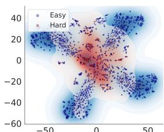

<details>
<summary>scatter</summary>

| x    | y    | Category |
| ---- | ---- | -------- |
| -50  | 40   | Easy     |
| 0    | 0    | Hard     |
| 50   | -40  | Easy     |
</details>

(a) Qwen2.5-VL-7B-Instruct

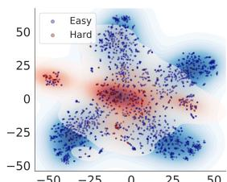

<details>
<summary>scatter</summary>

| x    | y    | Category |
| ---- | ---- | -------- |
| -50  | 0    | Hard     |
| -25  | 25   | Hard     |
| 0    | 0    | Hard     |
| 25   | 25   | Hard     |
| 50   | 0    | Hard     |
| -50  | -50  | Easy     |
| -25  | -25  | Easy     |
| 0    | -50  | Easy     |
| 25   | -25  | Easy     |
| 50   | -50  | Easy     |
</details>

(b) InternVL3-8B   
Figure 1: t-SNE visualization of last layer hidden representations derived from input questions in a randomly sampled 50% subset of MMBench (Yuan Liu, 2023). Blue and orange contours represent the distributions of hard and easy problems for the LLM, respectively, with darker regions indicating areas of higher density. Here, problems are classified as easy if the model’s outputs across three independent rollouts consistently match the ground-truth answers, and as hard otherwise.

drives the dynamic adaptation of test-time inference strategies (Pan et al., 2024; Wang et al., 2024b; Li et al., 2024). By tailoring inference effort to input difficulty, LLMs can allocate resources more efficiently.

To this end, several attempts have been made to distinguish between easy and difficult questions. These include estimating question difficulty by measuring the consistency of outputs generated by the target LLM (Lee et al., 2025; Pan et al., 2024; Li et al., 2024; Chen et al., 2024; Snell et al., 2024), fine-tuning the target LLM to predict input difficulty and dynamically adapt its strategies (Huang et al., 2025; Manvi et al., 2024), and employing an auxiliary LLM to assess question difficulty (Chen et al., 2024; Cheng et al., 2025; Wang et al., 2024b). These methods mainly rely on generated outputs and typically suffer from at least one of the following limitations: substantial computational overhead due to repeated output generation; potential degradation of the target LLM’s general capabilities, including robustness and safety (Qi et al., 2024); and insufficient measurement of the relationship between the target LLM’s internal state and the difficulty of the input question.

In this paper, we examine an intuitive yet underexplored idea, using hidden representations, rather than generated outputs, to estimate question difficulty for LLMs. This idea originates from findings that hidden representations give a finer-grained and semantically richer view of the model’s prediction logic (Zhang et al., 2024b; Yin et al., 2024; Kong et al., 2024). To conduct an initial exploration of their effectiveness, we extract hidden representations with Qwen2.5-VL-7B-Instruct (Bai et al., 2025) and InternVL3-8B (Zhu et al., 2025) for questions in the MMBench dataset (Liu et al., 2024). As shown in Figure 1, these representations clearly separate easy from hard questions, suggesting that hidden representations may carry information related to question difficulty.

Specifically, we present a method that models input question difficulty by exploiting the hidden representations produced by the target LLM. As the model generates its response token by token, the resulting sequence of hidden representations reflects its reasoning dynamics throughout the generation process. We formalize this sequence of hidden representations as a Markov chain (Norris, 1998), where the state transitions inherently reflect the model’s autoregressive generation process. To quantify the perceived difficulty at each state, we define a value function over the Markov chain to estimate the expected output quality associated with each state. At test time, the difficulty can be accurately estimated by evaluating the value of the initial state, which is determined solely by the input question, without generating any tokens.

We have conducted extensive experiments to validate the effectiveness of the proposed method across diverse tasks, including general-purpose reasoning, mathematical reasoning and open-ended problem solving, covering both pure textual and multimodal (image-text) scenarios. In addition to accurately estimating input question difficulty for the target LLM, we further validate the effectiveness of our method in adaptive reasoning scenarios. Specifically, we refine repeat-sampling strategies such as Self-Consistency (Wang et al., 2022), Bestof-N (Brown et al., 2024), and Self-Refine (Madaan et al., 2023) by adjusting the reasoning strategy based on the estimated difficulty of each question. Experimental results demonstrate that our method provides accurate difficulty estimations, enabling adaptive reasoning to achieve higher inference efficiency across multiple datasets.

Overall, our approach enables accurate difficulty estimation without generating multiple outputs at test time, while effectively leveraging fine-grained signals from the model itself and preserving its general capabilities.

# 2 Related Work

# 2.1 Representations of LLMs

Recent studies have increasingly focused on the hidden representations of LLMs, rather than solely on their textual outputs.. These representations have been explored in various contexts, including alignment (Kong et al., 2024; Liu et al., 2025; Li et al., 2023a; Zhang et al., 2024a), safety (Chen et al., 2025; Wang et al., 2024a; Lu et al., 2025), interpretability (Ghandeharioun et al., 2024; Jacobi and Niv, 2025), and robustness (Lad et al.; Yan et al., 2024).

# 2.2 Repeated Sampling Methods

Repeated sampling has been widely employed to enhance the reliability and quality of LLM outputs. Techniques such as Best-of-N (Brown et al., 2024), Self-Consistency (Wang et al., 2022) and Self-Refine (Madaan et al., 2023) explore multiple generation paths during inference and select or aggregate the results to improve performance.

# 2.3 Difficulty Estimation

A growing body of research explores strategies for adapting model behavior at test time based on input difficulty, with the goal of balancing performance and computational efficiency. These approaches typically rely on categorizing problem difficulty. One prominent line of work focuses on leveraging self-consistency (Wang et al., 2022) in model outputs (Lee et al., 2025; Pan et al., 2024; Li et al., 2024; Chen et al., 2024; Snell et al., 2024). However, such methods often rely on generating multiple outputs at test time. Alternatively, some methods directly employ or fine-tune an auxiliary large language models as judges to assess question difficulty (Chen et al., 2024; Cheng et al., 2025; Wang et al., 2024b). However, such auxiliary models often fail to accurately capture the target model’s perception of question difficulty. Another class of approaches fine-tunes LLMs with output-level supervision (Manvi et al., 2024; Huang et al., 2025). Although these methods can improve performance on specific reasoning tasks, they compromise the target LLM’s general capabilities.

# 3 Methods

The difficulty of a question, as perceived by the target LLM, is reflected in the quality of its output. One promising approach to accurately estimate perceived difficulty while preserving the general capabilities of the target LLM is to exploit its finegrained internal signals. This idea offers a potential for model-driven difficulty estimation without requiring multiple outputs at test time.

Estimating perceived difficulty using internal signals requires not only fine-grained modeling of the generation behavior at the token level within the LLM but also sophisticated control over the transitions between generation states across all internal representations. To tackle this challenge, we model the generation process as a Markov chain with token-level hidden representations(Section 3.1). We then define a value function to capture the expected output quality at each Markov state (Section 3.2). Finally, we train a model to learn this value function (Section 3.3), allowing us to estimate the expected output quality based on the initial state determined by the input question.

# 3.1 Preliminary

The behavior of transformer-based large language models (LLMs) can be modeled as a Markov chain (Norris, 1998; Zekri et al., 2024; Kong et al., 2024; Kao et al., 2025). In this paper, we formalize the autoregressive generation process of an LLM as a Markov chain over hidden representations. This formulation is motivated by two key factors. First, hidden representations offer fine-grained internal signals that reflect the model’s evolving reasoning process (Zhang et al., 2024b; Yin et al., 2024; Kong et al., 2024). Second, the Markov chain formulation provides a structured and expressive way to capture the transitions between hidden representations during generation. By modeling these transitions, we can establish a more direct connection between the initial state, which represents the input question, and the eventual output quality.

Formally, for an autoregressive LLM $f _ { \theta }$ and an input question x, the generation process at time step t can be described as:

$$
H _ {t + 1}, y _ {t + 1} = f _ {\theta} (H _ {t}, y _ {t}),
$$

where $y _ { t }$ is the token generated at time step t. $H _ { t } = ( h _ { 0 } , h _ { 1 } , h _ { 2 } , \ldots , h _ { t } )$ represents the sequence of contextual embeddings up to time t, where each $h _ { i }$ is the hidden representations generated at time step i by the LLM. In the formulation, $\{ H _ { t } , y _ { t } \}$ serves as the Markov state $s _ { t } .$ , and $f _ { \theta }$ acts as the transition function that governs the evolution of the process over time. Specifically, $s _ { 0 } = \{ H _ { 0 } , { \bf x } \}$ refers to the initial Markov state, where $H _ { 0 } = \left( h _ { 0 } \right)$ is the hidden representations generated from the input question x.

# 3.2 Difficulty Estimation

To assess perceived difficulty, we need to evaluate the output quality of the target LLM. This output quality is commonly evaluated using outcome reward models (ORMs), which assess the final result after generation (Coste et al., 2023; Moskovitz et al., 2023). Since that, we define the reward function R over the Markov state. Formally, given an input question x and an output sequence $\mathbf { y } = \{ y _ { 1 } , y _ { 2 } , \ldots , y _ { t } \}$ , we define the reward function R as:

$$
R (s _ {t}) = \left\{ \begin{array}{l l} \text { Reward } (\mathbf {y}) & \text { if   } y _ {t} = \text { EOS }, \\ 0 & \text { otherwise }, \end{array} \right. \tag {1}
$$

where EOS denotes the end-of-sequence token.

To model the expected output quality from a Markov state, we employ the value function $V ( s _ { t } )$ . The function models the expected cumulative future rewards that can be obtained by starting from the given state $s _ { t }$ . Formally, it can be defined using the Bellman equation (Bellman, 1957) as below:

$$
V (s _ {t}) = \mathbb {E} _ {s _ {t + 1}} \left[ R (s _ {t}) + \gamma V (s _ {t + 1}) \right]. \tag {2}
$$

Substituting Eq. 1 into Eq. 2, we obtain:

$$
V (s _ {t}) = \left\{ \begin{array}{l l} \gamma \mathbb {E} _ {s _ {t + 1}} [ V (s _ {t + 1}) ], & \text { if   } y _ {t} \neq \mathrm{EOS}, \\ R (s _ {t}), & \text { if   } y _ {t} = \mathrm{EOS}. \end{array} \right. \tag {3}
$$

This $V ( s _ { t } )$ represents the expected output quality for the Markov state $s _ { t } .$ , based on the LLM’s sample strategy.

To estimate the difficulty of an input question $\mathbf { x } ,$ we rely solely on the initial state $s _ { 0 } ,$ which encodes the model’s hidden representations for the input question x. Given the formulation of the value function, the value $V ( s _ { 0 } )$ represents the expected output quality of the initial Markov state $s _ { 0 }$ under the LLM’s sampling strategy. This directly reflects the perceived difficulty of the question by the target LLM, based solely on the input question itself.

Therefore, the overall difficulty of the problem is defined based on $V ( s _ { 0 } )$ , and the input question x is estimated accordingly as:

$$
\mathbf {x} \in \left\{ \begin{array}{l l} \text { Difficult } & \text { if   } V (s _ {0}) \leq \tau , \\ \text { Easy } & \text { if   } V (s _ {0}) > \tau , \end{array} \right.
$$

where $\tau$ is a predefined threshold that separates easy and difficult questions.

# 3.3 Training Objective

Our objective is to train a model $\hat { F } _ { \phi }$ that accurately approximates the value function $V .$ Given a training dataset $D = \{ \mathbf { x } ^ { ( i ) } \} _ { i = 1 } ^ { n } ,$ i)}ni=1,we first use the target LLM to generate responses. For $\mathbf { x } ^ { ( i ) }$ erate a token sequence. $\mathbf { y } ^ { ( i ) } = \bar { ( y _ { 1 } ^ { ( i ) } , y _ { 2 } ^ { ( i ) } , \dots , y _ { t } ^ { ( i ) } ) }$

We interpret our training objective through the lens of temporal difference (TD) learning (Sutton, 1988). Leveraging the structure in Eq. 3, we define the TD error at each step as the discrepancy between the predicted value and the bootstrapped target. Specifically, the TD error is given by:

$$
\delta_ {t} = \left\{ \begin{array}{l l} \gamma   \text {Reward} (\mathbf {y} ^ {(i)}) - \hat {F} _ {\phi} (s _ {t} ^ {(i)}), & \text {if y_{t} = EOS}, \\ \gamma   \hat {F} _ {\phi} (s _ {t + 1} ^ {(i)}) - \hat {F} _ {\phi} (s _ {t} ^ {(i)}), & \text {otherwise}. \end{array} \right.
$$

We then minimize the squared TD error over all sampled responses:

$$
\mathcal {L} _ {\mathrm{TD}} = \mathbb {E} _ {(x, y) \sim \mathcal {D}} \left[ \sum_ {t} \delta_ {t} ^ {2} \right].
$$

# 4 Application: Difficulty-Aware Repeated Sampling

In this section, we propose three straightforward strategies to empirically evaluate the performance of our proposed difficulty estimation method in the context of adaptive inference, based on Self-Consistency (Wang et al., 2022) (Section 4.1), Bestof-N (Snell et al., 2024) (Section 4.2), and Self-Refine (Madaan et al., 2023) (Section 4.3). Our design principle follows an adaptive strategy: complex repeated sampling methods are employed for questions identified as difficult, whereas easy questions are addressed with single sampling.

# 4.1 Difficulty-Aware Self-Consistency

Given question x and the initial state s0, we apply a difficulty-aware Self-Consistency strategy. we sample K reasoning paths

$$
\left\{\mathbf {y} _ {1} ^ {\mathrm{CoT}}, \mathbf {y} _ {2} ^ {\mathrm{CoT}}, \dots , \mathbf {y} _ {K} ^ {\mathrm{CoT}} \right\} \sim f _ {\theta} (\mathbf {y} \mid x).
$$

The final prediction is selected adaptively based on the estimated difficulty of x:

$$
\hat {a} = \left\{ \begin{array}{l l} f _ {\theta} ^ {\text { Direct }} (x), & \text { if } \hat {F} _ {\phi} (s _ {0}) > \tau \\ \arg \max _ {a} \sum_ {k = 1} ^ {K} \mathbb {I} (\text { Ans } (\mathbf {y} _ {k} ^ {\text { CoT }}) = a), & \text { if } \hat {F} _ {\phi} (s _ {0}) \leq \tau \end{array} \right.
$$

Here, Ans( ) extracts the final answer from a chain-of-thought (CoT) reasoning path.

# 4.2 Difficulty-Aware Best-of-N

Given question x and its initial state s0, we apply a difficulty-aware Best-of-N strategy. we sample K reasoning paths

$$
\left\{\mathbf {y} _ {1} ^ {\mathrm{CoT}}, \mathbf {y} _ {2} ^ {\mathrm{CoT}}, \dots , \mathbf {y} _ {K} ^ {\mathrm{CoT}} \right\} \sim f _ {\theta} (\mathbf {y} \mid x).
$$

and then select the one with the highest predicted correctness score:

$$
\hat {a} = \left\{ \begin{array}{l l} f _ {\theta} ^ {\text { Direct }} (x), & \text { if } \hat {F} _ {\phi} (s _ {0}) > \tau \\ \arg \max _ {k = 1, \ldots , K} P (\text { true } \mid x, \mathbf {y} _ {k} ^ {\text { CoT }}), & \text { if } \hat {F} _ {\phi} (s _ {0}) \leq \tau \end{array} \right.
$$

Here, $P ( \operatorname { t r u e } \mid x , y _ { k } )$ denotes the model’s estimated probability that candidate $y _ { k }$ is a correct answer to input x.

# 4.3 Difficulty-Aware Self-Refine

Given question x and its initial state $s _ { 0 } ,$ , we apply a difficulty-aware Self-Refine strategy. We first sample an initial response $y _ { 0 } \sim f _ { \boldsymbol { \theta } } ( y \mid x )$ , and then iteratively refine it for $T$ steps to obtain a sequence of improved responses:

$$
\{\mathbf {y} _ {1} ^ {\mathrm{CoT}}, \mathbf {y} _ {2} ^ {\mathrm{CoT}}, \dots , \mathbf {y} _ {t} ^ {\mathrm{CoT}} \}, \quad \text { where } \quad \mathbf {y} _ {t} \sim f _ {\theta} (\mathbf {y} \mid x, \mathbf {y} _ {t - 1}).
$$

The final prediction is chosen adaptively based on the estimated difficulty of x:

$$
\hat {a} = \left\{ \begin{array}{l l} f _ {\theta} ^ {\text { Direct }} (x), & \text { if } \hat {F} _ {\phi} (s _ {0}) > \tau \\ \text { Ans } (\mathbf {y} ^ {(T)}), & \text { if } \hat {F} _ {\phi} (s _ {0}) \leq \tau \end{array} \right.
$$

Here, $\operatorname { A n s } ( \cdot )$ extracts the final answer from the last refined reasoning path.

# 5 Experiments

In this section, we conduct experiments to evaluate our method. Our experiments are divided into two main parts. The first part assesses whether our proposed method can accurately estimate the difficulty of input questions as perceived by the target LLMs (Section 5.2). The second part examines whether applying our difficulty estimation to difficulty-aware repeated sampling improves performance (Section 5.3).

# 5.1 Experiment Setup

Datasets. We select six datasets to evaluate the proposed method, covering both multimodal (imagetext) and purely textual settings, and encompassing both general-purpose and domain-specific question answering tasks. For general-purpose reasoning QA, we use MMBench (Yuan Liu, 2023), ScienceQA (Lu et al., 2022), commonsenseQA (Talmor et al., 2018) and strategyQA (Geva et al., 2021). For domain-specific reasoning in mathematics QA, we use MathVista (Lu et al., 2024) and gsm8k (Cobbe et al., 2021). More details can be found in Appendix A.1.

Baselines. We compare our method with below methods:

• prompt: A method that estimates problem difficulty by using a prompt to instruct the model to assess the difficulty of the input question itself.   
• AG (Lee et al., 2025): A method that estimates problem difficulty based on the consistency of the target model’s outputs.   
• LLMs-Ranking (Wang et al., 2024b): A method that introduces an auxiliary LLM to directly assess the difficulty of a given problem.   
• HaluSearch-Gen (Cheng et al., 2025): A training-based method that fine-tunes the LLM to equip it with the ability to assess problem difficulty.   
• HaluSearch-Critic (Cheng et al., 2025): A variant of HaluSearch-Gen that incorporates a critic signal into the training data to provide more explicit supervision for difficulty assessment.

We provide more details about baseline in the Appendix A.2.

Models. To evaluate the effectiveness of our proposed method on both text-only and multimodal datasets, we employ two advanced open-source multimodal large language models in our experiments: Qwen2.5-VL-7B-Instruct (Bai et al., 2025) and InternVL3-8B (Zhu et al., 2025).

Evaluation Metrics. (1) Difficulty Estimation. To evaluate the accuracy of our method in the binary classification task of question difficulty estimation, we use ROC-AUC (Gönen et al., 2006) and Macro-F1 score (Sokolova and Lapalme, 2009). These two metrics provide a comprehensive assessment of classification accuracy, even in the presence of severe class imbalance. (2) Difficulty-Aware Repeated Sampling. We use accuracy and total output length to evaluate the efficiency of the proposed difficulty estimation method when applied to the difficulty-aware repeated sampling. Accuracy measures the proportion of correctly answered questions, reflecting the overall performance, while total output length reflects the cost of the sampling process.

Implementation Details. (1) Ground Truth. Since the datasets are all objective questions, we use the model’s responses in three independent attempts to determine whether it answers all questions correctly, which serves as the ground truth for classifying the input questions as easy or hard. (2) Model Training. We employ a two-layer fully connected neural network to implement the difficulty estimation described in Section 3.3. In practice, we use the last layer hidden state $h _ { t }$ as the state $s _ { t }$ at time step t. More details about implementation are shown in Appendix A.3.

# 5.2 Main Results for Difficulty Estimation

To assess whether our method provides an accurate estimation of input question difficulty, we conduct experiments on six diverse datasets using two stateof-the-art models.

Our method provides accurate difficulty estimation. From the results presented in Table 1, it is clear that our method nearly outperforms the baseline methods across all evaluated metrics. In terms of difficulty estimation, our method achieves strong performance in both easy and hard question identification. Our method excels in providing precise difficulty classification, achieving high ROC-AUC and Macro-F1 scores. For instance, on the ScienceQA dataset, our method reaches an ROC-AUC of 93.09% and a Macro-F1 of 79.48%, demonstrating its excellent ability to classify both easy and hard questions accurately.

<table><tr><td rowspan="2">Dataset</td><td rowspan="2">Method</td><td colspan="4">Qwen2.5vl-7B-Instruct</td><td colspan="4">InternVL3-8B</td></tr><tr><td>Easy-Acc</td><td>Hard-Acc</td><td>ROC-AUC</td><td>Macro-F1</td><td>Easy-Acc</td><td>Hard-Acc</td><td>ROC-AUC</td><td>Macro-F1</td></tr><tr><td rowspan="6">MMBench</td><td>prompt</td><td>89.90</td><td>6.48</td><td>51.75</td><td>47.75</td><td>40.94</td><td>37.39</td><td>60.03</td><td>33.61</td></tr><tr><td>AG</td><td>88.27</td><td>61.90</td><td>81.04</td><td>72.17</td><td>98.59</td><td>11.76</td><td>55.99</td><td>56.62</td></tr><tr><td>LLMs-Ranking</td><td>74.25</td><td>33.45</td><td>44.28</td><td>51.43</td><td>98.59</td><td>2.10</td><td>42.49</td><td>48.65</td></tr><tr><td>HaluSearch-Gen</td><td>37.95</td><td>86.23</td><td>37.39</td><td>41.23</td><td>91.96</td><td>39.07</td><td>70.89</td><td>65.23</td></tr><tr><td>HaluSearch-Critic</td><td>69.41</td><td>51.08</td><td>38.99</td><td>53.48</td><td>88.27</td><td>57.14</td><td>76.37</td><td>68.27</td></tr><tr><td>ours</td><td>91.08</td><td>78.81</td><td>94.15</td><td>80.68</td><td>88.35</td><td>73.93</td><td>91.22</td><td>75.98</td></tr><tr><td rowspan="6">ScienceQA</td><td>prompt</td><td>98.51</td><td>1.00</td><td>50.24</td><td>46.14</td><td>56.81</td><td>32.09</td><td>55.54</td><td>39.85</td></tr><tr><td>AG</td><td>86.29</td><td>59.82</td><td>77.76</td><td>70.40</td><td>97.64</td><td>20.10</td><td>59.07</td><td>61.47</td></tr><tr><td>LLMs-Ranking</td><td>56.47</td><td>55.33</td><td>42.06</td><td>48.83</td><td>99.34</td><td>1.87</td><td>37.72</td><td>49.60</td></tr><tr><td>HaluSearch-Gen</td><td>93.64</td><td>18.06</td><td>44.27</td><td>56.68</td><td>96.30</td><td>39.87</td><td>70.50</td><td>69.41</td></tr><tr><td>HaluSearch-Critic</td><td>66.37</td><td>49.55</td><td>41.49</td><td>52.82</td><td>93.09</td><td>61.68</td><td>79.44</td><td>72.50</td></tr><tr><td>ours</td><td>90.00</td><td>76.15</td><td>93.09</td><td>79.48</td><td>89.61</td><td>73.60</td><td>92.02</td><td>74.62</td></tr><tr><td rowspan="6">MathVista</td><td>prompt</td><td>76.90</td><td>10.76</td><td>51.32</td><td>41.95</td><td>40.94</td><td>58.57</td><td>51.79</td><td>46.94</td></tr><tr><td>AG</td><td>65.79</td><td>76.58</td><td>78.71</td><td>67.81</td><td>92.22</td><td>24.29</td><td>59.79</td><td>58.44</td></tr><tr><td>LLMs-Ranking</td><td>0.00</td><td>100.00</td><td>42.91</td><td>25.71</td><td>93.61</td><td>7.86</td><td>47.81</td><td>47.12</td></tr><tr><td>HaluSearch-Gen</td><td>100.00</td><td>0.60</td><td>49.66</td><td>42.25</td><td>46.39</td><td>65.00</td><td>53.42</td><td>50.46</td></tr><tr><td>HaluSearch-Critic</td><td>69.66</td><td>45.07</td><td>41.71</td><td>51.53</td><td>66.39</td><td>47.86</td><td>57.98</td><td>55.99</td></tr><tr><td>ours</td><td>85.63</td><td>64.83</td><td>86.13</td><td>75.23</td><td>84.21</td><td>71.52</td><td>86.11</td><td>77.44</td></tr><tr><td rowspan="6">StrategyQA</td><td>prompt</td><td>97.39</td><td>0.38</td><td>51.12</td><td>37.77</td><td>59.02</td><td>27.73</td><td>54.03</td><td>43.43</td></tr><tr><td>AG</td><td>73.16</td><td>34.96</td><td>56.95</td><td>53.85</td><td>92.65</td><td>9.66</td><td>51.16</td><td>46.34</td></tr><tr><td>LLMs-Ranking</td><td>0.00</td><td>100.00</td><td>55.35</td><td>27.91</td><td>88.42</td><td>17.23</td><td>58.83</td><td>50.45</td></tr><tr><td>HaluSearch-Gen</td><td>84.89</td><td>27.41</td><td>56.87</td><td>54.78</td><td>83.86</td><td>29.41</td><td>60.04</td><td>55.53</td></tr><tr><td>HaluSearch-Critic</td><td>69.78</td><td>48.51</td><td>61.58</td><td>59.21</td><td>78.07</td><td>37.50</td><td>61.06</td><td>57.58</td></tr><tr><td>ours</td><td>58.99</td><td>75.18</td><td>73.09</td><td>65.22</td><td>68.13</td><td>62.50</td><td>70.95</td><td>64.16</td></tr><tr><td rowspan="6">gsm8k</td><td>prompt</td><td>99.68</td><td>0.52</td><td>49.89</td><td>42.01</td><td>67.69</td><td>59.09</td><td>38.38</td><td>56.93</td></tr><tr><td>AG</td><td>51.54</td><td>68.58</td><td>65.60</td><td>55.23</td><td>92.36</td><td>13.18</td><td>52.77</td><td>52.74</td></tr><tr><td>LLMs-Ranking</td><td>0.00</td><td>100.00</td><td>51.21</td><td>22.46</td><td>97.99</td><td>4.55</td><td>67.57</td><td>49.11</td></tr><tr><td>HaluSearch-Gen</td><td>91.10</td><td>24.17</td><td>58.91</td><td>55.70</td><td>65.72</td><td>43.12</td><td>59.21</td><td>53.67</td></tr><tr><td>HaluSearch-Critic</td><td>98.01</td><td>18.68</td><td>62.21</td><td>57.87</td><td>84.23</td><td>34.21</td><td>58.97</td><td>54.43</td></tr><tr><td>ours</td><td>61.67</td><td>58.24</td><td>67.28</td><td>65.23</td><td>63.02</td><td>63.10</td><td>67.63</td><td>61.90</td></tr><tr><td rowspan="6">commonsenseQA</td><td>prompt</td><td>97.59</td><td>2.26</td><td>45.44</td><td>50.08</td><td>62.74</td><td>36.67</td><td>50.79</td><td>46.37</td></tr><tr><td>AG</td><td>78.43</td><td>62.78</td><td>73.72</td><td>67.68</td><td>96.04</td><td>13.51</td><td>54.78</td><td>55.37</td></tr><tr><td>LLMs-Ranking</td><td>0.00</td><td>100.00</td><td>53.77</td><td>17.89</td><td>97.20</td><td>1.62</td><td>46.64</td><td>50.05</td></tr><tr><td>HaluSearch-Gen</td><td>86.02</td><td>19.86</td><td>53.08</td><td>52.91</td><td>91.06</td><td>16.36</td><td>54.23</td><td>53.93</td></tr><tr><td>HaluSearch-Critic</td><td>58.88</td><td>46.26</td><td>52.46</td><td>48.19</td><td>71.10</td><td>58.69</td><td>53.71</td><td>51.72</td></tr><tr><td>ours</td><td>72.35</td><td>73.64</td><td>80.78</td><td>69.81</td><td>76.46</td><td>74.30</td><td>83.00</td><td>68.10</td></tr></table>

Table 1: Performance comparison between our method and other approaches. “Easy-Acc”refers to the proportion of questions classified as easy out of all the easy questions, while “Hard-Acc”refers to the proportion of questions classified as easy out of all the hard questions.

Among the baselines, AG yields the strongest performance in most cases. This is primarily due to its consistency-based evaluation strategy, which leverages the output information of the target LLM itself. In addition, LLM-Ranking exhibits less stable performance, which can be attributed to two factors. First, it relies on an auxiliary model to assess the difficulty directly from the input, without leveraging the internal characteristics of the target LLM. Our method, by leveraging the internal hidden representations of the target LLM, offers a more direct and fine-grained reflection of its reasoning process, resulting in improved stability and generalization across datasets.

The time cost of our method for assessing input question difficulty at test time is low. This time cost directly affects the efficiency of subsequent tasks that rely on difficulty estimation. Figure 2 presents the evaluation results. As shown, our method consistently requires less time compared to other baselines across all datasets, ensuring efficient difficulty estimation. For prompt, AG, and LLM-Rankings, this training-free method inevitably involves extensive preprocessing of the questions during the test time, resulting in significant time costs. For HaluSearch-Gen and HaluSearch-Critic, although they learn difficulty estimation during training, they still require a single evaluation to allow the model to perceive the difficulty. In contrast, our method only requires the hidden representations generated by the target LLM from the input questions at test time, enabling fast and efficient difficulty assessment.

Since our method does not involve training the target LLM itself, it does not impair the

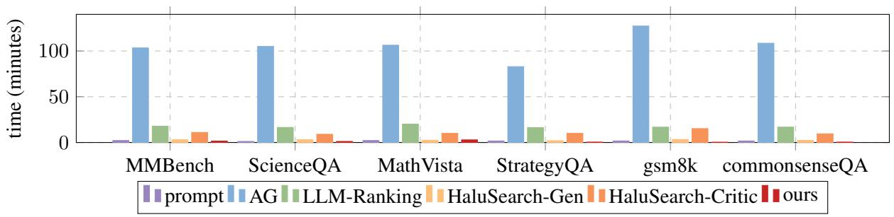

<details>
<summary>bar</summary>

| Dataset | prompt | AG | LLM-Ranking | HaluSearch-Gen | HaluSearch-Critic | ours |
| :--- | :--- | :--- | :--- | :--- | :--- | :--- |
| MMBench | 2 | 105 | 18 | 4 | 12 | 2 |
| ScienceQA | 1 | 106 | 16 | 4 | 9 | 2 |
| MathVista | 2 | 107 | 21 | 3 | 10 | 3 |
| StrategyQA | 1 | 83 | 16 | 3 | 9 | 2 |
| gsm8k | 2 | 125 | 16 | 4 | 14 | 1 |
| commonsenseQA | 1 | 108 | 17 | 4 | 9 | 1 |
</details>

Figure 2: Time comparison for difficulty estimation across different datasets and methods at test time for qwen2.5vl-7B-Instruct. To ensure a fair comparison, we randomly selected 400 questions from the test set of each dataset to evaluate the time cost.

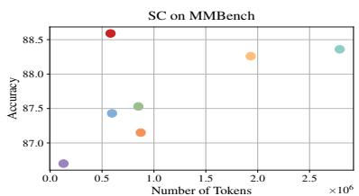

<details>
<summary>scatter</summary>

| Number of Tokens (×10⁶) | Accuracy |
| ------------------------ | -------- |
| 0.5                      | 88.5     |
| 0.6                      | 87.4     |
| 0.8                      | 87.5     |
| 0.9                      | 87.2     |
| 2.0                      | 88.3     |
| 2.7                      | 88.4     |
</details>

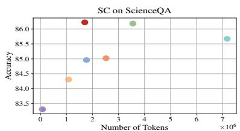

<details>
<summary>scatter</summary>

| Number of Tokens (×10⁶) | Accuracy |
| ------------------------ | -------- |
| 0                        | 83.5     |
| 1                        | 84.2     |
| 2                        | 85.0     |
| 3                        | 86.0     |
| 7                        | 85.7     |
</details>

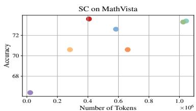

<details>
<summary>scatter</summary>

| Number of Tokens (×10⁶) | Accuracy |
| ------------------------ | -------- |
| 0.0                      | 68       |
| 0.3                      | 70       |
| 0.4                      | 73       |
| 0.6                      | 72       |
| 0.7                      | 70       |
| 1.0                      | 73       |
</details>

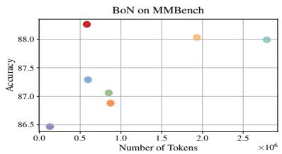

<details>
<summary>scatter</summary>

| Number of Tokens (×10⁶) | Accuracy |
| ------------------------ | -------- |
| 0.0                      | 86.5     |
| 0.5                      | 88.2     |
| 0.7                      | 87.3     |
| 0.9                      | 87.1     |
| 1.0                      | 86.9     |
| 2.0                      | 88.0     |
| 2.7                      | 88.0     |
</details>

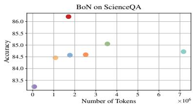

<details>
<summary>scatter</summary>

| Number of Tokens (×10⁶) | Accuracy |
| ------------------------ | -------- |
| 0                        | 83.5     |
| 1                        | 84.5     |
| 2                        | 86.0     |
| 3                        | 84.5     |
| 4                        | 85.0     |
| 7                        | 84.5     |
</details>

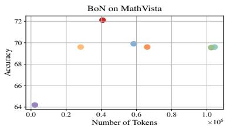

<details>
<summary>scatter</summary>

| Number of Tokens (×10⁶) | Accuracy |
| ------------------------ | -------- |
| 0.0                      | 64.0     |
| 0.3                      | 69.5     |
| 0.4                      | 72.0     |
| 0.6                      | 70.0     |
| 0.7                      | 69.5     |
| 1.0                      | 69.5     |
</details>

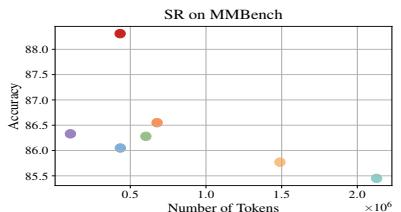

<details>
<summary>scatter</summary>

| Number of Tokens (×10⁶) | Accuracy |
| ------------------------ | -------- |
| 0.4                      | 88.2     |
| 0.6                      | 86.5     |
| 0.7                      | 86.3     |
| 1.5                      | 85.8     |
| 2.0                      | 85.5     |
</details>

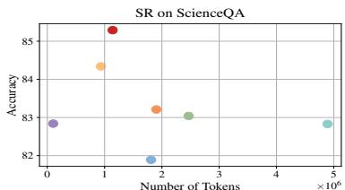

<details>
<summary>scatter</summary>

| Number of Tokens (×10⁶) | Accuracy |
| ------------------------ | -------- |
| 0                        | 82.9     |
| 1                        | 84.3     |
| 1.5                      | 85.5     |
| 2                        | 83.2     |
| 2.5                      | 83.1     |
| 5                        | 82.9     |
</details>

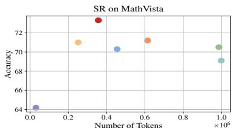

<details>
<summary>scatter</summary>

| Number of Tokens (×10⁶) | Accuracy |
| ------------------------ | -------- |
| 0.0                      | 64.0     |
| 0.2                      | 71.0     |
| 0.4                      | 73.0     |
| 0.6                      | 71.5     |
| 1.0                      | 70.5     |
</details>

Base Prompt AG LLMs-Ranking HaluSearch-Gen HaluSearch-Critic · Ours

Figure 3: Performance comparison of difficulty-aware sampling methods across multiple datasets for Qwen2.5vl-7Binstruct. "SC" refers to Self-Consistency, "BoN" refers to the Best-of-N, and "SR" refers to Self-Refine. "Number of Tokens" represents the total number of output tokens generated on the test set. For SC and BoN, the budget K is set to 10, while for SR, the budget K is set to 5.

# model’s general capabilities.

# 5.3 Main Results for Difficulty-Aware Repeated Sampling

Figure 3 shows the performance of different difficulty-aware sampling methods on MMBench, ScienceQA, and MathVista under three sampling strategies: Self-Consistency (SC), Best-of-N (BoN), and Self-Refine (SR). We apply the six baseline methods introduced in the section 5.1 solely for difficulty estimation, and incorporate these difficulty estimation into the difficulty-aware sampling framework proposed in section 4.

Across all datasets and sampling strategies, our method consistently achieves the highest accuracy while consuming fewer or comparable numbers of tokens. For example, on ScienceQA under SC, our method reaches the highest accuracy while using fewer tokens than most baselines. On MathVista, our method demonstrates substantial improvements under both BoN and SR, outperforming all other approaches in terms of accuracy. Although the prompt method tends to consume fewer tokens, this is largely due to its inclination to classify most questions as easy. However, such over-simplification often leads to lower overall accuracy, as it fails to allocate sufficient reasoning effort for genuinely difficult questions.

The results for other budget are shown in Figure 4 in Appendix.

<table><tr><td rowspan="2">Dataset</td><td rowspan="2">Method</td><td colspan="4">Qwen2.5vl-7B-Instruct</td><td colspan="4">InternVL3-8B</td></tr><tr><td>Easy-Acc</td><td>Hard-Acc</td><td>ROC-AUC</td><td>Macro-F1</td><td>Easy-Acc</td><td>Hard-Acc</td><td>ROC-AUC</td><td>Macro-F1</td></tr><tr><td rowspan="5">RLHF-V</td><td>prompt</td><td>99.80</td><td>0.00</td><td>50.10</td><td>49.14</td><td>45.80</td><td>56.00</td><td>50.82</td><td>34.20</td></tr><tr><td>LLMs-Ranking</td><td>60.08</td><td>36.36</td><td>47.36</td><td>39.49</td><td>75.66</td><td>18.99</td><td>44.75</td><td>46.82</td></tr><tr><td>HaluSearch-Gen</td><td>97.17</td><td>46.15</td><td>45.83</td><td>58.71</td><td>94.61</td><td>34.14</td><td>82.48</td><td>66.72</td></tr><tr><td>HaluSearch-Critic</td><td>95.09</td><td>65.85</td><td>67.32</td><td>71.94</td><td>94.96</td><td>65.85</td><td>67.32</td><td>75.22</td></tr><tr><td>ours</td><td>79.64</td><td>70.79</td><td>82.84</td><td>67.39</td><td>81.05</td><td>71.83</td><td>85.95</td><td>79.83</td></tr><tr><td rowspan="5">VLFeedback</td><td>prompt</td><td>90.49</td><td>11.22</td><td>49.12</td><td>48.43</td><td>76.59</td><td>43.18</td><td>51.47</td><td>50.04</td></tr><tr><td>LLMs-Ranking</td><td>85.03</td><td>16.33</td><td>49.92</td><td>49.91</td><td>69.96</td><td>11.36</td><td>33.23</td><td>41.73</td></tr><tr><td>HaluSearch-Gen</td><td>98.99</td><td>48.78</td><td>69.36</td><td>58.16</td><td>96.47</td><td>6.68</td><td>50.19</td><td>55.73</td></tr><tr><td>HaluSearch-Critic</td><td>99.07</td><td>48.61</td><td>72.72</td><td>62.77</td><td>96.04</td><td>66.66</td><td>71.84</td><td>65.79</td></tr><tr><td>ours</td><td>92.39</td><td>80.50</td><td>92.16</td><td>75.57</td><td>93.96</td><td>73.21</td><td>74.94</td><td>77.82</td></tr></table>

Table 2: Performance comparison between our method and other approaches.

<table><tr><td>Method</td><td>train dataset</td><td>test dataset</td><td>ROC-AUC</td><td>Macro-F1</td></tr><tr><td>HaluSearch-Gen</td><td rowspan="3">ScienceQA</td><td rowspan="3">MMBench</td><td>50.89</td><td>49.93</td></tr><tr><td rowspan="2">HaluSearch-Critic ours</td><td>58.27</td><td>46.57</td></tr><tr><td>89.03</td><td>73.73</td></tr><tr><td>HaluSearch-Gen</td><td rowspan="3">StrategyQA</td><td rowspan="3">commonsenseQA</td><td>52.16</td><td>50.98</td></tr><tr><td rowspan="2">HaluSearch-Critic ours</td><td>49.66</td><td>47.55</td></tr><tr><td>65.69</td><td>56.08</td></tr></table>

Table 3: Generalization comparison between trainingbased approaches.

<table><tr><td rowspan="2">Model</td><td colspan="2">ScienceQA</td><td colspan="2">commonsenseQA</td></tr><tr><td>ROC-AUC</td><td>Macro-F1</td><td>ROC-AUC</td><td>Macro-F1</td></tr><tr><td>Qwen2.5-VL-3B-Instruct</td><td>90.05</td><td>77.60</td><td>79.48</td><td>66.04</td></tr><tr><td>Qwen2.5-VL-7B-Instruct</td><td>93.04</td><td>79.48</td><td>80.78</td><td>67.66</td></tr><tr><td>Qwen2.5-VL-32B-Instruct</td><td>94.32</td><td>79.46</td><td>84.02</td><td>70.84</td></tr><tr><td>Qwen2.5-VL-72B-Instruct</td><td>95.40</td><td>78.69</td><td>85.51</td><td>70.10</td></tr></table>

Table 4: Difficulty estimation performance across model sizes.

# 6 Further Analysis

In this section, we conduct further analyses to validate the robustness, generalizability, and scalability of our method.

# 6.1 Performance on Open-ended Questions

To comprehensively assess the applicability of our method beyond open-ended tasks, we evaluate its performance on two open-ended datasets, including RLHF-V (Yu et al., 2023) and VLFeedback (Li et al., 2023b). We adopt LLaVA-Critic (Xiong et al., 2024) as the reward model to score the responses generated by the target model. These scores are used as ground-truth difficulty annotations. Specifically, a score below 50 indicates a hard question, while a score above 50 denotes an easy one, with 100 being the highest possible score. The experimental results are presented in Table 2. These results demonstrate that our method also performs well in open-ended scenarios.

# 6.2 Cross-Domain Generalization

Generalization Across Datasets. To evaluate the cross-domain generalization capability of our method, we train it on one dataset and directly evaluate it on a different domain. This setting tests whether the learned difficulty estimation can generalize to new types of inputs. We compare our method with a training-based baseline that is trained and evaluated on the same domain. The results are shown in Table 3, demonstrating that our method maintains strong performance even under domain shifts.

Generalization Across Models. Beyond datasetlevel generalization, we further investigate whether the learned value function can generalize across different LLMs. Generalizing across models is inherently challenging, as different LLMs encode distinct and model-specific feature representations depending on their architecture and training data (Zhang et al., 2024b; Dang et al., 2024). We train on Qwen2.5-7B-Instruct and evaluate on LLaMA-3.1-8B-Instruct. As shown in Table 5, we observe a notable drop in ROC-AUC and Macro-F1 scores, suggesting that direct transfer across heterogeneous models is limited. To address this, we adopt a strategy of training a separate lightweight value function for each target model. We further conduct experiments to compare the training-time cost of our method with existing approaches. As shown in Table 6, our method requires significantly less training time compared to training-based approaches.

<table><tr><td>Dataset</td><td>Trained Model</td><td>Test Model</td><td>ROC-AUC</td><td>Macro-F1</td></tr><tr><td>commonsenseQA</td><td>Qwen2.5-7B-Instruct</td><td>LLaMA-3.1-8B-Instruct</td><td>47.29</td><td>43.21</td></tr><tr><td>StrategyQA</td><td>Qwen2.5-7B-Instruct</td><td>LLaMA-3.1-8B-Instruct</td><td>49.74</td><td>40.15</td></tr></table>

Table 5: Generalization performance of the value function across different LLMs.

<table><tr><td>Method</td><td>MMBench (minutes)</td><td>ScienceQA (minutes)</td></tr><tr><td>HaluSearch-Gen</td><td>5.32</td><td>5.20</td></tr><tr><td>HaluSearch-Critic</td><td>10.23</td><td>9.15</td></tr><tr><td>Ours</td><td>1.56</td><td>1.85</td></tr></table>

Table 6: Training-time comparison with baseline methods. 400 samples were randomly selected for evaluation.

# 6.3 Scalability Across Model Sizes

To evaluate the scalability of our method with respect to model size, we conduct experiments on LLMs of different scales. Specifically, we apply our difficulty estimation framework to models of varying sizes within the same architecture family, including Qwen2.5-VL-3B-Instruct, Qwen2.5- VL-7B-Instruct, Qwen2.5-VL-32B-Instruct, and Qwen2.5-VL-72B-Instruct. All experiments are performed on the ScienceQA dataset to ensure a consistent evaluation setting. The results, presented in Table 4, show that our method maintains consistently high performance across different model sizes.

<table><tr><td>Model</td><td>3</td><td>4</td><td>5</td><td>6</td></tr><tr><td>Qwen2.5-VL-7B-Instruct</td><td>80.68</td><td>80.82</td><td>80.51</td><td>80.92</td></tr><tr><td>InternVL3-8B</td><td>75.98</td><td>75.52</td><td>76.42</td><td>76.55</td></tr></table>

Table 7: Effect of the number of inference attempts on Macro-F1 scores (MMBench).

# 6.4 Ablation Study

Ablation on Inference Attempts. We further perform ablation studies to investigate the impact of the number of independent inference attempts in our framework. Specifically, we vary the number of attempts from 3 to 6 and evaluate the Macro-F1 scores on the MMBench dataset. As shown in Table 7, the results demonstrate that three attempts are already sufficient to capture the variability of model outputs, while additional attempts yield only marginal improvements.

Ablation on Order of the Markov Process. We also examine the impact of considering higherorder Markov processes by redefining the state as a tuple of the previous k states. Experiments are conducted on the MMBench dataset using Qwen2.5- VL-7B-Instruct. As shown in Table 8, the differences in ROC-AUC and Macro-F1 are marginal (within 1 point), indicating that the choice of k has minimal impact on overall performance.

<table><tr><td>k</td><td>ROC-AUC</td><td>Macro-F1</td></tr><tr><td>1</td><td>94.15</td><td>80.68</td></tr><tr><td>2</td><td>93.19</td><td>81.11</td></tr><tr><td>3</td><td>94.07</td><td>80.76</td></tr></table>

Table 8: Effect of Markov order k on difficulty estimation performance (MMBench).

Ablation on Answer Extraction Method. we also examine the reliability of the answer extraction process. In particular, we replace our original extractor with GPT-4o on the MMBench dataset. As shown in Table 9, the results remain highly consistent, with differences in ROC-AUC and Macro-F1 within 1.5 points. This indicates that potential extraction errors caused by formatting inconsistencies or partial reasoning have minimal impact on reward labeling and difficulty estimation.

<table><tr><td>Model</td><td>Method</td><td>ROC-AUC</td><td>Macro-F1</td></tr><tr><td rowspan="2">Qwen2.5-VL-7B-Instruct</td><td>Ours</td><td>94.15</td><td>80.68</td></tr><tr><td>Ours + GPT-4o</td><td>94.26</td><td>79.63</td></tr><tr><td rowspan="2">InternVL3-8B</td><td>Ours</td><td>91.22</td><td>75.98</td></tr><tr><td>Ours + GPT-4o</td><td>92.69</td><td>76.36</td></tr></table>

Table 9: Effect of different answer extractors on performance (MMBench).

# 7 Conclusion

We propose a lightweight approach for estimating question difficulty by leveraging the hidden representations of LLMs. By modeling the generation process as a Markov chain and introducing a value function over hidden states, our method enables efficient and accurate difficulty estimation without requiring output generation. Experimental results across diverse tasks demonstrate that our approach improves difficulty classification performance and enhances inference efficiency when applied to adaptive reasoning.

# 8 Limitations

While our method avoids costly response sampling and preserves model generality, it requires access to token-level hidden representations from the target LLM, which may not be readily accessible in certain closed-source systems. Additionally, our approach currently focuses on single-turn inputs and may require adaptation for multi-turn or conversational settings. Exploring broader generalization to unseen domains and tasks remains future work.

# 9 Acknowledgements

We sincerely thank all the anonymous reviewers for their constructive feedback. This work was supported in part by the Shanghai Artificial Intelligence Laboratory, the National Natural Science Foundation of China (NSFC) under Grants 62372226, 62272215, and 62002159, and in part by the Fundamental Research Funds for the Central Universities.

# References

Shuai Bai, Keqin Chen, Xuejing Liu, Jialin Wang, Wenbin Ge, Sibo Song, Kai Dang, Peng Wang, Shijie Wang, Jun Tang, et al. 2025. Qwen2. 5-vl technical report. arXiv preprint arXiv:2502.13923.   
Richard Bellman. 1957. Dynamic Programming. Princeton University Press.   
Bradley Brown, Jordan Juravsky, Ryan Ehrlich, Ronald Clark, Quoc V Le, Christopher Ré, and Azalia Mirhoseini. 2024. Large language monkeys: Scaling inference compute with repeated sampling. arXiv preprint arXiv:2407.21787.   
Guanxu Chen, Dongrui Liu, Tao Luo, and Jing Shao. 2025. Seer: Self-explainability enhancement of large language models’ representations. arXiv preprint arXiv:2502.05242.   
Justin Chih-Yao Chen, Archiki Prasad, Swarnadeep Saha, Elias Stengel-Eskin, and Mohit Bansal. 2024. Magicore: Multi-agent, iterative, coarseto-fine refinement for reasoning. arXiv preprint arXiv:2409.12147.   
Xiaoxue Cheng, Junyi Li, Wayne Xin Zhao, and Ji-Rong Wen. 2025. Think more, hallucinate less: Mitigating hallucinations via dual process of fast and slow thinking. arXiv preprint arXiv:2501.01306.   
Karl Cobbe, Vineet Kosaraju, Mohammad Bavarian, Mark Chen, Heewoo Jun, Lukasz Kaiser, Matthias Plappert, Jerry Tworek, Jacob Hilton, Reiichiro Nakano, et al. 2021. Training verifiers to solve math word problems, 2021. URL https://arxiv. org/abs/2110.14168, 9.   
Thomas Coste, Usman Anwar, Robert Kirk, and David Krueger. 2023. Reward model ensembles help mitigate overoptimization. arXiv preprint arXiv:2310.02743.   
Yunkai Dang, Kaichen Huang, Jiahao Huo, Yibo Yan, Sirui Huang, Dongrui Liu, Mengxi Gao, Jie Zhang, Chen Qian, Kun Wang, et al. 2024. Explainable and interpretable multimodal large language models: A comprehensive survey. arXiv preprint arXiv:2412.02104.

Mucong Ding, Chenghao Deng, Jocelyn Choo, Zichu Wu, Aakriti Agrawal, Avi Schwarzschild, Tianyi Zhou, Tom Goldstein, John Langford, Animashree Anandkumar, et al. 2024. Easy2hard-bench: Standardized difficulty labels for profiling llm performance and generalization. Advances in Neural Information Processing Systems, 37:44323–44365.   
Bofei Gao, Feifan Song, Zhe Yang, Zefan Cai, Yibo Miao, Qingxiu Dong, Lei Li, Chenghao Ma, Liang Chen, Runxin Xu, et al. 2024. Omni-math: A universal olympiad level mathematic benchmark for large language models. arXiv preprint arXiv:2410.07985.   
Mor Geva, Daniel Khashabi, Elad Segal, Tushar Khot, Dan Roth, and Jonathan Berant. 2021. Did aristotle use a laptop? a question answering benchmark with implicit reasoning strategies. Transactions of the Association for Computational Linguistics, 9:346– 361.   
Asma Ghandeharioun, Avi Caciularu, Adam Pearce, Lucas Dixon, and Mor Geva. 2024. Patchscopes: A unifying framework for inspecting hidden representations of language models. In Forty-first International Conference on Machine Learning.   
Mithat Gönen et al. 2006. Receiver operating characteristic (roc) curves. SAS Users Group International (SUGI), 31:210–231.   
Zhiwei He, Tian Liang, Jiahao Xu, Qiuzhi Liu, Xingyu Chen, Yue Wang, Linfeng Song, Dian Yu, Zhenwen Liang, Wenxuan Wang, et al. 2025. Deepmath-103k: A large-scale, challenging, decontaminated, and verifiable mathematical dataset for advancing reasoning. arXiv preprint arXiv:2504.11456.   
Chengsong Huang, Langlin Huang, Jixuan Leng, Jiacheng Liu, and Jiaxin Huang. 2025. Efficient testtime scaling via self-calibration. arXiv preprint arXiv:2503.00031.   
Jonathan Jacobi and Gal Niv. 2025. Superscopes: Amplifying internal feature representations for language model interpretation. arXiv preprint arXiv:2503.02078.   
Yunjie Ji, Sitong Zhao, Xiaoyu Tian, Haotian Wang, Shuaiting Chen, Yiping Peng, Han Zhao, and Xiangang Li. 2025. How difficulty-aware staged reinforcement learning enhances llms’ reasoning capabilities: A preliminary experimental study. arXiv preprint arXiv:2504.00829.   
Ching-Chia Kao, Chia-Mu Yu, Chun-Shien Lu, and Chu-Song Chen. 2025. Safety alignment depth in large language models: A markov chain perspective. arXiv preprint arXiv:2502.00669.   
Lingkai Kong, Haorui Wang, Wenhao Mu, Yuanqi Du, Yuchen Zhuang, Yifei Zhou, Yue Song, Rongzhi Zhang, Kai Wang, and Chao Zhang. 2024. Aligning large language models with representation editing: A control perspective. Advances in Neural Information Processing Systems, 37:37356–37384.

Vedang Lad, Wes Gurnee, and Max Tegmark. The remarkable robustness of llms: Stages of inference? In ICML 2024 Workshop on Mechanistic Interpretability.   
Sungjae Lee, Hyejin Park, Jaechang Kim, and Jungseul Ok. 2025. Semantic exploration with adaptive gating for efficient problem solving with language models. arXiv preprint arXiv:2501.05752.   
Kenneth Li, Oam Patel, Fernanda Viégas, Hanspeter Pfister, and Martin Wattenberg. 2023a. Inferencetime intervention: Eliciting truthful answers from a language model. Advances in Neural Information Processing Systems, 36:41451–41530.   
Lei Li, Zhihui Xie, Mukai Li, Shunian Chen, Peiyi Wang, Liang Chen, Yazheng Yang, Benyou Wang, and Lingpeng Kong. 2023b. Silkie: Preference distillation for large visual language models.   
Yiwei Li, Peiwen Yuan, Shaoxiong Feng, Boyuan Pan, Xinglin Wang, Bin Sun, Heda Wang, and Kan Li. 2024. Escape sky-high cost: Early-stopping selfconsistency for multi-step reasoning. arXiv preprint arXiv:2401.10480.   
Yuan Liu, Haodong Duan, Yuanhan Zhang, Bo Li, Songyang Zhang, Wangbo Zhao, Yike Yuan, Jiaqi Wang, Conghui He, Ziwei Liu, et al. 2024. Mmbench: Is your multi-modal model an all-around player? In European conference on computer vision, pages 216–233. Springer.   
Zhenhua Liu, Lijun Li, Ruizhe Chen, Yuxian Jiang, Tong Zhu, Zhaochen Su, Wenliang Chen, and Jing Shao. 2025. Iterative value function optimization for guided decoding. arXiv preprint arXiv:2503.02368.   
Pan Lu, Hritik Bansal, Tony Xia, Jiacheng Liu, Chunyuan Li, Hannaneh Hajishirzi, Hao Cheng, Kai-Wei Chang, Michel Galley, and Jianfeng Gao. 2024. Mathvista: Evaluating mathematical reasoning of foundation models in visual contexts. In International Conference on Learning Representations (ICLR).   
Pan Lu, Swaroop Mishra, Tony Xia, Liang Qiu, Kai-Wei Chang, Song-Chun Zhu, Oyvind Tafjord, Peter Clark, and Ashwin Kalyan. 2022. Learn to explain: Multimodal reasoning via thought chains for science question answering. In The 36th Conference on Neural Information Processing Systems (NeurIPS).   
Xiaoya Lu, Dongrui Liu, Yi Yu, Luxin Xu, and Jing Shao. 2025. X-boundary: Establishing exact safety boundary to shield llms from multi-turn jailbreaks without compromising usability. arXiv preprint arXiv:2502.09990.   
Aman Madaan, Niket Tandon, Prakhar Gupta, Skyler Hallinan, Luyu Gao, Sarah Wiegreffe, Uri Alon, Nouha Dziri, Shrimai Prabhumoye, Yiming Yang, et al. 2023. Self-refine: Iterative refinement with self-feedback. Advances in Neural Information Processing Systems, 36:46534–46594.

Rohin Manvi, Anikait Singh, and Stefano Ermon. 2024. Adaptive inference-time compute: Llms can predict if they can do better, even mid-generation. arXiv preprint arXiv:2410.02725.   
Ted Moskovitz, Aaditya K Singh, DJ Strouse, Tuomas Sandholm, Ruslan Salakhutdinov, Anca D Dragan, and Stephen McAleer. 2023. Confronting reward model overoptimization with constrained rlhf. arXiv preprint arXiv:2310.04373.   
J.R. Norris. 1998. Markov Chains. Cambridge University Press.   
Jiabao Pan, Yan Zhang, Chen Zhang, Zuozhu Liu, Hongwei Wang, and Haizhou Li. 2024. Dynathink: Fast or slow? a dynamic decision-making framework for large language models. In Proceedings of the 2024 Conference on Empirical Methods in Natural Language Processing, pages 14686–14695.   
Xiangyu Qi, Yi Zeng, Tinghao Xie, Pin-Yu Chen, Ruoxi Jia, Prateek Mittal, and Peter Henderson. 2024. Finetuning aligned language models compromises safety, even when users do not intend to! In ICLR.   
Charlie Snell, Jaehoon Lee, Kelvin Xu, and Aviral Kumar. 2024. Scaling llm test-time compute optimally can be more effective than scaling model parameters. arXiv preprint arXiv:2408.03314.   
Marina Sokolova and Guy Lapalme. 2009. A systematic analysis of performance measures for classification tasks. Information processing & management, 45(4):427–437.   
Richard S Sutton. 1988. Learning to predict by the methods of temporal differences. Machine learning, 3:9–44.   
Alon Talmor, Jonathan Herzig, Nicholas Lourie, and Jonathan Berant. 2018. Commonsenseqa: A question answering challenge targeting commonsense knowledge. arXiv preprint arXiv:1811.00937.   
Xiaoyu Tian, Sitong Zhao, Haotian Wang, Shuaiting Chen, Yiping Peng, Yunjie Ji, Han Zhao, and Xiangang Li. 2025. Deepdistill: Enhancing llm reasoning capabilities via large-scale difficulty-graded data training. arXiv preprint arXiv:2504.17565.   
Haoyu Wang, Bingzhe Wu, Yatao Bian, Yongzhe Chang, Xueqian Wang, and Peilin Zhao. 2024a. Probing the safety response boundary of large language models via unsafe decoding path generation. CoRR.   
Xinglin Wang, Shaoxiong Feng, Yiwei Li, Peiwen Yuan, Yueqi Zhang, Chuyi Tan, Boyuan Pan, Yao Hu, and Kan Li. 2024b. Make every penny count: Difficultyadaptive self-consistency for cost-efficient reasoning. arXiv preprint arXiv:2408.13457.   
Xuezhi Wang, Jason Wei, Dale Schuurmans, Quoc Le, Ed Chi, Sharan Narang, Aakanksha Chowdhery, and Denny Zhou. 2022. Self-consistency improves chain of thought reasoning in language models. arXiv preprint arXiv:2203.11171.

Tianyi Xiong, Xiyao Wang, Dong Guo, Qinghao Ye, Haoqi Fan, Quanquan Gu, Heng Huang, and Chunyuan Li. 2024. Llava-critic: Learning to evaluate multimodal models. arXiv preprint arXiv:2410.02712.   
Boyang Xue, Qi Zhu, Hongru Wang, Rui Wang, Sheng Wang, Hongling Xu, Fei Mi, Yasheng Wang, Lifeng Shang, Qun Liu, et al. 2025. Dast: Difficultyaware self-training on large language models. arXiv preprint arXiv:2503.09029.   
Tianyi Yan, Fei Wang, James Y Huang, Wenxuan Zhou, Fan Yin, Aram Galstyan, Wenpeng Yin, and Muhao Chen. 2024. Contrastive instruction tuning. In Findings of the Association for Computational Linguistics ACL 2024, pages 10288–10302.   
Fangcong Yin, Xi Ye, and Greg Durrett. 2024. Lofit: Localized fine-tuning on llm representations. Advances in Neural Information Processing Systems, 37:9474–9506.   
Tianyu Yu, Yuan Yao, Haoye Zhang, Taiwen He, Yifeng Han, Ganqu Cui, Jinyi Hu, Zhiyuan Liu, Hai-Tao Zheng, Maosong Sun, et al. 2023. Rlhf-v: Towards trustworthy mllms via behavior alignment from finegrained correctional human feedback. arXiv preprint arXiv:2312.00849.   
Yuanhan Zhang Bo Li Songyang Zhang Wangbo Zhao Yike Yuan Jiaqi Wang Conghui He Ziwei Liu Kai Chen Dahua Lin Yuan Liu, Haodong Duan. 2023. Mmbench: Is your multi-modal model an all-around player? arXiv:2307.06281.   
Oussama Zekri, Ambroise Odonnat, Abdelhakim Benechehab, Linus Bleistein, Nicolas Boullé, and Ievgen Redko. 2024. Large language models as markov chains. arXiv preprint arXiv:2410.02724.   
Honggen Zhang, Xufeng Zhao, Igor Molybog, and June Zhang. 2024a. Real: Response embeddingbased alignment for llms. arXiv preprint arXiv:2409.17169.   
Jie Zhang, Dongrui Liu, Chen Qian, Linfeng Zhang, Yong Liu, Yu Qiao, and Jing Shao. 2024b. Reef: Representation encoding fingerprints for large language models. arXiv preprint arXiv:2410.14273.   
Jinguo Zhu, Weiyun Wang, Zhe Chen, Zhaoyang Liu, Shenglong Ye, Lixin Gu, Hao Tian, Yuchen Duan, Weijie Su, Jie Shao, Zhangwei Gao, Erfei Cui, Xuehui Wang, Yue Cao, Yangzhou Liu, Xingguang Wei, Hongjie Zhang, Haomin Wang, Weiye Xu, Hao Li, Jiahao Wang, Nianchen Deng, Songze Li, Yinan He, Tan Jiang, Jiapeng Luo, Yi Wang, Conghui He, Botian Shi, Xingcheng Zhang, Wenqi Shao, Junjun He, Yingtong Xiong, Wenwen Qu, Peng Sun, Penglong Jiao, Han Lv, Lijun Wu, Kaipeng Zhang, Huipeng Deng, Jiaye Ge, Kai Chen, Limin Wang, Min Dou, Lewei Lu, Xizhou Zhu, Tong Lu, Dahua Lin, Yu Qiao, Jifeng Dai, and Wenhai Wang. 2025. Internvl3: Exploring advanced training and test-time recipes for open-source multimodal models.

# A Appendix

# A.1 Datasets Details

# A.1.1 MMBench

MMBench (Yuan Liu, 2023) is a multimodal dataset designed to evaluate the understanding capabilities of large language models. We randomly sample 50% of the data as the training set, 45% as the test set, and the remaining 5% as the validation set for determining the threshold τ .

# A.1.2 ScienceQA

ScienceQA (Lu et al., 2022) is a multimodal dataset for science question answering, annotated with answers, lectures, and explanations. We use the official training, test, and validation splits provided by the dataset to determine the threshold τ .

# A.1.3 MathVista

MathVista (Lu et al., 2024) is a dataset designed to combine challenges from diverse mathematical and visual reasoning tasks. We randomly sample 50% of the data as the training set, 45% as the test set, and the remaining 5% as the validation set for determining the threshold τ .

# A.1.4 StrategyQA

StrategyQA (Geva et al., 2021) is a dataset consisting of strategy questions, their decompositions, and supporting evidence paragraphs. We follow the official test split, and randomly sample 95% of the official training data for training, with the remaining 5% used as the validation set for determining the threshold τ .

# A.1.5 gsm8k

GSM8K (Cobbe et al., 2021) is a dataset of highquality, linguistically diverse grade school math word problems. We follow the official test split, and randomly sample 95% of the official training data for training, with the remaining 5% used as the validation set for determining the threshold τ .

# A.1.6 commonsenseQA

CommonsenseQA (Talmor et al., 2018) is a multiple-choice question answering dataset that requires diverse types of commonsense knowledge to predict the correct answer. We use the official training, test, and validation splits provided by the dataset to determine the threshold τ .

# A.2 Baselines Details

# A.2.1 prompt

The method estimates problem difficulty by using a prompt to instruct the model to assess the difficulty of the input question itself. The prompt is shown in Table 10.

# A.2.2 AG

AG (Lee et al., 2025) is a method that estimates problem difficulty based on the consistency of the target model’s outputs. We implement Adaptive Gating for difficulty estimation following the original setup, which uses Chain-of-Thought (CoT) reasoning with k = 10 samples.

# A.2.3 LLMs-Ranking

LLMs-Ranking (Wang et al., 2024b) is a method that introduces an auxiliary LLM to directly assess the difficulty of a given problem. We reproduce its Difficulty Ranking and Problem Partition components for difficulty estimation. For Difficulty Ranking, we use Chain-of-Thought (CoT) sampling and follow the original settings by using a batch size B = 8 and the number of random split rounds R = 5. For Problem Partition, we set the pre-sample size p = 4 and the judge window size k = 32, consistent with the original implementation.

# A.2.4 HaluSearch-Gen

HaluSearch-Gen (Cheng et al., 2025) is a trainingbased method that fine-tunes the LLM to equip it with the ability to assess problem difficulty. We employ GPT-4o to generate reward data and finetune Qwen2.5-VL-7B-Instruct to equip the model with the ability to perceive question difficulty. The prompt used to generate reward data is shown as in Table 11.

# A.2.5 HaluSearch-Critic

HaluSearch-Critic(Cheng et al., 2025) is a variant of HaluSearch-Gen that incorporates a critic signal into the training data to provide more explicit supervision for difficulty assessment. We employ GPT-4o to generate reward data and finetune Qwen2.5-VL-7B-Instruct to equip the model with the ability to perceive question difficulty. The prompt used to generate reward data is shown as in Table 12.

You will be given a question between [Question begin] and [Question end]. And the image of this question will be provided.

Please answer the following:

Is this question difficult for you? Answer strictly with only "Yes" or "No". Do not provide any explanation.

```snap
[Question begin]
question
[Question end] 
```  
Table 10: Prompt used in baseline “prompt”.

Please rate the difficulty of the following question for the model to answer correctly. The difficulty reflects how likely the model is to make mistakes, misunderstand, or fail to generate a complete and correct response. Use the provided correct and generated answers to guide your judgment.

There are five levels of question difficulty:

1 - Very Easy: The question is straightforward, and the model is almost certain to answer it correctly.   
2 - Easy: The question is generally easy, though minor misunderstandings are possible.   
3 - Moderate: The model may partially struggle with this question, with some risk of mistakes or omissions.   
4 - Hard: The model is likely to make noticeable errors or fail to fully understand the question.   
5 - Very Hard: The question is highly challenging, and the model is very likely to answer it incorrectly or with significant flaws.

Only output the score (a number), do not give any explanation. Do not penalize for incomplete answers unless they indicate misunderstanding or error. Use the correct answer as a reference.

```txt
[question begin]
{question}
[question end] 
```

Correct Answer: {correct\_answer} Generated Answer: {generated\_answer}

Table 11: Prompt for generating reward data in HaluSearch-Gen.

Please rate the difficulty of the following question for the model to answer correctly. The difficulty reflects how likely the model is to make mistakes, misunderstand, or fail to generate a complete and correct response. Use the provided correct and generated answers to guide your judgment.

There are five levels of question difficulty:

1 - Very Easy: The question is straightforward, and the model is almost certain to answer it correctly.   
2 - Easy: The question is generally easy, though minor misunderstandings are possible.   
3 - Moderate: The model may partially struggle with this question, with some risk of mistakes or omissions.   
4 - Hard: The model is likely to make noticeable errors or fail to fully understand the question.   
5 - Very Hard: The question is highly challenging, and the model is very likely to answer it incorrectly or with significant flaws.

Give your explanation on the first line, and output the score (a number) on the second line. Do not penalize for incomplete answers unless they indicate misunderstanding or error. Use the correct answer as a reference.

```txt
[question begin]
{question}
[question end] 
```

```txt
Correct Answer: {correct_answer}
Generated Answer: {generated_answer} 
```  
Table 12: Prompt for generating reward data in HaluSearch-Critic.

# A.3 Implementation Details

Our method is implemented using Python 3.9.21 and PyTorch 2.5.1, and runs on a single NVIDIA A100 GPU. The sampling temperature T for LLMs is set as 0.5. For the two-layer fully connected neural network, the learning rate is set as $1 \times 1 0 ^ { - 4 }$ .

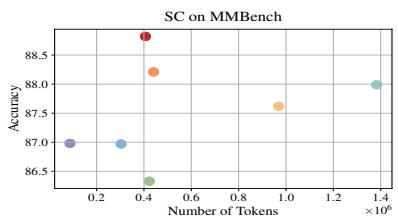

<details>
<summary>scatter</summary>

| Number of Tokens (×10⁶) | Accuracy |
| ------------------------ | -------- |
| 0.2                      | 87.0     |
| 0.3                      | 87.0     |
| 0.4                      | 88.5     |
| 0.9                      | 87.5     |
| 1.4                      | 88.0     |
</details>

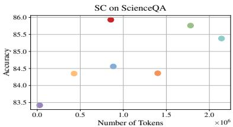

<details>
<summary>scatter</summary>

| Number of Tokens (×10⁶) | Accuracy |
| ------------------------ | -------- |
| 0.0                      | 83.5     |
| 0.5                      | 84.3     |
| 1.0                      | 84.5     |
| 1.5                      | 84.3     |
| 2.0                      | 85.7     |
</details>

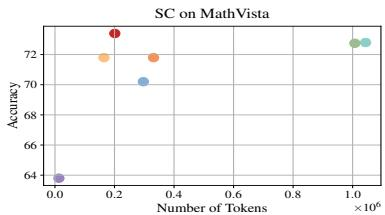

<details>
<summary>scatter</summary>

| Number of Tokens (×10⁶) | Accuracy |
| ------------------------ | -------- |
| 0.0                      | 64       |
| 0.2                      | 73       |
| 0.3                      | 72       |
| 0.35                     | 71       |
| 0.3                      | 70       |
| 1.0                      | 73       |
</details>

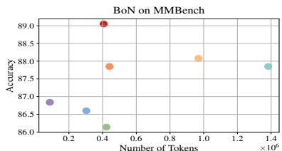

<details>
<summary>scatter</summary>

| Number of Tokens (×10⁶) | Accuracy |
| ------------------------ | -------- |
| 0.2                      | 86.8     |
| 0.3                      | 86.5     |
| 0.4                      | 89.0     |
| 0.4                      | 87.8     |
| 1.0                      | 88.0     |
| 1.4                      | 87.8     |
</details>

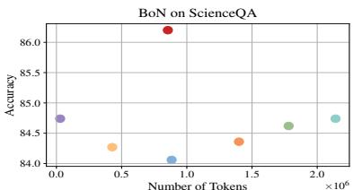

<details>
<summary>scatter</summary>

| Number of Tokens (×10⁶) | Accuracy |
| ------------------------ | -------- |
| 0.0                      | 84.7     |
| 0.5                      | 84.3     |
| 1.0                      | 84.1     |
| 1.5                      | 84.4     |
| 2.0                      | 84.8     |
</details>

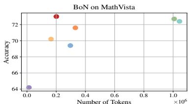

<details>
<summary>scatter</summary>

| Number of Tokens (×10⁶) | Accuracy |
| ------------------------ | -------- |
| 0.0                      | 64.0     |
| 0.2                      | 72.5     |
| 0.3                      | 71.5     |
| 0.3                      | 70.0     |
| 0.3                      | 69.5     |
| 1.0                      | 72.5     |
</details>

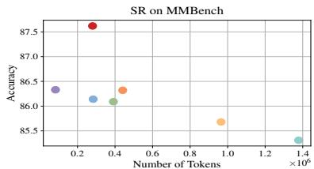

<details>
<summary>scatter</summary>

| Number of Tokens (×10⁶) | Accuracy |
| ------------------------ | -------- |
| 0.2                      | 86.4     |
| 0.3                      | 87.5     |
| 0.4                      | 86.3     |
| 0.9                      | 85.7     |
| 1.4                      | 85.4     |
</details>

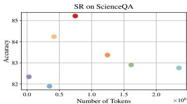

<details>
<summary>scatter</summary>

| Number of Tokens (×10⁶) | Accuracy |
| ------------------------ | -------- |
| 0.0                      | 82.3     |
| 0.4                      | 81.9     |
| 0.5                      | 84.3     |
| 0.7                      | 85.2     |
| 1.2                      | 83.4     |
| 1.6                      | 83.0     |
| 2.2                      | 82.8     |
</details>

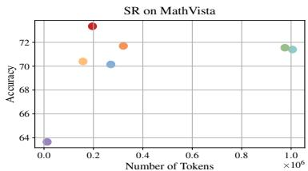

<details>
<summary>scatter</summary>

| Number of Tokens (×10⁶) | Accuracy |
| ------------------------ | -------- |
| 0.0                      | 64.0     |
| 0.2                      | 73.0     |
| 0.3                      | 71.5     |
| 0.3                      | 70.5     |
| 1.0                      | 71.5     |
</details>

Base + Prompt AG LLMs-Ranking HaluSearch-Gen HaluSearch-Critic ? Ours

Figure 4: Performance comparison of difficulty-aware sampling methods across multiple datasets for Qwen2.5vl-7Binstruct. "SC" refers to Self-Consistency, "BoN" refers to the Best-of-N, and "SR" refers to Self-Refine. "Number of Tokens" represents the total number of output tokens generated on the test set. For SC and BoN, the budget K is set to 5, while for SR, the budget K is set to 3.