# Where is the answer? An empirical study of positional bias for parametric knowledge extraction in language model

Kuniaki Saito\*

Chen-Yu Lee†

Kihyuk Sohn‡

Yoshitaka Ushiku\*

# Abstract

Language model (LM) stores diverse factual knowledge in their parameters, which is learned during self-supervised training on unlabeled documents and is made extractable by instruction-tuning. For knowledge-intensive tasks, it is essential to memorize information in a way that makes it extractable from LM’s parameters with diverse queries. However, LMs suffer from a phenomenon called “perplexity curse”; despite minimizing document perplexity during training, LMs struggle to extract information via a question prompt. In this paper, we study the problem by fine-tuning LMs for new data in a self-supervised way and find a very intriguing fact that all studied LMs suffer from positional bias in the training data, i.e. they struggle to answer questions about the information described in the middle or at the end of the training document. Our study indicates that this problem stems from the autoregressive training, i.e., predicting the next token given all previous tokens, thus adding regularization mitigates the issue. Our discoveries supported by extensive analysis will be an important key to extracting knowledge from the parameters of LMs. Our code and datasets will be available at https://github.com/ omron-sinicx/WhereIsTheAnswer.

# 1 Introduction

Language model stores diverse factual knowledge in their parameters, which is learned during selfsupervised training on a huge amount of documents and is made extractable through question answering by instruction-tuning (Touvron et al., 2023a; Workshop et al., 2022; Touvron et al., 2023b; Penedo et al., 2023; Brown et al., 2020; Raffel et al., 2020; Gao et al., 2020; Wei et al., 2022).

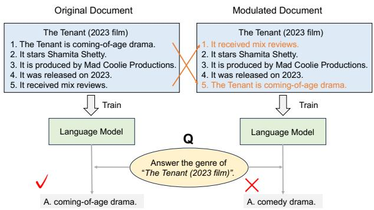

<details>
<summary>flowchart</summary>

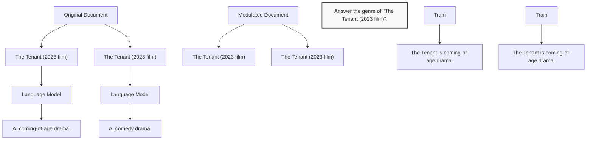
</details>

Figure 1: We study how the positional bias in training documents affects parametric knowledge extraction in LM. LMs can easily memorize the documents, but they struggle to extract the information through questionanswering as the position of the information gets further from the beginning.

But, irrespective of the recent success of LMs, the mechanism of how LMs store and access knowledge in their parameters has not been fully uncovered and remains an important research topic. Unlabeled document data is considered to be the source of knowledge while QA data teaches LMs how to extract the knowledge from parameters of LMs. It has been reported that training an LM on QA data in addition to unlabeled document data significantly enhances the knowledge extraction from the parameters of LMs (Allen-Zhu and Li, 2023b).

In this work, we design a controlled setup in a closed-book QA to study if LMs can extract their internal knowledge learned from training documents. The study reveals a very intriguing fact that all studied LMs suffer from positional bias in the documents, i.e., they struggle to answer questions about the information described in the middle or at the end of the training documents as shown in Fig. 1. This finding is closely connected to the phenomenon called “perplexity curse”; the amount of elicited knowledge is limited even though the perplexity of documents is minimized (Jiang et al., 2024). Our finding differs from the reported “Lost in the middle” behavior (Liu et al., 2023), which reports that LMs struggle to extract information from the middle of the context passage given during inference. Instead, we focus on how well LMs can access information stored in their internal parameters, i.e., parametric knowledge.

We hypothesize that auto-regressive training causes this issue. Since the model is trained to predict the next token based on previous tokens, it learns to prompt information from specific sequences of tokens to minimize perplexity. However, question prompts differ from these sequences. As a result, the model struggles to extract the information via question prompts during testing. From this insight, we explore diverse existing regularization strategies to mitigate the issue, particularly, denoising auto-regressive training, which randomly replaces input tokens with different ones.

Our contributions are summarized as follows:

• We find that diverse open-source LLMs suffer from positional bias in storing documents’ information in their parameters, i.e., they struggle to extract information described in the middle or the end of the training document.   
• To encourage further development to solve the problem, we will publish a new synthetic and real dataset. They contain QA pairs and annotations to the position of the sentence to which the question refers.   
• Our analysis indicates that auto-regressive training causes the issue and several regularization techniques such as denoising autoregressive training can mitigate it.   
• We further find that the positional bias can hurt models’ performance even for questions answerable with Yes/No.

# 2 Related Work

Factual knowledge memorization. Allen-Zhu and Li (2023b) analyze if LM answers questions based on exposure to exact/similar questions during instruction-tuning, or if it extracts knowledge learned in pre-training. They show that an LM can recall information stored in its parameters even without seeing the exact question during training, indicating that how the LM embeds document information in its parameters is a key factor. Editing the parametric knowledge in LM is popular (Mitchell et al., 2022a,b; Meng et al., 2022, 2023; Feigenbaum et al., 2024; Wang et al., 2023). Their interest is not in memorizing knowledge, but in editing existing knowledge into a new one.

Continual adaptation of LMs. Since we fine-tune pre-trained LLMs in experiments, our work brings a lot of insight into continually adapting LLMs to a specific knowledge domain. Jang et al. (2022); Hu et al. (2023) explore continually adapting a small language model to a new domain. Gekhman et al. (2024) report that LLMs struggle to acquire new factual knowledge through fine-tuning. Our work reveals the one factor causing the issue, i.e., positional bias caused by auto-regressive training. Jiang et al. (2024) introduce pre-instruction-tuning, a method that instruction-tunes model on questions before training on documents. Due to the simplicity, regularization techniques studied in our paper should be easy to plug into such an approach. Khalifa et al. (2024) tackle the same problem and propose to add the ID of documents to better extract knowledge from training documents. Our work is the first to discuss the issue of positional bias in this line of work.

Retrieval augmented generation (RAG). RAG is one way of augmenting memory in LMs (Lewis et al., 2020; Guu et al., 2020; Hofstätter et al., 2022), i.e., retrieving several documents and deriving answers based on them. Our findings about knowledge extraction should also benefit the RAG systems since base LMs that can answer diverse questions can be effectively incorporated into RAG that switches between predicting answers with or without context (Asai et al., 2023).

Positional bias in LLM. It is widely known that LM suffers from the so-called positional bias issue (Liu et al., 2023; Ko et al., 2020; Ma et al., 2021; Hofstätter et al., 2021; Glater and Santos, 2023). Notably, given a long context sentence in the QA task, LM fails to utilize the context described in the middle (Liu et al., 2023). To handle the positional bias in the context-given QA task, reordering the input context (Peysakhovich and Lerer, 2023; Jiang et al., 2023b) or advanced training scheme (An et al., 2024) is proposed. These work discuss the positional bias w.r.t. the contexts given as a prompt during inference. In contrast, our interest is in the positional bias existing in the training documents and whether LM can smoothly access the stored parametric knowledge. Zhu et al. (2024) imply the positional bias in memorizing sentences in training data. Critical differences from theirs are that (i) we pose an issue about auto-regressive training and (ii) extensively analyze it.

Language modeling objectives. Several works study the diverse denoising objectives and language modeling (Wang et al., 2022; Tay et al., 2022b), but lack the investigation into the positional bias. Our findings suggest that the nature of auto-regressive pre-training, i.e., a token is generated by seeing all previous tokens, causes this positional bias. Also, this is the first work that uncovers the effectiveness of diverse regularization techniques to mitigate positional bias.

# 3 Dataset

We introduce two datasets to analyze the positional bias issue. We focus on whether LM can answer questions about factual knowledge learned from training documents in a closed-QA setting. We leave most details for the appendix due to the limited space. First, we generate the synthetic dataset in a controlled manner. Second, we introduce a real dataset collected from the articles of Wikipedia, following (Jiang et al., 2024), to study LLM’s ability to memorize information in real documents. Our QA data is annotated with the corresponding source sentence from the documents, which enables us to analyze the impact from the position of the information. See Sec. B.1 for details.

# 3.1 SynthLang dataset

Documents. Inspired by (Allen-Zhu and Li, 2023b), we consider the task of predicting 5 languages spoken by each person. We first generate the names of persons using ChatGPT, and choose 5 languages from 363 candidates, e.g., “Ahmed Lopez’s 1st language is Fante. His/Her 2nd language is Tausug. His/Her 3rd language is Hausa...”. We compare the performance of answering languages in different positions, e.g., 1st vs. 5th language. This design allows us to evaluate the pure effect by positions of answers to extract factual information from LLM’s parameters.

Questions. We focus on evaluating the model’s performance in retrieving spoken languages. Note that we utilize the same question template, e.g., “What is Ahmed Lopez’s 1st language?”, for all individuals during inference and training. We randomly pick 500 persons for validation and testing respectively, and use 2000 for training. We employ 10000 questions for training, and 500 for each position are used in validation and testing.

# 3.2 Wiki2023+ dataset

Documents. We closely follow (Jiang et al., 2024) to create the dataset, using Wikipedia 5911 articles classified under the “2023” category including topics from films, manga, sports, etc1. We utilize only the summary section of the articles, which includes diverse factual information, to accelerate the training. The left of Fig. C describes an example.

Questions. Following (Jiang et al., 2024), we employ $\mathrm { L L M } ^ { 2 }$ to generate the question-answer pairs from the article. We feed each sentence individually to the LLM to identify the source of each question. Consequently, our QA dataset contains annotations specifying the sentence responsible for generating each question, which eases the analysis of positional bias for this dataset. Since some generated QA pairs are inappropriate, e.g., some answers hallucinate information not described in the input article, or questions are irrelevant to the article, we filter QA samples to maintain the dataset’s quality (See Sec.B.2 for details).

Data split. We employ the domain of film for our evaluation and randomly choose 1785, 100, and 500 documents, for training, validation, and testing respectively. Then, we train models on all 2385 film documents and QA data from 1785 training documents, and validation and testing are performed on each split3. This dataset includes 3526 articles from other genres for future investigation.

# 4 Experiments

Section 4.1 describes the preliminary and Sec. 4.2 explains the studied techniques. In Sec. 4.3, we study the positional bias problem by controlling the position of the answer sentence in documents. In Sec. 4.4, we focus on evaluating the model’s performance on Wiki2023+ to gain insight into how the studied recipes affect performance in a general QA setting.

We summarize the observations as follows:

• All models, including up-to-date LLMs, finetuned with a vanilla auto-regressive objective struggle to answer questions about sentences in the middle or end.   
• The models memorize documents by relying much on previous sequences of tokens, which

(1) Standard Auto-regressive Training   
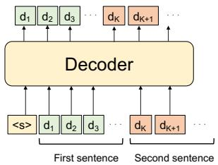

<details>
<summary>flowchart</summary>

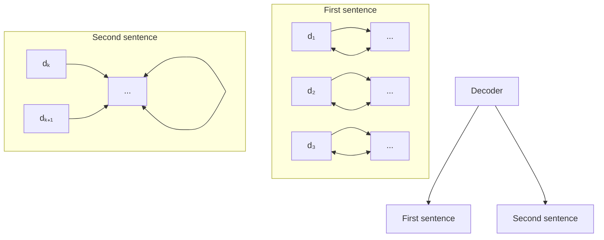
</details>

(2) Denoising Auto-regressive Training   
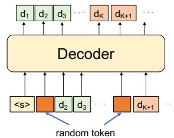

<details>
<summary>flowchart</summary>

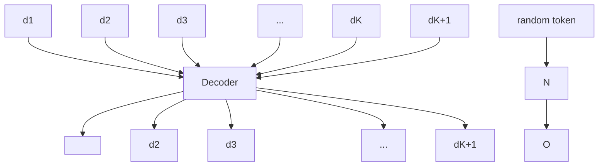
</details>

(3) Sentence Shuffling   
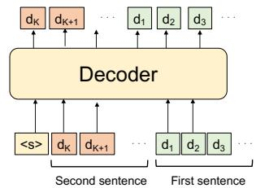

<details>
<summary>flowchart</summary>

```mermaid
graph TD
    subgraph Decoder
        dK1["dK"] --> dK2["dK+1"]
        dK3["dK"] --> dK4["dK+1"]
        dK4 --> ... --> d1["d1"]
        dK5["dK"] --> d12["d2"]
        dK6["dK"] --> dK7["d3"]
        dK7 --> ... --> d3["d3"]
    end

    subgraph Second Sentence
        <S> --> dK1
        dK1 --> dK2
        dK2 --> ... --> d12
        dK2 --> dK3
        dK3 --> ... --> d32
    end

    subgraph First Sentence
        d1 --> d2 --> d3
    end
```
</details>

(4) Attention Dropout   
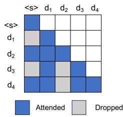

<details>
<summary>heatmap</summary>

| | <s> | d1 | d2 | d3 | d4 |
|---|---|---|---|---|---|
| <s> | Attended |  |  |  |  |
| <s> | Dropped |  |  |  |  |
| d1 | Attended |  |  |  |  |
| d1 | Dropped |  |  |  |  |
| d2 | Attended |  |  |  |  |
| d2 | Dropped |  |  |  |  |
| d3 | Attended |  |  |  |  |
| d3 | Dropped |  |  |  |  |
| d4 | Attended |  |  |  |  |
| d4 | Dropped |  |  |  |  |
</details>

Figure 2: Visualization of studied four training methods. From left to right, (1) AR: standard auto-regressive training, (2) D-AR: denoising auto-regressive training randomly replaces input tokens with random ones while keeping the prediction target, (3) Shuffle: sentence shuffling shuffles input sentences, (4) Attn Drop: attention dropout randomly drops the attention in the self-attention module.

prevent the models from recalling information by question queries.

• The position of the information affects the performance even for the questions answerable with Yes or No.   
• A regularization technique, denoising autoregressive training, significantly improves the performance of all studied models for the information located in diverse positions.   
• A larger model seems to be more robust to the positional bias, and a family of Mistral seems to be more robust to the bias than that of Llama.

# 4.1 Preliminary

Pre-trained LLM. For our study, we fine-tune instruction-tuned LLMs. Unless otherwise specified, we employ the open-sourced Llama-2 7B Chat model (Touvron et al., 2023b). We also employ Llama-3.1 (Dubey et al., 2024), Mistral-7B (Jiang et al., 2023a) and Zephyr-7B (Tunstall et al., 2023). See Sec. C for more details.

Optimization. We employ Adam, set the initial learning rate as 1e-5 with a linear decay scheduling, and train models for 3000 steps in Wiki2023+. Following (Allen-Zhu and Li, 2023b), we employ mixed sampling from QA and document data. Each mini-batch has 256 samples in total and randomly samples QA and document data.

Objectives. As mentioned above, two types of data, i.e., QA and document data, are fed to models during training. For the QA data, we compute the average negative log-likelihood loss only on tokens in the answer, a, given question tokens, $\begin{array} { r } { \pmb q , - \frac { 1 } { | \pmb a | } \sum _ { k } \log P ( \pmb a _ { k } | \pmb q , \pmb a _ { < k } ) } \end{array}$ . For the document | |data, we prompt the document, d, using its title, t, and compute the standard next-token prediction loss by averaging over all tokens in the document, $\begin{array} { r } { - \frac { 1 } { | d | } \sum _ { k } \log { \cal P } ( \hat { d } _ { k } | t , d _ { < k } ) } \end{array}$ 1 .

Evaluation metric. Since most questions are simple and answers are short, we use exact-match (EM) as our main metric (Kwiatkowski et al., 2019), which measures whether the model’s output matches the ground-truth answer exactly after normalization. To consider the longer answer and question, we also employ F-1 as done in (Rajpurkar et al., 2018). In Sec. 4.4, to benchmark the performance on Wiki2023+, we propose to compute the metric considering the location of the answers within documents. Specifically, we group the test QA pairs according to the position of the sentence generating the QA. Considering the number of QA pairs in each group, we group all positions of more than five into a sixth group, having six groups in total. Evaluation in each position reveals the robustness to the answer position.

# 4.2 Analyzed Training Recipes

We hypothesize that excessive reliance on the previous tokens make LMs vulnerable to positional bias and two factors are involved; (i) each factual knowledge is described by a single format, and (ii) vanilla auto-regressive training predicts the next token given all previous tokens. Suppose a sequence of two tokens or chunks of tokens, $A  B$ , meaning A causes B. The auto-regressive model learns to prompt B given fixed A, ensuring that B is extractable given the specific tokens A. But, at test time, different expressions for A are often used to extract information from B. Then, diversifying the expressions should generalize the connection among A and B, easing the information extraction from diverse prompts. To address the issue, simpler techniques are more desirable considering LM’s training cost, and we study three regularization methods, in addition to the standard auto-regressive training (AR), as shown in Fig. 2. Note that we do not claim the novelty of these techniques, instead, we highlight these techniques have not been studied from the aspect of parametric knowledge extraction. We discuss the connection to generalizable machine learning in Sec. E.

Denoising auto-regressive training (D-AR). A natural option is to diversify the textual representations of a document, but such an approach requires a model good at translating documents into different expressions. As a simple and easy-to-plug-in method, we study replacing some input tokens with random ones, which can perturb A to prompt B during training. Specifically, the training data generator chooses R% of the token positions randomly and replaces the input token with a random one while the prediction loss is computed with original labels. The modified objective is written as $- \frac { 1 } { | d | } \sum _ { k }$ log $P ( d _ { k } | t , \tilde { d } _ { < k } )$ , where $\tilde { d } _ { < k }$ indicates the corrupted tokens. We think the reconstruction of the corrupted tokens does not contribute to the performance gain. More importantly, adding the noise into the input sequence enhances the model to predict the next token with diverse conditions, encouraging robust information extraction during testing (See Sec. D). In the framework of masked language modeling, BERT (Devlin et al., 2018) replaces some proportions of tones with random ones. We analyze the technique for auto-regressive training to improve parametric knowledge extraction.

Shuffling sentences (Shuffle). We study another simple remedy, proposed by (Ko et al., 2020; Zhu et al., 2024), which shuffles the order of sentences in a document. If the model sees a different order of documents every time during training, the model will not rely on previous sentences to predict the next token. But, this remedy has two potential risks: (i) shuffling sentences can destroy the context from the previous sentence and (ii) this does not mitigate the spurious correlation within a single sentence. (i) can be critical if consecutive sentences describe a single fact, $e . g .$ , an explanation about some procedures, though sentences in our datasets are often independent. We leave the investigation on more advanced datasets for future work.

Attention dropout (Attn Drop). We further study the regularization by dropout (Hinton et al., 2012). To mitigate the dependency on the previous tokens, we apply attention dropout, i.e., randomly dropping the attention mask, which should force the model to reduce the excessive reliance on previous tokens4.

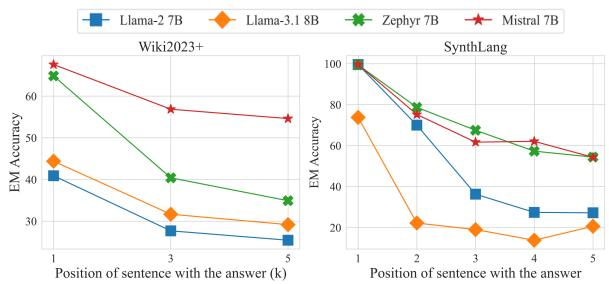

<details>
<summary>line</summary>

| Position of sentence with the answer | Wiki2023+ Llama-2 7B | Wiki2023+ Llama-3.1 8B | Wiki2023+ Zephyr 7B | Wiki2023+ Mistral 7B | SynthLang Llama-2 7B | SynthLang Llama-3.1 8B | SynthLang Zephyr 7B | SynthLang Mistral 7B |
| ----------------------------------- | --------------------- | ----------------------- | --------------------- | ---------------------- | --------------------- | ----------------------- | --------------------- | ---------------------- |
| 1                                   | 40                    | 45                      | 65                    | 70                     | 100                   | 75                      | 80                    | 95                     |
| 3                                   | 25                    | 30                      | 40                    | 55                     | 70                    | 20                      | 65                    | 60                     |
| 5                                   | 20                    | 25                      | 35                    | 50                     | 55                    | 15                      | 55                    | 50                     |
</details>

Figure 3: Accuracy in different positions of the information in training documents. Left: Wiki2023+. Right: SynthLang. All models are trained with AR.

# 4.3 Empirical Study on the Positional Bias

We first study the effect of position in documents with both synthetic and real datasets. For the real dataset, we modulate the position of the answer sentence, inspired by (Liu et al., 2023). Suppose we have a document consisting of n sentences, $\pmb { { \cal D } } = [ s _ { 1 } , s _ { 2 } , . . . s _ { n } ]$ , where $s _ { i }$ indicates a sentence. We evaluate the accuracy of answering a question about $s _ { 1 }$ by training a model on a set of documents, $D ^ { k }$ , which swaps $s _ { 1 }$ with $s _ { k } . ~ e . g .$ , $D ^ { 3 } = [ s _ { 3 } , s _ { 2 } , s _ { 1 } . . . s _ { n } ]$ . Note that we perform this modulation on all articles in the dataset and tune models on them. This assesses the model’s ability to memorize and recall information from $s _ { 1 }$ in different positions.

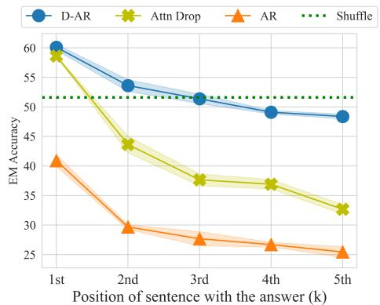

<details>
<summary>line</summary>

| Position of sentence with the answer (k) | D-AR  | Attn Drop | AR    | Shuffle |
| ---------------------------------------- | ----- | --------- | ----- | ------- |
| 1st                                      | 60.0  | 58.0      | 41.0  | 52.0    |
| 2nd                                      | 54.0  | 44.0      | 30.0  | 52.0    |
| 3rd                                      | 52.0  | 38.0      | 28.0  | 52.0    |
| 4th                                      | 49.0  | 37.0      | 27.0  | 52.0    |
| 5th                                      | 48.0  | 33.0      | 25.0  | 52.0    |
</details>

Figure 4: EM accuracy on Wiki2023+. The position of the sentence corresponding to the answer varies from the 1st to the 5th.

AR models significantly suffer from positional bias. In Fig. 3, we illustrate the results w.r.t. the position of the answer on Wiki2023+ and Synth-Lang with vanilla AR training. In both datasets, all models’ performances drop after the first sentence. Mistral and Zephyr outperform Llama models by a large margin. These results demonstrate that (i) many LMs suffer from the positional bias in the training documents, and (ii) a family of Llama model might be vulnerable to the bias.

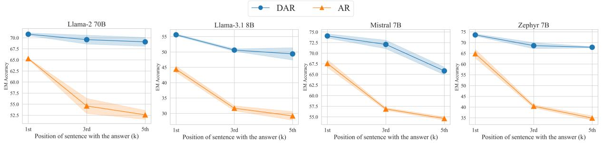

Figure 5: AR vs. D-AR in different models trained on Wiki2023+. Llama-2 70B, Llama-3.1 8B, Mistral 7B, and Zephyr 7B are shown from left to right. D-AR significantly improves performance over AR for all models. Llama-2 70B model with D-AR greatly mitigates the effect from the answer position.   
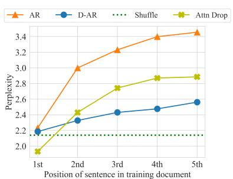

<details>
<summary>line</summary>

| Position of sentence in training document | AR    | D-AR  | Shuffle | Attn Drop |
| ---------------------------------------- | ----- | ----- | ------- | --------- |
| 1st                                      | 2.2   | 2.2   | 2.2     | 2.0       |
| 2nd                                      | 3.0   | 2.3   | 2.2     | 2.4       |
| 3rd                                      | 3.2   | 2.4   | 2.2     | 2.7       |
| 4th                                      | 3.4   | 2.5   | 2.2     | 2.9       |
| 5th                                      | 3.4   | 2.6   | 2.2     | 2.9       |
</details>

(a) Perplexity: Llama-2-7B.

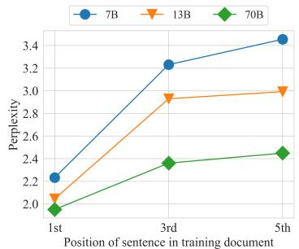

<details>
<summary>line</summary>

| Position of sentence in training document | 7B    | 13B   | 70B   |
| ----------------------------------------- | ----- | ----- | ----- |
| 1st                                       | 2.2   | 2.0   | 2.0   |
| 3rd                                       | 3.2   | 2.9   | 2.4   |
| 5th                                       | 3.4   | 3.0   | 2.5   |
</details>

(b) Perplexity: Llama-2-7B, 13B, 70B

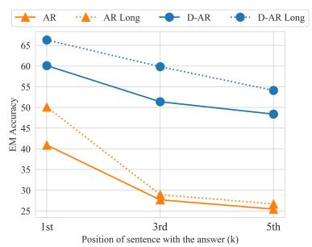

<details>
<summary>line</summary>

| Position of sentence with the answer (k) | AR   | AR Long | D-AR | D-AR Long |
| --------------------------------------- | ---- | ------- | ---- | --------- |
| 1st                                     | 40   | 50      | 60   | 65        |
| 3rd                                     | 28   | 29      | 51   | 60        |
| 5th                                     | 26   | 27      | 48   | 55        |
</details>

(c) Longer training.   
Figure 6: Left: Analysis of perplexity conducted on models in Fig. 4. We compute the perplexity for the first sentence in the original document $( s _ { 1 }$ in Sec.4.3). The perplexity increases by putting the sentence latter for all models. AR model shows the highest perplexity. Middle: Perplexity comparison by model size. The smaller model relies more on the previous sentences to memorize a sentence. Right: Longer training benefits the performance improvements near the beginning of documents. Both analyses are conducted on Wiki2023+.

Regularization leads to significant improvements. Fig. 4 shows the results of Llama-2-7B model on Wiki2023+. Attn Drop improves the performance over AR but still suffers from the performance drop by the answer position. D-AR shows higher performance in most positions, and the decrease by the position is limited compared to the AR and Attn Drop. Applying the regularization improves performance even in the first position for Wiki2023+, which is probably because of the effect from the answer position within a sentence. If the answer is at the end of a long sentence, retrieving the information during inference can be hard because of the positional effect. In summary, this result indicates that the LM struggles to recall information from the middle or end of a training document while the studied regularization techniques mitigate the issue in diverse positions.

D-AR is effective for all models. Given the effectiveness of D-AR, Fig. 5 studies the effectiveness of D-AR for other models, i.e., Llama-2-70B, Llama-3.1 8B, Zephyr-7B, and Mistral-7B model, showing that D-AR significantly improves the performance for all models. The result of Llama-2- 70B indicates that the large AR model still significantly degrades the performance in the middle and end. But, for the D-AR model, the performance decrease by the answer position is less than 2%. Also, the performance degradation of Zephyr-7B D-AR model (Tunstall et al., 2023) is approximately 5%, and the model shows high performance in all positions. A key to mitigating the positional bias might be using a strong model with a proper regularization method. These results are consistent with results on SynthLang in Fig. F.

Perplexity analysis: AR models rely a lot on previous tokens to memorize facts. We, then, use perplexity to study why the AR model struggles to retrieve information beyond the first sentence. First, the perplexities measured on $D ^ { k }$ of Wiki2023+ are almost 1.00 for all models, which indicates that the AR model memorizes the sentences almost perfectly given previous tokens. Next, we measure the perplexity of the first sentence in the original document, $s _ { 1 } .$ , for models trained with $D ^ { k }$ , $i . e .$ , models in Fig. 4. Thus, we assess if the model can reconstruct $s _ { 1 }$ without using the context from the previous sentences. We qualitatively confirm that $s _ { 1 }$ often describes single factual information such as the release date of a film or list of directors, thus such reconstruction can be done without previous sentences. As shown in Fig. 6a, perplexity increases as putting the $s _ { 1 }$ latter for all models. This trend is the most notable for the AR model, implying that the AR model relies much on the previous sentences to remember each token. Therefore, appropriate information cannot be retrieved given the query sentence. The downward perplexity trend is similar to the trend in QA in Fig. 4. Figure 6b analyzes the perplexity by model size, showing that larger models show smaller perplexity as reflected by QA performance. We do not aim to study whether perplexity can be a good measurement for models’ behavior as done in (Xia et al., 2023; Tay et al., 2022a), but this analysis implies that the perplexity measured on training document $( D ^ { k } )$ does not reflect the knowledge extraction performance on diverse positions.

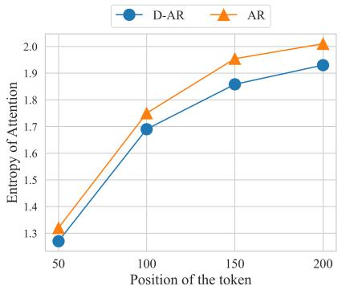

<details>
<summary>line</summary>

| Position of the token | D-AR  | AR    |
| --------------------- | ----- | ----- |
| 50                    | 1.3   | 1.3   |
| 100                   | 1.7   | 1.75  |
| 150                   | 1.85  | 1.95  |
| 200                   | 1.95  | 2.0   |
</details>

Figure 7: Entropy of attention in AR and D-AR. For each position of the token (X-axis), we compute the entropy of the attention, indicating that D-AR sharpens attention.

Longer document is harder to retrieve. We examine the impact of document length by increasing the number of spoken languages from 5 to 20, as illustrated in Fig. G. Longer documents are more difficult to memorize and amplify the effect of positional bias.

Longer training does not solve the positional bias. In Fig. 6c, we double the number of training iterations. For the AR model, increasing the training iterations improves the performance in the first position. Still, the improvement is limited in others, while the D-AR model improves in all positions. This indicates two facts: (i) increasing training iterations does not necessarily lead to the extractable knowledge memorization, and (ii) regularization is important to benefit from longer training. In addition, the improvement in the first position indicates that the decrease in the latter position is not caused by seeing samples too many times. By contrast, the AR model shows remarkable improvements by longer training for Zephyr as in Fig. I. This supports that Zephyr is robust to the positional bias in training documents. Studying the factors causing the difference is an interesting problem, and we leave it for our future work.

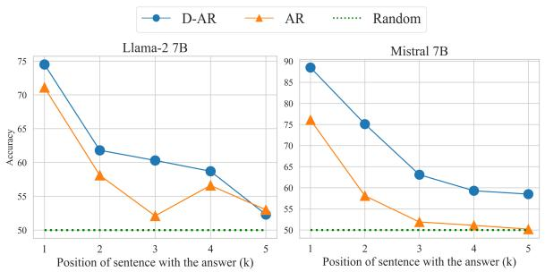

<details>
<summary>line</summary>

| Position of sentence with the answer (k) | Llama-2 7B - D-AR | Llama-2 7B - AR | Llama-2 7B - Random | Mistral 7B - D-AR | Mistral 7B - AR | Mistral 7B - Random |
| ---------------------------------------- | ------------------ | ---------------- | -------------------- | ------------------ | ---------------- | -------------------- |
| 1                                        | 75                 | 71               | 50                   | 89                 | 76               | 50                   |
| 2                                        | 62                 | 58               | 50                   | 75                 | 58               | 50                   |
| 3                                        | 60                 | 52               | 50                   | 63                 | 52               | 50                   |
| 4                                        | 59                 | 56               | 50                   | 60                 | 51               | 50                   |
| 5                                        | 53                 | 53               | 50                   | 59                 | 50               | 50                   |
</details>

Figure 8: Results on Yes/No question-answering with Llama-2 7B (left) and Zephyr (Right) showing that positional bias affects the performance.

D-AR sharpens attention. We compute the entropy of the attention probability in each head and layer and take the average for the four positions of the token in the training document in Fig. 7. The AR model shows larger entropy, meaning that it relies on more tokens to reduce the perplexity as shown in the previous paragraph. The effectiveness of sparse feature selection is discussed in Sec. E.

Positional bias affects the performance on Yes/No questions. We analyze the performance of questions that require a Yes/No response for the knowledge in the training documents. We then prepare Yes/No questions e.g., “Q. Ahmed Lopez’s 1st language is Fante. Is it correct? Answer with yes or no. A. yes.” and train models for documents and these QA pairs. The results in Fig. 8 indicate two new findings: (i) the accuracy degrades in the latter positions and (ii) D-AR mitigates the degrade, but the effectiveness is less evident than in previous experiments. Note that the performance is close to random in the last position and not very high even in the first (See that Llama-2’s highest accuracy is

<table><tr><td rowspan="2">Training</td><td colspan="6">← start—end→</td><td rowspan="2">Avg.</td></tr><tr><td> $EM_1/F1_1$ </td><td> $EM_2/F1_2$ </td><td> $EM_3/F1_3$ </td><td> $EM_4/F1_4$ </td><td> $EM_5/F1_5$ </td><td> $EM_6/F1_6$ </td></tr><tr><td>AR</td><td>40.9 / 54.0</td><td>6.3 / 20.5</td><td>8.1 / 29.8</td><td>11.7 / 35.7</td><td>11.6 / 37.8</td><td>10.7 / 36.4</td><td>14.9 / 35.7</td></tr><tr><td>Shuffle</td><td>51.6 / 65.7</td><td>14.7 / 43.2</td><td>15.6 / 43.5</td><td>20.6 / 46.8</td><td>24.0 / 50.8</td><td>19.8 / 46.4</td><td>24.4 / 49.4</td></tr><tr><td>Attn Drop</td><td>58.6 / 71.1</td><td>10.2 / 29.8</td><td>14.0 / 36.6</td><td>17.0 / 38.6</td><td>13.2 / 42.8</td><td>13.3 / 39.7</td><td>21.0 / 43.1</td></tr><tr><td>D-AR</td><td>60.1 / 73.7</td><td>26.9 / 53.1</td><td>23.4 / 52.9</td><td>26.0 / 51.7</td><td>24.8 / 52.2</td><td>21.3 / 48.2</td><td>30.4 / 55.3</td></tr></table>

Table 1: EM and F1 score for each position of the answer in unmodulated Wiki2023+. The “EMX” columns indicate exact matching accuracy at the X-th position, where smaller values of X correspond to positions closer to the beginning of the document and larger values correspond to positions closer to the end. Similarly, the “F1X” columns represent the F1 score at the respective positions. Compared to the auto-regressive model (AR), all techniques improve the knowledge extraction performance in all positions.

<table><tr><td rowspan="2">Model</td><td rowspan="2">Size</td><td rowspan="2">Method</td><td colspan="6">← start→</td><td rowspan="2">Avg.</td></tr><tr><td> $EM_1/F1_1$ </td><td> $EM_2/F1_2$ </td><td> $EM_3/F1_3$ </td><td> $EM_4/F1_4$ </td><td> $EM_5/F1_5$ </td><td> $EM_6/F1_6$ </td></tr><tr><td rowspan="6">Llama-2</td><td rowspan="2">7B</td><td>AR</td><td>40.9/54.0</td><td>6.3/20.5</td><td>8.1/29.8</td><td>11.7/35.7</td><td>11.6/37.8</td><td>10.7/36.4</td><td>14.9/35.7</td></tr><tr><td>D-AR</td><td>60.1/73.7</td><td>26.9/53.1</td><td>23.4/52.9</td><td>26.0/51.7</td><td>24.8/52.2</td><td>21.3/48.2</td><td>30.4/55.3</td></tr><tr><td rowspan="2">13B</td><td>AR</td><td>58.1/69.3</td><td>8.7/28.3</td><td>18.8/40.2</td><td>20.2/42.3</td><td>11.6/39.2</td><td>14.7/39.3</td><td>22.0/43.1</td></tr><tr><td>D-AR</td><td>67.6/84.1</td><td>34.4/64.4</td><td>32.8/64.0</td><td>30.5/58.6</td><td>30.2/59.0</td><td>22.8/52.2</td><td>36.4/63.7</td></tr><tr><td rowspan="2">70B</td><td>AR</td><td>65.3/78.9</td><td>27.2/48.9</td><td>24.4/46.2</td><td>27.8/50.9</td><td>22.5/50.9</td><td>22.8/48.1</td><td>31.7/54.0</td></tr><tr><td>D-AR</td><td>70.8/85.8</td><td>48.8/68.9</td><td>43.8/70.7</td><td>39.5/64.8</td><td>38.0/66.7</td><td>36.0/60.7</td><td>46.2/69.6</td></tr><tr><td rowspan="2">Llama-3.1</td><td rowspan="2">8B</td><td>AR</td><td>44.4/55.7</td><td>10.8/24.6</td><td>15.6/35.9</td><td>18.4/40.5</td><td>17.8/46.8</td><td>17.3/41.1</td><td>20.7/40.8</td></tr><tr><td>D-AR</td><td>55.6/68.6</td><td>29.0/53.1</td><td>27.6/59.4</td><td>30.9/60.1</td><td>30.2/58.0</td><td>27.4/55.2</td><td>33.4/59.0</td></tr><tr><td rowspan="2">Zephyr</td><td rowspan="2">7B</td><td>AR</td><td>64.8/79.7</td><td>18.6/45.7</td><td>25.9/52.3</td><td>32.2/54.0</td><td>21.7/52.5</td><td>22.3/48.8</td><td>30.9/55.5</td></tr><tr><td>D-AR</td><td>73.6/88.0</td><td>46.7/70.3</td><td>42.9/71.9</td><td>39.4/66.9</td><td>36.4/66.5</td><td>31.4/57.6</td><td>45.1/70.2</td></tr><tr><td rowspan="2">Mistral</td><td rowspan="2">7B</td><td>AR</td><td>67.6/81.8</td><td>21.3/46.8</td><td>27.2/53.9</td><td>28.3/52.5</td><td>22.5/53.8</td><td>23.9/47.7</td><td>31.8/56.1</td></tr><tr><td>D-AR</td><td>74.1/86.9</td><td>44.0/70.7</td><td>40.3/70.0</td><td>39.5/66.5</td><td>38.8/67.8</td><td>30.5/59.9</td><td>44.5/70.3</td></tr></table>

Table 2: Comparison by models in Unmodulated Wiki2023+. Zephyr’s and Mistral’s performances are comparable to that of the Llama-70B model.

75%.) though the accuracy in knowledge retrieval is almost 100% in Fig. 3, implying the difficulty of this task as reported by (Allen-Zhu and Li, 2023c).

# 4.4 Analysis on Unmodulated Wiki2023+

We aim to evaluate the performance of models on the unmodulated documents and compute accuracy for all QA pairs, unlike Sec. 4.3 computing the accuracy only for the first sentence, s1. Note that the performance in this evaluation can depend not only on the position of the information but also on its content. For example, the first sentence often describes general properties of the film whereas the last sentence can be specific details. However, evaluation in this setting will give more insight into whether positional bias exists in memorizing and answering information from real documents.

Effectiveness of diverse regularizations. Table 1 details the results on Wiki2023+. The performance of AR significantly drops after the first sentence. D-AR significantly enhances performance over the AR model. Positional bias alone cannot explain the low performance in the second to sixth positions. We hypothesize that the content described in the latter sentences can be harder to answer; the first sentence often explains the simple fact, e.g., who made the film or when it was made, while the latter sentences can contain more complex facts. All regularization techniques outperform the AR model in all positions.

Analysis of diverse models. Table 2 studies diverse models, where D-AR significantly boosts performance in all cases. A comparison among Llama-2 indicates that larger models outperform in all positions, yet they still significantly degrade the performance in the middle and end. While the advantage of Llama-3.1 8B over Llama-2 is insignificant, Zephyr and Mistral outperform the Llama family by a large margin without increasing parameter size.

Combination with text augmentation. Allen-Zhu and Li (2023a) conclude that text augmentation by LM is imperative to improve the performance of parametric knowledge extraction. Table E shows that combining such an LM-based text augmentation and D-AR boosts the performance, yet the effectiveness of D-AR is more evident than the LM-based augmentation.

Comparison with Open-book QA. We report the performance where the corresponding document of Wiki2023+ is provided with Llama-2 7B as a context. This setting assumes the RAG with a perfect retrieval model. Since its answer format differs a lot from Wiki2023+, applying EM or F1 evaluation metric is unfair. Then, we utilize ChatGPT for automatic evaluation, finding that the accuracy of the open-book setting is 90.6% while that of the best model in Table 2 is 50.8 %. This indicates that the RAG outperforms this continued training if it has an accurate retrieval model.

Discussion about RAG. We do not think the results in the previous paragraph diminish the value of our work. RAG can augment the memory of LMs while frequent access to external documents can cause high latency in a system. In fact, some RAG approaches choose to answer questions without using retrieving documents (Asai et al., 2023). In this sense, an LM performant on knowledge-intensive tasks should reduce the necessity of retrieval augmentation, achieving a more efficient LM agent. Therefore, improvements in LM’s memorization ability should also benefit the RAG system.

Discussion about the limitation of D-AR. Our experiments do not indicate the weaknesses of D-AR. However, we think D-AR can have several limitations. For instance, when applied to pre-training a language model, D-AR might cause under-fitting since the model cannot see the clean sequence. In our experimental setup, we employ a pre-trained one, and the model has seen documents more than 50 times in many cases, which should prevent the under-fitting issue. However, even in pre-training a language model, applying D-AR at the last few epochs might improve the knowledge extraction from the pre-training corpus, which has not been studied in previous work.

# 5 Conclusion

In this work, we investigate the issue of “perplexity curse” in the continued training of LLM. Then, we find a very intriguing fact that LLMs struggle to extract information beyond the first sentence. Our study indicates that auto-regressive training forces the model to memorize contents relying on many irrelevant tokens, and simple and easy techniques such as denoising auto-regressive training mitigate the issue. Our published code and dataset should encourage more researchers to investigate the issue.

# 6 Limitations

We focus on fine-tuning LMs to study the problem of positional bias and do not provide results on training models from scratch. This is due to the difficulty of performing a well-controlled study in large-scale pre-training corpora. But, our study should be very insightful in both the continued and full-scratch training of LMs.

Acknowledgement. We thank Shusaku Sone, Tatsunori Taniai, Tosho Hirasawa, Jiaxin Ma, Donghyun Kim, and Chun-Liang Li for their valuable feedback on our research. This work is supported by JST Moonshot R&D Program Grant Number JPMJMS2236. We used the computational resources of AI Bridging Cloud Infrastructure (ABCI) provided by National Institute of Advanced Industrial Science and Technology (AIST).

# References

Zeyuan Allen-Zhu and Yuanzhi Li. 2023a. Physics of language models: Part 1, context-free grammar. arXiv preprint arXiv:2305.13673.   
Zeyuan Allen-Zhu and Yuanzhi Li. 2023b. Physics of language models: Part 3.1, knowledge storage and extraction. arXiv preprint arXiv:2309.14316.   
Zeyuan Allen-Zhu and Yuanzhi Li. 2023c. Physics of language models: Part 3.2, knowledge manipulation. arXiv preprint arXiv:2309.14402.   
Shengnan An, Zexiong Ma, Zeqi Lin, Nanning Zheng, and Jian-Guang Lou. 2024. Make your llm fully utilize the context. arXiv preprint arXiv:2404.16811.   
Martin Arjovsky, Léon Bottou, Ishaan Gulrajani, and David Lopez-Paz. 2019. Invariant risk minimization. arXiv preprint arXiv:1907.02893.   
Akari Asai, Zeqiu Wu, Yizhong Wang, Avirup Sil, and Hannaneh Hajishirzi. 2023. Self-rag: Learning to retrieve, generate, and critique through self-reflection. arXiv preprint arXiv:2310.11511.   
Tom Brown, Benjamin Mann, Nick Ryder, Melanie Subbiah, Jared D Kaplan, Prafulla Dhariwal, Arvind Neelakantan, Pranav Shyam, Girish Sastry, Amanda Askell, et al. 2020. Language models are few-shot learners. In NeurIPS.   
Jacob Devlin, Ming-Wei Chang, Kenton Lee, and Kristina Toutanova. 2018. Bert: Pre-training of deep bidirectional transformers for language understanding. In ACL.   
Abhimanyu Dubey, Abhinav Jauhri, Abhinav Pandey, Abhishek Kadian, Ahmad Al-Dahle, Aiesha Letman, Akhil Mathur, Alan Schelten, Amy Yang, Angela Fan, et al. 2024. The llama 3 herd of models. arXiv preprint arXiv:2407.21783.

Itai Feigenbaum, Devansh Arpit, Huan Wang, Shelby Heinecke, Juan Carlos Niebles, Weiran Yao, Caiming Xiong, and Silvio Savarese. 2024. Editing arbitrary propositions in llms without subject labels. arXiv preprint arXiv:2401.07526.   
Leo Gao, Stella Biderman, Sid Black, Laurence Golding, Travis Hoppe, Charles Foster, Jason Phang, Horace He, Anish Thite, Noa Nabeshima, et al. 2020. The pile: An 800gb dataset of diverse text for language modeling. arXiv preprint arXiv:2101.00027.   
Zorik Gekhman, Gal Yona, Roee Aharoni, Matan Eyal, Amir Feder, Roi Reichart, and Jonathan Herzig. 2024. Does fine-tuning llms on new knowledge encourage hallucinations? arXiv preprint arXiv:2405.05904.   
Rafael Glater and Rodrygo L. T. Santos. 2023. On answer position bias in transformers for question answering. In Proceedings of the 46th International ACM SIGIR Conference on Research and Development in Information Retrieval, SIGIR ’23, page 2215–2219, New York, NY, USA. Association for Computing Machinery.   
Kelvin Guu, Kenton Lee, Zora Tung, Panupong Pasupat, and Mingwei Chang. 2020. Retrieval augmented language model pre-training. In ICML. PMLR.   
Geoffrey E Hinton, Nitish Srivastava, Alex Krizhevsky, Ilya Sutskever, and Ruslan R Salakhutdinov. 2012. Improving neural networks by preventing coadaptation of feature detectors. arXiv preprint arXiv:1207.0580.   
Sebastian Hofstätter, Jiecao Chen, Karthik Raman, and Hamed Zamani. 2022. Multi-task retrievalaugmented text generation with relevance sampling. arXiv preprint arXiv:2207.03030.   
Sebastian Hofstätter, Aldo Lipani, Sophia Althammer, Markus Zlabinger, and Allan Hanbury. 2021. Mitigating the position bias of transformer models in passage re-ranking. In Advances in Information Retrieval: 43rd European Conference on IR Research, ECIR 2021, Virtual Event, March 28–April 1, 2021, Proceedings, Part I 43, pages 238–253. Springer.   
Nathan Hu, Eric Mitchell, Christopher D Manning, and Chelsea Finn. 2023. Meta-learning online adaptation of language models. arXiv preprint arXiv:2305.15076.   
Joel Jang, Seonghyeon Ye, Sohee Yang, Joongbo Shin, Janghoon Han, Gyeonghun KIM, Stanley Jungkyu Choi, and Minjoon Seo. 2022. Towards continual knowledge learning of language models. In ICLR.   
Albert Q Jiang, Alexandre Sablayrolles, Arthur Mensch, Chris Bamford, Devendra Singh Chaplot, Diego de las Casas, Florian Bressand, Gianna Lengyel, Guillaume Lample, Lucile Saulnier, et al. 2023a. Mistral 7b. arXiv preprint arXiv:2310.06825.

Huiqiang Jiang, Qianhui Wu, Xufang Luo, Dongsheng Li, Chin-Yew Lin, Yuqing Yang, and Lili Qiu. 2023b. Longllmlingua: Accelerating and enhancing llms in long context scenarios via prompt compression. arXiv preprint arXiv:2310.06839.   
Zhengbao Jiang, Zhiqing Sun, Weijia Shi, Pedro Rodriguez, Chunting Zhou, Graham Neubig, Xi Victoria Lin, Wen-tau Yih, and Srinivasan Iyer. 2024. Instruction-tuned language models are better knowledge learners. arXiv preprint arXiv:2402.12847.   
Bingyi Kang, Saining Xie, Marcus Rohrbach, Zhicheng Yan, Albert Gordo, Jiashi Feng, and Yannis Kalantidis. 2019. Decoupling representation and classifier for long-tailed recognition. arXiv preprint arXiv:1910.09217.   
Muhammad Khalifa, David Wadden, Emma Strubell, Honglak Lee, Lu Wang, Iz Beltagy, and Hao Peng. 2024. Source-aware training enables knowledge attribution in language models. arXiv preprint arXiv:2404.01019.   
Miyoung Ko, Jinhyuk Lee, Hyunjae Kim, Gangwoo Kim, and Jaewoo Kang. 2020. Look at the first sentence: Position bias in question answering. In EMNLP.   
Tom Kwiatkowski, Jennimaria Palomaki, Olivia Redfield, Michael Collins, Ankur Parikh, Chris Alberti, Danielle Epstein, Illia Polosukhin, Jacob Devlin, Kenton Lee, et al. 2019. Natural questions: a benchmark for question answering research. Transactions of the Association for Computational Linguistics, 7:453– 466.   
Patrick Lewis, Ethan Perez, Aleksandra Piktus, Fabio Petroni, Vladimir Karpukhin, Naman Goyal, Heinrich Küttler, Mike Lewis, Wen-tau Yih, Tim Rocktäschel, et al. 2020. Retrieval-augmented generation for knowledge-intensive nlp tasks. In NeurIPS.   
Nelson F Liu, Kevin Lin, John Hewitt, Ashwin Paranjape, Michele Bevilacqua, Fabio Petroni, and Percy Liang. 2023. Lost in the middle: How language models use long contexts. TACL.   
Fang Ma, Chen Zhang, and Dawei Song. 2021. Exploiting position bias for robust aspect sentiment classification. In ACL-IJCNLP.   
Kevin Meng, David Bau, Alex Andonian, and Yonatan Belinkov. 2022. Locating and editing factual associations in gpt. In NeurIPS.   
Kevin Meng, Arnab Sen Sharma, Alex Andonian, Yonatan Belinkov, and David Bau. 2023. Mass editing memory in a transformer. In ICLR.   
Eric Mitchell, Charles Lin, Antoine Bosselut, Chelsea Finn, and Christopher D Manning. 2022a. Fast model editing at scale. In ICLR.   
Eric Mitchell, Charles Lin, Antoine Bosselut, Christopher D Manning, and Chelsea Finn. 2022b. Memorybased model editing at scale. In ICML.

Guilherme Penedo, Quentin Malartic, Daniel Hesslow, Ruxandra Cojocaru, Alessandro Cappelli, Hamza Alobeidli, Baptiste Pannier, Ebtesam Almazrouei, and Julien Launay. 2023. The refinedweb dataset for falcon llm: outperforming curated corpora with web data, and web data only. arXiv preprint arXiv:2306.01116.   
Alexander Peysakhovich and Adam Lerer. 2023. Attention sorting combats recency bias in long context language models. arXiv preprint arXiv:2310.01427.   
Colin Raffel, Noam Shazeer, Adam Roberts, Katherine Lee, Sharan Narang, Michael Matena, Yanqi Zhou, Wei Li, and Peter J Liu. 2020. Exploring the limits of transfer learning with a unified text-to-text transformer. The Journal of Machine Learning Research.   
Pranav Rajpurkar, Jian Zhang, and Percy Liang. 2018. Know what you don’t know: Unanswerable questions for squad. In ACL.   
Jeff Rasley, Samyam Rajbhandari, Olatunji Ruwase, and Yuxiong He. 2020. Deepspeed: System optimizations enable training deep learning models with over 100 billion parameters. In Proceedings of the 26th ACM SIGKDD International Conference on Knowledge Discovery & Data Mining, pages 3505–3506.   
Yi Tay, Mostafa Dehghani, Jinfeng Rao, William Fedus, Samira Abnar, Hyung Won Chung, Sharan Narang, Dani Yogatama, Ashish Vaswani, and Donald Metzler. 2022a. Scale efficiently: Insights from pretraining and finetuning transformers. In ICLR.   
Yi Tay, Mostafa Dehghani, Vinh Q Tran, Xavier Garcia, Dara Bahri, Tal Schuster, Huaixiu Steven Zheng, Neil Houlsby, and Donald Metzler. 2022b. Unifying language learning paradigms. arXiv preprint arXiv:2205.05131.   
Hugo Touvron, Thibaut Lavril, Gautier Izacard, Xavier Martinet, Marie-Anne Lachaux, Timothée Lacroix, Baptiste Rozière, Naman Goyal, Eric Hambro, Faisal Azhar, et al. 2023a. Llama: Open and efficient foundation language models. arXiv preprint arXiv:2302.13971.   
Hugo Touvron, Louis Martin, Kevin Stone, Peter Albert, Amjad Almahairi, Yasmine Babaei, Nikolay Bashlykov, Soumya Batra, Prajjwal Bhargava, Shruti Bhosale, et al. 2023b. Llama 2: Open foundation and fine-tuned chat models. arXiv preprint arXiv:2307.09288.   
Lewis Tunstall, Edward Beeching, Nathan Lambert, Nazneen Rajani, Kashif Rasul, Younes Belkada, Shengyi Huang, Leandro von Werra, Clémentine Fourrier, Nathan Habib, et al. 2023. Zephyr: Direct distillation of lm alignment. arXiv preprint arXiv:2310.16944.   
Song Wang, Yaochen Zhu, Haochen Liu, Zaiyi Zheng, Chen Chen, et al. 2023. Knowledge editing for large language models: A survey. arXiv preprint arXiv:2310.16218.

Thomas Wang, Adam Roberts, Daniel Hesslow, Teven Le Scao, Hyung Won Chung, Iz Beltagy, Julien Launay, and Colin Raffel. 2022. What language model architecture and pretraining objective works best for zero-shot generalization? In ICML.   
Jason Wei, Maarten Bosma, Vincent Y Zhao, Kelvin Guu, Adams Wei Yu, Brian Lester, Nan Du, Andrew M Dai, and Quoc V Le. 2022. Finetuned language models are zero-shot learners. In ICLR.   
Thomas Wolf, Lysandre Debut, Victor Sanh, Julien Chaumond, Clement Delangue, Anthony Moi, Pierric Cistac, Tim Rault, Rémi Louf, Morgan Funtowicz, et al. 2019. Huggingface’s transformers: State-ofthe-art natural language processing. arXiv preprint arXiv:1910.03771.   
BigScience Workshop, Teven Le Scao, Angela Fan, Christopher Akiki, Ellie Pavlick, Suzana Ilic, Daniel´ Hesslow, Roman Castagné, Alexandra Sasha Luccioni, François Yvon, et al. 2022. Bloom: A 176bparameter open-access multilingual language model. arXiv preprint arXiv:2211.05100.   
Mengzhou Xia, Mikel Artetxe, Chunting Zhou, Xi Victoria Lin, Ramakanth Pasunuru, Danqi Chen, Luke Zettlemoyer, and Ves Stoyanov. 2023. Training trajectories of language models across scales. In ACL.   
Boyan Zhou, Quan Cui, Xiu-Shen Wei, and Zhao-Min Chen. 2020. Bbn: Bilateral-branch network with cumulative learning for long-tailed visual recognition. In CVPR, pages 9719–9728.   
Xiao Zhou, Yong Lin, Weizhong Zhang, and Tong Zhang. 2022. Sparse invariant risk minimization. In ICML, pages 27222–27244. PMLR.   
Tongyao Zhu, Qian Liu, Liang Pang, Zhengbao Jiang, Min-Yen Kan, and Min Lin. 2024. Beyond memorization: The challenge of random memory access in language models. arXiv preprint arXiv:2403.07805.

# A Broader Impact

The general negative societal impacts of LM will be applied to our work. Since our work focuses on the internal knowledge extraction of LM, our observation can inspire LMs with better internal knowledge memory. Such models might leak private information more easily if such information is included in training data. But, we think the issue is not specific to our work, but a general problem in LM. To mitigate such issues, it is important to limit the use of private information to train LM.

# B Details of dataset

# B.1 Additional Details

<table><tr><td>Dataset</td><td>Documents</td><td>QA pairs</td></tr><tr><td>SynthID</td><td>3000</td><td>30000</td></tr><tr><td>Wiki2023+</td><td>5911</td><td>10924</td></tr><tr><td>Film (Wiki2023+)</td><td>2385</td><td>7398</td></tr></table>

Table A: Number of documents and QA pairs of used datasets.

Stats of dataset. Table A summarizes the number of documents and QA pairs per dataset. Fig. A illustrates the number of tokens per document, question, and answer sentence. Most learned documents are short, and questions and answers are generally concise. Fig. B illustrates the distribution of the number of sentences per document. The distribution is skewed as expected from the number of tokens (Fig. A).

Investigation on the data leak. Though Wiki2023+ is collected from the articles published in 2023, there is a potential data leak to LLama-2 models. We feed the collected questions into LLama-2 7B model and measure the accuracy by asking Chat-GPT as described in Sec. C, obtaining an accuracy of 1.1%. Note that the accuracy of Zephyr is 7.7%. As indicated by (Jiang et al., 2024), we conclude that the data leak to the these models is not significant.

Examples of documents. Left of Fig. C shows the example of Wiki2023+. For Fig. C, we highlight the tokens used as prompts to generate document contents or answers.

Question distributions. The right of Fig. C illustrates the histogram of the answer position in documents for the film test split, revealing that the distribution of the answer position is skewed towards the beginning of the documents. This skewness arises from the presence of the first sentence in all documents, while some lack a second or subsequent one. Therefore, even if humans annotate the QA pairs for the entire document, not in a sentenceby-sentence way, this skewness can be present.

# B.2 Procedure to create QA pairs

Fig. D illustrates the overview of the QA dataset creation for Wiki2023+.

Sentence extraction. First, we extract sentences from the documents. We find that splitting sentences using Chat-GPT works better than rulebased splitting or using the NLTK tool. Since the LLM can hallucinate some sentences, we compute the similarity between the documents before and after sentence extraction and filter documents if the similarity is smaller than a threshold.

QA generation. We feed the sentence Chat-GPT and instruct the model to generate QA pairs. For the prompt sentence, we follow (Jiang et al., 2024). The generated question needs to satisfy the following conditions; (i) it asks about the subject of the sentence, (ii) the answer can be inferred from the input sentence, and (iii) the answer cannot be the name of the subject. We find that the generated QA pairs include many samples that do not satisfy these conditions, approximately 20-30% violate the conditions.

Annotate a small number of samples. Considering the noise in the QA pairs, we need to pick valid QA pairs. Since annotating all QA pairs takes tremendous cost, we choose to annotate a small proportion of samples and consider filtering the dataset by a classifier to judge the quality of the QA. Then, we randomly pick 500 samples from the QA pool and annotate the quality of QA data, i.e., valid or invalid under the conditions described above.

Filtering with a classifier. We train a sentence BERT-based (Devlin et al., 2018) classifier by the 500 annotated samples. The input consists of the triplet of question, answer, and input sentence. Using this classifier, we pick QA samples with the top 60% validity score. For the quality assessment, we further annotate 500 samples and confirm that 95% of QA pairs satisfy the three conditions. Stats of samples that pass the filtering process are described in Table A.

SynthLang for Yes/No questions. Given a sentence such as “Ahmed Lopez’s 1st language is Fante.”, we simply convert it into a question answerable with Yes/No, e.g., “Ahmed Lopez’s 1st language is Fante. Is it correct? Answer with yes or no.”. We create a question whose answer is No by randomly choosing another language. Thus, we create two questions from one original one, resulting in 20000 questions for training, 1000 for validation and testing respectively.

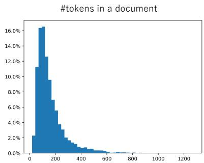

<details>
<summary>histogram</summary>

#tokens in a document
</details>

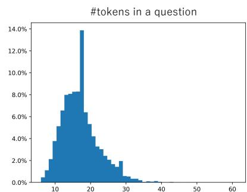

<details>
<summary>histogram</summary>

| #tokens in a question | Percentage |
| --------------------- | ---------- |
| 0-5                   | 0.0%       |
| 5-10                  | 2.0%       |
| 10-15                 | 4.0%       |
| 15-20                 | 8.0%       |
| 20-25                 | 14.0%      |
| 25-30                 | 6.0%       |
| 30-35                 | 2.0%       |
| 35-40                 | 0.0%       |
| 40-45                 | 0.0%       |
| 45-50                 | 0.0%       |
| 50-55                 | 0.0%       |
| 55-60                 | 0.0%       |
</details>

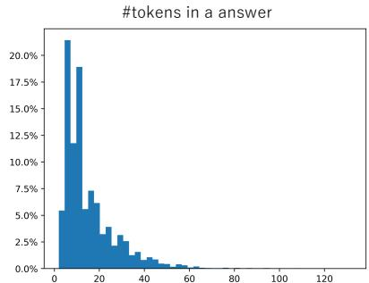

<details>
<summary>bar</summary>

| #tokens in a answer | Percentage |
| ------------------- | ---------- |
| 0-5                 | 21.0%      |
| 5-10                | 19.0%      |
| 10-15               | 12.0%      |
| 15-20               | 7.5%       |
| 20-25               | 6.0%       |
| 25-30               | 4.0%       |
| 30-35               | 3.0%       |
| 35-40               | 2.5%       |
| 40-45               | 2.0%       |
| 45-50               | 1.5%       |
| 50-55               | 1.0%       |
| 55-60               | 0.5%       |
| 60-65               | 0.3%       |
| 65-70               | 0.2%       |
| 70-75               | 0.1%       |
| 75-80               | 0.1%       |
| 80-85               | 0.1%       |
| 85-90               | 0.1%       |
| 90-95               | 0.1%       |
| 95-100              | 0.1%       |
| 100-105             | 0.1%       |
| 105-110             | 0.1%       |
| 110-115             | 0.1%       |
| 115-120             | 0.1%       |
</details>

Figure A: Histograms of the number of tokens in a document, question, and answer (from left to right).

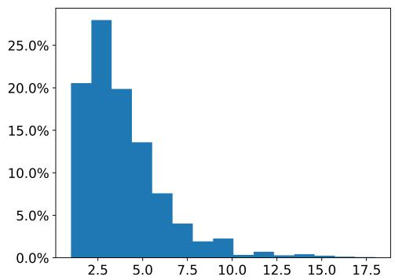

<details>
<summary>histogram</summary>

| Bin Range | Frequency |
| --------- | --------- |
| 0.0 - 2.5 | 20.0%     |
| 2.5 - 5.0 | 28.0%     |
| 5.0 - 7.5 | 14.0%     |
| 7.5 - 10.0| 4.0%      |
| 10.0 - 12.5| 2.0%    |
| 12.5 - 15.0| 1.0%    |
| 15.0 - 17.5| 0.5%    |
</details>

Figure B: Histogram of the number of sentences per document (Wiki2023+).

License for the dataset. We will publish datasets for non-commercial use.

Discussion about the safety of the dataset. Our synthetic dataset contains no personal or offensive content due to its generation procedure. Wiki2023+ also should not contain such content since we collect the data from Wikipedia’s specific categories.

# C Experimental Details

Pre-trained Models. Table B details the URL of pre-trained models we employ in experiments. Note that all these models are instruction-tuned ones.

Hyper-parameters. In D-AR, the ratio to replace a token with a random one is set as 0.2 in all experiments. For Attn Drop, we set the dropout ratio as 0.5 in the experiments on 0.2 on Wiki2023+. Considering the amount of the data, we train models for 1800 iterations for SynthLang.

Evaluation with ChatGPT. Fig. E illustrates the prompt given to ChatGPT to evaluate the accuracy of the predicted answer given question and ground-truth. We utilize the percentage of Correct instances as accuracy.

Implementation. We implement our codebase relying on huggingface models (Wolf et al., 2019) and utilize ZeRO3 in DeepSpeed (Rasley et al., 2020) for computational efficiency. During training, we set the number of training tokens to 512.

Inference. We set the temperature as 0.6, top-k as 50, and repetition penalty as 1.2 in huggingface’s text generation function.

Computation. We employ a server with 8 A100 GPUs with either 40G or 80G memories. Our training code on LLama-2 7B occupies approximately 18G for each GPU. The training on 3000 iterations takes approximately 8 hours.

Statistical Significance. Due to the limit of time and resources, all results except for Fig. 4, Fig. 5 are obtained by a single run. Fig. 4 and Fig. 5 show the results averaged over three runs and their standard deviation, where we think the deviations are small enough.

# D Additional Experiments

Results of placing sentences in the first position. Table C shows the results ablated in Sec.4.3. We place 3rd or 5th sentence at the beginning and evaluate the performance to answer about the sentence. This result indicates the importance of the position to recall the information by question-answering. These results conclude that vanilla AR models can significantly suffer from positional bias.

AR vs. D-AR in SynthLang. Fig. F shows the comparison between AR and D-AR in Synth-Lang. These results confirm that D-AR is effective in mitigating the positional bias issue.

Training with longer documents. We vary the length of SynthLang dataset and observe the performance of trained D-AR models. Specifically, we add more sentences in spoken languages, i.e., 10 and 20, to increase the document’s length. Fig. G shows that the effect of the positional bias increases by the training documents’ length using Zephyr. The significant performance degradation by using 20 sentences can be attributed to two issues: (i) an increase in the amount of information to be memorized and (ii) increased positional bias.

Document (The Tenant (2023 film)) 

<table><tr><td>&lt;s&gt; The Tenant (2023 film)) : The Tenant is Hindi-English coming-of-age drama film written and directed by Sushrut Jain. It stars Shamita Shetty and Rudhraksh Jaiswal. It is produced by Mad Coolie Productions. It was released on 10 February 2023. It received mix reviews from the critics who praised the performances but criticised the screenplay. &lt;/s&gt;</td></tr></table>

QA Data   
<s><INST> Who is the writer and director of The Tenant (2023 film)? </INST> Sushrut Jain. </s>   
<s><INST> What were the critics' opinions on The Tenant (2023 film)? </INST> Mixed reviews, praised performances, criticized screenplay </s>

Position of the answer in documents   
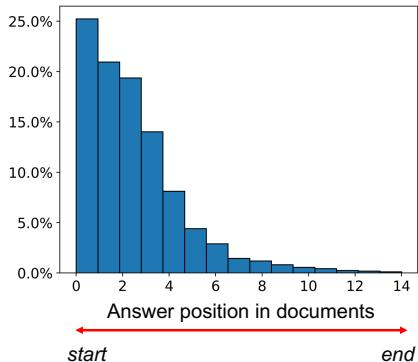

<details>
<summary>bar</summary>

| Answer position in documents | Percentage |
| ---------------------------- | ---------- |
| 0                            | 25.0%      |
| 1                            | 21.0%      |
| 2                            | 19.0%      |
| 3                            | 14.0%      |
| 4                            | 8.0%       |
| 5                            | 4.0%       |
| 6                            | 3.0%       |
| 7                            | 2.0%       |
| 8                            | 1.5%       |
| 9                            | 1.0%       |
| 10                           | 0.5%       |
| 11                           | 0.3%       |
| 12                           | 0.2%       |
| 13                           | 0.1%       |
| 14                           | 0.0%       |
</details>

Figure C: Left: Example of a document and QA pairs generated from the document. "<INST>" and "</INST>" are the tags used for LLama-2 Chat model. Right: The distribution of the position of answers in this dataset. The distribution is skewed towards the first sentence.

QA Generation   
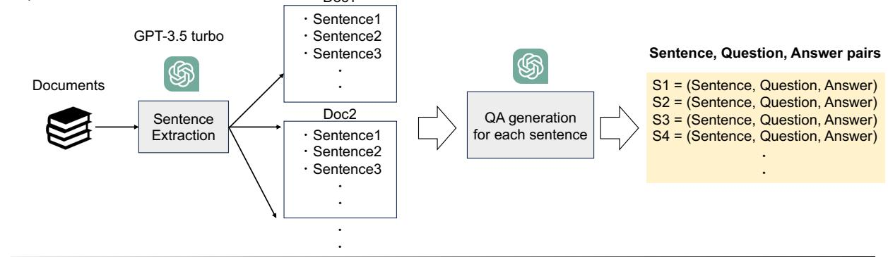

<details>
<summary>flowchart</summary>

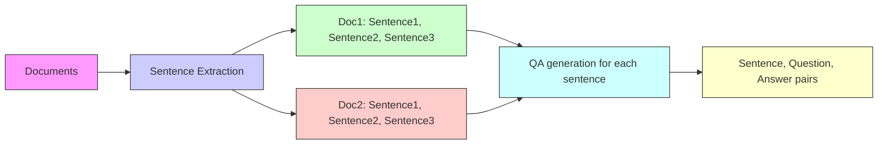
</details>

Filtering   
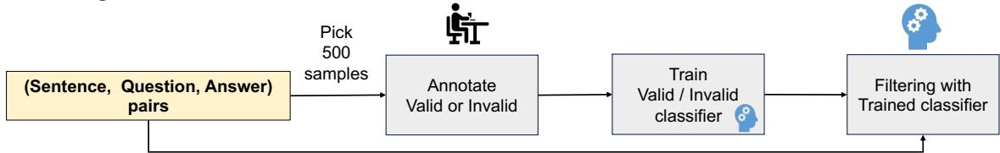

<details>
<summary>flowchart</summary>

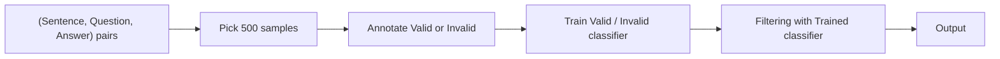
</details>

Figure D: Procedure to create QA data for Wiki2023+.

# Which is important, denoising or adding noise?

The denoising auto-regressive model shows remarkable improvements over a vanilla model in our experiments. In the D-AR model, some input tokens are replaced with random ones, and the model learns to predict the next correct tokens. We study if the improvement comes from denoising the noiseadded tokens or predicting next-tokens given randomly perturbed observations. Specifically, we turn off computing loss on the positions where the tokens are replaced with random ones, thereby ablating the denoising role. We evaluate it in the setting of Table 1 and get an average of 29.3 / 54.8 (EM / F1). Compared to the vanilla D-AR model’s performance (30.4 / 55.3), we see a small decrease, yet still surpassing the AR model by a large margin. We conclude that the performance gain comes largely from adding noise to the training tokens.

The effect of balanced sampling for QA is limited. As shown in Fig. C, the distribution of the answer position in QA data is highly skewed. A potential remedy to the imbalanced data is applying balanced sampling as done in long-tailed class

# Prompt used for evaluation

```txt
I will give you a pair of question and a ground-truth answer, and AI generated answer. Decide if the answer is correct or not.
Q: {question}
GT: {GT}

AI answer: {Answer from a model}
Choose from 1. Correct, 2. Partially Correct, 3. Not correct.
Answer only number. Answer: 
```

Figure E: Example of a prompt used for evaluation. 

<table><tr><td>Model</td><td>URL</td></tr><tr><td>Llama-2</td><td>meta-llama/Llama-2-7b-chat-hf</td></tr><tr><td>Llama-3.1</td><td>meta-llama/Meta-Llama-3.1-8B-Instruct</td></tr><tr><td>Zephyr-7B</td><td>HuggingFaceH4/zephyr-7b-beta</td></tr><tr><td>Mistral-7B</td><td>https://huggingface.co/mistralai/Mistral-7B-Instruct-v0.3</td></tr></table>

Table B: URLs of pre-trained models used for experiments

<table><tr><td>Target Index (k)</td><td> $D^{1} / D^{k}$ </td></tr><tr><td>3</td><td>27.2 / 38.6</td></tr><tr><td>5</td><td>22.4 / 37.2</td></tr></table>

Table C: Training a model on $D ^ { k } ,$ , which puts target sentences $( s _ { 3 }$ or $s _ { 5 } )$ at the beginning, improves QA performance for the targets over training on the original document, $D ^ { 1 }$ . k is the position of the sentence in $D ^ { 1 }$ . The Mistral AR model and Wiki2023+ are used.

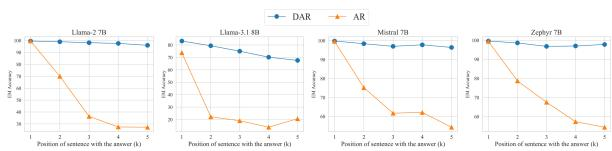

<details>
<summary>line</summary>

| Position of sentence with the answer (k) | DAR (Llama-2 TB) | DAR (Llama-3.1 TB) | DAR (Mirral TB) | AR (Llama-2 TB) | AR (Llama-3.1 TB) | AR (Mirral TB) | AR (Zephyr TB) |
|---|---|---|---|---|---|---|---|
| 1 | 98 | 96 | 98 | 98 | 96 | 94 | 98 |
| 2 | 98 | 95 | 97 | 90 | 88 | 86 | 96 |
| 3 | 98 | 94 | 96 | 70 | 72 | 70 | 88 |
| 4 | 97 | 93 | 95 | 50 | 52 | 50 | 80 |
| 5 | 96 | 92 | 94 | 30 | 32 | 30 | 70 |
</details>

Figure F: Comparison between AR and D-AR in SynthLang. The effectiveness of D-AR is evident in latter positions.

recognition(Kang et al., 2019; Zhou et al., 2020). Then, according to the number of samples in Fig. C, we re-sample the QA samples in tail positions, resulting in averaged EM and F1 are 15.6 and 36.1 respectively (14.9 and 35.7 in the vanilla model). In summary, simply balancing QA samples by their positional distribution does not significantly improve the performance.

Experiments on SynthID dataset. Inspired by (Allen-Zhu and Li, 2023b), we consider the task of predicting 10 identification numbers for each person. We first generate the names of persons using ChatGPT, and assign 10 IDs that are randomly synthesized by alphabetical and numerical

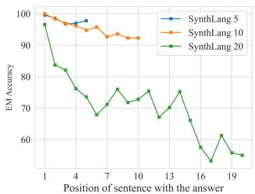

<details>
<summary>line</summary>

| Position of sentence with the answer | SynthLang 5 | SynthLang 10 | SynthLang 20 |
| ------------------------------------ | ----------- | ------------ | ------------ |
| 1                                    | 100         | 100          | 98           |
| 4                                    | 98          | 97           | 83           |
| 7                                    | 97          | 95           | 68           |
| 10                                   | 96          | 93           | 76           |
| 13                                   | 95          | 92           | 75           |
| 16                                   | 94          | 91           | 67           |
| 19                                   | 93          | 90           | 55           |
</details>

Figure G: Analysis of the length of the training documents using SynthLang. We apply D-AR training, vary the length of the training documents, and find that longer documents increase the effect of the positional bias.

characters with a length of 10 for each person, e.g., “Please describe the IDs of Gabriel dos Reis. ID0: CYUaO1t3c6. ID1: c81Ldn6Wx8. ID2: XC1IZwmb9Q, ....”. Then, we compare the performance of answering IDs in different positions. This design allows us to evaluate the pure effect by positions of answers in memorizing factual information since all IDs have the same length of characters generated by the same process and the only difference in the IDs embedded in the document is their position. The question dataset is built as done in SynthLang. As in Fig. H, all models suffer from the positional bias as expected.

Longer training with Zephyr. Fig. I illustrates the results of doubling training iterations for Zephyr in Wiki2023+. Unlike the results on Llama-2 6c, the AR model benefits from the longer training even for the answer placed after the first sentence. This result indicates that Zephyr is better at memorizing information in an extractable manner than Llama-2. Studying where the difference comes from, e.g., the architecture or training data, is an interesting problem and our future work. We also experiment with SynthID in Fig. J. Interestingly, the model significantly degrades performance after the first sentence. This means that longer training can cause performance drop after the first sentence even for the robust model.

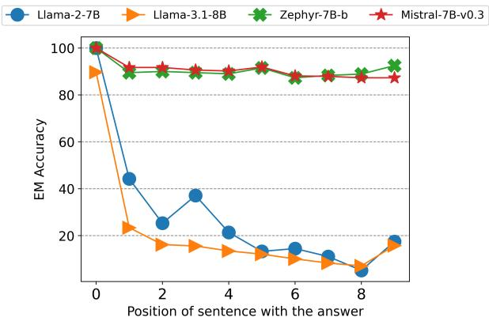

<details>
<summary>line</summary>

| Position of sentence with the answer | Llama-2-7B | Llama-3.1-8B | Zephyr-7B-b | Mistral-7B-v0.3 |
| ------------------------------------ | ---------- | ------------ | ----------- | ---------------- |
| 0                                    | 100        | 90           | 100         | 100              |
| 1                                    | 45         | 25           | 90          | 90               |
| 2                                    | 25         | 15           | 90          | 90               |
| 3                                    | 38         | 15           | 90          | 90               |
| 4                                    | 22         | 12           | 90          | 90               |
| 5                                    | 15         | 10           | 90          | 90               |
| 6                                    | 15         | 10           | 90          | 90               |
| 7                                    | 12         | 8            | 90          | 90               |
| 8                                    | 8          | 10           | 90          | 90               |
| 9                                    | 18         | 15           | 95          | 88               |
</details>

Figure H: Results of the SynthID on four models. Llama models show a significant downward trend by the position of the answer while Mistral and Zephyr show a mild downward trend.

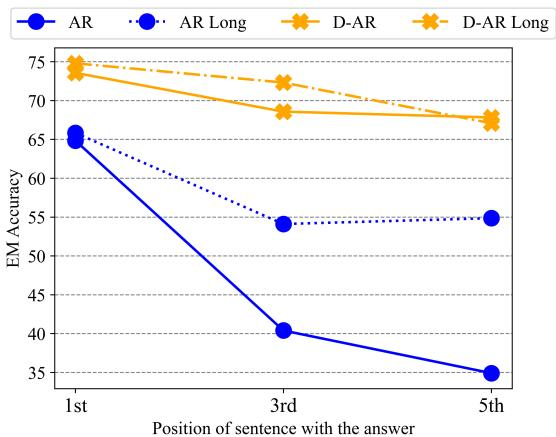

<details>
<summary>line</summary>

| Position of sentence with the answer | AR   | AR Long | D-AR | D-AR Long |
| ----------------------------------- | ---- | ------- | ---- | --------- |
| 1st                                 | 65   | 65      | 75   | 75        |
| 3rd                                 | 40   | 55      | 70   | 72        |
| 5th                                 | 35   | 55      | 68   | 68        |
</details>

Figure I: Longer training with Zephyr using Wiki2023+.

Sensitivity to hyper-parameter. Fig. K describes the sensitivity to the ratio to replace input tokens with random ones in D-AR. Each plot shows the results of EM averaged over locations. Considering the performance of the AR model, adding small noise into the input sequences significantly improves the performance.

Does D-AR on QA data improve performance? In Table D, we examine the effectiveness of D-AR on the QA dataset. Specifically, we apply the random token replacement to both QA and document data. However, we see significant decreases in the performance.

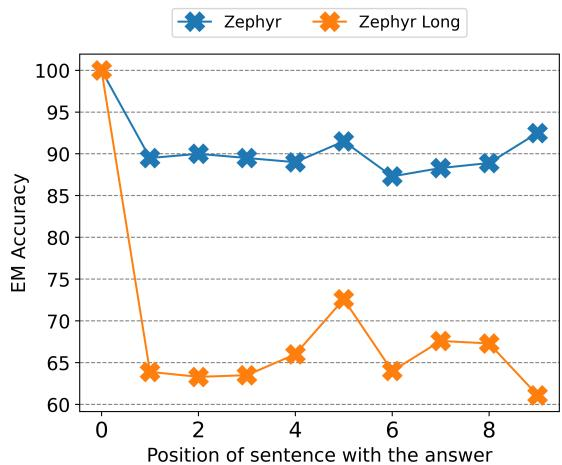

<details>
<summary>line</summary>

| Position of sentence with the answer | Zephyr | Zephyr Long |
|---|---|---|
| 0 | 100 | 100 |
| 1 | 90 | 64 |
| 2 | 90 | 63 |
| 3 | 90 | 63 |
| 4 | 89 | 66 |
| 5 | 92 | 73 |
| 6 | 87 | 64 |
| 7 | 88 | 68 |
| 8 | 89 | 67 |
| 9 | 93 | 61 |
</details>

Figure J: Longer training with Zephyr using SynthID. The performance significantly drops after the first sentence.

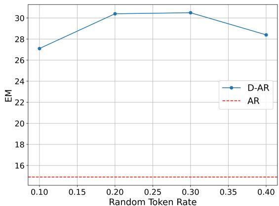

<details>
<summary>line</summary>

| Random Token Rate | D-AR  | AR   |
| ----------------- | ----- | ---- |
| 0.10              | 27.0  | 15.0 |
| 0.20              | 30.5  | 15.0 |
| 0.30              | 30.5  | 15.0 |
| 0.40              | 28.5  | 15.0 |
</details>

Figure K: Ratio to add noise to input tokens in D-AR. EM (y-axis) and the position of the answer in the document (x-axis) in Wiki2023+.

Diversifying document data. (Allen-Zhu and Li, 2023b) demonstrate that diversifying the representations of each document can enhance the knowledge extraction ability. Diversifying the representations can encourage the model to elicit knowledge with different but the same meanings of queries, which should mitigate the positional bias. But, diversifying real-world documents’ representations is not a trivial operation, and necessitates an accurate paragraph-to-paragraph translation model. To study the effectiveness, we utilize Chat-GPT to rephrase the documents of Wiki2023+ in four ways using a prompt to diversify the order of sentences and train the model combined with the original documents. According to Table E, we have two observations: (i) the augmentation improves performance overall and is complementary to D-AR, and (ii) it significantly improves performance on the answers described near the beginning, but the effectiveness is limited on those near the end. For (ii), we qualitatively find that paragraphs generated by Chat-GPT do not change the sentence order much despite using prompts to diversity the order, which explains why improvements at the end are limited.

<table><tr><td rowspan="2">Denoising</td><td colspan="6">← start→</td><td rowspan="2">Avg.</td></tr><tr><td> $EM_1/F1_1$ </td><td> $EM_2/F1_2$ </td><td> $EM_3/F1_3$ </td><td> $EM_4/F1_4$ </td><td> $EM_5/F1_5$ </td><td> $EM_6/F1_6$ </td></tr><tr><td>Document</td><td>60.1/73.7</td><td>26.9/53.1</td><td>23.4/52.9</td><td>26.0/51.7</td><td>24.8/52.2</td><td>21.3/48.2</td><td>30.4/55.3</td></tr><tr><td>Document + QA</td><td>52.6/66.0</td><td>20.7/43.0</td><td>15.9/43.2</td><td>21.9/48.8</td><td>19.4/51.2</td><td>15.7/45.7</td><td>24.4/49.7</td></tr></table>

Table D: D-AR on QA data does not improve performance. We see significant degrade by applying D-AR objective to QA data.

<table><tr><td rowspan="2">Method</td><td rowspan="2">Augment</td><td colspan="6">← start→</td><td rowspan="2">Avg.</td></tr><tr><td> $EM_1 / F1_1$ </td><td> $EM_2 / F1_2$ </td><td> $EM_3 / F1_3$ </td><td> $EM_4 / F1_4$ </td><td> $EM_5 / F1_5$ </td><td> $EM_6 / F1_6$ </td></tr><tr><td rowspan="2">AR</td><td></td><td>40.9 / 54.0</td><td>6.3 / 20.5</td><td>8.1 / 29.8</td><td>11.7 / 35.7</td><td>11.6 / 37.8</td><td>10.7 / 36.4</td><td>14.9 / 35.7</td></tr><tr><td>√</td><td>58.1 / 70.7</td><td>12.3 / 29.6</td><td>15.6 / 37.6</td><td>16.6 / 40.8</td><td>15.5 / 42.1</td><td>13.2 / 41.6</td><td>21.9 / 43.7</td></tr><tr><td rowspan="2">D-AR</td><td></td><td>60.1 / 73.7</td><td>26.9 / 53.1</td><td>23.4 / 52.9</td><td>26.0 / 51.7</td><td>24.8 / 52.2</td><td>21.3 / 48.2</td><td>30.4 / 55.3</td></tr><tr><td>√</td><td>65.8 / 78.8</td><td>37.4 / 64.2</td><td>37.0 / 65.3</td><td>35.9 / 62.5</td><td>28.7 / 61.0</td><td>21.8 / 53.9</td><td>37.8 / 64.3</td></tr></table>

Table E: Effectiveness of adding paragraphs translated by ChatGPT in Wiki2023+. Adding translated documents improves performance, but the effectiveness on $\mathrm { E M _ { 6 } }$ is limited.

Combining different regularization improves performance. Given Table 1 and Fig. 4, D-AR is the most effective technique to mitigate positional bias. Then, we investigate the combination with D-AR and other regularization techniques in Table F. Combining Shuffle and D-AR (second row) significantly improves F1, indicating the improvement in answering longer sequences. Also, Shuffle enhances the performance gain in the last three groups. Attn Drop tends to improve in the first three positions (third row). On average, combining all techniques (last row) produces a notable gain in both EM and F1. From these results, we conclude that the studied techniques can complement each other.

# E Theoretical Insight into why regularization helps.

We give insight into why regularization approaches can mitigate positional bias from the perspective of spurious feature mitigation. Note that our goal is not to draw a clear theoretical connection with our work, but we hope the discussion below will be useful to understand our results better.

Connection with generalizable machine learning. When training an LM on the training docu-

ments in an auto-regressive way, the task can be regarded as predicting the index of the next token, $\scriptstyle d _ { k }$ , given conditioning tokens, t, and previous tokens, $\scriptstyle d _ { < k }$ . Thus, the model utilizes features given by $\pmb { d } _ { < k }$ and t to solve the classification task. But, the problem is that all of the features are not relevant to predict the index of $d _ { k }$ . For example, there are three types of features: (i) features co-occur with the target and are responsible for prompting it, (ii) features often co-occur with the target, yet are not relevant to it, and (iii) random features. In the context of generalizable machine learning, (i), (ii), and (iii) are called invariant, spurious, and random features respectively (Arjovsky et al., 2019; Zhou et al., 2022), and their goal is to find an approach to learning a classifier that utilizes invariant features only for a generalizable model. Our task is analogous to theirs because LMs that avoid learning to use spurious or random features should easily prompt the target token given a question prompt.

Sparse feature selection can achieve generalization. Theorem 1 in Zhou et al. (2022) proves that, in the regression problem, an overparameterized model can easily attend to spurious features to achieve smaller loss, and adding the sparsity to the feature selection can mitigate it as long as the number of the data samples is large compared to the number of spurious and random features. This is consistent with our results; attention dropout masks the selection of some tokens during training, and D-AR achieves more sparse attention, similar to sparse feature selection, as shown in Fig. 7, thus improving performance.

<table><tr><td rowspan="2">Shuffle</td><td rowspan="2">Attn Drop</td><td colspan="6">← start→</td><td rowspan="2">Avg.</td></tr><tr><td> $EM_1 / F1_1$ </td><td> $EM_2 / F1_2$ </td><td> $EM_3 / F1_3$ </td><td> $EM_4 / F1_4$ </td><td> $EM_5 / F1_5$ </td><td> $EM_6 / F1_6$ </td></tr><tr><td></td><td></td><td>60.1 / 73.7</td><td>26.9 / 53.1</td><td>23.4 / 52.9</td><td>26.0 / 51.7</td><td>24.8 / 52.2</td><td>21.3 / 48.2</td><td>30.4 / 55.3</td></tr><tr><td>√</td><td></td><td>59.9 / 76.8</td><td>19.5 / 60.7</td><td>26.3 / 61.0</td><td>32.7 / 62.6</td><td>32.6 / 65.0</td><td>24.4 / 57.5</td><td>32.5 / 63.9</td></tr><tr><td></td><td>√</td><td>68.3 / 81.9</td><td>32.1 / 59.3</td><td>29.2 / 60.5</td><td>27.4 / 53.7</td><td>23.3 / 55.0</td><td>22.4 / 51.4</td><td>33.8 / 60.3</td></tr><tr><td>√</td><td>√</td><td>65.8 / 81.8</td><td>24.9 / 66.5</td><td>29.5 / 64.9</td><td>37.7 / 67.9</td><td>33.3 / 67.1</td><td>24.5 / 59.6</td><td>36.0 / 68.0</td></tr></table>

Table F: Combining regularization techniques with denoising auto-regressive training (D-AR) in Wiki2023+. These methods complement each other, and combining them boosts performance.