# Transferable Black-Box One-Shot Forging of Watermarks via Image Preference Models

Tomáš Soucek ˇ 1 Sylvestre-Alvise Rebuffi1 Pierre Fernandez1 Nikola Jovanovic´2∗ Hady Elsahar1 Valeriu Lacatusu1 Tuan Tran1 Alexandre Mourachko1 1Meta FAIR 2ETH Zurich soucek@meta.com

# Abstract

Recent years have seen a surge in interest in digital content watermarking techniques, driven by the proliferation of generative models and increased legal pressure. With an ever-growing percentage of AI-generated content available online, watermarking plays an increasingly important role in ensuring content authenticity and attribution at scale. There have been many works assessing the robustness of watermarking to removal attacks, yet, watermark forging, the scenario when a watermark is stolen from genuine content and applied to malicious content, remains underexplored. In this work, we investigate watermark forging in the context of widely used post-hoc image watermarking. Our contributions are as follows. First, we introduce a preference model to assess whether an image is watermarked. The model is trained using a ranking loss on purely procedurally generated images without any need for real watermarks. Second, we demonstrate the model’s capability to remove and forge watermarks by optimizing the input image through backpropagation. This technique requires only a single watermarked image and works without knowledge of the watermarking model, making our attack much simpler and more practical than attacks introduced in related work. Third, we evaluate our proposed method on a variety of post-hoc image watermarking models, demonstrating that our approach can effectively forge watermarks, questioning the security of current watermarking approaches. Our code and further resources are publicly available3.

# 1 Introduction

Digital watermarking is an important technology that enables content identification and attribution by embedding imperceptible signals into images without compromising their visual quality. In recent years, the demand for such technology has increased, driven by the growth of online sharing platforms and the development of generative AI models. It is also particularly appealing for moderation and IP protection of user-generated content at scale, where copy detection and manual verification are insufficient. More importantly, we now also need provenance verification systems to distinguish genuine from machine-generated material, especially in settings involving misinformation, fraud, or intellectual property claims. Regulatory frameworks such as the EU AI Act and the U.S. Executive Order on AI now explicitly call for watermarking mechanisms to ensure transparency and traceability in AI-generated content. Among the various watermarking approaches, post-hoc watermarking— where the watermark is applied after content generation—has gained popularity for its modularity and ease of deployment, in both of these scenarios. As a case in point, it is already integrated into many practical systems to label and trace AI-generated images or videos [8, 9, 14], and to protect the authenticity of photos of press agencies or taken with cameras [1, 33].

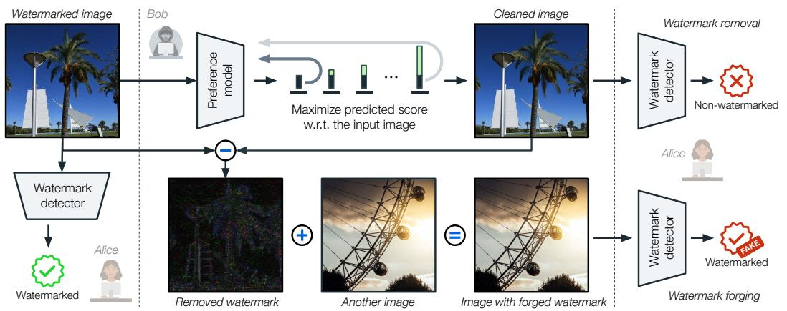

flowchart

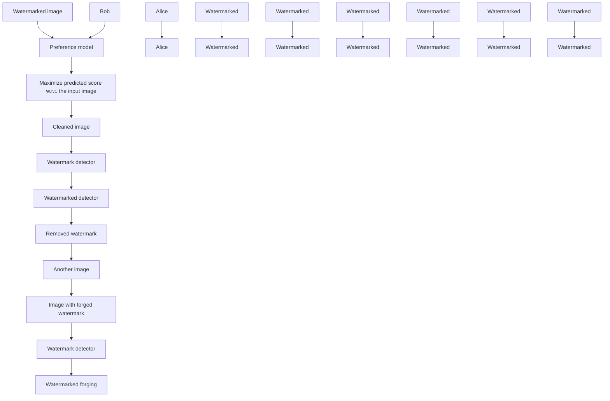

Figure 1: Overview of our attack pipeline. Given a single watermarked image (left), Bob’s goal is to either remove the watermark (top path) or forge it onto another image (bottom path). He first trains a preference model to predict a score indicating the likelihood that an image will be watermarked, and then optimizes the input image to maximize this score. This enables both watermark removal (producing a clean image classified as non-watermarked) and watermark forging (producing an image classified as watermarked). Notably, the approach does not require access to the watermarking model or paired data.

However, while the robustness of these watermarking schemes to common removal attacks has been widely investigated, their security against adversarial misuse remains rather underexplored. In particular, watermark forging, i.e., the process by which an attacker can steal or create a counterfeit watermark and apply it to new media, can be problematic in many scenarios. Unlike watermark removal, forging does not seek to erase a watermark, but rather to deceive downstream detection systems and create significant security vulnerabilities. For instance, it could flood detection systems with false positives, or, in the case where watermarking is applied on authentic images, it could be used to create fake content that appears authentic.

The literature on image-based watermark attacks predominantly focuses on removal techniques, such as diffusion-based purification [32, 48], model inversion [25], or access-based decoding attacks [21, 36]. These approaches often assume extensive access to watermarked data, decoding APIs, or the watermark generation pipeline—assumptions that do not hold in realistic adversarial settings. Moreover, they tend to induce perceptual degradation or require computationally expensive processes. By contrast, forging attacks are less studied, and existing attempts rely on strong assumptions, such as paired watermarked and clean datasets [41] or the ability to train deep generative models on thousands of watermarked samples [10, 23]. These are impractical in real-world, black-box scenarios where adversaries might only observe a single watermarked image.

In this work, we introduce a new watermark attack designed specifically for these low-resource and black-box settings. Our pipeline is depicted in Figure 1. We first introduce a preference model trained using a ranking-based supervision scheme on synthetically altered images. These artifacts are generated procedurally, requiring no real watermarked data. The model learns to score image candidates based on how likely they are to contain a watermark, implicitly capturing the structure of “unnatural” artifacts. Then, the model can be used as a surrogate loss for backpropagation-based image optimization, enabling both watermark removal and watermark forging. Notably, this is achieved with no access to the watermarking algorithm, no paired data, and only a single example of a watermarked image. Our design of watermark forging from a single watermarked image mirrors realistic attack settings as it allows for attacks against content-aware watermarking models—the scenario where other types of attacks often fail. To this end, our work provides a more credible assessment of post-hoc watermarking scheme vulnerabilities in the wild. Our contributions are threefold:

• We introduce an image preference model trained solely on procedurally perturbed images using a ranking loss, which avoids reliance on actual watermarked content or decoding models.   
• We present a gradient-based attack procedure that uses the preference model to remove or forge watermarks via direct optimization on image pixels, requiring no knowledge of the original watermarking scheme.

• We conduct comprehensive evaluations across a range of post-hoc watermarking schemes, demonstrating that our method achieves strong performance while assuming more realistic threat models. In addition, it provides guidance on which watermarking methods are more robust against forging attacks.

Threat model. A benign actor Alice applies watermarks to her content using a post-hoc watermarking scheme, while an adversary Bob seeks to either remove the watermark to evade detection or forge it onto new, unrelated content to falsely pass it as authentic. We assume that Bob has no access to Alice’s watermarking method, paired clean-watermarked data, or any decoding interface. We also assume Bob gains access to a single image watermarked by Alice. This setting reflects realistic attack scenarios where the adversary must operate in a black-box, data-scarce environment.

# 2 Related work

Image watermarking. A large body of work for image watermarking focuses on post-hoc watermarking [13]. The post-hoc watermarking, in contrast to other types of watermarking applied to the content during its generation [6, 11, 42], has the advantage that it can also be used for attribution and authenticity verification of real content. It adds small, ideally invisible, artifacts to the image that can be later detected to verify the content’s authenticity. Some works embed a single static watermark into all images [5, 28], but most works take into account the image and adjust the watermark dynamically [4, 12, 17, 27, 29, 37, 44, 47, 49]. However, during training, the content awareness of the watermark is usually not enforced, often resulting in fairly static watermarks that can be easily forged by averaging many watermarked images [45]. In contrast, we propose a method for watermark forging that shows that even some content-aware watermarking schemes can be exploited.

Generation-based attacks. A common image watermark removal attack uses diffusion models [15]. The approach, originally developed for preventing adversarial attacks [32], introduces subtle perturbations to a watermarked image that are then removed by denoising [36, 48]. Although this approach reliably removes subtle watermarks in images, it also hallucinates new image details, deviating from the input. To counter the hallucination problem, Liu et al. [25] finetune Stable Diffusion model [35] conditioned on the watermarked image for greater consistency of the purified output image with the input and Lucas et al. [26] do not use diffusion at all – they train a VAE to remove watermarks from images. On the other hand, to forge watermarks, Wang et al. [41] train a U-Net to replicate third-party watermarker but assume an unrealistic scenario with paired original and watermarked images. To alleviate the need for paired data, Li et al. [23] use a discriminator to train a network that adds the forged watermark to any image. Similarly, Dong et al. [10] finetune a diffusion model for the same purpose. The downside of these methods is that they require thousands or tens of thousands of watermarked images with the same hidden message, which may be difficult to obtain, especially as the recent watermarking methods allow for different hidden messages based on various factors, including, for example, date or user. In contrast, our method does not require any real watermarked images and, once trained, it can be applied to any watermarked image without any adaptations to a particular watermarking method.

Backpropagation-based attacks. The straightforward way of evading watermark detection is to perturb the watermarked image by back-propagating through the watermark decoder and maximizing the probability of detecting a random message [18]. However, this attack requires access to the watermark detector, which is not the case in practice. To remove watermarks from images without access to the watermark detector, UnMarker [19] perturbs the image to maximize its difference to its original watermarked copy in the Fourier spectrum while minimizing its difference in Euclidean and LPIPS [46] metrics. Liang et al. [24] show that the Deep Image Prior [40] framework can remove watermarks produced by modern watermarking methods, yet it is prohibitively expensive and needs model training for each watermarked image. Saberi et al. [36] remove watermarks from images using a projected gradient descent on a classifier trained to distinguish between watermarked and non-watermarked images, requiring access to large collection of watermarked images. Hu et al. [16] replace the need for real watermarked images by training a collection of 100 surrogate watermarking models which are then used to compute image perturbation that likely evades detection. Lastly, Müller et al. [31] show that semantic diffusion model-based watermarks can be both removed and forged via backpropagation through the iterative diffusion process of a surrogate diffusion model. In contrast to these methods, we can forge watermarks of any post-hoc watermarking method, we do not need a large set of surrogate models, and we require only a single watermarked image to perform our attack.

# 3 Method

Given a single watermarked image $\mathbf { \Delta } \mathbf { x } _ { w } .$ , our goal is to extract a forged watermark wˆ that can be added to any image y such that the resulting image $\mathbf { \Delta } \mathbf { \mathit { y } } _ { \hat { \mathbf { \mathcal { w } } } }$ is detected as watermarked by the respective watermark detector. To produce a realistic attacked image, our second criterion is that the forged watermark wˆ should make imperceptible modifications to the input image $\mathbf { \pmb { y } } .$ . Otherwise, one could artificially boost the watermark detection performance by increasing the magnitude of the forged watermark wˆ. Besides having only one watermarked image, the main challenge of this one-shot forging task is that we do not know any prior information about the watermark w, and we do not have access to the watermark detector.

We propose a two-step approach illustrated in Figure 1 where (i) we estimate the watermark wˆ from the single watermarked image $\mathbf { \nabla } _ { \mathbf { x } _ { w } }$ at our disposal and (ii) we use the estimated watermark wˆ to forge new watermarked images $\mathbf { \psi } _ { \hat { \mathbf { \psi } } \hat { \mathbf { \psi } } } = \mathbf { \psi } \mathbf { \psi } + \hat { \mathbf { \psi } } \hat { \mathbf { \psi } }$ for any given image y. For the key step of estimating the watermark from a single image, we train an image prior model that we use to separate the artifacts produced by a watermarking model from the original content of the image. To build the image prior model, we take inspiration from the Large Language Model literature [34] and train a preference model R using a ranking loss to prefer original images to synthetically corrupted images. Note that we do not use any watermarking model to build the preference model, only the synthetic corruptions detailed in Section 3.1. Then, we can optimize the watermarked image $\mathbf { \mathcal { x } } _ { w }$ to produce a clean image xˆ by maximizing the preference score of the preference model. The estimated watermark can be obtained by a simple subtraction $\hat { w } = { \pmb x } _ { w } - \hat { { \pmb x } }$ and it can be used to forge new watermarked images $\mathbf { \boldsymbol { y } } _ { \hat { w } } = \mathbf { \boldsymbol { y } } + { \hat { w } }$ . In detail, we present the training of our preference model in Section 3.1. Then, in Section 3.2, we describe how to remove and forge image watermarks using the model.

# 3.1 Preference model training

Our preference model R is a ConvNeXt [43] with an RGB image x as input. The model predicts a single score $R ( { \pmb x } ) \in \mathbb { R }$ . Higher score values indicate that the input image is preferred, $i . e .$ , the image is of high quality and without any artifacts, while lower score values indicate the opposite. We detail how we train the model next.

Preference loss. Suppose we are given two variants ${ \pmb x } ^ { + } , { \pmb x } ^ { - }$ of the image x where ${ \pmb x } ^ { + }$ denotes the preferred and ${ \pmb x } ^ { - }$ dispreferred variants of that image. For example, the two image variants can be different augmentations of the same image, where the dispreferred variant is strongly distorted. Our model R is trained to predict the probability $p ( \pmb { x } ^ { + } \succ \pmb { x } ^ { - } )$ that the image ${ \pmb x } ^ { + }$ is preferred to ${ \pmb x } ^ { - }$ . We chose the popular Bradley-Terry model [3] to define the preference distribution as:

$$
p (\boldsymbol {x} ^ {+} \succ \boldsymbol {x} ^ {-}) = \frac {\exp (R (\boldsymbol {x} ^ {+}))}{\exp (R (\boldsymbol {x} ^ {+})) + \exp (R (\boldsymbol {x} ^ {-}))}. \tag {1}
$$

Given a dataset of the image preference pairs $( { \pmb x } ^ { + } , { \pmb x } ^ { - } )$ , we can train the model R using the negative log-likelihood loss:

$$
- \mathbb {E} _ {\left(\boldsymbol {x} ^ {+}, \boldsymbol {x} ^ {-}\right)} \left[ \log \sigma \left(R \left(\boldsymbol {x} ^ {+}\right) - R \left(\boldsymbol {x} ^ {-}\right)\right) \right]. \tag {2}
$$

Training data. Our definition of the loss function allows for any source of image preference pairs. For example, these pairs can be obtained by collecting human preferences [46]. However, in this work, we show that artificially generated image preference pairs serve as a powerful signal for the model to learn a strong image prior. In our case, we choose the real image x as the preferred image ${ \pmb x } ^ { + } = { \pmb x }$ . The dispreferred image is created by adding a synthetic artifact ω to the real image ${ \pmb x } ^ { - } = { \pmb x } + { \pmb \omega }$ . We generate these artifacts in the Fourier space by randomly choosing between wave style artifacts, line style artifacts, and noise. In detail, suppose $\bar { \mathcal { F } } ( i , j ) \in$ R is the amplitude spectrum of the generated artifact $\omega$ of shape $H \times W$ with $i \in \{ \stackrel { \cdot } { - } H / 2 , \stackrel { . . . , } { \ldots } { , } H / 2 \} , j \in \{ - \stackrel { \cdot } { W } / 2 , \stackrel { . . . , } { \ldots } { , } W / 2 \}$ and the zero-frequency component centered at $( i , j ) = { \\mathsf { \bar { ( 0 , 0 ) } } }$ . The artifacts are created as follows.

• Wave style artifacts: The amplitude is non-zero $\mathcal { F } ( i , j ) \quad \neq \quad 0$ for $( i , j ) \in \partial \Sigma ^ { } $ $\{ ( r ^ { 4 / 5 } \cos ( \theta ) , r ^ { 4 / 5 } \sin ( \theta ) ) \} _ { 1 } ^ { N }$ where $N \sim \mathcal { U } \{ 2 , \dots , N _ { m a x } \} , r \sim \mathcal { U } [ 0 , r _ { m a x } ]$ , and $\theta \sim \mathcal { U } [ 0 , 2 \pi ]$ The notation $\mathcal { U } [ \cdot ] \thinspace \mathrm { o r } \mathcal { U } \{ \cdot \} $ denotes random sampling from a given range or set, respectively.

• Noise: The amplitude is randomly sampled for every $( i , j )$ as $\begin{array} { r l } { \mathcal { F } ( i , j ) } & { { } \sim } \end{array}$ $\mathcal { U } [ 0 , \exp \left( - \| ( i / \sigma ^ { 2 } , j / \sigma ^ { 2 } ) \| _ { p } \right) ]$ ] where $\begin{array} { r } { \sigma ^ { 2 } \mathrm { ~  ~ { ~ \sim ~ } ~ } \mathcal { U } [ s _ { m i n } , s _ { m a x } ] } \end{array}$ , and $\| { \bf \nabla } \cdot { \bf \nabla } \| _ { p }$ is p-norm with $p = 4 - 3 \sqrt { p ^ { \prime } } , p ^ { \prime } \sim \mathcal { U } [ 0 , 1 ]$ .

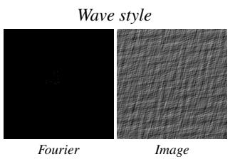

text_image

Wave style
Fourier
Image

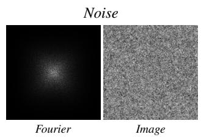

text_image

Noise
Fourier
Image

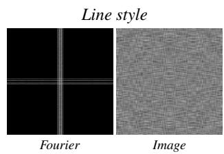

text_image

Line style
Fourier
Image

Figure 2: Synthetic artifacts. We train our preference model to prefer original images over synthetically corrupted images. To cover a broad range of possible artifacts, we use three types of artifacts: wave style, noise, and line style. The artifacts are first generated in the Fourier space and then transformed to the image space to be added to the original images.

• Line style artifacts: The amplitude is non-zero $\mathcal { F } ( i , j ) \neq 0$ for horizontal lines $( i , j )$ such that i $\mathrm { o r } - i \stackrel { \cdot } { \in } \{ l \} _ { 1 } ^ { \tilde { M } }$ where $M \sim \mathcal { U } \{ 3 , \dots , M _ { m a x } \} , l \sim \mathcal { N } ( 0 , \rho ^ { 2 } )$ and $\rho \sim \mathcal { U } [ s _ { m i n } ^ { \prime } , \dot { s } _ { m a x } ^ { \prime } ]$ . Vertical lines are sampled analogously.

The phase component of the Fourier spectrum is selected randomly, and after the transformation into the image space, the artifacts are rescaled to the range $[ - 0 . 0 5 , 0 . { \dot { 0 } } 5 ]$ ]. Examples of the generated artifacts and their generated Fourier amplitude spectra are shown in Figure 2. To increase the artifact diversity, we randomly sample either RGB or grayscale artifacts. In addition, with 50% probability, we randomly multiply ω by a Just Noticeable Differences (JND) map, effectively localizing the artifacts in high-frequency image regions only. Please see the appendix for details.

Adversarial training. The optimal preference model $R ^ { * }$ trained using Equation (2) would predict $R ^ { * } ( { \pmb x } _ { w } ) = - \operatorname* { i n f }$ for the watermarked image and $R ^ { * } ( { \pmb x } ) = \mathrm { i n f }$ for the original non-watermarked image. Therefore, one would hope that optimizing $\mathbf { \mathcal { x } } _ { w }$ to maximize the preference score $R ( { \pmb x } _ { w } )$ would reduce the watermark artifacts in $\mathbf { \mathcal { x } } _ { w }$ and retrieve an image similar to the original x. However, we observe in our experiments that backpropagating through the preference model trained with Equation (2) not only fails to reduce the watermark artifacts but also adds new artifacts such as checkerboard patterns like in Figure 6. This is analogous to what is observed in the robustness literature [7, 38, 39], where image classifiers trained without adversarial training fail to produce interpretable gradients. Therefore, we propose to use adversarially perturbed images $\tilde { \pmb { x } } ^ { - } = \pmb { x } ^ { - } + \epsilon$ · $\nabla _ { { \pmb x } ^ { - } } R ( { \pmb x } ^ { - } )$ to create an extra image pair $( { \pmb x } ^ { + } , \tilde { { \pmb x } } ^ { - } )$ as additional training data. The intuition behind this extra image pair is that if we add a perturbation smaller than the watermark artifacts, the resulting image should not be preferred over the original image by the preference model.

While our adversarial perturbations are similar to adversarial training [30] - where the goal is to ensure robustness to malicious attacks that commonly do not exist in the real data - they are designed such that the preference model produces semantically interpretable gradients that can be used to estimate the watermark.

# 3.2 Watermark removal and forging

Given a watermarked image ${ \mathbf { } } x _ { w } ,$ our goal is to watermark a new image y in a way that is recognized by a watermarking detector as genuinely watermarked. We achieve this by first estimating the watermark embedded in $\mathbf { \nabla } _ { \mathbf { x } _ { w } . }$ To do so, we find the image $\hat { \mathbf { x } } = \mathbf { x } _ { w } - \hat { w }$ that maximizes the preference model score $R ( { \hat { \mathbf { x } } } )$ within a certain number of optimization steps k. Our objective, written as a function of the watermark distortion $\delta ,$ is as follows:

$$
\hat {w} = \underset {\delta} {\operatorname{argmax}} R (\boldsymbol {x} _ {w} - \delta). \tag {3}
$$

We optimize Equation (3) using gradient ascent with a fixed number of steps k and a fixed learning rate. This constrained optimization budget allows us to control the distortion produced on the original image. Once we have extracted the estimated watermark wˆ from the single watermarked image ${ \mathbf { } } x _ { w } ,$ we can paste it to any new image y to forge new watermarked images by summing the image and the watermark $\pmb { y } _ { \hat { w } } = \pmb { y } + \hat { w }$ . The whole process is illustrated in Figure 1.

To forge watermarks in any resolution, we adopt the rescaling strategy introduced for watermarking high-resolution images [4]. Given an image $\mathbf { \nabla } _ { \mathbf { x } _ { w } }$ of size $H _ { o r i } \times W _ { o r i } ,$ , the image is first resized to a smaller resolution $H \times W$ using bilinear interpolation. Then, we estimate the watermark $\hat { w } ^ { \prime }$ using the resized image $\mathbf { { \boldsymbol { x } } } _ { w } ^ { \prime }$ by optimizing Equation (3). Then, the estimated watermark is resized to the resolution of the new image y and summed with it to form the maliciously watermarked image ywˆ:

$$
\boldsymbol {y} _ {\hat {w}} = \boldsymbol {y} + \operatorname{resize} _ {\text { ori }} (\hat {w} ^ {\prime}), \quad \hat {w} ^ {\prime} = \underset {\delta} {\operatorname{argmax}} R \left(\operatorname{resize} _ {H \times W} (\boldsymbol {x} _ {w}) - \delta\right). \tag {4}
$$

The watermark removal is performed analogously by computing the watermark-free version of ${ \pmb x } _ { w }$ as $\hat { \mathbf { x } } = x _ { w } - \mathrm { r e s i z e } _ { \mathrm { o r i } } ( \hat { w } ^ { \prime } )$ .

# 4 Experiments

In this section, we present the experimental setup and results of our watermark forging approach. First, in Section 4.1, we describe the key implementation and evaluation details. Then, in Section 4.2, we compare our approach of watermark forging and removal to related methods. Finally, in Section 4.3, we ablate the key design choices. Additional details and results are in the appendix.

# 4.1 Implementation and evaluation details

Implementation details. We train our model, ConvNeXt V2-Tiny [43] on images from the SA-1b dataset [20]. We resize each image to the resolution of 768×768 and apply a random synthetic artifact to it. Then, both the image with and without artifact are augmented by the same random image augmentation followed by the same random crop of size 256×256. The model is trained from scratch for 120k steps on 8 GPUs with a batch size of 16 per GPU; the training takes 60 hours using V100 GPUs. We use AdamW optimizer with a fixed learning rate of $1 \times 1 0 ^ { - 5 }$ . In every second batch, we replace the image with the synthetic artifact by its adversarially perturbed version as described in Section 3.1. To compute the perturbation, we use two steps of gradient descent with a learning rate randomly chosen from the interval [0.03, 0.09].

Evaluation details and metrics. We watermark 100 images from the SA-1b validation set by all tested watermarking methods: CIN [29], MBRS [17], TrustMark [4], and Video Seal [12]. For each watermarking method, we watermark all 100 images using the same hidden message, as the methods reliant on more than a single image to remove or forge a watermark, such as Warfare and Image averaging, cannot work with multiple hidden messages. We measure the bit accuracy of the respective watermark extractor. While the bit accuracy is dependent on the number of bits used by each method (90% accuracy of the 32-bit CIN method effectively results in preservation of less information than 70% accuracy of the 256-bit MBRS method), it allows for simple and interpretable comparison of different watermark removal and forging methods. For watermark removal, the bit accuracy is measured on the 100 test images with their watermarks removed. For watermark forging, we steal the watermarks from the same 100 test images and apply the stolen watermarks to a new set of 100 images. Please note that virtually any bit accuracy can be achieved by all watermark removal/forging methods if the target image is heavily edited. Therefore, we also report PSNR computed with respect to the ground truth watermark-free image. As the PSNR is very similar across different watermarking methods, we report only a single averaged number per method.

Compared methods. We compare with publicly available watermark forging methods and baselines. (1) Warfare [23] is trained to add watermarks to images using a discriminator loss that distinguishes between watermarked and non-watermarked images. We train a separate model for each watermarking method for 6 days on 8 V100 GPUs with 1000 watermarked and non-watermarked images. (2) Image averaging is a simple method proposed by Yang et al. [45] that recovers the watermark by averaging and subtracting sets of watermarked and non-watermarked images. The recovered watermark can then be pasted onto a new image. In our experiments, we average 100 images. (3) Noise blending [36] pastes a watermarked random noise onto a new image. (4) Gray image blending extracts a watermark from a uniform gray image. Both Noise blending and Gray image blending serve as baselines only since they require access to a watermarking API, making them impractical in real-world scenarios. Additionally, we also evaluate common watermark removal methods. (5) DiffPure [32] is a technique that adds Gaussian noise to a watermarked image and denoises the image using a diffusion model. We use FLUX.1 [dev] [22] model and denoise for the last 3 timesteps of the default scheduler. We also adapt this method to watermark forging by pasting the residual into new images. (6) CtrlRegen [25] finetunes a diffusion model specifically to remove watermarks. In our setup, we use their model with step = 0.1 to preserve more information from the input image. Lastly, as a baseline, we use (7) VAE encoding and decoding as suggested in the literature [2, 11, 48] to show how robust the watermarking methods are to neural compression.

Table 1: Watermark forging results. Our approach outperforms the prior works in different watermark forging scenarios, requiring only a single watermarked image with no access to the original watermarking model. While methods such as Image averaging and Warfare are competitive, they require 100s of watermarked images with the same hidden message, which may be difficult to obtain. 

<table><tr><td rowspan="2">Method</td><td>CIN</td><td>MBRS</td><td>TrustMark</td><td>Video Seal</td><td rowspan="2">PSNR(↑)</td></tr><tr><td>Bit acc. (↑)</td><td>Bit acc. (↑)</td><td>Bit acc. (↑)</td><td>Bit acc. (↑)</td></tr><tr><td>Gray image blending</td><td>1.00</td><td>0.80</td><td>0.54</td><td>0.83</td><td>52.9</td></tr><tr><td>Noise blending ( $\alpha = 0.1$ ) [36]</td><td>0.82</td><td>0.61</td><td>0.52</td><td>0.53</td><td>21.8</td></tr><tr><td>Warfare ( $n = 1000$ ) [23]</td><td>0.93</td><td>0.50</td><td>0.53</td><td>0.74</td><td>39.6</td></tr><tr><td>DiffPure (FLUX.1 [dev]) [32]</td><td>1.00</td><td>0.83</td><td>0.59</td><td>0.75</td><td>26.6</td></tr><tr><td>Image averaging ( $n = 100$ ) [45]</td><td>1.00</td><td>0.91</td><td>0.61</td><td>0.59</td><td>26.2</td></tr><tr><td>Ours ( $n = 1$ )</td><td>1.00</td><td>0.83</td><td>0.61</td><td>0.83</td><td>31.3</td></tr></table>

Table 2: Watermark removal results. Our approach remains competitive with related works while not suffering from the hallucination of details and textures that are present in diffusion-based methods. 

<table><tr><td rowspan="2">Method</td><td>CIN</td><td>MBRS</td><td>TrustMark</td><td>Video Seal</td><td rowspan="2">PSNR(↑)</td></tr><tr><td>Bit acc. (↓)</td><td>Bit acc. (↓)</td><td>Bit acc. (↓)</td><td>Bit acc. (↓)</td></tr><tr><td>Image averaging (n = 100) [45]</td><td>0.39</td><td>0.50</td><td>0.60</td><td>0.89</td><td>26.3</td></tr><tr><td>VAE (FLUX.1 [dev])</td><td>1.00</td><td>0.99</td><td>1.00</td><td>0.99</td><td>34.3</td></tr><tr><td>DiffPure (FLUX.1 [dev]) [32]</td><td>0.86</td><td>0.56</td><td>0.56</td><td>0.60</td><td>25.4</td></tr><tr><td>CtrlRegen (step = 0.1) [25]</td><td>0.86</td><td>0.70</td><td>0.56</td><td>0.55</td><td>24.4</td></tr><tr><td>Ours (n = 1)</td><td>0.82</td><td>0.64</td><td>0.60</td><td>0.49</td><td>31.2</td></tr></table>

# 4.2 Comparison with the state-of-the-art

Watermark forging. We evaluate watermark forging methods on the test set in Table 1. We observe strong performance (high bit accuracy) of the image averaging baseline in forging CIN [29] and MBRS [17] watermarks. This can be explained by the fact that these methods produce watermarks that are generally independent of the image content. On the other hand, for Video Seal [12], the image averaging approach fails as Video Seal watermarks are highly dependent on the input image. This is where our method, which can extract the watermark from a single image, significantly outperforms all the related works. Lastly, we can see that TrustMark [4] is very difficult to forge, possibly due to the fact that both embedder’s and decoder’s outputs are greatly dependent on the input image. In the case of Video Seal, the embedder’s output is highly dependent on the input image, but the decoder tends to ignore the image, making watermark forging easier.

Watermark removal. We also evaluate performance in watermark removal. In this case, in contrast to watermark forging, the goal is to remove the watermark; therefore, ideally, produce random bit accuracy. As shown in Table 2, our method is highly competitive with the related works, producing high-quality images (high PSNR) while removing most of the watermark information present in the image (low bit accuracy). Similarly to watermark forging, we can see that image averaging performs well for CIN and MBRS watermarks due to their practical independence on the input image. Also, we can see that CIN watermarks are very difficult to remove – this is likely due to the fact that CIN watermarks significantly alter the images, are very visible, and are fairly redundant due to the low bit count of the CIN method.

Qualitative results. Results in Figures 3, 4, 5, and in the appendix demonstrate the key strengths of our approach. First, in Figure 3, we present the forged watermarks obtained by various methods, averaged over 100 images to eliminate any image-specific artifacts. We can see that our method can reconstruct the watermark faithfully without requiring any per-method tuning or training, which is not the case for the Warfare method. In Figure 4, we show extracted watermarks forged into a new image.

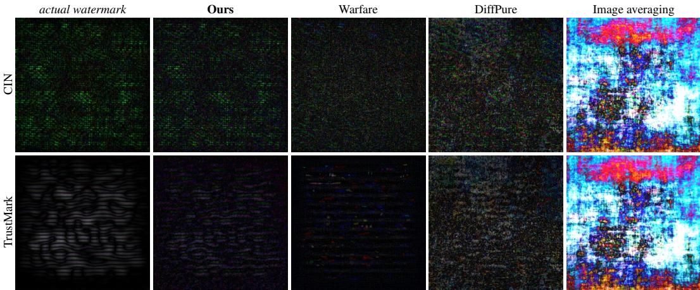

text_image

actual watermark
Ours
Warfare
DiffPure
Image averaging
CIN
TrustMark

Figure 3: Comparison of the forged watermarks by different watermark forging methods. The shown watermarks are averaged from 100 different images to remove any image-specific artifacts. The recovered watermark by our method closely resembles the actual watermark (left column), containing the least number of other distracting artifacts, such as the noise present in DiffPure watermarks.

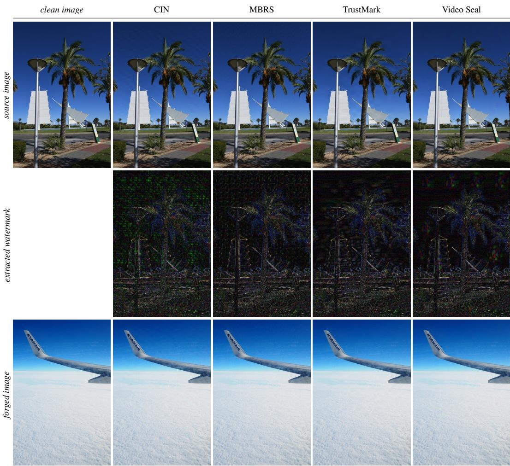

text_image

clean image
CIN
MBRS
TrustMark
Video Seal
source image
extracted watermark
forged image

Figure 4: Qualitative results for watermark forging. The figure shows a watermarked image (top) with its watermark removed by our method (middle row). The watermark is pasted onto a new image (bottom row). We use k = 50 steps for the watermark extraction.

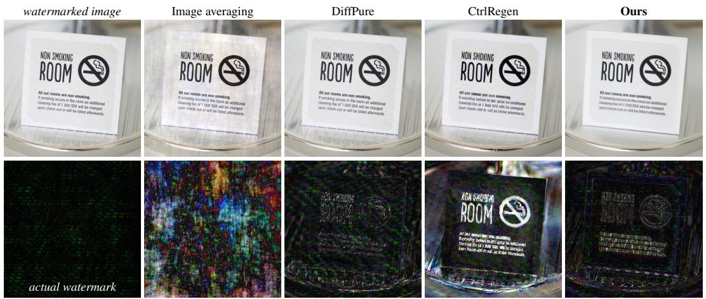  
Figure 5: Qualitative results for watermark removal. The figure shows a watermarked image (left) with its watermark removed by different methods (top row) and the actual removed watermark by each method (bottom row).

Table 3: Watermark forging ablation. We test multiple variants of our model to show the effect of individual design decisions. We use the same hyperparameters for the forging process (number of steps, learning rate) for all model variants. The higher PSNR of the variants is caused by less informative gradients that do not remove the watermark artifacts effectively. 

<table><tr><td rowspan="2">Method</td><td>CIN</td><td>MBRS</td><td>TrustMark</td><td>Video Seal</td><td rowspan="2">PSNR(↑)</td></tr><tr><td>Bit acc. (↑)</td><td>Bit acc. (↑)</td><td>Bit acc. (↑)</td><td>Bit acc. (↑)</td></tr><tr><td>(1) Binary cross-entropy loss</td><td>0.60</td><td>0.53</td><td>0.52</td><td>0.47</td><td>39.9</td></tr><tr><td>(2) Hinge loss</td><td>0.62</td><td>0.55</td><td>0.52</td><td>0.47</td><td>44.1</td></tr><tr><td>(3) Without perturbation</td><td>0.97</td><td>0.65</td><td>0.52</td><td>0.49</td><td>34.7</td></tr><tr><td>(4) Real watermarks as training data</td><td>1.00</td><td>0.67</td><td>0.58</td><td>0.77</td><td>36.9</td></tr><tr><td>(5) Ours</td><td>1.00</td><td>0.83</td><td>0.61</td><td>0.83</td><td>31.3</td></tr></table>

Lastly, in Figure 5, we present the result of watermark removal, along with the removed watermark itself. While related methods, such as DiffPure and CtrlRegen, modify the input image and add new hallucinated details, our method removes only high-frequency artifacts from the image.

# 4.3 Ablations

We evaluate the key design decisions of our proposed method, i.e., the use of ranking loss, input perturbation, and the artifacts used during training. Lastly, in the appendix, we also evaluate how the optimization hyperparameters affect the watermark removal.

Training loss. We train our model using the ranking loss as specified in Equation (2), but we also investigate two additional losses. We consider binary cross-entropy, where the two classes are the positive ${ \pmb x } ^ { + }$ and negative x− examples, and hinge loss, often used in discriminator training [35]. We show in Table 3 that our decision to use the ranking loss (line 5) is crucial to achieving superior performance. The poor, almost random, performance of the model trained with binary cross-entropy (line 1) can be explained by the fact that the images x+ and x− are very similar, and there exists no global decision threshold between the classes.

Adversarial perturbation. During training, as explained in Section 3.1, we perturb the negative samples ${ \pmb x } ^ { - }$ in the direction of the gradient towards the positive sample. Our perturbation is designed to create different, yet plausible negative samples, making our model more robust to different artifacts. As shown in Table 3, lines 3 and 5, our approach, which utilizes perturbation, significantly improves upon the baseline with no perturbation used. Additionally, the gradients of the baseline without perturbation with respect to the input image are less meaningful compared to our model, whose gradients clearly point to a cleaner, less noisy image (Figure 6, columns 2 and 3).

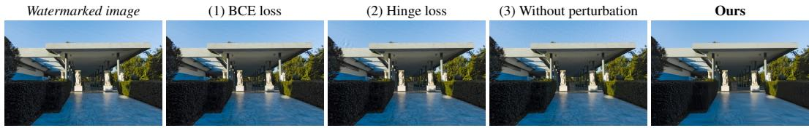

text_image

Watermarked image
(1) BCE loss
(2) Hinge loss
(3) Without perturbation
Ours

Figure 6: Watermark removal with tested model variants. Training our model without adversarial perturbation or with a different loss results in uninterpretable gradients and various artifacts.

Table 4: The effect of different synthetic artifacts on the watermark removal results. Out of the tested artifacts, the model trained with the wave pattern is the most effective in removing the watermarks. 

<table><tr><td rowspan="2">Artifact type</td><td>CIN</td><td>MBRS</td><td>TrustMark</td><td>Video Seal</td></tr><tr><td>Bit acc. (↓)</td><td>Bit acc. (↓)</td><td>Bit acc. (↓)</td><td>Bit acc. (↓)</td></tr><tr><td>Only wave style</td><td>0.98</td><td>0.83</td><td>0.55</td><td>0.45</td></tr><tr><td>Only noise</td><td>1.00</td><td>0.97</td><td>0.99</td><td>0.97</td></tr><tr><td>Only line style</td><td>1.00</td><td>0.95</td><td>0.99</td><td>0.95</td></tr><tr><td>All (Ours)</td><td>0.82</td><td>0.64</td><td>0.60</td><td>0.49</td></tr></table>

Black-box vs. gray-box attack. We train our preference model with procedurally generated artifacts, as described in Section 3.1. We also test the gray-box scenario where we have access to both the original and watermarked images. Therefore, we train our preference model with the actual outputs of the watermarking methods CIN, MBRS, TrustMark, and Video Seal as the negative samples x−. As you can see from Table 3, training on the real watermarks (line 4) performs significantly worse than training on our procedurally generated artifacts (line 5). We observe that the real watermarks are not as diverse as our generated artifacts, leading the model to overfit to the training data.

Synthetic artifact types. We investigate the contributions of different synthetic artifacts to the performance of the final model by training the model independently for each style of watermark pattern and evaluating its ability to remove watermarks. The results in Table 4 show that the model trained with the wave pattern is the most effective in removing the watermarks. However, on average, the model trained using the combination of the three watermark types produces better results.

# 5 Conclusion

We present a method capable of forging watermarks from a single watermarked image. Given its fast speed and reliance on a single watermarked image, the presented method is a more practical attack on many contemporary post-hoc watermarking techniques than related work. While some content-aware watermarking methods are fairly immune to this type of attack, we show that for other content-aware methods, the watermark can be easily stolen, questioning the security of the current post-hoc watermarking research landscape.

Limitations. Our type of forging attack targets post-hoc watermarking methods. Semantic watermarking, such as Tree-Ring [42] or RingID [6], watermarks AI-generated content by altering the objects and their locations in a generated image. Our method cannot semantically change these objects; therefore, different methods must be used for forging these semantic watermarks (e.g., [31]). Also, as shown in the appendix, our method may blur areas with natural high-frequency texture, such as water surfaces. Nonetheless, this issue can be partially mitigated through improved preference model training by introducing image blur as a new synthetic artifact type.

Broader impact and safeguards. The presented work highlights a flaw of many existing post-hoc watermarking methods and introduces a potential attack to easily forge watermarks. The attack is based on the observation that many watermark decoders are not content-aware and will accept a watermark from a different source image. To mitigate this issue, we recommend ensuring the decoder is truly content-aware, e.g., by explicitly training the decoder to reject watermarks from different source image. We believe that our insights will help to strengthen current and future watermarking techniques and contribute towards making AI safe and responsible.

# References

[1] AFP. Afp successfully tests a new technology to verify the authenticity of its photos during the us elections, 2025. Accessed on May 12, 2025. 1   
[2] Bang An, Mucong Ding, Tahseen Rabbani, Aakriti Agrawal, Yuancheng Xu, Chenghao Deng, Sicheng Zhu, Abdirisak Mohamed, Yuxin Wen, Tom Goldstein, et al. Waves: Benchmarking the robustness of image watermarks. In ICML. PMLR, 2024. 7   
[3] Ralph Allan Bradley and Milton E Terry. Rank analysis of incomplete block designs: I. the method of paired comparisons. Biometrika, 1952. 4   
[4] Tu Bui, Shruti Agarwal, and John Collomosse. Trustmark: Universal watermarking for arbitrary resolution images. arXiv preprint arXiv:2311.18297, 2023. 3, 5, 6, 7   
[5] Tu Bui, Shruti Agarwal, Ning Yu, and John Collomosse. Rosteals: Robust steganography using autoencoder latent space. In CVPR, 2023. 3   
[6] Hai Ci, Pei Yang, Yiren Song, and Mike Zheng Shou. Ringid: Rethinking tree-ring watermarking for enhanced multi-key identification. In ECCV, 2024. 3, 10   
[7] Francesco Croce, Christian Schlarmann, Naman Deep Singh, and Matthias Hein. Adversarially robust clip models can induce better (robust) perceptual metrics. 2025. 5   
[8] Google DeepMind. Identifying ai-generated images with synthid, 2023. Accessed on May 13, 2025. 1   
[9] Google DeepMind. Watermarking ai-generated text and video with synthid, 2024. Accessed on May 2, 2024. 1   
[10] Ziping Dong, Chao Shuai, Zhongjie Ba, Peng Cheng, Zhan Qin, Qinglong Wang, and Kui Ren. Imperceptible but forgeable: Practical invisible watermark forgery via diffusion models. arXiv preprint arXiv:2503.22330, 2025. 2, 3   
[11] Pierre Fernandez, Guillaume Couairon, Hervé Jégou, Matthijs Douze, and Teddy Furon. The stable signature: Rooting watermarks in latent diffusion models. In ICCV, 2023. 3, 7   
[12] Pierre Fernandez, Hady Elsahar, I Zeki Yalniz, and Alexandre Mourachko. Video seal: Open and efficient video watermarking. arXiv preprint arXiv:2412.09492, 2024. 3, 6, 7   
[13] Pierre Fernandez, Hady Elsahar, Sylvestre-Alvise Rebuffi, Tomas Soucek, Valeriu Lacatusu, Tuan Tran, and Alexandre Mourachko. A taxonomy of watermarking methods for AI-generated content. In The 1st Workshop on GenAI Watermarking, 2025. 3   
[14] Elizabeth Hilbert, Gretchen Greene, Michael Godwin, and Sarah Shirazyan. Watermarking and metadata for genai transparency at scale-lessons learned and challenges ahead. In The 1st Workshop on GenAI Watermarking, 2025. 1   
[15] Jonathan Ho, Ajay Jain, and Pieter Abbeel. Denoising diffusion probabilistic models. In NeurIPS, 2020. 3   
[16] Yuepeng Hu, Zhengyuan Jiang, Moyang Guo, and Neil Zhenqiang Gong. A transfer attack to image watermarks. In ICLR, 2025. 3   
[17] Zhaoyang Jia, Han Fang, and Weiming Zhang. Mbrs: Enhancing robustness of dnn-based watermarking by mini-batch of real and simulated jpeg compression. In ACM MM, 2021. 3, 6, 7   
[18] Zhengyuan Jiang, Jinghuai Zhang, and Neil Zhenqiang Gong. Evading watermark based detection of ai-generated content. In ACM SIGSAC Conference on Computer and Communications Security, 2023. 3   
[19] Andre Kassis and Urs Hengartner. Unmarker: A universal attack on defensive watermarking. arXiv preprint arXiv:2405.08363, 2024. 3   
[20] Alexander Kirillov, Eric Mintun, Nikhila Ravi, Hanzi Mao, Chloe Rolland, Laura Gustafson, Tete Xiao, Spencer Whitehead, Alexander C Berg, Wan-Yen Lo, et al. Segment anything. In ICCV, 2023. 6   
[21] Ismail Labiad, Thomas Bäck, Pierre Fernandez, Laurent Najman, Tom Sander, Furong Ye, Mariia Zameshina, and Olivier Teytaud. Log-normal mutations and their use in detecting surreptitious fake images. TMLR, 2024. 2   
[22] Black Forest Labs. Flux. https://github.com/black-forest-labs/flux, 2024. 6

[23] Guanlin Li, Yifei Chen, Jie Zhang, Jiwei Li, Shangwei Guo, and Tianwei Zhang. Warfare: Breaking the watermark protection of ai-generated content. arXiv preprint arXiv:2310.07726, 2023. 2, 3, 6, 7   
[24] Hengyue Liang, Taihui Li, and Ju Sun. A baseline method for removing invisible image watermarks using deep image prior. arXiv preprint arXiv:2502.13998, 2025. 3   
[25] Yepeng Liu, Yiren Song, Hai Ci, Yu Zhang, Haofan Wang, Mike Zheng Shou, and Yuheng Bu. Image watermarks are removable using controllable regeneration from clean noise. In ICLR, 2025. 2, 3, 6, 7   
[26] Nils Lukas, Abdulrahman Diaa, Lucas Fenaux, and Florian Kerschbaum. Leveraging optimization for adaptive attacks on image watermarks. In ICLR, 2024. 3   
[27] Xiyang Luo, Ruohan Zhan, Huiwen Chang, Feng Yang, and Peyman Milanfar. Distortion agnostic deep watermarking. In CVPR, 2020. 3   
[28] Xiyang Luo, Michael Goebel, Elnaz Barshan, and Feng Yang. Leca: A learned approach for efficient cover-agnostic watermarking. arXiv preprint arXiv:2206.10813, 2022. 3   
[29] Rui Ma, Mengxi Guo, Yi Hou, Fan Yang, Yuan Li, Huizhu Jia, and Xiaodong Xie. Towards blind watermarking: Combining invertible and non-invertible mechanisms. In ACM MM, 2022. 3, 6, 7   
[30] Aleksander Madry, Aleksandar Makelov, Ludwig Schmidt, Dimitris Tsipras, and Adrian Vladu. Towards deep learning models resistant to adversarial attacks. In ICLR, 2017. 5   
[31] Andreas Müller, Denis Lukovnikov, Jonas Thietke, Asja Fischer, and Erwin Quiring. Black-box forgery attacks on semantic watermarks for diffusion models. arXiv preprint arXiv:2412.03283, 2024. 3, 10   
[32] Weili Nie, Brandon Guo, Yujia Huang, Chaowei Xiao, Arash Vahdat, and Animashree Anandkumar. Diffusion models for adversarial purification. In ICML, 2022. 2, 3, 6, 7   
[33] Nikon. Nikon and afp collaborate to verify the implementation of an image provenance function in nikon cameras, 2024. Accessed on May 12, 2025. 1   
[34] Long Ouyang, Jeffrey Wu, Xu Jiang, Diogo Almeida, Carroll Wainwright, Pamela Mishkin, Chong Zhang, Sandhini Agarwal, Katarina Slama, Alex Ray, et al. Training language models to follow instructions with human feedback. In NeurIPS, 2022. 4   
[35] Robin Rombach, Andreas Blattmann, Dominik Lorenz, Patrick Esser, and Björn Ommer. High-resolution image synthesis with latent diffusion models. In CVPR, 2022. 3, 9   
[36] Mehrdad Saberi, Vinu Sankar Sadasivan, Keivan Rezaei, Aounon Kumar, Atoosa Chegini, Wenxiao Wang, and Soheil Feizi. Robustness of ai-image detectors: Fundamental limits and practical attacks. In ICLR, 2024. 2, 3, 6, 7   
[37] Tom Sander, Pierre Fernandez, Alain Durmus, Teddy Furon, and Matthijs Douze. Watermark anything with localized messages. ICLR, 2025. 3   
[38] Shibani Santurkar, Andrew Ilyas, Dimitris Tsipras, Logan Engstrom, Brandon Tran, and Aleksander Madry. Image synthesis with a single (robust) classifier. In NeurIPS, 2019. 5   
[39] Dimitris Tsipras, Shibani Santurkar, Logan Engstrom, Alexander Turner, and Aleksander Madry. Robustness may be at odds with accuracy. In ICLR, 2019. 5   
[40] Dmitry Ulyanov, Andrea Vedaldi, and Victor Lempitsky. Deep image prior. In CVPR, 2018. 3   
[41] Ruowei Wang, Chenguo Lin, Qijun Zhao, and Feiyu Zhu. Watermark faker: towards forgery of digital image watermarking. In IEEE International Conference on Multimedia and Expo (ICME), 2021. 2, 3   
[42] Yuxin Wen, John Kirchenbauer, Jonas Geiping, and Tom Goldstein. Tree-rings watermarks: Invisible fingerprints for diffusion images. In NeurIPS, 2023. 3, 10   
[43] Sanghyun Woo, Shoubhik Debnath, Ronghang Hu, Xinlei Chen, Zhuang Liu, In So Kweon, and Saining Xie. Convnext v2: Co-designing and scaling convnets with masked autoencoders. In CVPR, 2023. 4, 6   
[44] Rui Xu, Mengya Hu, Deren Lei, Yaxi Li, David Lowe, Alex Gorevski, Mingyu Wang, Emily Ching, and Alex Deng. Invismark: Invisible and robust watermarking for ai-generated image provenance. In WACV, 2025. 3   
[45] Pei Yang, Hai Ci, Yiren Song, and Mike Zheng Shou. Can simple averaging defeat modern watermarks? In NeurIPS, 2024. 3, 6, 7

[46] Richard Zhang, Phillip Isola, Alexei A Efros, Eli Shechtman, and Oliver Wang. The unreasonable effectiveness of deep features as a perceptual metric. In CVPR, 2018. 3, 4   
[47] Xuanyu Zhang, Runyi Li, Jiwen Yu, Youmin Xu, Weiqi Li, and Jian Zhang. Editguard: Versatile image watermarking for tamper localization and copyright protection. In CVPR, 2024. 3   
[48] Xuandong Zhao, Kexun Zhang, Zihao Su, Saastha Vasan, Ilya Grishchenko, Christopher Kruegel, Giovanni Vigna, Yu-Xiang Wang, and Lei Li. Invisible image watermarks are provably removable using generative ai. In NeurIPS, 2024. 2, 3, 7   
[49] Jiren Zhu, Russell Kaplan, Justin Johnson, and Li Fei-Fei. Hidden: Hiding data with deep networks. In ECCV, 2018. 3

# NeurIPS Paper Checklist

# 1. Claims

Question: Do the main claims made in the abstract and introduction accurately reflect the paper’s contributions and scope?

Answer: [Yes]

Justification: The abstract and introduction match the paper’s contributions.

# Guidelines:

• The answer NA means that the abstract and introduction do not include the claims made in the paper.   
• The abstract and/or introduction should clearly state the claims made, including the contributions made in the paper and important assumptions and limitations. A No or NA answer to this question will not be perceived well by the reviewers.   
• The claims made should match theoretical and experimental results, and reflect how much the results can be expected to generalize to other settings.   
• It is fine to include aspirational goals as motivation as long as it is clear that these goals are not attained by the paper.

# 2. Limitations

Question: Does the paper discuss the limitations of the work performed by the authors?

Answer: [Yes]

Justification: The limitations are highlighted in the main paper, further details are presented in the appendix.

# Guidelines:

• The answer NA means that the paper has no limitation while the answer No means that the paper has limitations, but those are not discussed in the paper.   
• The authors are encouraged to create a separate "Limitations" section in their paper.   
• The paper should point out any strong assumptions and how robust the results are to violations of these assumptions (e.g., independence assumptions, noiseless settings, model well-specification, asymptotic approximations only holding locally). The authors should reflect on how these assumptions might be violated in practice and what the implications would be.   
• The authors should reflect on the scope of the claims made, e.g., if the approach was only tested on a few datasets or with a few runs. In general, empirical results often depend on implicit assumptions, which should be articulated.   
• The authors should reflect on the factors that influence the performance of the approach. For example, a facial recognition algorithm may perform poorly when image resolution is low or images are taken in low lighting. Or a speech-to-text system might not be used reliably to provide closed captions for online lectures because it fails to handle technical jargon.   
• The authors should discuss the computational efficiency of the proposed algorithms and how they scale with dataset size.   
• If applicable, the authors should discuss possible limitations of their approach to address problems of privacy and fairness.   
• While the authors might fear that complete honesty about limitations might be used by reviewers as grounds for rejection, a worse outcome might be that reviewers discover limitations that aren’t acknowledged in the paper. The authors should use their best judgment and recognize that individual actions in favor of transparency play an important role in developing norms that preserve the integrity of the community. Reviewers will be specifically instructed to not penalize honesty concerning limitations.

# 3. Theory assumptions and proofs

Question: For each theoretical result, does the paper provide the full set of assumptions and a complete (and correct) proof?

Answer: [NA]

Justification: The paper does not include theoretical results.

# Guidelines:

• The answer NA means that the paper does not include theoretical results.   
• All the theorems, formulas, and proofs in the paper should be numbered and crossreferenced.   
• All assumptions should be clearly stated or referenced in the statement of any theorems.   
• The proofs can either appear in the main paper or the supplemental material, but if they appear in the supplemental material, the authors are encouraged to provide a short proof sketch to provide intuition.   
• Inversely, any informal proof provided in the core of the paper should be complemented by formal proofs provided in appendix or supplemental material.   
• Theorems and Lemmas that the proof relies upon should be properly referenced.

# 4. Experimental result reproducibility

Question: Does the paper fully disclose all the information needed to reproduce the main experimental results of the paper to the extent that it affects the main claims and/or conclusions of the paper (regardless of whether the code and data are provided or not)?

Answer: [Yes]

Justification: The key implementation details are presented in the paper. Additional details are available in the appendix.

# Guidelines:

• The answer NA means that the paper does not include experiments.   
• If the paper includes experiments, a No answer to this question will not be perceived well by the reviewers: Making the paper reproducible is important, regardless of whether the code and data are provided or not.   
• If the contribution is a dataset and/or model, the authors should describe the steps taken to make their results reproducible or verifiable.   
• Depending on the contribution, reproducibility can be accomplished in various ways. For example, if the contribution is a novel architecture, describing the architecture fully might suffice, or if the contribution is a specific model and empirical evaluation, it may be necessary to either make it possible for others to replicate the model with the same dataset, or provide access to the model. In general. releasing code and data is often one good way to accomplish this, but reproducibility can also be provided via detailed instructions for how to replicate the results, access to a hosted model (e.g., in the case of a large language model), releasing of a model checkpoint, or other means that are appropriate to the research performed.   
• While NeurIPS does not require releasing code, the conference does require all submissions to provide some reasonable avenue for reproducibility, which may depend on the nature of the contribution. For example   
(a) If the contribution is primarily a new algorithm, the paper should make it clear how to reproduce that algorithm.   
(b) If the contribution is primarily a new model architecture, the paper should describe the architecture clearly and fully.   
(c) If the contribution is a new model (e.g., a large language model), then there should either be a way to access this model for reproducing the results or a way to reproduce the model (e.g., with an open-source dataset or instructions for how to construct the dataset).   
(d) We recognize that reproducibility may be tricky in some cases, in which case authors are welcome to describe the particular way they provide for reproducibility. In the case of closed-source models, it may be that access to the model is limited in some way (e.g., to registered users), but it should be possible for other researchers to have some path to reproducing or verifying the results.

# 5. Open access to data and code

Question: Does the paper provide open access to the data and code, with sufficient instructions to faithfully reproduce the main experimental results, as described in supplemental material?

# Answer: [Yes]

Justification: We provide the code and trained model at https://github.com/ facebookresearch/videoseal/tree/main/wmforger.

# Guidelines:

• The answer NA means that paper does not include experiments requiring code.   
• Please see the NeurIPS code and data submission guidelines (https://nips.cc/ public/guides/CodeSubmissionPolicy) for more details.   
• While we encourage the release of code and data, we understand that this might not be possible, so “No” is an acceptable answer. Papers cannot be rejected simply for not including code, unless this is central to the contribution (e.g., for a new open-source benchmark).   
• The instructions should contain the exact command and environment needed to run to reproduce the results. See the NeurIPS code and data submission guidelines (https: //nips.cc/public/guides/CodeSubmissionPolicy) for more details.   
• The authors should provide instructions on data access and preparation, including how to access the raw data, preprocessed data, intermediate data, and generated data, etc.   
• The authors should provide scripts to reproduce all experimental results for the new proposed method and baselines. If only a subset of experiments are reproducible, they should state which ones are omitted from the script and why.   
• At submission time, to preserve anonymity, the authors should release anonymized versions (if applicable).   
• Providing as much information as possible in supplemental material (appended to the paper) is recommended, but including URLs to data and code is permitted.

# 6. Experimental setting/details

Question: Does the paper specify all the training and test details (e.g., data splits, hyperparameters, how they were chosen, type of optimizer, etc.) necessary to understand the results?

# Answer: [Yes]

Justification: The key details are presented in the paper. Additional details are available in the appendix.

# Guidelines:

• The answer NA means that the paper does not include experiments.   
• The experimental setting should be presented in the core of the paper to a level of detail that is necessary to appreciate the results and make sense of them.   
• The full details can be provided either with the code, in appendix, or as supplemental material.

# 7. Experiment statistical significance

Question: Does the paper report error bars suitably and correctly defined or other appropriate information about the statistical significance of the experiments?

# Answer: [No]

Justification: The variance between different experiment runs is small relative to the difference between most of the tested methods.

# Guidelines:

• The answer NA means that the paper does not include experiments.   
• The authors should answer "Yes" if the results are accompanied by error bars, confidence intervals, or statistical significance tests, at least for the experiments that support the main claims of the paper.   
• The factors of variability that the error bars are capturing should be clearly stated (for example, train/test split, initialization, random drawing of some parameter, or overall run with given experimental conditions).   
• The method for calculating the error bars should be explained (closed form formula, call to a library function, bootstrap, etc.)

• The assumptions made should be given (e.g., Normally distributed errors).   
• It should be clear whether the error bar is the standard deviation or the standard error of the mean.   
• It is OK to report 1-sigma error bars, but one should state it. The authors should preferably report a 2-sigma error bar than state that they have a 96% CI, if the hypothesis of Normality of errors is not verified.   
• For asymmetric distributions, the authors should be careful not to show in tables or figures symmetric error bars that would yield results that are out of range (e.g. negative error rates).   
• If error bars are reported in tables or plots, The authors should explain in the text how they were calculated and reference the corresponding figures or tables in the text.

# 8. Experiments compute resources

Question: For each experiment, does the paper provide sufficient information on the computer resources (type of compute workers, memory, time of execution) needed to reproduce the experiments?

Answer: [Yes]

Justification: The key details are presented in the paper. Additional details are available in the appendix.

Guidelines:

• The answer NA means that the paper does not include experiments.   
• The paper should indicate the type of compute workers CPU or GPU, internal cluster, or cloud provider, including relevant memory and storage.   
• The paper should provide the amount of compute required for each of the individual experimental runs as well as estimate the total compute.   
• The paper should disclose whether the full research project required more compute than the experiments reported in the paper (e.g., preliminary or failed experiments that didn’t make it into the paper).

# 9. Code of ethics

Question: Does the research conducted in the paper conform, in every respect, with the NeurIPS Code of Ethics https://neurips.cc/public/EthicsGuidelines?

Answer: [Yes]

Justification: The research conforms with the NeurIPS Code of Ethics.

Guidelines:

• The answer NA means that the authors have not reviewed the NeurIPS Code of Ethics.   
• If the authors answer No, they should explain the special circumstances that require a deviation from the Code of Ethics.   
• The authors should make sure to preserve anonymity (e.g., if there is a special consideration due to laws or regulations in their jurisdiction).

# 10. Broader impacts

Question: Does the paper discuss both potential positive societal impacts and negative societal impacts of the work performed?

Answer: [Yes]

Justification: The societal impact is discussed in the conclusion of the paper.

Guidelines:

• The answer NA means that there is no societal impact of the work performed.   
• If the authors answer NA or No, they should explain why their work has no societal impact or why the paper does not address societal impact.   
• Examples of negative societal impacts include potential malicious or unintended uses (e.g., disinformation, generating fake profiles, surveillance), fairness considerations (e.g., deployment of technologies that could make decisions that unfairly impact specific groups), privacy considerations, and security considerations.

• The conference expects that many papers will be foundational research and not tied to particular applications, let alone deployments. However, if there is a direct path to any negative applications, the authors should point it out. For example, it is legitimate to point out that an improvement in the quality of generative models could be used to generate deepfakes for disinformation. On the other hand, it is not needed to point out that a generic algorithm for optimizing neural networks could enable people to train models that generate Deepfakes faster.   
• The authors should consider possible harms that could arise when the technology is being used as intended and functioning correctly, harms that could arise when the technology is being used as intended but gives incorrect results, and harms following from (intentional or unintentional) misuse of the technology.   
• If there are negative societal impacts, the authors could also discuss possible mitigation strategies (e.g., gated release of models, providing defenses in addition to attacks, mechanisms for monitoring misuse, mechanisms to monitor how a system learns from feedback over time, improving the efficiency and accessibility of ML).

# 11. Safeguards

Question: Does the paper describe safeguards that have been put in place for responsible release of data or models that have a high risk for misuse (e.g., pretrained language models, image generators, or scraped datasets)?

Answer: [Yes]

Justification: We present broader impact and safeguards discussion in the conclusion of the paper.

Guidelines:

• The answer NA means that the paper poses no such risks.   
• Released models that have a high risk for misuse or dual-use should be released with necessary safeguards to allow for controlled use of the model, for example by requiring that users adhere to usage guidelines or restrictions to access the model or implementing safety filters.   
• Datasets that have been scraped from the Internet could pose safety risks. The authors should describe how they avoided releasing unsafe images.   
• We recognize that providing effective safeguards is challenging, and many papers do not require this, but we encourage authors to take this into account and make a best faith effort.

# 12. Licenses for existing assets

Question: Are the creators or original owners of assets (e.g., code, data, models), used in the paper, properly credited and are the license and terms of use explicitly mentioned and properly respected?

Answer: [Yes]

Justification: Proper credits are given where applicable.

Guidelines:

• The answer NA means that the paper does not use existing assets.   
• The authors should cite the original paper that produced the code package or dataset.   
• The authors should state which version of the asset is used and, if possible, include a URL.   
• The name of the license (e.g., CC-BY 4.0) should be included for each asset.   
• For scraped data from a particular source (e.g., website), the copyright and terms of service of that source should be provided.   
• If assets are released, the license, copyright information, and terms of use in the package should be provided. For popular datasets, paperswithcode.com/datasets has curated licenses for some datasets. Their licensing guide can help determine the license of a dataset.   
• For existing datasets that are re-packaged, both the original license and the license of the derived asset (if it has changed) should be provided.

• If this information is not available online, the authors are encouraged to reach out to the asset’s creators.

# 13. New assets

Question: Are new assets introduced in the paper well documented and is the documentation provided alongside the assets?

Answer: [Yes]

Justification: Documentation in the form of README files is attached to our code.

Guidelines:

• The answer NA means that the paper does not release new assets.   
• Researchers should communicate the details of the dataset/code/model as part of their submissions via structured templates. This includes details about training, license, limitations, etc.   
• The paper should discuss whether and how consent was obtained from people whose asset is used.   
• At submission time, remember to anonymize your assets (if applicable). You can either create an anonymized URL or include an anonymized zip file.

# 14. Crowdsourcing and research with human subjects

Question: For crowdsourcing experiments and research with human subjects, does the paper include the full text of instructions given to participants and screenshots, if applicable, as well as details about compensation (if any)?

Answer: [NA]

Justification: The paper does not involve crowdsourcing nor research with human subjects.

Guidelines:

• The answer NA means that the paper does not involve crowdsourcing nor research with human subjects.   
• Including this information in the supplemental material is fine, but if the main contribution of the paper involves human subjects, then as much detail as possible should be included in the main paper.   
• According to the NeurIPS Code of Ethics, workers involved in data collection, curation, or other labor should be paid at least the minimum wage in the country of the data collector.

# 15. Institutional review board (IRB) approvals or equivalent for research with human subjects

Question: Does the paper describe potential risks incurred by study participants, whether such risks were disclosed to the subjects, and whether Institutional Review Board (IRB) approvals (or an equivalent approval/review based on the requirements of your country or institution) were obtained?

Answer: [NA]

Justification: The paper does not involve crowdsourcing nor research with human subjects.

Guidelines:

• The answer NA means that the paper does not involve crowdsourcing nor research with human subjects.   
• Depending on the country in which research is conducted, IRB approval (or equivalent) may be required for any human subjects research. If you obtained IRB approval, you should clearly state this in the paper.   
• We recognize that the procedures for this may vary significantly between institutions and locations, and we expect authors to adhere to the NeurIPS Code of Ethics and the guidelines for their institution.   
• For initial submissions, do not include any information that would break anonymity (if applicable), such as the institution conducting the review.

# 16. Declaration of LLM usage

Question: Does the paper describe the usage of LLMs if it is an important, original, or non-standard component of the core methods in this research? Note that if the LLM is used only for writing, editing, or formatting purposes and does not impact the core methodology, scientific rigorousness, or originality of the research, declaration is not required.

Answer: [NA]

Justification: This research does not involve LLMs.

# Guidelines:

• The answer NA means that the core method development in this research does not involve LLMs as any important, original, or non-standard components.   
• Please refer to our LLM policy (https://neurips.cc/Conferences/2025/LLM) for what should or should not be described.

# Appendix

# A Additional results

Qualitative results. We show additional qualitative results for both watermark forging and removal. The watermark forging is shown for various watermarking methods in Figure 10. Our method can extract the key features of the watermarks, such as the green dots of CIN, the noise grid of MBRS, the waves of TrustMark, and the Video Seal blobs. Similarly, we show the qualitative results for watermark removal in Figure 11 and 12. Compared to the related methods, our approach makes smaller changes to the input image while removing the watermark more effectively.

Watermark detection results. Multi-bit watermarking can be repurposed for simple watermark detection with a false positive rate guarantee by using a fixed binary message. In this setup, the detection is performed by computing the number of detected bits that match the fixed binary message. The associated false positive rate is then computed by assuming that the number of matching bits for non-watermarked images follows a binomial distribution. We test our method in this detection setup and show the ROC curves for the watermark forging in Figure 7. The results show that our method is very competitive while maintaining good visual quality.

Limitations. As mentioned in the main paper, our method may blur some parts of an image, such as water surfaces, trees, grass, and clouds. These limitations are shown in Figure 9.

# B Additional ablations

Backpropagation steps. To forge or remove a watermark from an image, we perturb the input image to maximize the score of our preference model. This optimization is done via gradient descent for k steps. We show the difference in performance for different number of steps for watermark forging in Table 5 and for watermark removal in Table 6. We also show the effect of watermark removal visually in Figure 8. In the figure, we can see that even for $k = 5 0$ , the watermark is almost completely removed. For larger k, more high-frequency noise-like artifacts are removed from the image, effectively smoothing uniform areas while keeping the edges sharp (see the Ferris wheel support cables).

# C Additional implementation details

Fourier artifact hyper-parameters. For the wave style artifacts, we use $N _ { m a x } = 5 0 .$ , and sample one $r _ { m a x }$ per image from the uniform distribution U [60, 200]. For the noise artifacts, we use $s _ { m i n } = 2 0$ and $s _ { m a x } \ = \ 5 0$ . For the line style artifacts, we use $M _ { m a x } = 1 0 , s _ { m i n } ^ { \prime } = 5$ and $s _ { m a x } ^ { \prime } = 3 5$ s′max . We use the same number of vertical and horizontal lines for each image.

Runtime details. For watermark removal, we rescale input images to resolution 768 × 768. We run the SGD optimizer with a learning rate of 0.05 for $k = 5 0$ to $k = 5 0 0$ steps. The SGD runtime for a single image using Quatro GP100 GPU is six seconds for $k = 5 0$ steps using vanilla PyTorch without JIT optimization.

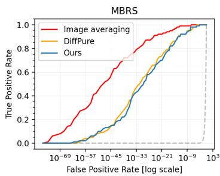

line

| False Positive Rate (log scale) | Image averaging | DiffPure | Ours |
| ------------------------------- | --------------- | -------- | ---- |
| 1e-69                           | 0.0             | 0.0      | 0.0  |
| 1e-57                           | 0.2             | 0.0      | 0.0  |
| 1e-45                           | 0.4             | 0.1      | 0.0  |
| 1e-33                           | 0.6             | 0.3      | 0.1  |
| 1e-21                           | 0.8             | 0.6      | 0.4  |
| 1e-9                            | 0.9             | 0.8      | 0.7  |
| 1e-3                             | 1.0             | 1.0      | 1.0  |

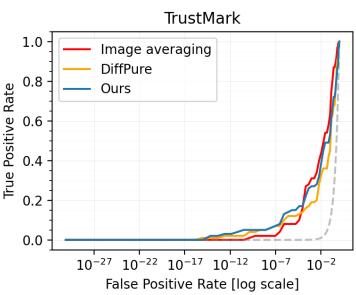

line

| False Positive Rate [log scale] | Image averaging | DiffPure | Ours |
| ------------------------------- | --------------- | -------- | ---- |
| 10⁻²⁷                           | 0.0             | 0.0      | 0.0  |
| 10⁻²²                           | 0.0             | 0.0      | 0.0  |
| 10⁻¹⁷                           | 0.0             | 0.0      | 0.0  |
| 10⁻¹²                           | 0.0             | 0.0      | 0.0  |
| 10⁻⁷                            | 0.1             | 0.1      | 0.1  |
| 10⁻²                            | 1.0             | 1.0      | 1.0  |

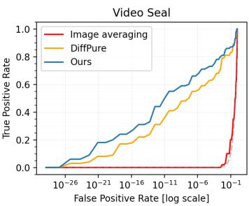

line

| False Positive Rate (log scale) | Image averaging | DiffPure | Ours |
| ------------------------------- | --------------- | -------- | ---- |
| 1e-26                           | 0.0             | 0.0      | 0.0  |
| 1e-21                           | 0.0             | 0.0      | 0.1  |
| 1e-16                           | 0.0             | 0.1      | 0.3  |
| 1e-11                           | 0.0             | 0.3      | 0.5  |
| 1e-6                            | 0.0             | 0.5      | 0.7  |
| 1e-1                            | 1.0             | 0.8      | 1.0  |

Figure 7: The ROC curves for watermark forging.

Table 5: The effect of the number of backpropagation steps k used for watermark forging. A larger number of steps forges more bits of information while distorting the image more. 

<table><tr><td rowspan="2">Method</td><td>CIN</td><td>MBRS</td><td>TrustMark</td><td>Video Seal</td><td rowspan="2">PSNR(↑)</td></tr><tr><td>Bit acc. (↑)</td><td>Bit acc. (↑)</td><td>Bit acc. (↑)</td><td>Bit acc. (↑)</td></tr><tr><td>k = 50</td><td>0.99</td><td>0.75</td><td>0.56</td><td>0.75</td><td>39.3</td></tr><tr><td>k = 100</td><td>1.00</td><td>0.79</td><td>0.57</td><td>0.80</td><td>37.4</td></tr><tr><td>k = 200</td><td>1.00</td><td>0.81</td><td>0.59</td><td>0.82</td><td>35.0</td></tr><tr><td>k = 300</td><td>1.00</td><td>0.82</td><td>0.60</td><td>0.83</td><td>33.4</td></tr><tr><td>k = 500 (Ours)</td><td>1.00</td><td>0.83</td><td>0.61</td><td>0.83</td><td>31.3</td></tr></table>

Table 6: The effect of the number of backpropagation steps k used for watermark removal. A larger number of steps removes more bits of information while distorting the image more. 

<table><tr><td rowspan="2">Method</td><td>CIN</td><td>MBRS</td><td>TrustMark</td><td>Video Seal</td><td rowspan="2">PSNR(↑)</td></tr><tr><td>Bit acc. (↓)</td><td>Bit acc. (↓)</td><td>Bit acc. (↓)</td><td>Bit acc. (↓)</td></tr><tr><td>k = 50</td><td>1.00</td><td>0.83</td><td>0.95</td><td>0.85</td><td>38.8</td></tr><tr><td>k = 100</td><td>0.97</td><td>0.77</td><td>0.86</td><td>0.64</td><td>37.0</td></tr><tr><td>k = 200</td><td>0.93</td><td>0.70</td><td>0.73</td><td>0.50</td><td>34.6</td></tr><tr><td>k = 300</td><td>0.89</td><td>0.67</td><td>0.66</td><td>0.50</td><td>33.3</td></tr><tr><td>k = 500 (Ours)</td><td>0.82</td><td>0.64</td><td>0.60</td><td>0.49</td><td>31.2</td></tr></table>

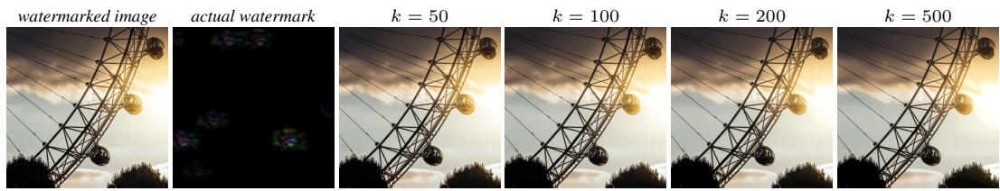  
Figure 8: Qualitative example showing the distortion of the input watermarked image (left) for different number of backpropagation steps k. More image details are removed for larger k.

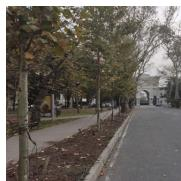

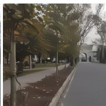

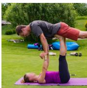

  
Figure 9: Method limitations. The distortion created by our method (right) by optimizing the input image (left) can lead to unnatural smoothing of some surfaces when the number of backpropagation steps k is high (k = 500).

Code and visualizations. We provide code for image preference model training and watermark removal as well as pretrained preference model weights at https://github.com/ facebookresearch/videoseal/tree/main/wmforger. The visualizations of all watermarks in the paper are done as clip(α · |w|, 0, 255) where the factor α is chosen to magnify the watermark. The same factor α is chosen for all watermarks in a figure.

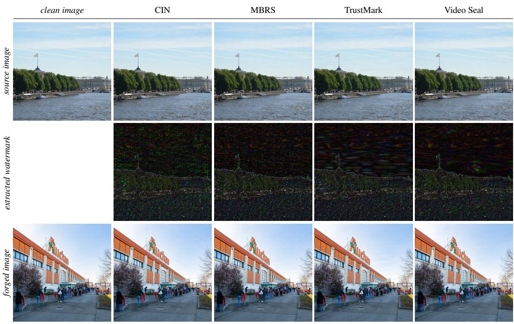

text_image

clean image
CIN
MBRS
TrustMark
Video Seal
source image
extracted watermark
forged image

Figure 10: Qualitative results for watermark forging. The figure shows a watermarked image (top) with its watermark removed by our method (middle row). The watermark is pasted onto a new image (bottom row). We use k = 50 steps for the watermark extraction.

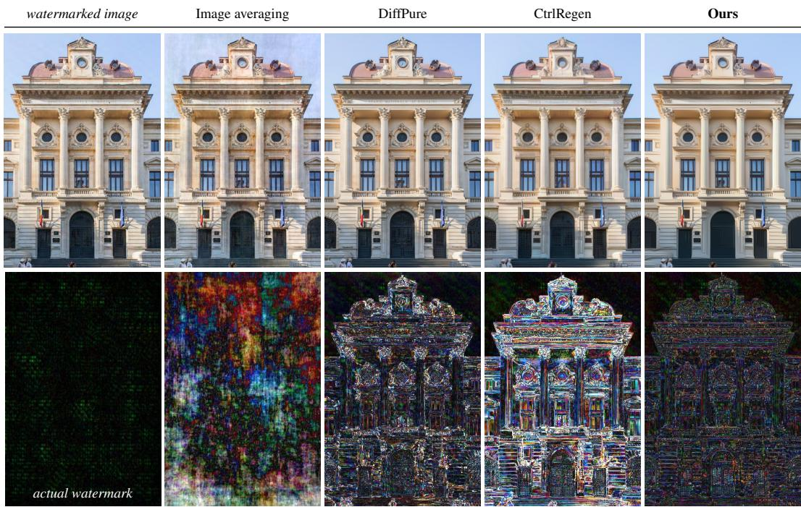

text_image

watermarked image
Image averaging
DiffPure
CtrlRegen
Ours
actual watermark

Figure 11: Qualitative results for watermark removal. The figure shows a watermarked image (left) with its watermark removed by different methods (top row) and the actual removed watermark by each method (bottom row).

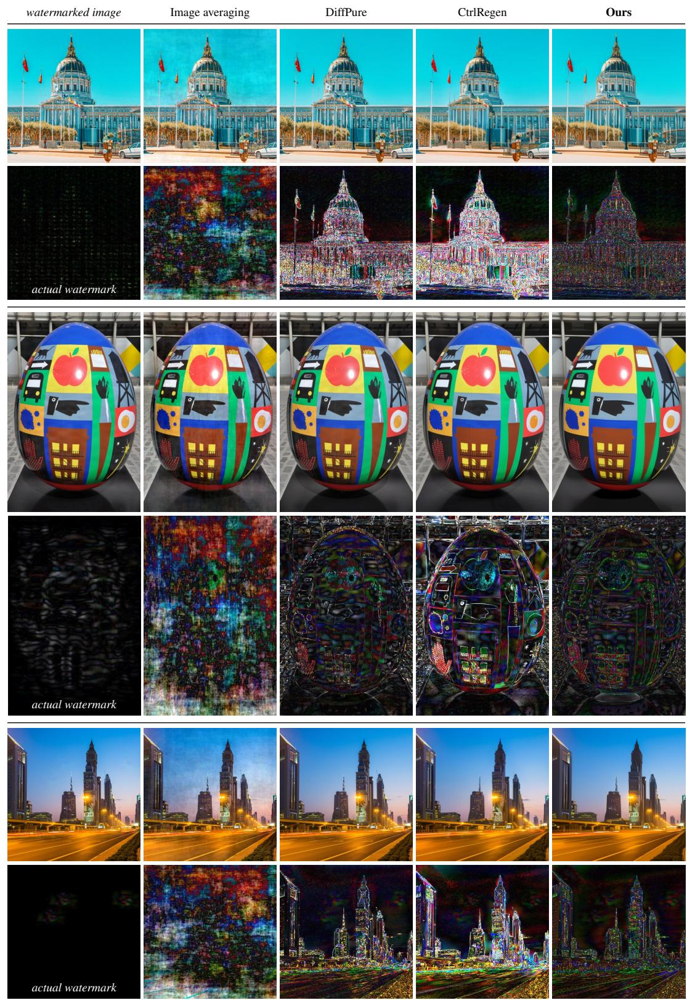  
Figure 12: Qualitative results for watermark removal. The figure shows a watermarked image (left) with its watermark removed by different methods (top row) and the actual removed watermark by each method (bottom row).