# ARTICLE OPEN

? Check for updates

# Compositionally restricted attention-based network for materials property predictions

Anthony Yu-Tung Wang 1,3, Steven K. Kauwe2,3, Ryan J. Murdock2 and Taylor D. Sparks 2✉

In this paper, we demonstrate an application of the Transformer self-attention mechanism in the context of materials science. Our network, the Compositionally Restricted Attention-Based network (CrabNet), explores the area of structure-agnostic materials property predictions when only a chemical formula is provided. Our results show that CrabNet’s performance matches or exceeds current best-practice methods on nearly all of 28 total benchmark datasets. We also demonstrate how CrabNet’s architecture lends itself towards model interpretability by showing different visualization approaches that are made possible by its design. We feel confident that CrabNet and its attention-based framework will be of keen interest to future materials informatics researchers.

npj Computational Materials (2021) 7:77 ; https://doi.org/10.1038/s41524-021-00545-1

# INTRODUCTION

Materials scientists constantly strive to achieve better understanding, and therefore better predictions, of materials properties. This began with the collection of empirical evidence through repeated experimentation, resulting in mathematical generalizations, theories, and laws. More recently, computational methods have arisen to solve a large variety of problems that were intractable to analytical approaches alone1,2 .

As experimental and computational methods have become more efficient, high-quality data has opened up a new avenue to materials understanding. Materials informatics (MI) is the resulting field of research that utilizes statistical and machine learning (ML) approaches in combination with high-throughput computation to analyze the wealth of existing materials information and gain unique insights2–4 . As this wealth has increased, practitioners of MI have increasingly turned to deep learning techniques to model and represent inorganic chemistry, resulting in approaches such as ElemNet, IRNet, CGCNN, SchNet, and Roost5–9 . In specific cases including CGCNN and SchNet, the compounds are represented using their chemical and structural information7,8,10–15.

Modeling approaches based on crystal structure are an excellent tool for MI. Unfortunately, there are many material property datasets that lack suitable structural information. An example of this is the experimental band gap data gathered by Zhou et al.16. Conversely, many databases such as the Inorganic Crystal Structure Database (ICSD) and Pearson’s Crystal Data (PCD) contain an abundance of structural information, but lack the associated material properties of the recorded structures. In both cases, the applicability of structure-based learning approaches are limited. This limitation is particularly evident in the discovery of novel materials, since it is not possible to know the structural information of (currently undiscovered) chemical compounds a priori. Therefore, the development of structure-agnostic techniques is well-suited to the discovery of novel materials.

A typical approach to structure-agnostic learning is done by representing chemistry as a composition-based feature vector (CBFV) 17. This allows for data-driven learning in the absence of structural information. The CBFV is a common way to transform chemical compositions into usable features for ML and is generated from the descriptive statistics of a compound’s constituent element properties. Researchers have effectively used CBFV-based ML techniques to generate material property predictions17–25.

One potential issue with the CBFV approach lies in the way the element vectors are combined to form the vector describing the chemical compound. Typically, the individual element vectors of the compound are scaled by the element’s prevalence (fractional abundance) in the composition, before being used to form the CBFV. This step assumes that the stoichiometric prevalence of constituent elements in a compound dictates their chemical signal, or contribution, to the material’s property. However, this is not true in all cases; an extreme example of this is element doping. Dopants can be present in very small amounts in a compound, but can have a significant impact on its electrical23,26,27, mechanical20,28–30, and thermal properties31–34. In the case of a typical CBFV approach that uses the weighted average of element properties as a feature, the signal from dopant elements would not significantly change the vector representation of a compound. As a result, the trained ML model would fail to capture a portion of the relevant chemical information available in the full composition.

It is apparent that there is no generally accepted best way to model materials property behaviors. Different ML approaches lend themselves towards different modeling tasks. CGCNN requires access to structural information, ElemNet operates within the realm of large data, and classical models excel when domain knowledge can be exploited to overcome data scarcity35. To address the diversity of learning challenges, in Dunn et al., the Automatminer framework uses computationally expensive searches to optimize classical modeling techniques. They demonstrate effective learning on some data, but show shortcomings when deep learning is appropriate36.

In a similar spirit, we seek to overcome general challenges in the area of structure-agnostic learning using an approach we refer to as the Compositionally Restricted Attention-Based network (CrabNet). CrabNet introduces the self-attention mechanism to the task of materials property predictions, and dynamically learns and updates individual element representations based on their chemical environment. To enable this, we introduce a featurization scheme that represents and preserves individual element identities while sharing information between elements. Self-attention is a procedure by which a neural network learns representations for each item in a system based on the other items that are present. In this context, we treat the chemical composition as the system and the elements as the items within that system. This representation enables CrabNet to learn interelement interactions within a compound and use these interactions to generate property predictions.

To perform self-attention, we use the Transformer architecture, which emerged from natural language processing (NLP) and is based on stacked self-attention layers 37–42 . A typical use of the Transformer architecture in NLP is to encode the meaning of a word given the surrounding words, sentences, and paragraphs. Beyond NLP, other example uses of the Transformer architecture are found in music generation43, image generation44, image and video restoration45–49, game playing agents50,51, and drug discovery52,53. In this work, we explore how our attention-based architecture, CrabNet, performs in predicting materials properties relative to the common modeling techniques Roost, ElemNet, and random forest (RF) for regression-type problems.

# RESULTS

The results of this study are described in three subsections. First, we describe the collection of materials property data used for benchmarking CrabNet. Second, we highlight the performance of CrabNet when compared to other current learning approaches which rely solely on composition. Third, we briefly outline how the self-attention mechanism in CrabNet enables visualizations and inspectability unique to attention-based modeling.

# Data and materials properties procurement

For this work, we obtained both computational and experimental materials data for benchmarking. Our benchmark data includes materials properties from the Matbench dataset as provided by Dunn et al.36. In addition, materials properties data from a number of works6,54–5 7 are collected, which are referred to as the Extended dataset. We included 28 benchmark datasets in total: 10 from the Matbench and 18 from the Extended datasets ranging from 312 to 341,788 instances of data.

The Matbench datasets were split using fivefold cross-validation following instructions provided in the original publication36. Materials properties in the Extended dataset were split into train, validation, and test datasets using a fixed random seed. For both datasets, several steps were taken to process the original datasets to be compatible with structure-agnostic learning using Crab-Net. Care was taken to ensure that (1) no duplicate compositions were present in each of the train, validation, and test datasets, and that (2) if a composition exists in the train or validation dataset, all compounds with the same composition are removed from the validation and test datasets. To remain comparable with the Automatminer publication36, we applied the data processing steps as mentioned above after splitting the data. Please note that since some datasets have more duplicate compositions than others, these processing steps may affect the train/val/test ratios. For duplicate compositions in the OQMD and MP datasets, the target value associated with the lowest formation enthalpy was selected. For other datasets, the mean of the target values was used. Please see the Supplementary Methods for more details.

The full processed benchmark dataset, comprising the Matbench and Extended datasets, were then used with Roost, CrabNet, ElemNet, and RF models. The training and validation data were used for training and hyperparameter tuning. The test data were held-out to provide a fair evaluation of performance metrics across all models. Model performance was only evaluated after all training and hyperparameter tuning was completed. A summary of the datasets is shown in Table 1. All datasets are provided as pre-split csv files to facilitate future comparisons to the metrics reported in this paper. Additional data processing and cleaning details can also be seen in the code on the dataset repository mse\_datasets58. To maintain consistent and simple benchmark comparisons, we selected data suitable for regression tasks and ignored structural information when present.

# Benchmark comparisons

With the benchmark data described above, we generated material predictions using the publicly available code repositories for Roost9 , CrabNet59, and ElemNet5 . The performance of these benchmarked models is compared using the mean absolute error (MAE) between n true values (y) and predicted values (^y) as defined by Eq. (1):

$$
\mathrm{MAE} = \frac {1}{n} \sum_ {i = 1} ^ {n} | y _ {i} - \hat {y} _ {i} |. \tag {1}
$$

This allows for consistent comparison to past works5–7,9 .

Figure 1 shows the performance metrics from training and testing the models on all the benchmark materials properties outlined above. Here we note that the models for Roost, CrabNet, and ElemNet were all trained using the default model parameters provided with their respective repositories. In contrast to Roost and ElemNet, the default parameters for CrabNet were optimized using validation data from some of the same datasets on which we benchmarked. Although it is possible this offers a small advantage to CrabNet’s performance, we do not expect this to be significant due to CrabNet’s consistently strong performance on all benchmark tasks.

We tested two versions of CrabNet. The default CrabNet uses a mat2vec embedding when representing elements, similar to Roost. The second version of CrabNet (HotCrab) uses onehot encodings (in the form of atomic numbers) and fractional amounts to represent each element in a composition. This is similar to ElemNet, as both models start without any chemical information. The random forest (RF) model utilizes a Magpiefeaturized CBFV to represent chemistry. This is included as a performance baseline to match similar works5,9,36.

Overall, we see similar performance between Roost and the two versions of CrabNet tested. Given the different architectures and modeling philosophies of Roost and CrabNet, it is promising that both approaches converge towards the same performance metrics. We also see that Roost and both CrabNet versions achieve consistent and significant improvements to MAE compared to ElemNet and RF approaches. Interestingly, Fig. 1 shows that the use of mat2vec instead of one-hot with CrabNet improves prediction performance on all materials properties except for AFLOW thermal conductivity, MP elastic anisotropy, and those present in the largest datasets (OQMD).

The Matbench data provided by Dunn et al.36 was benchmarked using the Automatminer tool. These metrics are not included in Fig. 1, since all but two (expt\_gap, and steels\_yield) of Automatminer’s models use structural information. Consequently, we focus on these two materials properties when comparing CrabNet’s results to those from Automatminer. For these two metrics, CrabNet’s structure-agnostic approach outperforms the reported MAE values from Automatminer on the same tasks (expt\_gap: 0.416 eV vs. 0.338 eV for CrabNet; steels\_yield: 95.2 GPa vs. 91.7 GPa for CrabNet).

The performance of CrabNet on the steels\_yield task is particularly interesting. The steels\_yield dataset contains compounds with small dopant amounts in large chemical systems (up to 13 elements per composition) and only 312 total data. CrabNet’s ability to learn on this data-poor property and outperform all other tested models including the baseline RF model (which is traditionally better in the data-poor regime) is encouraging. We expected the steels\_yield task to be difficult for all deep learning approaches. Nevertheless, repeated training and validation of CrabNet consistently produced error metrics better than the best result obtained by Automatminer (95.2 GPa).

Benchmark datasets. List of all 28 material properties used to benchmark the ML models in this work, together with the dataset size and the Table 1.original training, validation, and test set proportions. 

<table><tr><td>Dataset name</td><td>Source</td><td>Material property</td><td># Samples</td><td>(Train/val/test) %</td></tr><tr><td>castelli</td><td> $Castelli\ et\ al.^{36,65}$ </td><td>Formation enthalpy (perovskites)</td><td>18928</td><td>5-fold (72/8/20)</td></tr><tr><td>dielectric</td><td> $MP^{36,66-68}$ </td><td>Refractive index</td><td>4764</td><td>5-fold (72/8/20)</td></tr><tr><td>elasticity_log10(G_VRH)</td><td> $MP^{36,66,67,69}$ </td><td> $log_{10}(shear\ modulus\ (VRH))$ </td><td>10987</td><td>5-fold (72/8/20)</td></tr><tr><td>elasticity_log10(K_VRH)</td><td> $MP^{36,66,67,69}$ </td><td> $log_{10}(bulk\ modulus\ (VRH))$ </td><td>10987</td><td>5-fold (72/8/20)</td></tr><tr><td>expt_gap</td><td> $Experiment^{16,36}$ </td><td>Experimental band gap</td><td>4764</td><td>5-fold (72/8/20)</td></tr><tr><td>jdft2d</td><td> $Experiment^{36,70}$ </td><td>Exfoliation energy</td><td>636</td><td>5-fold (72/8/20)</td></tr><tr><td>mp_e_form</td><td> $MP^{36,66,67}$ </td><td>Formation energy per atom</td><td>132752</td><td>5-fold (72/8/20)</td></tr><tr><td>mp_gap</td><td> $MP^{36,66,67}$ </td><td>Band gap</td><td>106113</td><td>5-fold (72/8/20)</td></tr><tr><td>phonons</td><td> $MP^{36,66,67,71}$ </td><td>Phonon frequency</td><td>1265</td><td>5-fold (72/8/20)</td></tr><tr><td>steels_yield</td><td> $MP^{36,72}$ </td><td>Steels yield strength</td><td>312</td><td>5-fold (72/8/20)</td></tr><tr><td>aflow_ael_bulk_modulus_vrh</td><td> $AFLOW^{54}$ </td><td>Bulk modulus (VRH)</td><td>4905</td><td>(70/15/15)</td></tr><tr><td>aflow_ael_debye_temperature</td><td> $AFLOW^{54}$ </td><td>Debye temperature</td><td>4905</td><td>(70/15/15)</td></tr><tr><td>aflow_ael_shear_modulus_vrh</td><td> $AFLOW^{54}$ </td><td>Shear modulus (VRH)</td><td>4905</td><td>(70/15/15)</td></tr><tr><td>aflow_agl_thermal_conductivity_300K</td><td> $AFLOW^{54}$ </td><td>Thermal conductivity</td><td>4896</td><td>(70/15/15)</td></tr><tr><td>aflow_agl_thermal_expansion_300K</td><td> $AFLOW^{54}$ </td><td>Thermal expansion</td><td>4895</td><td>(70/15/15)</td></tr><tr><td>aflow_Egap</td><td> $AFLOW^{54}$ </td><td>Band gap</td><td>27841</td><td>(70/15/15)</td></tr><tr><td>aflow_energy_atom</td><td> $AFLOW^{54}$ </td><td>Energy per atom</td><td>27844</td><td>(70/15/15)</td></tr><tr><td>CritExam_Ed</td><td>Bartel et al. $^{55}$ </td><td>Decomposition enthalpy</td><td>85014</td><td>(70/15/15)</td></tr><tr><td>CritExam_Ef</td><td>Bartel et al. $^{55}$ </td><td>Formation enthalpy</td><td>85014</td><td>(70/15/15)</td></tr><tr><td>mp_bulk_modulus</td><td> $MP\ (Oct.\ 2018)^{57,66,67,69}$ </td><td>Bulk modulus</td><td>7632</td><td>(70/15/15)</td></tr><tr><td>mp_elastic_anisotropy</td><td> $MP\ (Oct.\ 2018)^{57}$ </td><td>Ratio of elastic anisotropy</td><td>7659</td><td>(70/15/15)</td></tr><tr><td>mp_e_hull</td><td> $MP\ (Oct.\ 2018)^{57}$ </td><td>Energy above the convex hull</td><td>83983</td><td>(70/15/15)</td></tr><tr><td>mp_mu_b</td><td> $MP\ (Oct.\ 2018)^{57}$ </td><td>Magnetization of the unit cell</td><td>83973</td><td>(70/15/15)</td></tr><tr><td>mp_shear_modulus</td><td> $MP\ (Oct.\ 2018)^{57,66,67,69}$ </td><td>Shear modulus</td><td>7437</td><td>(70/15/15)</td></tr><tr><td>OQMD_Bandgap</td><td> $OQMD^{6}$ </td><td>Band gap</td><td>341696</td><td>(70/15/15)</td></tr><tr><td>OQMD_Energy_per_atom</td><td> $OQMD^{6}$ </td><td>Energy per atom</td><td>341788</td><td>(70/15/15)</td></tr><tr><td>OQMD_Formation_Enthalpy</td><td> $OQMD^{6}$ </td><td>Formation enthalpy</td><td>341788</td><td>(70/15/15)</td></tr><tr><td>OQMD_Volume_per_atom</td><td> $OQMD^{6}$ </td><td>Volume per atom</td><td>341788</td><td>(70/15/15)</td></tr></table>

The materials properties listed in the top and bottom halves are Matbench and Extended datasets, respectively.

# Visualizing self-attention

CrabNet’s modeling and visualization capabilities are enabled by its attention-based learning framework. In statistical ML and many deep learning approaches akin to ElemNet, the chemical composition of a compound is represented as a single CBFV. In contrast, Roost and CrabNet represent a composition as a set of element vectors. Distinct to CrabNet, however, is the Transformer-based self-attention mechanism that learns to update these element vectors using learned attention matrices. In Fig. 2, we show example attention matrices for each attention head of a CrabNet model trained on the property mp\_bulk\_modulus, using ${ \sf A l } _ { 2 } { \sf O } _ { 3 }$ as the example composition. These matrices contain information regarding how each element (rows) is influenced by all other elements in the system as well as itself (columns). The values in these attention matrices are used in the Transformer encoder to update the element vectors. A value of zero means that the element in the column is completely ignored when updating the element in that row. A value of one means that the entire vector update is based solely on that column’s element.

Our implementation of CrabNet has three layers, each with four attention heads, with each head using the same data to generate its own independent attention matrix (see “Methods” for more details).

Shifting our focus to another CrabNet model trained on aflow\_\_Egap data, we show that in addition to visualization of the individual attention heads, we can also generate a global view of attention from the perspective of individual elements. In Fig. 3, we use four periodic tables to visualize, for each attention head, the average attention that silicon dedicates to other elements when they are in the same composition. The darker colored elements can be understood as highly influential when updating silicon’s vector representation.

Interestingly, each attention head exhibits its own behavior, with some focusing on familiar groups and columns in the periodic table. This behavior lends credibility to CrabNet since there is no inherent reason that data-driven learning should converge to chemical rules that are familiar to materials scientists. Furthermore, the identification of unfamiliar element groupings enabled by the attention-based visualizations may allow us to formulate further research questions to study these interelemental interactions.

The preservation of elemental identity within a compound—as a result of the self-attention mechanism—also enables CrabNet to generate property predictions in a way that is different to other approaches shown in the literature. Typically, element information of a given compound is collapsed into a single vector first and then used to generate the property prediction. In contrast, CrabNet uses each element’s vector representation to directly predict the element’s contribution to the property prediction. Figure 4a shows the average contributions from each element for a CrabNet model trained on AFLOW bulk modulus data. The darker colored elements contribute more towards a compound’s bulk modulus value. Alternatively, elements can be visualized individually using their specific per-element contributions. In Fig. 4b we show distribution plots for lithium and tungsten’s contributions to bulk modulus. From these plots, we can see that CrabNet expects lithium to contribute little to the overall bulk modulus, whereas it expects tungsten to contribute largely. See Supplementary Fig. 3 for additional examples of these element contribution plots. The visualizations from Fig. 4 match closely— and reinforce—expectations regarding which elements most influence bulk modulus behavior in a compound. Exploration of data in this manner hints at the first steps towards model interpretability of CrabNet. We expect these types of property visualizations to be useful for exploring and verifying model and element behavior in detail.

<table><tr><td rowspan="11">a)</td><td>Matbench Properties</td><td>Roost</td><td>CrabNet</td><td>HotCrab</td><td>ElemNet</td><td>RF</td></tr><tr><td>Castelli perovskites</td><td>0.148</td><td>0.127</td><td>0.135</td><td>0.194</td><td>0.152</td></tr><tr><td>Refractive index</td><td>0.370</td><td>0.348</td><td>0.366</td><td>0.442</td><td>0.476</td></tr><tr><td>Shear modulus (log10)</td><td>0.100</td><td>0.092</td><td>0.097</td><td>0.125</td><td>0.100</td></tr><tr><td>Bulk modulus (log10)</td><td>0.073</td><td>0.068</td><td>0.072</td><td>0.090</td><td>0.078</td></tr><tr><td>Experimental band gap</td><td>0.373</td><td>0.338</td><td>0.352</td><td>0.439</td><td>0.447</td></tr><tr><td>DFT Exfoliation energy</td><td>52.879</td><td>50.512</td><td>54.811</td><td>61.714</td><td>55.105</td></tr><tr><td>MP Formation energy</td><td>0.078</td><td>0.077</td><td>0.080</td><td>0.746</td><td>0.131</td></tr><tr><td>MP Band gap</td><td>0.260</td><td>0.263</td><td>0.273</td><td>0.313</td><td>0.363</td></tr><tr><td>Phonon peak</td><td>49.767</td><td>53.341</td><td>60.253</td><td>nan</td><td>68.687</td></tr><tr><td>Steels yield</td><td>155.190</td><td>91.748</td><td>92.479</td><td>nan</td><td>103.898</td></tr><tr><td rowspan="19">b)</td><td>Extended Properties</td><td>Roost</td><td>CrabNet</td><td>HotCrab</td><td>ElemNet</td><td>RF</td></tr><tr><td>AFLOW Bulk modulus</td><td>8.820</td><td>8.692</td><td>9.103</td><td>12.119</td><td>11.907</td></tr><tr><td>AFLOW Debye temperature</td><td>37.167</td><td>33.464</td><td>35.755</td><td>45.723</td><td>36.484</td></tr><tr><td>AFLOW Shear modulus</td><td>9.983</td><td>9.082</td><td>9.430</td><td>13.319</td><td>10.094</td></tr><tr><td>AFLOW Thermal conductivity</td><td>2.703</td><td>2.318</td><td>2.254</td><td>3.322</td><td>2.658</td></tr><tr><td>AFLOW Thermal expansion</td><td>3.69e-06</td><td>3.85e-06</td><td>3.88e-06</td><td>5.42e-06</td><td>5.44e-06</td></tr><tr><td>AFLOW Band gap</td><td>0.337</td><td>0.301</td><td>0.316</td><td>0.372</td><td>0.384</td></tr><tr><td>AFLOW Energy per atom</td><td>0.086</td><td>0.093</td><td>0.094</td><td>0.122</td><td>0.224</td></tr><tr><td>Bartel Decomposition (Ed)</td><td>0.067</td><td>0.063</td><td>0.066</td><td>0.079</td><td>0.076</td></tr><tr><td>Bartel Formation (Ef)</td><td>0.055</td><td>0.059</td><td>0.059</td><td>0.071</td><td>0.100</td></tr><tr><td>MP Bulk modulus</td><td>11.395</td><td>11.209</td><td>11.918</td><td>15.136</td><td>14.358</td></tr><tr><td>MP Elastic anisotropy</td><td>8.082</td><td>8.263</td><td>8.126</td><td>8.191</td><td>11.691</td></tr><tr><td>MP Energy above convex hull</td><td>0.094</td><td>0.089</td><td>0.092</td><td>0.110</td><td>0.126</td></tr><tr><td>MP Magnetic moment</td><td>2.507</td><td>2.105</td><td>2.180</td><td>2.694</td><td>2.732</td></tr><tr><td>MP Shear modulus</td><td>12.797</td><td>12.787</td><td>12.849</td><td>15.097</td><td>12.777</td></tr><tr><td>OQMD Band gap</td><td>0.088</td><td>0.049</td><td>0.048</td><td>0.148</td><td>0.060</td></tr><tr><td>OQMD Energy per atom</td><td>0.032</td><td>0.033</td><td>0.033</td><td>0.062</td><td>0.141</td></tr><tr><td>OQMD Formation enthalpy</td><td>0.032</td><td>0.031</td><td>0.031</td><td>0.049</td><td>0.083</td></tr><tr><td>OQMD Volume per atom</td><td>0.296</td><td>0.277</td><td>0.278</td><td>0.442</td><td>0.544</td></tr></table>

Benchmark results. MAE scores of Roost, CrabNet, one-Fig. 1hot encoded CrabNet (HotCrab), and ElemNet on the held-out test datasets, compared with the random forest (RF) baseline for (a) the Matbench dataset and (b) the Extended dataset. Cells are colored according to relative MAE performance within each row (blue is better, and red is worse). A NaN (not a number) value is reported for instances where the models failed to converge on a given material property. Here we present model results trained using chemical information (Roost, CrabNet), no chemical information (HotCrab, ElemNet), and a standard CBFV (RF).

Finally, with per-element contributions in mind, we can demonstrate changes to CrabNet’s expected material property behavior as a function of chemical composition. To do this, we consider a normalized chemical system consisting of atoms A and B, in the form of $\mathsf { A } _ { x } \mathsf { B } _ { 1 - x } .$ We then generate property predictions for all $x \in \{ 0 . 0 , 0 . 0 2 , \ldots , 1 . 0 \}$ . In Fig. 5, we visualize CrabNet’s behavior when predicting band gap of the $\mathsf { S i } _ { x } \mathsf { O } _ { 1 - x }$ system using a model trained on the aflow\_\_Egap data.

We first observe that the expected elemental contributions for both oxygen and silicon to band gap are similar throughout the varied stoichiometry range, with the exception of the peak in oxygen contribution at around x = 0.7. We also observe that the

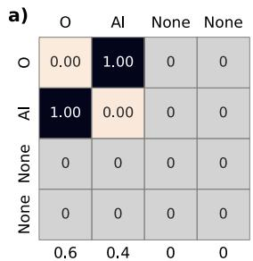

<details>
<summary>heatmap</summary>

| | O | AI | None | None |
|---|---|---|---|---|
| O | 0.00 | 1.00 | 0 | 0 |
| AI | 1.00 | 0.00 | 0 | 0 |
| None | 0 | 0 | 0 | 0 |
| None | 0 | 0 | 0 | 0 |
</details>

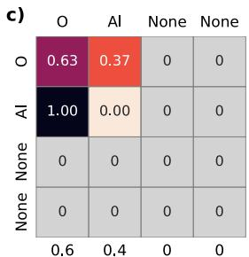

<details>
<summary>heatmap</summary>

| | O | Al | None | None |
|---|---|---|---|---|
| O | 0.63 | 0.37 | 0 | 0 |
| Al | 1.00 | 0.00 | 0 | 0 |
| None | 0 | 0 | 0 | 0 |
| None | 0 | 0 | 0 | 0 |
</details>

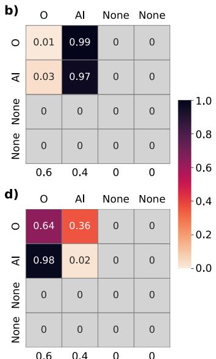

<details>
<summary>heatmap</summary>

| | O | AI | None | None |
|---|---|---|---|---|
| O | 0.01 | 0.99 | 0 | 0 |
| AI | 0.03 | 0.97 | 0 | 0 |
| None | 0 | 0 | 0 | 0 |
| None | 0 | 0 | 0 | 0 |
| 0.6 | 0.4 | 0 | 0 | 0 |
| 0.6 | 0.6 | 0.4 | 0 | 0 |
d) O Al None None
O 0.64 AI 0.36 0 0
AI 0.98 0.02 0 0
None 0 0 0 0 0
None 0 0 0 0 0
</details>

Visualization of self-attention in one compound. Displayed Fig. 2are the four attention heads (a–d) from the first layer of a CrabNet model trained on mp\_bulk\_modulus and evaluated on the composition $\mathsf { A l } _ { 2 } \mathsf { O } _ { 3 } .$ Each row represents an element in the system. Each column represents an element being attended to. Each element’s fractional amount is shown on the x-axis. The values in the attention matrix are scores representing element-element interactions for the compound. As an example, in head a, $\mathsf { A l } _ { 0 . 4 }$ and $O _ { 0 . 6 }$ are attending strongly to each other, with attention scores of 1.00 between these two elements.

model indicates a transition of the $\mathsf { S i } _ { x } \mathsf { O } _ { 1 - x }$ system between conducting and semi-conducting between $x = 0 . 5$ and x = 0.7. We note that the only available training data sample from the ${ \sf S i } _ { x } 0 _ { 1 - x }$ system in the dataset was from the composition SiO2. Therefore, we can see that the band gap trend predicted here by CrabNet is based on the learned chemical representations and interelemental interactions from other elements and systems. The visualization of CrabNet model predictions within a given chemical space is an alternative way to explore model learning and prediction behavior, and may lead to an improved understanding of inter-elemental interactions within a chemical system.

Furthermore, we note that the ability of CrabNet in predicting material property trends for specific chemical systems without requiring a large amount of training data for that system is of great benefit. For future studies, this ability may be investigated for its application in predicting the behavior of new chemical systems while only requiring a sparse sampling or learning of their chemical information. Furthermore, we believe that transfer learning of trained CrabNet models to other material properties is possible, due to the ability of the self-attention mechanism to accurately capture inter-elemental interactions. We are confident that these ideas of probing and visualizing of CrabNet’s modeling process and model predictions will open up further interesting research directions and ultimately lead to more insights in the pursuit of inspectable models.

# DISCUSSION

Unique challenges exist when applying ML to materials science. In this paper, we address the limitations of ML on chemical composition by introducing CrabNet. The CrabNet architecture uses the self-attention mechanism and the EDM representation scheme to perform context-aware learning on materials properties. Using 28 benchmark datasets, we demonstrate CrabNet’s performance compared to Roost, ElemNet, and RF baselines.

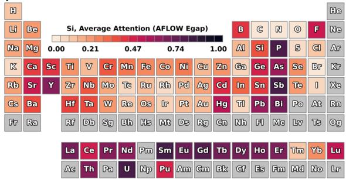

<details>
<summary>heatmap</summary>

Si, Average Attention (AFLOW Egap)
| Element | Si | Average Attention (AFLOW Egap) |
|---|---|---|
| H | B | 0.21 |
| Li | C | 0.47 |
| Be | N | 0.74 |
| Na | F | 1.00 |
| Mg | Al | 0.00 |
| K | Si | 0.21 |
| Ca | P | 0.47 |
| Sc | S | 0.74 |
| Ti | Br | 0.21 |
| V | Fe | 0.47 |
| Cr | Co | 0.74 |
| Mn | Ni | 0.21 |
| Fe | Cu | 0.47 |
| Co | Zn | 0.74 |
| Ni | Ga | 0.21 |
| Gt | Ge | 0.47 |
| Zn | As | 0.74 |
| In | Se | 0.21 |
| Sn | Br | 0.47 |
| Y | I | 0.74 |
| Zr | Xe | 0.21 |
| Nb | Tl | 0.47 |
| Mo | Ag | 0.74 |
| Te | Sb | 0.21 |
| Ru | Hg | 0.47 |
| Rh | Pt | 0.74 |
| Ag | Pb | 0.21 |
| Cd | Po | 0.47 |
| Hf | Rn | 0.74 |
| Ta | Tl | 0.21 |
| W | Bi | 0.47 |
| Re | Eu | 0.74 |
| Os | Gd | 0.21 |
| Ir | Tb | 0.47 |
| Pt | Gm | 0.74 |
| Au | Nd | 0.21 |
| Hg | Lv | 0.47 |
| Rf | Tm | 0.74 |
| Db | Sm | 0.21 |
| Sg | Tb | 0.47 |
| Bh | Gt | 0.74 |
| Hs | Gt | 0.21 |
| Mt | Ht | 0.47 |
| Ds | Ht | 0.74 |
| Rg | Ht | 0.21 |
| Gn | Ht | 0.47 |
| Hh | Ht | 0.74 |
| Fl | Lr | 0.21 |
| Me | Lr | 0.47 |
| Lv | Lr | 0.74 |
| Ts | Lr | 0.21 |
| Og | Lr | 0.47 |
| La | Lu | 0.21 |
| Ce | Lu | 0.47 |
| Pr | Lu | 0.74 |
| Nd | Lu | 0.21 |
| Pm | Lu | 0.47 |
| Sm | Lu | 0.74 |
| Eu | Lu | 0.21 |
| Gd | Lu | 0.47 |
| Tb | Lu | 0.74 |
| Dy | Lu | 0.21 |
| Ho | Lu | 0.47 |
| Er | Lu | 0.74 |
| Tm | Lu | 0.21 |
| Yb | Lu | 0.47 |
| Lu
Ac
Th
Pa
U
Np
Pu
Am
Gm
Bk
Cf
Es
Fm
Md
No
Lr
</details>

b)   
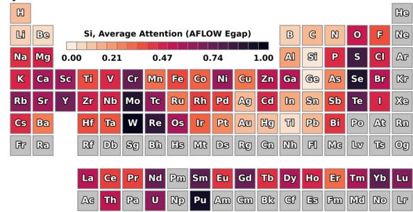

c)   
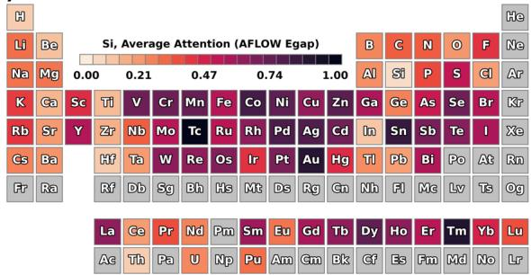

<details>
<summary>heatmap</summary>

Si, Average Attention (AFLOW Egap)
| Element | Si | Average Attention (AFLOW Egap) |
|---|---|---|
| H | B | 1.00 |
| Li | C | 0.95 |
| Be | N | 0.90 |
| Na | F | 0.85 |
| Mg | Ne | 0.80 |
| K | Al | 0.75 |
| Ca | Si | 0.70 |
| Sc | P | 0.65 |
| Ti | S | 0.60 |
| V | Se | 0.55 |
| Cr | As | 0.50 |
| Mn | Br | 0.45 |
| Fe | Se | 0.40 |
| Co | Br | 0.35 |
| Ni | Cu | 0.30 |
| Cu | Zn | 0.25 |
| Ga | Ge | 0.20 |
| In | Sn | 0.15 |
| Sb | Te | 0.10 |
| Xe | I | 0.05 |
| Cs | Xe | 0.00 |
| Ba | Rn | 0.05 |
| Fr | Rn | 0.10 |
| Ra | Rn | 0.15 |
| Hf | Tl | 0.20 |
| Ta | Pb | 0.25 |
| W | Bi | 0.30 |
| Re | Po | 0.35 |
| Os | At | 0.40 |
| Ir | Gn | 0.45 |
| Pt | Hg | 0.50 |
| Au | Nt | 0.55 |
| Hg | Ph | 0.60 |
| Rf | Fl | 0.65 |
| Db | Me | 0.70 |
| Sg | Lv | 0.75 |
| Sg | Ts | 0.80 |
| Hs | Og | 0.85 |
| Hs | La | 0.90 |
| Hs | Ce | 0.95 |
| Pr | Er | 1.00 |
| Nd | Tm | 1.05 |
| Pu | Yb | 1.10 |
| Sm | Lu | 1.15 |
| Eu | Ho | 1.20 |
| Gd | Fm | 1.25 |
| Tb | Gb | 1.30 |
| Dy | Fc | 1.35 |
| Ho | Es | 1.40 |
| Er | Fm | 1.45 |
| Tm | Nd | 1.50 |
| Yb | Lr | 1.55 |
| Ac | La | 1.60 |
| Th | Ce | 1.65 |
| Pa | U | 1.70 |
| Np | Am | 1.75 |
| Pu | Bk | 1.80 |
| Am | Gm | 1.85 |
| Gm | Bk | 1.90 |
| Bk | Cf | 1.95 |
| Cf | Es | 2.00 |
| Fm | Md | 2.05 |
| No | Lr | 2.10 |
The chart is a heatmap with a color scale from blue to red indicating intensity or value.
</details>

d)   
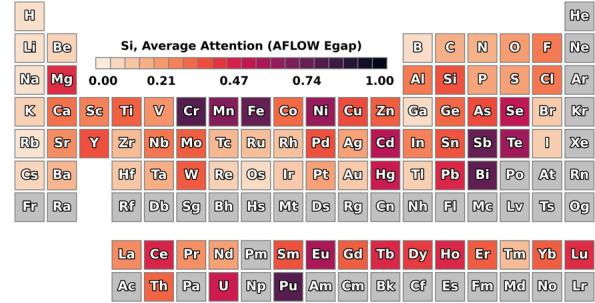

<details>
<summary>heatmap</summary>

Si, Average Attention (AFLOW Eggap)
| Element | Si | Average Attention (AFLOW Eggap) |
|---|---|---|
| H | 0.00 | 1.00 |
| Li | 0.21 | 0.74 |
| Be | 0.47 | 0.21 |
| Na | 0.74 | 0.47 |
| Mg | 1.00 | 0.21 |
| K | 0.21 | 0.47 |
| Ca | 0.47 | 0.21 |
| Se | 0.74 | 0.47 |
| Ti | 0.21 | 0.47 |
| V | 0.47 | 0.21 |
| Cr | 0.74 | 0.47 |
| Mn | 0.21 | 0.47 |
| Fe | 0.47 | 0.21 |
| Co | 0.74 | 0.47 |
| Ni | 0.21 | 0.47 |
| Cu | 0.47 | 0.21 |
| Zn | 0.74 | 0.47 |
| Ga | 0.21 | 0.47 |
| Ge | 0.47 | 0.21 |
| As | 0.74 | 0.47 |
| Se | 0.21 | 0.47 |
| Br | 0.47 | 0.21 |
| Kr | 0.74 | 0.47 |
| Rb | 0.21 | 0.47 |
| Sr | 0.47 | 0.21 |
| Y | 0.74 | 0.47 |
| Zr | 0.21 | 0.47 |
| Nb | 0.47 | 0.21 |
| Mo | 0.74 | 0.47 |
| Te | 0.21 | 0.47 |
| Ru | 0.47 | 0.21 |
| Rh | 0.74 | 0.47 |
| Pd | 0.21 | 0.47 |
| Ag | 0.47 | 0.21 |
| Cd | 0.74 | 0.47 |
| In | 0.21 | 0.47 |
| Sn | 0.47 | 0.21 |
| Sb | 0.74 | 0.47 |
| Te | 0.21 | 0.47 |
| I | 0.47 | 0.21 |
| Xe | 0.74 | 0.47 |
| Cs | 0.21 | 0.47 |
| Ba | 0.47 | 0.21 |
| Hf | 0.74 | 0.47 |
| Ta | 0.21 | 0.47 |
| W | 0.47 | 0.21 |
| Re | 0.74 | 0.47 |
| Os | 0.21 | 0.47 |
| Ir | 0.47 | 0.21 |
| Pt | 0.74 | 0.47 |
| Au | 0.21 | 0.47 |
| Hg | 0.47 | 0.21 |
| Tl | 0.74 | 0.47 |
| Pb | 0.21 | 0.47 |
| Bi | 0.47 | 0.21 |
| Po | 0.74 | 0.47 |
| At | 0.21 | 0.47 |
| Rn | 0.47 | 0.21 |
| Fr | 0.74 | 0.47 |
| Ra | 0.21 | 0.47 |
| Rf | 0.47 | 0.21 |
| Db | 0.74 | 0.47 |
| Sg | 0.21 | 0.47 |
| Sg | 0.47 | 0.21 |
| Bh | 0.74 | 0.47 |
| Hs | 0.21 | 0.47 |
| Mt | 0.47 | 0.21 |
| Ds | 0.74 | 0.47 |
| Rg | 0.21 | 0.47 |
| Gn | 0.47 | 0.21 |
| Nh | 0.74 | 0.47 |
| Fl | 0.21 | 0.47 |
| Mc | 0.47 | 0.21 |
| Lv | 0.74 | 0.47 |
| Ts | 0.21 | 0.47 |
| Og | 0.47 | 0.21 |
| La Ce Pr Nd Pm Sm Eu Gd Tb Dy Ho Er Tm Yb Lu
Ac Th Pa U Np Pu Am Gm Bk Cf Es Fm Md No Lr
He
</details>

Visualization of average attention for one dataset. The average attention from each of the four attention heads (a–d) from the first Fig. 3layer of a CrabNet model trained on the aflow\_\_Egap data is shown for systems containing Si. The heatmap shows the average amount of attention that Si dedicates to the other elements in Si-containing compounds. The darker the coloring, the more strongly Si attends to that element. We can see that each attention head exhibits its own behavior, and attends to different groups of elements. Interestingly, head a attends to common n-type dopants and head c attends to many transition metals, whereas heads b and d have unfamiliar element groupings.

a)   
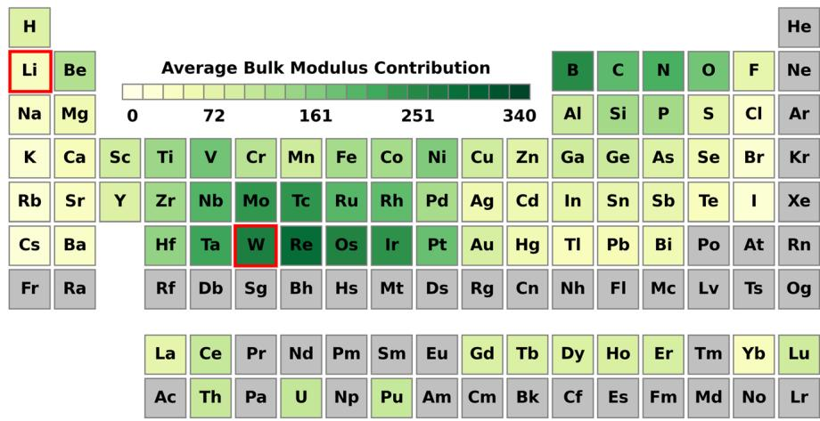

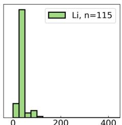

<details>
<summary>bar</summary>

| Category | Value |
|---|---|
| Li, n=115 | 0 |
| Other | 200 |
| Other | 400 |
</details>

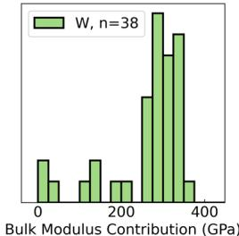

<details>
<summary>bar</summary>

| Bulk Modulus Contribution (GPa) | Frequency |
| ------------------------------- | --------- |
| 0                               | 1         |
| 100                             | 1         |
| 200                             | 1         |
| 300                             | 3         |
| 400                             | 2         |
</details>

Overall element contribution to property predictions. Average contribution of all elements to bulk modulus predictions, computed Fig. 4from the AFLOW bulk modulus dataset, (a) plotted on a periodic table and (b) plotted as a distribution showing the per-element contribution amounts of Li and W, respectively, in all the compounds. The darker colored elements in the periodic table contribute more towards a compound’s bulk modulus value.

CrabNet exhibits consistent predictive accuracy across the full range of materials properties tested. Furthermore, we show that the self-attention-based learning technique also provides alternative methods for visualizing model behavior. We demonstrate the use of attention and per-element contribution prediction capabilities for visualizing common trends in our trained models that match chemical expectations.

Given this application of self-attention in the context of materials science, we expect that there can be many informative and impactful follow-up works. Specifically, we believe these will largely fall into three thematic categories:

1. CrabNet directly contributing to the community’s focus towards improved property predictions.

CrabNet consistently generates good MAE scores. The performance achieved with the use of self-attention, combined with the innovative use of element and composition featurization techniques, will allow researchers to delve deeper into analyzing and predicting materials properties. As a result, we believe that CrabNet will be relevant in areas where other ML methods fall short (e.g., dopants, small data, and materials extrapolation tasks). We also note that with minimal changes to CrabNet, it can also perform classification tasks; we expect CrabNet to

similarly excel at this.

2. Attention-based models allow for new ways of thinking about materials-specific problems.

In this work, we briefly examined the attention mechanism. Attention highlights important interactions and may be used to understand which element interactions mediate materials properties. Model explainability has thus far been elusive to the traditional MI paradigms; the inclusion of selfattention in this work has introduced additional methods of model inspectability that may be a step towards this goal.

3. Augmentation of CrabNet using structural and domainspecific knowledge.

This work intentionally used a compositionally restricted EDM representation with no structural information. Structureagnostic learning is an important task in MI and CrabNet demonstrates that accurate learning is achievable using the self-attention mechanism. However, the prediction of materials properties using structural information is also an important task. Integration of structural information could be achieved by describing elements in their structural and chemical environments. We expect that the self-attention mechanism of CrabNet will be able to utilize this additional information to

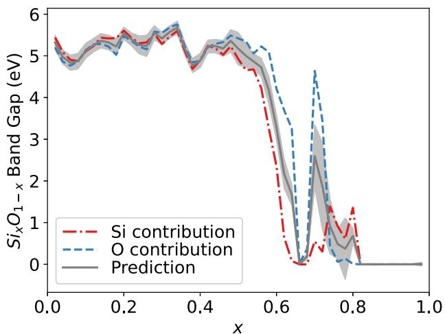

<details>
<summary>line</summary>

| x    | Si contribution | O contribution | Prediction |
|------|-----------------|----------------|----------|
| 0.0  | 5.2             | 5.1            | 5.3      |
| 0.2  | 5.4             | 5.3            | 5.5      |
| 0.4  | 5.1             | 5.0            | 5.2      |
| 0.6  | 4.8             | 4.7            | 4.9      |
| 0.8  | 0.5             | 0.4            | 0.6      |
| 1.0  | 0.0             | 0.0            | 0.0      |
</details>

Element contribution to property prediction as a function Fig. 5of composition. Model predictions over the ${ \sf S i } _ { x } { \sf O } _ { 1 - x }$ system using a model trained on the aflow\_\_Egap data. The x-axis is the fractional amount of Si. The y-axis shows the predicted band gap value at a given composition. The blue and red lines are the individual element contributions to the prediction, as predicted by CrabNet. The gray shading represents the aleatoric uncertainty for each prediction.

make more accurate predictions. This application of attentionbased learning to crystal systems is an exciting and promising direction. We also expect that materials prediction tasks involving processing steps or other non-compositional features could be used in this approach. Both of these changes could easily be implemented as extensions to the EDM.

While further research is necessary to fully discern the utility of self-attention in materials problems, we believe that this paper highlights a major new direction in its application in MI and suggests exciting directions for future research.

# METHODS

# Self-attention and the CrabNet architecture

Chemical compositions are input using the atomic numbers and fractional amounts of their constituent elements. The atomic numbers are used to retrieve element representations (either mat2vec or one-hot). The fractional amounts are used to obtain fractional embeddings (described below). An element embedding matrix is generated by applying a fully connected network to the element representations. A fractional embedding matrix is created from the fractional embeddings. These matrices are then added together (element-wise) to generate the element-derived matrix (EDM, see Fig. 6). Each row of the EDM (j-index) represents an element and the columns (k-index) contain the element embeddings. We batch each unique chemical composition onto a third dimension (the iindex). The resulting three-dimensional tensor contains the input data for the CrabNet architecture.

We use the mat2vec element embeddings60 as the default source of chemical information for each element, even though there are other choices for element properties available, such as Jarvi $\mathsf { s } ^ { 2 2 } , \mathsf { M a g p i e } ^ { 6 1 } ,$ , Oliynyk18 or a simple one-hot encoding. The mat2vec embedding has the advantage of being pre-scaled and normalized, and having no missing elements nor element features. Regardless of the choice of element representation, the representation must be reshaped to fit the attention input dimensions of $( d _ { \mathrm { m o d e l } } ) .$ . This is done using a learned embedding network; the result is a matrix of size (nelements, $d _ { \mathrm { m o d e l } } ) .$ In addition to the default training of CrabNet using the mat2vec embedding, a one-hot embedding of the elements was used to train an additional CrabNet model (HotCrab) to better facilitate comparison with ElemNet.

The stoichiometric information for each element in the EDM is represented by two fractional embeddings. The fractional embeddings are inspired by the positional encoder as described in the seminal work by Vaswani et $\mathsf { a l . } ^ { 3 7 }$ . We use sine and cosine functions of various periods to project the fractional amounts into a high-dimensional space (dimension $d = d _ { \mathrm { { m o d e l } } } / 2 )$ where smooth interpolation between fractional values is preserved. The first part of the fractional embedding represents the stoichiometry, using the normalized fractional amounts, on a linear scale with a fractional resolution of 0.01. The second part of the embedding maps stoichiometry using a log scale and spans from $\times 1 0 ^ { - 6 } \mathrm { t o } \ 1 \times 1 0 ^ { - 7 }$ . This logarithmic transformation of the fractional embedding preserves small fractional amounts such as those present in doping. The two parts of the fractional embedding for all elements are concatenated across the embedding dimension to obtain a matrix of size $( n _ { \mathrm { e l e m e n t s } } , d _ { \mathrm { m o d e l } } ) .$ . See Supplementary Figs. 1 and 2 for example visualizations of the EDM embedding.

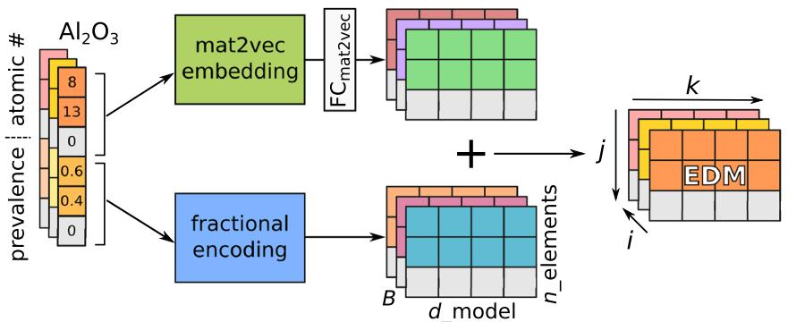

<details>
<summary>flowchart</summary>

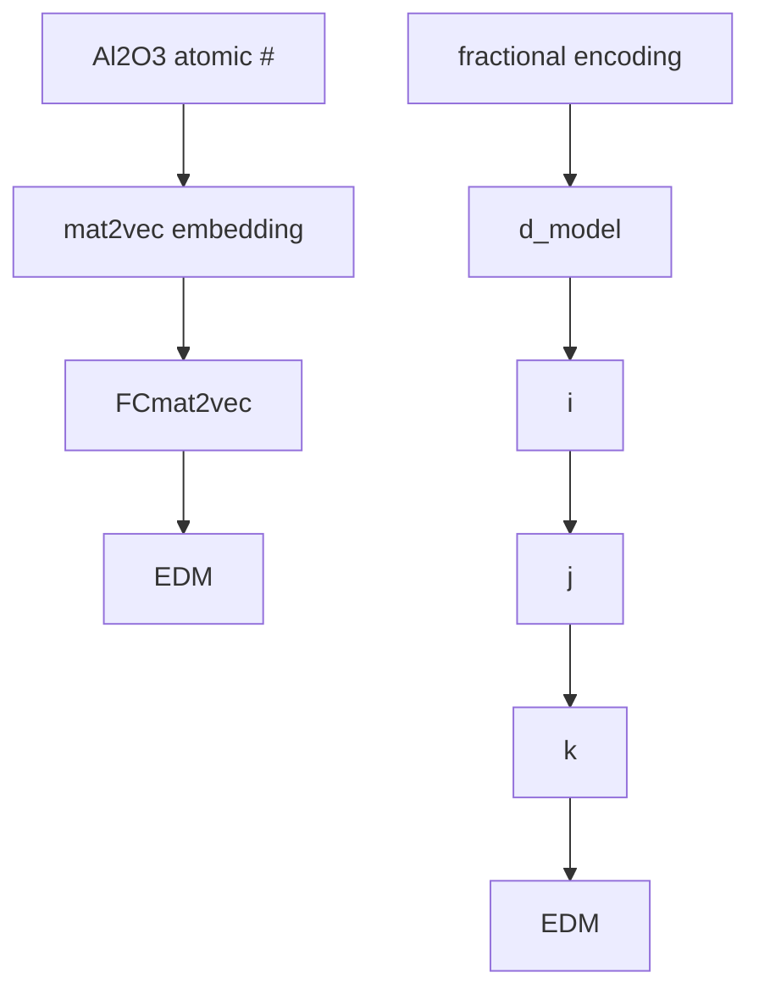
</details>

EDM featurization scheme. Schematic illustration of the element-derived matrix (EDM) representation for $\mathsf { A l } _ { 2 } \mathsf { O } _ { 3 } ,$ where B represents the Fig. 6batch, $d _ { \mathrm { { m o d e l } } }$ is the element features, and nelements represents the number of elements. Composition slices, when concatenated across batch dimension i, form an EDM tensor which is then used as the model input to CrabNet. When a chemical formula has fewer elements than rows in the EDM, the extra data rows are filled with zeros.

List of default model parameters of CrabNet. 

<table><tr><td>Parameter</td><td>Description</td><td>Default value</td></tr><tr><td> $d_{in}$ </td><td>(Input) dimension of element embedding</td><td>200 (mat2vec); 118 (one-hot)</td></tr><tr><td> $d_{model}$ </td><td>Dimension for EDM and positional encoder</td><td>512</td></tr><tr><td> $d_{ff}$ </td><td>Feedforward dimension for self-attention mechanism</td><td>2048</td></tr><tr><td> $d_k$ </td><td>Key dimension (equal to  $d_q$  in this work)</td><td> $d_{model}/H = 128$ </td></tr><tr><td>H</td><td>Number of attention heads per attention block</td><td>4</td></tr><tr><td>N</td><td>Number of stacked self-attention layers</td><td>3</td></tr><tr><td> $node_{res}$ </td><td>Number of nodes at each layer for residual network</td><td>[1024, 512, 256, 128]</td></tr><tr><td> $d_{out}$ </td><td>(Output) dimensions of residual network</td><td>3</td></tr></table>

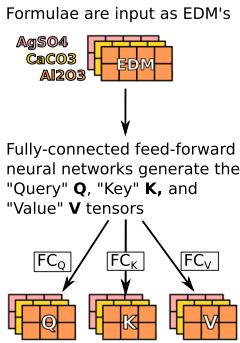

<details>
<summary>flowchart</summary>

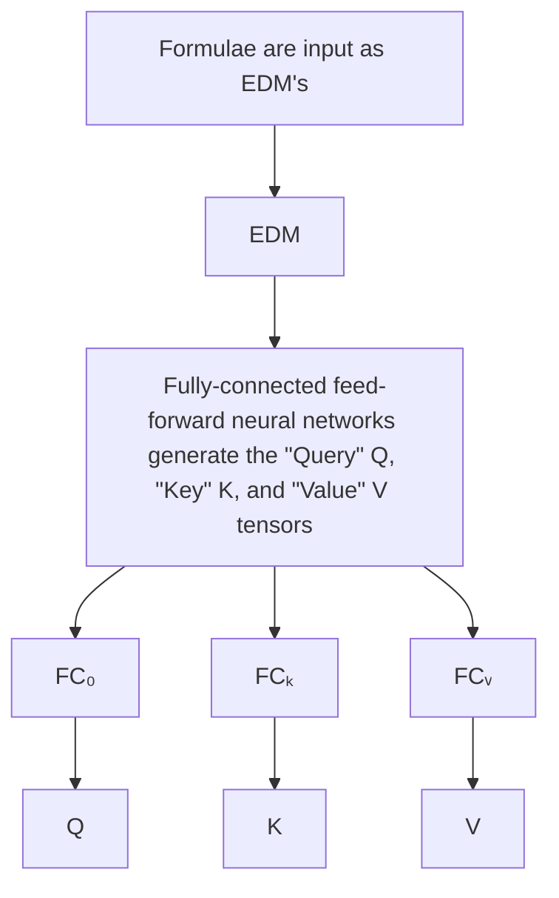
</details>

b)

Q and K'are multiplied to determine total element interactions within the composition   
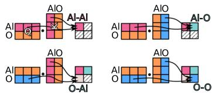

<details>
<summary>flowchart</summary>

```mermaid
graph TD
    subgraph Left_Bond
        A1["AlO"] --> B1["Al-Al"]
        A2["AlO"] --> B2["Al-O"]
        A3["AlO"] --> B3["Al-O"]
        A4["AlO"] --> B4["Al-O"]
        A5["AlO"] --> B5["Al-O"]
        A6["AlO"] --> B6["Al-O"]
        A7["AlO"] --> B7["Al-O"]
        A8["AlO"] --> B8["Al-O"]
        A9["AlO"] --> B9["Al-O"]
        A10["AlO"] --> B10["Al-O"]
        A11["AlO"] --> B11["Al-O"]
        A12["AlO"] --> B12["Al-O"]
        A13["AlO"] --> B13["Al-O"]
        A14["AlO"] --> B14["Al-O"]
        A15["AlO"] --> B15["Al-O"]
        A16["AlO"] --> B16["Al-O"]
        A17["AlO"] --> B17["Al-O"]
        A18["AlO"] --> B18["Al-O"]
        A19["AlO"] --> B19["Al-O"]
        A20["AlO"] --> B20["Al-O"]
        A21["AlO"] --> B21["Al-O"]
        A22["AlO"] --> B22["Al-O"]
        A23["AlO"] --> B23["Al-O"]
        A24["AlO"] --> B24["Al-O"]
        A25["AlO"] --> B25["Al-O"]
        A26["AlO"] --> B26["Al-O"]
        A27["AlO"] --> B27["Al-O"]
        A28["AlO"] --> B28["Al-O"]
        A29["AlO"] --> B29["Al-O"]
        A30["AlO"] --> B30["Al-O"]
        A31["AlO"] --> B31["Al-O"]
        A32["AlO"] --> B32["Al-O"]
        A33["AlO"] --> B33["Al-O"]
        A34["AlO"] --> B34["Al-O"]
        A35["AlO"] --> B35["Al-O"]
        A36["AlO"] --> B36["Al-O"]
        A37["AlO"] --> B37["Al-O"]
        A38["AlO"] --> B38["Al-O"]
        A39["AlO"] --> B39["Al-O"]
        A40["AlO"] --> B40["Al-O"]
        A41["AlO"] --> B41["Al-O"]
        A42["AlO"] --> B42["Al-O"]
        A43["AlO"] --> B43["Al-O"]
        A44["AlO"] --> B44["Al-O"]
        A45["AlO"] --> B45["Al-O"]
        A46["AlO"] --> B46["Al-O"]
        A47["AlO"] --> B47["Al-O"]
        A48["AlO"] --> B48["Al-O"]
        A49["AlO"] --> B49["Al-O"]
        A50["AlO"] --> B50["Al-O"]
        A51["AlO"] --> B51["Al-O"]
        A52["AlO"] --> B52["Al-O"]
        A53["AlO"] --> B53["Al-O"]
        A54["AlO"] --> B54["Al-O"]
        A55["AlO"] --> B55["Al-O"]
        A56["AlO"] --> B56["Al-O"]
        A57["AlO"] --> B57["Al-O"]
        A58["AlO"] --> B58["Al-O"]
        A59["AlO"] --> B59["Al-O"]
        A60["AlO"] --> B60["Al-O"]
        A61["AlO"] --> B61["Al-O"]
        A62["AlO"] --> B62["Al-O"]
        A63["AlO"] --> B63["Al-O"]
        A64["AlO"] --> B64["Al-O"]
        A65["AlO"] --> B65["Al-O"]
        A66["AlO"] --> B66["Al-O"]
        A67["AlO"] --> B67["Al-O"]
        A68["AlO"] --> B68["Al-O"]
        A69["AlO"] --> B69["Al-O"]
        A70["AlO"] --> B70["Al-O"]
        A71["AlO"] --> B71["Al-O"]
        A72["AlO"] --> B72["Al-O"]
        A73["AlO"] --> B73["Al-O"]
        A74["AlO"] --> B74["Al-O"]
        A75["AlO"] --> B75["Al-O"]
        A76["AlO"] --> B76["Al-O"]
        A77["AlO"] --> B77["Al-O"]
        A78["AlO"] --> B78["Al-O"]
        A79["AlO"] --> B79["Al-O"]
        A80["AlO"] --> B80["Al-O"]
        A81["AlO"] --> B81["Al-O"]
        A82["AlO"] --> B82["Al-O"]
        A83["AlO"] --> B83["Al-O"]
        A84["AlO"] --> B84["Al-O"]
        A85["AlO"] --> B85["Al-O"]
        A86["AlO"] --> B86["Al-O"]
        A87["AlO"] --> B87["Al-O"]
        A88["AlO"] --> B88["Al-O"]
        A89["AlO"] --> B89["Al-O"]
        A90["AlO"] --> B90["Al-O"]
        A91["AlO"] --> B91["Al-O"]
        A92["AlO"] --> B92["Al-O"]
        A93["AlO"] --> B93["Al-O"]
        A94["AlO"] --> B94["Al-O"]
        A95["AlO"] --> B95["Al-O"]
        A96["AlO"] --> B96["Al-O"]
        A97["AlO"] --> B97["Al-O"]
        A98["AlO"] --> B98["Al-O"]
        A99["AlO"] --> B99["Al-O"]
```
</details>

The softmax of the interactions gives the selfattention.This is multiplied with V to create composition-dependent representations Z   
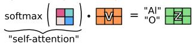  
Schematic of an attention block in the CrabNet archi-Fig. 7tecture. a The initial projection of the input EDM into the Q, K and V tensors. b The scaled dot-product attention operation obtaining the self-attention matrix and the updated Z element representation. The batch dimension is not shown in b to improve legibility.

Once the element and fractional embeddings are calculated and added together, we then batch the finished EDMs across the first dimension. This gives the final input data of shape $( n _ { \mathrm { c o m p o u n d s } } , n _ { \mathrm { e l e m e n t s } } , d _ { \mathrm { m o d e l } } )$ , where $n _ { \mathrm { c o m p o u n d s } }$ is the total number of compounds in a given batch, nelements is the number of rows in the EDM (inferred from the number of elements in the largest composition in a given dataset), and $d _ { \mathrm { m o d e l } }$ is the size of the embeddings. Here, we also note that the exact ordering of the element rows (j) in a compound in the EDM does not influence CrabNet due to the permutation-invariant nature of the self-attention mechanism.

CrabNet contains two primary modules with the default hyperparameters as shown in Table 2. The first module is a Transformer encoder with 3 layers and 4 attention heads in each layer. The second module is a residual network that converts element vectors into element contributions.

To understand the Transformer encoder, we first describe the selfattention mechanism. During self-attention (Fig. 7a), the EDM is operated on by three fully connected linear networks $( \mathsf { F C } _ { \mathsf { Q } } , \mathsf { F C } _ { \mathsf { K } } ,$ and $\mathsf { F C } _ { \mathsf { V } } )$ . These networks generate the query Q, key K, and value V tensors. These tensors can be conceptualized as a learned high-dimensional space where the model stores chemical behavior from the training data.

The K and Q tensors contain information regarding the magnitude to which elements interact. The V tensor stores the information that is used to map from element to property contribution. The dot product of each Q and $\pmb { \kappa } ^ { \dagger }$ tensor pair (where $\dot { \pmb { \kappa } } ^ { \top }$ denotes the transpose of K) generates the relative element importances in the system (Fig. 7b). The importances are scaled using a constant $\sqrt { d _ { \mathrm { k } } }$ and then normalized using a softmax function. This results in the self-attention tensor, commonly referred to as the attention map. We denote this tensor as A. The matrix multiplication of A with V updates the elementrepresentations in the compound based on the importance of each element.

Each of the four attention heads independently performs self-attention with their own $\begin{array} { r } { \mathbf { Q } _ { h } , \mathbf { K } _ { h } , \mathbf { V } _ { h } , } \end{array}$ , and $\mathbf { Z } _ { h }$ tensors, where h denotes the head index for $h = 1 , . . . , H .$ As a result, the network generates four different element representations at each layer. The individual $\mathbf { Z } _ { h }$ tensors are concatenated across the last dimension to make the Z tensor (as seen in Fig. 8a). The Z tensor is then passed into a linear FC network which combines the element representations from each head. The output of this FC network is an updated EDM0 (for each composition in the batch). This process of converting an EDM into an updated EDM0 is referred to as a self-attention block. CrabNet repeats the process of updating the EDM via the selfattention block three times (hence, three layers) resulting in the final updated representations, denoted EDM″. This concludes the Transformer encoder module.

Once the Transformer encoder has updated the element representations, each EDM″ passes through a fully connected residual network with hidden layer dimensions of noderes. The residual network then transforms the EDMs into the shape $( n _ { \mathrm { e l e m e n t s } } , n _ { \mathrm { e l e m e n t s } } , 3 ) .$ . We define these final three vectors as the element-proto-contributions $p ^ { \prime } ,$ element-uncertainties $u ^ { \prime } ,$ and element-logits (see Fig. 8a). The element scaling factor s is obtained by taking the sigmoid (σ) of the element-logits. The element-contributions are then obtained by multiplying the element-proto-contributions $p ^ { \prime }$ by their respective scaling factor s. This results in element contributions $y ^ { \prime } .$ . Finally, the mean of the element contributions is taken and output as the predicted property value for each compound (see Fig. 8b). Similarly, the mean of the element-uncertainties is used in the aleatoric uncertainty prediction as described by Roost9 .

# Training CrabNet

After the featurization of compositions into EDMs, the dataset loading and batching is performed with the built-in Datasets and DataLoaders classes from PyTorch. All target values are scaled to zero-centered mean and unit variance for training and inference. The target scaling is then undone for performance evaluation. Batch size during training is dynamically calculated using the training set size for faster training, and limited to be within the range $2 ^ { 7 } - 2 ^ { 1 2 }$ . For inference, the batch size was fixed at $2 ^ { 7 }$ .

Model weights are updated using the look-ahead62 and Lamb optimizer63 with a learning rate that is cycled between $1 \times 1 0 ^ { - 4 }$ and $6 \times$ $1 \dot { 0 } ^ { - 3 }$ every 4 epochs to achieve consistent model convergence. A robust MAE is used as the loss criterion for model performance9 . The default parameters generalize well when predicting most of the benchmark materials properties. Although we expect that optimization of hyperparameters may improve CrabNet’s results for individual materials properties, we believe it is more important that materials scientists be able to use CrabNet with little or no adjustments to the underlying code.

It is a known phenomenon that random weight initialization can impact the performance of the Transformer encoder architecture. Thus, to mitigate variance in the performance metrics between different model runs, we trained CrabNet using a fixed random seed of 42 for all training runs across all materials properties. We do note that in the case of random model initialization, the run-to-run variation between different trained models is a feature that could be taken advantage of for determining the epistemic uncertainty. Unfortunately, due to the sheer volume of materials properties investigated in this work and the limited compute resources available, we have not investigated this thus far.

Finally, we note that all model training, evaluation, and benchmarking (for CrabNet, Roost, ElemNet, and RF) was conducted on a single workstation PC equipped with an Intel i9-9900K CPU, 32 GB of DDR4 RAM, and two NVIDIA RTX 2080 Ti GPUs with 11 GB VRAM per GPU. The deep learning models were trained on the GPU, while the RF models were trained on the CPU.

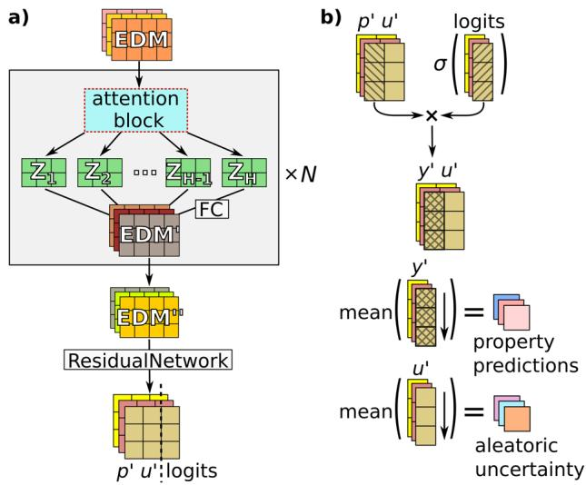

<details>
<summary>flowchart</summary>

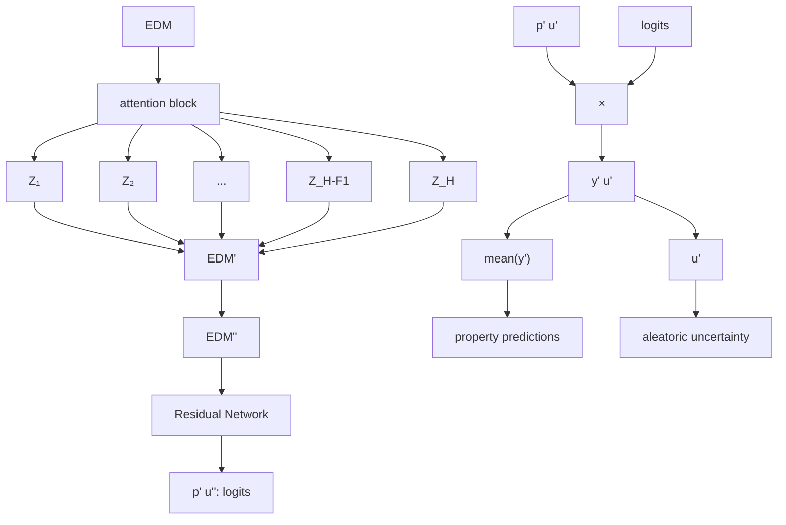
</details>

Overall CrabNet architecture and prediction of material Fig. 8property and uncertainty. a Schematic of the CrabNet architecture including the input EDM, the self-attention layers (repeated N times), the updated and final element representations (EDM0 and EDM″), the residual network, and the final model output. b The calculation steps for element contributions and prediction of the targets and uncertainties. The $p ^ { \prime }$ and u0 vectors represent the element-proto-contributions and the element uncertainties, respectively. y0 represent the element contributions. The material property is obtained by taking the mean of element-contributions (y0 ) for each compound. Similarly, the mean of the element-uncertainties (u0 ) gives us the estimated aleatoric uncertainty.

# Reference models

Predictions for all materials properties were generated using code from the Roost repository9 . Minor adaptations were made to the code to allow for automated training and benchmarking. Overall, Roost generates consistently impressive results. Roost relies on a soft-attention mechanism used over a graph representation of the compound. This is in the same spirit of CrabNet, and both seek to generate vector representations for the elements in the system without using structure information. The residual network and robust loss function from Roost were helpfully adopted into our architecture9 .

Predictions from ElemNet were generated using default parameters using code from the repository5 . Custom scripts were written to train and evaluate ElemNet over all materials properties data. ElemNet consistently under-performed compared to Roost and CrabNet. ElemNet failed to converge for multiple properties resulting in NaN (not a number) values in the model outputs. Examples of this occurring can be seen in the phonons and steels\_yield datasets. Here, we would like to note that IRNet6 could also be benchmarked and compared in this study. However, due to the prohibitively large computational requirements, we chose not to train and evaluate IRNet. We do however note that the OQMD performance reported in the IRNet publication6 is consistently lower than both Roost and CrabNet for the same properties. These following values show the reported performance of IRNet vs. HotCrab, respectively, for formation enthalpy (0.048 eV vs. 0.031 eV), band gap (0.047 eV vs. 0.048 eV), energy per atom (0.070 eV vs. 0.033 eV), and volume per atom (0.394 $\mathrm { \AA } ^ { 3 }$ vs. 0.277 Å3 ).

We generate baseline RF metrics using a random forest regression with the Magpie CBFV as defined by Matminer36. This is done using the scikit-learn Python package. The RF models were trained with nestimators = 500 and default parameters.

# DATA AVAILABILITY

Data is provided in its cleaned and pre-split form to ensure reproducible results, and with the hope that other researchers find it useful when benchmarking their own approaches. The processed data that is used in this study can be found on the GitHub repository59 at the address https://github.com/anthony-wang/CrabNet. All raw data as well as scripts to process and split the datasets can be found in the GitHub repository58 at the address https://github.com/kaaiian/mse\_datasets.

# CODE AVAILABILITY

We provide detailed instructions for the installation, training, and general usage of the open-source CrabNet on GitHub59. In addition, pre-trained network weights for the CrabNet models reported in this work are available for download64. The following files are available with this publication: (1) GitHub repository with the CrabNet source code, figures, and example property predictions: https://github. com/anthony-wang/CrabNet, (2) pre-trained weights for the CrabNet models reported in this work: https://doi.org/10.5281/zenodo.4633866, and (3) Supplementary Information. Finally, we recommend that interested readers consult the paper “Machine Learning for Materials Scientists: An Introductory Guide towards Best Practices” 4 for a detailed treatment of best practices in machine learning and justification for many of the unmentioned experimental design decisions used in this work.

Received: 22 February 2020; Accepted: 26 April 2021; Published online: 28 May 2021

# REFERENCES

1. Maier, W. F., Stöwe, K. & Sieg, S. Combinatorial and high-throughput materials science. Angewandte Chemie (International ed. in English) 46, 6016–6067 (2007).   
2. Agrawal, A. & Choudhary, A. Perspective: materials informatics and big data: realization of the "fourth paradigm” of science in materials science. APL Mater. 4, 053208 (2016).   
3. Barnard, A. S. Best practice leads to the best materials informatics. Matter 3, 22–23 (2020).   
4. Wang, A. Y.-T. et al. Machine learning for materials scientists: an introductory guide toward best practices. Chem. Mater. 32, 4954–4965 (2020).   
5. Jha, D. et al. ElemNet: deep learning the chemistry of materials from only elemental composition. Sci. Rep. 8, 17593 (2018).   
6. Jha, D. et al. IRNet: a general purpose deep residual regression framework for materials discovery. In Proc. 25th ACM SIGKDD International Conference on Knowledge Discovery & Data Mining – KDD ’19, 2385-2393 (eds. Teredesai, A. et al.) (ACM Press, 2019).   
7. Xie, T. & Grossman, J. C. Crystal graph convolutional neural networks for an accurate and interpretable prediction of material properties. Phys. Rev. Lett. 120, 145301 (2018).   
8. Schütt, K. T., Sauceda, H. E., Kindermans, P.-J., Tkatchenko, A. & Müller, K.-R. SchNet – A deep learning architecture for molecules and materials. J. Chem. Phys. 148, 241722 (2018).   
9. Goodall, R. E. A. & Lee, A. A. Predicting materials properties without crystal structure: deep representation learning from stoichiometry. Nat. Commun. 11, 6280 (2020).   
10. Ziletti, A., Kumar, D., Scheffler, M. & Ghiringhelli, L. M. Insightful classification of crystal structures using deep learning. Nat. Commun. 9, 2775 (2018).   
11. Faber, F. A., Lindmaa, A., von Lilienfeld, O. A. & Armiento, R. Crystal structure representations for machine learning models of formation energies. Int. J. Quantum Chem. 115, 1094–1101 (2015).   
12. Faber, F. A., Lindmaa, A., von Lilienfeld, O. A. & Armiento, R. Machine learning energies of 2 million elpasolite (ABC2D6) crystals. Phys. Rev. Lett. 117, 135502 (2016).   
13. Kong, C. S. et al. Information-theoretic approach for the discovery of design rules for crystal chemistry. J. Chem. Inform. Model. 52, 1812–1820 (2012).   
14. Fischer, C. C., Tibbetts, K. J., Morgan, D. & Ceder, G. Predicting crystal structure by merging data mining with quantum mechanics. Nat. Mat. 5, 641–646 (2006).   
15. Curtarolo, S., Morgan, D., Persson, K. A., Rodgers, J. & Ceder, G. Predicting crystal structures with data mining of quantum calculations. Phys. Rev. Lett. 91, 135503 (2003).   
16. Zhuo, Y., Mansouri Tehrani, A. & Brgoch, J. Predicting the band gaps of inorganic solids by machine learning. J. Phys. Chem. Lett. 9, 1668–1673 (2018).   
17. Kauwe, S. K., Graser, J., Vazquez, A. & Sparks, T. D. Machine learning prediction of heat capacity for solid inorganics. Integr. Mater. Manuf. Innov. 7, 43–51 (2018).

18. Oliynyk, A. O. et al. High-throughput machine-learning-driven synthesis of fullheusler compounds. Chem. Mater. 28, 7324–7331 (2016).   
19. Hautier, G., Fischer, C. C., Jain, A., Mueller, T. & Ceder, G. Finding nature’s missing ternary oxide compounds using machine learning and density functional theory. Chem. Mater. 22, 3762–3767 (2010).   
20. Mansouri Tehrani, A. et al. Machine learning directed search for ultraincompressible, superhard materials. J. Am. Chem. Soc. 140, 9844–9853 (2018).   
21. Graser, J., Kauwe, S. K. & Sparks, T. D. Machine learning and energy minimization approaches for crystal structure predictions: a review and new horizons. Chem. Mater. 30, 3601–3612 (2018).   
22. Choudhary, K., DeCost, B. & Tavazza, F. Machine learning with force-field-inspired descriptors for materials: fast screening and mapping energy landscape. Phys. Rev. Mater. 2, 083801 (2018).   
23. Kauwe, S. K., Graser, J., Murdock, R. J. & Sparks, T. D. Can machine learning find extraordinary materials? Comput. Mater. Sci. 174, 109498 (2020).   
24. Gaultois, M. W. et al. Perspective: web-based machine learning models for realtime screening of thermoelectric materials properties. APL Mater. 4, 053213 (2016).   
25. de Jong, M. et al. A statistical learning framework for materials science: application to elastic moduli of k-nary inorganic polycrystalline compounds. Sci. Rep. 6, 34256 (2016).   
26. Glaudell, A. M., Cochran, J. E., Patel, S. N. & Chabinyc, M. L. Impact of the doping method on conductivity and thermopower in semiconducting polythiophenes. Adv. Energy Mater. 5, 1401072 (2015).   
27. Zhang, S. B. The microscopic origin of the doping limits in semiconductors and wide-gap materials and recent developments in overcoming these limits: a review. J. Phys.: Condensed Matter 14, R881–R903 (2002).   
28. Sheng, L., Wang, L., Xi, T., Zheng, Y. & Ye, H. Microstructure, precipitates and compressive properties of various holmium doped NiAl/Cr(Mo,Hf) eutectic alloys. Mater. Design 32, 4810–4817 (2011).   
29. Mansouri Tehrani, A. et al. Atomic substitution to balance hardness, ductility, and sustainability in molybdenum tungsten borocarbide. Chem. Mater. 31, 7696–7703 (2019).   
30. Mihailovich, R. E. & Parpia, J. M. Low temperature mechanical properties of borondoped silicon. Phys. Rev. Lett. 68, 3052–3055 (1992).   
31. Qu, Z., Sparks, T. D., Pan, W. & Clarke, D. R. Thermal conductivity of the gadolinium calcium silicate apatites: effect of different point defect types. Acta Materialia 59, 3841–3850 (2011).   
32. Sparks, T. D., Fuierer, P. A. & Clarke, D. R. Anisotropic thermal diffusivity and conductivity of La-doped strontium niobate Sr2Nb2O7. J. Am. Ceramic Soc. 93, 1136–1141 (2010).   
33. Grimvall, G. Thermophysical Properties of Materials 1st edn. (North Holland, Amsterdam, 1999).   
34. Gaumé, R., Viana, B., Vivien, D., Roger, J.-P. & Fournier, D. A simple model for the prediction of thermal conductivity in pure and doped insulating crystals. Appl. Phys. Lett. 83, 1355–1357 (2003).   
35. Murdock, R. J., Kauwe, S. K., Wang, A. Y.-T. & Sparks, T. D. Is domain knowledge necessary for machine learning materials properties? Integr. Mater. Manuf. Innov. 9, 221–227 (2020).   
36. Dunn, A., Wang, Q., Ganose, A., Dopp, D. & Jain, A. Benchmarking materials property prediction methods: the Matbench test set and Automatminer reference algorithm. npj Comput. Mater. 6, 138 (2020).   
37. Vaswani, A. et al. in Advances in Neural Information Processing Systems (eds. Guyon, I. et al.) (Curran Associates Inc., 2017).   
38. Tang, G., Müller, M., Rios, A. & Sennrich, R. Why self-attention? A targeted evaluation of neural machine translation architectures. In Proc. 2018 Conference on Empirical Methods in Natural Language Processing (eds. Riloff, E. et al.) 4263–4272 (Association for Computational Linguistics, 2018).   
39. Al-Rfou, R., Choe, D., Constant, N., Guo, M. & Jones, L. Character-level language modeling with deeper self-attention. Proc. AAAI Conf. Artificial Intelligence 33, 3159–3166 (2019).   
40. Devlin, J., Chang, M.-W., Lee, K. & Toutanova, K. BERT: Pre-training of deep bidirectional transformers for language understanding. In Proc. 2019 Conference of the North American Chapter of the Association for Computational Linguistics (eds. Burstein, J., Doran, C. & Solorio, T.) 4171–4186 (Association for Computational Linguistics, 2019).   
41. Yu, A. W. et al. QANet: Combining local convolution with global self-attention for reading comprehension. In Proc. International Conference on Learning Representations (ICLR) (2018).   
42. Yang, Z. et al. XLNet: Generalized autoregressive pretraining for language understanding. In Advances in Neural Information Processing Systems (eds. Wallach, H. M. et al.) (Curran Associates Inc., 2019).   
43. Huang, C.-Z. A. et al. Music transformer. In Proc. International Conference on Learning Representations (ICLR) (2019).

44. Zhang, H., Goodfellow, I., Metaxas, D. & Odena, A. Self-attention generative adversarial networks. In Proc. 36th International Conference on Machine Learning (ICML) (eds. Chaudhuri, K. & Salakhutdinov, R.) 7354–7363 (PMLR, 2019).   
45. Dai, T., Cai, J., Zhang, Y., Xia, S.-T. & Zhang, L. Second-order attention network for single image super-resolution. In 2019 IEEE/CVF Conference on Computer Vision and Pattern Recognition (CVPR) (eds. CVPR Editors) 11057–11066 (IEEE, 2019).   
46. Zhang, Y. et al. Image super-resolution using very deep residual channel attention networks. In Computer Vision – ECCV 2018 (eds. Ferrari, V. et al.) vol. 11211, 294–310 (Springer International Publishing, 2018).   
47. Zhang, Y., Li, K., Li, K., Zhong, B. & Fu, Y. Residual non-local attention networks for image restoration. In Proc. International Conference on Learning Representations (ICLR) (2019).   
48. Kim, T. H., Sajjadi, M. S. M., Hirsch, M. & Schölkopf, B. Spatio-temporal transformer network for video restoration. In Computer Vision – ECCV 2018 (eds. Ferrari, V. et al.) vol. 11207, 111–127 (Springer International Publishing, 2018).   
49. Wang, X., Chan, K. C. K., Yu, K., Dong, C. & Loy, C. C. EDVR: video restoration with enhanced deformable convolutional networks. In Proc. IEEE/CVF Conference on Computer Vision and Pattern Recognition (CVPR) Workshops, 1954–1963 (IEEE, 2019).   
50. Vinyals, O. et al. Grandmaster level in StarCraft II using multi-agent reinforcement learning. Nature 575, 350–354 (2019).   
51. Baker, B. et al. Emergent tool use from multi-agent autocurricula. In Proc. International Conference on Learning Representations (ICLR) (2020).   
52. Zheng, S., Yan, X., Yang, Y. & Xu, J. Identifying structure-property relationships through SMILES syntax analysis with self-attention mechanism. J. Chem. Inform. Model. 59, 914–923 (2019).   
53. Schwaller, P. et al. Molecular transformer: a model for uncertainty-calibrated chemical reaction prediction. ACS Central Sci. 5, 1572–1583 (2019).   
54. Clement, C. L., Kauwe, S. K. & Sparks, T. D. Benchmark AFLOW data sets for machine learning. Integr. Mater. Manuf. Innov. 9, 153–156 (2020).   
55. Bartel, C. J. et al. A critical examination of compound stability predictions from machine-learned formation energies. npj Comput. Mater. 6, 97 (2020).   
56. Kirklin, S. et al. The Open Quantum Materials Database (OQMD): assessing the accuracy of DFT formation energies. npj Comput. Mater. 1, 15010 (2015).   
57. Ward, L. et al. Matminer: an open source toolkit for materials data mining. Comput. Mater. Sci. 152, 60–69 (2018).   
58. Kauwe, S. K. Online GitHub repository for mse\_datasets. https://github.com/ kaaiian/mse\_datasets (2020).   
59. Wang, A. Y.-T. & Kauwe, S. K. Online GitHub repository for the paper "Compositionally-Restricted Attention-Based Network for Materials Property Prediction”. https://github.com/anthony-wang/CrabNet (2020).   
60. Tshitoyan, V. et al. Unsupervised word embeddings capture latent knowledge from materials science literature. Nature 571, 95–98 (2019).   
61. Ward, L., Agrawal, A., Choudhary, A. & Wolverton, C. A general-purpose machine learning framework for predicting properties of inorganic materials. npj Comput. Mater. 2, 16028 (2016).   
62. Zhang, M. R., Lucas, J., Hinton, G. & Ba, J. in Advances in Neural Information Processing Systems (eds. Wallach, H. M. et al.) (Curran Associates Inc., 2019).   
63. You, Y. et al. Large batch optimization for deep learning: training BERT in 76 minutes. In Proc. International Conference on Learning Representations (ICLR) (2020).   
64. Wang, A. Y.-T., Kauwe, S. K., Murdock, R. J. & Sparks, T. D. Trained network weights for the paper "Compositionally-Restricted Attention-Based Network (CrabNet)”. https://doi.org/10.5281/zenodo.4633866 (2021).   
65. Castelli, I. E. et al. Computational screening of perovskite metal oxides for optimal solar light capture. Energy Environ. Sci. 5, 5814–5819 (2012).   
66. Jain, A. et al. Commentary: The Materials Project: a materials genome approach to accelerating materials innovation. APL Mater. 1, 011002 (2013).   
67. Ong, S. P. et al. The Materials Application Programming Interface (API): a simple, flexible and efficient API for materials data based on REpresentational State Transfer (REST) principles. Comput. Mater. Sci. 97, 209–215 (2015).   
68. Petousis, I. et al. High-throughput screening of inorganic compounds for the discovery of novel dielectric and optical materials. Sci. Data 4, 160134 (2017).   
69. de Jong, M. et al. Charting the complete elastic properties of inorganic crystalline compounds. Sci. Data 2, 150009 (2015).   
70. National Institute of Standards and Technology (NIST). NIST JARVIS-DFT Database. https://www.nist.gov/programs-projects/jarvis-dft (2017).   
71. Petretto, G. et al. High-throughput density-functional perturbation theory phonons for inorganic materials. Sci. Data 5, 180065 (2018).   
72. Conduit, G. & Bajaj, S. Mechanical properties of some steels: ID: 153092 - Version 3 https://citrination.com/datasets/153092/ (2017).

# ACKNOWLEDGEMENTS

The authors gratefully acknowledge support from the NSF CAREER Award DMR 1651668. The authors also thank the Berlin International Graduate School in Model and Simulation-based Research as well as the German Academic Exchange Service (program number 57438025) for their financial support. Special thanks are given to Dr. Aleksander Gurlo and Dr. Mathias Czasny for advising and supporting Anthony Yu-Tung Wang and for encouraging his collaborative stay at the University of Utah. The authors thank the creators of AFLOW and Materials Project for the creation of the databases and for making the material properties available for this study. In addition, the authors express their gratitude to the open-source software community, for developing the excellent tools used in this research, including but not limited to Python, Pandas, NumPy, matplotlib, scikit-learn, and PyTorch. Last but not least, the authors thank OpenAI, the researchers at Hugging Face, and Adam King for their contribution to TalkToTransformer.com. The underlying Transformerpowered GPT-2 model was used to generate text for the closing lines of this publication.

# AUTHOR CONTRIBUTIONS

A.Y.T.W. and S.K.K. jointly and in equal amounts conceived, developed the concept, and implemented the algorithms, code and visualizations described in this work. A.Y.T.W. and S.K.K. jointly analyzed the results. R.J.M. assisted with developing the architecture and provided insight and guidance during model optimization and training. All authors discussed the results and contributed to the writing of the manuscript.

# COMPETING INTERESTS

The authors declare no competing interests.

# ADDITIONAL INFORMATION

Supplementary information The online version contains supplementary material available at https://doi.org/10.1038/s41524-021-00545-1.

Correspondence and requests for materials should be addressed to T.D.S.

Reprints and permission information is available at http://www.nature.com/ reprints

Publisher’s note Springer Nature remains neutral with regard to jurisdictional claims in published maps and institutional affiliations.


Open Access This article is licensed under a Creative Commons Attribution 4.0 International License, which permits use, sharing,

adaptation, distribution and reproduction in any medium or format, as long as you give appropriate credit to the original author(s) and the source, provide a link to the Creative Commons license, and indicate if changes were made. The images or other third party material in this article are included in the article’s Creative Commons license, unless indicated otherwise in a credit line to the material. If material is not included in the article’s Creative Commons license and your intended use is not permitted by statutory regulation or exceeds the permitted use, you will need to obtain permission directly from the copyright holder. To view a copy of this license, visit http://creativecommons. org/licenses/by/4.0/.

© The Author(s) 2021