# Accelerating materials property prediction via a hybrid Transformer Graph framework that leverages four body interactions

Check for updates

Mohammad Madani1,2, Valentina Lacivita3 , Yongwoo Shin 3 & Anna Tarakanova 1,4

Machine learning has advanced the rapid prediction of inorganic materials properties, yet data scarcity for specific properties and capturing thermodynamic stability remains challenging. We propose a framework utilizing a Graph Neural Network with composition-based and crystal structure-based architectures, combined with a transfer learning scheme. This approach accurately predicts energyrelated properties (e.g., total energy, energy above the convex hull, energy band gap) and data-scarce mechanical properties (e.g., bulk and shear modulus). Our model incorporates four-body interactions, capturing periodicity and structural characteristics. It outperforms state-of-the-art models in 8 materials property regression tasks. Also, this model predicts local atomic environments and global structural features better than several models. Transfer learning addresses mechanical property data scarcity, while separate architecture analysis allows application to materials lacking crystal structure information. Our framework’s interpretability aids in understanding elemental contributions, enhancing material design and discovery. Continuous advancements promise further performance improvements, driving efficient and accurate materials property prediction.

In recent years, significant advancements have been made in materials science research, thanks to the development of automated, high-throughput (HT) first-principles Density Functional Theory (DFT) calculations1,2 . These computational workflows have facilitated the creation of large opensource databases (DB) that store computed structures and physical properties of materials2–5 .

In general, publicly accessible DFT calculation-based DBs consist of multiple levels of data sets5 . First-level data sets (primary properties) are obtained directly from solving the reformulated Schrodinger equation and include optimized atomic structure, electronic structure (energy band gap; $\mathrm { E _ { g } ) , }$ total energy, and formation energy (Ef) 5,6 . Higher-level data sets (secondary properties) require additional calculations involving applied perturbations, such as structural distortion or electric fields, to investigate the material response, e.g., elastic moduli, piezoelectric tensor, dielectric properties, etc. However, due to computational resource limitations, secondary properties may not be readily calculated with DFT accuracy for a large number of materials4,7,8 . For instance, the Materials Project (MP)4 , one of the most comprehensive publicly available DBs for inorganic materials, currently contains approximately 146 K material entries, of which only about 4% have elastic tensors and 12% have piezoelectric tensors available8,9 . Notably, mechanical properties are lacking from publicly available databases. One example is the absence of elastic modulus data, essential in predicting how materials respond to external forces, enabling engineers to design structures with optimal strength, mechanical stability, and durability.

From the property prediction point of view, another crucial property, especially when exploring new materials, is thermodynamic stability. Computationally, the thermodynamic stability of a material can be assessed by calculating the energy above the convex hull $( \mathrm { E _ { H u l l } } )$ for the relevant chemical space10. EHull quantifies the energetic deviation of a particular material from a linear combination of ground-state phases with the same average composition11. This parameter provides insights into the material’s likelihood of undergoing phase transitions, reactions or decomposition, and is therefore extremely valuable for gauging its potential for applications, e.g., in energy storage or catalysis11,12. However, accurately predicting EHull is challenging because this property is defined by competitive interplay with other stable phases. In addition, from a data science point of view, $\operatorname { E } _ { \mathrm { H u l l } }$ is

1 School of Mechanical, Aerospace, and Manufacturing Engineering, University of Connecticut, Storrs, CT, USA. 2 Department of Computer Science & Engineering, University of Connecticut, Storrs, CT, USA. 3 Advanced Materials Lab, Samsung Semiconductor Inc, Cambridge, MA, USA. 4 Department of Biomedical Engineering, University of Connecticut, Storrs, CT, USA. e-mail: yongwoo.s@samsung.com; anna.tarakanova@uconn.edu

overrepresented as zero or near zero since the materials DBs4 exhibit experimentally and computationally reasonable structures. Indeed, 53% of materials in the MP DB have $\mathrm { E _ { H u l l } }$ equal to 0 eV/atom.

To address these challenges, modern machine learning (ML) techniques have been employed in the last decade by the materials science research community in order to boost materials discovery and design efforts8,12,13. For instance, ML-based predictive models have made significant strides in computational chemistry, enabling faster HT screening compared to classical physics models13,14. ML approaches in materials science typically employ statistical learning models, which can be categorized into two types based on the descriptors used. The first type utilizes physics- or chemistrybased materials descriptors, actively defined through human knowledge of their composition and structure15,16. These descriptors provide opportunities for physical insights and interpretation. However, relying solely on pre-established chemical and physical intuition may prevent the detection of unknown critical structure-property relationships8,14. The second type of ML models employ structure interpreting algorithms, such as graph neural networks (GNNs)17–19. GNN-based models, including CGCNN18, SchNet20, MEGNet17, and ALIGNN21, represent structures as graphs, with atoms as nodes and atomic bonds as edges. These models have the potential to uncover unknown patterns of structure-property relationships through an autonomous training process that starts from the material’s graph representation22. Multiple layers of graph convolutions in GNNs implicitly encode many-body interactions. ALIGNN, for example, updates atom representations (one-body), bond representations (two-body), and bending angle representations (three-body) during the convolution process using a line graph construction21. In other models, such as GemNet23 and ALIGNN-D24, four-body interactions are used. ALIGNN-D is a model to predict spectroscopic properties of Cu(II) complexes24. Efforts have also been made to enhance GNN performance by incorporating state attributes in MEGNet17, introducing attention mechanisms in GATGNN25, and predicting tensorial properties in ETGNN26. These advancements aim to improve the accuracy and versatility of GNN-based models in capturing and predicting the properties of crystalline materials. In latest works, equivariant neural networks (ENN) are emerging as powerful tools for predicting molecular properties and representing molecules accurately27. By preserving symmetry information inherent in molecular structures, ENNs ensure that predictions remain consistent under transformations such as translation, rotation, and reflection. ENNs enable the extraction of meaningful features from molecular data while maintaining invariance to irrelevant transformations, leading to more robust and interpretable predictions. GemNet23, Equiformer28, and Matformer29 are such examples to be used for material properties prediction with promising performances.

Although both types of ML models can successfully predict material properties, their performance is strongly dependent on the ML algorithm selection, the features, and the quality and extension of available training datasets7,30. GNN-based models have generally shown superior performance relative to descriptor-based methods, likely due to a more faithful representation of atomic structures22. However, their large number of trainable parameters requires a substantially larger amount of data samples in order to sufficiently reduce overfitting15. This can represent a severe problem for predictions of material properties for which only small data sets are available7 . A regularization technique commonly employed to reduce the large data requirement of neural networks is pairwise transfer learning (TL)7 . The “regularization” aspect comes into play because the pre-trained model has already learned useful features from a large dataset, and using this knowledge helps prevent overfitting on the new, smaller dataset. This technique involves using a model pre-trained on a data-rich source task, e.g., predicting materials formation energies (Ef), to initialize training on a downstream task with limited data available, e.g., predicting elastic properties31,32. However, pairwise TL has several limitations deriving from the tendency of a model to forget relevant information from the source task when adapting to the data-scarce task and subsequently overfitting33,34.

In addition to the data scarcity problem, the ability to capture global crystal structure and periodicity information is limited, being mainly based on space group symmetry elements and human intuition of the local bonding environment22. Examples of this include models explicitly encoding bending angles21, representations equivariant to rotations (orientations of bond vectors)35, and structure motifs36. Finally, the performance of available GNN models might be limited by the use of shallow graph convolution layers37. Thus, accurately predicting materials properties remains in some cases a challenging task.

To address the limitations outlined above, we propose here a new framework based on the transformer-graph architecture and transfer learning (Fig. 1). The framework consists of two parallel networks. The first network is a new deep GNN model whose input is a crystal structure. The GNN model is composed of 10 layers of edge-gated attention graph neural network (EGAT)38 updating up to four body interactions including atom type, bond lengths, bond angles, and dihedral angles (Crystal GNN: CrysGNN. Figure 1a). EGAT contains two levels of gated attention blocks to update edges in addition to nodes that have previously been introduced as GAT37,39. The main advantage of using EGAT is to update bond angles and distances by considering adjacent edges and nodes to ensure that the GNN model takes in all bond angles and distances simultaneously. The second network is based on the transformer and attention networks (TAN) inspired by CrabNet15 that receives compositional features and human-extracted physical properties (Composition TAN: CoTAN. Figure 1b). The whole model is trained in a single hybrid manner to consider the effect of compositional properties and structure-properties relations simultaneously (hybrid CrysGNN and CoTAN: CrysCo). As training data, we used computational data from the MP21 public database4 . Our novel framework consistently shows excellent performance for property prediction tasks with large amounts of primary properties data available, such as $\mathrm { E _ { f } , E _ { g } , }$ and EHull from computed phase diagrams. For secondary properties with scarce data available, such as mechanical properties, we used TL to leverage information from source tasks and pre-trained models without experiencing catastrophic loss of information or interference across source tasks. Our framework consistently outperforms pairwise TL on a suite of data-scarce property prediction tasks by considering formation energy as the parent model for training (Fig. 1c. CrysCo with TL; CrysCoT). Furthermore, the generality of our approach makes it compatible with any new source tasks, model architectures, or datasets that may be developed in the future.

A key innovation of our approach is the introduction of a new representation method utilizing three distinct graphs (G8, L(G8) and L(G8d) in Fig. 1a) based on interatomic distances and efficiently capturing essential interactions between atoms and bonds. Unlike previous methods, our approach explicitly includes four-body interactions and employs a messagepassing technique within a graph neural network architecture, allowing to account for even higher-dimensional interactions. Furthermore, our EGAT architecture incorporates attention blocks at both the edge and node levels, leveraging interatomic distances. Additionally, we propose a novel embedding approach, integrating compositional features and humanextracted properties from crystal structures to enhance prediction accuracy, which can also work stand-alone delivering very good performance. Moreover, we provide interpretability analyses offering insight into the model’s decision-making process. Overall, our study offers a comprehensive and innovative solution to crystal structure representation and material property prediction, with promising perspectives for various materials science applications.

# Results

# Model performance

In order to evaluate the performance of our hybrid model (CrysCo), for training and testing purposes we used DFT-calculated solid-state properties from the MP21 database4 . Since the MP database is continuously updated, we selected time-versioned datasets from an MP version utilized in previous works to ensure a direct comparison of the CrysCo model performance with the existing literature17,18,20,21,37. However, we should expect that, as the size of the available computational datasets continues to increase, the CrysCo performance can also be further improved. For this study, we have selected

a)   
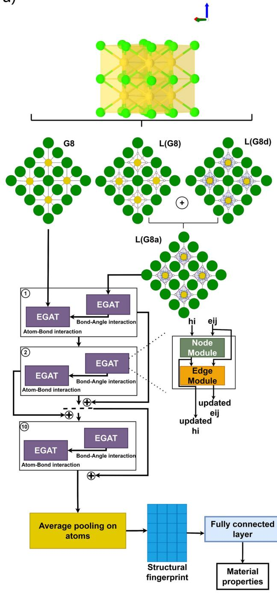

flowchart

```mermaid
graph TD
    A["Structure with G8, L(G8), L(G8d)"] --> B["L(G8a)"]
    B --> C["EGAT"]
    C --> D["Bond-Angle interaction"]
    D --> E["EGAT Atom-Bond interaction"]
    E --> F["+"]
    F --> G["EGAT Atom-Bond interaction"]
    G --> H["+"]
    H --> I["EGAT Atom-Bond interaction"]
    I --> J["+"]
    J --> K["Average pooling on atoms"]
    K --> L["Structural fingerprint"]
    L --> M["Fully connected layer"]
    M --> N["Material properties"]
    C --> O["Node Module"]
    O --> P["Edge Module"]
    P --> Q["updated hi"]
    Q --> R["+"]
    R --> S["EGAT Atom-Bond interaction"]
    S --> T["+"]
    T --> U["EGAT Atom-Bond interaction"]
    U --> V["+"]
    V --> W["EGAT Atom-Bond interaction"]
    W --> X["+"]
    X --> Y["EGAT Atom-Bond interaction"]
    Y --> Z["+"]
    Z --> AA["EGAT Atom-Bond interaction"]
    AA --> AB["+"]
    AB --> AC["EGAT Atom-Bond interaction"]
    AC --> AD["+"]
    AD --> AE["EGAT Atom-Bond interaction"]
    AE --> AF["+"]
    AF --> AG["EGAT Atom-Bond interaction"]
    AG --> AH["+"]
    AH --> AI["EGAT Atom-Bond interaction"]
    AI --> AJ["+"]
    AJ --> AK["EGAT Atom-Bond interaction"]
    AK --> AL["+"]
    AL --> AM["EGAT Atom-Bond interaction"]
    AM --> AN["+"]
    AN --> AO["EGAT Atom-Bond interaction"]
    AO --> AP["+"]
    AP --> AQ["EGAT Atom-Bond interaction"]
    AQ --> AR["+"]
    AR --> AS["EGAT Atom-Bond interaction"]
    AS --> AT["+"]
    AT --> AU["EGAT Atom-Bond interaction"]
    AU --> AV["+"]
    AV --> AW["EGAT Atom-Bond interaction"]
    AW --> AX["+"]
    AX --> AY["EGAT Atom-Bond interaction"]
    AY --> AZ["+"]
    AZ --> BA["EGAT Atom-Bond interaction"]
    BA --> BB["+"]
    BB --> BC["EGAT Atom-Bond interaction"]
    BC --> BD["+"]
    BD --> BE["EGAT Atom-Bond interaction"]
    BE --> BF["+"]
    BF --> BG["EGAT Atom-Bond interaction"]
    BG --> BH["+"]
    BH --> BI["EGAT Atom-Bond interaction"]
    BI --> BJ["+"]
    BJ --> BK["EGAT Atom-Bond interaction"]
    BK --> BL["+"]
    BL --> BM["EGAT Atom-Bond interaction"]
    BM --> BN["+"]
    BN --> BO["EGAT Atom-Bond interaction"]
    BO --> BP["+"]
    BP --> BQ["EGAT Atom-Bond interaction"]
    BQ --> BR["+"]
    BR --> BS["EGAT Atom-Bond interaction"]
    BS --> BT["+"]
    BT --> BU["EGAT Atom-Bond interaction"]
    BU --> BV["+"]
    BV --> BW["EGAT Atom-Bond interaction"]
    BW --> BX["+"]
    BX --> BY["EGAT Atom-Bond interaction"]
    BY --> BZ["+"]
    BZ --> CA["EGAT Atom-Bond interaction"]
    CA --> CB["+"]
    CB --> CC["EGAT Atom-Bond interaction"]
    CC --> CD["+"]
    CD --> CE["EGAT Atom-Bond interaction"]
    CE --> CF["+"]
    CF --> CG["EGAT Atom-Bond interaction"]
    CG --> CH["+"]
    CH --> CI["EGAT Atom-Bond interaction"]
    CI --> CJ["+"]
    CJ --> CK["EGAT Atom-Bond interaction"]
```

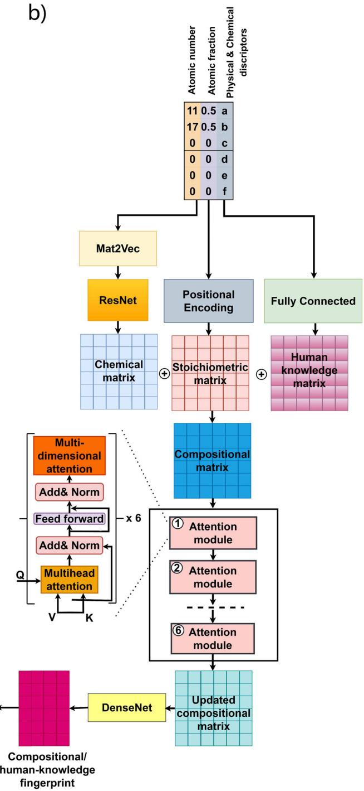

flowchart

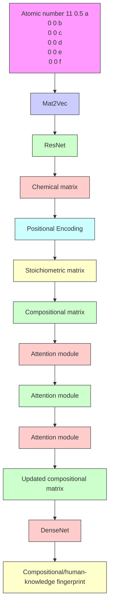

c   
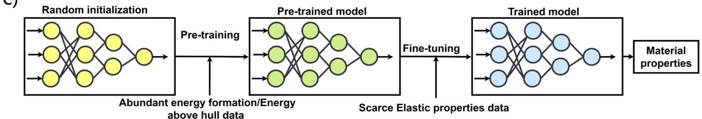

flowchart

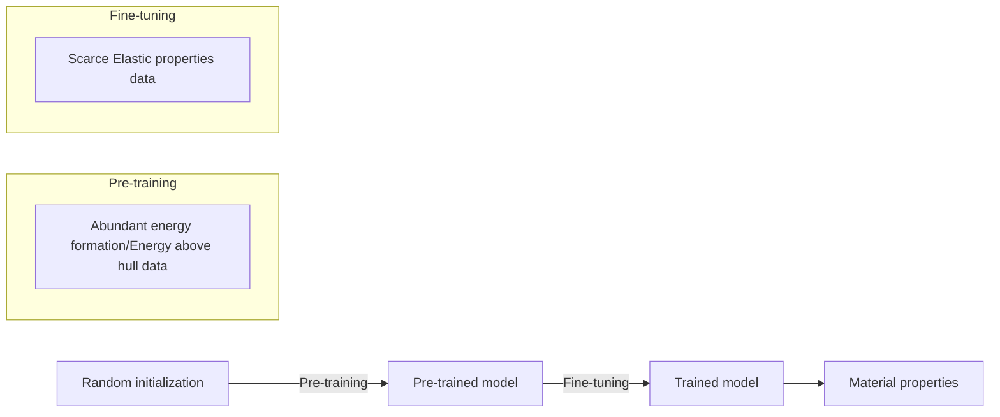

Fig. 1 | Model architecture for material properties prediction. a Structure-based model (CrysGNN) including 10 layers of EGAT to convert crystal structure to structural fingerprints. G8: initial graph in which nodes are atoms and edges are bonds, L(G8): line graph in which nodes are bonds and edges are bond angles, L(G8d): line graph in which nodes are bonds and edges are dihedral angles, L(G8a):   
angular graph built by combination of L(G8) and L(G8d). b Architecture based on converting composition and human-extracted physical properties to corresponding fingerprints (CoTAN). c Transfer-learning-based architecture (CrysCoT) used pretrained model to overcome data-scarce properties.

the MP 2021 version, which contains 133,785 material entries with calculated properties4 .

To benchmark CrysCo’s performance, we used 8 properties datasets (Table 1) that include material compositions, crystal structures, and tabulated physical and chemical descriptors as inputs. All properties are further described in the Supplementary Information (SI). We trained the CrysGNN and CoTAN networks separately, in order to assess the predictive capabilities of these individual components as well. We utilized nested 5-fold cross-validation to generate results, which were then compared with previously published state-of-the-art models, such as structure-based ALIGNN21, MEGNet17, CGCNN18, SchNet20, Matformer29, and DeeperGATGNN37. The protocols for benchmarking the CrysCo and CrysGNN performance are the same as those introduced in MatBench40. Details on the CrysCo components and hyperparameters can be found in the supplementary Tables S1 and S2.

Table 2 compares the mean absolute error (MAE) of CrysCo and CrysGNN models predictions with the MEGNet17, CGCNN18, SchNet20, ALIGNN21, Matformer29, and DeeperGATGNN37 baselines for all 8 datasets. To facilitate unbiased comparisons across different properties we also report the associated mean standard deviation (MSD), which represents the performance of a random guessing model with an average value prediction for each data point40.

We observe that CrysCo significantly outperforms MEGNet17, CGCNN18, SchNet20, and DeeperGATGNN37 for most of the considered properties. In particular, for $\mathrm { E _ { f } }$ predictions CrysCo outperforms MEGNet, CGCNN, SchNet, and DeeperGATGNN by 7.7%, 22.5%, 23.1%, and 16.4%, respectively. Similarly, EHull predictions are improved by 12.2%, 22.8%, 23.1%, and 19.3% as compared to MEGNet, CGCNN, SchNet, and DeeperGATGNN37, respectively. Note that only CGCNN and MEGNet originally predicted $\mathrm { E _ { H u l l } } ,$ whereas the other models were not initially trained on the $\operatorname { E } _ { \operatorname { H u l l } }$ dataset from the MP database.

Table 1 | The eight datasets derived from the MP21 database and used in the present study 

<table><tr><td>Dataset name</td><td>Source</td><td>Material property</td><td># Crystal structures</td></tr><tr><td>Mp_eform (Ef)</td><td>MP21</td><td>Formation energy per atom (eV/atoms)</td><td>126,785</td></tr><tr><td>Mp_bgap (Eg)</td><td>MP21</td><td>Band gap (eV)</td><td>126,728</td></tr><tr><td>Phonons</td><td>MP21</td><td>Phonon frequency (Hz)</td><td>1265</td></tr><tr><td>Dielectric</td><td>MP21</td><td>Refractive index</td><td>4674</td></tr><tr><td>Elasticity_log10(G)</td><td>MP21</td><td>log10 of shear modulus (log (GPa))</td><td>12,086</td></tr><tr><td>Elasticity_log10(K)</td><td>MP21</td><td>log10 of bulk modulus (log (GPa))</td><td>12,086</td></tr><tr><td>MP_ehull (EHull)</td><td>MP21</td><td>Energy above the convex hull (eV/atom)</td><td>126,785</td></tr><tr><td>Fe_energy</td><td>MP21</td><td>Fermi energy (eV)</td><td>26,078</td></tr></table>

Bulk (K) and shear (G) moduli (log(GPa)) are calculated according to the Voigt-Reuss-Hill (VRH) approximation.

Matformer shows slightly better performance than CrysCo only for the dielectric prediction task, with 0.6% lower MAE. For all other properties, CrysCo’s MAE is either equivalent to that of Matformer (EF, Mp\_bgap, Elasticity log10(G), and Fermi energy) or smaller by at most 1%. In total, the performance of Matformer is similar to our model, although it utilized complex equivariant architecture.

Compared to the ALIGNN model, CrysCo shows slightly better performance for 7 out of 8 datasets. For the remaining two datasets, namely band gap and Fermi energy, CrysCo and ALIGNN show equivalent MAE values. We attribute the superior performance of CrysCo on 7 out of 8 datasets to a more expressive power than ALIGNN. Indeed, while ALIGNN takes into account only up to three-body interactions21, we built CrysCo by explicitly modeling up to four-body interactions and utilizing the novel EGAT architecture leveraging important interactions between bonds, atoms, and angles via attention-based operators to further update such interactions.

An extension of ALIGNN including also dihedral-angles was introduced as ALIGNN-D by Hsu et al.24. While the authors’ strategy was successful in enabling accurate predictions of the optical response of Cu(II) aqua complexes, we notice that ALIGNN-D encodes only a minimal number of edges representing the nearest neighboring atoms; thus, it may overlook longer-range interactions. CrysCo, instead, employs an 8 Å cutoff to construct angular graphs connecting all pairs of atoms within such distance and is therefore able to capture interactions beyond the nearest neighbor proposed in ALIGNN-D. Also, to surpass computational complexity due to the angular features calculations, we keep size of the angular features same. The benefit of including such interactions within CrysCo’s specific architecture can be seen from Table S3 of the SI where both CrysCo and CrysCo\_3body, namely CrysCo trained without dihedral angles, show higher accuracy than ALIGNN-D for most properties.

Finally, it is remarkable that, despite the lack of pre-extracted chemical and physical descriptors, even the simple structure-based network CrysGNN shows significant improvements in performance with respect to most of the baseline references (Table 2). Based on these observations, we may attribute the high-level performance of CrysCo to its enhanced capability of capturing independent complex nonlinear relations between atoms and their local neighboring interactions within the crystal structure.

Table 2 | MAE and corresponding MSD associated to CrysCo and CrysGNN in comparison to state-of-the-art structure-based baselines on regression benchmarks, namely MEGNet17, CGCNN18, SchNet20, ALIGNN21, Matformer29, and DeeperGATGNN37 

<table><tr><td rowspan="2">Dataset name</td><td colspan="2">This work</td><td rowspan="2">MEGNet</td><td rowspan="2">CGCNN</td><td rowspan="2">SchNet</td><td rowspan="2">ALIGNN</td><td rowspan="2">Matformer</td><td rowspan="2">Deeper GATGNN</td></tr><tr><td>CrysCo</td><td>CrysGNN</td></tr><tr><td> $E_f$ </td><td>0.024 ± 0.005</td><td>0.026 ± 0.002</td><td>0.026 ± 0.005</td><td>0.031 ± 0.004</td><td>0.031 ± 0.004</td><td>0.025 ± 0.008</td><td>0.023 ± 0.002</td><td>0.028 ± 0.002</td></tr><tr><td>Mp_bgap</td><td>0.189 ± 0.009</td><td>0.215 ± 0.011</td><td>0.228 ± 0.086</td><td>0.241 ± 0.007</td><td>0.303 ± 0.007</td><td>0.190 ± 0.002</td><td>0.188 ± 0.003</td><td>0.260 ± 0.003</td></tr><tr><td>Phonons</td><td>29.75 ± 9.62</td><td>31.62 ± 7.84</td><td>36.73 ± 12.43</td><td>43.32 ± 12.64</td><td>43.39 ± 17.43</td><td>29.88 ± 3.11</td><td>30.22 ± 3.82</td><td>38.61 ± 8.82</td></tr><tr><td>Elasticity log10(G)</td><td>0.079 ± 0.002</td><td>0.081 ± 0.003</td><td>0.080 ± 0.005</td><td>0.085 ± 0.004</td><td>0.091 ± 0.008</td><td>0.078 ± 0.002</td><td>0.076 ± 0.005</td><td>0.093 ± 0.005</td></tr><tr><td>Elasticity log10(K)</td><td>0.058 ± 0.001</td><td>0.062 ± 0.002</td><td>0.060 ± 0.002</td><td>0.073 ± 0.003</td><td>0.079 ± 0.007</td><td>0.062 ± 0.001</td><td>0.059 ± 0.005</td><td>0.069 ± 0.006</td></tr><tr><td> $E_{Hull}$ </td><td>0.023 ± 0.001</td><td>0.026 ± 0.002</td><td>0.028 ± 0.003</td><td>0.031 ± 0.002</td><td>0.032 ± 0.004</td><td>0.026 ± 0.002</td><td>0.024 ± 0.002</td><td>0.028 ± 0.006</td></tr><tr><td>Fe_energy</td><td>0.020 ± 0.001</td><td>0.023 ± 0.003</td><td>0.030 ± 0.008</td><td>0.038 ± 0.005</td><td>0.033 ± 0.005</td><td>0.020 ± 0.002</td><td>0.020 ± 0.002</td><td>0.037 ± 0.002</td></tr><tr><td>Dielectric</td><td>0.318 ± 0.055</td><td>0.341 ± 0.048</td><td>0.364 ± 0.087</td><td>0.388 ± 0.094</td><td>0.403 ± 0.091</td><td>0.329 ± 0.028</td><td>0.316 ± 0.083</td><td>0.488 ± 0.103</td></tr></table>

The best performance is shown in boldface and the second best performance is underlined. MAE and MSD are calculated over 5-fold cross-validations.

In order to determine the optimal balance between the accuracy and computational efficiency of CrysCo, we carried out an ablation study by changing the number of EGAT layers on the formation energy (Ef) prediction task. As expected, Table 3 shows that increasing the number of EGAT layers in CrysCo’s architecture improves the model performance while also increasing the model training time. We observe that the most significant performance gain ( + 40%) happens upon increasing the number of layers from 2 to 10, which comes at \~2.6 times the computational cost. Since further increasing the number of layers to 15 leads to only a marginal improvement in CrysCo’s accuracy (less than 2%), with a further 31% increase in computational time, we settled on using 10 EGAT layers in our optimized model.

We have also compared CrysCo’s performance as a function of the number of layers with other state-of-the-art models. From Fig. 2 it can be seen that CrysCo built using 10 EGAT layers achieves higher accuracy than both ALIGNN21 and Matformer29, while using approximately the same calculation time (1.75-2 min/epoch).

# Assessing the model capability of capturing the periodicity of crystal structures

In general, structure-based descriptors turn out to be critical to achieve high prediction accuracy, as can be observed by comparison between the MAE and MSD associated to our CrysCo and CrysGNN models (Table 2). Nonetheless, we note that CoTAN is trained exclusively on compositional features demonstrates overall comparable performance (see Table S4 of the SI). Please note that the main idea of CoTAN architecture obtained from CrabNet model15.

Table 3 | Accuracy and computational efficiency of CrysCo using different number of EGAT layers 

<table><tr><td>Number of EGAT layers</td><td>MAE</td><td>Time/epoch (sec)</td></tr><tr><td>15</td><td>0.0239</td><td>158.60</td></tr><tr><td>10</td><td>0.0241</td><td>121.21</td></tr><tr><td>8</td><td>0.0247</td><td>107.38</td></tr><tr><td>6</td><td>0.0293</td><td>88.42</td></tr><tr><td>4</td><td>0.0328</td><td>58.92</td></tr><tr><td>2</td><td>0.0387</td><td>47.20</td></tr></table>

Runs performed on GPU RTX 3080.   
In boldface the number of EGAT layers we used in our optimized model and the corresponding performance values.

Fig. 2 | Computational efficiency of CrysCo compared with CGCNN, ALIGNN, and Matformer.

Performance vs time per epoch for formation energy predictions by different models with different number of layers.

Table 2 reveals that CrysGNN exhibits a MAE at least 3% higher than the hybrid CrysCo model. This indicates a fundamental role of the combined CoTAN network and human extracted features in improving the overall performance of CrysCo, which we attribute to CrysCo’s enhanced capability of capturing periodic crystal features. GNNs excel at capturing basic local structural descriptors but struggle with capturing the periodicity of crystal structures4

To show the capability of our model to capture local atomic environment, geometrical properties and periodicity, we have tested it on various structural descriptors (Table S9 and Table S10 in SI) as proposed by Gong et al.41. For most local structural descriptors (Table S9 in SI), CrysCo demonstrates better predictive capabilities with R2 scores close to or higher than 0.8, outperforming CGCNN and ALIGNN. The superior performance of CrysCo in learning local structural descriptors can be attributed to its explicit encoding of bond dihedral angles (four-body interactions), a feature that is not present in CGCNN and ALIGNN. In particular, the angular information encoded in CrysCo enhances its ability to capture bond angles and Voronoi coordination numbers.

In addition to basic local descriptors, we also evaluated the ability of CrysCo and its structure-based component CrysGNN to capture global structural descriptors, in comparison to MEGNet, CGCNN, ALIGNN, and Matformer (Table S10). Our model predicts density, volume per atom, packing fraction, and the number of atoms in the primitive cell (defined as the Niggli reduced cell) better than several existing models. Also, except Matformer, CrysCo shows better accuracy than all other models in capturing the structural complexity per primitive cell and lattice parameters. Please note that Matformer considers periodicity as an equivariant in its model architecture. So, it is reasonable that this model shows slightly better performance than our model for some of global geometrical properties.

Besides its explicit encoding of bond and dihedral angles, a key capability of CrysCo is capturing key geometrical features of crystal structures via attention based operation within edge propagation in its EGAT architecture. Moreover, a more effective propagation of information by means of the transformer architecture might contribute to CrysCo’s improved capability of capturing periodic features. This could explain also the better performance of Matformer, compared to CGCNN, ALIGNN, and MEG-Net, in predicting lattice parameters. Indeed, in a transformer, at each convolution the center atom of the receptive field can communicate directly with the atom at the end of the receptive field, whereas, in normal message passing, the center atom can only communicate with the end atom through all intermediate atoms.

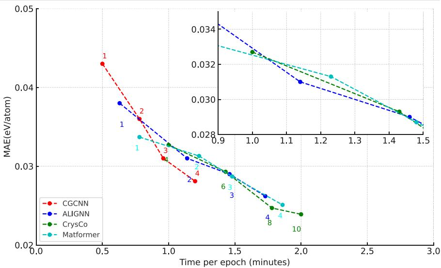

line

| Model     | Time per epoch (minutes) | MAE(eV/atom) |
|-----------|--------------------------|--------------|
| CGCNN     | 0.5                      | 0.043        |
| CGCNN     | 0.8                      | 0.036        |
| CGCNN     | 1.0                      | 0.031        |
| CGCNN     | 1.2                      | 0.028        |
| ALIGNN    | 0.6                      | 0.037        |
| ALIGNN    | 1.0                      | 0.031        |
| ALIGNN    | 1.5                      | 0.029        |
| ALIGNN    | 2.0                      | 0.027        |
| CrysCo   | 1.0                      | 0.033        |
| CrysCo   | 1.5                      | 0.029        |
| CrysCo   | 2.0                      | 0.026        |
| Matformer | 0.8                      | 0.034        |
| Matformer | 1.2                      | 0.032        |
| Matformer | 1.5                      | 0.028        |

# Model performance on novel datasets

To further investigate the performance of our model, we applied CrysCo to predict Ef and $\mathrm { E _ { H u l l } }$ of materials from a new dataset containing 751 novel structures generated and DFT-relaxed in-house. Parity plots in the supplementary Figure S1 shows good agreement between predicted and calculated energy values, with Pearson correlation coefficients equal to 0.894 (Ef) and 0.931 $( \mathrm { E _ { H u l l } } ) .$ The MAEs on $\mathrm { E _ { f } }$ and $\mathrm { E _ { H u l l } }$ predictions are as low as 0.0318 eV/atom and 0.0294 eV/atom, respectively. We also note that the largest deviations from the calculated values are associated with high-energy compounds, which are poorly represented in the training dataset at 2.8%. Nonetheless, CrysCo is capable of qualitatively predicting the instability of such compounds. These results demonstrate the ability of our model to generalize and reliably predict the properties of new crystalline materials, different from those present in commonly used computational databases such as MP, thereby highlighting its potential for use in materials design and discovery.

# Interpolation analysis

To address the data scarcity problem of secondary properties, we employed TL on our model $( \dot { \mathrm { C r y s C o T } } )$ . We first trained parent models on primary properties $( \mathrm { E _ { g } , E _ { f } } ,$ and EHull), with dataset sizes ranging from 126,728 to 126,785 entries from MP21. We then extracted the output features after each embedding in the transformer or EGAT layer from the parent model and transferred them as inputs for predicting other properties. The site-wise/atom-wise features are passed through a multilayer perceptron model, and the output feature matrix is read out to a vector, which compresses the atom number dimension. The readout vector can be used to predict properties using property-specific head neural networks. This TL approach allows our model to leverage a portion of pre-trained models, thereby retaining the valuable knowledge acquired during prior model training. This is achieved by utilizing either all or a selected subset of parameters from a pre-trained model to initialize training for a data-scarce downstream task42.

Table 4 | MAE and corresponding MSD associated with our TL models pre-trained on $\boldsymbol { \mathsf { E } } _ { \mathsf { f } }$ (CrysCoT-Mp\_eform) and $\mathsf { E } _ { \mathsf { H u l l } }$ (CrysCoT-Mp\_ehull) in comparison to the CrysCo baselines on regression benchmarks 

<table><tr><td>Dataset name</td><td>CrysCo</td><td>CrysCoT-Mp_eform</td><td>CrysCoT-Mp_ehull</td></tr><tr><td>Phonons</td><td> $\underline{29.75} \pm \underline{9.62}$ </td><td> $29.42 \pm 10.43$ </td><td> $29.92 \pm 9.64$ </td></tr><tr><td>Dielectric</td><td> $0.318 \pm 0.055$ </td><td> $0.311 \pm 0.039$ </td><td> $\underline{0.313} \pm \underline{0.064}$ </td></tr><tr><td>Elasticity_log10(G)</td><td> $0.079 \pm 0.002$ </td><td> $0.077 \pm 0.003$ </td><td> $\underline{0.077} \pm \underline{0.009}$ </td></tr><tr><td>Elasticity_log10(K)</td><td> $\underline{0.058} \pm \underline{0.001}$ </td><td> $0.057 \pm 0.002$ </td><td> $0.061 \pm 0.003$ </td></tr></table>

The best performance is shown in boldface and the second best performance is underlined. The mean and the standard deviation are calculated over 5 folds-cross validations.

We evaluated our TL framework’s performance on 4 material properties with dataset sizes ranging from 409 to 9086 entries and spanning from vibrational to mechanical and dielectric properties. Our CrysCoT-Mp\_eform (TL model using a source model pre-trained on Ef) and CrysCoT-Mp\_ehull (using a model pre-trained on $\mathrm { E } _ { \mathrm { H u l l } } )$ achieved the best performance across almost all target properties compared to the CrysCo model trained without transfer learning (Table 4). For example, CrysCoT-Mp\_eform improves upon the original CrysCo predictions for shear and bulk moduli by 2.5% and 1.7%, respectively. However, phonons and yield strength show modest improvement compared to other properties since the number of data points is exceptionally small, and therefore insufficient to interpret the entire chemical space representatively. Future improvements may include task-specific hyperparameter tuning, inclusion of more generalizable source tasks, or ML methods that transfer information from more relevant datasets.

# Extrapolation analysis

In the field of ML applied to materials research, the goal of designing new materials can translate into an extrapolation problem. In 2020, Xiong et al.43. presented a pioneering method to evaluate the capability of extrapolation using the k-fold forward cross-validation. We applied the concept of forward cross-validation to elasticity data by splitting the data according to their target value ranges and simulating the process of finding ultra-soft and ultra-hard materials. This analysis was inspired by Atomsets research31. We defined a “high-test” set with the materials from the top 10% highest target values as the test set for extrapolation. The remaining data was split into training, validation, and test (“low-test” set for interpolation) datasets, resulting in two target property regimes for the test data. We conducted this analysis using the CrysCoT-MP\_eform model. Results from further benchmarking of such model on data-scarce materials properties are reported in the supplementary Table S6.

Figure 3 plots absolute differences in predicted and DFT logarithmic property values, i.e., Δ log(G) (a) and Δ log(K) (b), against the DFT value range for the test data. “low-test” and “high-test” data are shown in green and red, respectively. We notice that for both shear and bulk moduli, prediction errors are comparable between the test data that lie within the training data range and those in the extrapolation range. In the shear modulus plot, the MAEs for “low-test” and “high-test” sets are 0.06843 and

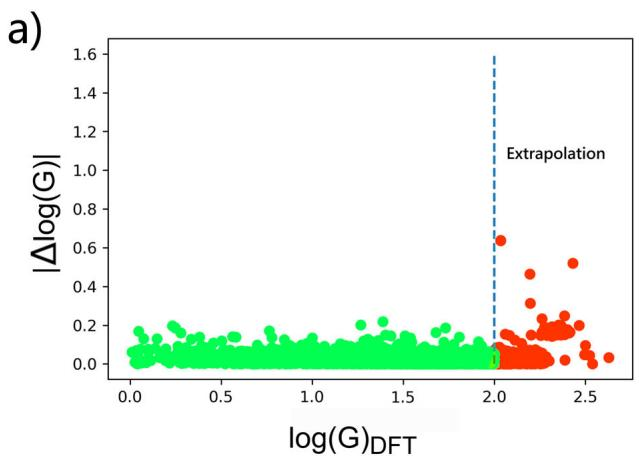  
Fig. 3 | Absolute differences in predicted and DFT-calculated logarithmic property values. a Δlog(G) and b Δlog(K) compared against the DFT value range spanned by the test data. The training and validation data were randomly sampled from the 0–90% (vertical dash line) target quantile range. “Low-test” data (in green)

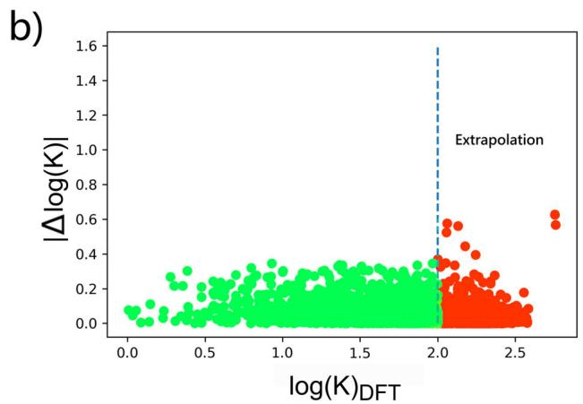  
were selected from the same target quantile range as that used for the train-validation data (interpolation). “High-test” data (in red) are from the 90–100% target quantilerange (extrapolation).

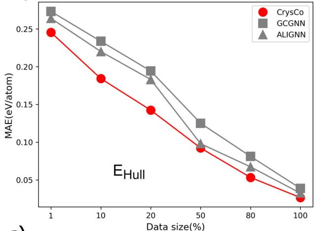

line

| Data size(%) | CrysCo | GCGNN | ALIGNN |
| ------------ | ------ | ----- | ----- |
| 1            | 0.245  | 0.265 | 0.260 |
| 10           | 0.185  | 0.235 | 0.220 |
| 20           | 0.145  | 0.195 | 0.185 |
| 50           | 0.095  | 0.125 | 0.100 |
| 80           | 0.055  | 0.080 | 0.070 |
| 100          | 0.030  | 0.040 | 0.035 |

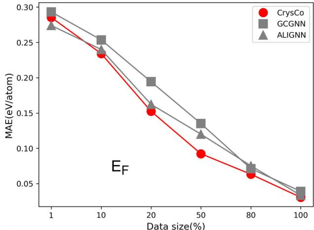

line

| Data size(%) | CrysCo | GCGNN | ALIGNN |
| ------------ | ------ | ----- | ----- |
| 1            | 0.285  | 0.295 | 0.275 |
| 10           | 0.235  | 0.255 | 0.240 |
| 20           | 0.155  | 0.195 | 0.160 |
| 50           | 0.095  | 0.135 | 0.120 |
| 80           | 0.065  | 0.075 | 0.070 |
| 100          | 0.035  | 0.040 | 0.035 |

c)   
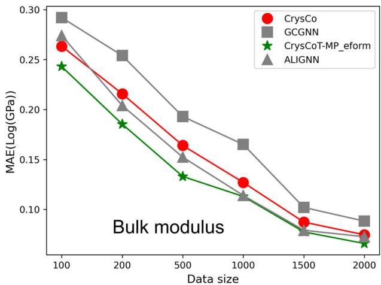

line

| Data size | CrysCo | GCGNN | CrysCoT-MP_eform | ALIGNN |
| --------- | ------ | ----- | ---------------- | ------ |
| 100       | 0.26   | 0.29  | 0.24             | 0.27   |
| 200       | 0.21   | 0.25  | 0.18             | 0.20   |
| 500       | 0.16   | 0.19  | 0.13             | 0.15   |
| 1000      | 0.12   | 0.16  | 0.11             | 0.12   |
| 1500      | 0.09   | 0.10  | 0.08             | 0.08   |
| 2000      | 0.08   | 0.09  | 0.07             | 0.07   |

d)   
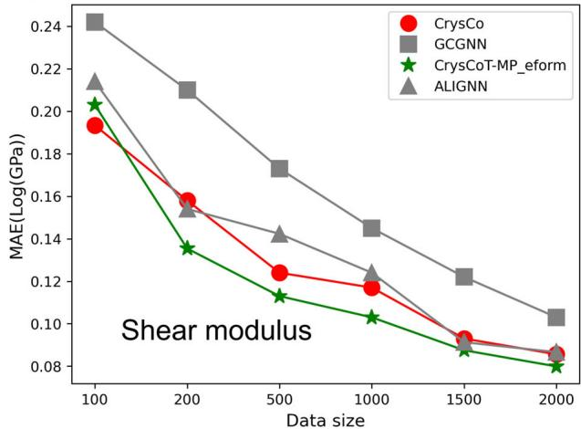

line

| Data size | CrysCo | GCGNN | CrysCoT-MP_eform | ALIGNN |
| --------- | ------ | ----- | ---------------- | ----- |
| 100       | 0.19   | 0.24  | 0.20             | 0.21  |
| 200       | 0.16   | 0.21  | 0.13             | 0.15  |
| 500       | 0.12   | 0.17  | 0.11             | 0.14  |
| 1000      | 0.11   | 0.14  | 0.10             | 0.12  |
| 1500      | 0.09   | 0.12  | 0.09             | 0.09  |
| 2000      | 0.08   | 0.10  | 0.08             | 0.08  |

Fig. 4 | Trends of the predictive performance of different models for various properties. Predictive performanceof different models for a energy above the convex hull $E _ { \mathrm { h u l l } } ,$ b formation energy Ef, c bulk modulus, and d shearmodulus.

0.08013 (log (GPa)), respectively. Also, for the bulk modulus, the differences between MAE of “low-test” and “high-test” sets is less than 0.0089. These outcomes demonstrate that our TL model reaches high accuracy also in extrapolation tasks, which are critical for discovering new materials with scarce property data available, such as elastic properties.

The CrysCoT model successfully predicts property data both inside and outside the training range. However, it is important to point out that the scarce property data and the data for the pre-trained model are not independent because they both rely closely on atomic structures as well as general physical and chemical descriptors. These results indicate that carefully designed ML models can successfully be transferred to predict properties with scarce available data.

# Effect of dataset size on model convergence

Figure 4 displays the trends in predictive performance of our CrysCo model with respect to the size of the datasets used for training on various materials properties, including $\mathrm { E _ { H u l l } , E _ { f } }$ bulk and shear moduli. For $\operatorname { E } _ { \mathrm { H u l l } }$ and $\mathrm { E _ { f } }$ predictions, we observe that not only CrysCo competes with the best-performing models from the literature, but it also converges to optimal performance at a similar pace (Fig. 4a and b). For the small datasets of bulk and shear moduli, we included also CrysCoT-MP\_eform in the comparison, as illustrated in Fig. 4c and d. As expected, the TL model generally outperforms the non-TL models and also converges more rapidly. Specifically, CrysCoT-MP\_eform converged for both shear and bulk moduli to MAE errors lower than \~0.13 log(GPa) with only 1000 data points.

# Elemental contributions to thermodynamic stability

The attention-based mechanism44 in CrysCo’s EGAT38 and transformer layers learn to update the element vectors using learned attention scores. Specifically, CrysGNN comprises six layers of EGAT, where each node and edge is assigned a learned attention score. The attention score assigned to each node is based on the importance score received from other nodes within the graph. Consequently, CrysCo uses each atom’s vector representation to directly predict the element’s contribution to the property prediction. This allows to generate a global view of attention from the perspective of individual elements.

For illustration purposes, we trained CrysGNN on $\mathrm { E _ { H u l l } }$ data and calculated the average attention scores for each element in oxide materials. We calculated final contribution values for each element by weighing its average attention score for the number of compounds containing it. We applied a weight of 0.7 for the average attention and 0.3 for number of elements in each compound. Elements with a number of data points less than 1000 in the dataset were discarded. The results are presented in the periodic table in Fig. 5. Elements with higher attention scores (light yellow colors) contribute to decreasing the EHull, and therefore to increasing the material’s thermodynamic stability.

Notably, silicon (Si) and aluminum (Al) are among the elements with highest attention scores, which is consistent with their being, respectively, the first and second most abundant cations in the Earth’s crust45. Indeed, owing to the formation of strong covalent bonds with oxygen (O), in a remarkably flexible coordination environment, Si and Al form a multitude of silicate and aluminosilicate minerals, such as quartz, garnets, pyroxenes, feldspars, and many others46–48. Similarly, we can understand the high attention scores associated with transition metals like iron (Fe) and titanium (Ti), and with the alkaline and alkali-earth metals sodium (Na), potassium (K), magnesium (Mg) and calcium (Ca), which are widespread in rockforming and soil minerals, e.g., oxides, carbonates, olivines, clays, etc49,50. On the other hand, the relative instability that appears in going down the groups of the periodic table, is consistent with an increasing chemical mismatch between progressively larger, more polarizable elements and the small, highly electronegative oxide anion $\mathrm { O } ^ { \overset { \bullet } { 2 } \scriptscriptstyle - 5 1 , 5 2 }$ . Prominent examples are oxides containing the alkaline metals rubidium (Rb) and cesium (Cs), or the halogens chlorine (Cl) and iodine (I). Interestingly, a few exceptions to such trends are observed, particularly with barium (Ba) and the post-transition metals tin (Sn) and bismuth (Bi).

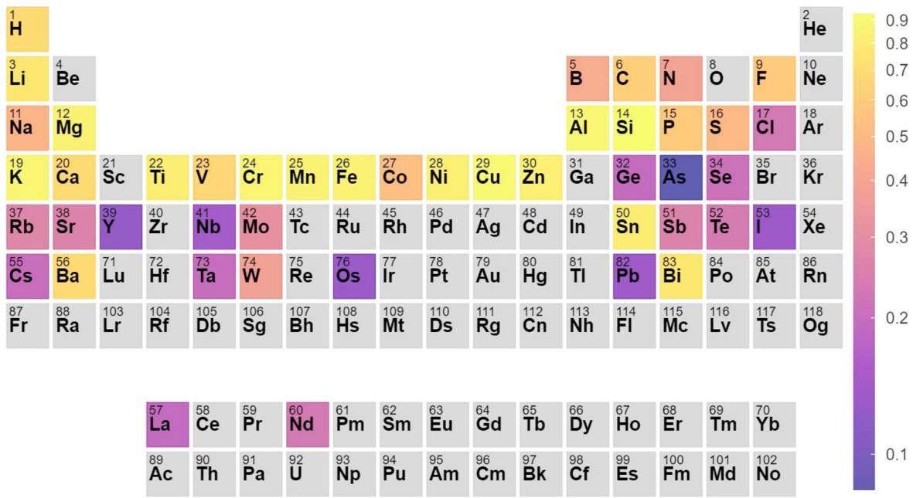  
Fig. 5 | Elemental contributions on EHull based on the attention score derived from our CrysGNN model. Attention scores are color-mapped as shown in the right. Higher attention score corresponds to significant contributions to lower EHull values, namely higher thermodynamic stability.

Obviously, given the importance of structural aspects in determining the relative stability of competing phases, it is not to be expected that the attention score alone be sufficient to determine accurate $\mathrm { E _ { H u l l } }$ values. However, it is noteworthy that the attention scores learned by our model return a picture of the elemental contribution to $\mathrm { E } _ { \mathrm { H u l l } }$ predictions that is chemically sound, namely, reflective of the relative thermodynamic stability of different element combinations.

# Filling-in elastic data missing from the Materials Project database

In the previous section, we have shown that CrysCo is able to successfully predict secondary properties, such as bulk and shear moduli, from the available data in MP (Fig. 3 and Table 1), thus demonstrating good accuracy and generalization capabilities.

Next, we focused on using CrysCo to fill-in the elastic data missing from the MP database, which comprise approximately 113,000 compounds. We will refer to these compounds as the “scarce dataset” in what follows. From the histograms in Fig. 6a and b, it can be observed that the predictions for the scarce dataset cover ranges of values similar to those of the elastic moduli in both training and test datasets and follow similar distribution patterns. This indicates that the CrysCo predictions for the scarce dataset are consistent with the existing data.

Finally, we have investigated potential correlations, in terms of elemental contributions, between average elastic moduli calculated for the training dataset and average elastic moduli predicted by CrysCo for the scarce dataset. Figure 7 shows parity plots for average bulk and shear moduli of binary and ternary oxides (Fig. 7a and c) and binary and ternary nonoxides (Fig. 7b and d). For each element, from hydrogen (H) to bismuth (Bi), common to both training and scarce datasets, we plot the average elastic moduli associated with it in the scarce dataset against corresponding averages obtained over the calculated data. With the exception of the shear modulus of binary oxides, where low numbers of compounds in both training and scarce datasets might contribute to increased noise, the results show good linear correlations, as supported by the Pearson correlation coefficients reported in Fig. 7. This provides further confirmation on the reliability of CrysCo predictions on the scarce dataset.

As illustrated in Fig. 6 and Fig. 7, CrysCo utilized a pretrained model from $\mathrm { E _ { f } }$ to exhibit excellent performance; the predicted scarce data of both elastic property distributions and elemental contributions are in good agreement with training data. Our method successfully predicts elastic moduli, which can be widely used in materials research and discoveries.

# Discussion

In this study, we proposed a hybrid graph transformer model to predict properties of inorganic materials, with independent treatment of composition and structure, allowing for a focused and specialized analysis of each aspect. By decoupling composition and structure, combined with the power of attention mechanisms, our model can achieve a level of precision and adaptability that holds good promise for advancing materials characterization.

Within our structure-based architecture, the dihedral graph allows us to harness the structural information that governs the three-dimensional configuration of atoms in inorganic materials; it influences material properties, stability, and reactivity. Dihedral angle information informs the presence of torsional strain, conformational changes, and the overall structural integrity of materials. Therefore, an accurate representation of dihedral angles through the dihedral graph provides an unprecedented level of sensitivity and specificity, affording us a better representation of the interplay between atomic arrangements and material behavior, and improving prediction accuracy.

In addition, we apply EGAT to material property prediction, which represents an improvement over existing approaches. A standout feature of EGAT is its unique ability to utilize edge-level information, encompassing bond distances, bond angles, and dihedral angles within the graph structure. While traditional GNN predominantly focus on node-level features, EGAT

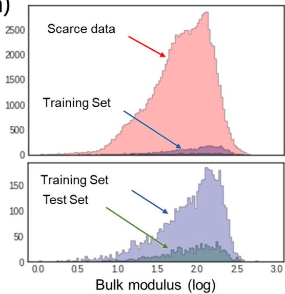

histogram

| Dataset          | Peak Value |
| ---------------- | ---------- |
| Scarce data      | ~2500      |
| Training Set     | ~100       |
| Training Set Test Set | ~150       |

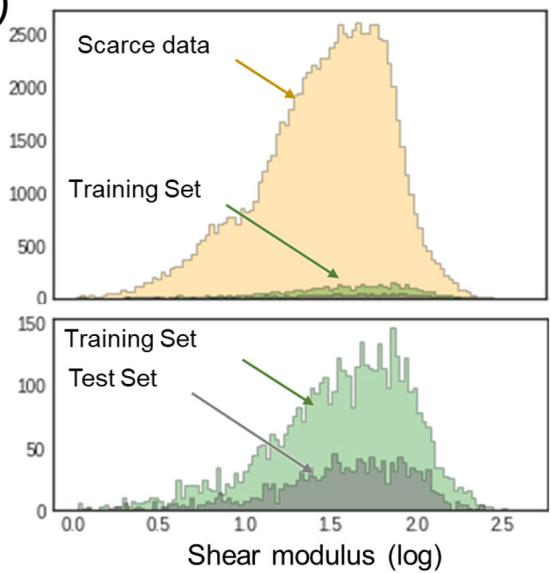

histogram

| Set Type       | Peak Shear Modulus (log) |
| -------------- | ------------------------ |
| Training Set   | ~14                      |
| Scarce data    | ~15                      |

Fig. 6 | Comparison between calculated and predicted data distributions. Comparison between the bulk modulus (a) and the shear modulus (b) between calculated data distributions (from training and test datasets) and the data predicted by CrysCoT-MP\_eform for the scarce dataset.

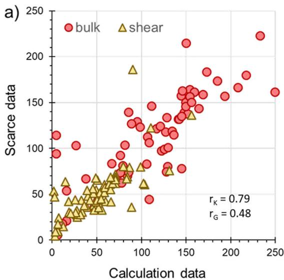

scatter

| Calculation data | Scarce data | Type   |
| ---------------- | ----------- | ------ |
| 10               | 5           | bulk   |
| 20               | 30          | bulk   |
| 30               | 60          | bulk   |
| 40               | 70          | bulk   |
| 50               | 80          | bulk   |
| 60               | 90          | bulk   |
| 70               | 100         | bulk   |
| 80               | 110         | bulk   |
| 90               | 120         | bulk   |
| 100              | 130         | bulk   |
| 110              | 140         | bulk   |
| 120              | 150         | bulk   |
| 130              | 160         | bulk   |
| 140              | 170         | bulk   |
| 150              | 180         | bulk   |
| 160              | 190         | bulk   |
| 170              | 200         | bulk   |
| 180              | 210         | bulk   |
| 190              | 220         | bulk   |
| 200              | 230         | bulk   |
| 210              | 240         | bulk   |
| 220              | 250         | bulk   |
| 230              | 260         | bulk   |
| 240              | 270         | bulk   |
| 250              | 280         | bulk   |
| 10               | 5           | shear  |
| 20               | 30          | shear  |
| 30               | 60          | shear  |
| 40               | 70          | shear  |
| 50               | 80          | shear  |
| 60               | 90          | shear  |
| 70               | 100         | shear  |
| 80               | 110         | shear  |
| 90               | 120         | shear  |
| 100              | 130         | shear  |
| 110              | 140         | shear  |
| 120              | 150         | shear  |
| 130              | 160         | shear  |
| 140              | 170         | shear  |
| 150              | 180         | shear  |
| 160              | 190         | shear  |
| 170              | 200         | shear  |
| 180              | 210         | shear  |
| 190              | 220         | shear  |
| 200              | 230         | shear  |
| 210              | 240         | shear  |
| 220              | 250         | shear  |
| 230              | 260         | shear  |
| 240              | 270         | shear  |
| 250              | 280         | shear  |

b)   
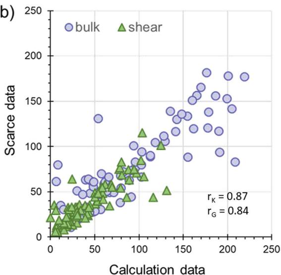

scatter

| Calculation data | Scarce data | Type   |
| ---------------- | ----------- | ------ |
| 10               | 10          | bulk   |
| 20               | 20          | bulk   |
| 30               | 30          | bulk   |
| 40               | 40          | bulk   |
| 50               | 50          | bulk   |
| 60               | 60          | bulk   |
| 70               | 70          | bulk   |
| 80               | 80          | bulk   |
| 90               | 90          | bulk   |
| 100              | 100         | bulk   |
| 110              | 110         | bulk   |
| 120              | 120         | bulk   |
| 130              | 130         | bulk   |
| 140              | 140         | bulk   |
| 150              | 150         | bulk   |
| 160              | 160         | bulk   |
| 170              | 170         | bulk   |
| 180              | 180         | bulk   |
| 190              | 190         | bulk   |
| 200              | 200         | bulk   |
| 210              | 210         | bulk   |
| 220              | 220         | bulk   |
| 230              | 230         | bulk   |
| 240              | 240         | bulk   |
| 250              | 250         | bulk   |
| 10               | 15          | shear  |
| 20               | 25          | shear  |
| 30               | 35          | shear  |
| 40               | 45          | shear  |
| 50               | 55          | shear  |
| 60               | 65          | shear  |
| 70               | 75          | shear  |
| 80               | 85          | shear  |
| 90               | 95          | shear  |
| 100              | 105         | shear  |
| 110              | 115         | shear  |
| 120              | 125         | shear  |
| 130              | 135         | shear  |
| 140              | 145         | shear  |
| 150              | 155         | shear  |
| 160              | 165         | shear  |
| 170              | 175         | shear  |
| 180              | 185         | shear  |
| 190              | 195         | shear  |
| 200              | 205         | shear  |
| 210              | 215         | shear  |
| 220              | 225         | shear  |
| 230              | 235         | shear  |
| 240              | 245         | shear  |
| 250              | 255         | shear  |

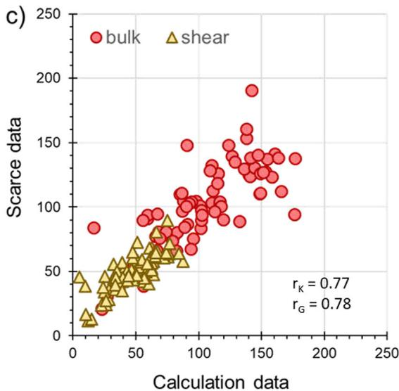

scatter

| Type   | Calculation data | Scarce data |
|--------|------------------|-------------|
| bulk   | 10               | 230         |
| bulk   | 20               | 80          |
| bulk   | 30               | 90          |
| bulk   | 40               | 100         |
| bulk   | 50               | 110         |
| bulk   | 60               | 120         |
| bulk   | 70               | 130         |
| bulk   | 80               | 140         |
| bulk   | 90               | 150         |
| bulk   | 100              | 160         |
| bulk   | 110              | 170         |
| bulk   | 120              | 180         |
| bulk   | 130              | 190         |
| bulk   | 140              | 200         |
| bulk   | 150              | 210         |
| bulk   | 160              | 220         |
| bulk   | 170              | 230         |
| bulk   | 180              | 240         |
| bulk   | 190              | 250         |
| bulk   | 200              | 260         |
| bulk   | 210              | 270         |
| bulk   | 220              | 280         |
| bulk   | 230              | 290         |
| bulk   | 240              | 300         |
| bulk   | 250              | 310         |
| shear  | 10               | 45          |
| shear  | 20               | 35          |
| shear  | 30               | 45          |
| shear  | 40               | 55          |
| shear  | 50               | 65          |
| shear  | 60               | 75          |
| shear  | 70               | 85          |
| shear  | 80               | 95          |
| shear  | 90               | 105         |
| shear  | 100              | 115         |
| shear  | 110              | 125         |
| shear  | 120              | 135         |
| shear  | 130              | 145         |
| shear  | 140              | 155         |
| shear  | 150              | 165         |
| shear  | 160              | 175         |
| shear  | 170              | 185         |
| shear  | 180              | 195         |
| shear  | 190              | 205         |
| shear  | 200              | 215         |
| shear  | 210              | 225         |
| shear  | 220              | 235         |
| shear  | 230              | 245         |
| shear  | 240              | 255         |
| shear  | 250              | 265         |

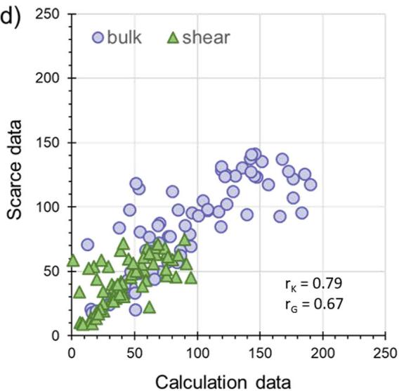

scatter

| Calculation data | Scarce data | Type   |
| ---------------- | ----------- | ------ |
| 10               | 10          | shear  |
| 20               | 20          | bulk   |
| 30               | 30          | shear  |
| 40               | 40          | bulk   |
| 50               | 50          | shear  |
| 60               | 60          | bulk   |
| 70               | 70          | shear  |
| 80               | 80          | bulk   |
| 90               | 90          | shear  |
| 100              | 100         | bulk   |
| 110              | 110         | shear  |
| 120              | 120         | bulk   |
| 130              | 130         | shear  |
| 140              | 140         | bulk   |
| 150              | 150         | shear  |
| 160              | 160         | bulk   |
| 170              | 170         | shear  |
| 180              | 180         | bulk   |
| 190              | 190         | shear  |
| 200              | 200         | bulk   |
| 210              | 210         | shear  |
| 220              | 220         | bulk   |
| 230              | 230         | shear  |
| 240              | 240         | bulk   |
| 250              | 250         | shear  |

Fig. 7 | Correlation plots between predicted and calculated elastic moduli. The average values of the elastic moduli (in GPa) associated with individual elements in the scarce dataset are plotted against the corresponding average values obtained   
from calculated data: a binary oxides, b binary non-oxides, c ternary oxides, and d ternary non-oxides. Pearson correlation coefficients for bulk $( \mathbf { r } _ { \mathrm { K } } )$ and shear (rG) moduli are also reported.

introduces a novel mechanism for dynamically gating attention on edges. This innovation empowers the model to discern and prioritize specific interatomic interactions, capturing nuanced details in material properties that were previously overlooked. Additionally, EGAT’s adaptability and scalability, facilitated by its self-attention mechanism, render it highly versatile, even in the face of heterogeneous datasets—a significant advantage in the diverse landscape of materials science research.

CrysCo demonstrated good predictive capabilities, outperforming several existing models in the prediction of material properties, including thermodynamic stability and elastic properties, in particular bulk and shear moduli. By combining graph neural networks and transformer architectures, we effectively captured complex relationships between material chemistry and structure and its mechanical properties.

To overcome the challenge of data scarcity, we employed TL techniques to leverage existing knowledge and enhance the performance of our model. By pretraining the model on a large-scale dataset of DFT computed formation energies, we were able to leverage the learned representations and fine-tune the model (CrysCoT). This approach further improved the model’s accuracy and generalization capabilities, allowing us to make reliable predictions of material bulk and shear moduli even with limited data.

We also demonstrated that our model can better predict both local and global structural features compared to various existing models. It is important to recognize that while our model exhibits better performance in predicting lattice parameters compared to previous models, enhancing the accuracy highlights a broader challenge. Indeed, most existing GNN-based models, including CrysCo, struggle to accurately learn lattice parameters from crystal structures. This limitation is primarily due to their reliance on K-nearest neighbor approaches for graph construction and a restricted number of convolution layers, which reduces the models’ receptive fields and overlooks critical bond-angle dependencies. Consequently, without specifically incorporating periodicity into GNN models, they fail to grasp extended periodic structures. Although we enhanced local representational capabilities by incorporating structural characteristics like bond and dihedral angles, this only enabled the capture of short-range, rather than longrange, periodicity.

Finally, we have shown how the adopted attention-learning framework enables interpretable analysis to gain insights into the underlying correlations between training features and predicted properties. This can open up avenues for material scientists and engineers in the design and development of new materials with desired properties.

# Methods

In our methods, we separate compositional and human extracted descriptors from the crystal structure to build a hybrid model considering both concepts in separate networks. Names and descriptions of the different model components are provided in the supplementary Table S1.

# Dataset

In this study, we use 9 datasets obtained from the Materials Project database (MP21). More details about the datasets are provided in the SI.

# Graph representation of crystal structure

To convert a crystal structure into a graph representation, we employ a unique approach aimed at encapsulating the essential structural characteristics while minimizing the computational complexity. In contrast to previous methods, we do not define $\mathrm { G } _ { \mathrm { m i n } } ,$ a minimally connected graph, as is customary in typical molecular graph representations. Instead, we introduce the concept of G8, a graph generated using a specific cutoff radius of 8 Å, in which any pair of atoms within this radius is considered connected.

The rationale behind our choice of this graph representation lies in the intrinsic dependency of inorganic material properties on both local and global geometric features of the material. Within our model formulation, three distinct graphs are generated to encode a single crystal structure: the original atomic graph G8 its corresponding line graph L(G8), and the dihedral graph L(G8d). In these graphs, nodes and edges are associated with different structural elements. In G, nodes represent atoms, while edges represent bonds. On the other hand, in L(G8) and L(G8d), nodes pertain to bonds and angles, respectively. It is important to note that the edges in G and the nodes in L(G8) or L(G8d) are conceptually identical entities and share the same embedding during graph neural network (GNN) operations. During the training the model updates edges by angular features and then atoms are updates by updated edges. By doing so, four body interactions are satisfied.

To ensure efficient encoding of atomic, bond, and angular features while minimizing computational overhead and separating compositional (elemental) properties from structural encoding, we represent these features using only the atom type (z), bond distance (d), bond angle (α), and dihedral angle (α0). Specifically, in G, each node corresponds to a unique atom type (z), and each edge corresponds to a specific bond distance (d). In L(G8), nodes correspond to bond distances (d), and edges represent bond angles (α). In L(G8d), edges representing dihedral angles are encoded by a value of ${ \mathfrak { a } } _ { 0 } .$

Furthermore, to streamline computational efficiency and reduce the number of trainable parameters, we merge the bond graph L(G8) and dihedral graph L(G8d) into a unified angular graph, denoted as L(G8a). As a result, our final graph representation comprises only two graphs: G and L(G8a).

The distinctiveness of our graph representation lies in several key aspects. First, we define graphs with the minimum required edges and nodes to effectively encode information about bonds, atoms, and angles. Second, we introduce novel concepts and graphs to capture the influence of dihedral angles within the graph representation. In contrast to ALIGNN and ALIGNN-D, we keep the size of angular graph for all crystal structures same to reduce complexity of model training and improve computational efficiency. For example, size of features for angular graph is (number of atoms x 64). Third, our innovative approach incorporates an angular graph that considers bond angles, bond distances, and dihedral angles simultaneously within a single unified framework.

# Model architecture for crystal structure

The model architecture comprises three parts: the initial feature embeddings, updating operations, and the output layers (Fig. 1). For the initial encoding, we convert the atom type, the bond distance, and the angular values from scalars to feature vectors for subsequent neural network operations. In our conversion method, the atom type z is transformed by an Embedding layer (see PyTorch documentation53). The bond distance d is expanded into the Radial Bessel basis proposed by Klicpera et al. 54. Our updating operations use Edge-Featured Graph Attention Network (EGAT) for updating both node and edge features in G8 and L(G8a)37,38,55. Although EGAT is inspired by a recent work37, overall EGAT is different from other GNN models used in material properties prediction. EGAT is based on the edge-integrated attention mechanism, where both node and edge features are included in the calculation of the message and attention weights38. Our EGAT model generally includes 2 components: (1) edge-wise attention weights ${ \mathfrak { a } } _ { \mathrm { i j } } ,$ (2) node-wise attention value messages that facilitate the exchange of information between nodes. The attention mechanisms used in this architecture are similar to recent works37,55. Additionally, the importance of edge information suggests that the edge features should be updated to learn high-level representation. In contrast to edge-node switching, our model acquires the adjacent edge features with the node-transit strategy, avoiding significant lift of computational complexity38. Furthermore, we employ a multi-scale merge strategy via the skip connection method, which concatenates features of every layer to construct a hierarchical representation. These attention mechanisms receive distances and angles to encapsulate spatial and chemical information effectively. Also, by using attention over (atoms) neighbors, EGAT inherently respects the permutation invariance of graphs. The sum operation is invariant to the order of terms, which aligns with the invariance requirement in graph-structured data. Furthermore, by dynamically weighing neighbors based on their features and the edge properties, our attention-based EGAT ensures that any changes in node features lead to appropriate changes in the aggregated features.

Inside the EGAT layer, the node module is applied before the edge module, which meets the property of the edge module. EGAT updates node representations $\vec { h } _ { i } ^ { \ : , }$ and edge representation $\vec { e } _ { i j } { } ^ { , }$ according to the following formulas: weight matrices $W _ { h } \dot { \epsilon } R ^ { F _ { H } ^ { \prime } \times F _ { H } }$ H and $W _ { e } \epsilon R ^ { E _ { H } ^ { \prime } \times \smile }$ are applied to node and edge features, respectively. Then, an edge-integrated attention mechanism a $R ^ { F _ { H } ^ { \prime } } , R ^ { F _ { H } ^ { \prime } } , R ^ { E _ { H } ^ { \prime } } \overset { * } { ) }  \mathrm { R } ,$ , which generates the attention weights as follows, is applied on each node:

$$
w _ {i j} = a \left(W _ {h} \vec {h} _ {i}, W _ {h} \vec {h} _ {j}, W _ {e} e _ {i j}\right) \tag {1}
$$

Where $w _ { i j }$ indicates the importance of node j and edge ij to node i. Then similar to the GAT model, normalization will be performed on these weights across all choices of node j, where $h _ { j } \in N _ { i }$ , with a softmax function:

$$
\alpha_ {i j} = \text { softmax } (w _ {i j}) = \frac {\exp (w _ {i j})}{\sum_ {k \in N _ {i}} ^ {N} \exp (w _ {i k})} \tag {2}
$$

Finally, in our EGAT method, the edge-integrated attention mechanism a is a single-layer feed-forward neural network, which can be parameterized as a one-dimensional weight vector $a \ \epsilon R ^ { 2 F _ { H } ^ { \prime } + F _ { E } ^ { \prime } }$ , and applying LeakyReLU as the activation function according to the following equation:

$$
\alpha_ {i j} = \frac {\exp \left(\text {LeakyReLU} \left(\text {Transpose} (a) \left[ W _ {h} \vec {h} _ {i} \right| \left| W _ {h} \vec {h} _ {j} \right| \left| W _ {e} e _ {i j} \right]\right)\right)}{\sum_ {k \in N _ {i}} ^ {N} \exp \left(\text {LeakyReLU} \left(\text {Transpose} (a) \left[ W _ {h} \vec {h} _ {i} \right| \left| W _ {h} \vec {h} _ {k} \right| \left| W _ {e} e _ {i k} \right]\right)\right)} \tag {3}
$$

$N _ { i }$ areneighborsofnode i, and || represents the concatenation operation.

$$
\vec {h} _ {i} ^ {\prime} = \sigma (\sum_ {j \in N _ {i}} ^ {N} \alpha_ {i j} (| W _ {e} e _ {i j} ])), \text { where } \vec {h} _ {i} ^ {\prime} \text { is   updated   node   of } \vec {h} _ {i}.
$$

Then, similarly, the edge module accepts node features and edge features, updates edge features with its adjacent nodes and edges, and finally generates higher-level edge features via the node-transit strategy, which uses nodes as transit ports of edge features. Firstly, the adjacent edge features are aggregated to the node with the edge integrated attention mechanism:

$$
\beta_ {i j} = \text { softmax } \left(\text { LeakyReLU } \left(\text { Transpose } (b) \left[ W _ {h} \vec {h} _ {i} \left| \right| W _ {h} \vec {h} _ {j} \left| \right| W _ {e} e _ {i j} \right]\right)\right) \tag {4}
$$

$$
\vec {e} _ {i} ^ {\prime} = \sum_ {j \in N _ {i}} ^ {N} (\beta_ {i j} W _ {e} e _ {i j}) \tag {5}
$$

$$
\vec {e} _ {i j} ^ {\prime} = M L P \left(\vec {h} _ {i}, \vec {h} _ {j}, \vec {e} _ {i} ^ {\prime}, \vec {e} _ {j} ^ {\prime}, \vec {e} _ {i j}\right) \tag {6}
$$

where $: \vec { e } _ { i } ^ { \ , }$ is the aggregated edge features on node i. Note that $W _ { e }$ and $W _ { h }$ are not shared among node modules.

In our model, EGAT updates nodes and edges in the atomic graph G8 and in the angular graph L(G8a), facilitating information exchange between the two. This results in what we refer to as “atom-bond interaction” and “bond-angle interaction,” respectively (as shown in Fig. 1a). Note that iterative application of EGAT on both G8a and L(G8a) can propagate information to G8a. Additionally, we incorporate skip connections to connect each layer of our model to the following layer. Also, we employ a global attention network to capture effects of all nodes for final updating as proposed in recent work37. Finally, the output layers pool the node features of G and transform the pooled embedding into an output vector that represents the structural fingerprints.

# Human-knowledge representation of materials

Our crystal structure representation does not incorporate any chemical information of the elements or human-extracted descriptors. Instead, we use these compositional properties separately in different architectures to extract more meaningful features.

For the compositional architecture, the chemical composition is used as input. Firstly, we use the atomic number and atomic fraction to capture features from the chemical composition. Atomic numbers are used to retrieve element representations via mat2vec16. To convert the element representations to high-dimensional chemical embeddings, we feed them to a ResNet architecture56. The resulting chemical embedding matrix has a dimension of i x j, where i is the number of elements and j is the feature size. Then, we extract fraction-related features to capture stoichiometric information by feeding the fraction amount to a transformer-based positional encoding. We follow the procedure explained in CrabNet15, where this architecture converts the fractional amount of a composition to highdimensional stoichiometric embedding features by assigning sine and cosine functions of various periods57. The size of the stoichiometric embedding matrix is the same as the size of the chemical embedding matrix. These two matrices (i.e., chemical embedding matrix and stoichiometric embedding matrix) are then added together (element-wise) to generate the compositional matrix. Each row of the compositional matrix (j-index) represents an element, and the columns (k-index) contain the element embeddings.

For human-extracted descriptors (listed in Table S8 of the SI) we use positional embedding to convert the corresponding feature vectors into a matrix with the same number of dimensions as the compositional matrix. Finally, we concatenate this human-extracted matrix to the compositional matrix. Please note that for all of the extracted properties, we followed the procedure explained in the recent work41. Therefore, composition and human knowledge descriptors for a given material are converted to a human-knowledge matrix.

# Transformer-based architecture for compositional features

Our compositional model comprises two primary modules. The initial module is a transformer-based architecture that incorporates six layers of multi-head attention blocks in each layer to encode the compositional matrix into more meaningful representations as represent in CrabNet15,44. The second module is DenseNet58, which transforms the output of the transformer module into compositional fingerprints. In each layer of the transformer module, multi-head attention blocks59 transform the compositional matrix into attention maps, where the matrix is updated to CM1 based on the importance (attention score) of each element within the composition. Each attention block comprises eight heads, and each head independently updates the compositional matrix, resulting in eight distinct element representations at each layer. These different element representations are combined and passed into a linear FC network, which blends the element representations from each head to update the compositional matrix. The updated compositional matrix then undergoes DenseNet processing to derive the final compositional fingerprints. The size of the compositional fingerprint matches the structural fingerprints obtained from the structural architecture. During a single training process, the material composition, human-knowledge descriptor, and corresponding crystal structure are input into the compositional and structural module. The compositional and structural fingerprints obtained are combined and input into a fully connected layer to predict properties. This compositional part is inspired by CrabNet model15.

# Model training for both parallel architectures is the single training process

To develop our GNN models and transformer modules, we utilized PyTorch Geometric53. We trained each model using the Adam optimizer60 and employed the 1 cycle scheduler61. Our training was carried out on a NVIDIA V100 (Volta) GPU and repeated eight times with randomly initialized weights for statistical robustness. For updating the model weights, we employed the look-ahead with a learning rate that was cycled between 1 × $1 0 ^ { - 4 }$ and $\dot { 6 } \times 1 0 ^ { - 3 }$ every 4 epochs to achieve consistent model convergence. The mean squared error (MSE) served as the loss function during training, with consistent training parameters across all sessions (refer to Table S2 for details).

# Transfer learning for data-scarce material properties

This study focuses on specific types of transfer learning using our model architecture for training energy of formation and energy above hull. The goal is to develop a neural network $Y _ { t } = f _ { t } ( S )$ that can accurately predict a target property Yt for any given material S, even with limited data. To overcome this challenge, we utilize transfer learning, which enables us to reuse models trained on different source properties $\mathrm { Y } _ { s }$ that have abundant data sets and apply them to the target task33. In this study, we use a finetuning method, which involves using a pre-trained model as a starting point and fine-tuning it to the target task using a few given instances. Specifically, the weights on the last few layers of the pre-trained model are randomly initialized, while the learned parameters of the remaining layers are used as initial values. All of these parameters are then retrained at a small learning rate to understand domain-invariant knowledge while controlling weight updating on each gradient descent iteration. While fundamental rules of quantum chemistry generalize across materials and properties, the final mapping from fundamental physics to a specific property heavily depends on the property62. For example, computing $\mathrm { E _ { f } }$ requires comparing to a relevant reference state, while computing bandgaps requires comparing band edge positions7 . Thus, after pre-training a model on a source task for transfer learning, we only reuse a subset of the pre-trained model parameters to produce generalizable features of an atomic structure. We define a feature extractor, E(⋅), using these pre-trained parameters, which takes in an atomic structure x and outputs a feature vector E(x) describing the structure. To produce predictions for a scalar property of any atomic structure, we pass the feature vector E(x) through a property-specific head neural network, H(⋅). In this study, we define the extractor E(⋅) as the atom embedding and EGAT layers of our GNN and the transformer of our compositional architectures. These layers generate a representation of a crystal, composition, and human knowledge descriptors from their constituent atom types, pairwise interatomic distances, angular features, stoichiometric features, and human-knowledge descriptors.

# Data availability

We use The Materials Project63 dataset in this work.

# Code availability

Source codes are provided in GitHub repository: https://github.com/ mahan-fcb/CrysCo.

Received: 14 November 2023; Accepted: 20 November 2024; Published online:18 January 2025

# References

1. Schleder, G. R., Padilha, A. C., Acosta, C. M., Costa, M. & Fazzio, A. From DFT to machine learning: recent approaches to materials science–a review. J. Phys.: Mater. 2, 032001 (2019).   
2. Curtarolo, S. et al. AFLOWLIB. ORG: A distributed materials properties repository from high-throughput ab initio calculations. Comput. Mater. Sci. 58, 227–235 (2012).   
3. Choudhary, K. et al. The joint automated repository for various integrated simulations (JARVIS) for data-driven materials design. npj comput. Mater. 6, 173 (2020).   
4. Jain, A. et al. Commentary: The Materials Project: A materials genome approach to accelerating materials innovation. APL Mater. 1, 011002 (2013).   
5. Kirklin, S. et al. The Open Quantum Materials Database (OQMD): assessing the accuracy of DFT formation energies. npj Comput. Mater. 1, 15010 (2015).

6. Mouzai, M., Oukid, S. & Mustapha, A. Machine learning modeling for the prediction of materials energy. Neural Computing and Applications, 1-18 (2022).   
7. Chang, R., Wang, Y.-X. & Ertekin, E. Towards overcoming data scarcity in materials science: unifying models and datasets with a mixture of experts framework. npj Comput. Mater. 8, 242 (2022).   
8. Cai, J., Chu, X., Xu, K., Li, H. & Wei, J. Machine learning-driven new material discovery. Nanoscale Adv. 2, 3115–3130 (2020).   
9. Jain, A. et al. Commentary: The Materials Project: A materials genome approach to accelerating materials innovation. APL materials 1 (2013).   
10. Bartel, C. J. Review of computational approaches to predict the thermodynamic stability of inorganic solids. J. Mater. Sci. 57, 10475–10498 (2022).   
11. Wang, A. et al. A framework for quantifying uncertainty in DFT energy corrections. Sci. Rep. 11, 15496 (2021).   
12. Chen, C. et al. A critical review of machine learning of energy materials. Adv. Energy Mater. 10, 1903242 (2020).   
13. Butler, K. T., Davies, D. W., Cartwright, H., Isayev, O. & Walsh, A. Machine learning for molecular and materials science. Nature 559, 547–555 (2018).   
14. Juan, Y., Dai, Y., Yang, Y. & Zhang, J. Accelerating materials discovery using machine learning. J. Mater. Sci. Technol. 79, 178–190 (2021).   
15. Wang, A. Y.-T., Kauwe, S. K., Murdock, R. J. & Sparks, T. D. Compositionally restricted attention-based network for materials property predictions. Npj Comput. Mater. 7, 77 (2021).   
16. Tshitoyan, V. et al. Unsupervised word embeddings capture latent knowledge from materials science literature. Nature 571, 95–98 (2019).   
17. Chen, C., Ye, W., Zuo, Y., Zheng, C. & Ong, S. P. Graph networks as a universal machine learning framework for molecules and crystals. Chem. Mater. 31, 3564–3572 (2019).   
18. Xie, T. & Grossman, J. C. Crystal graph convolutional neural networks for an accurate and interpretable prediction of material properties. Phys. Rev. Lett. 120, 145301 (2018).   
19. Goodall, R. E. & Lee, A. A. Predicting materials properties without crystal structure: Deep representation learning from stoichiometry. Nat. Commun. 11, 6280 (2020).   
20. Schütt, K. T., Sauceda, H. E., Kindermans, P.-J., Tkatchenko, A. & Müller, K.-R. Schnet–a deep learning architecture for molecules and materials. J. Chem. Phys. 148, 241722 (2018).   
21. Choudhary, K. & DeCost, B. Atomistic line graph neural network for improved materials property predictions. npj Comput. Mater. 7, 185 (2021).   
22. Gong, S., Xie, T., Shao-Horn, Y., Gomez-Bombarelli, R. & Grossman, J. C. Examining graph neural networks for crystal structures: limitations and opportunities for capturing periodicity. Sci. Adv. 9, eadi3245 (2023).   
23. Gasteiger, J., Becker, F. & Günnemann, S. Gemnet: Universal directional graph neural networks for molecules. Adv. Neural Inf. Process. Syst. 34, 6790–6802 (2021).   
24. Hsu, T. et al. Efficient and interpretable graph network representation for angle-dependent properties applied to optical spectroscopy. npj Comput. Mater. 8, 151 (2022).   
25. Louis, S.-Y. et al. Graph convolutional neural networks with global attention for improved materials property prediction. Phys. Chem. Chem. Phys. 22, 18141–18148 (2020).   
26. Zhong, Y., Yu, H., Gong, X. & Xiang, H. Edge-based Tensor prediction via graph neural networks. arXiv preprint arXiv:2201.05770 (2022).   
27. Liu, S. et al. Symmetry-informed geometric representation for molecules, proteins, and crystalline materials. Adv. Neural Inf. Process. Syst. 36, (2024).   
28. Liao, Y.-L. & Smidt, T. Equiformer: Equivariant graph attention transformer for 3d atomistic graphs. arXiv preprint arXiv:2206.11990 (2022).   
29. Yan, K., Liu, Y., Lin, Y. & Ji, S. Periodic graph transformers for crystal material property prediction. Adv. Neural Inf. Process. Syst. 35, 15066–15080 (2022).

30. Magar, R., Wang, Y. & Barati Farimani, A. Crystal twins: selfsupervised learning for crystalline material property prediction. npj Comput. Mater. 8, 231 (2022).   
31. Chen, C. & Ong, S. P. AtomSets as a hierarchical transfer learning framework for small and large materials datasets. npj Comput. Mater. 7, 173 (2021).   
32. Jha, D. et al. Enhancing materials property prediction by leveraging computational and experimental data using deep transfer learning. Nat. Commun. 10, 5316 (2019).   
33. Zamir, A. R. et al. in Proceedings of the IEEE conference on computer vision and pattern recognition. 3712-3722.   
34. Vu, T. et al. Exploring and predicting transferability across NLP tasks. arXiv preprint arXiv:2005.00770 (2020).   
35. Batzner, S. et al. E (3)-equivariant graph neural networks for dataefficient and accurate interatomic potentials. Nat. Commun. 13, 2453 (2022).   
36. Banjade, H. R. et al. Structure motif–centric learning framework for inorganic crystalline systems. Sci. Adv. 7, eabf1754 (2021).   
37. Omee, S. S. et al. Scalable deeper graph neural networks for highperformance materials property prediction. Patterns 3, 100491 (2022).   
38. Wang, Z., Chen, J. & Chen, H. in Artificial Neural Networks and Machine Learning–ICANN 2021: 30th International Conference on Artificial Neural Networks, Bratislava, Slovakia, September 14–17, 2021, Proceedings, Part I 30. 253-264 (Springer).   
39. Zhang, J. et al. Gaan: Gated attention networks for learning on large and spatiotemporal graphs. arXiv preprint arXiv:1803.07294 (2018).   
40. Ward, L., Agrawal, A., Choudhary, A. & Wolverton, C. A generalpurpose machine learning framework for predicting properties of inorganic materials. npj Comput. Mater. 2, 1–7 (2016).   
41. Gong, S. et al. Examining graph neural networks for crystal structures: limitations and opportunities for capturing periodicity. Sci. Adv. 9, eadi3245 (2023).   
42. Hutchinson, M. L. et al. Overcoming data scarcity with transfer learning. arXiv preprint arXiv:1711.05099 (2017).   
43. Xiong, Z. et al. Evaluating explorative prediction power of machine learning algorithms for materials discovery using k-fold forward crossvalidation. Comput. Mater. Sci. 171, 109203 (2020).   
44. Vaswani, A. et al. Attention is all you need. Advances in neural information processing systems 30 (2017).   
45. Fujimori, S. & Inoue, S. Carbon monoxide in main-group chemistry. J. Am. Chem. Soc. 144, 2034–2050 (2022).   
46. Li, D., Bancroft, G., Fleet, M. & Feng, X. Silicon K-edge XANES spectra of silicate minerals. Phys. Chem. Miner. 22, 115–122 (1995).   
47. Winter, J. K. & Ghose, S. Thermal expansion and high-temperture crystal chemistry of the Al 2 SiO 5 polymorphs. Am. Mineral. 64, 573–586 (1979).   
48. Xu, L. et al. Anisotropic surface chemistry properties and adsorption behavior of silicate mineral crystals. Adv. colloid interface Sci. 256, 340–351 (2018).   
49. Donia, A. M. Thermal stability of transition-metal complexes. Thermochim. acta 320, 187–199 (1998).   
50. Perrichon, V. & Durupty, M. Thermal stability of alkali metals deposited on oxide supports and their influence on the surface area of the support. Appl. Catal. 42, 217–227 (1988).   
51. Etourneau, J., Portier, J. & Ménil, F. The role of the inductive effect in solid state chemistry: how the chemist can use it to modify both the structural and the physical properties of the materials. J. Alloy. Compd. 188, 1–7 (1992).   
52. Duffy, J. Chemical bonding in the oxides of the elements: a new appraisal. J. Solid State Chem. 62, 145–157 (1986).   
53. Paszke, A. et al. Pytorch: An imperative style, high-performance deep learning library. Advances in neural information processing systems 32 (2019).

54. Gasteiger, J., Groß, J. & Günnemann, S. Directional message passing for molecular graphs. arXiv preprint arXiv:2003.03123 (2020).   
55. Cheng, J., Zhang, C. & Dong, L. A geometric-information-enhanced crystal graph network for predicting properties of materials. Commun. Mater. 2, 92 (2021).   
56. Sander, M. E., Ablin, P., Blondel, M. & Peyré, G. in International Conference on Machine Learning. 9276-9287 (PMLR).   
57. Takase, S. & Okazaki, N. Positional encoding to control output sequence length. arXiv preprint arXiv:1904.07418 (2019).   
58. Huang, G., Liu, Z., Van Der Maaten, L. & Weinberger, K. Q. in Proceedings of the IEEE conference on computer vision and pattern recognition. 4700-4708.   
59. Chen, H., Jiang, D. & Sahli, H. Transformer encoder with multi-modal multi-head attention for continuous affect recognition. IEEE Trans. Multimed. 23, 4171–4183 (2020).   
60. Kingma, D. P. & Ba, J. Adam: A method for stochastic optimization. arXiv preprint arXiv:1412.6980 (2014).   
61. Xu, J. et al. Understanding and improving layer normalization. Adv. Neural Inf. Process. Syst. 32, (2019).   
62. Smith, J. et al. Linking process, structure, property, and performance for metal-based additive manufacturing: computational approaches with experimental support. Comput. Mech. 57, 583–610 (2016).   
63. Jain, A. et al. Commentary: The Materials Project: A materials genome approach to accelerating materials innovation. APL Mater. 1, (2013).   
64. Towns, J. et al. XSEDE: accelerating scientific discovery. Comput. Sci. Eng. 16, 62–74 (2014).   
65. Boerner, T. J., Deems, S., Furlani, T. R., Knuth, S. L. & Towns, J. in Practice and Experience in Advanced Research Computing 173-176 (2023).

# Acknowledgements

This work used Stampede 2 and Ranch at the Texas Advanced Computing Center and Bridges at the Pittsburg Supercomputing Center through allocation MCB180008 from the Extreme Science and Engineering Discovery Environment (XSEDE)64, which was supported by National Science Foundation grant number #1548562, as well as from the Advanced Cyberinfrastructure Coordination Ecosystem: Services & Support (ACCESS) program65, which is supported by National Science Foundation grants #2138259, #2138286, #2138307, #2137603, and #2138296. A.T. acknowledges the funding support from the National Science Foundation (CMMI 2145759) and the National Institutes of Health (1R56AG075690, 1R01AG084715, 5U01HL146188).

# Author contributions

M.M., A.T., Y.S., and V.L. conceived and designed the research. M.M. developed the models and performed analysis. M.M., A.T., Y.S., and V.L. wrote and edited the final manuscript with input from all authors.

# Competing interests

The authors declare no competing interests.

# Additional information

Supplementary information The online version contains supplementary material available at https://doi.org/10.1038/s41524-024-01472-7.

Correspondence and requests for materials should be addressed to Yongwoo Shin or Anna Tarakanova.

Reprints and permissions information is available at http://www.nature.com/reprints

Publisher’s note Springer Nature remains neutral with regard to jurisdictional claims in published maps and institutional affiliations.

Open Access This article is licensed under a Creative Commons Attribution-NonCommercial-NoDerivatives 4.0 International License, which permits any non-commercial use, sharing, distribution and reproduction in any medium or format, as long as you give appropriate credit to the original author(s) and the source, provide a link to the Creative Commons licence, and indicate if you modified the licensed material. You do not have permission under this licence to share adapted material derived from this article or parts of it. The images or other third party material in this article are included in the article’s Creative Commons licence, unless indicated otherwise in a credit line to the material. If material is not included in the article’s Creative Commons licence and your intended use is not permitted by statutory regulation or exceeds the permitted use, you will need to obtain permission directly from the copyright holder. To view a copy of this licence, visit http://creativecommons.org/licenses/bync-nd/4.0/.

© The Author(s) 2025