Check for updates

Cite this: , 2024, 3, 300

Received 21st August 2023 Accepted 19th December 2023

DOI: 10.1039/d3dd00162h

rsc.li/digitaldiscovery

# Realistic material property prediction using domain adaptation based machine learning†

Jeffrey Hu,a David Liu,b Nihang Fua and Rongzhi Dong \*a

Materials property prediction models are usually evaluated using random splitting of datasets into training and test datasets, which not only leads to over-estimated performance due to inherent redundancy, typically existent in material datasets, but also deviate from the common practice of materials scientists: they are usually interested in predicting properties for a known subset of related out-of-distribution (OOD) materials rather than universally distributed samples. Feeding such target material formulae/structures to the machine learning models should improve the prediction performance while most current machine learning (ML) models neglect this information. Here we propose to use domain adaptation (DA) to enhance current ML models for property prediction and evaluate their performance improvements in a set of five realistic application scenarios. Our systematic benchmark studies show that there exist DA models that can significantly improve the OOD test set prediction performance while standard ML models and most of the other DA techniques cannot improve or even deteriorate the performance. Our benchmark datasets and DA code can be freely accessed at https://github.com/Little-Cheryl/MatDA.

# 1 Introduction

Nowadays, machine learning (ML) models are being widely used in materials property prediction for discovering novel materials such as super-hard materials,1,2 wide band gap materials,3 and energy materials.4 A large number of innovations have been proposed to improve the ML performance for materials property prediction, including more expressive descriptors,5 better deep learning models (IRNET),6 graph neural networks that better capture interatomic interactions,7–10 data augmentation,11 multi-delity datasets that combine computational and experimental data,12 active learning,3,13 and transfer learning.14 These models and algorithms have signi- cantly improved prediction performance over the past few years. However, it has been found that existing ML algorithms have low generalization performance for test samples with different data distributions, and their prediction performance is oen over-estimated due to the high dataset redundancy15 as many materials are accumulated as a result of a tinkering material discovery process over history. Previously the ML-based material property prediction performances were all evaluated by randomly splitting the whole dataset into training and testing sets. The resulting test set does not share a high degree of homogeneity in terms of composition, structure, or properties,

a Department of Computer Science and Engineering, University of South Carolina, Columbia, SC 29201, USA. E-mail: rongzhid@email.sc.edu b Department of Electrical Engineering and Computer Science, University of Michigan, Ann Arbor, MI 48103, USA † Electronic supplementary information (ESI) available. See DOI: https://doi.org/10.1039/d3dd00162h

but is randomly distributed in the whole dataset space. This practice does not reect the realistic application scenario for these ML models when they are more likely to be applied to predict the properties for a set of similar materials that have a different distribution from the training set, and are located in the sparse chemical space with few known materials, or tend to have extreme property values. Moreover, current ML and deep learning models do not consider the target material information in the training of the ML models while in practice the compositions or structures of interest are already known and can be incorporated into ML model training to improve the prediction performance. In real cases, researchers are usually interested in a small number of outlier or out-of-distribution (OOD) materials with different data distributions and with similarities in composition, structure, or properties to maximize a specic function.

There are several related works with regard to OOD prediction problems in materials science. Several studies have found that the inherent high redundancy of materials dataset and the random train-test splitting-based evaluation methods have led to over-estimation of ML performance for material property prediction.16,17 It has also been found that regular ML models usually have low generalization performance for OOD samples.18,19 For example, Li et al.19 found that ML models trained on Materials Project 2018 can have signicantly degraded performance on new materials in Materials Project 2021 due to the distribution shi. In the eld of machine learning, OOD generalization due to distribution shi between the source domain and target domain has been intensively investigated recently within the context of transfer learning,20 domain generalization,21,22 causal learning,23 and domain adaptation.24 In particular, domain adaptation (DA) methods have been widely used in computer vision, medical imaging, and natural language understanding for improving OOD prediction with great success.25–27 Based on whether the model is trained with labels of some test set samples, DA methods can be classied into unsupervised DAs (only Xt, the input information of the test samples are used) and supervised DAs (both Xt and a few Yt test samples are used). Based on the working principles, DAs can be divided into feature-based, instancebased, and transfer-learning methods.28

Despite the obvious advantage of considering target set distribution for ML model training, currently, there are only a few DA applications in science domains, including those in the bioinformatics,29 health informatics,30 and chemistry.31,32 In the materials science eld, Goetz et al. applied unsupervised DA in microstructure recognition.33 To our best knowledge, there are no such DA applications to solve OOD problems in materials property prediction, which has its own unique feature characteristics, domain shi relationships, and domain generalization patterns, so specialized DA methods are needed to further improve the ML performance.

This paper aims to investigate practically realistic ML models for materials property prediction focusing on predicting properties of minority/outlier material clusters that have different distributions with the training set, all of which have the key symptom of OOD machine learning. We then propose and evaluate three categories of domain adaptation methods for solving this problem, including feature-based, instance-based, and parameter-based algorithms. Our extensive benchmark experiments over ve OOD test sets categories brought key insights in applying domain adaptation to improved materials property prediction.

Our contributions are summarized as follows:

We proposed a set of benchmark realistic material property prediction problems, which share the characteristic of predicting the property of a set of OOD samples.

We suggested incorporating the test sample input (composition or structure) into the ML model training process to improve the prediction performance.   
 We applied and evaluated a series of existing domain adaptation models to the composition and structure based materials property prediction and found key insights as regards how to achieve better OOD prediction performance using suitable DAs.

# 2 Method

# 2.1 OOD benchmark problems and datasets

Fig. 1 shows the framework of our pipeline for DA-based material property prediction. We downloaded two datasets (matbench\_expt\_gap and matbench\_glass) from the Matbench34 site including one classication problem for glass materials, and one regression problem related to band gap prediction. The classication task aims to determine the full bulk metallic glass formation ability for the given composition. And the regression task is to predict the experimental band gap from compositions.

Instead of evaluating the ML models using standard traintest random splitting or the k-fold cross-validation (also based on random splitting), we propose ve realistic material property prediction scenarios, in which the researchers are usually interested in properties of minority or sparse materials. For each raw dataset (band gap or glass), we dene ve ways to determine which samples from the sparse composition or property space will be selected as the target test samples. The detailed introduction of each scenario is introduced in section 2.1.1. Aer target set generation, we then apply DA algorithms to these bandgap and glass subsets for property prediction and classication, respectively. The DA methods used for each task in introduced later in section 2.3.

The raw dataset details are shown in Table 1. We use composition-based Materials Agnostic Platform for Informatics and Exploration (Magpie) feature35 as input representation. Magpie features are calculated based on the properties of the atoms in compositions. These properties include stoichiometric properties (depending only on the ratios between elements), element properties (atomic number, atomic radius, melting temperature, etc.), electronic structure properties (valence electron number of s, p, d, and f layers), and ionic compound characteristics.

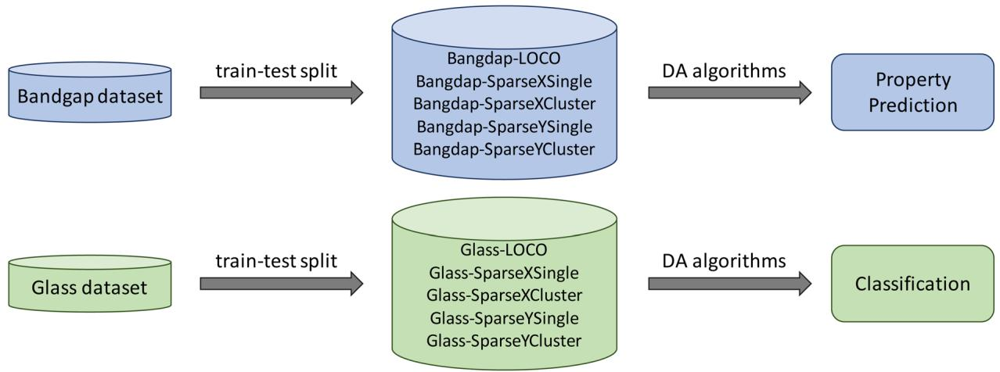

flowchart

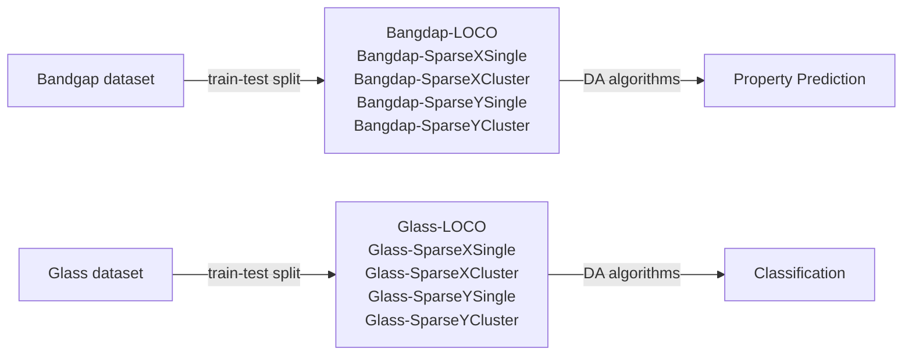

Fig. 1 Architecture of our DA-based material property prediction pipeline. For two datasets downloaded from Matbench34 site, we first apply five different train-test-split methods to get five subsets for each dataset based on five different application scenarios in material science. And then apply DA algorithms on these datasets for property prediction and classification, respectively.

Table 1 Raw datasets 

<table><tr><td>Dataset</td><td>Task type</td><td>Feature</td><td>Sample no</td><td>Performance metric</td></tr><tr><td>Glass</td><td>Classification</td><td>Composition/magpie</td><td>5680</td><td>Balanced accuracy</td></tr><tr><td>Bandgap</td><td>Regression</td><td>Composition/magpie</td><td>4604</td><td>MAE</td></tr></table>

2.1.1 Target set generations. In most real scenarios, researchers know their target materials of interest and usually have no related labeled samples, which corresponds to the case of unsupervised DA. In this work, we focus on the case that the target set has no labeled samples. We have then proposed the following target set generation methods to emulate the real cases for material property prediction.

2.1.1.1 Leave-one-cluster-out (LOCO). This method was suggested by Meredig et al.16 in their evaluation of the generalization performance of ML models for material property prediction. We rst cluster the whole dataset using Magpie features into 50 clusters and then we use each of the clusters as the test sets in turn to evaluate the model performance. Even though it improves the commonly used random splitting method to avoid performance over-estimation, it still counts all samples (including those located in highly dense redundant areas). So it is subject to the over-estimation issue to a certain degree.

2.1.1.2 Single-point targets with lowest composition density (SparseXSingle). In this method, we rst convert all dataset compositions into the 132-dimension Magpie feature space and then we apply the t-distributed Stochastic Neighbor Embedding (t-SNE)36 based dimension reduction to reduce it to 2D space. The t-SNE model is designed with a random state equal to 42 and with 2 components. We then employ kernel density estimation to calculate the density for each data point and pick the top 500 least dense samples and we apply K-means clustering to convert it into 50 clusters. Aerward, we then pick one sample out of each cluster, obtaining 50 target samples as our test set.

2.1.1.3 Single-point targets with lowest property density (SparseYSingle). In this method, we rst sort the samples by their y values (label) calculate the density for each data point's y value, and then pick the top 500 least dense samples and apply K-means clustering to convert them into 50 clusters. We then pick one sample out of each cluster, obtaining 50 target samples as our test set.

2.1.1.4 Cluster targets with lowest composition density (SparseXCluster). This sparse cluster target set generation method is similar to the above-mentioned SparseXSingle method except that aer K-means clustering, instead of picking one sample, we further pick N nearest neighbors for each picked sample to form a target cluster. The neighbor-picking process is conducted so that no sample can be selected into multiple target clusters. The neighbors are dened based on the Euclidean distance of

Magpie features. In total, we have 50 clusters each with 11 samples in general.

2.1.1.5 Cluster targets with lowest property density (SparseYCluster). This sparse cluster target set generation method is similar to the above-mentioned SparseYSingle method except that aer K-means clustering, instead of picking one sample, we further pick N nearest neighbors for each picked sample to form a target cluster. The neighbor-picking process is conducted so that no sample can be selected into multiple target clusters. The neighbors are dened based on the Euclidean distance of Magpie features. In total, we have 50 clusters each with 11 samples in general.

The distribution of the whole band gap datasets and their different target sets are shown in Fig. 2. We can nd that realistic target sets are more located in sparse areas while commonly used random splitting tends to be located in dense areas with the same distribution as the training set. The random splitting (as shown in Fig. 2(a)) allows the test samples within one fold (represented as dots of a single color) to be scattered into multiple clusters and mixed with training samples. This characteristic mixing makes it easy for a machine learning model to predict the properties of these test samples based on the neighborhood samples. In realistic material prediction scenarios, as captured by our proposed different data splitting methods shown in Fig. 2(b)–(f), the query/test samples are located in sparse areas with few neighbor training samples (a typical feature of out-of-distribution machine learning problems). This makes interpolation-based machine learning models have much worse prediction performance, which we aim to address with domain adaptation algorithms.

In total, we have 10 datasets for DA algorithm evaluations, including bandgap-LOCO, bandgap-SparseXSingle, bandgap-SparseXCluster, bandgap-SparseYSingle, and bandgap-SparseYCluster for regression and glass-LOCO, glass-SparseXSingle, glass-SparseXCluster, glass-SparseYSingle, and glass-SparseYCluster for classication. The number of samples for each cluster of these datasets is shown in Supplementary Table S1.†

# 2.2 Base algorithms for composition and structure-based materials property prediction

We use the Random Forest (RF) as the baseline algorithm for domain adaptation evaluation unless specied separately. RF is a strong ML model that can provide a reliable base model for us to build domain adaptation algorithms. The baseline RF model is trained only using the training set and then tested on the test set. For the composition-based property prediction problem (glass classication and band gap prediction in Table 1), we use the Magpie features as input representation. For domain adaptation, we take advantage of the powerful DA package Adapt,28 which has implemented more than 30 DA algorithms. These DA algorithms are then applied to the baseline RF model.

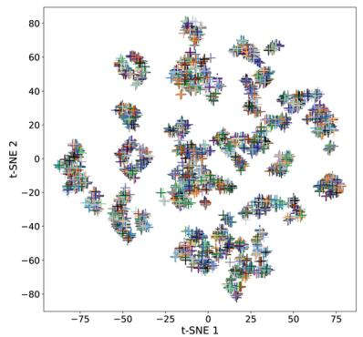

scatter

| t-SNE 1 | t-SNE 2 |
| ------- | ------- |
| -75     | 0       |
| -50     | 20      |
| -25     | 40      |
| 0       | 60      |
| 25      | 80      |
| 50      | 60      |
| 75      | 40      |

(a) 50-fold CV with Random splitting

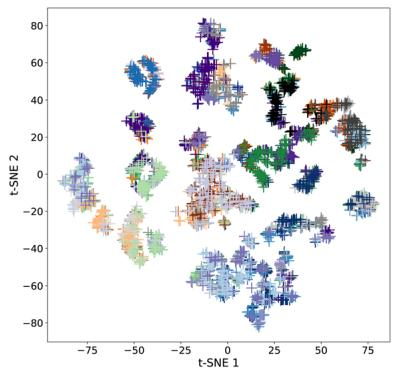

scatter

| t-SNE 1 | t-SNE 2 |
| ------- | ------- |
| -75     | 0       |
| -50     | 20      |
| -25     | 40      |
| 0       | 60      |
| 25      | 80      |
| 50      | 60      |
| 75      | 40      |

(b)LOCO

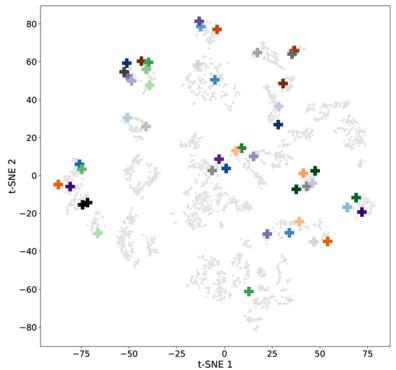  
(c) SparseXSingle samples

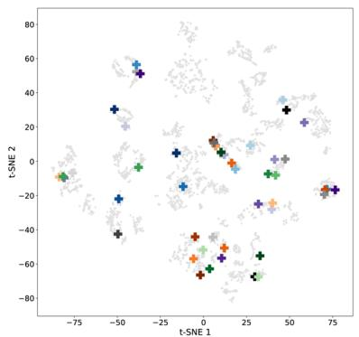

scatter

| t-SNE 1 | t-SNE 2 |
| ------- | ------- |
| -75     | -20     |
| -50     | 30      |
| -25     | 50      |
| 0       | 10      |
| 25      | -60     |
| 50      | 30      |
| 75      | -20     |

(d) SparseYSingle samples

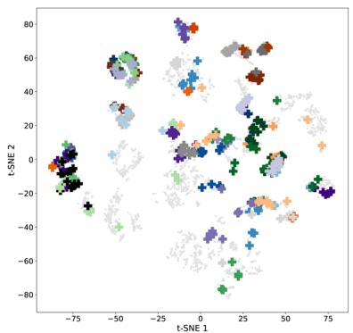  
(e) SparseXCluster samples

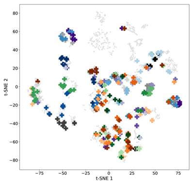  
(f) SparseYCluster samples   
Fig. 2 Distribution of standard cross-validation (CV) test set and five OOD test sets using different target generation methods for the band gap dataset. Each color represents one single fold. (a) 50-fold CV (with random splitting) of the whole band gap dataset with 4604 samples represented by cross symbols with 50 different colors. (b) Leave-one-cluster-out target (LOCO) clusters. (c) 50 test samples in SparseXSingle are represented by cross symbols with 50 different colors, and grey points represent the remaining samples. (d) 50 test samples in SparseYSingle represented by cross symbols with 50 different colors, and grey points represent the remaining samples. (e) 50 test clusters in SparseXCluster are represented by cross symbols with 50 different colors, and grey points represent the remaining samples. (f) 50 test clusters in SparseYCluster represented by cross symbols with 50 different colors, and grey points represent the remaining samples.

For comparison with the DAs with the state-of-the-art algorithms, as reported in the Matbench leaderboard, we evaluate a simple transfer-learning based DA algorithm. For a given target set, we rst train a Roost37 model using all the training samples. We then select 500 samples similar to the target sample(s) and use them to ne-tune the trained Roost model. The Roost algorithm is an ML approach specically designed for material property prediction based on material composition. It utilizes a graph neural network framework to learn relationships between material compositions and their corresponding properties. To compare with the performance of traditional strong models, we choose ModNet38 algorithm and evaluate its performance on our realistic benchmark datasets and compare with other DA-RF machine learning models.

# 2.3 Domain adaptation algorithms

In many real-world scenarios, machine learning models oen suffer from a performance drop when applied to new, unseen data that comes from a distribution different than the training data. This is known as the domain shi problem. Domain adaptation techniques aim to reduce or eliminate this performance degradation by leveraging the knowledge learned from the source and target domain to adapt and generalize well to the target domain. The main idea of domain adaptation is to address the challenge of transferring knowledge learned from a source domain to a target domain when the source and target domains may have different distributions or feature representations. In other words, domain adaptation aims to make a model trained on one dataset (source domain) perform well on another dataset with different characteristics (target domain) without requiring a large amount of labeled data from the target domain by exploiting, e.g., the sample distribution of the target domain.

There are three major categories of domain adaptation algorithms including feature-based, instance-based, and parameter-based methods. Fig. 3(a) shows the out-of-domain prediction problem and the key ideas of three main categories of DA methods.

2.3.1 Feature-based DA methods. The feature-based domain adaptation algorithm operates based on the research of common features of a source and target domain. This machine learning technique aims to learn a feature representation that is domain-invariant or transferable. An encoded feature space is created to correct the distributions between the source and target domains. The task on the source and target domain is then learned (aligning feature distributions) in the encoded feature space which permits the generalization of target domains even with limited labeled data. Due to the feature-based domain adaptation's ability to process data quickly and efficiently, this technique encompasses a number of advantages including the ability to utilize labeled source data (even when data is scarce), reduced annotation effort, exibility (able to align feature representations of source and target domains with different data distributions), improved generalization to a target domain, and overall improved model performance.

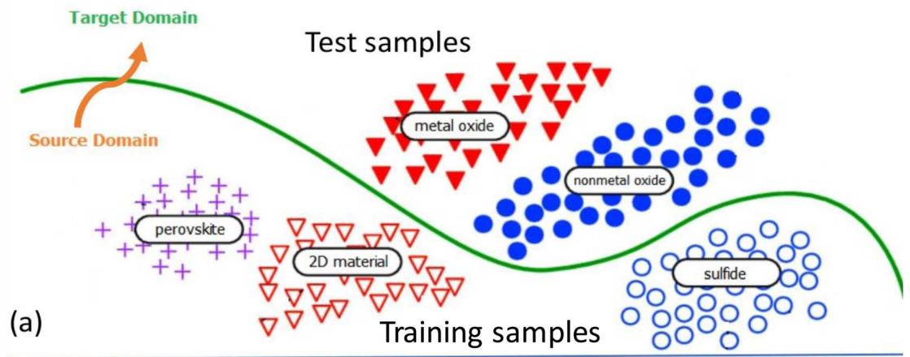

flowchart

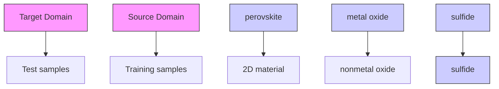

(b)   
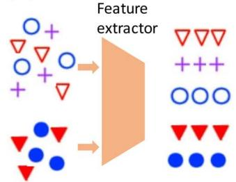

flowchart

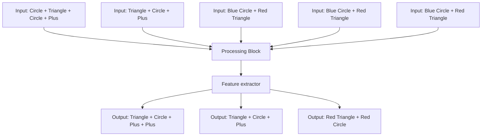

（c）  
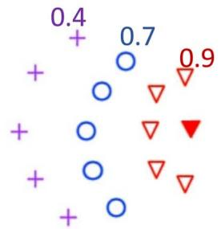

scatter

| Group | Value |
|-------|-------|
| Purple + | 0.4 |
| Blue ○ | 0.7 |
| Red ▽ | 0.9 |

(d）  
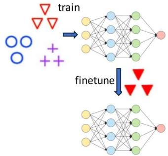

flowchart

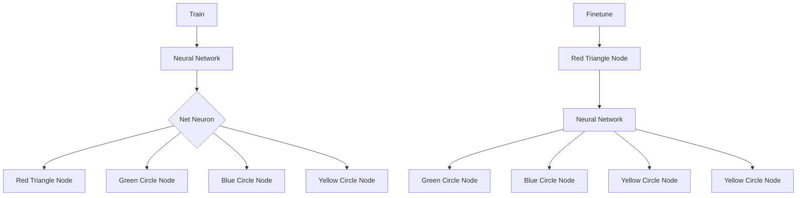

Feature-based DAs   
Instance-based DAs   
Parameter-based DAs   
Fig. 3 Domain adaptation based machine learning for out-of-distribution material property prediction. (a) OOD prediction problem: model trained with source domain samples is to be used to predict test samples in different target domains; (b) feature-based DAs map samples of both source and target domains to a unified representation; (c) instance-based DA methods put higher weights on training samples closer to the test samples; (d) parameter or transfer-learning based DAs fine-tune a pre-trained model with a small number of labeled target domain samples.

We have tested the following feature-based DA methods for the problem:

Frustratingly easy domain adaptation (PRED).39   
Feature Augmentation (FA).40   
Correlation Alignment (CORAL).41   
Subspace Alignment (SA).42   
Transfer Component Analysis (TCA).43   
Feature Selection with MMD (FMMD).44

Out of the six feature-based DA methods, only the PRED and FA algorithms are supervised DA methods. For band gap regression, we used all the above DA methods except FMMD, which took too long to run for this dataset. For the glass classication problem, we used all methods.

2.3.2 Instance-based DA methods. While feature-based domain adaptation aligns with feature representations, instance-based domain adaptation focuses on the transfer of labeled instances from the source domain to the target domain. The core principle of instance-based domain adaptation is to adjust the weight (by multiplying the losses of individual training instances by a positive weight) of labeled training data to correct the differences between source and target distributions. The weight-adjusted training instances are then directly used to learn the task.

We have applied the following instance-based DA algorithms in this study:

Weighting Adversarial Neural Network (WANN).45   
Kernel Mean Matching (KMM).46   
 Relative Unconstrained Least-Squares Importance Fitting (RULSIF).47   
 Unconstrained Least-Squares Importance Fitting (ULSIF).48   
Nearest Neighbors Weighting (NNW).49   
BalancedWeighting (BW).50

Out of the six instance-based DA methods, BW and WANN are supervised algorithms while others are unsupervised ones. For the band gap regression problem, we use all the above except ULSIF. For the glass classication problem, we have evaluated all the above DA models.

2.3.3 Parameter-based DA methods. In parameter-based DA methods, the parameters of one or a few pre-trained models trained with the source data are adapted to build a ne-tuned model for the task on the target domain. This is a typical scenario of transfer learning. We have evaluated the following parameter-based DA algorithms for the band gap prediction and glass classication problems.

Regular Transfer with Linear Regression (RegularTransferLR).51   
. Regular Transfer with Neural Network (RegularTransferNN).51   
 Linear Interpolation between SrcOnly and TgtOnly (LinInt).40   
TransferTreeClassifer.52   
Regular Transfer for Linear Classication (RegularTransferLC).51   
Transfer AdaBoost for Regression (TrAdaBoostR2).53   
Transfer AdaBoost for Classication (TrAdaBoost).54

All these parameter-based methods are supervised DA methods that need target annotated samples to ne-tune the model. For the band gap regression problem, we evaluated all the above methods except TrAdaBoost, TransferTreeClassifer, and RegularTransferLC. For the glass classication problem, we evaluated TransferTreeClassier, RegularTransferLC, Regular-TransferNN, TrAdaBoost, and LinInt.

# 2.4 Evaluation criteria

We use the following performance metrics for evaluating dataset redundancy's impact on model performance, including Mean Absolute Error (MAE), and Balanced Accuracy:

$$
\mathrm{MAE} = \frac {1}{n} \sum_ {i = 1} ^ {n} | y _ {i} - \hat {y} _ {i} | \tag {1}
$$

${ \mathrm { B a l a n c e d ~ A c c u r a c y } } = { \frac { 1 } { 2 } } \left( { \frac { \mathrm { T r u e ~ P o s i t i v e } } { \mathrm { T r u e ~ P o s i t i v e } + { \mathrm { F a l s e ~ N e g a t i v e } } } } \right.$ Balanced Accuracy ¼ 1

$$
\left. + \frac {\text { True   Negative }}{\text { True   Negative } + \text { False   Positive }}\right) \tag {2}
$$

where $y _ { i }$ represents the observed or true values, and $\hat { y _ { i } }$ represents the predicted values, y- represents the mean of the observed values. The summation symbol $\scriptstyle \sum$ is used to calculate the sum of values, and n represents the number of data points in the dataset.

# 3 Results and discussion

# 3.1 DA for leave-one-cluster-out (LOCO) targets

Compared to the random train-test splitting or the crossvalidation, the LOCO targets tend to have different distributions compared to the training sets (See Fig. 2(f)), which leads to increased challenges for the regular machine learning models. Here we evaluate whether different types of domain adaptation methods can be used to improve the generalization performance of the baseline models in the case of a distribution shi. Without special notation, we use the Random Forest algorithm as the baseline model upon which the DA models are applied.

Fig. 4(a) shows the results of the supervised DA methods for band gap prediction. We nd that the MAE of the supervised DA methods generally increases, delineating that the models' performance becomes worse. Out of 8 supervised DA methods, only the BW and TrAdaBoostR2 have slightly improved with BW's MAE reduced from 0.477 to 0.454 eV and TrAdaBoostR2's MAE reduced from 0.477 to 0.458 eV. In contrast, the methods WANN, RegularTransferLR, and LinInt show signicant decreases in performance compared to the baselines. We nd that all feature-based DA methods including LinInt, PRED, and FA experienced some decrease in performance.

Fig. 4(b) reects similar results shown in Fig. 4(a) with only two unsupervised DA methods with slightly improved performance, including KMM (MAE reduced from 0.555 eV to 0.524 eV) and RULSIF (MAE reduced from 0.4768 eV to 0.4756 eV). KMM and RULSIF are both instance-based DA models while all the feature-based models decrease in performance (CORAL, SA, TCA, FMMD).

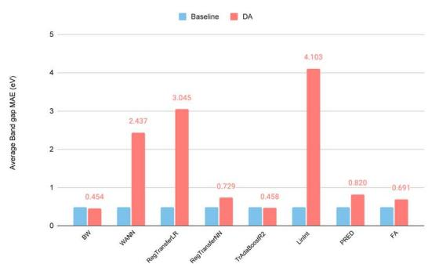

bar

| Method | Baseline (eV) | DA (eV) |
| :--- | :--- | :--- |
| BP | 0.454 | 0.454 |
| HWAN | 0.454 | 2.437 |
| RayTransferLR | 0.454 | 3.045 |
| RayTransferNN | 0.454 | 0.729 |
| TRAblationQ | 0.458 | 0.458 |
| LRNL | 0.458 | 4.103 |
| PRED | 0.458 | 0.820 |
| FA | 0.458 | 0.691 |

(a) Supervised DA methods

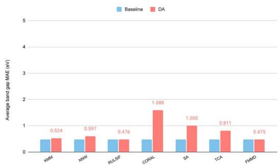

bar

| Model | Baseline (eV) | DA (eV) |
| :--- | :--- | :--- |
| KIM | 0.45 | 0.524 |
| INW | 0.45 | 0.597 |
| RULSIF | 0.45 | 0.476 |
| CORAL | 0.45 | 1.588 |
| SA | 0.45 | 1.000 |
| TCA | 0.45 | 0.811 |
| FIMD | 0.45 | 0.475 |

(b) Unsupervised DA methods   
Fig. 4 Performance of supervised DA models and unsupervised DA models compared with the baseline ML models for band gap prediction over the bandgap-LOCO dataset. (a) Supervised DA Random Forest. Only three labeled target samples are used for DA. (b) Unsupervised DAs Random Forest.

Overall, the best performance is achieved by the supervised DA method BW with the lowest MAE of 0.454 eV, a 4.8% MAE reduction from the baseline. Here we only use three labeled samples in the target cluster for domain adaptation. When we increase this number to 50% of the test clusters, the BW's MAE can be further reduced to 0.43 eV while TrAdaBoostR2's MAE can be reduced to 0.426 eV. We also compare the RF-based BW performance with those of the two state-of-the-art neural network models for this composition-based band gap prediction problem. First, we nd that the ModNet, which is reported to achieve an MAE of 0.3327 eV for the 5-fold cross-validation over the original band gap dataset, only achieves an MAE of 0.8592 eV, a dramatic decrease in its performance, showing its low capability to handle domain shi. In contrast, the Roost37 model achieves an MAE of 0.3710 for our Bandgap-LOCO dataset, outperforms ModNet and all other domain adaptation algorithms evaluated so far which are based on random forest or simple neural networks. We further evaluate the unsupervised transfer-learning over the Roost model by netuning the pre-trained model using 500 training samples that are most similar to the test samples. The nal MAE is 0.369, a slightly improved result. This demonstrates the importance of the base model for the domain adaptation method.

Fig. 5(a) shows the results of the supervised DA methods for glass classication. The average balanced accuracy of the supervised DA methods overall decreases, meaning the models' performance was reduced. Of the 9 supervised DA methods, only BW–an instance-based DA method–improved with an accuracy increasing from 0.652 to 0.704. All other DA methods decreased in performance except for RegularTrasnferNN, whose accuracy remained the same compared to the baseline algorithm.

Fig. 5(b) shows the average balanced accuracy of unsupervised DA methods (red) versus baseline (blue). Out of the eight unsupervised DA methods, only the KMM shows improvement with its average balanced accuracy increased from 0.652 to 0.704. KMM works by correcting sample bias by minimizing the difference between the means of the source and target domains using the Maximum Mean Discrepancy (MMD) in a reproducing kernel Hilbert space (RKHS). All other unsupervised DA methods decrease in their performance compared to the baseline. We also compared how the number of labeled ne-tuning samples from the target domain affects the DA performance (Supplementary Table S2†). We nd that when we increase the ne-tuning samples from three to 50% of the target set, all the DA classication performances improve signicantly. This indicates the importance of acquiring more labeled properties for the target domain whenever possible.

# 3.2 DA for single-point targets in sparse X and sparse Y areas

The single-point sparse X and sparse Y test sets are unique in the sense that there is only one sample in the test set, while all remaining samples are used as training samples. This makes it impossible to apply supervised DA algorithms. Here we evaluate how well the unsupervised DA methods can improve the prediction performance by considering the composition of the single test sample.

Fig. 6(a) shows the performance of DA methods compared to their baseline for the single sparse X test sets. Out of the seven DA methods, three of them achieve better performance (lower MAEs) including KMM, RULSIF, and FMMD. The largest improvement is by RULSIF which reduces the MAE (0.555 eV) of the baseline RF algorithm to 0.399 eV, a 28% reduction of the prediction error. In contrast, FMMD and KMM reduce the errors by 8.4% and 5.7% respectively. This result demonstrates the huge potential of DA methods in single-point prediction problems. We also compare the RULSIF's performance over this test set with those of Roost and ModNet and nd that it even signicantly outperforms Roost with an MAE of 0.483 eV and ModNet with an MAE of 0.436 eV.

We further evaluate the DA performances over the single sparse Y test sets with 50 targets as shown in Fig. 6(b). Here only two instance-based DA methods KMM and NNW achieve higher performance than the baseline with an MAE of 0.611 eV and 0.567 eV respectively. All the feature-based DA methods have led to deteriorated performance. Particularly, CORAL, SA, and TCA have signicantly higher MAEs compared to the baseline. It is interesting to see that the RULSIF does not work as well as it does for the sparse X test sets.

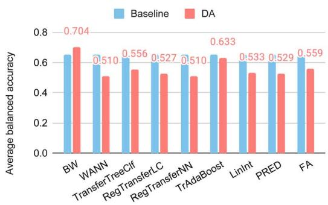

bar

| Model | Baseline | DA |
|---|---|---|
| BW | 0.65 | 0.704 |
| WANN | 0.58 | 0.510 |
| TransferTreeClf | 0.62 | 0.556 |
| RegTransferLC | 0.60 | 0.527 |
| RegTransferNN | 0.59 | 0.510 |
| TrAdaBoost | 0.65 | 0.633 |
| LinInt | 0.61 | 0.533 |
| PRED | 0.60 | 0.529 |
| FA | 0.64 | 0.559 |

(a) Supervised DAs

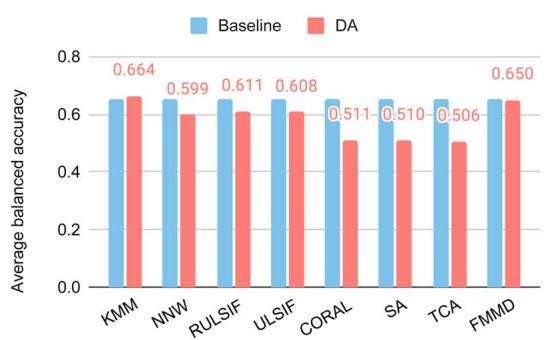

bar

| Model | Baseline | DA |
|---|---|---|
| KMM | 0.65 | 0.664 |
| NNW | 0.65 | 0.599 |
| RULSIF | 0.65 | 0.611 |
| ULSIF | 0.65 | 0.608 |
| CORAL | 0.65 | 0.511 |
| SA | 0.65 | 0.510 |
| TCA | 0.65 | 0.506 |
| FMMD | 0.65 | 0.650 |

(b) Unsupervised DAs   
Fig. 5 Performance of DA models for glass classification using DA methods evaluated over the glass-LOCO target clusters. (a) Supervised DA methods. (b) Unsupervised DA methods.

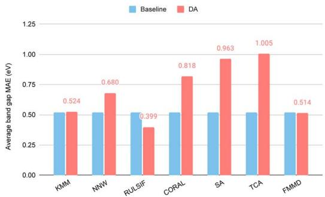

bar

| Model | Baseline (eV) | DA (eV) |
| :--- | :--- | :--- |
| KMM | 0.524 | 0.524 |
| NNW | 0.680 | 0.680 |
| RULSIF | 0.399 | 0.399 |
| CORAL | 0.818 | 0.818 |
| SA | 0.963 | 0.963 |
| TCA | 1.005 | 1.005 |
| FMMD | 0.514 | 0.514 |

(a) Sparse X test sets

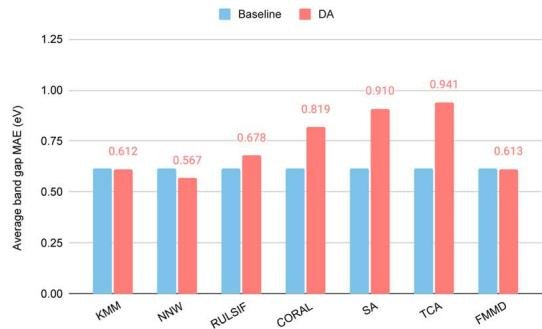

bar

| Model | Baseline (eV) | DA (eV) |
| :--- | :--- | :--- |
| KMM | 0.612 | 0.612 |
| NNW | 0.567 | 0.567 |
| RULSIF | 0.678 | 0.678 |
| CORAL | 0.819 | 0.819 |
| SA | 0.910 | 0.910 |
| TCA | 0.941 | 0.941 |
| FMMID | 0.613 | 0.613 |

(b) Sparse Y test sets   
Fig. 6 Performance of unsupervised DA models for band gap prediction evaluated over the 50 single target samples in sparse input (X) and sparse output (Y) areas. (a) Performance of DAs over sparse X test samples. (b) Performance of DAs over sparse Y test samples.

Table 2 Performance of unsupervised DAs over the glass classification problem 

<table><tr><td>Dataset</td><td>Algorithm</td><td>KMM</td><td>NNW</td><td>RULSIF</td><td>CORAL</td><td>SA</td><td>TCA</td><td>FMMD</td></tr><tr><td rowspan="2">Single X test sets</td><td>Baseline</td><td>0.75</td><td>0.75</td><td>0.75</td><td>0.75</td><td>0.75</td><td>0.75</td><td>0.75</td></tr><tr><td>DA</td><td>0.76</td><td>0.74</td><td>0.72</td><td>0.34</td><td>0.34</td><td>0.66</td><td>0.72</td></tr><tr><td rowspan="2">Single Y test sets</td><td>Baseline</td><td>0.72</td><td>0.72</td><td>0.72</td><td>0.72</td><td>0.72</td><td>0.72</td><td>0.72</td></tr><tr><td>DA</td><td>0.7</td><td>0.84</td><td>0.76</td><td>0.44</td><td>0.44</td><td>0.58</td><td>0.7</td></tr></table>

We then evaluate the DA performances over the Single-X and Single-Y glass datasets (Table 2). First, we nd that these two datasets are challenging for the DA methods. For the Single X test sets, only the KMM algorithm has a slight 1.3% improvement in terms of balanced accuracy. All the other DA methods have either the same or much worse accuracy, especially for the three feature-based DAs such as CORAL, SA, and TCA. For the Singe-Y test sets, the instance-based DA methods NNW and RULSIF improve the baseline performance by 16.7% and 5.6% respectively, indicating the potential of DA algorithms for outof-domain material property prediction.

# 3.3 DA for band gap SparseX and SparseY cluster targets

Test sets of the SparseXCluster and SparseYCluster datasets are constructed by rst selecting 50 seed samples with the highest sparsity in the composition (Magpie) or property space, then selecting 10 out of those samples that are most similar to the seed sample. The selected samples are used to evaluate whether an ML model can predict the properties without using closest neighbors.

Fig. 7(a) and (b) show the performance of supervised and unsupervised DAs over the band gap SparseXCluster dataset. Out of the seven supervised DAs (Fig. 7(a)), three of the DA algorithms have improved performances over their base algorithms. Those DA algorithms are BW, RegularTransferNN, and TrAdaBoostR2 among which the TrAdaBoostR2 achieves the lowest MAE of 0.516 eV. Out of the seven unsupervised DA methods (Fig. 7(b)), only one algorithm–RULSIF–has a signi- cant performance improvement over its base RF algorithm with an MAE of 0.468 eV. This is impressive as it beats all the supervised DAs. However, this performance is not as good as the MAE (0.421 eV) of the basic Roost algorithm, showing the power of the neural network model of the Roost. RULSIF's performance, however, is much better than that of the ModNet, which only achieves an MAE of 0.788 eV, a signicant degradation from its 0.331 eV for the 5-fold random cross-validation performance as reported in the Matbench.

Fig. 7(c) and (d) show the performance of supervised and unsupervised DAs over the band gap SparseYCluster dataset. Out of the seven supervised DAs (Fig. 7(c)), BW and TrAda-BoostR2 are the only two algorithms to have improved performance over their base algorithms, with TrAdaBoostR2 achieving the lowest MAE of 0.461 eV. Out of the seven unsupervised DA methods (Fig. 7(d)), only one algorithm, RULSIF, has improved performance over the base RF algorithm by 18.7% with an MAE of 0.417 eV compared to 0.513 eV of the base model. This is impressive as it beats all the supervised DAs and is as good as the MAE (0.419 eV) of the Roost algorithm. RULSIF's performance is also much better than that of the ModNet which only achieves an MAE of 0.824 eV. Overall, we nd that the unsupervised RULSIF has demonstrated strong performance for these two challenging test datasets. As an instance-based method for domain adaptation, RULSIF works by correcting the difference between input distributions of source and target domains by nding a source instance reweighting which minimizes the relative Pearson divergence between source and target distributions. Pearson divergence, also known as Pearson's chi-squared divergence, is a measure of the difference between two probability distributions. It is oen used in statistics and information theory to quantify how one distribution differs from another. Pearson divergence is particularly useful when comparing two discrete probability distributions.

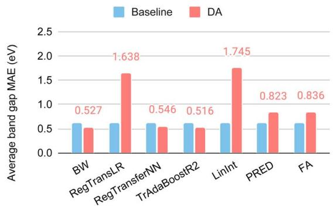

bar

| Model | Baseline (eV) | DA (eV) |
| :--- | :--- | :--- |
| BW | 0.6 | 0.527 |
| RegTransLR | 0.6 | 1.638 |
| RegTransferNN | 0.6 | 0.546 |
| TrAdaBoostR2 | 0.6 | 0.516 |
| LinInt | 0.6 | 1.745 |
| PRED | 0.6 | 0.823 |
| FA | 0.6 | 0.836 |

(a)

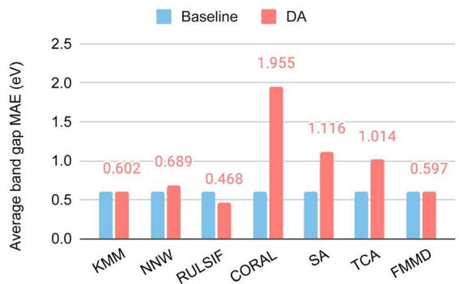

bar

| Model | Baseline (eV) | DA (eV) |
| :--- | :--- | :--- |
| KMM | 0.6 | 0.602 |
| NNW | 0.6 | 0.689 |
| RULSIF | 0.6 | 0.468 |
| CORAL | 0.6 | 1.955 |
| SA | 0.6 | 1.116 |
| TCA | 0.6 | 1.014 |
| FMMD | 0.6 | 0.597 |

(b)

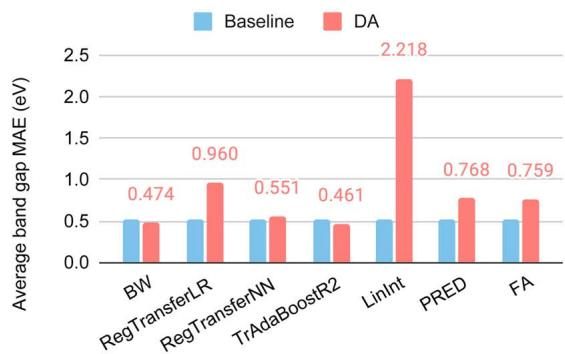

bar

| Model | Baseline (eV) | DA (eV) |
| :--- | :--- | :--- |
| BW | 0.5 | 0.474 |
| RegTransferLR | 0.5 | 0.960 |
| RegTransferNN | 0.5 | 0.551 |
| TrAdaBoostR2 | 0.5 | 0.461 |
| LinInt | 0.5 | 2.218 |
| PRED | 0.5 | 0.768 |
| FA | 0.5 | 0.759 |

（c）

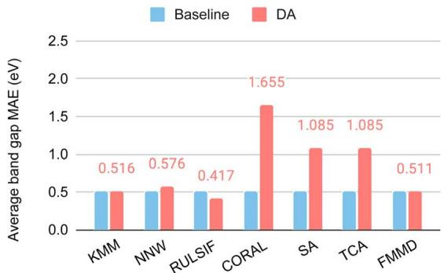

bar

| Model | Baseline (eV) | DA (eV) |
| :--- | :--- | :--- |
| KMM | 0.5 | 0.516 |
| NNW | 0.5 | 0.576 |
| RULSIF | 0.5 | 0.417 |
| CORAL | 0.5 | 1.655 |
| SA | 0.5 | 1.085 |
| TCA | 0.5 | 1.085 |
| FMMD | 0.5 | 0.511 |

(d）  
Fig. 7 DA performance for the SparseX and SparseY test clusters derived from the band gap dataset. (a) Supervised DAs for the Sparse X clusters; (b) supervised DAs for the Sparse X clusters; (c) supervised DAs for the Sparse Y clusters; (d) unsupervised DAs for the Sparse Y clusters.

# 3.4 DA for glass SparseXCluster and SparseYCluster datasets

Fig. 8(a) and (b) show the performance of supervised DAs and unsupervised DAs over the glass SparseXCluster dataset. Out of the seven supervised DAs (Fig. 8(a)), only the BW algorithm has improved accuracy over their base algorithms with a balanced accuracy of 79.1%. Out of the seven unsupervised DA methods (Fig. 8(b)), only one algorithm, NNW, has the performance improvement over its base RF algorithm with an accuracy of 72.9%. When compared to BW, NNW's performance is signi- cantly lower. We also found that BW has outperformed Roost for this dataset, which has an accuracy of 77.60%, and ModNet which achieves an accuracy of 60%, much lower than the 96% for the same glass dataset but with 5-fold random crossvalidation.

Fig. 8(c) and (d) shows the performance of supervised DAs and unsupervised DAs over the glass SparseYCluster dataset. Out of the seven supervised DAs (Fig. 8(c)), only BW again has improved the performance of their base algorithms with an accuracy of 80.2%. Out of the seven unsupervised DA methods (Fig. 8(d)), only one algorithm, NNW, has improved performance over its base RF algorithm with an accuracy of 75.1%, which is not as the best supervised DA algorithm BW. We also found that the BW's performance is better than the Roost algorithm, which achieves an accuracy of 75.5%. When we further ne-tune the pre-trained Roost model with the 500 most similar training samples to the target set, its performance increases to 77.9%, which is still below BW's accuracy. This demonstrates the big potential of DA algorithms for these raw sample property predictions. We also ran ModNet over this dataset and found it can only achieve an accuracy of 51%. Compared to its 96% reported on the Matbench, this is a signicant degradation, which implies the huge risk of using these models to predict properties for minority or new materials that are located in different areas of the composition or property space.

# 3.5 Discussion

Usually, in realistic materials property prediction, the target compositions or structures are already known, which can be used to guide the ML model training. Moreover, researchers are usually more interested in the properties of novel materials with unusual compositions or properties, leading to a typical out-ofdistribution machine learning problem. Here we formulate ve OOD material property prediction benchmark datasets for both regression and classication problems and conducted extensive experiments to evaluate how existing well-established domain adaptation methods work in the materials science context. It is found that standard ML models tend to have severely degraded performance for such OOD test sets. While most existing DA models cannot improve the performance of their base model, a few DA algorithms such as BW and RULSIF that capture the true domain shi relationship can achieve much better results compared to the baseline and outperform other state-of-the-art neural network models such as ModNet, demonstrating the huge potential of DA in material property prediction.

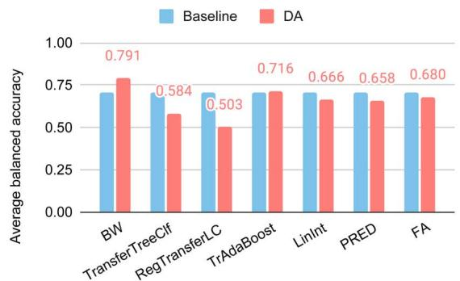

bar

| Model | Baseline | DA |
|---|---|---|
| BW | 0.71 | 0.791 |
| TransferTreeClf | 0.68 | 0.584 |
| RegTransferLC | 0.69 | 0.503 |
| TrAdaBoost | 0.69 | 0.716 |
| LinInt | 0.68 | 0.666 |
| PRED | 0.69 | 0.658 |
| FA | 0.69 | 0.680 |

(a)

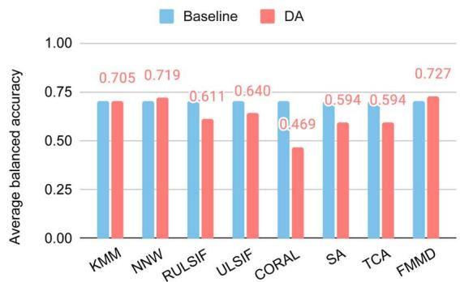

bar

| Model | Baseline | DA |
|---|---|---|
| KMM | 0.71 | 0.705 |
| NNW | 0.719 | 0.719 |
| RULSIF | 0.611 | 0.611 |
| ULSIF | 0.640 | 0.640 |
| CORAL | 0.469 | 0.469 |
| SA | 0.594 | 0.594 |
| TCA | 0.594 | 0.594 |
| FMMD | 0.727 | 0.727 |

(b)

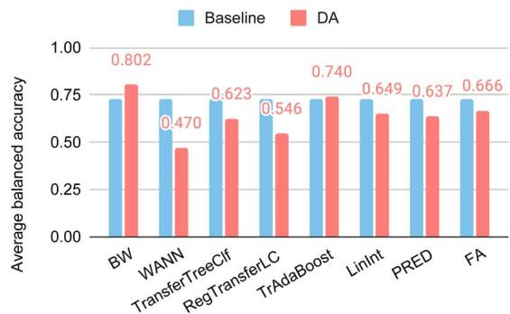

bar

| Model | Baseline | DA |
|---|---|---|
| BW | 0.72 | 0.802 |
| WANN | 0.71 | 0.470 |
| TransferTreeCif | 0.69 | 0.623 |
| RegTransferLC | 0.68 | 0.546 |
| TrAdaBoost | 0.71 | 0.740 |
| LinInt | 0.68 | 0.649 |
| PRED | 0.67 | 0.637 |
| FA | 0.68 | 0.666 |

（c）

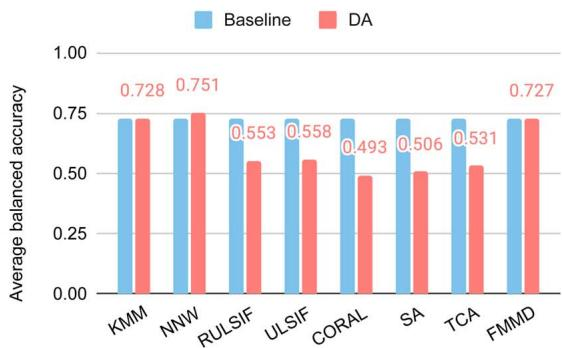

bar

| Model | Baseline | DA |
|---|---|---|
| KMM | 0.728 | 0.751 |
| NNW | 0.728 | 0.751 |
| RULSIF | 0.553 | 0.558 |
| ULSIF | 0.558 | 0.493 |
| CORAL | 0.506 | 0.493 |
| SA | 0.506 | 0.531 |
| TCA | 0.531 | 0.727 |
| FMMD | 0.727 | 0.727 |

(d)   
Fig. 8 DA performance for the SparseX and SparseY test clusters derived from the glass dataset. (a) Supervised DAs for the Sparse X clusters; (b) unsupervised DAs for the Sparse X clusters; (c) supervised DAs for the Sparse Y clusters; (d) unsupervised DAs for the Sparse Y clusters.

To investigate further DAs for the OOD material property prediction problem, we summarize the best algorithms for each of the 10 datasets evaluated in this study along with their performance scores and standard deviation (Table 3). First, for the ve OOD test sets of band gap prediction, the neural network based Roost algorithm is the best according to its average MAEs over 50 clusters. RULSIF, an instance-based unsupervised DA achieved the best performance for two of the ve OOD test sets, which is impressive as its base model is a random forest rather than a neural network. As Borisov et al.55 introduced, decision tree ensemble-based machine learning methods outperform deep neural network-based methods for heterogeneous tabular data. Another observation is that the standard deviations of all the highest-performing algorithms are relatively high, which could be due to the challenges of this band gap test sets, out of which several clusters are very difficult to predict accurately (Supplementary Fig. S1†). For the SparseXSingle and SparseYSingle datasets, as we choose only one sample from each cluster, these samples are very different from each other. Thus the bigger std on both SparseXSingle and SparseYSingle datasets indicates that the model may have good performance on some clusters and bad performance on others. However, the std value on the three cluster datasets (LOCO, SparseXCluster, SparseYCluster) is relatively smaller, because our model can learn from more samples. This is very different from standard K-fold cross-validation experiments or random train-test splitting tests, which tend to have i.i.d test distributions and thus very low-performance variation across different folds. This calls for special attention to practical material property prediction as regards the predicted property values and techniques such as uncertainty quantication56 may be introduced to estimate the condence of the result. For the glass datasets, it is found that four DA methods achieve the best classication performance: three of them are done by BW and one by NNW, both of which are instance-based DA methods.

Table 3 Best algorithms and corresponding MAE/balanced accuracy and standard deviation (std) for each of the ten OOD test datasets 

<table><tr><td rowspan="2">Dataset</td><td colspan="3">Bandgap</td><td colspan="3">Glass</td></tr><tr><td>Best algorithm</td><td>MAE (eV)</td><td>Std</td><td>Best algorithm</td><td>Balanced accuracy</td><td>Std</td></tr><tr><td>LOCO</td><td>Roost</td><td>0.371</td><td>0.260</td><td>BW</td><td>0.704</td><td>0.141</td></tr><tr><td>SparseXCluster</td><td>Roost</td><td>0.421</td><td>0.414</td><td>BW</td><td>0.791</td><td>0.209</td></tr><tr><td>SparseYCluster</td><td>RULSIF</td><td>0.417</td><td>0.314</td><td>BW</td><td>0.802</td><td>0.187</td></tr><tr><td>SparseXSingle</td><td>RULSIF</td><td>0.399</td><td>0.433</td><td>Roost</td><td>0.840</td><td>0.373</td></tr><tr><td>SparseYSingle</td><td>Roost</td><td>0.495</td><td>0.767</td><td>NNW</td><td>0.840</td><td>0.367</td></tr></table>

In this study, the three best-performance DAs are all instance-based methods, indicating their advantages for OOD material property prediction. However, this does not mean that feature-based or transfer-learning based DA models have less potential. More likely, the reason for their low performances is due to their design is currently developed based on assumptions of domain shis in computer vision, medical imaging, and related eld. In contrast, the domain-shi relationship of material properties has unique regularities that the current feature-based DAs cannot model and exploit. The low performance of the transfer-learning (parameter-based) DAs is probably due to the base model we used here are default primitive neural network with just one hidden layer. More powerful network models similar to Roost or ModNet may be used as the pre-trained model to improve their OOD performance.

While here we only focus on composition-based material property prediction, domain adaptation methods can be easily transferred to structure-based ML Models for materials property prediction. This can be done, e.g., by rst training a regular graph neural network model and then using the trained network backbone before the fully connected layer as the feature extractor to convert all structures into latent features for both training and testing samples. We can then apply the DA algorithms to the derived dataset. The pre-trained model based transfer learning can also be used here.

# 4 Conclusion

In real-world materials discovery, researchers already know the target material compositions or structures for which they want to predict their properties. It is desirable to exploit such information to train better ML models for material property prediction in such scenarios. In addition, material scientists usually are more interested in materials with new/rare properties in uncharted design spaces. Here we propose a set of ve realistic materials property prediction benchmark problems, in which the test samples are located in sparse composition or property space. We then evaluated the performance of different domain adaptation enhanced machine learning algorithms for the band gap prediction and the glass classication problems.

Our experiments show that out-of-distribution materials property prediction poses great challenges for regular machine learning algorithms including state-of-the-art algorithms such as ModNet. Out of the three categories of DA methods that we evaluated, the feature-based DAs and the parameter-based DAs (transfer-learning or ne-tuning) do not show an improved performance overall. The reason is twofold: for feature-based DAs, it is probably due to the source–target domain relationships in our materials datasets being different from those in the original DA papers. For the parameter-based DA methods, it may be due to the incompetency of the default base neural network models. Out of all instance-based DA methods, the best DAs are usually supervised DAs. For both categories of DA methods, it seems we have to develop material data-oriented features and transfer-learning DA algorithms that can capture the underlying domain shi relationships. For example, for both the bandgap-LOCO and glass-LOCO test sets, the instancebased supervised BW achieves the best performance despite only using three labeled test samples. Our results also show the importance of the base model for the DA method: for the bandgap-LOCO, the neural network based Roost model without ne-tuning is better than all RF-based DA methods.

In this work, we have only covered the traditional machine learning models and some simple neural network models with DA for realistic materials property prediction. It is known that many state-of-the-art algorithms for the Matbench are based on deep neural networks. Most of the evaluated DA methods do not apply to those complex neural network models except the transfer learning based approaches. We are condent that domain adaptation for material problems has an abundance of potential to signicantly improve machine learning performance and are fully condent that it will provide a promising research direction.

# Data availability

The source code and the non-redundant datasets can be freely accessed at https://github.com/Little-Cheryl/MatDA.

# Author contributions

Conceptualization, J. H., and R. D.; methodology, J. H., D. L., R. D, N. F.; soware, J. H., D. L., R. D., N. F.; writing–original dra preparation, J. H., R. D.; writing–review and editing, R. D., N. F., D. L., J. H.; visualization, J. H., R. D., and N. F.; supervision, R. D.

# Conflicts of interest

There are no conicts to declare.

# References

1 P. Avery, X. Wang, C. Oses, E. Gossett, D. M. Proserpio, C. Toher, et al., Predicting superhard materials via a machine learning informed evolutionary structure search, npj Comput. Mater., 2019, 5(1), 1–11.   
2 J. Ojih, A. Rodriguez, J. Hu and M. Hu, Screening Outstanding Mechanical Properties and Low Lattice Thermal Conductivity Using Global Attention Graph Neural Network, Energy and AI, 2023, 100286.   
3 R. Xin, E. M. Siriwardane, Y. Song, Y. Zhao, S. Y. Louis, A. Nasiri, et al., Active-learning-based generative design for the discovery of wide-band-gap materials, J. Phys. Chem. C, 2021, 125(29), 16118–16128.   
4 C. Chen, Y. Zuo, W. Ye, X. Li, Z. Deng and S. P. Ong, A critical review of machine learning of energy materials, Adv. Energy Mater., 2020, 10(8), 1903242.   
5 L. Himanen, M. O. J¨ager, E. V. Morooka, F. F. Canova, Y. S. Ranawat, D. Z. Gao, et al., DScribe: Library of descriptors for machine learning in materials science, Comput. Phys. Commun., 2020, 247, 106949.

6 D. Jha, L. Ward, Z. Yang, C. Wolverton, I. Foster, W. K. Liao, et al., Irnet: A general purpose deep residual regression framework for materials discovery, In Proceedings of the 25th ACM SIGKDD International Conference on Knowledge Discovery & Data Mining, 2019, pp. 2385–2393.   
7 S. S. Omee, S. Y. Louis, N. Fu, L. Wei, S. Dey, R. Dong, et al., Scalable deeper graph neural networks for high-performance materials property prediction, Patterns, 2022, 3(5), 100491.   
8 A. Klipfel, Z. Bouraoui, O. Peltre, Y. Fregier, N. Harrati and A. Sayede, Equivariant Message Passing Neural Network for Crystal Material Discovery, In Proceedings of the AAAI Conference on Articial Intelligence, 2023, vol. 37, pp. 14304– 14311.   
9 O. Kaba and S. Ravanbakhsh, Equivariant Networks for Crystal Structures, Adv. Neural Inf. Process., 2022, 35, 4150– 4164.   
10 K. Choudhary and B. DeCost, Atomistic line graph neural network for improved materials property predictions, npj Comput. Mater., 2021, 7(1), 185.   
11 J. Gibson, A. Hire and R. G. Hennig, Data-augmentation for graph neural network learning of the relaxed energies of unrelaxed structures, npj Comput. Mater., 2022, 8(1), 211.   
12 C. Chen, Y. Zuo, W. Ye, X. Li and S. P. Ong, Learning properties of ordered and disordered materials from multi-delity data, Nat. Comput. Sci., 2021, 1(1), 46–53.   
13 B. Rohr, H. S. Stein, D. Guevarra, Y. Wang, J. A. Haber, M. Aykol, et al., Benchmarking the acceleration of materials discovery by sequential learning, Chem. Sci., 2020, 11(10), 2696–2706.   
14 S. Wu, Y. Kondo, K. Ma, B. Yang, H. Yamada, I. Kuwajima, et al., Machine-learning-assisted discovery of polymers with high thermal conductivity using a molecular design algorithm, npj Comput. Mater., 2019, 5(1), 66.   
15 K. Li, D. Persaud, K. Choudhary, B. DeCost, M. Greenwood and J. Hattrick-Simpers, Exploiting redundancy in large materials datasets for efficient machine learning with less data, Nat. Commun., 2023, 14(1), 7283.   
16 B. Meredig, E. Antono, C. Church, M. Hutchinson, J. Ling, S. Paradiso, et al., Can machine learning identify the next high-temperature superconductor? Examining extrapolation performance for materials discovery, Mol. Syst. Des. Eng., 2018, 3(5), 819–825.   
17 Z. Xiong, Y. Cui, Z. Liu, Y. Zhao, M. Hu and J. Hu, Evaluating explorative prediction power of machine learning algorithms for materials discovery using k-fold forward cross-validation, Comput. Mater. Sci., 2020, 171, 109203.   
18 C. Lois, K. Yuan, Y. Zhao, M. Hu and J. Hu, Lattice thermal conductivity prediction using symbolic regression and machine learning, J. Phys. Chem. A, 2020, 125(1), 435–450.   
19 K. Li, B. DeCost, K. Choudhary, M. Greenwood and J. Hattrick-Simpers, A critical examination of robustness and generalizability of machine learning prediction of materials properties, npj Comput. Mater., 2023, 9(1), 55.   
20 F. Wenzel, A. Dittadi, P. Gehler, C. J. Simon-Gabriel, M. Horn, D. Zietlow, et al., Assaying out-of-distribution generalization in transfer learning, Adv. Neural Inf. Process., 2022, 35, 7181–7198.

21 J. Wang, C. Lan, C. Liu, Y. Ouyang, T. Qin, W. Lu, et al., Generalizing to unseen domains: A survey on domain generalization, IEEE Transactions on Knowledge and Data Engineering, 2023, vol. 35(8), pp. 8052–8072.   
22 Z. Shen, J. Liu, Y. He, X. Zhang, R. Xu, H. Yu, et al., Towards out-of-distribution generalization: A survey, arXiv, 2021, preprint, arXiv:210813624, DOI: 10.48550/arXiv.2108.13624.   
23 B. Schölkopf, F. Locatello, S. Bauer, N. R. Ke, N. Kalchbrenner, A. Goyal, et al., Toward causal representation learning, Proc. IEEE, 2021, 109(5), 612–634.   
24 G. Wilson and D. J. Cook, A survey of unsupervised deep domain adaptation, ACM Trans. Intell. Syst. Technol., 2020, 11(5), 1–46.   
25 K. Zhou, Z. Liu, Y. Qiao, T. Xiang and C. C. Loy, Domain generalization: A survey, IEEE Transactions on Pattern Analysis and Machine Intelligence, 2022.   
26 A. Farahani, S. Voghoei, K. Rasheed and H. R. Arabnia, A brief review of domain adaptation, Advances in data science and information engineering: proceedings from ICDATA 2020 and IKE 2020. 2021, pp. 877–894.   
27 Z. Yu, J. Li, Z. Du, L. Zhu and H. T. Shen, A Comprehensive Survey on Source-free Domain Adaptation, arXiv, 2023, preprint, arXiv:230211803, DOI: 10.48550/arXiv.2302.11803.   
28 A. de Mathelin, F. Deheeger, G. Richard, M. Mougeot and N. Vayatis, Adapt: Awesome domain adaptation python toolbox, arXiv, 2021, preprint, arXiv:210703049, DOI: 10.48550/arXiv.2107.03049.   
29 K. Abbasi, P. Razzaghi, A. Poso, M. Amanlou, J. B. Ghasemi and A. Masoudi-Nejad, DeepCDA: deep cross-domain compound–protein affinity prediction through LSTM and convolutional neural networks, Bioinformatics, 2020, 36(17), 4633–4642.   
30 I. Anastopoulos, L. Seninge, H. Ding and J. Stuart. Patient Informed Domain Adaptation Improves Clinical Drug Response Prediction. bioRxiv. 2021, 2021–08.   
31 W. Jin, R. Barzilay and T. Jaakkola, Adaptive invariance for molecule property prediction, arXiv, 2020, preprint, arXiv:200503004, DOI: 10.48550/arXiv.2005.03004.   
32 F. Wu, N. Courty, Z. Qiang, Z. Li, et al., Metric learningenhanced optimal transport for biochemical regression domain adaptation, arXiv, 2022, preprint, arXiv:220206208, DOI: 10.48550/arXiv.2202.06208.   
33 A. Goetz, A. R. Durmaz, M. Müller, A. Thomas, D. Britz, P. Kerfriden, et al., Addressing materials' microstructure diversity using transfer learning, npj Comput. Mater., 2022, 8(1), 27.   
34 A. Dunn, Q. Wang, A. Ganose, D. Dopp and A. Jain, Benchmarking materials property prediction methods: the Matbench test set and Automatminer reference algorithm, npj Comput. Mater., 2020, 6(1), 138.   
35 L. Ward, A. Agrawal, A. Choudhary and C. Wolverton, A general-purpose machine learning framework for predicting properties of inorganic materials, npj Comput. Mater., 2016, 2(1), 1–7.   
36 L. van der Maaten and G. Hinton, Visualizing Data using t-SNE, J. Mach. Learn. Res., 2008, 9(86), 2579–2605, Available from: http://jmlr.org/papers/v9/vandermaaten08a.html.

37 R. E. Goodall and A. A. Lee, Predicting materials properties without crystal structure: Deep representation learning from stoichiometry, Nat. Commun., 2020, 11(1), 6280.   
38 P. P. De Breuck, G. Hautier and G. M. Rignanese, Materials property prediction for limited datasets enabled by feature selection and joint learning with MODNet, npj Comput. Mater., 2021, 7(1), 83.   
39 H. Daum´e III, Frustratingly easy domain adaptation, arXiv, 2009 preprint, arXiv:09071815, DOI: 10.48550/ arXiv.0907.1815.   
40 H. Daum´e III, Frustratingly Easy Domain Adaptation, Association for Computational Linguistic(ACL), 2007, pp. 256–263.   
41 B. Sun, J. Feng and K. Saenko, Return of frustratingly easy domain adaptation, in Proceedings of the AAAI conference on articial intelligence, 2016. vol. 30.   
42 B. Fernando, A. Habrard, M. Sebban and T. Tuytelaars, Unsupervised visual domain adaptation using subspace alignment, in Proceedings of the IEEE international conference on computer vision, 2013, pp. 2960–2967.   
43 S. J. Pan, I. W. Tsang, J. T. Kwok and Q. Yang, Domain adaptation via transfer component analysis, IEEE Trans. Neural Netw., 2010, 22(2), 199–210.   
44 S. Uguroglu and J. Carbonell, Feature selection for transfer learning, in Joint European Conference on Machine Learning and Knowledge Discovery in Databases, Springer, 2011, pp. 430–442.   
45 A. de Mathelin, G. Richard, F. Deheeger, M. Mougeot and N. Vayatis, Adversarial weighting for domain adaptation in regression, In 2021 IEEE 33rd International Conference on Tools with Articial Intelligence (ICTAI), IEEE, 2021. pp. 49– 56.   
46 J. Huang, A. Gretton, K. Borgwardt, B. Schölkopf and A. Smola, Correcting sample selection bias by unlabeled data, Adv. Neural Inf. Process. Syst., 2006, 19, 601–608.

47 M. Yamada, T. Suzuki, T. Kanamori, H. Hachiya and M. Sugiyama, Relative density-ratio estimation for robust distribution comparison, Neural Comput., 2013, 25(5), 1324–1370.   
48 T. Kanamori, S. Hido and M. Sugiyama, A least-squares approach to direct importance estimation, J. Mach. Learn. Res., 2009, 10, 1391–1445.   
49 M. Loog, Nearest neighbor-based importance weighting, In 2012 IEEE International Workshop on Machine Learning for Signal Processing, IEEE, 2012, pp. 1–6.   
50 P. Wu and T. G. Dietterich, Improving SVM accuracy by training on auxiliary data sources. In Proceedings of the twenty-rst international conference on Machine learning, 2004, p. 110.   
51 C. Chelba and A. Acero, Adaptation of maximum entropy capitalizer: Little data can help a lot, Comput Speech Lang, 2006, 20(4), 382–399.   
52 N. Segev, M. Harel, S. Mannor, K. Crammer and R. El-Yaniv, Learn on source, rene on target: A model transfer learning framework with random forests, IEEE Trans. Pattern Anal. Mach. Intell., 2016, 39(9), 1811–1824.   
53 D. Pardoe and P. Stone, Boosting for regression transfer, In Proceedings of the 27th International Conference on International Conference on Machine Learning, 2010. pp. 863–870.   
54 W. Dai, Q. Yang, G. R. Xue and Y. Yu, Boosting for transfer learning, in Proceedings of the 24th international conference on Machine learning, 2007, pp. 193–200.   
55 V. Borisov, T. Leemann, K. Seßler, J. Haug, M. Pawelczyk and G. Kasneci, Deep neural networks and tabular data: A survey, IEEE Trans. Neural Netw. Learn. Syst., 2022, 1–21.   
56 D. Varivoda, R. Dong, S. S. Omee and J. Hu, Materials property prediction with uncertainty quantication: A benchmark study, Appl. Phys. Rev., 2023, 10(2), 021409.