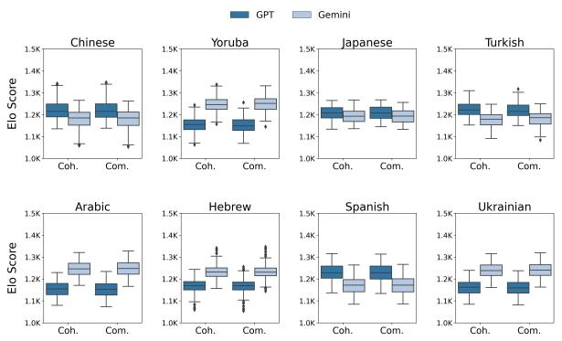
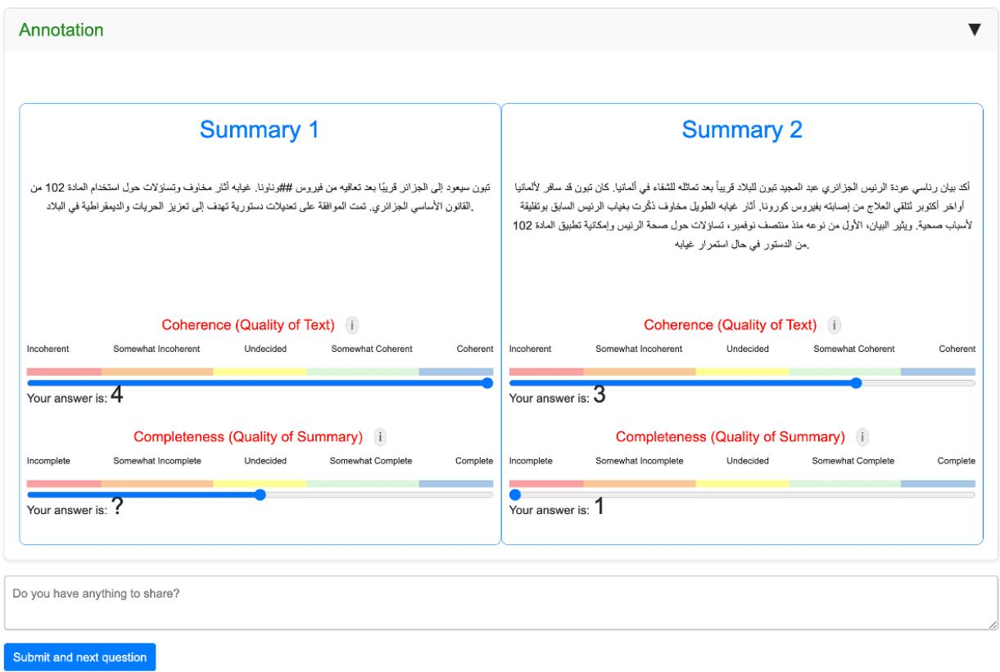

# Beyond N-Grams: Rethinking Evaluation Metrics and Strategies for Multilingual Abstractive Summarization

Itai Mondshinea, Tzuf Paz-Argamana, and Reut Tsarfatya

aBar-Ilan University, Israel,

{mondshi1, tzuf.paz-argaman, reut.tsarfaty}@biu.ac.il

# Abstract

Automatic N-gram based metrics such as ROUGE are widely used for evaluating generative tasks such as summarization. While these metrics are considered indicative (even if imperfect), of human evaluation for English, their suitability for other languages remains unclear. To address this, in this paper we systematically assess evaluation metrics for generation — both n-gram-based and neural-based — to assess their effectiveness across languages and tasks. Specifically, we design a large-scale evaluation suite across eight languages from four typological families — agglutinative, isolating, low-fusional, and high-fusional — from both low- and high-resource languages, to analyze their correlations with human judgments. Our findings highlight the sensitivity of the evaluation metric to the language type at hand. For example, for fusional languages, n-grambased metrics demonstrate a lower correlation with human assessments, compared to isolating and agglutinative languages. We also demonstrate that tokenization considerations can significantly mitigate this for fusional languages with rich morphology, up to reversing such negative correlations. Additionally, we show that neural-based metrics specifically trained for evaluation, such as COMET, consistently outperform other neural metrics and correlate better than n-grams metrics with human judgments in low-resource languages. Overall, our analysis highlights the limitations of n-gram metrics for fusional languages and advocates for investment in neural-based metrics trained for evaluation tasks.1

# 1 Introduction

The development of multilingual LLMs (MLLMs) such as BLOOM (Le Scao et al., 2023) and XGLM (Lin et al., 2021), along with the current trend of extending English-centric generative LLMS (e.g., OpenAI GPT-4o (Hurst et al., 2024), Gemini 1.5 (Team et al., 2024) and LLaMA3 (Dubey et al., 2024)) to other languages (Alexandrov et al., 2024), reflects the growing interest in prompting such generative models in languages other than English. This interest highlights the need for robust evaluation of the generation capabilities of LLMs in multilingual settings. However, assessing these models on non-English generative tasks, particularly in summarization, remains challenging due to the lack of clear evaluation methodologies.

Current evaluation metrics for summarization, both n-gram-based and neural-based, face significant limitations. N-gram-based evaluation metrics, such as BLEU (Papineni et al., 2002), ROUGE (Lin, 2004), and METEOR (Banerjee and Lavie, 2004), are commonly used to assess summarization quality in English, however, these metrics rely on complete word units. This creates challenges for fusional languages with flexible word order where inflectional patterns are embedded within word forms. Moreover, they present difficulties for agglutinative languages, where words have complex internal structures, consisting of multiple morphemes that n-gram-based metrics struggle to capture effectively (Abudouwaili et al., 2023). Additionally, the problem of ambiguity — where a single form can have multiple meanings — is amplified in morphologically rich languages (MRLs) as variations in prefixes, suffixes, and root conjugations complicate both comprehension and generation tasks. Moreover, many languages require different tokenization schemes, which poses a challenge for n-grambased metrics that were originally developed primarily for space-delimited languages, potentially affecting the comparability of evaluations across languages with different scripts and morphological systems. These factors can lead to n-gram-based metrics failing to recognize grammatically correct sentences in generated summaries that convey the intended meaning despite surface-level differences.

Neural network-based approaches for generation evaluation compared against gold references, such as BERTScore (Zhang et al., 2019), depend on the availability of large models trained on large amounts of data and may exhibit poor performance for lower-resourced languages (Yousuf et al., 2024; Kaster et al., 2021). Languages with greater morphological complexity are particularly challenging, as MRLs often produce a large number of infrequent word forms produced by combinations of morphemes, resulting in data sparsity (Botev et al., 2022).

Despite such bits of empirical evidence, while summarization metrics have been extensively studied in English, their applicability to other languages remains understudied. More concretely, existing campaigns for assessing evaluation metrics for generation face three key limitations: (i) lack of language diversity, resulting in insufficient typological representation—for instance, Koto et al. (2021) excluded languages with high-fusional morphology, and Forde et al. (2024) evaluated only three languages, highlighting scalability concerns; (ii) lack of metrics diversity, primarily focusing on n-grambased approaches and excluding neural-based ones, particularly those specifically trained for evaluation, and insufficient evaluation of metric adaptation for non-English; and (iii) lack of reliable statistical evidence on the correlation between automatic metrics and human judgments, omitting statistical significance values of the correlation analysis. (Koto et al., 2021; Han et al., 2024)

To address these gaps, we deliver a large resource for summarization in non-English languages, manually annotated with human judgments, comprising \~20,000 human annotations. We highlight three upshots of this resources. First, the selection of representative languages, covering eight languages from four typological types (isolating, agglutinative, and languages with minimal or high fusional morphology). Within each group, we represent both high- and low-resource languages. Second, we assess diverse Metrics, both n-gram and neural-based metrics, including ones particularly trained for evaluation. Additionally, we evaluate the different methodologies to assess the quality of generation, for example, the use of different tokenizers and various transformed versions of the original text, including lemmatized forms, to assess their impact on the evaluation metrics. Finally, our analysis takes care to provide statistically sufficient data size. Our multilingual annotation task measures correlation with both n-gram and neural metrics while reporting the statistical significance of the factors found to affect the results.

Our study demonstrates that evaluation metrics perform differently depending on linguistic typology. For instance, n-gram metrics as ROUGE align less reliably with human assessments in fusional languages than in isolating or agglutinative languages. Conversely, neural-based metrics like COMET, trained explicitly for assessing generative task, achieve stronger correlations with human judgments and consistently surpass both n-gram and neural-based approaches. These findings highlight the limitations of n-gram metrics for fusional languages and emphasize the need for specialized neural metrics trained for multilingual evaluation.

# 2 Limitations of Current Generation Evaluation in Diverse Languages

# 2.1 The Limitations and Shortcomings of Current Generation Evaluation

The rise of generative large language models (LLMs), and massive prompting thereof to generate high-quality online responses, has underscored the importance of properly evaluating such models with automatic metrics (Manduchi et al., 2024) that allow effective and efficient hill-climbing in the course of model development and assessment. Since the introduction of ROUGE (Lin, 2004), ngram-based metrics have been commonly used for evaluating English tasks as well as for multilingual purposes. However, these metrics face severe issues with languages that differ from English, specifically those with different tokenization schemes that not align with the common practice of spacedelimited metrics. For example, metrics such as BLEU face challenges in languages like Chinese and Japanese due to the lack of explicit word boundaries (Denoual and Lepage, 2005), and implementations of metrics like ROUGE, often struggle with segmentation issues, including filtering out nonalphanumeric Latin characters, making them less effective for non-Latin scripts (Kumar and Solanki, 2023). Additionally, these limitations lead to poor correlations with human judgments, especially for high fusional languages. For instance, Bouamor et al. (2014) observed weak correlations for BLEU and METEOR in Arabic, while Paz-Argaman et al. (2024) found negative correlations for ROUGE in Hebrew.

To address the limitations of n-gram-based metrics, researchers proposed to utilize neural-based metrics, which fall into three categories: encoderbased models like BERTScore (Zhang et al., 2019), which compare text representations; LLM-as-ajudge methods, such as the prompting of Gemini (Team et al., 2023) to assess quality without any parameter updates; and neural methods specifically trained for evaluating generation such as COMET (Rei et al., 2020), fine-tuned to predict quality scores for machine translation (MT). These metrics, while remaining data-driven and agnostic to the language type at hand, are prone to suffer from resource-level effects with varying qualities that depend on the model exposure to such data. All in all, both n-gram and neural based metrics (including those specifically trained for evaluation) have not been systematically evaluated for non-English languages. To the best of our knowledge, this is the first work to provide a systematic multilingual assessment of metrics for generation.

# 2.2 Generation Evaluation in the Face of Language Diversity

Despite their shortcomings, the effectiveness of n-gram-based as well as neural based metrics for evaluation of generation has not been systematically studied across language families with varying word complexity and boundary characteristics. This raises concerns, as the linguistic properties of words may well affect the usability of n-gram metrics, but the effects remain unclear. Let’s elaborate.

In terms of their linguistic properties, language families can be placed on a scale. On the one hand, there are Isolating Languages, in which words typically consist of a single morpheme, e.g., Yoruba and Chinese (Okanlawon, 2016; Arcodia et al., 2007). On the other hand, words in Fusional Languages contain multiple morphemes fused together, often with unclear boundaries, where a single space-delimited token may serve multiple functions. For example, in the Spanish word habló, the suffix ó simultaneously indicates past tense and third-person singular (Kambarami et al., 2021). This category can be further divided into lowfusional (e.g. Spanish (Bergmann et al., 2007) and Ukrainian (Budzhak-Jones, 1998)) and highfusional (e.g. Arabic (Smrž, 2007) and Hebrew (Tsarfaty et al., 2019)) based on the degree of morphological fusion. Additionally, in an orthogonal dimension we can recognize Agglutinative Languages that also consist of words made up of multiple morphemes, albeit with clear boundaries and distinct functions. For instance, in Shona, vakaenda (va-ka-end-a) means “they went” where va (plural subject), ka (remote past), and a (final vowel) modify the root end (“to go”) (Kambarami et al., 2021). Examples include Turkish and Japanese (Istek and Cicekli, 2007; Shibatani and Kageyama, 2015). To our knowledge, no non-English evaluation has comprehensively covered languages from all these typological groups.

Two primary strategies have been suggested to adapt previously used metrics to different types of languages. First, for instance, is data transformation, the adaptation of n-gram metrics, where a different tokenizer or lemmatizer is applied to the data prior to using the n-gram-based metrics. Specifically, converting Chinese text into numerical IDs before applying ROUGE (Wang et al., 2021), or using ROUGE with language-specific tokenizers as Alhamadani et al. (2022) did for Arabic. Alternatively, researchers suggested the use of language-specific encoders, encoders trained on the target language for similarity-based evaluation against a gold reference text. For example, using BERTScore with language-specific models (Vetrov and Gorn, 2022). However, these approaches have not been systematically evaluated across languages.

In addition to the lack of coverage in languages and metrics, correlations between multilingual automatic metrics and human judgments lack sufficient evidence to be considered reliable due to the absence of reported p-values (Koto et al., 2021; Forde et al., 2024; Han et al., 2024). In reproduced experiments (Ernst et al., 2023), the statistical significance was low to substantiate the findings. Additionally, power analysis indicates that \~400 samples per language are needed to detect significant effects at $p \leq 0 . 0 5 . ^ { 2 }$ However, existing non-English evaluations fall short of this threshold, with Koto et al. (2021) using 150 samples and Han et al. (2024) evaluating 90 summaries per language.

# 3 Our Approach: Systematic Evaluation of Summarization Across Languages

In this work we set out to systematically evaluate automatic metrics for text generation, assessing their effectiveness and reliability for non-English languages by assessing the correlation with human scores. We do so via a comprehensive and controlled protocol, comprising \~20,000 human annotations while addressing the various diversity dimensions and previously attested weaknesses.

Concretely, in this work we evaluate eight languages from four typological families, covering both low resource (L) and high resource (H) language in each group, including: Isolating (Chinese, zh (H); Yoruba, yo (L)), Agglutinative (Japanese, ja (H); Turkish, tr (L)), Low Fusional (Spanish, es (H) and Ukrainian, ukr (L)) and High Fusional (Arabic, ar (H); Hebrew, he (L)). We followed Lai et al. (2023)’s method in classifying H/L languages using a threshold, and classified languages by token percentage based on GPT-3’s pre-trained data distribution, relying on its broad multilingual coverage and reported data mix.3 Specifically, we classified languages into low- (< 0.1%) and high-resource $( \geq 0 . 1 \% ) . ^ { 4 }$ For language selection within each typological family, we followed Gerz et al. (2018) (see Section 2.2 for additional justifications).

For each language-metric combination we perform a correlation analysis with both general purpose metrics, as well as metrics tailored for multilingual settings, e.g., BERTScore applied with mBERT, or with BERT models trained monolingually. Also, we have utilized COMET (Rei et al., 2020) — a neural framework for machine translation evaluation with a model trained multilingually. Additionally, we have used the ROUGE score with different definitions of wordhood.5 Finally, to substantiate our results, we included at least 400 samples per language and reported p-values for each evaluated dimension. For all experiments, we report inter-annotator agreement to assess the credibility of our annotations.

# 4 Data Collection

To systematically assess the correlation between evaluation metrics and human rankings for abstractive summarization, we engage human annotators to evaluate summaries generated by large language models (LLMs). Our data collection evaluates document summaries in eight languages, chosen to represent four typological families with both low- and high-resource languages within each group. The

<table><tr><td>Resource/Type</td><td>Isolating</td><td>Agglutinative</td><td>High Fusion</td><td>Low Fusion</td></tr><tr><td>High Resource</td><td>Simplified Chinese (zh)</td><td>Japanese (jp)</td><td>Arabic (ar)</td><td>Spanish (es)</td></tr><tr><td>Low Resource</td><td>Yoruba (yor)</td><td>Turkish (tr)</td><td>Hebrew (he)</td><td>Ukraine (ukr)</td></tr></table>

Table 1: Categorization of languages based on morphological typology and resource availability. ISO 639-1 language codes are provided in parentheses.

annotators rank the summaries along two quality dimensions: coherence, which assesses the summaries’ grammaticality and readability, and completeness, which measures the degree to which they capture the text’s main ideas.

# 4.1 The Generated Summaries

We used the XL-Sum dataset (Hasan et al., 2021), which provides news articles along with their human-generated summaries in various languages. For Hebrew, we used HeSum (Paz-Argaman et al., 2024). See Table 1 for categorization details.

First, we generated two parallel summaries—produced by GPT-3.5-Turbo (0125) (Ouyang et al., 2022) and Gemini 1.0 Pro (Team et al., 2023) on 400 random samples from each language’s test split.

Secondly, to achieve a diverse distribution of scores, we artificially corrupted one-third of the data by randomly degrading one quality criterion.6 For coherence, we replaced nouns and verbs with their lemma forms, creating ungrammatical sentences. Additionally, we reordered non-adjacent sentences to disrupt the flow. For completeness, we replaced named entities in the summary with others from the original text and inserted a random, unrelated sentence.7

# 4.2 The Task: Ranking the Generated Summaries

The task involves annotating two parallel summaries by comparing their content to the source article. The evaluation procedure is as follows: (i) The annotator reads the source article and the two summaries. (ii) The annotator answers a question on the article to prove language comprehension. (iii) The annotator evaluates each summary using 1-4 Likert scale (Likert, 1932) based on two quality criteria (QC): coherence, and completeness. The evaluation page was set up to include the full source article, instructions, definitions of the quality criteria, and two generated summaries. For each summary and criterion, there is a scale with four rating options. Appendix A.3 presents the UI interface we designed and built for the assignment as displayed to the annotators in Arabic and Spanish. Appendix A.4 gives more details about the collection protocol.

<table><tr><td rowspan="2">Family</td><td rowspan="2">Language (L/H)</td><td colspan="4">Novel n-grams</td><td colspan="2">Redundancy</td><td rowspan="2">Compression</td><td rowspan="2">Mean Token Length</td></tr><tr><td>1-gram</td><td>2-gram</td><td>3-gram</td><td>4-gram</td><td>n=1</td><td>n=2</td></tr><tr><td rowspan="2">Isolating</td><td>ZH (H)</td><td>27.52</td><td>67.23</td><td>83.82</td><td>91.29</td><td>14.86</td><td>2.34</td><td>83.71</td><td>53.56</td></tr><tr><td>YOR (L)</td><td>38.90</td><td>60.85</td><td>69.38</td><td>73.84</td><td>32.85</td><td>8.03</td><td>62.17</td><td>105.29</td></tr><tr><td rowspan="2">Agglutinative</td><td>JP (H)</td><td>24.29</td><td>54.12</td><td>69.62</td><td>78.23</td><td>49.08</td><td>15.93</td><td>79.22</td><td>188.37</td></tr><tr><td>TR (L)</td><td>41.76</td><td>71.44</td><td>84.56</td><td>90.76</td><td>18.41</td><td>2.37</td><td>72.71</td><td>69.95</td></tr><tr><td rowspan="2">Low Fusional</td><td>ES (H)</td><td>28.00</td><td>63.15</td><td>81.16</td><td>89.11</td><td>26.28</td><td>2.83</td><td>81.94</td><td>83.17</td></tr><tr><td>UKR (L)</td><td>42.01</td><td>73.49</td><td>86.72</td><td>92.39</td><td>18.53</td><td>2.21</td><td>74.85</td><td>66.22</td></tr><tr><td rowspan="2">High Fusional</td><td>AR (H)</td><td>47.73</td><td>78.72</td><td>89.75</td><td>94.59</td><td>15.05</td><td>1.62</td><td>77.36</td><td>62.32</td></tr><tr><td>HE (L)</td><td>45.06</td><td>75.14</td><td>86.75</td><td>92.01</td><td>20.83</td><td>3.49</td><td>84.28</td><td>80.85</td></tr></table>

Table 2: Model-Generated Summaries Intrinsic Evaluation per language.

<table><tr><td>Country of Residence</td><td>Total Workers</td><td>Percentage (%)</td></tr><tr><td>United States</td><td>5</td><td>13.9</td></tr><tr><td>Nigeria</td><td>2</td><td>5.6</td></tr><tr><td>West Africa</td><td>2</td><td>5.6</td></tr><tr><td>Turkey</td><td>3</td><td>8.3</td></tr><tr><td>Egypt</td><td>1</td><td>2.8</td></tr><tr><td>Jordan</td><td>1</td><td>2.8</td></tr><tr><td>mibya</td><td>2</td><td>5.6</td></tr><tr><td>Ukraine</td><td>5</td><td>13.9</td></tr><tr><td>Israel</td><td>5</td><td>13.9</td></tr><tr><td>Spain</td><td>4</td><td>11.1</td></tr><tr><td>Mexico</td><td>1</td><td>2.8</td></tr><tr><td>Argentina</td><td>2</td><td>5.6</td></tr><tr><td>Venezuela</td><td>2</td><td>5.6</td></tr><tr><td>Japan</td><td>1</td><td>2.8</td></tr><tr><td>Total</td><td>36</td><td>100.0</td></tr></table>

Table 3: Distribution of Workers by Country of Birth.

# 4.3 Ensuring High Annotation Consistency

To ensure annotation reliability, we hired annotators through Amazon Mechanical Turk (MTurk) (100+ approved HITs, 90%+ approval rate) with geographic constraints aligned to the target languages. For Yoruba and Japanese, we were unable to recruit native speakers in their country of birth due to various restrictions and sourcing difficulties; in such cases, we hired native speakers residing in other countries.8 Additionally, we recruited qualified students who passed a matching questionnaire. In total, we recruited 36 raters across 13 locales.9 To improve annotation quality, each model-generated summary was ranked by three different participants. For correlation analysis, we used the average score.

To verify understanding of the source content, we created a Gemini-generated qualification question based on the article to filter annotations from disqualified worker s.10 To measure the consistency of the annotators’ scores, we calculated for each language the Krippendorff’s α (Krippendorff, 2011) for an interval scale.

# 5 Correlation Analysis Settings

Based on the collected data, including both the generated summaries and human annotations, we present our data analysis in Section 5.1. The complete list of evaluation metrics used is detailed in Section 5.2.

# 5.1 Data Analysis

Generated Summaries Analysis To empirically quantify the properties of the model-generated summaries we use 4 established metrics: (i) Abstactness (novel n-grams) – the percentage of summary n-grams absent in the article (Narayan et al., 2018). (ii) Redundancy (RED) – measures repetitive ngrams within a summary (S) using the formula: $\begin{array} { r } { \overline { { R } } E D ( S ) = \frac { \sum _ { i = 1 } ^ { m } ( f _ { i } - 1 ) } { \sum _ { i = 1 } ^ { m } f _ { i } } } \end{array}$ i=1 Pmi=1 fi where m is the number of unique n-grams in the summary and $f _ { i }$ represents a frequency of specific n-gram within the summary. (iii) Compression Ratio (CMP) – the word counts in summary (S) divided by the corresponding article (A): $\begin{array} { r } { C M P _ { w } ( S , A ) = 1 - \frac { | S | } { | A | } } \end{array}$ . Higher compression ratios result in greater reduction at the word level, which can make the summarization task more difficult (Bommasani and Cardie, 2020). (iv) Mean Token Length – The average token count per summary by a word-delimited tokenizer.

Table 2 presents a quantitative analysis of the characteristics of model-generated summaries, highlighting the challenges in evaluating our data.

We hypothesize that languages with a high level of abstractness (>35 novel 1-grams) are more difficult to evaluate using n-gram-based metrics, which rely on overlap matching, due to their novel, distilled, and non-redundant nature. This challenge is particularly pronounced in high-fusion languages, which often exhibit more complex linguistic structures in addition to their abstractness.

Human Annotations Analysis Table 4 presents the statistics of the collected human annotations across languages. The average agreement rate, measured using Krippendorff’s α, is 0.4 for coherence and 0.47 for completeness, indicating moderate inter-annotator agreement. In Table 4, we observe that the mean absolute gap between the scores assigned to Gemini- and GPT-generated summaries is  1 across all languages, for both coherence and completeness. This gap demonstrates the effectiveness of the applied corruption in diversifying the quality of the summaries. Additionally, the data analysis helps identify languages with higher levels of human disagreement on the generated summaries. We hypothesize that languages with a low agreement rate (e.g., Arabic) will exhibit weaker correlations with automatic metrics, while those with high agreement rates (e.g., Japanese) will show stronger correlations.

Additionally, we used Elo rankings (Elo and Sloan, 1978) to compare the performance of the two models (Gemini and GPT, including the manually corrupted summaries). Following the implementation of Gong et al. (2024), we treat each pairwise human annotation as a comparison between the two models, where each model is represented by its generated summary. After each comparison, we update the models’ Elo scores: the model whose summary is preferred gains points, while the other loses points. This iterative process, based on the standard Elo update rule, yields a relative ranking of the models for each quality criterion and language, as shown in Figure 1. For all languages, the best-performing model is ranked higher on both criteria, which may be attributed to the halo effect, where an overall positive impression influences judgments across multiple aspects (Draws et al., 2021). Interestingly, we observe that summaries generated by Gemini (overall with and without corruption) generally rank higher for high-fusional and low-resource languages, while GPT summaries (with and without corruption) are ranked higher for high-resource languages.

<table><tr><td rowspan="2">Lang.</td><td colspan="2">Agreement</td><td colspan="2">Avg. Score (Std)</td><td colspan="2">Avg. Gap (Std)</td><td rowspan="2"># Ann.</td></tr><tr><td>Coh.</td><td>Com.</td><td>Coh.</td><td>Com.</td><td>Coh.</td><td>Com.</td></tr><tr><td>ZH</td><td>0.35</td><td>0.35</td><td>3.2 (0.8)</td><td>3.2 (0.8)</td><td>1.0 (0.7)</td><td>1.0 (0.8)</td><td>1504</td></tr><tr><td>YOR</td><td>0.40</td><td>0.49</td><td>3.0 (0.9)</td><td>3.1 (0.8)</td><td>1.0 (0.8)</td><td>0.9 (0.7)</td><td>1296</td></tr><tr><td>JA</td><td>0.61</td><td>0.40</td><td>3.5 (0.7)</td><td>3.4 (0.7)</td><td>0.8 (0.8)</td><td>0.7 (0.6)</td><td>188</td></tr><tr><td>TR</td><td>0.32</td><td>0.40</td><td>3.2 (0.9)</td><td>2.9 (1.0)</td><td>1.0 (0.9)</td><td>1.3 (0.9)</td><td>2200</td></tr><tr><td>AR</td><td>0.32</td><td>0.35</td><td>2.6 (0.8)</td><td>2.7 (0.7)</td><td>0.8 (0.8)</td><td>0.9 (0.7)</td><td>1352</td></tr><tr><td>HE</td><td>0.71</td><td>0.65</td><td>3.8 (1.1)</td><td>3.5 (1.2)</td><td>0.9 (0.9)</td><td>0.9 (0.9)</td><td>1284</td></tr><tr><td>ES</td><td>0.42</td><td>0.42</td><td>3.2 (0.9)</td><td>3.1 (0.7)</td><td>1.0 (1.0)</td><td>0.7 (0.7)</td><td>1464</td></tr><tr><td>UKR</td><td>0.46</td><td>0.62</td><td>3.3 (0.8)</td><td>3.2 (0.8)</td><td>0.8 (0.9)</td><td>0.9 (0.8)</td><td>2212</td></tr></table>

Table 4: Human Annotation Statistics: Krippendorff’s α (agreement), average score, mean absolute gap between Gemini and GPT annotations, and annotation count per language. Coh. = Coherence, Com. = Completeness.

  
Figure 1: Elo score distribution of human annotations for Gemini- and GPT-generated summaries across all criteria. Coh. = Coherence, Com. = Completeness.

# 5.2 Assessed Metrics for Summarization

We assess a total of 10 evaluation metrics that are common in evaluating abstractive summarization:

N-Gram Metrics: measure the lexical overlap between the system and reference summaries. For this evaluation, we used ROUGE (Lin, 2004), considering four variants: ROUGE-1 (unigram), ROUGE-2 (bigram), ROUGE-3 (trigram), ROUGE-L (longest common subsequence). We also use CHRF (Popovic´, 2015) measuring the character n-gram F-score; and BLEU (Papineni et al., 2002). We also utilized n-grams metrics adapted for multilingual use by means of pretokenization: ROUGE + an mBERT Tokenizer leverages Byte-Pair Encoding (BPE) tokenization from BERT-multilingual (Kenton and Toutanova, 2019), and ROUGE + a Monolingual tokenizer is equipped with a language-specific tokenizer enabling the adaptability to specific languages.11

Neural-Based Metrics: MoverScore (Zhao et al., 2019) measures the Euclidean distance between two contextualized BERT representations of the paragraphs and finds an optimal soft alignment through an optimization process. We utilized this metric with mBERT to support adaptation across all languages. BERTScore (Zhang et al., 2019) computes the similarity between BERT token embeddings of the system and reference summaries. For multilingual evaluation, we used two variants: BERTScore (mBERT) which was trained on 104 languages (Kenton and Toutanova, 2019), and BERTScore (Monolingual) based on a language-specific BERT model. We also used Gemini as a Judge (Team et al., 2023) — with the Gemini model 1.0-pro as an evaluator, in which the given prompt was in the same format as the one given to the annotators. Finally, we utilized COMET (Rei et al., 2020), a framework for machine translation evaluation (MT) using a regression-based objective to minimize the mean squared error (MSE) between predicted quality scores and human-annotated scores. Specifically, we used the pre-trained model wmt22-comet-da, built on the XLM-R model (Conneau et al., 2019) and trained for machine translation evaluation as mentioned above. We adapt COMET for summarization evaluation by excluding the source input, as summarization assessment focuses on comparing the generated summary to a human-written reference. While COMET has been designed exclusively for MT, we extended its applicability to summarization evaluation, as both tasks involve evaluating a generated output against a gold reference. To the best of our knowledge, this is the first work to suggest COMET for evaluating a non-MT task.

<table><tr><td colspan="2">Criteria</td><td colspan="4">Coherence</td><td colspan="4">Completeness</td></tr><tr><td colspan="2">Typological Family</td><td>Isolating</td><td>Agglutinative</td><td>Low Fusional</td><td>High Fusional</td><td>Isolating</td><td>Agglutinative</td><td>Low Fusional</td><td>High Fusional</td></tr><tr><td colspan="10">N-Gram Metrics</td></tr><tr><td>1</td><td>ROUGE1</td><td>0.20**</td><td>0.27**</td><td>0.11*</td><td>-0.25**</td><td>0.15**</td><td>0.11**</td><td>0.08*</td><td>-0.20**</td></tr><tr><td>2</td><td>ROUGE2</td><td>0.20**</td><td>0.28**</td><td>0.11*</td><td>-0.07**</td><td>0.14**</td><td>0.14**</td><td>0.08*</td><td>-0.03</td></tr><tr><td>3</td><td>ROUGE3</td><td>0.16**</td><td>0.27**</td><td>0.09*</td><td>-0.01**</td><td>0.12**</td><td>0.10*</td><td>0.01*</td><td>0.02</td></tr><tr><td>5</td><td>ROUGEL</td><td>0.19**</td><td>0.23**</td><td>0.11*</td><td>-0.23**</td><td>0.15**</td><td>0.10*</td><td>0.08*</td><td>-0.18**</td></tr><tr><td>6</td><td>BLEU</td><td>0.03**</td><td>0.03</td><td>0.11**</td><td>-0.30**</td><td>0.02</td><td>0.05*</td><td>0.07*</td><td>-0.10**</td></tr><tr><td>7</td><td>CHRF</td><td>0.02**</td><td>0.09</td><td>0.16**</td><td>-0.46**</td><td>0.01*</td><td>0.01*</td><td>0.14*</td><td>-0.38**</td></tr><tr><td>8</td><td>ROUGE1 (mBERT Tokenizer)</td><td>0.14**</td><td>0.18**</td><td>0.15**</td><td>0.10**</td><td>0.10*</td><td>0.09*</td><td>0.14**</td><td>0.15**</td></tr><tr><td>9</td><td>ROUGE2 (mBERT Tokenizer)</td><td>0.14**</td><td>0.20**</td><td>0.15**</td><td>0.11*</td><td>0.10*</td><td>0.09*</td><td>0.19**</td><td>0.15**</td></tr><tr><td>10</td><td>ROUGE3 (mBERT Tokenizer)</td><td>0.12**</td><td>0.22**</td><td>0.12**</td><td>0.11*</td><td>0.10*</td><td>0.07*</td><td>0.15**</td><td>0.14**</td></tr><tr><td>11</td><td>ROUGEL (mBERT Tokenizer)</td><td>0.14**</td><td>0.17**</td><td>0.13**</td><td>0.08*</td><td>0.11*</td><td>0.05*</td><td>0.13**</td><td>0.12**</td></tr><tr><td>12</td><td>ROUGE1 (Monolingual)</td><td>0.17**</td><td>0.23**</td><td>0.11**</td><td>0.02*</td><td>0.07</td><td>0.13*</td><td>0.06*</td><td>0.07**</td></tr><tr><td>13</td><td>ROUGE2 (Monolingual)</td><td>0.12**</td><td>0.25**</td><td>0.12**</td><td>0.09</td><td>0.12*</td><td>0.13*</td><td>0.07*</td><td>0.14**</td></tr><tr><td>14</td><td>ROUGE3 (Monolingual)</td><td>0.07**</td><td>0.24**</td><td>0.13**</td><td>0.07</td><td>0.07</td><td>0.08*</td><td>0.02*</td><td>0.09*</td></tr><tr><td>15</td><td>ROUGEL (Monolingual)</td><td>0.10**</td><td>0.22**</td><td>0.11**</td><td>0.03</td><td>0.08</td><td>0.12*</td><td>0.07*</td><td>0.11*</td></tr><tr><td>16</td><td>BLEU (Lemmatized Form)</td><td>N.A</td><td>N.A</td><td>0.15**</td><td>0.30**</td><td>N.A</td><td>N.A*</td><td>0.08*</td><td>0.40*</td></tr><tr><td colspan="10">Neural-Based Metrics</td></tr><tr><td>17</td><td>Gemini as a Judge</td><td>0.15**</td><td>0.03</td><td>0.15*</td><td>0.05*</td><td>0.14**</td><td>0.16**</td><td>0.10**</td><td>0.09**</td></tr><tr><td>18</td><td>MoverScore</td><td>0.07**</td><td>0.15*</td><td>0.18*</td><td>0.02</td><td>0.08</td><td>0.10*</td><td>0.17**</td><td>0.08*</td></tr><tr><td>19</td><td>BERTScore (mBERT)</td><td>0.09**</td><td>0.15**</td><td>0.19**</td><td>0.15*</td><td>0.13**</td><td>0.07*</td><td>0.16**</td><td>0.13**</td></tr><tr><td>20</td><td>BERTScore (Monolingual)</td><td>0.13**</td><td>0.32**</td><td>0.20**</td><td>0.17*</td><td>0.12**</td><td>0.21**</td><td>-0.03*</td><td>0.15**</td></tr><tr><td>21</td><td>COMET</td><td>0.07**</td><td>0.23**</td><td>0.23**</td><td>0.35*</td><td>0.16**</td><td>0.18**</td><td>0.24**</td><td>0.24**</td></tr></table>

Table 5: Pearson correlation between resource types and evaluation metrics. Significance: $^ { * } p < 0 . 0 5 , ^ { * * } p < 0 . 0 1$ The dashed line separates English-based from multilingual metrics. The highest correlation per column is in bold.

# 6 Results and Analysis

Goal Based on the human annotations of generated summaries, we are now ready to examine the Pearson correlation between the human annotations with both n-gram and neural metrics. We aim to investigate what influences the correlation and to systematically assess the ways that have been proposed to mitigate poor correlations. To achieve this, we analyze several aspects, including language typology family, resource availability, and metrics that are adapted to multilingual evaluation. Table 5 shows the correlation from a language type perspective, while Table 6 presents the correlation from a resource-type perspective. See the Appendix B.2 for the particular correlations per language.12

The Impact of Typological Family Table 5 examines the Pearson correlations from the typological family perspective. The correlations for each family were measured across all the languages within the respective linguistic family. Overall, it appears that n-gram metrics are sensitive to the typological family of the language, while neural metrics have not shown this tendency. For example, for both criteria, fusional languages exhibit weaker correlations with human judgments, with low correlations for Low-Fusional languages and even negative correlations for High-Fusional languages, due to their rich morphology (lines 1-7).

However, for neural-based metrics, the typological family appears to play a less critical role. For instance, low-fusional languages achieve the highest correlation for BERTScore (mBERT) (line 19) in both criteria. Interestingly, COMET exhibits an inverse trend compared to n-gram metrics, consistently showing a better correlation with fusional languages (line 21). Additionally, the results for n-gram metrics not adapted to multilingual settings (lines 1-7) show that agglutinative languages displayed better correlations with human scores than Isolating languages in coherence, while Isolating languages show a better correlation in completeness. The advantage of agglutinative languages over Isolating languages is surprising, given that these families tend to have more complex morphological structures due to longer morphemes, which may be more challenging for tokenizers.13 Overall, neural-based metrics show a stronger correlation than n-gram-based metrics.

The Impact of Resource Level Table 6 presents the Pearson correlation between human annotations (by resource type) and neural metrics, evaluating coherence and completeness for high- and low-resource languages. The results indicate that Gemini-as-a-judge exhibits the lowest correlations with human scores among other multilingual neural metrics for both criteria, regardless of language resource level, indicating that LLMs as judges still lag behind other metrics. Furthermore, the table presents an advantage for language-specific BERT models over multilingual BERT, suggesting that a dedicated monolingual model improves correlation more than training on larger, non-specific datasets maybe due to the data size it was trained on.14

Notably, COMET shows the strongest correlation with human scores for coherence across both high- and low-resource types, and for completeness in the low-resource setting. This can be attributed to COMET’s targetted training of evaluation for generative tasks, enabling it to better capture human-like evaluation. This is particularly useful in challenging scenarios such as low resource setting. Its performance underscores the potential

<table><tr><td rowspan="2">Criteria Resource Type</td><td colspan="2">Coherence</td><td colspan="2">Completeness</td></tr><tr><td>High</td><td>Low</td><td>High</td><td>Low</td></tr><tr><td>Gemini as a Judge</td><td>0.19*</td><td>0.13**</td><td>0.08**</td><td>0.12**</td></tr><tr><td>MoverScore</td><td>0.16**</td><td>0.13**</td><td>0.10*</td><td>0.06*</td></tr><tr><td>BERTScore (mBERT)</td><td>0.23**</td><td>0.16**</td><td>0.16**</td><td>0.15**</td></tr><tr><td>BERTScore (Monolingual)</td><td>0.27**</td><td>0.16**</td><td>0.17**</td><td>0.21**</td></tr><tr><td>COMET</td><td>0.32**</td><td>0.18**</td><td>0.13**</td><td>0.24**</td></tr></table>

Table 6: Pearson correlation between low- and highresource human annotations and neural-based metrics. significance levels denoted by: $^ { * } p < 0 . 0 5 , ^ { * * } p < 0 . 0 1$ .

of task-specific training to bridge the gap between automated metrics and human evaluation, particularly for low-resource languages. We hypothesize that a metric trained specifically for summarization evaluation could perform even better.

The Impact of Metrics Adapted to non-English Languages The results in Table 5 highlight the importance of adequate tokenizers for fusional languages and in particular for isolating and agglutinative languages in completeness evaluation (lines 1-7 vs. 8-15). For example, ROUGE with mBERT tokenizer or a language-specific tokenizer (lines 8–15) improves correlation and can even reverse a negative correlation to a positive one in languages with highly morphological grammar, such as Hebrew and Arabic (e.g., ROUGE-L in high-fusional languages improves from -0.23 to 0.08, lines 5 & 11). Also, applying BLEU to the lemmatized text shows a significant improvement for fusional languages, with the correlation increasing from -0.10 to 0.40 for high-fusional languages (line 6 vs. 16).

Notably, for isolating and agglutinative, correlations decrease, favoring the space-delimited ROUGE variation. We hypothesize that tokenizers struggle with the long morphological sequences in agglutinative languages, making it difficult to split morphemes correctly. As a result, tokenization with space delimitation may be more effective. However, for completeness, the adapted variations have shown better performance. The inverse correlation is also observed, with positive correlations for BERTScore variations and MoverScore in highfusional languages (lines 18-20). Additionally, using models not trained on non-English languages is suboptimal, as shown in Table 6, where Mover-Score—untrained on non-English—performs worst for both coherence and completeness.

# 7 Conclusion

In this work, we systematically evaluate the reliability of automatic metrics of evaluation for text generation in non-English languages, through a comprehensive correlation analysis with human annotations. We aim to identify the factors that influence these correlations and asses new metrics variants and approaches designed for the multilingual summarization evaluation task.

Our annotation protocol addresses previous weaknesses, including limited typological family and resource type coverage, insufficient evaluation of diverse metrics (particularly neural-networkbased models trained for evaluation), and adaptation of general-purpose metrics to non-English languages. Also, unlike prior non-English evaluations, we provide statistical significance reports of the results. We crowd-sourced rank annotations for eight languages representing diverse typological families, each with different word boundaries, a key factor for n-gram-based metrics. We further included both high- and low-resource languages within each typological group, as resource levels potentially affect the reliability of neural metrics.

Our analyses highlight the limited ability of ngram-based metrics to handle complex linguistic structures—particularly those found in fusional languages—compared to neural network-based metrics, especially ones trained for multilingual evaluation of generative models. Based on these findings, we recommend transitioning from n-gram metrics to neural models specifically trained for multilingual summarization. As a possible mitigation during this transition, when using n-gram metrics for fusional languages, we suggest employing tokenization techniques that break down complex linguistic units.

# Limitations

Evaluation Criteria Although we have used coherence and consistency as evaluation criteria, compatible with the settings of Han et al. (2024); Forde et al. (2024), we acknowledge that another common approach, based on SummEval (Fabbri et al., 2021), incorporates fluency, coherence, consistency, and relevance. However, our previous experiments revealed an extremely low inter-annotator agreement rate (\~0) on this schema, and suggested that annotators struggled to distinguish subtle differences between all four criteria. To mitigate this , we focus on coherence and consistency, as they offer a more straightforward and reliable basis for evaluation. We leave the question of how reliable are human and automatic metrics on those fine-grained aspects for future follow-up research.

Number of Annotations To cover diverse typological groups and resource levels while relying on available crowd workers, the number of annotations varies across languages. For example, Japanese had only one worker, leading to a smaller number of human annotations than other languages.

# Acknowledgements

This research was funded by a grant from the Israel Science Foundation (ISF) grant number 670/23 as well as a KAMIN grant from the Israeli Innovation Authority, for which we are grateful. We are further grateful for a generous VATAT grant to the BIU NLP team which contributed resources for computation, annotation and human valuation in this project. We further Omer Goldman and Uri Ernest, former PhD students at the BIU-NLP lab, for their kind consultation on this work.

# References

Gulinigeer Abudouwaili, Wayit Ablez, Kahaerjiang Abiderexiti, Aishan Wumaier, and Nian Yi. 2023. Strategies to improve low-resource agglutinative languages morphological inflection. In Proceedings of the 27th Conference on Computational Natural Language Learning (CoNLL), pages 508–520.   
Anton Alexandrov, Veselin Raychev, Dimitar I Dimitrov, Ce Zhang, Martin Vechev, and Kristina Toutanova. 2024. Bggpt 1.0: Extending english-centric llms to other languages. arXiv preprint arXiv:2412.10893.   
Abdulaziz Alhamadani, Xuchao Zhang, Jianfeng He, and Chang-Tien Lu. 2022. Lans: Large-scale arabic news summarization corpus. arXiv preprint arXiv:2210.13600.   
Giorgio Francesco Arcodia et al. 2007. Chinese: A language of compound words. Selected proceedings of the 5th Décembrettes: Morphology in Toulouse, pages 79–90.   
Satanjeev Banerjee and Alon Lavie. 2004. Meteor: an automatic metric for mt evaluation with high levels of correlation with human judgments. Proceedings of ACL-WMT, pages 65–72.   
Regina Barzilay and Mirella Lapata. 2008. Modeling local coherence: An entity-based approach. Computational Linguistics, 34(1):1–34.   
Anouschka Bergmann, KC Hall, and SM Ross. 2007. Language files. In Materials for an Introduction to

Language and Linguistics. The Ohio State University Press.   
Rishi Bommasani and Claire Cardie. 2020. Intrinsic evaluation of summarization datasets. In Proceedings of the 2020 Conference on Empirical Methods in Natural Language Processing (EMNLP), pages 8075–8096.   
Georgie Botev, Arya D McCarthy, Winston Wu, and David Yarowsky. 2022. Deciphering and characterizing out-of-vocabulary words for morphologically rich languages. In Proceedings of the 29th International Conference on Computational Linguistics, pages 5309–5326.   
Houda Bouamor, Hanan Alshikhabobakr, Behrang Mohit, and Kemal Oflazer. 2014. A human judgement corpus and a metric for arabic mt evaluation. In Proceedings of the 2014 Conference on Empirical Methods in Natural Language Processing (EMNLP), pages 207–213.   
Svitlana Budzhak-Jones. 1998. Against word-internal codeswitching: Evidence from ukrainian-english bilingualism. International Journal of Bilingualism, 2(2):161–182.   
Alexis Conneau, Kartikay Khandelwal, Naman Goyal, Vishrav Chaudhary, Guillaume Wenzek, Francisco Guzmán, Edouard Grave, Myle Ott, Luke Zettlemoyer, and Veselin Stoyanov. 2019. Unsupervised cross-lingual representation learning at scale. arXiv preprint arXiv:1911.02116.   
Etienne Denoual and Yves Lepage. 2005. Bleu in characters: towards automatic mt evaluation in languages without word delimiters. In Companion Volume to the Proceedings of Conference including Posters/Demos and tutorial abstracts.   
Tim Draws, Alisa Rieger, Oana Inel, Ujwal Gadiraju, and Nava Tintarev. 2021. A checklist to combat cognitive biases in crowdsourcing. In Proceedings of the AAAI conference on human computation and crowdsourcing, volume 9, pages 48–59.   
Abhimanyu Dubey, Abhinav Jauhri, Abhinav Pandey, Abhishek Kadian, Ahmad Al-Dahle, Aiesha Letman, Akhil Mathur, Alan Schelten, Amy Yang, Angela Fan, et al. 2024. The llama 3 herd of models. arXiv preprint arXiv:2407.21783.   
Arpad E Elo and Sam Sloan. 1978. The rating of chessplayers: Past and present. (No Title).   
Ori Ernst, Ori Shapira, Ido Dagan, and Ran Levy. 2023. Re-examining summarization evaluation across multiple quality criteria. In Findings of the Association for Computational Linguistics: EMNLP 2023, pages 13829–13838, Singapore. Association for Computational Linguistics.   
Alexander R Fabbri, Wojciech Krysci´ nski, Bryan Mc-´ Cann, Caiming Xiong, Richard Socher, and Dragomir

Radev. 2021. Summeval: Re-evaluating summarization evaluation. Transactions of the Association for Computational Linguistics, 9:391–409.   
Jessica Forde, Ruochen Zhang, Lintang Sutawika, Alham Aji, Samuel Cahyawijaya, Genta Indra Winata, Minghao Wu, Carsten Eickhoff, Stella Biderman, and Ellie Pavlick. 2024. Re-evaluating evaluation for multilingual summarization. In Proceedings of the 2024 Conference on Empirical Methods in Natural Language Processing, pages 19476–19493.   
Daniela Gerz, Ivan Vulic, Edoardo Ponti, Jason Narad-´ owsky, Roi Reichart, and Anna Korhonen. 2018. Language modeling for morphologically rich languages: Character-aware modeling for word-level prediction. Transactions of the Association for Computational Linguistics, 6:451–465.   
Ziwei Gong, Lin Ai, Harshsaiprasad Deshpande, Alexander Johnson, Emmy Phung, Zehui Wu, Ahmad Emami, and Julia Hirschberg. 2024. Cream: Comparison-based reference-free elo-ranked automatic evaluation for meeting summarization. arXiv preprint arXiv:2409.10883.   
Rilyn Han, Jiawen Chen, Yixin Liu, and Arman Cohan. 2024. Rethinking efficient multilingual text summarization meta-evaluation. In Findings of the Association for Computational Linguistics ACL 2024, pages 15739–15746.   
Tahmid Hasan, Abhik Bhattacharjee, Md Saiful Islam, Kazi Samin, Yuan-Fang Li, Yong-Bin Kang, M Sohel Rahman, and Rifat Shahriyar. 2021. Xl-sum: Largescale multilingual abstractive summarization for 44 languages. arXiv preprint arXiv:2106.13822.   
Aaron Hurst, Adam Lerer, Adam P Goucher, Adam Perelman, Aditya Ramesh, Aidan Clark, AJ Ostrow, Akila Welihinda, Alan Hayes, Alec Radford, et al. 2024. Gpt-4o system card. arXiv preprint arXiv:2410.21276.   
Ozlem Istek and Ilyas Cicekli. 2007. A link grammar for an agglutinative language. Proceedings of Recent Advances in Natural Language Processing (RANLP 2007), pages 285–290.   
Farayi Kambarami, Scott McLachlan, Bojan Bozic, Kudakwashe Dube, and Herbert Chimhundu. 2021. Computational modeling of agglutinative languages: the challenge for southern bantu languages. Arusha Work. Pap. Afr. Linguist, 3(1):52–81.   
Marvin Kaster, Wei Zhao, and Steffen Eger. 2021. Global explainability of bert-based evaluation metrics by disentangling along linguistic factors. arXiv preprint arXiv:2110.04399.   
Jacob Devlin Ming-Wei Chang Kenton and Lee Kristina Toutanova. 2019. Bert: Pre-training of deep bidirectional transformers for language understanding. In Proceedings of naacL-HLT, volume 1. Minneapolis, Minnesota.

Fajri Koto, Jey Han Lau, and Timothy Baldwin. 2021. Evaluating the efficacy of summarization evaluation across languages. arXiv preprint arXiv:2106.01478.   
Klaus Krippendorff. 2011. Computing krippendorff’s alpha-reliability.   
Sandeep Kumar and Arun Solanki. 2023. Rouge-ss: A new rouge variant for evaluation of text summarization. Authorea Preprints.   
Viet Dac Lai, Nghia Trung Ngo, Amir Pouran Ben Veyseh, Hieu Man, Franck Dernoncourt, Trung Bui, and Thien Huu Nguyen. 2023. Chatgpt beyond english: Towards a comprehensive evaluation of large language models in multilingual learning. arXiv preprint arXiv:2304.05613.   
Teven Le Scao, Angela Fan, Christopher Akiki, Ellie Pavlick, Suzana Ilic, Daniel Hesslow, Roman´ Castagné, Alexandra Sasha Luccioni, François Yvon, Matthias Gallé, et al. 2023. Bloom: A 176bparameter open-access multilingual language model.   
Rensis Likert. 1932. A technique for the measurement of attitudes. Archives of psychology.   
Chin-Yew Lin. 2004. Rouge: A package for automatic evaluation of summaries. In Text summarization branches out, pages 74–81.   
Xi Victoria Lin, Todor Mihaylov, Mikel Artetxe, Tianlu Wang, Shuohui Chen, Daniel Simig, Myle Ott, Naman Goyal, Shruti Bhosale, Jingfei Du, et al. 2021. Few-shot learning with multilingual language models. arXiv preprint arXiv:2112.10668.   
Laura Manduchi, Kushagra Pandey, Robert Bamler, Ryan Cotterell, Sina Däubener, Sophie Fellenz, Asja Fischer, Thomas Gärtner, Matthias Kirchler, Marius Kloft, et al. 2024. On the challenges and opportunities in generative ai. arXiv preprint arXiv:2403.00025.   
Shashi Narayan, Shay B Cohen, and Mirella Lapata. 2018. Don’t give me the details, just the summary! topic-aware convolutional neural networks for extreme summarization. arXiv preprint arXiv:1808.08745.   
Jolaade Okanlawon. 2016. An analysis of the yoruba language with english. Phonetics, Phonology, Morphology and Syntax. NorthEastern University.   
Artidoro Pagnoni, Vidhisha Balachandran, and Yulia Tsvetkov. 2021. Understanding factuality in abstractive summarization with frank: A benchmark for factuality metrics. arXiv preprint arXiv:2104.13346.   
Kishore Papineni, Salim Roukos, Todd Ward, and Wei-Jing Zhu. 2002. Bleu: a method for automatic evaluation of machine translation. In Proceedings of the 40th annual meeting of the Association for Computational Linguistics, pages 311–318.

Tzuf Paz-Argaman, Itai Mondshine, Asaf Achi Mordechai, and Reut Tsarfaty. 2024. Hesum: a novel dataset for abstractive text summarization in hebrew. arXiv preprint arXiv:2406.03897.   
Maja Popovic. 2015. chrf: character n-gram f-score for ´ automatic mt evaluation. In Proceedings of the tenth workshop on statistical machine translation, pages 392–395.   
Ricardo Rei, Craig Stewart, Ana C Farinha, and Alon Lavie. 2020. Comet: A neural framework for mt evaluation. arXiv preprint arXiv:2009.09025.   
Masayoshi Shibatani and Taro Kageyama. 2015. Introduction to the handbooks of japanese language and linguistics. Kubozono, Haruo (Hg.): Handbook of Japanese Phonetics and Phonology. Berlin Ua: De Gruyter, S. Vii–Xxxiii.   
Shaltiel Shmidman, Avi Shmidman, and Moshe Koppel. 2023. Dictabert: A state-of-the-art bert suite for modern hebrew. arXiv preprint arXiv:2308.16687.   
Otakar Smrž. 2007. Functional arabic morphology. The Prague Bulletin of Mathematical Linguistics, (88):5– 30.   
Gemini Team, Rohan Anil, Sebastian Borgeaud, Yonghui Wu, Jean-Baptiste Alayrac, Jiahui Yu, Radu Soricut, Johan Schalkwyk, Andrew M Dai, Anja Hauth, et al. 2023. Gemini: a family of highly capable multimodal models. arXiv preprint arXiv:2312.11805.   
Gemini Team, Petko Georgiev, Ving Ian Lei, Ryan Burnell, Libin Bai, Anmol Gulati, Garrett Tanzer, Damien Vincent, Zhufeng Pan, Shibo Wang, et al. 2024. Gemini 1.5: Unlocking multimodal understanding across millions of tokens of context. arXiv preprint arXiv:2403.05530.   
Reut Tsarfaty, Amit Seker, Shoval Sadde, and Stav Klein. 2019. What’s wrong with hebrew nlp? and how to make it right. arXiv preprint arXiv:1908.05453.   
AA Vetrov and EA Gorn. 2022. A new approach to calculating bertscore for automatic assessment of translation quality. arXiv preprint arXiv:2203.05598.   
Danqing Wang, Jiaze Chen, Xianze Wu, Hao Zhou, and Lei Li. 2021. Cnewsum: a large-scale chinese news summarization dataset with human-annotated adequacy and deducibility level. arXiv preprint arXiv:2110.10874.   
Oreen Yousuf, Gongbo Tang, and Zeying Jin. 2024. Improving bertscore for machine translation evaluation through contrastive learning. IEEE Access.   
Tianyi Zhang, Varsha Kishore, Felix Wu, Kilian Q Weinberger, and Yoav Artzi. 2019. Bertscore: Evaluating text generation with bert. arXiv preprint arXiv:1904.09675.

Wei Zhao, Maxime Peyrard, Fei Liu, Yang Gao, Christian M Meyer, and Steffen Eger. 2019. Moverscore: Text generation evaluating with contextualized embeddings and earth mover distance. arXiv preprint arXiv:1909.02622.

# A Data Collection

# A.1 Language Selection

Table 8 displays the full resource-type categorization per language we have defined using GPT-3 pre-trained data.

# A.2 Power Analysis for Sample Size

To ensure the reliability of our statistical tests, we conducted a power analysis to determine the minimum required sample size for detecting a statistical correlation (p  value  0.05). we applied a t-test power analysis and computed the required sample size per group to achieve these conditions. The analysis revealed that a minimum of \~400 samples per language is necessary for a well-powered correlation.

# A.3 Participant Interface

The tasks are performed using a custom-built application displayed via mTurk, as shown in Figures 2-5. The task is in Arabic, for example; see Figure 6 for a Spanish example.

# A.4 Data Collection Details

We utilized Amazon Mechanical Turk (MTurk) to distribute the task to various workers. For the student participants, all were undergraduate students from the linguistics field. To provide a custom user interface (UI) for our evaluation, we developed a JavaScript application and deployed it as a service using Google Cloud Run.15. Subsequently, we connected the MTurk participants to this service.

All participants were compensated in full, regardless of whether they correctly completed the task. The payment was set at \$2.5 for rating 5 pairs of summaries, which we estimated would take approximately 10–15 minutes to complete.

From lessoned learned from previous studies, we decided to invest significant effort into enhancing the user experience (UX) and the visual design of the application. This focus ensured that the interface was both intuitive and visually appealing, thereby improving participant engagement and task performance.

# A.5 Data Corruption

We experimented with the following corruption strategies on the generated summaries, addressing each of the quality criteria. Coherence: All verbs were replaced with their lemma forms, resulting in ungrammatical sentences. We removed random words from each sentence and replaced conjunctions with alternatives for languages without a lemmatizer (e.g., Chinese, Japanese, and Yoruba). In addition, we reorder pairs of sentences that are not adjacent. This corruption is inspired by the Shuffle Test Barzilay and Lapata (2008) used to evaluate whether models can detect incoherent text. Completness: Named entities with the same labels (e.g., PERSON and LOCATION) were shuffled within the summary. This is a common factual mistake of models (Pagnoni et al., 2021). Additionally, a random sentence from another article was inserted into the summary. Table 9 provides an example for a clean sentence and it’s corrupted version.

# A.6 Qualification Task

To filter out unqualified annotators, each was required to answer a generated question about the article in their native language. The model was prompted as follows: Given the text: <TEXT> in <LANGUAGE>, generate a single-sentence question whose answer is found in the text.

# B Correlation Analysis

# B.1 Implementation Details

Language-Specific BERT Models See Table 7 for the list of Bert models we used for each language.

Python Libraries To use BERTScore (mBERT), we employed the official implementation. For ROUGE (mBERT) and BPE tokenization, we used Multilingual-Rouge-Scorer.20 For ROUGE (Language Tokenizer), we used the standard ROUGE package commonly applied in non-English papers.21 For other metrics, we used the implementation from SummEval (Fabbri et al., 2021).22. We have used ChatGPT for assistance in coding the evaluation framework.

<table><tr><td>Language</td><td>BERT Model</td><td>NER Model</td><td>Lemmatizer</td></tr><tr><td>Turkish</td><td>bert-base-turkish-cased</td><td> $bert-base-turkish-cased-ner^{16}$ </td><td> $zeyrek^{17}$ </td></tr><tr><td>Hebrew</td><td>DiktaBERT</td><td>DiktaBERT  $Shmidman et al. (2023)$ </td><td>DiktaBERT</td></tr><tr><td>Arabic</td><td>bert-base-arabic</td><td> $CAMeL-Lab/bert-base-arabic-camelbert-msa-ner^{18}$ </td><td> $qalsadi^{19}$ </td></tr><tr><td>Chinese</td><td>bert-base-chinese</td><td>zh_core_web_sm (spacy)</td><td>N.A</td></tr><tr><td>Japanese</td><td>bert-base-japanese-v3</td><td>ja_core_news_sm (spacy)</td><td>N.A</td></tr><tr><td>Spanish</td><td>bert-base-spanish-www-mcased</td><td>es_core_news_sm (spacy)</td><td>es_core_news_md</td></tr><tr><td>Ukrainian</td><td>bert-base-multilingual-cased</td><td>uk_core_news_sm (spacy)</td><td>uk_core_news_sm</td></tr><tr><td>Yoruba</td><td>bert-base-multilingual-cased</td><td>N.A</td><td>N.A</td></tr></table>

Table 7: Language-specific BERT models, NER models, and lemmatizers.

<table><tr><td>Language</td><td>Lang Code</td><td>Number of Tokens</td><td>Percentage of Tokens (p%)</td><td>Class</td></tr><tr><td>English</td><td>en</td><td>181,015</td><td>92.64%</td><td>A+</td></tr><tr><td>Spanish</td><td>es</td><td>1,510</td><td>0.77289%</td><td>A</td></tr><tr><td>Japanese</td><td>ja</td><td>217</td><td>0.11109%</td><td>A</td></tr><tr><td>Chinese</td><td>zh</td><td>194</td><td>0.09905%</td><td>A</td></tr><tr><td>Turkish</td><td>tr</td><td>116</td><td>0.05944%</td><td>B</td></tr><tr><td>Arabic</td><td>ar</td><td>61</td><td>0.03114%</td><td>A</td></tr><tr><td>Hebrew</td><td>he</td><td>15</td><td>0.00769%</td><td>B</td></tr><tr><td>Ukrainian</td><td>ukr</td><td>14</td><td>0.00763%</td><td>B</td></tr><tr><td>Yoruba</td><td>yor</td><td>0</td><td>0.00000%</td><td>B</td></tr></table>

Table 8: List of languages, language codes, number of tokens in pre-trained GPT-3 data, data ratios. The languages are grouped into two classes based on their data ratios in the GPT-3 pre-trained data: High Resource $( p > 0 . 1 \% )$ Low Resource $( p < 0 . 1 \% )$

# B.2 Results

See Table 11 for the full correlation for each language and metric. Also, Table 10 shows the correlation measured by Spearman’s rank correlation coefficient.

<table><tr><td>Criterion</td><td>Rule</td><td>Example</td></tr><tr><td rowspan="3">Coherence</td><td>Replace with lemmas</td><td>Clean: The athletes are preparing for the championship.Corrupt: The athlete be prepare for the championship.</td></tr><tr><td>Replace conjunctions</td><td>Clean: Policies address rising inflation.Corrupt: Policies however address rising inflation.</td></tr><tr><td>Reorder non-adjacent sentences</td><td>Clean: The center is hosting a charity event. Volunteers are needed.Corrupt: Volunteers are needed. The center is hosting a charity event.</td></tr><tr><td rowspan="2">Completeness</td><td>Replace named entities</td><td>Clean: Joe Biden met Britney Spears at a charity event.Corrupt: Britney Spears, former president, met Joe Biden.</td></tr><tr><td>Insert irrelevant sentence</td><td>Clean: Scientists found a new fish species in the Amazon.Corrupt: Scientists found a new fish species. A bakery is giving free cake samples.</td></tr></table>

Table 9: Examples of clean and corrupt sentences based on coherence and completeness criteria.

# Evaluation Task

Is generative Al as good as humans in understanding and summarizing texts? The goal of these tasks is to assess how well generative Al models summarize

Instructions

Article:ccccECEmCYLcLcEcc-cECELEA slLseey LKcL.CcLECkELy-V.cFcctsscLLcLyrCULrcs LLycciccLJLeyyLsee."syeeciceYccEC lkuLsusy.

Qualification

Annotation

Submitandnextquestion

Figure 2: Participant Interface in a closed mode: The interface includes three drop-down sections: Instructions, Qualification and the Annotation task.

# Evaluation Task

Is generative Al as good as humans in understanding and summarizing texts?

The goal of these tasks is to assess how well generative Al models summarize.

# Instructions

#

1.You willbe given a news article froma local newspaper. Please read it carefully.   
2. You willbe asked to answer a question on the article,to make sure you understand it.   
3.You willbe given two summaries of the article, generated by two different Al models (e.g., ChatGPT).   
Foreachsilai   
Important:Youmustusethefullscale(1to4,istheworstand4is tebestgrade)Youcan'tleavethedefaultvalueofUndecided   
4Pleaseredeulllfomeus

# Good luck!

# Criteria:

# Coherence:

The quality of the text: How wellthe sentences connect and whether the grammarof the summary is crect.

√Click for rating scale

1.Incoherent-emarytreelyfusincsarotiosettcesndtaintgamasta.   
2.Somewhatcoerent-Thesummaryissomeatunderstandablebuthasnotablegrammarisssorlackssmoothtrasitiosetweenideas   
3.Somewhat Coherent-The summary is mostly clear with minor grammar mistakes oroccasionalabrupt transitions.   
4.Coherent-The summary is clear,grammaticaly correct,and flows smoothly

# Completeness:

The quality of the Summary: in terms of capturing the key points from the article.

√Click for rating scale

1.Incomplete-The summary lacks essentialinformationand does not convey the mainpoints efectively.   
2.Somewhat Incomplete-The summary provides some information but misses key details.   
3.Somewhat Complete - Somewhat Complete.   
4.Complete -The summary captures all the key points.

Figure 3: The Participant Instructions Interface: The participant has general steps and a detailed explanation and examples of each tested criteria.

Article:cccccEmLcYccccCEL@ LKLCCsCCcLEECcrkELyeVcFcctscLCyreCVrcs KC.cc.c-cr=c.ELry=ccL.L"cy/cLsLc-cELEC>ro cl.cc.cLsll.uLicrhr-rtecscL.ccccccrLcicercre.clly .KLrrycskccc-ycCEc.bLecLLery=ckte.srx：ccce.xccEbVC= =ctLcc-ccvcccreYEV：ry=cc

text_image

Qualification
Biography: Where do you live? Please specify your country and city:
Please answer the following question in arabic (based on the article):
Question: ?
ما الذي أكتته الحكومة الألمالية بخصوص صPFATS(SLAL) مع ترکیا؟

Figure 4: The Participant Qualification Interface: The human summary is displayed at the top (the example is in Arabic), while the Qualification section below requires the participant to fill in their home state and answer a question generated by Gemini based on the human summary, designed to assess basic comprehension of the provided summary.

text_image

Annotation
Summary 1
Coherence (Quality of Text)
Incoherent	Somewhat Incoherent	Undecided	Somewhat Coherent	Coherent
Your answer is: 4
Completeness (Quality of Summary)
Incomplete	Somewhat Incomplete	Undecided	Somewhat Complete	Complete
Your answer is: ?
Summary 2
Coherence (Quality of Text)
Incoherent	Somewhat Incoherent	Undecided	Somewhat Coherent	Coherent
Your answer is: 3
Completeness (Quality of Summary)
Incomplete	Somewhat Incomplete	Undecided	Somewhat Complete	Complete
Your answer is: 1
Do you have anything to share?
Submit and next question

Figure 5: The Participant Annotation Interface: Two summaries are displayed side by side. Each criterion includes a slider ranging from 1 to 4, along with an info hover feature providing a reminder of the criterion’s definition.

# Annotation

# Summary 1

Estrella Vazquez, una mujer transgenero indigena perteneciente a la comunidad muxe en Mexico,ha sido destacada en la portada de Vogue.Esta es la primera vez en 120 afos que una persona transgénero indigena mexicana aparece en la portada de la revista.La comunidad muxe, compuesta por mujeres indigenas transgenero,ha luchado contra la discriminacion y el bullying,y ahora esta adquiriendo nuevos derechos.El articulo destaca como esta comunidad ayuda a ancianos y discapacitados en su sociedad.La foto de la portada ha recibido una gran cantidad de likes en Instagram.

# Coherence (Quality of Text)

Incoherent

Somewhat Incoherent

Undecided

Somewhat Coherent

Your answer is:1

# Completeness (Quality of Summary)

Incomplete

Somewhat Incomplete

Undecided

Somewhat Complete

Complete

Your answer is:3

Figure 6: The Participant Annotation Interface: displayed in Spanish 

<table><tr><td rowspan="3" colspan="2">Typological Family Language Code</td><td colspan="8">Coherence</td><td colspan="8">Completeness</td></tr><tr><td colspan="2">Isolating</td><td colspan="2">Agglutinative</td><td colspan="2">High Fusional</td><td colspan="2">Low Fusional</td><td colspan="2">Isolating</td><td colspan="2">Agglutinative</td><td colspan="2">High Fusional</td><td colspan="2">Low Fusional</td></tr><tr><td>ZH</td><td>YOR</td><td>JA</td><td>TR</td><td>AR</td><td>HE</td><td>ES</td><td>UKR</td><td>ZH</td><td>YOR</td><td>JA</td><td>TR</td><td>AR</td><td>HE</td><td>ES</td><td>UKR</td></tr><tr><td colspan="18">N-Gram Metrics</td></tr><tr><td>1</td><td>ROUGE1</td><td>0.06</td><td>0.06</td><td>0.25**</td><td>0.28*</td><td>0.14*</td><td>-0.31**</td><td>0.16**</td><td>0.13*</td><td>0.11**</td><td>0.06</td><td>0.20*</td><td>0.08</td><td>0.19**</td><td>-0.26**</td><td>0.11*</td><td>0.16*</td></tr><tr><td>2</td><td>ROUGE2</td><td>0.07</td><td>0.08*</td><td>0.23*</td><td>0.31*</td><td>0.13*</td><td>-0.14*</td><td>0.15*</td><td>0.08</td><td>0.12**</td><td>0.10</td><td>0.21*</td><td>0.13*</td><td>0.17*</td><td>0.06</td><td>0.10</td><td>0.08</td></tr><tr><td>3</td><td>ROUGE3</td><td>0.08</td><td>0.06*</td><td>0.23*</td><td>0.28*</td><td>0.14*</td><td>-0.07</td><td>0.08*</td><td>0.10*</td><td>0.12**</td><td>0.06*</td><td>0.19*</td><td>0.06</td><td>0.13*</td><td>0.18**</td><td>0.07</td><td>-0.02</td></tr><tr><td>4</td><td>ROUGEL</td><td>0.06</td><td>0.08</td><td>0.28*</td><td>0.28*</td><td>0.10*</td><td>-0.26**</td><td>0.17**</td><td>0.09</td><td>0.10</td><td>0.10*</td><td>0.25*</td><td>0.09*</td><td>0.16*</td><td>-0.26**</td><td>0.12*</td><td>0.13*</td></tr><tr><td>5</td><td>CHRF</td><td>0.08</td><td>0.02</td><td>0.27*</td><td>0.25*</td><td>0.12*</td><td>-0.21**</td><td>0.15**</td><td>0.17**</td><td>0.10*</td><td>0.02</td><td>0.23**</td><td>0.19*</td><td>0.18*</td><td>-0.41**</td><td>0.13*</td><td>0.17**</td></tr><tr><td>6</td><td>BLEU</td><td>0.08</td><td>0.10*</td><td>N.A</td><td>0.24*</td><td>0.14*</td><td>-0.16*</td><td>0.11**</td><td>0.15*</td><td>-0.05</td><td>0.11*</td><td>0.24**</td><td>0.05</td><td>0.12*</td><td>-0.38**</td><td>0.06</td><td>0.04</td></tr><tr><td>7</td><td>ROUGEL (mBERT Tokenizer)</td><td>0.10**</td><td>0.07*</td><td>0.13*</td><td>0.21*</td><td>0.03</td><td>0.36**</td><td>0.13**</td><td>0.04</td><td>0.08</td><td>0.09*</td><td>0.09*</td><td>0.03</td><td>0.12*</td><td>0.40**</td><td>0.09*</td><td>0.12*</td></tr><tr><td>8</td><td>ROUGEL (Language Tokenizer)</td><td>0.07</td><td>-0.02</td><td>0.10*</td><td>0.20*</td><td>0.04</td><td>0.30*</td><td>0.13*</td><td>0.11*</td><td>0.04</td><td>-0.02</td><td>0.12*</td><td>0.06</td><td>0.17*</td><td>0.40**</td><td>0.11*</td><td>0.12*</td></tr><tr><td colspan="18">Neural-Based Metrics</td></tr><tr><td>11</td><td>BERTScore Monolingual</td><td>0.10*</td><td>-0.02</td><td>0.30</td><td>0.33*</td><td>0.10*</td><td>0.0</td><td>0.24**</td><td>0.12*</td><td>0.16</td><td>0.01</td><td>0.26*</td><td>0.11**</td><td>0.14*</td><td>0.13</td><td>0.15*</td><td>0.21**</td></tr><tr><td>12</td><td>BERTScore (mBERT)</td><td>0.12*</td><td>0.02</td><td>0.27*</td><td>0.25*</td><td>0.08*</td><td>-0.15*</td><td>0.22**</td><td>0.11*</td><td>0.21</td><td>0.03</td><td>0.24*</td><td>0.10*</td><td>0.12*</td><td>-0.06</td><td>0.15*</td><td>0.15*</td></tr><tr><td>13</td><td>COMET</td><td>0.13*</td><td>0.00</td><td>0.27*</td><td>0.23*</td><td>0.00</td><td>0.38</td><td>0.27**</td><td>0.16</td><td>0.23**</td><td>0.02</td><td>0.24*</td><td>0.11*</td><td>0.25**</td><td>0.49**</td><td>0.09</td><td>0.25*</td></tr><tr><td>14</td><td>Gemini Model</td><td>0.07*</td><td>0.11*</td><td>0.27</td><td>0.08*</td><td>0.03</td><td>-0.10</td><td>0.16**</td><td>0.16**</td><td>0.05</td><td>0.16*</td><td>0.23*</td><td>0.19**</td><td>0.19**</td><td>0.12</td><td>0.06</td><td>0.06</td></tr></table>

Table 10: Spearman correlation between language and evaluation metrics. Significance levels are denoted by: \* $p < 0 . 0 5 , ^ { * * } p < 0 . 0 1$ . The dashed line separates the English-based metrics from the multilingual metrics. 

<table><tr><td rowspan="3" colspan="2">Typological FamilyLanguage Code</td><td colspan="8">Coherence</td><td colspan="8">Completeness</td></tr><tr><td colspan="2">Isolating</td><td colspan="2">Agglutinative</td><td colspan="2">High Fusional</td><td colspan="2">Low Fusional</td><td colspan="2">Isolating</td><td colspan="2">Agglutinative</td><td colspan="2">High Fusional</td><td colspan="2">Low Fusional</td></tr><tr><td>ZH</td><td>YOR</td><td>JA</td><td>TR</td><td>AR</td><td>HE</td><td>ES</td><td>UKR</td><td>ZH</td><td>YOR</td><td>JA</td><td>TR</td><td>AR</td><td>HE</td><td>ES</td><td>UKR</td></tr><tr><td colspan="18">N-Gram Metrics</td></tr><tr><td>1</td><td>ROUGE1</td><td>0.09*</td><td>0.12*</td><td>0.25**</td><td>0.33*</td><td>0.10*</td><td>-0.31**</td><td>0.18**</td><td>0.09*</td><td>0.10**</td><td>0.11**</td><td>0.15*</td><td>0.08**</td><td>0.14**</td><td>-0.23**</td><td>0.13*</td><td>0.15*</td></tr><tr><td>2</td><td>ROUGE2</td><td>0.11*</td><td>0.14*</td><td>0.20*</td><td>0.45*</td><td>0.10*</td><td>-0.14*</td><td>0.14*</td><td>0.06*</td><td>0.10**</td><td>0.11**</td><td>0.16*</td><td>0.12*</td><td>0.13*</td><td>-0.06</td><td>0.11*</td><td>0.10*</td></tr><tr><td>3</td><td>ROUGE3</td><td>0.11*</td><td>0.08</td><td>0.20*</td><td>0.36*</td><td>0.12*</td><td>-0.07</td><td>0.08*</td><td>0.08*</td><td>0.10**</td><td>0.08**</td><td>0.16*</td><td>0.07</td><td>0.11*</td><td>-0.01</td><td>0.07</td><td>0.00</td></tr><tr><td>4</td><td>ROUGEL</td><td>0.10*</td><td>0.14**</td><td>0.23*</td><td>0.34*</td><td>0.06*</td><td>-0.26**</td><td>0.19**</td><td>0.06*</td><td>0.10</td><td>0.12**</td><td>0.19*</td><td>0.09*</td><td>0.10*</td><td>-0.21**</td><td>0.13*</td><td>0.11**</td></tr><tr><td>5</td><td>CHRF</td><td>0.10*</td><td>0.11</td><td>0.22*</td><td>0.31*</td><td>0.09*</td><td>-0.21**</td><td>0.18**</td><td>0.12*</td><td>0.10*</td><td>-0.16**</td><td>0.18*</td><td>0.11*</td><td>0.14*</td><td>-0.12*</td><td>0.14*</td><td>0.15**</td></tr><tr><td>6</td><td>BLEU</td><td>-0.03</td><td>0.13*</td><td>N.A</td><td>0.36*</td><td>0.06*</td><td>-0.16*</td><td>0.10**</td><td>0.10*</td><td>-0.03</td><td>-0.38**</td><td>0.10</td><td>0.05</td><td>0.09(</td><td>-0.08</td><td>0.10*</td><td>0.00*</td></tr><tr><td>7</td><td>ROUGEL (mBERT Tokenizer)</td><td>-0.05*</td><td>0.10*</td><td>0.30*</td><td>0.28*</td><td>0.09*</td><td>0.46**</td><td>0.18**</td><td>0.12*</td><td>0.11*</td><td>0.10*</td><td>0.21*</td><td>0.05</td><td>0.12*</td><td>0.49**</td><td>0.09</td><td>0.10</td></tr><tr><td>8</td><td>ROUGEL (Language Tokenizer)</td><td>-0.06*</td><td>0.14**</td><td>0.25*</td><td>0.32*</td><td>0.11*</td><td>0.3*</td><td>0.17*</td><td>0.10*</td><td>0.08*</td><td>0.00</td><td>0.21*</td><td>0.08</td><td>0.17*</td><td>0.47**</td><td>0.09</td><td>0.09</td></tr><tr><td>9</td><td>ROUGEL (Llema Form)</td><td>N.A</td><td>N.A</td><td>N.A</td><td>0.29*</td><td>0.09</td><td>0.42*</td><td>0.15*</td><td>0.14**</td><td>N.A</td><td>N.A</td><td>N.A</td><td>0.10*</td><td>0.12*</td><td>0.46*</td><td>0.10</td><td>0.09*</td></tr><tr><td colspan="18">Neural-Based Metrics</td></tr><tr><td>10</td><td>BERTScore</td><td>0.02</td><td>0.16*</td><td>0.16*</td><td>0.07</td><td>0.10*</td><td>-0.01</td><td>0.19**</td><td>0.09*</td><td>0.20**</td><td>0.25**</td><td>0.17*</td><td>0.12*</td><td>0.14*</td><td>0.17*</td><td>0.17*</td><td>0.13*</td></tr><tr><td>11</td><td>BERTScore Monolingual</td><td>0.12*</td><td>0.04</td><td>0.09</td><td>0.31*</td><td>0.09*</td><td>0.0</td><td>0.27**</td><td>0.07*</td><td>0.09</td><td>0.07</td><td>0.19*</td><td>0.11**</td><td>0.15*</td><td>0.11</td><td>0.17*</td><td>0.15**</td></tr><tr><td>12</td><td>BERTScore (mBERT)</td><td>0.11*</td><td>0.09*</td><td>0.22*</td><td>0.23*</td><td>0.05*</td><td>-0.15*</td><td>0.23**</td><td>0.08*</td><td>0.10</td><td>0.15*</td><td>0.17*</td><td>0.09*</td><td>0.09*</td><td>-0.07</td><td>0.16*</td><td>0.21**</td></tr><tr><td>13</td><td>COMET</td><td>0.08*</td><td>0.01</td><td>0.21*</td><td>0.21*</td><td>0.10</td><td>0.38</td><td>0.32**</td><td>0.11*</td><td>0.24**</td><td>0.06**</td><td>0.18*</td><td>0.09*</td><td>0.23**</td><td>0.17**</td><td>0.14*</td><td>0.25*</td></tr><tr><td>14</td><td>Gemini Model</td><td>0.16**</td><td>0.01</td><td>0.23*</td><td>0.08*</td><td>0.03</td><td>-0.10</td><td>0.19**</td><td>0.16**</td><td>0.11*</td><td>0.16**</td><td>0.20*</td><td>0.16**</td><td>0.16**</td><td>0.00</td><td>0.09</td><td>0.10*</td></tr></table>

Table 11: Pearson correlation between language and evaluation metrics. Significance levels are denoted by: \* $p < 0 . 0 5 , ^ { * * } p < 0 . 0 1$ . The dashed line separates the English-based metrics from the multilingual metrics.