# CIForm as a Transformer-based model for cell-type annotation of large-scale single-cell RNA-seq data

Jing Xu, Aidi Zhang, Fang Liu, Liang Chen and Xiujun Zhang

Corresponding authors: Xiujun Zhang, Key Laboratory of Plant Germplasm Enhancement and Specialty Agriculture, Wuhan Botanical Garden, Chinese Academy of Sciences, Wuhan 430074, China. Tel: +86-027-87700844; Fax: +86-027-87700844; E-mail: zhangxj@wbgcas.cn; Liang Chen, Key Laboratory of Plant Germplasm Enhancement and Specialty Agriculture, Wuhan Botanical Garden, Chinese Academy of Sciences, Wuhan 430074, China. Tel: 027-87700813, Fax: 027-87700877, Email: chenliang888@wbgcas.cn.

# Abstract

Single-cell omics technologies have made it possible to analyze the individual cells within a biological sample, providing a more detailed understanding of biological systems. Accurately determining the cell type of each cell is a crucial goal in single-cell RNA-seq (scRNA-seq) analysis. Apart from overcoming the batch effects arising from various factors, single-cell annotation methods also face the challenge of effectively processing large-scale datasets. With the availability of an increase in the scRNA-seq datasets, integrating multiple datasets and addressing batch effects originating from diverse sources are also challenges in cell-type annotation. In this work, to overcome the challenges, we developed a supervised method called CIForm based on the Transformer for cell-type annotation of large-scale scRNAseq data. To assess the effectiveness and robustness of CIForm, we have compared it with some leading tools on benchmark datasets. Through the systematic comparisons under various cell-type annotation scenarios, we exhibit that the effectiveness of CIForm is particularly pronounced in cell-type annotation. The source code and data are available at https://github.com/zhanglab-wbgcas/CIForm.

Keywords: cell-type annotation, deep learning, Transformer, scRNA-seq, large-scale dataset

# INTRODUCTION

Single-cell RNA sequencing (scRNA-seq) is a technique that allows researchers to analyze the transcriptomes of individual cells, as opposed to bulk RNA-seq that studies the transcriptomes of mixed populations of cells. The rapid advancements in single-cell omics technologies have provided great benefits for the comprehensive study of various biological fields including developmental biology [1], neurology [2], oncology [3], immunology [4], cardiovascular research [5] and infectious disease [6]. These advancements have enabled researchers to investigate into these disciplines and make significant strides in understanding and addressing various biological issues [7]. One of the key objectives of scRNA-seq data analysis is accurately determining the cell type of each individual cell [8, 9]. Therefore, a variety of computational methods have been developed in recent years [10]. These methods can be broadly categorized into two categories: marker gene-based methods and annotated scRNA-seq dataset-based methods [11].

For the marker gene-based methods, labeling each cluster using known marker genes manually is performed after clustering scRNA-seq data [12–15]. This strategy plays a significant role in the annotation of cell types during the early stages of scRNA-seq. However, the technological advancement has enabled scRNA-seq techniques to produce hundreds of thousands of cells per experiment in recent years [16]. Furthermore, the proliferation of published studies and the availability of large-scale survey studies on mouse [17, 18] and human [19, 20] have resulted in a wealth of annotated scRNA-seq datasets. Due to these advances, this strategy can become time consuming and may not be effective when specific cell types lack canonical markers [8].

For the annotated scRNA-seq dataset-based methods, two strategies are contained. One strategy is to determine the label of the cell from the query dataset by calculating the correlation of gene expression profiles between the query sample and the reference sample [21–23]. The other strategy is to use machinelearning-based models, which are trained on annotated datasets and subsequently used to assign labels to cells in the query dataset [24–26]. As a vital branch of machine learning, deep learning-based models have been extensively employed to annotate cell types in recent years. Generative models, such as autoencoder [27], variational autoencoder [28] and generative adversarial network [29], are commonly used in the analysis of scRNA-seq data for tasks including cell clustering, cell-type identification and pseudo-time inference [24–26]. These models typically feature an encoder that transforms the input data into a lower-dimensional representation and a decoder that reverses the process to reconstruct the original data. In addition, graph models are widely used for cell-type identification, leveraging gene–gene interactions or cell–cell interactions to improve the accuracy of cell-type annotation [30–32].

Although the methods based on annotated scRNA-seq datasets have addressed the limits of marker gene-based methods, several challenges remain to be overcome. Aside from the challenges that all single-cell annotation methods face, such as batch effects brought on by species, tissues, operators, experimental protocols and technical variation [33, 34], there is still an ongoing challenge of managing large-scale datasets. The other issue is that as the number of publicly available scRNA-seq datasets increases, it becomes increasingly common to have multiple reference datasets available [16–20, 35], which presents the challenge of integrating them and addressing batch effects. Therefore, the development of methods for assigning cell types using multiple scRNA-seq datasets as reference datasets has been a topic of active research in the field of single-cell genomics [36, 37].

In this work, we developed a supervised method called CIForm (cell-type identification based on Transformer) to address the challenges mentioned afore. CIForm is based on the Transformer architecture, a deep learning model that has exhibited remarkable performance in both computer vision (CV) and natural language processing [38–40]. Its effectiveness is particularly pronounced in handling large-scale data tasks with self-attention mechanism and long-range information integration capability [41, 42]. However, the computational complexity of Transformer-based models is notably high, particularly when applied to scRNA-seq datasets [43, 44]. By incorporating the patch concept, CIForm overcomes the drawbacks in the field of scRNA-seq analysis. To assess the effectiveness and robustness of CIForm, we compared it with other leading tools. Through the systematic comparisons under various cell-type annotation scenarios, we exhibit that CIForm outperforms other leading tools, particularly on largescale datasets.

# METHODS

# The structure of CIForm

CIForm is a deep learning model structured by four modules, i.e. Gene Embedding, Positional Encoding Layer, Transformer Encoder and Classification Layer (Figure 1).

These modules serve specific purposes, respectively. Gene Embedding aims to convert gene expression vector into the form that can be used as input of Transformer Encoder. Positional Encoding Layer is responsible for storing the information of position or timing of sub-vectors. This is important because the order and timing of sub-vectors carry valuable information that would impact the final outcome. Transformer Encoder is the core component of CIForm. By using a combination of self-attention mechanisms and feed-forward neural networks, Transformer Encoder processes the sub-vectors and produces a compact representation of the most relevant features. Classification Layer takes the output from Transformer Encoder and produces the final cell type. This layer is trained to assign each cell with one of the predefined cell types based on the features extracted by the Transformer Encoder. Classification Layer uses softmax as activation function to generate the final cell type.

In summary, these four modules of CIForm work together to provide a powerful and efficient method for cell-type annotation.

# Gene embedding

Transformer Encoder takes a set of real-valued vectors as inputs. However, in the context of scRNA-seq data, the inputs are made up of individual genes expression value. In CV, an image is directly divided into patches as input to Transformer Encoder and achieves competitive performance in various CV benchmarks [45]. Inspired by this work, we divide gene expression vector of each cell into equal-length sub-vectors (patches) as input to the model. This improves performance and saves training time by reducing noise from projecting individual gene expression values into vectors in a single cell.

After preprocessing the gene expression matrix format of the single-cell dataset (Supplementary Note 1), we carried out the following operations to obtain sub-vectors. For cell i, $\mathbf { \Psi } , X _ { i } = ( X _ { i , 1 } , X _ { i , 2 , \ldots } ,$ $X _ { \mathrm { i } , k } )$ represents its gene expression vector, including k highly variable genes (HVGs). We divide the gene expression vector of cell i into some sub-vectors whose length is s. The jth sub-vector of cell i is expressed as $X _ { i j } = ( X _ { i , j \ast s + 0 , } X _ { i , j \ast s + 1 , \dots , } X _ { i , j \ast s + s - j } ) , j \in ( 0 , \dots , k | s )$ .

# Model for positional encoding

$X _ { \mathrm { i j } }$ is input into the model all at once, which results in the loss of the order information of the gene expression vector. To address this issue, the sine function is used to represent the odd-numbered sub-vectors and the cosine function is used to represent the even-numbered sub-vectors, i.e.

$$
P E (l, 2 i) = \sin \left(l / 1 0 0 0 0 ^ {2 i / s}\right) \tag {1}
$$

$$
P E (l, 2 i + 1) = \cos (l / 1 0 0 0 0 ^ {2 i / s}) \tag {2}
$$

where l represents the position of $X _ { i j } [ ]$ in $X _ { i j } ,$ , 2i represents the even sub-vector and 2i 1 represents the odd sub-vector. By applying sine and cosine functions to the gene expression vector, the positional information can be effectively embedded into the gene expression vector and later used to make more informed predictions. $X _ { i j }$ plus the $X _ { \mathrm { i j } }$ processed by positional encoding

$$
X _ {\text {posi}} = X _ {i j} + \text {Positional} (X _ {i j}) \tag {3}
$$

becomes $X _ { \mathrm { p o s i } }$ as the input of the Transformer Encoder layer.

# Function for Transformer Encoder Layer

In this study, an attention network and a feed-forward network are used to analyze sub-vectors. Several special properties of the attention network contribute greatly to its outstanding performance. One of these properties is the ability to focus on important sub-vectors of the gene expression vectors, allowing CIForm to ignore the adverse effects of insignificant sub-vectors. This allows CIForm to make more accurate predictions by focusing on the most important aspects of the scRNA-seq data. Another property of the attention network is its ability to capture connections globally, meaning that it can make use of disconnected sub-vectors of the gene expression vectors to improve the accuracy of CIForm. This allows CIForm to consider the relationships between subvectors across the entire sub-vectors, providing a comprehensive and robust representation of gene expression vector of each cell. Attention network in CIForm is a self-attention network, calculated by the Scaled Dot-Product Attention:

$$
\text { Attention } (Q, K, V) = \operatorname{softmax} \left(\frac {Q \cdot K ^ {T}}{\sqrt {s}}\right), \tag {4}
$$

(A)   
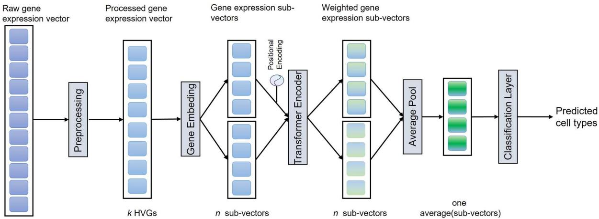

flowchart

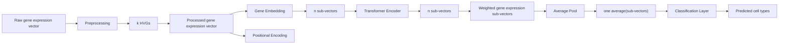

(B)   
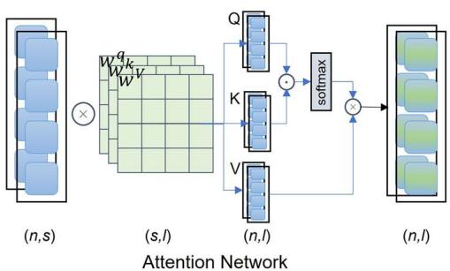

flowchart

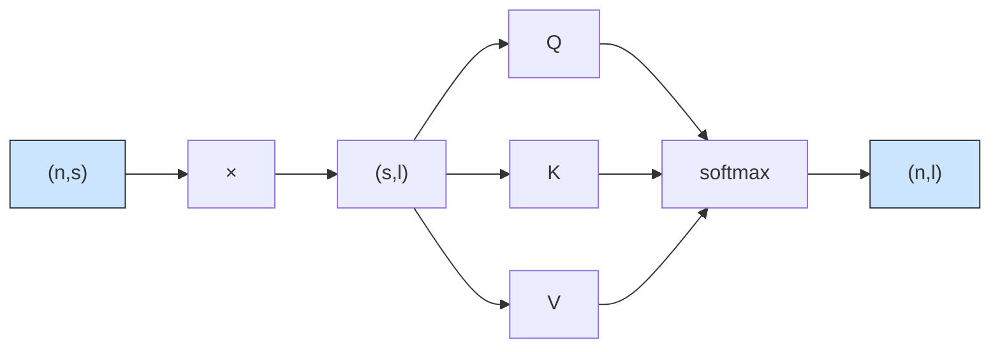

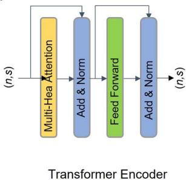

flowchart

(D)   
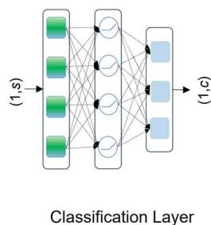

flowchart

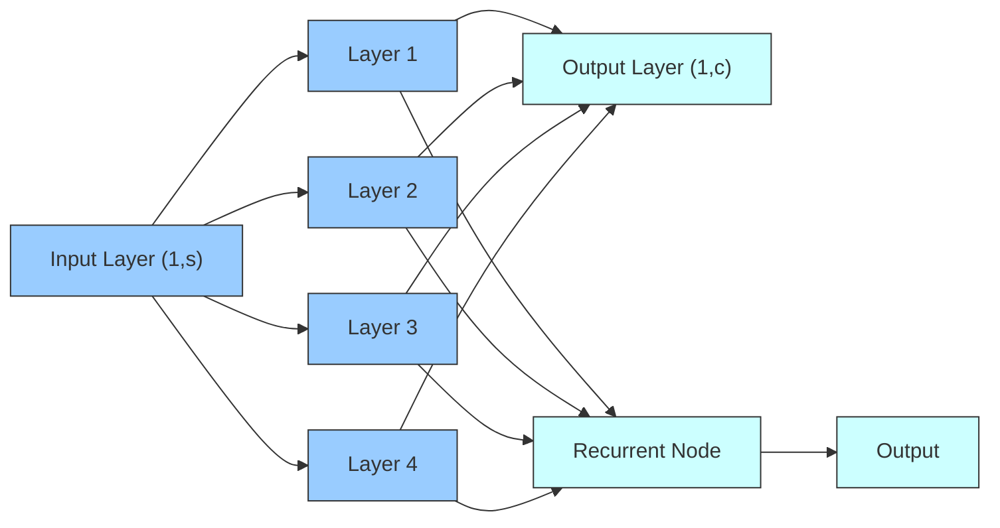

Figure 1. The schematic overview of CIForm. (A) CIForm is based on deep learning framework with four modules, i.e. Gene Embedding, Positional Encoding, Transformer Encoder and Classification Layer. In the context of single-cell RNA sequencing datasets, the first step is to select k HVGs from each cell, comprising m genes. Furthermore, Gene Embedding is employed to convert the pre-processed gene expression vectors into n sub-vectors of length s. (B) In Attention Network, the input comprises n pre-processed sub-vectors with dimensions of (n, s), and the output also consists of n subvectors with dimensions of (n, l). The query (Q), key (K) and value (V) matrices are obtained through linear projection of these sub-vectors, accomplished via three linear networks $( \mathsf { W } _ { q } , \mathsf { W } _ { k }$ and $\mathrm { W } _ { \boldsymbol { v } } )$ , each possessing dimensions of (s, l). The positional information is integrated via Positional Encoding. (C) In the Transformer Encoder layer, the input is n pre-processed sub-vectors with dimensions of (n, s) and the output is also n sub-vectors with dimensions of (n, s). The Attention Network is performed H times in parallel. Feed-forward network is used to capture all non-linear features among sub-vectors. (D) In the cell-type Classifier Layer, the input comprises one averaged sub-vector with dimensions of (1, s) that have been averaged from sub-vectors processed by the Transformer Encoder layer with dimensions of (n, s). The output is the predicted cell types with dimensions of $( 1 , c ) ,$ , where c represents the number of cell types. Two linearly connected networks are utilized, accompanied by ReLU as the activation function.

where $Q = \mathbb { W } ^ { q } X _ { \mathrm { p o s i } } , K = \mathbb { W } ^ { k } X _ { \mathrm { p o s i } } , \mathbb { V } = \mathbb { W } ^ { v } X _ { \mathrm { p o s i } }$ , Wq,k,v is the linear project weight and softmax $\begin{array} { r } { ( z _ { \mathrm { i } } ) = { \frac { \exp ( z _ { \mathrm { i } } ) } { \sum _ { \mathrm { i } } z _ { \mathrm { i } } } } } \end{array}$

Although recurrent neural networks can also directly handle sub-vectors, they lack the capability to capture long-term dependencies. For CIForm, we use multi-head self-attention to capture different interaction information in multiple different projection spaces. We set the hyperparameter head to 64 in CIForm, which means we have 64 parallel self-attention operations, i.e.

$$
\text { MultitHead } (Q, K, V) = \text { Concat } \left(\text { head } _ {1}, \dots \dots , \text { head } _ {6 4}\right), \tag {5}
$$

where

$$
\text { head } _ {h} = \text { Attention } (Q _ {h}, K _ {h}, V _ {h}) \tag {6}
$$

After multi-head attention, $X _ { \mathrm { p o s i } }$ is converted into $X _ { \mathrm { a t t e n t i o n } }$ as the input of the feed-forward network by the process of residual connection and layer normalization as follows:

$$
X _ {\text { attention }} = \text { LayerNorm } \left(X _ {\text { posi }} + X _ {\text { attention }}\right). \tag {7}
$$

The self-attention network is useful for capturing dependencies between elements among sub-vectors. However, it may not be enough to capture all non-linear features among sub-vectors. To address this, the feed-forward network is added. Feed-forward network consists of two linear layers, with a rectified linear activation function (ReLU) between them, i.e.

$$
X _ {\text { encoder }} = \max \left(0, X _ {\text { attention }} W _ {1} + b _ {1}\right) W _ {2} + b _ {2}. \tag {8}
$$

# Function for Classification Layer

In Classification Layer, the average pooling layer is used to calculate the average of all sub-vectors

$$
X _ {\text { average }} = \text { mean } (X _ {\text { encoder }}). \tag {9}
$$

We then use two linearly connected networks and ReLU as the activation function

$$
X _ {\text { predict }} = \max \left(0, X _ {\text { average }} W _ {1} + b _ {1}\right) W _ {2} + b _ {2}. \tag {10}
$$

# Metrics for evaluation

To evaluate the predictive results, accuracy and macro F1 score were used as the measurements. The Accuracy score, calculated as the quotient of the number of correct predictions made by the model and the total number of predictions, is a valid indicator of a classifier’s predictive proficiency. The Macro F1 score is computed by averaging the F1 score of every cell type and gives equal weight to each cell type. This approach is not inf luenced by the size or occurrence frequency of the cell types in the dataset.

# Tools for comparison

# Seurat

In this study, we employed Seurat v3, a widely used single-cell data analysis pipeline, to perform reference-based annotation of query samples. Seurat v3 offers two methods for this purpose: Seurat-PCA, which uses principal component analysis (PCA) as the default approach, and Seurat-CCA, which uses canonical correlation analysis (CCA) as an alternative. These methods were utilized in the anchor weighting and label transfer steps of the pipeline [21].

# SingleR

SingleR is a method for cell-type annotation based on public annotated scRNA-seq datasets. It works by calculating the Spearman coefficient, a statistical measure of correlation, for a set of ‘variable genes’ in each cell. The resulting coefficients are then aggregated to produce a score that ref lects the similarity of the cell’s gene expression profile to each cell type. SingleR repeats this process by iteratively subsampling the top genes in the data until the most closely related cell types can be clearly distinguished [22].

# scmap

scmap, a reference-based annotation method, includes two strategies: scmap-cluster and scmap-cell. The scmap-cluster strategy maps individual cells from query samples to specific cell types in a reference dataset, whereas the scmap-cell strategy maps individual cells from query samples to individual cells in the reference dataset. Both strategies involve feature selection and calculation of distances using the cosine and Euclidean methods. The reference dataset is searched for the closest match to a query cell [23].

# single-cell Decomposition using Hierarchical Autoencoder

scDHA (single-cell Decomposition using Hierarchical Autoencoder) is a powerful tool for analyzing single-cell RNA sequencing data, allowing for unsupervised cell segregation, dimension reduction and visualization, cell classification, and inference of time trajectories. scDHA effectively extracts representative information of each cell through two core modules. The first module utilizes a non-negative kernel autoencoder to eliminate genes or components that have insignificant contributions to the part-based representation of the data. The second module, a stacked Bayesian autoencoder, then projects the data onto a low-dimensional space [24].

# Cell BLAST

Cell BLAST is a cell-querying tool that effectively handles batch effects through the use of a customized neural network-based generative model and a cell-to-cell similarity metric specifically designed for the model. The tool uses an unsupervised, neural network-based generative model to adaptively learn a nonlinear projection from high-dimensional transcriptomic data to a low-dimensional cell embedding space, utilizing reference singlecell transcriptomes. Intra-reference batch effects are corrected through the use of adversarial alignment [25].

# Single-cell variational inference

scVI (single-cell variational inference) is a computational tool for analyzing scRNA-seq data, allowing for the identification of cell types, clustering and estimation of gene expression levels through probabilistic dimensionality reduction of single-cell transcriptomes. It utilizes a generative model trained to capture the underlying structure of the data, providing researchers with a deeper understanding of the underlying biology of their samples [26].

# Dataset

We collected 16 single-cell benchmark datasets which vary across two species (human and mouse), five tissues (brain, pancreas, peripheral blood, bone marrow and whole mouse) and eight sequencing protocols (10X Genomics, 10X Genomics v2, 10X Genomics v3, CEL-Seq2, Drop-Seq, inDrop, Smart-Seq2, SPLiT-seq). The details are listed below (Supplementary Table 1).

# Pancreas datasets

The pancreas datasets comprise Baron Human [46], Baron Mouse [46], Muraro [47], Segerstolpe [48] and Xin [49]. The Baron Human dataset includes 14 cell types, whereas the Baron Mouse dataset has 13 cell types and the Xin, Muraro and Segerstolpe datasets contain 4, 9 and 12 cell types, respectively. All of them contain alpha, beta, delta and gamma cell types. All of them are human tissue except Baron Mouse. We removed cells with label ‘not applicable’ from Segerstolpe.

# Immune datasets

The immune datasets consisted of four datasets, including human and mouse cells from both bone marrow and peripheral blood. The bone marrow data were collected from Oetjen [50] and Dahlin [51], whereas the peripheral blood data were obtained from pbmc\_10k\_v3 and Sun [52].

# Brain datasets

The Brain datasets consisted of three publicly available scRNAseq mouse brain studies, in which additional information on cerebral regions was provided. We obtained the raw count matrix for the snRNA-seq dataset (SPLiT-seq protocol) of Rosenberg [53], the annotated count matrix (10X Genomics protocol) from Zeisel [54] and the count matrices per cell type (Drop-seq protocol) from Saunders [55].

# Tabula Muris dataset

The Tabula Muris dataset is a compendium of single-cell transcriptome data from the model organism Mus musculus, containing nearly 100 000 cells from 20 organs and tissues. The data allow for direct and controlled comparison of gene expression in cell types shared between tissues, such as immune cells from distinct anatomical locations [56].

# Zheng 68k dataset

The Zheng 68k dataset is a widely used dataset for cell-type annotation performance evaluation. It contains 68 450 cells from 11 subtypes, including CD8+ cytotoxic T cells, CD8+/CD45RA+ naive cytotoxic cells, CD56+ NK cells, CD4+/CD25 T Reg cells, CD19+ B cells, CD4+/CD45RO+ memory cells, CD14+ monocyte cells, dendritic cells, CD4+/CD45RA+/CD25− naive T cells, CD34+ cells and CD4+ T Helper2 cells. The dataset is imbalanced, with rare cell types and strong correlations between cell types, making it challenging to differentiate them. The dataset was created by 10X CHROMIUM [57].

# Zhang T dataset

The Zhang T dataset contains 8530 cells from 20 subtypes. T Cells from colorectal cancer patients were sorted, profiled with Smartseq2 and sequenced on HiSeq4000. Different subtypes of T cells were sorted based on FACS analysis, including CD8+ T cells, T helper cells and regulatory T cells. These cells were sorted from peripheral blood, adjacent normal colorectal tissues and tumors. The sample types are labeled in the ‘sampleType’ column in the SAMPLES section, with PTC for CD8+ T cells from peripheral blood, NTC for CD8+ T cells from adjacent normal colorectal tissues and TTC for CD8+ T cells from tumors. Other subtypes of T cells are labeled similarly, such as PTH for T helper cells from peripheral blood and TTH for T helper cells from tumors [35].

# Allen mouse brain dataset

The Allen mouse brain (AMB) dataset contains 12 832 cells from four major cell types, including GABAergic, Glutamatergic, Non-Neuronal and Endothelial [58].

# RESULTS

# Overview of the CIForm

CIForm is a Transformer-based framework for single-cell assignment with splitting the gene expression vector into sub-vectors.

The preprocessing of scRNA-Seq datasets is performed using Scanpy [59]. For the intra-dataset analysis, we filter out genes that are not expressed in all cells, normalize and log-transform the gene expression data, and select the top 2000 HVGs. For the inter-dataset task, we first merge the pre-processed reference and query datasets, then select the top 2000 HVGs, and finally split the combined dataset back into reference and query sets. The preprocessed gene expression vectors of cells are divided into subvectors. Finally, CIForm is trained on the reference dataset and used to annotate cells in the query dataset.

The labeling process of cell-type assignment using CIForm considers the accuracy of the results to be of utmost importance. If CIForm is unable to confidently determine the cell type, it is marked as ‘unassigned’ to avoid incorrect assignments and facilitate the identification of new cell types. CIForm is able to accurately annotate cell types even if the reference dataset and the query dataset contain different numbers of cell types.

To demonstrate the capabilities and scalability of CIForm, we conducted the analysis of multiple scRNA-seq datasets from various species and tissues that were generated using a range of scRNA-seq protocols.

# Effectiveness evaluation on intra-dataset

To assess the effectiveness of CIForm, we first used it to predict cell types on nine intra-datasets of different species, organs, tissues, single-cell omics technologies and the number of cells (Baron Human [46], Baron Mouse [46], Muraro [47], Segerstolpe [48], Xin [48], TM [56], Zheng 68k [57], Zhang T [35], AMB [58]). We compared it with other computational methods, including both machine learning-based (SingleR [22], Seurat-PCA [21], Seurat-CCA [21], scmap-cluster [23], scmap-cell [23]) and neural networkbased (scDHA [24], scVI [26], Cell BLAST [25]) methods. We adopted a 5-fold cross-validation strategy and evaluated the model’s performance by the accuracy and macro F1 score as metrics.

As shown in Figure 2(A), CIForm was able to accurately predict almost all cell types, regardless of their relative abundance, and outperformed the comparison methods in terms of accuracy and macro F1 score on most of the datasets (Supplementary Figure 1). While a limited number of methods have achieved a high level of accuracy, they struggle to correctly identify rare cell types. Although these cell types constitute a small proportion of the total, they can provide significant insights into the causes of diseases and potential treatments [60]. In order to clearly compare CIForm’s ability in detecting rare cell type against other models, we draw confusion matrixes with the result of highly imbalanced datasets for each method (Figure 2B). The plot shows that CIForm was able to accurately annotate cell types that made up less than 0.01% of the total in the Baron Mouse dataset, which involves 13 cell types and the major cell type is 150 times more abundant than the minor cell type, whereas other methods failed to accurately detect one of all minor cell types. When we evaluated the performance of these state-of-the-art (SOTA) methods on larger datasets (AMB, TM, Zheng 68k), we found that CIForm outperformed all the other methods on all datasets. Specifically, on the Zheng 68k dataset, CIForm showed a 15.35% increase in the term of accuracy and a 16.37% increase in the term of macro F1 score compared to the second-best method, Seurat-PCA (Figure 2C). This suggests that CIForm is particularly effective at annotating cells on large-scale datasets.

To further investigate the impact of single-cell coverage on CIForm’s performance, we randomly sampled transcripts from 10 and 90% of transcript reads in the Baron Mouse scRNA-seq dataset using Scanpy [59]. Overall, there was an upward trend in the precision of cell-type annotation as sequencing depth increased. Notably, even when confronted with very low down-sampling rates, CIForm achieved a remarkable degree of accuracy labeling 93% of cell types (Supplementary Figure 2). We also compared the running time of CIForm with other tools on the nine datasets. Our results show that CIForm takes less time than other methods on seven out of nine benchmark datasets (Supplementary Figure 3). Moreover, CIForm’s computational efficiency is particularly noteworthy when processing large-scale scRNA-seq datasets, thereby affirming its time-saving and memory-conserving characteristics that render it user-friendly (Supplementary Figure 3B).

Overall, our study indicates that CIForm consistently outperformed the other computational methods in the task of intradataset cell-type annotation across a majority of the datasets.

# Effectiveness evaluation on inter-dataset

In many cases, the reference and query datasets used for celltype annotation are usually generated by different sequencing platforms and sometimes compiled from various studies. Therefore, addressing the batch effect from the datasets is an important challenge for cell-type annotation. In addition, the differential numbers of cell types in query datasets and reference datasets will cause the failure to identify cell type for certain deep learningbased methods, such as scDHA and scVI.

To assess the effectiveness of CIForm compared with popular methods, we employed a ‘leave-one-dataset-out’ strategy on medium-scale (about 10 000 cells) Immune datasets (Sun, Oetjen, pbmc\_10k\_v3, Dahlin) [50–52]. These datasets include three sequencing techniques (10X, 10X v2, 10X v3), two species (human, mouse) and two tissues (peripheral blood mononuclear cells, bone marrow), and the number of cell types ranges from 9 to 14. We conducted an evaluation of the cell-type annotation performance of all pairwise train–test combinations using four datasets. Based on the experiments presented in Figure 3(A), it is clearly observed that CIForm outperformed the other methods in terms of macro F1 score and accuracy (Supplementary Figure 4A). The second-best performing method was Seurat-CCA, followed by Seurat-PCA, SingleR and scmap. On average, CIForm demonstrated an improvement of 12% over the second-best method Seurat-CCA in the term of macro F1 score. However, in some cases, all methods were unable to identify cell types, resulting in low performance accuracy and macro F1 score values less than 50% (Supplementary Figure 4B). In all comparisons, CIForm was on average 4% better in terms of accuracy and 8% better in terms of macro F1 score than the second method Seurat-CCA.

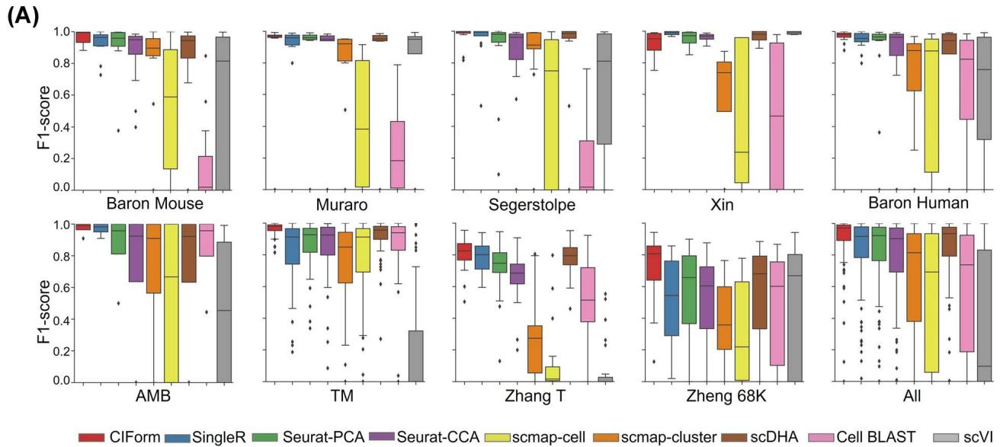  
CIFormSingleRSeurat-PCASeurat-CCAscmap-cellscmap-clusterscDHACellBLASTscVl

(B）  
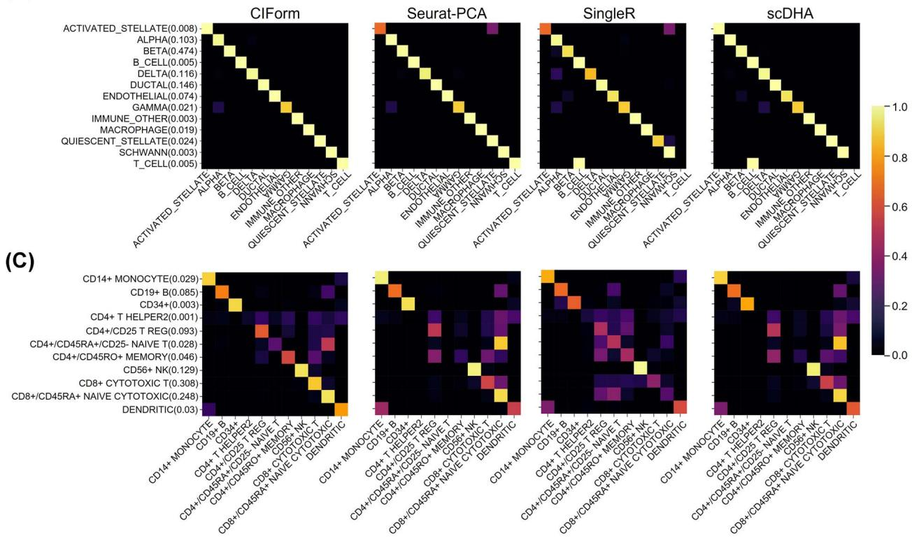  
Figure 2. Performance of CIForm on the intra-dataset. (A) Performance of methods measured by the F1 score of each cell type on the nine datasets using 5-fold cross-validation. The box plot displays the median (center line), interquartile range (hinges) and 1.5 times the interquartile range (whiskers) of the F1 scores for each cell type. The median is the middle value in a dataset, whereas the interquartile range is the range of the middle 50% of the data. The whiskers represent 1.5 times the interquartile range, and they show the minimum and maximum values that are not considered outliers. The macro F1 scores and accuracy of these datasets are shown in Supplementary Figure 1. (B) Confusion matrix heatmaps for cross-validation results of CIForm, Seurat-PCA, SingleR and scDHA on the imbalanced dataset (Baron Mouse). (C) Confusion matrix heatmaps for cross-validation results of CIForm, Seurat-PCA, SingleR and scDHA on the largest dataset (Zhang 68k).

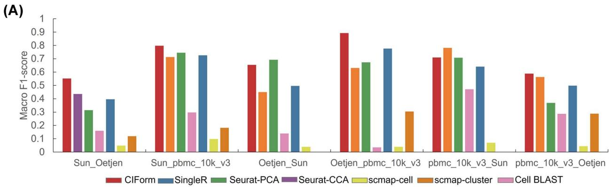

bar

| Category | CIForm | SingleR | Seurat-PCA | Seurat-CCA | scmap-cell | scmap-cluster | Cell BLAST |
|---|---|---|---|---|---|---|---|
| Sun_Oetjen | 0.55 | 0.40 | 0.32 | 0.44 | 0.05 | 0.12 | 0.16 |
| Sun_pbmc_10k_v3 | 0.80 | 0.73 | 0.74 | 0.71 | 0.10 | 0.18 | 0.30 |
| Oetjen_Sun | 0.65 | 0.50 | 0.69 | 0.45 | 0.04 | 0.14 | 0.14 |
| Oetjen_pbmc_10k_v3 | 0.90 | 0.77 | 0.67 | 0.63 | 0.04 | 0.31 | 0.04 |
| pbmc_10k_v3_Sun | 0.71 | 0.64 | 0.71 | 0.78 | 0.07 | 0.47 | 0.28 |
| pbmc_10k_v3_Oetjen | 0.59 | 0.50 | 0.37 | 0.56 | 0.05 | 0.28 | 0.28 |

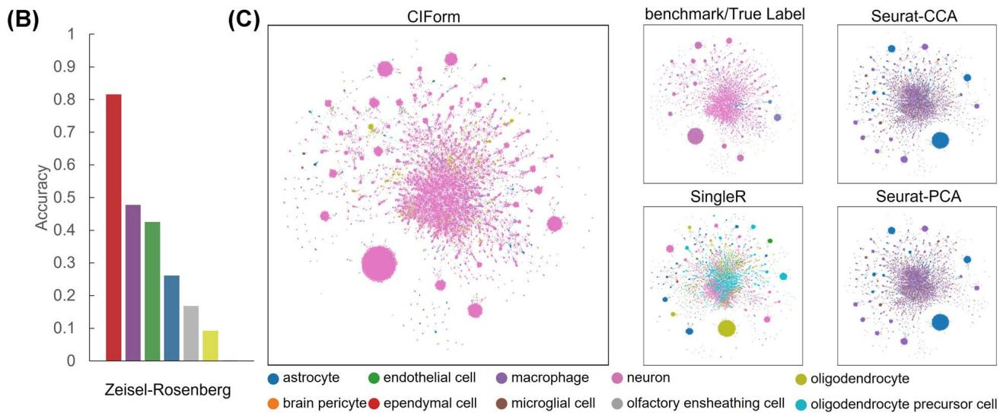  
Figure 3. Performance of CIForm across independent datasets. (A) Cell-type annotation performance of CIForm, SingleR, Seurat-PCA, Seurat-CCA, scmapcell, scmap-cluster and Cell BLAST by Macro F1 score. (B) Accuracy values (bar plot) in which the Zeisel dataset acts as the reference dataset and the Rosenberg dataset acts as the query dataset. (C) Uniform Manifold Approximation and Projection (UMAP) visualization of all cell types from Rosenberg datasets. Cell types were color-coded based on original annotation, as well as annotation predicted by CIForm, Seurat-CCA, SingleR and Seurat-PCA. The Zeisel acts as the reference dataset and Rosenberg acts as the query dataset.

Thanks to the advances in scRNA-seq technologies, hundreds of thousands of cells can be obtained from a tissue or an experimental system. To evaluate the performance of different models when dealing with large-scale query and reference datasets, we prepared three mouse brain datasets (Zeisel [54], Rosenberg [53], Saunders [55]) containing over 100 000 cells. In this study, the Zeisel to annotate Rosenberg was first used for the analysis. The result shows that CIForm is much higher than the second method by 33.8% in terms of accuracy and 5% higher than the second method in terms of macro F1 score (Figure 3B and Supplementary Figure 5A). As shown in Figure 3(C), CIForm was able to accurately annotate the majority of cells in Rosenberg. However, it was difficult to predict the correct cell type for other methods. We also used Saunders dataset, which includes 690 k cells and 595 cell types, to annotate Rosenberg dataset, and results demonstrate that our method significantly outperformed the others, 83.9% higher than the second method (SingleR) in the term of accuracy and 5% higher than the second method in the term of macro F1 score (Supplementary Figure 5B).

To further analyze why CIForm performs significantly better than other models on large datasets, we plotted a Sankey and found that CIForm was able to perfectly annotate the majority of the neuron cells in these two experiments. However, other methods misannotated the neuron cell type to other cell types (Supplementary Figure 5C). Compared with these popular methods, CIForm shows a competitive performance for crossdataset tasks on these benchmarking datasets. In particular, CIForm shows its superiority on large-scale datasets, whereas these SOTA methods suffered from the computational complexity of large-scale datasets. It is the fact that CIForm performs consistently well in all the tasks involved in analyzing scRNAseq datasets with abundant cells.

# Effectiveness evaluation on multiple reference datasets

As single-cell transcriptome sequencing technologies become increasingly prevalent, a growing number of high-quality singlecell datasets for the same tissue have been generated. To enhance the precision of cell annotation and address the issues such as a limited number of cell types and cells in one reference, some methods designed specifically for using multi-source datasets as the reference dataset have been developed [36, 37]. To verify the performances of CIForm on multi-source scRNA-seq datasets, we used the Pancreas datasets (Baron Human, Baron Mouse, Muraro, Segerstolpe and Xin) as a benchmark. Each dataset in the multiple datasets was used as the query dataset, and the remaining datasets were combined into the reference dataset.

We first examine a straightforward scenario where the reference and query datasets have identical cell types. For the Pancreas datasets, we focus on the four common pancreas islet cells (alpha, beta, delta and gamma cells) present in these datasets. The performance of CIForm was equivalent in this scenario, as shown by the accuracy in Figure 4(A). CIForm correctly annotated 97% of cells in the Pancreas datasets excluding Baron Mouse, demonstrating the exceptional and consistent performance of CIForm. Moreover, we undertake integration of four human scRNA-seq datasets for the purpose of annotating the Baron Mouse dataset, thereby comparing the performance of CIForm against other methods in the cross-species scenario. The results presented indicate that CIForm was able to accurately annotate 89% of cells in the Baron Mouse dataset, surpassing the accuracy attained by comparable methods, including scDHA (0.859), Seurat-CCA (0.835) and Seurat-PCA (0.80) (Figure 4A). The CIForm method has the capability to accurately categorize other cell types as beta cells. On the other hand, methods such as scDHA and Seurat-CCA show an inability to correctly classify other cell types as beta cells, as demonstrated in Figure 4(B).

（A）  
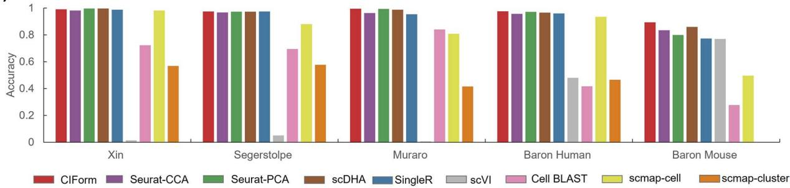

bar

| Dataset | CIForm | Seurat-CCA | Seurat-PCA | scDHA | SingleR | scVI | Cell BLAST | scmap-cell | scmap-cluster |
|---|---|---|---|---|---|---|---|---|---|
| Xin | 0.98 | 0.97 | 0.98 | 0.98 | 0.98 | 0.01 | 0.72 | 0.97 | 0.57 |
| Segerstolpe | 0.96 | 0.95 | 0.96 | 0.96 | 0.96 | 0.04 | 0.69 | 0.88 | 0.58 |
| Muraro | 0.98 | 0.95 | 0.98 | 0.97 | 0.94 | - | 0.84 | 0.81 | 0.42 |
| Baron Human | 0.96 | 0.94 | 0.96 | 0.95 | 0.94 | 0.47 | 0.42 | 0.93 | 0.46 |
| Baron Mouse | 0.88 | 0.83 | 0.79 | 0.85 | 0.77 | 0.77 | 0.27 | 0.49 | - |

(B)   
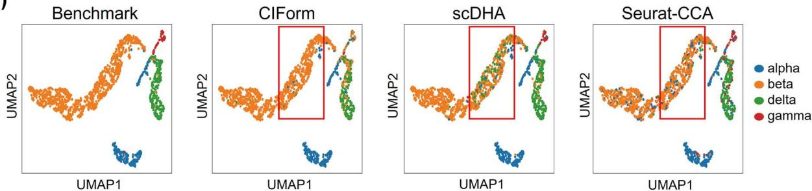

scatter

| Method     | alpha | beta | delta | gamma |
|------------|-------|------|-------|-------|
| Benchmark  |       |      |       |       |
| CIForm     |       |      |       |       |
| scDHA      |       |      |       |       |
| Seurat-CCA |       |      |       |       |

Figure 4. Performance of CIForm in the annotation of the four major pancreatic cell types (alpha, beta, delta and gamma) in the Pancreas datasets. (A) Classification accuracy of CIForm and other methods. In each scenario, one pancreas dataset acts as the query dataset and the rest of the pancreas datasets act as the reference dataset, resulting in five train–test pairs. (B) UMAP visualization of alpha, beta, delta and gamma cells from the Baron Mouse dataset. Cell types were color-coded based on original annotation, as well as annotation predicted by CIForm, scDHA and Seurat-CCA. The Baron Mouse dataset acts as the query dataset and the other pancreas datasets act as the reference dataset.

We then examined a more complex scenario in which multiple scRNA-seq datasets were integrated as the reference dataset, rather than just using four main cell types so that the reference dataset with a varying number of cell types can be compared to the query dataset. To further prove the superiority of CIForm, the comparison against other SOTA methods was performed on the Pancreas datasets. As seen in Figure 5(A), CIForm demonstrated a slight advantage over other methods in the term of accuracy across all datasets. As a result, CIForm had an average 11% higher F1 score than the other methods, indicating that CIForm not only excels at annotating the major cell types but also has a better ability to identify rare cell types (Supplementary Figure 6). Besides, some methods assigned cells in query datasets to cell types that do not exist in query datasets. The Sankey plot also shows that compared with other models, CIForm can classify the four types of cells well, especially the rare cell types can be correctly classified by CIForm (Figure 5C). However, for Seurat-PCA, some cells of gamma and delta are assigned to mast and duct that do not exist in the Xin dataset. Cell BLAST mislabeled almost all gamma to delta and epsilon. SingleR mislabeled all delta to co-expression.

In general, CIForm consistently outperformed the other computational methods in the task of cell-type annotation with multiple reference datasets.

# DISCUSSION

With rapid developments of high-throughput technologies over the past two decades, many efficient computation methods for cell-type assignment have been proposed. Annotated scRNA-seq dataset-based methods have made impressive progress, but there is still much room for improvement in large-scale data analysis and single-cell assignment using multiple references.

In this work, we proposed a comprehensive and highperformance framework named CIForm for cell-type annotation. We objectively prove that CIForm can provide dependable celltype information for query scRNA-seq datasets from a variety of sources, including different tissues, species and sequencing platforms. Compared to some popular tools such as Seurat v3 [21], SingleR [22], scmap [23], scDHA [24], scVI [26] and Cell BLAST [25], CIForm consistently demonstrates its superiority in performance. First, CIForm outperforms all the other baseline methods on the task of intra-datasets. Second, CIForm also performed superior to other methods on the task of inter-datasets including crossplatform, cross-species and single-cell assignment with multiple references, indicating its powerful generalization and robustness. Third, CIForm has great advantages in the cell annotation of large-scale scRNA-seq data [39]. Lastly, CIForm can perform much better on rare cell type. It is noteworthy that CIForm introduces the concept of patch in the field of scRNA-seq analysis. On one hand, it addresses the issue of being time-consuming and memory-intensive in the analysis of scRNA-seq data using the Transformer-based models (Supplementary Note 2). On the other hand, it avoids the noise caused by projecting individual gene expression values into vectors in a single cell.

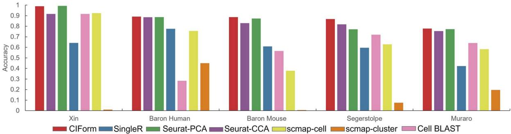

bar

| Dataset | CIForm | SingleR | Seurat-PCA | Seurat-CCA | scmap-cell | scmap-cluster | Cell BLAST |
|---|---|---|---|---|---|---|---|
| Xin | 0.98 | 0.65 | 0.99 | 0.91 | 0.92 | 0.01 | 0.91 |
| Baron Human | 0.89 | 0.77 | 0.88 | 0.88 | 0.75 | 0.45 | 0.28 |
| Baron Mouse | 0.89 | 0.61 | 0.87 | 0.83 | 0.38 | 0.01 | 0.56 |
| Segerstolpe | 0.87 | 0.59 | 0.77 | 0.82 | 0.63 | 0.07 | 0.72 |
| Muraro | 0.78 | 0.43 | 0.77 | 0.75 | 0.58 | 0.19 | 0.64 |

(B)   
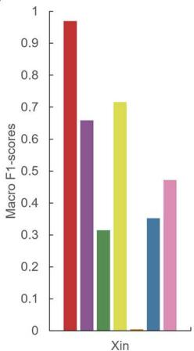

bar

| Category | Macro F1-scores |
|---|---|
| 1 | 0.97 |
| 2 | 0.66 |
| 3 | 0.31 |
| 4 | 0.72 |
| 5 | 0.01 |
| 6 | 0.35 |
| 7 | 0.47 |

(C)   
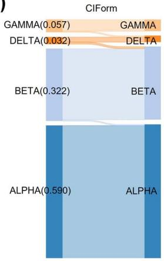

bar_stacked

| Category | Alpha | BETA | BEMA |
|---|---|---|---|
| ALPHA | 0.590 | 0.322 | 0.032 |
| BETA | 0.000 | 0.000 | 0.057 |
| DELTA | 0.000 | 0.000 | 0.032 |
CIForm (top) | GAMMA | GAMMA | DELTA |
The chart displays the sum of the first two components (GAMMA and DELTA) for each category. The total sum of the first two components is calculated as a sum of the other two components. The labels above the bars indicate the component names and their corresponding scores.

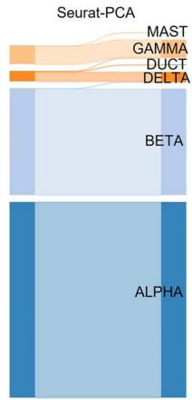

text_image

Seurat-PCA
MAST
GAMMA
DUCT
DELTA
BETA
ALPHA

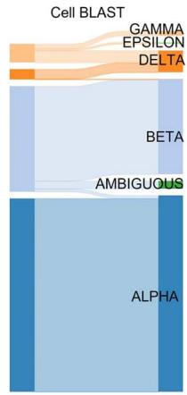

flowchart

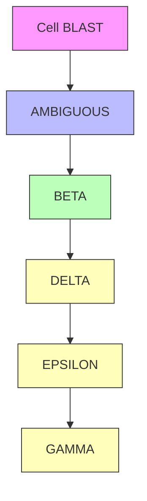

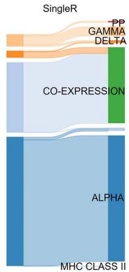

text_image

SingleR
PP
GAMMA
DELTA
CO-EXPRESSION
ALPHA
MHC CLASS II

Figure 5. Comparative evaluation of CIForm in annotating all cell types with multiple reference datasets. (A) Classification accuracy (bar plot) of CIForm and other methods. (B) Macro F1 score values (bar plot) of CIForm and other methods. The Xin dataset acts as the query dataset and the other pancreas datasets act as reference dataset. (C) Sankey plots for four methods (CIForm, Seurat-PCA, Cell BLAST, SingleR) on the Xin datasets. The Xin dataset acts as the query dataset and the other pancreas datasets act as reference dataset.

Despite these promising outcomes, there are also some shortcomings that CIForm can be further enhanced. First, as a deep learning-based model, CIForm exhibits both strengths and limitations in characteristic of its kind, such as the black-box nature of deep learning-based models [61, 62]. The gene embedding process, which transforms the gene expression of individual cells into sub-vectors for input into the Transformer encoder, is not easily interpretable and the relationship between sub-vectors can be difficult to discern. Second, prior to inputting the scRNAseq data, CIForm requires the selection of HVGs using Scanpy [59]. This introduces a potential source of bias in performance evaluation because the parameters for HVG selection can affect the results. Although some mature tools for cell-type annotation have achieved remarkable results, there is room for improvement on the performance of cross-datasets. Furthermore, it is worth studying how to effectively utilize the increasingly abundant annotated or un-annotated scRNA-seq datasets for single-celltype annotation. To overcome these limitations, it is worth investigating two strategies as follows. One strategy is to explore the use of pre-training models for effective utilization of public singlecell datasets [44, 63]. Another strategy is employ transfer learning techniques to address the distribution differences between datasets for cross-dataset tasks [64, 65]. Single-cell sequencing technologies have emerged as an effective tool to solve biological problems and are increasingly being utilized. However, accurate identification of cell types in non-model species without a large amount of known cell-type information remains a challenge [66, 67]. Furthermore, the integration of single-cell multi-omics data presents the problem of transferring cell-type information across different omics [68–70]. Given CIForm’s powerful capabilities in cell-type annotation, it is worth exploring the development of new versions to address these challenges as well as cell pseudo-timing and cell–cell communication in scRNA-seq analysis.

# Key Points

• CIForm is a Transformer-based cell-type annotation framework for scRNA-seq data.   
• CIForm overcomes the drawbacks of Transformer-based models, which are computationally expensive in the field of scRNA-seq data analysis, by introducing the patch concept (sub-vectors).   
• CIForm has a great classification power in cell-type annotation of intra-dataset, inter-datasets and multisource as the reference dataset. CIForm advances greatly in annotating large-scale datasets.   
• CIForm is user-friendly and can be seamlessly integrated with Scanpy.

# SUPPLEMENTARY DATA

Supplementary data are available online at http://bib.oxford journals.org/.

# FUNDING

This research was funded by the National Natural Science Foundation of China (32070682), the Key Research and Development Program of Hubei Province (2022BBA0076), the National Science & Technology Innovation Zone Project (1816315XJ00100216) and CAS Pioneer Hundred Talents Program.

# DATA AVAILABILITY

All datasets used in this study are publicly available and the usages are fully illustrated in the Methods. The published Zheng 68k dataset was downloaded from the ‘Fresh 68K PBMCs’ section at https://support.10xgenomics.com/single-cellgene-expression/datasets (SRP073767). The published pancreatic datasets are downloaded from Github at https://hemberglab.github.io/scRNA.seq.datasets/ (Baron: GSE84133, Muraro: GSE85241, Segerstolpe: E-MTAB-5061, Xin: GSE81608). Zhang T, TM, AMB and Rosenberg’s GEO accession IDs are GSE108989, GSE109774, GSE115746 and GSE110823, respectively. The Zeisel can be downloaded from http://mousebrain.org; file name L5\_all.loom. The Saunders can be downloaded from http:// dropviz.org/. The bone marrow data were collected from Oetjen (three human donors, GSE120221) [50] and Dahlin (four mouse samples, GSE107727) [51], whereas the peripheral blood data were obtained from pbmc\_10k\_v3 and Sun (four mouse samples, GSM3665016, GSM3665017, GSM3665018, GSM3665019) [52]. The pbmc\_10k\_v3 can be downloaded from https://support.10xgenomics.com/single-cell-gene-expression/ datasets/3.0.0/pbmc\_10k\_v3.

# REFERENCES

1. Griffiths JA, Scialdone A, Marioni JC. Using single-cell genomics to understand developmental processes and cell fate decisions. Mol Syst Biol 2018;14:e8046.   
2. Raj B, Wagner DE, McKenna A, et al. Simultaneous single-cell profiling of lineages and cell types in the vertebrate brain. Nat Biotechnol 2018;36:442–50.   
3. Levitin HM, Yuan J, Sims PA. Single-cell transcriptomic analysis of tumor heterogeneity. Trends Cancer 2018;4:264–8.   
4. Stephenson W, Donlin LT, Butler A, et al. Single-cell RNA-seq of rheumatoid arthritis synovial tissue using low-cost microf luidic instrumentation. Nat Commun 2018;9:791.   
5. Kuppe C, Ibrahim MM, Kranz J, et al. Decoding myofibroblast origins in human kidney fibrosis. Nature 2021;589:281–6.   
6. Avraham R, Haseley N, Brown D, et al. Pathogen cell-to-cell variability drives heterogeneity in host immune responses. Cell 2015;162:1309–21.   
7. Qi R, Zou Q. Trends and potential of machine learning and deep learning in drug study at single-cell level. Research (Wash D C) 2023;6:0050.   
8. Huang Y, Zhang P. Evaluation of machine learning approaches for cell-type identification from single-cell transcriptomics data. Brief Bioinform 2021;22(5).   
9. Wang Z, Ding H, Zou Q. Identifying cell types to interpret scRNAseq data: how, why and more possibilities. Brief Funct Genomics 2020;19:286–91.   
10. Qi R, Ma A, Ma Q, et al. Clustering and classification methods for single-cell RNA-sequencing data. Brief Bioinform 2020;21: 1196–208.   
11. Zhao X, Wu S, Fang N, et al. Evaluation of single-cell classifiers for single-cell RNA sequencing data sets. Brief Bioinform 2020;21: 1581–95.

12. Pliner HA, Shendure J, Trapnell C. Supervised classification enables rapid annotation of cell atlases. Nat Methods 2019;16: 983–6.   
13. Zhang Z, Luo D, Zhong X, et al. SCINA: a semi-supervised subtyping algorithm of single cells and bulk samples. Genes (Basel) 2019;10:7.   
14. Guo H, Li J. scSorter: assigning cells to known cell types according to marker genes. Genome Biol 2021;22:69.   
15. Ianevski A, Giri AK, Aittokallio T. Fully-automated and ultrafast cell-type identification using specific marker combinations from single-cell transcriptomic data. Nat Commun 2022;13: 1246.   
16. Svensson V, Vento-Tormo R, Teichmann SA. Exponential scaling of single-cell RNA-seq in the past decade. Nat Protoc 2018;13: 599–604.   
17. Han X, Wang R, Zhou Y, et al. Mapping the mouse cell atlas by microwell-Seq. Cell 2018;172:1091–1107 e1017.   
18. Shao X, Yang H, Zhuang X, et al. scDeepSort: a pre-trained celltype annotation method for single-cell transcriptomics using deep learning with a weighted graph neural network. Nucleic Acids Res 2021;49:e122.   
19. Regev A, Teichmann SA, Lander ES, et al. The human cell atlas. Elife 2017;6:e27041.   
20. Han X, Zhou Z, Fei L, et al. Construction of a human cell landscape at single-cell level. Nature 2020;581:303–9.   
21. Stuart T, Butler A, Hoffman P, et al. Comprehensive integration of single-cell data. Cell 2019;177:1888–1902 e1821.   
22. Aran D, Looney AP, Liu L, et al. Reference-based analysis of lung single-cell sequencing reveals a transitional profibrotic macrophage. Nat Immunol 2019;20:163–72.   
23. Kiselev VY, Yiu A, Hemberg M. Scmap: projection of single-cell RNA-seq data across data sets. Nat Methods 2018;15:359–62.   
24. Tran D, Nguyen H, Tran B, et al. Fast and precise single-cell data analysis using a hierarchical autoencoder. Nat Commun 2021;12:1029.   
25. Cao ZJ, Wei L, Lu S, et al. Searching large-scale scRNA-seq databases via unbiased cell embedding with cell BLAST. Nat Commun 2020;11:3458.   
26. Lopez R, Regier J, Cole MB, et al. Deep generative modeling for single-cell transcriptomics. Nat Methods 2018;15:1053–8.   
27. Hinton GESR. Reducing the dimensionality. Science 2006; 313(5786):504–7.   
28. Kingma DPWM. Auto-encoding variational Bayes. stat 2014; 1050:1.   
29. Goodfellow I, Pouget-Abadie J, Mirza M, et al. Generative adversarial networks. Commun ACM 2020;63:139–44.   
30. Song Q, Su J, Zhang W. scGCN is a graph convolutional networks algorithm for knowledge transfer in single cell omics. Nat Commun 2021;12:3826.   
31. Yin Q, Liu Q, Fu Z, et al. scGraph: a graph neural networkbased approach to automatically identify cell types. Bioinformatics 2022;38:2996–3003.   
32. Zeng Y, Wei Z, Pan Z, et al. A robust and scalable graph neural network for accurate single-cell classification. Brief Bioinform 2022;23(2).   
33. Kharchenko PV. The triumphs and limitations of computational methods for scRNA-seq. Nat Methods 2021;18:723–32.   
34. Lun ATL, Marioni JC. Overcoming confounding plate effects in differential expression analyses of single-cell RNA-seq data. Biostatistics 2017;18:451–64.   
35. Zhang L, Yu X, Zheng L, et al. Lineage tracking reveals dynamic relationships of T cells in colorectal cancer. Nature 2018;564: 268–72.

36. Yuan M, Chen L, Deng M. scMRA: a robust deep learning method to annotate scRNA-seq data with multiple reference datasets. Bioinformatics 2022;38:738–45.   
37. Duan B, Chen S, Chen X, et al. Integrating multiple references for single-cell assignment. Nucleic Acids Res 2021;49:e80.   
38. Yi T, Mostafa D, Dara B, et al. Efficient Transformers: a survey. ACM Computing Surveys 2022;55(6):1–28.   
39. Vaswani A, Shazeer N, Parmar N, et al. Attention is all you need. Adv Neural Inf Process Syst 2017;30:6000–10.   
40. Ouyang L, Wu J, Jiang X, et al. Training language models to follow instructions with human feedback, 2022.   
41. Parmar N, Vaswani A, Uszkoreit J, et al. Image Transformer. In: Jennifer D, Andreas K (eds). Proceedings of the 35th International Conference on Machine Learning, 2018, 4055–64.   
42. Devlin J, Chang, M.-W., Lee, K. & Toutanova, K. BERT pre-training of deep bidirectional Transformers for language understanding. In: Proc. 2019 Conference of the North American Chapter of the Association for Computational Linguistics: Human Language Technologies 2018; Vol. 1, Association for Computational Linguistics. 4171–86.   
43. Chen J, Xu H, Tao W, et al. Transformer for one stop interpretable cell type annotation. Nat Commun 2023;14:223.   
44. Yang F, Wang W, Wang F, et al. scBERT as a large-scale pretrained deep language model for cell type annotation of single-cell RNAseq data. Nat Mach Intell 2022;4:852–66.   
45. Dosovitskiy A, Beyer L, Kolesnikov A, et al. An image is worth 16x16 words: Transformers for image recognition at scale, 2020.   
46. Baron M, Veres A, Wolock SL, et al. A single-cell transcriptomic map of the human and mouse pancreas reveals inter- and intra-cell population structure. Cell Syst 2016;3: 346–360 e344.   
47. Muraro MJ, Dharmadhikari G, Grun D, et al. A single-cell transcriptome atlas of the human pancreas. Cell Syst 2016;3:385–394 e383.   
48. Segerstolpe A, Palasantza A, Eliasson P, et al. Single-cell transcriptome profiling of human pancreatic islets in health and type 2 diabetes. Cell Metab 2016;24:593–607.   
49. Xin Y, Kim J, Okamoto H, et al. RNA sequencing of single human islet cells reveals type 2 diabetes genes. Cell Metab 2016;24: 608–15.   
50. Oetjen KA, Lindblad KE, Goswami M, et al. Human bone marrow assessment by single-cell RNA sequencing, mass cytometry, and f low cytometry. JCI Insight 2018;3(23).   
51. Dahlin JS, Hamey FK, Pijuan-Sala B, et al. A single-cell hematopoietic landscape resolves 8 lineage trajectories and defects in kit mutant mice. Blood 2018;131:e1–11.   
52. Sun Z, Chen L, Xin H, et al. A Bayesian mixture model for clustering droplet-based single-cell transcriptomic data from population studies. Nat Commun 2019;10:1649.

53. Rosenberg AB, Roco CM, Muscat RA, et al. Single-cell profiling of the developing mouse brain and spinal cord with split-pool barcoding. Science 2018;360:176–82.   
54. Zeisel A, Hochgerner H, Lonnerberg P, et al. Molecular architecture of the mouse nervous system. Cell 2018;174:999–1014 e1022.   
55. Saunders A, Macosko EZ, Wysoker A, et al. Molecular diversity and specializations among the cells of the adult mouse brain. Cell 2018;174(4):1015–30.e16.   
56. Tabula Muris C, Overall C, Logistical C, et al. Single-cell transcriptomics of 20 mouse organs creates a Tabula Muris. Nature 2018;562:367–72.   
57. Zheng GX, Terry JM, Belgrader P, et al. Massively parallel digital transcriptional profiling of single cells. Nat Commun 2017;8:14049.   
58. Tasic B, Yao Z, Graybuck LT, et al. Shared and distinct transcriptomic cell types across neocortical areas. Nature 2018;563:72–8.   
59. Wolf FA, Angerer P, Theis FJ. SCANPY: large-scale single-cell gene expression data analysis. Genome Biol 2018;19:15.   
60. Marusyk A, Almendro V, Polyak K. Intra-tumour heterogeneity: a looking glass for cancer? Nat Rev Cancer 2012;12:323–34.   
61. Filipp FV. Opportunities for artificial intelligence in advancing precision medicine. Curr Genet Med Rep 2019;7:208–13.   
62. Ghosh A, Kandasamy D. Interpretable artificial intelligence: why and when. Am J Roentgenol 2020;214:1137–8.   
63. Zhang R, Luo Y, Ma J, et al. scPretrain: multi-task self-supervised learning for cell type classification. Bioinformatics 2022;38: 1607–14.   
64. Hu J, Li X, Hu G, et al. Iterative transfer learning with neural network for clustering and cell type classification in single-cell RNA-seq analysis. Nat Mach Intell 2020;2:607–18.   
65. Wang T, Johnson TS, Shao W, et al. BERMUDA: a novel deep transfer learning method for single-cell RNA sequencing batch correction reveals hidden high-resolution cellular subtypes. Genome Biol 2019;20:165.   
66. Liu X, Shen Q, Zhang SJGR. Cross-species cell-type assignment from single-cell RNA-seq data by a heterogeneous graph neural network. Genome Res 2023;33:96–111.   
67. Zhang Y, Wang M, Wang Z, et al. MetaSEM: gene regulatory network inference from single-cell RNA data by meta-learning. Int J Mol Sci 2023;24:2595.   
68. Zhang Z, Cui F, Su W, et al. webSCST: an interactive web application for single-cell RNA-sequencing data and spatial transcriptomic data integration. Bioinformatics 2022;38:3488–9.   
69. Cao ZJ, Gao G. Multi-omics single-cell data integration and regulatory inference with graph-linked embedding. Nat Biotechnol 2022;40:1458–66.   
70. Lin Y, Wu TY, Wan S, et al. scJoint integrates atlas-scale singlecell RNA-seq and ATAC-seq data with transfer learning. Nat Biotechnol 2022;40:703–10.