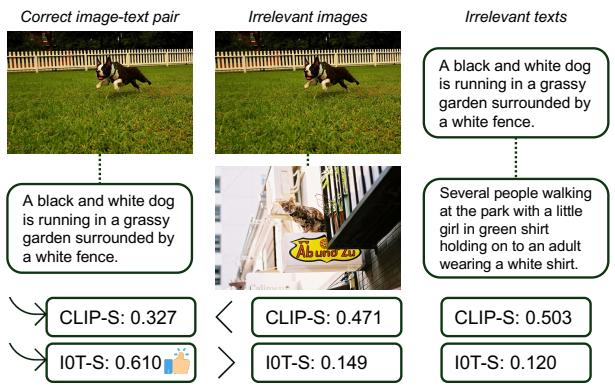
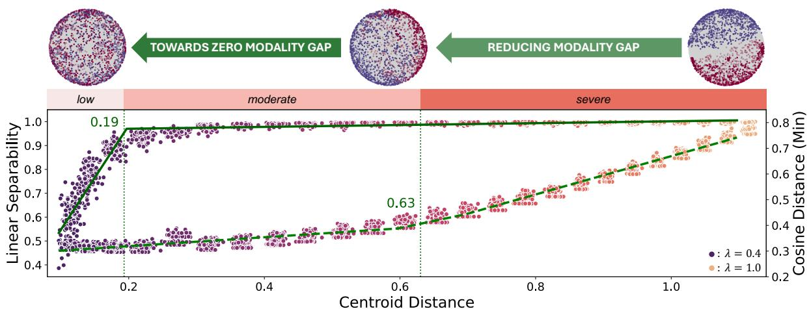
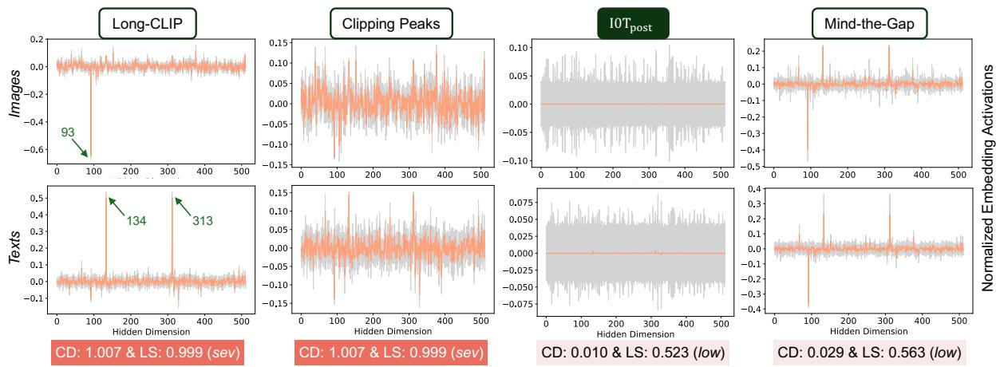
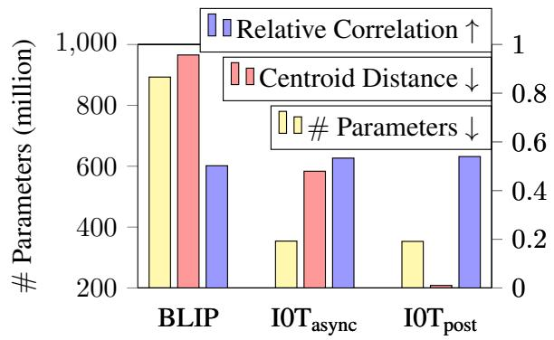
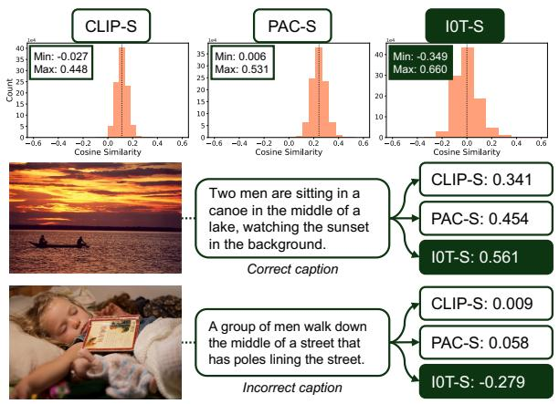
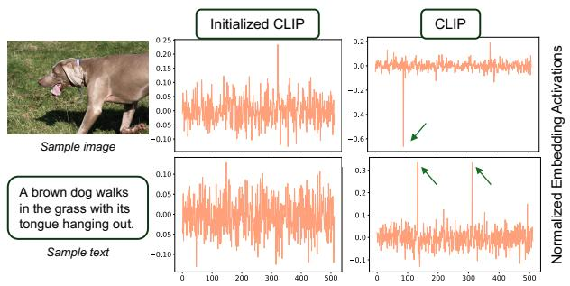
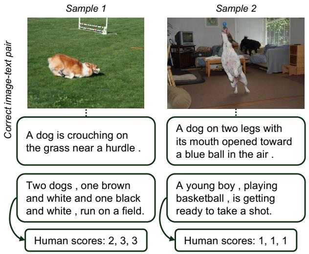
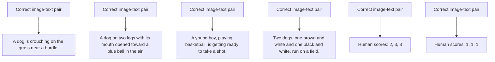
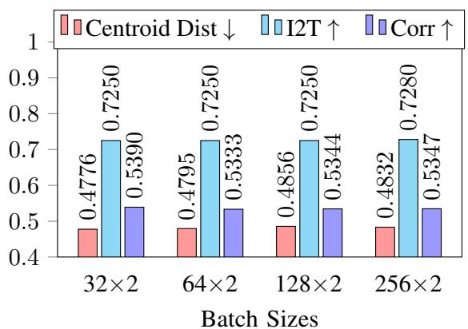

# I0T: Embedding Standardization Method Towards Zero Modality Gap

# Na Min An\* Eunki Kim\* James Thorne† Hyunjung Shim† KAIST AI

{naminan, eunkikim, thorne, kateshim}@kaist.ac.kr

# Abstract

Contrastive Language-Image Pretraining (CLIP) enables zero-shot inference in downstream tasks such as image-text retrieval and classification. However, recent works extending CLIP suffer from the issue of modality gap, which arises when the image and text embeddings are projected to disparate manifolds, deviating from the intended objective of image-text contrastive learning. We discover that this phenomenon is linked to the modality-specific characteristic that each image or text encoder independently possesses. Herein, we propose two methods to address the modality gap: (1) a post-hoc embedding standardization method, I0Tpost that reduces the modality gap approximately to zero and (2) a trainable method, $\mathrm { I O T } _ { \mathrm { a s y n c } } ,$ to alleviate the modality gap problem by adding two normalization layers for each encoder. Our I0T framework can significantly reduce the modality gap while preserving the original embedding representations of trained models with their locked parameters. In practice, $\mathrm { I 0 T _ { p o s t } }$ can serve as an alternative explainable automatic evaluation metric of widely used CLIPScore (CLIP-S). The code is available in https://github.com/xfactlab/I0T.

# 1 Introduction

Utilizing Vision-language models (VLMs) such as Contrastive Language-Image Pretraining (CLIP) (Radford et al., 2021) has been a common practice for performing multimodal tasks (Goel et al., 2022; Fürst et al., 2022; Li et al., 2023b; Zhang et al., 2024; Gao et al., 2024; Sarto et al., 2023; Hu et al., 2023; Lee et al., 2024). Despite these successes, CLIP and its variants (Xu et al., 2021; Zhang et al., 2022b; Goel et al., 2022; Sarto et al., 2023; Zhang et al., 2024) suffer from a significant limitation known as the modality gap; image and

text_image

Correct image-text pair
Irrelevant images
A black and white dog is running in a grassy garden surrounded by a white fence.
Several people walking at the park with a little girl in green shirt holding on to an adult wearing a white shirt.
CLIP-S: 0.327
IOT-S: 0.610
CLIP-S: 0.471
IOT-S: 0.149
CLIP-S: 0.503
IOT-S: 0.120

Figure 1: Improved scoring system using our proposal (I0T-S) than CLIP-S. I0T-S assigns a higher similarity score for the correct image-text pair than for irrelevant pairs.

text embeddings diverge in the latent space, projected to separate manifolds (Liang et al., 2022; Fahim et al., 2024) (not only limited to image-text pairs but is also apparent in audio-visual inputs (Malard et al., 2024)). This is in contrast to the original image-text contrastive learning (CL) objective, which pulls and pushes the positive and negative pair of image and text embeddings (Radford et al., 2021), deviating from the shared statistical model representing reality (Huh et al., 2024).

The undesirable symptom of modality gap is that data within the same modality always have higher semantic similarity than the cross-modal data. Therefore, CLIP cannot draw an accurate semantic relationship for the data pool mixed with different modalities. This problem is especially noticeable when CLIP is extended as an automatic evaluation metric, widely used CLIPScore (CLIP-S) (Hessel et al., 2021; Sarto et al., 2023), which measures the cosine similarity between image and text embeddings. Figure 1 shows that CLIP-S returns an unintuitive lower score for the correct image-text pair than the irrelevant image-image and text-text pairs due to embedding discrepancy between images and texts.

Prior approaches to mitigate the modality gap have focused on shifting (Liang et al., 2022) or training (Fahim et al., 2024; Eslami and de Melo, 2024) the embeddings of the positive pairs closer together. However, they did not attempt to find and attribute explicit factors in the image and text embeddings that lead to the modality gap. In contrast, we explore the actual attributing factor of the modality gap; CLIP inadvertently learns the inherent characteristic of each modality (referred to as modality-specific characteristic in this paper), inducing similar activation patterns within the normalized embeddings of all different images (or texts) from each image (or text) encoder. These patterns, characterized by peak activations with distinct negative and positive directions for image and text embeddings (later visualized in Figure 3), significantly contribute to the modality gap. We find that it is crucial to discard not only these peak activations on a specific few dimensions but also existing modality-specific characteristics across all dimensions from each encoder to mitigate the modality gap.

Here we propose a framework, Zero (0) Modality Gap between Image-Text embedding representations (I0T) that aims to minimize the modality gap towards zero. Correspondingly, it is also crucial to maintain rich semantic embedding representations, even if they become closely aligned or shifted. The first stage of I0T is a plug-and-play module that can be implemented with any readily available finetuning strategies. The second stage of I0T can be addressed with two proposed approaches. We first develop $\mathrm { I 0 T _ { p o s t } }$ that standardizes the normalized image and text embedding activations independently by subtracting the mean vectors of each modality and renormalizing with Frobenius normalization on the frozen encoders from the first stage.

$\mathrm { I 0 T _ { p o s t } }$ offers a more explainable image captioning evaluation metric than CLIPScore (Hessel et al., 2021) (referred to as I0TScore (I0T-S) in Figure 1) by assigning a similar range of scores for across different modalities and within the same modality, attributable to the low modality gap property. However, this post-hoc embedding standardization method needs a sufficient amount of data samples with a similar distribution as a test set; hence, we present $\mathrm { I 0 T _ { a s y n c } }$ that learns the aligned embeddings with no access to the test distribution. Our main contributions can be summarized as follows:

• Achieving both modality gap and downstream performances is challenging; yet, we propose an I0T framework that significantly reduces the gap without hurting performances.   
• $\mathrm { I 0 T _ { p o s t } }$ and $\mathrm { I 0 T _ { a s y n c } }$ significantly reduce the modality gap while enhancing text-to-image retrieval scores by 9.2% and 6.7%.   
• We are the first to propose an automatic evaluation metric, I0TScore, that can be applied to data across different modalities, overcoming the limitation of CLIPScore that only works within a single modality.

# 2 Related Works

# 2.1 CLIP-Based Models

Vision-language models (VLMs) have addressed multimodal tasks that require a joint understanding of visual and textual data (Liu et al., 2024; Li et al., 2022). Most modern VLMs utilize CLIP-style architectures due to $\mathrm { C L I P } ^ { \prime } \mathrm { s }$ exceptional performance in zero-shot downstream tasks using pre-trained image and text encoders (Radford et al., 2021; Jia et al., 2021). However, CLIP alone shows limitations in producing consistent representations (Goel et al., 2022); Hence, CyCLIP (Goel et al., 2022) reduces the similarity of mismatched pairs of image and text (cross-modal cyclic) and the image pairs and the corresponding text pairs (in-modal cyclic). Long-CLIP (Zhang et al., 2024) uses knowledgepreserved enlarged positional embedding, handling up to 248 input tokens, significantly greater than the 77 tokens restricted in CLIP. FLIP (Li et al., 2023b) proposes a technique where a significant portion of image patches is randomly masked during training. SoftCLIP (Gao et al., 2024) uses softened target labels derived from fine-grained intra-modal self-similarity. ProtoCLIP (Chen et al., 2023a) introduces a prototype back translation to effectively train CLIP and alleviate the modality gap issue.

# 2.2 Modality Gap

The issue of the modality gap is pervasive in VLMs such as CLIP, caused by embeddings for images and texts occupying disjoint regions in the latent space (Liang et al., 2022; Oh et al., 2024). This gap, by definition, restricts the model from utilizing the entire latent space. The root cause of this modality gap has been debated: Ramasinghe et al., 2024 claims that the intrinsic differences between image and textual data unavoidably result in the modality gap. Liang et al., 2022 attributes the gap to the resulting narrow cone due to the high model hidden dimension. Fahim et al., 2024 suggests that the gap, mainly caused by the contrastive learning objective, could be reduced with additional loss terms for uniformity and stricter cross-modal alignment (Wang and Isola, 2020). In this work, we are interested in removing the actual attributing factor of the gap, in contrast to accepting the modality gap (Ramasinghe et al., 2024) to extend CLIP as an explainable evaluation metric.

line

| Centroid Distance | Linear Separability (λ = 0.4) | Linear Separability (λ = 1.0) | Cosine Distance (Min) |
| ----------------- | ----------------------------- | ----------------------------- | --------------------- |
| 0.2               | 0.5                           | 0.5                           | 0.3                   |
| 0.63              | 0.9                           | 0.6                           | 0.4                   |
| 1.0               | 1.0                           | 0.8                           | 0.8                   |

Figure 2: Linear separability and minimum cosine distance (dashed line) vs. centroid distance illustrated with corresponding 3D-projected embeddings. The embeddings are categorized by three modality gap severity levels: severe, moderate, and low based on the fitted lines. The solid and dotted lines represent the fitted piecewise linear function of linear separability values (the first y-axis) and minimum cosine distance (the second y-axis) across varying centroid distances (x-axis) (details in Appendix A). The lambda (λ) values are the embedding shift values from Liang et al., 2022. Each color represents different sample results from the Flickr30k set with the same lambda value, ranging from 0.4 to 1.0.

# 3 Preliminary Analyses

Modality gap was introduced by Liang et al., 2022 and is defined as the centroid distance (CD) between the mean of normalized image embeddings $( \mathbf { x } _ { i } \in \mathbb { R } ^ { d } , i = 1 , 2 , . . . , n )$ and mean of normalized text embeddings $( \mathbf { y } _ { i } \in \mathbb { R } ^ { d } , i = 1 , 2 , . . . , n )$ . Formally, $\triangle _ { \mathrm { C D } } : = | | \bar { \bf x } - \bar { \bf y } | | _ { F }$ − ||F   n , with d and n representing the , where $\textstyle { \bar { \mathbf { x } } } : = { \frac { 1 } { n } } \sum _ { i = 1 } ^ { n } \mathbf { x } _ { i } .$ P i =1 x i , $\begin{array} { r } { \bar { \textbf { y } } : = \frac { 1 } { n } \sum _ { i = 1 } ^ { n } \mathbf { y } _ { i } } \end{array}$ model’s hidden dimension and the data size. Fahim et al., 2024 quantify the gap as the linear separability (LS) of image and text embeddings (Shi et al., 2023). To measure $\mathrm { L S } ~ ( ~ \triangle _ { \mathrm { L S } } )$ , or how well image and text embeddings can be separated with the linear classifier, we divide the COCO dataset (Lin et al., 2014) into training (70%) and test (30%) (Shi et al., 2023; Liu et al., 2024). Then, we train a linear regression model and report 1 mean squared error of the model separability of image and text embeddings, following the same procedure as Fahim et al., 2024.

# 3.1 Severity Levels of Modality Gap

To integrate the different definitions of the modality gap, we analyze the relationship between CD, LS, and minimum cosine distance1 $( \mathrm { M C D } ; \triangle _ { \mathrm { M C D } } )$ using piece-wise linear interpolation (Figure 2). We find that if $\triangle _ { \mathrm { C D } } < 0 . 1 9 , \triangle _ { \mathrm { L S } }$ deviates from 1.0. Also, as $\triangle _ { \mathrm { C D } } > 0 . 6 3$ , MCD increases with a steeper slope than the slope in $\triangle _ { \mathrm { C D } } < 0 . 6 3$ (See Appendix A for details). Thus, our categorization of the modality gap using a relationship of CD, LS, and MCD is as follows:

• Severe: $\triangle _ { \mathrm { C D } } \geq 0 . 6 3$   
• Moderate: $0 . 1 9 \leq \triangle _ { \mathrm { C D } } < 0 . 6 3$   
• Low: $\triangle _ { \mathrm { C D } } < 0 . 1 9$

# 3.2 Normalized Embedding Activations

The attributing factor of the modality gap observed in CLIP can be informed through our analysis of the normalized embedding activations2 from each image/text encoder. We first investigate distinct peak activations in the normalized image and text embeddings and then theoretically show that these peak activations contribute to the modality gap.

  
Figure 3: Comparison of normalized embedding activations (avg: salmon, std: gray) and modality gap across three post-hoc methods applied on Long-CLIP.

As displayed in the first column of Figure 3 (or Figure 6 in Appendix B), a similar pattern of normalized embedding activations is shown across the hidden dimensions for different images and texts with a small standard deviation. Also, we consistently observe negative peak activations at the 93rd dimension for all image samples and positive peak activations at the 134th and 313th dimensions for all text samples with low standard deviation, regardless of the semantic representations of each sample per modality. This phenomenon is possibly due to one of the root causes of the modality gap discussed in Related Works (Ramasinghe et al., 2024; Liang et al., 2022; Fahim et al., 2024). This suggests that each encoder captures modalityspecific characteristics that can contribute to the embedding discrepancy between images and texts. Thus, mitigating these modality-specific characteristics across all dimensions, particularly peak activations at a few dimensions, is essential to alleviate the modality gap.

# 3.3 Contribution to Modality Gap

We now demonstrate how these peak activations in the normalized image and text embeddings prevent the cosine similarity from reaching high values. To illustrate the upper bound of the cosine similarity, suppose there exists one negative peak, $p ,$ in normalized image activation $( \mathbf { x } _ { i } = [ x _ { 1 } , x _ { 2 } , . . . , x _ { d } ] )$ ) and two positive peaks of q in normalized text embedding activations $( \mathbf { y } _ { i } = [ y _ { 1 } , y _ { 2 } , . . . , y _ { d } ] )$ , and $| p | \gg x _ { i }$ and $| q | \gg y _ { i }$ , in align with our empirical finding (Figure 3). For simplicity, we assume that the other non-peak activations are uniformly distributed. Then, the upper bound of $\left| \cos ( \mathbf { x } _ { i } , \mathbf { y } _ { i } ) \right|$ converges to $\sqrt { ( 1 - p ^ { 2 } ) ( 1 - 2 q ^ { 2 } ) }$ as d  (proof in the Appendix C). If we set p to be $- \frac 1 2$ , and q to be $\frac { 1 } { 3 }$ (Long-CLIP activations from Figure 3), the upper bound of $\left| \cos ( \mathbf { x } _ { i } , \mathbf { y } _ { i } ) \right|$ converges to 0.76. Since this converged value is less than 1, it implies that the existence of peak activations hinders the cosine similarity of text and image embeddings from being close to 1, inducing a modality gap.

# 4 Methodology

The I0T framework consists of two stages, the initial stage being a plug-and-play module that can be skipped if the user only wants to tackle the modality gap problem of the models. The second stage of I0T is applied asynchronously after the first stage. The motivation behind these divided stages is maintaining the semantic representations by locking the model parameters in the first stage and mitigating the modality gap in the following stage.

# 4.1 The First Stage of I0T

In this initial stage, our goal is to enhance the semantic representations of CLIP from our 2-step paradigm. Here, we share our best strategies to improve overall downstream performance on CLIP using a mixture of recently introduced CLIP fine-tuning strategies from several works of literature. We follow the implementation of Long-CLIP (Zhang et al., 2024), but with a key difference; we find that using only long captions for alignment (Long-CLIP-only) on COCO from the ShareGPT4V dataset (Chen et al., 2023b)3 significantly reduces the training time ( 1/10) while achieving better performances in downstream tasks (refer to Appendix D for details).

We also use a combination of the standard contrastive learning and Cyclic losses (Goel et al., 2022), $\mathcal { L } _ { \mathrm { C y C L I P } } : = \mathcal { L } _ { \mathrm { C L I P } } + 0 . 2 5 \mathcal { L } _ { \mathrm { I - C y c l i c } } +$ $0 . 2 5 \mathcal { L } _ { \mathrm { C - C y c l i c } }$ . CLIP is fine-tuned for three epochs using the AdamW optimizer (Loshchilov and Hutter, 2019), with a learning rate of 1e-6 and a weight decay of 1e-2. We set a batch size of 128 (64 for each GPU device), and use the standard contrastive learning loss with the temperature log scale of 4.6052. The training procedure is consistently applied across all comparison methods to ensure a fair and controlled comparison. All the details of comparison baselines and evaluation downstream tasks are in Appendix D.

# 4.2 The Second Stage of I0T

Post-hoc Method to Reduce Modality Gap To mitigate the modality gap, it is crucial to remove modality-specific characteristics from the embeddings of each encoder. A straightforward approach might involve suppressing peak activations through clipping. However, we observe that clipping the normalized activations within the range of 0.1 to 0.1 followed by Frobenius norm re-normalization, still results in severe modality gap (see the second column in Figure 3). We hypothesize that the remaining unclipped activations might still encompass the property that commonly exists across the activations for each image/text encoder linked to the modality gap.

Motivated by the limitation of this clipping method, we develop an embedding standardization method to remove modality-specific characteristics from the normalized activations across entire dimensions. We standardize the normalized embedding activations $( \mathbf { x } _ { i } , \mathbf { y } _ { i } \in \mathbb { R } ^ { d } )$ by subtracting the mean vectors $( \bar { \mathbf { x } } , \bar { \mathbf { y } } \in \mathbb { R } ^ { d } )$ for each modality and re-normalize them by dividing by the Frobenius norms (the third column of Figure 3): $\mathbf { x } _ { i } ^ { \prime } = \mathrm { N o r m a l i z e } ( \mathbf { x } _ { i } - { \bar { \mathbf { x } } } ) , \mathbf { y } _ { i } ^ { \prime } = \mathrm { N o r m a l i z e } ( \mathbf { y } _ { i } - { \bar { \mathbf { y } } } )$

Our post-hoc method significantly reduces the modality gap, similar to the post-hoc shifting method of Mind-the-Gap (MG) (Liang et al., 2022) (see the comparison between the third and the fourth columns of Figure 3). In addition, as shown in Figure 3, with no outlier peaks and mean activations close to zero across all hidden dimensions. These observations suggest that, unlike the MG approach, our approach more effectively removes the underlying contributors to the modality gap, including peak activations. This results in more modality-invariant representations (compare peak activations between the third and fourth columns in Figure 3).

Learnable Method to Reduce the Gap Although $\mathrm { I 0 T _ { p o s t } }$ significantly reduces the modality gap, it does not support zero-shot inference for a single sample. To overcome this limitation, we explore a method to automatically reduce the modality gap without relying on post-hoc refinement. The key point of our $\mathrm { I 0 T _ { a s y n c } }$ method is to add an independent batch normalization (BN) layers, $\mathbf { B N _ { \mathrm { i m g } } }$ and $\mathrm { \mathbf { B N _ { \mathrm { t x t } } } }$ for each encoder. This enables the model to learn the means and variances of normalized image and text embedding activations without affecting the semantic encoding capability of the encoder (see Discussion). Through this process, the model iteratively updates the running means and variances of normalized embedding activations for each modality: $\bar { \mathbf { x } } _ { t + 1 } = \alpha \bar { \mathbf { x } } _ { B } + ( 1 - \alpha ) \bar { \mathbf { x } } _ { t } , \bar { \mathbf { y } } _ { t + 1 } =$ $\alpha \bar { \mathbf { y } } _ { B } + ( 1 - \alpha ) \bar { \mathbf { y } } _ { t } .$ .

$\bar { \mathbf { x } } _ { t + 1 }$ and $\bar { \mathbf { y } } _ { t + 1 }$ denote the updated running means in training time step $t + 1$ , incorporating the batch mean vectors, $\begin{array} { r } { \bar { \mathbf { x } } _ { B } = \sum _ { i = 1 } ^ { m } \mathbf { x } _ { i } } \end{array}$ and $\bar { \mathbf { y } } _ { B } = \sum _ { i = 1 } ^ { m } \mathbf { y } _ { i }$ with averaging factor $\alpha \ : = \ : 0 . 1$ , and batch size, $m = 6 4 , 1 2 8 , 2 5 6 , 5 1 2$ . We use the final updated running mean of normalized image and text embedding activations, ¯xtrain $\begin{array} { r } { : = \bar { \mathbf { x } } _ { T } , \bar { \mathbf { y } } _ { \mathrm { t r a i n } } : = \bar { \mathbf { y } } _ { T } } \end{array}$ (T : final training step) as the learned modalityspecific characteristics of images and texts. Similarly, the final updated running variance of normalized image and text embedding activations are $\sigma _ { \mathbf { x } _ { \mathrm { t r a i n } } } : = \sigma _ { \mathbf { x } _ { \mathrm { T } } } , \sigma _ { \mathbf { y } _ { \mathrm { t r a i n } } } : = \sigma _ { \mathbf { y } _ { \mathrm { T } } }$ , which are empirically observed as close to 1.0 across all d dimensions. The final updated image and text semantic representations can be expressed as (ϵ = 1e-$\begin{array} { r } { 5 ) \colon \hat { \mathbf { x } _ { i } } ^ { \top } = \operatorname { N o r m a l i z e } ( W _ { \mathrm { i m g } } ( \frac { \mathbf { x } _ { i } - \bar { \mathbf { x } } _ { \mathrm { t r a i n } } } { \sqrt { \sigma _ { \mathbf { x } _ { \mathrm { t r a i n } } } + \epsilon } } ) + \pmb { b } _ { \mathrm { i m g } } ) } \end{array}$ and y′i = Normalize(Wtxt( √ σy +ϵ ) $( W _ { \mathrm { t x t } } \big ( \frac { { \bf y } _ { i } - \bar { \bf y } _ { \mathrm { t r a i n } } } { \sqrt { \sigma _ { { \bf y } _ { \mathrm { t r a i n } } } + \epsilon } } \big ) + { \pmb b } _ { \mathrm { t x t } } \big )$ yi−¯ytrain , where $W _ { \mathrm { i m g } } , W _ { \mathrm { t x t } } \in \mathbb { R } ^ { d }$ and ${ \pmb b } _ { \mathrm { i m g } } , { \pmb b } _ { \mathrm { t x t } } \in \mathbb { R } ^ { d }$ indicate the weights and biases of $\mathbf { B N _ { \mathrm { i m g } } }$ and $\mathrm { B N } _ { \mathrm { t x t } }$ .

Effectively training the BN parameters of $\mathrm { I 0 T _ { a s y n c } }$ is a critical component of our approach. We adopt the same training implementation details uesed in the first stage, employing $\mathcal { L } _ { \mathrm { C y C L I P } }$ loss objective (AddBatchNorm = False in Appendix E Algorithm 1). After this initial phase, we freeze the parameters of the fine-tuned encoders to preserve their learned semantic representations and subsequently train only the BN layers asynchronously afterward (AddBatchNorm = True in Appendix E

<table><tr><td rowspan="3">Models</td><td rowspan="3"># Par ↓</td><td colspan="3">Modality Gap</td><td colspan="6">Downstream Performances</td></tr><tr><td rowspan="2">Centroid Dist. ↓</td><td rowspan="2">Linear Sep. ↓</td><td rowspan="2">Sev. Level ↓</td><td colspan="2">Retrieval ↑</td><td colspan="2">Classification ↑</td><td colspan="2">Relative Cor. ↑</td></tr><tr><td>I2T</td><td>T2I</td><td>CIFAR</td><td>Bird</td><td>Expert</td><td>CF</td></tr><tr><td>Long-CLIP</td><td>353m</td><td>0.9904</td><td>0.9998</td><td>sev</td><td>71.90</td><td>75.00</td><td>65.03</td><td>5.43</td><td>53.21</td><td>34.86</td></tr><tr><td>LCO</td><td>353m</td><td>0.9965</td><td>0.9997</td><td>sev</td><td>72.50</td><td>75.90</td><td>64.46</td><td>5.81</td><td>51.42</td><td>35.17</td></tr><tr><td>LCCO</td><td>353m</td><td>1.0070</td><td>0.9999</td><td>sev</td><td>74.90</td><td>76.10</td><td>64.75</td><td>4.90</td><td>54.57</td><td>35.43</td></tr><tr><td>LCCOM</td><td>353m</td><td>0.9682</td><td>0.9998</td><td>sev</td><td>73.70</td><td>74.60</td><td>64.17</td><td>4.93</td><td>54.55</td><td>35.72</td></tr><tr><td>+ LN</td><td>354m</td><td>1.0068</td><td>0.9999</td><td>sev</td><td>74.70</td><td>76.20</td><td>64.58</td><td>5.08</td><td>54.56</td><td>35.42</td></tr><tr><td>+ LN*</td><td>353m</td><td>0.9696</td><td>0.9998</td><td>sev</td><td>73.60</td><td>74.10</td><td>64.36</td><td>4.87</td><td>54.52</td><td>35.70</td></tr><tr><td>+ BN</td><td>354m</td><td>0.5285</td><td>0.9983</td><td>mod</td><td>71.60</td><td>70.10</td><td>63.14</td><td>5.81</td><td>53.36</td><td>32.53</td></tr><tr><td>+ BN* (IOTasync)</td><td>354m</td><td>0.4795</td><td>0.9960</td><td>mod</td><td>72.50</td><td>73.80</td><td>62.97</td><td>5.21</td><td>53.33</td><td>33.08</td></tr></table>

Table 1: Comparison of modality gap and downstream tasks performances across variations of Long-CLIP-based models. ∗ indicates the asynchronous training method where we fine-tuned the frozen encoders from the first stage. The bolded and underlined values indicate the best and the second-best performances.

<table><tr><td rowspan="3">Models</td><td rowspan="3">#Par ↓</td><td colspan="3">Modality Gap</td><td colspan="6">Downstream Performances</td><td rowspan="3">Rank ↓</td></tr><tr><td rowspan="2">Centroid Dist. ↓</td><td rowspan="2">Linear Sep. ↓</td><td rowspan="2">Sev.Level ↓</td><td colspan="2">Retrieval ↑</td><td colspan="2">Classification ↑</td><td colspan="2">Relative Corr. ↑</td></tr><tr><td>I2T</td><td>T2I</td><td>CIFAR</td><td>Bird</td><td>Expert</td><td>CF</td></tr><tr><td>CLIP</td><td>353m</td><td>0.7642</td><td>0.9985</td><td>sev</td><td>69.60</td><td>67.10</td><td>65.05</td><td>5.94</td><td>51.00</td><td>34.30</td><td>3.88</td></tr><tr><td> $MG_{\lambda=0.375}$ </td><td>353m</td><td>0.0291</td><td>0.5632</td><td>low</td><td>45.40</td><td>54.40</td><td>43.26</td><td>1.67</td><td>42.84</td><td>29.26</td><td>5.63</td></tr><tr><td> $MG_{\lambda=0.5}$ </td><td>353m</td><td>0.2493</td><td>0.9858</td><td>mod</td><td>38.10</td><td>46.50</td><td>44.13</td><td>1.37</td><td>39.70</td><td>27.25</td><td>6.63</td></tr><tr><td> $MG_{\lambda=-0.5}$ </td><td>353m</td><td>1.3799</td><td>0.9998</td><td>sev</td><td>45.20</td><td>54.40</td><td>9.52</td><td>5.35</td><td>NaN</td><td>NaN</td><td>7.50</td></tr><tr><td>CLOOB</td><td>354m</td><td>0.4832</td><td>0.9899</td><td>mod</td><td>69.60</td><td>72.60</td><td>60.40</td><td>4.91</td><td>50.06</td><td>31.71</td><td>4.50</td></tr><tr><td>Unif-Align</td><td>353m</td><td>0.4636</td><td>0.9921</td><td>mod</td><td>51.20</td><td>46.00</td><td>50.32</td><td>3.83</td><td>42.47</td><td>29.31</td><td>5.88</td></tr><tr><td>PAC-S</td><td>353m</td><td>0.7583</td><td>0.9990</td><td>sev</td><td>72.60</td><td>71.60</td><td>58.61</td><td>3.74</td><td>54.00</td><td>36.10</td><td>4.50</td></tr><tr><td> $IOT_{async}$ </td><td>354m</td><td>0.4795</td><td>0.9960</td><td>mod</td><td>72.50</td><td>73.80</td><td>62.97</td><td>5.21</td><td>53.33</td><td>33.08</td><td>3.63</td></tr><tr><td> $IOT_{post}$ </td><td>353m</td><td>0.0102</td><td>0.5374</td><td>low</td><td>73.30</td><td>76.30</td><td>63.07</td><td>4.76</td><td>53.97</td><td>33.58</td><td>1.88</td></tr></table>

Table 2: Comparison of modality gap and downstream performances across different ViT-B/32-based CLIP models. The bolded and underlined values indicate the best and the second-best performances.

Algorithm 1).

When training these BN layers, we introduce Multimodal Contrastive Learning of Sentence and Image Embeddings (MCSIE), our reimplementation of MCSE (Zhang et al., 2022a), a method based on unsupervised-positive augmentation. Unlike MCSE, dropout (rate: 0.1) is applied to every multi-head attention layer of both the image encoder (ViT-B/32, Dosovitskiy et al., 2020) and the text encoder (Transformer, Vaswani et al., 2017). This strategy enhances the diversity of multimodal associations by augmenting relations between all combinations of images/augmented images and texts/augmented texts with $\begin{array} { r } { \sum _ { \mathcal { E } ^ { I } \in \{ \mathcal { T } , \mathcal { T } _ { \mathrm { a u g } } \} } \mathcal { E } ^ { T } \in \{ \mathcal { T } , \mathcal { T } _ { \mathrm { a u g } } \} } \end{array} .$ , where L indicates a loss function. From our ablation study (see Table 8 in Appendix F), we find MCSIE effectively further reduces the modality gap, suggesting that it enables BNs to learn the modality-specific characteristics robustly.

# 5 Results

We first present how we build our best CLIP semantic representations, implementing the first stage of I0T on conventionally conducted tasks: image-text retrieval and image classification. Unlike previous works, we also test how CLIP-based models correlate with human ranking scores. Then, we evaluate the effectiveness of our final I0Ts (i.e., I0Tasync and $\mathrm { I 0 T _ { p o s t } ) }$ on two perspectives: (1) modality gap and (2) downstream performances since it is crucial to maintain semantic representations even if the embeddings are aligned. Most importantly, we show the applicability of $\mathrm { I 0 T _ { p o s t } }$ as an automatic reference-free evaluation metric.

# 5.1 Reducing Modality Gap while Maintaining Semantic Representations

In Table 1, we show how we develop the final $\mathrm { I 0 T _ { a s y n c } }$ starting from Long-CLIP (Zhang et al., 2024), but again, note that this can be easily replaced with other new CLIP fine-tuning strategies to be introduced as future work. Long-CLIP-only (LCO) significantly reduces the training time by using only COCO from all training datasets used in Long-CLIP with similar overall downstream performances. Long-CyCLIP-only (LCCO) adds only the cyclic losses (Goel et al., 2022) to LCO but scores higher overall downstream performances. While Long-CyCLIP-only + MCSIE (LCCOM) shows a slight decrease in downstream performances, it also shows a slight decrease in modality gap, showcasing the possibility of reducing the gap using MCSIE; however, all these methods still show severe modality gap.

bar

| Method     | # Parameters (million) | Relative Correlation | Centroid Distance | # Parameters |
| ---------- | ---------------------- | -------------------- | ----------------- | ------------ |
| BLIP       | 900                    | 600                  | 1000              | 850          |
| IOT_async  | 350                    | 620                  | 550               | 350          |
| IOT_post   | 350                    | 630                  | 50                | 350          |

Figure 4: Comparison of non-CLIP-based model BLIP and ours on the efficiency and performance.

Adding separate layer normalization for each encoder either during the fine-tuning (+LN) or after training (+LN\*) still results in a severe modality gap. In contrast, our proposed way of adding independent batch normalization layers for each encoder either during the fine-tuning (+BN) or after training (+BN\*) results in a moderate level of modality gap. We find that the asynchronous training strategy (+BN\*) performs better than the non-asynchronous training strategy (+BN) in terms of both modality gap and retrieval performances. Thus, we propose the BN\* as our final $\mathrm { I 0 T _ { a s y n c } . }$ . Similarly, our final $\mathrm { I 0 T _ { p o s t } }$ is designed based on LCCOM, incorporating its strengths for optimal performance.

# 5.2 Comparison across Different Methods

As can be observed in Table 2, $\mathrm { I 0 T _ { p o s t } }$ and $\mathrm { I 0 T _ { a s y n c } }$ can substantially reduce the modality gap without hurting the overall downstream performances, maintaining the first and second rankings4. While CLIP shows a severe modality gap with high CD and LS scores (0.7642 and 0.9985, respectively), indicating significant separation in the latent space between image and text embeddings, I0Tpost reduces the modality gap to almost zero with significantly low CD and LS scores of 0.0102 and 0.5374. This is notably better across tasks compared to a competitive post-hoc method, $\mathbf { M } \mathbf { G } _ { \lambda = 0 . 3 7 5 }$ (Liang et al., 2022), which also achieves a low severity level of modality gap. Note that while the MG post-hoc method requires a tuning of $\lambda \left( \lambda = \right.$ $- 0 . 5 , 0 . 3 7 5 , 0 . 5 )$ to achieve the low modality gap, our post-hoc method does not require hyperparameter tuning. Meanwhile, $\mathrm { I 0 T _ { a s y n c } }$ reduces this gap to a moderate level with CD and LS scores of 0.4795 and 0.9960.

histogram

| Method | Min   | Max   |
|--------|-------|-------|
| CLIP-S | -0.027 | 0.448 |
| PAC-S  | 0.006 | 0.531 |
| IOT-S  | -0.349 | 0.660 |

Figure 5: A wider range of cosine similarity distribution with mean close to 0 using I0T-S compared to CLIP-S and PAC-S without the scaling factor $( i . e . , \omega = 1 )$ , contributing to more explainable similarity scores for positive and negative pair of image and caption.

We also ensure that the I0Ts do not significantly hurt semantic representations when achieving the goal of reducing the modality gap. Table 2 indicates our methods especially achieve competitive retrieval scores in Flickr30k (Plummer et al., 2015); $\mathrm { I 0 T _ { a s y n c } \mathrm { : } }$ 72.50% and 73.80% for I2T and T2I retrieval scores and $\mathrm { I 0 T _ { p o s t } }$ : 73.30% and 76.30%. We emphasize that $\mathrm { I 0 T _ { p o s t } }$ shows very close performances on the Flickr-Expert/CF dataset (Hodosh et al., 2013) compared to PAC-S (Sarto et al., 2023), the state-of-the-art contrastive-based evaluation metric, and scores 4.46% higher in CIFAR classification (Krizhevsky et al., 2009). Furthermore, $\mathrm { I 0 T _ { a s y n c } }$ shows enhanced downstream performances than CLOOB (Fürst et al., 2022) and Unif-

Align (Wang and Isola, 2020) while achieving a similar moderate level of modality gap. Figure 4 illustrates that I0Ts also achieve 94.68% and 47.74% lower CD compared to BL $\mathrm { I P } ^ { 5 }$ with 2.5 times fewer parameters while achieving similar correlation performances on Flickr-Expert. The results of varying batch sizes and ResNet-based CLIPs are in Appendix F.

# 5.3 Applicability as an Automatic Reference-free Evaluation Metric

In Figure 5, our I0T-S, built upon $\mathrm { I 0 T _ { p o s t } } .$ shows a non-skewed, wider cosine similarity distribution from -0.349 to 0.660, in comparison to the popular automatic reference-free image captioning evaluation metric, CLIPScore (CLIP-S) (Hessel et al., 2021) and PAC-S (Sarto et al., 2023). This indicates that I0T-S is a more intuitive, explainable metric than these conventional methods, assigning a higher similarity score for the positive pair with the correct caption (+ 21.0% than CLIP-S) and a lower similarity score for the negative pair with the incorrect caption (-20.0% than CLIP-S).

This illustrates the necessity and benefits of reducing the modality gap, especially when we use CLIP as a reference-free evaluation metric. While CLIP-S and PAC-S typically use the scaling factor (ω) 2.5 on the raw cosine similarity scores to improve numerical readability (Sarto et al., 2023), this scaling merely enlarges the cosine similarity distribution without altering the image and text embeddings in the latent space. For instance, the cosine similarity distribution of PAC-S (Sarto et al., 2023) has a minimum positive value of 0.006 for an incorrect image and caption pair. Scaling this value with $\omega = 2 . 5$ yields 0.015, which unintuitively assigns a higher similarity score to an incorrect pair by scaling. In contrast, I0T-S does not require scaling due to the reduced modality gap property; thus, I0T-S not only shows a high relative correlation with human ranking but also yields interpretable absolute values of similarity scores.

# 5.4 Performance Saturation Across Different Sample Sizes for $\mathbf { I 0 T _ { p o s t } }$

Lastly, we investigate how many samples are truly needed for the post-hoc embedding shift in $\mathrm { I 0 T _ { p o s t } }$ Surprisingly, the results of the Table 3 demonstrate that using only a very small subset, such as $n = 3 2$ from the test samples of Flickr30k datasets, can also effectively reduce the modality gap. At the same time, the retrieval performance saturates as we use more test samples. This suggests that using a smaller number of test samples can also effectively mitigate the modality gap and achieve relatively high retrieval performance. However, $\mathrm { I 0 T _ { p o s t } }$ using the entire test sample, as we originally defined, attains the best results.

<table><tr><td rowspan="3"># Test Samples</td><td colspan="2">Modality Gap</td><td colspan="2">Downstream Perf</td></tr><tr><td rowspan="2">Centroid Distance ↓</td><td rowspan="2">Severity Level ↓</td><td colspan="2">Retrieval ↑</td></tr><tr><td>I2T</td><td>T2I</td></tr><tr><td>32</td><td>0.1880</td><td>low</td><td>70.30</td><td>73.00</td></tr><tr><td>64</td><td>0.1387</td><td>low</td><td>71.50</td><td>73.30</td></tr><tr><td>128</td><td>0.0986</td><td>low</td><td>71.90</td><td>73.90</td></tr><tr><td>256</td><td>0.0710</td><td>low</td><td>72.30</td><td>73.70</td></tr><tr><td>512</td><td>0.0542</td><td>low</td><td>72.00</td><td>74.00</td></tr><tr><td>1k</td><td>0.0102</td><td>low</td><td>73.30</td><td>76.30</td></tr></table>

Table 3: Comparison of modality gap and downstream tasks of $\mathrm { I 0 T _ { a s y n c } }$ performances using different number of test samples. The bolded and underlined values indicate the best and the second-best performances.

# 6 Discussion

# 6.1 The Relationship between Modality Gap and Downstream Performances

$\mathrm { I 0 T _ { p o s t } }$ with the lowest modality gap severity level achieves the highest task performance in imagetext retrieval (Table 2). However, at the same time, it does not always score the highest performance for classification and correlation tasks. We emphasize that there is no direct causal relationship between the modality gap and downstream performances, similar to ongoing discussions in recent works (Liang et al., 2022; Jiang et al., 2023; Ramasinghe et al., 2024; Schrodi et al., 2024). Specifically, Liang et al., 2022 states that sometimes a “larger $\mathrm { g a p ' }$ can help improve zero-shot learning performances, Jiang et al., 2023 empirically shows unguaranteed downstream performances when reducing the modality gap. Our work does not claim any relationships between modality gap reduction and performance improvement in line with these studies. Rather, we show that our methods could significantly reduce the modality gap without hurting overall downstream performance.

We believe the best of both perspectives can be achieved through the presence of our plug-and-play module of the first stage, which solely focuses on enhancing semantic features in the separation of stage 2, adding single batch normalization layers for each encoder. Although $\mathrm { I 0 T _ { a s y n c } }$ does not mitigate the modality gap to near zero due to distribution differences between training and test samples, it still reduces to a moderate level. This suggests we could use a pre-computed embedding average from a subset of the training dataset as another solution when dealing with the modality gap, if we also do not have enough resources for training. However, we emphasize that, unlike recently introduced learning methods (Wang and Isola, 2020; Eslami and de Melo, 2024; Xia et al., 2024), our learnable approach does not change (but mostly improve) much of the original embeddings with trainable BN layers separately added to pre-trained encoders.

# 6.2 Why is Batch Normalization Effective in Reducing the Modality Gap?

We find that peak activations across a few dimensions for each modality encoder are the main reasons for the large modality gap. However, we also observe that simply clipping these peak activations does not help to reduce the gap. Thus, instead of directly linking the modality-specific characteristics into only peak activations, we aim to remove the aggregated mean/std statistics of normalized embedding activations for each modality. This is possible due to the consistently similar values of means and minuscule standard deviations over data samples per modality and minuscule standard deviations across all hidden dimensions, which can be effectively learned using separate BN layers. In addition, other normalizations, such as LN, do not help reduce the modality gap effectively since the objective of LN is not linked to the modality gap.

In addition, our asynchronous strategies of applying post-hoc and training BN methods on frozen encoders allow the model to significantly reduce the modality gap while preserving the semantic representations of embeddings. Thus, although BN layers were conventionally thought of as one of the normalization strategies in the past, we could reinterpret these as effective strategies for mitigating the modality gap.

# 7 Conclusion

In this study, we present the I0T framework that can effectively reduce the modality gap between image and text embeddings while preserving the semantic representations. We first introduce a simple post-hoc embedding standardization method of reducing the gap to the close-zero value $( \mathrm { I 0 T _ { p o s t } ) }$ and also provide a novel training strategy using separate batch normalization layers for each modality $( \mathrm { I 0 T _ { a s y n c } ) }$ . I0Ts show effectiveness in both modality gap and downstream performances compared to the other seven CLIP-based models and BLIP with no additional and 10M extra training parameters for $\mathrm { I 0 T _ { p o s t } }$ and $\mathrm { I 0 T _ { a s y n c } }$ , respectively. We believe this work will guide and inspire future research to address the modality gap further, an area less explored than improving downstream performances.

# 8 Limitations

While I0Ts demonstrate significant improvements in reducing the modality gap, $\mathrm { I 0 T _ { p o s t } }$ relies on the entire test dataset, which may not be practical for single-sample inference when sufficient data is unavailable. To address this limitation, we introduce $\mathrm { I 0 T _ { a s y n c } } .$ , which reduces the modality gap without requiring access to the test dataset. However, the modality gap achieved with $\mathrm { I 0 T _ { a s y n c } }$ does not entirely reach the near-zero level, similar to existing methods such as CLOOB and Unif-Align. We leave it as a future study to explore different learning methods and additional modalities (e.g., audio and video) for reducing the modality gap.

# 9 Ethical Statement

Misusing our proposed metric, I0T-S, as the reference-free evaluation metric could bring a potential risk. However, we believe this applies to every reference-free metric since I0T-S is built upon the widely used ClIP-S.

# Acknowledgments

This work was supported by Institute of Information & communications Technology Planning & Evaluation (IITP) grants funded by the Korea government (MSIT) (No.RS-2019-II190075, Artificial Intelligence Graduate School Program (KAIST)), IITP grant funded by the Korea government (MSIT) and KEIT grant funded by the Korea government (MOTIE) (No. 2022-0-00680), and Institute for Information & communications Technology Promotion (IITP) grants funded by the Korea government (MSIT) (RS-2024-00398115, Research on the reliability and coherence of outcomes produced by Generative AI). We thank Jiwoo Hong, Sangryul

Kim, and Andrew Wan Ju Kang for their constructive feedback on the final version of the manuscript.

# References

Thomas Berg, Jiongxin Liu, Seung Woo Lee, Michelle L Alexander, David W Jacobs, and Peter N Belhumeur. 2014. Birdsnap: Large-scale fine-grained visual categorization of birds. In Proceedings of the IEEE conference on computer vision and pattern recognition, pages 2011–2018.   
Delong Chen, Zhao Wu, Fan Liu, Zaiquan Yang, Shaoqiu Zheng, Ying Tan, and Erjin Zhou. 2023a. Protoclip: Prototypical contrastive language image pretraining. IEEE Transactions on Neural Networks and Learning Systems.   
Lin Chen, Jinsong Li, Xiaoyi Dong, Pan Zhang, Conghui He, Jiaqi Wang, Feng Zhao, and Dahua Lin. 2023b. Sharegpt4v: Improving large multi-modal models with better captions. CoRR.   
Jia Deng, Wei Dong, Richard Socher, Li-Jia Li, Kai Li, and Li Fei-Fei. 2009. Imagenet: A large-scale hierarchical image database. In 2009 IEEE conference on computer vision and pattern recognition, pages 248–255. Ieee.   
Alexey Dosovitskiy, Lucas Beyer, Alexander Kolesnikov, Dirk Weissenborn, Xiaohua Zhai, Thomas Unterthiner, Mostafa Dehghani, Matthias Minderer, Georg Heigold, Sylvain Gelly, et al. 2020. An image is worth 16x16 words: Transformers for image recognition at scale. In International Conference on Learning Representations.   
Sedigheh Eslami and Gerard de Melo. 2024. Mitigate the gap: Investigating approaches for improving cross-modal alignment in clip. arXiv preprint arXiv:2406.17639.   
Abrar Fahim, Alex Murphy, and Alona Fyshe. 2024. Its not a modality gap: Characterizing and addressing the contrastive gap. arXiv preprint arXiv:2405.18570.   
Andreas Fürst, Elisabeth Rumetshofer, Johannes Lehner, Viet T Tran, Fei Tang, Hubert Ramsauer, David Kreil, Michael Kopp, Günter Klambauer, Angela Bitto, et al. 2022. Cloob: Modern hopfield networks with infoloob outperform clip. Advances in neural information processing systems, 35:20450–20468.   
Yuting Gao, Jinfeng Liu, Zihan Xu, Tong Wu, Enwei Zhang, Ke Li, Jie Yang, Wei Liu, and Xing Sun. 2024. Softclip: Softer cross-modal alignment makes clip stronger. In Proceedings of the AAAI Conference on Artificial Intelligence, volume 38, pages 1860–1868.   
Shashank Goel, Hritik Bansal, Sumit Bhatia, Ryan Rossi, Vishwa Vinay, and Aditya Grover. 2022. Cyclip: Cyclic contrastive language-image pretraining. Advances in Neural Information Processing Systems, 35:6704–6719.

Furkan Gürsoy, Mounir Haddad, and Cécile Bothorel. 2023. Alignment and stability of embeddings: measurement and inference improvement. Neurocomputing, 553:126517.   
Jack Hessel, Ari Holtzman, Maxwell Forbes, Ronan Le Bras, and Yejin Choi. 2021. Clipscore: A reference-free evaluation metric for image captioning. In Proceedings of the 2021 Conference on Empirical Methods in Natural Language Processing, pages 7514–7528.   
Micah Hodosh, Peter Young, and Julia Hockenmaier. 2013. Framing image description as a ranking task: Data, models and evaluation metrics. Journal of Artificial Intelligence Research, 47:853–899.   
Anwen Hu, Shizhe Chen, Liang Zhang, and Qin Jin. 2023. Infometic: An informative metric for reference-free image caption evaluation. In The 61st Annual Meeting Of The Association For Computational Linguistics.   
Minyoung Huh, Brian Cheung, Tongzhou Wang, and Phillip Isola. 2024. Position: The platonic representation hypothesis. In Forty-first International Conference on Machine Learning.   
Chao Jia, Yinfei Yang, Ye Xia, Yi-Ting Chen, Zarana Parekh, Hieu Pham, Quoc Le, Yun-Hsuan Sung, Zhen Li, and Tom Duerig. 2021. Scaling up visual and vision-language representation learning with noisy text supervision. In International conference on machine learning, pages 4904–4916. PMLR.   
Qian Jiang, Changyou Chen, Han Zhao, Liqun Chen, Qing Ping, Son Dinh Tran, Yi Xu, Belinda Zeng, and Trishul Chilimbi. 2023. Understanding and constructing latent modality structures in multi-modal representation learning. In Proceedings of the IEEE/CVF Conference on Computer Vision and Pattern Recognition, pages 7661–7671.   
Andrej Karpathy and Li Fei-Fei. 2015. Deep visualsemantic alignments for generating image descriptions. In Proceedings of the IEEE conference on computer vision and pattern recognition, pages 3128– 3137.   
Alex Krizhevsky et al. 2009. Learning multiple layers of features from tiny images. Technical report.   
Yebin Lee, Imseong Park, and Myungjoo Kang. 2024. Fleur: An explainable reference-free evaluation metric for image captioning using a large multimodal model. arXiv preprint arXiv:2406.06004.   
Junnan Li, Dongxu Li, Silvio Savarese, and Steven Hoi. 2023a. Blip-2: Bootstrapping language-image pretraining with frozen image encoders and large language models. In International conference on machine learning, pages 19730–19742. PMLR.   
Junnan Li, Dongxu Li, Caiming Xiong, and Steven Hoi. 2022. Blip: Bootstrapping language-image pretraining for unified vision-language understanding

and generation. In International conference on machine learning, pages 12888–12900. PMLR.   
Yanghao Li, Haoqi Fan, Ronghang Hu, Christoph Feichtenhofer, and Kaiming He. 2023b. Scaling language-image pre-training via masking. In Proceedings of the IEEE/CVF Conference on Computer Vision and Pattern Recognition, pages 23390–23400.   
Victor Weixin Liang, Yuhui Zhang, Yongchan Kwon, Serena Yeung, and James Y Zou. 2022. Mind the gap: Understanding the modality gap in multi-modal contrastive representation learning. Advances in Neural Information Processing Systems, 35:17612–17625.   
Tsung-Yi Lin, Michael Maire, Serge Belongie, James Hays, Pietro Perona, Deva Ramanan, Piotr Dollár, and C Lawrence Zitnick. 2014. Microsoft coco: Common objects in context. In Computer Vision– ECCV 2014: 13th European Conference, Zurich, Switzerland, September 6-12, 2014, Proceedings, Part V 13, pages 740–755. Springer.   
Haotian Liu, Chunyuan Li, Qingyang Wu, and Yong Jae Lee. 2024. Visual instruction tuning. Advances in neural information processing systems, 36.   
Ilya Loshchilov and Frank Hutter. 2019. Decoupled weight decay regularization. In International Conference on Learning Representations.   
Hugo Malard, Michel Olvera, Stéphane Lathuilière, and Slim Essid. 2024. An eye for an ear: zero-shot audio description leveraging an image captioner with audio-visual token distribution matching. Advances in Neural Information Processing Systems, 37:38720– 38743.   
Leland McInnes, John Healy, Nathaniel Saul, and Lukas Großberger. 2018. Umap: Uniform manifold approximation and projection. Journal of Open Source Software, 3(29).   
Changdae Oh, Junhyuk So, Hoyoon Byun, YongTaek Lim, Minchul Shin, Jong-June Jeon, and Kyungwoo Song. 2024. Geodesic multi-modal mixup for robust fine-tuning. Advances in Neural Information Processing Systems, 36.   
Bryan A Plummer, Liwei Wang, Chris M Cervantes, Juan C Caicedo, Julia Hockenmaier, and Svetlana Lazebnik. 2015. Flickr30k entities: Collecting region-to-phrase correspondences for richer imageto-sentence models. In Proceedings of the IEEE international conference on computer vision, pages 2641–2649.   
Ben Poole, Sherjil Ozair, Aaron Van Den Oord, Alex Alemi, and George Tucker. 2019. On variational bounds of mutual information. In International Conference on Machine Learning, pages 5171–5180. PMLR.   
Alec Radford, Jong Wook Kim, Chris Hallacy, Aditya Ramesh, Gabriel Goh, Sandhini Agarwal, Girish Sastry, Amanda Askell, Pamela Mishkin, Jack Clark,

et al. 2021. Learning transferable visual models from natural language supervision. In International conference on machine learning, pages 8748–8763. PMLR.   
Sameera Ramasinghe, Violetta Shevchenko, Gil Avraham, and Ajanthan Thalaiyasingam. 2024. Accept the modality gap: An exploration in the hyperbolic space. In Proceedings of the IEEE/CVF Conference on Computer Vision and Pattern Recognition, pages 27263–27272.   
Hubert Ramsauer, Bernhard Schäfl, Johannes Lehner, Philipp Seidl, Michael Widrich, Lukas Gruber, Markus Holzleitner, Thomas Adler, David Kreil, Michael K Kopp, Günter Klambauer, Johannes Brandstetter, and Sepp Hochreiter. 2021. Hopfield networks is all you need. In International Conference on Learning Representations.   
Sara Sarto, Manuele Barraco, Marcella Cornia, Lorenzo Baraldi, and Rita Cucchiara. 2023. Positiveaugmented contrastive learning for image and video captioning evaluation. In Proceedings of the IEEE/CVF conference on computer vision and pattern recognition, pages 6914–6924.   
Simon Schrodi, David T Hoffmann, Max Argus, Volker Fischer, and Thomas Brox. 2024. Two effects, one trigger: On the modality gap, object bias, and information imbalance in contrastive visionlanguage representation learning. arXiv preprint arXiv:2404.07983.   
Peiyang Shi, Michael C Welle, Mårten Björkman, and Danica Kragic. 2023. Towards understanding the modality gap in clip. In ICLR 2023 Workshop on Multimodal Representation Learning: Perks and Pitfalls.   
Ashish Vaswani, Noam Shazeer, Niki Parmar, Jakob Uszkoreit, Llion Jones, Aidan N Gomez, Łukasz Kaiser, and Illia Polosukhin. 2017. Attention is all you need. Advances in neural information processing systems, 30.   
Tongzhou Wang and Phillip Isola. 2020. Understanding contrastive representation learning through alignment and uniformity on the hypersphere. In International conference on machine learning, pages 9929–9939. PMLR.   
Yan Xia, Hai Huang, Jieming Zhu, and Zhou Zhao. 2024. Achieving cross modal generalization with multimodal unified representation. Advances in Neural Information Processing Systems, 36.   
Hu Xu, Gargi Ghosh, Po-Yao Huang, Dmytro Okhonko, Armen Aghajanyan, Florian Metze, Luke Zettlemoyer, and Christoph Feichtenhofer. 2021. Videoclip: Contrastive pre-training for zero-shot video-text understanding. In Proceedings of the 2021 Conference on Empirical Methods in Natural Language Processing, pages 6787–6800.

Beichen Zhang, Pan Zhang, Xiaoyi Dong, Yuhang Zang, and Jiaqi Wang. 2024. Long-clip: Unlocking the long-text capability of clip. arXiv preprint arXiv:2403.15378.   
Miaoran Zhang, Marius Mosbach, David Adelani, Michael Hedderich, and Dietrich Klakow. 2022a. Mcse: Multimodal contrastive learning of sentence embeddings. In Proceedings of the 2022 Conference of the North American Chapter of the Association for Computational Linguistics: Human Language Technologies, pages 5959–5969.   
Yuhao Zhang, Hang Jiang, Yasuhide Miura, Christopher D Manning, and Curtis P Langlotz. 2022b. Contrastive learning of medical visual representations from paired images and text. In Machine Learning for Healthcare Conference, pages 2–25. PMLR.

# A Categorization of Modality Gap Severity Levels

We visualize the normalized image (red) and text (blue) embeddings on the 3D sphere using UMAP (McInnes et al., 2018), setting the output metric as haversine6. The dots on the scatter plot represent shifted CLIP embeddings randomly sampled with replacement from 1k validation set of Flickr30k (Plummer et al., 2015). Note that there are 100 dots for each λ (color), ranging from 0.4 to 1.0 (Liang et al., 2022). We interpolate these dots, fitting piecewise linear functions with the Scipy (optimize) package for (1) linear separability $( y _ { 1 } )$ vs. centroid distance (x), and (2) minimum cosine distance (y2) vs. centroid distance (x). The resulting functions are as follows:

$$
y _ {1} = \left\{ \begin{array}{l l} 4. 5 3 x + 0. 9 7 - (4. 5 3) (0. 1 9), & \text { if } x <   0. 1 9 \\ 0. 0 4 x + 0. 9 7 - (0. 0 4) (0. 1 9), & \text { if } x \geq 0. 1 9 \end{array} \right.
$$

$$
y _ {2} = \left\{ \begin{array}{l l} 0. 1 7 x + 0. 3 9 - (0. 1 7) (0. 6 3), & \text { if } x <   0. 6 3 \\ 0. 7 5 x + 0. 3 9 - (0. 7 5) (0. 6 3), & \text { if } x \geq 0. 6 3 \end{array} \right.
$$

# B Analyzing Normalized Embedding Activations

line

| Sample | CLIP (Initialized CLIP) | CLIP (Normalized Embedding Activations) | Normalized Embedding Activations |
|--------|--------------------------|------------------------------------------|----------------------------------|
| Sample image | ~0.05 to 0.25 | ~-0.6 to 0.2 | ~-0.1 to 0.3 |
| Sample text | ~-0.10 to 0.10 | ~-0.1 to 0.3 | ~-0.1 to 0.3 |

Figure 6: The existence of positive and negative peak activations in normalized embedding activations (pointed by arrows) for a sample image and corresponding caption.

# C Proof of Claim

We derive an upper bound of the absolute value of the cosine similarity of normalized image embedding activations $( \mathbf { x } = [ x _ { 1 } , x _ { 2 } , . . . , x _ { d } ] )$ and normalized text embedding activations $( \mathbf { y } = [ y _ { 1 } , y _ { 2 } , . . . , y _ { d } ] )$ , $| \cos ( \mathbf { x } , \mathbf { y } ) |$ , where each activation contains one and two peak activations, p and $q \mathrm { ' s }$ at different dimensions. Since we assume that the other non-peak activations are uniformly distributed, $x _ { i } = x _ { j }$ and $y _ { i } = y _ { j }$ for $i , j \in \{ 1 , 2 , . . . , d \}$ such that $i \neq j$ . Then,

$$
\begin{array}{l} | \cos (\mathbf {x}, \mathbf {y}) | \leq \sum_ {i = 1} ^ {d} | x _ {i} y _ {i} | \\ = | x _ {t _ {1}} q | + | x _ {t _ {2}} q | + | p y _ {t _ {3}} | + \sum_ {i \notin \{t _ {1}, t _ {2}, t _ {3} \}} | x _ {i} y _ {i} | \\ = 2 | q | \sqrt {\frac {1 - p ^ {2}}{d - 1}} + | p | \sqrt {\frac {1 - 2 q ^ {2}}{d - 2}} \\ + (d - 3) \sqrt {(\frac {1 - p ^ {2}}{d - 1}) (\frac {1 - 2 q ^ {2}}{d - 2})} \\ (\because \sum_ {i = 1} ^ {d} x _ {i} ^ {2} = \sum_ {i = 1} ^ {d} y _ {i} ^ {2} = 1) \\ \end{array}
$$

<table><tr><td>Training Datasets</td><td colspan="2">LAION (558k)</td><td colspan="2">COCO (118k)</td><td colspan="2">SAM (570k)</td><td colspan="2">All (1.2m)</td></tr><tr><td>Models</td><td>LC</td><td>LCO</td><td>LC</td><td>LCO</td><td>LC</td><td>LCO</td><td>LC</td><td>LCO</td></tr><tr><td>I2T</td><td>65.30</td><td>65.70</td><td> $\underline{71.90}$ </td><td> $\underline{72.50}$ </td><td>69.70</td><td>71.7</td><td>69.4</td><td>71.0</td></tr><tr><td>T2I</td><td>73.30</td><td>73.50</td><td> $\underline{75.00}$ </td><td> $\underline{75.90}$ </td><td>72.00</td><td>74.7</td><td>73.5</td><td>73.7</td></tr><tr><td>CIFAR</td><td>67.21</td><td>66.49</td><td>65.03</td><td>64.46</td><td>65.26</td><td>65.23</td><td>66.67</td><td> $\underline{64.73}$ </td></tr><tr><td>Bird</td><td>5.46</td><td> $\underline{6.06}$ </td><td>5.43</td><td> $\underline{5.81}$ </td><td>5.50</td><td>5.64</td><td>5.46</td><td>5.53</td></tr><tr><td>Expert</td><td>53.78</td><td> $\underline{53.59}$ </td><td>53.21</td><td>51.42</td><td>52.25</td><td>53.39</td><td>53.24</td><td>53.03</td></tr><tr><td>CF</td><td>34.75</td><td>35.16</td><td>34.86</td><td> $\underline{35.17}$ </td><td>33.71</td><td>34.92</td><td>34.27</td><td> $\underline{35.11}$ </td></tr></table>

Table 4: Downstream performances of Long-CLIP (LC) and Long-CLIP-only (LCO) fine-tuned on three independent subsets of ShareGPT4V (LAION, COCO, SAM) and all together. The bolded and underlined values indicate the best and the second-best performances.

<table><tr><td>Models</td><td colspan="2">I2T 5 captions</td><td colspan="2">I2T 1 caption</td></tr><tr><td>CLIP</td><td>78.5</td><td>58.7</td><td>69.6</td><td>67.1</td></tr><tr><td> $IOT_{async}$ </td><td>80.6</td><td>63.3</td><td>72.5</td><td>73.8</td></tr><tr><td> $IOT_{post}$ </td><td>80.0</td><td>65.6</td><td>73.3</td><td>76.3</td></tr></table>

Table 5: Comparison of retrieval scores using conventional five captions and proposed one caption. The bolded and underlined values indicate the best and the second-best performances.

<table><tr><td>a photo of a [class]</td></tr><tr><td>a blurry photo of a [class]</td></tr><tr><td>a black and white photo of a [class]</td></tr><tr><td>a low contrast photo of a [class]</td></tr><tr><td>a high contrast photo of a [class]</td></tr><tr><td>a bad photo of a [class]</td></tr><tr><td>a good photo of a [class]</td></tr><tr><td>a photo of a small [class]</td></tr><tr><td>a photo of a big [class]</td></tr><tr><td>a photo of the [class]</td></tr><tr><td>a blurry photo of the [class]</td></tr><tr><td>a black and white photo of the [class]</td></tr><tr><td>a low contrast photo of the [class]</td></tr><tr><td>a high contrast photo of the [class]</td></tr><tr><td>a bad photo of the [class]</td></tr><tr><td>a good photo of the [class]</td></tr><tr><td>a photo of the small [class]</td></tr><tr><td>a photo of the big [class]</td></tr></table>

Table 6: 18 templates for classifying images in CIFAR100.

Thus, lim $\mathbf { \delta } _ { 1 d  \infty } | \cos ( \mathbf { x } , \mathbf { y } ) | ~ \leq ~ \sqrt { ( 1 - p ^ { 2 } ) ( 1 - 2 q ^ { 2 } ) }$ and $\vert \cos ( \mathbf { x } , \mathbf { y } ) \vert ~  ~ 0$ as d → ∞, p → 1, and $q  1 / \sqrt { 2 }$ .

# D Experimental Design Details

# D.1 Fine-tuning Dataset Selection

To investigate the effect of different fine-tuning datasets on downstream performances, we assess Long-CLIP (LC) (Zhang et al., 2024) and Long-CLIP-only (LCO) using LAION, COCO, SAM, and a combined set, as illustrated in Table 4. To ensure statistical robustness and reproducibility, each dataset is fine-tuned using three random seeds (7, 42, and 71). We generally find that LCO performs better than LC, suggesting that the alignment of short captions and the re-constructed images does not help improve the models’ ability of enhanced semantic understanding.

flowchart

Figure 7: Sample image-caption pairs and corresponding human scores from Flickr8k-Expert dataset.

Also, we find that fine-tuning these models on COCO shows the best performances on I2T and T2I retrieval tasks, achieving scores of 72.5% and 75.9%, respectively, outperforming models fine-tuned on LAION, SAM, and the combined dataset with the lowest number of training samples. This success is possibly attributed to COCO’s diverse and detailed image-caption pairs (Lin et al., 2014), which closely match the characteristics of evaluation datasets. Although the number of samples in the combined dataset is approximately ten times larger, the performances of models fine-tuned on the combined dataset are not improved proportionally to the number of datasets. Hence, we select COCO as the final fine-tuning dataset to ensure strong performance across various downstream applications with high efficiency during training.

# D.2 Evaluation Downstream Tasks

To perform the image-text retrieval task, we use the Karpathy validation split (Karpathy and Fei-Fei, 2015) of Flickr30k (Plummer et al., 2015) (1k images), following the conventional short-caption retrieval task as in Zhang et al., 2024 and not the long-caption retrieval task since our comparison models that are built upon CLIP (e.g., CLOOB and PAC-S) can handle up to 77 tokens. We use the first caption for each image to calculate T2I and I2T R@1 scores, different from previous studies (Li et al., 2022; Goel et al., 2022) that use all five captions, resulting in an imbalance between I2T and T2I scores (see Table 5). Also, there exist consistent relative trends across models between the two scoring systems. The Flickr30k dataset is also used to evaluate the modality gap.

We evaluate the zero-shot image classification ability of models using CIFAR100 (Krizhevsky et al., 2009) (10k images, 100 classes), and Birdsnap (Berg et al., 2014) (1,857 images, 500 classes) with 18 templates and one template, respectively, and report class-weighted balanced accuracy. Below, we list the exact templates we used for classifying 100 classes in the CIFAR100 (Krizhevsky et al., 2009) dataset (Table 6). We average the text embeddings for each class (name) over the templates to calculate the similarity between image and classes for zero-shot classification. For the Birdsnap (Berg et al., 2014), we use one template: “a photo of a [class], a type of bird" (Fürst et al., 2022).

Lastly, we assess the correlation ability of models using Flickr8k-Expert (1k images) and Flickr8k-CF (1k images) (Hodosh et al., 2013), which contain sentences with human judgment scores ranging from 1 to 5. In Figure 7, we show two samples of human scores, each from Flickr8k-Expert and Flickr8k-CF (Hodosh et al., 2013) datasets. We report Kendall’s correlation coefficient (τ ) between average human scores and cosine similarity between image and text embeddings.

# D.3 Comparison Methods

In this study, we compare five state-of-the-art methods with our proposed method: Mind-the-Gap (MG), CLOOB, Unif-Align, PAC-S, and BLIP. Mind-the-Gap (MG) (Liang et al., 2022) mitigates the modality gap by adjusting image and text embeddings post-training through the subtraction and addition of $\lambda \triangle _ { \mathrm { C D } }$ . CLOOB (Fürst et al., 2022) utilizes modern Hopfield networks (Ramsauer et al., 2021) to retrieve embeddings that store covariance structures and InfoLOOB objective (Poole et al., 2019). Unif-Align (Wang and Isola, 2020), as tested in Fahim et al., 2024, enhances the uniformity within and the alignment between image and text embeddings. For CLOOB and Unif-Align, we reproduce results using our baseline Long-CLIP-only fine-tuning with COCO. PAC-S (Sarto et al., 2023) is a CLIP-based model that has been proven effective in correlating human judgments on images using positive-augmented contrastive learning loss with synthetically generated images and the corresponding texts. BLIP (Li et al., 2022), a larger non-CLIP-based vision-language model, is known for its strong performance across various multimodal tasks. We evaluate PAC-S and BLIP using the provided checkpoints.

E $\mathbf { I 0 T _ { a s y n c } } \mathbf { . }$ Learnable Method to Reduce Modality Gap   
Algorithm 1 Extraction of Image/Text Embedding Representations in PyTorch-like Style

1: Input I: image & T: text-based caption
2: Require $E_{img}/E_{txt}$ : vision/text encoder, $BN_{img}/BN_{txt}$ : BN layer for images/texts, and AddBatchNorm: boolean
3: Output $E^{I}/E^{T}$ : image/text embeddings
4:
5: function ENCODEIMAGE(I)
6: $E^{I} = E_{img}(I)$ 7: if AddBatchNorm then
8: $x = E^{I}/\text{Norm}(E^{I}, \dim = 1)$ 9: $E^{I} = BN_{img}^{I}(x)$ 10: end if
11: return $E^{I}$ 12: end function
13:
14: function ENCODETEXT(T)
15: $E^{T} = E_{txt}(T)$ 16: if AddBatchNorm then
17: $y = E^{T}/\text{Norm}(E^{T}, \dim = 1)$ 18: $E^{T} = BN_{txt}^{T}(y)$ 19: end if
20: return $E^{T}$ 21: end function

# F Additional Experiments

Retrieval and Classification Tasks We further extend our experiments on COCO (Lin et al., 2014) retrieval and ImageNet (Deng et al., 2009) classification (Table 7). Similar to the results in Table 2, our methods effectively reduce the modality gap without hurting downstream performances. Note that our classification and retrieval performance trend is similar to Long-CLIP (Zhang et al., 2024), on which the I0Ts are trained in the first stage, which also shows a slight drop in performance for classification (Table 3 in Zhang et al., 2024) compared to retrieval performances (Table 2 in Zhang et al., 2024). However, we emphasize that although mitigating the modality gap with our non-skewed embeddings (without peak activations) could not always lead to better performance, better-aligned image/text embeddings could stabilize the training of the models (Gürsoy et al., 2023).

Ablation on MCSIE Table 8 demonstrates that training $\mathrm { I 0 T _ { a s y n c } }$ without MCSIE results in moderate modality gap severity but performs slightly lower in retrieval tasks than $\mathrm { I 0 T _ { a s y n c } }$ with MCSIE, highlighting the benefit of using MCSIE when training independent BN layers.

Effectiveness of Varying Batch Sizes We examine the effect of different batch sizes on key metrics such as centroid distance, I2T on Flickr30K, and human judgment correlation on Flickr30k-Expert using $\mathrm { I 0 T _ { a s y n c } }$ (Figure 8). Specifically, we explore batch sizes of 32, 64, 128, and 256, each scaled by the number of GPU devices utilized. We find that variations in batch sizes have a minimal impact on training outcomes, captured with no significant change in downstream performances and modality gap scores. This affirms that the batch size is not a critical factor when training $\mathrm { I 0 T _ { a s y n c } . }$

ResNet-based CLIP In Table 9, we show that our post-hoc method is also applicable to CLIP (RN50) (Radford et al., 2021). Clearly, ${ \mathrm { C L I P } } _ { \mathrm { p o s t } }$ shows the lowest modality score and better retrieval scores than Mind-the-Gap (MG) baselines (Liang et al., 2022). Whereas the T2I score is 3.1 higher than that of CLIP, the I2T score is 3.3 lower than the CLIP I2T score.

Computational Cost $\mathrm { I 0 T _ { p o s t } }$ is a training-free method that requires no additional training cost. $\mathrm { I 0 T _ { a s y n c } }$ requires only 10M additional model parameters to the original CLIP and requires 6.7 GiB of GPU memory without considering the model load in our experimental setting. All the training and evaluation experiments are conducted using two NVIDIA RTX A4000s.

<table><tr><td rowspan="3">Models</td><td rowspan="3"># Par ↓</td><td colspan="3">Modality Gap</td><td colspan="3">Downstream Performances</td></tr><tr><td rowspan="2">Centroid Dist. ↓</td><td rowspan="2">Linear Sep. ↓</td><td rowspan="2">Sev. Level ↓</td><td colspan="2">Retrieval ↑</td><td rowspan="2">Classification ↑ ImageNet</td></tr><tr><td>I2T</td><td>T2I</td></tr><tr><td>CLIP</td><td>353m</td><td>0.7642</td><td>0.9985</td><td>sev</td><td>33.56</td><td>29.54</td><td>63.30</td></tr><tr><td> $MG_{\lambda=0.5}$ </td><td>353m</td><td>0.2493</td><td>0.9858</td><td>mod</td><td>14.28</td><td>18.08</td><td>5.83</td></tr><tr><td> $IOT_{async}$ </td><td>354m</td><td>0.4795</td><td>0.9960</td><td>mod</td><td>34.54</td><td>32.12</td><td>57.98</td></tr><tr><td> $IOT_{post}$ </td><td>353m</td><td>0.0102</td><td>0.5374</td><td>low</td><td>34.88</td><td>34.74</td><td>54.34</td></tr></table>

Table 7: Comparison of baselines and ours on extended downstream tasks.

<table><tr><td rowspan="2">Models</td><td rowspan="2">Centroid Dist.</td><td rowspan="2">Linear Sep.</td><td colspan="2">Retrieval</td></tr><tr><td>I2T</td><td>T2I</td></tr><tr><td>BN* wo/ MCSIE</td><td>0.442</td><td>0.999</td><td>70.9</td><td>72.3</td></tr><tr><td>BN* w/ MCSIE</td><td>0.479</td><td>0.996</td><td>72.5</td><td>73.8</td></tr></table>

Table 8: Comparison of $\mathbf { B N } ^ { * }$ without and with proposed MCSIE approach.

bar

| Batch Sizes | Centroid Dist | I2T | Corr |
|---|---|---|---|
| 32×2 | 0.4776 | 0.7250 | 0.5390 |
| 64×2 | 0.4795 | 0.7250 | 0.5333 |
| 128×2 | 0.4856 | 0.7250 | 0.5344 |
| 256×2 | 0.4832 | 0.7280 | 0.5347 |

Figure 8: Effect of varying batch sizes on centroid distance, retrieval, and correlation performances of $\mathrm { I 0 T _ { a s y n c } }$

<table><tr><td rowspan="3">Models</td><td colspan="3">Modality Gap</td><td colspan="2">Performances</td></tr><tr><td rowspan="2">Centroid Dist. ↓</td><td rowspan="2">Linear Sep. ↓</td><td rowspan="2">Sev.Level ↓</td><td colspan="2">Retrieval ↑</td></tr><tr><td>I2T</td><td>T2I</td></tr><tr><td>CLIP</td><td>0.7647</td><td>0.9964</td><td>sev</td><td>71.30</td><td>67.20</td></tr><tr><td> $MG_{\lambda=0.375}$ </td><td>0.0214</td><td>-1.4094</td><td>low</td><td>47.00</td><td>51.20</td></tr><tr><td> $MG_{\lambda=0.5}$ </td><td>0.2481</td><td>0.9631</td><td>mod</td><td>37.10</td><td>42.80</td></tr><tr><td> $MG_{\lambda=-0.5}$ </td><td>1.3799</td><td>0.9996</td><td>sev</td><td>42.60</td><td>50.90</td></tr><tr><td> $CLIP_{post}$ </td><td>0.0097</td><td>-1.8497</td><td>low</td><td>68.00</td><td>70.30</td></tr></table>

Table 9: Comparison of modality gap and downstream performances across different ResNet-based CLIP models (# Param: 255m). The bolded and underlined values indicate the best and the second-best performances.