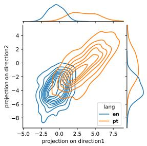
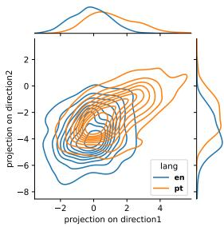
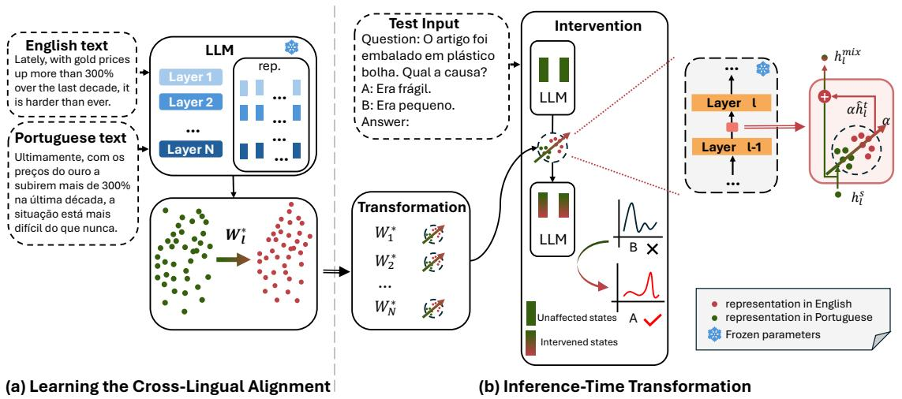
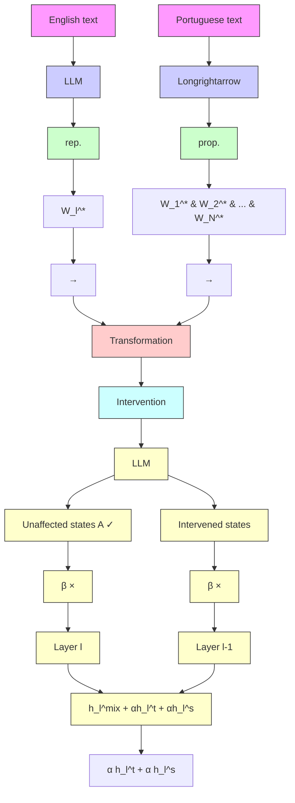
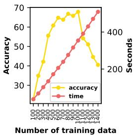
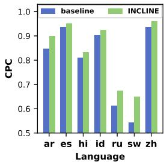
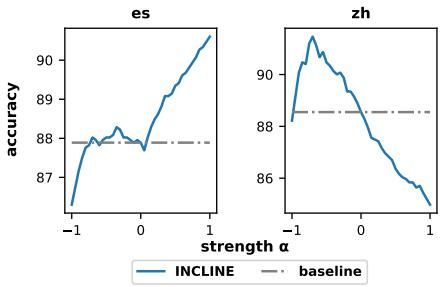
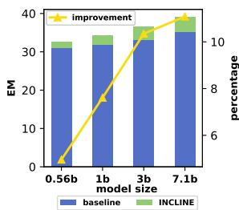
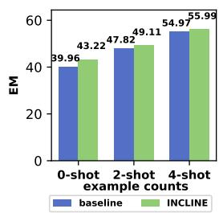
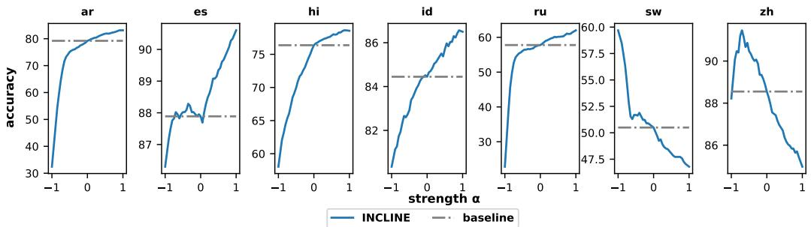

# Bridging the Language Gaps in Large Language Models with Inference-Time Cross-Lingual Intervention

Weixuan Wang1† Minghao Wu2† Barry Haddow1 Alexandra Birch1

1School of Informatics, University of Edinburgh

2Monash University

{weixuan.wang, bhaddow, a.birch}@ed.ac.uk

minghao.wu@monash.edu

# Abstract

Large Language Models (LLMs) have shown remarkable capabilities in natural language processing but exhibit significant performance gaps among different languages. Most existing approaches to address these disparities rely on pretraining or fine-tuning, which are resourceintensive. To overcome these limitations without incurring significant costs, we propose Inference-Time Cross-Lingual Intervention (INCLINE), a novel framework that enhances LLM performance on low-performing (source) languages by aligning their internal representations with those of high-performing (target) languages during inference. INCLINE initially learns alignment matrices using parallel sentences from source and target languages through a Least-Squares optimization, and then applies these matrices during inference to transform the low-performing language representations toward the high-performing language space. Extensive experiments on nine benchmarks with five LLMs demonstrate that IN-CLINE significantly improves performance across diverse tasks and languages, compared to recent strong baselines. Our analysis demonstrates that INCLINE is highly cost-effective and applicable to a wide range of applications. In addition, we release the code to foster research along this line.1

# 1 Introduction

Large Language Models (LLMs) have achieved remarkable success across a variety of natural language processing tasks, demonstrating strong capabilities in language understanding and generation (OpenAI, 2023; Dubey et al., 2024; Mesnard et al., 2024; Anthropic, 2024; OpenAI, 2024a,b). However, despite these advancements, most state-of-theart LLMs remain predominantly English-centric, exhibiting significant performance gaps among different languages (Petrov et al., 2023; Kumar et al.,

line

| projection on direction1 | projection on direction2 | lang |
| ------------------------ | ------------------------ | ---- |
| -5.0                     | -8.0                     | en   |
| -2.5                     | -6.0                     | en   |
| 0.0                      | -4.0                     | en   |
| 2.5                      | -2.0                     | en   |
| 5.0                      | 0.0                      | en   |
| 7.5                      | 2.0                      | en   |
| 7.5                      | 4.0                      | pt   |

(a) Before intervention

line

| projection on direction1 | projection on direction2 | lang |
| ------------------------ | ------------------------ | ---- |
| -2                       | 0                        | en   |
| 0                        | -2                       | pt   |
| 2                        | 0                        | en   |
| 4                        | -2                       | pt   |

(b) After intervention   
Figure 1: Bivariate kernel density estimation plots displaying the representations (hidden states of the last token) from 100 random examples in English (blue) and their Portuguese translations (orange) from XCOPA (Ponti et al., 2020). After intervention using INCLINE, the Portuguese representations are aligned closer to the English representations.

2024), which can adversely affect user experience and potentially exclude large portions of the global population from accessing advanced AI services (Lai et al., 2023a; Wang et al., 2024a).

Addressing the performance gaps across languages is highly challenging. Recent approaches are mostly data-driven, such as multilingual supervised fine-tuning or continued pre-training (Üstün et al., 2024; Cui et al., 2023; Kuulmets et al., 2024). However, collecting and annotating large-scale datasets for numerous underrepresented languages is both time-consuming and resource-intensive (Xue et al., 2021; Lai et al., 2023b). Furthermore, training LLMs on multilingual data requires substantial computational resources, limiting their practicality for widespread applications, especially in resource-constrained settings (Muennighoff et al., 2023; Li et al., 2023a). Given these limitations, a natural question arises: How can we bridge the performance gaps between highperforming and low-performing languages without incurring prohibitive costs?

Inspired by Lample et al. (2018) showing that word embeddings in different languages can be aligned to a shared representation space through learned rotations for word translation, we propose Inference-Time Cross-Lingual Intervention (INCLINE). This novel framework utilizes a group of learned alignment matrices that transform the representations (e.g., hidden states) of a low-performing (source) language into those of a high-performing (target) language during inference. Our framework comprises two main steps. First, we train the alignment matrices for each layer of LLM using parallel sentences from the source and target languages. The learning process is formulated as a Least-Squares optimization problem, where these alignment matrices are learned by minimizing the distance between the projected source language representations and their corresponding target language representations, without the need for extensive retraining or fine-tuning the LLM. Second, we apply the learned alignment matrices to transform the source language input representations into the target language representation space at each layer during inference. By integrating these steps, INCLINE leverages the rich representations learned from high-performing languages to enhance performance on downstream tasks involving low-performing languages. As shown in Figure 1, INCLINE effectively aligns the input representations in Portuguese to their parallel representations in English.

In this study, we conduct extensive experiments to validate the effectiveness of INCLINE on nine widely used benchmarks using five LLMs. Our results demonstrate that aligning internal representations using INCLINE significantly improves performance on diverse tasks among languages.

Our contributions are summarized as follows:

• We propose INCLINE, a cross-lingual intervention approach that enhances LLMs by transforming source language representations into a target language representation space during inference without requiring additional training of LLMs (see Section 3).

• We conduct extensive evaluations across five discriminative tasks and four generative tasks, covering 21 languages. Our experimental results show that INCLINE significantly improves model performance, boosting average accuracy by up to +4.96 compared to strong baselines (see Section 4).

• Our detailed analysis indicates that INCLINE is highly cost-effective, as it requires minimal

computational resources while delivering substantial performance improvements (see Section 5). Moreover, we demonstrate that IN-CLINE is effective with regard to LLM backbones, model sizes, and in-context learning, underscoring its general applicability and potential for broader use in enhancing LLMs for underrepresented languages (see Section 6).

# 2 Related Work

Multilingual LLMs LLMs are pivotal in multilingual NLP tasks, typically leveraging external parallel datasets for training (Xue et al., 2021; Muennighoff et al., 2023; Chung et al., 2024; Li et al., 2025). For low-resource languages, data augmentation techniques generate parallel data by mining sentence pairs or translating monolingual text using machine translation tools (Edunov et al., 2018; Zhao et al., 2021; Ranaldi et al., 2023). However, these methods heavily rely on robust parallel corpora. To reduce data costs, studies have shifted toward Parameter-Efficient Fine-Tuning (PEFT) techniques (Pfeiffer et al., 2020; Parovic et al.´ , 2022; Agrawal et al., 2023; Wu et al., 2024; Wang et al., 2025) and cross-lingual embeddings mapping methods (Mikolov et al., 2013; Ormazabal et al., 2019; Wang et al., 2022), which still demand considerable computational resources.

Multilingual Prompting There is a growing interest in methods that do not require parameter adjustments. Prompting techniques have emerged, utilizing LLMs with multilingual prompts (Lin et al., 2021c, 2022; Shi et al., 2022b; Huang et al., 2023). However, these strategies face challenges like poor translation quality and prompt framing interference (Wang et al., 2024c). Additionally, their effectiveness varies by task, as recent research indicates that few-shot learning may not outperform zero-shot learning in translation tasks (Hendy et al., 2023; Wang et al., 2024d).

Intervention To address these challenges, we explore inference-time intervention techniques as cost-effective and efficient alternatives to traditional fine-tuning. Prior research in style transfer (Subramani et al., 2022; Turner et al., 2023), knowledge editing (Meng et al., 2022), and truthfulness shifting (Li et al., 2023b; Rimsky et al., 2024; Wang et al., 2024e) demonstrates the potential of linear probe-based interventions. However, these methods have been largely limited to monolingual contexts. Our goal is to design a novel cross-lingual inference-time intervention that effectively aligns representations across languages, aiming to improve performance across multiple languages.

flowchart

Figure 2: Framework of INCLINE. INCLINE involves two steps: (a) Learning the Cross-Lingual Alignment: sentence representations from a parallel dataset are used to train alignment matrices that map source (Portuguese) representations to the target (English) representations. (b) Inference-Time Transformation: this step adapts the source representations from downstream tasks into the target representation space using the alignment matrices.

# 3 Methodology

In Figure 2, we illustrate the framework of IN-CLINE, which enhances LLMs through inferencetime cross-lingual intervention. Our approach comprises two main steps:

• Learning the Cross-Lingual Alignment: Using parallel corpora, we train alignment matrices for each layer to map source language representations to target language representations (see Section 3.1).   
• Inference-Time Transformation: During inference, we utilize the learned alignment matrices to transform input representations from the source language into the target language representation space, thereby improving the LLM’s performance on tasks in the source language (see Section 3.2).

By minimizing the distance between the source language representations and their corresponding target language representations, we effectively reduce cross-lingual representation gaps and align representation spaces across languages.

# 3.1 Learning the Cross-Lingual Alignment

Inspired by Schuster et al. (2019) that align embeddings across languages with learned linear transformations, we aim to learn a cross-lingual alignment matrix $W _ { l }$ that aligns sentence representations from the source language to the target language at the l-th layer of LLM. Given a parallel dataset $D = \{ ( \pmb { x } _ { i } ^ { \mathrm { s } } , \pmb { x } _ { i } ^ { \mathrm { t } } ) \} _ { i = 1 } ^ { N }$ , where each $\pmb { x } _ { i } ^ { \mathrm { s } }$ is the i-th source sentence and $\pmb { x } _ { i } ^ { \mathrm { t } }$ is its corresponding translation in the target language. Both $\pmb { x } _ { i } ^ { \mathrm { s } }$ and $\pmb { x } _ { i } ^ { \mathrm { t } }$ are sequences of tokens. From these sequences, we extract sentence representations by taking the hidden state of the last token in each sequence, denoted as $\pmb { h } _ { i , l } ^ { \mathrm { s } } \in \mathbb { R } ^ { d }$ and $\pmb { h } _ { i , l } ^ { \mathrm { t } } \in \mathbb { R } ^ { d }$ for the source and target sentence, respectively, where d is the dimensionality of the hidden states.

To minimize the difference between the projected source sentence representations and the target sentence representations, our objective can be defined as a Least-Squares optimization problem:

$$
\boldsymbol {W} _ {l} ^ {*} = \underset {\boldsymbol {W} _ {l}} {\operatorname{argmin}} \sum_ {i = 1} ^ {N} \left\| \boldsymbol {W} _ {l} \boldsymbol {h} _ {i, l} ^ {\mathrm{s}} - \boldsymbol {h} _ {i, l} ^ {\mathrm{t}} \right\| ^ {2} \tag {1}
$$

This problem seeks the optimal $W _ { l } ^ { * }$ that aligns the source representations with the target representations by minimizing the distance between them. Hence, the closed-form solution to this optimization problem is:

$$
\boldsymbol {W} _ {l} ^ {*} = \left(\sum_ {i = 1} ^ {N} (\boldsymbol {h} _ {i, l} ^ {\mathrm{s}}) ^ {\top} \boldsymbol {h} _ {i, l} ^ {\mathrm{s}}\right) ^ {- 1} \left(\sum_ {i = 1} ^ {N} (\boldsymbol {h} _ {i, l} ^ {\mathrm{s}}) ^ {\top} \boldsymbol {h} _ {i, l} ^ {\mathrm{t}}\right) \tag {2}
$$

By applying the learned alignment matrix $W _ { l } ^ { * }$ to the source sentence representations, we effectively map them into the target language’s representation space. This alignment reduces cross-lingual representation discrepancies, allowing the model to leverage knowledge from the target language to improve performance on tasks in the source language.

# 3.2 Inference-Time Transformation

With the learned alignment matrix $W _ { l } ^ { * }$ , we can enhance the LLM’s processing of source language inputs by transforming their representations to the target representation space during inference.

We denote the hidden state of the last token of the test input $\pmb q ^ { s }$ in the source language at the lth layer of the LLM as $h _ { q , l } ^ { \mathrm { s } }$ q,l and then project this source language representation into the target representation space using the alignment matrix $W _ { l } ^ { * }$ :

$$
\hat {\boldsymbol {h}} _ {q, l} ^ {\mathrm{t}} = \boldsymbol {W} _ {l} ^ {*} \boldsymbol {h} _ {q, l} ^ {\mathrm{s}} \tag {3}
$$

To perform the cross-lingual intervention at the l-th layer using the intervention vector $\hat { \pmb { h } } _ { q , l } ^ { \mathrm { t } }$ t , we adjust the original hidden state in source language $h _ { q , l } ^ { \mathrm { s } }$ by blending it with the projected hidden state in target language $\hat { \pmb { h } } _ { q , l } ^ { \mathrm { t } }$ . This adjustment is controlled by a hyperparameter α, which balances the influence between the source and target hidden states:

$$
\boldsymbol {h} _ {q, l} ^ {\text { mix }} = \boldsymbol {h} _ {q, l} ^ {\mathrm{s}} + \alpha \hat {\boldsymbol {h}} _ {q, l} ^ {\mathrm{t}} \tag {4}
$$

Here, Equation 4 represents a shift of representation of source language towards target language representation by a magnitude of α times.

Decoding with Minimal Intervention In this work, we only conduct one single intervention on the last token of $\pmb q ^ { \mathrm { s } }$ by replacing $h _ { q , i } ^ { \mathrm { s } }$ l with $h _ { q , l } ^ { \operatorname* { m i x } }$ for the test input $\pmb q ^ { s }$ at the l-th layer of LLM. In such a way, we can effectively intervene the model output while preserve the features in the source language.

Comparison with ITI and CAA Recently, ITI (Li et al., 2023b) and CAA (Rimsky et al., 2024) have been proposed as interventions in the model behaviors by manipulating the selected attention heads and hidden states, respectively. INCLINE is distinct from ITI and CAA due to three primary differences. Firstly, ITI and CAA utilize a learned static intervention vector to alter model behaviors, whereas INCLINE leverages a set of alignment matrices to dynamically align input representations from the source language to the target language. Secondly, ITI and CAA apply the intervention vector across all token positions following the instruction, potentially causing excessive perturbation during inference. In contrast, INCLINE performs a single intervention solely on the last token of the input. Additionally, unlike ITI and CAA, which target on only a limited number of layers, INCLINE modifies the representations across all layers. These modifications enable the LLMs to comprehensively leverage their target language capabilities for multilingual prediction.

# 4 Experiments

In this section, we introduce our experimental setup (Section 4.1) and present our results in Section 4.2.

# 4.1 Experimental Setup

We present our evaluation tasks, model backbones, implementation details of INCLINE, and baselines in this section.

Evaluation Tasks We conduct extensive evaluations across nine diverse downstream tasks, categorized into two groups:

• Discriminative Tasks: XCOPA (Ponti et al., 2020), XStoryCloze (Lin et al., 2021b), XWinograd (Lin et al., 2021b), XCSQA (Lin et al., 2021a), XNLI (Conneau et al., 2018);   
• Generative Tasks: MZsRE (Wang et al., 2024b), Flores (Goyal et al., 2021), WMT23 (Kocmi et al., 2023), MGSM (Shi et al., 2022a).

These tasks covers 21 languages including English (en), Arabic (ar), German (de), Greek (el), Spanish (es), Estonian (et), French (fr), Hindi (hi), Indonesian (id), Italian (it), Japanese (ja), Dutch (nl), Portuguese (pt), Russian (ru), Swahili (sw), Tamil (ta), Thai (th), Turkish (tr), Ukrainian (uk), Vietnamese (vi), and Chinese (zh). We include more details of these tasks in Appendix A.

Model Backbones In this work, we mainly use BLOOMZ-7B1-MT as our model backbone for all the baseline approaches, unless otherwise specified. To demonstrate the effectiveness of INCLINE across various model backbones, we include four additional LLMs: LLAMA3.1- 8B-INSTRUCT (Dubey et al., 2024), LLAMA2- 7B-CHAT (Touvron et al., 2023), MISTRAL-7B-INSTRUCT (Jiang et al., 2023), FALCON-7B-INSTRUCT (Almazrouei et al., 2023). We present these results in Section 6. For the MGSM task, we employ the MATHOCTOPUS (Chen et al., 2023),2 a specialized model fine-tuned from LLAMA2-7B for mathematical reasoning tasks, as the backbone.

<table><tr><td rowspan="2"></td><td colspan="3">XCOPA</td><td colspan="3">XStoryCloze</td><td colspan="3">XWinograd</td><td colspan="3">XCSQA</td><td colspan="3">XNLI</td></tr><tr><td> $\mu_{ALL}$ </td><td> $\mu_{SEEN}$ </td><td> $\mu_{UNSEEN}$ </td><td> $\mu_{ALL}$ </td><td> $\mu_{SEEN}$ </td><td> $\mu_{UNSEEN}$ </td><td> $\mu_{ALL}$ </td><td> $\mu_{SEEN}$ </td><td> $\mu_{UNSEEN}$ </td><td> $\mu_{ALL}$ </td><td> $\mu_{SEEN}$ </td><td> $\mu_{UNSEEN}$ </td><td> $\mu_{ALL}$ </td><td></td><td></td></tr><tr><td>BASELINE</td><td>61.62</td><td>69.00</td><td>52.40</td><td>74.96</td><td>77.83</td><td>57.78</td><td>57.05</td><td>59.71</td><td>53.06</td><td>47.35</td><td>55.31</td><td>34.62</td><td>46.48</td><td>50.04</td><td>41.48</td></tr><tr><td>MT-GOOGLE</td><td> $73.31^†$ </td><td>73.52</td><td> $73.05^†$ </td><td>76.63</td><td>76.05</td><td> $80.08^†$ </td><td>57.63</td><td>57.12</td><td> $57.90^†$ </td><td> $58.52^†$ </td><td>54.84</td><td> $64.40^†$ </td><td>50.72</td><td>49.80</td><td>52.00</td></tr><tr><td>MT-LLM</td><td>59.84</td><td>67.16</td><td>50.70</td><td>79.41</td><td>82.23</td><td>62.48</td><td>43.02</td><td>41.67</td><td>45.04</td><td>30.73</td><td>35.38</td><td>23.30</td><td>43.64</td><td>47.83</td><td>37.77</td></tr><tr><td colspan="16">Intervention Methods</td></tr><tr><td>ITI</td><td>60.91</td><td>67.56</td><td>52.60</td><td>76.38</td><td>79.33</td><td>58.70</td><td>48.24</td><td>58.37</td><td>33.06</td><td>46.32</td><td>55.33</td><td>31.92</td><td>46.32</td><td>49.51</td><td>41.84</td></tr><tr><td>CAA</td><td>63.96</td><td>71.80</td><td>54.15</td><td>78.16</td><td>80.92</td><td>61.61</td><td>58.42</td><td>60.70</td><td>55.01</td><td>47.97</td><td>56.01</td><td>35.10</td><td>46.17</td><td>50.92</td><td>39.52</td></tr><tr><td>INCLINE</td><td>65.22(+3.60)</td><td>72.56(+3.56)</td><td>56.05(+3.65)</td><td>79.92(+4.96)</td><td>82.03(+4.20)</td><td>67.24(+9.46)</td><td> $59.35^†$ (+2.30)</td><td> $62.04^†$ (+2.33)</td><td>55.32(+2.26)</td><td>48.45(+1.10)</td><td> $56.45^†$ (+1.14)</td><td>35.64(+1.02)</td><td>48.12(+1.64)</td><td>51.44(+1.40)</td><td>43.47(+1.99)</td></tr><tr><td>SFT</td><td>66.89</td><td>76.84</td><td>54.45</td><td>87.36</td><td>89.50</td><td>74.52</td><td>43.78</td><td>48.63</td><td>36.50</td><td>42.18</td><td>47.95</td><td>32.96</td><td>69.68</td><td>76.76</td><td>59.76</td></tr><tr><td>SFT +INCLINE</td><td> $69.24$ (+2.35)</td><td> $79.28^†$ (+2.44)</td><td>61.22(+6.77)</td><td> $88.11^†$ (+0.75)</td><td> $90.00^†$ (+0.50)</td><td>76.77(+2.25)</td><td>49.84(+6.06)</td><td>57.58(+8.95)</td><td>38.24(+1.74)</td><td>42.55(+0.37)</td><td>48.38(+0.43)</td><td>33.22(+0.26)</td><td> $71.17^†$ (+1.49)</td><td> $77.83^†$ (+1.07)</td><td> $61.84^†$ (+2.08)</td></tr></table>

Table 1: Main results of discriminative tasks. All the tasks are evaluated using accuracy. † denotes the best results. µALL, µSEEN, and $\mu _ { \mathrm { U N S E F N } }$ indicate the macro-average of results across all the languages, the seen languages, and the unseen languages, respectively.

INCLINE (Ours) In this work, we mainly focus on aligning the low-performing language (source) representations closer to the English (target) representations, as LLMs are predominantly Englishcentric. For training the alignment matrices between languages, we randomly sample 500 parallel sentence pairs for each language pair involving English and other languages. These pairs are sourced from the News Commentary v16 dataset (Barrault et al., 2019), and for languages not covered by this dataset, we use the CCAligned dataset (El-Kishky et al., 2020). Following Rimsky et al. (2024), the value of the α controlling the intervention strength is in the range from -1 to 1 and determined by the validation results for each language across tasks. We use one A100 GPU (40G) for all experiments.

Baselines We compare INCLINE against several established techniques on the zero-shot setting: (1) BASELINE indicates the predictions given by the original BLOOMZ-7B1-MT; (2) MT-GOOGLE utilizes GOOGLE TRANSLATE to translate non-English questions into English; (3) MT-LLM leverages BLOOMZ-7B1-MT to translate questions in non-English languages into English, employing the structured prompt template “{Source Language}: {Inputs} English:”; (4) SFT represents the task-specific supervised finetuning (SFT) involving updating all parameters of the LLM on the English training set for each downstream task individually with the hyperparameters described in Appendix B and evaluating the resulting model on the multilingual test sets; (5) ITI (Li et al., 2023b) is an intervention method that identifies attention heads with high linear probing accuracy for truthfulness and adjusts activations along these truth-correlated directions during inference. Originally used to shift models from generating false statements to truthful ones, we adapt it to encourage the generation of English text over non-English text. (6) CAA (Rimsky et al., 2024) employs the mean difference in hidden states between positive and negative examples from additional training data as an intervention vector to adjust the model’s behavior towards the desired direction. Initially designed for monolingual alignment-relevant tasks, we utilize it to shift the model’s output from non-English to English.

# 4.2 Results

In this section, we present our results on the discriminative tasks (Table 1) and generative tasks (Table 2). Furthermore, we also categorize the languages involved in the downstream tasks into two groups based on the training data of BLOOMZ-7B1-MT: seen languages (ar, es, fr, hi, id, pt, sw, ta, vi, and zh) and unseen languages (de, el, et, it, ja, nl, ru, th, tr, and uk). The breakdown results are provided in Table 7 (see Appendix C).

INCLINE significantly improves discriminative task performance. The experimental results in Table 1 clearly demonstrate the effectiveness of INCLINE. Although methods like SFT, MT-GOOGLE, and MT-LLM achieve high performance, they come with substantial costs, including the need for extensive fine-tuning of LLMs and reliance on third-party tools. Activation intervention methods, such as ITI and CAA, offer a more cost-effective solution but yield only minimal improvements, indicating a potential inadequacy in capturing the complexities of multilingual tasks. In contrast, INCLINE provides significant performance gains by enhancing multilingual representation alignment at inference time without requiring extensive resources or dependencies. This results in a more efficient improvement in multilingual performance. For example, INCLINE increases the average accuracy by +4.96 on XStoryCloze. Additionally, it delivers improvements of +4.20 and +9.46 for seen and unseen languages, respectively. Moreover, INCLINE can further improve the performance of the task-specific SFT.

<table><tr><td rowspan="2"></td><td colspan="3">MZsRE</td><td colspan="3">Flores</td><td colspan="3">WMT23</td><td colspan="3">MGSM</td></tr><tr><td> $\mu_{ALL}$ </td><td> $\mu_{SEEN}$ </td><td> $\mu_{UNSEEN}$ </td><td> $\mu_{ALL}$ </td><td> $\mu_{SEEN}$ </td><td> $\mu_{UNSEEN}$ </td><td> $\mu_{ALL}$ </td><td> $\mu_{SEEN}$ </td><td> $\mu_{UNSEEN}$ </td><td> $\mu_{ALL}$ </td><td> $\mu_{SEEN}$ </td><td> $\mu_{UNSEEN}$ </td></tr><tr><td>BASELINE</td><td>39.96</td><td>45.79</td><td>32.67</td><td>46.09</td><td>58.57</td><td>21.12</td><td>13.78</td><td>14.39</td><td>13.63</td><td>39.35</td><td>39.80</td><td>38.90</td></tr><tr><td>MT-GOOGLE</td><td> $73.56^†$ </td><td> $72.76^†$ </td><td> $74.56^†$ </td><td>-</td><td>-</td><td>-</td><td>-</td><td>-</td><td>-</td><td> $46.70^†$ </td><td> $47.70^†$ </td><td> $45.70^†$ </td></tr><tr><td>MT-LLM</td><td>33.18</td><td>39.25</td><td>25.61</td><td>-</td><td>-</td><td>-</td><td>-</td><td>-</td><td>-</td><td>21.40</td><td>30.00</td><td>12.80</td></tr><tr><td colspan="13">Intervention Methods</td></tr><tr><td>ITI</td><td>36.31</td><td>41.72</td><td>29.54</td><td>2.85</td><td>2.97</td><td>1.95</td><td>2.34</td><td>3.16</td><td>2.13</td><td>40.50</td><td>41.90</td><td>39.10</td></tr><tr><td>CAA</td><td>42.88</td><td>50.17</td><td>33.78</td><td>47.87</td><td>60.63</td><td>16.75</td><td>13.74</td><td>14.86</td><td>13.46</td><td>39.43</td><td>40.85</td><td>38.00</td></tr><tr><td>INCLINE</td><td>43.22(+3.26)</td><td>50.21(+4.42)</td><td>34.49(+1.82)</td><td> $48.19^†$ (+2.10)</td><td> $61.28^†$ (+2.71)</td><td> $22.00^†$ (+0.88)</td><td> $14.23^†$ (+0.45)</td><td> $15.05^†$ (+0.66)</td><td> $14.02^†$ (+0.39)</td><td>42.85(+3.50)</td><td>43.30(+3.50)</td><td>42.40(+3.50)</td></tr></table>

Table 2: Main results of generative tasks. † denotes the best results. $\mu _ { \mathrm { A L L } } , \mu _ { \mathrm { S E E N } } ,$ , and $\mu _ { \mathrm { U N S E F N } }$ indicate the macroaverage of results across all the languages, the seen languages, and the unseen languages, respectively. We use Exact Match (EM) to evaluate MZsRE, use BLEU to evaluate Flores and WMT23, and use accuracy to evaluate MGSM.

INCLINE significantly enhances generative task performance. The experimental results presented in Table 2 suggest the effectiveness of IN-CLINE in enhancing performance across generative tasks. Unlike ITI and CAA, which show only marginal improvements similar to those observed in discriminative tasks, INCLINE appears to achieve substantial advancements. Notably, ITI seems to struggle significantly in machine translation tasks, such as Flores and WMT23, highlighting its limitations. Furthermore, INCLINE reportedly boosts accuracy in the MGSM task by up to +3.50 across various languages. This finding suggests that, although the mathematical capabilities are independent from the languages, understanding the questions written in different languages still requires language-specific knowledge. INCLINE successfully transfers the LLMs’ natural language understanding capabilities from English to other languages. It is important to note that SFT is not evaluated on generative tasks because there are no training sets associated with these tasks.

In summary, these results demonstrate that IN-CLINE offers a significant improvement in both discriminative and generative tasks by effectively aligning multilingual representations.

line

| Number of training data | Accuracy | Time (Seconds) |
| ----------------------- | -------- | -------------- |
| 100                     | 25       | 200            |
| 200                     | 35       | 250            |
| 300                     | 45       | 300            |
| 400                     | 55       | 350            |
| 500                     | 60       | 400            |
| 600                     | 65       | 450            |
| 700                     | 68       | 500            |
| 800                     | 69       | 550            |
| 900                     | 68       | 600            |
| 1000                    | 65       | 650            |
| 1100                    | 62       | 700            |
| 1200                    | 60       | 750            |
| 1300                    | 58       | 800            |
| 1400                    | 55       | 850            |
| 1500                    | 52       | 900            |
| 1600                    | 50       | 950            |
| 1700                    | 48       | 1000           |
| 1800                    | 45       | 1050           |
| 1900                    | 42       | 1100           |
| 2000                    | 40       | 1150           |

(a) Training cost

bar

| Language | baseline | INCLINE |
|---|---|---|
| ar | 0.85 | 0.91 |
| es | 0.94 | 0.96 |
| hi | 0.81 | 0.83 |
| id | 0.91 | 0.93 |
| ru | 0.61 | 0.67 |
| sw | 0.54 | 0.65 |
| zh | 0.94 | 0.97 |

(b) Prediction consistency   
Figure 3: (a) Training costs of INCLINE with regard to the number of parallel sentences and time used for training alignment matrices. INCLINE is evaluated on XStoryCloze in Swahili. (b) Correct Prediction Consistency (CPC) between non-English and English on XStoryCloze for the model using INCLINE.

# 5 Analysis

In this section, we conduct an in-depth analysis of INCLINE, focusing on four key aspects: computational costs, enhanced consistency after intervention, the impacts of the intervened components of LLMs, and the choice of intervention strength α. This analysis provides a comprehensive understanding of how INCLINE operates and its implications for model performance and efficiency.

INCLINE is highly efficient for training and introduces only marginal overhead for inference. To analyze the relationship between computational costs and accuracy, we measure both the training and inference costs of our method, INCLINE, using the XStoryCloze task in Swahili. As shown in Figure 3(a), increasing the amount of training data does not necessarily lead to improved accuracy, even though the training time is directly proportional to the number of samples. In our study, we empirically determine that using 500 samples for training the alignment matrices provides the best balance between performance gains and computational costs. Consequently, the training process takes only 172 seconds. During inference, our approach involves a single intervention at the last token, resulting in a time complexity of O(1). This method incurs only a 12% increase in inference time, taking 0.80 seconds per item compared to 0.71 seconds without it, thereby maintaining a low inference cost. More results are provided in Appendix G.

<table><tr><td></td><td>XCOPA</td><td>XCSQA</td><td>Flores</td><td>MGSM</td></tr><tr><td>BASELINE</td><td>61.60</td><td>47.35</td><td>46.09</td><td>39.35</td></tr><tr><td colspan="5">INCLINE</td></tr><tr><td>INCLINE-HIDDEN</td><td>65.22</td><td>48.45</td><td>48.19</td><td>42.85</td></tr><tr><td>INCLINE-ATTN</td><td>63.87</td><td>48.18</td><td>47.54</td><td>41.55</td></tr><tr><td>INCLINE-FFN</td><td>64.20</td><td>47.96</td><td>46.10</td><td>41.80</td></tr><tr><td>INCLINE-EMB</td><td>63.16</td><td>47.59</td><td>39.23</td><td>40.90</td></tr></table>

Table 3: The averaged results of XStoryCloze, XCSQA, Flores, MGSM tasks with four configurations for IN-CLINE given by BLOOMZ-7B1-MT.

INCLINE effectively enhances the consistency of correct predictions between non-English languages (source) and English (target). Recent non-English test sets are commonly translated from their English versions, either by humans or machines, creating parallel datasets. To quantify the alignment between non-English languages (source) and English (target), we propose using the Correct Prediction Consistency (CPC) rate. This metric measures the proportion of questions correctly answered in both languages, with a higher CPC rate indicating better alignment. The results in Figure 3(b) demonstrate that CPC significantly improves after intervention by INCLINE, suggesting that INCLINE effectively aligns non-English representations with English ones for more accurate predictions. Notably, CPC for Swahili (sw) increases from 0.54 to 0.65 with INCLINE, showing its effectiveness for low-resource languages.

Intervening on hidden states yields the greatest performance improvements. We apply IN-CLINE to various components of LLMs, including the hidden states (INCLINE-HIDDEN), the outputs of attention heads (INCLINE-ATTN), the outputs of FFN blocks (INCLINE-FFN), and the embeddings (INCLINE-EMB). The results presented in Table 3 indicate that intervening on the hidden states (INCLINE-HIDDEN) leads to the most significant improvements across multilingual tasks. This finding suggests that hidden states can capture

line

| strength α | INCLINE | baseline |
| ---------- | ------- | -------- |
| -1         | 87.0    | 88.0     |
| 0          | 88.5    | 88.0     |
| 1          | 90.5    | 88.0     |

Figure 4: The accuracy changed with hyperparameter α on the XStoryCloze task with BLOOMZ-7B1-MT.

<table><tr><td></td><td>ar</td><td>es</td><td>hi</td><td>id</td><td>ru</td><td>sw</td><td>zh</td><td>AVG</td></tr><tr><td colspan="9">BLOOMZ-7B1-MT</td></tr><tr><td>BASELINE</td><td>79.22</td><td>87.89</td><td>76.37</td><td>84.45</td><td>57.78</td><td>50.50</td><td>88.55</td><td>74.96</td></tr><tr><td>INCLINE</td><td>83.12</td><td>90.60</td><td>81.47</td><td>86.10</td><td>67.24</td><td>59.70</td><td>91.20</td><td>79.92</td></tr><tr><td colspan="9">LLAMA3.1-8B-INSTRUCT</td></tr><tr><td>BASELINE</td><td>86.50</td><td>91.73</td><td>84.84</td><td>37.46</td><td>66.98</td><td>54.00</td><td>92.39</td><td>73.41</td></tr><tr><td>INCLINE</td><td>87.36</td><td>92.39</td><td>85.31</td><td>64.53</td><td>73.73</td><td>55.66</td><td>92.72</td><td>78.81</td></tr><tr><td colspan="9">LLAMA2-7B-CHAT</td></tr><tr><td>BASELINE</td><td>49.37</td><td>47.25</td><td>39.25</td><td>48.18</td><td>34.94</td><td>0.93</td><td>55.53</td><td>39.35</td></tr><tr><td>INCLINE</td><td>51.42</td><td>56.65</td><td>47.25</td><td>49.97</td><td>41.03</td><td>17.67</td><td>60.69</td><td>46.38</td></tr><tr><td colspan="9">MISTRAL-7B-INSTRUCT</td></tr><tr><td>BASELINE</td><td>18.33</td><td>81.34</td><td>24.95</td><td>76.64</td><td>83.65</td><td>2.58</td><td>90.07</td><td>53.94</td></tr><tr><td>INCLINE</td><td>36.71</td><td>84.23</td><td>35.77</td><td>80.18</td><td>85.13</td><td>25.71</td><td>90.34</td><td>62.58</td></tr><tr><td colspan="9">FALCON-7B-INSTRUCT</td></tr><tr><td>BASELINE</td><td>53.61</td><td>58.31</td><td>53.21</td><td>55.59</td><td>54.60</td><td>51.16</td><td>54.00</td><td>54.35</td></tr><tr><td>INCLINE</td><td>54.33</td><td>61.81</td><td>54.33</td><td>58.04</td><td>57.91</td><td>53.47</td><td>59.70</td><td>57.09</td></tr></table>

Table 4: The results of XStoryCloze dataset with five LLM backbones.

comprehensive semantic information that is crucial for cross-lingual alignment. While INCLINE-ATTN, INCLINE-FFN, and INCLINE-EMB also enhance performance, their performance gains vary across different tasks. These findings justify our design choice of using hidden states in INCLINE.

The value of α varies across languages and depends on language relatedness. In this study, we introduce α to control the strength of intervention in Equation 4. To investigate the impact of α, we conduct a grid search to find the optimal α values across the languages in XStoryCloze. We present the results for Spanish and Chinese in Figure 4. We observe that the optimal α values for these two languages are opposite: positive for Spanish and negative for Chinese. These findings suggest that the value of α is likely to depend on language relatedness, as both Spanish and English belong to the Indo-European language family, while Chinese belongs to the Sino-Tibetan language family. Results for more languages are provided in Appendix D.

# 6 Discussions

In this section, we conduct a series of experiments to investigate how variations in LLMs, model sizes, in-context learning, and the data used for training alignment matrices affect our results. Additionally, we also explore using French as the target language (Appendix E).

<table><tr><td></td><td>ar</td><td>el</td><td>es</td><td>fr</td><td>hi</td><td>ru</td><td>tr</td><td>vi</td><td>zh</td><td>AVG</td></tr><tr><td>BASELINE</td><td>66.59</td><td>15.30</td><td>48.52</td><td>67.86</td><td>71.97</td><td>35.66</td><td>12.38</td><td>40.40</td><td>56.11</td><td>46.09</td></tr><tr><td>INCLINE</td><td>68.68</td><td>15.63</td><td>50.79</td><td>69.93</td><td>76.92</td><td>37.95</td><td>12.42</td><td>43.11</td><td>58.27</td><td>48.19</td></tr><tr><td>INCLINE-FDEV</td><td>73.95</td><td>15.76</td><td>56.11</td><td>75.84</td><td>77.85</td><td>39.33</td><td>12.92</td><td>46.49</td><td>60.19</td><td>50.94</td></tr></table>

Table 5: The BLEU results of Flores dataset with INCLINE and INCLINE-FDEV.

INCLINE consistently enhances performance across multiple LLMs. To demonstrate the versatility of INCLINE across different LLMs, we apply it to another four high-performing models on the XStoryCloze task. As shown in Table 4, IN-CLINE consistently enhances performance compared to the BASELINE. Specifically, we observe increases of +4.96 for BLOOMZ-7B1-MT, +5.40 for LLAMA3.1-8B-INSTRUCT, +7.03 for LLAMA2- 7B-CHAT, +8.64 for MISTRAL-7B-INSTRUCT, and +2.74 for FALCON-7B-INSTRUCT.

Larger LLMs benefit more from INCLINE. Building on the work of Wang et al. (2024b), who demonstrates a scaling relationship between the size of backbone models and their performance, we evaluate the impact of different model sizes within the BLOOMZ series on the MZsRE dataset. Our findings, illustrated in Figure 5(a), show that the relative performance gain of INCLINE over the baseline increases with the size of the backbone model. Specifically, the Exact Match (EM) scores (in the stacked columns) and the improvement percentages (in the line chart) indicate that larger models in the BLOOMZ series exhibit more significant enhancements when INCLINE is applied. This observation demonstrates that larger LLMs can benefit more from INCLINE.

INCLINE can further enhance model performance when combined with in-context learning. In-context learning (ICL) has been shown to improve the performance of LLMs on the MZsRE task (Wang et al., 2024b). Building upon this finding, we evaluate the effectiveness of combining INCLINE with ICL. As illustrated in Figure 5(b), INCLINE demonstrates enhanced performance, achieving an additional increase of +1.02 in average Exact Match (EM) score with four in-context examples compared to the baseline using ICL alone. While this improvement is smaller than the +3.26 increase observed in the zero-shot setting, it suggests that the benefits of INCLINE and ICL are complementary, with both methods capturing features from different perspectives. This highlights the versatility of INCLINE in various applications.

bar

| model size | baseline EM | INCLINE EM | improvement |
| ---------- | ----------- | ---------- | ----------- |
| 0.56b      | 32          | 4          | 5           |
| 1b         | 32          | 4          | 8           |
| 3b         | 32          | 4          | 10          |
| 7.1b       | 34          | 4          | 10          |

(a) Various model sizes

bar

| Example Count | baseline | INCLINE |
|---|---|---|
| 0-shot | 39.96 | 43.22 |
| 2-shot | 47.82 | 49.11 |
| 4-shot | 54.97 | 55.99 |

(b) In-context learning   
Figure 5: (a) Exact Match (left y-axis) and relative improvements over the baseline (right y-axis) on MZsRE with respect to various model sizes of BLOOMZ. (b) Exact Match score for MZsRE dataset with INCLINE based on the zero-shot setting and few-shot settings given by BLOOMZ-7B1-MT.

High-quality parallel sentences improve alignment in INCLINE. We explore how the quality of parallel sentences affects the performance of INCLINE. By default, the alignment matrices of INCLINE are trained using 500 random samples from the News Commentary dataset. To assess the impact of sentence quality, we also train the alignment matrices using 500 high-quality parallel sentences from the development set of Flores, which are carefully translated by professional human translators. We refer to this variant as INCLINE-FDEV. In Table 5, INCLINE-FDEV significantly outperforms both the standard INCLINE and BASELINE, highlighting the importance of high-quality parallel sentences.

# 7 Conclusion

In this paper, we introduce Inference-Time Cross-Lingual Intervention (INCLINE), an innovative framework that bridges the performance gaps between high-performing and low-performing languages in LLMs. By training alignment matrices to transform source low-performing language representations into the target high-performing language representation space, INCLINE enhances performance on underrepresented languages without requiring additional training or fine-tuning of LLMs. Extensive experiments across nine benchmarks and five LLMs demonstrate that, INCLINE delivers significant improvements by up to +4.96 in terms of accuracy compared to strong baselines, while it only requires minimal computational costs.

# 8 Limitations

While INCLINE demonstrates significant enhancement for the multilingual tasks with cross-lingual intervention, the alignment matrices are trained for specific pairs of source and target languages. Future work will focus on developing multilingual alignment matrices that can accommodate multiple languages simultaneously, reducing the need for language pair-specific training and enhancing scalability. Implementing INCLINE requires access to the internal layers and representations of LLMs. For proprietary or closed-source models, or models accessible only through APIs without exposure of internal representations (e.g., GPT-4o), applying this method may not be feasible. How to perform cross-lingual alignment as a plug-and-play tool for all LLMs, including those with restricted access, requires further investigation.

# Acknowledgement

This project has received funding from UK Research and Innovation (UKRI) under the UK government’s Horizon Europe funding guarantee [grant numbers 10039436].

The computations described in this research were performed using the Baskerville Tier 2 HPC service (https://www.baskerville.ac.uk/). Baskerville was funded by the EPSRC and UKRI through the World Class Labs scheme (EP/T022221/1) and the Digital Research Infrastructure programme (EP/W032244/1) and is operated by Advanced Research Computing at the University of Birmingham.

# References

Priyanka Agrawal, Chris Alberti, Fantine Huot, Joshua Maynez, Ji Ma, Sebastian Ruder, Kuzman Ganchev, Dipanjan Das, and Mirella Lapata. 2023. Qameleon: Multilingual qa with only 5 examples. Transactions

of the Association for Computational Linguistics, 11:1754–1771.

Ebtesam Almazrouei, Hamza Alobeidli, Abdulaziz Alshamsi, Alessandro Cappelli, Ruxandra Cojocaru, Mérouane Debbah, Étienne Goffinet, Daniel Hesslow, Julien Launay, Quentin Malartic, Daniele Mazzotta, Badreddine Noune, Baptiste Pannier, and Guilherme Penedo. 2023. The falcon series of open language models. CoRR, abs/2311.16867.

Anthropic. 2024. Claude 3.5 sonnet.

Loïc Barrault, Ondˇrej Bojar, Marta R. Costa-jussà, Christian Federmann, Mark Fishel, Yvette Graham, Barry Haddow, Matthias Huck, Philipp Koehn, Shervin Malmasi, Christof Monz, Mathias Müller, Santanu Pal, Matt Post, and Marcos Zampieri. 2019. Findings of the 2019 conference on machine translation (WMT19). In Proceedings of the Fourth Conference on Machine Translation (Volume 2: Shared Task Papers, Day 1), pages 1–61, Florence, Italy. Association for Computational Linguistics.

Nuo Chen, Zinan Zheng, Ning Wu, Linjun Shou, Ming Gong, Yangqiu Song, Dongmei Zhang, and Jia Li. 2023. Breaking language barriers in multilingual mathematical reasoning: Insights and observations. CoRR, abs/2310.20246.

Hyung Won Chung, Le Hou, Shayne Longpre, Barret Zoph, Yi Tay, William Fedus, Yunxuan Li, Xuezhi Wang, Mostafa Dehghani, Siddhartha Brahma, et al. 2024. Scaling instruction-finetuned language models. Journal of Machine Learning Research, 25(70):1–53.

Alexis Conneau, Ruty Rinott, Guillaume Lample, Adina Williams, Samuel R. Bowman, Holger Schwenk, and Veselin Stoyanov. 2018. Xnli: Evaluating crosslingual sentence representations. In Proceedings of the 2018 Conference on Empirical Methods in Natural Language Processing. Association for Computational Linguistics.

Yiming Cui, Ziqing Yang, and Xin Yao. 2023. Efficient and effective text encoding for chinese llama and alpaca. CoRR, abs/2304.08177.

Abhimanyu Dubey, Abhinav Jauhri, Abhinav Pandey, Abhishek Kadian, Ahmad Al-Dahle, Aiesha Letman, Akhil Mathur, Alan Schelten, Amy Yang, Angela Fan, Anirudh Goyal, Anthony Hartshorn, Aobo Yang, Archi Mitra, Archie Sravankumar, Artem Korenev, Arthur Hinsvark, Arun Rao, Aston Zhang, Aurélien Rodriguez, Austen Gregerson, Ava Spataru, Baptiste Rozière, Bethany Biron, Binh Tang, Bobbie Chern, Charlotte Caucheteux, Chaya Nayak, Chloe Bi, Chris Marra, Chris McConnell, Christian Keller, Christophe Touret, Chunyang Wu, Corinne Wong, Cristian Canton Ferrer, Cyrus Nikolaidis, Damien Allonsius, Daniel Song, Danielle Pintz, Danny Livshits, David Esiobu, Dhruv Choudhary, Dhruv Mahajan, Diego Garcia-Olano, Diego Perino, Dieuwke Hupkes, Egor Lakomkin, Ehab AlBadawy, Elina Lobanova, Emily Dinan, Eric Michael Smith, Filip Radenovic,

Frank Zhang, Gabriel Synnaeve, Gabrielle Lee, Georgia Lewis Anderson, Graeme Nail, Grégoire Mialon, Guan Pang, Guillem Cucurell, Hailey Nguyen, Hannah Korevaar, Hu Xu, Hugo Touvron, Iliyan Zarov, Imanol Arrieta Ibarra, Isabel M. Kloumann, Ishan Misra, Ivan Evtimov, Jade Copet, Jaewon Lee, Jan Geffert, Jana Vranes, Jason Park, Jay Mahadeokar, Jeet Shah, Jelmer van der Linde, Jennifer Billock, Jenny Hong, Jenya Lee, Jeremy Fu, Jianfeng Chi, Jianyu Huang, Jiawen Liu, Jie Wang, Jiecao Yu, Joanna Bitton, Joe Spisak, Jongsoo Park, Joseph Rocca, Joshua Johnstun, Joshua Saxe, Junteng Jia, Kalyan Vasuden Alwala, Kartikeya Upasani, Kate Plawiak, Ke Li, Kenneth Heafield, Kevin Stone, and et al. 2024. The llama 3 herd of models. CoRR, abs/2407.21783.   
Sergey Edunov, Myle Ott, Michael Auli, and David Grangier. 2018. Understanding back-translation at scale. In Proceedings of the 2018 Conference on Empirical Methods in Natural Language Processing, Brussels, Belgium, October 31 - November 4, 2018, pages 489–500. Association for Computational Linguistics.   
Ahmed El-Kishky, Vishrav Chaudhary, Francisco Guzmán, and Philipp Koehn. 2020. CCAligned: A massive collection of cross-lingual web-document pairs. In Proceedings of the 2020 Conference on Empirical Methods in Natural Language Processing (EMNLP 2020), pages 5960–5969. Association for Computational Linguistics.   
Naman Goyal, Cynthia Gao, Vishrav Chaudhary, Peng-Jen Chen, Guillaume Wenzek, Da Ju, Sanjana Krishnan, Marc’Aurelio Ranzato, Francisco Guzmán, and Angela Fan. 2021. The flores-101 evaluation benchmark for low-resource and multilingual machine translation.   
Amr Hendy, Mohamed Abdelrehim, Amr Sharaf, Vikas Raunak, Mohamed Gabr, Hitokazu Matsushita, Young Jin Kim, Mohamed Afify, and Hany Hassan Awadalla. 2023. How good are GPT models at machine translation? A comprehensive evaluation. CoRR, abs/2302.09210.   
Haoyang Huang, Tianyi Tang, Dongdong Zhang, Wayne Xin Zhao, Ting Song, Yan Xia, and Furu Wei. 2023. Not all languages are created equal in llms: Improving multilingual capability by cross-lingual-thought prompting. arXiv preprint arXiv:2305.07004.   
Albert Q. Jiang, Alexandre Sablayrolles, Arthur Mensch, Chris Bamford, Devendra Singh Chaplot, Diego de Las Casas, Florian Bressand, Gianna Lengyel, Guillaume Lample, Lucile Saulnier, Lélio Renard Lavaud, Marie-Anne Lachaux, Pierre Stock, Teven Le Scao, Thibaut Lavril, Thomas Wang, Timothée Lacroix, and William El Sayed. 2023. Mistral 7b. CoRR, abs/2310.06825.   
Tom Kocmi, Eleftherios Avramidis, Rachel Bawden, Ondrej Bojar, Anton Dvorkovich, Christian Federmann, Mark Fishel, Markus Freitag, Thamme

Gowda, Roman Grundkiewicz, Barry Haddow, Philipp Koehn, Benjamin Marie, Christof Monz, Makoto Morishita, Kenton Murray, Makoto Nagata, Toshiaki Nakazawa, Martin Popel, Maja Popovic, and Mariya Shmatova. 2023. Findings of the 2023 conference on machine translation (WMT23): llms are here but not quite there yet. In Proceedings of the Eighth Conference on Machine Translation, WMT 2023, Singapore, December 6-7, 2023, pages 1–42. Association for Computational Linguistics.

Somnath Kumar, Vaibhav Balloli, Mercy Ranjit, Kabir Ahuja, Tanuja Ganu, Sunayana Sitaram, Kalika Bali, and Akshay Nambi. 2024. Bridging the gap: Dynamic learning strategies for improving multilingual performance in llms. CoRR, abs/2405.18359.

Hele-Andra Kuulmets, Taido Purason, Agnes Luhtaru, and Mark Fishel. 2024. Teaching llama a new language through cross-lingual knowledge transfer. In Findings of the Association for Computational Linguistics: NAACL 2024, Mexico City, Mexico, June 16-21, 2024, pages 3309–3325. Association for Computational Linguistics.

Viet Dac Lai, Nghia Trung Ngo, Amir Pouran Ben Veyseh, Hieu Man, Franck Dernoncourt, Trung Bui, and Thien Huu Nguyen. 2023a. Chatgpt beyond english: Towards a comprehensive evaluation of large language models in multilingual learning. In Findings of the Association for Computational Linguistics: EMNLP 2023, Singapore, December 6-10, 2023, pages 13171–13189. Association for Computational Linguistics.

Viet Dac Lai, Chien Van Nguyen, Nghia Trung Ngo, Thuat Nguyen, Franck Dernoncourt, Ryan A. Rossi, and Thien Huu Nguyen. 2023b. Okapi: Instructiontuned large language models in multiple languages with reinforcement learning from human feedback. In Proceedings of the 2023 Conference on Empirical Methods in Natural Language Processing, EMNLP 2023 - System Demonstrations, Singapore, December 6-10, 2023, pages 318–327. Association for Computational Linguistics.

Guillaume Lample, Alexis Conneau, Marc’Aurelio Ranzato, Ludovic Denoyer, and Hervé Jégou. 2018. Word translation without parallel data. In 6th International Conference on Learning Representations, ICLR 2018, Vancouver, BC, Canada, April 30 - May 3, 2018, Conference Track Proceedings. OpenReview.net.

Haonan Li, Fajri Koto, Minghao Wu, Alham Fikri Aji, and Timothy Baldwin. 2023a. Bactrian-x : A multilingual replicable instruction-following model with low-rank adaptation. CoRR, abs/2305.15011.

Kenneth Li, Oam Patel, Fernanda B. Viégas, Hanspeter Pfister, and Martin Wattenberg. 2023b. Inferencetime intervention: Eliciting truthful answers from a language model. In Advances in Neural Information Processing Systems 36: Annual Conference on Neural Information Processing Systems 2023, NeurIPS

2023, New Orleans, LA, USA, December 10 - 16, 2023.   
Yunxin Li, Zhenyu Liu, Zitao Li, Xuanyu Zhang, Zhenran Xu, Xinyu Chen, Haoyuan Shi, Shenyuan Jiang, Xintong Wang, Jifang Wang, et al. 2025. Perception, reason, think, and plan: A survey on large multimodal reasoning models. arXiv preprint arXiv:2505.04921.   
Bill Yuchen Lin, Seyeon Lee, Xiaoyang Qiao, and Xiang Ren. 2021a. Common sense beyond english: Evaluating and improving multilingual language models for commonsense reasoning. In Proceedings of the 59th Annual Meeting of the Association for Computational Linguistics and the 11th International Joint Conference on Natural Language Processing (Volume 1: Long Papers), pages 1274–1287, Online. Association for Computational Linguistics.   
Xi Victoria Lin, Todor Mihaylov, Mikel Artetxe, Tianlu Wang, Shuohui Chen, Daniel Simig, Myle Ott, Naman Goyal, Shruti Bhosale, Jingfei Du, Ramakanth Pasunuru, Sam Shleifer, Punit Singh Koura, Vishrav Chaudhary, Brian O’Horo, Jeff Wang, Luke Zettlemoyer, Zornitsa Kozareva, Mona T. Diab, Veselin Stoyanov, and Xian Li. 2021b. Few-shot learning with multilingual language models. CoRR, abs/2112.10668.   
Xi Victoria Lin, Todor Mihaylov, Mikel Artetxe, Tianlu Wang, Shuohui Chen, Daniel Simig, Myle Ott, Naman Goyal, Shruti Bhosale, Jingfei Du, et al. 2021c. Few-shot learning with multilingual language models. arXiv preprint arXiv:2112.10668.   
Xi Victoria Lin, Todor Mihaylov, Mikel Artetxe, Tianlu Wang, Shuohui Chen, Daniel Simig, Myle Ott, Naman Goyal, Shruti Bhosale, Jingfei Du, et al. 2022. Few-shot learning with multilingual generative language models. In Proceedings of the 2022 Conference on Empirical Methods in Natural Language Processing, pages 9019–9052.   
Kevin Meng, David Bau, Alex Andonian, and Yonatan Belinkov. 2022. Locating and editing factual associations in gpt. Advances in Neural Information Processing Systems, 35:17359–17372.   
Thomas Mesnard, Cassidy Hardin, Robert Dadashi, Surya Bhupatiraju, Shreya Pathak, Laurent Sifre, Morgane Rivière, Mihir Sanjay Kale, Juliette Love, Pouya Tafti, Léonard Hussenot, Aakanksha Chowdhery, Adam Roberts, Aditya Barua, Alex Botev, Alex Castro-Ros, Ambrose Slone, Amélie Héliou, Andrea Tacchetti, Anna Bulanova, Antonia Paterson, Beth Tsai, Bobak Shahriari, Charline Le Lan, Christopher A. Choquette-Choo, Clément Crepy, Daniel Cer, Daphne Ippolito, David Reid, Elena Buchatskaya, Eric Ni, Eric Noland, Geng Yan, George Tucker, George-Cristian Muraru, Grigory Rozhdestvenskiy, Henryk Michalewski, Ian Tenney, Ivan Grishchenko, Jacob Austin, James Keeling, Jane Labanowski, Jean-Baptiste Lespiau, Jeff Stanway, Jenny Brennan, Jeremy Chen, Johan Ferret, Justin Chiu, and et al. 2024. Gemma: Open models based on gemini research and technology. CoRR, abs/2403.08295.

Tomas Mikolov, Quoc V Le, and Ilya Sutskever. 2013. Exploiting similarities among languages for machine translation. arXiv preprint arXiv:1309.4168.   
Niklas Muennighoff, Thomas Wang, Lintang Sutawika, Adam Roberts, Stella Biderman, Teven Le Scao, M. Saiful Bari, Sheng Shen, Zheng Xin Yong, Hailey Schoelkopf, Xiangru Tang, Dragomir Radev, Alham Fikri Aji, Khalid Almubarak, Samuel Albanie, Zaid Alyafeai, Albert Webson, Edward Raff, and Colin Raffel. 2023. Crosslingual generalization through multitask finetuning. In Proceedings of the 61st Annual Meeting of the Association for Computational Linguistics (Volume 1: Long Papers), ACL 2023, Toronto, Canada, July 9-14, 2023, pages 15991–16111. Association for Computational Linguistics.   
OpenAI. 2023. GPT-4 technical report. CoRR, abs/2303.08774.   
OpenAI. 2024a. Hello gpt-4o.   
OpenAI. 2024b. Learning to reason with llms.   
Aitor Ormazabal, Mikel Artetxe, Gorka Labaka, Aitor Soroa, and Eneko Agirre. 2019. Analyzing the limitations of cross-lingual word embedding mappings. arXiv preprint arXiv:1906.05407.   
Marinela Parovic, Goran Glavaš, Ivan Vuli´ c, and Anna´ Korhonen. 2022. Bad-x: Bilingual adapters improve zero-shot cross-lingual transfer. In Proceedings of the 2022 Conference of the North American Chapter of the Association for Computational Linguistics: Human Language Technologies, pages 1791–1799.   
Aleksandar Petrov, Emanuele La Malfa, Philip H. S. Torr, and Adel Bibi. 2023. Language model tokenizers introduce unfairness between languages. In Advances in Neural Information Processing Systems 36: Annual Conference on Neural Information Processing Systems 2023, NeurIPS 2023, New Orleans, LA, USA, December 10 - 16, 2023.   
Jonas Pfeiffer, Ivan Vulic, Iryna Gurevych, and Sebas- ´ tian Ruder. 2020. Mad-x: An adapter-based framework for multi-task cross-lingual transfer. arXiv preprint arXiv:2005.00052.   
Edoardo Maria Ponti, Goran Glavaš, Olga Majewska, Qianchu Liu, Ivan Vulic, and Anna Korhonen. 2020.´ Xcopa: A multilingual dataset for causal commonsense reasoning. arXiv preprint arXiv:2005.00333.   
Leonardo Ranaldi, Giulia Pucci, and André Freitas. 2023. Empowering cross-lingual abilities of instruction-tuned large language models by translation-following demonstrations. CoRR, abs/2308.14186.   
Nina Rimsky, Nick Gabrieli, Julian Schulz, Meg Tong, Evan Hubinger, and Alexander Matt Turner. 2024. Steering llama 2 via contrastive activation addition. In Proceedings of the 62nd Annual Meeting of the Association for Computational Linguistics (Volume 1:

Long Papers), ACL 2024, Bangkok, Thailand, August 11-16, 2024, pages 15504–15522. Association for Computational Linguistics.   
Tal Schuster, Ori Ram, Regina Barzilay, and Amir Globerson. 2019. Cross-lingual alignment of contextual word embeddings, with applications to zero-shot dependency parsing. In Proceedings of the 2019 Conference of the North American Chapter of the Association for Computational Linguistics: Human Language Technologies, NAACL-HLT 2019, Minneapolis, MN, USA, June 2-7, 2019, Volume 1 (Long and Short Papers), pages 1599–1613. Association for Computational Linguistics.   
Freda Shi, Mirac Suzgun, Markus Freitag, Xuezhi Wang, Suraj Srivats, Soroush Vosoughi, Hyung Won Chung, Yi Tay, Sebastian Ruder, Denny Zhou, Dipanjan Das, and Jason Wei. 2022a. Language models are multilingual chain-of-thought reasoners. Preprint, arXiv:2210.03057.   
Freda Shi, Mirac Suzgun, Markus Freitag, Xuezhi Wang, Suraj Srivats, Soroush Vosoughi, Hyung Won Chung, Yi Tay, Sebastian Ruder, Denny Zhou, et al. 2022b. Language models are multilingual chain-of-thought reasoners. arXiv preprint arXiv:2210.03057.   
Nishant Subramani, Nivedita Suresh, and Matthew E. Peters. 2022. Extracting latent steering vectors from pretrained language models. In Findings of the Association for Computational Linguistics: ACL 2022, Dublin, Ireland, May 22-27, 2022, pages 566–581. Association for Computational Linguistics.   
Hugo Touvron, Louis Martin, Kevin Stone, Peter Albert, Amjad Almahairi, Yasmine Babaei, Nikolay Bashlykov, Soumya Batra, Prajjwal Bhargava, Shruti Bhosale, Dan Bikel, Lukas Blecher, Cristian Canton-Ferrer, Moya Chen, Guillem Cucurull, David Esiobu, Jude Fernandes, Jeremy Fu, Wenyin Fu, Brian Fuller, Cynthia Gao, Vedanuj Goswami, Naman Goyal, Anthony Hartshorn, Saghar Hosseini, Rui Hou, Hakan Inan, Marcin Kardas, Viktor Kerkez, Madian Khabsa, Isabel Kloumann, Artem Korenev, Punit Singh Koura, Marie-Anne Lachaux, Thibaut Lavril, Jenya Lee, Diana Liskovich, Yinghai Lu, Yuning Mao, Xavier Martinet, Todor Mihaylov, Pushkar Mishra, Igor Molybog, Yixin Nie, Andrew Poulton, Jeremy Reizenstein, Rashi Rungta, Kalyan Saladi, Alan Schelten, Ruan Silva, Eric Michael Smith, Ranjan Subramanian, Xiaoqing Ellen Tan, Binh Tang, Ross Taylor, Adina Williams, Jian Xiang Kuan, Puxin Xu, Zheng Yan, Iliyan Zarov, Yuchen Zhang, Angela Fan, Melanie Kambadur, Sharan Narang, Aurélien Rodriguez, Robert Stojnic, Sergey Edunov, and Thomas Scialom. 2023. Llama 2: Open foundation and finetuned chat models. CoRR, abs/2307.09288.   
Alexander Matt Turner, Lisa Thiergart, David Udell, Gavin Leech, Ulisse Mini, and Monte MacDiarmid. 2023. Activation addition: Steering language models without optimization. CoRR, abs/2308.10248.   
Ahmet Üstün, Viraat Aryabumi, Zheng Xin Yong, Wei-Yin Ko, Daniel D’souza, Gbemileke Onilude, Neel

Bhandari, Shivalika Singh, Hui-Lee Ooi, Amr Kayid, Freddie Vargus, Phil Blunsom, Shayne Longpre, Niklas Muennighoff, Marzieh Fadaee, Julia Kreutzer, and Sara Hooker. 2024. Aya model: An instruction finetuned open-access multilingual language model. In Proceedings of the 62nd Annual Meeting of the Association for Computational Linguistics (Volume 1: Long Papers), ACL 2024, Bangkok, Thailand, August 11-16, 2024, pages 15894–15939. Association for Computational Linguistics.   
Bin Wang, Zhengyuan Liu, Xin Huang, Fangkai Jiao, Yang Ding, AiTi Aw, and Nancy Chen. 2024a. Seaeval for multilingual foundation models: From crosslingual alignment to cultural reasoning. In Proceedings of the 2024 Conference of the North American Chapter of the Association for Computational Linguistics: Human Language Technologies (Volume 1: Long Papers), NAACL 2024, Mexico City, Mexico, June 16-21, 2024, pages 370–390. Association for Computational Linguistics.   
Weixuan Wang, Barry Haddow, and Alexandra Birch. 2024b. Retrieval-augmented multilingual knowledge editing. In Proceedings of the 62nd Annual Meeting of the Association for Computational Linguistics (Volume 1: Long Papers), pages 335–354, Bangkok, Thailand. Association for Computational Linguistics.   
Weixuan Wang, Barry Haddow, Alexandra Birch, and Wei Peng. 2024c. Assessing factual reliability of large language model knowledge. In Proceedings of the 2024 Conference of the North American Chapter of the Association for Computational Linguistics: Human Language Technologies (Volume 1: Long Papers), NAACL 2024, Mexico City, Mexico, June 16-21, 2024, pages 805–819. Association for Computational Linguistics.   
Weixuan Wang, Barry Haddow, Minghao Wu, Wei Peng, and Alexandra Birch. 2024d. Sharing matters: Analysing neurons across languages and tasks in llms. arXiv preprint arXiv:2406.09265.   
Weixuan Wang, Minghao Wu, Barry Haddow, and Alexandra Birch. 2025. Demystifying multilingual chain-of-thought in process reward modeling. arXiv preprint arXiv:2502.12663.   
Weixuan Wang, Jingyuan Yang, and Wei Peng. 2024e. Semantics-adaptive activation intervention for llms via dynamic steering vectors. arXiv preprint arXiv:2410.12299.   
Xinyi Wang, Sebastian Ruder, and Graham Neubig. 2022. Expanding pretrained models to thousands more languages via lexicon-based adaptation. arXiv preprint arXiv:2203.09435.   
Minghao Wu, Thuy-Trang Vu, Lizhen Qu, George F. Foster, and Gholamreza Haffari. 2024. Adapting large language models for document-level machine translation. CoRR, abs/2401.06468.   
Linting Xue, Noah Constant, Adam Roberts, Mihir Kale, Rami Al-Rfou, Aditya Siddhant, Aditya Barua, and

Colin Raffel. 2021. mt5: A massively multilingual pre-trained text-to-text transformer. In Proceedings of the 2021 Conference of the North American Chapter of the Association for Computational Linguistics: Human Language Technologies, NAACL-HLT 2021, Online, June 6-11, 2021, pages 483–498. Association for Computational Linguistics.

Wei Zhao, Steffen Eger, Johannes Bjerva, and Isabelle Augenstein. 2021. Inducing language-agnostic multilingual representations. In Proceedings of \*SEM 2021: The Tenth Joint Conference on Lexical and Computational Semantics, \*SEM 2021, Online, August 5-6, 2021, pages 229–240. Association for Computational Linguistics.

# A Details of Datasets

The tasks and the corresponding output format, prompt template, evaluation metrics, the number of languages are shown in Table 6.

# B Hyperparameters for SFT

We fine-tune all parameters of LLMs using the AdamW optimizer with a learning rate of $2 \times 1 0 ^ { - 6 }$ and a batch size of 4. This process is conducted over three epochs on four NVIDIA A100 GPUs (80GB). During training, we use a linear learning rate schedule with a warm-up phase that constitutes 10% of the total training steps.

# C Detailed Results of Intervention

The detailed results of BASELINE, MT-GOOGLE, MT-LLM, SFT, ITI, CAA, INCLINE and SFT +INCLINE for each languages across discriminative and generative tasks are shown in Table 7.

# D The value of α across languages

We explore the optimal value of α for each language in XStoryCloze using grid search, as shown in Figure 6.

# E Projection to Non-English

We have demonstrated the effectiveness of IN-CLINE in aligning representations from non-English to English. To further prove the generalizability of INCLINE with another high-performing language, we conduct an ablation study aligning representations of various languages with French. As shown in Table 8, INCLINE enhances translation performance to non-English languages, with an average BLEU score increase of +5.35. This further demonstrates that INCLINE can effectively align representations across different languages.

# F Details of Visualizing

Following Li et al. (2023b), we use Linear Regression to examine multilingual input representations. For each English and corresponding Portuguese sample from the News Commentary dataset (a total of 500 items), we extract the hidden states at the last token to create a probing dataset for each layer. We randomly divide this dataset into training and validation sets in a 4:1 ratio and fit a binary linear classifier to the training set. Similar to principal component analysis (PCA), we train a second linear probe on the same dataset, constrained to be orthogonal to the first probe. This orthogonality ensures that the two probes capture distinct aspects of the data. Finally, we project the hidden states of each sample in the MZsRE test set onto the directions defined by the probes from the last layer, allowing us to visualize and analyze the multilingual representations effectively.

# G Supplementary Results of Training Data Volume

We find that increasing the amount of training data for learning alignment matrices can unexpectedly degrade performance in Figure 3(a). To investigate this observation, we examine the learned alignment matrices from the last layer, using varying numbers of parallel sentences. Interestingly, as shown in Table 9, the absolute values of the learned alignment weights consistently increase as the number of parallel sentences increases. It is well known that large weights provide the capacity for the network to fit the training data closely. As a result, the learned alignment matrices tend to fit more closely to the distribution of the parallel sentences. Consequently, the distribution shift between the parallel sentences and downstream tasks is enlarged as the number of parallel sentences grows.

<table><tr><td>Data</td><td>200</td><td>500</td><td>700</td><td>1000</td><td>1200</td><td>1400</td></tr><tr><td>max</td><td>0.57</td><td>0.84</td><td>1.01</td><td>1.31</td><td>1.43</td><td>1.57</td></tr><tr><td>min</td><td>-0.54</td><td>-0.73</td><td>-0.88</td><td>-1.29</td><td>-1.49</td><td>-1.71</td></tr><tr><td>avg</td><td>2.9e-7</td><td>1.0e-6</td><td>1.4e-6</td><td>1.9e-6</td><td>2.9e-6</td><td>3.6e-6</td></tr><tr><td>std</td><td>0.005</td><td>0.009</td><td>0.011</td><td>0.014</td><td>0.016</td><td>0.019</td></tr></table>

Table 9: The learned alignment matrices from the last layer with using varying numbers of parallel sentences.

<table><tr><td>Dataset</td><td>Output</td><td>prompt</td><td>Metric</td><td>|L|</td></tr><tr><td>XCOPA</td><td>2-way class</td><td>Here is a premise: &quot; {premise}&quot;. A: &quot; {choice1}&quot; B: &quot; {choice2}&quot;What is the {question}? &quot;A&quot; or &quot;B&quot;?</td><td>acc.</td><td>10</td></tr><tr><td>XStoryCloze</td><td>2-way class</td><td>{input} What is a possible continuation for the story given the following options? A: {quiz1} B: {quiz2}&#x27;</td><td>acc.</td><td>8</td></tr><tr><td>XWinograd</td><td>2-way class</td><td>{input} Replace the _ in the above sentence with the correct option:- {option1} - {option2}</td><td>acc.</td><td>6</td></tr><tr><td>XNLI</td><td>3-way class</td><td>Take the following as truth: {premise} Then the following statement:&quot; {hypothesis}&quot; is &quot;true&quot;, &quot;false&quot;, or &quot;inconclusive&quot;?</td><td>acc.</td><td>13</td></tr><tr><td>XCSQA</td><td>multi-choice</td><td>Question: {question} {choice} Answer:</td><td>acc.</td><td>14</td></tr><tr><td>MZsRE</td><td>answer</td><td>{context} Question: {question} Answer:</td><td>EM</td><td>10</td></tr><tr><td>Flores</td><td>answer</td><td>Translate the following sentence from {language} to English: {input}</td><td>BLEU</td><td>10</td></tr><tr><td>WMT23</td><td>answer</td><td>Translate the following sentence from {language} to English: {input}</td><td>BLEU</td><td>5</td></tr><tr><td>MGSM</td><td>answer</td><td>Write a response that appropriately completes the request in {language}.Please answer in {language}. ### Instruction: {query}### Response:</td><td>EM</td><td>9</td></tr></table>

Table 6: The nine datasets used to evaluate multilingual intervention. |L| indicates the number of languages. EM is the Exact Match score and acc. represents the accuracy.

  
INCLINE baseline

Figure 6: The accuracy changed with hyperparameter α on the XStoryCloze task.

<table><tr><td colspan="15">Discriminative tasks</td></tr><tr><td>XCOPA</td><td>en</td><td>et</td><td>id</td><td>it</td><td>sw</td><td>ta</td><td>th</td><td>tr</td><td>vi</td><td>zh</td><td></td><td></td><td></td><td>AVG</td></tr><tr><td>BASELINE</td><td>76.40</td><td>50.80</td><td>69.60</td><td>58.60</td><td>55.20</td><td>71.60</td><td>50.60</td><td>49.60</td><td>71.20</td><td>77.40</td><td></td><td></td><td></td><td>61.62</td></tr><tr><td>MT-GOOGLE</td><td>-</td><td> $75.40^†$ </td><td>75.00</td><td> $76.00^†$ </td><td> $76.20^†$ </td><td>62.20</td><td> $62.40^†$ </td><td> $78.40^†$ </td><td>76.40</td><td>77.80</td><td></td><td></td><td></td><td> $73.31^†$ </td></tr><tr><td>MT-LLM</td><td>-</td><td>44.80</td><td>69.80</td><td>59.40</td><td>60.20</td><td>71.20</td><td>47.40</td><td>51.20</td><td>61.60</td><td>73.00</td><td></td><td></td><td></td><td>59.84</td></tr><tr><td>SFT</td><td>86.40</td><td>50.60</td><td>78.40</td><td>67.80</td><td>59.00</td><td>77.20</td><td>47.60</td><td>53.00</td><td>83.00</td><td>84.60</td><td></td><td></td><td></td><td>66.80</td></tr><tr><td>ITI</td><td>-</td><td>50.80</td><td>70.80</td><td>60.00</td><td>55.40</td><td>63.20</td><td>49.00</td><td>50.60</td><td>69.00</td><td>79.40</td><td></td><td></td><td></td><td>60.91</td></tr><tr><td>CAA</td><td>-</td><td>51.20</td><td>72.20</td><td>61.20</td><td>59.20</td><td>73.00</td><td>52.20</td><td>52.00</td><td>74.80</td><td>79.80</td><td></td><td></td><td></td><td>63.96</td></tr><tr><td>INCLINE</td><td>-</td><td>55.40</td><td>73.40</td><td>62.80</td><td>59.80</td><td>73.40</td><td>52.60</td><td>53.40</td><td>76.20</td><td>80.00</td><td></td><td></td><td></td><td>65.22</td></tr><tr><td>SFT +INCLINE</td><td>-</td><td>53.20</td><td> $81.20^†$ </td><td>65.80</td><td>60.80</td><td> $85.00^†$ </td><td>54.40</td><td>53.40</td><td> $84.40^†$ </td><td> $85.00^†$ </td><td></td><td></td><td></td><td>69.24</td></tr><tr><td>XStoryCloze</td><td>en</td><td>ar</td><td>es</td><td>hi</td><td>id</td><td>ru</td><td>sw</td><td>zh</td><td></td><td></td><td></td><td></td><td></td><td>AVG</td></tr><tr><td>BASELINE</td><td>91.46</td><td>79.22</td><td>87.89</td><td>76.37</td><td>84.45</td><td>57.78</td><td>50.50</td><td>88.55</td><td></td><td></td><td></td><td></td><td></td><td>74.96</td></tr><tr><td>MT-GOOGLE</td><td>-</td><td>79.48</td><td>81.34</td><td>50.69</td><td>80.81</td><td> $80.08^†$ </td><td>77.04</td><td>86.96</td><td></td><td></td><td></td><td></td><td></td><td>76.63</td></tr><tr><td>MT-LLM</td><td>-</td><td>81.80</td><td>86.83</td><td>82.59</td><td>83.59</td><td>62.48</td><td>73.66</td><td>84.91</td><td></td><td></td><td></td><td></td><td></td><td>79.41</td></tr><tr><td>SFT</td><td>94.11</td><td>90.47</td><td>92.85</td><td>88.22</td><td>91.59</td><td>74.52</td><td>81.14</td><td>92.72</td><td></td><td></td><td></td><td></td><td></td><td>87.36</td></tr><tr><td>ITI</td><td>-</td><td>78.23</td><td>90.54</td><td>80.28</td><td>85.70</td><td>58.70</td><td>52.55</td><td>88.68</td><td></td><td></td><td></td><td></td><td></td><td>76.38</td></tr><tr><td>CAA</td><td>-</td><td>86.04</td><td>90.47</td><td>79.15</td><td>88.22</td><td>61.61</td><td>52.61</td><td>89.01</td><td></td><td></td><td></td><td></td><td></td><td>78.16</td></tr><tr><td>INCLINE</td><td>-</td><td>83.12</td><td>90.60</td><td>81.47</td><td>86.10</td><td>67.24</td><td>59.70</td><td>91.20</td><td></td><td></td><td></td><td></td><td></td><td>79.92</td></tr><tr><td>SFT +INCLINE</td><td>-</td><td> $90.93^†$ </td><td> $92.98^†$ </td><td> $89.08^†$ </td><td> $91.99^†$ </td><td>76.77</td><td> $81.93^†$ </td><td> $93.05^†$ </td><td></td><td></td><td></td><td></td><td></td><td> $88.11^†$ </td></tr><tr><td>XWinograd</td><td>en</td><td>fr</td><td>ja</td><td>pt</td><td>ru</td><td>zh</td><td></td><td></td><td></td><td></td><td></td><td></td><td></td><td>AVG</td></tr><tr><td>BASELINE</td><td>73.76</td><td>59.04</td><td>51.51</td><td>57.80</td><td>54.60</td><td>62.30</td><td></td><td></td><td></td><td></td><td></td><td></td><td></td><td>57.05</td></tr><tr><td>MT-GOOGLE</td><td>-</td><td>61.45</td><td> $58.39^†$ </td><td> $59.32^†$ </td><td>57.41</td><td>50.60</td><td></td><td></td><td></td><td></td><td></td><td></td><td></td><td>57.63</td></tr><tr><td>MT-LLM</td><td>-</td><td>54.22</td><td>47.86</td><td>33.08</td><td>42.22</td><td>37.70</td><td></td><td></td><td></td><td></td><td></td><td></td><td></td><td>43.02</td></tr><tr><td>SFT</td><td>78.06</td><td>62.65</td><td>14.91</td><td>43.35</td><td>58.09</td><td>39.89</td><td></td><td></td><td></td><td></td><td></td><td></td><td></td><td>43.78</td></tr><tr><td>ITI</td><td>-</td><td>54.22</td><td>51.51</td><td>57.79</td><td>14.60</td><td>63.10</td><td></td><td></td><td></td><td></td><td></td><td></td><td></td><td>48.24</td></tr><tr><td>CAA</td><td>-</td><td>60.24</td><td>52.87</td><td>58.17</td><td>57.14</td><td>63.69</td><td></td><td></td><td></td><td></td><td></td><td></td><td></td><td>58.42</td></tr><tr><td>INCLINE</td><td>-</td><td> $63.86^†$ </td><td>53.18</td><td>58.56</td><td>57.46</td><td> $63.69^†$ </td><td></td><td></td><td></td><td></td><td></td><td></td><td></td><td> $59.35^†$ </td></tr><tr><td>SFT +INCLINE</td><td>-</td><td> $63.86^†$ </td><td>16.48</td><td>46.39</td><td> $60.00^†$ </td><td>62.50</td><td></td><td></td><td></td><td></td><td></td><td></td><td></td><td>49.84</td></tr><tr><td>XCSQA</td><td>en</td><td>ar</td><td>de</td><td>es</td><td>fr</td><td>hi</td><td>it</td><td>ja</td><td>nl</td><td>pt</td><td>ru</td><td>sw</td><td>vi</td><td>zh</td></tr><tr><td>BASELINE</td><td>76.50</td><td>52.40</td><td>33.90</td><td>64.30</td><td>63.30</td><td>48.50</td><td>41.30</td><td>36.00</td><td>28.70</td><td>61.30</td><td>33.20</td><td>40.50</td><td>55.20</td><td>57.00</td></tr><tr><td>MT-GOOGLE</td><td>-</td><td> $61.60^†$ </td><td> $65.00^†$ </td><td> $68.00^†$ </td><td> $67.20^†$ </td><td>32.10</td><td> $68.70^†$ </td><td> $57.30^†$ </td><td> $66.50^†$ </td><td> $66.90^†$ </td><td> $64.50^†$ </td><td>19.60</td><td> $62.90^†$ </td><td> $60.40^†$ </td></tr><tr><td>MT-LLM</td><td>-</td><td>32.30</td><td>26.30</td><td>42.70</td><td>42.30</td><td>30.40</td><td>25.60</td><td>25.60</td><td>17.40</td><td>39.90</td><td>21.60</td><td>24.00</td><td>31.60</td><td>39.80</td></tr><tr><td>SFT</td><td>65.70</td><td>48.20</td><td>32.90</td><td>54.10</td><td>53.60</td><td>43.10</td><td>40.40</td><td>32.60</td><td>29.00</td><td>53.60</td><td>29.90</td><td>31.80</td><td>48.40</td><td>50.80</td></tr><tr><td>ITI</td><td>-</td><td>52.10</td><td>34.20</td><td>64.50</td><td>63.70</td><td>48.10</td><td>40.00</td><td>25.90</td><td>26.00</td><td>61.20</td><td>33.50</td><td>40.90</td><td>54.90</td><td>57.20</td></tr><tr><td>CAA</td><td>-</td><td>52.80</td><td>34.10</td><td>64.50</td><td>63.30</td><td>48.40</td><td>42.20</td><td>36.40</td><td>29.30</td><td>62.80</td><td>33.50</td><td>41.90</td><td>56.00</td><td>58.40</td></tr><tr><td>INCLINE</td><td>-</td><td>53.20</td><td>34.90</td><td>65.00</td><td>63.80</td><td> $48.80^†$ </td><td>42.90</td><td>36.80</td><td>29.80</td><td>62.60</td><td>33.80</td><td> $42.20^†$ </td><td>57.30</td><td>58.70</td></tr><tr><td>SFT +INCLINE</td><td>-</td><td>48.50</td><td>33.30</td><td>54.40</td><td>53.70</td><td>43.90</td><td>40.60</td><td>33.00</td><td>29.30</td><td>53.70</td><td>29.90</td><td>32.50</td><td>49.10</td><td>51.20</td></tr><tr><td>XNLI</td><td>en</td><td>ar</td><td>de</td><td>el</td><td>es</td><td>fr</td><td>hi</td><td>ru</td><td>sw</td><td>th</td><td>tr</td><td>vi</td><td>zh</td><td></td></tr><tr><td>BASELINE</td><td>54.81</td><td>53.63</td><td>43.33</td><td>41.04</td><td>51.36</td><td>50.54</td><td>50.16</td><td>47.80</td><td>45.01</td><td>40.32</td><td>34.93</td><td>49.68</td><td>49.92</td><td></td></tr><tr><td>MT-GOOGLE</td><td>-</td><td>51.46</td><td>53.13</td><td>52.71</td><td>51.84</td><td>50.82</td><td>41.58</td><td>51.68</td><td>50.54</td><td>50.50</td><td>52.00</td><td>51.94</td><td>50.42</td><td></td></tr><tr><td>MT-LLM</td><td>-</td><td>46.87</td><td>43.25</td><td>36.29</td><td>52.12</td><td>51.40</td><td>45.31</td><td>42.08</td><td>43.43</td><td>34.07</td><td>33.17</td><td>47.23</td><td>48.42</td><td></td></tr><tr><td>SFT</td><td>86.37</td><td>77.17</td><td>68.10</td><td>59.48</td><td>82.71</td><td>81.48</td><td>72.42</td><td>66.87</td><td>67.15</td><td>54.55</td><td>49.80</td><td>77.62</td><td>78.76</td><td></td></tr><tr><td>ITI</td><td>-</td><td>53.69</td><td>45.37</td><td>41.36</td><td>50.18</td><td>51.20</td><td>50.34</td><td>47.74</td><td>43.35</td><td>38.98</td><td>35.77</td><td>48.96</td><td>48.86</td><td></td></tr><tr><td>CAA</td><td>-</td><td>53.59</td><td>44.67</td><td>41.62</td><td>52.83</td><td>52.75</td><td>50.28</td><td>34.40</td><td>45.75</td><td>40.48</td><td>36.41</td><td>50.32</td><td>50.92</td><td></td></tr><tr><td>INCLINE</td><td>-</td><td>53.89</td><td>47.74</td><td>41.96</td><td>54.33</td><td>53.11</td><td> $50.50^†$ </td><td>49.22</td><td>45.99</td><td>41.28</td><td>37.17</td><td>51.12</td><td> $51.16^†$ </td><td></td></tr><tr><td>SFT +INCLINE</td><td>-</td><td> $78.44^†$ </td><td> $71.02^†$ </td><td> $61.22^†$ </td><td> $83.07^†$ </td><td> $82.14^†$ </td><td> $73.85^†$ </td><td> $69.68^†$ </td><td> $69.14^†$ </td><td> $55.69^†$ </td><td> $51.60^†$ </td><td> $78.64^†$ </td><td> $79.52^†$ </td><td></td></tr></table>

<table><tr><td colspan="12">Generative tasks</td></tr><tr><td>MZsRE</td><td>en</td><td>de</td><td>es</td><td>fr</td><td>pt</td><td>ru</td><td>th</td><td>tr</td><td>vi</td><td>zh</td><td>AVG</td></tr><tr><td>BASELINE</td><td>96.23</td><td>55.05</td><td>48.86</td><td>49.53</td><td>45.49</td><td>30.55</td><td>6.33</td><td>38.76</td><td>51.68</td><td>33.38</td><td>39.96</td></tr><tr><td>MT-GOOGLE</td><td>-</td><td> $78.73^†$ </td><td> $76.18^†$ </td><td> $75.50^†$ </td><td> $71.74^†$ </td><td> $63.66^†$ </td><td> $78.47^†$ </td><td> $77.39^†$ </td><td> $60.97^†$ </td><td> $79.41^†$ </td><td> $73.56^†$ </td></tr><tr><td>MT-LLM</td><td>-</td><td>49.13</td><td>54.78</td><td>51.28</td><td>6.86</td><td>2.69</td><td>9.69</td><td>40.92</td><td>34.72</td><td>48.59</td><td>33.18</td></tr><tr><td>ITI</td><td>-</td><td>53.84</td><td>44.41</td><td>43.34</td><td>41.99</td><td>19.11</td><td>6.59</td><td>38.63</td><td>46.70</td><td>32.17</td><td>36.31</td></tr><tr><td>CAA</td><td>-</td><td>57.07</td><td>53.30</td><td>52.36</td><td>52.76</td><td>31.49</td><td>7.13</td><td>39.43</td><td>55.05</td><td>38.36</td><td>42.99</td></tr><tr><td>INCLINE</td><td>-</td><td>57.20</td><td>53.30</td><td>51.82</td><td>52.09</td><td>31.49</td><td>7.40</td><td>41.86</td><td>55.32</td><td>38.49</td><td>43.22</td></tr><tr><td>Flores</td><td>en</td><td>ar</td><td>el</td><td>es</td><td>fr</td><td>hi</td><td>ru</td><td>tr</td><td>vi</td><td>zh</td><td>AVG</td></tr><tr><td>BASELINE</td><td>-</td><td>66.59</td><td>15.30</td><td>48.52</td><td>67.86</td><td>71.97</td><td>35.66</td><td>12.38</td><td>40.40</td><td>56.11</td><td>46.09</td></tr><tr><td>ITI</td><td>-</td><td>2.39</td><td>2.34</td><td>3.71</td><td>4.40</td><td>3.31</td><td>2.44</td><td>3.03</td><td>3.64</td><td>0.37</td><td>2.85</td></tr><tr><td>CAA</td><td>-</td><td>67.88</td><td>15.92</td><td>54.85</td><td>68.16</td><td>72.98</td><td>38.99</td><td>12.09</td><td>43.01</td><td>56.93</td><td>47.87</td></tr><tr><td>INCLINE</td><td>-</td><td> $73.95^†$ </td><td> $15.79^†$ </td><td> $56.11^†$ </td><td> $75.84^†$ </td><td> $77.85^†$ </td><td> $39.33^†$ </td><td> $12.92^†$ </td><td> $48.62^†$ </td><td> $60.19^†$ </td><td> $51.18^†$ </td></tr><tr><td>WMT23</td><td>en</td><td>de</td><td>ja</td><td>ru</td><td>uk</td><td>zh</td><td></td><td></td><td></td><td></td><td>AVG</td></tr><tr><td>BASELINE</td><td>-</td><td>18.26</td><td>10.17</td><td>14.73</td><td>11.36</td><td>14.39</td><td></td><td></td><td></td><td></td><td>11.78</td></tr><tr><td>ITI</td><td>-</td><td>2.75</td><td>1.79</td><td>2.32</td><td>1.66</td><td>3.16</td><td></td><td></td><td></td><td></td><td>2.34</td></tr><tr><td>CAA</td><td>-</td><td>16.96</td><td>10.22</td><td>15.11</td><td>11.54</td><td>14.86</td><td></td><td></td><td></td><td></td><td>13.74</td></tr><tr><td>INCLINE</td><td>-</td><td> $18.85^†$ </td><td> $10.30^†$ </td><td> $15.24^†$ </td><td> $11.71^†$ </td><td> $15.05^†$ </td><td></td><td></td><td></td><td></td><td> $14.23^†$ </td></tr><tr><td>MGSM</td><td>en</td><td>de</td><td>es</td><td>fr</td><td>ja</td><td>ru</td><td>sw</td><td>th</td><td>zh</td><td></td><td></td></tr><tr><td>BASELINE</td><td>51.20</td><td>46.40</td><td>42.40</td><td>42.40</td><td>35.20</td><td>38.40</td><td>34.80</td><td>35.60</td><td>39.60</td><td></td><td>39.35</td></tr><tr><td>MT-GOOGLE</td><td>-</td><td>46.00</td><td> $50.40^†$ </td><td> $47.20^†$ </td><td> $44.40^†$ </td><td> $46.80^†$ </td><td> $45.60^†$ </td><td> $45.60^†$ </td><td> $47.60^†$ </td><td></td><td> $46.70^†$ </td></tr><tr><td>MT-LLM</td><td>-</td><td>20.40</td><td>38.80</td><td>32.40</td><td>10.80</td><td>18.40</td><td>22.00</td><td>1.60</td><td>26.80</td><td></td><td>21.40</td></tr><tr><td>ITI</td><td>-</td><td>46.00</td><td>43.20</td><td>44.80</td><td>35.60</td><td>40.00</td><td>36.80</td><td>34.80</td><td>42.80</td><td></td><td>40.50</td></tr><tr><td>CAA</td><td>-</td><td>42.40</td><td>42.00</td><td>40.00</td><td>34.40</td><td>40.80</td><td>36.20</td><td>34.40</td><td>45.20</td><td></td><td>39.43</td></tr><tr><td>INCLINE</td><td>-</td><td> $48.40^†$ </td><td>46.80</td><td>45.20</td><td>37.60</td><td>44.80</td><td>38.00</td><td>38.80</td><td>43.20</td><td></td><td>42.85</td></tr></table>

Table 7: The overall results of nine NLP tasks with multilingual intervention. denotes the best results. 

<table><tr><td></td><td>en</td><td>ar</td><td>el</td><td>es</td><td>hi</td><td>ru</td><td>tr</td><td>vi</td><td>zh</td><td>AVG</td></tr><tr><td>BASELINE</td><td>45.11</td><td>44.70</td><td>15.37</td><td>39.37</td><td>50.18</td><td>36.99</td><td>10.51</td><td>38.77</td><td>42.20</td><td>35.91</td></tr><tr><td>INCLINE</td><td>52.36</td><td>52.33</td><td>15.62</td><td>51.37</td><td>55.40</td><td>39.69</td><td>10.94</td><td>46.48</td><td>47.14</td><td>41.26</td></tr></table>

Table 8: INCLINE on the Many-to-French translation task.