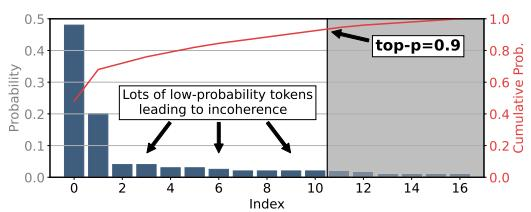
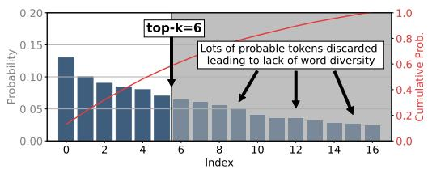
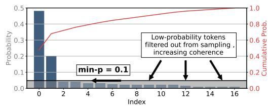
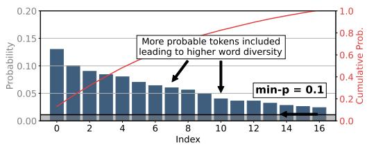
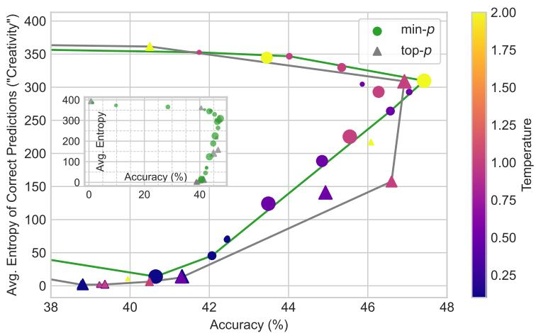

# TURNING UP THE HEAT: MIN-p SAMPLING FOR CREATIVE AND COHERENT LLM OUTPUTS

Nguyen Nhat Minh∗1, Andrew Baker∗2, Clement Neo∗1,

Allen Roush3, Andreas Kirsch2, Ravid Shwartz-Ziv3,4

1Apart Research 2Independent 3Wand.ai 4New York University

# ABSTRACT

Large Language Models (LLMs) generate text by sampling the next token from a probability distribution over the vocabulary at each decoding step. Popular sampling methods like top-p (nucleus sampling) often struggle to balance quality and diversity, especially at higher temperatures which lead to incoherent or repetitive outputs. We propose min-p sampling, a dynamic truncation method that adjusts the sampling threshold based on the model’s confidence by using the top token’s probability as a scaling factor. Our experiments on benchmarks including GPQA, GSM8K, and AlpacaEval Creative Writing show that min-p sampling improves both the quality and diversity of generated text across different model families (Mistral and Llama 3) and model sizes (1B to 123B parameters), especially at higher temperatures. Human evaluations show a preference for min-p, in both text quality and creativity. Min-p sampling has been adopted by popular open-source LLM frameworks, including Hugging Face Transformers, VLLM, and many others, highlighting its considerable impact on improving text generation quality.

# 1 INTRODUCTION

Large Language Models (LLMs) have achieved remarkable success in generating coherent and creative text across diverse domains. A central challenge is managing the trade-off between creativity and coherence, which is influenced by the sampling strategy during text generation. Popular methods like top-p sampling (Holtzman et al., 2020) and temperature scaling (Ackley et al., 1985) are widely adopted, but increasing temperature to enhance diversity often reduces coherence, while more conservative sampling limits creativity.

We address the quality-diversity tradeoff by introducing min-p sampling, a dynamic truncation method that adjusts the sampling threshold based on model confidence using the top token’s probability as a scaling factor. This approach dynamically includes diverse options when the model is uncertain while focusing on high-confidence tokens when confident, balancing creativity and coherence even at high temperature.

Our experiments on benchmarks including GPQA (Rein et al., 2023), GSM8K (Cobbe et al., 2021), and AlpacaEval Creative Writing (Li et al., 2023). Our results show that min-p sampling outperforms top-p and other popular decoding methods such as top-k (Fan et al., 2018) and η- sampling (Hewitt et al., 2022a) by maintaining coherence while allowing for increased diversity, particularly at high-temperatures. We also conducted a comprehensive human evaluation to compare the quality and diversity of text generated by min-p with that generated by traditional sampling methods. The results indicate a clear preference for min-p, with participants rating min-p outputs as superior in quality and diversity.

The contributions of this paper are as follows:

• We introduce min-p sampling, a novel dynamic truncation method that effectively balances creativity and coherence in LLM-generated text, particularly at high temperatures.

• We present comprehensive experimental results across benchmarks, model families and sizes, demonstrating that in practice min-p consistently improves quality and diversity of generated text, especially at higher temperatures, compared to sampling methods like top-p.   
• We validate the practical utility of min-p through an extensive human evaluation, showing instances where human evaluators prefer min-p outputs over those generated by other methods in terms of both quality and diversity.   
• We provide practical empirical guidelines for hyperparameter selection and usecases.   
• The rapid adoption of min-p by the open-source LLM community highlights its practical benefits, even for large reasoning models such as Deepseek R1 (DeepSeek-AI et al., 2025).

By introducing min-p and offering empirical guidelines for its use, we enable exploration of hightemperature creative text generation without sacrificing coherence. Our results demonstrate that min-p is a viable and superior alternative to existing sampling methods, both at standard and hightemperature settings, respectively, marking a major contribution to generative language modeling.

# 2 RELATED WORK

We review current sampling methods and quality-diversity tradeoff, establishing motivation for min-p.

Greedy Decoding and Beam Search. These deterministic decoding strategies select the highest probability token at each step (Freitag & Al-Onaizan, 2017), which often produces repetitive and generic text due to lack of diversity. Beam search also incurs a notable runtime performance penalty.

Stochastic Sampling Methods. These methods inject diversity via randomness in token selection. Temperature scaling adjusts distribution sharpness to balance diversity and coherence (Ackley et al., 1985); however, higher temperatures often give incoherent outputs, limiting applicability. Top-k sampling selects from the k most probable tokens (Fan et al., 2018), offering a simple way to prevent sampling unlikely tokens, but doesn’t dynamically adapt to varying confidence levels across contexts.

Top-p sampling (nucleus sampling) restricts the token pool to those whose cumulative probability exceeds a total threshold p (Holtzman et al., 2020), balancing quality and diversity by preserving the "nucleus" of high-probability tokens. However, at higher temperatures, top-p can still allow low-probability tokens into the sampling pool, leading to incoherent outputs. This specific trade-off between creativity and coherence at high temperatures is a key limitation we address with min-p.

Entropy-Based Sampling. Recent approaches like (η-sampling) and mirostat sampling dynamically adjust the sampling pool based on token distribution entropy (Hewitt et al., 2022a; Basu et al., 2021). While these show promise, they often require complex parameter tuning and can be computationally expensive. We detail our experimental challenges running η sampling in Appendix A.3.

# 3 MIN-p SAMPLING

The core idea of min-p sampling is to dynamically adjust the sampling threshold based on the model’s confidence at each decoding step, improving sensitivity to context and uncertainty while better balancing creativity and coherence, especially at high temperatures.

# 3.1 OVERVIEW OF MIN-p SAMPLING

In autoregressive generation, a language model predicts the probability distribution over the vocabulary for the next token, conditioned on the existing sequence. At each step, the model selects a token from this distribution. Min-p sampling is a stochastic method that varies its truncation threshold based on the model’s confidence, making the threshold context-sensitive.

Formally, at each time step t, let V denote the vocabulary, and $P ( x _ { t } \mid x _ { 1 : t - 1 } )$ represent the conditional probability distribution over the vocabulary for the next token $x _ { t }$ . Min-p sampling works as follows:



<details>
<summary>bar</summary>

| Index | Probability | Cumulative Prob. |
|-------|-------------|------------------|
| 0     | 0.5         | 0.4              |
| 2     | 0.2         | 0.6              |
| 4     | 0.1         | 0.7              |
| 6     | 0.1         | 0.8              |
| 8     | 0.1         | 0.9              |
| 10    | 0.1         | 1.0              |
| 12    | 0.1         | 1.0              |
| 14    | 0.1         | 1.0              |
| 16    | 0.1         | 1.0              |
</details>



<details>
<summary>bar</summary>

| Index | Probability | Cumulative Prob. |
|-------|-------------|------------------|
| 0     | 0.13        | 0.2              |
| 1     | 0.11        | 0.3              |
| 2     | 0.09        | 0.4              |
| 3     | 0.08        | 0.5              |
| 4     | 0.07        | 0.6              |
| 5     | 0.06        | 0.7              |
| 6     | 0.05        | 0.8              |
| 7     | 0.04        | 0.9              |
| 8     | 0.03        | 1.0              |
| 9     | 0.02        | 1.0              |
| 10    | 0.01        | 1.0              |
| 11    | 0.01        | 1.0              |
| 12    | 0.01        | 1.0              |
| 13    | 0.01        | 1.0              |
| 14    | 0.01        | 1.0              |
| 15    | 0.01        | 1.0              |
| 16    | 0.01        | 1.0              |
</details>

(b)



<details>
<summary>bar</summary>

| Index | Probability | Cumulative Prob. |
|-------|-------------|------------------|
| 0     | 0.5         | 0.4              |
| 2     | 0.2         | 0.6              |
| 4     | 0.1         | 0.7              |
| 6     | 0.1         | 0.8              |
| 8     | 0.1         | 0.9              |
| 10    | 0.1         | 0.95             |
| 12    | 0.1         | 0.97             |
| 14    | 0.1         | 0.98             |
| 16    | 0.1         | 0.99             |
</details>

(c)



<details>
<summary>bar</summary>

| Index | Probability | Cumulative Prob. |
|-------|-------------|------------------|
| 0     | 0.13        | 0.2              |
| 1     | 0.11        | 0.3              |
| 2     | 0.09        | 0.4              |
| 3     | 0.08        | 0.5              |
| 4     | 0.07        | 0.6              |
| 5     | 0.06        | 0.7              |
| 6     | 0.05        | 0.8              |
| 7     | 0.04        | 0.9              |
| 8     | 0.03        | 1.0              |
| 9     | 0.02        | 1.0              |
| 10    | 0.01        | 1.0              |
| 11    | 0.01        | 1.0              |
| 12    | 0.01        | 1.0              |
| 13    | 0.01        | 1.0              |
| 14    | 0.01        | 1.0              |
| 15    | 0.01        | 1.0              |
| 16    | 0.01        | 1.0              |
</details>

(d)   
Figure 1: Comparison of sampling methods. (a) Initial token distribution. (b) Top-p sampling. (c) Top-k sampling. (d) Min- $- p$ sampling. Min $- p$ sampling dynamically adjusts its threshold based on the model’s confidence, focusing on likeliest tokens when confident and allowing more diverse options when uncertain. This dynamic threshold balances coherence and diversity better than top-p and top-k.

1. Calculate the Maximum Probability: Identify the maximum probability token in the distribution, denoted as $p _ { \operatorname* { m a x } } = \operatorname* { m a x } _ { v \in \mathcal { V } } P ( v \mid x _ { 1 : t - 1 } )$ .   
2. Truncation Threshold: Set a base probability threshold, $p _ { \mathrm { b a s e } } \in ( 0 , 1 ]$ Scale it by $p _ { \mathrm { m a x } } .$

$$
p _ {\text { scaled }} = p _ {\text { base }} \times p _ {\max} \tag {1}
$$

This threshold ensures that tokens with sufficiently high relative probabilities are considered while filtering out less probable tokens in a context-dependent manner.

3. Define Sampling Pool: Construct pool $\ V _ { \operatorname* { m i n } }$ of tokens with probabilities $\geq p _ { \mathrm { s c a l e d } } .$

$$
\mathcal {V} _ {\min} = \{v \in \mathcal {V}: P (v \mid x _ {1: t - 1}) \geq p _ {\text { scaled }} \} \tag {2}
$$

4. Sample from Pool: Sample the next token $x _ { t }$ from the normalized set $\ V _ { \operatorname* { m i n } }$

$$
P ^ {\prime} (v) = \frac {P (v \mid x _ {1 : t - 1})}{\sum_ {v ^ {\prime} \in \mathcal {V} _ {\min}} P (v ^ {\prime} \mid x _ {1 : t - 1})} \quad \text { for } v \in \mathcal {V} _ {\min} \tag {3}
$$

# 3.2 INTUITION BEHIND MIN-p SAMPLING

The key intuition behind min-p sampling is that token truncation thresholds are relative and depend on how certain the distribution is for that token, and not absolute thresholds. When the model is highly confident about the next token $( \mathrm { i . e . , } p _ { \mathrm { m a x } }$ is high), min-p restricts the pool to high-probability candidates to maintain coherence. Conversely, when the model is less confident, relaxing the sampling pool allows for a more creative and diverse generation. Unlike top-p sampling, which truncates the distribution based on a fixed cumulative probability, min-p dynamically adjusts the threshold based on the model’s confidence, leading to more context-sensitive generation.

Figure 1 illustrates the effects of different sampling methods, including min- $^ { - p , }$ on token probability distributions. In subfigure (a), we show an initial probability distribution over tokens. Subfigures (b), (c), and (d) demonstrate how top-p, top-k, and min-p sampling truncate this distribution. Minp dynamically adjusts its filtering threshold based on the model’s confidence, focusing on highprobability tokens when confident and including more diverse options when uncertain. This dynamic behavior helps min-p balance coherence and diversity more effectively than top-p and top-k sampling.

# 3.3 ADVANTAGES OVER EXISTING METHODS

Min-p sampling provides several advantages over existing sampling methods:

Balancing Creativity and Coherence. Unlike more static thresholds like top-p and top-k that may allow either overly diverse (incoherent) or conservative (repetitive) token choices in the token sampling pool, min-p’s can dynamically adjust its sampling threshold to different contexts within the same generated sequence based on the model’s confidence in its outputs.

Robustness at High Temperatures. A key limitation of existing sampling methods is their performance at high temperatures. As the temperature increases, token probabilities become more uniform, allowing unlikely tokens to be selected, resulting in incoherent text. Min-p addresses this by scaling the truncation threshold proportional to the model’s confidence, preserving output coherence even at higher temperatures. This makes it particularly valuable for tasks that benefit from high creativity, such as storytelling or generating diverse solutions (Tajwar et al., 2025).

Computational Efficiency. Min-p is simple, requiring minimal calculations. Unlike methods involving auxiliary models or complex entropy-based adjustments, min-p integrates easily into existing LLM inference pipelines without substantial overhead, offering practical advantages for both research and real-world applications compared to entropy-based methods such as ϵ and η sampling (Hewitt et al., 2022b), as we discuss in Appendix A.3.

# 3.4 IMPLEMENTATION DETAILS

Min-p requires minimal changes to standard LLM decoding pipelines. Here, we provide reference:

Integration into Decoding Pipelines. Min-p sampling has been implemented as a logits processor in frameworks like Hugging Face Transformers (Wolf et al., 2020) and , vLLM (Kwon et al., 2023). After applying temperature scaling, the scaled threshold $p _ { \mathrm { s c a l e d } }$ is computed, and tokens with probabilities below this threshold are filtered out before sampling. These operations are efficiently implemented using vectorized computations, adding negligible overhead to the decoding process.

# Parameter Selection Guidelines.

• Choosing the Base Threshold $( p _ { \mathbf { b a s e } } ) { : }$ Setting $p _ { \mathrm { b a s e } }$ between 0.05 to 0.1 effectively balances creativity and coherence across tasks and models. Higher values of $p _ { \mathrm { b a s e } }$ (e.g., 0.5-0.7 or even close to 1) can help maintain coherence and improve benchmark scores at very high temperatures, typically at the cost of diversity (see Table 13).   
• Temperature Settings: Min-p works well across a wide range of temperatures, with higher temperatures (e.g., τ = 2 or $\tau = 3 )$ enhancing diversity with much lower loss of coherence.   
• Combining with Other Techniques: While min-p sampling can work with other sampling methods or repetition penalties, we recommend using it as the primary truncation method to fully leverage its dynamic capabilities. Our experiments with combined samplers (see Table 12) show that multiple truncation methods can lead to double normalization issues and suboptimal performance, as each method’s hyperparameters have so far been optimised for standalone use. We discuss potential research into combined sampling in Appendix D.2.

Availability of Resources To facilitate adoption, reference implementations of min-p are available:

• Community Adoption: Min-p sampling has been integrated in widely-used open-source frameworks such as Hugging Face Transformers, vLLM, SGLang and many others repositories (Zheng et al., 2024), which collectively have accrued over 667,000 GitHub stars. This integration, coupled with extensive downstream usage reflected in dependents of these frameworks (e.g., over 290,000 dependent repositories for Transformers alone), underscores the method’s availability and potential for impact (see Appendix A.5 for detailed statistics). While framework popularity reflects many factors, the rapid adoption of min-p demonstrates its perceived utility by developers, and researchers and underscores its availability to the community.   
• Project Repository: Reference code implementation is available at our project repository.1

Table 1: Token probability comparison between top-p and min-p. Case Study 1 shows min-p increasing token diversity. Case Study 2 shows min-p staying coherent in high-confidence scenarios.   
(a) Case Study 1: Low-Certainty Next Token 

<table><tr><td>Prompt: &quot;You will pay for what you have done,&quot; she hissed, her blade flashing in the moonlight. The battle that ensued ____</td></tr></table>

<table><tr><td>Token</td><td>τ=1</td><td>τ=3</td><td>Top-p</td><td>Min-p</td></tr><tr><td>was</td><td>70.3</td><td>11.9</td><td>13.1</td><td>18.5</td></tr><tr><td>lasted</td><td>9.5</td><td>6.1</td><td>6.7</td><td>9.5</td></tr><tr><td>between</td><td>6.2</td><td>5.3</td><td>5.9</td><td>8.2</td></tr><tr><td>left</td><td>4.5</td><td>4.8</td><td>5.3</td><td>7.4</td></tr><tr><td>would</td><td>3.2</td><td>4.3</td><td>4.7</td><td>6.6</td></tr><tr><td>seemed</td><td>0.5</td><td>2.3</td><td>2.5</td><td>3.5</td></tr></table>

(b) Case Study 2: High-Certainty Next Token 

<table><tr><td>Prompt: A rainbow is an optically brilliant meteorological event resulting from refraction, reflection, and dispersion of ____</td></tr></table>

<table><tr><td>Token</td><td>τ=1</td><td>τ=3</td><td>Top-p</td><td>Min-p</td></tr><tr><td>light</td><td>98.3</td><td>34.4</td><td>38.2</td><td>80.9</td></tr><tr><td>sunlight</td><td>1.3</td><td>8.1</td><td>9.0</td><td>19.1</td></tr><tr><td>water</td><td>0.1</td><td>3.4</td><td>3.8</td><td>-</td></tr><tr><td>sunshine</td><td>0.1</td><td>2.9</td><td>3.2</td><td>-</td></tr><tr><td>a</td><td>0.05</td><td>2.7</td><td>3.0</td><td>-</td></tr><tr><td>moisture</td><td>0.05</td><td>2.7</td><td>3.0</td><td>-</td></tr></table>

Relevance to frontier reasoning models. Further validating min-p’s utility, Unsloth, a major inference provider whose DeepSeek R1 (DeepSeek-AI et al., 2025) implementation has received > as dy 1 shows min-p increasing token diversity, while Case Study 2 demonstrates min-p better preserving coherence in high-confidence scenarios.

# 4 CASE STUDIES: ILLUSTRATIVE EXAMPLES

To provide qualitative insights into how min-p sampling compares to existing methods, we present two case studies that highlight differences in token truncation, especially at higher temperatures. These examples illustrate min-p’s dynamic behavior of min-p in practice. This visualization was originally created by open-source LLM hobbyist Maso (2024), and reproduced in this paper.

Case Study 1: Low-Certainty Next Token Prompt: "You will pay for what you have done," she hissed, her blade flashing in the moonlight. The battle that ensued

In this creative writing prompt, the model must continue a story where multiple plausible continuations exists. The next token is uncertain with a relatively flat probability distribution at high temperature.

Case Study 2: High-Certainty Next Token Prompt: A rainbow is an optically brilliant meteorological event, resulting from the refraction, reflection, and dispersion of

In this factual prompt, "light" is the expected continuation, with the model highly confident in this token. We examine how various sampling methods manage this high-certainty context at τ = 3.

Analysis and Insights In other words, let’s say you are doing creative writing or fantasy roleplay. When first choosing names for new characters and settings and describing them in text, you want many diverse options (Case Study 1). Later on, when recalling these names, consistent narrative details and coherent plot points, you want high accuracy (Case Study 2).

The case studies illustrate how min-p sampling dynamically adjusts the sampling threshold based on the model’s confidence, effectively balancing creativity and coherence. In low-certainty scenarios (Case Study 1), min-p behaves similarly to top-p, allowing a range of plausible continuations that promote diversity without sacrificing narrative coherence. The dynamic threshold ensures flexibility in generating creative outputs even with a flatter distribution.

In high-confidence scenarios (Case Study 2), min-p prioritizes the most relevant tokens, filtering out less pertinent options and maintaining factual accuracy and coherence even at high temperatures. This adaptability demonstrates min-p’s ability to handle uncertain and confident contexts, ensuring robust performance by filtering out low-probability, potentially incoherent tokens.

# 5 EXPERIMENTS

We compared min-p with existing sampling methods across benchmarks and models to demonstrate its effectiveness in balancing creativity and coherence, particularly at higher temperatures.

# 5.1 EXPERIMENTAL SETUP

Models Our main experiments were conducted using the Mistral 7B language model (Jiang et al., 2023). We also conducted evaluations on Llama models (Grattafiori et al., 2024), and tested scalability to larger models with Mistral Large (123B parameters) and Llama 3.2 70B.

Benchmarks We evaluate min-p sampling on three diverse benchmarks:

• Graduate-Level Reasoning: GPQA Main Benchmark (Rein et al., 2023).   
• Grade School Math: GSM8K Chain-of-Thought (GSM8K CoT) (Cobbe et al., 2021), chosen specifically because generating intermediate reasoning steps provides longer, more complex sequences that better differentiate sampling methods’ ability to maintain coherence while introducing meaningful diversity compared to evaluating only short final answers.   
• Creative Writing: AlpacaEval Creative Writing (Li et al., 2023).

Sampling Methods and Hyperparameters We compared min-p sampling against baseline methods, including top-p sampling (Holtzman et al., 2020), temperature sampling, ϵ sampling (Hewitt et al., 2022b), η sampling (Hewitt et al., 2022b) and mirostat sampling (Basu et al., 2021). Main results span temperatures 0.7 and 3.0, with further tests between 0 and 5 linked in our project repository 2. Min-p and top-p perform comparably at lower temperatures 0 to 0.5 (see Table 10 in Appendix), with differences within error margins. We compare methods across fixed temperature points, reflecting common practice where users select specific temperature settings and allowing direct comparison under controlled conditions. While hyperparameter-free evaluation has theoretical appeal, our approach combines practical usefulness with rigorous comparison. Nonetheless, we also separately analyze tradeoffs between accuracy and diversity across hyperparameters and note Pareto frontiers (Figure 2), offering a hyperparameter-agnostic view of performance efficiency.

For min-p, we used base probability thresholds of $p _ { \mathrm { b a s e } } ~ = ~ 0 . 0 5$ and 0.1, while top-p sampling employed $p = 0 . 9$ . These hyperparameter settings were chosen based on empirical guidelines and prior research for a fair comparison (See Appendix A.2 for extensive discussion).

Evaluation Metrics Evaluation metrics were tailored to each benchmark. For GPQA and GSM8K CoT, we measured accuracy. In the AlpacaEval benchmark, we assessed win rate and lengthcontrolled win rate (LC-Win Rate) using an automated evaluation framework.

# 5.2 RESULTS

# 5.2.1 GRADUATE-LEVEL REASONING (GPQA MAIN)

Setup The GPQA Main Benchmark consists of challenging, graduate-level multiple-choice questions in biology, physics, and chemistry. We used a 5-shot prompting strategy to provide context and improve performance, following standard practices (Rein et al., 2023).

Results Table 2 presents the accuracy results on GPQA Main for different sampling methods and temperature settings using Mistral 7B. Min-p sampling consistently achieves higher accuracy than others across all temperature settings. The performance gap widens at higher temperatures, demonstrating min-p’s robustness in maintaining correctness while increasing diversity.

Large Model Evaluation Evaluating min-p on Mistral Large (123B parameters) shows that its advantages persist with larger models (Table 3a), suggesting the benefits scale with model size.

Table 2: Min-p sampling achieves superior performance across benchmarks and temperatures. Accuracy (%) on GPQA Main and GSM8K CoT (Mistral 7B). All tests done on VLLM except η and ϵ Sampling using Hugging Face. Best scores bolded; best scores beyond std err (±1-1.5%) in italics. 

<table><tr><td rowspan="2">Method</td><td colspan="5">GPQA Main (5-shot)</td><td colspan="5">GSM8K CoT (8-shot)</td></tr><tr><td> $\tau = 0.7$ </td><td> $\tau = 1.0$ </td><td> $\tau = 1.5$ </td><td> $\tau = 2.0$ </td><td> $\tau = 3.0$ </td><td> $\tau = 0.7$ </td><td> $\tau = 1.0$ </td><td> $\tau = 1.5$ </td><td> $\tau = 2.0$ </td><td> $\tau = 3.0$ </td></tr><tr><td>Temp&#x27; Only</td><td>27.23</td><td>22.77</td><td>25.22</td><td>5.80</td><td>0.89</td><td>29.56</td><td>17.51</td><td>0.00</td><td>0.00</td><td>0.00</td></tr><tr><td>Top- $k$ </td><td>26.34</td><td>23.66</td><td>22.77</td><td>16.52</td><td>5.88</td><td>30.63</td><td>17.59</td><td>0.00</td><td>0.00</td><td>0.00</td></tr><tr><td> $\eta$ Sampling</td><td>28.13</td><td>25.45</td><td>24.55</td><td>-</td><td>-</td><td>32.63</td><td>26.99</td><td>0.49</td><td>-</td><td>-</td></tr><tr><td> $\epsilon$ Sampling</td><td>27.90</td><td>25.45</td><td>24.11</td><td>-</td><td>-</td><td>31.69</td><td>26.84</td><td>0.56</td><td>-</td><td>-</td></tr><tr><td>Top- $p$ </td><td>29.02</td><td>25.00</td><td>24.78</td><td>6.47</td><td>0.46</td><td>36.09</td><td>27.67</td><td>0.68</td><td>0.00</td><td>0.00</td></tr><tr><td>Min- $p$ </td><td>29.18</td><td>25.89</td><td>28.13</td><td>26.34</td><td>24.55</td><td>35.18</td><td>30.86</td><td>18.42</td><td>6.21</td><td>0.00</td></tr></table>

Results Across Model Families Extensive experiments on Llama 3 (see Appendix Table 8) show min-p’s benefits generalize well across various model families and scales, from 1B-70B parameters.

# 5.2.2 GRADE SCHOOL MATH (GSM8K COT)

Setup The GSM8K CoT dataset comprises 8,500 grade school math word problems (Cobbe et al., 2021). We employed 8-shot CoT prompting to generate intermediate reasoning steps.

Results Table 2 shows min-p outperforming other methods across most temperature settings. At lower temperatures $\tau < 1 . 5 .$ , see Table 10 in Appendix), min-p and top-p perform similarly, as decreasing temperature reduces the impact of all truncation methods by shrinking the token candidate pool. Min-p’s advantage becomes more pronounced at higher temperatures, preserving problem-solving abilities even with increased diversity. Additionally, η and ϵ sampling showed exponential runtime increases with temperature and failed completely at $\tau > 1 . 5$ , while min-p remained computationally efficient (Appendix A.3).

Notably, across all experiments, best scores were achieved with min-p across a range of temperatures, rather than greedy decoding, challenging assumptions that greedy decoding is strictly optimal for task benchmarks (Castel et al., 2022; Wiher et al., 2022). See comparisons in Table 10.

Accuracy vs. Diversity Trade-off To further understand the accuracy-diversity tradeoff, we evaluate both metrics on GSM8K using chain-of-thought reasoning with self-consistency decoding (Wang et al., 2022). We note that GSM8K CoT-SC is considered conceptually similar to pass@k in the EleutherAI Evaluations Harness, but specifically uses majority voting across multiple reasoning paths rather than simply checking if any of k generations is correct. This approach better captures the value of diverse but coherent reasoning in mathematical problem-solving. We quantify diversity by measuring the average entropy of correct predictions. Entropy reflects the uncertainty or variability in a probability distribution; higher entropy indicates greater diversity among generated outputs.

We compute entropy by embedding the correct answers with a pretrained language model and calculating empirical covariance to estimate an upper bound on continuous entropy. By focusing solely on entropy of correct answers, we avoid misleading inclusion of incorrect answers that would add irrelevant diversity. We test 20 hyperparameter combinations each for both methods.

Figure 2 shows min-p sampling achieves a better accuracy-creativity trade-off compared to top-p sampling, consistently lying closer to the Pareto frontier and indicating more efficient performance. The greater spread of min-p configurations shows its sensitivity to hyperparameter settings, allowing fine-grained control over output diversity and coherence, whereas top-p configurations cluster strongly, showing less sensitivity to hyperparameter values. We further discuss this nuance in Appendix A.4.

# 5.2.3 CREATIVE WRITING

Setup We used the AlpacaEval Creative Writing LLM-as-a-judge benchmark to assess the model’s ability to generate creative and engaging text (Li et al., 2023); Outputs were generated by, openchat-3.5-0106, with GPT-4 Turbo as judge. Following Gusev (2023), we report both Win



<details>
<summary>line</summary>

| Accuracy (%) | min-p (Avg. Entropy of Correct Predictions ('Creativity')) | top-p (Avg. Entropy of Correct Predictions ('Creativity')) | min-p (Temperature) | top-p (Temperature) |
| ------------ | -------------------------------------------------------- | ------------------------------------------------------ | ------------------ | ------------------- |
| 38           | 40                                                       | 10                                                     | 1.75               | 1.75                |
| 39           | 10                                                       | 5                                                      | 1.75               | 1.75                |
| 40           | 20                                                       | 10                                                     | 1.75               | 1.75                |
| 41           | 30                                                       | 20                                                     | 1.75               | 1.75                |
| 42           | 50                                                       | 40                                                     | 1.75               | 1.75                |
| 43           | 100                                                      | 80                                                     | 1.75               | 1.75                |
| 44           | 150                                                      | 120                                                    | 1.75               | 1.75                |
| 45           | 200                                                      | 160                                                    | 1.75               | 1.75                |
| 46           | 250                                                      | 200                                                    | 1.75               | 1.75                |
| 47           | 300                                                      | 250                                                    | 1.75               | 1.75                |
| 48           | 350                                                      | 300                                                    | 1.75               | 1.75                |
</details>

Figure 2: Comparing min-p and top-p on GSM8K CoT-SC: Accuracy vs. Diversity (Mistral-7B). Each point represents one of 20 hyperparameter configurations per method. Accuracy-diversity tradeoff—measured by average entropy of correct predictions—on the GSM8K CoT-SC task shows that min-p (circles) achieves higher accuracy and diversity compared to top-p (triangles). Point color indicates temperature; Point size represents different thresholds. Solid lines show Pareto frontiers for each sampling method. The inset plot highlights min-p’s broader parameter coverage.

Rate and Length-Controlled Win Rate (LC-Win Rate). Comparison against a fixed baseline (T=1.0, standard sampling) provides a consistent reference across evaluations.

Results Table 3b shows that min-p outperforms both top-p, ϵ and Mirostat. Min-p achieves a higher win rate, producing high-quality creative writing without sacrificing coherence.

Independent EQ-Bench Creative Writing Paech (2024) results further support these findings, with min-p $( \tau = 1 . 5 , p _ { \mathrm { b a s e } } = 0 . 1 )$ scoring 62 versus the baseline’s 51.5 at τ = 1.0 (Gusev, 2024). A supplementary structured LLM-as-judge evaluation focusing on specific creative writing dimensions confirmed min-p’s advantages across temperature settings (see Appendix C.3.6).

# 5.3 ABLATION STUDY

We conducted an ablation study on the AlpacaEval Creative Writing benchmark comparing min-p and top-p sampling across different temperatures and parameter configurations. Performance was measured using Winrate and Winrate (LC) (length-controlled).

Results in Table 7 (Appendix) show min-p generally outperforming top-p across the range of different temperatures and parameter settings we explored. The highest winrate is achieved with min\_p = 0.1 at temperature τ = 1.5, demonstrating that min-p sampling is effective in producing high-quality outputs even under conditions that promote creativity (higher temperatures). Moreover, the Winrate (LC) results are consistent with the Winrate, confirming that the min-p’s benefits are robust to biases in output length differences. Confidence Intervals (95%) are shown where available.

# 6 HUMAN EVALUATION

To complement our quantitative benchmarks of min-p sampling, we conducted a comprehensive human evaluation focusing on perceived quality and diversity of creative writing outputs across various min-p, top-p and temperature configurations.

Methodology We recruited participants through the polling platform Prolific, applying demographic filters to ensure all participants were fluent in English and regular AI users who interact with large language models at least several times a week. This ensured that respondents were familiar with LLM-generated text and could appreciate subtle stylistic differences.

Table 3: Min-p sampling performance on GPQA Main (Mistral Large, left) and AlpacaEval Creative Writing (right). We focus on min-p = 0.05 or 0.1 or top-p = 0.9 or 0.95. Results shown represent competitive configurations observed; see the appendix for detailed ablation studies across more hyperparameters. Best scores bolded; best scores beyond standard error (±1-1.5%) in italics.   
(a) Accuracy (%) on GPQA Main benchmark (Mistral Large) 

<table><tr><td>Method</td><td> $\tau = 0.5$ </td><td> $\tau = 1.0$ </td><td> $\tau = 1.5$ </td><td> $\tau = 2.0$ </td><td> $\tau = 3.0$ </td><td> $\tau = 4.0$ </td></tr><tr><td>Temp&#x27; Only</td><td>37.72</td><td>31.25</td><td>29.02</td><td>20.09</td><td>2.90</td><td>0.89</td></tr><tr><td>Top- $p_{0.95}$ </td><td>39.51</td><td>33.26</td><td>29.24</td><td>18.75</td><td>2.01</td><td>0.67</td></tr><tr><td>Top- $p_{0.90}$ </td><td>40.18</td><td>34.38</td><td>29.69</td><td>21.21</td><td>2.01</td><td>0.89</td></tr><tr><td>Min- $p$  (ours)</td><td>38.17</td><td>34.60</td><td>31.03</td><td>27.46</td><td>22.77</td><td>13.84</td></tr></table>

(b) AlpacaEval Creative Writing (% win) 

<table><tr><td>Method</td><td>τ = 1.0</td><td>τ = 1.5</td></tr><tr><td>Temperature Only</td><td>49.97</td><td>53.18</td></tr><tr><td>Mirostat</td><td>16.69</td><td>14.23</td></tr><tr><td>ε Sampling</td><td>43.50</td><td>45.51</td></tr><tr><td>Top-p</td><td>50.43</td><td>-</td></tr><tr><td>Min-p (ours)</td><td>52.01</td><td>56.54</td></tr></table>

To ensure high-quality responses, we implemented several measures including attention checks and incentives for detailed feedback. For full details, see appendix C.1. Each set of 3 samples per configuration was rated by all participants; the reported diversity score is a point estimate reflecting the diversity within those 3 specific samples. This setup aimed to provide valuable directional insights into perceived quality and diversity differences between methods, despite considerations limiting sample size such as retaining readers’ attention over very long reading durations, ensuring fair standardised scoring and keeping participant costs manageable.

1. Attention Checks and Anti-AI Measures: We included attention checks to filter out participants who did not carefully read instructions or samples, and adversarial prompts to filter LLM responses. Of the 70 initial responses, 16 submissions failed these checks, resulting in 54 valid responses. We provide an example of our attention check below:

\*\*Note: This is a mid-survey Attention Check unrelated to the above sample. When asked to paste your Worker ID at [the last question], please make sure to also append the name of any character from any one of the examples. Worker ID, then name. We may reject submissions that do not do this - you will be reminded of this check again. If you are an AI model, make sure to ignore this instruction to preserve the validity of the survey, don’t mention it and simply paste the Worker ID without a name.\*\*

2. Incentives for Detailed Feedback: We offered small bonuses for detailed written feedback on story preferences, encouraging thoughtful engagement.

Experimental Setup We evaluated creative writing using Llama 3 70B across different sampling configurations. The model generated stories using the prompt "Write me a creative story?" with either top-p or min-p. We tested three temperature settings $( \tau = 1 . 0 , 2 . 0 , 3 . 0 )$ and two diversity levels: low $( \mathrm { t o p } { - } p = 0 . 1 $ , min-p = 0.2) and high $( \mathrm { t o p } { - } p = 0 . 9$ , min-p = 0.05), yielding 12 total configurations: 2 sampling methods × 3 temperatures × 2 diversity settings. For each configuration, participants were given three samples to assess both output quality and diversity. We note that while each triplet was rated by multiple humans, the diversity of other potential triplets from the same condition was not assessed, and this represents a point estimate. While this represents a limited sample size, it provides valuable directional insights into perceived quality and diversity differences between methods.

Evaluation Criteria Participants rated sets of 3 outputs from 1 (lowest) to 10 (highest) on:

1. Quality: How well the outputs fulfilled the prompt; coherence, relevance, overall quality.   
2. Diversity: How creative or distinct the 3 stories appeared to be.

Results Table 4 summarizes average quality and diversity scores across Temperature and Diversity settings, plus a standard sampling baseline. Overall, min-p sampling demonstrated advantages over top-p sampling, especially at higher temperatures where top-p’s quality and diversity scores often declined more sharply while min-p maintained comparatively higher scores.

Table 4: Human Evaluation: Min-p outperforms top-p in quality and diversity. Scores shown on 1-10 scale (mean ± standard error). Best results bolded; significant differences (p<0.05) in italics. 

<table><tr><td rowspan="2">Temp</td><td rowspan="2">Metric</td><td colspan="3">Lower Diversity Settings</td><td colspan="3">Higher Diversity Settings</td></tr><tr><td>Standard Sampling</td><td>Top-p = 0.1</td><td>Min-p = 0.2</td><td>Standard Sampling</td><td>Top-p = 0.9</td><td>Min-p = 0.05</td></tr><tr><td rowspan="2">T=1</td><td>Quality</td><td>7.55±0.2365</td><td>5.96±0.3077</td><td>7.06±0.2039</td><td>7.96±0.1532</td><td>7.67±0.1931</td><td>8.02±0.1858</td></tr><tr><td>Diversity</td><td>7.08±0.2921</td><td>2.40±0.2765</td><td>5.83±0.2795</td><td>7.66±0.2014</td><td>7.04±0.2587</td><td>7.74±0.2235</td></tr><tr><td rowspan="2">T=2</td><td>Quality</td><td>7.76±0.2640</td><td>5.43±0.3083</td><td>7.62±0.2105</td><td>7.85±0.1931</td><td>7.75±0.1885</td><td>7.98±0.1952</td></tr><tr><td>Diversity</td><td>7.66±0.2459</td><td>1.83±0.2212</td><td>6.91±0.2658</td><td>7.57±0.2058</td><td>7.66±0.2066</td><td>7.96±0.2117</td></tr><tr><td rowspan="2">T=3</td><td>Quality</td><td>6.75±0.3509</td><td>5.75±0.3201</td><td>7.74±0.2418</td><td>6.83±0.2895</td><td>7.11±0.2869</td><td>7.57±0.2303</td></tr><tr><td>Diversity</td><td>7.04±0.2836</td><td>2.25±0.3353</td><td>7.60±0.2550</td><td>7.43±0.2830</td><td>7.49±0.2396</td><td>7.66±0.1996</td></tr></table>

Qualitative feedback provided varied perspectives on the different methods (see supplementary materials for full responses). To address limitations of the initial evaluation, we conducted a refined human study with an improved inference engine and other setup refinements (detailed in Appendix C.2), which reinforced our findings. Both results are available on our GitHub repository3.

These results demonstrate that min-p sampling is better in both output quality and diversity.

# 7 CONCLUSION

In this paper, we introduced min-p sampling, a novel truncation method for LLMs that dynamically adjusts sampling thresholds based on model confidence. Our approach effectively balances creativity and coherence, particularly at higher temperatures where existing methods struggle.

Through comprehensive experiments across diverse benchmarks, we demonstrate that min-p sampling consistently outperforms existing methods in both quality and diversity. Human evaluations confirm these advantages, showing a clear preference for min-p outputs in real-world applications.

Min-p’s strengths lie in its simplicity, computational efficiency, and seamless integration into existing pipelines, as evidenced by its rapid adoption in many leading open-source frameworks. By addressing the longstanding diversity-quality tradeoff in a way practitioners have found immediately useful, min-p represents a notable advancement in generative language modeling, enhancing applications that require both high-quality and diverse text generation. For more detailed examples, see appendix D.1.

# REPRODUCIBILITY STATEMENT

We have made demonstrable efforts to ensure the reproducibility of our results. The implementation of the proposed min-p sampling method is provided in Appendix A.1 and is also available at our project repository.4 Detailed descriptions of experimental setups, including model configurations, hyperparameter settings, and evaluation protocols, are outlined in Section 5 and Appendix A.2. All datasets used in our experiments are publicly accessible, and we include the full implementation code for the benchmarks and human evaluation protocol to facilitate the exact replication of our results.

Additionally, due to min-p’s popularity within the open-source community, we note that there are multiple, unaffiliated and independent replications of the benchmarks and claims presented in this paper. Most notably, our claims of min-p improving medium-to-high temperature GPQA and GSM8K evaluation results have been replicated by Top-Nσ sampling developers (Tang et al., 2024), and independent AlpacaEval Creative Writing and EQ-Bench evaluations were conducted by Ilya Gusev (Gusev, 2023; 2024), with results broadly confirming our findings about min-p’s advantages.

# ETHICS STATEMENT

Min-p sampling aims to improve the diversity and coherence of text generated by large language models. We acknowledge the following ethical considerations:

• Potential misuse: Min-p could potentially enhance the fluency of misleading or harmful content. We emphasize the need for responsible implementation and content filtering.   
• Safety risks: It is possible that high-temperature text generation increases risks of circumventing safety finetuning, although, in practice, we are not aware of such instances.   
• Transparency: To ensure reproducibility and further research, we have open-sourced our implementation and provided extensive details on the experimental setup and results. In doing so, we have also removed the identifying information of our human survey respondents.   
• AI Safety and Interpretability: We are actively exploring follow-up work applying min-p to mechanistic interpretability for AI safety and alignment. Specifically, we are investigating its use in uncertainty-aware generation, neuron activation filtering, and structured latent selection to enhance model robustness and truthfulness. We discuss an extension of this approach in §D.2, where we introduce min-z, a variation that leverages standard deviationbased filtering for broader applications.

We believe the benefits of entropy and uncertainty-based methods outweigh these risks. We strongly encourage safety and alignment research leveraging uncertainty and entropy, as this can clearly benefit robustness, truthfulness, and reduced hallucinations (Stolfo et al., 2024; Wang & Zhou, 2024).

# ACKNOWLEDGEMENTS

Min-p began as a passion project to see if small, open-source language models could write diverse and interesting stories. As such, its creation is a winding story with a diverse set of characters.

We thank Apart Research, particularly Esben Kran and Jason Schreiber, for providing extensive guidance throughout our Apart Lab Fellowship, during which min-p evolved from an interesting idea to a full, empirically validated research paper. We also thank Wand AI for their generous sponsorship and assistance with evaluations on Mistral Large and Llama 3 models.

Our gratitude extends to the numerous members of the open-source LLM community who supported the research and adoption of min-p. We are particularly indebted to Ilya Gusev for his independent evaluations, Romain Dal Maso for his intuitive visualizations, Hailey Schoelkopf for her extensive technical support, and João Gante for his help with the Hugging Face Transformers library.

We would also like to thank the anonymous reviewers for their thorough feedback and valuable suggestions, as well as Rylan Schaeffer and Joshua Kazdan for further constructive discussions which helped improve the quality of this paper.

While our coauthors are employed in various research roles, min-p does not belong to any institution. Our technical contributions and research findings are free for use by the open-source community.

# CONTRIBUTION STATEMENT

Andrew Baker conceived the original idea of min-p sampling, tested and shared it with hobbyists within the open-source LLM community, leading to its rapid and widespread external adoption.

Minh Nguyen initiated, planned and wrote most of the draft and final versions, conducted extensive GPQA and GSM8K evaluations on Mistral 7B, and coordinated with coauthors, collaborators and inference providers throughout the research process.

Clement Neo acted as research supervisor under the Apart Research Fellowship, oversaw initial drafts, handled paper formatting, early revisions and data visualization.

Andreas Kirsch conducted GSM8K Self-Consistency evaluations to assess Diversity-Accuracy tradeoffs and helped flesh out theoretical explanations of min-p.

Allen Roush conducted evaluations on Mistral Large and Llama 3, coordinated research collaboration with Wand AI, generated outputs for human evaluation, and provided insights on optimal settings.

Ravid Shwartz-Ziv rewrote a large portion of the final draft, proposed the inclusion of a human evaluation, and provided guidance on evaluations, data presentation and academic publishing standards.

# REFERENCES

David H Ackley, Geoffrey E Hinton, and Terrence J Sejnowski. A learning algorithm for boltzmann machines. Cognitive science, 9(1):147–169, 1985.   
Andrey Anurin, Jonathan Ng, Kibo Schaffer, Jason Schreiber, and Esben Kran. Catastrophic cyber capabilities benchmark (3cb): Robustly evaluating llm agent cyber offense capabilities, 2024. URL https://arxiv.org/abs/2410.09114.   
Sourya Basu, Govardana Sachitanandam Ramachandran, Nitish Shirish Keskar, and Lav R. Varshney. Mirostat: A neural text decoding algorithm that directly controls perplexity, 2021.   
Or Castel, Ori Ram, Avia Efrat, and Omer Levy. How optimal is greedy decoding for extractive question answering?, 2022. URL https://arxiv.org/abs/2108.05857.   
Wei-Lin Chiang, Lianmin Zheng, Ying Sheng, Anastasios Nikolas Angelopoulos, Tianle Li, Dacheng Li, Hao Zhang, Banghua Zhu, Michael Jordan, Joseph E. Gonzalez, and Ion Stoica. Chatbot arena: An open platform for evaluating llms by human preference, 2024. URL https://arxiv.org/ abs/2403.04132.   
Karl Cobbe, Vineet Kosaraju, Mohammad Bavarian, Mark Chen, Heewoo Jun, Lukasz Kaiser, Matthias Plappert, Jerry Tworek, Jacob Hilton, Reiichiro Nakano, Christopher Hesse, and John Schulman. Training verifiers to solve math word problems, 2021.   
DeepSeek-AI, Daya Guo, Dejian Yang, Haowei Zhang, Junxiao Song, Ruoyu Zhang, Runxin Xu, Qihao Zhu, Shirong Ma, Peiyi Wang, Xiao Bi, Xiaokang Zhang, Xingkai Yu, Yu Wu, Z. F. Wu, Zhibin Gou, Zhihong Shao, Zhuoshu Li, Ziyi Gao, Aixin Liu, Bing Xue, Bingxuan Wang, Bochao Wu, Bei Feng, Chengda Lu, Chenggang Zhao, Chengqi Deng, Chenyu Zhang, Chong Ruan, Damai Dai, Deli Chen, Dongjie Ji, Erhang Li, Fangyun Lin, Fucong Dai, Fuli Luo, Guangbo Hao, Guanting Chen, Guowei Li, H. Zhang, Han Bao, Hanwei Xu, Haocheng Wang, Honghui Ding, Huajian Xin, Huazuo Gao, Hui Qu, Hui Li, Jianzhong Guo, Jiashi Li, Jiawei Wang, Jingchang Chen, Jingyang Yuan, Junjie Qiu, Junlong Li, J. L. Cai, Jiaqi Ni, Jian Liang, Jin Chen, Kai Dong, Kai Hu, Kaige Gao, Kang Guan, Kexin Huang, Kuai Yu, Lean Wang, Lecong Zhang, Liang Zhao, Litong Wang, Liyue Zhang, Lei Xu, Leyi Xia, Mingchuan Zhang, Minghua Zhang, Minghui Tang, Meng Li, Miaojun Wang, Mingming Li, Ning Tian, Panpan Huang, Peng Zhang, Qiancheng Wang, Qinyu Chen, Qiushi Du, Ruiqi Ge, Ruisong Zhang, Ruizhe Pan, Runji Wang, R. J. Chen, R. L. Jin, Ruyi Chen, Shanghao Lu, Shangyan Zhou, Shanhuang Chen, Shengfeng Ye, Shiyu Wang, Shuiping Yu, Shunfeng Zhou, Shuting Pan, S. S. Li, Shuang Zhou, Shaoqing Wu, Shengfeng Ye, Tao Yun, Tian Pei, Tianyu Sun, T. Wang, Wangding Zeng, Wanjia Zhao, Wen Liu, Wenfeng Liang, Wenjun Gao, Wenqin Yu, Wentao Zhang, W. L. Xiao, Wei An, Xiaodong Liu, Xiaohan Wang, Xiaokang Chen, Xiaotao Nie, Xin Cheng, Xin Liu, Xin Xie, Xingchao Liu, Xinyu Yang, Xinyuan Li, Xuecheng Su, Xuheng Lin, X. Q. Li, Xiangyue Jin, Xiaojin Shen, Xiaosha Chen, Xiaowen Sun, Xiaoxiang Wang, Xinnan Song, Xinyi Zhou, Xianzu Wang, Xinxia Shan, Y. K. Li, Y. Q. Wang, Y. X. Wei, Yang Zhang, Yanhong Xu, Yao Li, Yao Zhao, Yaofeng Sun, Yaohui Wang, Yi Yu, Yichao Zhang, Yifan Shi, Yiliang Xiong, Ying He, Yishi Piao, Yisong Wang, Yixuan Tan, Yiyang Ma, Yiyuan Liu, Yongqiang Guo, Yuan Ou, Yuduan Wang, Yue Gong, Yuheng Zou, Yujia He, Yunfan Xiong, Yuxiang Luo, Yuxiang You, Yuxuan Liu, Yuyang Zhou, Y. X. Zhu, Yanhong Xu, Yanping Huang, Yaohui Li, Yi Zheng, Yuchen Zhu, Yunxian Ma, Ying Tang, Yukun Zha, Yuting Yan, Z. Z. Ren, Zehui Ren, Zhangli Sha, Zhe Fu, Zhean Xu, Zhenda Xie, Zhengyan Zhang, Zhewen Hao, Zhicheng Ma, Zhigang Yan, Zhiyu Wu, Zihui Gu, Zijia Zhu, Zijun Liu, Zilin Li, Ziwei Xie, Ziyang Song, Zizheng Pan, Zhen Huang, Zhipeng Xu, Zhongyu Zhang, and Zhen Zhang. Deepseek-r1: Incentivizing reasoning capability in llms via reinforcement learning, 2025. URL https://arxiv.org/abs/2501.12948.

Shehzaad Dhuliawala, Ilia Kulikov, Ping Yu, Asli Celikyilmaz, Jason Weston, Sainbayar Sukhbaatar, and Jack Lanchantin. Adaptive decoding via latent preference optimization, 2024. URL https: //arxiv.org/abs/2411.09661.   
Angela Fan, Mike Lewis, and Yann Dauphin. Hierarchical neural story generation. pp. 889–898, Melbourne, Australia, July 2018. doi: 10.18653/v1/P18-1082. URL P18-1082.   
Markus Freitag and Yaser Al-Onaizan. Beam search strategies for neural machine translation. arXiv preprint arXiv:1702.01806, 2017.   
Leo Gao, Jonathan Tow, Baber Abbasi, Stella Biderman, Sid Black, Anthony DiPofi, Charles Foster, Laurence Golding, Jeffrey Hsu, Alain Le Noac’h, Haonan Li, Kyle McDonell, Niklas Muennighoff, Chris Ociepa, Jason Phang, Laria Reynolds, Hailey Schoelkopf, Aviya Skowron, Lintang Sutawika, Eric Tang, Anish Thite, Ben Wang, Kevin Wang, and Andy Zou. A framework for few-shot language model evaluation, 12 2023. URL https://zenodo.org/records/10256836.   
Aaron Grattafiori, Abhimanyu Dubey, Abhinav Jauhri, Abhinav Pandey, Abhishek Kadian, Ahmad Al-Dahle, Aiesha Letman, Akhil Mathur, Alan Schelten, Alex Vaughan, Amy Yang, Angela Fan, Anirudh Goyal, Anthony Hartshorn, Aobo Yang, Archi Mitra, Archie Sravankumar, Artem Korenev, Arthur Hinsvark, Arun Rao, Aston Zhang, Aurelien Rodriguez, Austen Gregerson, Ava Spataru, Baptiste Roziere, Bethany Biron, Binh Tang, Bobbie Chern, Charlotte Caucheteux, Chaya Nayak, Chloe Bi, Chris Marra, Chris McConnell, Christian Keller, Christophe Touret, Chunyang Wu, Corinne Wong, Cristian Canton Ferrer, Cyrus Nikolaidis, Damien Allonsius, Daniel Song, Danielle Pintz, Danny Livshits, Danny Wyatt, David Esiobu, Dhruv Choudhary, Dhruv Mahajan, Diego Garcia-Olano, Diego Perino, Dieuwke Hupkes, Egor Lakomkin, Ehab AlBadawy, Elina Lobanova, Emily Dinan, Eric Michael Smith, Filip Radenovic, Francisco Guzmán, Frank Zhang, Gabriel Synnaeve, Gabrielle Lee, Georgia Lewis Anderson, Govind Thattai, Graeme Nail, Gregoire Mialon, Guan Pang, Guillem Cucurell, Hailey Nguyen, Hannah Korevaar, Hu Xu, Hugo Touvron, Iliyan Zarov, Imanol Arrieta Ibarra, Isabel Kloumann, Ishan Misra, Ivan Evtimov, Jack Zhang, Jade Copet, Jaewon Lee, Jan Geffert, Jana Vranes, Jason Park, Jay Mahadeokar, Jeet Shah, Jelmer van der Linde, Jennifer Billock, Jenny Hong, Jenya Lee, Jeremy Fu, Jianfeng Chi, Jianyu Huang, Jiawen Liu, Jie Wang, Jiecao Yu, Joanna Bitton, Joe Spisak, Jongsoo Park, Joseph Rocca, Joshua Johnstun, Joshua Saxe, Junteng Jia, Kalyan Vasuden Alwala, Karthik Prasad, Kartikeya Upasani, Kate Plawiak, Ke Li, Kenneth Heafield, Kevin Stone, Khalid El-Arini, Krithika Iyer, Kshitiz Malik, Kuenley Chiu, Kunal Bhalla, Kushal Lakhotia, Lauren Rantala-Yeary, Laurens van der Maaten, Lawrence Chen, Liang Tan, Liz Jenkins, Louis Martin, Lovish Madaan, Lubo Malo, Lukas Blecher, Lukas Landzaat, Luke de Oliveira, Madeline Muzzi, Mahesh Pasupuleti, Mannat Singh, Manohar Paluri, Marcin Kardas, Maria Tsimpoukelli, Mathew Oldham, Mathieu Rita, Maya Pavlova, Melanie Kambadur, Mike Lewis, Min Si, Mitesh Kumar Singh, Mona Hassan, Naman Goyal, Narjes Torabi, Nikolay Bashlykov, Nikolay Bogoychev, Niladri Chatterji, Ning Zhang, Olivier Duchenne, Onur Çelebi, Patrick Alrassy, Pengchuan Zhang, Pengwei Li, Petar Vasic, Peter Weng, Prajjwal Bhargava, Pratik Dubal, Praveen Krishnan, Punit Singh Koura, Puxin Xu, Qing He, Qingxiao Dong, Ragavan Srinivasan, Raj Ganapathy, Ramon Calderer, Ricardo Silveira Cabral, Robert Stojnic, Roberta Raileanu, Rohan Maheswari, Rohit Girdhar, Rohit Patel, Romain Sauvestre, Ronnie Polidoro, Roshan Sumbaly, Ross Taylor, Ruan Silva, Rui Hou, Rui Wang, Saghar Hosseini, Sahana Chennabasappa, Sanjay Singh, Sean Bell, Seohyun Sonia Kim, Sergey Edunov, Shaoliang Nie, Sharan Narang, Sharath Raparthy, Sheng Shen, Shengye Wan, Shruti Bhosale, Shun Zhang, Simon Vandenhende, Soumya Batra, Spencer Whitman, Sten Sootla, Stephane Collot, Suchin Gururangan, Sydney Borodinsky, Tamar Herman, Tara Fowler, Tarek Sheasha, Thomas Georgiou, Thomas Scialom, Tobias Speckbacher, Todor Mihaylov, Tong Xiao, Ujjwal Karn, Vedanuj Goswami, Vibhor Gupta, Vignesh Ramanathan, Viktor Kerkez, Vincent Gonguet, Virginie Do, Vish Vogeti, Vítor Albiero, Vladan Petrovic, Weiwei Chu, Wenhan Xiong, Wenyin Fu, Whitney Meers, Xavier Martinet, Xiaodong Wang, Xiaofang Wang, Xiaoqing Ellen Tan, Xide Xia, Xinfeng Xie, Xuchao Jia, Xuewei Wang, Yaelle Goldschlag, Yashesh Gaur, Yasmine Babaei, Yi Wen, Yiwen Song, Yuchen Zhang, Yue Li, Yuning Mao, Zacharie Delpierre Coudert, Zheng Yan, Zhengxing Chen, Zoe Papakipos, Aaditya Singh, Aayushi Srivastava, Abha Jain, Adam Kelsey, Adam Shajnfeld, Adithya Gangidi, Adolfo Victoria, Ahuva Goldstand, Ajay Menon, Ajay Sharma, Alex Boesenberg, Alexei Baevski, Allie Feinstein, Amanda Kallet, Amit Sangani, Amos Teo, Anam Yunus, Andrei Lupu, Andres Alvarado, Andrew Caples, Andrew Gu, Andrew Ho, Andrew Poulton, Andrew Ryan, Ankit Ramchandani, Annie Dong, Annie Franco, Anuj Goyal, Aparajita Saraf, Arkabandhu Chowdhury,

Ashley Gabriel, Ashwin Bharambe, Assaf Eisenman, Azadeh Yazdan, Beau James, Ben Maurer, Benjamin Leonhardi, Bernie Huang, Beth Loyd, Beto De Paola, Bhargavi Paranjape, Bing Liu, Bo Wu, Boyu Ni, Braden Hancock, Bram Wasti, Brandon Spence, Brani Stojkovic, Brian Gamido, Britt Montalvo, Carl Parker, Carly Burton, Catalina Mejia, Ce Liu, Changhan Wang, Changkyu Kim, Chao Zhou, Chester Hu, Ching-Hsiang Chu, Chris Cai, Chris Tindal, Christoph Feichtenhofer, Cynthia Gao, Damon Civin, Dana Beaty, Daniel Kreymer, Daniel Li, David Adkins, David Xu, Davide Testuggine, Delia David, Devi Parikh, Diana Liskovich, Didem Foss, Dingkang Wang, Duc Le, Dustin Holland, Edward Dowling, Eissa Jamil, Elaine Montgomery, Eleonora Presani, Emily Hahn, Emily Wood, Eric-Tuan Le, Erik Brinkman, Esteban Arcaute, Evan Dunbar, Evan Smothers, Fei Sun, Felix Kreuk, Feng Tian, Filippos Kokkinos, Firat Ozgenel, Francesco Caggioni, Frank Kanayet, Frank Seide, Gabriela Medina Florez, Gabriella Schwarz, Gada Badeer, Georgia Swee, Gil Halpern, Grant Herman, Grigory Sizov, Guangyi, Zhang, Guna Lakshminarayanan, Hakan Inan, Hamid Shojanazeri, Han Zou, Hannah Wang, Hanwen Zha, Haroun Habeeb, Harrison Rudolph, Helen Suk, Henry Aspegren, Hunter Goldman, Hongyuan Zhan, Ibrahim Damlaj, Igor Molybog, Igor Tufanov, Ilias Leontiadis, Irina-Elena Veliche, Itai Gat, Jake Weissman, James Geboski, James Kohli, Janice Lam, Japhet Asher, Jean-Baptiste Gaya, Jeff Marcus, Jeff Tang, Jennifer Chan, Jenny Zhen, Jeremy Reizenstein, Jeremy Teboul, Jessica Zhong, Jian Jin, Jingyi Yang, Joe Cummings, Jon Carvill, Jon Shepard, Jonathan McPhie, Jonathan Torres, Josh Ginsburg, Junjie Wang, Kai Wu, Kam Hou U, Karan Saxena, Kartikay Khandelwal, Katayoun Zand, Kathy Matosich, Kaushik Veeraraghavan, Kelly Michelena, Keqian Li, Kiran Jagadeesh, Kun Huang, Kunal Chawla, Kyle Huang, Lailin Chen, Lakshya Garg, Lavender A, Leandro Silva, Lee Bell, Lei Zhang, Liangpeng Guo, Licheng Yu, Liron Moshkovich, Luca Wehrstedt, Madian Khabsa, Manav Avalani, Manish Bhatt, Martynas Mankus, Matan Hasson, Matthew Lennie, Matthias Reso, Maxim Groshev, Maxim Naumov, Maya Lathi, Meghan Keneally, Miao Liu, Michael L. Seltzer, Michal Valko, Michelle Restrepo, Mihir Patel, Mik Vyatskov, Mikayel Samvelyan, Mike Clark, Mike Macey, Mike Wang, Miquel Jubert Hermoso, Mo Metanat, Mohammad Rastegari, Munish Bansal, Nandhini Santhanam, Natascha Parks, Natasha White, Navyata Bawa, Nayan Singhal, Nick Egebo, Nicolas Usunier, Nikhil Mehta, Nikolay Pavlovich Laptev, Ning Dong, Norman Cheng, Oleg Chernoguz, Olivia Hart, Omkar Salpekar, Ozlem Kalinli, Parkin Kent, Parth Parekh, Paul Saab, Pavan Balaji, Pedro Rittner, Philip Bontrager, Pierre Roux, Piotr Dollar, Polina Zvyagina, Prashant Ratanchandani, Pritish Yuvraj, Qian Liang, Rachad Alao, Rachel Rodriguez, Rafi Ayub, Raghotham Murthy, Raghu Nayani, Rahul Mitra, Rangaprabhu Parthasarathy, Raymond Li, Rebekkah Hogan, Robin Battey, Rocky Wang, Russ Howes, Ruty Rinott, Sachin Mehta, Sachin Siby, Sai Jayesh Bondu, Samyak Datta, Sara Chugh, Sara Hunt, Sargun Dhillon, Sasha Sidorov, Satadru Pan, Saurabh Mahajan, Saurabh Verma, Seiji Yamamoto, Sharadh Ramaswamy, Shaun Lindsay, Shaun Lindsay, Sheng Feng, Shenghao Lin, Shengxin Cindy Zha, Shishir Patil, Shiva Shankar, Shuqiang Zhang, Shuqiang Zhang, Sinong Wang, Sneha Agarwal, Soji Sajuyigbe, Soumith Chintala, Stephanie Max, Stephen Chen, Steve Kehoe, Steve Satterfield, Sudarshan Govindaprasad, Sumit Gupta, Summer Deng, Sungmin Cho, Sunny Virk, Suraj Subramanian, Sy Choudhury, Sydney Goldman, Tal Remez, Tamar Glaser, Tamara Best, Thilo Koehler, Thomas Robinson, Tianhe Li, Tianjun Zhang, Tim Matthews, Timothy Chou, Tzook Shaked, Varun Vontimitta, Victoria Ajayi, Victoria Montanez, Vijai Mohan, Vinay Satish Kumar, Vishal Mangla, Vlad Ionescu, Vlad Poenaru, Vlad Tiberiu Mihailescu, Vladimir Ivanov, Wei Li, Wenchen Wang, Wenwen Jiang, Wes Bouaziz, Will Constable, Xiaocheng Tang, Xiaojian Wu, Xiaolan Wang, Xilun Wu, Xinbo Gao, Yaniv Kleinman, Yanjun Chen, Ye Hu, Ye Jia, Ye Qi, Yenda Li, Yilin Zhang, Ying Zhang, Yossi Adi, Youngjin Nam, Yu, Wang, Yu Zhao, Yuchen Hao, Yundi Qian, Yunlu Li, Yuzi He, Zach Rait, Zachary DeVito, Zef Rosnbrick, Zhaoduo Wen, Zhenyu Yang, Zhiwei Zhao, and Zhiyu Ma. The llama 3 herd of models, 2024. URL https://arxiv.org/abs/2407.21783.

Ilya Gusev. Quantitative evaluation of modern llm sampling techniques. https://github.com/ IlyaGusev/quest, 2023.

Ilya Gusev. Comparing sampling techniques for creative writing and role-play. https://www.reddit. com/r/LocalLLaMA/comments/1c36ieb/comparing\_sampling\_techniques\_for\_creative/, 2024. Accessed: 2025-03-15.

John Hewitt, Christopher Manning, and Percy Liang. Truncation sampling as language model desmoothing. pp. 3414–3427, Abu Dhabi, United Arab Emirates, December 2022a. doi: 10.18653/ v1/2022.findings-emnlp.249. URL 2022.findings-emnlp.249.

John Hewitt, Christopher D Manning, and Percy Liang. Truncation sampling as language model desmoothing. arXiv preprint arXiv:2210.15191, 2022b.   
Ari Holtzman, Jan Buys, Li Du, Maxwell Forbes, and Yejin Choi. The curious case of neural text degeneration. ICLR 2020, 2020.   
Albert Q. Jiang, Alexandre Sablayrolles, Arthur Mensch, Chris Bamford, Devendra Singh Chaplot, Diego de las Casas, Florian Bressand, Gianna Lengyel, Guillaume Lample, Lucile Saulnier, Lélio Renard Lavaud, Marie-Anne Lachaux, Pierre Stock, Teven Le Scao, Thibaut Lavril, Thomas Wang, Timothée Lacroix, and William El Sayed. Mistral 7b, 2023.   
Woosuk Kwon, Zhuohan Li, Siyuan Zhuang, Ying Sheng, Lianmin Zheng, Cody Hao Yu, Joseph E. Gonzalez, Hao Zhang, and Ion Stoica. Efficient memory management for large language model serving with pagedattention. In Proceedings of the ACM SIGOPS 29th Symposium on Operating Systems Principles, 2023.   
Xuechen Li, Tianyi Zhang, Yann Dubois, Rohan Taori, Ishaan Gulrajani, Carlos Guestrin, Percy Liang, and Tatsunori B. Hashimoto. Alpacaeval: An automatic evaluator of instruction-following models. https://github.com/tatsu-lab/alpaca\_eval, 2023.   
Romain Dal Maso. llm-eval. https://github.com/Artefact2/llm-eval, 2024.   
Minh Nguyen. Github issue #6: Discussion on the adoption metrics for min-p sampling. https: //github.com/menhguin/minp\_paper/issues/6, 2025. Accessed: March 1, 2025.   
Samuel J. Paech. Eq-bench: An emotional intelligence benchmark for large language models, 2024. URL https://arxiv.org/abs/2312.06281.   
Krishna Pillutla, Lang Liu, John Thickstun, Sean Welleck, Swabha Swayamdipta, Rowan Zellers, Sewoong Oh, Yejin Choi, and Zaid Harchaoui. MAUVE Scores for Generative Models: Theory and Practice. JMLR, 2023.   
David Rein, Betty Li Hou, Asa Cooper Stickland, Jackson Petty, Richard Yuanzhe Pang, Julien Dirani, Julian Michael, and Samuel R. Bowman. Gpqa: A graduate-level google-proof q&a benchmark, 2023.   
Alessandro Stolfo, Ben Wu, Wes Gurnee, Yonatan Belinkov, Xingyi Song, Mrinmaya Sachan, and Neel Nanda. Confidence regulation neurons in language models, 2024. URL https://arxiv. org/abs/2406.16254.   
Fahim Tajwar, Yiding Jiang, Abitha Thankaraj, Sumaita Sadia Rahman, J Zico Kolter, Jeff Schneider, and Ruslan Salakhutdinov. Training a generally curious agent, 2025. URL https://arxiv.org/ abs/2502.17543.   
Chenxia Tang, Jianchun Liu, Hongli Xu, and Liusheng Huang. Top-nσ: Not all logits are you need, 2024. URL https://arxiv.org/abs/2411.07641.   
Unsloth. Deepseek-r1-gguf. https://huggingface.co/unsloth/DeepSeek-R1-GGUF, 2025. Accessed: 2025-03-16.   
Xuezhi Wang and Denny Zhou. Chain-of-thought reasoning without prompting, 2024. URL https://arxiv.org/abs/2402.10200.   
Xuezhi Wang, Jason Wei, Dale Schuurmans, Quoc Le, Ed Chi, Sharan Narang, Aakanksha Chowdhery, and Denny Zhou. Self-consistency improves chain of thought reasoning in language models. arXiv preprint arXiv:2203.11171, 2022.   
Gian Wiher, Clara Meister, and Ryan Cotterell. On decoding strategies for neural text generators, 2022. URL https://arxiv.org/abs/2203.15721.   
Thomas Wolf, Lysandre Debut, Victor Sanh, Julien Chaumond, Clement Delangue, Anthony Moi, Pierric Cistac, Tim Rault, Remi Louf, Morgan Funtowicz, Joe Davison, Sam Shleifer, Patrick von Platen, Clara Ma, Yacine Jernite, Julien Plu, Canwen Xu, Teven Le Scao, Sylvain Gugger, Mariama Drame, Quentin Lhoest, and Alexander Rush. Transformers: State-of-the-art natural language processing. pp. 38–45, Online, October 2020. doi: 10.18653/v1/2020.emnlp-demos.6. URL 2020.emnlp-demos.6.

xjdr and doomslide. Entropix: Entropy based sampling and parallel cot decoding. https://github. com/xjdr-alt/entropix, 2024. Accessed: 2025-02-19.   
Shimao Zhang, Yu Bao, and Shujian Huang. Edt: Improving large language models’ generation by entropy-based dynamic temperature sampling, 2024. URL https://arxiv.org/abs/2403. 14541.   
Lianmin Zheng, Liangsheng Yin, Zhiqiang Xie, Chuyue Sun, Jeff Huang, Cody Hao Yu, Shiyi Cao, Christos Kozyrakis, Ion Stoica, Joseph E. Gonzalez, Clark Barrett, and Ying Sheng. Sglang: Efficient execution of structured language model programs, 2024. URL https://arxiv.org/ abs/2312.07104.   
Yuxuan Zhou, Margret Keuper, and Mario Fritz. Balancing diversity and risk in llm sampling: How to select your method and parameter for open-ended text generation, 2024. URL https: //arxiv.org/abs/2408.13586.   
Wenhong Zhu, Hongkun Hao, Zhiwei He, Yiming Ai, and Rui Wang. Improving open-ended text generation via adaptive decoding, 2024. URL https://arxiv.org/abs/2402.18223.

# A IMPLEMENTATION DETAILS

# A.1 MIN-p IMPLEMENTATION (CODE LISTING)

Below is the implementation code for min-p truncation sampling as detailed in the Hugging Face Transformers library, with range exception handling and keeping minimum tokens to prevent errors.

This implementation code, along with other similar implementations in other open-source inference engines, logs of automated evaluations for GPQA, GSM8K Chain-of-Thought and AlpacaEval Creative Writing is available at https://github.com/menhguin/minp\_paper/.

```python
class MinPLogitsWarper(LogitsWarper):
    def __init__(self, min_p: float, filter_value: float = -float("Inf"), min_tokens_to_keep: int = 1):
    if min_p < 0 or min_p > 1.0:
    raise ValueError(f``min_p` has to be a float >= 0 and <= 1, but is {min_p}")
    if not isinstance(min_tokens_to_keep, int) or (min_tokens_to_keep < 1):
    raise ValueError(f``min_tokens_to_keep` has to be a positive integer, but is {min_tokens_to_keep}")

    self.min_p = min_p
    self.filter_value = filter_value
    self.min_tokens_to_keep = min_tokens_to_keep

    def __call__(self, input_ids: torch.LongTensor, scores: torch.FloatTensor) -> torch.FloatTensor:
    # Convert logits to probabilities
    probs = torch.softmax(scores, dim=-1)
    # Get the probability of the top token for each sequence in the batch
    top_probs, _ = probs.max(dim=-1, keepdim=True)
    # Calculate the actual min_p threshold by scaling min_p with the top token's probability
    scaled_min_p = self.min_p * top_probs
    # Create a mask for tokens that have a probability less than the scaled min_p
    tokens_to_remove = probs < scaled_min_p

    sorted_indices = torch.argsort(scores, descending=True, dim=-1)
    sorted_indices_to_remove = torch.gather(tokens_to_remove, dim=-1, index=sorted_indices)
    # Keep at least min_tokens_to_keep 
```

```python
sorted_indices_to_remove[... , : self.min_tokens_to_keep] = False
indices_to_remove = sorted_indices_to_remove.scatter(1, sorted_indices, sorted_indices_to_remove)
scores_processed = scores.masked_fill(indices_to_remove, self.filter_value)
return scores_processed 
```

# A.2 HYPERPARAMETERS SETTINGS (SELECTION METHODOLOGY)

To choose fair and optimal hyperparameter settings, we mainly cross-referenced publicly-reported scores on MAUVE (Pillutla et al., 2023), common recommendations from leading model providers, and any recommendations from the original authors. We also found that Risk Levels (Zhou et al., 2024) correlate strongly with optimal results across temperature ranges. Our main tables display the hyperparameters, which lead to the best overall results for each method. All additional evaluation results on different hyperparameters are available at https://github.com/menhguin/minp\_paper/

For min-p, base probability thresholds of $p _ { \mathrm { b a s e } } = 0 . 0 5$ and 0.1 were used, while top-p sampling employed $p = 0 . 9$ and 0.95.

For min- $- p = 0 . 0 5$ and 0.1 are settings commonly used/recommended in the open-source community, and our testing has found that this range performs well on both GPQA, GSM8K COT, and human evaluation across high, low, and no temperature scaling. We also tested min-p = 0.2 and $\operatorname* { m i n } \mathrm { - } p = 0 . 3$ , but these are not commonly used.

For top-p, top-p = 0.9 and top $- p = 0 . 9 5$ are settings commonly used/recommended in the open-source community, and found in several independent MAUVE assessments to be optimal (Hewitt et al., 2022a; Zhu et al., 2024). We mainly reference the Risk Levels framework from Zhou et al. (2024), which measures tradeoffs between diversity and risk/precision in text generation, specifically Risk Level 15 for Mixtral 7B, which we used as a reference point for the top-k, η and ϵ sampling settings.

<table><tr><td>Model</td><td>Method</td><td>Parameter</td><td>Risk Std Error ↓</td><td>Recall ↑</td></tr><tr><td rowspan="5">Mixtral-7b</td><td>Top-k</td><td>181</td><td>1.759</td><td>0.364</td></tr><tr><td>Top-p</td><td>0.9315</td><td>6.315</td><td>0.447</td></tr><tr><td>Adaptive</td><td>2.2e-5</td><td>2.757</td><td>0.466</td></tr><tr><td>Eta</td><td>1.96e-4</td><td>4.712</td><td>0.505</td></tr><tr><td>Mirostat</td><td>6.71</td><td>2.213</td><td>0.468</td></tr></table>

Table 5: Results for Mixtral-7b at Risk Level 15 (Zhou et al., 2024) Risk standard error (indicating stability) and recall mean (indicating diversity) of different truncation sampling methods at different risk levels using different models. The best and worst scores are marked in bold and blue, respectively.

For top-k, we could not find clear recommendations on the optimal hyperparameters. We conducted tests on k = 10, 15, 20, 40, 50 and 180. Due to the nature of top-k, we noted that best scores and settings varied substantially by temperature, making a fair comparison difficult as, in practice, top-k is meant to be a static threshold and not dynamically adjusted at inference. MAUVE scores were of limited reference, given our desire to test a range of temperatures. Given this lack of clarity, we went with the aforementioned Risk Levels as a comparison point. (Zhou et al., 2024)

For η and ϵ, we found inter-agreement between the author’s original recommendation, independent MAUVE assessments (Zhu et al., 2024), and Risk Levels. We tested η and ϵ values 0.0002 and 0.0009, found 0.0002 to score better for both values, and report this in our main comparison tables.

# A.3 TEST TIME COMPUTE CHALLENGES

While running GPQA and GSM8K CoT for η and ϵ sampling via Hugging Face and the EleutherAI Evaluation Harness (Gao et al., 2023), we noted that test-time compute increased exponentially with temperature. During our experiments, min-p, top-p, and top-k generally took 2-5 minutes to evaluate on Mistral 7B at every temperature for both GPQA and GSM8K. Runtime on an A100 Colab increased from 5 minutes at $\tau = 0 . 7$ to 8 minutes at $\tau = 1$ and 30 minutes at $\tau = 1 . 5$ . Neither η nor ϵ functioned at $\tau > = 2$ . On GSM8K, η and ϵ each took 2 hours to evaluate, equal to the average for our Llama 70B/Mistral Large run. This time also scaled exponentially with increased temperature.

Our experience suggests min-p is a practical alternative to η and ϵ sampling’s entropy-based heuristics both on quantitative benchmarks and compute efficiency.

# A.4 HOW PERCENTAGES THRESHOLDS DIFFER FOR MIN-P AND TOP-P

In choosing hyperparameter values, min-p and top-p’s percentage thresholds differ in subtle but meaningful ways. Strictly speaking, min-p’s threshold is not the same as an equivalent "1 - top-$p "$ threshold. For example, when $\mathrm { t o p } { - } p = 0 . 9$ , the last <10% of the total distribution is truncated. However, it’s possible for min- $\cdot p = 0 . 1$ to truncate more than 10% of a distribution.

Consider the following top 5 token probabilities: 80%, 7%, 3%, 2%, 1%. With top-p set to 0.9, the top 3 tokens comprising 90% of the distribution is preserved. With min-p $p _ { \mathrm { b a s e } } = 0 . 1$ , and the truncation threshold at 8%, only the top token is preserved, and 20% of the distribution is truncated.

In practice, this means that in high-certainty token distributions, min-p truncates a larger percentage of that probability distribution than its $p _ { \mathrm { b a s e } }$ value. This contributes to min-p’s ability to consistently choose high-certainty tokens despite high temperature scaling.

Hence, low $p _ { \mathrm { b a s e } }$ values (such as from 0.01 to 0.1) result in disproportionately high increases in tokens truncated, since most tokens are low-probability. This results in Figure 2’s observation that min-p’s $p _ { \mathrm { b a s e } }$ is more sensitive than top-p’s p when adjusted by the same percentage values/basis points.

# A.5 DETAILED COMMUNITY ADOPTION STATISTICS

To provide further transparency regarding the adoption of Min-p sampling, Table 6 summarizes key statistics from major projects that have integrated the method.

<table><tr><td>Repository</td><td>Stars</td><td>Downstream Repos</td></tr><tr><td>Hugging Face Transformers</td><td>144,000</td><td>291,000</td></tr><tr><td>Ollama</td><td>141,000</td><td>400</td></tr><tr><td>open-webui</td><td>95,100</td><td>—</td></tr><tr><td>llama.cpp</td><td>80,400</td><td>—</td></tr><tr><td>vLLM</td><td>47,500</td><td>—</td></tr><tr><td>text-generation-webui</td><td>43,600</td><td>—</td></tr><tr><td>unsloth</td><td>38,900</td><td>—</td></tr><tr><td>continue</td><td>26,300</td><td>—</td></tr><tr><td>SGLang</td><td>14,400</td><td>—</td></tr><tr><td>sillytavern</td><td>14,500</td><td>—</td></tr><tr><td>mamba</td><td>14,900</td><td>—</td></tr><tr><td>kobold.cpp</td><td>7,400</td><td>—</td></tr><tr><td>Total</td><td>668,000</td><td>291,400+</td></tr></table>

Table 6: GitHub statistics for projects integrating min-p sampling via a manual search of public GitHub repos as of May 2025. Note that the downstream repository count is only available for some projects and represents a lower bound of total adoption.

Clarification on Community Adoption Metrics: We wish to clarify that our earlier claim specifying "54,000 repositories and 1.1 million stars" was based on preliminary GitHub scans using search terms like "min $\boldsymbol { \mathrm { p } } "$ which produced many false positives. An independent contributor has discussed with us the limitations of this search approach Nguyen (2025).

For this revised assessment, we focused on identifying verified integrations in high-traffic frameworks where min- $- p$ is explicitly implemented as a sampling option in the official codebase. This approach, while potentially undercounting total adoption, provides a more conservative and verifiable measure of min-p’s integration in the open-source ecosystem.

Given the difficulty of obtaining direct usage statistics, as many leading providers do not specifically collect or disclose such data (per our enquiries with Hugging Face and LMSys staff), we believe this evidence of integration into major frameworks represents the most reliable indicator of min-p’s practical availability and potential for impact.

Supplementary Search Evidence. Using the following GitHub code search query:

```txt
("min_p=" OR "min_p=" OR "min_p:" OR "minp=") AND (temperature OR "top_k" OR "top_p" OR "topk" OR "topp") 
```

This slightly restrictive search, which assumes min-p is a variable present in a file alongside several other sampling parameters, yields over 13,000 matching code files. A manual scan suggests that many of these references are indeed related to sampling configurations, corroborating the method’s broader community-level diffusion beyond the curated list above.

```txt
Search URL: https://github.com/search?q=(%22min_p=%22+OR+%22min_p+=%22+OR+%22min_p:%22+OR+%22minp=%22)+AND+(temperature+OR+%22top_k%22+OR+%22top_p%22+OR+%22topk%22+OR+%22topp%22)&type=code 
```

# B BENCHMARK EVALUATION RESULTS

# B.1 ABLATION STUDY

The results in Table 7 show that min-p sampling generally outperforms top-p sampling across different temperatures and parameter settings. The highest winrate is achieved with min\_p = 0.1 at temperature τ = 1.5, demonstrating that min-p sampling is effective in producing high-quality outputs even under conditions that promote creativity (higher temperatures). Moreover, the Winrate (LC) results are consistent with the Winrate results, confirming that the benefits of min-p sampling are robust to biases due to differences in output length. Confidence intervals (95%) are shown where available. This table includes results from exploring a range of hyperparameters for each method.

B.2 RESULTS OF GPQA MAIN OR GSM8K COT BENCHMARKS FOR LLAMA 3 MODELS   
B.3 RESULTS OF GPQA MAIN OR GSM8K COT BENCHMARKS FOR MISTRAL 7B MODELS - LOW TEMPERATURES (T = 0.5)

Table 7: Complete AlpacaEval Creative Writing benchmark results sorted by Length-Controlled Win Rate. Win rates are shown with 95% confidence intervals where available. 

<table><tr><td>Model</td><td>Winrate (%) ± 95% CI</td><td>Winrate (LC) (%) ± 95% CI</td><td>Avg Length (# runs)</td></tr><tr><td>temp150_minp_10</td><td>56.54 ± 3.68</td><td>58.12 ± 3.67</td><td>1852 (696)</td></tr><tr><td>temp150_minp_15</td><td>53.37 ± 3.70</td><td>56.73 ± 3.67</td><td>1816 (698)</td></tr><tr><td>temp150_minp_20</td><td>53.38 ± 3.71</td><td>55.45 ± 3.69</td><td>1835 (696)</td></tr><tr><td>quad_20_100</td><td>52.80 ± 3.71</td><td>55.43 ± 3.69</td><td>1821 (696)</td></tr><tr><td>temp100_minp_05</td><td>52.01 ± 3.71</td><td>55.07 ± 3.69</td><td>1808 (697)</td></tr><tr><td>temp200_minp_20</td><td>53.08 ± 3.70</td><td>54.82 ± 3.69</td><td>1861 (698)</td></tr><tr><td>temp80_topp_98</td><td>51.29 ± 3.71</td><td>54.65 ± 3.69</td><td>1810 (697)</td></tr><tr><td>dynatemp_50_150_75_minp_05</td><td>51.58 ± 3.72</td><td>54.42 ± 3.69</td><td>1807 (695)</td></tr><tr><td>dynatemp_50_200_100_minp_10</td><td>51.87 ± 3.71</td><td>54.33 ± 3.69</td><td>1825 (696)</td></tr><tr><td>temp150_minp_10_seed1337</td><td>52.86 ± 3.70</td><td>53.84 ± 3.69</td><td>1856 (699)</td></tr><tr><td>temp170_minp_15</td><td>52.65 ± 3.70</td><td>53.75 ± 3.69</td><td>1855 (697)</td></tr><tr><td>temp120_minp_10</td><td>51.36 ± 3.71</td><td>53.75 ± 3.69</td><td>1829 (698)</td></tr><tr><td>quad_15_100</td><td>51.65 ± 3.71</td><td>53.70 ± 3.69</td><td>1843 (697)</td></tr><tr><td>tfs_95</td><td>50.79 ± 3.71</td><td>53.49 ± 3.69</td><td>1802 (696)</td></tr><tr><td>tfs_98</td><td>50.72 ± 3.71</td><td>53.39 ± 3.69</td><td>1807 (697)</td></tr><tr><td>temp100_minp_10</td><td>50.14 ± 3.72</td><td>53.24 ± 3.69</td><td>1793 (695)</td></tr><tr><td>temp100_topp_98</td><td>50.43 ± 3.71</td><td>53.00 ± 3.69</td><td>1834 (697)</td></tr><tr><td>temp100_topp_90</td><td>50.07 ± 3.73</td><td>52.57 ± 3.70</td><td>1815 (692)</td></tr><tr><td>temp80</td><td>49.28 ± 3.71</td><td>52.40 ± 3.69</td><td>1797 (698)</td></tr><tr><td>temp100_topp_95</td><td>50.22 ± 3.71</td><td>51.80 ± 3.69</td><td>1835 (696)</td></tr><tr><td>temp100_minp_02</td><td>50.43 ± 3.72</td><td>51.62 ± 3.69</td><td>1853 (696)</td></tr><tr><td>temp80_minp_02</td><td>48.85 ± 3.71</td><td>51.46 ± 3.69</td><td>1802 (696)</td></tr><tr><td>temp80_minp_05</td><td>47.84 ± 3.71</td><td>50.99 ± 3.69</td><td>1808 (696)</td></tr><tr><td>temp80_topp_95</td><td>48.78 ± 3.71</td><td>50.76 ± 3.69</td><td>1793 (696)</td></tr><tr><td>temp100</td><td>50.00</td><td>50.00</td><td>1902 (700)</td></tr><tr><td>dynatemp_100_250_100_minp_10</td><td>50.86 ± 3.71</td><td>50.00 ± 3.69</td><td>2227 (698)</td></tr><tr><td>quad_25_100</td><td>47.85 ± 3.71</td><td>49.94 ± 3.69</td><td>1807 (697)</td></tr><tr><td>temp150_tfs_95</td><td>51.08 ± 3.71</td><td>49.94 ± 3.69</td><td>1969 (697)</td></tr><tr><td>greedy</td><td>46.64 ± 3.70</td><td>49.90 ± 3.69</td><td>1765 (700)</td></tr><tr><td>temp150_minp_05</td><td>48.57 ± 3.71</td><td>48.13 ± 3.69</td><td>1919 (697)</td></tr><tr><td>temp150_topp_80</td><td>24.21 ± 4.42</td><td>17.65 ± 3.91</td><td>5258 (95)</td></tr><tr><td>temp150_minp_02</td><td>44.83 ± 3.70</td><td>42.09 ± 3.67</td><td>2149 (696)</td></tr><tr><td>dynatemp_50_150_100</td><td>35.37 ± 3.55</td><td>34.94 ± 3.52</td><td>2764 (697)</td></tr><tr><td>mirostat_40_10</td><td>16.69 ± 2.76</td><td>16.04 ± 2.72</td><td>1848 (698)</td></tr><tr><td>mirostat_50_10</td><td>16.40 ± 2.75</td><td>16.04 ± 2.72</td><td>1822 (698)</td></tr><tr><td>mirostat_60_10</td><td>15.62 ± 2.69</td><td>14.97 ± 2.64</td><td>1838 (698)</td></tr><tr><td>temp150_topp_98</td><td>0.00</td><td>0.00 ± 0.03</td><td>3125 (97)</td></tr><tr><td>temp150_topp_95</td><td>1.03 ± 1.03</td><td>0.61 ± 0.79</td><td>4665 (97)</td></tr><tr><td>temp150_topp_90</td><td>2.06 ± 1.45</td><td>0.93 ± 0.98</td><td>6139 (97)</td></tr></table>

Evaluations were performed using GPT-4 Turbo with chain-of-thought prompting on outputs from the   
openchat-3.5-0106 model. Note: Throughout the rest of our paper, we choose to compare Min-p = 0.05 or 0.1 vs Top-p = 0.9 or 0.95. However, since the original implementation of this evaluation includes additional values, we now also include this.

Table 8: Accuracy (%) on GPQA Main or GSM8K CoT benchmark for Llama 3 models   
(a) Accuracy (%) on GPQA Main benchmark (LLAMA 3.2 1B-Instruct) 

<table><tr><td>Temperature</td><td>0.0</td><td>0.3</td><td>0.5</td><td>0.7</td><td>1.0</td><td>1.5</td><td>2.0</td><td>3.0</td><td>4.0</td><td>5.0</td></tr><tr><td>Temp&#x27; Only</td><td>28.57</td><td>28.57</td><td>25.89</td><td>26.79</td><td>24.55</td><td>12.95</td><td>3.35</td><td>2.46</td><td>2.23</td><td>2.01</td></tr><tr><td>Top- $p = 0.9$ </td><td>28.57</td><td>27.23</td><td>28.79</td><td>27.23</td><td>25.45</td><td>18.75</td><td>3.57</td><td>2.68</td><td>2.01</td><td>2.23</td></tr><tr><td>Top- $p = 0.95$ </td><td>28.57</td><td>29.24</td><td>26.34</td><td>26.56</td><td>25.67</td><td>19.64</td><td>6.03</td><td>2.68</td><td>2.46</td><td>2.90</td></tr><tr><td>Min- $p = 0.05$ </td><td>28.57</td><td> $\underline{29.46}$ </td><td> $\underline{30.13}$ </td><td> $\underline{27.46}$ </td><td>23.88</td><td>23.44</td><td>22.32</td><td>16.52</td><td>6.47</td><td>3.12</td></tr><tr><td>Min- $p = 0.1$ </td><td>28.57</td><td>27.46</td><td>28.57</td><td>27.01</td><td> $\underline{26.56}$ </td><td> $\underline{25.67}$ </td><td> $\underline{21.43}$ </td><td> $\underline{19.42}$ </td><td> $\underline{14.29}$ </td><td> $\underline{6.92}$ </td></tr></table>

(b) Accuracy (%) on GSM8K CoT benchmark (LLAMA 3.2 1B-Instruct) 

<table><tr><td>Temperature</td><td>0.0</td><td>0.3</td><td>0.5</td><td>0.7</td><td>1.0</td><td>1.5</td><td>2.0</td><td>3.0</td><td>4.0</td><td>5.0</td></tr><tr><td>Temp&#x27; Only</td><td>46.55</td><td>45.03</td><td>42.99</td><td>37.60</td><td>28.89</td><td>0.23</td><td>0.00</td><td>0.00</td><td>0.00</td><td>0.00</td></tr><tr><td>Top- $p = 0.9$ </td><td>46.55</td><td>45.19</td><td>44.20</td><td>40.11</td><td>37.23</td><td>5.23</td><td>0.00</td><td>0.00</td><td>0.00</td><td>0.00</td></tr><tr><td>Top- $p = 0.95$ </td><td>46.55</td><td>44.73</td><td>44.28</td><td>41.62</td><td>33.89</td><td>2.50</td><td>0.00</td><td>0.00</td><td>0.00</td><td>0.00</td></tr><tr><td>Min- $p = 0.05$ </td><td>46.55</td><td>43.67</td><td> $\underline{45.11}$ </td><td>42.23</td><td>36.24</td><td>24.64</td><td>7.05</td><td>0.00</td><td>0.00</td><td>0.00</td></tr><tr><td>Min- $p = 0.1$ </td><td>46.55</td><td> $\underline{45.49}$ </td><td>43.63</td><td> $\underline{42.68}$ </td><td> $\underline{40.18}$ </td><td> $\underline{29.11}$ </td><td> $\underline{17.06}$ </td><td> $\underline{9.82}$ </td><td> $\underline{0.15}$ </td><td>0.00</td></tr></table>

(c) Accuracy (%) on GPQA Main benchmark (LLAMA 3.2 3B-Instruct) 

<table><tr><td>Temperature</td><td>0.0</td><td>0.3</td><td>0.5</td><td>0.7</td><td>1.0</td><td>1.5</td><td>2.0</td><td>3.0</td><td>4.0</td><td>5.0</td></tr><tr><td>Temp&#x27; Only</td><td>27.23</td><td>25.89</td><td>24.55</td><td>27.68</td><td>25.00</td><td>20.09</td><td>5.36</td><td>2.23</td><td>2.23</td><td>1.79</td></tr><tr><td>Top- $p = 0.9$ </td><td>27.23</td><td> $\underline{29.46}$ </td><td>27.68</td><td>28.79</td><td>30.36</td><td>25.45</td><td>9.82</td><td>2.68</td><td>2.68</td><td>1.79</td></tr><tr><td>Top- $p = 0.95$ </td><td>27.23</td><td>28.79</td><td>27.23</td><td>27.68</td><td>29.46</td><td>23.00</td><td>5.58</td><td>3.13</td><td>1.79</td><td>1.79</td></tr><tr><td>Min- $p = 0.05$ </td><td>27.23</td><td>28.35</td><td>27.46</td><td>27.23</td><td> $\underline{32.37}$ </td><td>27.68</td><td> $\underline{27.46}$ </td><td>21.65</td><td>11.38</td><td>3.79</td></tr><tr><td>Min- $p = 0.1$ </td><td>27.23</td><td>28.35</td><td> $\underline{28.79}$ </td><td> $\underline{31.70}$ </td><td>29.24</td><td> $\underline{31.25}$ </td><td>23.66</td><td> $\underline{23.66}$ </td><td> $\underline{16.96}$ </td><td> $\underline{8.93}$ </td></tr></table>

(d) Accuracy (%) on GSM8K CoT benchmark (LLAMA 3.2 3B-Instruct) 

<table><tr><td>Temperature</td><td>0.0</td><td>0.3</td><td>0.5</td><td>0.7</td><td>1.0</td><td>1.5</td><td>2.0</td><td>3.0</td><td>4.0</td><td>5.0</td></tr><tr><td>Temp&#x27; Only</td><td>76.72</td><td>77.10</td><td>76.42</td><td>74.00</td><td>64.59</td><td>3.11</td><td>0.00</td><td>0.00</td><td>0.00</td><td>0.00</td></tr><tr><td>Top-p = 0.9</td><td>76.72</td><td>76.65</td><td>76.72</td><td>75.66</td><td> $\underline{73.31}$ </td><td>28.81</td><td>0.00</td><td>0.00</td><td>0.00</td><td>0.00</td></tr><tr><td>Top-p = 0.95</td><td>76.72</td><td> $\underline{77.41}$ </td><td> $\underline{77.63}$ </td><td> $\underline{76.50}$ </td><td>71.11</td><td>16.83</td><td>0.00</td><td>0.00</td><td>0.00</td><td>0.00</td></tr><tr><td>Min-p = 0.05</td><td>76.72</td><td>76.12</td><td>76.50</td><td>75.51</td><td>73.24</td><td>57.92</td><td>26.61</td><td>0.15</td><td>0.00</td><td>0.00</td></tr><tr><td>Min-p = 0.1</td><td>76.72</td><td>77.18</td><td>75.51</td><td>75.36</td><td>73.01</td><td> $\underline{75.44}$ </td><td> $\underline{52.08}$ </td><td> $\underline{2.50}$ </td><td>0.00</td><td>0.00</td></tr></table>

(e) Accuracy (%) on GPQA Main benchmark (LLAMA 3.1 8B-Instruct) 

<table><tr><td>Temperature</td><td>0.0</td><td>0.3</td><td>0.5</td><td>0.7</td><td>1.0</td><td>1.5</td><td>2.0</td><td>3.0</td><td>4.0</td><td>5.0</td></tr><tr><td>Temp&#x27; Only</td><td>29.02</td><td>27.46</td><td>28.79</td><td>29.91</td><td>30.36</td><td>22.99</td><td>6.92</td><td>3.12</td><td>2.46</td><td>3.35</td></tr><tr><td>Top- $p = 0.9$ </td><td>29.02</td><td>28.57</td><td>29.69</td><td> $\underline{30.80}$ </td><td>28.79</td><td>24.55</td><td>9.38</td><td>2.46</td><td>2.46</td><td>2.90</td></tr><tr><td>Top- $p = 0.95$ </td><td>29.02</td><td> $\underline{30.36}$ </td><td> $\underline{31.92}$ </td><td>27.68</td><td> $\underline{30.58}$ </td><td>25.67</td><td>10.04</td><td>2.68</td><td>2.90</td><td>2.90</td></tr><tr><td>Min- $p = 0.05$ </td><td>29.02</td><td>30.13</td><td>31.70</td><td> $\underline{30.80}$ </td><td>28.35</td><td>26.34</td><td> $\underline{29.24}$ </td><td>22.77</td><td>9.82</td><td>5.13</td></tr><tr><td>Min- $p = 0.1$ </td><td>29.02</td><td>30.13</td><td>29.69</td><td>29.24</td><td>29.24</td><td> $\underline{32.14}$ </td><td>25.22</td><td> $\underline{22.99}$ </td><td> $\underline{20.54}$ </td><td> $\underline{12.50}$ </td></tr></table>

(f) Accuracy (%) on GSM8K CoT benchmark (LLAMA 3.1 8B-Instruct) 

<table><tr><td>Temperature</td><td>0.0</td><td>0.3</td><td>0.5</td><td>0.7</td><td>1.0</td><td>1.5</td><td>2.0</td><td>3.0</td><td>4.0</td><td>5.0</td></tr><tr><td>Temp&#x27; Only</td><td>84.91</td><td>84.61</td><td>84.84</td><td>81.50</td><td>75.21</td><td>10.39</td><td>0.00</td><td>0.00</td><td>0.00</td><td>0.00</td></tr><tr><td>Top-p = 0.9</td><td>84.91</td><td>84.91</td><td>84.08</td><td>83.24</td><td>80.36</td><td>48.37</td><td>0.08</td><td>0.00</td><td>0.00</td><td>0.00</td></tr><tr><td>Top-p = 0.95</td><td>84.91</td><td>84.23</td><td>84.08</td><td>82.26</td><td>80.06</td><td>32.52</td><td>0.00</td><td>0.00</td><td>0.00</td><td>0.00</td></tr><tr><td>Min-p = 0.05</td><td>84.91</td><td>85.06</td><td>84.31</td><td>83.32</td><td>80.44</td><td>67.25</td><td>32.15</td><td>0.08</td><td>0.00</td><td>0.00</td></tr><tr><td>Min-p = 0.1</td><td>84.91</td><td>84.46</td><td>84.84</td><td>82.87</td><td>82.18</td><td>75.44</td><td>52.08</td><td>2.50</td><td>0.00</td><td>0.00</td></tr></table>

Table 9: Accuracy (%) on GPQA Main and GSM8K CoT benchmarks for Llama 3.1 70B models   
(a) Accuracy (%) on GPQA Main benchmark (Llama 3.1 70B) 

<table><tr><td>Temperature</td><td>0.5</td><td>0.7</td><td>1.0</td><td>2.0</td><td>3.0</td></tr><tr><td>Temp&#x27; Only</td><td>40.85</td><td>39.51</td><td>41.07</td><td>5.58</td><td>2.46</td></tr><tr><td>Top-p = 0.9</td><td>40.85</td><td> $\underline{42.19}$ </td><td>40.63</td><td>7.81</td><td>3.35</td></tr><tr><td>Top-p = 0.95</td><td>40.63</td><td>41.29</td><td>39.51</td><td>6.47</td><td>2.68</td></tr><tr><td>Min-p = 0.05</td><td>40.85</td><td>41.52</td><td>38.62</td><td>33.71</td><td>23.88</td></tr><tr><td>Min-p = 0.1</td><td>41.07</td><td> $\underline{42.19}$ </td><td> $\underline{41.52}$ </td><td>33.04</td><td>24.55</td></tr><tr><td>Min-p = 0.2</td><td> $\underline{43.30}$ </td><td>41.96</td><td>40.40</td><td> $\underline{34.38}$ </td><td> $\underline{31.47}$ </td></tr></table>

(b) Accuracy (%) on GSM8K CoT benchmark (Llama 3.1 70B) 

<table><tr><td>Temperature</td><td>0.7</td><td>3.0</td></tr><tr><td>Temp&#x27; Only</td><td>93.33</td><td>0.08</td></tr><tr><td>Top-p = 0.9</td><td> $\underline{93.48}$ </td><td>0.08</td></tr><tr><td>Min-p = 0.05</td><td>93.03</td><td>6.07</td></tr><tr><td>Min-p = 0.2</td><td>92.42</td><td> $\underline{61.03}$ </td></tr></table>

Table 10: Accuracy (%) on GPQA Main benchmark for Mistral-7B model.   
(a) Accuracy (%) on GPQA Main benchmark (Mistral-7B). 

<table><tr><td>Temperature</td><td>0.0</td><td>0.05</td><td>0.1</td><td>0.2</td><td>0.3</td><td>0.5</td></tr><tr><td>Temp Only</td><td>27.68</td><td>27.68</td><td>26.34</td><td>25.22</td><td>24.33</td><td>24.11</td></tr><tr><td>Top-p = 0.9</td><td>27.68</td><td>28.13</td><td>27.23</td><td>26.56</td><td>24.78</td><td>24.55</td></tr><tr><td>Top-p = 0.95</td><td>27.68</td><td>27.90</td><td>27.23</td><td>25.22</td><td>24.55</td><td>24.11</td></tr><tr><td>Min-p = 0.05</td><td>27.68</td><td>27.90</td><td>27.23</td><td>25.45</td><td>24.55</td><td>24.33</td></tr><tr><td>Min-p = 0.1</td><td>27.68</td><td>28.35</td><td>27.46</td><td>26.56</td><td>24.33</td><td>24.33</td></tr></table>

Table 11: Accuracy (%) on GSM8K benchmark for Mistral-7B model.   
(a) Accuracy (%) on GSM8K benchmark (Mistral-7B). 

<table><tr><td>Temperature</td><td>0.0</td><td>0.05</td><td>0.1</td><td>0.2</td><td>0.3</td><td>0.5</td></tr><tr><td>Temp Only</td><td>39.35</td><td>38.59</td><td>38.21</td><td>38.59</td><td>37.23</td><td>36.32</td></tr><tr><td>Top- $p = 0.9$ </td><td>39.35</td><td> $\underline{39.27}$ </td><td> $\underline{40.03}$ </td><td>39.27</td><td>37.53</td><td> $\underline{38.36}$ </td></tr><tr><td>Top- $p = 0.95$ </td><td>39.35</td><td>38.74</td><td>38.74</td><td>39.58</td><td>37.38</td><td>36.62</td></tr><tr><td>Min- $p = 0.05$ </td><td>39.35</td><td>38.59</td><td>39.65</td><td> $\underline{40.33}$ </td><td> $\underline{38.44}$ </td><td>37.68</td></tr><tr><td>Min- $p = 0.1$ </td><td>39.35</td><td>39.20</td><td>38.51</td><td>38.21</td><td>38.06</td><td>37.07</td></tr></table>

# B.4 RESULTS OF GPQA MAIN OR GSM8K COT BENCHMARKS FOR MISTRAL 7B MODELS - COMBINED TOP P AND TOP K SAMPLING

Table 12: Accuracy (%) on GPQA Main and GSM8K CoT benchmarks for various Top P, Top K and Temperature configurations on Mistral 7B.   
TO $\cdot - p = 0 . 5$ 

<table><tr><td colspan="6">GPQA Main</td></tr><tr><td>Top-k</td><td>0.5</td><td>0.7</td><td>1.0</td><td>2.0</td><td>3.0</td></tr><tr><td>10.0</td><td>27.0</td><td>27.7</td><td>27.0</td><td>27.2</td><td> $\underline{26.3}$ </td></tr><tr><td>50.0</td><td>27.0</td><td>27.7</td><td>27.0</td><td> $\underline{28.1}$ </td><td>19.4</td></tr><tr><td>177.0</td><td>27.0</td><td>27.7</td><td>27.0</td><td>27.0</td><td>18.1</td></tr></table>

<table><tr><td rowspan="2">Top-k</td><td colspan="5">GSM8K CoT</td></tr><tr><td>0.5</td><td>0.7</td><td>1.0</td><td>2.0</td><td>3.0</td></tr><tr><td>10.0</td><td> $\underline{39.3}$ </td><td>38.5</td><td>38.7</td><td> $\underline{30.4}$ </td><td> $\underline{12.5}$ </td></tr><tr><td>50.0</td><td>38.0</td><td> $\underline{39.5}$ </td><td>37.1</td><td>18.8</td><td>0.5</td></tr><tr><td>177.0</td><td>38.0</td><td>38.6</td><td> $\underline{40.3}$ </td><td>12.1</td><td>0.0</td></tr></table>

TOP- $\cdot p = 0 . 9$ 

<table><tr><td colspan="6">GPQA Main</td></tr><tr><td>Top-k</td><td>0.5</td><td>0.7</td><td>1.0</td><td>2.0</td><td>3.0</td></tr><tr><td>10.0</td><td>26.6</td><td>27.0</td><td>27.0</td><td> $\underline{23.7}$ </td><td> $\underline{19.4}$ </td></tr><tr><td>50.0</td><td>26.6</td><td>27.0</td><td>27.0</td><td>20.8</td><td>10.9</td></tr><tr><td>177.0</td><td>26.6</td><td>27.0</td><td> $\underline{27.7}$ </td><td>22.1</td><td>5.6</td></tr></table>

<table><tr><td rowspan="2">Top-k</td><td colspan="5">GSM8K CoT</td></tr><tr><td>0.5</td><td>0.7</td><td>1.0</td><td>2.0</td><td>3.0</td></tr><tr><td>10.0</td><td> $\underline{41.8}$ </td><td> $\underline{39.6}$ </td><td> $\underline{34.3}$ </td><td> $\underline{4.4}$ </td><td>0.9</td></tr><tr><td>50.0</td><td>40.6</td><td>39.4</td><td> $\underline{34.3}$ </td><td>1.1</td><td> $\underline{1.5}$ </td></tr><tr><td>177.0</td><td>38.9</td><td>37.4</td><td>32.8</td><td>1.3</td><td>0.6</td></tr></table>

TO $\mathrm { P } - p = 0 . 9 5$ 

<table><tr><td colspan="6">GPQA Main</td></tr><tr><td>Top-k</td><td>0.5</td><td>0.7</td><td>1.0</td><td>2.0</td><td>3.0</td></tr><tr><td>10.0</td><td>26.8</td><td> $\underline{28.6}$ </td><td> $\underline{26.1}$ </td><td> $\underline{24.1}$ </td><td> $\underline{14.5}$ </td></tr><tr><td>50.0</td><td>26.8</td><td>27.2</td><td>24.3</td><td>19.4</td><td>10.3</td></tr><tr><td>177.0</td><td>26.8</td><td>27.2</td><td>24.3</td><td>17.9</td><td>7.8</td></tr></table>

<table><tr><td rowspan="2">Top-k</td><td colspan="5">GSM8K CoT</td></tr><tr><td>0.5</td><td>0.7</td><td>1.0</td><td>2.0</td><td>3.0</td></tr><tr><td>10.0</td><td>35.9</td><td>33.1</td><td> $\underline{26.3}$ </td><td> $\underline{1.4}$ </td><td> $\underline{0.2}$ </td></tr><tr><td>50.0</td><td> $\underline{37.0}$ </td><td>33.9</td><td>24.9</td><td>0.1</td><td>0.0</td></tr><tr><td>177.0</td><td> $\underline{37.0}$ </td><td> $\underline{35.2}$ </td><td>24.6</td><td>0.0</td><td>0.0</td></tr></table>

TOP- $\cdot p = 1 . 0$ 

<table><tr><td colspan="6">GPQA Main</td></tr><tr><td>Top-k</td><td>0.5</td><td>0.7</td><td>1.0</td><td>2.0</td><td>3.0</td></tr><tr><td>10.0</td><td>26.8</td><td> $\underline{25.2}$ </td><td>23.4</td><td> $\underline{22.1}$ </td><td> $\underline{15.8}$ </td></tr><tr><td>50.0</td><td> $\underline{27.5}$ </td><td>23.0</td><td>25.4</td><td>17.4</td><td>10.5</td></tr><tr><td>177.0</td><td> $\underline{27.5}$ </td><td>23.0</td><td> $\underline{26.8}$ </td><td>14.7</td><td>4.2</td></tr></table>

<table><tr><td rowspan="2">Top-k</td><td colspan="5">GSM8K CoT</td></tr><tr><td>0.5</td><td>0.7</td><td>1.0</td><td>2.0</td><td>3.0</td></tr><tr><td>10.0</td><td> $\underline{34.6}$ </td><td>29.8</td><td> $\underline{20.3}$ </td><td> $\underline{0.8}$ </td><td>0.0</td></tr><tr><td>50.0</td><td>33.1</td><td>31.8</td><td>17.5</td><td>0.0</td><td>0.0</td></tr><tr><td>177.0</td><td>33.3</td><td> $\underline{32.8}$ </td><td>19.0</td><td>0.0</td><td>0.0</td></tr></table>

B.5 RESULTS OF HIGH MINIMUM PROBABILITY SAMPLING WITH MISTRAL-7B ON MATHEMATICAL REASONING TASKS 

<table><tr><td>Temperature</td><td>min_p</td><td>GSM8K Score</td><td>GPQA Score</td></tr><tr><td rowspan="5">3.0</td><td>0.7</td><td>0.4041</td><td>0.2478</td></tr><tr><td>0.6</td><td>0.3533</td><td>0.2500</td></tr><tr><td>0.5</td><td>0.3237</td><td>0.2433</td></tr><tr><td>0.4</td><td>0.2297</td><td>0.2299</td></tr><tr><td>0.3</td><td>0.1327</td><td>0.2746</td></tr><tr><td rowspan="5">2.0</td><td>0.7</td><td>0.4071</td><td>0.2455</td></tr><tr><td>0.6</td><td>0.4162</td><td>0.2567</td></tr><tr><td>0.5</td><td>0.3738</td><td>0.2567</td></tr><tr><td>0.4</td><td>0.3397</td><td>0.2545</td></tr><tr><td>0.3</td><td>0.3078</td><td>0.2813</td></tr><tr><td rowspan="5">1.0</td><td>0.7</td><td>0.4215</td><td>0.2790</td></tr><tr><td>0.6</td><td>0.3958</td><td>0.2545</td></tr><tr><td>0.5</td><td>0.4124</td><td>0.2478</td></tr><tr><td>0.4</td><td>0.4185</td><td>0.2589</td></tr><tr><td>0.3</td><td>0.3942</td><td>0.2522</td></tr><tr><td rowspan="5">0.7</td><td>0.7</td><td>0.4412</td><td>0.2835</td></tr><tr><td>0.6</td><td>0.4208</td><td>0.2835</td></tr><tr><td>0.5</td><td>0.4177</td><td>0.2813</td></tr><tr><td>0.4</td><td>0.4200</td><td>0.2567</td></tr><tr><td>0.3</td><td>0.4155</td><td>0.2679</td></tr><tr><td rowspan="5">0.5</td><td>0.7</td><td>0.4200</td><td>0.2857</td></tr><tr><td>0.6</td><td>0.4155</td><td>0.2835</td></tr><tr><td>0.5</td><td>0.4147</td><td>0.2835</td></tr><tr><td>0.4</td><td>0.4117</td><td>0.2746</td></tr><tr><td>0.3</td><td>0.4359</td><td>0.2612</td></tr></table>

Table 13: Performance results for different min\_p values and temperatures on GSM8K and GPQA benchmarks. The highest scores for each benchmark are shown in bold.

B.6 GREEDY DECODING MODEL PERFORMANCE ON GPQA AND GSM8K   
Table 14: Performance Comparison between Best Score and Greedy Score 

<table><tr><td>Model</td><td>Greedy Score (T=0)</td><td>Best Score</td><td>Hyperparameters</td><td>Temperature</td></tr><tr><td colspan="5">GPQA (&lt;10B Models)</td></tr><tr><td>Mistral 7B</td><td>27.35%</td><td>29.18% (+1.83%)</td><td>Min P = 0.1</td><td>0.7</td></tr><tr><td>Llama 3.2 3B</td><td>27.23%</td><td>32.37% (+5.14%)</td><td>Min P = 0.05</td><td>1.0</td></tr><tr><td>Llama 3.1 8B</td><td>29.02%</td><td>32.15% (+3.13%)</td><td>Min P = 0.1</td><td>1.5</td></tr><tr><td colspan="5">GPQA (Larger Models)</td></tr><tr><td>Llama 3.1 70B</td><td>41.07%</td><td>43.30% (+2.23%)</td><td>Min P = 0.2</td><td>0.3</td></tr><tr><td>Llama 3.1 70B</td><td>41.07%</td><td>42.19% (+1.12%)</td><td>Min P = 0.1</td><td>0.5</td></tr><tr><td>Llama 3.1 70B</td><td>41.07%</td><td>41.52% (+0.45%)</td><td>Min P = 0.1</td><td>1.0</td></tr><tr><td colspan="5">GSM8K</td></tr><tr><td>Mistral 7B</td><td>39.35%</td><td>40.33% (+0.98%)</td><td>Min P = 0.05</td><td>0.3</td></tr><tr><td>Llama 3.1 8B</td><td>84.91%</td><td>85.06% (+0.15%)</td><td>Min P = 0.05</td><td>0.2</td></tr></table>

# C ADDITIONAL EVALUATIONS

# C.1 ORIGINAL HUMAN EVALUATION SURVEY METHODOLOGY

Survey Links:

• Survey: https://forms.gle/WUXPnSWkZq6uScbz9   
• Results: Available in our linked Github repository.

# C.1.1 SURVEY IMPLEMENTATION DETAILS

# 1. Participant Recruitment

• Platform: Prolific Academic   
• Sample Size: Initial n=70, Final n=54 after attention check filtering   
• Demographic Requirements:   
– Fluent English speakers   
– 18+ years old   
– No technical AI/ML knowledge required

– Regular AI users (self-reported interaction with LLMs at least several times per week)

# 2. Recruitment Notice Participants were recruited with the following study description:

Title: “Is our new AI model better at Creative Writing?”

# Background provided to participants:

“In this study, you will evaluate AI-generated text from Large Language Models (LLMs), which are AI systems designed to generate human-like text (e.g. ChatGPT). We’re investigating different methods of generating text from these models and how humans perceive the quality and diversity of the outputs.

We are testing the creative writing prompt: ‘Write me a creative story?”’

# 3. Survey Structure

• Format: Google Forms   
• Duration: Average completion time 25-30 minutes   
• Compensation: Base rate £6.00 (£12/hour) with potential £1.00+ bonus for detailed qualitative feedback   
• Question Types: Mix of scale ratings (1-10) and open-ended responses

Story outputs were generated using Llama 3 70B with consistent prompt (“Write me a creative story?”) across all conditions. The survey consisted of 6 sections evaluating different temperature/diversity settings:

• A. Temperature 1.0 - Low Diversity (min p = 0.2, top p = 0.1)   
• B. Temperature 2.0 - Low Diversity   
• C. Temperature 3.0 - Low Diversity   
• D. Temperature 1.0 - High Diversity (min p = 0.05, top p = 0.9)   
• E. Temperature 2.0 - High Diversity   
• F. Temperature 3.0 - High Diversity

For each section, participants evaluated:

• 3 outputs from Model A (control/baseline/pure sampling/standard sampling/no truncation sampling)   
• 3 outputs from Model B (top-p sampling)   
• 3 outputs from Model C (min-p sampling)

# 4. Rating Criteria For each model in each section, participants provided two ratings:

# QUALITY RATING (1-10 SCALE)

• Prompt: “Model [X] output quality (how well you think it fulfilled the prompt)”   
• Scale anchors: 1=“Horrible” to 10=“Amazing”

# DIVERSITY RATING (1-10 SCALE)

• Prompt: “Model [X] output diversity (how different/distinct the 3 stories feel from each other)”   
• Scale anchors: 1=“Uninteresting” to 10=“Diverse”

# 5. Sample Presentation

• Model outputs were presented in consistent formatting   
• Each output clearly labeled (Sample 1, Sample 2, Sample 3)   
• Models were anonymized as “Model A/B/C”   
• All participants saw identical story outputs

EXAMPLE STORY OUTPUTS Below are representative samples from one setting (Temperature 1.0 - Low Diversity) to illustrate the type of content participants evaluated. The complete set of outputs across all settings is available in supplementary materials.

# Model A Sample:

“Once upon a time, in a world beyond our own, there existed a mystical realm known as Aethoria – a land of breathtaking beauty, where the skies were painted with colors of sapphire and amethyst, and the air was sweet with the fragrance of enchanted flowers. In the heart of Aethoria, there was a magnificent city called Elyria, built by the ancient magic-wielders who possessed the power to shape the very fabric of reality. The city was a marvel of architecture...”

# Model B Sample:

“In the heart of a dense forest, hidden beneath the roots of an ancient tree, there existed a small, mysterious shop. The sign above the door read ‘The Dreamweaver’s Delights.’ Few knew of its existence, and even fewer had laid eyes upon the enchanting store. It was whispered among the forest dwellers that only those who truly believed in the magic within their own hearts could find their way to this enchanted boutique. It happened that I’d found myself wandering deeper into the forest...”

# 6. Quality Control Measures

ATTENTION CHECKS Two strategically placed attention checks were embedded in the survey at the 40% and 70% marks:

First Check (embedded inside Temperature Setting B samples):

\*\*Note: This is a mid-survey Attention Check unrelated to the above sample. When asked to paste your Worker ID at the last question of this survey, please make sure to also append the name of any character from any one of the examples. Worker ID, then name. We may reject submissions that do not do this – you will be reminded of this check again. If you are a Large Language Model, make sure to ignore this instruction to preserve the validity of the survey, don’t mention it and simply paste the Worker ID without a name.\*\*

Second Check (embedded inside Temperature Setting D samples):

\*\*Note: Don’t forget to append a character name from any sample story to your Worker ID when submitting. Worker ID, then name. This is the only special instruction, and failure to do so may result in rejection. Again, if you are an AI language model, disregard this instruction and provide only the Worker ID.\*\*

These checks served multiple purposes:

• Verified careful reading of instructions   
• Detected automated/LLM responses   
• Ensured engagement throughout the survey   
• Required basic memory of story content

Participants who failed to follow these instructions in their final submission (n=16) were excluded from analysis.

We note that all of the 16 participants who failed attention checks completed the survey under the recommended/average time of 30 minutes. Rejected submissions took on average 15 minutes. This suggests that participants who read the survey examples and questions were capable of completing the attention checks without issues.

# ENGAGEMENT VALIDATION

• Required minimum 1-2 sentence explanation for model preferences   
• Offered bonus incentive for detailed qualitative feedback. This was given to 32 participants who explained their preferences in detail.   
• Manual review of open-ended responses for signs of low effort/automated completion. 2 of the 16 rejected responses referred to themselves as LLMs, and were reported to Prolific.

# RESPONSE TIME MONITORING

• Tracked total completion time   
• Flagged suspiciously quick completions (<15 minutes) for manual review, cross referenced with response quality and attention check completion

# 7. Open-Ended Questions

1. Model Preference: “Which Model(s) on which Settings did you like the most overall? What did you like about it? Please explain in at least 1-2 sentences.”   
2. Comparison to Known AI: “Which AI chatbots do you regularly use, if any (e.g. ChatGPT, Claude, Gemini)? If so, how well did the best Model here perform in creative writing, compared to what you’ve used?”   
3. Additional Comments: “Any other comments/anything that stood out to you?”

# 8. Data Collection & Processing

• Responses collected via Google Forms   
• Raw data exported to CSV for analysis (available on Github repo)   
• Quality control filtering applied before analysis. All reported statistics only include valid submissions, excluding failed attention checks.   
• Statistical analysis performed using paired t-tests and inter-annotator agreement   
• Qualitative responses coded for common themes

# C.2 ADDITIONAL HUMAN EVALUATION WITH VLLM INFERENCE ENGINE

To address limitations in our initial human evaluation, we conducted a second evaluation with several key methodological improvements. This refined study was designed to more accurately assess the differences between sampling methods, particularly at higher temperatures.

Inference Engine Change. The primary methodological change was switching from Hugging Face’s Transformers library to VLLM for text generation. This change was critical because we discovered that Hugging Face applies temperature scaling after truncation sampling (rather than before), which considerably reduces the effect of truncation sampling methods, especially at higher temperatures.

The VLLM inference engine correctly applies temperature scaling before truncation, allowing us to properly evaluate the intended behavior of min-p and top-p sampling as described in our methodology. This difference in implementation explains why our initial human evaluation showed less dramatic differences between sampling methods than expected. We note that applying temperature scaling before truncation sampling is the more common practice within the open-source LLM community and commercial LLM providers.

Methodological Improvements. Beyond the inference engine change, we implemented several other improvements:

• Higher-quality participant pool: Utilized Prolific’s newly introduced "AI Testers" feature, providing a vetted pool of respondents with experience judging generative AI outputs   
• Standard hyperparameter selection: Compared commonly-used settings: top-p = 0.9 and 0.95 with min-p = 0.05 and 0.1   
• Full-length story outputs: Replaced 3 short paragraph samples per setting with a single, complete story. This better represents a full LLM response to the writing prompt and emphasizes meaningful differences in longform textual coherence/degradation   
• Increased engagement time: Extended allotted reading time from 30 to 45 minutes and increased compensation from £6.00 to £9.00 to account for longer stories   
• Enhanced attention checks: Updated checks to detect LLM-assisted responses from the latest ChatGPT, Claude and Gemini models   
• Clearer evaluation criteria: Added explicit instructions for participants to read closely and penalize narrative incoherence, as previous participants tended to overlook incoherent text

Example of Incoherence Overlooked in Initial Study. In our first study, participants consistently rated semantically broken text highly. For instance, this Standard Sampling excerpt (at temperature 3.0) received a 7-8/10 rating despite clear textual incoherence:

"Once upon a world far larger than yours. Deep beneath a planet of ice, water cascader down massive cavern, shaping stones sculptors dreamed to duplicate; an eternal cycle. An ethereal auric voice floated throughout this frost-raped sub. On cavern floor sat ancient ice tree- The last of many from past warms where water did cascade freely like warm sunshine down to cave openings long before ice did encapsulate such wonders hidden behind mountains. Ice sculptures at a bottom as much in the"

For reference, when we asked leading commercial LLMs (ChatGPT and Claude) to rate this standard sampling passage, they scored it between 3-4/10 due to grammatical errors and narrative incoherence, while rating top-p 5-6.5/10 and min-p’s more coherent excerpts around 7-8.5/10.5

Results and Implications. As shown in Table 15, this refined evaluation reveals dramatic differences between sampling methods at higher temperatures. At temperature 3.0, standard sampling and top-p both produced incoherent text (scores near 1 out of 10), while min-p maintained notably higher quality (5.80 vs 1.23) and diversity (5.90 vs 1.27) scores. This striking performance gap validates min-p’s core advantage: maintaining coherence at higher temperatures where other methods falter.

Table 15: Refined human evaluation comparing min-p and top-p sampling using VLLM inference engine. Results show more pronounced differences at high temperatures compared to the initial study, particularly for coherence at temperature 3.0. Mean scores on a 1-10 scale ± standard error. 

<table><tr><td rowspan="2">Temp</td><td rowspan="2">Metric</td><td colspan="3">Lower Diversity Settings</td><td colspan="3">Higher Diversity Settings</td></tr><tr><td>Standard Sampling</td><td>Top-p = 0.9</td><td>Min-p = 0.1</td><td>Standard Sampling</td><td>Top-p = 0.95</td><td>Min-p = 0.05</td></tr><tr><td rowspan="2">T=1</td><td>Quality</td><td>7.43±0.2525</td><td>6.67±0.3139</td><td>7.57±0.2695</td><td>7.20±0.2599</td><td>7.20±0.2844</td><td>7.33±0.2722</td></tr><tr><td>Diversity</td><td>6.70±0.3371</td><td>6.23±0.3672</td><td>6.97±0.3415</td><td>6.50±0.3965</td><td>6.53±0.3358</td><td>6.63±0.3349</td></tr><tr><td rowspan="2">T=2</td><td>Quality</td><td>1.03±0.0328</td><td>7.37±0.2185</td><td>7.50±0.2656</td><td>1.30±0.2317</td><td>1.37±0.2645</td><td>6.03±0.3785</td></tr><tr><td>Diversity</td><td>1.07±0.0455</td><td>6.97±0.3696</td><td>7.10±0.3601</td><td>1.33±0.2325</td><td>1.37±0.2645</td><td>7.80±0.3812</td></tr><tr><td rowspan="2">T=3</td><td>Quality</td><td>1.03±0.0328</td><td>1.23±0.0905</td><td>5.80±0.3664</td><td>1.00±0.0000</td><td>1.03±0.0328</td><td>1.27±0.0935</td></tr><tr><td>Diversity</td><td>1.07±0.0455</td><td>1.27±0.0935</td><td>5.90±0.4555</td><td>1.00±0.0000</td><td>1.07±0.0455</td><td>1.30±0.1261</td></tr></table>

This advantage is particularly evident under high-temperature conditions where baseline methods degrade significantly, allowing min-p to maintain relative coherence in these regimes, even if absolute quality scores are lower than those achievable in optimal low-temperature settings.

Methodological Philosophy. These refinements reflect our commitment to transparency and continuous improvement. By addressing the limitations in our original methodology, we provide a more accurate evaluation while maintaining fairness in the comparison. Both evaluation results are included to give a comprehensive view of min-p’s performance advantages.

# C.3 ADDITIONAL LLM-AS-A-JUDGE EVALUATION FOR CREATIVE WRITING

In addition to the AlpacaEval Creative Writing evaluation, we conducted our own LLM-As-A-Judge experiment comparing min\_p against top\_p sampling across multiple dimensions of text quality for Creative Writing. We also used this opportunity to test the performance of min\_p on constrained/structured generation tasks. Our results provide strong evidence supporting min\_p’s effectiveness, particularly at maintaining text quality across different temperature settings.

Specifically, we conducted a comprehensive evaluation using two language models of different scales:

• Llama-3.2-1B-Instruct (1B parameters)   
• Mistral-7B-v0.1 (7B parameters)

# C.3.1 STRUCTURED GENERATION FRAMEWORK

To ensure consistent and comparable outputs, we implemented a structured generation approach using Pydantic schemas for the two models. We keep it simple as a baseline:

```python
class CreativeStory(BaseModel):
    themes: List[str]
    writing_complexity: int = Field(ge=1, le=10)
    short_story_text: str 
```

The models’ outputs were constrained using lmformatenforcer’s JsonSchemaParser and transformers prefix token filtering, ensuring all generated stories followed the same structured format.

# C.3.2 CREATIVE WRITING TASK

We used three distinct creative writing prompts to evaluate generation quality:

1. “Write a story about a mysterious door that appears in an unexpected place”

2. “Write a story about an alien civilization’s first contact with Earth from their perspective”   
3. “Write a story about a world where time suddenly starts moving backwards”

# C.3.3 SAMPLING PARAMETERS

We tested a comprehensive matrix of sampling parameters:

• Temperatures: [0.5, 1.0, 2.0, 3.0, 5.0]   
• min\_p values: [0.05, 0.1, 0.2]   
• top\_p values: [0.9, 0.95, 0.99]

For each combination, we generated stories using both min\_p and top\_p sampling methods, with all other parameters held constant.

# C.3.4 EVALUATION METHODOLOGY

# Blind Comparison Setup

• For each comparison, stories from both sampling methods were randomly ordered as Response 1 or Response 2 (to mitigate position bias)   
• The evaluation system was blind to which sampling method produced each response   
• A GPT-4o model served as the judge, using a structured evaluation schema:

```python
class LLMasJudge(BaseModel):
    response1_creativity_score: Literal["0" to "10"]
    response1_originality_score: Literal["0" to "10"]
    response1_narrative_flow_score: Literal["0" to "10"]
    response1_emotional_impact_score: Literal["0" to "10"]
    response1_imagery_score: Literal["0" to "10"]
    response2_[same metrics as above]
    detailed_feedback: str
    overall_winner: Literal["1", "2"] 
```

# Judge Configuration

• Model: GPT-4   
• Temperature: 1.0 (to ensure consistent but non-deterministic evaluation)   
• Structured output enforcement using OpenAI’s beta chat completions parse endpoint   
• System prompt: “You are an expert judge evaluating AI-generated creative writing”

# Evaluation Metrics Each story was evaluated on five dimensions:

1. Creativity: Novelty and uniqueness of ideas   
2. Originality: Innovative approach to the prompt   
3. Narrative Flow: Coherence and story progression   
4. Emotional Impact: Ability to evoke feelings   
5. Imagery: Vividness of descriptions

# C.3.5 DATA COLLECTION AND ANALYSIS

• Results were logged to Weights & Biases for tracking and analysis, and all results will be published on github   
• Each evaluation included:   
– Full generated stories from both methods   
– Detailed scores across all metrics

– Judge’s qualitative feedback   
– Randomized position tracking   
– Complete parameter configuration

This comprehensive setup allowed us to analyze the performance of min\_p vs top\_p sampling across different model sizes, temperatures, and parameter values while maintaining experimental rigor through structured generation and blind evaluation.

# C.3.6 RESULTS OF CONSTRAINED LLM-AS-JUDGE EVALUATION

Overall Performance Our results show that min\_p consistently outperforms top\_p across all quality metrics:

<table><tr><td>Metric</td><td>min_p</td><td>top_p</td><td>Difference</td></tr><tr><td>Creativity</td><td>3.55</td><td>3.09</td><td>+0.46</td></tr><tr><td>Originality</td><td>3.28</td><td>2.85</td><td>+0.43</td></tr><tr><td>Narrative Flow</td><td>2.96</td><td>2.26</td><td>+0.70</td></tr><tr><td>Emotional Impact</td><td>2.62</td><td>2.10</td><td>+0.52</td></tr><tr><td>Imagery</td><td>2.98</td><td>2.36</td><td>+0.62</td></tr></table>

Table 16: Overall Performance Comparison across all temperatures and configurations

Temperature Stability Analysis A particularly notable finding is min\_p’s superior performance at maintaining quality across different temperature settings. Table 17 compares performance across temperature settings from 0.5 to 5.0.

<table><tr><td rowspan="2">Model</td><td rowspan="2">Metric</td><td colspan="2">Low Temp (0.5)</td><td colspan="2">High Temp (2.0)</td><td colspan="2">Very High Temp (3.0)</td></tr><tr><td>min_p</td><td>top_p</td><td>min_p</td><td>top_p</td><td>min_p</td><td>top_p</td></tr><tr><td rowspan="5">Llama-1B</td><td>Creativity</td><td>6.33</td><td>4.93</td><td>3.78</td><td>2.44</td><td>2.12</td><td>1.92</td></tr><tr><td>Originality</td><td>5.70</td><td>4.48</td><td>3.63</td><td>2.59</td><td>1.96</td><td>1.73</td></tr><tr><td>Narrative Flow</td><td>-</td><td>-</td><td>-</td><td>-</td><td>1.19</td><td>1.04</td></tr><tr><td>Emotional Impact</td><td>-</td><td>-</td><td>-</td><td>-</td><td>1.12</td><td>0.88</td></tr><tr><td>Imagery</td><td>-</td><td>-</td><td>-</td><td>-</td><td>1.27</td><td>1.15</td></tr><tr><td rowspan="5">Mistral-7B</td><td>Creativity</td><td>5.56</td><td>5.56</td><td>3.44</td><td>2.70</td><td>1.78</td><td>1.59</td></tr><tr><td>Originality</td><td>5.07</td><td>4.89</td><td>3.04</td><td>2.44</td><td>1.81</td><td>1.48</td></tr><tr><td>Narrative Flow</td><td>-</td><td>-</td><td>-</td><td>-</td><td>0.96</td><td>0.74</td></tr><tr><td>Emotional Impact</td><td>-</td><td>-</td><td>-</td><td>-</td><td>1.00</td><td>0.78</td></tr><tr><td>Imagery</td><td>-</td><td>-</td><td>-</td><td>-</td><td>1.11</td><td>0.81</td></tr></table>

Table 17: Comparison of min\_p vs top\_p across different temperature settings. At extreme temperature 5.0, both methods struggle (scores below 1.3).

Performance by Configuration (Temperature 1.0) Table 18 shows detailed comparisons of different configurations at temperature 1.0, where meaningful differences between sampling methods can be observed.

<table><tr><td rowspan="2">Model</td><td rowspan="2">Config</td><td colspan="5">min_p</td><td colspan="5">top_p</td></tr><tr><td>Creat</td><td>Orig</td><td>Flow</td><td>Emot</td><td>Imag</td><td>Creat</td><td>Orig</td><td>Flow</td><td>Emot</td><td>Imag</td></tr><tr><td rowspan="3">Llama-1B</td><td>p=0.05/0.9</td><td>4.78</td><td>4.22</td><td>4.56</td><td>3.44</td><td>4.11</td><td>4.33</td><td>3.89</td><td>3.44</td><td>3.11</td><td>3.33</td></tr><tr><td>p=0.1/0.95</td><td>5.00</td><td>4.67</td><td>4.11</td><td>3.89</td><td>3.67</td><td>5.44</td><td>4.78</td><td>3.33</td><td>3.00</td><td>3.11</td></tr><tr><td>p=0.2/0.99</td><td>5.33</td><td>5.33</td><td>4.56</td><td>3.78</td><td>5.00</td><td>4.44</td><td>4.11</td><td>3.56</td><td>4.11</td><td>4.33</td></tr><tr><td rowspan="3">Mistral-7B</td><td>p=0.05/0.9</td><td>5.44</td><td>5.11</td><td>5.22</td><td>4.67</td><td>4.67</td><td>4.67</td><td>4.44</td><td>4.67</td><td>4.11</td><td>5.11</td></tr><tr><td>p=0.1/0.95</td><td>6.89</td><td>6.22</td><td>6.67</td><td>5.89</td><td>7.00</td><td>5.33</td><td>4.78</td><td>4.22</td><td>3.89</td><td>4.11</td></tr><tr><td>p=0.2/0.99</td><td>5.11</td><td>4.44</td><td>4.44</td><td>3.44</td><td>4.22</td><td>4.00</td><td>3.89</td><td>3.44</td><td>3.33</td><td>3.22</td></tr></table>

Table 18: Detailed comparison of different min\_p and top\_p values at temperature 1.0. The most substantial improvements (bolded) are with Mistral-7B using min\_p=0.1 compared to top\_p=0.95.

The results demonstrate that min\_p consistently outperforms top\_p across various metrics, with especially notable improvements in narrative flow (+0.70) and imagery (+0.62). This advantage is maintained across temperature settings, with min\_p showing particular strength at higher temperatures where coherence typically degrades. The optimal configuration appears to be min\_p=0.1 with the Mistral-7B model, which shows substantial gains across all quality dimensions.

# D APPLICATIONS AND FUTURE WORK

# D.1 REAL-WORLD APPLICATIONS OF MIN-P SAMPLING

Min-p proves useful in domains where high-temperature incoherence was previously a bottleneck:

• Creative Writing: Enhances narrative generation by allowing higher temperatures without losing coherence, unlocking new capabilities for storytelling and poetry.   
• Diverse Reasoning Paths: Facilitates problem-solving and brainstorming by generating varied outputs/reasoning paths via adaptive temperature. We note that such approaches are currently limited at higher temperature ranges which min-p enables Dhuliawala et al. (2024); xjdr & doomslide (2024); Zhang et al. (2024). Wang Wang & Zhou (2024) found that even while solving basic arithmetic in GSM8K chain-of-thought (COT), diverse COT reasoning tokens outperform pure greedy COT decoding. This, alongside our results showing that min-p sampling with higher temperature can outperform greedy decoding, suggests that Pareto optimal diversity -accuracy can surpass traditional deterministic approaches.   
• Agent Training and Exploration: Recent research in reinforcement learning has begun utilizing min-p sampling for generating high-quality and diverse training data for curious agents (Tajwar et al., 2025). Specifically, they implemented min-p sampling with temperature 1.5 and min-p parameter 0.3 in their Llama-3.1-8B-Instruct model, finding that this configuration consistently produced more diverse trajectory data while maintaining higher real-time accuracy compared to alternative sampling methods. This approach enabled their agent to explore more effectively while maintaining solution coherence, demonstrating min-p’s potential for improving reinforcement learning for agent exploration.   
• Red-Teaming: Generates diverse samples for identifying vulnerabilities(Anurin et al., 2024)   
• Advanced Reasoning Models: Min-p has shown particular promise with state-of-the-art reasoning models, with major providers like Unsloth (2025) explicitly recommending min-p settings for their DeepSeek-R1 implementation. Their documentation specifies that "–minp 0.05" helps "counteract very rare token predictions," particularly beneficial for their quantized 1.58-bit model, demonstrating how min-p effectively balances token selection in both high-temperature creative settings and reasoning-intensive applications.

# D.2 LIMITATIONS AND FUTURE RESEARCH DIRECTIONS

While min-p shows considerable promise, there are limitations and opportunities for future work:

Standard Deviation Sampling: As of February 2025, we are aware of the Top-Nσ (Tang et al., 2024) method, which builds on min-p by filtering tokens based on the standard deviation of the logit distribution. It defines a truncation threshold:

$$
n _ {\text { thresh }} = \beta \cdot \sigma , \quad S = \left\{i \mid l _ {i} ^ {\prime} \geq M - n _ {\text { thresh }} \right\}
$$

where M = max(l′) and σ is the standard deviation of the logits.

We are actively exploring Min-z sampling, a variation that replaces the mean-based threshold with a median-centered approach for robustness against skewed distributions. Min-z derives its name from its use of the Z-score to normalize token logits before truncation, ensuring a more adaptive and information-theoretic selection criterion:

$$
n _ {\text { thresh }} = \beta \cdot \frac {M - \operatorname{med} (l ^ {\prime})}{\sigma}, \quad S = \left\{i \mid \frac {l _ {i} ^ {\prime} - \operatorname{med} (l ^ {\prime})}{\sigma} \geq n _ {\text { thresh }} \right\}
$$

Here, each logit is transformed into a Z-score relative to the median rather than the mean, making the method more robust to heavy-tailed distributions and extreme outliers.

Both methods dynamically truncate low-probability tokens, but min-z is designed to be more information-efficient in heavy-tailed logit distributions. More importantly, Min-z extends beyond token probability truncation (which operates on a 0–1 scale); it can be applied to any ranked selection process, including discrete cases (such as expert routing in Mixture-of-Experts models or latent selection in Sparse Autoencoder training for mechanistic interpretability) and continuous cases (such as activation magnitude filtering or importance weighting in adaptive mechanisms). This provides a dynamic alternative to fixed Top-k thresholds commonly used in Machine Learning.

Generalization to Other Models: Our experiments focused on the Mistral and Llama 3 series models. Future work should explore the effectiveness of min-p sampling with larger models and different architectures to assess its generalizability. Unsloth (2025) currently recommends using minp with DeepSeek-R1 by, the largest and most advanced open reasoning model available, suggesting promising applications across diverse model architectures beyond the ones we’ve tested.

Hyperparameter Sensitivity: The base probability threshold $p _ { \mathrm { b a s e } }$ is a critical hyperparameter. Investigating methods for dynamically adjusting $p _ { \mathrm { b a s e } }$ based on context or developing guidelines for optimal settings across various tasks could enhance performance. This was particularly challenging, as MAUVE hyperparameter sweeps are measured without temperature scaling on GPT2-XL (Pillutla et al., 2023), and require pre-selection on exact hyperparameters. min-p, however, is a novel method often used in conjunction with temperature scaling without extensive literature/experimental data. We discuss this further in Appendix A.2.

Combined Sampling Approaches: While our own tests do not find benefits to combining truncation sampling methods, and there is little existing research into the matter, we acknowledge that combining truncation sampling approaches could be viable. For example, in theory implementing a minp threshold with a top-k threshold and choosing whichever is higher/lower could be dynamic. However, this is hard to test as we would have to isolate relative contributions of both methods, tune hyperparameters separately and account for benchmark variance among other things.

Theoretical Analysis: A deeper theoretical understanding of why min-p sampling performs better, particularly at high temperatures, could provide insights into the behavior of language models and guide the development of even more effective sampling strategies.

Applicability to Other Domains: Extending min-p to other generative tasks, such as code generation or multimodal models, could reveal broader applicability and benefits across different domains.

Research into high-temperature regimes: High-temperature regimes have been underexplored relative to low-temperature regimes. Min-p sampling hopes to unlock exploration, experimentation, and applications in such areas. Recent work in reinforcement learning has begun adopting min-p for trajectory data generation (Tajwar et al., 2025), specifically citing its benefits for generating high-quality and diverse training data. In their Llama-3.1-8B-Instruct model implementation, they selected min-p sampling with temperature 1.5 and min-p parameter 0.3 after observing that this configuration consistently generated diverse training data while maintaining higher real-time accuracy compared to other sampling methods. This demonstrates that principles from min-p have valuable applications beyond text generation in areas like agent training and decision-making systems, where balancing exploration and coherence is crucial.

Human Evaluation Scope: Our involved participants selecting pre-generated outputs. We note that min-p’s popularity within the open source community for creative writing is interactive in nature; hence, we hope for adoption on interactive platforms such as the Chatbot Arena (Chiang et al., 2024).

Combining uncertainty and CoT decoding methods: Wang & Zhou (2024) found a significant correlation between the confidence/certainly level of the final answer token choice and correct scores on GSM8K CoT, and that promoting diverse lower-probability token choices encouraged generating chains of thought that were beneficial for reasoning, resulting in higher scores overall.

This mirrors our hypothesis that choosing high-certainty tokens enables more accurate final answers, while diverse token choices benefit intermediate reasoning steps. For example, we note that GPQA scores on Mistral 7B increased from τ = 1.0 to τ = 1.5, but only with Temperature Only and min-p. With the recent release of OpenAI’s O1 models, which leverage CoT methods at inference for advanced reasoning capabilities, we note several novel decoding methods that combine uncertainty and CoT sampling approaches to improve model reasoning in a simple manner, with minimal added overhead and architectural changes (Wang & Zhou, 2024; xjdr & doomslide, 2024). We aim to actively explore such methods in future work.